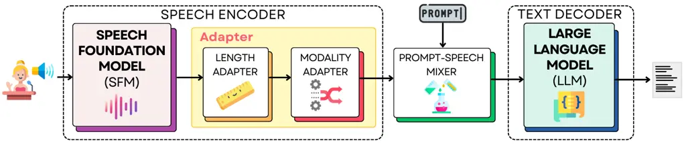

# Speech Translation with Speech Foundation Models and Large Language Models: What is There and What is Missing?

Marco Gaido    Sara Papi    Matteo Negri    Luisa Bentivogli
Affiliation: Fondazione Bruno Kessler, Trento, Italy
Email: [{mgaido,spapi,negri,bentivo}@fbk.eu](mailto:)

###### Abstract

The field of natural language processing (NLP) has recently witnessed a
transformative shift with the emergence of foundation models,
particularly Large Language Models (LLMs) that have revolutionized
text-based NLP. This paradigm has extended to other modalities,
including speech, where researchers are actively exploring the
combination of Speech Foundation Models (SFMs) and LLMs into single,
unified models capable of addressing multimodal tasks. Among such tasks,
this paper focuses on speech-to-text translation (ST). By examining the
published papers on the topic, we propose a unified view of the
architectural solutions and training strategies presented so far,
highlighting similarities and differences among them. Based on this
examination, we not only organize the lessons learned but also show how
diverse settings and evaluation approaches hinder the identification of
the best-performing solution for each architectural building block and
training choice. Lastly, we outline recommendations for future works on
the topic aimed at better understanding the strengths and weaknesses of
the SFM+LLM solutions for ST.

## 1 Introduction

The natural language processing (NLP) landscape has recently undergone a
paradigm shift with the emergence of foundation models (Bommasani
et al., 2021). Among them, Large Language Models (LLMs) have
revolutionized text-based NLP, showcasing remarkable capabilities across
a wide range of NLP tasks (Radford et al., 2019). This unprecedented
success has spurred research into creating foundation models for other
modalities, including speech processing (Latif et al., 2023).

Figure 1: Architectural building blocks of ST models based on the
combination of an SFM and an LLM.

Building on the translation abilities of LLMs (Hendy et al., 2023; Jiao
et al., 2023; Raunak et al., 2023; Zhu et al., 2023a; Xu et al., 2023)
and the remarkable speech recognition and understanding capabilities
achieved by Speech Foundation Models (SFMs) (Radford et al., 2023;
Pratap et al., 2023; Communication et al., 2023), researchers are now
actively exploring their combination. The resulting large multimodal
models leverage, on the one hand, the SFM ability to encode speech
content into rich and high-level representations and, on the other, the
extensive linguistic knowledge of the LLM to generate fluent outputs and
address a wide range of tasks (Chen et al., 2023b; Yu et al., 2023; Wang
et al., 2023b; Rubenstein et al., 2023; Zhang et al., 2023a). Focusing
on the speech-to-text translation (ST) task – the scope of this paper –
the rapid pace of the advancements has led to multiple parallel
endeavors, resulting in a variety of solutions. While all these efforts
have the merit of demonstrating the viability and effectiveness of this
line of work, their contemporaneity, along with methodological
inconsistencies, hinders a fair comparison. For this reason, we provide
a systematic analysis of the proposed SFM+LLM solutions for ST with the
multiple goals of identifying their similarities and differences,
organizing the lessons learned, and suggesting future research
directions, along with best practices for insightful evaluations. At its
core, this paper addresses two key questions:

- What is There? We survey the publicly available works that propose an
  SFM+LLM solution for ST, resulting in 9 papers (henceforth referred to
  as ,…, ), and analyze them ($`\lx@sectionsign`$2) focusing on two
  orthogonal aspects:
  - Architectural Building Blocks ($`\lx@sectionsign`$2.1): We delve
    into the SFM+LLM architectures, identifying a common abstraction
    made of 5 building blocks and underscoring similarities and
    differences in the SFM and LLM choices, along with the strategies
    adopted for combining them;
  - Training and Evaluation ($`\lx@sectionsign`$2.2): We inspect the
    training data, tasks, and strategies employed in the studies, as
    well as evaluation data and supported language pairs, gathering
    insights about promising solutions, and highlighting the sparsity of
    the current landscape;

- What is Missing? We conclude by underscoring the importance of
  establishing a standard training setting based on open data to ease
  direct comparability across works, and by identifying aspects that
  need further investigation to better understand the potential of
  SFM+LLM combination for ST ($`\lx@sectionsign`$3).

[TABLE]

Table 1: Architectural components of SFM+LLM comprising speech
foundation model (SFM), length adapter (LA), modality adapter (MA),
large language model (LLM), prompt, and prompt-speech mixer (PSMix).

## 2 What is There?

In this section, we explore two key aspects of SFM+LLM research in ST:
first, we delve into the architectural components of SFM+LLM models
($`\lx@sectionsign`$2.1); second, we examine the training and evaluation
settings utilized in these studies ($`\lx@sectionsign`$2.2).

### 2.1 Architectural Building Blocks

The combination of SFMs and LLMs has so far been addressed with
different architectures, which have, though, a common structure.
Specifically, we identify 5 building blocks (see Figure 1): i) the SFM,
ii) the length adapter, iii) the modality adapter, iv) the prompt-speech
mixer that merges the textual prompt with the adapted speech
representation, and v) the LLM. In Table 1, we summarize how the 9
analyzed papers have designed each component.

#### SFM.

The SFM is in charge of extracting rich, semantic representations from
the audio signal, which have then to be projected onto the LLM input
semantic space to successfully connect the audio modality with the LLM.
Looking at Table 1, we immediately notice that there is no consensus on
the best SFM to choose. With the only exception of and , which are from
the same authors/research group, each work relies on a different SFM.
Also, no work has addressed the comparative assessment of different SFMs
under controlled conditions within the same framework. Differences among
SFMs encompass multiple aspects. First, their architectural backbone
predominantly relies on either a Transformer (Vaswani et al., 2017) or
Conformer (Gulati et al., 2020) encoder. Second, the diversity extends
to the training data, which are not public for most SFMs, except for
wav2vec 2.0 and NeMo STT Fast Conformer. Third, distinctions emerge in
the supported languages, as most SFMs are limited to English, while the
Whisper encoder supports 99 languages (Radford et al., 2023). Lastly,
SFMs vary in the tasks they undertake, with some focusing solely on ASR,
while Whisper extends its capabilities to ST and timestamp prediction.
In addition, it is noteworthy that the majority of the SFMs used are not
publicly available: none of the four works that trained a custom speech
model released it, and USM, employed by  , is not openly accessible.
From these observations, it is evident that the works are not directly
comparable, and is often impossible for future research to make fair
comparisons with existing solutions. The absence of a comparative
analysis among SFMs also hinders our understanding of their impact on
downstream performance, as well as the identification of the most
suitable choice to guide future research.

#### Length Adapter (LA).

This module is designed to reduce the number of embeddings representing
an audio sequence over the time axis. This operation serves a dual
purpose. On the one hand, compressing the length of audio sequences –
typically longer than the corresponding textual ones – contributes to
reducing the difference between the two modalities, hence limiting the
modality mismatch for the LLM, which is trained on textual inputs. On
the other, as current LLMs exploit the Transformer architecture whose
self-attention suffers from a quadratic complexity with respect to the
input sequence, this compression prevents the already demanding memory
and computational costs from becoming unaffordable. As already noted for
the SFM, Table 1 highlights that a wide range of methods have been
adopted for the LA. Also in this case, a comparison between different
solutions in the same settings is missing, with one exception. In fact,
evaluates two LA methods based on a CTC module (Graves et al., 2006): i)
the CTC compression, which averages vectors corresponding to the same
CTC predictions, and ii) the CTC blank filtering (Wang et al., 2023e),
which discards all the vectors corresponding to predictions of the
\<blank\> token.¹¹ 1 \<blank\> is a special token used by the CTC loss
to denote the absence of speech content in the signal (e.g., silence).
Their results indicate that the former leads to better ST quality. The
only other existing comparison of LAs has been conducted in the scope of
the related ASR task, where Yu et al. (2023) introduce a window-level
Q-Former (Li et al., 2023) encoder, named Seg-QF, demonstrating its
superiority over a plain Q-Former, a 1D convolutional layer, and the
stacking of consecutive vectors followed by a feed-forward network (as
done in ). Seg-QF is very similar to the Window-level Q-Former used in :
it divides the speech sequence into chunks of a predetermined size (a
hyperparameter $`n_{s}`$) that are independently processed by the
Q-Former, which controls the length of the output sequence with the
number of learned query vectors used (another hyperparameter $`n_{q}`$).
As a result, this approach reduces the input length by a factor of
$`n_{s}/n_{q}`$. It is important to notice that this finding was
obtained by keeping both the SFM and the LLM frozen and without
introducing any other module (e.g., without any modality adapter).
Hence, its validity should be confirmed in different conditions where
the LA does not have to learn the modality mapping as well. To sum up,
although the literature offers insights into the most promising
approaches for LAs, a comparative analysis covering all the proposed
methods is missing. Moreover, as the LA controls the length of the LLM
input and this is a critical factor for the computational costs of the
resulting SFM+LLM models, their analysis should not be limited to the
downstream (ST) performance but it should also consider the model
efficiency, which has been disregarded so far.

#### Modality Adapter (MA).

The MA is a small trained network (compared to SFMs and LLMs) that maps
the LA output into an embedding space compatible with the LLM. Compared
to LA, its design has seen fewer variations: in some instances, the MA
is a simple FFN ( and ) or is composed of a variable number of
Transformer layers ( , , and ). In other cases, it is fused with the LA
( and ) or even absent ( and ). The necessity and design of the MA
depend on the training strategy adopted: if the LLM is finetuned, the MA
can indeed be avoided (see and ) as the LLM can learn to use a new
embedding space (the one produced by the SFM and LA). In contrast, if
the LLM and SFM are not adapted, the MA is necessary to enable their
communication (as in ). Similarly, the complexity and size of the MA can
vary depending on the training strategy: if a simple MA is adopted, the
introduction of trainable adapters in the LLM or its finetuning may be
required ( and ). However, the role and necessity of the MA have not
been systematically investigated in existing works, which introduced it
without conducting ablation studies or analyses on its size. This calls
for a dedicated contrastive evaluation accounting for crucial factors
like the training strategy and the quantity of finetuning paired data
used.

#### Prompt-Speech Mixer (PSMix).

The goal of the PSMix is to merge the speech representation with the
textual prompt that is to be fed to the LLM. Regarding the type of
textual prompt, the analyzed works show little variability, with most of
them relying on a fixed template to fill with the source and target
language (e.g. “Translate the audio from \<SOURCE LANGUAGE\> to \<TARGET
LANGUAGE\>”). In , the authors experimented with a list of templates to
enhance system robustness, but they did not investigate its impact on
performance. In , the authors demonstrated that a wider range of prompts
enables the system to support unseen ones at inference time; however, in
their setting, this corresponds to a broader set of tasks, making it
challenging to isolate the contribution of different prompts and tasks
to this ability. Regarding the PSMix strategies, most works rely on
three concatenation solutions: prepending the speech representation to
the prompt embeddings ( , , , and ), appending it to the prompt
embeddings ( and ), or interleaving the speech representation with a
prompt prefix and suffix ( ). Only one work ( ) completely omits the
prompt and the PSMix module by directly feeding the LLM with the speech
representations. To sum up, it is unclear whether using a fixed template
for the prompt is the best choice, despite its prominent adoption, and
which of the PSMix options (if any) leads to the best results. As these
aspects have not yet been thoroughly studied, such interesting questions
remain to be addressed in future works.

#### LLM.

The last component is the LLM, which takes the mixed prompt and speech
representations as input to generate the final (textual) translation. In
, Wang et al. (2023a) claim that “the pretrained LLM plays a crucial
role in both training efficiency and model quality”, and that a stronger
model on a given task leads to better performance. However, with the
only exception of works by the same authors ( and ) that leverage LLaMa2
7B, all the SFM+LLM combinations exploit different LLMs without
motivating the choice (e.g. through comparisons across models): uses a
larger LLaMa2 (i.e., the 13B version), and use a finetuned version
(Vicuna 13B and LLaMa2 Chat 7B, respectively) while , , , and use
completely different models. The dominance of the LLaMa family is
probably motivated by its openness and support for multiple languages.
On the other hand, LLMs specifically built for the translation task are
emerging (Xu et al., 2023) and represent a natural option to be
considered in future works. In light of the high computing costs of
these large models and the significant performance variations they can
exhibit, establishing the best option for the ST task through systematic
comparisons represents a priority for future research.

[TABLE]

Table 2: Experimental settings adopted for finetuning the SFMs+LLMs.
"fn" stands for finetuning, and, for supported language pairs (Supported
Lang. Pairs), we intend language pairs on which models have been
evaluated.

### 2.2 Training and Evaluation

In this section, we describe the experimental settings of the analyzed
papers by focusing on the datasets used for training and evaluation, the
supported tasks and language pairs, and the techniques used for SFM and
LLM finetuning. A summary is provided in Table 2. The task acronyms are
defined in Appendix A, the training and evaluation datasets are reported
in Appendix B, while the language codes follow the ISO 639 notation.²² 2
[https://www.iso.org/standard/74575.html](https://www.iso.org/standard/74575.html)

#### Training Data.

The training datasets used in the 9 analyzed papers are different both
in terms of type and quantity. Approximately half of the works (5 out of 9) leverage publicly available data only, both within and outside the ST
domain. Despite this, none of them utilize similar data settings for
finetuning their proposed SFM+LLM architecture: while LST , COSMIC , and
ConformerLLaMa rely on 1 or 2 datasets, SALM uses all the 11 speech
corpora available for the IWSLT 2023 Offline Speech Translation Shared
Task,³³ 3
[https://iwslt.org/2023/offline](https://iwslt.org/2023/offline) and
SALMONN employs 12 different datasets during training. For SFM+LLM
models trained on non-publicly available data, we observe that SLM and
LLM-ST adopt a combination of in-house and open data, while Speech-LLaMa
and Qwen-Audio exclusively use proprietary data. In addition to the lack
of uniform training settings, none of the existing works has analyzed
scaling laws and the effect of increasing the data size on the
performance, rendering a fair comparison among the diverse approaches
impractical.

#### Training Tasks.

Regarding training tasks, almost half of the SFM+LLM models (5 out of 9)
extend their scope beyond pure ASR and ST applications. Among them, SLM
integrates a single additional task – instruction tuning – while LLM-ST
is trained with 4 translation-related tasks (e.g., translation
explanation) and 2 speech-related tasks (e.g., timestamp estimation). In
contrast, SALMONN supports a diverse array of up to 10 additional tasks,
spanning various domains such as SQA and emotion recognition. Qwen-Audio
takes this a step further by incorporating 26 more tasks, encompassing a
comprehensive collection of speech, audio, and music-related tasks. In
contrast, COSMIC is exclusively trained on ASR and SQA but is also
tested on ST. Similarly, ConformerLLaMA is trained solely on the ASR
task but it demonstrates emergent capabilities in ST, although its
translation quality is not systematically assessed.⁴⁴ 4 The ST ability
of the model is only anecdotally reported. Interestingly, only three
models – LST , SALM , and Speech-LLaMa – are trained on the same tasks
(ASR and ST). The effect of adding more tasks on the resulting model
capabilities and ST performance is (partly) studied only in SALMONN ,
where tasks are progressively introduced. Specifically, its training
strategy involves three stages: i) the first stage (pre-training)
includes ASR and AAC, ii) the second stage (instruction tuning) includes
12 tasks, and iii) the third stage (activation tuning) finetunes the
model on tasks with longer and more diverse responses as AQA and ABST.
The last step is shown to increase the generalization and emergent
abilities while impacting translation quality in a limited yet unclear
way, as it improves in one direction (en-ja) but degrades in two other
directions (en-de and en-zh). All in all, the lack of uniformity in the
training task selection hinders the comparability of the solutions, and
the benefits of knowledge transfer across tasks (Hampton et al., 2017;
Ke et al., 2021; Kubo et al., 2022) have yet to be studied in-depth.

#### SFM and LLM finetuning.

As SFMs and LLMs are huge in terms of parameters, their
training/finetuning is computationally expensive. This raises the
question about whether they can be used without expensive adaptation or
not. Regarding the SFM, more than half of the examined papers (5 out of 9) finetune it, while this component is kept frozen in the others. The
LLM, instead, is adapted by 6 of the 9 analyzed papers, but only 2 ( and
) finetune the whole model. The others rely on the Low-Rank Adaptation
(Hu et al., 2022), or LoRA, a widely employed technique for adapting
LLMs to new datasets or tasks (Hu et al., 2023; Kwon et al., 2024). LoRA
consists in introducing trainable rank decomposition matrices into each
layer of the architecture while keeping the original weights frozen, so
as to significantly reduce the trainable parameters (by a factor of
10,000). Notably, only one study ( ) presents results with both the SFM
and LLM frozen, and also shows that LLM finetuning yields substantial
performance gains. However, since finetuning is conducted on data from
the same domain as the test set, the observed benefits may be partially
attributed to domain adaptation, making it challenging to quantify the
improvement solely attributable to finetuning. Similarly, Wu et al.
(2023) ( ) show that LoRA leads to improvements of $`\sim`$1.5 BLEU,
averaged over 13 CoVoST2 language pairs. We can conclude that, while LLM
adaptation brings significant improvements, it is unclear whether the
need for finetuning depends on the type of LLM used (e.g., would it be
needed when using an LLM built for the translation task?) or on the
design of other modules (e.g., the MA) or on other training choices
(e.g., adapting the SFM or not). Moreover, similar studies should be
conducted for the even less explored SFM adaptation.

#### Evaluation Data.

The selection of consistent evaluation benchmarks is crucial for
facilitating meaningful comparisons among different SFM+LLM models.
However, our survey reveals disparate choices regarding the test sets
employed. The main dichotomy regards the evaluation within
English-to-many or many-to-English settings, as four papers focus on the
former, two on the latter, and two on both (although investigates only
zh), while one ( ) does not report evaluation results.⁴ CoVoST2 emerges
as the most widespread benchmark (used in 5 papers), thanks to its broad
coverage of translation directions (15 in the English-to-many case, and
21 in the many-to-English one). For the English-to-many scenario, MuST-C
is also frequently used (in 3 cases), while COSMIC is the only one
tested on TEDLIUM and FLEURS, and LLM-ST complements CoVoST2 and MuST-C
with GigaST and private in-house test sets. The tendency not to report
scores computed on a common set of benchmarks and language pairs (as
discussed below), contributes to making the comparison for future works
nearly impossible without an expensive re-implementation of existing
methods, slowing down the progress in the area.

#### Supported Translation Languages.

Concerning the languages supported for translation, all the examined
papers analyze different pairs but share the characteristic of being
English-centric. They investigate either many-to-English directions ( ,
, and ) or English-to-many directions ( , , , , and ). In the context of
many-to-English pairs, Qwen-Audio encompasses 5 source languages,
Speech-LLaMa covers more than half of the CoVoST2 languages (13 out of
21), while SLM includes all 21 CoVoST2 pairs. Conversely, all papers
focusing on English-to-many directions cover 2 to 4 target languages,
constituting a consistently smaller set compared to the many-to-English
case. Lastly, LLM-ST exclusively addresses a single translation pair
(en$`\leftrightarrow`$zh). Interestingly, the majority of the works
mainly report results for either de$`\rightarrow`$en or
en$`\rightarrow`$de, which represents one of the most extensively
analyzed language pairs in ST (Anastasopoulos et al., 2021;
Anastasopoulos et al., 2022; Agarwal et al., 2023), with being the only
work addressing neither of them. en$`\leftrightarrow`$zh emerges as the
second most reported language setting (each direction being used by 4
papers). Despite these commonalities, it is evident that the choice of
supported languages varies significantly between the works. Also, the
impact on performance of supporting multiple languages – which can
interfere or enable transfer learning between linguistically similar
languages (Ruder et al., 2019; Durrani et al., 2021) – remains
uncertain.

## 3 What is Missing?

Alongside the need for focused and thorough analyses devoted to
identifying the best-performing option for each architectural building
block highlighted in §2.1 and the effects of the training choices
discussed in §2.2, in the following we identify blind spots that need to
be addressed for a more grounded and insightful progress in research on
SFM+LLM solutions for ST.

#### Open Standard Training Settings.

As highlighted throughout the previous section, the lack of common
experimental settings prevents the fair and direct comparison of
different works. The adoption of public and standard training settings
holds paramount importance in advancing research and fostering progress
within the scientific community (Koch et al., 2021). On the one hand, it
enables the comparison among various works, thus providing actionable
insights on the most promising architectural choices. On the other, it
fosters inclusivity and accessibility, allowing researchers without
access to large proprietary corpora to contribute to the field (Scandura
and Iammarino, 2020; Dusdal and Powell, 2021), and thus supporting AI
democratization in the development process (Seger et al., 2023).
Therefore, we advocate for future research to adhere to established
data-setting standards, paving the way for cumulative progress and
shared understanding in the field. However, as experimenting with
different data sizes is also an interesting topic and findings may vary
depending on the datasets and the tasks used in the training stage (see
§2.2), it is debatable which would be the most appropriate training set.
In the English-to-many scenario, researchers commonly adhere to the
IWSLT offline constrained data condition,⁵⁵ 5
[https://iwslt.org/2023/offline](https://iwslt.org/2023/offline)
comprising $`\sim`$4.5K hours of English audio, while, for smaller-scale
experiments, MuST-C ($`\sim`$500 hours) is a widespread option. For
many-to-English settings, CoVoST2, mTEDX (Salesky et al., 2021), and
Europarl-ST (Iranzo-Sánchez et al., 2020) are open datasets with ST
references and can be complemented with larger ASR resources such as
CommonVoice (Ardila et al., 2020) and VoxPopuli. Notice that, by
advocating for standardized and public training data, we do not imply
that researchers should not investigate the effects of training in
different data conditions. Rather, we suggest that, for works primarily
focused on defining new architectural solutions, reporting results for
(at least) a standard setting would ease comparisons with other
alternatives and reduce the overall computational costs.

#### Standard and Reliable Evaluation.

The comparison between different methods is currently hindered not only
by different training conditions but also by the fact that practitioners
do not systematically present results on a common open benchmark.
Furthermore, all works rely on the BLEU metric (Papineni et al., 2002),
except for , which additionally reports COMET (Rei et al., 2022).
Although we acknowledge that BLEU is still widespread (Marie et al., 2021) despite the wide consensus on its limited dependability and
correlation with human judgments (Freitag et al., 2022), we argue that
this specific scenario exacerbates the need for adopting alternative
metrics to assess translation quality. The main reason behind this
argument is the well-known tendency of n-gram-based metrics to penalize
translations generated by LLMs that are, in general, less literal (Zhao
et al., 2023a; Liu et al., 2023). As a suggestion for future works, we
recommend reporting at least one semantic metric (e.g., COMET), and,
preferably, multiple metrics. We also believe that reporting scores on
open and multilingual benchmarks, such as CoVoST2, would improve
comparability across studies without the need for re-running costly
experiments, thereby promoting faster, cost-effective progress within
the research community.

#### Comparison with Standard ST Approaches.

In analogy to studies (Sperber and Paulik, 2020; Bentivogli et al., 2021) and initiatives (Agarwal et al., 2023) dedicated to assessing the
strengths and weaknesses of the two established end-to-end and cascade
ST paradigms, the emergence of the SFM+LLM solution calls for thorough
and fine-grained evaluations to investigate its peculiarities compared
to other, more traditional methods. This need is also motivated by a
recent analysis in the context of text-to-text translation (Pang et al.,
2024), which showed that LLMs are partly affected by long-standing
problems of neural approaches (e.g., the translation of rare entities
and out-of-domain settings), while they do not face others (e.g., the
translation of long sentences) and suffer from new ones (e.g.,
pre-training data imbalance across domains and languages). Among the new
problems, a noteworthy element is the inference efficiency: the
comparison with the standard methods – which typically rely on models of
limited size (100-300M parameters) – should account for this aspect,
which is critical for social, economic, and environmental reasons
(Strubell et al., 2019). Along this line, important research directions
include i) pruning the LLM (and possibly the SFM) in a task-aware manner
(Ma et al., 2023; Zhu et al., 2023b; Dery et al., 2024), ii) dynamic
layer selection during decoding (Xin et al., 2020; Geva et al., 2022;
Xia et al., 2024), and iii) efficient decoding strategies (Stern et al.,
2018; Chen et al., 2023a; Leviathan et al., 2023; Santilli et al.,
2023). In addition, the speech source contains a wide range of
information that can be exploited depending on the paradigm used (e.g.,
prosody is not handled by cascade systems – Zhou et al. 2024). As such,
the ability of SFM+LLM models to leverage this information has to be
investigated. The fine-grained evaluation of these aspects calls for the
comparison of SFM+LLM models with other paradigms on tailored test
suites (King and Falkedal, 1990; Ribeiro et al., 2020), similar to those
used in MT (Kocmi et al., 2023).

#### In-Context Learning Assessment.

One of the most interesting emergent abilities of LLMs (Wei et al., 2022) is their ability to exploit a few demonstrations or examples to
perform a task or enhance their performance on it (Dong et al., 2023).
This ability – referred to as in-context learning (ICL) (Brown et al., 2020) – is one of the main motivations for integrating an SFM and an LLM
into a single ST model. However, the transfer of ICL capabilities of
LLMs to the speech modality, and, even more so, to the SFM+LLM approach
to ST, cannot be taken for granted. In fact, while the ICL ability of
SFM+LLM has been successfully assessed in ASR and SLU (Gao et al., 2022;
Hsu et al., 2023; Chen et al., 2023d) – also within the
retrieval-augmented framework (Wang et al., 2023b), where the relevant
context is retrieved from a knowledge base (Ram et al., 2023) – the only
attempt in ST has not been similarly successful (Chen et al., 2023d).
Moreover, SFMs like Whisper feature similar (yet limited) ICL
capabilities (Peng et al., 2023; Wang et al., 2023c), which might make
the SFM+LLM integration not even necessary. For this reason,
investigating whether and to what extent the integration of SFMs with
LLMs transfers the ICL ability of the latter to the ST task is an
important and interesting avenue for future studies.

## 4 Conclusions

The ST landscape has recently witnessed the emergence of a new paradigm,
which is the combination of SFMs and LLMs into single ST models. To
summarize the lessons learned and establish a unified framework, we
surveyed the existing works on the topic, analyzing their architectural
and training choices. As a result, we identified a common abstraction of
the surveyed SFM+LLM architectures, which consists of five building
blocks: i) the SFM extracting high-level speech representations, ii) the
Length Adapter compressing such sequence of features, iii) the Modality
Adapter mapping them to an embedding space more suitable for the LLM,
iv) the Prompt-Speech Merger combining the speech information with an
adequate prompt for the LLM, and v) the LLM generating the output
translation. Subsequently, we highlighted how the current lack of
standardized training recipes and evaluations hinders the direct
comparison of the proposed approaches, limiting the possibility of
extracting precise and unified indications. Lastly, we pointed out the
need for thorough comparisons with standard ST approaches and in-depth
investigations of the inherent capabilities of SFM+LLM solutions in
order to shed light on its real potential for ST.

## Limitations

Our survey of the existing studies on the integration of an SFM and an
LLM has been limited to the context of the speech-to-text translation
task. We did not target the more generic case of the SFM+LLM integration
as already covered by existing surveys (Latif et al., 2023) and would
have prevented the ability to go more in-depth for the specific works
within the page limit. For the same reason, we have not included works
that target different tasks, such as ASR (Chen et al., 2023b; Hono
et al., 2023; Lakomkin et al., 2023; Radhakrishnan et al., 2023; Yu
et al., 2023), nor models that focus on audio phenomena different from
the human speech⁶⁶ 6 E.g., sound classification/captioning or music
processing. (Deshmukh et al., 2023; Han et al., 2023; Shu et al., 2023;
Zhang et al., 2023c; Zhao et al., 2023b). While they can inspire
effective solutions for the ST case as well, assessing their portability
to the ST field may be the focus of dedicated works.

Moreover, we only discussed the solutions in terms of their ST
performance, without considering their generalization capability and/or
capacity to perform different downstream tasks, as it would have added
complexity to an analysis that targeted a specific task of spoken
language processing. However, we believe that applying foundation models
to a specific task does not necessarily imply that they need to retain
generic capabilities, although this is a desirable property. Similarly,
we have not delved into ethical considerations and implications of such
solutions (Manvi et al., 2024; Schramowski et al., 2022), as we believe
that it should be the topic of tailored and dedicated evaluations, also
in comparison with traditional ST approaches, as mentioned in §3.

Lastly, the study did not include models that can perform the ST task as
part of a cascade approach, where audio is converted into text or other
units (Wang et al., 2023d; Zhang et al., 2023a), nor those that use the
LLM only to understand user requests and forward their actual processing
to SFMs (Huang et al., 2023a). While these represent viable solutions,
we argue that their progress and analysis are directly linked to the ASR
quality of SFMs and the MT quality of LLMs, which are extensively
studied in specific works (Radford et al., 2023; Hendy et al., 2023;
Communication et al., 2023; Xu et al., 2023; Pang et al., 2024).

## Acknowledgements

We acknowledge the support of the PNRR project FAIR - Future AI Research
(PE00000013), under the NRRP MUR program funded by the NextGenerationEU.
This paper has received funding from the European Union’s Horizon
research and innovation programme under grant agreement No 101135798,
project Meetween (My Personal AI Mediator for Virtual MEETtings BetWEEN
People).

## References

- Agarwal et al. (2023) Milind Agarwal, Sweta Agrawal, Antonios
  Anastasopoulos, Luisa Bentivogli, Ondřej Bojar, Claudia Borg, Marine
  Carpuat, Roldano Cattoni, Mauro Cettolo, Mingda Chen, William Chen,
  Khalid Choukri, Alexandra Chronopoulou, Anna Currey, Thierry Declerck,
  Qianqian Dong, Kevin Duh, Yannick Estève, Marcello Federico, Souhir
  Gahbiche, Barry Haddow, Benjamin Hsu, Phu Mon Htut, Hirofumi Inaguma,
  Dávid Javorský, John Judge, Yasumasa Kano, Tom Ko, Rishu Kumar,
  Pengwei Li, Xutai Ma, Prashant Mathur, Evgeny Matusov, Paul McNamee,
  John P. McCrae, Kenton Murray, Maria Nadejde, Satoshi Nakamura, Matteo
  Negri, Ha Nguyen, Jan Niehues, Xing Niu, Atul Kr. Ojha, John
  E. Ortega, Proyag Pal, Juan Pino, Lonneke van der Plas, Peter Polák,
  Elijah Rippeth, Elizabeth Salesky, Jiatong Shi, Matthias Sperber,
  Sebastian Stüker, Katsuhito Sudoh, Yun Tang, Brian Thompson, Kevin
  Tran, Marco Turchi, Alex Waibel, Mingxuan Wang, Shinji Watanabe, and
  Rodolfo Zevallos. 2023. [FINDINGS OF THE IWSLT 2023 EVALUATION
  CAMPAIGN](https://doi.org/10.18653/v1/2023.iwslt-1.1). In _Proceedings
  of the 20th International Conference on Spoken Language Translation
  (IWSLT 2023)_, pages 1–61, Toronto, Canada (in-person and online).
  Association for Computational Linguistics.
- Agostinelli et al. (2023) Andrea Agostinelli, Timo I. Denk, Zalán
  Borsos, Jesse Engel, Mauro Verzetti, Antoine Caillon, Qingqing Huang,
  Aren Jansen, Adam Roberts, Marco Tagliasacchi, Matt Sharifi, Neil
  Zeghidour, and Christian Frank. 2023. [Musiclm: Generating music from
  text](http://arxiv.org/abs/2301.11325).
- Anastasopoulos et al. (2022) Antonios Anastasopoulos, Loïc Barrault,
  Luisa Bentivogli, Marcely Zanon Boito, Ondřej Bojar, Roldano Cattoni,
  Anna Currey, Georgiana Dinu, Kevin Duh, Maha Elbayad, Clara Emmanuel,
  Yannick Estève, Marcello Federico, Christian Federmann, Souhir
  Gahbiche, Hongyu Gong, Roman Grundkiewicz, Barry Haddow, Benjamin Hsu,
  Dávid Javorský, Vĕra Kloudová, Surafel Lakew, Xutai Ma, Prashant
  Mathur, Paul McNamee, Kenton Murray, Maria Nǎdejde, Satoshi Nakamura,
  Matteo Negri, Jan Niehues, Xing Niu, John Ortega, Juan Pino, Elizabeth
  Salesky, Jiatong Shi, Matthias Sperber, Sebastian Stüker, Katsuhito
  Sudoh, Marco Turchi, Yogesh Virkar, Alexander Waibel, Changhan Wang,
  and Shinji Watanabe. 2022. [Findings of the IWSLT 2022 evaluation
  campaign](https://doi.org/10.18653/v1/2022.iwslt-1.10). In
  _Proceedings of the 19th International Conference on Spoken Language
  Translation (IWSLT 2022)_, pages 98–157, Dublin, Ireland (in-person
  and online). Association for Computational Linguistics.
- Anastasopoulos et al. (2021) Antonios Anastasopoulos, Ondřej Bojar,
  Jacob Bremerman, Roldano Cattoni, Maha Elbayad, Marcello Federico,
  Xutai Ma, Satoshi Nakamura, Matteo Negri, Jan Niehues, Juan Pino,
  Elizabeth Salesky, Sebastian Stüker, Katsuhito Sudoh, Marco Turchi,
  Alexander Waibel, Changhan Wang, and Matthew Wiesner. 2021. [FINDINGS
  OF THE IWSLT 2021 EVALUATION
  CAMPAIGN](https://doi.org/10.18653/v1/2021.iwslt-1.1). In _Proceedings
  of the 18th International Conference on Spoken Language Translation
  (IWSLT 2021)_, pages 1–29, Bangkok, Thailand (online). Association for
  Computational Linguistics.
- Ardila et al. (2020) Rosana Ardila, Megan Branson, Kelly Davis,
  Michael Kohler, Josh Meyer, Michael Henretty, Reuben Morais, Lindsay
  Saunders, Francis Tyers, and Gregor Weber. 2020. [Common voice: A
  massively-multilingual speech
  corpus](https://aclanthology.org/2020.lrec-1.520). In _Proceedings of
  the Twelfth Language Resources and Evaluation Conference_, pages
  4218–4222, Marseille, France. European Language Resources Association.
- Baevski et al. (2020) Alexei Baevski, Yuhao Zhou, Abdelrahman Mohamed,
  and Michael Auli. 2020. [wav2vec 2.0: A framework for self-supervised
  learning of speech
  representations](https://proceedings.neurips.cc/paper_files/paper/2020/file/92d1e1eb1cd6f9fba3227870bb6d7f07-Paper.pdf).
  In _Advances in Neural Information Processing Systems_, volume 33,
  pages 12449–12460.
- Bai et al. (2023) Jinze Bai, Shuai Bai, Yunfei Chu, Zeyu Cui, Kai
  Dang, Xiaodong Deng, Yang Fan, Wenbin Ge, Yu Han, Fei Huang, Binyuan
  Hui, Luo Ji, Mei Li, Junyang Lin, Runji Lin, Dayiheng Liu, Gao Liu,
  Chengqiang Lu, Keming Lu, Jianxin Ma, Rui Men, Xingzhang Ren,
  Xuancheng Ren, Chuanqi Tan, Sinan Tan, Jianhong Tu, Peng Wang, Shijie
  Wang, Wei Wang, Shengguang Wu, Benfeng Xu, Jin Xu, An Yang, Hao Yang,
  Jian Yang, Shusheng Yang, Yang Yao, Bowen Yu, Hongyi Yuan, Zheng Yuan,
  Jianwei Zhang, Xingxuan Zhang, Yichang Zhang, Zhenru Zhang, Chang
  Zhou, Jingren Zhou, Xiaohuan Zhou, and Tianhang Zhu. 2023. [Qwen
  technical report](http://arxiv.org/abs/2309.16609).
- Bastianelli et al. (2020) Emanuele Bastianelli, Andrea Vanzo, Pawel
  Swietojanski, and Verena Rieser. 2020. [SLURP: A spoken language
  understanding resource
  package](https://doi.org/10.18653/v1/2020.emnlp-main.588). In
  _Proceedings of the 2020 Conference on Empirical Methods in Natural
  Language Processing (EMNLP)_, pages 7252–7262, Online. Association for
  Computational Linguistics.
- Bentivogli et al. (2021) Luisa Bentivogli, Mauro Cettolo, Marco Gaido,
  Alina Karakanta, Alberto Martinelli, Matteo Negri, and Marco
  Turchi. 2021. [Cascade versus direct speech translation: Do the
  differences still make a
  difference?](https://doi.org/10.18653/v1/2021.acl-long.224) In
  _Proceedings of the 59th Annual Meeting of the Association for
  Computational Linguistics and the 11th International Joint Conference
  on Natural Language Processing (Volume 1: Long Papers)_, pages
  2873–2887, Online. Association for Computational Linguistics.
- Bertin-Mahieux et al. (2011) Thierry Bertin-Mahieux, Daniel P.W.
  Ellis, Brian Whitman, and Paul Lamere. 2011. The million song dataset.
  In _Proceedings of the 12th International Conference on Music
  Information Retrieval (ISMIR 2011)_.
- Bommasani et al. (2021) Rishi Bommasani, Drew A. Hudson, Ehsan Adeli,
  Russ Altman, Simran Arora, Sydney von Arx, Michael S. Bernstein,
  Jeannette Bohg, Antoine Bosselut, Emma Brunskill, Erik Brynjolfsson,
  S. Buch, Dallas Card, Rodrigo Castellon, Niladri S. Chatterji,
  Annie S. Chen, Kathleen A. Creel, Jared Davis, Dora Demszky, Chris
  Donahue, Moussa Doumbouya, Esin Durmus, Stefano Ermon, John
  Etchemendy, Kawin Ethayarajh, Li Fei-Fei, Chelsea Finn, Trevor Gale,
  Lauren E. Gillespie, Karan Goel, Noah D. Goodman, Shelby Grossman,
  Neel Guha, Tatsunori Hashimoto, Peter Henderson, John Hewitt,
  Daniel E. Ho, Jenny Hong, Kyle Hsu, Jing Huang, Thomas F. Icard,
  Saahil Jain, Dan Jurafsky, Pratyusha Kalluri, Siddharth Karamcheti,
  Geoff Keeling, Fereshte Khani, O. Khattab, Pang Wei Koh, Mark S.
  Krass, Ranjay Krishna, Rohith Kuditipudi, Ananya Kumar, Faisal Ladhak,
  Mina Lee, Tony Lee, Jure Leskovec, Isabelle Levent, Xiang Lisa Li,
  Xuechen Li, Tengyu Ma, Ali Malik, Christopher D. Manning, Suvir P.
  Mirchandani, Eric Mitchell, Zanele Munyikwa, Suraj Nair, Avanika
  Narayan, Deepak Narayanan, Benjamin Newman, Allen Nie, Juan Carlos
  Niebles, Hamed Nilforoshan, J. F. Nyarko, Giray Ogut, Laurel Orr,
  Isabel Papadimitriou, Joon Sung Park, Chris Piech, Eva Portelance,
  Christopher Potts, Aditi Raghunathan, Robert Reich, Hongyu Ren, Frieda
  Rong, Yusuf H. Roohani, Camilo Ruiz, Jack Ryan, Christopher Ré, Dorsa
  Sadigh, Shiori Sagawa, Keshav Santhanam, Andy Shih, Krishna Parasuram
  Srinivasan, Alex Tamkin, Rohan Taori, Armin W. Thomas, Florian Tramèr,
  Rose E. Wang, William Wang, Bohan Wu, Jiajun Wu, Yuhuai Wu,
  Sang Michael Xie, Michihiro Yasunaga, Jiaxuan You, Matei A. Zaharia,
  Michael Zhang, Tianyi Zhang, Xikun Zhang, Yuhui Zhang, Lucia Zheng,
  Kaitlyn Zhou, and Percy Liang. 2021. [On the Opportunities and Risks
  of Foundation Models](https://crfm.stanford.edu/assets/report.pdf).
  _ArXiv_.
- Brown et al. (2020) Tom Brown, Benjamin Mann, Nick Ryder, Melanie
  Subbiah, Jared D Kaplan, Prafulla Dhariwal, Arvind Neelakantan, Pranav
  Shyam, Girish Sastry, Amanda Askell, Sandhini Agarwal, Ariel
  Herbert-Voss, Gretchen Krueger, Tom Henighan, Rewon Child, Aditya
  Ramesh, Daniel Ziegler, Jeffrey Wu, Clemens Winter, Chris Hesse, Mark
  Chen, Eric Sigler, Mateusz Litwin, Scott Gray, Benjamin Chess, Jack
  Clark, Christopher Berner, Sam McCandlish, Alec Radford, Ilya
  Sutskever, and Dario Amodei. 2020. [Language models are few-shot
  learners](https://proceedings.neurips.cc/paper_files/paper/2020/file/1457c0d6bfcb4967418bfb8ac142f64a-Paper.pdf).
  In _Advances in Neural Information Processing Systems_, volume 33,
  pages 1877–1901. Curran Associates, Inc.
- Bu et al. (2017) Hui Bu, Jiayu Du, Xingyu Na, Bengu Wu, and Hao
  Zheng. 2017. Aishell-1: An open-source mandarin speech corpus and a
  speech recognition baseline. In _Oriental COCOSDA 2017_, page
  Submitted.
- Busso et al. (2008) Carlos Busso, Murtaza Bulut, Chi-Chun Lee,
  Ebrahim (Abe) Kazemzadeh, Emily Mower Provost, Samuel Kim,
  Jeannette N. Chang, Sungbok Lee, and Shrikanth S. Narayanan. 2008.
  Iemocap: interactive emotional dyadic motion capture database.
  _Language Resources and Evaluation_, 42:335–359.
- Cattoni et al. (2021) Roldano Cattoni, Mattia Antonino Di Gangi, Luisa
  Bentivogli, Matteo Negri, and Marco Turchi. 2021. [Must-c: A
  multilingual corpus for end-to-end speech
  translation](https://doi.org/https://doi.org/10.1016/j.csl.2020.101155).
  _Computer Speech & Language_, 66:101155.
- Chan et al. (2021) William Chan, Daniel Park, Chris Lee, Yu Zhang,
  Quoc Le, and Mohammad Norouzi. 2021. [Speechstew: Simply mix all
  available speech recognition data to train one large neural
  network](http://arxiv.org/abs/2104.02133).
- Chen et al. (2023a) Charlie Chen, Sebastian Borgeaud, Geoffrey Irving,
  Jean-Baptiste Lespiau, Laurent Sifre, and John Jumper. 2023a.
  [Accelerating large language model decoding with speculative
  sampling](http://arxiv.org/abs/2302.01318).
- Chen et al. (2023b) Feilong Chen, Minglun Han, Haozhi Zhao, Qingyang
  Zhang, Jing Shi, Shuang Xu, and Bo Xu. 2023b. X-llm: Bootstrapping
  advanced large language models by treating multi-modalities as foreign
  languages. _arXiv preprint arXiv:2305.04160_.
- Chen et al. (2021) Guoguo Chen, Shuzhou Chai, Guan-Bo Wang, Jiayu Du,
  Wei-Qiang Zhang, Chao Weng, Dan Su, Daniel Povey, Jan Trmal, Junbo
  Zhang, Mingjie Jin, Sanjeev Khudanpur, Shinji Watanabe, Shuaijiang
  Zhao, Wei Zou, Xiangang Li, Xuchen Yao, Yongqing Wang, Zhao You, and
  Zhiyong Yan. 2021. [GigaSpeech: An Evolving, Multi-Domain ASR Corpus
  with 10,000 Hours of Transcribed
  Audio](https://doi.org/10.21437/Interspeech.2021-1965). In _Proc.
  Interspeech 2021_, pages 3670–3674.
- Chen et al. (2023c) Sanyuan Chen, Yu Wu, Chengyi Wang, Shujie Liu,
  Daniel Tompkins, Zhuo Chen, Wanxiang Che, Xiangzhan Yu, and Furu Wei.
  2023c. [BEATs: Audio pre-training with acoustic
  tokenizers](https://proceedings.mlr.press/v202/chen23ag.html). In
  _Proceedings of the 40th International Conference on Machine
  Learning_, volume 202 of _Proceedings of Machine Learning Research_,
  pages 5178–5193. PMLR.
- Chen et al. (2023d) Zhehuai Chen, He Huang, Andrei Andrusenko, Oleksii
  Hrinchuk, Krishna C Puvvada, Jason Li, Subhankar Ghosh, Jagadeesh
  Balam, and Boris Ginsburg. 2023d. Salm: Speech-augmented language
  model with in-context learning for speech recognition and translation.
  _arXiv preprint arXiv:2310.09424_.
- Chiang et al. (2023) Wei-Lin Chiang, Zhuohan Li, Zi Lin, Ying Sheng,
  Zhanghao Wu, Hao Zhang, Lianmin Zheng, Siyuan Zhuang, Yonghao Zhuang,
  Joseph E. Gonzalez, Ion Stoica, and Eric P. Xing. 2023. [Vicuna: An
  open-source chatbot impressing gpt-4 with 90%\* chatgpt
  quality](https://lmsys.org/blog/2023-03-30-vicuna/).
- Chu et al. (2023) Yunfei Chu, Jin Xu, Xiaohuan Zhou, Qian Yang,
  Shiliang Zhang, Zhijie Yan, Chang Zhou, and Jingren Zhou. 2023.
  Qwen-audio: Advancing universal audio understanding via unified
  large-scale audio-language models. _arXiv preprint arXiv:2311.07919_.
- Communication et al. (2023) Seamless Communication, Loïc Barrault,
  Yu-An Chung, Mariano Cora Meglioli, David Dale, Ning Dong,
  Paul-Ambroise Duquenne, Hady Elsahar, Hongyu Gong, Kevin Heffernan,
  John Hoffman, Christopher Klaiber, Pengwei Li, Daniel Licht, Jean
  Maillard, Alice Rakotoarison, Kaushik Ram Sadagopan, Guillaume Wenzek,
  Ethan Ye, Bapi Akula, Peng-Jen Chen, Naji El Hachem, Brian Ellis,
  Gabriel Mejia Gonzalez, Justin Haaheim, Prangthip Hansanti, Russ
  Howes, Bernie Huang, Min-Jae Hwang, Hirofumi Inaguma, Somya Jain,
  Elahe Kalbassi, Amanda Kallet, Ilia Kulikov, Janice Lam, Daniel Li,
  Xutai Ma, Ruslan Mavlyutov, Benjamin Peloquin, Mohamed Ramadan,
  Abinesh Ramakrishnan, Anna Sun, Kevin Tran, Tuan Tran, Igor Tufanov,
  Vish Vogeti, Carleigh Wood, Yilin Yang, Bokai Yu, Pierre Andrews, Can
  Balioglu, Marta R. Costa-jussà, Onur Celebi, Maha Elbayad, Cynthia
  Gao, Francisco Guzmán, Justine Kao, Ann Lee, Alexandre Mourachko, Juan
  Pino, Sravya Popuri, Christophe Ropers, Safiyyah Saleem, Holger
  Schwenk, Paden Tomasello, Changhan Wang, Jeff Wang, and Skyler
  Wang. 2023. [Seamlessm4t: Massively multilingual & multimodal machine
  translation](http://arxiv.org/abs/2308.11596).
- Conneau et al. (2023) Alexis Conneau, Min Ma, Simran Khanuja,
  Yu Zhang, Vera Axelrod, Siddharth Dalmia, Jason Riesa, Clara Rivera,
  and Ankur Bapna. 2023. [Fleurs: Few-shot learning evaluation of
  universal representations of
  speech](https://doi.org/10.1109/SLT54892.2023.10023141). In _2022 IEEE
  Spoken Language Technology Workshop (SLT)_, pages 798–805.
- Cosentino et al. (2020) Joris Cosentino, Manuel Pariente, Samuele
  Cornell, Antoine Deleforge, and Emmanuel Vincent. 2020. [Librimix: An
  open-source dataset for generalizable speech
  separation](http://arxiv.org/abs/2005.11262).
- Dery et al. (2024) Lucio Dery, Steven Kolawole, Jean-François Kagy,
  Virginia Smith, Graham Neubig, and Ameet Talwalkar. 2024. [Everybody
  prune now: Structured pruning of llms with only forward
  passes](http://arxiv.org/abs/2402.05406).
- Deshmukh et al. (2023) Soham Deshmukh, Benjamin Elizalde, Rita Singh,
  and Huaming Wang. 2023. [Pengi: An audio language model for audio
  tasks](http://arxiv.org/abs/2305.11834).
- Di Gangi et al. (2019) Mattia A. Di Gangi, Roldano Cattoni, Luisa
  Bentivogli, Matteo Negri, and Marco Turchi. 2019. [MuST-C: a
  Multilingual Speech Translation
  Corpus](https://doi.org/10.18653/v1/N19-1202). In _Proceedings of the
  2019 Conference of the North American Chapter of the Association for
  Computational Linguistics: Human Language Technologies, Volume 1 (Long
  and Short Papers)_, pages 2012–2017, Minneapolis, Minnesota.
  Association for Computational Linguistics.
- Dong et al. (2023) Qingxiu Dong, Lei Li, Damai Dai, Ce Zheng, Zhiyong
  Wu, Baobao Chang, Xu Sun, Jingjing Xu, Lei Li, and Zhifang Sui. 2023.
  [A survey on in-context learning](http://arxiv.org/abs/2301.00234).
- Drossos et al. (2020) Konstantinos Drossos, Samuel Lipping, and Tuomas
  Virtanen. 2020. [Clotho: an audio captioning
  dataset](https://doi.org/10.1109/ICASSP40776.2020.9052990). In _ICASSP
  2020 - 2020 IEEE International Conference on Acoustics, Speech and
  Signal Processing (ICASSP)_, pages 736–740.
- Du et al. (2018) Jiayu Du, Xingyu Na, Xuechen Liu, and Hui Bu. 2018.
  [Aishell-2: Transforming mandarin asr research into industrial
  scale](http://arxiv.org/abs/1808.10583).
- Durrani et al. (2021) Nadir Durrani, Hassan Sajjad, and Fahim
  Dalvi. 2021. [How transfer learning impacts linguistic knowledge in
  deep NLP models?](https://doi.org/10.18653/v1/2021.findings-acl.438)
  In _Findings of the Association for Computational Linguistics:
  ACL-IJCNLP 2021_, pages 4947–4957, Online. Association for
  Computational Linguistics.
- Dusdal and Powell (2021) Jennifer Dusdal and Justin J W Powell. 2021.
  [Benefits, Motivations, and Challenges of International Collaborative
  Research: A Sociology of Science Case
  Study](https://doi.org/10.1093/scipol/scab010). _Science and Public
  Policy_, 48(2):235–245.
- Engel et al. (2017) Jesse Engel, Cinjon Resnick, Adam Roberts, Sander
  Dieleman, Mohammad Norouzi, Douglas Eck, and Karen Simonyan. 2017.
  Neural audio synthesis of musical notes with wavenet autoencoders. In
  _Proceedings of the 34th International Conference on Machine
  Learning - Volume 70_, ICML’17, page 1068–1077. JMLR.org.
- Fathullah et al. (2023) Yassir Fathullah, Chunyang Wu, Egor Lakomkin,
  Junteng Jia, Yuan Shangguan, Jay Mahadeokar, Ozlem Kalinli, Christian
  Fuegen, and Mike Seltzer. 2023. Towards general-purpose speech
  abilities for large language models using unpaired data. _arXiv
  preprint arXiv:2311.06753_.
- Freitag et al. (2022) Markus Freitag, Ricardo Rei, Nitika Mathur,
  Chi-kiu Lo, Craig Stewart, Eleftherios Avramidis, Tom Kocmi, George
  Foster, Alon Lavie, and André F. T. Martins. 2022. [Results of WMT22
  metrics shared task: Stop using BLEU – neural metrics are better and
  more robust](https://aclanthology.org/2022.wmt-1.2). In _Proceedings
  of the Seventh Conference on Machine Translation (WMT)_, pages 46–68,
  Abu Dhabi, United Arab Emirates (Hybrid). Association for
  Computational Linguistics.
- Gaido et al. (2021) Marco Gaido, Mauro Cettolo, Matteo Negri, and
  Marco Turchi. 2021. [CTC-based Compression for Direct Speech
  Translation](https://doi.org/10.18653/v1/2021.eacl-main.57). In
  _Proceedings of the 16th Conference of the European Chapter of the
  Association for Computational Linguistics: Main Volume_, pages
  690–696, Online. Association for Computational Linguistics.
- Gao et al. (2022) Heting Gao, Junrui Ni, Kaizhi Qian, Yang Zhang,
  Shiyu Chang, and Mark Hasegawa-Johnson. 2022. [WavPrompt: Towards
  Few-Shot Spoken Language Understanding with Frozen Language
  Models](https://doi.org/10.21437/Interspeech.2022-11031). In _Proc.
  Interspeech 2022_, pages 2738–2742.
- Gao et al. (2023) Zhifu Gao, Zerui Li, Jiaming Wang, Haoneng Luo, Xian
  Shi, Mengzhe Chen, Yabin Li, Lingyun Zuo, Zhihao Du, and Shiliang
  Zhang. 2023. [FunASR: A Fundamental End-to-End Speech Recognition
  Toolkit](https://doi.org/10.21437/Interspeech.2023-1428). In _Proc.
  INTERSPEECH 2023_, pages 1593–1597.
- Geva et al. (2022) Mor Geva, Avi Caciularu, Kevin Wang, and Yoav
  Goldberg. 2022. [Transformer feed-forward layers build predictions by
  promoting concepts in the vocabulary
  space](https://doi.org/10.18653/v1/2022.emnlp-main.3). In _Proceedings
  of the 2022 Conference on Empirical Methods in Natural Language
  Processing_, pages 30–45, Abu Dhabi, United Arab Emirates. Association
  for Computational Linguistics.
- Gong et al. (2022) Yuan Gong, Jin Yu, and James Glass. 2022.
  [Vocalsound: A dataset for improving human vocal sounds
  recognition](https://doi.org/10.1109/ICASSP43922.2022.9746828). In
  _ICASSP 2022 - 2022 IEEE International Conference on Acoustics, Speech
  and Signal Processing (ICASSP)_, pages 151–155.
- Graves et al. (2006) Alex Graves, Santiago Fernández, Faustino J.
  Gomez, and Jürgen Schmidhuber. 2006. Connectionist Temporal
  Classification: Labelling Unsegmented Sequence Data with Recurrent
  Neural Networks. In _Proceedings of the 23rd international conference
  on Machine learning (ICML)_, pages 369–376, Pittsburgh, Pennsylvania.
- Gulati et al. (2020) Anmol Gulati, James Qin, Chung-Cheng Chiu, Niki
  Parmar, Yu Zhang, Jiahui Yu, Wei Han, Shibo Wang, Zhengdong Zhang,
  Yonghui Wu, and Ruoming Pang. 2020. [Conformer: Convolution-augmented
  Transformer for Speech
  Recognition](https://doi.org/10.21437/Interspeech.2020-3015). In
  _Proc. Interspeech 2020_, pages 5036–5040.
- Hampton et al. (2017) Peter John Hampton, Hui Wang, and Zhiwei
  Lin. 2017. Knowledge transfer in neural language models. In
  _Artificial Intelligence XXXIV_, pages 143–148, Cham. Springer
  International Publishing.
- Han et al. (2023) Jiaming Han, Kaixiong Gong, Yiyuan Zhang, Jiaqi
  Wang, Kaipeng Zhang, Dahua Lin, Yu Qiao, Peng Gao, and Xiangyu
  Yue. 2023. [Onellm: One framework to align all modalities with
  language](http://arxiv.org/abs/2312.03700).
- Hendy et al. (2023) Amr Hendy, Mohamed Abdelrehim, Amr Sharaf, Vikas
  Raunak, Mohamed Gabr, Hitokazu Matsushita, Young Jin Kim, Mohamed
  Afify, and Hany Hassan Awadalla. 2023. [How good are gpt models at
  machine translation? a comprehensive
  evaluation](http://arxiv.org/abs/2302.09210).
- Hernandez et al. (2018) François Hernandez, Vincent Nguyen, Sahar
  Ghannay, Natalia Tomashenko, and Yannick Esteve. 2018. Ted-lium 3:
  Twice as much data and corpus repartition for experiments on speaker
  adaptation. In _Speech and Computer: 20th International Conference,
  SPECOM 2018, Leipzig, Germany, September 18–22, 2018, Proceedings 20_,
  pages 198–208. Springer.
- Hono et al. (2023) Yukiya Hono, Koh Mitsuda, Tianyu Zhao, Kentaro
  Mitsui, Toshiaki Wakatsuki, and Kei Sawada. 2023. [An integration of
  pre-trained speech and language models for end-to-end speech
  recognition](http://arxiv.org/abs/2312.03668).
- Hsu et al. (2023) Ming-Hao Hsu, Kai-Wei Chang, Shang-Wen Li, and Hung
  yi Lee. 2023. [An exploration of in-context learning for speech
  language model](http://arxiv.org/abs/2310.12477).
- Hu et al. (2022) Edward J Hu, yelong shen, Phillip Wallis, Zeyuan
  Allen-Zhu, Yuanzhi Li, Shean Wang, Lu Wang, and Weizhu Chen. 2022.
  [LoRA: Low-rank adaptation of large language
  models](https://openreview.net/forum?id=nZeVKeeFYf9). In
  _International Conference on Learning Representations_.
- Hu et al. (2023) Wenbo Hu, Yifan Xu, Yi Li, Weiyue Li, Zeyuan Chen,
  and Zhuowen Tu. 2023. Bliva: A simple multimodal llm for better
  handling of text-rich visual questions.
- Huang et al. (2023a) Rongjie Huang, Mingze Li, Dongchao Yang, Jiatong
  Shi, Xuankai Chang, Zhenhui Ye, Yuning Wu, Zhiqing Hong, Jiawei Huang,
  Jinglin Liu, Yi Ren, Zhou Zhao, and Shinji Watanabe. 2023a. [Audiogpt:
  Understanding and generating speech, music, sound, and talking
  head](http://arxiv.org/abs/2304.12995).
- Huang et al. (2023b) Zhichao Huang, Rong Ye, Tom Ko, Qianqian Dong,
  Shanbo Cheng, Mingxuan Wang, and Hang Li. 2023b. Speech translation
  with large language models: An industrial practice. _arXiv preprint
  arXiv:2312.13585_.
- Hulth (2003) Anette Hulth. 2003. [Improved automatic keyword
  extraction given more linguistic
  knowledge](https://aclanthology.org/W03-1028). In _Proceedings of the
  2003 Conference on Empirical Methods in Natural Language Processing_,
  pages 216–223.
- Iranzo-Sánchez et al. (2020) Javier Iranzo-Sánchez, Joan Albert
  Silvestre-Cerdà, Javier Jorge, Nahuel Roselló, Adrià Giménez, Albert
  Sanchis, Jorge Civera, and Alfons Juan. 2020. [Europarl-st: A
  multilingual corpus for speech translation of parliamentary
  debates](https://doi.org/10.1109/ICASSP40776.2020.9054626). In _ICASSP
  2020 - 2020 IEEE International Conference on Acoustics, Speech and
  Signal Processing (ICASSP)_, pages 8229–8233.
- Jeong and Park (2022) Il-Young Jeong and Jeongsoo Park. 2022.
  Cochlscene: Acquisition of acoustic scene data using crowdsourcing. In
  _2022 Asia-Pacific Signal and Information Processing Association
  Annual Summit and Conference (APSIPA ASC)_, pages 17–21. IEEE.
- Jiao et al. (2023) Wenxiang Jiao, Wenxuan Wang, Jen tse Huang, Xing
  Wang, Shuming Shi, and Zhaopeng Tu. 2023. [Is chatgpt a good
  translator? yes with gpt-4 as the
  engine](http://arxiv.org/abs/2301.08745).
- Ke et al. (2021) Zixuan Ke, Bing Liu, Nianzu Ma, Hu Xu, and Lei
  Shu. 2021. [Achieving forgetting prevention and knowledge transfer in
  continual learning](https://openreview.net/forum?id=RJ7XFI15Q8f). In
  _Advances in Neural Information Processing Systems_.
- Kim et al. (2019) Chris Dongjoo Kim, Byeongchang Kim, Hyunmin Lee, and
  Gunhee Kim. 2019. [AudioCaps: Generating captions for audios in the
  wild](https://doi.org/10.18653/v1/N19-1011). In _Proceedings of the
  2019 Conference of the North American Chapter of the Association for
  Computational Linguistics: Human Language Technologies, Volume 1 (Long
  and Short Papers)_, pages 119–132, Minneapolis, Minnesota. Association
  for Computational Linguistics.
- King and Falkedal (1990) Margaret King and Kirsten Falkedal. 1990.
  [Using test suites in evaluation of machine translation
  systems](https://aclanthology.org/C90-2037). In _COLING 1990 Volume 2:
  Papers presented to the 13th International Conference on Computational
  Linguistics_.
- Koch et al. (2021) Bernard Koch, Emily Denton, Alex Hanna, and
  Jacob Gates Foster. 2021. [Reduced, reused and recycled: The life of a
  dataset in machine learning
  research](https://openreview.net/forum?id=zNQBIBKJRkd). In
  _Thirty-fifth Conference on Neural Information Processing Systems
  Datasets and Benchmarks Track (Round 2)_.
- Kocmi et al. (2023) Tom Kocmi, Eleftherios Avramidis, Rachel Bawden,
  Ondřej Bojar, Anton Dvorkovich, Christian Federmann, Mark Fishel,
  Markus Freitag, Thamme Gowda, Roman Grundkiewicz, Barry Haddow,
  Philipp Koehn, Benjamin Marie, Christof Monz, Makoto Morishita, Kenton
  Murray, Makoto Nagata, Toshiaki Nakazawa, Martin Popel, Maja Popović,
  and Mariya Shmatova. 2023. [Findings of the 2023 conference on machine
  translation (WMT23): LLMs are here but not quite there
  yet](https://doi.org/10.18653/v1/2023.wmt-1.1). In _Proceedings of the
  Eighth Conference on Machine Translation_, pages 1–42, Singapore.
  Association for Computational Linguistics.
- Kubo et al. (2022) Yotaro Kubo, Shigeki Karita, and Michiel
  Bacchiani. 2022. Knowledge transfer from large-scale pretrained
  language models to end-to-end speech recognizers. In _ICASSP 2022-2022
  IEEE International Conference on Acoustics, Speech and Signal
  Processing (ICASSP)_, pages 8512–8516. IEEE.
- Kwon et al. (2024) Yongchan Kwon, Eric Wu, Kevin Wu, and James
  Zou. 2024. [Datainf: Efficiently estimating data influence in
  loRA-tuned LLMs and diffusion
  models](https://openreview.net/forum?id=9m02ib92Wz). In _The Twelfth
  International Conference on Learning Representations_.
- Lakomkin et al. (2023) Egor Lakomkin, Chunyang Wu, Yassir Fathullah,
  Ozlem Kalinli, Michael L. Seltzer, and Christian Fuegen. 2023.
  [End-to-end speech recognition contextualization with large language
  models](http://arxiv.org/abs/2309.10917).
- Latif et al. (2023) Siddique Latif, Moazzam Shoukat, Fahad Shamshad,
  Muhammad Usama, Heriberto Cuayáhuitl, and Björn W Schuller. 2023.
  Sparks of Large Audio Models: A Survey and Outlook. _arXiv preprint
  arXiv:2308.12792_.
- Leviathan et al. (2023) Yaniv Leviathan, Matan Kalman, and Yossi
  Matias. 2023. Fast inference from transformers via speculative
  decoding. In _Proceedings of the 40th International Conference on
  Machine Learning_, ICML’23. JMLR.org.
- Li et al. (2023) Junnan Li, Dongxu Li, Silvio Savarese, and Steven
  Hoi. 2023. Blip-2: bootstrapping language-image pre-training with
  frozen image encoders and large language models. In _Proceedings of
  the 40th International Conference on Machine Learning_, ICML’23.
  JMLR.org.
- Lipping et al. (2022) Samuel Lipping, Parthasaarathy Sudarsanam,
  Konstantinos Drossos, and Tuomas Virtanen. 2022. Clotho-aqa: A
  crowdsourced dataset for audio question answering. In _2022 30th
  European Signal Processing Conference (EUSIPCO)_, pages 1140–1144.
  IEEE.
- Liu et al. (2023) Yang Liu, Dan Iter, Yichong Xu, Shuohang Wang,
  Ruochen Xu, and Chenguang Zhu. 2023. [G-eval: NLG evaluation using
  gpt-4 with better human
  alignment](https://doi.org/10.18653/v1/2023.emnlp-main.153). In
  _Proceedings of the 2023 Conference on Empirical Methods in Natural
  Language Processing_, pages 2511–2522, Singapore. Association for
  Computational Linguistics.
- Ma et al. (2023) Xinyin Ma, Gongfan Fang, and Xinchao Wang. 2023.
  Llm-pruner: On the structural pruning of large language models. In
  _Advances in Neural Information Processing Systems_.
- Manvi et al. (2024) Rohin Manvi, Samar Khanna, Marshall Burke, David
  Lobell, and Stefano Ermon. 2024. [Large language models are
  geographically biased](http://arxiv.org/abs/2402.02680).
- Marie et al. (2021) Benjamin Marie, Atsushi Fujita, and Raphael
  Rubino. 2021. [Scientific credibility of machine translation research:
  A meta-evaluation of 769
  papers](https://doi.org/10.18653/v1/2021.acl-long.566). In
  _Proceedings of the 59th Annual Meeting of the Association for
  Computational Linguistics and the 11th International Joint Conference
  on Natural Language Processing (Volume 1: Long Papers)_, pages
  7297–7306, Online. Association for Computational Linguistics.
- Mesaros et al. (2016) Annamaria Mesaros, Toni Heittola, and Tuomas
  Virtanen. 2016. TUT database for acoustic scene classification and
  sound event detection. In _24th European Signal Processing Conference
  2016 (EUSIPCO 2016)_, Budapest, Hungary.
- Muennighoff et al. (2023) Niklas Muennighoff, Thomas Wang, Lintang
  Sutawika, Adam Roberts, Stella Biderman, Teven Le Scao, M Saiful Bari,
  Sheng Shen, Zheng Xin Yong, Hailey Schoelkopf, Xiangru Tang, Dragomir
  Radev, Alham Fikri Aji, Khalid Almubarak, Samuel Albanie, Zaid
  Alyafeai, Albert Webson, Edward Raff, and Colin Raffel. 2023.
  [Crosslingual generalization through multitask
  finetuning](https://doi.org/10.18653/v1/2023.acl-long.891). In
  _Proceedings of the 61st Annual Meeting of the Association for
  Computational Linguistics (Volume 1: Long Papers)_, pages 15991–16111,
  Toronto, Canada. Association for Computational Linguistics.
- Munkhdalai et al. (2023) Tsendsuren Munkhdalai, Zelin Wu, Golan
  Pundak, Khe Chai Sim, Jiayang Li, Pat Rondon, and Tara N.
  Sainath. 2023. [Nam+: Towards scalable end-to-end contextual biasing
  for adaptive asr](https://doi.org/10.1109/SLT54892.2023.10023323). In
  _2022 IEEE Spoken Language Technology Workshop (SLT)_, pages 190–196.
- Nagrani et al. (2020) Arsha Nagrani, Joon Son Chung, Weidi Xie, and
  Andrew Zisserman. 2020. [Voxceleb: Large-scale speaker verification in
  the wild](https://doi.org/https://doi.org/10.1016/j.csl.2019.101027).
  _Computer Speech & Language_, 60:101027.
- NVIDIA (2023) NVIDIA. 2023. STT En Fast Conformer-Transducer Large.
  [https://catalog.ngc.nvidia.com/orgs/nvidia/teams/nemo/models/stt_en_fastconformer_transducer_large](https://catalog.ngc.nvidia.com/orgs/nvidia/teams/nemo/models/stt_en_fastconformer_transducer_large).
  \[Online; accessed Jan 29th, 2023\].
- Pan et al. (2023) Jing Pan, Jian Wu, Yashesh Gaur, Sunit Sivasankaran,
  Zhuo Chen, Shujie Liu, and Jinyu Li. 2023. Cosmic: Data efficient
  instruction-tuning for speech in-context learning. _arXiv preprint
  arXiv:2311.02248_.
- Panayotov et al. (2015) Vassil Panayotov, Guoguo Chen, Daniel Povey,
  and Sanjeev Khudanpur. 2015. [Librispeech: An asr corpus based on
  public domain audio
  books](https://doi.org/10.1109/ICASSP.2015.7178964). In _2015 IEEE
  International Conference on Acoustics, Speech and Signal Processing
  (ICASSP)_, pages 5206–5210.
- Pang et al. (2024) Jianhui Pang, Fanghua Ye, Longyue Wang, Dian Yu,
  Derek F. Wong, Shuming Shi, and Zhaopeng Tu. 2024. [Salute the
  classic: Revisiting challenges of machine translation in the age of
  large language models](http://arxiv.org/abs/2401.08350).
- Papineni et al. (2002) Kishore Papineni, Salim Roukos, Todd Ward, and
  Wei-Jing Zhu. 2002. [Bleu: a method for automatic evaluation of
  machine translation](https://doi.org/10.3115/1073083.1073135). In
  _Proceedings of the 40th Annual Meeting of the Association for
  Computational Linguistics_, pages 311–318, Philadelphia, Pennsylvania,
  USA. Association for Computational Linguistics.
- Peng et al. (2023) Puyuan Peng, Brian Yan, Shinji Watanabe, and David
  Harwath. 2023. [Prompting the Hidden Talent of Web-Scale Speech Models
  for Zero-Shot Task
  Generalization](https://doi.org/10.21437/Interspeech.2023-2032). In
  _Proc. INTERSPEECH 2023_, pages 396–400.
- Poria et al. (2019) Soujanya Poria, Devamanyu Hazarika, Navonil
  Majumder, Gautam Naik, Erik Cambria, and Rada Mihalcea. 2019. [MELD: A
  multimodal multi-party dataset for emotion recognition in
  conversations](https://doi.org/10.18653/v1/P19-1050). In _Proceedings
  of the 57th Annual Meeting of the Association for Computational
  Linguistics_, pages 527–536, Florence, Italy. Association for
  Computational Linguistics.
- Pratap et al. (2023) Vineel Pratap, Andros Tjandra, Bowen Shi, Paden
  Tomasello, Arun Babu, Sayani Kundu, Ali Elkahky, Zhaoheng Ni, Apoorv
  Vyas, Maryam Fazel-Zarandi, Alexei Baevski, Yossi Adi, Xiaohui Zhang,
  Wei-Ning Hsu, Alexis Conneau, and Michael Auli. 2023. Scaling Speech
  Technology to 1,000+ Languages. _arXiv_.
- Pratap et al. (2020) Vineel Pratap, Qiantong Xu, Anuroop Sriram,
  Gabriel Synnaeve, and Ronan Collobert. 2020. [MLS: A Large-Scale
  Multilingual Dataset for Speech
  Research](https://doi.org/10.21437/Interspeech.2020-2826). In _Proc.
  Interspeech 2020_, pages 2757–2761.
- Radford et al. (2023) Alec Radford, Jong Wook Kim, Tao Xu, Greg
  Brockman, Christine Mcleavey, and Ilya Sutskever. 2023. [Robust speech
  recognition via large-scale weak
  supervision](https://proceedings.mlr.press/v202/radford23a.html). In
  _Proceedings of the 40th International Conference on Machine
  Learning_, volume 202 of _Proceedings of Machine Learning Research_,
  pages 28492–28518.
- Radford et al. (2019) Alec Radford, Jeff Wu, Rewon Child, David Luan,
  Dario Amodei, and Ilya Sutskever. 2019. Language Models are
  Unsupervised Multitask Learners.
- Radhakrishnan et al. (2023) Srijith Radhakrishnan, Chao-Han Yang,
  Sumeer Khan, Rohit Kumar, Narsis Kiani, David Gomez-Cabrero, and
  Jesper Tegnér. 2023. [Whispering LLaMA: A cross-modal generative error
  correction framework for speech
  recognition](https://doi.org/10.18653/v1/2023.emnlp-main.618). In
  _Proceedings of the 2023 Conference on Empirical Methods in Natural
  Language Processing_, pages 10007–10016, Singapore. Association for
  Computational Linguistics.
- Ram et al. (2023) Ori Ram, Yoav Levine, Itay Dalmedigos, Dor Muhlgay,
  Amnon Shashua, Kevin Leyton-Brown, and Yoav Shoham. 2023. [In-context
  retrieval-augmented language
  models](https://doi.org/10.1162/tacl_a_00605). _Transactions of the
  Association for Computational Linguistics_, 11:1316–1331.
- Raunak et al. (2023) Vikas Raunak, Arul Menezes, Matt Post, and Hany
  Hassan. 2023. [Do GPTs produce less literal
  translations?](https://doi.org/10.18653/v1/2023.acl-short.90) In
  _Proceedings of the 61st Annual Meeting of the Association for
  Computational Linguistics (Volume 2: Short Papers)_, pages 1041–1050,
  Toronto, Canada. Association for Computational Linguistics.
- Rei et al. (2022) Ricardo Rei, José G. C. de Souza, Duarte Alves,
  Chrysoula Zerva, Ana C Farinha, Taisiya Glushkova, Alon Lavie, Luisa
  Coheur, and André F. T. Martins. 2022. [COMET-22: Unbabel-IST 2022
  submission for the metrics shared
  task](https://aclanthology.org/2022.wmt-1.52). In _Proceedings of the
  Seventh Conference on Machine Translation (WMT)_, pages 578–585, Abu
  Dhabi, United Arab Emirates (Hybrid). Association for Computational
  Linguistics.
- Ribeiro et al. (2020) Marco Tulio Ribeiro, Tongshuang Wu, Carlos
  Guestrin, and Sameer Singh. 2020. [Beyond accuracy: Behavioral testing
  of NLP models with
  CheckList](https://doi.org/10.18653/v1/2020.acl-main.442). In
  _Proceedings of the 58th Annual Meeting of the Association for
  Computational Linguistics_, pages 4902–4912, Online. Association for
  Computational Linguistics.
- Rubenstein et al. (2023) Paul K. Rubenstein, Chulayuth Asawaroengchai,
  Duc Dung Nguyen, Ankur Bapna, Zalán Borsos, Félix de Chaumont Quitry,
  Peter Chen, Dalia El Badawy, Wei Han, Eugene Kharitonov, Hannah
  Muckenhirn, Dirk Padfield, James Qin, Danny Rozenberg, Tara Sainath,
  Johan Schalkwyk, Matt Sharifi, Michelle Tadmor Ramanovich, Marco
  Tagliasacchi, Alexandru Tudor, Mihajlo Velimirović, Damien Vincent,
  Jiahui Yu, Yongqiang Wang, Vicky Zayats, Neil Zeghidour, Yu Zhang,
  Zhishuai Zhang, Lukas Zilka, and Christian Frank. 2023. [Audiopalm: A
  large language model that can speak and
  listen](http://arxiv.org/abs/2306.12925).
- Ruder et al. (2019) Sebastian Ruder, Matthew E. Peters, Swabha
  Swayamdipta, and Thomas Wolf. 2019. [Transfer learning in natural
  language processing](https://doi.org/10.18653/v1/N19-5004). In
  _Proceedings of the 2019 Conference of the North American Chapter of
  the Association for Computational Linguistics: Tutorials_, pages
  15–18, Minneapolis, Minnesota. Association for Computational
  Linguistics.
- Salesky et al. (2021) Elizabeth Salesky, Matthew Wiesner, Jacob
  Bremerman, Roldano Cattoni, Matteo Negri, Marco Turchi, Douglas W.
  Oard, and Matt Post. 2021. [The Multilingual TEDx Corpus for Speech
  Recognition and
  Translation](https://doi.org/10.21437/Interspeech.2021-11). In _Proc.
  Interspeech 2021_, pages 3655–3659.
- Santilli et al. (2023) Andrea Santilli, Silvio Severino, Emilian
  Postolache, Valentino Maiorca, Michele Mancusi, Riccardo Marin, and
  Emanuele Rodola. 2023. [Accelerating transformer inference for
  translation via parallel
  decoding](https://doi.org/10.18653/v1/2023.acl-long.689). In
  _Proceedings of the 61st Annual Meeting of the Association for
  Computational Linguistics (Volume 1: Long Papers)_, pages 12336–12355,
  Toronto, Canada. Association for Computational Linguistics.
- Scandura and Iammarino (2020) A. Scandura and S. Iammarino. 2020.
  [_Academic Engagement with Industry: The Role of Research Quality and
  Experience_](https://books.google.it/books?id=CWAlzgEACAAJ).
  Università degli studi di Torino, Department of Economics and
  Statistics “Cognetti de Martiis”.
- Schramowski et al. (2022) Patrick Schramowski, Cigdem Turan, Nico
  Andersen, Constantin A. Rothkopf, and Kristian Kersting. 2022. [Large
  pre-trained language models contain human-like biases of what is right
  and wrong to do](https://doi.org/10.1038/s42256-022-00458-8). _Nature
  Machine Intelligence_, 4(3):258–268.
- Seger et al. (2023) Elizabeth Seger, Aviv Ovadya, Divya Siddarth, Ben
  Garfinkel, and Allan Dafoe. 2023. Democratising ai: Multiple meanings,
  goals, and methods. In _Proceedings of the 2023 AAAI/ACM Conference on
  AI, Ethics, and Society_, pages 715–722.
- Shoeybi et al. (2020) Mohammad Shoeybi, Mostofa Patwary, Raul Puri,
  Patrick LeGresley, Jared Casper, and Bryan Catanzaro. 2020.
  [Megatron-LM: Training Multi-Billion Parameter Language Models Using
  Model Parallelism](http://arxiv.org/abs/1909.08053).
- Shu et al. (2023) Yu Shu, Siwei Dong, Guangyao Chen, Wenhao Huang,
  Ruihua Zhang, Daochen Shi, Qiqi Xiang, and Yemin Shi. 2023. [Llasm:
  Large language and speech model](http://arxiv.org/abs/2308.15930).
- Sperber and Paulik (2020) Matthias Sperber and Matthias Paulik. 2020.
  [Speech translation and the end-to-end promise: Taking stock of where
  we are](https://doi.org/10.18653/v1/2020.acl-main.661). In
  _Proceedings of the 58th Annual Meeting of the Association for
  Computational Linguistics_, pages 7409–7421, Online. Association for
  Computational Linguistics.
- Stern et al. (2018) Mitchell Stern, Noam Shazeer, and Jakob
  Uszkoreit. 2018. Blockwise parallel decoding for deep autoregressive
  models. In _Proceedings of the 32nd International Conference on Neural
  Information Processing Systems_, NIPS’18, page 10107–10116, Red Hook,
  NY, USA. Curran Associates Inc.
- Strubell et al. (2019) Emma Strubell, Ananya Ganesh, and Andrew
  McCallum. 2019. [Energy and policy considerations for deep learning in
  NLP](https://doi.org/10.18653/v1/P19-1355). In _Proceedings of the
  57th Annual Meeting of the Association for Computational Linguistics_,
  pages 3645–3650, Florence, Italy. Association for Computational
  Linguistics.
- Tang et al. (2024) Changli Tang, Wenyi Yu, Guangzhi Sun, Xianzhao
  Chen, Tian Tan, Wei Li, Lu Lu, Zejun Ma, and Chao Zhang. 2024.
  SALMONN: Towards generic hearing abilities for large language models.
  In _The Twelfth International Conference on Learning Representations_.
- Taori et al. (2023) Rohan Taori, Ishaan Gulrajani, Tianyi Zhang, Yann
  Dubois, Xuechen Li, Carlos Guestrin, Percy Liang, and Tatsunori B.
  Hashimoto. 2023. Stanford alpaca: An instruction-following llama
  model.
  [https://github.com/tatsu-lab/stanford_alpaca](https://github.com/tatsu-lab/stanford_alpaca).
- Thickstun et al. (2017) John Thickstun, Zaid Harchaoui, and Sham
  Kakade. 2017. [Learning features of music from
  scratch](https://openreview.net/forum?id=rkFBJv9gg). In _International
  Conference on Learning Representations_.
- Touvron et al. (2023) Hugo Touvron, Louis Martin, Kevin Stone, Peter
  Albert, Amjad Almahairi, Yasmine Babaei, Nikolay Bashlykov, Soumya
  Batra, Prajjwal Bhargava, Shruti Bhosale, et al. 2023. Llama 2: Open
  foundation and fine-tuned chat models. _arXiv preprint
  arXiv:2307.09288_.
- Vaswani et al. (2017) Ashish Vaswani, Noam Shazeer, Niki Parmar, Jakob
  Uszkoreit, Llion Jones, Aidan N Gomez, Ł ukasz Kaiser, and Illia
  Polosukhin. 2017. [Attention is all you
  need](https://proceedings.neurips.cc/paper/2017/file/3f5ee243547dee91fbd053c1c4a845aa-Paper.pdf).
  In _Advances in Neural Information Processing Systems_, volume 30.
  Curran Associates, Inc.
- Wang et al. (2021a) Changhan Wang, Morgane Riviere, Ann Lee, Anne Wu,
  Chaitanya Talnikar, Daniel Haziza, Mary Williamson, Juan Pino, and
  Emmanuel Dupoux. 2021a. [VoxPopuli: A large-scale multilingual speech
  corpus for representation learning, semi-supervised learning and
  interpretation](https://doi.org/10.18653/v1/2021.acl-long.80). In
  _Proceedings of the 59th Annual Meeting of the Association for
  Computational Linguistics and the 11th International Joint Conference
  on Natural Language Processing (Volume 1: Long Papers)_, pages
  993–1003, Online. Association for Computational Linguistics.
- Wang et al. (2021b) Changhan Wang, Anne Wu, Jiatao Gu, and Juan Pino.
  2021b. [CoVoST 2 and Massively Multilingual Speech
  Translation](https://doi.org/10.21437/Interspeech.2021-2027). In
  _Proc. Interspeech 2021_, pages 2247–2251.
- Wang et al. (2023a) Mingqiu Wang, Wei Han, Izhak Shafran, Zelin Wu,
  Chung-Cheng Chiu, Yuan Cao, Yongqiang Wang, Nanxin Chen, Yu Zhang,
  Hagen Soltau, et al. 2023a. Slm: Bridge the thin gap between speech
  and text foundation models. _arXiv preprint arXiv:2310.00230_.
- Wang et al. (2023b) Mingqiu Wang, Izhak Shafran, Hagen Soltau, Wei
  Han, Yuan Cao, Dian Yu, and Laurent El Shafey. 2023b. [Speech-to-Text
  Adapter and Speech-to-Entity Retriever Augmented LLMs for Speech
  Understanding](http://arxiv.org/abs/2306.07944).
- Wang et al. (2023c) Siyin Wang, Chao-Han Huck Yang, Ji Wu, and Chao
  Zhang. 2023c. [Can whisper perform speech-based in-context
  learning](http://arxiv.org/abs/2309.07081).
- Wang et al. (2023d) Tianrui Wang, Long Zhou, Ziqiang Zhang, Yu Wu,
  Shujie Liu, Yashesh Gaur, Zhuo Chen, Jinyu Li, and Furu Wei. 2023d.
  [Viola: Unified codec language models for speech recognition,
  synthesis, and translation](http://arxiv.org/abs/2305.16107).
- Wang et al. (2023e) Yongqiang Wang, Zhehuai Chen, Chengjian Zheng,
  Yu Zhang, Wei Han, and Parisa Haghani. 2023e. [Accelerating rnn-t
  training and inference using ctc
  guidance](https://doi.org/10.1109/ICASSP49357.2023.10096065). In
  _ICASSP 2023 - 2023 IEEE International Conference on Acoustics, Speech
  and Signal Processing (ICASSP)_, pages 1–5.
- Wei et al. (2022) Jason Wei, Yi Tay, Rishi Bommasani, Colin Raffel,
  Barret Zoph, Sebastian Borgeaud, Dani Yogatama, Maarten Bosma, Denny
  Zhou, Donald Metzler, Ed H. Chi, Tatsunori Hashimoto, Oriol Vinyals,
  Percy Liang, Jeff Dean, and William Fedus. 2022. [Emergent abilities
  of large language models](https://openreview.net/forum?id=yzkSU5zdwD).
  _Transactions on Machine Learning Research_. Survey Certification.
- Wu et al. (2023) Jian Wu, Yashesh Gaur, Zhuo Chen, Long Zhou, Yimeng
  Zhu, Tianrui Wang, Jinyu Li, Shujie Liu, Bo Ren, Linquan Liu,
  et al. 2023. On decoder-only architecture for speech-to-text and large
  language model integration. _arXiv preprint arXiv:2307.03917_.
- Xia et al. (2024) Heming Xia, Zhe Yang, Qingxiu Dong, Peiyi Wang,
  Yongqi Li, Tao Ge, Tianyu Liu, Wenjie Li, and Zhifang Sui. 2024.
  [Unlocking efficiency in large language model inference: A
  comprehensive survey of speculative
  decoding](http://arxiv.org/abs/2401.07851).
- Xin et al. (2020) Ji Xin, Raphael Tang, Jaejun Lee, Yaoliang Yu, and
  Jimmy Lin. 2020. [DeeBERT: Dynamic early exiting for accelerating BERT
  inference](https://doi.org/10.18653/v1/2020.acl-main.204). In
  _Proceedings of the 58th Annual Meeting of the Association for
  Computational Linguistics_, pages 2246–2251, Online. Association for
  Computational Linguistics.
- Xu et al. (2023) Haoran Xu, Young Jin Kim, Amr Sharaf, and Hany Hassan
  Awadalla. 2023. [A Paradigm Shift in Machine Translation: Boosting
  Translation Performance of Large Language
  Models](http://arxiv.org/abs/2309.11674).
- Yang et al. (2015) Yi Yang, Wen-tau Yih, and Christopher Meek. 2015.
  [WikiQA: A challenge dataset for open-domain question
  answering](https://doi.org/10.18653/v1/D15-1237). In _Proceedings of
  the 2015 Conference on Empirical Methods in Natural Language
  Processing_, pages 2013–2018, Lisbon, Portugal. Association for
  Computational Linguistics.
- Ye et al. (2023) Rong Ye, Chengqi Zhao, Tom Ko, Chutong Meng, Tao
  Wang, Mingxuan Wang, and Jun Cao. 2023. [GigaST: A 10,000-hour Pseudo
  Speech Translation
  Corpus](https://doi.org/10.21437/Interspeech.2023-1233). In _Proc.
  INTERSPEECH 2023_, pages 2168–2172.
- Yu et al. (2023) Wenyi Yu, Changli Tang, Guangzhi Sun, Xianzhao Chen,
  Tian Tan, Wei Li, Lu Lu, Zejun Ma, and Chao Zhang. 2023. [Connecting
  Speech Encoder and Large Language Model for
  ASR](http://arxiv.org/abs/2309.13963).
- Zhang et al. (2022) Binbin Zhang, Hang Lv, Pengcheng Guo, Qijie Shao,
  Chao Yang, Lei Xie, Xin Xu, Hui Bu, Xiaoyu Chen, Chenchen Zeng, Di Wu,
  and Zhendong Peng. 2022. [Wenetspeech: A 10000+ hours multi-domain
  mandarin corpus for speech
  recognition](https://doi.org/10.1109/ICASSP43922.2022.9746682). In
  _ICASSP 2022 - 2022 IEEE International Conference on Acoustics, Speech
  and Signal Processing (ICASSP)_, pages 6182–6186.
- Zhang et al. (2023a) Dong Zhang, Shimin Li, Xin Zhang, Jun Zhan,
  Pengyu Wang, Yaqian Zhou, and Xipeng Qiu. 2023a. [SpeechGPT:
  Empowering large language models with intrinsic cross-modal
  conversational
  abilities](https://doi.org/10.18653/v1/2023.findings-emnlp.1055). In
  _Findings of the Association for Computational Linguistics: EMNLP
  2023_, pages 15757–15773, Singapore. Association for Computational
  Linguistics.
- Zhang et al. (2023b) Hao Zhang, Nianwen Si, Yaqi Chen, Wenlin Zhang,
  Xukui Yang, Dan Qu, and Xiaolin Jiao. 2023b. Tuning large language
  model for end-to-end speech translation. _arXiv preprint
  arXiv:2310.02050_.
- Zhang et al. (2023c) Yiyuan Zhang, Kaixiong Gong, Kaipeng Zhang,
  Hongsheng Li, Yu Qiao, Wanli Ouyang, and Xiangyu Yue. 2023c.
  [Meta-transformer: A unified framework for multimodal
  learning](http://arxiv.org/abs/2307.10802).
- Zhang et al. (2023d) Yu Zhang, Wei Han, James Qin, Yongqiang Wang,
  Ankur Bapna, Zhehuai Chen, Nanxin Chen, Bo Li, Vera Axelrod, Gary
  Wang, Zhong Meng, Ke Hu, Andrew Rosenberg, Rohit Prabhavalkar,
  Daniel S. Park, Parisa Haghani, Jason Riesa, Ginger Perng, Hagen
  Soltau, Trevor Strohman, Bhuvana Ramabhadran, Tara Sainath, Pedro
  Moreno, Chung-Cheng Chiu, Johan Schalkwyk, Françoise Beaufays, and
  Yonghui Wu. 2023d. [Google USM: Scaling Automatic Speech Recognition
  Beyond 100 Languages](http://arxiv.org/abs/2303.01037).
- Zhao et al. (2023a) Wayne Xin Zhao, Kun Zhou, Junyi Li, Tianyi Tang,
  Xiaolei Wang, Yupeng Hou, Yingqian Min, Beichen Zhang, Junjie Zhang,
  Zican Dong, Yifan Du, Chen Yang, Yushuo Chen, Zhipeng Chen, Jinhao
  Jiang, Ruiyang Ren, Yifan Li, Xinyu Tang, Zikang Liu, Peiyu Liu,
  Jian-Yun Nie, and Ji-Rong Wen. 2023a. [A survey of large language
  models](http://arxiv.org/abs/2303.18223). _arXiv preprint
  arXiv:2303.18223_.
- Zhao et al. (2023b) Zijia Zhao, Longteng Guo, Tongtian Yue, Sihan
  Chen, Shuai Shao, Xinxin Zhu, Zehuan Yuan, and Jing Liu. 2023b.
  [Chatbridge: Bridging modalities with large language model as a
  language catalyst](http://arxiv.org/abs/2305.16103).
- Zhou et al. (2024) Giulio Zhou, Tsz Kin Lam, Alexandra Birch, and
  Barry Haddow. 2024. [Prosody in cascade and direct speech-to-text
  translation: a case study on korean
  wh-phrases](http://arxiv.org/abs/2402.00632).
- Zhu et al. (2023a) Wenhao Zhu, Hongyi Liu, Qingxiu Dong, Jingjing Xu,
  Shujian Huang, Lingpeng Kong, Jiajun Chen, and Lei Li. 2023a.
  [Multilingual machine translation with large language models:
  Empirical results and analysis](http://arxiv.org/abs/2304.04675).
- Zhu et al. (2023b) Xunyu Zhu, Jian Li, Yong Liu, Can Ma, and Weiping
  Wang. 2023b. [A survey on model compression for large language
  models](http://arxiv.org/abs/2308.07633).

## Appendix A Task Acronyms

Table 3 report the list of tasks acronyms used in §2.2.

| Acronym | Full Task Name                                    |
| ------- | ------------------------------------------------- |
| AAC     | Automatic Audio Captioning                        |
| ABST    | Audio-based Storytelling                          |
| AQA     | Audio Question Answering                          |
| ASC     | Acoustic Scene Classification                     |
| ASR     | Automatic Speech Recognition                      |
| DASR    | Automatic Dialect Speech Recognition              |
| DID     | Dialect Identification                            |
| ER      | Emotion Recognition                               |
| GR      | Gender Recognition                                |
| IC      | Intent Classification                             |
| ITN     | Inverse Text Normalization                        |
| KS      | Keyword Spotting                                  |
| LID     | (spoken) Language Identification                  |
| MC      | Music Captioning                                  |
| MIC     | Music Instruments Classification                  |
| MNA     | Music Note Analysis (e.g. pitch, velocity)        |
| MQA     | Music Question Answering                          |
| MR      | Music Recognition (including genre)               |
| MT      | Machine Translation                               |
| OSR     | Overlapped Speech Recognition                     |
| PR      | Phone Recognition                                 |
| PT      | Pronunciation Translation                         |
| SAP     | Speaker Age Prediction                            |
| SD      | Speaker Diarization                               |
| SEC     | Sound Event Classification                        |
| SED     | Sound Event Detection                             |
| SER     | Speech Entity Recognition                         |
| SID     | Singer Identification                             |
| SF      | Slot Filling                                      |
| SIT     | Speech Instruction Tuning                         |
| SQA     | Speech/Spoken Question Answering                  |
| SLU     | Spoken Language Understanding                     |
| SRST    | Speech Recognition with Sentence-level Timestamps |
| SRWT    | Speech Recognition with Word-level Timestamps     |
| ST      | Speech Translation                                |
| STST    | Speech Translation with Sentence-level Timestamps |
| SV      | Speaker Verification                              |
| TE      | Translation Explanation                           |
| VSC     | Vocal Sound Classification                        |

Table 3: List of tasks with their acronyms.

## Appendix B List of Datasets

Table 4 lists the dataset mentioned in §2.2, with their reference, and
the indication of whether they are open and contain ST references.

[TABLE]

Table 4: Datasets used in the surveyed papers and whether they are open
(Open) and contain ST references (ST).
