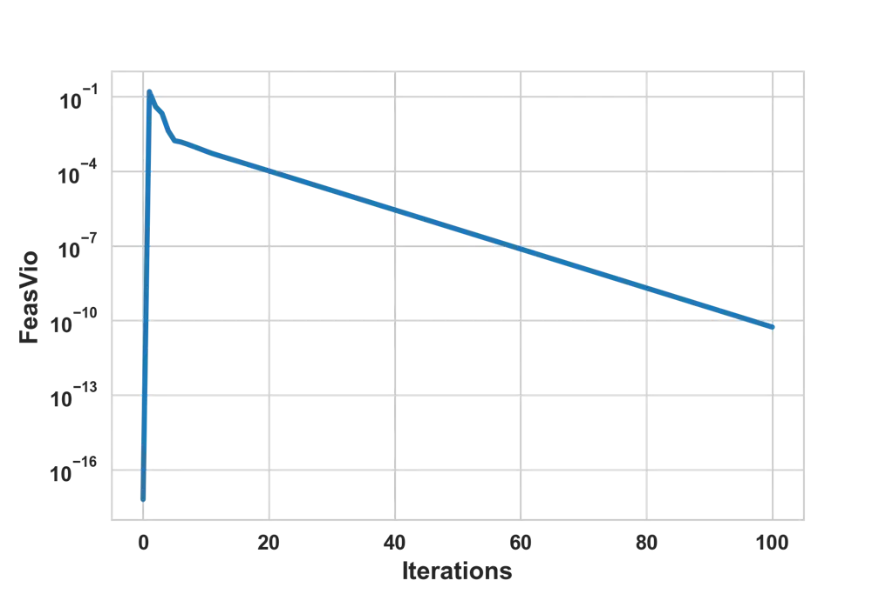
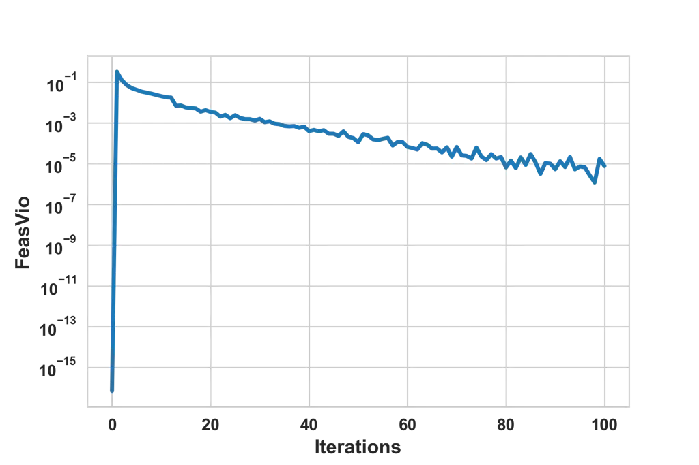
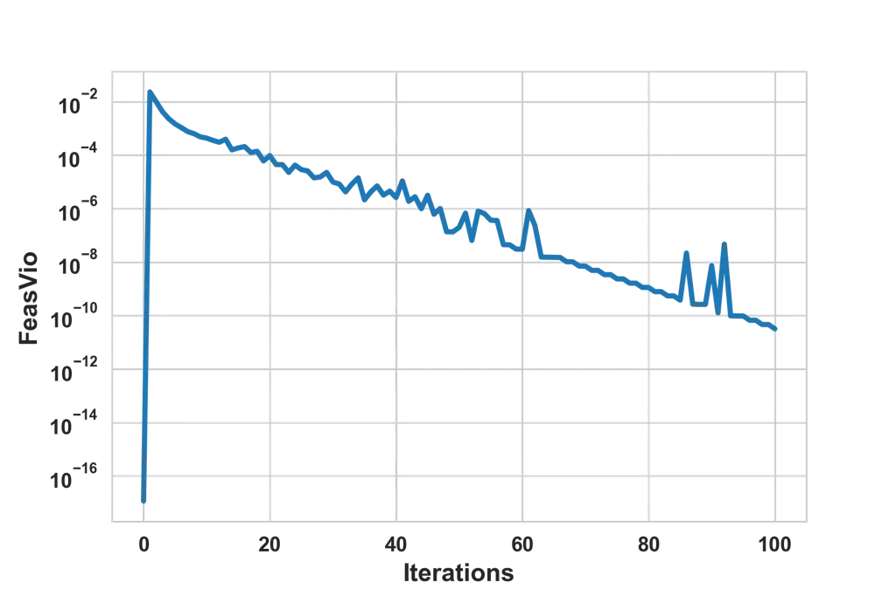
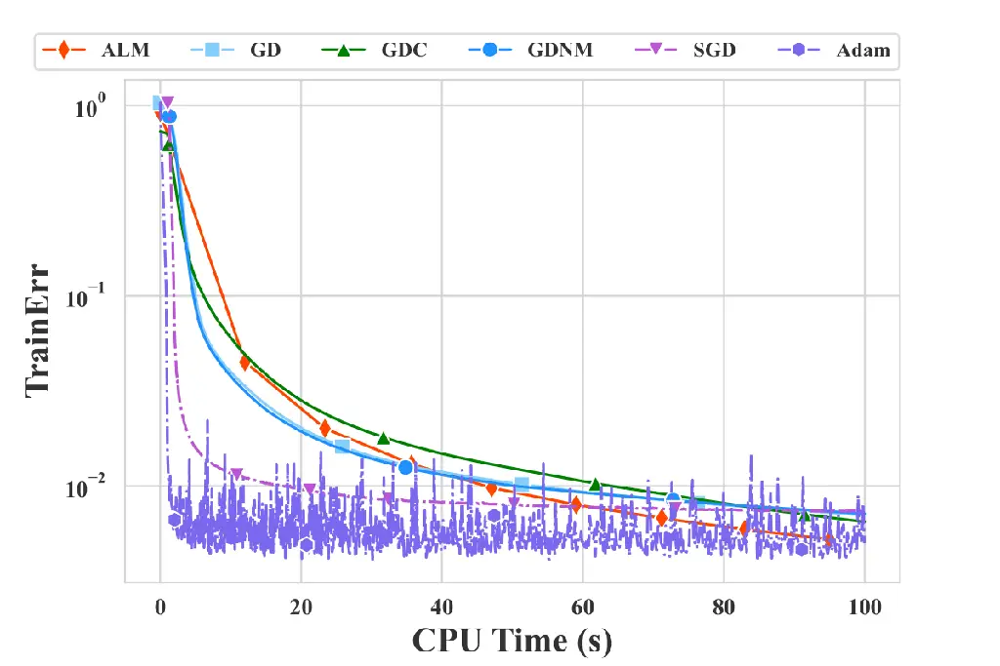
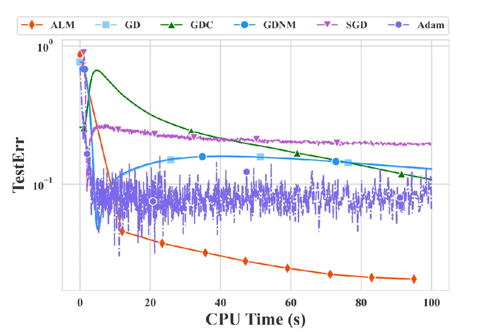
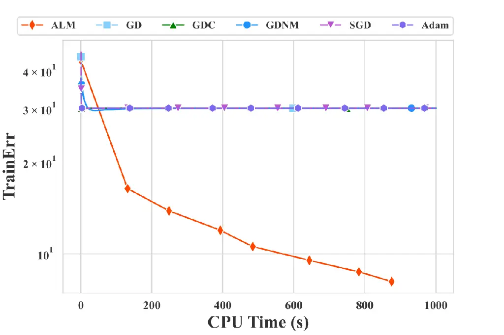
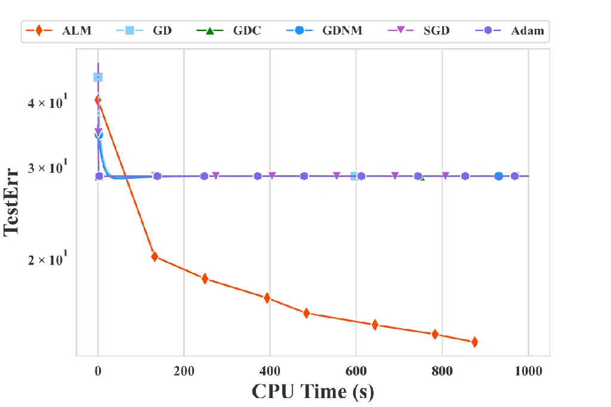

# An Augmented Lagrangian Method for Training Recurrent Neural NetworksThanks: Submitted on 28 December 2023.

Yue Wang ^(†)^(†)thanks: Department of Applied Mathematics, Hong Kong
Polytechnic University, Hong Kong, China ().
Email: <yueyue.wang@connect.polyu.hk>    Chao Zhang ^(†)^(†)thanks:
School of Mathematics and Statistics, Beijing Jiaotong University,
Beijing 100044, China (). Email: <zc.njtu@163.com>    Xiaojun Chen
^(†)^(†)thanks: Department of Applied Mathematics, Hong Kong Polytechnic
University, Hong Kong, China (). Email: <maxjchen@polyu.edu.hk>

###### Abstract

Recurrent Neural Networks (RNNs) are widely used to model sequential
data in a wide range of areas, such as natural language processing,
speech recognition, machine translation, and time series analysis. In
this paper, we model the training process of RNNs with the ReLU
activation function as a constrained optimization problem with a smooth
nonconvex objective function and piecewise smooth nonconvex constraints.
We prove that any feasible point of the optimization problem satisfies
the no nonzero abnormal multiplier constraint qualification (NNAMCQ),
and any local minimizer is a Karush-Kuhn-Tucker (KKT) point of the
problem. Moreover, we propose an augmented Lagrangian method (ALM) and
design an efficient block coordinate descent (BCD) method to solve the
subproblems of the ALM. The update of each block of the BCD method has a
closed-form solution. The stop criterion for the inner loop is easy to
check and can be stopped in finite steps. Moreover, we show that the BCD
method can generate a directional stationary point of the subproblem.
Furthermore, we establish the global convergence of the ALM to a KKT
point of the constrained optimization problem. Compared with the
state-of-the-art algorithms, numerical results demonstrate the
efficiency and effectiveness of the ALM for training RNNs.

###### keywords

recurrent neural network, nonsmooth nonconvex optimization, augmented
Lagrangian method, block coordinate descent

###### Funding.

This work was supported in part by Hong Kong Research Grants Council
C5036-21E and National Science Foundation of China (No. 12171027).

^(†)^(†)runningheads: ALM for Training RNNs / Yue Wang, Chao Zhang, and
Xiaojun Chen

###### MSC

65K05, 90B10, 90C26, 90C30

## 1 Introduction

Recurrent Neural Networks (RNNs) have been applied in a wide range of
areas, such as speech recognition \[15, 27\], natural language
processing \[22, 28\] and nonlinear time series forecasting \[1, 23\].
In this paper, we focus on the Elman RNN architecture \[13\], one of the
earliest and most fundamental RNNs, and use Elman RNNs to deal with the
regression task with the least squares loss function.

Given input data $`{x}_{t}\in\mathbb{R}^{n}`$ and output data
$`{y}_{t}\in\mathbb{R}^{m}`$, $`t=1,\ldots,T`$, a widely used
minimization problem for training RNNs is represented as (see \[14, pp.
381\])

```math
\min_{{A},{W},{V},{b},{c}}\ \frac{1}{T}\sum_{t=1}^{T}\left\|y_{t}-\bigg({A}\sigma\Big({W}\big(...\sigma({V}{x}_{1}+{b})...\big)+{V}{x}_{t}+{b}\Big)+{c}\bigg)\right\|^{2}, \tag{1}
```

where $`{W}\in\mathbb{R}^{r\times r}`$, $`{V}\in\mathbb{R}^{r\times n}`$
and $`{A}\in\mathbb{R}^{m\times r}`$ are unknown weight matrices,
$`{b}\in\mathbb{R}^{r}`$ and $`{c}\in\mathbb{R}^{m}`$ are unknown bias
vectors, and $`\sigma:\mathbb{R}\to\mathbb{R}`$ is a nonsmooth
activation function that is applied component-wise on vectors and
transforms the previous information and the input data $`{x}_{t}`$ into
the hidden layer at time $`t`$. The training process by eq. 1 can be
interpreted as looking for proper weight matrices $`{A},`$ $`{W},`$
$`{V},`$ and bias vectors $`{b},`$ $`{c}`$ in RNNs to minimize the
difference between the true value $`y_{t}`$ and the output from RNNs
across all time steps. It is worth mentioning that the Elman RNNs in (1)
shares the same weight matrices and bias vectors at different time steps
\[14, pp. 374\].

When the traditional backpropagation through time (BPTT) method is used
to train RNNs, the highly nonlinear and nonsmooth composition function
presented in eq. 1 poses significant challenges. Gradient descent
methods (GDs), as well as stochastic gradient descent-based methods
(SGDs), are widely used to train RNNs in practice \[8, 30\], but the
“gradient” of the loss function associated with the weighted matrices
via the “chain rule” is calculated even if the “chain rule” does not
hold. The “gradients” might exponentially increase to a very large value
or shrink to zero as time $`t`$ increases, which makes RNNs training
with large time length $`T`$ very challenging \[4\]. To overcome this
shortcoming, various techniques have been developed, such as gradient
clipping \[22\], gradient descent with Nesterov momentum \[3\],
initialization with small values \[24\], adding sparse regularization
\[2\], and so on. Because the essence of the above methods is to
restrict the initial values of weighted matrices or gradients, they are
sensitive to the choice of initial values \[18\]. Moreover, GDs and SGDs
for training RNNs lack rigorous convergence analysis.

The objective function in (1) is nonsmooth nonconvex and has a highly
composite structure. In this paper, we equivalently reformulate (1) as a
constrained optimization problem with a simple smooth objective function
by utilizing auxiliary variables to represent the composition structures
and treating these representations as constraints. Moreover, we propose
an augmented Lagrangian method (ALM) for the constrained optimization
problem with $`\ell_{2}`$-norm regularization, and design a block
coordinate descent (BCD) method to solve the subproblem of the ALM at
every iteration. The solution of the subproblems of the BCD method is
very easy to compute with a closed-form. Utilizing auxiliary variables
to reformulate highly nonlinear composite structured problems as
constrained optimization problems has been adopted for training Deep
Neural Networks (DNNs) \[7, 12, 19, 20, 31\]. However, these algorithms
for DNNs cannot be used for RNNs directly because of the difference
between their architectures. In fact, RNNs share the same weighted
matrices and bias vectors across different layers, whereas DNNs have
distinct weighted matrices and bias vectors in different layers. In
DNNs, the weighted matrices and bias vectors can be updated layer by
layer, allowing for the separation of the gradient calculation across
different layers. However, in RNNs, the weighted matrices and bias
vectors need to be updated simultaneously. Therefore, it is necessary to
establish effective algorithms tailored to the characteristics of RNNs.
To the best of our knowledge, the proposed ALM in this paper is the
first first-order optimization method for training RNNs with solid
convergence results.

Recently, several augmented Lagrangian-based methods have been proposed
for nonconvex nonsmooth problems with composite structures. In \[9\],
Chen et al. proposed an ALM for non-Lipschitz nonconvex programming,
which requires the constraints to be smooth. Hallak and Teboulle in
\[16\] transformed a comprehensive class of optimization problems into
constrained problems with smooth constraints and nonsmooth nonconvex
objective functions, and proposed a novel adaptive augmented
Lagrangian-based method to solve the constrained problem. The assumption
on the smoothness of constraints in \[9, 16\] is not satisfied for the
optimization problem arising in training RNNs with nonsmooth activation
functions considered in this paper.

Our contributions are summarized as follows:

- •
  We prove that the solution set of the constrained problem with
  $`\ell_{2}`$ regularization is nonempty and compact. Furthermore, we
  prove that any feasible point of the constrained optimization problem
  satisfies the no nonzero abnormal multiplier constraint qualification
  (NNAMCQ), which immediately guarantees any local minimizer of the
  constrained problems is a Karush-Kuhn-Tucker (KKT) point.
- •
  We show that any accumulation point of the sequence generated by the
  BCD method is a directional stationary point of the subproblem.
  Moreover, we show that in the $`k`$-th iteration of the ALM, the
  stopping criterion of the BCD method for solving the subproblem can be
  satisfied within $`O\big(1/(\epsilon_{k-1})^{2}\big)`$ finite steps
  for any $`\epsilon_{k-1}>0`$.
- •
  We show that there exists an accumulation point of the sequence
  generated by the ALM for solving the constrained optimization problem
  with regularization and any accumulation point of the sequence is a
  KKT point.
- •
  We compare the performance of the ALM with several state-of-the-art
  methods for both synthetic and real datasets. The numerical results
  verify that our ALM outperforms other algorithms in terms of
  forecasting accuracy for both the training sets and the test sets.

The rest of the paper is organized as follows. In section 2, we
equivalently reformulate problem (1) as a nonsmooth nonconvex
constrained minimization problem with a simple smooth objective
function. Then we show that the solution set of the constrained problem
with regularization is nonempty and bounded, and give the first-order
necessary optimality conditions for the constrained problem and the
regularized problem. We propose the ALM for the constrained problem with
regularization, as well as the BCD method for the subproblems of the ALM
in . We establish the convergence results of the BCD method, and the ALM
in section 4. Finally, we conduct numerical experiments on both the
synthetic and real data in section 5, which demonstrate the
effectiveness and efficiency of the ALM for the reformulated
optimization problem.

Notation and terminology. Let $`\mathbb{N}_{+}`$ denote the set of
positive integers. For column vectors
$`\pi_{1},\pi_{2},\ldots,\pi_{l}`$, let us denote by
$`\boldsymbol{\pi}:=(\pi_{1};\pi_{2};\ldots;\pi_{l})=(\pi_{1}^{\scriptscriptstyle\top},\pi_{2}^{\scriptscriptstyle\top},\ldots,\pi_{l}^{\scriptscriptstyle\top})^{\scriptscriptstyle\top}`$
a column vector. For a given matrix $`D\in\mathbb{R}^{k\times l}`$, we
denote by $`D_{.j}`$ the $`j`$-th column of $`D`$ and use
$`{\rm{vec}}(D)=(D_{.1};D_{.2};\ldots;D_{.l})\in\mathbb{R}^{kl}`$ to
represent a column vector. For a given vector $`g`$, we use
$`{\rm{diag}}(g)`$ to represent the diagonal matrix, whose
$`(i,i)`$-entry is the $`i`$-th component $`g_{i}`$ of $`g`$. We use
$`{\boldsymbol{e}_{l}}`$ to represent the vector of all ones in
$`\mathbb{R}^{l}`$. For $`\nu\in\mathbb{R}`$, $`\lceil\nu\rceil`$ refers
to the smallest integer that is greater than $`\nu`$. For a given
$`N\in\mathbb{N}_{+}`$, we denote $`[N]:=\{1,2,\ldots,N\}.`$ We use
$`\|\cdot\|`$ and $`\|\cdot\|_{\infty}`$ to denote the $`\ell_{2}`$-norm
and infinity norm of a vector or a matrix, respectively. We denote by
$`\|\cdot\|_{F}`$ the Frobenius norm of a matrix.

Let $`f:\mathbb{R}^{n_{1}}\to\mathbb{R}`$ be a proper lower
semicontinuous function defined on $`\mathbb{R}^{n_{1}}`$. The notation
$`x^{k}\stackrel{{\scriptstyle f}}{{\rightarrow}}\bar{x}`$ means that
$`x^{k}\to\bar{x}`$ and $`f(x^{k})\to f(\bar{x})`$. The Fréchet
subdifferential $`\hat{\partial}f(x)`$ and the limiting subdifferential
$`\partial f(x)`$ of $`f`$ at $`\bar{x}\in\mathbb{R}^{n_{1}}`$ are
defined as

```math
\displaystyle\hat{\partial}f(\bar{x}):=\left\{g\in\mathbb{R}^{n_{1}}:\liminf_{x\to\bar{x},x\neq\bar{x}}\frac{f(x)-f(\bar{x})-\langle g,x-\bar{x}\rangle}{\|x-\bar{x}\|}\geq 0\right\},
```

```math
\displaystyle\partial f(\bar{x}):=\left\{g\in\mathbb{R}^{n_{1}}:\exists x^{k}\stackrel{{\scriptstyle f}}{{\rightarrow}}\bar{x},g^{k}\to g\ \text{with}\ g^{k}\in\hat{\partial}f(x^{k}),\ \forall k\right\},
```

by \[17, Definition 1.1\] and \[26, Definition 8.3, pp. 301\],
respectively. A point $`\bar{x}`$ is said to be a Fréchet stationary
point of $`\min f(x)`$ if $`0\in\hat{\partial}f(\bar{x})`$, and
$`\bar{x}`$ is said to be a limiting stationary point of $`\min f(x)`$
if $`0\in\partial f(\bar{x})`$. By \[11, pp. 30\], the usual (one-side)
directional derivative of $`f`$ at $`x`$ in the direction
$`d\in\mathbb{R}^{n_{1}}`$ is

```math
f^{\prime}(x;d):=\lim_{\lambda\downarrow 0}\frac{f(x+\lambda d)-f(x)}{\lambda},
```

when the limit exists. According to \[25, Definition 2.1\], we say that
a point $`\bar{x}\in\mathbb{R}^{n_{1}}`$ is a d(irectional)-stationary
point of $`\min f(x)`$ if

```math
f^{\prime}({\bar{x}};d)\geq 0,\quad\forall d\in\mathbb{R}^{n_{1}}.
```

## 2 Problem reformulation and optimality conditions

For simplicity, we focus on the activation function
$`\sigma{:\mathbb{R}\to\mathbb{R}}`$ as the ReLU function, i.e.,

```math
\displaystyle\quad\sigma({u})=\max\{{u},0\}=({u})_{+}. \tag{2}
```

Our model, algorithms and theoretical analysis developed in this paper
can be generalized to the leaky ReLU and the ELU activation functions.
Detailed analysis for the extensions will be given in section 4.3.

### 2.1 Problem reformulation

We utilize auxiliary variables $`\mathbf{h}`$, $`\mathbf{u}`$ and denote
vectors $`\mathbf{w},\mathbf{a},\mathbf{z},\mathbf{s}`$ as

```math
\displaystyle{\mathbf{h}}=({h}_{1};{h}_{2};...;{h}_{T})\in\mathbb{R}^{rT},\quad{\mathbf{u}}=({u}_{1};{u}_{2};...;{u}_{T})\in\mathbb{R}^{rT},
```

```math
\displaystyle{\mathbf{w}}=(\text{vec}({W});\text{vec}({V});{b})\in\mathbb{R}^{N_{\mathbf{w}}},\quad{\mathbf{a}}=(\text{vec}({A});{c})\in\mathbb{R}^{N_{\mathbf{a}}},
```

```math
\displaystyle{\mathbf{z}}=({\mathbf{w}};{\mathbf{a}})\in\mathbb{R}^{N_{\mathbf{w}}+N_{{\mathbf{a}}}},\hskip 14.45377pt\quad{\mathbf{s}}=({\mathbf{z}};{\mathbf{h}};{\mathbf{u}})\in\mathbb{R}^{N_{\mathbf{w}}+N_{{\mathbf{a}}}+2rT},
```

where $`N_{\mathbf{w}}=r^{2}+rn+r`$ and $`N_{{\mathbf{a}}}=mr+m`$.

We reformulate problem (1) as the following constrained optimization
problem:

```math
\begin{split}\min_{\begin{array}[]{c}{\mathbf{s}}\end{array}}\quad&\frac{1}{T}\sum_{t=1}^{T}\left\|y_{t}-({A}{h}_{t}+{c})\right\|^{2}\\
\text{s.t.}\quad&{u}_{t}={W}{h}_{t-1}+{V}{x}_{t}+{b},\\
&{h}_{0}={0},\ {h}_{t}=({u}_{t})_{+},\ t=1,2,...,T.\end{split} \tag{3}
```

Problems (1) and (3) are equivalent in the sense that if
$`(A^{*},W^{*},V^{*},b^{*},c^{*})`$ is a global solution of (1), then
$`{\mathbf{s}^{*}}=({\mathbf{z}^{*}};{\mathbf{h^{*}}};{\mathbf{u^{*}}})`$
is a global solution of (3) where $`{\mathbf{z}^{*}}`$ is defined by
$`(A^{*},W^{*},V^{*},b^{*},c^{*})`$ and
$`{\mathbf{h^{*}}},{\mathbf{u^{*}}}`$ satisfy the constraints of (3)
with $`W^{*},V^{*},b^{*}`$. Conversely, if $`{\mathbf{s}^{*}}`$ is a
global solution of (3), then $`{\mathbf{z}^{*}}`$ is a global solution
of (1).

Let us denote the mappings
$`\Phi:\mathbb{R}^{r}\mapsto\mathbb{R}^{m\times N_{\mathbf{a}}}`$ and
$`\Psi:\mathbb{R}^{rT}\mapsto\mathbb{R}^{rT\times N_{\bf{w}}}`$ as

```math
\displaystyle\Phi({h}_{t})=\begin{bmatrix}{h}_{t}^{\top}\otimes I_{m}&I_{m}\end{bmatrix},\quad\Psi({\mathbf{h}})=\begin{bmatrix}{0}_{r}^{\top}\otimes I_{r}&x_{1}^{\top}\otimes I_{r}&I_{r}\\
{h}_{1}^{\top}\otimes I_{r}&x_{2}^{\top}\otimes I_{r}&I_{r}\\
\vdots&\vdots&\vdots\\
{h}_{T-1}^{\top}\otimes I_{r}&x_{T}^{\top}\otimes I_{r}&I_{r}\end{bmatrix}, \tag{4}
```

where $`\otimes`$ represents the Kronecker product, $`I_{r}`$ and
$`I_{m}`$ are the identity matrices with dimensions $`r`$ and $`m`$
respectively, and $`0_{r}`$ is the zero vector with dimension $`r`$.
Thus, the objective function and constraints in problem eq. 3 can be
represented as

```math
\begin{array}[]{c}{\displaystyle\ell({\mathbf{s}}):=\frac{1}{T}\sum_{t=1}^{T}\left\|y_{t}-\Phi({h}_{t})\mathbf{a}\right\|^{2},}\\
{\mathcal{C}_{1}(\mathbf{s}):=\mathbf{u}-\Psi(\mathbf{h})\mathbf{w}=0,\quad\quad\mathcal{C}_{2}(\mathbf{s}):=\mathbf{h}-(\mathbf{u})_{+}=0.}\end{array} \tag{5}
```

To mitigate the overfitting, we further add a regularization term

```math
\displaystyle P({\mathbf{s}}):=\lambda_{1}\|{A}\|^{2}_{F}+\lambda_{2}\|{W}\|^{2}_{F}+\lambda_{3}\|{V}\|^{2}_{F}+\lambda_{4}\|{b}\|^{2}+\lambda_{5}\|{c}\|^{2}+\lambda_{6}\|\mathbf{u}\|^{2} \tag{6}
```

with $`\lambda_{i}>0,i=1,2,\ldots,6`$ in the objective of problem eq. 3,
and consider the following problem:

```math
\displaystyle\min \displaystyle\mathcal{R}({\mathbf{s}}):=\ell({\mathbf{s}})+P({\mathbf{s}}) \tag{7}
```

```math
\displaystyle\text{s.t.} \displaystyle{\displaystyle\mathbf{s}}\in\mathcal{F}:=\{{\mathbf{s}}:{\cal C}_{1}({\mathbf{s}})=0,\ {\cal C}_{2}({\mathbf{s}})=0\}.
```

### 2.2 Optimality conditions

Problem (3) and problem (7) have the same feasible set $`\mathcal{F}.`$
The constraint function $`{\cal C}_{1}`$ is continuously differentiable,
while the other constraint function $`{\cal C}_{2}`$ is linear in
$`\mathbf{h}`$ and piecewise linear in $`\mathbf{u}.`$ We denote by
$`J\mathcal{C}_{1}(\mathbf{s})`$ the Jacobian matrix of the function
$`\mathcal{C}_{1}`$ at $`\mathbf{s}`$, and by
$`J_{\mathbf{z}}\mathcal{C}_{1}(\mathbf{s})`$,
$`J_{\mathbf{h}}\mathcal{C}_{1}(\mathbf{s})`$,
$`J_{\mathbf{u}}\mathcal{C}_{1}(\mathbf{s})`$ the Jacobian matrix of
function $`\mathcal{C}_{1}`$ at $`{\mathbf{s}}`$ with respect to the
block $`\mathbf{z}`$, $`\mathbf{h}`$ and $`\mathbf{u}`$, respectively.
Similarly, we use $`J_{\mathbf{h}}\mathcal{C}_{2}(\mathbf{s})`$ to
represent the Jacobian matrix of $`{\cal C}_{2}`$ at $`\mathbf{s}`$ with
respect to $`\mathbf{h}`$. Moreover, for a fixed vector
$`\zeta\in\mathbb{R}^{rT}`$, we use
$`\partial\big(\zeta^{\scriptscriptstyle\top}{\cal C}_{2}(\mathbf{s})\big)`$
to denote the limiting subdifferential of
$`\zeta^{\scriptscriptstyle\top}{\cal C}_{2}`$ at $`\mathbf{s}`$ and
$`\partial_{\mathbf{u}}\big(\zeta^{\scriptscriptstyle\top}{\cal C}_{2}(\mathbf{s})\big)`$
to denote the limiting subdifferential of
$`\zeta^{\scriptscriptstyle\top}{\cal C}_{2}`$ at $`\mathbf{s}`$ with
respect to $`\mathbf{u}`$.

The following lemma shows that the NNAMCQ \[29, Definition 4.2, pp.
1451\] holds at any feasible point $`{\mathbf{s}}\in\mathcal{F}.`$ The
proofs of all lemmas are given in appendix A.

###### Lemma 1.

The NNAMCQ holds at any $`\mathbf{s}\in\mathcal{F}`$, i.e., there exist
no nonzero vectors
$`\xi=(\xi_{1};\xi_{2};...;\xi_{T})\in\mathbb{R}^{rT}`$ and
$`\zeta=(\zeta_{1};\zeta_{2};...;\zeta_{T})\in\mathbb{R}^{rT}`$ such
that

```math
\displaystyle{0}\in J\mathcal{C}_{1}(\mathbf{s})^{\top}\xi+\partial\big(\zeta^{\scriptscriptstyle\top}{\cal C}_{2}(\mathbf{s})\big). \tag{8}
```

###### Definition 2.

We say that $`\mathbf{s}\in\mathcal{F}`$ is a KKT point of problem eq. 3
if there exist $`\xi\in\mathbb{R}^{rT}`$ and $`\zeta\in\mathbb{R}^{rT}`$
such that

```math
{0}\in\nabla\ell({\mathbf{s}})+J\mathcal{C}_{1}(\mathbf{s})^{\top}\xi+\partial\big(\zeta^{\scriptscriptstyle\top}{\cal C}_{2}(\mathbf{s})\big).
```

We say that $`\mathbf{s}\in\mathcal{F}`$ is a KKT point of problem eq. 7
if there exist $`\xi\in\mathbb{R}^{rT}`$ and $`\zeta\in\mathbb{R}^{rT}`$
such that

```math
{0}\in\nabla\mathcal{R}(\mathbf{s})+J\mathcal{C}_{1}(\mathbf{s})^{\top}\xi+\partial\big(\zeta^{\scriptscriptstyle\top}{\cal C}_{2}(\mathbf{s})\big).
```

Now we can establish the first order necessary conditions for problem
eq. 3 and problem eq. 7.

###### Theorem 3.

(i) If $`\bar{\mathbf{s}}`$ is a local solution of problem eq. 3, then
$`\bar{\mathbf{s}}`$ is a KKT point of problem eq. 3. (ii) If
$`\bar{\mathbf{s}}`$ is a local solution of problem eq. 7, then
$`\bar{\mathbf{s}}`$ is a KKT point of problem eq. 7.

###### Proof.

Note that the objective functions of problem eq. 3 and problem eq. 7 are
continuously differentiable. The constraint functions
$`\mathcal{C}_{1}`$ is continuously differentiable, and
$`\mathcal{C}_{2}`$ is Lipschitz continuous at any feasible point
$`\mathbf{s}\in\mathcal{F}`$. By lemma 1, NNAMCQ holds at any
$`\bar{s}\in{\cal F}`$. Therefore, the conclusions of this theorem hold
according to \[29, Remark 2 and Theorem 5.2\].

### 2.3 Nonempty and compact solution set of eq. 7

Let $`{\cal S}_{1}`$ be the solution set of problem eq. 7, and denote
the level set

```math
\displaystyle\mathcal{D}_{\cal R}(\rho):=\{\mathbf{s}\in{\cal F}:\mathcal{R}(\mathbf{s})\leq\rho\} \tag{9}
```

with a nonnegative scalar $`\rho`$.

###### Lemma 4.

For any $`\rho>{\cal R}(0)`$, the level set $`D_{\cal R}(\rho)`$ is
nonempty and compact. Moreover, the solution set $`\mathcal{S}_{1}`$ of
eq. 7 is nonempty and compact.

## 3 ALM with BCD method for eq. 7

To solve the regularized constrained problem eq. 7, we develop in this
section an ALM. The subproblems of ALM are approximately solved by a BCD
method whose update of each block owns a closed-form expression. This is
not an easy task due to the nonsmooth nonconvex constraints. The
framework of the ALM is given in algorithm 1, in which the updating
schemes for Lagrangian multipliers and penalty parameters are motivated
by \[9\]. It is worth mentioning that in \[9\], the constraints are
smooth. In problem eq. 7, the constraints are nonsmooth nonconvex. For
solving the subproblems in the ALM, we design the BCD method in
Algorithm 2 and provide the closed-form expression for the update of
each block in the BCD. Due to the nonsmooth nonconvex constraints in
eq. 7, the convergence analysis is complex, which will be given in
section 4.

The augmented Lagrangian (AL) function of problem eq. 7 is

```math
\displaystyle\quad\ \mathcal{L}(\mathbf{s},\xi,\zeta,\gamma) \tag{10}
```

```math
\displaystyle:=\mathcal{R}(\mathbf{s})+\langle\xi,\mathbf{u}-\Psi(\mathbf{h})\mathbf{w}\rangle+\langle\zeta,\mathbf{h}-(\mathbf{u})_{+}\rangle+\tfrac{\gamma}{2}\left\|\mathbf{u}-\Psi(\mathbf{h})\mathbf{w}\right\|^{2}+\tfrac{\gamma}{2}\left\|\mathbf{h}-(\mathbf{u})_{+}\right\|^{2}
```

```math
\displaystyle\ ={\cal R}({\mathbf{s}})+\frac{\gamma}{2}{\left\|{\mathbf{u}}-\Psi(\mathbf{h})\mathbf{w}+\frac{\xi}{\gamma}\right\|}^{2}+\frac{\gamma}{2}{\left\|\mathbf{h}-(\mathbf{u})_{+}+\frac{\zeta}{\gamma}\right\|}^{2}-\frac{{\|\xi\|}^{2}}{2\gamma}-\frac{{\|\zeta\|}^{2}}{2\gamma},
```

where $`\xi=(\xi_{1};\xi_{2};...;\xi_{T})\in\mathbb{R}^{rT}`$ and
$`\zeta=(\zeta_{1};\zeta_{2};...;\zeta_{T})\in\mathbb{R}^{rT}`$ are the
Lagrangian multipliers, and $`\gamma>0`$ is the penalty parameter for
the two quadratic penalty terms of constraints
$`\mathbf{u}=\Psi(\mathbf{h})\mathbf{w}`$ and
$`\mathbf{h}=(\mathbf{u})_{+}`$. For convenience, we will also write
$`{\cal L}({\bf z},{\bf h},{\bf u},\xi,\zeta,\gamma)`$ to represent
$`{\cal L}({\bf{s}},\xi,\zeta,\gamma)`$ when the blocks of $`\bf s`$ are
emphasized.

We develop some basic results in the following two lemmas relating to
the AL function $`{\cal L}`$. The explicit formulas for the gradients of
$`\mathcal{L}`$ with respect to $`\mathbf{z}`$ and $`\mathbf{h}`$ in
Lemma 5 (iii) and (iv) will be used for obtaining the closed-form
updates for the $`\mathbf{z}`$ and $`\mathbf{h}`$ blocks in the BCD
method, respectively. The Lipschitz constants
$`L_{1}(\xi,\zeta,\gamma,\hat{r})`$ and
$`L_{2}(\xi,\zeta,\gamma,\hat{r})`$ in Lemma 6 are essential to design a
practical stopping condition (29) of the BCD method in Algorithm 2. The
results will also be used for the convergence results of the BCD method
in Theorems 11 and 12.

###### Lemma 5.

For any fixed $`\gamma,\xi`$ and $`\zeta`$, the following statements
hold.

1.  (i)
    The AL function $`{\cal L}`$ is lower bounded that satisfies

    ```math
    \displaystyle{\cal L}({\bf s},\xi,\zeta,\gamma)\geq-\frac{\|\xi\|^{2}}{2\gamma}-\frac{\|\zeta\|^{2}}{2\gamma}\quad\mbox{for all}\ {\bf s}.
    ```

2.  (ii)
    For any $`\hat{\bf{s}}`$ and
    $`\hat{\Gamma}\geq\hat{r}:={\cal L}(\hat{\bf s},\xi,\zeta,\gamma)`$,
    the level set

    ```math
    \displaystyle\Omega_{{\cal L}}(\hat{\Gamma}):=\{{\bf s}\ :{\cal L}({\bf s},\xi,\zeta,\gamma)\leq\hat{\Gamma}\}
    ```

    is nonempty and compact.

3.  (iii)
    The AL function $`{\cal L}`$ is continuously differentiable with
    respect to $`\bf{z}`$, and the gradient with respect to $`{\bf z}`$
    is

    ```math
    \displaystyle\nabla_{\bf z}{\cal L}({\bf{z}},{\bf{h}},{\bf{u}},\xi,\zeta,\gamma)=\left[\begin{array}[]{l}\hat{Q}_{1}({\bf{s}},\xi,\zeta,\gamma){\bf w}+\hat{q}_{1}({\bf{s}},\xi,\zeta,\gamma)\\
    \hat{Q}_{2}({\bf{s}},\xi,\zeta,\gamma)\mathbf{a}+\hat{q}_{2}({\bf{s}},\xi,\zeta,\gamma)\end{array}\right],
    ```

    where

    ```math
    \displaystyle\hat{Q}_{1}({\bf{s}},\xi,\zeta,\gamma)=\gamma\Psi({\bf{h}})^{\scriptscriptstyle\top}\Psi({\bf{h}})+2\Lambda_{1},\quad\hat{q}_{1}({\bf{s}},\xi,\zeta,\gamma)=-\Psi({\bf{h}})^{\scriptscriptstyle\top}(\xi+\gamma{\bf u})
    ```

    ```math
    \displaystyle\hat{Q}_{2}({\bf{s}},\xi,\zeta,\gamma)=\frac{2}{T}\sum_{t=1}^{T}\Phi(h_{t})^{\scriptscriptstyle\top}\Phi(h_{t})+2\Lambda_{2},\quad\hat{q}_{2}({\bf{s}},\xi,\zeta,\gamma)=-\frac{2}{T}\sum_{t=1}^{T}\Phi(h_{t})^{\scriptscriptstyle\top}y_{t}
    ```

    ```math
    \displaystyle\Lambda_{1}={\rm{diag}}\Big(\big(\lambda_{2}\boldsymbol{e}_{\scriptscriptstyle{r^{{}_{2}}}};\lambda_{3}\boldsymbol{e}_{\scriptscriptstyle rn};\lambda_{4}\boldsymbol{e}_{\scriptscriptstyle r}\big)\Big),\quad\Lambda_{2}={\rm{diag}}\Big(\big({\lambda_{1}{\boldsymbol{e}_{rm}};{{\lambda_{5}\boldsymbol{e}_{m}}}}\big)\Big).
    ```

4.  (iv)
    The AL function $`{\cal L}`$ is continuously differentiable with
    respect to $`\bf{h}`$, and the gradient with respect to
    $`\mathbf{h}`$ is

    ```math
    \displaystyle\nabla_{\bf h}{\cal L}({\bf{z}},{\bf{h}},{\bf{u}},\xi,\zeta,\gamma)
    ```

    ```math
    \displaystyle=\  \displaystyle\big(\nabla_{h_{1}}{\cal L}({\bf z},{\bf h},{\bf u},\xi,\zeta,\gamma);\nabla_{h_{2}}{\cal L}({\bf z},{\bf h},{\bf u},\xi,\zeta,\gamma);\ldots;\nabla_{h_{T}}{\cal L}({\bf z},{\bf h},{\bf u},\xi,\zeta,\gamma)\big),
    ```

    where

    ```math
    \displaystyle\nabla_{h_{t}}{\cal L}({\bf z},{\bf h},{\bf u},\xi,\zeta,\gamma)=\left\{\begin{array}[]{ll}D_{1}({\bf{s}},\xi,\zeta,\gamma){h_{t}}-d_{1t}({\bf{s}},\xi,\zeta,\gamma),&\ {\rm{if}}\ t\in[T-1],\\
    D_{2}({\bf{s}},\xi,\zeta,\gamma){h_{T}}-d_{2T}({\bf{s}},\xi,\zeta,\gamma),&\ {\rm{if}}\ t=T,\end{array}\right.
    ```

    ```math
    \displaystyle D_{1}({\bf{s}},\xi,\zeta,\gamma)=\gamma W^{\scriptscriptstyle\top}W+\tfrac{2}{T}A^{\scriptscriptstyle\top}A+\gamma I_{r},
    ```

    ```math
    \displaystyle D_{2}({\bf{s}},\xi,\zeta,\gamma)=\tfrac{2}{T}A^{\scriptscriptstyle\top}A+\gamma I_{r},
    ```

    ```math
    \displaystyle d_{1t}({\bf{s}},\xi,\zeta,\gamma)=W^{\scriptscriptstyle\top}\left(\xi_{t+1}+\gamma(u_{t+1}-Vx_{t+1}-b)\right)+\gamma(u_{t})_{+}-\zeta_{t}+\tfrac{2}{T}A^{\scriptscriptstyle\top}(y_{t}-c),
    ```

    ```math
    \displaystyle d_{2T}({\bf{s}},\xi,\zeta,\gamma)=\gamma(u_{T})_{+}-\zeta_{T}+\tfrac{2}{T}A^{\scriptscriptstyle\top}(y_{T}-c).
    ```

###### Lemma 6.

For any $`{\bf z},{\bf h},{\bf u},{\bf h}^{\prime},{\bf u}^{\prime}`$ in
the level set $`\Omega_{{\cal L}}(\hat{r})`$, we have

```math
\displaystyle\|\nabla_{\bf{z}}{\cal L}({\bf z},{\bf h}^{\prime},{\bf u}^{\prime},\xi,\zeta,\gamma)-\nabla_{\bf{z}}{\cal L}({\bf z},{\bf h},{\bf u},\xi,\zeta,\gamma)\|\leq L_{1}(\xi,\zeta,\gamma,{\hat{r}})\left\|\begin{array}[]{l}{\bf h}^{\prime}-{\bf h}\\
{\bf u}^{\prime}-{\bf u}\end{array}\right\|,
```

```math
\displaystyle\|\nabla_{\bf{h}}{\cal L}({\bf z},{\bf h},{\bf u}^{\prime},\xi,\zeta,\gamma)-\nabla_{\bf{h}}{\cal L}({\bf z},{\bf h},{\bf u},\xi,\zeta,\gamma)\|\leq L_{2}(\xi,\zeta,\gamma,{\hat{r}})\left\|{\bf u}^{\prime}-{\bf u}\right\|, \tag{15}
```

where

```math
\displaystyle L_{1}(\xi,\zeta,\gamma,\hat{r})=\sqrt{2}\max\{\gamma\delta_{1},\delta_{2}+\delta_{3}+\delta_{4}\},\ L_{2}(\xi,\zeta,\gamma,\hat{r})=\gamma\delta_{5}, \tag{16}
```

with $`X:=(x_{1};x_{2};...;x_{T})\in\mathbb{R}^{nT}`$,

```math
\displaystyle\delta=\hat{r}+\frac{\|\xi\|^{2}}{2\gamma}+\frac{\|\zeta\|^{2}}{2\gamma},\ \delta_{0}=\sqrt{\frac{2\delta}{\gamma}}+\sqrt{\frac{\delta}{\lambda_{6}}}+{\frac{\|\zeta\|}{\gamma}},\ \delta_{1}=\sqrt{r(\delta^{2}+\|X\|^{2}+T)},
```

```math
\displaystyle\delta_{2}=2\gamma\delta_{1}\sqrt{\frac{r\delta}{\min\{\lambda_{2},\lambda_{3},\lambda_{4}\}}},\ \delta_{3}=\sqrt{r}\|\xi\|+\gamma\sqrt{\frac{r\delta}{\lambda_{6}}},
```

```math
\displaystyle\delta_{4}=\frac{2\sqrt{m}}{\sqrt{T}}\left(2\sqrt{m(\delta_{0}^{2}+1)}\sqrt{\frac{\delta}{\min\{\lambda_{1},\lambda_{5}\}}}+\max_{1\leq t\leq T}\|y_{t}\|\right),\ \delta_{5}=\sqrt{\frac{\delta(T-1)}{\lambda_{2}}}+\sqrt{T}.
```

### 3.1 ALM for the regularized RNNs

To solve the regularized constrained problem (7), we propose the ALM in
Algorithm 1. The ALM first approximately solves (17) that aims to
minimize the AL function with the fixed Lagrange multipliers
$`\xi^{k-1}`$ and $`\zeta^{k-1}`$, and the fixed penalty parameter
$`\gamma_{k-1}`$ for the quadratic terms, until $`\mathbf{s}^{k}`$
satisfies the approximate first-order optimality necessary condition
eq. 18 with tolerance $`\epsilon_{k-1}`$. Then the Lagrange multipliers
are updated, and the tolerance $`\epsilon_{k}`$ is reduced so that in
the next iteration the subproblem is solved more accurately. Moreover,
the penalty parameter $`\gamma_{k}`$ is unchanged if the feasibility of
$`{\bf{s}}^{k}`$ is sufficiently improved compared to that of
$`{\bf{s}}^{k-1}`$, otherwise, $`\gamma_{k}`$ is increased.

1:  Set an initial penalty parameter $`\gamma_{0}>0`$, parameters
$`\eta_{1},\eta_{2},\eta_{4}\in(0,1)`$ and $`\eta_{3}>1`$, an initial
tolerance $`\epsilon_{0}>0`$, vectors of Lagrangian multipliers
$`\xi^{0}`$, $`\zeta^{0}`$, and a feasible initial point
$`\mathbf{s}^{0}=(\mathbf{z}^{0},\hat{\mathbf{h}},\hat{\mathbf{u}})`$
where $`\hat{{h}}_{0}={0}`$,
$`\hat{{u}}_{t}={W}\hat{{h}}_{t-1}+{V}{x}_{t}+{b}`$ and
$`\hat{{h}}_{t}=(\hat{u}_{t})_{+}`$ for $`t\in[T]`$.

2:  Set $`k:=1`$.

3:  Step 1: Solve

```math
\displaystyle\min_{\mathbf{s}}\quad \displaystyle\mathcal{L}(\mathbf{s},\xi^{k-1},\zeta^{k-1},\gamma_{k-1}) \tag{17}
```

to obtain $`\mathbf{s}^{k}`$ satisfying the following condition

```math
\displaystyle\text{dist}\big(0,\partial\mathcal{L}(\mathbf{s}^{k},\xi^{k-1},\zeta^{k-1},\gamma_{\scriptscriptstyle k-1})\big)\leq\epsilon_{k-1}. \tag{18}
```

4:  Step 2: Update $`\epsilon_{k}=\eta_{4}\epsilon_{k-1}`$,
$`\xi^{k-1}`$ and $`\zeta^{k-1}`$ as

```math
\displaystyle\xi^{k}=\xi^{k-1}+\gamma_{k-1}\left(\mathbf{u}^{k}-\Psi(\mathbf{h}^{k})\mathbf{w}^{k}\right),\quad\zeta^{k}=\zeta^{k-1}+\gamma_{k-1}\left(\mathbf{h}^{k}-(\mathbf{u}^{k})_{+}\right). \tag{19}
```

5:  Step 3: Set
$`\gamma_{\scriptscriptstyle k}=\gamma_{\scriptscriptstyle k-1}`$, if
the following condition is satisfied

```math
\displaystyle\max\left\{\|{\cal C}_{1}({\bf{s}}^{k})\|,\|{\cal C}_{2}({\bf{s}}^{k})\|\right\}\leq\eta_{1}\max\left\{\|{\cal C}_{1}({\bf{s}}^{k-1})\|,\|{\cal C}_{2}({\bf{s}}^{k-1})\|\right\}. \tag{20}
```

6:  Otherwise, set

```math
\displaystyle\gamma_{\scriptscriptstyle k}=\max\left\{\gamma_{k-1}/\eta_{2},\left\|\xi^{k}\right\|^{1+\eta_{3}},\left\|\zeta^{k}\right\|^{1+\eta_{3}}\right\}. \tag{21}
```

7:  Let $`k-1:=k`$ and go to Step 1.

Algorithm 1 The augmented Lagrangian method (ALM) for eq. 7

###### Remark 7.

The main operation of Algorithm 1 is to approximately solve the
subproblem (17). Furthermore, to show that Algorithm 1 is well-defined
requires that the algorithm for solving the subproblem (17) can be
terminated within finite steps to meet the stopping condition in (18).

In section 3.2, we will design a BCD method to solve the subproblem
(17). The update of each block of the BCD method owns a closed-form
formula, which makes the BCD method efficient. Moreover, the stopping
condition (18) can be replaced by a simpler condition (29) as will be
shown in Theorem 11.

### 3.2 BCD method for subproblem

To solve the nonsmooth nonconvex problem (17) in Step 1 of algorithm 1,
we propose a BCD method in algorithm 2 to solve the subproblem at the
$`k`$-th iteration in the ALM by alternatively updating the blocks in
the order of $`\mathbf{z}`$, $`\mathbf{h}`$, and $`\mathbf{u}`$ in
$`\mathbf{s}`$, respectively. Let us choose a constant $`\Gamma`$ such
that

```math
\displaystyle\Gamma\geq\mathcal{L}\big(\mathbf{s}^{0},\xi^{0},\zeta^{0},\gamma_{0}\big). \tag{22}
```

Because at the $`k`$-th iteration of the ALM,
$`\xi^{k-1},\zeta^{k-1},\gamma_{k-1}`$ are fixed, we just write
$`\xi,\zeta,\gamma`$ in the BCD method for brevity. Furthermore, for the
BCD solving the subproblem appeared at the $`k`$-th iteration of the
ALM, we define

```math
\displaystyle\quad\quad\mathbf{s}^{k-1,j}_{\scriptscriptstyle{\bf{z}}}:={({\mathbf{z}^{k-1,j}};{\mathbf{h}^{k-1,j-1}};{\mathbf{u}^{k-1,j-1}})},\ {\mathbf{s}}^{k-1,j}_{{\bf{h}}}:=({\mathbf{z}^{k-1,j}};{\mathbf{h}^{k-1,j}};{\mathbf{u}^{k-1,j-1}}) \tag{23}
```

to denote the point obtained after updating the $`{\bf z}`$ block, and
updating the $`{\bf{h}}`$ block at the $`j`$-th iteration of the BCD
method, and we use

```math
\displaystyle{\bf{s}}^{k-1,j}=({\bf z}^{k-1,j};{\bf{h}}^{k-1,j};{\bf{u}}^{k-1,j}) \tag{24}
```

to represent the point obtained at the $`j`$-th iteration of the BCD
method after updating the $`{\bf u}`$ block.

1:  Set the initial point of BCD algorithm as

```math
\displaystyle\mathbf{s}^{k-1,0}=\begin{cases}\mathbf{s}^{k-1},&\text{if}\ k>1\ \text{and}\ {\small\begin{matrix}\mathcal{L}\big(\mathbf{s}^{k-1},\xi,\zeta,{\gamma}\big)\leq\Gamma\end{matrix}},\\
\mathbf{s}^{0},&\text{otherwise.}\end{cases} \tag{25}
```

Compute
$`{\hat{r}}_{k-1}=\mathcal{L}(\mathbf{s}^{k-1,0},\xi,\zeta,\gamma)`$,
$`L_{1,k-1}=L_{1}(\xi,\zeta,\gamma,\hat{r}_{k-1})`$ and
$`L_{2,k-1}=L_{2}(\xi,\zeta,\gamma,\hat{r}_{k-1})`$ by formula (16).

2:  Set $`j:=1`$.

3:  while the stop criterion is not met do

4:   Step 1: Update blocks $`\mathbf{z}^{k-1,j}`$,
$`\mathbf{h}^{k-1,j}`$ and $`\mathbf{u}^{k-1,j}`$ separately as

```math
\displaystyle\mathbf{z}^{k-1,j}\  \displaystyle=\ \arg\min_{\mathbf{z}}\ \mathcal{L}\left(\mathbf{z},\mathbf{h}^{k-1,j-1},\mathbf{u}^{k-1,j-1},\xi,\zeta,\gamma\right), \tag{26}
```

```math
\displaystyle\mathbf{h}^{k-1,j}\  \displaystyle=\ \arg\min_{\mathbf{h}}\ \mathcal{L}\left(\mathbf{z}^{k-1,j},\mathbf{h},\mathbf{u}^{k-1,j-1},\xi,\zeta,\gamma\right), \tag{27}
```

```math
\displaystyle\mathbf{u}^{k-1,j}\  \displaystyle\in\ \arg\min_{\mathbf{u}}\ \mathcal{L}\left(\mathbf{z}^{k-1,j},\mathbf{h}^{k-1,j},\mathbf{u},\xi,\zeta,\gamma\right)+\tfrac{\mu}{2}\left\|\mathbf{u}-\mathbf{u}^{k-1,j-1}\right\|^{2}. \tag{28}
```

Then set
$`{\mathbf{s}^{k-1,j}}=({\mathbf{z}^{k-1,j}};{\mathbf{h}^{k-1,j}};{\mathbf{u}^{k-1,j}})`$.

5:   Step 2: If the stop criterion

```math
\displaystyle\left\|\mathbf{s}^{k-1,j}-\mathbf{s}^{k-1,j-1}\right\|\leq\frac{\epsilon_{k-1}}{\max\{L_{1,k-1},L_{2,k-1},\mu\}}, \tag{29}
```

is not satisfied, then set $`j:=j+1`$ and go to Step 1.

6:  end while

7:  return $`\mathbf{s}^{k}=\mathbf{s}^{k-1,j}`$.

Algorithm 2 Block Coordinate Descent (BCD) method for eq. 17

Condition (18) is satisfied when (29) holds, which will be proved in
Theorem 11. The closed-form solutions of problems eq. 26, eq. 27 and
eq. 28 are provided below.

Update $`\mathbf{z}^{k-1,j}`$: Problem eq. 26 is an unconstrained
optimization problem with smooth and strongly convex objective function.
By employing lemma 5 (iii) and solving

```math
\displaystyle\nabla_{\bf{z}}{\cal L}(\mathbf{s}^{k-1,j}_{\scriptscriptstyle{\bf{z}}},\xi,\zeta,\gamma)=0,
```

the unique global minimizer
$`\mathbf{z}^{k-1,j}=({{\mathbf{w}}^{k-1,j}};{{\mathbf{a}}^{k-1,j}})`$
can be computed as

```math
\displaystyle\mathbf{w}^{k-1,j}=-{\hat{Q}_{1}(\mathbf{s}^{k-1,j}_{\scriptscriptstyle{\bf{z}}},\xi,\zeta,\gamma)}^{-1}\hat{q}_{1}(\mathbf{s}^{k-1,j}_{\scriptscriptstyle{\bf{z}}};\xi,\zeta,\gamma),
```

```math
\displaystyle\mathbf{a}^{k-1,j}=-{\hat{Q}_{2}(\mathbf{s}^{k-1,j}_{\scriptscriptstyle{\bf{z}}},\xi,\zeta,\gamma)}^{-1}\hat{q}_{2}(\mathbf{s}^{k-1,j}_{\scriptscriptstyle{\bf{z}}},\xi,\zeta,\gamma).
```

Update $`\mathbf{h}^{k-1,j}`$: The objective function of eq. 27 is also
strongly convex and smooth. By employing lemma 5 (iv) and solving
$`\nabla_{\bf{h}}{\cal L}({\mathbf{s}}^{k-1,j}_{{\bf{h}}},\xi,\zeta,\gamma)=0,`$
we get its unique global minimizer, given by

```math
\begin{split}{h}^{k-1,j}_{t}=\begin{cases}{D_{1}({\bf{s}}_{\bf h}^{k-1,j},\xi,\zeta,\gamma)}^{-1}d_{1t}({\bf{s}}_{\bf h}^{k-1,j},\xi,\zeta,\gamma),&\text{if}\ t\in[T-1],\\
{D_{2}({\bf{s}}_{\bf h}^{k-1,j},\xi,\zeta,\gamma)}^{-1}d_{2T}({\bf{s}}_{\bf h}^{k-1,j},\xi,\zeta,\gamma),&\text{if}\ t=T.\end{cases}\end{split} \tag{30}
```

Update $`\mathbf{u}^{k-1,j}`$: Although problem eq. 28 is nonsmooth
nonconvex, one of its global solutions is accessible, because the
objective function of problem eq. 28 can be separated into $`rT`$
one-dimensional functions with the same structure. Thus, we aim to solve
the following one-dimensional problem:

```math
\mathop{\min}_{u\in\mathbb{R}}\ \varphi(u):=\tfrac{\gamma}{2}(u-\theta_{1})^{2}+\tfrac{\gamma}{2}(\theta_{2}-({u})_{+})^{2}+\tfrac{\mu}{2}(u-\theta_{3})^{2}+\lambda_{6}u^{2}, \tag{31}
```

where $`\theta_{1},\theta_{2},\theta_{3}\in\mathbb{R}`$ are known real
numbers. Denote

```math
\displaystyle u^{+}:=\mathop{\arg\min}_{u\in\mathbb{R}_{+}}\varphi(u)\quad\text{and}\quad u^{-}:=\mathop{\arg\min}_{u\in\mathbb{R}_{-}}\varphi(u). \tag{32}
```

By direct computation,

```math
\displaystyle u^{+}=\left\{\begin{array}[]{ll}\dfrac{\gamma\theta_{1}+\gamma\theta_{2}+\mu\theta_{3}}{2\gamma+2\lambda_{6}+\mu},&\text{if}\ \gamma\theta_{1}+\gamma\theta_{2}+\mu\theta_{3}>0,\\
0,&\text{otherwise},\end{array}\right.
```

and

```math
\displaystyle u^{-}=\left\{\begin{array}[]{ll}\dfrac{\gamma\theta_{1}+\mu\theta_{3}}{\gamma+2\lambda_{6}+\mu},&\text{if}\ \gamma\theta_{1}+\mu\theta_{3}<0,\\
0,&\text{otherwise}.\end{array}\right.
```

Then a solution of (31) can be given as

```math
\displaystyle u^{*}=\left\{\begin{array}[]{ll}u^{+},&\text{if}\ \varphi(u^{+})\leq\varphi(u^{-}),\\
u^{-},&\text{otherwise}.\end{array}\right.
```

By setting

```math
\displaystyle\theta_{1}=(\Psi(\mathbf{h}^{k-1,j})\mathbf{w}^{k-1,j})_{i}-\frac{\xi_{i}}{\gamma},\quad\theta_{2}={\mathbf{h}}^{k-1,j}_{i}+\frac{\zeta_{i}}{\gamma},\quad\theta_{3}={{\mathbf{u}}_{i}^{k-1,{j-1}}},
```

```math
\displaystyle{{\mathbf{u}}_{i}^{k-1,j}}=u^{*},\quad{{{\mathbf{u}}_{i}}^{+}}=u^{+},\quad{{\mathbf{u}}_{i}}^{-}=u^{-},\quad\quad\quad\quad
```

we obtain a closed-form solution of problem eq. 28 as

```math
\displaystyle{\mathbf{u}}^{k-1,j}_{i}=\left\{\begin{array}[]{ll}\mathbf{u}_{i}^{+},&\text{if}\ \varphi(\mathbf{u}_{i}^{+})\leq\varphi(\mathbf{u}_{i}^{-}),\\
\mathbf{u}_{i}^{-},&\text{otherwise},\quad\quad\quad\quad i=1,\ldots,rT.\end{array}\right.
```

###### Remark 8.

It is important to mention that the solution set of problem eq. 28 may
not be a singleton. To ensure the selected solution is unique, we set
$`{\mathbf{u}}^{k-1,j}_{i}=\mathbf{u}_{i}^{+}`$ when
$`\varphi(\mathbf{u}_{i}^{+})=\varphi(\mathbf{u}_{i}^{-})`$ for every
$`i\in[rT]`$.

## 4 Convergence analysis

In this section, we show the convergence results of both the BCD method
for the subproblem of the ALM, as well as the ALM for eq. 7.

### 4.1 Convergence analysis of algorithm 2

It is clear that

```math
\displaystyle\mathcal{L}(\mathbf{s},\xi,\zeta,\gamma)=g(\mathbf{s},\xi,\gamma)+q(\mathbf{s},\zeta,\gamma), \tag{41}
```

where

```math
\displaystyle g(\mathbf{s},\xi,\gamma)=\mathcal{R}(\mathbf{s})+\frac{\gamma}{2}{\left\|{\mathbf{u}}-\Psi(\mathbf{h})\mathbf{w}+\frac{\xi}{\gamma}\right\|}^{2}-\frac{\|\xi\|^{2}}{2\gamma}, \tag{42}
```

```math
\displaystyle q(\mathbf{s},\zeta,\gamma)=\frac{\gamma}{2}{\left\|\mathbf{h}-(\mathbf{u})_{+}+\frac{\zeta}{\gamma}\right\|}^{2}-\frac{{\|\zeta\|}^{2}}{2\gamma}. \tag{43}
```

The function $`g`$ is smooth but nonconvex, because it contains the
bilinear structure $`{\Psi(\mathbf{h})}\mathbf{w}`$. The function $`q`$
is nonsmooth nonconvex.

For the convergence analysis below, we further use
$`{\bf{s}}_{\bf{z}}^{(j)}`$ and $`{\bf{s}}_{\bf{h}}^{(j)}`$ to represent
$`{\bf{s}}_{\bf{z}}^{k-1,j}`$ and $`{\bf{s}}_{\bf{h}}^{k-1,j}`$ in (23),
and use $`{\bf s}^{(j)}`$ to represent $`s^{k-1,j}`$ in (24) for
brevity. We emphasize that the point $`{\bf{s}}^{k}`$ is generated by
the ALM in algorithm 1, while the point $`{\bf s}^{(j)}`$ is generated
by the BCD method in algorithm 2 for solving the subproblem in the ALM
at the $`k`$-th iteration.

The following two lemmas will be used in proving the convergence results
of the BCD method.

###### Lemma 9.

Let $`\{\mathbf{s}^{(j)}\}`$ represent the sequence generated by
algorithm 2. Then $`\{\mathbf{s}^{(j)}\}`$ belongs to the level set
$`\Omega_{\mathcal{L}}(\Gamma)`$, which is compact.

###### Lemma 10.

The AL function $`\mathcal{L}`$ is locally Lipschitz continuous and
directionally differentiable on $`\Omega_{\mathcal{L}}(\Gamma).`$

We can now show that the stop criterion eq. 29 in algorithm 2 can be
stopped in finite steps, and condition (18) in Algorithm 1 is satisfied
when (29) holds. These results guarantee that the ALM in Algorithm 1 is
well-defined, when the subproblems are solved by the BCD method in
algorithm 2.

###### Theorem 11.

At the $`k`$-th iteration of ALM in algorithm 1, the BCD method in
algorithm 2 for the subproblem eq. 17 can be stopped within finite steps
to satisfy the stop criterion in eq. 29, which is of order
$`O(1/(\epsilon_{k-1})^{2})`$. Moreover, condition eq. 18 of the ALM in
algorithm 1 is satisfied at the output $`{\bf{s}}^{k}`$ of algorithm 2.

###### Proof.

Since $`\mathcal{L}`$ is strongly convex with respect to the blocks
$`\bf z`$ and $`\bf h`$, respectively, from eq. 26 and eq. 27, we obtain

```math
\displaystyle\mathcal{L}(\mathbf{s}^{(j-1)},\xi,\zeta,\gamma)-\mathcal{L}(\mathbf{s}^{(j)}_{\scriptscriptstyle{\bf{z}}},\xi,\zeta,\gamma)\geq\tfrac{\alpha_{1}}{2}\|\mathbf{z}^{(j-1)}-\mathbf{z}^{(j)}\|^{2}, \tag{44}
```

```math
\displaystyle\mathcal{L}(\mathbf{s}^{(j)}_{\scriptscriptstyle{\bf{z}}},\xi,\zeta,\gamma)-\mathcal{L}(\mathbf{s}^{(j)}_{\scriptscriptstyle{\bf{h}}},\xi,\zeta,\gamma)\geq\tfrac{\alpha_{2}}{2}\|\mathbf{h}^{(j-1)}-\mathbf{h}^{(j)}\|^{2}, \tag{45}
```

where $`\alpha_{1}`$ and $`\alpha_{2}`$ are the minimum eigenvalues of
the Hessian matrices
$`\nabla^{2}_{\bf{z}}\mathcal{L}({\bf{s}},\xi,\zeta,\gamma)`$ and
$`\nabla^{2}_{\bf{h}}\mathcal{L}({\bf{s}},\xi,\zeta,\gamma)`$ for all s
in the compact set $`\Omega_{\mathcal{L}}(\Gamma)`$, respectively.
Furthermore, by eq. 28, we have

```math
\displaystyle\mathcal{L}(\mathbf{s}^{(j)}_{\scriptscriptstyle{\bf{h}}},\xi,\zeta,\gamma)-\mathcal{L}(\mathbf{s}^{(j)},\xi,\zeta,\gamma)\geq\tfrac{\mu}{2}\left\|\mathbf{u}^{(j)}-\mathbf{u}^{(j-1)}\right\|^{2}. \tag{46}
```

It follows that

```math
\displaystyle\mathcal{L}(\mathbf{s}^{(j-1)},\xi,\zeta,\gamma)-\mathcal{L}(\mathbf{s}^{(j)},\xi,\zeta,\gamma)
```

```math
\displaystyle=\  \displaystyle\big(\mathcal{L}(\mathbf{s}^{(j-1)},\xi,\zeta,\gamma)-\mathcal{L}(\mathbf{s}^{(j)}_{\scriptscriptstyle{\bf{z}}},\xi,\zeta,\gamma)\big)+\big(\mathcal{L}(\mathbf{s}^{(j)}_{\scriptscriptstyle{\bf{z}}},\xi,\zeta,\gamma)-\mathcal{L}(\mathbf{s}^{(j)}_{\scriptscriptstyle{\bf{h}}},\xi,\zeta,\gamma)\big)
```

```math
\displaystyle+\big(\mathcal{L}(\mathbf{s}^{(j)}_{\scriptscriptstyle{\bf{h}}},\xi,\zeta,\gamma)-\mathcal{L}(\mathbf{s}^{(j)},\xi,\zeta,\gamma)\big)
```

```math
\displaystyle\geq\  \displaystyle\tfrac{\alpha_{1}}{2}\|\mathbf{z}^{(j)}-\mathbf{z}^{(j-1)}\|^{2}+\tfrac{\alpha_{2}}{2}\|\mathbf{h}^{(j)}-\mathbf{h}^{(j-1)}\|^{2}+\tfrac{\mu}{2}\|\mathbf{u}^{(j)}-\mathbf{u}^{(j-1)}\|^{2}
```

```math
\displaystyle\geq\  \displaystyle\max\{\tfrac{\alpha_{1}}{2},\tfrac{\alpha_{2}}{2},\tfrac{\mu}{2}\}\|\mathbf{s}^{(j)}-\mathbf{s}^{(j-1)}\|^{2}.
```

Summing up $`\mathcal{L}(\mathbf{s}^{(j-1)},\xi,\zeta,\gamma)`$ $`-`$
$`\mathcal{L}(\mathbf{s}^{(j)},\xi,\zeta,\gamma)`$ from $`j=1`$ to
$`J`$, we have

```math
\displaystyle\mathcal{L}(\mathbf{s}^{(0)},\xi,\zeta,\gamma)-\mathcal{L}(\mathbf{s}^{(J)},\xi,\zeta,\gamma) \displaystyle\geq \displaystyle\max\{\tfrac{\alpha_{1}}{2},\tfrac{\alpha_{2}}{2},\tfrac{\mu}{2}\}\sum_{j=1}^{J}\|\mathbf{s}^{(j)}-\mathbf{s}^{(j-1)}\|^{2} \tag{47}
```

```math
\displaystyle\geq \displaystyle J\max\{\tfrac{\alpha_{1}}{2},\tfrac{\alpha_{2}}{2},\tfrac{\mu}{2}\}\min_{\scriptscriptstyle j\in[J]}\{\|\mathbf{s}^{(j)}-\mathbf{s}^{(j-1)}\|^{2}\}.
```

This, together with lemma 5 (i), yields that

```math
\displaystyle\min_{\scriptscriptstyle j\in[J]}\{\|\mathbf{s}^{(j)}-\mathbf{s}^{(j-1)}\|^{2}\}\leq\frac{\mathcal{L}(\mathbf{s}^{(0)},\xi,\zeta,\gamma)+\frac{\|\xi\|^{2}}{2\gamma}+\frac{{\|\zeta\|}^{2}}{2\gamma}}{J\max\{\tfrac{\alpha_{1}}{2},\tfrac{\alpha_{2}}{2},\tfrac{\mu}{2}\}}.
```

It follows that the stop criterion eq. 29 holds, as long as

```math
\displaystyle J\geq\hat{J}:=\left\lceil\frac{\big(\mathcal{L}(\mathbf{s}^{(0)},\xi,\zeta,\gamma)+\frac{\|\xi\|^{2}}{2\gamma}+\frac{\|\zeta\|^{2}}{2\gamma}\big)(\max\{L_{1,k-1},L_{2,k-1},\mu\})^{2}}{\max\{\tfrac{\alpha_{1}}{2},\tfrac{\alpha_{2}}{2},\tfrac{\mu}{2}\}(\epsilon_{k-1})^{2}}\right\rceil. \tag{48}
```

Therefore, at the $`k`$-th iteration of the ALM in algorithm 1, the BCD
method in algorithm 2 can be stopped in at most $`\hat{J}`$ iterations
defined in (48) and output $`{\bf{s}}^{k}`$, which is of order
$`O(1/(\epsilon_{k-1})^{2})`$.

Once condition eq. 29 is satisfied, condition eq. 18 in algorithm 1 also
holds, which will be proved in the following. By Step 1 in algorithm 2,
the first order optimality condition of the three blocked subproblems
eq. 26, eq. 27 and eq. 28 are

```math
\displaystyle 0=\nabla_{\bf z}\mathcal{L}(\mathbf{s}^{(j)}_{\bf{z}},\xi,\zeta,\gamma),\ 0=\nabla_{\bf{h}}\mathcal{L}(\mathbf{s}^{(j)}_{{\bf h}},\xi,\zeta,\gamma),
```

```math
\displaystyle\ 0\in\nabla_{\bf{u}}g(\mathbf{s}^{(j)},\xi,\gamma)+\partial_{\bf{u}}q(\mathbf{s}^{(j)},\zeta,\gamma)+\mu(\mathbf{u}^{(j)}-\mathbf{u}^{(j-1)}).
```

Furthermore, the limiting subdifferential of the function
$`\mathcal{L}`$ at $`\mathbf{s}^{(j)}`$ can be written as

```math
\displaystyle\partial\mathcal{L}(\mathbf{s}^{(j)},\xi,\zeta,\gamma)=\left(\nabla_{\bf{z}}{\cal L}(\mathbf{s}^{(j)},\xi,\zeta,\gamma);\nabla_{\bf{h}}\mathcal{L}(\mathbf{s}^{(j)},\xi,\zeta,\gamma);\nabla_{\bf{u}}g(\mathbf{s}^{(j)},\xi)+\partial_{\bf{u}}q(\mathbf{s}^{(j)},\zeta)\right).
```

Hence

```math
\left[\begin{array}[]{c}\nabla_{\bf{z}}{\cal L}(\mathbf{s}^{(j)},\xi,\zeta,\gamma)-\nabla_{\bf{z}}\mathcal{L}(\mathbf{s}^{(j)}_{\bf{z}},\xi,\zeta,\gamma)\\
\nabla_{\bf{h}}\mathcal{L}(\mathbf{s}^{(j)},\xi,\zeta,\gamma)-\nabla_{\bf{h}}\mathcal{L}(\mathbf{s}^{(j)}_{\bf{h}},\xi,\zeta,\gamma)\\
-\mu(\mathbf{u}^{(j)}-\mathbf{u}^{(j-1)})\end{array}\right]\in\partial\mathcal{L}(\mathbf{s}^{(j)},\xi,\zeta,\gamma).
```

By lemma 6, we obtain

```math
\displaystyle{\rm dist}\big(0,\partial\mathcal{L}(\mathbf{s}^{(j)},\xi,\zeta,\gamma)\big) \displaystyle\leq \displaystyle\left\|\begin{array}[]{c}\nabla_{\bf{z}}\mathcal{L}(\mathbf{s}^{(j)},\xi,\zeta,\gamma)-\nabla_{\bf{z}}\mathcal{L}(\mathbf{s}^{(j)}_{\bf{z}},\xi,\zeta,\gamma)\\
\nabla_{\bf{h}}\mathcal{L}(\mathbf{s}^{(j)},\xi,\zeta,\gamma)-\nabla_{\bf{h}}\mathcal{L}(\mathbf{s}^{(j)}_{\bf{h}},\xi,\zeta,\gamma)\\
-\mu(\mathbf{u}^{(j)}-\mathbf{u}^{(j-1)})\end{array}\right\|
```

```math
\displaystyle\leq \displaystyle\max\{L_{1,k-1},L_{2,k-1},\mu\}\|\mathbf{s}^{(j)}-\mathbf{s}^{(j-1)}\|.
```

Thus condition eq. 29 that
$`\|\mathbf{s}^{(j)}-\mathbf{s}^{(j-1)}\|\leq\epsilon_{k-1}/\max\{L_{1,k-1},L_{2,k-1},\mu\}`$,
together with $`{\bf s}^{k}={\bf s}^{(j)}`$, implies
$`{\rm dist}(0,\partial\mathcal{L}(\mathbf{s}^{(k)},\xi,\zeta,\gamma))`$
$`\leq`$ $`\epsilon_{k-1}`$ in condition eq. 18.

Theorem 11 above guarantees that the BCD method in Algorithm 2
terminates within finite steps to meet the stop criterion (29) for a
fixed $`\epsilon_{k-1}>0`$. In the rest of this subsection, we discuss
the convergence of algorithm 2 for the case $`\epsilon_{k-1}=0`$, i.e.,
we replace the stop criterion (29) by

```math
\left\|\mathbf{s}^{k-1,j}-\mathbf{s}^{k-1,j-1}\right\|=0. \tag{50}
```

We will show in Theorem 14 that the BCD method converges to a
d-stationary point if $`\epsilon_{k-1}=0`$. For this purpose, we first
show the following theorem that provides the convergence of the
sequences of the function values $`\cal L`$ with respect to the three
blocks, as well as the convergence of the subsequences of the iterative
points with respect to the three blocks.

###### Theorem 12.

Suppose that (29) is replaced by (50) in algorithm 2. If there is
$`\bar{j}`$ such that (50) holds, then

```math
\mathcal{L}(\mathbf{s}^{(\bar{j})}_{\bf{z}},\xi,\zeta,\gamma)=\mathcal{L}(\mathbf{s}^{(\bar{j})}_{\bf{h}},\xi,\zeta,\gamma)=\mathcal{L}(\mathbf{s}^{(\bar{j})},\xi,\zeta,\gamma)\quad{\rm and}\quad\mathbf{s}^{(\bar{j})}_{\bf{z}}=\mathbf{s}^{(\bar{j})}_{\bf{h}}=\mathbf{s}^{(\bar{j})}. \tag{51}
```

Otherwise, algorithm 2 generates infinite sequences
$`\{\mathbf{s}^{(j)}_{\bf{z}}\}`$, $`\{\mathbf{s}^{(j)}_{\bf{h}}\}`$ and
$`\{\mathbf{s}^{(j)}\}`$, and the following statements hold.

1.  (i)
    The sequences
    $`\{\mathcal{L}(\mathbf{s}^{(j)}_{\bf{z}},\xi,\zeta,\gamma)\}`$,
    $`\{\mathcal{L}(\mathbf{s}^{(j)}_{\bf{h}},\xi,\zeta,\gamma)\}`$ and
    $`\{\mathcal{L}(\mathbf{s}^{(j)},\xi,\zeta,\gamma)\}`$ all converge
    to a constant $`\mathcal{L}^{\ast}`$.
2.  (ii)
    There exists a subsequence $`\{j_{i}\}\subseteq\{j\}`$ such that
    $`\{\mathbf{s}^{(j_{i})}_{\bf{z}}\}`$,
    $`\{\mathbf{s}^{(j_{i})}_{\bf{h}}\}`$ and
    $`\{\mathbf{s}^{(j_{i})}\}`$ converging to the same point.

###### Proof.

If there is $`\bar{j}`$ such that (50) holds, then (51) is derived
directly from $`\mathbf{s}^{k-1,\bar{j}}=\mathbf{s}^{k-1,\bar{j}-1}`$
and (26)-(28).

If there is no $`\bar{j}`$ such that (50) holds, then algorithm 2
generates infinite sequences $`\{\mathbf{s}^{(j)}_{\bf{z}}\}`$,
$`\{\mathbf{s}^{(j)}_{\bf{h}}\}`$ and $`\{\mathbf{s}^{(j)}\}`$.

(i) By lemma 9, there exists an infinite subsequence
$`\{j_{i}\}\subseteq\{j\}`$ such that
$`{\bf s}^{(j_{i})}\to\bar{\bf{s}}`$ as $`j_{i}\to\infty`$. Let
$`\mathcal{L}^{*}=\mathcal{L}(\bar{\bf{s}})`$. We can easily deduce that
statement (i) holds, by the descent inequality eq. 99 and the lower
boundedness of $`\{\mathcal{L}(\mathbf{s}^{(j)},\xi,\zeta,\gamma)\}`$
according to lemma 5 (i).

(ii) To further prove that $`\{\mathbf{s}^{(j_{i})}_{\bf{z}}\}`$ and
$`\{\mathbf{s}^{(j_{i})}_{\bf{h}}\}`$ also converge to
$`\bar{{\bf{s}}}`$, it is sufficient to prove

```math
\displaystyle\lim_{i\to\infty}\|\mathbf{s}^{(j_{i})}-\mathbf{s}^{(j_{i})}_{\bf{z}}\|=0,\quad\lim_{i\to\infty}\|\mathbf{s}^{(j_{i})}-\mathbf{s}^{(j_{i})}_{\bf{h}}\|=0. \tag{52}
```

Letting $`J`$ go to infinity and replacing $`(j)`$ in (47) by
$`(j_{i})`$, it is easy to have that
$`\sum_{i=1}^{\infty}\|\mathbf{s}^{(j_{i})}-\mathbf{s}^{(j_{i}-1)}\|^{2}<\infty`$.
Hence,

```math
\displaystyle\lim_{i\to\infty}\|\mathbf{s}^{(j_{i})}-\mathbf{s}^{(j_{i}-1)}\|=0, \tag{53}
```

which together with

```math
\displaystyle\|\mathbf{s}^{(j_{i})}-\mathbf{s}^{(j_{i})}_{\bf{z}}\|\leq\|\mathbf{h}^{(j_{i})}-\mathbf{h}^{(j_{i}-1)}\|+\|\mathbf{u}^{(j_{i})}-\mathbf{u}^{(j_{i}-1)}\|,
```

```math
\displaystyle\|\mathbf{s}^{(j_{i})}-\mathbf{s}^{(j_{i})}_{\bf{h}}\|\leq\|\mathbf{u}^{(j_{i})}-\mathbf{u}^{(j_{i}-1)}\|,
```

implies the validity of (52).

Now we turn to show that algorithm 2 generates a d-stationary point of
problem eq. 17. For convenience, when considering the directional
derivative of a function with respect to a direction and we want to
emphasize the blocks of the direction, we adopt a simple expression. For
example, if $`d=({d}_{\bf{z}};{d}_{h};{d}_{\bf u})`$, we also write
$`{\cal L}^{\prime}({\bf s},\xi,\zeta,\gamma;d)={\cal L}^{\prime}({\bf s},\xi,\zeta,\gamma;({d}_{\bf{z}},{d}_{\bf{h}},{d}_{\bf{u}}))`$
instead of
$`{\cal L}^{\prime}({\bf s},\xi,\zeta,\gamma;({d}_{\bf{z}};{d}_{\bf{h}};{d}_{\bf{u}})).`$

###### Lemma 13.

If the directional derivatives of $`\mathcal{L}`$ at
$`\bar{\mathbf{s}}\in\Omega_{\mathcal{L}}(\Gamma)`$ satisfy

```math
\mathcal{L}^{\prime}\big(\bar{\mathbf{s}},\xi,\zeta,\gamma;(d_{\bf{z}},0,0)\big)\geq 0,\ \mathcal{L}^{\prime}\big(\bar{\mathbf{s}},\xi,\zeta,\gamma;(0,d_{\bf{h}},0)\big)\geq 0,\ \mathcal{L}^{\prime}\big(\bar{\mathbf{s}},\xi,\zeta,\gamma;(0,0,d_{\bf{u}})\big)\geq 0,
```

along any $`d_{\bf{z}}\in\mathbb{R}^{N_{\mathbf{w}}+N_{\mathbf{a}}}`$,
$`d_{\bf{h}}\in\mathbb{R}^{rT}`$ and $`d_{\bf{u}}\in\mathbb{R}^{rT}`$,
then

```math
\mathcal{L}^{\prime}(\bar{\mathbf{s}},\xi,\zeta,\gamma;{d})\geq 0,\quad\forall\ {d}\in\mathbb{R}^{N_{\mathbf{w}}+N_{\mathbf{a}}+2rT}.
```

As problem eq. 17 is nonsmooth nonconvex, there are many kinds of
stationary points for it, such as a Fréchet stationary point, a limiting
stationary point, and a d-stationary point. It is known that a limiting
stationary point is a Fréchet stationary point, and a d-stationary point
is a limiting stationary point, but not vise versa \[19\]. The theorem
below guarantees that either the BCD method terminates at a d-stationary
point of problem eq. 17 in finite steps, or any accumulation point of
the sequence generated by the BCD method is a d-stationary point of
problem eq. 17.

###### Theorem 14.

Suppose that (29) is replaced by (50) in algorithm 2. If there is
$`\bar{j}`$ such that (50) holds, then $`\mathbf{s}^{(\bar{j})}`$ is a
d-stationary point of problem eq. 17. Otherwise, algorithm 2 generates
an infinite sequence $`\{\mathbf{s}^{(j)}\}`$ and any accumulation point
of $`\{\mathbf{s}^{(j)}\}`$ is a d-stationary point of problem eq. 17.

###### Proof.

If there is $`\bar{j}`$ such that (50) holds, then
$`{\bf{s}}^{k-1,\bar{j}}={{\bf s}^{k-1,\bar{j}-1}}`$, i.e.,
$`{\bf s}^{(\bar{j})}={\bf s}^{(\bar{j}-1)}`$. This, combined with (51)
of Theorem 12, yields that
$`\mathbf{s}^{(\bar{j})}_{\bf{z}}=\mathbf{s}^{(\bar{j})}_{\bf{h}}=\mathbf{s}^{(\bar{j})}={\bf s}^{(\bar{j}-1)}.`$
Thus by eq. 26-eq. 28 in algorithm 2, we have for any $`\lambda>0`$ and
any $`{d}_{\bf{z}}\in\mathbb{R}^{N_{\bf{w}}+N_{\bf{a}}}`$,
$`{d}_{\bf{h}}\in\mathbb{R}^{rT}`$, $`{d}_{\bf{u}}\in\mathbb{R}^{rT}`$,

```math
\displaystyle\mathcal{L}(\mathbf{s}^{(\bar{j})},\xi,\zeta,\gamma)\leq\mathcal{L}\big(\mathbf{s}^{(\bar{j})}+\lambda({d}_{\bf{z}},{0},{0}),\xi,\zeta,\gamma\big),
```

```math
\displaystyle\mathcal{L}(\mathbf{s}^{(\bar{j})},\xi,\zeta,\gamma)\leq\mathcal{L}\big(\mathbf{s}^{(\bar{j})}+\lambda({0},{d}_{\bf{h}},{0}),\xi,\zeta,\gamma\big),
```

```math
\displaystyle\mathcal{L}(\mathbf{s}^{(\bar{j})},\xi,\zeta,\gamma)\leq\mathcal{L}\big(\mathbf{s}^{(\bar{j})}+\lambda({0},{0},{d}_{\bf{u}}),\xi,\zeta,\gamma\big).
```

By Lemma 10 and the definition of the directional derivative, we get for
any $`{d}_{\bf{z}}`$, $`{d}_{\bf{h}}`$, $`{d}_{\bf{u}}`$,

```math
\displaystyle\mathcal{L}^{\prime}({\mathbf{s}}^{(\bar{j})},\xi,\zeta,\gamma;({d}_{\bf{z}},{0},{0}))\geq 0,\ \mathcal{L}^{\prime}({\mathbf{s}}^{(\bar{j})},\xi,\zeta,\gamma;({0},{d}_{\bf{h}},{0}))\geq 0,
```

```math
\displaystyle\mathcal{L}^{\prime}({\mathbf{s}}^{(\bar{j})},\xi,\zeta,\gamma;({0},{0},{d}_{\bf{u}}))\geq 0.
```

The above inequalities, along with lemma 13, yields that
$`\mathcal{L}^{\prime}({\mathbf{s}}^{(\bar{j})},\xi,\zeta,\gamma;{d})\geq 0`$
for any $`{d}\in\mathbb{R}^{N_{\mathbf{w}}+N_{\mathbf{a}}+2rT}.`$ Hence,
$`{\bf{s}}^{(\bar{j})}`$ is a d-stationary point of problem eq. 17.

If there is no $`\bar{j}`$ such that (50) holds, then algorithm 2
generates an infinite sequence $`\{\mathbf{s}^{(j)}\}`$. By eq. 28, we
have

```math
\displaystyle{\cal L}({\bf s}^{(j)},\xi,\zeta,\gamma)\leq{\cal L}({\bf s}^{(j)},\xi,\zeta,\gamma)+\frac{\mu}{2}\|{\bf u}^{(j)}-{\bf u}^{(j-1)}\|^{2}\leq{\cal L}({\bf s}_{\bf h}^{(j)},\xi,\zeta,\gamma).
```

Letting $`j\to\infty`$ in the above inequalities and using theorem 12
(i), we have

```math
\displaystyle\lim_{j\to\infty}\|{\bf u}^{(j)}-{\bf{u}}^{(j-1)}\|=0.
```

By theorem 12 (ii), let
$`\{\mathbf{s}^{(j_{i})}_{\scriptscriptstyle z}\}`$,
$`\{\mathbf{s}^{(j_{i})}_{\scriptscriptstyle h}\}`$ and
$`\{\mathbf{s}^{(j_{i})}\}`$ be any convergent subsequences with limit
$`\bar{\bf{s}}`$. Furthermore, by eq. 26-eq. 28 in algorithm 2, we have
for any $`\lambda>0`$ and any
$`{d}_{\bf{z}}\in\mathbb{R}^{N_{\bf{w}}+N_{\bf{a}}}`$,
$`{d}_{\bf{h}}\in\mathbb{R}^{rT}`$, $`{d}_{\bf{u}}\in\mathbb{R}^{rT}`$,

```math
\displaystyle\mathcal{L}(\mathbf{s}^{(j_{i})}_{\bf{z}},\xi,\zeta,\gamma)\leq\mathcal{L}\big(\mathbf{s}^{(j_{i})}_{\bf{z}}+\lambda({d}_{\bf{z}},{0},{0}),\xi,\zeta,\gamma\big),
```

```math
\displaystyle\mathcal{L}\big(\mathbf{s}^{(j_{i})}_{\bf{h}},\xi,\zeta,\gamma\big)\leq\mathcal{L}\big(\mathbf{s}^{(j_{i})}_{\bf{h}}+\lambda({0},{d}_{\bf{h}},{0}),\xi,\zeta,\gamma\big),
```

```math
\displaystyle\mathcal{L}(\mathbf{s}^{(j_{i})},\xi,\zeta,\gamma)\leq\mathcal{L}\big(\mathbf{s}^{(j_{i})}+\lambda({0},{0},{d}_{\bf{u}}),\xi,\zeta,\gamma\big)+\tfrac{\mu}{2}\|\mathbf{u}^{(j_{i})}+\lambda d_{\bf{u}}-\mathbf{u}^{(j_{i}-1)}\|^{2}.
```

As $`i\to\infty`$, the above equality and inequalities imply that for
any $`\lambda>0`$ and any $`{d}_{\bf{z}}`$, $`{d}_{\bf{h}}`$,
$`{d}_{\bf{u}}`$,

```math
\begin{split}\mathcal{L}(\bar{\mathbf{s}},\xi,\zeta,\gamma)\leq\mathcal{L}\big(\bar{\mathbf{s}}+\lambda({d}_{\bf{z}},{0},{0}),\xi,\zeta,\gamma\big),&\ \mathcal{L}(\bar{\mathbf{s}},\xi,\zeta,\gamma)\leq\mathcal{L}\big(\bar{\mathbf{s}}+\lambda({0},{d}_{\bf{h}},{0}),\xi,\zeta,\gamma\big),\\
\mathcal{L}(\bar{\mathbf{s}},\xi,\zeta,\gamma)\leq\mathcal{L}\big(\bar{\mathbf{s}}+\lambda({0},{0},&{d}_{\bf{u}}),\xi,\zeta,\gamma\big)+\tfrac{\mu}{2}\lambda^{2}\|d_{\bf{u}}\|^{2}.\end{split}
```

By lemma 10 and the definition of directional derivative, it follows
that

```math
\displaystyle\mathcal{L}^{\prime}(\bar{\mathbf{s}},\xi,\zeta,\gamma;({d}_{\bf{z}},{0},{0}))\geq 0,\ \mathcal{L}^{\prime}(\bar{\mathbf{s}},\xi,\zeta,\gamma;({0},{d}_{\bf{h}},{0}))\geq 0,\ \mathcal{L}^{\prime}(\bar{\mathbf{s}},\xi,\zeta,\gamma;({0},{0},{d}_{\bf{u}}))\geq 0,
```

for any $`{d}_{\bf{z}}`$, $`{d}_{\bf{h}}`$ and $`{d}_{\bf{u}}`$. The
above inequalities, along with lemma 13, yield that $`\bar{\bf{s}}`$ is
a d-stationary point of problem eq. 17.

### 4.2 Convergence analysis of algorithm 1

By theorem 11, the ALM in algorithm 1 is well-defined, since Step 1 can
always be fulfilled in finite steps by the BCD method in algorithm 2.

It is well known that the classical ALM may converge to an infeasible
point. In contrast, the following theorem guarantees that any
accumulation point of the ALM in Algorithm 1 is a feasible point. The
delicate strategy for updating the penalty parameter $`\gamma_{k}`$ in
Step 3 of Algorithm 1 plays an important role in the proof of the
theorem.

###### Theorem 15.

Let $`\left\{\mathbf{s}^{k}\right\}`$ be the sequence generated by
algorithm 1. Then the following statements hold.

1.  (i)
    $`\lim_{k\rightarrow\infty}\left\|\mathbf{u}^{k}-\Psi(\mathbf{h}^{k})\mathbf{w}^{k}\right\|=0`$
    and
    $`\lim_{k\rightarrow\infty}\left\|\mathbf{h}^{k}-(\mathbf{u}^{k})_{+}\right\|=0`$.
2.  (ii)
    There exists at least one accumulation point of
    $`\{{\bf{s}}^{k}\}`$, and any accumulation point is a feasible point
    of (7).

###### Proof.

(i) Let the index set

```math
\displaystyle\mathcal{K}:=\left\{k:\gamma_{\scriptscriptstyle k}=\max\{\gamma_{\scriptscriptstyle k-1}/\eta_{2},\|\xi^{k}\|^{1+\eta_{3}},\|\zeta^{k}\|^{1+\eta_{3}}\}\right\}. \tag{54}
```

If $`\cal{K}`$ is a finite set, then there exists
$`K\in\mathbb{N}_{+}`$, such that for all $`k>K`$,

```math
\displaystyle\max\left\{\|{\cal C}_{1}({\bf{s}}^{k})\|,\|{\cal C}_{2}({\bf{s}}^{k})\|\right\} \displaystyle\leq \displaystyle\eta_{1}\max\left\{\|{\cal C}_{1}({\bf{s}}^{k-1})\|,\|{\cal C}_{2}({\bf{s}}^{k-1})\|\right\} \tag{55}
```

```math
\displaystyle\leq \displaystyle\eta_{1}^{k-K}\max\left\{\|{\cal C}_{1}({\bf{s}}^{K})\|,\|{\cal C}_{2}({\bf{s}}^{K})\|\right\}.
```

Since $`\eta_{1}\in(0,1)`$, we get $`\lim_{k\to\infty}`$
$`\max\big\{\|\mathbf{u}^{k}-\Psi(\mathbf{h}^{k})\mathbf{w}^{k}\|,\|\mathbf{h}^{k}-(\mathbf{u}^{k})_{+}\|\big\}=0.`$
The statement (i) can thus be proved for this case.

Otherwise, $`\cal{K}`$ is an infinite set. Then for those
$`k-1\in{\cal{K}}`$,

```math
\max\left\{\tfrac{\left\|\xi^{k-1}\right\|}{\gamma_{\scriptscriptstyle k-1}},\tfrac{\left\|\zeta^{k-1}\right\|}{\gamma_{\scriptscriptstyle k-1}}\right\}\leq\left(\gamma_{\scriptscriptstyle k-1}\right)^{\tfrac{-\eta_{3}}{1+\eta_{3}}},\ \max\left\{\tfrac{\left\|\xi^{k-1}\right\|^{2}}{\gamma_{\scriptscriptstyle k-1}},\tfrac{\left\|\zeta^{k-1}\right\|^{2}}{\gamma_{\scriptscriptstyle k-1}}\right\}\leq\left(\gamma_{\scriptscriptstyle k-1}\right)^{\tfrac{1-\eta_{3}}{1+\eta_{3}}}.
```

The above inequalities, together with $`\eta_{3}>1`$ yields that

```math
\displaystyle\lim_{k\to\infty,k-1\in\mathcal{K}}\ \max\left\{\frac{\left\|\xi^{k-1}\right\|}{\gamma_{\scriptscriptstyle k-1}},\frac{\left\|\zeta^{k-1}\right\|}{\gamma_{\scriptscriptstyle k-1}},\frac{\left\|\xi^{k-1}\right\|^{2}}{\gamma_{\scriptscriptstyle k-1}},\frac{\left\|\zeta^{k-1}\right\|^{2}}{\gamma_{\scriptscriptstyle k-1}}\right\}=0. \tag{56}
```

Recalling (10), and employing condition eq. 100 and Step 1 of
algorithm 2, we have

```math
\begin{split}0\leq&\big\|\mathbf{u}^{k}-\Psi(\mathbf{h}^{k})\mathbf{w}^{k}+\tfrac{\xi^{k-1}}{\gamma_{\scriptscriptstyle k-1}}\big\|^{2}+\big\|\mathbf{h}^{k}-(\mathbf{u}^{k})_{+}+\tfrac{\zeta^{k-1}}{\gamma_{\scriptscriptstyle k-1}}\big\|^{2}\\
\leq&\tfrac{2}{\gamma_{\scriptscriptstyle k-1}}\big(\Gamma-\mathcal{R}(\mathbf{s}^{k})\big)+\big(\tfrac{\|\xi^{k-1}\|}{\gamma_{\scriptscriptstyle k-1}}\big)^{2}+\big(\tfrac{\|\zeta^{k-1}\|}{\gamma_{\scriptscriptstyle k-1}}\big)^{2}.\end{split} \tag{57}
```

Then by eq. 56 and the lower boundedness of
$`\left\{\mathcal{R}(\mathbf{s}^{k})\right\}`$, we have

```math
\displaystyle\lim_{k\to\infty,k-1\in\mathcal{K}}\ \|\mathbf{u}^{k}-\Psi(\mathbf{h}^{k})\mathbf{w}^{k}\|=0\quad\text{and}\quad\lim_{k\to\infty,k-1\in\mathcal{K}}\ \|\mathbf{h}^{k}-(\mathbf{u}^{k})_{+}\|=0. \tag{58}
```

To extend the results in eq. 58 to any $`k>K`$, let $`l_{k}`$ denote the
largest element in $`\mathcal{K}`$ satisfying $`l_{k}<k`$. If
$`l_{k}=k-1`$, the limitations are the same as eq. 58. If $`l_{k}<k-1`$,
let us define an index set
$`{\mathcal{I}}_{k}:=\left\{i:l_{k}<i<k\right\}`$. The updating rule for
the penalty parameter, as stated in eq. 21, implies that
$`\gamma_{i}=\gamma_{l_{k}}`$. This, combined with the updating rules
for the Lagrangian multipliers, yields that for all
$`i\in{\mathcal{I}}_{k}`$, the following holds:

```math
\displaystyle\frac{\|\xi^{i}\|}{\gamma_{i}} \displaystyle=\frac{\|\xi^{i}\|}{\gamma_{i-1}}\leq\frac{\|\xi^{i-1}\|}{\gamma_{i-1}}+\left\|\mathbf{u}^{i}-\Psi(\mathbf{h}^{i})\mathbf{w}^{i}\right\|, \tag{59}
```

```math
\displaystyle\frac{\|\zeta^{i}\|}{\gamma_{i}} \displaystyle=\frac{\|\zeta^{i}\|}{\gamma_{i-1}}\leq\frac{\|\zeta^{i-1}\|}{\gamma_{i-1}}+\left\|\mathbf{h}^{i}-(\mathbf{u}^{i})_{+}\right\|. \tag{60}
```

Summing up inequalities eq. 59 and eq. 60 for every
$`i\in{\mathcal{I}}_{k}`$, we have

```math
\displaystyle\frac{\|\xi^{k-1}\|}{\gamma_{\scriptscriptstyle k-1}} \displaystyle\leq\frac{\|\xi^{l_{k}}\|}{\gamma_{l_{k}}}+\sum_{i=1}^{k-l_{k}-1}\left\|\mathbf{u}^{k-i}-\Psi(\mathbf{h}^{k-i})\mathbf{w}^{k-i}\right\|, \tag{61}
```

```math
\displaystyle\frac{\|\zeta^{k-1}\|}{\gamma_{\scriptscriptstyle k-1}} \displaystyle\leq\frac{\|\zeta^{l_{k}}\|}{\gamma_{l_{k}}}+\sum_{i=1}^{k-l_{k}-1}\left\|\mathbf{h}^{k-i}-(\mathbf{u}^{k-i})_{+}\right\|. \tag{62}
```

By the updating rule of $`\gamma_{\scriptscriptstyle k}`$ in (20),
eq. 61 and eq. 62, we obtain

```math
\displaystyle\frac{\|\xi^{k-1}\|}{\gamma_{\scriptscriptstyle k-1}}\leq\frac{\|\xi^{l_{k}}\|}{\gamma_{l_{k}}}+\frac{\eta_{1}}{1-\eta_{1}}\max\left\{\left\|\mathbf{u}^{l_{k}+1}-\Psi(\mathbf{h}^{l_{k}+1})\mathbf{w}^{l_{k}+1}\right\|,\left\|\mathbf{h}^{l_{k}+1}-(\mathbf{u}^{l_{k}+1})_{+}\right\|\right\},
```

```math
\displaystyle\frac{\|\zeta^{k-1}\|}{\gamma_{\scriptscriptstyle k-1}}\leq\frac{\|\zeta^{l_{k}}\|}{\gamma_{l_{k}}}+\frac{\eta_{1}}{1-\eta_{1}}\max\left\{\left\|\mathbf{u}^{l_{k}+1}-\Psi(\mathbf{h}^{l_{k}+1})\mathbf{w}^{l_{k}+1}\right\|,\left\|\mathbf{h}^{l_{k}+1}-(\mathbf{u}^{l_{k}+1})_{+}\right\|\right\}.
```

This, together with eq. 56, eq. 58 and $`\eta_{1}\in(0,1)`$, yields that

```math
\displaystyle\lim_{k\to\infty}\ \frac{\left\|\xi^{k-1}\right\|}{\gamma_{\scriptscriptstyle k-1}}=0,\quad\lim_{k\to\infty}\ \frac{\left\|\zeta^{k-1}\right\|}{\gamma_{\scriptscriptstyle k-1}}=0. \tag{63}
```

By the inequality eq. 57 and nondecreasing sequence
$`\{\gamma_{\scriptscriptstyle k}\}`$, we conclude that

```math
\displaystyle\lim_{k\to\infty}\ \|\mathbf{u}^{k}-\Psi(\mathbf{h}^{k})\mathbf{w}^{k}\|=0,\quad\lim_{k\to\infty}\ \|\mathbf{h}^{k}-(\mathbf{u}^{k})_{+}\|=0, \tag{64}
```

using the same manner for showing eq. 58.

(ii) When $`\mathcal{K}`$ is finite, there exists a constant $`K`$ such
that $`\gamma_{\scriptscriptstyle k-1}=\gamma_{\scriptscriptstyle K}`$
for those $`k>K`$. Then, we turn to consider the boundedness of
$`\{\xi^{k-1}\}`$ and $`\{\zeta^{k-1}\}`$. Summing up eq. 19 for those
$`k>K`$, and using (20), we find

```math
\displaystyle\max\{\{\|{\xi^{k-1}}\|,\|\zeta^{k-1}\|\}
```

```math
\displaystyle\leq\max\{\|\xi^{K}\|,\|\zeta^{K}\|\}+\frac{\eta_{1}{\gamma_{\scriptscriptstyle K}}}{1-\eta_{1}}\max\left\{\left\|\mathbf{u}^{K}-\Psi(\mathbf{h}^{K})\mathbf{w}^{K}\right\|,\left\|\mathbf{h}^{K}-(\mathbf{u}^{K})_{+}\right\|\right\}.
```

From the above, the boundedness of $`\{\xi^{k-1}\}`$ and
$`\{\zeta^{k-1}\}`$ are thus proved. Together with
$`\gamma_{\scriptscriptstyle k-1}=\gamma_{\scriptscriptstyle K}`$ for
those $`k>K`$, we can further deduce that
$`\|\xi^{k-1}\|^{2}/\gamma_{\scriptscriptstyle k-1}`$ and
$`\|\zeta^{k-1}\|^{2}/\gamma_{\scriptscriptstyle k-1}`$ are bounded for
those $`k\in\mathbb{N}_{+}`$.

When the set $`\mathcal{K}`$ is infinite, by eq. 56 we know that
$`\|\xi^{k-1}\|^{2}/\gamma_{\scriptscriptstyle k-1}`$ and
$`\|\zeta^{k-1}\|^{2}/\gamma_{\scriptscriptstyle k-1}`$ are bounded for
$`k-1\in{\cal K}`$. Therefore, no matter $`\mathcal{K}`$ is finite or
infinite, $`\|\xi^{k-1}\|^{2}/\gamma_{\scriptscriptstyle k-1}`$ and
$`\|\zeta^{k-1}\|^{2}/\gamma_{\scriptscriptstyle k-1}`$ are bounded for
$`k-1\in{\cal K}`$.

Moreover, we can deduce the following inequality according to the
expression of $`{\cal{L}}_{k-1}`$, condition eq. 100, and
$`{\bf s}^{k}={\bf s}^{k-1,j}`$:

```math
\begin{split}&\mathcal{R}(\mathbf{s}^{k})+\frac{\gamma_{\scriptscriptstyle k-1}}{2}\left\|\mathbf{u}^{k}-\Psi(\mathbf{h}^{k})\mathbf{w}^{k}+\frac{\xi^{k-1}}{\gamma_{\scriptscriptstyle k-1}}\right\|^{2}+\frac{\gamma_{\scriptscriptstyle k-1}}{2}\left\|\mathbf{h}^{k}-(\mathbf{u}^{k})_{+}+\frac{\zeta^{k-1}}{\gamma_{\scriptscriptstyle k-1}}\right\|^{2}\\
\leq&\ \Gamma+\frac{\|\xi^{k-1}\|^{2}}{2\gamma_{\scriptscriptstyle k-1}}+\frac{\|\zeta^{k-1}\|^{2}}{2\gamma_{\scriptscriptstyle k-1}}.\end{split} \tag{65}
```

The above inequality, along with the boundedness of
$`\left\{{\|\xi^{k-1}\|^{2}}/{\gamma_{k-1}}\right\}_{k-1\in{\cal K}}`$
and
$`\left\{{\|\zeta^{k-1}\|^{2}}/{\gamma_{k-1}}\right\}_{k-1\in{\cal K}}`$,
yields the boundedness of $`\{\mathbf{s}^{k}\}_{k-1\in{\cal K}}`$ by the
same manner in lemma 5 (ii). Hence there exists at least one
accumulation point of $`\{{\bf s}^{k}\}`$.

Any accumulation point is a feasible point of eq. 7, which can be
derived immediately by (i), because of the continuity of the functions
in the constraints of eq. 7.

Below we show the main convergence result of the ALM.

###### Theorem 16.

Every accumulation point of $`\{\mathbf{s}^{k}\}`$ generated by
algorithm 1 is a KKT point of problem eq. 7.

###### Proof.

Let $`\{\mathbf{s}^{k_{i}}\}`$ be a subsequence of
$`\{\mathbf{s}^{k}\}`$ converging to $`\bar{\mathbf{s}}`$. Then
$`\bar{s}\in\mathcal{F}`$ by theorem 15. We claim that

```math
\begin{split}&\partial\mathcal{L}\big(\mathbf{s}^{k_{i}},\xi^{k_{i}-1},\zeta^{k_{i}-1},\gamma_{\scriptscriptstyle k_{i}-1}\big)\\
=\ &\nabla\mathcal{R}(\mathbf{s}^{k_{i}})+\nabla_{\mathbf{s}}\Big(\langle\xi^{k_{i}-1},{\mathbf{u}^{k_{i}}}-{\Psi(\mathbf{h}^{k_{i}})}\mathbf{w}^{k_{i}}\rangle+\tfrac{\gamma_{\scriptscriptstyle k_{i}-1}}{2}\big\|{\mathbf{u}^{k_{i}}}-{\Psi(\mathbf{h}^{k_{i}})}\mathbf{w}^{k_{i}}\big\|^{2}\Big)\\
\ &\quad+\partial_{\mathbf{s}}\Big(\langle\zeta^{k_{i}-1},{\mathbf{h}^{k_{i}}}-(\mathbf{u}^{k_{i}})_{+}\rangle+\tfrac{\gamma_{\scriptscriptstyle k_{i}-1}}{2}\big\|{\mathbf{h}^{k_{i}}}-(\mathbf{u}^{k_{i}})_{+}\big\|^{2}\Big)\\
=\ &\nabla\mathcal{R}(\mathbf{s}^{k_{i}})+J{\mathcal{C}_{1}}({\mathbf{s}^{k_{i}}})^{\top}\xi^{k_{i}}+\partial\Big((\zeta^{k_{i}})^{\top}\mathcal{C}_{2}(\mathbf{s}^{k_{i}})\Big),\end{split} \tag{66}
```

where $`\mathcal{C}_{1}`$ and $`\mathcal{C}_{2}`$ are defined in eq. 5.

First, by employing eq. 19 and by direct computation, we have

```math
\begin{split}&\nabla_{\mathbf{s}}\big(\langle\xi^{k_{i}-1},{\mathbf{u}^{k_{i}}}-{\Psi(\mathbf{h}^{k_{i}})}\mathbf{w}^{k_{i}}\rangle+\tfrac{\gamma_{\scriptscriptstyle k_{i}-1}}{2}\big\|{\mathbf{u}^{k_{i}}}-{\Psi(\mathbf{h}^{k_{i}})}\mathbf{w}^{k_{i}}\big\|^{2}\big)\\
=\ &J{\mathcal{C}_{1}}({\mathbf{s}^{k_{i}}})^{\top}\big(\xi^{k_{i}-1}+\gamma_{\scriptscriptstyle k_{i}-1}({\mathbf{u}^{k_{i}}}-{\Psi(\mathbf{h}^{k_{i}})}\mathbf{w}^{k_{i}})\big)=J{\mathcal{C}_{1}}({\mathbf{s}^{k_{i}}})^{\top}\xi^{k_{i}}.\end{split} \tag{67}
```

Then, it remains to verify that

```math
\displaystyle\partial_{\mathbf{s}}(\langle\zeta^{k_{i}-1},{\mathbf{h}^{k_{i}}}-(\mathbf{u}^{k_{i}})_{+}\rangle+\tfrac{\gamma_{\scriptscriptstyle k_{i}-1}}{2}\|{\mathbf{h}^{k_{i}}}-(\mathbf{u}^{k_{i}})_{+}\|^{2})=\partial\Big((\zeta^{k_{i}})^{\top}\mathcal{C}_{2}(\mathbf{s}^{k_{i}})\Big). \tag{68}
```

To verify eq. 68, it can be divided into the subdifferential associated
with $`\mathbf{h}`$ and $`\mathbf{u}`$. We first prove that eq. 68 is
satisfied associated with $`\mathbf{h}`$. By simple computation,

```math
\begin{split}&\nabla_{\mathbf{h}}\big(\langle\zeta^{k_{i}-1},{\mathbf{h}^{k_{i}}}-(\mathbf{u}^{k_{i}})_{+}\rangle+\tfrac{\gamma_{\scriptscriptstyle k_{i}-1}}{2}\big\|{\mathbf{h}^{k_{i}}}-(\mathbf{u}^{k_{i}})_{+}\big\|^{2}\big)\\
=\ &J_{\mathbf{h}}\mathcal{C}_{2}(\mathbf{z}^{k_{i}},\mathbf{h}^{k_{i}},\mathbf{u}^{k_{i}})^{\top}\big(\zeta^{k_{i}-1}+\gamma_{\scriptscriptstyle k_{i}-1}({\mathbf{h}^{k_{i}}}-(\mathbf{u}^{k_{i}})_{+})\big)\\
=\ &J_{\mathbf{h}}\mathcal{C}_{2}(\mathbf{z}^{k_{i}},\mathbf{h}^{k_{i}},\mathbf{u}^{k_{i}})^{\top}\zeta^{k_{i}}=\nabla_{\mathbf{h}}\big(\langle\zeta^{k_{i}},{\mathbf{h}^{k_{i}}}-(\mathbf{u}^{k_{i}})_{+}\rangle\big).\end{split} \tag{69}
```

Then we prove that eq. 68 is satisfied associated with $`\mathbf{u}`$,
which can be replaced by proving $`rT`$ one dimensional equations with
the similar structure as follows:

```math
\displaystyle\partial_{\mathbf{u}_{j}}\Big(\zeta^{k_{i}-1}_{j}(\mathbf{h}_{j}^{k_{i}}-(\mathbf{u}_{j}^{k_{i}})_{+})+\tfrac{\gamma_{\scriptscriptstyle k_{i}-1}}{2}({\mathbf{h}_{j}^{k_{i}}}-(\mathbf{u}_{j}^{k_{i}})_{+})^{2}\Big)=\partial_{\mathbf{u}_{j}}\Big(\zeta^{k_{i}}_{j}(\mathbf{h}_{j}^{k_{i}}-(\mathbf{u}_{j}^{k_{i}})_{+})\Big), \tag{70}
```

where $`j=1,2,...,rT`$. When $`\mathbf{u}_{j}^{k_{i}}\neq 0`$, equation
eq. 70 can be easily deduced by the same proof method as in eq. 69. When
$`\mathbf{u}_{j}^{k_{i}}=0`$, the validity of (70) can be proved as
follows:

```math
\begin{split}&\partial_{\mathbf{u}_{j}}\Big(\zeta^{k_{i}-1}_{j}(\mathbf{h}_{j}^{k_{i}}-(\mathbf{u}_{j}^{k_{i}})_{+})+\tfrac{\gamma_{\scriptscriptstyle k_{i}-1}}{2}({\mathbf{h}_{j}^{k_{i}}}-(\mathbf{u}_{j}^{k_{i}})_{+})^{2}\Big)\\
=\ &\begin{cases}\{0,-\zeta^{k_{i}-1}_{j}-\gamma_{\scriptscriptstyle k_{i}-1}(\mathbf{h}_{j}^{k_{i}}-\mathbf{u}_{j}^{k_{i}})\},&\text{if}\ \gamma_{\scriptscriptstyle k_{i}-1}\mathbf{h}_{j}^{k_{i}}+\zeta^{k_{i}-1}_{j}\geq 0,\\
\big[0,-\zeta^{k_{i}-1}_{j}-\gamma_{\scriptscriptstyle k_{i}-1}(\mathbf{h}_{j}^{k_{i}}-\mathbf{u}_{j}^{k_{i}})\big],&\text{if}\ \gamma_{\scriptscriptstyle k_{i}-1}\mathbf{h}_{j}^{k_{i}}+\zeta^{k_{i}-1}_{j}<0,\end{cases}\\
=\ &\begin{cases}\{0,-\zeta^{k_{i}}_{j}\},&\text{if}\ \zeta^{k_{i}}_{j}\geq 0,\\
\big[0,-\zeta^{k_{i}}_{j}\big],&\text{if}\ \zeta^{k_{i}}_{j}<0,\end{cases}\\
=\ &\partial_{\mathbf{u}_{j}}\Big(\zeta^{k_{i}}_{j}(\mathbf{h}_{j}^{k_{i}}-(\mathbf{u}_{j}^{k_{i}})_{+})\Big).\end{split} \tag{71}
```

Combining eq. 67 and eq. 68 yields the validity of eq. 66.

Up to now, we have verified that equation eq. 66 holds. Thus, there
exists a sequence $`\{\varsigma^{k_{i}}\}`$ satisfying
$`\|\varsigma^{k_{i}}\|\leq\epsilon^{k_{i}}`$ such that

```math
\displaystyle\varsigma^{k_{i}}\in\nabla\mathcal{R}(\mathbf{s}^{k_{i}})+J{\mathcal{C}_{1}}({\mathbf{s}^{k_{i}}})^{\top}\xi^{k_{i}}+\partial\Big((\zeta^{k_{i}})^{\top}\mathcal{C}_{2}(\mathbf{s}^{k_{i}})\Big). \tag{72}
```

However, the boundedness of $`\{\xi^{k_{i}}\}`$ and
$`\{\zeta^{k_{i}}\}`$ in eq. 72 are still not sure. Define
$`\varrho^{i}`$
$`=\max\{\|\xi^{k_{i}}\|_{\infty},\|\zeta^{k_{i}}\|_{\infty}\}`$ and
assume that $`\{\varrho^{i}\}`$ is unbounded. It is trivial to have
bounded sequences $`\{\xi^{k_{i}}/\varrho^{i}\}`$ and
$`\{\zeta^{k_{i}}/\varrho^{i}\}`$ according to the definition of
$`\varrho^{i}`$. Without loss of generality, we assume
$`\{\xi^{k_{i}}/\varrho^{i}\}`$ $`\to`$ $`\bar{\xi}`$ and
$`\{\zeta^{k_{i}}/\varrho^{i}\}\to\bar{\zeta}`$ as $`k\to\infty`$ and
thus have

```math
\displaystyle\max\{\|\bar{\xi}\|_{\infty},\|\bar{\zeta}\|_{\infty}\}=1. \tag{73}
```

Dividing by $`\varrho^{i}`$ on both sides of eq. 72 and taking
$`i\to\infty`$, and using the facts that the limiting subdifferential is
outer semicontinuous \[26, Proposition 8.7\], and
$`\varsigma^{k_{i}}\to 0`$ as $`i\to\infty`$, we derive that

```math
\displaystyle 0\in J{\mathcal{C}_{1}}(\bar{\mathbf{s}})^{\top}\bar{\xi}+\partial\Big({\bar{\zeta}}^{\top}\mathcal{C}_{2}(\bar{\mathbf{s}})\Big). \tag{74}
```

Combining eq. 74 and lemma 1 yields that $`\bar{\xi}=0`$ and
$`\bar{\zeta}=0`$, which contradicts eq. 73. Therefore,
$`\{\xi^{k_{i}}\}`$ and $`\{\zeta^{k_{i}}\}`$ are bounded. Without loss
of generality, we assume $`\{\xi^{k_{i}}\}\to\bar{\xi}`$ and
$`\{\zeta^{k_{i}}\}\to\bar{\zeta}`$ as $`i\to\infty`$. Letting
$`i\to\infty`$ in eq. 72, we obtain

```math
0\in\ \nabla\mathcal{R}(\bar{\mathbf{s}})+J{\mathcal{C}_{1}}(\bar{\mathbf{s}})^{\top}\bar{\xi}+\partial\Big({\bar{\zeta}}^{\top}\mathcal{C}_{2}(\bar{\mathbf{s}})\Big).
```

Therefore, $`\bar{\mathbf{s}}`$ is a KKT point of problem eq. 7.

### 4.3 Extensions to other activation functions

Now we discuss the possible extensions of our methods, algorithms and
theoretical analysis, using other activation functions rather than the
ReLU.

First, we claim that the activation functions are required to be locally
Lipschitz continuous, because the locally Lipschitz continuity of the
ReLU function is used in $`L_{2}(\xi,\zeta,\gamma,{\hat{r}})`$ of Lemma
6 that depends on the Lipschitz constant of the ReLU function on a
compact set. Then we find that in the analysis above only the following
two places make use of the special piecewise linear structure of the
ReLU function:

- P1.
  Explicit formula for $`{\bf{u}}^{k-1,j}`$ in (28) of the BCD method in
  Algorithm 2.
- P2.
  Equations (71) for proving (70) in the proof of Theorem 16.

For P1, even if the activation function in (2) is replaced by others,
the objective function in problem (28) can still be separated into
$`rT`$ one-dimensional functions, which is obtained by substituting the
ReLU function $`(u)_{+}`$ in (31) by a more general activation function.
For P2, if an arbitrary smooth activation function is considered, then
(4.29) holds obviously because the limiting subdifferential reduces to
the gradient. Below we illustrate in detail the leaky ReLU and the ELU
activation functions as examples for extensions. It is clear that the
expression of $`L_{2}(\xi,\zeta,\gamma,\hat{r})`$ in lemma 6 remains
unchanged for the two activation functions because they all have
Lipschitz constant 1, the same as that of the ReLU.

#### Extension to the leaky ReLU

Let us replace the ReLU activation function $`\sigma(u)=(u)_{+}`$ with
the leaky ReLU activation function defined by

```math
\displaystyle\sigma_{\rm{lRe}}(u):=\max\{u,\varpi u\},
```

where $`\varpi\in(0,1)`$ is a fixed parameter. The leaky ReLU activation
function has been widely used in recent years. With regard to P1, by
direct computation, a closed-form global solution of

```math
\mathop{\min}_{u\in\mathbb{R}}\ \varphi_{\rm{lRe}}(u):=\tfrac{\gamma}{2}(u-\theta_{1})^{2}+\tfrac{\gamma}{2}(\theta_{2}-\sigma_{\rm{lRe}}(u))^{2}+\tfrac{\mu}{2}(u-\theta_{3})^{2}+\lambda_{6}u^{2}, \tag{75}
```

can be obtained similarly using the procedures for ReLU in (32)-(3.2),
except that the expression $`u^{-}`$ of (3.2) changes to

```math
\displaystyle u^{-}=\left\{\begin{array}[]{ll}\dfrac{\gamma\theta_{1}+\gamma\varpi\theta_{2}+\mu\theta_{3}}{\gamma+\gamma\varpi^{2}+2\lambda_{6}+\mu},&\text{if}\ \gamma\theta_{1}+\mu\theta_{3}<0,\\
0,&\text{otherwise}.\end{array}\right.
```

For P2, (71) is modified as follows: when $`\mathbf{u}_{j}^{k_{i}}=0`$,

```math
\begin{split}&\partial_{\mathbf{u}_{j}}\Big(\zeta^{k_{i}-1}_{j}(\mathbf{h}_{j}^{k_{i}}-\sigma_{\rm{lRe}}(\mathbf{u}_{j}^{k_{i}}))+\tfrac{\gamma_{\scriptscriptstyle k_{i}-1}}{2}({\mathbf{h}_{j}^{k_{i}}}-\sigma_{\rm{lRe}}(\mathbf{u}_{j}^{k_{i}}))^{2}\Big)\\
=\ &\begin{cases}\{-\varpi\zeta^{k_{i}}_{j},-\zeta^{k_{i}-1}_{j}-\gamma_{\scriptscriptstyle k_{i}-1}(\mathbf{h}_{j}^{k_{i}}-\mathbf{u}_{j}^{k_{i}})\},&\text{if}\ \gamma_{\scriptscriptstyle k_{i}-1}\mathbf{h}_{j}^{k_{i}}+\zeta^{k_{i}-1}_{j}\geq 0,\\
\big[-\varpi\zeta^{k_{i}}_{j},-\zeta^{k_{i}-1}_{j}-\gamma_{\scriptscriptstyle k_{i}-1}(\mathbf{h}_{j}^{k_{i}}-\mathbf{u}_{j}^{k_{i}})\big],&\text{if}\ \gamma_{\scriptscriptstyle k_{i}-1}\mathbf{h}_{j}^{k_{i}}+\zeta^{k_{i}-1}_{j}<0,\end{cases}\\
=\ &\begin{cases}\{-\varpi\zeta^{k_{i}}_{j},-\zeta^{k_{i}}_{j}\},&\text{if}\ \zeta^{k_{i}}_{j}\geq 0,\\
\big[-\varpi\zeta^{k_{i}}_{j},-\zeta^{k_{i}}_{j}\big],&\text{if}\ \zeta^{k_{i}}_{j}<0,\end{cases}\\
=\ &\partial_{\mathbf{u}_{j}}\Big(\zeta^{k_{i}}_{j}(\mathbf{h}_{j}^{k_{i}}-\sigma_{\rm{lRe}}(\mathbf{u}_{j}^{k_{i}}))\Big).\end{split} \tag{79}
```

#### Extension to the ELU

Let us replace the ReLU activation function with the convex and smooth
activation function ELU defined by

```math
\displaystyle\sigma_{\rm{ELU}}(u):=\begin{cases}u&\text{if }u\geq 0,\\
e^{u}-1&\text{if }u<0.\end{cases}
```

When $`u\geq 0`$, the ELU activation function is the same as the ReLU
function. Thus for P1, the solution of (75) can be obtained similarly as
the ReLU case, except that we do not have the explicit formula of
$`u^{-}`$, which is a global solution of

```math
\displaystyle\min_{u\in(-\infty,0]}\ \varphi_{\text{\tiny ELU}}(u)=\tfrac{\gamma}{2}(u-\theta_{1})^{2}+\tfrac{\gamma}{2}(\theta_{2}-(e^{u}-1))^{2}+\tfrac{\mu}{2}(u-\theta_{3})^{2}+\lambda_{6}u^{2}, \tag{80}
```

due to the presence of the exponential function in the ELU activation
function.

Now we illustrate that $`u^{-}`$ can be obtained numerically through
solving several one-dimensional minimization problems. First, using the
formula of $`\varphi_{\rm{ELU}}(u)`$ and
$`\varphi_{\rm{ELU}}(u)\to+\infty`$ as $`u\to-\infty`$, we can easily
find a lower bound $`\underline{u}<0`$ such that (80) is equivalent to

```math
\min_{u\in[\underline{u},0]}\varphi_{\rm{ELU}}(u). \tag{81}
```

The objective function $`\varphi_{\text{\tiny ELU}}(u)`$ is smooth on
$`(-\infty,0]`$. We thus calculate the second-order derivative of
$`\varphi_{\text{\tiny ELU}}(u)`$ as

```math
\displaystyle\varphi_{\text{\tiny ELU}}^{\prime\prime}(u)=2\gamma e^{2u}-\gamma(\theta_{2}+1)e^{u}+\mu+\gamma+2\lambda_{6}. \tag{82}
```

Letting $`{z}=e^{u}`$, (82) can thus be represented as

```math
\displaystyle\psi_{\text{\tiny ELU}}(z):=2\gamma z^{2}-\gamma(\theta_{2}+1)z+\mu+\gamma+2\lambda_{6}, \tag{83}
```

which is a quadratic function. Hence there are at most two distinct
roots of

```math
\psi_{\rm{ELU}}(z)=0,
```

and consequently at most two distinct roots for
$`\varphi^{\prime\prime}(u)=0`$ on $`[\underline{u},0]`$. Hence the
convexity and concavity can only be changed at most three times in
$`[\underline{u},0]`$. That is, we can divide $`[\underline{u},0]`$ into
at most three closed intervals, and in each interval
$`\varphi_{\rm{ELU}}`$ is either convex or concave. We minimize the
objective function $`\varphi_{\rm{ELU}}`$ in each of those intervals
that $`\varphi_{\rm{ELU}}`$ is convex, and obtain a global solution in
each interval numerically. Then, we select a point among those
solutions, $`0`$, and $`\underline{u}`$ that has the minimal objective
value. This point is a global solution of (80).

## 5 Numerical experiments

We employ a real world dataset, Volatility of S$`\mathit{\&}`$P index,
and synthetic datasets to evaluate the effectiveness of our
reformulation (7) and algorithm 1 with algorithm 2. To be specific, we
first use RNNs with unknown weighted matrices to model these sequential
datasets, and then utilize the ALM with the BCD method to train RNNs.
After the training process, we can predict future values of these
sequential datasets using the trained RNNs.

The numerical experiments consist of two components. The first part
involves assessing whether the outputs generated by the ALM adhere to
the constraints in eq. 7. The second part is to compare the training and
forecasting performance of the ALM with state-of-the-art gradient
descent-based algorithms (GDs). All the numerical experiments were
conducted using Python 3.9.8. For the datasets, Synthetic dataset
($`T=10`$) and Volatility of S$`\&`$P index, experiments were carried
out on a desktop (Windows 10 with 2.90 GHz Inter Core i7-10700 CPU and
32GB RAM). Additionally, experiments for Synthetic dataset ($`T=500`$)
were implemented on a server (2 Intel Xeon Gold 6248R CPUs and 768GB
RAM) at the high-performance servers of the Department of Applied
Mathematics, the Hong Kong Polytechnic University.

### 5.1 Datasets

The process of generating synthetic datasets is as follows. We randomly
generate the weighted matrices $`\hat{A}`$, $`\hat{W}`$, $`\hat{V}`$,
$`\hat{b}`$ and $`\hat{c}`$, noise $`\tilde{e}_{t}`$, $`t=1,2,...,T`$
and the input data $`X=(x_{1},...,x_{T})`$ with some distributions. Then
we calculate the output data $`Y=(y_{1},...,y_{T})`$ by
$`y_{t}=(\hat{A}(\hat{W}(...(\hat{V}{x}_{1}+\hat{b})_{+}...)+\hat{V}{x}_{t}+\hat{b})_{+}+\hat{c})+\tilde{e}_{t}`$
for $`t\in[T]`$. In the numerical experiments, we generate two synthetic
datasets with $`T=10`$ and $`T=500`$. The detailed information of the
two synthetic datasets is listed in table 1. Moreover, the ratio of
splitting for the training and test sets is about $`9:1`$.

|       |       |       |       |                         |                            |                       |
| ----- | ----- | ----- | ----- | ----------------------- | -------------------------- | --------------------- |
| $`T`$ | $`n`$ | $`m`$ | $`r`$ | Distributions           |                            |                       |
|       |       |       |       | weight matrices         | the noise                  | the input data        |
| 10    | 5     | 3     | 4     | $`\mathcal{N}(0,0.8)`$  | $`\mathcal{N}(0,10^{-3})`$ | $`\mathcal{U}(-1,1)`$ |
| 500   | 80    | 30    | 100   | $`\mathcal{N}(0,0.05)`$ | $`\mathcal{N}(0,10^{-5})`$ | $`\mathcal{U}(-1,1)`$ |

Table 1: Synthetic datasets

The dataset, Volatility of S$`\&`$P index, consists of the monthly
realized volatility of the S$`\&`$P index and 11 corresponding exogenous
variables from February 1973 to June 2009, totaling 437 time steps,
i.e., $`T=437`$, $`n=11`$ and $`m=1`$. The dataset was collected in
strict adherence to the guidelines in \[6\] and contains no missing
values. In the dataset, the monthly realized volatility of S$`\&`$P
index is appointed as the output variable, while 11 exogenous variables
are input variables. For training the RNNs, we first standardize the
dataset as zero mean and unit variance, and then allocate 90$`\%`$ of
the dataset, consisting of 393 time steps, as the training set, while
the remaining 44 time steps are the test set. Moreover, we have $`r=20`$
for the real dataset.

### 5.2 Evaluations

We define
$`\textbf{FeasVio}:=\text{max}\{\|\mathbf{u}-\Psi(\mathbf{h})\mathbf{w}\|,\|\mathbf{h}-(\mathbf{u})_{+}\|\}`$
to evaluate the feasibility violation for constraints
$`\mathbf{u}=\Psi(\mathbf{h})\mathbf{w}`$ and
$`\mathbf{h}=(\mathbf{u})_{+}`$. Moreover, the training and test errors
are used to evaluate the forecasting accuracy of RNNs in training and
test sets denoted as

```math
\displaystyle\textbf{TrainErr}:=\frac{1}{T_{1}}\sum_{t=1}^{T_{1}}\|y_{t}-({A}({W}(...({V}{x}_{1}+{b})_{+}...)+{V}{x}_{t}+{b})_{+}+{c}\|^{2}
```

```math
\displaystyle\textbf{TestErr}:=\frac{1}{T_{2}}\sum_{t=T_{1}+1}^{T_{1}+T_{2}}\|y_{t}-({A}({W}(...({V}{x}_{1}+{b})_{+}...)+{V}{x}_{t}+{b})_{+}+{c})\|^{2},
```

where $`T_{1}`$ and $`T_{2}`$ are the time length of the training set
and test set, and $`{A}`$, $`{W}`$, $`{V}`$, $`{b}`$ and $`{c}`$ are the
output solutions from ALM.

### 5.3 Investigating the feasibility

In this subsection, we aim to verify the outputs from the ALM satisfying
the constraints of (3) through numerical experiments, while we have
already proved the feasibility of any accumulation point of a sequence
generated by the ALM in section 4. Initial values of weight matrices
$`{A}^{0},`$ $`{W}^{0},`$ $`{V}^{0}`$ are randomly generated from the
standard Gaussian distribution $`\mathcal{N}\left(0,0.1\right)`$.
Moreover, the bias $`{b}^{0}`$ and $`{c}^{0}`$ are set as $`0`$. For all
three datasets, we stop the outer loop (ALM) when it reaches 100
iterations, and the inner loop (BCD method) terminates at 500
iterations. Other parameters are listed in table 2.

|                                       |                           |                                                                             |
| ------------------------------------- | ------------------------- | --------------------------------------------------------------------------- |
| Datasets                              | Regularization parameters | Algorithm parameters                                                        |
| Synthetic dataset ($`T=10`$)          | $`\tau=1.2`$              | $`\eta_{1}=0.99`$, $`\eta_{2}=5/6`$, $`\eta_{3}=0.01`$, $`\eta_{4}=5/6`$.   |
| Volatility of S$`\mathit{\&}`$P index | $`\tau=1`$                |                                                                             |
| Synthetic dataset ($`T=500`$)         | $`\tau=500`$              | $`\eta_{1}=0.90`$, $`\eta_{2}=0.90`$, $`\eta_{3}=0.015`$, $`\eta_{4}=0.8`$. |

Table 2: Parameters of the ALM: the parameters for the given datasets
are set as $`\gamma^{0}=1`$, $`\xi^{0}=\boldsymbol{0}`$,
$`\zeta^{0}=\boldsymbol{0}`$, $`\epsilon_{0}=0.1`$, $`\Gamma=10^{2}`$,
$`\mu=10^{-5}`$, $`\lambda_{1}=\tau/rm`$, $`\lambda_{2}=\tau/r^{2}`$,
$`\lambda_{3}=\tau/rn`$, $`\lambda_{4}=\tau/r`$, $`\lambda_{5}=\tau/m`$,
$`\lambda_{6}=10^{-8}`$.

From fig. 1, we observe that the feasibility violation in each dataset
is very small at the beginning, which implies that the selected initial
point is feasible. As it turns to the first iteration, the feasibility
violation goes to a large value. After that, the value goes to exhibit
an oscillatory decrease and tends to zero. This indicates that the
points generated by the ALM gradually satisfy the constraint conditions
as the number of iterations increases.



(a) Synthetic dataset ($`T=10`$)



(b) Synthetic dataset ($`T=500`$)



(c) Volatility of S$`\mathit{\&}`$P index

Figure 1: The feasibility violation of the ALM in different datasets

### 5.4 Comparisons with state-of-the-art GDs

In this subsection, we compare the training and forecasting accuracy of
RNNs using different methods. Specifically, we compare our ALM with the
state-of-the-art GDs and SGDs with special techniques, i.e., gradient
descent (GD), gradient descent with gradient clipping (GDC), gradient
descent with Nesterov momentum (GDNM), Mini-batch SGD and Adam.

For the initial values of $`{A}^{0}`$, $`{W}^{0}`$, $`{V}^{0}`$, we use
the following initialization strategies: random normal initialization
\[2\] with zero mean and standard deviations of $`10^{-3}`$ and
$`10^{-1}`$, He initialization \[32\], Glorot initialization \[33\], and
LeCun initialization \[34\]. Notably, the initial values of bias,
$`b^{0}`$ and $`c^{0}`$, were both set to $`0`$ according to \[14, pp.
305\].

We search the learning rates for GDs and SGDs over $`\{10^{-4}`$,
$`10^{-3}`$, $`10^{-2}`$, $`10^{-1}`$, $`1\}`$, as well as the clipping
norm of GDC over $`\{0.5,1,1.5,2,3,4,5,6\}`$. We employ the leave-P-out
cross validation and repeated each method 30 trials with $`P=1`$ in
Synthetic dataset ($`T=10`$), and $`P=10`$ in Volatility of
S$`\mathit{\&}`$P index and Synthetic dataset ($`T=500`$). We then
select the learning rates and clipping norm with the best test error
averaged over 30 trials, which are recorded in Table 5 of appendix B.
The batch size for SGDs is set to 2 for Synthetic dataset ($`T=10`$), 50
for Volatility of S$`\mathit{\&}`$P index, and 100 for Synthetic dataset
($`T=500`$). We employ the Keras API \[10\] running on TensorFlow 2 to
implement the GDs and SGDs. Additionally, the parameters for the ALM are
listed in table 2.

To evaluate the performance of different methods under various
initialization strategies, we conducted the following experiments: each
method was repeated 10 times under each initialization strategy. In each
repetition, we recorded the final test error and the training error. We
then calculated their means (TrainErr and TestErr) and the corresponding
standard deviations, and listed them in table 3. Each row records the
results for a certain optimization method from different initialization
strategies, with the best TrainErr or TestErr highlighted in bold. Each
column provides the results of all the optimization methods with the
same initial values, where the best TrainErr and TestErr are highlighted
underline.

table 3a and Table 3c

demonstrate that for Synthetic dataset ($`T=10`$) and Synthetic dataset
($`T=500`$), no matter which initialization strategy is employed, our
ALM method achieves the best TrainErr and TestErr among all the methods.
table 3b illustrates that our ALM achieves the best TrainErr under two
types of initialization strategies, and obtains the best TestErr under
three types of initialization strategies for Volatility of
S$`\mathit{\&}`$P index. For any of the three datasets, our ALM achieves
the best TrainErr and TestErr among all combinations of optimization
methods and initialization strategies, which we highlight in blue.

|      |          |                               |                                                          |                               |                               |                               |
| ---- | -------- | ----------------------------- | -------------------------------------------------------- | ----------------------------- | ----------------------------- | ----------------------------- |
|      |          | He                            | $`\mathcal{N}(0,10^{-3})`$                               | $`\mathcal{N}(0,10^{-1})`$    | Glorot                        | LeCun                         |
| ALM  | TrainErr | $`\underline{0.345\pm 0.24}`$ | $`{\color[rgb]{0,0,1}{\underline{\bf{0.113\pm 0.03}}}}`$ | $`\underline{0.143\pm 0.04}`$ | $`\underline{0.206\pm 0.10}`$ | $`\underline{0.279\pm 0.22}`$ |
|      | TestErr  | $`\underline{4.770\pm 1.25}`$ | $`{\color[rgb]{0,0,1}\underline{\bf{4.437\pm 0.28}}}`$   | $`\underline{4.660\pm 0.35}`$ | $`\underline{4.628\pm 1.17}`$ | $`\underline{4.650\pm 0.62}`$ |
| GD   | TrainErr | $`4.459\pm 0.77`$             | $`2.747\pm 1.5\text{e-}6`$                               | $`2.768\pm 0.01`$             | $`1.814\pm 0.27`$             | $`\bf{1.604\pm 0.17}`$        |
|      | TestErr  | $`6.432\pm 2.15`$             | $`5.311\pm 9.3{\text{e-}}6`$                             | $`5.057\pm 0.07`$             | $`\bf{4.696\pm 0.90}`$        | $`5.056\pm 1.10`$             |
| GDC  | TrainErr | $`\bf{1.479\pm 0.32}`$        | $`2.769\pm 1.4{\text{e-}}6`$                             | $`2.768\pm 0.01`$             | $`1.684\pm 0.23`$             | $`1.502\pm 0.26`$             |
|      | TestErr  | $`5.376\pm 0.88`$             | $`5.079\pm 1.0{\text{e-}}6`$                             | $`5.057\pm 0.07`$             | $`\bf{4.922\pm 1.20}`$        | $`5.266\pm 0.96`$             |
| GDNM | TrainErr | $`2.689\pm 0.40`$             | $`2.769\pm 1.4{\text{e-}}6`$                             | $`2.768\pm 0.01`$             | $`3.340\pm 0.54`$             | $`\bf{0.801\pm 0.60}`$        |
|      | TestErr  | $`6.169\pm 2.06`$             | $`5.079\pm 1.0{\text{e-}}6`$                             | $`5.057\pm 0.07`$             | $`7.469\pm 2.30`$             | $`\bf{4.844\pm 0.64}`$        |
| SGD  | TrainErr | $`\bf{2.224\pm 0.02}`$        | $`2.247\pm 0.02`$                                        | $`2.232\pm 0.02`$             | $`2.238\pm 0.02`$             | $`2.225\pm 0.02`$             |
|      | TestErr  | $`6.455\pm 0.23`$             | $`\bf{6.230\pm 0.23}`$                                   | $`6.373\pm 0.18`$             | $`6.543\pm 0.23`$             | $`6.446\pm 0.18`$             |
| Adam | TrainErr | $`2.283\pm 0.07`$             | $`2.244\pm 0.02`$                                        | $`2.237\pm 0.02`$             | $`\bf{2.231\pm 0.01}`$        | $`2.239\pm 0.03`$             |
|      | TestErr  | $`\bf{6.335\pm 0.61}`$        | $`6.432\pm 0.27`$                                        | $`6.411\pm 0.25`$             | $`6.508\pm 0.14`$             | $`6.406\pm 0.20`$             |

(a) Synthetic dataset ($`T=10`$): For the ALM method, the maximum
iteration for the outer loop is 50 and 10 for the inner loop. For GDs
and SGDs, the number of epochs is set to 500.

|      |          |                                             |                                            |                                                                   |                                               |                                          |
| ---- | -------- | ------------------------------------------- | ------------------------------------------ | ----------------------------------------------------------------- | --------------------------------------------- | ---------------------------------------- |
|      |          | He                                          | $`\mathcal{N}(0,10^{-3})`$                 | $`\mathcal{N}(0,10^{-1})`$                                        | Glorot                                        | LeCun                                    |
| ALM  | TrainErr | $`0.058\pm 0.02`$                           | $`\underline{0.004\pm 3.6{\text{e-}}{5}}`$ | $`{\color[rgb]{0,0,1}\underline{\bf{0.003\pm 1.4{\text{e-}}4}}}`$ | $`0.009\pm 0.002`$                            | $`0.013\pm 0.002`$                       |
|      | TestErr  | $`0.229\pm 0.13`$                           | $`\underline{0.041\pm 4.7{\text{e-}}4}`$   | $`{\color[rgb]{0,0,1}\underline{\bf{0.032\pm 0.005}}}`$           | $`\underline{0.064\pm 0.04}`$                 | $`0.053\pm 0.03`$                        |
| GD   | TrainErr | $`\bf{0.005\pm 0.001}`$                     | $`0.015\pm 1.8{\text{e-}}4`$               | $`0.012\pm 9.2{\text{e-}}4`$                                      | $`0.020\pm 0.003`$                            | $`0.025\pm 0.006`$                       |
|      | TestErr  | $`0.124\pm 0.10`$                           | $`0.077\pm 0.03`$                          | $`\bf{0.0429\pm 0.01}`$                                           | $`0.206\pm 0.20`$                             | $`0.307\pm 0.20`$                        |
| GDC  | TrainErr | $`0.567\pm 0.47`$                           | $`0.015\pm 1.8{\text{e-}}4`$               | $`0.016\pm 0.009`$                                                | $`\underline{\bf{0.003\pm 5.6{\text{e-4}}}}`$ | $`0.011\pm 0.003`$                       |
|      | TestErr  | $`1.135\pm 0.55`$                           | $`0.077\pm 0.03`$                          | $`0.047\pm 0.02`$                                                 | $`0.107\pm 0.03`$                             | $`\underline{\bf{0.041\pm 0.01}}`$       |
| GDNM | TrainErr | $`0.005\pm 0.001`$                          | $`0.015\pm 1.8{\text{e-}}4`$               | $`0.012\pm 9.2{\text{e-}}4`$                                      | $`\bf{0.003\pm 5.8{\text{e-}}4}`$             | $`\underline{0.004\pm 6.6{\text{e-}}4}`$ |
|      | TestErr  | $`0.124\pm 0.10`$                           | $`0.077\pm 0.03`$                          | $`\bf{0.043}\pm 0.01`$                                            | $`0.097\pm 0.03`$                             | $`0.102\pm 0.02`$                        |
| SGD  | TrainErr | $`\underline{\bf{0.005\pm 1.8\text{e-}4}}`$ | $`0.006\pm 0.002`$                         | $`0.006\pm 0.002`$                                                | $`0.006\pm 0.002`$                            | $`0.006\pm 0.002`$                       |
|      | TestErr  | $`\underline{\bf{0.072\pm 0.01}}`$          | $`0.095\pm 0.02`$                          | $`0.086\pm 0.02`$                                                 | $`0.085\pm 0.01`$                             | $`0.096\pm 0.01`$                        |
| Adam | TrainErr | $`0.006\pm 0.001`$                          | $`\bf{0.005\pm 7.6{\text{e-}}4}`$          | $`0.006\pm 0.002`$                                                | $`0.006\pm 0.001`$                            | $`\bf{0.005\pm 7.6{\text{e-4}}}`$        |
|      | TestErr  | $`0.079\pm 0.01`$                           | $`\bf{0.074\pm 0.01}`$                     | $`0.084\pm 0.01`$                                                 | $`0.080\pm 0.02`$                             | $`0.080\pm 0.02`$                        |

(b) Volatility of S$`\mathit{\&}`$P index: For the ALM method, the
maximum iteration for the outer loop is 200 and 500 for the inner loop.
For GDs and SGDs, the number of epochs is set to 5000.

Table 3: Results of training Elman RNNs using different optimization
methods and initialization strategies across multiple trials.

|      |          |                                    |                                                        |                                    |                                                         |                                    |
| ---- | -------- | ---------------------------------- | ------------------------------------------------------ | ---------------------------------- | ------------------------------------------------------- | ---------------------------------- |
|      |          | He                                 | $`\mathcal{N}(0,10^{-3})`$                             | $`\mathcal{N}(0,10^{-1})`$         | Glorot                                                  | LeCun                              |
| ALM  | TrainErr | $`\underline{4.639\pm 0.78}`$      | $`{\color[rgb]{0,0,1}\underline{\bf{3.461\pm 0.06}}}`$ | $`\underline{3.472\pm 0.05}`$      | $`\underline{3.472\pm 0.06}`$                           | $`\underline{3.475\pm 0.06}`$      |
|      | TestErr  | $`\underline{14.77\pm 0.93}`$      | $`\underline{12.418\pm 0.16}`$                         | $`\underline{12.407\pm 0.27}`$     | $`{\color[rgb]{0,0,1}\underline{\bf{12.394\pm 0.22}}}`$ | $`\underline{12.517\pm 0.16}`$     |
| GD   | TrainErr | $`58.137\pm 2.42`$                 | $`30.010\pm 0.003`$                                    | $`30.013\pm 0.008`$                | $`30.000\pm 0.008`$                                     | $`\bf{29.985\pm 0.007}`$           |
|      | TestErr  | $`58.314\pm 2.76`$                 | $`28.644\pm 0.006`$                                    | $`28.641\pm 0.009`$                | $`28.630\pm 0.006`$                                     | $`\bf{28.626\pm 0.009}`$           |
| GDC  | TrainErr | $`250.471\pm 399.70`$              | $`\bf{30.004\pm 0.003}`$                               | $`30.144\pm 0.001`$                | $`30.143\pm 8.8{\text{e-}}4`$                           | $`30.144\pm 0.001`$                |
|      | TestErr  | $`119.007\pm 66.71`$               | $`\bf{28.640\pm 0.007}`$                               | $`28.723\pm 0.007`$                | $`28.730\pm 0.006`$                                     | $`28.725\pm 0.01`$                 |
| GDNM | TrainErr | $`58.137\pm 2.42`$                 | $`30.010\pm 0.003`$                                    | $`30.013\pm 0.008`$                | $`30.000\pm 0.008`$                                     | $`\bf{29.985\pm 0.007}`$           |
|      | TestErr  | $`58.314\pm 2.76`$                 | $`28.644\pm 0.006`$                                    | $`28.641\pm 0.009`$                | $`28.730\pm 0.006`$                                     | $`\bf{28.626\pm 0.009}`$           |
| SGD  | TrainErr | $`30.142\pm 3.5{\text{e-}}6`$      | $`30.142\pm 4.7{\text{e-}}6`$                          | $`\bf{30.142\pm 5.2{\text{e-}}6}`$ | $`30.142\pm 4.4\text{e-}6`$                             | $`30.142\pm 4.8{\text{e-}}6`$      |
|      | TestErr  | $`\bf{28.725\pm 3.2{\text{e-}}5}`$ | $`28.725\pm 4.4{\text{e-}}5`$                          | $`28.725\pm 4.7{\text{e-}}5`$      | $`28.725\pm 3.9{\text{e-}}5`$                           | $`28.725\pm 4.1{\text{e-}}5`$      |
| Adam | TrainErr | $`\bf{30.142\pm 7.1{\text{e-}}5}`$ | $`30.142\pm 6.5{\text{e-}}5`$                          | $`30.142\pm 7.3{\text{e-}}5`$      | $`30.142\pm 5.1{\text{e-}}5`$                           | $`30.142\pm 5.7{\text{e-}}5`$      |
|      | TestErr  | $`28.726\pm 6.1{\text{e-}}4`$      | $`28.725\pm 5.0{\text{e-}}4`$                          | $`28.726\pm 5.9{\text{e-}}4`$      | $`28.726\pm 5.0{\text{e-}}4`$                           | $`\bf{28.725\pm 4.8{\text{e-}}4}`$ |

(c) Synthetic dataset ($`T=500`$): For the ALM method, the maximum
iteration for the outer loop is 100 and 500 for the inner loop. For GDs
and SGDs, the number of epochs is set to 1000.





(a) Volatility of S$`\mathit{\&}`$P index





(b) Synthetic dataset ($`T=500`$)

Figure 2: Comparisons of the performance of the ALM, GDs and SGDs across
different datasets.

We plot in fig. 2 the TrainErr and TestErr versus CPU time measured in
seconds using Volatility of S$`\mathit{\&}`$P index and Synthetic
dataset ($`T=500`$). Each line corresponds to a certain optimization
method as indicated in the legend, with its most appropriate
initialization strategy that leads to the final TestErr in bold as
outlined in table 3. For the real world dataset, Volatility of
S$`\mathit{\&}`$P index, the ALM achieves the smallest test error among
all the methods. For the larger-scale Synthetic dataset ($`T=500`$) with
$`N_{\mathbf{w}}=1.81\times 10^{4}`$,
$`N_{\mathbf{a}}=3.03\times 10^{3}`$ and $`r=500`$, the ALM exhibits
superior performance in terms of both training and test errors.

## 6 Conclusion

In this paper, the minimization model (1) for training RNNs is
equivalently reformulated as problem (3) by using auxiliary variables.
We propose the ALM in algorithm 1 with algorithm 2 to solve the
regularized problem (7). The BCD method in algorithm 2 is efficient for
solving the subproblems of the ALM, which has a closed-form solution for
each block problem. We establish the solid convergence results of the
ALM to a KKT point of problem (7), as well as the finite termination of
the BCD method for the subproblem of the ALM at each iteration. The
efficiency and effectiveness of the ALM for training RNNs are
demonstrated by numerical results with real world datasets and synthetic
data, and comparison with state-of-art algorithms. An interesting
further study is to extend our algorithm to a stochastic algorithm that
is potential to deal with problems of huge samples efficiently. We
believe that it is possible to extend our method and its corresponding
analysis to other more complex RNN architectures, such as LSTMs, and
will give rigorous analysis in the near future.

## Acknowledgments

We are grateful to Prof. M. Mahoney and the anonymous referees for
valuable comments.

## Appendix A Proofs of the lemmas

### A.1 Proof of Lemma 1

###### Proof.

By direct computation,

```math
\begin{split}J\mathcal{C}_{1}(\mathbf{s})^{\top}\xi+\partial\big(\zeta^{\scriptscriptstyle\top}{\cal C}_{2}(\mathbf{s})\big)=\begin{bmatrix}J_{\bf{z}}\mathcal{C}_{1}(\mathbf{s})^{\top}\xi\\
{J_{\mathbf{h}}\mathcal{C}_{1}(\bf{s})^{\top}\xi}+J_{\bf{h}}\mathcal{C}_{2}(\mathbf{s})^{\top}\zeta\\
J_{\mathbf{u}}\mathcal{C}_{1}(\mathbf{s})^{\top}\xi+\partial_{\mathbf{u}}\left(\zeta^{\top}\mathcal{C}_{2}(\mathbf{s})\right)\end{bmatrix},\end{split} \tag{84}
```

where

```math
\displaystyle J_{\mathbf{h}}\mathcal{C}_{1}(\mathbf{s})^{\top}\xi+J_{\mathbf{h}}\mathcal{C}_{2}(\mathbf{s})^{\top}\zeta=\left[-{W}^{\top}\xi_{2}+\zeta_{1};...;-{W}^{\top}\xi_{T}+\zeta_{T-1};\zeta_{T}\right], \tag{85}
```

```math
\displaystyle J_{\mathbf{u}}\mathcal{C}_{1}(\mathbf{s})^{\top}\xi+\partial_{\mathbf{u}}\left(\zeta^{\top}\mathcal{C}_{2}(\mathbf{s})\right)=\xi+\partial_{\mathbf{u}}(-\zeta^{\top}(\mathbf{u})_{+}). \tag{86}
```

In order to achieve
$`{0}\in J\mathcal{C}_{1}(\mathbf{s})^{\top}\xi+\partial\big(\zeta^{\scriptscriptstyle\top}{\cal C}_{2}(\mathbf{s})\big)`$,
it is necessary to require $`\zeta_{T}=0`$, which is located in the last
row of
$`J_{\mathbf{h}}\mathcal{C}_{1}(\mathbf{s})^{\top}\xi+J_{\mathbf{h}}\mathcal{C}_{2}(\mathbf{s})^{\top}\zeta`$.
Using $`\zeta_{T}=0`$ and eq. 86, we find $`\xi_{T}=0`$. Substituting
the results into eq. 85 and eq. 86 recursively and using eq. 85 and
eq. 86 equal $`0`$, we can derive that there exist no nonzero vectors
$`\xi`$ and $`\zeta`$ such that
$`{0}\in J\mathcal{C}_{1}(\mathbf{s})^{\scriptscriptstyle\top}\xi+\partial\big(\zeta^{\scriptscriptstyle\top}{\cal C}_{2}(\mathbf{s})\big)`$.

### A.2 Proof of Lemma 4

###### Proof.

It is clear that $`{0}\in\mathcal{D}_{\cal R}(\rho)`$ and consequently
$`\mathcal{D}_{\cal R}(\rho)`$ is nonempty. Moreover,

```math
\displaystyle\|{A}\|_{F}^{2}\leq\rho/\lambda_{1},\|{W}\|_{F}^{2}\leq\rho/\lambda_{2},\|{V}\|_{F}^{2}\leq\rho/\lambda_{3}, \tag{87}
```

```math
\displaystyle\|{b}\|^{2}\leq\rho/\lambda_{4},\|{c}\|^{2}\leq\rho/\lambda_{5},{\|\bf{u}\|^{2}}\leq\rho/\lambda_{6},
```

from $`\mathcal{R}(\mathbf{s})\leq\rho`$, $`\ell(\mathbf{s})\geq 0`$ and
$`P(\mathbf{s})\geq 0`$. Hence for
$`{\bf{s}}=({\bf{z}};{\bf{h}};{\bf{u}})\in{\cal D}_{\cal R}(\rho)`$,
$`\bf{z}`$ and $`\bf{u}`$ are bounded, and consequently $`\mathbf{h}`$
is also bounded because $`{\mathbf{h}}=({\mathbf{u}})_{+}`$.

Up to now, we have obtained the boundedness of
$`\mathcal{D}_{\cal R}(\rho)`$. By the continuity of
$`\mathcal{R}(\mathbf{s})`$, we can assert that
$`\mathcal{D}_{\cal R}(\rho)`$ is closed according to \[26, Theorem
1.6\]. Thus we can claim that the level set
$`\mathcal{D}_{\cal R}(\rho)`$ is nonempty and compact for any
$`\rho>{\cal R}(0)`$. Then the solution set $`\mathcal{S}_{1}`$ is
nonempty and compact according to \[5, Proposition A.8\].

### A.3 Proof of Lemma 5

###### Proof.

Statement (i) can be easily obtained by the expression of
$`{\cal{L}}({\bf s},\xi,\zeta,\gamma)`$ in (10) and the nonnegativity of
$`{\cal R}(\bf{s})`$ in (7).

For statement (ii), the nonemptyness and closedness of the level set
$`\Omega_{{\cal L}}(\hat{\Gamma})`$ are obvious. Moreover, we have
$`{\cal R}({\bf{s}})`$ and
$`\|{\bf h}-({\bf u})_{+}+\frac{\zeta}{\gamma}\|`$ are upper bounded for
all $`{\bf s}`$ in $`\Omega_{{\cal L}}(\hat{\Gamma})`$. The function
$`{\cal R}({\bf s})`$ is upper bounded implies that
$`{\bf w},\mathbf{a},{\bf u}`$ are bounded. Then the boundedness of
$`\|{\bf h}-({\bf u})_{+}+\frac{\zeta}{\gamma}\|`$ indicates that
$`\bf h`$ is also bounded. Thus, $`{\bf s}`$ is bounded and statement
(ii) holds.

Statements (iii) and (iv) can be obtained by direct computation.

### A.4 Proof of Lemma 6

###### Proof.

Using lemma 5 (iii), we have

```math
\displaystyle\nabla_{\bf{z}}{\cal L}({\bf z},{\bf h}^{\prime},{\bf u}^{\prime},\xi,\zeta,\gamma)-\nabla_{\bf{z}}{\cal L}({\bf z},{\bf h},{\bf u},\xi,\zeta,\gamma) \tag{88}
```

```math
\displaystyle=\  \displaystyle\left[\begin{array}[]{c}\gamma\Delta_{1}{\bf{w}}-\left(\Psi(\mathbf{h}^{\prime})-\Psi(\mathbf{h})\right)^{\scriptscriptstyle\top}\xi-\gamma\Delta_{3}\\
\frac{2}{T}\sum_{t=1}^{T}\Delta_{2,t}{\bf a}-\frac{2}{T}\sum_{t=1}^{T}\left(\Phi(h^{\prime}_{t})-\Phi(h_{t})\right)^{\scriptscriptstyle\top}y_{t}\end{array}\right],
```

where
$`\Delta_{1}=\Psi(\mathbf{h}^{\prime})^{\scriptscriptstyle\top}\Psi(\mathbf{h}^{\prime})-\Psi(\mathbf{h})^{\scriptscriptstyle\top}\Psi(\mathbf{h})`$
and
$`\Delta_{2,t}=\Phi(h^{\prime}_{t})^{\scriptscriptstyle\top}\Phi(h^{\prime}_{t})-\Phi(h_{t})^{\scriptscriptstyle\top}\Phi(h_{t})`$
and
$`\Delta_{3}=\Psi(\mathbf{h}^{\prime}){\bf u}^{\prime}-\Psi({\mathbf{h}}){\bf u}`$.
It is easy to see that

```math
\displaystyle\|\Delta_{1}\| \displaystyle= \displaystyle\|\Psi(\mathbf{h}^{\prime})^{\scriptscriptstyle\top}\Psi(\mathbf{h}^{\prime})-\Psi(\mathbf{h}^{\prime})^{\scriptscriptstyle\top}\Psi(\mathbf{h})+\Psi(\mathbf{h}^{\prime})^{\scriptscriptstyle\top}\Psi(\mathbf{h})\ -\Psi(\mathbf{h})^{\scriptscriptstyle\top}\Psi(\mathbf{h})\| \tag{91}
```

```math
\displaystyle\leq \displaystyle\left(\|\Psi(\mathbf{h}^{\prime})\|+\|\Psi(\mathbf{h})\|\right)\|\Psi(\mathbf{h}^{\prime})-\Psi(\mathbf{h})\|.
```

Similarly, we have

```math
\displaystyle\|\Delta_{2,t}\| \displaystyle\leq \displaystyle\left(\|\Phi(h^{\prime}_{t})\|+\|\Phi(h_{t})\|\right)\|\Phi(h^{\prime}_{t})-\Phi(h_{t})\|,\ \forall t\in[T], \tag{92}
```

```math
\displaystyle\|\Delta_{3}\| \displaystyle\leq \displaystyle\|\Psi({\bf{h}^{\prime}})\|\|{\bf u}^{\prime}-{\bf u}\|+\|{\bf u}\|\|\Psi({\bf h}^{\prime})-\Psi({\bf h})\|. \tag{93}
```

Since $`{\bf s},{\bf s}^{\prime}\in\Omega_{{\cal L}}(\hat{\Gamma})`$, we
know that

```math
\displaystyle{\ell}({\bf s})+P({\bf s})+\frac{\gamma}{2}{\left\|{\mathbf{u}}-\Psi(\mathbf{h})\mathbf{w}+\frac{\xi}{\gamma}\right\|}^{2}+\frac{\gamma}{2}{\left\|\mathbf{h}-(\mathbf{u})_{+}+\frac{\zeta}{\gamma}\right\|}^{2}\leq\delta.
```

This, together with the expressions of $`\ell(\bf{s})`$ in (7) and
$`P(\mathbf{s})`$ in (6), yields

```math
\displaystyle\hskip 9.24994pt\hskip 9.24994pt\|W\|_{F}\leq\sqrt{\frac{\delta}{\lambda_{2}}},\ \|{\bf a}\|\leq\sqrt{\frac{\delta}{\min\{\lambda_{1},\lambda_{5}\}}},\ \|{\bf{w}}\|\leq\sqrt{\frac{\delta}{\min\{\lambda_{2},\lambda_{3},\lambda_{4}\}}},\ \|{\bf u}\|\leq\sqrt{\frac{\delta}{\lambda_{6}}}. \tag{94}
```

Moreover, since
$`\|\mathbf{h}\|-\|(\mathbf{u})_{+}-\tfrac{\zeta}{\gamma}\|\leq\|\mathbf{h}-(\mathbf{u})_{+}+\tfrac{\zeta}{\gamma}\|\leq\sqrt{\tfrac{2\delta}{\gamma}}`$,
we find

```math
\displaystyle\|\mathbf{h}\|\leq\delta_{0}. \tag{95}
```

Using (4), we can easily obtain that

```math
\displaystyle\|\Psi({\bf{h}})-\Psi({\bf{h}}^{\prime})\|\leq\sqrt{r}\|{\bf{h}}^{\prime}-{\bf{h}}\|,\quad\|\Phi(h_{t}^{\prime})-\Phi(h_{t})\|\leq\sqrt{m}\|{h}_{t}^{\prime}-{h}_{t}\|, \tag{96}
```

```math
\displaystyle\|\Psi({\bf{h}})\|=\sqrt{r(\|\mathbf{h}\|^{2}+\|X\|^{2}+T)},\quad\|\Phi(h_{t})\|=\sqrt{m(\|{h_{t}}\|^{2}+1)}. \tag{97}
```

Using the facts that for any
$`\iota_{1},\iota_{1},\ldots,\iota_{j}\in\mathbb{R}`$, any
$`g_{1},g_{2},\ldots,g_{j}\in\mathbb{R}^{n_{r}}`$, and any matrices
$`B_{1},B_{2},\ldots,B_{j}\in\mathbb{R}^{n_{c}\times n_{r}}`$,
$`\|B_{1}\|\leq\|B_{1}\|_{F}`$, and

```math
\displaystyle\quad\quad\|\sum_{i=1}^{(j)}\iota_{j}B_{j}g_{j}\|\leq\sum_{i=1}^{j}|\iota_{j}|\|B_{j}\|\|g_{j}\|,\quad\sum_{i=1}^{j}\|\iota_{i}g_{i}\|\leq\max_{1\leq i\leq j}\{|\iota_{i}|\}\sqrt{j}\|(g_{1};\ldots;g_{j})\|, \tag{98}
```

taking the norm of both sides of (88), and employing (91)-(97), we can
get (6) with the expression of $`L_{1}(\xi,\zeta,\gamma,\hat{r})`$ in
(16) as desired.

Using lemma 5 (iv), we have by direct computation

```math
\displaystyle\nabla_{\bf{h}}{\cal L}({\bf z},{\bf h},{\bf u}^{\prime},\xi,\zeta,\gamma)-\nabla_{\bf{h}}{\cal L}({\bf z},{\bf h},{\bf u},\xi,\zeta,\gamma)
```

```math
\displaystyle= \displaystyle\gamma W^{T}\sum_{t=1}^{T-1}(u_{t+1}-u^{\prime}_{t+1})+\gamma\sum_{t=1}^{T}((u_{t})_{+}-(u^{\prime}_{t})_{+}).
```

Taking the norm of both sides of the above system of equations,
employing (94), (98), and the facts
$`\|(u_{t})_{+}-(u^{\prime}_{t})_{+}\|\leq\|u^{\prime}_{t}-u_{t}\|`$ for
each $`t`$, we can get (15) with $`L_{2}(\xi,\zeta,\gamma,\hat{r})`$ in
the form of (16) as desired.

### A.5 Proof of Lemma 9

###### Proof.

By eq. 26, eq. 27 and eq. 28, we know that for any $`j\in\mathbb{N}`$:

```math
\displaystyle\mathcal{L}\big(\mathbf{s}^{(j)},\xi,\zeta,\gamma\big)\leq\mathcal{L}\big(\mathbf{s}^{(j)}_{\bf{h}},\xi,\zeta,\gamma\big){\leq}\mathcal{L}\big(\mathbf{s}^{(j)}_{\bf{z}},\xi,\zeta,\gamma\big){\leq}\mathcal{L}\big(\mathbf{s}^{(j-1)},\xi,\zeta,\gamma\big). \tag{99}
```

By the definition of $`\Gamma`$ in algorithm 2 and eq. 99, we can deduce
that

```math
\displaystyle\mathcal{L}\big(\mathbf{s}^{(j)},\xi,\zeta,\gamma\big)\leq\Gamma,\quad\forall j\in\mathbb{N}. \tag{100}
```

By the definition of $`\Omega_{\mathcal{L}}(\Gamma)`$ and lemma 5 (ii),
the proof is completed.

### A.6 Proof of Lemma 10

###### Proof.

It is clear that $`\Omega_{\mathcal{L}}(\Gamma)`$ is compact by lemma 5
(ii). For the smooth part $`g`$ in $`\mathcal{L}`$, its gradient for
those $`\mathbf{s}\in\Omega_{\mathcal{L}}(\Gamma)`$ is upper bounded.
Now, let us turn to consider the nonsmooth part $`q`$ in
$`\mathcal{L}`$. Let $`\mathbf{s}=(\bf{z};\bf{h};\bf{u})`$ and
$`\mathbf{s}^{\prime}=(\bf{z^{\prime}};\bf{h^{\prime}};\bf{u^{\prime}})`$
be any two points in $`\Omega_{\mathcal{L}}(\Gamma)`$. We have

```math
\displaystyle\big|q(\mathbf{s}^{\prime},\zeta,\gamma)-q(\mathbf{s},\zeta,\gamma)\big|
```

```math
\displaystyle\leq\  \displaystyle\tfrac{\gamma}{2}\Big|\big\|\mathbf{h}^{\prime}-(\mathbf{u}^{\prime})_{+}+\tfrac{\zeta}{\gamma}\big\|^{2}-\big\|\mathbf{h}-(\mathbf{u})_{+}+\tfrac{\zeta}{\gamma}\big\|^{2}\Big|
```

```math
\displaystyle\leq\  \displaystyle\tfrac{\gamma}{2}\big\|\mathbf{h}^{\prime}-(\mathbf{u}^{\prime})_{+}-(\mathbf{h}-(\mathbf{u})_{+})\big\|\big\|\mathbf{h}^{\prime}-(\mathbf{u}^{\prime})_{+}+\mathbf{h}-(\mathbf{u})_{+}+2\tfrac{\zeta}{\gamma}\big\|
```

```math
\displaystyle\leq\  \displaystyle\left(2\gamma\max_{{\bf{s}}\in\Omega_{\mathcal{L}}(\Gamma)}\{\|\mathbf{h}\|_{\infty}+\|\mathbf{u}\|_{\infty}\}+\|\zeta\|\right)(\|\mathbf{h}^{\prime}-\mathbf{h}\|+\|\mathbf{u}^{\prime}-\mathbf{u}\|).
```

Up to now, we have proved the Lipschitz continuity of $`g`$ and $`q`$ on
$`\Omega_{\mathcal{L}}(\Gamma)`$, which implies that $`\mathcal{L}`$ is
Lipschitz continuous on $`\Omega_{\mathcal{L}}(\Gamma)`$.

The above result, together with the piecewise smoothness of function
$`\mathcal{L}`$, yields that $`\mathcal{L}`$ is directionally
differentiable on $`\Omega_{\mathcal{L}}(\Gamma)`$ by \[21\].

### A.7 Proof of Lemma 13

###### Proof.

By eq. 41, the directional derivative of $`\mathcal{L}`$ at
$`\bar{\mathbf{s}}`$ along
$`{d}\in\mathbb{R}^{N_{\mathbf{w}}+N_{\mathbf{a}}+2rT}`$ refers to
$`\mathcal{L}^{\prime}(\bar{\mathbf{s}},\xi,\zeta,\gamma;{d})=g^{\prime}(\bar{\mathbf{s}},\xi,\gamma;{d})+q^{\prime}(\bar{\mathbf{s}},\zeta,\gamma;{d})`$.
It is clear that

```math
\displaystyle g^{\prime}(\bar{\mathbf{s}},\xi,\gamma;{d})=\langle\nabla_{\mathbf{z}}g(\bar{\mathbf{s}},\xi,\gamma),{d}_{\bf{z}}\rangle+\langle\nabla_{\mathbf{h}}g(\bar{\mathbf{s}},\xi,\gamma),{d}_{\bf{h}}\rangle+\langle\nabla_{\mathbf{u}}g(\bar{\mathbf{s}},\xi,\gamma),{d}_{{\bf{u}}}\rangle. \tag{101}
```

It remains to consider the directional derivative of nonsmooth part
$`q`$. The function $`q`$ can be separated into $`rT`$ one dimensional
functions with the same structure, i.e.,

```math
\phi(\bar{{h}},\bar{{u}})=(\bar{{h}}-(\bar{{u}})_{+}+\nu_{1})^{2}-\nu_{1}^{2},
```

where $`\bar{{h}},\bar{{u}}\in\mathbb{R}`$ are variables and
$`\nu_{1}\in\mathbb{R}`$ is a constant. The directional derivative of
$`\phi`$ along the direction
$`{({\bar{d}}_{1};{\bar{d}}_{2})}\in\mathbb{R}^{2}`$ can be represented
as the sum of the directional derivatives of $`\phi`$ along
$`{({\bar{d}}_{1};0)}`$ and $`{(0;{\bar{d}}_{2})}`$ by the definition of
directional derivative, i.e.,

```math
\displaystyle\phi^{\prime}\big(\bar{{h}},\bar{{u}};({\bar{d}}_{1},{\bar{d}}_{2})\big) \displaystyle=\lim_{\lambda\downarrow 0}\frac{\Big(\bar{{h}}+\lambda{\bar{d}}_{1}-\big(\bar{{u}}+\lambda{\bar{d}}_{2}\big)_{+}+\nu_{1}\Big)^{2}-\Big(\bar{{h}}-\big(\bar{{u}}\big)_{+}+\nu_{1}\Big)^{2}}{\lambda}
```

```math
\displaystyle=\phi^{\prime}\big(\bar{{h}},\bar{{u}};({\bar{d}}_{1},0)\big)+\phi^{\prime}\big(\bar{{h}},\bar{{u}};(0,{\bar{d}}_{2})\big)-\lim_{\lambda\downarrow 0}\ \frac{2\lambda{\bar{d}}_{1}\big(({u}+\lambda{\bar{d}}_{2})_{+}-({u})_{+}\big)}{\lambda}
```

where

```math
\displaystyle\phi^{\prime}\big(\bar{{h}},\bar{{u}};({\bar{d}}_{1},0)\big) \displaystyle=\lim_{\lambda\downarrow 0}\frac{\left(\bar{{h}}+\lambda{\bar{d}}_{1}-(\bar{{u}})_{+}+\nu_{1}\right)^{2}-\left(\bar{{h}}-(\bar{{u}})_{+}+\nu_{1}\right)^{2}}{\lambda}
```

```math
\displaystyle=\lim_{\lambda\downarrow 0}\frac{(\bar{{h}}+\lambda{\bar{d}}_{1}+\nu_{1})^{2}-(\bar{{h}}+{\nu_{1}})^{2}-2(\lambda{\bar{d}}_{1})(\bar{{u}})_{+}}{\lambda},
```

```math
\displaystyle\phi^{\prime}\big(\bar{{h}},\bar{{u}};(0,d_{2})\big) \displaystyle=\lim_{\lambda\downarrow 0}\frac{\left(\bar{{h}}+\nu_{1}-(\bar{{u}}+\lambda{\bar{d}}_{2})_{+}\right)^{2}-\left(\bar{{h}}+\nu_{1}-(\bar{{u}})_{+}\right)^{2}}{\lambda}
```

```math
\displaystyle=\lim_{\lambda\downarrow 0}\frac{(\bar{{u}}+\lambda{\bar{d}}_{2})^{2}_{+}-(\bar{{u}})^{2}_{+}-2(\bar{{h}}+\nu_{1})\big((\bar{{u}}+\lambda{\bar{d}}_{2})_{+}-(\bar{{u}})_{+}\big)}{\lambda},
```

and
$`\lim_{\lambda\downarrow 0}\tfrac{2\lambda{\bar{d}}_{1}(({u}+\lambda{\bar{d}}_{2})_{+}-({u})_{+})}{\lambda}=0`$.
By setting $`\bar{h}=\bar{\mathbf{h}}_{i}`$,
$`\bar{u}=\bar{\mathbf{u}}_{i}`$, $`{\bar{d}}_{1}=(d_{\bf{h}})_{i}`$,
$`{\bar{d}}_{2}=(d_{\bf{u}})_{i}`$,
$`\nu_{1}=\tfrac{\zeta_{i}}{\gamma}`$, we have

```math
\displaystyle q^{\prime}(\bar{\mathbf{s}},\zeta,\gamma;{\bar{d}}) \displaystyle= \displaystyle\frac{\gamma}{2}\sum_{i=1}^{rT}\phi^{\prime}\big(\bar{\mathbf{h}}_{i},\bar{\mathbf{u}}_{i};((d_{\bf{h}})_{i},(d_{\bf{u}})_{i})\big)
```

```math
\displaystyle= \displaystyle\frac{\gamma}{2}\sum_{i=1}^{rT}\phi^{\prime}\big(\bar{\mathbf{h}}_{i},\bar{\mathbf{u}}_{i};((d_{\bf{h}})_{i},0)\big)+\phi^{\prime}_{i}\big(\bar{\mathbf{h}}_{i},\bar{\mathbf{u}}_{i};(0,(d_{\bf{u}})_{i})\big)
```

```math
\displaystyle= \displaystyle q^{\prime}\big(\bar{\mathbf{s}},\zeta,\gamma;(0,{d}_{\bf{h}},{0})\big)+q^{\prime}\big(\bar{\mathbf{s}},\zeta,\gamma;(0,0,{d}_{\bf{u}})\big).
```

This, along with eq. 101, yields that

```math
\displaystyle\mathcal{L}^{\prime}(\bar{\mathbf{s}},\xi,\zeta,\gamma;{d})
```

```math
\displaystyle= \displaystyle\langle\nabla_{\mathbf{z}}g(\bar{\mathbf{s}},\xi,\gamma),{d}_{\bf{z}}\rangle+\langle\nabla_{\mathbf{h}}g(\bar{\mathbf{s}},\xi,\gamma),{d}_{\bf{h}}\rangle+\langle\nabla_{\mathbf{u}}g(\bar{\mathbf{s}},\xi,\gamma),{d}_{\bf{u}}\rangle
```

```math
\displaystyle\quad\quad+q^{\prime}\big(\bar{\mathbf{s}},\zeta,\gamma;(0,{d}_{\bf{h}},{0})\big)+q^{\prime}\big(\bar{\mathbf{s}},\zeta,\gamma;(0,0,{d}_{\bf{u}})\big)
```

```math
\displaystyle= \displaystyle\mathcal{L}^{\prime}(\bar{\mathbf{s}},\xi,\zeta,\gamma;({d}_{\bf{z}},{0},{0}))+\mathcal{L}^{\prime}(\bar{\mathbf{s}},\xi,\zeta,\gamma;({0},{d}_{\bf{h}},{0}))+\mathcal{L}^{\prime}(\bar{\mathbf{s}},\xi,\zeta,\gamma;({0},{0},{d}_{\bf{u}})).
```

Hence lemma 13 holds.

## Appendix B Parameters for numerical experiments in section 5.4

The final selected learning rates for GDs and SGDs, as well as the
clipping norm for GDC, are listed in table 5.

|      |                                       |          |                            |                            |            |           |
| ---- | ------------------------------------- | -------- | -------------------------- | -------------------------- | ---------- | --------- |
|      |                                       | He       | $`\mathcal{N}(0,10^{-3})`$ | $`\mathcal{N}(0,10^{-1})`$ | Glorot     | LeCun     |
| GD   | Synthetic dataset ($`T=10`$)          | 1e-4     | 1e-3                       | 1e-4                       | 1          | 1         |
|      | Volatility of S$`\mathit{\&}`$P index | 1e-4     | 0.01                       | 0.01                       | 0.01       | 0.01      |
|      | Synthetic dataset ($`T=500`$)         | 0.01     | 0.01                       | 0.01                       | 1e-3       | 1e-3      |
| GDC  | Synthetic dataset ($`T=10`$)          | 1 (6)    | 1e-4 (1)                   | 1e-4 (1)                   | 1 (6)      | 1 (6)     |
|      | Volatility of S$`\mathit{\&}`$P index | 1e-4 (3) | 0.01 (1)                   | 0.1 (1)                    | 0.1 (4)    | 0.1 (1)   |
|      | Synthetic dataset ($`T=500`$)         | 1e-4 (1) | 0.01 (1)                   | 0.01 (4)                   | 0.01 (1.5) | 0.1 (0.5) |
| GDNM | Synthetic dataset ($`T=10`$)          | 1e-3     | 1e-4                       | 1e-4                       | 1e-4       | 0.1       |
|      | Volatility of S$`\mathit{\&}`$P index | 1e-4     | 0.01                       | 0.01                       | 0.01       | 0.01      |
|      | Synthetic dataset ($`T=500`$)         | 0.01     | 0.01                       | 0.01                       | 0.01       | 0.01      |
| SGD  | Synthetic dataset ($`T=10`$)          | 0.1      | 0.1                        | 0.1                        | 0.1        | 0.1       |
|      | Volatility of S$`\mathit{\&}`$P index | 0.01     | 0.01                       | 0.01                       | 0.01       | 0.01      |
|      | Synthetic dataset ($`T=500`$)         | 0.01     | 1e-3                       | 0.01                       | 0.01       | 0.01      |
| Adam | Synthetic dataset ($`T=10`$)          | 0.1      | 0.01                       | 0.01                       | 0.01       | 0.01      |
|      | Volatility of S$`\mathit{\&}`$P index | 0.01     | 0.01                       | 0.01                       | 0.01       | 0.01      |
|      | Synthetic dataset ($`T=500`$)         | 0.01     | 0.01                       | 0.01                       | 0.01       | 0.01      |

Table 5: The learning rates for GDs and SGDs, and the clipping norm
value for GDC (the second number in each cell for parameters) under
different initialization strategies.

## References

- \[1\] P. T. Arnerić Josip and A. Zdravka, Garch based artificial
  neural networks in forecasting conditional variance of stock returns,
  Croat. Oper. Res. Rev., 5 (2014), pp. 329–343,
  [https://doi.org/10.17535/crorr.2014.0017](https://doi.org/10.17535/crorr.2014.0017).
- \[2\] Y. Bengio, Learning deep architectures for AI, Found. Trends
  Mach. Learn., (2009), pp. 136,
  [https://doi.org/10.1561/2200000006](https://doi.org/10.1561/2200000006).
- \[3\] Y. Bengio, N. Boulanger-Lewandowski, and R. Pascanu, Advances in
  optimizing recurrent networks, in IEEE International Conference on
  Acoustics, Speech and Signal Processing, IEEE, 2013, pp. 8624–8628.
- \[4\] Y. Bengio, P. Simard, and P. Frasconi, Learning long-term
  dependencies with gradient descent is difficult, IEEE Trans. Neural
  Netw. Learn. Syst., 5 (1994), pp. 157–166,
  [https://doi.org/10.1109/72.279181](https://doi.org/10.1109/72.279181).
- \[5\] D. P. Bertsekas, Nonlinear Programming, Athena Scientific,
  Nashua, NH, 2nd ed., 1999.
- \[6\] A. Bucci, Realized volatility forecasting with neural
  networks, J. Financ. Econ., 18 (2020), pp. 502–531,
  [https://doi.org/10.1093/jjfinec/nbaa008](https://doi.org/10.1093/jjfinec/nbaa008).
- \[7\] M. Carreira-Perpinan and W. Wang, Distributed optimization of
  deeply nested systems, in the 17th International Conference on
  Artificial Intelligence and Statistics, Reykjavic, Iceland, 2014,
  pp. 10–19.
- \[8\] K. K. Chandriah and R. V. Naraganahalli, RNN/LSTM with modified
  Adam optimizer in deep learning approach for automobile spare parts
  demand forecasting, Multimed. Tools. Appl., 80 (2021),
  pp. 26145–26159,
  [https://doi.org/10.1007/s11042-021-10913-0](https://doi.org/10.1007/s11042-021-10913-0).
- \[9\] X. Chen, L. Guo, Z. Lu, and J. J. Ye, An augmented Lagrangian
  method for non-Lipschitz nonconvex programming, SIAM J. Numer. Anal.,
  55 (2017), pp. 168–193,
  [https://doi.org/10.1137/15M1052834](https://doi.org/10.1137/15M1052834).
- \[10\] F. Chollet et al., Keras.
  [https://keras.io](https://keras.io), 2015.
- \[11\] F. H. Clarke, Optimization and Nonsmooth Analysis, SIAM,
  Philadelphia, PA, 1990.
- \[12\] Y. Cui, Z. He, and J.-S. Pang, Multicomposite nonconvex
  optimization for training deep neural networks, SIAM J. Optim., 30
  (2020), pp. 1693–1723,
  [https://doi.org/10.1137/18M1231559](https://doi.org/10.1137/18M1231559).
- \[13\] J. L. Elman, Finding structure in time, Cogn. Sci., 14 (1990),
  pp. 179–211,
  [https://doi.org/10.1016/0364-0213(90)90002-E](<https://doi.org/10.1016/0364-0213(90)90002-E>).
- \[14\] I. Goodfellow, Y. Bengio, and A. Courville, Deep learning, MIT
  Press, Cambridge, MA, 2016.
- \[15\] A. Graves, A.-r. Mohamed, and G. Hinton, Speech recognition
  with deep recurrent neural networks, in the 38th IEEE International
  Conference on Acoustics, Speech and Signal Processing, Vancouver, BC,
  2013, IEEE, pp. 6645–6649.
- \[16\] N. Hallak and M. Teboulle, An adaptive Lagrangian-based scheme
  for nonconvex composite optimization, Math. Oper. Res., (2023),
  p. 136,
  [https://doi.org/10.1287/moor.2022.1342](https://doi.org/10.1287/moor.2022.1342).
- \[17\] A. Y. Kruger, On Fréchet subdifferentials, J. Math. Sci., 116
  (2003), pp. 3325–3358,
  [https://doi.org/10.1023/A:1023673105317](https://doi.org/10.1023/A:1023673105317).
- \[18\] Q. V. Le, N. Jaitly, and G. E. Hinton, A simple way to
  initialize recurrent networks of rectified linear units, preprint,
  https://arxiv.org/abs/1504.00941, 2015.
- \[19\] W. Liu, X. Liu, and X. Chen, Linearly constrained nonsmooth
  optimization for training autoencoders, SIAM J. Optim., 32 (2022),
  pp. 1931–1957,
  [https://doi.org/10.1137/21M1408713](https://doi.org/10.1137/21M1408713).
- \[20\] W. Liu, X. Liu, and X. Chen, An inexact augmented Lagrangian
  algorithm for training leaky ReLU neural network with group
  sparsity, J. Mach. Learn. Res., 24 (2023), pp. 1–43,
  [http://jmlr.org/papers/v24/22-0491.html](http://jmlr.org/papers/v24/22-0491.html).
- \[21\] R. Mifflin, Semismooth and semiconvex functions in constrained
  optimization, SIAM J. Control Optim., 15 (1977), pp. 959–972,
  [https://doi.org/10.1137/0315061](https://doi.org/10.1137/0315061).
- \[22\] T. Mikolov, M. Karafiát, L. Burget, J. Cernockỳ, and
  S. Khudanpur, Recurrent neural network based language model, in the
  11th Annual Conference of the International Speech Communication
  Association, Chiba, 2010, ISCA, pp. 1045–1048.
- \[23\] S. Mirmirani and H. C. Li, A comparison of VAR and neural
  networks with genetic algorithm in forecasting price of oil, in
  Applications of Artificial Intelligence in Finance and Economics,
  Emerald Publishing Limited, Leeds, 2004, pp. 203–223.
- \[24\] R. Pascanu, T. Mikolov, and Y. Bengio, On the difficulty of
  training recurrent neural networks, in the 30th International
  Conference on Machine Learning, Atlanta GA, 2013, IMLS.
- \[25\] D. Peng and X. Chen, Computation of second-order directional
  stationary points for group sparse optimization, Optim. Methods
  Softw., 35 (2020), pp. 348–376,
  [https://doi.org/10.1080/10556788.2019.1684492](https://doi.org/10.1080/10556788.2019.1684492).
- \[26\] R. T. Rockafellar and R. J.-B. Wets, Variational Analysis,
  Springer, Berlin, 2009.
- \[27\] H. Sak, A. Senior, and F. Beaufays, Long short-term memory
  recurrent neural network architectures for large scale acoustic
  modeling, in the 15th Annual Conference of the International Speech
  Communication Association, Singapore, 2014, ISCA, pp. 338–342.
- \[28\] M. Sundermeyer, R. Schlüter, and H. Ney, LSTM neural networks
  for language modeling, in the 13th Annual Conference of the
  International Speech Communication Association, Portland, Oregon,
  2012, ISCA.
- \[29\] J. J. Ye, Multiplier rules under mixed assumptions of
  differentiability and Lipschitz continuity, SIAM J. Control Optim., 39
  (2000), pp. 1441–1460,
  [https://doi.org/10.1137/S0363012999358476](https://doi.org/10.1137/S0363012999358476).
- \[30\] X. Zhang, N. Gu, and H. Ye, Multi-GPU based recurrent neural
  network language model training, in the International Conference of
  Pioneering Computer Scientists, Engineers and Educators, Springer,
  2016, pp. 484–493.
- \[31\] Z. Zhang and M. Brand, Convergent block coordinate descent for
  training Tikhonov regularized deep neural networks, in the 31st
  International Conference on Neural Information Processing Systems, NY,
  2017, pp. 1719–1728.
- \[32\] K. He, X. Zhang, S. Ren, and J. Sun. Delving deep into
  rectifiers: surpassing human-level performance on imagenet
  classification, in the 2015 IEEE International Conference on Computer
  Vision (ICCV), Santiago, Chile, 2015, pp. 1026–1034.
- \[33\] X. Glorot and Y. Bengio. Understanding the difficulty of
  training deep feedforward neural networks, in the 13th International
  Conference on Artificial Intelligence and Statistics, Sardinia, Italy,
  2010, pp. 249–256.
- \[34\] G. Klambauer, T. Unterthiner, A. Mayr, and S. Hochreiter,
  Self-normalizing neural networks, in the 31st International Conference
  on Neural Information Processing Systems, California, USA, 2017,
  pp. 972–981.
- \[35\] J. Bergstra and Y. Bengio, Random search for hyper-parameter
  optimization, J. Mach. Learn. Res., 13 (2012), pp. 281–305.
