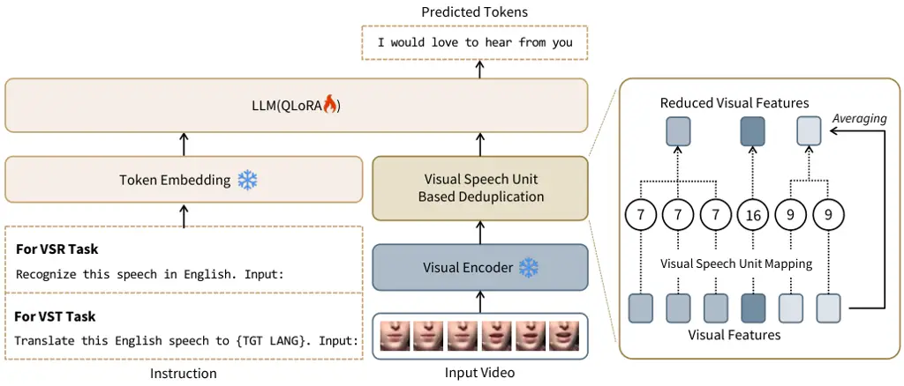
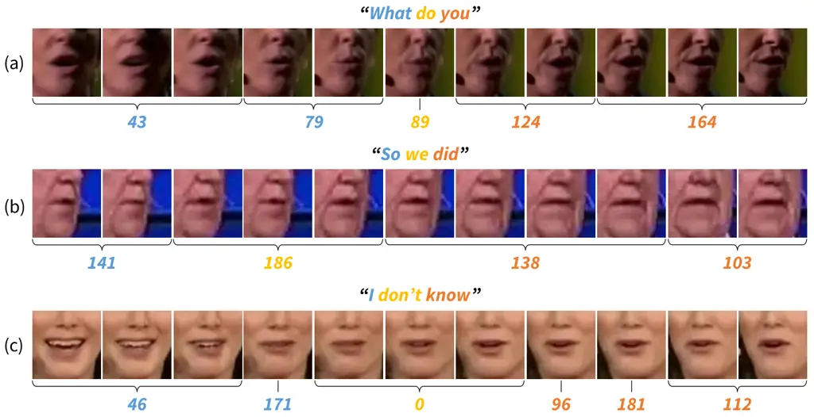
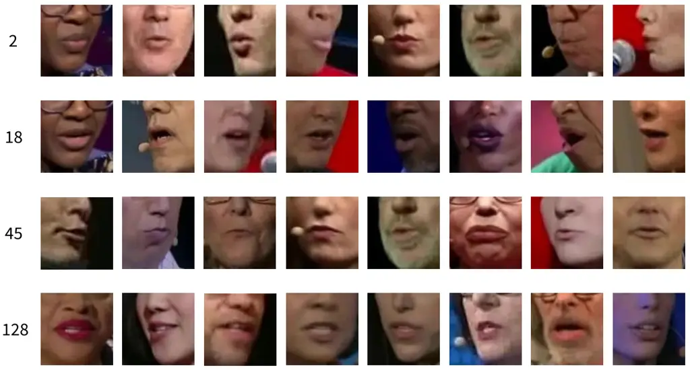

# Where Visual Speech Meets Language: VSP-LLM Framework for Efficient and Context-Aware Visual Speech Processing

Jeong Hun Yeo^(\*)    Seunghee Han^(\*)    Minsu Kim    Yong Man Ro^(†)
Affiliation: Integrated Vision and Language Lab, KAIST, South Korea
Email: [{sedne246,gkstmdgml211,ms.k,ymro}@kaist.ac.kr](mailto:)

###### Abstract

In visual speech processing, context modeling capability is one of the
most important requirements due to the ambiguous nature of lip
movements. For example, homophenes, words that share identical lip
movements but produce different sounds, can be distinguished by
considering the context. In this paper, we propose a novel framework,
namely Visual Speech Processing incorporated with LLMs (VSP-LLM), to
maximize the context modeling ability by bringing the overwhelming power
of LLMs. Specifically, VSP-LLM is designed to perform multi-tasks of
visual speech recognition and translation, where the given instructions
control the type of task. The input video is mapped to the input latent
space of an LLM by employing a self-supervised visual speech model.
Focused on the fact that there is redundant information in input frames,
we propose a novel deduplication method that reduces the embedded visual
features by employing visual speech units. Through the proposed
deduplication and Low Rank Adaptation (LoRA), VSP-LLM can be trained in
a computationally efficient manner. In the translation dataset, the
MuAViC benchmark, we demonstrate that VSP-LLM trained on just 30 hours
of labeled data can more effectively translate lip movements compared to
the recent model trained with 433 hours of data.

^(†)^(†)footnotetext: ^(∗)Equal Contribution. ^(†)Corresponding Author.

## 1 Introduction

Along with audio, visual speech (e.g., lip movements) plays a critical
role in human communication. With the increasing acknowledgment of the
importance of visual speech, a diverse range of visual-based speech
processing technologies Assael et al. (2016); Petridis and Pantic
(2016); Chung and Zisserman (2017a); Ma et al. (2021a); Ma et al.
(2022b); Yemini et al. (2024) is emerging. For instance, Visual Speech
Recognition (VSR) Kim et al. (2021); Ma et al. (2022a); Yeo et al.
(2023a) allows for the identification of spoken words through the
observation of lip movements alone, without the need for audio access.
Most recently, the exploration has begun into Visual Speech Translation
(VST) Cheng et al. (2023), which directly generates translated text in
the target language from the input lip movements of the source language.

One key challenge in visual speech processing is to distinguish
homophenes Kim et al. (2022). Homophenes refer to the words having
different sounds but showing the same lip movements. Therefore, a
crucial aspect of developing visual speech processing systems is in the
modeling of context so that the same lip movements can be mapped into
correct different pronunciations (that is distinguishing homophenes).
Recently, Large Language Models (LLMs) Zhang et al. (2022a); Brown
et al. (2020); Workshop et al. (2022) are attracting significant
attention across various fields Han et al. (2023); Wu et al. (2023b);
Fathullah et al. (2023), thanks to their versatility and strong ability
to model context. Motivated by the recent success of LLMs, we try to
investigate whether the rich context modeling ability of LLMs can be
employed in visual speech processing and can mitigate the ambiguity of
homophenes, especially focusing on two tasks, VSR and VST.

To this end, in this paper, we propose a new framework named Visual
Speech Processing incorporated with LLM (VSP-LLM) that learns the
seamless embedding of visual speech into the learned text space of LLMs.
VSP-LLM employs a self-supervised visual speech model to embed the input
visual speech into phoneme-level representations, where the derived
phonetic information can be effectively associated with text Zhang
et al. (2022b). Moreover, to reduce the computational burden in training
along with LLMs, we propose a novel deduplication method that reduces
the input sequence lengths of LLMs. Concretely, we employ visual speech
units, the discretized representations of the features from a
self-supervised model, as indicators for overlapped information between
sequences. As the visual speech units can be regarded as pseudo-text
Lakhotia et al. (2021), the visual speech features assigned to the same
visual speech units are averaged to reduce the processing of redundant
information and improve computational efficiency. Through our analysis,
we show that the sequence length can be reduced by approximately 50%
using the proposed deduplication, with minimal performance degradation.
Finally, the proposed VSP-LLM is jointly trained to perform VSR and VST
with a single model which is the first explored in this paper. We show
that by bringing the powerful context modeling ability into visual
speech processing, we achieve state-of-the-art performances in both VSR
and VST when using the LRS3 Afouras et al. (2018) and MuAViC Anwar
et al. (2023) datasets as training data. Additionally, our VSP-LLM
trained with just 30 hours of data outperforms the recent translation
model used 433 hours of training data.

The key contributions of this paper can be summarized as follows: 1) To
the best of our knowledge, this is the first work to incorporate visual
speech modeling with LLMs and achieve state-of-the-art performances in
VSR and VST. 2) This is the first to work to develop a unified visual
speech processing model that can perform both VSR and VST with a single
trained model. 3) We propose a novel visual speech deduplication that
significantly improves computational efficiency. 4) We show that the
proposed VSP-LLM can perform multi-tasks with superior performances even
in limited training resource situations, just with 30 hours of labeled
data by outperforming the recent translation model.

## 2 Related Work

### 2.1 Visual Speech Processing

Visual speech processing technologies are mainly comprised of two parts,
VSR and VST. VSR is a task to recognize the language content by watching
lip movements, without any sound. The VSR technologies have greatly
progressed with the development of deep learning. Early works Chung and
Zisserman (2017b); Stafylakis and Tzimiropoulos (2017); Petridis et al.
(2017); Petridis et al. (2018) utilize the CNN He et al. (2016) and the
RNN Chung et al. (2014); Hochreiter and Schmidhuber (1997) to devise a
word-level VSR system. To expand the VSR systems into sentence-level,
Chung et al. (2017); Afouras et al. (2018) have utilized a multi-stage
pipeline to automatically collect large-scale VSR data. Based on the
large-scale VSR datasets, researchers Serdyuk et al. (2022); Ma et al.
(2021b) have developed the VSR systems from the perspective of
architecture, especially the Transformer Vaswani et al. (2017) have
greatly improved the performance of VSR by enabling to capture of the
context between any two positions of lip sequences. Moreover, the
multimodal learning strategies Zhao et al. (2020); Afouras et al.
(2020); Ren et al. (2021); Ma et al. (2021a); Kim et al. (2021); Kim
et al. (2022); Yeo et al. (2023b) have attempted to complement the
insufficient visual speech representations by utilizing audio
information. A recent self-supervised model known as AV-HuBERT Shi
et al. (2022), has significantly improved the visual speech
representations by predicting the pseudo-label assigned from clustering
audio-visual features, with a mask-prediction task like BERT Devlin
et al. (2019). According to the advancement of the VSR system, we can
now recognize lip movements quite accurately through state-of-the-art
VSR models such as AV-HuBERT. Building upon this, the exploration for
VST has begun by introducing a Multilingual Audio-Visual Corpus (MuAViC)
Anwar et al. (2023) dataset and constructing a VST Cheng et al. (2023).

Despite these research efforts, the development of visual speech
processing systems enabling multi-task via a unified model, such as VSR
and VST, has never been explored in the previous visual speech
processing literature. Hence, the objective of this paper is to develop
a unified model to perform multi-tasks, including VSR and VST, by
utilizing a rich context modeling ability of LLMs.



Figure 1: Illustration of our VSP-LLM framework. Visual speech
representations encoded from the visual encoder are mapped to visual
speech units. Then the visual speech representations are reduced through
averaging based on the mapped visual speech units. These reduced
representations are fed into the LLM along with text instructions.

### 2.2 Integration of speech models and LLMs

LLMs have shown remarkable success in various tasks due to their
extensive linguistic knowledge and contextual understanding. While
leveraging such inherent advantages of LLMs, several studies have tried
to seamlessly integrate text-based knowledge with other modalities,
particularly in the audio speech domain. For example, AudioPaLM
Rubenstein et al. (2023) has been proposed to build a unified model
interacting between text language and audio speech. To naturally bridge
the gap between the two modalities, AudioPaLM has developed a multimodal
vocabulary composed of discrete tokens representing both text and
speech. Fathullah et al. Fathullah et al. (2023) have employed LLaMA as
a speech recognition decoder so that the speech sequence features
obtained from a conformer encoder were designed to be directly mapped
into text tokens, the domain of LLaMA. Moreover, Wu et al. Wu et al.
(2023a) have tried to address the inherent problem of mismatched
sequence lengths between speech signals and text, while taking LLaMA as
a speech translation decoder. So, they have compressed the speech
sequence feature and matched its sequence length with that of the text.

However, while the existing studies have primarily focused on
incorporating LLMs with the audio speech modality, the exploration of
such integration for visual speech processing remains unexplored. In
this paper, we propose a novel framework that integrates visual speech
processing with LLM. Specifically, we attempt to mitigate the homophenes
problem, one of the key challenges in the field of visual speech
processing, by leveraging the rich context modeling capabilities of LLM.
Additionally, to address the training load issues arising from the
integration of the visual speech model and LLM, we introduce the concept
of a visual speech unit. Through the implementation of visual speech
units, we propose a novel visual speech deduplication method that
compresses redundant representations while preserving contextual
information.

## 3 Method

Figure 1 shows the overall framework of the proposed Visual Speech
Processing incorporated with LLM (VSP-LLM). It includes a visual encoder
that embeds the input video into the input space of a pre-trained LLM, a
visual speech unit based deduplication module that discards redundant
information in contiguous frames, and an instruction embedding component
that serves as a task specifier. In the following, we describe each
component in detail.

### 3.1 Visual-to-Text Space Mapping

Our primary objective is to employ the rich context modeling capability
of LLM in our visual speech modeling. To accomplish this, we need to
represent the input video in a manner that aligns closely with
linguistic information, thereby facilitating the association between
visual inputs and the text space of the pre-trained LLM. Motivated by
the recent success of the self-supervised speech models Hsu et al.
(2021); Shi et al. (2022) that showed the learned representations are
highly correlated with phonetic information (e.g., phoneme) Pasad et al.
(2023), we employ AV-HuBERT Shi et al. (2022) for our base visual
encoder. Then, a learnable visual-to-text embedding layer is introduced
to map the visual representations into the input space of LLM. We name
this process as visual-to-text space mapping.

To investigate how well the visual representation aligns with the text
embedding space of the LLM, we compute the cosine similarity between the
visual speech representation and the token embeddings of the LLM,
mapping it to the text token with the highest similarity. Figure 2a
shows an example of a textualized visual speech representation. An
intriguing observation is that, with well-structured visual-text space
mapping, textualized visual speech representations can exhibit
pronunciation resembling real words. However, we observe redundant
information when mapping entire video frames to text due to the
similarity of adjacent frames. For instance, words like ’is’ and ’a’ are
repeated multiple times, and the word ’social’ is mapped as a long
stretch. This redundancy increases computational load when visual speech
representations are fed into LLM. To address this, we propose a novel
method called "Visual Speech Unit-based Deduplication" to remove
redundancy while retaining semantic content.

### 3.2 Visual Speech Unit based Deduplication

Compared to the length of the input video, the length of the text is
much shorter. This is similar to the relationships between speech and
text in Automatic Speech Recognition (ASR) Graves and Graves (2012),
where the input speech is almost always longer than the output text.
Therefore, when we map visual speech representations into text space
through visual-to-text space mapping, the resulting embedded output
matches the length of the input video frames. If we directly provide it
to the LLM, a large computational burden is inevitable. Here, we note
that the video is smooth in temporal and the contiguous frames contain
overlapped information, and propose to reduce the length of the embedded
representation before feeding it to the LLM.

To this end, we first extract the pronunciation cue from the visual
representations through discretization. Recent literature Lakhotia
et al. (2021) shows that discretized self-supervised speech features,
termed speech units, contain phonetic information while suppressing
non-linguistic variations. Motivated by this, we propose to extract a
visual version of speech units, namely visual speech units, which can be
obtained by performing K-means clustering on the self-supervised visual
speech representations. By doing this, we can access the pronunciation
information for each video frame without requiring any text input Lee
et al. (2022). Then, by employing the visual speech units as pseudo
text, we investigate the overlapped contiguous frames. Finally, the
corresponding visual features are averaged out. For instance, if the
obtained visual speech units are $`\{7,7,7,16,9,9\}`$ as illustrated in
Figure 1, then the visual features at positions 1, 2, and 3 are averaged
together, and those at positions 5 and 6 are averaged, resulting in 3
frames. We find that the proposed visual speech unit based deduplication
reduces the sequence lengths by about 46.62% compared to the input video
lengths. Most importantly, we observed that the deduplication process
does not result in any drop in performance. The reduced visual features,
when converted into text (Figure 2b), maintain the meaning of each word
while the duplication of each word has been removed. For instance, the
recurrence of ’is’ and ’a’, which appeared multiple times in the
original feature, is reduced, and the length of ’social’, which has a
long stretch, is also drastically reduced.

Figure 2: Textulaization results of the visual speech representations.
GT, (a), and (b) indicate the ground truth, textualization without
deduplication, and textualization with deduplication, respectively.

### 3.3 Multi-task Learning with Instruction

One advantage of bridging LLMs into visual speech processing is that we
can leverage the versatility of LLMs as well. To investigate this, we
train the proposed VSP-LLM with two tasks, VSR and VST. VSR aims to
recognize the input silent speech while VST aims not only to predict the
recognized speech but also to translate it into the target language. We
design the system so that tasks can be controlled by inputting
instructions directly into the LLM. When performing the VSR task the
instruction is set to as below,

```ltx_verbatim
Recognize this speech in English.
Input: ${Dedupped_Visual_Feature}
```

where the deduplicated visual features are inserted after the
instruction. Otherwise, to perform VST, the following instruction is
employed.

```ltx_verbatim
Translate this English speech to ${TGT LANG}.
Input: ${Dedupped_Visual_Feature}
```

where the target language is used for the position of TGT LANG. The
objective function for each task can be written as follows,

```math
\displaystyle\mathcal{L}=-\sum^{L}_{l=1}\ \log p(y^{l}|X,I,y^{<l}), \tag{1}
```

where $`X`$ is input video, $`I`$ is instruction used, $`y^{l}`$ is the
$`l`$-th text token of the ground truth sentence, $`y^{<l}`$ is the
previous predictions, and $`L`$ is the length of ground truth. Please
note that this is the first work exploring a unified framework of VSR
and VST. For training, we employ the recently proposed QLoRA Dettmers
et al. (2023) to further relieve the computational load in training LLM.

## 4 Experiment

### 4.1 Dataset

Lip Reading Sentences 3 (LRS3) Afouras et al. (2018) is the most
widely-used dataset for VSR, which comprises 433 hours of English
audio-visual speech corpus with transcription data. These corpora are
collected from the TED and TEDx talks. We utilize the LRS3 dataset to
measure the VSR performance of the proposed unified model.

Multilingual Audio-Visual Corpus (MuAViC) Anwar et al. (2023) is a
multilingual audio-visual dataset designed for speech recognition and
speech-to-text translation. It includes 1200 hours of audio-visual
corpus in 9 languages, providing full transcriptions and covering 6
English-to-X translations, as well as 6 X-to-English translation
directions. To evaluate the VST performance of our model, we utilize
English-to-X translation data from MuAViC dataset, where X can be among
four languages, Spanish (Es), French (Fr), Portuguese (Pt), and Italian
(It). For training our model, we combine the LRS3 dataset and
English-to-X translation data of MuAViC.

|                 |                               |                         |                             |                  |                  |        |
| --------------- | ----------------------------- | ----------------------- | --------------------------- | ---------------- | ---------------- | ------ |
| Method          |                               | Pre-training Data (hrs) | Labeled Training Data (hrs) | Recognition Task | Translation Task | WER(%) |
| Supervised      | Afouras et al. (2018)         | \-                      | 1,519                       | ✓                |                  | 58.9   |
|                 | Shillingford et al. (2019)    | \-                      | 3,886                       | ✓                |                  | 55.1   |
|                 | Makino et al. (2019)          | \-                      | 31,000                      | ✓                |                  | 33.6   |
|                 | Prajwal et al. (2022)         | \-                      | 2,676                       | ✓                |                  | 30.7   |
|                 | Ma et al. (2021b)             | \-                      | 595                         | ✓                |                  | 30.4   |
|                 | Ma et al. (2023)              | \-                      | 3,448                       | ✓                |                  | 19.1   |
|                 | Serdyuk et al. (2022)         | \-                      | 90,000                      | ✓                |                  | 17.0   |
|                 | Chang et al. (2023)           | \-                      | 100,000                     | ✓                |                  | 12.8   |
| Self-supervised | AV-HuBERT Shi et al. (2022)   | 1,759                   | 30                          | ✓                |                  | 32.5   |
|                 | VATLM Zhu et al. (2023)       | 1,759                   | 30                          | ✓                |                  | 31.6   |
|                 | RAVen Haliassos et al. (2022) | 1,759                   | 30                          | ✓                |                  | 32.5   |
|                 | AKVSR Yeo et al. (2023a)      | 1,759                   | 30                          | ✓                |                  | 29.1   |
|                 | VSP-LLM                       | 1,759                   | 30                          | ✓                | ✓                | 29.8   |
|                 | AV-HuBERT Shi et al. (2022)   | 1,759                   | 433                         | ✓                |                  | 28.6   |
|                 | VATLM Zhu et al. (2023)       | 1,759                   | 433                         | ✓                |                  | 28.4   |
|                 | RAVen Haliassos et al. (2022) | 1,759                   | 433                         | ✓                |                  | 27.8   |
|                 | AKVSR Yeo et al. (2023a)      | 1,759                   | 433                         | ✓                |                  | 27.6   |
|                 | VSP-LLM                       | 1,759                   | 433                         | ✓                | ✓                | 26.7   |
|                 | VSP-LLM(FT)                   | 1,759                   | 433                         | ✓                | ✓                | 25.4   |

Table 1: The performance comparisons with state-of-the-art VSR methods.
Compared to the self-supervised methods, the proposed VSP-LLM, which can
perform both VSR and VST, achieves state-of-the-art recognition
performances. We also evaluate the performance of a fine-tuned
VSP-LLM(FT) with an unfrozen visual encoder.

|                           |                   |                   |       |       |       |      |
| ------------------------- | ----------------- | ----------------- | ----- | ----- | ----- | ---- |
| Method                    | Labeled data(hrs) | BLEU $`\uparrow`$ |       |       |       |      |
|                           |                   | En-It             | En-Fr | En-Pt | En-Es | Avg  |
| Anwar et al. (2023)       | 433               | 15.1              | 16.8  | 15.1  | 19.2  | 16.6 |
| AV-HuBERT                 | 433               | 16.6              | 19.4  | 17.4  | 21.7  | 18.8 |
| Cascaded (AV-HuBERT + MT) | 433               | 17.6              | 19.5  | 17.4  | 22.4  | 19.2 |
| VSP-LLM                   | 30                | 16.1              | 19.3  | 16.6  | 20.7  | 18.2 |
| VSP-LLM                   | 433               | 17.9              | 22.3  | 18.7  | 22.7  | 20.4 |
| VSP-LLM(FT)               | 433               | 17.7              | 22.2  | 19.4  | 22.4  | 20.4 |

Table 2: Experimental results for English to target language (En-X)
translation on the MuAViC benchmark.

### 4.2 Implementation Details

Preprocessing. The video is resampled at 25 fps, and facial landmarks
are detected using RetinaFace Deng et al. (2020). Mouth regions are
cropped using bounding boxes of size $`96\times 96`$ and converted to
grayscale. During training, we apply data augmentation by randomly
cropping the video to $`88\times 88`$ and horizontally flipping it.

Architecture. We use the AV-HuBERT large Shi et al. (2022) pre-trained
on LRS3 Afouras et al. (2018) and VoxCeleb2 English Chung et al. (2018)
as our visual encoder. In all experiments, except the ablation part, we
utilize 200 clustered visual speech units. For the LLM, we adopt
LLaMA2-7B Touvron et al. (2023) and fine-tune it using QLoRA Dettmers
et al. (2023) with the rank value of 16 and a dropout rate of 5%. To
align the dimensions of the visual representation from the visual
encoder to the LLaMA input embedding, we use a single linear layer as
our visual-to-text embedding layer.

Training and evaluation. We follow AV-HuBERT Ren et al. (2021) except
for the number of updates and learning rate. We conduct training with a
learning rate of $`5e^{-4}`$ and the number of updates is 15K updates
for LRS3 1h, 5h, 10h, and 30K updates for LRS3 30h and 433h. For VSP-LLM
(FT), the visual encoder is frozen for the first 18K steps and then
unfrozen afterward. Adam optimizer is employed for training with
$`\beta_{1}=0.9`$ and $`\beta_{2}=0.98`$, utilizing a tri-stage learning
rate scheduler. The training process is executed on 8 3090 RTX GPUs. For
decoding, we use a beam search with a beam width of 20 and a length
penalty of 0. We assess the performance of our model using Word Error
Rate (WER) for the VSR task and BLEU score Papineni et al. (2002) for
the VST task. We use total FLOPs per epoch as a metric to measure the
model operation count during training.

### 4.3 Experimental Results

#### 4.3.1 Comparison with State-of-the-arts

In this subsection, we compare the proposed unified model with
state-of-the-art VSR and VST methods. Please note that the proposed
model can perform multi-tasks VSR and VST with a single trained model
while the other models need a single model per specific task.

Table 1 presents the performance comparisons of the proposed method with
state-of-the-art VSR methods on the LRS3 dataset. The top section of
Table 1 outlines the performance of current supervised approaches that
depend on extensive labeled training data, while the lower section
presents a comparison with other self-supervised methods. Table 1
demonstrates that our approach achieves performance on par with others
by employing just 30 hours of labeled data, despite the proposed unified
model’s ability to handle multiple tasks—VSR and VST—simultaneously.
When employing 433 hours of training data, our method achieves a WER of
26.7%. By fine-tuning the VSP-LLM(FT) with an unfrozen visual encoder,
we further enhance our performance, achieving a WER of 25.4%, surpassing
other self-supervised approaches. Moreover, Table 1’s upper part shows
that the existing supervised methods record exceptional performance
using (tens of) thousands of labeled data. However, it is important to
highlight that the proposed unified model can obtain comparable
performances to several supervised methods.

Table 2 presents the comparison results of VST performance. We construct
two baseline models for comparison. The first, AV-HuBERT, is trained
similarly to our approach, utilizing both VSR and VST datasets. The
second model is a cascaded system that incorporates a pre-trained
AV-HuBERT for VSR with a neural machine translation model Fan et al.
(2021). Through this comparison, our proposed VSP-LLM demonstrates
superior VST performance across four English-to-X translation tasks,
achieving BLEU scores of 17.9, 22.3, 18.7, and 22.7 for English to
Italian, French, Portuguese, and Spanish, respectively. The VSP-LLM(FT)
shows a better performance 19.4 BLUE score on translation from English
to Portuguese and comparable performances in other languages. Moreover,
it is worth noting that the proposed method achieves an 18.2 BLEU score
on average with only 30 hours of labeled data, outperforming the
bilingual speech translation model Anwar et al. (2023) trained with 433
hours of labeled data.

Figure 3: The qualitative results showing that the contextual modeling
ability of LLM, which is adopted in our method, can improve the
homophene problem and other confusing cases. The red and blue words
indicate the wrong predictions from AV-HuBERT. However, as shown in the
examples, the proposed method can generate correct words by considering
the entire context (e.g., ‘i’ to ‘eye’).

Figure 4: VSR performance analysis on LRS3 with varying video length of
test samples. Due to the strength of contextual understanding ability of
LLM, the proposed method shows superior performance with longer videos.

#### 4.3.2 Effectiveness of Rich Context Modeling

We have developed a unified model incorporating LLMs to leverage their
advanced context modeling capabilities. Therefore, in this section, we
conduct a qualitative experiment to demonstrate the effectiveness of the
proposed VSP-LLM in handling homophenes, a challenging problem that
requires substantial context understanding to accurately identify
homophenes. Figure 3 shows several transcription examples obtained from
AV-HuBERT and our model, illustrating how our proposed method accurately
generates words by considering the entire context of a sentence. For
instance, in a homophene case, AV-HuBERT incorrectly transcribes "i", a
word which visually resembles "eye" on the lips, but differs in meaning.
On the other hand, our method correctly generates "eye", successfully
completing the idiom "eye to eye" to describe mutual understanding
between individuals. Similarly, AV-HuBERT’s transcription of "write" is
contextually inappropriate for a sentence discussing teaching the
physical skill of riding a bike. Our method, however, accurately outputs
"ride" resulting in the correct phrase "ride a bike". Also, we can
observe similar results in the other cases, not the homophene problem
only. For example, the proposed method can generate the word “composite”
according to standard English usage, unlike AV-HuBERT, which erroneously
outputs "compositive". These results corroborate that our approach can
more effectively comprehend contextual clues and generate more precise
and natural answers, due to the integration of LLM.

Additionally, we evaluate the VSR performance across various video
length segments to explore the effectiveness of LLM in handling long
speech. Figure 4 shows that WER decreases as video length increases.
Notably, our proposed method exhibits outstanding recognition
performance, with a WER of 12.9% on videos longer than 6 seconds.
Furthermore, our method demonstrates consistent performance improvements
as the length of the video increases, compared to other methods. It
indicates the effectiveness of LLM’s context modeling in longer video
utterances, which demand a more comprehensive understanding of context.

|                    |                   |       |       |       |      |                    |              |
| ------------------ | ----------------- | ----- | ----- | ----- | ---- | ------------------ | ------------ |
| Number of Clusters | BLEU $`\uparrow`$ |       |       |       |      | Length of sequence | FLOPs (P)    |
|                    | En-It             | En-Fr | En-Pt | En-Es | Avg  |                    |              |
| \-                 | 12.3              | 15.8  | 13.7  | 16.7  | 14.6 | 1.00               | 62.4         |
| 2000               | 11.2              | 15.9  | 13.8  | 16.5  | 14.4 | 0.70               | 53.8 (13.8%) |
| 200                | 12.1              | 15.4  | 13.6  | 16.8  | 14.5 | 0.53               | 45.6 (26.9%) |
| 50                 | 12.1              | 14.9  | 13.3  | 16.9  | 14.3 | 0.45               | 41.0 (34.3%) |

Table 3: Analysis on computational efficiency with varying number of
visual speech unit clusters. When the deduplication strategy is adopted,
the proposed method obtains comparable performances with greatly reduced
sequence length and training FLOPs.



Figure 5: Visualization results showing how video frame features are
deduplicated and mapped into visual speech units. By doing so, the
redundant frame features can be reduced efficiently.

#### 4.3.3 Effectiveness of Deduplication

We conduct experiments to assess the effectiveness of our deduplication
strategy. For the deduplication process, the number of clusters for
visual speech units is required to be determined, and we show the
effectiveness according to the number of clusters. Table 3 presents
these results, and the first row shows the performance of the baseline
which does not utilize the deduplication. The baseline obtains an
average BLEU score of 14.6 with 62.4 peta FLOPs per training epoch. By
applying the proposed deduplication, our method acquires comparable
performance, while significantly reducing the sequence length and
computational resources (FLOPs). Specifically, with 200 clusters for
visual speech units, our method not only maintains a similar performance
level with a 14.5 average BLEU score but also cuts the sequence length
by 53%. Consequently, the FLOPs are greatly reduced to 45.6, marking a
26.9% decrease. These experiments confirm that deduplication, applied to
visual speech units, effectively eliminates redundant information.

Moreover, we delve into the deduplication process by examining it at the
video frame level to check whether consecutive visual features,
characterized by similar lip movements, are grouped into the same visual
speech unit. Figure 5 provides several visual examples alongside their
corresponding phrases and video frames. In Figure 5 (a), as a speaker
articulates “What do you”, it’s noted that 11 video frames can be
expressed by 5 visual speech units. For instance, the visual sequences
for the sound “wha” belong to the same 43rd unit. Similarly, Figure 5
(c) illustrates that the four frames corresponding to “I” can be
efficiently represented by the 46th and 171st visual speech units.
Through this analysis, we confirm that visual features with similar lip
shapes can be effectively deduplicated, significantly reducing the
visual sequence’s length.

#### 4.3.4 VSP-LLM in Data-limited Situation

Leveraging the contextual understanding capabilities of LLM, which are
pre-trained on vast text corpora, we suppose that a small amount of
labeled data is sufficient for constructing a unified VSR and VST model.
This is because the proposed VSP-LLM endeavors to establish
visual-to-text mapping while entrusting the task of language modeling to
the LLM. To validate it, we train VSP-LLM on the MuAViC dataset with
different amounts of labeled data; 1 hour, 5 hours, 10 hours, and 15
hours. For comparison, we also develop AV-HuBERT on the same data. Table
4 displays the VSR and VST performances. In all experimental conditions,
regardless of the amount of data used, our proposed method significantly
outperforms AV-HuBERT. Moreover, when using only 15 hours of labeled
data, our unified method achieves a WER of 32.8%. This is a noteworthy
achievement, particularly when compared to the previous VSR Makino
et al. (2019) model achieving a WER of 33.6%, by using 31k hours of
labeled data for training.

|           |                   |                   |       |       |       |      |                       |
| --------- | ----------------- | ----------------- | ----- | ----- | ----- | ---- | --------------------- |
| Method    | Labeled Data(hrs) | BLEU $`\uparrow`$ |       |       |       |      | WER(%) $`\downarrow`$ |
|           |                   | En-It             | En-Fr | En-Pt | En-Es | Avg  |                       |
| AV-HuBERT | 1                 | 0.0               | 0.0   | 0.1   | 0.1   | 0.5  | 100.2                 |
| VSP-LLM   | 1                 | 1.0               | 2.8   | 2.0   | 1.7   | 1.8  | 84.84                 |
| AV-HuBERT | 5                 | 1.4               | 3.8   | 2.0   | 1.7   | 2.2  | 71.9                  |
| VSP-LLM   | 5                 | 10.6              | 14.0  | 11.5  | 15.1  | 12.8 | 36.2                  |
| AV-HuBERT | 10                | 3.0               | 5.1   | 3.9   | 4.5   | 4.1  | 56.7                  |
| VSP-LLM   | 10                | 12.1              | 15.4  | 13.6  | 16 8  | 12.8 | 34.3                  |
| AV-HuBERT | 15                | 3.4               | 7.1   | 5.5   | 8.7   | 6.2  | 52.4                  |
| VSP-LLM   | 15                | 13.5              | 16.9  | 14.2  | 17.0  | 15.4 | 32.8                  |

Table 4: Impact of the amount of labeled data. It shows that a small
amount of labeled data is sufficient to construct a unified VSR and VST
model by leveraging contextual understanding capabilities of LLM.

## 5 Conclusion

In this paper, we proposed a novel framework, Visual Speech Processing
with LLMs (VSP-LLM), designed to leverage the context modeling ability
of LLMs. Through this framework, we built a unified model that can
perform multi-tasks, VSR, and VST, with a single model. Moreover, the
proposed deduplication strategy reduces the redundant information of
visual speech representations based on pronunciation information modeled
from visual speech units. Through extensive experiments, we verified
that the proposed deduplication method can reduce the visual sequence
length by about 50% with minimal performance degradation. In addition,
we validated the effectiveness of the VSP-LLM by achieving a superior
performance in the MuAViC benchmark with only 30 hours of labeled data.

## 6 Limitations

We have proposed a powerful visual speech processing method that
incorporates LLMs to recognize and translate lip movements into other
languages, leveraging the rich context modeling ability of LLMs. Despite
the impressive improvement in the performance of this proposed method,
the utilization of LLMs has been limited to VSR and VST tasks. We expect
that the proposed VSP-LLM framework can be expanded to in real-world
communication scenarios by utilizing additional non-verbal cues such as
facial expressions and gestures. Especially, the VSP-LLM combined with
non-verbal cues is expected to perform various tasks such as emotional
recognition and dialog generation, starting with this paper as a
foundation.

## 7 Broader impact and ethics

The integration of Large Language Models (LLMs) within our framework
plays a pivotal role in its ability to handle the complexities of visual
speech across different languages. LLM brings a deep understanding of
contextual and linguistic information, which is critical for accurately
interpreting and translating visual speech cues. This capacity for
nuanced language processing underpins our confidence in the framework’s
potential for broader linguistic applicability. Moreover, our
experiments have demonstrated exceptional data efficiency and
significant performance gains with relatively small amounts of labeled
data for each language. This efficiency is crucial for scalability to
other languages and dialects, particularly those for which extensive
labeled datasets may not be readily available. The ability to achieve
robust performance with limited data is indicative of the framework’s
adaptability and its potential for expansion to a wider linguistic
range.

## References

- Afouras et al. (2018) Triantafyllos Afouras, Joon Son Chung, and
  Andrew Zisserman. 2018. Lrs3-ted: a large-scale dataset for visual
  speech recognition. _arXiv preprint arXiv:1809.00496_.
- Afouras et al. (2020) Triantafyllos Afouras, Joon Son Chung, and
  Andrew Zisserman. 2020. Asr is all you need: Cross-modal distillation
  for lip reading. In _ICASSP 2020-2020 IEEE International Conference on
  Acoustics, Speech and Signal Processing (ICASSP)_, pages 2143–2147.
  IEEE.
- Anwar et al. (2023) Mohamed Anwar, Bowen Shi, Vedanuj Goswami,
  Wei-Ning Hsu, Juan Pino, and Changhan Wang. 2023. Muavic: A
  multilingual audio-visual corpus for robust speech recognition and
  robust speech-to-text translation. _arXiv preprint arXiv:2303.00628_.
- Assael et al. (2016) Yannis M Assael, Brendan Shillingford, Shimon
  Whiteson, and Nando De Freitas. 2016. Lipnet: End-to-end
  sentence-level lipreading. _arXiv preprint arXiv:1611.01599_.
- Brown et al. (2020) Tom Brown, Benjamin Mann, Nick Ryder, Melanie
  Subbiah, Jared D Kaplan, Prafulla Dhariwal, Arvind Neelakantan, Pranav
  Shyam, Girish Sastry, Amanda Askell, et al. 2020. Language models are
  few-shot learners. _Advances in neural information processing
  systems_, 33:1877–1901.
- Chang et al. (2023) Oscar Chang, Hank Liao, Dmitriy Serdyuk, Ankit
  Shah, and Olivier Siohan. 2023. Conformers are all you need for visual
  speech recogntion. _arXiv preprint arXiv:2302.10915_.
- Cheng et al. (2023) Xize Cheng, Tao Jin, Rongjie Huang, Linjun Li,
  Wang Lin, Zehan Wang, Ye Wang, Huadai Liu, Aoxiong Yin, and Zhou
  Zhao. 2023. Mixspeech: Cross-modality self-learning with audio-visual
  stream mixup for visual speech translation and recognition. In
  _Proceedings of the IEEE/CVF International Conference on Computer
  Vision_, pages 15735–15745.
- Chung et al. (2018) Joon Son Chung, Arsha Nagrani, and Andrew
  Zisserman. 2018. Voxceleb2: Deep speaker recognition. _arXiv preprint
  arXiv:1806.05622_.
- Chung et al. (2017) Joon Son Chung, Andrew Senior, Oriol Vinyals, and
  Andrew Zisserman. 2017. Lip reading sentences in the wild. In _2017
  IEEE Conference on Computer Vision and Pattern Recognition (CVPR)_.
  IEEE.
- Chung and Zisserman (2017a) Joon Son Chung and Andrew Zisserman.
  2017a. Lip reading in the wild. In _Computer Vision–ACCV 2016: 13th
  Asian Conference on Computer Vision, Taipei, Taiwan, November 20-24,
  2016, Revised Selected Papers, Part II 13_, pages 87–103. Springer.
- Chung and Zisserman (2017b) Joon Son Chung and Andrew Zisserman.
  2017b. Lip reading in the wild. In _Computer Vision–ACCV 2016: 13th
  Asian Conference on Computer Vision, Taipei, Taiwan, November 20-24,
  2016, Revised Selected Papers, Part II 13_, pages 87–103. Springer.
- Chung et al. (2014) Junyoung Chung, Caglar Gulcehre, Kyunghyun Cho,
  and Yoshua Bengio. 2014. Empirical evaluation of gated recurrent
  neural networks on sequence modeling. In _NIPS 2014 Workshop on Deep
  Learning, December 2014_.
- Deng et al. (2020) Jiankang Deng, Jia Guo, Evangelos Ververas, Irene
  Kotsia, and Stefanos Zafeiriou. 2020. Retinaface: Single-shot
  multi-level face localisation in the wild. In _Proceedings of the
  IEEE/CVF conference on computer vision and pattern recognition_, pages
  5203–5212.
- Dettmers et al. (2023) Tim Dettmers, Artidoro Pagnoni, Ari Holtzman,
  and Luke Zettlemoyer. 2023. Qlora: Efficient finetuning of quantized
  llms. _arXiv preprint arXiv:2305.14314_.
- Devlin et al. (2019) Jacob Devlin, Ming-Wei Chang, Kenton Lee, and
  Kristina Toutanova. 2019. [BERT: Pre-training of deep bidirectional
  transformers for language
  understanding](https://doi.org/10.18653/v1/N19-1423). In _Proceedings
  of the 2019 Conference of the North American Chapter of the
  Association for Computational Linguistics: Human Language
  Technologies, Volume 1 (Long and Short Papers)_, pages 4171–4186,
  Minneapolis, Minnesota. Association for Computational Linguistics.
- Fan et al. (2021) Angela Fan, Shruti Bhosale, Holger Schwenk, Zhiyi
  Ma, Ahmed El-Kishky, Siddharth Goyal, Mandeep Baines, Onur Celebi,
  Guillaume Wenzek, Vishrav Chaudhary, et al. 2021. Beyond
  english-centric multilingual machine translation. _Journal of Machine
  Learning Research_, 22(107):1–48.
- Fathullah et al. (2023) Yassir Fathullah, Chunyang Wu, Egor Lakomkin,
  Junteng Jia, Yuan Shangguan, Ke Li, Jinxi Guo, Wenhan Xiong, Jay
  Mahadeokar, Ozlem Kalinli, et al. 2023. Prompting large language
  models with speech recognition abilities. _arXiv preprint
  arXiv:2307.11795_.
- Graves and Graves (2012) Alex Graves and Alex Graves. 2012.
  Connectionist temporal classification. _Supervised sequence labelling
  with recurrent neural networks_, pages 61–93.
- Haliassos et al. (2022) Alexandros Haliassos, Pingchuan Ma, Rodrigo
  Mira, Stavros Petridis, and Maja Pantic. 2022. Jointly learning visual
  and auditory speech representations from raw data. In _The Eleventh
  International Conference on Learning Representations_.
- Han et al. (2023) Jiaming Han, Renrui Zhang, Wenqi Shao, Peng Gao,
  Peng Xu, Han Xiao, Kaipeng Zhang, Chris Liu, Song Wen, Ziyu Guo,
  et al. 2023. Imagebind-llm: Multi-modality instruction tuning. _arXiv
  preprint arXiv:2309.03905_.
- He et al. (2016) Kaiming He, Xiangyu Zhang, Shaoqing Ren, and Jian
  Sun. 2016. Deep residual learning for image recognition. In
  _Proceedings of the IEEE conference on computer vision and pattern
  recognition_, pages 770–778.
- Hochreiter and Schmidhuber (1997) Sepp Hochreiter and Jürgen
  Schmidhuber. 1997. Long short-term memory. _Neural computation_,
  9(8):1735–1780.
- Hsu et al. (2021) Wei-Ning Hsu, Benjamin Bolte, Yao-Hung Hubert Tsai,
  Kushal Lakhotia, Ruslan Salakhutdinov, and Abdelrahman Mohamed. 2021.
  Hubert: Self-supervised speech representation learning by masked
  prediction of hidden units. _IEEE/ACM Transactions on Audio, Speech,
  and Language Processing_, 29:3451–3460.
- Kim et al. (2021) Minsu Kim, Joanna Hong, Se Jin Park, and Yong Man
  Ro. 2021. Cromm-vsr: Cross-modal memory augmented visual speech
  recognition. _IEEE Transactions on Multimedia_, 24:4342–4355.
- Kim et al. (2022) Minsu Kim, Jeong Hun Yeo, and Yong Man Ro. 2022.
  Distinguishing homophenes using multi-head visual-audio memory for lip
  reading. In _Proceedings of the AAAI Conference on Artificial
  Intelligence_, volume 36, pages 1174–1182.
- Lakhotia et al. (2021) Kushal Lakhotia, Eugene Kharitonov, Wei-Ning
  Hsu, Yossi Adi, Adam Polyak, Benjamin Bolte, Tu-Anh Nguyen, Jade
  Copet, Alexei Baevski, Abdelrahman Mohamed, and Emmanuel Dupoux. 2021.
  [On generative spoken language modeling from raw
  audio](https://doi.org/10.1162/tacl_a_00430). _Transactions of the
  Association for Computational Linguistics_, 9:1336–1354.
- Lee et al. (2022) Ann Lee, Hongyu Gong, Paul-Ambroise Duquenne, Holger
  Schwenk, Peng-Jen Chen, Changhan Wang, Sravya Popuri, Yossi Adi, Juan
  Pino, Jiatao Gu, et al. 2022. Textless speech-to-speech translation on
  real data. In _Proceedings of the 2022 Conference of the North
  American Chapter of the Association for Computational Linguistics:
  Human Language Technologies_, pages 860–872.
- Ma et al. (2023) Pingchuan Ma, Alexandros Haliassos, Adriana
  Fernandez-Lopez, Honglie Chen, Stavros Petridis, and Maja
  Pantic. 2023. Auto-avsr: Audio-visual speech recognition with
  automatic labels. In _ICASSP 2023-2023 IEEE International Conference
  on Acoustics, Speech and Signal Processing (ICASSP)_, pages 1–5. IEEE.
- Ma et al. (2021a) Pingchuan Ma, Brais Martinez, Stavros Petridis, and
  Maja Pantic. 2021a. Towards practical lipreading with distilled and
  efficient models. In _ICASSP 2021-2021 IEEE International Conference
  on Acoustics, Speech and Signal Processing (ICASSP)_, pages 7608–7612.
  IEEE.
- Ma et al. (2021b) Pingchuan Ma, Stavros Petridis, and Maja Pantic.
  2021b. End-to-end audio-visual speech recognition with conformers. In
  _ICASSP 2021-2021 IEEE International Conference on Acoustics, Speech
  and Signal Processing (ICASSP)_, pages 7613–7617. IEEE.
- Ma et al. (2022a) Pingchuan Ma, Stavros Petridis, and Maja Pantic.
  2022a. Visual speech recognition for multiple languages in the wild.
  _Nature Machine Intelligence_, 4(11):930–939.
- Ma et al. (2022b) Pingchuan Ma, Yujiang Wang, Stavros Petridis, Jie
  Shen, and Maja Pantic. 2022b. Training strategies for improved
  lip-reading. In _ICASSP 2022-2022 IEEE International Conference on
  Acoustics, Speech and Signal Processing (ICASSP)_, pages 8472–8476.
  IEEE.
- Makino et al. (2019) Takaki Makino, Hank Liao, Yannis Assael, Brendan
  Shillingford, Basilio Garcia, Otavio Braga, and Olivier Siohan. 2019.
  Recurrent neural network transducer for audio-visual speech
  recognition. In _2019 IEEE automatic speech recognition and
  understanding workshop (ASRU)_, pages 905–912. IEEE.
- Papineni et al. (2002) Kishore Papineni, Salim Roukos, Todd Ward, and
  Wei-Jing Zhu. 2002. Bleu: a method for automatic evaluation of machine
  translation. In _Proceedings of the 40th annual meeting of the
  Association for Computational Linguistics_, pages 311–318.
- Pasad et al. (2023) Ankita Pasad, Bowen Shi, and Karen Livescu. 2023.
  Comparative layer-wise analysis of self-supervised speech models. In
  _ICASSP 2023-2023 IEEE International Conference on Acoustics, Speech
  and Signal Processing (ICASSP)_, pages 1–5. IEEE.
- Petridis et al. (2017) Stavros Petridis, Zuwei Li, and Maja
  Pantic. 2017. End-to-end visual speech recognition with lstms. In
  _2017 IEEE international conference on acoustics, speech and signal
  processing (ICASSP)_, pages 2592–2596. IEEE.
- Petridis and Pantic (2016) Stavros Petridis and Maja Pantic. 2016.
  Deep complementary bottleneck features for visual speech recognition.
  In _2016 IEEE International Conference on Acoustics, Speech and Signal
  Processing (ICASSP)_, pages 2304–2308. IEEE.
- Petridis et al. (2018) Stavros Petridis, Themos Stafylakis, Pingehuan
  Ma, Feipeng Cai, Georgios Tzimiropoulos, and Maja Pantic. 2018.
  End-to-end audiovisual speech recognition. In _2018 IEEE international
  conference on acoustics, speech and signal processing (ICASSP)_, pages
  6548–6552. IEEE.
- Prajwal et al. (2022) KR Prajwal, Triantafyllos Afouras, and Andrew
  Zisserman. 2022. Sub-word level lip reading with visual attention. In
  _Proceedings of the IEEE/CVF conference on Computer Vision and Pattern
  Recognition_, pages 5162–5172.
- Ren et al. (2021) Sucheng Ren, Yong Du, Jianming Lv, Guoqiang Han, and
  Shengfeng He. 2021. Learning from the master: Distilling cross-modal
  advanced knowledge for lip reading. In _Proceedings of the IEEE/CVF
  Conference on Computer Vision and Pattern Recognition_, pages
  13325–13333.
- Rubenstein et al. (2023) Paul K Rubenstein, Chulayuth Asawaroengchai,
  Duc Dung Nguyen, Ankur Bapna, Zalán Borsos, Félix de Chaumont Quitry,
  Peter Chen, Dalia El Badawy, Wei Han, Eugene Kharitonov, et al. 2023.
  Audiopalm: A large language model that can speak and listen. _arXiv
  preprint arXiv:2306.12925_.
- Serdyuk et al. (2022) Dmitriy Serdyuk, Otavio Braga, and Olivier
  Siohan. 2022. Transformer-based video front-ends for audio-visual
  speech recognition for single and multi-person video. _arXiv preprint
  arXiv:2201.10439_.
- Shi et al. (2022) Bowen Shi, Wei-Ning Hsu, Kushal Lakhotia, and
  Abdelrahman Mohamed. 2022. Learning audio-visual speech representation
  by masked multimodal cluster prediction. _arXiv preprint
  arXiv:2201.02184_.
- Shillingford et al. (2019) Brendan Shillingford, Yannis M. Assael,
  Matthew W. Hoffman, Thomas Paine, Cían Hughes, Utsav Prabhu, Hank
  Liao, Hasim Sak, Kanishka Rao, Lorrayne Bennett, Marie Mulville, Misha
  Denil, Ben Coppin, Ben Laurie, Andrew W. Senior, and Nando
  de Freitas. 2019. [Large-scale visual speech
  recognition](https://doi.org/10.21437/INTERSPEECH.2019-1669). In
  _Interspeech 2019, 20th Annual Conference of the International Speech
  Communication Association, Graz, Austria, 15-19 September 2019_, pages
  4135–4139. ISCA.
- Stafylakis and Tzimiropoulos (2017) Themos Stafylakis and Georgios
  Tzimiropoulos. 2017. Combining residual networks with lstms for
  lipreading. In _Proc. Interspeech_.
- Touvron et al. (2023) Hugo Touvron, Thibaut Lavril, Gautier Izacard,
  Xavier Martinet, Marie-Anne Lachaux, Timothée Lacroix, Baptiste
  Rozière, Naman Goyal, Eric Hambro, Faisal Azhar, et al. 2023. Llama:
  Open and efficient foundation language models. _arXiv preprint
  arXiv:2302.13971_.
- Vaswani et al. (2017) Ashish Vaswani, Noam Shazeer, Niki Parmar, Jakob
  Uszkoreit, Llion Jones, Aidan N Gomez, Łukasz Kaiser, and Illia
  Polosukhin. 2017. Attention is all you need. _Advances in neural
  information processing systems_, 30.
- Workshop et al. (2022) BigScience Workshop, Teven Le Scao, Angela Fan,
  Christopher Akiki, Ellie Pavlick, Suzana Ilić, Daniel Hesslow, Roman
  Castagné, Alexandra Sasha Luccioni, François Yvon, et al. 2022. Bloom:
  A 176b-parameter open-access multilingual language model. _arXiv
  preprint arXiv:2211.05100_.
- Wu et al. (2023a) Jian Wu, Yashesh Gaur, Zhuo Chen, Long Zhou, Yimeng
  Zhu, Tianrui Wang, Jinyu Li, Shujie Liu, Bo Ren, Linquan Liu, et al.
  2023a. On decoder-only architecture for speech-to-text and large
  language model integration. In _2023 IEEE Automatic Speech Recognition
  and Understanding Workshop (ASRU)_, pages 1–8. IEEE.
- Wu et al. (2023b) Shengqiong Wu, Hao Fei, Leigang Qu, Wei Ji, and
  Tat-Seng Chua. 2023b. Next-gpt: Any-to-any multimodal llm. _arXiv
  preprint arXiv:2309.05519_.
- Yemini et al. (2024) Yochai Yemini, Aviv Shamsian, Lior Bracha, Sharon
  Gannot, and Ethan Fetaya. 2024. [Lipvoicer: Generating speech from
  silent videos guided by lip
  reading](https://openreview.net/forum?id=ZZCPSC5OgD). In _The Twelfth
  International Conference on Learning Representations_.
- Yeo et al. (2023a) Jeong Hun Yeo, Minsu Kim, Jeongsoo Choi, Dae Hoe
  Kim, and Yong Man Ro. 2023a. [Akvsr: Audio knowledge empowered visual
  speech recognition by compressing audio knowledge of a pretrained
  model](http://arxiv.org/abs/2308.07593).
- Yeo et al. (2023b) Jeong Hun Yeo, Minsu Kim, and Yong Man Ro. 2023b.
  Multi-temporal lip-audio memory for visual speech recognition. In
  _ICASSP 2023-2023 IEEE International Conference on Acoustics, Speech
  and Signal Processing (ICASSP)_, pages 1–5. IEEE.
- Zhang et al. (2022a) Susan Zhang, Stephen Roller, Naman Goyal, Mikel
  Artetxe, Moya Chen, Shuohui Chen, Christopher Dewan, Mona Diab, Xian
  Li, Xi Victoria Lin, et al. 2022a. Opt: Open pre-trained transformer
  language models. _arXiv preprint arXiv:2205.01068_.
- Zhang et al. (2022b) Ziqiang Zhang, Long Zhou, Junyi Ao, Shujie Liu,
  Lirong Dai, Jinyu Li, and Furu Wei. 2022b. Speechut: Bridging speech
  and text with hidden-unit for encoder-decoder based speech-text
  pre-training. In _Proceedings of the 2022 Conference on Empirical
  Methods in Natural Language Processing_, pages 1663–1676.
- Zhao et al. (2020) Ya Zhao, Rui Xu, Xinchao Wang, Peng Hou, Haihong
  Tang, and Mingli Song. 2020. Hearing lips: Improving lip reading by
  distilling speech recognizers. In _Proceedings of the AAAI Conference
  on Artificial Intelligence_, volume 34, pages 6917–6924.
- Zhu et al. (2023) Qiushi Zhu, Long Zhou, Ziqiang Zhang, Shujie Liu,
  Binxing Jiao, Jie Zhang, Lirong Dai, Daxin Jiang, Jinyu Li, and Furu
  Wei. 2023. Vatlm: Visual-audio-text pre-training with unified masked
  prediction for speech representation learning. _IEEE Transactions on
  Multimedia_.



Figure 6: Visualization of video frames corresponding to visual speech
units. Each number indicates an index of visual speech unit.

|                    |              |
| ------------------ | ------------ |
| Number of Clusters | FLOPs (P)    |
| w/o deduplication  | 19.2         |
| 2000               | 16.2 (15.6%) |
| 200                | 14.0 (27.1%) |
| 50                 | 12.6 (34.4%) |

Table 5: Analysis on computational efficiency with varying number of
visual speech unit clusters in inference time.

## Appendix A Visualization of Visual Speech Units

The visualization results of the visual speech units are shown in Figure 6. In this paper, we use 200 clusters in order to generate visual speech
units. Through analyzing the results, we verify that the video frames
assigned the same visual speech unit have similar lip movement.

## Appendix B FLOPs During Inference with Deduplication

Table 5 shows the FLOPs during inference time. Similar to during
training, applying deduplication techniques also significantly reduced
inference FLOPs.

|                               |                                                                                              |
| ----------------------------- | -------------------------------------------------------------------------------------------- |
| Sample ID                     | Label                                                                                        |
| test/VIgzTLDyObo/00004        | and then what happens                                                                        |
| trainval/jpeSLKnS4gM/50020    | and then what happens                                                                        |
| test/vXPJVwwEmiM/00004        | you probably won’t                                                                           |
| pretrain/omGbKQIzoWY/00009_00 | you probably won’t do well on that problem on the other hand relaxed daydreaming is a way to |

Table 6: Examples of cases where sentences in the test set also appear
in the training set, but are spoken by distinct individuals.

## Appendix C Exposure to Transcriptions in the Pre-Training of LLM

There might be concerns regarding LLaMA2’s potential exposure to the
LRS3 dataset during the pre-training phase. Since the details of
LLaMA2’s training data aren’t publicly available, we can’t be absolutely
sure whether LRS3 was included or not. However, it’s important to
emphasize that the core challenge and focus of visual speech recognition
(VSR) and translation (VST) lie in the ability to accurately match mouth
shapes to unseen speakers, rather than merely replicating text from
specific sentences. In particular, the mouth shape of the same sentence
can vary significantly when expressed by different speakers, emphasizing
the visual rather than textual nature of the work. Our analysis of the
LRS3 dataset (Table 6) highlights this point, showing cases where
sentences in the test set also appear in the training set, but are
spoken by distinct individuals. This case serves to highlight the
importance of the model’s ability to recognize speaker-specific mouth
shapes over memorizing textual content. Given this context, we believe
that the potential exposure of LLaMA2 to certain sentences from the LRS3
dataset during training is unlikely to significantly impact the model’s
performance in our study.

|                       |                                                                           |
| --------------------- | ------------------------------------------------------------------------- |
| Homophene Cases       |                                                                           |
| Ground Truth          | it’s not like teaching them how to ride a bike                            |
| Prajwal et al. (2022) | it’s all i teach them how to write a bike                                 |
| VSP-LLM               | it’s not like teaching them how to ride a bike                            |
| Ground Truth          | is it about earning as much as you possibly can                           |
| Prajwal et al. (2022) | it’s about learning as much as possibly can                               |
| VSP-LLM               | it’s about earning as much as you possibly can                            |
| Ground Truth          | it’s like a piece of junk mail to be thrown away                          |
| Ma et al. (2021b)     | it’s like a piece of chunk made to be thrown away                         |
| VSP-LLM               | it’s like a piece of junk mail being thrown away                          |
| Ground Truth          | and imagine what might happen because every region has something to offer |
| Ma et al. (2021b)     | and imagine what might happen because every reason has something to offer |
| VSP-LLM               | and imagine what might happen because every region has something to offer |

Table 7: Additional baseline examples for the homophene case. The Red
words indicate homophene words.

## Appendix D Additional Examples of Homophene case

In Section 4.3.2, we discussed the VSP-LLM model’s exceptional ability
to correctly distinguish homophenes by leveraging its advanced context
modeling capabilities. This section further extends our analysis by
comparing the performance of the VSP-LLM with other baseline models in
handling homophenes. The results of these comparisons are presented in
Table 7. In one notable example, Ma et al. incorrectly transcribed
"junk" as "chunk." In contrast, the VSP-LLM accurately recognized the
phrase "junk mail," a commonly used and contextually appropriate phrase
in English. This illustrates the VSP-LLM’s superior performance,
particularly its proficiency in integrating contextual understanding
with linguistic patterns to enhance transcription accuracy in cases
involving homophenes.

Figure 7: Examples of VSR and VST predictions produced by our proposed
model on LRS3 and En-to-X test set. Deletions from the ground-truth text
are highlighted in Red, while substitutions or addition are shown in
Blue.

## Appendix E Examples of Predicted Sentences

The examples of recognized and translated transcription by the proposed
unified model are shown in Figure 7. For generating transcription, we
use a single-trained model that performs both VSR and VST tasks.

## Appendix F Erratum

In Section 4 of this paper, we intended to report the translation
results on the MuAViC dataset. However, the results were mistakenly
reported on the LRS3-T dataset instead of the MuAViC dataset. In the
revised manuscript, we have corrected this error by assessing and
reporting the translation results on the correct MuAViC dataset.
