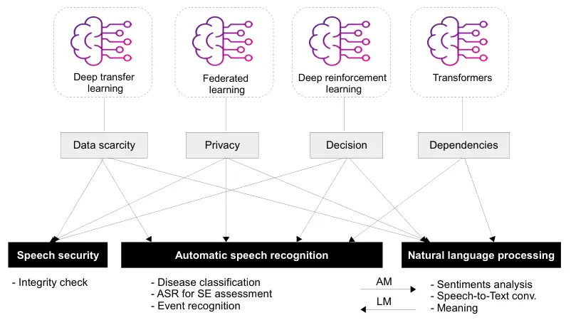
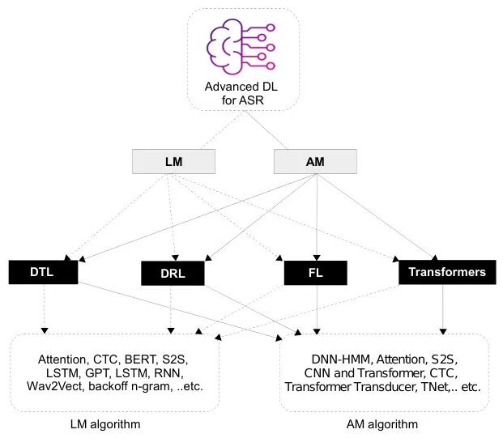
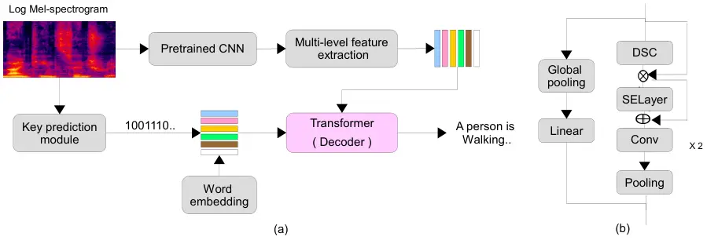
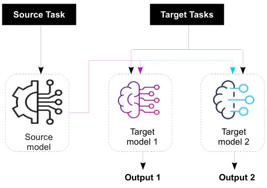
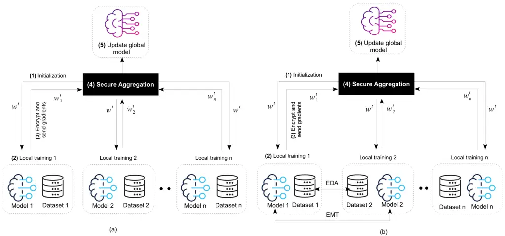
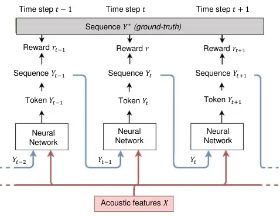

\geometry

a4paper, textwidth=18cm, textheight=26cm, heightrounded, hratio=1:1,
vratio=2:3,

\[orcid=0000-0002-9532-2453\]

\[orcid=0000-0002-6353-0215\]

\[orcid=0000-0001-8904-5587\]

# Automatic Speech Recognition using Advanced Deep Learning Approaches: A survey

Hamza Kheddarcor1 kheddar.hamza@univ-medea.dz    Mustapha Hemis
hemismustapha@yahoo.fr    Yassine Himeur yhimeur@ud.ac.ae Address: LSEA
Laboratory, Department of Electrical Engineering, University of Medea,
26000, Algeria Address: LCPTS Laboratory, University of Sciences and
Technology Houari Boumediene (USTHB), P.O. Box 32, El-Alia, Bab-Ezzouar,
Algiers 16111, Algeria. Address: College of Engineering and Information
Technology, University of Dubai, Dubai, UAE

###### Abstract

Recent advancements in deep learning (DL) have posed a significant
challenge for automatic speech recognition (ASR). ASR relies on
extensive training datasets, including confidential ones, and demands
substantial computational and storage resources. Enabling adaptive
systems improves ASR performance in dynamic environments. DL techniques
assume training and testing data originate from the same domain, which
is not always true. Advanced DL techniques like deep transfer learning
(DTL), federated learning (FL), and deep reinforcement learning (DRL)
address these issues. DTL allows high-performance models using small yet
related datasets, FL enables training on confidential data without
dataset possession, and DRL optimizes decision-making in dynamic
environments, reducing computation costs.

This survey offers a comprehensive review of DTL, FL, and DRL-based ASR
frameworks, aiming to provide insights into the latest developments and
aid researchers and professionals in understanding the current
challenges. Additionally, Transformers, which are advanced DL techniques
heavily used in proposed ASR frameworks, are considered in this survey
for their ability to capture extensive dependencies in the input ASR
sequence. The paper starts by presenting the background of DTL, FL, DRL,
and Transformers and then adopts a well-designed taxonomy to outline the
SOTA (SOTA) approaches. Subsequently, a critical analysis is conducted
to identify the strengths and weaknesses of each framework.
Additionally, a comparative study is presented to highlight the existing
challenges, paving the way for future research opportunities.

###### keywords

Automatic speech recognition ,Deep transfer learning ,Transformers
,Federated learning ,Reinforcement learning

^(†)^(†)credit: Conceptualization; Methodology; Data Curation;
Resources; Investigation; Visualization; Writing original draft;
Writing, review, and editing^(†)^(†)credit: Conceptualization;
Methodology; Resources; Investigation; Writing original draft; Writing,
review, and editing^(†)^(†)credit: Conceptualization; Methodology;
Resources; Investigation; Writing original draft; Writing, review, and
editing

## 1 Introduction

### 1.1 Preliminary

Advancements in AI (AI) have significantly improved HMI (HMI),
especially with technologies that convert speech into executable
actions. ASR (ASR) emerges as a leading communication technology in HMI,
extensively utilized by corporations and service providers for
facilitating interactions through AI platforms like chatbots and digital
assistants. Spoken language forms the core of these interactions,
emphasizing the necessity for sophisticated speech processing in AI
systems tailored for ASR. ASR technology encompasses the analysis of (i)
acoustic, lexical, and syntactic aspects; and (ii) semantic
understanding. The AM (AM) processing includes speech coding \[1\],
enhancement \[2\], source separation \[3, 2\], alongside securing speech
via steganography \[4, 5, 6\] and watermarking \[7, 8, 9\]. These
components are integral to audio analysis. On the other hand, the SM
(SM), often identified as LM (LM) processing in literature, involves all
NLP (NLP) techniques. This AI branch aims at teaching computers to
understand and interpret human language, serving as the basis for
applications like music information retrieval \[10\], sound file
organization \[11\], AT (AT), and ED (ED) \[12\], as well as converting
speech to text and vice versa \[13\], detecting hate speech \[14\], and
cyberbullying \[15\]. Employing NLP across various domains enables AI
models to effectively comprehend and respond to human inputs, unveiling
extensive research prospects in diverse sectors.

## Abbreviations

AAC  
automated audio captioning

AC  
actor-critic

AI  
artificial intelligence

AM  
acoustic model

APT  
audio pyramid transformer

ASR  
automatic speech recognition

AST  
audio spectrogram transformer

AT  
audio tagging

BERT  
bidirectional encoder representations from transformers

CAFT  
client adaptive federated training

CER  
character error rate

CLDNN  
convolutional long-short term deep neural network

CNN  
convolutional neural network

CS  
code-switching

CTC  
connectionist temporal classification

CV  
computer vision

DA  
domain adaptation

DDPG  
deep deterministic policy gradien

DDQN  
double deep Q-network

DL  
deep learning

DNN  
deep neural network

DRL  
deep reinforcement learning

DSC  
depthwise separable convolutions

DSLM  
domain-specific language modeling

DTL  
deep transfer learning

ED  
event detection

ESPNet  
end-to-end speech processing network

FCF  
feature correlation-based fusion

FedAvg  
federated averaging

FedNST  
federated noisy student training

FL  
federated learning

FMTL  
federated multi-task learning

FR  
form recognition

GAN  
generative adversarial network

GLDPT  
global-local dual-path Transformer

HFL  
horizontal federated learning

HMI  
human-machine interaction

HMM  
hidden Markov models

HSD  
hate speech detection

ISTFT  
inverse short-time Fourier transform

LLM  
large language model

LM  
language model

LPC  
linear predictive coding

LRF  
low-rank factorization

LSTM  
long short term memory

MAE-AST  
masked autoencoding audio spectrogram Transformer

mAP  
mean average precision

MDP  
Markov decision process

MFCC  
Mel-frequency cepstral coefficient

MHSA  
multi-head self-attention

ML  
machine learning

MMD  
maximum mean discrepancy

MOS-LQO  
mean opinion score-listening quality objective

MTL  
multitask learning

NLP  
natural language processing

non-IID  
non-identically distributed

NT  
negative transfer

PESQ  
perceptual evaluation of speech quality

QCNN  
quantum CNN

RER  
relative error rate

RNN  
recurrent neural network

RTF  
real-time factor

S2S  
sequence-to-sequence

SARSA  
state–action–reward–state–action

SCST  
self-critical sequence training

SD  
source domain

SE  
speech enhancement

SER  
speech emotion recognition

SM  
semantic model

SNR  
signal-to-noise ratio

SOTA  
state-of-the-art

SS  
speech security

SSAST  
self-supervised audio spectrogram transformer

STFT  
short-time Fourier tranform

SVD  
singular value decomposition

SWBD  
switchboard

TBE  
two-branch encoder

TD  
target domain

TNet  
Transformer network

TNR  
true negative rate

TPR  
true positive rate

TRUNet  
transformer-recurrent-U network

TSTNN  
Transformer-based neural network

VFL  
vertical federated learning

WER  
word error rate

WSJ  
wall street journal

Recent advancements in ASR have been significantly propelled by the
evolution of DL (DL) methodologies. An extensive range of DL models has
been developed, demonstrating remarkable improvements and surpassing
former SOTA achievements \[16, 17\]. Transformers, a notable innovation
within these DL approaches, have become a cornerstone in advancing
various NLP tasks, including ASR. Initially conceptualized for S2S (S2S)
applications in NLP, their success is largely attributed to their
adeptness at discerning long-range dependencies and complex patterns
within sequential data. A hallmark of Transformer models is their
utilization of an attention mechanism, which precisely focuses on
specific portions of the input sequence during prediction tasks. This
mechanism is particularly effective in ASR, facilitating the detailed
modeling of contextual nuances and the interconnections among acoustic
signals, essential for accurate transcription. Models such as the
Transformer Transducer, Conformer, and ESPNet (ESPNet), leveraging
self-attention and parallel processing, have achieved leading
performance in ASR tasks. Their robustness across diverse languages
further underscores their capability to adapt to a wide range of
linguistic features and acoustic variations, making Transformers an
exceptionally promising option for enhancing ASR systems, surpassing the
constraints of conventional models.

The integration of DL with its variants in ASR introduces substantial
challenges, especially concerning its application in natural HMI.
Despite DL’s numerous advantages, it encounters various obstacles. The
inherent complexity of DL models, which stems from their need for
extensive training data to attain high performance, demands significant
computational and storage resources \[18\]. Moreover, the issue of data
scarcity in ASR reflects the inadequate quantities of training data
available for exploiting complex DL algorithms effectively \[19\]. The
paucity of annotated data further complicates the development of
supervised DL-based ASR models. Additionally, the presumption that
training and testing datasets originate from the same domain, possessing
identical feature spaces and distribution characteristics, is often
misguided. This mismatch challenges the practical deployment of DL
models in real-world settings \[20\]. Thus, the performance of DL models
may be compromised when faced with limited training datasets or
discrepancies in data distribution between training and testing
environments \[21\]. These challenges highlight the critical need for
adaptive methodologies and improved data management approaches to fully
harness the capabilities of DL in ASR systems.

In an effort to address existing challenges and increase the robustness
and flexibility of ASR systems, novel DL methodologies have been
introduced. These include DTL (DTL), DRL (DRL), and FL (FL), which
collectively aim at overcoming difficulties related to the transfer of
knowledge, enhancing the generalization capabilities of models, and
optimizing training processes. These innovative approaches significantly
broaden the operational scope of conventional DL frameworks within the
ASR field.

Figure 1 highlights critical areas in speech processing where DTL, DRL,
and FL can be applied. Consequently, domains such as ASR, SE (SE), HSD
(HSD), and SS (SS) are closely interconnected. ASR provides acoustic
parameters to NLP for HSD task, which in turn provides semantic details
to ASR. Additionally, ASR can be employed in the SS domain as a
steganalytic process to verify the integrity of speech \[4, 22\].
Furthermore, ASR and SE can mutually offer performance feedback.



Figure 1: Summary of critical areas in speech processing where DTL, DRL,
FL, and Transformers can be applied.

### 1.2 Contribution of the paper

This article offers an extensive examination of contemporary frameworks
within advanced deep learning approaches, spanning the period from 2016
to 2023. These approaches include DTL, DRL, FL, and Transformers, all
within the context of ASR. To the best of the authors’ knowledge, there
has been no prior research paper that has intricately explored and
critically evaluated contributions in the aforementioned advanced
DL-based ASR until now.

In recent years, numerous survey papers have been published to assess
various aspects of ASR models. Some of these surveys concentrate on
specific languages, such as Portuguese \[23\], Indian \[24\], Turkish
\[25\], Arabic \[26\] and tonal languages (including Asian,
Indo-European and African) \[27\]. Additionally, Abushariah et al.’s
review emphasizes bilingual ASR \[28\]. On the non-specific language
review front, specific areas within ASR have been targeted, including
ASR using limited vocabulary \[29\], ASR for children \[30\], error
detection and correction \[31\], and unsupervised ASR \[32\]. Systematic
reviews with a focus on neural networks \[33\] and DNN \[34\] have also
been proposed. In another comprehensive review, Malik et al. \[35\]
discussed diverse feature extraction methods, SOTA classification
models, and some deep learning approaches. Recently, the authors
presented an ASR review focused on DTL for ASR \[36\]. Table 1 presents
a summary of the main contributions of the proposed DTL review compared
to other existing DTL reviews/surveys.

This survey article offers several significant enhancements and
additions compared to previous DTL surveys. Firstly, it consolidates
works that utilize both DTL and advanced DL approaches, providing a
comprehensive overview of their intersection. Secondly, it provides
performance evaluation results of all considered approaches. Thirdly, it
includes metrics and dataset reviews used in DTL models. Furthermore, it
tackles ongoing challenges and consequently proposes future directions.
The main contributions of this article can be summarized as follows:

- •
  Presenting the background of advanced DL techniques including DTL,
  DRL, FL and Transformers. Describing the evaluation metrics and
  datasets employed for validating ASR approaches.
- •
  Introducing a well-defined taxonomy categorizing ASR methodologies
  based on the domains of AM and LM.
- •
  Identifying challenges and gaps in advanced DL-based ASR.
- •
  Proposing future directions to enhance the performance of advanced
  DL-based ASR solutions and predicting the potential advancements in
  the field.

|        |      |                                                  |                     |     |     |         |              |         |         |             |            |
| ------ | ---- | ------------------------------------------------ | ------------------- | --- | --- | ------- | ------------ | ------- | ------- | ----------- | ---------- |
| Refs   | Year | Description of the survey/review                 | Advanced DL methods |     |     |         | Performances | Metrics | Dataset | Current     | Future     |
|        |      |                                                  | DRL                 | FL  | DTL | Transf. | evaluation   |         | review  | challe/Gaps | directions |
| \[31\] | 2018 | ASR review for errors detection and correction   | ✗                   | ✗   | ✗   | ✗       | ✗            | ✓       | ✗       | ✗           | ✗          |
| \[34\] | 2019 | Systematic review on DL-based speech recognition | ✗                   | ✗   | ✗   | ✗       | ✗            | ✗       | ✗       | ✗           | ✗          |
| \[24\] | 2020 | ASR survey for Indian languages                  | ✗                   | ✗   | ✗   | ✗       | ✗            | ✗       | ✓       | ✗           | ✓          |
| \[23\] | 2020 | ASR survey for Portuguese language               | ✗                   | ✗   | ✗   | ✗       | ✗            | ✗       | ✓       | ✓           | ✓          |
| \[25\] | 2020 | ASR survey for Turkish language                  | ✗                   | ✗   | ✗   | ✗       | ✓            | ✗       | ✓       | ✗           | ✗          |
| \[35\] | 2021 | ASR survey                                       | ✗                   | ✗   | ✗   | ✗       | ✗            | ✗       | ✗       | ✓           | ✓          |
| \[27\] | 2021 | ASR survey for tonal languages                   | ✗                   | ✗   | ✗   | ✗       | ✓            | ✗       | ✓       | ✓           | ✓          |
| \[32\] | 2022 | Unsupervised ASR review                          | ✗                   | ✗   | ✗   | ✗       | ✓            | ✗       | ✗       | ✓           | ✗          |
| \[30\] | 2022 | ASR Systematic review for children               | ✗                   | ✗   | ✗   | ✗       | ✗            | ✗       | ✓       | ✗           | ✗          |
| \[29\] | 2022 | ASR survey for limited vocabulary                | ✓                   | ✗   | ✗   | ✗       | ✗            | ✗       | ✗       | ✗           | ✓          |
| \[26\] | 2022 | ASR Systematic review for Arabic language        | ✗                   | ✗   | ✗   | ✗       | ✓            | ✗       | ✗       | ✓           | ✓          |
| \[28\] | 2022 | Bilingual ASR review                             | ✗                   | ✗   | ✗   | ✗       | ✓            | ✗       | ✓       | ✓           | ✗          |
| \[33\] | 2023 | ASR survey on neural network techniques          | ✗                   | ✗   | ✓   | ✗       | ✓            | ✓       | ✓       | ✓           | ✗          |
| \[36\] | 2023 | ASR based on DTL review                          | ✗                   | ✗   | ✓   | ✗       | ✓            | ✓       | ✓       | ✓           | ✓          |
| Our    | 2024 | ASR review on advanced DL techniques             | ✓                   | ✓   | ✓   | ✓       | ✓            | ✓       | ✓       | ✓           | ✓          |

Table 1: Contribution comparison of the proposed contribution against
other hand DTL review. The tick mark (✓) indicates that the specific
field has been addressed, whereas the cross mark (✗) means addressing
the specific fields has been missed.

### 1.3 Review methodology

The methodology for the review is delineated in this segment,
encompassing the search strategy and study selection. Inclusion
criteria, comprising keyword alignment, creativity and impact, and
uniqueness, are explicated, collectively influencing the formulation of
the paper’s quality assessment protocol. To locate and compile extant
advanced DL-based ASR studies, a thorough search was executed on
renowned publication databases recognized for hosting top-tier
scientific research articles. The exploration encompassed Scopus and Web
of Science. Keywords were extracted and organized from the initial set
of references through manual analysis. Employing ”theme clustering,”
these publications were sorted based on keywords found in the
”Abstract,” ”Title,” and ”Authors keywords.” The outcome of this process
yielded the formulation of the following query:

References=FROM ”Abstract” —— ”Title”—— ”Authors keywords” SELECT(
Papers WHERE keywords= (ASR —— NLP) & ( DTL —— DRL —— FL ——
Transformers)).

The symbols —— and & denote OR and AND logical operations, respectively.
The evaluation of publications considered the innovation level in ASR,
the study’s quality, and the contributions and findings presented. This
review exclusively encompassed research contributions that were
published within the timeframe of 2016 to 2023.

### 1.4 Structure of the paper

This paper is structured into six sections. The current section provides
an introduction to the paper. Section 2 providing background on AM and
LM, and reviewing evaluation metrics and datasets utilized in ASR.
Moving forward, Section 3 delves into a comprehensive review of recent
advancements in ASR utilizing advanced DL approaches, including
Transformers, DTL, FL and DRL. Sections 4 and 5 respectively address the
existing challenges and future directions concerning advanced DL-based
ASR. Finally, Section 6 presents concluding remarks summarizing the key
findings of the paper. Figure 2 presents a structured roadmap, offering
a comprehensive guide to assist readers in navigating through the
various sections and subsections of the paper.

Figure 2: Survey roadmap: A guide for navigating paper sections and
subsections.

## 2 Background

### 2.1 Acoustic and language models

The AM is in charge of capturing the sound characteristics of different
phonetic units. This involves generating statistical measures for
characteristic vector sequences from the audio waveform. Various
techniques, such as LPC (LPC), Cepstral analysis, filter-bank analysis,
MFCC, wavelet analysis, and others, can be used to extract these
features \[37\]. In the processing stage, a decoder (search algorithm)
uses the acoustic lexicon and LM to create the hypothesized word or
phoneme. You can see the overall process illustrated in Figure 3.

\Acp

LM provide probabilities of sequences of words, crucial for ASR systems
to predict the likelihood of subsequent words in a sentence \[38\]. A
domain-specific LM is trained on text data from the target domain to
capture its unique vocabulary and grammatical structures \[39\]. For
n-gram models, this involves calculating the conditional probability of
a word given the previous $`n-1`$ words \[40\]:

```math
\scriptsize{P(w_{n}|w_{n-1},w_{n-2},\ldots,w_{n-(n-1)})=\frac{C(w_{n-(n-1)},\ldots,w_{n})}{C(w_{n-(n-1)},\ldots,w_{n-1})}} \tag{1}
```

In the context of ASR, the LM complements the AM by providing linguistic
context. The combined probability from the AM and the LM helps in
determining the most likely transcription for a given audio input during
the decoding process. The frequently utilized LM in ASR systems is the
backoff n-gram model.

Figure 3: Diagram illustrating the end-to-end framework for ASR.

### 2.2 Evaluation criteria in ASR

To assess the effectiveness and suitability of ASR techniques,
researchers have employed diverse methods. Some of these encompass
well-established DL metrics, including accuracy, F1-score, recall
(sensitivity or TPR (TPR)), precision (also known as positive predictive
value), and specificity (commonly referred to as TNR (TNR)) \[41\].
These metrics serve as crucial evaluation criteria for experimental
outcomes, as evidenced in studies such as \[42, 43, 44\]. Additionally,
there are ASR-specific metrics, which are detailed in Table 2.

[TABLE]

### 2.3 ASR datasets

Various datasets have been employed in the literature for diverse ASR
tasks. Table 3 presents a selection of datasets utilized for DTL-based
ASR applications, along with their respective characteristics. It is
important to note that the table primarily includes publicly accessible
repositories. Furthermore, it is worth mentioning that certain datasets
have undergone multiple updates and improvements over time, leading to
their enhanced development.

. Dataset Used by Default ASR task Characteristics LibriSpeech \[49, 50,
51\] Train and assess systems for recognizing speech. The collection
consists of 1000 hours of speech recorded at a 16 kHz sampling rate,
sourced from audiobooks included in the LibriVox project. DCASE \[52,
53\] Identifying acoustic environments and detecting sound occurrences.
Comprise 8 coarse-level and 23 fine-level urban sound categories,
collected in New York City in 2020 using 50 acoustic sensors. WSJ \[48\]
Acoustic scene and sound event corpus Comprises an extensive 81 hours of
meticulously curated read speech training data. SWBD \[48\]
Conversational telephone speech corpus Is a comprehensive collection,
boasting a substantial 260 hours of conversational telephone speech
training data. AISHELL \[54, 55, 56\] Chinese Mandarin speech corpus 400
participants from diverse Chinese accent regions recorded in a quiet
indoor space using high-fidelity microphones, later downsampled to
16kHz. CHIME3 \[57\] SR for distant microphone in real-world settings.
Includes around 342 hours of English speech with noisy transcripts and
50 hours of noisy environment recordings. Google-SC \[57\] Speech
commands with a restricted range of words. The dataset contains 105,829
one-second utterances of 35 words categorized by frequency. Each
utterance is stored as a one-second WAVE format file with 16-bit
single-channel at 16KHz rate. It involves 2,618 speakers Aurora-4 \[57\]
Compare front-ends for large vocabulary recognition performance.
Aurora-4 is a speech recognition dataset derived from the WSJ corpus,
offering four conditions (Clean, channel, noisy, channel+noisy) with two
microphone types and six noise types, totaling 4,620 utterances per set.
Car-env \[57\] Vehicle environment sound Is a dataset from Korea that
spans 100 hours of recordings in a vehicle. It comprises brief commands,
with an average of 1.6 words per command. HKUST \[50, 56\] Classify
Mandarin speech into standard and accented types. Comprises roughly 149
hours of telephone conversations in Mandarin. AudioSet \[51\] Audio
event recognition Includes 1,789,621 segments of 10 seconds each
(equivalent to 4,971 hours). It consists of at least 100 instances
clustered into 632 audio classes, with only 485 audio event categories
clearly identified. AWIC-19 \[58\] Arabic words recognition It comprises
770 recordings featuring isolated Arabic words. TED2 \[59\] English
corpus for ASR The dataset was first made available in May 2012, for
training, it comprising 118 hours, 4 minutes, and 48 seconds of training
data from 666 speakers, containing approximately 1.7 million words.

Table 3: List of publicly available datasets used for advanced DL-based
ASR applications

## 3 Advanced ASR methods and applications

Traditional statistical LM, such as backoff n-gram LM, have been widely
used due to their simplicity and reliability. However, BERT (BERT)
\[60\], which utilize attention models, have shown better contextual
understanding compared to single-direction LMs, as demonstrated in the
work of Devlin et al. \[61\].

In terms of AM, deep learning-based models like the deep neural
network-hidden Markov model (DNN-HMM) and the CTC (CTC) have made
significant advancements \[60\]. DNN-HMM models have been extensively
studied in ASR research, while CTC is an end-to-end training method that
does not require pre-alignment and only needs input and output
sequences. The S2S model has also been successful in solving ASR tasks
without using an LM or pronunciation dictionary, as described in Chiu et
al. \[62\].

ASR systems often face performance degradation in certain situations due
to the ”one-model-fits-all” approach. Additionally, the lack of diverse
and sufficient training data affects AM performance. To overcome these
constraints and improve the resilience and flexibility of ASR systems,
advanced DL methodologies such as DTL and it sub-field DA (DA), DRL, and
FL have surfaced. These innovative methodologies collectively address
issues concerning knowledge transfer, model generalization, and training
effectiveness, offering remedies that expand upon the capabilities of
traditional DL models within the ASR sphere. Thus, many research studies
have focused on enhancing existing ASR systems by applying the
aforementioned algorithms. Figure 4 provides an overview of the current
SOTA advanced DL-based ASR and its most useful related schemes in both
AM and LM.



Figure 4: Overview of advanced DL-driven ASR algorithms and their
commonly utilized models.

The figures in this section are designed to fulfill two key objectives:
firstly, to visually explain the principles behind advanced DL
techniques, namely Transformers, DTL, FL, and DRL, as depicted in
Figures 5, 8, 9, and 10, respectively; and secondly, to present
practical examples of implementing widely recognized techniques. These
include a CNN (CNN)-based Transformer illustrated in Figure 6, a
particularly effective ASR application of source separation using a
Transformer, highlighted in Figure 7, and a S2S-based ASR model depicted
in Figure 11. This dual presentation provides young researchers and
developers with valuable, practical insights on how to implement these
advanced DL techniques in their projects. By doing so, it bridges the
gap between theory and practice, encouraging the application and
extension of these examples in new and innovative ways.

### 3.1 Transformer-based ASR

The Transformer stands as a prominent deep learning model extensively
employed across diverse domains, including NLP, CV (CV), and speech
processing. Originally conceived for machine translation as a S2S model,
it has evolved to find applications in various fields. The Transformer
heavily relies on the self-attention mechanism, enabling it to capture
extensive dependencies in input sequences. The standard Transformer
model incorporates the query–key–value (QKV) attention mechanism. In
this setup, given matrix representations of queries
$`\mathbf{Q}\in\mathbb{R}^{N\times D_{k}}`$, keys
$`\mathbf{K}\in\mathbb{R}^{M\times D_{k}}`$, and values
$`\mathbf{V}\in\mathbb{R}^{M\times D_{v}}`$, the scaled dot-product
attention is defined as formulated in Equation 2:

```math
\text{Attention}(\mathbf{Q},\mathbf{K},\mathbf{V})=\text{softmax}\left(\frac{\mathbf{Q}\mathbf{K}^{T}}{\sqrt{D_{k}}}\right)\mathbf{V} \tag{2}
```

Here, $`N`$ and $`M`$ represent the lengths of queries and keys (or
values), and $`D_{k}`$ and $`D_{v}`$ denote the dimensions of keys (or
queries) and values. The softmax operation is applied row-wise to the
matrix $`\mathbf{A}`$. Within the Transformer architecture, three
attention mechanisms exist based on the source of queries and key–value
pairs:

- •
  Self-attention: In the Transformer encoder, the queries
  ($`\mathbf{Q}`$), keys ($`\mathbf{K}`$), and values ($`\mathbf{V}`$)
  are all equal to the outputs of the previous layer, considered as
  $`\mathbf{X}`$, or to the initial embeddings in the case of the first
  layer.
- •
  Masked Self-attention: In the Transformer decoder, self-attention is
  constrained, allowing queries at each position to attend only to
  key–value pairs up to and including that position. This is
  accomplished by implementing a mask function, before normalization, on
  the attention matrix
  $`\hat{\mathbf{A}}=\exp\left(\frac{\mathbf{Q}\mathbf{K}^{T}}{\sqrt{D_{k}}}\right)`$,
  where illegal positions are masked out by setting
  $`\hat{A}_{ij}=-\infty`$ if $`i<j`$. This type of self-attention is
  often referred to as autoregressive or causal attention.
- •
  Cross-attention: In cross-attention, queries originate from the
  results of the preceding (decoder) layer, while keys and values stem
  from the outputs of the encoder.

Numerous studies in the ASR field have introduced Transformer-based
approaches, encompassing both the acoustic and language domains. In the
subsequent subsections, we delve into a comprehensive review and
detailed analysis of several cutting-edge techniques within each of
these categories. Table 4 summarises the most recent Transformer-based
ASR techniques used in AM and LM domains.

[TABLE]

Table 4: Summary of some proposed work in Transformer-based ASR. The
symbol ($`\uparrow`$) denotes result increase, whereas ($`\downarrow`$)
signifies result decrease. In cases where multiple scenarios are
examined, only the top-performing outcome is mentioned.

#### 3.1.1 Acoustic domain

Figure 5: Three forms of end-to-end Transformers models: (a) attention,
(b) RNN-Transducer, and (c) basic CTC \[71\].

The study \[57\] reveals the Transformer model’s increased
susceptibility to input sparsity compared to the CNN. The authors
analyze the performance decline, attributing it to the Transformer’s
structural characteristics. Additionally, they introduce a novel
regularization method to enhance the Transformer’s resilience to input
sparsity. This method directly regulates attention weights , i,e. output
of Figure 5 (a), through silence label information in forced-alignment,
offering the advantage of not requiring extra module training and
excessive computation.

The paper \[50\] addresses a limitation in Transformer-based end-to-end
modeling for ASR tasks, where intermediate features from multiple input
streams may lack diversity. The proposed solution introduces a
multi-level acoustic feature extraction framework, incorporating shallow
and deep streams to capture both traditional features for classification
and speaker-invariant deep features for diversity. A FCF (FCF) strategy,
employed to combine intermediate features across both the frequency and
time domains, correlates and combines these features before feeding them
into the Transformer encoder-decoder module.

The proposed MAE-AST (MAE-AST) operates solely on unmasked tokens
\[51\], utilizing a large encoder. It concatenates mask tokens with
encoder output embeddings, feeding them into a shallow decoder.
Fine-tuning for downstream tasks involves using only the encoder,
eliminating the decoder’s reconstruction layers. MAE-AST represents a
significant improvement over the SSAST (SSAST) model for speech and
audio classification. Addressing the high masking ratio issue, the
method achieves a 3$`\times`$ speedup and 2$`\times`$ memory usage
reduction. During downstream tasks, the approach consistently
outperforms SSAST. To identify varities of sounds types, Bai et al.
\[52\] introduce SE-Trans, a cross-task model for environmental sound
recognition, encompassing acoustic scene classification, urban sound
tagging, and anomalous sound detection. Utilizing attention mechanisms
and Transformer encoder modules, SE-Trans learns channel-wise
relationships and temporal dependencies in acoustic features. The model
incorporates FMix data augmentation, involving the creation of a binary
mask from a randomly sampled complex matrix with a low-pass filter.
SE-Trans achieves outstanding performance in ASR tasks, proven through
evaluations on DCASE challenge databases, underscoring its robustness
and versatility in environmental sound recognition.

AAC (AAC) involves generating textual descriptions for audio recordings,
covering sound events, acoustic scenes, and event relationships. Current
AAC systems typically employ an encoder-decoder architecture, with the
decoder crafting captions based on extracted audio features. Chen et al.
in their paper \[53\] introduces a novel approach that enhances caption
generation by leveraging multi-level information extracted from the
audio clip. The proposed method consists of a CNN encoder with
multi-level feature extraction (channel attention, spatial attention), A
module specialized in predicting keywords to generate guidance
information at the word level and Transformer decoder. Figure 6 depicts
the overall architecture incorporating the three mentioned modules.
Results demonstrate significant improvements in various metrics,
achieving SOTA performance during the cross-entropy training stage.



Figure 6: An example of CNN-based Transformer for automated audio
captioning \[53\].

Adversarial audio involves manipulating sound to deceive or compromise
ML (ML) systems, exploiting vulnerabilities in audio recognition models.
Both \[72, 73\] work are built to combat adversarial noise using
Transformers. The authors in \[72\] employed a vision Transformer
customized for audio signals to identify speech regions amidst
challenging acoustic conditions. To enhance adaptability, they
incorporated an augmentation module as an additional head in the
Transformer, integrating low-pass and band-pass filters. Experimental
results reveal that the augmented vision architecture achieves an
F1-score of up to 85.2% when using a low-pass filter, surpassing the
baseline vision Transformer, which attains an F1-score of up to 81.2%,
in speech detection. However, in \[73\] the authors present an
adversarial detection framework using an attention-based Transformer
mechanism to identify adversarial audio. Spectrogram features are
segmented and integrated with positional information before input into
the Transformer encoder, achieving 96.5% accuracy under diverse
conditions such as noisy environments, black-box attacks, and white-box
attacks.

The paper \[74\] introduces a parallel-path Transformer model to address
computation cost challenges for speech separation tasks. Using improved
feed-forward networks and Transformer modules, it employs a parallel
processing strategy with intra-chunk and inter-chunk Transformers. This
enables parallel local and global modeling of speech signals, enhancing
overall system performance by capturing short and long-term
dependencies.

A Hybrid ASR approach outlines the conceptualization and execution of a
technique that integrates neural network methodologies into advanced
continuous speech recognition systems. This integration is built upon
HMM with the aim of enhancing their overall performance. Wang et al.
\[75\] introduce and assess Transformer-based AM for hybrid speech
recognition. The approach incorporates various positional embedding
methods and an iterated loss for training deep Transformers.
Demonstrating superior performance on the Librispeech benchmark, the
suggested Transformer-based AM outperforms the best hybrid result by 19%
to 26% relative with a standard n-gram LM.

TRUNet (TRUNet) proposed in \[64\] represents an innovative approach to
end-to-end multi-channel reverberant sound source separation. The model
incorporates a recurrent-U network that directly estimates multi-channel
filters from input spectra, enabling the exploitation of spatial and
spectro-temporal diversity in sound source separation. In Figure 7, the
block diagram illustrates the architecture of TRUNet’s Transformer. The
TNet (TNet) encompasses three variations: (i) TNet–Cat, which
concatenates multi-channel spectra, treating them as a single input.
This approach allows for the direct utilization of spatial information
between channels. (ii) TNet–RealImag, utilizing two separate Transformer
stacks for real and imaginary parts, respectively. Queries and keys are
computed from the multi-channel spectra. Despite this, the method may
not fully exploit spatial information, such as phase differences,
directly. (iii) TNet–MagPhase, analogous to TNet–RealImag, but employing
spectral magnitude and spectral phase instead of real and imaginary
parts. This variation proves superior in extracting spatial information
from complex-valued spectra, resulting in maximum enhanced performance
in sound source separation when employing TRUNet-MagPhase architecture.
STFT (STFT), and ISTFT (ISTFT), is to analyze and reconstruct signals in
the time-frequency domain, respectively.

In recent times, dual-path networks have demonstrated effective results
in many speech processing tasks such as speech separation and SE. In
light of this, Wang Ke and colleagues incorporated the Transformer into
the structure of dual-path networks, presenting a time-domain SE model
called two-stage TSTNN (TSTNN). This model significantly enhances the
performance of SE \[76\]. Some research findings suggest that the
dot-product self-attention may not be essential for Transformer models.
Similarly, the paper \[65\] introduces D²Net, a denoising and
dereverberation network for challenging single-channel mixture speech in
complex acoustic environments. D²Net incorporates a TBE (TBE) for
feature extraction and fusion, along with a GLDPT (GLDPT) featuring
local dense synthesizer attention to enhance local information
perception.

Figure 7: An example of source separation scheme based on Transformer
\[64\].

The study proposed by Gong et al. \[77\] explores self-attention-based
neural networks like the AST (AST) for audio tasks. It introduces a
self-supervised framework, improving AST performance by 60.9% on various
speech classification tasks such as ASR, speaker recognition, and more,
reducing reliance on labeled data. The approach marks a pioneering
effort in audio self-supervised learning. Likewise, a novel augmented
memory self-attention addresses limitations of Transformer-based
acoustic modeling in streaming applications has been proposed in \[78\],
outperforming existing streamable methods by over 15% in relative error
reduction on benchmark datasets.

Shareef et al. in \[58\] propose a collaborative training method for
acoustic encoders in Arabic DTL systems for speech-impaired children,
achieving a 10% relative accuracy improvement on phoneme alignment in
the output sequence. Pioneering in recognizing impaired children’s
Arabic speech. Similarly in \[79\], collaboratively training acoustic
encoders of various sizes for on-device ASR improves efficiency and
reduces redundancy. Using co-distillation with an auxiliary task,
collaborative training achieves up to 11% relative WER improvement on
LibriSpeech corpus.

Transducer models (Figure 5 (b)), in the context of ASR, map input
sequences (acoustic features) to output sequences (transcriptions).
Unlike traditional S2S models, transducers can handle variable-length
input and output sequences more efficiently. The study \[66\] explores
attention masking in Transformer-Transducer-based ASR, comparing fixed
masking with chunked masking in terms of accuracy and latency. The
authors claim that variable masking is the viable choice in acoustic
rescoring scenarios. Similarly, to adapt the Transformer for streaming
DTL, the authors in \[68\] employ the Transducer framework for
streamable alignments. Using a unidirectional Transformer with
interleaved convolution layers for audio encoding, they model future
context and gradually downsample input to reduce computation cost, while
limiting history context length.

Moving on, the work \[67\] introduces an all-in-one AM based on the
Transformer architecture, combined with the CTC to ensure a sequential
arrangement and utilize timing details. It addresses ASR, AT, and
acoustic ED simultaneously. The model demonstrates superior performance,
showcasing its suitability for comprehensive acoustic scene
transcription. Winata et al. \[56\] propose a memory-efficient
Transformer architecture for end-to-end speech recognition. It
significantly reduces parameters, boosting training speed by over 50%
and inference time by 1.35$`\times`$ compared to baseline. Experiments
show better generalization, lower error rates, and outperformance of
existing schemes without external language or acoustic models. Growing
demand for on-device ASR systems prompts interest in model compression.

#### 3.1.2 Language domain

Self-attention models, such as Transformers, excel in speech recognition
and reveal an important pattern. As upper self-attention layers are
replaced with feed-forward layers, resembling CLDNN (CLDNN) architecture
in \[48\], experiments on WSJ (WSJ) and SWBD (SWBD) datasets show no
performance drop and minor gains. The novel proposed metric of attention
matrix diagonality indicates increased diagonality in lower to upper
encoder self-attention layers. The authors conclude that a global view
appears unnecessary for training upper encoder layers in speech
recognition Transformers when lower layers capture sufficient contextual
information. The study conducted by Hrinchuk et al. \[49\] presents a
proficient postprocessing model for ASR with a Transformer-based
encoder-decoder architecture, initialized with the weights of
pre-trained BERT model \[36\]. The model effectively refines ASR output,
demonstrating substantial performance gains through strategies like
extensive data augmentation and pretrained weight initialization. On the
LibriSpeech benchmark dataset, significant reductions in WER are
observed, particularly on noisier evaluation dataset portions,
outperforming baseline models and approaching the performance of
Transformer-XL neural language model re-scoring with 6-gram.

CTC is an architecture and principle commonly used in S2S tasks (Figure
5 (c)), such as ASR. It enables alignment-free training by introducing a
blank symbol and allowing variable-length alignments between input and
output sequences. During training, the model learns to align the input
sequence with the target sequence, and the blank symbol accounts for
multiple possible alignments. CTC is particularly effective in tasks
with variable-length outputs, making it well-suited for applications
like speech recognition where the duration of spoken words may vary.
This latter has been used in many ASR schemes, for example, Deng et al.
\[54\] presents the innovative pretrained Transformer S2S ASR
architecture, which integrates self-supervised pretraining techniques
for comprehensive end-to-end ASR. Employing a hybrid CTC/attention
model, it maximizes the potential of pretrained AM and LM. The inclusion
of a CTC branch aids in the encoder’s convergence during training and
considers all potential time boundaries in beam searching. The encoder
is initiated with wav2vec2.0, and the introduction of a one-cross
decoder mitigates reliance on acoustic representations, enabling
initialization with pretrained DistilGPT2 and overcoming the constraint
of conditioning on acoustic features.

CS (CS) takes place when a speaker switches between words of two or more
languages within a single sentence or across sentences. Zhou et al.
\[55\] introduces a multi-encoder-decoder Transformer, for CS problem.
It employs language-specific encoders and attention mechanisms to
enhance acoustic representations, pre-trained on monolingual data to
address limited CS training data. Hadwan et al. research \[70\] employ
an attention-based encoder-decoder Transformer, to enhance end-to-end
ASR for the Arabic language, focusing on Qur’an recitation. The proposed
model incorporates a multi-head attention mechanism and Mel filter bank
for feature extraction. For constructing a LM, RNN (RNN) and LSTM (LSTM)
techniques were employed to train an n-gram word-based LM. The study
introduces a new dataset, yielding SOTA results with a low character
error rate.

### 3.2 DTL-based ASR

Overall, DTL consists of training a DL model on a specific domain (or
task) and then transferring the acquired knowledge to a new, similar
domain (or task). In what follows, we present some of the definitions
that are essential to understand the principle of DTL for ASR
applications.

DTL refers to a DL paradigm where knowledge gained from pre-training a
model (Source model) on one domain or task is leveraged to enhance
performance of target model, on a different but related domain or task.
In this context, a ”domain” refers to a specific data distribution,
while a ”task” represents a learning objective. DA in DTL involves
adapting a model trained on a $`D_{S}`$ to perform well on a target
domain. This is crucial when there are differences in data distributions
between the two domains. Fine-tuning is a technique where a pre-trained
model is further trained on task-specific data to improve its
performance on a related task. Cross-domain learning extends transfer
learning to scenarios where the source and target domains are distinct.
Zero-shot learning involves training a model to recognize classes not
present in the training data. Transductive DTL focuses on adapting a
model based on a specific set of target instances. Inductive DTL aims to
generalize knowledge across domains by training a model to handle
diverse tasks and domains simultaneously \[36, 80, 81\]. These
techniques contribute to the versatility and adaptability of DL models
in various applications. Figure 8 depicted the principle of DTL
techniques. Table 5 summarises the most recent DTL-based ASR techniques
used in AM and LM domains.



Figure 8: Deep transfer learning principle.

#### 3.2.1 Acoustic domain

Schneider et al. \[82\] explored unsupervised pre-training for speech
recognition using wav2vec model on large unlabeled audio data. The
learned representations enhanced AM training with a simple CNN optimized
through noise contrastive binary classification. In \[83\], a source
filter warping data augmentation strategy is proposed to enhance the
robustness of children’s speech ASR. The authors constructed an
end-to-end acoustic model using the XLS-R wav2vec 2.0 model, pre-trained
in a self-supervised manner on extensive cross-lingual corpora of adult
speech. The work proposed in \[84\] introduces a multi-dialect acoustic
model employing soft-parameter-sharing multi-task learning, a
transductive DTL subcategory, within the Transformer architecture.
Auxiliary cross-attentions aid dialect ID recognition, providing dialect
information. Adaptive cross-entropy loss automatically balances
multi-task learning. Experimental results demonstrate a significant
reduction in error rates compared to various single- and multi-task
models on multi-dialect speech recognition and dialect ID recognition
tasks. Similarly, in the realm of computer vision, CNN models like
ConvNeXt have outperformed cutting-edge Transformers, partly due to the
integration of DSC (DSC). DSC, which approximates regular convolutions,
enhances the efficiency of CNN in terms of time and memory usage without
compromising accuracy—in some cases, even enhancing it. The study \[85\]
introduces DSC into the pre-trained audio model family for audio
classification on AudioSet (target task), demonstrating its advantages
in balancing accuracy and model size. Xin et al. \[86\] introduce an
audio pyramid Transformer with an attention tree structure, with four
branches, to reduce computational complexity in fine-grained audio
spectrogram processing. It proposes a DA transfer learning approach for
weakly supervised sound ED, a sub-field of ASR, enhancing localization
performance by aligning feature distributions between frame and clip
domains with a DA detection loss.

#### 3.2.2 Language domain

The methodology is founded on the utilization of the BERT model \[87\],
which involves pretraining language models and demonstrates improved
performance across various downstream tasks. DTL approaches for language
models, specifically employed in the domain of voice recognition, are
referred to as LM adaptation. These approaches aim to bridge the gap
between the source distribution $`\mathbb{D}_{S}`$ and the target
distribution $`\mathbb{D}_{T}`$. Song et al. \[88\] present L2RS
approach, which relies on two main components: (i) utilizing diverse
textual data from SOTA NLP models, such as BERT, and (ii) automatically
determining their weights to rescore the N-best lists for ASR systems.

Recent advancements in S2S models have shown promising results for
training monolingual ASR systems. The CTC and encoder-decoder models are
two popular architectures for end-to-end ASR. Additionally, joint
training of these architectures in a multi-task hybrid approach has been
explored, demonstrating improved overall performance. For instance, the
architecture illustrated in Figure 5 (a) comprises S2S layers. The
encoder network of S2S consists of a series of RNN that generate
embedding vectors, while the RNN decoder utilizes these vectors to
produce final results. The RNN also benefits from prior predictions
($`P_{i},i=0,\dots,n`$), enhancing the accuracy of subsequent
predictions. Moving on, a novel DTL-based approach that enhances
end-to-end speech recognition has been proposed in \[89\]. The novelty
lies in applying DTL through multilingual training and multi-task
learning at two levels. The initial stage utilizes non-negative matrix
factorization, instead of a bottleneck layer, and multilingual training
for high-level feature extraction. The subsequent stage employs joint
CTC-attention models on these features, where the CTC was transferred to
the target attention-based model. The scheme demonstrated superior
performance on TIMIT but requires testing on high-resource data. Further
optimization is needed for standard end-to-end training. In addition,
integrating both AM and LM methodologies has the potential to enhance or
construct an effective DTL-based DTL model, as demonstrated in \[46, 90,
91, 92, 93, 94\].

|        |               |                                                                          |       |                     |                             |
| ------ | ------------- | ------------------------------------------------------------------------ | ----- | ------------------- | --------------------------- |
| Scheme | Based on      | Speech recognition task ($`\mathbb{T}_{T}`$)                             | AM/LM | Adaptation          | Result with metric          |
| \[85\] | ConvNeXt-Tiny | Audio classification                                                     | AM    | DA                  | mAP= 0.471                  |
| \[86\] | APT           | Sound event detection                                                    | AM    | DA                  | F1= 79.6%                   |
| \[49\] | BERT (Jasper) | Speech-to-text                                                           | LM    | DTL                 | WER= 14%                    |
| \[54\] | DistilGPT2    | Improve ASR                                                              | Both  | Fine-tuning         | CER= 4.6%                   |
| \[94\] | XLRS Wave2vec | Improve ASR in low resource language                                     | Both  | Fine-tuning         | 5.6% WER $`\downarrow`$     |
| \[83\] | XLRS Wave2vec | Improve ASR for children’s speech                                        | AM    | DTL                 | WER = 4.86%                 |
| \[91\] | S2S           | Speaker adaptation                                                       | Both  | Features norm.      | 25.0% WER$`\downarrow`$     |
| \[84\] | Transformer   | Multi-dialect model aids recognizing diverse speech dialects effectively | AM    | Multi-task learning | Acc= 100%                   |
| \[95\] | S2S           | Enhancing the existing multilingual S2S model.                           | LM    | DTL                 | 4%CER $`\downarrow`$ 6% WER |
| \[96\] | PaSST         | Audio tagging and event detection                                        | AM    | Fine-tuning         | F1= 64.85%                  |
| \[82\] | Wav2vec       | WSJ data speech                                                          | AM    | affine transform.   | 36% WER$`\downarrow`$       |
| \[97\] | ARoBERT       | Spoken language understanding                                            | LM    | Fine-tuning         | F1-score=92.56%             |

Abbreviations: Transformer (T)

Table 5: In contemporary cutting-edge frameworks, diverse pre-trained
models are utilized for distinct tasks within the field. These
frameworks employ different DTL approaches and assess their efficacy
using specific metrics. The symbol ($`\uparrow`$) result increase,
whereas ($`\downarrow`$) signifies result decrease. In cases where
multiple scenarios are examined, only the top-performing outcome is
mentioned.

### 3.3 FL-based ASR

FL revolutionizes AI model training by enabling collaboration without
the need to share sensitive training data. Traditional centralized
approaches are evolving towards decentralized models, where ML
algorithms are trained collaboratively on edge devices like mobile
phones, laptops, or private servers \[98\]. The mathematical formulation
of FL focuses on training a single global model across multiple devices
or nodes (clients) while keeping the data localized. The objective is to
minimize a global loss function that is typically the weighted sum of
the local loss functions on all clients. The standard FL problem can be
formulated as:

```math
\min_{\theta}F(\theta)=\min_{\theta}\sum_{k=1}^{K}\frac{n_{k}}{N}F_{k}(\theta) \tag{3}
```

In this context, $`\theta`$ denotes the parameters of the global model
to be learned, $`K`$ represents the total number of clients, $`n_{k}`$
signifies the number of data samples at client $`k`$,
$`N=\sum_{k=1}^{K}n_{k}`$ stands for the total number of data samples
across all clients, and $`F_{k}(\theta)`$ indicates the local loss
function computed on the data of client $`k`$. In FL, the goal is to
find the global model parameters $`\theta`$ that minimize the global
loss function $`F(\theta)`$, which is an aggregate of the local loss
functions from all participating clients. This process typically
involves iterative updates to the model parameters using algorithms like
FedAvg (FedAvg), where clients compute gradients or updates based on
their local data and send these updates to a central server. The server
then aggregates these updates to improve the global model.

- •
  Horizontal federated learning (HFL): In HFL, clients train a shared
  global model using their respective datasets, characterized by the
  same feature space but different sample spaces. Each client utilizes a
  local AI model, and their updates are aggregated by a central server
  without exposing raw data. The HFL training process involves: (1)
  initialization, (2) local training, (3) encryption of gradients, (4)
  secure aggregation, and (5) global model parameter updates. The
  objective function minimizes a global loss across all parties’
  datasets \[98\].
- •
  VFL (VFL): VFL trains models on datasets sharing the same sample space
  but having different feature spaces. Through entity data alignment
  (EDA) and encrypted model trained (EMT), VFL allows clients to
  cooperatively train models without sharing raw data. The training
  process involves the same steps as HFL \[98\].



Figure 9: Federated learning principle: (a) Horizontal FL, (b) Vertical
FL.

FL presents a paradigm shift in AI training, promoting collaboration
while respecting data privacy. The working principle of HFL, and VFL is
depicted on Figure 9, they cater to various data distribution scenarios,
offering flexible solutions for decentralized and secure ML. The
application of these FL frameworks extends across diverse domains,
promising improved model accuracy and privacy preservation. The first
work introducing FL in ASR is presented in \[99\]. The authors
introduced a FL platform that is easily generalizable, incorporating
hierarchical optimization and a gradient selection algorithm to enhance
training time and SR performance. Guliani et al. \[100\] proposed a
strategy to compensate non-IID (non-IID) data in federated training of
ASR systems. The proposed strategy involved random client data sampling,
which resulted in a cost-quality trade-off. Zhu et al. \[101\] addressed
also FL-based ASR in non-IID scenarios with personalized FL. They
introduced two approaches: adapting personalization layer-based FL for
ASR, involving local layers for personalized models, and proposing
decoupled federated learning (DecoupleFL). DecoupleFL reduces
computation on clients by shifting the computation burden to the server.
Additionally, it communicates secure high-level features instead of
model parameters, reducing communication costs, particularly for large
models. In \[102\], the authors proposed a client-adaptive federated
training scheme to mitigate data heterogeneity when training ASR models.
Nguyen et al. \[103\] used FL to train an ASR model based on a wav2vec
2.0 model pre-trained by self supervision. Yang et al. \[104\] proposed
a decentralized feature extraction approach in federated learning. This
approach is built upon a QCNN (QCNN) composed of a quantum circuit
encoder for feature extraction, and an RNN based end-to-end AM. This
framework takes advantage of the quantum learning progress to secure
models and to avoid privacy leakage attacks. Gao et al. \[105\] tackled
a challenging and realistic ASR federated experimental setup with
clients having heterogeneous data distributions, featuring thousands of
different speakers, acoustic environments, and noises. Their empirical
study focused on attention-based S2S end-to-end ASR models, evaluating
three aggregation weighting strategies: standard FedAvg, loss-based
aggregation, and a novel WER-based aggregation. Table 6 summarizes the
most recent FL-based ASR techniques.

[TABLE]

Table 6: Summary of recent proposed work in FL-based ASR. All the
schemes are suggested for AM. The symbol ($`\uparrow`$) result increase,
whereas ($`\downarrow`$) signifies result decrease. In cases where
multiple scenarios are examined, only the top-performing outcome is
mentioned.

### 3.4 DRL-based ASR

DRL is a ML paradigm where an agent learns optimal decision-making by
interacting with an environment. The agent receives feedback in the form
of rewards or penalties, adapting its behavior to maximize cumulative
reward over time through a trial-and-error process. DRL involves several
key concepts, as defined in the following terms: Environment model,
serving as a representation of contextual dynamics; State ($`s`$),
denoting the current situation perceived by the agent; Observation
($`o`$), a subset of the state directly perceived by the agent; Action
($`a`$), the decision made by the agent in response to the environment;
Policy ($`\pi`$), describing how the agent converts environmental
conditions into actions; Agent, the entity making decisions based on
current states and past experiences; Reward, numerical values assigned
by the environment to the agent based on state-action interactions.
Figure 10 illustrates the principle of DRL.


Figure 10: DRL principle.

MDP (MDP) is a fundamental framework for dynamic and stochastic
decision-making, characterized by state space $`S`$, action space
$`\mathbb{A}`$, transition probabilities $`\mathbb{P}`$, and a reward
function $`R`$. The primary objective in an MDP is to identify an
optimal policy $`\pi^{*}`$ maximizing the expected discounted total
reward over time, expressed as:

```math
\pi^{*}=\max_{\pi}\mathbb{E}_{\pi}[\sum_{t=0}^{T}\gamma^{t}r_{t}(s_{t},\pi(s_{t}))], \tag{4}
```

where $`\gamma`$ is the discount factor. MDP find extensive applications
in addressing uncertainties in intelligent systems within dynamic
wireless environments, including spectrum management, cognitive radios,
and wireless security.

In the field of ASR, DRL has primarily been proposed to tackle
discrepancies between the training and testing phases. Two main
discrepancies leading to potential performance deterioration have been
identified: 1) The conventional use of the cross-entropy criterion
maximizes log-likelihood during training, while performance is assessed
by WER, not log-likelihood; 2) The teacher-forcing method, which relies
on ground truth during training, implies that the model has never
encountered its own predictions before testing. DRL addresses these
discrepancies by bridging the gap between the training and testing
phases. Several DRL-based approaches for ASR have been proposed \[111,
112, 113, 114, 115, 116, 117, 118, 119, 120\]. For example, in \[111\],
the authors introduced a DRL-based optimization method for the S2S ASR
task called SCST (SCST). This method can be conceptualized as a
sequential decision model, depicted in Figure 11. The entire
encoder-decoder neural network is treated as an agent. At each time step
$`t`$, the current state $`s_{t}`$ is formed by concatenating the
acoustic feature $`x_{t}`$ and the previous prediction $`Y_{t-1}`$. The
output token serves as the action, updating the generated hypotheses
sequence. SCST associates training loss and WER using a WER-related
reward function, calculating the reward $`r_{t}`$ at each token
generation step by comparing it with the ground truth sequence
$`Y^{*}`$. SCST uses the test-time beam search algorithm to sample
hypotheses for reward normalization, assigning positive weights to
high-reward hypotheses that outperform the current test-time system and
negative weights to low-reward hypotheses. The framework is illustrated
in Figure 11.



Figure 11: Example of sequential decision model of DRL-based ASR
\[111\].

In \[112\], the authors developed a DRL framework for speech recognition
systems using the policy gradient method. They introduced a DRL method
within this framework, incorporating user feedback through hypothesis
selection. Tjandra et al. \[113, 114\] also employed policy gradient DRL
to train a S2S ASR model. In \[115\], the authors constructed a generic
DRL-based AutoML system. This system automatically optimizes per-layer
compression ratios for a SOTA attention-based end-to-end ASR model,
which consists of multiple LSTM layers. The compression method employed
in this work is SVD (SVD) low-rank matrix factorization. The authors
improved this approach by combining iterative compression with
AutoML-based rank searching, achieving over 5 x ASR compression without
degrading the WER \[116\]. Shen et al. \[117\] suggested employing DRL
to optimize a SE model based on recognition results, aiming to directly
enhance ASR performance. AutoML-based LRF (LRF) achieves up to 3.7×
speedup. In the shade of this, Mehrotra et al. in their work \[116\]
propose an iterative AutoML-based LRF that employs DRL for the iterative
search, surpassing 5× compression without degrading WER, advancing ASR.
Table 7 summarizes the recent DRL-based ASR techniques.

|         |                                       |                                          |                 |                                                                    |
| ------- | ------------------------------------- | ---------------------------------------- | --------------- | ------------------------------------------------------------------ |
| Scheme  | Model-based                           | ASR Tasks                                | DRL technique   | Metric and result                                                  |
| \[111\] | S2S conformer                         | Improve ASR                              | Policy gradient | 8.7%-7.8% WER $`\downarrow`$ over Baseline model                   |
| \[112\] | DNN-HMM                               | Improve ASR for AM                       | Policy gradient | WER=23.82-25.43%                                                   |
| \[113\] | S2S                                   | Improve ASR for AM                       | Policy gradient | CER=6.10%                                                          |
| \[114\] | S2S                                   | Improve ASR for AM                       | Policy gradient | CER=6.10%                                                          |
| \[115\] | End-to-end encoder-attention- decoder | Improve ASR Model compression for AM     | Policy gradient | Up to $`\sim`$3x compression; WER=8.06%                            |
| \[116\] | End-to-end encoder-attention- decoder | Improve ASR Model compression for AM     | Policy gradient | Up to $`\sim`$5x compression; WER=8.19%                            |
| \[117\] | CD-DNN-HMM AM & SRI LM                | Speech enhancement for ASR for AM and LM | Q-learning      | 12.40% and 19.23% CER $`\downarrow`$ at 5 and 0 dB SNR conditions. |
| \[118\] | LSTM                                  | Improve ASR for dialogue state tracking  | DQN             | Acc= 3.1%$`\uparrow`$                                              |
| \[119\] | S2S                                   | Improve ASR for AM                       | Policy gradient | CER=8.7%                                                           |
| \[120\] | Wav2vec 2.0                           | Improve ASR for AM                       | Policy gradient | 4% WER $`\downarrow`$                                              |

Table 7: Summary of recent proposed works in DRL-based ASR. The symbol
($`\uparrow`$) result increase, whereas ($`\downarrow`$) signifies
result decrease. In cases where multiple scenarios are examined, only
the top-performing outcome is mentioned.

## 4 Open Issues and Key challenges

Integrating advanced techniques like DTL, FL, and DRL into ASR systems
presents exciting opportunities but comes with its set of challenges.
This section delves into the distinct challenges associated with each
approach, emphasizing the critical areas that demand attention and
innovation.

### 4.1 Transformer-based

Transformer-based ASR systems have revolutionized the field of speech
processing with their superior ability to handle sequential data.
However, their deployment in the acoustic and language domains presents
unique challenges and open issues. For the acoustic domain, one of the
key challenges in the AM is the handling of long audio sequences.
Transformers require significant memory and computational resources,
making it difficult to process lengthy audio inputs efficiently.
Additionally, the variability in speech, such as accents, speech
disorders, and background noise, can affect the robustness of
transformer-based ASR systems. Developing models that can generalize
across these variations without substantial data for each scenario
remains an open issue. For the language domain, the major challenge in
the LM lies in capturing the nuances of different languages and
dialects. The transformer’s reliance on large amounts of training data
poses a challenge for low-resource languages. Furthermore, language
models need to understand context deeply to accurately predict words in
continuous speech, which can be particularly challenging in languages
with rich morphology. For both domains, integrating acoustic and
language models in transformer-based ASR systems to work seamlessly is
complex. Achieving real-time processing speeds while maintaining high
accuracy is a persistent challenge. Furthermore, the interpretability of
these models is limited, making it difficult to diagnose and correct
errors in ASR predictions. Addressing the trade-off between model
complexity and the ability to deploy these systems on devices with
limited computing power is also a critical challenge.

### 4.2 DTL and DA-based

This section discusses challenges and concepts related to DTL and DA in
speech recognition, including distribution shift, feature space
adaptation, label distribution shift, catastrophic forgetting,
domain-invariant feature learning, sample selection bias, and
hyperparameter optimization.

When applying a model trained on one domain (source) to another
(target), a distribution shift often occurs, referred to as domain
shift. Formally, if $`P_{S}(X,Y)`$ and $`P_{T}(X,Y)`$ represent the
joint distributions of features $`X`$ and labels $`Y`$ in the source and
target domains, respectively, the challenge arises when
$`P_{S}(X,Y)\neq P_{T}(X,Y)`$. To address this, techniques focus on
learning a transformation of the feature space to minimize the
difference between the source and target distributions. This involves
finding a mapping function $`f:X\rightarrow Z`$, where $`Z`$ is a latent
space in which the distributions of transformed features $`f(X_{S})`$
and $`f(X_{T})`$ are more similar, quantified using measures such as the
MMD (MMD). Label distribution shift occurs when the distributions of
labels ($`P_{S}(Y)`$ vs. $`P_{T}(Y)`$) differ, even if the feature
distributions align. This poses challenges, especially with
underrepresented classes in the target domain. Addressing this
mathematically involves adjusting the model or learning process,
possibly by re-weighting the loss function based on class distribution
estimates. Catastrophic forgetting is a risk during fine-tuning on a new
domain, where the model may lose its performance on the original task.
Balancing loss functions ($`L_{S}`$ for the source and $`L_{T}`$ for the
target) is crucial, often weighted by a hyperparameter $`\lambda`$ to
control their importance. Domain-invariant feature learning aims to
learn features invariant across domains while remaining predictive. It
involves optimizing a feature extractor $`f`$ and predictor $`g`$ to
minimize the $`D_{S}`$ loss $`L_{S}`$ and the domain discrepancy (e.g.,
MMD). The problem of sample selection bias occurs in selecting samples
for DA, affecting the effectiveness of adaptation strategies.
Mathematically, addressing this bias involves weighting or selecting
samples to minimize it, often using importance sampling or re-weighting
techniques. Hyperparameter optimization is critical in DA, where the
choice of hyperparameters (e.g., $`\lambda`$) significantly impacts
performance. Finding the optimal hyperparameters typically involves
solving complex optimization problems using techniques like grid search,
random search, or Bayesian optimization on a validation set.

Moreover, the unification of DTL in ASR poses a challenge due to the
varied mathematical formulations used in different studies. While
efforts have been made to unify definitions and formulations, further
work is needed for a consistent understanding of DTL. Speech-based DTL
processing faces challenges compared to image-based processing due to
potential mismatches between source and target databases arising from
factors like language, speakers, age groups, ethnicity, and acoustic
environments. The CTC approach, while promising, is limited by the
assumption of frame independence. Cross-lingual DTL challenges include
incorporating linguistic characteristics from multiple sources and
integrating knowledge at different hierarchical levels, considering
linguistic differences. Finally, computational burden remains a
significant challenge in DTL and DA processes. Knowledge transfer
between domains can incur additional computational costs, especially
considering the extensive computational resources required for deep
architectures inherent in DTL techniques.

### 4.3 FL-based

FL has significant potential for DTL systems, particularly in enhancing
privacy and personalization. However, deploying this technology in DTL
also comes with a set of challenges. Typically, in FL, data is
inherently decentralized and can vary significantly across devices. This
heterogeneity in speech data—due to differences in accents, dialects,
languages, and background noise—can make it challenging to train a model
that performs well across all nodes. Ensuring robustness and
generalization of the DTL model under these conditions is a complex
task. Moving on, FL requires periodic communication between the central
server and the devices to update the model. For DTL systems, where
models can be quite large, this can result in substantial communication
overhead. Optimizing the efficiency of these updates, in terms of both
bandwidth usage and energy consumption, especially on mobile devices, is
a significant challenge. Besides, although FL is designed to enhance
privacy by not sharing raw data, there are still privacy challenges. For
instance, it’s possible to infer sensitive information from model
updates. Ensuring that these updates do not leak private information
about the users’ speech data is a critical concern that requires
sophisticated privacy-preserving techniques like differential privacy or
secure multi-party computation.

Additionally, one of the advantages of FL is the ability to personalize
models based on local data. However, balancing personalization with the
need for a generally effective model—especially in a diverse ecosystem
with varying speech patterns—is challenging. Achieving this balance
without compromising the model’s overall performance or the
personalization benefits is a key challenge. Moving forward, FL systems
need to manage potentially thousands or millions of devices
participating in the training process. Scalability issues, including
managing updates from such a large and potentially unreliable network of
devices, ensuring consistent model improvements, and handling devices
joining or leaving the network, are significant technical hurdles.
Lastly, in FL, the distribution of data across devices is often non-IID.
This means that the speech data on one device might be very different
from that on another, leading to challenges in training a model that
generalizes well across all devices. Overcoming the bias introduced by
non-IID data is a major challenge in FL for ASR.

### 4.4 DRL-based

Using DRL in ASR systems offers promising avenues for improvement but
also presents several challenges. Specifically, one of the primary
challenges in applying DRL to ASR is the issue of sparse and delayed
rewards. In many ASR tasks, the system only receives feedback (rewards
or penalties) after processing lengthy sequences of speech, making it
difficult to attribute the reward to specific actions or decisions. This
delay complicates the learning process, as the model struggles to
identify which actions led to successful outcomes. Moreover, balancing
exploration, trying new actions to discover their effects, with
exploitation, using known actions that yield the best results, is a
critical challenge in DRL. In the context of ASR, this means the system
must balance between adhering to known speech patterns and exploring new
patterns or interpretations. Overemphasis on exploration can lead to
inaccurate transcriptions, while excessive exploitation may prevent the
model from adapting to new speakers or accents. Additionally, DRL models
typically require a significant amount of interaction data to learn
effectively. In ASR, obtaining large volumes of labeled speech data,
especially with user feedback, can be challenging and expensive.
Additionally, DRL algorithms can be sample-inefficient, meaning they
need a lot of data before they start performing well, which can be a
bottleneck in practical applications.

Moving forward, most ASR systems are built using supervised learning
techniques that rely on vast amounts of annotated data. Integrating DRL
into these systems poses technical challenges, as it requires a
different training paradigm that focuses on learning from user
interactions and feedback rather than static datasets. Besides, using
DRL in ASR often involves collecting and analyzing user feedback and
interactions to improve the model. This raises concerns about user
privacy and data security, as sensitive information might be
inadvertently captured and used for training. Ensuring that data is
handled securely and in compliance with privacy regulations is a
significant challenge.

Designing an appropriate reward function that accurately reflects the
desired outcomes in ASR is challenging. The reward function must capture
the nuances of speech recognition, such as accuracy, naturalness, and
user satisfaction, which can be difficult to quantify. Poorly designed
reward functions can lead to suboptimal learning outcomes or unintended
behaviors. Lastly, ASR systems are used in a wide range of environments,
from quiet offices to noisy streets. DRL models need to adapt to these
varying conditions, but training them to handle such diversity can be
complex. The environment’s variability requires models that can
generalize well across different acoustic conditions, which remains a
challenge for DRL-based ASR systems.

## 5 Future directions

### 5.1 Personalized data augmentation for dysarthric and older people

While DTL technologies have advanced significantly, especially in
recognizing typical speech patterns, they still struggle to accurately
identify speech from individuals with dysarthria or older adults
\[121\]. Gathering extensive datasets from these groups is challenging
due to mobility limitations often associated with these populations. In
this context, personalized data augmentation plays a crucial role \[122,
123\]. Personalized data augmentation tailors the training process to
accommodate the unique speech patterns and challenges associated with
these groups. Dysarthria, a motor speech disorder, and the natural aging
process can lead to speech that deviates from the normative models
typically used to train DTL systems, making accurate recognition
difficult \[124\]. Personalized data augmentation introduces a wider
range of speech variations into the training dataset, including those
specific to dysarthric speakers or older adults. This can include
variations in speech rate, pitch, articulation, and clarity. By training
on this augmented dataset, the DTL system learns to recognize and
accurately transcribe speech that exhibits these characteristics
\[125\]. Moreover, this helps the DTL models generalize better to unseen
examples of speech from dysarthric speakers or older adults. This
enhanced generalization is crucial for real-world applications where the
system encounters a wide range of speech variations. Moving forward,
personalized data augmentation can employ specific techniques tailored
to the needs of dysarthric speakers or older adults, such as simulating
the slurring of words, varying speech tempo, or introducing background
noise \[126\], commonly challenging for these groups \[127\]. Techniques
like pitch perturbation, temporal stretching, and adding noise can
simulate real-world conditions more accurately for these users. A
typical example is presented in \[128\], where a unique approach
utilizes speaker-dependent GAN has been proposed.

### 5.2 Multitask learning for ASR

MTL (MTL) enhances the performance of DTL systems by leveraging the
inherent relatedness of multiple learning tasks to improve the
generalization of the primary ASR task. This approach allows the ASR
model to learn shared representations that capture underlying patterns
across different but related tasks, leading to several key benefits
\[129\]. Typically, MTL encourages the ASR system to learn
representations that are beneficial across multiple tasks. This can lead
to more robust feature extraction, as the model is not optimized solely
for transcribing speech but also for other related tasks, such as
speaker identification or emotion recognition. This shared learning
process helps in capturing a broader range of speech characteristics,
which can improve the ASR system’s ability to handle varied speech
inputs. Moving on, by simultaneously learning related tasks, MTL acts as
a form of regularization, reducing the risk of overfitting on the
primary ASR task. This is because the model must find a solution that
performs well across all tasks, preventing it from relying too heavily
on noise or idiosyncrasies specific to the training data of the main
task. Besides, learning auxiliary tasks alongside the main ASR task can
improve the model’s generalization capabilities. For example, learning
to identify the speaker or the language can provide additional
contextual clues that help the ASR system better understand and
transcribe ambiguous audio signals.

Additionally, MTL can make more efficient use of available data by
leveraging auxiliary tasks for which more data might be available. In
scenarios where annotated data for ASR is limited, incorporating
additional tasks with more abundant data can help improve the learning
process and performance of the ASR system. Moreover, MTL allows ASR
systems to better handle acoustic variability in speech, such as
accents, dialects, or noisy environments, by incorporating tasks that
directly or indirectly encourage the model to learn features that are
invariant to these variations. Last but not least, modern ASR systems
often employ DL architectures that can benefit from end-to-end learning
strategies. MTL fits naturally into this paradigm, allowing for the
joint optimization of multiple objectives within a single model
architecture. This can simplify the training process and reduce the need
for separately trained models or handcrafted features.

### 5.3 Federated multi-task learning and distillation for ASR

FMTL (FMTL) extends the concept of FL by allowing each client to learn a
personalized model that addresses its specific task, while still
benefiting from collaboration with other clients. This approach
recognizes the heterogeneity in clients’ data distributions and tasks.
Mathematically and compared with FL (Equation 3), FMTL can be formulated
as:

```math
\min_{\theta_{1},\theta_{2},...,\theta_{K}}\sum_{k=1}^{K}F_{k}(\theta_{k})+\lambda R(\theta_{1},\theta_{2},...,\theta_{K}) \tag{5}
```

Different from FL, $`R(\theta_{1},\theta_{2},...,\theta_{K})`$ is a
regularization term that encourages some form of similarity or sharing
among the model parameters of different tasks, promoting collaboration
among clients. $`\lambda`$ is a regularization coefficient that balances
the trade-off between fitting the local data well and collaborating with
other clients. FMTL has task-specific model parameters $`\theta_{k}`$
for each client, where only a single global model parameter $`\theta`$
in FL.

In this regard, FMTL offers a promising approach to improving ASR
systems while also enhancing privacy and security measures. This
learning paradigm extends the traditional FL model by enabling the
simultaneous training of multiple tasks across distributed devices or
nodes, without the need to share raw data \[130\]. FMTL leverages data
from a wide range of devices and users, each potentially offering unique
speech data, accents, dialects, and noise conditions. This diversity
helps in training more robust ASR models that can perform well across
various speech patterns and environments \[131\]. By learning from many
tasks simultaneously, FMTL can personalize ASR models to individual
users or specific groups without compromising the model’s general
performance \[132\]. This is particularly beneficial for users with
unique speech patterns, such as those with accents or speech
impairments. Moreover, FMTL encourages the development of compact models
that can handle multiple tasks efficiently. For ASR systems, this means
that a single model can potentially perform speech recognition, speaker
identification, and even emotion detection, reducing the computational
overhead on client devices \[133\].

On the other hand, in FMTL, raw data remains on the user’s device and
does not need to be shared or transferred to a central server. This
inherently reduces the risk of data breaches and unauthorized access, as
sensitive speech data is not centralized \[134\]. Additionally, FMTL can
be combined with differential privacy techniques to further anonymize
the model updates sent from devices to the central server. This ensures
that the shared information does not reveal sensitive details about the
data or the user, enhancing privacy protection \[135\]. Moving on, the
aggregation process in FMTL can be secured using cryptographic
techniques, ensuring that the aggregated model updates cannot be traced
back to individual users. This secure aggregation process protects user
privacy while allowing the benefits of collective learning \[136\].
Lastly, by aggregating model updates from a wide range of tasks and
users, FMTL can improve the system’s robustness to malicious attempts at
data poisoning. The diversity of inputs helps in diluting the impact of
any adversarial data introduced to compromise the model.

Delving deeper into techniques for FL distillation (optimizing model
size) within FL frameworks is essential. This exploration involves
researching methods to compress neural ASR models effectively while
ensuring their performance remains intact, especially tailored for edge
devices with storage and computational constraints. It is imperative to
investigate the trade-offs associated with reducing model size while
maintaining performance metrics like WER. Developing strategies to
strike a balance between downsizing models and preserving satisfactory
performance levels within FL environments is crucial.

### 5.4 Recent DRL techniques for ASR

Exploring incremental DRL approaches \[137, 138, 139\] in DRL-based ASR
systems, could be very interesting. This approach involves the model
continuously learning from newly acquired data and dynamically adjusting
its ASR functionalities over time. By incrementally updating its
knowledge base, the model can enhance its performance without
necessitating full retraining, thus enabling continual enhancement of
ASR systems. This capability not only fosters greater resilience and
adaptability in speech recognition capabilities but also offers
potential applications in scenarios where real-time adaptation to
changing conditions is crucial, such as in noisy environments or with
varying speaker accents. Moreover, incremental DRL can potentially lead
to more efficient use of computational resources, as the model only
needs to focus on learning from new data, rather than reprocessing the
entire dataset. Further research in this area could unlock new
possibilities for ASR systems to evolve and improve over time,
ultimately enhancing their usability and effectiveness in diverse
real-world settings.

Although some DTL schemes based on DRL have been proposed, there remains
a notable scarcity in the application of DRL techniques to enhance DTL
methods. While policy gradient and Q-learning are commonly employed, the
realm of DRL encompasses various subcategories such as DDQN (DDQN), AC
(AC), DDPG (DDPG), and more \[140\], which hold promise for advancing
DTL with innovative approaches. Researchers are encouraged to delve into
these diverse DRL-based methods to further enrich the field of DTL for
both AM and LM fields.

### 5.5 Online DTL

Online DTL combines the principles of DTL and online learning with DNN,
enabling models to adapt in real-time to new tasks or data
distributions. This approach is beneficial in dynamic environments where
data arrives sequentially. DL models, specifically DNN, learn through
optimizing the weights $`\theta`$ to minimize a loss function $`L`$,
which measures the discrepancy between predicted outputs $`\hat{y}`$ and
true outputs $`y`$: $`\theta^{*}=\arg\min_{\theta}L(D;\theta)`$. On the
other hand, DTL improves learning in a new target task through the
transfer of knowledge from a related source task, adapting a pre-trained
model $`\theta_{S}`$ on $`D_{S}`$ to a $`D_{T}`$:
$`\theta_{T}^{*}=\arg\min_{\theta}L(D_{T};\theta_{T})`$. In this regard,
online learning updates the model incrementally as new data
$`(x_{t},y_{t})`$ arrives:

```math
\theta_{t+1}=\theta_{t}-\alpha_{t}\nabla_{\theta}L(y_{t},f(x_{t};\theta_{t})) \tag{6}
```

Where $`\alpha_{t}`$ is the learning rate, and $`\nabla_{\theta}L`$ is
the gradient of the loss with respect to $`\theta`$. Moving on, online
DTL integrates these concepts to continuously adapt a deep learning
model to new tasks or data streams, often involving techniques such as
feature extraction, fine-tuning, model adaptation, and continual
learning. The adaptation process at each time step $`t`$ can be viewed
as $`\theta_{t+1}^{*}=\arg\min_{\theta}L(D_{T_{t}};\theta_{T_{t}})`$.
Where $`D_{T_{t}}`$ represents the data available at time $`t`$,
including new target domain data.

The approach of online DTL offers a forward-looking solution to this
issue. Particularly, discrepancies in class distributions and the
representation of features between the $`D_{S}`$ and $`D_{T}`$ amplify
the complexity of online DTL \[141\]. To navigate the complexities
mentioned, online DTL has been dissected into two primary methodologies.
The first, known as homogeneous online DTL, operates on the premise of a
unified feature space across both domains. Conversely, heterogeneous
online DTL acknowledges the distinct feature spaces intrinsic to each
domain \[142\]. An exemplary solution to the challenges of heterogeneous
online DTL includes leveraging unlabeled instances of co-occurrence to
forge a connective bridge between the $`D_{S}`$ and $`D_{T}`$,
facilitating the precursor to knowledge transfer \[143\]. Furthering the
discourse, online DTL augmented with extreme learning machines
introduces a novel framework \[144\]. Addressing the challenge of
limited data in the $`D_{T}`$, the technique of DTL with lag, rooted in
shallow neural network embeddings, has been applied. This method ensures
the continuity of knowledge transfer, notwithstanding fluctuations in
the feature set.

### 5.6 Transformers and LLMs-based ASR

\Acp

LLM and Transformers represent the forefront of AI, trained on vast
datasets spanning various domains, including text, speech, images, and
multi-modal inputs. Despite extensive research on ASR, existing SOTA
approaches often lack integration of advanced AI techniques like DRL and
FL into both AM and LM domains. For example, LLM (LLM) based on DTL has
demonstrated significant potential for ASR tasks, particularly for both
LM and AM components. The incorporation of DTL techniques into LLM
facilitates the transfer of knowledge from extensive pre-training tasks
to enhance ASR effectiveness. In terms of AM, fine-tuning LLM can
leverage insights gained from pre-trained models exposed to sample
acoustic data. This enables the AM component to grasp acoustic features
like spectrograms or Mel-frequency cepstral coefficients (MFCCs) and
utilize pre-trained knowledge to improve speech recognition accuracy.
Through fine-tuning, the model can adjust and specialize in specific
datasets or acoustic domains, leading to enhanced ASR performance.

Similarly, the LM aspect of LLM based on DTL can enhance ASR by
leveraging DTL. Pre-training LLM on vast text corpora equips it with
extensive language representations, aiding in addressing diverse
language challenges. Fine-tuning enables adaptation to specific language
characteristics, improving transcription accuracy and contextual
appropriateness. Both AM and LM fine-tuning can benefit from DA,
incorporating target domain data to tailor models, reducing domain
mismatch, and enhancing effectiveness and generalization. Utilizing LLM
for objective ASR testing and MOS evaluation involves compiling diverse
datasets, fine-tuning LLM, and integrating it into the ASR system.
Evaluation metrics like CER and Pearson’s correlation gauge system
performance, guiding further fine-tuning iterations for improved
results. This iterative process ensures the ASR system’s continual
enhancement and accurate MOS scale generation. Researchers are invited
to explore these gaps and advance the integration of more advanced AI
techniques such as DRL and FL into both AM and LM domains within
Transformer-based models. Additionally, there is a need for further
investigation into Transformers and DTL-based ASR schemes specifically
tailored for the LM domain. Closing these gaps will contribute to the
development of more robust and effective language models across various
applications.

## 6 Conclusion

In conclusion, recent advancements in deep learning have presented both
challenges and opportunities for ASR. Traditional ASR systems require
extensive training datasets, often including confidential information,
and consume significant computational resources. However, the demand for
adaptive systems capable of performing well in dynamic environments has
spurred the development of advanced deep learning techniques such as
DTL, FL, and DRL, with all their variant techniques. These advanced
techniques address issues related to DA, privacy preservation, and
dynamic decision-making, thereby enhancing ASR performance and reducing
computational costs.

This survey has provided a comprehensive review of DTL, FL, and
DRL-based DTL frameworks, offering insights into the latest developments
and helping researchers and professionals understand current challenges.
Additionally, the integration of Transformers, powerful DL models, has
been explored for their ability to capture complex dependencies in DTL
sequences. By presenting a structured taxonomy and conducting critical
analyses, this paper has shed light on the strengths and weaknesses of
existing frameworks, as well as highlighted ongoing challenges. Moving
forward, further research is needed to overcome these challenges and
unlock the full potential of advanced DL techniques in DTL. Future work
should focus on refining existing approaches, addressing privacy
concerns in FL, improving DRL algorithms for DTL optimization, and
exploring innovative ways to leverage Transformers for more efficient
and accurate speech recognition. By continuing to innovate and
collaborate across disciplines, we can push the boundaries of ASR
technology and realize its transformative impact on various fields,
including healthcare, communication, and accessibility.

## References

- \[1\] H. Haneche, A. Ouahabi, B. Boudraa, Compressed sensing-speech
  coding scheme for mobile communications, Circuits, Systems, and Signal
  Processing (2021) 1–21.
- \[2\] B. Essaid, H. Kheddar, N. Batel, A. Lakas, M. E. Chowdhury,
  Advanced artificial intelligence algorithms in cochlear implants:
  Review of healthcare strategies, challenges, and perspectives, arXiv
  preprint arXiv:2403.15442 (2024).
- \[3\] Y. Luo, C. Han, N. Mesgarani, Group communication with context
  codec for lightweight source separation, IEEE/ACM Transactions on
  Audio, Speech, and Language Processing 29 (2021) 1752–1761.
- \[4\] H. Kheddar, M. Bouzid, D. Megías, Pitch and fourier magnitude
  based steganography for hiding 2.4 kbps melp bitstream, IET Signal
  Processing 13 (3) (2019) 396–407.
- \[5\] H. Kheddar, A. C. Mazari, G. H. Ilk, Speech steganography based
  on double approximation of lsfs parameters in amr coding, in: 2022 7th
  International Conference on Image and Signal Processing and their
  Applications (ISPA), IEEE, 2022, pp. 1–8.
- \[6\] H. Kheddar, D. Megias, M. Bouzid, Fourier magnitude-based
  steganography for hiding 2.4 kbpsmelp secret speech, in: 2018
  International Conference on Applied Smart Systems (ICASS), IEEE, 2018,
  pp. 1–5.
- \[7\] H. Yassine, B. Bachir, K. Aziz, A secure and high robust audio
  watermarking system for copyright protection, International Journal of
  Computer Applications 53 (17) (2012) 33–39.
- \[8\] M. Yamni, H. Karmouni, M. Sayyouri, H. Qjidaa, Efficient
  watermarking algorithm for digital audio/speech signal, Digital Signal
  Processing 120 (2022) 103251.
- \[9\] H. Chen, B. D. Rouhani, F. Koushanfar, Specmark: A spectral
  watermarking framework for IP protection of speech recognition
  systems., in: Interspeech, 2020, pp. 2312–2316.
- \[10\] M. Olivieri, R. Malvermi, M. Pezzoli, M. Zanoni, S. Gonzalez,
  F. Antonacci, A. Sarti, Audio information retrieval and musical
  acoustics, IEEE Instrumentation & Measurement Magazine 24 (7) (2021)
  10–20.
- \[11\] E. Wold, T. Blum, D. Keislar, J. Wheaten, Content-based
  classification, search, and retrieval of audio, IEEE multimedia
  3 (3) (1996) 27–36.
- \[12\] W. Boes, et al., Audiovisual transfer learning for audio
  tagging and sound event detection, Proceedings Interspeech 2021
  (2021).
- \[13\] Y. Tang, J. Pino, C. Wang, X. Ma, D. Genzel, A general
  multi-task learning framework to leverage text data for speech to text
  tasks, in: ICASSP 2021-2021 IEEE International Conference on
  Acoustics, Speech and Signal Processing (ICASSP), IEEE, 2021, pp.
  6209–6213.
- \[14\] F. M. Plaza-del Arco, M. D. Molina-González, L. A. Ureña-López,
  M. T. Martín-Valdivia, Comparing pre-trained language models for
  spanish hate speech detection, Expert Systems with Applications
  166 (2021) 114120.
- \[15\] A. C. Mazari, H. Kheddar, Deep learning-based analysis of
  algerian dialect dataset targeted hate speech, offensive language and
  cyberbullying, International Journal of Computing and Digital Systems
  (2023).
- \[16\] D. Meghraoui, B. Boudraa, T. Merazi, P. G. Vilda, A novel
  pre-processing technique in pathologic voice detection: Application to
  parkinson’s disease phonation, Biomedical Signal Processing and
  Control 68 (2021) 102604.
- \[17\] Y.-Y. Lin, W.-Z. Zheng, W. C. Chu, J.-Y. Han, Y.-H. Hung, G.-M.
  Ho, C.-Y. Chang, Y.-H. Lai, A speech command control-based recognition
  system for dysarthric patients based on deep learning technology,
  Applied Sciences 11 (6) (2021) 2477.
- \[18\] Y. Kumar, S. Gupta, W. Singh, A novel deep transfer learning
  models for recognition of birds sounds in different environment, Soft
  Computing 26 (3) (2022) 1003–1023.
- \[19\] S. Padi, S. O. Sadjadi, R. D. Sriram, D. Manocha, Improved
  speech emotion recognition using transfer learning and spectrogram
  augmentation, in: Proceedings of the 2021 International Conference on
  Multimodal Interaction, 2021, pp. 645–652.
- \[20\] Y. Himeur, M. Elnour, F. Fadli, N. Meskin, I. Petri, Y. Rezgui,
  F. Bensaali, A. Amra, Next-generation energy systems for sustainable
  smart cities: Roles of transfer learning, Sustainable Cities and
  Society (2022) 1–35.
- \[21\] S. Niu, Y. Liu, J. Wang, H. Song, A decade survey of transfer
  learning (2010–2020), IEEE Transactions on Artificial Intelligence
  1 (2) (2020) 151–166.
- \[22\] H. Kheddar, D. Megías, High capacity speech steganography for
  the G723.1 coder based on quantised line spectral pairs interpolation
  and CNN auto-encoding, Applied Intelligence (2022) 1–19.
- \[23\] T. A. de Lima, M. Da Costa-Abreu, A survey on automatic speech
  recognition systems for portuguese language and its variations,
  Computer Speech & Language 62 (2020) 101055.
- \[24\] A. Singh, V. Kadyan, M. Kumar, N. Bassan, ASRoIL: a
  comprehensive survey for automatic speech recognition of indian
  languages, Artificial Intelligence Review 53 (2020) 3673–3704.
- \[25\] R. S. Arslan, N. BARIŞÇI, A detailed survey of turkish
  automatic speech recognition, Turkish journal of electrical
  engineering and computer sciences 28 (6) (2020) 3253–3269.
- \[26\] A. Dhouib, A. Othman, O. El Ghoul, M. K. Khribi, A. Al Sinani,
  Arabic automatic speech recognition: a systematic literature review,
  Applied Sciences 12 (17) (2022) 8898.
- \[27\] J. Kaur, A. Singh, V. Kadyan, Automatic speech recognition
  system for tonal languages: State-of-the-art survey, Archives of
  Computational Methods in Engineering 28 (2021) 1039–1068.
- \[28\] A. A. Abushariah, H.-N. Ting, M. B. P. Mustafa, A. S. M.
  Khairuddin, M. A. Abushariah, T.-P. Tan, Bilingual automatic speech
  recognition: A review, taxonomy and open challenges, IEEE Access
  (2022).
- \[29\] J. L. K. E. Fendji, D. C. Tala, B. O. Yenke, M. Atemkeng,
  Automatic speech recognition using limited vocabulary: A survey,
  Applied Artificial Intelligence 36 (1) (2022) 2095039.
- \[30\] V. Bhardwaj, M. T. Ben Othman, V. Kukreja, Y. Belkhier,
  M. Bajaj, B. S. Goud, A. U. Rehman, M. Shafiq, H. Hamam, Automatic
  speech recognition (ASR) systems for children: A systematic literature
  review, Applied Sciences 12 (9) (2022) 4419.
- \[31\] R. Errattahi, A. El Hannani, H. Ouahmane, Automatic speech
  recognition errors detection and correction: A review, Procedia
  Computer Science 128 (2018) 32–37.
- \[32\] H. Aldarmaki, A. Ullah, S. Ram, N. Zaki, Unsupervised automatic
  speech recognition: A review, Speech Communication 139 (2022) 76–91.
- \[33\] A. S. Dhanjal, W. Singh, A comprehensive survey on automatic
  speech recognition using neural networks, Multimedia Tools and
  Applications (2023) 1–46.
- \[34\] A. B. Nassif, I. Shahin, I. Attili, M. Azzeh, K. Shaalan,
  Speech recognition using deep neural networks: A systematic review,
  IEEE access 7 (2019) 19143–19165.
- \[35\] M. Malik, M. K. Malik, K. Mehmood, I. Makhdoom, Automatic
  speech recognition: a survey, Multimedia Tools and Applications
  80 (6) (2021) 9411–9457.
- \[36\] H. Kheddar, Y. Himeur, S. Al-Maadeed, A. Amira, F. Bensaali,
  Deep transfer learning for automatic speech recognition: Towards
  better generalization, Knowledge-Based Systems 277 (2023) 110851.
- \[37\] F. Filippidou, L. Moussiades, A benchmarking of IBM, Google and
  wit automatic speech recognition systems, in: IFIP International
  Conference on Artificial Intelligence Applications and Innovations,
  Springer, 2020, pp. 73–82.
- \[38\] M. Suzuki, H. Sakaji, M. Hirano, K. Izumi, Constructing and
  analyzing domain-specific language model for financial text mining,
  Information Processing & Management 60 (2) (2023) 103194.
- \[39\] C.-H. H. Yang, Y. Gu, Y.-C. Liu, S. Ghosh, I. Bulyko,
  A. Stolcke, Generative speech recognition error correction with large
  language models and task-activating prompting, in: 2023 IEEE Automatic
  Speech Recognition and Understanding Workshop (ASRU), IEEE, 2023, pp.
  1–8.
- \[40\] Z. Dong, Q. Ding, W. Zhai, M. Zhou, A speech recognition method
  based on domain-specific datasets and confidence decision networks,
  Sensors 23 (13) (2023) 6036.
- \[41\] H. Kheddar, Y. Himeur, A. I. Awad, Deep transfer learning for
  intrusion detection in industrial control networks: A comprehensive
  review, Journal of Network and Computer Applications
  220 (2023) 103760.
- \[42\] Y. Li, X. Zhang, P. Wang, X. Zhang, Y. Liu, Insight into an
  unsupervised two-step sparse transfer learning algorithm for speech
  diagnosis of parkinson’s disease, Neural Computing and
  Applications (2021) 1–18.
- \[43\] O. Karaman, H. Çakın, A. Alhudhaif, K. Polat, Robust automated
  parkinson disease detection based on voice signals with transfer
  learning, Expert Systems with Applications 178 (2021) 115013.
- \[44\] R. A. Ramadan, Detecting adversarial attacks on audio-visual
  speech recognition using deep learning method, International Journal
  of Speech Technology (2021) 1–7.
- \[45\] Q. Yu, Y. Ma, Y. Li, Enhancing speech recognition for
  parkinson’s disease patient using transfer learning technique, Journal
  of Shanghai Jiaotong University (Science) (2021) 1–9.
- \[46\] Y. Bai, J. Yi, J. Tao, Z. Tian, Z. Wen, S. Zhang, Fast
  end-to-end speech recognition via non-autoregressive models and
  cross-modal knowledge transferring from bert, IEEE/ACM Transactions on
  Audio, Speech, and Language Processing 29 (2021) 1897–1911.
- \[47\] I. Recommendation, Perceptual evaluation of speech quality
  (PESQ): An objective method for end-to-end speech quality assessment
  of narrow-band telephone networks and speech codecs, Rec. ITU-T P. 862
  (2001).
- \[48\] S. Zhang, E. Loweimi, P. Bell, S. Renals, On the usefulness of
  self-attention for automatic speech recognition with transformers, in:
  2021 IEEE Spoken Language Technology Workshop (SLT), IEEE, 2021, pp.
  89–96.
- \[49\] O. Hrinchuk, M. Popova, B. Ginsburg, Correction of automatic
  speech recognition with transformer sequence-to-sequence model, in:
  ICASSP 2020-2020 ieee international conference on acoustics, speech
  and signal processing (ICASSP), IEEE, 2020, pp. 7074–7078.
- \[50\] J. Li, R. Su, X. Xie, L. Wang, N. Yan, A Multi-level Acoustic
  Feature Extraction Framework for Transformer Based End-to-End Speech
  Recognition, in: Proc. Interspeech 2022, 2022, pp. 3173–3177.
  [doi:10.21437/Interspeech.2022-915](https://doi.org/10.21437/Interspeech.2022-915).
- \[51\] A. Baade, P. Peng, D. Harwath, Mae-ast: Masked autoencoding
  audio spectrogram transformer, arXiv preprint arXiv:2203.16691 (2022).
- \[52\] J. Bai, J. Chen, M. Wang, M. S. Ayub, Q. Yan, A
  squeeze-and-excitation and transformer based cross-task model for
  environmental sound recognition, IEEE Transactions on Cognitive and
  Developmental Systems (2022).
- \[53\] K. Chen, J. Wang, F. Deng, X. Wang, icnn-transformer: An
  improved cnn-transformer with channel-spatial attention and keyword
  prediction for automated audio captioning, in: Interspeech, 2022, pp.
  4167–4171.
- \[54\] K. Deng, S. Cao, Y. Zhang, L. Ma, Improving hybrid
  CTC/Attention end-to-end speech recognition with pretrained acoustic
  and language models, in: 2021 IEEE Automatic Speech Recognition and
  Understanding Workshop (ASRU), IEEE, 2021, pp. 76–82.
- \[55\] X. Zhou, E. Yılmaz, Y. Long, Y. Li, H. Li,
  Multi-Encoder-Decoder Transformer for Code-Switching Speech
  Recognition, in: Proc. Interspeech 2020, 2020, pp. 1042–1046.
  [doi:10.21437/Interspeech.2020-2488](https://doi.org/10.21437/Interspeech.2020-2488).
- \[56\] G. I. Winata, S. Cahyawijaya, Z. Lin, Z. Liu, P. Fung,
  Lightweight and efficient end-to-end speech recognition using low-rank
  transformer, in: ICASSP 2020-2020 IEEE International Conference on
  Acoustics, Speech and Signal Processing (ICASSP), IEEE, 2020, pp.
  6144–6148.
- \[57\] M.-H. Lee, S.-E. Lee, J.-S. Seong, J.-H. Chang, H. Kwon,
  C. Park, Regularizing transformer-based acoustic models by penalizing
  attention weights for robust speech recognition, in: Proceedings of
  the Annual Conference of the International Speech Communication
  Association, Interspeech, Vol. 2022, International Speech
  Communication Association, 2022, pp. 56–60.
- \[58\] S. R. Shareef, Y. F. Mohammed, Collaborative training of
  acoustic encoder for recognizing the impaired children speech, in:
  2022 Fifth College of Science International Conference of Recent
  Trends in Information Technology (CSCTIT), IEEE, 2022, pp. 79–85.
- \[59\] R. Fan, W. Chu, P. Chang, A. Alwan, A ctc alignment-based
  non-autoregressive transformer for end-to-end automatic speech
  recognition, IEEE/ACM Transactions on Audio, Speech, and Language
  Processing 31 (2023) 1436–1448.
- \[60\] N. Djeffal, H. Kheddar, D. Addou, A. C. Mazari, Y. Himeur,
  Automatic speech recognition with bert and ctc transformers: A review,
  in: 2023 2nd International Conference on Electronics, Energy and
  Measurement (IC2EM), Vol. 1, IEEE, 2023, pp. 1–8.
- \[61\] J. Devlin, M.-W. Chang, K. Lee, K. Toutanova, BERT:
  pre-training of deep bidirectional transformers for language
  understanding, in: North American Chapter of the Association for
  Computational Linguistics, 2019.
- \[62\] C.-C. Chiu, T. N. Sainath, Y. Wu, R. Prabhavalkar, P. Nguyen,
  Z. Chen, A. Kannan, R. J. Weiss, K. Rao, E. Gonina, et al.,
  State-of-the-art speech recognition with sequence-to-sequence models,
  in: 2018 IEEE International Conference on Acoustics, Speech and Signal
  Processing (ICASSP), IEEE, 2018, pp. 4774–4778.
- \[63\] Y. Wang, Y. Shi, F. Zhang, C. Wu, J. Chan, C.-F. Yeh, A. Xiao,
  Transformer in action: a comparative study of transformer-based
  acoustic models for large scale speech recognition applications, in:
  ICASSP 2021-2021 IEEE International Conference on Acoustics, Speech
  and Signal Processing (ICASSP), IEEE, 2021, pp. 6778–6782.
- \[64\] A. Aroudi, S. Uhlich, M. Ferras Font, TRUNet:
  Transformer-Recurrent-U Network for Multi-channel Reverberant Sound
  Source Separation, in: Proc. Interspeech 2022, 2022, pp. 911–915.
  [doi:10.21437/Interspeech.2022-11386](https://doi.org/10.21437/Interspeech.2022-11386).
- \[65\] L. Wang, W. Wei, Y. Chen, Y. Hu, D 2 net: A denoising and
  dereverberation network based on two-branch encoder and dual-path
  transformer, in: 2022 Asia-Pacific Signal and Information Processing
  Association Annual Summit and Conference (APSIPA ASC), IEEE, 2022, pp.
  1649–1654.
- \[66\] P. Swietojanski, S. Braun, D. Can, T. F. Da Silva, A. Ghoshal,
  T. Hori, R. Hsiao, H. Mason, E. McDermott, H. Silovsky, et al.,
  Variable attention masking for configurable transformer transducer
  speech recognition, in: ICASSP 2023-2023 IEEE International Conference
  on Acoustics, Speech and Signal Processing (ICASSP), IEEE, 2023, pp.
  1–5.
- \[67\] N. Moritz, G. Wichern, T. Hori, J. Le Roux, All-in-one
  transformer: Unifying speech recognition, audio tagging, and event
  detection., in: Interspeech, 2020, pp. 3112–3116.
- \[68\] W. Huang, W. Hu, Y. T. Yeung, X. Chen, Conv-Transformer
  Transducer: Low Latency, Low Frame Rate, Streamable End-to-End Speech
  Recognition, in: Proc. Interspeech 2020, 2020, pp. 5001–5005.
  [doi:10.21437/Interspeech.2020-2361](https://doi.org/10.21437/Interspeech.2020-2361).
- \[69\] R. Fan, W. Chu, P. Chang, J. Xiao, Cass-nat: Ctc
  alignment-based single step non-autoregressive transformer for speech
  recognition, in: ICASSP 2021-2021 IEEE International Conference on
  Acoustics, Speech and Signal Processing (ICASSP), IEEE, 2021, pp.
  5889–5893.
- \[70\] M. Hadwan, H. A. Alsayadi, S. AL-Hagree, An end-to-end
  transformer-based automatic speech recognition for qur’an reciters.,
  Computers, Materials & Continua 74 (2) (2023).
- \[71\] G. Ahmed, A. A. Lawaye, T. A. Mir, P. Rana, Toward developing
  attention-based end-to-end automatic speech recognition, in:
  International Conference On Innovative Computing And Communication,
  Springer, 2023, pp. 147–161.
- \[72\] L. Smietanka, T. Maka, Augmented transformer for speech
  detection in adverse acoustical conditions, in: 2023 Signal
  Processing: Algorithms, Architectures, Arrangements, and Applications
  (SPA), IEEE, 2023, pp. 14–18.
- \[73\] Y. Li, D. Luo, Adversarial audio detection method based on
  transformer, in: 2022 International Conference on Machine Learning and
  Intelligent Systems Engineering (MLISE), IEEE, 2022, pp. 77–82.
- \[74\] C. Wang, M. Jia, Y. Zhang, L. Li, Parallel-path transformer
  network for time-domain monaural speech separation, in: 2023
  International Conference on Cyber-Physical Social Intelligence
  (ICCSI), IEEE, 2023, pp. 509–514.
- \[75\] Y. Wang, A. Mohamed, D. Le, C. Liu, A. Xiao, J. Mahadeokar,
  H. Huang, A. Tjandra, X. Zhang, F. Zhang, et al., Transformer-based
  acoustic modeling for hybrid speech recognition, in: ICASSP 2020-2020
  IEEE International Conference on Acoustics, Speech and Signal
  Processing (ICASSP), IEEE, 2020, pp. 6874–6878.
- \[76\] K. Wang, B. He, W.-P. Zhu, Tstnn: Two-stage transformer based
  neural network for speech enhancement in the time domain, in: ICASSP
  2021-2021 IEEE International Conference on Acoustics, Speech and
  Signal Processing (ICASSP), IEEE, 2021, pp. 7098–7102.
- \[77\] Y. Gong, C.-I. Lai, Y.-A. Chung, J. Glass, Ssast:
  Self-supervised audio spectrogram transformer, in: Proceedings of the
  AAAI Conference on Artificial Intelligence, Vol. 36, 2022, pp.
  10699–10709.
- \[78\] C. Wu, Y. Wang, Y. Shi, C.-F. Yeh, F. Zhang, Streaming
  Transformer-Based Acoustic Models Using Self-Attention with Augmented
  Memory, in: Proc. Interspeech 2020, 2020, pp. 2132–2136.
  [doi:10.21437/Interspeech.2020-2079](https://doi.org/10.21437/Interspeech.2020-2079).
- \[79\] V. Nagaraja, Y. Shi, G. Venkatesh, O. Kalinli, M. L. Seltzer,
  V. Chandra, Collaborative Training of Acoustic Encoders for Speech
  Recognition, in: Proc. Interspeech 2021, 2021, pp. 4573–4577.
  [doi:10.21437/Interspeech.2021-354](https://doi.org/10.21437/Interspeech.2021-354).
- \[80\] Y. Himeur, S. Al-Maadeed, H. Kheddar, N. Al-Maadeed,
  K. Abualsaud, A. Mohamed, T. Khattab, Video surveillance using deep
  transfer learning and deep domain adaptation: Towards better
  generalization, Engineering Applications of Artificial Intelligence
  119 (2023) 105698.
- \[81\] H. Kheddar, M. Hemis, Y. Himeur, D. Megías, A. Amira, Deep
  learning for steganalysis of diverse data types: A review of methods,
  taxonomy, challenges and future directions,
  Neurocomputing (2024) 127528.
- \[82\] S. Schneider, A. Baevski, R. Collobert, M. Auli, wav2vec:
  Unsupervised pre-training for speech recognition, arXiv preprint
  arXiv:1904.05862 (2019).
- \[83\] J. Thienpondt, K. Demuynck, Transfer Learning for Robust
  Low-Resource Children’s Speech ASR with Transformers and Source-Filter
  Warping, in: Proc. Interspeech 2022, 2022, pp. 2213–2217.
  [doi:10.21437/Interspeech.2022-10964](https://doi.org/10.21437/Interspeech.2022-10964).
- \[84\] Z. Dan, Y. Zhao, X. Bi, L. Wu, Q. Ji, Multi-task transformer
  with adaptive cross-entropy loss for multi-dialect speech recognition,
  Entropy 24 (10) (2022) 1429.
- \[85\] T. Pellegrini, I. Khalfaoui-Hassani, E. Labbé, T. Masquelier,
  Adapting a ConvNeXt Model to Audio Classification on AudioSet, in:
  Proc. Interspeech 2023, 2023, pp. 4169–4173.
  [doi:10.21437/Interspeech.2023-1564](https://doi.org/10.21437/Interspeech.2023-1564).
- \[86\] Y. Xin, D. Yang, Y. Zou, Audio pyramid transformer with domain
  adaption for weakly supervised sound event detection and audio
  classification, in: Proc. Interspeech 2022, 2022, pp. 1546–1550.
- \[87\] J. Devlin, M.-W. Chang, K. Lee, K. Toutanova, BERT:
  pre-training of deep bidirectional transformers for language
  understanding, in: North American Chapter of the Association for
  Computational Linguistics, 2019.
- \[88\] Y. Song, D. Jiang, X. Zhao, Q. Xu, R. C.-W. Wong, L. Fan,
  Q. Yang, L2RS: a learning-to-rescore mechanism for automatic speech
  recognition, arXiv preprint arXiv:1910.11496 (2019).
- \[89\] C.-X. Qin, D. Qu, L.-H. Zhang, Towards end-to-end speech
  recognition with transfer learning, EURASIP Journal on Audio, Speech,
  and Music Processing 2018 (1) (2018) 1–9.
- \[90\] D. Jiang, C. Tan, J. Peng, C. Chen, X. Wu, W. Zhao, Y. Song,
  Y. Tong, C. Liu, Q. Xu, et al., A gdpr-compliant ecosystem for speech
  recognition with transfer, federated, and evolutionary learning, ACM
  Transactions on Intelligent Systems and Technology (TIST)
  12 (3) (2021) 1–19.
- \[91\] F. Weninger, J. Andrés-Ferrer, X. Li, P. Zhan, Listen, Attend,
  Spell and Adapt: Speaker Adapted Sequence-to-Sequence ASR, in: Proc.
  Interspeech 2019, 2019, pp. 3805–3809.
  [doi:10.21437/Interspeech.2019-2719](https://doi.org/10.21437/Interspeech.2019-2719).
- \[92\] S. Deena, M. Hasan, M. Doulaty, O. Saz, T. Hain, Recurrent
  neural network language model adaptation for multi-genre broadcast
  speech recognition and alignment, IEEE/ACM Transactions on Audio,
  Speech, and Language Processing 27 (3) (2018) 572–582.
- \[93\] S.-I. Ng, W. Liu, Z. Peng, S. Feng, H.-P. Huang,
  O. Scharenborg, T. Lee, The cuhk-tudelft system for the slt 2021
  children speech recognition challenge, arXiv preprint arXiv:2011.06239
  (2020).
- \[94\] K. Manohar, G. G. Menon, A. Abraham, R. Rajan, A. Jayan,
  Automatic recognition of continuous malayalam speech using pretrained
  multilingual transformers, in: 2023 International Conference on
  Intelligent Systems for Communication, IoT and Security (ICISCoIS),
  IEEE, 2023, pp. 671–675.
- \[95\] J. Cho, M. K. Baskar, R. Li, M. Wiesner, S. H. Mallidi,
  N. Yalta, M. Karafiat, S. Watanabe, T. Hori, Multilingual
  sequence-to-sequence speech recognition: architecture, transfer
  learning, and language modeling, in: 2018 IEEE Spoken Language
  Technology Workshop (SLT), IEEE, 2018, pp. 521–527.
- \[96\] K. Li, Y. Song, I. McLoughlin, L. Liu, J. Li, L.-R. Dai,
  Fine-tuning audio spectrogram transformer with task-aware adapters for
  sound event detection.
- \[97\] C. Wang, S. Dai, Y. Wang, F. Yang, M. Qiu, K. Chen, W. Zhou,
  J. Huang, Arobert: An asr robust pre-trained language model for spoken
  language understanding, IEEE/ACM Transactions on Audio, Speech, and
  Language Processing (2022).
- \[98\] Y. Himeur, I. Varlamis, H. Kheddar, A. Amira, S. Atalla,
  Y. Singh, F. Bensaali, W. Mansoor, Federated learning for computer
  vision, arXiv preprint arXiv:2308.13558 (2023).
- \[99\] D. Dimitriadis, R. G. Ken’ichi Kumatani, R. Gmyr, Y. Gaur,
  S. E. Eskimez, A federated approach in training acoustic models., in:
  Interspeech, 2020, pp. 981–985.
- \[100\] D. Guliani, F. Beaufays, G. Motta, Training speech recognition
  models with federated learning: A quality/cost framework, in: ICASSP
  2021-2021 IEEE International Conference on Acoustics, Speech and
  Signal Processing (ICASSP), IEEE, 2021, pp. 3080–3084.
- \[101\] H. Zhu, J. Wang, G. Cheng, P. Zhang, Y. Yan, Decoupled
  Federated Learning for ASR with Non-IID Data, in: Proc. Interspeech
  2022, 2022, pp. 2628–2632.
  [doi:10.21437/Interspeech.2022-720](https://doi.org/10.21437/Interspeech.2022-720).
- \[102\] X. Cui, S. Lu, B. Kingsbury, Federated acoustic modeling for
  automatic speech recognition, in: ICASSP 2021-2021 IEEE International
  Conference on Acoustics, Speech and Signal Processing (ICASSP), IEEE,
  2021, pp. 6748–6752.
- \[103\] T. Nguyen, S. Mdhaffar, N. Tomashenko, J.-F. Bonastre,
  Y. Estève, Federated learning for asr based on wav2vec 2.0, in: ICASSP
  2023-2023 IEEE International Conference on Acoustics, Speech and
  Signal Processing (ICASSP), IEEE, 2023, pp. 1–5.
- \[104\] C.-H. H. Yang, J. Qi, S. Y.-C. Chen, P.-Y. Chen, S. M.
  Siniscalchi, X. Ma, C.-H. Lee, Decentralizing feature extraction with
  quantum convolutional neural network for automatic speech recognition,
  in: ICASSP 2021-2021 IEEE International Conference on Acoustics,
  Speech and Signal Processing (ICASSP), IEEE, 2021, pp. 6523–6527.
- \[105\] Y. Gao, T. Parcollet, S. Zaiem, J. Fernandez-Marques, P. P.
  de Gusmao, D. J. Beutel, N. D. Lane, End-to-end speech recognition
  from federated acoustic models, in: ICASSP 2022-2022 IEEE
  International Conference on Acoustics, Speech and Signal Processing
  (ICASSP), IEEE, 2022, pp. 7227–7231.
- \[106\] H. Mehmood, A. Dobrowolska, K. Saravanan, M. Ozay, FedNST:
  Federated Noisy Student Training for Automatic Speech Recognition, in:
  Proc. Interspeech 2022, 2022, pp. 1001–1005.
  [doi:10.21437/Interspeech.2022-252](https://doi.org/10.21437/Interspeech.2022-252).
- \[107\] J. C. Vásquez-Correa, A. Álvarez Muniain, Novel speech
  recognition systems applied to forensics within child exploitation:
  Wav2vec2. 0 vs. whisper, Sensors 23 (4) (2023) 1843.
- \[108\] C. Tan, D. Jiang, H. Mo, J. Peng, Y. Tong, W. Zhao, C. Chen,
  R. Lian, Y. Song, Q. Xu, Federated acoustic model optimization for
  automatic speech recognition, in: Database Systems for Advanced
  Applications: 25th International Conference, DASFAA 2020, Jeju, South
  Korea, September 24–27, 2020, Proceedings, Part III 25, Springer,
  2020, pp. 771–774.
- \[109\] N. Tomashenko, S. Mdhaffar, M. Tommasi, Y. Estève, J.-F.
  Bonastre, Privacy attacks for automatic speech recognition acoustic
  models in a federated learning framework, in: ICASSP 2022-2022 IEEE
  International Conference on Acoustics, Speech and Signal Processing
  (ICASSP), IEEE, 2022, pp. 6972–6976.
- \[110\] D. Guliani, L. Zhou, C. Ryu, T.-J. Yang, H. Zhang, Y. Xiao,
  F. Beaufays, G. Motta, Enabling on-device training of speech
  recognition models with federated dropout, in: ICASSP 2022-2022 IEEE
  International Conference on Acoustics, Speech and Signal Processing
  (ICASSP), IEEE, 2022, pp. 8757–8761.
- \[111\] C. Chen, Y. Hu, N. Hou, X. Qi, H. Zou, E. S. Chng,
  Self-critical sequence training for automatic speech recognition, in:
  ICASSP 2022-2022 IEEE International Conference on Acoustics, Speech
  and Signal Processing (ICASSP), IEEE, 2022, pp. 3688–3692.
- \[112\] T. Kala, T. Shinozaki, Reinforcement learning of speech
  recognition system based on policy gradient and hypothesis selection,
  in: 2018 IEEE international conference on acoustics, speech and signal
  processing (ICASSP), IEEE, 2018, pp. 5759–5763.
- \[113\] A. Tjandra, S. Sakti, S. Nakamura, Sequence-to-sequence asr
  optimization via reinforcement learning, in: 2018 IEEE International
  Conference on Acoustics, Speech and Signal Processing (ICASSP), IEEE,
  2018, pp. 5829–5833.
- \[114\] A. Tjandra, S. Sakti, S. Nakamura, End-to-end speech
  recognition sequence training with reinforcement learning, IEEE Access
  7 (2019) 79758–79769.
- \[115\] Łukasz Dudziak, M. S. Abdelfattah, R. Vipperla, S. Laskaridis,
  N. D. Lane, ShrinkML: End-to-End ASR Model Compression Using
  Reinforcement Learning, in: Proc. Interspeech 2019, 2019, pp.
  2235–2239.
  [doi:10.21437/Interspeech.2019-2811](https://doi.org/10.21437/Interspeech.2019-2811).
- \[116\] A. Mehrotra, Łukasz Dudziak, J. Yeo, Y. yoon Lee, R. Vipperla,
  M. S. Abdelfattah, S. Bhattacharya, S. Ishtiaq, A. G. C. Ramos,
  S. Lee, D. Kim, N. D. Lane, Iterative Compression of End-to-End ASR
  Model Using AutoML, in: Proc. Interspeech 2020, 2020, pp. 3361–3365.
  [doi:10.21437/Interspeech.2020-1894](https://doi.org/10.21437/Interspeech.2020-1894).
- \[117\] Y.-L. Shen, C.-Y. Huang, S.-S. Wang, Y. Tsao, H.-M. Wang,
  T.-S. Chi, Reinforcement learning based speech enhancement for robust
  speech recognition, in: ICASSP 2019-2019 IEEE International Conference
  on Acoustics, Speech and Signal Processing (ICASSP), IEEE, 2019, pp.
  6750–6754.
- \[118\] R. T.-H. Tsai, C.-H. Chen, C.-K. Wu, Y.-C. Hsiao, H.-y. Lee,
  Using deep-q network to select candidates from n-best speech
  recognition hypotheses for enhancing dialogue state tracking, in:
  ICASSP 2019-2019 IEEE International Conference on Acoustics, Speech
  and Signal Processing (ICASSP), IEEE, 2019, pp. 7375–7379.
- \[119\] H. Chung, H.-B. Jeon, J. G. Park, Semi-supervised training for
  sequence-to-sequence speech recognition using reinforcement learning,
  in: 2020 international joint conference on neural networks (IJCNN),
  IEEE, 2020, pp. 1–6.
- \[120\] Z. Chen, W. Zhang, End-to-end speech recognition with
  reinforcement learning, in: Eighth International Conference on
  Electronic Technology and Information Science (ICETIS 2023), Vol.
  12715, SPIE, 2023, pp. 392–398.
- \[121\] A. Hamza, D. Addou, H. Kheddar, Machine learning approaches
  for automated detection and classification of dysarthria severity, in:
  2023 2nd International Conference on Electronics, Energy and
  Measurement (IC2EM), Vol. 1, IEEE, 2023, pp. 1–6.
- \[122\] S. Feng, B. M. Halpern, O. Kudina, O. Scharenborg, Towards
  inclusive automatic speech recognition, Computer Speech & Language
  84 (2024) 101567.
- \[123\] Z. Zhou, J. Chen, N. Wang, L. Li, D. Wang, Adversarial data
  augmentation for robust speaker verification, arXiv preprint
  arXiv:2402.02699 (2024).
- \[124\] Adastreamlite: Environment-adaptive streaming speech
  recognition on mobile devices, Proceedings of the ACM on Interactive,
  Mobile, Wearable and Ubiquitous Technologies 7 (4) (2024) 1–29.
- \[125\] J. H. Yeo, M. Kim, J. Choi, D. H. Kim, Y. M. Ro, Akvsr: Audio
  knowledge empowered visual speech recognition by compressing audio
  knowledge of a pretrained model, IEEE Transactions on Multimedia
  (2024).
- \[126\] N. Djeffal, D. Addou, H. Kheddar, S. A. Selouani, Noise-robust
  speech recognition: A comparative analysis of lstm and cnn approaches,
  in: 2023 2nd International Conference on Electronics, Energy and
  Measurement (IC2EM), Vol. 1, IEEE, 2023, pp. 1–6.
- \[127\] Q. Zhao, L. Yang, N. Lyu, A driver stress detection model via
  data augmentation based on deep convolutional recurrent neural
  network, Expert Systems with Applications 238 (2024) 122056.
- \[128\] Z. Jin, M. Geng, J. Deng, T. Wang, S. Hu, G. Li, X. Liu,
  Personalized adversarial data augmentation for dysarthric and elderly
  speech recognition, IEEE/ACM Transactions on Audio, Speech, and
  Language Processing (2023).
- \[129\] A. Brack, E. Entrup, M. Stamatakis, P. Buschermöhle, A. Hoppe,
  R. Ewerth, Sequential sentence classification in research papers using
  cross-domain multi-task learning, International Journal on Digital
  Libraries (2024) 1–24.
- \[130\] H. Zhang, M. Tao, Y. Shi, X. Bi, K. B. Letaief, Federated
  multi-task learning with non-stationary and heterogeneous data in
  wireless networks, IEEE Transactions on Wireless Communications
  (2023).
- \[131\] A. Singh, S. Chandrasekar, T. Sen, S. Saha, Federated
  multi-task learning for complaint identification using graph attention
  network, IEEE Transactions on Artificial Intelligence (2023).
- \[132\] X. Jiang, J. Zhang, L. Zhang, Fedradar: Federated multi-task
  transfer learning for radar-based internet of medical things, IEEE
  Transactions on Network and Service Management (2023).
- \[133\] B. Azadi, M. Haslgrübler, B. Anzengruber-Tanase, G. Sopidis,
  A. Ferscha, Robust feature representation using multi-task learning
  for human activity recognition, Sensors 24 (2) (2024) 681.
- \[134\] J. Ji, Z. Shu, H. Li, K. X. Lai, M. Lu, G. Jiang, W. Wang,
  Y. Zheng, X. Jiang, Edge-computing based knowledge distillation and
  multi-task learning for partial discharge recognition, IEEE
  Transactions on Instrumentation and Measurement (2024).
- \[135\] R. Šajina, N. Tanković, I. Ipšić, Multi-task peer-to-peer
  learning using an encoder-only transformer model, Future Generation
  Computer Systems 152 (2024) 170–178.
- \[136\] C. Ye, H. Zheng, Z. Hu, M. Zheng, Pfedsa: Personalized
  federated multi-task learning via similarity awareness, in: 2023 IEEE
  International Parallel and Distributed Processing Symposium (IPDPS),
  IEEE, 2023, pp. 480–488.
- \[137\] Z. Wang, C. Chen, D. Dong, Lifelong incremental reinforcement
  learning with online bayesian inference, IEEE Transactions on Neural
  Networks and Learning Systems 33 (8) (2021) 4003–4016.
- \[138\] J. Wang, J. Cao, S. Wang, Z. Yao, W. Li, Irda: Incremental
  reinforcement learning for dynamic resource allocation, IEEE
  Transactions on Big Data 8 (3) (2020) 770–783.
- \[139\] Z. Wang, C. Chen, H.-X. Li, D. Dong, T.-J. Tarn, Incremental
  reinforcement learning with prioritized sweeping for dynamic
  environments, IEEE/ASME Transactions on Mechatronics 24 (2) (2019)
  621–632.
- \[140\] A. Gueriani, H. Kheddar, A. C. Mazari, Deep reinforcement
  learning for intrusion detection in iot: A survey, in: 2023 2nd
  International Conference on Electronics, Energy and Measurement
  (IC2EM), Vol. 1, IEEE, 2023, pp. 1–7.
- \[141\] P. Zhao, S. C. Hoi, J. Wang, B. Li, Online transfer learning,
  Artificial Intelligence 216 (2014) 76–102.
  [doi:https://doi.org/10.1016/j.artint.2014.06.003](https://doi.org/https://doi.org/10.1016/j.artint.2014.06.003).
- \[142\] Q. Wu, H. Wu, X. Zhou, M. Tan, Y. Xu, Y. Yan, T. Hao, Online
  transfer learning with multiple homogeneous or heterogeneous sources,
  IEEE Transactions on Knowledge and Data Engineering 29 (7) (2017)
  1494–1507.
- \[143\] H. Wu, Y. Yan, Y. Ye, H. Min, M. K. Ng, Q. Wu, Online
  heterogeneous transfer learning by knowledge transition, ACM
  Transactions on Intelligent Systems and Technology (TIST)
  10 (3) (2019) 1–19.
- \[144\] R. Alasbahi, X. Zheng, An online transfer learning framework
  with extreme learning machine for automated credit scoring, IEEE
  Access 10 (2022) 46697–46716.
  [doi:10.1109/ACCESS.2022.3171569](https://doi.org/10.1109/ACCESS.2022.3171569).
