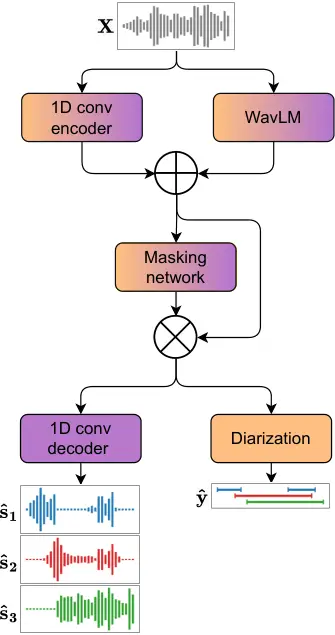
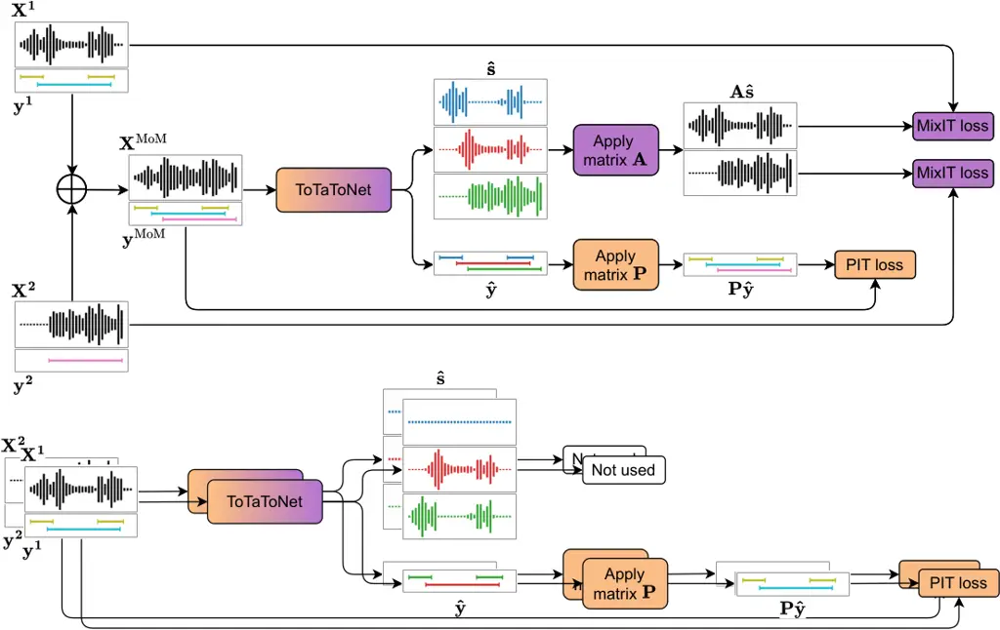
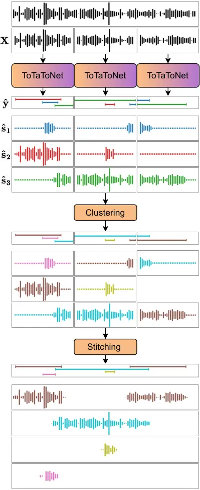

# PixIT: Joint Training of Speaker Diarization and Speech Separation from Real-world Multi-speaker Recordings

###### Abstract

A major drawback of supervised speech separation (SSep) systems is their
reliance on synthetic data, leading to poor real-world generalization.
Mixture invariant training (MixIT) was proposed as an unsupervised
alternative that uses real recordings, yet struggles with
over-separation and adapting to long-form audio. We introduce PixIT, a
joint approach that combines permutation invariant training (PIT) for
speaker diarization (SD) and MixIT for SSep. With a small extra
requirement of needing SD labels during training, it solves the problem
of over-separation and allows stitching local separated sources
leveraging existing work on clustering-based neural SD. We measure the
quality of the separated sources via applying automatic speech
recognition (ASR) systems to them. PixIT boosts the performance of
various ASR systems across two meeting corpora both in terms of the
speaker-attributed and utterance-based word error rates while not
requiring any fine-tuning.

|                                                                             |
| --------------------------------------------------------------------------- |
| Joonas Kalda¹, Clément Pagés², Ricard Marxer³, Tanel Alumäe¹, Hervé Bredin² |
| ¹Tallinn University of Technology, Estonia                                  |
| ²IRIT, Université de Toulouse, CNRS, Toulouse, France                       |
| ³Université de Toulon, Aix Marseille Univ, CNRS, LIS, Toulon, France        |

## 1 Introduction

Speech separation is the task of estimating individual speaker sources
from a mixture. It is an important part of automatic speech technologies
for meeting recordings as a significant proportion of the speech can be
overlapped. Supervised training approaches, mainly permutation invariant
training (PIT), have been shown to perform well on few seconds long
fully-overlapped synthetic speech mixtures that fit in the memory for
the model \[1, 2\]. To extend a PIT-based approach to more realistic
data, \[3\] proposed the task of continuous speech separation (CSS).
This involves generating long-form separated sources from a continuous
audio stream that contains multiple utterances that partially overlap.
The standard method for extending PIT-based separation systems to CSS is
by applying them on a sliding window and reordering sources in
neighboring chunks based on a similarity metric calculated on the
overlapped region. In long-form audio, however, the speaker tracking
breaks down if a speaker stops speaking for longer than the overlapping
portion of the sliding window.

Another problem of PIT-based training that remains in CSS approaches is
the reliance on clean single-speaker isolated sources for the synthetic
mixtures. The supervised approach does not generalize well to real-world
data as clean ground truth separated reference signals are not available
in recordings due to cross-talk. To combat this, mixture invariant
training (MixIT) was introduced in \[4\], an unsupervised method that
does not require clean separated sources for training. Two mixtures from
the target domain are added together to obtain a mixture of mixtures
(MoM) and a separation model is trained to estimate sources so that they
can be combined to obtain the original mixtures. In \[5\] it was
demonstrated that this method is effective in using real-world meetings
as the target domain. A limitation of MixIT is that the number of output
sources for the separation model has to be twice the maximum number of
speakers of a single mixture. This can lead to over-separation and makes
it difficult to generalize to long-form audio. Over-separation can be
mitigated by performing semi-supervised training but this still relies
on synthetic data. In \[6\], MixIT was used in combination with speaker
diarization pre-processing to perform source separation on real-world
long-form meeting audio. Separation was done at the utterance level and
the correct speaker sources to use were determined by comparing speaker
embeddings with global embeddings obtained from diarization. This
resulted in superior speaker-attributed automatic speech recognition
(ASR) performance. A limitation of this approach is the need for extra
voice activity detection (VAD) and speaker diarization models to segment
long-form audio into speaker-attributed utterances, as speech separation
is performed solely at the utterance level.

Traditional speaker diarization approaches have relied on a multi-step
approach consisting of VAD to obtain speaker segments, local speaker
embeddings, and clustering \[7\]. End-to-end diarization (EEND) is a
newer approach that is able to handle overlapped speech but comes with
its own limitations, such as needing a large amount of data and
mispredicting the number of speakers \[8, 9\]. Recently the two
approaches have been combined into the best-of-both-worlds framework
\[10, 11\] which performs EEND on small chunks and stitches the results
together using speaker embeddings and clustering.

Speech separation and speaker diarization are both often parts of
multi-speaker automatic transcription systems. The models used to carry
out these two tasks are mostly cascaded in two different ways. Since the
sources extracted by a speaker separation system no longer have speech
overlap regions, they can greatly facilitate the speaker diarization
task improving its performance. An example of such a system is the
speaker separation guided diarization system (SSGD) \[12, 13\]. A
drawback of this method is that diarization depends on the quality of
the separated sources. Another option is to place a diarization system
upstream of a speaker separation system, like in \[14, 15\]. Indeed,
source separation is easier if the speech activity of each speaker is
known, provided that the diarization system is able to manage speech
overlap. Similarly to the previous approach, the speech separation
performance depends on the quality of the speaker diarization. Thus, we
can see that these two tasks can benefit from the results of the other,
highlighting their interdependence, and the fact that there is no
obvious choice whether to start the processing with a diarization or
speech separation system. This has served as motivation for joint
learning approaches. The Recurrent Selective Attention Network
architecture (RSAN) \[16\] was the first all-neural model to jointly
perform the speech separation, speaker diarization, and speaker counting
tasks. In this model, the extraction is made over time using sliding
blocks. In each block, speakers are iteratively extracted from the
mixture by estimating a mask for each of them, given speaker embeddings
determined in the previous blocks, and a residual mask from the previous
iterations in the current block. Another architecture that performs
jointly these three tasks is the end-to-end neural diarization and
speech separation architecture (EEND-SS) \[17\]. This system is based on
the EEND framework for the diarization and speaker counting tasks and
Conv-TasNet \[1\] for the speaker separation one. In the EEND-SS
architecture, the information given by the diarization branch is used to
refine the separation part, by providing an estimation of the number of
speakers and using the probability of speech activity to enhance the
separated source signals. These joint approaches, however, still all
rely on synthetic data for separation training.

We propose a joint framework for performing both speaker diarization and
speech separation on long-form real-world audio. We name the approach
PixIT, as it combines PIT for speaker diarization and MixIT for speech
separation. We leverage speaker diarization information that is often
available for meeting corpora to create MoMs that have the maximum
number of speakers limited to better mimic real-world mixtures. Our
separation/diarization model processes the mixture/MoM and outputs
separated source predictions and the respective speaker activity
predictions. When training the joint model we combine the PIT-loss for
both the original mixtures and MoMs with the MixIT loss for the MoM.
Aligning speaker sources with the speaker activations also solves the
over-separation problem of MixIT. In inference, we are able to stitch
together the separated sources across the sliding windows by first
stitching the speaker activations as is done in the best-of-both-worlds
approach for diarization. To measure the quality of the long-form
stitched separated sources, we feed them into a variety of off-the-shelf
ASR systems. We observe improvements over the baseline method of speaker
attribution done through diarization for all ASR systems and two
real-word meeting datasets: AMI \[18\] and AliMeeting \[19\].
Furthermore, we show that when the speaker-attributed transcripts are
combined into a single output, the utterance-wise word error rate (uWER)
improves.

## 2 Joint model

We base our model on the TasNet architecture \[20\], which consists of a
1-D convolutional encoder, a separator module that predicts $`N`$
masking matrices and a 1-D convolutional decoder. We additionally
leverage pre-trained WavLM features \[21\] which are especially suited
for speech separation due to the use of the utterance mixing
augmentation in their pre-training. These are concatenated with the
convolutional encoder outputs. The diarization network takes the encoded
separated signals as input and processes each source independently
effectively performing VAD. The independent processing of the sources in
the diarization module is required to maintain alignment between the
separation outputs and the diarization branches. The joint model
architecture, which we call ToTaToNet¹¹ 1 Collaboration between labs in
Toulouse, Tallinn, and Toulon, is illustrated in Figure 1. The
components of the model related to the diarization branch are colored
orange, the components related to separation are colored purple and the
components used by both branches are colored a gradient between the two.
This color scheme is kept consistent across all the figures in the
paper.



Figure 1: The architecture of the proposed ToTaToNet model.

### 2.1 Training

The joint training method for speech separation and speaker diarization
is illustrated in Figure 2. Consider an audio chunk $`\mathbf{X}`$ and
the reference speaker activity labels
$`\mathbf{y}\in\{0,1\}^{K_{\max}\times T}`$ where $`y_{k,t}=1`$ if
speaker $`k`$ is active at frame $`t`$ and $`y_{k,t}=0`$ otherwise. Here
$`K_{\max}`$ specifies the maximum number of speakers anticipated in an
audio chunk. For diarization, we utilize the well-established
permutation-invariant training (PIT) objective \[8\]:

```math
\mathcal{L}_{\mathrm{PIT}}(\mathbf{y},\hat{\mathbf{y}})=\min_{\mathbf{P}}\sum_{k=1}^{K_{\max}}\mathcal{L}_{\mathrm{BCE}}\left(\mathbf{y_{k}},[\mathbf{P}\mathbf{\hat{y}}]_{k}\right),
```

where $`\mathbf{\hat{y}}`$ are the predicted speaker activations and
$`\mathbf{P}`$ is an $`K_{\max}\times K_{\max}`$ permutation matrix and
$`\mathcal{L_{\mathrm{BCE}}}`$ is the standard binary cross entropy
loss.



Figure 2: Training the joint model. The upper part shows calculating the
MixIT and PIT losses on MoMs. The bottom part shows calculating PIT
losses on the original mixtures.

Using the speaker annotations, we construct two audio chunks
$`(\mathbf{X^{1}},\mathbf{y^{1}})`$ and
$`(\mathbf{X^{2}},\mathbf{y^{2}})`$ with non-overlapping sets of
speakers with the total number of speakers no greater than $`K_{\max}`$.
Limiting the total number of speakers is critical in solving the
over-separation issue of MixIT. The MoM is constructed as
$`\mathbf{X^{\mathrm{MoM}}}=\mathbf{X^{1}}+\mathbf{X^{2}}`$ and the
corresponding speaker activity labels $`\mathbf{y^{\textrm{MoM}}}`$ are
given by $`y_{:,t}^{\textrm{MoM}}=(y_{:,t}^{1},y_{:,t}^{2})`$ where the
rows corresponding to non-active speakers are removed so that
$`\mathbf{y}^{\textrm{MoM}}\in\{0,1\}^{K_{\max}\times T}`$. Then the
MixIT loss function is given by,

```math
\mathcal{L}_{\textrm{MixIT}}\left(\left\{\mathbf{X_{n}}\right\},\hat{\mathbf{s}}\right)=\min_{\mathbf{A}}\sum_{n=1}^{2}\mathcal{L_{\textrm{SI-SDR}}}\left(\mathbf{X_{n}},[\mathbf{A}\mathbf{\hat{s}}]_{n}\right),
```

where $`\hat{\mathbf{s}}`$ are the predicted separated sources, $`M`$ is
the number of output sources and $`\mathbf{A}`$ is a mixing matrix
$`\mathbf{A}\in\{0,1\}^{2\times M}`$ under the constraint that each
column sums to 1 and $`\mathcal{L_{\textrm{SI-SDR}}}`$ is the negative
scale-invariant signal-to-distortion ratio \[22\]. Thanks to how we
limit the total number of speakers when sampling the mixtures, we are
able to use a significantly lower value for $`M`$.

Our combined multi-task loss is,

```math
\begin{split}\mathcal{L}_{\mathrm{PixIT}}=\lambda\Big(\mathcal{L}_{\mathrm{PIT}}(\mathbf{y^{1}},{\mathbf{\hat{y}^{1}}})+\mathcal{L}_{\mathrm{PIT}}(\mathbf{y^{2}},\mathbf{\hat{y}^{2}})\\
+\mathcal{L}_{\mathrm{PIT}}(\mathbf{y^{\textrm{MoM}}},{\mathbf{\hat{y}^{\textrm{MoM}}}})\Big)+(1-\lambda)\mathcal{L}_{\mathrm{MixIT}}\left(\left\{\mathbf{X_{n}}\right\},\hat{\mathbf{s}}\right),\end{split}
```

where among the three values, 0.1, 0.5, and 0.9, $`\lambda=0.5`$ was
selected due to its superior performance on the development data.

### 2.2 Inference

During inference, an audio stream is partitioned into shorter chunks as
depicted in Figure 3. The joint model processes each chunk and outputs
aligned estimates for speaker sources and speaker activations. The
resulting speaker activations and corresponding sources are clustered as
in \[23\]. First, speaker activations are binarized using a detection
threshold $`\theta\in[0,1]`$ to obtain speaker segments. Second, local
speaker embeddings are extracted from each chunk for all the active
speakers. We only utilize the regions of the chunk where the
corresponding speaker is active. Speaker embeddings are computed by
feeding the concatenation of original audio samples corresponding to
those regions to the pre-trained ECAPA-TDNN model \[24\] available in
\[25\]. Finally, agglomerative hierarchical clustering is performed on
these embeddings using a clustering threshold $`\delta`$. As an
important post-processing step, we perform leakage removal by setting
the stitched separated sources at time $`t`$ to zero when the
diarization outputs predict that the corresponding speaker is not active
and has not been active in a window $`[t-\Delta t,t+\Delta t]`$. This is
a key benefit of the aligned speaker activations and speaker sources
since it eliminates all cross-talk when the corresponding speaker is not
active. The goal of introducing $`\Delta t`$ is to give downstream ASR
systems additional context. The hyperparameters $`\theta`$, $`\delta`$,
and $`\Delta t`$ are optimized on the development dataset.



Figure 3: Inference on long-form audio. For ease of visualization
inference using non-overlapping sliding windows is shown.

## 3 Experiments

### 3.1 Datasets

We chose two publicly-available real-world meeting datasets AMI and
AliMeeting for our experiments. AMI \[18\] consists of roughly 100 hours
of English data. AliMeeting \[19\] is a Mandarin Chinese dataset with
approximately 120 hours of recordings. As our goal is single-channel
speech separation we only use the first channel of the microphone array
also known as the single distant microphone (SDM) audio from AMI and
channel 1 from AliMeeting for our experiments. Table 1 shows statistics
for the two datasets \[15\]. While both datasets consist of meeting
recordings, AliMeeting contains significantly more overlap. In all our
experiments, the ToTaToNet model is trained only on the train set of the
corresponding dataset.

AMI AliMeeting Train Dev Test Train Eval Test Duration (h:m) 79:23 9:40
9:03 111:21 4:12 10:46 Num. sessions 133 18 16 209 8 20 Silence (%) 18.1
21.5 19.6 7.11 7.7 8.0 1-speaker (%) 75.5 74.3 73.0 52.5 62.1 63.4
2-speaker (%) 21.1 22.2 21.0 32.8 27.6 24.9 $`>`$2-speaker (%) 3.4 3.5
6.0 14.7 10.2 11.7

Table 1: Statistics of datasets used for evaluations. The $`k`$-speaker
durations are in terms of fraction of total speaking time.

### 3.2 Evaluation

Metrics. As ground-truth reference sources are not available for
real-world data we use ASR performance as a proxy for evaluating the
quality of long-form separation. We apply an ASR system independently on
each of the separated sources and report the word error rate (WER)
between the speaker-attributed predictions and references. Multiple
definitions of WER have been proposed for ASR systems that process audio
with multiple speakers and output multiple word sequences (MIMO) \[26\].
We choose concatenated minimum permutation WER (cpWER) \[27\] as our
main metric because it is the only one that penalizes speaker confusion
which is unwanted for long-form speaker sources. On Mandarin data, this
metric corresponds to the concatenated minimum-permutation character
error rate (cpCER). We use the same text normalizer as Whisper for both
English and Mandarin.

It is important to note that the definition of cpWER that we used does
not penalize redundant hypothesis speaker channels \[26\]. For
transparency we include results using a definition of cpWER that
includes this penalization using MeetEval’s implementation \[28\]. These
can be found in Appendix A.

On English data, we also report the utterance-wise WER (uWER) which
ignores speaker attribution. The uWERs are calculated using Kaldi
scripts \[29\] which in turn utilize asclite \[30\]. When using the
long-form separated sources as input the single transcript is generated
by first concatenating the ASR predictions from all the long-form
sources and then sorting the words by start time.

Our metric for evaluating the diarization performance is the diarization
error rate (DER) \[31\], which is defined as the sum of false alarm,
missed detection, and speaker confusion rates. No forgiveness collar is
used.

ASR systems. To verify the quality of the separated sources we
experiment with multiple ASR systems. For English data, we chose the
small.en, medium.en, and large-v2 Whisper models \[32\] and NVIDIA’s
stt_en_conformer_ctc_large available in the NeMo toolkit \[33\] on the
basis that they were among the top performers on AMI as indicated by
\[34\]. On Mandarin data, we only tested the aforementioned Whisper
models with the English-only variants replaced with multilingual ones.

Speaker attribution. When evaluating cpWER (or cpCER for Mandarin
AliMeeting), we compare two methods of adding speaker attribution (SA)
to an ASR system. One through long-form separated sources and the other
through speaker diarization. In the first case, the ASR systems are
applied on the long-form separated sources immediately yielding
speaker-attributed transcripts. In the latter, an ASR system is used on
the original audio, and the predicted utterances are divided between
speakers according to a speaker diarization system. Namely, each
utterance is attributed to the speaker whose speaking segments have the
most overlap with it. In the rare case that multiple speakers have fully
overlapping speaking segments with the utterance, it is randomly
attributed to one of them. In the following, we will refer to these two
approaches as SA methods and refer to the system that was used to
perform either diarization or separation as the SA system.

Word timestamps. For experiments with the Whisper family of models, we
utilized WhisperX \[35\] which has implemented word-level time-stamps
using forced alignment with a wav2vec2.0-based phoneme model \[36\]. The
NeMo toolkit also provides word-level timestamps for the
stt_en_conformer_ctc_large model.

Baselines. Our baseline systems perform speaker attribution through the
pyannote.audio 3.1 speaker diarization pipeline \[37\].

### 3.3 Implementation details

During training, we sample the first mixture randomly across all the
annotated regions from all the training files. Then we sample the second
mixture from the same file while ensuring that it has no speakers in
common with the first mixture and the total number of speakers is not
greater than the number of output sources of the model. Sampling the
other chunk from the same file has two benefits. First, it is important
that the two mixtures come from the same recording conditions, otherwise
the model might learn to exploit this difference as found in \[5\].
Second, this approach generalizes better because it does not require
dataset-wise consistent speaker IDs.

Our system is implemented in the pyannote.audio toolkit \[23\] with the
help of the Asteroid library \[38\]. We use 5-second sliding windows
with a step size of 500ms as in \[23\] and in line with \[5\]. For both
AMI and AliMeeting, there is a less than 1% chance that a 5-second
window contains more than three active speakers \[37\]. Motivated by
this statistic and aiming to mitigate over-separation, we set
$`K_{\max}=3`$. As a consequence of our sampling method for the
mixtures, training data does not include windows with more than three
speakers.

In ToTaToNet, the 1D conv encoder and decoder use a kernel size of 32, a
stride of 16, and 64 filters. We concatenate the encoder output with
WavLM-large pre-trained features which have a stride of 320 so the WavLM
features are repeated 20 times. For the separator module we chose a
DPRNN \[2\] with chunk size 100, hop size 50, and the rest of the
hyperparameters kept the same as in the original work. The diarization
module starts with an 8-fold average pooling layer to decrease the
temporal resolution to that of \[23\]. We follow it with a simple
diarization model consisting of a fully connected neural network with
two 64-dimensional layers. We thus rely on the masking network to do the
bulk of the work for speaker diarization. Importantly, due to the PIT
training for diarization, the diarization module has to process each
encoded masked source separately (as does the 1D conv decoder) otherwise
the diarization outputs might be permuted with respect to the separated
sources.

We use a learning rate of $`1e^{-5}`$ for the WavLM parameters and
$`3e^{-4}`$ for the rest of the parameters. The learning rate is halved
whenever the validation loss plateaus for 5 epochs. We use the Adam
optimizer \[39\] with the gradients clipped to a $`L_{2}`$-norm of 5 and
train all models for 100 epochs.

When optimizing for the hyperparameters $`\Delta t`$, $`\theta`$, and
$`\delta`$, we used either cpWER/cpCER or DER as the target metric
depending on whether the pipeline was used for separation or
diarization.

To ensure reproducibility, the code for both training and inference
using PixIT will be available in the open-source pyannote.audio library.
The recipes and separated source samples will be publicly available at
github.com/joonaskalda/PixIT.

### 3.4 Results

The cpWERs for the various ASR systems on AMI-SDM test set are shown in
Table 2. We can see that long-form separation via PixIT significantly
improves the quality of speaker-attributed transcripts across the
variety of ASR systems used. Notably, the ASR systems are applied on the
separated sources off-the-shelf with no fine-tuning required.

ASR model SA method SA system cpWER(%) Relative Change sub del ins total
Whisper small.en Diarization pyannote 3.1 8.7 27.2 3.7 39.6 Diarization
PixIT 8.5 27.3 2.1 37.9 -4.3% Separation PixIT 6.7 25.8 1.4 33.9 -14.4%
Whisper medium.en Diarization pyannote 3.1 7.4 28.0 3.4 38.8 Diarization
PixIT 7.3 27.8 2.0 37.1 -4.4% Separation PixIT 5.9 25.8 1.2 32.8 -15.4%
Whisper large-v2 Diarization pyannote 3.1 7.1 29.3 1.8 38.3 Diarization
PixIT 6.9 26.6 2.1 35.7 -6.7% Separation PixIT 5.6 24.7 1.3 31.7 -17.2%
NeMo conformer large Diarization pyannote 3.1 11.5 36.0 1.4 48.9
Diarization PixIT 13.3 33.9 1.3 48.5 -0.8% Separation PixIT 13.4 24.6
1.4 39.4 -19.4%

Table 2: The cpWER (%) on AMI-SDM for various ASR systems with speaker
attribution (SA) done through diarization or the joint model

We also report the uWER scores using either the original audio or the
separated sources in Table 3. Across the ASR models, the bulk of the WER
improvement comes from deletions. Having the original audio as input the
ASR models may miss the quieter speakers utterances during overlap and
utilizing separated sources helps recover those.

ASR model Input to ASR uWER(%) Relative change sub del ins total Whisper
small.en Original audio 6.7 29.6 1.4 37.6 Separated sources 6.9 27.9 1.5
36.3 -3.5% Whisper medium.en Original audio 5.8 30.0 1.3 37.1 Separated
sources 6.0 27.7 1.4 35.1 -5.4% Whisper large-v2 Original audio 5.2 28.9
1.3 35.4 Separated sources 5.5 26.9 1.4 33.8 -4.5% NeMo conformer large
Original audio 10.7 36.7 1.8 49.3 Separated sources 12.6 26.4 2.6 41.6
-15.6%

Table 3: The uWER (%) on AMI-SDM for various ASR systems using either
the original audio or the separated sources as input

Table 4 shows the cpCERs for the AliMeeting channel 1 dataset. We can
see that the improvement from utilizing separated sources is greater
than 20% across the tested ASR systems. Notably, the relative
improvements are greater than they were for the corresponding models on
AMI data even though WavLM has been pre-trained on English data. This
can be explained by the greater percentage of overlap present in
AliMeeting as mentioned in section 3.1.

ASR system SA SA model cpCER(%) Relative Change sub del ins total
Whisper small Diarization pyannote 3.1 23.4 35.6 9.6 68.6 Diarization
PixIT 23.3 35.1 9.5 67.9 -1.0% Separation PixIT 16.2 33.4 4.4 54.0
-21.3% Whisper medium Diarization pyannote 3.1 18.5 37.9 9.5 65.9
Diarization PixIT 18.8 37.2 8.9 64.9 -1.5% Separation PixIT 11.8 34.2
4.2 50.3 -23.7% Whisper large-v2 Diarization pyannote 3.1 17.6 38.0 9.5
65.1 Diarization PixIT 18.1 37.3 9.0 64.4 -1.1% Separation PixIT 10.6
33.6 4.0 48.3 -25.8%

Table 4: The cpCER (%) on Alimeeting channel 1 for various ASR systems
with speaker attribution (SA) done through diarization or the joint
model

In Table 5, we show the effects of adding the WavLM features and
performing leakage removal through the diarization output on our system
performance when performing SA-ASR on AMI-SDM with Whisper medium.en.
The system without WavLM features clearly has issues with leakage, with
a lot of it passing through the VAD component of WhisperX. When using
WavLM features the effect of our leakage removal is smaller but it still
outperforms using only WhisperX. Notably, a decrease in substitution
errors from applying leakage removal can be observed in both cases. A
possible explanation is that since the leakage removal reduces the
length of the predicted text, some words in the reference that
previously corresponded to substitution errors now count as deletion
errors. This is verified by the fact that the decrease in substitution
errors is smaller than the increase in deletion errors. This effective
method for leakage removal is a further benefit of ToTaToNet’s aligned
outputs. Leveraging the WavLM features significantly improves our
system’s performance which makes sense given the relatively small amount
of data we have access to for training and the utterance mixing
component of the pre-training. Still, even without using pre-trained
features, we are able to improve on the baseline of WhisperX.

SA method WavLM Leakage removal cpWER(%) Relative change sub del ins
total pyannote 3.1 7.4 28.0 3.4 38.8 PixIT separation ✗ ✗ 19.2 15.3 15.6
50.1 +29.1% ✗ ✓ 6.4 28.1 1.7 36.2 -6.7% ✓ ✗ 9.3 21.0 3.8 34.1 -12.1% ✓ ✓
5.9 25.8 1.2 32.8 -15.5%

Table 5: The cpWER (%) on AMI-SDM for speaker-attribution (SA) done
through PixIT speech separation with different configurations of WavLM
and leakage removal. Whisper medium.en is used for ASR and pyannote 3.1
diarization as the baseline SA method.

We also analyze PixIT’s speaker diarization performance by measuring the
DERs on AMI-SDM and AliMeeting for various training and hyperparameter
optimization strategies as shown in Table 6. For the systems optimized
for cpWER, we use $`\Delta t=0`$, as that represents the real
diarization capabilities. We have included the state-of-the-art (SOTA)
systems as of February 2024. For AliMeeting this is the pyannote 3.1
system utilizing powerset training \[37\] and for AMI-SDM it is the
end-to-end diarization model leveraging the Mask2Former architecture
proposed in \[40\]. The DER scores are broken down into false alarm
(FA), missed detection (MD), and speaker confusion (SC) rates.
Optimizing for cpWER yields lower FA values. This means that a higher
speaker activation threshold $`\theta`$ is used and only segments for
which the diarization branch is confident are considered for ASR.
Optimizing the $`\lambda=0.5`$ system for DER improves on the SOTA for
both AliMeeting and AMI-SDM. Training our system for only the easier
task of speaker diarization i.e. with $`\lambda=1`$, we achieve a
further boost to performance on both datasets.

DER(%) AMI-SDM systems FA MD SC total Härkönen et al. \[40\] 18.9 PixIT,
$`\lambda=0.5`$, optimized for cpWER 1.3 17.9 6 25.3 PixIT,
$`\lambda=0.5`$, optimized for DER 3.9 8.2 5.6 17.7 PixIT, $`\lambda=1`$
4.4 7.2 5.5 17.1 AliMeeting systems Plaquet et al. \[37\] 3.7 10.4 9.2
23.3 PixIT, $`\lambda=0.5`$, optimized for cpWER 2.7 13.2 12.4 28.3
PixIT, $`\lambda=0.5`$, optimized for DER 5.8 7.3 8.3 21.4 PixIT,
$`\lambda=1`$ 4.7 6.5 8.3 19.5

Table 6: DER (%) comparison with state-of-the-art systems on AMI-SDM and
AliMeeting channel 1 for different training strategies and ways of
optimizing the hyperparameters $`\theta`$, $`\delta`$, and $`\Delta t`$.
For the latter, the underlying ToTaToNet is kept the same.

## 4 Conclusion

In this paper, we proposed PixIT, a novel approach for performing
multitask training for speaker diarization and speech separation. This
method does not depend on clean single-speaker individual sources, only
requiring single-channel recordings with speaker diarization labels
which are usually a part of annotation. The local separated source and
diarization predictions of the proposed ToTaToNet model are aligned
allowing for long-form inference via the best-of-both-worlds approaches
that have been developed for speaker diarization. A further benefit of
the aligned sources is that we can perform effective leakage removal by
zeroing out inactive speaker sources. We perform various experiments to
demonstrate the quality of the long-form separated sources obtained from
real-world meeting data by using them as input for various ASR systems.
Indeed, the cpWERs show significant improvements over the baseline of
performing speaker attribution using speaker diarization with the
improvements increasing with the proportion of overlapped speech
present. Furthermore, we observe a decrease in utterance-based WER when
the ASR outputs from separated sources are combined into a single
transcript. These results come from using the ASR systems on the
separated sources off the shelf with no fine-tuning required. Finally,
we show that PixIT achieves state-of-the-art speaker diarization
performance on both the AMI-SDM and AliMeeting datasets.

## 5 Acknowledgements

We would like to acknowledge Dr Yoshiaki Bando, for pointing out the
ambiguity in cpWER definitions regarding scenarios involving an unknown
number of speakers. The research reported in this paper was supported by
the Agence de l’Innovation Défense under the grant number 2022 65 0079.
This work was granted access to the HPC resources of GENCI-IDRIS under
the allocations AD011014274, as well as the TalTech supercomputing
resources.

## References

- \[1\] Yi Luo and Nima Mesgarani, “Conv-TasNet: Surpassing ideal
  time-frequency magnitude masking for speech separation,” IEEE/ACM
  Transactions on Audio, Speech, and Language Processing, vol. 27, no.
  8, pp. 1256–1266, 2019.
- \[2\] Yi Luo, Zhuo Chen, and Takuya Yoshioka, “Dual-path RNN:
  Efficient long sequence modeling for time-domain single-channel speech
  separation,” in ICASSP, 2020.
- \[3\] Zhuo Chen, Takuya Yoshioka, Liang Lu, Tianyan Zhou, Zhong Meng,
  Yi Luo, Jian Wu, Xiong Xiao, and Jinyu Li, “Continuous speech
  separation: Dataset and analysis,” in ICASSP, 2020.
- \[4\] Scott Wisdom, Efthymios Tzinis, Hakan Erdogan, Ron Weiss, Kevin
  Wilson, and John Hershey, “Unsupervised sound separation using mixture
  invariant training,” in NeurIPS, 2020.
- \[5\] Aswin Sivaraman, Scott Wisdom, Hakan Erdogan, and John R.
  Hershey, “Adapting speech separation to real-world meetings using
  mixture invariant training,” in ICASSP, 2022.
- \[6\] Yuang Li, Xianrui Zheng, and Philip C. Woodland,
  “Self-supervised learning-based source separation for meeting data,”
  in ICASSP, 2023.
- \[7\] Federico Landini, Ján Profant, Mireia Diez, and Lukáš Burget,
  “Bayesian HMM clustering of x-vector sequences (VBx) in speaker
  diarization: Theory, implementation and analysis on standard tasks,”
  Computer Speech and Language, vol. 71, pp. 101254, 2022.
- \[8\] Yusuke Fujita, Naoyuki Kanda, Shota Horiguchi, Kenji Nagamatsu,
  and Shinji Watanabe, “End-to-end neural speaker diarization with
  permutation-free objectives,” in Interspeech, 2019.
- \[9\] Yusuke Fujita, Naoyuki Kanda, Shota Horiguchi, Yawen Xue, Kenji
  Nagamatsu, and Shinji Watanabe, “End-to-end neural speaker diarization
  with self-attention,” in ASRU, 2019.
- \[10\] Keisuke Kinoshita, Marc Delcroix, and Naohiro Tawara, “Advances
  in integration of end-to-end neural and clustering-based diarization
  for real conversational speech,” in Interspeech, 2021.
- \[11\] Keisuke Kinoshita, Marc Delcroix, and Naohiro Tawara,
  “Integrating end-to-end neural and clustering-based diarization:
  Getting the best of both worlds,” in ICASSP, 2021.
- \[12\] Xin Fang, Zhen-Hua Ling, Lei Sun, Shu-Tong Niu, Jun Du, Cong
  Liu, and Zhi-Chao Sheng, “A deep analysis of speech separation guided
  diarization under realistic conditions,” in APSIPA ASC, 2021.
- \[13\] Giovanni Morrone, Samuele Cornell, Desh Raj, Luca Serafini,
  Enrico Zovato, Alessio Brutti, and Stefano Squartini, “Low-latency
  speech separation guided diarization for telephone conversations,” in
  SLT, 2022.
- \[14\] Christoph Boeddeker, Aswin Shanmugam Subramanian, Gordon
  Wichern, Reinhold Haeb-Umbach, and Jonathan Le Roux, “TS-SEP: Joint
  diarization and separation conditioned on estimated speaker
  embeddings,” IEEE/ACM Transactions on Audio, Speech, and Language
  Processing, vol. 32, pp. 1185–1197, 2024.
- \[15\] Desh Raj, Daniel Povey, and Sanjeev Khudanpur, “GPU-accelerated
  guided source separation for meeting transcription,” in
  Interspeech, 2023.
- \[16\] Thilo von Neumann, Keisuke Kinoshita, Marc Delcroix, Shoko
  Araki, Tomohiro Nakatani, and Reinhold Haeb-Umbach, “All-neural online
  source separation, counting, and diarization for meeting analysis,” in
  ICASSP, 2019.
- \[17\] Soumi Maiti, Yushi Ueda, Shinji Watanabe, Chunlei Zhang, Meng
  Yu, Shi-Xiong Zhang, and Yong Xu, “EEND-SS: Joint end-to-end neural
  speaker diarization and speech separation for flexible number of
  speakers,” in SLT, 2022.
- \[18\] Jean Carletta, Simone Ashby, Sebastien Bourban, Mike Flynn,
  Mael Guillemot, Thomas Hain, Jaroslav Kadlec, Vasilis Karaiskos,
  Wessel Kraaij, Melissa Kronenthal, et al., “The AMI meeting corpus: A
  pre-announcement,” in ICMI, 2005.
- \[19\] Fan Yu, Shiliang Zhang, Yihui Fu, Lei Xie, Siqi Zheng, Zhihao
  Du, Weilong Huang, Pengcheng Guo, Zhijie Yan, Bin Ma, Xin Xu, and Hui
  Bu, “M2Met: The ICASSP 2022 multi-channel multi-party meeting
  transcription challenge,” in ICASSP, 2022.
- \[20\] Yi Luo and Nima Mesgarani, “TasNet: Time-domain audio
  separation network for real-time, single-channel speech separation,”
  in ICASSP, 2018.
- \[21\] Sanyuan Chen, Chengyi Wang, Zhengyang Chen, Yu Wu, Shujie Liu,
  Zhuo Chen, Jinyu Li, Naoyuki Kanda, Takuya Yoshioka, Xiong Xiao, Jian
  Wu, Long Zhou, Shuo Ren, Yanmin Qian, Yao Qian, Jian Wu, Michael Zeng,
  Xiangzhan Yu, and Furu Wei, “WavLM: Large-scale self-supervised
  pre-training for full stack speech processing,” IEEE Journal of
  Selected Topics in Signal Processing, vol. 16, no. 6, pp.
  1505–1518, 2022.
- \[22\] Jonathan Le Roux, Scott Wisdom, Hakan Erdogan, and John R.
  Hershey, “SDR – half-baked or well done?,” in ICASSP, 2019.
- \[23\] Hervé Bredin, “pyannote.audio 2.1 speaker diarization pipeline:
  Principle, benchmark, and recipe,” in Interspeech, 2023.
- \[24\] Brecht Desplanques, Jenthe Thienpondt, and Kris Demuynck,
  “ECAPA-TDNN: Emphasized channel attention, propagation and aggregation
  in tdnn based speaker verification,” in Interspeech, 2020.
- \[25\] Mirco Ravanelli, Titouan Parcollet, Peter Plantinga, Aku Rouhe,
  Samuele Cornell, Loren Lugosch, Cem Subakan, Nauman Dawalatabad,
  Abdelwahab Heba, Jianyuan Zhong, et al., “Speechbrain: A
  general-purpose speech toolkit,” arXiv preprint
  arXiv:2106.04624, 2021.
- \[26\] Thilo von Neumann, Christoph Boeddeker, Keisuke Kinoshita, Marc
  Delcroix, and Reinhold Haeb-Umbach, “On word error rate definitions
  and their efficient computation for multi-speaker speech recognition
  systems,” in ICASSP, 2023.
- \[27\] Shinji Watanabe, Michael Mandel, Jon Barker, Emmanuel Vincent,
  Ashish Arora, Xuankai Chang, Sanjeev Khudanpur, Vimal Manohar, Daniel
  Povey, Desh Raj, David Snyder, Aswin Shanmugam Subramanian, Jan Trmal,
  Bar Ben Yair, Christoph Boeddeker, Zhaoheng Ni, Yusuke Fujita, Shota
  Horiguchi, Naoyuki Kanda, Takuya Yoshioka, and Neville Ryant, “CHiME-6
  Challenge: Tackling Multispeaker Speech Recognition for Unsegmented
  Recordings,” in CHiME 2020, 2020.
- \[28\] Thilo von Neumann, Christoph B. Boeddeker, Marc Delcroix, and
  Reinhold Haeb-Umbach, “Meeteval: A toolkit for computation of word
  error rates for meeting transcription systems,” in CHiME, 2023.
- \[29\] Daniel Povey, Arnab Ghoshal, Gilles Boulianne, Lukas Burget,
  Ondrej Glembek, Nagendra Goel, Mirko Hannemann, Petr Motlicek, Yanmin
  Qian, Petr Schwarz, et al., “The Kaldi speech recognition toolkit,” in
  ASRU, 2011.
- \[30\] Jonathan G Fiscus, Jerome Ajot, Nicolas Radde, Christophe
  Laprun, et al., “Multiple dimension Levenshtein edit distance
  calculations for evaluating automatic speech recognition systems
  during simultaneous speech.,” in LREC’06, 2006.
- \[31\] Jonathan G Fiscus, Jerome Ajot, Martial Michel, and John S
  Garofolo, “The rich transcription 2006 spring meeting recognition
  evaluation,” MLMI, 2006.
- \[32\] Alec Radford, Jong Wook Kim, Tao Xu, Greg Brockman, Christine
  McLeavey, and Ilya Sutskever, “Robust speech recognition via
  large-scale weak supervision,” in ICML, 2023.
- \[33\] Oleksii Kuchaiev, Jason Li, Huyen Nguyen, Oleksii Hrinchuk,
  Ryan Leary, Boris Ginsburg, Samuel Kriman, Stanislav Beliaev, Vitaly
  Lavrukhin, Jack Cook, et al., “NeMo: a toolkit for building AI
  applications using neural modules,” arXiv preprint
  arXiv:1909.09577, 2019.
- \[34\] Vaibhav Srivastav, Somshubra Majumdar, Nithin Koluguri, Adel
  Moumen, Sanchit Gandhi, Hugging Face Team, Nvidia NeMo Team, and
  SpeechBrain Team, “Open automatic speech recognition leaderboard,”
  https://huggingface.co/spaces/huggingface.co/spaces/open-asr-leaderboard/leaderboard, 2023.
- \[35\] Max Bain, Jaesung Huh, Tengda Han, and Andrew Zisserman,
  “WhisperX: Time-accurate speech transcription of long-form audio,”
  Interspeech, 2023.
- \[36\] Alexei Baevski, Yuhao Zhou, Abdelrahman Mohamed, and Michael
  Auli, “wav2vec 2.0: A framework for self-supervised learning of speech
  representations,” NeurIPS, 2020.
- \[37\] Alexis Plaquet and Hervé Bredin, “Powerset multi-class cross
  entropy loss for neural speaker diarization,” in Interspeech, 2023.
- \[38\] Manuel Pariente, Samuele Cornell, Joris Cosentino, Sunit
  Sivasankaran, Efthymios Tzinis, Jens Heitkaemper, Michel Olvera,
  Fabian-Robert Stöter, Mathieu Hu, Juan M. Martín-Doñas, David Ditter,
  Ariel Frank, Antoine Deleforge, and Emmanuel Vincent, “Asteroid: the
  PyTorch-based audio source separation toolkit for researchers,” in
  Interspeech, 2020.
- \[39\] Diederik P. Kingma and Jimmy Ba, “Adam: A method for stochastic
  optimization,” CoRR, 2014.
- \[40\] Marc Härkönen, Samuel J Broughton, and Lahiru Samarakoon,
  “Eend-m2f: Masked-attention mask transformers for speaker
  diarization,” arXiv preprint arXiv:2401.12600, 2024.
- \[41\] Xianrui Zheng, Chao Zhang, and Philip C Woodland, “Tandem
  multitask training of speaker diarisation and speech recognition for
  meeting transcription,” Interspeech, 2022.
- \[42\] Naoyuki Kanda, Yashesh Gaur, Xiaofei Wang, Zhong Meng, and
  Takuya Yoshioka, “Serialized Output Training for End-to-End Overlapped
  Speech Recognition,” Interspeech, 2020.

## Appendix A On the evolution of cpWER definitions

### A.1 Review of cpWER definitions

Here we provide a brief literature review on cpWER definitions as of
early 2023, which served as the basis for our choice of a cpWER variant
that does not penalize overestimation.

The original cpWER definition, as proposed in CHiME-6, was limited to
scenarios involving a fixed number of speakers \[27\]. In our work, we
adopted the extended cpWER definition from \[26\], which offered a
comprehensive review of multi-speaker word error rate definitions. Given
the clarity and extensiveness of their approach, it seemed appropriate
for us to follow their methodology. In this definition, underestimation
of speakers is penalized by adding empty dummy channels to the
hypothesis, whereas overestimation is not penalized. However, in a
subsequent paper \[28\], the authors revised their definition to also
penalize overestimation by adding dummy channels to the reference.

In other papers dealing with scenarios involving an unknown number of
speakers, the definitions were often ambiguous, or they indicated that
redundant hypothesis speakers were discarded. For instance, \[6\] and
\[41\] mention the removal of redundant speakers, denoting this variant
as cpWER-us when dealing with an unknown number of speakers.

In the series of papers on Serialized Output Training by Naoyuki Kanda
et al., the initial paper, \[42\], touches on the problem of having more
hypothesis speakers than references but is vague about the exact
resolution (referring to the metric as WER, though effectively it aligns
with cpWER). Later works in this series did not provide further
clarification on this issue.

### A.2 Results using the MeetEval cpWER definition

For completeness, we provide the results calculated using the cpWER
definition that penalizes overestimation, utilizing the MeetEval toolkit
\[28\]. The inference hyperparameters $`\theta`$, $`\delta`$, and
$`\Delta t`$ were re-optimized on the development dataset using this
cpWER definition. Results based on this updated cpWER can be found in
Tables 7 and 8 for AMI-SDM and Alimeeting channel 1, respectively. The
relative changes in cpWER are consistent with those obtained using the
original definition.

ASR model SA method SA system cpWER(%) Relative Change sub del ins total
Whisper small.en Diarization pyannote 3.1 7.6 29.0 4.0 40.5 Diarization
ToTaToNet 7.8 27.2 2.2 37.2 -8.1% Separation ToTaToNet 8.8 24.2 2.4 35.4
-12.6% Whisper medium.en Diarization pyannote 3.1 6.7 29.7 3.6 40.0
Diarization ToTaToNet 7.0 28.1 2.0 37.1 -7.3% Separation ToTaToNet 7.6
24.1 2.2 33.9 -15.3% Whisper large-v2 Diarization pyannote 3.1 6.4 28.0
3.9 38.3 Diarization ToTaToNet 6.8 26.3 2.1 35.2 -8.1% Separation
ToTaToNet 7.3 22.7 2.6 32.6 -14.9% Nemo conformer large Diarization
pyannote 3.1 12.0 35.5 2.9 50.4 Diarization ToTaToNet 13.2 34.1 1.6 48.9
-3.0% Separation ToTaToNet 15.7 23.7 2.0 41.4 -17.9%

Table 7: MeetEval cpWER (%) results on AMI-SDM for various ASR models
with speaker attribution (SA) through diarization or separation.

ASR model SA method SA system cpCER(%) Relative Change sub del ins total
Whisper small Diarization pyannote 3.1 23.2 35.4 10.0 68.6 Diarization
ToTaToNet 23.1 35.0 9.6 67.7 -1.3% Separation ToTaToNet 18.9 32.4 2.4
53.7 -21.7% Whisper medium Diarization pyannote 3.1 18.5 37.9 9.5 65.9
Diarization ToTaToNet 18.7 37.3 8.9 64.9 -1.5% Separation ToTaToNet 12.5
34.7 1.6 48.7 -26.1% Whisper large-v2 Diarization pyannote 3.1 17.9 37.9
9.9 65.6 Diarization ToTaToNet 18.1 37.3 9.3 64.7 -1.4% Separation
ToTaToNet 13.0 32.5 1.8 47.3 -27.9%

Table 8: MeetEval cpCER (%) results on Alimeeting channel 1 for various
ASR models with speaker attribution (SA) through diarization or
separation.
