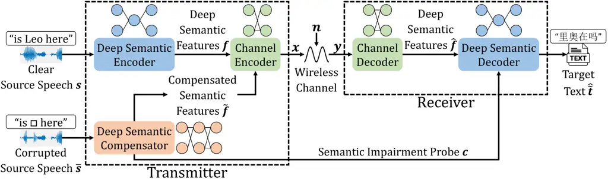
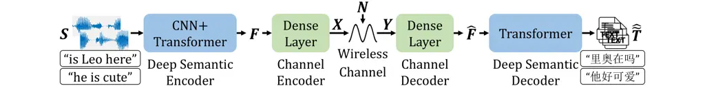
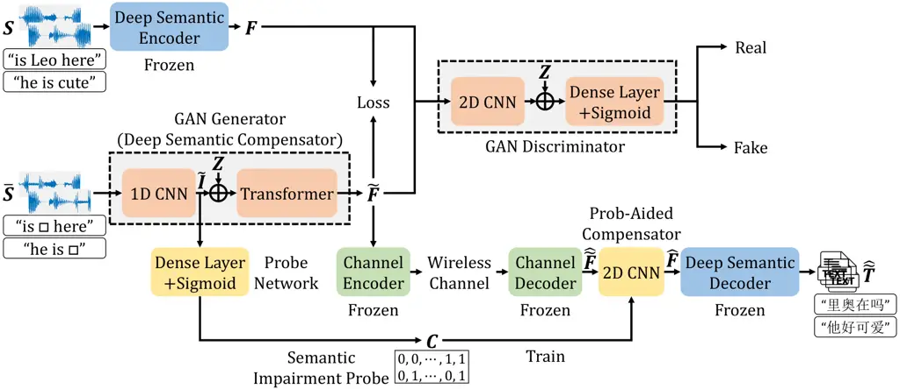
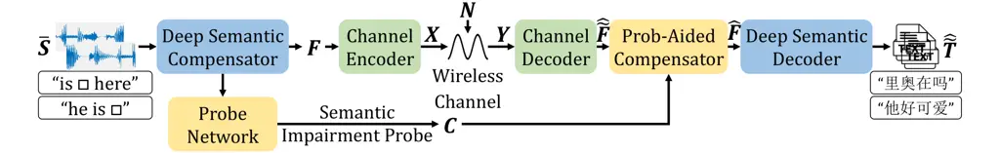

# Robust Semantic Communications for Speech TransmissionThanks: The work was supported in part by the National Key Research and Development Program of China under Grant 2023YFB2904300; in part by the National Natural Science Foundation of China (NSFC) under Grant 62293484; and in part by the Beijing National Research Center for Information Science and Technology (BNRist), Beijing, China.

Zhenzi Weng¹ Affiliation: ¹ Department of Electrical and Electronic
Engineering, Imperial College London, London, UK    Zhijin Qin²
Affiliation: ² Department of Electronic Engineering, Tsinghua
University, Beijing, China    Geoffrey Ye Li¹ Affiliation: Email:
z.weng@imperial.ac.uk, qinzhijin@tsinghua.edu.cn,
geoffrey.li@imperial.ac.uk

###### Abstract

In this paper, we propose a robust semantic communication system for
speech transmission, named Ross-S2T, by delivering the essential
semantic information. Specifically, we consider the speech-to-text
translation (S2TT) as the transmission goal. First, a new deep semantic
encoder is developed to convert speech in the source language to textual
features associated with the target language, facilitating the
end-to-end semantic exchange to perform the S2TT task and reducing the
transmission data without performance degradation. To mitigate semantic
impairments inherent in the corrupted speech, a novel generative
adversarial network (GAN)-enabled deep semantic compensator is
established to estimate the lost semantic information within the speech
and extract deep semantic features simultaneously, which enables robust
semantic transmission for corrupted speech. Furthermore, a semantic
probe-aided compensator is devised to enhance the semantic fidelity of
recovered semantic features and improve the understandability of the
target text. According to simulation results, the proposed Ross-S2T
exhibits superior S2TT performance compared to conventional approaches
and high robustness against semantic impairments.

###### Index Terms: 

Deep learning, generative adversarial network, semantic communications,
speech-to-text translation.

## I Introduction

Semantic communications have been regarded as a promising solution to
tackle the technical challenges in conventional communication systems
and have attracted significant research attention in recent years \[1\].
The advancement of semantic communications derives from the ability to
explore semantic information and achieve semantic exchange, which
revolutionizes many aspects of wireless communications \[2\].

According to the three-level communication architecture proposed by
Shannon and Weaver \[3\], semantic communications are the second level
of communications that prioritize conveying the underlying meaning by
representing the input message with minimal ambiguity through semantics,
which overcomes the limitation of conventional communications to process
data at the bit level and drives the evolution of intelligent
communications. However, there is no consensus on the definition of
semantics, hindering the representation of semantic information with a
rigorous formula. Thanks to the thriving of artificial intelligence (AI)
in diverse areas, deep learning (DL)-enabled semantic communication
paradigm breaks the bottleneck of a mathematical theory to quantify the
semantics and has shown its great potential to learn semantic
information through sophisticated neural networks (NNs). DL-enabled
semantic communications have experienced unprecedented developments due
to the ubiquity of intelligent mobile devices and the booming demand for
semantic-driven data transmission.

Particularly, the pioneering work on DL-enabled semantic communications,
named DeepSC \[4\], has been proposed to recover the accurate text. A
variant of DeepSC, named R-DeepSC \[5\], has been devised to eliminate
semantic noise and facilitate robust text transmission. In \[6\],
Weng *et al.* introduced a semantic communication system for speech
transmission, named DeepSC-S, to extract and transmit global semantic
features. Inspired by DeepSC-S, a deep speech semantic transmission
scheme has been developed in \[7\] by adopting a flexible
rate-distortion trade-off to achieve end-to-end (E2E) optimization.
Huang *et al.* \[8\] considered a semantic communication system for
image transmission. Jiang *et al.* \[9\] presented a video semantic
transmission paradigm.

Furthermore, Xie *et al.* \[10\] established a task-oriented semantic
communication system for machine translation and visual
question-answering tasks by fusing textual and visual semantic features.
Weng *et al.* \[11\] designed a speech semantic transmission scheme,
named DeepSC-ST, to perform speech recognition and synthesis tasks, and
further explored the speech-to-text translation (S2TT) and
speech-to-speech translation (S2ST) tasks in \[12\] by incorporating a
machine translation module into DeepSC-ST. In \[13\], Xu *et al.*
proposed reinforcement learning-enabled semantic communications for
scene classification in unmanned aerial systems. Zhang *et al.*
investigated a semantic communication system for extended reality (XR)
tasks by transmitting highly compressed semantic information to reduce
network traffic. In \[14\], a unified multimodal multi-task semantic
communication architecture, named U-DeepSC, has been developed by
sharing trainable parameters amongst various tasks to reduce the
redundancy of semantic features and accelerate the inference process.

In this paper, a robust semantic communication system for speech
transmission, named Ross-S2T, is proposed. We argue that existing works
on task-oriented semantic communications for speech only extract textual
semantic features constrained to the source language, i.e., shallow
semantic features, encouraging the exploration of deep semantic features
spanning various languages. Moreover, we investigate the intractable
semantic impairments. In this context, the S2TT task is considered in
semantic transmission scenarios with corrupted speech input. The
contributions of this paper are summarized as follows:

- •
  A semantic communication system for S2TT, named DeepSC-S2T, is
  developed to obtain the deep semantic features associated with the
  target language by leveraging a semantic extractor and a novel
  semantic converter.
- •
  According to our comprehensive literature review, speech semantic
  impairments are not investigated in semantic communications. We
  propose a generative adversarial network (GAN)-enabled deep semantic
  compensator to estimate the damaged information in the corrupted
  speech and generate deep semantic features simultaneously.
- •
  To further reduce the semantic loss at the recovered features, a
  semantic impairment probe-aided compensator is established to perceive
  and calibrate the corrupted semantic features at the receiver, thereby
  improving the accuracy of the produced target text.
- •
  Simulation results verify the superiority of the DeepSC-S2T to serve
  the S2TT task and the robustness of the Ross-S2T to contend with
  semantic impairments.

## II System Model

This section introduces robust semantic communication systems for speech
transmission and considers S2TT the transmission goal. The system aims
to address two primary challenges. The first challenge is to deliver E2E
semantic exchange and achieve efficient transmission from speech in the
source language to text in the target language. The second is to devise
a semantic impairment suppression mechanism to reduce semantic
impairments within the corrupted speech. To this end, the novel deep
semantic coding mechanism is established to facilitate speech
transmission for S2TT, and the deep semantic compensator is first
developed to compensate for the sophisticated semantic impairments.

### II-A Clear Speech Input

The designed system is tailored for communication scenarios involving
transmitter and receiver users from different linguistic backgrounds and
facilitates the conversion of multimodal data from speech to text. The
framework of robust semantic communications for S2TT is shown in Fig. 1.
From the figure, when the system input is clear speech, the deep
semantic encoder compresses the speech sequence, $`\boldsymbol{s}`$, and
produces the deep semantic features, $`\boldsymbol{f}`$. Note that the
existing work on semantic communications for S2TT \[12\] only extracts
the shallow semantic features related to the source language. It also
generates intermediate source text at the receiver before producing the
final target text, which hinders E2E training and requires additional
computational resources for the machine translation module. To resolve
this issue, we devise a novel semantic converter to transform shallow
semantic features into deep semantic features, as shown in Fig. 2. From
the figure, $`\boldsymbol{f}`$ can be expressed according to
$`\boldsymbol{s}`$ as follows,

```math
\boldsymbol{f}={\mathfrak{T}}_{\mathrm{SC}}({\mathfrak{T}}_{\mathrm{SE}}(\boldsymbol{s}))\;\;\;\mathrm{w}.\mathrm{r}.\mathrm{t}.\;\;\;\boldsymbol{\alpha}, \tag{1}
```

where $`{\mathfrak{T}}_{\mathrm{SE}}(\cdot)`$ and
$`{\mathfrak{T}}_{\mathrm{SC}}(\cdot)`$ are the semantic extractor and
the semantic converter, respectively.
$`{\mathfrak{T}}_{\mathrm{DS}}=({\mathfrak{T}}_{\mathrm{SE}},\;{\mathfrak{T}}_{\mathrm{SC}})`$.
$`\boldsymbol{\alpha}`$ is all trainable NN parameters of
$`{\mathfrak{T}}_{\mathrm{DS}}`$.



Fig. 1: Model structure of robust semantic communications for
speech-to-text translation.

Fig. 2: The proposed deep semantic encoder.

The channel encoder maps $`\boldsymbol{f}`$ to the symbols,
$`\boldsymbol{x}`$, before transmission over the wireless channel,
denoted as,

```math
\boldsymbol{x}={\mathfrak{T}}_{\mathrm{C}}(\boldsymbol{f})\;\;\;\mathrm{w}.\mathrm{r}.\mathrm{t}.\;\;\;\boldsymbol{\beta}, \tag{2}
```

where $`{\mathfrak{T}}_{\mathrm{C}}(\cdot)`$ is the channel encoder and
$`\boldsymbol{\beta}`$ is its NN parameters.

The encoded symbols, $`\boldsymbol{x}`$, are affected by the channel
fading and channel noise after passing through the wireless channel
layer, and the received symbols, $`\boldsymbol{y}`$, can be written as

```math
\boldsymbol{y}=\boldsymbol{h}\ast\boldsymbol{x}+\boldsymbol{n}, \tag{3}
```

where $`\boldsymbol{h}`$ represents the fading channel and
$`\boldsymbol{n}`$ is the additive white Gaussian noise (AWGN).

At the receiver, the target text,
$`\widehat{\widetilde{\boldsymbol{t}}}`$, is obtained by feeding the
recovered features, $`\widehat{\boldsymbol{f}}`$, into the deep semantic
decoder, which can be modelled as

```math
\widehat{\widetilde{\boldsymbol{t}}}=\mathfrak{T}_{\mathrm{DS}}^{-1}(\mathfrak{T}_{\mathrm{C}}^{-1}\left(\boldsymbol{y}\right))\;\;\;\;\mathrm{w}.\mathrm{r}.\mathrm{t}.\;\;\;\boldsymbol{\rho}, \tag{4}
```

where $`\mathfrak{T}_{\mathrm{C}}^{-1}(\cdot)`$ and
$`\mathfrak{T}_{\mathrm{DS}}^{-1}(\cdot)`$ denotes the channel decoder
and the deep semantic decoder, respectively. $`\boldsymbol{\rho}`$
represents their trainable NN parameters.

### II-B Corrupted Speech Input

In practical communication systems, the integrity of input speech is
highly susceptible to perturbations induced by surrounding environments
or unstable network connections, resulting in the potential degradation
of original speech. In this work, our endeavors towards semantic
communications for S2TT extend to the corrupted speech input, wherein
some semantic information within the speech is inaccessible due to the
introduction of semantic impairments. Semantic impairments refer to
external interference that damages the integrity of speech information.
As shown in Fig. 1, the corrupted speech, $`\overline{\boldsymbol{s}}`$,
contains limited semantic information. Particularly, the deep semantic
compensator tasks $`\overline{\boldsymbol{s}}`$ as input and generates
the compensated deep semantic features, $`\widetilde{\boldsymbol{f}}`$,
which predicts the lost information and extracts textual semantic
features in the target language simultaneously, written as

```math
\widetilde{\boldsymbol{f}}={\mathfrak{T}}_{\mathrm{DC}}(\overline{\boldsymbol{s}})\;\;\;\mathrm{w}.\mathrm{r}.\mathrm{t}.\;\;\;\boldsymbol{\delta}, \tag{5}
```

where $`{\mathfrak{T}}_{\mathrm{DC}}(\cdot)`$ indicates the deep
semantic compensator and $`\boldsymbol{\delta}`$ is the corresponding
trainable NN parameters.

Furthermore, a semantic impairment probe, $`\boldsymbol{c}`$, containing
an index vector with position information of the corrupted semantic
features, is attained and transmitted to the receiver over a reliable
channel. The motivation behind the semantic impairment probe is to
strengthen the semantic fidelity of the recovered deep semantic features
by further reducing the semantic ambiguity caused by corrupted semantic
features.

## III Robust Semantic Communications for Speech Transmission

To address the preceding challenges, we adopt a two-stage training
scheme. Particularly, a semantic transmission paradigm for S2TT based on
clear speech input, named DeepSC-S2T, is first proposed. Then, a
dual-compensator mechanism is developed to enhance robust semantic
communications, named Ross-S2T, which utilizes a GAN-enabled deep
semantic compensator and a semantic impairment probe-aided compensator
to acquire as accurate deep semantic features as possible at the
receiver.

### III-A DeepSC-S2T

The proposed Ross-S2T is shown in Fig. 3. From the figure, at the first
training stage, the convolutional neural network (CNN) module condenses
the clear speech and the transformer module further extracts the
features, $`\boldsymbol{F}`$, before passing through the dense
layer-enabled channel encoder to attain symbols, $`\boldsymbol{X}`$. The
dense layer constructs the channel decoder to process the receiver
symbols, $`\boldsymbol{Y}`$, and the transformer-enabled deep semantic
decoder is leveraged to produce multiple target text sequences,
$`\widehat{\widetilde{\boldsymbol{T}}}`$. To boost the efficient
semantic transmission for serving the S2TT task, the label-smoothing
regularization-aided cross-entropy (LSR-CE) is adopted as the E2E loss
function to train the DeepSC-S2T, which is expressed as

```math
{\mathcal{L}}_{\mathrm{LSR-CE}}(\widetilde{\boldsymbol{T}},\;\widehat{\widetilde{\boldsymbol{T}}};\;\boldsymbol{\theta})=\kappa{\mathcal{L}}_{\mathrm{CE}}+\sum_{\widetilde{l}=1}^{\widetilde{L}}f_{w}\left(w_{e}\right), \tag{6}
```

where $`\kappa\in\left[0,1\right]`$ is a hyperparameter that signifies
the confidence level associated with the predicted tokens in
$`\widehat{\widetilde{\boldsymbol{T}}}`$ matching the true tokens in
$`\widetilde{\boldsymbol{T}}`$. Note that $`\widetilde{\boldsymbol{T}}`$
is the accurate text sequence in the target language,
$`\widetilde{\boldsymbol{T}}`$. The trainable parameters
$`\boldsymbol{\theta}=(\boldsymbol{\alpha},\;\boldsymbol{\beta},\;\boldsymbol{\rho})`$.
$`\widetilde{L}`$ represents the number of tokens in
$`\widetilde{\boldsymbol{T}}`$. $`{\mathcal{L}}_{\mathrm{CE}}`$ is the
CE loss. The token $`w_{e}`$ belongs to a vocabulary group containing
$`E`$ tokens and $`w_{e}\neq{\widetilde{t}}_{\widetilde{l}}`$.
Additionally, $`f_{w}\left(w_{e}\right)`$ describes the confidence level
associated with $`{\widehat{\widetilde{t}}}_{\widetilde{l}}`$ matching
$`w_{e}`$ instead of $`{\widetilde{t}}_{\widetilde{l}}`$, which can be
written as

```math
f_{w}\left(w_{e}\right)=-\sum_{e=1,w_{e}\neq{\widetilde{t}}_{\widetilde{l}}}^{E}\frac{\kappa}{E-1}p(w_{e})\log p({\widehat{\widetilde{t}}}_{\widetilde{l}}). \tag{7}
```

The intuition behind loss $`{\mathcal{L}}_{\mathrm{LSR-CE}}`$ is to
introduce a level of confusion in predicting the target text, which
enables training uncertainty but ultimately improves prediction accuracy
in the testing stage.



(a) First training stage: Train DeepSC-S2T with clear speech input.



(b) Second training stage: Train Ross-S2T with corrupted speech input.



(c) Testing stage: Test Ross-S2T with corrupted speech input.

Fig. 3: Model structure of Ross-S2T for robust semantic communications
with clear and corrupted speech inputs.

### III-B Ross-S2T

As aforementioned, the deep semantic compensator is responsible for
estimating the damaged semantic information in
$`\overline{\boldsymbol{S}}`$, extracting the deep semantic features
with the least dissimilarity to $`\boldsymbol{F}`$, and returning the
semantic impairment probe matrix to record the positional information of
corrupted deep semantic features. In the second training stage, we
propose a dual-compensator mechanism, including the GAN-enabled deep
semantic compensator at the transmitter and the probe-aided compensator
at the receiver. Particularly, the trained deep semantic encoder is
leveraged to obtain $`\boldsymbol{F}`$ as the real data for the
discriminator. The generator is developed to process the corrupted
speech, $`\overline{\boldsymbol{S}}`$, and generate the fake data
$`\widetilde{\boldsymbol{F}}`$ to fool the discriminator by adopting the
1D CNN module followed by the latent space, $`\boldsymbol{Z}`$, and the
transformer module. Note that the intermediate semantic representation,
$`\widetilde{\boldsymbol{I}}`$, are attained as the output of the 1D CNN
module. The discriminator distinguishes whether the input data is real
or fake, incorporating the 2D CNN module before latent space
$`\boldsymbol{Z}`$ followed by the dense and sigmoid layers. Denote the
trainable NN parameters of the discriminator and the generator as
$`{\boldsymbol{\gamma}}_{\mathrm{D}}`$ and
$`{\boldsymbol{\gamma}}_{\mathrm{G}}`$, respectively, i.e.,
$`\boldsymbol{\gamma}=({\boldsymbol{\gamma}}_{\mathrm{D}},\;{\boldsymbol{\gamma}}_{\mathrm{G}})`$.
Then, the loss function adopted for training the discrimination can be
expressed as

```math
{\mathcal{L}}_{\mathrm{D}}(\boldsymbol{S},\;\overline{\boldsymbol{S}})=\frac{1}{2}\left({\mathfrak{T}}_{\mathrm{D}}\left({\mathfrak{T}}_{\mathrm{DS}}\left(\boldsymbol{S}\right)\right)-1\right)^{2}+\frac{1}{2}\left({\mathfrak{T}}_{\mathrm{D}}({\mathfrak{T}}_{\mathrm{G}}(\overline{\boldsymbol{S}}))\right)^{2}, \tag{8}
```

where $`{\mathfrak{T}}_{\mathrm{D}}(\cdot)`$ is the discriminator and
$`{\mathfrak{T}}_{\mathrm{G}}(\cdot)`$ is the generator.

The $`{\boldsymbol{\gamma}}_{\mathrm{G}}`$ can be updated as follows,

```math
\begin{split}{\mathcal{L}}_{\mathrm{G}}(\boldsymbol{S},\;\overline{\boldsymbol{S}})&=\frac{1}{2}\xi{\mathcal{L}}_{\mathrm{MSE}}+\frac{1}{2}{\mathcal{L}}_{\mathrm{ADV}}\\
&=\frac{1}{2}\xi\left(\boldsymbol{F}-\widetilde{\boldsymbol{F}}\right)^{2}+\frac{1}{2}\left({\mathfrak{T}}_{\mathrm{D}}({\mathfrak{T}}_{\mathrm{G}}(\overline{\boldsymbol{S}}))-1\right)^{2},\end{split} \tag{9}
```

where $`\xi`$ is a hyperparameter to balance the weights of the MSE
loss, $`{\mathcal{L}}_{\mathrm{MSE}}`$, and the adversarial loss,
$`{\mathcal{L}}_{\mathrm{ADV}}`$.

The trained generator aims to create realistic data to deceive the
discriminator and produce compensated deep semantic features,
$`\widetilde{\boldsymbol{F}}`$, that closely resemble
$`\boldsymbol{F}`$.

Furthermore, a probe network, $`\mathfrak{T}_{\mathrm{PN}}(\cdot)`$, is
established at the transmission, taking $`\widetilde{\boldsymbol{I}}`$
as the input and providing the semantic impairment probe,
$`\boldsymbol{C}`$. The loss function for training the
$`\mathfrak{T}_{\mathrm{PN}}(\cdot)`$ is denoted as

```math
{\mathcal{L}}_{\mathrm{PN}}(\boldsymbol{I},\;\widetilde{\boldsymbol{I}},\;\boldsymbol{C};\;\boldsymbol{\varepsilon})=\sum_{l^{{}^{\prime}}=1}^{L^{{}^{\prime}}}\left(i_{l^{{}^{\prime}}}-c_{l^{{}^{\prime}}}{\widetilde{i}}_{l^{{}^{\prime}}}\right)^{2}, \tag{10}
```

where $`\boldsymbol{I}`$ is the intermediate semantic representation
extracted from the clear speech. $`\boldsymbol{\varepsilon}`$ is the NN
parameters of $`\mathfrak{T}_{\mathrm{PN}}(\cdot)`$.

To further enhance the fidelity of the received deep semantic features,
$`\widehat{\widetilde{\boldsymbol{F}}}`$, the learned semantic
impairment probe, $`\boldsymbol{C}`$, is utilized to identify the
corrupted deep semantic features in
$`\widehat{\widetilde{\boldsymbol{F}}}`$ and the CNN-enabled probe-aided
compensator commits to reducing semantic errors between the identified
corrupted features and the corresponding accurate features. Denote the
NN parameters of the probe-aided compensator is $`\boldsymbol{\zeta}`$
and it can be updated by

```math
{\mathcal{L}}_{\mathrm{PC}}(\widetilde{\boldsymbol{T}},\;\widehat{\widetilde{\boldsymbol{T}}},\;\boldsymbol{C};\;\boldsymbol{\zeta})=-\sum_{l^{\backprime}=1,\;c_{l^{\backprime}}\neq 0}^{L^{\backprime}}p({\widetilde{t}}_{l^{\backprime}})\log p({\widehat{\widetilde{t}}}_{l^{\backprime}}), \tag{11}
```

where $`l^{\backprime}`$ indicates the position corresponding to the
semantic impairment probe with the value of one. By introducing the
probe-aided compensator, the understandability of the target text can be
improved compared to scenarios where the received features are directly
fed into the deep semantic decoder.

As shown in Fig. 3 (c), the trained GAN generator and probe network are
invoked to acquire features $`\widetilde{\boldsymbol{F}}`$ and semantic
impairment probe $`\boldsymbol{C}`$, respectively, under circumstances
of corrupted speech input. The probe-aided compensator calibrates the
corrupted deep semantic features, and the deep semantic decoder
generates the text in the target language.

## IV Numerical Results

In the experiments, the corpus *CoVoST 2* is used as the clear speech
dataset. To create the corrupted speech dataset, the clear speech is
engulfed by semantic impairments, including background noise and
external speech interference. The semantic textual similarity
(STS) \[15\] is adopted to evaluate the performance of the proposed
Ross-S2T over wireless channels with the accurate channel state
information (CSI). Moreover, we choose English as the source language
and Chinese as the target language.

### IV-A Simulation Settings

In the DeepSC-S2T, the semantic extractor includes seven CNN modules,
and the semantic converter consists of 12 transformer modules and three
CNN modules. The channel encoder/decoder has two dense layers with 1024
units. Eight transformer modules are utilized in the deep semantic
decoder. Moreover, the generator of the Ross-S2T is constructed by seven
CNN modules, two dense layers, 12 transformer modules, and three CNN
modules. The discriminator involves five CNN modules and one dense
layer. The probe network includes three dense layers and the probe-aided
compensator has five CNN modules. The hyperparameters $`\kappa=0.95`$
and $`\xi=10`$.

The STS results of the Ross-S2T are shown in Fig. 4, where the ground
truth results are obtained by feeding the clear speech into an S2TT
pipeline constructed from the conformer and the BART. A benchmark is
provided by the conventional speech transmission system consisting of
the adaptive multi-rate code, the polar code, and the 16-QAM. From the
figure, the Ross-S2T attains the STS score of over 0.5 under the
Rayleigh channels when SNR$`=`$1 dB, while the STS score of the
conventional system falls below 0.4. Moreover, the DeepSC-S2T manifests
a significantly inferior capability in recovering the impaired semantic
information within the corrupted speech compared to the proposed
Ross-S2T, verifying the superiority of the developed dual-compensator
mechanism.

(a) AWGN channels

(b) Rayleigh channels

Fig. 4: Simulation results of STS scores.

## V Conclusions

In this paper, we study the robust semantic communications for speech
transmission, named Ross-S2T, to support end-to-end speech-to-text
translation (S2TT). Particularly, a deep semantic encoder is developed
to learn textual semantic features related to another language from the
clear speech, which enables the deep semantic exchange to achieve S2TT
at the receiver. Moreover, a generative adversarial network
(GAN)-enabled deep semantic compensator and a probe-aided compensator
are tailored for corrupted speech scenarios by estimating the impaired
semantic information and attaining as accurate deep semantic features as
possible. Simulation results demonstrated the superiority of the
Ross-S2T in serving the S2TT task and suppressing the semantic
impairments.

## References

- \[1\] W. Tong and G. Y. Li, “Nine challenges in artificial
  intelligence and wireless communications for 6G,” _IEEE Wireless
  Commun._, vol. 29, no. 4, pp. 140–145, May 2022.
- \[2\] Z. Qin, L. Liang, Z. Wang, S. Jin, X. Tao, W. Tong, and G. Y.
  Li, “AI empowered wireless communications: From bits to semantics,”
  _Proc. IEEE_, pp. 1–32, Aug. 2024.
- \[3\] C. E. Shannon and W. Weaver, _The Mathematical Theory of
  Communication_. Champaign, IL, USA: Univ. Illinois Press, 1949.
- \[4\] H. Xie, Z. Qin, G. Y. Li, and B.-H. Juang, “Deep learning
  enabled semantic communication systems,” _IEEE Trans. Signal
  Process._, vol. 69, pp. 2663–2675, Apr. 2021.
- \[5\] X. Peng, Z. Qin, X. Tao, J. Lu, and L. Hanzo, “A robust semantic
  text communication system,” _IEEE Transactions on Wireless
  Communications_, vol. 23, no. 9, pp. 11 372–11 385, Apr. 2024.
- \[6\] Z. Weng and Z. Qin, “Semantic communication systems for speech
  transmission,” _IEEE J. Sel. Areas Commun._, vol. 39, no. 8, pp.
  2434–2444, Jun. 2021.
- \[7\] Z. Xiao, S. Yao, J. Dai, S. Wang, K. Niu, and P. Zhang,
  “Wireless deep speech semantic transmission,” in _Proc. IEEE Int.
  Conf. Acoust., Speech, Signal Process. (ICASSP)_, Rhodes Island,
  Greece, May 2023, pp. 1–5.
- \[8\] D. Huang, F. Gao, X. Tao, Q. Du, and J. Lu, “Toward semantic
  communications: Deep learning-based image semantic coding,” _IEEE J.
  Sel. Areas Commun._, vol. 41, no. 1, pp. 55–71, Nov. 2023.
- \[9\] P. Jiang, C.-K. Wen, S. Jin, and G. Y. Li, “Wireless semantic
  communications for video conferencing,” _IEEE J. Sel. Areas Commun._,
  vol. 41, no. 1, pp. 230–244, Nov. 2022.
- \[10\] H. Xie, Z. Qin, X. Tao, and K. B. Letaief, “Task-oriented
  multi-user semantic communications,” _IEEE J. Sel. Areas Commun._,
  vol. 40, no. 9, pp. 2584–2597, Jul. 2022.
- \[11\] Z. Weng, Z. Qin, X. Tao, C. Pan, G. Liu, and G. Y. Li, “Deep
  learning enabled semantic communications with speech recognition and
  synthesis,” _IEEE Trans. Wireless Commun._, vol. 22, no. 9, pp.
  6227–6240, Feb. 2023.
- \[12\] Z. Weng, Z. Qin, and X. Tao, “Task-oriented semantic
  communications for speech transmission,” in _Proc. Proc. IEEE Veh.
  Technol. Conf. (VTC-Fall)_, Hong Kong, China, Oct. 2023, pp. 1–5.
- \[13\] X. Kang, B. Song, J. Guo, Z. Qin, and F. R. Yu, “Task-oriented
  image transmission for scene classification in unmanned aerial
  systems,” _IEEE Trans. Commun._, vol. 70, no. 8, pp. 5181–5192,
  Jun. 2022.
- \[14\] G. Zhang, Q. Hu, Z. Qin, Y. Cai, G. Yu, and X. Tao, “A unified
  multi-task semantic communication system for multimodal data,” _IEEE
  Trans. Commun._, vol. 72, no. 7, pp. 4101–4116, Feb. 2024.
- \[15\] E. Agirre, C. Banea, C. Cardie, D. Cer, M. Diab,
  A. Gonzalez-Agirre, W. Guo, R. Mihalcea, G. Rigau, and J. Wiebe,
  “SemEval-2014 task 10: Multilingual semantic textual similarity,” in
  _Proc. Int. Workshop Semantic Eval. (SemEval)_, Dublin, Ireland, Aug.
  2014, pp. 81–91.
