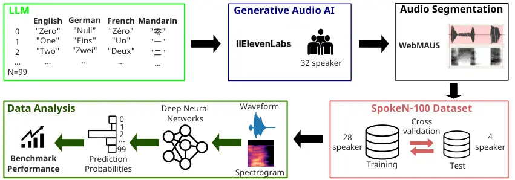
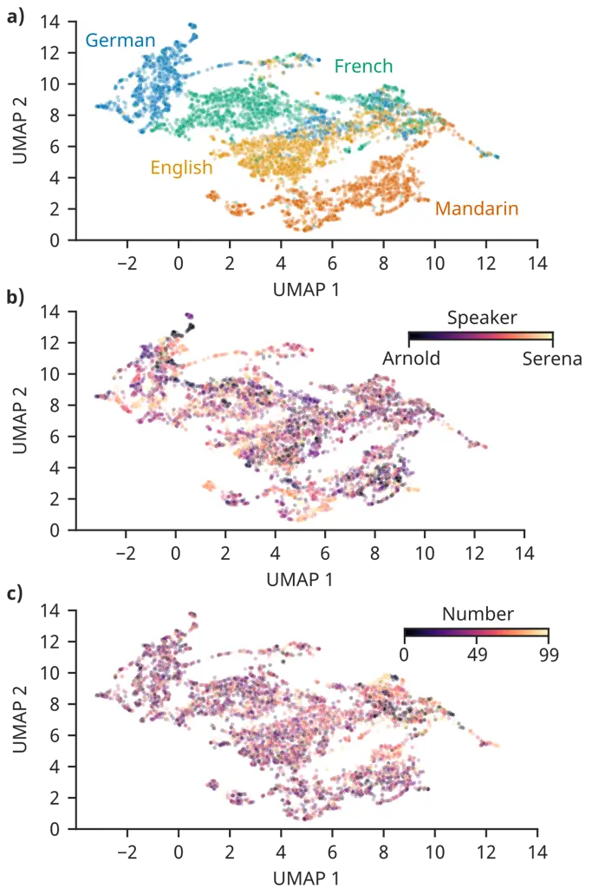

# SpokeN-100: A Cross-Lingual Benchmarking Dataset for The Classification of Spoken Numbers in Different Languages

René Groh email: <rene.groh@fau.de> Affiliation: Department Artificial
Intelligence in Biomedical Engineering, P.O. Box 1212, Erlangen,
Bavaria, Germany, 43017-6221 , Nina Goes Affiliation: Department
Artificial Intelligence in Biomedical Engineering, 1 Thørväld Circle,
Erlangen, Bavaria, Germany and Andreas M Kist email:
<andreas.kist@fau.de> Affiliation: Department Artificial Intelligence in
Biomedical Engineering, Erlangen, Bavaria, Germany

2024

###### Abstract.

Benchmarking plays a pivotal role in assessing and enhancing the
performance of compact deep learning models designed for execution on
resource-constrained devices, such as microcontrollers. Our study
introduces a novel, entirely artificially generated benchmarking dataset
tailored for speech recognition, representing a core challenge in the
field of tiny deep learning. SpokeN-100 consists of spoken numbers from
0 to 99 spoken by 32 different speakers in four different languages,
namely English, Mandarin, German and French, resulting in 12,800 audio
samples. We determine auditory features and use UMAP (Uniform Manifold
Approximation and Projection for Dimension Reduction) as a
dimensionality reduction method to show the diversity and richness of
the dataset. To highlight the use case of the dataset, we introduce two
benchmark tasks: given an audio sample, classify (i) the used language
and/or (ii) the spoken number. We optimized state-of-the-art deep neural
networks and performed an evolutionary neural architecture search to
find tiny architectures optimized for the 32-bit ARM Cortex-M4 nRF52840
microcontroller. Our results represent the first benchmark data achieved
for SpokeN-100.

###### Keywords: 

datasets, neural networks, speech processing, tiny machine learning

## 1. Introduction

In recent years, deep neural networks have experienced a significant
surge, with numerous studies focusing on scaling up model sizes and data
volumes to develop robust artificial intelligence (AI) models for broad
applications (Min et al., 2023; Yang et al., 2023). While these models,
which require significant computational resources and data, dominate the
AI landscape, specific tasks for edge computing, such as the field of
tiny deep learning (tinyDL), have received comparatively less attention.
TinyDL aims to harness the power of deep neural networks within the
severe limitations of microcontroller hardware and represents a unique
intersection of advanced neural network techniques and ultra-low-power
computing (Reddi et al., 2021; Zaidi et al., 2022; Capogrosso et al.,
2023).

To address the challenges posed by these highly constrained hardware
environments, significant strides have been made across multiple fronts.
These include the development of dedicated hardware, the creation of
innovative software solutions such as AI inference frameworks, and the
optimization of neural architectures for enhanced performance on limited
resources. Emerging from these efforts is a dynamic field of research
known as Neural Architecture Search (NAS), which focuses on automating
the design of neural network models (Liberis et al., 2021; Banbury
et al., 2021b; Lin et al., 2020).

Comprehensive benchmarking datasets are crucial for effectively
evaluating the performance of individual deep learning models and
emerging NAS algorithms. The MLperf Tiny Benchmark (Banbury et al.,
2021a) offers a specialized suite of benchmark datasets designed
specifically for the requirements of TinyDL, providing a robust
framework for evaluating both NAS algorithms and deep learning models in
this domain. Included in the MLperf Tiny Benchmark is the Speech
Commands dataset (Warden, 2018), a speech recognition dataset that
encompasses spoken numbers from 0 to 9, previously analyzed in
(Ouisaadane et al., 2019). Additionally, the AudioMNIST dataset (Becker
et al., 2023) features numbers from 0 to 9 in the English language.
There are several more datasets featuring spoken numbers in different
languages, e.g. Arabic (Wazir and Chuah, 2019) or Bangla (Sen and Roy,
2022). However, to our knowledge, there exists no dataset covering
spoken numbers from 0 to 99 in English, German, French, and Mandarin,
spoken from the same set of speakers for different languages.

SpokeN-100 aims to fill the aforementioned gap and enrich the
benchmarking dataset landscape, with a specific focus on advancements in
the TinyDL domain. This dataset is unique due to its heterogeneity,
encompassing spoken numerical utterances from a variety of speakers
across four languages: English, German, French, and Mandarin. The data
in this study is entirely artificially generated using advanced AI
models, ensuring a controlled yet realistic variety in the dataset. This
is in contrast to crowd-sourced data, which can have an uncontrollable
bias due to factors such as background noise. The analysis shows that
SpokeN-100 is highly diverse, making it an ideal resource for a variety
of learning tasks within TinyDL. This dataset is valuable for evaluating
and enhancing speech recognition algorithms and serves as a testbed for
exploring the capabilities of TinyDL models in handling multilingual and
diverse acoustic environments.

Figure 1. Overview of this study as a flow diagram.

## 2. Methods

In this chapter, we detail the development of the SpokeN-100 dataset
(refer to Fig. 1), elaborate on the measures implemented to guarantee
data quality and describe the methodologies employed for establishing
initial benchmark results.

### 2.1. Dataset Creation

In the initial phase, we employed a Large Language Model (LLM),
specifically ChatGPT (GPT 3.5), to generate textual representations of
spoken numbers across four languages, for example 42 would be forty-two
in English and zweiundvierzig in German. Subsequently, we utilized
ElevenLabs (ElevenLabs, 2023), a text-to-speech service using generative
AI models, for converting these texts into spoken words. From
ElevenLabs’ array of predefined speakers, we carefully selected 32
speakers—comprising an equal split of 16 female and 16 male voices—to
ensure a gender-balanced representation in the audio dataset. This
process involved creating texts for numbers ranging from 0 to 99 in each
language and generating their corresponding audio renditions using the
ElevenLabs API, with each audio sample recorded at a $`44.1kHz`$
sampling rate. Predominantly, we relied on ElevenLabs’ state-of-the-art
multilingual model v2. However, due to the subpar audio quality of some
speakers, we occasionally resorted to the earlier multilingual model
v1.  
To segment our audio into the designated 100 classes, we employed the
WebMAUS web application, which synchronizes speech recordings with their
corresponding text transcriptions (Kisler et al., 2012). This approach
was used for the Indo-European languages (English, German, and French)
to accurately determine the timestamps for the start and end of each
number. In French, however, certain compound numbers like ’21’ (vingt et
un) presented a unique challenge, as WebMAUS typically identifies
timestamps for individual words. To address this, we manually grouped
such numbers, selecting the beginning and end of the entire sequence
instead. Utilizing these timestamps, we were able to divide the audio
data into smaller segments, each representing one of the 100 classes. To
prevent abrupt endings, we incorporated a 0.2-second pause at the end of
each audio clip.  
For the Mandarin dataset, where WebMAUS was unsuitable, we adopted a
different strategy. We analyzed the rolling standard deviation of the
audio signal to pinpoint the start and end of the numbers. After
normalizing this rolling standard deviation, we set a threshold value at
$`0.05`$ to effectively delineate the numbers. We or native speakers of
the four languages listened to the individual audio samples to ensure
their integrity.

### 2.2. Data quality and diversity between languages and speakers

To ensure our benchmarking dataset was diverse and comprehensive, we
undertook detailed data analysis. We assessed the data quality using
descriptive statistics and manifold learning. For the latter, we relied
on UMAP for a dimensionality reduction technique to enhance the visual
inspectability of the dataset.

#### 2.2.1. Calculation of the fundamental frequency

An important feature for describing human speech is its pitch, which is
closely related to the fundamental frequency $`F_{0}`$ (Pisanski et al.,
2021). The pitch describes the perceived frequency of a sound and is a
key feature in identifying and distinguishing voices. It is crucial for
analyzing speech patterns and plays an important role in linguistic
prosody, which influences the meaning and emotions conveyed in spoken
language.  
To verify and uphold the quality of our artificially generated audio
data, we employed the PYIN algorithm (Mauch and Dixon, 2014) as part of
the librosa Python library (McFee et al., 2015) to compute $`F_{0}`$ for
each of the 12,800 audio samples. We downsampled the audio data to
$`11025Hz`$, because lower sampling rates enhance the reliability of the
algorithm. For our analysis, we chose a frame length of 512 data points,
alongside a singular threshold setting for peak estimation. To ensure
accuracy in our $`F_{0}`$ measurements, we excluded all frequencies
outside the typical vocal range, specifically those below $`50Hz`$ and
above $`300Hz`$, as the fundamental frequency predominantly resides
within this frequency band (Titze and Martin, 1998). In the final step,
we calculated the mean fundamental frequency ($`\bar{F_{0}}`$) for each
audio file by averaging the remaining frequencies.

#### 2.2.2. Manifold learning using UMAP

UMAP is a widely used technique for manifold learning and dimensionality
reduction. It is known for its efficiency in dealing with large data
sets and its ability to preserve local structure in high-dimensional
data (McInnes et al., 2018). We used UMAP to gain more insight into the
diversity of the SpokeN-100 dataset. Firstly, we downsampled each audio
file to 8000 data points using the Fourier method, effectively reducing
the temporal resolution while retaining essential spectral information.
Subsequently, we computed the mel-frequency spectrogram
($`n\_fft=1024`$, $`hop\_length=256`$, $`n\_mels=128`$), a
well-established time-frequency representation of the audio signal. The
mel-frequency spectrogram offers a frequency axis scaled to align with
human auditory perception, enhancing our ability to capture relevant
acoustic features and patterns in the data. We converted the power
mel-spectrogram to decibel units (dB) and used the resulting features to
obtain a two-dimensional embedding using UMAP.

### 2.3. Classification using deep neural networks

We established two distinct classification tasks using the full
SpokeN-100 dataset. Given an audio sample file, (i) identify the
language that is spoken or (ii) identify which number (0 … 99) is
articulated. That means it is a four- and a one-hundred-class
classification problem, respectively. Random guessing would therefore
yield a 25 % and 1 % accuracy, respectively. Outperforming these values
means that a given model is guessing better than a random guess and
indicates successful learning. We employed the same pre-processing
methods that were utilized for the UMAP embedding. For our baseline
neural architectures, we selected a diverse range of architectural
designs. Initially, we crafted three straightforward networks: a
one-dimensional convolutional neural network (CNN), a two-dimensional
CNN, and a recurrent neural network (RNN) based on Bidirectional-LSTM
layers. Additionally, we trained an EfficientNet-B0 (Tan and Le, 2019)
and a multi-head transformer network (Vaswani et al., 2017). All these
networks used mel-spectrogram features as input, with the exception of
the one-dimensional CNN, which processed normalized waveform inputs. All
models were trained within the TensorFlow framework v. 2.13 with the
Adam optimizer, each using an empirically tuned learning rate scheduler.
More details about the architectures and the learning rate schedulers
can be found in Appendix A.1. Training was performed on a workstation
equipped with an A5000 GPU with 24 GB of memory for 75 epochs for each
network.

### 2.4. Neural architecture search and deployment on microcontroller

To identify neural architectures suitable for microcontroller
deployment, we conducted an evolutionary neural architecture search
using the EvoNAS framework, as detailed in (Groh and Kist, 2023).
Briefly, EvoNAS uniquely outputs TensorFlow Lite (TFLite) Micro neural
network architectures that are directly deployable. The search space was
thus designed to accommodate this. Each network processes an 8000 data
point waveform input, followed by a short-term Fourier transform (STFT)
using the kapre library (Choi et al., 2017) that wraps the STFT
implementation into a TensorFlow layer as the TensorFlow version lacks
certain necessary operations when deployed using TFLite Micro. The
EvoNAS optimization algorithm was executed for 15 generations. Each
generation contained a population with 100 competing and evaluated
individuals. To find a solution to the multi-objective optimization
problem, we calculated the fitness $`F`$ for each individual neural
network architecture by using the following equation:

$`F=\alpha\cdot A+\beta\cdot\frac{R_{min}}{R}+\gamma\cdot\frac{E_{min}}{E},`$

where $`A`$ is the accuracy of the validation dataset, $`R`$ the
obtained rom usage (flash memory) in Bytes (B), and $`E`$ is the energy
consumption in Millijoule (mJ). The latter already contains the
inference information as it is calculated based on it. However, the
inference time and power consumption during inference are measured
directly on-device by deploying each neural network to the
microcontroller. To normalize the measurement into the range from 0 to
1, we determined the minimum possible value for the rom usage and energy
consumption ($`R_{min}=170000B`$, $`E_{min}=1.0`$). In addition, the
scaling parameters $`\alpha=0.6`$, $`\beta=0.2`$ and $`\gamma=0.2`$ were
set so that the algorithm favors certain objective measures more than
others.

### 2.5. SpokeN-100 as a TinyDL benchmark dataset

SpokeN-100 features a diverse array of 32 speakers identified by their
ElevenLabs name. For validation reasons, we performed multiple times
stratified dataset splits across speakers. SpokeN-100 contains a plain
text file detailing the data splits according to speaker identity (see
Appedix B). These splits encompass eight distinct groups, each
consisting of four speakers. For evaluating the final performance on the
dataset, models are trained using 28 speakers, while the remaining four
speakers in each split are utilized to assess the test accuracy (see
Fig. 1). The measure of performance of one model is determined by
calculating the average test accuracy across all eight data splits.

## 3. Results

In this section, our data analysis demonstrates the richness and
diversity of the SpokeN-100 dataset, highlighting its complexity despite
being entirely synthetically generated. We utilized UMAP for
dimensionality reduction, enabling us to effectively visualize the
dataset in a two-dimensional space. Following this, we embarked on
training multiple deep neural networks and conducting an evolutionary
neural architecture search, to establish initial benchmark results for
the dataset.

### 3.1. SpokeN-100 is a highly diverse AI-Generated Dataset

SpokeN-100 is artificially generated which could lead to faulty data and
thus influence the performance of machine learning models. We examined
the audio lengths for each spoken number sample. Our analysis revealed
that in every language, single-digit numbers are generally shorter than
double-digit ones (see Fig. 2a). We also observed that numbers at tens
positions (like 20, 30, etc.) are shorter than other double-digit
numbers. This pattern is consistent across languages, as double-digit
numbers typically combine a tens word with a single-digit word, such as
’twenty-eight’ being a combination of ’twenty’ and ’eight’. This is in
line with their real counterpart and suggests the validity of
SpokeN-100. To verify consistency among speakers across audio samples
and languages in our dataset, we analyzed the fundamental frequency
$`F_{0}`$ for each audio sample, calculating the average for every
speaker. Our results show that $`\bar{F_{0}}`$ is almost consistent for
each speaker across files and languages (see Fig. 2b). Comparing all
speakers with each other, it is noticeable that the dataset features
different $`F_{0}`$ frequencies, indicating that the data is highly
diverse. Additionally, the obtained average fundamental frequency values
follow the natural range of human language, which is between 50 and 300
Hz. Both findings affirm the dataset’s high data quality.

Figure 2. Descriptive statistics of the dataset. a) Mean audio sample
length of each spoken number across all speakers for four different
languages. The shaded marks the standard deviation. b) Determined
fundamental frequencies $`F_{0}`$ for each speaker. $`F_{0}`$ was
calculated for each audio sample and then averaged across all speakers.
The shaded area indicates the standard deviation.

In our subsequent data analysis, we utilized UMAP for dimensionality
reduction. The UMAP results, depicted in Fig. 3a, reveal distinct
clustering of data points according to languages. However, when these
points are color-coded based on speakers (as shown in Fig. 3b), no clear
clusters emerge, suggesting a high level of diversity in speaker
selection. Further color-coding of points in the UMAP embedding based on
the numbers in each audio sample (Fig. 3c) also fails to show distinct
clusters, implying that the task of classifying numbers could be
inherently complex.

Figure 3. Low dimensional visualization of all audio samples with UMAP.
a) UMAP embedding color-coded by language. b) UMAP embedding color-coded
by speaker. Each speaker is assigned a value between 0 and 1 to create a
gradient visualization. c) UMAP embedding color-coded by spoken number.

|                        |                      |                     |                             |                             |
| ---------------------- | -------------------- | ------------------- | --------------------------- | --------------------------- |
| Architecture           | Number of Parameters | Inference Time (ms) | Test Accuracy               |                             |
|                        |                      |                     | Languages                   | Numbers                     |
| 2D CNN                 | 1,891,972            | n.d.                | $`0.927\pm 0.017`$          | $`0.565\pm 0.054`$          |
| 1D CNN                 | 16,368,340           | n.d.                | $`0.815\pm 0.029`$          | $`0.132\pm 0.015`$          |
| RNN                    | 5,709,700            | n.d.                | $`0.920\pm 0.015`$          | $`0.614\pm 0.041`$          |
| EfficientNet-B0 CNN    | 5,365,415            | n.d.                | $`0.963\pm 0.011`$          | $`0.848\pm 0.037`$          |
| Transformer            | 1,352,324            | n.d.                | $`0.945\pm 0.012`$          | $`0.729\pm 0.046`$          |
| EvoNAS (most accurate) | 18,264               | 1761                | $`0.837\pm 0.022`$          | $`0.175\pm 0.025`$          |
| EvoNAS (fastest)       | 6,496                | 152                 | $`0.364\pm 0.027`$          | $`0.022\pm 0.003`$          |
| EvoNAS (fittest)       | 5,379                | 368                 | $`\mathbf{0.813\pm 0.021}`$ | $`\mathbf{0.126\pm 0.020}`$ |

Table 1. Results for language and numbers classification for different
deep neural network architectures. All state-of-the-art architectures
were non-deployable (n.d.) to the nRF52840 microcontroller. The neural
networks in the bottom three rows were successfully optimized utilizing
the EvoNAS end-to-end pipeline (Groh and Kist, 2023). For each network,
we provide the mean test accuracy along with its standard deviation,
following the previously described data split methodology.

### 3.2. SpokeN-100 is suitable as a TinyDL benchmarking dataset

Evaluating various state-of-the-art neural network architectures using
the SpokeN-100 benchmark split, our study (refer to Table 1)
demonstrates that all networks successfully learned the necessary
patterns for the classification tasks. In language classification,
models processing mel-spectral features uniformly achieved a mean test
accuracy above $`90\%`$. In contrast, the one-dimensional CNN, which
used waveform inputs, underperformed with a mean test accuracy of
$`81.5\%`$. When tackling the more complex task of number
classification, involving a one-hundred-class problem, EfficientNetB0
emerged as the top performer. The one-dimensional CNN consistently
showed the lowest performance. These findings point to the conclusion
that implementing preprocessing, specifically through mel-spectrogram
calculation, significantly enhances classification accuracy.

Deploying and executing all the previously mentioned models on a
microcontroller is impractical due to their extensive number of
parameters and resultant large network sizes. To address this, we
conducted an evolutionary neural architecture search (EvoNAS). Table 1
showcases three models that excelled in terms of accuracy, inference
time, and overall fitness (more architectural details in Appendix A.2).
Each model was successfully deployed on the nRF52840 microcontroller.
The most accurate model had a slower inference time of $`1.7`$ seconds
per inference. In contrast, the fastest model experienced a significant
decrease in test accuracy. The most balanced, or ’fittest’, architecture
achieved an inference time of 368 milliseconds, with a test accuracy of
$`81.3\%`$ for languages and $`12.6\%`$ for numbers, setting the
benchmark for SpokeN-100 on a microcontroller.

## 4. Discussion

Our goal was to enhance speech recognition for spoken numbers by
introducing a dataset comprising spoken numbers from 0 to 99. Our study
demonstrates that the two classification tasks we presented can be
effectively addressed using state-of-the-art neural networks. However,
these networks become less feasible on highly constrained hardware,
leading to compromises that result in diminished performance compared to
the previously discussed models.

To facilitate inference on the microcontroller, we downscaled the input
data to 8000 data points, a measure that might induce some information
loss. Using larger input sizes would exceed the microcontroller’s peak
RAM capacity. Additionally, we had to limit the search space, meaning
that we could not use the same STFT parameters that we used as
pre-processing for the other neural networks because the resulting
models would not be too large to deploy. Looking ahead, opting for
microcontrollers with slightly more computational capability could be
advisable. However, the aforementioned limitations lead to a huge drop
in test accuracy when looking at the number classification. Enhancing
the classification performance on edge microcontrollers, especially in
terms of accuracy, remains an unresolved challenge.

Besides these limitations, it is noteworthy that the architectures
discovered by the EvoNAS optimization algorithm are deployable to the
microcontroller. These architectures are designed to function ’out of
the box’ within our search space, eliminating the need for additional
data pre-processing on the microcontroller prior to running inference.

We want to highlight the practical relevance that SpokeN-100 can have. A
potential use case is in device control scenarios requiring numerical
input, such as in robot navigation (Huang et al., 2023) or the operation
of wearable devices (Wilde et al., 2015). Looking ahead, we plan to
enhance SpokeN-100 by releasing a second version featuring a greater
variety of speakers and additional languages, further diversifying the
dataset.

## 5. Conclusion

In this study, we presented SpokeN-100 which is a speech recognition
dataset of spoken numbers. SpokeN-100 is especially suited to be used as
a benchmark for TinyDL algorithms, such as neural architecture search.
Other than that we believe that SpokeN-100 also has a high practical
relevance. SpokeN-100 provides a starting point to train models to be
able to do this. As it encompasses multiple languages, resulting machine
learning models are also able to mitigate language barriers. We believe
that SpokeN-100 can have a very positive impact on the development of
TinyDL applications, further accelerating the field.

###### Acknowledgements.

We receive funding from the Bavarian State Ministry of Science and the
Arts (StMWK) and Fonds de recherche du Québec (FRQ) under the
Collaborative Bilateral Research Program Bavaria – Québec managed by WKS
at Bavarian Research Alliance (BayFOR) and Fonds de recherche du Québec
– Santé (FRQS). The presented content is solely the responsibility of
the authors and does not necessarily represent the official views of the
above funding agencies.

## References

- Banbury et al. (2021a) Colby Banbury, Vijay Janapa Reddi, Peter
  Torelli, Jeremy Holleman, Nat Jeffries, Csaba Kiraly, Pietro Montino,
  David Kanter, Sebastian Ahmed, Danilo Pau, et al. 2021a. Mlperf tiny
  benchmark. _arXiv preprint arXiv:2106.07597_ (2021).
- Banbury et al. (2021b) Colby Banbury, Chuteng Zhou, Igor Fedorov,
  Ramon Matas, Urmish Thakker, Dibakar Gope, Vijay Janapa Reddi, Matthew
  Mattina, and Paul Whatmough. 2021b. Micronets: Neural network
  architectures for deploying tinyml applications on commodity
  microcontrollers. _Proceedings of Machine Learning and Systems_ 3
  (2021), 517–532.
- Becker et al. (2023) Sören Becker, Johanna Vielhaben, Marcel
  Ackermann, Klaus-Robert Müller, Sebastian Lapuschkin, and Wojciech
  Samek. 2023. AudioMNIST: Exploring Explainable Artificial Intelligence
  for audio analysis on a simple benchmark. _Journal of the Franklin
  Institute_ (2023).
- Capogrosso et al. (2023) Luigi Capogrosso, Federico Cunico, Dong Seon
  Cheng, Franco Fummi, et al. 2023. A Machine Learning-oriented Survey
  on Tiny Machine Learning. _arXiv preprint arXiv:2309.11932_ (2023).
- Choi et al. (2017) Keunwoo Choi, Deokjin Joo, and Juho Kim. 2017.
  Kapre: On-GPU Audio Preprocessing Layers for a Quick Implementation of
  Deep Neural Network Models with Keras. In _Machine Learning for Music
  Discovery Workshop at 34th International Conference on Machine
  Learning_. ICML.
- ElevenLabs (2023) ElevenLabs. 2023. _Prime Voice AI_.
  [https://elevenlabs.io/](https://elevenlabs.io/)
- Groh and Kist (2023) René Groh and Andreas M Kist. 2023. End-to-end
  evolutionary neural architecture search for microcontroller units. In
  _2023 IEEE International Conference on Omni-layer Intelligent Systems
  (COINS)_. IEEE, 1–7.
- Huang et al. (2023) Chenguang Huang, Oier Mees, Andy Zeng, and Wolfram
  Burgard. 2023. Visual language maps for robot navigation. In _2023
  IEEE International Conference on Robotics and Automation (ICRA)_.
  IEEE, 10608–10615.
- Kisler et al. (2012) Thomas Kisler, Florian Schiel, and Han
  Sloetjes. 2012. Signal processing via web services: the use case
  WebMAUS. In _Digital Humanities Conference 2012_.
- Liberis et al. (2021) Edgar Liberis, Łukasz Dudziak, and Nicholas D
  Lane. 2021. $`\mu`$NAS: Constrained neural architecture search for
  microcontrollers. In _Proceedings of the 1st Workshop on Machine
  Learning and Systems_. 70–79.
- Lin et al. (2020) Ji Lin, Wei-Ming Chen, Yujun Lin, Chuang Gan, Song
  Han, et al. 2020. Mcunet: Tiny deep learning on iot devices. _Advances
  in Neural Information Processing Systems_ 33 (2020), 11711–11722.
- Mauch and Dixon (2014) Matthias Mauch and Simon Dixon. 2014. pYIN: A
  fundamental frequency estimator using probabilistic threshold
  distributions. In _2014 ieee international conference on acoustics,
  speech and signal processing (icassp)_. IEEE, 659–663.
- McFee et al. (2015) Brian McFee, Colin Raffel, Dawen Liang, Daniel PW
  Ellis, Matt McVicar, Eric Battenberg, and Oriol Nieto. 2015. librosa:
  Audio and music signal analysis in python. In _Proceedings of the 14th
  python in science conference_, Vol. 8.
- McInnes et al. (2018) Leland McInnes, John Healy, and James
  Melville. 2018. Umap: Uniform manifold approximation and projection
  for dimension reduction. _arXiv preprint arXiv:1802.03426_ (2018).
- Min et al. (2023) Bonan Min, Hayley Ross, Elior Sulem, Amir Pouran Ben
  Veyseh, Thien Huu Nguyen, Oscar Sainz, Eneko Agirre, Ilana Heintz, and
  Dan Roth. 2023. Recent advances in natural language processing via
  large pre-trained language models: A survey. _Comput. Surveys_ 56, 2
  (2023), 1–40.
- Ouisaadane et al. (2019) A Ouisaadane, Said Safi, and M Frikel. 2019.
  English Spoken Digits Database under noise conditions for research:
  SDDN. In _2019 International Conference on Wireless Technologies,
  Embedded and Intelligent Systems (WITS)_. IEEE, 1–5.
- Pisanski et al. (2021) Katarzyna Pisanski, Agata Groyecka-Bernard, and
  Piotr Sorokowski. 2021. Human voice pitch measures are robust across a
  variety of speech recordings: methodological and theoretical
  implications. _Biology letters_ 17, 9 (2021), 20210356.
- Reddi et al. (2021) Vijay Janapa Reddi, Brian Plancher, Susan Kennedy,
  Laurence Moroney, Pete Warden, Anant Agarwal, Colby Banbury, Massimo
  Banzi, Matthew Bennett, Benjamin Brown, et al. 2021. Widening access
  to applied machine learning with tinyml. _arXiv preprint
  arXiv:2106.04008_ (2021).
- Sen and Roy (2022) Ovishake Sen and Pias Roy. 2022. A Novel Bangla
  Spoken Numerals Recognition System Using Convolutional Neural Network.
  In _International Conference on Machine Intelligence and Emerging
  Technologies_. Springer, 344–357.
- Tan and Le (2019) Mingxing Tan and Quoc Le. 2019. Efficientnet:
  Rethinking model scaling for convolutional neural networks. In
  _International conference on machine learning_. PMLR, 6105–6114.
- Titze and Martin (1998) Ingo R Titze and Daniel W Martin. 1998.
  Principles of voice production.
- Vaswani et al. (2017) Ashish Vaswani, Noam Shazeer, Niki Parmar, Jakob
  Uszkoreit, Llion Jones, Aidan N Gomez, Łukasz Kaiser, and Illia
  Polosukhin. 2017. Attention is all you need. _Advances in neural
  information processing systems_ 30 (2017).
- Warden (2018) Pete Warden. 2018. Speech commands: A dataset for
  limited-vocabulary speech recognition. _arXiv preprint
  arXiv:1804.03209_ (2018).
- Wazir and Chuah (2019) Abdulaziz Saleh Mahfoudh Ba Wazir and
  Joon Huang Chuah. 2019. Spoken Arabic digits recognition using deep
  learning. In _2019 IEEE International Conference on Automatic Control
  and Intelligent Systems (I2CACIS)_. IEEE, 339–344.
- Wilde et al. (2015) Adriana Wilde, Olivia Ojuroye, and Russel
  Torah. 2015. Prototyping a voice-controlled smart home hub wirelessly
  integrated with a wearable device. In _2015 9th International
  Conference on Sensing Technology (ICST)_. IEEE, 71–75.
- Yang et al. (2023) Ling Yang, Zhilong Zhang, Yang Song, Shenda Hong,
  Runsheng Xu, Yue Zhao, Wentao Zhang, Bin Cui, and Ming-Hsuan
  Yang. 2023. Diffusion models: A comprehensive survey of methods and
  applications. _Comput. Surveys_ 56, 4 (2023), 1–39.
- Zaidi et al. (2022) Syed Ali Raza Zaidi, Ali M Hayajneh, Maryam
  Hafeez, and QZ Ahmed. 2022. Unlocking edge intelligence through tiny
  machine learning (TinyML). _IEEE Access_ 10 (2022), 100867–100877.

## Appendix A Neural Networks

### A.1. Baseline models

In the following we provide more details about the used neural
architectures. Layers are named after the type of layer, followed by the
kernel size, the amount of units and the used activation function, e.g.
Conv3-64-relu stands for a convolutional layer with kernel size of 3, 64
units and ReLU as activation function. The final fully connected (FC)
layer consists always of four or one-hundred units depending on the
classification task (languages or numbers).  
We trained all networks for 75 epochs using individual learning rate
schedulers.

#### A.1.1. 2D CNN

Our 2D CNN consists of the following layers: Input(128, 32),
Conv3-16-relu, MaxPooling2, Conv3-32-relu, MaxPooling2, Conv3-64-relu,
Flatten, FC-256-relu, FC-128-relu, FC-4-softmax. Convolutional layers in
this model have two-dimensional kernels.  
The used learning rate was $`0.0001`$ until epoch 25, $`0.00005`$ until
epoch 50, and $`0.00001`$ afterward.

#### A.1.2. 1D CNN

Our 1D CNN consists of the following layers: Input(8000, 1),
Conv3-8-relu, MaxPooling2, Conv3-16-relu, MaxPooling2, Conv3-32-relu,
MaxPooling2, Conv3-64-relu, Flatten, FC-256-relu, FC-128-relu,
FC-64-relu, FC-4-softmax. Convolutional layers in this model have
one-dimensional kernels.  
The used learning rate was $`0.0001`$ until epoch 25, $`0.00005`$ until
epoch 50, and $`0.00001`$ afterward.

#### A.1.3. RNN

Our RNN consists of the following layers: Input(128, 32),
Bidirectional(LSTM-128), Bidirectional(LSTM-256),
Bidirectional(LSTM-512), Dropout-0.5, FC-256-relu, FC-128-relu,
FC-4-softmax. In this architecture, the first two LSTM layers are
returning sequences.  
The used learning rate was $`0.0001`$ until epoch 25, $`0.00005`$ until
epoch 50, and $`0.00001`$ afterward.

#### A.1.4. EfficientNetB0 CNN

The architecture for EfficientNetB0 is described in (Tan and Le, 2019).
We used the implementation from TensorFlow (pre-trained on ImageNet) and
added as top of the network the following layers: GlobalAveragePooling,
FC-1024-relu, FC-4-softmax.  
The used learning rate was $`0.001`$ until epoch 25, $`0.0005`$ until
epoch 50, and $`0.0001`$ afterward.

#### A.1.5. Transformer

Our Transformer network consists of the following layers: Input(128,
32), FC-128-linear, PositionalEncoding, Dropout(0.1), four
EncoderLayers, FC-4-softmax. Each EncoderLayer consists of a
MultiHeadAttention block, Dropout(0.1), LayerNormalization,
FC-1024-relu, FC-128-None, Dropout(0.1) and LayerNormalization. More
details can be found in (Vaswani et al., 2017).  
The used learning rate was $`0.0001`$ until epoch 30, $`0.00001`$ until
epoch 50, $`0.000001`$ until epoch 70, and $`0.0000001`$ afterward.

### A.2. EvoNAS model

#### A.2.1. Fittest Model

The architecture of our fittest model consists of the following layers:
Input(8000, 1), STFT(n_fft=112, hop_length=256), Magnitude,
Mel-Filterbank (n_mels=44), DepthwiseConv5, Conv3-8, MaxPooling3,
DepthwiseConv3, Conv1-14, Conv5-12, MaxPooling4, Conv2-7,
BatchNormalization, GlobalAveragePooling, FC-40-relu, Dropout(0.2),
FC-4-softmax.

#### A.2.2. Most Accurate Model

The architecture of our most accurate model consists of the following
layers: Input(8000, 1), STFT(n_fft=96, hop_length=144), Magnitude,
Mel-Filterbank (n_mels=52), Conv1-6, ReLU, Conv4-27, BatchNormalization,
DepthwiseConv2, ReLU, DepthwiseConv3, MaxPooling4, DepthwiseConv2,
DepthwiseConv5, Conv4-17, ReLU, Conv3-21, MaxPooling2,
BatchNormalization, MaxPooling2, GlobalAveragePooling, FC-48-relu,
Dropout(0.1), FC-48-relu, FC-4-softmax.

#### A.2.3. Fastest Model

The architecture of our fastest model consists of the following layers:
Input(8000, 1), STFT(n_fft=80, hop_length=304), Magnitude,
Mel-Filterbank (n_mels=68), DepthwiseConv2, DepthwiseConv5,
BatchNormalization, GlobalAveragePooling, Dropout(0.2), FC-48-relu,
FC-120-relu, FC-4-softmax.

## Appendix B Code and dataset

The code for data exploration and neural network training can be found
at the following link:
[https://github.com/ankilab/SpokeN-100](https://github.com/ankilab/SpokeN-100).
The dataset can be downloaded via
[https://zenodo.org/records/10810044](https://zenodo.org/records/10810044).
