# Energy-Based Models with Applications to Speech and Language Processing

Ou    Zhijian Affiliation: Tsinghua University, Beijing, China;
ozj@tsinghua.edu.cn

###### Abstract

Energy-Based Models (EBMs) are an important class of probabilistic
models, also known as random fields and undirected graphical models.
EBMs are un-normalized and thus radically different from other popular
self-normalized probabilistic models such as hidden Markov models
(HMMs), autoregressive models, generative adversarial nets (GANs) and
variational auto-encoders (VAEs). During these years, EBMs have
attracted increasing interests not only from core machine learning but
also from application domains such as speech, vision, natural language
processing (NLP) and so on, with significant theoretical and algorithmic
progress. To the best of our knowledge, there are no review papers about
EBMs with applications to speech and language processing. The sequential
nature of speech and language also presents special challenges and needs
treatment different from processing fix-dimensional data (e.g., images).

The purpose of this monograph is to present a systematic introduction to
energy-based models, including both algorithmic progress and
applications in speech and language processing, which is organized into
four chapters. First, we will introduce basics for EBMs, including
classic models, recent models parameterized by neural networks, sampling
methods, and various learning methods from the classic learning
algorithms to the most advanced ones. The next three chapters will
present how to apply EBMs in three different scenarios, i.e., for
modeling marginal, conditional and joint distributions, respectively. 1)
EBMs for sequential data with applications in language modeling, where
we are mainly concerned with the marginal distribution of a sequence
itself; 2) EBMs for modeling conditional distributions of target
sequences given observation sequences, with applications in speech
recognition, sequence labeling and text generation; 3) EBMs for modeling
joint distributions of both sequences of observations and targets, and
their applications in semi-supervised learning and calibrated natural
language understanding. In addition, we will introduce some open-source
toolkits to help the readers to get familiar with the techniques for
developing and applying energy-based models.

\maintitleauthorlist

Zhijian Ou  
Tsinghua University, Beijing, China  
ozj@tsinghua.edu.cn \issuesetupcopyrightowner=Zhijian Ou, volume = xx,
issue = xx, pubyear = 2022, isbn = xxx-x-xxxxx-xxx-x, eisbn =
xxx-x-xxxxx-xxx-x, doi = 10.1561/XXXXXXXXX, firstpage = 1, lastpage =
200 \articledatabox\nowfntstandardcitation

###### List of Figures

1.  1.1The probabilistic approach
2.  1.2Outline of this monograph
3.  2.1(a) A simple directed graphical model with four variables ( x 1 ,
    x 2 , x 3 , x 4 ) . (b) A simple undirected graphical model with
    four variables ( x 1 , x 2 , x 3 , x 4 ) . For both types of graphs,
    V denotes the set of nodes and E the set of edges. If both ordered
    pairs ( α , β ) and ( β , α ) belong to E , we say that we have an
    undirected edge between α and β . A nice introduction of graph
    theory in the context of graphical models could be found in Chapter
    4 of \[\].
4.  2.2Graphical model representation of a hidden Markov model (HMM).
5.  2.3Neural network based classifier. (a) GM representation; (b)
    Computational graph representation.
6.  2.4Illustration of the global Markov property in UGMs.
7.  2.5Ising model: (a) The undirected graph representation, (b) A
    sample.
8.  (a)
9.  (b)
10. 2.6Sample states of square Ising models with = J 1 , = H 0 , = k B 1
    , = N 4096 at a sequence of temperatures = T 5 , 2.5 , 2.4 , 2.3 , 2
    . \[\]
11. 2.7Restricted Boltzmann Machine. The top layer represents a vector
    of stochastic binary hidden variables h and the bottom layer
    represents a vector of stochastic binary visible variables v . \[\]
12. 2.8(a) Restricted Boltzmann machine (RBM), (b) Sigmoid belief
    network (SBN).
13. (a)
14. (b)
15. 2.9Potential functions in EBMs can be flexibly parameterized by
    neural networks for images, natural languages and so on.
16. 2.10Overview of the inclusive-variational approach for learning EBMs
    for continuous data. Two neural networks are used to define the
    EBM’s potential function ⁢ U θ ( x ) and the auxiliary generator ⁢ g ϕ
    ( h ) respectively. The parameters of both networks, θ and ϕ , are
    updated by using the revised samples ( x , h ) in the augmented
    space, which are obtained by revising the samples ( x ′ , h ′ )
    proposed by the auxiliary generator, according to the stochastic
    gradients defined by both the target EBM and the auxiliary
    generator. \[\]
17. 3.1Example of discrete features.
18. 3.2Hidden2Scalar: a deep CNN architecture used to define the
    potential function ⁢ U θ ( x ) . Shadow areas denote the padded
    zeros. \[\]
19. 3.3Hidden2Scalar: a bidirectional LSTM on top of CNN used to define
    the potential function ⁢ U θ ( x ) . \[\]
20. 3.4SumInnerProduct: a bidirectional LSTM used to define the
    potential function ⁢ U θ ( x ) . \[\]
21. 3.5The WER curves of the three TRF-LMs during the first 100 training
    epochs are plotted. \[\]
22. 3.6Comparison of BERT and Electric. Both model the conditional
    probability of a token given its surrounding context. BERT produces
    normalized conditional distribution for masked positions, while
    Electric calculates unnormalized conditional probabilities for all
    input tokens. \[\]
23. 4.1Graphical model representation of a conditional random field
    (CRF).
24. 4.2State transitions resulting from estimating an autoregressive
    language model from training data - “Tom likes tea”, “John likes
    tea”, and “Alice like tea”. For some transitions not appeared in the
    training data, the transition probabilities are smoothed to take
    small values ϵ . We pad the beginning and the end of a sentence with
    special tokens, ⟨ s ⟩ and ⟨ / s ⟩ , respectively \[\].
25. 4.3Estimating a globally-normalized energy-based language model
    (ELM) from training data - “Tom likes tea”, “John likes tea”, and
    “Alice like tea”. The bi-gram features used by the ELM are similar
    to those used in the bigram ALM, and so can also be illustrated by a
    graph. The estimated parameters are shown over the edges, which
    represent the corresponding bi-gram features.
26. 4.4Illustration of exposure bias. y : real, ^ y : predicted.
27. 4.5Different units of labels can be used in speech recognition.
28. 4.6State transitions in HMMs for speech recognition are constrained
    by a number of knowledge sources.
29. 4.7Overview of CTC architecture.
30. 4.8Illustration of the lattice, which contains all the possible
    alignments between the acoustic sequence and the label sequence
    ‘CAT’. Also illustration of the forward-backward algorithm. Black
    circles represent ordinary labels, and white circles represent
    blanks. Arrows signify allowed transitions. \[\]
31. 4.9Graphical model representation of the CTC model (a) and the
    CTC-CTF model (b). Note that the edge potential does not involve
    exactly n consecutive nodes for a n -gram LM of labels, as detailed
    in the text of Section .
32. 4.10Graphical model representations of different ASR models: (a)
    HMM, defined in Eq. (), (b) CTC, defined in Eq. (), (c) RNN-T, (d)
    AED, (e) CTC-CRF, defined in Eq. ().
33. 4.11Graphical model representations of (a) a linear-chain CRF, (b) a
    RNN-T for the aligned setting, and (c) a CRF transducer. Notably,
    the graphical representation of the RNN-T for the aligned setting,
    as defined in Eq. (), is different from that of the usual RNN-T as
    shown in Figure (c).
34. 4.12The architecture of a CRF transducer.
35. 4.13Overview of mix-and-match LM. The Lego pieces show different
    experts that can be used to form the energy LM and help control
    different features in the generated text. The right side shows the i
    -th step in the the Gibbs sampling chain, where a proposal is made
    by the MLM, and then it is accepted/rejected based on the energy
    score. \[\]
36. 5.1An overview of SSL and a general categorization of generative SSL
    methods. Examples are mainly chosen from NLP.
37. 5.2 Overview of the JRF model. The node and edge potentials define a
    JRF (a joint distribution over x l and y l ). Inducing the
    conditional and the marginal from the joint yields a CRF and a TRF
    respectively. A JRF can be trained from labeled data (acting like a
    CRF) and also from unlabeled data (acting like a TRF). In practice,
    the node potentials are calculated from the logits o i , = i 1 , ⋯ ,
    l , from the NN, and the edge potential follows a linear-chain
    definition.
38. 5.3Illustration of EBM based semi-supervised image
    classification. (a) Pre-training, (b) Fine-tuning, (c)
    Joint-training.
39. 5.4Illustration of EBM based sequence labeling. (a)
    Pre-training, (b) Fine-tuning, (c) Joint-training.
40. 5.5Comparison of the scalar and the hidden variants of energy
    functions. The modules introduced for EBM are shaded in green. \[\]
41. 5.6The entropy of the posterior ( p θ ( ⋅ \| x ) ) versus energy
    value ⁢ ^ E θ ( x ) for SST-2 test-set samples. \[\]

###### List of Tables

1.  2.1A survey of different sampling methods used in generating text
    from EBMs. The target model is the EBM, while a proposal is required
    for both MCMC and IS. Different proposals are used in different
    applications. Shorthands: ALMs (autoregressive language model), MLM
    (masked language model), SNIS (self-normalized importance sampling),
    ASR (automatic speech recognition), CTG (controlled text
    generation), CTGAP (conditional text generation after prefix).
2.  3.1The development of TRF-LMs.
3.  3.2Feature definition in TRF LMs \[\]
4.  4.1A general classification of sequence models, with some common
    examples.
5.  4.2Comparison of different models for ASR. HMM topology denotes that
    labels (including silence) are modeled by multiple states with
    left-to-right transitions, possible self-loops and skips. CTC
    topology denotes the special state transitions used in CTC
    (including blank). Locally/globally normalized denotes the
    formulation of the model distribution. In defining the joint
    distribution of a model, locally normalized models use conditional
    probability functions, while globally normalized models use
    un-normalized potential functions. SS-LF-MMI is classified as
    globally normalized, though it is cast as MMI-based discriminative
    training of a pseudo HMM and the HMM model is locally normalized.
    AED does not use states to align label sequence y and observation
    sequence x .
6.  4.3Model comparison and connection.
7.  5.1Applications of EBMs across different domains: comparison and
    connection (See text for details).
8.  5.2SSL for image classification over CIFAR-10 with 4,000 labels for
    a full training set of 50K images. The upper/lower blocks show the
    generative/discriminative SSL methods respectively. The means and
    standard deviations are calculated over ten independent runs with
    randomly sampled labels.
9.  5.3 Relative improvements by joint-training EBMs compared to the
    supervised baseline (abbreviated as sup.) and the
    pre-training+fine-tuning EBMs (abbreviated as pre.) respectively.
    The evaluation metric is accuracy for POS and F 1 for chunking and
    NER. “Labeled” denotes the amount of labels in terms of the
    proportions w.r.t. the full set of labels. “U/L” denotes the ratio
    between the amount of unlabeled and labeled data.

\makeabstracttitle

## Chapter 1 Introduction

### 1.1 The probabilistic approach

As a community we seem to have embraced the fact that dealing with
_uncertainty_ is crucial for machine intelligence tasks such as speech
recognition and understanding, speech synthesis, natural language
labeling, machine translation, text generation, computer vision, signal
denoising, decision making, and so on. Uncertainty arises because of
limitations in our ability to observe the world, limitations in our
ability to model it, and possibly even because of innate nondeterminism
\[77\]. In face of such uncertainty, we use probabilistic models to
describe the random phenomena. Indeed, many tasks in intelligent signal
processing and machine learning are solved in the _probabilistic
approach_, which generally involves probabilistic modeling, inference
and learning, as shown in Figure 1.1. Such probabilistic approach has
been introduced in textbooks with sufficient details \[77, 110, 14,
59\], and thus in this paper we only give a brief overview as the
background material.

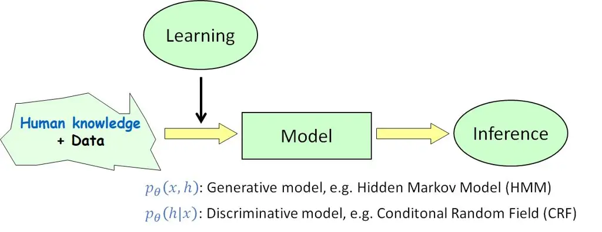

Figure 1.1: The probabilistic approach

A _probabilistic model_ is, in mathematical terms, a distribution over a
set of random variables, which are assumed to characterise the random
phenomena in the specific task. The set of variables can generally be
divided into observations $`x`$ and (optionally) hidden variables $`h`$,
according to their roles in the task. Hidden variables, or called latent
variables, are variables that are part of the model, but which we do not
observe, and are therefore not part of the data. Remarkably, the
observability of some variables may change, depending on what phase
(training or testing) the model is used. A most common example is the
_target variable_ in prediction tasks, such as the class label in
classification or the response variable in regression, which is observed
in training but becomes unknown in testing. To avoid clutter in this
paper, such variable is viewed as part of the hidden variables and
usually denoted by $`y`$.

We will typically denote a variable by a lower case letter such as
$`x`$, $`h`$ and $`y`$. Whether $`x`$ denotes the value that the
variable takes or represents the variable itself would be clear from the
context. Further, for notational simplicity, we also use lower case
letter (e.g., $`x`$) to denote a set of random variables, i.e.,
flattened and concatenated such that the set is represented as a single
vector. So if $`x`$ is a vector or a sequence, its components can be
accessed by subscripts $`x_{i}`$. Here, we are using the terminology
_distribution_ or _density_ loosely, typically denoted by $`p`$. Our
notation $`p`$ should be understood as a mass function (density with
respect to counting measure) in the discrete case, and a density
function with respect to Lebesgue measure in the continuous case. See
Section A.1 for more on notations.

Given the form of the probabilistic model, namely the distribution
$`p_{\theta}(x,h)`$ with parameters $`\theta`$, there are two crucial
problems that must be solved in applying the model in real-world tasks:

- •
  Inference: how to reason in the presence of uncertainty;
- •
  Learning: how to learn from experience.

The former problem is often referred to _probabilistic inference_ with a
fully-specified model, or inference for short; and the later problem
sometimes referred to _statistical inference_ (or more often to say,
_learning_ in machine learning terminology) for model parameters
\[112\].

Put in a more straightforward way, _learning_ is to find the most
appropriate model with parameters, using both data and human knowledge.
Human knowledge is implicitly employed to specify the family of
parametric distributions, and data are used to estimate the parameters.
Given a fully-specified model, i.e., fully-determined with fixed
parameters, _inference_ is to infer the unknown from the observation
$`x`$. There are several typical classes of inference problems:

- •
  Computing conditional probabilities, e.g., $`p_{\theta}(h|x)`$. This
  amounts to computing the posterior probability of some variables given
  the values of other variables (i.e., given evidence on others).
- •
  Computing marginal probabilities, including the likelihood
  $`p_{\theta}(x)`$.
- •
  Computing modes, e.g., $`\arg\max_{h}p_{\theta}(h|x)`$.
- •
  Sampling from the model \[112, 87\].

We provide two more points for readers to appreciate the importance of
the inference problems. First, the inference problems themselves are
often taken as the means to use the model. For example, speech
recognition is generally to find the mode of the posterior distribution
on state sequences given observed speech. Second, learning algorithms
often make use of some inference problem as a subroutine. For example,
algorithms that maximize likelihood for learning latent variable models,
e.g., the _expectation-maximization_ (EM) algorithm \[38\], call the
calculation of $`p_{\theta}(h|x)`$ as a subroutine. Seeking
computational efficient algorithms to solve these inference problems for
increasingly complex models has been an enduring challenge for our
research community.

#### 1.1.1 Generative models and discriminative models

One major division in the probabilistic approach is generative versus
discriminative modeling. In generative modeling, one aims to learn the
joint distribution $`p_{\theta}(x,h)`$ over all the variables. In
discriminative modeling, one only models the conditional distribution
$`p_{\theta}(h|x)`$ over the target variable (denoted by $`h`$ for
convenience) given the observation $`x`$. In discriminative modeling,
the observation and the target variable are also called the input and
output, respectively.

The generative-discriminative distinction has received much attention in
machine learning \[116, 84\]. When a discriminative model follows the
induced form of the conditional distribution $`p_{\theta}(h|x)`$ from a
generative model $`p_{\theta}(x,h)`$, the two models are called a
_generative-discriminative pair_ (i.e., under the same parametric family
of models) \[116\]. For example, naive Bayes classifier and logistic
regression, _hidden Markov model_ (HMM) \[133\] and _conditional random
field_ (CRF) \[79, 170\], form Generative-Discriminative pairs,
respectively. To compare generative and discriminative learning, it
seems natural to focus on such pairs. Basically, there are different
regimes of performance as the training set size in increased. Taking
naive Bayes and logistic regression as a case study, it is shown in
\[116\] that “while discriminative learning has lower asymptotic error,
a generative classifier may also approach its (higher) asymptotic error
much faster”. The comparison of HMM and CRF is further studied in
\[84\], and it is found that generative modeling (modeling more of the
data) tends to reduce asymptotic variance, but at the cost of being more
sensitive to model misspecification. These previous results, including
\[116, 84\], to name a few, strengthen our basic intuitions about
generative-discriminative distinction.

Given that the generative and discriminative estimators are
complementary, one natural question is how to interpolate between the
two to get the benefits of both. There have studies for _hybrid
generative-discriminative_ methods (see \[15\] and the references
therein). Notably, those hybrid models have been applied for
_semi-supervised learning_ (SSL), where one may have few labeled
examples and many more unlabeled examples, but mostly based on
traditional generative models like naive Bayes.

In recent years, generative modeling techniques have been greatly
advanced by inventing new models with new learning algorithms under the
umbrella of _deep generative models_ (DGMs), which are characterized by
using _multiple layers of stochastic or deterministic variables_ in
modeling and are much more expressive than classic generative models
such as naive Bayes and HMM. See \[121\] for a systematic introduction
to DGMs from perspective of graphical modeling. The
generative-discriminative discussion continues with new points, when
more types of generative models have constantly emerged and become
studied. Here we provide two examples with the new points.

- •
  A type of DGMs, _variational autoencoders_ (VAEs) \[75\], has been
  successfully applied in the setting of semi-supervised learning.
- •
  It is concurrently shown in \[162, 49\] that a standard discriminative
  classifier $`p_{\theta}(y|x)`$ can be used to directly define an
  _energy-based model_ (EBM) for the joint distribution
  $`p_{\theta}(x,y)`$. It is shown in \[162\] that energy-based
  semi-supervised training of the joint distribution produces strong
  classification results on par with state-of-art DGM-based
  semi-supervised methods. It is demonstrated in \[49\] that energy
  based training of the joint distribution improves calibration,
  robustness, and out-of-distribution detection while also generating
  samples rivaling the quality of recent _generative adversarial
  network_ (GAN) \[45\] approaches.

#### 1.1.2 Conditional models

Discriminative models are a kind of conditional models for
discriminative tasks. However, conditional modeling is a more general
modeling concept than discriminative modeling. Basically, a _conditional
model_ is, in probability terms, a conditional distribution of a random
variable of interest, when another variable $`c`$ is known to take a
particular value. In this case, $`c`$ is often called the _input_ of the
model. The variable of interest generally can still consist of
observable and (optionally) hidden components, denoted by $`x`$ and
$`h`$ respectively. Thus, a conditional model can generally be denoted
by $`p_{\theta}(x,h|c)`$.

Many real-world applications are solved by conditional modeling. Some
examples from discriminative tasks are as follows.

- •
  First, by abuse of notation, discriminative modeling of image
  classification involves the conditional model $`p_{\theta}(y|x)`$,
  where $`x`$ is the input image and $`y`$ is the images’s class.
- •
  A more complicated example is the _recurrent neural network
  transducer_ (RNN-T) model \[50\] for speech recognition. Let $`x`$
  denote the input speech, $`y`$ the label sequence (e.g., word
  transcription), and $`\pi`$ the hidden state sequence (or say, a path)
  which realizes the alignment of $`x`$ and $`y`$. Then the RNN-T model
  involves the conditional model $`p_{\theta}(y,\pi|x)`$. See Section
  4.3.1 for more details on RNN-T.

Apart from discriminative tasks, conditional models can also be used for
_conditional generation_ tasks. One example is the reverse of the image
classification problem: prediction of a distribution over images,
conditioned on the class label.

Importantly, one should keep in mind that the learning and inference
methods introduced in unconditional modeling are in theory equally
applicable to conditional models. So the basics introduced in Chapter 2
lay the foundation for both (unconditional) EBMs in Chapter 3 and
conditional EBMs in Chapter 4. On the other hand, the unconditional and
conditional settings have their own characteristics, and thus needs
different treatments, as we will detail in Chapter 3 and 4 respectively.

### 1.2 Features of EBMs

In the probabilistic approach, the family of models chosen in real-world
applications clearly plays a crucial role. In terms of graphical
modeling terminology \[77\], probabilistic models can be broadly
classified into two classes - directed and undirected.

- •
  In _directed graphical models_ (DGMs), also known as (a.k.a.)_Bayesian
  networks_ (BNs) or called _locally-normalized models_, the
  distribution is factorized into a product of local conditional density
  functions.
- •
  In contrast, in _undirected graphical models_ (UGMs), also known as
  _Markov random fields_ (MRFs) or _energy-based models_ (EBMs) or
  called _globally-normalized models_, the distribution is defined to be
  proportional to the product of local potential functions. The three
  terms, UGMs, MRFs and EBMs, are exchangeable in this monograph.

Simply speaking, an easy way to tell an undirected model from a directed
model is that an undirected model is un-normalized and involves the
normalizing constant (also called the partition function in physics),
while the directed model is self-normalized.

In general, directed models and undirected models make different
assertions of conditional independence. Thus, there are families of
probability distributions that are captured by a directed model and are
not captured by any undirected model, and vice versa \[126\]. Therefore,
undirected models, though less explored, provide an important
complementary choice to directed models for various real-world
applications.

During these years, EBMs have attracted increasing interests not only
from core machine learning but also from application domains such as
speech, vision, natural language processing and so on, with significant
theoretical and algorithmic progress. There have emerged a dedicated
workshop at ICLR 2021, which is a broad forum about EBM researches, and
a tutorial at CVPR 2021, which focuses on computer vision tasks.

- •
  ICLR2021 Workshop - Energy Based Models: Current Perspectives,
  Challenges, and Opportunities,
  [https://sites.google.com/view/ebm-workshop-iclr2021](https://sites.google.com/view/ebm-workshop-iclr2021)
- •
  CVPR 2021 Tutorial: Theory and Application of Energy-Based Generative
  Models,
  [https://energy-based-models.github.io/](https://energy-based-models.github.io/)

To the best of our knowledge, there are no review papers about EBMs with
applications to speech and language processing. The sequential nature of
speech and language also presents special challenges and needs treatment
different from processing fix-dimensional images that was described in
the CVPR 2021 tutorial. The aim of this monograph is to present a
systematic introduction to energy-based models, including both
algorithmic progress and applications in speech and language processing.
We hope it will also be of general interests to the artificial
intelligence and signal processing communities.

Before delving into the specific content, we first point out _five key
features of EBMs_, which may motivate you to pursue the study and
application of EBMs.

- •
  Flexibility in modeling. Compared to modeling a self-normalized
  density function, learning EBMs relaxes the normalization constraint
  and thus allows much greater flexibility in the parameterization of
  the energy function. Moreover, undirected modeling is more natural for
  certain domains, where fixing the directions of edges is awkward in a
  graphical model.
- •
  Computation efficiency in likelihood evaluation, since the negative
  log likelihood of an EBM (by ignoring an additive constant) can be
  easily evaluated, without incurring any calculation for normalization.
- •
  Naturally overcoming label bias and exposure bias suffered by
  locally-normalized models (Section 4.1.2).
- •
  Superiority for hybrid generative-discriminative and semi-supervised
  learning (Section 5).
- •
  Challenge in model training. Both computation of the exact likelihood
  and exact sampling from EBMs are generally intractable, which makes
  training especially difficult.

### 1.3 Organization of this monograph

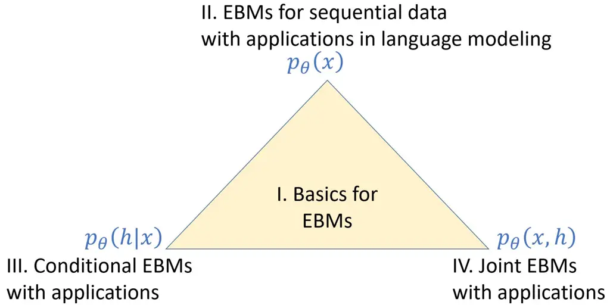

Figure 1.2: Outline of this monograph

The rest of the monograph is organized as follows.

In Chapter 2, we present basics for EBMs. We start with a brief
introduction to probabilistic graphical models (PGMs), because basically
we introduce EBMs as undirected graphical models (UGMs). Then, we
present EBM model examples, including both classic ones (such as Ising
model and restricted Boltzmann machines) and modern ones parameterized
by neural networks. Next, basic algorithms for learning EBMs are
described, which covers the two most widely used classes of methods -
Monte Carlo based maximum likelihood methods and noise-contrastive
estimation (NCE) methods. Finally, we present a dedicated section to
introduce how to sample/generate from EBMs, since sampling is not only a
critical step in maximum likelihood learning of EBMs, but also itself
forms as an important class of applications in speech and language
processing.

The basics for inference and learning with EBMs are general for both
discrete and continuous data modeling. Remarkably, most applications
covered in this monograph is discrete data modeling (text in natural
language processing, discrete labels in speech recognition), but in some
places, we also present examples and applications in images. For
example, Ising model is introduced for readers to get the abstract
concepts conveyed by EBMs. EBM based joint-training for semi-supervised
image classification is a fixed-dimensional counterpart of the more
complicated sequence setting, which is for semi-supervised natural
language labeling.

The next three chapters are devoted to introduce how to develop EBMs in
three different scenarios respectively.

- •
  Note that the sequential nature of speech and language presents
  special challenges and needs treatment different from processing
  fix-dimensional data (e.g., images). In Chapter 3, we introduce EBMs
  for sequential data with applications in language modeling. In this
  scenario, we are mainly concerned with learning the (_marginal_)
  distribution of an observation sequence $`x`$ itself, e.g., a natural
  language sentence as in language modeling.
- •
  In Chapter 4, we introduce EBMs for modeling _conditional_
  distributions of target sequences given observation sequences.
  Conditional EBMs have been successfully applied in speech recognition,
  sequence labeling in natural language processing (NLP), and various
  forms of conditional text generation (e.g., controlled text
  generation, factual error correction).
- •
  In Chapter 5, we introduce EBMs for modeling _joint_ distributions of
  both sequences of observations and targets. We first introduce the
  fixed-dimensional case, then move on to the sequential case, and
  finally present the applications in semi-supervised natural language
  labeling and calibrated natural language understanding.

Finally, conclusions are given in Chapter 6 to summarize the monograph
and to discuss future challenges and directions.

We visualize the content of this monograph in Figure 1.2. At the center
is the basic knowledge for EBM modeling and learning. The basic theory
can be applied to model different types of distributions – the
distribution of the observation itself, the conditional distribution,
and the joint distribution. In different applications or scenarios, we
are concerned with different types of distributions. In Chapter 3, 4,
and 5, we in fact show how to develop EBMs for the three different types
of distributions in three different scenarios, respectively, as
described above.

This monograph contains the material expanded from the tutorial that the
author gave at ICASSP 2022 in May 2022. Substantial updates have been
made to incorporate more recent work and cover wider areas of research
activities.

## Chapter 2 Basics for EBMs

Basically we introduce EBMs as undirected graphical models. We begin
with background on probabilistic graphical models, which would be
beneficial for readers to intuitively appreciate the differences between
directed graphical models (DGMs) and undirected graphical models (UGMs).

### 2.1 Probabilistic graphical models (PGMs)

Probabilistic graphical models provide a general framework for
describing and applying probabilistic models in the _probabilistic
approach_. Many ideas developed in the probabilistic approach can be
understood, unified, and generalized within the formalism of graphical
models.

> “A graphical model is a family of probability distributions defined in
> terms of a directed or undirected graph. The nodes in the graph are
> identified with random variables, and joint probability distributions
> are defined by taking products over functions defined on connected
> subsets of nodes.” \[71\]

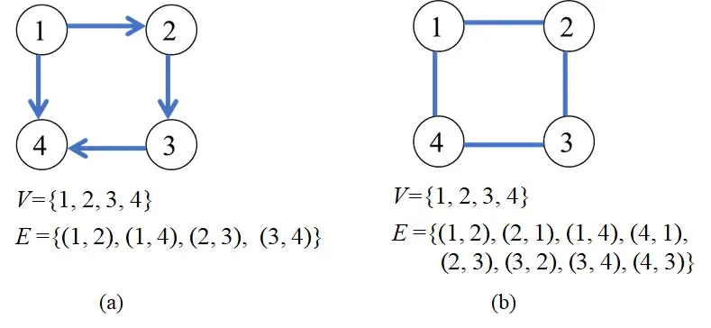

Figure 2.1: (a) A simple directed graphical model with four variables
$`(x_{1},x_{2},x_{3},x_{4})`$. (b) A simple undirected graphical model
with four variables $`(x_{1},x_{2},x_{3},x_{4})`$. For both types of
graphs, $`V`$ denotes the set of nodes and $`E`$ the set of edges. If
both ordered pairs $`(\alpha,\beta)`$ and $`(\beta,\alpha)`$ belong to
$`E`$, we say that we have an undirected edge between $`\alpha`$ and
$`\beta`$. A nice introduction of graph theory in the context of
graphical models could be found in Chapter 4 of \[32\].

Consider a graph $`G=(V,E)`$ where $`V`$ is a set of vertices (also
called nodes) and the set of edges $`E`$ is a subset of the set
$`V\times V`$. See Figure 2.1 for an illustration of these concepts from
graph theory. Let¹¹ 1 As described in Section A.1, we allow sets of
indices to appear wherever a single index appears.
$`x_{V}\triangleq\{x_{v}:v\in V\}`$ be a collection of random variables
indexed by the nodes of the graph. A _graphical model_ in terms of $`G`$
describes a family of probability distributions $`p(x_{V})`$ over the
variables $`x_{V}`$. _A variable can either be scalar- or
vector-valued_, where in the latter case the vector variable implicitly
corresponds to a sub-graphical model over the elements of the vector.

The edges $`E`$ specifies the connections between the nodes and,
according to the graph semantics (see below), plays a crucial role in
defining the graphical model distribution. One view is that the edges
$`E`$, depending on the graph semantics, determines a particular
factorized form of the distribution. Another view is that the edges
$`E`$, of course still depending on the graph semantics, determines a
particular set of conditional independence (CI) assumptions over the
random variables. In both views, the properties, either _the factorized
form_ or _the CI properties_, implied by the graphical model are true
for all members of its associated distribution family. As we will see in
Section 2.1.1 and Section 2.1.2, the two views are, in a strong sense,
equivalent.

Graphical models can be defined over different types of graphs,
directed, undirected or mixed, each with differing semantics. The
_semantics_ specifies what a graphical model means and tells how the
family of distributions is defined \[146, 77\]. The set of CI properties
specified by a particular graphical model, and therefore the family of
probability distributions it represents, will be different depending on
the type of graphical model currently being considered.

The two most common forms of graphical model (GM) are directed graphical
models (DGMs) and undirected graphical models (UGMs), based on directed
acylic graphs and undirected graphs, respectively. In general, directed
graphs and undirected graphs make different assertions of conditional
independence. Thus, there are families of probability distributions that
are captured by a directed graph and are not captured by any undirected
graph, and vice versa \[126, 77\].

#### 2.1.1 Directed graphical models

Let us begin with the directed case. Continuing with the notations in
Section 2.1, let $`G=(V,E)`$ be a directed acyclic graph (DAG), and
$`x_{V}`$ be a collection of random variables indexed by the nodes of
$`G`$. For each node $`v\in V`$, let $`\text{pa}(v)`$ denote the subset
of indices of its parents; thus $`x_{\text{pa}(v)}`$ denotes the vector
of random variables indexed by the parents of $`v`$.

###### Definition 2.1.1 (DGM).

A _directed graphical model_ in terms of $`G`$ consists of a family of
distributions that factorize in the following way:

```math
p(x_{V})=\prod_{v\in V}p(x_{v}|x_{\text{pa}(v)}) \tag{2.1}
```

We then also say that $`p(x_{V})`$ has the directed factorization
property (DF) according to $`G`$, or simply, $`p(x_{V})`$ factorizes
according to $`G`$.

Remarkably, the notation in Eq. (2.1) is self-consistent, because it can
be verified that the joint distribution $`p(x_{V})`$ defined by the
factorization Eq. (2.1) has $`\{p(x_{v}|x_{\text{pa}(v)})\}`$ as its
conditionals. For the simple directed graphical model shown in Figure
2.1(a), the joint distribution that it describes is:

```math
p(x_{1},x_{2},x_{3},x_{4})=p(x_{1})p(x_{2}|x_{1})p(x_{3}|x_{2})p(x_{4}|x_{1},x_{3})
```

General speaking, the nodes in a graphical model correspond to the
random variables, and the edges indicate some direct probabilistic
interactions between the nodes. In directed graphical models, every
edges is directed and, intuitively, correspond to _direct influence_ of
the parent node on the child node. Thus, DGMs are suitable for modeling
clear influence relationships between random variables, which are
expressed through conditional distributions.

##### Factorization and Markov properties in directed graphical models

The factorization in Eq. (2.1) implies a set of conditional independence
statements among the variables $`x_{V}`$. In an opposite way, we could
define a set of conditional independence statements in terms of $`G`$,
which is often referred to as a _Markov property_ over $`G`$. A range of
Markov properties could be defined, relative to $`G`$, such as the
directed global Markov property (DG), the directed local Markov property
(DL), the directed ordered Markov property (DO) (See Section 5.3 of
\[32\]). It can be shown that the three Markov properties, (DG), (DL)
and (DO), are equivalent, and further, they are equivalent to the (DF)
property. _These properties collectively characterize a graphical model_
(i.e., a family of distributions defined in terms of a graph). The
Markov properties of a distribution are precisely what allow it to be
expressed compactly in a factorized form. Conversely, a particular
factorization of a distribution guarantees that certain independencies
hold.

##### DGM example - HMM

Many classic probabilistic models in speech and language processing can
be easily understood in terms of graphical models. Figure 2.2 shows the
graphical model representation of an _hidden Markov model_ (HMM)
\[133\], which has been widely used in speech recognition and various
natural language processing tasks.

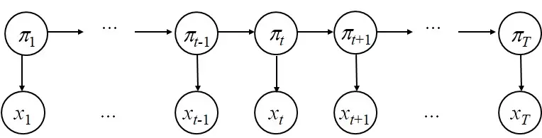

Figure 2.2: Graphical model representation of a hidden Markov model
(HMM).

In an HMM, there is an underlying hidden Markov chain, corresponding to
the state sequence $`\pi_{1:T}\triangleq\pi_{1}\cdots\pi_{T}`$. At each
time frame, depending on the state $`\pi_{t}`$, the model
probabilistically emit an output $`x_{t}`$, which can be observed. The
joint distribution is given by

```math
p(\pi_{1:T},x_{1:T})=p(\pi_{1})\prod_{t=1}^{T-1}p(\pi_{t+1}|\pi_{t})\prod_{t=1}^{T}p(x_{t}|\pi_{t}) \tag{2.2}
```

where $`p(\pi_{t+1}|\pi_{t})`$ and $`p(x_{t}|\pi_{t})`$ are often called
state-transition distribution and state-output distribution,
respectively. It is easy to verify that the graphical model as shown in
Figure 2.2 exactly describes the joint distribution Eq. (2.2), by
following the DGM semantics - _the joint distribution is defined as the
product of local conditionals of each variable given its parents_.
Through this example, readers can appreciate the naturalness of the
graphical model approach in formulating probabilistic models of complex
phenomena.

##### DGM example - Neural network based classifier

Traditionally, each conditional probability distribution
$`p(x_{v}|x_{\text{pa}(v)})`$ is parameterized as a lookup table or a
linear model \[77\]. A more flexible way to parameterize such
conditional distributions is with neural networks. In this case, a
neural networks takes as input the parents of a variable in a directed
graph, and produces the _distributional parameters_ over the variable.

```math
\displaystyle\eta \displaystyle=\text{NeuralNet}(x_{\text{pa}(v)})
```

```math
\displaystyle p(x_{v}|x_{\text{pa}(v)}) \displaystyle=\text{PDF}(x_{v}|\eta)
```

where we use $`\text{NeuralNet}(\cdot)`$ and $`\text{PDF}(\cdot|\eta)`$
to generally denote a neural network (NN) function and a probability
density function (PDF) parameterized by $`\eta`$, respectively. For
example, if $`x_{v}`$ is a continuous variable, $`\eta`$ could denote
the mean and variance parameters; if $`x_{v}`$ is a discrete variable,
$`\eta`$ could denote the logits (as explained below).

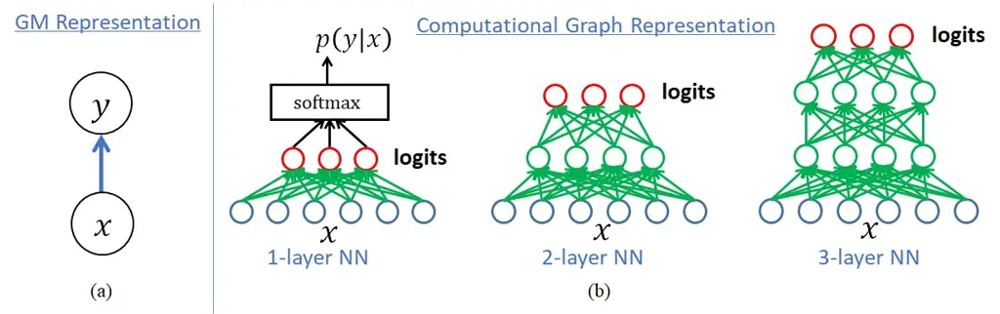

Figure 2.3: Neural network based classifier. (a) GM representation; (b)
Computational graph representation.

Basically, we can employ the above concept to build arbitrary directed
graphical models, which is not the main focus of this monograph. For
illustration, let us examine the widely used NN based classifier, which
could be cast as a simple two-node directed model for observation
$`x\in\mathbb{R}^{D}`$ and class label $`y\in\{1,\cdots,K\}`$, as shown
in Figure 2.3. It is important to differentiate the GM representation
and computational graph representation.

The classic _multi-class logistic regression_ \[14, 110\] basically is
to use a single linear layer to obtain the _logits_ $`z_{k}`$’s, which
are then fed to a _softmax_ layer to calculate the class posterior:

```math
p(y=k|x)=\frac{\exp(z_{k})}{\sum_{j=1}^{K}\exp(z_{j})}\triangleq\text{softmax}(z_{1:K})_{k} \tag{2.3}
```

where

```math
z_{k}=w_{k}^{T}x+b_{k},k=1,\cdots,K \tag{2.4}
```

are often called the *logits*²² 2 Presumably because the argument of the
sigmoid function is often called the logit, so analogously, the argument
of the softmax function (as a multi-class generalization of the sigmoid)
is also called the logit., and
$`w_{k}\in\mathbb{R}^{D},b_{k}\in\mathbb{R}`$ denote the weight vector
and bias of the linear layer. A simple notation to describe the _linear
layer_ Eq. (2.4) is

```math
z_{k}=\text{Linear}(x|w_{k},b_{k})
```

or denoted as $`z_{k}=\text{Linear}(x)`$ when the parameters are
suppressed.

A recent advance in deep learning is that we can use a multi-layer
neural network, often referred to as a _deep neural network_ (DNN), to
calculate the logits, and then still use the softmax function to obtain
the probability vector from the logits. In this way, the multi-layer NN
could be viewed as a non-linear _feature extractor_, which hopefully can
be trained to extract features, more discriminative than the raw
observation $`x`$. Here in describing an NN based classifier, we show a
directed model which has shallow stochastic connections but use deep
deterministic layers in implementing the conditional distributions.
_Variational autoencoder_ (VAE) \[75\] is also such a model. Further,
directed models with deep stochastic connections have also been examined
such as such as _Sigmoid belief Networks_ (SBNs) \[115, 154\],
_Helmholtz machines_ (HMs) \[62, 37\].

#### 2.1.2 Undirected graphical models

Let us now consider the undirected case. Given an undirected graph
$`G=(V,E)`$, we again let $`x_{V}`$ be a collection of random variables
indexed by the nodes of the graph and let $`\mathcal{C}`$ denote the set
of cliques³³ 3 A subset of nodes $`C`$ is called a clique, if every pair
of nodes in $`C`$ is joined. of the graph. Associated with each clique
$`C\in\mathcal{C}`$, let $`\phi_{C}(x_{C})`$ denote a _potential
function_, which is a non-negative function of its arguments.

###### Definition 2.1.2 (UGM).

With the above notation, an _undirected graphical model_ in terms of
$`G`$ consists of a family of distributions that factorize as:

```math
p(x_{V})=\frac{1}{Z}\prod_{C\in\mathcal{C}}\phi_{C}(x_{C}) \tag{2.5}
```

where $`Z`$ is the normalizing constant (also known as the partition
function) given by

```math
Z=\sum_{x_{V}}\prod_{C\in\mathcal{C}}\phi_{C}(x_{C}) \tag{2.6}
```

We then also say that $`p(x_{V})`$ has the factorization property (F)
according to $`G`$, or simply, $`p(x_{V})`$ factorizes according to
$`G`$.

For the simple undirected graphical model shown in Figure 2.1(b), the
joint distribution that it describes is⁴⁴ 4 Note that factorization over
the set of cliques can be easily shown to be equivalent to factorization
over the set of maximal cliques, i.e., the set of all cliques that are
not properly contained within any other clique. Therefore, the joint
distribution in this example can be written as the product of 4
potentials over the 4 maximum cliques, divided by the normalizing
constant.:

```math
p(x_{1},x_{2},x_{3},x_{4})=\frac{1}{Z}\phi(x_{1},x_{2})\phi(x_{2},x_{3})\phi(x_{3},x_{4})\phi(x_{1},x_{4})
```

Remarkably, the potentials do not need to be self-normalized, only
required to be non-negative functions. In contrast, the conditionals in
directed models are required to be normalized. Thus, undirected models
generally offer more flexibility in modeling than directed models.
Moreover, undirected models do not require us to specify edge
orientations, and are well suited to be used in problems in which there
is little directional structure to guide the construction of a directed
graph.

##### Factorization and Markov properties in undirected graphical models

We have discussed the equivalence of factorization and conditional
independence in directed models in Section 2.1.1. Similarly, a range of
Markov properties could be defined, relative to a undirected graph
$`G`$, such as the global Markov property (G), the pairwise Markov
property (P), the local Markov property (L) (See Section 5.2 of \[32\]).
However, in contrast to the discussion in the case of directed graphical
models, the four properties, (F), (G), (L) and (P), are different in
general. In general, we have
(F)$`\Rightarrow`$(G)$`\Rightarrow`$(L)$`\Rightarrow`$(P). In the case
where $`p(x_{V})`$ has a positive density (i.e., never zero or negative
for any value of $`x_{V}`$), it can be shown that (P) implies (F), and
thus the four properties become equivalent. This result is known as the
Hammersley-Clifford theorem.

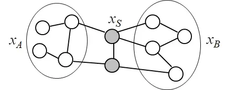

Figure 2.4: Illustration of the global Markov property in UGMs.

When we use the term undirected graphical model without further
qualification, we shall always mean one that factorizes, hence satisfies
all of the properties. In the following, we will detail the (G)
property, which is important because it enable us to easily decide when
two groups of variables $`A`$ and $`B`$ are conditionally independent
give a third group of variables $`S`$ in an undirected model.

A probability distribution $`p(x_{V})`$ is said to obey the global
Markov property (G), relative to a undirected graph $`G`$ , if for any
triple $`(A,B,S)`$ of disjoint subsets of $`V`$ such that $`S`$
separates $`A`$ from $`B`$⁵⁵ 5 We say $`S`$ separates $`A`$ from $`B`$
if all trails from $`A`$ to $`B`$ intersect $`S`$., we have
$`x_{A}\perp x_{B}|x_{S}`$. Simply put, the (G) property means:
separation between nodes in the graph implies CI between variables in
the distribution, as illustrated in Figure 2.4.

##### Energy-based models and Gibbs distributions

###### Definition 2.1.3 (EBM).

When we are restricted to potential functions which are strictly
positive, it is convenient to express them as exponentials, so that

```math
\phi_{C}(x_{C})=\exp[-E_{C}(x_{C})]
```

where $`E_{C}(x_{C})`$ is called an _energy function_. Hence, negative
log-potential is often called energy, and high probability states
correspond to low energy configurations. Distributions of this
exponential form are called _energy-based models_ (EBMs), also known as
the Gibbs (or Boltzmann) distributions, originating from statistical
physics:

```math
p(x_{V})=\frac{1}{Z}\exp\left[\sum_{C\in\mathcal{C}}-E_{C}(x_{C})\right] \tag{2.7}
```

A benefit of the form of EBMs is that unlike the potential functions,
the log-potential functions (or after negating, the energy functions)
are not constrained to be non-negative and can be very flexibly
parameterized.

##### Log-linear models and maximum entropy models

###### Definition 2.1.4 (Log-linear model).

A classic approach to implement log-potentials is to define them as a
linear function of the parameters:

```math
\log\phi_{C}(x_{C})=\theta_{C}^{T}f_{C}(x_{C})
```

where $`f_{C}(x_{C})`$ is a feature vector derived from (the values of)
the variable $`x_{C}`$, $`\theta_{C}`$ is the associated feature weight
vector. The resulting distribution has the form

```math
p(x_{V})=\frac{1}{Z(\theta)}\exp\left[\sum_{C}\theta_{C}^{T}f_{C}(x_{C})\right] \tag{2.8}
```

where $`\theta=\{\theta_{C}\penalty\ |\penalty\ C\in\mathcal{C}\}`$
collectively denotes the model parameters and we explicit the dependence
of the normalizing constant on $`\theta`$. This is known as a
_log-linear model_ or an exponential-family model \[180, 110\].

###### Example 2.1.5 (Word morphology).

As an illustrative example, suppose we are interested in making a
probabilistic model of English spelling. This is known as the _word
morphology_ problem, which aims to model English words as letter
sequences, $`x_{1},x_{2},\cdots`$, by assigning probabilities \[189,
129, 110\]. Since certain letter combinations occur together quite
frequently (e.g., “ing”), we will need higher order cliques to capture
this. Suppose we limit ourselves to letter trigrams. Since the variables
in the sequence here are discrete, we can represent the potential
functions as tables of (non-negative) numbers, which are often called
_tabular potentials_. A tabular potential has $`26^{3}=17,576`$
parameters in it. However, most of these triples will never occur. An
alternative approach is to define indicator functions (as _feature
functions_) that look for certain special triples, such as “ing”, “qu-”,
etc. Then we can define the potential at position $`t`$ as follows:

```math
\phi_{t}(x_{t-1},x_{t},x_{t+1})=\exp\left(\sum_{k}\theta_{k}f_{k}(x_{t-1},x_{t},x_{t+1})\right)
```

where $`k`$ indexes the different features, corresponding to “ing”,
“qu-”, etc., and $`f_{k}`$ is the corresponding binary feature
function⁶⁶ 6 For example, $`f_{\text{``ing''}}(x_{t-1},x_{t},x_{t+1})`$
equals to 1, if
$`x_{t-1}=\text{``i''},x_{t}=\text{``n''},x_{t+1}=\text{``g''}`$, and
equals to 0, otherwise.. By tying the parameters across positions, we
can define the probability of a word of any length $`T`$ using

```math
p(x_{1:T}|\theta)=\exp\left(\sum_{t=1}^{T}\sum_{k}\theta_{k}f_{k}(x_{t-1},x_{t},x_{t+1})\right) \tag{2.9}
```

It has been shown in \[189\] that a (trans-dimensional) log-linear model
outperforms a traditional $`n`$-gram model, using the same set of
features.

Modeling with Eq. (2.9) raises the question of where these feature
functions come from. Traditionally, the features $`f_{C}`$ are mainly
hand-crafted to reflect domain knowledge, and people take efforts for
feature engineering. In fact, log-linear models with careful feature
engineering were mainstream in NLP before the revival of neural
approaches. Recently, neural networks have been successfully used to
implement more general form of EBMs, where, unlike in classic log-linear
models, the log-potentials are defined by NN-based non-linear functions,
as we will show later in Section 2.2.3. Notably, if NN-based
log-potential uses a linear final layer, _these NN-based EBMs could in
some sense still be viewed as log-linear models_, but on top of the
learned features extracted by the trainable neural networks.

Interestingly, log-linear models are closely connected to _maximum
entropy (maxent) models_. A classic conclusion is that the maxent
distribution (i.e., the distribution with the maximum entropy subject to
the constraints that empirical expectation of features equal to model
expectation of features) is the same as the maximum likelihood
distribution from the closure of the set of log-linear distributions
\[94, 129\] (see Appendix B.1 for details). Hence EBMs, which could be
viewed as log-linear models as we describe above, also enjoy such a
connection to maxent models. Remarkably, the EBM distribution $`p(x)`$
is only known up to a normalizing constant $`Z`$ and the potentials are
not probabilities, it may be hard for us to understand EBM models. Such
_maximum entropy property of EBM models_ allows us to gain intuitive
understanding of EBM models.

### 2.2 EBM model examples

In this section, we first introduce classic EBM model examples including
Ising model and restricted Boltzmann machine, to familiarize readers
with basic concepts. Then, we focus on modern ones parameterized by
neural networks.

#### 2.2.1 Ising model in statistical physics

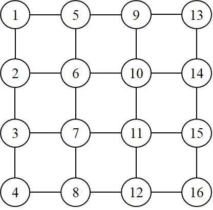

(a)

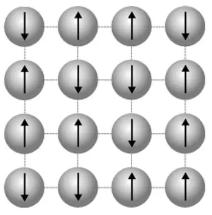

(b)

Figure 2.5: Ising model: (a) The undirected graph representation, (b) A
sample.

A well-known example of EBMs is the Ising model, which arose from
statistical physics, and has been a classic probabilistic model for
binary images. It was originally used for modeling the behavior of
magnets. In particular, the spin of an atom can either be spin down or
up. The spins are arranged in a lattice, allowing each spin to interact
with its neighbors. Neighboring spins that agree have a lower energy
than those that disagree; the system tends to the lowest energy but heat
disturbs this tendency, thus creating the possibility of different
structural phases. The two-dimensional square-lattice Ising model is one
of the simplest statistical models to show a phase transition.

Consider a lattice of variables $`x_{1:N}`$, each component $`x_{i}`$
taking values $`-1`$/$`+1`$ to model a spin down/up or a pixel
black/white, as shown in Figure 2.5. This $`\sqrt{N}\times\sqrt{N}`$
lattice, as an undirected graph, defines an Ising model
$`p(x_{1:N})\propto\exp[-E(x_{1:N})]`$ with the energy function

```math
E(x_{1:N})=-\beta\left[\sum_{i\sim j}Jx_{i}x_{j}+\sum_{i}Hx_{i}\right] \tag{2.10}
```

where $`i\sim j`$ denotes that two spins $`i`$ and $`j`$ are neighbours.

The energy for an Ising model includes two contributions: the
interaction between neighboring spins and the effect of an applied
external magnetic field on each individual spin. Consider the case of
ferromagnetism. The interaction between neighboring spins tends to
induce parallel alignment of the neighbors, so it should be favorable
(negative energy) when the neighbors are both $`+1`$ or both $`-1`$, and
unfavorable (positive energy) when the neighbors are $`+1`$ next to
$`-1`$. Hence, for each pair of neighbors $`i`$ and $`j`$, the
interaction energy can be written as $`-Jx_{i}x_{j}`$, where $`J`$ is a
positive coefficient giving the interaction strength. If the applied
magnetic field is pointing up, it favors each spin pointing up; if the
field is pointing down, it favors each spin pointing down. Hence, for
each site $`i`$, the field energy can be written as $`-Hx_{i}`$, where
$`H`$ denotes the magnetic moment of the field. Putting these pieces
together, the total energy for the system becomes Eq. (2.10).

It is usual to include in Eq. (2.10) the _inverse temperature parameter_
$`\beta=\frac{1}{k_{B}T}`$, where $`k_{B}`$ is Boltzmann’s constant, and
$`T`$ the temperature. $`\beta`$ measures how much neighboring spins
take identical values is favored. The larger $`\beta`$ (equivalently the
lower temperature $`T`$) is, the more favorable of neighboring spins to
take identical values. Figure 2.6 shows a sequence of typical samples
from the simulation of $`N=4096`$ spins at a sequence of decreasing
temperatures. At infinite temperature ($`\beta=0`$), each spin is
completely independent of any other, and if typical states at infinite
temperature are plotted, they look like television snow. For high, but
not infinite temperature, there are small correlations between
neighboring positions, the snow tends to clump a little bit, but the
screen stays randomly looking. When the temperature decreases ($`\beta`$
increases), it is more favored for neighboring spins to take identical
values, so large patches of black or white become to appear.

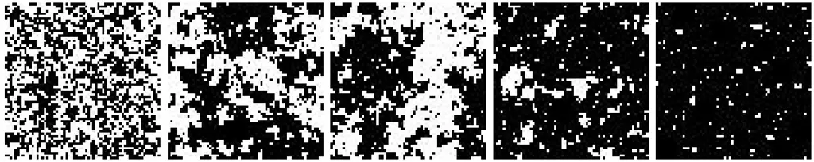

Figure 2.6: Sample states of square Ising models with
$`J=1,H=0,k_{B}=1,N=4096`$ at a sequence of temperatures
$`T=5,2.5,2.4,2.3,2`$. \[94\]

Through this example, we could get some sense of the characteristics of
EBM modeling - _EBMs are natural for modeling interactions (mutual
influences), where the directions of edges cannot be clearly defined_.
For example, here it is hard to say one pixel determines another pixel,
even in a probabilistic sense. It is better to use undirected edges to
model interactions between pixels through energy functions. Particularly
in this example, for each pair of nodes connected by an edge in the
lattice, there is an clique potential, which is implemented as follow:

```math
\phi_{ij}(x_{i},x_{j})=\left\{\begin{array}[]{cc}e^{\beta},&x_{i}=x_{j}=\pm 1\\
e^{-\beta},&x_{i}=-x_{j}=\pm 1\end{array}\right.
```

where we set $`J=1,H=0,k_{B}=1`$. So when the two neighboring pixels
take the same value, it will contribute $`e^{\beta}`$ to the
un-normalized density; otherwise, contribute $`e^{-\beta}`$.

#### 2.2.2 Restricted Boltzmann Machines (RBMs)

_Restricted Boltzmann machines_ (RBMs) are main building blocks of _deep
belief networks_ (DBNs) \[63\], which ignite deep learning. A RBM is a
classic undirected graphical model with hidden variables. It is defined
over a bipartite graph, in which the visible, binary stochastic
variables $`v\in\{0,1\}^{D}`$ are connected to hidden binary stochastic
variables $`h\in\{0,1\}^{H}`$, as shown in Figure 2.7. The energy of the
state $`\{v,h\}`$ is defined over cliques⁷⁷ 7 Each node is a clique, and
for each edge connecting $`v_{i}`$ and $`h_{j}`$, there is a clique.:

```math
\begin{split}E_{\theta}(v,h)&=-v^{T}Wh-b^{T}v-a^{T}h\\
&=-\sum_{i=1}^{D}\sum_{j=1}^{H}v_{i}W_{ij}h_{j}-\sum_{i=1}^{D}b_{i}v_{i}-\sum_{j=1}^{H}a_{j}h_{j}\end{split}
```

where $`\theta=\{W,b,a\}`$ are the model parameters: $`W_{ij}`$
represents the symmetric interaction term between visible unit $`i`$ and
hidden unit $`j`$; $`b_{i}`$ and $`a_{j}`$ are bias terms. The joint
distribution is:

```math
\begin{split}p_{\theta}(v,h)&=\frac{1}{Z(\theta)}\exp\left[-E_{\theta}(v,h)\right]\\
Z(\theta)&=-\sum_{v}\sum_{h}\exp\left[-E_{\theta}(v,h)\right]\end{split}
```

where $`Z(\theta)`$ is the normalizing constant.

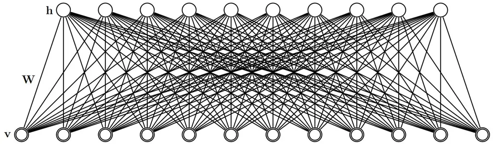

Figure 2.7: Restricted Boltzmann Machine. The top layer represents a
vector of stochastic binary hidden variables $`h`$ and the bottom layer
represents a vector of stochastic binary visible variables $`v`$.
\[148\]

Due to the special bipartite structure of RBMs, given $`v`$, different
hidden units $`h_{j}`$’s are separated and thus are conditionally
independent, according to the Markov property of UGMs. Therefore, the
conditional distribution of $`h`$ given $`v`$ is factored:

```math
\begin{split}p_{\theta}(h|v)&=\prod_{j}p_{\theta}(h_{j}|v)\\
p_{\theta}(h_{j}|v)&\propto\exp\left(\sum_{i}v_{i}W_{ij}h_{j}+a_{j}h_{j}\right)\end{split}
```

from which we could easily obtain the conditional probability of a
single unit $`h_{j}`$, expressed by the sigmoid function
$`\sigma(\cdot)`$:

```math
p_{\theta}(h_{j}=1|v)=\sigma\left(\sum_{i}W_{ij}v_{i}+a_{j}\right) \tag{2.11}
```

Similarly, the conditional distribution of $`v`$ given $`h`$ is also
factored and given by:

```math
\displaystyle p_{\theta}(v|h) \displaystyle=\prod_{i}p_{\theta}(v_{i}|h)
```

```math
\displaystyle p_{\theta}(v_{i}|h) \displaystyle\propto\exp\left(\sum_{j}v_{i}W_{ij}h_{j}+b_{i}v_{i}\right)
```

```math
\displaystyle p_{\theta}(v_{i}=1|h) \displaystyle=\sigma\left(\sum_{j}W_{ij}h_{j}+b_{i}\right) \tag{2.12}
```

Remarkably, it can be seen from Eq. (2.11) that an RBM is related to a
stochastic version of a neural network, also known as a _sigmoid belief
network_ (SBN) \[115, 154\]. To see this⁸⁸ 8 Such relationship could
also seen from Eq. (2.12) from an opposite direction., imagine that the
nodes $`v_{1:D}`$ and the edges of an RBM as shown in Figure 2.7 are
viewed as the input layer and the synaptic connections of a two-layer
SBN; the output layer at $`h_{1:H}`$ fires, $`h_{j}`$ taking $`0`$ or
$`1`$, $`j=1,\cdots,H`$, stochastically from a sigmoid activation
function. Therefore, _the conditional distribution $`p_{\theta}(h|v)`$
induced from an RBM can be viewed as implementing a two-layer SBN, and a
two-layer SBN is very similar to an ordinary two-layer feedfoward neural
network_, except it stochastically fires instead of outputting
activations to the next layer (see Figure 2.8). This resemblance between
RBMs and NNs is the underlying intuition that a stack of RBMs can be
trained as pre-training for a multi-layer neural network \[148\].

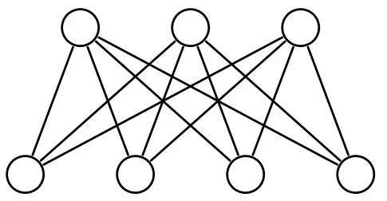

(a)

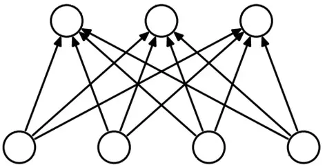

(b)

Figure 2.8: (a) Restricted Boltzmann machine (RBM), (b) Sigmoid belief
network (SBN).

#### 2.2.3 EBMs parameterized by neural networks

Classic EBM models employ simple energy functions, e.g., the energy
functions in both the Ising model and the RBM model are bilinear.
Recently, beyond the classic EBM models, there have emerged a bundle of
_deep EBM models_ (deep undirected generative models), which are
characterized by using multiple layers of stochastic or deterministic
variables.

Those deep EBM models with multiple stochastic hidden layers such as
deep belief networks (DBNs) \[63\] and deep Boltzmann machines (DBMs)
\[147\] involve very difficult inference and learning, which severely
limits their applications beyond of the form of pre-training. Another
type of deep EBM models, which appear to be more successfully applied,
is to _directly define the energy function through a multi-layer neural
network_. In this case, the layers of the network do not represent
latent variables but rather are deterministic transformations of input
observations.

For simplicity, we will first introduce unconditional models in the
following. It is relatively straightforward to extend to models with
conditioning variables, which will be detailed in Chapter 4.

###### Definition 2.2.1 (EBMs parameterized by neural networks).

Generally, consider an EBM to define a probability distribution for a
collection of random variables $`x\in\mathcal{X}`$ with parameter
$`\theta`$ in the form:

```math
p_{\theta}(x)=\frac{1}{Z(\theta)}\exp\left[U_{\theta}(x)\right] \tag{2.13}
```

where $`\mathcal{X}`$ denotes the space of all possible values of $`x`$,
and $`Z(\theta)`$ denotes the normalizing constant:

```math
Z(\theta)=\int\exp\left[U_{\theta}(x)\right]dx \tag{2.14}
```

$`U_{\theta}(x):\mathcal{X}\rightarrow\mathbb{R}`$ denotes the (log)
potential function⁹⁹ 9 In the literature, log potential function is
sometimes also referred to as potential function. Whether taking log or
not should be clear from the context, although with abuse of
nomenclature. Moreover, reversing the potential function will obtain the
energy function, and vise versa. _So an EBM could be equivalently
defined by an energy function or a potential function_. which assigns a
scalar value to each configuration of $`x`$ in $`\mathcal{X}`$ and _can
be very flexibly parameterized_ through neural networks of different
architectures. For different applications, $`\mathcal{X}`$ could be
discrete or continuous, and $`x`$ could be fix-dimensional or
trans-dimensional (i.e., sequences of varying lengths). For example,
images are fix-dimensional continuous data (i.e.,
$`\mathcal{X}=\mathbb{R}^{D}`$), and natural languages are sequences
taking discrete tokens (i.e., $`\mathcal{X}=\bigcup_{l}\mathbb{V}^{l}`$
where $`\mathbb{V}`$ is the vocabulary of tokens). The general idea is
to parameterize $`U_{\theta}(x)`$ by a neural network, taking
multi-variate $`x`$ as input and outputting scalar $`U_{\theta}(x)`$, so
that we can take advantage of the representation power of neural
networks, as shown in Figure 2.9.

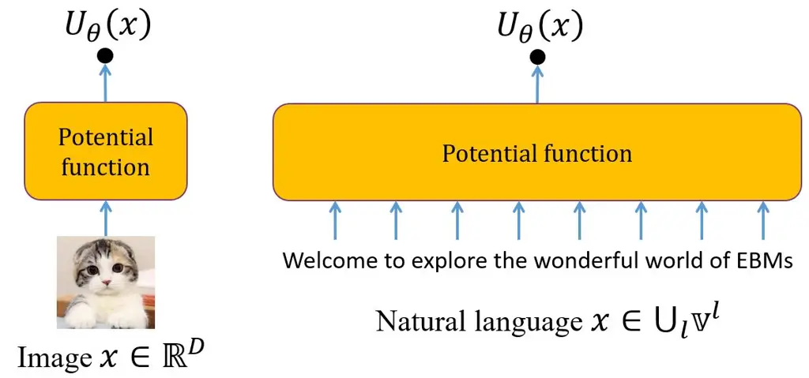

Figure 2.9: Potential functions in EBMs can be flexibly parameterized by
neural networks for images, natural languages and so on.

Historically, this type of EBMs has been studied several times in
different contexts. They are once called deep energy models (DEMs) in
\[117, 74\], generative ConvNet in \[195\], descriptive models in \[53,
194\], neural trans-dimensional random field language models in \[184,
186, 185, 43\], neural random fields (NRFs) in \[162\]. There are some
specific differences between implementation (or say, parameterization)
of the potential functions in these deep EBM models.

- •
  The potential function in \[117, 74\] uses the form of a product of
  experts \[61\] and is composed of linear and squared terms and the
  aggregated (i.e., the sum of) logistic regression responses of a set
  of weak classifier (“expert”) for images $`x`$:

  ```math
  U_{\theta}(x)=b^{T}x-\frac{1}{\sigma^{2}}x^{T}x+\sum_{i}\log(1+e^{w_{i}^{T}f_{\theta}(x)+c_{i}}) \tag{2.15}
  ```

  The first two terms capture the mean and the global variance, and the
  last term comes from a set of experts over the feature data space
  $`f_{\theta}(x)`$. $`f_{\theta}(x)`$ is the output of a feedforward
  neural network. One can allow activations other than logitic sigmoid
  as shown in Eq. (2.15).

- •
  In \[184, 186, 185, 43, 39\], deep EBM models are defined over
  sequences (natural language sentences).
- •
  In \[195, 53, 194, 184, 39\], the EBM is defined in the form of
  exponential tilting of a reference distribution $`q(x)`$:

  ```math
  p_{\theta}(x)=\frac{1}{Z(\theta)}q(x)\exp\left[U_{\theta}(x)\right] \tag{2.16}
  ```

  In \[195, 53, 194\] for image modeling, a Gaussian white noise
  distribution is used as $`q(x)`$. In \[184, 39\] for language
  modeling, autoregressive language models based on LSTM or Transformer
  networks are often used as $`q(x)`$.

Despite the different parameterizations of the potential function in
various deep EBM models, these differences would not affect much when
presenting learning algorithms, as we will introduce immediately in the
next section.

##### Comparison between classic undirected graphical models and modern EBM models parameterized by neural networks

As we introduced before, classic undirected graphical models such as the
Ising model and the RBM model employ simple potential functions like
linear or bilinear, while modern EBM models utilize neural networks to
parameterize potential functions. From this apparent difference, there
is a remarkable implication, which will be described below.

In graphical modeling terminology, without loss of generality, let each
component of $`x`$ indexed by a node in an undirected graph. The EBM
distribution $`p_{\theta}(x)`$ is defined to be decomposed over cliques,
as shown in Eq. (2.7). Such decomposition reduces the complexity of
model representation but maybe at the sacrifice of model expressive
capacity. In an EBM model parameterized by a neural network as
introduced above, the model essentially becomes defined over a
fully-connected undirected graph and captures interactions in $`x`$ to
the largest order, since the neural potential function $`U(x)`$ involves
all the components in $`x`$. In this manner, hopefully we can take
advantage of the representation power of neural networks for modeling.
As shown above, we can define very flexible potential functions
$`U_{\theta}(x)`$, by utilizing neural networks of various architectures
to define the densities Eq. (2.13). For this reason, it is often assumed
in theoretical analysis that $`p_{\theta}(x)`$ has infinite capacity
(sometime called in the non-parametric setting). In practice, the
performances of the models largely depend on how they are optimized in
model learning.

### 2.3 Learning EBMs by maximum likelihood

The de facto standard for learning probabilistic models from IID
(independent and identically distributed) data is _maximum likelihood
estimation_ (MLE) . Let $`p_{\theta}(x)`$, as defined in Eq. (2.13), be
an EBM model parameterized by $`\theta`$, and
$`p_{\text{emp}}(x)\triangleq\frac{1}{N}\sum_{i=1}^{N}\delta(x-x_{i})`$
denote the empirical distribution for a training dataset consisting of
$`N`$ IID data points $`\left\{x_{1},\cdots,x_{N}\right\}`$. We can fit
$`p_{\theta}(x)`$ to data by maximizing the scaled log-likelihood of the
data, defined by

```math
L(\theta)\triangleq\frac{1}{N}\sum_{i=1}^{N}\log p_{\theta}(x_{i})=\left[\frac{1}{N}\sum_{i=1}^{N}U_{\theta}(x_{i})\right]-\log Z_{\theta} \tag{2.17}
```

as a function of $`\theta`$.

Maximizing likelihood is equivalent to minimizing the (inclusive) KL
divergence between $`p_{\text{emp}}(x)`$ and $`p_{\theta}(x)`$, because

```math
\displaystyle KL[p_{\text{emp}}(x)||p_{\theta}(x)] \displaystyle=E_{x\sim p_{\text{emp}}(x)}[\log p_{\text{emp}}(x)]-E_{x\sim p_{\text{emp}}(x)}[\log p_{\theta}(x)]
```

```math
\displaystyle=\text{constant}-L(\theta),
```

where the second equality holds because
$`E_{x\sim p_{\text{emp}}(x)}[\log p_{\text{emp}}(x)]`$ does not depend
on $`\theta`$.

Taking the derivative of log-likelihood with respect to (w.r.t.)
$`\theta`$, the first term of the gradient is a sum over data points and
can be written as an expectation under the empirical distribution:

```math
\frac{1}{n}\sum_{i=1}^{N}\nabla_{\theta}U_{\theta}(x_{i})=E_{p_{\text{emp}}(x)}\left[\nabla_{\theta}U_{\theta}(x)\right]
```

The second term involves taking the derivative of the log normalizing
constant, which, as shown below, can also be written as an expectation
but under model distribution $`p_{\theta}(x)`$:

```math
\displaystyle\nabla_{\theta}\log Z_{\theta} \displaystyle=\frac{1}{Z_{\theta}}\nabla_{\theta}Z_{\theta}=\frac{1}{Z_{\theta}}\int\nabla_{\theta}\exp\left[U_{\theta}(x)\right]dx
```

```math
\displaystyle=\frac{1}{Z_{\theta}}\int\exp\left[U_{\theta}(x)\right]\nabla_{\theta}U_{\theta}(x)dx
```

```math
\displaystyle=\int\frac{\exp\left[U_{\theta}(x)\right]}{Z_{\theta}}\nabla_{\theta}U_{\theta}(x)dx
```

```math
\displaystyle=\int p_{\theta}(x)\nabla_{\theta}U_{\theta}(x)dx
```

```math
\displaystyle=E_{p_{\theta}(x)}\left[\nabla_{\theta}U_{\theta}(x)\right] \tag{2.18}
```

Combining the two terms, we obtain the core formula in learning EBMs:

```math
\nabla_{\theta}L(\theta)=E_{p_{\text{emp}}(x)}\left[\nabla_{\theta}U_{\theta}(x)\right]-E_{p_{\theta}(x)}\left[\nabla_{\theta}U_{\theta}(x)\right] \tag{2.19}
```

The maximum likelihood estimate of $`\theta`$ is obtained as a solution
to $`\nabla_{\theta}L(\theta)=0`$. Obviously, the challenge is in
calculating the expectation under model distribution, which is often
intractable to compute exactly and approximated by _Monte Carlo
averaging_.

Suppose that we can draw random samples from the EBM $`p_{\theta}(x)`$,
denoted as $`x^{(1)},\cdots,x^{(M)}\sim p_{\theta}(x)`$, then we can
obtain an unbiased estimate of the second term in the log-likelihood
gradient¹⁰¹⁰ 10 Here we suppose that the samples are direct samples from
$`p_{\theta}(x)`$. As will be described in Section 2.3.3, such
assumption can be relaxed in the stochastic approximation methodology,
which allows us to use Markov chain samples.:

```math
E_{p_{\theta}(x)}\left[\nabla_{\theta}U_{\theta}(x)\right]\approx\frac{1}{M}\sum_{j=1}^{M}\nabla_{\theta}U_{\theta}(x^{(j)}) \tag{2.20}
```

Additionally, note that the computational cost of Eq. (2.19) is linear
in $`N`$ (the number of training data points). So when $`N`$ is large,
we often apply _minibatching_ as follows. Through random drawing a
minibatch of $`\kappa_{1},\cdots,\kappa_{B}`$ from $`\{1,\cdots,N\}`$,
we can obtain an unbiased estimate of the first term in the
log-likelihood gradient:

```math
E_{p_{\text{emp}}(x)}\left[\nabla_{\theta}U_{\theta}(x)\right]\approx\frac{1}{B}\sum_{j=1}^{B}\nabla_{\theta}U_{\theta}(x_{\kappa_{j}}) \tag{2.21}
```

Combining Eq. (2.20) and Eq. (2.21) allows us to optimize the parameters
with stochastic gradient ascent. See further introduction in Section
2.3.3.

We have shown above the basic idea of applying Monte Carlo methods in
maximum likelihood learning of EBMs. As long as we can draw random
samples from the model $`p_{\theta}(x)`$, we have access to an unbiased
estimate of the log-likelihood gradient, allowing us to optimize the
parameters with stochastic gradient ascent. So a critical step in
learning EBMs by Monte Carlo methods is the simulation (sampling) from
the EBM distribution $`p_{\theta}(x)`$, as defined in Eq. (2.13) in
general.

In some applications, directly generating independent samples from an
distribution is not feasible. There are two broad classes of strategies
for sampling from high-dimensional distributions. The first is the MCMC
strategy, which produces statistically dependent samples based on the
theory of _Markov chains_. The second is the _importance sampling_ (IS)
strategy, in which independent samples are generated from a trial
distribution (a.k.a. a proposal distribution) and then weighted
according to the importance weight. The two methods will be introduced
as follows in Section 2.3.1 and Section 2.3.2 respectively. Further
introduction can be found in monographs \[112, 87\] or general textbooks
on machine learning \[77, 110, 14\].

#### 2.3.1 Markov Chain Monte Carlo (MCMC)

Let $`p_{\theta}(x)`$ be the target distribution under investigation.
The basic idea of _Markov Chain Monte Carlo_ (MCMC) is to construct a
Markov chain in the state space of $`x`$, denoted by $`\mathcal{X}`$, so
that the limiting (or say, stationary or equilibrium) distribution of
this chain is the target distribution $`p_{\theta}`$. Roughly speaking,
this means that the fraction of time spent in each state along the chain
in a long run is equal to $`p_{\theta}`$.

##### Metropolis–Hastings algorithm

A classic MCMC method is the _Metropolis-Hastings_ (MH) algorithm, which
is described in Algorithm 1. Starting with any configuration
$`x^{(0)}`$, the MH algorithm proceeds by iterating “propose” and
“accept/reject”, as shown in Line 3 and Line 4 respectively. A single
run of “propose” and “accept/reject” is often called a _MH transition_,
which defines a particular Markov chain.

- •
  First, we propose to move from the previous state $`x^{(t-1)}`$ to a
  new state $`x^{\prime}`$ with probability $`q(x^{\prime}|x^{(t-1)})`$,
  where $`q`$ is called the _proposal distribution_.
- •
  Having proposed a move to $`x^{\prime}`$, we then decide whether to
  accept this proposal or not according to some formula, which ensures
  that the limiting distribution of this chain is the target
  distribution $`p_{\theta}`$. If the proposal is accepted, the new
  state is $`x^{\prime}`$, otherwise the new state is the same as the
  previous state, $`x^{(t-1)}`$ (i.e., we repeat the sample).

At the end of the iterations, we obtain a realization (or say, a single
run) of the Markov chain, $`x^{(1)},\cdots,x^{(T)}`$. It can be shown
that this particular Markov chain leave $`p_{\theta}`$ invariant. Note
that theoretically, only the limiting distribution of the chain follows
$`p_{\theta}`$. So it is necessary to discard a few initial samples
until the Markov chain has _burned in_, or entered its stationary
distribution. The remained samples can then be used for Monte Carlo
averaging such as in Eq. (2.20) to estimate expectations.

In practice, the accept/reject step is taken by drawing
$`U\sim\text{Uni}[0,1]`$, calculate the _acceptance probability_

```math
r=\min\left\{1,\frac{p_{\theta}(x^{\prime})q(x^{(t-1)}|x^{\prime})}{p_{\theta}(x^{(t-1)})q(x^{\prime}|x^{(t-1)})}\right\} \tag{2.22}
```

and update

```math
x^{(t)}=\left\{\begin{array}[]{ll}x^{\prime},&\text{if}\penalty\ U\leq r\\
x^{(t-1)},&\text{otherwise}.\end{array}\right.
```

0:  A target distribution $`p_{\theta}(x)`$, a proposal distribution
$`q(x^{\prime}|x)`$

1:  Randomly initialize $`x^{(0)}`$;

2:  for $`t=1`$ to $`T`$ do

3:   Generate $`x^{\prime}`$ from the proposal
$`q(x^{\prime}|x^{(t-1)})`$;

4:   Accept $`x^{(t)}=x^{\prime}`$ with probability
$`\min\left\{1,\frac{p_{\theta}(x^{\prime})q(x^{(t-1)}|x^{\prime})}{p_{\theta}(x^{(t-1)})q(x^{\prime}|x^{(t-1)})}\right\}`$,
otherwise set $`x^{(t)}=x^{(t-1)}`$;

5:  end for

6:  Return: $`\{x^{(1)},\cdots,x^{(T)}\}`$

Algorithm 1 Metropolis-Hastings Algorithm

Critically, the MH algorithm only needs to know the target distribution
up to a normalization constant. In particular, consider the EBM
distribution
$`p_{\theta}(x)=\frac{1}{Z_{\theta}}\exp\left[U_{\theta}(x)\right]`$,
then _MH ratio_

```math
\frac{p_{\theta}(x^{\prime})q(x^{(t-1)}|x^{\prime})}{p_{\theta}(x^{(t-1)})q(x^{\prime}|x^{(t-1)})}=\frac{\frac{1}{Z_{\theta}}\exp\left[U_{\theta}(x^{\prime})\right]q(x^{(t-1)}|x^{\prime})}{\frac{1}{Z_{\theta}}\exp\left[U_{\theta}(x^{(t-1)})\right]q(x^{\prime}|x^{(t-1)})}
```

in which the $`Z_{\theta}`$’s cancel. Hence, we can sample from
$`p_{\theta}(x)`$ even if the normalizing constant $`Z_{\theta}`$ is
unknown.

Remarkably, the user is free to use any kind of proposal they want,
subject to some theoretical conditions. This makes MH quite a flexible
method. We introduce two special algorithms that are instances of the
general MH algorithm.

###### The Metropolis algorithm.

If the proposal transition function is symmetric, so
$`q(x^{\prime}|x)=q(x|x^{\prime})`$, the acceptance probability is given
by the following formula:

```math
r=\min\left\{1,\frac{p_{\theta}(x^{\prime})}{p_{\theta}(x^{(t-1)})}\right\}
```

We see that if $`x^{\prime}`$ is more probable than $`x`$, we definitely
move there (since
$`\frac{p_{\theta}(x^{\prime})}{p_{\theta}(x^{(t-1)})}>1`$), but if
$`x^{\prime}`$ is less probable, we may still move there anyway,
depending on the relative probabilities. So instead of greedily moving
to only more probable states, we occasionally allow “downhill” moves to
less probable states.

###### The Metropolis independence sampler (MIS).

Another special choice of the transition function is in the form of
$`q(x^{\prime})=q(x^{\prime}|x)`$; that is, the proposed move
$`x^{\prime}`$ is generated independent of the previous state
$`x^{(t-1)}`$. In MIS, the acceptance probability becomes:

```math
r=\min\left\{1,\frac{w(x^{\prime})}{w(x^{(t-1)})}\right\}
```

where $`w(x)=\frac{p_{\theta}(x)}{q(x)}`$ is the usual _importance
weight_.

0:  A target distribution $`p(x)`$ for $`x=(x_{1},\cdots,x_{n})`$

1:  Randomly initialize $`x^{(0)}=(x_{1}^{(0)},\cdots,x_{n}^{(0)})`$;

2:  for $`t=1`$ to $`T`$ do

3:   Pick $`x_{1}^{(t)}`$ from the distribution for $`x_{1}`$ given
$`x_{2}^{(t-1)},x_{3}^{(t-1)},\cdots,x_{n}^{(t-1)}`$;

4:   Pick $`x_{2}^{(t)}`$ from the distribution for $`x_{2}`$ given
$`x_{1}^{(t)},x_{3}^{(t-1)},\cdots,x_{n}^{(t-1)}`$;

5:   $`\vdots`$

6:   Pick $`x_{i}^{(t)}`$ from the distribution for $`x_{i}`$ given
$`x_{1}^{(t)},\cdots,x_{i-1}^{(t)},x_{i+1}^{(t-1)},\cdots,x_{n}^{(t-1)}`$;

7:   $`\vdots`$

8:   Pick $`x_{n}^{(t)}`$ from the distribution for $`x_{n}`$ given
$`x_{1}^{(t)},x_{2}^{(t)},\cdots,x_{n-1}^{(t)}`$;

9:  end for

10:  Return: $`\{x^{(1)},\cdots,x^{(T)}\}`$

Algorithm 2 Gibbs sampler

##### Gibbs sampling

The _Gibbs sampler_ is conceptually the simplest of the Markov chain
sampling method, and as we introduce below, could be viewed as the MCMC
analog of coordinate descent.

Suppose we wish to sample from the joint distribution for
$`x=(x_{1},\cdots,x_{n})`$ given by $`p(x_{1},\cdots,x_{n})`$, where the
range of the $`x_{i}`$ may be either continuous or discrete. The Gibbs
sampler does this by repeatedly replacing each component, say $`x_{i}`$,
with a value picked from the _full conditional_ for variable $`x_{i}`$,
i.e., the distribution of $`x_{i}`$ conditional on the current values of
all other components
$`(x_{1},\cdots,x_{i-1},x_{i+1},\cdots,x_{n})\triangleq x_{\setminus i}`$.
This process can be seen as generating a realization of a Markov chain
that is built from a set of base transition probabilities $`B_{i}`$, for
$`i=1,\cdots,n`$. $`B_{i}`$ leaves all the components except $`x_{i}`$
unchanged, and draws a new $`x_{i}`$ from its full conditional, which is
assumed to be a feasible operation.

The Gibbs sampling algorithm can be described as simulating a
homogeneous Markov chain, $`x^{(0)},x^{(1)},x^{(2)},\cdots`$, with
transition matrix $`P=B_{1}\times B_{2}\times\cdots\times B_{n}`$, as
shown in Algorithm 2. Generating $`x^{(t)}`$ from $`x^{(t-1)}`$, i.e.,
from Line 3 to Line 8, is called a _sweep_. Note that the new value for
$`x_{i-1}`$ is used immediately when picking the new value for
$`x_{i}`$.

Starting from the Gibbs sampler, we provide three useful points.

- •
  Constructing a Markov chain from base transitions. In sampling
  application, our goal is to find an ergodic Markov chain that
  converges to the target invariant distribution $`p(x)`$, at as fast a
  rate as possible. The Gibbs sampling embodies a useful, general method
  to construct such a Markov chain, as described below. Consider to
  construct the transition probabilities for such a chain from a set of
  base transition probabilities, given by $`B_{1},\cdots,B_{s}`$¹¹¹¹ 11
  Generally, the number of base transitions $`s`$ is not necessarily
  equal to $`n`$, the dimensionaliy of $`x`$., each of which leaves the
  target distribution invariant. It can be shown that when the base
  transitions are applied in sequence, if a distribution is invariant
  with respect to all the base transitions, then it is also invariant
  with respect to $`P=B_{1}\times B_{2}\times\cdots\times B_{s}`$
  \[112\]. We show in the next point that each base transition in Gibbs
  sampler leaves the target distribution invariant, so that we can
  understand why the Gibbs sampler works.
- •
  Gibbs sampler is a special case of MH, and thus leaves the target
  distribution invariant. Each base transition in Gibbs sampler is
  equivalent to using MH with a proposal of the form

  ```math
  q(x^{\prime}|x)=p(x^{\prime}_{i}|x_{\setminus i})1(x^{\prime}_{\setminus i}=x_{\setminus i})
  ```

  That is, we move to a new state where $`x_{i}`$ is sampled from its
  full conditional, but $`x_{\setminus i}`$ is left unchanged. It turns
  out that the acceptance rate of such proposal is 1, because the MH
  ratio

  ```math
  \displaystyle\frac{p(x^{\prime})q(x|x^{\prime})}{p(x)q(x^{\prime}|x)} \displaystyle=\frac{p(x^{\prime}_{i}|x^{\prime}_{\setminus i})p(x^{\prime}_{\setminus i})p(x_{i}|x^{\prime}_{\setminus i})}{p(x_{i}|x_{\setminus i})p(x_{\setminus i})p(x^{\prime}_{i}|x_{\setminus i})}
  ```

  ```math
  \displaystyle=\frac{p(x^{\prime}_{i}|x_{\setminus i})p(x_{\setminus i})p(x_{i}|x_{\setminus i})}{p(x_{i}|x_{\setminus i})p(x_{\setminus i})p(x^{\prime}_{i}|x_{\setminus i})}=1
  ```

  where we exploited that fact that
  $`x^{\prime}_{\setminus i}=x_{\setminus i}`$, and that
  $`q(x^{\prime}|x)=p(x^{\prime}_{i}|x_{\setminus i})`$. So every time
  the Gibbs sampler draws a new value from the full conditional of a
  component and always accepts it.

- •
  MH within Gibbs sampling. Gibbs sampling assumes that drawing from the
  full conditional of each component is tractable. When sampling from
  the full conditionals of a certain component is intractable, we can
  replace the exact sampling of this component by a MH sampling step,
  i.e., a single run of “propose” and “accept/reject”. The resulting
  algorithm is thus called _MH within Gibbs sampling_.

##### Gradient guided MCMC

For continuous distribution, MCMC samplers leveraging continuous
dynamics (namely continuous-time Markov processes described by
stochastic differential equations), such as Langevin dynamics (LD) and
Hamiltonian Monte Carlo (HMC) \[113\], are known to be efficient in
exploring the continuous state space. Simulating the continuous dynamics
leads to the target distribution as the stationary distribution. In
practice, a discretization of the continuous-time system is needed
necessitating a Metropolis-Hastings (MH) correction, though still with
high acceptance probability. Recently, stochastic gradient variants of
continuous-dynamic samplers have emerged, showing that adding the “right
amount” of noise to stochastic gradient ascent iterates leads to samples
from the target posterior as the step size is annealed \[190, 21\]. In
either manners, the Markov transition kernel defined by the continuous
dynamical system usually involves using the gradients of the target
distribution w.r.t the data vector $`x`$.

Remarkably, the gradient of log-density of an EBM model w.r.t. the data
vector $`x`$ is easy to calculate:

```math
\nabla_{x}\log p_{\theta}(x)=\nabla_{x}U_{\theta}(x)-\underbrace{\nabla_{x}\log Z(\theta)}_{=0}=\nabla_{x}U_{\theta}(x)
```

which does not require the calculation of the normalizing constant.

In the following, we mainly introduce LD and SGLD. For HMC and
stochastic gradient Hamiltonian Monte Carlo (SGHMC), readers can refer
to \[113, 21, 91\].

###### Langevin dynamics (LD) sampler.

Given current sample $`x_{0}`$, a new observation is proposed as

```math
\displaystyle x_{\frac{1}{2}}=x_{0}+\frac{\sigma^{2}}{2}\nabla_{x}U_{\theta}(x_{0})+\sigma\varepsilon, \tag{2.23}
```

where $`\varepsilon\sim\mathcal{N}(0,I)`$ is a Gaussian noise, and
$`\sigma`$ is a step size. The next sample $`x_{1}`$ may directly be the
proposal $`x_{\frac{1}{2}}`$, in which case the Markov transition from
$`x_{0}`$ to $`x_{1}`$ does not strictly leave $`p_{\theta}`$ invariant,
but the sampling bias may usually be small for $`\sigma\approx 0`$. To
allow large $`\sigma`$, a correction can be achieved by accepting or
rejecting the proposal $`x_{\frac{1}{2}}`$, i.e., setting
$`x_{1}=x_{\frac{1}{2}}`$ or $`x_{0}`$, with the Metropolis-Hastings
probability. Langevin sampling with rejection is known as the
Metropolis-Adjusted Langevin Algorithm (MALA) \[13, 143\].

###### Stochastic gradient Langevin dynamics (SGLD).

Recently, stochastic gradient samplers have emerged in simulating
posterior samples in large-scale Bayesian inference, such as SGLD
(stochastic gradient Langevin dynamics) \[190\] and SGHMC (Stochastic
Gradient Hamiltonian Monte Carlo) \[21\]. To illustrate, consider the
posterior $`p(\theta|\mathcal{D})`$ of model parameters $`\theta`$ given
the observed dataset $`\mathcal{D}`$, with abuse of notation. We have
$`p(\theta|\mathcal{D})\propto\exp\left[\sum_{x\in\mathcal{D}}\log p_{\theta}(x)+\log p(\theta)\right]`$,
which is taken as the target distribution. Instead of using full-data
gradients $`\frac{\partial}{\partial\theta}\log p(\theta|\mathcal{D})`$,
which needs a sweep over the entire dataset, these stochastic gradient
samplers subsample the dataset and use stochastic gradients
$`\frac{\partial}{\partial\theta}\left[\frac{|\tilde{\mathcal{D}|}}{|\mathcal{D}|}\sum_{x\in\tilde{\mathcal{D}}}\log p_{\theta}(x)+\log p(\theta)\right]`$
in the dynamic simulation, where
$`\tilde{\mathcal{D}}\subset\mathcal{D}`$ is a subsampled data subset.
In this manner, the computation cost is significantly reduced in each
iteration and such Bayesian inference methods scale to large datasets.

In practice, sampling is based on a discretization of the continuous
dynamics. Despite the discretization error and the noise introduced by
the stochastic gradients, it can be shown that simulating the
discretized dynamics with stochastic gradients also leads to the target
distribution as the stationary distribution, when the step sizes are
annealed to zero at a certain rate¹²¹² 12 A Metropolis-Hastings (MH)
correction can be applied, when it is hard to check the annealing
condition is satisfied or not.. The convergence of SGLD and SGHMC can be
obtained from \[152, 21, 91\]. We summarize in Theorem 2.3.1 for SGLD.

###### Theorem 2.3.1.

Denote the target density as $`p(z;\lambda)`$ with given $`\lambda`$.
Assume that one can compute a noisy, unbiased estimate
$`\Delta(z;\lambda)`$ (a stochastic gradient) to the gradient
$`\frac{\partial}{\partial z}\log p(z;\lambda)`$. For a sequence of
asymptotically vanishing time-steps
$`\left\{\delta_{l},l\geq 1\right\}`$ (satisfying
$`\sum_{l=1}^{\infty}\delta_{l}=\infty`$ and
$`\sum_{l=1}^{\infty}\delta_{l}^{2}<\infty`$), the SGLD algorithm
iterates as follows, starting from $`z^{(0)}`$:

```math
\displaystyle z^{(l)}= \displaystyle z^{(l-1)}+\delta_{l}\Delta(z^{(l-1)};\lambda)+\sqrt{2\delta_{l}}\eta^{(l)}, \tag{2.24}
```

```math
\displaystyle\eta^{(l)}\sim\mathcal{N}(0,I),l=1,\cdots\,
```

The iterations of Eq. (2.24) lead to the target distribution
$`p(z;\lambda)`$ as the stationary distribution.

#### 2.3.2 Importance sampling

One of the principal reasons for wishing to sample from complicated
distributions is to be able to estimate expectations of the form Eq.
(2.20). The technique of _importance sampling_ (IS) provides a framework
for approximating expectations directly.

Suppose, generally, one is interested in estimating

```math
E_{p_{\theta}(x)}\left[g(x)\right]=\int p_{\theta}(x)g(x)dx \tag{2.25}
```

Importance sampling is based on the use of a _proposal distribution_
$`q(x)`$ from which it is easy to draw samples, say,
$`x^{(1)},\cdots,x^{(M)}\sim q(x)`$. We can then express the expectation
by Monte Carlo averaging, i.e., in the form of a finite sum over samples
$`\{x^{(j)}\}`$ drawn from $`q(x)`$:

```math
\displaystyle E_{p_{\theta}(x)}\left[g(x)\right] \displaystyle=\int q(x)\frac{p_{\theta}(x)}{q(x)}g(x)dx
```

```math
\displaystyle\approx\frac{1}{M}\sum_{j=1}^{M}\frac{p_{\theta}(x^{(j)})}{q(x^{(j)})}g(x^{(j)}) \tag{2.26}
```

which is an _unbiased_ estimate of the expectation in Eq. (2.25). The
quantities $`w^{(j)}=\frac{p_{\theta}(x^{(j)})}{q(x^{(j)})}`$ are known
as _importance weights_, and they correct the bias that $`\{x^{(j)}\}`$
are drawn from the proposal distribution rather than from the target
distribution.

It will often be the case that the distribution $`p_{\theta}(x)`$ can
only be evaluated up to a normalization constant (e.g., in EBMs), so
that $`p_{\theta}(x)=\tilde{p}_{\theta}(x)/Z_{p}`$ where
$`\tilde{p}_{\theta}(x)`$ can be evaluated easily, whereas $`Z_{p}`$
denotes the unknown normalizing constant. Generally, we may wish to use
a proposal $`q(x)=\tilde{q}(x)/Z_{q}`$, which is also in the
un-normalized form. We then have

```math
\displaystyle E_{p_{\theta}(x)}\left[g(x)\right] \displaystyle=\frac{Z_{q}}{Z_{p}}\int q(x)\frac{\tilde{p}_{\theta}(x)}{\tilde{q}(x)}g(x)dx
```

```math
\displaystyle\approx\frac{Z_{q}}{Z_{p}}\frac{1}{M}\sum_{j=1}^{M}\frac{\tilde{p}_{\theta}(x^{(j)})}{\tilde{q}(x^{(j)})}g(x^{(j)}) \tag{2.27}
```

We can use the same samples to evaluate the ratio
$`\frac{Z_{q}}{Z_{p}}`$ with the result:

```math
\displaystyle\frac{Z_{p}}{Z_{q}} \displaystyle=\frac{1}{Z_{q}}\int\tilde{p}_{\theta}(x)dx=\int q(x)\frac{\tilde{p}_{\theta}(x)}{\tilde{q}(x)}dx
```

```math
\displaystyle\approx\frac{1}{M}\sum_{j=1}^{M}\frac{\tilde{p}_{\theta}(x^{(j)})}{\tilde{q}(x^{(j)})} \tag{2.28}
```

which is an _unbiased_ estimate of $`\frac{Z_{p}}{Z_{q}}`$. When
$`\tilde{q}(x)`$ is self-normalized (i.e., $`Z_{q}=1`$), Eq. (2.28)
shows a way of using importance sampling to estimate the normalizing
constant $`Z_{p}`$.

Combining Eq. (2.27) and Eq. (2.28) and letting
$`\tilde{w}^{(j)}=\frac{\tilde{p}_{\theta}(x^{(j)})}{\tilde{q}(x^{(j)})}`$,
we can approximate the expectation by

```math
E_{p_{\theta}(x)}\left[g(x)\right]\approx\frac{\tilde{w}^{(1)}g(x^{(1)})+\cdots+\tilde{w}^{(M)}g(x^{(M)})}{\tilde{w}^{(1)}+\cdots+\tilde{w}^{(M)}} \tag{2.29}
```

which turns to be a _biased_ estimate of the expectation in Eq. (2.25).
Further, by defining _normalized importance weights_
$`\omega^{(j)}=\frac{\tilde{w}^{(j)}}{\sum_{j=1}^{M}\tilde{w}^{(j)}}`$,
Eq. (2.29) can be re-written in a simpler form:

```math
E_{p_{\theta}(x)}\left[g(x)\right]\approx\sum_{j=1}^{M}\omega^{(j)}g(x^{(j)}) \tag{2.30}
```

which is often referred to as _self-normalized importance sampling_
(SNIS), for example, in \[125\]. A major advantage of using the biased
estimate Eq. (2.30) instead of the unbiased estimate Eq. (2.27) is that
in using the former (although biased), we need _only_ to know the ratio
$`\frac{p_{\theta}(x)}{q(x)}`$ up to a multiplicative constant; whereas
in the latter, the ratio needs to be known exactly.

Remarkably, the success of the importance sampling approach depends
crucially on how well the proposal distribution $`q(x)`$ matches the
target distribution $`p_{\theta}(x)`$.

#### 2.3.3 Stochastic approximation methods

In the above, we introduce the basics of some classic Monte Carlo
methods and the general idea of applying them in maximum likelihood
learning of EBMs. We show in Eq. (2.19) that the log-likelihood gradient
for learning EBMs is equal to the difference between empirical
expectation and model expectation, and in Eq. (2.20), that the model
expectation is approximated by Monte Carlo sampling from EBM
distribution $`p_{\theta}(x)`$. Combining Eq. (2.19), Eq. (2.20) and Eq.
(2.21), we could obtain a naive algorithm of learning EBMs by Monte
Carlo methods, as shown in Algorithm 3.

0:  A target EBM distribution $`p_{\theta}(x)`$

 for each minibatch of size $`B`$ do

  Obtain empirical expectations by Eq. (2.21);

  for $`j=1`$ to $`M`$ do

   Draw $`x^{(j)}`$ with $`p_{\theta}(x)`$ as the target distribution;

  end for

  Obtain model expectations by Eq. (2.20);

  Update parameter $`\theta`$ by gradient Eq. (2.19);

 end for

Algorithm 3 A naive algorithm of learning EBMs by Monte Carlo methods

Typically we use MCMC to generate the samples
$`x^{(1)},\cdots,x^{(M)}`$, for each minibatch. For EBM distribution
$`p_{\theta}(x)`$, which can only be evaluated up to a normalization
constant, using the unbiased IS estimate Eq. (2.27) is intractable.
Using the biased IS estimate Eq. (2.30) will produce biased gradient
estimates, which were used in some prior studies \[125\].

In learning EBMs by Monte Carlo methods, at first thought (as shown in
Algorithm 3), there are two loops. The outer loop iterates over
minibatches of training data. The inner loop iterates to generate
samples via MCMC (e.g., MH), but running MCMC sufficiently long (with
large $`M`$) to approaching convergence at the inner loop would be
extremely slow. Fortunately, it was shown by \[197\] that we can start
the MCMC chain at its previous value from the outer loop, and just take
a few Markov moves in the inner loop (i.e., using small $`M`$). So in
this way, the Markov chain evolves persistently across outer loops. This
algorithm, called _stochastic maximum likelihood_ (SML) \[197\], along
with its variants appeared in the literature, turn out to be application
of the more general stochastic approximation (SA) methodolgy to learning
EBMs. See further introduction in Section 2.3.3.

###### Note.

The above cognition of the EBM learning by Monte Carlo is very
important. Many people may think that learning with Monte Carlo methods
is very slow. But since we do not need to run MCMC to convergence at the
inner loop, but just a few steps. Learning with MCMC is not so expensive
as people might think.

 for $`t=1,2,\cdots`$ do

  Monte Carlo sampling: Draw a sample $`z^{(t)}`$ with a Markov
transition kernel $`K_{\lambda^{(t-1)}}(z^{(t-1)},\cdot)`$, which starts
with $`z^{(t-1)}`$ and admits $`p_{\lambda^{(t-1)}}(\cdot)`$ as the
invariant distribution.

  SA updating: Set
$`\lambda^{(t)}=\lambda^{(t-1)}+\gamma_{t}F_{\lambda^{(t-1)}}(z^{(t)})`$,
where $`\gamma_{t}`$ is the learning rate.

 end for

Algorithm 4 The general stochastic approximation (SA) algorithm

##### Introduction to stochastic approximation (SA) methodology

Stochastic approximation methods are an important family of iterative
stochastic optimization algorithms, introduced in \[141\] and
extensively studied \[12, 19\]. Basically, stochastic approximation
provides a mathematical framework for stochastically solving a root
finding problem, which has the form of expectations being equal to
zeros. Suppose that the objective is to find the solution
$`\lambda^{*}`$ of $`f(\lambda)=0`$ with

```math
f(\lambda)=E_{z\sim p_{\lambda}(\cdot)}[F_{\lambda}(z)], \tag{2.31}
```

where $`\lambda`$ is a $`d`$-dimensional parameter vector in
$`\Lambda\subset R^{d}`$, and $`z`$ is an observation from a probability
distribution $`p_{\lambda}(\cdot)`$ depending on $`\lambda`$.
$`F_{\lambda}(z)\in R^{d}`$ is a function of $`z`$, providing
$`d`$-dimensional stochastic measurements of the so-called mean-field
function $`f(\lambda)`$. Intuitively, we solve a system of simultaneous
equations, $`f(\lambda)=0`$, which consists of $`d`$ constraints, for
determining $`d`$-dimensional $`\lambda`$.

Given some initialization $`\lambda^{(0)}`$ and $`z^{(0)}`$, a general
SA algorithm iterates _Monte Carlo sampling_ and _parameter updating_,
as shown in Algorithm 4. The convergence of SA has been established
under conditions \[12, 5, 161\], including a few technical requirements
for the mean-field function $`f(\lambda)`$, the Markov transition kernel
$`K_{\lambda^{(t-1)}}(z^{(t-1)},\cdot)`$ and the learning rates.
Particularly, when $`f(\lambda)`$ corresponds to the gradient of some
objective function, then $`\lambda^{(t)}`$ will converge to local
optimum, driven by stochastic gradients $`F_{\lambda}(z)`$. For
completeness, we provide a short summary on the convergence of
$`\left\{\lambda_{t},t\geq 1\right\}`$ in Algorithm 4, based on Theorem
1 in \[161\].

###### Theorem 2.3.2.

Let $`\left\{\gamma_{t}\right\}`$ be a monotone non-increasing sequence
of positive numbers such that¹³¹³ 13 In practice, we can set a large
learning rate at the early stage of learning and decrease to $`1/t`$ for
convergence. $`\sum_{t=1}^{\infty}\gamma_{t}=\infty`$ and
$`\sum_{t=1}^{\infty}\gamma_{t}^{2}<\infty`$. Assume that $`\Lambda`$ is
compact and the Lyapunov condition on $`f(\lambda)`$ and the drift
condition on the transition kernel $`K_{\lambda}(\cdot|\cdot)`$ hold.
Then we have: $`d(\lambda_{t},\mathcal{L})\to 0`$ almost surely as
$`t\to\infty`$, where
$`\mathcal{L}=\left\{\lambda:f(\lambda)=0\right\}`$ and
$`d(\lambda,\mathcal{L})=\inf_{\lambda^{\prime}\in\mathcal{L}}||\lambda-\lambda^{\prime}||`$.

Remarkably, Algorithm 4 shows stochastic approximation with Markovian
perturbations \[12\]. It is more general than the non-Markovian SA which
requires exact sampling $`z^{(t)}\sim p_{\lambda^{(t-1)}}(\cdot)`$ at
each iteration and in some tasks can hardly be realized. In
non-Markovian SA, we check that $`F_{\lambda}(z)`$ is unbiased estimates
of $`f(\lambda)`$, while in SA with Markovian perturbations, we check
the ergodicity property of the Markov transition kernel.

To speed up convergence, during each SA iteration, it is possible to
generate a set of multiple observations $`z`$ by performing the Markov
transition repeatedly and then use the average of the corresponding
values of $`F_{\lambda}(z)`$ for updating $`\lambda`$, which is known as
_SA with multiple moves_ \[189\], as shown in Algorithm 5.

 for $`t=1,2,\cdots`$ do

  

1.  1.  Monte Carlo sampling: Set $`z^{(t,0)}=z^{(t-1,K)}`$. For $`k`$ from
        $`1`$ to $`K`$, generate
        $`z^{(t,k)}\sim K_{\lambda^{(t-1)}}(z^{(t,k-1)},\cdot)`$, where
        $`K_{\lambda^{(t-1)}}(z^{(t,k-1)},\cdot)`$ is a Markov transition
        kernel that admits $`p_{\lambda^{(t-1)}}(\cdot)`$ as the invariant
        distribution.
2.  2.  SA updating: Set
        $`\lambda^{(t)}=\lambda^{(t-1)}+\gamma_{t}\{\frac{1}{K}\sum_{z\in B^{(t)}}F_{\lambda^{(t-1)}}(z)\}`$,
        where $`B^{(t)}=\{z^{(t,k)}|k=1,\cdots,K\}`$.

 end for

Algorithm 5 SA with multiple moves

###### Note I.

Perhaps the most familiar application of SA in machine learning
literature is the _stochastic gradient descent_ (SGD) technique,
particularly the _minibatching_ technique. When the objective (and
therefore its gradient) is a sum of many terms that can be computed
independently, SGD samples one term at a time and follows one noisy
estimate of the gradient with a decreasing step size. Furthermore, it
can be easily seen that SGD training with minibatches is an application
of SA with multiple moves.

###### Note II.

Generally, SA represents an iterative methodology to find the root of an
expectation. Each iteration consists of a sampling step and a parameter
updating step. Basically, we use MCMC to simulate the noisy measurements
to approximate the expectation. A keypoint is that we do not need to
wait the chain to converge, but use a decaying learning rate to
guarantee the convergence. Intuitively, as the learning rate becomes
sufficiently small compared to the mixing rate of the Markov chain, the
chain will stay close to the stationary distribution, even if it only
runs for one Markov move per parameter update.

##### Application of SA to learning EBMs

 for $`t=1,2,\cdots`$ do

  Sampling: Draw $`x_{\kappa}`$ from training data, and simulate a
sample $`x^{(t)}`$ with a Markov transition kernel
$`K_{\theta^{(t-1)}}(x^{(t-1)},\cdot)`$, which starts with $`x^{(t-1)}`$
and admits $`p_{\theta^{(t-1)}}(\cdot)`$ as the invariant distribution.

  Updating: Update $`\theta`$ by gradient ascent as:

```math
\theta^{(t)}=\theta^{(t-1)}+\gamma_{t}\{\nabla_{\theta}U_{\theta}(x_{\kappa})-\nabla_{\theta}U_{\theta}(x^{(t)})\}|_{\theta=\theta^{(t-1)}} \tag{2.32}
```

 end for

Algorithm 6 Stochastic maximum likelihood for fitting an EBM

It can be easily seen that the EBM gradients
$`\nabla_{\theta}L(\theta)`$ in Eq. (2.19) exactly follows the form of
Eq. (2.31), as summarized in Theorem 2.3.3. So the problem of maximum
likelihood estimate of EBM parameters can then be solved by setting the
gradients to zeros and applying the SA algorithm to finding the root for
the resulting system of simultaneous equations.

###### Theorem 2.3.3.

Consider an EBM distribution $`p_{\theta}(x)`$ parameterized with
$`\theta`$ as shown in Eq. (2.13), and a training dataset consisting of
IID data points $`\left\{x_{1},\cdots,x_{N}\right\}`$. Introduce an
index variable $`\kappa`$ which is uniformly distributed over
$`\{1,\cdots,N\}`$. The log-likelihood gradients w.r.t. $`\theta`$ as
shown in Eq. (2.19) can be recast in the expectation form of Eq. (2.31)
(i.e. as expectation of stochastic gradients), by letting
$`\lambda\triangleq\theta`$, $`z\triangleq(\kappa,x)^{T}`$,
$`p_{\lambda}(z)\triangleq\frac{1}{N}p_{\theta}(x)`$,
$`f(\lambda)\triangleq\nabla_{\theta}L(\theta)`$, and

```math
F_{\lambda}(z)\triangleq\nabla_{\theta}U_{\theta}(x_{\kappa})-\nabla_{\theta}U_{\theta}(x)
```

###### Proof 2.3.4.

This can be readily seen by rewriting Eq. (2.19) as:

```math
\nabla_{\theta}L(\theta)=E_{\kappa\sim\text{Uni}[1,N],x\sim p_{\theta}(x)}\left[\nabla_{\theta}U_{\theta}(x_{\kappa})-\nabla_{\theta}U_{\theta}(x)\right]
```

and applying the independence between $`\kappa`$ and $`x`$.

Combining Theorem 2.3.3 and general SA (Algorithm 4), the particular
resulting pseudocode for learning EBMs is shown in Algorithm 6, which is
often known as _stochastic maximum likelihood_ (SML) \[197\]. Algorithm
6 corresponds to SA with single move. Further, by applying SA with
multiple moves (Algorithm 5), at each iteration, we can draw a minibatch
from training data (minibatching), say drawing
$`\kappa_{1},\cdots,\kappa_{B}`$ from $`\{1,\cdots,N\}`$. At each
iteration, we could directly draw
$`x^{(t,1)},\cdots,x^{(t,M)}\sim p_{\theta^{(t-1)}}(x)`$ when it is
tractable, or run multiple steps of a single chain, or multiple parallel
chains, or a combination of both, to draw multiple samples, say
obtaining $`x^{(t,1)},\cdots,x^{(t,M)}`$ that admit
$`p_{\theta^{(t-1)}}(x)`$ as the invariant distribution. Then, at each
iteration, parameter updating in Eq. (2.32) can be replaced by:

```math
\theta^{(t)}=\theta^{(t-1)}+\gamma_{t}\left.\left\{\frac{1}{B}\sum_{j=1}^{B}\nabla_{\theta}U_{\theta}(x_{\kappa_{j}})-\frac{1}{M}\sum_{j=1}^{M}\nabla_{\theta}U_{\theta}(x^{(t,j)})\right\}\right|_{\theta=\theta^{(t-1)}}
```

###### Historical comments.

The general stochastic approximation methodology was originally proposed
in \[141\]. The stochastic maximum likelihood method, proposed in
\[197\], turns out to be application of the more general SA methodology
to learning EBMs. The same idea was applied to training RBMs in \[174\],
which is called _persistent contrastive divergence_ (PCD) to emphasize
that the Markov chain is not reset between parameter updates. The
regular _contrastive divergence_ (CD) method, proposed in \[61\],
restarts the Markov chain at the training data rather than at the
previous state. This will not converge to MLE. As commented in \[148\],
“Clearly, the widely used practice of CD1 learning is a rather poor
“substitute” for maximum likelihood learning.”

#### 2.3.4 Variational methods with auxiliary models

As introduced before, Monte Carlo sampler is a crucial component which
affects maximum likelihood learning of EBMs. A recent progress as
studied in \[74, 184, 78, 194\] is to pair the target EBM
$`p_{\theta}(x)`$ with an auxiliary directed generative model (often
called _generator_) $`q_{\phi}(x)`$ parameterized by $`\phi`$, which
approximates sampling from the target EBM. Learning is performed by
maximizing the log-likelihood of training data under $`p_{\theta}`$ or
some bound of the log-likelihood, and simultaneously minimizing some
divergence between the target EBM $`p_{\theta}`$ and the auxiliary
generator $`q_{\phi}`$¹⁴¹⁴ 14 Such optimization using two objectives has
also been employed in training other types of models apart from learning
EBMs, such as learning GAN with log$`D`$ trick \[45\], the wake-sleep
algorithm \[62\] for learning Helmholtz Machines.:

```math
\left\{\begin{split}&\text{Maximize over\penalty\ }\theta\text{\penalty\ the log-likelihood itself or some bound}\\
&\text{Minimize over\penalty\ }\phi\text{\penalty\ some divergence between\penalty\ }p_{\theta}\text{\penalty\ and\penalty\ }q_{\phi}.\\
\end{split}\right.
```

Different learning methods mainly differ in the objective functions used
in the joint training of $`p_{\theta}`$ and $`q_{\phi}`$, and thus have
different computational and statistical properties. There are also other
factors that distinguish different studies in learning EBMs with
auxiliary models, e.g. modeling discrete or continuous data, different
model choices of the target EBM and the auxiliary generator.

Many methods in learning EBMs with auxiliary models are related to
variational methods. Variational methods provide an optimization-based
principle to inference and learning \[70, 42\]. A classic application of
variational methods is in Bayesian inference, called _variational
inference_ (VI). VI posits a family of approximating distributions $`q`$
and then finds the member of that family that is closest to the target
posterior distribution $`p`$, mostly by minimizing the
exclusive-divergence $`KL(q||p)`$. Variational methods have also been
widely used in the context of maximum likelihood parameter estimation,
which is often called _variational learning_. In particular, \[114\]
shows a link between variational bound and maximum likelihood parameter
estimation via the Expectation-Maximization (EM) algorithm. Variational
learning in early days is called variational EM \[42\].

Remarkably, classic variational methods mostly optimize the exclusive
divergence, and hence could be classified as the _exclusive-variational_
approach. Recently, there have emerged some variational methods that
optimize the inclusive divergence $`KL(p||q)`$, which has good
statistical properties that makes it more appropriate for certain
inference and learning problems. These studies include joint stochastic
approximation (JSA) \[196, 122\], Markovian score climbing (MSC)
\[111\], parallel Markov chain score ascent (pMCSA) \[73\], and
transport score climbing (TSC) \[202\] for learning latent-variable
models (belonging to directed graphical models), AugSA plus JSA \[184\]
and inclusive-NRF \[162\] for learning EBMs (belonging to undirected
graphical models). We could refer these studies collectively as the
_inclusive-variational_ approach. See \[121\] for more introduction on
variational methods and the two approaches.

In practice, the performance of learning EBMs with auxiliary models
often performs better than without auxiliary models. In the following,
we first follow \[162\] to give a short literature review of this class
of studies, and then mainly detail the inclusive-variational approach
for learning EBMs.

##### Related work in MLE of EBMs with auxiliary models

Let $`p_{\theta}(x)`$ denote the target EBM as defined in Eq. (2.13),
$`q_{\phi}(x)`$ the auxiliary generator which allows efficient sampling
and approximates sampling from the target EBM, and $`p_{\text{emp}}(x)`$
the empirical distribution for training data.

- •
  It is shown in \[162\] that we have the following _evidence upper
  bound_ (EUBO) w.r.t. $`\theta`$ for EBMs:

  ```math
  \displaystyle\text{EUBO}(x;\theta,\phi) \displaystyle=\log p_{\theta}(x)+KL(q_{\phi}(x)||p_{\theta}(x))
  ```

  ```math
  \displaystyle=U_{\theta}(x)-\log Z(\theta)-(E_{q_{\phi}(x)}[p_{\theta}(x)]+H[q_{\phi}(x)])
  ```

  ```math
  \displaystyle=U_{\theta}(x)-(E_{q_{\phi}(x)}[U_{\theta}(x)]+H[q_{\phi}(x)])
  ```

  ```math
  \displaystyle\geq\log p_{\theta}(x)
  ```

  It is further shown in \[162\] that learning in \[74\] amounts to
  maximizing the EUBO bound w.r.t. $`\theta`$, while simultaneously
  minimizing the gap, i.e., the exclusive-divergence
  $`KL[q_{\phi}||p_{\theta}]`$ w.r.t. $`\phi`$:

  ```math
  \left\{\begin{split}&\max_{\theta}E_{x\sim p_{\text{emp}}(x)}\text{EUBO}(x;\theta,\phi)\\
  &\min_{\phi}KL\left[q_{\phi}(x)||p_{\theta}(x)\right]\\
  \end{split}\right. \tag{2.33}
  ```

  Remarkably, the EUBO bound involves the intractable entropy term
  $`H\left[q_{\phi}\right]`$ and tends to enforce the generator to _seek
  modes_, yielding missing modes. In Eq. (2.33), we optimize the
  exclusive-divergence w.r.t. an auxiliary distribution to approximate a
  target distribution $`p_{\theta}(x)`$. Hence we classify Eq. (2.33) as
  the _exclusive-variational_ approach, which is called exclusive-NRF in
  \[162\].

- •
  Learning in \[184, 162\] minimizes the inclusive-divergence
  $`KL[p_{\theta}||q_{\phi}]`$ w.r.t. $`\phi`$, which could be
  classified as the _inclusive-variational_ approach for learning EBMs.
  The main idea is to perform maximum likelihood learning of
  $`p_{\theta}`$ and simultaneously minimize the inclusive-divergence
  between the target EBM $`p_{\theta}`$ and the auxiliary generator
  $`q_{\phi}`$ by

  ```math
  \left\{\begin{split}&\min_{\theta}KL\left[p_{\text{emp}}({x})||p_{\theta}({x})\right]\\
  &\min_{\phi}KL\left[p_{\theta}(x)||q_{\phi}(x)\right]\\
  \end{split}\right. \tag{2.34}
  ```

  The first line of Eq. (2.34) is equivalent to maximum likelihood
  fitting of the target EBM $`p_{\theta}`$ under the empirical
  distribution $`p_{\text{emp}}`$, which requires sampling from
  $`p_{\theta}`$. Simultaneously, the second line optimizes the
  generator $`q_{\phi}`$ to be close to $`p_{\theta}`$ so that
  $`q_{\phi}`$ becomes a good proposal for sampling from $`p_{\theta}`$.

  Compared to the exclusive-variational approach, the
  inclusive-variational approach shown in Eq. (2.34) has several
  advantages. First, minimizing inclusive-divergence avoids the annoying
  entropy term, which is suffered by minimizing the
  exclusive-divergence. Second, inclusive-divergence minimization tends
  to drive the auxiliary generator, acting like an adaptive proposal in
  adaptive MCMC \[6, 142\], to _cover modes_ of the target density
  $`p_{\theta}`$. Mode-covering is a desirable property for proposal
  design in MCMC. In contrast, minimizing exclusive-divergence leads to
  variational approximations that seek modes and underestimate
  uncertainty. The auxiliary model $`q_{\phi}(x)`$ and the sampler for
  $`p_{\theta}(x)`$ can be very flexibly designed, depending on the
  nature of data $`x`$, discrete or continuous.
  - –
    \[184\] mainly studies neural random field language models, using
    LSTM generators (autoregressive with no latent variables) and
    employing Metropolis independence sampler (MIS) - applicable for
    _discrete data_ (natural sentences). The learning algorithm proposed
    in \[184\], called _AugSA plus JSA_, is an instance of the
    inclusive-variational approach for learning EBMs over discrete data.
  - –
    \[162\] mainly designs neural random field models (NRFs) for
    _continuous data_ (e.g., images), choosing latent-variable
    generators and developing SGLD (stochastic gradient Langevin
    dynamics)/SGHMC (stochastic gradient Hamiltonian Monte Carlo)
    samplers to exploit noisy gradients in the continuous space. The
    learning algorithm proposed in \[162\], called _inclusive-NRF_, is
    an instance of the inclusive-variational approach for learning EBMs
    over continuous data.

- •
  In \[194\] (CoopNet), motivated by interweaving maximum likelihood
  training of the EBM $`p_{\theta}(x)`$ and the latent-variable
  generator $`q_{\phi}(h,x)`$, a joint training method is introduced to
  train EBMs. There are clear differences that distinguish the
  inclusive-variational approach. First, CoopNet uses LD (Langevin
  dynamics) sampling to generate samples, but two LD sampling steps are
  intuitively interleaved according to
  $`\frac{\partial}{\partial x}\log p_{\theta}(x)`$ (with $`L_{x}`$
  steps) and $`\frac{\partial}{\partial h}\log q_{\phi}(h,x)`$ (with
  $`L_{h}`$ steps) separately, not aiming to draw samples from
  $`p_{\theta}(x)q_{\phi}(h|x)`$. This is different from the stochastic
  gradient sampler in the augmented space in inclusive-NRF, which moves
  $`(x,h)`$ jointly. Second, according to theoretical understanding in
  \[194\], Coopnet considers the following joint optimization problem:

  ```math
  \left\{\begin{split}&\min_{\theta}\left\{KL\left[{p}_{\text{emp}}({x})||p_{\theta}({x})\right]-KL\left[r(h,x)||p_{\theta}(x)\right]\right\}\\
  &\min_{\phi}KL\left[r(h,x)||q_{\phi}(h,x)\right]\\
  \end{split}\right.
  ```

  where $`r(h,x)`$ denotes the distribution of
  $`(x^{(L_{x})},h^{(L_{h})})`$, resulting from the CoopNet sampler.
  This objective is also clearly different from inclusive-NRF, which
  aims to minimize the inclusive-divergence $`KL[p_{\theta}||q_{\phi}]`$
  w.r.t. $`\phi`$. It is found in \[162\] that inclusive-NRF with SGLD
  outperforms CoopNet in image generation.

- •
  Learning in \[78\] minimizes the $`\chi^{2}`$-divergence
  $`\chi^{2}[q_{\phi}||p_{\theta}]\triangleq\int\frac{(p_{\theta}-q_{\phi})^{2}}{q_{\phi}}`$
  w.r.t. $`\phi`$, which also tends to drive the generator to cover
  modes. But this approach is severely limited by the high variance of
  the gradient estimator w.r.t. $`\phi`$, and is only tested on the
  simpler MNIST and Omniglot.
- •
  Learning in \[58\] further extends CoopNet and introduces an inference
  model, apart from the target EBM and the latent-variable generator,
  and jointly optimizes the three models under a divergence triangle.

##### The inclusive-variational approach for learning EBMs

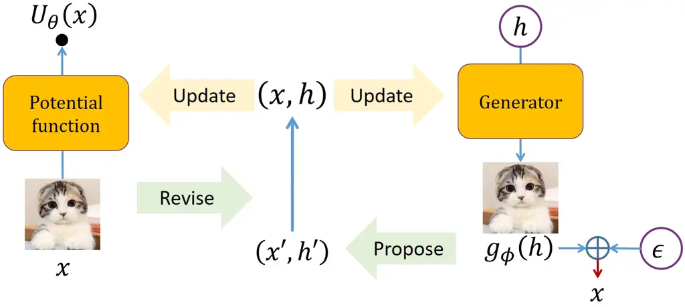

Figure 2.10: Overview of the inclusive-variational approach for learning
EBMs for continuous data. Two neural networks are used to define the
EBM’s potential function $`U_{\theta}(x)`$ and the auxiliary generator
$`g_{\phi}(h)`$ respectively. The parameters of both networks,
$`\theta`$ and $`\phi`$, are updated by using the revised samples
$`(x,h)`$ in the augmented space, which are obtained by revising the
samples $`(x^{\prime},h^{\prime})`$ proposed by the auxiliary generator,
according to the stochastic gradients defined by both the target EBM and
the auxiliary generator. \[162\]

The basic idea of using the inclusive-variational approach for learning
EBMs is described in Eq. (2.34). The auxiliary model $`q_{\phi}(x)`$ and
the sampler for $`p_{\theta}(x)`$ can be very flexibly designed,
depending on the nature of data $`x`$, discrete or continuous. In the
following, we mainly introduce the inclusive-variational approach for
learning EBMs for _continuous data_, which is called inclusive-NRF in
\[162\] and illustrated in Figure 2.10. The important features of
inclusive-NRF is that the auxiliary model $`q_{\phi}(x)`$ is a
latent-variable model, and stochastic gradient guided samplers
(SGLG/SGHMC) are developed, which is particularly useful for sampling
from a continuous distribution $`p_{\theta}(x)`$. For the
inclusive-variational approach for learning EBMs for _discrete data_,
readers could see \[184\].

###### The NRF model.

EBMs parameterized by neural network, as defined in Eq. (2.13), are
called Neural random fields (NRFs) in \[162\], which are usually denoted
by $`p_{\theta}(x)`$. The potential
$`U_{\theta}(x):\mathbb{R}^{d_{x}}\rightarrow\mathbb{R}`$ is realized by
a neural network, which takes the multi-dimensional
$`x\in\mathbb{R}^{d_{x}}`$ as input and outputting the scalar
$`u_{\theta}(x)\in\mathbb{R}`$.

###### An inclusive-divergence minimized auxiliary generator

$`q_{\phi}(x)`$ is introduced to approximate sampling from the target
EBM, particularly for fixed-dimensional continuous observations
$`x\in\mathbb{R}^{d_{x}}`$ (e.g. images). We use a directed generative
model, $`q_{\phi}(x,h)\triangleq q(h)q_{\phi}(x|h)`$, for the auxiliary
generator, which is defined as follows¹⁵¹⁵ 15 Note that during training,
$`\sigma^{2}`$ is absorbed into the learning rates and does not need to
be estimated.:

```math
\displaystyle h \displaystyle\sim\mathcal{N}(0,I_{h}), \tag{2.35}
```

```math
\displaystyle x \displaystyle=g_{\phi}(h)+\epsilon,\epsilon\sim\mathcal{N}(0,\sigma^{2}I_{\epsilon}).
```

Here $`g_{\phi}(h):\mathbb{R}^{d_{h}}\rightarrow\mathbb{R}^{d_{x}}`$ is
implemented as a neural network with parameter $`\phi`$, which maps the
latent code $`h`$ to the observation space. $`I_{h}`$ and
$`I_{\epsilon}`$ denote the identity matrices, with dimensionality
implied by $`h`$ and $`\epsilon`$ respectively. Drawing samples from the
generator $`q_{\phi}(x,h)`$ is simple as it is just ancestral sampling
\[110\] from a 2-variable directed graphical model.

By using Fisher equality (Appendix B.2), we have the following gradients
for $`\theta`$ and $`\phi`$ respectively, where in the first equation,
we use $`\tilde{x}`$ and $`x`$ to differentiate samples from the
empirical distribution $`{p}_{\text{emp}}({x})`$ and those from the
model distribution $`p_{\theta}(x)`$.

###### Proposition 1.

The gradients for optimizing the two objectives in Eq. (2.34) can be
derived as follows:

```math
\left\{\begin{split}&-\frac{\partial}{\partial\theta}KL\left[{p}_{\text{emp}}({x})||p_{\theta}({x})\right]=E_{{p}_{\text{emp}}(\tilde{x})}\left[\nabla_{\theta}u_{\theta}(\tilde{x})\right]-E_{p_{\theta}(x)}\left[\nabla_{\theta}u_{\theta}(x)\right]\\
&-\frac{\partial}{\partial\phi}KL\left[p_{\theta}(x)||q_{\phi}(x)\right]=E_{p_{\theta}(x)q_{\phi}(h|x)}\left[\nabla_{\phi}logq_{\phi}(x,h)\right]\end{split}\right. \tag{2.36}
```

 repeat

  Sampling: Draw a minibatch
$`\mathcal{M}=\left\{(\tilde{x}^{i},x^{i},h^{i}),i=1,\cdots\,|\mathcal{M}|\right\}`$
from $`{p}_{\text{emp}}(\tilde{x})p_{\theta}(x)q_{\phi}(h|x)`$ (see
Algorithm 8);

  Updating: Update $`\theta`$ by ascending:
$`\frac{1}{|\mathcal{M}|}\sum_{(\tilde{x},x,h)\sim\mathcal{M}}\left[\nabla_{\theta}u_{\theta}(\tilde{x})-\nabla_{\theta}u_{\theta}(x)\right]`$;
Update $`\phi`$ by ascending:
$`\frac{1}{|\mathcal{M}|}\sum_{(\tilde{x},x,h)\sim\mathcal{M}}\nabla_{\phi}\log q_{\phi}(x,h)`$;

 until convergence

Algorithm 7 The inclusive-NRF algorithm for learning EBMs for continuous
data with latent-variable auxiliary models

By Proposition 1, we can obtain the gradients w.r.t. $`\theta`$ and
$`\phi`$ (to be ascended). In practice, we apply minibatch based
stochastic gradient descent (SGD) to solve the optimization problem Eq.
(2.34), as shown in Algorithm 7.

Ideally, the learning of $`\theta`$ could be conducted without $`\phi`$,
by using an MCMC sampler (e.g. LD) to draw samples from
$`p_{\theta}(x)`$. But the chain often mixes between modes so
inefficiently that severely slow down the learning of $`\theta`$
especially when the target density $`p_{\theta}(x)`$ is multimodal. This
is the main difficulty that hinders the effective training of NRFs.
Introducing auxiliary generator $`q_{\phi}`$ to approximate the target
NRF $`p_{\theta}`$ is inspired by and related to two advanced MCMC
ideas - auxiliary variable MCMC \[113\] and adaptive MCMC \[6, 142\].

- •
  The classic example of adaptive MCMC is adaptive scaling of the
  variance of the step-size in random-walk Metropolis \[142\]. In
  inclusive-NRF, the auxiliary generator acts like an adaptive proposal,
  updated by using samples from the target density¹⁶¹⁶ 16 Minimizing the
  inclusive-divergence tends to drive the generator (the proposal) to
  have higher entropy than the target density, which is a desirable
  property for proposal design in MCMC..
- •
  Further to be detailed next, the target density is extended to be
  $`p_{\theta}(x)q_{\phi}(h|x)`$, which leaves the original target as
  the marginal, but sampling in the augmented space $`(x,h)`$ can be
  easier (more efficiently), with the help of the adaptive proposal
  $`q_{\phi}(x,h)`$. This follows the basic idea of auxiliary variable
  MCMC \[113\] - sampling in an augmented space could be more efficient.

###### Developing stochastic gradient samplers for EBMs for continuous data.

In Algorithm 7, we need to draw samples
$`(x,h)\in\mathbb{R}^{d_{x}+d_{h}}`$ in the augmented space defined by
the target joint distribution $`p_{\theta}(x)q_{\phi}(h|x)`$ given
current $`\theta`$ and $`\phi`$. Gradient guided samplers (Section
2.3.1), such as Langevin dynamics (LD) and Hamiltonian Monte Carlo (HMC)
\[113\], are known to be efficient in exploring the continuous state
space. The gradients of the target distribution can be derived as
follows:

```math
\left\{\begin{split}&\frac{\partial}{\partial x}\log\left[p_{\theta}(x)q_{\phi}(h|x)\right]=\frac{\partial}{\partial x}\left[\log p_{\theta}(x)+\log q_{\phi}(h,x)-\log q_{\phi}(x)\right]\\
&\frac{\partial}{\partial h}\log\left[p_{\theta}(x)q_{\phi}(h|x)\right]=\frac{\partial}{\partial h}\log q_{\phi}(h,x)\end{split}\right. \tag{2.37}
```

It can be seen that it is straightforward to obtain the gradient w.r.t.
$`h`$ and the first two terms in the gradient w.r.t. $`x`$. However,
calculating the third term
$`\frac{\partial}{\partial x}\log q_{\phi}(x)`$ in the gradient w.r.t.
$`x`$ is intractable. Therefore we are interested in developing
stochastic gradient variants of those samplers, which rely on using
noisy estimate of $`\frac{\partial}{\partial x}\log q_{\phi}(x)`$.

By considering $`z\triangleq(x,h)`$,
$`p(z;\lambda)\triangleq p_{\theta}(x)q_{\phi}(h|x)`$,
$`\lambda\triangleq(\theta,\phi)^{T}`$, and Eq. (2.37), we can use
Theorem 2.3.1 to develop the sampling step for Algorithm 7, as presented
in Algorithm 8. For the gradient w.r.t. $`x`$, the intractable term
$`\frac{\partial}{\partial x}\log q_{\phi}(x)`$ is estimated by a
stochastic gradient.

###### Proposition 2.

Given $`q_{\phi}(h,x)`$, we have

```math
\frac{\partial}{\partial x}\log q_{\phi}(x)=E_{h^{*}\sim q_{\phi}(h^{*}|x)}\left[\frac{\partial}{\partial x}\log q_{\phi}(h^{*},x)\right]. \tag{2.38}
```

###### Proof 2.3.5.

By using Fisher equality (Appendix B.2).

Motivated by Proposition 2, ideally we draw
$`h^{*}\sim q_{\phi}(h^{*}|x)`$ and then use
$`\frac{\partial}{\partial x}\log q_{\phi}(h^{*},x)`$ as an unbiased
estimator of $`\frac{\partial}{\partial x}\log q_{\phi}(x)`$. In
practice, at step $`l`$, given $`x^{(l-1)}`$ and starting from
$`h^{(l-1)}`$, we run one step of LD sampling over $`h`$ targeting
$`q_{\phi}(h|x^{(l-1)})`$, to obtain $`h^{(l-1)*}`$ and calculate
$`\frac{\partial}{\partial x^{(l-1)}}\log q_{\phi}(h^{(l-1)*},x^{(l-1)})`$.
This gives a biased but tractable estimator to
$`\frac{\partial}{\partial x}\log q_{\phi}(x)`$. It is empirically found
in experiments in \[162\] that more steps of this inner LD sampling do
not significantly improve the performance for NRF learning.

So instead of using the exact gradient
$`\frac{\partial}{\partial z}\log p(z;\lambda)`$ as shown in Eq. (2.37),
\[162\] developed a tractable biased stochastic gradient
$`\Delta(z;\lambda)`$ as follows:

```math
\Delta(z;\lambda)\triangleq\left(\begin{array}[]{c}\frac{\partial}{\partial x}\left[\log p_{\theta}(x)+\log q_{\phi}(h,x)-\log q_{\phi}(h^{*},x)\right]\\
\frac{\partial}{\partial h}\log q_{\phi}(h,x)\end{array}\right), \tag{2.39}
```

where $`h^{*}`$ is an approximate sample from $`q_{\phi}(h^{*}|x)`$
obtained by running one step of LD from $`(h,x)`$. Remarkably, as shown
in Algorithm 8, the starting point $`(h^{(0)},x^{(0)})`$ for the
SGLD/SGHMC recursions is obtained from an ancestral sampling from
$`q_{\phi}(h,x)`$. Thus at step $`l=1`$, $`h^{(0)}`$ is already a sample
from $`q_{\phi}(h|x^{(0)})`$ given $`x^{(0)}`$, and we can directly use
$`h^{(0)}`$ as $`h^{(0)*}`$ without running the inner LD sampling.
Afterwards, for $`l>1`$, the conditional distribution of $`h^{(l-1)}`$
given $`x^{(l-1)}`$ is close to $`q_{\phi}(h|x^{(l-1)})`$, though
strictly not. One or more steps of LD could be run to obtain
$`h^{(l-1)*}`$ to reduce the bias in the stochastic gradient estimator.

With the above stochastic gradients in Eq. (2.39), the sampling step in
Algorithm 7 can be performed by running $`|\mathcal{M}|`$ parallel
chains, each chain being executed by running finite steps of SGLD/SGHMC
with tractable gradients w.r.t. both $`x`$ and $`h`$, as shown in
Algorithm 8. Intuitively, the auxiliary generator first gives a proposal
$`(x^{\prime},h^{\prime})`$, and then the system follows the gradients
of $`p_{\theta}(x)`$ and $`q_{\phi}(h,x)`$ (w.r.t. $`x`$ and $`h`$
respectively) to revise $`(x^{\prime},h^{\prime})`$ to $`(x,h)`$. The
gradient terms pull samples moving to low energy region of the random
field and adjust the latent code of the generator, while the noise term
brings randomness. In this manner, we obtain Markov chain samples in the
augmented space defined by $`p_{\theta}(x)q_{\phi}(h|x)`$.

 1. Conduct ancestral sampling from the auxiliary generator
$`q_{\phi}(x,h)`$, i.e. first draw $`h^{\prime}\sim q(h^{\prime})`$, and
then draw $`x^{\prime}\sim q_{\phi}(x^{\prime}|h^{\prime})`$;

 2. Starting from $`(x^{\prime},h^{\prime})=z^{(0)}`$, run finite steps
of SGLD $`(l=1,\cdots,L)`$ to obtain $`(x,h)=z^{(L)}`$, which we call
_sample revision_, according to Eq. (2.24).

 In particular, the SGLD recursions are conducted as follows:

```math
\left\{\begin{split}x^{(l)}=x^{(l-1)}+\delta_{l}\frac{\partial}{\partial x^{(l-1)}}&\left[\log p_{\theta}(x^{(l-1)})+\log q_{\phi}(h^{(l-1)},x^{(l-1)})\right.\\
&\left.-\log q_{\phi}(h^{(l-1)*},x^{(l-1)})\right]+\sqrt{2\delta_{l}}\eta_{x}^{(l)},\\
h^{(l)}=h^{(l-1)}+\delta_{l}\frac{\partial}{\partial h^{(l-1)}}&\log q_{\phi}(h^{(l-1)},x^{(l-1)})+\sqrt{2\delta_{l}}\eta_{h}^{(l)},\\
&\eta^{(l)}\triangleq(\eta_{x}^{(l)},\eta_{h}^{(l)})^{T}\sim\mathcal{N}(0,I)\end{split}\right. \tag{2.40}
```

where, for $`l>1`$, $`h^{(l-1)*}`$, which is an approximate sample from
$`q_{\phi}(h|x^{(l-1)})`$ given $`x^{(l-1)}`$, is obtained from running
one step of LD as follows, starting from $`h^{(l-1)}`$:

```math
\begin{split}h^{(l-1)*}=h^{(l-1)}+\delta_{l}^{*}\frac{\partial}{\partial h^{(l-1)}}&\log q_{\phi}(h^{(l-1)},x^{(l-1)})+\sqrt{2\delta_{l}^{*}}\eta_{h}^{(l)*},\\
&\eta_{h}^{(l)*}\sim\mathcal{N}(0,I);\end{split} \tag{2.41}
```

for $`l=1`$, we directly use $`h^{(0)}`$ as $`h^{(0)*}`$, since, by
initialization, $`h^{(0)}`$ is an exact sample from
$`q_{\phi}(h|x^{(0)})`$ given $`x^{(0)}`$.

 Return $`(x,h)`$, i.e. $`z^{(L)}`$.

Algorithm 8 Sampling in the augmented space defined by
$`p_{\theta}(x)q_{\phi}(h|x)`$

#### 2.3.5 Non-MLE methods for learning EBMs

Maximum likelihood estimation (MLE) has been the most widely used
objective for learning probabilistic models. When training an EBM with
MLE, we need to sample from the EBM per training iteration. The training
efficiency of the MLE method highly depends on the mixing efficiency of
the Markov chain. In high-dimensional problems, it is very challenging
to design Markov chains with fast mixing rates. Thus, MLE training of
EBMs may converge slowly. As alternatives to MLE training, non-MLE
methods for learning EBMs (as a kind of unnormalized models) have been
explored, such as _noise-contrastive estimation_ \[55, 56\] and _score
matching_ \[68\].

Another motivation to pursue non-MLE methods is that the optimization
criterion used has profound effect on the behavior of the optimized
model \[173\]. Maximizing likelihood is equivalent to minimizing the KL
divergence between $`p_{\text{ora}}(x)`$ and $`p_{\theta}(x)`$, because

```math
\displaystyle KL[p_{\text{ora}}(x)||p_{\theta}(x)] \displaystyle=-E_{x\sim p_{\text{ora}}(x)}[\log p_{\theta}(x)]+E_{x\sim p_{\text{ora}}(x)}[\log p_{\text{ora}}(x)]
```

```math
\displaystyle=-E_{x\sim p_{\text{ora}}(x)}[\log p_{\theta}(x)]+\text{constant}
```

```math
\displaystyle\approx-E_{x\sim p_{\text{emp}}(x)}[\log p_{\theta}(x)]+\text{constant} \tag{2.42}
```

```math
\displaystyle=-L(\theta)+\text{constant}
```

where $`p_{\text{ora}}(x)`$ denote the the underlying (oracle) data
distribution, and $`L(\theta)`$ is the log-likelihood in Eq. (2.17). Eq.
(2.42) is an unbiased Monte Carlo integration since the expectation
under $`p_{\text{ora}}(x)`$ is approximated by empirical samples
$`\left\{x_{i}\right\}_{i=1}^{N}`$.

It is known that the KL divergence is asymmetric, and optimizing which
direction of the KL divergence leads to different trade-offs. The KL
approximation covers the data distribution while reverse-KL has more of
a mode-seeking behavior \[104\]. The basic _score matching_ (SM)
objective minimizes a discrepancy between two distributions called the
Fisher divergence:

```math
D_{F}(p_{\text{ora}}(x)||p_{\theta}(x))=E_{x\sim p_{\text{ora}}(x)}\left[\frac{1}{2}||\nabla_{x}\log p_{\text{ora}}(x)-\nabla_{x}\log p_{\theta}(x)||^{2}\right]
```

Learning under most criteria is provably consistent given infinite model
capacity and data. Most of the methods are firstly examined over
continuous data, with few on discrete data. The score matching method is
based on minimizing the expected squared distance of the *score
function*¹⁷¹⁷ 17 The gradient of log-density with respect to the data
vector $`x`$ is called the score function. of the data distribution and
the score function given by the model, and thus is not applicable to
training EBMs over discrete data such as natural languages. In contrast,
the noise-contrastive estimation method has no such limitation, which
will be detailed below.

### 2.4 Learning EBMs by noise-contrastive estimation (NCE)

Noise-contrastive estimation (NCE) is proposed in \[55, 56\], as a
typical non-MLE method, for learning unnormalized statistical models.
Its basic idea is “learning by comparison”, i.e. to perform nonlinear
logistic regression to discriminate between _data samples_ drawn from
the data distribution $`p_{\text{ora}}(x)`$ and _noise samples_ drawn
from a known noise distribution $`q(x)`$. An advantage of NCE is that
the normalizing constant can be treated as a normal parameter and
updated together with the model parameters.

Denote the target unnormalized model by:

```math
p_{\theta}(x)=\frac{1}{Z_{\theta}}\tilde{p}_{\theta}(x) \tag{2.43}
```

where we highlight that the model, parameterized by $`\theta`$, is
unnormalized, and the normalizing constant
$`Z_{\theta}=\int\tilde{p}_{\theta}(x)dx`$. To apply NCE, we treat
$`\log Z_{\theta}`$ as an additional parameter $`\zeta`$ and rewrite Eq.
(2.43) in the following form:

```math
p_{\theta,\zeta}(x)=\exp\left[-\zeta+\log\tilde{p}_{\theta}(x)\right] \tag{2.44}
```

As shown below, model parameters $`(\theta,\zeta)`$ will be jointly
estimated in NCE.

Introduce a fixed, known noise distribution denoted by $`q(x)`$, and
consider a binary classification. There are two classes of samples, with
prior probabilities $`P(C=+)`$ and $`P(C=-)`$. For class $`+`$, the
sample is drawn from the data distribution $`p_{\text{ora}}`$; for class
$`-`$, the sample is drawn from the noise distribution $`q`$. This
defines a generation process of samples in NCE.

Given a sample $`x`$ from such a generation process, the class posterior
probabilities are defined as follows:

```math
\displaystyle p(C=+|x) \displaystyle=\frac{p(C=+)p(x|C=+)}{p(C=+)p(x|C=+)+p(C=-)p(x|C=-)}
```

```math
\displaystyle p(C=-|x) \displaystyle=1-p(C=+|x)
```

By our design of the binary classification experiment, $`p(x|C=-)`$ is
the noise distribution $`q(x)`$. The (unknown) class-conditional density
for class $`+`$ is assumed to be modeled by the target model
$`p_{\theta,\zeta}(x)`$. Let the ratio between the prior probabilities
$`\frac{p(C=-)}{p(C=+)}`$ be $`\nu`$ (i.e., the ratio of noise sample
size to real sample size). Then the posterior probabilities can be
parameterized as follows:

```math
\begin{split}p(C=+|x;\theta,\zeta)&=\frac{p_{\theta,\zeta}(x)}{p_{\theta,\zeta}(x)+\nu q(x)}\\
p(C=-|x;\theta,\zeta)&=1-p(C=+|x;\theta,\zeta)\end{split} \tag{2.45}
```

NCE estimates the model parameters $`(\theta,\zeta)`$ by optimizing the
two-class classification through maximizing the following conditional
log-likelihood:

```math
J_{\text{NCE}}(\theta,\zeta)=E_{x\sim p_{\text{ora}}(x)}\left[\log p(C=+|x;\theta,\zeta)\right]+\nu E_{x\sim q(x)}\left[\log p(C=-|x;\theta,\zeta)\right] \tag{2.46}
```

The objective function $`J(\theta,\zeta)`$ is a sum of two expectations.
The first is the expectation w.r.t. the data distribution
$`p_{\text{ora}}(x)`$, which can be approximated by randomly drawing
samples from training data, namely approximating $`p_{\text{ora}}(x)`$
by $`p_{\text{emp}}(x)`$. The second is the expectation w.r.t. the noise
distribution $`q(x)`$, which can be approximated by drawing samples from
the noise distribution.

 repeat

  Sampling: Draw an empirical minibatch
$`\mathcal{D}\sim p_{\text{ora}}(x)`$ and a noise minibatch
$`\mathcal{B}\sim q(x)`$, satisfying
$`\nu=|\mathcal{B}|/|\mathcal{D}|`$;

  Updating: Update $`(\theta,\zeta)`$ by ascending:

```math
\frac{1}{|\mathcal{D}|}\sum_{x\sim\mathcal{D}}\nabla_{\theta,\zeta}\log p(C=+|x;\theta,\zeta)+\frac{\nu}{|\mathcal{B}|}\sum_{x\sim\mathcal{B}}\nabla_{\theta,\zeta}\log p(C=-|x;\theta,\zeta)
```

 until convergence

Algorithm 9 NCE for fitting an unnormalized model

Setting to zeros the gradients of $`J(\theta,\zeta)`$ w.r.t.
$`(\theta,\zeta)`$, we can apply the SA algorithm to find its root and
thus solve the optimization problem in Eq. (2.46). The pseudocode of NCE
is shown in Algorithm 9. The relevant gradients can be further
simplified as follows:

```math
\begin{split}\nabla_{\theta,\zeta}\log p(C=+|x;\theta,\zeta)=p(C=-|x;\theta,\zeta)\nabla_{\theta,\zeta}\log p_{\theta,\zeta}(x)\\
\nabla_{\theta,\zeta}\log p(C=-|x;\theta,\zeta)=-p(C=+|x;\theta,\zeta)\nabla_{\theta,\zeta}\log p_{\theta,\zeta}(x)\end{split} \tag{2.47}
```

It is shown in \[56\] that under the ideal situation of infinite amount
of data and infinite model capacity, we have the following theorem
(nonparametric estimation). It is further shown \[56\] that the NCE
estimator is consistent.

###### Theorem 2.4.1 (Nonparametric estimation).

$`J_{\text{NCE}}(\theta,\zeta)`$ attains its maximum at
$`p_{\theta,\zeta}(x)=p_{\text{ora}}(x)`$. There are no other extrema if
the noise density $`q(x)`$ is chosen such that it is nonzero whenever
$`p_{\text{ora}}(x)`$ is nonzero.

The noise distribution $`q`$ and the ratio $`\nu`$ have an influence on
the accuracy of the NCE estimate of model parameters $`(\theta,\zeta)`$.
A natural question to ask in applying NCE is what, from a statistical
standpoint, the best choice of $`q`$ and $`\nu`$ is, to get estimates
with a small estimation error. This question is discussed in the
original paper of NCE \[56\], which give the following suggestions:

1.  1.  Choose noise for which an analytical expression for $`\log q`$ is
        available.
2.  2.  Choose noise that can be sampled easily.
3.  3.  Choose noise that is in some aspect, for example with respect to its
        covariance structure, similar to the data.
4.  4.  Make the noise sample size as large as computationally possible.

#### 2.4.1 Dynamic noise-contrastive estimation (DNCE)

Remarkably, there exist two problems in applying NCE learning. First,
reliable NCE needs a large $`\nu`$, especially when the noise
distribution is not close to the data distribution. And the time and
memory cost for gradient calculation are almost linearly increased with
$`\nu`$. Second, the expectation w.r.t. the data distribution
$`p_{\text{ora}}`$ in Eq. (2.46) is approximated by the expectation
w.r.t. the empirical distribution $`p_{\text{emp}}`$ (namely the
training data), which is rather sparse for high-dimensionality data
modeling. The model estimated by NCE is thus easily overfitted to the
empirical distribution. _Dynamic noise-contrastive estimation_ (DNCE)
was proposed in \[185\] to address the above problems, with two
modifications.

First, instead of using a fixed noise distribution, a dynamic noise
distribution $`q_{\phi}(x)`$ with parameter $`\phi`$ is introduced in
DNCE. In addition to maximizing w.r.t. $`(\theta,\zeta)`$ the NCE
objective function $`J_{\text{NCE}}(\theta,\zeta)`$, DNCE simultaneously
performs maximum likelihood optimization of $`\phi`$ over training data:

```math
\max_{\phi}E_{x\sim p_{\text{ora}}(x)}\left[\log q_{\phi}(x)\right]
```

The motivation is to push the noise distribution to be close to the data
distribution, so that we can achieve reliable model estimation even
using a small $`\nu`$. Theoretically, one can optimize the noise
distribution beforehand and then use a fixed noise density in NCE. It is
found that dynamic noise distribution helps optimization, by gradually
increasing the difficulty of the two-class discrimination task \[185\].
If the noise distribution $`q_{\phi}`$ is too different from the data
distribution $`p_{\text{ora}}`$, the two-class discrimination problem
might be too easy and would not require the system to learn much about
the structure of the data. But if $`q_{\phi}`$ is too close to
$`p_{\text{ori}}`$ from the beginning, the discrimination problem might
be too difficult to proceed.

Second, instead of using the standard NCE objective function
$`J_{\text{NCE}}(\theta,\zeta)`$ in Eq. (2.46), a modified objective
function is proposed as follows¹⁸¹⁸ 18 In
$`J_{\text{DNCE}}(\theta,\zeta)`$ and $`p_{\text{int}}(x)`$, we suppress
their dependency on $`\phi`$, since, as will be shown later, the
optimization of $`J_{\text{DNCE}}(\theta,\zeta)`$ is taken only over
$`(\theta,\zeta)`$ while fixing $`\phi`$.:

```math
J_{\text{DNCE}}(\theta,\zeta)=E_{x\sim p_{\text{int}}(x)}\left[\log p(C=+|x;\theta,\zeta)\right]+\nu E_{x\sim q_{\phi}(x)}\left[\log p(C=-|x;\theta,\zeta)\right] \tag{2.48}
```

where

```math
p_{\text{int}}(x)=\alpha p_{\text{ora}}(x)+(1-\alpha)q_{\phi}(x)
```

denotes an interpolation of the data distribution and the noise
distribution, and $`0<\alpha<1`$ is the interpolating factor.
$`p(C=+|x;\theta,\zeta)`$ and $`p(C=-|x;\theta,\zeta)`$ are defined the
same as in Eq. (2.45), except that the fixed noise distribution $`q(x)`$
is replaced by the dynamic noise distribution $`q_{\phi}(x)`$.
Intuitively, as the noise distribution $`q_{\phi}`$ converges to the
data distribution, using the interpolated distribution
$`p_{\text{int}}`$ will increase the number of data-like samples by
adding samples drawn from the noise distribution. This could avoid the
model to be overfitted to the sparse training set.

Putting the two modifications together, DNCE conducts the following
joint optimization,

```math
\left\{\begin{split}&\max_{\theta,\zeta}J_{\text{DNCE}}(\theta,\zeta)\\
&\max_{\phi}E_{x\sim p_{\text{ora}}(x)}\left[\log q_{\phi}(x)\right]\\
\end{split}\right.
```

which can be solved by applying minibatch-based stochastic gradient
ascent.

At each iteration, a set of data samples, denoted by $`\mathcal{D}`$, is
sampled from $`p_{\text{ora}}`$, with the number of samples in
$`\mathcal{D}`$ denoted as $`|\mathcal{D}|`$. Additionally, two sets of
noise samples are drawn from the noise distribution $`q_{\phi}`$,
denoted by $`\mathcal{B}_{1}`$ and $`\mathcal{B}_{2}`$, whose sizes
satisfy $`|\mathcal{B}_{1}|=\frac{1-\alpha}{\alpha}|\mathcal{D}|`$ and
$`|\mathcal{B}_{2}|=\frac{\nu}{\alpha}|\mathcal{D}|`$ respectively. As a
result, the union of $`\mathcal{D}`$ and $`\mathcal{B}_{1}`$ can be
viewed as samples drawn from the interpolated distribution
$`p_{\text{int}}`$, with
$`|\mathcal{D}\cup\mathcal{B}_{1}|=\frac{|\mathcal{D}|}{\alpha}`$. Model
parameters $`(\theta,\zeta)`$ are updated by ascending the following
stochastic gradients:

```math
\begin{split}&\frac{\alpha}{|\mathcal{D}|}\sum_{x\in\mathcal{D}\cup\mathcal{B}_{1}}p(C=-|x;\theta,\zeta)\nabla_{\theta,\zeta}\log p_{\theta,\zeta}(x)\\
&-\frac{\alpha}{|\mathcal{D}|}\sum_{x\in\mathcal{B}_{2}}p(C=+|x;\theta,\zeta)\nabla_{\theta,\zeta}\log p_{\theta,\zeta}(x)\end{split}
```

Noise model parameter $`\phi`$ are updated by ascending the following
stochastic gradient:

```math
\frac{1}{|\mathcal{D}|}\sum_{x\in\mathcal{D}}\nabla_{\phi}\log q_{\phi}(x)
```

A final remark is that the theoretical consistency of DNCE learning in
the nonparametric limit can be shown by the following theorem.

###### Theorem 2.4.2.

Suppose that an arbitrarily large number of data samples can be drawn
from $`p_{\text{ora}}`$, and the model distribution $`p_{\theta}(x)`$
and the noise distribution $`q_{\phi}(x)`$ have infinite capacity. Then
we have

1.  (i)
    The KL divergence $`KL(p_{\text{ora}}||q_{\phi})`$ can be minimized
    to attain zero;
2.  (ii)
    If $`KL(p_{\text{ori}}||q_{\phi})`$ attains zero at $`\phi^{*}`$,
    and the conditional log-likelihood Eq. (2.48) attains a maximum at
    $`(\theta^{*},\zeta^{*})`$, then we have

    ```math
    p_{\theta^{*}}(x)=q_{\phi^{*}}(x)=p_{\text{ora}}(x)
    ```

###### Proof 2.4.3.

1.  (i)
    This conclusion can be easily seen by consistencey of MLE, since
    minimizing $`KL(p_{\text{ora}}||q_{\phi})`$ is equivalent to MLE of
    $`q_{\phi}`$.
2.  (ii)
    From $`KL(p_{\text{ori}}||q_{\phi^{*}})=0`$, we have
    $`q_{\phi^{*}}=p_{\text{ora}}`$.

    By Theorem 2.4.1, with fixed $`\phi^{*}`$, Eq. (2.48) has the only
    extremum at
    $`p_{\theta^{*}}(x)=p_{\text{int}}(x)|_{\phi=\phi^{*}}=\alpha p_{\text{ora}}(x)+(1-\alpha)q_{\phi^{*}}(x)`$.

The conclusion is clear from combining the above two equations.

### 2.5 Generation from EBMs

Given an EBM, an important inference task is sampling from the model,
i.e., drawing or generating samples from the model. Sampling is not only
a critical step in maximum likelihood learning of EBMs (as we introduce
in Section 2.3), but also itself forms as an important class of
applications. Generating text, images, speech, or other media has
received increasing interests, and recently has been collectively
referred to as generative AI¹⁹¹⁹ 19
[https://en.wikipedia.org/wiki/Generative_artificial_intelligence](https://en.wikipedia.org/wiki/Generative_artificial_intelligence).

Transformer-based \[179\] autoregressive language models (ALMs),
generating text sequentially from left to right, have been the dominant
approach for text generation \[134\]. Key to their success is local
normalization, i.e. they are defined in terms of a product of
conditional distributions, one for each token in the sequence. These
models can be trained efficiently via maximum likelihood
teacher-forcing, and sampling from ALMs is straightforward by ancestral
sampling . Unfortunately, local normalization also brings some drawbacks
for these _locally-normalized sequence models_, when compared to
_globally-normalized sequence models_ (namely EBM based sequence
models)²⁰²⁰ 20 There are some studies, which do not involve EBM
modeling, but use a masked language modeling objective to train the
model. This approach, referred to as _non-autoregressive generation_,
performs iterative decoding, i.e., generating non-autoregressively, then
masking out and regenerating, and so cycles for a number of iterations
\[44\]. . As will be detailed in Section 4.1.2 and Section 4.4.1, the
drawbacks include:

- •
  Discrepancy between training and inference (related to _exposure
  bias_);
- •
  Limitation in long-range coherency due to only left-to-right modeling
  and decoding (related to _label bias_);
- •
  Inflexibility in controlled generation (e.g., satisfying hard lexical
  constraints and/or soft topical constraints in text generation).

There are similar concerns for generating other sequence media (e.g.,
speech). There have been studies for speech synthesis by EBMs \[167\]
and also by some non-autoregressive models, such as FastSpeech 2 \[140\]
and diffusion models \[130\].

Remarkably, given a learned EBM, some applications need likelihood
evaluation (e.g., in language modeling for speech recognition), while
other tasks require generation from the learned generative model (e.g.,
in many NLP tasks such as summarization, dialog, and machine
translation). Generation from generative models basically is sampling
from them. In practice, generating from locally-normalized sequence
models, sometimes also referred to as decoding, can be readily realized
by greedy decoding (beam search) or nucleus sampling \[64\] as
engineering variants of ancestral sampling. There is no easy methods for
sampling from EBMs. Basically we have to resort to Monte Carlo methods,
such as MCMC and importance sampling (IS), which is usually not as
computational efficient as ancestral sampling. Perhaps this is the most
challenging practical limitation of EBMs for their applications in
generation, and the dominant approach to text generation is still based
on large neural auto-regressive models.

| Sampling method          | Proposal                  | Application                                       |
| ------------------------ | ------------------------- | ------------------------------------------------- |
| MH within Gibbs sampling | Conditional of word class | ASR \[188, 189\]                                  |
|                          | ALM                       | ASR \[184\]                                       |
|                          | MLM                       | CTG \[99, 47, 105\] (see Section 4.4.2)           |
| SNIS                     | ALM                       | CTG \[125, 72\]; CTGAP \[39\] (see Section 4.4.1) |
| Langevin dynamics        | \-                        | CTG \[132\]                                       |

Table 2.1: A survey of different sampling methods used in generating
text from EBMs. The target model is the EBM, while a proposal is
required for both MCMC and IS. Different proposals are used in different
applications. Shorthands: ALMs (autoregressive language model), MLM
(masked language model), SNIS (self-normalized importance sampling), ASR
(automatic speech recognition), CTG (controlled text generation), CTGAP
(conditional text generation after prefix).

Theoretically, sampling from EBMs can be performed by the MCMC and
importance sampling methods, which are introduced in Section 2.3.1 and
Section 2.3.2 respectively. Gradient-based MCMC methods (Section 2.3.1),
such as Langevin dynamics, are good choices for sampling for continuous
data (e.g., images), by using the gradient of the potential
$`\nabla_{x}U_{\theta}(x)`$. However, since text is discrete, the
gradient is not well-defined, making it non-trivial to apply
gradient-based MCMC methods for sampling text from EBMs.

Various MCMC and IS methods have been explored in applications of EBMs
for generating text. In Table 2.1, we survey some recent studies, which
provide concrete examples. Remarkably, both MCMC and IS methods need
proposal distributions, and the design of proposal distributions heavily
depends on specific applications. We comment on the particular proposal
distributions used in different applications in Table 2.1. some further
discussions are as follows.

###### MH within Gibbs sampling.

Suppose we use Gibbs sampling to generate a sequence of $`n`$ tokens,
$`x=(x_{1},\cdots,x_{n})`$, from an EBM distribution
$`p(x_{1},\cdots,x_{n})`$. Exact Gibbs sampling needs to calculate the
conditional distribution $`p(x_{i}|x_{\setminus i})`$ of token $`x_{i}`$
for each position $`i`$, given all the other tokens
$`x_{\setminus i}\triangleq(x_{1},\cdots,x_{i-1},x_{i+1},\cdots,x_{n})`$.
For modern EBMs developed for text, such as in \[188, 189, 184\] and so
on, this is computational expensive, because calculating
$`p(x_{i}|x_{\setminus i})`$ needs to enumerate all possible values of
$`x_{i}`$ from $`\mathcal{V}`$ and to compute the joint probability
$`p(x_{i},x_{\setminus i})`$ for each possible value, where
$`\mathcal{V}`$ denotes the vocabulary. Metropolis-Hastings (MH) within
Gibbs sampling has been explored, with a proposal, to draw MCMC samples
from $`p(x_{i}|x_{\setminus i})`$.

In \[188, 189\], word classing is introduced to accelerate sampling,
which means that each word is assigned to a single class. Through
applying MH within Gibbs sampling, we first sample the class by using a
reduced model as the proposal, which includes only the features that
depend on $`x_{i}`$ through its class²¹²¹ 21 This is possible, since
features used in \[188, 189\] are discrete features ($`n`$-gram
features). (See introduction in Section 3.3.1), and then sample the
word. This reduces the computational cost from $`|\mathcal{V}|`$ to
$`|\mathcal{C}|+|\mathcal{V}|/|\mathcal{C}|`$ on average, where
$`|\mathcal{C}|`$ denotes the number of classes.

The computation reduction in using word classing in EBMs with neural
features (i.e., parameterized by neural networks) is not as significant
as in EBMs with discrete features, because EBMs parameterized by neural
networks involve a much larger context, which makes the sampling
computation with the reduced model still expensive. In later work in
\[184\], an ALM (autoregressive language model) is introduced to propose
for $`p(x_{i}|x_{\setminus i})`$, and in \[99, 47, 105\], a MLM (masked
language models) is used as the proposal. The proposal model can be
jointly trained with the EBM, as in \[184\], or pre-trained language
models can be directly used for the proposal \[99, 47, 105\].

###### Self-normalized importance sampling (SNIS).

The basics are introduced in Section 2.3.2. See Section 4.4.1 for
details in applications.

###### Langevin dynamics.

The basics are introduced in Section 2.3.1. See Section 4.4.2 for
details in applications.

## Chapter 3 EBMs for sequential data with applications in language modeling

In this chapter, we are mainly concerned with learning the (_marginal_)
distribution of observation $`x`$ itself by EBMs. Considering the
sequential nature of speech and language, we show how to develop EBMs
for sequential data, or more generally, for _trans-dimensional_ data.

EBMs are mostly developed in _fixed-dimensional_ settings, for example,
in the modeling of fixed-size images. Trans-dimensional setting means
that the observations can be of different dimensions. A familiar case is
temporal modeling of sequential data, where each observation is a
sequence of a random length. _Language modeling_ falls exactly in this
trans-dimensional setting, where an observation sequence $`x`$ is a
natural language sentence (i.e., a token sequence).

### 3.1 Autoregressive language model (ALM)

_Language modeling_ involves determining the joint probability $`p(x)`$
of a sentence $`x`$, which can be denoted as a pair $`x=(l,x^{l})`$,
where $`l`$ is the length and $`x^{l}=(x_{1},\dots,x_{l})`$ is a
sequence of $`l`$ tokens. Currently, the dominant approach to language
modeling is the locally-normalized or conditional modeling, which
decomposes the joint probability of $`x^{l}`$ into a product of
conditional probabilities by using the chain rule,

```math
p(x_{1},\dots,x_{l})=\prod_{i=1}^{l}p(x_{i}|x_{1},\dots,x_{i-1}). \tag{3.1}
```

Language models (LMs) in the form of Eq. (3.1) is known as
_autoregressive language models_ (ALMs). Remarkably, for an ALM to make
the sum of the probabilities of all sequences equal to 1, it is
necessary to place a special token $`\langle\texttt{EOS}\rangle`$ at the
end of sentences and to include this in the product of Eq. (3.1) \[20\].
Otherwise, the sum of the probabilities of all sequences of a given
length is 1, and the sum of the probabilities of all sequences is then
infinite.

In early days before the deep learning era, the history of $`x_{i}`$,
denoted as $`(x_{1},\cdots,x_{i-1})`$, is often reduced to equivalence
classes through a mapping $`\phi(x_{1},\cdots,x_{i-1})`$ with the
assumption

```math
p(x_{i}|x_{1},\cdots,x_{i-1})\approx p(x_{i}|\phi(x_{1},\cdots,x_{i-1})).
```

A classic example is the traditional $`n`$-gram language models (LMs)
with

```math
\phi(x_{1},\cdots,x_{i-1})=(x_{i-n+1},\dots,x_{i-1}),
```

assuming that current token $`x_{i}`$ depends on history only through
the previous $`n-1`$ tokens, i.e., the $`(n-1)`$-order Markov
assumption. Various smoothing techniques have been used for parameter
estimation, and particularly, the modified Kneser-Ney (KN) smoothed
$`n`$-gram LMs are still widely used because of its simplicity and good
performance \[20\].

Recently, neural network LMs have begun to surpass the traditional
$`n`$-gram LMs, and also follow the locally-normalized approach. The
mapping $`\phi(x_{1},\cdots,x_{i-1})`$ condenses the history into a
hidden vector $`h_{i}\in\mathbb{R}^{D}`$ through a neural network (NN),
which can be a feedforward NN \[156\], a recurrent NN \[101, 168\], or
more recently, a Transformer NN \[179\]. Specifically, in either
manners, the neural network calculates the conditional probability at
each position as follows:

```math
p(x_{i}=k|x_{1},\cdots,x_{i-1})=\frac{\exp(z_{k})}{\sum_{j=1}^{|\mathcal{V}|}\exp(z_{j})} \tag{3.2}
```

which is in the form of a multi-class logistic regression, as introduced
in Eq. (2.3). The logits $`z_{k}=w_{k}^{T}h_{i}+b_{k},k=1,\cdots,K`$ are
calculated from a linear layer on top of hidden vector $`h_{i}`$.
$`w_{k}\in\mathbb{R}^{D},b_{k}\in\mathbb{R}`$ denote the weight vector
and bias of the linear layer, respectively. $`\mathcal{V}`$ denotes the
vocabulary of all possible tokens.

###### Drawbacks of ALMs.

Both the classic $`n`$-gram LMs and the recent neural network LMs are
autoregressive language models, which are locally normalized.
Unfortunately, _local normalization in ALMs brings some drawbacks_. As
will be detailed in Section 4.1.2, ALMs are prone to exposure bias
\[192, 138\] and label bias \[79, 4\].

### 3.2 Energy-based language model (ELM)

#### 3.2.1 Globally-normalized ELM (GN-ELM)

Energy-based language models (ELMs) parameterize an unnormalized
distribution for natural sentences and are radically different from
autoregressive language models. Let $`x`$ be a natural sentence (i.e., a
token sequence). An _energy-based language model_ (ELM) is defined as
follows

```math
p_{\theta}(x)=\frac{\exp(U_{\theta}(x))}{Z(\theta)} \tag{3.3}
```

where $`U_{\theta}(x)`$ denotes the potential function with parameter
$`\theta`$, $`Z(\theta)=\sum_{x}\exp(U_{\theta}(x))`$ is the normalizing
constant, and $`p_{\theta}(x)`$ is the probability of sentence $`x`$.
For reasons to be clear below (mainly to be differentiated from TRF-LM),
the model in Eq. (3.3) is called _globally-normalized ELM_ (GN-ELM).

ELMs potentially address the drawbacks of ALMs introduced above, as they
do not require any local normalization. Early attempts on building
energy-based language models are GN-ELMs and date back to \[144\], which
proposes _whole-sentence maximum entropy_ (WSME) language models¹¹ 1 Due
to the connection between log-linear model and maxent model as we
introduced before in Section 2.1.2, this model is called WSME..
Specifically, a WSME model has the log-linear form

```math
p(x;\lambda)=\frac{1}{Z(\lambda)}e^{\lambda^{T}f(x)}. \tag{3.4}
```

Here $`f(x)`$ is a vector of features, which are computable functions of
$`x`$ such as $`n`$-grams conventionally used, $`\lambda`$ is the
corresponding parameter vector, and
$`Z(\lambda)=\sum_{x}e^{\lambda^{T}f(x)}`$ is the global normalizing
constant.

There has been little work on WSME-LMs, mainly in \[144, 1, 145\].
Although the whole-sentence approach has the potential advantage of
being able to flexibly integrate a richer set of features, the empirical
results of previous WSME-LMs are not satisfactory, almost the same as
traditional $`n`$-gram LMs. After incorporating lexical and syntactic
information, a mere relative improvement of 1% and 0.4% respectively in
perplexity and in WER (word error rate) was reported for the resulting
WSME-LM \[144\]. Subsequent studies of using WSME LMs with grammatical
features, as in \[1\] and \[145\], reported perplexity improvement above
10% but no WER improvement when using WSME LMs alone.

In recent years, there are encouraging progresses in both theories and
applications of ELMs. A new class of ELMs, called trans-dimensional
random fields (TRFs), have been developed, which are different from
GN-ELMs and _present the first strong empirical evidence supporting the
power of using energy-based approach to language modeling_ \[188, 189\].
Applications of ELMs have covered computation of sentence likelihoods
(up to a constant) for speech recognition \[188, 189, 184, 186, 185,
43\] (to be introduced in the next section), text generation \[39\] (to
be covered in Section 4.4.1), language model pre-training \[27\] (to be
covered in Section 3.4), calibrated natural language understanding
\[60\] (to be covered in Section 5.5), and so on.

#### 3.2.2 Trans-dimensional random field (TRF) LMs

To describe trans-dimensional observations in general, a new
energy-based probabilistic model, called the _trans-dimensional random
field_ (TRF) model, has been proposed in \[188, 189\], which explicitly
mixes a collection of random fields in sample spaces of different
dimensions. _A GN-ELM is globally-normalized over all sequences of all
lengths_. In contrast, _a TRF-LM is a collection of random fields, each
normalized on subspaces of different lengths separately and weighted by
empirical length probabilities_.

Suppose that it is of interest to build random field models for multiple
sets of observations of different dimensions, such as images of
different sizes or sentences of different lengths. Denote by $`x^{j}`$
an observation in a sample space $`\mathcal{X}^{j}`$ of dimension $`j`$,
ranging from 1 to $`m`$. The space of all observations is then the union
$`\mathcal{X}=\cup_{j=1}^{m}\mathcal{X}^{j}`$. To emphasize the
dimensionality, each observation in $`\mathcal{X}`$ can be represented
as a pair $`x=(j,x^{j})`$, even though $`j`$ is identified as the
dimension of $`x^{j}`$. By abuse of notation, write $`f(x)=f(x^{j})`$
for features of $`x`$.

For $`j=1,\ldots,m`$, assume that the observations $`x^{j}`$ are
distributed from a random field in the form

```math
p_{j}(x^{j};\lambda)=\frac{1}{Z_{j}(\lambda)}e^{U_{\theta}(x^{j})},
```

$`U_{\theta}(x^{j}):\mathcal{X}^{j}\rightarrow\mathbb{R}`$ denotes the
potential function which assigns a scalar value to each configuration of
$`x`$ in $`\mathcal{X}`$ and _can be very flexibly parameterized_
through linear functions or nonlinear functions with neural networks of
different architectures, to be explained in Section 3.3.1. $`\theta`$
denotes the set of parameters, and $`Z_{j}(\theta)`$ is the normalizing
constant:

```math
Z_{j}(\theta)=\sum_{x^{j}}e^{U_{\theta}(x^{j})},\quad\quad j=1,\dots,m.
```

Moreover, assume that dimension $`j`$ is associated with a probability
$`\pi_{j}`$ for $`j=1,\ldots,m`$ with $`\sum_{j=1}^{m}\pi_{j}=1`$.
Therefore, the pair $`(j,x^{j})`$ is jointly distributed as

```math
p(j,x^{j};\pi,\theta)=\pi_{j}\,p_{j}(x^{j};\theta)=\frac{\pi_{j}}{Z_{j}(\theta)}e^{U_{\theta}(x^{j})}, \tag{3.5}
```

where $`\pi=(\pi_{1},\ldots,\pi_{m})^{T}`$.

Here we actually define a mixture of random fields for joint modeling
sentences of different dimensions (namely lengths). There is a random
field for each length. By maximum likelihood, the mixture weights can be
estimated to be the empirical length probabilities.

| Work         | Contribution                                                                                                                                                                |
| ------------ | --------------------------------------------------------------------------------------------------------------------------------------------------------------------------- |
| \[188, 189\] | $`\bullet\penalty\ `$Discrete features                                                                                                                                      |
|              | $`\bullet\penalty\ `$Augmented stochastic approximation (AugSA) for model training                                                                                          |
| \[184\]      | $`\bullet\penalty\ `$Potential function as a deep CNN                                                                                                                       |
|              | $`\bullet\penalty\ `$Model training by AugSA plus JSA (joint stochastic approximation)                                                                                      |
| \[186\]      | $`\bullet\penalty\ `$Potential function in the form of exponential tilting, revisited in residual EBMs \[39\]                                                               |
|              | $`\bullet\penalty\ `$Use LSTM on top of CNN                                                                                                                                 |
|              | $`\bullet\penalty\ `$NCE is introduced to train TRF-LMs                                                                                                                     |
| \[185\]      | $`\bullet\penalty\ `$Simplify the potential definition by using only bidirectional LSTM                                                                                     |
|              | $`\bullet\penalty\ `$Propose Dynamic NCE for improved model training                                                                                                        |
| \[43\]       | $`\bullet\penalty\ `$Mixed-feature TRFs, by integrating discrete and neural features                                                                                        |
| \[86\]       | $`\bullet\penalty\ `$Pre-trained language models (PLMs) are used as the backbones of energy functions, noise distributions in NCE and proposal distributions in Monte Carlo |

Table 3.1: The development of TRF-LMs.

As outlined in Table 3.1, there are a series of works in the development
of TRF-LMs, each with its own contribution in different
parameterizations of potential functions and model training methods.
Before expanding introductions around Table 3.1, let us first recognize
the differences between GN-ELM and TRF-LM.

#### 3.2.3 Comparison between GN-ELM and TRF-LM

The following comment on the connection and difference between GN-ELM
and TRF-LM models is adapted from the comparison between WSME and TRF
models in \[189\]. Suppose that we add the dimension features in the
GN-ELM model Eq. (3.3) and obtain

```math
p(j,x^{j};\lambda,\nu)=\frac{1}{Z(\theta,\nu)}e^{{\nu}^{T}\delta(j)+U_{\theta}(x^{j})}, \tag{3.6}
```

where $`\delta(j)=(\delta_{1}(j),\cdots,\delta_{m}(j))^{T}`$ denotes the
dimension features such that $`\delta_{l}(j)=1(j=l)`$.
$`\nu=(\nu_{1},\ldots,\nu_{m})^{T}`$ denotes the corresponding parameter
vector, and $`Z(\theta,\nu)`$ is the global normalizing constant

```math
Z(\theta,\nu)=\sum_{j=1}^{m}\sum_{x^{j}\in\mathcal{X}^{j}}e^{{\nu}^{T}\delta(j)+U_{\theta}(x^{j})}\\
=\sum_{j=1}^{m}e^{\nu_{j}}Z_{j}(\theta). \tag{3.7}
```

Similar to Proposition 1 in \[189\], it can be seen that when both
fitted by maximum likelihood estimation, model Eq. (3.6) is equivalent
to model Eq. (3.5) but with different parameterization. The parameters
in model Eq. (3.6) are $`(\theta,\nu)`$, whereas the parameters in model
Eq. (3.5) are $`(\pi,\theta)`$. Therefore, an important distinction of
TRF-LM from GN-ELM lies in the use of dimension features, which has
significance consequences in both model definition and model learning.

First, it is clear that model Eq. (3.5) is a mixture of random fields on
subspaces of different dimensions, with mixture weights explicitly as
free parameters. Hence model Eq. (3.5) will be called a
_trans-dimensional random field_ (TRF). Moreover, by maximum likelihood,
the mixture weights can be estimated to be the empirical dimension
probabilities.

Second, it is instructive to point out that model Eq. (3.3) is
essentially also a mixture of random fields, but the mixture weights
implied are fixed to be proportional to the normalizing constants
$`Z_{j}(\theta)`$:

```math
p(j,x^{j};\theta)=\frac{Z_{j}(\theta)}{Z(\lambda)}\cdot\frac{1}{Z_{j}(\theta)}e^{U_{\theta}(x^{j})}, \tag{3.8}
```

where
$`Z(\theta)=\sum_{x}e^{U_{\theta}(x)}=\sum_{j=1}^{m}Z_{j}(\theta)`$.
Typically the unknown mixture weights in Eq. (3.8) may differ from the
empirical length probabilities and also from each other by orders of
magnitudes, e.g. $`10^{40}`$ or more in the experiments of \[189\]. As a
result, it is very difficult to efficiently sample from model Eq. (3.3),
in addition to the fact that the length probabilities are poorly fitted
for model Eq. (3.3). Setting mixture weights to the known, empirical
length probabilities enables us to develop an effective learning
algorithm, as introduced in \[189\]. Basically, the empirical weights
serve as a control device to improve sampling from multiple
distributions \[83, 171\].

### 3.3 ELMs for speech recognition

As an important application, ELMs have been successfully used as a means
for calculating sentence scores in automatic speech recognition (ASR).
The design of energy function and the optimization of parameters are
central research questions in applying ELMs, which are introduced in the
following two subsections respectively.

#### 3.3.1 Architectures of energy functions

One is generally free to choose the energy function in ELMs, as long as
it assigns a scalar energy to every sentence, no matter for TRF-LMs or
GN-ELMs. A subtle difference between defining the energy function
$`-U_{\theta}(x)`$ in Eq. (3.3) for GN-ELMs and defining
$`-U_{\theta}(x^{j})`$ in Eq. (3.5) for TRF-LMs is whether to include
the special token $`\langle\texttt{EOS}\rangle`$ or not. We do not need
to include $`\langle\texttt{EOS}\rangle`$ at the end of $`x^{j}`$ in
calculating $`U_{\theta}(x^{j})`$ for TRF-LMs. For GN-ELMs, we often
include $`\langle\texttt{EOS}\rangle`$ at the end of $`x`$ in
calculating $`U_{\theta}(x)`$, hoping to help modeling of sentence
lengths. Except this difference, the architectures of energy functions
for TRF-LMs can be readily used for GN-ELMs, and vise versa.

Broadly speaking, there are three types of energy functions.

- •
  Early ELMs are log-linear models using _discrete features_, including
  \[144\] (WSME-LM) and \[188, 189\] (TRF-LM). These ELMs could thus be
  referred to as discrete ELMs.
- •
  Later, based on CNN and LSTM networks, ELMs using neural network based
  energy functions (neural ELMs) have been developed \[184, 186, 185\],
  outperforming neural ALMs with similar model sizes. ELMs using neural
  network based energy functions could be regarded as using _neural
  features_, by following the discussion in Section 2.1.2.
- •
  By integrating discrete and neural features, _mixed-feature_ TRFs have
  also been proposed \[43\], demonstrating the advantage of energy-based
  models in integrating discrete and neural features.

Recently, based on Transformer networks \[179\] and large pre-trained
lanugage models (PLMs) such as BERT \[40\] and GPT2 \[135\], neural ELMs
have been further advanced \[86\]. Extensive experiments are conducted
on two datasets, AISHELL-1 \[16\] and WenetSpeech \[201\]. The results
show that the best ELM achieves competitive results with the finetuned
GPT2 and performs significantly better than the finetuned BERT. Further
analysis show that the ELM obtains better confidence estimate
performance than the finetuned GPT2.

In the following, we summarize the architectures used to define
$`U_{\theta}(x)`$ in the literature, in roughly chronological order. We
first introduce the classic log-linear energy function using discrete
features. Then, a suite of nonlinear energy functions are shown, which
are called Hidden2Scalar, SumInnerProduct, SumTargetLogit,
SumMaskedLogit and SumTokenLogit, respectively.

_Notably, although one energy architecture is proposed in one context of
either TRF-LMs or GN-ELMs, it can be applied in both TRF-LMs and
GN-ELMs._ Let $`x=\{x_{i}\}_{i=1...|x|}`$, where
$`x_{i}\in\{1,\cdots,V\}`$ is the $`i`$-th token in $`x`$. $`|x|`$
denotes the length of sentence $`x`$ in tokens. $`V`$ denotes the size
of token vocabulary.

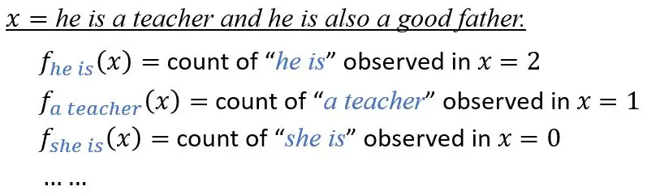

Figure 3.1: Example of discrete features.

##### Linear energy using discrete features

Linear energy functions using discrete features basically corresponds to
log-linear models, as illustrated in Example 2.1.5, i.e., defining

```math
U_{\lambda}(x)=\lambda^{T}f(x) \tag{3.9}
```

Here we follow the notations in \[189\], where
$`f(x)=(f_{1}(x),f_{2}(x),\dots,f_{d}(x))^{T}`$ is a _feature vector_,
$`\lambda=(\lambda_{1},\lambda_{2},\dots,\lambda_{d})^{T}`$ is the
corresponding _parameter vector_ (instead of using $`\theta`$).

A feature $`f_{i}(x)`$, $`i=1,\ldots,d`$, can be any computable function
of the input $`x`$. For various applications such as language modeling,
the parameters of local potential functions across locations are often
_tied_ together \[129\]. Each feature $`f_{i}(x)`$ is often defined in
the form $`f_{i}(x)=\sum_{k}f_{i}(x,k)`$, where $`f_{i}(x,k)`$ is a
binary function of $`x`$ evaluated at position $`k`$. In a _trigram_
example, $`f_{i}(x,k)`$ equals to 1 if three specific words appear at
positions $`k`$ to $`k+2`$ and $`k\leq j-2`$. The binary features
$`f_{i}(x,k)`$ share the same parameter $`\lambda_{i}`$ for different
positions $`k`$ and dimensions $`j`$, so called position-independent and
dimension-independent. Hence, the feature $`f_{i}(x)`$ indicates the
count of nonzero $`f_{i}(x,k)`$ over $`k`$ in the observation $`x^{j}`$
and takes values as non-negative integers. Intuitively, $`f_{i}(x)`$
returns the count of a specific phrase (often called a $`n`$-gram
feature) observed in the input sentence $`x`$, as shown in Figure 3.1.

| Type | Features                                                                         |
| ---- | -------------------------------------------------------------------------------- |
| w    | $`(w_{-3}w_{-2}w_{-1}w_{0})`$$`(w_{-2}w_{-1}w_{0})`$$`(w_{-1}w_{0})`$$`(w_{0})`$ |
| c    | $`(c_{-3}c_{-2}c_{-1}c_{0})`$$`(c_{-2}c_{-1}c_{0})`$$`(c_{-1}c_{0})`$$`(c_{0})`$ |
| ws   | $`(w_{-3}w_{0})`$$`(w_{-3}w_{-2}w_{0})`$$`(w_{-3}w_{-1}w_{0})`$$`(w_{-2}w_{0})`$ |
| cs   | $`(c_{-3}c_{0})`$$`(c_{-3}c_{-2}c_{0})`$$`(c_{-3}c_{-1}c_{0})`$$`(c_{-2}c_{0})`$ |
| wsh  | $`(w_{-4}w_{0})`$ $`(w_{-5}w_{0})`$                                              |
| csh  | $`(c_{-4}c_{0})`$ $`(c_{-5}c_{0})`$                                              |
| cpw  | $`(c_{-3}c_{-2}c_{-1}w_{0})`$ $`(c_{-2}c_{-1}w_{0})`$$`(c_{-1}w_{0})`$           |
| tied | $`(c_{-9:-6},c_{0})`$ $`(w_{-9:-6},w_{0})`$                                      |

Table 3.2: Feature definition in TRF LMs \[189\]

The energy-based language modeling approach allows a very flexible use
of features, not limited to ordinary $`n`$-gram features. In \[189\], a
variety of features as shown in Table 3.2 are used, mainly based on word
and class information. Each word is deterministically assigned to a
single class, by running the automatic clustering algorithm proposed in
\[96\] on the training dataset. In Table 3.2,
$`w_{i},c_{i},i=0,-1,\dots,-5`$, denote the word and its class at
different position offset $`i`$, e.g., $`w_{0},c_{0}`$ denotes the
current word and its class. The word/class $`n`$-gram features “w”/“c”,
skipping $`n`$-gram features “ws”/“cs” \[46\], higher-order skipping
features “wsh”/“csh”, and the crossing features “cpw” (meaning
class-predict-word) are introduced in \[188\]. In \[189\], the tied
long-skip-bigram features “tied” \[158\] are further introduced, in
which the skip-bigrams with skipping distances from 6 to 9 share the
same parameter. In this way we can leverage long distance contexts
without increasing the model size. All the features $`f(x)`$ in model
Eq. (3.9) are constructed from Table 3.2 in a position-independent and
dimension-independent manner, and only the features observed in the
training data are used. It is shown in \[189\] that the TRF-LM using
features “w+c+ws+cs+wsh+csh+tied” outperforms the KN 5-gram LM
significantly with 10% relative error reduction.

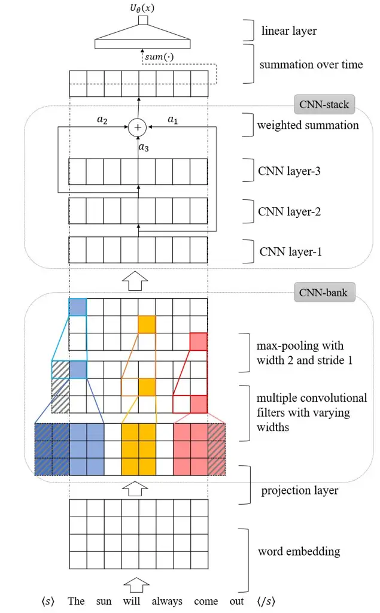

Figure 3.2: Hidden2Scalar: a deep CNN architecture used to define the
potential function $`U_{\theta}(x)`$. Shadow areas denote the padded
zeros. \[184\]

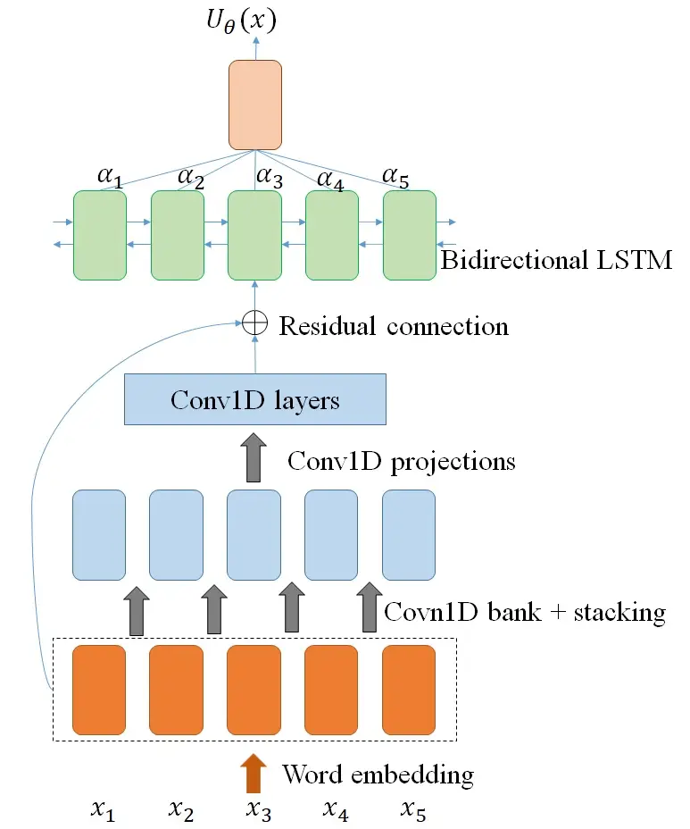

Figure 3.3: Hidden2Scalar: a bidirectional LSTM on top of CNN used to
define the potential function $`U_{\theta}(x)`$. \[186\]

Figure 3.4: SumInnerProduct: a bidirectional LSTM used to define the
potential function $`U_{\theta}(x)`$. \[185\]

##### Non-linear energy: Hidden2Scalar

Generally speaking, like in \[184, 186, 39, 60\], we can use a text
encoder to encode $`x`$ and denote the encoder output (hidden vectors)
by $`\text{enc}_{\theta}(x)`$. At position $`i`$, we have
$`\text{enc}_{\theta}(x)[i]`$. Then, the potential function can be
defined as

```math
U_{\theta}(x)=\text{Linear}\left(\sum_{i=1}^{|x|}\text{enc}_{\theta}(x)[i]\right) \tag{3.10}
```

where $`\text{Linear}(\cdot)`$ denotes a trainable linear layer whose
output is a scalar. This energy function is obtained by transforming
neural hidden vectors into a scalar, hence it is named by Hidden2Scalar.

The text encoder can be based on a fully CNN architecture \[184\] as
shown in Figure 3.2, or a bidirectional LSTM (BLSTM) stacked on top of
CNN as shown in Figure 3.3. Recently, BERT based text encoders have been
used in \[39, 60, 86\]. In \[39\], in the final layer of RoBERTa \[88\],
the mean-pooled hidden states are projected to a scalar energy value. In
\[60\], three variants of energy functions (scalar, hidden, and
sharp-hidden) are defined on top of a RoBERTa based text encoder, which
will be detailed in Section 5.5.

##### Non-linear energy: SumInnerProduct

In \[185\], a bidirectional LSTM based potential function is defined as
follows, illustrated in Figure . First, each word $`x_{i}`$
($`i=1,\ldots,|x|`$) in a sentence is mapped to an embedded vector
$`e_{i}\in R^{d}`$. Then the word embedding vectors are fed into a
bidirectional LSTM to extract the long-range sequential features from
the forward and backward contexts. Denote by
$`h_{f,i},h_{b,i}\in R^{d}`$ the hidden vectors of the forward and
backward LSTMs respectively at position $`i`$. Finally, we calculate the
inner product of the hidden vector of the forward LSTM at current
position and the embedding vector at the next position, and calculate
the inner product of the hidden vector of the backward LSTM at current
position and the embedding vector at the pervious position (dash line in
Figure ). The potential function $`\phi(x^{l};\theta)`$ is computed by
summing all the inner products, hence named by SumInnerProduct,

```math
U_{\theta}(x)=\sum_{i=1}^{|x|-1}h_{f,i}^{T}e_{i+1}+\sum_{i=2}^{|x|}h_{b,i}^{T}e_{i-1} \tag{3.11}
```

where $`\theta`$ denotes all the parameters in the neural network. The
SumInnerProduct energy provides a theoretical-solid framework to
incorporate the bidirectional LSTM features.

##### Non-linear energy: SumTargetLogit

The SumInnerProduct energy uses a bidirectional network. In order to
exploit pre-trained language models, which mostly are ALMs and
unidirectional, we could consider energy definition tailored to ALMs
\[86\]. Given history $`x_{1:i-1}`$, let the output logits to predict
the next token be denoted by $`z_{\theta}(x_{1:i-1})`$, whose dimension
is equal to $`V`$. The $`k`$-th logit is denoted by
$`z_{\theta}(x_{1:i-1})[k]`$. Then, the potential is defined as

```math
U_{\theta}(x)=\sum_{i=1}^{|x|}z_{\theta}(x_{1:i-1})[x_{i}] \tag{3.12}
```

This potential function sums the logits corresponding to the target
token (next token) at each position, hence it is named by
SumTargetLogit. In contrast, the ALM applies local normalization
(softmax) to the logits $`z_{\theta}(x_{1:i-1})`$ to obtain the
conditional probability of $`x_{i}`$ given history $`x_{1:i-1}`$.

##### Non-linear energy: SumMaskedLogit

For _masked language model_ (MLM), e.g., BERT, pseudo-log-likelihood
(PLL) is introduced for scoring sentences \[181\]. Inspired by this, we
can define the potential function as follows \[86\]:

```math
U_{\theta}(x)=\sum_{i=1}^{|x|}g_{\theta}(\text{mask}(x,i))[i][x_{i}] \tag{3.13}
```

where $`g_{\theta}`$ denotes the MLM, whose output, at each position, is
the logits before softmax. $`g_{\theta}(\text{mask}(x,i))`$ means
masking the $`i`$-th token in $`x`$ and sending the masked sequence into
the MLM for a forward pass. At position $`i`$, the logit corresponding
to the masked token $`x_{i}`$ is denoted as
$`g_{\theta}(\text{mask}(x,i))[i][x_{i}]`$. In Eq. (3.13), the potential
is defined by summing the logits corresponding to masked tokens, hence
it is named by SumMaskedLogit. Notably, this architecture is much
time-consuming than others, since it requires $`|x|`$ forward passes to
calculate the energy of one sentence, therefore this architecture is
primarily for stimulating ideas rather than conducting experiments.

##### Non-linear energy: SumTokenLogit

To overcome the deficiency of SumMaskedLogit, a simplication is proposed
\[86\], i.e., omitting the masking step and feeding $`x`$ directly to
the MLM, so that the logits at all positions can be calculated in
parallel. The potential is defined as:

```math
U_{\theta}(x)=\sum_{i=1}^{|x|}g_{\theta}(x)[i][x_{i}] \tag{3.14}
```

##### Comparison of non-linear energy architectures

For comparing the different non-linear energy architectures, experiments
in \[86\] find that the bi-directional architectures (Hidden2Scalar and
SumTokenLogit) based on BERT are generally better than the
unidirectional architecture (SumTargetLogit).

#### 3.3.2 Integrating discrete and neural features

There has been a long recognition that discrete features ($`n`$-gram
features) and neural network based features have complementary strengths
for language models (LMs). Generally, LMs with neural features (e.g.
neural ALMs, neural TRF-LMs) outperform LMs with discrete features (e.g.
KN $`n`$-gram LMs, discrete TRF-LMs), but interpolation between them
usually gives further improvement. This suggests that discrete and
neural features have complementary strengths. Presumably, the $`n`$-gram
features mainly capture local _lower-order_ interactions between words,
while the neural features particularly defined by LSTMs can learn
_higher-order_ interactions. Additionally, by embedding words into
continuous vector spaces, neural LMs are good at learning _smoothed
regularities_, while discrete LMs may be better suited to handling
_symbolic knowledges_ or idiosyncrasies in human language, as noted in
\[120\]. Currently, model interpolation, either linear or log-linear
\[23, 187\], is often a second step, after the discrete and neural
models are separately trained beforehand. The interpolation weights are
ad-hoc fixed or estimated over held-out data (different from the
training data in the first step). This two-step integration is
sub-optimal.

The ELM approach can provide a unified and simplified approach in
integrating both discrete and neural features, based on its capability
in flexibly integrating a rich set of features. _Basically, with the ELM
approach, one is free to define the potential function in any sensible
way with much flexibility._ It is straightforward to define a
mixed-feature TRF-LM \[43\], in which the potential function is a sum of
a linear potential using discrete features and a nonlinear potential
using neural features. Mixed-feature TRF-LMs can be trained by applying
the dynamic noise-contrastive estimation (DNCE) method \[185\], as
introduced in Section 2.4.1.

Figure 3.5: The WER curves of the three TRF-LMs during the first 100
training epochs are plotted. \[43\]

Mixed-feature TRF-LMs represent the first single LM model that
incorporates both discrete and neural features without relying on a
second-step interpolation. Apart from naturally integrating discrete and
neural features, another bonus from using mixed-feature TRF-LMs is that
faster training convergence and shorter training time can be achieved,
using only 58% training epochs when compared to training neural TRF-LMs
alone (see Figure 3.5). Notably, the log-likelihood of the training data
with respect to (w.r.t.) the parameters of discrete features is concave.
This helps to reduce the non-convexity of the optimization problem for
maximum likelihood training. Also, after incorporating the linear
potential, the nonlinear potential only needs to capture the residual
interactions between tokens. This may also explain the faster training
convergence of mixed-feature TRF models.

In \[43\], various LMs are trained over the Wall Street Journal (WSJ)
portion of Penn Treebank (PTB) \[95\] and Google one-billion-word
corpus²² 2
[https://github.com/ciprian-chelba/1-billion-word-language-modeling-benchmark](https://github.com/ciprian-chelba/1-billion-word-language-modeling-benchmark),
and evaluated in N-best list rescoring experiments for speech
recognition. Among all single LMs (i.e. without model interpolation),
the mixed-feature TRF-LMs perform the best, improving over both discrete
TRF-LMs and neural TRF-LMs alone, and also being significantly better
than LSTM ALMs. Compared to interpolating two separately trained models
with discrete and neural features respectively, the performance of
mixed-feature TRF-LMs matches the best interpolated model, and with
simplified one-step training process and reduced training time.

#### 3.3.3 Residual ELMs

As mentioned previously in this section, there are three types of energy
functions based on discrete, neural and mixed features, respectively.
Orthogonal to this³³ 3 It means that the energy architectures described
previously can be applied to $`U_{\theta}(x)`$ in residual ELMs., there
is another architecture for EBMs, i.e., in the form of _exponential
tilting_ of a reference distribution. In the fields of lanugage
modeling, this model formulation dates back to \[144\], \[186\], and
recently \[39\]. Specifically, the probability of a sentence $`x`$ is
defined as follows:

```math
p_{\theta}(x)=\frac{1}{Z(\theta)}q(x)e^{U_{\theta}(x)} \tag{3.15}
```

where a reference distribution $`q(x)`$ is introduced as the baseline
distribution; $`U_{\theta}(x)`$ denotes the residual potential function
with parameter $`\theta`$; $`Z(\theta)=\sum_{x}q(x)\exp(U_{\theta}(x))`$
is the normalizing constant. Hence, Eq. (3.15) is called a _residual
ELM_, after \[39\].

The role of residual energy $`-U_{\theta}(x)`$ is to fit the difference
between the data distribution and the reference distribution. If
$`q(x)`$ is a good approximation of the data distribution, such as the
LSTM based ALMs used in \[186\], the Transformer based ALMs in \[39\],
fitting the difference between the data distribution and the reference
distribution $`q(x)`$ shall be much simpler than fitting the data
distribution directly. Moreover, when the reference distribution
$`q(x)`$ is used as the proposal distribution in Monte Carlo methods for
learning a residual EBM, we have the importance weight in the following
simple form:

```math
\frac{p_{\theta}(x)}{q(x)}\propto e^{U_{\theta}(x)}
```

Similarly, when the reference distribution $`q(x)`$ is used as the noise
distribution in NCE methods for learning a residual EBM, we will have a
simple form of Eq. (2.45).

#### 3.3.4 Training methods

Different types of ELMs, including GN-ELMs Eq. (3.3), TRF-LMs Eq. (3.5)
and residual ELMs Eq. (3.15), all obeys the general from of general EBMs
Eq. (2.13). Basically, we can use the methods introduced in Section 2.3
(MLE) and Section 2.4 (NCE) for learning general EBMs to train ELMs. A
GN-ELM Eq. (3.3) has the same form as a EBM Eq. (2.13), so those methods
can be seamlessly applied. In TRF-LMs Eq. (3.5), length probabilities
are introduced and normalization is conducted for each length
separately, some special care is needed.

For more details about MLE for learning TRF-LMs, refer to \[189, 184\].
For more details about DNCE for learning TRF-LMs, refer to \[185, 43\].

### 3.4 Energy-based cloze models for representation learning over text

##### Motivation

In this section, we show the capability of EBMs for representation
learning over text \[27\]. The cloze task of predicting the identity of
a token given its surrounding context has proven highly effective for
representation learning over text. BERT \[40\], as a representative
_masked language model_ (MLM), implements the cloze task by replacing
input tokens with a special placeholder token \[MASK\], but there are
some drawbacks with the BERT approach:

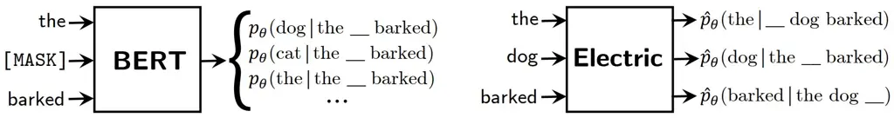

Figure 3.6: Comparison of BERT and Electric. Both model the conditional
probability of a token given its surrounding context. BERT produces
normalized conditional distribution for masked positions, while Electric
calculates unnormalized conditional probabilities for all input tokens.
\[27\]

- •
  It suffers from the drawback in efficiency (only 15% of tokens are
  masked out at a time);
- •
  It introduces a pre-train/fine-tune mismatch where BERT sees \[MASK\]
  tokens in training but not in fine-tuning;
- •
  In principle, it does not produce log-likelihoods for sentences (even
  up to an additive constant) and, in this sense, does not define a
  language model. The pseudo-log-likelihood (PLL) has been introduced
  for scoring sentences by BERT \[181\], but calculating the PLL for a
  sentence $`x`$ requires $`|x|`$ passes of the transformer (once with
  each token masked out), and is thus computationally expensive.

Some details are as follows. BERT and related masked language models
\[40, 88\] train a large neural network to perform the cloze task. In
contrast to the standard language modeling task to learn the _joint_
probability $`p_{\text{ora}}(x)`$, these models try to learn the
_conditional_ probabilities of masked tokens occurring in their
surrounding context. Specifically, multiple positions (e.g., 15%) in the
input sentence $`x=(x_{1},\cdots,x_{l})`$ are randomly drawn, denoted by
$`R=\{t_{1},\cdots,t_{k}\}`$, $`1\leq t_{j}\leq l`$, $`j=1,\cdots,k`$,
and those positions are replaced by \[MASK\] (i.e., masked). The masked
sentence, denoted by $`\text{mask}(x,R)`$, is encoded into vector
representations by a Transformer network \[179\]. Then the vector
representation at position $`t_{j}`$ is passed into a softmax layer to
calculate a distribution over the vocabulary for position
$`t_{j},j=1,\cdots,k`$. The conditional probabilities are maximized for
learning the model parameters $`\theta`$:

```math
\sum_{j=1}^{k}\log p_{\theta}(x_{t_{j}}|\text{mask}(x,R))
```

##### The Electric model

The new model proposed in \[27\], called _Electric_, is closely related
to the Electra pre-training method \[26\], and implements the cloze task
based on using conditional EBMs.

Specifically, Electric does not use masking or a softmax layer. Electric
first maps the unmasked input $`x=(x_{1},\cdots,x_{l})`$ into
contextualized vector representations $`h(x)=(h_{1},\cdots,h_{l})`$
using a Transformer network. Then, the conditional probability of a
token $`x_{t}`$ occurring in the surrounding context
$`x_{\setminus t}=(x_{1},\cdots,x_{t-1},x_{t+1},\cdots,x_{l})`$ is
modeled by a _conditional EBM_:

```math
p_{\theta}(x_{t}|x_{\setminus t})=\frac{1}{Z_{\theta}(x_{\setminus t})}\exp(-w^{T}h_{t}),1\leq t\leq l \tag{3.16}
```

where $`w`$ is learnable weight vector, and $`h_{t}`$ is the vector
representation at position $`t`$. A comparison of BERT and Electric is
illustrated in Figure 3.6.

##### Training of the Electric model

The conditional EBMs defined in Eq. (3.16) can be trained using NCE
(Section 2.4), and more specifically its conditional version (Section
4.1.3). First, we define the un-normalized output

```math
\hat{p}_{\theta}(x_{t}|x_{\setminus t})=\exp(-w^{T}h_{t})
```

Denote the training dataset by $`\mathcal{D}`$. In NCE, a binary
classifier is trained to distinguish positive token $`x_{t}`$ vs
negative token $`\hat{x}_{t}`$, with $`k`$ negatives and $`l`$ positives
(e.g., $`k=\lceil 0.15l\rceil`$) for a sentence $`x`$ of length $`l`$.
Denote the random positions by $`R=\{t_{1},\cdots,t_{k}\}`$,
$`1\leq t_{j}\leq l,j=1,\cdots,k`$. Formally, referring to Eq. (2.46),
the NCE loss $`\mathcal{L}(\theta)`$ is as follows:

```math
\begin{split}&l\cdot E_{x\sim\mathcal{D},t\sim\text{Uni}(1,l)}\left[-\log\frac{l\cdot\hat{p}_{\theta}(x_{t}|x_{\setminus t})}{l\cdot\hat{p}_{\theta}(x_{t}|x_{\setminus t})+k\cdot q(x_{t}|x_{\setminus t})}\right]\\
+&k\cdot E_{\begin{subarray}{l}x\sim\mathcal{D},t\sim R,\\
\hat{x}_{t}\sim q(\hat{x}_{t}|x_{\setminus t})\end{subarray}}\left[-\log\frac{k\cdot q(\hat{x}_{t}|x_{\setminus t})}{l\cdot\hat{p}_{\theta}(\hat{x}_{t}|x_{\setminus t})+k\cdot q(\hat{x}_{t}|x_{\setminus t})}\right]\end{split} \tag{3.17}
```

where $`q(x_{t}|x_{\setminus t})`$ denotes the noise distribution, which
was realized by a two-tower cloze model \[27\]. Specifically, the noise
model runs two transformers $`T_{\text{LTR}}`$ and $`T_{\text{RTL}}`$
over the input sequence. These transformers apply causal masking so one
processes the sequence left-to-right (LTR) and the other operates
right-to-left (RTL). The model’s predictions come from a softmax layer
applied to the concatenated states of the two transformers:

```math
\displaystyle\overrightarrow{h}=T_{\text{LTR}}(x),\overleftarrow{h}=T_{\text{RTL}}(x)
```

```math
\displaystyle q(x_{t}|x_{\setminus t})=\text{softmax}(W[\overrightarrow{h}_{t-1},\overleftarrow{h}_{t+1}])_{x_{t}}
```

The noise distribution is trained simultaneously with Electric using
standard maximum likelihood estimation over the data. Thus, the training
method used by Electric is in fact DNCE (Section 2.4.1).

Note that the NCE loss Eq. (3.17) does not introduce additional
parameters for normalizing constants $`Z_{\theta}(x_{\setminus t})`$. In
the setting of nonparametric estimation (Theorem 2.4.1), the NCE loss is
minimized when $`\hat{p}_{\theta}(x_{t}|x_{\setminus t})`$ matches the
oracle density. Thus, we assume that the model is of sufficient capacity
and the model can learn to be self-normalized such that
$`Z_{\theta}(x_{\setminus t})=1`$.

A further examination of Eq. (3.17) reveals that its optimization is
computationally expensive to run. It requires $`k+1`$ forward passes
through the Transformer to compute the $`\hat{p}_{\theta}`$’s, once for
the positive samples $`x_{t}|x_{\setminus t}`$ and once for every
negative sample $`\hat{x}_{t}|x_{\setminus t}`$. So a modified
algorithm, allowing more efficient calculation, is to replace the $`k`$
random positions simultaneously by negative tokens
$`\hat{x}_{t}\sim q(x_{t}|x_{\setminus t})`$. The resulting noised
sequence is denoted by

```math
x^{\text{noised}}=\text{replace}(x,R,(\hat{x}_{t_{1}},\cdots,\hat{x}_{t_{k}}))
```

To apply this efficiency trick, Electric assumes
$`\hat{p}_{\theta}(\cdot|x_{\setminus t})=\hat{p}_{\theta}(\cdot|x^{\text{noised}}_{\setminus t})`$,
for “$`\cdot`$” taking $`x_{t}`$ or $`\hat{x}_{t}`$, i.e., assuming that
extra noise replacing does not change the conditional distribution much,
for both positive and negative tokens. The modified loss for a sentence
$`x`$ of length $`l`$ becomes as follows⁴⁴ 4 To compare with Eq. (3.17),
this modified loss is written for $`l-k`$ positives and $`k`$ negatives,
while Eq. (3.17) is for $`l`$ positives and $`k`$ negatives.:

```math
\begin{split}&l\cdot E_{x\sim\mathcal{D},t\sim\text{Uni}(1,l)}\left[-\log\frac{(l-k)\cdot\hat{p}_{\theta}(x_{t}|x^{\text{noised}}_{\setminus t})}{(l-k)\cdot\hat{p}_{\theta}(x_{t}|x^{\text{noised}}_{\setminus t})+k\cdot q(x_{t}|x_{\setminus t})}\right]\\
+&k\cdot E_{\begin{subarray}{l}x\sim\mathcal{D},t\sim R,\\
\hat{x}_{t}\sim q(\hat{x}_{t}|x_{\setminus t})\end{subarray}}\left[-\log\frac{k\cdot q(\hat{x}_{t}|x_{\setminus t})}{(l-k)\cdot\hat{p}_{\theta}(\hat{x}_{t}|x^{\text{noised}}_{\setminus t})+k\cdot q(\hat{x}_{t}|x_{\setminus t})}\right]\end{split} \tag{3.18}
```

Calculating Eq. (3.18) requires just one pass through the Transformer
for $`k`$ noise sample and $`l-k`$ data samples. This brings significant
computation reduction.

##### Performance of the Electric model

Experiments in \[27\] on GLUE natural language understanding benchmark
\[182\] and SQuAD question answering dataset \[137\] show that Electric
substantially outperforms BERT but slightly under-performs ELECTRA.
However, Electric is particularly useful in its ability to efficiently
produce pseudo-log-likelihood (PLL) scores for text, as defined below.

```math
\text{PLL}(x)=\sum_{t=1}^{l}\log\hat{p}_{\theta}(x_{t}|x_{\setminus t})=\sum_{t=1}^{l}-w^{T}h_{t} \tag{3.19}
```

Experiments on the 960-hour LibriSpeech corpus \[124\] show Electric is
better at re-ranking the outputs of a speech recognition system than
GPT2 \[135\] and is much faster at re-ranking than BERT because it
scores all input tokens simultaneously rather than having to be run
multiple times with different tokens masked out. It appears that EBMs
are a promising alternative to the standard ALMs and MLMs currently used
for language representation learning.

## Chapter 4 Conditional EBMs with applications

In Chapter 3, we mainly introduce EBMs for modeling the _marginal_
distribution of natural language sentences, with applications to
language modeling for speech recognition and language representation
learning.

In this chapter, we introduce EBMs for modeling _conditional_
distributions, i.e., using EBMs for conditional models (Section 1.1.2).
In Section 4.1, we present basics for conditional EBMs, or equivalently,
conditional random fields (CRFs). In the following sections, we show how
they can be applied in not only discriminative tasks such as speech
recognition (Section 4.2) and natural language labeling (Section 4.3)
but also conditional text generation tasks (Section 4.4).

### 4.1 CRFs as conditional EBMs

As introduced in (Section 1.1.2), many real-world applications are
solved by conditional models. _Conditional random fields_ (CRFs) \[79,
170\] have been known to be one of the most successful conditional
models, especially for sequence labeling. A CRF is basically a
conditional distribution $`p(y|x)`$ defined as a random field, or
equivalently, an undirected graphical model. A formal definition is as
follows. Similar to the equivalent meaning of random fields and EBMs in
unconditional setting, conditional random fields and conditional EBMs
are exchangeable terms.

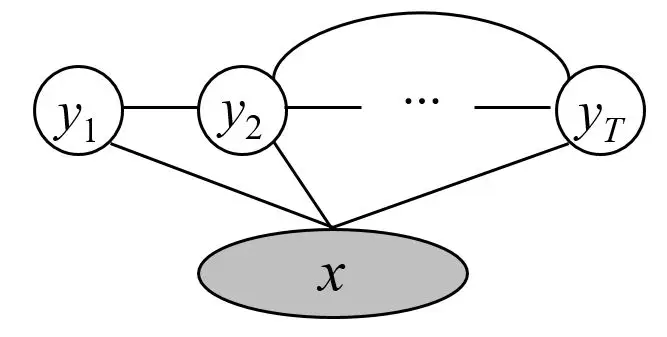

Figure 4.1: Graphical model representation of a conditional random field
(CRF).

###### Definition 4.1.1 (Conditional random field).

Consider probability distributions $`p(y|x)`$, where $`x`$ represents an
observation corresponding to the _input_ variable, and $`y`$ is the
_output_ variable that we wish to predict. A variable can either be
scalar- or vector-valued. Suppose $`y=y_{1},\cdots,y_{T}`$. In an
undirected graph consisting of $`x`$ and $`(y_{1},\cdots,y_{T})`$ (e.g.,
as shown in Figure 4.1), let $`\mathcal{C}`$ denote the set of cliques
in the subgraph induced by $`y`$. Associated with each clique
$`C\in\mathcal{C}`$, let $`\phi_{C}(y_{C},x)`$ denote a (log) potential
function. An conditional random field (CRF) in terms of this undirected
graph consists of a family of distributions that factorize as:

```math
p(y|x)=\frac{1}{Z(x)}\prod_{C\in\mathcal{C}}\phi_{C}(y_{C},x) \tag{4.1}
```

where $`Z(x)`$ is the normalizing constant given by

```math
Z(x)=\sum_{y}\prod_{C\in\mathcal{C}}\phi_{C}(y_{C},x) \tag{4.2}
```

Eq. (4.1) actually means that for every assignment $`x`$, $`p(y|x)`$
factorizes according to the subgraph induced by $`y`$. Since $`x`$ is
given, $`x`$ is treated as a constant, and included in the definition of
potentials.

#### 4.1.1 Linear-chain CRFs

Linear-chain CRFs are a class of CRFs, particularly useful for _sequence
labeling_ in the area of natural language processing (NLP), such as
part-of-speech (POS) tagging \[30\], named entity recognition (NER)
\[81, 92\], chunking \[159\] and syntactic parsing \[41\], and also in
other areas such as bioinformatics \[153, 127\]. Formally, in sequence
labeling, the input $`x`$ is a sequence with the same length of the
output $`y`$. Thus, given a sequence of observations
$`x=(x_{1},\cdots\,x_{T})=x_{1:T}`$, the task of sequence labeling is to
predict a sequence of labels $`y=(y_{1},\cdots\,y_{T})=y_{1:T}`$, with
one label for one observation in each position.
$`y_{i}\in\left\{1,\cdots,K\right\}`$ denotes the label at position
$`i`$.

A _linear-chain CRF_ defines a conditional distribution for label
sequence $`y`$ given observation sequence $`x`$ in the following form:

```math
p(y|x)\propto\exp\left\{\sum_{t=1}^{T}\phi_{t}(y_{t},x)+\sum_{t=1}^{T}\psi_{t}(y_{t-1},y_{t},x)\right\}. \tag{4.3}
```

Here the labels $`y_{t}`$’s are structured to form a chain, giving the
term linear-chain. Over the linear-chain, we define node potentials and
edge potentials.

- •
  $`\phi_{t}(y_{t},x)`$ is often called the _node potential_ at position
  $`t`$. Traditionally, people use _discrete features_, as introduced in
  Example 2.1.5 and Section 3.3.1, to define node potentials. The
  feature functions (or simply, the features) are usually hand-crafted
  indicator functions, which we think are useful for labeling, as shown
  below.

  ```math
  \displaystyle f_{1}(y_{t},x)= \displaystyle\delta(y_{t}=\text{prep},x_{t}=\text{on})
  ```

  ```math
  \displaystyle f_{2}(y_{t},x)= \displaystyle\delta(y_{t}=\text{adv},x_{t}\penalty\ \text{ends in ly})
  ```

  ```math
  \displaystyle\cdots
  ```

  Then, the potential function at position $`t`$ can be defined as
  follows:

  ```math
  \phi_{t}(y_{t},x)=\sum_{i}\lambda_{i}f_{i}(y_{t},x) \tag{4.4}
  ```

  where $`i`$ indexes the different features. Notably, the potential
  functions $`\phi_{t}(\cdot,x)`$ defined above at different positions
  take identical forms, i.e., position-independent.

- •
  A recent progress is the development of _Neural CRFs_ (NCRFs), which
  combines the sequence-level discriminative ability of CRFs and the
  representation ability of neural networks (NNs). In different studies,
  these models are called conditional neural field \[127\], neural CRF
  \[8\], recurrent CRF \[98\], and LSTM-CRF \[81, 92\]. Though there are
  detailed differences between these existing models, generally they are
  all defined by using NNs (of different network architectures) to
  implement the non-linear node potentials in CRFs, while still keeping
  the linear-chain hidden structure, i.e., using a bigram table as the
  edge potential (to be detailed below). Suppose that the input sequence
  $`x_{1:T}`$ is transformed into vector representations
  $`h_{1:T}=(h_{1},\cdots\,h_{T})\in\mathbb{R}^{T\times D}`$ via an
  appropriate neural network. The vector representations $`h_{1:T}`$ can
  be viewed as features, and the neural network is referred as a
  _feature extractor_, as discussed previously in Section 2.1.1. Then,
  the node potential can be calculated via a linear layer on top of the
  vector representations:

  ```math
  \phi_{t}(y_{t}=k,x)=w_{k}^{T}h_{t}+b_{k}\triangleq\phi_{t}^{k},k=1,\cdots,K \tag{4.5}
  ```

  where $`w_{k}\in\mathbb{R}^{D},b_{k}\in\mathbb{R}`$ denote the weight
  vector and bias of the linear layer, independent of $`t`$.
  $`\phi_{t}^{k}`$ denotes the potential value at positon $`t`$ for
  label $`k`$.

- •
  $`\psi_{t}(y_{t-1},y_{t},x)`$ is the _edge potential_ defined on the
  edge connecting $`y_{t-1}`$ and $`y_{t}`$. It is mostly implemented as
  a transition matrix $`A`$:

  ```math
  \psi_{t}(y_{t-1}=j,y_{t}=k,x)=A_{j,k} \tag{4.6}
  ```

#### 4.1.2 Label bias and exposure bias

It is known that _locally-normalized sequence models_ are prone to label
bias \[79, 4\] and exposure bias \[192, 138\]. Depending on
locally-normalized or globally-normalized, unconditional or conditional,
there are four classes of models, as overviewed in Table 4.1.

- •
  The label bias problem was raised initially in the conditional setting
  \[79\]. Later in this section, we will show that the label bias
  problem also exist in the unconditional setting.
- •
  The exposure bias is related to the manner of model training, rather
  than caused by the model itself; so it exist in both unconditional and
  conditional settings.

In summary, the problems of label bias and exposure bias exist in both
unconditional and conditional settings. An advantage of
_globally-normalized sequence models_ is that they avoid the problems of
label bias and exposure bias, as explained below.

##### The label bias problem

|                     | Unconditional | Conditional         |
| ------------------- | ------------- | ------------------- |
| Locally-normalized  | ALM           | seq2seq             |
| Globally-normalized | ELM           | CRF/Conditional EBM |

Table 4.1: A general classification of sequence models, with some common
examples.

Conditional, locally-normalized sequence models such as _maximum entropy
Markov models_ (MEMMs) \[97\] and _sequence-to-sequence models_
(seq2seq) \[169\] are potential victims of the label bias problem. In
general, a conditional, locally-normalized sequence model is described
by the conditional probability $`p(y|x)`$ with the following
decomposition, where $`x=(x_{1},\cdots\,x_{T})=x_{1:T}`$ is an input
sequence and $`y=(y_{1},\cdots\,y_{L})=y_{1:L}`$ is its corresponding
output sequence whose length $`L`$ may differ from $`T`$.

```math
p(y_{1:L}|x_{1:T})=\prod_{i=1}^{L}p(y_{i}|x_{1:T},y_{1},\cdots,y_{i-1}). \tag{4.7}
```

The ouput probabilities at each time-step,
$`p(y_{i}|x_{1:T},y_{1},\cdots,y_{i-1})`$, are locally normalized, _so
successors of incorrect histories receive the same mass as do the
successors of the true history_ \[192\]. So locally normalized sequence
models often have a very weak ability to revise earlier decisions \[4\].
This problem has been called the label bias problem.

The label bias problem is more severe when the output probability of
$`y_{i}`$ can only depend on a partial input sequence $`x_{1:t(i)}`$,
where $`t(i)`$ denotes the available length of the partial input when
producing $`y_{i}`$. For example, in _streaming speech recognition_,
each token $`y_{i}`$ must be recognized shortly after it was spoken. It
is found in \[178\] that by switching from a locally normalized model to
a globally normalized model, the streaming speech recognition
performance can be significantly improved.

In the case of using $`p(y_{i}|x_{1:t(i)},y_{1},\cdots,y_{i-1})`$, the
model becomes:

```math
p(y_{1:L}|x_{1:T})=\prod_{i=1}^{L}p(y_{i}|x_{1:t(i)},y_{1},\cdots,y_{i-1}). \tag{4.8}
```

The label bias problem can be understood by considering the independence
assumption made by the model. In this case, we have
$`y_{1:i}\perp x_{t(i)+1:T}|x_{1:t(i)}`$, i.e.,

```math
p(y_{1:i}|x_{1:T})=p(y_{1:i}|x_{1:t(i)})
```

Thus, observations from later in the input sequence $`x_{t(i)+1:T}`$ has
no effect on the posterior probability of history input $`y_{1:i}`$.
Intuitively, we would like the model to be able to revise an earlier
decision made during search, when later evidence becomes available that
rules out the earlier decision as incorrect \[4\].

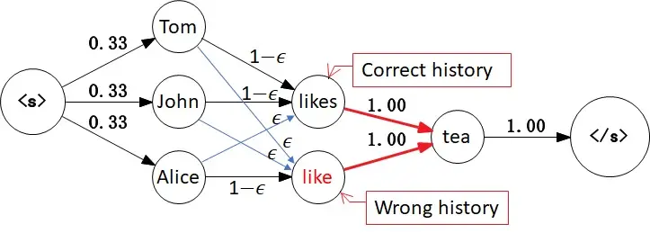

Figure 4.2: State transitions resulting from estimating an
autoregressive language model from training data - “Tom likes tea”,
“John likes tea”, and “Alice like tea”. For some transitions not
appeared in the training data, the transition probabilities are smoothed
to take small values $`\epsilon`$. We pad the beginning and the end of a
sentence with special tokens, $`\langle\texttt{s}\rangle`$ and
$`\langle/\texttt{s}\rangle`$, respectively \[20\].

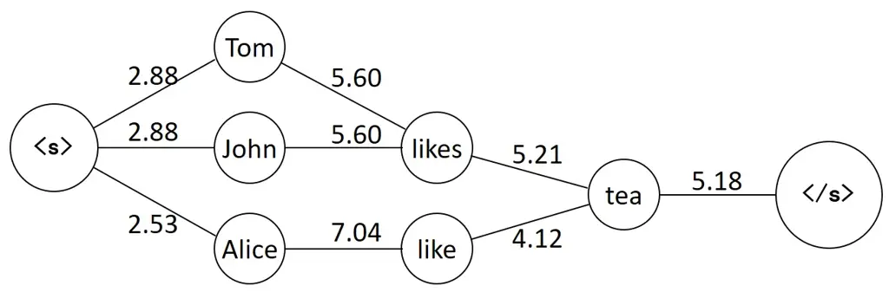

Figure 4.3: Estimating a globally-normalized energy-based language model
(ELM) from training data - “Tom likes tea”, “John likes tea”, and “Alice
like tea”. The bi-gram features used by the ELM are similar to those
used in the bigram ALM, and so can also be illustrated by a graph. The
estimated parameters are shown over the edges, which represent the
corresponding bi-gram features.

The above discussion of the label bias problem is for conditional,
locally-normalized sequence models. In the following, we will show,
through an empirical example¹¹ 1 This English example is adapted from a
Chinese example in Section 3.4.1 of \[183\]’s., that the label bias
problem causes trouble not only in _conditional_, locally-normalized
sequence models, but also in _unconditional_, locally-normalized
sequence models; and can be naturally overcome in globally-normalized
sequence models. Suppose that we would like to build a model for
sentences with the following training data, which consist of three
sentences:

Since the training data are often noisy, there exist some samples with
some incorrect, infrequent patterns such as in “Alice like tea”. We
estimate different models over these training data, apply them to score
test data

and examine the performance of different models.

Let us first consider an autoregressive language model (ALM), which is a
typical unconditional, locally-normalized sequence model, trained over
these training data. We estimate a smoothed bi-gram ALM, i.e., we smooth
the transition probabilities for unseen bi-grams. The resulting ALM with
estimated transition probabilities are shown in Figure 4.2. We can see
that transitions from the wrong history (“like”) and the correct history
(“likes”) to “tea” get the same score, due to local normalization of
conditional probabilities. Consequently, when scoring test data - “Alice
likes tea” and “Tom like tea”, the bi-gram ALM cannot score them
correctly - the two test samples are scored as being of the same
probability:

```math
\displaystyle P(\text{Alice likes tea}) \displaystyle=P(\text{Alice}|\langle\texttt{s}\rangle)P(\text{likes}|\text{Alice})P(\text{tea}|\text{likes})P(\langle\texttt{s}\rangle|\text{tea})
```

```math
\displaystyle=0.33\times\epsilon\times 1.0\times 1.0=0.33\epsilon
```

```math
\displaystyle P(\text{Tom like tea}) \displaystyle=P(\text{Tom}|\langle\texttt{s}\rangle)P(\text{like}|\text{Tom})P(\text{tea}|\text{like})P(\langle\texttt{s}\rangle|\text{tea})
```

```math
\displaystyle=0.33\times\epsilon\times 1.0\times 1.0=0.33\epsilon
```

In fact, “Alice likes tea” should be more likely than “Tom like tea”,
considering that the correct form of verb appears more often than the
incorrect form in the training data. We can see that the bi-gram ALM
seems not to be a good model choice for this example, due to local
normalization. To be more precise, this label bias problem is caused by
_the improper local normalization following incorrect histories_.
Incorrect histories occur in training data, as part of noise. Successors
after incorrect histories are in fact biased labels, even they appear in
training data. This issue should be somehow fixed in order to better
model the regularities in the data²² 2 We usually do not assume that the
data generating distribution is exactly the same as the empirical
distribution, but rather the modeling task is to seek a smoothed
distribution based on the empirical distribution (See discussion of the
concept of learning in Section 1.1).. However, it is worthwhile to
remark that how adverse this label bias issue will cause depends on the
particular data and model under investigation. Further theoretical
analysis will be interesting future work.

Next, let us consider a globally-normalized energy-based language model
(GN-ELM) (Section 3.2.1), trained over the same training data, but with
a different model assumption from ALMs. The globally-normalized model,
which is defined as follows, also uses the bi-gram features, similar to
those used in the bi-gram ALM:

```math
P(x_{1},x_{2},x_{3})=\frac{1}{Z}\exp\left(\sum_{k=1}^{9}\lambda_{k}f_{k}(x_{1},x_{2},x_{3})\right) \tag{4.9}
```

where the bi-gram features are indicator functions as follows:

```math
\displaystyle f_{1}=\delta(x_{1}=\text{Tom}),
```

```math
\displaystyle f_{2}=\delta(x_{1}=\text{John}),
```

```math
\displaystyle f_{3}=\delta(x_{1}=\text{Alice}),
```

```math
\displaystyle f_{4}=\delta(x_{1}=\text{Tom},x_{2}=\text{likes})),
```

```math
\displaystyle f_{5}=\delta(x_{1}=\text{John},x_{2}=\text{likes}),
```

```math
\displaystyle f_{6}=\delta(x_{1}=\text{Alice},x_{2}=\text{like}),
```

```math
\displaystyle f_{7}=\delta(x_{2}=\text{likes},x_{3}=\text{tea}),
```

```math
\displaystyle f_{8}=\delta(x_{2}=\text{like},x_{3}=\text{tea}),
```

```math
\displaystyle f_{9}=\delta(x_{3}=\text{tea}).
```

Maximum likelihood estimate (MLE) of Eq. (4.9) can be performed by the
stochastic approximation (SA) method or the improved iterative scaling
(IIS) method, as introduced in \[189\]. The estimated parameters,
$`\{\lambda_{k},k=1,\cdots,9\}`$, are shown in Figure 4.3. We show the
parameters over the edges, which represent the corresponding bi-gram
features. The estimated ELM model can be used to score test data -
“Alice likes tea” and “Tom like tea”:

```math
\displaystyle\log P(\text{Alice likes tea}) \displaystyle=2.53+5.21+5.18-\log Z=-7.06
```

```math
\displaystyle\log P(\text{Tom like tea}) \displaystyle=2.88+4.12+5.18-\log Z=-7.79
```

where the log normalizing constant, in this simple example, can be
directly calculated as follows:

```math
\log Z=\log\sum_{\begin{subarray}{c}x_{1}\in\{\text{Tom,John,Alice}\},\\
x_{2}\in\{\text{likes, like}\},x3=\text{tea}\end{subarray}}\exp\left(\sum_{k=1}^{9}\lambda_{k}f_{k}(x_{1},x_{2},x_{3})\right)=19.98
```

Interestingly, according to the ELM modeling, “Alice likes tea” is
naturally scored as being more probable than “Tom like tea”, without
relying on any other ad-hoc tricks. It seems that the ELM model is
smoothed more correctly (not disturbed by the noise in the training
data) - this is a desirable result. Compare to the ALM modeling, the ELM
modeling abstains from using local normalization. There is _no improper
local normalization following incorrect histories_. In this sense, we
could say that the label bias issue is avoided.

##### The exposure bias problem

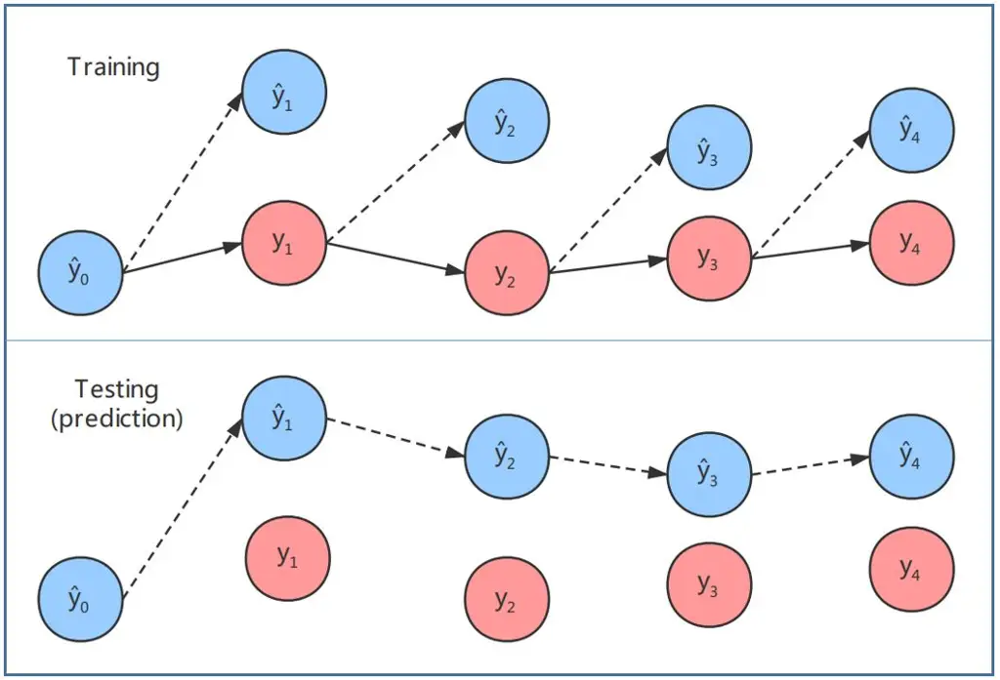

Figure 4.4: Illustration of exposure bias. $`y`$: real, $`\hat{y}`$:
predicted.

Locally-normalized sequence models, whether conditional or
unconditional, suffers from the exposure bias problem.
Locally-normalized sequence models are usually trained in a manner
called _teacher forcing_ \[191\]. Take the training of a ALM as an
example.

- •
  In training, the model maximizes the likelihood of each successive
  target word, conditioned on the gold history of the target word. As
  shown in Figure 4.4, in training, the model is only exposed to real
  data, which predicts $`\hat{y}_{i}`$ given the real data of the
  history, $`y_{1},\cdots,y_{i-1}`$.
- •
  In testing, the model predicts the next step $`\hat{y}_{i}`$, using
  its own predicted words in testing, i.e.,
  $`\hat{y}_{1},\cdots,\hat{y}_{i-1}`$.

_Such mismatch between training (teacher forcing) and testing
(prediction) of locally-normalized sequence models_ has been called the
exposure bias problem. The model is never exposed to its own errors
during training, and so the inferred histories at test-time do not
resemble the gold training histories \[192\].

Remarkably, exposure bias results from training in a certain way, which
maybe alleviated by some ad-hoc methods such as _scheduled sampling_
\[11\]. In contrast, label bias results from properties of the model
itself. Thus, it may be more difficult to overcome label bias than to
avoid exposure bias.

#### 4.1.3 Training of CRFs

To introduce the training methods for CRFs/conditional EBMs, we write
the model in Definition 4.1.1 in a simpler form, with input $`x`$ and
output $`y`$:

```math
p_{\theta}(y|x)=\frac{1}{Z_{\theta}(x)}\exp\left[U_{\theta}(x,y)\right] \tag{4.10}
```

$`U_{\theta}(x,y):\mathcal{X}\times\mathcal{Y}\rightarrow\mathbb{R}`$
denotes the (log) potential function, which assigns a scalar value to
each combined configuration of $`x`$ in $`\mathcal{X}`$ and $`y`$ in
$`\mathcal{Y}`$, and can be very flexibly parameterized through neural
networks of different architectures. $`\mathcal{X}`$ and $`\mathcal{Y}`$
denotes the space of all possible values of $`x`$ and $`y`$,
respectively. Normalizing is taken only over $`\mathcal{Y}`$, and
$`Z_{\theta}(x)`$ denotes the normalizing constant:

```math
Z_{\theta}(x)=\sum_{y\in\mathcal{Y}}\exp\left[U_{\theta}(x,y)\right] \tag{4.11}
```

##### Learning CRFs by conditional maximum likelihood (CML)

Suppose we have a training dataset consisting of $`N`$ independent and
identically distributed (IID) data points
$`\mathcal{D}=\left\{(x_{i},y_{i}),i=1,\cdots,N\right\}`$. We can fit
$`p_{\theta}(x)`$ to data by maximizing the log conditional likelihood
of training data, defined by

```math
L(\theta)\triangleq\frac{1}{N}\sum_{i=1}^{N}\log p_{\theta}(y_{i}|x_{i})=\frac{1}{N}\sum_{i=1}^{N}\left\{U_{\theta}(x_{i},y_{i})-\log Z_{\theta}(x_{i})\right\} \tag{4.12}
```

as a function of $`\theta`$.

Taking the derivative of the log conditional likelihood with respect to
$`\theta`$ and making use of Eq. (2.18) about the derivative of the log
normalizing constant, we obtain the core formula in learning conditional
EBMs:

```math
\nabla_{\theta}L(\theta)=\frac{1}{N}\sum_{i=1}^{N}\left\{\nabla_{\theta}U_{\theta}(x_{i},y_{i})-E_{p_{\theta}(y|x_{i})}\left[\nabla_{\theta}U_{\theta}(x_{i},y)\right]\right\} \tag{4.13}
```

The maximum likelihood estimate of $`\theta`$ is obtained as a solution
to $`\nabla_{\theta}L(\theta)=0`$. It can be easily seen that the
gradients $`\nabla_{\theta}L(\theta)`$ in Eq. (4.13) in learning
conditional EBMs exactly follows the form of Eq. (2.31), as summarized
in Theorem 2.3.3. So the problem of learning conditional EBMs by
_conditional maximum likelihood_ (CML) can then be solved by setting the
gradients to zeros and applying the SA algorithm to finding the root for
the resulting system of simultaneous equations. _Techniques in learning
(unconditional) EBMs are applicable in learning conditional EBMs here._
See Section 2.3.3 for details. For example:

- •
  Minibatching from training data when $`N`$ is large;
- •
  When calculating the model expectation
  $`E_{p_{\theta}(y|x_{i})}\left[\nabla_{\theta}U_{\theta}(x_{i},y)\right]`$
  is intractable, we can resort to Monte Carlo methods and conduct Monte
  Carlo averaging.
- •
  The model expectation can be exactly calculated under some limited
  circumstances, mostly in low tree-width³³ 3 The tree-width of a graph
  is defined as the minimum width over all possible tree decompositions
  of the graph, which measures roughly how close the graph is to a tree.
  The _tree-width_ of a tree is 1. random fields (e.g.,
  chain-structured) with moderately sized *state spaces*⁴⁴ 4 The state
  space of a multivariate model is the set of all possible values for
  each coordinate of a multivariate observation..

##### CML training of neural linear-chain CRFs

Here we provide more details about CML training of a neural linear-chain
CRF, for which the model expectation can be exactly calculated. Continue
with the notations in Section 4.1.1, and consider a neural linear-chain
CRF as follows, with input $`x=(x_{1},\cdots\,x_{T})=x_{1:T}`$, output
$`y=(y_{1},\cdots\,y_{T})=y_{1:T}`$. Combining Eq. (4.3), Eq. (4.5) and
Eq. (4.6), we obtain

```math
\displaystyle p_{\theta}(y|x) \displaystyle=\frac{1}{Z_{\theta}(x)}\exp\left[U_{\theta}(x,y)\right]
```

```math
\displaystyle U_{\theta}(x,y) \displaystyle=\sum_{t=1}^{T}\left[\phi_{t}^{y_{t}}+A_{y_{t-1},y_{t}}\right] \tag{4.14}
```

where the parameters $`\theta`$ consists of the network parameters and
the transition matrix $`A`$.

Suppose the state space of $`y_{1:T}`$ is $`\left\{1,\cdots,K\right\}`$,
i.e., $`y_{i}\in\left\{1,\cdots,K\right\}`$. Thus, at each position
$`t=1,\cdots,T`$, there are $`K`$ node potential values,
$`\phi_{t}^{k}`$, $`k=1,\cdots,K`$, which are calculated by a neural
network, as defined in Eq. (4.5). The network is trained to optimize the
log conditional likelihood Eq. (4.12). The gradient of the log
conditional likelihood w.r.t. $`\theta`$ for a single data point
$`(x_{i},y_{i})`$ is:

```math
\frac{\partial\log p_{\theta}(y_{i}|x_{i})}{\partial\theta}=\frac{\partial U_{\theta}(x_{i},y_{i})}{\partial\theta}-E_{p_{\theta}(y|x_{i})}\left[\frac{\partial U_{\theta}(x_{i},y)}{\partial\theta}\right] \tag{4.15}
```

Note that $`\log p_{\theta}(y_{i}|x_{i})`$ depends on the network
parameters through $`\phi_{t}^{y_{t}}`$. Thus, an important quantity in
calculating Eq. (4.15) for the network parameters is the gradient w.r.t.
to the potential values, which can be derived from Eq. (4.14) as
follows:

```math
\displaystyle\frac{\partial\log p_{\theta}(y_{i}|x_{i})}{\partial\phi_{t}^{k}} \displaystyle=\delta(y_{t}=k)-E_{p_{\theta}(y|x_{i})}\left[\delta(y_{t}=k)\right]
```

```math
\displaystyle=\delta(y_{t}=k)-p(y_{t}=k)
```

This difference between the empirical count and the expected count is
the error signal received by the NN based feature extractor during
training. The expected count $`p(y_{t}=k)`$ is often known as the
posterior state occupation probability, which can be calculated using
the alpha-beta variables from the forward-backward algorithm \[133\].
The gradients for the network parameters can be calculated from the
gradient w.r.t. to the potential values based on the back-propagation
procedure.

##### Learning CRFs by conditional NCE

A theoretical analysis of NCE in the estimation of conditional
unnormalized models in the form of Eq. (4.10) has been given in \[93\].
A subtle but important question when generalizing NCE to the conditional
case is raised, i.e., the unconditional EBM in Eq. (2.13) has a single
partition function, which is estimated as a parameter of the model,
whereas the conditional model in Eq. (4.10) has a separate partition
function $`Z_{\theta}(x)`$ for each value of $`x`$.

Introduce the unnormalized density
$`\tilde{p}_{\theta}(y|x)=\exp\left[U_{\theta}(x,y)\right]`$ and rewrite
Eq. (4.10) as follows:

```math
p_{\theta}(y|x)=\frac{1}{Z_{\theta}(x)}\tilde{p}_{\theta}(y|x) \tag{4.16}
```

where, for each value of $`x`$, the partition function is defined by

```math
Z_{\theta}(x)=\sum_{y\in\mathcal{Y}}\tilde{p}_{\theta}(y|x)
```

Applying NCE in estimating conditional unnormalized models yields the
_conditional NCE_ method. Suppose we have a training dataset consisting
of $`N`$ independent and identically distributed (IID) data points
$`\mathcal{D}=\left\{(x_{i},y_{i}),i=1,\cdots,N\right\}`$. The basic
idea of NCE is to perform nonlinear logistic regression to discriminate
between _data samples_ drawn from the data and _noise samples_ drawn
from a known noise distribution $`q(x|y)`$. Formally, referring to Eq.
(2.46), conditional NCE estimates the model parameters $`\theta`$ by
maximizing the following objective function:

```math
\displaystyle J(\theta)=E_{\kappa\sim Uni(1,N)} \displaystyle\left\{\log\frac{\tilde{p}_{\theta}(y_{\kappa}|x_{\kappa})}{\tilde{p}_{\theta}(y_{\kappa}|x_{\kappa})+\nu q(y_{\kappa}|x_{\kappa})}\right.
```

```math
\displaystyle+ \displaystyle\left.\nu E_{y\sim q(y|x_{\kappa})}\left(\log\frac{\nu q(y|x_{\kappa})}{\tilde{p}_{\theta}(y|x_{\kappa})+\nu q(y|x_{\kappa})}\right)\right\}
```

where $`\nu`$ represents the ratio of noise sample size to real sample
size.

It is shown in \[93\] that the conditional NCE method gives consistent
parameter estimates under the assumption that $`Z_{\theta}(x)`$ is
constant with respect to $`x`$. Equivalently, the conditional NCE method
is consistent under the assumption that the function
$`\tilde{p}_{\theta}(y|x)`$ is powerful enough to incorporate
$`Z_{\theta}(x)`$. Thus, under the assumption that the model is of
sufficient capacity, the model can learn to be self-normalized such that
$`Z_{\theta}(x)=1`$. Remarkably, the discussion in \[93\] is in line
with Theorem 2.4.1 about NCE (nonparametric estimation), since in the
setting of nonparametric estimation, the NCE loss is minimized when
$`\tilde{p}_{\theta}(y|x)`$ matches the oracle density and thus is
self-normalized.

As a final note, it can be easily seen that training of the Electric
model in Section 3.4 is exactly an instance of the conditional NCE
method.

### 4.2 CRFs for speech recognition

In this section, we show the development of CRFs for _automatic speech
recognition_ (ASR). First, we introduce some background knowledge in
ASR, particularly the _connectionist temporal classification_ (CTC)
method for recent end-to-end ASR. Then, we elaborate on the recently
developed approach of CRF-based single-stage acoustic modeling with CTC
topology \[193, 2\].

ASR basically is a sequence discriminative problem. Given acoustic
observations $`x=(x_{1},\cdots\,x_{T})=x_{1:T}`$, the task of ASR is to
find the most likely labels $`y=(y_{1},\cdots\,y_{L})=y_{1:L}`$.
Acoustic observations are usually spectral feature vectors. Different
units can be used for labels, such as phone (namely monophone),
triphone, character, wordpiece and word, as shown in Figure 4.5.

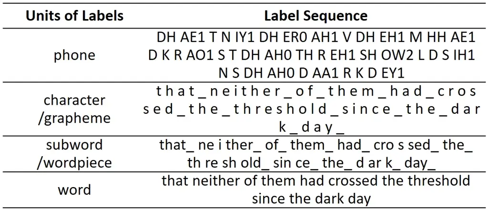

Figure 4.5: Different units of labels can be used in speech recognition.

#### 4.2.1 Connectionist Temporal Classification (CTC)

##### The DNN-HMM hybrid approach

The history of speech recognition dates back to 1970s \[69\] and even
earlier. The classic model for speech recognition is HMMs, as we review
in Section 2.1.1. In building an HMM for speech recognition, consisting
of acoustic sequence $`x=(x_{1},\cdots\,x_{T})=x_{1:T}`$ and state
sequence $`\pi=(\pi_{1},\cdots\,\pi_{T})=\pi_{1:T}`$, we need to specify
two distributions, the state-transition distribution and the
state-output distribution.

The state sequence $`\pi`$ forms a Markov chain. In terminology of
Markov chains, state transitions in a Markov chain are determined by its
_state topology_, or say, its _state transition graph_. The state
transition graph is determined by combining some knowledge sources, as
illustrated in Figure 4.6. For example, we need a language model to
model how words are connected to form a sentence. We need a lexicon to
model how phones are connected to form a word. Depending on left and
right phonetic contexts, we can define different context-dependent
phones, e.g., triphones. Each context-dependent phone can be decomposed
into several phonetic states, which intuitively correspond to the
beginning, steady, closing phases of a phone. The resulting state
transition graph, often represented by a _weighted finite-state
transducer_ (WFST), encodes common constraints in human speech⁵⁵ 5 For
subtle differences between the two graphs (WFSTs and state transition
graphs), readers can refer to \[123\].. In practice, each knowledge
source can be represented by a component WFST, and the combination of
several knowledge sources can be easily realized by applying the
composition and some compression operations to the component WFSTs and
producing a single integrated WFST \[107\].

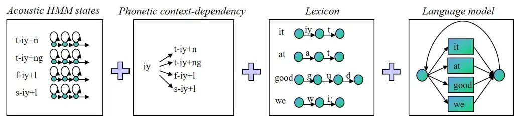

Figure 4.6: State transitions in HMMs for speech recognition are
constrained by a number of knowledge sources.

Formally, a WFST represents a weighted relation between sequences of
input symbols and sequences of output symbols \[107\]. A state sequence
$`\pi`$ for an utterance of $`T`$ frames can be seen as a path
traversing in the integrated WFST for $`T`$ steps, with
$`\pi=(\pi_{1},\cdots\,\pi_{T})`$ matching the input symbols and the
emitted output symbols corresponding to $`y=(y_{1},\cdots\,y_{L})`$. It
can be seen that in this way, a path $`\pi`$ uniquely determines a label
sequence $`y`$, but not vice versa. Thus, based on the integrated WFST,
a many-to-one mapping, $`\mathcal{B}_{\text{HMM}}:\pi\rightarrow y`$, is
defined. The state topology basically determines the mapping. We also
say that the mapping represents the state topology.

For state-output distribution $`p(x_{t}|\pi_{t})`$, Gaussian mixture
models (GMMs) were commonly used in the so-called GMM-HMM approach,
before the deep learning era. Recently, deep neural networks (DNNs) of
various architectures have become dominantly used for modeling the
state-output distributions. Based on the following Bayesian formula, the
state likelihood $`p(x_{t}|\pi_{t})`$ can be calculated from the state
posteriori $`p(\pi_{t}|x_{t})`$, divided by the state prior
$`p(\pi_{t})`$, while the marginal likelihood $`p(x_{t})`$, being a
constant, can be ignored.

```math
p(x_{t}|\pi_{t})=\frac{p(\pi_{t}|x_{t})p(x_{t})}{p(\pi_{t})}
```

State prior probabilities are estimated from the training data. State
posterior probabilities are calculated from the DNN, but we need
frame-level alignments in training of the DNN.

In summary, the approach described above is often referred to as the
_DNN-HMM hybrid_ approach for ASR \[35\]. It is featured by using the
frame-level loss (cross-entropy) to train the DNN to estimate the
posterior probabilities of HMM states.

##### End-to-end ASR

Notably, building DNN-HMM systems for ASR runs in multi-stages. A
GMM-HMM training is firstly needed to obtain frame-level alignments and
then the DNN-HMM is trained. The hybrid approach usually consists of an
DNN-HMM based acoustic model (AM), a state-tying decision tree for
context-dependent phone modeling, a pronunciation lexicon and a language
model (LM), which can be compactly combined into a weighted finite-state
transducer (WFST). The WFST not only operationally represents the state
topology, but also is useful as a compact data structure for efficient
decoding.

A recent trend in ASR is to develop end-to-end ASR models \[51, 100, 50,
25\]. The end-to-end approach is characterized by eliminating the
construction of GMM-HMMs and phonetic decision-trees, training the DNN
from scratch (in single-stage) and, even ambitiously, removing the need
for a pronunciation lexicon and training the acoustic and language
models jointly rather than separately. For developing end-to-end ASR
models, there are two main issues.

- •
  The first is how to handle alignment between $`x`$ and $`y`$, since
  the two sequences generally differ in length ($`T\neq L`$).
- •
  The second is how to obtain $`p(y|x)`$, the posteriori probability of
  the label sequence $`y`$ given the acoustic sequence $`x`$. To be
  end-to-end, we need a differentiable sequence-level loss of mapping
  the acoustic sequence $`x`$ to the label sequence $`y`$.

Three widely-used end-to-end models are based on connectionist temporal
classification (CTC) \[51\], RNN-transducer (RNN-T) \[50\], and
attention based encoder-decoder (AED) \[25\] respectively. The three
models are featured by different losses. In CTC and RNN-T, the alignment
is handled explicitly by introducing hidden state sequence $`\pi`$,
while AED implements implicit, soft alignment via the attention
mechanism.

Remarkably, all the three models are (conditional) locally normalized
sequence models, according to the classification of sequence models as
shown in Table 4.1. In Section 4.2.2, we will introduce a recently
developed (conditional) globally normalized sequence model, called
CTC-CRF, for end-to-end ASR.

##### The CTC method

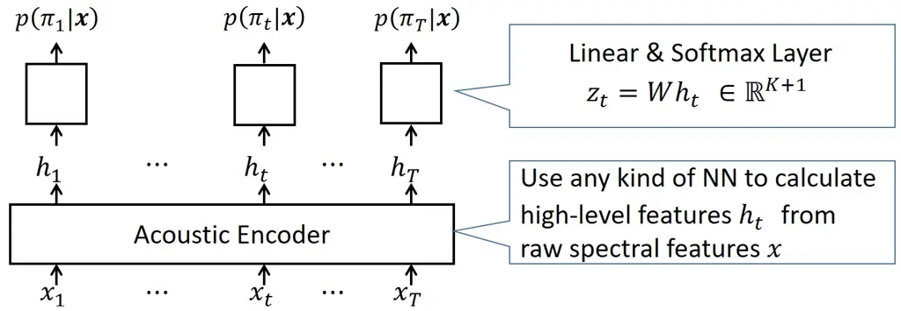

Figure 4.7: Overview of CTC architecture.

The motivation of CTC \[51\] is to enable the training of $`p(y|x)`$
without requiring the frame-level alignments between the acoustics $`x`$
and the transcripts $`y`$. To this end, CTC introduces a _blank_ symbol
\<b\> in addition to the ordinary labels, and further introduces a state
sequence $`\pi=(\pi_{1},\cdots\,\pi_{T})=\pi_{1:T}`$, which aids the
aligning between $`x_{1:T}`$ and $`y_{1:L}`$. See Figure 4.7 for an
overview of CTC architecture.

###### Handle alignment.

Given acoustic sequence $`x_{1:T}`$, at each frame $`t`$, the possible
values that $`\pi_{t}`$ can freely take is
$`\mathcal{Y}\cup\text{<b>}`$, where $`\mathcal{Y}`$ denotes the the
alphabet of ordinary labels. Suppose the alphabet size is $`K`$, then
number of possible values that $`\pi_{t}`$ can freely take is $`K+1`$.
When given $`y_{1:L}`$, the state transitions followed by $`\pi`$ is
constrained by the state topology, so that the output sequence is
$`y_{1:L}`$. CTC defines a special state topology, which is enforced by
a special many-to-one mapping
$`\mathcal{B}_{\text{CTC}}:\pi_{1:T}\rightarrow y_{1:L}`$. The mapping
$`\mathcal{B}_{\text{CTC}}`$ is defined by reducing repetitive symbols
in $`\pi`$ to a single symbol, and removing all blank symbols, e.g.,

```math
\mathcal{B}_{\text{CTC}}(-\text{CC}--\text{AA}-\text{T}-)=\text{CAT}
```

It can be seen that for given acoustic sequence $`x_{1:T}`$ and label
sequence $`y_{1:L}`$, all possible alignments between them can be
organized in a lattice, as shown in Figure 4.8. A _path_ from the top
left to the bottom right in the lattice represents an alignment between
$`x`$ and $`y`$, which, in terminology of CTC \[51\], is denoted by
$`\pi_{1:T}\in\{\mathcal{Y}\cup\text{<b>}\}^{T}`$.

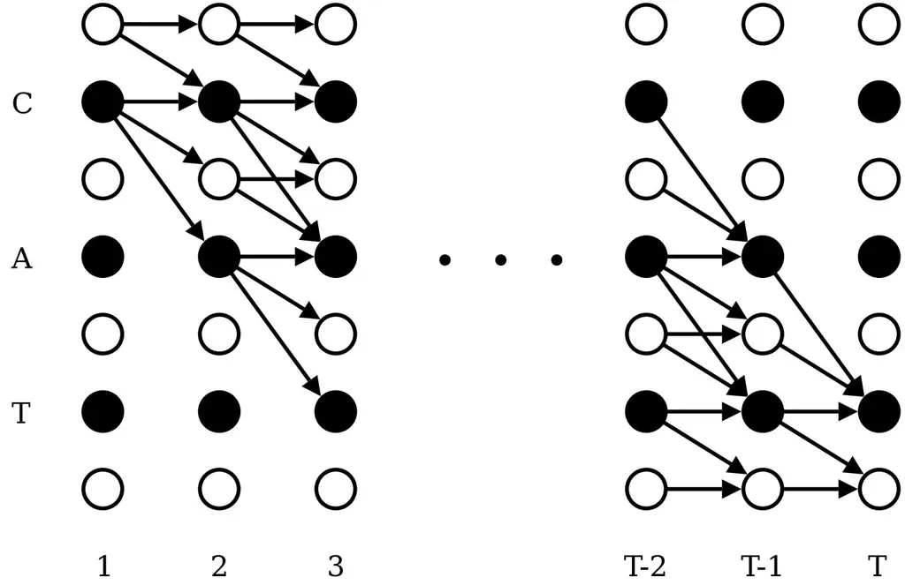

Figure 4.8: Illustration of the lattice, which contains all the possible
alignments between the acoustic sequence and the label sequence ‘CAT’.
Also illustration of the forward-backward algorithm. Black circles
represent ordinary labels, and white circles represent blanks. Arrows
signify allowed transitions. \[51\]

###### Obtain $`p(y|x)`$.

We can use any kind of neural network (NN) to calculate the high-level
feature vectors
$`h_{1:T}=(h_{1},\cdots\,h_{T})\in\mathbb{R}^{D\times T}`$ from the raw
spectral features $`x_{1:T}`$, or simply say, we encode $`x`$ into
$`h`$. For each frame $`t`$, we obtain $`h_{t}`$. The vector
representations $`h_{1:T}`$ can be viewed as features, and the neural
network is referred as a feature extractor as discussed previously in
Section 2.1.1, or an acoustic encoder in the context of ASR.

Then, we can apply a linear layer followed by a softmax layer to
calculate the posteriori distribution of $`\pi_{t}`$, as follows:

```math
\displaystyle z_{t} \displaystyle=W^{T}h_{t}+b\in\mathbb{R}^{K+1}
```

```math
\displaystyle p(\pi_{t}=k|x) \displaystyle=\frac{\exp(z_{t}^{k})}{\sum_{j=1}^{K}\exp(z_{t}^{j})}\triangleq p_{t}^{k},k=1,\cdots,K+1
```

where $`W\in\mathbb{R}^{(K+1)\times D},b\in\mathbb{R}^{K+1}`$ denote the
weight matrix and bias vector of the linear layer, respectively.
$`p_{t}^{k}`$ represents the the probability of observing label $`k`$ at
time $`t`$. The un-normalized outputs $`z_{t}`$ are often called logits,
and $`z^{k}_{t}`$ denotes the $`k`$-th logit corresponding to label
$`k`$.

CTC assumes the conditional independence between states in a path
$`\pi_{1:T}`$, and defines the path posteriori as follows:

```math
p(\pi|x)=\prod_{t=1}^{T}p(\pi_{t}|x) \tag{4.17}
```

Finally, we use the CTC topology to calculate the posteriori probability
of the label sequence $`y`$, by summing over all possible paths, which
map to $`y`$:

```math
p(y|x)=\sum_{\pi:\mathcal{B}_{\text{CTC}}(\pi)=y}p(\pi|x) \tag{4.18}
```

###### CTC model training.

In the previous introduction of the CTC model, we suppress the model
parameters in formula. In the following, we make explicit of the model
parameters $`\theta`$, which parameterizes the acoustic encoder network.

The network is trained to optimize the log conditional likelihood Eq.
(4.18). According to Fisher equality Eq. (B.2.2), the gradient of the
log conditional likelihood w.r.t. $`\theta`$ for a single data point
$`(x,y)`$ is:

```math
\begin{split}\frac{\partial\log p_{\theta}(y|x)}{\partial\theta}&=E_{p_{\theta}(\pi|x,y)}\left[\frac{\partial\log p_{\theta}(\pi,y|x)}{\partial\theta}\right]\\
&=E_{p_{\theta}(\pi|x,y)}\left[\frac{\partial\log p_{\theta}(\pi|x)}{\partial\theta}\right]\end{split} \tag{4.19}
```

where the second line holds because $`\pi`$ deterministically determines
$`y`$ with $`\mathcal{B}_{\text{CTC}}`$.

Note that $`\log p_{\theta}(y|x)`$ depends on the network parameters
through logits $`z_{t}^{k}`$’s. Thus, an important quantity in
calculating Eq. (4.19) for the network parameters is the gradient w.r.t.
to the logits, which can be derived as follows:

```math
\displaystyle\frac{\partial\log p_{\theta}(y|x)}{\partial z_{t}^{k}} \displaystyle=E_{p_{\theta}(\pi|x,y)}\left[\frac{\log p_{\theta}(\pi|x)}{\partial z_{t}^{k}}\right](\because\text{Fisher equality}\penalty\ Eq.(\ref{eq:fisher_eq_2}))
```

```math
\displaystyle=E_{p_{\theta}(\pi|x,y)}\left[\frac{\log p_{t}^{\pi_{t}}}{\partial z_{t}^{k}}\right](\because\text{Eq. (\ref{eq:ctc_pi_post})})
```

```math
\displaystyle=E_{p_{\theta}(\pi|x,y)}\left[\delta(\pi_{t}=k)-p_{t}^{k}\right]
```

```math
\displaystyle=p_{\theta}(\pi_{t}=k|x,y)-p_{t}^{k} \tag{4.20}
```

This difference between the posteriori probability and the prior
probability $`p_{t}^{k}`$ (without observing $`y`$) is the error signal
received by the NN based feature extractor during training.
$`p_{\theta}(\pi_{t}=k|x,y)`$ is often known as the posterior state
occupation probability, which can be calculated using the alpha-beta
variables from the forward-backward algorithm \[133\]. The gradients for
the network parameters can be calculated from the gradient w.r.t. to the
logits based on the back-propagation procedure.

#### 4.2.2 CRF-based acoustic modeling with CTC topology

##### Motivation

From Eq. (4.17), we see that the CTC model assumes the conditional
independence between states in a path. To overcome this drawback, the
RNN-T model (RNN-transducer) and the CTC-CRF model (CRF with CTC
topology) have been developed in \[50\] and \[193\], respectively.

A second motivation is that we are interested in bridging the hybrid and
the end-to-end approaches for ASR, trying to inherit the data-efficiency
of the hybrid approach and the simplicity of the end-to-end approach.
Remarkably, when comparing the hybrid and end-to-end approaches
(modularity versus a single neural network, separate optimization versus
joint optimization), it is worthwhile to note the pros and cons of each
approach.

- •
  The end-to-end approach aims to subsume the acoustic, pronunciation,
  and language models into a single neural network and perform joint
  optimization. This appealing feature comes at a cost, i.e. the
  end-to-end ASR systems are _data hungry_, which require above
  thousands of hours of labeled speech to be competitive with the hybrid
  systems \[90, 24, 177\].
- •
  In contrast, the modularity of the hybrid approach permits training
  the AM and LM independently and on different data sets. A decent
  acoustic model can be trained with around 100 hours of labeled speech,
  whereas the LM can be trained on text-only data, which is available in
  vast amounts for many languages. In this sense, modularity promotes
  _data efficiency_. Due to the lack of modularity, it is difficult for
  an end-to-end model to exploit the text-only data, though there are
  recent efforts to alleviate this drawback \[175, 209\].

##### The CTC-CRF model

The CTC-CRF approach consists of separable AM and LM, which meets the
principle to be data efficient by keeping necessary modularity. In the
following, we mainly describe the CTC-CRF based AM. Different types of
LMs, whether autoregressive LMs or energy-based LMs, can be used with
the CTC-CRF based AM. Different schemes are available for decoding, such
as WFST based decoding with $`n`$-gram LMs, one-pass decoding with
shallow fusion of AM and LM scores, or two-pass decoding with LM
rescoring. More details can be found in the toolkit \[2\].

Continue with the notations in CTC, and note that the core formula in
establishing the CTC model is Eq. (4.17) and Eq. (4.18), while Eq.
(4.17) makes the conditional independence assumption. _The main idea of
CTC-CRF_ is that we can still use the CTC topology to define the
posteriori probability of the label sequence $`y`$, $`p_{\theta}(y|x)`$,
from the path posteriori $`p_{\theta}(\pi|x)`$, as defined in Eq.
(4.18), but we define the path posteriori as a globally normalized
sequence model, or say, a condition random field (CRF), as follows:

```math
p_{\theta}(\pi|x)=\frac{\exp(\phi_{\theta}(\pi,x))}{\sum_{\pi^{\prime}}{\exp(\phi_{\theta}({\pi^{\prime},x}))}} \tag{4.21}
```

Here $`\phi_{\theta}(\pi,x)`$ denotes the potential function of the CRF,
defined as:

```math
\phi_{\theta}(\pi,x)=\log p(\mathcal{B}(\pi))+\sum_{t=1}^{T}\log p_{\theta}(\pi_{t}|x) \tag{4.22}
```

$`\sum_{t=1}^{T}\log p_{\theta}(\pi_{t}|x)`$ defines the _node
potential_, which is calculated from the acoustic encoder network with
parameters $`\theta`$. $`\log p(\mathcal{B}(\pi))`$ defines the _edge
potential_, realized by an $`n`$-gram LM of labels.

Remarkably, regular CTC suffers from the conditional independence
between the states in $`\pi`$. In contrast, by incorporating
$`\log p(\mathcal{B}(\pi))`$ into the potential function in CTC-CRF,
this drawback is naturally avoided. The difference between the CTC model
and the CTC-CRF model can be clearly seen from their graphical model
representations, as shown in Figure 4.9. Note that the $`n`$-gram LM of
labels means the transition structure between labels is of ($`n`$-1)-th
order. The transition structure between $`\pi_{t}`$’s, when represented
by a WFST, is determined by the composition of two component WFSTs,
i.e., the WFST representation of the CTC topology and the WFST
representation of the $`n`$-gram LM of labels. For reasons to be clear
in the following, the resulting WFST is referred to as the _denominator
WFST_. Due to the composition operation, the order of the transition
structure between states ($`\pi_{t}`$’s) is larger than ($`n`$-1)-th
order. Thus, as a reminder for reading Figure 4.9(b), the edge potential
does not involve exactly $`n`$ consecutive nodes for a $`n`$-gram LM of
labels. The graphical model representation of CTC-CRF in Figure 4.9(b)
is mainly for concept illustration. In practice, in training of a
CTC-CRF model, the forward-backward algorithm involving
$`\log p(\mathcal{B}(\pi))`$ can be conducted in the denominator WFST
(to be detailed in the following).

Finally, note that we may use a $`n`$-gram LM of words in decoding. It
is reminded not to confuse the $`n`$-gram LM of labels used in defining
the potential in CTC-CRF and the $`n`$-gram LM of words used in
decoding.

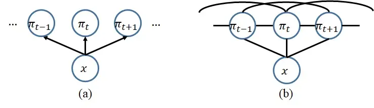

Figure 4.9: Graphical model representation of the CTC model (a) and the
CTC-CTF model (b). Note that the edge potential does not involve exactly
$`n`$ consecutive nodes for a $`n`$-gram LM of labels, as detailed in
the text of Section 4.2.2.

##### Training of the CTC-CRF model

Note that only the parameters from the acoustic encoder network, denoted
by $`\theta`$, need to be trained in the CTC-CRF model, since the
$`n`$-gram LM of labels is estimated from the training transcripts and
fixed in estimating $`\theta`$.

The network is trained to optimize the log conditional likelihood Eq.
(4.18). Making use of the Fisher equality Eq. (B.2.2) and the gradient
of CRF’s log conditional likelihood Eq. (4.13), the gradient of
CTC-CRF’s log conditional likelihood w.r.t. $`\theta`$ for a single data
point $`(x,y)`$ is:

```math
\begin{split}\frac{\partial\log p_{\theta}(y|x)}{\partial\theta}&=E_{p_{\theta}(\pi|x,y)}\left[\frac{\log p_{\theta}(\pi|x)}{\partial\theta}\right](\because Eq.(\ref{eq:fisher_eq_2}),\penalty\ \text{similar to CTC})\\
&=E_{p_{\theta}(\pi|x,y)}\left[\frac{\partial\phi_{\theta}(\pi,x)}{\partial\theta}-E_{p_{\theta}(\pi^{\prime}|x)}\left[\frac{\partial\phi_{\theta}(\pi^{\prime},x)}{\partial\theta}\right]\right]\\
&=E_{p_{\theta}(\pi|x,y)}\left[\frac{\partial\phi_{\theta}(\pi,x)}{\partial\theta}\right]-E_{p_{\theta}(\pi^{\prime}|x)}\left[\frac{\partial\phi_{\theta}(\pi^{\prime},x)}{\partial\theta}\right]\end{split} \tag{4.23}
```

where the second term in the last line does not depend on $`\pi`$ and
thus can be moved out of the expectation w.r.t. $`\pi`$. Notably,
$`p_{\theta}(\pi^{\prime}|x)`$ denotes the model distribution, as
defined in Eq. (4.21) but with $`\pi^{\prime}`$ to represent the path.
As commonly found in estimating CRFs, the above gradient is the
difference between empirical expectation and model expectation. The two
expectations are similar to the calculations using the numerator graph
and denominator graph in LF-MMI respectively \[131\].

Remarkably, Eq. (4.23) can be derived in another way, which reveals the
concept of numerator and denominator. Combining Eq. (4.18) and Eq.
(4.21) yields CTC-CRF’s log conditional likelihood:

```math
\log p_{\theta}(y|x)=\log\frac{\sum_{\pi:\mathcal{B}_{\text{CTC}}(\pi)=y}\exp(\phi_{\theta}(\pi,x))}{\sum_{\pi^{\prime}}{\exp(\phi_{\theta}({\pi^{\prime},x}))}} \tag{4.24}
```

It can be easily seen that the gradient of the above objective function
involves two gradients calculated from the numerator and denominator
respectively, which can be shown to be equal to the two terms in Eq.
(4.23).

Denote $`\log p(\pi_{t}=k|x)=\phi_{t}^{k}`$, and note that
$`\log p_{\theta}(y|x)`$ depends on the network parameters through
potential values $`\phi_{t}^{k},1\leq t\leq T,1\leq k\leq K+1`$. Thus,
an important quantity in calculating Eq. (4.23) for the network
parameters $`\theta`$ is the gradient w.r.t. to the potential values,
which can be derived as follows:

```math
\displaystyle\frac{\partial\log p_{\theta}(y|x)}{\partial\phi_{t}^{k}} \displaystyle=E_{p_{\theta}(\pi|x,y)}\left[\frac{\partial\phi_{\theta}(\pi,x)}{\partial\phi_{t}^{k}}\right]-E_{p_{\theta}(\pi^{\prime}|x)}\left[\frac{\partial\phi_{\theta}(\pi^{\prime},x)}{\partial\phi_{t}^{k}}\right]
```

```math
\displaystyle=E_{p_{\theta}(\pi|x,y)}\left[\delta(\pi_{t}=k)\right]-E_{p_{\theta}(\pi^{\prime}|x)}\left[\delta(\pi^{\prime}_{t}=k)\right] \tag{4.25}
```

This difference is the error signal received by the NN based feature
extractor during training. The gradients for the network parameters
$`\theta`$ can be calculated from the gradient w.r.t. to the potential
values based on the back-propagation procedure.

Both terms in Eq. (4.25) can be obtained via the forward-backward (FB)
algorithm.

- •
  Calculating the first term, often referred to the numerator
  calculation, amounts to running the FB algorithm over the WFST
  determined by $`y`$, which is similar to conducting the FB algorithm
  in calculating the first term of Eq. (4.20) in CTC.
- •
  Calculating the second term, often referred to the denominator
  calculation, involves running the forward-backward algorithm over the
  denominator WFST $`\mathbf{T}_{\text{den}}`$.
  $`\mathbf{T}_{\text{den}}`$ is an composition of the CTC topology WFST
  and the WFST representation of the $`n`$-gram LM of labels. The
  $`n`$-gram LM of labels is thus often called the denominator
  $`n`$-gram LM, to be differentiated from the word-level LM in
  decoding.

| Model     | State    | Training  | Locally/globally |
| --------- | -------- | --------- | ---------------- | ------ |
|           | topology | objective | normalized       |
| HMM       | HMM      | $`p(x     | y)`$             | local  |
| CTC       | CTC      | $`p(y     | x)`$             | local  |
| SS-LF-MMI | HMM      | $`p(y     | x)`$             | global |
| CTC-CRF   | CTC      | $`p(y     | x)`$             | global |
| RNN-T     | RNN-T    | $`p(y     | x)`$             | local  |
| AED       | \-       | $`p(y     | x)`$             | local  |

Table 4.2: Comparison of different models for ASR. HMM topology denotes
that labels (including silence) are modeled by multiple states with
left-to-right transitions, possible self-loops and skips. CTC topology
denotes the special state transitions used in CTC (including blank).
Locally/globally normalized denotes the formulation of the model
distribution. In defining the joint distribution of a model, locally
normalized models use conditional probability functions, while globally
normalized models use un-normalized potential functions. SS-LF-MMI is
classified as globally normalized, though it is cast as MMI-based
discriminative training of a pseudo HMM and the HMM model is locally
normalized. AED does not use states to align label sequence $`y`$ and
observation sequence $`x`$.

##### Related work

In Table 4.2, we give a brief review of existing models in ASR,
depending on state topologies, training objectives and whether the model
distribution is locally or globally normalized. We differentiate HMM
topology and CTC topology, though the later may be interpreted as a
special HMM topology \[200\]. The two differ not only in the state
transition structure but also in the label inventory used (which affects
not only the definition of the whole state space but also the estimation
of the denominator LM).

Further, graphical model representations of existing ASR models are
plotted in Figure 4.10, which clearly show the differences between those
models. An ASR model involves an acoustic observations
$`x=(x_{1},\cdots\,x_{T})=x_{1:T}`$ and a label sequence
$`y=(y_{1},\cdots\,y_{L})=y_{1:L}`$. HMM, CTC and CTC-CRF are defined in
Eq. (2.2), Eq. (4.17), and Eq. (4.21), respectively. _RNN-transducer_
(RNN-T) \[50\] is defined by

```math
p(\pi_{1:T+L}|x_{1:T})=\prod_{j=1}^{T+L}p(\pi_{j}|\pi_{1:j-1}) \tag{4.26}
```

Here $`\pi_{1:T+L}=(\pi_{1},\cdots\,\pi_{T+L})`$ denote the state
sequences, or say, the path with $`T`$ blanks and $`L`$ labels in RNN-T,
such that removing the blanks in $`\pi_{1:T+L}`$ yields $`y_{1:L}`$ (see
Section 4.3.1 for details). _Attention based encoder-decoder_ (AED)
\[25\] is defined by

```math
p(y_{1:L}|x_{1:T})=\prod_{i=1}^{L}p(y_{i}|x,y_{1},\cdots,y_{i-1}) \tag{4.27}
```

In summary, from Table 4.2 and Figure 4.10, we can cleary see that
CTC-CRF is fundamentally different from those prior models. For
comparison between CTC-CRF and single-stage (SS) lattice-free
maximum-mutual-information (LF-MMI) \[57\], readers can refer to
\[193\].

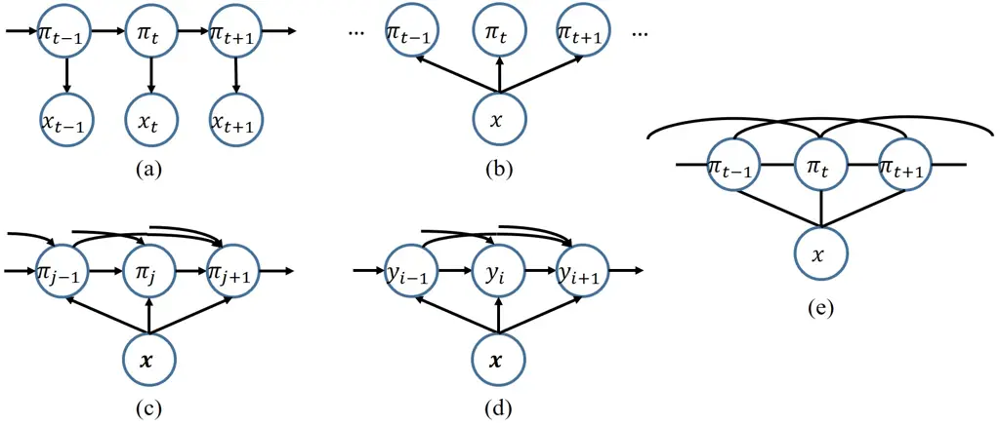

Figure 4.10: Graphical model representations of different ASR models:
(a) HMM, defined in Eq. (2.2), (b) CTC, defined in Eq. (4.17), (c)
RNN-T, (d) AED, (e) CTC-CRF, defined in Eq. (4.21).

###### Relation to CRF-based acoustic models.

ASR is a sequence transduction problem in that the input and output
sequences differ in lengths, and both lengths are variable. An idea in
applying CRFs to ASR is to introduce a (hidden) state sequence $`\pi`$
to align the label sequence $`y`$ and observation sequence $`x`$, and
define a CRF $`p(\pi|x)`$ over the (hidden) state sequence $`\pi`$. As
shown in Eq. (4.18), deriving $`p(y|x)`$ based on $`p(\pi|x)`$ depends
on the mapping between $`\pi`$ and $`y`$, which is determined by the
state topology that allows for different choices, e.g., CTC topology or
HMM topology. This kind of hidden CRFs was explored in \[52\] for phone
classification, using zero, first and second order features. Generally
speaking, (hidden) CRFs using neural features for ASR are
underappreciated. The CTC-CRF model proposed in \[193\] represents the
first exploration of CRFs with CTC topology and advances the CRF-based
approach with strong empirical results. Segmental CRFs \[89\] provide
another solution to the alignment problem.

##### Performance of the CTC-CRF model

The CTC-CRF model inherits the data-efficiency of the hybrid approach
and the simplicity of the end-to-end approach. CTC-CRF eliminates the
conditional independence assumption in CTC and performs significantly
better than CTC on a wide range of benchmarks, including WSJ (80-h),
AISHELL (170-h Chinese), Switchboard (260-h), Librispeech (1000-h), and
Fisher-Switchboard (2300-h) (the numbers in the parentheses are the size
of training data in hours) \[193, 2\]. It has been also shown \[193, 2\]
that CTC-CRF is on par with other state-of-the-art end-to-end models,
like RNN-T and AED.

The CTC-CRF models have also been used in a variety of tasks in ASR,
which show their great potential.

- •
  Streaming ASR, particularly the Chunking, Simulating Future Context
  and Decoding (CUSIDE) approach \[3\];
- •
  Neural architecture search \[208\];
- •
  Children Speech Recognition \[198\];
- •
  Modeling with wordpieces and Conformer architectures \[210\];
- •
  Multilingual and crosslingual speech recognition, particularly the
  JoinAP (Joining of Acoustics and Phonology) approach \[211\].

### 4.3 CRFs for sequence labeling in NLP

Conditional random fields (CRFs) have been shown to be one of the most
successful approaches to _sequence labeling_. Various linear-chain
_neural CRFs_ (NCRFs) have been developed, as introduced in Section
4.1.1. The node potential modeling is improved by using NNs, but the
linear-chain structure is still kept, i.e., using a bigram table as the
edge potential. NCRFs represent an extension from conventional CRFs,
where both node potentials and edge potentials are implemented as linear
functions using discrete indicator features. However, linear-chain NCRFs
capture only first-order⁶⁶ 6 Fixed $`n`$-th order can be cast as
first-order. interactions and neglect higher-order dependencies between
labels, which can be potentially useful in real-world sequence labeling
applications, e.g., as shown in \[205\] for chunking and NER. How can we
improve CRFs to capture long-range dependencies in the label sequence
(preferably non-Markovian)?

###### Related work.

Extending CRFs to model higher-order interactions than pairwise
relationships between labels is an important research problem for
sequence labeling. There are some prior studies, e.g. higher-order CRFs
\[17\], semi-Markov CRFs \[150\] and latent-dynamic CRFs \[108\], but
not using NNs. Using NNs to enhance the modeling of long-range
dependencies in CRFs is under-appreciated in the literature. A related
work is structured prediction energy networks (SPENs) \[10\], which use
neural networks to define energy functions that potentially can capture
long-range dependencies between structured outputs/labels. SPENs depend
on relaxing labels from discrete to continuous and use gradient descent
for test-time inference, which is time-consuming. Training and inference
with SPENs are still challenging, though with progress \[176\].

Outside of the globally normalized sequence models, where CRFs represent
a typical class, attention-based encoder-decoder (AED) and RNN-T exploit
non-Markovian dependences between labels, but both are locally
normalized sequence models and thus suffer from the label bias and
exposure bias problems, as described in Section 4.1.2. The work in
\[192\] extends AED, by removing the final softmax in the RNN decoder to
learn global sequence scores, but cast as a non-probabilistic variant of
the sequence-to-sequence model. A recent work in \[34\] aims to reducing
exposure bias in training RNN-T.

In this section, we mainly introduce a progress made by _CRF
transducers_ \[65\]⁷⁷ 7 Reproducible code is at
[https://github.com/thu-spmi/SPMISeq](https://github.com/thu-spmi/SPMISeq),
which introduce a LSTM-RNN to implement a new edge potential so that
long-range dependencies in the label sequence are captured and modeled
in CRFs. So there are two LSTM-RNNs in a CRF transducer, one extracting
features from observations to define the node potential and the other
capturing (theoretically infinite) long-range dependencies between
labels to define the edge potential. In this view, a CRF transducer is
similar to a RNN-transducer (RNN-T) \[50\], which also uses two
LSTM-RNNs.

In the following, we firstly briefly introduce RNN-T, and then describe
CRF transducer in details. We continue with the notations in Section
4.1.1 for sequence labeling. Given a sequence of observations
$`x=(x_{1},\cdots\,x_{T})=x_{1:T}`$, the task of sequence labeling is to
predict a sequence of labels $`y=(y_{1},\cdots\,y_{T})=y_{1:T}`$, with
one label for one observation in each position.
$`y_{i}\in\left\{1,\cdots,K\right\}`$ denotes the label at position
$`i`$.

#### 4.3.1 RNN-Transducer (RNN-T)

RNN Transducers (RNN-T) are originally developed for general
sequence-to-sequence learning \[50\], which do not assume that the input
and output sequences are of equal lengths and aligned, e.g., in speech
recognition. In the following, we introduce RNN transducers in a simple
form for applications in sequence labeling, i.e., for the aligned
setting - one label for one observation at each position. To this end,
we define

```math
p(y|x)=\prod_{i=1}^{T}p(y_{i}|y_{0:i-1},x) \tag{4.28}
```

and implement $`p(y_{i}|y_{0:i-1},x)`$ through two networks -
transcription network $`F`$ and prediction network $`G`$ as follows:

```math
p(y_{i}=k|y_{0:i-1},x)=\frac{\exp({f_{i}^{k}+g_{i}^{k}})}{\sum_{k^{\prime}=1}^{K}\exp({f_{i}^{k^{\prime}}+g_{i}^{k^{\prime}}})} \tag{4.29}
```

Here $`F`$ scans the observation sequence $`x`$ and outputs the
transcription vector sequence $`f=(f_{1},\cdots\,f_{T})=f_{1:T}`$. $`G`$
scans the label sequence $`y_{0:T-1}`$ and outputs the prediction vector
sequence $`g=(g_{1},\cdots\,g_{T})=g_{1:T}`$. $`y_{0}`$ denotes the
beginning symbol (\<bos\>) of the label sequence. For a sequence
labeling task with $`K`$ possible labels, $`f_{i}`$ and $`g_{i}`$ are
$`K`$ dimensional vectors. Superscript $`k`$ is used to denote the
$`k`$-th element of the vectors. Remarkably, the prediction network
$`G`$ can be viewed as a language model of labels, capable of modeling
long-range dependencies in $`y`$, which is exactly the motivation to
introducing $`G`$ in RNN transducers.

To ease comparison, we will also refer to the network below the CRF
layer in linear-chain NCRFs as a transcription network, which also
implement $`\phi_{t}(y_{t}=k,x)`$ as $`f_{t}^{k}`$.

#### 4.3.2 From RNN-T to CRF transducer

| Model            | Globally   | Long-range dependencies |
| ---------------- | ---------- | ----------------------- |
|                  | normalized | between labels          |
| Linear-chain CRF | $`\surd`$  | $`\times`$              |
| RNN Transducer   | $`\times`$ | $`\surd`$               |
| CRF transducer   | $`\surd`$  | $`\surd`$               |

Table 4.3: Model comparison and connection.

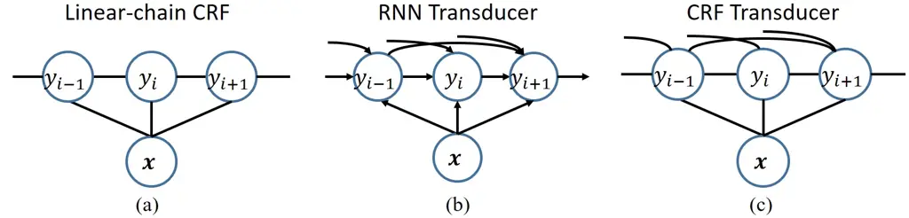

Figure 4.11: Graphical model representations of (a) a linear-chain CRF,
(b) a RNN-T for the aligned setting, and (c) a CRF transducer. Notably,
the graphical representation of the RNN-T for the aligned setting, as
defined in Eq. (4.28), is different from that of the usual RNN-T as
shown in Figure 4.10(c).

In the following, we introduce CRF transducers, which combine the
advantages of linear-chain NCRFs (globally normalized, using LSTM-RNNs
to implement node potentials) and of RNN transducers (capable of
capturing long-range dependencies in labels), and meanwhile overcome
their drawbacks, as illustrated in Table 4.3. Further, graphical model
representations of different models are plotted in Figure 4.11, which
clearly show the differences between those models.

###### Model definition.

A CRF transducer defines a globally normalized, conditional distribution
$`p(y|x;\theta)`$ as follows:

```math
\ p(y|x;\theta)=\frac{\exp\left\{u(y,x;\theta)\right\}}{Z(x;\theta)}.
```

where
$`Z(x;\theta)=\sum_{y^{\prime}\in\mathcal{D}_{T}}\exp\left\{u(y^{\prime},x;\theta)\right\}`$
is the global normalizing term and $`\mathcal{D}_{T}`$ is the set of
allowed label sequences of length $`T`$. The total potential
$`u(y,x;\theta)`$ is decomposed as follows:

```math
u(y,x;\theta)=\sum_{i=1}^{T}\left\{\phi_{i}(y_{i},x;\theta)+\psi_{i}(y_{0:i-1},y_{i};\theta)\right\}.
```

where $`\phi_{i}(y_{i},x;\theta)`$ is the node potential at position
$`i`$, $`\psi_{i}(y_{0:i-1},y_{i};\theta)`$ is the clique potential
involving labels from the beginning up to position $`i`$. Thus the
underlying undirected graph for the label sequence $`y`$ is
fully-connected, which potentially can capture long-range dependencies
from the beginning up to each current position.

Figure 4.12: The architecture of a CRF transducer.

###### Neural network architectures.

Like in RNN transducers, we introduce two networks in CRF transducers,
as shown in Figure . The transcription network $`F`$ implements the node
potential $`\phi_{i}(y_{i},x;\theta)`$, which represents the score for
$`y_{i}`$ based on observations $`x`$. In the experiments on NLP
sequence labeling, each word $`x_{i}`$ is represented by a concatenation
of a pre-trained word embedding vector and another embedding vector
obtained from a character-level CNN \[65\]. The transcription network
$`F`$ is a bidirectional RNN ($`R_{f}`$) that scans the sequence of the
concatenated vectors for words to generate hidden vectors
$`h_{i}^{f}=[\overrightarrow{h_{i}^{f}};\overleftarrow{h_{i}^{f}}]`$,
which are then fed to a linear layer with output size of $`K`$ to
generate $`f_{i}\in\mathbb{R}^{K}`$.

The prediction network $`G`$ implements the clique potential
$`\psi_{i}(y_{0:i-1},y_{i};\theta)`$, which represents the score for
$`y_{i}`$ by taking account of dependencies between $`y_{i}`$ and
previous labels $`y_{0:i-1}`$. In the experiments, each label $`y_{i}`$
is represented by a label embedding vector, initialized randomly. $`G`$
is a unidirectional RNN ($`R_{g}`$) that accepts the label sequence
$`y`$ and generates hidden vectors
$`h_{i}^{g}=\overrightarrow{h_{i}^{g}}`$, which are then fed to a linear
layer with output size of $`K`$ to generate $`g_{i}\in\mathbb{R}^{K}`$.

It can be seen from above that a CRF transducer is similar to a RNN
transducer. The difference is that a RNN transducer is locally
normalized through softmax calculations as shown in Eq. (4.29), while a
CRF transducer is globally normalized, locally producing (un-normalized)
potential scores.

###### Potential design.

Based on $`f_{i}`$ and $`g_{i}`$, there are two possible designs to
implement the potentials $`\phi_{i}`$ and $`\psi_{i}`$, which can be
chosen empirically in the experiments. The first design is:

```math
\displaystyle\phi_{i}(y_{i}=k,x;\theta)=f_{i}^{k} \tag{4.30}
```

```math
\displaystyle\psi_{i}(y_{0:i-1},y_{i}=k;\theta)=g_{i}^{k}
```

The second design is:

```math
\displaystyle\phi_{i}(y_{i}=k,x;\theta)=\log\frac{\exp({f_{i}^{k}})}{\sum_{k^{\prime}=1}^{K}\exp(f_{i}^{k^{\prime}})} \tag{4.31}
```

```math
\displaystyle\psi_{i}(y_{0:i-1},y_{i}=k;\theta)=\log\frac{\exp({g_{i}^{k}})}{\sum_{k^{\prime}=1}^{K}\exp(g_{i}^{k^{\prime}})}
```

###### Decoding and training.

CRF transducers break the first-order Markov assumption in the label
sequence as in linear-chain NCRFs and thus do not admit dynamic
programming for decoding. Instead, beam search can be used to
approximately find the most probable label sequence:

```math
\hat{y}=\argmax_{y^{\prime}\in\mathcal{D}_{T}}p(y^{\prime}|x;\theta)=\argmax_{y^{\prime}\in\mathcal{D}_{T}}u(y^{\prime},x;\theta).
```

Training data consists of inputs $`x`$ paired with oracle label
sequences $`y^{*}`$. Stochastic gradient descent (SGD) on the negative
log-likelihood of the training data is conducted:

```math
L(y^{*};\theta)=-u(y^{*},x;\theta)+\log Z(x;\theta).
```

It is easy to calculate the gradient of the first term. However, the
gradient of the log normalizing term involves model expectation:

```math
\nabla_{\theta}\log Z(x;\theta)=E_{p(y^{\prime}|x;\theta)}\left[\nabla_{\theta}u(y^{\prime},x;\theta)\right]
```

The calculations of the normalizing term and the model expectation can
be exactly performed for linear-chain NCRFs (via the forward and
backward algorithm), but are intractable for CRF transducers. It is
empirically found in the experiments \[65\] that the method of beam
search with early updates \[29\] marginally outperforms Monte Carlo
based methods for training CRF transducers.

The basic idea is that we run beam search and approximate the
normalizing term by summing over the paths in the beam. Early updates
refer to that as the training sequence is being decoded, we keep track
of the location of the oracle path in the beam; If the oracle path falls
out of the beam at step $`j`$, a stochastic gradient step is taken on
the following objective:

```math
L(y^{*}_{1:j};\theta)=-u(y^{*}_{1:j};\theta)+log\sum_{y^{\prime}\in\mathcal{B}_{j}}\exp\left\{u(y^{\prime}_{1:j};\theta)\right\}
```

where
$`u(y_{1:j};\theta)=\sum_{i=1}^{j}\left\{\phi_{i}(y_{i},x;\theta)+\psi_{i}(y_{0:i-1},y_{i};\theta)\right\}`$
denotes the partial potential (with abuse of the notation of $`u`$). The
set $`\mathcal{B}_{j}`$ contains all paths in the beam at step $`j`$,
together with the oracle path prefix $`y^{*}_{1:j}`$.

###### Performance of CRF transducers.

Different sequence labeling methods are evaluated over POS tagging,
chunking and NER (English, Dutch) in \[65\]. Experiment results show
that CRF transducers achieve consistent improvements over linear-chain
NCRFs and RNN transducers across all the four tasks, and can improve
state-of-the-art results.

### 4.4 EBMs for conditional text generation

#### 4.4.1 Residual energy-based models

##### Motivation

Text generation is ubiquitous in many NLP tasks, from summarization, to
dialogue and machine translation. In this section, we will further
introduce residual energy-based language models, as briefly covered in
Section 3.3.3, and show their application in (conditional) text
generation. The dominant approach to text generation is based on
autoregressive language models (ALMs), especially recent large ALMs
parameterized by large neural networks \[134\], which are
locally-normalized. Unfortunately, local normalization also brings some
drawbacks, as described in \[39\] and listed below. First, the designer
of the model needs to specify the order in which tokens are generated.
Second, at training time the model is conditioned on ground truth
context while at test time it is conditioned on its own generations, a
discrepancy referred to as _exposure bias_ (Section 4.1.2). Finally,
while heuristics like beam search somewhat help rescore at the sequence
level, generation generally lacks long-range coherency because it is
produced by the greedy selection of one token at a time without
lookahead⁸⁸ 8 This drawback of generation without lookahead is related
to the _label bias_ problem of locally-normalized sequence models,
namely being weak in revising earlier decisions (Section 4.1.2)..

In principle, EBMs potentially address all these issues, as they do not
require any local normalization. EBMs are not prone to exposure bias and
label bias, and they can score the whole input at once. EBMs may enable
generation of large chunks of text, which should help improve coherency.
However, a difficulty of applying EBMs in text generation is that
sampling from EBMs is intractable, and so is maximum likelihood
training. A recent work in \[39\] develops residual EBMs for text
generation and shows impressive results, which will be detailed below.

##### The residual EBM model

The formulation of residual EBMs, as introduced in Section 3.3.3, has
multi-fold benefits for text generation \[39\]. First, by incorporating
an autoregressive language model in the residual formulation, we can
leverage recent advancements in autoregressive language modeling.
Second, the autoregressive language model provides a natural proposal
distribution for training of residual EBMs, and the training can be made
efficient by using the conditional noise contrastive estimation
objective (Section 4.1.3). Lastly, this formulation enables efficient
evaluation and generation via importance sampling, as we shall detail in
the following. In some sense, this last point is perhaps the central
contribution of \[39\], as it allows estimating perplexity of the
residual EBM, and thus allows these EBMs to be compared in a standard
way to other models.

\[39\] investigates an EBM trained on the residual of a pre-trained
autoregressive LM, particularly for conditional generation of discrete
sequences. Given a conditioning prefix $`x_{1},\cdots,x_{c}`$ with
$`x_{j}\in\mathbb{V}`$ where $`\mathbb{V}`$ is the vocabulary, the
probability of generating a sequence of total length $`T>c`$ is defined
as follows:

```math
\begin{split}&p_{\theta}(x_{c+1},\cdots,x_{T}|x_{1},\cdots,x_{c})\\
=&\frac{p_{\text{LM}}(x_{c+1},\cdots,x_{T}|x_{1},\cdots,x_{c})\exp(-E_{\theta}(x_{1},\cdots,x_{c},x_{c+1},\cdots,x_{T}))}{Z_{\theta}(x_{1},\cdots,x_{c})}\\
=&\frac{\tilde{p}_{\theta}(x_{c+1},\cdots,x_{T}|x_{1},\cdots,x_{c})}{Z_{\theta}(x_{1},\cdots,x_{c})}\end{split} \tag{4.32}
```

where $`p_{\text{LM}}`$ denotes the pre-trained autoregressive LM and is
fixed throughout training, $`E_{\theta}(\cdot)`$ is the residual energy
function parameterized by $`\theta`$. In the experiment of \[39\],
$`E_{\theta}`$ is initialized with BERT/RoBERTa; in the final layer the
mean-pooled hidden states are projected to a scalar energy value.
$`p_{\theta}`$ is called _the joint model_.
$`Z_{\theta}(x_{1},\cdots,x_{c})`$ is the normalizing factor known as
partition function. $`\tilde{p}_{\theta}`$ denotes the un-normalized
probability.

##### Training of the residual EBM

The conditional EBMs defined in Eq. (4.32) can be trained using NCE
(Section 2.4), and more specifically its conditional version (Section
4.1.3). For the sake of reducing clutter in the notation, we will drop
the conditioning variables $`x_{1},\cdots,x_{c}`$ and use $`x`$ to
denote a target token sequence (namely $`x_{c+1},\cdots,x_{T}`$) in the
following discussion. Denote the training dataset by $`\mathcal{D}`$.

NCE requires two distributions: the model distribution and a noise
distribution. Here the model distribution is the joint model of Eq.
(4.32), $`p_{\theta}`$, while the noise distribution is the pre-trained
LM, $`p_{\text{LM}}`$. NCE then trains a binary classifier on the
difference of log-probability scores of these two models. Since the
joint model is the product of the energy function (whose parameters we
want to learn) with the pre-trained LM, the difference reduces to:
$`\log\tilde{p}_{\theta}-\log p_{\text{LM}}=-E_{\theta}`$. Therefore,
under these modeling assumptions of residual learning and noise model,
the NCE objective function becomes:

```math
\displaystyle{J}_{\theta} \displaystyle=\mathop{\mathbb{E}}\limits_{x_{+}\sim\mathcal{D}}\log\frac{\tilde{p}_{\theta}(x_{+})}{\tilde{p}_{\theta}(x_{+})+p_{\text{LM}}(x_{+})}+\mathop{\mathbb{E}}\limits_{x_{-}\sim p_{\text{LM}}}\log\frac{p_{\text{LM}}(x_{-})}{\tilde{p}_{\theta}(x_{-})+p_{\text{LM}}(x_{-})} \tag{4.33}
```

```math
\displaystyle=\mathop{\mathbb{E}}\limits_{x_{+}\sim\mathcal{D}}\log\frac{1}{1+\exp(E_{\theta}(x_{+}))}+\mathop{\mathbb{E}}\limits_{x_{-}\sim p_{\text{LM}}}\log\frac{1}{1+\exp(-E_{\theta}(x_{-}))}
```

where $`x_{+}`$ denotes the positive sequence taken from the human
generated training set, and $`x_{-}`$ the negative sequence drawn from
the pre-trained LM (for a given ground truth prefix). Again, we see that
NCE training of the energy function reduces to training a binary
classifier to discriminate between real text and text generated by a
pre-trained autoregressive language model. The experiment of \[39\] uses
a prefix of size 120 tokens and generates the following 40 tokens; with
the notation of Eq. (4.32), $`c=120`$ and $`T=160`$. For NCE training,
for efficiency $`16`$ samples per prefix for CC-News \[9\] were
generated offline, and sampled uniformly from those samples at training
time.

0:  Number of samples $`n`$ drawn from $`p_{\text{LM}}`$, value of $`k`$
in top-k

 // Get a set of samples from $`p_{\text{LM}}`$

 Sample $`n`$ samples $`\{x^{1},...,x^{n}\}`$ from $`p_{\text{LM}}`$
with top-k sampling

 Calculate energies $`s^{i}=E_{\theta}(x^{i})`$ for each
$`x^{i}\in\{x^{1},...,x^{n}\}`$

 // Resample from the set of LM samples

 Sample $`x=x^{i}`$ with probability
$`\frac{\exp(-s^{i})}{\sum_{j=1}^{n}\exp(-s^{j})}`$

 Return: $`x`$

Algorithm 10 Top-$`k`$ sampling for the residual EBM

##### Generation from the residual EBM

In order to generate from the residual EBM model Eq. (4.32) efficiently,
\[39\] uses self-normalized importance sampling (SNIS) (Section 2.3.2).
Under the assumptions that the model from which we wish to draw samples
is the joint model, which is the product of the autoregressive model and
the energy function, and that the proposal distribution is the
autoregressive model itself, sampling proceeds simply by: a) sampling
from the autoregressive language model, followed by b) resampling
according to the energy function. The algorithm is shown in Algorithm
10, where a top-$`k`$ constraint on the pre-trained language model is
introduced to improve the quality of samples in the set. Without the
top-k constraint, as the number of samples goes to infinity, we would
recover exact samples from the joint model distribution.

##### Evaluation of the residual EBM

A commonly used protocol for evaluating generative sequence models,
especially language models, is perplexity (PPL), which is equal to

```math
\text{PPL}=2^{-\frac{1}{T-c}\sum_{i=c+1}^{T}\log_{2}p_{\theta}(x_{i}|x_{1},\cdots,x_{i-1})}
```

PPL can be interpreted as the average number of tokens the model is
uncertain of at every time step. For the residual EBM model, the
log-likelihood required by PPL relies on estimating the partition
function

```math
Z_{\theta}=\sum_{x}p_{\text{LM}}(x)\exp(-E_{\theta}(x))=\mathbb{E}_{x\sim p_{\text{LM}}}\exp(-E_{\theta}(x)).
```

Based on \[118\], two estimators are derived in \[39\] for the lower and
upper bounds of the partition function respectively, as shown in the
following theorem.

###### Theorem 4.4.1.

Denote $`T_{n}`$ as the empirical estimate of
$`\log\mathbb{E}_{x\sim p_{\text{LM}}}\exp(-E_{\theta}(x))`$ with $`n`$
samples $`x_{i}\sim P_{\text{LM}}`$, $`i=1,\cdots,n`$:
$`T_{n}=\log\frac{1}{n}\sum_{i=1}^{n}\exp(-E(x_{i}))`$, then
$`{\forall}\epsilon>0,{\exists}N>0`$ such that $`{\forall}n>N`$ we have

```math
Z_{\theta}-\epsilon<\mathbb{E}[T_{n}]<Z_{\theta}<\mathbb{E}[(2n-1)T_{n}-2(n-1)T_{n-1}]<Z_{\theta}+\epsilon. \tag{4.34}
```

Similarly to locally normalized models, we can also factorize the
probabilities of an entire sequence step by step,
$`p_{\theta}(x)=\prod_{t=1}^{T}p_{\theta}(x_{t}|x_{<t})`$. By
marginalizing over the future, the following step-wise probabilities are
derived in \[39\]:

```math
p_{\theta}(x_{t}|x_{<t})=p_{\text{LM}}(x_{t}|x_{<t})\frac{\mathbb{E}_{x^{\prime}_{t+1:T}\sim p_{\text{LM}}(\cdot|x_{\leq t})}[\exp(-E_{\theta}(x_{\leq t},x^{\prime}_{t+1:T}))]}{\mathbb{E}_{x^{\prime}_{t:T}\sim p_{\text{LM}}(\cdot|x_{\leq t-1})}[\exp(-E_{\theta}(x_{\leq t-1},x^{\prime}_{t:T}))]} \tag{4.35}
```

Note that both the numerator and the denominator in Eq. (4.35) take the
same form as the partition function, we can also use Eq. (4.34) to
estimate the upper and lower bounds. For example, the lower bound of
$`\log p_{\theta}(x_{t}|x_{<t})`$ can be obtained by using the lower
bound of the numerator and the upper bound of the denominator.
Remarkably, for $`t=T`$, we can calculate the log probability by
exhaustive enumeration. This gives us an idea of the true performance of
the model at the last step, and it also provides a sanity-check of the
tightness of the estimators.

##### Performance of the residual EBM

In \[39\], experiments on two datasets, CC-News \[9\] and the Toronto
Book Corpus \[213\] show that residual EBMs demonstrated improved
generation ability against strong autoregressive baselines, both in
terms of estimated perplexity and through human evaluation.

#### 4.4.2 Controlled text generation from pre-trained language models

##### Motivation

While large transformer-based autoregressive language models trained on
massive amounts of data exhibit exceptional capabilities to generate
natural language text, effective methods for generating text that
satisfy global constraints and possess holistic desired attributes
remains an active area of research \[72, 105\]. For instance, we may
want to avoid toxic content; or steer generations towards a certain
topic or style. Much of the prior work has approached controlled
generation via either training domain-conditioned neural language models
or finetuning/modifying an underlying large pre-trained base model for
attribute sensitive generation (see references in \[105\]). Not only do
these approaches involve computational overhead and estimation errors
associated with the training of language models, but they are also
dependent on access to a large amount of attribute-specific language
data which can be impractical in many scenarios and exacerbate privacy
concerns.

In order to address these limitations, the study in \[105\] thus aims to
_eschew training_ and focuses on _generation-time control_ from
pre-trained modules. _The mix-and-match method_ proposed in \[105\], as
shown in Figure 4.13, draws samples from a test-time combination of
pre-trained black-box experts that each scores a desired property of
output text - for example, fluency, attribute sensitivity, or
faithfulness to the context. Specifically, the product of these
black-box experts is viewed as a EBM, and sampling is performed (without
further training or fine-tuning), using a specialized Gibbs sampler with
a Metropolis-Hastings (MH) correction step \[47\], which is basically MH
within Gibbs sampling, as introduced in Section 2.3.1.

A related work in \[72\] proposes _a distributional approach_ for
addressing controlled text generation from pre-trained language models
(PLMs). Both “pointwise” constraints (hard requirements on each
individual) and “distributional” constraints (collective statistical
requirements such as moment constraints) are permitted to added in the
target LM, while minimizing KL divergence from the initial pre-trained
LM distribution. The optimal target distribution is also uniquely
determined as a residual EBM model and can be trained through a variant
of policy gradient based on importance sampling.

Also for controlled text generation, the work in \[132\] is motivated by
the need to enrich decoding algorithms that can work directly with
pre-trained language models (PLMs) without task-specific fine-tuning,
and support complex combinations of hard and soft constraints to control
the generated text on the fly. Previous studies use MH within Gibbs
sampling or SNIS, as surveyed in Table 2.1. A new decoding method,
called _Constrained decoding with Langevin dynamics_ (COLD), is
developed in \[132\], which introduces Langevin dynamics to text-based
EBMs for efficient gradient-based sampling. Specifically, the COLD based
text generation performs sampling by iteratively updating a continuous
relaxation of text using gradients of the energy function. The resulting
continuous text samples are then mapped back to the discrete space with
a simple guided discretization approach, yielding text sequences that
are fluent and adhere to the constraints. Experiments are conducted in
three text generation applications - lexically-constrained generation,
abductive reasoning, and counterfactual reasoning and show the
effectiveness of the COLD approach, both in terms of automatic and human
evaluation.

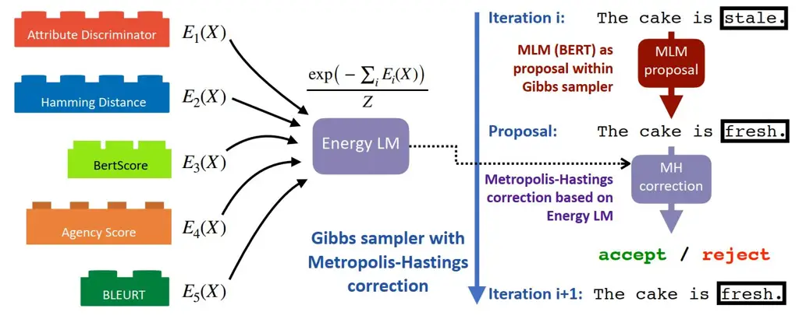

Figure 4.13: Overview of mix-and-match LM. The Lego pieces show
different experts that can be used to form the energy LM and help
control different features in the generated text. The right side shows
the $`i`$-th step in the the Gibbs sampling chain, where a proposal is
made by the MLM, and then it is accepted/rejected based on the energy
score. \[105\]

##### The mix-and-match language model

In \[105\], the problem of performing controlled generation is framed as
a problem of sampling from a specialized energy based (or globally
normalized) sequence model that defines a probability distribution that
satisfies the desired constraints we wish to impose in the controlled
generation setting.

As described below, this energy based model is composed of pre-trained
components and does not require any further optimization. Specifically,
an energy-based sequence model defines the probability distribution over
the space of possible sequences $`\mathcal{X}`$ as:

```math
p_{\theta}(X)=\frac{e^{-E_{\theta}(X)}}{\sum_{X^{\prime}\in\mathcal{X}}e^{-E_{\theta}(X^{\prime})}}
```

where $`E_{\theta}(X)`$ refers to the scalar energy of a sequence $`X`$
that is parametrized by $`\theta`$. Lower energy corresponds to the
higher likelihood of $`X`$. In contrast to the common autoregressive
sequence models, exact likelihood computation and efficient sampling
from EBM models is challenging. Despite these challenges, the EBM
paradigm offers increased flexibility via sequence-level features and
constraints. As we discuss next, this capability lets us easily define
expressive functions for controlled generation of sequences which is not
readily offered by the autoregressive modeling paradigm.

Note that the task of controlled generation requires concentrating
probability mass over a small subspace of sequences in $`\mathcal{X}`$
that satisfies various constraints pertaining to fluency, target
attributes, and other control variables. The EBM based mix-and-match
language model, as defined below, involves a linear combination of
various black-box experts in order to obtain a distribution whose
samples satisfy the requirements of a desired controlled generation
task:

```math
E_{\text{M\&M}}(X)=\sum_{i=1}^{k}\alpha_{i}E_{i}(X) \tag{4.36}
```

where the mix-and-match (M&M) energy is composed of $`k`$ expert energy
components, which are weighted by scalar hyperparameters $`\alpha`$. The
following black-box experts are used in \[105\]:

- •
  $`E_{\text{mlm}}(X)`$: Masked language models (MLMs) like BERT \[40\]
  are used as a black-box to model the form and fluency of sentences.
  Particularly, $`E_{\text{mlm}}(X)`$ is defined as the negative of the
  sum of unnormalized logits iteratively computed at each position
  obtained via the forward pass of the MLM after masking the
  corresponding position \[47\].
- •
  $`E_{\text{disc}}(X)`$: This particular expert refers to the energy
  obtained via the discriminator for the attributes of interest. What
  this module returns is the raw logits of the discriminator, for the
  target attribute. For instance, if we have a sentiment classifier, and
  want to produce positive sentiment, then
  $`E_{\text{disc}}(X)=-\log p(+|X)`$.
- •
  $`E_{\text{hamm}}(X,X^{\prime})`$: For a given sequence
  $`X^{\prime}`$, this quantity refers to the hamming distance between
  the sequence $`X`$ and $`X^{\prime}`$. This penalizes token level
  deviation from $`X^{\prime}`$ which is useful if we are interested in
  only making minor edits to $`X^{\prime}`$.
- •
  $`E_{\text{fuzzy}}(X,X^{\prime})`$: Similar to the hamming distance,
  this quantity refers to the BertScore \[203\] computed between $`X`$
  and $`X^{\prime}`$ which can be viewed as a fuzzy hamming distance
  that takes semantic similarity into account.

##### Sampling from the mix-and-match model

In \[105\], Metropolis-Hastings (MH) based MCMC scheme (Section 2.3.1)
is used to sample from the M&M model. The proposal distribution is
implemented by a masked language model (MLM) like BERT. At each MH step,
we mask out a token at a random position $`i`$ in current sequence
$`X`$, propose a new token by sampling from the MLM conditional softmax
at the masked position⁹⁹ 9 Note that the proposed move
$`\overline{X}_{i}`$ is generated independent of the previous state
$`X_{i}`$, thus the sampling algorithm used here is in fact MIS with
Gibbs sampling., and obtain the new sequence $`\overline{X}`$. The new
sequence is accepted with the probability

```math
\min\left\{1,\frac{\exp(-E_{\text{M\&M}}(\overline{X}))p_{\text{mlm}}(X_{i}|X_{\backslash i})}{\exp(-E_{\text{M\&M}}(X))p_{\text{mlm}}(\overline{X}_{i}|X_{\backslash i})}\right\}
```

In experiments in \[105\], a MCMC chain is run for sentence generation
for more than 8 epochs, where an epoch refers to one masking cycle over
all positions of the sequence.

##### The performance of the mix-and-match model

Two kinds of controlled generation tasks are performed in \[105\].

###### Prompted generation.

This task focuses on generating well-formed sentences that start with a
specified prompt and also satisfy a target attribute for which we have
access to a discriminator. An example task would be to generate positive
sentiment sequences starting with This movie. The energy function takes
the form:

```math
E(X)=E_{\text{mlm}}(X)+\alpha E_{\text{disc}}(X)
```

where $`\alpha`$ is a hyperparameter that controls the tradeoff between
the MLM score and the discriminator’s influence.

###### Controlled text revision.

This task aims to edit a source sequence $`X^{\prime}`$ to generate
sequence $`X`$ to satisfy the desired target attributes. The energy
function for this task is :

```math
E(X)=E_{\text{mlm}}(X)+\alpha E_{\text{disc}}(X)+\beta E_{\text{hamm}}(X,X^{\prime})+\gamma E_{\text{fuzzy}}(X,X^{\prime})
```

This energy function, in addition to valuing well-formedness and
satisfying target attribute requirements, also focuses on maintaining
faithfulness to the source sequence $`X^{\prime}`$.

In \[105\], the effectiveness of the mix-and-match approach has been
shown on controlled generation tasks (with sentiment or topic) and
style-based text revision tasks (controllable debiasing, style
transfer), by outperforming recently proposed methods that involve extra
training, fine-tuning, or restrictive assumptions over the form of
models.

##### Constrained decoding with Langevin dynamics (COLD)

Constrained text generation aims to produce text samples $`y`$ that
satisfy a set of constraints (usually conditioned on an input $`x`$
omitted for brevity). Let $`y=(y_{1},\cdots,y_{T})`$ denote a discrete
sequence where each $`y_{t}`$ is a token from a vocabulary
$`\mathcal{V}`$. Assume each constraint can be captured by a constraint
function $`f_{i}(y)\in\mathbb{R}`$, where higher values of $`f_{i}`$
mean that the text y better satisfies the constraint. Generating text
under the constraints can be seen as sampling from a energy-based
distribution $`y\sim p(y)`$:

```math
p(y)\propto\exp\left\{U(y)\right\},U(y)=\sum_{i}\lambda_{i}f_{i}(y)
```

EBMs are flexible - any differentiable function that outputs a goodness
score of text can be used as a constraint function, as long as it
reflects the requirements of the target task. Three example constraints
are shown in \[132\]: soft fluency constraint, future-token prediction
constraint, and N-gram similarity constraint.

For efficient sampling from $`p(y)`$, we want to use Langevin dynamics,
which makes use of the gradient $`\nabla_{y}\log p(y)=\nabla_{y}U(y)`$.
However, in text generation, $`y`$ is a discrete sequence and the
gradient $`\nabla_{y}\log p(y)`$ is not well-defined. To address this
problem, \[132\] proposed a new sampling/decoding method, called
_Constrained decoding with Langevin dynamics_ (COLD), which consists of
three steps - continuous relaxation of text, performing Langevin
dynamics with an energy defined on a sequence of continuous “soft” token
vectors, and finally, guided discretization.

###### Continuous relaxation of text.

Instead of defining the energy function on discrete tokens, the energy
function is defined on a sequence of continuous vectors
$`\tilde{y}=(\tilde{y}_{1},\cdots,\tilde{y}_{T})`$, which is called a
soft sequence. Each position in the soft sequence is a vector of logits
$`\tilde{y}_{t}\in\mathbb{R}^{|\mathcal{V}|}`$, each element
corresponding to the logit of a word in the vocabulary. Taking the
softmax of $`\tilde{y}_{t}`$ yields a distribution over the vocabulary
for position $`t`$. An EBM model can be defined on the soft sequence
$`\tilde{y}`$ as follows:

```math
p(\tilde{y})\propto\exp\left\{U(\tilde{y})\right\} \tag{4.37}
```

###### Langevin dynamics over soft tokens.

In the continuous space, we can perform gradient guided MCMC (Section
2.3.1) such as Langevin dynamics to generate samples
$`\tilde{y}^{(1)},\tilde{y}^{(2)},\cdots`$, which ends up generating
samples from the distribution induced by the energy function Eq. (4.37).

###### From soft tokens to discrete text.

After receiving a soft sequence sample $`\tilde{y}`$ from running
Langevin dynamics, we map the soft sequence to a discrete text sequence,
which we consider as the output of COLD decoding. A simple method would
be selecting the most-likely token at each position $`t`$,

```math
y_{t}=\argmax_{v\in\mathcal{V}}\tilde{y}_{t}(v)
```

However, the resulting text suffers from fluency issues even if the soft
fluency constraint is used, due to competing constraints that sacrifice
fluency. To overcome this, COLD uses the underlying pre-trained language
model (PLM) as a “guardian” for obtaining the discrete sequence.
Specifically, at each position $`t`$, we first use the PLM to produce
the top-$`k`$ most-likely candidate tokens based on its generation
distribution conditioning on preceding tokens, which we denote as
$`\mathcal{V}_{t}^{k}`$. We then select from the top-$`k`$ candidates
the most likely token based on the soft sample $`\tilde{y}`$:

```math
y_{t}=\argmax_{v\in\mathcal{V}_{t}^{k}}\tilde{y}_{t}(v)
```

We refer to this method as “top-$`k`$ filtering”. The resulting text
tends to be fluent because each token is among the top-$`k`$ most
probable tokens from the PLM.

## Chapter 5 Joint EBMs with applications

In this chapter, we introduce EBMs for modeling _joint_ distributions
for both fixed-dimensional and sequential data, with the applications
for semi-supervised learning, training more calibrated models, and
improved language modeling with additional relevant linguistic tags
(e.g., part-of-speech tags). First, we present basics for
semi-supervised learning. Then, we introduce the fixed-dimensional case
of joint EBMs (Section 5.2), then move on to the sequential case
(Section 5.3). Finally, we present the application of EBM-based joint
modeling for semi-supervised learning and calibrated natural language
understanding in Section 5.4 and Section 5.5, respectively.

### 5.1 Basics for semi-supervised learning

As we have witnessed, supervised learning from large amounts of labeled
data, particularly with deep neural networks (DNNs), has achieved
tremendous success in various intelligence tasks, spanning speech
processing, computer vision, and natural language processing (NLP).
However, collecting labeled data is difficult and expensive, but there
are often easily-available unlabeled data. This has motivated the
community to develop _semi-supervised learning_ (SSL). SSL aims to
leverage both labeled and unlabeled data to train a conditional model
for inference (for either discriminative or generation tasks), which,
basically, is to find the posteriori of label $`y`$ given observation
$`x`$. A plethora of semi-supervised learning methods have emerged to
train deep neural networks (DNNs) \[106, 80, 172, 160, 22, 28\],
spanning over various domains such as image classification, natural
language labeling and so on. People may wonder how unlabeled
observations $`x`$’s may help finding the posterior. A common belief is
that the the information contained in the unlabeled observations can
provide some kind of priors, or alternatively say, some regularizations
or inductive biases, for finding the posterior $`p(y|x)`$.

Roughly speaking, recent SSL methods with DNNs can be distinguished by
the priors they adopt, and, can be divided into two classes¹¹ 1 We
mainly discuss the SSL methods for using DNNs. General discussion of SSL
can be referred to \[212\]. - based on generative models or
discriminative models, which are referred to as _generative SSL_ and
_discriminative SSL_, respectively. An intuitive way to differentiate
between generative and discriminative SSL is that generative SSL
typically requires modeling the marginal distribution of the data, while
discriminative SSL only involves modeling the conditional distribution.

#### 5.1.1 Discriminative SSL

Discriminative SSL methods often assume that the outputs from the
discriminative classifier are smooth with respect to local and random
perturbations of the inputs. Examples include virtual adversarial
training (VAT) \[106\] and a number of recently developed
consistency-regularization based methods such as temporal ensembling
\[80\], mean teachers \[172\], FixMatch \[160\] and contrastive learning
based methods such as SimCLR \[22\].

Discriminative SSL methods thus heavily rely on domain-specific data
augmentations, e.g., RandAugment \[33\], which are tuned intensively for
images and lead to impressive performance in some image domains. But
discriminative SSL is often less successful for other domains, where
these augmentations are less effective (e.g., medical images and text).
For instance, random input perturbations are more difficult to apply to
discrete data like text \[28\]. Although there are some efforts to use
data-independent model noises, e.g., by dropout \[166\], domain-specific
data augmentation is indispensable.

#### 5.1.2 Generative SSL

Generative SSL methods exploit unsupervised learning of generative
models over unlabeled data, which inherently does not require data
augmentations and generally can be applied to a wider range of domains.
Generative SSL usually involves blending unsupervised learning and
supervised learning. These methods make fewer domain-specific
assumptions and tend to be domain-agnostic. The performance comparisons
between generative and discriminative SSL methods are mixed. It is found
that consistency based discriminative SSL methods often outperform
generative SSL methods in image domain. However, in text domain, the
generative SSL methods such as those based on pre-trained word vectors
\[102, 128\] and pre-trained language models (PLMs) \[135, 136\] are
more successful and widely used.

Considering observation $`x`$ and label $`y`$, there exist two different
methods for the generative SSL approach - _joint-training_ \[82, 76\]
and _pre-training_ \[63\].

- •
  In joint-training, a joint model of $`p(x,y)`$ is defined. When we
  have label $`y`$, we maximize $`p(y|x)`$ (the supervised objective),
  and when the label is unobserved, we marginalize it out and maximize
  $`p(x)`$ (the unsupervised objective). Semi-supervised learning over a
  mix of labeled and unlabeled data is formulated as maximizing the
  (weighted) sum of $`\log p(y|x)`$ and $`\log p(x)`$. Given infinite
  model capacity and data, the joint-learning based SSL is consistent
  and can find the oracle $`p(y|x)`$²² 2 This is because that the
  maximum likelihood estimator is consistent..
- •
  In pre-training, we perform unsupervised representation learning on
  unlabeled data, which is followed by supervised training (called
  fine-tuning) on labeled data. Thus, pre-training is usually based on a
  model that only defines the marginal distribution $`p(x)`$ without the
  need to involve $`y`$. Its empirical effectiveness is mostly
  understood from the perspective of representation learning. There is
  no theoretical guarantee that this kind of pre-training will lead to
  finding the oracle $`p(y|x)`$. This method of pre-training followed by
  fine-tuning has been widely used in natural language processing
  \[134\]³³ 3 But, more recently in NLP, an approach of jointly modeling
  the $`input`$, the $`output`$, and the $`task`$ description, has
  emerged to gain more attention and achieved superior performances
  \[135\]. The $`input`$, the $`output`$, and the $`task`$ description
  can all be specified as a sequence of tokens, and a language model is
  trained for estimating natural language sequences so that
  $`p(task,input,output)`$ for various tasks, inputs and outputs are
  implicitly trained..

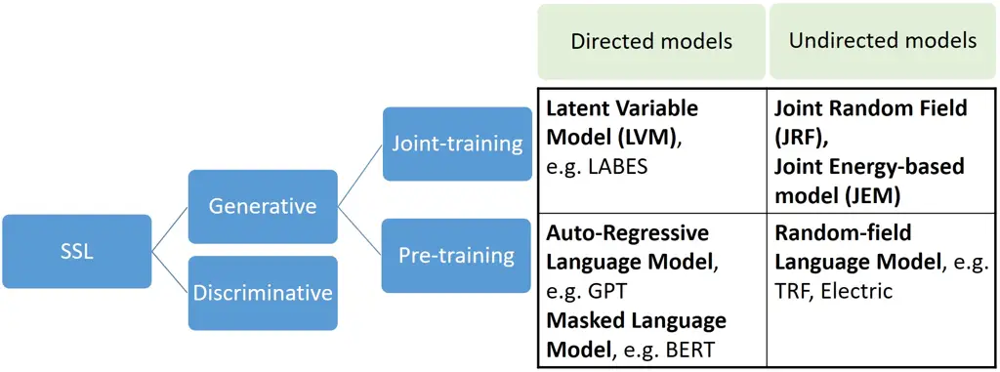

Figure 5.1: An overview of SSL and a general categorization of
generative SSL methods. Examples are mainly chosen from NLP.

###### A categorization of generative SSL methods

is shown in Figure 5.1. For either of joint-training and pre-training,
we can use directed models (locally-normalized) or undirected models
(globally-normalized). So there are four main classes for generative
SSL. The models used in joint-training could be latent-variable model
(LVM) such as in LABES \[206\], or JRF \[163\] or say JEM \[207\].
Pre-training could be based on masked language models \[40\],
autoregressive language models \[134\], or random-field language models
\[189\]. Further, two approaches of pre-training and joint-training
could be combined or compared to each other. So there are many open
questions in designing semi-supervised methods for particular tasks.

###### EBM based SSL.

Among existing generative SSL methods, energy-based models (EBMs), as an
important class of generative models, have been shown with promising
results for semi-supervised learning across various domains. Early
studies date back to the pre-training of restricted Boltzmann machines
(RBMs) \[63\] (which are a simple type of EBMs) and the joint-training
with classification RBMs \[82\].

Recently, it is shown in \[162\] that joint-training via EBMs produces
state-of-the-art SSL results on images (MNIST, SVHN and CIFAR-10),
compared to previous generative SSL methods based on Variational
AutoEncoders (VAEs) and Generative Adversarial Networks (GANs). It is
also shown in \[207\] that joint-training via EBMs outperforms VAT
(virtual adversarial training) \[106\] on tabular data from the UCI
dataset repository. Further, joint-training via EBMs has been extended
in \[163\] to modeling sequences and consistently outperforms
conditional random fields (CRFs) (the supervised baseline) and
self-training (the classic semi-supervised baseline) on natural language
labeling tasks such as POS (part-of-speech) tagging, chunking and NER
(named entity recognition).

Note that although both joint-training and pre-training of EBMs have
been used for SSL in the literature, very few studies evaluated and
compared the two methods. The results from previous individual works are
often not directly comparable to each other, since they are not
evaluated in a common experimental setup. In \[164\], a suite of
experiments are conducted to systematically compare joint-training and
pre-training for EBM-based SSL. Both the amounts of labeled and
unlabeled data are varied to give a realistic whole picture of the
performances of the two methods for SSL \[119\]. It is found that
joint-training EBMs outperform pre-training EBMs marginally but nearly
consistently, presumably because the optimization of joint-training is
directly related to the targeted task, while pre-training does not.

In the remainder of this chapter, we will detail EBM based SSL,
including both pre-training and joint-training. Note that pre-training
only involves the _marginal_ distribution $`p(x)`$, so the basics for
EBM based pre-training can be referred to Section 3 for learning with
discrete $`x`$ such as natural languages, and for learning with
continuous $`x`$ such as images, be referred to \[162\]. We will mainly
introduce the basics for EBM based joint-training, i.e., establishing
EBMs for modeling _joint_ distributions, first in the fixed-dimensional
case (Section 5.2) and then in the sequential case (Section 5.3).
Although speech and language processing is primarily concerned with the
sequential case, the introduction of the fixed-dimensional case can lay
the foundation for understanding the more complicated, sequential case.

### 5.2 Upgrading EBMs to Joint EBMs (JEMs) for fixed-dimensional data

###### Motivation.

Originally, EBMs are established for modeling the marginal distribution
$`p(x)`$ of observations $`x`$, as introduced in Section 3. Recently, a
kind of EBM, called _semi-supervised EBM_, for modeling the joint
distribution of observation $`x`$ and label $`y`$ has been developed and
used for semi-supervised classification \[162\]. In \[49\], a similar
kind of EBM has been studied, which is called _joint EBM_ (JEM). It is
established by reinterpreting a standard discriminative classifier of
$`p(y|x)`$ as an energy based model for the joint distribution
$`p(x,y)`$. It is demonstrated that energy based training of the joint
distribution improves calibration, robustness, and out-of-distribution
detection while also enabling sample generation which rivals the quality
of recent GAN approaches. Hereafter, these EBMs are collectively
referred to as JEMs.

###### Model definition.

Note that different models are needed in unsupervised and
semi-supervised learning, because SSL needs to additionally consider
labels apart from observations.

In semi-supervised tasks, we consider the following EBM for joint
modeling of observation $`x\in\mathbb{R}^{d_{x}}`$ and class label
$`y\in\left\{1,\cdots,K\right\}`$:

```math
p_{\theta}(x,y)=\frac{1}{Z(\theta)}\exp\left[U_{\theta}(x,y)\right]. \tag{5.1}
```

This is different from Eq. (2.13) for unsupervised learning which only
models $`x`$ without labels. To implement the potential function
$`U_{\theta}(x,y)`$, we consider a neural network
$`\Psi_{\theta}(x):\mathbb{R}^{d_{x}}\rightarrow\mathbb{R}^{K}`$, with
$`x`$ as the input and the output size being equal to the number of
class labels, $`K`$. Then we define

```math
U_{\theta}(x,y)={onehot}(y)^{T}\Psi_{\theta}(x)
```

where $`{onehot}(y)`$ represents the one-hot encoding vector for the
label $`y`$. In this manner, the conditional density $`p_{\theta}(y|x)`$
is the classifier, defined as follows:

```math
p_{\theta}(y|x)=\frac{p_{\theta}(x,y)}{p_{\theta}(x)}=\frac{\exp\left[U_{\theta}(x,y)\right]}{\sum_{y^{\prime}}\exp\left[U_{\theta}(x,y^{\prime})\right]} \tag{5.2}
```

which acts like multi-class logistic regression using $`K`$ logits
calculated from $`x`$ by the neural network $`\Psi_{\theta}(x)`$. And we
do not need to calculate $`Z(\theta)`$ for classification.

With the definition the joint density in Eq. (5.1), it can be shown
that, with abuse of notation, the marginal density is

```math
p_{\theta}(x)=\frac{1}{Z(\theta)}\exp\left[U_{\theta}(x)\right] \tag{5.3}
```

where
$`U_{\theta}(x)\triangleq\log\sum_{y^{\prime}}\exp\left[U_{\theta}(x,y^{\prime})\right]`$.

###### Model learning.

Suppose that among the data
$`\mathcal{D}=\left\{{x}_{1},\cdots,{x}_{n}\right\}`$, only a small
subset of the observations, for example the first $`m`$ observations,
have class labels, $`m\ll n`$. Denote these labeled data as
$`\mathcal{L}=\left\{({x}_{1},{y}_{1}),\cdots,({x}_{m},{y}_{m})\right\}`$.
Let $`p_{\text{emp}}`$ denote the empirical distribution over
$`\mathcal{D}`$. Then we can formulate the semi-supervised learning as
optimizing

```math
\min_{\theta}\left\{KL\left[p_{\text{emp}}({x})||p_{\theta}({x})\right]-\alpha_{d}\sum_{({x},{y})\sim\mathcal{L}}\log p_{\theta}({y}|{x})\right\} \tag{5.4}
```

which are defined by hybrids of generative and discriminative criteria,
similar to \[212, 82, 76\]. The hyper-parameter $`\alpha_{d}`$ controls
the relative weight between generative and discriminative criteria.

Once the JEM model and the training objective are established, the
inclusive-NRF training algorithm (Algorithm 7) developed in \[162\] can
be applied. Other algorithms for training EBMs, which can achieve proper
density estimation such as those recently developed in \[204\], can also
be employed.

### 5.3 Upgrading CRFs to Joint random fields (JRFs) for sequential data

###### Motivation.

Probabilistic generative modeling is a principled methodology that
promisingly can learn from data of various forms (whether labeled or
unlabeled) to benefit downstream tasks, which, however, is particularly
challenging for sequence data. Two important sequence tasks are sequence
modeling and sequence labeling.

A basic problem of _sequence modeling_ is to determine the probabilities
of sequences. An example is language modeling \[20\], which, as
described in Section 3.2, is a crucial component in many speech and
language processing tasks. For sequences of length $`l`$,
$`x^{l}\triangleq x_{1},x_{2},...,x_{l}`$, this amounts to calculate
$`p(l,x^{l})`$, where we make explicit the role of the length $`l`$.
Ideally, this density modeling can be improved with additional relevant
labels. e.g. incorporating part-of-speech (POS) tags for language
modeling. There are some previous studies in \[144, 151\]. The
difficulty is that the labels (e.g. POS) usually are not available in
testing, so a standalone POS tagger is needed to provide hypothesized
labels in testing.

The task of _sequence labeling_, as described in Section 4.3, is, given
observation sequence $`x^{l}`$, to predict the label sequence
$`y^{l}\triangleq y_{1},y_{2},...,y_{l}`$, with one label for one
observation at each position. Sequence labeling has been widely applied
in various tasks, e.g., POS labeling \[30, 85\], named entity
recognition (NER) \[66, 81, 92\], and chunking \[66, 159\]. As
introduced in Section 5.1.2, it is desirable for the labeling model to
leverage both labeled data (namely pairs of $`x^{l}`$ and $`y^{l}`$) and
unlabeled data (namely $`x^{l}`$ without labels), i.e., to conduct
semi-supervised learning (SSL). Pre-training has proved to be effective
\[30, 40\], which, however, is task-independent followed by
task-dependent fine-tuning. Besides pre-training, it is worthwhile to
explore task-dependent semi-supervised learning (SSL) in the manner of
joint-training, which learns for a task on a mix of labeled and
unlabeled data. Self-training is such a method with limited success
\[157\].

As introduced in Section 4.1, conditional random fields (CRFs) \[79\]
have been shown to be one of the most successful approaches to sequence
labeling. A CRF is a discriminative model, which directly defines a
conditional distribution $`p(y^{l}|x^{l})`$, and thus mainly depends on
supervised learning with abundant labeled data. It is proposed in
\[163\] to upgrade CRFs and obtain a joint generative model of $`x^{l}`$
and $`y^{l}`$, $`p(l,x^{l},y^{l})`$, called _joint random fields_
(JRFs). Specifically, the potential function $`U(x^{l},y^{l})`$ in the
original CRF $`p(y^{l}|x^{l})`$ is borrowed as the potential function
that defines a joint distribution $`p(x^{l},y^{l})`$. This upgrading,
operated in the sequential setting, is similar to upgrade EBMs to JEMs
in the fixed-dimensional setting \[162, 49\]. Similar to the
fixed-dimensional setting, the conditional distribution of $`y^{l}`$
given $`x^{l}`$ induced from this joint distribution is exactly the
original conditional distribution - the CRF $`p(y^{l}|x^{l})`$⁴⁴ 4 So
writing the JRF as $`p(l,x^{l},y^{l})`$ and the CRF as
$`p(y^{l}|x^{l})`$ is correct, not an abuse of notation.; and the
marginal distribution of $`p(l,x^{l})`$ induced from the joint
distribution is a trans-dimensional random field (TRF) language model
\[189, 185\], as described in Section 3.2.2.

This development from CRFs to JRFs benefits both modeling and labeling
of sequence data. For sequence modeling, the marginal likelihood
$`p(l,x^{l})`$ can be efficiently calculated by JRFs, without the step
of producing hypothesized labels by a standalone POS tagger. For
sequence labeling, JRFs admit not only supervised learning from labeled
data by maximizing the conditional likelihood $`p(y^{l}|x^{l})`$ (which
is like the training of a CRF), but also unsupervised learning from
unlabeled data by maximizing the marginal likelihood $`p(l,x^{l})`$
(which is like the training of a TRF LM), thereby achieving
task-dependent semi-supervised learning.

###### Model definition.

We will first briefly review linear-chain CRFs, as described in Section
4.1.1, but with different notations, which facilitate the introduction
of JRFs. A linear-chain CRF defines a conditional distribution with
parameters $`\theta`$ for label sequence $`y^{l}`$ given observation
sequence $`x^{l}`$ of length $`l`$:

```math
p_{\theta}(y^{l}|x^{l})=\frac{1}{Z_{\theta}(x^{l})}\exp(U_{\theta}(x^{l},y^{l})) \tag{5.5}
```

Here the potential function

```math
U_{\theta}(x^{l},y^{l})=\sum_{i=1}^{l}\phi_{i}(y_{i},x^{l})+\sum_{i=1}^{l}\psi_{i}(y_{i-1},y_{i},x^{l}), \tag{5.6}
```

is defined as a sum of node potentials and edge potentials, and
$`Z_{\theta}(x^{l})=\sum_{y^{l}}\exp(U_{\theta}(x^{l},y^{l}))`$ is the
normalizing constant. $`\phi_{i}(y_{i},x^{l})`$ is the node potential
defined at position $`i`$, which, in recently developed neural CRFs
\[30, 66, 81, 92\] is implemented by using features generated from a
neural network (NN) of different network architectures.
$`\psi_{i}(y_{i-1},y_{i},x^{l})`$ is the edge potential defined on the
edge connecting $`y_{i-1}`$ and $`y_{i}`$, often implemented as a matrix
$`A`$, $`\psi_{i}(y_{i-1}=j,y_{i}=k,x^{l})=A_{j,k}`$, thereby defines a
linear-chain CRF. In linear-chain CRFs, there are efficient algorithms
for training (the forward-backward algorithm) and decoding (the Viterbi
algorithm).

Inspired from the idea of jointly modeling fixed-dimensional
observations (e.g. images) and labels via JEMs in \[162, 49\], CRFs can
be similarly upgraded and a joint distribution over sequential
observations and labels can be established, called JRFs \[163\]. The
keypoint is that we can use $`U_{\theta}(x^{l},y^{l})`$ in Eq. (5.6)
from the original CRF to define a joint distribution
$`p_{\theta}(x^{l},y^{l})`$:

```math
p_{\theta}(l,x^{l},y^{l})=\pi_{l}p_{\theta}(x^{l},y^{l};l)=\frac{\pi_{l}}{Z_{\theta}(l)}\exp(U_{\theta}(x^{l},y^{l})) \tag{5.7}
```

where $`\pi_{l}`$ is the empirical prior probability for length $`l`$.
Notably, a CRF is a conditional distribution, normalizing over label
sequences. In contrast, a JRF is a joint distribution, normalizing over
both observation and label sequences, with the normalizing constant for
length $`l`$ defined as

```math
Z_{\theta}(l)=\sum_{x^{l},y^{l}}\exp(U_{\theta}(x^{l},y^{l})). \tag{5.8}
```

Interestingly, it can be easily seen that the conditional distribution
of $`y^{l}`$ given $`x^{l}`$ induced from the JRF’s joint distribution
Eq. (5.7) is exactly the original CRF Eq. (5.5). Further, by
marginalizing out $`y^{l}`$, the marginal distribution of $`p(l,x^{l})`$
induced from the joint distribution is:

```math
p_{\theta}(l,x^{l})=\frac{\pi_{l}}{Z_{\theta}(l)}\sum_{y^{l}}\exp(U_{\theta}(x^{l},y^{l}))=\frac{\pi_{l}}{Z_{\theta}(l)}\exp(U_{\theta}(x^{l}))
```

which acts like a trans-dimensional random field (TRF) language model
\[189, 185\], with the potential defined by

```math
U_{\theta}(x^{l})=\log\sum_{y^{l}}\exp(U_{\theta}(x^{l},y^{l})).
```

Notably this marginal potential $`U_{\theta}(x^{l})`$ is exactly the
normalizing constant $`\log Z_{\theta}(x^{l})`$ Eq. (5.8) from the CRF.
It can be calculated via the forward algorithm from the linear-chain
potential $`U_{\theta}(x^{l},y^{l})`$.

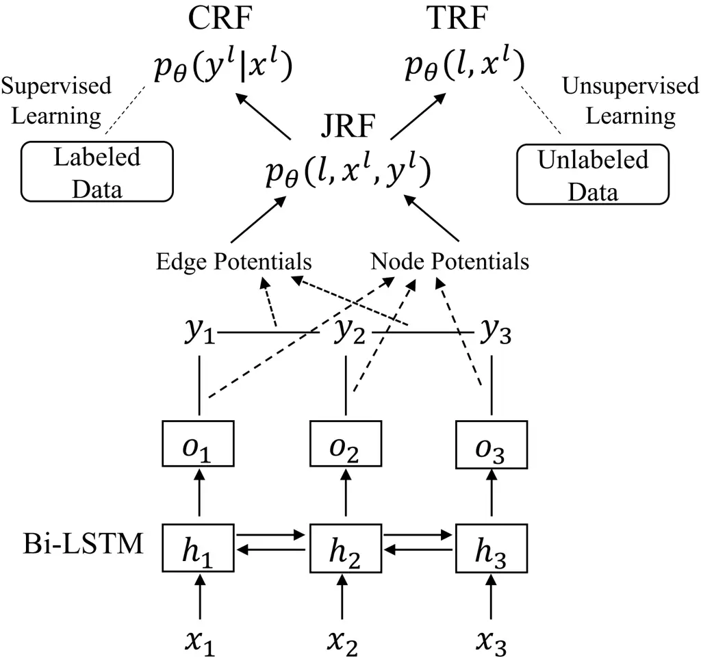

Figure 5.2: Overview of the JRF model. The node and edge potentials
define a JRF (a joint distribution over $`x^{l}`$ and $`y^{l}`$).
Inducing the conditional and the marginal from the joint yields a CRF
and a TRF respectively. A JRF can be trained from labeled data (acting
like a CRF) and also from unlabeled data (acting like a TRF). In
practice, the node potentials are calculated from the logits
$`o_{i},i=1,\cdots,l`$, from the NN, and the edge potential follows a
linear-chain definition.

###### Model learning.

Given different data resources (labeled or unlabeled), JRF can be
trained under different settings (supervised, unsupervised, or
semi-supervised) and applied in different downstream tasks (sequence
modeling or labeling), as illustrated in Fig. 5.2. Note that the
embedded CRF and TRF inside a JRF share all parameters $`\theta`$, which
is different from multi-task learning where only bottom-level parameters
are shared \[7\].

_Supervised learning of JRFs_ amounts to the training of the embedded
CRF with the following supervised objective, given labeled data in the
form of empirical distribution $`p_{\text{lab}}(x^{l},y^{l})`$,

```math
\mathop{\max}\limits_{\theta}J_{\text{sup}}(\theta)=E_{(x^{l},y^{l})\sim p_{\text{lab}}(x^{l},y^{l})}[\log p_{\theta}(y^{l}|x^{l})] \tag{5.9}
```

which can be solved by applying minibatch-based stochastic gradient
descent (SGD). At each iteration, a minibatch of sentences and labels is
sampled from $`p_{\text{lab}}(x^{l},y^{l})`$, denoted by
$`\mathcal{D}_{\text{lab}}`$, and the stochastic gradients are:

```math
\hbox{\hskip 21.6184pt\hskip-21.6184pt\hbox{$\frac{\partial J_{\text{sup}}(\theta)}{\partial\theta}$}\hskip-21.6184pt\hskip-4.16667pt\raisebox{16.25012pt}{\hbox{$\hbox{\lx@scalerel@obj{\lx@scalerel@obj{\lx@scalerel@obj{\kern-0.6pt\bigwedge\kern-0.6pt}}}}$}}\hskip-4.16667pt\hskip 21.6184pt}=\frac{1}{|\mathcal{D}_{\text{lab}}|}\sum_{(x^{l},y^{l})\in\mathcal{D}_{\text{lab}}}\left[\frac{\partial U_{\theta}(x^{l},y^{l})}{\partial\theta}-\frac{\partial U_{\theta}(x^{l})}{\partial\theta}\right]
```

_Unsupervised learning of JRFs_ amounts to the training the embedded
TRF, by applying the dynamic noise-contrastive estimation (DNCE)
algorithm developed in \[185\]. Given unlabeled data (e.g. sentences) in
the form of empirical distribution $`p_{\text{unl}}(l,x^{l})`$, DNCE
jointly optimizes over a JRF and a noise distribution
$`p_{\phi}(l,x^{l})`$ (generally a LSTM language model) parameterized by
$`\phi`$:

```math
\left\{\begin{split}\mathop{\max}\limits_{\theta}&{E_{(l,{x^{l}})\sim\frac{p_{\text{unl}}(l,x^{l})+p_{\phi}(l,x^{l})}{2}}}\left[\log\frac{{{p_{\theta}}(l,{x^{l}})}}{{{p_{\theta}}(l,{x^{l}})+{p_{\phi}}(l,{x^{l}})}}\right]+\\
&{E_{(l,{x^{l}})\sim{p_{\phi}}(l,{x^{l}})}}\left[\log\frac{{{p_{\phi}}(l,{x^{l}})}}{{{p_{\theta}}(l,{x^{l}})+{p_{\phi}}(l,{x^{l}})}}\right]\triangleq J_{\text{uns}}(\theta)\\
\mathop{\min}\limits_{\phi}&KL\left[{p_{\text{unl}}}(l,{x^{l}})||{p_{\phi}}(l,{x^{l}})\right]\end{split}\right. \tag{5.10}
```

Thanks to optimization of DNCE, the annoying normalizing constants
$`Z_{\theta}(l)`$ in JRFs can be jointly estimated along with the
parameter estimation. Specifically, we introduce parameters
$`\zeta_{l}`$ for $`\log Z_{\theta}(l)`$ and
$`\zeta=(\zeta_{1},\zeta_{2},...,\zeta_{L})`$, where $`L`$ is a
pre-defined maximum length. Hereafter, we denote by
$`\xi=(\theta,\zeta)`$ all the parameters in the JRF and rewrite
$`p_{\theta}(\cdot)`$ as $`p_{\xi}(\cdot)`$.

At each iteration, a minibatch of sentences are sampled from
$`p_{\text{unl}}(l,x^{l})`$, denoted by $`\mathcal{D}_{\text{unl}}`$,
two minibatches of sentences sampled from $`p_{\phi}(l,x^{l})`$, denoted
by $`\mathcal{B}_{1},\mathcal{B}_{2}`$
($`|\mathcal{B}_{2}|=2|\mathcal{B}_{1}|=2|\mathcal{D}_{\text{unl}}|`$),
and the stochastic gradients are:

```math
\left\{\begin{split}&\hbox{\hskip 21.08371pt\hskip-21.08371pt\hbox{$\frac{\partial J_{\text{unl}}(\xi)}{\partial\xi}$}\hskip-21.08371pt\hskip-4.16667pt\raisebox{16.25012pt}{\hbox{$\hbox{\lx@scalerel@obj{\lx@scalerel@obj{\lx@scalerel@obj{\kern-0.6pt\bigwedge\kern-0.6pt}}}}$}}\hskip-4.16667pt\hskip 21.08371pt}=\frac{1}{|\mathcal{B}_{2}|}\sum_{(l,x^{l})\in\mathcal{B}_{2}}\frac{{{p_{\xi}}(l,{x^{l}})}}{{{p_{\xi}}(l,{x^{l}})+{p_{\phi}}(l,{x^{l}})}}g(l,x^{l};\xi)\\
&\penalty\ \penalty\ \penalty\ \penalty\ \penalty\ \penalty\ \penalty\ +\frac{1}{|\mathcal{D}_{\text{unl}}|+|\mathcal{B}_{1}|}\sum_{(l,x^{l})\in\mathcal{D}_{\text{unl}}\cup\mathcal{B}_{1}}\frac{{{p_{\phi}}(l,{x^{l}})}}{{{p_{\xi}}(l,{x^{l}})+{p_{\phi}}(l,{x^{l}})}}g(l,x^{l};\xi)\\
&\hbox{\hskip 33.61719pt\hskip-33.61719pt\hbox{$\frac{\partial KL(p_{\text{unl}}||p_{\phi})}{\partial\phi}$}\hskip-33.61719pt\hskip-4.16667pt\raisebox{16.25012pt}{\hbox{$\hbox{\lx@scalerel@obj{\lx@scalerel@obj{\lx@scalerel@obj{\kern-0.6pt\bigwedge\kern-0.6pt}}}}$}}\hskip-4.16667pt\hskip 33.61719pt}=-\frac{1}{|\mathcal{D}_{\text{unl}}|}\sum_{(l,x^{l})\in\mathcal{D}_{\text{unl}}}\frac{\partial\log p_{\phi}(l,x^{l})}{\partial\phi}\end{split}\right.
```

where $`g(l,x^{l};\xi)`$ denotes the gradient of
$`\log p_{\xi}(l,x^{l})`$ w.r.t. $`\xi=(\theta,\zeta)`$, and the two
gradient components w.r.t. $`\theta`$ and $`\zeta`$ are
$`\partial U_{\theta}(x^{l})/\partial\theta`$ and
$`-(\delta(l=1),...,\delta(l=L))`$ respectively.

_Semi-supervised learning of JRFs_ over a mix of labeled and unlabeled
data amounts to combining the above supervised and unsupervised training
with the following semi-supervised objective:

```math
\left\{\begin{split}\mathop{\max}\limits_{\xi}&J(\xi)=J_{\text{sup}}(\xi)+\alpha J_{\text{uns}}(\xi)\\
\mathop{\min}\limits_{\phi}&KL\left[{p_{\text{unl}}}(l,{x^{l}})||{p_{\phi}}(l,{x^{l}})\right]\end{split}\right. \tag{5.11}
```

where $`\alpha`$ is the trade-off weight between supervised and
unsupervised learning, and $`\xi=(\theta,\zeta)`$ is defined before.

###### The performance of the JRF model.

The benefits of JRFs to sequence modeling and labeling are demonstrated
through two sets of experiments in \[163\]. First, various traditional
language models (LMs) such as Kneser-Ney (KN) smoothed n-gram LM \[20\],
LSTM LM \[199\] and TRF LM \[185\] are trained on Wall Street Journal
(WSJ) portion of Penn Treebank (PTB) English dataset (without using POS
tags). JRF LMs are trained by using POS tags. These models are then used
to rescore the 1000-best list generated from the WSJ’92 test set, with
similar experimental setup as in \[185\]. The JRF model is effective in
incorporating POS tags and performs the best with the lowest rescoring
word error rate (WER). Second, experiments on three sequence labeling
tasks - POS tagging, chunking and NER, with Google one-billion-word
dataset \[18\] as the unlabeled data resource, are conducted. It is
found that the JRF based SSL consistently outperforms the CRF baseline
and self-training.

### 5.4 JEMs and JRFs for semi-supervised learning

Now we have introduced the basics for establishing JEMs and JRFs for
fixed-dimensional and sequential data in Section 5.2 and Section 5.3,
respectively. As introduced in Section 5.1.2, there exist two different
methods for EBM based SSL - pre-training and joint-training.
Pre-training of RBMs once received attention in the early stage of
training DNNs \[63\]. Encouraging SSL results have been shown recently
for EBM based joint-training. In \[162, 207, 163\], state-of-the-art SSL
results are reported based on EBMs and across different data modalities
(images, natural languages, an protein structure prediction and year
prediction from the UCI dataset repository) and in different data
settings (fix-dimensional and sequence data).

So EBM-based SSL can be applied across different data modalities
(fix-dimensional and sequence data), by either of pre-training and
joint-training. Thus, there are four cases. In this section, we
systematically introduce these four cases, as summarized in Table 5.1,
where we take image classification and natural language labeling as
representative tasks. We continue with the notations in Definition 2.2.1
of EBMs parameterized by neural networks.

|                | Image classification                    | Natural language labeling               |
| -------------- | --------------------------------------- | --------------------------------------- |
| Observation    | $`x\in\mathbb{R}^{D}`$                  | $`x\in\bigcup_{l}\mathbb{V}^{l}`$       |
|                | continuous, fixed-dimensional           | discrete, sequence                      |
| Label          | $`y\in\{1,2,\cdots,K\}`$                | $`y\in\bigcup_{l}\{1,2,\cdots,K\}^{l}`$ |
| Pre-training   | $`U_{\theta}(x)=w^{T}h`$                | $`U_{\theta}(x)`$ in Eq. (5.12)         |
| Joint-training | $`U_{\theta}(x,y)=\Psi_{\theta}(x)[y]`$ | $`U_{\theta}(x,y)`$ in Eq. (5.16)       |

Table 5.1: Applications of EBMs across different domains: comparison and
connection (See text for details).

#### 5.4.1 Pre-training via EBMs for SSL

Pre-training via EBMs for SSL consists of two stages. The first stage is
pre-training an EBM on unlabeled data. It is followed by a fine-tuning
stage, where we can easily use the pre-trained EBM to initialize a
discriminative model and further train over labeled data.

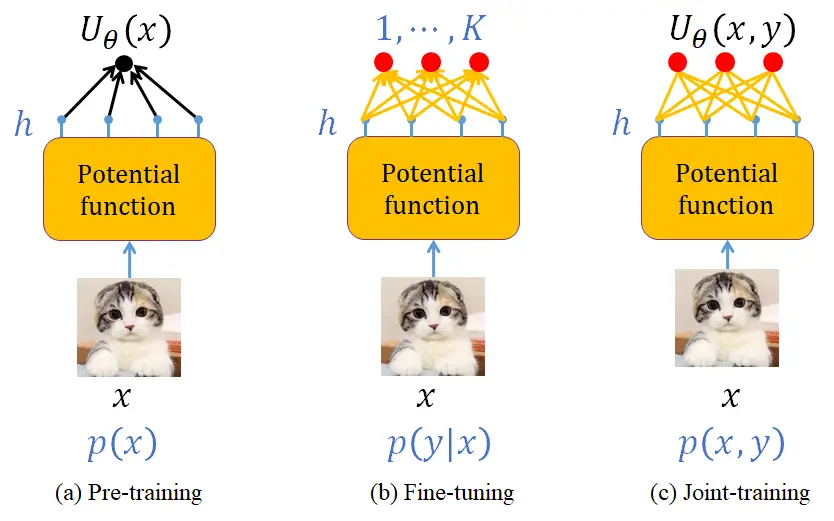

Figure 5.3: Illustration of EBM based semi-supervised image
classification. (a) Pre-training, (b) Fine-tuning, (c) Joint-training.

###### Pre-training of an EBM for semi-supervised image classification

essentially involves estimating $`p_{\theta}(x)`$ as defined in Eq.
(2.13) from unlabeled images. For the potential function
$`U_{\theta}(x)`$, we can use a multi-layer feed-forward neural network
$`\Phi_{\theta}(x):\mathbb{R}^{D}\rightarrow\mathbb{R}`$, which, in the
final layer, calculates a scalar via a linear layer,
$`U_{\theta}(x)=w^{T}h`$, as shown in Figure 5.3(a). Here
$`h\in\mathbb{R}^{H}`$ denotes the activation from the last hidden layer
and $`w\in\mathbb{R}^{H}`$ the weight vector in the final linear layer.
For simplicity, we omit the bias in describing linear layers throughout
Section 5.4.

In fine-tuning, as shown in Figure 5.3(b), we throw away $`w`$ and fed
$`h`$ into a new linear output layer, followed by
$`\text{softmax}(Wh)`$, to predict $`y`$, where
$`W\in\mathbb{R}^{K\times H}`$ denotes the new trainable weight
parameters and $`y\in\left\{1,\cdots,K\right\}`$ the class label. It can
be seen that pre-training aims to learn representations that may be
useful for multiple downstream tasks, and information about the labels
is not utilized until the fine-tuning stage.

###### Pre-training of an EBM for semi-supervised natural language labeling (e.g., POS tagging)

is similar to the above procedure of pre-training of an EBM for
semi-supervised image classification. In pre-training, we estimate an
EBM-based language model $`p_{\theta}(x)`$ from unlabeled text corpus.
Neural networks with different architectures can be used to implement
the potential function
$`\Phi_{\theta}(x):\mathbb{V}^{l}\rightarrow\mathbb{R}`$ given length
$`l`$. With abuse of notation, here $`x=(x_{1},\ldots,x_{l})`$ denotes a
token sequence of length $`l`$, and $`x_{i}\in\mathbb{V},i=1,\cdots,l`$.
For example, as shown in Figure 5.4(a), we can use the bidirectional
LSTM based potential function in \[185\] as follows:

```math
U_{\theta}(x)=\sum_{i=1}^{l-1}h_{f,i}^{T}e_{i+1}+\sum_{i=2}^{l}h_{b,i}^{T}e_{i-1} \tag{5.12}
```

where $`e_{i},h_{f,i}`$ and $`h_{b,i}`$ are of the same dimensions,
denoting the output embedding vector, the last hidden vectors of the
forward and backward LSTMs respectively at position $`i`$.

In fine-tuning, as shown in Figure 5.4(b), we add a CRF, as the
discriminative model, on top of the extracted representations,
$`(h_{f,i},h_{b,i}),i=1,\cdots,l`$, to do sequence labeling, i.e., to
predict a sequence of labels $`y=(y_{1},\ldots,y_{l})`$ with one label
for one token at each position, where
$`y_{i}\in\left\{1,\cdots,K\right\}`$ denotes the label at position
$`i`$. Specifically, we concatenate $`h_{f,i}`$ and $`h_{b,i}`$, add a
linear output layer to define the node potential, and add a matrix
$`A\in\mathbb{R}^{K\times K}`$ to define the edge potential, as in
recent neural CRFs \[81, 92\]. The parameters to be fine-tuned are the
weights in the linear output layer and the edge potential matrix $`A`$.

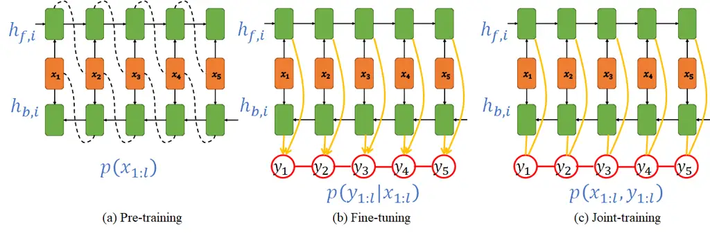

Figure 5.4: Illustration of EBM based sequence labeling. (a)
Pre-training, (b) Fine-tuning, (c) Joint-training.

#### 5.4.2 Joint-training via EBMs for SSL

The above pre-training via EBMs for SSL considers the modeling of only
observations $`x`$ without labels $`y`$. The joint-training refers to
the joint modeling of $`x`$ and $`y`$:

```math
p_{\theta}(x,y)=\frac{1}{Z(\theta)}\exp\left[U_{\theta}(x,y)\right] \tag{5.13}
```

Then, it can be easily seen, as detailed in Section 5.2, that the
conditional density $`p_{\theta}(y|x)`$ implied by the joint density Eq.
(5.13) is:

```math
p_{\theta}(y|x)=\frac{p_{\theta}(x,y)}{p_{\theta}(x)}=\frac{\exp(U_{\theta}(x,y))}{\sum_{y^{\prime}}\exp(U_{\theta}(x,y^{\prime}))} \tag{5.14}
```

And the implied marginal density is

```math
p_{\theta}(x)=\frac{1}{Z(\theta)}\exp(U_{\theta}(x)) \tag{5.15}
```

where, with abuse of notation,
$`U_{\theta}(x)\triangleq log\sum_{y}\exp\left[U_{\theta}(x,y)\right]`$.
Different from pre-training, the unsupervised objective
$`p_{\theta}(x)`$ depends on the targeted task. The key for EBM based
joint-training for SSL is to choose suitable $`U_{\theta}(x,y)`$ such
that both $`p_{\theta}(y|x)`$ and $`p_{\theta}(x)`$ can be tractably
optimized.

###### Joint-training of an EBM for semi-supervised image classification

considers a neural network
$`\Psi_{\theta}(x):\mathbb{R}^{D}\rightarrow\mathbb{R}^{K}`$, which, as
shown in Figure 5.3(c), accepts the image $`x`$ and outputs an vector,
whose size is equal to the number of class labels, $`K`$. Then we define
$`U_{\theta}(x,y)=\Psi_{\theta}(x)[y]`$, where $`[y]`$ denotes the
$`y`$-th element of a vector. With the above potential definition, it
can be easily seen that the implied conditional density
$`p_{\theta}(y|x)`$ is exactly a standard $`K`$-class softmax based
classifier, using the $`K`$ logits calculated by the neural network
$`\Psi_{\theta}(x)`$ from the input $`x`$. And we do not need to
calculate $`Z(\theta)`$ for classification. Therefore, we can conduct
SSL over a mix of labeled and unlabeled data by maximizing the
(weighted) sum of $`\log p_{\theta}(y|x)`$ and $`\log p_{\theta}(x)`$,
where both optimizations are tractable as detailed in \[162\].

###### Joint-training of an EBM for semi-supervised natural language labeling

is similar to the above procedure of joint-training of an EBM for
semi-supervised image classification, with $`x=(x_{1},\ldots,x_{l})`$
and $`y=(y_{1},\ldots,y_{l})`$,
$`x_{i}\in\mathbb{V},y_{i}\in\left\{1,\cdots,K\right\},i=1,\cdots,l`$.
As shown in Figure 5.4(c), we consider a neural network
$`\Psi_{\theta}(x):\mathbb{V}^{l}\rightarrow\mathbb{R}^{l\times K}`$ and
define

```math
U_{\theta}(x,y)=\sum_{i=1}^{l}\Psi_{\theta}(x)[i,y_{i}]+\sum_{i=1}^{l}A[y_{i-1},y_{i}] \tag{5.16}
```

where $`[\cdot,\cdot]`$ denotes the element of a matrix and
$`A\in\mathbb{R}^{K\times K}`$ models the edge potential for adjacent
labels. With the above potential definition, it can be easily seen, as
detailed in Section 5.3, that the conditional density
$`p_{\theta}(y|x)`$ implied by the joint density Eq.(5.13) is exactly a
CRF with node potentials $`\Psi_{\theta}(x)[i,y_{i}]`$ and edge
potentials $`A[y_{i-1},y_{i}]`$, and the implied marginal density
$`p_{\theta}(x)`$ is exactly a trans-dimensional random field (TRF)
language model \[189, 184, 186\]. Training of both models are tractable
as detailed in \[163, 185\].

#### 5.4.3 Comparison of joint-training and pre-training

In \[164\], a suite of SSL experiments are conducted on standard
benchmark datasets in different domains, including the CIFAR-10 and SVHN
datasets \[162\] for image classification and the POS, chunking and NER
datasets \[65, 163\] for natural language labeling. It is revealed that
joint-training EBMs outperform pre-training EBMs marginally but nearly
consistently. Presumably, this is because that the optimization of
joint-training is directly related to the targeted task, but
pre-training is not aware of the labels for the targeted task.

Full detailed experimental results are referred to \[164\]. Here we
present some results for illustration. In \[164\], the standard data
split for training and testing is used. When changing the amount of
labeled and unlabeled data for training, varying proportions (e.g., 10%,
100%) of labels are selected from the original full set of labeled data.
Hereafter, the amount of labels is thus described in terms of
proportions. “100% labeled” means 50K images for CIFAR-10, and 56K,
7.4K, 14K sentences for POS, chunking and NER, respectively.

|                                                                     |                  |
| ------------------------------------------------------------------- | ---------------- |
| Methods                                                             | error (%)        |
| CatGAN \[165\]                                                      | 19.58$`\pm`$0.46 |
| Ladder network \[139\]                                              | 20.40$`\pm`$0.47 |
| Improved-GAN \[149\]                                                | 18.63$`\pm`$2.32 |
| BadGAN \[36\]                                                       | 14.41$`\pm`$0.30 |
| Sobolev-GAN \[109\]                                                 | 15.77$`\pm`$0.19 |
| Supervised baseline                                                 | 25.72$`\pm`$0.44 |
| Pre-training+fine-tuning EBM                                        | 21.40$`\pm`$0.38 |
| Joint-training EBM                                                  | 15.12$`\pm`$0.36 |
| Results below this line cannot be directly compared to those above. |                  |
| VAT small \[106\]                                                   | 14.87            |
| Temporal Ensembling \[80\]                                          | 12.16$`\pm`$0.31 |
| Mean Teacher \[172\]                                                | 12.31$`\pm`$0.28 |

Table 5.2: SSL for image classification over CIFAR-10 with 4,000 labels
for a full training set of 50K images. The upper/lower blocks show the
generative/discriminative SSL methods respectively. The means and
standard deviations are calculated over ten independent runs with
randomly sampled labels.

###### SSL for Image Classification.

In \[164\], different generative SSL methods are compared over CIFAR-10.
As in previous works, 4,000 labeled images are randomly sampled for
training. The remaining images are treated as unlabeled. It can be seen
from Table 5.2 that semi-supervised EBMs, especially the joint-training
EBMs, produce strong results on par with state-of-art generative SSL
methods⁵⁵ 5 As discussed in \[162\], Bad-GANs could hardly be classified
as a generative SSL method.. Furthermore, joint-training EBMs outperform
pre-training+fine-tuning EBMs by a large margin in this task. Note that
some discriminative SSL methods, as listed in the lower block in Table
5.2, also produce superior results but heavily utilize domain-specific
data augmentations, and thus are not directly compared to the generative
SSL methods.

###### SSL for Natural Language Labeling.

In this experiment, different SSL methods are evaluated for natural
language labeling over three tasks - POS tagging, chunking and NER. The
following benchmark datasets are used - PTB POS tagging, CoNLL-2000
chunking and CoNLL-2003 English NER, as in \[92, 28, 65, 163\]. Varying
proportions of labels are sampled as labeled training data and use the
Google one-billion-word dataset \[18\] as the large pool of unlabeled
sentences. A large scale of experiments are conducted, covering the
labeling proportions of 2%, 10% and 100% with “U/L” (the ratio between
the amount of unlabeled and labeled) of 50, 250 and 500 for three tasks,
which consist of a total of 27 settings. The network architectures in
\[163\] is used. After some empirical search, hyper-parameters (tuned
separately for different methods) are fixed, which are used for all the
27 settings.

Table 5.3 only show the relative numerics, absolute numerics are
referred to \[164\]. The main observations are as follows.

- •
  The joint-training EBMs outperform the supervised baseline in 25 out
  of the 27 settings. Since we perform one run for each setting, this
  indicates 2 outliers.
- •
  The effects of increasing the labeling sizes on the improvements of
  the joint-training EBMs over the supervised baseline with a fixed
  “U/L” are mixed. For POS/chunking/NER, the largest improvements are
  achieved under 2%/10%/100% labeled, respectively. It seems that the
  working point where an SSL method brings the largest improvement over
  the supervised baseline is task dependent. Suppose that the working
  point is indicated by the performance of the supervised baseline, then
  the SSL method brings the largest effect when the performance of the
  supervised baseline is moderate, i.e., neither too low nor too high.
- •
  Joint-training EBMs outperform pre-training EBMs in 23 out of the 27
  settings marginally but nearly consistently. A possible explanation is
  that pre-training is not aware of the labels for the targeted task and
  is thus weakened for representation learning. In contrast, the
  marginal likelihood optimized in joint-training is directly related to
  the targeted task.
- •
  It seems that the degrees of improvements of the joint-training EBMs
  over the pre-training EBMs are not much affected when varying the
  labeling sizes and the “U/L” ratios.

|           |     | joint over sup. |          |      | joint over pre. |          |      |
| --------- | --- | --------------- | -------- | ---- | --------------- | -------- | ---- |
| Labeled   | U/L | POS             | Chunking | NER  | POS             | Chunking | NER  |
| $`2\%`$   | 50  | 7.9             | 16.5     | -2.7 | 4.7             | 3.4      | 3.7  |
|           | 250 | 12.6            | 16.6     | 1.5  | 4.2             | 0.9      | 0.1  |
|           | 500 | 15.1            | 20.3     | 4.5  | 4.1             | -0.3     | -1.5 |
| $`10\%`$  | 50  | 5.6             | 18.0     | 0.9  | 3.8             | 3.0      | 5.0  |
|           | 250 | 6.0             | 18.3     | -1.2 | 3.8             | 9.4      | -0.7 |
|           | 500 | 8.5             | 21.8     | 1.0  | 5.2             | 3.7      | -4.1 |
| $`100\%`$ | 50  | 3.1             | 10.3     | 6.5  | 3.5             | 5.3      | 1.1  |
|           | 250 | 5.0             | 13.6     | 8.3  | 3.5             | 7.4      | 3.6  |
|           | 500 | 6.2             | 14.0     | 8.4  | 4.3             | 6.4      | 2.5  |

Table 5.3: Relative improvements by joint-training EBMs compared to the
supervised baseline (abbreviated as sup.) and the
pre-training+fine-tuning EBMs (abbreviated as pre.) respectively. The
evaluation metric is accuracy for POS and $`F_{1}`$ for chunking and
NER. “Labeled” denotes the amount of labels in terms of the proportions
w.r.t. the full set of labels. “U/L” denotes the ratio between the
amount of unlabeled and labeled data.

### 5.5 JRFs for calibrated natural language understanding

##### Motivation

In this section, we describe how the joint EBMs (JEMs), as introduced in
Section 5.2, can be used for calibrated natural language understanding.
_Calibration_ refers to how well a classification model’s confidence
(reflected by its output posterior probability) aligns with its actual
accuracy. As deep learning models achieve amazing accuracy in computer
vision and natural language processing (NLP), more research attention
has been drawn to the calibration aspect of these models. As shown by
\[54\], the high accuracy from deep models does not always lead to
better calibration. This motivates an important line of works attempting
to achieve a better trade-off between accuracy and calibration.

Most existing calibration methods (see references in \[60\]) generally
rescale the posterior distribution predicted from the classifier after
training. Such post-processing methods require a held-out development
set with a decent number of samples to be available. In another line of
work, \[49\] shows that one can train a joint EBM together with the
standard training of a neural classifier. Although calibration is not
explicitly addressed during EBM training, the calibration of the
resulting classifier is shown to be greatly improved. However, the
training framework proposed by \[49\] is designed for image classifiers,
and it can not be readily applied to discrete text data. \[60\]
investigates JEM training during the finetuning of pre-trained text
encoders (e.g., BERT or RoBERTa) for natural language understanding
(NLU) tasks.

##### The JEM model for NLU

\[60\] considers the finetuning of pre-trained text encoder on NLU
tasks. Assume samples from the data distribution $`p_{\text{data}}`$ are
in the form of $`(x,y)`$ pairs, where $`x`$ usually refers to a single
or a pair of sentences, and $`y`$ refers to the corresponding label. The
number of classes are denoted by $`|\mathcal{Y}|`$.

Given input $`x`$, a text encoder model (e.g., BERT or RoBERTa) is
firstly used to encode $`x`$, and the resulting embedding is denoted by
$`\text{enc}(x)`$. For the target classification task, a classifier
$`f_{\text{CLS}}`$, which could be a simple linear transform or a
multi-layer perception (MLP), will be applied to $`\text{enc}(x)`$. The
output logits are denoted as $`f_{\text{CLS}}(\text{enc}(x))`$, whose
dimension is equal to the number of possible classes $`|\mathcal{Y}|`$.
The $`y`$-th logit is denoted by $`f_{\text{CLS}}(\text{enc}(x))[y]`$.
The posterior distribution $`p_{\theta}(y|x)`$ is obtained by applying a
softmax operation to the logits, where $`\theta`$ refers to the
parameters in the model.

In standard finetuning, the cross-entropy (CE) loss and gradient based
optimizers are used to train the classifier:

```math
\mathcal{L}_{CE}=\mathbb{E}_{(x,y)\sim p_{\text{data}}}(-\log p_{\theta}(y|x)). \tag{5.17}
```

In the following, we will introduce how a JEM model can be defined on
top of the text encoder for calibrated NLU.

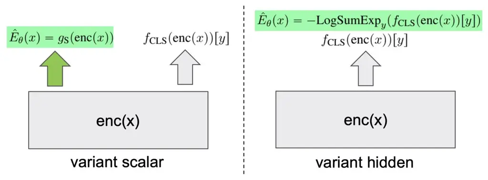

Figure 5.5: Comparison of the _scalar_ and the _hidden_ variants of
energy functions. The modules introduced for EBM are shaded in green.
\[60\]

\[60\] considers a JEM model in a residual form, similar to Section
3.3.3 and Section 4.4.1. The energy function for modeling the marginal
distribution of $`x`$ is defined as follows:

```math
E_{\theta}(x)=-\log p_{\text{N}}(x)+\hat{E}_{\theta}(x) \tag{5.18}
```

where $`p_{\text{N}}(x)`$ is the base distribution, which will also be
used as the noise distribution during NCE training. \[60\] examines
three variants of the residual energy function $`\hat{E}_{\theta}(x)`$.

- •
  Variant _scalar_. Another linear layer $`g_{\text{S}}`$ is introduced
  to define the energy function, whose output is a scalar:

  ```math
  \hat{E}_{\theta}(x)=g_{\text{S}}(\text{enc}(x)).
  ```

- •
  Variant _hidden_. Similar to \[49, 162\], starting from a softmax
  based classifier, an EBM can be defined with the logits as follows:

  ```math
  \hat{E}_{\theta}(x)=-\text{LogSumExp}_{y=1}^{|\mathcal{Y}|}(f_{\text{CLS}}(\text{enc}(x))[y]).
  ```

  Different from the _scalar_ variant, here the energy function directly
  uses the logits for prediction (visualized in Figure 5.5). Hence the
  impact on the model’s classification behavior could be larger.

- •
  Variant _sharp-hidden_. The _hidden_ variant has a potential weakness
  that, the correlation between input $`x`$ and the prediction $`y`$ is
  not addressed because the energy is distributed among all the logits.
  Motivated by this potential issue, the following _sharp_ variant is
  proposed, which can be viewed as an approximation to the _hidden_
  variant, and is found to work well in practice \[60\].

  ```math
  \hat{E}_{\theta}(x)=-\max_{y}f_{\text{CLS}}(\text{enc}(x))[y].
  ```

##### NCE training of the JEM model

Similar to the discussion in Section 4.4.1, NCE is applied to train the
residual JEM model. NCE trains the model to discriminate between real
samples from $`p_{\text{data}}`$ and noise samples from a given noise
distribution $`p_{\text{N}}`$. The NCE loss is the same as Eq. (4.33):

```math
\mathcal{L}_{\text{NCE}}=-\mathop{\mathbb{E}}\limits_{x_{+}\sim p_{\text{data}}}\log\frac{1}{1+\nu\exp(E_{\theta}(x_{+}))}-\nu\mathop{\mathbb{E}}\limits_{x_{-}\sim p_{\text{N}}}\log\frac{1}{1+\exp(-E_{\theta}(x_{-}))/\nu}
```

where $`\nu`$ is the ratio of noise samples to real samples.

In \[60\], $`\mathcal{L}_{CE}`$ and $`\mathcal{L}_{NCE}`$ are jointly
optimized during training, that is:

```math
\mathcal{L}_{\text{joint}}=\mathcal{L}_{\text{CE}}+\mathcal{L}_{\text{NCE}}
```

For constructing the noise distribution $`p_{\text{N}}(x)`$, \[60\]
finetunes the GPT-2 language model \[135\] with samples from the target
training set. However during NCE training, the energy model is found to
easily discriminate between data samples and noise samples, which makes
training ineffective \[60\]. To alleviate this issue, an objective
similar to the masked language model (MLM) loss \[40\] is adopted during
the finetuning of the noise model. With a given mask ratio $`M`$ (e.g.,
0.4), \[60\] randomly masks part of $`x`$, and trains the model to
complete it:

```math
\mathcal{L}_{\text{MLM}}=-\mathop{\mathbb{E}}\limits_{x\sim p_{\text{data}},x^{m}\sim\text{mask}(x,M)}\log p_{\text{N}}(x|x^{m})
```

During noise sample generation, adopting the same mask ratio $`M`$, a
masked $`x^{m}`$ is fed to $`p_{\text{N}}`$ ($`x`$ is from the training
set), and the generated sample are used as the noise sample. In this
way, the noise distribution is made closer to the data distribution.

##### Evaluation of the Calibration performance

To measure calibration performance, expected calibration error (ECE)
metric is used, following \[54, 49\]. Given an input sample $`x`$, for
each label $`y`$, we say that the model predicts that $`x`$ belongs to
label $`y`$ with confidence $`p_{\theta}(y|x)`$. Assuming the test-set
contains $`n`$ samples, we will have $`n\times|\mathcal{Y}|`$
predictions.

ECE first partitions all predictions into $`B`$ equally-spaced bins by
its confidence. Following \[49\], $`B=20`$ is used, which means the
width of each bin is $`0.05`$. For example, the first bin contains all
predictions that have confidence in the range of $`[0,0.05)`$. Then for
each bin ECE computes how the average of confidence is different from
its actual accuracy:

```math
ECE=\frac{1}{|\mathcal{Y}|}\sum_{y=1}^{|\mathcal{Y}|}\sum_{b=1}^{B}\frac{|B_{yb}|}{n}|\text{acc}(B_{yb})-\text{conf}(B_{yb})| \tag{5.19}
```

where $`n`$ is the number of test samples. $`\text{acc}(B_{yb})`$ is the
ratio of samples ($`x`$) whose true label is indeed $`y`$ in the bin
$`B_{yb}`$, and $`\text{conf}(B_{yb})`$ is the average confidence in
that bin.

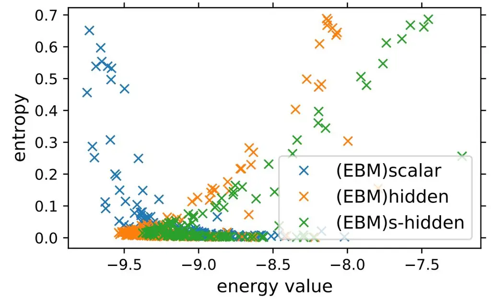

Figure 5.6: The entropy of the posterior ($`p_{\theta}(\cdot|x)`$)
versus energy value $`\hat{E}_{\theta}(x)`$ for SST-2 test-set samples.
\[60\]

\[60\] uses the RoBERTa-base model as the text encoder and finetune it
on eight GLUE tasks \[182\]. It is found that EBM training is able to
reach a better trade-off between accuracy and calibration. In most
tasks, all three EBM variants get substantial improvement in ECE with
little or no loss in accuracy comparing to the (strong) baseline
methods.

How does the model get better calibration? Figure 5.6 from \[60\] give
some analysis. Figure 5.6 shows the energy value $`\hat{E}_{\theta}(x)`$
versus the entropy of the posterior distribution

```math
H(p_{\theta}(\cdot|x))=-\sum_{y=1}^{|\mathcal{Y}|}p_{\theta}(y|x)\log p_{\theta}(\cdot|x)
```

for samples in the SST-2 test set. It is shown that models trained with
the _hidden_ and _sharp-hidden_ variants tend to assign more
conservative predictions (reflected by higher entropy) for higher-energy
(less likely) samples. It is hypothesized that this is due to the strong
coupling between the energy function and the classification logits.
However, this interesting trend (Figure 5.6) is not observed in all
datasets (e.g., QNLI).

## Chapter 6 Conclusion

### 6.1 Summary

Energy-based models (EBMs) form an important aspect of modern artificial
intelligence and signal processing. Unlike most other probabilistic
models which are self-normalized, EBMs specify probability density
functions up to an unknown normalizing constant, and thus are also
referred to as _non-normalized probabilistic models_. Such model
definition of not imposing normalization enables a great power and
flexibility to the modeling process. One is generally free to choose any
nonlinear regression function as the energy function, as long as it
remains normalizable in principle. Accompanied with such flexibility, we
have also shown the advantages of EBMs in naturally overcoming label
bias and exposure bias suffered by locally-normalized models (Section
4.1.2) and in hybrid generative-discriminative and semi-supervised
learning (Section 5).

On the other hand, although the flexibility of EBMs can provide
significant modeling advantages, both computation of the exact
likelihood and exact sampling from these models are generally
intractable, which makes training of EBMs especially difficult and
limits their applications. Moreover, the sequential nature of speech and
language also presents special challenges and needs treatment different
from processing fix-dimensional data (e.g., images).

We are making progress. This monograph presents a systematic
introduction to energy-based models, including both algorithmic progress
and applications in speech and language processing, which is organized
into four chapters.

In Chapter 2, we provide a self-contained introduction to basics for
EBMs, including model definitions, learning algorithms, and
sampling/generation algorithms. There are two remarkable features in our
introduction. First, we starts with the framework of probabilistic
graphical models (PGMs). The PGM framework enables readers to appreciate
EBMs from the perspective of undirected graphical models and easily
understand the differences between undirected graphical models and
directed graphical models, and between globally-normalized and
locally-normalized. Graphical models provide a natural tool for
formulating variations on classical methods, as well as for exploring
entirely new models. Second, our introduction to the stochastic
approximation (SA) methodology is very useful for readers to develop new
algorithms for learning EBMs, particularly learning with Monte Carlo
sampling. The SA methodology is more general than the ordinary
stochastic gradient descent (SGD) technique, while SGD is only one
instance of SA.

The next three chapters are dedicated to present how to apply EBMs in
three different scenarios, i.e., for modeling marginal, conditional and
joint distributions, respectively. As visualized in Figure 1.2, our such
organization is comprehensive and distinctive. A wide range of
applications in speech and language processing are covered, including
language modeling, representation learning over text, speech
recognition, sequence labeling in NLP, text generation, semi-supervised
learning, and calibrated natural language understanding.

### 6.2 Future challenges and directions

EBM based methods represent an important class for the probabilistic
approach to many fields. Despite the progress achieved in these years,
much more work needs to be carried out.

- •
  Applications of EBMs are still mainly limited by lack of effective and
  efficient training techniques. Training techniques are crucial to
  problem solving with EBMs, and will remain an active direction for
  future research. EBMs have been especially difficult to train. We
  mainly introduce maximum likelihood training with MCMC sampling,
  noise-contrastive estimation (NCE) and briefly covers score matching
  (SM). There has been persistent and ongoing interest in developing
  effective modeling and training techniques for learning EBMs (see
  \[204\] and its references), but those methods are mostly first
  studied for fix-dimensional data. There is vast room to improve
  training techniques for EBMs, especially for _sequential data_ such as
  speech and language.

  Moreover, as we have discussed, learning EBMs over _discrete data_ are
  more challenging than over continuous data, due to the combinatorial
  explosion of the state space. Langevin sampling, a particular MCMC
  sampling method which utilizes gradients, has been dominantly used in
  training EBMs over continuous data. A recent progress in \[48, 132\]
  begins to use gradients of the likelihood function with respect to its
  discrete inputs to propose updates in a Metropolis-Hastings sampler.
  More further research is needed.

- •
  More downstream applications of EBMs are worthwhile for exploration.
  Considering the potential advantages of EBMs in modeling flexibility,
  overcoming label bias and exposure bias, and hybrid
  generative-discriminative and semi-supervised learning, the results
  reviewed in this monograph are only preliminary. There are many
  interesting tasks which could be approached by EBMs.

  The applications of EBMs require more skill and experience, apart from
  using the mainstream deep learning toolkits. To help the readers to
  get familiar with the techniques for developing and applying
  energy-based models, we summarize some open-source toolkits in
  Appendix C.

- •
  We look forward to more foundational and interdisciplinary research
  around EBMs. There is an opportunity for developing _physics-based
  methods_ that could address the difficulty of calculating or sampling
  the partition function of EBMs \[67\]. There are emergent areas of
  research at the interfaces of machine learning, quantum computing,
  many-body physics, and optimization (see references in \[67\]).

  Many recent _biologically plausible_ algorithms utilize the framework
  of energy-based models \[155, 103\]. Biologically plausible algorithms
  compute gradients that approximate those computed by back-propagation
  (BP), and operate in ways that more closely satisfy the constraints
  imposed by neural circuitry. We anticipate that progress in
  neuroscience and EBM based machine learning will benefit from an
  interplay between both fields.

###### Acknowledgements.

Thanks to collaborators and students: Zhiqiang Tan, Bin Wang, Hongyu
Xiang, Yunfu Song, Kai Hu, Keyu An, Huahuan Zheng, Silin Gao, Hong Liu,
Junlan Feng, and Yi Huang. Thanks for funding supports from

- •
  NSFC (National Science Foundation of China) through No. 60402029, No.
  61075020, No. 61473168, and No. 61976122;
- •
  Ministry of Education and China Mobile joint funding through No.
  MCM20170301;
- •
  Joint Institute of Tsinghua University - China Mobile Communications
  Group Co. Ltd.;
- •
  Beijing National Research Center for Information Science and
  Technology;
- •
  Tsinghua Initiative through No. 20121088069 and No. 20141081250;
- •
  Toshiba Corporation;
- •
  Apple Corporation.

## Appendix A Notations and definitions

### A.1 Notations

| Example                   | Description                                                                                                                                                                                                                                                                                                                              |
| ------------------------- | ---------------------------------------------------------------------------------------------------------------------------------------------------------------------------------------------------------------------------------------------------------------------------------------------------------------------------------------- | --- | --------------------------------------------- |
| $`z_{i:j}`$               | For any generic sequence $`\left\{z_{n}\right\}`$, we shall use $`z_{i:j}`$ to denote $`z_{i},z_{i+1},\cdots\,z_{j}`$. Similarly, wherever a collection of indices appears in the subscript, we refer to the corresponding collection of indexed variables, e.g., $`c_{l,1:H}\triangleq\left\{c_{l,1},c_{l,2},\cdots\,c_{l,H}\right\}`$. |
| $`x`$                     | $`x`$ generally denotes a random variable, which can either be scalar- or vector-valued, and often denotes the observation variable. For simplicity, we also use the same notation $`x`$ to denote the values taken by the random variable $`x`$, e.g., in the argument of its density function, which should be clear from the context. |
| $`h`$                     | The hidden variable.                                                                                                                                                                                                                                                                                                                     |
| $`y`$                     | The class label, or the output variable.                                                                                                                                                                                                                                                                                                 |
| $`                        | \mathcal{B}                                                                                                                                                                                                                                                                                                                              | `$  | The cardinality/size of a set $`\mathcal{B}`$ |
| $`x^{T},A^{T}`$           | A superscript $`T`$ denotes the transpose of a vector $`x`$ or matrix $`A`$                                                                                                                                                                                                                                                              |
| $`\Delta^{K}`$            | The $`K`$-dimensional probability simplex.                                                                                                                                                                                                                                                                                               |
| $`\sum_{x}f(x)`$          | The summation over $`x`$ is a shorthand, which should be an appropriate combination of summation and integration, depending on the components of $`x`$ being discrete variables, continuous variables, or a combination of the two.                                                                                                      |
| $`p_{\text{ora}}(\cdot)`$ | The (unknown) oracle density, sometimes also known as the data distribution and denoted as $`p_{\text{data}}(\cdot)`$.                                                                                                                                                                                                                   |
| $`p_{\text{emp}}(\cdot)`$ | The empirical density. For a training dataset consisting of $`n`$ independent and identically distributed (IID) data points $`\left\{x_{1},\cdots,x_{N}\right\}`$, we have                                                                                                                                                               |

````math
p_{\text{emp}}(x)\triangleq\frac{1}{N}\sum_{i=1}^{N}\delta(x-x_{i})
``` |
| $`p_{\theta}(\cdot),p(\cdot;\theta)`$ |  The (target) model density, parameterized by $`\theta`$. |
| $`q_{\phi}(\cdot),q(\cdot;\phi)`$ |  The auxiliary density introduced in training, parameterized by $`\phi`$. |
| $`\text{Uni}[a,b]`$ |  Uniform distribution for a continuous variable over interval $`[a,b]`$, or for a discrete variable over integers from $`a`$ to $`b`$. |

### A.2 Definitions

| Term |  Description |
|----|----|
| $`\sigma(v)`$ |  The sigmoid function, $`\sigma(v)\triangleq\frac{1}{1+e^{-v}}`$, also called the logistic sigmoid function. It is also known as a squashing function, since it maps the whole real line to \[0, 1\], which is necessary for the output to be interpreted as a probability. |
| $`\text{logit}(\sigma)`$ |  The logit function, $`\text{logit}(\sigma)\triangleq\log(\frac{\sigma}{1-\sigma})`$ for $`0<\sigma<1`$, also known as the inverse of the sigmoid function. It represents the log of the ratio of probabilities for two classes, also known as the log odds. |
| $`\text{softmax}(z_{1:K})`$ |  The softmax function, $`\text{softmax}(z_{1:K})_{k}\triangleq\frac{\exp(z_{k})}{\sum_{j=1}^{K}\exp(z_{j})}`$, which realizes normalization from $`\mathbb{R}^{K}`$ to $`\Delta^{K}`$ (the $`K`$-dimensional probability simplex). It is also known as the normalized exponential and can be regarded as a multiclass generalization of the logistic sigmoid. |
| $`\delta(x=a)`$ |  An indicator function of $`x`$ which takes the value 1 when $`x=a`$ and 0 otherwise. |
| $`H[q]`$ |  The entropy is defined as $`H[q]\triangleq-\int qlogq`$. |
| $`KL[p||q]`$ |  The inclusive KL-divergence between two distributions $`p(\cdot)`$ and $`q(\cdot)`$ is defined as $`KL[p||q]\triangleq\int plog\left(\frac{p}{q}\right)`$, which by default is called the KL-divergence, and is sometimes also referred to as the forward KL-divergence, relative entropy. |
| $`KL[q||p]`$ |  The exclusive KL-divergence is defined as $`KL[q||p]\triangleq\int qlog\left(\frac{q}{p}\right)`$, which is also referred to as the reverse KL-divergence. |

## Appendix B Background material

### B.1 Maximum entropy models

###### Theorem B.1.1.

When confronted by a probability distribution $`p(x)`$ about which only
a few facts are known, the maximum entropy principle (*maxent*) offers a
rule for choosing a distribution that satisfies those constraints \[31,
94\]. According to maxent, one should select the $`p(x)`$ that maximizes
the entropy

``` math
H(p)=-\sum_{x}p(x)\log p(x) \tag{B.1}
````

subject to the constraints. When there is a reference distribution
$`q(x)`$, one should select the $`p(x)`$ that minimizes the relative
entropy or Kullback-Leibler divergence¹¹ 1 When $`q(x)`$ is uniform,
this is the same as maximizing the entropy.

```math
KL(p||q)=\sum_{x}p(x)\log\frac{p(x)}{q(x)} \tag{B.2}
```

Assuming the constraints assert that the averages of certain functions
$`f_{k}(x)`$ are known, i.e.,

```math
E_{p(x)}\left[f_{k}(x)\right]=F_{k},k=1,2,\cdots \tag{B.3}
```

Then, it can be shown that by introducing Lagrange multipliers (one for
each constraint, including normalization),

- •
  The distribution that maximizes the entropy has the following form

  ```math
  p^{*}(x)=\frac{1}{Z}\exp\left(\sum_{k}w_{k}f_{k}(x)\right) \tag{B.4}
  ```

- •
  The distribution that minimizing relative entropy relative to
  $`q(x)`$, has the following form

  ```math
  p^{*}(x)=\frac{1}{Z}q(x)\exp\left(\sum_{k}w_{k}f_{k}(x)\right) \tag{B.5}
  ```

where $`\{w_{k}\}`$ are set such that the constraints Eq. (B.3) are
satisfied, and $`Z`$ is the normalizing constant. The two forms in Eq.
(B.4) and Eq. (B.5) are often collectively referred to as _maximum
entropy distributions_.

Theorem B.1.1 gives the form of maximum entropy distributions that
satisfy certain moment constraints. In an opposite way, when given that
a distribution satisfies the form of Eq. (B.4) or Eq. (B.5), the
following theorem establish the connection between the maximum entropy
distribution and the maximum likelihood distribution.

###### Theorem B.1.2.

Assume that a variable $`x`$ comes from a probability distribution of
the form in Eq. (B.4) or Eq. (B.5), where the functions $`f_{k}(x)`$ are
given, and the parameters $`\{w_{k}\}`$ are not known. A dataset
$`\{x^{(n)}\}`$ is supplied. Then, it can be shown that by
differentiating the log likelihood, the maximum-likelihood (ML)
parameters $`w_{\text{ML}}`$ satisfy

```math
\begin{split}E_{p(x)}\left[f_{k}(x)\right]&=\frac{1}{N}\sum_{n}f_{k}(x^{(n)}),k=1,2,\cdots\\
&=E_{p_{\text{emp}}(x)}\left[f_{k}(x)\right]\end{split} \tag{B.6}
```

where the left-hand is the model average under the fitted model, the
right-hand the empirical average over the training data points, and
$`p_{\text{emp}}(\cdot)`$ denotes the empirical density over the
training data points.

Combining the above two theorems, we can easily see that maximum entropy
fitting with $`F_{k}`$’s being set as the empirical averages is
equivalent to maximum likelihood fitting of a log-linear distribution
\[94, 129\].

### B.2 Fisher equality

Formally, for any density function $`p_{\theta}(x)`$, the partial
derivative w.r.t. $`\theta`$ of the log density function,
$`\frac{\partial}{\partial\theta}logp_{\theta}(x)`$, is called the
‘‘score’’. Under certain regularity conditions, the expectation of the
score w.r.t. the density itself is 0. This formula is often referred in
presenting Fisher information²² 2
[https://en.wikipedia.org/wiki/Fisher_information](https://en.wikipedia.org/wiki/Fisher_information),
so we call it _Fisher equality_, which, is frequently used in this
monograph.

```math
E_{p_{\theta}(x)}\left[\frac{\partial}{\partial\theta}\log p_{\theta}(x)\right]=0. \tag{B.7}
```

Further, based on the above basic Fisher equality, we have the following
very useful theorem.

###### Theorem B.2.1.

Consider any latent-variable model $`p_{\theta}(x,h)`$, which consisting
of observation $`x`$ and latent variable $`h`$, then we have

```math
\frac{\partial}{\partial\theta}\log p_{\theta}(x)=E_{p_{\theta}(h|x)}\left[\frac{\partial}{\partial\theta}\log p_{\theta}(x,h)\right] \tag{B.8}
```

which means that the gradient of the log marginal likelihood is equal to
the expected log joint likelihood, where the expectation is taken over
the posteriori distribution.

###### Proof B.2.2.

```math
\displaystyle\frac{\partial}{\partial\theta}\log p_{\theta}(x) \displaystyle=E_{p_{\theta}(h|x)}\left[\frac{\partial}{\partial\theta}\log p_{\theta}(x)\right]
```

```math
\displaystyle=E_{p_{\theta}(h|x)}\left[\frac{\partial}{\partial\theta}\log p_{\theta}(x,h)-\frac{\partial}{\partial\theta}\log p_{\theta}(h|x)\right]
```

```math
\displaystyle=E_{p_{\theta}(h|x)}\left[\frac{\partial}{\partial\theta}\log p_{\theta}(x,h)\right]
```

where in the second line, according to Fisher equality, we have

```math
E_{p_{\theta}(h|x)}\left[\frac{\partial}{\partial\theta}\log p_{\theta}(h|x)\right]=0,
```

and thus we obtain the final line. For simplicity, Eq. (B.2.2) is also
referred to as Fisher equality.

## Appendix C Open-source toolkits related to EBMs

- •
  Trans-dimensional random field (TRF) LMs:
  [https://github.com/thu-spmi/SPMILM](https://github.com/thu-spmi/SPMILM)
- •
  Energy-based cloze models for representation learning over text
  (Electric):
  [https://github.com/google-research/electra](https://github.com/google-research/electra)
- •
  CRF-based ASR Toolkit (CAT):
  [https://github.com/thu-spmi/CAT](https://github.com/thu-spmi/CAT)
- •
  Neural CRF Transducers for Sequence Labeling:
  [https://github.com/thu-spmi/SPMISeq](https://github.com/thu-spmi/SPMISeq)
- •
  Controlled text generation from pre-trained language models
  (mix-and-match):
  [https://github.com/mireshghallah/mixmatch](https://github.com/mireshghallah/mixmatch)
- •
  Learning neural random fields with inclusive auxiliary generators:
  [https://github.com/thu-spmi/Inclusive-NRF](https://github.com/thu-spmi/Inclusive-NRF)
- •
  JEMs and JRFs for semi-supervised learning:
  [https://github.com/thu-spmi/semi-EBM](https://github.com/thu-spmi/semi-EBM)

## References

- \[1\] Fredy Amaya and Jose Benedi “Improvement of a whole sentence
  maximum entropy language model using grammatical features” In _Proc.
  Ann. Meeting of the Association for Computational Linguistics (ACL)_,
  2001
- \[2\] Keyu An, Hongyu Xiang and Zhijian Ou “CAT: A CTC-CRF based ASR
  Toolkit Bridging the Hybrid and the End-to-end Approaches towards Data
  Efficiency and Low Latency” In _INTERSPEECH_, 2020
- \[3\] Keyu An et al. “Cuside: Chunking, simulating future context and
  decoding for streaming ASR” In _INTERSPEECH_, 2022
- \[4\] Daniel Andor et al. “Globally Normalized Transition-Based Neural
  Networks” In _Proceedings of the 54th Annual Meeting of the
  Association for Computational Linguistics (Volume 1: Long Papers)_,
  2016
- \[5\] Christophe Andrieu, Éric Moulines and Pierre Priouret “Stability
  of stochastic approximation under verifiable conditions” In _SIAM
  Journal on control and optimization_ 44.1 SIAM, 2005, pp. 283–312
- \[6\] Christophe Andrieu and Johannes Thoms “A tutorial on adaptive
  MCMC” In _Statistics and computing_ 18.4 Springer, 2008, pp. 343–373
- \[7\] Andreas Argyriou, Theodoros Evgeniou and Massimiliano Pontil
  “Multi-task feature learning” In _NIPS_, 2007
- \[8\] Thierry Artieres “Neural conditional random fields” In
  _AISTATS_, 2010
- \[9\] Anton Bakhtin et al. “Real or fake? learning to discriminate
  machine from human generated text” In _arXiv preprint
  arXiv:1906.03351_, 2019
- \[10\] David Belanger and Andrew McCallum “Structured Prediction
  Energy Networks” In _ICML_, 2016
- \[11\] Samy Bengio, Oriol Vinyals, Navdeep Jaitly and Noam Shazeer
  “Scheduled sampling for sequence prediction with recurrent neural
  networks” In _Advances in neural information processing systems_, 2015
- \[12\] Albert Benveniste, Michel Métivier and Pierre Priouret
  “Adaptive algorithms and stochastic approximations” New York:
  Springer, 1990
- \[13\] Julian Besag “Comments on “Representations of knowledge in
  complex systems” by U. Grenander and M.I. Miller” In _Journal of the
  Royal Statistical Society: Series B_ 56 Wiley Online Library, 1994,
  pp. 549–581
- \[14\] Christopher Bishop “Pattern recognition and machine learning”
  Springer, 2006
- \[15\] Guillaume Bouchard “Bias-variance tradeoff in hybrid
  generative-discriminative models” In _International Conference on
  Machine Learning and Applications (ICMLA)_, 2007
- \[16\] Hui Bu et al. “AISHELL-1: An open-source Mandarin speech corpus
  and a speech recognition baseline” In _2017 20th Conference of the
  Oriental Chapter of the International Coordinating Committee on Speech
  Databases and Speech I/O Systems and Assessment (O-COCOSDA)_, 2017
- \[17\] Sotirios. Chatzis and Yiannis Demiris “The Infinite-Order
  Conditional Random Field Model for Sequential Data Modeling” In _IEEE
  Transactions on Pattern Analysis and Machine Intelligence_, 2013
- \[18\] Ciprian Chelba et al. “One Billion Word Benchmark for Measuring
  Progress in Statistical Language Modeling” In _INTERSPEECH_, 2014
- \[19\] Hanfu Chen “Stochastic approximation and its applications”
  Springer Science & Business Media, 2002
- \[20\] Stanley Chen and Joshua Goodman “An empirical study of
  smoothing techniques for language modeling” In _Computer Speech &
  Language_ 13.4 Elsevier, 1999, pp. 359–394
- \[21\] Tianqi Chen, Emily Fox and Carlos Guestrin “Stochastic gradient
  Hamiltonian Monte Carlo” In _ICML_, 2014
- \[22\] Ting Chen, Simon Kornblith, Mohammad Norouzi and Geoffrey
  Hinton “A simple framework for contrastive learning of visual
  representations” In _arXiv:2002.05709_, 2020
- \[23\] Xie Chen et al. “Exploiting Future Word Contexts in Neural
  Network Language Models for Speech Recognition” In _IEEE/ACM
  Transactions on Audio, Speech, and Language Processing_ 27.9 IEEE,
  2019, pp. 1444–1454
- \[24\] Chung-Cheng Chiu et al. “State-of-the-art speech recognition
  with sequence-to-sequence models” In _ICASSP_, 2018
- \[25\] Jan Chorowski, Dzmitry Bahdanau, Kyunghyun Cho and Yoshua
  Bengio “End-to-end continuous speech recognition using attention-based
  recurrent NN: First results” In _arXiv preprint arXiv:1412.1602_, 2014
- \[26\] Kevin Clark, Minh-Thang Luong, Quoc Le and Christopher Manning
  “Electra: Pre-training text encoders as discriminators rather than
  generators” In _International Conference on Learning Representations
  (ICLR)_, 2020
- \[27\] Kevin Clark, Minh-Thang Luong, Quoc Le and Christopher Manning
  “Pre-Training Transformers as Energy-Based Cloze Models” In
  _Conference on Empirical Methods in Natural Language Processing
  (EMNLP)_, 2020
- \[28\] Kevin Clark, Minh-Thang Luong, Christopher Manning and Quoc Le
  “Semi-Supervised Sequence Modeling with Cross-View Training” In
  _EMNLP_, 2018
- \[29\] Michael Collins and Brian Roark “Incremental Parsing with the
  Perceptron Algorithm” In _ACL_, 2004
- \[30\] Ronan Collobert et al. “Natural language processing (almost)
  from scratch” In _Journal of machine learning research_ 12.Aug, 2011,
  pp. 2493–2537
- \[31\] Thomas Cover “Elements of information theory” John Wiley &
  Sons, 1999
- \[32\] Robert. Cowell, A. Dawid, Steffen. Lauritzen and David.
  Spiegelhalter “Probabilistic Networks and Expert Systems”
  Springer-Verlag, 1999
- \[33\] Ekin Cubuk, Barret Zoph, Jonathon Shlens and Quoc Le
  “RandAugment: Practical automated data augmentation with a reduced
  search space” In _CVPR_, 2020
- \[34\] Xiaodong Cui et al. “Reducing exposure bias in training
  recurrent neural network transducers” In _INTERSPEECH_, 2021
- \[35\] George Dahl, Dong Yu, Li Deng and Alex Acero “Context-dependent
  pre-trained deep neural networks for large-vocabulary speech
  recognition” In _IEEE Transactions on audio, speech, and language
  processing_ 20.1, 2012, pp. 30–42
- \[36\] Zihang Dai et al. “Good semi-supervised learning that requires
  a bad GAN” In _NIPS_, 2017
- \[37\] Peter Dayan, Geoffrey Hinton, Radford Neal and Richard Zemel
  “The helmholtz machine” In _Neural computation_ 7.5 MIT Press, 1995,
  pp. 889–904
- \[38\] Arthur. Dempster, Nan. Laird and Donald. Rubin “Maximum
  likelihood from incomplete data via the EM algorithm” In _Journal of
  the Royal Statistical Society_ 39, 1977
- \[39\] Yuntian Deng et al. “Residual energy-based models for text
  generation” In _ICLR_, 2020
- \[40\] Jacob Devlin, Ming-Wei Chang, Kenton Lee and Kristina Toutanova
  “Bert: Pre-training of deep bidirectional transformers for language
  understanding” In _Proceedings of the 2019 Conference of the North
  American Chapter of the Association for Computational Linguistics:
  Human Language Technologies, Volume 1 (Long and Short Papers)_, 2018,
  pp. 4171–4186
- \[41\] Greg Durrett and Dan Klein “Neural CRF Parsing” In _ACL_, 2015
- \[42\] Brendan Frey and Nebojsa Jojic “A comparison of algorithms for
  inference and learning in probabilistic graphical models” In _IEEE
  Trans. Pattern Analysis and Machine Intelligence (PAMI)_ 27.9 IEEE,
  2005, pp. 1392–1416
- \[43\] Silin Gao, Zhijian Ou, Wei Yang and Huifang Xu “Integrating
  Discrete and Neural Features Via Mixed-Feature Trans-Dimensional
  Random Field Language Models” In _ICASSP_, 2020
- \[44\] Marjan Ghazvininejad, Omer Levy, Yinhan Liu and Luke
  Zettlemoyer “Mask-predict: Parallel decoding of conditional masked
  language models” In _arXiv preprint arXiv:1904.09324_, 2019
- \[45\] Ian Goodfellow et al. “Generative adversarial nets” In _NIPS_,
  2014
- \[46\] Joshua Goodman “A bit of progress in language modeling” In
  _Computer Speech & Language_ 15, 2001, pp. 403–434
- \[47\] Kartik Goyal, Chris Dyer and Taylor Berg-Kirkpatrick “Exposing
  the Implicit Energy Networks behind Masked Language Models via
  Metropolis–Hastings” In _International conference on learning
  representations_, 2022
- \[48\] Will Grathwohl et al. “Oops I took a gradient: Scalable
  sampling for discrete distributions” In _International Conference on
  Machine Learning_, 2021
- \[49\] Will Grathwohl et al. “Your classifier is secretly an energy
  based model and you should treat it like one” In _ICLR_, 2020
- \[50\] Alex Graves “Sequence transduction with recurrent neural
  networks” In _arXiv preprint arXiv:1211.3711_, 2012
- \[51\] Alex Graves, Santiago Fernández, Faustino Gomez and Jürgen
  Schmidhuber “Connectionist Temporal Classification: Labelling
  Unsegmented Sequence Data with Recurrent Neural Networks” In _ICML_,
  2006
- \[52\] Asela Gunawardana, Milind Mahajan, Alex Acero and John Platt
  “Hidden conditional random fields for phone classification” In _Ninth
  European Conference on Speech Communication and Technology
  (EUROSPEECH)_, 2005
- \[53\] Cheng Guo, Song Zhu and Ying Wu “Modeling Visual Patterns by
  Integrating Descriptive and Generative Methods.” In _International
  Journal of Computer Vision_ 53.1, 2003, pp. 5–29
- \[54\] Chuan Guo, Geoff Pleiss, Yu Sun and Kilian. Weinberger “On
  Calibration of Modern Neural Networks” In _Proceedings of the 34th
  International Conference on Machine Learning_, 2017
- \[55\] Michael Gutmann and Aapo Hyvärinen “Noise-contrastive
  estimation: A new estimation principle for unnormalized statistical
  models” In _AISTATS_, 2010
- \[56\] Michael Gutmann and Aapo Hyvärinen “Noise-Contrastive
  Estimation of Unnormalized Statistical Models, with Applications to
  Natural Image Statistics.” In _Journal of machine learning research_
  13.2, 2012
- \[57\] Hossein Hadian, Hossein Sameti, Daniel Povey and Sanjeev
  Khudanpur “Flat-Start Single-Stage Discriminatively Trained HMM-Based
  Models for ASR” In _IEEE/ACM Transactions on Audio, Speech, and
  Language Processing_ 26.11 IEEE, 2018, pp. 1949–1961
- \[58\] Tian Han et al. “Divergence Triangle for Joint Training of
  Generator Model, Energy-based Model, and Inferential Model” In _CVPR_,
  2019
- \[59\] Trevor Hastie, Robert Tibshirani, Jerome Friedman and Jerome
  Friedman “The elements of statistical learning: data mining,
  inference, and prediction” Springer, 2009
- \[60\] Tianxing He, Bryan McCann, Caiming Xiong and Ehsan Hosseini-Asl
  “Joint energy-based model training for better calibrated natural
  language understanding models” In _preprint arXiv:2101.06829_, 2021
- \[61\] Geoffrey Hinton “Training products of experts by minimizing
  contrastive divergence” In _Neural computation_ 14.8 MIT Press, 2002,
  pp. 1771–1800
- \[62\] Geoffrey Hinton, Peter Dayan, Brendan Frey and Radford Neal
  “The wake-sleep algorithm for unsupervised neural networks.” In
  _Science_ 268.5214, 1995, pp. 1158–1161
- \[63\] Geoffrey Hinton, Simon Osindero and Yee Teh “A fast learning
  algorithm for deep belief nets” In _Neural Computation_ 18.7, 2006,
  pp. 1527–1554
- \[64\] Ari Holtzman et al. “The curious case of neural text
  degeneration” In _International Conference on Learning Representations
  (ICLR)_, 2019
- \[65\] Kai Hu, Zhijian Ou, Min Hu and Junlan Feng “Neural CRF
  transducers for sequence labeling” In _ICASSP_, 2019
- \[66\] Zhiheng Huang, Wei Xu and Kai Yu “Bidirectional LSTM-CRF models
  for sequence tagging” In _arXiv:1508.01991_, 2015
- \[67\] Patrick Huembeli et al. “The physics of energy-based models” In
  _Quantum Machine Intelligence_ 4.1 Springer, 2022, pp. 1
- \[68\] Aapo Hyvärinen and Peter Dayan “Estimation of non-normalized
  statistical models by score matching” In _Journal of Machine Learning
  Research_ 6.4, 2005
- \[69\] Frederick Jelinek “Continuous speech recognition by statistical
  methods” In _Proceedings of the IEEE_ 64.4, 1976, pp. 532–556
- \[70\] Michael Jordan, Zoubin Ghahramani, Tommi Jaakkola and Lawrence
  Saul “An introduction to variational methods for graphical models” In
  _Machine learning_ 37 Springer, 1999, pp. 183–233
- \[71\] Michael. Jordan “Graphical models” In _Statistical science_
  19.1 Institute of Mathematical Statistics, 2004, pp. 140–155
- \[72\] Muhammad Khalifa, Hady Elsahar and Marc Dymetman “A
  distributional approach to controlled text generation” In
  _International conference on learning representations_, 2021
- \[73\] Kyurae Kim et al. “Markov chain score ascent: A unifying
  framework of variational inference with Markovian gradients” In
  _Advances in Neural Information Processing Systems (NeurIPS)_, 2022
- \[74\] Taesup Kim and Yoshua Bengio “Deep directed generative models
  with energy-based probability estimation” In _ICLR Workshop_, 2016
- \[75\] Diederik Kingma and Max Welling “An introduction to variational
  autoencoders” In _Foundations and Trends® in Machine Learning_ 12.4
  Now Publishers, Inc., 2019, pp. 307–392
- \[76\] Diederik. Kingma, Danilo Rezende, Shakir Mohamed and Max
  Welling “Semi-Supervised Learning with Deep Generative Models” In
  _NIPS_, 2014
- \[77\] Daphne Koller and Nir Friedman “Probabilistic graphical models:
  principles and techniques” MIT press, 2009
- \[78\] Volodymyr Kuleshov and Stefano Ermon “Neural Variational
  Inference and Learning in Undirected Graphical Models” In _NIPS_, 2017
- \[79\] John Lafferty, Andrew McCallum and Fernando Pereira
  “Conditional random fields: Probabilistic models for segmenting and
  labeling sequence data” In _International conference on Machine
  learning (ICML)_, 2001
- \[80\] Samuli Laine and Timo Aila “Temporal Ensembling for
  Semi-Supervised Learning” In _ICLR_, 2017
- \[81\] Guillaume Lample et al. “Neural Architectures for Named Entity
  Recognition” In _NAACL-HLT_, 2016
- \[82\] Hugo Larochelle, Michael Mandel, Razvan Pascanu and Yoshua
  Bengio “Learning algorithms for the classification restricted
  Boltzmann machine” In _Journal of Machine Learning Research_ 13.1,
  2012, pp. 643–669
- \[83\] Faming Liang, Chuanhai Liu and Raymond Carroll “Stochastic
  approximation in Monte Carlo computation” In _Journal of the American
  Statistical Association_ 102.477 Taylor & Francis, 2007, pp. 305–320
- \[84\] Percy Liang and Michael Jordan “An asymptotic analysis of
  generative, discriminative, and pseudolikelihood estimators” In
  _International conference on Machine learning (ICML)_, 2008, pp.
  584–591
- \[85\] Wang Ling et al. “Finding Function in Form: Compositional
  Character Models for Open Vocabulary Word Representation” In _EMNLP_,
  2015
- \[86\] Hong Liu and Zhijian Ou “Exploring Energy-based Language Models
  with Different Architectures and Training Methods for Speech
  Recognition” In _INTERSPEECH_, 2023
- \[87\] Jun Liu “Monte Carlo strategies in scientific computing”
  Springer, 2001
- \[88\] Yinhan Liu et al. “RoBERTa: A Robustly Optimized BERT
  Pretraining Approach” In _ArXiv_ abs/1907.11692, 2019
- \[89\] Liang Lu et al. “Segmental Recurrent Neural Networks for
  End-to-End Speech Recognition” In _INTERSPEECH_, 2016
- \[90\] Christoph Lüscher et al. “RWTH ASR Systems for LibriSpeech:
  Hybrid vs Attention” In _INTERSPEECH_, 2019
- \[91\] Yi-An Ma, Tianqi Chen and Emily Fox “A complete recipe for
  stochastic gradient MCMC” In _NIPS_, 2015
- \[92\] Xuezhe Ma and Eduard Hovy “End-to-end Sequence Labeling via
  Bi-directional LSTM-CNNs-CRF” In _ACL_, 2016
- \[93\] Zhuang Ma and Michael Collins “Noise contrastive estimation and
  negative sampling for conditional models: Consistency and statistical
  efficiency” In _EMNLP_, 2018
- \[94\] David MacKay “Information theory, inference and learning
  algorithms” Cambridge university press, 2003
- \[95\] Mitchell Marcus, Beatrice Santorini and Mary Marcinkiewicz
  “Building a large annotated corpus of English: The Penn Treebank”,
  1993
- \[96\] Sven Martin, Jörg Liermann and Hermann Ney “Algorithms for
  bigram and trigram word clustering” In _Speech Communication_ 24,
  1998, pp. 19–37
- \[97\] Andrew McCallum, Dayne Freitag and Fernando Pereira “Maximum
  entropy Markov models for information extraction and segmentation.” In
  _ICML_, 2000
- \[98\] Grégoire Mesnil et al. “Using Recurrent Neural Networks for
  Slot Filling in Spoken Language Understanding” In _IEEE/ACM Trans. on
  Audio, Speech, and Language Processing_ 23, 2015, pp. 530–539
- \[99\] Ning Miao et al. “CGMH: Constrained sentence generation by
  metropolis-hastings sampling” In _Proceedings of the AAAI Conference
  on Artificial Intelligence_, 2019
- \[100\] Y. Miao, M. Gowayyed and F. Metze “EESEN: End-to-end speech
  recognition using deep RNN models and WFST-based decoding” In _ASRU_,
  2015
- \[101\] Tomas Mikolov et al. “Extensions of recurrent neural network
  language model” In _International Conference on Acoustics, Speech and
  Signal Processing (ICASSP)_, 2011
- \[102\] Tomas Mikolov et al. “Distributed representations of words and
  phrases and their compositionality” In _Advances in neural information
  processing systems_, 2013, pp. 3111–3119
- \[103\] Beren Millidge et al. “Backpropagation at the infinitesimal
  inference limit of energy-based models: unifying predictive coding,
  equilibrium propagation, and contrastive hebbian learning” In
  _International Conference on Machine Learning_, 2023
- \[104\] Thomas Minka “Divergence measures and message passing” In
  _Microsoft Research Technical Report_, 2005
- \[105\] Fatemehsadat Mireshghallah, Kartik Goyal and Taylor
  Berg-Kirkpatrick “Mix and Match: Learning-free Controllable Text
  Generation using Energy Language Models” In _Proceedings of the 60th
  Annual Meeting of the Association for Computational Linguistics
  (Volume 1: Long Papers)_, 2022
- \[106\] Takeru Miyato, Shin-ichi Maeda, Masanori Koyama and Shin Ishii
  “Virtual adversarial training: a regularization method for supervised
  and semi-supervised learning” In _IEEE transactions on pattern
  analysis and machine intelligence_ 41.8 IEEE, 2018, pp. 1979–1993
- \[107\] Mehryar Mohri, Fernando Pereira and Michael Riley “Speech
  recognition with weighted finite-state transducers” In _Springer
  Handbook of Speech Processing_ Springer, 2008, pp. 559–584
- \[108\] Louis-Philippe Morency, Ariadna Quattoni and Trevor Darrell
  “Latent-Dynamic Discriminative Models for Continuous Gesture
  Recognition” In _CVPR_, 2007
- \[109\] Youssef Mroueh et al. “Sobolev GAN” In _ICLR_, 2018
- \[110\] Kevin Murphy “Machine learning: a probabilistic perspective”
  MIT press, 2012
- \[111\] Christian Naesseth, Fredrik Lindsten and David Blei “Markovian
  score climbing: Variational inference with KL (p\|\| q)” In _Advances
  in Neural Information Processing Systems (NeurIPS)_, 2020
- \[112\] Radford Neal “Probabilistic inference using Markov chain Monte
  Carlo methods” Department of Computer Science, University of Toronto,
  Canada, 1993
- \[113\] Radford Neal “MCMC using Hamiltonian dynamics” In _Handbook of
  Markov Chain Monte Carlo_, 2011
- \[114\] Radford Neal and Geoffrey Hinton “A view of the EM algorithm
  that justifies incremental, sparse, and other variants” In _Learning
  in graphical models_ Springer, 1998, pp. 355–368
- \[115\] Radford. Neal “Connectionist Learning of Belief Networks” In
  _Artificial Intelligence_ 56, 1992, pp. 71–113
- \[116\] Andrew Ng and Michael Jordan “On discriminative vs. generative
  classifiers: A comparison of logistic regression and naive bayes” In
  _Advances in neural information processing systems_ 14, 2001
- \[117\] Jiquan Ngiam, Zhenghao Chen, Pang Koh and Andrew Ng “Learning
  deep energy models” In _International conference on machine learning
  (ICML)_, 2011
- \[118\] Sebastian Nowozin “Debiasing evidence approximations: On
  importance-weighted autoencoders and jackknife variational inference”
  In _International conference on learning representations_, 2018
- \[119\] Avital Oliver et al. “Realistic evaluation of semi-supervised
  learning algorithms” In _ICLR_, 2018
- \[120\] Mari Ostendorf “Continuous-Space Language Processing: Beyond
  Word Embeddings” In _International Conference on Statistical Language
  and Speech Processing_, 2016
- \[121\] Zhijian Ou “A review of learning with deep generative models
  from perspective of graphical modeling” In _arXiv preprint
  arXiv:1808.01630_, 2018
- \[122\] Zhijian Ou and Yunfu Song “Joint stochastic approximation and
  its application to learning discrete latent variable models” In
  _Conference on Uncertainty in Artificial Intelligence_, 2020, pp.
  929–938 PMLR
- \[123\] Zhijian Ou and Ji Xiao “A study of large vocabulary speech
  recognition decoding using finite-state graphs” In _The 7th
  International Symposium on Chinese Spoken Language Processing_, 2010
- \[124\] Vassil Panayotov, Guoguo Chen, Daniel Povey and Sanjeev
  Khudanpur “Librispeech: an asr corpus based on public domain audio
  books” In _IEEE international conference on acoustics, speech and
  signal processing (ICASSP)_, 2015
- \[125\] Tetiana Parshakova, Jean-Marc Andreoli and Marc Dymetman
  “Global autoregressive models for data-efficient sequence learning” In
  _arXiv preprint arXiv:1909.07063_, 2019
- \[126\] Judea Pearl “Probabilistic reasoning in intelligent systems:
  networks of plausible inference” Morgan kaufmann, 1988
- \[127\] Jian Peng, Liefeng Bo and Jinbo Xu “Conditional Neural Fields”
  In _NIPS_, 2009
- \[128\] Jeffrey Pennington, Richard Socher and Christopher Manning
  “Glove: Global vectors for word representation” In _Conference on
  empirical methods in natural language processing (EMNLP)_, 2014, pp.
  1532–1543
- \[129\] Stephen Pietra, Vincent Pietra and John Lafferty “Inducing
  Features of Random Fields” In _IEEE Trans. Pattern Analysis and
  Machine Intelligence (PAMI)_ 19, 1997, pp. 380–393
- \[130\] Vadim Popov et al. “Grad-TTS: A diffusion probabilistic model
  for text-to-speech” In _International Conference on Machine Learning_,
  2021, pp. 8599–8608 PMLR
- \[131\] Daniel Povey et al. “Purely Sequence-Trained Neural Networks
  for ASR Based on Lattice-Free MMI” In _INTERSPEECH_, 2016
- \[132\] Lianhui Qin, Sean Welleck, Daniel Khashabi and Yejin Choi
  “Cold decoding: Energy-based constrained text generation with langevin
  dynamics” In _Advances in Neural Information Processing Systems
  (NeurIPS)_, 2022
- \[133\] Lawrence Rabiner “A tutorial on hidden Markov models and
  selected applications in speech recognition” In _Proceedings of the
  IEEE_ 77.2 Ieee, 1989, pp. 257–286
- \[134\] Alec Radford, Karthik Narasimhan, Tim Salimans and Ilya
  Sutskever “Improving language understanding by generative
  pre-training” OpenAI, 2018
- \[135\] Alec Radford et al. “Language models are unsupervised
  multitask learners” In _OpenAI blog_ 1.8, 2019, pp. 9
- \[136\] Colin Raffel et al. “Exploring the Limits of Transfer Learning
  with a Unified Text-to-Text Transformer” In _Journal of Machine
  Learning Research_ 21.140, 2020, pp. 1–67
- \[137\] Pranav Rajpurkar, Jian Zhang, Konstantin Lopyrev and Percy
  Liang “Squad: 100,000+ questions for machine comprehension of text” In
  _EMNLP_, 2016
- \[138\] Marc’Aurelio Ranzato, Sumit Chopra, Michael Auli and Wojciech
  Zaremba “Sequence level training with recurrent neural networks” In
  _International Conference on Learning Representations (ICLR)_, 2016
- \[139\] Antti Rasmus et al. “Semi-supervised learning with Ladder
  networks” In _NIPS_, 2015
- \[140\] Yi Ren et al. “Fastspeech 2: Fast and high-quality end-to-end
  text to speech” In _arXiv preprint arXiv:2006.04558_, 2020
- \[141\] Herbert Robbins and Sutton Monro “A stochastic approximation
  method” In _The Annals of Mathematical Statistics_, 1951, pp. 400–407
- \[142\] Gareth Roberts and Jeffrey Rosenthal “Examples of adaptive
  MCMC” In _Journal of Computational and Graphical Statistics_ 18.2
  Taylor & Francis, 2009, pp. 349–367
- \[143\] Gareth Roberts and Richard Tweedie “Exponential convergence of
  Langevin distributions and their discrete approximations” In
  _Bernoulli_ 2 JSTOR, 1996, pp. 341–363
- \[144\] Ronald Rosenfeld, Stanley. Chen and Xiaojin Zhu
  “Whole-sentence exponential language models: a vehicle for
  linguistic-statistical integration” In _Computer Speech & Language_
  15, 2001, pp. 55–73
- \[145\] Teemu Ruokolainen, Tanel Alumae and Marcus Dobrinkat “Using
  Dependency Grammar Features in Whole Sentence Maximum Entropy Language
  Model for Speech Recognition.” In _Baltic HLT_, 2010
- \[146\] Stuart Russell and Peter Norvig “Artificial intelligence: a
  modern approach (3rd)” Upper Saddle River, Prentice-Hall, 2010
- \[147\] R. Salakhutdinov and G. Hinton “Deep Boltzmann Machines” In
  _Journal of Machine Learning Research_ 5.2, 2009, pp. 1967–2006
- \[148\] Ruslan Salakhutdinov “Learning Deep Generative Models” In
  _Ph.D. thesis, University of Toronto_, 2009
- \[149\] Tim Salimans et al. “Improved techniques for training GANs” In
  _NIPS_, 2016
- \[150\] Sunita Sarawagi and William. Cohen “Semi-Markov Conditional
  Random Fields for Information Extraction” In _NIPS_, 2004
- \[151\] Ruhi Sarikaya, Stanley Chen, Abhinav Sethy and Bhuvana
  Ramabhadran “Impact of word classing on shrinkage-based language
  models” In _Eleventh Annual Conference of the International Speech
  Communication Association_, 2010
- \[152\] Issei Sato and Hiroshi Nakagawa “Approximation Analysis of
  Stochastic Gradient Langevin Dynamics by using Fokker-Planck Equation
  and Ito Process” In _ICML_, 2014
- \[153\] Kengo Sato and Yasubumi Sakakibara “RNA secondary structural
  alignment with conditional random fields” In _Bioinformatics_ 21,
  2005, pp. 237–42
- \[154\] Lawrence Saul, Tommi Jaakkola and Michael Jordan “Mean field
  theory for sigmoid belief networks” In _Journal of artificial
  intelligence research_ 4.1, 1996, pp. 61–76
- \[155\] Benjamin Scellier and Yoshua Bengio “Equilibrium propagation:
  Bridging the gap between energy-based models and backpropagation” In
  _Frontiers in computational neuroscience_ 11 Frontiers Media SA, 2017,
  pp. 24
- \[156\] Holger Schwenk “Continuous space language models” In _Computer
  Speech & Language_ 21, 2007, pp. 492–518
- \[157\] H Scudder “Probability of error of some adaptive
  pattern-recognition machines” In _IEEE Transactions on Information
  Theory_ 11.3 IEEE, 1965, pp. 363–371
- \[158\] Noam Shazeer, Joris Pelemans and Ciprian Chelba “Sparse
  Non-negative Matrix Language Modeling For Skip-grams” In
  _INTERSPEECH_, 2015
- \[159\] Anders Søgaard and Yoav Goldberg “Deep multi-task learning
  with low level tasks supervised at lower layers” In _ACL_, 2016, pp.
  231–235
- \[160\] Kihyuk Sohn, David Berthelot, Chun-Liang Li and et “FixMatch:
  Simplifying semi-supervised learning with consistency and confidence”
  In _arXiv:2001.07685_, 2020
- \[161\] Qifan Song, Mingqi Wu and Faming Liang “Weak convergence rates
  of population versus single-chain stochastic approximation MCMC
  algorithms” In _Advances in Applied Probability_ 46.4 Cambridge
  University Press, 2014, pp. 1059–1083
- \[162\] Yunfu Song and Zhijian Ou “Learning neural random fields with
  inclusive auxiliary generators” In _arXiv preprint arXiv:1806.00271_,
  2018
- \[163\] Yunfu Song, Zhijian Ou, Zitao Liu and Songfan Yang “Upgrading
  CRFs to JRFs and its Benefits to Sequence Modeling and Labeling” In
  _ICASSP_, 2020
- \[164\] Yunfu Song, Huahuan Zheng and Zhijian Ou “An empirical
  comparison of joint-training and pre-training for domain-agnostic
  semi-supervised learning via energy-based models” In _IEEE
  International Workshop on Machine Learning for Signal Processing
  (MLSP)_, 2021
- \[165\] Jost Springenberg “Unsupervised and Semi-supervised Learning
  with Categorical Generative Adversarial Networks” In _ICML_, 2016
- \[166\] Nitish Srivastava et al. “Dropout: a simple way to prevent
  neural networks from overfitting” In _The journal of machine learning
  research_, 2014
- \[167\] Wanli Sun, Zehai Tu and Anton Ragni “Energy-Based Models For
  Speech Synthesis” In _arXiv preprint arXiv:2310.12765_, 2023
- \[168\] Martin Sundermeyer, Ralf Schlüter and Hermann Ney “LSTM Neural
  Networks for Language Modeling.” In _INTERSPEECH_, 2012, pp. 194–197
- \[169\] Ilya Sutskever, Oriol Vinyals and Quoc Le “Sequence to
  sequence learning with neural networks” In _Advances in neural
  information processing systems_ 27, 2014
- \[170\] Charles Sutton and Andrew McCallum “An introduction to
  conditional random fields” In _Foundations and Trends® in Machine
  Learning_ 4.4 Now Publishers, Inc., 2012, pp. 267–373
- \[171\] Zhiqiang Tan “Optimally adjusted mixture sampling and locally
  weighted histogram analysis” In _Journal of Computational and
  Graphical Statistics_ 26, 2017, pp. 54–65
- \[172\] Antti Tarvainen and Harri Valpola “Mean teachers are better
  role models: Weight-averaged consistency targets improve
  semi-supervised deep learning results” In _NIPS_, 2017
- \[173\] Lucas Theis, Aaron Den and Matthias Bethge “A note on the
  evaluation of generative models” In _ICLR_, 2016
- \[174\] Tijmen Tieleman “Training restricted Boltzmann machines using
  approximations to the likelihood gradient” In _ICML_, 2008
- \[175\] Shubham Toshniwal, Anjuli Kannan and et “A comparison of
  techniques for language model integration in encoder-decoder speech
  recognition” In _SLT_, 2018
- \[176\] Lifu Tu and Kevin Gimpel “Learning Approximate Inference
  Networks for Structured Prediction” In _ICLR_, 2018
- \[177\] Zoltán Tüske, Kartik Audhkhasi and George Saon “Advancing
  sequence-to-sequence based speech recognition” In _INTERSPEECH_, 2019
- \[178\] Ehsan Variani et al. “Global normalization for streaming
  speech recognition in a modular framework” In _Advances in Neural
  Information Processing Systems_ 35, 2022, pp. 4257–4269
- \[179\] Ashish Vaswani et al. “Attention is all you need” In _Advances
  in neural information processing systems_, 2017
- \[180\] Martin Wainwright and Michael Jordan “Graphical models,
  exponential families, and variational inference” In _Foundations and
  Trends® in Machine Learning_ 1.1–2 Now Publishers, 2008, pp. 1–305
- \[181\] Alex Wang and Kyunghyun Cho “BERT has a Mouth, and It Must
  Speak: BERT as a Markov Random Field Language Model” In _Proceedings
  of the Workshop on Methods for Optimizing and Evaluating Neural
  Language Generation_, 2019
- \[182\] Alex Wang et al. “GLUE: A multi-task benchmark and analysis
  platform for natural language understanding” In _International
  Conference on Learning Representations (ICLR)_, 2019
- \[183\] Bin Wang “Statistical Language Models Based on
  Trans-dimensional Random Fields” In _Ph.D. thesis, Tsinghua
  University_, 2018
- \[184\] Bin Wang and Zhijian Ou “Language modeling with neural
  trans-dimensional random fields” In _IEEE Automatic Speech Recognition
  and Understanding Workshop (ASRU)_, 2017
- \[185\] Bin Wang and Zhijian Ou “Improved training of neural
  trans-dimensional random field language models with dynamic
  noise-contrastive estimation” In _IEEE Spoken Language Technology
  Workshop (SLT)_, 2018
- \[186\] Bin Wang and Zhijian Ou “Learning neural trans-dimensional
  random field language models with noise-contrastive estimation” In
  _ICASSP_, 2018
- \[187\] Bin Wang, Zhijian Ou, Yong He and Akinori Kawamura “Model
  interpolation with trans-dimensional random field language models for
  speech recognition” In _arXiv preprint arXiv:1603.09170_, 2016
- \[188\] Bin Wang, Zhijian Ou and Zhiqiang Tan “Trans-dimensional
  random fields for language modeling” In _Proceedings of the 53rd
  Annual Meeting of the Association for Computational Linguistics and
  the 7th International Joint Conference on Natural Language Processing
  (Volume 1: Long Papers)_, 2015, pp. 785–794
- \[189\] Bin Wang, Zhijian Ou and Zhiqiang Tan “Learning
  trans-dimensional random fields with applications to language
  modeling” In _IEEE transactions on pattern analysis and machine
  intelligence_ 40.4, 2018, pp. 876–890
- \[190\] Max Welling and Yee Teh “Bayesian learning via stochastic
  gradient Langevin dynamics” In _ICML_, 2011
- \[191\] Ronald Williams and David Zipser “A learning algorithm for
  continually running fully recurrent neural networks” In _Neural
  computation_ 1.2, 1989, pp. 270–280
- \[192\] Sam Wiseman and Alexander Rush “Sequence-to-sequence learning
  as beam-search optimization” In _EMNLP_, 2016
- \[193\] Hongyu Xiang and Zhijian Ou “CRF-based Single-stage Acoustic
  Modeling with CTC Topology” In _ICASSP_, 2019, pp. 5676–5680
- \[194\] Jianwen Xie et al. “Cooperative training of descriptor and
  generator networks” In _IEEE transactions on pattern analysis and
  machine intelligence_ 42.1 IEEE, 2018, pp. 27–45
- \[195\] Jianwen Xie, Yang Lu, Song-Chun Zhu and Yingnian Wu “A theory
  of generative convnet” In _ICML_, 2016
- \[196\] Haotian Xu and Zhijian Ou “Joint stochastic approximation
  learning of helmholtz machines” In _ICLR Workshop Track_, 2016
- \[197\] Laurent Younes “Parametric inference for imperfectly observed
  Gibbsian fields” In _Probability Theory and Related Fields_ 82, 1989,
  pp. 625–645
- \[198\] Fan Yu et al. “The SLT 2021 children speech recognition
  challenge: Open datasets, rules and baselines” In _IEEE Spoken
  Language Technology Workshop (SLT)_, 2021
- \[199\] Wojciech Zaremba, Ilya Sutskever and Oriol Vinyals “Recurrent
  neural network regularization” In _arXiv:1409.2329_, 2014
- \[200\] Albert Zeyer, Eugen Beck, Ralf Schlüter and Hermann Ney “CTC
  in the context of generalized full-sum HMM training” In _INTERSPEECH_,
  2017
- \[201\] Binbin Zhang et al. “WENETSPEECH: A 10000+ Hours Multi-Domain
  Mandarin Corpus for Speech Recognition” In _International Conference
  on Acoustics, Speech, and Signal Processing (ICASSP)_, 2022
- \[202\] Liyi Zhang, David Blei and Christian Naesseth “Transport score
  climbing: Variational inference using forward KL and adaptive neural
  transport” In _arXiv preprint arXiv:2202.01841_, 2022
- \[203\] Tianyi Zhang et al. “BERTScore: Evaluating Text Generation
  with BERT” In _International Conference on Learning Representations_,
  2020
- \[204\] Xinwei Zhang, Zhiqiang Tan and Zhijian Ou “Persistently
  Trained, Diffusion-assisted Energy-based Models” In _Stat_, 2023
- \[205\] Yi Zhang et al. “Does Higher Order LSTM Have Better Accuracy
  for Segmenting and Labeling Sequence Data?” In _COLING_, 2018
- \[206\] Yichi Zhang, Zhijian Ou, Min Hu and Junlan Feng “A
  Probabilistic End-To-End Task-Oriented Dialog Model with Latent Belief
  States towards Semi-Supervised Learning” In _Proc. of the Conference
  on Empirical Methods in Natural Language Processing (EMNLP)_, 2020
- \[207\] Stephen Zhao, Jörn-Henrik Jacobsen and Will Grathwohl “Joint
  Energy-Based Models for Semi-Supervised Classification” In _ICML
  Workshop on Uncertainty and Robustness in Deep Learning_, 2020
- \[208\] Huahuan Zheng, Keyu An and Zhijian Ou “Efficient neural
  architecture search for end-to-end speech recognition via
  straight-through gradients” In _2021 IEEE Spoken Language Technology
  Workshop (SLT)_, 2021
- \[209\] Huahuan Zheng et al. “An Empirical Study of Language Model
  Integration for Transducer based Speech Recognition” In _INTERSPEECH_,
  2022
- \[210\] Huahuan Zheng, Wenjie Peng, Zhijian Ou and Jinsong Zhang
  “Advancing CTC-CRF based end-to-end speech recognition with wordpieces
  and conformers” In _arXiv preprint arXiv:2107.03007_, 2021
- \[211\] Chengrui Zhu, Keyu An, Huahuan Zheng and Zhijian Ou
  “Multilingual and crosslingual speech recognition using
  phonological-vector based phone embeddings” In _IEEE Automatic Speech
  Recognition and Understanding Workshop (ASRU)_, 2021
- \[212\] Xiaojin Zhu “Semi-supervised learning literature survey” In
  _Technical report, University of Wisconsin-Madison_, 2006
- \[213\] Yukun Zhu et al. “Aligning books and movies: Towards
  story-like visual explanations by watching movies and reading books”
  In _Proceedings of the IEEE international conference on computer
  vision_, 2015, pp. 19–27
