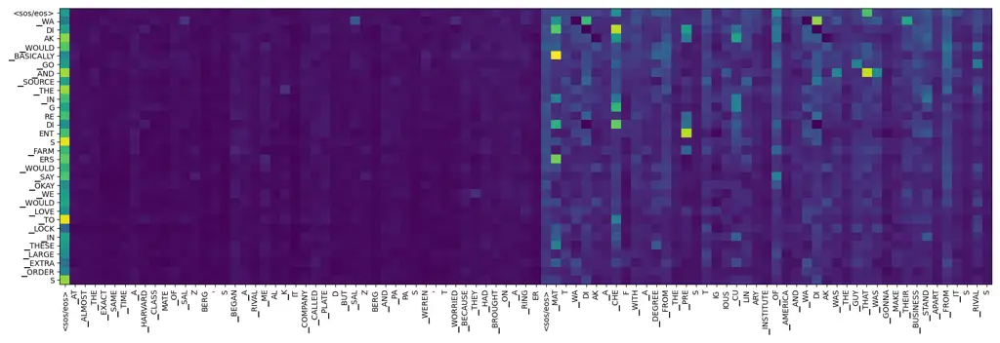
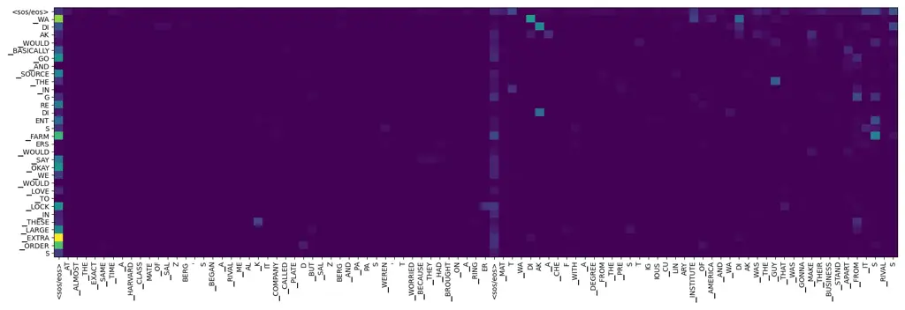

# Advanced Long-Content Speech Recognition with Factorized Neural Transducer

Xun Gong    Yu Wu    Jinyu Li    Shujie Liu    Rui Zhao    Xie Chen   
Yanmin Qian ^(†)^(†)thanks: This work was supported in part by China
NSFC Projects under Grants 62122050 and 62071288, and in part by
Shanghai Municipal Science and Technology Commission Project under Grant
2021SHZDZX0102. (Corresponding author: Yanmin Qian.) Xun Gong, Xie Chen
and Yanmin Qian are with the Auditory Cognition and Computational
Acoustics Lab, the Department of Computer Science and Engineering and
the MoE Key Laboratory of Artificial Intelligence, AI Institute,
Shanghai Jiao Tong University, Shanghai 200240, China (e-mail:
gongxun@sjtu.edu.cn; chenxie95@sjtu.edu.cn; yanminqian@sjtu.edu.cn). Yu
Wu, Jinyu Li, Shujie Liu and Rui Zhao are with Microsoft Corporation
(e-mail: wumark@126.com; jinyli@microsoft.com; shujliu@microsoft.com;
ruzhao@microsoft.com).

###### Abstract

Long-content automatic speech recognition (ASR) has obtained increasing
interest in recent years, as it captures the relationship among
consecutive historical utterances while decoding the current utterance.
In this paper, we propose two novel approaches, which integrate
long-content information into the factorized neural transducer (FNT)
based architecture in both non-streaming (referred to as LongFNT) and
streaming (referred to as SLongFNT) scenarios. We first investigate
whether long-content transcriptions can improve the vanilla conformer
transducer (C-T) models. Our experiments indicate that the vanilla C-T
models do not exhibit improved performance when utilizing long-content
transcriptions, possibly due to the predictor network of C-T models not
functioning as a pure language model. Instead, FNT shows its potential
in utilizing long-content information, where we propose the LongFNT
model and explore the impact of long-content information in both
text (LongFNT-Text) and speech (LongFNT-Speech). The proposed
LongFNT-Text and LongFNT-Speech models further complement each other to
achieve better performance, with transcription history proving more
valuable to the model. The effectiveness of our LongFNT approach is
evaluated on LibriSpeech and GigaSpeech corpora, and obtains relative
19% and 12% word error rate reduction, respectively. Furthermore, we
extend the LongFNT model to the streaming scenario, which is named
SLongFNT, consisting of SLongFNT-Text and SLongFNT-Speech approaches to
utilize long-content text and speech information. Experiments show that
the proposed SLongFNT model achieves relative 26% and 17% WER reduction
on LibriSpeech and GigaSpeech respectively while keeping a good latency,
compared to the FNT baseline. Overall, our proposed LongFNT and SLongFNT
highlight the significance of considering long-content speech and
transcription knowledge for improving both non-streaming and streaming
speech recognition systems.

###### Index Terms: 

long-content speech recognition, streaming and non-streaming, factorized
neural transducer, RNN-T

## I Introduction

End-to-end (E2E) automatic speech recognition (ASR) models \[1, 2\],
including connectionist temporal classification (CTC) \[3\],
attention-based encoder-decoder (AED) \[4, 5, 6, 7, 8, 9, 10, 11, 12,
13\], and recurrent neural network transducer (RNN-T) \[14, 15, 16, 17,
18\] have become the dominated models, surpassing traditional hybrid
models \[16, 19\]. A common practice for ASR is to train the model with
individual utterances without considering the correlation between
utterances. In real-world scenarios like conversations and meetings,
speech often appears in long-content formats. This context-rich nature
provides an opportunity to enhance recognition accuracy compared to
isolated short utterances. For example, certain keywords mentioned
earlier may reappear later in a dialogue, or the same acoustic
environment can be used to guide the recognition in the future.
Long-content ASR (also conversational ASR, dialog-aware ASR or
large-context ASR), is a special version of the ASR task that aims to
improve ASR accuracy by capturing the relationships between the current
decoded utterance and consecutive historical utterances pre-segmented by
voice-activity-detection (VAD).

In AED architecture, previous approaches to model long-content scenarios
mainly includes concatenating consecutive speech or transcriptions of
utterances \[20, 21\] and using auxiliary encoders to model context
information in an AED manner \[22, 23\]. Hori et al. \[24\] extended
their context-expanded transformer to accelerate the decoding process in
streaming AED architecture. Recurrent neural language models \[25, 26,
27, 28, 29, 30, 31, 32, 33, 34\] can also be used with consecutive
long-content transcriptions. Recently, Wei et al. \[35, 36, 37\]
proposed using a latent variational module, context-aware residual
attention, and pre-trained encoders to leverage acoustic and text
content. These methods offer more comprehensive approaches to improve
ASR performance by capturing long-content information.

Transducer-based systems, such as recurrent neural transducer (RNN-T),
transformer transducer (T-T) are becoming more popular in industry due
to their natural streaming capabilities and low latency, as well as
their perceived robustness compared to attention-based systems \[38, 39,
40, 1\]. Narayanan et al. \[41\] had conducted primitive explorations by
simulating long-content training and adaptation to improve performance
using short utterances. Schwarz et al. \[42\] showed that combining
input and context audio helps the network learn both speaker and
environment adaptations. Kojima \[43\] explored the utilization of large
context. However, incorporating consecutive transcription history into
the neural transducer model is still an open area that has not been well
explored. In modern ASR systems, however, streaming ASR shows its
importance on reducing runtime complexity and real-time efficiency \[44,
45, 46\]. But there is usually a performance degradation compared with
the offline systems which is due to the lack usage of history
information. Few works besides Hori et al. \[24\] have explored
long-content ASR to resolve these problem in streaming AED situation.
Hence there is still much needed to be done to fully realize the
potential of long-content neural transducer models in streaming ASR
applications.

In this paper, we propose the novel non-streaming and streaming
transducer models, LongFNT and SLongFNT, respectively, which integrate
long-content information into the factorized neural transducer
(FNT) \[47, 48, 49\] architecture to solve the above challenge.

We firstly attempted to embed long-content transcriptions into the
predictor of the vanilla neural transducer in non-streaming situation,
but our experiments showed that it had limited impact on the
performance. One possible explanation for the limited impact of
long-content transcriptions in the vanilla neural transducer is that the
prediction network does not function as a pure language model (LM),
which constrains its ability to model long-content transcriptions. It
also indicates that effective methods for AED models, such as those
proposed in Hori et al. \[24\], cannot be extended to transducer-based
models, as they rely heavily on the LM characteristic of the decoder.
Then, we utilized the FNT (or named as modular hybrid autoregressive
transducer) architecture \[47, 50, 48, 51, 52\], which factorizes the
blank and vocabulary prediction modules, allowing for the use of a
standalone LM for vocabulary prediction.

Based on FNT, we propose the LongFNT architecture, by fusing two
sub-architecture, LongFNT-Text and LongFNT-Speech to utilize
long-content text and speech individually. This architecture is proposed
in our recent publication \[49\]. For LongFNT-Text, utterance-level
integration and token-level integration are proposed to integrate
high-level long-content features from historical transcriptions based on
the vocabulary predictor. Concretely, a context encoder is employed to
yield the embedding of each token in historical transcriptions. To
further improve performance, we employed a pre-trained text encoder,
RoBERTa \[53\]. Besides, we embed long-content speech into the encoder
to propose the LongFNT-Speech model.

Furthermore, we propose SLongFNT model, which extends our non-streaming
LongFNT model into the streaming scenario. Similarly two approaches
SLongFNT-Text and SLongFNT-Speech are proposed. The SLongFNT-Text uses
LSTM \[54\] as the vocabulary predictor backbone and traditional
attention to integrate long-content information at the token level.
Additionally, we explored the use the vocabulary predictor’s hidden
state as context to reduce computational cost. For real-time speech
processing, we developed SLongFNT-Speech, which uses long-content
chunk-based attention and integrates historical utterances with the
hidden layer representation of the current chunk for key and value. We
explored several ways to downsample the historical features, including
statistical and dilated downsampling.

The main contributions of this paper can be summarized as follows:

- •
  Firstly, we introduce the concept of long-content scenarios in ASR, as
  an opportunity to utilize both historical audio and textual
  information.
- •
  For non-streaming long-content scenario, we proposed two architectures
  to explore the long-content information from historical content text
  and speech respectively, i.e. LongFNT-Text and LongFNT-Speech, and
  further combined these two methods into one integrated architecture to
  obtain the final LongFNT model, which is built upon our preliminary
  work \[49\] with deeper analysis.
- •
  For streaming long-content scenario, we further improved the structure
  of LongFNT to meet the real-time requirements under streaming
  conditions. Similarly, we propose SLongFNT-Text and SLongFNT-Speech,
  and finally combine them to obtain the SLongFNT model. Huge accuracy
  improvement and low latency increase also can be observed in this
  streaming scenario.

The rest of the paper is organized as follows. Neural transducer
architectures are first reviewed in Section II. Section III presents the
newly proposed LongFNT which utilizing the long-content information in
ASR, and Section IV further explored the streaming version named
SLongFNT. The detailed experimental setup, results and analysis are
described in Section V,VI, and finally the conclusions are given in
Section VII.

## II Revisit on Neural Transducer

### II-A Transformer-based Neural Transducers

Take the acoustic features
$`\boldsymbol{X}=\{\boldsymbol{x}_{1},\cdots,\boldsymbol{x}_{T}\}`$ as
input and label sequence $`\boldsymbol{y}=\{y_{1},\cdots,y_{L}\}`$ as
output, modern transducer architecture for speech recognition consists
of 3 components, a speech encoder, a label predictor and a joint network
to predict the tokens. Conformer \[55\] is a convolutional augmented
transformer speech encoder that is widely used in attention-based
encoder-decoder and neural transducer architectures to improve the ASR
performance. The predictor works like a language model which produces
label representation $`\boldsymbol{z}_{l}`$ given non-blank outputs
$`\boldsymbol{y}_{\leq l}`$, where $`t`$ is the time index and $`l`$ is
the output label index. The encoder and predictor outputs are combined
in the joint network and are subsequently passed through the output
layer to compute the probability distribution $`\boldsymbol{z}_{t,l}`$
over the output layer:

```math
\displaystyle\boldsymbol{h}_{{[1:T]}} \displaystyle=\text{Encoder}({\boldsymbol{X}}), \tag{1}
```

```math
\displaystyle\boldsymbol{z}_{l} \displaystyle=\text{Predictor}(\boldsymbol{y}_{\leq l}), \tag{2}
```

```math
\displaystyle\boldsymbol{z}_{t,l} \displaystyle=\text{JointNet}(\boldsymbol{h}_{t},\boldsymbol{z}_{l}) \tag{3}
```

where $`t\in[1,T],l\in[1,L]`$ are the frame and label index,
respectively. The predicted probability of the neural transducer model
and loss can be computed as:

```math
\displaystyle P_{ASR}(\hat{y}_{l+1}|\boldsymbol{x}_{\leq t},y_{l}) \displaystyle=\text{softmax}(\boldsymbol{z}_{t,l}), \tag{4}
```

```math
\displaystyle\mathcal{L}_{transducer} \displaystyle=-\log\sum_{\alpha\in\eta^{-1}(\boldsymbol{y})}P(\alpha|\boldsymbol{X}), \tag{5}
```

where $`\eta`$ is a many-to-one function from all possible transducer
paths to the target $`\boldsymbol{y}`$ and a special blank symbol,
$`\phi`$, is added to the output vocabulary. Therefore the output set is
$`\{\phi\cup\mathcal{V}\}`$ , where $`\mathcal{V}`$ is the vocabulary
set.

### II-B Factorized Neural Transducer

Fig. 1: Illustration of factorized neural transducer (FNT) and its
improved version \[48\].

The factorized neural transducer model (FNT) \[47, 48\] has emerged as a
promising architecture, aiming to separately predict the blank token and
vocabulary tokens, so that an auxiliary vocabulary predictor fully
functions as an LM. The FNT model is comprised of four main components,
the conformer encoder, the blank predictor ($`\text{Pred}^{B}`$), the
joint network for $`\phi`$, and the vocabulary
predictor ($`\text{Pred}^{V}`$, i.e. LM manner). The whole architecture
is illustrated in Figure 1.

```math
\displaystyle\boldsymbol{z}_{t,l}^{B} \displaystyle=\text{Joint}(\boldsymbol{h}_{t},\text{Pred}^{B}(\boldsymbol{y}_{\leq l})), \tag{6}
```

```math
\displaystyle\boldsymbol{z}_{l}^{V} \displaystyle=\text{log\_softmax}(\text{Pred}^{V}(\boldsymbol{y}_{\leq l}))
```

```math
\displaystyle=\log P_{LM}(\hat{y}_{l+1}|\boldsymbol{y}_{\leq l}), \tag{7}
```

```math
\displaystyle\boldsymbol{z}_{t}^{V} \displaystyle=\text{log\_softmax}(\text{Linear}(\boldsymbol{h}_{t})), \tag{8}
```

```math
\displaystyle\boldsymbol{z}_{t,l}^{V} \displaystyle=\boldsymbol{z}_{t}^{V}\text{[:-1]}+\beta\boldsymbol{z}_{l}^{V}, \tag{9}
```

where $`\beta`$ is a trainable parameter, $`\boldsymbol{z}_{t}^{V}`$ is
used for computing CTC loss $`\mathcal{L}_{CTC}`$, and
$`\boldsymbol{z}_{t}^{V}`$ become $`U+1`$ because CTC needs another
extra output blank $`\psi`$. It’s important to note that the blank token
($`\psi`$) in CTC is not the same as the blank token ($`\phi`$) in RNN-T
mentioned above \[3, 14\]. For $`\text{Pred}^{B}`$, it repeats
Equation 2,3 but only predict the $`\phi`$ in Equation 6. For
$`\text{Pred}^{V}`$, LM logits is firstly projected to the vocabulary
size and converted to the log probability domain by the log softmax
operation, denoted as $`\boldsymbol{z}_{l}^{V}`$ in Equation 7. In
Equation 9, then it is added with projected encoder output
$`\boldsymbol{z}_{t}^{V}`$ to get $`\boldsymbol{z}_{t,l}^{V}`$, i.e. the
output of $`\text{Pred}^{V}`$. Finally we can compute the posterior of
the transducer model as

```math
\displaystyle P_{ASR}(\hat{y}_{l+1}|\boldsymbol{X},y_{l})=\text{softmax}([\boldsymbol{z}_{t,l}^{B},\boldsymbol{z}_{t,l}^{V}]). \tag{10}
```

and then the loss is computed as

```math
\displaystyle\mathcal{L}=\mathcal{L}_{transducer}+\lambda_{LM}\mathcal{L}_{LM}+\lambda_{CTC}\mathcal{L}_{CTC}, \tag{11}
```

where $`\lambda_{LM},\lambda_{CTC}`$ are hyper-parameters.

## III LongFNT: Long-content Factorized Neural Transducer ASR

In this section we describe LongFNT, the non-streaming long-content ASR
architecture based on factorized neural transducer, which contains
LongFNT-Text and LongFNT-Speech parts.

Here, we use $`p`$ as the index of the current utterance, and then the
first/second utterance before utterance $`p`$ are $`p-1`$ and $`p-2`$
and etc. Then the historical utterances have acoustic sequences like
$`\{\cdots,\boldsymbol{X}^{p-2},\boldsymbol{X}^{p-1}\}`$. and label
sequences like $`\{\cdots,\boldsymbol{y}^{p-2},\boldsymbol{y}^{p-1}\}`$,
where the current utterance has acoustic sequence $`\boldsymbol{X}^{p}`$
and label sequence $`\boldsymbol{y}^{p}`$ and
$`\boldsymbol{X}^{p}=[\boldsymbol{x}^{p}_{1},\cdots,\boldsymbol{x}^{p}_{T^{p}}],\boldsymbol{y}^{p}=[y^{p}_{1},\cdots,y^{p}_{L^{p}}]`$.
And then the acoustic representation sequence from speech encoder is
$`\boldsymbol{h}^{p}_{[1:T^{p}]}`$ for currernt utterance $`p`$.

### III-A LongFNT-Text: Long-content Text Integration of FNT

Fig. 2: Architecture of LongFNT-Text: the text-side context encoder and
long-content textual integration methods for $`\text{Pred}^{V}`$

As shown in Figure 2, we first propose LongFNT-Text, which contains a
text-side context encoder and two different textual integration methods.
We modify the $`\text{Pred}^{V}`$ in Equation 7 to expand long-content
textual information in FNT.

Context Encoder: The text-side context encoder converts historical label
sequences
$`\boldsymbol{y}^{\text{his}}=\{\cdots,\boldsymbol{y}^{p-2},\boldsymbol{y}^{p-1}\}`$
into token-level historical embedding sequence $`\boldsymbol{C}`$:

```math
\displaystyle\boldsymbol{C}=\text{Context-Encoder}(\boldsymbol{y}^{\text{his}}), \tag{12}
```

where $`\boldsymbol{C}`$ has length equal to $`\cdots+L^{p-2}+L^{p-1}`$.
During inference, the current utterance information will not be used in
the context encoder. The basic context encoder is jointly trained with
long-content FNT in a transformer manner. To extract stronger features,
we directly use a pre-trained RoBERTa \[53\] model as the context
encoder. We utilize the pre-trained RoBERTa¹¹ 1
https://huggingface.co/sentence-transformers/all-roberta-large-v1 model
and freeze it during LongFNT training.

Two textual integration methods are designed for LongFNT-Text. As shown
before, FNT factorizes out the vocabulary predictor part by jointly
training the speech-text pair data, therefore the historical
transcriptions can be injected inside the vocabulary predictor
$`\text{Pred}^{V}`$ or after it.

Utterance-level integration: To get the utterance-level embedding
$`\tilde{\boldsymbol{c}}`$, we first do mean and standard variance (std)
such that
$`\tilde{\boldsymbol{c}}=\text{concat}(\text{mean}(\boldsymbol{C}),\text{std}(\boldsymbol{C}))`$,
and then enhance $`\boldsymbol{z}^{V}_{l}`$ with utterance-level
information $`\tilde{\boldsymbol{c}}`$ in the yellow box of Figure 2:

```math
\displaystyle\boldsymbol{o}_{\leq l}^{\text{last}} \displaystyle={\text{$\text{Pred}^{V}$-Encoder}}(\boldsymbol{y}_{\leq l}), \tag{13}
```

```math
\displaystyle\boldsymbol{o}_{l}^{\text{last}^{\prime}} \displaystyle=\boldsymbol{o}_{l}^{\text{last}}{+}\text{Projection}(\tilde{\boldsymbol{c}}), \tag{14}
```

```math
\displaystyle\boldsymbol{z}^{V^{\prime}}_{l} \displaystyle=\text{log\_softmax}(\text{Linear}^{V}\cdot\text{ReLU}(\boldsymbol{o}_{l}^{\text{last}^{\prime}})), \tag{15}
```

where $`\boldsymbol{o}_{\leq l}^{\text{last}}`$ is the $`l`$-th textual
embedding in the last layer of $`\text{Pred}^{V}`$-Encoder, and
$`\boldsymbol{o}_{l}^{\text{last}^{\prime}}`$ is the historical-enhanced
version of $`\boldsymbol{o}_{l}^{\text{last}}`$, and
$`\boldsymbol{z}^{V^{\prime}}_{l}`$ is the historical-enhanced logits.

Token-level integration: Different from the utterance-level integration
method, we put more granular historical information ($`\boldsymbol{C}`$)
into $`\text{Pred}^{V}`$ by adding an auxiliary cross-attention layer
inside transformer blocks:

```math
\displaystyle\boldsymbol{o}^{i}_{\leq l} \displaystyle=\text{MHA}(\boldsymbol{o}^{i-1}_{\leq l},\boldsymbol{o}^{i-1}_{\leq l},\boldsymbol{o}^{i-1}_{\leq l}), \tag{16}
```

```math
\displaystyle\boldsymbol{o}^{i^{\prime}}_{\leq l} \displaystyle=\text{MHA}(\boldsymbol{o}^{i}_{\leq l},\boldsymbol{C},\boldsymbol{C}), \tag{17}
```

```math
\displaystyle\boldsymbol{o}^{i^{\prime}}_{\leq l} \displaystyle=\text{FFN}(\boldsymbol{o}^{i^{\prime}}_{\leq l}), \tag{18}
```

where $`\text{Pred}^{V}`$ is a transformer encoder, $`i`$ is the block
index, $`\boldsymbol{o}_{\leq l}`$ is the representation of current
tokens, FFN is the feed-forward layer and MHA is the multi-head
attention layer, respectively. Residual connection is ignored for
simplification. In Equation 17, we integrate the long-content context
embedding sequence $`\boldsymbol{C}`$ into the representation
$`\boldsymbol{o}_{\leq l}`$, where $`\boldsymbol{C}`$ is key and value
and $`\boldsymbol{o}^{i}_{\leq l}`$ is the query in this attention.
Meanwhile, there is also a projection layer for $`\boldsymbol{C}`$ when
we use mismatched dimensions for the context encoder and
$`\text{Pred}^{V}`$.

Finally, the utterance-level integration and the token-level integration
can be combined to achieve better utilization of $`\boldsymbol{C}`$.
Since the $`\text{Pred}^{V}`$ in FNT is designed to be an LM, we explore
the possibility of training it independently on a much larger text
corpus (i.e. the external text) than the transcriptions in the FNT
training data. The vocabulary of the external LM is the same as that of
the FNT system, and is pre-trained using the conventional cross-entropy
loss. With the help of large external text data, the model achieves
better results, which is then named as LongFNT-Text.

### III-B LongFNT-Speech: Long-content Enhanced Speech Encoder

As shown in Figure 3, we describe our proposed LongFNT-Speech to train
the speech encoder on long-content speech, which is pre-segmented into
utterances $`\{\cdots,\boldsymbol{X}^{p-2},\boldsymbol{X}^{p-1}\}`$.

```math
\displaystyle\cdots,\boldsymbol{h}^{{}^{\prime}p-1}_{[1:T^{p-1}]},\boldsymbol{h}^{{}^{\prime}p}_{[1:T^{p}]}=\text{Encoder}(\cdots,\boldsymbol{X}^{p-1},\boldsymbol{X}^{p}), \tag{19}
```

where $`\boldsymbol{h}^{{}^{\prime}p}_{t}`$ is the historical-enhanced
$`t`$-th acoustic representation of the $`p`$-th utterance (i.e. the
current one) matches $`\boldsymbol{h}_{t}`$ in Equation 1. The label
representations $`\boldsymbol{z}_{t}^{V}`$ is calculated by
$`\boldsymbol{h}^{{}^{\prime}p}_{t}`$ as in Equation 9. For normal FNT,
the whole
$`\cdots,\boldsymbol{h}^{{}^{\prime}p-1},\boldsymbol{h}^{{}^{\prime}p}_{\{1:T\}}`$
is used to compute the transducer loss and for gradient
back-propagation. However, LongFNT-Speech only utilizes the current
acoustic hidden representations
$`\boldsymbol{h}^{{}^{\prime}p}_{[1:T]}`$ for computing the transducer
loss and CTC loss, and backward across historical utterances is ignored
during training. Using such extension, the speech encoder receives a
longer history and thus benefits both training and evaluation.

Fig. 3: Architecture of LongFNT-Speech: the speech encoder pipeline with
long-content speech input. Only the yellow part is used for gradient
back propagation.

### III-C Training strategies for LongFNT

Combining LongFNT-Text and LongFNT-Speech, the final proposed method is
called as LongFNT. During training, the large-context encoder obtains
not hypotheses but reference (oracle) transcripts. The long-content
information utilization is controlled by the number of historical
utterances ($`N_{\text{his}}`$), and will effect the improvement of the
LongFNT model. $`N_{\text{his}}`$ is a hyper-parameter, and
$`N_{\text{his}}^{\text{train}}`$ (the number of historical utterances
during training) is randomly sampled from the pre-defined distribution
$`[0,\text{$N*{\text{his}}$}]`$ for each utterance, while
$`N*{\text{his}}^{\text{decode}}`$ (the number of historical utterances
during decoding) is controlled by $`N*{\text{his}}`$ and available
historical utterances. Take $`N*{\text{his}}=3`$ as an example, the
first decoded utterance has no history
($`N*{\text{his}}^{\text{decode}}[1]=0`$), second has
$`N*{\text{his}}^{\text{decode}}[2]=1`$, and the 10th utterance has
$`N\_{\text{his}}^{\text{decode}}[10]=3`$. Although we can achieve much
longer history, it is a huge burden for training as the history length
grows and meanwhile causes serialization data training rather than the
random shuffling one.

## IV SLongFNT: Speed up LongFNT ASR in streaming scenario

In streaming ASR, besides the recognition error rate, the recognition
latency stands as a pivotal metric. However, the LongFNT approach yields
high latency, which inspire us to explore a streaming model that makes
efficient use of historical information and keep the benfits of
streaming models.

Firstly, we introduce a modified version of the FNT architecture for
streaming scenarios named as streaming FNT (SFNT). For speech encoder,
we adopt the streaming conformer \[55\] derived from its offline
version. Different from emformer \[46\], our attention mechanism omits
the memory bank and right-context (named as chunk-based
attention \[56\]). During training, the left-context and center-context
are concatenated together as a large chunk. During decoding, the
left-context and its related states are consistently cached so that the
chunked attention is like:

```math
\displaystyle\boldsymbol{H}_{t}=\text{MHA}(\boldsymbol{H}_{t},\boldsymbol{H}_{\{u:v\}},\boldsymbol{H}_{\{u:v\}}), \tag{20}
```

where $`t\in[u:v]`$ denotes the frames used in computation which starts
from timestamp $`u`$ and ends at $`v`$, and $`v-u`$ is the summed length
of left-context frames and center-context frames. Additionally, we
substitute the traditional convolution block with a causal one.

As for $`\text{Pred}^{V}`$, as the use of transformer as
$`\text{Pred}^{V}`$ can cause unacceptable delays, so we use LSTM
structure \[54, 15\] to improve the latency.

### IV-A SLongFNT-Text

As mentioned in Section III-A, the context encoder however is not
efficient enough in terms of real time latency when we apply
transformer-style architecture such as RoBERTa. Thus, we propose an
alternative approach: taking $`\text{Pred}^{V}`$ as the context encoder,
rather than the transformer-style context encoder referenced in
LongFNT (transformer or RoBERTa). This allows us to mitigate the
computational delays associated with using an extra context encoder to
process historical utterances.

Fig. 4: Architecture of SLongFNT-Text: the long-content self-attention
module and two different kinds of historical textual information.

Shown in Figure 4(a), we improve the token-level integration mentioned
in Section III-A from concatenating operation to the long-content
attention:

```math
\displaystyle\boldsymbol{o}_{l}^{\prime}=\text{Long-content Attention}(\boldsymbol{o}_{l},\boldsymbol{C},\boldsymbol{C}), \tag{21}
```

where $`\boldsymbol{o}_{l}`$ is the output state of $`\text{Pred}^{V}`$
before the projection layer, i.e.
$`\boldsymbol{z}_{l}^{V}=\text{log\_softmax}(\text{Linear}^{V}(\boldsymbol{o}_{l}))`$,
and $`\boldsymbol{C}`$ is the context embedding sequence, which is
referred as RoBERTa or $`\text{Pred}^{V}`$ in experiments. When using
$`\text{Pred}^{V}`$ as the context encoder, and the hidden states of
$`\text{Pred}^{V}`$ in SFNT is regraded as token-level embeddings
$`\boldsymbol{C}`$. Moreover, the historical-enhanced representation
$`\boldsymbol{o}_{l}^{\prime}`$ is concatenated with
$`\boldsymbol{o}_{l}`$,
$`\boldsymbol{o}_{l}^{\prime\prime}=[\boldsymbol{o}_{l},\boldsymbol{o}_{l}^{\prime}]`$
to achieve better integration performance.

### IV-B SLongFNT-Speech

In the streaming FNT mentioned above, the encoder is used with limited
acoustic frames in order to ensure low recognition latency, which also
leads to a relatively large reduction in recognition accuracy.
Therefore, how to use historical information efficiently is explored in
a streaming situation and a SLongFNT-Speech architecture is proposed.
Shown in Figure 5, when feeding external historical speech into the
encoder, a similar technique called long-content chunk-based attention
can be applied to retain its historical features:

```math
\displaystyle{\boldsymbol{H}_{t}=\text{MHA}(\boldsymbol{H}_{t},[\boldsymbol{H}^{\text{his}};\boldsymbol{H}_{\{u:v\}}],[\boldsymbol{H}^{\text{his}};\boldsymbol{H}_{\{u:v\}}])}. \tag{22}
```

where $`{\boldsymbol{H}^{\text{his}}}`$ is the cached features from
historical utterances
$`\cdots,{\boldsymbol{H}^{p-2}},{\boldsymbol{H}^{p-1}}`$. This allows
the chunk-based attention to be expanded to a larger global field of
perception.

Fig. 5: Architecture of the attention layer in SLongFNT-Speech: the
long-content chunk-based self-attention module in the speech encoder.
Downsampling is applied to reduce the history length.

Even though caching technique is applied in long-content chunk-based
attention, we notice that the computation complexity
$`O(d\times(v-u+\cdots+t^{p-2}+t^{p-1}))`$ is still huge, where the
historical feature lengths $`t^{p-2},t^{p-1}`$ is much longer than the
chunk size. This will result in a corresponding increase in computation
when performing the attention calculation. Accordingly two downsampling
methods are proposed to reduce the increment length for historical
acoustic information by rate $`K`$ into an acceptable magnitude shown in
Figure 5.

Statistical Downsampling: The first method is called statistical
downsampling. The uncompressed features $`\boldsymbol{h}^{<p}`$ are
firstly broken into discontinuous blocks, and then all frame features in
each block are added and normalized to obtain a global representation,
i.e. block-wise mean or standard variance. If the whole history is
regraded as one block, then the downsampling can be seen as a global
mean or standard variance. For each block:

```math
\displaystyle{\tilde{\boldsymbol{H}}_{i}}=1/K\sum_{{K\cdot i\leq t<K\cdot(i+1)}}{\boldsymbol{H}_{t}}, \tag{23}
```

where we compute the $`i`$-th block historical embedding, and $`K`$
represents the number of blocks from historical content. Then
$`\boldsymbol{H}^{his}=[\tilde{\boldsymbol{H}}_{1};\cdots;\tilde{\boldsymbol{H}}_{K}]`$
mentioned in Equation 22.

Dilated Downsampling: Another method is called dilated local
downsampling, where it is implemented by random selection:

```math
\displaystyle{\tilde{\boldsymbol{H}}_{i}}={\boldsymbol{H}_{t}}\text{, where }t\overset{uniform}{\leftarrow}{[K\cdot i,K\cdot(i+1))}. \tag{24}
```

By utilizing these two downsampling methods in training, and the
statistical downsampling method in inference (which is referred to as
‘mix’ in the experiments section), the proposed SLongFNT-Speech model
can achieve better results.

### IV-C Training strategies for SLongFNT

Combining SLongFNT-Text and SLongFNT-Speech, the final proposed
streaming version of LongFNT is named SLongFNT (Streaming LongFNT).
Firstly, we extend the previous FNT model in Section II-B into the
streaming version. We mainly follow the setup from \[15\], using
truncated history with no future information. Meanwhile, we follow
MoCHA \[57\] to segment speech into chunks with a specified chunk size
and attention caching used to optimize inference speed. In addition, for
the convolutional layer in the conformer, we also use causal convolution
to ensure that future information will not be utilized in the training
process. The training is performed on concatenated utterances, and it
enforces time restriction on the self-attention layers by masking
attention weights, which can simulate a situation where future content
is not available while still considering several look-ahead frames.

## V Experimental Setup

We conduct experiments with two datasets, LibriSpeech \[58\] and
GigaSpeech Middle (abbr. as GigaSpeech) \[59\]. LibriSpeech has around
960 hours of audiobook speech, while GigaSpeech has around 1,000 hours
of audiobook, podcasting, and YouTube audio. The sampling rate of these
two datasets is 16 kHz. The word error rate (WER) averaged over each
test set is reported. For acoustic feature extraction, 80-dimensional
mel filterbank (Fbank) features are extracted with global level cepstral
mean and variance normalization. Frame length and frame shift are 25ms
and 10ms respectively. Standard SpecAugment \[60\] is applied for both
datasets. Each utterance has two frequency masks with parameter
($`F=27`$) and ten time masks with maximum time-mask ratio
($`pS=0.05`$). 5,000 word pieces with Byte Pair Encoding (BPE) \[61\]
are trained using LibriSpeech and GigaSpeech datasets separately. As for
the $`\text{Pred}^{V}`$ part, the text scale is 10.27 million words for
LibriSpeech and 9.68 million for GigaSpeech. And the extra text data (‘+
external text’ mentioned in Section III-A), for LibriSpeech, we use the
official extra text corpus which has 812.69 million words
(https://www.openslr.org/11/), and for GigaSpeech, we use GigaSpeech-XL
training text data which has 113.80 million words. The external text is
used to pre-train $`\text{Pred}^{V}`$ to get a better initialization.

As shown in Figure 6, we evaluate the average length of audio and
bpe-level tokens in different long-content setups, i.e. the different
numbers of historical utterances. In our experiments utilizing
Librispeech and Gigaspeech, we maintained the temporal sequence of
sentences using successive utterance ids, such as XXX*01, XXX_02 and
etc. Gigaspeech occasionally exhibits sequence discontinuities, but
given their typical session lengths over one hour, such breaks have a
marginal impact on continuity. While not every Librispeech book’s
content is fully represented, each session’s content is intact and
sequential. During testing, for any utterance with non-consecutive
historical utterances, we adaptively treat the immediately preceding
utterance as historical content to balance both relevance and
efficiency. Take ‘03,05,06’ utterance sequence as an example, during the
inference of ’06’ with $`N*{\text{his}}=2`$ and ’04’ is missing, we
would consider ’03’ and ’05’ as the preceding historical content for
’06’. For the first utterance, there is no historical information,
whereas the second utterance has only ’01’ as its historical content.

Fig. 6: The statistics of speech and words in the LibriSpeech (left) and
GigaSpeech (right). Red denotes speech, and blue denotes text. Solid
line denotes train set and dotted line denotes dev set. The left
vertical axis of each figure denotes the speech duration (ms), while the
right one denotes the text length (bpe5000). The horizontal axis
\#Previous denotes $`N_{\text{his}}`$.

The non-streaming FNT baseline follows the single-utterance settings of
factorized neural transducer (FNT) \[48\]. And the non-streaming C-T
baseline has the same architecture of speech encoder and predictor and
training setup where as FNT, the predictor has the same shape as
$`\text{Pred}^{B}`$. The subsampling layer is a VGG2L-like network,
which contains four convolution layers with the down-sampling rate of 4.
The encoder has 18 conformer layers, in which the inner size of the
feed-forward layer is 1,024, and the attention dimension is 512 with 8
heads. The $`\text{Pred}^{B}`$ has two unidirectional LSTM layers with
1,024 hidden size and the joint dimension is set to 512. The
$`\text{Pred}^{V}`$ use vanilla 8 transformer layers, which has 256
attention dimension with 8 heads. The textual input for
$`\text{Pred}^{B}`$ and $`\text{Pred}^{V}`$ is prefixed with a
start-of-sequence (SOS) token. The hyper-parameter weights are fixed as
$`\lambda_{CTC}=0.1`$. The context encoder has the same shape as
$`\text{Pred}^{V}`$ if training from scratch, and utilizes the frozen
RoBERTa model otherwise. The input of the context encoder is also always
started with a start-of-sequence (SOS) symbol for distinction. During
inference, we keep beam size equal to 8. As for the FNT’s external
larger text-trained LM (external text), we use 16 transformer layers
with 512 attention dimension with 8 heads. In the following experiments,
the default number of long-content sentences $`N_{\text{his}}`$ is two.
We also conducted ablation studies to explore the effects of varying
this number. Throughout both training and decoding, we consistently
incorporate $`\leq N_{\text{his}}`$ sentences as the historical textual
content. Two possible long-content text forms, i.e. oracle and
hypotheses, are fed into LongFNT model series to obtain the results.
Both FNT and LongFNT follow consistent training stages. When no external
text is utilized, both models are trained from scratch. However, when
‘+external text’ is incorporated, the $`\text{Pred}^{V}`$ is pre-trained
using the external text data.

As for the streaming experiments, the basic training/inference setup
remains the same, but the conformer encoder is with chunk-wise casual
convolution layer. We train the streaming encoder with 8 left chunks and
1 center chunk (per chunk is 40ms, i.e. totally 320ms delay in the basic
streaming FNT system). Furthermore, in streaming human-computer
interaction scenarios, we have to take the speech time into
consideration when evaluating the real decoding time. Under this
scenario, the non-streaming ASR system will be suspended until all the
audio frames have been received, which will cause high latency, while
the streaming one can process the speech as far as it receives the audio
chunk. And the training stages for SFNT/SLongFNT remains the same as
FNT/LongFNT for ‘+ long text’, ‘+ external text’ and etc.

We measure the end-latency under single core of Intel(R) Xeon(R) Gold
6132 CPU @ 2.60GHz:

```math
\displaystyle{\text{End-Latency}^{p}=T^{p}_{\text{end}}-T^{p}}, \tag{25}
```

where $`T^{p}`$ is the length of utterance $`p`$, and
$`T^{p}_{\text{end}}`$ denotes the total computation time elapsed from
the moment the first frame is fed to the encoder until the final bpe
token is decoded for utterance $`p`$. Meanwhile, we evaluate the average
end-latency for the whole dev set. To be notified, the context embedding
sequence $`\boldsymbol{C}`$ is simulated to compute in another CPU core
to avoid any latency issues during the inference process.

## VI Experimental Results and Analysis

### VI-A Evaluation on the non-streaming LongFNT model

In our initial experiments, we investigated whether the performance of
the vanilla C-T model could be improved by incorporating long-content
transcription history (‘+ long text’), in the first block of Table I. We
observed that the vanilla C-T model demonstrated only minimal
improvements when using extended long-content text or utterance-level
integration, even with the use of oracle transcripts. Moreover, when
incorporating hypotheses, the system performance actually degraded. This
outcome can be attributed to the fact that the predictor network in
traditional neural transducer models is not a pure language model and
cannot easily leverage longer history to achieve performance
improvements.

|                                  |        |            |       |      |      |
| -------------------------------- | ------ | ---------- | ----- | ---- | ---- |
| Model                            | Text   | Libri-test |       | Giga |      |
|                                  |        | clean      | other | dev  | test |
| C-T                              | \-     | 3.1        | 6.6   | 16.1 | 15.7 |
| \+ long text                     | oracle | 3.1        | 6.5   | 15.8 | 15.5 |
| \+ long text                     | hyp    | 3.1        | 6.7   | 16.1 | 15.9 |
| \+ utterance-level integ.        | oracle | 3.1        | 6.5   | 16.0 | 15.5 |
| \+ utterance-level integ.        | hyp    | 3.2        | 6.9   | 16.4 | 16.2 |
| FNT                              | \-     | 3.2        | 6.4   | 16.8 | 16.3 |
| \+ long text                     | oracle | 3.2        | 6.3   | 16.5 | 16.2 |
| \+ long text                     | hyp    | 3.2        | 6.4   | 16.7 | 16.4 |
| \+ external text                 | \-     | 3.0        | 6.1   | 16.4 | 16.0 |
| \+ external + long text          | hyp    | 3.0        | 6.1   | 16.4 | 16.1 |
| \+ long speech                   | \-     | 3.2        | 6.5   | 17.0 | 16.6 |
| FNT with LM fusion               |        |            |       |      |      |
| \+ Single-utterance LM           | \-     | 2.6        | 5.7   | 16.0 | 15.6 |
| \+ Cross-utterance LM \[25, 62\] | oracle | 2.2        | 5.1   | 14.6 | 14.3 |
| \+ Cross-utterance LM \[25, 62\] | hyp    | 2.4        | 5.5   | 15.5 | 15.1 |
| LongFNT-Text                     | hyp    | 2.5        | 5.5   | 15.2 | 14.9 |
| \+ LM Fusion                     | hyp    | 2.2        | 4.8   | 14.4 | 14.0 |
| LongFNT-Speech                   | \-     | 2.8        | 6.0   | 15.9 | 15.7 |
| LongFNT                          | hyp    | 2.4        | 5.4   | 14.8 | 14.3 |

TABLE I: Performance (WER) (%) comparison on LibriSpeech test sets and
GigaSpeech dev/test sets under the non-streaming scenario. Text has two
modes, ‘oracle’ denotes that the historical text is obtained from the
ground truth transcripts, while ‘hypotheses’ denotes that the historical
text is from the decoding results.

In terms of FNT, shown in the second block of Table I, including the
decoded/oracle long-content transcription history in the text input (‘+
long text’) does very limited help on both LibriSpeech and GigaSpeech.
When the factorized predictor V is trained with extra text
data (+external text), the system can obtain small but consistent
improvements on all test sets. It demonstrates that the FNT architecture
can factorize and model the language knowledge more accurately and can
be benefited from a powerful language model. However, the long-content
text history also does not further improve system upon the external
text, which indicates that it is non-trivial to explore how to better
leverage long-content information in the neural transducer.
Additionally, while the normal speech encoder is indeed capable of
handling long-form speech, our experiment ‘FNT + long speech’ reveals
that directly integrating long-content speech with the FNT results in a
performance drop across all sets. This underscore the need to find a
more optimal approach for leveraging long-content speech.

In the last, the newly proposed LongFNT model is evaluated and the
results are shown in the last block of Table I. Compared to the previous
C-T and FNT systems, all the proposed models using long information can
get significant improvements, which demonstrates the better utilization
of long-content history information with the new model. In contrast to
‘FNT + long speech’, LongFNT-Speech exhibits superior performance. This
enhancement can be attributed to our strategy of confining the gradient
back-propagation. To further validate the efficacy of LongFNT-Text, we
replicated the cross-utterance transformer LM as detailed in \[51, 62\]
in the third block of Table I. Nonetheless, it is worth noting that
these methods aren’t entirely analogous to LongFNT-Text. The primary
distinction arises from their reliance on shallow fusion, whereas
LongFNT-Text operates independently of such a fusion mechanism. Shown in
Table I, it is evident that cross-utterance LM fusion (hyp) garners an
improvement over conventional fusion and baseline. Meanwhile,
LongFNT-Text outperforms cross-utterance LM fusion on GigaSpeech,
possibly due to its enhanced robustness. Furthermore, when LongFNT-Text
is applied with shallow fusion, its performance notably surpasses that
of ‘+cross-utterance LM fusion (hyp)’. Such a synergy effectively
captures the long-content textual information. Furthermore, it is
observed that both two types of historical information, i.e. text and
speech, are both helpful for long-content speech recognition, and
LongFNT-Text is slightly better than the LongFNT-Speech. The final
LongFNT model integrating historical knowledge from both text and speech
achieves the best system performance, and compared to the limited gain
from the naive long text usage in C-T and FNT, the proposed LongFNT
obtains around 20% and 10% relative WER reductions on LibriSpeech and
GigaSpeech respectively.

### VI-B Ablation Studies on the non-streaming LongFNT model

#### VI-B1 The Number of Historical Utterances

Performance comparison of successive historical utterance counts are
evaluated with the proposed LongFNT model, and the results are shown in
Table II. The correlation between the number of historical utterances
and the recognition error rate can be observed, and $`N_{\text{his}}`$=0
means no historical utterance is used, i.e. the FNT baseline. As
$`N_{\text{his}}`$ grows, the WER of the current utterance is reduced
gradually with the increased historical length $`N_{\text{his}}`$. After
$`\text{$N*{\text{his}}$}>2`$, the improvement is limited but training
resources are very consumed. So the previous two utterances history are
the most appropriate trade-off point between accuracy and cost in
LongFNT, and we set $`N*{\text{his}}`$=2 to learn appropriate
long-content information for all the following experiments.

| $`N_{\text{his}}`$ | 0         | 1         | 2         | 3         |
| ------------------ | --------- | --------- | --------- | --------- |
| FNT                | 16.8/16.3 | \-        | \-        | \-        |
| LongFNT-Text       | 17.0/16.4 | 16.0/15.6 | 15.2/14.9 | 15.3/14.8 |
| LongFNT-Speech     | 16.7/16.3 | 16.2/15.8 | 15.9/15.7 | 15.8/15.5 |
| LongFNT            | 16.9/16.4 | 15.8/15.4 | 14.8/14.3 | 14.7/14.3 |

TABLE II: Performance (WER) (%) comparison of successive historical
utterance counts on GigaSpeech dev/test sets for LongFNT series.
Specially, $`N_{\text{his}}`$ for the proposed LongFNT model series is
decoded under $`N_{\text{his}}^{\text{train}}=2`$ while
$`N_{\text{his}}^{\text{decode}}=0`$ as in Section III-C. All results
are evaluated using decoded hypotheses as the historical text.

#### VI-B2 Effectiveness of different components in LongFNT-Text

|                              |        |            |       |      |      |
| ---------------------------- | ------ | ---------- | ----- | ---- | ---- |
| Model                        | Text   | Libri-test |       | Giga |      |
|                              |        | clean      | other | dev  | test |
| FNT                          | \-     | 3.2        | 6.4   | 16.8 | 16.3 |
| + utterance-level integ.     | oracle | 2.9        | 6.1   | 16.0 | 15.8 |
| + utterance-level integ.     | hyp    | 3.0        | 6.3   | 16.5 | 16.2 |
| + token-level integ.         | oracle | 2.9        | 6.0   | 15.7 | 15.4 |
| + token-level integ.         | hyp    | 3.0        | 6.1   | 16.0 | 15.7 |
| + external text              | \-     | 3.0        | 6.1   | 16.4 | 16.0 |
| ++ utterance-level integ.    | hyp    | 2.9        | 5.9   | 16.0 | 15.5 |
| +++ RoBERTa                  | hyp    | 2.8        | 5.8   | 15.9 | 15.3 |
| ++ token-level integ.        | hyp    | 2.6        | 5.7   | 15.8 | 15.4 |
| +++ RoBERTa                  | hyp    | 2.6        | 5.6   | 15.8 | 15.4 |
| + utterance- + token- integ. | hyp    | 2.8        | 5.8   | 15.9 | 15.5 |
| ++ external text             | hyp    | 2.5        | 5.6   | 15.6 | 15.2 |
| +++ RoBERTa (\*)             | hyp    | 2.5        | 5.5   | 15.2 | 14.9 |

TABLE III: Performance (WER) (%) comparison of different components in
LongFNT-Text (The final LongFNT-Text system is the line denoted with
\*).

In this subsection, we evaluate the effectiveness of the proposed
LongFNT model and explore the impact of each module on the final
performance. Table III presents the results of our analysis on the
efficiency of different integration methods for LongFNT-Text.

In the first block of Table III, experiments indicate that token-level
integration is more significant than utterance-level integration. When
considering only utterance-level integration, the system achieves a WER
reduction of 0.2/0.1 absolute on the LibriSpeech and 0.3/0.1 absolute on
the GigaSpeech datasets. However, when token-level integration is
utilized, the WER reduction improves to 0.2/0.3 absolute on the
LibriSpeech corpus and 0.8/0.6 absolute on the GigaSpeech corpus. A
similar trend can be observed in the second block, token-level
integration outperforms utterance-level integration by $`\sim`$0.4
absolute WER reduction on LibriSpeech and 0.2$`\sim`$0.5 on GigaSpeech,
after adding external text (i.e. with large LM, ‘+ external text’) and
after using RoBERTa model (‘+++ RoBERTa’).

As mentioned previously in Section V, in the real scenario, ground
truth (oracle) text can not be accessed, and we evaluate the above
methods using decoded transcriptions (hypotheses) to get real
performance and explore the importance of those two types in different
LongFNT-Text modes. Shown as the 1st block of Table III, experiments
indicate that models decoded using hypotheses experienced a relative
1%$`\sim`$5% performance drop compared to those decoded using oracle
text, and the degradation on the GigaSpeech is larger compared to the
that on the LibriSpeech. This may be attributed to the fact that the
basic error rate influences the performance of hypotheses, and a system
with low WER is necessary to achieve performance improvements in
long-content speech recognition. Additionally, we observe that the
utterance-level integration is more sensitive to the long-content
transcriptions quality compared to the token-level one, as it drops more
0.1%$`\sim`$0.2% absolute WER.

This indicates the shortcoming of statistical averaging pooling for
utterance-level integration.

Then we discovered that long-content transcriptions can be effectively
utilized in conjunction with external text, thereby leveraging the
advantages of FNT. Results in the 2nd and 3rd blocks of Table III
demonstrate a relative performance increase of at least 2% across all
datasets for different textual integration methods (‘+token-level’, ‘+
utterance-level’, ‘+ utterance-level + token-level’). These results
highlight the effectiveness of employing a external-text-boosted
vocabulary predictor to further enhance the performance of our models.

Furthermore, We also investigated the importance of replacing the
train-from-scratch context encoder with a pre-trained RoBERTa model, and
found that the importance varied across the LibriSpeech and GigaSpeech
datasets. For LibriSpeech, the performance only improves by 0.1%
absolute WER reduction, and in some cases, no improvement was observed
in the test-clean set for the LongFNT-Text model. In contrast, for
GigaSpeech, we observed a consistent improvement in performance of at
least 0.3%$`\sim`$0.5% absolute WER reduction. This phenomenon is
interesting because the impact of the RoBERTa model was minimal in the
LibriSpeech dataset. This may be attributed to the fact that the
influence of transcriptions is relatively smaller in this dataset, and
the context encoder has a similar ability to model the long-content
textual information.

### VI-C Evaluation on streaming SLongFNT model

Table IV presents the performance comparison in streaming scenario, and
here we no longer explore the performance of C-T with the long-term
history (the specific reasons can be seen in Section VI-A). We first set
a benchmark based on the impact of long-content text on the original FNT
model, which the basic streaming FNT (SFNT) has obvious performance drop
compared with the non-streaming FNT model in Table I. The results
presented in lines 1-3 of the first block of the Table IV align with the
conclusions drawn in Section VI-A for non-streaming system with
oracle/hypotheses historical condition. With the help of external text,
whether there is long-content text or not, the streaming FNT model has
been improved consistently, although the improvement is relatively
small.

|                         |        |            |       |      |      |
| ----------------------- | ------ | ---------- | ----- | ---- | ---- |
| Model                   | Text   | Libri-test |       | Giga |      |
|                         |        | clean      | other | dev  | test |
| SFNT                    | \-     | 4.1        | 10.0  | 22.9 | 22.0 |
| \+ long text            | oracle | 3.8        | 9.3   | 21.4 | 20.6 |
| \+ long text            | hyp    | 4.0        | 9.8   | 22.8 | 22.2 |
| \+ external text        | \-     | 3.9        | 9.7   | 22.3 | 21.5 |
| \+ external + long text | hyp    | 3.8        | 9.4   | 21.9 | 21.0 |
| SLongFNT-Text           | hyp    | 3.7        | 8.8   | 21.2 | 20.0 |
| SLongFNT-Speech         | \-     | 3.3        | 7.8   | 19.7 | 18.8 |
| SLongFNT                | hyp    | 3.1        | 7.5   | 19.1 | 18.2 |

TABLE IV: performance (WER) (%) comparison on LibriSpeech test sets and
GigaSpeech dev/test sets under the streaming scenario. Text has two
modes, ‘oracle’ denotes that the historical text is obtained from ground
truth transcripts, while ‘hyp’ denotes that the historical text is from
the decoded hypotheses.

In the second block of Table IV, it shows the performance of our
proposed SLongFNT models individually. For the utilization of
long-content transcriptions, i.e. SLongFNT-Text, it achieves 11/8%
relative WER reduction on LibriSpeech/GigaSpeech, which is a comparable
improvement with non-streaming LongFNT-Text. As for the utilization of
long-content speech, i.e. SLongFNT-Speech, the downsampling rate is set
to $`K=4`$ to consider the balance between the inference speed and
accuracy, and 15/14% relative WER reduction on LibriSpeech/GigaSpeech
are observed. It is found that the improvement of SLongFNT-Speech is
larger than that of LongFNT-Speech, which may be due to the greater
importance of speech encoder in the streaming condition. Finally, the
SLongFNT system combining historical knowledge from both text and speech
achieves $`\sim`$25% relative WERR on LibriSpeech and $`\sim`$17%
relative WERR on GigaSpeech, compared to the baseline streaming FNT
system.

### VI-D Ablation Studies on the streaming SLongFNT model

At first, we follow the $`N_{\text{his}}=2`$ setup for the exploration
of SLongFNT-Text/-Speech architecture to find optimal architecture setup
for SLongFNT.

|                                                                   |            |       |      |      |
| ----------------------------------------------------------------- | ---------- | ----- | ---- | ---- |
| Model                                                             | Libri-test |       | Giga |      |
|                                                                   | clean      | other | dev  | test |
| SFNT                                                              | 4.1        | 10.0  | 22.9 | 22.0 |
| SLongFNT                                                          | 3.1        | 7.5   | 19.1 | 18.2 |
| SLongFNT-Text (w/ RoBERTa or $`\text{Pred}^{V}`$ context encoder) |            |       |      |      |
| w/ RoBERTa (oracle)                                               | 3.7        | 8.9   | 19.2 | 18.3 |
| w/ RoBERTa (hyp)                                                  | 3.9        | 9.5   | 21.6 | 20.8 |
| \+ external text                                                  | 3.7        | 8.8   | 21.2 | 20.0 |
| w/ $`\text{Pred}^{V}`$ (oracle)                                   | 3.8        | 9.1   | 19.5 | 18.4 |
| w/ $`\text{Pred}^{V}`$ (hyp)                                      | 4.0        | 9.8   | 22.1 | 21.2 |
| \+ external text                                                  | 3.9        | 9.6   | 21.8 | 20.9 |
| SLongFNT-Speech (w/ downsampling methods)                         |            |       |      |      |
| w/o downsample (K=1)                                              | 3.2        | 7.5   | 19.4 | 18.6 |
| mean                                                              | 4.0        | 9.6   | 22.3 | 21.5 |
| mean+std                                                          | 4.0        | 9.8   | 22.5 | 21.6 |
| statistical (K=2)                                                 | 3.3        | 7.6   | 19.5 | 18.6 |
| statistical (K=4)                                                 | 3.3        | 7.9   | 19.9 | 19.1 |
| statistical (K=8)                                                 | 3.5        | 8.2   | 20.7 | 20.3 |
| statistical (K=16)                                                | 3.8        | 9.3   | 22.0 | 21.2 |
| dilated (K=2)                                                     | 3.3        | 7.9   | 19.9 | 19.1 |
| dilated (K=4)                                                     | 3.4        | 8.0   | 20.2 | 19.4 |
| mix (K=4)                                                         | 3.3        | 7.8   | 19.7 | 18.8 |

TABLE V: The ablation study of different components proposed in
SLongFNT. For SLongFNT-Text, the second block shows different
integration methods. For SLongFNT-Speech, the third block shows
different down-sampling strategies.

#### VI-D1 Exploring different text integration methods for SLongFNT-Text

In the second block of Table V, we investigate different components of
SLongFNT-Text. First of all, we explore the external context encoder
method (directly use the same RoBERTa model mentioned in Section III-A),
and the method of extracting context embedding is the same as LongFNT.
RoBERTa (hypotheses) is consistently worse than RoBERTa (oracle), and
the drop is larger for datasets with worse WER (i.e. 7% relative WER
degradation on LibriSpeech while 14% for GigaSpeech) due to the
incorrect textual content. Similar to LongFNT-Text, with the help of
external text, the RoBERTa-based SLongFNT-Text model achieves $`>`$8%
relative WER improvement on both datasets.

However, in real streaming scenario, the CPU is overloaded for current
chunk’s inference, thus computing context embeddings by RoBERTa causes
higher latency. We then try to utilize the hidden state from
$`\text{Pred}^{V}`$, which does not require external computing
resources. With $`\text{Pred}^{V}`$ as the internal context encoder, the
final SLongFNT-Text also achieves significant improvement, and it is
smaller than the RoBERTa context encoder but still obvious.

#### VI-D2 Exploring different downsampling methods for SLongFNT-Speech

In the third block of Table V, we investigate different downsampling
methods for SLongFNT-Speech mentioned in Section IV-B, and downsampling
rate $`K=1`$ indicates the system without downsampling. We first
considered the corner cases, those are, to calculate the mean vector of
all long-content acoustic representations (mean), and to calculate the
mean and standard variance of all long-content acoustic
representations (mean+std). Although these modes are simple,
experimental results show that both methods can be still better than the
SFNT baseline (line 1), and the ‘mean’ performs slightly better than the
model with ‘mean+std’. Thus we choose ‘mean’ as the implementation of
statistical downsampling.

The statistical and dilated downsampling with different rates are then
applied. It is observed that the statistical downsampling with $`K=2`$
gets almost no WER degradation, and the performance drop will become
obvious when $`K>4`$. Compared to the dilated downsampling mode, the
statistical mode is consistently better. Moreover, we tried to combine
statistical and dilated downsampling modes with $`K=4`$, i.e. using the
statistical with dilated downsampling methods during training and using
statistical downsampling only for decoding, SLongFNT-Speech (shown as
the last line in Table V) can achieve better results and perform the
appropriate trade-off point between the accuracy and computation cost.

#### VI-D3 The Number of Historical Utterances

We study the influence of different historical information lengths on
the recognition accuracy and delay of the SLongFNT model, and then
select the most suitable number for the following experiments. From
Table VI, it is found that as the number of historical utterances
$`N_{\text{his}}`$ increases, the performance of SLongFNT-Text/-Speech
and the final model SLongFNT are gradually improved. The impact from
historical speech is larger than that from historical text. Similar as
the observation for non-streaming LongFNT, $`N_{\text{his}}=2`$ also
seems be the appropriate trade-off point between accuracy and
computational cost for this streaming SLongFNT, and it is applied on
SLongFNT in the further experiments.

| $`N_{\text{his}}`$ | 0         | 1         | 2         | 3         |
| ------------------ | --------- | --------- | --------- | --------- |
| SFNT               | 22.9/22.0 | \-        | \-        | \-        |
| SLongFNT-Text      | 23.2/22.4 | 21.8/20.8 | 21.2/20.0 | 21.4/20.2 |
| SLongFNT-Speech    | 22.7/21.7 | 20.3/19.9 | 19.7/18.8 | 19.5/18.5 |
| SLongFNT           | 23.1/22.3 | 19.9/19.4 | 19.1/18.2 | 18.7/18.0 |

TABLE VI: Performance (WER) (%) comparison of successive utterance
counts $`N_{\text{his}}`$ on GigaSpeech dev/test sets for SLongFNT
series.

Fig. 7: Latency (ms) and word error rate (%) trade-off on dev set of
GigaSpeech. $`\infty`$ denotes ‘mean’ in Table V. Different downsampling
rates $`K`$ and $`N_{his}`$ are presented. The numbers on the line are
the related downsampling rates $`K`$.

#### VI-D4 Decoding Latency

Decoding speed is another concern when people deploy the streaming ASR
systems. Illustrated in Figure 7, we evaluated the end-latency for the
proposed SLongFNT systems with different number of historical utterances
($`N_{\text{his}}`$ = 0,1,2,3) and different downsampling rates ($`K`$ =
1,2,4,8,16,$`\infty`$), where $`\infty`$ denotes mean pooling. The
results demonstrate that as the word error rate decreases, the latency
increases. We can balance the trade-off between latency and model
accuracy (error rate) by choosing $`N_{\text{his}}=2,K=4`$, which
results in the latency of 545ms. In this setup, the latency for
SLongFNT-Text is recorded at 473ms, while SLongFNT-Speech exhibits a
latency of approximately 497ms.

Meanwhile, the figure also demonstrates that the down-sampling ratio has
a significant impact on latency, and the increase of historical
statements gradually increases overall recognition delay. When the
downsampling ratio is greater than 4, the rate of latency attenuation
gradually slows down. At this point, the infinity downsampling latency
is similar to $`N_{\text{his}}=0`$, where we consider ‘mean’ as an
approximation that approaches infinity ($`\infty`$). Moreover, another
basic streaming FNT model with larger chunk-size=640ms is also
constructed and shown in the figure, denoted as SFNT(640ms). It is
observed that the newly proposed SLongFNT with
$`N_{\text{his}}=2\&K=2`$, has the similar latency as SFNT (640ms) but
with much better accuracy. It is worth noting that when taking the
RoBERTa context encoder into consideration, an additional average
latency of 200ms is added to the current model. This issue can be
addressed by using $`\text{Pred}^{V}`$ as the context encoder, as
mentioned in Section IV-A.

### VI-E Illustration on the Long-Content Speech Recognition Results



(a) Bottom Layer



(b) Top Layer

Fig. 8: The long-content attention of token-level integration in
$`\text{Pred}^{V}`$ ($`N_{\text{his}}=2`$). The left is the attention in
the bottom layer and the right is the attention in the top layer. The
example is the same as the first block in Table VII, where the utterance
id is POD1000000004_S0000075 in GigaSpeech dev set. Its historical
sentences are POD1000000004_S0000073 and POD1000000004_S0000074, with
sentences separated by the SOS token ($`<`$sos/eos$`>`$).

The Table VII presents several examples that demonstrate how LongFNT
corrects the results of normal FNT by utilizing long-content textual
information. For the first block, when using ground truth as the
history, LongFNT successfully used the historical word ‘WADIAK’, and
makes the appropriate modification. However, when using hypotheses as
history (i.e. ‘WADIAC’) that is incorrectly decoded, the LongFNT
utilizes the wrong historical information and cannot correct the error
‘WADIAC’. For the second and third blocks, when the hypotheses history
are correct, LongFNT is also able to utilize the historical words and
then make successful modifications.

|             |                                                                            |
| ----------- | -------------------------------------------------------------------------- |
| Hist.gt     | … matt WADIAK a chef with a degree from the prestigious culinary institute |
| Hist.hyp    | … matt WADIAC a chef with a degree from the prestigious culinary institute |
| G.T.        | WADIAK would basically go and source the ingredients …                     |
| Hyp.FNT     | WADIAC would basically go and source the ingredients…                      |
| Hyp.LongFNT |                                                                            |
| Hist.gt:    | WADIAK would basically go and source the ingredients …                     |
| Hist.hyp:   | WADIAC would basically go and source the ingredients …                     |
| Hist.hyp    | … well bessy how are YOU …                                                 |
| G.T.        | better and not better if YOU know what that means                          |
| Hyp.FNT     | better and not better if YO know what that means                           |
| Hyp.LongFNT | better and not better if YOU know what that means                          |
| Hist.hyp    | … getting a meal KIT every week                                            |
| G.T.        | … plus the meal KITS helped green hone her cooking skills                  |
| Hyp.FNT     | … plus the meal KIDS helped green horn her cooking skills                  |
| Hyp.LongFNT | … plus the meal KITS helped green hone her cooking skills                  |

TABLE VII: Examples of decoded results (Hyp.) comparision between the
normal FNT and proposed LongFNT model. For LongFNT, two types of text
histories (Hist.), i.e. ground truth and hypotheses, are shown, and G.T.
means the real ground truth transcription. SOS token is ignored for
simplification.

In order to analyze the effectiveness of the LongFNT model under
long-term history, we draw upon the long-content attention for
token-level integration in $`\text{Pred}^{V}`$. An example of the
proposed long-content attention during inference is depicted in
Figure 8, and the left is the attention in the bottom layer and the
right is the attention in the top layer. As shown in Figure 8(a), the
attention in the bottom layer exhibits a column-based pattern,
indicating that specific inputs in the long-content text play a crucial
role regardless of their position in the input. Additionally, historical
utterance $`p-2`$ has smaller attention scores compared to utterance
$`p-1`$. In Figure 8(b), the attention in the top layer focuses more on
connecting keywords occurred in history and correcting the current word
‘WADIAK’, corresponding to Table VII. These results demonstrate that the
proposed long-content attention mechanism can effectively capture
long-range context, thereby improving the system performance.

## VII Conclusion

In this paper, we introduce two novel approaches, LongFNT and SLongFNT,
to incorporate long-content information into the factorized neural
transducer (FNT) architecture, and achieve significant improvements in
both non-streaming and streaming speech recognition scenarios.

At first, we investigated the effectiveness of incorporating
long-content history into conformer transducer models and found little
improvement. Subsequently, experiments are conducted based on FNT to
explore an efficient network for long-content history utilization. We
propose LongFNT, using two integration methods for utilizing
long-content text (LongFNT-Text) and long-content
speech (LongFNT-Speech), and it achieves 19/12% relative word error rate
reduction (relative WERR) on LibriSpeech/GigaSpeech, outperforming FNT
and CT baselines. We then extended LongFNT to the streaming scenario
with SLongFNT, and it achieves 26/17% relative WERR on
LibriSpeech/GigaSpeech, outperforming streaming FNT baselines. The
experiments demonstrate that incorporating long-content information can
significantly improve ASR performance, and our proposed models offer a
promising solution for improving long-content speech recognition in
real-world scenario with both non-streaming and streaming situations.

## References

- \[1\] J. Li, “Recent advances in end-to-end automatic speech
  recognition,” _APSIPA Transactions on Signal and Information
  Processing_, vol. 11, no. 1, 2022.
- \[2\] R. Prabhavalkar, T. Hori, T. N. Sainath, R. Schlüter, and
  S. Watanabe, “End-to-end speech recognition: A survey,” _arXiv
  preprint arXiv:2303.03329_, 2023.
- \[3\] A. Graves, S. Fernández, F. Gomez, and J. Schmidhuber,
  “Connectionist temporal classification: labelling unsegmented sequence
  data with recurrent neural networks,” in _2006 Proceedings of
  International Conference on Machine Learning (ICML)_, 2006, p.
  369–376.
- \[4\] A. Vaswani, N. Shazeer, N. Parmar, J. Uszkoreit _et al._,
  “Attention is all you need,” _Advances in neural information
  processing systems_, vol. 30, Dec. 2017.
- \[5\] T. Hori, S. Watanabe, and J. R. Hershey, “Joint CTC/attention
  decoding for end-to-end speech recognition,” in _Proceedings of the
  55th Annual Meeting of the Association for Computational Linguistics
  (ACL)_, 2017, pp. 518–529.
- \[6\] S. Karita, N. Chen, T. Hayashi, T. Hori _et al._, “A comparative
  study on transformer vs rnn in speech applications,” in _2019 IEEE
  Automatic Speech Recognition and Understanding Workshop (ASRU)_. IEEE,
  2019, pp. 449–456.
- \[7\] S. Watanabe, T. Hori, S. Kim, J. R. Hershey, and T. Hayashi,
  “Hybrid ctc/attention architecture for end-to-end speech recognition,”
  _IEEE Journal of Selected Topics in Signal Processing_, vol. 11,
  no. 8, pp. 1240–1253, 2017.
- \[8\] W. Chan, N. Jaitly, Q. Le, and O. Vinyals, “Listen, attend and
  spell: A neural network for large vocabulary conversational speech
  recognition,” in _2016 IEEE international conference on acoustics,
  speech and signal processing (ICASSP)_. IEEE, 2016, pp. 4960–4964.
- \[9\] J. K. Chorowski, D. Bahdanau, D. Serdyuk, K. Cho, and Y. Bengio,
  “Attention-based models for speech recognition,” _Advances in neural
  information processing systems_, vol. 28, 2015.
- \[10\] C.-C. Chiu, T. N. Sainath, Y. Wu, R. Prabhavalkar _et al._,
  “State-of-the-art speech recognition with sequence-to-sequence
  models,” _2018 IEEE International Conference on Acoustics, Speech and
  Signal Processing (ICASSP)_, pp. 4774–4778, 2017.
- \[11\] X. Gong, Z. Zhou, and Y. Qian, “Knowledge Transfer and
  Distillation from Autoregressive to Non-Autoregessive Speech
  Recognition,” in _Proc. Interspeech 2022_, 2022, pp. 2618–2622.
- \[12\] X. Gong, Y. Lu, Z. Zhou, and Y. Qian, “Layer-Wise Fast
  Adaptation for End-to-End Multi-Accent Speech Recognition,” in _Proc.
  Interspeech 2021_, 2021, pp. 1274–1278.
- \[13\] Y. Qian, X. Gong, and H. Huang, “Layer-wise fast adaptation for
  end-to-end multi-accent speech recognition,” _IEEE/ACM Transactions on
  Audio, Speech, and Language Processing_, vol. 30, pp. 2842–2853, 2022.
- \[14\] A. Graves, “Sequence transduction with recurrent neural
  networks,” in _2012 Proceedings of International Conference of Machine
  Learning (ICML) Workshop on Representation Learning_, Nov. 2012.
- \[15\] X. Chen, Y. Wu, Z. Wang, S. Liu, and J. Li, “Developing
  real-time streaming transformer transducer for speech recognition on
  large-scale dataset,” in _2021 IEEE International Conference on
  Acoustics, Speech and Signal Processing (ICASSP)_. IEEE, 2021, pp.
  5904–5908.
- \[16\] T. N. Sainath, Y. He, B. Li, A. Narayanan _et al._, “A
  streaming on-device end-to-end model surpassing server-side
  conventional model quality and latency,” _2020 IEEE International
  Conference on Acoustics, Speech and Signal Processing (ICASSP)_, pp.
  6059–6063, 2020.
- \[17\] E. Battenberg, J. Chen, R. Child, A. Coates _et al._,
  “Exploring neural transducers for end-to-end speech recognition,”
  _2017 IEEE Automatic Speech Recognition and Understanding Workshop
  (ASRU)_, pp. 206–213, 2017.
- \[18\] J. Li, Y. Wu, Y. Gaur, C. Wang _et al._, “On the comparison of
  popular end-to-end models for large scale speech recognition,” in
  _Proc. Interspeech 2020_, 2020, pp. 1–5.
- \[19\] J. Li, R. Zhao, Z. Meng, Y. Liu _et al._, “Developing RNN-T
  models surpassing high-performance hybrid models with customization
  capability,” in _Proc. Interspeech 2020_, 2020, pp. 3590–3594.
- \[20\] S. Kim and F. Metze, “Dialog-Context Aware end-to-end Speech
  Recognition,” in _2018 IEEE Spoken Language Technology Workshop
  (SLT)_, Dec. 2018, pp. 434–440.
- \[21\] T. Hori, N. Moritz, C. Hori, and J. Le Roux, “Transformer-Based
  Long-Context End-to-End Speech Recognition,” in _Proc. Interspeech
  2020_, Oct. 2020, pp. 5011–5015.
- \[22\] R. Masumura, T. Tanaka, T. Moriya, Y. Shinohara _et al._,
  “Large Context End-to-end Automatic Speech Recognition via Extension
  of Hierarchical Recurrent Encoder-decoder Models,” in _2019 IEEE
  International Conference on Acoustics, Speech and Signal Processing
  (ICASSP)_, May 2019, pp. 5661–5665.
- \[23\] R. Masumura, N. Makishima, M. Ihori, A. Takashima, and Tothers,
  “Hierarchical transformer-based large-context end-to-end asr with
  large-context knowledge distillation,” in _2021 IEEE International
  Conference on Acoustics, Speech and Signal Processing (ICASSP)_, 2021,
  pp. 5879–5883.
- \[24\] T. Hori, N. Moritz, C. Hori, and J. L. Roux, “Advanced
  long-context end-to-end speech recognition using context-expanded
  transformers,” in _Proc. Interspeech 2021_, 2021, pp. 2097–2101.
- \[25\] K. Irie, A. Zeyer, R. Schlüter, and H. Ney, “Training language
  models for long-span cross-sentence evaluation,” in _2019 IEEE
  Automatic Speech Recognition and Understanding Workshop (ASRU)_, Dec.
  2019, pp. 419–426.
- \[26\] T. Mikolov and G. Zweig, “Context dependent recurrent neural
  network language model,” in _2012 IEEE Spoken Language Technology
  Workshop (SLT)_, Miami, FL, USA, Dec. 2012, pp. 234–239.
- \[27\] Q. H. Tran, I. Zukerman, and G. Haffari, “Inter-document
  contextual language model,” in _2016 Proceedings of the Conference of
  the North American Chapter of the Association for Computational
  Linguistics (NAACL)_, 2016, pp. 762–766.
- \[28\] T. Mikolov and G. Zweig, “Context dependent recurrent neural
  network language model,” in _2012 IEEE Spoken Language Technology
  Workshop (SLT)_. IEEE, 2012, pp. 234–239.
- \[29\] B. Liu and I. Lane, “Dialog context language modeling with
  recurrent neural networks,” in _2017 IEEE International Conference on
  Acoustics, Speech and Signal Processing (ICASSP)_. IEEE, 2017, pp.
  5715–5719.
- \[30\] T. Wang and K. Cho, “Larger-context language modelling with
  recurrent neural network,” in _2016 Proceedings of the 54th Annual
  Meeting of the Association for Computational Linguistics (ACL)_, 2016,
  pp. 1319–1329.
- \[31\] R. Lin, S. Liu, M. Yang, M. Li _et al._, “Hierarchical
  recurrent neural network for document modeling,” in _2015 Proceedings
  of the Conference on Empirical Methods in Natural Language Processing
  (EMNLP)_, 2015, pp. 899–907.
- \[32\] S.-H. Chiu, T.-H. Lo, and B. Chen, “Cross-sentence Neural
  Language Models for Conversational Speech Recognition,” in _2021
  International Joint Conference on Neural Networks (IJCNN)_, Jul. 2021,
  pp. 1–7.
- \[33\] W. Xiong, L. Wu, J. Zhang, and A. Stolcke, “Session-level
  language modeling for conversational speech,” in _2018 Proceedings of
  the Conference on Empirical Methods in Natural Language Processing
  (EMNLP)_, 2018, pp. 2764–2768.
- \[34\] X. Gong, W. Wang, H. Shao, X. Chen, and Y. Qian, “Factorized
  aed: Factorized attention-based encoder-decoder for text-only domain
  adaptive asr,” in _2023 IEEE International Conference on Acoustics,
  Speech and Signal Processing (ICASSP)_, 2023, pp. 1–5.
- \[35\] K. Wei, Y. Zhang, S. Sun, L. Xie, and L. Ma, “Conversational
  speech recognition by learning conversation-level characteristics,” in
  _2019 IEEE International Conference on Acoustics, Speech and Signal
  Processing (ICASSP)_, 2022, pp. 6752–6756.
- \[36\] W. Kun, Z. Yike, S. Sining, X. Lei, and M. Long, “Leveraging
  acoustic contextual representation by audio-textual cross-modal
  learning for conversational asr,” in _Proc. Interspeech 2021_, 2022,
  pp. 1016–1020.
- \[37\] W. Kun, G. Pengcheng, and J. Ning, “Improving Transformer-based
  Conversational ASR by Inter-Sentential Attention Mechanism,” in _Proc.
  Interspeech 2022_, 2022, pp. 3804–3808.
- \[38\] C.-C. Chiu, W. Han, Y. Zhang, R. Pang _et al._, “A Comparison
  of End-to-End Models for Long-Form Speech Recognition,” in _2019 IEEE
  Automatic Speech Recognition and Understanding Workshop (ASRU)_, Dec.
  2019, pp. 889–896.
- \[39\] K. Rao, H. Sak, and R. Prabhavalkar, “Exploring architectures,
  data and units for streaming end-to-end speech recognition with
  rnn-transducer,” in _2017 IEEE Automatic Speech Recognition and
  Understanding Workshop (ASRU)_, Dec. 2017, pp. 193–199.
- \[40\] Y. He, T. N. Sainath, R. Prabhavalkar, I. McGraw _et al._,
  “Streaming end-to-end speech recognition for mobile devices,” _2019
  IEEE International Conference on Acoustics, Speech and Signal
  Processing (ICASSP)_, pp. 6381–6385, 2018.
- \[41\] A. Narayanan, R. Prabhavalkar, C.-C. Chiu, D. Rybach _et al._,
  “Recognizing Long-Form Speech Using Streaming End-to-End Models,” in
  _2019 IEEE Automatic Speech Recognition and Understanding Workshop
  (ASRU)_, Dec. 2019, pp. 920–927.
- \[42\] A. Schwarz, I. Sklyar, and S. Wiesler, “Improving RNN-T ASR
  Accuracy Using Context Audio,” in _Proc. Interspeech 2021_, 2021, pp.
  1792–1796.
- \[43\] A. Kojima, “Large-context automatic speech recognition based on
  rnn transducer,” in _2021 Asia-Pacific Signal and Information
  Processing Association Annual Summit and Conference (APSIPA
  ASC)_. IEEE, 2021, pp. 460–464.
- \[44\] A. Zeyer, R. Schmitt, W. Zhou, R. Schlüter, and H. Ney,
  “Monotonic segmental attention for automatic speech recognition,” in
  _2022 IEEE Spoken Language Technology Workshop (SLT)_. IEEE, 2023, pp.
  229–236.
- \[45\] N. Moritz, T. Hori, and J. Le Roux, “Streaming end-to-end
  speech recognition with joint ctc-attention based models,” in _2019
  IEEE Automatic Speech Recognition and Understanding Workshop
  (ASRU)_. IEEE, 2019, pp. 936–943.
- \[46\] Y. Shi, Y. Wang, C. Wu, C.-F. Yeh, J. Chan, F. Zhang, D. Le,
  and M. Seltzer, “Emformer: Efficient memory transformer based acoustic
  model for low latency streaming speech recognition,” in _ICASSP
  2021-2021 IEEE International Conference on Acoustics, Speech and
  Signal Processing (ICASSP)_. IEEE, 2021, pp. 6783–6787.
- \[47\] X. Chen, Z. Meng, S. Parthasarathy, and J. Li, “Factorized
  neural transducer for efficient language model adaptation,” in _2022
  IEEE International Conference on Acoustics, Speech and Signal
  Processing (ICASSP)_, 2022, pp. 8132–8136.
- \[48\] R. Zhao, J. Xue, P. Parthasarathy, V. Miljanic, and J. Li,
  “Fast and accurate factorized neural transducer for text adaption of
  end-to-end speech recognition models,” in _2023 IEEE International
  Conference on Acoustics, Speech and Signal Processing (ICASSP)_, 2022.
- \[49\] X. Gong, Y. Wu, J. Li, S. Liu _et al._, “Longfnt: Long-form
  speech recognition with factorized neural transducer,” in _2023 IEEE
  International Conference on Acoustics, Speech and Signal Processing
  (ICASSP)_, 2023.
- \[50\] E. Variani, D. Rybach, C. Allauzen, and M. Riley, “Hybrid
  autoregressive transducer (hat),” in _ICASSP 2020-2020 IEEE
  International Conference on Acoustics, Speech and Signal Processing
  (ICASSP)_. IEEE, 2020, pp. 6139–6143.
- \[51\] A. Zeyer, A. Merboldt, R. Schlüter, and H. Ney, “A new training
  pipeline for an improved neural transducer,” in _Proc. Interspeech
  2020_, May 2020.
- \[52\] Z. Meng, T. Chen, R. Prabhavalkar, Y. Zhang _et al._, “Modular
  hybrid autoregressive transducer,” in _2022 IEEE Spoken Language
  Technology Workshop (SLT)_, 2023, pp. 197–204.
- \[53\] Y. Liu, M. Ott, N. Goyal, J. Du _et al._, “Roberta: A robustly
  optimized bert pretraining approach,” _arXiv preprint
  arXiv:1907.11692_, 2019.
- \[54\] S. Hochreiter and J. Schmidhuber, “Long short-term memory,”
  _Neural Computation_, vol. 9, pp. 1735–1780, 1997.
- \[55\] A. Gulati, J. Qin, C.-C. Chiu, N. Parmar _et al._, “Conformer:
  Convolution-augmented transformer for speech recognition,” in _Proc.
  Interspeech 2020_, May 2020, pp. 5036–5040.
- \[56\] N. Moritz, T. Hori, and J. L. Roux, “Dual Causal/Non-Causal
  Self-Attention for Streaming End-to-End Speech Recognition,” in _Proc.
  Interspeech 2021_, 2021, pp. 1822–1826.
- \[57\] C.-C. Chiu and C. Raffel, “Monotonic chunkwise attention,” in
  _2018 International Conference on Learning Representations
  (ICLR)_, 2018. \[Online\]. Available:
  [https://openreview.net/forum?id=Hko85plCW](https://openreview.net/forum?id=Hko85plCW)
- \[58\] V. Panayotov, G. Chen, D. Povey, and S. Khudanpur,
  “Librispeech: An ASR corpus based on public domain audio books,” in
  _2015 IEEE International Conference on Acoustics, Speech and Signal
  Processing (ICASSP)_, 2015, pp. 5206–5210.
- \[59\] G. Chen, S. Chai, G. Wang, J. Du _et al._, “GigaSpeech: An
  Evolving, Multi-Domain ASR Corpus with 10,000 Hours of Transcribed
  Audio,” in _Proc. Interspeech 2021_, 2021, pp. 3670–3674.
- \[60\] D. S. Park, W. Chan, Y. Zhang, C.-C. Chiu _et al._,
  “Specaugment: A simple data augmentation method for automatic speech
  recognition,” _Proc. Interspeech 2019_, pp. 2613–2617, Sep. 2019.
- \[61\] T. Kudo and J. Richardson, “Sentencepiece: A simple and
  language independent subword tokenizer and detokenizer for neural text
  processing,” in _2018 Proceedings of the Conference on Empirical
  Methods in Natural Language Processing: System Demonstrations_, 2018,
  pp. 66–71.
- \[62\] X. Chen, S. Parthasarathy, W. Gale, S. Chang, and M. Zeng,
  “Lstm-lm with long-term history for first-pass decoding in
  conversational speech recognition,” _arXiv preprint
  arXiv:2010.11349_, 2020.

|                                                                              |                                                                                                                                                                                                                                                                                                                                                                                                                                                                            |
| ---------------------------------------------------------------------------- | -------------------------------------------------------------------------------------------------------------------------------------------------------------------------------------------------------------------------------------------------------------------------------------------------------------------------------------------------------------------------------------------------------------------------------------------------------------------------- |
| ![[Uncaptioned image]](arxiv-2403-13423--40460ff0286d.figures/figure-3.webp) | Xun Gong  (Student Member, IEEE) received the B.Eng. degree from Zhiyuan College, Shanghai Jiaotong University, Shanghai, China, in 2021. He is currently working toward the Ph.D. degree with the Auditory Cognition and Computational Acoustics Lab, Department of Computer Science and Engineering, Shanghai Jiao Tong University, Shanghai, China, under the supervision of Yanmin Qian. His current research interests include speech recognition and its adaptation. |

|                                                                              |                                                                                                                                                                                                                                                                     |
| ---------------------------------------------------------------------------- | ------------------------------------------------------------------------------------------------------------------------------------------------------------------------------------------------------------------------------------------------------------------- |
| ![[Uncaptioned image]](arxiv-2403-13423--40460ff0286d.figures/figure-4.webp) | Yu Wu is a senior researcher at the Natural Language Computing Group, Microsoft Research Asia (MSRA). He obtained B.S. degree and Ph.D. at Beihang University. His research focuses on end-to-end speech recognition, conversional system, and speech pre-training. |

|                                                                              |                                                                                                                                                                                                                                                                                                                                                                                                                                                                                                                                                                                                                                                                                                                                                                                                                                                                                                                                                                                                                                                                                  |
| ---------------------------------------------------------------------------- | -------------------------------------------------------------------------------------------------------------------------------------------------------------------------------------------------------------------------------------------------------------------------------------------------------------------------------------------------------------------------------------------------------------------------------------------------------------------------------------------------------------------------------------------------------------------------------------------------------------------------------------------------------------------------------------------------------------------------------------------------------------------------------------------------------------------------------------------------------------------------------------------------------------------------------------------------------------------------------------------------------------------------------------------------------------------------------- |
| ![[Uncaptioned image]](arxiv-2403-13423--40460ff0286d.figures/figure-5.webp) | Jinyu Li (M’08, SM’21) earned his Ph.D. from Georgia Institute of Technology in 2008. From 2000 to 2003, he was a Researcher in the Intel China Research Center and Research Manager in iFlytek, China. He joined Microsoft in 2008 and now serves as Partner Applied Science Manager, leading a dynamic team dedicated to designing and enhancing speech modeling algorithms and technologies. Their aim is to ensure that Microsoft products maintain cutting-edge quality within the industry. His diverse research areas include end-to-end modeling for speech recognition and speech translation, deep learning, acoustic modeling, and noise robustness. He has been a member of IEEE Speech and Language Processing Technical Committee since 2017. He also served as the associate editor of IEEE/ACM Transactions on Audio, Speech and Language Processing from 2015 to 2020. He was awarded as the Industrial Distinguished Leader at Asia-Pacific Signal and Information Processing Association (APSIPA) in 2021 and APSIPA Sadaoki Furui Prize Paper Award in 2023. |

|                                                                              |                                                                                                                                                                                                                                                                                                                                                                                                                                                                                        |
| ---------------------------------------------------------------------------- | -------------------------------------------------------------------------------------------------------------------------------------------------------------------------------------------------------------------------------------------------------------------------------------------------------------------------------------------------------------------------------------------------------------------------------------------------------------------------------------- |
| ![[Uncaptioned image]](arxiv-2403-13423--40460ff0286d.figures/figure-6.webp) | Shujie Liu is a principal researcher and research manager in Microsoft Research Asia. He received the Ph.D. degree in computer science from Harbin Institute of Technology, Harbin, China. His research interests include natural language processing and spoken language processing, such as text/speech machine translation (MT), natural language generation (NLG), conversation systems, speech pre-training, text to speech generation (TTS), automatic speech recognition (ASR). |

|                                                                              |                                                                                                                                                                                                                                                                                                                                                                                                                                                                                                                  |
| ---------------------------------------------------------------------------- | ---------------------------------------------------------------------------------------------------------------------------------------------------------------------------------------------------------------------------------------------------------------------------------------------------------------------------------------------------------------------------------------------------------------------------------------------------------------------------------------------------------------- |
| ![[Uncaptioned image]](arxiv-2403-13423--40460ff0286d.figures/figure-7.webp) | Rui Zhao received the Ph.D. degree from Tsinghua University, Beijing, China, in 2005. From 2005 to 2011, she was a Researcher at Toshiba (China) research and development center, where she has been working on Mandarin digit speech recognition, robust speech recognition in car environment, and embedded speech recognition system. Now she is a Principal Applied Scientist at Microsoft, Redmond, WA, USA. Her research interests includes end-to-end speech recognition, end-to- end speech translation. |

|                                                                              |                                                                                                                                                                                                                                                                                                                                                                                                                                                                                                                                                                                                                                                                                                                                                                                                                                            |
| ---------------------------------------------------------------------------- | ------------------------------------------------------------------------------------------------------------------------------------------------------------------------------------------------------------------------------------------------------------------------------------------------------------------------------------------------------------------------------------------------------------------------------------------------------------------------------------------------------------------------------------------------------------------------------------------------------------------------------------------------------------------------------------------------------------------------------------------------------------------------------------------------------------------------------------------ |
| ![[Uncaptioned image]](arxiv-2403-13423--40460ff0286d.figures/figure-8.webp) | Xie Chen is currently a Tenure-Track Associate Professor in the Department of Computer Science and Engineering at Shanghai Jiao Tong University, China. He obtained his Bachelor’s degree in the Electronic Engineering department from Xiamen University in 2009, a Master’s degree in the Electronic Engineering department from Tsinghua University in 2012, and a Ph.D. degree in the information engineering department at Cambridge University (U.K.) in 2017. Prior to joining SJTU, he worked at Cambridge University as a Research Associate from 2017 to 2018, and in the speech and language research group at Microsoft as a senior and principal researcher from 2018 to 2021. His main research interest lies in deep learning, especially its application to speech processing, including speech recognition and synthesis. |

|                                                                              |                                                                                                                                                                                                                                                                                                                                                                                                                                                                                                                                                                                                                                                                                                                                                                                                                                                                                                                                                                                                                                                                                                                                                                                                                                                                                                                                                                                                                                                                                                                                                                                                                                                                                                                                                                                                                                                                                                                                              |
| ---------------------------------------------------------------------------- | -------------------------------------------------------------------------------------------------------------------------------------------------------------------------------------------------------------------------------------------------------------------------------------------------------------------------------------------------------------------------------------------------------------------------------------------------------------------------------------------------------------------------------------------------------------------------------------------------------------------------------------------------------------------------------------------------------------------------------------------------------------------------------------------------------------------------------------------------------------------------------------------------------------------------------------------------------------------------------------------------------------------------------------------------------------------------------------------------------------------------------------------------------------------------------------------------------------------------------------------------------------------------------------------------------------------------------------------------------------------------------------------------------------------------------------------------------------------------------------------------------------------------------------------------------------------------------------------------------------------------------------------------------------------------------------------------------------------------------------------------------------------------------------------------------------------------------------------------------------------------------------------------------------------------------------------- |
| ![[Uncaptioned image]](arxiv-2403-13423--40460ff0286d.figures/figure-9.webp) | Yanmin Qian  (Senior Member, IEEE) received the B.S. degree from the Department of Electronic and Information Engineering, the Huazhong University of Science and Technology, Wuhan, China, in 2007 and the Ph.D. degree from the Department of Electronic Engineering, Tsinghua University, Beijing, China, in 2012. Since 2013, he has been with the Department of Computer Science and Engineering, Shanghai Jiao Tong University, Shanghai, China, where he is currently a Full Professor. From 2015 to 2016, he was an Associate Researcher with the Speech Group, Cambridge University Engineering Department, Cambridge, U.K. He has authored or coauthored more than 200 papers in peer-reviewed journals and conferences on speech and language processing, including T-ASLP, Speech Communication, ICASSP, INTERSPEECH, and ASRU. He has applied for more than 80 Chinese and American patents and was the recipient of the five championships of international challenges. His research interests include automatic speech recognition and translation, speaker and language recognition, speech separation and enhancement, music generation and understanding, speech emotion perception, multimodal information processing, natural language understanding, and deep learning and multi-media signal processing. He was the recipient of several top academic awards in China, including Chang Jiang Scholars Program of the Ministry of Education, Excellent Youth Fund of the National Natural Science Foundation of China, and the First Prize of Wu Wenjun Artificial Intelligence Science and Technology Award (First Completion). He was also the recipient of several awards from international research committee, including the Best Paper Award in Speech Communication and Best Paper Award from IEEE ASRU in 2019. He is also the Member of IEEE Signal Processing Society Speech and Language Technical Committee. |
