# M³AV: A Multimodal, Multigenre, and Multipurpose Audio-Visual Academic Lecture Dataset

Zhe Chen¹, Heyang Liu¹, Wenyi Yu², Guangzhi Sun³, Hongcheng Liu¹  
Ji Wu², Chao Zhang^(2🖂), Yu Wang^(1,4🖂), Yanfeng Wang^(1,4)  
¹Cooperative Medianet Innovation Center, Shanghai JiaoTong University
²Department of Electronic Engineering, Tsinghua University ³University
of Cambridge Department of Engineering    ⁴Shanghai AI Laboratory  
{chenzhe2018,liuheyang,hongcheng_liu,yuwangsjtu,wangyanfeng622}@sjtu.edu.cn
ywy22@mails.tsinghua.edu.cn, gs534@cam.ac.uk,
{wuji_ee,cz277}@tsinghua.edu.cn

###### Abstract

Publishing open-source academic video recordings is an emergent and
prevalent approach to sharing knowledge online. Such videos carry rich
multimodal information including speech, the facial and body movements
of the speakers, as well as the texts and pictures in the slides and
possibly even the papers. Although multiple academic video datasets have
been constructed and released, few of them support both multimodal
content recognition and understanding tasks, which is partially due to
the lack of high-quality human annotations. In this paper, we propose a
novel multimodal, multigenre, and multipurpose audio-visual academic
lecture dataset (M³AV), which has almost 367 hours of videos from five
sources covering computer science, mathematics, and medical and biology
topics. With high-quality human annotations of the slide text and spoken
words, in particular high-valued name entities, the dataset can be used
for multiple audio-visual recognition and understanding tasks.
Evaluations performed on contextual speech recognition, speech
synthesis, and slide and script generation tasks demonstrate that the
diversity of M³AV makes it a challenging dataset¹¹ 1 Project website:
[https://jack-zc8.github.io/M3AV-dataset-page](https://jack-zc8.github.io/M3AV-dataset-page).

^(†)^(†)footnotetext: 🖂: Corresponding author.

## 1 Introduction

The rapid progress of technology has brought numerous academic
presentations and talks available on the web with open access Lev et al.
(2019); Atri et al. (2021); Lee et al. (2022); Lee et al. (2023). These
resources are particularly helpful to researchers as they contain rich
specialised knowledge in auditory and visual modalities. With the
development of neural-based AI systems, it is desired that AI could
comprehend and process these multimodal information resources to assist
scientists in accelerating their research. Abilities, including
transcribing and generating speech for a presentation with the aid of
slides, as well as presentation slide or script generation, are
particularly useful for researchers to conduct investigations and
prepare presentations.

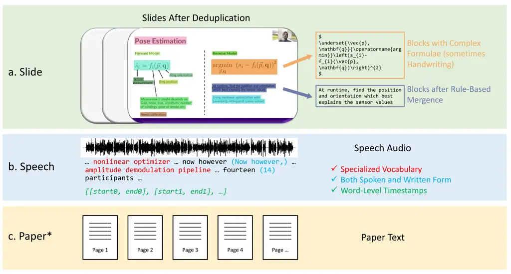

Figure 1: The overview of our M³AV dataset. The first component is
slides annotated with simple and complex blocks. They will be merged
following some rules. The second component is speech containing special
vocabulary, spoken and written forms, and word-level timestamps. The
third component is the paper corresponding to the video. The asterisk
(\*) denotes that only computer science videos have corresponding
papers.

As a natural data source containing multimodal content and knowledge,
academic lectures have been explored to construct a series of datasets.
Some datasets focus on the evaluation of the model’s ability to
recognize multimodal content Dutta et al. (2018); Wang et al. (2023),
others focus on promoting models to understand multimodal knowledge in
academic videos Lev et al. (2019); Li et al. (2019); Atri et al. (2021);
Lee et al. (2022); Lee et al. (2023). However, none of them has yet
simultaneously paid attention to the model’s ability to recognize
multimodal content and understand rich academic knowledge, which is
partly due to their respective lack of adequate manual labelling. The
homogeneity of holding two characteristics is critical to the
implementation of end-to-end academic recognition and understanding
systems.

To fill the gap, we release the Multimodal, Multigenre, and Multipurpose
Audio-Visual Academic Lecture Dataset (M³AV) as shown in Figure 1. The
dataset contains selected academic lectures and presentation videos from
multiple fields, including computer science, biomedical science, and
mathematics. Each video is endowed with highly qualified speech
transcriptions and OCR labels for both printed and handwritten
characters, including complex mathematical formulae. In addition,
academic papers for some videos are also provided to supplement
knowledge more extensively.

Together with the dataset, three benchmark tasks are also proposed that
reflect the perception and understanding of the multimodal information
in those videos. This includes automatic speech recognition (ASR) with a
particular focus on contextual ASR (CASR), spontaneous text-to-speech
(TTS) synthesis, and slide and script generation (SSG). Representative
baseline models are used to benchmark the performance for each task.
Through our experiments, it is observed that the existing models
showcase limited performance in perceiving and understanding the
multimodal content in this dataset, and the rich academic knowledge is
not utilized effectively.

## 2 Related Work

|                       | Slide Data |         |      |             |          | Speech Data   | Paper Data | Dataset Tasks |               |
| --------------------- | ---------- | ------- | ---- | ----------- | -------- | ------------- | ---------- | ------------- | ------------- |
|                       | Segments   | Figures | Text | Handwriting | Formulae | Transcription | Text       | Recognition   | Understanding |
| LectureVideoDB (2018) | M          | \-      | M    | M           | \-       | \-            | \-         | ✔            | ✘             |
| SlideSpeech (2023)    | \-         | \-      | A    | \-          | \-       | M             | \-         | ✔            | ✘             |
| GoogleI/O (2014)      | A          | \-      | A    | \-          | \-       | A             | \-         | ✘             | ✔            |
| LaRochelle (2014)     | A          | \-      | A    | \-          | \-       | A             | \-         | ✘             | ✔            |
| LectureBank (2019)    | M          | \-      | A    | \-          | \-       | \-            | \-         | ✘             | ✔            |
| TalkSumm (2019)       | \-         | \-      | \-   | \-          | \-       | A             | A          | ✘             | ✔            |
| AVIATE (2021)         | \-         | \-      | A    | \-          | \-       | A             | A          | ✘             | ✔            |
| LPM (2022; 2023)      | M          | M       | A    | \-          | \-       | A             | \-         | ✘             | ✔            |
| M³AV (Ours)           | M          | \-      | M    | M           | M        | M             | A          | ✔            | ✔            |

Table 1: Comparison with other academic lecture-based datasets in terms
of data types and designed tasks. “A” denotes fully automated processing
and “M” denotes fully or partially manual labelling.

|                       |           |          |           |           |           |
| --------------------- | --------- | -------- | --------- | --------- | --------- |
|                       | Size      |          |           |           | Available |
|                       | \# Videos | \# Hours | \# Slides | \# Papers |           |
| LectureVideoDB (2018) | 24        | \-       | 5474      | \-        | ✔        |
| SlideSpeech (2023)    | 1705      | 1080     | \-        |           | ✔        |
| GoogleI/O (2014)      | 209       | \-       | \-        | \-        | ✔        |
| LaRochelle (2014)     | 47        | 65       | 3250      | \-        | ✘         |
| LectureBank (2019)    | 1352      | \-       | 51939     | \-        | ✔        |
| TalkSumm (2019)       | 1716      | \-       | \-        | 1716      | ✔        |
| AVIATE (2021)         | 8201      | ~2300    | \-        | 8201      | ✔        |
| LPM (2022; 2023)      | 334       | 187      | 9031      | \-        | ✔        |
| M³AV (Ours)           | 1113      | 367      | 24956     | 767       | ✔        |

Table 2: Comparison with other academic lecture-based datasets in terms
of data size and availability.

The datasets based on academic lectures mainly fall into two categories:
measuring the model’s ability to recognize multimodal content and
evaluating its capacity to capture academic knowledge. In Table 1, we
list the data types and dataset tasks of the relevant academic
lecture-based datasets.

##### Multimodal Content Recognition.

LectureVideoDB Dutta et al. (2018) exploits frames from lecture videos
to test the model’s ability to perform handwritten and scene text
recognition. SlideSpeech Wang et al. (2023) enriches the audio-visual
corpus with synchronized slides to provide additional textual
information. It is worth noting that M³AV dataset provides both OCR data
that is fully manually labelled and speech data that combines multiple
ASR system outputs and manual labelling, which is completely qualified
to cover tasks in the aforementioned datasets.

##### Academic Knowledge Understanding.

LectureBank Li et al. (2019) manually annotates the prerequisite
relationships between course concepts to carry out prerequisite chain
learning. GoogleI/O Chen et al. (2014) and LaRochelle Nguyen et al.
(2014) both study video-level retrieval using presentation or lecture
videos. AVIATE Atri et al. (2021) adopts multimodal information from
academic presentation videos to conduct abstract summarization.
Similarly, TalkSumm Lev et al. (2019) uses a scalable annotation method
to construct large-scale paper summaries from corresponding video
transcription. LPM Lee et al. (2022); Lee et al. (2023) introduces
crossmodal retrieval and generation tasks around its aligned slides and
spoken language. Our M³AV dataset contains annotated video data for both
slides and speeches, which implies little knowledge loss. The addition
of paper documentation information also greatly complements the
knowledge information. Furthermore, a challenging Slide and Script
Generation task is developed to perform the inter-transformation of two
kinds of academic materials.

As illustrated in Table 1, our dataset contains the most complete and
human-annotated resources of slide, speech, and paper, thus supporting
not only the recognition of multimodal content but also the
comprehension of high-level academic knowledge. At the same time, the
size of our dataset is also relatively rich while accessible as shown in
Table 2.

## 3 Summary of M³AV Dataset

| Sets  | CHI  | Ubi | NIH   | IPP  | MLS  | Total |
| ----- | ---- | --- | ----- | ---- | ---- | ----- |
| Train | 44.1 | 7.9 | 188.2 | 34.0 | 21.1 | 295.4 |
| Dev   | 4.4  | 1.0 | 23.6  | 3.6  | 2.5  | 35.1  |
| Test  | 4.7  | 1.5 | 23.5  | 4.1  | 2.6  | 36.4  |

Table 3: Duration of videos from different sources in each data
partition.

Figure 2: Statistics of our dataset. (a) shows video duration and
numbers. (b) shows the number of slides. (c) shows the number of words
per slide. (d) shows the duration per slide segment. (e) shows the
speech word frequency.

### 3.1 Metadata

We treat each video as a unit and rename each video in the form of
"{source}-{id}". For the raw data, we provide the YouTube URL of each
video for users to download.

##### Speech Annotation.

The speech annotations are saved in JSON files. Each unit contains the
start and end timestamps, the transcribed text in the spoken and written
form, and the corresponding word-level timestamps.

##### OCR Annotation.

In OCR annotations, the coordinates and manually corrected text
(formulae are in LaTeX format) of each block are provided in JSON files.
Results of merging (detailed in Appendix A.1) are also provided.

##### Dataset Split.

The division of the sets is determined by the speech data, as the
duration can measure the amount of information consistently. The video
durations are illustrated in Table 3.

### 3.2 Characteristics of Speech Data

##### Variety of Academic Fields.

As shown in Figure 2(a), M³AV contains academic presentations and talk
videos from three different fields including computer science,
biomedical science, and mathematics. The Conference on Human Factors in
Computing Systems (CHI) 2021 Presentations and ACM International
Conference on Ubiquitous Computing (Ubi) 2020 Presentations focus on
research in computer science. The National Institutes of Health
Director’s Wednesday Afternoon Lectures (NIH) presents weekly science
talks given by top biomedical scientists. The Introduction to the
Principles and Practice of Clinical Research (IPP) teaches how to
conduct clinical research effectively and safely. Oxford Mathematics
(MLS) contains mathematics lectures. The total number of videos is 1113,
with 366.9 hours of speech.

##### Abundance of Rare Words.

The size of our spoken form word table is 47865, while the word
frequency within 1k reaches 47483 words (99.20%) as shown in
Figure 2(e). It effectively represents the typical scenario met in
academic presentations where new terminologies constantly appear and are
crucial to the overall understanding.

##### Quality of Transcription.

M³AV is labelled by combining multiple high-performing ASR systems
together with manual labels. As human often fails to label rare
terminologies, the assistance of a high-performing ASR is indispensable.
The multimodal labelling pipeline is described in Section 4.2.

### 3.3 Characteristics of Visual Data

##### Suffient OCR Text Labelling.

The total number of slides has reached 24956 as illustrated in
Figure 2(b). The average number of words per slide is 40.96 as shown in
Figure 2(c). We can observe that there is a sufficient number of slides
and the density of the words is high, which indicates the richness of
the textual information in our slides. The duration of every slide
segment is 50.67 as indicated in Figure 2(d).

##### Complex Handwriting and Formulae.

Significant numbers of pages and blocks in Table 4 show the enrichment
of our complex texts. Furthermore, handwriting and formula texts which
both contain lots of presentation content and academic knowledge have
already been processed into standard text or LaTeX format and thus can
be directly utilised by large language models.

| Sources | \# Pages | \# Blocks\* |
| ------- | -------- | ----------- |
| CHI     | 58       | 656         |
| Ubi     | 63       | 906         |
| NIH     | 53       | 695         |
| IPP     | 21       | 224         |
| MLS     | 577      | 5736        |
| Total   | 772      | 8217        |

Table 4: Statistics of handwriting and formulae. Blocks that appear on
the same page as the complex block are also counted into "# Blocks" due
to the same processing.

## 4 Data Creation Pipeline

### 4.1 Data Collection

Videos of open-source conferences and lectures are collected from
YouTube, together with descriptions and subtitles. Papers for computer
science videos are downloaded and subsequently parsed using
science-parse²² 2
[https://github.com/allenai/science-parse](https://github.com/allenai/science-parse).

### 4.2 Speech Transcription

Figure 3: Diagram illustration of the process of creating speech
transcription.

The diagram of creating speech transcription is shown in Figure 3,
comprising four steps.

#### 4.2.1 Step 1: Candidate Generation

The downloaded subtitles are not high-quality as expected by our
observation. Therefore, we introduce expert ASR systems following Zhang
et al. (2022). In particular, we select Microsoft STT³³ 3
[https://azure.microsoft.com/en-us/products/ai-services/speech-to-text](https://azure.microsoft.com/en-us/products/ai-services/speech-to-text),
and Whisper-large-v2 Radford et al. (2023)⁴⁴ 4
[https://github.com/openai/whisper](https://github.com/openai/whisper).
They both achieve a WER of less than 10% or even 5% on multiple test
sets indicated in the SpeechColab ASR Benchmark (EN)⁵⁵ 5
[https://github.com/SpeechColab/Leaderboard](https://github.com/SpeechColab/Leaderboard)
in Oct. 2022.

The Microsoft transcriptions in written and spoken form⁶⁶ 6 “Spoken
form” refers to the representation of language as it is actually spoken
or pronounced, while “written form” refers to the representation of
language in its written or textual format. are denoted as $`M_{w}`$ and
$`M_{s}`$ respectively, and the Whisper transcriptions result in written
form are denoted as $`W_{w}`$ (only the written form exists in the
Whisper result).

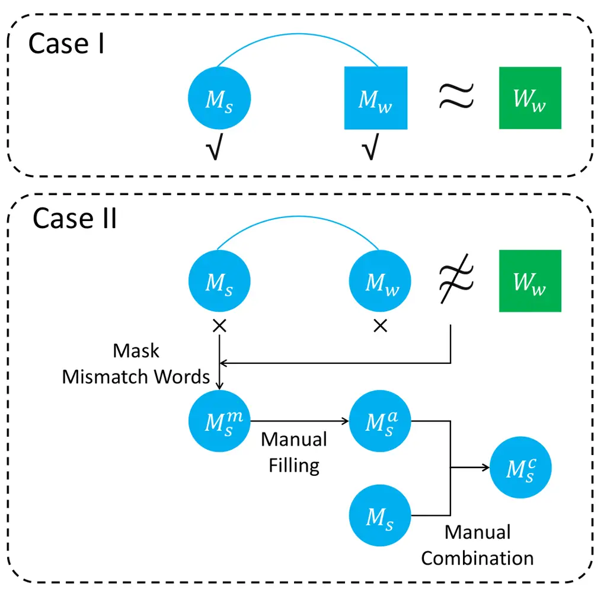

Figure 4: Diagram illustration of the process of candidate combination.

#### 4.2.2 Step 2: Audio Segmentation

Most ASR models expect that the input audio comes in the form of a
relatively short duration, usually up to a few seconds in length.
Therefore, we conduct re-segmentation using the word-level timestamps in
$`M_{w}`$. The split is allowed to be in silence and punctuation. And
the duration of each segment is kept to 10 seconds or less. Detailed
rules can be found in Appendix A.1.

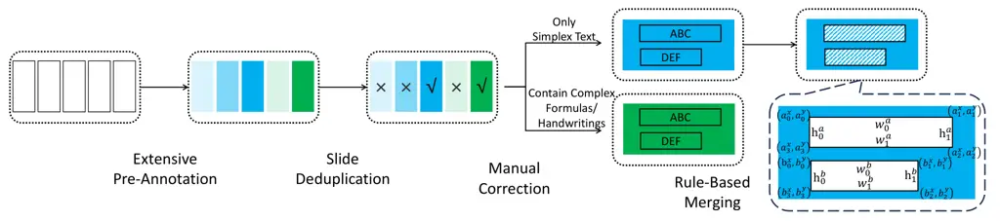

Figure 5: Diagram illustration of the process of slide annotation.
Shades of the same colour represent the amount of slide content in the
same segment. For example, the dark green page adds some content to the
light green page. The right sign (✔) represents reservation, while the
wrong sign (✕) represents discarding.

#### 4.2.3 Step 3: Dataset Partition

We divide all the videos into training, development, and test sets, with
a ratio of roughly 8:1:1 for total duration. We also avoid a speaker
appearing in different sets, which is identified by the introductory
information and description text.

#### 4.2.4 Step 4: Candidate Combination

For the training set, we directly adopt the Microsoft transcription
$`M_{w}`$ and $`M_{s}`$, because it shows high quality verified by
checking against manual labelling on a subset and has both spoken and
written form. For the development and test set, we design the candidate
combination process shown in Figure 4.

In Case I where $`M_{w}`$ is "approximately equal"⁷⁷ 7 It forgives
misalignments due to pauses and common words, as they are mainly
short-pronounced, and $`M_{w}`$ and $`M_{s}`$ have high confidence in
them. to $`W_{w}`$, $`M_{s}`$ and $`M_{w}`$ will be directly adopted.

In Case II where $`M_{w}`$ is not "approximately equal" to $`W_{w}`$, we
design the following steps:

1.  1.  We use the misalignment to mask the words in $`M_{s}`$ as \[???\].
2.  2.  Annotators are assigned to fill in the masks. The result,
        $`M_{s}^{a}`$ can be regarded as a type of data augmentation.
3.  3.  Annotators are instructed to combine $`M_{s}`$ and $`M_{s}^{a}`$ to
        provide the final corrected results $`M_{s}^{c}`$.

The postprocessing of $`M_{s}^{c}`$ is detailed in Appendix A.3. The
manual labelling process is detailed in Appendix A.4. The comparison
with manual labelling on a subset for the training set and the manual
processing for the dev/test set ensure the accuracy and consistency of
the speech annotation.

### 4.3 Slide Annotation

The diagram of creating slide annotation is shown in Figure 5,
comprising four steps.

#### 4.3.1 Step 1: Extensive Pre-Annotation

We conduct frame sampling for the video at 1 frame per second and use
PaddleOCR⁸⁸ 8
[https://github.com/PaddlePaddle/PaddleOCR](https://github.com/PaddlePaddle/PaddleOCR)
for large-scale text detection and recognition. PaddleOCR is selected
for its completeness and high accuracy of the recognition results with
little sticking between words.

#### 4.3.2 Step 2: Slide Deduplication

Since the frames are repetitive, we first perform automatic
deduplication. Specifically, we remove uninformative frames and blocks
and filter out frames with too few or too many blocks. Next, we compare
the OCR contents of neighbouring frames and only keep the latter one
when the content of the former is entirely included. Detailed criteria
are shown in Appendix A.2. After completing the automatic deduplication,
manual deduplication is performed to retain the last frame in each
segment.

#### 4.3.3 Step 3: Manual Correction

For frames with simple text, corrections are directly executed by
experienced researchers for the location and content of the OCR results.
Note that blocks of presentation-irrelevant text such as URLs and email
addresses are omitted. For frames with complex handwriting or formulae,
we pre-label them using the Mathpix OCR API⁹⁹ 9
[https://mathpix.com/ocr](https://mathpix.com/ocr). Then, the annotator
performs careful corrections for the OCR result due to their complexity.
The formulae are labelled in the format of in-line LaTeX. The details of
manual labelling are shown in Appendix A.4. To control the quality of
labelling, we sampled the results of 9 annotators individually and
checked whether 120 of the annotated images had a high number of missing
or incorrect items, with no more than 10 wrong items.

#### 4.3.4 Step 4: Rule-Based Merging

To provide comprehensive semantic information, we devise three rules to
perform merging¹⁰¹⁰ 10 As demonstrated in the top part of Figure 1, the
recognition results of the general OCR model are in rows. It is required
to merge these lines into paragraphs to provide complete semantic
information.:

- •
  Similar Height:

  ```math
  \displaystyle\max(h_{0}^{a},h_{0}^{b}) \displaystyle-\min(h_{0}^{a},h_{0}^{b}) \tag{1}
  ```

  ```math
  \displaystyle\leq a\times\max(h_{0}^{a},h_{0}^{b})
  ```

- •
  High Overlap in the Horizontal Direction:

  ```math
  \displaystyle\min( \displaystyle a_{2}^{x},b_{1}^{x})-\max(a_{3}^{x},b_{0}^{x}) \tag{2}
  ```

  ```math
  \displaystyle\geq b\times\min(b_{1}^{x}-b_{0}^{x},a_{2}^{x}-a_{3}^{x})
  ```

- •
  Proximity of the Upper and Lower:

  ```math
  \displaystyle b_{0}^{y}-a_{3}^{y}\leq c\times\min(h_{0}^{a},h_{0}^{b}) \tag{3}
  ```

where the notations are shown as Figure 5. We set $`a=0.8`$, $`b=0.8`$,
and $`c=0.6`$.

## 5 Benchmarks and Experiments

|                                        |                             |                      |                      |                       |                      |                      |                       |
| -------------------------------------- | --------------------------- | -------------------- | -------------------- | --------------------- | -------------------- | -------------------- | --------------------- |
| Model                                  | Biasing List                | Dev                  |                      |                       | Test                 |                      |                       |
|                                        |                             | CER ($`\downarrow`$) | WER ($`\downarrow`$) | BWER ($`\downarrow`$) | CER ($`\downarrow`$) | WER ($`\downarrow`$) | BWER ($`\downarrow`$) |
| _ASR_                                  |                             |                      |                      |                       |                      |                      |                       |
| AED                                    | \-                          | 4.6                  | 10.0                 | 35.5                  | 4.5                  | 10.0                 | 35.6                  |
| RNN-T                                  | \-                          | 4.7                  | 10.3                 | 36.8                  | 4.7                  | 10.6                 | 38.0                  |
| _Whisper-v3$`{}_{\textsc{1.5B}}`$_     | _-_                         | _3.8_                | _7.1_                | _19.4_                | _3.8_                | _7.2_                | _18.9_                |
| Wav2Vec2+CTC$`{}_{\textsc{0.3B}}`$     | \-                          | 10.6                 | 28.3                 | 60.1                  | 10.6                 | 28.5                 | 62.4                  |
| Conformer+Trans.$`{}_{\textsc{0.6B}}`$ | \-                          | 4.6                  | 10.7                 | 37.8                  | 4.6                  | 10.5                 | 38.2                  |
| Conformer+CTC$`{}_{\textsc{0.6B}}`$    | \-                          | 4.4                  | 11.1                 | 40.6                  | 4.3                  | 11.1                 | 42.2                  |
| SeamlessM4T-v2$`{}_{\textsc{2.3B}}`$   | \-                          | 12.4                 | 17.1                 | 36.7                  | 12.4                 | 18.6                 | 40.7                  |
| _CASR_                                 |                             |                      |                      |                       |                      |                      |                       |
| RNN-T + TCPGen                         | Random Distractors          | 4.7                  | 9.7                  | 26.7                  | 4.7                  | 9.7                  | 27.1                  |
| RNN-T + TCPGen                         | OCR + Same Topic Rare Words | 4.8                  | 9.8                  | 30.5                  | 4.7                  | 10.0                 | 31.7                  |
| RNN-T + TCPGen                         | OCR                         | 4.5                  | 9.4                  | 22.9                  | 4.6                  | 9.6                  | 25.0                  |

Table 5: Evaluation results on ASR and CASR tasks.

### 5.1 ASR and CASR Task

#### 5.1.1 Task Description

E2E approaches have gained substantial attention for ASR, which enable
direct mapping from raw speech audio to its transcription. However, they
often struggle with the accurate recognition of rare words that carry
important information for understanding. CASR aims to improve the
model’s recognition performance for these rare words by incorporating
them into the biasing list.

#### 5.1.2 Benchmark Systems

We adopt two widely-used benchmark systems for ASR and CASR, namely
Attention-based Encoder-Decoder (AED) Chan et al. (2016) and
RNN-Transducer (RNN-T) Graves (2012). Both systems employ a
Conformer Gulati et al. (2020) encoder. The AED system is jointly
trained and decoded with Connectionist Temporal Classification
(CTC) Graves et al. (2006); Watanabe et al. (2017).

For ASR, we also introduce a variety of state-of-the-art pretrained ASR
models. Note that the results of Whisper-v3 are for reference only, as
the Whisper-series model is involved in dataset construction. The
performance of the other open-source ASR models can be fairly evaluated,
given that our videos are properly transcribed for the first time,
avoiding the issue of training data contamination. These pretrained
models are selected from the SpeechColab ASR Benchmark (EN)¹¹¹¹ 11
[https://github.com/SpeechColab/Leaderboard](https://github.com/SpeechColab/Leaderboard)
and Hugging Face Community¹²¹² 12
[https://huggingface.co/models?pipeline_tag=automatic-speech-recognition&sort=trending](https://huggingface.co/models?pipeline_tag=automatic-speech-recognition&sort=trending)
which include Whisper-v3 Radford et al. (2023), Wav2Vec2+CTC Grosman
(2021), Conformer+Transducer¹³¹³ 13
[https://catalog.ngc.nvidia.com/orgs/nvidia/teams/nemo/models/stt_en_conformer_transducer_xlarge](https://catalog.ngc.nvidia.com/orgs/nvidia/teams/nemo/models/stt_en_conformer_transducer_xlarge),
Conformer+CTC¹⁴¹⁴ 14
[https://catalog.ngc.nvidia.com/orgs/nvidia/teams/nemo/models/stt_en_conformer_ctc_xlarge](https://catalog.ngc.nvidia.com/orgs/nvidia/teams/nemo/models/stt_en_conformer_ctc_xlarge)
and SeamlessM4T-v2 Barrault et al. (2023)¹⁵¹⁵ 15
[https://huggingface.co/facebook/seamless-m4t-v2-large](https://huggingface.co/facebook/seamless-m4t-v2-large).

For CASR, the Tree-Constrained Pointer Generator (TCPGen) Sun et al.
(2023b) with GNN tree encodings Sun et al. (2023a) is used which employs
a combination of symbolic prefix-tree search and a neural pointer
generator for contextual biasing. More details are illustrated in
Appendix B.1 and Appendix B.2.

#### 5.1.3 Experimental Results

In addition to the character error rate (CER) and word error rate (WER)
for ASR, we use biasing WER (BWER) for CASR. BWER is defined as the
total rare word errors divided by the total number of rare words,
including insertions of rare words. Table 5 shows the experimental
results. The AED and RNN-T systems achieve around 10.0% WER on both the
Dev and Test sets. However, such end-to-end models suffer from rare word
recognition as reflected by the BWER where a more than two times
increase in the error rate is observed comparing BWER to the WER.

When 1000 distractors¹⁶¹⁶ 16 We select a certain number of significant
words, which are the words in the bias list we aim to recognize
accurately. When decoding, a particular utterance only includes a few of
these words, while the rest will appear as distractors. The use of
distractors follows Le et al.; Sun et al.. are randomly selected from
all rare words and are added to the biasing list, significant
improvements in rare word recognition can be observed. When using OCR
information together with rare words from the same topic to form the
biasing list of each utterance during decoding, the recognition
performance slightly deteriorates. This is because strongly related
words are included in the biasing list, which may cause more confusion
since words with related meanings often have similar pronunciations and
word forms. When only OCR words are used, we achieve the best
performance of the CASR task. In conclusion, by using TCPGen utilizing
the OCR information, we achieve a relative BWER decrease of 37.8% and
34.2% on dev and test sets respectively.

### 5.2 Spontaneous TTS Task

#### 5.2.1 Task Description

Spontaneous Text-to-Speech (TTS) Guo et al. (2021); Yan et al. (2021)
focuses on generating speech with a natural and conversational session.
Most TTS systems use clean speech. This form makes it easier to extract
pronunciation features, while it places higher requirements on the
quality of the training audio and often leads to a discernible gap
between the synthesized output and authentic speech. We are devoted to
using real speech data in M³AV for the TTS system to produce speech that
aligns more closely with natural conversational patterns, as it is
spontaneous and has regulated pronunciations.

#### 5.2.2 Benchmark Systems

Multi-codebook vector quantized TTS (MQTTS) Chen et al. (2023) is
introduced as our spontaneous TTS baseline. It employs a two-stage
training architecture. In the first stage, a quantizer is trained to
discretize the raw waveform into a sequence of codes, minimizing
quantization and reconstruction losses. A discriminator guides
reconstruction via adversarial learning. In the second stage, the fixed
quantizer is combined with a Transformer that performs autoregressive
generation on the code sequence, conditioned on a speaker embedding for
multi-speaker capability. More details can be found in Appendix B.3.

#### 5.2.3 Experimental Results

| Model    | Objective |                      |                      | Subjective          |
| -------- | --------- | -------------------- | -------------------- | ------------------- |
|          |           | FFE ($`\downarrow`$) | MCD ($`\downarrow`$) | MOS ($`\uparrow`$)  |
| _GT_     |           | _-_                  | _-_                  | _3.86 $`\pm`$ 1.02_ |
| Bark     |           | 0.4269               | 10.57                | 3.31 $`\pm`$ 1.02   |
| SpeechT5 |           | 0.4153               | 9.43                 | 3.43 $`\pm`$ 1.09   |
| MQTTS    |           | 0.3518               | 9.40                 | 3.67 $`\pm`$ 0.94   |

Table 6: Evaluation results on Spontaneous TTS task. “GT” denotes the
ground truth.

For the objective metrics, we adopt the F0 Frame Error (FFE) Chu and
Alwan (2009) and Mel-Cepstral Distortion (MCD) Kubichek (1993). For the
subjective metrics, the Mean Opinion Score (MOS) test on a scale of 1 to
5 is performed, which is detailed in Appendix A.4. We randomly choose 20
samples and generate speech segments with the MQTTS model and well-known
pre-trained models, including Bark¹⁷¹⁷ 17
[https://huggingface.co/suno/bark](https://huggingface.co/suno/bark) and
SpeechT5 Ao et al. (2022)¹⁸¹⁸ 18
[https://huggingface.co/microsoft/speecht5_tts](https://huggingface.co/microsoft/speecht5_tts).
Table 6 shows the experimental results, in which the MQTTS model shows
the best performance within all the evaluation metrics. It indicates
that the real speech in our dataset can drive AI systems to simulate
more natural speech.

### 5.3 Slide and Script Generation Task

#### 5.3.1 Task Description

|                                    |                        |                        |                        |                          |                          |                      |
| ---------------------------------- | ---------------------- | ---------------------- | ---------------------- | ------------------------ | ------------------------ | -------------------- |
| Model                              | ROUGE-1 ($`\uparrow`$) | ROUGE-2 ($`\uparrow`$) | ROUGE-L ($`\uparrow`$) | BERTScore ($`\uparrow`$) | BARTScore ($`\uparrow`$) | Human ($`\uparrow`$) |
| _Slide $`\longrightarrow`$ Script_ |                        |                        |                        |                          |                          |                      |
| LLaMA-2$`{}_{\textsc{7B}}`$+OCR    | 24.6                   | 5.6                    | 21.6                   | 0.073                    | -4.970                   | 3.6                  |
| LLaMA-2$`{}_{\textsc{13B}}`$+OCR   | 26.9                   | 6.4                    | 23.6                   | 0.102                    | -4.823                   | 3.9                  |
| GPT-4+OCR                          | 26.2                   | 5.8                    | 23.7                   | 0.085                    | -4.621                   | 4.6                  |
| InstructBLIP$`{}_{\textsc{7B}}`$   | 24.3                   | 2.2                    | 17.9                   | 0.041                    | -5.504                   | 2.4                  |
| InstructBLIP$`{}_{\textsc{13B}}`$  | 24.7                   | 2.3                    | 18.2                   | 0.046                    | -5.514                   | 2.5                  |
| GPT-4V                             | 26.4                   | 6.2                    | 23.7                   | 0.092                    | -4.630                   | 4.7                  |
| _Script $`\longrightarrow`$ Slide_ |                        |                        |                        |                          |                          |                      |
| LLaMA-2$`{}_{\textsc{7B}}`$        | 20.3                   | 6.2                    | 17.3                   | 0.064                    | -6.689                   | 3.3                  |
| LLaMA-2$`{}_{\textsc{13B}}`$       | 23.3                   | 7.5                    | 19.8                   | 0.092                    | -6.484                   | 3.8                  |
| GPT-4                              | 26.8                   | 7.7                    | 23.0                   | 0.077                    | -6.136                   | 4.8                  |

Table 7: Evaluation results on SSG tasks. The upper part of
"Slide$`\rightarrow`$Script" shows cascading pipelines, while the lower
part shows integrated systems.

|                                    |                        |                        |                        |                          |                          |                      |
| ---------------------------------- | ---------------------- | ---------------------- | ---------------------- | ------------------------ | ------------------------ | -------------------- |
| Range                              | ROUGE-1 ($`\uparrow`$) | ROUGE-2 ($`\uparrow`$) | ROUGE-L ($`\uparrow`$) | BERTScore ($`\uparrow`$) | BARTScore ($`\uparrow`$) | Human ($`\uparrow`$) |
| _Slide $`\longrightarrow`$ Script_ |                        |                        |                        |                          |                          |                      |
| Subset                             | 24.9                   | 6.4                    | 21.8                   | 0.114                    | -5.110                   | 3.7                  |
|      + Paper                       | 29.2                   | 8.7                    | 25.8                   | 0.161                    | -4.806                   | 4.1                  |
| _Script $`\longrightarrow`$ Slide_ |                        |                        |                        |                          |                          |                      |
| Subset                             | 20.9                   | 6.8                    | 18.1                   | 0.061                    | -6.737                   | 3.3                  |
|      + Paper                       | 22.3                   | 7.9                    | 19.3                   | 0.061                    | -6.651                   | 3.6                  |

Table 8: Performance improvements of LLaMA-2$`{}_{\textsc{7B}}`$ brought
by retrieving paper information. “Subset” denotes that only Computer
Science videos are contained in all sets for they are the only ones with
downloadable papers.

We define the task formally as follows. Let $`I`$, $`T_{i}`$ and
$`T_{s}`$ be the slide picture, slide text and the speech transcription
of every segment, respectively. For the “Slide$`\rightarrow`$Script”
task, we need to generate $`T_{s}`$ based on $`I`$. Note that $`T_{i}`$
can be viewed as the intermediate result generated from $`I`$ by the OCR
model. For the “Script$`\rightarrow`$Slide” task, we need to generate
$`T_{i}`$ based on $`T_{s}`$. The Slide and Script Generation (SSG) Task
is designed to promote AI models to understand and reconstruct advanced
academic knowledge, thus assisting researchers in creating slides and
presentations. The selected paper sentences are provided for
retrieval-augmented generation (RAG), supplementing rich knowledge. Such
models with academic comprehension can facilitate researchers to handle
frequently updated academic materials to acquire knowledge and
innovation efficiently.

#### 5.3.2 Benchmark Systems

Having witnessed the excellent performance of large language models
(LLMs) and large multimodal models (LMMs) nowadays, we explore their
capabilities there. For the "Slide$`\rightarrow`$Script" task, we adopt
multimodal cascading pipelines and integrated systems. The cascading
pipeline consists of an OCR model to extract the text (we directly adopt
the OCR annotations) and a language model to generate the answer.
Specifically, the cascading pipelines include fine-tuned LLaMA-2 Touvron
et al. (2023) and GPT-4 OpenAI (2023a) using slide OCR text and the
integrated systems include fine-tuned InstructBLIP Dai et al. (2023) and
GPT-4V OpenAI (2023b); OpenAI (2023c). For the
"Script$`\rightarrow`$Slide" task, we adopt fine-tuned LLaMA-2 and
GPT-4. For the selection of related paper sentences, We calculate the
similarity between the script text and each paper sentence and filter
from them. More details can be found in Appendix B.4.

#### 5.3.3 Experimental Results

ROUGE Lin (2004), BERTScore Zhang et al. (2019), and BARTScore Yuan
et al. (2021) results are reported in Table 7 and Table 8. We also
perform manual scoring, where each sample is scored on a scale from 1
(worst) to 5 (best) by 3 annotators on multiple dimensions, including
coherence, consistency, fluency and relevance Fabbri et al. (2021). We
show their average values, while the detailed values are in
Appendix B.5. Scoring is performed on a subset of size 100, detailed in
Appendix A.4.

We get significant observations: 1) The open-source models (LLaMA-2,
InstructBLIP) show a limited performance improvement when raised from 7B
to 13B. Their performances are far from the closed-source models (GPT-4
and GPT-4V). We believe that high-quality pre-training data, e.g.,
informative corpus and visual QA data which encapsulate multimodal
information, is required to enhance their SSG performances beyond just
boosting the model size. 2) The latest LMM (GPT-4V) has already exceeded
the cascaded pipeline composed of unimodal expert models. It suggests
that the LMM not only maintains the ability to process textual
information but also possesses multi-sensory capabilities, such as the
perception and recognition of the slides Yang et al. (2023). 3) RAG
substantially enhances the generation, as shown in Table 8. Qualitative
analyses in Appendix C provide a more fine-grained view.

As for future development, we are urged to strengthen the open-source
model’s ability to understand high-level knowledge and perceive
multimodal information. They can be achieved by increasing the model
size and supplying high-quality data. The issue that the open-source
multimodal models struggle with recognising text in images can be
mitigated by increasing the OCR input. Furthermore, how to effectively
bring in external knowledge is an essential topic.

## 6 Conclusion

We release the Multimodal, Multigenre, and Multipurpose Audio-Visual
Dataset with Academic Lectures (M³AV) covering a range of academic
fields. This dataset contains manually annotated speech transcriptions,
slide text, and additional extracted papers, providing a basis for
evaluating AI models for recognizing multimodal content and
understanding academic knowledge. We detail the creation pipeline and
conduct various analyses of the dataset. Furthermore, we build
benchmarks and conduct experiments around the dataset. We find there is
still large room for existing models to improve perceptions and
understanding of academic lecture videos.

## Limitations

There are some limitations in our work. First, there may exist biases in
the dataset, such as the types of presentations and the demographics of
the speakers. It is hard to completely avoid biases, although we have
incorporated a diverse range of data sources. The users of the dataset
should be aware of the impact brought to the AI models by these biases.

Secondly, the data we collected has limitations in terms of academic
domains and multilingualism. We will consider adding videos from more
research directions, such as humanities disciplines (e.g. economics,
law, and sociology) to an extended dataset in future work. And we also
plan to collect more data in other languages to prompt multilingual
academic research. Nevertheless, we believe our current collection would
already be useful for the community to develop some initial approaches.

Thirdly, we have some deficiencies in mining and labelling for visual
information of the dataset. The illustrations in the video frames are
not extracted separately like Lee et al. (2022); Lee et al. (2023). And,
the talking heads of the speakers are not picked up, which can be
utilised to research the generation of virtual presenters. In summary,
further exploitation of the visual elements in the slides would be a
future extension of the dataset.

Finally, the benchmark systems for the Slide Generation task do not
involve the generation of visual pictures, instead, we only get the
generated slides in the form of text. The generation of slide images
requires complex multimodal models, and the corresponding evaluation
metrics require more sophisticated designs.

## Ethical Consideration

This work presents a dataset based on academic speeches with manual
annotation in terms of slides and speech. The presentations and talks
included in the dataset, are open accessed on the YouTube website. The
copyright remains with the original owners of the videos. Our dataset is
provided under a Creative Commons Attribution-NonCommercial-ShareAlike
4.0 International License. The annual annotation is done by the team’s
researchers and workers on the Amazon Mechanical Turk. All annotators
received clear annotation rules before the annotation and fair payments
upon completion. No personal information is requested from any of the
annotators.

## Acknowledgements

This work is supported by National Key R&D Program of China
(No. 2022ZD0162101), National Natural Science Foundation of China
(No. 62106140) and STCSM (No. 21511101100, No. 22DZ2229005).

## References

- Aleksic et al. (2015) Petar Aleksic, Mohammadreza Ghodsi, Assaf
  Michaely, Cyril Allauzen, Keith Hall, Brian Roark, David Rybach, and
  Pedro Moreno. 2015. Bringing contextual information to Google speech
  recognition. In _Proc. Interspeech 2015_, pages 468–472.
- Ao et al. (2022) Junyi Ao, Rui Wang, Long Zhou, Chengyi Wang, Shuo
  Ren, Yu Wu, Shujie Liu, Tom Ko, Qing Li, Yu Zhang, et al. 2022.
  SpeechT5: Unified-modal encoder-decoder pre-training for spoken
  language processing. In _Proceedings of the 60th Annual Meeting of the
  Association for Computational Linguistics (Volume 1: Long Papers)_,
  pages 5723–5738.
- Atri et al. (2021) Yash Kumar Atri, Shraman Pramanick, Vikram Goyal,
  and Tanmoy Chakraborty. 2021. See, hear, read: Leveraging
  multimodality with guided attention for abstractive text
  summarization. _Knowledge-Based Systems_, 227:107152.
- Barrault et al. (2023) Loïc Barrault, Yu-An Chung, Mariano Coria
  Meglioli, David Dale, Ning Dong, Mark Duppenthaler, Paul-Ambroise
  Duquenne, Brian Ellis, Hady Elsahar, Justin Haaheim, et al. 2023.
  Seamless: Multilingual expressive and streaming speech translation.
  _arXiv preprint arXiv:2312.05187_.
- Chan et al. (2016) William Chan, Navdeep Jaitly, Quoc Le, and Oriol
  Vinyals. 2016. Listen, attend and spell: A neural network for large
  vocabulary conversational speech recognition. In _2016 IEEE
  International Conference on Acoustics, Speech and Signal Processing
  (ICASSP)_, pages 4960–4964.
- Chen et al. (2021) Guoguo Chen, Shuzhou Chai, Guan-Bo Wang, Jiayu Du,
  Wei-Qiang Zhang, Chao Weng, Dan Su, Daniel Povey, Jan Trmal, Junbo
  Zhang, Mingjie Jin, Sanjeev Khudanpur, Shinji Watanabe, Shuaijiang
  Zhao, Wei Zou, Xiangang Li, Xuchen Yao, Yongqing Wang, Zhao You, and
  Zhiyong Yan. 2021. GigaSpeech: An evolving, multi-domain ASR corpus
  with 10,000 hours of transcribed audio. In _Proc. Interspeech 2021_,
  pages 3670–3674.
- Chen et al. (2014) Huizhong Chen, Matthew Cooper, Dhiraj Joshi, and
  Bernd Girod. 2014. Multi-modal language models for lecture video
  retrieval. In _Proceedings of the 22nd ACM International Conference on
  Multimedia_, page 1081–1084.
- Chen et al. (2023) Li-Wei Chen, Shinji Watanabe, and Alexander
  Rudnicky. 2023. A vector quantized approach for text to speech
  synthesis on real-world spontaneous speech. _Proceedings of the AAAI
  Conference on Artificial Intelligence_, 37(11):12644–12652.
- Choi et al. (2023) Ha-Yeong Choi, Sang-Hoon Lee, and Seong-Whan
  Lee. 2023. DDDM-VC: decoupled denoising diffusion models with
  disentangled representation and prior mixup for verified robust voice
  conversion. _CoRR_, abs/2305.15816.
- Chu and Alwan (2009) Wei Chu and Abeer Alwan. 2009. Reducing f0 frame
  error of f0 tracking algorithms under noisy conditions with an
  unvoiced/voiced classification frontend. In _2009 IEEE International
  Conference on Acoustics, Speech and Signal Processing_, pages
  3969–3972.
- Dai et al. (2023) Wenliang Dai, Junnan Li, Dongxu Li, Anthony
  Meng Huat Tiong, Junqi Zhao, Weisheng Wang, Boyang Li, Pascale Fung,
  and Steven Hoi. 2023. [InstructBLIP: Towards general-purpose
  vision-language models with instruction
  tuning](http://arxiv.org/abs/2305.06500).
- Dutta et al. (2018) Kartik Dutta, Minesh Mathew, Praveen Krishnan, and
  C.V Jawahar. 2018. Localizing and recognizing text in lecture videos.
  In _2018 16th International Conference on Frontiers in Handwriting
  Recognition (ICFHR)_, pages 235–240.
- Fabbri et al. (2021) Alexander R Fabbri, Wojciech Kryściński, Bryan
  McCann, Caiming Xiong, Richard Socher, and Dragomir Radev. 2021.
  Summeval: Re-evaluating summarization evaluation. _Transactions of the
  Association for Computational Linguistics_, 9:391–409.
- Graves (2012) Alex Graves. 2012. Sequence transduction with recurrent
  neural networks. In _International Conference of Machine Learning 2012
  Workshop on Representation Learning_.
- Graves et al. (2006) Alex Graves, Santiago Fernández, Faustino Gomez,
  and Jürgen Schmidhuber. 2006. Connectionist temporal classification:
  Labelling unsegmented sequence data with recurrent neural networks. In
  _Proceedings of the 23rd international conference on Machine
  learning_, pages 369–376.
- Grosman (2021) Jonatas Grosman. 2021. Fine-tuned XLSR-53 large model
  for speech recognition in English.
  [https://huggingface.co/jonatasgrosman/wav2vec2-large-xlsr-53-english](https://huggingface.co/jonatasgrosman/wav2vec2-large-xlsr-53-english).
- Gulati et al. (2020) Anmol Gulati, James Qin, Chung-Cheng Chiu, Niki
  Parmar, Yu Zhang, Jiahui Yu, Wei Han, Shibo Wang, Zhengdong Zhang,
  Yonghui Wu, and Ruoming Pang. 2020. Conformer: Convolution-augmented
  transformer for speech recognition. In _Proc. Interspeech 2020_, pages
  5036–5040.
- Guo et al. (2021) Haohan Guo, Shaofei Zhang, Frank K. Soong, Lei He,
  and Lei Xie. 2021. Conversational end-to-end TTS for voice agents. In
  _2021 IEEE Spoken Language Technology Workshop (SLT)_, pages 403–409.
- Holtzman et al. (2020) Ari Holtzman, Jan Buys, Li Du, Maxwell Forbes,
  and Yejin Choi. 2020. [The curious case of neural text
  degeneration](https://openreview.net/forum?id=rygGQyrFvH). In _8th
  International Conference on Learning Representations, ICLR 2020, Addis
  Ababa, Ethiopia, April 26-30, 2020_. OpenReview.net.
- Hu et al. (2022) Edward J. Hu, Yelong Shen, Phillip Wallis, Zeyuan
  Allen-Zhu, Yuanzhi Li, Shean Wang, Lu Wang, and Weizhu Chen. 2022.
  LoRA: Low-rank adaptation of large language models. In _The Tenth
  International Conference on Learning Representations, ICLR 2022,
  Virtual Event, April 25-29, 2022_. OpenReview.net.
- Kipf and Welling (2017) Thomas N Kipf and Max Welling. 2017.
  Semi-supervised classification with graph convolutional networks. In
  _International Conference on Learning Representations_.
- Kong et al. (2020) Jungil Kong, Jaehyeon Kim, and Jaekyoung Bae. 2020.
  HiFi-GAN: Generative adversarial networks for efficient and high
  fidelity speech synthesis. In _Advances in Neural Information
  Processing Systems_, volume 33, pages 17022–17033.
- Kubichek (1993) R. Kubichek. 1993. Mel-cepstral distance measure for
  objective speech quality assessment. In _Proceedings of IEEE Pacific
  Rim Conference on Communications Computers and Signal Processing_,
  volume 1, pages 125–128 vol.1.
- Kudo and Richardson (2018) Taku Kudo and John Richardson. 2018.
  SentencePiece: A simple and language independent subword tokenizer and
  detokenizer for neural text processing. In _Proceedings of the 2018
  Conference on Empirical Methods in Natural Language Processing: System
  Demonstrations_, pages 66–71.
- Le et al. (2021a) Duc Le, Mahaveer Jain, Gil Keren, Suyoun Kim,
  Yangyang Shi, Jay Mahadeokar, Julian Chan, Yuan Shangguan, Christian
  Fuegen, Ozlem Kalinli, Yatharth Saraf, and Michael L. Seltzer. 2021a.
  Contextualized streaming end-to-end speech recognition with trie-based
  deep biasing and shallow fusion. In _Proc. Interspeech 2021_, pages
  1772–1776.
- Le et al. (2021b) Duc Le, Gil Keren, Julian Chan, Jay Mahadeokar,
  Christian Fuegen, and Michael L. Seltzer. 2021b. Deep shallow fusion
  for RNN-T personalization. In _2021 IEEE Spoken Language Technology
  Workshop (SLT)_, pages 251–257.
- Lee et al. (2022) Dong Won Lee, Chaitanya Ahuja, Paul Pu Liang, Sanika
  Natu, and Louis-Philippe Morency. 2022. Multimodal lecture
  presentations dataset: Understanding multimodality in educational
  slides. _arXiv preprint arXiv:2208.08080_.
- Lee et al. (2023) Dong Won Lee, Chaitanya Ahuja, Paul Pu Liang, Sanika
  Natu, and Louis-Philippe Morency. 2023. Lecture presentations
  multimodal dataset: Towards understanding multimodality in educational
  videos. In _Proceedings of the IEEE/CVF International Conference on
  Computer Vision (ICCV)_, pages 20087–20098.
- Lev et al. (2019) Guy Lev, Michal Shmueli-Scheuer, Jonathan Herzig,
  Achiya Jerbi, and David Konopnicki. 2019. TalkSumm: A dataset and
  scalable annotation method for scientific paper summarization based on
  conference talks. In _Proceedings of the 57th Annual Meeting of the
  Association for Computational Linguistics_, pages 2125–2131.
  Association for Computational Linguistics.
- Li et al. (2019) Irene Li, Alexander R Fabbri, Robert R Tung, and
  Dragomir R Radev. 2019. What should I learn first: Introducing
  LectureBank for NLP education and prerequisite chain learning. In
  _Proceedings of the AAAI Conference on Artificial Intelligence_,
  volume 33, pages 6674–6681.
- Lin (2004) Chin-Yew Lin. 2004. ROUGE: A package for automatic
  evaluation of summaries. In _Text Summarization Branches Out_, pages
  74–81. Association for Computational Linguistics.
- Loshchilov and Hutter (2018) Ilya Loshchilov and Frank Hutter. 2018.
  Decoupled weight decay regularization. In _International Conference on
  Learning Representations (ICLR)_.
- McAuliffe et al. (2017) Michael McAuliffe, Michaela Socolof, Sarah
  Mihuc, Michael Wagner, and Morgan Sonderegger. 2017. Montreal Forced
  Aligner: Trainable text-speech alignment using Kaldi. In _Proc.
  Interspeech 2017_, pages 498–502.
- Nguyen et al. (2014) Nhu-Van Nguyen, Mickaël Coustaty, and Jean-Marc
  Ogier. 2014. Multi-modal and cross-modal for lecture videos retrieval.
  In _22nd International Conference on Pattern Recognition, ICPR 2014,
  Stockholm, Sweden, August 24-28, 2014_, pages 2667–2672. IEEE Computer
  Society.
- OpenAI (2023a) OpenAI. 2023a. [GPT-4 technical
  report](https://doi.org/10.48550/ARXIV.2303.08774).
- OpenAI (2023b) OpenAI. 2023b. [GPT-4V(ision) system
  card](https://cdn.openai.com/papers/GPTV_System_Card.pdf).
- OpenAI (2023c) OpenAI. 2023c. [GPT-4V(ision) technical work and
  authors](https://cdn.openai.com/contributions/gpt-4v.pdf).
- Panayotov et al. (2015) Vassil Panayotov, Guoguo Chen, Daniel Povey,
  and Sanjeev Khudanpur. 2015. Librispeech: An ASR corpus based on
  public domain audio books. In _2015 IEEE International Conference on
  Acoustics, Speech and Signal Processing (ICASSP)_, pages 5206–5210.
- Park et al. (2019) Daniel S. Park, William Chan, Yu Zhang, Chung-Cheng
  Chiu, Barret Zoph, Ekin D. Cubuk, and Quoc V. Le. 2019. SpecAugment: A
  simple data augmentation method for automatic speech recognition. In
  _Proc. Interspeech 2019_, pages 2613–2617.
- Pundak et al. (2018) Golan Pundak, Tara N. Sainath, Rohit
  Prabhavalkar, Anjuli Kannan, and Ding Zhao. 2018. Deep context:
  End-to-end contextual speech recognition. In _2018 IEEE Spoken
  Language Technology Workshop (SLT)_, pages 418–425.
- Radford et al. (2023) Alec Radford, Jong Wook Kim, Tao Xu, Greg
  Brockman, Christine McLeavey, and Ilya Sutskever. 2023. [Robust speech
  recognition via large-scale weak
  supervision](https://proceedings.mlr.press/v202/radford23a.html). In
  _International Conference on Machine Learning, ICML 2023, 23-29 July
  2023, Honolulu, Hawaii, USA_, volume 202 of _Proceedings of Machine
  Learning Research_, pages 28492–28518. PMLR.
- Reimers and Gurevych (2019) Nils Reimers and Iryna Gurevych. 2019.
  Sentence-BERT: Sentence embeddings using siamese BERT-networks. In
  _Proceedings of the 2019 Conference on Empirical Methods in Natural
  Language Processing_. Association for Computational Linguistics.
- Sanh et al. (2019) Victor Sanh, Lysandre Debut, Julien Chaumond, and
  Thomas Wolf. 2019. [DistilBERT, a distilled version of BERT: smaller,
  faster, cheaper and lighter](http://arxiv.org/abs/1910.01108). _CoRR_,
  abs/1910.01108.
- Sun et al. (2022) Guangzhi Sun, Chao Zhang, and Phil Woodland. 2022.
  Tree-constrained pointer generator with graph neural network encodings
  for contextual speech recognition. In _Proc. Interspeech 2022_, pages
  2043–2047.
- Sun et al. (2023a) Guangzhi Sun, Chao Zhang, and Philip C. Woodland.
  2023a. Graph neural networks for contextual ASR with the
  tree-constrained pointer generator. _arXiv preprint arXiv:2305.18824_.
- Sun et al. (2023b) Guangzhi Sun, Chao Zhang, and Philip C. Woodland.
  2023b. Minimising biasing word errors for contextual ASR with the
  tree-constrained pointer generator. _IEEE/ACM Transactions on Audio,
  Speech, and Language Processing_, 31:345–354.
- Touvron et al. (2023) Hugo Touvron, Louis Martin, Kevin Stone, Peter
  Albert, Amjad Almahairi, Yasmine Babaei, Nikolay Bashlykov, Soumya
  Batra, Prajjwal Bhargava, Shruti Bhosale, et al. 2023. Llama 2: Open
  foundation and fine-tuned chat models. _arXiv preprint
  arXiv:2307.09288_.
- Wang et al. (2023) Haoxu Wang, Fan Yu, Xian Shi, Yuezhang Wang, and
  Shiliang Zhang. 2023. SlideSpeech: A large-scale slide-enriched
  audio-visual corpus. _arXiv preprint arXiv:2309.05396_.
- Watanabe et al. (2018) Shinji Watanabe, Takaaki Hori, Shigeki Karita,
  Tomoki Hayashi, Jiro Nishitoba, Yuya Unno, Nelson Enrique Yalta
  Soplin, Jahn Heymann, Matthew Wiesner, Nanxin Chen, Adithya
  Renduchintala, and Tsubasa Ochiai. 2018. ESPnet: End-to-end speech
  processing toolkit. In _Proc. Interspeech 2018_, pages 2207–2211.
- Watanabe et al. (2017) Shinji Watanabe, Takaaki Hori, Suyoun Kim,
  John R. Hershey, and Tomoki Hayashi. 2017. Hybrid ctc/attention
  architecture for end-to-end speech recognition. _IEEE Journal of
  Selected Topics in Signal Processing_, 11(8):1240–1253.
- Yan et al. (2021) Yuzi Yan, Xu Tan, Bohan Li, Guangyan Zhang, Tao Qin,
  Sheng Zhao, Yuan Shen, Wei-Qiang Zhang, and Tie-Yan Liu. 2021.
  Adaptive text to speech for spontaneous style. In _Proc. Interspeech
  2021_, pages 4668–4672.
- Yang et al. (2023) Zhengyuan Yang, Linjie Li, Kevin Lin, Jianfeng
  Wang, Chung-Ching Lin, Zicheng Liu, and Lijuan Wang. 2023. [The dawn
  of LMMs: Preliminary explorations with
  GPT-4V(ision)](http://arxiv.org/abs/2309.17421). _CoRR_,
  abs/2309.17421.
- Yuan et al. (2021) Weizhe Yuan, Graham Neubig, and Pengfei Liu. 2021.
  BARTScore: Evaluating generated text as text generation. _Advances in
  Neural Information Processing Systems_, 34:27263–27277.
- Zhang et al. (2022) Binbin Zhang, Hang Lv, Pengcheng Guo, Qijie Shao,
  Chao Yang, Lei Xie, Xin Xu, Hui Bu, Xiaoyu Chen, Chenchen Zeng, Di Wu,
  and Zhendong Peng. 2022. WENETSPEECH: A 10000+ hours multi-domain
  mandarin corpus for speech recognition. In _ICASSP 2022 - 2022 IEEE
  International Conference on Acoustics, Speech and Signal Processing
  (ICASSP)_, pages 6182–6186.
- Zhang et al. (2019) Tianyi Zhang, Varsha Kishore, Felix Wu, Kilian Q
  Weinberger, and Yoav Artzi. 2019. BERTScore: Evaluating text
  generation with bert. In _International Conference on Learning
  Representations_.
- Zhao et al. (2019) Ding Zhao, Tara N. Sainath, David Rybach, Pat
  Rondon, Deepti Bhatia, Bo Li, and Ruoming Pang. 2019. Shallow-fusion
  end-to-end contextual biasing. In _Proc. Interspeech 2019_, pages
  1418–1422.

## Appendix A Creation Pipeline Details

### A.1 Audio Segmentation Rules

We establish the following rules of segmentation:

1.  1.  Split is allowed when the silence exceeds 0.2 seconds or there is
        sentence break punctuation (".", "!", "?").
2.  2.  If the accumulated "small segments" obtained are greater than or
        equal to 8 seconds or the accumulation is greater than or equal to
        10 seconds after the next "small segment" is added, then the
        accumulated segments will form a new segment.
3.  3.  If the silence exceeds 5 seconds, then this silence is discarded and
        a new segment is formed from the accumulated "small segments".

The first rule aims to preserve boundary words as well as the semantics
of sentences inspired by LibriSpeech Panayotov et al. (2015) and
GigaSpeech Chen et al. (2021). The second rule controls the duration of
each segment, while the third rule avoids too long silence within a
segment.

### A.2 Auto Slide Deduplication Details

1.  1.  For the frames that contain some OCR block representing the video
        cover $`B_{\text{cover}}`$, we delete these images directly. And we
        remove fixed appearing logo blocks $`B_{\text{excluded}}`$, such as
        "NIH".
2.  2.  Then, we set a threshold $`\min_{\text{alpha}}^{\text{B}}`$ to
        filter blocks with too few letters. For the filtering process for
        images, we set the thresholds $`\min_{\text{B}}^{\text{I}}`$ and
        $`\max_{\text{B}}^{\text{I}}`$ to filter images with too few blocks
        and too many blocks, respectively.
3.  3.  After the above filtering, we merge all the blocks of each image
        into long text by their coordinates.
4.  4.  Initially, we assign the first image to segment $`0`$. Next, we will
        iterate through each image chronologically: if the error rates (ER)
        between the current image (segment $`i`$) content and all past image
        contents are all greater than the threshold $`\min_{\text{ER}}`$,
        then it is considered as a new image and assigned to segment
        $`i+1`$, otherwise, it is not and kept as segment $`i`$.
5.  5.  Eventually, the last image in each segment will be the result of the
        deduplication since they are not repeating each other and contain
        the most text of the images in their segment.

We would like to emphasize that the thresholds mentioned above depend on
the characteristics of each source of videos, such as the clarity of the
picture, the density of the text, and the presence of handwriting and
formulae. Moreover, we adopt a modified Word Error Rate (WER) or Char
Error Rate (CER) in the calculation of ER mainly considering the
incremental content of slides. They are formulated as follows:

```math
\displaystyle\text{WER}^{\text{mod}} \displaystyle=\frac{S+D+0\times I}{H+S+D} \tag{4}
```

```math
\displaystyle\text{CER}^{\text{mod}} \displaystyle=\frac{S+D+0.1\times I}{H+S+D} \tag{5}
```

where $`S`$, $`D`$, $`I`$, and $`H`$ represent the number of
substitutions, deletions, insertions, and hits, respectively. The choice
of WER or CER also depends on the aforementioned characteristics of the
videos.

### A.3 Postprocessing for Manual Combination Results

To preserve the consistency of the data after obtaining $`M_{s}^{c}`$
shown in Figure 4, we perform inverse text normalization¹⁹¹⁹ 19
[https://docs.nvidia.com/deeplearning/nemo/user-guide/docs/en/main/nlp/text_normalization/wfst/wfst_text_normalization.html#inverse-text-normalization](https://docs.nvidia.com/deeplearning/nemo/user-guide/docs/en/main/nlp/text_normalization/wfst/wfst_text_normalization.html#inverse-text-normalization),
add punctuations, and capitalize words using tools²⁰²⁰ 20
[https://docs.nvidia.com/deeplearning/nemo/user-guide/docs/en/main/nlp/punctuation_and_capitalization.html](https://docs.nvidia.com/deeplearning/nemo/user-guide/docs/en/main/nlp/punctuation_and_capitalization.html).
Finally, we obtain the word-level timestamps of $`M_{s}^{c}`$ using
Montreal Forced Aligner McAuliffe et al. (2017)²¹²¹ 21
[https://github.com/MontrealCorpusTools/Montreal-Forced-Aligner](https://github.com/MontrealCorpusTools/Montreal-Forced-Aligner).

### A.4 Manual Annotation Details

The master-granted annotators are assigned to complete manual filling
and combination in creating speech transcription. In these two tasks,
each worker receives 0.06 USD for each finished sample, respectively.
The annotation interfaces shown in Figure 12 and Figure 13 describe the
rules as well as the rejection cases of manual filling and combination
in detail, respectively. The failed samples are passed to other workers
for annotation.

The experienced researchers in our team are assigned to annotate the OCR
data, and the annotation of each sample includes slide deduplication and
OCR content correction. Each worker received the appropriate
remuneration. The interface for OCR content correction is shown in
Figure 14, where PPOCRLabel²²²² 22
[https://github.com/PaddlePaddle/PaddleOCR/tree/release/2.7/PPOCRLabel](https://github.com/PaddlePaddle/PaddleOCR/tree/release/2.7/PPOCRLabel)
is adopted. To control the quality of labelling, we sampled the results
of 9 annotators individually and checked whether 120 of the annotated
images had a high number of missing or incorrect items, with no more
than 10 wrong items.

The master-granted annotators are assigned to complete the MOS scoring
in the TTS task evaluation. A batch of 6 TTS results from the same audio
clip (with the addition of a trap sample used to detect attentiveness).
Each worker receives 0.2 USD for each completed batch respectively.
Similarly, the annotation interface shown in Figure 15 details the rules
as well as the rejection cases, which is inspired by Choi et al. (2023).
The failed samples will be passed to other workers for annotation.

As for the manual scoring of SSG tasks, we posted the annotation task on
Amazon Mechanical Turk initially but found that the quality was
unsatisfactory due to the complexity of the scripts and speech texts.
Therefore, three experienced researchers were assigned to carry out the
annotation task. Specifically, annotators need to rate the generated
slides/scripts on multiple dimensions, including coherence, consistency,
fluency and relevance, as referenced in SummEval Fabbri et al. (2021).
Each sample is scored on a scale from 1 (worst) to 5 (best) by 3
annotators. Note that we sampled 100 items due to cost and multiple
models. The annotation interfaces are shown in Figure 16 and Figure 17.

## Appendix B Experiment Details

### B.1 ASR Benchmark Details

We construct the Attention-based Encoder-Decoder (AED) with the help of
the well-known ESPnet Watanabe et al. (2018) toolkit. We use
Conformer Gulati et al. (2020) as the encoder, which consists of 12
blocks, with hidden linear units $`d^{\text{ff}}=2048`$ and attention
output size $`d^{\text{att}}=512`$. Attention head $`H`$ is set to 8 and
the front CNN kernel size is 31. As for the decoder, we use the
Transformer with 6 blocks ($`d^{\text{ff}}=2048`$,$`H=8`$). We use BPE
as our recognition unit, which consists of 1k tokens obtained by
SentencePiece Kudo and Richardson (2018). In addition to the attention
training objectives, We use a certain degree of CTC loss function. CTC
weight $`\lambda`$ is 0.3 during training, while 0.2 for infering.
SpecAugment Park et al. (2019) is applied with time mask width $`T=40`$
and frequency mask with $`F=30`$. Our model is trained on four 24GB 3090
RTX GPUs for 60 epochs. The top 10 checkpoints after one epoch training
are preserved for model averaging.

For the RNN-Transducer (RNN-T), we also adopt Conformer as the encoder,
with an intermediate joint network of 320 dimensions. The Conformer has
15 blocks, 1024 hidden linear units, 4 attention heads, and 256
attention output dimensions. After that, a single layer of LSTM is
performed.

### B.2 CASR Benchmark Details

Our CASR task is performed under two paradigms. One paradigm is to form
the biasing list for an utterance using target biasing words together
with distractors that are randomly selected from all rare words, as a
simulation of the real-world scenario Aleksic et al. (2015); Zhao et al.
(2019); Pundak et al. (2018); Le et al. (2021b). Our experiment uses
1000 distractors to form the biasing list for each utterance, and rare
words are defined by removing the top 5k most frequent words from the
vocabulary. Another paradigm is audio-visual CASR Sun et al. (2022)
which extracts the biasing list from visual information, such as OCR
annotation.

As for TCPGen, we use a 6-layer GCN Kipf and Welling (2017) for future
information representation. Following the method proposed in  Le et al.
(2021a), the biasing lists are extracted by identifying words in the
speech transcription of each utterance that also appears in the total
rare words list, followed by the addition of plenty of distractors to
simulate a real-life setting. The length of the biasing list is set to
500 during training and 1000 during inferencing. Model training lasts
for 70 epochs, and the best 10 of the checkpoints are saved for model
averaging. Our models are trained on 24GB 3090 RTX GPUs.

Before model training, the rare word selection is first performed. Our
speech corpus includes approximately 43k different words in total. We
conduct a word frequency analysis on the training set, identifying words
with a frequency ranking exceeding 5k as members of the total rare word
set. The number of our rare word list is about 38k.

### B.3 Spontaneous TTS Benchmark Details

We followed the settings recommended by the architecture authors, and
their experiments were trained on a subset of GigaSpeech Chen et al.
(2021), which is a speech corpus containing transcribed audio from
audiobooks, Podcasts, and YouTube. We use the training set of the M³AV
for MQTTS model training and arbitrarily extract a sufficient number of
samples from the Dev and Test Set for speech synthesis to verify the
effectiveness of our model. We adopt HiFi-GAN Kong et al. (2020) as the
backbone architecture for the quantizer and discriminator, which we
trained for 600k steps. After that, a Transformer is trained to
autoregressively generate the code representation based on the past code
sequence. The last checkpoints from both steps are preserved. It is
worth noting that MQTTS training may take a long time. Our models are
trained on 24GB 3090 RTX GPUs.

### B.4 Slide and Script Generation Benchmark Details

For the selection of related paper sentences, we adopt the
DistilBERT Sanh et al. (2019) model in the repository of
sentence-transformers Reimers and Gurevych (2019) ²³²³ 23
[https://huggingface.co/sentence-transformers/msmarco-distilbert-base-v4](https://huggingface.co/sentence-transformers/msmarco-distilbert-base-v4)
to calculate the similarity between the script text and each paper
sentence. Then we select the top 3 candidates with similarity greater
than 0.5 as the selection results. In the training phase of benchmark
systems, we use LoRA Hu et al. (2022) to fine-tune LLaMA-2 Touvron
et al. (2023). The optimizer we use is AdamW Loshchilov and Hutter
(2018). The learning rate curve is 1 epoch of warm-up and then drops
with a peak learning rate of $`2\times 10^{-4}`$. The total number of
training epochs is 3. Our models are trained on 24GB 3090 GPUs and 48GB
A6000 GPUs. Fine-tuned InstructBLIP Dai et al. (2023) is another
baseline. Specifically, we fine-tune the officially released checkpoint
for 20 epochs with the learning rate increasing linearly from
$`1\times 10^{-7}`$ to $`5\times 10^{-5}`$ during the first 1000 steps
and dropping to 0 as a cosine function. The model is trained on 80GB
A100 GPUs with AdamW Loshchilov and Hutter (2018) as the optimizer. The
best checkpoints are chosen according to the performance of the
development set. As for the generation settings, we use nucleus
sampling Holtzman et al. (2020) with a $`\text{top}_{\text{p}}`$ of 0.9.
The maximum number of tokens generated is 300. These generation settings
are consistent across LLaMA-2, InstructBLIP, GPT-4 and GPT-4V.

### B.5 Detailed Manual Scoring Results on SSG Tasks

We show the detailed scoring results in Table 9 and Table 10, which
include the coherence (Coh.), consistency (Cons.), fluency (Flu.),
relevance (Rel.) and average value (Avg.) between the hypothesis and its
reference text.

|                                    |                     |                      |                     |                     |                     |
| ---------------------------------- | ------------------- | -------------------- | ------------------- | ------------------- | ------------------- |
| Model                              | Coh. ($`\uparrow`$) | Cons. ($`\uparrow`$) | Flu. ($`\uparrow`$) | Rel. ($`\uparrow`$) | Avg. ($`\uparrow`$) |
| _Slide $`\longrightarrow`$ Script_ |                     |                      |                     |                     |                     |
| LLaMA-2$`{}_{\textsc{7B}}`$+OCR    | 3.2                 | 3.0                  | 4.2                 | 4.1                 | 3.6                 |
| LLaMA-2$`{}_{\textsc{13B}}`$+OCR   | 3.7                 | 3.4                  | 4.1                 | 4.3                 | 3.9                 |
| GPT-4+OCR                          | 4.0                 | 4.4                  | 5.0                 | 5.0                 | 4.6                 |
| InstructBLIP$`{}_{\textsc{7B}}`$   | 1.6                 | 2.0                  | 2.6                 | 3.2                 | 2.4                 |
| InstructBLIP$`{}_{\textsc{13B}}`$  | 2.0                 | 2.1                  | 2.6                 | 3.3                 | 2.5                 |
| GPT-4V                             | 4.2                 | 4.5                  | 5.0                 | 5.0                 | 4.7                 |
| _Script $`\longrightarrow`$ Slide_ |                     |                      |                     |                     |                     |
| LLaMA-2$`{}_{\textsc{7B}}`$        | 3.1                 | 3.4                  | 3.4                 | 3.3                 | 3.3                 |
| LLaMA-2$`{}_{\textsc{13B}}`$       | 3.5                 | 3.6                  | 3.9                 | 4.0                 | 3.8                 |
| GPT-4                              | 4.6                 | 4.4                  | 5.0                 | 5.0                 | 4.8                 |

Table 9: Detailed manual scoring results on SSG tasks.

|                                    |                     |                      |                     |                     |                     |
| ---------------------------------- | ------------------- | -------------------- | ------------------- | ------------------- | ------------------- |
| Range                              | Coh. ($`\uparrow`$) | Cons. ($`\uparrow`$) | Flu. ($`\uparrow`$) | Rel. ($`\uparrow`$) | Avg. ($`\uparrow`$) |
| _Slide $`\longrightarrow`$ Script_ |                     |                      |                     |                     |                     |
| Subset                             | 3.4                 | 3.2                  | 4.2                 | 4.1                 | 3.7                 |
|      + Paper                       | 4.1                 | 4.2                  | 4.1                 | 4.1                 | 4.1                 |
| _Script $`\longrightarrow`$ Slide_ |                     |                      |                     |                     |                     |
| Subset                             | 3.2                 | 3.4                  | 3.3                 | 3.3                 | 3.3                 |
|      + Paper                       | 3.6                 | 3.7                  | 3.5                 | 3.4                 | 3.6                 |

Table 10: Detailed manual scoring results on SSG tasks when paper
information is introduced.

## Appendix C Qualitative Analyses of SSG Benchmark Systems

The comparisons of the benchmark systems in “Slide$`\rightarrow`$Script”
are shown in Figure 6 and Figure 7. LLaMA-2 and InstructBLIP below refer
to models of size 7B. We can find that the scripts generated by
GPT-4+OCR and GPT-4V are highly qualified and roughly match the
references. The results of LLaMA-2+OCR are acceptable, although slightly
weaker than the previous two. All three can develop detailed
descriptions around topics in slides, such as the “NIH Outreach Toolkit”
in Figure 6 and “Aging and Migration” in Figure 7. InstructBLIP, on the
other hand, fails to find the right theme, as shown in Figure 6 and
Figure 7, suggesting that today’s open-source LMM models struggle in
handling text in slides.

The comparisons of the benchmark systems in “Script$`\rightarrow`$Slide”
are shown in Figure 9 and Figure 10. The slides generated by GPT-4 are
closer to references than those generated by LLaMA-2, and the contents
are more accurate and condensed. For example, GPT-4 presents “Drosophila
ToLL” in Figure 9 and “Pipeline” in Figure 10, while LLaMA-2 does not.
We can conclude that GPT-4 has a better understanding of complex
academic knowledge than LLaMA-2.

Figure 8 and Figure 11 show the improvement in the quality of the
generated scripts and slides brought by external knowledge. The addition
of external knowledge enables AI models to produce necessary details,
such as “WiFi CSI” in Figure 8 and “13 long-term users” in Figure 11. It
shows that the introduction of external knowledge leads to more
comprehensive information captured by AI models.

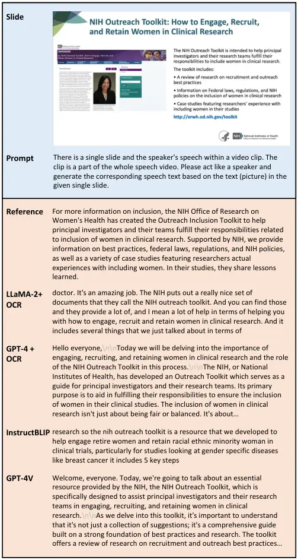

Figure 6: “Slide$`\rightarrow`$Script” Case I where scripts generated by
benchmark systems are compared.

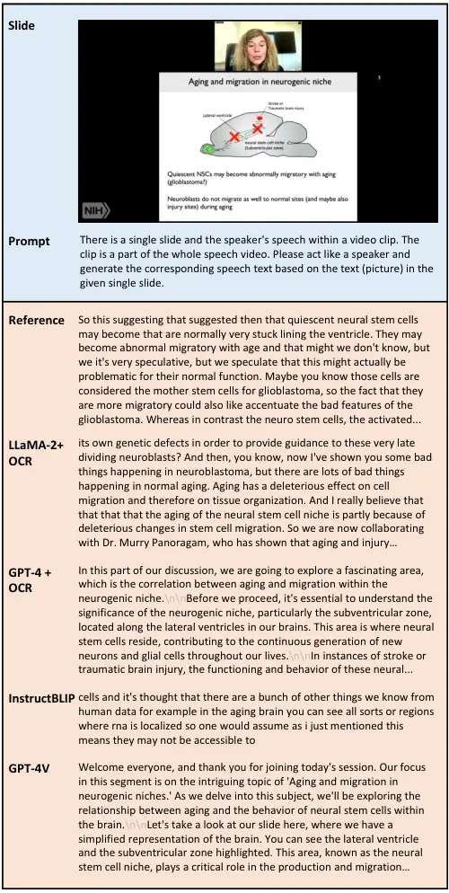

Figure 7: “Slide$`\rightarrow`$Script” Case II where scripts generated
by benchmark systems are compared.

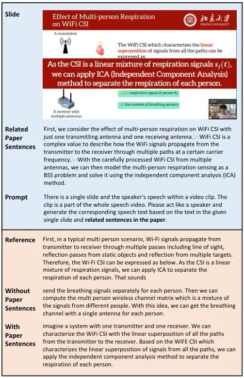

Figure 8: “Slide$`\rightarrow`$Script” Case III where paper sentences
are provided as external knowledge.

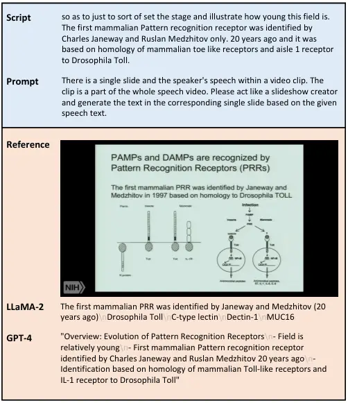

Figure 9: “Script$`\rightarrow`$Slide” Case I where slides generated by
benchmark systems are compared.

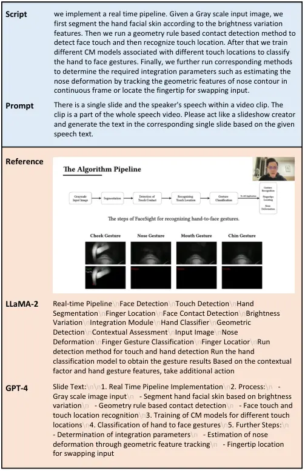

Figure 10: “Script$`\rightarrow`$Slide” Case II where slides generated
by benchmark systems are compared.

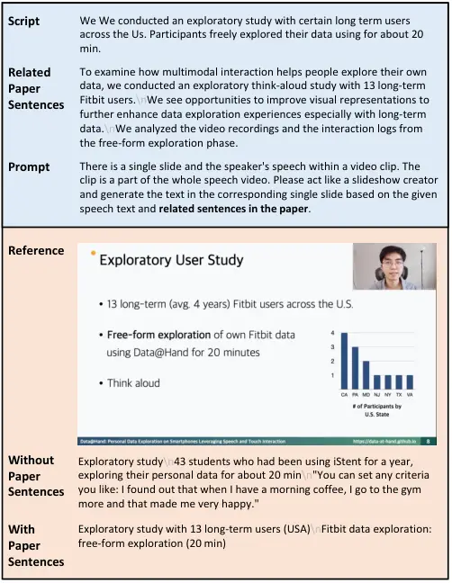

Figure 11: “Script$`\rightarrow`$Slide” Case III where paper sentences
are provided as external knowledge.

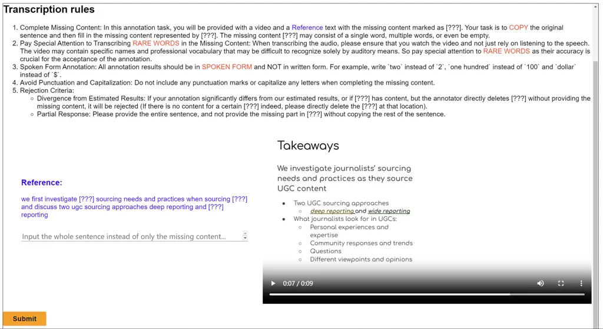

Figure 12: Annotation interface for manual filling in constructing
speech transcription.

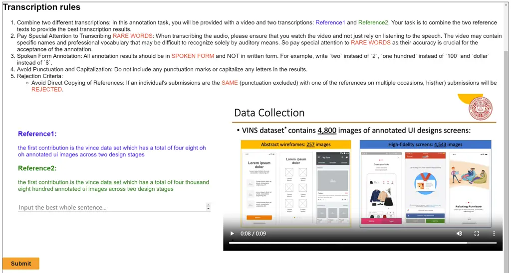

Figure 13: Annotation interface for manual combination in constructing
speech transcription.

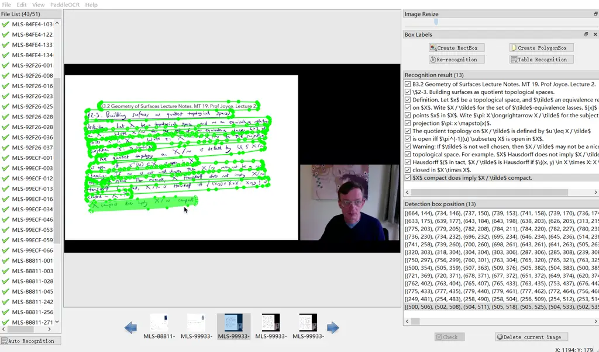

Figure 14: Annotation interface for correcting OCR results.

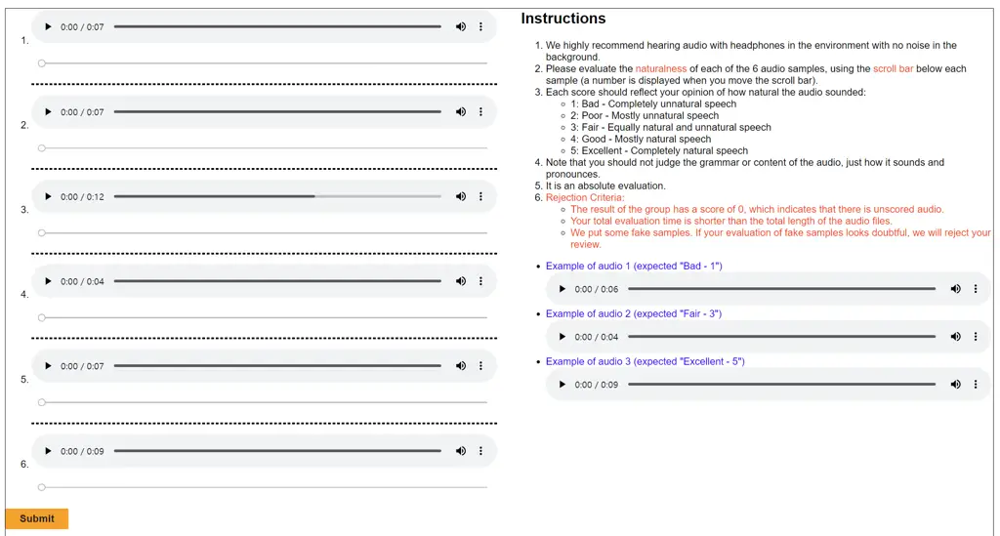

Figure 15: Annotation interface for MOS scoring in evaluating TTS.


Figure 16: Annotation interface for manual scoring in Slide
$`\rightarrow`$ Script task.

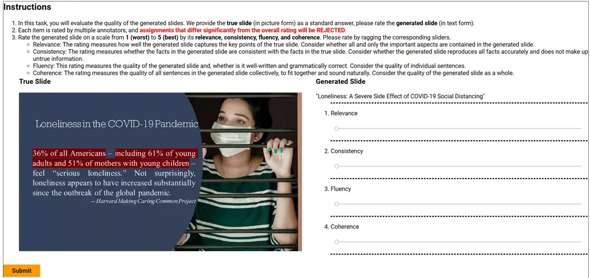

Figure 17: Annotation interface for manual scoring in Script
$`\rightarrow`$ Slide task.
