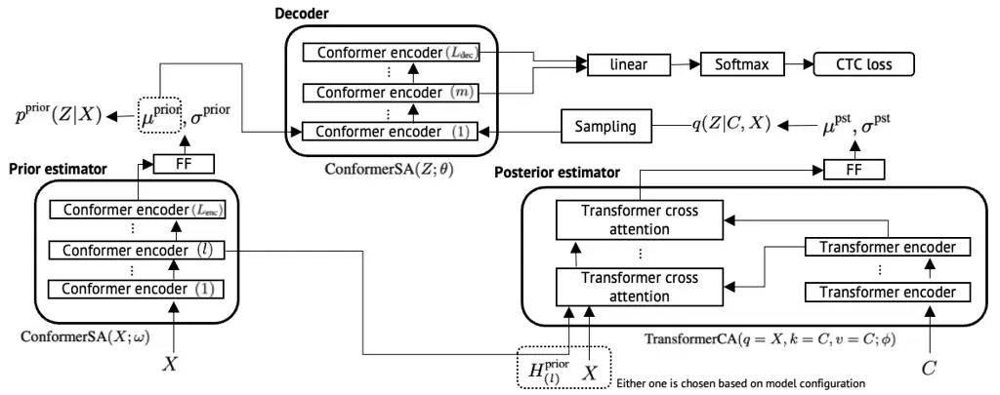
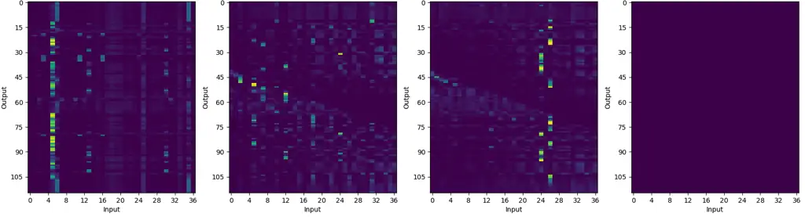
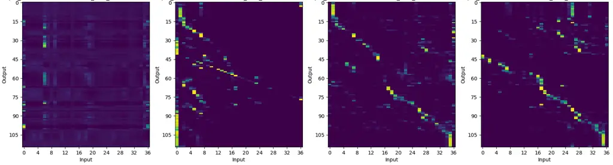
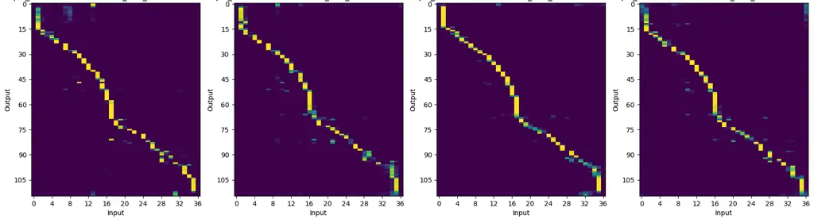
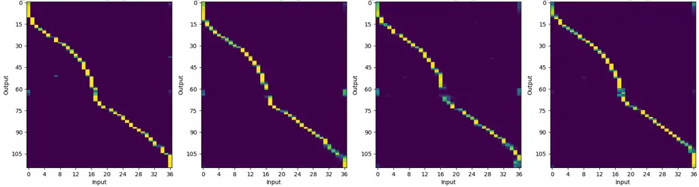

979-8-3503-0689-7/23/\$31.00 ©2023 IEEE

# LV-CTC: Non-autoregressive ASR with CTC and latent variable models

###### Abstract

Non-autoregressive (NAR) models for automatic speech recognition (ASR)
aim to achieve high accuracy and fast inference by simplifying the
autoregressive (AR) generation process of conventional models.
Connectionist temporal classification (CTC) is one of the key techniques
used in NAR ASR models. In this paper, we propose a new model combining
CTC and a latent variable model, which is one of the state-of-the-art
models in the neural machine translation research field. A new neural
network architecture and formulation specialized for ASR application are
introduced. In the proposed model, CTC alignment is assumed to be
dependent on the latent variables that are expected to capture
dependencies between tokens. Experimental results on a 100 hours subset
of Librispeech corpus showed the best recognition accuracy among
CTC-based NAR models. On the TED-LIUM2 corpus, the best recognition
accuracy is achieved including AR E2E models with faster inference
speed.

###### Index Terms: 

Latent variable models, CTC, Non-autoregressive, Iterative decoding

## 1 Introduction

Automatic speech recognition (ASR) is a technology which has been widely
used in the real world speech interface. In most cases, faster inference
with high recognition accuracy is preferred. For example, an ASR engine
for the input method of a smartphone is required to return the
recognition result as soon as possible after the end of an utterance for
a better user experience. Another example is automatic captioning of
user generated audios or videos whose length might be tens of thousands
of hours in total, which demands huge computing resources to process all
the contents in a realistic time.

One of the successful models of ASR is an autoregressive (AR) end-to-end
(E2E) one \[1, 2, 3, 4\]. The E2E model is comprised of a single neural
network (NN). It receives an acoustic feature sequence then generates a
recognition hypothesis in a sequential manner by feeding back the
previously generated token to the decoder. Specifically, Transformer
\[5\] architecture has been a fundamental building block of recently
proposed E2E models \[6, 7, 8\]. It can achieve higher accuracy, but the
sequential nature of the decoder limits the efficient use of the
parallel computing capability of GPUs or ASICs specialized for NN
computation. By utilizing such a capability, aiming to not only achieve
faster inference but also reduce power consumption, which should be
strictly controlled in an on-device application, non-autoregressive
(NAR) E2E model was proposed in the research field of neural machine
translation (NMT) \[9, 10, 11\]. It eliminates or eases such sequential
processes by generating multiple tokens in one iteration step. It can
efficiently use the parallel computing capability and achieve faster
decoding at the expense of a drop in accuracy compared with AR models.
Some NAR E2E models have been proposed for ASR \[12, 13, 14, 15, 16, 17,
18\] and it is reported that they achieved competitive performance to AR
models with faster inference speed under certain conditions \[19\]. The
basic formulation of NAR models assume the offline decoding case
however, they can be applied to the streaming case by using block-wise
decoding \[20, 21\] or using them as the second pass refinement of a
streaming model \[22\].

In such NAR models for ASR, connectionist temporal classification (CTC)
\[23\] and its variants \[24, 25, 13, 26\] are widely used. CTC has a
monotonic alignment property which is thought to be reasonable for ASR
because a sentence is read in left-to-right order. Another major
property of CTC is the assumption of conditional independence between
tokens. On the other hand, in the research field of NMT, latent variable
models are applied as a way to relax the conditional independence
assumption of NAR E2E models \[27, 28\]. They introduce latent variables
and assume the output token is dependent on the latent variable space.
It is expected that the latent variable captures dependencies between
tokens and achieves competitive translation quality compared to AR
models with faster inference speed. Inspired by the success of latent
variable models in NMT, we propose a NAR E2E ASR based on latent
variable models. It is quite natural to apply it to ASR, however, to the
best of the author’s knowledge, there is no prior work of NAR E2E ASR
based on latent variable models.

In this paper, a new model for ASR which combines CTC and latent
variable models is proposed. A new architecture of NN and its
formulation are introduced. The model can generate a hypothesis using
the prior estimator network of the latent variable, which looks at only
the acoustic feature sequence, by a single step. It can also refine the
hypothesis in an iterative way by feeding back the generated hypothesis
to the posterior estimator network which looks at both the acoustic
features and the token sequences. The architecture of the NN and its
formulation allow the proposed model to theoretically guarantee the
performance of CTC and can improve its accuracy not only by iterative
decoding but also by introducing additional techniques like intermediate
CTC \[24\].

Experiments are conducted on a 100 hours subset of the Librispeech
\[29\] and TED-LIUM2 \[30\] corpora. By intensive hyperparamter tuning
and the combination of intermediate CTC \[24\] and self-distillation
\[31\] techniques, the proposed model achieved the best accuracy among
CTC-based NAR models on Librispeech. On TED-LIUM2, the proposed model
outperformed not only NAR models but also state-of-the-art AR models
based on RNN-T and CTC/attention hybrid.

## 2 Related Work

One of the unique properties of the proposed model is that the
variational approximate posterior over latent variables is explicitly
dependent on the output token sequence and the CTC alignment is assumed
to be dependent on these latent variables. None of the existing NAR E2E
ASR using CTC \[12, 13, 14, 15, 17, 10, 32, 25\] assumes such a
dependency of CTC alignment in this latent space. For example, the
combination of an insertion-based model and CTC proposed in \[14\]
explicitly assumes that the CTC alignment is dependent on a partial
hypothesis, but not on latent variables. Another unique aspect of the
proposed model is that it can additionally employ techniques used in
encoder-decoder architectures like a masked language model (MLM) \[11\],
glancing language model (GLM) \[33\], and self-distillation \[31\].

## 3 Methods

### 3.1 General formulation of E2E ASR and CTC

E2E ASR utilizes a NN to model the following posterior distribution
$`p(C|X)`$ over a token sequence
$`C=(c_{n}\in\mathcal{V}|n=1,\cdots,N)`$, given a $`d`$-dimensional
acoustic feature sequence
$`X=(\mathbf{x}_{t}\in\mathbb{R}^{d}|t=1,\cdots,T)`$:

```math
p(C|X)=\text{NN}(C,X;\theta). \tag{1}
```

$`N,T`$ are the length of token and acoustic feature sequences, and
$`\mathcal{V}`$ is a set of distinct tokens. $`\theta`$ is the
parameters of the NN. The difference between various E2E models is how
to define the $`p(C|X)`$ and the NN architecture of
$`\text{NN}(C,X;\theta)`$ in Eq. (1). For example, attention-based
encoder decoder (AED) \[1, 3\] assumes left-to-right generation of a
token sequence:

```math
\vskip-2.84526ptp(C|X)=\prod_{n=1}^{N}p(c_{n}|X,c_{1},\cdots,c_{n-1}). \tag{2}
```

Then, the posterior of the $`n`$-th token,
$`p(c_{n}|X,c_{1},\cdots,c_{n-1})`$ in Eq. (2), is modeled by an encoder
and decoder network through an attention mechanism.

CTC, which is one of the E2E models we focus on in this paper,
introduces a latent alignment sequence and a mapping function
$`\mathcal{F}(\cdot)`$. The mapping function $`\mathcal{F}(\cdot)`$
deletes the repetition of the same token and a special blank token.
Then, the posterior of a token sequence is defined as a summation over
all the alignments that gives the same token sequence through the
mapping function $`\mathcal{F}(\cdot)`$.

The alignment sequence $`A`$ is defined as a sequence of tokens with
$`\mathtt{\braket{b}}`$, which is the special blank token, and the
length is the same as the acoustic feature sequence:

```math
A=(a_{t}\in\mathcal{V}\cup\mathtt{\braket{b}}|t=1,\cdots,T). \tag{3}
```

Then, the posterior over token sequence is defined as follows:

```math
\displaystyle\left\{\begin{aligned} p(C|X)&=\sum_{A\in\mathcal{F}^{\text{-1}}(C)}\prod_{t=1}^{T}p(a_{t}|X),\\
p(a_{t}|X)&=\text{NN}(X;\theta).\end{aligned}\right. \tag{4}
```

The encoder layer of Transformer \[5\] and its variants \[34, 35\] can
be used as the $`\text{NN}(\cdot)`$ in Eq. (4). Conditional independence
is assumed because in Eq. (4), the posterior of the alignment depends
only on the acoustic feature sequence, unlike Eq. (2), so the dependency
between tokens is not taken into account.

### 3.2 Latent variable models

In latent variable models, the posterior in Eq. (1) is assumed to be
marginalized over $`d^{\text{lat}}`$-dimensional latent variable
$`Z=(z_{u}\in\mathbb{R}^{d^{\text{lat}}}|u=1,\cdots,U)`$ whose length is
$`U`$:

```math
p(C|X)=\int p(C|Z,X)p(Z|X)dZ. \tag{5}
```

In general, the integral of Eq. (5) is intractable, hence variational
approximate posterior $`q(\cdot)`$ is introduced and the lower bound,
which is also called evidence lower bound (ELBO), is maximized:

```math
\displaystyle\mathcal{L}^{\text{ELBO}} \displaystyle=\mathbb{E}_{Z\sim q}\left[\log p^{\text{dec}}(C|Z,X)\right]
```

```math
\displaystyle~~~~~~~~~~~~~~~~~~~~-D^{\text{KL}}\left[q(Z|C,X)||p^{\text{prior}}(Z|X)\right], \tag{6}
```

where $`D^{\text{KL}}(\cdot)`$ is the Kullback-Leibler (KL) divergence.
The three distributions, $`p^{\text{dec}}(\cdot),q(\cdot)`$, and
$`p^{\text{prior}}(\cdot)`$ in Eq. (6) are modeled by NNs. The ELBO can
be maximized using the reparameterization trick \[36\] by assuming a
Gaussian distribution over the latent variable $`Z`$.

In addition, depending on the type of $`p^{\text{dec}}(\cdot)`$, a
length prediction module, which estimates the length $`U`$ of the latent
variable $`Z`$, is introduced. For example, if AED is used as in \[28\],
the length prediction module is expected to estimate the length of the
output token sequence.

At the inference stage, single step decoding can be performed by
sampling $`Z`$ from the prior $`p^{\text{prior}}(Z|X)`$ and then feeding
it to the decoder $`p^{\text{dec}}(C|X,Z)`$. Another way is to find a
hypothesis which maximizes the ELBO in Eq. (6) using an algorithm with
iteration. One such algorithm is proposed in \[28\], which does not
require sampling or beam search.



Figure 1: Architecture of the proposed model.

### 3.3 Proposed CTC-based ASR using latent variable models

#### 3.3.1 Basic architecture

In the proposed method, CTC is used as the decoder¹¹ 1 When CTC is used,
the NN has only an encoder block but, by following the convention of
latent variable models, we call the NN as decoder.
$`p^{\text{dec}}(\cdot)`$ in Eq. (6) and the alignment posterior of the
CTC in Eq. (4) is assumed to be dependent only on the latent variable
$`Z`$:

```math
\displaystyle p^{\text{dec}}(C|Z,X) \displaystyle\triangleq p(C|Z)=\sum_{A\in\mathcal{F}^{\text{-1}}(C)}\prod_{t=1}^{T}p(a_{t}|Z). \tag{7}
```

The reasons for employing CTC are twofold: (1) it does not require a
length prediction module and (2) the monotonic alignment property is
thought to be reasonable for ASR.

Then, a Transformer or Conformer architecture is used as the NN of each
component of Eq. (6) and Eq. (7). The alignment posterior $`p(a_{t}|Z)`$
in Eq. (7) is modeled by Conformer self-attention layers, which are
depicted as “Decoder” on the top of Figure 1:

```math
\displaystyle\left\{\begin{aligned} p(a_{t}|Z)&=\text{Softmax}\left(\text{Linear}(H^{\text{dec}};\theta^{\text{out}})\right),\\
H^{\text{dec}}&=\text{ConformerSA}(Z;\theta),\\
Z&\sim q(Z|C,X).\end{aligned}\right. \tag{8}
```

The variational approximate posterior $`q(\cdot)`$ in Eq. (6) is modeled
by the cross-attention layers of Transformer, which is depicted as
“posterior estimator” at the bottom right of Figure 1:

```math
\displaystyle\left\{\begin{aligned} q(Z|C,X)&=\mathcal{N}(\mu^{\text{pst}},\sigma^{\text{pst}}),\\
H^{\text{pst}}&=\text{TransformerCA}(q=X,k=C,v=C;\phi),\\
\mu^{\text{pst}}&=\text{FF}^{\text{pst}}(H^{\text{pst}};\phi^{\text{m}}),\\
\sigma^{\text{pst}}&=\text{FF}^{\text{pst}}(H^{\text{pst}};\phi^{\text{s}}).\end{aligned}\right. \tag{9}
```

The prior $`p^{\text{prior}}(\cdot)`$ in Eq. (6) is modeled by other
self-attention layers of Conformer, which is depicted as “prior
estimator” in Figure 1:

```math
\displaystyle\left\{\begin{aligned} p^{\text{prior}}(Z|X)&=\mathcal{N}(\mu^{\text{prior}},\sigma^{\text{prior}}),\\
H^{\text{prior}}&=\text{ConformerSA}(X;\omega),\\
\mu^{\text{prior}}&=\text{FF}^{\text{prior}}(H^{\text{prior}};\omega^{\text{m}}),\\
\sigma^{\text{prior}}&=\text{FF}^{\text{prior}}(H^{\text{prior}};\omega^{\text{s}}).\\
\end{aligned}\right. \tag{10}
```

The meanings of each component are:

- $`\text{ConformerSA}(\cdot;\psi)`$ :
  Self-attention layers (encoder block) of Conformer
- $`\text{TransformerCA}(q,k,v;\psi)`$ :
  Cross-attention layers (decoder block) of Transformer where $`q,k,v`$
  are query, key, and value, respectively
- $`\text{FF}(\cdot;\psi)`$ :
  Feed forward layer
- $`\text{Linear}(\cdot;\psi)`$ :
  Linear layer

where $`\psi`$ is the parameter of the component. The whole architecture
is depicted in Figure 1.

By employing this architecture, the latent variables $`Z`$ are expected
to capture token dependencies because the minimization of KL divergence
between the posterior $`q(Z|C,X)`$, which looks at both entire acoustic
feature $`X`$ and token sequences $`C`$, and the prior
$`p^{\text{prior}}(Z|X)`$ reflects the token dependency inside $`C`$.

#### 3.3.2 Additional techniques

In addition to the basic architecture introduced in the previous
section, the following techniques are introduced which are expected to
achieve higher accuracy.

##### Compatibility with vanilla CTC

As CTC is a strong baseline, we make the proposed entire network to be
compatible with vanilla CTC, so that the training would be stable and
guarantee the accuracy of vanilla CTC. This is realized by feeding the
mean value calculated by the prior estimator $`\mu^{\text{prior}}`$ in
Eq. (10) into the decoder’s self-attention layers
$`\text{ConformerSA}(\cdot;\theta)`$ in Eq. (8) and obtain the alignment
posterior similar to Eq. (7):

```math
\displaystyle\left\{\begin{aligned} p(a_{t}|Z=\mu^{\text{prior}})&=\text{Softmax}\left(\text{Linear}(H^{\text{dec}}_{\text{prior}};\theta^{\text{out}})\right),\\
H^{\text{dec}}_{\text{prior}}&=\text{ConformerSA}(Z=\mu^{\text{prior}};\theta).\end{aligned}\right. \tag{11}
```

Then, the CTC loss is computed using the alignment posterior and is
jointly trained with ELBO of Eq. (6),

```math
\mathcal{L}^{\text{ctc}}_{\text{cp}}=\log\sum_{A\in\mathcal{F}^{\text{-1}}(C)}\prod_{t=1}^{T}p(a_{t}|Z=\mu^{\text{prior}}). \tag{12}
```

##### Sharing encoder layer between prior and posterior estimator

In the preliminary experiment, it is observed that the posterior
estimator’s source-target attention $`\text{TransformerCA}(\cdot)`$ in
Eq. (9) tends to be unstable. It might be because the acoustic feature
is not well transformed to fit to the source-target attention where
similarity between transformed features from a token sequence is
calculated. Therefore, the intermediate output of prior estimator’s
encoder layer $`\text{ConformerSA}(\cdot;\omega)`$ in Eq. (10) is fed
into the $`\text{TransformerCA}(\cdot)`$ in Eq. (9):

```math
H^{\text{pst}}=\text{TransformerCA}(q=H^{\text{prior}}_{(l)},k=C,v=C;\phi), \tag{13}
```

where $`H^{\text{prior}}_{(l)}`$ is the $`l`$-th layer’s output of
$`\text{ConformerSA}(\cdot;\omega)`$ in Eq. (10). In Figure 1, this
sharing is depicted as the arrow from the prior estimator on the left
side to the posterior estimator on the right side.

##### Intermediate CTC loss

Intermediate CTC \[24\] is a technique adding CTC losses at the
intermediate layers of the encoder block and accuracy improvement is
reported. We employed the technique in our proposed architecture by
adding an extra CTC loss at an intermediate layer of decoder’s
$`\text{ConformerSA}(\cdot;\theta)`$ in Eq. (11) and Eq. (8):

```math
\displaystyle\left\{\begin{aligned} p^{\text{prior}}(a_{t}|H^{\text{dec}}_{\text{prior},(m)})&=\text{Softmax}\left(\text{Linear}(H^{\text{dec}}_{\text{prior},(m)};\theta^{\text{out}})\right),\\
p^{\text{pst}}(a_{t}|H^{\text{dec}}_{(m)})&=\text{Softmax}\left(\text{Linear}(H^{\text{dec}}_{(m)};\theta^{\text{out}})\right),\end{aligned}\right. \tag{14}
```

where $`H^{\text{dec}}_{\text{prior},(m)}`$ is the output of the
$`m`$-layer of $`\text{ConformerSA}(\cdot;\theta)`$ in Eq. (11) and
$`H^{\text{dec}}_{(m)}`$ is the output of $`m`$-th-layer of
$`\text{ConformerSA}(\cdot;\theta)`$ of Eq. (8). Note that the
parameters of the Linear layer $`\theta^{\text{out}}`$ is shared. Then,
the CTC loss is computed using the alignment posterior and they are
jointly trained with ELBO of Eq. (6):

```math
\displaystyle\left\{\begin{aligned} \mathcal{L}^{\text{ictc}}_{\text{prior}}&=\log\sum_{A\in\mathcal{F}^{\text{-1}}(C)}\prod_{t=1}^{T}p(a_{t}|H^{\text{dec}}_{\text{prior},(m)}),\\
\mathcal{L}^{\text{ictc}}_{\text{pst}}&=\log\sum_{A\in\mathcal{F}^{\text{-1}}(C)}\prod_{t=1}^{T}p(a_{t}|H^{\text{dec}}_{(m)}).\end{aligned}\right. \tag{15}
```

It is also expected that the instability of source-target attention of
$`\text{TransformerCA}(\cdot)`$ in Eq. (9) mentioned before can be
mitigated.

##### Self-distillation

Self-distillation (SD) \[31\] is a technique that was originally
proposed to perform distillation in AED model by assuming the output of
the decoder as teacher and the encoder is the student during training
from scratch \[31\]. In our proposed model architecture, the alignment
posterior of Eq. (8) which is computed by the latent variable sampled
from the posterior in Eq. (9) can be viewed as the teacher because it
looks at the entire token sequence. Then, the alignment posterior of
Eq. (11) becomes the student and the KL-divergence between them are
added to the ELBO of Eq. (6):

```math
\mathcal{L}^{\text{SD}}=-\sum_{t}D^{\text{KL}}\left(p(a_{t}|Z=\mu^{\text{prior}})||p(a_{t}|Z)\right). \tag{16}
```

#### 3.3.3 The loss function

The loss function of the proposed model is the summation of all the
losses defined so far. By introducing coefficients,
$`\alpha_{(\cdot)}`$, to adjust the dynamic range of each loss, the loss
function is defined as follows:

```math
\displaystyle\mathcal{L} \displaystyle=\underbrace{\alpha_{\text{dec}}\mathbb{E}_{Z\sim q}\left[\log p^{\text{dec}}(C|X,Z)\right]-\alpha_{\text{KL}}D^{\text{KL}}\left[q(Z|C,X)||p^{\text{prior}}(Z|X)\right]}_{\mathcal{L}^{\text{ELBO}}}
```

```math
\displaystyle+\alpha_{\text{cp}}\mathcal{L}^{\text{ctc}}_{\text{cp}}+\alpha_{\text{ic1}}\mathcal{L}^{\text{ictc}}_{\text{prior}}+\alpha_{\text{ic2}}\mathcal{L}^{\text{ictc}}_{\text{pst}}+\alpha_{\text{SD}}\mathcal{L}^{\text{SD}}. \tag{17}
```

## 4 Experiments

|                    |                    |       |        |       |              |       |
| ------------------ | ------------------ | ----- | ------ | ----- | ------------ | ----- |
|                    |                    |       | Greedy |       | 3 iterations |       |
| $`L_{\text{enc}}`$ | $`L_{\text{dec}}`$ | $`l`$ | clean  | other | clean        | other |
| 3                  | 12                 | \-    | 7.5    | 21.0  | 8.2          | 23.4  |
| 6                  | 9                  |       | 7.5    | 21.4  | 8.4          | 23.7  |
| 9                  | 6                  |       | 7.9    | 22.3  | 7.9          | 22.1  |
| 3                  | 12                 | 1     | 7.3    | 21.0  | 7.1          | 19.9  |
|                    |                    | 2     | 7.2    | 21.4  | 6.6          | 19.1  |
| 6                  | 9                  | 2     | 8.2    | 22.8  | 88.1         | 90.3  |
| 9                  | 6                  | 3     | 7.7    | 22.1  | 7.2          | 20.3  |

Table 1: WERs of “dev” sets of LS-100 by changing number of layers of
prior estimator $`L_{\text{enc}}`$, the decoder $`L_{\text{dec}}`$, and
the index of encoder sharing $`l`$ in Eq. (13). Results without
iteration (Greedy) and 3 iterations are shown.

Two corpora, Librispeech \[29\] and TEDLIUM2 (TED2) \[30\] are used to
evaluate the proposed method. First, basic experiments of investigating
the detail of the NN architecture are performed using a 100 hours subset
of Librispeech (LS-100). Then, based on the hyperparameters chosen by
the LS-100 results, TED2 is evaluated. Finally, comparison to some
existing AR/NAR models are shown.

### 4.1 Basic experiments and analysis on LS-100

#### 4.1.1 Setup

First, speed perturbation with scaling factor of 0.9 and 1.1 is applied
and the perturbed data are added to the original training data. The
acoustic feature is 80 dimensional log Mel-filterbank. SpecAugment
\[37\] is applied to the acoustic feature sequence whose parameters are
set identical to the recipe of ESPnet \[38\]. For the output token, byte
pair encoding (BPE) is applied with the vocabulary size of 100. Before
it is fed into the $`\text{TransformerCA}(\cdot)`$ in Eq. (9), an
embedding layer which converts token ids into a real-valued vector is
applied. Then, SpecAugment with only time masking is applied. The number
of masks are set as 10% of the length of the output token sequence.

The network architecture of the proposed method is as follows. The
acoustic feature sequence is down-sampled to 1/4 of the original rate by
using 2 layers of convolutional neural network (CNN) whose channels,
stride, and kernel size are 256, 2, and 3, respectively. Then, the
output of the CNN is fed into $`\text{ConformerSA}(\cdot)`$ and
$`\text{TransformerCA}(\cdot)`$ in Eq. (9)-(10). For the attention
modules of $`\text{ConformerSA}(\cdot)`$ and
$`\text{TransformerCA}(\cdot)`$ in Eq. (8)-(10), relative positional
encoding is used \[39\]. The dimension of the attention is set as 256
and the number of head is 4. The length of kernel, number of hidden
units of FF module, and the activation function of
$`\text{ConformerSA}(\cdot)`$ in Eq. (8), (10) are 15, 1024, and swish,
respectively. The parameters of $`\text{TransformerCA}(\cdot)`$ in
Eq. (9) are the same as $`\text{ConformerSA}(\cdot)`$ except that there
is no CNN module in it. The number of hidden units of the
$`\text{FF}(\cdot)`$ module in Eq. (9)-(10) is 1024 and the activation
function is hyperbolic tangent. For all components, the dropout rate is
set as 0.1.

The training is run for 50 epochs using 4 Tesla V100 GPUs. For the
optimizer and scheduler, Adam \[40\] with
$`\beta_{1}=0.90,\beta_{2}=0.98`$ and Noam scheduling \[5\] with warmup
step of 15,000, are used. The peak learning rate is set as 0.002. The
weight decay is 0.00001. The decoding is performed using the averaged
model over the top 10 validation scores.

First, we show a basic experiment of changing the number of layers of
$`\text{ConformerSA}(\cdot)`$ in Eq. (8),(10) and the index of the layer
shared between prior and posterior network, i.e., $`l`$ in Eq. (13)²² 2
There are many other hyperparameters in the proposed model but,
according to preliminary experiments, these parameters are crucial to
obtain reasonable accuracy so the results are shown in the paper.. Note
that the following parameters are fixed based on a preliminary
experiment or intuition. Number of layers of
$`\text{TransformerCA}(\cdot)`$ in Eq. (9) is set to 2 and
$`\alpha_{\text{dec}},\alpha_{\text{KL}}`$, and $`\alpha_{\text{cp}}`$
in Eq. (17) are set to 0.09, 0.1, and 0.81, respectively by intuition ³³
3 It looks $`\alpha_{\cdot}`$ are too specific but it comes from the
difference between actual implementation and the formulation of
Eq. (17). In the experiments, actual values for each term were 0.1. .
The dimension of the latent variable is 64. In addition, when the
KL-divergence of Eq. (17) is smaller than $`b`$ in a training batch,
$`\alpha_{\text{KL}}`$ is set to 0. $`b=0.5`$ is used. The last two
parameters are fixed by preliminary experiments. We plan to make the
configuration files to be publicly available upon publication of the
paper.



(a) $`L_{\text{enc}}=3,L_{\text{dec}}=12`$



(b) $`L_{\text{enc}}=6,L_{\text{dec}}=9`$



(c) $`L_{\text{enc}}=9,L_{\text{dec}}=6`$



(d) $`L_{\text{enc}}=3,L_{\text{dec}}=12,l=2`$

Figure 2: Visualization of the attention weight of the cross-attention
of posterior estimator $`\text{TransformerCA}(\cdot)`$ in Eq. (9). An
utterance from training set of Librispeech is chosen. The horizontal
axis is the index of token sequence and the vertical axis is the index
of acoustic feature sequence.

|                              |                 |       |         |             |       |       |       |          |      |
| ---------------------------- | --------------- | ----- | ------- | ----------- | ----- | ----- | ----- | -------- | ---- |
| Model                        | Beam or \#Iter. | RTF   | Speedup | Librispeech |       |       |       | TEDLIUM2 |      |
|                              |                 |       |         | dev         |       | test  |       |          |      |
|                              |                 |       |         | clean       | other | clean | other | dev      | test |
| AED                          | 1               | 0.299 | 0.97    | 6.7         | 18.1  | 7.1   | 18.2  | 7.7      | 8.4  |
| \+ Beam search               | 10              | 0.797 | 0.37    | 6.1         | 17.9  | 6.4   | 17.9  | 7.3      | 7.8  |
| Conformer-T                  | 1               | 0.057 | 5.11    | 6.3         | 17.6  | 6.7   | 17.5  | 8.1      | 8.1  |
| \+ Beam search               | 10              | 0.291 | 1.00    | 5.7         | 16.8  | 6.2   | 16.8  | 8.0      | 8.0  |
| CTC                          | 1               | 0.044 | 6.61    | 6.8         | 19.7  | 6.9   | 19.8  | 8.1      | 7.8  |
| Intermediate CTC             | 1               | 0.045 | 6.47    | 6.1         | 18.8  | 6.8   | 18.9  | 7.2      | 7.5  |
| SC-CTC                       | 1               | 0.047 | 6.19    | 6.1         | 18.9  | 6.4   | 19.1  | 7.3      | 7.7  |
| LV-CTC (proposed)            | 1               | 0.043 | 6.77    | 6.4         | 18.5  | 6.5   | 18.9  | 7.4      | 7.6  |
| \+ Iteration                 | 3               | 0.084 | 3.46    | 6.0         | 16.8  | 6.1   | 17.2  | 7.0      | 7.2  |
| \+ SD                        | 1               | 0.040 | 7.28    | 6.2         | 18.3  | 6.5   | 18.5  | 7.5      | 7.5  |
|      + Iteration             | 3               | 0.086 | 3.38    | 5.9         | 16.7  | 6.1   | 17.1  | 7.1      | 7.1  |
| KERMIT \[14\]                | 5               | \-    | \-      | 6.4         | 17.9  | 6.6   | 18.2  | 8.6      | 8.0  |
| Improved Mask-CTC \[13, 19\] | 5               | \-    | \-      | 7.0         | 19.8  | 7.3   | 20.2  | 8.8      | 8.3  |
| SC-CTC \[25, 19\]            | 1               | \-    | \-      | 6.6         | 19.4  | 6.9   | 19.7  | 8.7      | 8.0  |
| HC-CTC \[26\]                | 1               | \-    | \-      | 6.9         | 17.1  | 7.1   | 17.8  | 8.0      | 7.6  |

Table 2: Comparison of WERs on LS-100 and TED2. The RTFs are measured on
“dev-other” of Librispeech. “Speedup” is the improvement of RTF from
Conformer-T decoded with beam size of 10.

#### 4.1.2 Results

The number of layers $`L_{\text{enc}}`$ of
$`\text{ConformerSA}(\cdot;\omega)`$ in Eq. (10), the number of layers
$`L_{\text{dec}}`$ of $`\text{ConformerSA}(\cdot;\theta)`$ in Eq. (8),
and $`l`$ in Eq. (13) are searched. The results are shown in Table 1.

From the upper side of the table, it can be seen that when
$`L_{\text{enc}}`$ is small, i.e., the shallower the prior estimator is,
better accuracy is obtained except for the case when
$`L_{\text{enc}}=9,L_{\text{dec}}=6`$ and iterative decoding is
performed. In this case, the attention patterns of the cross attention
of $`\text{TransformerCA}(\cdot)`$ of Eq. (9) look more monotonic than
the other cases, as visualized in Figure 2. This might lead to slight
improvements by iterative decoding.

From the bottom side of the table, the sharing of the encoder in the way
of Eq. (13) is effective except the case when
$`L_{\text{enc}}=6,L_{\text{dec}}=9`$. In this case, the iterative
decoding fails almost completely. On the other hand, by setting
$`L_{\text{enc}}=3`$, $`L_{\text{dec}}=12`$, and $`l=2`$, the best WER
is achieved. With this setting, the attention patterns of the cross
attention of $`\text{TransformerCA}(\cdot)`$ of Eq. (9) look more
monotonic as visualized in Figure 2d. According to these results, the
monotonic property of the cross attention is important for obtaining
better WERs with iterative decoding. In addition, the proposed model is
quite sensitive to the parameters of $`L_{\text{enc}},L_{\text{dec}}`$,
and $`l`$.

### 4.2 Comparison to baseline models

In addition to the best configuration of the previous section,
intermediate CTC and self-distillation are introduced. The index of
intermediate layer $`m`$ in Eq. (14) is set to 4. When only the
intermediate CTC is applied, the coefficients in Eq. (17) are
$`(\alpha_{\text{dec}},\alpha_{\text{KL}},\alpha_{\text{cp}},\alpha_{\text{ic1}},\alpha_{\text{ic2}})=`$(0.081,
0.1, 0.729, 0.009, 0.081). When both intermediate CTC and
self-distillation are applied, the coefficients are
$`(\alpha_{\text{dec}},\alpha_{\text{KL}},\alpha_{\text{cp}},\alpha_{\text{ic1}},\alpha_{\text{ic2}},\alpha_{\text{SD}})=`$(0.073,
0.1, 0.656, 0.008, 0.073, 0.090). Then, the training run for 100 epochs.
Four models, Conformer-based AED \[41\], Conformer-Transducer
(Conformer-T) \[42\], and Conformer-based CTC including intermediate CTC
\[24\] and Self-conditioned CTC (SC-CTC) \[25\], are reproduced and
evaluated as baseline.

Conformer-based AED has 12 layers of Conformer encoder and 6 layers of
Transformer decoder. The parameters are the same as the proposed model
except that the attention module of the Transformer uses absolute
positional embedding. Conformer-based CTC models have 18 layers of
Conformer encoder layers whose parameters are the same as the proposed
model. For intermediate CTC and SC-CTC, the 6-th and 12-th layers are
used as intermediate layers. The Conformer-T has 17 layers of Conformer
encoder whose parameters are the same as the proposed model and 1 layer
of LSTM decoder whose hidden unit size is 420. The dimension of the
joint network is 320. CTC loss is added to the encoder network during
training with the weight of 0.3 for AED.

These models are trained for 100 epochs using the same GPUs as the
proposed model. The settings of optimizer and scheduler are the same as
the proposed model for all the baseline models. The decoding is
performed using the averaged model over top 10 validation scores. For
the AED model, joint CTC decoding \[43\] is used with the CTC weight of
0.3. Language model is not used for any of the models. RTF is measured
on the dev-other set of Librispeech on an Intel(R) Xeon(R) Gold 6138 CPU
@ 2.00GHz CPU using 4 threads for NN inference.

The results are shown in Table 2. In addition to the reproduced baseline
models, WERs of some related works are also shown. When compared between
baseline CTC models and the proposed LV-CTC without iteration, WERs of
LV-CTC with self-distillation (SD) ⁴⁴ 4 In this experiment, the dropout
rate of posterior encoder is increased to 0.2 because it performed
better when trained until 100 epochs. are better than CTC models on
“other” sets and are competitive on “clean” sets. From this result, the
proposed architecture can at least maintain the performance of baseline
CTC models. The LV-CTC with iteration performs the best among all the
NAR models shown in the table at the expense of around 2 times increase
in RTFs compared with baseline CTC models. It outperforms AED model even
with beam search at smaller RTF. When compared with Conformer-T, the
proposed method achieved better WERs than greedy decoding results at the
expense of the RTF increased to 1.5 times. With beam search, they are
competitive or the proposed method is slightly worse but the RTF of the
proposed method is reduced to 0.3 times.

### 4.3 Results on TED2

Based on the best hyperparameter of LS-100 experiments, evaluation on
TED2 is performed. Most of the training configurations are the same
except the number of epochs is 100. The difference from the best
hyperparameter on LS-100 are as follows:

- •
  Number of Transformer encoders in $`\text{TransformerCA}(\cdot)`$ in
  Eq. (9) is increased from 2 to 3 because in the preliminary
  experiments $`\text{TransformerCA}(\cdot)`$ is diverged.
- •
  Increased dropout rate and the number of masks of SpecAugment of token
  embedding because there is a possibility of over-fitting.
- •
  Decreased self-distillation weight $`\alpha_{\text{SD}}`$ to 0.001
  because when the weight is larger than it, WER degraded.

The results are shown in Table 2. When compared between baseline CTC
models and the proposed LV-CTC without iteration, WERs of baseline
models are better than LV-CTC. By using iterative decoding, the proposed
LV-CTC has the best WER among all the models shown in the table.
Overall, the trend of WER on TED2 is different from that of the LS-100
case. Self-distillation improved test set but degraded dev set. Even AR
models’ WERs are sometimes worse than baseline CTC models. The speaking
style is different between these two corpora: LS-100 is read speech and
TED2 is presentation talks. This might be the reason for the different
trends but further investigation is left as future work.

## 5 Conclusion

In this paper, we proposed a new ASR model by combining CTC and latent
variable models. By introducing a new architecture of NN and its
formulation, the proposed model gave at least the same performance of
vanilla CTC. In addition, iterative decoding could refine the hypothesis
and achieved higher accuracy at the expense of increased inference
speed. Experiments are conducted on a 100 hours subset of Librispeech
and TED-LIUM2 corpora. On the Librispeech corpus, the proposed model
achieved the best WER compared with CTC-based NAR models. On the
TED-LIUM2 corpus, the proposed model outperformed NAR and AR models.
Investigation of the different trends in WER between the two corpora is
left as future work.

## 6 Acknowledgement

We would like to thank Jaesong Lee for introduction of his preliminary
trial on latent variable models for ASR.

## 7 References

## References

- \[1\] Jan Chorowski et al. “Attention-Based Models for Speech
  Recognition” In _Proc. Advances in Neural Information Processing
  Systems (NIPS) 28_, 2015, pp. 577–585
- \[2\] Alex Graves “Sequence Transduction with Recurrent Neural
  Networks” In _Proc. of the 29th International Conference on Machine
  Learning (ICML)_, 2012
- \[3\] W. Chan et al. “Listen, attend and spell: A neural network for
  large vocabulary conversational speech recognition” In _Proc. 2016
  IEEE International Conference on Acoustics, Speech and Signal
  Processing (ICASSP)_, 2016, pp. 4960–4964 DOI:
  [10.1109/ICASSP.2016.7472621](https://dx.doi.org/10.1109/ICASSP.2016.7472621)
- \[4\] Rohit Prabhavalkar et al. “End-to-End Speech Recognition: A
  Survey” In _arXiv preprint arXiv:2303.03329_, 2023
- \[5\] Ashish Vaswani et al. “Attention is All you Need” In _Proc.
  Advances in Neural Information Processing Systems (NIPS) 30_, 2017,
  pp. 5998–6008 URL:
  [http://papers.nips.cc/paper/7181-attention-is-all-you-need.pdf](http://papers.nips.cc/paper/7181-attention-is-all-you-need.pdf)
- \[6\] Shigeki Karita et al. “Improving Transformer-Based End-to-End
  Speech Recognition with Connectionist Temporal Classification and
  Language Model Integration” In _Proc. Interspeech 2019_, 2019, pp.
  1408–1412 DOI:
  [10.21437/Interspeech.2019-1938](https://dx.doi.org/10.21437/Interspeech.2019-1938)
- \[7\] Shigeki Karita “A comparative study on Transformer vs RNN in
  speech applications” In _2019 IEEE Automatic Speech Recognition and
  Understanding Workshop (ASRU)_, 2019, pp. 449–456
- \[8\] Linhao Dong, Shuang Xu and Bo Xu “Speech-transformer: a
  no-recurrence sequence-to-sequence model for speech recognition” In
  _Proc. ICASSP_, 2018, pp. 5884–5888 IEEE
- \[9\] Jiatao Gu et al. “Non-Autoregressive Neural Machine Translation”
  In _Proc. International Conference on Learning Representations
  (ICLR)_, 2018
- \[10\] Jason Lee, Elman Mansimov and Kyunghyun Cho “Deterministic
  non-autoregressive neural sequence modeling by iterative refinement”
  In _Proc. 2018 Conference on Empirical Methods in Natural Language
  Processing (EMNLP)_, 2020, pp. 1173–1182
- \[11\] Marjan Ghazvininejad et al. “Mask-Predict: Parallel Decoding of
  Conditional Masked Language Models” In _Proceedings of the
  EMNLP-IJCNLP_, 2019, pp. 6112–6121 DOI:
  [10.18653/v1/D19-1633](https://dx.doi.org/10.18653/v1/D19-1633)
- \[12\] William Chan et al. “Imputer: sequence modelling via imputation
  and dynamic programming” In _Proce. of the 37th International
  Conference on Machine Learning (ICML)_, 2020, pp. 1403–1413
- \[13\] Yosuke Higuchi et al. “Improved Mask-CTC for Non-Autoregressive
  End-to-End ASR” In _Proc. 2021 IEEE International Conference on
  Acoustics, Speech and Signal Processing (ICASSP)_, 2021, pp. 8363–8367
  DOI:
  [10.1109/ICASSP39728.2021.9414198](https://dx.doi.org/10.1109/ICASSP39728.2021.9414198)
- \[14\] Yuya Fujita et al. “Insertion-Based Modeling for End-to-End
  Automatic Speech Recognition” In _Proc. Interspeech 2020_, 2020, pp.
  3660–3664 DOI:
  [10.21437/Interspeech.2020-1619](https://dx.doi.org/10.21437/Interspeech.2020-1619)
- \[15\] Ethan Chi, Julian Salazar and Katrin Kirchhoff “Align-Refine:
  Non-Autoregressive Speech Recognition via Iterative Realignment” In
  _Proceedings of NAACL-HLT_, 2021, pp. 1920–1927
- \[16\] Nanxin Chen et al. “Listen and Fill in the Missing Letters:
  Non-Autoregressive Transformer for Speech Recognition.” In _arXiv
  preprint arXiv:1911.04908_, 2020
- \[17\] Ruchao Fan et al. “CASS-NAT: CTC alignment-based single step
  non-autoregressive transformer for speech recognition” In _Proc. 2021
  IEEE International Conference on Acoustics, Speech and Signal
  Processing (ICASSP)_, 2021, pp. 5889–5893
- \[18\] Fan Yu et al. “Boundary and Context Aware Training for
  CIF-Based Non-Autoregressive End-to-End ASR” In _2021 IEEE Automatic
  Speech Recognition and Understanding Workshop (ASRU)_, 2021, pp.
  328–334 DOI:
  [10.1109/ASRU51503.2021.9688238](https://dx.doi.org/10.1109/ASRU51503.2021.9688238)
- \[19\] Yosuke Higuchi et al. “A comparative study on
  non-autoregressive modelings for speech-to-text generation” In _2021
  IEEE Automatic Speech Recognition and Understanding Workshop (ASRU)_,
  2021, pp. 47–54
- \[20\] Tianzi Wang et al. “Streaming End-to-End ASR Based on Blockwise
  Non-Autoregressive Models” In _Proc. Interspeech 2021_, 2021, pp.
  3755–3759 DOI:
  [10.21437/Interspeech.2021-1556](https://dx.doi.org/10.21437/Interspeech.2021-1556)
- \[21\] Yuya Fujita et al. “Toward Streaming ASR with
  Non-Autoregressive Insertion-Based Model” In _Proc. Interspeech 2021_,
  2021, pp. 3740–3744 DOI:
  [10.21437/Interspeech.2021-1131](https://dx.doi.org/10.21437/Interspeech.2021-1131)
- \[22\] Weiran Wang, Ke Hu and Tara. Sainath “Deliberation of Streaming
  RNN-Transducer by Non-Autoregressive Decoding” In _ICASSP 2022 - 2022
  IEEE International Conference on Acoustics, Speech and Signal
  Processing (ICASSP)_, 2022, pp. 7452–7456 DOI:
  [10.1109/ICASSP43922.2022.9746390](https://dx.doi.org/10.1109/ICASSP43922.2022.9746390)
- \[23\] Alex Graves et al. “Connectionist Temporal Classification:
  Labelling Unsegmented Sequence Data with Recurrent Neural Networks” In
  _Proc. of the 23rd International Conference on Machine Learning
  (ICML)_, 2006, pp. 369–376 DOI:
  [10.1145/1143844.1143891](https://dx.doi.org/10.1145/1143844.1143891)
- \[24\] Jaesong Lee and Shinji Watanabe “Intermediate loss
  regularization for CTC-based speech recognition” In _Proc. 2021 IEEE
  International Conference on Acoustics, Speech and Signal Processing
  (ICASSP)_, 2021, pp. 6224–6228 IEEE
- \[25\] Jumon Nozaki and Tatsuya Komatsu “Relaxing the Conditional
  Independence Assumption of CTC-Based ASR by Conditioning on
  Intermediate Predictions” In _Proc. Interspeech 2021_, 2021, pp.
  3735–3739 DOI:
  [10.21437/Interspeech.2021-911](https://dx.doi.org/10.21437/Interspeech.2021-911)
- \[26\] Yosuke Higuchi et al. “Hierarchical Conditional End-to-End ASR
  with CTC and Multi-Granular Subword Units” In _Proc. 2022 IEEE
  International Conference on Acoustics, Speech and Signal Processing
  (ICASSP)_, 2022, pp. 7797–7801 IEEE
- \[27\] Lukasz Kaiser et al. “Fast decoding in sequence models using
  discrete latent variables” In _International Conference on Machine
  Learning_, 2018, pp. 2390–2399 PMLR
- \[28\] Raphael Shu et al. “Latent-variable non-autoregressive neural
  machine translation with deterministic inference using a delta
  posterior” In _Proceedings of the aaai conference on artificial
  intelligence_ 34.05, 2020, pp. 8846–8853
- \[29\] V. Panayotov et al. “Librispeech: An ASR corpus based on public
  domain audio books” In _Proc. 2015 IEEE International Conference on
  Acoustics, Speech and Signal Processing (ICASSP)_, 2015, pp. 5206–5210
  DOI:
  [10.1109/ICASSP.2015.7178964](https://dx.doi.org/10.1109/ICASSP.2015.7178964)
- \[30\] Anthony Rousseau, Paul Deléglise and Yannick Estève “Enhancing
  the TED-LIUM Corpus with Selected Data for Language Modeling and More
  TED Talks” In _Proceedings of the Ninth International Conference on
  Language Resources and Evaluation (LREC’14)_, 2014, pp. 3935–3939
- \[31\] Takafumi Moriya et al. “Self-Distillation for Improving
  CTC-Transformer-Based ASR Systems” In _Proc. Interspeech 2020_, 2020,
  pp. 546–550 DOI:
  [10.21437/Interspeech.2020-1223](https://dx.doi.org/10.21437/Interspeech.2020-1223)
- \[32\] Nanxin Chen et al. “Align-Denoise: Single-Pass
  Non-Autoregressive Speech Recognition” In _Proc. Interspeech 2021_,
  2021, pp. 3770–3774 DOI:
  [10.21437/Interspeech.2021-1906](https://dx.doi.org/10.21437/Interspeech.2021-1906)
- \[33\] Lihua Qian et al. “Glancing Transformer for Non-Autoregressive
  Neural Machine Translation” In _Proceedings of the 59th Annual Meeting
  of the Association for Computational Linguistics and the 11th
  International Joint Conference on Natural Language Processing (Volume
  1: Long Papers)_, 2021, pp. 1993–2003
- \[34\] Anmol Gulati et al. “Conformer: Convolution-augmented
  Transformer for Speech Recognition” In _Proc. Interspeech 2020_, 2020,
  pp. 5036–5040 DOI:
  [10.21437/Interspeech.2020-3015](https://dx.doi.org/10.21437/Interspeech.2020-3015)
- \[35\] Kwangyoun Kim et al. “E-branchformer: Branchformer with
  enhanced merging for speech recognition” In _2022 IEEE Spoken Language
  Technology Workshop (SLT)_, 2023, pp. 84–91 IEEE
- \[36\] Diederik. Kingma and Max Welling “Auto-Encoding Variational
  Bayes” In _2nd International Conference on Learning Representations,
  ICLR 2014, Banff, AB, Canada, April 14-16, 2014, Conference Track
  Proceedings_, 2014 arXiv:[http://arxiv.org/abs/1312.6114v10
  \[stat.ML\]](https://arxiv.org/abs/http://arxiv.org/abs/1312.6114v10)
- \[37\] Daniel. Park “SpecAugment: A Simple Data Augmentation Method
  for Automatic Speech Recognition” In _Proc. Interspeech 2019_, 2019,
  pp. 2613–2617 DOI:
  [10.21437/Interspeech.2019-2680](https://dx.doi.org/10.21437/Interspeech.2019-2680)
- \[38\] Shinji Watanabe “ESPnet: End-to-End Speech Processing Toolkit”
  In _Proc. Interspeech 2018_, 2018, pp. 2207–2211 DOI:
  [10.21437/Interspeech.2018-1456](https://dx.doi.org/10.21437/Interspeech.2018-1456)
- \[39\] Zihang Dai et al. “Transformer-XL: Attentive Language Models
  beyond a Fixed-Length Context” In _Proceedings of ACL_, 2019, pp.
  2978–2988 DOI:
  [10.18653/v1/P19-1285](https://dx.doi.org/10.18653/v1/P19-1285)
- \[40\] Diederik Kingma and Jimmy Ba “Adam: A method for stochastic
  optimization” In _Proc. International Conference on Learning
  Representations (ICLR)_, 2015
- \[41\] Pengcheng Guo “Recent Developments on ESPnet Toolkit Boosted By
  Conformer” In _Proc. 2021 IEEE International Conference on Acoustics,
  Speech and Signal Processing (ICASSP)_, 2021, pp. 5874–5878 DOI:
  [10.1109/ICASSP39728.2021.9414858](https://dx.doi.org/10.1109/ICASSP39728.2021.9414858)
- \[42\] Florian Boyer et al. “A study of transducer based end-to-end
  ASR with ESPnet: Architecture, auxiliary loss and decoding strategies”
  In _2021 IEEE Automatic Speech Recognition and Understanding Workshop
  (ASRU)_, 2021, pp. 16–23 IEEE
- \[43\] S. Watanabe et al. “Hybrid CTC/Attention Architecture for
  End-to-End Speech Recognition” In _IEEE Journal of Selected Topics in
  Signal Processing_ 11.8, 2017, pp. 1240–1253 DOI:
  [10.1109/JSTSP.2017.2763455](https://dx.doi.org/10.1109/JSTSP.2017.2763455)
