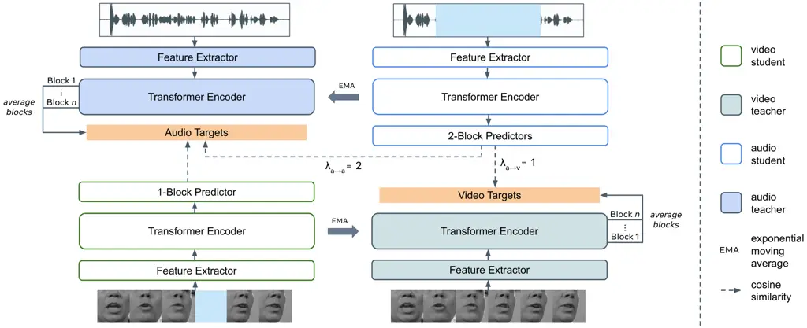

document

# BRAVEn: Improving Self-Supervised Pre-training for Visual and Auditory Speech Recognition

###### Abstract

Self-supervision has recently shown great promise for learning visual
and auditory speech representations from unlabelled data. In this work,
we propose BRAVEn, an extension to the recent RAVEn method, which learns
speech representations entirely from raw audio-visual data. Our
modifications to RAVEn enable BRAVEn to achieve state-of-the-art results
among self-supervised methods in various settings. Moreover, we observe
favourable scaling behaviour by increasing the amount of unlabelled data
well beyond other self-supervised works. In particular, we achieve
20.0 % / 1.7 % word error rate for VSR / ASR on the LRS3 test set, with
only 30 hours of labelled data and no external ASR models. Our results
suggest that readily available unlabelled audio-visual data can largely
replace costly transcribed data. Code at
[https://github.com/ahaliassos/raven](https://github.com/ahaliassos/raven).

###### Index Terms: 

visual / auditory speech recognition, self-supervised learning,
multi-modal learning

## 1 Introduction

Visual and auditory speech recognition (VSR / ASR), i.e., the prediction
of spoken words from visual and auditory inputs respectively, scale very
well with the amount of transcribed data \[1, 2, 3, 4\]. However, the
cost of accurately annotating large-scale datasets can be prohibitive;
indeed, the largest publicly available labelled audio-visual dataset has
under 500 hours of footage \[5\]. This issue has spurred significant
research into bypassing annotated data requirements. One line of work
along this direction is to use off-the-shelf ASR models to transcribe
visual data (lip movement videos) and then train VSR models with a mix
of labelled and pseudo-labelled data \[6, 7\]. Similarly, \[8\] uses the
outputs of an ASR model for cross-modal distillation. A different
approach is to synthesise lip movements using transcribed audio, which
in general is more abundant than transcribed visual data \[9\]. Although
such approaches obtain impressive results, they still assume access to
large-scale transcribed speech data, either to train the ASR model used
for pseudo-labelling / distillation, or to assign labels to the
corresponding synthesised visual data. It has also been observed that
supervised training of VSR models may suffer from optimisation
difficulties and may thus require intricate training strategies such as
curriculum learning \[6, 10\]. Another line of research, free from these
drawbacks, is audio-visual self-supervised learning. In this framework,
representations are first learned by exploiting the fine-grained
correspondence between the visual and auditory modalities, and then the
resulting encoders are fine-tuned on potentially less labelled data for
speech recognition \[11, 12, 10, 13, 14\]. For example, LiRA \[11\]
learns a visual encoder by predicting audio PASE+ features \[15\]. In
contrast, AV-HuBERT \[12\] learns audio-visual features by predicting
clustering indices generated in multiple stages, initially using MFCC
features. VATLM \[13\] extends AV-HuBERT by incorporating text data into
the pre-training process. Recently, student-teacher frameworks have been
proposed \[10, 16\] which, given masked inputs, predict contextualised
targets generated by momentum teachers that are presented with unmasked
inputs. In particular, RAVEn \[10\] uses separate video and audio
students which regress the outputs of the teacher networks through
lightweight Transformer predictors, and learns strong visual and
auditory speech representations entirely from raw data. In this work, we
extend RAVEn (Raw Audio-Visual Encoders) through modifications that
yield better representations by acknowledging the semantic asymmetries
between audio and video. We dub our approach Better RAVEn, or BRAVEn.
Our enhancements are as follows: (1) We use the average of the outputs
of each Transformer encoder block as our targets \[16\], rather than the
output of the last block, in order to create smoother targets; (2) We
use a shallower predictor for the video student, which encourages the
video encoder to better capture the information embedded in the
predicted audio targets; (3) We use stronger masking for the audio
inputs to address the difference in relative difficulty between VSR and
ASR; (4) Finally, we use different loss weights for the audio
predictors, which empirically benefits ASR performance. We find that
BRAVEn scales well both with the model size as well as the amount of
unlabelled data, consistently achieving state-of-the-art performance
across self-supervised methods in comparable settings. We also explore
increasing the quantity of unlabelled data beyond what has been used in
competing methods by combining LRS3 \[5\], Voxceleb2 \[17\], and
AVSpeech \[18\]. We observe that, keeping the amount of labelled data
fixed, this leads to further significant improvements, especially for
VSR. Notably, BRAVEn-Large trained with around 3,000 hours of unlabelled
data and only 30 hours of annotated data achieves 20.0 % / 1.7 % word
error rate (WER) for VSR / ASR on the LRS3 test set, making it
competitive with methods trained on orders of magnitude more transcribed
data \[1, 3\].



Figure 1: BRAVEn overview. BRAVEn uses targets that are the average of
the outputs of the Transformer encoder blocks of the teacher networks.
The video student predicts the audio targets via a 1-block predictor. In
contrast, the audio student uses 2-block predictors and uses both a
cross- as well as a within-modal loss, whose weight is twice as large as
that of the cross-modal loss. The input masking for audio is stronger
than the masking applied for video.

## 2 Method: BRAVEn

### 2.1 Background: RAVEn

RAVEn \[10\] learns visual and auditory speech representations by
leveraging the correspondence between lip movements and the associated
speech waveform, as well as employing masked prediction to encourage the
networks to learn context-aware representations. RAVEn uses a student
and teacher for each modality. The students intake masked video or audio
and predict targets generated by the teachers, which are presented with
unmasked inputs. Each student comprises a modality-specific
convolutional feature extractor followed by two Transformer encoders:
The first produces the desired representations, and the second predicts
the targets given those representations in addition to mask tokens
corresponding to the masked input. The teachers are architecturally
identical to the students, but do not contain predictors. Denoting the
student encoder weights for modality $`m\in\{v,a\}`$ as $`s^{(m)}`$ and
the teacher weights as $`t^{(m)}`$, the following EMA update \[19\] is
performed at each iteration:

```math
\displaystyle t^{(m)}\leftarrow\mu t^{(m)}+(1-\mu)s^{(m)}, \tag{1}
```

where $`\mu`$ follows a cosine schedule from 0.999 to 1. The targets are
simply the outputs of the teachers’ Transformer encoders and are
predicted by the students via cosine similarity. While the audio student
predicts both the video and audio targets via separate predictors
(corresponding to cross- and within-modal learning tasks, respectively),
the video student predicts only the audio targets, due to the asymmetry
in information content between the two modalities \[10\]. The losses for
the video student, $`\mathcal{L}_{v}`$, and audio student,
$`\mathcal{L}_{a}`$, are given as

```math
\displaystyle\mathcal{L}_{v}=\mathcal{L}^{v\to a},\quad\mathcal{L}_{a}=\lambda_{a\to v}\mathcal{L}^{a\to v}+\lambda_{a\to a}\mathcal{L}^{a\to a}, \tag{2}
```

where $`\mathcal{L}^{v\to a}`$, $`\mathcal{L}^{a\to v}`$, and
$`\mathcal{L}^{a\to a}`$ denote the video-to-audio, audio-to-video, and
audio-to-audio prediction losses, respectively, and $`\lambda_{a\to v}`$
and $`\lambda_{a\to a}`$ are scaling factors, which are both set to 1.

### 2.2 BRAVEn

In the following, we describe in detail each of BRAVEn’s design
improvements over RAVEn (see Figure 1). First, BRAVEn uses the mean of
the outputs of all Transformer blocks rather than only the final block’s
output \[16\], which is possible due to the feature size homogeneity
across the Transformer architecture. This averaging operation likely
results in smoother and higher-quality targets, which can aid the
training dynamics \[19\]. Moreover, we apply instance
normalisation \[20\] to the averaged targets to prevent representation
collapse \[21\]. In RAVEn, the layer normalisation \[22\] that follows
the final block in the Transformer architecture serves a similar
purpose. Second, BRAVEn uses asymmetric predictor depths. RAVEn uses
two-block Transformer predictors (with attention dimension 512), shown
to work optimally when using the same design for both video and audio
students. BRAVEn instead uses a one-block Transformer predictor for the
video student (which predicts the audio targets), while retaining the
original design of the audio predictors. The intuition is that audio is
more relevant to speech recognition than video, and thus a shallower
predictor leads to visual representations that more closely match the
information in the audio targets. Third, BRAVEn applies stronger masking
to the audio inputs. Each corresponding video frame index has a 40 %
probability of being picked as the start of a mask for audio, while a
probability of 20 % is used for video¹¹ 1 Then, the three consecutive
video and 1,920 corresponding audio samples are zeroed out (since a
video frame corresponds to 640 audio samples).. In contrast, RAVEn uses
a probability of 20 % for both modalities, which was chosen based on the
assumption that both modalities would equally benefit from the same
masking strategy. BRAVEn’s masking asymmetry is beneficial likely due to
the difference in difficulty between VSR and ASR: Stronger masking for
audio leads to more context-aware representations, but for video it may
make the pretext task overly difficult. Finally, BRAVEn uses asymmetric
loss weights. In RAVEn, the weights of the two losses associated with
the audio student are equal. BRAVEn instead uses a larger weight for the
audio-to-audio ($`\lambda_{a\to a}=2`$) than the audio-to-video loss
($`\lambda_{a\to v}=1`$), which we empirically find leads to
improvements for ASR.

### 2.3 Fine-tuning

After pre-training, all networks are discarded except for the video and
audio student encoders, which are fine-tuned for VSR and ASR, following
\[10\]. We use the CTC / attention loss with a CTC weight of 0.1, which
is the same weight used during decoding. We use a beam search size of
40, and our vocabulary is constructed using 1,000 SentencePiece \[23\]
subword units. We also experiment with self-training: The fine-tuned ASR
model is used to pseudo-label the unlabelled data, which is then used
for fine-tuning the BRAVEn pre-trained encoders \[12, 10, 13\]. We also
present results when using the language model from \[6, 7\],
incorporated through shallow fusion.

## 3 Experimental Setup

### 3.1 Datasets

We use the following datasets for pre-training: LRS3 \[5\],
VoxCeleb2 \[17\], and AVSpeech \[18\]. LRS3 contains 433 hours of
audio-visual speech. We use English-only versions of VoxCeleb2 and
AVSpeech \[12, 6\], which comprise 1,326 and 1,323 hours of footage,
respectively. We refer to a combination of LRS3 with VoxCeleb2 as
LRS3+Vox2. When additionally using AVSpeech, we refer to the resulting
dataset as LRS3+Vox2+AVS. For fine-tuning, we use either the 30-hour
“trainval” set of LRS3 (“low-resource” setting) or the full 433-hour
LRS3 dataset (“high-resource” setting).

|                           |      |       |       |
| ------------------------- | ---- | ----- | ----- |
|                           | Base | Base+ | Large |
| Number of parameters (M)  | 41   | 93    | 328   |
| Number of blocks          | 12   | 12    | 24    |
| Attention dimension       | 512  | 768   | 1024  |
| Number of attention heads | 8    | 12    | 16    |
| MLP size                  | 2048 | 3072  | 4096  |

Table 1: Configuration of the Transformer encoders.

### 3.2 Architecture

Each encoder consists of a modality-specific, convolutional feature
extractor followed by a Transformer encoder \[24, 10\]. The feature
extractor for video is a 2D ResNet-18 \[25\] with a 3D stem \[26\],
while for audio it is a 1D ResNet-18, as in \[10\]. We use three
different Transformer encoder sizes: Base, Base+, and Large. Details of
their configuration are given in Table 1. We note that Base+ and Large
are model sizes used in related works, such as \[12\] and \[16\].
Although these works share the weights of the Transformer encoder for
video and audio during pre-training, they separately fine-tune the
models for VSR and ASR, resulting in separate sets of parameters. For
high-resource fine-tuning, we use Transformer decoders with 6 and 9
blocks for Base(+) and Large, respectively. The decoder dimensions
(i.e., width) match the corresponding encoders. For low-resource, we use
a decoder with 6 blocks and with hidden size, MLP size, and attention
heads equal to 256, 2048, and 4, respectively, to avoid overfitting.

### 3.3 Data pre-processing

We follow the common protocol from \[6, 10, 12\] for pre-processing. We
crop a $`96\times 96`$ area around the mouth and convert to grayscale.
We use the original raw audio without any pre-processing. Any utterance
longer than 24 seconds is divided into separate samples.

### 3.4 Training details

We use the AdamW \[27\] optimiser with a cosine decay learning
scheduler. We pre-train the networks for 150 epochs with a warmup of 40
epochs for LRS3 and of 30 epochs when pre-training with more data. The
learning rate is $`3\times 10^{-3}`$ when training BRAVEn-Base and
Base+, and it is $`2\times 10^{-3}`$ and $`1\times 10^{-3}`$ when
training BRAVEn-Large on LRS3+Vox2 and LRS3+Vox2+AVS, respectively. The
weight decay is set to 0.04. We use drop path \[28\] with a default
value of 0.05, except when training the Large model on LRS3+Vox2, where
it is set to 0.1. We use a maximum of 2,400 video frames per GPU for the
Base and Base+ models and 900 frames per GPU for BRAVEn-Large. For video
augmentations, we horizontally flip the video with 50 % probability and
randomly crop them to size $`88\times 88`$. We do not augment the audio.
For fine-tuning, we use the protocol from \[10\].

|                                                   |         |     |           |         |         |     |
| ------------------------------------------------- | ------- | --- | --------- | ------- | ------- | --- |
| Method                                            | Encoder | LM  | Unlab hrs | Lab hrs | WER (%) |     |
|                                                   |         |     |           |         | VSR     | ASR |
| supervised (includes non-publicly available data) |         |     |           |         |         |     |
| V2P \[29\]                                        | RNN     | ✓   | -         | 3,886   | 55.1    | -   |
| RNN-T \[1\]                                       | RNN     | ✗   | -         | 31,000  | 33.6    | 4.8 |
| VTP \[2\]                                         | Transf  | ✓   | -         | 2,676   | 30.7    | -   |
| ViT3D-TM \[3\]                                    | Transf  | ✗   | -         | 90,000  | 25.9    | 2.3 |
| ViT3D-CM \[4\]                                    | Conf    | ✗   | -         | 90,000  | 17.0    | 1.6 |
| self-supervised                                   |         |     |           |         |         |     |
| Base(+) models                                    |         |     |           |         |         |     |
| AV-HuBERT \[12\]                                  | Transf  | ✗   | 403       | 30      | 51.8    | 4.9 |
| VATLM^($`\dagger`$) \[13\]                        | Transf  | ✗   | 403       | 30      | 48.0    | \-  |
| RAVEn^($`\ddagger`$) \[10\]                       | Transf  | ✗   | 403       | 30      | 47.0    | 4.7 |
| AV-data2vec \[16\]                                | Transf  | ✗   | 403       | 30      | 45.2    | 4.4 |
| BRAVEn^($`\ddagger`$)                             | Transf  | ✗   | 403       | 30      | 43.4    | 4.0 |
| Base(+) models                                    |         |     |           |         |         |     |
| AV-HuBERT \[12\]                                  | Transf  | ✗   | 1,729     | 30      | 46.1    | 4.6 |
| VATLM^($`\dagger`$) \[13\]                        | Transf  | ✗   | 1,729     | 30      | 42.6    | \-  |
| RAVEn^($`\ddagger`$) \[10\]                       | Transf  | ✗   | 1,729     | 30      | 40.2    | 3.8 |
| AV-data2vec \[16\]                                | Transf  | ✗   | 1,729     | 30      | 37.8    | 3.7 |
| BRAVEn                                            | Transf  | ✗   | 1,729     | 30      | 35.1    | 3.0 |
| Large models                                      |         |     |           |         |         |     |
| AV-HuBERT \[12\]                                  | Transf  | ✗   | 1,729     | 30      | 32.5    | 2.9 |
| VATLM^($`\dagger`$) \[13\]                        | Transf  | ✗   | 1,729     | 30      | 31.6    | \-  |
| RAVEn \[10\]                                      | Transf  | ✗   | 1,729     | 30      | 32.5    | 2.7 |
| AV-data2vec \[16\]                                | Transf  | ✗   | 1,729     | 30      | 30.8    | 2.7 |
| AV-HuBERT w/ ST \[12\]                            | Transf  | ✗   | 1,729     | 30      | 28.6    | \-  |
| VATLM^($`\dagger`$) w/ ST \[13\]                  | Transf  | ✗   | 1,729     | 30      | 27.6    | \-  |
| RAVEn w/ ST \[10\]                                | Transf  | ✗   | 1,729     | 30      | 24.8    | 2.3 |
| BRAVEn                                            | Transf  | ✗   | 1,729     | 30      | 30.8    | 2.3 |
| BRAVEn                                            | Transf  | ✗   | 3,052     | 30      | 24.8    | 2.1 |
| BRAVEn w/ ST                                      | Transf  | ✗   | 3,052     | 30      | 21.3    | 1.9 |
| BRAVEn w/ ST                                      | Transf  | ✓   | 3,052     | 30      | 20.0    | 1.7 |

(a) Low-resource.

|                                                             |         |     |           |            |         |     |
| ----------------------------------------------------------- | ------- | --- | --------- | ---------- | ------- | --- |
| Method                                                      | Encoder | LM  | Unlab hrs | Lab hrs    | WER (%) |     |
|                                                             |         |     |           |            | VSR     | ASR |
| semi-supervised (uses external models for pseudo-labelling) |         |     |           |            |         |     |
| KD+CTC \[8\]                                                | CNN     | ✓   | 344       | 433        | 59.8    | -   |
| CM-aux \[6\]                                                | Conf    | ✓   | 641       | 818        | 31.5    | -   |
| Auto-AVSR \[7\]                                             | Conf    | ✓   | 2,630     | 818        | 19.1    | 1.0 |
| SynthVSR Large \[9\]                                        | Conf    | ✓   | 2,630     | 4,090^(\*) | 16.9    | -   |
| self-supervised                                             |         |     |           |            |         |     |
| Base(+) models                                              |         |     |           |            |         |     |
| AV-HuBERT \[12\]                                            | Transf  | ✗   | \-        | 433        | 44.0    | \-  |
| RAVEn^($`\ddagger`$) \[10\]                                 | Transf  | ✗   | \-        | 433        | 39.1    | 2.2 |
| AV-data2vec \[16\]                                          | Transf  | ✗   | \-        | 433        | 39.0    | 2.0 |
| BRAVEn^($`\ddagger`$)                                       | Transf  | ✗   | -         | 433        | 36.0    | 1.9 |
| Base(+) models                                              |         |     |           |            |         |     |
| AV-HuBERT \[12\]                                            | Transf  | ✗   | 1,326     | 433        | 34.8    | 2.0 |
| VATLM^($`\dagger`$) \[13\]                                  | Transf  | ✗   | 1,326     | 433        | 34.2    | \-  |
| RAVEn^($`\ddagger`$) \[10\]                                 | Transf  | ✗   | 1,326     | 433        | 33.1    | 1.9 |
| AV-data2vec \[16\]                                          | Transf  | ✗   | 1,326     | 433        | 32.9    | 1.7 |
| BRAVEn                                                      | Transf  | ✗   | 1,326     | 433        | 28.8    | 1.4 |
| Large models                                                |         |     |           |            |         |     |
| AV-HuBERT \[12\]                                            | Transf  | ✗   | 1,326     | 433        | 28.6    | 1.3 |
| VATLM^($`\dagger`$) \[13\]                                  | Transf  | ✗   | 1,326     | 433        | 28.4    | \-  |
| RAVEn \[10\]                                                | Transf  | ✗   | 1,326     | 433        | 27.8    | 1.4 |
| AV-data2vec \[16\]                                          | Transf  | ✗   | 1,326     | 433        | 28.5    | 1.4 |
| u-HuBERT \[30\]                                             | Transf  | ✗   | 1,326     | 433        | 27.2    | 1.4 |
| AV-HuBERT w/ ST \[12\]                                      | Transf  | ✗   | 1,326     | 433        | 26.9    | \-  |
| VATLM^($`\dagger`$) w/ ST \[13\]                            | Transf  | ✗   | 1,326     | 433        | 26.2    | \-  |
| RAVEn w/ ST \[10\]                                          | Transf  | ✗   | 1,326     | 433        | 24.4    | 1.4 |
| BRAVEn                                                      | Transf  | ✗   | 1,326     | 433        | 26.6    | 1.2 |
| BRAVEn                                                      | Transf  | ✗   | 2,649     | 433        | 23.6    | 1.2 |
| BRAVEn w/ ST                                                | Transf  | ✗   | 2,649     | 433        | 20.9    | 1.2 |
| BRAVEn w/ ST                                                | Transf  | ✓   | 2,649     | 433        | 20.1    | 1.1 |

(b) High-resource.

Table 2: LRS3 results. “Unlab hrs” / “lab hrs” denote unlabelled hours /
labelled hours. Self-supervised methods use labelled data for
pre-training (without labels) along with unlabelled data (if any). “LM”
denotes language model. “ST” denotes self-training. ^(\*)Includes
synthetic visual data generated using labelled audio. ^($`\dagger`$)Uses
an additional 3,846 / 452 hours of audio / audio-text data.
^($`\ddagger`$)Uses the (smaller) Base model.

## 4 Results

### 4.1 Low-resource setting

We provide results for the low-resource setting in Table 2(a). Using
BRAVEn-Base and LRS3 as the pre-training dataset, we achieve better VSR
and ASR word error rate (WER) than the previous state of the art
obtained by AV-data2vec (43.4 % / 4.0 % vs 45.2 % / 4.4 % for VSR /
ASR), despite using approximately half the number of parameters during
inference. Using LRS3+Vox2 for pre-training, BRAVEn-Base+ obtains 35.1 %
/ 3.0 % WER for VSR / ASR, which represents the state of the art for
this setting too. Increasing the model size to Large improves the
results to 30.8 % and 2.3 % WER for VSR and ASR respectively,
demonstrating BRAVEn’s strong scalability. We are also the first to
experiment with pre-training on LRS3+Vox2+AVS, consisting of 3,082 hours
of unlabelled data. This increase in pre-training data results in
significant WER improvement for VSR (30.8 %$`\rightarrow`$24.8 %) and
modest improvement for ASR (2.3 %$`\rightarrow`$2.1 %). We believe we
have not reached saturation yet, and increasing pre-training data
further will yield even more improvements. Finally, using self-training
and a language model during inference leads to 20.0 % / 1.7 % WER for
VSR / ASR. We point out that our results with only 30 hours of labelled
data (and no external pre-trained ASR model) are competitive with
supervised methods that use orders of magnitude of more labelled
data \[1, 3\].

### 4.2 High-resource setting

The results for the high-resource setting are shown in Table 2(b). In
each setting, BRAVEn achieves state-of-the-art performance among the
self-supervised methods. Our best results for the high-resource setting
are 20.1 % / 1.1 % for VSR / ASR. Interestingly, BRAVEn-Large coupled
with self-training and a language model yields similar VSR results
($`\sim`$ 20 % WER) in both low- and high-resource settings, but better
results are obtained in the high-resource setting for ASR. This suggests
that high-quality transcriptions are more important for ASR than VSR.
Furthermore, our results are competitive with semi-supervised methods
that use external ASR models trained on tens of thousands of hours of
audio data \[7, 9\]. All in all, our results suggest that BRAVEn can
effectively translate unlabelled audio-visual data into strong speech
recognition performance for both modalities.

### 4.3 Audio-visual results

|                  |                       |                                     |                                     |                                      |
| ---------------- | --------------------- | ----------------------------------- | ----------------------------------- | ------------------------------------ |
|                  |                       | SNR (dB)                            |                                     |                                      |
|                  | Clean                 | 5                                   | 0                                   | -5                                   |
| AV-data2vec (AV) | 4.2                   | \-                                  | \-                                  | \-                                   |
| RAVEn (AV)       | 4.7                   | 14.3                                | 18.2                                | 58.0                                 |
| BRAVEn (A)       | 4.0                   | 15.6                                | 24.6                                | 99.0                                 |
| BRAVEn (AV)      | 4.0 $`\scriptstyle=`$ | 12.4 $`\scriptstyle\downarrow 3.2`$ | 15.0 $`\scriptstyle\downarrow 9.6`$ | 48.5 $`\scriptstyle\downarrow 50.5`$ |

Table 3: Audio-visual results. We show low-resource results (WER %)
(Base models) with different signal-to-noise ratio (SNR).

Although not the focus of this work, we now provide results for
audio-visual speech recognition using the late-fusion method proposed in
\[31\]. To that end, we append a fusion module that concatenates the
features from the video and audio encoders and applies a two-layer MLP
with hidden dimension 1024. We transfer the weights from the VSR and ASR
encoders and then train the fusion model, CTC layer, and decoder for 200
epochs, keeping the encoder weights frozen. Results for the low-resource
setting with the Base model and different levels of audio babble noise
from the NOISEX corpus \[32\] are given in Table 3. It is evident that
as the audio noise level increases, so does the difference in
performance between the audio-only and audio-visual models. BRAVEn
outperforms RAVEn at all noise levels and achieves better WER than
AV-data2vec, even when BRAVEn uses only the audio modality.

### 4.4 Ablations

|                                       |                                     |                                    |
| ------------------------------------- | ----------------------------------- | ---------------------------------- |
|                                       | WER (%)                             |                                    |
|                                       | VSR                                 | ASR                                |
| RAVEn                                 | 47.0                                | 4.7                                |
|     + average blocks                  | 45.3 $`\scriptstyle\downarrow 1.7`$ | 4.6 $`\scriptstyle\downarrow 0.1`$ |
|     + shallower video predictor       | 44.1 $`\scriptstyle\downarrow 1.2`$ | 4.6 $`\scriptstyle=`$              |
|     + stronger audio masking          | 43.5 $`\scriptstyle\downarrow 0.6`$ | 4.2 $`\scriptstyle\downarrow 0.4`$ |
|     + different loss weights = BRAVEn | 43.4 $`\scriptstyle\downarrow 0.1`$ | 4.0 $`\scriptstyle\downarrow 0.2`$ |
| BRAVEn + audio mask probability 0.6   | 44.4 $`\scriptstyle\uparrow 1.0`$   | 4.2 $`\scriptstyle\uparrow 0.2`$   |
| BRAVEn + averaging last 6 blocks      | 46.2 $`\scriptstyle\uparrow 2.8`$   | 4.1 $`\scriptstyle\uparrow 0.1`$   |

Table 4: Ablations. We show results for the low-resource setting using
the Base model.

We conduct an ablation study to show the effect of each design choice on
the VSR and ASR performance (see Table 4). Each new addition improves
the VSR and / or ASR performance. We observe that averaging targets and
using a shallower video predictor has a larger effect on VSR than ASR,
while stronger audio masking and different loss weights have a more
significant impact on ASR. Furthermore, using even stronger audio
masking or using the average of the last 6 Transformer blocks as targets
lead to worse performance.

## 5 Conclusion

We have presented BRAVEn, a self-supervised framework for learning
visual and auditory speech representations from audio-visual data. We
propose some design improvements to the recent RAVEn method, which
cumulatively have a significant impact on the downstream VSR and ASR
performance and achieve state-of-the-art results for audio-visual
self-supervised methods in various settings. Furthermore, we experiment
with doubling the amount of unlabelled data during pre-training as used
in other self-supervised works and observe strong scaling behaviour,
even when fine-tuning with only 30 hours of labelled data. Our work
provides compelling evidence that readily accessible unlabelled
audio-visual data can effectively substitute costly annotated samples.

## References

\AtNextBibliography

## References

- \[1\] Takaki Makino, Hank Liao, Yannis Assael, Brendan Shillingford,
  Basilio Garcia, Otavio Braga and Olivier Siohan “Recurrent neural
  network transducer for audio-visual speech recognition” In _ASRU
  Workshop_, 2019, pp. 905–912
- \[2\] K.. Prajwal, Triantafyllos Afouras and Andrew Zisserman
  “Sub-word Level Lip Reading With Visual Attention” In _CVPR_, 2022
- \[3\] Dmitriy Serdyuk, Otavio Braga and Olivier Siohan “Audio-Visual
  Speech Recognition is Worth 32x32x8 Voxels” In _ASRU Workshop_, 2021
- \[4\] Dmitriy Serdyuk, Otavio Braga and Olivier Siohan
  “Transformer-Based Video Front-Ends for Audio-Visual Speech
  Recognition for Single and Muti-Person Video” In _Interspeech_ ISCA,
  2022, pp. 2833–2837 DOI:
  [10.21437/Interspeech.2022-10920](https://dx.doi.org/10.21437/Interspeech.2022-10920)
- \[5\] Triantafyllos Afouras, Joon Chung and Andrew Zisserman
  “LRS3-TED: a large-scale dataset for visual speech recognition” In
  _arXiv_, 2018
- \[6\] Pingchuan Ma, Stavros Petridis and Maja Pantic “Visual speech
  recognition for multiple languages in the wild” In _Nature Machine
  Intelligence_ 4.11, 2022, pp. 930–939 DOI:
  [10.1038/s42256-022-00550-z](https://dx.doi.org/10.1038/s42256-022-00550-z)
- \[7\] Pingchuan Ma, Alexandros Haliassos, Adriana Fernandez-Lopez,
  Honglie Chen, Stavros Petridis and Maja Pantic “Auto-AVSR:
  Audio-visual speech recognition with automatic labels” In _ICASSP_,
  2023, pp. 1–5 IEEE
- \[8\] Triantafyllos Afouras, Joon Chung and Andrew Zisserman “Asr is
  all you need: Cross-modal distillation for lip reading” In _ICASSP_,
  2020, pp. 2143–2147
- \[9\] Xubo Liu, Egor Lakomkin, Konstantinos Vougioukas, Pingchuan Ma,
  Honglie Chen, Ruiming Xie, Morrie Doulaty, Niko Moritz, Jachym Kolar
  and Stavros Petridis “SynthVSR: Scaling Up Visual Speech Recognition
  With Synthetic Supervision” In _CVPR_, 2023, pp. 18806–18815
- \[10\] Alexandros Haliassos, Pingchuan Ma, Rodrigo Mira, Stavros
  Petridis and Maja Pantic “Jointly Learning Visual and Auditory Speech
  Representations from Raw Data” In _ICLR_ OpenReview.net, 2023 URL:
  [https://openreview.net/pdf?id=BPwIgvf5iQ](https://openreview.net/pdf?id=BPwIgvf5iQ)
- \[11\] Pingchuan Ma, Rodrigo Mira, Stavros Petridis, Bj“”orn. Schuller
  and Maja Pantic “LiRA: Learning Visual Speech Representations from
  Audio Through Self-Supervision” In _Interspeech_, 2021, pp. 3011–3015
- \[12\] Bowen Shi, Wei-Ning Hsu, Kushal Lakhotia and Abdelrahman
  Mohamed “Learning audio-visual speech representation by masked
  multimodal cluster prediction” In _ICLR_, 2022
- \[13\] Qiushi Zhu, Long Zhou, Ziqiang Zhang, Shujie Liu, Binxing Jiao,
  Jie Zhang, Lirong Dai, Daxin Jiang, Jinyu Li and Furu Wei “Vatlm:
  Visual-audio-text pre-training with unified masked prediction for
  speech representation learning” In _IEEE Trans. Multimed._ IEEE, 2023
- \[14\] Alexei Baevski, Wei-Ning Hsu, Qiantong Xu, Arun Babu, Jiatao Gu
  and Michael Auli “data2vec: A General Framework for Self-supervised
  Learning in Speech, Vision and Language” In _ICML_ 162 PMLR, 2022, pp.
  1298–1312 URL:
  [https://proceedings.mlr.press/v162/baevski22a.html](https://proceedings.mlr.press/v162/baevski22a.html)
- \[15\] Mirco Ravanelli, Jianyuan Zhong, Santiago Pascual, Pawel
  Swietojanski, Joao Monteiro, Jan Trmal and Yoshua Bengio “Multi-Task
  Self-Supervised Learning for Robust Speech Recognition” In _ICASSP_,
  2020, pp. 6989–6993
- \[16\] Jiachen Lian, Alexei Baevski, Wei-Ning Hsu and Michael Auli
  “AV-data2vec: Self-supervised Learning of Audio-Visual Speech
  Representations with Contextualized Target Representations” In
  _arXiv_, 2023
- \[17\] Joon Chung, Arsha Nagrani and Andrew Zisserman “VoxCeleb2: Deep
  Speaker Recognition” In _Interspeech_, 2018, pp. 1086–1090
- \[18\] Ariel Ephrat, Inbar Mosseri, Oran Lang, Tali Dekel, Kevin
  Wilson, Avinatan Hassidim, William. Freeman and Michael Rubinstein
  “Looking to listen at the cocktail party: a speaker-independent
  audio-visual model for speech separation” In _ACM Trans. Graph._ 37.4,
  2018, pp. 112 DOI:
  [10.1145/3197517.3201357](https://dx.doi.org/10.1145/3197517.3201357)
- \[19\] Jean-Bastien Grill, Florian Strub, Florent Altch“’e, Corentin
  Tallec, Pierre Richemond, Elena Buchatskaya, Carl Doersch, Bernardo
  Avila, Zhaohan Guo and Mohammad Gheshlaghi “Bootstrap your own
  latent-a new approach to self-supervised learning” In _NeurIPS_ 33,
  2020, pp. 21271–21284
- \[20\] Dmitry Ulyanov, Andrea Vedaldi and Victor Lempitsky “Instance
  normalization: The missing ingredient for fast stylization” In _arXiv
  preprint arXiv:1607.08022_, 2016
- \[21\] Mathilde Caron, Hugo Touvron, Ishan Misra, Herv“’e J“’egou,
  Julien Mairal, Piotr Bojanowski and Armand Joulin “Emerging properties
  in self-supervised vision transformers” In _Proceedings of the 18th
  IEEE/CVF International Conference on Computer Vision (ICCV)_, 2021,
  pp. 9650–9660
- \[22\] Jimmy Ba, Jamie Kiros and Geoffrey Hinton “Layer normalization”
  In _arXiv preprint arXiv:1607.06450_, 2016
- \[23\] Taku Kudo and John Richardson “Sentencepiece: A simple and
  language independent subword tokenizer and detokenizer for neural text
  processing” In _ACL_, 2018, pp. 66–71
- \[24\] Ashish Vaswani, Noam Shazeer, Niki Parmar, Jakob Uszkoreit,
  Llion Jones, Aidan Gomez, ukasz Kaiser and Illia Polosukhin “Attention
  is all you need” In _NeurIPS_, 2017, pp. 5998–6008
- \[25\] Kaiming He, Xiangyu Zhang, Shaoqing Ren and Jian Sun “Deep
  residual learning for image recognition” In _CVPR_, 2016, pp. 770–778
- \[26\] T. Stafylakis and G. Tzimiropoulos “Combining Residual Networks
  with LSTMs for Lipreading” In _Interspeech_ 9, 2017, pp. 3652–3656
- \[27\] Ilya Loshchilov and Frank Hutter “Decoupled weight decay
  regularization” In _ICLR_, 2019
- \[28\] Gao Huang, Yu Sun, Zhuang Liu, Daniel Sedra and Kilian
  Weinberger “Deep networks with stochastic depth” In _Proceedings of
  the 14th European Conference on Computer Vision (ECCV)_, 2016, pp.
  646–661
- \[29\] B. Shillingford, Y. Assael, M. Hoffman, T. Paine, C. Hughes, U.
  Prabhu, H. Liao, H. Sak, K. Rao and L. Bennett “Large-Scale Visual
  Speech Recognition” In _Interspeech_, 2019, pp. 4135–4139
- \[30\] Wei-Ning Hsu and Bowen Shi “u-hubert: Unified mixed-modal
  speech pretraining and zero-shot transfer to unlabeled modality” In
  _NeurIPS_ 35, 2022, pp. 21157–21170
- \[31\] Pingchuan Ma, Stavros Petridis and Maja Pantic “End-to-end
  audio-visual speech recognition with conformers” In _ICASSP_, 2021,
  pp. 7613–7617
- \[32\] Andrew Varga and Herman Steeneken “Assessment for automatic
  speech recognition: II. NOISEX-92: A database and an experiment to
  study the effect of additive noise on speech recognition systems” In
  _Speech communication_ 12.3 Elsevier, 1993, pp. 247–251
