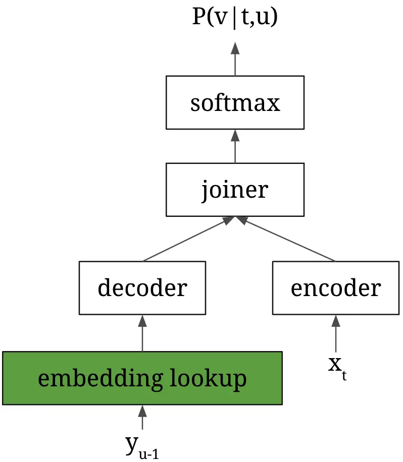
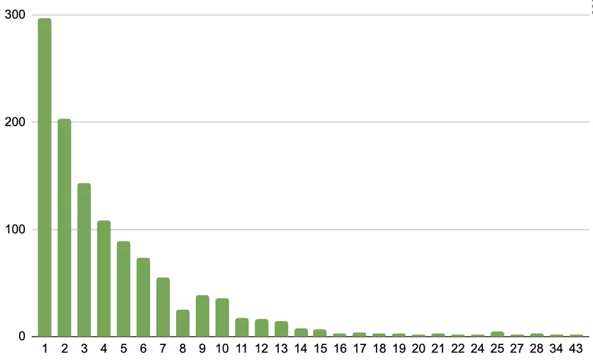

# Transducers with Pronunciation-aware Embeddings for Automatic Speech Recognition

Hainan Xu, Zhehuai Chen, Fei Jia, Boris Ginsburg

###### Abstract

This paper proposes _Transducers with Pronunciation-aware Embeddings_
(PET). Unlike conventional Transducers where the decoder embeddings for
different tokens are trained independently, the PET model’s decoder
embedding incorporates shared components for text tokens with the same
or similar pronunciations. With experiments conducted in multiple
datasets in Mandarin Chinese and Korean, we show that PET models
consistently improve speech recognition accuracy compared to
conventional Transducers. Our investigation also uncovers a phenomenon
that we call _error chain reactions_. Instead of recognition errors
being evenly spread throughout an utterance, they tend to group
together, with subsequent errors often following earlier ones. Our
analysis shows that PET models effectively mitigate this issue by
substantially reducing the likelihood of the model generating additional
errors following a prior one. Our implementation will be open-sourced
with the NeMo toolkit.

^(†)^(†)address: NVIDIA, USA  
[hainanx@nvidia.com](mailto:hainanx@nvidia.com)

Index Terms: ASR, speech recognition, pronunciation-aware modeling,
Transducers, RNN-T

## 1 Introduction

Over the last decades, research in speech recognition has experienced a
shift in the prominent model architectures for the task. Previously, the
most successful speech recognition models used a modular/hybrid approach
\[1, 2\], where an acoustic model, a language model, and a pronunciation
model are independently built from data, and combined together to build
a speech recognition pipeline. Nowadays, end-to-end speech recognition
models \[3, 4, 5, 6\] have gradually surpassed the performance of hybrid
models. End-to-end ASR uses a single model that takes in the acoustic
input, and directly outputs the recognized results. Inside end-to-end
models, there are no separate acoustic/language/pronunciation modules.
Instead, all information regarding different levels of representation of
speech and languages is internally learned. Despite their simplicity,
end-to-end models have shown superior performance than hybrid models,
and are widely supported in the open-source community\[7, 8, 9, 10\].
^(†)^(†) Paper accepted at ICASSP 2024 conference.

Acknowledging the overall success of end-to-end models, there are still
a number of aspects where hybrid models are more attractive. For
example, because all the information is implicitly learned without
linguistic knowledge, end-to-end models are usually much more
data-hungry than hybrid models in order to learn the intricacy of
languages. One such area is regarding the pronunciation information of
text tokens. Hybrid models typically have access to a pronunciation
dictionary, which makes tokens with the same or similar pronunciations
share certain parameters; On the end hand, end-to-end models typically
treat different word tokens as completely independent tokens, even if
they share the same or similar pronunciations, this could lead to
sub-optimal results\[11\].

There has been ongoing investigations on how to leverage pronunciation
information to improve end-to-end models. For example, \[12\] and \[13\]
both proposed a 2-stage ASR model, by first recognizing phonetic symbols
which is then converted into Chinese characters. \[14\] proposed a
subword tokenization scheme using the pronunciation information of the
words to guide the subword splitting process. This method was shown to
be able to identify phonetically meaningful subword tokens and achieved
superior results than conventional BPE tokenization. \[15\] proposed a
pronunciation-aware mechanism which is included in the contextual
adapter framework \[16\] for Transducer models. Both \[17\] and \[18\]
proposed a pronunciation-aware contextualization method on top of the
Contextual-Listen-Attend-and-Spell \[19\] framework. \[11\] proposed to
represent Mandarin characters with their pronunciation and a unique
character ID, in order to promote parameter sharing among characters
with the same or similar pronunciations, and achieved improved ASR
results.

In this paper, we propose _Transducers with Pronunciation-aware
Embeddings_ (PET), an extension to Transducer \[4\] that can encode
expert knowledge of a pronunciation dictionary in the model’s embedding
parameters. To the best of our knowledge, our work is the first to
incorporate pronunciation information of text tokens into the _embedding
design_ of Transducer models. The contributions of this paper are,

1.  1.  a novel embedding generation scheme for Transducer decoders, where
        embeddings for text tokens can have shared components based on the
        similarity of their pronunciations.
2.  2.  the discovery of _error chain reactions_ in Transducers, where
        errors tend to group instead of being evenly distributed, and one
        error is likely to cause other subsequent errors. At a time when
        overall ASR error rates are gradually getting saturated, this
        discovery allows researchers to develop specific methods (of which
        this paper is one) targeting error chains to further improve ASR
        models’ performance.
3.  3.  PET models improve ASR consistently for Mandarin Chinese and Korean.
        Furthermore, PET models outperform conventional models primarily by
        mitigating error chain reactions, reducing the likelihood of more
        errors after a prior error.

We will open-source our model with the NeMo \[7\] toolkit.



Figure 1: Transducer model architecture.

## 2 Background and Motivation for PET

The Transducer model is one of the popular types of end-to-end ASR
models \[4\]. The model improves upon CTC \[3\] models by relaxing the
conditional independence assumption, and has a separate encoder and
decoder to process the audio and previously emitted text. The learned
high-level information from the encoder and decoder is fed into a joiner
(also called a joint network) to generate token distributions based on
both the acoustics and emission history. The architecture of Transducers
is shown in Figure 1, where $`x`$ represents the acoustic input indexed
by $`t`$, and $`y`$ represents the text token indexed by $`u`$.
$`P(v|t,u)`$ represents the model’s prediction of the output
distribution when accessing $`t`$’s frame of acoustic input, given the
previous $`u-1`$ emissions.

Unlike the acoustic input which resides in a continuous vector space,
text tokens are discrete symbols and thus need to be projected onto a
continuous vector space before decoder computation. In Transducers, an
embedding layer of dimension $`[V,d]`$ is required for the decoder,
where $`V`$ is the vocabulary size and $`d`$ is the embedding dimension.
With conventional Transducers, embeddings with respect to different
tokens are independently trained, despite the fact that different tokens
can be linguistically related. One such example is Mandarin Chinese,
where there exists a large number of _homophones_, i.e. different
characters that share the same pronunciation. For example in AISHELL-2
dataset\[20\], its 5000 characters have in total of 1149 different
pronunciations¹¹ 1 We use _pinyin_ package
[https://pypi.org/project/pinyin/](https://pypi.org/project/pinyin/) to
generate the pronunciations for Mandarin Chinese in this paper.. Fig.2
shows more detailed homophone patterns in Mandarin Chinese, where a
green bar $`(x,y)`$ means there are exactly $`y`$ pronunciations that
are shared by exactly $`x`$ Mandarin Chinese characters. We see just
under 300 of all 5000 characters have unique pronunciations and all the
rest are homophones. We believe it’s sub-optimal to treat homophones as
independent tokens and propose to incorporate shared components in
embeddings for tokens with the same or similar pronunciations.



Figure 2: A Chart showing homophone distributions in Mandarin Chinese,
where a bar $`(x,y)`$ means the number of different pronunciations
shared by exactly $`x`$ characters is $`y`$. E.g. there are just below
300 characters that have unique pronunciations; slightly above 200
pronunciations are shared by two Chinese characters. On the right-hand
side of the chart, we see certain pronunciations can be shared among as
many as 43 characters.

## 3 Pronunciation-aware Embeddings

Different from conventional Transducers that use simple word embedding
matrices, embeddings for PET models are a combination of multi-faceted
representations of the text tokens. To do this, PET models can have
multiple embedding tables, some of which correspond to pronunciation
symbols. To compute the _final embedding_ (the actual embedding passed
into decoders) for a word $`v`$, we first choose the features we want to
use for generating the embedding. We propose features shown in Table 1
to represent different aspects of the word. Say $`F`$ is the set of
features we choose, then the final embedding for a word $`v`$ is
computed as the summation ²² 2 Readers might feel that concatenating
those embeddings would be a more logical design. We point out it is just
a special case of adding, where the individual components lie in
orthogonal subspaces. Our preliminary experiments show that it doesn’t
work as well as adding. of embeddings of different features of that
word,

```math
\bold{E}_{\text{FINAL, F}}(v)=\sum_{f\in F}\bold{E}_{\text{f}}(f(v)) \tag{1}
```

Here are some examples to illustrate how this works. If we choose
features {P, W}, then the final embedding for characters 他 and 她, both
of which are pronounced “ta”, are computed as,

```math
\bold{E}_{\text{FINAL, PW}}(\text{\begin{CJK*}{gbsn}他\end{CJK*}})=\bold{E}_{\text{p}}(\text{ta})+\bold{E}_{\text{w}}(\text{\begin{CJK*}{gbsn}他\end{CJK*}}) \tag{2}
```

```math
\bold{E}_{\text{FINAL, PW}}(\text{\begin{CJK*}{gbsn}她\end{CJK*}})=\bold{E}_{\text{p}}(\text{ta})+\bold{E}_{\text{w}}(\text{\begin{CJK*}{gbsn}她\end{CJK*}}) \tag{3}
```

In this example, $`\bold{E}_{p}`$ and $`\bold{E}_{w}`$ are two
independent embedding tables corresponding to different representations
of the text tokens and will be trained jointly in Transducer training.
The choice of $`F`$ can be arbitrary with defined features. It is also
OK to drop the “W” feature in the embedding generation so different
tokens can have their embeddings completely tied. For example, when
using features “CV”, the embeddings for 他 and 她 would be identical,

```math
\bold{E}_{\text{FINAL, CV}}(\text{\begin{CJK*}{gbsn}他\end{CJK*}})=\bold{E}_{\text{FINAL, CV}}(\text{\begin{CJK*}{gbsn}她\end{CJK*}})=\bold{E}_{\text{c}}(\text{t})+\bold{E}_{\text{v}}(\text{a}) \tag{4}
```

| short-hand | description                                                                      | example  |
| ---------- | -------------------------------------------------------------------------------- | -------- |
| W          | word identity                                                                    | 他       |
| P          | Romanized pronunciation                                                          | ta       |
| T          | tone (only for tonal languages)                                                  | 1st tone |
| C          | beginning consonant(s) of P (could be empty if pronunciation begins with vowels) | t        |
| V          | suffix of P excluding the part from C                                            | a        |

Table 1: Short-hands used for denoting embedding features.

## 4 Experiments

We evaluate PET models in Mandarin Chinese and Korean using NeMo \[7\].
Our baseline uses the Fast Conformer model \[21\]³³ 3
[examples/asr/conf/fastconformer/fast-conformer_transducer_bpe.yaml](https://examples/asr/conf/fastconformer/fast-conformer_transducer_bpe.yaml)
in the NeMo repository.. All models use character-based representations
and are trained for sufficient steps till the validation error rate
starts to increase. After training, we run checkpoint averaging on the 5
checkpoints with the best validation performance to generate the model
for evaluation.

### 4.1 Mandarin Chinese experiments

We train Mandarin Chinese models with the AISHELL-2 \[20\] dataset,
which contains 1000 hours of speech. We use the default
fast-conformer-transducer configurations, with 120M parameters. We
report our models’ _character error rates_ (CER) performance on
AISHELL-2’s iOS-test set and THCHS’s testset \[22\] in Table 2.
Comparing baseline (W) with the PW model, we see that adding
pronunciation information on top of word identity in the embeddings does
not help improve ASR performance; however, including _only pronunciation
information_ in the decoder embeddings can reduce the CER of PET models.
Also, it seems a more granular representation of the pronunciation can
yield more gains, e.g. using CV or V would outperform P. This effect is
more pronounced for the out-of-domain THCHS dataset. Our best model uses
the suffix of the pronunciation after the initial consonants and
achieved a relative CER reduction of 2.7% for the AISHELL iOS-test
dataset, and an absolute reduction of 1.01% (or 7.1% relative) on the
THCHS test.

| decoder-emb  | iOS-test | THCHS-test |
| ------------ | -------- | ---------- |
| W (baseline) | 5.50     | 14.16      |
| PW           | 5.50     | 14.69      |
| P            | 5.54     | 13.66      |
| PT           | 5.45     | 13.16      |
| CV           | 5.55     | 13.23      |
| V            | 5.34     | 13.15      |

Table 2: CER performance of different Transducers on iOS-test, and THCHS
test sets in Mandarin Chinese. All models are trained on AISHELL-2.
Check Table 1 for the meaning of representations of configs. We see PET
models can improve ASR accuracy, especially for the more difficult THCHS
dataset, and a more granular representation of the pronunciation is
used.

### 4.2 Korean experiments

|             |             |     |
| ----------- | ----------- | --- |
| decoder-emb | zeroth test |     |
| W           | 1.51        |     |
| P           | 1.55        |     |
| CV          | 1.43        |     |
| V           | 1.36        |     |

Table 3: CER of different Transducers on Zeroth-Korean test set. Similar
to Table 2, using granular representation of pronunciation for decoder
embedding can improve ASR performance.

Our Korean models are trained on the Zeroth-Korean ⁴⁴ 4
https://www.openslr.org/40/ dataset, with around 50 hours of speech. Due
to the small data size, we decreased the hidden dimension of the encoder
to 400 from the default 640, and the model has around 50 million
parameters in total. _ko-pron_ package⁵⁵ 5
[https://pypi.org/project/ko-pron/](https://pypi.org/project/ko-pron/)
is used to generate pronunciation for Korean characters. Note that
Korean isn’t a tonal language, so there is no tone feature. Table 3
shows CER on the Zeroth-Korean test set. We see very similar trends
where better results can be achieved when the decoder only uses granular
representations of pronunciations (CV or V).

## 5 Discussions

### 5.1 Pronunciation Information in Joiner Embeddings

The Transducer joiner has a \[V+1, d\] matrix which projects hidden
representations onto logits of dimension V + 1 (+1 for blank). This
matrix could be viewed as the “joiner embedding”, and we investigate
including pronunciation information here as well. Table 4 shows the
results in Mandarin Chinese. We see that, generally, including
pronunciation only in joiner embedding does not help ASR performance;
meanwhile, including pronunciation for both decoder and joiner can bring
gains to ASR performance compared to baselines, but doesn’t outperform
our best number from Table 2 which only include pronunciation in decoder
embeddings.

As for Korean, the results are in 5. Here we see that different from
Mandarin Chinese models, by combining the use of pronunciation in both
decoder and joiner, our Korean ASR performance can be further improved.
Our best number for the Zeroth-Korean dataset is 1.22% using V-VW
config, which is to our best knowledge, the best reported CER on the
dataset. We hypothesize the different patterns for the two languages are
due to the data size difference. Since our Korean data is much smaller,
including pronunciation for both decoder and joiner embeddings can make
the model learn more robust representations. We will continue
investigating this as future work.

|             |              |          |            |
| ----------- | ------------ | -------- | ---------- |
| decoder-emb | joiner-emb   | iOS-test | THCHS-test |
| W           | W (baseline) | 5.50     | 14.16      |
| W           | PW           | 5.62     | 14.55      |
| W           | PTW          | 5.59     | 14.37      |
| W           | CVW          | 5.56     | 14.47      |
| P           | PW           | 5.37     | 13.33      |
| CV          | CVTW         | 5.49     | 13.39      |

Table 4: CER of different Transducers on iOS-test, and THCHS test sets
in Mandarin Chinese when model uses pronunciation for joiner embeddings.
We see that including pronunciation in joiner embeddings generally
doesn’t help improve ASR performance.

|             |            |        |
| ----------- | ---------- | ------ |
| decoder-emb | joiner-emb | zeroth |
| W           | W          | 1.51   |
| W           | PW         | 1.42   |
| W           | CVW        | 1.39   |
| CV          | CVW        | 1.22   |
| V           | VW         | 1.27   |
| P           | PW         | 1.33   |

Table 5: CER of Zeroth-Korean test set with Transducers where the joiner
embedding includes pronunciation information.

### 5.2 Error Chain Reactions

We uncover an _error chain reactions_ phenomenon when we analyze the
error patterns of our models. We compute the error rates of each
character in the target sentence, conditioned on whether its previous
token is recognized correctly. For the special case where the character
is at the beginning of the utterance, we assume the “previous token” is
correct. Table 6 shows our results, where $`P(E|E)`$ and $`P(E|c)`$ mean
the probability of error when the previous character is an error (E) or
correct (C), respectively.

|             |            |         |      |       |      |
| ----------- | ---------- | ------- | ---- | ----- | ---- | ----- | ---- | ----- | ---- |
|             |            | AISHELL |      | THCHS |      |
| decoder-emb | joiner-emb | $`P(E   | E)`$ | $`P(E | C)`$ | $`P(E | E)`$ | $`P(E | C)`$ |
| W           | W          | 28.7    | 4.2  | 38.1  | 10.2 |
| W           | PW         | 28.6    | 4.3  | 38.5  | 10.4 |
| W           | PTW        | 28.4    | 4.3  | 37.6  | 10.4 |
| W           | CVW        | 29.4    | 4.2  | 38.1  | 10.4 |
| PW          | W          | 27.5    | 4.3  | 38.9  | 10.5 |
| P           | W          | 24.6    | 4.5  | 33.0  | 10.5 |
| V           | W          | 23.4    | 4.3  | 32.2  | 10.2 |
| CV          | W          | 24.3    | 4.5  | 32.0  | 10.3 |
| P           | PW         | 23.8    | 4.4  | 32.6  | 10.3 |
| CV          | CVTW       | 24.8    | 4.4  | 31.9  | 10.5 |

Table 6: Probability of error conditioned on if the previous word is
correct. $`P(E|E)`$ and $`P(E|C)`$ represent the probability of error
when the previous word is an error (E) or correct (C), respectively.

From Table 6, we see clear discrepancies between $`P(E|E)`$ and
$`P(E|C)`$, in all models and all datasets – in all cases, $`P(E|E)`$
are always several times larger than $`P(E|C)`$. This means, if an error
occurs with Transducer models, it will greatly increase the chance of
the next token being an error too, causing a possible _chain reaction_
of errors to occur. We hypothesize that this has to do with the
auto-regressive nature of Transducer models, where the emission of a
word depends on the emission histories; meanwhile, Transducer model
training can suffer from exposure bias \[23\], where during the model
training, it is always using the correct tokens as history; while during
inference, the model is fed previously emitted tokens, which might
contain errors, in which case, the model is more likely to produce more
errors since this is a situation not seen during training.

Conceptually, error chain reaction is an easy-to-understand phenomenon
for all auto-regressive models, nevertheless, to the best of our
knowledge, this paper is the first to quantitatively study its effect.
At a time when most research work targets improving the overall
performance of ASR models, and performance numbers are gradually getting
saturated, we believe mitigating the effect of error chain reactions is
an area that deserves more attention among researchers.

### 5.3 PET Models Suppress Error Chain Reactions

PET models are more robust to error chain reactions, because when ASR
models make errors, the result is usually acoustically similar to the
correct word – for example, the model predicting

他instead of

她, which are homophones. As a result, when a PET model produces an
error, the error may have all or part of the pronunciation matching that
of the correct token, so the decoder embedding might still be correct.
For example, if only V is used in the decoder embedding, and the model
produces an error, as long as the error character shares the same
pronunciation symbol in V, the decoder will take the “correct” embedding
and it will not likely cause another error. This is corroborated in
Table 6. Note, that the experiments are divided into two groups
depending on whether word identity information is used in decoder
embeddings. We see from the Table that for both datasets, $`P(E|C)`$ are
relatively similar across all models; however, there is a significant
reduction in $`P(E|E)`$ when W is not used in decoder embedding for both
datasets, as much as 5.3% absolute for AISHELL (V-W) and 6.2% absolute
for THCHS (CV-CVTW). This means PET models can mitigate the issue of
error chain reaction.

We also report the _average length of error clusters_ in the data. By an
_error cluster_, we mean consecutive words in the target sequence that
are misrecognized; lengths of clusters are measured as the number of
tokens, and longer would indicate the more likely one recognition error
can cause another. From Table 7, we see a clear distinction between the
average length of error clusters for both datasets, that models using
only pronunciation for decoder embeddings have them shorter than
otherwise. This further shows that, when PET models’ decoder embedding
only uses pronunciation information, it helps mitigate the problem of
error chain reactions.

|             |            |         |       |
| ----------- | ---------- | ------- | ----- |
| decoder-emb | joiner-emb | AISHELL | THCHS |
| W           | W          | 1.337   | 1.596 |
| W           | PW         | 1.339   | 1.609 |
| W           | PTW        | 1.332   | 1.583 |
| W           | CVW        | 1.349   | 1.599 |
| PW          | W          | 1.319   | 1.614 |
| P           | W          | 1.275   | 1.479 |
| V           | W          | 1.262   | 1.461 |
| CV          | W          | 1.272   | 1.460 |
| P           | PW         | 1.265   | 1.468 |
| CV          | CVTW       | 1.280   | 1.455 |

Table 7: Average length of error clusters of recognition results of
different Transducer models on AISHELL-2 and THCHS’s test datasets. A
longer average length would indicate that the model suffers more from
error chain reactions.

### 5.4 Recommended PET Configs and Impact on Model Size

Based on reported experiments and analysis, we would recommend
configuring PET models in the following way to optimize results: 1.
using a granular representation of pronunciation and no word identity
information in the decoder embeddings; 2. use of pronunciation
information for the joiner embedding is optional.

Since PET models have multiple embedding tables, it might appear to the
readers that, depending on the features used, PET models can potentially
have more parameters than the corresponding conventional Transducers.
However, before we use PET models for inference, we can pre-compute the
final embedding tables rather than storing weights for the individual
embedding tables for different features. The final embedding table would
have the same size as that of the conventional Transducer, and the same
inference speed as well.

## 6 Conclusion

In this paper, we propose Transducers with Pronunciation-aware
Embeddings (PET), an extension of the Transducer model that incorporates
the pronunciation of text tokens in the model’s embedding. With
experiments on multiple datasets in Mandarin Chinese and Korean, we show
that PET can consistently improve ASR accuracy.

We also discover an interesting phenomenon which we call error chain
reactions, where one recognition error is likely to cause other errors
to follow. Our analysis shows that PET can help mitigate the issue of
the error chain reaction phenomenon, by reducing the likelihood of
producing more errors after a prior error is made. We believe targeting
error chain reaction is a research direction worth more research efforts
at a time when the overall ASR accuracy is gradually getting saturated,
and we hope this work can cause of chain reaction of more research work
in this area.

## 7 Acknowledgments

We thank Taejin Park and Ji Won Yoon for helpful discussions. We also
thank Haiyang Sun and Dan Liang.

## References

- \[1\] D. Povey, A. Ghoshal, G. Boulianne, L. Burget, O. Glembek,
  N. Goel, M. Hannemann, P. Motlicek, Y. Qian, P. Schwarz, J. Silovsky,
  G. Stemmer, and K. Vesely, “The Kaldi speech recognition toolkit,” in
  _ASRU Workshop_, 2011.
- \[2\] S. Young, G. Evermann, M. Gales, T. Hain, D. Kershaw, X. Liu,
  G. Moore, J. Odell, D. Ollason, D. Povey _et al._, “The htk book,”
  _Cambridge university engineering department_, vol. 3, no. 175,
  p. 12, 2002.
- \[3\] A. Graves, S. Fernández, F. Gomez, and J. Schmidhuber,
  “Connectionist temporal classification: labelling unsegmented sequence
  data with recurrent neural networks,” in _ICML_, 2006.
- \[4\] A. Graves, “Sequence transduction with recurrent neural
  networks,” in _ICML_, 2012.
- \[5\] J. K. Chorowski, D. Bahdanau, D. Serdyuk, K. Cho, and Y. Bengio,
  “Attention-based models for speech recognition,” _NeurIPS_, 2015.
- \[6\] W. Chan, N. Jaitly, Q. Le, and O. Vinyals, “Listen, attend and
  spell: A neural network for large vocabulary conversational speech
  recognition,” in _ICASSP_, 2016.
- \[7\] O. Kuchaiev, J. Li, H. Nguyen, O. Hrinchuk, R. Leary,
  B. Ginsburg, S. Kriman, S. Beliaev, V. Lavrukhin, J. Cook _et al._,
  “Nemo: a toolkit for building AI applications using neural modules,”
  _arXiv:1909.09577_, 2019.
- \[8\] Y. Ren, Y. Ruan, X. Tan, T. Qin, S. Zhao, Z. Zhao, and T.-Y.
  Liu, “Fastspeech: Fast, robust and controllable text to speech,”
  _NeurIPS_, 2019.
- \[9\] Y. Wang, T. Chen, H. Xu, S. Ding, H. Lv, Y. Shao, N. Peng,
  L. Xie, S. Watanabe, and S. Khudanpur, “Espresso: A fast end-to-end
  neural speech recognition toolkit,” in _ASRU Workshop_, 2019.
- \[10\] M. Ravanelli, T. Parcollet, P. Plantinga, A. Rouhe, S. Cornell,
  L. Lugosch, C. Subakan, N. Dawalatabad, A. Heba, J. Zhong _et al._,
  “SpeechBrain: A general-purpose speech toolkit,”
  _arXiv:2106.04624_, 2021.
- \[11\] P. Shen, X. Lu, and H. Kawai, “Pronunciation-aware unique
  character encoding for RNN Transducer-based Mandarin speech
  recognition,” in _SLT Workshop_, 2023.
- \[12\] J. Yuan, X. Cai, D. Gao, R. Zheng, L. Huang, and K. Church,
  “Decoupling recognition and transcription in mandarin asr,” in _2021
  IEEE Automatic Speech Recognition and Understanding Workshop (ASRU)_,
  2021, pp. 1019–1025.
- \[13\] X. Wang, Z. Yao, X. Shi, and L. Xie, “Cascade rnn-transducer:
  Syllable based streaming on-device mandarin speech recognition with a
  syllable-to-character converter,” in _2021 IEEE Spoken Language
  Technology Workshop (SLT)_. IEEE, 2021, pp. 15–21.
- \[14\] H. Xu, S. Ding, and S. Watanabe, “Improving end-to-end speech
  recognition with pronunciation-assisted sub-word modeling,” in
  _ICASSP_, 2019.
- \[15\] R. Pandey, R. Ren, Q. Luo, J. Liu, A. Rastrow, A. Gandhe,
  D. Filimonov, G. Strimel, A. Stolcke, and I. Bulyko, “Procter:
  Pronunciation-aware contextual adapter for personalized speech
  recognition in neural transducers,” in _ICASSP_, 2023.
- \[16\] F.-J. Chang, J. Liu, M. Radfar, A. Mouchtaris, M. Omologo,
  A. Rastrow, and S. Kunzmann, “Context-aware transformer transducer for
  speech recognition,” in _Automatic Speech Recognition and
  Understanding Workshop (ASRU)_, 2021.
- \[17\] Z. Chen, M. Jain, Y. Wang, M. L. Seltzer, and C. Fuegen, “Joint
  grapheme and phoneme embeddings for contextual end-to-end asr.” in
  _Interspeech_, 2019.
- \[18\] A. Bruguier, R. Prabhavalkar, G. Pundak, and T. N. Sainath,
  “Phoebe: Pronunciation-aware contextualization for end-to-end speech
  recognition,” in _ICASSP_, 2019.
- \[19\] G. Pundak, T. N. Sainath, R. Prabhavalkar, A. Kannan, and
  D. Zhao, “Deep context: end-to-end contextual speech recognition,” in
  _SLT workshop_, 2018.
- \[20\] J. Du, X. Na, X. Liu, and H. Bu, “Aishell-2: Transforming
  mandarin ASR research into industrial scale,”
  _arXiv:1808.10583_, 2018.
- \[21\] D. Rekesh, S. Kriman, S. Majumdar, V. Noroozi, H. Juang,
  O. Hrinchuk, A. Kumar, and B. Ginsburg, “Fast conformer with linearly
  scalable attention for efficient speech recognition,”
  _arXiv:2305.05084_, 2023.
- \[22\] D. Wang and X. Zhang, “Thchs-30: A free chinese speech corpus,”
  _arXiv:1512.01882_, 2015.
- \[23\] F. Schmidt, “Generalization in generation: A closer look at
  exposure bias,” _arXiv:1910.00292_, 2019.
