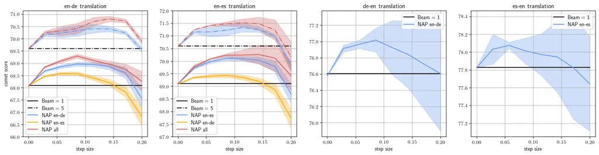
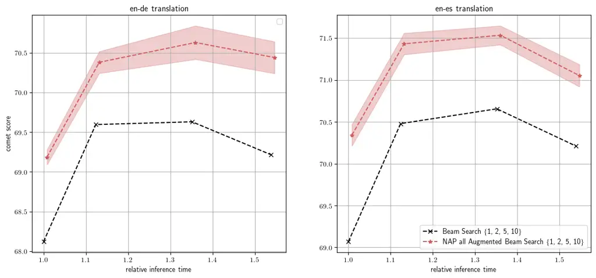
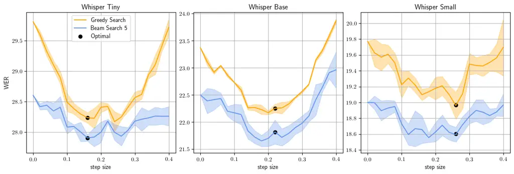
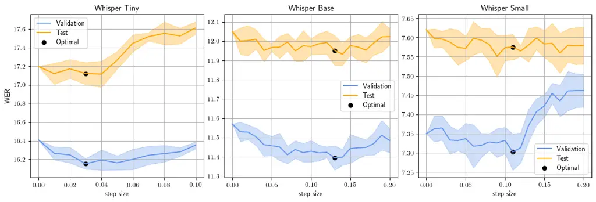

# Efficient Sample-Specific Encoder Perturbations

Yassir Fathullah Affiliation: ALTA Institute, Department of Engineering,
University of Cambridge    Mark J. F. Gales
Affiliation: yf286@cam.ac.uk, mjfg@eng.cam.ac.uk

###### Abstract

Encoder-decoder foundation models have displayed state-of-the-art
performance on a range of autoregressive sequence tasks. This paper
proposes a simple and lightweight modification to such systems to
control the behaviour according to a specific attribute of interest.
Specifically, we show that a small proxy network can be used to find a
sample-by-sample perturbation of the encoder output of a frozen
foundation model to trigger the decoder to generate improved decodings.
This work explores a specific realization of this framework focused on
improving the COMET performance of Flan-T5 on Machine Translation and
the WER of Whisper foundation models on Speech Recognition. Results
display consistent improvements in performance evaluated through COMET
and WER respectively. Furthermore, experiments also show that the
proxies are robust to the exact nature of the data used to train them
and can extend to other domains.

## 1 Introduction

Encoder-decoder models have displayed state-of-the-art performance in a
wide range of sequence tasks Sutskever et al. (2014) including Machine
Translation (MT) Vaswani et al. (2017); Xue et al. (2021), Abstractive
Text Summarization & Question Answering Chung et al. (2022) and
Automatic Speech Recognition (ASR) Chiu et al. (2018). However, the
standard approach to training these systems often relies on
teacher-forcing with the likelihood criteria, e.g. next token prediction
of the reference sequence. While this framework has been shown
successful and reliable in the tasks above, often the desired criteria
are some sequence-level non-differentiable performance measures. In MT
the desired criteria was the n-gram-based (Sacre)BLEU Post (2018),
overtaken more recently by the neural-based COMET Rei et al. (2020)
evaluation metric. In ASR the criteria is the word error rate (WER)
measuring the rate of substitutions, insertions, and deletions between
the decoded output and the reference.

Prior work has addressed the exposure bias arising from training in
teacher-forcing Williams and Zipser (1989) and the loss mismatch between
the likelihood and the desired sequence-level loss Bengio et al. (2015);
Lamb et al. (2016); Gu et al. (2019); Sabour et al. (2019); Wu et al.
(2018); Ranzato et al. (2016); Bahdanau et al. (2017); Wiseman et al.
(2016); Kim and Rush (2016). Both of these approaches modify the
training so it more closely links with how the model would be used
during deployment. However, in the regime of large pre-trained
foundation models, re-training such systems is computationally expensive
and unstable. Other approaches attack this problem at inference time by
merging outputs from several systems guided by appropriate
sequence-level metrics Sim et al. (2007); Kumar and Byrne (2004);
Freitag et al. (2022); Rosti et al. (2007a); Rosti et al. (2007b);
Manakul et al. (2023a). Whilst these approaches have shown promising
gains, they rely on the use of ensembles which have significantly higher
computational costs. Furthermore, they are not generalizable to any
metric.

In this paper, we propose a novel, simple and efficient approach to
modify the behaviour of a single frozen pre-trained encoder-decoder
foundation model. We show that it is possible to perturb the outputs of
the encoder to trigger the decoder to produce better-performing
decodings according to some pre-selected generic attribute. Unlike prior
approaches, our novel proposal applies to frozen pre-trained systems and
only leads to an insignificant increase in runtime. This paper is
focused on showing the efficacy of the approach in improving the COMET
performance of Flan-T5 Chung et al. (2022) on NMT and the WER
performance of Whisper Radford et al. (2022) on ASR. Furthermore, the
approach is generalizable and applicable to other attributes such as the
sentiment of outputs.

## 2 Background

Reinforcement Learning (RL) and Minimum Bayes Risk (MBR) decoding have
been two paradigms used to align a sequence model and minimize the
impact of exposure bias. The former is traditionally used to improve the
training while the latter is used to modify the decoding procedure. Both
come with their own sets of advantages and disadvantages. While often
leading to better performance, these approaches are often expensive to
use during training and/or inference. In the works of Bahdanau et al.
(2017); Lamb et al. (2016), a second network is used, either as a critic
in an actor-critic framework Barto et al. (1983); Sutton (1984) or as a
discriminator in a generative adversarial framework Goodfellow et al.
(2014). The aim of both of these networks, although mechanically
different, is to ensure the training procedure resembles the inference
stage, minimising the effect of exposure bias. On the other hand, the
work of Freitag et al. (2022) explored a post-training approach in which
the Minimum Bayes Risk decoder samples many sequences from the system
and chooses the sample with the lowest risk. However, the efficacy of
this system is highly dependent on being able to sample a large set of
outputs, a feat not possible for large pre-trained systems.
Alternatively, Manakul et al. (2023b) applies this approach to an
ensemble of similarly performing systems, without regard to the
inference cost. There is also a body of work on memory and
inference-efficient adaptation of foundation models such as
prefix-tuning Li and Liang (2021) and low-rank adaptation Hu et al.
(2022). These approaches are effective at adapting a foundation model to
a certain task at the cost of degrading other abilities. In addition,
these approaches still require back-propagating through the whole
foundation model making them potentially expensive to train and mainly
target teacher-forcing likelihood training. Finally, the work of
Fathullah et al. (2023a) introduced a general framework in which an
encoder is extended with a small Non-Autoregressive Proxy (NAP) trained
to directly capture an arbitrary metric. While only applicable to
encoder-decoder systems, it showed that estimates produced by NAP
systems were useful in downstream tasks.

## 3 Perturbations of Encoders

The proposal’s core is a flexible and efficient approach for augmenting
the behaviour of an encoder on a sample-by-sample basis to trigger a
better decoder performance. The starting point for such a goal will be
the recently introduced Non-Autoregressive Proxy (NAP). While the
original work trained the network on a specific metric and used the
estimates at runtime to directly perform various downstream tasks, we
will extend the view of this network to a differentiable approximation
of a sequence-level metric, and use the gradients of this approximation
to improve performance.

Let $`\bm{\phi}_{\tt e}`$ and $`\bm{\phi}_{\tt d}`$ represent the
parameters of some encoder and decoder network, and let $`\bm{x}`$ be
some input (token or embedding) sequence At inference time we have
$`\bm{e}_{1:L}=\bm{f}(\bm{x};\bm{\phi}_{\tt e})`$ where $`\bm{e}_{1:L}`$
represents a sequence of $`L`$ encoder embeddings that are consumed by
the decoder. The decoder, through an autoregressive process, produces an
output sequence $`\hat{\bm{y}}=\bm{f}(\bm{e}_{1:L};\bm{\phi}_{\tt d})`$.
We aim to find a sample-specific perturbation $`\bm{\delta}_{1:L}`$ to
the sequence of encoder outputs such that
$`\bar{\bm{y}}=\bm{f}(\bm{e}_{1:L}+\bm{\delta}_{1:L};\bm{\phi}_{\tt d})`$
gives us a higher score according to some score $`\mathcal{S}`$ (e.g.
COMET):

```math
\displaystyle\mathcal{S}(\bm{y},\bar{\bm{y}};\bm{x})>\mathcal{S}(\bm{y},\hat{\bm{y}};\bm{x}) \tag{1}
```

where $`\bm{y}`$ is the reference sequence. To find a good perturbation
we first train a lightweight Non-Autoregressive Proxy on top of the
encoder to approximate the score
$`f(\bm{e};\phi_{\tt nap})\approx\mathcal{S}(\bm{y},\hat{\bm{y}};\bm{x})`$
where $`\phi_{\tt nap}`$ represent the NAP parameters. Once this is
achieved, the gradient of the NAP can be used to find a good
perturbation to the encoder outputs of a certain sample $`\bm{x}`$,
making the approach sample specific:

```math
\displaystyle\hskip-2.84526pt\hskip-2.84526pt\bm{\delta}_{i}=\hskip-0.85358pt\alpha\hskip-0.85358pt\left|\bm{e}_{i}\right|\hskip-0.85358pt\left|\frac{\partial f(\bm{e}_{1:L};\phi_{\tt nap})}{\partial\bm{e}_{i}}\right|^{-1}\hskip-1.42262pt\frac{\partial f(\bm{e}_{1:L};\phi_{\tt nap})}{\partial\bm{e}_{i}} \tag{2}
```

where $`i=1,\dots,L`$. We normalize for the size of the gradient and the
encoder L2-norms and include a hyperparameter $`\alpha`$ to control the
perturbation size. Small perturbations will have no impact while large
changes can lead to a degradation in performance. Therefore, the choice
of $`\alpha`$ is important and is based on some validation set. Note
that our approach is aimed to be a lightweight and cheap method for
obtaining performance gains, and is not designed to achieve
state-of-the-art performance. Furthermore, to the best of the authors’
knowledge, no prior approaches exist for augmenting the behaviour of
frozen encoder-decoder systems according to any criteria $`\mathcal{S}`$
which can be anything from COMET and SacreBLEU to the sentiment of the
output.



Figure 1: Modifying encoder outputs using the gradient of a NAP. This
shows how the performance changes when we vary the step size $`\alpha`$
of the modification. The error represents 1 standard deviation. The
various figures show the translation task in the title and NAPs (data
each was trained on) in the legend.



Figure 2: Modifying encoder outputs using the gradient of a NAP. This
shows the overall performance of various beams using an optimal fixed
$`\alpha=0.50`$ based on the validation sets. The error represents 1
standard deviation.

## 4 Experimental Evaluation

The first set of experiments aim to evaluate the efficacy of the
gradient perturbation approach on NMT using the pre-trained Flan-T5. We
resort to the OPUS-100 Zhang et al. (2020) dataset and use two splits,
the English to German (en$`\to`$de) and the English to Spanish
(en$`\to`$es) splits, each with a training set of 1M sentence pairs. For
each, we use the Flan-T5 system to decode the data using greedy search
with a maximum of 128 output tokens. The decodings are scored using
COMET (Unbabel/wmt22-comet-da) Rei et al. (2020). Following Fathullah
et al. (2023a) we train a small NAP on the Flan-T5 encoder to predict
these COMET scores, using the Pearson correlation loss, training details
provided in Appendix A.1. Each experiment is repeated 3 times.

|             |                  |                  |                  |                  |
| ----------- | ---------------- | ---------------- | ---------------- | ---------------- |
| Train       | Eval             |                  |                  |                  |
|             | en$`\to`$de      | en$`\to`$es      | de$`\to`$en      | es$`\to`$en      |
| en$`\to`$de | 75.6 $`\pm`$ 0.1 | 54.8$`\pm`$ 0.4  | 52.1 $`\pm`$ 1.6 | 38.7 $`\pm`$ 1.9 |
| en$`\to`$es | 65.7 $`\pm`$ 0.2 | 68.1 $`\pm`$ 0.1 | 52.4 $`\pm`$ 0.4 | 35.2 $`\pm`$ 1.4 |

Table 1: NAP Pearson correlation $`\uparrow`$.

Table 1 presents the Pearson correlation between the NAP predictions and
the COMET scores on various test sets. We observe that a proxy trained
on a specific translation pair can still obtain good correlation scores
on other splits and reverse directions. The worst performance is shown
when a proxy trained on en$`\to`$es pairs is evaluated on the reverse
direction displaying a correlation of 35.2%.



Figure 3: Modifying encoder outputs using the gradient of a NAP. This
shows how the performance changes when we vary the step size $`\alpha`$
of the modification. The optimal point was decided based on the minimum
WER found on the validation set.

Next, we take these NAPs and use the gradient with respect to the
encoder outputs to perform the augmentation detailed in Equation (2),
see Figure 1. This shows that the gradients derived from a lightweight
NAP trained on COMET scores can be used to obtain some performance
gains. While small steps $`\alpha`$ barely have an impact, large
$`\alpha`$ lead to a degradation in performance showcasing the
importance of finding a good $`\alpha`$. Furthermore, we find that
although the NAPs were trained on the COMET scores of greedy decodings,
they can still be used to improve beam search. We also observe that NAPs
trained in a certain translation direction can still be used for other
directions. For example, NAP en-es is still able to improve en-de
performance.

We also investigate this for a range of Flan-T5 models, see Table 2. In
all cases we use a fixed value of $`\alpha=0.50`$.

|                       |                  |                  |                  |
| --------------------- | ---------------- | ---------------- | ---------------- |
|                       | Small            | Base             | Large            |
| Greedy Search         | 58.8 $`\pm`$ 0.4 | 64.3 $`\pm`$ 0.4 | 68.1 $`\pm`$ 0.3 |
| \+ NAP en-de Perturb. | 61.4 $`\pm`$ 0.5 | 66.0 $`\pm`$ 0.4 | 69.9 $`\pm`$ 0.3 |

Table 2: Flan-T5 en-de COMET performance $`\uparrow`$.

From these sets of results, it is evident that smaller models benefit
more from the perturbation approach while larger more robust models show
smaller gains.

Furthermore, we apply this approach to a range of different-sized beam
search decodings, see Figure 2. For a small cost of performing a forward
and backward pass through the small NAP network, both translation pairs
show gains across all beams. Note, that the inference speed was measured
using an NVIDIA A100 80GBs leading to a disproportionally cheaper
runtime for larger beam sizes, since the GPU cores were not fully
exhausted for a single sample. Interestingly while we observe
improvements in COMET scores, the SacreBLEU score remained the same, see
Table 3.

|                     |                  |                  |
| ------------------- | ---------------- | ---------------- |
|                     | en$`\to`$de      | en$`\to`$es      |
| Greedy Search       | 19.8 $`\pm`$ 0.2 | 23.2 $`\pm`$ 0.3 |
| \+ NAP all Perturb. | 19.6 $`\pm`$ 0.2 | 23.3 $`\pm`$ 0.2 |

Table 3: Flan-T5 SacreBLEU $`\uparrow`$.

Upon further analysis of this phenomenon, we observed two factors
contributing to this effect. The first is that the proxy augmentation
would substitute certain tokens/words that have a "closer" meaning to
the reference but without any n-gram overlap. The second factor is
discussed in Stahlberg and Byrne (2019) in which translation systems
often terminate prematurely. The proxy-derived augmentation of the
encoder resolves this issue in a fraction of examples, but the
continuation of the translation often does not overlap with the words
occurring in the reference.

Finally, we repeat these experiments for the Whisper family on the AMI
meeting corpus, a challenging ASR task in which systems often display
very high word error rates. Following Fathullah et al. (2023a) we train
NAPs on the number of errors in a transcription produced by Whisper
{Tiny, Base, Small} using greedy search, see Appendix A.2 for details.
The performance of the augmentation is displayed in Figure 3. Four
observations made in these results are: (1) the proxy gradients are
beneficial for Whisper in the ASR task, (2) the validation and test sets
show correlating performance, (3) the step sizes are significantly
larger since the gradients from the NAP are significantly smaller and
(4) the improvement is smaller for the larger Whisper systems.
Concerning the last point, this behaviour was expected since larger more
robust systems potentially have a smaller room for improvement. Similar
experiments performed on LibriSpeech Panayotov et al. (2015), a
relatively easier speech recognition benchmark showcased small to no
gains supporting the claim that the benefits from our proposed approach
is highly dependent on the task given a certain model. The details of
the LibriSpeech experiments are included in Appendix B.

## 5 Conclusion

This paper presents a lightweight modification of frozen (pre-trained)
encoder-decoder systems by training a small network to predict a metric
and use this as a differentiable extension. The gradients of this small
proxy network have been shown useful in improving the performance on a
range of sequence tasks such as the Flan-T5 COMET performance on NMT and
Whisper WER performance on ASR.

## Limitations

The main issue raised by Fathullah et al. (2023a) was that NAPs were
specifically designed for encoder-decoder systems and might not be so
easily extended to decoder-only systems such as standard Large Language
Models Touvron et al. (2023a); Touvron et al. (2023b); Brown et al.
(2020); OpenAI (2023). Because of this limitation, our approach is also
limited to encoder-decoder systems. However, many multimodal language
models utilize modal-specific encoders Fathullah et al. (2023b);
Fathullah et al. (2023c); Lakomkin et al. (2023); Rubenstein et al.
(2023); Gong et al. (2023); Driess et al. (2023). Therefore, future work
could investigate applying our approach to augmented language models by
extending the modal-speific encoders with proxies to estimate the system
performance at certain tasks. Furthermore, one possible limitation of
our approach is its effectiveness on models that are already well
performing. Experiments investigating Whisper on LibriSpeech showcase a
very marginal change in WER performance which we attribute to Whisper’s
already good performance on the benchmark.

## Acknowledgements

This paper reports on research supported by the Gates Cambridge Trust
(grant OPP1144 from the Bill & Melinda Gates Foundation). This research
is further supported by Cambridge University Press & Assessment (CUP&A),
a department of The Chancellor, Masters, and Scholars of the University
of Cambridge.

## References

- Bahdanau et al. (2017) Dzmitry Bahdanau, Philemon Brakel, Kelvin Xu,
  Anirudh Goyal, Ryan Lowe, Joelle Pineau, Aaron Courville, and Yoshua
  Bengio. 2017. An actor-critic algorithm for sequence prediction. In
  _International Conference on Learning Representations (ICLR)_.
- Barto et al. (1983) Andrew G. Barto, Richard S. Sutton, and Charles W.
  Anderson. 1983. Neuronlike adaptive elements that can solve difficult
  learning control problems. _IEEE Transactions on Systems, Man, and
  Cybernetics_.
- Bengio et al. (2015) Samy Bengio, Oriol Vinyals, Navdeep Jaitly, and
  Noam Shazeer. 2015. Scheduled sampling for sequence prediction with
  recurrent neural networks. _Conference on Neural Information
  Processing Systems_.
- Blondel et al. (2020) Mathieu Blondel, Olivier Teboul, Quentin
  Berthet, and Josip Djolonga. 2020. Fast differentiable sorting and
  ranking. _International Conference on Machine Learning_.
- Brown et al. (2020) Tom Brown, Benjamin Mann, Nick Ryder, Melanie
  Subbiah, Jared D Kaplan, Prafulla Dhariwal, Arvind Neelakantan, Pranav
  Shyam, Girish Sastry, Amanda Askell, et al. 2020. Language models are
  few-shot learners. _Advances in neural information processing
  systems_, 33:1877–1901.
- Chiu et al. (2018) Chung-Cheng Chiu, Tara N Sainath, Yonghui Wu, Rohit
  Prabhavalkar, Patrick Nguyen, Zhifeng Chen, Anjuli Kannan, Ron J
  Weiss, Kanishka Rao, Ekaterina Gonina, et al. 2018. State-of-the-art
  speech recognition with sequence-to-sequence models. In _2018 IEEE
  international conference on acoustics, speech and signal processing
  (ICASSP)_, pages 4774–4778. IEEE.
- Chung et al. (2022) Hyung Won Chung, Le Hou, Shayne Longpre, Barret
  Zoph, Yi Tay, William Fedus, Eric Li, Xuezhi Wang, Mostafa Dehghani,
  Siddhartha Brahma, et al. 2022. Scaling instruction-finetuned language
  models. _arXiv preprint arXiv:2210.11416_.
- Driess et al. (2023) Danny Driess, Fei Xia, Mehdi S. M. Sajjadi, Corey
  Lynch, Aakanksha Chowdhery, Brian Ichter, Ayzaan Wahid, et al. 2023.
  Palm-e: An embodied multimodal language model. In _Proceedings of the
  40th International Conference on Machine Learning_, ICML’23. JMLR.org.
- Fathullah et al. (2023a) Yassir Fathullah, Puria Radmard, Adian
  Liusie, and Mark J. F. Gales. 2023a. Who needs decoders? efficient
  estimation of sequence-level attributes. _arXiv, arXiv:2305.05098_.
- Fathullah et al. (2023b) Yassir Fathullah, Chunyang Wu, Egor Lakomkin,
  Junteng Jia, Yuan Shangguan, Ke Li, Jinxi Guo, Wenhan Xiong, Jay
  Mahadeokar, Ozlem Kalinli, et al. 2023b. Prompting large language
  models with speech recognition abilities. _arXiv preprint
  arXiv:2307.11795_.
- Fathullah et al. (2023c) Yassir Fathullah, Chunyang Wu, Egor Lakomkin,
  Junteng Jia, Yuan Shangguan, Jay Mahadeokar, Ozlem Kalinli, Christian
  Fuegen, and Mike Seltzer. 2023c. Towards general-purpose speech
  abilities for large language models using unpaired data. _arXiv
  preprint arXiv:2311.06753_.
- Freitag et al. (2022) Markus Freitag, David Grangier, Qijun Tan, and
  Bowen Liang. 2022. [High quality rather than high model probability:
  Minimum Bayes risk decoding with neural
  metrics](https://doi.org/10.1162/tacl_a_00491). _Transactions of the
  Association for Computational Linguistics_, 10:811–825.
- Gong et al. (2023) Yuan Gong, Hongyin Luo, Alexander H Liu, Leonid
  Karlinsky, and James Glass. 2023. Listen, think, and understand.
  _arXiv preprint arXiv:2305.10790_.
- Goodfellow et al. (2014) Ian Goodfellow, Jean Pouget-Abadie, Mehdi
  Mirza, Bing Xu, David Warde-Farley, Sherjil Ozair, Aaron Courville,
  and Yoshua Bengio. 2014. Generative adversarial nets. _Advances in
  neural information processing systems_, 27.
- Gu et al. (2019) Jiatao Gu, Changhan Wang, and Jake Zhao. 2019.
  Levenshtein transformer. _Conference on Neural Information Processing
  Systems_.
- Hu et al. (2022) Edward J Hu, Yelong Shen, Phillip Wallis, Zeyuan
  Allen-Zhu, Yuanzhi Li, Shean Wang, Lu Wang, and Weizhu Chen. 2022.
  [LoRA: Low-rank adaptation of large language
  models](https://openreview.net/forum?id=nZeVKeeFYf9).
- Kim and Rush (2016) Yoon Kim and Alexander M. Rush. 2016.
  [Sequence-level knowledge
  distillation](https://doi.org/10.18653/v1/D16-1139). In _Proceedings
  of the 2016 Conference on Empirical Methods in Natural Language
  Processing_, pages 1317–1327, Austin, Texas. Association for
  Computational Linguistics.
- Kumar and Byrne (2004) Shankar Kumar and William Byrne. 2004. [Minimum
  Bayes-risk decoding for statistical machine
  translation](https://aclanthology.org/N04-1022). In _Proceedings of
  the Human Language Technology Conference of the North American Chapter
  of the Association for Computational Linguistics: HLT-NAACL 2004_,
  pages 169–176, Boston, Massachusetts, USA. Association for
  Computational Linguistics.
- Lakomkin et al. (2023) Egor Lakomkin, Chunyang Wu, Yassir Fathullah,
  Ozlem Kalinli, Michael L Seltzer, and Christian Fuegen. 2023.
  End-to-end speech recognition contextualization with large language
  models. _arXiv preprint arXiv:2309.10917_.
- Lamb et al. (2016) Alex Lamb, Anirudh Goyal, Ying Zhang, Saizheng
  Zhang, Aaron Courville, and Yoshua Bengio. 2016. Professor forcing: A
  new algorithm for training recurrent networks. _Conference on Neural
  Information Processing Systems_.
- Li and Liang (2021) Xiang Lisa Li and Percy Liang. 2021.
  [Prefix-tuning: Optimizing continuous prompts for
  generation](https://doi.org/10.18653/v1/2021.acl-long.353). In
  _Proceedings of the 59th Annual Meeting of the Association for
  Computational Linguistics and the 11th International Joint Conference
  on Natural Language Processing (Volume 1: Long Papers)_, pages
  4582–4597, Online. Association for Computational Linguistics.
- Manakul et al. (2023a) Potsawee Manakul, Yassir Fathullah, Adian
  Liusie, Vyas Raina, Vatsal Raina, and Mark Gales. 2023a. [CUED at
  ProbSum 2023: Hierarchical ensemble of summarization
  models](https://doi.org/10.18653/v1/2023.bionlp-1.51). In _The 22nd
  Workshop on Biomedical Natural Language Processing and BioNLP Shared
  Tasks_, pages 516–523, Toronto, Canada. Association for Computational
  Linguistics.
- Manakul et al. (2023b) Potsawee Manakul, Adian Liusie, and Mark JF
  Gales. 2023b. Selfcheckgpt: Zero-resource black-box hallucination
  detection for generative large language models. _arXiv preprint
  arXiv:2303.08896_.
- OpenAI (2023) OpenAI. 2023. [Gpt-4 technical
  report](https://api.semanticscholar.org/CorpusID:257532815). _ArXiv_,
  abs/2303.08774.
- Panayotov et al. (2015) Vassil Panayotov, Guoguo Chen, Daniel Povey,
  and Sanjeev Khudanpur. 2015. Librispeech: An asr corpus based on
  public domain audio books. _International Conference on Acoustics,
  Speech and Signal Processing (ICASSP)_.
- Post (2018) Matt Post. 2018. A call for clarity in reporting BLEU
  scores. _Conference on Machine Translation: Research Papers_.
- Radford et al. (2022) Alec Radford, Jong Wook Kim, Tao Xu, Greg
  Brockman, Christine McLeavey, and Ilya Sutskever. 2022. Robust speech
  recognition via large-scale weak supervision. _arXiv,
  arXiv:2212.04356_.
- Ranzato et al. (2016) Marc’Aurelio Ranzato, Sumit Chopra, Michael
  Auli, and Wojciech Zaremba. 2016. Sequence level training with
  recurrent neural networks. In _International Conference on Learning
  Representations (ICLR)_.
- Rei et al. (2020) Ricardo Rei, Craig Stewart, Ana C Farinha, and Alon
  Lavie. 2020. Comet: A neural framework for mt evaluation. _Association
  for Computational Linguistics_.
- Rosti et al. (2007a) Antti-Veikko Rosti, Necip Fazil Ayan, Bing Xiang,
  Spyros Matsoukas, Richard Schwartz, and Bonnie Dorr. 2007a. [Combining
  outputs from multiple machine translation
  systems](https://aclanthology.org/N07-1029). In _Human Language
  Technologies 2007: The Conference of the North American Chapter of the
  Association for Computational Linguistics; Proceedings of the Main
  Conference_, pages 228–235, Rochester, New York. Association for
  Computational Linguistics.
- Rosti et al. (2007b) Antti-Veikko Rosti, Spyros Matsoukas, and Richard
  Schwartz. 2007b. [Improved word-level system combination for machine
  translation](https://aclanthology.org/P07-1040). In _Proceedings of
  the 45th Annual Meeting of the Association of Computational
  Linguistics_, pages 312–319, Prague, Czech Republic. Association for
  Computational Linguistics.
- Rubenstein et al. (2023) Paul K Rubenstein, Chulayuth Asawaroengchai,
  Duc Dung Nguyen, Ankur Bapna, Zalán Borsos, Félix de Chaumont Quitry,
  Peter Chen, Dalia El Badawy, Wei Han, Eugene Kharitonov, et al. 2023.
  Audiopalm: A large language model that can speak and listen. _arXiv
  preprint arXiv:2306.12925_.
- Sabour et al. (2019) Sara Sabour, William Chan, and Mohammad
  Norouzi. 2019. Optimal completion distillation for sequence learning.
  _International Conference on Learning Representations (ICLR)_.
- Sim et al. (2007) K. C. Sim, W. J. Byrne, M. J. F. Gales, H. Sahbi,
  and P. C. Woodland. 2007. Consensus network decoding for statistical
  machine translation system combination. _2007 IEEE International
  Conference on Acoustics, Speech and Signal Processing - ICASSP ’07_.
- Stahlberg and Byrne (2019) Felix Stahlberg and Bill Byrne. 2019. [On
  NMT search errors and model errors: Cat got your
  tongue?](https://doi.org/10.18653/v1/D19-1331) In _Proceedings of the
  2019 Conference on Empirical Methods in Natural Language Processing
  and the 9th International Joint Conference on Natural Language
  Processing (EMNLP-IJCNLP)_, pages 3356–3362, Hong Kong, China.
  Association for Computational Linguistics.
- Sutskever et al. (2014) Ilya Sutskever, Oriol Vinyals, and Quoc V
  Le. 2014. Sequence to sequence learning with neural networks.
  _Advances in neural information processing systems_, 27.
- Sutton (1984) Richard Stuart Sutton. 1984. Temporal credit assignment
  in reinforcement learning.
- Touvron et al. (2023a) Hugo Touvron, Thibaut Lavril, Gautier Izacard,
  Xavier Martinet, Marie-Anne Lachaux, Timothée Lacroix, Baptiste
  Rozière, Naman Goyal, Eric Hambro, Faisal Azhar, et al. 2023a. Llama:
  Open and efficient foundation language models. _arXiv preprint
  arXiv:2302.13971_.
- Touvron et al. (2023b) Hugo Touvron, Louis Martin, Kevin Stone, Peter
  Albert, Amjad Almahairi, Yasmine Babaei, Nikolay Bashlykov, Soumya
  Batra, Prajjwal Bhargava, Shruti Bhosale, et al. 2023b. Llama 2: Open
  foundation and fine-tuned chat models. _arXiv preprint
  arXiv:2307.09288_.
- Vaswani et al. (2017) Ashish Vaswani, Noam Shazeer, Niki Parmar, Jakob
  Uszkoreit, Llion Jones, Aidan N Gomez, Łukasz Kaiser, and Illia
  Polosukhin. 2017. Attention is all you need. _Advances in neural
  information processing systems_, 30.
- Williams and Zipser (1989) Ronald J. Williams and David Zipser. 1989.
  A learning algorithm for continually running fully recurrent neural
  networks. _Neural Computation_.
- Wiseman et al. (2016) Sam Wiseman, Alexander M. Rush, and Stuart M.
  Shieber. 2016. [Learning global features for coreference
  resolution](https://doi.org/10.18653/v1/N16-1114). In _Proceedings of
  the 2016 Conference of the North American Chapter of the Association
  for Computational Linguistics: Human Language Technologies_, pages
  994–1004, San Diego, California. Association for Computational
  Linguistics.
- Wu et al. (2018) Lijun Wu, Fei Tian, Tao Qin, Jianhuang Lai, and
  Tie-Yan Liu. 2018. A study of reinforcement learning for neural
  machine translation. _Conference on Empirical Methods in Natural
  Language Processing_.
- Xue et al. (2021) Linting Xue, Noah Constant, Adam Roberts, Mihir
  Kale, Rami Al-Rfou, Aditya Siddhant, Aditya Barua, and Colin
  Raffel. 2021. mt5: A massively multilingual pre-trained text-to-text
  transformer. In _Proceedings of the 2021 Conference of the North
  American Chapter of the Association for Computational Linguistics:
  Human Language Technologies_, pages 483–498.
- Zhang et al. (2020) Biao Zhang, Philip Williams, Ivan Titov, and Rico
  Sennrich. 2020. [Improving massively multilingual neural machine
  translation and zero-shot
  translation](https://doi.org/10.18653/v1/2020.acl-main.148). In
  _Proceedings of the 58th Annual Meeting of the Association for
  Computational Linguistics_, pages 1628–1639, Online. Association for
  Computational Linguistics.

Figure 4: The proxy setup: Preemptively obtain an approximate score for
the system performance through the encoder, circumventing the
autoregressive decoding. The score can be differentiated with respect to
encoder outputs in order to augment the system behaviour.

## Appendix A Setup & Training Details

This section will cover the details of the experiments performed in this
paper. See Figure 4 for a visual setup of the approach. In all
experiments the MLP/proxy network consist of an attention layer with a
single trainable query in order to pool the encoder output sequence,
followed by three linear layers,
$`\mathbb{R}^{d_{\tt model}}\to\mathbb{R}^{d_{\tt ffn}}`$,
$`\mathbb{R}^{d_{\tt ffn}}\to\mathbb{R}^{d_{\tt ffn}}`$ and
$`\mathbb{R}^{d_{\tt ffn}}\to\mathbb{R}`$, where $`d_{\tt model}`$ is
the model dimension following the convention in Vaswani et al. (2017)
and $`d_{\tt ffn}`$ is the feed forward dimension. The parameter sizes
of the NAPs are the same as in Fathullah et al. (2023a), see Table 4.
Note that although the proxy network on top of the encoder can have a
relatively large size it is significantly faster since it pools the
sequence of vectors and the 3 linear layers only operate on a single
vector.

|               |        |       |
| ------------- | ------ | ----- |
| Name          | Model  | Proxy |
| Flan-T5 Large | 737.7M | 20.9M |
| Whisper Tiny  | 37.8M  | 3.6M  |
| Whisper Base  | 72.6M  | 6.3M  |
| Whisper Small | 241.7M | 14.2M |

Table 4: NAP parameter sizes

### A.1 Neural Machine Translation

We follow the training details provided by Fathullah et al. (2023a) as
closely as possible. We generated COMET scores from Flan-T5 Large on the
training set of OPUS-100 and used them to train NAP models. We used the
Pearson Correlation loss since Fathullah et al. (2023a) found a small
difference in performance between this and the smooth extension to the
Spearman Rank loss Blondel et al. (2020). All experiments used a
learning rate of 0.0001, with a maximum batch size and training was
stopped when performance did not improve after an epoch.

### A.2 Automatic Speech Recognition

Similar to the section above: We generated WER scores from Whisper
{Tiny, Base, Small} on the training set of AMI-IHM and used them to
train NAP models. We used the Pearson Correlation loss. All experiments
used a learning rate of 0.0001, with a maximum batch size and training
was stopped when performance did not improve after an epoch.



Figure 5: LibriSpeech other: Modifying encoder outputs using the
gradient of a NAP. This shows how the performance changes when we vary
the step size $`\alpha`$ of the modification. The optimal point was
decided based on the minimum WER found on the validation set.

## Appendix B Whisper on LibriSpeech

Our experiments on the AMI corpus showed that perturbing the encoder
outputs on a sample-by-sample basis could lead to WER performance
improvements. However, the results in Figure 5 paint a different story
for LibriSpeech other sets. All systems showcase a much smaller
improvement and the gain is smaller for the larger Whisper systems.
Since LibriSpeech is comparatively an easier benchmark, a corpus of
clearly read audio books, we expect that the lack of performance
improvements is due to the simplicity of the task. The Whisper systems
are already performing well. AMI on the other hand represent a meeting
corpus which does involve speakers speaking simultaneously and more
challenging scenarios.
