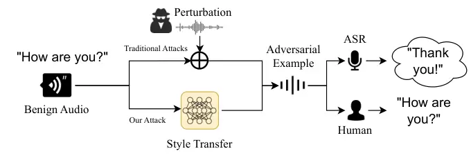
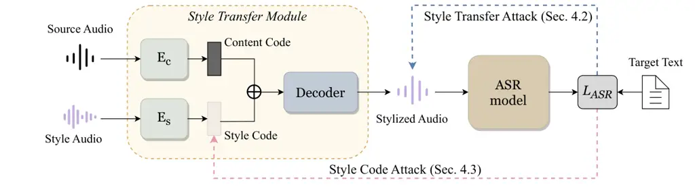
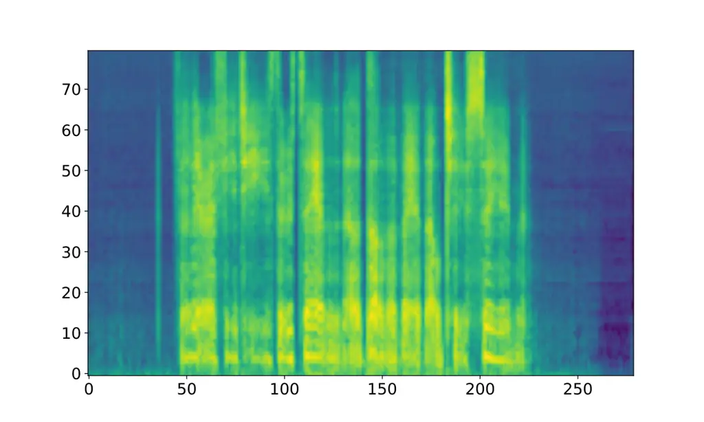
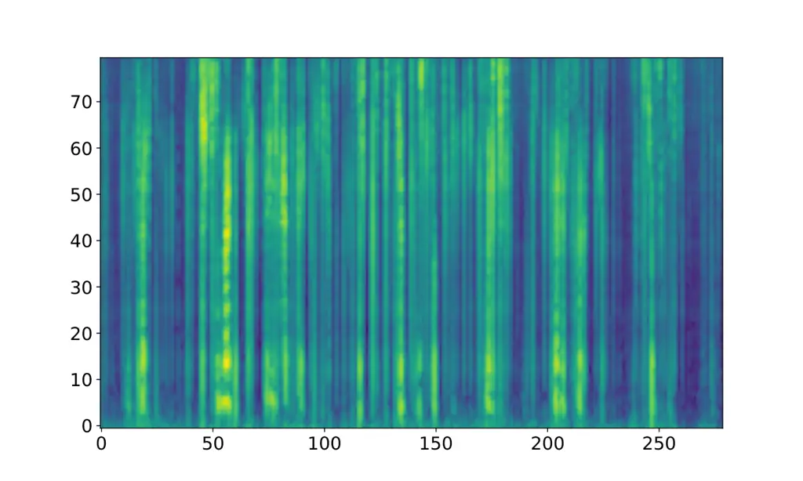
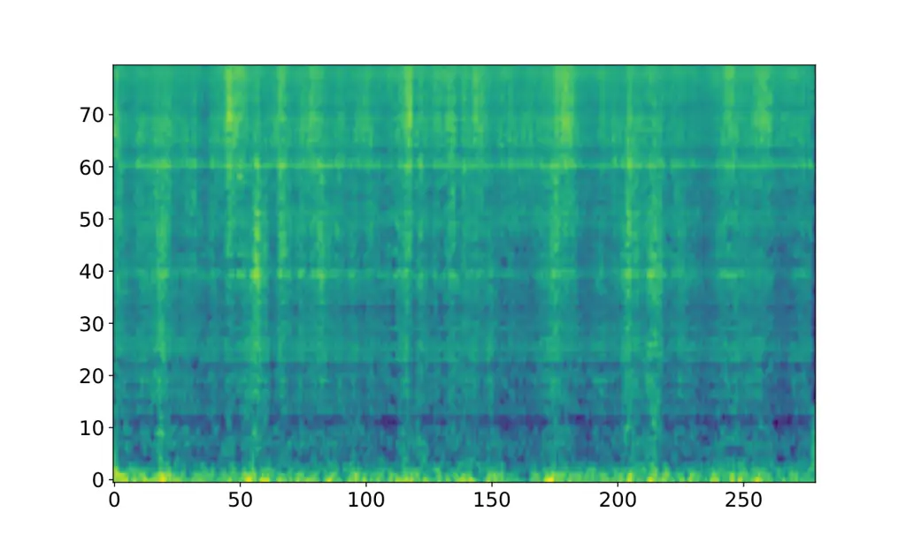

# Towards Evaluating the Robustness of Automatic Speech Recognition Systems via Audio Style Transfer

Weifei Jin email: <weifeijin@bupt.edu.cn> Affiliation: Beijing
University of Posts and Telecommunications, China , Yuxin Cao email:
<caoyx21@mails.tsinghua.edu.cn> Affiliation: Tsinghua University, China
, Junjie Su email: <sujunjie@bupt.edu.cn> Affiliation: Beijing
University of Posts and Telecommunications, China , Qi Shen email:
<shenqi629@bupt.edu.cn> Affiliation: Beijing University of Posts and
Telecommunications, China , Kai Ye email: <yek21@mails.tsinghua.edu.cn>
Affiliation: Tsinghua University, China , Derui Wang email:
<derui.wang.edu@gmail.com> Affiliation: CSIRO’s Data61, Australia , Jie
Hao Note: Corresponding author. email: <haojie@bupt.edu.cn>
Affiliation: Beijing University of Posts and Telecommunications, China
and Ziyao Liu email: <liuziyao@ntu.edu.sg> Affiliation: Nanyang
Technological University, Singapore

© none

###### Abstract.

In light of the widespread application of Automatic Speech Recogni-tion
(ASR) systems, their security concerns have received much more attention
than ever before, primarily due to the susceptibility of Deep Neural
Networks. Previous studies have illustrated that surreptitiously
crafting adversarial perturbations enables the manipulation of speech
recognition systems, resulting in the production of malicious commands.
These attack methods mostly require adding noise perturbations under
$`\ell_{p}`$ norm constraints, inevitably leaving behind artifacts of
manual modifications. Recent research has alleviated this limitation by
manipulating style vectors to synthesize adversarial examples based on
Text-to-Speech (TTS) synthesis audio. However, style modifications based
on optimization objectives significantly reduce the controllability and
editability of audio styles. In this paper, we propose an attack on ASR
systems based on user-customized style transfer. We first test the
effect of Style Transfer Attack (STA) which combines style transfer and
adversarial attack in sequential order. And then, as an improvement, we
propose an iterative Style Code Attack (SCA) to maintain audio quality.
Experimental results show that our method can meet the need for
user-customized styles and achieve a success rate of 82% in attacks,
while keeping sound naturalness due to our user study.

## 1. Introduction



Figure 1. Comparison between our attack and traditional attacks.



Figure 2. An overview of STA and SCA.

It has become widely acknowledged that Deep Neural Networks (DNNs) are
vulnerable to adversarial attacks (1), indicating that slight
perturbations can cause models to make errors or degrade in performance
without altering semantics. In the speech domain, Automatic Speech
Recognition (ASR) systems are extensively used (2, 3), embedded in
various smart devices such as voice assistants (4, 5), and widely
employed in providing subtitles for short videos which have enjoyed high
popularity in the last decade (6). Given these realities, the potential
harm posed by adversarial attacks on ASR models is significant. For
instance, attackers could use well-crafted adversarial examples to
mislead voice assistants, causing them to execute malicious commands.
Therefore, exploring potential attacks that ASR models may face is
urgently needed and essential.

In recent years, a lot of research has been devoted to investigate
adversarial attacks on ASR models (7, 8, 9). Most of these works involve
adding perturbations to benign audio to generate adversarial examples
that deceive ASR models. The underlying premise is to limit the
magnitude of perturbations to preserve semantics, with small
perturbations being imperceptible to humans. However, these
perturbation-based methods inevitably leave traces of manual
modifications, which can be exploited to better defend against such
attacks (10, 11, 12).

To maintain the imperceptibility and audio quality of adversarial
examples, recent works have loosen the traditional constraints on
perturbations in adversarial attacks, thus evading defenses detecting
artifacts from perturbations limited by $`\ell_{p}`$ norm constraints.
One study employs Text-to-Speech (TTS) synthesis to generate adversarial
examples by iteratively inputting style vectors into the TTS model to
achieve attack objectives, resulting in significant changes in the audio
waveform of the generated examples (13). Another study, SMACK (14),
manipulates prosody vectors at a fine granularity and then similarly
uses a TTS model to introduce semantically meaningful adversarial audio
examples. However, directly iterating over style vectors based on
optimization objectives results in generated audio styles that are not
under user control.

To address the limitation of controllability of audio attacks and
explore the potential attacks in the aforementioned conditions, we
propose a user-customized style transfer attack, enabling users to
select desired styles and generate corresponding adversarial examples,
which are not only harder to defend against and perceive but also
support user-customized styles. The difference between our attack and
traditional attacks is illustrated in Figure 1. Concretely, our attack
considers the following application scenario. To avoid re-recording
videos due to minor flaws and improve the efficiency of video creation,
content creators on short video platforms, such as podcasts, TikTok, and
YouTube, have diverse preferences for the style of their speech and
typically do not want to change their voice. Then, the attacker can
masquerade as a provider of speech style transfer services, which can
not only customize speech styles based on user preferences that
conveniently align with their needs, but also transform normal
user-input speech into adversarial examples through the provided speech
style transfer service. These examples may then produce undesirable
outcomes in downstream ASR tasks when the videos are released online.

Specifically, we propose two attack schemes, Style Transfer Attack (STA)
and Style Code Attack (SCA), as illustrated in Figure 2. STA involves
concatenating style transfer with adversarial attacks. The input audio
undergoes style transfer before perturbations are added. This approach
leverages the characteristics of style transfer to mitigate certain
constraints of traditional adversarial attacks, making it more difficult
to be defended. However, this method still inevitably introduces noise
artifacts. To address this limitation, we apply an iterative
optimization process to the style transfer model internally, proposing
SCA. The basic principle is as follows: a speech segment is transformed
into different style codes after passing through various style encoders.
The decoder then generates the final audio based on these style codes,
combined with content encoding. Each style code corresponds to the style
of the generated audio. By perturbing these style codes, we can ensure
that the synthesized audio still exhibits the style corresponding to the
initial style audio, while potentially causing transcription errors by
the ASR model, thus achieving the attack objective.

Our contributions are summarized as follows:

- •
  We propose a new adversarial audio attack method based on style
  transfer, which not only breaks the traditional adversarial
  perturbation constraint but also supports customized styles.
- •
  We utilize style encoders to extract style information and perturb
  style codes, ensuring that the style remains unchanged while improving
  the naturalness and quality of the adversarial examples.
- •
  The experimental results demonstrate the effectiveness and feasibility
  of our attack. Our user study also shows that our adversarial audio
  examples are indeed relatively more natural and harder to perceive by
  humans.

## 2. Related Work

In this section, we first briefly introduce audio style transfer and its
development in recent years, followed by an overview of audio
adversarial attacks against intelligent speech systems.

### 2.1. Audio Style Transfer

Audio style transfer aims to transform the style of an audio clip to
match that of a target audio clip while preserving the semantic content
of the original audio. Similar to image style transfer such as  (15),
Grinstein *et al.* (16) employed a style loss function to iteratively
adjust the target audio, gradually aligning its style with that of the
input style audio, thereby achieving style transfer in the end.
AutoVC (17) is a voice conversion system utilizing an autoencoder
architecture capable of achieving zero-shot audio style transfer. Later,
SpeechSplit (18) effectively decomposes a speech into four components:
content, pitch, rhythm, and timbre. SpeechSplit2.0 (19) alleviates the
laborious bottleneck tuning through advanced speech signal processing
techniques. Recently, numerous text-to-speech (TTS) models have achieved
high-quality style transfer (20, 21, 22, 23).

### 2.2. Audio Adversarial Attack

Audio adversarial examples (24, 25) are generated to deceive intelligent
speech systems such as ASR models (2). Carlini and Wagner implemented
targeted attacks against ASR models for arbitrary-length text (26).
Subsequently, Taori *et al.* (27) extended this to a black-box setting
using genetic algorithms. Afterwards, many studies focused on aspects
such as the robustness(28, 29, 30), generation speed(7, 31, 32), and
perceptibility(33, 34, 35, 36, 37) of adversarial examples. Qu _et al._
(13) were the first to use TTS models to generate audio adversarial
examples without requiring source audio input. A recent work,
SMACK (14), achieved semantically meaningful audio adversarial attacks
by modifying prosody vectors. Different from the aforementioned
approaches, our method not only improved the naturalness of the audio
while reducing the perceptibility of the generated examples, but also
enables the modification of audio into user-customized styles.

## 3. Threat Model

Attacker’s Objective. Given an ASR model, the attacker’s objective is to
conduct targeted attacks in the digital domain. This is achieved by
generating an audio adversarial example, causing its transcription by
the ASR model to be inconsistent with the corresponding ground truth
text. To minimize human detection, the attacker aims to enhance the
quality and naturalness of the generated adversarial example while
ensuring its content remains unchanged.

Attacker’s Background Knowledge. Consistent with previous work (13, 28),
we operate under a white-box setting, wherein the attacker has access to
the model architecture and parameter information. This allows the
attacker to directly compute gradients through back-propagation and
update their optimization objective.

Attack Scenario. We assume that the attacker masquerades as a speech
style transfer service provider, which can help users customize the
style of speech modifications, such as adjusting the speech speed or
modifying certain parts of a singing recording’s pitch. This is
applicable to many everyday scenarios, such as students who submit audio
assignments, teachers who record lecture videos, or social media
influencers who share food and fashion content. In these cases, users
typically do not want their voices to sound like someone else’s,
indicating that the timbre should not change. The speech style transfer
service disguised by the attacker can fulfill this requirement. However,
the audio generated through the service provided by the attacker can
also carry imperceptible adversarial noise, which can deceive ASR models
into making transcription errors. These examples, when fed into ASR
models (_e.g.,_ automatic subtitles for videos), may leak false
information. Once these examples are disseminated through the network,
they can lead to negative consequences.

## 4. Methodology

In this section, we first provide the definition of the optimization
problem for generating adversarial examples against ASR. Then, we
elaborate on the two proposed attack schemes.

### 4.1. Problem Definition

Given a well-trained ASR model $`f`$ and an input audio clip $`x`$, the
attacker’s objective is to optimize the following loss function.

```math
\displaystyle\mathop{\min}\limits_{x^{\prime}} \displaystyle{\displaystyle L_{ASR}}\left({f\left({x^{\prime}}\right),t}\right), \tag{1}
```

```math
\displaystyle\mbox{s.t.} \displaystyle f\left({x^{\prime}}\right)={t},g\left(x^{\prime}\right)=g\left(x\right),
```

where $`x^{\prime}`$ stands for the adversarial audio that the attacker
hopes to find, $`t`$ denotes the target text that is different from
$`t`$, and that the attacker expects the ASR model to transcribe, $`g`$
represents the transcription result perceived by humans.

For $`L_{ASR}`$, following prior work (26, 13, 28), we introduce the
Connectionist Temporal Classification (CTC) loss (38), which is commonly
used for sequence labeling tasks, particularly suitable for scenarios
without aligned labels, such as frame-level annotations in speech
recognition. It aggregates across various alignments of the input
sequence to find the most probable output sequence, thereby computing
the loss. Let $`F`$ denote the probability distribution output by the
ASR model, and let $`D_{g}`$ represent a decoder, such as a greedy
decoder, which is used to decode the probability distribution
$`F\left(x\right)`$ output by the ASR model into a transcription. Thus,
$`f\left(x\right)=D_{g}\left(F\left(x\right)\right)`$. Then the CTC loss
is calculated by:

```math
L_{CTC}\left(x,t\right)=-\log\sum_{\pi\in\Pi\left(t\right)}\prod_{i}F\left(x\right)_{\pi_{i}}^{i}, \tag{2}
```

where $`\Pi\left(t\right)`$ denotes the alignment set derived from the
targeted transcription $`t`$, $`\pi`$ is an alignment of $`t`$,
satisfying that $`\pi`$ can be reduced to $`t`$, and the length of
$`\pi`$ equals that of $`t`$, $`F\left(x\right)_{\pi_{i}}^{i}`$ denotes
the probability of $`\pi_{i}`$ in the $`i`$-th frame.

Input: ASR model $`f`$, source audio $`{x}`$, style audio $`x_{s}`$,
target text $`t`$, style transfer model $`G`$, Levenshtein Distance
$`D_{L}`$, maximum iteration number $`N`$, intensity width threshold of
the perturbation $`b`$, learning rate $`\alpha`$, weighting factor
$`\lambda`$, loss function $`L_{ASR}`$.

Output: Adversarial audio $`x_{STA}`$.

1 $`z\leftarrow G\left(x,x_{s}\right)`$;

2 $`\epsilon\leftarrow b\cdot|z|`$;

3 Initialize $`w`$ with random value from $`N\left(0,1\right)`$;

4 for _$`i\leftarrow 1`$ to $`N`$_ do

    5 $`\delta\leftarrow\epsilon\cdot\tanh\left(w\right)`$;

    6 $`x^{\prime}\leftarrow z+\delta`$;

    7 if _$`D_{L}\left(f\left(x^{\prime}\right),t\right)==0`$_ then

       8 $`x_{STA}=x^{\prime}`$;

       9 break

    10
$`l\leftarrow L_{ASR}\left(f\left(x^{\prime}\right),t\right)+\lambda||\delta||_{2}^{2}`$;

    11 $`w\leftarrow w-\alpha\cdot{\nabla_{w}}l`$;

12 $`x_{STA}\leftarrow z+\epsilon\cdot\tanh\left(\delta\right).`$

Algorithm 1 STA

### 4.2. Style Transfer Attack

Influenced by the concepts of StyleFool (39), we initially integrate a
style transfer step into the conventional audio adversarial attack
pipeline. Given a style transfer model $`G`$, for an input audio $`x`$
and a style reference audio $`x_{s}`$, we first obtain a stylized audio
$`z=G\left(x,x_{s}\right)`$, then apply a naive adversarial attack
method to add perturbations to $`z`$. Formally, the attacker’s objective
can be expressed as:

```math
\displaystyle\mathop{\min}\limits_{\delta} \displaystyle{\displaystyle L_{ASR}}\left({f\left({{z+\delta}}\right),t}\right), \tag{3}
```

```math
\displaystyle\mbox{s.t.} \displaystyle f\left({z+\delta}\right)=t,g\left({z+\delta}\right)=g\left(z\right)=g\left(x\right),
```

where $`\delta`$ is the perturbation to be optimized which will be added
to the stylized audio $`z`$.

Inspired by (28, 40), in order to better align the generated adversarial
example with human auditory perception, we leverage Temporal
Dependencies (TD), maintaining the proportional relationship between the
perturbation $`\delta`$ and the stylized audio $`z`$. Specifically, the
objective loss function for generating adversarial examples is as
follows.

```math
\displaystyle\mathop{\min}\limits_{\delta} \displaystyle{\displaystyle L_{ASR}}\left({f\left({{z+\delta}}\right),t}\right)+\lambda\left\|\delta\right\|_{2}^{2}, \tag{4}
```

```math
\displaystyle\mbox{s.t.} \displaystyle\left|{\frac{\delta}{z}}\right|<b,
```

where $`b`$ denotes the intensity width threshold of the perturbation,
which is within the range of $`\left[{0,1}\right]`$. $`\lambda`$ is the
weighting factor between the adversarial objective and the similarity to
the stylized audio, the regularization term is used to reduce noise.
Considering that applying clip operation to local points may potentially
impact the overall quality and in order to efficiently handle the
constraints on $`\delta`$, we adopt the change of variable method
previously implemented in (41) by using the hyperbolic tangent function
$`\tanh\left(\cdot\right)`$, thereby transforming Equation 4 into:

```math
\displaystyle\mathop{\min}\limits_{w} \displaystyle{\displaystyle L_{ASR}}\left({f\left({{z+\delta}}\right),t}\right)+\lambda\left\|\delta\right\|_{2}^{2}, \tag{5}
```

```math
\displaystyle\mbox{s.t.} \displaystyle\delta=b\left|z\right|\cdot\tanh\left(w\right),
```

where $`w`$ shares the same shape as $`\delta`$. With the transformation
above, the variable to be optimized can take any value in the field of
real numbers, and it can still ensure that the adversarial audio does
not exceed the perturbation range, thus eliminating the need for clip
operations. The algorithm details are shown in Algorithm 1.

Input: ASR model $`f`$, source audio $`{x}`$, style audio $`x_{s}`$,
target text $`t`$, content encoder $`E_{c}`$, style encoder $`E_{s}`$,
decoder $`D`$, Levenshtein Distance $`D_{L}`$, maximum iteration number
$`N`$, learning rate $`\alpha`$, loss function $`L_{ASR}`$.

Output: Adversarial audio $`x_{SCA}`$.

1 $`c\leftarrow E_{c}\left(x\right)`$;

2 $`s\leftarrow E_{s}\left(x_{s}\right)`$;

3 for _$`i\leftarrow 1`$ to $`N`$_ do

    4 $`x^{\prime}=D\left(c,s\right)`$;

    5 if _$`D_{L}\left(f\left(x^{\prime}\right),t\right)==0`$_ then

       6 $`x_{SCA}=x^{\prime}`$ ;

       7 break

    8 $`l\leftarrow L_{ASR}\left(f\left(x^{\prime}\right),t\right)`$;

    9 $`s\leftarrow s-\alpha\cdot{\nabla_{s}}{l}`$ ;

10 $`x_{SCA}\leftarrow D\left(c,s\right).`$

Algorithm 2 SCA

### 4.3. Style Code Attack

Through the aforementioned steps, the generated adversarial example
$`z^{\prime}=z+\delta`$ not only achieves the attack objective but also
break the constraint on the variation between $`z^{\prime}`$ and $`z`$
through style transfer operations. This characteristic significantly
distinguishes this method from traditional audio adversarial attacks.
However, this approach does not effectively leverage the specific
attributes and characteristics unique to speech and inevitably leaves
behind artifacts of manual manipulation. To address this issue, we
introduce the SCA method.

In this subsection, we leverage speech attributes such as content,
pitch, rhythm, and timbre. While keeping the content fixed, we optimize
the other attributes, which we refer to as speech style attributes, to
generate adversarial examples.

Style Modeling. Here, we utilize the advanced technique
SpeechSplit2.0 (19), which employs an autoencoder architecture, for
style modeling. According to our threat model, users typically want to
preserve their original timbre during style transfer, we do not consider
timbre transfer and only focus on pitch and rhythm transfer. We refer to
the encoder used to encode speech style attributes, including pitch and
rhythm, as the style encoder, denoted by $`E_{s}`$, the content encoder
as $`E_{c}`$, and the decoder as $`D`$. The decoder takes content,
pitch, rhythm, and timbre as inputs and generates the resulting speech
spectrogram.

Figure 3. Illustration of style transfer operations. There are three
style selection options: pitch only, rhythm only, and both pitch and
rhythm. For our attacks, we replace both pitch and rhythm code
simultaneously.

Style Code Optimization. As is shown in Algorithm 2, after passing
through $`E_{c}`$ and $`E_{s}`$, both the source audio and the style
audio are transformed into content code and style code. We first replace
the style code of the source audio with that of the style audio to
achieve style transfer. This process is illustrated in Figure 3. Then,
we take the style code of the style audio as the variable to be
optimized, and perform optimization using gradient descent.
Specifically, our goal is to optimize the following expression.

```math
{\mathop{\min}\limits_{s}{L_{ASR}}\left({f\left({D\left({{E_{c}}\left(x\right),s}\right)}\right),t}\right)}, \tag{6}
```

where $`s={{E_{s}}\left(x_{s}\right)}`$ denotes the style code of the
style audio $`x_{s}`$. The style code is then optimized by calculating
the gradient $`{\nabla_{s}}{L_{ASR}}`$ until the transcribed text turns
out to be the same as the target text.

Since the content code used in the synthesis results is derived from the
source audio, our optimization operation does not alter the content of
the resulting audio. Much to our surprise, optimizing the style code
without constraints (due to its challenging definition) does not
significantly impact the style of the resulting adversarial audio,
allowing it to maintain the user-customized style. Please refer to
Section 6 for more detailed discussion.

## 5. Experimental Results

In this section, we first analyze the attack performance of our methods,
followed by our user study. Then we analyze the acoustic features of STA
and SCA. Finally, we reveal the impact of different style codes on
attack performance through ablation experiments.

### 5.1. Experiment Settings

Dataset. The VCTK corpus (42) includes recordings from 110 English
native speakers with diverse accents, comprising approximately 400 audio
examples per speaker. In our experiment, we randomly select 100 audio
examples, each featuring a target phrase. For each audio example, a
style audio of a randomly chosen different speaker is selected. Each
target phrase is generated by randomly replacing, inserting, or deleting
each word in the phrase with different probabilities. As a result, we
obtain pairs of “source text-target text” with different Levenshtein
distances (43), allowing us to evaluate the feasibility of the attack.
Levenshtein distance is a metric to measure the similarity between two
text strings. It is calculated by determining the minimum number of
operations required to transform one string into another, where
inserting, deleting, or replacing a character counts as one operation.

Model Settings. Similar to  (33, 31, 44), we use DeepSpeech2 (45) as our
target ASR model. We build upon an open-source implementation ¹¹ 1
https://github.com/SeanNaren/deepspeech.pytorch and pre-train it on the
VCTK dataset, resulting in a reduction of the Word Error Rate (WER) to
22.1 on the validation set. We also pre-train the style transfer model
SpeechSplit2.0 on the VCTK dataset. For the STA method proposed in
Section 4.2 and SCA method proposed in Section 4.3, we simultaneously
transfer pitch and rhythm.

Metrics. We adopt the following metrics to evaluate the performance of
our attack methods.

- •
  Success Rate (SR) represents the ratio of successful adversarial
  examples $`N_{s}`$ to the total number of examples $`N_{t}`$ in the
  experiment, and is calculated by

  ```math
  SR=\frac{N_{s}}{N_{t}}. \tag{7}
  ```

- •
  Word Error Rate (WER) is used to measure the difference between the
  target text and the decoded text, and is calculated by

  ```math
  WER=\frac{S+D+I}{N}, \tag{8}
  ```

  where $`S`$, $`D`$ and $`I`$ respectively represent the number of
  substituted, deleted, and inserted words, $`N`$ is the total number of
  words.

Parameter Settings. We set the maximum number of iterations to 3,000,
meaning that any example that has not been successfully attacked by this
number is considered a failure. Only examples in which every character
is fully transcribed into the target text within the maximum number of
iterations are considered successful attacks. For the gradient descent
process, we use the Adam (46) optimizer with a learning rate set to
0.01. For STA, according to (28), we set the intensity width threshold
of the perturbation $`b`$ to 0.2.

### 5.2. Attack Performance Analyses

We first evaluate the performance of STA when simultaneously
transferring pitch and rhythm and compare it with SCA when
simultaneously iterating pitch code and rhythm code. The overall results
are presented in Table 1. We respectively apply STA and SCA to
simultaneously transfer pitch and rhythm, denoted as “STA-pit+rhy” and
“SCA-pit+rhy”. Both methods achieve a high success rate in the attacks.
The results indicate that SCA achieves a success rate of 82%, which is
comparable to STA (85%). This suggests that transitioning from
perturbing the audio directly to iterating on the style code does not
significantly reduce the attack success rate. Moreover, it also achieves
better naturalness, which is discussed later in Section 5.3.

We conduct a further evalution to assess the success rate of both
methods at different Levenshtein distances, which is shown in figure 4.
We find that both SCA and STA exhibit good performance when the
Levenshtein distance is small. However, when the Levenshtein distance
increases beyond 6, SCA’s attack performance deteriorates compared to
STA. Specifically, SCA demonstrates a faster decline in attack success
rate, accompanied by a more rapid increase in the required iteration
count. For instance, within the Levenshtein distance range of 10 to 15,
SCA achieves a success rate of only approximately 71.4%, with an average
iteration count reaching 1,316, while STA maintains a success rate of
85.7% with an average iteration count of only 795. However, when the
Levenshtein distance exceeds 20, SCA’s performance surpasses that of
STA. Overall, there is not much difference in the attack performance
between the two methods.

For the failed attack examples, we compute the Levenshtein distance
between their transcription results after the maximum number of
iterations and the target text, as shown in Figure 5. The majority of
these values are small, indicating proximity to success. Particularly
for SCA, nearly 50% of the failed examples have a Levenshtein distance
of 1 from the target text, suggesting that this may primarily be
influenced by the maximum iteration number. For STA, the Levenshtein
distances between the transcription results of all failed examples and
the target text are concentrated within the range of 1 to 8. Notably,
neither STA nor SCA exhibits failed examples with large Levenshtein
distances (exceeding 15). Overall, the difference in attack performance
between the two methods is not significant.

|                |                |                   |
| -------------- | -------------- | ----------------- |
| Attack methods | SR$`\uparrow`$ | WER$`\downarrow`$ |
| Attack-only    | 61%            | 17.8%             |
| STA-pit        | 68%            | 9.8%              |
| STA-rhy        | 71%            | 10.0%             |
| STA-pit+rhy    | 85%            | 7.2%              |
| SCA-pit        | 8%             | 48.4%             |
| SCA-rhy        | 76%            | 7.6%              |
| SCA-pit+rhy    | 82%            | 4.3%              |

Table 1. Results for both STA and SCA under three style transfer
schemes, as well as the “Attack-only” case.

Figure 4. Performance of STA and SCA under different Levenshtein
distances.

Figure 5. The proportion of examples with the Levenshtein distance
between the transcription result and the target text after the maximum
number of iterations to the total number of failed attack examples.

Figure 6. Comparison of MOS for different audio sources.

### 5.3. User Study

To evaluate the quality and naturalness of the audio adversarial
examples generated by our methods, we designed a user study on Amazon
Mechanical Turk (47) and totally recruited 80 anonymous participants who
are over 18 years old, and are able to complete the survey in English.
We adhered to the best practice for ethical human subjects survey
research, and all participants provided consent for their responses to
be utilized for academic research purposes.

We use the Mean Opinion Score (MOS) to rate the speech quality, which is
based on a Likert scale (48) ranging from 1 to 5, where 1 indicates very
poor quality, 2 indicates poor quality, 3 indicates neutral quality, 4
indicates good quality, and 5 indicates very good quality. We randomly
selected four audio clips from each of the successful adversarial
examples in the six main experiments shown in Table 1. Additionally, we
selected four benign audio clips, four audio clips subjected only to
style transfer, and four audio clips subjected only to the attack.
Participants were asked to rate the quality of the audio according to
their perception. Furthermore, to further evaluate whether SCA affects
the style of the resulting audio, we also selected four pairs of audio
clips: one pair consisting of audio clips subjected only to style
transfer and another pair consisting of audio clips subjected to SCA.
Participants were asked to judge whether the pitch and rhythm of each
pair of audio clips were the same. In total, our questionnaire consisted
of 40 audio clips (or pairs), and the survey results are presented in
Figure 6.

(a) Source audio

(b) After style transfer

(c) After STA

Figure 7. Waveforms of the source audio, the audio after style transfer,
and the audio after STA.

(a) Source audio

(b) Style audio

(c) Stylized audio

(d) SCA result

Figure 8. Pitch contours of the source audio, the style audio, the
stylized audio, and the audio after SCA.

### 5.4. Acoustic Features Analyses

We conduct the evaluation of the two methods based on acoustic features,
which extract audio waveforms for STA and pitch contours for SCA
respectively.

Figure 7 displays the waveform of the original audio, the audio after
style transfer, and after STA. STA indeed makes the perturbation more
consistent with the original waveform. In contrast to traditional attack
methods, applying style transfer results in significant changes in the
waveform, posing a greater threat to ASR models. Specifically,
Figure 7(b) and Figure 7(c) show that it is equivalent to applying
traditional adversarial attacks on stylized audio, which only adds some
perturbations to the audio waveform without altering its basic shape.
However, as shown in Figure 7(a) and Figure 7(c), our complete attack,
due to the inclusion of the style transfer step, namely the transition
from Figure 7(a) to Figure 7(b), leads to significant changes in the
shape of the waveform.

On the other hand, the SCA method directly acts on the style code,
without generating noticeable noise. Moreover, with fewer iterations,
the style of the resulting audio does not undergo significant changes,
as shown in Figure 8. Pitch is an important component of intonation and
is one of the common style types in speech. This style feature is
characterized by the shape of the pitch contour in the figure. Rhythm
describes how fast a speaker utters. Each sentence is divided into
segments corresponding to each continuous pronunciation, marked on the
top horizontal edge of the figure. Therefore, the lengths of these
segments reflect the rhythm information. As shown in Figure 8(a),
Figure 8(b), and  8(c), style transfer successfully transfers the style
of the style audio to the source audio. Figure 8(c) and Figure 8(d) show
that the pitch contours are basically the same and there is no
significant difference in the lengths of the pronunciation segments,
indicating that our attack effectively preserves the characteristics of
the original style code.

Through extensive experiments, we do not find a suitable range of
perturbations for the style codes. However, we find experimentally that
SCA requires an average of 623 iterations for successful attacks, and
failed examples tend to converge within fewer iterations. Within these
iterations, the changes in the style codes are not sufficient to affect
human perception. Our conclusion is that within a limited range,
perturbations to the style codes do not significantly affect the style,
and on this basis, successful attacks can be achieved. However, this
does not mean that there are no cases where changes in the style codes
lead to changes in style. As shown in Figure 9, by eliminating the style
code, _i.e.,_ initializing it randomly, we observe significant changes
in style. Specifically, when the pitch is eliminated, there is a
noticeable change in the tone of the resulting audio, but the audio
remains within the perceptible range of human hearing. However, when the
rhythm is eliminated, the resulting audio no longer contains precise
semantic information perceivable by human hearing.



(a) Remove pitch



(b) Remove rhythm



(c) Remove both pitch and rhythm

Figure 9. Spectrograms of the source audio after removing pitch, rhythm,
both pitch and rhythm by initializing the corresponding style codes
randomly.

### 5.5. Ablation Study

To show the effectiveness of style transfer on pitch and rhythm, we
first separately test the performance of STA and SCA by only
transferring pitch (iteratively optimizing only the pitch code) or only
transferring rhythm (iteratively optimizing only the rhythm code),
referred to as “STA-pit”, “SCA-pit”, “STA-rhy”, and “SCA-rhy”,
respectively. Then, we test the performance of applying the attack steps
in STA without style transfer, referred to as “Attack-only”. The
specific results are shown in Table 1.

Objective Evalution. Comparing STA with the “Attack-only” me-thod, the
average success rate of STA (74.7%) is significantly higher than the
success rate of the “Attack-only” method (61%). Moreover, among the
three STA style transfer schemes, even the lowest success rate, achieved
in the scheme where only pitch is transferred (61%) is higher than that
of the “Attack-only” method. Additionally, the scheme involving both
pitch and rhythm transfer achieves a success rate of 85%, surpassing the
success rates of schemes involving only pitch or only rhythm transfer.
These results to some extent demonstrate the beneficial impact of style
transfer on the attack.

Subjective evalution. As shown in Figure 6, the “Attack-only” method
yields similar audio quality to STA. However, in the six experiments
involving style transfer, SCA consistently outperforms STA in terms of
the MOS. SCA achieves an average MOS of 3.68, while STA achieves only
2.10 on average.

Furthermore, SCA’s MOS is notably higher than that of style transfer
without attack (3.68 compared to 3.50), indicating that SCA does not
significantly degrade audio quality and naturalness. However, when
comparing the MOS of benign audio (4.35) with that of style-transferred
audio (3.50), the quality of the audio is influenced by the style
transfer model itself. Therefore, achieving higher audio quality
requires an improved style transfer model.

## 6. Discussion

Style Code. As shown in Table 1, the method of SCA iterating only the
rhythm still maintains a relatively high success rate, but the success
rate drastically decreases when iterating only the pitch. This suggests
that perturbations in rhythm have a greater impact on the ASR model’s
understanding of semantic content in the audio. However, why
perturbations in the pitch code do not significantly affect the semantic
content of the audio remains an open question. This also leaves room for
exploration in the interpretability of style codes, which we consider as
a direction for our future work.

Timbre Style Transfer. Timbre transfer may also be a direction worth
exploring. Based on a model that generates stable speaker embeddings,
iterating over speaker embeddings and constructing timbre using a
well-trained decoder that supports zero-shot voice conversion may lead
to ASR transcription errors.

Potential Defense. Due to style transfer and previous attacks (13, 14)
that do not alter the content of the audio but modify other components,
a potential defense strategy is “de-stylization”, which involves
converting all non-content parts of the audio into a specific style
before entering the ASR model. This renders any style transfer attempts
by attackers ineffective, ensuring accurate transcription when the audio
is input into the ASR model.

Audio Quality. Although we find that altering the style code does not
significantly change the style of the generated audio, we still observe
cases where the quality of the audio is affected in our experiments.
Moreover, the quality of the adversarial examples we generate heavily
relies on the quality of the audio produced by the style transfer model.
How to improve the quality of the generated adversarial audio examples
while ensuring that the transferred style remains unchanged is still an
open challenge.

## 7. Conclusion

In this paper, we propose a novel approach to audio adversarial attacks
based on style transfer, which includes two methods: style transfer
attack and style code attack. The former utilizes style transfer to
create a broad space of variations in the audio waveform, followed by
adding subtle perturbations to mislead speech transcription. The latter
iterates over style codes to achieve better speech quality and
naturalness without significantly reducing the attack success rate. Our
experiments demonstrate a significant threat to ASR models.
Additionally, we observe a noticeable difference in the impact of
iterating over pitch code or rhythm code on speech recognition during
the experiments, inspiring further exploration into the specific
meanings of style codes in the future. We hope that our work will
inspire better defenses for ASR models to enhance their robustness and
security.

Ethical considerations.  The study underwent scrutiny by the Human
Research Ethics Committee at the authors’ institution, which concluded
that it warranted exemption from further review involving human
subjects. Adhering to ethical guidelines, we ensured the implementation
of best practices in conducting surveys involving human participants.
All individuals involved in the study were adults aged 18 and above, and
they willingly consented to the utilization of their responses for
academic research purposes.

## 8. Acknowledgement

The authors are grateful to the anonymous reviewers for their feedback
that helped improve the paper. This research is supported in part by the
National Natural Science Foundation of China (61801049).

## References

- \[1\] Hanjun Dai, Hui Li, Tian Tian, Xin Huang, Lin Wang, Jun Zhu, and
  Le Song. Adversarial attack on graph structured data. In International
  conference on machine learning, pages 1115–1124. PMLR, 2018.
- \[2\] Dong Wang, Xiaodong Wang, and Shaohe Lv. An overview of
  end-to-end automatic speech recognition. Symmetry, 11(8):1018, 2019.
- \[3\] Ambuj Mehrish, Navonil Majumder, Rishabh Bharadwaj, Rada
  Mihalcea, and Soujanya Poria. A review of deep learning techniques for
  speech processing. Information Fusion, page 101869, 2023.
- \[4\] Atieh Poushneh. Humanizing voice assistant: The impact of voice
  assistant personality on consumers’ attitudes and behaviors. Journal
  of Retailing and Consumer Services, 58:102283, 2021.
- \[5\] Chen Yan, Xiaoyu Ji, Kai Wang, Qinhong Jiang, Zizhi Jin, and
  Wenyuan Xu. A survey on voice assistant security: Attacks and
  countermeasures. ACM Computing Surveys, 55(4):1–36, 2022.
- \[6\] Video subtitles.
  [https://www.kapwing.com/resources/subtitle-statistics/](https://www.kapwing.com/resources/subtitle-statistics/).
- \[7\] Zhuohang Li, Yi Wu, Jian Liu, Yingying Chen, and Bo Yuan.
  Advpulse: Universal, synchronization-free, and targeted audio
  adversarial attacks via subsecond perturbations. In Proceedings of the
  2020 ACM SIGSAC Conference on Computer and Communications Security,
  pages 1121–1134, 2020.
- \[8\] Hyun Kwon, Yongchul Kim, Hyunsoo Yoon, and Daeseon Choi.
  Selective audio adversarial example in evasion attack on speech
  recognition system. IEEE Transactions on Information Forensics and
  Security, 15:526–538, 2019.
- \[9\] Baolin Zheng, Peipei Jiang, Qian Wang, Qi Li, Chao Shen, Cong
  Wang, Yunjie Ge, Qingyang Teng, and Shenyi Zhang. Black-box
  adversarial attacks on commercial speech platforms with minimal
  information. In Proceedings of the 2021 ACM SIGSAC Conference on
  Computer and Communications Security, pages 86–107, 2021.
- \[10\] Shehzeen Hussain, Paarth Neekhara, Shlomo Dubnov, Julian
  McAuley, and Farinaz Koushanfar. $`\{`$WaveGuard$`\}`$: Understanding
  and mitigating audio adversarial examples. In 30th USENIX Security
  Symposium (USENIX Security 21), pages 2273–2290, 2021.
- \[11\] Zhuolin Yang, Bo Li, Pin-Yu Chen, and Dawn Song. Characterizing
  audio adversarial examples using temporal dependency. In International
  Conference on Learning Representations, 2019.
- \[12\] Xia Du, Chi-Man Pun, and Zheng Zhang. A unified framework for
  detecting audio adversarial examples. In Proceedings of the 28th ACM
  International Conference on Multimedia, pages 3986–3994, 2020.
- \[13\] Xinghua Qu, Pengfei Wei, Mingyong Gao, Zhu Sun, Yew Soon Ong,
  and Zejun Ma. Synthesising audio adversarial examples for automatic
  speech recognition. In Proceedings of the 28th ACM SIGKDD Conference
  on Knowledge Discovery and Data Mining, pages 1430–1440, 2022.
- \[14\] Zhiyuan Yu, Yuanhaur Chang, Ning Zhang, and Chaowei Xiao.
  $`\{`$SMACK$`\}`$: Semantically meaningful adversarial audio attack.
  In 32nd USENIX Security Symposium (USENIX Security 23), pages
  3799–3816, 2023.
- \[15\] Leon A. Gatys, Alexander S. Ecker, and Matthias Bethge. Image
  style transfer using convolutional neural networks. In Proceedings of
  the IEEE Conference on Computer Vision and Pattern Recognition (CVPR),
  June 2016.
- \[16\] Eric Grinstein, Ngoc QK Duong, Alexey Ozerov, and Patrick
  Pérez. Audio style transfer. In 2018 IEEE international conference on
  acoustics, speech and signal processing (ICASSP), pages 586–590.
  IEEE, 2018.
- \[17\] Kaizhi Qian, Yang Zhang, Shiyu Chang, Xuesong Yang, and Mark
  Hasegawa-Johnson. Autovc: Zero-shot voice style transfer with only
  autoencoder loss. In International Conference on Machine Learning,
  pages 5210–5219. PMLR, 2019.
- \[18\] Kaizhi Qian, Yang Zhang, Shiyu Chang, Mark Hasegawa-Johnson,
  and David Cox. Unsupervised speech decomposition via triple
  information bottleneck. In International Conference on Machine
  Learning, pages 7836–7846. PMLR, 2020.
- \[19\] Chak Ho Chan, Kaizhi Qian, Yang Zhang, and Mark
  Hasegawa-Johnson. Speechsplit2. 0: Unsupervised speech disentanglement
  for voice conversion without tuning autoencoder bottlenecks. In ICASSP
  2022-2022 IEEE International Conference on Acoustics, Speech and
  Signal Processing (ICASSP), pages 6332–6336. IEEE, 2022.
- \[20\] Keon Lee, Kyumin Park, and Daeyoung Kim. STYLER: Style Factor
  Modeling with Rapidity and Robustness via Speech Decomposition for
  Expressive and Controllable Neural Text to Speech. In Proc.
  Interspeech 2021, pages 4643–4647, 2021.
- \[21\] Li-Wei Chen and Alexander Rudnicky. Fine-grained style control
  in transformer-based text-to-speech synthesis. In ICASSP 2022-2022
  IEEE International Conference on Acoustics, Speech and Signal
  Processing (ICASSP), pages 7907–7911. IEEE, 2022.
- \[22\] Rongjie Huang, Yi Ren, Jinglin Liu, Chenye Cui, and Zhou Zhao.
  Generspeech: Towards style transfer for generalizable out-of-domain
  text-to-speech. Advances in Neural Information Processing Systems,
  35:10970–10983, 2022.
- \[23\] Yinghao Aaron Li, Cong Han, and Nima Mesgarani. Styletts: A
  style-based generative model for natural and diverse text-to-speech
  synthesis. arXiv preprint arXiv:2205.15439, 2022.
- \[24\] Hadi Abdullah, Kevin Warren, Vincent Bindschaedler, Nicolas
  Papernot, and Patrick Traynor. Sok: The faults in our asrs: An
  overview of attacks against automatic speech recognition and speaker
  identification systems. In 2021 IEEE symposium on security and privacy
  (SP), pages 730–747. IEEE, 2021.
- \[25\] Xiao Zhang, Hao Tan, Xuan Huang, Denghui Zhang, Keke Tang, and
  Zhaoquan Gu. Adversarial example attacks against asr systems: An
  overview. In 2022 7th IEEE International Conference on Data Science in
  Cyberspace (DSC), pages 470–477. IEEE, 2022.
- \[26\] Nicholas Carlini and David Wagner. Audio adversarial examples:
  Targeted attacks on speech-to-text. In 2018 IEEE security and privacy
  workshops (SPW), pages 1–7. IEEE, 2018.
- \[27\] Rohan Taori, Amog Kamsetty, Brenton Chu, and Nikita Vemuri.
  Targeted adversarial examples for black box audio systems. In 2019
  IEEE security and privacy workshops (SPW), pages 15–20. IEEE, 2019.
- \[28\] Hongting Zhang, Qiben Yan, Pan Zhou, and Xiao-Yang Liu.
  Generating robust audio adversarial examples with temporal dependency.
  In Proceedings of the Twenty-Ninth International Conference on
  International Joint Conferences on Artificial Intelligence, pages
  3167–3173, 2021.
- \[29\] Hiromu Yakura and Jun Sakuma. Robust audio adversarial example
  for a physical attack. In Proceedings of the Twenty-Eighth
  International Joint Conference on Artificial Intelligence, IJCAI-19,
  pages 5334–5341. International Joint Conferences on Artificial
  Intelligence Organization, 7 2019.
- \[30\] Mohammad Esmaeilpour, Patrick Cardinal, and Alessandro Lameiras
  Koerich. Towards robust speech-to-text adversarial attack. In ICASSP
  2022-2022 IEEE International Conference on Acoustics, Speech and
  Signal Processing (ICASSP), pages 2869–2873. IEEE, 2022.
- \[31\] Mia Chiquier, Chengzhi Mao, and Carl Vondrick. Real-time neural
  voice camouflage. In International Conference on Learning
  Representations, 2022.
- \[32\] Yi Xie, Zhuohang Li, Cong Shi, Jian Liu, Yingying Chen, and
  Bo Yuan. Enabling fast and universal audio adversarial attack using
  generative model. In Proceedings of the AAAI Conference on Artificial
  Intelligence, volume 35, pages 14129–14137, 2021.
- \[33\] Hanqing Guo, Yuanda Wang, Nikolay Ivanov, Li Xiao, and Qiben
  Yan. Specpatch: Human-in-the-loop adversarial audio spectrogram patch
  attack on speech recognition. In Proceedings of the 2022 ACM SIGSAC
  Conference on Computer and Communications Security, pages
  1353–1366, 2022.
- \[34\] Lea Schönherr, Katharina Kohls, Steffen Zeiler, Thorsten Holz,
  and Dorothea Kolossa. Adversarial attacks against automatic speech
  recognition systems via psychoacoustic hiding. 2019.
- \[35\] Yao Qin, Nicholas Carlini, Garrison Cottrell, Ian Goodfellow,
  and Colin Raffel. Imperceptible, robust, and targeted adversarial
  examples for automatic speech recognition. In International conference
  on machine learning, pages 5231–5240. PMLR, 2019.
- \[36\] Hadi Abdullah, Washington Garcia, Christian Peeters, Patrick
  Traynor, Kevin RB Butler, and Joseph Wilson. Practical hidden voice
  attacks against speech and speaker recognition systems. In 2019
  Network and Distributed Systems Security (NDSS) Symposium, 2019.
- \[37\] Xinghui Wu, Shiqing Ma, Chao Shen, Chenhao Lin, Qian Wang,
  Qi Li, and Yuan Rao. $`\{`$KENKU$`\}`$: Towards efficient and stealthy
  black-box adversarial attacks against $`\{`$ASR$`\}`$ systems. In 32nd
  USENIX Security Symposium (USENIX Security 23), pages 247–264, 2023.
- \[38\] Alex Graves, Santiago Fernández, Faustino Gomez, and Jürgen
  Schmidhuber. Connectionist temporal classification: labelling
  unsegmented sequence data with recurrent neural networks. In
  Proceedings of the 23rd international conference on Machine learning,
  pages 369–376, 2006.
- \[39\] Yuxin Cao, Xi Xiao, Ruoxi Sun, Derui Wang, Minhui Xue, and
  Sheng Wen. Stylefool: Fooling video classification systems via style
  transfer. In 2023 IEEE Symposium on Security and Privacy (SP), pages
  1631–1648. IEEE, 2023.
- \[40\] Chuxuan Tong, Xi Zheng, Jianhua Li, Xingjun Ma, Longxiang Gao,
  and Yong Xiang. Query-efficient black-box adversarial attacks on
  automatic speech recognition. IEEE/ACM Transactions on Audio, Speech,
  and Language Processing, 2023.
- \[41\] Nicholas Carlini and David Wagner. Towards evaluating the
  robustness of neural networks. In 2017 ieee symposium on security and
  privacy (sp), pages 39–57. Ieee, 2017.
- \[42\] Junichi Yamagishi, Christophe Veaux, Kirsten MacDonald, et al.
  Cstr vctk corpus: English multi-speaker corpus for cstr voice cloning
  toolkit (version 0.92). University of Edinburgh. The Centre for Speech
  Technology Research (CSTR), 2019.
- \[43\] Li Yujian and Liu Bo. A normalized levenshtein distance metric.
  IEEE transactions on pattern analysis and machine intelligence,
  29(6):1091–1095, 2007.
- \[44\] Xiaolei Liu, Kun Wan, Yufei Ding, Xiaosong Zhang, and Qingxin
  Zhu. Weighted-sampling audio adversarial example attack. In
  Proceedings of the AAAI Conference on Artificial Intelligence,
  volume 34, pages 4908–4915, 2020.
- \[45\] Dario Amodei, Sundaram Ananthanarayanan, Rishita Anubhai,
  Jingliang Bai, Eric Battenberg, Carl Case, Jared Casper, Bryan
  Catanzaro, Qiang Cheng, Guoliang Chen, et al. Deep speech 2:
  End-to-end speech recognition in english and mandarin. In
  International conference on machine learning, pages 173–182.
  PMLR, 2016.
- \[46\] Diederik P. Kingma and Jimmy Ba. Adam: A method for stochastic
  optimization. In Yoshua Bengio and Yann LeCun, editors, 3rd
  International Conference on Learning Representations, ICLR 2015, San
  Diego, CA, USA, May 7-9, 2015, Conference Track Proceedings, 2015.
- \[47\] Amazon mechanical turk.
  [https://www.mturk.com](https://www.mturk.com).
- \[48\] Rensis Likert. A technique for the measurement of attitudes.
  Archives of Psychology, 1932.
