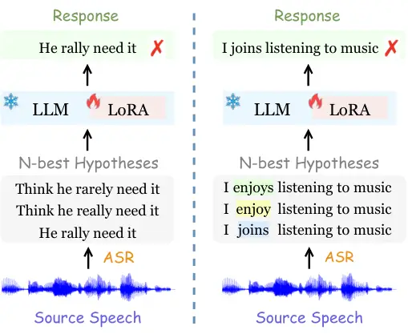
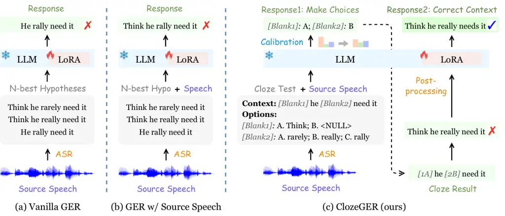
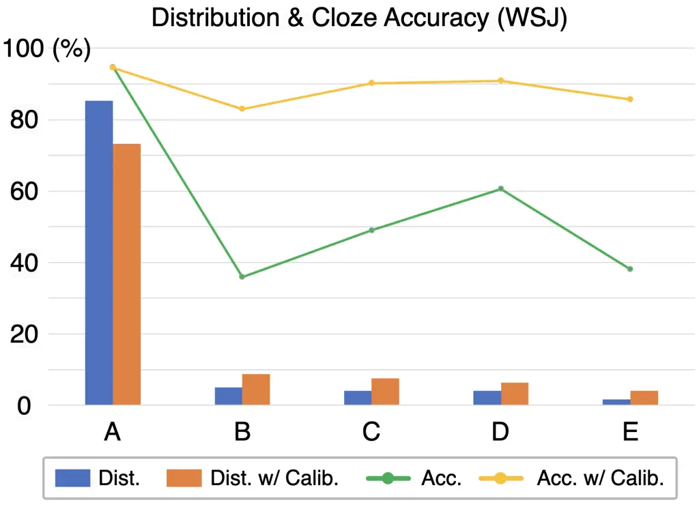
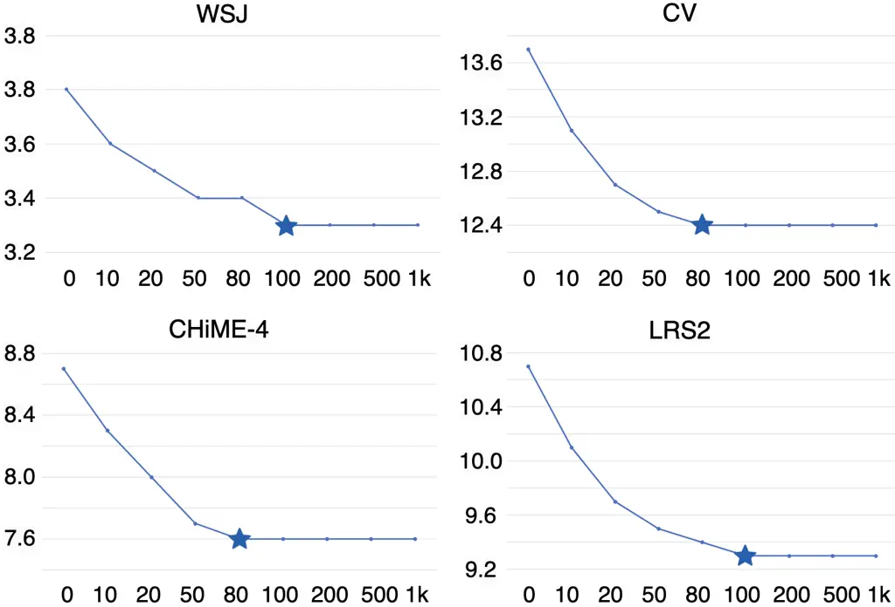
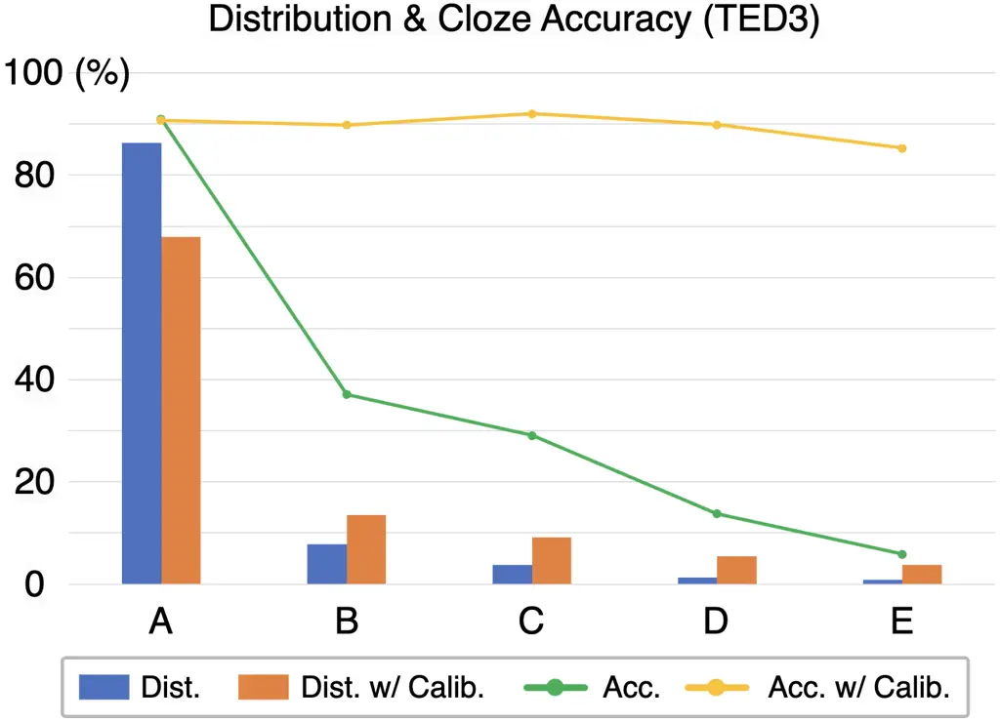

# Listen Again and Choose the Right Answer: A New Paradigm for Automatic Speech Recognition with Large Language Models

Yuchen Hu Affiliation: Nanyang Technological University, Singapore
Email: <yuchen005@e.ntu.edu.sg>    Chen Chen Affiliation: Nanyang
Technological University, Singapore Email: <ruizhe.li@abdn.ac.uk>   
Chengwei Qin Affiliation: Nanyang Technological University, Singapore   
Qiushi Zhu Affiliation: University of Science and Technology of China,
China    Eng Siong Chng Affiliation: Nanyang Technological University,
Singapore    Ruizhe Li ^(†)^(†)thanks: Corresponding author.
Affiliation: University of Aberdeen, UK

###### Abstract

Recent advances in large language models (LLMs) have promoted generative
error correction (GER) for automatic speech recognition (ASR), which
aims to predict the ground-truth transcription from the decoded N-best
hypotheses. Thanks to the strong language generation ability of LLMs and
rich information in the N-best list, GER shows great effectiveness in
enhancing ASR results. However, it still suffers from two
limitations: 1) LLMs are unaware of the source speech during GER, which
may lead to results that are grammatically correct but violate the
source speech content, 2) N-best hypotheses usually only vary in a few
tokens, making it redundant to send all of them for GER, which could
confuse LLM about which tokens to focus on and thus lead to increased
miscorrection. In this paper, we propose ClozeGER, a new paradigm for
ASR generative error correction. First, we introduce a multimodal LLM
(_i.e._, SpeechGPT) to receive source speech as extra input to improve
the fidelity of correction output. Then, we reformat GER as a cloze test
with logits calibration to remove the input information redundancy and
simplify GER with clear instructions. Experiments show that ClozeGER
achieves a new breakthrough over vanilla GER on 9 popular ASR datasets.

## 1 Introduction

Recent advances in large language models (LLMs) have attracted a surge
of research interest thanks to their remarkable language generation and
reasoning ability (OpenAI, 2022; OpenAI, 2023; Touvron et al., 2023a;
Touvron et al., 2023b), which achieve a wide range of success on natural
language processing (NLP) tasks (Brown et al., 2020; Wei et al., 2022;
Ouyang et al., 2022). Powered by LLMs, latest work (Chen et al., 2023b;
Chen et al., 2023a; Chen et al., 2024; Hu et al., 2024a; Hu et al.,
2024b) proposes a generative error correction (Yang et al., 2023) (GER)
benchmark¹¹ 1
[https://github.com/Hypotheses-Paradise/Hypo2Trans](https://github.com/Hypotheses-Paradise/Hypo2Trans)
for automatic speech recognition (ASR), and they release a HyPoradise
dataset²² 2
[https://huggingface.co/datasets/PeacefulData/HP-v0](https://huggingface.co/datasets/PeacefulData/HP-v0)
that contains over 332K pairs of decoded N-best hypotheses and
ground-truth transcription in various ASR domains. It has shown great
effectiveness in learning the mapping from hypotheses to transcription
by parameter-efficient LLM finetuning (Hu et al., 2021), which
significantly enhances the ASR result and outperforms typical LM
rescoring methods (Mikolov et al., 2010).



Figure 1: Two limitations of generative error correction (Chen et al.,
2023b). Left: violate source speech, LLM removes the word “Think” in
first two hypotheses as it rarely appears at the beginning of a sentence
and followed by a subject according to grammar, but this actually
happens in the source speech. Right: information redundancy in N-best
hypotheses input, there is only one difference between N-best
candidates, making it redundant to send all of them for GER, which
confuses LLM about which tokens to focus on for correction.

However, GER paradigm is also observed to suffer from two limitations.
First, LLMs are unaware of the source speech during GER process, which
could lead to results that do not match the source speech content. For
example, as shown in Fig. 1 (left), the source speech reads the word
“Think” at the beginning and followed by “he”, which is correctly
recognized by the 1-best hypothesis. Then during the GER process, LLM
removes the word “Think”, as this structure of verb plus noun at the
beginning of a sentence is not rigorous according to grammar. However,
this is not expected as it violates the source speech content. Second,
we observe that N-best hypotheses usually only vary in a few tokens. For
example, as shown in Fig. 1 (right), all the tokens in candidates are
the same except “enjoys”/“enjoy”/“joins”. In this case, it would be
information redundant to leverage all of the hypotheses for predicting
the ground-truth transcription, which could confuse the LLMs about which
tokens to focus on for correction and thus lead to sub-optimal GER
performance.

Motivated by the above observations, we propose ClozeGER, a new paradigm
for ASR generative error correction. First, we introduce a popular
multimodal LLM, SpeechGPT (Zhang et al., 2023a), to receive source
speech as an extra input to the GER paradigm. With the powerful
cross-modal ability of SpeechGPT, we can now constrain GER to comply
with the source speech while correcting the errors in decoded
hypotheses. Then, in order to remove the input information redundancy,
we reformat it as a cloze test (_i.e._, a special multiple-choice
question) with logits calibration (Kumar, 2022; Wang et al., 2023),
where the identical parts across N-best hypotheses are set as the
context and the varying parts are set as blanks (each with several
options provided). With such clear instructions for error correction, it
would be easier for LLMs to perform context reasoning and choose the
right answer for each blank rather than predicting the entire sentence
from redundant N-best inputs³³ 3 Think if we humans are asked to do GER,
which option is easier and efficient, cloze or entire sentence
prediction?. Finally, we add a simple post-processing stage to correct
the errors in cloze context (_i.e._, identical parts across N-best list)
to further improve the correction result.

Our contributions are summarized as follows:

- •
  We propose ClozeGER, a new paradigm based on multimodal LLM for ASR
  generative error correction, which receives both source speech and the
  decoded N-best hypotheses as input to predict the ground-truth
  transcription.
- •
  We further reformat the generative error correction as a cloze test
  with logits calibration to remove the information redundancy in N-best
  hypotheses input and simplify the GER paradigm with clear
  instructions.
- •
  Experiment evidence shows that our proposed ClozeGER achieves a new
  breakthrough over vanilla GER on 9 popular ASR datasets.

## 2 Related Work

Large Language Models. There is recently a surge of research interests
in Transformer-based LLMs, such as ChatGPT (OpenAI, 2022),
GPT-4 (OpenAI, 2023) and LLaMA (Touvron et al., 2023a; Touvron et al.,
2023b). Benefiting from the huge model size and abundant training data,
LLMs can well understand the linguistic structures and semantic meanings
behind textual data, which shows remarkable performance on a wide range
of NLP tasks (Brown et al., 2020; Wei et al., 2022; Ouyang et al.,
2022). More recently, researchers have started to explore the potential
of LLMs on multimodal tasks by incorporating other modalities into
LLMs (Liu et al., 2023; Li et al., 2023; Chen et al., 2023e; Zhang
et al., 2023b; Zhang et al., 2023c; Gao et al., 2023; Fathullah et al.,
2023). Among them, SpeechGPT (Zhang et al., 2023a) is one of the most
popular multimodal LLMs that represent speech and text using a unified
tokenizer, which enables us to add source speech into the original
N-best hypotheses input of the GER paradigm.

LM Rescoring and ASR Generative Error Correction. LM rescoring has been
widely used in ASR decoding to rerank the N-best hypotheses and yield
better 1-best recognition result (Arisoy et al., 2015; Shin et al.,
2019; Mikolov et al., 2010). Furthermore, to make full use of all
candidatures, recent works employ the entire N-best list for error
correction (Leng et al., 2021; Ma et al., 2023). Powered by LLMs, latest
work proposes a generative error correction (GER) benchmark (Chen
et al., 2023b) to predict the ground-truth transcription from ASR N-best
hypotheses and achieves remarkable performance. This work serves as an
extension of GER to resolve the existing limitations.

Cloze Test with LLMs. As a special format of multiple-choice questions
(MCQ), the cloze test provides a context with some blanks, where each
blank is provided with several options for selection. Recently, cloze
test and MCQ are widely adopted in LLM-centric scenarios (Chiang et al.,
2023; Zheng et al., 2023b), as well as numerous LM benchmarks including
MMLU (Hendrycks et al., 2020), AGIEval (Zhong et al., 2023), and
C-Eval (Huang et al., 2023). However, recent works observe that
LLMs-based cloze test is vulnerable to option position changes due to
their inherent “selection bias” (Kumar, 2022; Wang et al., 2023;
Pezeshkpour and Hruschka, 2023). In this work, we reformat the GER
paradigm as a cloze test for simplification, as well as introduce a
logits calibration method to remove the existing selection bias and make
LLM a robust cloze solver.

## 3 Methodology

In this section, we present our proposed ClozeGER paradigm in detail. We
first introduce the preliminary knowledge of GER in §3.1, and then we
investigate to introduce source speech to GER paradigm with multimodal
LLM (§3.2). Finally, we present the new task format of ClozeGER in §3.3.



Figure 2: Frameworks of (a) vanilla GER that employs N-best hypotheses
to predict ground-truth transcription, (b) GER with source speech as
extra input to improve the fidelity of correction output, (c) our
ClozeGER that reformats GER as a cloze test with logits calibration,
followed by a post-processing stage to further correct the cloze
context.

### 3.1 Preliminary: Generative Error Correction

We follow the original generative error correction benchmark (Chen
et al., 2023b) as shown in Fig. 2 (a). Given an input speech $`X`$, the
pre-trained ASR model first transcribe it into $`N`$-best hypotheses
$`\mathcal{Y}_{N}=\{Y_{1},Y_{2},\cdots,Y_{N}\}`$ by beam search
decoding. The goal of GER is to learn a hypotheses-to-transcription
(H2T) mapping $`\mathcal{M}_{\text{H2T}}`$ that predicts the
transcription $`Y`$ based on $`N`$-best list $`\mathcal{Y}_{N}`$:

```math
\displaystyle Y \displaystyle=\mathcal{M}_{\text{H2T}}(\mathcal{Y}_{N}), \tag{1}
```

Given the ground-truth transcription $`Y^{*}`$, we can finetune the LLM
to learn $`\mathcal{M}_{\text{H2T}}`$ in an auto-regressive manner,
where the cross-entropy loss $`\mathcal{L}_{\text{H2T}}`$ is formulated
as:

```math
\displaystyle\mathcal{L}_{\text{H2T}} \displaystyle=\sum_{t=1}^{T}-\log\mathcal{P}_{\theta}(y_{t}^{*}|y_{t-1}^{*},\cdots,y_{1}^{*},\mathcal{Y}_{N}), \tag{2}
```

where $`y_{t}^{*}`$ is the $`t`$-th token of $`Y^{*}`$, and $`\theta`$
denotes the learnable parameters in LLM (_i.e._, LoRA).

### 3.2 GER with Source Speech

In order to prevent GER from violating the content of source speech, we
incorporate it as an extra input into LLM to improve output fidelity as
shown in Fig. 2 (b). So that Eq.(1) should be rewritten as:

```math
\displaystyle Y \displaystyle=\mathcal{M}_{\text{H2T}}(\mathcal{Y}_{N},X), \tag{3}
```

where the N-best hypotheses and source speech are concatenated using the
following instructions:

_"Below is a speech and its candidate transcriptions from a speech
recognition system. Please listen to the speech and revise the candidate
transcriptions to generate better final recognition results. \###
Speech:{speech units}. \### Candidates:{N-best hypotheses}. \###
Response: "_

To jointly process text and speech, we leverage the popular multimodal
LLM, SpeechGPT⁴⁴ 4
[https://huggingface.co/fnlp/SpeechGPT-7B-cm](https://huggingface.co/fnlp/SpeechGPT-7B-cm) (Zhang
et al., 2023a), to replace the LLaMA in original GER benchmark. Notably,
SpeechGPT is developed by discretizing speech into 1,000 HuBERT units
and adding them to LLaMA-7b⁵⁵ 5
[https://huggingface.co/yahma/llama-7b-hf](https://huggingface.co/yahma/llama-7b-hf)
tokenizer, and it then finetunes LLaMA-7b to learn cross-modality
mapping. With such multimodal ability, we can enable GER to comply with
source speech.

### 3.3 ClozeGER

#### 3.3.1 Cloze Format

Since N-best hypotheses usually only vary in a few tokens, it would be
information redundant to send all of them for GER, which could confuse
the LLM about which tokens to focus on and thus lead to increased
miscorrection. To this end, we simplify the GER paradigm as a cloze test
as shown in Fig. 2 (c). Specifically, we set the identical parts across
N-best hypotheses as the context and the varying parts as blanks, where
each blank is provided with several options. In addition, we also insert
a null token ‘\<NULL\>’ to align the N-best candidates. We design an
instruction-following cloze template:

_"Below is a speech and its candidate transcriptions from a speech
recognition system. The candidates are formatted as a cloze test, where
the blanks to fill are indicated by ‘\[Blank1\]’, ‘\[Blank2\]’, etc.
Each blank is provided with several options indicated by ID letters ‘A’,
‘B’, ‘C’, etc., where ‘\<NULL\>’ denotes the null token. To generate a
better final recognition result, please listen to the speech and write
an answer choice for each blank. \### Speech:{speech units}. \### Cloze
test: \[Blank1\] he \[Blank2\] need it. \### Options: \[Blank1\]: A.
Think; B. \<NULL\>. \[Blank2\]: A. rarely; B. really; C. rally. \###
Answer choices: "_

With such clear instructions for error correction, it would be easier
for LLM to perform context reasoning and choose the right answer for
each blank than to predict the entire sentence from redundant N-best
inputs. In addition, the strong speech understanding ability of
SpeechGPT enables ClozeGER to refer to source speech to make better
choices.

#### 3.3.2 Logits Calibration with Prior Estimate

Despite the promising performance, most recent works find that
LLMs-based cloze test is vulnerable to option position changes due to
their inherent “selection bias” (Kumar, 2022; Wang et al., 2023;
Pezeshkpour and Hruschka, 2023; He et al., 2023). Similarly, in our
experiments, we have observed a strong ‘‘selection bias’’ towards option
‘A’, especially in the cases where ClozeGER makes mistakes. One reason
is that most ground-truth options are ‘A’ in the training data⁶⁶ 6
Ablation study on debiased training is in Table 4. as the 1-best
hypothesis usually enjoys the best quality. As a result, during
inference when LLM find it hard to decide the answer choice, it tends to
select ‘A’ that can at least guarantee no performance drop, _i.e._,
option ‘A’ comes from 1-best hypothesis (baseline). Inspired by prior
works on permutation-based debiasing (Wang et al., 2023; Zheng et al.,
2023b; Zheng et al., 2023a), we propose a logits calibration approach
with prior estimation to alleviate this bias during inference.

Formally, we denote the question context as $`c`$, the $`n`$ option IDs
(_e.g._, A/B/C) for one blank as $`d`$, and the default option contents
(_i.e._, follow the order of N-best hypotheses) as $`x`$. Take the
second blank in Fig. 2 (c) as an example, we have $`c=`$ “\[Blank1\] he
\[Blank2\] need it”, $`d=`$ \[A, B, C\], $`n=3`$, $`x=`$ \[rarely,
really, rally\]. The concatenation of default option IDs and contents is
denoted as $`o`$.

Then, we use $`I`$ to denote a permutation of $`\{1,2,\cdots,n\}`$, and
$`\mathcal{I}`$ to denote the set of all possible $`I`$s. For better
formulation, we denote $`o^{I}`$ as the concatenation of option IDs and
$`I`$-permuted option contents, and $`r_{I}(i)`$ denotes the position of
ID $`i`$ in $`I`$. Take the above example to illustrate, assume
$`I=[2,3,1]`$, then $`o^{I}=`$ {A: really, B : rally, C : rarely} and
$`r_{I}(1)=3,r_{I}(2)=1,r_{I}(3)=2`$. In order to alleviate the
selection bias of LLMs towards the option IDs, we have to first
formulate it mathematically. One feasible solution (Wang et al., 2023;
Zheng et al., 2023b) is to enumerate all permutations of the option
contents and average their output distributions for debiasing:

```math
\displaystyle\mathcal{P}_{\text{real}}(x_{i}|c,o) \displaystyle=\frac{1}{|\mathcal{I}|}\sum_{I\in\mathcal{I}}\mathcal{P}_{\text{llm}}(d_{r_{I}(i)}|c,o^{I}), \tag{4}
```

where $`i\in\{1,2,\cdots,n\}`$, and
$`\mathcal{P}_{\text{real}}(x_{i}|c,o)`$ denotes the debiased (_i.e._,
real) probability of $`i`$-th option content in $`x`$. After such
enumeration of all possible permutations of option contents, the
“selection bias” towards option IDs could be well resolved.

Furthermore, considering calculating full permutations is prohibitively
expensive ($`\times n!`$ costs), we leverage the cyclic permutation as
an alternative, _i.e._,
$`I=\{(i,i+1,\cdots,n,1,2,\cdots,i-1)\}_{i=1}^{n}`$. Take the previous
example, we have $`I=\{(1,2,3),(2,3,1),(3,1,2)\}`$. It reduces the
computational cost from $`\times n!`$ to $`\times n`$ and guarantees one
pairing between each option ID and content. However, the inference cost
of $`\times n`$ is still much too high especially in practical
scenarios.

Inspired by recent work on MCQ debiasing (Zheng et al., 2023a), it is a
promising idea to disentangle the distribution bias of option IDs from
the original predictions from LLMs. The insight behind is that the
option ID itself is inherently unrelated to the option contents, the
option orders, and the context. Therefore, the LLM predicted
distribution over $`d_{i}`$ can be disentangled as a prior distribution
of the option ID $`d_{i}`$ and the debiased (_i.e._, real) distribution
of option content of $`d_{i}`$:

```math
\displaystyle\mathcal{P}_{\text{llm}}(d_{i}|c,o)\propto\mathcal{P}_{\text{prior}}(d_{i}|c)\mathcal{P}_{\text{real}}(x_{i}|c,o), \tag{5}
```

where we omit $`I`$ as only the default order of options needs to be
considered during formal inference. The prior distribution
$`\mathcal{P}_{\text{prior}}(d_{i}|c)`$ indicates the LLM’s selection
bias towards option ID $`d_{i}`$, and the debiased distribution
$`\mathcal{P}_{\text{real}}(x_{i}|c,o)`$ indicates the LLM’s real
confidence of option content $`x_{i}`$.

Inspired by recent work (Zheng et al., 2023a), we calculate the averaged
prior distribution $`\hat{\mathcal{P}}_{\text{prior}}(d_{i})`$ on
validation set $`\mathcal{D}_{v}`$ to estimate
$`\mathcal{P}_{\text{prior}}(d_{i}|c)`$. In particular, we perform
cyclic permutation $`\mathcal{I}_{c}`$ for each sample in
$`\mathcal{D}_{v}`$ and send all of them for inference, and then we
average their output distributions to obtain the prior distribution of
option ID $`d_{i}`$:

```math
\displaystyle\hat{\mathcal{P}}_{\text{prior}}(d_{i}) \displaystyle=\frac{1}{|\mathcal{D}_{v}|}\sum_{\{c,o\}\in\mathcal{D}_{v}}\mathcal{P}_{\text{prior}}(d_{i}|c), \tag{6}
```

```math
\displaystyle\mathcal{P}_{\text{prior}}(d_{i}|c) \displaystyle=\text{sm}\left(\frac{1}{|\mathcal{I}|}\sum_{I\in\mathcal{I}}\log\mathcal{P}_{\text{llm}}(d_{i}|c,o^{I})\right),
```

where “sm” denotes softmax operation. With the estimated prior
distribution, we can perform logits calibration during the inference
stage:

```math
\displaystyle\hat{\mathcal{P}}_{\text{real}}(x_{i}|c,o)\propto\mathcal{P}_{\text{llm}}(d_{i}|c,o)/\hat{\mathcal{P}}_{\text{prior}}(d_{i}), \tag{7}
```

In case of the small size of $`\mathcal{D}_{v}`$, this logits
calibration method would be efficient during inference.

#### 3.3.3 Post-processing

After cloze test with logits calibration, many ASR errors captured by
the blanks (_i.e._, varying tokens between N-best hypotheses) are
corrected, but what about those remaining in the question context? For
example, as shown in Fig. 2 (c), the ASR model fails to recognize the
word “needs”, where all N-best hypotheses produce “need”. In this case,
we need a simple post-processing stage to further correct them, with the
following instructions:

_"Below is a speech and its candidate transcription from a speech
recognition system. Please listen to the speech and correct the
candidate transcription. \### Speech:{speech units}. \###
Candidate:{cloze result}. \### Response: "_

Similar to GER, here we also use SpeechGPT with LoRA finetuning for
post-processing. This stage is necessary especially when ASR model does
not perform well on current speech domains.

## 4 Experiments

### 4.1 Setup

Dataset. We utilize the HyPoradise (HP) dataset from the original GER
benchmark (Chen et al., 2023b) for our experiments, which contains over
332K hypotheses-transcription pairs collected from multiple mainstream
ASR corpora. Specifically, each transcription is paired with 5-best
hypotheses transcribed from Whisper-Large model (Radford et al., 2023)
with beam search decoding. In this work, we select 9 popular ASR corpora
from HyPoradise to evaluate the proposed ClozeGER, including WSJ (Paul
and Baker, 1992), CommonVoice (Ardila et al., 2019),
TED-LIUM3 (Hernandez et al., 2018), SwitchBoard (Godfrey et al., 1992),
LibriSpeech (Panayotov et al., 2015), CHiME-4 (Vincent et al., 2016),
LRS2 (Chung et al., 2017), ATIS (Hemphill et al., 1990), and
CORAAL (Kendall and Farrington, 2021). Since HyPoradise provides 5-best
hypotheses for each sample, we follow it to set 5 options for each cloze
blank. More statistical details are in Appendix A.

Models. As introduced before, we use SpeechGPT as the LLM in our main
experiments, and later on we also try LLaMA-2-7b⁷⁷ 7
[https://huggingface.co/meta-llama/Llama-2-7b-hf](https://huggingface.co/meta-llama/Llama-2-7b-hf) (Touvron
et al., 2023b) to verify the effectiveness of ClozeGER paradigm in case
of no source speech input. For efficient LLM finetuning, we employ the
popular low-rank adapter (LoRA) tuning strategy (Hu et al., 2021), where
the rank $`r`$ is set to 8 and the LoRA is added in the query, key,
value, and output layers in each Transformer block (Vaswani et al.,
2017). As a result, the number of trainable parameters is only 8.39 M,
accounting for only 0.12% of the LLM.

Training and Inference. During finetuning, we employ Adam
optimizer (Kingma and Ba, 2014) with a learning rate set to $`2e^{-4}`$
and warmup steps set to 100. The number of training epochs is set to 5,
the batch size is set to 256. The maximum input sequence length is set
to 1024. For inference, we adopt top-$`k`$ and top-$`p`$ sampling
strategies at the same time, where $`k=40`$ and $`p=0.75`$. The
temperature is set to 0.1, and beam size is set to 4.

### 4.2 Main Results

|             |          |                                            |                                            |                                            |                                            |                                                 |            |            |
| ----------- | -------- | ------------------------------------------ | ------------------------------------------ | ------------------------------------------ | ------------------------------------------ | ----------------------------------------------- | ---------- | ---------- |
| Test Set    | Baseline | _w/o Source Speech_                        | _w/ Source Speech_                         |                                            |                                            |                                                 | Oracle     |            |
|             |          | GER (2023b)                                | GER                                        | ClozeGER (ours)                            | \+ Calibration                             | \+ Post-processing                              | $`o_{nb}`$ | $`o_{cp}`$ |
| WSJ         | $`4.2`$  | $`2.9_{{\color[rgb]{0,0.5,0.5}-31.0\%}}`$  | $`2.7_{{\color[rgb]{0,0.5,0.5}-35.7\%}}`$  | $`3.8_{{\color[rgb]{0,0.5,0.5}-9.5\%}}`$   | $`3.3_{{\color[rgb]{0,0.5,0.5}-21.4\%}}`$  | $`\bm{2.4_{{\color[rgb]{0,0.5,0.5}-42.9\%}}}`$  | $`2.7`$    | $`1.0`$    |
| CommonVoice | $`14.4`$ | $`11.4_{{\color[rgb]{0,0.5,0.5}-20.8\%}}`$ | $`10.1_{{\color[rgb]{0,0.5,0.5}-29.9\%}}`$ | $`13.7_{{\color[rgb]{0,0.5,0.5}-4.9\%}}`$  | $`12.4_{{\color[rgb]{0,0.5,0.5}-13.9\%}}`$ | $`\bm{8.5_{{\color[rgb]{0,0.5,0.5}-41.0\%}}}`$  | $`10.5`$   | $`7.5`$    |
| TED-LIUM3   | $`6.8`$  | $`5.8_{{\color[rgb]{0,0.5,0.5}-14.7\%}}`$  | $`5.4_{{\color[rgb]{0,0.5,0.5}-20.6\%}}`$  | $`6.1_{{\color[rgb]{0,0.5,0.5}-10.3\%}}`$  | $`5.1_{{\color[rgb]{0,0.5,0.5}-25.0\%}}`$  | $`\bm{4.8_{{\color[rgb]{0,0.5,0.5}-29.4\%}}}`$  | $`4.4`$    | $`1.6`$    |
| SwitchBoard | $`16.4`$ | $`14.8_{{\color[rgb]{0,0.5,0.5}-9.8\%}}`$  | $`14.3_{{\color[rgb]{0,0.5,0.5}-12.8\%}}`$ | $`15.8_{{\color[rgb]{0,0.5,0.5}-3.7\%}}`$  | $`15.0_{{\color[rgb]{0,0.5,0.5}-8.5\%}}`$  | $`\bm{13.3_{{\color[rgb]{0,0.5,0.5}-18.9\%}}}`$ | $`13.3`$   | $`4.6`$    |
| LibriSpeech | $`2.7`$  | $`2.7_{{\color[rgb]{0.5,0.5,0.5}-0.0\%}}`$ | $`2.6_{{\color[rgb]{0,0.5,0.5}-3.7\%}}`$   | $`2.7_{{\color[rgb]{0.5,0.5,0.5}-0.0\%}}`$ | $`2.5_{{\color[rgb]{0,0.5,0.5}-7.4\%}}`$   | $`\bm{2.5_{{\color[rgb]{0,0.5,0.5}-7.4\%}}}`$   | $`1.9`$    | $`1.1`$    |
| CHiME-4     | $`9.4`$  | $`7.4_{{\color[rgb]{0,0.5,0.5}-21.3\%}}`$  | $`7.9_{{\color[rgb]{0,0.5,0.5}-16.0\%}}`$  | $`8.7_{{\color[rgb]{0,0.5,0.5}-7.4\%}}`$   | $`7.6_{{\color[rgb]{0,0.5,0.5}-19.1\%}}`$  | $`\bm{7.1_{{\color[rgb]{0,0.5,0.5}-24.5\%}}}`$  | $`5.9`$    | $`2.7`$    |
| LRS2        | $`12.3`$ | $`10.7_{{\color[rgb]{0,0.5,0.5}-13.0\%}}`$ | $`9.5_{{\color[rgb]{0,0.5,0.5}-22.8\%}}`$  | $`10.7_{{\color[rgb]{0,0.5,0.5}-13.0\%}}`$ | $`9.3_{{\color[rgb]{0,0.5,0.5}-24.3\%}}`$  | $`\bm{7.6_{{\color[rgb]{0,0.5,0.5}-38.2\%}}}`$  | $`7.5`$    | $`2.8`$    |
| ATIS        | $`7.3`$  | $`2.9_{{\color[rgb]{0,0.5,0.5}-60.3\%}}`$  | $`2.4_{{\color[rgb]{0,0.5,0.5}-67.1\%}}`$  | $`7.1_{{\color[rgb]{0,0.5,0.5}-2.7\%}}`$   | $`6.5_{{\color[rgb]{0,0.5,0.5}-11.0\%}}`$  | $`\bm{2.1_{{\color[rgb]{0,0.5,0.5}-71.2\%}}}`$  | $`4.1`$    | $`1.0`$    |
| CORAAL      | $`29.2`$ | $`27.9_{{\color[rgb]{0,0.5,0.5}-4.5\%}}`$  | $`27.6_{{\color[rgb]{0,0.5,0.5}-5.5\%}}`$  | $`29.1_{{\color[rgb]{0,0.5,0.5}-0.3\%}}`$  | $`28.1_{{\color[rgb]{0,0.5,0.5}-3.8\%}}`$  | $`\bm{26.7_{{\color[rgb]{0,0.5,0.5}-8.6\%}}}`$  | $`27.9`$   | $`10.9`$   |

Table 1: WER (%) results of ClozeGER with SpeechGPT and LoRA. “+
Calibration” denotes adding logits calibration on ClozeGER to remove the
selection bias, and “+ Post-processing” denotes further adding the
post-processing stage to correct the context. $`o_{nb}`$ denotes the
N-best oracle that refers to word error rate (WER) of the “best
candidate” in the N-best list, and $`o_{cp}`$ denotes the compositional
oracle that is the best achievable WER using all the tokens in N-best
hypotheses. They indicate the upper-bounds of LM rescoring and GER (with
occurred tokens), respectively. The subscript percentage denotes the
relative WER reduction over ASR baseline.

|             |          |                                            |                                            |                                            |                                                 |            |            |
| ----------- | -------- | ------------------------------------------ | ------------------------------------------ | ------------------------------------------ | ----------------------------------------------- | ---------- | ---------- |
| Test Set    | Baseline | _w/o Source Speech_                        |                                            |                                            |                                                 | Oracle     |            |
|             |          | GER (2023b)                                | ClozeGER (ours)                            | \+ Calibration                             | \+ Post-processing                              | $`o_{nb}`$ | $`o_{cp}`$ |
| WSJ         | $`4.2`$  | $`2.8_{{\color[rgb]{0,0.5,0.5}-33.3\%}}`$  | $`3.7_{{\color[rgb]{0,0.5,0.5}-11.9\%}}`$  | $`3.3_{{\color[rgb]{0,0.5,0.5}-21.4\%}}`$  | $`\bm{2.5_{{\color[rgb]{0,0.5,0.5}-40.5\%}}}`$  | $`2.7`$    | $`1.0`$    |
| CommonVoice | $`14.4`$ | $`10.8_{{\color[rgb]{0,0.5,0.5}-25.0\%}}`$ | $`13.1_{{\color[rgb]{0,0.5,0.5}-9.0\%}}`$  | $`12.4_{{\color[rgb]{0,0.5,0.5}-13.9\%}}`$ | $`\bm{8.6_{{\color[rgb]{0,0.5,0.5}-40.3\%}}}`$  | $`10.5`$   | $`7.5`$    |
| TED-LIUM3   | $`6.8`$  | $`5.3_{{\color[rgb]{0,0.5,0.5}-22.1\%}}`$  | $`6.0_{{\color[rgb]{0,0.5,0.5}-11.8\%}}`$  | $`5.0_{{\color[rgb]{0,0.5,0.5}-26.5\%}}`$  | $`\bm{4.7_{{\color[rgb]{0,0.5,0.5}-30.9\%}}}`$  | $`4.4`$    | $`1.6`$    |
| SwitchBoard | $`16.4`$ | $`14.6_{{\color[rgb]{0,0.5,0.5}-11.0\%}}`$ | $`15.6_{{\color[rgb]{0,0.5,0.5}-4.9\%}}`$  | $`14.5_{{\color[rgb]{0,0.5,0.5}-11.6\%}}`$ | $`\bm{12.9_{{\color[rgb]{0,0.5,0.5}-21.3\%}}}`$ | $`13.3`$   | $`4.6`$    |
| LibriSpeech | $`2.7`$  | $`2.7_{{\color[rgb]{0.5,0.5,0.5}-0.0\%}}`$ | $`2.6_{{\color[rgb]{0,0.5,0.5}-3.7\%}}`$   | $`2.4_{{\color[rgb]{0,0.5,0.5}-11.1\%}}`$  | $`\bm{2.4_{{\color[rgb]{0,0.5,0.5}-11.1\%}}}`$  | $`1.9`$    | $`1.1`$    |
| CHiME-4     | $`9.4`$  | $`7.3_{{\color[rgb]{0,0.5,0.5}-22.3\%}}`$  | $`7.9_{{\color[rgb]{0,0.5,0.5}-16.0\%}}`$  | $`7.2_{{\color[rgb]{0,0.5,0.5}-23.4\%}}`$  | $`\bm{7.0_{{\color[rgb]{0,0.5,0.5}-25.5\%}}}`$  | $`5.9`$    | $`2.7`$    |
| LRS2        | $`12.3`$ | $`10.5_{{\color[rgb]{0,0.5,0.5}-14.6\%}}`$ | $`10.5_{{\color[rgb]{0,0.5,0.5}-14.6\%}}`$ | $`9.0_{{\color[rgb]{0,0.5,0.5}-26.8\%}}`$  | $`\bm{7.4_{{\color[rgb]{0,0.5,0.5}-39.8\%}}}`$  | $`7.5`$    | $`2.8`$    |
| ATIS        | $`7.3`$  | $`2.4_{{\color[rgb]{0,0.5,0.5}-67.1\%}}`$  | $`6.3_{{\color[rgb]{0,0.5,0.5}-13.7\%}}`$  | $`5.8_{{\color[rgb]{0,0.5,0.5}-20.5\%}}`$  | $`\bm{2.1_{{\color[rgb]{0,0.5,0.5}-71.2\%}}}`$  | $`4.1`$    | $`1.0`$    |
| CORAAL      | $`29.2`$ | $`27.4_{{\color[rgb]{0,0.5,0.5}-6.2\%}}`$  | $`29.1_{{\color[rgb]{0,0.5,0.5}-0.3\%}}`$  | $`27.9_{{\color[rgb]{0,0.5,0.5}-4.5\%}}`$  | $`\bm{26.8_{{\color[rgb]{0,0.5,0.5}-8.2\%}}}`$  | $`27.9`$   | $`10.9`$   |

Table 2: WER (%) results of ClozeGER with LLaMA-2-7b and LoRA. This
study investigates the performance of our ClozeGER in case of no source
speech input. $`o_{nb}`$ and $`o_{cp}`$ follow the same definitions as
those in Table 1.

Table 1 presents the WER results of ClozeGER with SpeechGPT and LoRA
tuning. First, we can observe that vanilla GER achieves significant
improvements over Whisper ASR baseline, and introducing source speech as
extra input further enhances the performance. In comparison, our
proposed ClozeGER also improves the baseline but underperforms the GER
approach. There are two reasons, the cloze test suffers from selection
bias and cannot yield satisfactory results, and on the other hand, there
are many errors exist in the cloze context due to imperfect N-best list
quality (_i.e._, Whisper is a general ASR model and may not perform well
in every specific domain). To this end, we first propose a logits
calibration approach to alleviate the selection bias, which results in
considerable WER reductions. Furthermore, we add a post-processing stage
to correct the errors in cloze context, which moves one step forward and
outperforms the GER approach with source speech input, where some
results even surpass the N-best oracle.

Table 2 reports the WER results of ClozeGER using LLaMA-2 as a backbone
in case of no source speech as input, where we observe similar gains of
performance of the proposed ClozeGER over GER baseline. It demonstrates
the general effectiveness of ClozeGER paradigm, as well as the proposed
logits calibration and post-processing techniques.

|                         |                             |                            |                           |                           |                           |
| ----------------------- | --------------------------- | -------------------------- | ------------------------- | ------------------------- | ------------------------- |
| Label Dist. / Prior (%) | A                           | B                          | C                         | D                         | E                         |
| WSJ                     |   $`75.51`$   /   $`95.68`$ |   $`10.27`$   /   $`2.92`$ |   $`6.84`$   /   $`0.63`$ |   $`4.16`$   /   $`0.42`$ |   $`3.22`$   /   $`0.35`$ |
| CommonVoice             |   $`80.32`$   /   $`95.94`$ |   $`8.33`$   /   $`2.54`$  |   $`5.47`$   /   $`0.59`$ |   $`3.34`$   /   $`0.57`$ |   $`2.54`$   /   $`0.36`$ |
| TED-LIUM3               |   $`75.22`$   /   $`98.13`$ |   $`10.34`$   /   $`1.63`$ |   $`6.89`$   /   $`0.17`$ |   $`4.30`$   /   $`0.03`$ |   $`3.25`$   /   $`0.04`$ |
| SwitchBoard             |   $`77.93`$   /   $`96.70`$ |   $`9.18`$   /   $`2.78`$  |   $`6.07`$   /   $`0.30`$ |   $`3.85`$   /   $`0.09`$ |   $`2.98`$   /   $`0.13`$ |
| LibriSpeech             |   $`73.80`$   /   $`98.08`$ |   $`11.51`$   /   $`1.50`$ |   $`7.63`$   /   $`0.28`$ |   $`4.01`$   /   $`0.08`$ |   $`3.05`$   /   $`0.06`$ |
| CHiME-4                 |   $`77.56`$   /   $`84.17`$ |   $`8.83`$   /   $`9.13`$  |   $`6.89`$   /   $`4.54`$ |   $`3.98`$   /   $`1.33`$ |   $`2.73`$   /   $`0.83`$ |
| LRS2                    |   $`77.21`$   /   $`95.85`$ |   $`9.81`$   /   $`3.63`$  |   $`6.58`$   /   $`0.31`$ |   $`3.54`$   /   $`0.15`$ |   $`2.86`$   /   $`0.07`$ |
| ATIS                    |   $`78.43`$   /   $`82.78`$ |   $`10.08`$   /   $`8.67`$ |   $`5.63`$   /   $`4.27`$ |   $`3.08`$   /   $`2.28`$ |   $`2.78`$   /   $`2.00`$ |
| CORAAL                  |   $`77.58`$   /   $`83.08`$ |   $`8.85`$   /   $`7.86`$  |   $`6.21`$   /   $`3.78`$ |   $`3.95`$   /   $`2.73`$ |   $`3.40`$   /   $`2.54`$ |

Table 3: Training label distribution (%) and the estimated prior
distribution (%) over 5 option IDs (_i.e._, ‘A’, ‘B’, ‘C’, ‘D’, and ‘E’)
of different datasets. The training label distribution refers to the
proportions of each option ID in the labels of cloze training data, and
the estimated prior distribution is illustrated in Eq.(6) as
$`\hat{\mathcal{P}}_{\text{prior}}(d_{i})`$.



Figure 3: Distribution and cloze accuracy of five options with logits
calibration on WSJ dataset. “Dist.” denotes the distribution of five
options in the predictions, “Acc.” denotes the predicting accuracy of
each ground-truth option, and “w/ Calib.” denotes with logits
calibration.

|             |          |          |                      |          |
| ----------- | -------- | -------- | -------------------- | -------- |
| Test Set    | ClozeGER |          | ClozeGER _w/ Calib._ |          |
|             | Acc (%)  | WER (%)  | Acc (%)              | WER(%)   |
| WSJ         | $`84.7`$ | $`3.8`$  | $`92.6`$             | $`3.3`$  |
| CommonVoice | $`82.6`$ | $`13.7`$ | $`91.5`$             | $`12.4`$ |
| TED-LIUM3   | $`76.0`$ | $`6.1`$  | $`91.3`$             | $`5.1`$  |
| SwitchBoard | $`78.7`$ | $`15.8`$ | $`86.8`$             | $`15.0`$ |
| LibriSpeech | $`80.3`$ | $`2.7`$  | $`95.3`$             | $`2.5`$  |
| CHiME-4     | $`74.4`$ | $`8.7`$  | $`87.5`$             | $`7.6`$  |
| LRS2        | $`83.9`$ | $`10.7`$ | $`91.7`$             | $`9.3`$  |
| ATIS        | $`78.9`$ | $`7.1`$  | $`84.5`$             | $`6.5`$  |
| CORAAL      | $`78.9`$ | $`29.1`$ | $`87.3`$             | $`28.1`$ |

Table 4: Effect of the logits calibration approach in proposed ClozeGER
framework, in terms of the cloze test accuracy and final WER
performance.

### 4.3 Ablation Study and Analysis

Why we need logits calibration?

We note that ClozeGER only produces limited improvement and even
underperforms the GER baseline, where one key reason is the “selection
bias” towards option IDs. Take the WSJ dataset as an example, we
visualize the distribution of predicted option IDs in Fig. 3, where over
80% of predictions fall on option ‘A’. This phenomenon can be explained
by the imbalanced training label distribution⁸⁸ 8 Because top-1
hypothesis enjoys the best quality and is most likely to be the
ground-truth choice. and its resulted “selection bias” as shown in
Table 3. As a result, the proposed ClozeGER yields poor predicting
accuracy on options ‘B’ to ‘E’, which limits its final WER performance.

How does logits calibration work?

To alleviate this limitation, we propose to estimate a prior
distribution to represent the selection bias and then remove it from the
output logits during inference stage to conduct calibration. As
illustrated by the orange bars and yellow lines in Fig. 3, our proposed
calibration approach mitigates the imbalance of predicted options and
effectively improves their cloze accuracy. As a result, the overall
cloze accuracy is significantly improved on various ASR datasets in
Table 4, which thus produces better WER performance in the final. More
visualization on other datasets is in the Appendix Fig. 5.

Why not do calibration during training stage?

One may raise concerns about why we conduct the calibration during
inference instead of training stage, where simply shuffling the options
seems able to mitigate the selection bias. To this end, we present an
ablation study in Table 5 to explore calibration in different stages,
where we observe that shuffled training can indeed achieve some
improvement over ClozeGER but still lag behind the proposed logits
calibration approach. When further adding the post-processing stage, our
calibration also produces better performance, indicating that it is more
beneficial to remove selection bias during the inference stage rather
than training stage.

This observation may suggest that within our specific framework, the
model’s acquisition of selection bias during training is somehow
advantageous, as the strategy of arbitrarily selecting ‘A’ would at
worst regress to the baseline (top-1 hypothesis) without deterioration.
As a result, the task difficulty of ClozeGER is naturally reduced,
because it can rely on the heuristic of selecting ‘A’ when feeling
uncertain and hard to make the choice. Thereafter, the logits
calibration during inference removes such bias by diversifying some of
the ‘A’ choices to other options to improve the accuracy.

|             |          |          |          |             |          |             |                                                 |            |            |
| ----------- | -------- | -------- | -------- | ----------- | -------- | ----------- | ----------------------------------------------- | ---------- | ---------- |
| Test Set    | Baseline |  GER     | ClozeGER | Train stage |          | Infer stage |                                                 | Oracle     |            |
|             |          |          |          | \+ Shuf.    | \+ Post. | \+ Calib.   | \+ Post.                                        | $`o_{nb}`$ | $`o_{cp}`$ |
| WSJ         | $`4.2`$  | $`2.7`$  | $`3.8`$  | $`3.5`$     | $`2.7`$  | $`3.3`$     | $`\bm{2.4_{{\color[rgb]{0,0.5,0.5}-42.9\%}}}`$  | $`2.7`$    | $`1.0`$    |
| CommonVoice | $`14.4`$ | $`10.1`$ | $`13.7`$ | $`12.9`$    | $`9.2`$  | $`12.4`$    | $`\bm{8.5_{{\color[rgb]{0,0.5,0.5}-41.0\%}}}`$  | $`10.5`$   | $`7.5`$    |
| TED-LIUM3   | $`6.8`$  | $`5.4`$  | $`6.1`$  | $`5.7`$     | $`5.1`$  | $`5.1`$     | $`\bm{4.8_{{\color[rgb]{0,0.5,0.5}-29.4\%}}}`$  | $`4.4`$    | $`1.6`$    |
| SwitchBoard | $`16.4`$ | $`14.3`$ | $`15.8`$ | $`15.3`$    | $`13.8`$ | $`15.0`$    | $`\bm{13.3_{{\color[rgb]{0,0.5,0.5}-18.9\%}}}`$ | $`13.3`$   | $`4.6`$    |
| LibriSpeech | $`2.7`$  | $`2.6`$  | $`2.7`$  | $`2.6`$     | $`2.5`$  | $`2.5`$     | $`\bm{2.5_{{\color[rgb]{0,0.5,0.5}-7.4\%}}}`$   | $`1.9`$    | $`1.1`$    |
| CHiME-4     | $`9.4`$  | $`7.9`$  | $`8.7`$  | $`8.0`$     | $`7.3`$  | $`7.6`$     | $`\bm{7.1_{{\color[rgb]{0,0.5,0.5}-24.5\%}}}`$  | $`5.9`$    | $`2.7`$    |
| LRS2        | $`12.3`$ | $`9.5`$  | $`10.7`$ | $`9.8`$     | $`7.9`$  | $`9.3`$     | $`\bm{7.6_{{\color[rgb]{0,0.5,0.5}-38.2\%}}}`$  | $`7.5`$    | $`2.8`$    |
| ATIS        | $`7.3`$  | $`2.4`$  | $`7.1`$  | $`6.9`$     | $`2.4`$  | $`6.5`$     | $`\bm{2.1_{{\color[rgb]{0,0.5,0.5}-71.2\%}}}`$  | $`4.1`$    | $`1.0`$    |
| CORAAL      | $`29.2`$ | $`27.6`$ | $`29.1`$ | $`28.4`$    | $`27.2`$ | $`28.1`$    | $`\bm{26.7_{{\color[rgb]{0,0.5,0.5}-8.6\%}}}`$  | $`27.9`$   | $`10.9`$   |

Table 5: Effect of calibration during different stages, _i.e._, training
and inference. “+ Shuf.” denotes shuffling the option contents during
training stage (keep the order of option IDs as “A, B, C, D, E”), “+
Calib.” denotes using logits calibration during inference stage, “+
Post.” denotes adding pre-processing on top of shuffling or calibration.

|             |          |                                            |                                            |                                            |                                                 |            |            |
| ----------- | -------- | ------------------------------------------ | ------------------------------------------ | ------------------------------------------ | ----------------------------------------------- | ---------- | ---------- |
| Test Set    | Baseline | GER                                        |                                            | ClozeGER _w/ Calib._                       |                                                 | Oracle     |            |
|             |          | Original                                   | \+ Post-processing                         | Original                                   | \+ Post-processing                              | $`o_{nb}`$ | $`o_{cp}`$ |
| WSJ         | $`4.2`$  | $`2.7_{{\color[rgb]{0,0.5,0.5}-35.7\%}}`$  | $`2.6_{{\color[rgb]{0,0.5,0.5}-38.1\%}}`$  | $`3.3_{{\color[rgb]{0,0.5,0.5}-21.4\%}}`$  | $`\bm{2.4_{{\color[rgb]{0,0.5,0.5}-42.9\%}}}`$  | $`2.7`$    | $`1.0`$    |
| CommonVoice | $`14.4`$ | $`10.1_{{\color[rgb]{0,0.5,0.5}-29.9\%}}`$ | $`9.6_{{\color[rgb]{0,0.5,0.5}-33.3\%}}`$  | $`12.4_{{\color[rgb]{0,0.5,0.5}-13.9\%}}`$ | $`\bm{8.5_{{\color[rgb]{0,0.5,0.5}-41.0\%}}}`$  | $`10.5`$   | $`7.5`$    |
| TED-LIUM3   | $`6.8`$  | $`5.4_{{\color[rgb]{0,0.5,0.5}-20.6\%}}`$  | $`5.2_{{\color[rgb]{0,0.5,0.5}-23.5\%}}`$  | $`5.1_{{\color[rgb]{0,0.5,0.5}-25.0\%}}`$  | $`\bm{4.8_{{\color[rgb]{0,0.5,0.5}-29.4\%}}}`$  | $`4.4`$    | $`1.6`$    |
| SwitchBoard | $`16.4`$ | $`14.3_{{\color[rgb]{0,0.5,0.5}-12.8\%}}`$ | $`14.0_{{\color[rgb]{0,0.5,0.5}-14.6\%}}`$ | $`15.0_{{\color[rgb]{0,0.5,0.5}-8.5\%}}`$  | $`\bm{13.3_{{\color[rgb]{0,0.5,0.5}-18.9\%}}}`$ | $`13.3`$   | $`4.6`$    |
| LibriSpeech | $`2.7`$  | $`2.6_{{\color[rgb]{0,0.5,0.5}-3.7\%}}`$   | $`2.6_{{\color[rgb]{0,0.5,0.5}-3.7\%}}`$   | $`2.5_{{\color[rgb]{0,0.5,0.5}-7.4\%}}`$   | $`\bm{2.5_{{\color[rgb]{0,0.5,0.5}-7.4\%}}}`$   | $`1.9`$    | $`1.1`$    |
| CHiME-4     | $`9.4`$  | $`7.9_{{\color[rgb]{0,0.5,0.5}-16.0\%}}`$  | $`7.8_{{\color[rgb]{0,0.5,0.5}-17.0\%}}`$  | $`7.6_{{\color[rgb]{0,0.5,0.5}-19.1\%}}`$  | $`\bm{7.1_{{\color[rgb]{0,0.5,0.5}-24.5\%}}}`$  | $`5.9`$    | $`2.7`$    |
| LRS2        | $`12.3`$ | $`9.5_{{\color[rgb]{0,0.5,0.5}-22.8\%}}`$  | $`9.0_{{\color[rgb]{0,0.5,0.5}-26.8\%}}`$  | $`9.3_{{\color[rgb]{0,0.5,0.5}-24.3\%}}`$  | $`\bm{7.6_{{\color[rgb]{0,0.5,0.5}-38.2\%}}}`$  | $`7.5`$    | $`2.8`$    |
| ATIS        | $`7.3`$  | $`2.4_{{\color[rgb]{0,0.5,0.5}-67.1\%}}`$  | $`2.3_{{\color[rgb]{0,0.5,0.5}-68.5\%}}`$  | $`6.5_{{\color[rgb]{0,0.5,0.5}-11.0\%}}`$  | $`\bm{2.1_{{\color[rgb]{0,0.5,0.5}-71.2\%}}}`$  | $`4.1`$    | $`1.0`$    |
| CORAAL      | $`29.2`$ | $`27.6_{{\color[rgb]{0,0.5,0.5}-5.5\%}}`$  | $`27.3_{{\color[rgb]{0,0.5,0.5}-6.5\%}}`$  | $`28.1_{{\color[rgb]{0,0.5,0.5}-3.8\%}}`$  | $`\bm{26.7_{{\color[rgb]{0,0.5,0.5}-8.6\%}}}`$  | $`27.9`$   | $`10.9`$   |

Table 6: Effect of the post-processing stage on GER and our proposed
ClozeGER frameworks (with SpeechGPT as LLM). “Calib.” denotes the logits
calibration approach. $`o_{nb}`$ and $`o_{cp}`$ follow the same
definitions as those in Table 1.

Why we need post-processing?

Table 6 further investigates the role of the post-processing stage in
ClozeGER paradigm. We observe that such post-processing is necessary to
further correct the errors in cloze context, which results in promising
gains of performance. On the other hand, this phenomenon also reflects
the sub-optimal quality of N-best hypotheses, according to the errors in
cloze context (see Fig. 2 (c)), as Whisper is a general ASR model that
may not generalize well to some specific domains like accents.

The role of ClozeGER and post-processing.

One may raise concerns on whether the effectiveness of our approach is
all attributed to post-processing. To this end, we add it onto the GER
baseline, which also shows some improvement but still underperforms our
ClozeGER, indicating that our proposed ClozeGER paradigm and logits
calibration raises the upper-bound performance of GER by correcting
errors in a targeted manner. Based on that, the post-processing aims to
further correct the errors in cloze context that cannot be resolved by
the cloze-test paradigm.

Case study.

We illustrate a case study in Fig. 2 to interpret the motivation of our
approach. First, we introduce source speech as extra input to improve
output fidelity, _i.e._, avoid removing the word “Think”. Second, we
reformat GER as a cloze test to reduce the task difficulty with clear
instructions, _i.e._, explicitly prompt the LLM to select a word from
\[“rarely”, “really”, “rally”\], which results in an effective
correction. Finally, we note that there still exist some errors in the
cloze context, _e.g._, “need”, which cannot be corrected by the
cloze-test paradigm. To this end, we design a post-processing stage to
further remove them and improve the final output.

## 5 Conclusion

In this paper, we propose ClozeGER, a new paradigm for ASR generative
error correction. First, we introduce a multimodal LLM (_i.e._,
SpeechGPT) to receive source speech as extra input to improve the
fidelity of correction output. Then, we reformat GER as a cloze test
with logits calibration to remove the input information redundancy and
simplify GER with clear instructions. Experimental evidence shows that
ClozeGER achieves a new breakthrough over vanilla GER on 9 popular ASR
datasets. Further analysis verifies the effectiveness of different
modules in our framework.

## Limitations

This work introduces an extra input of source speech to improve the
output fidelity, which achieves some improvements but is somewhat
limited since we only employ a new prompt for LLMs to exploit the source
speech. In future, we may investigate more advanced multimodal prompting
techniques for it and also combine them with our proposed cloze-test
paradigm for further improvements. In addition, we believe it should
also be beneficial to further investigate the reasons for the
sub-optimal performance of cloze-test paradigm, as well as integrate the
calibration and post-processing stages as an end-to-end pipeline in
future work.

## Ethics Statement

This work does not pose any ethical issues. All the data used in this
paper are publicly available and under the following licenses: the
Creative Commons BY-NC-ND 3.0 License, Creative Commons BY-NC-ND 4.0
License, Creative Commons BY-NC-SA 4.0 License, Creative Commons
Attribution 4.0 International License, Creative Commons (CC0) License,
the LDC User Agreement for Non-Members, the TED Terms of Use, the
YouTube’s Terms of Service, and the BBC’s Terms of Use.

## References

- Ardila et al. (2019) Rosana Ardila, Megan Branson, Kelly Davis,
  Michael Henretty, Michael Kohler, Josh Meyer, Reuben Morais, Lindsay
  Saunders, Francis M Tyers, and Gregor Weber. 2019. Common voice: A
  massively-multilingual speech corpus. _arXiv preprint
  arXiv:1912.06670_.
- Arisoy et al. (2015) Ebru Arisoy, Abhinav Sethy, Bhuvana Ramabhadran,
  and Stanley Chen. 2015. Bidirectional recurrent neural network
  language models for automatic speech recognition. In _2015 IEEE
  International Conference on Acoustics, Speech and Signal Processing
  (ICASSP)_, pages 5421–5425. IEEE.
- Brown et al. (2020) Tom Brown, Benjamin Mann, Nick Ryder, Melanie
  Subbiah, Jared D Kaplan, Prafulla Dhariwal, Arvind Neelakantan, Pranav
  Shyam, Girish Sastry, Amanda Askell, et al. 2020. Language models are
  few-shot learners. _Advances in neural information processing
  systems_, 33:1877–1901.
- Chen et al. (2022a) Chen Chen, Nana Hou, Yuchen Hu, Shashank Shirol,
  and Eng Siong Chng. 2022a. Noise-robust speech recognition with 10
  minutes unparalleled in-domain data. In _ICASSP 2022-2022 IEEE
  International Conference on Acoustics, Speech and Signal Processing
  (ICASSP)_, pages 4298–4302. IEEE.
- Chen et al. (2022b) Chen Chen, Yuchen Hu, Nana Hou, Xiaofeng Qi,
  Heqing Zou, and Eng Siong Chng. 2022b. Self-critical sequence training
  for automatic speech recognition. In _ICASSP 2022-2022 IEEE
  International Conference on Acoustics, Speech and Signal Processing
  (ICASSP)_, pages 3688–3692. IEEE.
- Chen et al. (2023a) Chen Chen, Yuchen Hu, Chao-Han Huck Yang, Hexin
  Liu, Sabato Marco Siniscalchi, and Eng Siong Chng. 2023a. Generative
  error correction for code-switching speech recognition using large
  language models. _arXiv preprint arXiv:2310.13013_.
- Chen et al. (2023b) Chen Chen, Yuchen Hu, Chao-Han Huck Yang,
  Sabato Marco Siniscalchi, Pin-Yu Chen, and Ensiong Chng. 2023b.
  Hyporadise: An open baseline for generative speech recognition with
  large language models. In _Thirty-seventh Conference on Neural
  Information Processing Systems Datasets and Benchmarks Track_.
- Chen et al. (2023c) Chen Chen, Yuchen Hu, Qiang Zhang, Heqing Zou,
  Beier Zhu, and Eng Siong Chng. 2023c. Leveraging modality-specific
  representations for audio-visual speech recognition via reinforcement
  learning. In _Proceedings of the AAAI Conference on Artificial
  Intelligence_, volume 37, pages 12607–12615.
- Chen et al. (2023d) Chen Chen, Yuchen Hu, Heqing Zou, Linhui Sun, and
  Eng Siong Chng. 2023d. Unsupervised noise adaptation using data
  simulation. In _ICASSP 2023-2023 IEEE International Conference on
  Acoustics, Speech and Signal Processing (ICASSP)_, pages 1–5. IEEE.
- Chen et al. (2024) Chen Chen, Ruizhe Li, Yuchen Hu, Sabato Marco
  Siniscalchi, Pin-Yu Chen, Ensiong Chng, and Chao-Han Huck Yang. 2024.
  It’s never too late: Fusing acoustic information into large language
  models for automatic speech recognition. _arXiv preprint
  arXiv:2402.05457_.
- Chen et al. (2023e) Feilong Chen, Minglun Han, Haozhi Zhao, Qingyang
  Zhang, Jing Shi, Shuang Xu, and Bo Xu. 2023e. X-llm: Bootstrapping
  advanced large language models by treating multi-modalities as foreign
  languages. _arXiv preprint arXiv:2305.04160_.
- Chiang et al. (2023) Wei-Lin Chiang, Zhuohan Li, Zi Lin, Ying Sheng,
  Zhanghao Wu, Hao Zhang, Lianmin Zheng, Siyuan Zhuang, Yonghao Zhuang,
  Joseph E Gonzalez, et al. 2023. Vicuna: An open-source chatbot
  impressing gpt-4 with 90%\* chatgpt quality. _See https://vicuna.
  lmsys. org (accessed 14 April 2023)_.
- Chung et al. (2017) Joon Son Chung, Andrew Senior, Oriol Vinyals, and
  Andrew Zisserman. 2017. Lip reading sentences in the wild. In _2017
  IEEE conference on computer vision and pattern recognition (CVPR)_,
  pages 3444–3453. IEEE.
- Fathullah et al. (2023) Yassir Fathullah, Chunyang Wu, Egor Lakomkin,
  Junteng Jia, Yuan Shangguan, Ke Li, Jinxi Guo, Wenhan Xiong, Jay
  Mahadeokar, Ozlem Kalinli, et al. 2023. Prompting large language
  models with speech recognition abilities. _arXiv preprint
  arXiv:2307.11795_.
- Gao et al. (2023) Peng Gao, Jiaming Han, Renrui Zhang, Ziyi Lin,
  Shijie Geng, Aojun Zhou, Wei Zhang, Pan Lu, Conghui He, Xiangyu Yue,
  et al. 2023. Llama-adapter v2: Parameter-efficient visual instruction
  model. _arXiv preprint arXiv:2304.15010_.
- Godfrey et al. (1992) John J Godfrey, Edward C Holliman, and Jane
  McDaniel. 1992. Switchboard: Telephone speech corpus for research and
  development. In _Acoustics, Speech, and Signal Processing, IEEE
  International Conference on_, volume 1, pages 517–520. IEEE Computer
  Society.
- He et al. (2023) Guande He, Peng Cui, Jianfei Chen, Wenbo Hu, and Jun
  Zhu. 2023. Investigating uncertainty calibration of aligned language
  models under the multiple-choice setting. _arXiv preprint
  arXiv:2310.11732_.
- Hemphill et al. (1990) Charles T Hemphill, John J Godfrey, and
  George R Doddington. 1990. The atis spoken language systems pilot
  corpus. In _Speech and Natural Language: Proceedings of a Workshop
  Held at Hidden Valley, Pennsylvania, June 24-27, 1990_.
- Hendrycks et al. (2020) Dan Hendrycks, Collin Burns, Steven Basart,
  Andy Zou, Mantas Mazeika, Dawn Song, and Jacob Steinhardt. 2020.
  Measuring massive multitask language understanding. In _International
  Conference on Learning Representations_.
- Hernandez et al. (2018) François Hernandez, Vincent Nguyen, Sahar
  Ghannay, Natalia Tomashenko, and Yannick Esteve. 2018. Ted-lium 3:
  Twice as much data and corpus repartition for experiments on speaker
  adaptation. In _Speech and Computer: 20th International Conference,
  SPECOM 2018, Leipzig, Germany, September 18–22, 2018, Proceedings 20_,
  pages 198–208. Springer.
- Hu et al. (2021) Edward J Hu, Yelong Shen, Phillip Wallis, Zeyuan
  Allen-Zhu, Yuanzhi Li, Shean Wang, Lu Wang, and Weizhu Chen. 2021.
  Lora: Low-rank adaptation of large language models. _arXiv preprint
  arXiv:2106.09685_.
- Hu et al. (2023a) Yuchen Hu, Chen Chen, Ruizhe Li, Qiushi Zhu, and
  Eng Siong Chng. 2023a. Gradient remedy for multi-task learning in
  end-to-end noise-robust speech recognition. _arXiv preprint
  arXiv:2302.11362_.
- Hu et al. (2023b) Yuchen Hu, Chen Chen, Ruizhe Li, Heqing Zou, and
  Eng Siong Chng. 2023b. MIR-GAN: Refining frame-level
  modality-invariant representations with adversarial network for
  audio-visual speech recognition. In _Proceedings of the 61st Annual
  Meeting of the Association for Computational Linguistics (Volume 1:
  Long Papers)_, pages 11610–11625. ACL.
- Hu et al. (2024a) Yuchen Hu, Chen Chen, Chao-Han Huck Yang, Ruizhe Li,
  Chao Zhang, Pin-Yu Chen, and EnSiong Chng. 2024a. Large language
  models are efficient learners of noise-robust speech recognition.
  _arXiv preprint arXiv:2401.10446_.
- Hu et al. (2024b) Yuchen Hu, Chen Chen, Chao-Han Huck Yang, Ruizhe Li,
  Dong Zhang, Zhehuai Chen, and Eng Siong Chng. 2024b. Gentranslate:
  Large language models are generative multilingual speech and machine
  translators. _arXiv preprint arXiv:2402.06894_.
- Hu et al. (2023c) Yuchen Hu, Chen Chen, Qiushi Zhu, and Eng Siong
  Chng. 2023c. Wav2code: Restore clean speech representations via
  codebook lookup for noise-robust asr. _IEEE/ACM Transactions on Audio,
  Speech, and Language Processing_.
- Hu et al. (2022) Yuchen Hu, Nana Hou, Chen Chen, and Eng Siong
  Chng. 2022. Interactive feature fusion for end-to-end noise-robust
  speech recognition. In _ICASSP 2022-2022 IEEE International Conference
  on Acoustics, Speech and Signal Processing (ICASSP)_, pages 6292–6296.
  IEEE.
- Hu et al. (2023d) Yuchen Hu, Nana Hou, Chen Chen, and Eng Siong Chng.
  2023d. Dual-path style learning for end-to-end noise-robust speech
  recognition. In _Proc. Interspeech_, pages 2918–2922.
- Hu et al. (2023e) Yuchen Hu, Ruizhe Li, Chen Chen, Chengwei Qin,
  Qiu-Shi Zhu, and Eng Siong Chng. 2023e. Hearing lips in noise:
  Universal viseme-phoneme mapping and transfer for robust audio-visual
  speech recognition. In _Proceedings of the 61st Annual Meeting of the
  Association for Computational Linguistics (Volume 1: Long Papers)_,
  pages 15213–15232. ACL.
- Hu et al. (2023f) Yuchen Hu, Ruizhe Li, Chen Chen, Heqing Zou, Qiushi
  Zhu, and Eng Siong Chng. 2023f. Cross-modal global interaction and
  local alignment for audio-visual speech recognition. In _Proceedings
  of the Thirty-Second International Joint Conference on Artificial
  Intelligence, IJCAI-23_, pages 5076–5084. IJCAI Organization.
- Huang et al. (2023) Yuzhen Huang, Yuzhuo Bai, Zhihao Zhu, Junlei
  Zhang, Jinghan Zhang, Tangjun Su, Junteng Liu, Chuancheng Lv, Yikai
  Zhang, Jiayi Lei, et al. 2023. C-eval: A multi-level multi-discipline
  chinese evaluation suite for foundation models. _arXiv preprint
  arXiv:2305.08322_.
- Kendall and Farrington (2021) Tyler Kendall and Charlie
  Farrington. 2021. The corpus of regional african american language.
  version 2021.07. eugene, or: The online resources for african american
  language project.
- Kingma and Ba (2014) Diederik P Kingma and Jimmy Ba. 2014. Adam: A
  method for stochastic optimization. _arXiv preprint arXiv:1412.6980_.
- Kumar (2022) Sawan Kumar. 2022. Answer-level calibration for free-form
  multiple choice question answering. In _Proceedings of the 60th Annual
  Meeting of the Association for Computational Linguistics (Volume 1:
  Long Papers)_, pages 665–679.
- Leng et al. (2021) Yichong Leng, Xu Tan, Rui Wang, Linchen Zhu, Jin
  Xu, Wenjie Liu, Linquan Liu, Tao Qin, Xiang-Yang Li, Edward Lin,
  et al. 2021. Fastcorrect 2: Fast error correction on multiple
  candidates for automatic speech recognition. _arXiv preprint
  arXiv:2109.14420_.
- Li et al. (2023) Junnan Li, Dongxu Li, Silvio Savarese, and Steven
  Hoi. 2023. Blip-2: Bootstrapping language-image pre-training with
  frozen image encoders and large language models. _arXiv preprint
  arXiv:2301.12597_.
- Liu et al. (2023) Haotian Liu, Chunyuan Li, Qingyang Wu, and Yong Jae
  Lee. 2023. Visual instruction tuning. _arXiv preprint
  arXiv:2304.08485_.
- Ma et al. (2023) Rao Ma, Mark JF Gales, Kate Knill, and Mengjie
  Qian. 2023. N-best t5: Robust asr error correction using multiple
  input hypotheses and constrained decoding space. _arXiv preprint
  arXiv:2303.00456_.
- Mikolov et al. (2010) Tomas Mikolov, Martin Karafiát, Lukas Burget,
  Jan Cernockỳ, and Sanjeev Khudanpur. 2010. Recurrent neural network
  based language model. In _Interspeech_, volume 2, pages 1045–1048.
  Makuhari.
- OpenAI (2022) OpenAI. 2022. Introducing chatgpt. _OpenAI Blog_.
- OpenAI (2023) OpenAI. 2023. Gpt-4 technical report. _arXiv preprint
  arXiv:2303.08774_.
- Ouyang et al. (2022) Long Ouyang, Jeffrey Wu, Xu Jiang, Diogo Almeida,
  Carroll Wainwright, Pamela Mishkin, Chong Zhang, Sandhini Agarwal,
  Katarina Slama, Alex Ray, et al. 2022. Training language models to
  follow instructions with human feedback. _Advances in Neural
  Information Processing Systems_, 35:27730–27744.
- Panayotov et al. (2015) Vassil Panayotov, Guoguo Chen, Daniel Povey,
  and Sanjeev Khudanpur. 2015. Librispeech: an asr corpus based on
  public domain audio books. In _2015 IEEE international conference on
  acoustics, speech and signal processing (ICASSP)_, pages 5206–5210.
  IEEE.
- Paul and Baker (1992) Douglas B Paul and Janet Baker. 1992. The design
  for the wall street journal-based csr corpus. In _Speech and Natural
  Language: Proceedings of a Workshop Held at Harriman, New York,
  February 23-26, 1992_.
- Pezeshkpour and Hruschka (2023) Pouya Pezeshkpour and Estevam
  Hruschka. 2023. Large language models sensitivity to the order of
  options in multiple-choice questions. _arXiv preprint
  arXiv:2308.11483_.
- Radford et al. (2023) Alec Radford, Jong Wook Kim, Tao Xu, Greg
  Brockman, Christine McLeavey, and Ilya Sutskever. 2023. Robust speech
  recognition via large-scale weak supervision. In _International
  Conference on Machine Learning_, pages 28492–28518. PMLR.
- Shin et al. (2019) Joonbo Shin, Yoonhyung Lee, and Kyomin Jung. 2019.
  Effective sentence scoring method using bert for speech recognition.
  In _Asian Conference on Machine Learning_, pages 1081–1093. PMLR.
- Touvron et al. (2023a) Hugo Touvron, Thibaut Lavril, Gautier Izacard,
  Xavier Martinet, Marie-Anne Lachaux, Timothée Lacroix, Baptiste
  Rozière, Naman Goyal, Eric Hambro, Faisal Azhar, et al. 2023a. Llama:
  Open and efficient foundation language models. _arXiv preprint
  arXiv:2302.13971_.
- Touvron et al. (2023b) Hugo Touvron, Louis Martin, Kevin Stone, Peter
  Albert, Amjad Almahairi, Yasmine Babaei, Nikolay Bashlykov, Soumya
  Batra, Prajjwal Bhargava, Shruti Bhosale, et al. 2023b. Llama 2: Open
  foundation and fine-tuned chat models. _arXiv preprint
  arXiv:2307.09288_.
- Vaswani et al. (2017) Ashish Vaswani, Noam Shazeer, Niki Parmar, Jakob
  Uszkoreit, Llion Jones, Aidan N Gomez, Łukasz Kaiser, and Illia
  Polosukhin. 2017. Attention is all you need. _Advances in neural
  information processing systems_, 30.
- Vincent et al. (2016) Emmanuel Vincent, Shinji Watanabe, Jon Barker,
  and Ricard Marxer. 2016. The 4th chime speech separation and
  recognition challenge. _URL: http://spandh. dcs. shef. ac.
  uk/chime_challenge/(last accessed on 1 August, 2018)_.
- Wang et al. (2023) Peiyi Wang, Lei Li, Liang Chen, Dawei Zhu, Binghuai
  Lin, Yunbo Cao, Qi Liu, Tianyu Liu, and Zhifang Sui. 2023. Large
  language models are not fair evaluators. _arXiv preprint
  arXiv:2305.17926_.
- Wei et al. (2022) Jason Wei, Yi Tay, Rishi Bommasani, Colin Raffel,
  Barret Zoph, Sebastian Borgeaud, Dani Yogatama, Maarten Bosma, Denny
  Zhou, Donald Metzler, et al. 2022. Emergent abilities of large
  language models. _arXiv preprint arXiv:2206.07682_.
- Wu et al. (2021) Wen Wu, Chao Zhang, and Philip C Woodland. 2021.
  Emotion recognition by fusing time synchronous and time asynchronous
  representations. In _ICASSP 2021-2021 IEEE International Conference on
  Acoustics, Speech and Signal Processing (ICASSP)_, pages 6269–6273.
  IEEE.
- Yang et al. (2023) Chao-Han Huck Yang, Yile Gu, Yi-Chieh Liu, Shalini
  Ghosh, Ivan Bulyko, and Andreas Stolcke. 2023. Generative speech
  recognition error correction with large language models and
  task-activating prompting. _arXiv preprint arXiv:2309.15649_.
- Zhang et al. (2023a) Dong Zhang, Shimin Li, Xin Zhang, Jun Zhan,
  Pengyu Wang, Yaqian Zhou, and Xipeng Qiu. 2023a. Speechgpt: Empowering
  large language models with intrinsic cross-modal conversational
  abilities. _arXiv preprint arXiv:2305.11000_.
- Zhang et al. (2023b) Hang Zhang, Xin Li, and Lidong Bing. 2023b.
  Video-llama: An instruction-tuned audio-visual language model for
  video understanding. _arXiv preprint arXiv:2306.02858_.
- Zhang et al. (2023c) Renrui Zhang, Jiaming Han, Aojun Zhou, Xiangfei
  Hu, Shilin Yan, Pan Lu, Hongsheng Li, Peng Gao, and Yu Qiao. 2023c.
  Llama-adapter: Efficient fine-tuning of language models with zero-init
  attention. _arXiv preprint arXiv:2303.16199_.
- Zheng et al. (2023a) Chujie Zheng, Hao Zhou, Fandong Meng, Jie Zhou,
  and Minlie Huang. 2023a. Large language models are not robust multiple
  choice selectors. _arXiv preprint arXiv:2309.03882_.
- Zheng et al. (2023b) Lianmin Zheng, Wei-Lin Chiang, Ying Sheng, Siyuan
  Zhuang, Zhanghao Wu, Yonghao Zhuang, Zi Lin, Zhuohan Li, Dacheng Li,
  Eric Xing, et al. 2023b. Judging llm-as-a-judge with mt-bench and
  chatbot arena. _arXiv preprint arXiv:2306.05685_.
- Zhong et al. (2023) Wanjun Zhong, Ruixiang Cui, Yiduo Guo, Yaobo
  Liang, Shuai Lu, Yanlin Wang, Amin Saied, Weizhu Chen, and Nan
  Duan. 2023. Agieval: A human-centric benchmark for evaluating
  foundation models. _arXiv preprint arXiv:2304.06364_.
- Zhu et al. (2023) Qiu-Shi Zhu, Long Zhou, Jie Zhang, Shu-Jie Liu,
  Yu-Chen Hu, and Li-Rong Dai. 2023. Robust data2vec: Noise-robust
  speech representation learning for asr by combining regression and
  improved contrastive learning. In _ICASSP 2023-2023 IEEE International
  Conference on Acoustics, Speech and Signal Processing (ICASSP)_, pages
  1–5. IEEE.
- Zhu et al. (2024) Qiushi Zhu, Jie Zhang, Yu Gu, Yuchen Hu, and Lirong
  Dai. 2024. Multichannel av-wav2vec2: A framework for learning
  multichannel multi-modal speech representation. _arXiv preprint
  arXiv:2401.03468_.

|             |                  |                   |          |        |                  |          |        |
| ----------- | ---------------- | ----------------- | -------- | ------ | ---------------- | -------- | ------ |
| Domain      |                  | Training Set      | \# Pairs | Length | Test Set         | \# Pairs | Length |
| Source      | Category         |                   |          |        |                  |          |        |
| WSJ         | Business News    | _train-si284_     | 37,514   | 17.5   | _dev93 & eval92_ | 836      | 16.9   |
| CommonVoice | Speaker Accents  | _train-accent_    | 49,758   | 10.5   | _test-accent_    | 2,000    | 10.5   |
| TED-LIUM3   | TED Talks        | _train_           | 47,500   | 12.6   | _test_           | 2,500    | 12.6   |
| SwitchBoard | Telephone        | _train_           | 36,539   | 11.8   | _eval2000_       | 2,000    | 11.8   |
| LibriSpeech | Audiobooks       | _train-960_       | 88,200   | 33.7   | _test-clean_     | 2,620    | 20.1   |
| CHiME4      | Background Noise | _tr05-real-noisy_ | 9,600    | 17.0   | _test-real_      | 1,320    | 16.4   |
| LRS2        | BBC Television   | _train_           | 42,940   | 7.6    | _test_           | 2,259    | 7.6    |
| ATIS        | Airline Info.    | _train_           | 3,964    | 12.4   | _test_           | 809      | 11.3   |
| CORAAL      | Interview        | _train_           | 1,728    | 24.2   | _test_           | 100      | 24.0   |
| Total       |                  | _train_           | 317,743  | 18.1   | _test_           | 14,444   | 13.4   |

Table 7: HyPoradise dataset statistics in terms of different ASR domains
(_i.e._, including speech and text domains), the number of
hypotheses-transcription pairs, and the average utterance length of each
dataset.

## Appendix A HyPoradise Dataset Details

### A.1 Hypotheses Generation

We employ the HyPoradise (HP) dataset⁹⁹ 9
[https://huggingface.co/datasets/PeacefulData/HP-v0](https://huggingface.co/datasets/PeacefulData/HP-v0)
from original GER benchmark (Chen et al., 2023b), which contains over
332K pairs of N-best hypotheses and ground-truth transcription. The
hypotheses are generated using Whisper-Large (Radford et al., 2023) beam
search decoding, where the beam size is set to 50. After removing
repetitive utterances, the top-5 hypotheses with the highest
probabilities are selected as the final N-best list. The HyPoradise
dataset is built by carrying out this decoding strategy on multiple
popular ASR datasets as introduced in §A.2. As a result, the detailed
statistics of HyPoradise dataset is illustrated in Table 7.

### A.2 ASR Corpora Selection

For ASR corpora selection, we follow original benchmark Chen et al.
(2023b) to cover common ASR scenarios, _e.g._, noise and accents.
Consequently, the following corpora with evident domain characteristics
are collected to build the HP dataset.

WSJ Paul and Baker (1992): The Wall Street Journal (WSJ) is a
widely-used benchmark for speech recognition. It includes read speech
from speakers in a controlled environment, with a focus on business news
and financial data. The _train-si284_ split (37,514 samples) is utilized
to generate HP training set. The _dev93_ (503 samples) and _eval92_ (333
samples) splits are combined to build test set.

CommonVoice Ardila et al. (2019): CommonVoice 5.1 is a publicly
available dataset for automatic speech recognition. It contains speech
recordings from diverse speakers in over 60 languages. To generate HP
dataset, they randomly select 51,758 samples from its _train-en_ split
with various accent labels, including African, Australian, Indian, and
Singaporean. Then, it is separated into two parts to build training
(with 49,758 samples) and test (with 2,000 samples) sets respectively.

TED-LIUM3 Hernandez et al. (2018): TED-LIUM3 is a speech dataset
recorded from TED talks. It contains a diverse range of background
noise, speaker accents, and speech topics. Considering its large size,
they randomly select 50,000 samples from its _train_ split for HP
dataset generation, which is then separated into training (47,500
samples) and test (2,500 samples) sets.

SwitchBoard Godfrey et al. (1992): The SwitchBoard corpus is a telephone
speech dataset collected from conversations. It focuses on North
American English and involves over 2,400 conversations from around 200
speakers. They randomly select 36,539 samples from its _train_ split to
generate HP training set, as well as 2,000 samples from the _eval2000_
split to generate HP test set.

LibriSpeech Panayotov et al. (2015): LibriSpeech is a public corpus of
read speech from audiobooks, including 1,000 hours of labeled speech
data from diverse speakers, genders, and accents. To generate HP
training data, they exclude some simple utterances from its _train-960_
split that yield 0% WER, which results in 88,200 training samples. The
_test-clean_ split (2,620 samples) is used for HP test data.

CHiME-4 Vincent et al. (2016): CHiME-4 is a dataset for far-field noisy
speech recognition Chen et al. (2022a); Chen et al. (2022b); Chen et al.
(2023c); Chen et al. (2023d); Hu et al. (2022); Hu et al. (2023d); Hu
et al. (2023a); Hu et al. (2023c); Hu et al. (2023e); Hu et al. (2023b);
Hu et al. (2023f); Zhu et al. (2023); Zhu et al. (2024). It includes
real and simulated noisy recordings in four noisy environments, i.e.,
bus, cafe, pedestrian area, and street junction. Its _tr05-real-noisy_
(9,600 samples) and _test-real_ (1,320 samples) splits are used to
generate HP training and test data, respectively.



Figure 4: WER (%) results of utilizing different numbers of validation
samples for prior estimation. The minimum required amount to obtain the
best performance is highlighted in the star mark.

LRS2 (Chung et al., 2017): Lip Reading Sentences 2 (LRS2) is a
large-scale publicly available audio-visual dataset, consisting of 224
hours of video clips from BBC programs. They randomly select 42,940
samples from its _train_ split as training set, and the rest of 2,259
samples are used for test set.

ATIS Hemphill et al. (1990): Airline Travel Information System (ATIS) is
a dataset comprising spoken queries for air travel information,
including flight times, prices, and availability. It contains 4,773
utterances recorded from over 500 speakers, which are separated into two
parts to build training (3,964 samples) and test (809 samples) sets.

CORAAL Kendall and Farrington (2021): The Corpus of Regional African
American Language (CORAAL) is the first public corpus of AAL speech
data. It contains audio recordings along with the time-aligned
orthographic transcriptions from over 150 sociolinguistic interviews. To
generate HyPoradise dataset, they select 1,728 samples as training set
and 100 samples as test set.

### A.3 Validation Set Selection

As mentioned in §3.3.2, our logits calibration method requires a
validation set to calculate the prior distribution
$`\hat{\mathcal{P}}_{\text{prior}}(d_{i})`$. To this end, we reserve a
small portion of training samples to build the validation set. To save
the computation cost and time, we randomly select 100 samples from each
ASR corpus in Table 7 for prior estimation Wu et al. (2021). Relevant
ablation study is illustrated in Fig. 4, where we observe that around
100 validation samples are sufficient to estimate a reliable prior
distribution for logits calibration on most datasets.

## Appendix B Examples of Cloze test

Table 8 presents several examples of cloze test built from CHiME-4
_test-real_ set, where each example contains the context and several
options.



Figure 5: Distribution and cloze accuracy of five options with and
without logits calibration on TED-LIUM 3 dataset. The remarks follow
that in Fig. 3.

|               |                                                                                           |
| ------------- | ----------------------------------------------------------------------------------------- |
| Example ID    | F06_443C0212_CAF                                                                          |
| Cloze Context | yesterday is losers included \[Blank1\]                                                   |
| Options       | \[Blank1\]:                                                                               |
|               | A. automobiles                                                                            |
|               | B. all of you                                                                             |
|               | C. automobile                                                                             |
|               | D. all the ideas                                                                          |
|               | E. automakers                                                                             |
| Answer        | A                                                                                         |
| Example ID    | F06_446C0204_BUS                                                                          |
| Cloze Context | the consensus was that a new piece of paper is not required \[Blank1\] one u s \[Blank2\] |
| Options       | \[Blank1\]:                                                                               |
|               | A. except                                                                                 |
|               | B. said                                                                                   |
|               | C. to be sent                                                                             |
|               | D. to set                                                                                 |
|               | E. to send                                                                                |
|               | \[Blank2\]:                                                                               |
|               | A. dollar                                                                                 |
|               | B. diplomat                                                                               |
|               | C. dollar                                                                                 |
|               | D. standard                                                                               |
|               | E. tip to them                                                                            |
| Answer        | B  B                                                                                      |
| Example ID    | M05_440C020W_STR                                                                          |
| Cloze Context | durable goods \[Blank1\] frequently are highly volatile from month to month               |
| Options       | \[Blank1\]:                                                                               |
|               | A. and goods                                                                              |
|               | B. \<NULL\>                                                                               |
|               | C. and fluids                                                                             |
|               | D. and foods                                                                              |
|               | E. or goods                                                                               |
| Answer        | A                                                                                         |
| Example ID    | M05_443C020R_STR                                                                          |
| Cloze Context | as part of the marketing plan the company will begin airing television commercials        |
|               | during \[Blank1\] on election night next tuesday                                          |
| Options       | \[Blank1\]:                                                                               |
|               | A. the prime time                                                                         |
|               | B. the fine time                                                                          |
|               | C. prime time                                                                             |
|               | D. fine time                                                                              |
|               | E. primetime                                                                              |
| Answer        | C                                                                                         |

Table 8: Examples of cloze test built from CHiME-4 _test-real_ set.
