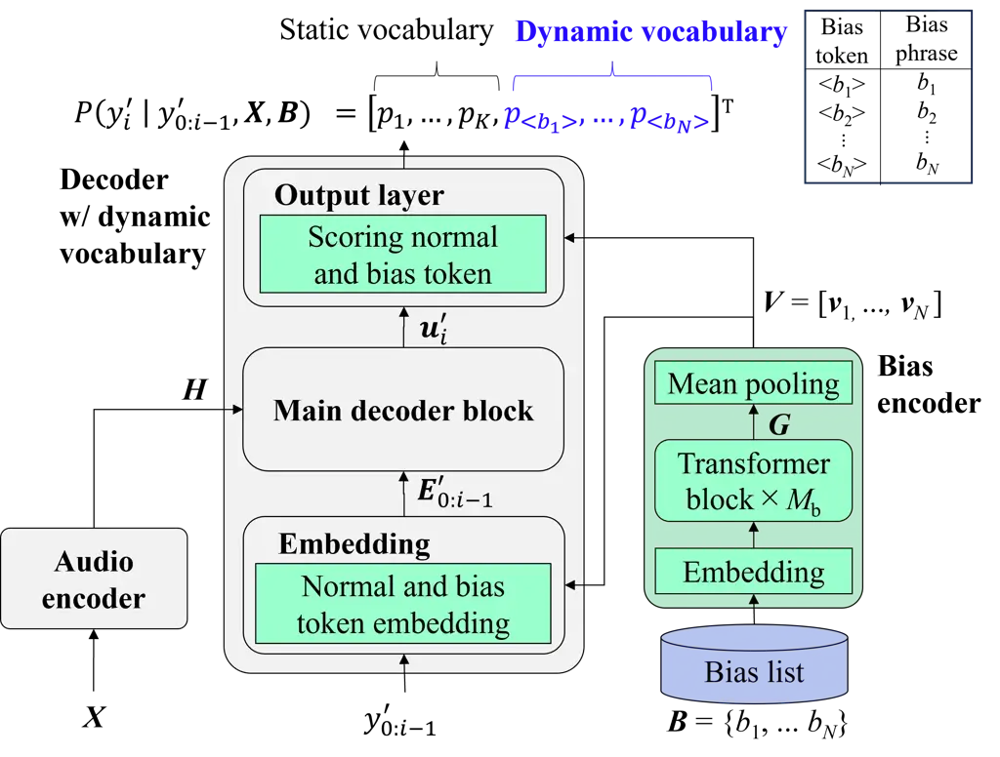
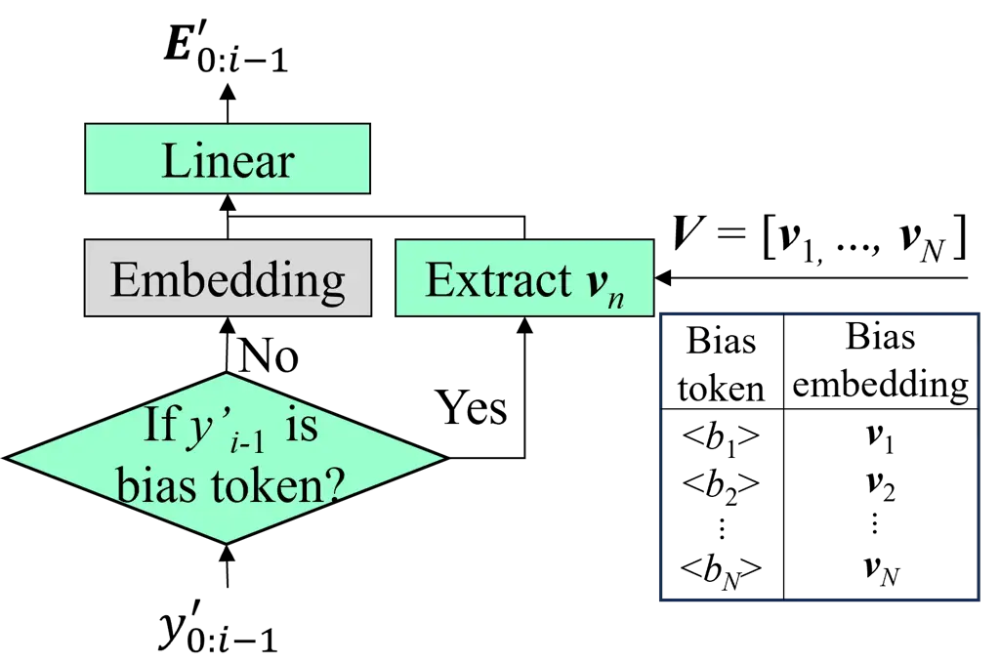
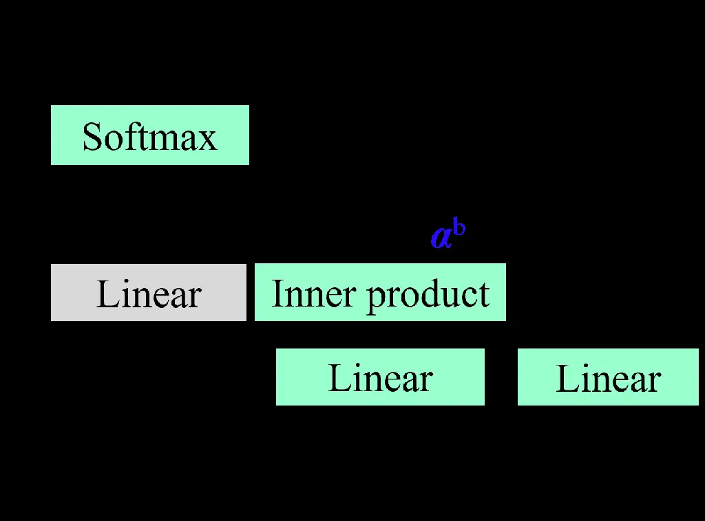
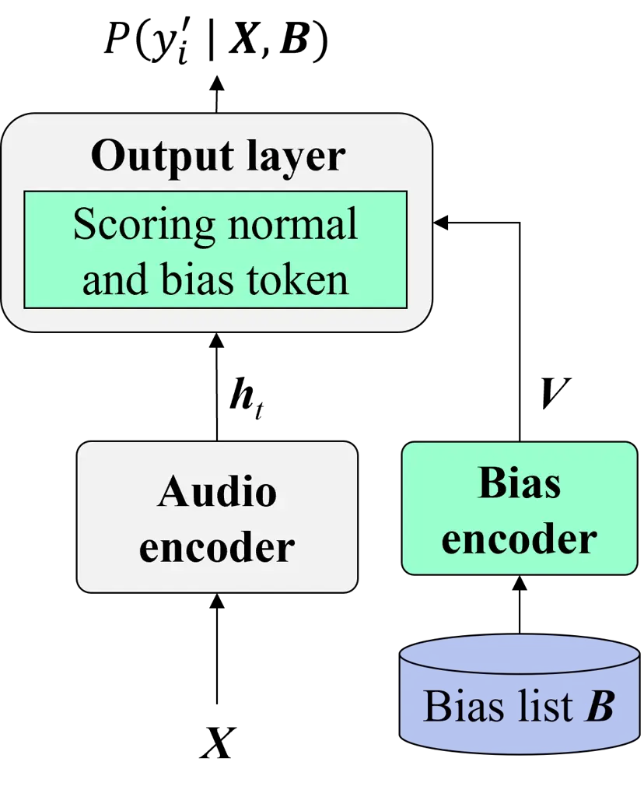
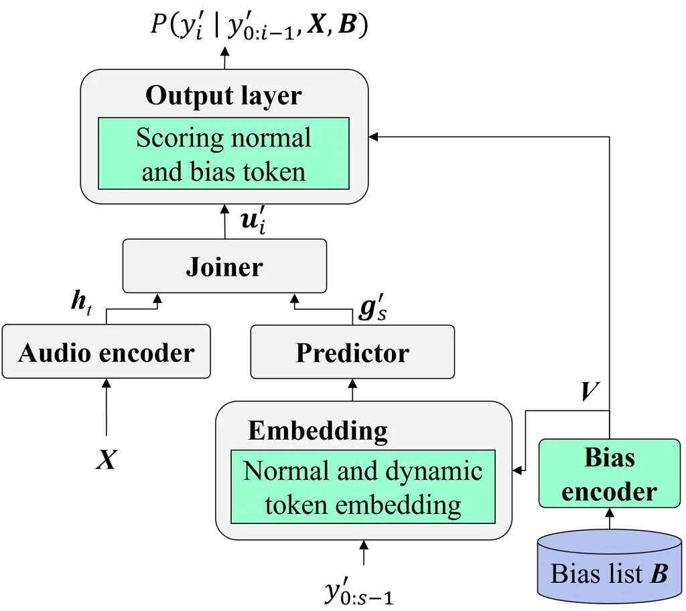
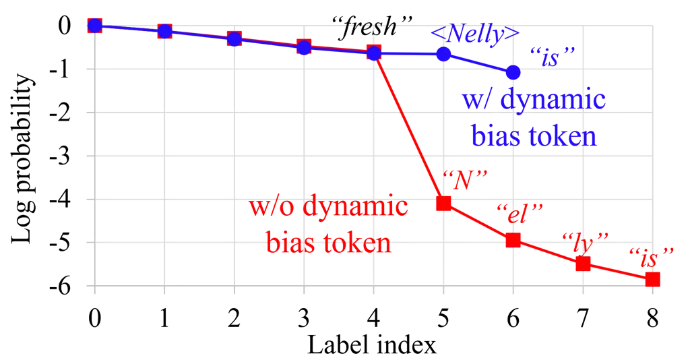
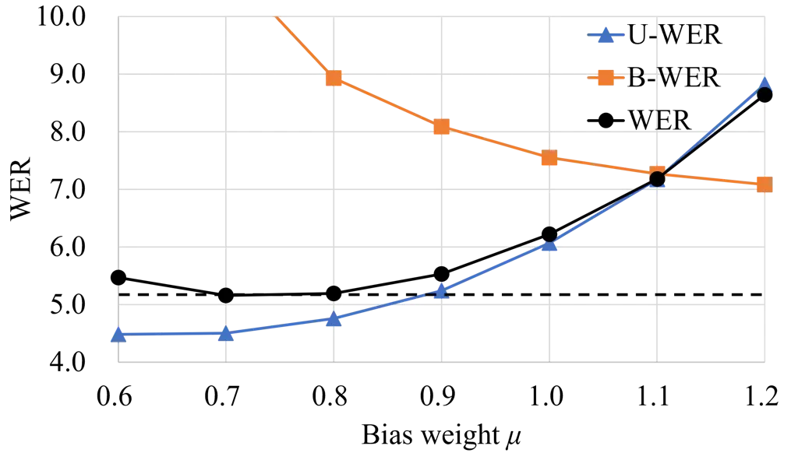

# Contextualized Automatic Speech Recognition with Dynamic Vocabulary

Yui Sudo    Yosuke Fukumoto    Muhammad Shakeel    Yifan Peng    Shinji
Watanabe

###### Abstract

Deep biasing (DB) enhances the performance of end-to-end automatic
speech recognition (E2E-ASR) models for rare words or contextual phrases
using a bias list. However, most existing methods treat bias phrases as
sequences of subwords in a predefined static vocabulary. This naive
sequence decomposition produces unnatural token patterns, significantly
lowering their occurrence probability. More advanced techniques address
this problem by expanding the vocabulary with additional modules,
including the external language model shallow fusion or rescoring.
However, they result in increasing the workload due to the additional
modules. This paper proposes a dynamic vocabulary where bias tokens can
be added during inference. Each entry in a bias list is represented as a
single token, unlike a sequence of existing subword tokens. This
approach eliminates the need to learn subword dependencies within the
bias phrases. This method is easily applied to various architectures
because it only expands the embedding and output layers in common
E2E-ASR architectures. Experimental results demonstrate that the
proposed method improves the bias phrase WER on English and Japanese
datasets by 3.1 – 4.9 points compared with the conventional DB method.

###### Index Terms: 

speech recognition, contextualization, biasing, dynamic vocabulary

^(†)^(†)address: ¹Honda Research Institute Japan Co., Ltd., Japan  
²Carnegie Mellon University, USA

## 1 Introduction

End-to-end automatic speech recognition (E2E-ASR) \[1, 2\] combines an
acoustic model and a language model (LM) into a single neural network to
improve ASR performance. Various E2E-ASR methods have been proposed,
including connectionist temporal classification (CTC) \[3, 4\],
recurrent neural network transducer (RNN-T) \[5, 6\], attention
mechanisms \[7, 8, 9\], and their hybrids \[10, 11, 12\]. However, the
effectiveness of E2E-ASR models strongly depends on the context of the
training data. This can lead to performance inconsistencies in unseen
user contexts, including named entities. Retraining ASR models for every
possible context is infeasible, highlighting the need for a method that
allows users to efficiently contextualize models without additional
training.

To address the challenge of contextualization in ASR, a common strategy
is shallow fusion with an external LM \[13, 14\]. This strategy
frequently involves using a weighted finite state transducer (WFST) to
create an in-class LM that improves the recognition of target named
entities. In addition, \[15, 16, 17\] attempt to improve accuracy by
integrating an external neural LM with an E2E-ASR model. This
integration involves rescoring the output hypotheses of the E2E-ASR
model; however, additional training is required to integrate an external
LM, which increases the workload.

Deep biasing (DB) \[18, 19, 20, 21, 22, 23, 24, 25\] efficiently
contextualizes E2E-ASR models without retraining by using an editable
list of phrases, referred to as a bias list. Many DB techniques use a
cross-attention layer integrated to the middle of the E2E-ASR
architecture to ensure accurate recognition of bias phrases. Previous
studies \[20, 21, 22, 23, 24, 25\] have enhanced the effectiveness of
the cross-attention layer with an auxiliary bias phrase detection loss
function optimized by multitask learning. However, these cross-attention
layers are tightly integrated into individual architectures (e.g., CTC,
RNN-T, and attention), making their application to other architectures
complex. Further, multitask learning requires multiple experimental
training phases to fine-tune the learning weights, which is a
time-intensive process.

In addition, most existing DB methods treat bias phrases as sequences of
subwords in a predefined static vocabulary. This naive sequence
decomposition produces unnatural token patterns, significantly lowering
their occurrence probability. For example, the personal name “Nelly” can
be segmented into a subword sequence, e.g., “N”, “el”, and “ly.”
However, if such token patterns are rare in the training data, their
probability is significantly reduced. To address this problem, several
studies \[26, 27\] have incorporated external text data to train an
external LM or a text encoder. However, this technique can considerably
increase the workload. Other strategies have been proposed to improve
contextualization using extra information, such as phonemes \[28, 29,
30\], named entity tags \[31\], and synthesized speech \[32, 33\];
however, these strategies also increase the workload.

This paper proposes a simple but effective DB method by introducing
dynamic vocabulary expansion where bias tokens can be added during
inference. Each entry in a bias list is represented as a single token,
unlike a sequence of existing subword tokens. This approach bypasses the
complex process of learning subword dependencies within bias phrases,
enabling effective biasing without relying on external text data, unlike
the previous methods \[26, 27\]. In addition, the proposed method is
trained with a conventional E2E-ASR loss by dynamically expanding the
vocabulary, eliminating the need for auxiliary losses, unlike the
previous studies \[20, 21, 22, 23, 24\]. Furthermore, compared with the
previous methods \[21, 22, 23, 24, 26, 27\], the proposed method can be
more easily applied to various architectures because it only expands the
embedding and output layers of common E2E-ASR models between CTC, RNN-T,
and attention. The main contributions of this study are as follows:

- •
  We propose a simple but effective DB method based on the dynamic
  vocabulary.
- •
  We verify that the proposed method performs well on both the
  Librispeech-960 dataset (English) and our in-house Japanese dataset.
- •
  We demonstrate the effectiveness of the proposed method on various
  architectures, including CTC/attention-based offline systems and
  RNN-T-based streaming systems.

## 2 End-to-end ASR

This section describes the E2E-ASR system, such as attention-based
encoder-decoder and RNN-T, which is expanded to the proposed method. The
following subsections describe the components of the E2E-ASR: the audio
encoder and decoder.

### 2.1 Audio encoder

The audio encoder comprises two convolutional layers, a linear
projection layer, and $`M_{\text{a}}`$ conformer blocks \[6\]. The
convolutional layers subsample an audio feature sequence $`\bm{X}`$, and
the conformer blocks then transform the subsampled feature sequence to a
$`T`$-length hidden state vector sequence
$`\bm{H}=[\bm{h}_{1},\cdots,\bm{h}_{T}]\in\mathbb{R}^{d\times T}`$ where
$`d`$ represents the dimension:

```math
\bm{H}=\mathrm{AudioEnc}(\bm{X}). \tag{1}
```

Each Conformer block has two feedforward layers, a multiheaded
self-attention layer, a convolution layer, and a layer-normalization
layer with residual connections.

### 2.2 Decoder

Given $`\bm{H}`$ generated by the audio encoder in Eq. (1) and the
previously estimated token sequence
$`y_{0:i-1}=[y_{0},\cdots,y_{i-1}]`$, the decoder with an embedding and
output layer estimates the next token $`y_{i}`$ recursively as follows:

```math
P(y_{i}|y_{0:i-1},\bm{X})=\mathrm{Decoder}(y_{0:i-1},\bm{H}), \tag{2}
```

where $`y_{i}`$ is the $`i`$-th subword-level token in the pre-defined
static vocabulary $`\mathcal{V}^{\text{n}}`$ of size $`K`$
($`y_{i}\in\mathcal{V}^{\text{n}}`$). Note that
$`\mathcal{V}^{\text{n}}`$ contains the blank token $`\phi`$ for
RNN-T-based systems.

Specifically, the decoder comprises an embedding layer, a main decoder
block (e.g., transformer blocks for attention-based systems and
prediction/joint network for RNN-T-based systems), and an output layer.
First, the embedding layer with positional encoding converts the input
non-blank token sequence $`y_{0:i-1}`$ to an embedding vector sequence
$`\bm{E}_{0:i-1}=[\bm{e}_{0},\cdots,\bm{e}_{i-1}]\in\mathbb{R}^{d\times i}`$
as follows:

```math
\bm{E}_{0:i-1}=\mathrm{Embedding}(y_{0:i-1}). \tag{3}
```

Thereafter, $`\bm{E}_{0:i-1}`$ is input to the main decoder block with
the hidden state vectors $`\bm{H}`$ in Eq. (1) to generate a hidden
state vector $`\bm{u}_{i}\in\mathbb{R}^{d}`$ as follows:

```math
\bm{u}_{i}=\mathrm{MainBlock}(\bm{H},\bm{E}_{0:i-1}). \tag{4}
```

For example, attention-based systems employ the transformer blocks,
while RNN-T-based systems comprise a prediction network and a joint
network for the main decoder block, respectively. Subsequently, the
output layer calculates the token-wise score
$`\bm{\alpha}^{\text{n}}=[\alpha^{\text{n}}_{1},\cdots,\alpha^{\text{n}}_{K}]^{T}`$
and the corresponding probability as follows:

```math
\bm{\alpha}^{\text{n}}=\mathrm{Linear}(\bm{u}_{i}), \tag{5}
```

```math
P\left(y_{i}\mid y_{0:i-1},\bm{X}\right)=\mathrm{Softmax}(\bm{\alpha}^{\text{n}}). \tag{6}
```

Here, the vocabulary size $`K`$ is pre-defined by a static token list.
By repeating these processes recursively, the posterior probability of
the token sequence is formulated as follows:

```math
P(Y\mid\bm{X})=\begin{cases}\prod_{i=1}^{S}P\left(y_{i}\mid y_{0:i-1},\bm{X}\right)&(\text{attention}),\\
\sum_{Z\in\mathcal{B^{\text{-1}}}(Y)}P(Z\mid\bm{X})&(\text{RNN-T}),\end{cases} \tag{7}
```

```math
P(Z\mid\bm{X})=\prod_{i=1}^{T+S}P\left(y_{i}\mid y_{0:i-1},\bm{X}\right). \tag{8}
```

Here, the attention decoder directly outputs the $`S`$-length non-blank
token sequence $`Y=(y_{i}\mid i=1,...,S)`$, while the RNN-T decoder
outputs the ($`T+S`$)-length alignment sequence
$`Z=(y_{i}\mid i=1,...,T+S)`$. $`\mathcal{B^{\text{-1}}}(Y)`$ in the
RNN-T-based systems is a set of all possible alignment sequences of
$`Y`$. The model parameters are optimized by minimizing the negative
log-likelihood described as follows:

```math
L=-\log P(Y\mid\bm{X}). \tag{9}
```

The embedding and output layers in Eqs. (3) and (6) are expanded to the
proposed DB method in Section 3.2.



(a) Overall architecture



(b) Expanded embedding layer



(c) Expanded output layer

Figure 1: (a) Overall architecture of the proposed method, including the
audio encoder, bias encoder, and decoder, with the expanded embedding
and output layers. (b) Expanded embedding layer: If the input token is a
dynamic bias token, the corresponding embedding $`\bm{v}_{n}`$ is
extracted. (c) Expanded output layer: The bias score
$`\bm{\alpha}^{\text{b}}`$ is calculated using the inner product.

## 3 Proposed method

Figure 1 shows the overall architecture of the proposed method, which
comprises the existing audio encoder, as described in Section 2.1, newly
introduced bias encoder, and decoder, which is nearly identical to
Section 3.2 but with expanded embedding and output layers. The bias
encoder and expanded decoder are described in the following subsections.

### 3.1 Bias encoder

Similar to \[24\], the bias encoder comprises an embedding layer with a
positional encoding layer, $`M_{\text{b}}`$ transformer blocks, a mean
pooling layer, and a bias list $`B=\{b_{1},\cdots,b_{N}`$}, where
$`b_{n}\in\mathcal{V}^{\text{n}}`$ is the $`I_{n}`$-lengnth subword
token sequence of the $`n`$-th bias phrase (e.g., \[“N”, “el”, “ly”\]).
After converting the bias list $`B`$ into a matrix
$`\bm{B}\in\mathbb{R}^{I_{\text{max}}\times N}`$ through zero padding
based on the maximum token length $`I_{\text{max}}`$ in $`B`$, the
embedding layer and the $`M_{\text{b}}`$ transformer blocks extract the
high level representation
$`\bm{G}\in\mathbb{R}^{d\times I_{\text{max}}\times N}`$ as follows:

```math
\bm{G}=\mathrm{TransformerEnc}(\mathrm{Embedding}(\bm{B})). \tag{10}
```

Then, a mean pooling layer extracts phrase-level embedding vectors
$`\bm{V}=[\bm{v}_{1},\cdots,\bm{v}_{N}]\in\mathbb{R}^{d\times N}`$ as
follows:

```math
\bm{V}=\mathrm{MeanPool}(\bm{G}). \tag{11}
```

### 3.2 Expanded decoder with dynamic vocabulary

To avoid the complexity associated with learning dependencies within the
bias phrases, we introduce a dynamic vocabulary
$`\mathcal{V}^{\text{b}}=\{<\hskip-3.0ptb_{1}\hskip-3.0pt>,\cdots,<\hskip-3.0ptb_{N}\hskip-3.0pt>\}`$
where the phrase-level bias tokens represent the bias phrases with the
single entities for the $`N`$ bias phrases in the bias list $`\bm{B}`$.
Unlike Eq. (2), the expanded decoder estimates the next token
$`y_{i}^{\prime}`$ from expanded vocabulary
$`\mathcal{V}^{\text{n}}\cup\mathcal{V}^{\text{b}}`$, i.e.,
$`y_{i}^{\prime}\in\mathcal{V}^{\text{n}}\cup\mathcal{V}^{\text{b}}`$
given $`\bm{H}`$, $`\bm{V}`$ in Eqs. (1) and (11), and
$`y^{\prime}_{0:i-1}`$ as follows:

```math
P(y^{\prime}_{i}|y^{\prime}_{0:i-1},\bm{X},\bm{B})=\mathrm{ExDecoder}(y^{\prime}_{0:i-1},\bm{H},\bm{V}), \tag{12}
```

where $`y^{\prime}_{0:i-1}=[y^{\prime}_{0},\cdots,y^{\prime}_{i-1}]`$
represents the expanded token sequence. For example, if a bias phrase
“Nelly” exists in the bias list, the expanded decoder outputs the
corresponding bias token \[$`<`$Nelly$`>`$\] rather than the decomposed
normal token sequence \[“N”, “el”, “ly”\].

Similar to the conventional decoder described in Section 2.2, the
decoder comprises an expanded embedding layer, a main decoder block, and
an expanded output layer. First, the input token sequence
$`y^{\prime}_{0:i-1}`$ is converted into the embedding vector sequence
$`\bm{E}^{\prime}_{0:i-1}=[\bm{e}^{\prime}_{0},\cdots,\bm{e}^{\prime}_{i-1}]\in\mathbb{R}^{d\times i}`$.
Unlike Eq. (3), if the input token $`y^{\prime}_{i-1}`$ is a bias token,
the corresponding bias embedding $`\bm{v}_{n}`$ is extracted from
$`\bm{V}`$ (Figure 1(b)); otherwise, the normal embedding layer is used
with a linear layer as follows:

```math
\bm{e}^{\prime}_{i-1}=\begin{cases}\mathrm{Linear}(\mathrm{Embedding}(y^{\prime}_{i-1}))&(y^{\prime}_{i-1}\in\mathcal{V}^{\text{n}})\\
\mathrm{Linear}(\mathrm{Extract}(\bm{V},y^{\prime}_{i-1}))&(y^{\prime}_{i-1}\in\mathcal{V}^{\text{b}}).\end{cases} \tag{13}
```

Subsequently, the main decoder block converts
$`\bm{E}^{\prime}_{0:s-1}`$ into the hidden state vector
$`\bm{u}^{\prime}_{s}`$ as in Eq. (4). In addition to the normal token
score
$`\bm{\alpha}^{\text{n}}=[\alpha^{\text{n}}_{1},\cdots,\alpha^{\text{n}}_{K}]^{T}`$
in Eq. (5), the bias token score
$`\bm{\alpha}^{\text{b}}=[\alpha^{\text{b}}_{1},\cdots,\alpha^{\text{b}}_{N}]^{T}`$
is calculated using an inner product with two linear layers (Figure
1(c)) as follows:

```math
\displaystyle\bm{\alpha}^{\text{b}}=\frac{\mathrm{Linear}(\bm{u}^{\prime}_{i})\mathrm{Linear}(\bm{V}^{T})}{\sqrt{d}}. \tag{14}
```

By concatenating the normal token score $`\bm{\alpha}^{\text{n}}`$ with
the bias token score $`\bm{\alpha}^{\text{b}}`$, which results in
$`\bm{\alpha}=[\alpha^{\text{n}}_{1},\cdots,\alpha^{\text{n}}_{K},\alpha^{\text{b}}_{1},\cdots,\alpha^{\text{b}}_{N}]^{T}`$,
Eq. (6) can be expanded as follows:

```math
\hskip-2.84526ptP\left(y^{\prime}_{i}\mid y^{\prime}_{0:i-1},\bm{X},\bm{B}\right)=\mathrm{Softmax}(\mathrm{Concat}(\bm{\alpha}^{\text{n}},\bm{\alpha}^{\text{b}})). \tag{15}
```

Similar to Eqs. (7) – (9), the posterior probability and the loss
function are formulated as follows:

```math
P(Y^{\prime}\mid\bm{X},\bm{B})=\begin{cases}\prod_{i=1}^{S^{\prime}}P\left(y^{\prime}_{i}\mid y^{\prime}_{0:i-1},\bm{X},\bm{B}\right)&(\text{attention}),\\
\sum_{Z^{\prime}\in\mathcal{B^{\text{-1}}}(Y^{\prime})}P(Z^{\prime}\mid\bm{X},\bm{B})&(\text{RNN-T}),\end{cases} \tag{16}
```

```math
P(Z^{\prime}\mid\bm{X},\bm{B})=\prod_{i=1}^{T+S^{\prime}}P\left(y^{\prime}_{i}\mid y^{\prime}_{0:i-1},\bm{X},\bm{B}\right), \tag{17}
```

```math
L^{\prime}=-\log P(Y^{\prime}\mid\bm{X},\bm{B}), \tag{18}
```

where $`Y^{\prime}`$ and $`Z^{\prime}`$ represent the
$`S^{\prime}`$-length non-blank token sequence and
($`T+S^{\prime}`$)-length alignment sequence based on the proposed
dynamic vocabulary, respectively. Note that Eqs. (14) and (15) do not
hold learnable parameters depending on the bias list size $`N`$, and can
replace the bias list dynamically during inference. Also, the proposed
method is optimized only with Eq. (18) without the auxiliary loss.

The proposed method can be easily applied to various E2E-ASR
architectures (e.g., CTC, RNN-T, and attention), including streaming
systems and multilingual systems \[4, 5, 9, 34\] without major
modifications, because it only expands the embedding and output layers
in addition to the bias encoder (Figure 2). Note that since CTC does not
have the embedding layer and the main decoder block, only the output
layer is expanded as described in Eqs. (14) and (15) using the hidden
state vector $`\bm{h}_{t}`$ instead of $`\bm{u}_{i}`$ (Figure 2a).

### 3.3 Application to hybrid E2E-ASR systems

Given the simplicity of the proposed method, the proposed method can
also be applied to hybrid systems, such as \[10, 35, 11, 12, 36, 37\],
by expanding the output layer of each branch. In this paper, the
attention-based and RNN-T-based dynamic vocabulary models described in
Sections 3.2 are trained with an auxiliary CTC loss, which is also based
on the dynamic vocabulary, with the training weight $`\lambda`$ as
follows:

```math
L^{\prime}_{\text{joint}}=(1-\lambda)L^{\prime}+\lambda L^{\prime}_{\text{ctc}}, \tag{19}
```

where $`L^{\prime}_{\text{joint}}`$ and $`L^{\prime}_{\text{ctc}}`$
represent loss functions for the joint model and auxiliary CTC decoder,
respectively.

Moreover, the flexibility of the proposed method is preserved in joint
decoding with multiple decoders \[10, 11, 12, 38, 39, 40\]. We adopt the
joint decoding algorithms similar to \[10, 12\]. Specifically, the
primary decoder (i.e., attention or RNN-T) generate the hypotheses and
the scores of the hypotheses are augmented by the CTC decoder with the
decoding weight $`\gamma`$ as follows:

```math
\displaystyle\begin{split}\beta_{\text{joint}}=(1-\gamma)\beta_{\text{}}+\gamma\beta_{\text{ctc}},\end{split} \tag{20}
```

```math
\begin{cases}\beta_{\text{}}=\text{log}P(Y^{\prime}\mid\bm{X},\bm{B})&(\text{attention/RNN-T})\\
\beta_{\text{ctc}}=\text{log}P_{\text{ctc}}(Y^{\prime}\mid\bm{X},\bm{B})&(\text{CTC}),\end{cases} \tag{21}
```

where $`\beta_{\text{joint}}`$, $`\beta_{\text{}}`$, and
$`\beta_{\text{ctc}}`$ represent the scores of joint decoding, primary
decoder, and CTC decoder, respectively.



(a) CTC-based system



(b) RNN-T-based system

Figure 2: Various architectures utilized in the proposed method.

### 3.4 Training

During training, a bias list $`\bm{B}`$ is created randomly from the
reference transcriptions for each batch, where $`N_{\text{utt}}`$ bias
phrases are selected per utterance, each having a token length of $`I`$.
This process yields a total of $`N`$ bias phrases calculated as
$`N_{\text{utt}}\times`$ batch size. Once the bias list $`\bm{B}`$ is
defined, the corresponding reference transcription $`y_{\text{gt}}`$ is
modified to $`y^{\prime}_{\text{gt}}`$ based on the dynamic vocabulary.
For example, if the phrase “N”, “el”, “ly” ($`N_{\text{utt}}=1,I=3`$) is
extracted as a bias phrase from the reference transcription
$`y_{\text{gt}}`$ = \[“Hi”, “N”, “el”, “ly”\], the reference
transcription is modified to $`y^{\prime}_{\text{gt}}`$ = \[“Hi”,
$`<`$Nelly$`>`$\].

### 3.5 Bias weight during inference

Considering practicality, we introduce a bias weight to Eq. (15) to
avoid over/under-biasing during inference:

```math
\mathrm{WeightSoftmax}_{j}(\bm{\alpha},\bm{w})=\frac{w_{j}\mathrm{exp}(\alpha_{j})}{\sum_{l=1}^{(K+N)}w_{l}\mathrm{exp}(\alpha_{l})}, \tag{22}
```

where $`\bm{w}=[w_{1}.\cdots,w_{(K+N)}]^{T}`$ and $`j`$ represent a
weight vector and its index for
$`\bm{\alpha}=[\alpha^{\text{n}}_{1},\cdots,\alpha^{\text{n}}_{K},\alpha^{\text{b}}_{1},\cdots,\alpha^{\text{b}}_{N}]^{T}`$,
respectively. The same bias weight $`\mu`$ is applied to the bias tokens
as follows:

```math
w_{j}=\begin{cases}1.0&(j\leqq K)\\
\mu&(j>K),\end{cases} \tag{23}
```

if $`\mu<1.0`$, the bias tokens are underweighted compared to the normal
tokens; otherwise, the bias tokens are overweighted compared to the
normal tokens.

|                           |                     |            |             |            |             |            |              |            |
| ------------------------- | ------------------- | ---------- | ----------- | ---------- | ----------- | ---------- | ------------ | ---------- |
|                           | $`N`$ = 0 (no-bias) |            | $`N`$ = 100 |            | $`N`$ = 500 |            | $`N`$ = 1000 |            |
| Model                     | test-clean          | test-other | test-clean  | test-other | test-clean  | test-other | test-clean   | test-other |
| Baseline                  | 2.57                | 5.98       | 2.57        | 5.98       | 2.57        | 5.98       | 2.57         | 5.98       |
| (CTC/attention)           | (1.5/10.9)          | (4.0/23.1) | (1.5/10.9)  | (4.0/23.1) | (1.5/10.9)  | (4.0/23.1) | (1.5/10.9)   | (4.0/23.1) |
| CPPNet \[20\]             | 4.29                | 9.16       | 3.40        | 7.77       | 3.68        | 8.31       | 3.81         | 8.75       |
|                           | (2.6/18.3)          | (5.9/37.5) | (2.6/10.4)  | (6.0/23.0) | (2.8/10.9)  | (6.5/24.3) | (2.9/11.4)   | (6.9/25.3) |
| Attention-based DB        | 5.05                | 8.81       | 2.75        | 5.60       | 3.21        | 6.28       | 3.47         | 7.34       |
| \+ BPB beam search \[24\] | (3.9/14.1)          | (6.6/27.9) | (2.3/6.0)   | (4.9/12.0) | (2.7/7.0)   | (5.5/13.5) | (3.0/7.7)    | (6.4/15.8) |
| Proposed                  | 3.16                | 6.95       | 1.80        | 4.63       | 1.92        | 4.81       | 2.01         | 4.97       |
|                           | (1.9/13.8)          | (4.6/27.5) | (1.7/2.8)   | (4.3/7.1)  | (1.8/3.1)   | (4.5/7.9)  | (1.9/3.3)    | (4.6/8.5)  |

Table 1: WER results of the offline CTC/attention-based systems obtained
on Librispeech-960 (U-WER/B-WER).

## 4 Experiment

To verify the effectiveness of the proposed method, we apply it to
offline CTC/attention and streaming RNN-T models.

### 4.1 Experimental setup

The input features are 80-dimensional Mel filterbanks with a window size
of 512 samples and a hop length of 160 samples. Subsequently,
SpecAugment is applied. The audio encoder comprises two convolutional
layers with a stride of two and a 256-dimensional linear projection
layer followed by 12 conformer layers with 1024 linear units and layer
normalization. For the streaming RNN-T model, the audio encoder is
processed blockwisely \[41\] with block size and look ahead of 800 and
320 ms, respectively. The bias encoder has six transformer blocks with
1024 linear units. Regarding the expanded decoder, the offline
CTC/attention model has six transformer blocks with 2048 linear units,
and the streaming RNN-T model has a single long short-term memory layer
with a hidden size of 256 and a linear layer of 320 joint sizes for
prediction and joint networks. The attention layers in the audio
encoder, bias encoder, and expanded decoder are four multihead
attentions with a dimension $`d`$ of 256.

The offline CTC/attention and streaming RNN-T models have 40.58 M and
31.38 M parameters, respectively, including the bias encoders. The
training weight $`\lambda`$ in Eq. (19) is 0.3 for the CTC/attention and
RNN-T models. The decoding weight $`\gamma`$ in Eq. (20) is 0.3 and 0.1
for the CTC/attention and RNN-T models, respectively. The bias weight
$`\mu`$ in Eq. (23) is set to 0.8 and 0.01 for the CTC/attention and
RNN-T models, respectively (this is discussed further in Section 4.4).
During training, a bias list $`\bm{B}`$ is created randomly for each
batch with $`N_{\text{utt}}`$ = \[2 - 10\] and $`I`$ = \[2 - 10\]
(Section 3.4). The proposed models are trained for 150 epochs at a
learning rate of 0.0025 and 0.002 for the CTC/attention-based and
RNN-T-based systems, respectively.

The Librispeech-960 corpus \[42\] is employed to evaluate the proposed
method using ESPnet toolkit \[43\]. The proposed method is evaluated in
terms of the word error rate (WER), bias phrase WER (B-WER), and
unbiased phrase WER (U-WER) as in \[26\]. The static vocabulary size
$`K`$ is 5000, while the dynamic vocabulary size $`N`$ ranges from 0 to 2000.

### 4.2 Results of the offline CTC/attention-based system

Table 1 shows the results of the offline CTC/attention-based systems
obtained on the Librispeech-960 dataset for different bias list sizes
$`N`$. With a bias list size of $`N>0`$, the proposed method improves
the B-WER considerably despite a slight increase in the U-WER, resulting
in a substantial improvement in the overall WER. While the B-WER and
U-WER tend to deteriorate with larger $`N`$, the proposed method remains
superior to other DB techniques across all bias list sizes. In addition,
the proposed method shows significant B-WER improvement for unseen words
in the training data. Specifically, the baseline B-WER for unseen words
in the test-other set is 73.5%, whereas the proposed method improves the
B-WER to 19.0% when the bias list size is $`N=1000`$.

### 4.3 Analysis of the proposed bias token



Figure 3: Example of cumulative log probability during beam search.

Figure 3 shows an example of the cumulative log probability described in
Eq. (16), where the blue and red lines indicate the results obtained
with and without the bias tokens. Without using the bias tokens, the
model struggles to capture the subword dependencies, resulting in
significantly lower scores for each subword. Conversely, the proposed
method assigns a high score to the bias token ($`<`$Nelly$`>`$),
improving the B-WER (Table 1). Interestingly, the log probabilities
before and after the bias token (“fresh” and “is”) remain stable, even
though the bias tokens are created dynamically during inference. This
indicates that the proposed method preserves the context with non-bias
tokens while eliminating the need to learn subword dependencies within
the bias phrases.



Figure 4: Effect of the bias weight $`\mu`$.

### 4.4 Effect of bias weight during inference

Figure 4 shows the effect of the bias weights $`\mu`$ (Section 3.5) on
the WER, U-WER, and B-WER results for $`N`$ = 2000. Increasing the bias
weights $`\mu`$ improves the B-WER but deteriorates U-WER due to the
tendency for overbiasing. Under this experimental condition, there is a
slight tendency for overbiasing when no bias weights are introduced;
thus, when $`\mu=0.8`$, the overbiasing can be suppressed. The degree to
which the model is biased depends on the target user domain; thus, we
believe that this mechanism adjusting the bias weights easily during
inference is effective.

### 4.5 Validation on Japanese dataset

We validate the proposed method using our in-house Japanese dataset,
comprising the Corpus of Spontaneous Japanese (581 h) \[44\], 181 h of
Japanese speech from the database developed by the Advanced
Telecommunications Research Institute International \[45\], and 93 h of
our in-house Japanese speech data. The CTC/attention-based system
described in Section 4.1 is used in this experiment. Table 2 shows the
results in terms of character error rate (CER), B-CER, and U-CER, with
the bias list provided by our end users containing $`N`$ = 203 technical
terms. The proposed method significantly improves the B-CER with a
slight degradation in U-CER, thereby resulting in the best overall CER.

| Model                  | CER  | U-CER | B-CER |
| ---------------------- | ---- | ----- | ----- |
| Baseline               | 9.85 | 8.17  | 21.76 |
| BPB beam search \[24\] | 9.67 | 9.20  | 13.16 |
| Intermediate DB \[25\] | 9.28 | 8.23  | 16.93 |
| Proposed               | 9.03 | 8.93  | 9.73  |

Table 2: Experimental results obtained on Japanese dataset.

Figure 5 shows the typical inference results, where the characters in
boldface, red, and blue represent the bias phrases, incorrectly, and
correctly recognized characters, respectively. As discussed in
Section 4.3, the conventional DB method \[24\] struggles to capture the
subword dependencies, especially in Japanese ASR, which operates at the
character level, leading to longer subword sequences for bias phrases.
In contrast, the proposed method avoids this problem by introducing the
dynamic vocabulary where the bias token represents an entire bias phrase
within a single token.


Figure 5: Typical inference example. The characters in boldface, red,
and blue represent the bias phrases, incorrectly, and correctly
recognized characters, respectively.

### 4.6 Validation on the streaming RNN-T-based system

Table 3 shows the results of the streaming RNN-T-based systems with a
bias list of size $`N`$ = 100, and 1000. The asterisk (\*) indicates the
use of external text data for model training (B1-B3). We apply LM
shallow fusion to the proposed method for fair comparison. Note that
bias tokens are decomposed into static subword token sequences before
shallow fusion because the LM is not based on the dynamic vocabulary. B1
and B2 incorporate the DB-based neural LM and unified speech-to-text
representation (USTR), respectively \[26, 27\].

Consistent with the results from the offline CTC/attention-based system,
the proposed method significantly improves the B-WER without relying on
additional information, such as phonemes, with better overall WER than
conventional DB methods (A1-2 vs. A3). The conventional DB methods \[26,
27\] considerably improve the B-WER by learning subword dependencies
within the bias phrases using external text data (A1-2 vs. B1-2). In
contrast, the proposed method eliminates this need by introducing the
bias tokens. In addition, the proposed method with the external LM
performed comparably to conventional DB methods (B3 vs. B1-2), although
its main advantage is simplicity and high DB performance (B-WER) without
relying on external text data.

|     |                         |             |              |
| --- | ----------------------- | ----------- | ------------ |
| ID  | Model                   | $`N`$ = 100 | $`N`$ = 1000 |
| A0  | Baseline (RNN-T)        | 3.80 / 14.3 | 3.80 / 14.3  |
| A1  | Trie-based DB \[26\]    | 3.11 / 9.8  | 3.30 / 11.0  |
| A2  | Phoneme-based DB \[27\] | 2.56 / 6.8  | 2.81 / 8.7   |
| A3  | Proposed                | 2.43 / 3.1  | 2.66 / 3.5   |
| B1  | A1+DB-LM\*+FST \[26\]   | 1.98 / 5.7  | 2.14 / 6.7   |
| B2  | A2+USTR\*+FST \[27\]    | 2.06 / 2.0  | 2.16 / 2.5   |
| B3  | A3+LM\*                 | 1.96 / 2.2  | 2.31 / 2.7   |

Table 3: WER results of the streaming RNN-T-based systems on
Librispeech-960 test-clean (WER/B-WER). \*850 M words of external text
data is used for model training.

## 5 Conclusion

In this paper, we present a simple but effective DB method that
introduces a dynamic vocabulary where the bias tokens represent the bias
phrases with the single entities. In addition, we introduce a bias
weight to adjust the bias intensity during inference. The experimental
results obtained by applying the proposed method to an offline
CTC/attention-based system and a streaming RNN-T-based system
demonstrate that it significantly improves bias phrase recognition on
English and Japanese datasets.

## References

- \[1\] Rohit Prabhavalkar, Takaaki Hori, Tara N. Sainath, Ralf
  Schluter, and Shinji Watanabe, “End-to-end speech recognition: A
  survey,” IEEE/ACM Transactions on Audio, Speech, and Language
  Processing, vol. 32, pp. 325–351, 2023.
- \[2\] Jinyu Li, “Recent advances in end-to-end automatic speech
  recognition,” APSIPA Transactions on Signal and Information
  Processing, vol. 11, no. 1, 2022.
- \[3\] Alex Graves, Santiago Fernández, Faustino Gomez, and Jürgen
  Schmidhuber, “Connectionist temporal classification: Labelling
  unsegmented sequence data with recurrent neural networks,” in Proc.
  ICML, 2006, pp. 369–376.
- \[4\] Alex Graves and Navdeep Jaitly, “Towards end-to-end speech
  recognition with recurrent neural networks,” in Proc. ICML, 2014, pp.
  1764–1772.
- \[5\] Alex Graves, “Sequence transduction with recurrent neural
  networks,” in Proc. ICML, 2012.
- \[6\] Anmol Gulati, James Qin, Chung-Cheng Chiu, Niki Parmar,
  Yu Zhang, et al., “Conformer: Convolution-augmented transformer for
  speech recognition,” in Proc. Interspeech, 2020, pp. 5036–5040.
- \[7\] Jan K Chorowski, Dzmitry Bahdanau, Dmitriy Serdyuk, Kyunghyun
  Cho, and Yoshua Bengio, “Attention-based models for speech
  recognition,” Advances in neural information processing systems, vol.
  28, 2015.
- \[8\] William Chan, Navdeep Jaitly, Quoc Le, and Oriol Vinyals,
  “Listen, attend and spell: A neural network for large vocabulary
  conversational speech recognition,” in Proc. ICASSP, 2016, pp.
  4960–4964.
- \[9\] Alec Radford, Jong Wook Kim, Tao Xu, Greg Brockman, Christine
  McLeavey, and Ilya Sutskever, “Robust speech recognition via
  large-scale weak supervision,” in Proc. ICML, 2023, pp. 28492–28518.
- \[10\] Shinji Watanabe, Takaaki Hori, Suyoun Kim, John R Hershey, and
  Tomoki Hayashi, “Hybrid ctc/attention architecture for end-to-end
  speech recognition,” IEEE Journal of Selected Topics in Signal
  Processing, vol. 11, no. 8, pp. 1240–1253, 2017.
- \[11\] Ke Hu, Tara N. Sainath, Ruoming Pang, and Rohit Prabhavalkar,
  “Deliberation model based two-pass end-to-end speech recognition,” in
  Proc. ICASSP, 2020, pp. 7799–7803.
- \[12\] Yui Sudo, Muhammad Shakeel, Brian Yan, Jiatong Shi, and Shinji
  Watanabe, “4d asr: Joint modeling of ctc, attention, transducer, and
  mask-predict decoders,” in Proc. Interspeech, 2023, pp. 3312–3316.
- \[13\] Rongqing Huang, Ossama Abdel-Hamid, Xinwei Li, and Gunnar
  Evermann, “Class lm and word mapping for contextual biasing in
  end-to-end asr,” in Proc. Interspeech, 2020, pp. 4348–4351.
- \[14\] Ian Williams, Anjuli Kannan, Petar Aleksic, David Rybach, and
  Tara Sainath, “Contextual speech recognition in end-to-end neural
  network systems using beam search,” in Proc. Interspeech, 2018.
- \[15\] Anjuli Kannan, Yonghui Wu, Patrick Nguyen, Tara N Sainath,
  et al., “An analysis of incorporating an external language model into
  a sequence-to-sequence model,” in Proc. ICASSP, 2018, pp. 5824–5828.
- \[16\] Anuroop Sriram, Heewoo Jun, Sanjeev Satheesh, and Adam Coates,
  “Cold fusion: training seq2seq models together with language models,”
  in Proc. Interspeech, 2018, pp. 387–391.
- \[17\] Takaaki Hori, Shinji Watanabe, Yu Zhang, and William Chan,
  “Advances in joint ctc-attention based end-to-end speech recognition
  with a deep cnn encoder and rnn-lm,” in Proc. Interspeech 2017, 2017,
  pp. 949–953.
- \[18\] Golan Pundak, Tara N Sainath, Rohit Prabhavalkar, Anjuli
  Kannan, and Ding Zhao, “Deep context: End-to-end contextual speech
  recognition,” in Proc. SLT, 2018, pp. 418–425.
- \[19\] Mahaveer Jain, Gil Keren, Jay Mahadeokar, and Yatharth Saraf,
  “Contextual rnn-t for open domain asr,” in Proc. Interspeech, 2020,
  pp. 11–15.
- \[20\] Kaixun Huang, Ao Zhang, Zhanheng Yang, Pengcheng Guo, Bingshen
  Mu, et al., “Contextualized End-to-End Speech Recognition with
  Contextual Phrase Prediction Network,” in Proc. Interspeech, 2023, pp.
  4933–4937.
- \[21\] Minglun Han, Linhao Dong, Zhenlin Liang, Meng Cai, Shiyu Zhou,
  et al., “Improving end-to-end contextual speech recognition with
  fine-grained contextual knowledge selection,” in Proc. ICASSP, 2022,
  pp. 491–495.
- \[22\] Christian Huber, Juan Hussain, Sebastian Stüker, and Alexander
  Waibel, “Instant one-shot word-learning for context-specific neural
  sequence-to-sequence speech recognition,” in Proc. ASRU, 2021, pp.
  1–7.
- \[23\] Shilin Zhou, Zhenghua Li, Yu Hong, Min Zhang, Zhefeng Wang, and
  Baoxing Huai, “Copyne: Better contextual asr by copying named
  entities,” arXiv preprint arXiv:2305.12839, 2023.
- \[24\] Yui Sudo, Muhammad Shakeel, Yosuke Fukumoto, Yifan Peng, and
  Shinji Watanabe, “Contextualized automatic speech recognition with
  attention-based bias phrase boosted beam search,” in Proc. ICASSP,
  2024, pp. 10896–10900.
- \[25\] Muhammad Shakeel, Yui Sudo, Yifan Peng, and Shinji Watanabe,
  “Contextualized end-to-end automatic speech recognition with
  intermediate biasing loss,” in Proc. Interspeech, 2024.
- \[26\] Duc Le, Mahaveer Jain, Gil Keren, Suyoun Kim, et al.,
  “Contextualized streaming end-to-end speech recognition with
  trie-based deep biasing and shallow fusion,” in Proc. Interspeech,
  2021, pp. 1772–1776.
- \[27\] Jin Qiu, Lu Huang, Boyu Li, Jun Zhang, Lu Lu, and Zejun Ma,
  “Improving large-scale deep biasing with phoneme features and
  text-only data in streaming transducer,” in Proc. ASRU, 2023, pp. 1–8.
- \[28\] Antoine Bruguier, Rohit Prabhavalkar, Golan Pundak, and Tara N
  Sainath, “Phoebe: Pronunciation-aware contextualization for end-to-end
  speech recognition,” in Proc. ICASSP, 2019, pp. 6171–6175.
- \[29\] Zhehuai Chen, Mahaveer Jain, Yongqiang Wang, Michael L Seltzer,
  and Christian Fuegen, “Joint grapheme and phoneme embeddings for
  contextual end-to-end asr.,” in Proc. Interspeech, 2019, pp.
  3490–3494.
- \[30\] Hayato Futami, Emiru Tsunoo, Yosuke Kashiwagi, Hiroaki Ogawa,
  Siddhant Arora, and Shinji Watanabe, “Phoneme-aware encoding for
  prefix-tree-based contextual asr,” in Proc. ICASSP, 2024.
- \[31\] Yui Sudo, Kazuya Hata, and Kazuhiro Nakadai, “Retraining-free
  customized asr for enharmonic words based on a named-entity-aware
  model and phoneme similarity estimation,” in Proc. Interspeech, 2023,
  pp. 3312–3316.
- \[32\] Xiaoqiang Wang, Yanqing Liu, Jinyu Li, Veljko Miljanic, Sheng
  Zhao, and Hosam Khalil, “Towards contextual spelling correction for
  customization of end-to-end speech recognition systems,” IEEE Trans.
  Audio, Speech, Lang. Process., vol. 30, pp. 3089–3097, 2022.
- \[33\] Xiaoqiang Wang, Yanqing Liu, Jinyu Li, and Sheng Zhao,
  “Improving contextual spelling correction by external acoustics
  attention and semantic aware data augmentation,” in Proc. ICASSP,
  2023, pp. 1–5.
- \[34\] Yifan Peng, Yui Sudo, Muhammad Shakeel, and Shinji Watanabe,
  “Owsm-ctc: An open encoder-only speech foundation model for speech
  recognition, translation, and language identification,” in Proc.
  ACL, 2024.
- \[35\] Yongqiang Wang, Zhehuai Chen, Chengjian Zheng, Yu Zhang, Wei
  Han, and Parisa Haghani, “Accelerating rnn-t training and inference
  using ctc guidance,” in Proc. ICASSP, 2023, pp. 1–5.
- \[36\] Yifan Peng, Jinchuan Tian, Brian Yan, Dan Berrebbi, Xuankai
  Chang, Xinjian Li, Jiatong Shi, Siddhant Arora, William Chen, et al.,
  “Reproducing whisper-style training using an open-source toolkit and
  publicly available data,” in Proc. ASRU, 2023, pp. 1–8.
- \[37\] Yifan Peng, Jinchuan Tian, William Chen, Siddhant Arora, Brian
  Yan, Yui Sudo, Muhammad Shakeel, Kwanghee Choi, Jiatong Shi, et al.,
  “Owsm v3.1: Better and faster open whisper-style speech models based
  on e-branchformer,” in Proc. Interspeech, 2024.
- \[38\] Yui Sudo, Muhammad Shakeel, Yosuke Fukumoto, Brian Yan, Jiatong
  Shi, Yifan Peng, and Shinji Watanabe, “4d asr: Joint beam search
  integrating ctc, attention, transducer, and mask predict decoders,”
  arXiv preprint, 2024.
- \[39\] Yui Sudo, Muhammad Shakeel, Yifan Peng, and Shinji Watanabe,
  “Time-synchronous one-pass beam search for parallel online and offline
  transducers with dynamic block training,” in Proc. Interspeech, 2023,
  pp. 4479–4483.
- \[40\] Emiru Tsunoo, Hayato Futami, Yosuke Kashiwagi, Siddhant Arora,
  and Shinji Watanabe, “Integration of frame- and label-synchronous beam
  search for streaming encoder-decoder speech recognition,” in Proc.
  Interspeech, 2023, pp. 1369–1373.
- \[41\] Emiru Tsunoo, Yosuke Kashiwagi, Toshiyuki Kumakura, and Shinji
  Watanabe, “Transformer asr with contextual block processing,” in Proc.
  ASRU, 2019, pp. 427–433.
- \[42\] Vassil Panayotov, Guoguo Chen, Daniel Povey, and Sanjeev
  Khudanpur, “Librispeech: an asr corpus based on public domain audio
  books,” in Proc. ICASSP, 2015, pp. 5206–5210.
- \[43\] Shinji Watanabe, Takaaki Hori, Shigeki Karita, Tomoki Hayashi,
  et al., “Espnet: End-to-end speech processing toolkit,” in Proc.
  Interspeech, 2018, pp. 2207–2211.
- \[44\] Kikuo Maekawa, “Corpus of spontaneous Japanese: Its design and
  evaluation,” in ISCA & IEEE Workshop on Spontaneous Speech Processing
  and Recognition, 2003.
- \[45\] Akira Kurematsu, Kazuya Takeda, Yoshinori Sagisaka, Shigeru
  Katagiri, Hisao Kuwabara, and Kiyohiro Shikano, “Atr japanese speech
  database as a tool of speech recognition and synthesis,” Speech
  Communication, vol. 9, no. 4, pp. 357–363, 1990.
