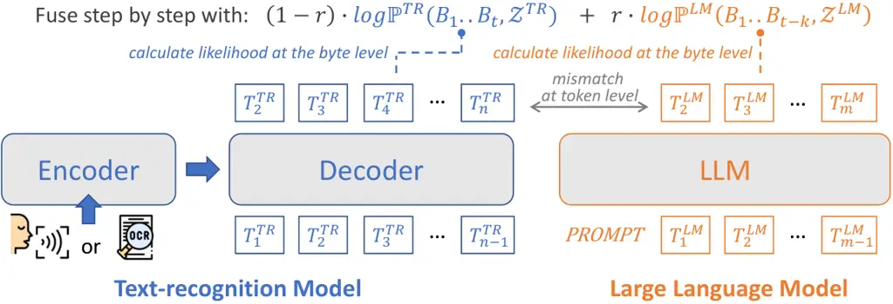

# Let’s Fuse Step by Step: A Generative Fusion Decoding Algorithm with LLMs for Robust and Instruction-Aware ASR and OCR

Chan-Jan Hsu Email: [chan.hsu@mtkresearch.com](mailto:)    Yi-Chang Chen
Email: [yi-chang.chen@mtkresearch.com](mailto:)    Feng-Ting Liao
Affiliation: MediaTek Research Email: [ft.liao@mtkresearch.com](mailto:)
   Pei-Chen Ho Affiliation: Internship at MediaTek Research
Email: [pochun.hsu@mtkresearch.com](mailto:)    Yu-Hsiang Wang
Affiliation: Internship at MediaTek Research
Email: [ds.shiu@mtkresearch.com](mailto:)    Po-Chun Hsu
Affiliation: MediaTek Research    Da-shan Shiu^(\*)Equal contribution
Affiliation: MediaTek Research

###### Abstract

We propose ‘‘Generative Fusion Decoding’’ (GFD), a novel shallow fusion
framework designed to integrate large language models (LLMs) into
cross-modal text recognition systems for automatic speech recognition
(ASR) and optical character recognition (OCR). We derive the necessary
formulations to enable GFD to operate across mismatched token spaces of
different models by calculating likelihood at the byte level, thereby
enabling seamless fusion and synchronous progression during the decoding
process. GFD is plug-and-play by design, making it readily compatible
with various auto-regressive models without the need for any
re-training. GFD proves effective for general ASR and OCR tasks through
intermediate and frequent interactions with LLMs, surpassing cascaded
methods in English and Mandarin benchmarks. In addition, GFD transfers
in-context learning abilities of LLMs and allows for adaptive ASR in
instruction-aware and long-context settings, yielding significant WER
reductions of up to 17.7%. ¹¹ 1 Code is available at
[https://github.com/mtkresearch/generative-fusion-decoding](https://github.com/mtkresearch/generative-fusion-decoding)

## 1 Introduction



Figure 1: The GFD integrated framework. The framework aims to integrate
pre-trained text-recognition models (ASR/OCR) with LLMs to augment the
recognition capabilities. A key challenge in this integration lies in
the mismatch between the token spaces of the two model types, which
prevents direct fusion. To address this, we derive a formulation
(Section 3.1, Equation 7, Equation 8) that enables GFD to compute
likelihoods at the byte level, allowing effective fusion during the
decoding stage. Here, $`\mathcal{Z}^{\texttt{TR}}`$ and
$`\mathcal{Z}^{\texttt{LM}}`$ denote the contextual information from the
text-recognition model and the LLM, respectively.

Integrating large language models (LLMs) into multi-modal systems has
recently emerged as a frontier, significantly advancing applications
such as automatic speech recognition (ASR) Radford et al. (2023), visual
question answering (VQA) Liu et al. (2023), and reinforcement learning
Yang et al. (2023d). Despite their robust capabilities, integrating LLMs
with text recognition systems like ASR and OCR poses challenges due to
the need for high-quality paired data and extensive training resources.
Modern LLMs are trained on trillions of text tokens Hsu et al. (2024);
Jiang et al. (2023), far exceeding the data used for end-to-end ASR or
OCR models Radford et al. (2023).

Various fusion strategies have been explored in ASR literature,
including shallow fusion Chen et al. (2023b); Kannan et al. (2018);
Choudhury et al. (2022), late fusion Chen et al. (2024b); Chen et al.
(2024a); Xu et al. (2022), mid fusion Radhakrishnan et al. (2023); Liu
et al. (2024), and early fusion Fathullah et al. (2024); Chen et al.
(2023a). However, these methods face challenges such as discarding the
ASR decoder’s denoising abilities Gong et al. (2023) and requiring
aligned token spaces. Volatility of model from further training is also
a concern when dealing with extensively trained models.

To address these challenges, we introduce a novel shallow fusion
framework called “Generative Fusion Decoding” (GFD). GFD operates across
mismatched token spaces by calculating likelihood at the byte level,
enabling seamless integration of LLMs with text recognition models
during the synchronous decoding process (Section 3.1). This
plug-and-play framework allows LLMs to correct text recognition errors
in real-time (Section 3.2), broadening the exploration space and
improving recognition accuracy.

Empirically, GFD is effective on general ASR, especially in challenging
scenarios like homophones in Mandarin and code-switching Yang et al.
(2023c) (Section 4.2). In addition, GFD transfers long-context awareness
and in-context learning Brown et al. (2020b) of LLMs and allows for
adaptive ASR. GFD maintains semantic consistency in long-form audio by
leveraging transcription history for contextual biasing (Section 4.3).
By using controlling prompts such as domain tags, rare words, and
explicit instructions, domain sensitivity and instruction awareness is
exhibited across various benchmarks (Section 4.4). To the best of our
knowledge, this unique aspect of LLM integration has not been reported
in prior work Chen et al. (2024b); Hu et al. (2024); Mittal et al.
(2024); Hori et al. (2025). Further comparisons with existing methods
are discussed in Section 5.

The contributions of this work are summarized as follows:

- •
  We derive a novel algorithm – GFD, which enables intermediate LLM
  interaction during the decoding process in text recognition.
- •
  GFD improves performance on various ASR scenarios and OCR, which is
  orthogonal to improvements from previous approaches.
- •
  The robustness of GFD is demonstrated in long-context and
  instruction-based ASR tasks, which fully utilizes long-range semantic
  awareness of LLMs. To the best of our knowledge, this has not been
  reported in prior work with LLM integration.
- •
  We provide detailed analysis on the performance and the time
  efficiency of GFD.

## 2 Related work

### 2.1 Model fusion

Training a multi-objective model from scratch is often costly Bapna
et al. (2021); Bapna et al. (2022); Alayrac et al. (2022); Driess et al.
(2023). Consequently, researchers have pivoted towards combining
existing models with different modalities to improve accuracy without
the prohibitive costs of building new systems from the ground up. Model
fusion developed in the field of ASR provides a plausible path for
combining existing trained models. The technique have evolved
significantly in recent years, encompassing a variety of approaches
designed to integrate different models to enhance performance.

Deep fusion integrates models at the level of hidden features, requiring
fine-tuning models to fuse deep features Gulcehre et al. (2015).
Cross-modal fusion, similar to deep fusion, integrates pre-trained
end-to-end ASR model with LLM Radhakrishnan et al. (2023); Yu et al.
(2023); Li et al. (2023b) or vision model with LLM Chen et al. (2023a);
Liu et al. (2023) via learning a joint representation with large amount
of extra paired audio-text or image-text data.

In contrast, shallow fusion or late fusion, often employed in ASR,
combines end-to-end ASR models with external language models at the
decoding level, improving recognition accuracy without altering the
underlying ASR architecture Kannan et al. (2018); Huang et al. (2024);
Chen et al. (2024b); Zhang et al. (2023). However, due to the
heterogeneous sample spaces of models, the prerequisite of shallow and
late fusion requires aligning sample spaces of model distributions,
enabled through fine-tuning a projection module Chen et al. (2024b).
Late fusion training methods may suffer from modality laziness problem
in tasks where uni-modal priors are meaningful Du et al. (2023).
Concurrently with our work, step-by-step synchrounous late fusion
methods are explored Mittal et al. (2024); Hori et al. (2025). Departing
from these efforts, which constrain scoring to specific decoding
configurations, our approach addresses the problem from the byte
sequence perspective, generalizing the rescoring process to support
arbitrary input sequences.

Another line of research integrates LLMs in a cascaded fashion, where
the LLM rescores or rewrites based on the N-best hypotheses generated by
the first-pass ASR model. While this approach has proven effective in
reducing recognition errors Sainath et al. (2019); Hu et al. (2020); Xu
et al. (2022), it is limited by the inherently low representation
capacity of the N-best list and introduces additional computational
latency from the second-pass decoding.

Our newly proposed approach, GFD, operates in the space of homogeneous
sequence elements, thereby removing the need for strict token-level
alignment. Further, by keeping the model architecture intact, including
tokenizers and embedding, we ensure that each individual pre-trained
model’s performance on its respective task is preserved and not affected
by the instability that may arise from additional training. This
property becomes increasingly critical when integrating with large
language models (LLMs), which are typically trained on trillions of
tokens using carefully refined data curricula and annealed learning
rates Dubey et al. (2024).

### 2.2 Contextual conditioning

Auto-regressive LLMs have exhibited capabilities in in-context learning
Radford et al. (), instruction following Ouyang et al. (2022), and
knowledge synthesis Liu et al. (2020). Such capabilities have been
applied to solving domain adaptation in speech recognition for rare
words or out-of-domain context through contextual biasing Choudhury
et al. (2022) and prompting fine-tuned models Liao et al. (2023); Yang
et al. (2023a); Li et al. (2023b); Yang et al. (2023a). Using GFD, this
problem can be addressed by directly leveraging a high-performing LLM
through prompting, without the need for additional fine-tuning.

### 2.3 Mandarin ASR

One of the most significant challenges in developing ASR systems for
Mandarin stems from its highly homophonous nature Lee and Chen (1997);
Lee (2003); Chen et al. (2022). Unlike English, where there is a larger
variety of phonemes and a relatively consistent correspondence between
spelling and sound, Mandarin relies on a limited set of tones and
syllables to represent thousands of characters. Consequently, Mandarin
ASR systems must not only accurately capture the tonal nuances but also
analyze the linguistic context to disambiguate these homophones. The
integration of LLMs has shown promise in addressing these challenges
Chung et al. (2023); Leng et al. (2023); Li et al. (2024), and GFD
adopts the same ideology by leveraging the contextual conditioning
capabilities of LLMs to enhance Chinese ASR performance.

## 3 Method

### 3.1 Generative fusion decoding

For conditional text generation models, the sequence with the highest
probability during inference is found using the following formula:

```math
\{T_{s}\}^{*}=\underset{\{T_{s}\}}{\mathrm{arg\,max}}\log\mathbb{P}(\{T_{s}\},\mathcal{Z}), \tag{1}
```

where $`\{T_{s}\}`$ represents the sequence of tokens generated by the
model, and $`\mathcal{Z}`$ represents the given context or conditioning
information, such as audio for speech recognition models Radford et al.
(2023), images for vision-language-models Alayrac et al. (2022), and
prompts for typical language models Brown et al. (2020a).

Auto-regressive generation is one approach to realize conditional text
generation. In this approach, the auto-regressive model is conditioned
on the previously generated tokens to generate the next token
sequentially. Therefore, the probability
$`\log\mathbb{P}(\{T_{s}\}|\mathcal{Z})`$ is typically decomposed using
the chain rule of probability as follows:

```math
\log\mathbb{P}(\{T_{s}\},\mathcal{Z})=\sum_{s=1}^{S}\log\mathbb{P}(T_{s}\mid T_{<s},\mathcal{Z}), \tag{2}
```

where $`T_{s}`$ is the token at position $`s`$ in the sequence, and
$`T_{<s}`$ represents all the tokens preceding position $`s`$. In
real-world applications, it is impracticable to enumerate all possible
token sequences, so beam search is typically employed as an approximate
strategy to efficiently explore the most likely sequences without
exhaustive computation.

In the setting of shallow fusion, multiple models are combined to
jointly determine the sequence, as expressed in the following formula,
which is a reformulation of Equation (1):

```math
\displaystyle\{T_{s}^{\texttt{fuse}}\}^{*} \tag{3}
```

```math
\displaystyle=\underset{\{T_{s}^{\texttt{fuse}}\}}{\mathrm{arg\,max}}\sum_{m}\lambda_{m}\log\mathbb{P}_{m}(\{T_{s}^{(m)}\}=\{T_{s}^{\texttt{fuse}}\},\mathcal{Z}^{(m)})
```

where $`\{T_{s}^{\texttt{fuse}}\}`$ represents the fused sequence of
tokens generated by combining the outputs of multiple models,
$`\lambda_{m}`$ is a weighting factor for the $`m`$-th model,
$`\mathbb{P}_{m}`$ denotes the probability distribution of the $`m`$-th
model and $`\mathcal{Z}^{(m)}`$ represents the context or conditioning
information specific to the $`m`$-th model.

When the sample spaces of models are the same, Equations (3) and (2) can
be combined to realize incremental fusion Chen et al. (2024b). If the
models have different sample spaces due to a mismatch in token spaces,
there is no simple way to achieve incremental fusion. One alternative
method to approximate Equation (3) is to fuse at the level of the fully
generated results from each model. Nevertheless, in practice, fusion at
the level of fully generated results poses the problem of an enormous
search space because different conditioning variables
$`\mathcal{Z}^{(m)}`$ may produce vastly different results.

To address these challenges, we have introduced a probability
transformation, denoted as $`\mathcal{M}^{(m)}`$, that converts
token-level representations into byte-level representations:

```math
\displaystyle\mathcal{M}^{(m)}:\mathbb{P}_{m}(\{T^{(m)}_{s}\},\mathcal{Z}^{(m)})\longrightarrow\mathbb{P}_{m}(\{B_{l}\},\mathcal{Z}^{(m)}), \tag{4}
```

where $`\{B_{l}\}`$ represents the sequence of bytes after the
transformation, and $`l`$ denotes the position in the byte sequence.
This transformation allows for a unified representation across different
models, facilitating the fusion process even when the original token
spaces differ. The byte-level fusion can then be performed using a
similar approach to Equation (3), but with the byte-level probabilities:

```math
\displaystyle\{B_{l}^{\texttt{fuse}}\}^{*} \tag{5}
```

```math
\displaystyle=\underset{\{B_{l}^{\texttt{fuse}}\}}{\mathrm{arg\,max}}\sum_{m}\lambda_{m}\log\mathbb{P}_{m}(\{B_{l}\}=\{B_{l}^{\texttt{fuse}}\},\mathcal{Z}^{(m)}).
```

To realize the probability transformation $`\mathcal{M}^{(m)}`$, we
define a mapping from the token-level probabilities to the byte-level
probabilities. This mapping takes into account the prefix relationship
between the token sequence and the byte sequence. Specifically, we
express the byte-level probability
$`\mathbb{P}_{m}(\{B_{l}\},\mathcal{Z}^{(m)})`$ as a sum over all
possible token sequences that share a common prefix with the byte
sequence $`\{B_{l}\}`$. The probability of each token sequence is
computed as the product of the conditional probabilities of each token
given the preceding tokens and the context $`\mathcal{Z}^{(m)}`$. This
relationship is formalized in the following equation:

```math
\displaystyle\mathbb{P}_{m}(\{B_{l}\},\mathcal{Z}^{(m)}) \tag{6}
```

```math
\displaystyle=\sum_{\{T^{(m)}_{s}\}}\biggr[\prod_{s}\mathbb{P}_{m}(T_{s}^{(m)}\mid T_{<s}^{(m)},\mathcal{Z}^{(m)})\biggr]_{\{T^{(m)}_{s}\}}
```

```math
\displaystyle\times\mathbbm{1}\bigl(\{T^{(m)}_{s}\}\texttt{.pref}=\{B_{l}\}\texttt{~AND~}T^{(m)}_{<s}\texttt{.pref}\neq\{B_{l}\}\bigl),
```

where .pref is a function that checks whether a sequence $`A`$ has
sequence $`B`$ as its prefix, and $`\mathbbm{1}`$ is the indicator
function that converts the boolean value of the inner loop to integers
($`true\rightarrow 1`$, $`false\rightarrow 0`$). The entire indicator
function with two conditions ensures that only the minimal token
sequences covering the target byte sequence $`\{B_{l}\}`$ contribute to
the byte-level probability. In Equation (6), the complexity remains high
at $`\mathcal{O}(V^{S})`$, where $`V`$ represents the vocabulary size of
tokens and $`S`$ is the sequence length, for identifying token sequences
that match the specified criteria of the indicator.

Figure 2: Example of the main sequence and alternative tokens. Assume
that the byte sequence is "abcdefghijk". The main token sequence is the
tokenization result of the byte sequence and is denoted as
$`\{\hat{T}_{s}\}`$. The alternative tokens are denoted as
$`T^{\prime}_{i}`$.

This complexity can still be greatly reduced, by eliminating terms with
near 0 probability. We posit that the main token sequence and its
branching alternatives, as shown in Figure 2, dominate the probability
contribution. The main token sequence is produced by applying model
tokenization on the byte string and the alternative tokens are
essentially look-aheads for potential main tokens that may emerge as the
decoding progresses. The significance of the main token sequence is
justified by its alignment with the model’s inputs during the original
pretraining phase; any other slicing method is penalized in terms of
probability due to its lack of representation in the training data.
Based on this assumption, we can narrow down the search for token
sequences that meet the criteria of
$`\bigl(\{T^{(m)}_{s}\}\texttt{.pref}=\{B_{l}\}\texttt{~AND~}T^{(m)}_{<s}\texttt{.pref}\neq\{B_{l}\}\bigl)`$
to only the main token sequence and its branching alternative tokens. We
define the main token sequence as $`\{\hat{T}^{(m)}_{s}\}`$. Given this
simplification, we can approximate the byte-level probability
$`\mathbb{P}_{m}(\{B_{l}\},\mathcal{Z}^{(m)})`$ by considering only the
main token sequence and its immediate alternatives that share the same
prefix with the byte sequence $`\{B_{l}\}`$. This approximation
significantly reduces the computational complexity to
$`\mathcal{O}(V\times S)`$ and is expressed in the following equation:

```math
\displaystyle\mathbb{P}_{m,approx}(\{B_{l}\},\mathcal{Z}^{(m)})\approx \tag{7}
```

```math
\displaystyle\texttt{~}\mathbb{P}_{m}(\hat{T}^{(m)}_{1}\mid\hat{T}^{(m)}_{<1},\mathcal{Z}^{(m)})\times\bigl[
```

```math
\displaystyle\texttt{~~}\mathbb{P}_{m}(\hat{T}^{(m)}_{2}\mid\hat{T}^{(m)}_{<2},\mathcal{Z}^{(m)})\times\bigl[
```

```math
\displaystyle\texttt{~~~}...
```

```math
\displaystyle\texttt{~~~}\mathbb{P}_{m}(\hat{T}^{(m)}_{S}\mid\hat{T}^{(m)}_{<S},\mathcal{Z}^{(m)})
```

```math
\displaystyle\texttt{~~~}+\sum_{t}\mathbb{P}_{m}(t\mid\hat{T}^{(m)}_{<S},\mathcal{Z}^{(m)})\cdot\mathbbm{1}\bigl(\{\hat{T}^{(m)}_{<S},t\}\texttt{.pref}=\{B_{l}\}\bigl)
```

```math
\displaystyle\texttt{~~~}...
```

```math
\displaystyle\texttt{~~}\bigl]+\sum_{t}\mathbb{P}_{m}(t\mid\hat{T}^{(m)}_{<2},\mathcal{Z}^{(m)})\cdot\mathbbm{1}\bigl(\{\hat{T}^{(m)}_{<2},t\}\texttt{.pref}=\{B_{l}\}\bigl)
```

```math
\displaystyle\texttt{~}\bigl]+\sum_{t}\mathbb{P}_{m}(t\mid\hat{T}^{(m)}_{<1},\mathcal{Z}^{(m)})\cdot\mathbbm{1}\bigl(\{\hat{T}^{(m)}_{<1},t\}\texttt{.pref}=\{B_{l}\}\bigl),
```

where $`t`$ represents an alternative token from the token set of the
modality $`m`$. We use $`\{\hat{T}^{(m)}_{<s},t\}`$ to denote the
concatenated sequence of $`\hat{T}^{(m)}_{<s}`$ and $`t`$, and this
sequence must meet the criteria of leading with $`\{B_{l}\}`$ to be
considered. Eventually, by substituting Equation (7) into
$`\mathbb{P}_{m}(\{B_{l}\},\mathcal{Z}^{(m)})`$ of (5), we have
successfully realized generative fusion decoding (GFD). We show that
this function is incrementally calculable in Appendix A.1, and thus
yields the same time complexity as standard LLM rescoring without
branching.

In summary, our proposed method for conditional text generation, GFD,
through late fusion and byte-level probability transformation offers a
novel way to integrate the outputs of multiple models with different
token spaces. By transforming token-level probabilities to byte-level
probabilities and focusing on the most probable token sequences, we can
efficiently fuse model outputs.

### 3.2 Fusing text-recognition models with LLM

To evaluate the efficacy of our algorithm, we implemented GFD for ASR
and OCR tasks. This is achieved by fusing pre-trained text-recognition
models with LLMs to enhance recognition capability. Essentially, the
text recognition models (ASR and OCR) propose sequences for the LLMs to
provide scoring feedback. To limit the number of proposals scored by the
LLM for reasonable time complexity, we introduce a delayed corrective
feedback loop to coordinate the two models, characterized by a dynamic
shifting value $`k`$. Based on Equation (5), the fusion decoding
methodology used in our experiments is given by the following formula:

```math
\displaystyle\{B_{1},..,B_{t}\}^{*} \tag{8}
```

```math
\displaystyle=\underset{\{B_{1},..,B_{t}\}}{\mathrm{arg\,max}}\bigl[ \displaystyle(1-r)\cdot\log\mathbb{P}^{\texttt{TR}}(\{B_{1},..,B_{t}\},\mathcal{Z}^{\texttt{TR}})
```

```math
\displaystyle+r\cdot\log\mathbb{P}^{\texttt{LM}}(\{B_{1},..,B_{t-k}\},\mathcal{Z}^{\texttt{LM}})\bigl],
```

where $`\{B_{1},\ldots,B_{t}\}^{*}`$ represents the optimal sequence of
bytes up to and including position $`t`$, $`p^{\texttt{TR}}`$ and
$`p^{\texttt{LM}}`$ are the probability distributions of the
text-recognition models and the language models, respectively,
$`\mathcal{Z}^{\texttt{TR}}`$ and $`\mathcal{Z}^{\texttt{LM}}`$ are the
contextual information for the text-recognition and language models,
respectively, $`r`$ is a weighting factor that balances the influence of
the text-recognition models and the language models, which is determined
via grid search on a small scale experiment (Appendix  A.2). $`k`$ is
optimally selected to be equal to the length of the last token of the
proposal from $`\mathcal{M}^{\texttt{TR}}`$ (Appendix  A.3). We note
that even with a shifting value $`k`$, the necessity of equation 7 still
holds.

## 4 Experiments

|                                |         |         |            |       |            |                          |                          |
| ------------------------------ | ------- | ------- | ---------- | ----- | ---------- | ------------------------ | ------------------------ |
|                                | Whisper |         | Re-ranking | GER   | GFD-ASR-EN | Oracle                   |                          |
| EN dataset                     | Greedy  | 5-beams |            |       |            | $`\text{O}_{\text{nb}}`$ | $`\text{O}_{\text{cp}}`$ |
| Librispeech-Clean              | 2.30    | 2.28    | 2.20       | 2.41  | 2.29       | 1.91                     | 1.63                     |
| Librispeech-Other              | 5.23    | 4.97    | 4.86       | 5.30  | 4.99       | 4.20                     | 3.43                     |
| Medical                        | 7.30    | 7.22    | 7.22       | 7.49  | 6.74       | 6.17                     | 5.05                     |
| Librispeech-Noise ($`S/R=10`$) | 3.50    | 3.12    | 3.27       | 3.14  | 3.02       | 2.32                     | 1.94                     |
| Librispeech-Noise ($`S/R=5`$)  | 5.67    | 5.25    | 5.40       | 5.38  | 4.96       | 4.10                     | 3.28                     |
| Librispeech-Noise ($`S/R=0`$)  | 15.23   | 13.54   | 13.69      | 13.70 | 13.27      | 11.66                    | 9.04                     |
| Librispeech-Noise ($`S/R=-5`$) | 49.09   | 47.05   | 47.04      | 47.35 | 46.98      | 43.62                    | 33.19                    |
|                                | Whisper |         | Re-ranking | GER   | GFD-ASR-ZH | Oracle                   |                          |
| ZH or HK dataset               | Greedy  | 5-beams |            |       |            | $`\text{O}_{\text{nb}}`$ | $`\text{O}_{\text{cp}}`$ |
| Fleurs-HK (Cantonese)          | 7.49    | 6.88    | 7.00       | 7.33  | 6.23       | 5.58                     | 4.58                     |
| NTUML2021                      | 11.11   | 9.97    | 9.68       | 9.87  | 8.83       | 8.88                     | 4.54                     |

Table 1: Performance for short-form speech recognition. The table
presents Word Error Rate (WER) for EN and Mixed Error Rate (MER) for
ZH/HK. Bold values indicate the best performance excluding the Oracle
column. Re-ranking and GER utilize LLMs with 5-beam outputs from
Whisper, whereas GFD integrates LLMs during the decoding process.

|                            | Librispeech-Noise (S/R=0) |
| -------------------------- | ------------------------- |
| Whisper-5beams             | 13.54                     |
| RobustGER Hu et al. (2024) | 13.20                     |
| GFD                        | 13.27                     |
| RobustGER+GFD              | 13.03                     |

Table 2: Comparisons on GER and GFD. GFD and GER improvements similarly
on Whisper, where ensembling of both approaches performs best.

### 4.1 Experimental setup

We evaluate the application of GFD to ASR and OCR tasks. For ASR task,
we benchmark datasets in English, Taiwanese Mandarin, and Cantonese. The
deliberate selection of Taiwanese Mandarin and Cantonese is due to their
homophonic and tonal characteristics, which reveal robustness
shortcomings of ASR systems. This complexity is corroborated by the
Fleurs experiment in Whisper Radford et al. (2023), where the Chinese
word error rate is well above the regressed word error rate in
comparison to evaluations in other language at the same amount of
pre-training data. Of all tested languages in Whisper, it is the only
large-scale language (more than 10k hours audio) with such a phenomenon.
For OCR, we benchmark image dataset containing long sequence of text as
we hypothesize that LLM provide semantic information to an OCR model of
recognizing long text sequences.

For the evaluated models, we selected Whisper-large-v2 as the ASR model
for both greedy and beam search methods. In our proposed GFD approach,
we utilized Mistral Jiang et al. (2023) as the language model for
English datasets, referring to this configuration as GFD-ASR-EN. For
Chinese and Cantonese datasets, we integrated Breeze Hsu et al. (2024)
and designated this setup as GFD-ASR-ZH. In addition, we benchmark GER,
based on task-activating prompting method Chen et al. (2024a); Yang
et al. (2023b), with Instruction-tuned models including
Mistral-Instruct. We include two oracle word error rates following
previous work Hu et al. (2024), where the N-Best Oracle $`o_{nb}`$
denotes the error rate calculated with the best candidate in the N-Best
list, and the Compositional Oracle $`o_{cp}`$ is the best achievable
word error rate using all tokens N-Best the list. As to OCR tasks, we
utilize TrOCR Li et al. (2023a) with Mistral and denote the fused model
GFD-OCR-EN.

We benchmark the models on a wide variety of datasets, including
Librispeech Han et al. (2019), Medical Figure Eight Inc. (2019), ATCO2
Szöke et al. (2021), Fleurs Conneau et al. (2023), NTUML2021Yang et al.
(2023c), and FormosaSpeech for ASR; NAF Davis et al. (2019) for OCR.
Librispeech is a collection of corpus from audiobooks with subsets
"Clean" and "Other". Librispeech-Noise is a noised variant of the
original LibriSpeech dataset with different signal-to-noise ratios,
which is ideal for testing ASR systems’ robustness to noise. Medical
dataset contains 8.5 hours of medical conversations with associated
symptom tags to each audio-text pairs. ATCO2 contains audios of air
traffic control communication and accompanied meta-information of
airports. Fleurs is a multilingual speech corpus. We deliberately choose
Cantonese subset for evaluation as the language is homophonous and
tonal. NTUML2021 corpus consists of lecture recordings from the “Machine
Learning” course at National Taiwan University in 2021, with
corresponding transcriptions and English translations labeled by over 20
bilingual native Chinese speakers. FormosaSpeech corpus includes Chinese
recordings of Taiwanese accents amassing up to 6.4 hours of audio-text
pairs. NAF consists of images from U.S national archives with labelled
bounding boxes and annotations, ideal for evaluating OCR performance.
For all ASR experiments, we report Word Error Rate (WER) for evaluations
on English datasets and Mixed Error Rate (MER) for those on Chinese
datasets. For OCR experiments, we report Character Error Rate (CER) and
Exact Match (EM).

| Method                              | Prompt |     | ATCO2 |       | Librispeech |       | FormosaSpeech | Medical |
| ----------------------------------- | ------ | --- | ----- | ----- | ----------- | ----- | ------------- | ------- |
|                                     | ASR    | LLM | Norm  | Raw   | Clean       | Other |               |         |
| RobustGER, UADF Chen et al. (2024b) | No     | Yes | \>100 | \>100 | \>100       | \>100 | \>100         | \>100   |
| Clairaudience Liao et al. (2023)    | Yes    | \-  | 28.77 | \-    | \-          | \-    | \-            | 6.54    |
| RobustGER Hu et al. (2024)          | Yes    | No  | 34.77 | 50.58 | \-          | \-    | \-            | \-      |
| Whisper                             | No     | \-  | 47.70 | 66.44 | 2.28        | 4.97  | 22.33         | 7.22    |
| Whisper                             | Yes    | \-  | 31.34 | 42.37 | \-          | \-    | \-            | 6.24    |
| GFD-ASR-EN                          | No     | Yes | 38.75 | 52.24 | 2.20        | 4.61  | 20.59         | 6.62    |
| GFD-ASR-EN                          | Yes    | Yes | 25.79 | 32.46 | \-          | \-    | \-            | 6.26    |

Table 3: Results on instruction-aware ASR task. All experiments are done
with a beam size of 5. These experiments is conditioned on a given
prompt containing either domain tags (on Medical), rare words (on
Librispeech and FormosaSpeech), and complex transcription guidelines (on
ATCO2). Error rates of over 100 is reported with GER-based methods (Hu
et al., 2024; Chen et al., 2024b), as they catastrophically fail on
prompt conditioning due to their inability to process instruction
prompts beyond the GER prompt.

### 4.2 Short-form speech recognition

We verify the efficacy of GFD in speech recognition setting and report
results in Table 1. First, we notice that for decoding results without
incoporating an LLM, beam search improves consistently upon greedy
search. Using beam search as the baseline, we observe that GFD
moderately improves on the Medical and Fleurs-HK dataset. In the more
challenging NTUML2021, we obtained a 8.83 mixed error rate, surpassing
even the oracle N-Best score. Upon examining the benchmarked samples, we
attribute the observed improvements to the LLM’s ability to correct
English grammatical mistakes and domain-specific terminology within the
code-switching context. As such, GFD serves as an elegant solution that
facilitates the success of code-switched ASR systems. Performance across
Librispeech demonstrates that GFD offers the most significant
enhancement under moderate noise conditions but diminishes when the
noise level is too high $`(S/R=-5)`$.

In contrast, we do not find improvements in the GER setting using
general instruct models, consistent with previous work Chen et al.
(2024a). The increased error rate is primarily attributed to LLM
hallucinations, including incorrect deletions. Therefore, we posit that
GFD is more robust than GER for incorporating off-the-shelf LLMs in the
ASR task. As demonstrated in Table 2, GFD achieves similar improvements
when compared to a specialized GER model, RobustGER Hu et al. (2024).
Analyzing the outputs reveals that the corrected errors are orthogonal:
while GER is specifically instructed to adhere to the words in the
N-best list, GFD can select words from an exponential search space with
intermediate interrogation. The combination of RobustGER and GFD yields
the best results.

### 4.3 Long-form speech recognition

|                       | Whisper (5-beams) | GFD-ASR-ZH |
| --------------------- | ----------------- | ---------- |
| NTUML2021 (long-form) | 8.40              | 8.18       |
| FormosaSpeech         | 22.33             | 20.59      |

Table 4: Performance for long-form speech recognition. For NTUML2021, we
concatenate all contiguous clips to reconstruct the original lecture for
long-form evaluation.

LLM’s capability to attend to long sequences, makes it an appealing
candidate on long-form audio speech recognition. Therefore, we evaluate
long-form transcription performance on NTUML2021 and FormosaSpeech. For
NTUML2021, we curate the long dataset by concatenating all contiguous
clips to reconstruct the original lecture for long-form evaluation. To
properly contrast the short-range modeling in Table 1, we prepend all
historical transcriptions as prompts for ASR and LLM to realize
long-form transcriptions, truncating them when necessary for Whisper due
to context length limitations. In this setting, GFD-ASR-ZH consistently
outperforms Whisper in both NTUML2021 and FormosaSpeech, demonstrating
that the long-context capability of LLM can be effectively utilized
through GFD (Table 4).

### 4.4 Instruction-aware speech recognition

In instruction-aware speech recognition, we explore GFD’s ability to
leverage contextual information, which is crucial in real-life scenarios
where speech may be domain-specific, contain rare or critical terms, or
require adherence to complex transcription guidelines. We employ
prompting with ASR and LLM models along with GFD to incorporate these
external cues across the respective three settings.

Domain tag and rare word prompting. We tested domain-conditioned ASR on
the Medical dataset, where the symptom tags are provided along with the
speech content. Results show that our GFD method with LLM prompting
improves on GFD without prompting, showing prompt sensitiveness of the
LLM in the GFD system. However, we did not find further improvement upon
whisper prompting, compared to double-prompted GFD. For verifying rare
word prompting capabilities, we used the augmented Librispeech and
FormosaSpeech dataset, where a target rare word is mixed with 100 other
distractors for each data point Le et al. (2021). For the FormosaSpeech
Dataset, we created the rare words with ChatGPT, and generate
distractors with a similar approach using the training set. At this
scale of distractors, it is unrealistic to prompt on Whisper, as the
remaining context length is often insufficient for ASR decoding. By
prompting on the LLM using GFD, we demonstrated up to 7% WERR over
non-prompting methods on the Librispeech dataset, and 1.6% WERR on the
FormosaSpeech Dataset (Table 3).

Prompting with Instructions. We evaluated formatted speech recognition
on the ATCO2 dataset, a dataset on air traffic control communications,
which has strict regulations on call signs and transcribe formats. By
incorporating an LLM, we are able to prompt it with over 4000 words of
guidelines from an entire instruction manual²² 2
[https://www.faa.gov/air_traffic/publications/atpubs/aim_html/chap4_section_2.html](https://www.faa.gov/air_traffic/publications/atpubs/aim_html/chap4_section_2.html),
a possibility not present with Whisper. For Whisper prompting, we
include all special call signs and three example sentences extracted
from the manual (Appendix A.2). Results in Table 3 show that GFD with
ASR and LLM prompting obtains best results with a WERR of 17.7% compared
with Whisper in the normalized (ATCO2-Norm) setting, even outperforming
Clairaudience Liao et al. (2023), a fine-tuned prompt conditioning
model. GER-based methods Hu et al. (2024); Chen et al. (2024b) also fall
short in this category, due to their inability to process instruction
prompts beyond the GER prompt. Transcription results completely diverge
from the spoken content, causing meaningless error rates exceeding 100%.
We also reported scores without word conversion normalization
(ATCO2-Raw), from observations that standard normalization, such as
converting arabic to written numerals, can excessively correct errors
that conflicts with the transcribing guidelines. In this setting, our
improvements are even more pronounced, further demonstrating the
instruction-following capabilities of the GFD system.

### 4.5 Optical Character Recognition

We use the OCR task as an example to demonstrate that GFD is applicable
to auto-regressive scenarios beyond ASR. In Table 5, we show that fusing
the Mistral LLM to the TrOCR model significantly improves the OCR
results on the National Archive Forms dataset by 16.7 % in character
error rate reduction and 38.07 % in exact match improvement.

|         | CER $`\downarrow`$ | Exact Match $`\uparrow`$ |
| ------- | ------------------ | ------------------------ |
| TrOCR   | 12.02              | 24.14                    |
| GFD-OCR | 10.55              | 33.33                    |

Table 5: Evaluation on NAF-Long (an OCR task).

## 5 Analysis

### 5.1 Further comparisons with GER

The GFD algorithm relates to GER in that both algorithms perform the
selection of output sequences with beam decoding. However, they differ
in compute execution and the diversity of sample sequences. First, in
GFD, the LLM works in parallel with the ASR decoder, and thus the
computation of per step inference can be executed asynchronously with a
load bounded by
$`\mathcal{O}(Z)+\mathcal{O}(k\cdot\max(S_{ASR},{S_{LLM}}))`$, where
$`Z`$ denotes the size of speech encoding, $`k`$ is the beam size, and
$`S_{ASR}`$ and $`S_{LLM}`$ are ASR and LLM decoding costs of a single
token, respectively. The LLM decoding complexity expression matches that
of Section 3.2, treating the vocabulary size as a constant in this
dicussion. In contrast, GER operates sequentially, requiring the
completion of beam decoding with ASR prior to a correction with LLM.
This means the execution time of GER is bounded by
$`\mathcal{O}(Z)+\mathcal{O}((k+1)\cdot S_{LLM})+\mathcal{O}(k\cdot S_{ASR})`$,
where the additional $`O(S_{LLM})`$ comes from LLM decoding. Secondly,
in GFD, the searched token space attended by the LLM is at least n_beams
times sequence length, whereas in GER, the top-k cutoff of the ASR step
does not promote diversity between the candidates, which limits the LLM
search space. Aside from these differences, GFD and GER are
methodologically orthogonal, allowing for their combination in the
pursuit of further improvement.

### 5.2 Further comparisons with Other Late Fusion Approaches

Concurrently with our work, step-by-step synchronous late fusion methods
that focus on resolving tokenization mismatch have been explored Mittal
et al. (2024); Hori et al. (2025). However, these approaches impose
constraints on the scoring process, limiting it to specific decoding
configurations. For example, in SALSA Mittal et al. (2024), the LLM
sequence is only rescored if it is ending in a UTF-8 character, a
criterion designed for non-ascii languages such as Mandarin and Hindi.
Similarly, Delayed Fusion Hori et al. (2025) discards trailing partial
tokens from the ASR that do not form complete words during LLM
rescoring, which is not easily extensible to languages without explicit
word boundaries, such as Mandarin. In contrast, our method approaches
the problem from the byte sequence level, enabling a more general and
flexible rescoring process that supports arbitrary input sequences. From
an information-theoretic perspective, our approach preserves the maximum
available information at each decoding step, avoiding sequence cutoffs
or step skipping. Empirical results in Table 6 support our hypothesis,
with GFD outperforming other settings across English and Mandarin. As
further detailed in Appendix A.1, the computational overhead introduced
by branching through GFD is negligible compared to the cost of a single
forward pass of the large language model.

| Method          | Libri.-Noisy-5 (en) | Formosa-Sp. (zh) |
| --------------- | ------------------- | ---------------- |
| GFD (Ours)      | 4.96                | 20.59            |
| No Branching    | 4.98                | 21.29            |
| \+ Word Cutoff  | 5.18                | 22.33^(x)        |
| \+ Char. Cutoff | 4.98^(y)            | 21.50            |

Table 6: Word error rates of GFD compared with alternative rescoring
methods across English and Mandarin. After removing branching,
additional constraints can be applied—such as discarding trailing
partial tokens, similar to Hori et al. (2025), or removing trailing
bytes that do not form complete UTF-8 characters, similar to Mittal
et al. (2024).^(x)This setting reduces to no rescoring due to the
absence of explicit word boundaries. ^(y)This setting is identical to no
branching in ASCII languages.

### 5.3 Error Analysis

Despite promising results, we identified three cases in which GFD is
most susceptible to failure, representing exciting directions for future
work. We categorize these failure cases into ASR errors and LLM errors.

ASR proposed errors: When ASR proposes a candidate with high probability
that deviates from the phonetic constraint, the LLM may falsely pickup
the sequence, inducing an error. There are two main types - semantically
activated tokens and time delayed activated tokens. Semantically
activated tokens are tokens that are encoded in similar output embedding
space due to semantic similarity. We found that these errors are much
more common in Mandarin. Time delay activated tokens are proposed tokens
that are targets at a later step, where selecting them effectively skips
some intermediate tokens. We observe that these tokens are much more
likely to be present at the start of the sequence.

LLM probability estimation errors: LLM probability estimates are
generally aligned with the logical coherence of a sequence. However, a
major discrepancy arises with repeating sequences. Due to the in-context
learning abilities of LLMs, they tend to significantly overestimate the
likelihood of ever-repeating sequences. This could lead to mode collapse
during the entire decoding process.

## 6 Conclusion

In summary, we propose Generative Fusion Decoding (GFD), a simple yet
effective framework for integrating large language models into ASR and
OCR systems through byte-level shallow fusion. Our theoretical
derivations provide a foundation for this integration, while empirical
results demonstrate consistent gains across diverse conditions—including
noisy audio, long-form inputs, and instruction-following tasks. GFD also
compares favorably with prior fusion methods, highlighting its potential
as a general-purpose solution. These results establish a foundation for
future exploration of fusion methods that further exploit the strengths
of pre-trained language models.

## Limitations

The effectiveness of GFD is hindered when LLM selects an ASR token
candidate that deviate from the correct phonetic content, leading to
hallucinations. We provide in our analysis general categories of these
errors, for practitioners to be aware of such a risk. We also advise
users to carefully select the LLM, as the LLM itself may have
limitations in its understanding or biases present in its training data.
If the LLM misinterprets context or generates incorrect predictions,
these errors can propagate through the GFD framework, affecting the
overall performance.

## References

- Alayrac et al. (2022) Jean-Baptiste Alayrac, Jeff Donahue, Pauline
  Luc, Antoine Miech, Iain Barr, Yana Hasson, Karel Lenc, Arthur Mensch,
  Katherine Millican, Malcolm Reynolds, Roman Ring, Eliza Rutherford,
  Serkan Cabi, Tengda Han, Zhitao Gong, Sina Samangooei, Marianne
  Monteiro, Jacob Menick, Sebastian Borgeaud, Andrew Brock, Aida
  Nematzadeh, Sahand Sharifzadeh, Mikolaj Binkowski, Ricardo Barreira,
  Oriol Vinyals, Andrew Zisserman, and Karen Simonyan. 2022. [Flamingo:
  a visual language model for few-shot
  learning](https://openreview.net/forum?id=EbMuimAbPbs). In _Advances
  in Neural Information Processing Systems_.
- Bapna et al. (2022) Ankur Bapna, Colin Cherry, Yu Zhang, Ye Jia,
  Melvin Johnson, Yong Cheng, Simran Khanuja, Jason Riesa, and Alexis
  Conneau. 2022. [mSLAM: Massively multilingual joint pre-training for
  speech and text](http://arxiv.org/abs/2202.01374). _arXiv preprint_.
  ArXiv:2202.01374 \[cs\].
- Bapna et al. (2021) Ankur Bapna, Yu-an Chung, Nan Wu, Anmol Gulati,
  Ye Jia, Jonathan H. Clark, Melvin Johnson, Jason Riesa, Alexis
  Conneau, and Yu Zhang. 2021. [SLAM: A Unified Encoder for Speech and
  Language Modeling via Speech-Text Joint
  Pre-Training](http://arxiv.org/abs/2110.10329). _arXiv preprint_.
  ArXiv:2110.10329 \[cs\].
- Brown et al. (2020a) Tom Brown, Benjamin Mann, Nick Ryder, Melanie
  Subbiah, Jared D Kaplan, Prafulla Dhariwal, Arvind Neelakantan, Pranav
  Shyam, Girish Sastry, Amanda Askell, Sandhini Agarwal, Ariel
  Herbert-Voss, Gretchen Krueger, Tom Henighan, Rewon Child, Aditya
  Ramesh, Daniel Ziegler, Jeffrey Wu, Clemens Winter, Chris Hesse, Mark
  Chen, Eric Sigler, Mateusz Litwin, Scott Gray, Benjamin Chess, Jack
  Clark, Christopher Berner, Sam McCandlish, Alec Radford, Ilya
  Sutskever, and Dario Amodei. 2020a. [Language models are few-shot
  learners](https://proceedings.neurips.cc/paper_files/paper/2020/file/1457c0d6bfcb4967418bfb8ac142f64a-Paper.pdf).
  In _Advances in Neural Information Processing Systems_, volume 33,
  pages 1877–1901. Curran Associates, Inc.
- Brown et al. (2020b) Tom B. Brown, Benjamin Mann, Nick Ryder, Melanie
  Subbiah, Jared Kaplan, Prafulla Dhariwal, Arvind Neelakantan, Pranav
  Shyam, Girish Sastry, Amanda Askell, Sandhini Agarwal, Ariel
  Herbert-Voss, Gretchen Krueger, Tom Henighan, Rewon Child, Aditya
  Ramesh, Daniel M. Ziegler, Jeffrey Wu, Clemens Winter, Christopher
  Hesse, Mark Chen, Eric Sigler, Mateusz Litwin, Scott Gray, Benjamin
  Chess, Jack Clark, Christopher Berner, Sam McCandlish, Alec Radford,
  Ilya Sutskever, and Dario Amodei. 2020b. [Language models are few-shot
  learners](https://arxiv.org/abs/2005.14165). _CoRR_, abs/2005.14165.
- Chen et al. (2024a) Chen Chen, Yuchen Hu, Chao-Han Huck Yang,
  Sabato Marco Siniscalchi, Pin-Yu Chen, and Eng-Siong Chng. 2024a.
  Hyporadise: An open baseline for generative speech recognition with
  large language models. _Advances in Neural Information Processing
  Systems_, 36.
- Chen et al. (2024b) Chen Chen, Ruizhe Li, Yuchen Hu, Sabato Marco
  Siniscalchi, Pin-Yu Chen, EngSiong Chng, and Chao-Han Huck Yang.
  2024b. [It’s never too late: Fusing acoustic information into large
  language models for automatic speech
  recognition](https://openreview.net/forum?id=QqjFHyQwtF). In _The
  Twelfth International Conference on Learning Representations_.
- Chen et al. (2023a) Xi Chen, Xiao Wang, Soravit Changpinyo,
  AJ Piergiovanni, Piotr Padlewski, Daniel Salz, Sebastian Goodman, Adam
  Grycner, Basil Mustafa, Lucas Beyer, Alexander Kolesnikov, Joan
  Puigcerver, Nan Ding, Keran Rong, Hassan Akbari, Gaurav Mishra,
  Linting Xue, Ashish V Thapliyal, James Bradbury, Weicheng Kuo, Mojtaba
  Seyedhosseini, Chao Jia, Burcu Karagol Ayan, Carlos Riquelme Ruiz,
  Andreas Peter Steiner, Anelia Angelova, Xiaohua Zhai, Neil Houlsby,
  and Radu Soricut. 2023a. [PaLI: A jointly-scaled multilingual
  language-image model](https://openreview.net/forum?id=mWVoBz4W0u). In
  _The Eleventh International Conference on Learning Representations_.
- Chen et al. (2022) Yi-Chang Chen, Yu-Chuan Chang, Yen-Cheng Chang, and
  Yi-Ren Yeh. 2022. g2pW: A Conditional Weighted Softmax BERT for
  Polyphone Disambiguation in Mandarin. _INTERSPEECH 2022_.
- Chen et al. (2023b) Yi-Chang Chen, Chun-Yen Cheng, Chien-An Chen,
  Ming-Chieh Sung, and Yi-Ren Yeh. 2023b. Integrated semantic and
  phonetic post-correction for chinese speech recognition. _INTERSPEECH
  2023_.
- Choudhury et al. (2022) Chhavi Choudhury, Ankur Gandhe, Xiaohan Ding,
  and Ivan Bulyko. 2022. A likelihood ratio based domain adaptation
  method for e2e models. In _ICASSP 2022-2022 IEEE International
  Conference on Acoustics, Speech and Signal Processing (ICASSP)_, pages
  6762–6766. IEEE.
- Chung et al. (2023) HoLam Chung, Junan Li, Pengfei Liu1, Wai-Kim
  Leung, Xixin Wu, and Helen Meng. 2023. [Improving Rare Words
  Recognition through Homophone Extension and Unified Writing for
  Low-resource Cantonese Speech
  Recognition](http://arxiv.org/abs/2302.00836). _arXiv preprint_.
  ArXiv:2302.00836 \[cs, eess\].
- Conneau et al. (2023) Alexis Conneau, Min Ma, Simran Khanuja,
  Yu Zhang, Vera Axelrod, Siddharth Dalmia, Jason Riesa, Clara Rivera,
  and Ankur Bapna. 2023. Fleurs: Few-shot learning evaluation of
  universal representations of speech. In _2022 IEEE Spoken Language
  Technology Workshop (SLT)_, pages 798–805. IEEE.
- Davis et al. (2019) Brian Davis, Bryan Morse, Scott Cohen, Brian
  Price, and Chris Tensmeyer. 2019. Deep visual template-free form
  parsing. In _2019 International Conference on Document Analysis and
  Recognition (ICDAR)_, pages 134–141. IEEE.
- Driess et al. (2023) Danny Driess, Fei Xia, Mehdi S. M. Sajjadi, Corey
  Lynch, Aakanksha Chowdhery, Brian Ichter, Ayzaan Wahid, Jonathan
  Tompson, Quan Vuong, Tianhe Yu, Wenlong Huang, Yevgen Chebotar, Pierre
  Sermanet, Daniel Duckworth, Sergey Levine, Vincent Vanhoucke, Karol
  Hausman, Marc Toussaint, Klaus Greff, Andy Zeng, Igor Mordatch, and
  Pete Florence. 2023. Palm-e: an embodied multimodal language model. In
  _Proceedings of the 40th International Conference on Machine
  Learning_, ICML’23. JMLR.org.
- Du et al. (2023) Chenzhuang Du, Jiaye Teng, Tingle Li, Yichen Liu,
  Tianyuan Yuan, Yue Wang, Yang Yuan, and Hang Zhao. 2023. On uni-modal
  feature learning in supervised multi-modal learning. In _International
  Conference on Machine Learning_, pages 8632–8656. PMLR.
- Dubey et al. (2024) Abhimanyu Dubey, Abhinav Jauhri, Abhinav Pandey,
  Abhishek Kadian, Ahmad Al-Dahle, Aiesha Letman, Akhil Mathur, Alan
  Schelten, Amy Yang, Angela Fan, Anirudh Goyal, Anthony Hartshorn, Aobo
  Yang, Archi Mitra, Archie Sravankumar, Artem Korenev, Arthur Hinsvark,
  Arun Rao, Aston Zhang, Aurelien Rodriguez, Austen Gregerson, Ava
  Spataru, Baptiste Roziere, Bethany Biron, Binh Tang, Bobbie Chern,
  Charlotte Caucheteux, Chaya Nayak, Chloe Bi, Chris Marra, Chris
  McConnell, Christian Keller, Christophe Touret, Chunyang Wu, Corinne
  Wong, Cristian Canton Ferrer, Cyrus Nikolaidis, Damien Allonsius,
  Daniel Song, Danielle Pintz, Danny Livshits, David Esiobu, Dhruv
  Choudhary, Dhruv Mahajan, Diego Garcia-Olano, Diego Perino, Dieuwke
  Hupkes, Egor Lakomkin, Ehab AlBadawy, Elina Lobanova, Emily Dinan,
  Eric Michael Smith, Filip Radenovic, Frank Zhang, Gabriel Synnaeve,
  Gabrielle Lee, Georgia Lewis Anderson, Graeme Nail, Gregoire Mialon,
  Guan Pang, Guillem Cucurell, Hailey Nguyen, Hannah Korevaar, Hu Xu,
  Hugo Touvron, Iliyan Zarov, Imanol Arrieta Ibarra, Isabel Kloumann,
  Ishan Misra, Ivan Evtimov, Jade Copet, Jaewon Lee, Jan Geffert, Jana
  Vranes, Jason Park, Jay Mahadeokar, Jeet Shah, Jelmer van der Linde,
  Jennifer Billock, Jenny Hong, Jenya Lee, Jeremy Fu, Jianfeng Chi,
  Jianyu Huang, Jiawen Liu, Jie Wang, Jiecao Yu, Joanna Bitton, Joe
  Spisak, Jongsoo Park, Joseph Rocca, Joshua Johnstun, Joshua Saxe,
  Junteng Jia, Kalyan Vasuden Alwala, Kartikeya Upasani, Kate Plawiak,
  Ke Li, Kenneth Heafield, Kevin Stone, Khalid El-Arini, Krithika Iyer,
  Kshitiz Malik, Kuenley Chiu, Kunal Bhalla, Lauren Rantala-Yeary,
  Laurens van der Maaten, Lawrence Chen, Liang Tan, Liz Jenkins, Louis
  Martin, Lovish Madaan, Lubo Malo, Lukas Blecher, Lukas Landzaat, Luke
  de Oliveira, Madeline Muzzi, Mahesh Pasupuleti, Mannat Singh, Manohar
  Paluri, Marcin Kardas, Mathew Oldham, Mathieu Rita, Maya Pavlova,
  Melanie Kambadur, Mike Lewis, Min Si, Mitesh Kumar Singh, Mona Hassan,
  Naman Goyal, Narjes Torabi, Nikolay Bashlykov, Nikolay Bogoychev,
  Niladri Chatterji, Olivier Duchenne, Onur Çelebi, Patrick Alrassy,
  Pengchuan Zhang, Pengwei Li, Petar Vasic, Peter Weng, Prajjwal
  Bhargava, Pratik Dubal, Praveen Krishnan, Punit Singh Koura, Puxin Xu,
  Qing He, Qingxiao Dong, Ragavan Srinivasan, Raj Ganapathy, Ramon
  Calderer, Ricardo Silveira Cabral, Robert Stojnic, Roberta Raileanu,
  Rohit Girdhar, Rohit Patel, Romain Sauvestre, Ronnie Polidoro, Roshan
  Sumbaly, Ross Taylor, Ruan Silva, Rui Hou, Rui Wang, Saghar Hosseini,
  Sahana Chennabasappa, Sanjay Singh, Sean Bell, Seohyun Sonia Kim,
  Sergey Edunov, Shaoliang Nie, Sharan Narang, Sharath Raparthy, Sheng
  Shen, Shengye Wan, Shruti Bhosale, Shun Zhang, Simon Vandenhende,
  Soumya Batra, Spencer Whitman, Sten Sootla, Stephane Collot, Suchin
  Gururangan, Sydney Borodinsky, Tamar Herman, Tara Fowler, Tarek
  Sheasha, Thomas Georgiou, Thomas Scialom, Tobias Speckbacher, Todor
  Mihaylov, Tong Xiao, Ujjwal Karn, Vedanuj Goswami, Vibhor Gupta,
  Vignesh Ramanathan, Viktor Kerkez, Vincent Gonguet, Virginie Do, Vish
  Vogeti, Vladan Petrovic, Weiwei Chu, Wenhan Xiong, Wenyin Fu, Whitney
  Meers, Xavier Martinet, Xiaodong Wang, Xiaoqing Ellen Tan, Xinfeng
  Xie, Xuchao Jia, Xuewei Wang, Yaelle Goldschlag, Yashesh Gaur, Yasmine
  Babaei, Yi Wen, Yiwen Song, Yuchen Zhang, Yue Li, Yuning Mao,
  Zacharie Delpierre Coudert, Zheng Yan, Zhengxing Chen, Zoe Papakipos,
  Aaditya Singh, Aaron Grattafiori, Abha Jain, Adam Kelsey, Adam
  Shajnfeld, Adithya Gangidi, Adolfo Victoria, Ahuva Goldstand, Ajay
  Menon, Ajay Sharma, Alex Boesenberg, Alex Vaughan, Alexei Baevski,
  Allie Feinstein, Amanda Kallet, Amit Sangani, Anam Yunus, Andrei Lupu,
  Andres Alvarado, Andrew Caples, Andrew Gu, Andrew Ho, Andrew Poulton,
  Andrew Ryan, Ankit Ramchandani, Annie Franco, Aparajita Saraf,
  Arkabandhu Chowdhury, Ashley Gabriel, Ashwin Bharambe, Assaf Eisenman,
  Azadeh Yazdan, Beau James, Ben Maurer, Benjamin Leonhardi, Bernie
  Huang, Beth Loyd, Beto De Paola, Bhargavi Paranjape, Bing Liu, Bo Wu,
  Boyu Ni, Braden Hancock, Bram Wasti, Brandon Spence, Brani Stojkovic,
  Brian Gamido, Britt Montalvo, Carl Parker, Carly Burton, Catalina
  Mejia, Changhan Wang, Changkyu Kim, Chao Zhou, Chester Hu,
  Ching-Hsiang Chu, Chris Cai, Chris Tindal, Christoph Feichtenhofer,
  Damon Civin, Dana Beaty, Daniel Kreymer, Daniel Li, Danny Wyatt, David
  Adkins, David Xu, Davide Testuggine, Delia David, Devi Parikh, Diana
  Liskovich, Didem Foss, Dingkang Wang, Duc Le, Dustin Holland, Edward
  Dowling, Eissa Jamil, Elaine Montgomery, Eleonora Presani, Emily Hahn,
  Emily Wood, Erik Brinkman, Esteban Arcaute, Evan Dunbar, Evan
  Smothers, Fei Sun, Felix Kreuk, Feng Tian, Firat Ozgenel, Francesco
  Caggioni, Francisco Guzmán, Frank Kanayet, Frank Seide,
  Gabriela Medina Florez, Gabriella Schwarz, Gada Badeer, Georgia Swee,
  Gil Halpern, Govind Thattai, Grant Herman, Grigory Sizov, Guangyi,
  Zhang, Guna Lakshminarayanan, Hamid Shojanazeri, Han Zou, Hannah Wang,
  Hanwen Zha, Haroun Habeeb, Harrison Rudolph, Helen Suk, Henry
  Aspegren, Hunter Goldman, Igor Molybog, Igor Tufanov, Irina-Elena
  Veliche, Itai Gat, Jake Weissman, James Geboski, James Kohli, Japhet
  Asher, Jean-Baptiste Gaya, Jeff Marcus, Jeff Tang, Jennifer Chan,
  Jenny Zhen, Jeremy Reizenstein, Jeremy Teboul, Jessica Zhong, Jian
  Jin, Jingyi Yang, Joe Cummings, Jon Carvill, Jon Shepard, Jonathan
  McPhie, Jonathan Torres, Josh Ginsburg, Junjie Wang, Kai Wu, Kam Hou
  U, Karan Saxena, Karthik Prasad, Kartikay Khandelwal, Katayoun Zand,
  Kathy Matosich, Kaushik Veeraraghavan, Kelly Michelena, Keqian Li, Kun
  Huang, Kunal Chawla, Kushal Lakhotia, Kyle Huang, Lailin Chen, Lakshya
  Garg, Lavender A, Leandro Silva, Lee Bell, Lei Zhang, Liangpeng Guo,
  Licheng Yu, Liron Moshkovich, Luca Wehrstedt, Madian Khabsa, Manav
  Avalani, Manish Bhatt, Maria Tsimpoukelli, Martynas Mankus, Matan
  Hasson, Matthew Lennie, Matthias Reso, Maxim Groshev, Maxim Naumov,
  Maya Lathi, Meghan Keneally, Michael L. Seltzer, Michal Valko,
  Michelle Restrepo, Mihir Patel, Mik Vyatskov, Mikayel Samvelyan, Mike
  Clark, Mike Macey, Mike Wang, Miquel Jubert Hermoso, Mo Metanat,
  Mohammad Rastegari, Munish Bansal, Nandhini Santhanam, Natascha Parks,
  Natasha White, Navyata Bawa, Nayan Singhal, Nick Egebo, Nicolas
  Usunier, Nikolay Pavlovich Laptev, Ning Dong, Ning Zhang, Norman
  Cheng, Oleg Chernoguz, Olivia Hart, Omkar Salpekar, Ozlem Kalinli,
  Parkin Kent, Parth Parekh, Paul Saab, Pavan Balaji, Pedro Rittner,
  Philip Bontrager, Pierre Roux, Piotr Dollar, Polina Zvyagina, Prashant
  Ratanchandani, Pritish Yuvraj, Qian Liang, Rachad Alao, Rachel
  Rodriguez, Rafi Ayub, Raghotham Murthy, Raghu Nayani, Rahul Mitra,
  Raymond Li, Rebekkah Hogan, Robin Battey, Rocky Wang, Rohan Maheswari,
  Russ Howes, Ruty Rinott, Sai Jayesh Bondu, Samyak Datta, Sara Chugh,
  Sara Hunt, Sargun Dhillon, Sasha Sidorov, Satadru Pan, Saurabh Verma,
  Seiji Yamamoto, Sharadh Ramaswamy, Shaun Lindsay, Shaun Lindsay, Sheng
  Feng, Shenghao Lin, Shengxin Cindy Zha, Shiva Shankar, Shuqiang Zhang,
  Shuqiang Zhang, Sinong Wang, Sneha Agarwal, Soji Sajuyigbe, Soumith
  Chintala, Stephanie Max, Stephen Chen, Steve Kehoe, Steve Satterfield,
  Sudarshan Govindaprasad, Sumit Gupta, Sungmin Cho, Sunny Virk, Suraj
  Subramanian, Sy Choudhury, Sydney Goldman, Tal Remez, Tamar Glaser,
  Tamara Best, Thilo Kohler, Thomas Robinson, Tianhe Li, Tianjun Zhang,
  Tim Matthews, Timothy Chou, Tzook Shaked, Varun Vontimitta, Victoria
  Ajayi, Victoria Montanez, Vijai Mohan, Vinay Satish Kumar, Vishal
  Mangla, Vlad Ionescu, Vlad Poenaru, Vlad Tiberiu Mihailescu, Vladimir
  Ivanov, Wei Li, Wenchen Wang, Wenwen Jiang, Wes Bouaziz, Will
  Constable, Xiaocheng Tang, Xiaofang Wang, Xiaojian Wu, Xiaolan Wang,
  Xide Xia, Xilun Wu, Xinbo Gao, Yanjun Chen, Ye Hu, Ye Jia, Ye Qi,
  Yenda Li, Yilin Zhang, Ying Zhang, Yossi Adi, Youngjin Nam, Yu, Wang,
  Yuchen Hao, Yundi Qian, Yuzi He, Zach Rait, Zachary DeVito, Zef
  Rosnbrick, Zhaoduo Wen, Zhenyu Yang, and Zhiwei Zhao. 2024. [The llama
  3 herd of models](https://arxiv.org/abs/2407.21783). _Preprint_,
  arXiv:2407.21783.
- Fathullah et al. (2024) Yassir Fathullah, Chunyang Wu, Egor Lakomkin,
  Junteng Jia, Yuan Shangguan, Ke Li, Jinxi Guo, Wenhan Xiong, Jay
  Mahadeokar, Ozlem Kalinli, et al. 2024. Prompting large language
  models with speech recognition abilities. In _ICASSP 2024-2024 IEEE
  International Conference on Acoustics, Speech and Signal Processing
  (ICASSP)_, pages 13351–13355. IEEE.
- Figure Eight Inc. (2019) Figure Eight Inc. 2019. [Medical Speech,
  Transcription, and
  Intent](https://www.kaggle.com/datasets/paultimothymooney/medical-speech-transcription-and-intent).
- Gong et al. (2023) Yuan Gong, Sameer Khurana, Leonid Karlinsky, and
  James Glass. 2023. Whisper-at: Noise-robust automatic speech
  recognizers are also strong general audio event taggers. _INTERSPEECH
  2023_.
- Gulcehre et al. (2015) Caglar Gulcehre, Orhan Firat, Kelvin Xu,
  Kyunghyun Cho, Loic Barrault, Huei-Chi Lin, Fethi Bougares, Holger
  Schwenk, and Yoshua Bengio. 2015. [On Using Monolingual Corpora in
  Neural Machine Translation](http://arxiv.org/abs/1503.03535). _arXiv
  preprint_. ArXiv:1503.03535 \[cs\].
- Han et al. (2019) Kyu J Han, Ramon Prieto, and Tao Ma. 2019.
  State-of-the-art speech recognition using multi-stream self-attention
  with dilated 1d convolutions. In _2019 IEEE Automatic speech
  recognition and understanding workshop (ASRU)_, pages 54–61. IEEE.
- Hori et al. (2025) Takaaki Hori, Martin Kocour, Adnan Haider, Erik
  McDermott, and Xiaodan Zhuang. 2025. Delayed fusion: Integrating large
  language models into first-pass decoding in end-to-end speech
  recognition. _arXiv preprint arXiv:2501.09258_.
- Hsu et al. (2024) Chan-Jan Hsu, Chang-Le Liu, Feng-Ting Liao, Po-Chun
  Hsu, Yi-Chang Chen, and Da-Shan Shiu. 2024. [Breeze-7B Technical
  Report](http://arxiv.org/abs/2403.02712). _arXiv preprint_.
  ArXiv:2403.02712 \[cs\].
- Hu et al. (2020) Ke Hu, Tara N Sainath, Ruoming Pang, and Rohit
  Prabhavalkar. 2020. Deliberation model based two-pass end-to-end
  speech recognition. In _ICASSP 2020-2020 IEEE International Conference
  on Acoustics, Speech and Signal Processing (ICASSP)_, pages 7799–7803.
  IEEE.
- Hu et al. (2024) Yuchen Hu, CHEN CHEN, Chao-Han Huck Yang, Ruizhe Li,
  Chao Zhang, Pin-Yu Chen, and EngSiong Chng. 2024. [Large language
  models are efficient learners of noise-robust speech
  recognition](https://openreview.net/forum?id=ceATjGPTUD). In _ICLR_.
- Huang et al. (2024) W Ronny Huang, Cyril Allauzen, Tongzhou Chen,
  Kilol Gupta, Ke Hu, James Qin, Yu Zhang, Yongqiang Wang, Shuo-Yiin
  Chang, and Tara N Sainath. 2024. Multilingual and fully
  non-autoregressive asr with large language model fusion: A
  comprehensive study. In _ICASSP 2024-2024 IEEE International
  Conference on Acoustics, Speech and Signal Processing (ICASSP)_, pages
  13306–13310. IEEE.
- Jiang et al. (2023) Albert Q. Jiang, Alexandre Sablayrolles, Arthur
  Mensch, Chris Bamford, Devendra Singh Chaplot, Diego de las Casas,
  Florian Bressand, Gianna Lengyel, Guillaume Lample, Lucile Saulnier,
  Lélio Renard Lavaud, Marie-Anne Lachaux, Pierre Stock, Teven Le Scao,
  Thibaut Lavril, Thomas Wang, Timothée Lacroix, and William El
  Sayed. 2023. [Mistral 7B](http://arxiv.org/abs/2310.06825). _arXiv
  preprint_. ArXiv:2310.06825 \[cs\].
- Kannan et al. (2018) Anjuli Kannan, Yonghui Wu, Patrick Nguyen, Tara N
  Sainath, Zhijeng Chen, and Rohit Prabhavalkar. 2018. An analysis of
  incorporating an external language model into a sequence-to-sequence
  model. In _2018 IEEE International Conference on Acoustics, Speech and
  Signal Processing (ICASSP)_, pages 1–5828. IEEE.
- Le et al. (2021) Duc Le, Mahaveer Jain, Gil Keren, Suyoun Kim,
  Yangyang Shi, Jay Mahadeokar, Julian Chan, Yuan Shangguan, Christian
  Fuegen, Ozlem Kalinli, et al. 2021. Contextualized streaming
  end-to-end speech recognition with trie-based deep biasing and shallow
  fusion. In _Proc. Interspeech 2021_, pages 1772–1776.
- Lee (2003) Yue-Shi Lee. 2003. [Task adaptation in stochastic language
  model for Chinese homophone
  disambiguation](https://doi.org/10.1145/964161.964164). _ACM
  Transactions on Asian Language Information Processing_, 2(1):49–62.
- Lee and Chen (1997) Yue-Shi Lee and Hsin-Hsi Chen. 1997. [Applying
  repair processing in Chinese homophone
  disambiguation](https://doi.org/10.3115/974557.974567). In
  _Proceedings of the fifth conference on Applied natural language
  processing_, ANLC ’97, pages 57–63, USA. Association for Computational
  Linguistics.
- Leng et al. (2023) Yichong Leng, Xu Tan, Wenjie Liu, Kaitao Song, Rui
  Wang, Xiang-Yang Li, Tao Qin, Ed Lin, and Tie-Yan Liu. 2023.
  Softcorrect: Error correction with soft detection for automatic speech
  recognition. In _Proceedings of the AAAI Conference on Artificial
  Intelligence_, volume 37, pages 13034–13042.
- Li et al. (2023a) Minghao Li, Tengchao Lv, Jingye Chen, Lei Cui,
  Yijuan Lu, Dinei Florencio, Cha Zhang, Zhoujun Li, and Furu Wei.
  2023a. [Trocr: Transformer-based optical character recognition with
  pre-trained models](https://doi.org/10.1609/aaai.v37i11.26538).
  _Proceedings of the AAAI Conference on Artificial Intelligence_,
  37(11):13094–13102.
- Li et al. (2023b) Yuang Li, Yu Wu, Jinyu Li, and Shujie Liu. 2023b.
  Prompting large language models for zero-shot domain adaptation in
  speech recognition. In _2023 IEEE Automatic Speech Recognition and
  Understanding Workshop (ASRU)_, pages 1–8. IEEE.
- Li et al. (2024) Yuang Li, Jiawei Yu, Yanqing Zhao, Min Zhang, Mengxin
  Ren, Xiaofeng Zhao, Xiaosong Qiao, Chang Su, Miaomiao Ma, and Hao
  Yang. 2024. [Using Large Language Model for End-to-End Chinese ASR and
  NER](http://arxiv.org/abs/2401.11382). _arXiv preprint_.
  ArXiv:2401.11382 \[cs\].
- Liao et al. (2023) Feng-Ting Liao, Yung-Chieh Chan, Yi-Chang Chen,
  Chan-Jan Hsu, and Da-shan Shiu. 2023. Zero-shot domain-sensitive
  speech recognition with prompt-conditioning fine-tuning. In _2023 IEEE
  Automatic Speech Recognition and Understanding Workshop (ASRU)_, pages
  1–8. IEEE.
- Liu et al. (2020) Fei Liu et al. 2020. Learning to summarize from
  human feedback. In _Proceedings of the 58th Annual Meeting of the
  Association for Computational Linguistics_.
- Liu et al. (2023) Haotian Liu, Chunyuan Li, Qingyang Wu, and Yong Jae
  Lee. 2023. [Visual instruction
  tuning](https://openreview.net/forum?id=w0H2xGHlkw). In
  _Thirty-seventh Conference on Neural Information Processing Systems_.
- Liu et al. (2024) Yuliang Liu, Zhang Li, Biao Yang, Chunyuan Li,
  Xucheng Yin, Cheng-lin Liu, Lianwen Jin, and Xiang Bai. 2024. [On the
  Hidden Mystery of OCR in Large Multimodal
  Models](http://arxiv.org/abs/2305.07895). _arXiv preprint_.
  ArXiv:2305.07895 \[cs\].
- Mittal et al. (2024) Ashish Mittal, Darshan Prabhu, Sunita Sarawagi,
  and Preethi Jyothi. 2024. Salsa: Speedy asr-llm synchronous
  aggregation. In _Proc. Interspeech 2024_, pages 3485–3489.
- Ouyang et al. (2022) Long Ouyang, Jeffrey Wu, Xu Jiang, Diogo Almeida,
  Carroll Wainwright, Pamela Mishkin, Chong Zhang, Sandhini Agarwal,
  Katarina Slama, Alex Ray, et al. 2022. Training language models to
  follow instructions with human feedback. _Advances in neural
  information processing systems_, 35:27730–27744.
- (43) Alec Radford, Jong Wook Kim, Chris Hallacy, Aditya Ramesh,
  Gabriel Goh, Sandhini Agarwal, Girish Sastry, Amanda Askell, Pamela
  Mishkin, Jack Clark, Gretchen Krueger, and Ilya Sutskever. Learning
  Transferable Visual Models From Natural Language Supervision. page 48.
- Radford et al. (2023) Alec Radford, Jong Wook Kim, Tao Xu, Greg
  Brockman, Christine McLeavey, and Ilya Sutskever. 2023. Robust speech
  recognition via large-scale weak supervision. In _International
  conference on machine learning_, pages 28492–28518. PMLR.
- Radhakrishnan et al. (2023) Srijith Radhakrishnan, Chao-Han Yang,
  Sumeer Khan, Rohit Kumar, Narsis Kiani, David Gomez-Cabrero, and
  Jesper Tegnér. 2023. [Whispering LLaMA: A cross-modal generative error
  correction framework for speech
  recognition](https://doi.org/10.18653/v1/2023.emnlp-main.618). In
  _Proceedings of the 2023 Conference on Empirical Methods in Natural
  Language Processing_, pages 10007–10016, Singapore. Association for
  Computational Linguistics.
- Sainath et al. (2019) Tara N. Sainath, Ruoming Pang, David Rybach,
  Yanzhang He, Rohit Prabhavalkar, Wei Li, Mirkó Visontai, Qiao Liang,
  Trevor Strohman, Yonghui Wu, Ian McGraw, and Chung-Cheng Chiu. 2019.
  [Two-Pass End-to-End Speech
  Recognition](http://arxiv.org/abs/1908.10992). _arXiv preprint_.
  ArXiv:1908.10992 \[cs, eess\].
- Szöke et al. (2021) Igor Szöke, Santosh Kesiraju, Ondřej Novotný,
  Martin Kocour, Karel Veselý, and Jan Černocký. 2021. [Detecting
  English Speech in the Air Traffic Control Voice
  Communication](https://doi.org/10.21437/Interspeech.2021-1033). In
  _Proc. Interspeech 2021_, pages 3286–3290.
- Xu et al. (2022) Liyan Xu, Yile Gu, Jari Kolehmainen, Haidar Khan,
  Ankur Gandhe, Ariya Rastrow, Andreas Stolcke, and Ivan Bulyko. 2022.
  Rescorebert: Discriminative speech recognition rescoring with bert. In
  _ICASSP 2022-2022 IEEE International Conference on Acoustics, Speech
  and Signal Processing (ICASSP)_, pages 6117–6121. IEEE.
- Yang et al. (2023a) Chao-Han Huck Yang, Yile Gu, Yi-Chieh Liu, Shalini
  Ghosh, Ivan Bulyko, and Andreas Stolcke. 2023a. Generative speech
  recognition error correction with large language models and
  task-activating prompting. In _2023 IEEE Automatic Speech Recognition
  and Understanding Workshop (ASRU)_, pages 1–8. IEEE.
- Yang et al. (2023b) Chao-Han Huck Yang, Yile Gu, Yi-Chieh Liu, Shalini
  Ghosh, Ivan Bulyko, and Andreas Stolcke. 2023b. [Generative speech
  recognition error correction with large language models and
  task-activating
  prompting](https://doi.org/10.1109/asru57964.2023.10389673). In _2023
  IEEE Automatic Speech Recognition and Understanding Workshop (ASRU)_.
  IEEE.
- Yang et al. (2023c) Chih-Kai Yang, Kuan-Po Huang, Ke-Han Lu, Chun-Yi
  Kuan, Chi-Yuan Hsiao, and Hung-yi Lee. 2023c. [Investigating Zero-Shot
  Generalizability on Mandarin-English Code-Switched ASR and
  Speech-to-text Translation of Recent Foundation Models with
  Self-Supervision and Weak
  Supervision](http://arxiv.org/abs/2401.00273). _arXiv preprint_.
  ArXiv:2401.00273 \[cs, eess\].
- Yang et al. (2023d) Sherry Yang, Ofir Nachum, Yilun Du, Jason Wei,
  Pieter Abbeel, and Dale Schuurmans. 2023d. [Foundation Models for
  Decision Making: Problems, Methods, and
  Opportunities](http://arxiv.org/abs/2303.04129). _arXiv preprint_.
  ArXiv:2303.04129 \[cs\].
- Yu et al. (2023) Yu Yu, Chao-Han Huck Yang, Jari Kolehmainen,
  Prashanth G Shivakumar, Yile Gu, Sungho Ryu Roger Ren, Qi Luo, Aditya
  Gourav, I-Fan Chen, Yi-Chieh Liu, et al. 2023. Low-rank adaptation of
  large language model rescoring for parameter-efficient speech
  recognition. In _2023 IEEE Automatic Speech Recognition and
  Understanding Workshop (ASRU)_, pages 1–8. IEEE.
- Zhang et al. (2023) Qingyang Zhang, Haitao Wu, Changqing Zhang,
  Qinghua Hu, Huazhu Fu, Joey Tianyi Zhou, and Xi Peng. 2023. Provable
  dynamic fusion for low-quality multimodal data. In _International
  conference on machine learning_, pages 41753–41769. PMLR.

## Appendix A Appendix

### A.1 Recursive Calculation of the GFD formula

We have shown the efficient calculation of
$`\mathbb{P}_{m,approx}(\{B_{l}\},\mathcal{Z}^{(m)})`$ with equation
(7). We now show that the incremental calculation of
$`\mathbb{P}_{m,approx}(\{B_{l}\},\mathcal{Z}^{(m)})`$ from
$`\mathbb{P}_{m,approx}(\{B_{l-1}\},\mathcal{Z}^{(m)})`$ is $`O(1)`$ in
terms of the costly decoder forward.

Since the model forwarding is only dependent on $`\hat{T}_{s}`$, and not
on alternative tokens, we first derive how the main sequence differs
between $`B_{l}`$ and $`B_{l-1}`$. We denote the main sequence of
$`B_{l}`$ as $`\hat{T}_{s}`$, and let the main sequence of $`B_{l-1}`$
as $`\hat{T\textquoteright}_{s}`$. In most scenarios, $`\hat{T}_{s}`$ is
one of the two:

- •
  $`\hat{T^{\prime}}_{s}`$ plus one additional byte token.
- •
  The additional byte token merges with previous tokens in
  $`\hat{T^{\prime}}_{s}`$, a new token appends a truncated
  $`\hat{T^{\prime}}_{s}`$ .

In either of the cases, there will only be one additional token on the
main path. Calculating alternative tokens only requires indexed
selection through operations like "mask-select", which is inexpensive
compared to the model forward operation. ³³ 3 The total FLOPs for the
byte algorithm remain under $`10^{5}`$, which is negligible compared to
model forwarding $`(>10^{10})`$ Therefore, with proper kv-caching on
results of $`B_{l-1}`$, we can efficiently calculate $`B_{l}`$ to
realize GFD.

### A.2 Experimental Details on selecting $`r`$ in Equation 8

All GFD fused models are run on a single A6000 GPU. For the parameter of
$`r`$ in Equation 8, we conduct grid search of among
$`[0.1,0.2,0.3,0.4]`$ on noisy-librispeech, and selected $`r=0.2`$. We
keep $`r=0.2`$ across all our experiments; while setting the number of
beams equal to 5 or 10 for ASR and OCR experiments, respectively.

### A.3 Experimental Details on selecting $`k`$ in Equation 8

To maintain reasonable time complexity, we aim to limit the number of
rescoring samples to match the number of beams, i.e., num_beams. Assume
num_beams=5. During the expansion phase of beam search, when $`k=0`$,
the text recognition modality generates up to $`5\times 5=25`$
candidates, which is excessive. By strategically selecting $`k`$ such
that the resulting sequence consists only of tokens from sequences prior
to the expansion phase, the number of candidates will naturally be
capped at the beam size. Thus, the optimal value of $`k`$ corresponds to
the length of the last token proposed by the text recognition modality,
varying across different beam hypotheses. Choosing a larger $`k`$
results in a loss of information, which is suboptimal.

### A.4 Prompting Details

Here we list the prompting details of benchmarking.

#### Librispeech and noisy-librispeech

ASR Prompt: (None)  
LLM Prompt:

The following is a transcription of a spoken sentence:

#### Medical

ASR Prompt: (None)  
LLM Prompt:

The following is a transcription of a spoken sentence:

#### Fleurs-HK

ASR Prompt:

(In Chinese) The following is a Traditional Chinese Transcription:

LLM Prompt:

(In Chinese) The following is a Traditional Chinese Transcription:

#### ML Lecture

ASR Prompt:

(In Chinese) Traditional Chinese

LLM Prompt:

(In Chinese) The following is a Traditional Chinese Transcription, there
exists code-switching, and some of the vocabulary is in English.

#### Formosa

ASR Prompt:

(In Chinese) The following is a Traditional Chinese Transcription

LLM Prompt:

(In Chinese) The following is a Traditional Chinese Transcription:

#### ATCO2

ASR Prompt:

Alfa Bravo Charlie Delta Echo Foxtrot Golf Hotel India Juliett Kilo Lima
Mike November Oscar Papa Quebec Romeo Sierra Tango Uniform Victor
Whiskey Xray Yankee Zulu One Two Three Four Five Six Seven Eight Nine
Zero  
Dayton radio, November One Two Three Four Five on one two two point two,
over Springfield V-O-R, over.  
New York Radio, Mooney Three One One Echo. Columbia Ground, Cessna Three
One Six Zero Foxtrot, south ramp, I-F-R Memphis.

LLM Prompt:

Section 2. Radio Communications Phraseology and Techniques

1. General  
   …(4000 words on call signs and regulations)…

#### Generative Error Correction

We follow Task-Activating Prompting method in Chen et al. (2024a) to
create the prompt for Generative Error Correction.

User: Do you know Automatic Speech Recognition?  
Assistant: Yes, I do! …  
User: Do you know language model restoring…  
Assistant: Language model restoring is …  
User: Can you generate an example with 5-best list?  
Assistant: Sure! …  
User: Please do the same thing on the following n-best list…
