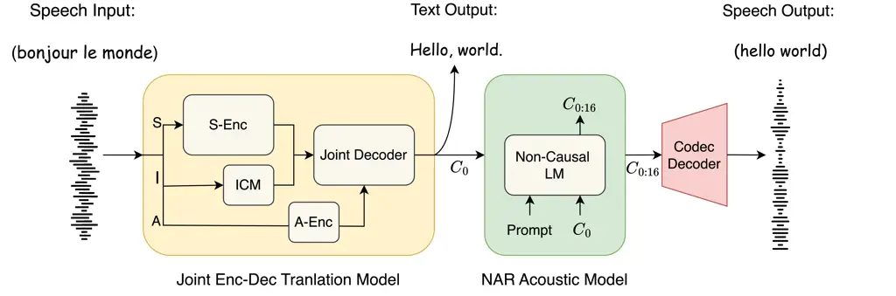
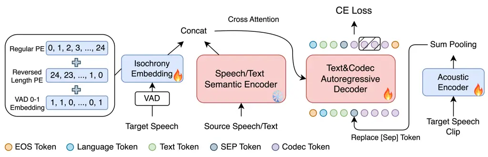
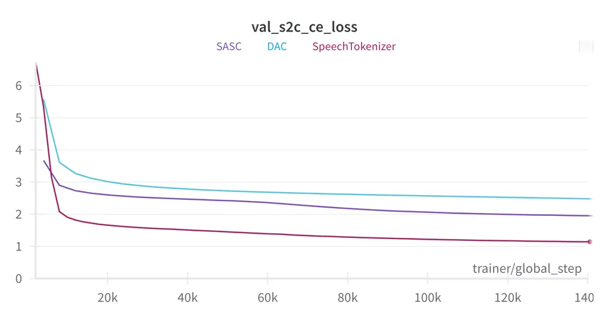
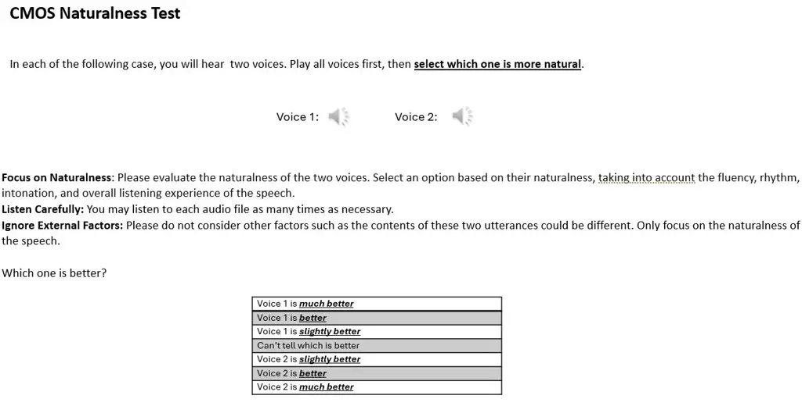

# TransVIP: Speech to Speech Translation System with Voice and Isochrony Preservation

Chenyang Le ^(†)^(†)thanks: Work done during an internship at Microsoft
Azure AI. nethermanpro@sjtu.edu.cn Affiliation: Shanghai Jiao Tong
University, China Affiliation: Microsoft, USA    Yao Qian
^(†)^(†)thanks: Correspondence: yaoqian@microsoft.com
Affiliation: Microsoft, USA    Dongmei Wang Affiliation: Microsoft, USA
   Long Zhou Affiliation: Microsoft, USA    Shujie Liu
Affiliation: Microsoft, USA    Xiaofei Wang Affiliation: Microsoft, USA
   Midia Yousefi Affiliation: Microsoft, USA    Yanmin Qian
Affiliation: Shanghai Jiao Tong University, China    Jinyu Li
Affiliation: Microsoft, USA    Sheng Zhao Affiliation: Microsoft, USA   
Michael Zeng Affiliation: Microsoft, USA

###### Abstract

There is a rising interest and trend in research towards directly
translating speech from one language to another, known as end-to-end
speech-to-speech translation. However, most end-to-end models struggle
to outperform cascade models, i.e., a pipeline framework by
concatenating speech recognition, machine translation, and
text-to-speech models. The primary challenges stem from the inherent
complexities involved in direct translation tasks and the scarcity of
data. In this study, we introduce a novel model framework TransVIP that
leverages diverse datasets in a cascade fashion yet facilitates
end-to-end inference through joint probability. Furthermore, we propose
two separate encoders to preserve the speaker’s voice characteristics
and isochrony from the source speech during the translation process,
making it highly suitable for scenarios such as video dubbing. Our
experiments on the French-English language pair demonstrate that our
model outperforms the current state-of-the-art speech-to-speech
translation model.



Figure 1: Overview of our speech-to-speech translation framework: 1)
Joint encoder-decoder model for translating speech into the target text,
and coarse-grained speech tokens, $`C_{0}`$; 2) Non-autoregressive
acoustic model for acoustic details, $`C_{0:16}`$; 3) Codec model to
convert discrete speech tokens back to the waveform. Abbreviation:
S/A/I(Semantic/Acoustic/Isochrony Information),
$`C_{0}`$/$`C_{0:16}`$(Codec layer 0/0-15), S/A-Enc(Semantic/Acoustic
Encoder), ICM(Isochrony Control Module).

## 1 Introduction

In recent years, speech translation (ST) has shifted from loosely
coupled cascaded systems to more integrated, and even end-to-end systems
\[1\]. Traditionally, cascaded systems comprised separate components for
automatic speech recognition (ASR), machine translation (MT), and
optionally, text-to-speech (TTS). Recent studies \[2, 3, 4, 5\] have
successfully integrated ASR and MT into a unified end-to-end
speech-to-text translation (S2TT) system. Furthermore, the integration
of TTS to form a speech-to-speech translation (S2ST) system has become
an increasingly researched area.

The primary challenge in developing end-to-end S2ST systems lies in
performance issues. Both S2TT and TTS involve high variability with
multiple reasonable outputs. Simultaneously performing these tasks
increases the complexity of learning exponentially. Additionally, there
is a scarcity of end-to-end S2ST data. Most available data are weakly
supervised, obtained through synthesis \[6\] or internet parsing \[7\],
further complicating the task. Another significant challenge is
preserving speaker identity, as obtaining large-scale datasets with
ground-truth paired speech spoken by the same speaker in two languages
is nearly impossible. In practical applications like video dubbing,
there is also a demand for controlling the length of the generated
target speech, ensuring that it closely matches the length of the source
speech. This capability of isochrony control, however, is absent in the
majority of existing S2ST systems.

To address these issues, we propose TransVIP, a speech-to-speech
Translation framework with Voice and Isochrony Preservation. TransVIP
employs a consecutive generation approach, simplifying the complex S2ST
task into two sequential tasks while maintaining an end-to-end
framework. The generation of the target speech is conditioned not only
on the semantic information, as in conventional S2ST models, but also on
the isochrony and acoustic information derived from the source speech.
The corresponding overview of TransVIP is demonstrated in Figure 1. We
evaluate the performance of TransVIP for French-English mutual
translation using a subset of the CVSS-T test set \[8\]. The results
demonstrate that TransVIP outperforms the publicly available SOTA models
such as a larger Seamless Expressive model. The generated audio samples
are available at https://aka.ms/transvip. The training code and script
are available at https://github.com/nethermanpro/transvip. The main
contributions of the paper can be summarized as follows:

1.  1.  We introduce a framework for speech-to-speech translation tasks that
        employ a consecutive generation with joint inference. This method
        efficiently utilizes a variety of datasets through multi-task
        learning to overcome the challenge of scarce paired data during the
        training phase, while preserving the end-to-end nature during
        inference.
2.  2.  We propose to disentangle various information required to learn in
        the training stage by employing separated encoders. It can enhance
        the transfer of voice characteristics and isochrony temporal
        alignment from the source to the target speech in the translation
        process. Additionally, it facilitates the design of lightweight
        modules for more effective individual information learning.
3.  3.  We advance the SpeechToknizer \[9\] technology for multi-lingual
        tasks by distilling the semantic information from a large-scale
        self-supervised model to the latest high-performing codec model.
        This advancement allows us to employ a textless non-autoregressive
        model for learning fine codec code generation without text labels,
        which is impractical in the conventional codec-based speech
        generation methods such as VALL-E \[10\].
4.  4.  We propose a method that refines the decoding process by
        incorporating a sampling mechanism within the Layer Beam Search
        framework, thereby enhancing the efficiency and effectiveness of
        non-autoregressive model decoding.

## 2 Related Works

#### Speech Quantization

The task of speech quantization is to transform continuous speech
features into discrete tokens. The quantization module is usually
trained by self-supervised learning (SSL) methods. The speech tokens can
be divided into two categories: semantic tokens and acoustic
tokens\[11\]. The semantic tokens\[12, 13, 14, 15, 16, 17\] are usually
learned by context prediction task. This kind of token is rich in
context information and is suitable for downstream tasks like
recognition. The acoustic tokens\[18, 19, 20, 21, 22\], also called the
neural codec, is usually trained by reconstruction task through a
discrete information bottleneck. This codec is suitable for audio
compression and audio generation. SpeechTokenizer \[9\] combines the
semantic token and acoustic token by semantic distillation. The latest
works propose attribute disentanglement of neural codec for better
generation task support. FAcodec\[23\] further disentangle codec into
content, prosody, acoustic, and timbre through supervision and reversed
gradient.

#### Speech Language Model

With the recent advance in speech quantization and the strong in-context
learning capability of the language model, the speech-language model has
shown great potential in speech generation. The GSLM family\[24, 25,
26\] use semantic tokens to train language models on speech
continuation. VoxtLM \[27\] integrates text tokens with semantic tokens
to perform speech recognition, synthesis, and continuation in a single
causal language model. AudioLM\[11\] uses both semantic tokens and
acoustic tokens for high-quality speech continuation. VALL-E \[10\]
extends this idea to zero-shot TTS and proposes auto-regressively
generating the first layer and non-autoregressively the rest layers of
the codec codes. Later work\[28, 29, 30\] have enhanced the
functionality of zero-shot TTS systems, such as building cross-lingual
synthesis and accurate alignment between text control signal and
acoustic tokens.

#### End-to-End S2ST

An end-to-end approach has been an ultimate goal for S2ST research. Some
previous works\[31, 32\] have tried a direct end-to-end approach for
S2ST. However, by far such methods still suffer great performance
issues. A solution is to include semantic tokens(text, phoneme, or
semantic speech tokens) as an intermediate result. Some recent
works\[33, 6, 34, 35\] applied speech-to-unit translation(S2UT) that
translate speech input into semantic speech tokens and then generate
speech through a unit vocoder like Hifi-GAN. And UnitY\[36\] use
separate speech-to-text and text-to-unit models that can be optimized
together. However traditional vocoder based on semantic tokens like
Hifi-GAN cannot generate high-quality speech. SeamlessExpressive\[37\]
addresses this issue using a well-designed PRETSSEL vocoder.
PolyVoice\[38\] and AudioPaLM\[39\] employees use two causal models to
first translate speech into semantic tokens, then generate acoustic
tokens based on semantic tokens, and then convert acoustic tokens to
output speech. VioLA\[40\] and MSLM-S2ST\[41\] adopt a similar approach
but use a single causal model in a multi-tasking way. However, these
approaches perform several separate auto-regressive generations during
the inference process. This, to a certain degree, contradicts the
principle of end-to-end processing.



Figure 2: The illustration of the training framework of the Joint
Enc-Dec Model. During the training, the losses from the target speech
clip, i.e., a sub-part of the whole target speech, which serves as a
prompt, are not aggregated when computing the Cross-Entropy (CE) loss.
The corresponding codec labels are masked in the implementation. The
semantic encoder and the auto-regressive decoder are initialized by a
SeamlessM4T X2T model ²² 2 https://ai.meta.com/blog/seamless-m4t. The
semantic encoder is frozen during training. In inference, all the target
speech input are replaced by source speech input.

## 3 TransVIP

### 3.1 Overview

Inspired by the recent advance in codec-based zero-shot TTS such as
VALL-E \[10\], TransVIP contains three major parts: 1) A codec model for
speech quantization and reconstruction, which is essential for
auto-regressive speech generation (section 4.1). 2) An auto-regressive
joint translation model to translate the input speech into
coarse-grained speech (Section 3.1). 3) A textless non-autoregressive
acoustic model to replenish acoustic details into the output speech
(Section 4.2). The overall framework for generating target speech is
shown in Figure 1.

In this section, we will present a detailed introduction to our joint
translation model, which is the key component of our translation system.
The training procedure of the joint model is illustrated in Figure 2. In
section 4, we will discuss the codec and NAR model.

### 3.2 Consecutive Generation with Joint Inference

Directly generating target translation speech $`Y`$ from input speech
$`X`$ presents a considerable challenge. Therefore, the primary
objective of this model is to produce a coarse-grained speech
$`Y^{\prime}`$ represented by a first-layer codec sequence. Instead of
optimizing the direct probability distribution of $`P(Y^{\prime}|X)`$,
our optimizing target is the joint probability $`P(Y^{\prime},T|X)`$ to
preserve semantic accuracy in the text outputs alone, as $`P(T|X)`$.
Hence, our approach focuses on modeling and maximizing the conditional
expression:

```math
P(Y^{\prime},T|X)=P(Y^{\prime}|X,T)P(T|X) \tag{1}
```

where $`T`$ represents the translated target text. This modeling is
achieved through a consecutive generation framework and optimized using
the beam search algorithm. Specifically, the decoder initially generates
text tokens, followed by codec tokens. We employ a unique separation
token to delineate the end of text tokens and the start of codec tokens.
Consequently, the codec is conditioned on both the input speech and the
generated text. In practical terms, exploring the entire space of $`T`$
is infeasible. In beam search generation, we optimize the following
approximate form:

```math
Y^{\prime},T=\mathop{\arg\max}_{Y^{\prime},T\in\mathcal{T}}P(Y^{\prime}|X,T)P(T|X) \tag{2}
```

where $`\mathcal{T}`$ represents a subset of $`T`$ with the highest
speech-to-text translation probability selected by the beam search
algorithm.

### 3.3 Feature Disentanglement

In the real world, an ideal training dataset for speech-to-speech
generation is not readily available, where the source and target
speeches are roughly equal in length and uttered by the same speaker. A
real dataset comprises paired speech, either spoken by different
speakers or synthesized. Thus, we cannot guarantee voice and duration
preservation with these corpora.

To address this issue, we decouple the input feature into three parts:
semantic information($`S`$), acoustic information($`A`$), and isochrony
information($`I`$). Formally, $`X=(S,A,I)`$. During training the inputs
to the model are $`S`$ from source speech, and $`(A,I)`$ information
from reference target speech. While during inference, $`(A,I)`$ are
derived from source speech. In this way the input feature can always
match the output speech in terms of voice characterizes $`A`$ and
isochrony $`I`$.

#### Semantic Information $`S`$

$`S`$ is extracted using a pre-trained speech encoder from an
encoder-decoder speech/text-to-text translation model, designed to
provide minimal acoustic or speaker information. We also include the
text encoder of the pre-trained model to enable text input and perform a
knowledge distillation loss on the text output part. We freeze two
pre-trained encoders during the training process.

#### Acoustic information $`A`$

The acoustic information that we extract relates to the distinctive
acoustic characteristics of a speaker’s voice. We assume that the
translated text $`T`$ is independent of $`A`$. The relationship can be
modeled as in Equation 3. We also take advantage of the one-direction
mask in the auto-regressive decoder to model such a relation explicitly.

```math
\begin{split}P(Y^{\prime}|X,T)P(T|X)&=P(Y^{\prime}|S,A,I,T)P(T|S,A,I)\\
&=P(Y^{\prime}|S,A,I,T)P(T|S,I)\end{split} \tag{3}
```

We use an acoustic encoder, comprising transformer blocks that learn
from scratch, to extract the acoustic information. This information is
sum pooled along the time dimension into a single embedding, which then
replaces the embedding of a separation token at the input of the
auto-regressive decoder. This acoustic embedding will not affect text
generation due to the causal property. It is compatible with both
gradients passing during training and beam search during inference. In
training, the input to the acoustic encoder is a speech prompt, i.e., a
sub-part of the whole target speech. We zero out the loss in the same
sub-part of the label to prevent information leakage. This combined with
the sum pooling forms an information bottleneck to prevent complex
semantic information from passing, allowing the encoder to learn
meaningful acoustic information for voice preservation. Like
Classifier-free Guidance, this replacement operation is not performed
with a certain probability(in our experiment $`p=0.5`$) during training.

#### Isochrony information $`I`$

We define a frame length, in our case 160ms, to quantify the duration of
speech. Our Isochrony control module contains three embeddings: a
regular position embedding, a reversed position embedding, and a voice
activity detection (VAD) 0-1 embedding. The reversed position embedding
provides the model with duration information on the number of additional
tokens to be generated in each step of the inference process \[42\], and
the VAD embedding identifies whether each frame is voice-active or not.
Isochrony information is then represented by the sum of the three
embedding sequences, which is then concatenated with the semantic
feature $`S`$ before being fed into the decoder through cross-attention.
This setup enables our model to align with both the total length and the
voice-active regions of the input speech, which is especially beneficial
for translating long speeches with pauses.

### 3.4 Multi-task Training

We claim that this translation model is a cascaded trainable end-to-end
model. Because the distribution $`P(Y^{\prime}|S,A,I,T)`$ and
$`P(T|S,I)`$ can be fitted both separately and jointly using various
datasets. It significantly enhances data accessibility, which is crucial
given the scarcity of S2ST datasets. We utilize these datasets during
training as follows:

- •
  S2ST Dataset comprises quadruple of ($`X`$, $`T_{s}`$, $`T_{t}`$,
  $`Y`$), where $`T_{s}`$ is the source text and $`T_{t}`$ is the target
  text. We either use $`X`$ or $`T_{s}`$ as input and consecutive
  $`T_{t}`$ and $`Y`$ as target labels, or we can reverse the roles of
  source input and target labels.
- •
  ST Dataset is a triplet of ($`X`$, $`T_{s}`$, $`T_{t}`$). In our
  model, the missing codec label does not impede the training of
  speech-to-text translation. We can use $`X`$ as the input and treat
  $`T_{t}`$ as an incomplete label that terminates with a separation
  token. In this setup, the isochrony feature is omitted and does not
  concatenate with the semantic feature. And, alternatively, $`T_{t}`$
  can serve as the input with consecutive $`X`$ and $`T_{s}`$ as the
  label, mirroring the approach in the S2ST dataset.
- •
  ASR Dataset, which is highly accessible, consists of pairs ($`X`$,
  $`T_{s}`$). Unlike most other speech translation works, we use ASR
  data mainly for TTS training, fitting $`P(Y^{\prime}|S,A,I,T)`$. Here,
  $`T_{s}`$ is used as the input with consecutive $`T_{s}`$ and $`X`$ as
  the output labels, and the loss is not applied to the part of the
  label corresponding to $`T_{s}`$. We didn’t train on the recognition
  task because our semantic encoder is frozen, making this task
  ineffective.

## 4 Codec and Acoustic Modeling

### 4.1 Nerual Codec with Semantic Distillation

Our neural codec is designed to provide high reconstruction quality and
compatibility with language model predictions. We refer to our codec as
the Semantic-Aware Speech Codec (SASCodec), which integrates two
existing methodologies: DAC \[22\] and SpeechTokenizer. DAC employs
innovative factorized and L2-normalized codes in vector quantization and
finely tuned hyperparameters to achieve state-of-the-art reconstruction
quality. SpeechTokenizer, on the other hand, uses a Hubert encoder as a
teacher and performs semantic distillation between it and the
first-layer Residual Vector Quantization (RVQ) codes. This process
enriches the RVQ codes with additional semantic information,
facilitating downstream language modeling tasks.

We have adopted SpeechTokenizer as our foundational model and made
improvements. Originally trained with limited monolingual data, we have
expanded the training to include multilingual datasets. Furthermore, we
replaced the Hubert encoder with an MMS\[43\] encoder to enhance
multilingual semantic distillation. To further improve the efficacy of
semantic distillation, we use a fixed SpeechTokenizer model as the
teacher and apply L1 mel loss to the audios reconstructed using only the
first quantization layer.

To enhance reconstruction quality, we have integrated the codec with
factorized and L2-normalized codes. The discriminator, loss
configuration, and training hyperparameters align with those used in
DAC.

### 4.2 Textless Non-autoregressive Acoustic Modeling

Similar to previous work, the function of our non-autoregressive model
is to enhance the acoustic details of generated speech by predicting the
subsequent layers of Residual Vector Quantization (RVQ) codes based on
the initial layer. We utilize a standard transformer equipped with
adaptive layer normalization for this task. The model inputs the
summation of embeddings from the first $`n`$ layers of RVQ codes to
predict the $`(n+1)`$th layer, where $`n=1,2,...,N`$ and $`N`$ represent
the total number of RVQ layers. A prompt is concatenated with the input
embeddings along the time dimension. The prompt is the summation of full
$`N`$ layers of embeddings of the prompt speech. During the training
phase, the prompt and the part to be generated are in the same language.
However, in the inference phase, they are in two distinct languages for
the translation task. This creates a certain gap. Fortunately, our model
trained using a multilingual dataset can effectively generalize and
bridge this gap.

Our approach diverges from prior studies by excluding textual or
phonetic inputs, rendering it a completely textless model. Previous
research indicated that omitting semantic information such as text or
phonemes typically significantly decreases intelligibility. However, our
experiments demonstrate that the textless model either matches or
surpasses the performance of models with text inputs, owing to semantic
distillation within the SASCodec.

The textless model offers two significant advantages: Firstly, it
improves data accessibility, as the acoustic model can now be trained
entirely with unsupervised data. Unlike supervised data, which requires
aligned text labels and precise speech clip boundaries, unsupervised
data can be arbitrarily segmented, effectively augmenting the dataset.
Secondly, traditional non-autoregressive models that utilize phoneme
inputs depend on accurate transcriptions to establish alignment and
initiate generation. This requirement can be challenging, especially in
zero-shot speech translation tasks where users might not provide
transcriptions. Our textless model addresses this problem by eliminating
the need for transcription.

#### Layer Beam Search based on Sampling

In previous work, the decoding of non-autoregressive models is typically
performed greedily, as the decoding techniques used in auto-regressive
models cannot be directly applied. Greedy decoding often leads to an
"early decision error" problem where the model cannot revise previous
outputs once generated. To address this, we propose a method called
Layer Beam Search (LBS), which adapts the beam search algorithm for
non-autoregressive models.

Consider a beam size of $`B`$ and a vocabulary size of $`V`$. In a
typical beam search algorithm, a beam maintains $`B`$ hypotheses. At
each decoding step, each hypothesis calculates the probability
distribution over $`V`$, yielding $`B\times V`$ candidates. These
candidates are then ranked by their aggregated scores, and the top $`B`$
are selected to form the new beam. This approach is impractical in
non-autoregressive models due to the enormous vocabulary size at each
decoding step. For example, for a speech segment containing $`L`$
tokens, and a codec codebook size of $`C`$, the effective vocabulary
size becomes $`|V|=C^{L}`$, which is too large to enumerate.

To tackle this, we employ a sampling method to choose a reasonable
number of candidates. Rather than sampling from the entire vocabulary
space $`V`$, we sample from the top-K candidates at each token, thus
creating a reduced vocabulary subspace $`V^{\prime}`$ of size $`k^{L}`$.
We sample $`N`$ times from $`V^{\prime}`$ for each candidate in the
original beam to form a total of $`B*N`$ new candidates. We then rank
and form a new beam of size $`B`$ from these sampled candidates. The
pseudo code for the Layer Beam Search is provided in appendix D.

## 5 Experiments and Results

### 5.1 Experimental Settings

In this section, we introduce the implementation, training, and
evaluation of the TransVIP system. We conducted our experiment in the
English-French mutual translation setting, as it had relatively more
data than other language pairs. Appendix A and B include more details
about our models and metrics.

#### Implementation

All three models within the system are trained using 32 NVIDIA V100 32G
GPUs. We utilize Fairseq2 libriary³³ 3
https://github.com/pytorch/fairseq2, MIT License for model building and
the PyTorch Lightning framework⁴⁴ 4
https://lightning.ai/docs/pytorch/stable/, Apache 2.0 License for
distributed data parallel (DDP) training. The training time for each of
the three models is around one week.

#### Evaluation

For speech-to-speech translation translation evaluation, we use a subset
of CVSS-T \[8\] fr-en test set containing 300 utterances. It is the
first three hundred rows in the original table⁵⁵ 5
https://dl.fbaipublicfiles.com/covost/covost_v2.fr_en.tsv.tar.gz for
test set provided by CoVoST 2 \[48\]. We use source speech as the
prompt. All the similarity metrics are also calculated with the source
speech as the reference.

We use at most, a 10-second prompt for the joint translation model and a
5-second prompt for the NAR acoustic model. If the source speech is
shorter than that limitation we just use the whole utterance as the
prompt. For baseline, we compared our model with a textless S2UT model
and two Seamless models. The textless S2UT model is the All-to-English
XM Transformer⁶⁶ 6
https://github.com/facebookresearch/fairseq/tree/ust/examples/speech_matrix
release by SpeechMatrix\[49\]. For seamless models, We compared with two
versions, the medium version, and the expressive version. The medium
version uses the same speech-to-text translation model as the one we use
to initialize our joint translation model, while the expressive version
has larger model size and a stronger text-to-speech model. For codec
evaluation, we employ LibriSpeech \[50\] test-clean, which is widely
adopted for codec and TTS evaluation. We compare our SASCodec with
Encodec \[21\], Speechtokenizer \[9\] and DAC\[22\]. We evaluate S2ST
performance on translation(BLEU), speaker&prosody similarity(SIM &
AutoPCP), Isochrony control(Rate, Pause & SLC), and naturalness. Please
refer to Appendix A for the details of evaluation matrics.

### 5.2 S2ST Evaluation Result

In this section, we will show the evaluation result of TransVIP in
translation performance, voice preservation, isochrony control, and
speech naturalness.

|                    |        |        |       |       |       |      |       |          |      |      |
| ------------------ | ------ | ------ | ----- | ----- | ----- | ---- | ----- | -------- | ---- | ---- |
|                    | \#Size | BLEU   |       | SIM   | A.PCP | Rate | Pause | SLC\_(p) |      | Nat. |
|                    |        | Speech | Text  |       |       |      |       | 0.2      | 0.4  |      |
| Dataset            |        |        |       |       |       |      |       |          |      |      |
| Source audio       | -      | -      | -     | -     | -     | -    | -     | -        | -    | 2.62 |
| CVSS-T target      | -      | -      | -     | 0.205 | 2.30  | 0.42 | 0.47  | 0.56     | 0.88 | 3.50 |
| Fr - En            |        |        |       |       |       |      |       |          |      |      |
| ST + StyleTTS      | -      | 33.57  | -     | 0.173 | 2.74  | 0.33 | 0.51  | 0.56     | 0.85 | 3.25 |
| Textless S2UT XM   | 1.2B   | 15.45  | -     | 0.035 | 1.96  | -    | -     | 0.52     | 0.79 | 3.18 |
| SeamlessM4T(M)     | 1.0B   | 28.95  | 34.69 | 0.037 | 2.27  | 0.16 | 0.52  | 0.43     | 0.79 | 3.08 |
| SeamlessExpressive | 1.7B   | 30.85  | 35.26 | 0.256 | 2.74  | 0.22 | 0.51  | 0.50     | 0.79 | 2.91 |
| TransVIP           | 1.1B   | 32.60  | 35.34 | 0.320 | 2.49  | 0.55 | 0.44  | 0.70     | 0.91 | 3.19 |
| En - Fr            |        |        |       |       |       |      |       |          |      |      |
| ST + ValleX        | -      | 22.50  | 34.89 | 0.418 | 2.87  | 0.27 | 0.54  | 0.65     | 0.89 | 3.32 |
| SeamlessM4T(M)     | 1.0B   | 21.06  | 32.41 | 0.033 | 2.31  | 0.16 | 0.53  | 0.51     | 0.89 | 3.20 |
| SeamlessExpressive | 1.7B   | 27.39  | 34.89 | 0.335 | 2.53  | 0.30 | 0.52  | 0.58     | 0.92 | 3.57 |
| TransVIP           | 1.1B   | 27.28  | 33.02 | 0.395 | 2.67  | 0.45 | 0.65  | 0.81     | 0.99 | 3.40 |

Table 1: The subjective evaluation results of our model and baseline
model. In all scores, higher values are better. The results of baseline
models are inferred from official checkpoints. We have also conducted a
statistical significance test between TransVIP and SeamlessExpressive at
a 0.05 significance level. Any results that are statistically
significantly better are highlighted in bold. Abbreviation:
A.PCP(AutoPCP), Nat.(Natureness)

#### Translation Performance

We evaluated the translation performance using BLEU and ASR-BLEU metrics
as presented in Table 1. 1) By comparing our models, TransVIP and the
Seamless baseline, with the state-of-the-art (SOTA) textless S2UT model
and analyzing the generated samples, we observed that both our models
significantly outperform the textless S2UT model. Notably, the textless
model exhibits severe issues with repetition and "illusion" (generating
audio that seems plausible but is unrelated to the input), which have
been substantially mitigated in both the Seamless model and our
TransVIP. This confirms our hypothesis that including an intermediate
text is crucial for successful S2ST generation. 2) Our TransVIP
demonstrates highly competitive results compared to the Seamless
baselines. In the French-to-English translation direction, our model
achieved a BLEU score of 32.60, 3.65 points higher than the SeamlessM4T
medium and 1.75 points above the larger SeamlessExpressive. In the
English-to-French direction, our model surpasses the SeamlessM4T medium
by 6.22 points. Additionally, the ASR-BLEU performance of our model is
comparable to that of SeamlessExpressive, with only a slight difference
of -0.11 points despite a 1.87-point gap in the text BLEU score. The
disparity in text BLEU scores is attributed to differences in model
size, and our limited S2TT data precludes rectifying this issue.

#### Voice Preservation

We assess speaker similarity in the SIM column of Table 1. The Textless
S2UT model and SeamlessM4T Medium do not effectively preserve speaker
identity, as evidenced by their near-zero similarity scores. In
contrast, our TransVIP model achieves scores of 0.320 and 0.395 in the
fr-en and en-fr directions, respectively, slightly outperforming the
SeamlessExpressive baseline, which scores 0.256 and 0.335. TransVIP also
exceeds the fr-en target speech from the CVSS-T dataset, used in our
training, by 0.115 points. This indicates that our model’s similarity
performance transcends the limitations of its training dataset.
Regarding prosody similarity, TransVIP’s AutoPCP score surpasses
Textless S2UT and SeamlessM4T Medium. Compared to SeamlessExpressive,
TransVIP performs 0.25 points lower in the fr-en direction but 0.14
points higher in en-fr. It is significant to note that, unlike TransVIP,
SeamlessExpressive explicitly incorporates a prosody encoder.

#### Isochrony Control

We assess isochrony control through several metrics: speech length
compliant(SLC), speech rate compliant, and pause number compliant. 1)
TransVIP demonstrates superior length control, achieving an improvement
of no less than 0.18 in Fr-En and 0.23 in En-Fr for SLC\_(0.2) compared
to baseline models without a length control strategy. 2) TransVIP
achieves the highest speech rate compliance among all baselines,
benefiting from an acoustic encoder that incorporates rate information
into the model. 3) Regarding pause number, TransVIP scores best in En-Fr
and slightly underperforms compared to SeamlessExpressive in Fr-En. Upon
reviewing the samples, we attribute this to TransVIP’s addition of new
pauses in the speech to adjust the total duration.

#### Speech Naturalness

We observed that the quality of the conditioning speech prompt
significantly influences the naturalness of the generated speech, as
measured by the NISQA score. For instance, when processing low-quality
real French data (Fr-En), SeamlessExpressive registers the lowest score
at 2.91. Conversely, with high-quality synthesized English data (En-Fr)
as input, SeamlessExpressive achieves the highest score of 3.57.
Meanwhile, our TransVIP model demonstrates consistent performance,
scoring 3.19 in the Fr-En direction and 3.40 in the en-fr direction.

### 5.3 Codec Evaluation Result

We show the evaluation result in Table 2 and group the result by
bandwidth(BW). The SpeechTokenizer that has undergone semantic
distillation performs well in the NISQA score, producing a clean and
natural voice. On the other hand, DAC performs well in similarity and
WER, showing a strong capability of a faithful reconstruction of the
original speech. Finally, our SASCodec successfully combines the
strength of two codecs, showing a very competitive result in all four
metrics.

|                   |     |     |         |                 |                   |                  |                   |
| ----------------- | --- | --- | ------- | --------------- | ----------------- | ---------------- | ----------------- |
|                   | NQ  | FR  | BW      | SIM$`\uparrow`$ | SIM-o$`\uparrow`$ | Nat.$`\uparrow`$ | WER$`\downarrow`$ |
| SpeechTokenizer\* | 8   | 50  | 4 kbps  | 0.847           | 0.558             | 3.714            | 1.44              |
| SASCodec          | 8   | 50  | 4 kbps  | 0.871           | 0.576             | 3.425            | 1.34              |
| Encodec\*         | 8   | 75  | 6 kbps  | 0.887           | 0.582             | 3.139            | 1.30              |
| DAC\*             | 8   | 75  | 6 kbps  | 0.900           | 0.590             | 3.387            | 1.31              |
| DAC†              | 16  | 50  | 8 kbps  | 0.936           | 0.622             | 3.667            | 1.11              |
| SASCodec          | 16  | 50  | 8 kbps  | 0.939           | 0.624             | 3.785            | 1.11              |
| Encodec\*         | 16  | 75  | 12 kbps | 0.931           | 0.618             | 3.281            | 1.16              |
| DAC\*             | 16  | 75  | 12 kbps | 0.967           | 0.646             | 3.636            | 1.07              |
| SASCodec          | 24  | 50  | 12 kbps | 0.950           | 0.631             | 3.786            | 1.06              |

Table 2: Codec re-synthesize evaluation result. The codecs are grouped
by bandwidth. \* means the result is inferred from the official
checkpoint. †means it is reproduced result using the official recipe.
Abbreviation: NQ(number of quantizers), FR(frame rate), BW(Bandwidth),
Nat.(Natureness)

## 6 Ablation Study

### 6.1 Ablation on Acoustic Embedding

In the process of semantic distillation within the codec, a significant
amount of acoustic information was disentangled from the first-layer
codec. This raises the question of whether the acoustic encoder is still
necessary in the joint translation model. To investigate this, we
leveraged the model’s capability to perform inference without the
acoustic embedding. We conducted such inferences and compared the
outcomes, as shown in Table 3. Without the acoustic embedding, speaker
similarity scores decreased by 0.040 in the French-English (Fr-En)
translations and by 0.032 in the English-French (En-Fr) translations.
Additionally, there was a slight decline in the AutoPCP scores. These
findings suggest that residual acoustic information remains within the
first-layer codec, underscoring the necessity of including a prompt
embedding.

|           |          |       |       |       |      |
| --------- | -------- | ----- | ----- | ----- | ---- |
|           | ASR-BLEU | BLEU  | SIM   | A.PCP | Nat. |
| Fr - En   |          |       |       |       |      |
| TransVIP  | 32.60    | 35.34 | 0.320 | 2.49  | 3.19 |
|    -A_emb | 32.47    | 35.18 | 0.280 | 2.45  | 3.23 |
| En - Fr   |          |       |       |       |      |
| TransVIP  | 27.28    | 33.02 | 0.395 | 2.67  | 3.40 |
|    -A_emb | 26.84    | 33.15 | 0.362 | 2.45  | 3.46 |

Table 3: The ablation study of the acoustic embedding in the joint
translation model.

### 6.2 Ablation on Isochrony Control method

We compared our proposed Isochrony control method with and without using
other strategies. We presented the results in Table 4, where a) No
Isochrony Control (No IC). b) Isochrony Control on the Decoder (Dec IC).
This involves adding the Isochrony embedding to the input of the encoder
as another positional embedding. We implemented the method from \[54\]
in our system. c) Isochrony Control on the Decoder with Future Pause
Information (Dec IC + FPI). This is an improvement over (b). In addition
to the distance to the global end and VAD information, two extra pieces
of information are encoded: the distance to the next pause and the
number of pauses in the future. We implemented the method from
\[pal2023improving\] in our system.

It demonstrates that our proposed method reaches the best isochronic
control. The results also show that this approach can improve the
ASR-BLEU score compared to Isochrony control on the decoder, meaning the
model is more confident and accurate in the generation and makes fewer
errors like repetition and truncation.

|                   | ASR-BLEU | Overlap | SLC\_(0.2) | SLC\_(0.4) |
| ----------------- | -------- | ------- | ---------- | ---------- |
| No IC             | 30.81    | 0.689   | 0.63       | 0.87       |
| Dec IC            | 30.51    | 0.748   | 0.75       | 0.90       |
| Dec IC+ FPI       | 30.45    | 0.766   | 0.77       | 0.91       |
| Enc IC (Proposed) | 30.62    | 0.784   | 0.82       | 0.95       |

Table 4: Ablation study on the isochrony control strategy.

### 6.3 Ablation Study on the NAR Acoustic Model

In this section, we conduct two comparisons. Firstly, we contrast the
performance of a textless non-autoregressive acoustic model with that of
a model trained using text transcriptions (BPE) as input. Secondly, we
assess the inference results with and without the utilization of the
Layer Beam Search (LBS) algorithm to determine its impact on performance
enhancement.

The textless model is trained on a combination of datasets including
Librilight, VoxPopuli French subset, SeamlessAlign, and Common Voice
English and French subsets. As some datasets do not provide text
transcriptions, we substitute the LibriHeavy dataset in the model
trained with text input. Additionally, in the textless model, long audio
segments are randomly clipped, whereas in the model with text input,
clips strictly adhere to timestamps provided in the metadata to align
with text transcriptions. We compare the Fr-En uni-directional setup to
mitigate the impact of the absence of a large-scale French dataset on
the model with text input. Despite the apparent data discrepancy,
textless modeling demonstrates superior performance, underscoring one of
its key data accessibility advantages. All other hyperparameters,
including training steps, remain consistent across both models.

The results are presented in Table 5. The textless model consistently
outperforms the model with text input across all metrics of ASR-BLEU,
speaker similarity, and naturalness. Moreover, employing LBS yields
superior results compared to greedy decoding.

| NAR Model    | SIM   | ASR-BLEU | Nat. |
| ------------ | ----- | -------- | ---- |
| NAR w/o text | 0.320 | 32.60    | 3.19 |
|    - LBS     | 0.309 | 32.30    | 3.17 |
| NAR w/ text  | 0.307 | 31.52    | 3.10 |
|    - LBS     | 0.298 | 31.03    | 3.09 |

Table 5: Ablation study on the NAR Acoustic model and its inference
strategy.

## 7 Conclusion, Limitations and future works

In this paper, we develop a speech-to-speech translation framework that
preserves speaker voice and isochrony, generating high-quality
translated speech suitable for both daily communication and automatic
video dubbing. Our framework can infer in an end-to-end manner, jointly
considering text and speech probability during the inference phase and
making full use of various data during the training phase. In the Fr-En
direction, TransVIP surpasses the current state-of-the-art model with
comparable translation performance and significantly improved voice and
isochrony preservation.

Limitations and future works: 1) Performance & Language Support: Due to
current resource and data limitations, we have only trained our model on
the Fr-En language pair. We used approximately 5k hours of audio to
train the translation model, compared to over 50k hours in previous
works\[7, 40, 38\]. This suggests that there is potential for
performance improvement if we scale up the data. Additionally, we aim to
extend our framework to many-to-many settings through large-scale
multilingual training, similar to Seamless. 2) More Detailed Attribute
Control: Upon reviewing the test samples, we found that TransVIP
occasionally alters the tone of the speech, such as translating
interrogative sentences into declarative ones. It is reasonable to
hypothesize that more detailed control of attributes like intonation or
emotion could help address this issue.

Broader Impact: TransVIP was developed to improve cross-lingual
communication and assist with automated video dubbing workflows.
However, it carries potential risks, including the misuse of the model
for impersonating specific speakers by inputting targeted text and
speaker prompts. Additionally, as a generative model, there is a
possibility it may produce toxic or biased outputs, although such
occurrences were not observed in our test samples.

## Acknowledgments and Disclosure of Funding

We extend our gratitude to Chung-Hsien Tsai, Canrun Li, and Zhen Xiao
for their invaluable contribution in conducting the subjective
evaluation and for their efforts in assembling the video dubbing
material.

## References

- \[1\] M. Sperber and M. Paulik, “Speech translation and the end-to-end
  promise: Taking stock of where we are,” _arXiv preprint
  arXiv:2004.06358_, 2020.
- \[2\] A. Radford, J. W. Kim, T. Xu, G. Brockman, C. Mcleavey, and
  I. Sutskever, “Robust Speech Recognition via Large-Scale Weak
  Supervision,” in _Proceedings of the 40th International Conference on
  Machine Learning_. PMLR, 2023, pp. 28 492–28 518.
- \[3\] Z. Zhang, L. Zhou, J. Ao, S. Liu, L. Dai, J. Li, and F. Wei,
  “Speechut: Bridging speech and text with hidden-unit for
  encoder-decoder based speech-text pre-training,” _arXiv preprint
  arXiv:2210.03730_, 2022.
- \[4\] Y. Zhang, W. Han, J. Qin, Y. Wang, A. Bapna, Z. Chen, N. Chen,
  B. Li, V. Axelrod, G. Wang, Z. Meng, K. Hu, A. Rosenberg,
  R. Prabhavalkar, D. S. Park, P. Haghani, J. Riesa, G. Perng,
  H. Soltau, T. Strohman, B. Ramabhadran, T. Sainath, P. Moreno, C.-C.
  Chiu, J. Schalkwyk, F. Beaufays, and Y. Wu, “Google USM: Scaling
  Automatic Speech Recognition Beyond 100 Languages,” _arXiv preprint
  arXiv:2303.01037_, 2023.
- \[5\] C. Le, Y. Qian, L. Zhou, S. Liu, Y. Qian, M. Zeng, and X. Huang,
  “ComSL: A Composite Speech-Language Model for End-to-End
  Speech-to-Text Translation,” in _Advances in Neural Information
  Processing Systems_, vol. 36, 2023, pp. 58 312–58 323.
- \[6\] R. Huang, J. Liu, H. Liu, Y. Ren, L. Zhang, J. He, and Z. Zhao,
  “TranSpeech: Speech-to-Speech Translation With Bilateral
  Perturbation,” in _The Eleventh International Conference on Learning
  Representations_, 2022.
- \[7\] S. Communication, L. Barrault, Y.-A. Chung, M. C. Meglioli,
  D. Dale, N. Dong, P.-A. Duquenne, H. Elsahar, H. Gong, K. Heffernan,
  J. Hoffman, C. Klaiber, P. Li, D. Licht, J. Maillard, A. Rakotoarison,
  K. R. Sadagopan, G. Wenzek, E. Ye, B. Akula, P.-J. Chen, N. E. Hachem,
  B. Ellis, G. M. Gonzalez, J. Haaheim, P. Hansanti, R. Howes, B. Huang,
  M.-J. Hwang, H. Inaguma, S. Jain, E. Kalbassi, A. Kallet, I. Kulikov,
  J. Lam, D. Li, X. Ma, R. Mavlyutov, B. Peloquin, M. Ramadan,
  A. Ramakrishnan, A. Sun, K. Tran, T. Tran, I. Tufanov, V. Vogeti,
  C. Wood, Y. Yang, B. Yu, P. Andrews, C. Balioglu, M. R. Costa-jussà,
  O. Celebi, M. Elbayad, C. Gao, F. Guzmán, J. Kao, A. Lee,
  A. Mourachko, J. Pino, S. Popuri, C. Ropers, S. Saleem, H. Schwenk,
  P. Tomasello, C. Wang, J. Wang, and S. Wang, “SeamlessM4T: Massively
  Multilingual & Multimodal Machine Translation.” arXiv, 2023.
- \[8\] Y. Jia, M. Tadmor Ramanovich, Q. Wang, and H. Zen, “CVSS corpus
  and massively multilingual speech-to-speech translation,” in
  _Proceedings of the Thirteenth Language Resources and Evaluation
  Conference_, N. Calzolari, F. Béchet, P. Blache, K. Choukri, C. Cieri,
  T. Declerck, S. Goggi, H. Isahara, B. Maegaard, J. Mariani, H. Mazo,
  J. Odijk, and S. Piperidis, Eds. Marseille, France: European Language
  Resources Association, Jun. 2022, pp. 6691–6703. \[Online\].
  Available:
  [https://aclanthology.org/2022.lrec-1.720](https://aclanthology.org/2022.lrec-1.720)
- \[9\] X. Zhang, D. Zhang, S. Li, Y. Zhou, and X. Qiu,
  “SpeechTokenizer: Unified Speech Tokenizer for Speech Language
  Models,” in _The Twelfth International Conference on Learning
  Representations_, 2023.
- \[10\] C. Wang, S. Chen, Y. Wu, Z. Zhang, L. Zhou, S. Liu, Z. Chen,
  Y. Liu, H. Wang, J. Li _et al._, “Neural codec language models are
  zero-shot text to speech synthesizers,” _arXiv preprint
  arXiv:2301.02111_, 2023.
- \[11\] Z. Borsos, R. Marinier, D. Vincent, E. Kharitonov, O. Pietquin,
  M. Sharifi, D. Roblek, O. Teboul, D. Grangier, M. Tagliasacchi, and
  N. Zeghidour, “AudioLM: A Language Modeling Approach to Audio
  Generation,” _IEEE/ACM Transactions on Audio, Speech, and Language
  Processing_, vol. 31, pp. 2523–2533, 2023.
- \[12\] A. Baevski, Y. Zhou, A. Mohamed, and M. Auli, “Wav2vec 2.0: A
  Framework for Self-Supervised Learning of Speech Representations,” in
  _Advances in Neural Information Processing Systems_, vol. 33. Curran
  Associates, Inc., 2020, pp. 12 449–12 460.
- \[13\] W.-N. Hsu, B. Bolte, Y.-H. H. Tsai, K. Lakhotia,
  R. Salakhutdinov, and A. Mohamed, “HuBERT: Self-Supervised Speech
  Representation Learning by Masked Prediction of Hidden Units,”
  _IEEE/ACM Transactions on Audio, Speech, and Language Processing_,
  vol. 29, pp. 3451–3460, 2021.
- \[14\] Y.-A. Chung, Y. Zhang, W. Han, C.-C. Chiu, J. Qin, R. Pang, and
  Y. Wu, “W2v-BERT: Combining Contrastive Learning and Masked Language
  Modeling for Self-Supervised Speech Pre-Training,” in _2021 IEEE
  Automatic Speech Recognition and Understanding Workshop (ASRU)_, 2021,
  pp. 244–250.
- \[15\] Y. Cheng, Y. Zhang, M. Johnson, W. Macherey, and A. Bapna,
  “Mu\$^2\$SLAM: Multitask, Multilingual Speech and Language Models,” in
  _Proceedings of the 40th International Conference on Machine
  Learning_. PMLR, 2023, pp. 5504–5520.
- \[16\] J. Ao, R. Wang, L. Zhou, C. Wang, S. Ren, Y. Wu, S. Liu, T. Ko,
  Q. Li, Y. Zhang, Z. Wei, Y. Qian, J. Li, and F. Wei, “SpeechT5:
  Unified-Modal Encoder-Decoder Pre-Training for Spoken Language
  Processing,” in _Proceedings of the 60th Annual Meeting of the
  Association for Computational Linguistics (Volume 1: Long Papers)_,
  S. Muresan, P. Nakov, and A. Villavicencio, Eds. Dublin, Ireland:
  Association for Computational Linguistics, 2022, pp. 5723–5738.
- \[17\] C.-C. Chiu, J. Qin, Y. Zhang, J. Yu, and Y. Wu,
  “Self-supervised learning with random-projection quantizer for speech
  recognition,” in _Proceedings of the 39th International Conference on
  Machine Learning_. PMLR, 2022, pp. 3915–3924.
- \[18\] N. Zeghidour, A. Luebs, A. Omran, J. Skoglund, and
  M. Tagliasacchi, “SoundStream: An End-to-End Neural Audio Codec,”
  _IEEE/ACM Transactions on Audio, Speech, and Language Processing_,
  vol. 30, pp. 495–507, 2022.
- \[19\] J. Valin, K. Vos, and T. Terriberry, “Definition of the opus
  audio codec,” Tech. Rep., 2012.
- \[20\] M. Dietz, M. Multrus, V. Eksler, V. Malenovsky, E. Norvell,
  H. Pobloth, L. Miao, Z. Wang, L. Laaksonen, A. Vasilache, Y. Kamamoto,
  K. Kikuiri, S. Ragot, J. Faure, H. Ehara, V. Rajendran, V. Atti,
  H. Sung, E. Oh, H. Yuan, and C. Zhu, “Overview of the EVS codec
  architecture,” in _2015 IEEE International Conference on Acoustics,
  Speech and Signal Processing (ICASSP)_, 2015, pp. 5698–5702.
- \[21\] A. Défossez, J. Copet, G. Synnaeve, and Y. Adi, “High Fidelity
  Neural Audio Compression,” _Transactions on Machine Learning
  Research_, 2023.
- \[22\] R. Kumar, P. Seetharaman, A. Luebs, I. Kumar, and K. Kumar,
  “High-Fidelity Audio Compression with Improved RVQGAN,” _Advances in
  Neural Information Processing Systems_, vol. 36, pp.
  27 980–27 993, 2023.
- \[23\] Z. Ju, Y. Wang, K. Shen, X. Tan, D. Xin, D. Yang, Y. Liu,
  Y. Leng, K. Song, S. Tang, Z. Wu, T. Qin, X.-Y. Li, W. Ye, S. Zhang,
  J. Bian, L. He, J. Li, and S. Zhao, “NaturalSpeech 3: Zero-Shot Speech
  Synthesis with Factorized Codec and Diffusion Models,” 2024.
- \[24\] K. Lakhotia, E. Kharitonov, W.-N. Hsu, Y. Adi, A. Polyak,
  B. Bolte, T.-A. Nguyen, J. Copet, A. Baevski, A. Mohamed, and
  E. Dupoux, “On Generative Spoken Language Modeling from Raw Audio,”
  _Transactions of the Association for Computational Linguistics_,
  vol. 9, pp. 1336–1354, 2021.
- \[25\] E. Kharitonov, A. Lee, A. Polyak, Y. Adi, J. Copet,
  K. Lakhotia, T.-A. Nguyen, M. Rivière, A. Mohamed, E. Dupoux, and
  W.-N. Hsu, “Text-Free Prosody-Aware Generative Spoken Language
  Modeling,” in _ACL 2022 - Association for Computational Linguistics_,
  ser. Proceedings of the 60th Annual Meeting of the Association for
  Computational Linguistics, vol. 1: Long Papers. Dublin, Ireland: MIT
  Press, 2022, pp. 8666–8681.
- \[26\] T. A. Nguyen, E. Kharitonov, J. Copet, Y. Adi, W.-N. Hsu,
  A. Elkahky, P. Tomasello, R. Algayres, B. Sagot, A. Mohamed, and
  E. Dupoux, “Generative Spoken Dialogue Language Modeling,”
  _Transactions of the Association for Computational Linguistics_,
  vol. 11, pp. 250–266, 2023.
- \[27\] S. Maiti, Y. Peng, S. Choi, J.-W. Jung, X. Chang, and
  S. Watanabe, “VoxtLM: Unified Decoder-Only Models for Consolidating
  Speech Recognition, Synthesis and Speech, Text Continuation Tasks,” in
  _ICASSP 2024 - 2024 IEEE International Conference on Acoustics, Speech
  and Signal Processing (ICASSP)_, 2024, pp. 13 326–13 330.
- \[28\] Z. Zhang, L. Zhou, C. Wang, S. Chen, Y. Wu, S. Liu, Z. Chen,
  Y. Liu, H. Wang, J. Li _et al._, “Speak foreign languages with your
  own voice: Cross-lingual neural codec language modeling,” _arXiv
  preprint arXiv:2303.03926_, 2023.
- \[29\] E. Kharitonov, D. Vincent, Z. Borsos, R. Marinier, S. Girgin,
  O. Pietquin, M. Sharifi, M. Tagliasacchi, and N. Zeghidour, “Speak,
  Read and Prompt: High-Fidelity Text-to-Speech with Minimal
  Supervision,” 2023.
- \[30\] R. Huang, C. Zhang, Y. Wang, D. Yang, L. Liu, Z. Ye, Z. Jiang,
  C. Weng, Z. Zhao, and D. Yu, “Make-A-Voice: Unified Voice Synthesis
  With Discrete Representation,” 2023.
- \[31\] Y. Jia, M. T. Ramanovich, T. Remez, and R. Pomerantz,
  “Translatotron 2: High-quality direct speech-to-speech translation
  with voice preservation,” in _Proceedings of the 39th International
  Conference on Machine Learning_. PMLR, 2022, pp. 10 120–10 134.
- \[32\] E. Nachmani, A. Levkovitch, Y. Ding, C. Asawaroengchai, H. Zen,
  and M. T. Ramanovich, “Translatotron 3: Speech to Speech Translation
  with Monolingual Data,” in _ICASSP 2024 - 2024 IEEE International
  Conference on Acoustics, Speech and Signal Processing (ICASSP)_, 2024,
  pp. 10 686–10 690.
- \[33\] A. Lee, P.-J. Chen, C. Wang, J. Gu, S. Popuri, X. Ma,
  A. Polyak, Y. Adi, Q. He, Y. Tang, J. Pino, and W.-N. Hsu, “Direct
  speech-to-speech translation with discrete units.” arXiv, 2022.
- \[34\] K. Wei, L. Zhou, Z. Zhang, L. Chen, S. Liu, L. He, J. Li, and
  F. Wei, “Joint pre-training with speech and bilingual text for direct
  speech to speech translation,” in _ICASSP 2023-2023 IEEE International
  Conference on Acoustics, Speech and Signal Processing (ICASSP)_. IEEE,
  2023, pp. 1–5.
- \[35\] A. Diwan, A. Srinivasan, D. Harwath, and E. Choi, “Unit-based
  Speech-to-Speech Translation Without Parallel Data.” arXiv, 2023.
- \[36\] H. Inaguma, S. Popuri, I. Kulikov, P.-J. Chen, C. Wang, Y.-A.
  Chung, Y. Tang, A. Lee, S. Watanabe, and J. Pino, “UnitY: Two-pass
  Direct Speech-to-speech Translation with Discrete Units,” in
  _Proceedings of the 61st Annual Meeting of the Association for
  Computational Linguistics (Volume 1: Long Papers)_, A. Rogers,
  J. Boyd-Graber, and N. Okazaki, Eds. Toronto, Canada: Association for
  Computational Linguistics, 2023, pp. 15 655–15 680.
- \[37\] S. Communication, L. Barrault, Y.-A. Chung, M. C. Meglioli,
  D. Dale, N. Dong, M. Duppenthaler, P.-A. Duquenne, B. Ellis,
  H. Elsahar, J. Haaheim, J. Hoffman, M.-J. Hwang, H. Inaguma,
  C. Klaiber, I. Kulikov, P. Li, D. Licht, J. Maillard, R. Mavlyutov,
  A. Rakotoarison, K. R. Sadagopan, A. Ramakrishnan, T. Tran, G. Wenzek,
  Y. Yang, E. Ye, I. Evtimov, P. Fernandez, C. Gao, P. Hansanti,
  E. Kalbassi, A. Kallet, A. Kozhevnikov, G. M. Gonzalez, R. S. Roman,
  C. Touret, C. Wong, C. Wood, B. Yu, P. Andrews, C. Balioglu, P.-J.
  Chen, M. R. Costa-jussà, M. Elbayad, H. Gong, F. Guzmán, K. Heffernan,
  S. Jain, J. Kao, A. Lee, X. Ma, A. Mourachko, B. Peloquin, J. Pino,
  S. Popuri, C. Ropers, S. Saleem, H. Schwenk, A. Sun, P. Tomasello,
  C. Wang, J. Wang, S. Wang, and M. Williamson, “Seamless: Multilingual
  Expressive and Streaming Speech Translation,” 2023.
- \[38\] Q. qian Dong, Z. Huang, Q. Tian, C. Xu, T. Ko, Y. Zhao,
  S. Feng, T. Li, K. Wang, X. Cheng, F. Yue, Y. Bai, X. Chen, L. Lu,
  Z. Ma, Y. Wang, M. Wang, and Y. Wang, “PolyVoice: Language Models for
  Speech to Speech Translation,” in _The Twelfth International
  Conference on Learning Representations_, 2023.
- \[39\] P. K. Rubenstein, C. Asawaroengchai, D. D. Nguyen, A. Bapna,
  Z. Borsos, F. d. C. Quitry, P. Chen, D. E. Badawy, W. Han,
  E. Kharitonov, H. Muckenhirn, D. Padfield, J. Qin, D. Rozenberg,
  T. Sainath, J. Schalkwyk, M. Sharifi, M. T. Ramanovich,
  M. Tagliasacchi, A. Tudor, M. Velimirović, D. Vincent, J. Yu, Y. Wang,
  V. Zayats, N. Zeghidour, Y. Zhang, Z. Zhang, L. Zilka, and C. Frank,
  “AudioPaLM: A Large Language Model That Can Speak and
  Listen.” arXiv, 2023.
- \[40\] T. Wang, L. Zhou, Z. Zhang, Y. Wu, S. Liu, Y. Gaur, Z. Chen,
  J. Li, and F. Wei, “VioLA: Unified Codec Language Models for Speech
  Recognition, Synthesis, and Translation.” arXiv, 2023.
- \[41\] Y. Peng, I. Kulikov, Y. Yang, S. Popuri, H. Lu, C. Wang, and
  H. Gong, “MSLM-S2ST: A Multitask Speech Language Model for Textless
  Speech-to-Speech Translation with Speaker Style Preservation,” 2024.
- \[42\] L. Miculicich, Y. Xie, S. Wang, and P. He, “Summarization with
  precise length control,” 2023.
- \[43\] V. Pratap, A. Tjandra, B. Shi, P. Tomasello, A. Babu, S. Kundu,
  A. Elkahky, Z. Ni, A. Vyas, M. Fazel-Zarandi, A. Baevski, Y. Adi,
  X. Zhang, W.-N. Hsu, A. Conneau, and M. Auli, “Scaling Speech
  Technology to 1,000+ Languages,” _Journal of Machine Learning
  Research_, vol. 25, no. 97, pp. 1–52, 2024.
- \[44\] Y. Jia, M. Tadmor Ramanovich, Q. Wang, and H. Zen, “CVSS Corpus
  and Massively Multilingual Speech-to-Speech Translation,” in
  _Proceedings of the Thirteenth Language Resources and Evaluation
  Conference_, N. Calzolari, F. Béchet, P. Blache, K. Choukri, C. Cieri,
  T. Declerck, S. Goggi, H. Isahara, B. Maegaard, J. Mariani, H. Mazo,
  J. Odijk, and S. Piperidis, Eds. Marseille, France: European Language
  Resources Association, 2022, pp. 6691–6703.
- \[45\] R. Ardila, M. Branson, K. Davis, M. Kohler, J. Meyer,
  M. Henretty, R. Morais, L. Saunders, F. Tyers, and G. Weber, “Common
  Voice: A Massively-Multilingual Speech Corpus,” in _Proceedings of the
  Twelfth Language Resources and Evaluation Conference_, N. Calzolari,
  F. Béchet, P. Blache, K. Choukri, C. Cieri, T. Declerck, S. Goggi,
  H. Isahara, B. Maegaard, J. Mariani, H. Mazo, A. Moreno, J. Odijk, and
  S. Piperidis, Eds. Marseille, France: European Language Resources
  Association, 2020, pp. 4218–4222.
- \[46\] J. Kahn, M. Rivière, W. Zheng, E. Kharitonov, Q. Xu, P. Mazaré,
  J. Karadayi, V. Liptchinsky, R. Collobert, C. Fuegen, T. Likhomanenko,
  G. Synnaeve, A. Joulin, A. Mohamed, and E. Dupoux, “Libri-Light: A
  Benchmark for ASR with Limited or No Supervision,” in _ICASSP 2020 -
  2020 IEEE International Conference on Acoustics, Speech and Signal
  Processing (ICASSP)_, 2020, pp. 7669–7673.
- \[47\] C. Wang, M. Riviere, A. Lee, A. Wu, C. Talnikar, D. Haziza,
  M. Williamson, J. Pino, and E. Dupoux, “VoxPopuli: A Large-Scale
  Multilingual Speech Corpus for Representation Learning,
  Semi-Supervised Learning and Interpretation,” in _Proceedings of the
  59th Annual Meeting of the Association for Computational Linguistics
  and the 11th International Joint Conference on Natural Language
  Processing (Volume 1: Long Papers)_, C. Zong, F. Xia, W. Li, and
  R. Navigli, Eds. Online: Association for Computational Linguistics,
  2021, pp. 993–1003.
- \[48\] C. Wang, A. Wu, and J. Pino, “CoVoST 2 and Massively
  Multilingual Speech-to-Text Translation,” 2020.
- \[49\] P.-A. Duquenne, H. Gong, N. Dong, J. Du, A. Lee, V. Goswami,
  C. Wang, J. Pino, B. Sagot, and H. Schwenk, “SpeechMatrix: A
  Large-Scale Mined Corpus of Multilingual Speech-to-Speech
  Translations,” in _Proceedings of the 61st Annual Meeting of the
  Association for Computational Linguistics (Volume 1: Long Papers)_,
  A. Rogers, J. Boyd-Graber, and N. Okazaki, Eds. Toronto, Canada:
  Association for Computational Linguistics, 2023, pp. 16 251–16 269.
- \[50\] V. Panayotov, G. Chen, D. Povey, and S. Khudanpur,
  “Librispeech: An ASR corpus based on public domain audio books,” in
  _2015 IEEE International Conference on Acoustics, Speech and Signal
  Processing (ICASSP)_, 2015, pp. 5206–5210.
- \[51\] M. Post, “A call for clarity in reporting BLEU scores,” in
  _Proceedings of the Third Conference on Machine Translation: Research
  Papers_. Belgium, Brussels: Association for Computational Linguistics,
  Oct. 2018, pp. 186–191. \[Online\]. Available:
  [https://www.aclweb.org/anthology/W18-6319](https://www.aclweb.org/anthology/W18-6319)
- \[52\] S. Chen, C. Wang, Z. Chen, Y. Wu, S. Liu, Z. Chen, J. Li,
  N. Kanda, T. Yoshioka, X. Xiao, J. Wu, L. Zhou, S. Ren, Y. Qian,
  Y. Qian, J. Wu, M. Zeng, X. Yu, and F. Wei, “WavLM: Large-Scale
  Self-Supervised Pre-Training for Full Stack Speech Processing,” _IEEE
  Journal of Selected Topics in Signal Processing_, vol. 16, no. 6, pp.
  1505–1518, 2022.
- \[53\] W.-C. Huang, B. Peloquin, J. Kao, C. Wang, H. Gong, E. Salesky,
  Y. Adi, A. Lee, and P.-J. Chen, “A Holistic Cascade System, Benchmark,
  and Human Evaluation Protocol for Expressive Speech-to-Speech
  Translation,” in _ICASSP 2023 - 2023 IEEE International Conference on
  Acoustics, Speech and Signal Processing (ICASSP)_, 2023, pp. 1–5.
- \[54\] Y. Wu, J. Guo, X. Tan, C. Zhang, B. Li, R. Song, L. He,
  S. Zhao, A. Menezes, and J. Bian, “VideoDubber: Machine Translation
  with Speech-Aware Length Control for Video Dubbing,” in _Proceedings
  of the AAAI Conference on Artificial Intelligence._, 2022.
- \[55\] G. Mittag and S. Möller, “Deep Learning Based Assessment of
  Synthetic Speech Naturalness,” in _Interspeech 2020_. ISCA, 2020, pp.
  1748–1752.
- \[56\] M. Le, A. Vyas, B. Shi, B. Karrer, L. Sari, R. Moritz,
  M. Williamson, V. Manohar, Y. Adi, J. Mahadeokar, and W.-N. Hsu,
  “Voicebox: Text-Guided Multilingual Universal Speech Generation at
  Scale,” _Advances in Neural Information Processing Systems_, vol. 36,
  pp. 14 005–14 034, 2023.

## Appendix A Evaluation Metrics

For S2ST evaluation, we evaluate translation performance (BLEU and
ASR-BLEU), speaker similarity (SIM), prosody similarity(AutoPCP),
isochrony control (Rate, Pause, and SLC-0.2/0.4), and naturalness
(NISQA). The score is the higher the better for all the S2ST metrics.

- •
  BLEU is calculated between text output and text label using the
  ’corpus_bleu’ method of sacrebleu⁷⁷ 7
  https://github.com/mjpost/sacrebleu, Apache 2.0 License.\[51\]. To
  calculate speech BLEU(also known as ASR-BLEU), we utilize a whisper
  large v3 model to transcribe the generated speech into text and then
  calculate the BLEU score between the transcribed text and text label.
- •
  The Speaker Similarity(SIM) score is obtained by calculating the
  cosine distance of the speaker embedding of two sentences. The
  embedding comes from a WavLM\[52\]-based speaker verification model⁸⁸
  8
  https://github.com/microsoft/UniSpeech/tree/main/downstreams/speaker_verification,
  CC BY-SA 3.0 Unported License. In the context of S2ST evaluation, this
  SIM score is generally computed by using two embeddings extracted from
  source speech and translated target speech, respectively. This SIM
  score reported is typically lower than that of zero-shot TTS since the
  two embeddings used for the computation are extracted from speech in
  different languages.
- •
  AutoPCP⁰⁰footnotemark: 0 is a model-based evaluation tool for Prosodic
  Consistency Protocol(PCP)\[53\] which evaluate overall prodsodic
  similarity.
- •
  Rate⁹⁹ 9
  https://github.com/facebookresearch/seamless_communication/blob/main/docs/expressive/README.md,
  CC-BY-NC 4.0 License calculated correlation in speaking rate (measured
  by syllables per second). Pause⁰⁰footnotemark: 0 calculate the
  correlation in pause number. Text transcription is needed for the rate
  and pause calculation. Therefore they are not suitable for textless
  S2ST models.
- •
  SLC\_(p)(Speech Length Compliant) is proposed in \[54\] that calculates
  the fraction of generated speech with duration within $`[1-p,1+p]`$
  times of the original speech input.
- •
  For naturalness evaluation, we use NISQA-TTS(V1.0)¹⁰¹⁰ 10
  https://github.com/gabrielmittag/NISQA, MIT License, which is a model
  to evaluate the naturalness and quality of synthesized speech. \[55\]

For codec evaluation, we use metrics that are commonly employed in zero
shot-TTS to evaluate the re-synthesize quality of the codec, which
are 1) SIM, 2) NISQA, and 3) WER. The NISQA metrics are the same as
those in the above S2ST evaluation. A market-leading Speech Recognition
API is used for Word Error Rate (WER) calculation. It measures the
correctness and intelligibility of re-synthesized speech. We use two
similarity scores. SIM is used to calculate the similarity between
original speech and resynthesised speech. Generally, this SIM value is
very high because the two embeddings used in the calculation are
extracted from speech that shares the same content in the same language.
Following \[10, 56\], the SIM-o metric is computed by first segmenting
the audio into two parts: a 3-second prompt and the remaining portion.
The latter part is then re-synthesized. Finally, similairy score is
calculated between the re-synthesized audio and the original prompt.

## Appendix B Implementaion Details

#### Joint Translation model

The primary encoder-decoder (Enc-Dec) architecture of the joint model is
initialized using the SeamlessM4T S2T model, while the other submodules
are trained from scratch. The first-layer RVQ codes are integrated into
the vocabulary of the foundational S2T model. As mentioned in Section
3.4, this model is trained using multiple datasets, including two S2ST
datasets: CVSS-T\[44\] and SeamlessAlign¹¹¹¹ 11
https://github.com/facebookresearch/seamless_communication/blob/main/docs/m4t/seamless_align_README.md,
one internal ST dataset, and one ASR dataset: Common Voice\[45\] version
15 (English and French subsets). An offline preprocessing step is
performed to convert the speech labels into a discrete codec form.
During this process, we utilize a VAD tool¹²¹² 12
https://github.com/snakers4/silero-vad, MIT License to eliminate silence
at the beginning and end of the speech recordings. This VAD tool is also
used to generate the isochrony embeddings during both the training and
inference phases. The input to the speech semantic encoder is Fbank
features and text is tokenized into BPE, which is consistent with the
Seamless framework. The acoustic encoder is a six-layer standard
Transformer encoder with a hidden size of 1024. Its input features are
extracted from raw waveforms by the SASCodec encoder, providing richer
acoustic information than Fbank features. For decoding we employed a
beam search algorithm with a beam size set to 5.

#### NAR Acoustic Model

This 12-layer transformer model is trained from scratch and utilizes
mainly two unsupervised corpora: LibriLight\[46\], containing 52k hours
of English speech, and VoxPopuli\[47\] French subset, encompassing 23k
hours of French speech. We also included audio from SeamlessAlign and
Common Voice in the training. The datasets are weighted differently
during training to ensure that data from both languages are sampled with
equal probability. In inference, we employ the LBS mentioned in section
4.2. There are 16 RVQ layers in the model, which means 15 generation
steps. The beam size is 10, the sampling number is 20 and $`K`$ is 3.

#### SASCodec Model

We train the model on audio with a frequency of 16k Hz. The downsample
rate is set at 320, resulting in 50 tokens/frames per second, instead of
the 75 tokens used in the official DAC checkpoint. This adjustment is
primarily made to ensure a consistent token rate that matches the
semantic token rate, thereby facilitating the distillation process. The
model is trained with 24 RVQ codebooks while only 16 are employed in the
translation system. The SASCodec model is trained using the full set of
the Common Voice version 15 corpus, which includes hours of multilingual
speech data. During each training iteration, a random 2-second segment
is cropped from the speech samples.

## Appendix C Additional Ablation on the Choice of Codec

In this section, we compare training TransVIP using different codecs:
SpeechTokenizer \[9\] and DAC \[22\]. In this ablation study, the joint
translation model is trained with a subset containing only CVSS-T Fr-En
uni-direction data. For the NAR acoustic model, both DAC and SASCodec
use 16 codec layers, while SpeechTokenizer uses 8 layers, as it only has
an 8-layer version. The results are shown in Table 6. Compared to
SpeechTokenizer, the model trained with SASCodec exhibits superior
performance in all aspects. Most notably, the speaker similarity
improved by 0.04, from 0.226 to 0.264, aligning with the improvement in
codec re-synthesis results.



Figure 3: Validation loss of TransVIP using different codecs.

Additionally, we find that when trained with DAC, the joint translation
model fails to generate reasonable output even when the training loss
appears to converge. To investigate this, we plot the validation loss
curve of the joint translation model in Figure 3. It shows that
SpeechTokenizer has the lowest loss, followed by SASCodec, and then DAC.
Furthermore, we observed that SpeechTokenizer can generate reasonable
output with minimal training steps. We attribute this finding to two
reasons: 1) SpeechTokenizer contains most semantic information in its
first-layer codec. Although SASCodec also undergoes semantic
distillation, it still contains acoustic information in the first layer,
trading for better speech reconstruction quality. 2) The enhancement of
RVQ in DAC, which is also utilized in SASCodec, leads to an even
utilization rate across the codebook. This could pose a challenge for
language modeling. However, our SASCodec method effectively balances the
quality of reconstruction and the affinity of the language model.

| Codec Model     | BLEU   |       | SIM   | SLC\_(p) |      | Nat. |
| --------------- | ------ | ----- | ----- | -------- | ---- | ---- |
|                 | Speech | Text  |       | 0.2      | 0.4  |      |
| SpeechTokenizer | 29.81  | 34.18 | 0.226 | 0.76     | 0.93 | 3.02 |
| SASCodec        | 30.62  | 34.30 | 0.264 | 0.82     | 0.95 | 3.09 |

Table 6: Ablation study on the choice of codec.

## Appendix D Pseudo code for Layer Beam Search

The pseudo code in the Pytorch style is shown in algorithm 1.

Input:

$`inputs`$: Inputs to the NAR model

$`n\_codebook`$: Number of RVQ layers. Default: 16

$`beam\_size`$: Beam_size. Default: 10

$`n\_sample`$: Number of sampled candidates of each hypothesis. Default:
20

$`K`$: At each token only sample from the top K candidates. Default: 3

Output:

The same data class as the $`inputs`$ and contains generation results.

1 Function
_GenerateNar(_$`inputs,n\_codebook,beam\_size,n\_sample,K`$_)_:

     2 for _$`\text{layer}\leftarrow 0`$ to $`n\_codebook-1`$_ do

         3 $`logits\leftarrow\textnormal{{forward}}(inputs)`$

         4
$`lprobs\leftarrow\textnormal{{log\_softmax}}(logits,\text{dim}=-1)`$

         5
$`topk\_values,topk\_ids\leftarrow\textnormal{{top\_k}}(logits,K)`$

         6
$`candidates\leftarrow\textnormal{{zeros}}(beam\_size,n\_sample,seq\_len)`$

         7 for _$`i\leftarrow 0`$ to $`n\_sample-1`$_ do

             8
$`samples\leftarrow\textnormal{{sample}}(\textnormal{{softmax}}(topk\_values))`$

             9
$`sampled\_ids\leftarrow\textnormal{{gather}}(topk\_ids,samples)`$

             10
$`sampled\_lprobs\leftarrow\textnormal{{gather}}(lprobs,sampled\_ids)`$

             11
$`avg\_score\leftarrow\textnormal{{mean}}(sampled\_lprobs)`$

             12 $`candidates[:,i]\leftarrow sampled\_ids`$

             13
$`total\_score[:,i]\leftarrow total\_score[:,i]+avg\_score`$

         14
$`values,flat\_ids\leftarrow\textnormal{{top\_k}}(\textnormal{{flatten}}(total\_score),beam\_size)`$

         15 $`rows\leftarrow flat\_ids\text{ // }beam\_size`$

         16 $`cols\leftarrow flat\_ids\text{ \% }beam\_size`$

         17
$`total\_score\leftarrow values.\textnormal{{expand}}(-1,beam\_size)`$

         18 $`next\_inputs\leftarrow[]`$

         19 for _$`(row,col)`$ in $`\textnormal{{zip}}(rows,cols)`$_ do

             20 $`a\leftarrow inputs[row]`$

             21 $`h\leftarrow candidates[row,col]`$

             22
$`next\_inputs\text{.{{append}} }(\textnormal{{cat}}([a,h]))`$

         23 $`inputs\leftarrow next\_inputs`$

     24 return $`inputs`$

Algorithm 1 Layer Beam Search

## Appendix E Model size

We report in Table 7 the detailed decomposition of module sizes of
TransVIP and baseline models.

|                     | Speech Encoder | Decoder | T2U  | NAR  | Total |
| ------------------- | -------------- | ------- | ---- | ---- | ----- |
| Textless S2UT XM    | 970M           | 204M    | -    | -    | 1174M |
| SeamlessM4T-Medium  | 366M           | 415M    | 170M | -    | 951M  |
| Seamless-Expressive | 635M           | 867M    | 204M | -    | 1706M |
| TransVIP            | 445M           | 415M    | -    | 244M | 1104M |

Table 7: Parameters of the building components. Only the modules that
are required in the inference stage are calculated.

## Appendix F Data Preprocessing and Pseudo-labeling

As mentioned in section 3.2, text labels play a crucial role in joint
translation model training. However, text labels are absent in some
end-to-end S2ST datasets such as SeamlessAlign and SpeechMatrix. To
utilize these datasets, pseudo text labels are required. We employ the
following procedure to preprocess such datasets:

1.  1.  Generate pseudo transcription labels for the source and target
        speech using an ASR model. In our experiments, we use the Whisper
        large v3 model.
2.  2.  Extract codec from the source and target speech, removing silence at
        the beginning and end using a VAD model.
3.  3.  Validate and score the data using a pre-trained text-to-text
        translation model. In our experiments, we use the pre-trained
        mBART-large-50-mmt model.¹³¹³ 13
        https://huggingface.co/facebook/mbart-large-50-many-to-many-mmt The
        mean confidence scores in both directions are averaged to determine
        the confidence score of the data pair.

During training, we filter out data with low confidence scores to avoid
potential bad data or ASR errors.

## Appendix G Subjective Evaluation

Given that the NISQA score can present difficulties in evaluating the
quality or naturalness of noisy speech, we also assess the naturalness
of speech using a subjective metric known as the Comparative Mean
Opinion Score (CMOS). For this evaluation, 12 professional linguistic
experts judged 120 pairs of utterances translated by TransVIP and
SeamlessExpressive. The results indicated that TransVIP’s performance is
significantly better (p\<0.01) than SeamlessExpressive, i.e., TransVIP
outperforms SeamlessExpressive by achieving a preference score higher by
0.46. The instruction of CMOS naturalness test is shown in Figure 4.
Much better/better/slightly better/can’t tell equals to 3/2/1/0 score
respectively.



Figure 4: The instruction of CMOS naturalness test
