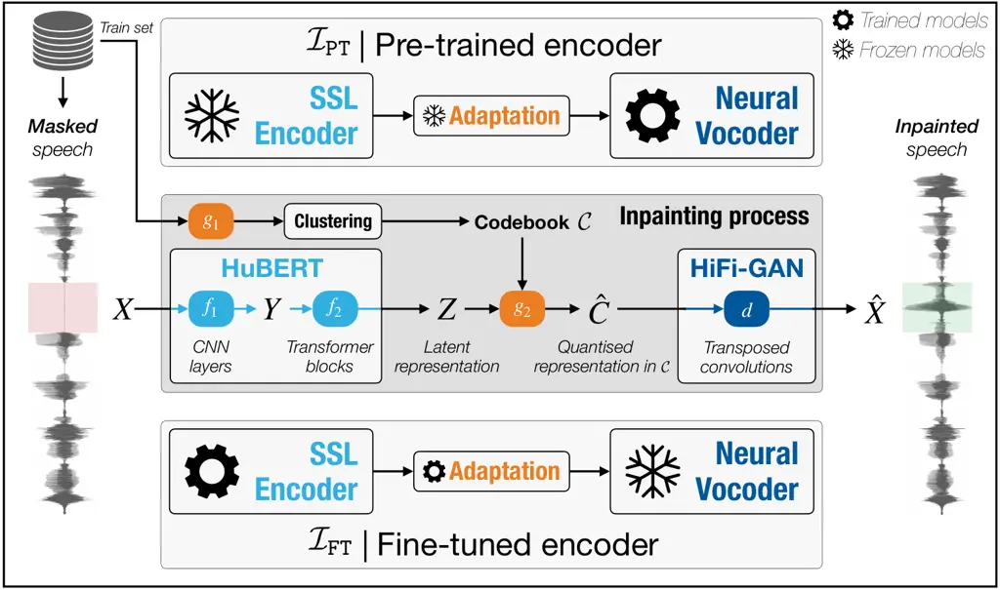
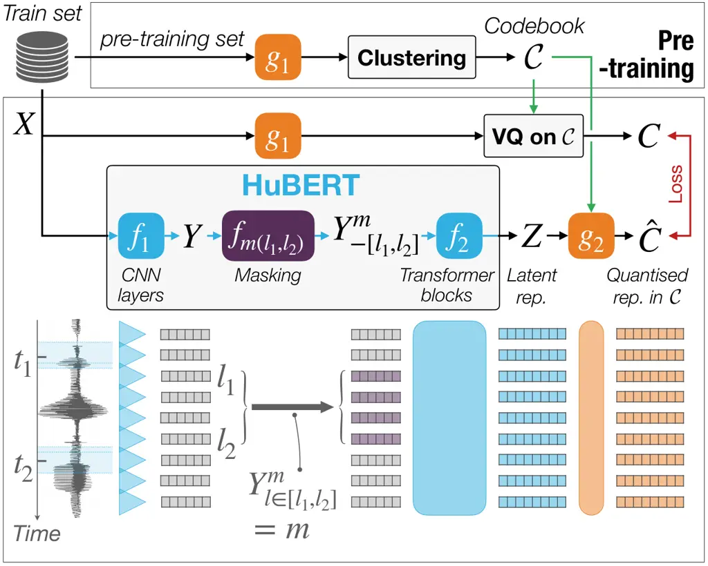
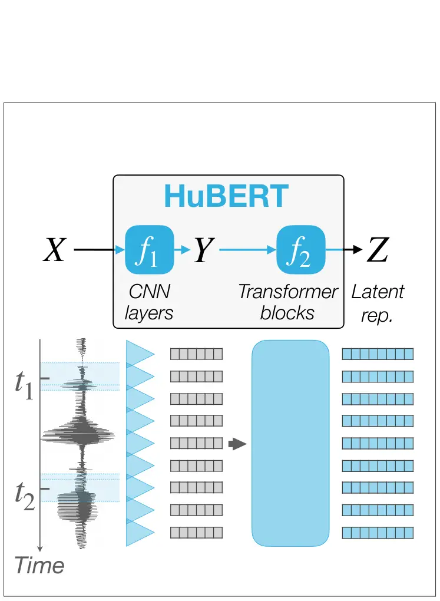
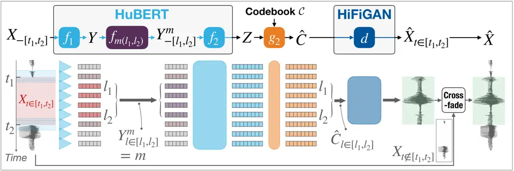
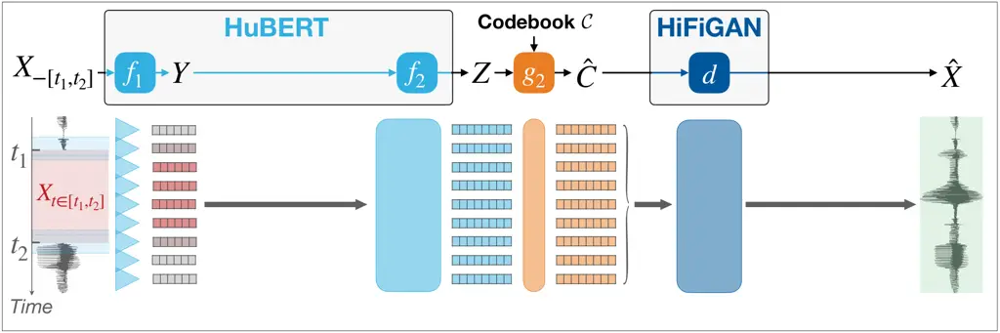
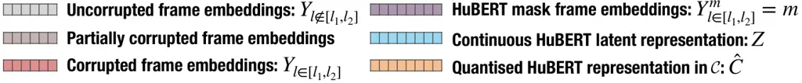
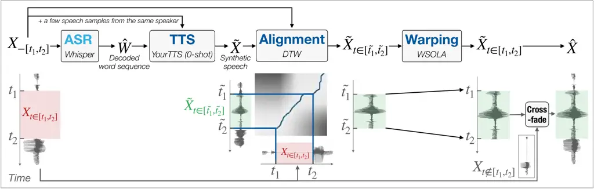
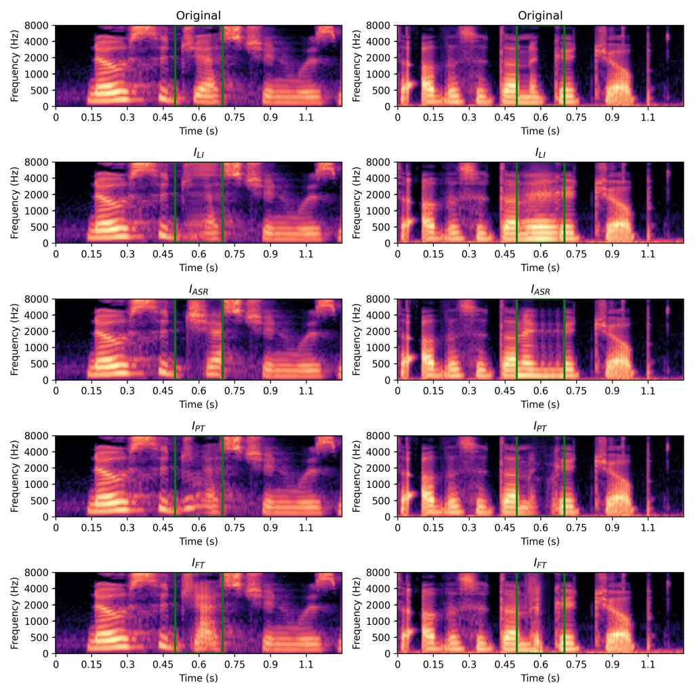
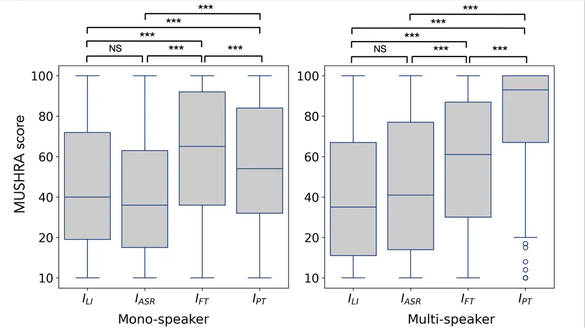

# Is Self-Supervised Learning Enough to Fill in the Gap? A Study on Speech Inpainting

Journal: Computer Speech & Language

Ihab Asaad Note: Ihab Asaad and Maxime Jacquelin contributed equally to
this work. Affiliation: Univ. Grenoble Alpes, CNRS, Grenoble-INP,
GIPSA-lab, Grenoble, F-38000, France Affiliation: Friedrich Schiller
Universität Jena, Jena, Germany    Maxime Jacquelin Note: Ihab Asaad and
Maxime Jacquelin contributed equally to this work. Affiliation: Univ.
Grenoble Alpes, CNRS, Grenoble-INP, GIPSA-lab, Grenoble, F-38000, France
Affiliation: Vogo, Bernin, 38190, France    Olivier Perrotin
Affiliation: Univ. Grenoble Alpes, CNRS, Grenoble-INP, GIPSA-lab,
Grenoble, F-38000, France    Laurent Girin Affiliation: Univ. Grenoble
Alpes, CNRS, Grenoble-INP, GIPSA-lab, Grenoble, F-38000, France   
Thomas Hueber Corresponding author: Corresponding author
Affiliation: Univ. Grenoble Alpes, CNRS, Grenoble-INP, GIPSA-lab,
Grenoble, F-38000, France

###### Abstract

Speech inpainting consists in reconstructing corrupted or missing speech
segments using surrounding context, a process that closely resembles the
pretext tasks in Self-Supervised Learning (SSL) for speech encoders.
This study investigates using SSL-trained speech encoders for inpainting
without any additional training beyond the initial pretext task, and
simply adding a decoder to generate a waveform. We compare this approach
to supervised fine-tuning of speech encoders for a downstream task—here,
inpainting. Practically, we integrate HuBERT as the SSL encoder and
HiFi-GAN as the decoder in two configurations: (1) fine-tuning the
decoder to align with the frozen pre-trained encoder’s output and (2)
fine-tuning the encoder for an inpainting task based on a frozen
decoder’s input. Evaluations are conducted under single- and
multi-speaker conditions using in-domain datasets and out-of-domain
datasets (including unseen speakers, diverse speaking styles, and
noise). Both informed and blind inpainting scenarios are considered,
where the position of the corrupted segment is either known or unknown.
The proposed SSL-based methods are benchmarked against several
baselines, including a text-informed method combining automatic speech
recognition with zero-shot text-to-speech synthesis. Performance is
assessed using objective metrics and perceptual evaluations. The results
demonstrate that both approaches outperform baselines, successfully
reconstructing speech segments up to 200 ms, and sometimes up to 400 ms.
Notably, fine-tuning the SSL encoder achieves more accurate speech
reconstruction in single-speaker settings, while a pre-trained encoder
proves more effective for multi-speaker scenarios. This demonstrates
that an SSL pretext task can transfer to speech inpainting, enabling
successful speech reconstruction with a pre-trained encoder.

###### Keywords: 

Speech inpainting , self-supervised model , speech synthesis , speech
enhancement , neural vocoder.

\geometry

hmargin=2cm,vmargin=2.5cm

## 1 Introduction

In speech processing, inpainting aims at restoring a speech signal that
has been “locally” and severely corrupted. This means that a segment of
the waveform is either highly degraded (e.g., by clicks or clipping
(Záviška et al., 2021)), or missing (e.g., due to packet loss during
transmission (Perkins et al., 1998; Thirunavukkarasu and Karthikeyan,
2015)). This type of degradation severely affects and can even
completely alter the signal quality and intelligibility for the
corrupted segment and its direct neighbourhood, while the rest of the
signal remains intact. This contrasts with speech enhancement in noise
(Loizou, 2007), where a more or less stationary additive noise is
present throughout the entire signal duration. Speech inpainting has
been explored in the past few decades using a variety of techniques (see
Section 2 for a detailed review of the literature). Initially, classical
signal processing was applied to short corrupted segments (Gunduzhan and
Momtahan, 2001; Lagrange et al., 2005). This was followed by the use of
deep neural networks (DNNs)-based encoder-decoder architectures, which
directly map incomplete signals to the complete ones, through
fully-supervised training (Kegler et al., 2020; Zhao, 2023). In
particular, the encoder processes the signal surrounding the corrupted
segment, while the decoder generates the signal within the corrupted
segment. Lastly, speech inpainting have been considered as one
“downstream” task of a model pre-trained with Self-Supervised Learning
(SSL), i.e., by fine-tuning the model to the inpainting task (Xue et
al., June 4-10; Zhang et al., 2024).

Interestingly, speech inpainting shares notable similarities with SSL
that uses masking as a pretext task. Transformer-based SSL encoders such
as HuBERT (Hsu et al., 2021), wav2vec (Schneider et al., 2019),
wav2vec2.0 (Baevski et al., 2020), and WavLM (Chen et al., 2022), learn
rich representations by masking portions of the input, and by training
the model to predict the representations of the masked input segments
using information from the unmasked context. While this process does not
occur directly in the signal domain but in a non-linearly projected
embedding space, both speech inpainting and SSL share the objective of
leveraging regularities across multiple time scales and linguistic
levels to infer the content of either a severely corrupted, missing or
masked segment within an input speech signal. Having drawn this
parallel, to the best of our knowledge, the SSL masking pretext task has
never been evaluated as such in the context of speech inpainting. _We
thus hypothesise that the mask prediction task used in SSL can be
directly applied to speech inpainting, without the need for fine-tuning
the SSL encoder._

To test this hypothesis, we investigate in this study the integration of
an SSL encoder—specifically, HuBERT (Hsu et al., 2021)—into a speech
inpainting pipeline, utilising its rich contextual representations,
spanning from phonetics to semantics (Pasad et al., 2023), to “fill in
the gap” by reconstructing the severely corrupted or missing portions of
a speech signal based on its surrounding context. More specifically, we
utilise the HuBERT model for inference, maintaining the same
configuration as in its SSL pre-training phase. We input signals that
contain missing segments, and the model predicts the unmasked segments,
which we then use to fill in the missing portions of the signals. Since
HuBERT does not directly predict the missing time-domain signal samples
but rather high-dimensional embeddings, we thus combine the SSL encoder
with a neural vocoder—in the present case HiFi-GAN (Kong et al., 2020).
It is important to stress out that compared to (Xue et al., June 4-10)
and (Zhang et al., 2024), we do not fine-tune the SSL encoder. We
separately train the neural vocoder to learn the mapping between the
output of the pre-trained SSL model and the time-domain speech signal,
as directly inspired from (Polyak et al., 2021). We denote this
inpainting method $`\mathcal{I}_{\mathtt{PT}}`$ (with $`\mathtt{PT}`$
standing for pre-trained), which is summarised in the top of Fig. 1.

For comparison, we then assess whether fine-tuning the SSL model to the
inpainting task, i.e. treating inpainting as a downstream task instead
of a pretext SSL training task, further enhances performance. We denote
this inpainting method $`\mathcal{I}_{\mathtt{FT}}`$ (with
$`\mathtt{FT}`$ standing for fine-tuned), as shown at the bottom of
Fig. 1. In this case, we fine-tune the SSL encoder to fill in missing
portions of the input signal directly in the audio domain. We choose a
Mel-spectrogram representation for this purpose, as it can maintain the
same temporal resolution as the original HuBERT representation space and
serves as the standard input of a vanilla HiFi-GAN to convert back to
the time-domain. Overall, let us note that our two approaches are
symmetrical: $`\mathcal{I}_{\mathtt{PT}}`$ involves a frozen pre-trained
encoder with an adapted decoder, while $`\mathcal{I}_{\mathtt{FT}}`$
involves a fine-tuned encoder with a frozen decoder.

Lastly, we compare the ability of an SSL encoder (specifically, HuBERT)
for inpainting against a generative model. We introduce a baseline
inspired by the text-informed speech inpainting study of Prablanc et al.
(August 29-September 2). Their approach combines text-to-speech
synthesis (TTS) and voice conversion (VC) to inpaint the corrupted
portion of the audio signal, using the text from both uncorrupted and
corrupted portions of the signal. We adapted their method to a textless
inpainting scenario by incorporating an ASR frontend based on the
Whisper model (Radford et al., 2023) to decode the most likely word
sequence from the signal to be inpainted and replacing the
TTS-followed-by-VC pipeline by a more recent zero-shot neural TTS. This
baseline represents an additional contribution of this work.



Figure 1: Proposed inpainting framework, leveraging a pre-trained SSL
encoder on a unmasking task and using a neural vocoder for audio
generation. Top: the SSL encoder is kept frozen (pre-trained) while the
neural vocoder is adapted to the SSL output. Bottom: the SSL encoder is
fine-tuned to an inpainting task, while the neural vocoder is kept
frozen. In the present study we use HuBERT as the SSL and HiFi-GAN as
the vocoder (subfigure in the middle). The inpainting process and
adaptation mechanism between the SSL output and neural vocoder input are
detailed in Section 3).

In this paper, we do not aim to propose a novel method for speech
inpainting that outperforms state-of-the-art methods. Instead, we
investigate whether the straightforward but so far unexplored solution
of using a pre-trained SSL model as-is for speech inpainting is viable.
To this end, we assess the performance of the proposed SSL-based methods
in both single-speaker and multi-speaker settings, using in-domain
datasets, which aligned with the training data, and out-of-domain
datasets, which feature unseen speakers, varying speaking styles
(including expressive speech), and different types of background
noise—challenging conditions that, to the best of our knowledge, have
received limited attention in previous studies. Performance is evaluated
with both objective metrics and perceptual tests. To sum up, the
contributions of this paper are:

1.  1.  An extensive state-of-the-art of inpainting methods;
2.  2.  The direct application of the mask prediction task used in SSL to
        speech inpainting (inpainting as a pretext task —
        $`\mathcal{I}_{\mathtt{PT}}`$);
3.  3.  The comparison with fine-tuning of SSL model to inpainting
        (inpainting as a downstream task — $`\mathcal{I}_{\mathtt{FT}}`$);
4.  4.  An extensive evaluation of both methods against different baselines
        and on in-domain and out-of-domain datasets;
5.  5.  The complete source code¹¹ 1
        [https://gricad-gitlab.univ-grenoble-alpes.fr/huebert/speech-inpainting](https://gricad-gitlab.univ-grenoble-alpes.fr/huebert/speech-inpainting)
        and a demo page for the two proposed speech inpainting frameworks
        and the different baselines.²² 2
        [http://www.ultraspeech.com/demo/csl_2025_inpainting/](http://www.ultraspeech.com/demo/csl_2025_inpainting/)

## 2 Related work

### 2.1 Speech inpainting

##### Early signal processing approaches

Speech inpainting studies initially focused on short corrupted segments
(i.e., from a few milliseconds to a few tens milliseconds), using
conventional digital signal processing approaches. The first targeted
applications were packet loss recovery in telecommunications and
streaming audio (Perkins et al., 1998; Thirunavukkarasu and Karthikeyan, 2015) or signal declicking (Záviška et al., 2021). Early works were
based on signal processing techniques such as linear prediction /
auto-regressive models (Etter, 1996; Gunduzhan and Momtahan, 2001; Kondo
and Nakagawa, 2006; Zhang and Kleijn, March 31-April 4), Hidden Markov
models (Rodbro et al., 2006; Borgström et al., September 26-30),
sinusoidal modelling (Lindblom and Hedelin, May 13-17; Lagrange et al.,
2005), or graphs (Perraudin et al., 2018).

##### Deep learning based approaches

As already stated in the introduction, the speech inpainting problem has
been tackled more recently with deep learning approaches. With the huge
development of Voice on IP (VoIP) technologies, packet loss cancellation
(PLC) has been a driving force application for deep learning-based
speech inpainting studies. The domain has rapidly evolved in a few years
considering longer corrupted segments (consecutive short-term frames),
going from a few tens of milliseconds to several hundreds of
milliseconds and more, and denser distributions of loss packets, with
packet loss rates ranging from a few percent to more than
$`50\text{\,}\mathrm{\%}`$, possibly simulating a high level of VoIP
degradation.

In terms of architectures and training methodology, earlier studies have
considered direct incomplete-to-complete signal mapping with a single
network and fully-supervised training, most often using a few tens of
hours of speech signal. This was applied in the time-frequency (TF)
domain, using, e.g., a basic fully-connected neural network (FCNN) (Lee
and Chang, 2016), a U-Net architecture (Kegler et al., 2020; Dai et al.,
2024), a combination of U-Net with temporal convolutional network (TCN)
bottleneck (Aironi et al., 2025), or a convolutional recurrent network
(CRN) (Zhang et al., April 14-19). Other works have considered using a
pair of 1D convolutional neural network (CNN) encoder and decoder for
waveform analysis and reconstruction, e.g., (Shi et al., November 18-21;
Wang et al., 2021; Zhu et al., October 21-24; Liu et al., September
18-22). Finally, some studies have considered working directly on the
time-domain waveform samples using a recurrent neural network (RNN),
e.g., (Lotfidereshgi and Gournay, April 15-20; Mohamed and Schuller,
2020; Westhausen and Meyer, September 18-22), or a CRN (Lin et al., June
6-11). Many works have considered the generative adversarial network
(GAN) training approach (Goodfellow et al., 2014), i.e., combining a
generative network with a discriminative network at training time, for
improving the quality of the inpainted speech signal, e.g., (Shi et al.,
November 18-21; Wang et al., 2021; Pascual et al., October 17-20; Liu et
al., September 18-22; Zhao, 2023; Aironi et al., 2025; Dai et al., 2024;
Zhang et al., April 14-19).

More complex encoder-decoder combinations have been proposed over the
years. For example, a hybrid STFT-domain encoder combined with a
time-domain CNN decoder was used in (Pascual et al., October 17-20).
Taking inspiration from deep learning-based speech synthesis, and in
particular the recent developments in text-to-speech synthesis using
neural vocoders, speech inpainting and PLC studies have considered
combining a missing features predictor network with a (possibly
pre-trained) neural vocoder. For example, a GRU-based RNN designed to
predict missing LPCNet input features was combined with an LPCNet
vocoder in (Valin et al., September 18-22). A relatively basic
FCNN-based Mel-spectrogram predictor taking as input the $`11`$ previous
frames (i.e., $`120\text{\,}\mathrm{ms}`$ context) was combined with a
WaveGlow vocoder in (Zhou et al., October 25-27). A full-band recurrent
network (FRN) combining an encoder, a predictor and a joiner network was
proposed in (Nguyen et al., June 4-10). This FRN model was improved in
(Yang and Chang, December 16-20) by adding a CTC-based ASR
representation loss in the training, and in (Yang et al., October 20-23)
by combining it with a masked frequency prediction for bandwidth
extension. Recent works have integrated a Transformer module (Vaswani et
al., 2017) within the inpainting model, to exploit its natural ability
to predict a (missing) sequence portion from a large temporal context.
For example, the combination of CNN and Transformer was proposed in (Li
et al., November 14-17; Zhao et al., October 28-31) and a GAN TCN with a
Conformer predictive network was proposed in (Zhao et al., November
14-17). Li et al. (September 18-22) introduced a wav2vec-based
perceptual loss term in the GAN training of their 1D CNN encoder-decoder
model (in addition to the reconstruction loss and an ASR-based loss
term). Very recently, a Flow Matching approach was proposed in (Yang and
Chang, 2025). The two PLC challenges (Diener et al., September 18-22;
Diener et al., 2025) summarise and compare the most recent inpainting
methods for packet loss concealment. They have demonstrated excellent
performance from the best systems in terms of intelligibility and
naturalness of the resulting speech.

Finally, closely related to our work, Xue et al. (June 4-10) and Zhang
et al. (2024) introduced an SSL representation at the encoder level and
combined it with a neural decoder. Xue et al. (June 4-10) implement an
encoder with two parallel branches: one acoustic branch, made of 2D
convolution and self-attention blocks, and one wav2vec2.0-like (Baevski
et al., 2020) semantic branch pre-trained with contrastive learning. The
outputs of these two branches are merged and send to an HiFi-GAN
vocoder (Kong et al., 2020). Importantly, Xue et al. (June 4-10) train
the semantic branch from scratch using packet loss as the masking
scheme, before training end-to-end the rest of the model with the same
data. Zhang et al. (2024) propose a model similar to that of Xue et al.
(June 4-10), though with an additional temporal-dilated module to fuse
the wav2vec2.0-like semantic branch and the acoustic branch before
decoding the output waveform with an in-house decoder. Overall, both
studies use SSL models as “feature extractors” and perform end-to-end
fine-tuning of their network on inpainting tasks. Conversely, we
hypothesise that a pre-trained SSL encoder is inherently capable of
performing an inpainting task, providing it with a decoder for domain
adaptation.

##### Multimodal speech inpainting

A few studies have investigated the use of a visual input such as the
speaker’s lips for guiding the speech inpainting process. This was
implemented with an LSTM- or Transformer-based multimodal context
encoder (Morrone et al., 2021; Hsu et al., June 17-24). Other speech
inpainting studies have investigated text-informed methods, where the
complete text (or phonetic information, or sequence of linguistic
targets) is provided, covering both the uncorrupted and corrupted parts
of the signal, and used to drive the inpainting process (Prablanc et
al., August 29-September 2; Borsos et al., 2022). Text-informed speech
restoration was also considered in (Koizumi et al., October 22-25). In
this study, we do not consider any additional modality, we assume that
only the locally-corrupted speech signal is available, and we thus focus
on audio-only speech inpainting.

### 2.2 Speech enhancement in noise, speech restoration, and speech coding

As briefly stated in the introduction, speech enhancement in noise is a
task that is related to speech inpainting in the sense that the speech
signal is degraded and must be restored, but the nature of the
degradation is significantly different. Therefore, the restoration
process is also expected to be significantly different. However, after
decades of development of speech enhancement methods working in the TF
domain and using both conventional signal processing techniques (Loizou, 2007) and deep learning (Wang and Chen, 2018), recent studies in speech
enhancement have proposed to use a combination of neural feature
extractor with predictor taking the noisy speech as input and a neural
vocoder for clean speech (re)generation, e.g., (Maiti and Mandel,
October 20-23; Du et al., 2020; Liu et al., 2021; Su et al., 2021; Saeki
et al., 2022; Irvin et al., June 4-10; Koizumi et al., October 22-25).
This approach is closely similar to some of the above-mentioned
inpainting studies, and brings to the speech enhancement problem the
advantage of avoiding the delicate problem of signal phase
reconstruction when only the magnitude spectrogram is denoised. We can
note that HiFi-GAN is the preferred vocoder in (Saeki et al., 2022;
Irvin et al., June 4-10). We can also note that in fact, the noisy
feature extractor in (Irvin et al., June 4-10; Koizumi et al., October
22-25) is an SSL model, making these studies closely related to our work
in terms of model architecture and combination (HuBERT with HiFi-GAN is
even among the multiple combinations tested by Irvin et al. (June
4-10)). However, both studies focus on speech enhancement in noise and
dereverberation, and do not address inpainting specifically. Moreover,
the model in (Koizumi et al., October 22-25) also takes text as input,
whereas our study focuses on audio-only inpainting.

A few recent papers have reconsidered the speech enhancement problem as
a generalized multi-task problem, possibly including denoising,
dereverberation, bandwidth extension, declipping and packet loss
concealment (hence inpainting) under the general denomination of speech
restoration, see, e.g., (Liu et al., 2021; Saeki et al., 2022; Koizumi
et al., October 22-25). However, in practice, in their experiments,
these studies do not consider the inpainting task as defined in the
present study, that is the recovery of long highly-corrupted or missing
segments of speech. For example, Saeki et al. (2022) introduced their
work in the context of speech restoration but only consider equalization
and bandwidth extension in the experiments.

Finally, it can be noted that specifically combining HuBERT and HiFi-GAN
was also proposed by Polyak et al. (2021) for speech coding, where the
input signal is unaltered, and the primary objective is to generate an
output signal that closely matches the input, while drastically limiting
the bitrate of the encoded speech representation. As stated in the
introduction, we inspired from this study but focus on speech
inpainting, i.e., using the unmasking abilities of the SSL encoder in
inference, which is a very different task than speech coding.

### 2.3 Speech continuation with speech language models

Speech continuation shares the task of predicting a missing portion of a
speech signal with speech inpainting but is causal (prediction from a
past context only), and operates over portion lengths that are orders of
magnitude longer than those of conventional speech inpainting
applications such as PLC. As a consequence, the most recent approaches
leverage a generative speech language model (SpeechLM) for this task,
i.e., a model trained to generate speech via auto-regressive prediction
and decoding of quantised elementary speech units referred to as speech
“tokens” (see (Arora et al., 2025) for a recent review). Lakhotia et al.
(2021) have demonstrated the ability of such models for audio-only
speech continuation. Borsos et al. (2023) and Chen et al. (2025) have
further combined the prediction of audio tokens with “semantic” tokens
that are derived from text-based language models. In addition to
semantic tokens, Du et al. (2024) used ground-truth text as input for
the missing speech portion to predict.

Overall, while those methods could be considered as suitable candidates
for inpainting tasks, they do not fit the main hypothesis of this paper.
These methods leverage the generative ability of auto-regressive models
for the speech continuation task while we take a step aside in studying
the parallel between the unmasking pretext task of SSL encoders and
speech inpainting. Moreover, the SSL-based pipeline investigated here is
significantly lighter than recent SpeechLM approaches, which is
essential for most practical use cases (e.g. embedded voice prothesis,
real-time PLC). Nevertheless, as mentioned in introduction, we use a
generative method as a baseline for comparison. We choose Whisper
(Radford et al., 2023) which is based on a generative text-based
language model, as text tokens are currently more efficient than audio
tokens for next token prediction and therefore constitutes a stronger
baseline than audio token-based methods.

### 2.4 Conclusion

In conclusion, SSL are becoming ubiquitous in a large variety of speech
generation tasks, including speech coding, speech restoration, speech
enhancement, speech continuation and speech inpainting. Nevertheless, to
the best of our knowledge, none of the related studies have considered
an SSL encoder pre-trained on an unmasking task as a suitable candidate
for speech inpainting without the need for fine-tuning. In the following
Sections, we therefore present our implementation of a pre-trained
HuBERT model in an inpainting pipeline, as well as its evaluation.

## 3 Method

### 3.1 Problem formulation



(a) HuBERT training



(b) HuBERT inference



(c) HuBERT-based inpainting pipeline – informed case (inference)



(d) HuBERT-based inpainting pipeline – blind case (inference)



Figure 2: Illustration of how the HuBERT model works during training
(top-left) and inference (top-right). Adaptation of HuBERT for inference
within the proposed inpainting pipeline, in the informed (middle) and
blind (bottom) inpainting configurations.

Following the notations introduced in (Mohamed et al., 2022), let
$`X=\left\{x_{1},\ldots,x_{T}\right\}`$ denote a sequence of speech
samples of length $`T`$ (i.e., a waveform), and let
$`X_{-[t_{1},t_{2}]}`$ denote the sequence where the segment
$`X_{t\in[t_{1},t_{2}]}=\left\{x_{t_{1}},x_{{t_{1}}+1},\ldots,x_{t_{2}}\right\}`$
is corrupted (e.g., degraded or missing), and that we wish to
reconstruct. In this paper, we focus on _non-causal_ inpainting, where
the inpainting function $`\mathcal{I}`$ has access to both past and
future uncorrupted portions of the input signal. We consider both the
_informed_ inpainting paradigm, in which the corrupted segment position
(i.e., the pair of values $`\{t_{1},t_{2}\}`$) is known, and the _blind_
paradigm, in which the corrupted segment position is unknown. In the
informed configuration, only the corrupted speech segment is predicted
from its surrounding context. The uncorrupted portions of the signal are
kept as is and are combined with the reconstructed segment using
cross-fade at junctions to mitigate artifacts commonly associated with
the concatenation of raw speech or audio segments. This process is
illustrated in the right part of Fig. 2(c). It is formalised as:³³ 3 For
simplicity of presentation, we omit the cross-fade operation in this
equation.

```math
\displaystyle\hat{X}_{t\in[t_{1},t_{2}]}=\mathcal{I}\left(X_{-[t_{1},t_{2}]}\right)\ \ \text{and}\ \ \hat{X}_{t\notin[t_{1},t_{2}]}=X_{t\notin[t_{1},t_{2}]}. \tag{1}
```

In blind inpainting, the entire output signal is generated without
distinguishing between the corrupted and uncorrupted parts, as
illustrated in the right part of Fig. 2(d). This can be simply
formalized as:

```math
\displaystyle\hat{X}=\mathcal{I}\left(X_{-[t_{1},t_{2}]}\right). \tag{2}
```

### 3.2 Masking, the core pretext task of HuBERT

In this subsection, we briefly present the principles and core equations
of HuBERT, as this formalism will be essential for explaining our
inpainting pipeline in the subsequent subsections. HuBERT is an encoder
that transforms a speech signal $`X`$ of length $`T`$ into a latent
continuous representation $`Z=\left\{z_{1},\ldots,z_{L}\right\}`$, with
dimension $`D_{z}\times L`$ (Hsu et al., 2021):

```math
\displaystyle y_{l} \displaystyle=f_{1}\left(X_{[lH-u,lH+u[}\right),\forall l\in\{1,L\}, \tag{3}
```

```math
\displaystyle Z \displaystyle=f_{2}\left(Y\right),\ \ \text{with}\ \ Y=\left\{y_{1},\ldots,y_{L}\right\}, \tag{4}
```

where $`f_{1}`$, sometimes referred to as the prenet, is a stack of CNNs
of span $`2u`$ samples and hop size $`H`$, and $`f_{2}`$ is a stack of
Transformer encoder blocks. These core modules of HuBERT are illustrated
in Fig. 2(b) for inference. We do not detail their architecture in this
paper, the reader is referred to the original HuBERT (Hsu et al., 2021)
and Transformer papers (Vaswani et al., 2017) for details.

HuBERT is trained iteratively to predict a vector-quantised
representation of the speech signal, denoted as $`C`$, from the latent
representation $`Z`$. For instance, during the first training iteration
of the vanilla HuBERT, $`C`$ is a sequence of quantised Mel-frequency
cepstral coefficient (MFCC) vectors. This is done with the help of two
auxiliary modules, $`g_{1}`$ and $`g_{2}`$, which function as teacher
and student models, respectively (see Fig. 2(a)):

- 1.  The teacher module $`g_{1}`$ maps the speech signal to the new
      representation (unquantised MFCC vectors in the above example), with a
      span of $`2w`$ samples and window shift $`H`$. Before training, a
      codebook $`\mathcal{C}`$ of quantised prototype vectors is created by
      passing a portion of the training set through $`g_{1}`$ and applying a
      k-means algorithm on the output. Then, during training, $`g_{1}`$ and
      vector quantisation (VQ) are used to extract a target quantised
      sequence $`C=\left\{c_{1},\ldots,c_{L}\right\}`$ from each waveform of
      the train dataset:

  ```math
  \displaystyle c_{l} \displaystyle= \displaystyle\texttt{VQ}_{\mathcal{C}}\big(g_{1}(X_{[lH-w,lH+w[})\big),\forall l\in\{1,L\}, \tag{5}
  ```

  where $`\texttt{VQ}_{\mathcal{C}}`$ stands for VQ using the codebook
  $`\mathcal{C}`$.

- 2.  The student module $`g_{2}`$ is designed to predict the quantised
      sequence $`\hat{C}`$ from the encoder output $`Z`$. In practice,
      $`g_{2}`$ is implemented using a softmax function, which involves a
      (learned) linear projection of $`z_{l}`$ onto embedding vectors
      representing the codebook prototypes.

Importantly, during training, a portion of the CNN-encoded sequence
$`Y`$ is randomly masked before being used to generate the fully-encoded
sequence $`Z`$. Specifically, a sub-sequence $`Y_{l\in[l_{1},l_{2}]}`$
of $`Y`$, randomly selected, is replaced with ($`l_{2}-l_{1}+1`$
occurrences of) a mask embedding vector $`m`$, which is jointly learned
during the training process. This masking operation, spanning frames
$`l_{1}`$ to $`l_{2}`$, is illustrated in Fig. 2(a). We denote it as:

```math
\displaystyle Y^{m}_{-[l_{1},l_{2}]}=f_{m(l_{1},l_{2})}(Y). \tag{6}
```

In summary, during HuBERT training, we have:

```math
\displaystyle y_{l} \displaystyle=f_{1}\left(X_{[lH-u,lH+u[}\right), \displaystyle\forall l\in\{1,L\}, \tag{7}
```

```math
\displaystyle Z \displaystyle=f_{2}\circ f_{m(l_{1},l_{2})}\left(Y\right), \displaystyle\ \ \text{with}\ \ Y=\left\{y_{1},\ldots,y_{L}\right\}\ \ \text{and}\ \ Z=\left\{z_{1},\ldots,z_{L}\right\}, \tag{8}
```

```math
\displaystyle\hat{c}_{l} \displaystyle=g_{2}\left(z_{l}\right), \displaystyle\forall l\in\{1,L\}. \tag{9}
```

During HuBERT training, $`g_{1}`$ is fixed, while $`f_{1}`$, $`f_{2}`$
and $`g_{2}`$ are updated to minimise the distance between $`\hat{C}`$
and $`C`$, with part of the $`Y`$ sequence randomly masked across
batches. Note that $`g_{1}`$ and $`g_{2}`$ are only used for HuBERT
training and are generally discarded during inference when HuBERT is
applied to a downstream task. Similarly, in conventional HuBERT usage,
masking is only applied during training (see Fig. 2(a) and (8)) and it
is discarded during inference (see Fig. 2(b) and (4)). Consequently, the
pre-trained HuBERT consists solely of $`f_{2}\circ f_{1}`$, as defined
in (3) and (4), and a newly trained module dedicated to the downstream
task is typically appended to $`f_{2}`$.

### 3.3 Linking masking, prediction and inpainting

The proposed HuBERT-based inpainting pipeline relies on the following
general principle. As discussed in the previous subsection, HuBERT is
trained to predict an efficient speech representation $`Z`$ from a $`Y`$
sequence containing one or several masked segments. The pretext task
used for training HuBERT shares similarities with inpainting in its
underlying principles. Indeed, in both cases, the goal is to reconstruct
an output sequence from an input sequence that includes missing,
corrupted, or masked portions. The difference lies in the nature of the
input and output: (i) During HuBERT training, the
reconstructed/predicted output is the speech representation $`Z`$,
whereas in inpainting, it is directly the signal $`X`$; and (ii) during
HuBERT training, the missing input information corresponds to the masked
part of the CNN-encoded sequence $`Y`$, whereas in inpainting, it is a
segment of the input signal $`X`$. In summary, HuBERT is trained to
perform a form of speech inpainting, but from the $`Y`$ space to the
$`Z`$ space, and not directly within the input signal space.
Consequently, we integrate HuBERT in a speech inpainting pipeline,
addressing points (i) and (ii) as follows.

To address point (i), and drawing inspiration from recent advancements
in low-bit-rate neural speech codecs (Polyak et al., 2021), we combine
HuBERT as an encoder with the neural vocoder HiFi-GAN (Kong et al., 2020) as a decoder. HiFi-GAN, used here to reconstruct the inpainted
speech waveform $`\hat{X}`$ from HuBERT’s output $`Z`$, demonstrated
state-of-the-art performance in the latest text-to-speech synthesis
benchmark (Perrotin et al., 2025). Its necessary adaptation to the
proposed inpainting pipeline is detailed in the next subsection.

For point (ii), we remark that, since the prenet temporal span is fixed,
the corrupted input signal segment $`X_{t\in[t_{1},t_{2}]}`$ we aim to
inpaint corresponds to a corrupted subset of vectors
$`Y_{l\in[l_{1},l_{2}]}`$ in the CNN-encoded sequence $`Y`$. Therefore,
inpainting the corrupted signal $`X_{-[t_{1},t_{2}]}`$ relies on
HuBERT’s ability to predict $`Z`$ accurately from the corresponding
complete (corrupted) sequence $`Y_{-[l_{1},l_{2}]}`$. However, leaving
the corrupted subsequence $`Y_{l\in[l_{1},l_{2}]}`$ as is in $`Y`$ is
suboptimal because, during HuBERT training, the vectors composing this
subsequence are replaced with the mask $`m`$ (see Section 3.2). For
HuBERT, this results in a mismatch between training (on masked segments)
and inference (on corrupted segments, i.e., its use in the inpainting
pipeline) conditions. To resolve this issue, we explicitly replace
$`Y_{l\in[l_{1},l_{2}]}`$ with the mask $`m`$ during inference. In other
words, we apply (8) instead of (4) at inference/inpainting time. This
approach is feasible, however, only in the informed case, where the time
sample boundaries $`(t_{1},t_{2})`$ of the corrupted input speech
segment are known, allowing us to deduce the corresponding frame
boundaries $`(l_{1},l_{2})`$ (see the left part of Fig. 2(c)). In the
blind case, the location of $`Y_{l\in[l_{1},l_{2}]}`$ is unknown and we
cannot apply the mask (see the left part of Fig. 2(d)). In this case, we
thus stick to (4) at inference/inpainting time and have to accept that
HuBERT functions under a train/inference mismatch. The blind inpainting
configuration can be seen as a way to evaluate HuBERT’s ability to infer
an accurate speech representation from the surrounding context of the
missing/corrupted speech information, even when this missing/corrupted
speech information is not explicitly indicated by a mask embedding
vector.

Note that, as mentioned at the end of Section 3.2, in the various uses
of HuBERT reported in the literature, masking is applied only during
training and is never used during inference. This is because, when using
the speech representation $`Z`$ in downstream tasks, the input signal
$`X`$ is generally not corrupted. To the best of our knowledge, the
speech inpainting pipeline considered in this paper represents the first
instance where the masking process, which is central to HuBERT’s
training pretext task, is explicitly used at inference time (in the
informed configuration).

### 3.4 Combining HuBERT encoder with HiFi-GAN decoder

In this subsection, we present in detail how we combined the HuBERT
encoder with the HiFi-GAN decoder. To this end, we first recall that
during training on masked $`Y`$ sequences, HuBERT predicts $`Z`$ via a
quantised representation (see (9)). Therefore, to carefully match the
pretext training task during inpainting, we retain the auxiliary module
$`g_{2}`$, which transforms $`Z`$ into the quantised sequence
$`\hat{C}`$. $`\hat{C}`$ is then used as input to the HiFi-GAN decoder
(denoted $`d`$) (see Figs. 1 and 2). In the informed case, we only use
the subsequence $`\hat{C}_{l\in[l_{1},l_{2}]}`$ (corresponding to the
masked portion of $`Y`$) to reconstruct the missing speech segment. The
latter is then combined with the uncorrupted parts of the input signal
(see Fig. 2(c)). This can be expressed as:⁴⁴ 4 Again, for simplicity of
presentation, we omit the cross-fade operation in this equation.

```math
\displaystyle\begin{cases}\hat{X}_{t\in[t_{1},t_{2}]}&=\ d(\hat{C}_{l\in[l_{1},l_{2}]})\\
\hat{X}_{t\notin[t_{1},t_{2}]}&=\ X_{t\notin[t_{1},t_{2}]},\end{cases} \tag{10}
```

where again, $`[l_{1},l_{2}]`$ is the frame interval corresponding to
the corrupted segment of input signal sample interval $`[t_{1},t_{2}]`$.
In the blind case, we simply have (see Fig. 2(d)):

```math
\hat{X}=d(\hat{C}). \tag{11}
```

In the following, we detail how to adapt $`g_{2}`$ to interface HuBERT
with HiFi-GAN, and how to accordingly configure $`g_{1}`$ and the
codebook $`\mathcal{C}`$ to train $`g_{2}`$. This adaptation depends on
the two _frameworks_ presented in introduction: (i) using a pre-trained
($`\mathtt{PT}`$) HuBERT, where the HiFi-GAN decoder is trained to fit a
frozen HuBERT encoder, and (ii) fine-tuning the SSL encoder
($`\mathtt{FT}`$), where we fine-tune the HuBERT encoder to the
inpainting task, with an output that fits the standard input of a frozen
HiFi-GAN decoder. These methods are illustrated in Fig. 1 and detailed
below.

#### 3.4.1 Pre-trained SSL

In this first approach, we use a pre-trained HuBERT model⁵⁵ 5 The term
“pre-trained” here refers to both the SSL training with masking and the
ASR fine-tuning, as discussed in Section 3.4.2. and keep it frozen. To
adapt the HiFi-GAN decoder to the frozen pre-trained HuBERT, we adopt
the following two-step adaptation process. In the first step, we
directly use $`Z`$ as the new signal representation (i.e.,
$`g_{1}^{(\mathtt{PT})}`$ is identical to the frozen pre-trained HuBERT
$`f_{2}\circ f_{1}`$). A new codebook $`\mathcal{C}^{(\mathtt{PT})}`$ is
obtained by running the k-means algorithm on the $`Z`$ sequences derived
from a subset of the pre-training dataset. $`g_{2}^{(\mathtt{PT})}`$ is
then simply the quantisation on $`\mathcal{C}^{(\mathtt{PT})}`$ of the
encoded sequence $`Z`$ corresponding to any corrupted input sequence
$`X_{-[t_{1},t_{2}]}`$:

```math
\hat{C}=g_{2}^{(\mathtt{PT})}(Z)=\texttt{VQ}_{\mathcal{C}^{(\mathtt{PT})}}(Z). \tag{12}
```

In the second step, we trained a HiFi-GAN model $`d^{(\mathtt{PT})}`$
from scratch to reconstruct the speech waveform from HuBERT’s output.
Specifically, the decoder takes the index of each $`\hat{c}_{l}`$ in the
codebook $`\mathcal{C}^{(\mathtt{PT})}`$ as input and learns a look-up
table of embedding vectors, which are then fed into the standard
HiFi-GAN architecture.

By denoting with ^(∗) the modules that are trained, the full inpainting
pipeline $`\mathcal{I}_{\mathtt{PT}}`$ can be summarized as follows. In
the informed case, we have:

```math
\displaystyle\hat{X}_{t\in[t_{1},t_{2}]} \displaystyle=\mathcal{I}_{\mathtt{PT}}\left(X_{-[t_{1},t_{2}]}\right)
```

```math
\displaystyle=d^{(\mathtt{PT})*}\circ\big\{g_{2}^{(\mathtt{PT})}\circ f_{2}\circ f_{m(l_{1},l_{2})}\circ f_{1}(X_{-[t_{1},t_{2}]})\big\}_{l\in[l_{1},l_{2}]}, \tag{13}
```

and in the blind case, we have:

```math
\displaystyle\hat{X} \displaystyle=\mathcal{I}_{\mathtt{PT}}\left(X_{-[t_{1},t_{2}]}\right)
```

```math
\displaystyle=d^{(\mathtt{PT})*}\circ g_{2}^{(\mathtt{PT})}\circ f_{2}\circ f_{1}\left(X_{-[t_{1},t_{2}]}\right). \tag{14}
```

#### 3.4.2 Fine-tuned SSL

In this second approach, we use the standard (vanilla) HiFi-GAN decoder,
which takes a Mel-spectrogram as input and remains frozen, while we
adapt HuBERT. To fully understand our adaptation of HuBERT and the
motivation behind it, we must revisit the conventional HuBERT training
process, briefly outlined in Section 3.2.

As described in details in (Hsu et al., 2021), after HuBERT is initially
pre-trained on a masking pretext task using $`g_{1}`$ and $`g_{2}`$, it
is subsequently fine-tuned on an ASR task. In this stage, $`g_{1}`$ and
$`g_{2}`$ are discarded, and $`f_{2}`$ is extended with a softmax layer
for connectionist temporal classification of characters, and fine-tuned
using a labelled speech dataset. In our $`\mathtt{FT}`$ approach to
inpainting, we instead aim at predicting signal frames to fill-in the
gap, while aligning with HiFi-GAN’s Mel-spectrogram input
representation. To achieve this, we reintroduce $`g_{1}`$ and $`g_{2}`$
and perform a new round of training using the masking pretext task on a
reasonable amount of data. In this iteration, the speech representation
is replaced by the Mel-spectrogram. Altogether, this adaptation process
can be seen an inpainting-oriented fine-tuning. Conceptually, it can be
seen as partially “unlearning” ASR-specific abstractions in order to
recover more detailed signal properties. Importantly, however, the model
still benefits from HuBERT’s strong ability to encode the contextual
structure surrounding the gap.

In a few more details, we define $`g_{1}^{(\mathtt{FT})}`$ as the
extraction of Mel-spectrogram vectors from (frames of $`2w`$ samples of)
the waveforms $`X`$. The codebook $`\mathcal{C}^{(\mathtt{FT})}`$ is
obtained with the k-means algorithm applied on the output of
$`g_{1}^{(\mathtt{FT})}`$ for a train set. Given an input sequence
$`X`$, the teacher module $`g_{1}^{(\mathtt{FT})}`$ computes a
Mel-spectrogram vector for each frame, which is assigned to its closest
centroid in $`\mathcal{C}^{(\mathtt{FT})}`$ (as in (5)). The student
softmax-based $`g_{2}^{(\mathtt{FT})}`$ module of (Hsu et al., 2021) is
also re-introduced, to predict a sequence $`\hat{C}`$ of quantised
Mel-spectrogram vectors in $`\mathcal{C}^{(\mathtt{FT})}`$:

```math
\hat{c}_{l}=g_{2}^{(\mathtt{FT})}(z_{l})=\operatorname*{argmax}_{c}\left(\frac{\exp\Big(\text{sim}\big(Az_{l},e_{c}^{(\mathtt{FT})}\big)/\tau\Big)}{\sum_{c^{\prime}=1}^{\text{Card}(\mathcal{C}^{(\mathtt{FT})})}\exp\left(\text{sim}\big(Az_{l},e_{c^{\prime}}^{(\mathtt{FT})}\big)/\tau\right)}\right), \tag{15}
```

where $`A`$ is a linear projection, $`\text{sim}(a,b)`$ is the cosine
similarity between $`a`$ and $`b`$, $`e_{c}^{(\mathtt{FT})}`$ is a
learnt embedding of codeword $`c\in\mathcal{C}^{(\mathtt{FT})}`$, and
$`\tau`$ is the logit scale factor (Hsu et al., 2021), set to 0.1.
Following HuBERT training described in Section 3.2,
$`g_{1}^{(\mathtt{FT})}`$ and $`f_{1}`$ are fixed, and $`f_{2}`$ and
$`g_{2}^{(\mathtt{FT})}`$ are updated to minimise the cross-entropy loss
between the predicted indices of Mel-spectrogram vectors $`\hat{c}_{l}`$
(softmax output of (15)) and the indices of the quantised
Mel-spectrogram vectors $`c_{l}\in\mathcal{C}^{(\mathtt{FT})}`$, while
part of the $`Y`$ sequence is randomly masked across batches. At
inference, the sequence $`\hat{C}`$ of quantised Mel-spectrogram vectors
is directly fed to a pre-trained vanilla HiFi-GAN.

By noting again by ^(∗) the modules that are trained, the full
$`\mathcal{I}_{\mathtt{FT}}`$ framework can be summarized as follows. In
the informed case, we have:

```math
\displaystyle\hat{X}_{t\in[t_{1},t_{2}]} \displaystyle=\mathcal{I}_{\mathtt{FT}}\left(X_{-[t_{1},t_{2}]}\right)
```

```math
\displaystyle=d\circ\big\{g_{2}^{(\mathtt{FT})*}\circ f_{2}^{\ast}\circ f_{m(l_{1},l_{2})}\circ f_{1}(X_{-[t_{1},t_{2}]})\big\}_{l\in[l_{1},l_{2}]}, \tag{16}
```

and in the blind case, we have:

```math
\displaystyle\hat{X} \displaystyle=\mathcal{I}_{\mathtt{FT}}\left(X_{-[t_{1},t_{2}]}\right)
```

```math
\displaystyle=d\circ g_{2}^{(\mathtt{FT})*}\circ f_{2}^{\ast}\circ f_{1}\left(X_{-[t_{1},t_{2}]}\right). \tag{17}
```

## 4 Experimental set-up

### 4.1 Datasets

##### In-domain train/test sets

We conducted experiments on both LJ Speech (Ito and Johnson, 2017) and
VCTK (Yamagishi et al., 2019) datasets. LJ Speech is an English corpus
containing $`13\,100`$ short audio clips recorded by a single female
speaker for a total length of approximately $`24\text{\,}\mathrm{h}`$.
We isolated $`12\,950`$ clips as the training/validation set, the
remaining $`150`$ clips being used for test. VCTK includes a set of
$`43\,859`$ audio clips recorded by $`109`$ English speakers balanced in
gender and with various accents, for a total of approximately
$`44\text{\,}\mathrm{h}`$. We used $`41\,747`$ clips from $`105`$
speakers for training and $`389`$ clips from $`4`$ speakers for test.
Importantly, we carefully designed the partitioning of the VCTK dataset
to have no overlap between the training and test sets in terms of
sentences and speakers. In other words, the proposed models have to
generalise to both new speakers and new linguistic content.

##### Out-of-domain test sets

We also considered two supplementary datasets for evaluating the
extrapolation capabilities of our models to out-of-domain data. First,
we designed noisy versions of our LJ Speech and VCTK test sets with the
same number of utterances as described before (i.e., $`150`$ for LJ
Speech and $`389`$ for VCTK). On each clip, we then applied either a
white noise or a crowd noise with three signal-to-noise ratio (SNR)
levels ($`20`$, $`10`$ and $`0\text{\,}\mathrm{dB}`$) for a total of six
noise-corrupted signals per utterance. Those two new test sets account
for a total of $`900`$ utterances for LJ Speech and $`2334`$ for VCTK.

Second, we used a subset of the Expresso dataset (Nguyen et al., 2023),
a multi-speaker expressive speech dataset covering seven different
speaking styles uttered by four different speakers. Following the
recommendation from the authors of the Expresso dataset, our test set
includes $`588`$ utterances, with $`147`$ clips per speaker and $`84`$
clips per speaking style.

### 4.2 Implementation details

##### SSL encoder HuBERT

For the two proposed inpainting frameworks
$`\mathcal{I}_{\mathtt{PT}}`$ and $`\mathcal{I}_{\mathtt{FT}}`$, we used
the HuBERT-large model hubert-large-ls960-ft, publicly available on
Hugging Face (see our repository). This model is a fine-tuned version of
hubert-large-ll60k, the latter being initially trained on the
Libri-Light dataset (Kahn et al., 2020), including
$`60\,000\text{\,}\mathrm{h}`$ of speech data from over $`7000`$
speakers. The fine-tuning was done on the LibriSpeech dataset,
containing $`960\text{\,}\mathrm{h}`$ of speech data from over $`2484`$
speakers. To the best of our knowledge, the LJ Speech and VCTK datasets
used in the present study are not included in LibriSpeech. However,
since LJ Speech is extracted from the LibriVox⁶⁶ 6
[https://librivox.org](https://librivox.org) dataset, there might be a
slight overlap with the very large Libri-Light dataset (also based on
LibriVox). However, this overlap is approximately $`0.0004`$%
($`24\text{\,}\mathrm{v}`$s. $`60\,000\text{\,}\mathrm{h}`$ours) and
thus remains very limited.

In the HuBERT model used in this study, the speech input is expected to
be sampled at $`16\text{\,}\mathrm{kHz}`$. The prenet window size and
hop size are $`400`$ and $`320`$ samples (i.e., $`25`$ and
$`20\text{\,}\mathrm{ms}`$), respectively. The output $`Z`$ has
dimension $`768`$.

##### Inpainting with pre-trained SSL ($`\mathcal{I}_{\mathtt{PT}}`$)

For this approach, we used the implementation of the speech
encoder-decoder framework proposed by Polyak et al. (2021). Dedicated
codebooks $`\mathcal{C}^{(\mathtt{PT})}`$ were computed using the LJ
Speech (resp. VCTK) dataset, considering a training subset of
$`21\text{\,}\mathrm{h}`$ (resp. $`36\text{\,}\mathrm{h}`$). For the
single-speaker setting, we choose 100 clusters, similarly to the first
pre-training iteration of HuBERT (i.e., for k-means clustering of MFCC
features) (Hsu et al., 2021). For the multi-speaker setting, we found in
preliminary experiments that increasing the codebook size to 500 did
provide noticeable qualitative improvements, while offering a good
trade-off between performance and computational cost. We therefore adopt
this size. Recall that for this model $`g_{2}^{(\mathtt{PT})}`$ is not
trained, i.e., for any representation $`Z`$ of a masked input sequence
$`X_{-[t_{1},t_{2}]}`$, $`g_{2}^{(\mathtt{PT})}`$ retrieves the closest
sequence of vectors
$`\hat{C}=\left\{\hat{c}_{1},\ldots,\hat{c}_{L}\right\}`$ from
$`\mathcal{C}^{(\mathtt{PT})}`$. HiFi-GAN is then trained from scratch
to generate $`\hat{X}`$ from $`\hat{C}`$. Note that contrary to (Polyak
et al., 2021), we did _not_ use a fundamental frequency ($`f_{o}`$)
encoder as an input in parallel to the $`\hat{C}`$ sequence in order to
avoid the explicit prediction of the $`f_{o}`$ of the corrupted segment.
For the multi-speaker configuration (i.e., model trained on the VCTK
dataset), a speaker embedding extracted using the speaker identification
model proposed in (Heigold et al., 2016) was used as an additional
conditioning vector to HiFi-GAN. Here, we trained this model on the same
VCTK training subset than for the codebook computation
($`36\text{\,}\mathrm{h}`$). Both the HiFi-GAN vocoder and the speaker
identification model were trained with the Adam optimiser (Kingma and
Ba, 2015) over $`200`$ epochs, with a batch size of $`32`$ and a
learning rate of $`2\text{\times}{10}^{-4}`$.

##### Inpainting with fine-tuned SSL ($`\mathcal{I}_{\mathtt{FT}}`$)

In this second approach, the HuBERT encoder is fine-tuned to directly
predict a quantised Mel-spectrogram representation, which is converted
back to a time-domain audio signal with HiFi-GAN. More precisely,
$`g_{2}^{(\mathtt{FT})}`$ is an additional linear layer designed to
adapt the HuBERT output $`Z`$ to a quantised Mel-spectrogram domain, as
defined in (15). The Transformer blocks $`f_{2}`$ are fine-tuned, while
$`g_{2}^{(\mathtt{FT})}`$ is trained from scratch. For this sake, the
teacher $`g_{1}^{(\mathtt{FT})}`$ computes 80-dimensional
Mel-spectrogram vectors from the input speech, with a window size
of $`46\text{\,}\mathrm{ms}`$ and a hop size
of $`20\text{\,}\mathrm{ms}`$. As for the
$`\mathcal{I}_{\mathtt{PT}}`$ framework, dedicated codebooks
$`\mathcal{C}^{(\mathtt{FT})}`$ were computed on the LJ Speech (resp.
VCTK) training subset. We used $`100`$ (resp. $`500`$) clusters, but
with the k-means applied on Mel-spectrogram vectors obtained from
$`g_{1}^{(\mathtt{FT})}`$. For each training set (LJ speech or VCTK),
fine-tuning $`f_{2}`$ and training $`g_{2}^{(\mathtt{FT})}`$ was done
using the Adam optimiser over $`100`$ epochs, with a batch size of $`8`$
and a learning rate of $`{10}^{-4}`$.

For the audio synthesis, we used a pre-trained HiFi-GAN model,⁷⁷ 7 More
specifically, we used the UNIVERSAL_V1 model (see our repository).
taking an 80-dimensional Mel-spectrogram as input, and generating a
waveform at $`22.05\text{\,}\mathrm{kHz}`$.⁸⁸ 8 An upsampling of
HuBERT’s codebook, initially computed considering
$`16\text{\,}\mathrm{kHz}`$ speech input, was therefore necessary. While
being optional, a slight fine-tuning of HiFi-GAN on quantised
ground-truth Mel-spectrograms was found to be beneficial for the overall
audio quality. This was done using Adam over $`50`$ epochs, with a batch
size of $`8`$ and a learning rate of $`{10}^{-4}`$.

##### Post-processing

For the blind inpainting case, the reconstructed signal was generated
entirely by the neural vocoder. For the informed case, we only kept the
generated signal corresponding to the masked part and we placed it
within the original (masked) signal using a cross-fade of
$`5\text{\,}\mathrm{ms}`$ on both sides. Finally, the inpainted signals
obtained with the $`\mathcal{I}_{\mathtt{FT}}`$ framework were resampled
to $`16\text{\,}\mathrm{kHz}`$ for a fair comparison with the other
framework and baselines.

### 4.3 Baselines

##### Linear baseline

As a first baseline, we implemented a simple inpainting method based on
linear interpolation ($`\mathcal{I}_{\mathtt{LI}}`$). For a given masked
signal, it consists in calculating its Mel-spectrogram (as done in
Section 4.2) and replacing the masked frames with a linear interpolation
between the last frame before the mask and the first frame after the
mask. The interpolated Mel-spectrogram was then fed to the pre-trained
HiFi-GAN vocoder to generate a $`22.05\text{\,}\mathrm{kHz}`$ waveform,
which was then downsampled to $`16\text{\,}\mathrm{kHz}`$.

##### Comparison with other studies

We also wanted to compare the proposed speech inpainting frameworks with
other recently published methods such as (Kegler et al., 2020; Zhao,
2023; Xue et al., June 4-10) and (Zhang et al., 2024). Unfortunately, no
source code is publicly available for these studies and we could not
perform experiments with these methods with the exact same
configurations as the ones used in the proposed frameworks.
Nevertheless, since we use common metrics (detailed below), in Section 5
we compare our results with the ones reported in (Kegler et al., 2020;
Zhao, 2023; Xue et al., June 4-10), and (Zhang et al., 2024) at least in
terms of order of magnitude.



Figure 3: ASR-TTS baseline $`\mathcal{I}_{\mathtt{ASR}}`$ combining
automatic speech recognition (ASR) and zero-shot text-to-speech (TTS)
for text-informed speech inpainting. The corresponding inpainting
process is detailed in Section 4.3).

##### ASR-TTS baseline

In addition to the linear baseline and the results reported in
comparable studies, we introduced an additional baseline based on
generative modelling and inspired by text-informed speech inpainting,
particularly the study by Prablanc et al. (August 29-September 2). For
this study, we adapted their method to a text-less inpainting scenario
by incorporating an automatic speech recognition (ASR) frontend to
decode the most likely word sequence from the signal to be inpainted.
This adaptation leverages the ASR’s internal language model to recover
the linguistic content of the corrupted portion using its surrounding
context. The resulting approach, denoted as
$`\mathcal{I}_{\mathtt{ASR}}`$, is presented in Fig. 3 and can be
summarized as follows:

1.  1.  ASR is used to decode the most likely word sequence, $`\hat{W}`$,
        from the signal to be inpainted, $`X_{-[t_{1},t_{2}]}`$.⁹⁹ 9 We used
        the state-of-the-art whisper-large model available on HuggingFace;
        [https://huggingface.co/openai/whisper-large](https://huggingface.co/openai/whisper-large)
2.  2.  Zero-shot TTS (also known as voice cloning) is used to synthesize
        $`\tilde{X}`$ using both $`\hat{W}`$ and the signal
        $`X_{-[t_{1},t_{2}]}`$. The zero-shot TTS is preferred to the
        TTS-followed-by-VC approach used in (Prablanc et al., August
        29-September 2) since it allows to generate a synthetic speech
        signal close to the target speaker’s timbre $`\tilde{X}`$ in a
        single processing step.¹⁰¹⁰ 10 We used the YourTTS system (Casanova
        et al., 2022), as implemented in the coqui-TTS toolkit;
        [https://github.com/coqui-ai/TTS](https://github.com/coqui-ai/TTS).
        Depending on the dataset used, if $`X_{-[t_{1},t_{2}]}`$ was too
        short to allow the TTS speaker encoder to effectively capture the
        speaker’s timbre, additional utterances from the same speaker were
        concatenated to provide approximately 10 seconds of speech.
3.  3.  The synthetic signal $`\tilde{X}`$ is time-aligned with the original
        signal $`X_{-[t_{1},t_{2}]}`$ using Dynamic Time Warping (DTW). This
        alignment identifies which segment of the synthetic signal,
        $`\tilde{X}_{t\in[\tilde{t_{1}},\tilde{t_{2}}]}`$, corresponds most
        closely to the missing chunk in the signal to inpaint,
        $`X_{t\in[t_{1},t_{2}]}`$.
4.  4.  The identified synthetic chunk is stretched or compressed to match
        the target duration $`(t_{2}-t_{1})`$, replacing its original
        duration $`(\tilde{t_{2}}-\tilde{t_{1}})`$. This adjustment is
        performed using the Waveform Similarity-based Overlap-Add (WSOLA)
        algorithm (Verhelst and Roelands, 1993).
5.  5.  The adjusted synthetic segment is inserted into
        $`X_{-[t_{1},t_{2}]}`$ with cross-fade to ensure a seamless
        transition.

Importantly, this approach is applicable only to the informed inpainting
paradigm, as it requires knowledge of the exact boundaries of the
portion to be inpainted ($`t_{1}`$ and $`t_{2}`$). It is also worth
noting that this approach is relatively straightforward, as it does not
involve any model training or fine-tuning; both the ASR and zero-shot
TTS components are pre-trained and used “off-the-shelf.”

### 4.4 Evaluation metrics

##### Objective metrics

We evaluated the inpainted speech quality using PESQ (Rix et al., 2001)
and its intelligibility using STOI (Taal et al., 2010) on both LJ Speech
and VCTK test sets, comprising $`150`$ and $`389`$ utterances for the
non-noisy versions and $`900`$ and $`2334`$ utterances for the noisy
versions. To further evaluate the zero-shot learning capabilities of our
models, we conducted the same experiments on the Expresso test set,
consisting of $`588`$ utterances. In all datasets, each utterance was
masked three times using mask lengths of $`100`$, $`200`$ and
$`400\text{\,}\mathrm{ms}`$, and whose position was randomly chosen in
each utterance, resulting in a total of $`4361`$ $`\times`$ $`3`$ masked
utterances to inpaint with our four frameworks
($`\mathcal{I}_{\mathtt{LI}}`$, $`\mathcal{I}_{\mathtt{ASR}}`$,
$`\mathcal{I}_{\mathtt{PT}}`$, $`\mathcal{I}_{\mathtt{FT}}`$). PESQ and
STOI were computed by considering segments of one second of speech,
centred on the mask (therefore, the inpainted speech corresponds to
$`10`$, $`20`$, or $`40\text{\,}\mathrm{\%}`$ of the original speech
when measuring the score). As a complementary objective evaluation, we
also performed automatic speech recognition (ASR) on the inpainted
speech. We used the same pre-trained Whisper model (Radford et al., 2023) as in our baseline $`\mathcal{I}_{\mathtt{ASR}}`$ and report the
character error rate (CER).¹¹¹¹ 11 This metric provides useful
information about the phonetic content of the inpainted speech but may
be biased by the linguistic prior on which the ASR may rely to
transcribe it. For all metrics, average scores on each test set and each
mask length are reported for all systems, with the binomial proportion
confidence interval.

##### Perceptual evaluation

To further investigate the performance of the proposed inpainting
system, we conducted an online MUSHRA-based listening test using the Web
Audio Evaluation Tool (Jillings et al., 2015). This was only done for
the informed case. First, we randomly sampled 15 sentences from the LJ
Speech test set (single-speaker condition), and 15 sentences from the
VCTK test set (multi-speaker condition). For each sentence, we randomly
masked a $`200\text{\,}\mathrm{ms}`$-long segment and inpainted it with
$`\mathcal{I}_{\mathtt{FT}}`$, $`\mathcal{I}_{\mathtt{PT}}`$, and with
the $`\mathcal{I}_{\mathtt{LI}}`$ and $`\mathcal{I}_{\mathtt{ASR}}`$
baselines. Finally, we asked 100 native English speakers (self-reported
as British or American, recruited via the Prolific platform¹²¹² 12
[https://www.prolific.co](https://www.prolific.co)) to evaluate the
quality of the inpainted speech using a MUSHRA-based protocol (ITU,
2015). For each sentence, presented in random order, participants had to
rate comparatively the four inpainted signals as well as a high-anchor
signal (natural uncorrupted speech). The type of each signal (natural or
inpainted) was not given to participants. As a reference, participants
also received both the original uncorrupted sound file and its textual
transcription. For each signal, they were instructed to focus on the
inpainted speech segment which was highlighted using square brackets
around the corresponding textual transcription, and asked to rate
whether the highlighted speech segment was similar to that of the
reference, on a continuous scale. Following the post-screening procedure
described in (ITU, 2015), we excluded 48 participants who ranked the
hidden natural speech less than 90 out of 100, for more than 15% of the
stimuli (resulting in a final set of 52 participants who were considered
as performing the test correctly). Participants took a median time of
$`19\text{\,}\mathrm{min}`$ to complete the test and were compensated
$`3.75`$ £.

##### Statistical analysis

In the following, we assess the effect of the mask length ($`100`$,
$`200`$, $`400\text{\,}\mathrm{ms}`$), framework
($`\mathcal{I}_{\mathtt{LI}}`$, $`\mathcal{I}_{\mathtt{ASR}}`$,
$`\mathcal{I}_{\mathtt{PT}}`$, $`\mathcal{I}_{\mathtt{FT}}`$), dataset
(single- vs. multi-speaker) and type of inpainting (informed vs. blind)
factors, when relevant, on the objective and subjective metrics. The
utterance was added as a random factor. We each time use a beta
regression model (using the R function glmmTMB), followed by post-hoc
pairwise comparisons between factor levels (R function glht). Details of
factors involved in each statistical analysis are given in the next
Section. Significance level is systematically set to $`p<0.01`$.

## 5 Results



Figure 4: Examples of inpainted speech signals (80-dimensional
Mel-spectrograms, informed case). Left: single-speaker for the sentence
“no su\[gge\]stion was made", Right: multi-speaker for the sentence “(…)
has do\[ne a goo\]d job". The green rectangles illustrate the position
and length of the mask ($`200\text{\,}\mathrm{ms}`$).

|                                         |           |                                                             |                                                                                                    |                                                                                                                                                       |                                  |                                                                               |                                                                                                                          |
| --------------------------------------- | --------- | ----------------------------------------------------------- | -------------------------------------------------------------------------------------------------- | ----------------------------------------------------------------------------------------------------------------------------------------------------- | -------------------------------- | ----------------------------------------------------------------------------- | ------------------------------------------------------------------------------------------------------------------------ |
|                                         |           | Single-speaker (LJ Speech)                                  |                                                                                                    |                                                                                                                                                       | Multi-speaker (VCTK)             |                                                                               |                                                                                                                          |
| Models                                  | Mask (ms) | PESQ $`[-0.5;4.5]`$ $`\uparrow`$                            | STOI $`[0;1]`$ $`\uparrow`$                                                                        | CER (%) $`\downarrow`$                                                                                                                                | PESQ $`[-0.5;4.5]`$ $`\uparrow`$ | STOI $`[0;1]`$ $`\uparrow`$                                                   | CER (%) $`\downarrow`$                                                                                                   |
| Unmasked                                | 0         | $`4.25\pm 0.01`$                                            | $`0.97\pm 0.00`$                                                                                   | $`6\pm 1`$                                                                                                                                            | $`4.05\pm 0.01`$                 | $`0.94\pm 0.01`$                                                              | $`4\pm 1`$                                                                                                               |
|                                         | 100       | $`2.92\pm 0.04`$ $`\color[rgb]{0.34,0.18,0.35}{\sqbullet}`$ | $`0.92\pm 0.01`$                                                                                   | $`13\pm 2`$ $`\color[rgb]{0.34,0.18,0.35}{\bullet}`$                                                                                                  | $`2.40\pm 0.02`$                 | $`0.87\pm 0.01`$                                                              | $`17\pm 1`$                                                                                                              |
| Baseline $`\mathcal{I}_{\mathtt{LI}}`$  | 200       | $`2.25\pm 0.04`$                                            | $`0.83\pm 0.01`$                                                                                   | $`16\pm 2`$ $`\color[rgb]{0.34,0.18,0.35}{\blackdiamond}`$                                                                                            | $`1.97\pm 0.02`$                 | $`0.77\pm 0.01`$                                                              | $`13\pm 1`$ $`\color[rgb]{0.34,0.18,0.35}{\blacktriangleup}`$                                                            |
|                                         | 400       | $`1.95\pm 0.03`$                                            | $`0.71\pm 0.01`$                                                                                   | $`19\pm 1`$ $`\color[rgb]{0.34,0.18,0.35}{\star}`$                                                                                                    | $`1.57\pm 0.02`$                 | $`0.60\pm 0.01`$                                                              | $`22\pm 1`$ $`\color[rgb]{0.34,0.18,0.35}{\blacktriangledown}`$                                                          |
|                                         | 100       | $`2.97\pm 0.05`$ $`\color[rgb]{0.34,0.18,0.35}{\sqbullet}`$ | $`0.93\pm 0.01`$ $`\color[rgb]{0.745,0,0}{\bullet}`$ $`\color[rgb]{0,0.686,0.314}{\bullet}`$       | $`13\pm 1`$ $`\color[rgb]{0.34,0.18,0.35}{\bullet}`$                                                                                                  | $`2.78\pm 0.03`$                 | $`0.90\pm 0.01`$                                                              | $`11\pm 1`$ $`\color[rgb]{0,0.686,0.314}{\blacktriangleup}`$                                                             |
| Baseline $`\mathcal{I}_{\mathtt{ASR}}`$ | 200       | $`2.63\pm 0.06`$                                            | $`0.88\pm 0.02`$ $`\color[rgb]{0.745,0,0}{\bullet}`$ $`\color[rgb]{0,0.686,0.314}{\blackdiamond}`$ | $`17\pm 1`$ $`\color[rgb]{0.34,0.18,0.35}{\blackdiamond}`$                                                                                            | $`2.46\pm 0.03`$                 | $`0.85\pm 0.01`$ $`\color[rgb]{0,0.686,0.314}{\blacktriangleleft}`$           | $`13\pm 1`$ $`\color[rgb]{0,0.686,0.314}{\blacktriangledown}`$ $`\color[rgb]{0.34,0.18,0.35}{\blacktriangleup}`$         |
|                                         | 400       | $`1.86\pm 0.05`$                                            | $`0.82\pm 0.02`$                                                                                   | $`21\pm 1`$ $`\color[rgb]{0.34,0.18,0.35}{\star}`$ $`\color[rgb]{0,0.686,0.314}{\sqbullet}`$                                                          | $`1.93\pm 0.03`$                 | $`0.79\pm 0.01`$ $`\color[rgb]{0,0.686,0.314}{\blacktriangleright}`$          | $`24\pm 1`$ $`\color[rgb]{0.34,0.18,0.35}{\blacktriangledown}`$                                                          |
|                                         | 100       | $`3.06\pm 0.04`$                                            | $`0.94\pm 0.01`$ $`\color[rgb]{0,0.686,0.314}{\bullet}`$                                           | $`15\pm 1`$ $`\color[rgb]{0.745,0,0}{\sqbullet}`$                                                                                                     | $`\mathbf{3.13\pm 0.01}`$        | $`\mathbf{0.93\pm 0.01}`$                                                     | $`\mathbf{8\pm 1}`$                                                                                                      |
| $`\mathcal{I}_{\mathtt{PT}}`$           | 200       | $`2.85\pm 0.04`$                                            | $`0.89\pm 0.01`$ $`\color[rgb]{0,0.686,0.941}{\blacktriangleright}`$                               | $`13\pm 2`$ $`\color[rgb]{0.922,0.49,0.137}{\blackdiamond}`$ $`\color[rgb]{0.745,0,0}{\sqbullet}`$ $`\color[rgb]{0,0.686,0.941}{\blacktriangledown}`$ | $`\mathbf{2.93\pm 0.01}`$        | $`\mathbf{0.88\pm 0.01}`$ $`\color[rgb]{0,0.686,0.941}{\blacktriangleright}`$ | $`15\pm 1`$ $`\color[rgb]{0,0.686,0.941}{\blacktriangledown}`$                                                           |
|                                         | 400       | $`2.78\pm 0.04`$                                            | $`\mathbf{0.86\pm 0.01}`$ $`\color[rgb]{0.922,0.49,0.137}{\star}`$                                 | $`24\pm 3`$ $`\color[rgb]{0,0.686,0.314}{\sqbullet}`$                                                                                                 | $`\mathbf{2.66\pm 0.02}`$        | $`\mathbf{0.83\pm 0.01}`$                                                     | $`\mathbf{18\pm 1}`$ $`\color[rgb]{0.922,0.49,0.137}{\bullet}`$                                                          |
|                                         | 100       | $`\mathbf{3.28\pm 0.01}`$                                   | $`\mathbf{0.96\pm 0.01}`$                                                                          | $`\mathbf{7\pm 1}`$                                                                                                                                   | $`3.06\pm 0.01`$                 | $`0.90\pm 0.01`$                                                              | $`10\pm 1`$ $`\color[rgb]{0,0.686,0.314}{\blacktriangleup}`$                                                             |
| $`\mathcal{I}_{\mathtt{FT}}`$           | 200       | $`\mathbf{3.09\pm 0.02}`$                                   | $`\mathbf{0.93\pm 0.01}`$ $`\color[rgb]{0,0.686,0.314}{\blackdiamond}`$                            | $`\mathbf{12\pm 1}`$ $`\color[rgb]{0.922,0.49,0.137}{\blackdiamond}`$ $`\color[rgb]{0,0.686,0.941}{\blacktriangleup}`$                                | $`2.70\pm 0.02`$                 | $`0.85\pm 0.01`$ $`\color[rgb]{0,0.686,0.314}{\blacktriangleleft}`$           | $`\mathbf{12\pm 1}`$ $`\color[rgb]{0,0.686,0.314}{\blacktriangledown}`$ $`\color[rgb]{0,0.686,0.941}{\blacktriangleup}`$ |
|                                         | 400       | $`\mathbf{2.93\pm 0.03}`$                                   | $`\mathbf{0.86\pm 0.01}`$ $`\color[rgb]{0.922,0.49,0.137}{\star}`$                                 | $`\mathbf{14\pm 1}`$                                                                                                                                  | $`2.39\pm 0.02`$                 | $`0.79\pm 0.02`$ $`\color[rgb]{0,0.686,0.314}{\blacktriangleright}`$          | $`19\pm 1`$ $`\color[rgb]{0.922,0.49,0.137}{\bullet}`$                                                                   |

Table 1: Informed speech inpainting results. For all metrics, average
scores with confidence intervals for each test set, each mask length,
and each framework, for both the single- and multi-speaker
configurations. The best scores per framework are denoted in bold. Pairs
of symbols indicate pairs of distributions that are not significantly
different.

|                               |           | Single-speaker (LJ Speech)                                          |                                                                      |                        | Multi-speaker (VCTK)                                                         |                                                                                                                                |                        |
| ----------------------------- | --------- | ------------------------------------------------------------------- | -------------------------------------------------------------------- | ---------------------- | ---------------------------------------------------------------------------- | ------------------------------------------------------------------------------------------------------------------------------ | ---------------------- |
| Models                        | Mask (ms) | PESQ $`[-0.5;4.5]`$ $`\uparrow`$                                    | STOI  $`[0;1]`$ $`\uparrow`$                                         | CER (%) $`\downarrow`$ | PESQ $`[-0.5;4.5]`$ $`\uparrow`$                                             | STOI  $`[0;1]`$ $`\uparrow`$                                                                                                   | CER (%) $`\downarrow`$ |
|                               | 0         | $`2.87\pm 0.02`$                                                    | $`0.89\pm 0.01`$                                                     | $`19\pm 2`$            | $`3.11\pm 0.01`$                                                             | $`0.93\pm 0.01`$                                                                                                               | $`13\pm 1`$            |
|                               | 100       | $`2.77\pm 0.04`$                                                    | $`0.88\pm 0.01`$ $`\color[rgb]{0,0.686,0.941}{\blacktriangledown}`$  | $`40\pm 3`$            | $`\mathbf{2.93\pm 0.01}`$                                                    | $`\mathbf{0.89\pm 0.01}`$ $`\color[rgb]{0,0.686,0.941}{\blacktriangledown}`$                                                   | $`26\pm 1`$            |
| $`\mathcal{I}_{\mathtt{PT}}`$ | 200       | $`2.33\pm 0.04`$ $`\color[rgb]{0,0.686,0.941}{\blacktriangleleft}`$ | $`0.75\pm 0.01`$                                                     | $`57\pm 3`$            | $`\mathbf{2.31\pm 0.02}`$ $`\color[rgb]{0,0.686,0.941}{\blacktriangleleft}`$ | $`\mathbf{0.71\pm 0.01}`$                                                                                                      | $`\mathbf{31\pm 1}`$   |
|                               | 400       | $`1.72\pm 0.03`$                                                    | $`0.54\pm 0.01`$ $`\color[rgb]{0,0.686,0.941}{\blacktriangleright}`$ | $`81\pm 4`$            | $`\mathbf{1.53\pm 0.02}`$                                                    | $`\mathbf{0.52\pm 0.01}`$ $`\color[rgb]{0.922,0.49,0.137}{\blackdiamond}`$ $`\color[rgb]{0,0.686,0.941}{\blacktriangleright}`$ | $`\mathbf{51\pm 1}`$   |
|                               | 0         | $`3.46\pm 0.01`$                                                    | $`0.95\pm 0.01`$                                                     | $`15\pm 1`$            | $`2.78\pm 0.01`$                                                             | $`0.89\pm 0.01`$                                                                                                               | $`16\pm 1`$            |
|                               | 100       | $`\mathbf{2.81\pm 0.03}`$                                           | $`\mathbf{0.90\pm 0.01}`$                                            | $`\mathbf{17\pm 2}`$   | $`2.57\pm 0.02`$                                                             | $`0.81\pm 0.01`$                                                                                                               | $`\mathbf{20\pm 1}`$   |
| $`\mathcal{I}_{\mathtt{FT}}`$ | 200       | $`\mathbf{2.55\pm 0.04}`$                                           | $`\mathbf{0.84\pm 0.01}`$                                            | $`\mathbf{24\pm 3}`$   | $`2.23\pm 0.02`$                                                             | $`0.69\pm 0.01`$                                                                                                               | $`41\pm 3`$            |
|                               | 400       | $`\mathbf{1.97\pm 0.03}`$                                           | $`\mathbf{0.79\pm 0.01}`$                                            | $`\mathbf{39\pm 2}`$   | $`1.39\pm 0.03`$                                                             | $`0.51\pm 0.01`$ $`\color[rgb]{0.922,0.49,0.137}{\blackdiamond}`$                                                              | $`56\pm 3`$            |

Table 2: Blind speech inpainting results. For all metrics, average
scores with confidence intervals for each test set, each mask length,
and each framework, for both the single- and multi-speaker
configurations. The best scores per framework are denoted in bold. Pairs
of symbols indicate pairs of distributions that are not significantly
different.

### 5.1 Qualitative results

Examples of inpainted speech signals obtained with the two proposed
frameworks ($`\mathcal{I}_{\mathtt{FT}}`$ and
$`\mathcal{I}_{\mathtt{PT}}`$) and with the baselines
$`\mathcal{I}_{\mathtt{LI}}`$ and $`\mathcal{I}_{\mathtt{ASR}}`$, in the
informed case, and for a mask length of $`200\text{\,}\mathrm{ms}`$, are
presented in Fig. 4. Other examples, for other mask lengths and
datasets, are available on our demo webpage¹³¹³ 13
[http://www.ultraspeech.com/demo/csl_2025_inpainting/](http://www.ultraspeech.com/demo/csl_2025_inpainting/).
We first examine the spectral pattern observed for the linear baseline
$`\mathcal{I}_{\mathtt{LI}}`$. Recall that the Mel-spectrogram is
computed from the audio output of the HiFi-GAN vocoder, the latter being
fed with a linearly interpolated mel-spectrogram between the beginning
and the end of the mask. Interestingly, despite this “linear input”, the
inpainted speech is almost —but not entirely— stationary. In fact, for
the single-speaker case (left column), we can observe a transient a few
milliseconds after the start of the mask. Consequently, the neural
vocoder has “shaped” the linear input (likely not seen in its training
corpus), probably by exploiting contextual information. However, as our
quantitative evaluation confirms (see Section 5.2.1), this minimal sound
shaping is not precise enough to recover the phonetic content of the
masked part and the speech inpainted by the
$`\mathcal{I}_{\mathtt{LI}}`$ framework is most often not intelligible.

We now qualitatively compare the two SSL-based frameworks
$`\mathcal{I}_{\mathtt{FT}}`$ and $`\mathcal{I}_{\mathtt{PT}}`$ and the
$`\mathcal{I}_{\mathtt{ASR}}`$ baseline. For the single-speaker case
(left column), the signal to be reconstructed corresponds to
approximately two phones: a post-alveolar affricate /\textdyoghlig/
followed by a vowel /\textepsilon/ (in the word suggestion). The complex
spectral pattern associated with this phonetic sequence is better
reconstructed by $`\mathcal{I}_{\mathtt{FT}}`$ and
$`\mathcal{I}_{\mathtt{ASR}}`$ frameworks than with
$`\mathcal{I}_{\mathtt{PT}}`$, with a sharper vowel-consonant transition
($`\mathcal{I}_{\mathtt{PT}}`$ wrongly maintains a strong formants
structure during the consonant). For the multi-speaker case (right
column), the signal to inpaint corresponds to the phonetic sequence
\[\textipan \textipa@ \textipag \textipaU\]. Here,
$`\mathcal{I}_{\mathtt{FT}}`$ is less efficient. It correctly
reconstructs the initial nasal \textipan as well as the plosive
\textipag and the final vowel \textipaU but surprisingly replaces the
middle schwa \textipa@ with an unvoiced and high energy sound, creating
a kind of audio artefact. This is not the case with the
$`\mathcal{I}_{\mathtt{PT}}`$ framework, with which the signal is very
well reconstructed. Regarding $`\mathcal{I}_{\mathtt{ASR}}`$, the
phonetic content is well reconstructed, as the linguistic targets are
accurately decoded by the ASR. However, the transition between \textipa@
and \textipag sounds less natural than with
$`\mathcal{I}_{\mathtt{PT}}`$, likely due to the absence of a clear
closure before \textipag, as indicated by the sound energy just before
the burst of \textipag. These initial qualitative results are confirmed
by the quantitative evaluation presented in the following sections.

### 5.2 Informed inpainting

#### 5.2.1 Objective evaluation

The results of the objective evaluation of informed inpainting in terms
of PESQ, STOI and CER scores are presented in Table 1. We assessed here
the significance of mask length ($`100\text{\,}\mathrm{,}`$
$`200\text{\,}\mathrm{,}`$ $`400\text{\,}\mathrm{ms}`$), framework
($`\mathcal{I}_{\mathtt{LI}}`$, $`\mathcal{I}_{\mathtt{ASR}}`$,
$`\mathcal{I}_{\mathtt{PT}}`$, $`\mathcal{I}_{\mathtt{FT}}`$) and
dataset (single- and multi-speaker) with the test utterances as a random
factor for each objective metric. Statistical analysis showed that all
factors and all their interactions have a significant effect on each
objective metric. Non-significant pairs of distributions shown by
post-hoc analyses are indicated by pairs of symbols in Table 1 and
reported accordingly in the text.

##### Influence of mask length

Pairwise comparisons show significant differences between the three mask
length levels, on all metrics, for each framework and each dataset,
except in terms of STOI between mask lengths of
$`100\text{\,}\mathrm{ms}`$ and $`200\text{\,}\mathrm{ms}`$ in the
$`\mathcal{I}_{\mathtt{ASR}}`$ $`\times`$ single-speaker condition
($`\color[rgb]{0.745,0,0}{\bullet}`$); and in terms of CER between mask
lengths of $`100\text{\,}\mathrm{ms}`$ and $`200\text{\,}\mathrm{ms}`$
in the $`\mathcal{I}_{\mathtt{PT}}`$ $`\times`$ single-speaker condition
($`\color[rgb]{0.745,0,0}{\sqbullet}`$). As expected, as the mask length
increases from $`100\text{\,}~`$ to $`400\text{\,}\mathrm{ms}`$, the
performance across all evaluated metrics decreases. For example, for the
$`\mathcal{I}_{\mathtt{FT}}`$ framework, the PESQ score is $`3.28`$ for
a mask length of $`100\text{\,}\mathrm{ms}`$ and it drops to $`2.93`$
for a mask length of $`400\text{\,}\mathrm{ms}`$.

##### Comparison between models and baselines

Pairwise differences between the four inpainting frameworks metric
distributions are as follows. First, $`\mathcal{I}_{\mathtt{PT}}`$ and
$`\mathcal{I}_{\mathtt{FT}}`$ display significant differences for all
mask length and datasets, except in terms of STOI in the
$`400\text{\,}\mathrm{ms}`$ $`\times`$ single-speaker
($`\color[rgb]{0.922,0.49,0.137}{\star}`$) condition; and in terms of
CER in the $`200\text{\,}\mathrm{ms}`$ $`\times`$ single-speaker
($`\color[rgb]{0.922,0.49,0.137}{\blackdiamond}`$) and in the
$`400\text{\,}\mathrm{ms}`$ $`\times`$ multi-speaker
($`\color[rgb]{0.922,0.49,0.137}{\bullet}`$) conditions. The nature of
these differences depends on the dataset and are discussed in the next
Section.

Second, the baselines $`\mathcal{I}_{\mathtt{LI}}`$ and
$`\mathcal{I}_{\mathtt{ASR}}`$ display significant differences for all
mask lengths and datasets in terms of PESQ, except in the
$`100\text{\,}\mathrm{ms}`$ $`\times`$ single-speaker
($`\color[rgb]{0.34,0.18,0.35}{\sqbullet}`$) condition; and for all mask
length and datasets in terms of STOI. By contrast, they only differ in
terms of CER in the $`100\text{\,}\mathrm{ms}`$ $`\times`$ multi-speaker
condition. This shows that if $`\mathcal{I}_{\mathtt{ASR}}`$ is superior
in terms of quality of the signal reconstruction, both baseline methods
are similar in terms of intelligibility of the reconstructed signal.

Third, both proposed inpainting frameworks
($`\mathcal{I}_{\mathtt{FT}}`$ and $`\mathcal{I}_{\mathtt{PT}}`$) obtain
scores that are systematically greater (and often much greater) than
those obtained by the $`\mathcal{I}_{\mathtt{LI}}`$ baseline, for both
the single-speaker and multi-speaker cases. This confirms the expected
need for a non-linear modelling to fill gaps that include more than a
diphone transition. This also demonstrates the interest of using a
powerful encoder like HuBERT, which is able to exploit the contextual
information to access the high-level linguistic information needed for
inpainting long gaps.

Finally, both proposed inpainting frameworks
($`\mathcal{I}_{\mathtt{FT}}`$ and $`\mathcal{I}_{\mathtt{PT}}`$)
obtained significantly higher scores than $`\mathcal{I}_{\mathtt{ASR}}`$
in terms of PESQ for all conditions. Both methods also outperform the
$`\mathcal{I}_{\mathtt{ASR}}`$ baseline in terms of STOI and CER in the
single-speaker setting, expect between the
$`\mathcal{I}_{\mathtt{ASR}}`$ and $`\mathcal{I}_{\mathtt{PT}}`$ STOI in
the $`100\text{\,}\mathrm{ms}`$ $`\times`$ single-speaker condition
($`\color[rgb]{0,0.686,0.314}{\bullet}`$); between the
$`\mathcal{I}_{\mathtt{ASR}}`$ and $`\mathcal{I}_{\mathtt{FT}}`$ STOI in
the $`200\text{\,}\mathrm{ms}`$ $`\times`$ single-speaker condition
($`\color[rgb]{0,0.686,0.314}{\blackdiamond}`$), and between the
$`\mathcal{I}_{\mathtt{ASR}}`$ and $`\mathcal{I}_{\mathtt{PT}}`$ CER in
the $`400\text{\,}\mathrm{ms}`$ $`\times`$ single-speaker condition
($`\color[rgb]{0,0.686,0.314}{\sqbullet}`$). In the multi-speaker
setting, only $`\mathcal{I}_{\mathtt{PT}}`$ is competitive compared to
$`\mathcal{I}_{\mathtt{ASR}}`$, displaying significantly greater score
for both STOI and CER in all conditions. These results highlight the
effectiveness of the SSL-based approach, particularly
$`\mathcal{I}_{\mathtt{PT}}`$. It can be hypothesized that HuBERT
successfully infers the linguistic content of missing signal segments
from their surrounding context, achieving performance comparable to the
ASR used in $`\mathcal{I}_{\mathtt{ASR}}`$, especially in the
$`100\text{\,}\mathrm{ms}`$ and $`200\text{\,}\mathrm{ms}`$ conditions,
where the inpainted segments are shorter than a word. However, the
performance of both approaches declines for masks of approximately
$`400\text{\,}\mathrm{ms}`$, which roughly corresponds to the duration
of a word. In such cases, the target word is often omitted in the ASR
output, leading to poor signal reconstruction. Additionally, the
SSL-based approaches appear to generate fewer audio artifacts compared
to $`\mathcal{I}_{\mathtt{ASR}}`$, even when the target text is
accurately decoded. This may be due to challenges faced by the zero-shot
TTS in accurately replicating the target speaker’s timbre, as well as
potential alignment errors during the DTW.

##### Single-speaker vs. multi-speaker

All metrics distributions between datasets are also significant for each
framework and mask length, except between the single- and multi-speaker
datasets in terms of STOI in the $`\mathcal{I}_{\mathtt{PT}}`$
$`\times`$ $`200\text{\,}\mathrm{ms}`$
($`\color[rgb]{0,0.686,0.941}{\blacktriangleright}`$) condition; and in
terms of CER in the $`\mathcal{I}_{\mathtt{PT}}`$ $`\times`$
$`200\text{\,}\mathrm{ms}`$
($`\color[rgb]{0,0.686,0.941}{\blacktriangledown}`$) and in the
$`\mathcal{I}_{\mathtt{FT}}`$ $`\times`$ $`200\text{\,}\mathrm{ms}`$
($`\color[rgb]{0,0.686,0.941}{\blacktriangleup}`$) conditions.
Interestingly, results display a strong interaction between the dataset
and the framework factors. In the single-speaker case, the
$`\mathcal{I}_{\mathtt{FT}}`$ framework (fine-tuned SSL encoder)
consistently outperforms the $`\mathcal{I}_{\mathtt{PT}}`$ framework
(frozen pre-trained SSL encoder) across all evaluated metrics. For
example, for a mask length of $`100\text{\,}\mathrm{ms}`$,
$`\mathcal{I}_{\mathtt{FT}}`$ achieves a PESQ score of $`3.28`$, a STOI
score of $`0.96`$, and a CER of $`7\text{\,}\mathrm{\%}`$, whereas
$`\mathcal{I}_{\mathtt{PT}}`$ obtains $`3.06`$, $`0.94`$, and
$`15\text{\,}\mathrm{\%}`$, respectively. Conversely, in the
multi-speaker setting (VCTK dataset), best performances are
systematically obtained with $`\mathcal{I}_{\mathtt{PT}}`$. For example,
with a mask length of $`400\text{\,}\mathrm{ms}`$,
$`\mathcal{I}_{\mathtt{FT}}`$ gets a PESQ score of $`2.39`$, a STOI
score of $`0.79`$, and a CER of $`19\text{\,}\mathrm{\%}`$, whereas
$`\mathcal{I}_{\mathtt{PT}}`$ yields scores of $`2.66`$, $`0.83`$, and
$`18\text{\,}\mathrm{\%}`$ respectively. The difference probably stems
from the difficulty for $`\mathcal{I}_{\mathtt{FT}}`$ to compress in a
single codebook all the inter-speaker variability. The use of a speaker
embedding as done in $`\mathcal{I}_{\mathtt{PT}}`$ appears to be a much
more efficient strategy.

#### 5.2.2 Perceptual evaluation



Figure 5: Boxplots illustrating the distribution of the MUSHRA scores
for the two models $`\mathcal{I}_{\mathtt{FT}}`$ and
$`\mathcal{I}_{\mathtt{PT}}`$, and for the $`\mathcal{I}_{\mathtt{LI}}`$
and $`\mathcal{I}_{\mathtt{ASR}}`$ baselines (informed inpainting with a
$`200\text{\,}\mathrm{ms}`$-length mask). \*\*\* indicates that the
differences between each pairs of inpainting frameworks were found very
significant (i.e. $`p\leq 0.001`$).

Results of the perceptual evaluation, conducted in the informed case
with masks of $`200\text{\,}\mathrm{ms}`$, are presented in Fig. 5. We
assessed here the significance of the framework
($`\mathcal{I}_{\mathtt{LI}}`$, $`\mathcal{I}_{\mathtt{ASR}}`$,
$`\mathcal{I}_{\mathtt{PT}}`$, $`\mathcal{I}_{\mathtt{FT}}`$) factor
with the participants as a random effect, and pairwise comparison
displays significant differences between all frameworks. These results
confirm all the trends revealed by the objective scores. First, despite
its superior performance in terms of sound quality (see PESQ scores),
the $`\mathcal{I}_{\mathtt{ASR}}`$ baseline is not significantly
preferred by listeners over the $`\mathcal{I}_{\mathtt{LI}}`$ approach.
Second, the two SSL-based frameworks $`\mathcal{I}_{\mathtt{FT}}`$ and
$`\mathcal{I}_{\mathtt{PT}}`$ clearly outperform these baselines. The
$`\mathcal{I}_{\mathtt{FT}}`$ framework provides better results than the
$`\mathcal{I}_{\mathtt{PT}}`$ framework in the single-speaker case, and
the opposite is observed in the multi-speaker case (with an even more
marked difference between the two frameworks). Notably, the
$`\mathcal{I}_{\mathtt{PT}}`$ framework achieves a high performance
level in the multi-speaker case, exceeding 90%, with the reconstructed
signal closely resembling the original.

### 5.3 Blind inpainting

The results of the objective evaluation of blind inpainting in terms of
PESQ, STOI and CER scores are presented in Table 2. To compare informed
vs. blind inpainting, we assessed the significance of mask length
($`100`$, $`200`$, $`400\text{\,}\mathrm{ms}`$), framework
($`\mathcal{I}_{\mathtt{PT}}`$, $`\mathcal{I}_{\mathtt{FT}}`$), dataset
(single- and multi-speaker) and type of inpainting (informed vs. blind)
with the test utterances as a random factor for each objective metric.
Note that compared to Section 5.2.1, the $`\mathcal{I}_{\mathtt{LI}}`$
and $`\mathcal{I}_{\mathtt{ASR}}`$ levels are removed from the framework
factor, as they are not evaluated in the blind inpainting case.
Statistical analysis shows that all factors and all their interactions
have a significant effect on each objective metric.

##### Informed vs. blind

Pairwise comparisons show significant differences between the informed
and blind metrics distributions, for each framework, dataset, and mask
length. Compared to the informed inpainting configuration, the blind
configuration is more challenging (the position of the mask is unknown
and the full signal hence is reconstructed). As expected, it leads to
lower performance, and this is observed for both
$`\mathcal{I}_{\mathtt{FT}}`$ and $`\mathcal{I}_{\mathtt{PT}}`$, for
both datasets, all mask lengths, and all metrics. For example, for blind
inpainting with a $`200\text{\,}\mathrm{ms}`$ mask length in the
single-speaker case, $`\mathcal{I}_{\mathtt{FT}}`$ gets a STOI score of
$`0.84`$, compared to $`0.93`$ in the corresponding informed case.
Moreover, informed inpainting methods consistently exhibit lower CER,
reflecting higher accuracy in reconstructing corrupted segments.

##### Effect of mask length, framework, and dataset

All pairs of distributions across the three factors are significant,
except in terms of PESQ between single- and multi-speaker datasets in
the $`\mathcal{I}_{\mathtt{PT}}`$ $`\times`$ $`200\text{\,}\mathrm{ms}`$
condition ($`\color[rgb]{0,0.686,0.941}{\blacktriangleleft}`$); in terms
of STOI between the $`\mathcal{I}_{\mathtt{PT}}`$ and
$`\mathcal{I}_{\mathtt{FT}}`$ frameworks in the
$`400\text{\,}\mathrm{ms}`$ $`\times`$ multi-speaker condition
($`\color[rgb]{0.922,0.49,0.137}{\blackdiamond}`$) and between single-
and multi-speaker in the $`\mathcal{I}_{\mathtt{PT}}`$ $`\times`$
$`100\text{\,}\mathrm{ms}`$
($`\color[rgb]{0,0.686,0.941}{\blacktriangledown}`$) and
$`\mathcal{I}_{\mathtt{PT}}`$ $`\times`$ $`400\text{\,}\mathrm{ms}`$
($`\color[rgb]{0,0.686,0.941}{\blacktriangleright}`$) conditions.
Interestingly, the interactions between the type of inpainting and each
of these three factors are weak, as all the trends observed in the
informed inpainting case remain in the blind inpainting case. Similarly
to informed inpainting, performances of all metrics drop as mask length
increases. Above all, the interaction between framework and dataset is
still present, as the $`\mathcal{I}_{\mathtt{FT}}`$ framework provides
better results than the $`\mathcal{I}_{\mathtt{PT}}`$ framework in the
single-speaker case, and the opposite is observed in the multi-speaker
case.

### 5.4 Comparison with other studies

As announced in Section 4.3, we compare the overall performance of the
proposed frameworks with that of recently published methods (Kegler et
al., 2020; Zhao, 2023; Xue et al., June 4-10; Zhang et al., 2024). We
recall that, since no source code was available for these techniques, we
use the scores reported in the papers, and we compare the performances
only in terms of order of magnitudes.

##### Comparison with supervised methods

We start with (Kegler et al., 2020) and (Zhao, 2023), which are both
based on deep supervised learning, as they break down PESQ and STOI
performance per mask length and thus allow a direct comparison with our
results. In (Kegler et al., 2020), with a training and test on a
multi-speaker dataset (LibriSpeech) and in the informed inpainting case,
the authors reported a PESQ (resp. STOI) score of $`3.24`$, $`2.81`$,
and $`2.18`$ (resp. $`0.94`$, $`0.89`$, and $`0.73`$) for mask lengths
of $`100`$, $`200`$, and $`400\text{\,}\mathrm{ms}`$, respectively.
In (Zhao, 2023), the authors reported PESQ (resp. STOI) scores of
$`3.30`$, $`2.61`$, and $`1.76`$ (resp. $`0.96`$, $`0.89`$, and
$`0.73`$) for similar masks and dataset. In our study, the best scores
on the same settings for $`\mathcal{I}_{\mathtt{PT}}`$ (resp.
$`\mathcal{I}_{\mathtt{FT}}`$), were $`3.13`$, $`2.93`$, and $`2.66`$
(resp. $`3.06`$, $`2.70`$, and $`2.39`$) for PESQ, and $`0.93`$,
$`0.88`$, and $`0.83`$ (resp. $`0.90`$, $`0.85`$, and $`0.79`$) for STOI
(see Table 1, multi-speaker).

For the blind case, we can only compare our results to those reported
in (Kegler et al., 2020) (Table 3, condition “FC-gaps") since it is not
treated in (Zhao, 2023), to the best of our understanding. In this case,
our performances are significantly lower, both in terms of STOI and
PESQ. For example, for a mask length of $`400\text{\,}\mathrm{ms}`$
(Kegler et al., 2020) reported a quite high STOI score of 0.71 when we
obtained only 0.52 with the (best) framework
$`\mathcal{I}_{\mathtt{PT}}`$. The differences between the two
techniques are smaller when the mask length is shorter (e.g. a PESQ
score of 2.72 in (Kegler et al., 2020) for a mask length of
$`200\text{\,}\mathrm{ms}`$ vs. 2.31 with
$`\mathcal{I}_{\mathtt{PT}}`$). Further experiments could be useful to
better understand the origin of these differences in the case of blind
inpainting. We would need to check that this is not simply due to the
nature of the training/test datasets, to the analysis-synthesis ability
of the methods, or to a different way of calculating the PESQ and STOI
scores.

##### Comparison with self-supervised methods

We now have a look at (Xue et al., June 4-10) and (Zhang et al., 2024),
as both methods used an SSL encoder, but fine-tuned to the task of
inpainting. Comparison is more difficult with those studies, as
experimental conditions are different from ours: they evaluate PLC, with
several gaps per signal, while we evaluate mainstream inpainting with a
single gap. Zhang et al. (2024) reported a PESQ (resp. STOI) score of
$`3.27`$ and $`2.35`$ (resp. $`0.93`$ and $`0.80`$) for “easy”
($`15\text{\,}\mathrm{\%}`$ loss) and “medium”
($`30\text{\,}\mathrm{\%}`$ loss) conditions on a multi-speaker corpus
(VCTK), in a blind setting. Our performance with
$`\mathcal{I}_{\mathtt{PT}}`$ is lower with both
$`10\text{\,}\mathrm{\%}`$ loss (PESQ of $`2.93`$ and STOI of $`0.89`$)
compared to their easy condition, and $`40\text{\,}\mathrm{\%}`$ loss
(PESQ of $`1.53`$ and STOI of $`0.52`$) compared to their “medium”
condition. Xue et al. (June 4-10) reached an overall PESQ score of
$`2.88`$ with losses ranging from $`10\text{\,}\mathrm{\%}`$ to
$`50\text{\,}\mathrm{\%}`$ in a blind setting, which is in the order of
magnitude of our PESQ score with $`10\text{\,}\mathrm{\%}`$ loss (PESQ
of $`2.93`$). Before drawing any conclusions, it should be reminded that
the loss percentage reported by these studies accumulates the length of
smaller gaps introduced into speech signals, and that the total length
of those signals—accounting for the amount of uncorrupted speech—is not
given by the authors. In our study, the loss corresponds to a single gap
within a one-second signal. As a result, it is not clear which
configuration is the most challenging, i.e., if the amount and position
of uncorrupted portions of the input signal on which the SSL encoder
relies is comparable between methods, and thus if those results could be
compared with ours on an equal footing.

To conclude, this “meta-comparison” shows that the two proposed
frameworks $`\mathcal{I}_{\mathtt{FT}}`$ and
$`\mathcal{I}_{\mathtt{PT}}`$ seem to outperform other approaches based
on supervised learning, at least in the informed case, and in particular
for long masks (i.e., $`400\text{\,}\mathrm{ms}`$). Here again, this can
be explained by the ability of a powerful SSL model, pre-trained on a
large amount of data, to extract the high-level linguistic information
(e.g., syntactic and semantic) of the sentence to be reconstructed,
based on the contextual non-missing information. Nevertheless, although
the results should be treated with caution, it seems that when SSL
encoders are introduced, the introduction of auxiliary modules and
losses dedicated to the inpainting task are beneficial to model
performance.

|                               |           |                                  |                             |                        |
| ----------------------------- | --------- | -------------------------------- | --------------------------- | ---------------------- |
|                               |           | Multi-speaker (Expresso)         |                             |                        |
| Models                        | Mask (ms) | PESQ $`[-0.5;4.5]`$ $`\uparrow`$ | STOI $`[0;1]`$ $`\uparrow`$ | CER (%) $`\downarrow`$ |
| Unmasked                      | 0         | $`4.07\pm 0.01`$                 | $`0.96\pm 0.01`$            | $`8\pm 1`$             |
|                               | 100       | $`3.02\pm 0.03`$                 | $`0.91\pm 0.01`$            | $`13\pm 1`$            |
| $`\mathcal{I}_{\mathtt{PT}}`$ | 200       | $`2.89\pm 0.03`$                 | $`0.84\pm 0.01`$            | $`18\pm 1`$            |
|                               | 400       | $`2.64\pm 0.03`$                 | $`0.80\pm 0.01`$            | $`24\pm 2`$            |

(a) Results on expressive speech (Expresso dataset).

|             |           |          | Single-speaker (LJ Speech)       |                             | Multi-speaker (VCTK)             |                             |
| ----------- | --------- | -------- | -------------------------------- | --------------------------- | -------------------------------- | --------------------------- |
| Noise type  | Mask (ms) | SNR (dB) | PESQ $`[-0.5;4.5]`$ $`\uparrow`$ | STOI $`[0;1]`$ $`\uparrow`$ | PESQ $`[-0.5;4.5]`$ $`\uparrow`$ | STOI $`[0;1]`$ $`\uparrow`$ |
|             |           | 20       | $`3.20\pm 0.32`$                 | $`0.91\pm 0.02`$            | $`3.47\pm 0.26`$                 | $`0.96\pm 0.02`$            |
|             | 100       | 10       | $`2.79\pm 0.23`$                 | $`0.89\pm 0.02`$            | $`3.18\pm 0.25`$                 | $`0.95\pm 0.03`$            |
|             |           | 0        | $`2.95\pm 0.38`$                 | $`0.85\pm 0.05`$            | $`2.98\pm 0.30`$                 | $`0.91\pm 0.02`$            |
|             |           | 20       | $`2.84\pm 0.28`$                 | $`0.87\pm 0.03`$            | $`3.04\pm 0.36`$                 | $`0.94\pm 0.03`$            |
| White noise | 200       | 10       | $`2.74\pm 0.34`$                 | $`0.81\pm 0.05`$            | $`3.03\pm 0.38`$                 | $`0.88\pm 0.04`$            |
|             |           | 0        | $`2.72\pm 0.25`$                 | $`0.85\pm 0.06`$            | $`2.80\pm 0.34`$                 | $`0.87\pm 0.05`$            |
|             |           | 20       | $`2.75\pm 0.26`$                 | $`0.82\pm 0.04`$            | $`2.88\pm 0.34`$                 | $`0.91\pm 0.05`$            |
|             | 400       | 10       | $`2.43\pm 0.27`$                 | $`0.78\pm 0.06`$            | $`2.65\pm 0.33`$                 | $`0.87\pm 0.06`$            |
|             |           | 0        | $`2.27\pm 0.30`$                 | $`0.78\pm 0.05`$            | $`2.30\pm 0.36`$                 | $`0.79\pm 0.06`$            |
|             |           | 20       | $`3.13\pm 0.27`$                 | $`0.91\pm 0.02`$            | $`3.35\pm 0.29`$                 | $`0.96\pm 0.02`$            |
|             | 100       | 10       | $`3.01\pm 0.28`$                 | $`0.89\pm 0.03`$            | $`3.15\pm 0.29`$                 | $`0.94\pm 0.02`$            |
|             |           | 0        | $`2.82\pm 0.31`$                 | $`0.86\pm 0.04`$            | $`2.94\pm 0.26`$                 | $`0.91\pm 0.03`$            |
|             |           | 20       | $`2.96\pm 0.30`$                 | $`0.86\pm 0.03`$            | $`3.12\pm 0.33`$                 | $`0.94\pm 0.03`$            |
| Crowd noise | 200       | 10       | $`2.74\pm 0.31`$                 | $`0.85\pm 0.04`$            | $`2.91\pm 0.32`$                 | $`0.91\pm 0.03`$            |
|             |           | 0        | $`2.58\pm 0.29`$                 | $`0.84\pm 0.06`$            | $`2.71\pm 0.32`$                 | $`0.84\pm 0.04`$            |
|             |           | 20       | $`2.81\pm 0.27`$                 | $`0.84\pm 0.04`$            | $`2.88\pm 0.35`$                 | $`0.90\pm 0.04`$            |
|             | 400       | 10       | $`2.50\pm 0.33`$                 | $`0.82\pm 0.05`$            | $`2.75\pm 0.32`$                 | $`0.87\pm 0.05`$            |
|             |           | 0        | $`2.31\pm 0.32`$                 | $`0.79\pm 0.05`$            | $`2.51\pm 0.34`$                 | $`0.80\pm 0.06`$            |

(b) Results on the noise-corrupted test sets. Results are broken down
for each SNR and noise type.

Table 3: Informed speech inpainting results with the
$`\mathcal{I}_{\mathtt{PT}}`$ framework on the out-of-domain test sets.
For all metrics, average scores with confidence intervals for each test
set and each mask length for both the single- and multi-speaker
configurations.

### 5.5 Extrapolation to other datasets capabilities

We now explore the extrapolation capabilities of our pre-trained
framework $`\mathcal{I}_{\mathtt{PT}}`$ to out-of-domain datasets, in
the informed case. We omitted here the $`\mathcal{I}_{\mathtt{LI}}`$ and
$`\mathcal{I}_{\mathtt{ASR}}`$ baselines which presented the lowest
scores in previous evaluations.

##### Evaluation on multi-speaker expressive speech

Table 3(a) reports the results of the objective evaluation in terms of
PESQ, STOI and CER scores. We assessed the significance of mask length
($`100\text{\,}\mathrm{,}`$ $`200\text{\,}\mathrm{,}`$
$`400\text{\,}\mathrm{ms}`$) with utterance as a random factor.
Statistical analysis shows that mask length had a significant effect on
each objective metric, and the utterance random factor had no
significant effect on PESQ and was therefore removed from this model.
Pairwise comparisons show significant differences between the three mask
length levels, on all metrics, corresponding to a decrease in
performance with increasing mask lengths.

Although we observe a drop in all scores when tested on the expressive
speech data compared to the evaluation on the in-domain VCTK test set
(Table 1), $`\mathcal{I}_{\mathtt{PT}}`$ still achieves higher scores
than work reported in other studies (Kegler et al., 2020; Zhao, 2023)
which only performed in-domain testing (see Section 5.4). Therefore,
this demonstrates the robustness of our framework to zero-shot
adaptation to both unseen speakers and unseen speaking style in the
particular case of expressive speech synthesis.

##### Evaluation on noise-corrupted speech

Table 3(b) reports the results of the objective evaluation of
$`\mathcal{I}_{\mathtt{PT}}`$ in terms of PESQ and STOI scores for white
noise and crowd noise corruption, respectively. We assessed here the
significance of mask length ($`100\text{\,}\mathrm{,}`$
$`200\text{\,}\mathrm{,}`$ $`400\text{\,}\mathrm{ms}`$), SNR
($`10\text{\,}\mathrm{,}`$ $`20\text{\,}\mathrm{,}`$
$`40\text{\,}\mathrm{dB}`$), noise type (white noise and crowd noise)
and dataset (single- and multi-speaker) with their interactions.

Statistical analysis of PESQ distributions showed that the four-way
interaction (mask length $`\times`$ SNR $`\times`$ noise $`\times`$
dataset) as well as all three-way and two-way interactions were not
significant. This allowed to simplify the statistical model by removing
one interaction at a time while assessing if the removal of each
interaction had a significant impact on the model. Ultimately, only the
mask length and SNR were found to have a significant effect on the PESQ
distributions. The effect mask length shows the same trends as in clean
speech, with a decrease of performance with longer masks. Then, the
global decrease of PESQ across all conditions with decreasing SNR
displays a sensitivity to the amount of corruption noise that is
introduced. Interestingly, the non-significance of the noise type factor
indicates that the $`\mathcal{I}_{\mathtt{PT}}`$ method is equally
robust to either type of noise. Similarly, the absence of a dataset
effect indicates that the addition of noise has levelled scores to a
point that mitigate the impact of the training corpus on the model.

Statistical analysis of STOI distributions also gave a simple model,
where only the mask length and the SNR $`\times`$ dataset interaction
have a significant effect. We find again a decreasing of STOI with
longer masks. As for the interaction, multiple comparisons show that the
effect of SNR is only present in the multi-speaker condition, while
intelligibility is little affected by the amount of corruption noise in
the single-speaker condition. Compared to PESQ, we found a significant
effect of datasets for SNRs of $`10\text{\,}\mathrm{a}`$nd
$`20\text{\,}\mathrm{dB}`$ only. Therefore, the differences in
intelligibility scores observed on clean speech between the
single-speaker and the multi-speaker datasets remain up to the highest
level of corruption noise. The absence of effect of the noise type
factor again shows that all observations hold for both white noise and
crowd noise.

To conclude, we observed very similar PESQ and STOI scores between white
noise- and crowd noise-corrupted test sets, supported by the non
significance of the noise type factor. Moreover, it seems that the
addition of corruption noise has affected both PESQ and STOI
performances to the point where most other factors have less impact on
the objective measures. In the end, $`\mathcal{I}_{\mathtt{PT}}`$ PESQ
scores are even comparable with those obtained on clean speech for both
corruption noises (Table 1). This proves a high robustness of this model
to corrupted input signal. Last but not least, it is important to note
that the inpainting of noise-corrupted signals generates a portion of
signal which is without noise. Thus, while this experiment is valuable
to demonstrate the robustness of our inpainting method to the corruption
of the signal used as context, the resulting output signal is not
currently relevant for a direct application to a speech generation use
case.

## 6 Conclusion

This study investigated the extent to which contextual speech
representations extracted by an SSL model can effectively drive an
inpainting process, i.e., reconstructing a missing portion of a speech
signal from its surrounding context. More specifically, our hypothesis
was that it is possible to perform speech inpainting with an SSL encoder
that is pre-trained on an unmasking task, only by appending a decoder to
convert back to the time domain. We compared two different frameworks
for this sake. First, a pre-trained HuBERT SSL encoder with an adapted
HiFi-GAN decoder ($`\mathcal{I}_{\mathtt{PT}}`$) was used to test our
hypothesis. Second, a fine-tuned HuBERT SSL encoder to the inpainting
task with a pre-trained vanilla HiFi-GAN ($`\mathcal{I}_{\mathtt{FT}}`$)
was used as a reference to state-of-the-art methods that all train their
model specifically for the inpainting task. Additionally, we explored an
alternative approach inspired by text-informed inpainting, which
combines ASR with zero-shot TTS ($`\mathcal{I}_{\mathtt{ASR}}`$). We
evaluated our main method on both in-domain and out-of-domain datasets
to evaluate its robustness to a variety of input signals.

As a main result, we validated our main hypothesis, by demonstrating
that a pre-trained SSL-based approach ($`\mathcal{I}_{\mathtt{PT}}`$)
can successfully perform inpainting tasks both in terms of quality and
intelligibility, as measured with both objective and perceptive metrics.
$`\mathcal{I}_{\mathtt{PT}}`$ systematically outperformed our baselines,
including $`\mathcal{I}_{\mathtt{ASR}}`$ which performed inpainting
using a text-based language model. Interestingly, when compared to other
studies in the literature, $`\mathcal{I}_{\mathtt{PT}}`$ was extremely
competitive with the most recent supervised methods, while our method
was not specifically trained for the inpainting task, but indirectly
trained on unmasking. This clearly demonstrates the potential of SSL
encoders to transfer knowledge between unmasking and inpainting without
the need for fine-tuning, provided that a decoder is appended to
generate a speech waveform. Moreover, we showed that such method is
resilient to varied input data including expressive speech and
noise-corrupted speech—two challenging conditions that, to the best of
our knowledge, have received limited attention in previous inpainting
studies.

Then, we evaluated the benefit of fine-tuning the SSL encoder to the
inpainting task. We observed a symmetry in our results, with fine-tuning
the SSL encoder ($`\mathcal{I}_{\mathtt{FT}}`$) being the most effective
strategy for inpainting in a single-speaker setting, whereas the
pre-trained encoder ($`\mathcal{I}_{\mathtt{PT}}`$) yielded better
results in a multi-speaker scenario. The higher performance of
$`\mathcal{I}_{\mathtt{FT}}`$ on the single-speaker supports the
hypothesis that while a pre-trained encoder is already successful in
inpainting, the addition of further supervised training is beneficial to
the task. In the multi-speaker setting, one main difference between
models is the absence of a speaker embedding when fine-tuning the SSL
encoder ($`\mathcal{I}_{\mathtt{FT}}`$). This suggests that the HuBERT
SSL encoder may not keep enough speaker information, even in a
supervised inpainting learning task, to reconstruct the signal with
similar quality than in the pre-trained configuration. Alternate
solutions for fine-tuning that put the SSL encoder in a more complex
architecture comprising auxiliary modules and varied training losses,
such as (Xue et al., June 4-10; Zhang et al., 2024), seem to be relevant
when looking at performance scores reported in those paper. However,
their experimental set-ups are not fully comparable with ours.

Finally, while specifically fine-tuning models on inpainting tasks in a
supervised fashion is and will certainly remain the most efficient way
to increase performance, we took a step aside in this paper. We followed
a more hypothesis-driven approach based on a controlled and symmetric
experimental protocol (pre-trained vs. fine-tuned SSL) to quantitatively
assess the relationships between the pretext task of SSL (unmasking) and
the inpainting downstream task. By demonstrating successful transfer
between the two tasks, this paves the way for further use of this simple
single SSL encoder configuration for inpainting, as a tool for
understanding the speech inpainting process and its relationship to
language and cognition. In particular, future work may focus on (i)
benchmarking other SSL models for inpainting, including models not
fine-tuned for ASR, as well as alternatives such as wav2vec (Baevski et
al., 2020), and WavLM (Chen et al., 2022); (ii) a fine-grained analysis
of the inpainted speech at different linguistic scales (phonetic,
syllabic, morphologic); (iii) performing an in-depth study of the impact
of the codebook size $`\mathcal{C}`$ on overall performance; and (iv)
the relationship between the context actually used by the SSL encoder on
one hand, and the length and linguistic complexity of the signal to be
reconstructed, on the other. Finally, in addition to their technological
applications, the proposed speech inpainting systems, and SSL models in
general, provide a means of finely quantifying the amount of predictable
information in the speech signal. Therefore, they can be potentially
useful for studying, through computational modelling and simulation,
some of the predictive processes underlying speech perception (Friston
and Kiebel, 2009; Tavano and Scharinger, 2015). The proposed framework
based on non-causal prediction could complement other studies conducted
in the context of the predictive coding framework and focusing on causal
predictions (e.g., (Hueber et al., 2020; Caucheteux et al., 2023;
Heilbron et al., 2019)).

## Acknowledgment

This work has been partially supported by MIAI Cluster
(ANR-23-IACL-0006), MIAI@Grenoble Alpes, (ANR-19-P3IA-0003), and by ANRT
CIFRE.

## CRediT authorship contribution statement

Ihab Asaad: Conceptualization, Methodology, Software, Validation,
Investigation, Data curation, Writing – original draft. Maxime
Jacquelin: Conceptualization, Methodology, Software, Validation,
Investigation, Data curation, Writing – original draft. Olivier
Perrotin: Conceptualization, Methodology, Formal analysis, Writing –
original draft, Writing – review & editing, Visualization, Supervision,
Funding acquisition. Laurent Girin: Conceptualization, Formal analysis,
Writing – original draft, Writing – review & editing, Supervision,
Funding acquisition. Thomas Hueber: Conceptualization, Methodology,
Software, Validation, Investigation, Resources, Writing – original
draft, Writing – review & editing, Supervision, Funding acquisition,
Project administration.

## Declaration of generative AI and AI-assisted technologies in the writing process

During the preparation of this work the author(s) used DeepL and Le
Chat - Mistral AI in order to polish the English of some paragraphs.
After using this tool/service, the author(s) reviewed and edited the
content as needed and take(s) full responsibility for the content of the
publication.

## References

- Aironi et al. (2025) C. Aironi, L. Gabrielli, S. Cornell, and S.
  Squartini Complex-bin2bin: a latency-flexible generative neural model
  for audio packet loss concealment. IEEE Transactions on Audio, Speech
  and Language Processing 33 (), pp. 199–210. External Links:
  [Document](https://dx.doi.org/10.1109/TASLP.2024.3515794) Cited by:
  §2.1.
- Arora et al. (2025) S. Arora, K. Chang, C. Chien, Y. Peng, H. Wu, Y.
  Adi, E. Dupoux, H. Lee, K. Livescu, and S. Watanabe On the landscape
  of spoken language models: a comprehensive survey. arXiv preprint
  arXiv:2504.08528. Cited by: §2.3.
- Baevski et al. (2020) A. Baevski, Y. Zhou, A. Mohamed, and M. Auli
  Wav2vec 2.0: a framework for self-supervised learning of speech
  representations. In Advances in Neural Information Processing Systems,
  Vol. 33, Vancouver, Canada, pp. 12449–12460. External Links:
  [Link](https://dl.acm.org/doi/abs/10.5555/3495724.3496768) Cited by:
  §1, §2.1, §6.
- Borgström et al. (September 26-30) B. J. Borgström, P. H. Borgström,
  and A. Alwan Efficient HMM-based estimation of missing features, with
  applications to packet loss concealment.. In Interspeech, Makuhari,
  Chiba, Japan, pp. 2394–2397. External Links:
  [Document](https://dx.doi.org/10.21437/Interspeech.2010-654) Cited by:
  §2.1.
- Borsos et al. (2023) Z. Borsos, R. Marinier, D. Vincent, E.
  Kharitonov, O. Pietquin, M. Sharifi, D. Roblek, O. Teboul, D.
  Grangier, M. Tagliasacchi, and N. Zeghidour AudioLM: a language
  modeling approach to audio generation. IEEE/ACM Transactions on Audio,
  Speech, and Language Processing 31 (), pp. 2523–2533. External Links:
  [Document](https://dx.doi.org/10.1109/TASLP.2023.3288409) Cited by:
  §2.3.
- Borsos et al. (2022) Z. Borsos, M. Sharifi, and M. Tagliasacchi
  SpeechPainter: text-conditioned speech inpainting. In Interspeech,
  Incheon, Korea, pp. 431–435. External Links:
  [Document](https://dx.doi.org/10.21437/Interspeech.2022-194) Cited by:
  §2.1.
- Casanova et al. (2022) E. Casanova, J. Weber, C. D. Shulby, A. C.
  Junior, E. Gölge, and M. A. Ponti YourTTS: towards zero-shot
  multi-speaker TTS and zero-shot voice conversion for everyone. In
  Proc. of the International Conference on Machine Learning, Proceedings
  of Machine Learning Research, Vol. 162, Baltimore, Maryland, USA,
  pp. 2709–2720. External Links:
  [Link](https://proceedings.mlr.press/v162/casanova22a.html) Cited by:
  footnote 10.
- Caucheteux et al. (2023) C. Caucheteux, A. Gramfort, and J. King
  Evidence of a predictive coding hierarchy in the human brain listening
  to speech. Nature human behaviour 7 (3), pp. 430–441. External Links:
  [Document](https://dx.doi.org/10.1038/s41562-022-01516-2) Cited by:
  §6.
- Chen et al. (2022) S. Chen, C. Wang, Z. Chen, Y. Wu, S. Liu, Z.
  Chen, J. Li, N. Kanda, T. Yoshioka, X. Xiao, J. Wu, L. Zhou, S.
  Ren, Y. Qian, Y. Qian, J. Wu, M. Zeng, X. Yu, and F. Wei WavLM:
  large-scale self-supervised pre-training for full stack speech
  processing. IEEE Journal of Selected Topics in Signal Processing 16
  (6), pp. 1505–1518. External Links:
  [Document](https://dx.doi.org/10.1109/JSTSP.2022.3188113) Cited by:
  §1, §6.
- Chen et al. (2025) S. Chen, C. Wang, Y. Wu, Z. Zhang, L. Zhou, S.
  Liu, Z. Chen, Y. Liu, H. Wang, J. Li, L. He, S. Zhao, and F. Wei
  Neural codec language models are zero-shot text to speech
  synthesizers. IEEE Transactions on Audio, Speech and Language
  Processing 33, pp. 705–718. External Links:
  [Document](https://dx.doi.org/10.1109/TASLPRO.2025.3530270) Cited by:
  §2.3.
- Dai et al. (2024) L. Dai, Y. Ke, H. Zhang, F. Hao, X. Luo, X. Li,
  and C. Zheng A time-frequency band-split neural network for real-time
  full-band packet loss concealment. In IEEE International Conference on
  Acoustics, Speech, and Signal Processing Workshops (ICASSPW), Vol. ,
  pp. 77–78. External Links:
  [Document](https://dx.doi.org/10.1109/ICASSPW62465.2024.10626621)
  Cited by: §2.1.
- Diener et al. (2025) L. Diener, S. Branets, A. Saabas, and R. Cutler
  The ICASSP 2024 audio deep packet loss concealment grand challenge.
  IEEE Open Journal of Signal Processing 6 (), pp. 231–237. External
  Links: [Document](https://dx.doi.org/10.1109/OJSP.2025.3526552) Cited
  by: §2.1.
- Diener et al. (September 18-22) L. Diener, S. Sootla, S. Branets, A.
  Saabas, R. Aichner, and R. Cutler INTERSPEECH 2022 audio deep packet
  loss concealment challenge. In Interspeech, Incheon, South Korea,
  pp. 580–584. External Links:
  [Document](https://dx.doi.org/10.21437/Interspeech.2022-10829) Cited
  by: §2.1.
- Du et al. (2024) C. Du, Y. Guo, F. Shen, Z. Liu, Z. Liang, X. Chen, S.
  Wang, H. Zhang, and K. Yu UniCATS: a unified context-aware
  text-to-speech framework with contextual VQ-diffusion and vocoding.
  Proceedings of the AAAI Conference on Artificial Intelligence 38 (16),
  pp. 17924–17932. External Links:
  [Document](https://dx.doi.org/10.1609/aaai.v38i16.29747) Cited by:
  §2.3.
- Du et al. (2020) Z. Du, X. Zhang, and J. Han A joint framework of
  denoising autoencoder and generative vocoder for monaural speech
  enhancement. IEEE/ACM Transactions on Audio, Speech, and Language
  Processing 28 (), pp. 1493–1505. External Links:
  [Document](https://dx.doi.org/10.1109/TASLP.2020.2991537) Cited by:
  §2.2.
- Etter (1996) W. Etter Restoration of a discrete-time signal segment by
  interpolation based on the left-sided and right-sided autoregressive
  parameters. IEEE Transactions on Signal Processing 44 (5),
  pp. 1124–1135. External Links:
  [Document](https://dx.doi.org/10.1109/78.502326) Cited by: §2.1.
- Friston and Kiebel (2009) K. Friston and S. Kiebel Predictive coding
  under the free-energy principle. Philosophical transactions of the
  Royal Society B: Biological sciences 364 (1521), pp. 1211–1221.
  External Links: [Document](https://dx.doi.org/10.1098/rstb.2008.0300)
  Cited by: §6.
- Goodfellow et al. (2014) I. J. Goodfellow, J. Pouget-Abadie, M.
  Mirza, B. Xu, D. Warde-Farley, S. Ozair, A. Courville, and Y. Bengio
  Generative adversarial nets. In Advances in Neural Information
  Processing Systems, Vol. 27, Montreal, Canada, pp. 2672–2680. External
  Links:
  [Link](https://proceedings.neurips.cc/paper_files/paper/2014/file/f033ed80deb0234979a61f95710dbe25-Paper.pdf)
  Cited by: §2.1.
- Gunduzhan and Momtahan (2001) E. Gunduzhan and K. Momtahan Linear
  prediction based packet loss concealment algorithm for pcm coded
  speech. IEEE Transactions on Speech and Audio Processing 9 (8),
  pp. 778–785. External Links:
  [Document](https://dx.doi.org/10.1109/89.966081) Cited by: §1, §2.1.
- Heigold et al. (2016) G. Heigold, I. Moreno, S. Bengio, and N. Shazeer
  End-to-end text-dependent speaker verification. In IEEE International
  Conference on Acoustics, Speech and Signal Processing (ICASSP),
  Shanghai, China, pp. 5115–5119. External Links:
  [Document](https://dx.doi.org/10.1109/ICASSP.2016.7472652) Cited by:
  §4.2.
- Heilbron et al. (2019) M. Heilbron, B. V. Ehinger, P. Hagoort,
  and F. P. de Lange Tracking naturalistic linguistic predictions with
  deep neural language models. In Proc. of the Conference on Cognitive
  Computational Neuroscience, Berlin, Germany, pp. 424–427. External
  Links: [Document](https://dx.doi.org/10.32470/CCN.2019.1096-0) Cited
  by: §6.
- Hsu et al. (2021) W. Hsu, B. Bolte, Y. Tsai, K. Lakhotia, R.
  Salakhutdinov, and A. Mohamed HuBERT: self-supervised speech
  representation learning by masked prediction of hidden units. IEEE/ACM
  Transactions on Audio, Speech, and Language Processing 29,
  pp. 3451–3460. External Links:
  [Document](https://dx.doi.org/10.1109/TASLP.2021.3122291) Cited by:
  §1, §1, §3.2, §3.2, §3.4.2, §3.4.2, §3.4.2, §4.2.
- Hsu et al. (June 17-24) W. Hsu, T. Remez, B. Shi, J. Donley, and Y.
  Adi ReVISE: self-supervised speech resynthesis with visual input for
  universal and generalized speech regeneration. In IEEE/CVF Conference
  on Computer Vision and Pattern Recognition (CVPR), Vol. , Vancouver,
  BC, Canada, pp. 18796–18806. External Links:
  [Document](https://dx.doi.org/10.1109/CVPR52729.2023.01802) Cited by:
  §2.1.
- Hueber et al. (2020) T. Hueber, E. Tatulli, L. Girin, and J. Schwartz
  Evaluating the Potential Gain of Auditory and Audiovisual
  Speech-Predictive Coding Using Deep Learning. Neural Computation 32
  (3), pp. 596–625. External Links:
  [Document](https://dx.doi.org/10.1162/neco%5Fa%5F01264) Cited by: §6.
- Irvin et al. (June 4-10) B. Irvin, M. Stamenovic, M. Kegler, and L.
  Yang Self-supervised learning for speech enhancement through
  synthesis. In IEEE International Conference on Acoustics, Speech and
  Signal Processing (ICASSP), Vol. , Rhodes Island, Greece, pp. 1–5.
  External Links:
  [Document](https://dx.doi.org/10.1109/ICASSP49357.2023.10094705) Cited
  by: §2.2.
- Ito and Johnson (2017) K. Ito and L. Johnson The LJ Speech Dataset.
  Note:
  [https://keithito.com/LJ-Speech-Dataset/](https://keithito.com/LJ-Speech-Dataset/)
  Cited by: §4.1.
- ITU (2015) ITU Method for the subjective assessment of intermediate
  quality level of audio systems. Technical report Technical Report
  ITU-R BS.1534-3, International Telecommunication Union. External
  Links: [Link](https://www.itu.int/rec/R-REC-BS.1534) Cited by: §4.4.
- Jillings et al. (2015) N. Jillings, D. Moffat, B. De Man, and J. D.
  Reiss Web Audio Evaluation Tool: A browser-based listening test
  environment. In Proc. of the Sound and Music Computing Conference,
  Maynooth, Ireland. External Links:
  [Link](https://code.soundsoftware.ac.uk/projects/webaudioevaluationtool)
  Cited by: §4.4.
- Kahn et al. (2020) J. Kahn, M. Rivière, W. Zheng, E. Kharitonov, Q.
  Xu, P. E. Mazaré, J. Karadayi, V. Liptchinsky, R. Collobert, C.
  Fuegen, T. Likhomanenko, G. Synnaeve, A. Joulin, A. Mohamed, and E.
  Dupoux Libri-Light: a benchmark for ASR with limited or no
  supervision. In IEEE International Conference on Acoustics, Speech and
  Signal Processing (ICASSP), Barcelona, Spain, pp. 7669–7673. Note:
  [https://github.com/facebookresearch/libri-light](https://github.com/facebookresearch/libri-light)
  External Links:
  [Document](https://dx.doi.org/10.1109/ICASSP40776.2020.9052942) Cited
  by: §4.2.
- Kegler et al. (2020) M. Kegler, P. Beckmann, and M. Cernak Deep speech
  inpainting of time-frequency masks. In Interspeech, Shanghai, China,
  pp. 3276–3280. External Links:
  [Document](https://dx.doi.org/10.21437/Interspeech.2020-1532) Cited
  by: §1, §2.1, §4.3, §5.4, §5.4, §5.4, §5.5.
- Kingma and Ba (2015) D. P. Kingma and J. Ba Adam: A method for
  stochastic optimization. In International Conference on Learning
  Representations (ICLR), San Diego, CA, USA. Cited by: §4.2.
- Koizumi et al. (October 22-25) Y. Koizumi, H. Zen, S. Karita, Y.
  Ding, K. Yatabe, N. Morioka, Y. Zhang, W. Han, A. Bapna, and M.
  Bacchiani Miipher: a robust speech restoration model integrating
  self-supervised speech and text representations. In IEEE Workshop on
  Applications of Signal Processing to Audio and Acoustics (WASPAA),
  Vol. , New Paltz, NY, USA, pp. 1–5. External Links:
  [Document](https://dx.doi.org/10.1109/WASPAA58266.2023.10248089) Cited
  by: §2.1, §2.2, §2.2.
- Kondo and Nakagawa (2006) K. Kondo and K. Nakagawa A speech packet
  loss concealment method using linear prediction. IEICE - Trans. Inf.
  Syst. E89-D (2), pp. 806––813. External Links:
  [Document](https://dx.doi.org/10.1093/ietisy/e89-d.2.806) Cited by:
  §2.1.
- Kong et al. (2020) J. Kong, J. Kim, and J. Bae HiFi-GAN: generative
  adversarial networks for efficient and high fidelity speech synthesis.
  Advances in Neural Information Processing Systems 33, pp. 17022–17033.
  External Links:
  [Link](https://dl.acm.org/doi/abs/10.5555/3495724.3497152) Cited by:
  §1, §2.1, §3.3.
- Lagrange et al. (2005) M. Lagrange, S. Marchand, and J. Rault Long
  interpolation of audio signals using linear prediction in sinusoidal
  modeling. Journal of the Audio Engineering Society 53 (10),
  pp. 891–905. External Links:
  [Link](https://secure.aes.org/forum/pubs/journal/?elib=13390) Cited
  by: §1, §2.1.
- Lakhotia et al. (2021) K. Lakhotia, E. Kharitonov, W. Hsu, Y. Adi, A.
  Polyak, B. Bolte, T. Nguyen, J. Copet, A. Baevski, A. Mohamed, et al.
  On generative spoken language modeling from raw audio. Transactions of
  the Association for Computational Linguistics 9, pp. 1336–1354.
  External Links:
  [Document](https://dx.doi.org/10.1162/tacl%5Fa%5F00430) Cited by:
  §2.3.
- Lee and Chang (2016) B. Lee and J. Chang Packet loss concealment based
  on deep neural networks for digital speech transmission. IEEE/ACM
  Transactions on Audio, Speech, and Language Processing 24 (2),
  pp. 378–387. External Links:
  [Document](https://dx.doi.org/10.1109/TASLP.2015.2509780) Cited by:
  §2.1.
- Li et al. (September 18-22) N. Li, X. Zheng, C. Zhang, L. Guo, and B.
  Yu End-to-end multi-loss training for low delay packet loss
  concealment. In Interspeech, Incheon, South Korea, pp. 585–589.
  External Links:
  [Document](https://dx.doi.org/10.21437/Interspeech.2022-11439) Cited
  by: §2.1.
- Li et al. (November 14-17) W. Li, C. Bao, J. Zhou, and X. Yang A
  time-domain packet loss concealment method by designing
  transformer-based convolutional recurrent network. In IEEE
  International Conference on Signal Processing, Communications and
  Computing (ICSPCC), Vol. , Zhengzhou, China, pp. 1–5. External Links:
  [Document](https://dx.doi.org/10.1109/ICSPCC59353.2023.10400230) Cited
  by: §2.1.
- Lin et al. (June 6-11) J. Lin, Y. Wang, K. Kalgaonkar, G. Keren, D.
  Zhang, and C. Fuegen A time-domain convolutional recurrent network for
  packet loss concealment. In IEEE International Conference on
  Acoustics, Speech and Signal Processing (ICASSP), Vol. , Toronto, ON,
  Canada, pp. 7148–7152. External Links:
  [Document](https://dx.doi.org/10.1109/ICASSP39728.2021.9413595) Cited
  by: §2.1.
- Lindblom and Hedelin (May 13-17) J. Lindblom and P. Hedelin Packet
  loss concealment based on sinusoidal extrapolation. In IEEE
  International Conference on Acoustics, Speech, and Signal Processing
  (ICASSP), Vol. 1, Orlando, FL, USA, pp. I–173–I–176. External Links:
  [Document](https://dx.doi.org/10.1109/ICASSP.2002.5743682) Cited by:
  §2.1.
- Liu et al. (September 18-22) B. Liu, Q. Song, M. Yang, W. Yuan, and T.
  Wang PLCNet: real-time packet loss concealment with semi-supervised
  generative adversarial network. In Interspeech, Incheon, South Korea,
  pp. 575–579. External Links:
  [Document](https://dx.doi.org/10.21437/Interspeech.2022-10428) Cited
  by: §2.1.
- Liu et al. (2021) H. Liu, Q. Kong, Q. Tian, Y. Zhao, D. Wang, C.
  Huang, and Y. Wang VoiceFixer: toward general speech restoration with
  neural vocoder. arXiv preprint arXiv:2109.13731. External Links:
  [Link](https://openreview.net/forum?id=G-7GlfTneYg) Cited by: §2.2,
  §2.2.
- Loizou (2007) P. C. Loizou Speech enhancement: theory and practice.
  CRC press. External Links:
  [Document](https://dx.doi.org/10.1201/9781420015836) Cited by: §1,
  §2.2.
- Lotfidereshgi and Gournay (April 15-20) R. Lotfidereshgi and P.
  Gournay Speech prediction using an adaptive recurrent neural network
  with application to packet loss concealment. In IEEE International
  Conference on Acoustics, Speech and Signal Processing (ICASSP), Vol. ,
  Calgary, AB, Canada, pp. 5394–5398. External Links:
  [Document](https://dx.doi.org/10.1109/ICASSP.2018.8462185) Cited by:
  §2.1.
- Maiti and Mandel (October 20-23) S. Maiti and M. I. Mandel Parametric
  resynthesis with neural vocoders. In IEEE Workshop on Applications of
  Signal Processing to Audio and Acoustics (WASPAA), Vol. , New Platz,
  NY, USA, pp. 303–307. External Links:
  [Document](https://dx.doi.org/10.1109/WASPAA.2019.8937165) Cited by:
  §2.2.
- Mohamed et al. (2022) A. Mohamed, H. Lee, L. Borgholt, J. D.
  Havtorn, J. Edin, C. Igel, K. Kirchhoff, S. Li, K. Livescu, L.
  Maaløe, T. N. Sainath, and S. Watanabe Self-supervised speech
  representation learning: a review. IEEE Journal of Selected Topics in
  Signal Processing 16 (6), pp. 1179–1210. External Links:
  [Document](https://dx.doi.org/10.1109/JSTSP.2022.3207050) Cited by:
  §3.1.
- Mohamed and Schuller (2020) M. M. Mohamed and B. W. Schuller
  ConcealNet: an end-to-end neural network for packet loss concealment
  in deep speech emotion recognition. arXiv preprint arXiv:2005.07777.
  Cited by: §2.1.
- Morrone et al. (2021) G. Morrone, D. Michelsanti, Z. Tan, and J.
  Jensen Audio-visual speech inpainting with deep learning. In IEEE
  International Conference on Acoustics, Speech and Signal Processing
  (ICASSP), Vol. , Toronto, ON, Canada, pp. 6653–6657. External Links:
  [Document](https://dx.doi.org/10.1109/ICASSP39728.2021.9413488) Cited
  by: §2.1.
- Nguyen et al. (2023) T. A. Nguyen, W. Hsu, A. d’Avirro, B. Shi, I.
  Gat, M. Fazel-Zarani, T. Remez, J. Copet, G. Synnaeve, M. Hassid, et
  al. Expresso: a benchmark and analysis of discrete expressive speech
  resynthesis. In Interspeech, Dublin, Ireland, pp. 4823–4827. External
  Links: [Document](https://dx.doi.org/10.21437/Interspeech.2023-1905)
  Cited by: §4.1.
- Nguyen et al. (June 4-10) V. Nguyen, A. H. T. Nguyen, and A. W. H.
  Khong Improving performance of real-time full-band blind packet-loss
  concealment with predictive network. In IEEE International Conference
  on Acoustics, Speech and Signal Processing (ICASSP), Vol. , Rhodes
  Island, Greece, pp. 1–5. External Links:
  [Document](https://dx.doi.org/10.1109/ICASSP49357.2023.10097132) Cited
  by: §2.1.
- Pasad et al. (2023) A. Pasad, B. Shi, and K. Livescu Comparative
  layer-wise analysis of self-supervised speech models. In IEEE
  International Conference on Acoustics, Speech and Signal Processing
  (ICASSP), Vol. , Rhodes Island, Greece, pp. 1–5. External Links:
  [Document](https://dx.doi.org/10.1109/ICASSP49357.2023.10096149) Cited
  by: §1.
- Pascual et al. (October 17-20) S. Pascual, J. Serrà, and J. Pons
  Adversarial auto-encoding for packet loss concealment. In IEEE
  Workshop on Applications of Signal Processing to Audio and Acoustics
  (WASPAA), Vol. , New Paltz, NY, USA, pp. 71–75. External Links:
  [Document](https://dx.doi.org/10.1109/WASPAA52581.2021.9632730) Cited
  by: §2.1, §2.1.
- Perkins et al. (1998) C. Perkins, O. Hodson, and V. Hardman A survey
  of packet loss recovery techniques for streaming audio. IEEE Network
  12 (5), pp. 40–48. External Links:
  [Document](https://dx.doi.org/10.1109/65.730750) Cited by: §1, §2.1.
- Perraudin et al. (2018) N. Perraudin, N. Holighaus, P. Majdak, and P.
  Balazs Inpainting of long audio segments with similarity graphs.
  IEEE/ACM Transactions on Audio, Speech, and Language Processing 26
  (6), pp. 1079–1090. External Links: ISSN 2329-9290,
  [Document](https://dx.doi.org/10.1109/TASLP.2018.2809864) Cited by:
  §2.1.
- Perrotin et al. (2025) O. Perrotin, B. Stephenson, S. Gerber, G.
  Bailly, and S. King Refining the evaluation of speech synthesis: a
  summary of the blizzard challenge 2023. Computer Speech & Language 90,
  pp. 101747. External Links:
  [Document](https://dx.doi.org/10.1016/j.csl.2024.101747) Cited by:
  §3.3.
- Polyak et al. (2021) A. Polyak, Y. Adi, J. Copet, E. Kharitonov, K.
  Lakhotia, W. Hsu, A. Mohamed, and E. Dupoux Speech Resynthesis from
  Discrete Disentangled Self-Supervised Representations. In Interspeech,
  Brno, Czechia, pp. 3615–3619. External Links:
  [Document](https://dx.doi.org/10.21437/Interspeech.2021-475) Cited by:
  §1, §2.2, §3.3, §4.2.
- Prablanc et al. (August 29-September 2) P. Prablanc, A.
  Ozerov, N. Q. K. Duong, and P. Pérez Text-informed speech inpainting
  via voice conversion. In Proc. of European Signal Processing
  Conference (EUSIPCO), Vol. , Budapest, Hungary, pp. 878–882. External
  Links: [Document](https://dx.doi.org/10.1109/EUSIPCO.2016.7760374)
  Cited by: §1, §2.1, item 2, §4.3.
- Radford et al. (2023) A. Radford, J. W. Kim, T. Xu, G. Brockman, C.
  McLeavey, and I. Sutskever Robust speech recognition via large-scale
  weak supervision. In Proc. of the International Conference on Machine
  Learning (ICML), Honolulu, Hawai, USA, pp. 28492–28518. External
  Links:
  [Document](https://dx.doi.org/https%3A//dl.acm.org/doi/10.5555/3618408.3619590)
  Cited by: §1, §2.3, §4.4.
- Rix et al. (2001) A. W. Rix, J. G. Beerends, M. P. Hollier, and A. P.
  Hekstra Perceptual evaluation of speech quality (PESQ)-a new method
  for speech quality assessment of telephone networks and codecs. In
  IEEE International Conference on Acoustics, Speech and Signal
  Processing (ICASSP), Vol. 2, Salt Lake City, UT, USA, pp. 749–752.
  External Links:
  [Document](https://dx.doi.org/10.1109/ICASSP.2001.941023) Cited by:
  §4.4.
- Rodbro et al. (2006) C. A. Rodbro, M. N. Murthi, S. V. Andersen,
  and S. H. Jensen Hidden markov model-based packet loss concealment for
  voice over ip. IEEE Transactions on Audio, Speech, and Language
  Processing 14 (5), pp. 1609–1623. External Links:
  [Document](https://dx.doi.org/10.1109/TSA.2005.858561) Cited by: §2.1.
- Saeki et al. (2022) T. Saeki, S. Takamichi, T. Nakamura, N. Tanji,
  and H. Saruwatari SelfRemaster: self-supervised speech restoration
  with analysis-by-synthesis approach using channel modeling. In
  Interspeech, Incheon, Korea, pp. 4406–4410. External Links:
  [Document](https://dx.doi.org/10.21437/Interspeech.2022-298), ISSN
  2958-1796 Cited by: §2.2, §2.2.
- Schneider et al. (2019) S. Schneider, A. Baevski, R. Collobert, and M.
  Auli wav2vec: Unsupervised Pre-Training for Speech Recognition. In
  Interspeech, Graz, Austria, pp. 3465–3469. External Links:
  [Document](https://dx.doi.org/10.21437/Interspeech.2019-1873) Cited
  by: §1.
- Shi et al. (November 18-21) Y. Shi, N. Zheng, Y. Kang, and W. Rong
  Speech loss compensation by generative adversarial networks. In
  Asia-Pacific Signal and Information Processing Association Annual
  Summit and Conference (APSIPA ASC), Vol. , Lanzhou, China,
  pp. 347–351. External Links:
  [Document](https://dx.doi.org/10.1109/APSIPAASC47483.2019.9023132)
  Cited by: §2.1.
- Su et al. (2021) J. Su, Z. Jin, and A. Finkelstein HiFi-gan-2:
  studio-quality speech enhancement via generative adversarial networks
  conditioned on acoustic features. In IEEE Workshop on Applications of
  Signal Processing to Audio and Acoustics (WASPAA), New Paltz, NY, USA,
  pp. 166–170. External Links:
  [Document](https://dx.doi.org/10.1109/WASPAA52581.2021.9632770) Cited
  by: §2.2.
- Taal et al. (2010) C. H. Taal, R. C. Hendriks, R. Heusdens, and J.
  Jensen A short-time objective intelligibility measure for
  time-frequency weighted noisy speech. In IEEE International Conference
  on Acoustics, Speech and Signal Processing (ICASSP), Dallas, TX, USA,
  pp. 4214–4217. External Links:
  [Document](https://dx.doi.org/10.1109/ICASSP.2010.5495701) Cited by:
  §4.4.
- Tavano and Scharinger (2015) A. Tavano and M. Scharinger Prediction in
  speech and language processing. Cortex 68, pp. 1–7. External Links:
  [Document](https://dx.doi.org/10.1016/j.cortex.2015.05.001) Cited by:
  §6.
- Thirunavukkarasu and Karthikeyan (2015) E. S. Thirunavukkarasu and E.
  Karthikeyan A survey on VoIP packet loss techniques. Int. J. Commun.
  Netw. Distrib. Syst. 14 (1), pp. 106––116. External Links:
  [Document](https://dx.doi.org/10.1504/IJCNDS.2015.066029) Cited by:
  §1, §2.1.
- Valin et al. (September 18-22) J. Valin, A. Mustafa, C.
  Montgomery, T. B. Terriberry, M. Klingbeil, P. Smaragdis, and A.
  Krishnaswamy Real-time packet loss concealment with mixed generative
  and predictive model. In Interspeech, Incheon, South Korea,
  pp. 570–574. External Links:
  [Document](https://dx.doi.org/10.21437/Interspeech.2022-903) Cited by:
  §2.1.
- Vaswani et al. (2017) A. Vaswani, N. Shazeer, N. Parmar, J.
  Uszkoreit, L. Jones, A. N. Gomez, Ł. Kaiser, and I. Polosukhin
  Attention is all you need. In Advances in Neural Information
  Processing Systems, Vol. 30, pp. 5998–6008. External Links:
  [Link](https://dl.acm.org/doi/10.5555/3295222.3295349) Cited by: §2.1,
  §3.2.
- Verhelst and Roelands (1993) W. Verhelst and M. Roelands An
  overlap-add technique based on waveform similarity (WSOLA) for high
  quality time-scale modification of speech. In IEEE International
  Conference on Acoustics, Speech and Signal Processing (ICASSP), Vol.
  2, Minneapolis, MN, USA, pp. 554–557. External Links:
  [Document](https://dx.doi.org/10.1109/ICASSP.1993.319366) Cited by:
  item 4.
- Wang and Chen (2018) D. Wang and J. Chen Supervised speech separation
  based on deep learning: an overview. IEEE/ACM Transactions on Audio,
  Speech, and Language Processing 26 (10), pp. 1702–1726. External
  Links: [Document](https://dx.doi.org/10.1109/TASLP.2018.2842159) Cited
  by: §2.2.
- Wang et al. (2021) J. Wang, Y. Guan, C. Zheng, R. Peng, and X. Li A
  temporal-spectral generative adversarial network based end-to-end
  packet loss concealment for wideband speech transmission. The Journal
  of the Acoustical Society of America 150 (4), pp. 2577–2588. External
  Links: [Document](https://dx.doi.org/10.1121/10.0006528) Cited by:
  §2.1.
- Westhausen and Meyer (September 18-22) N. L. Westhausen and B. T.
  Meyer tPLCnet: real-time deep packet loss concealment in the time
  domain using a short temporal context. In Interspeech, Incheon, South
  Korea, pp. 2903–2907. External Links:
  [Document](https://dx.doi.org/10.21437/Interspeech.2022-10157) Cited
  by: §2.1.
- Xue et al. (June 4-10) H. Xue, X. Peng, and Y. Lu Contrast-plc:
  contrastive learning for packet loss concealment. In IEEE
  International Conference on Acoustics, Speech and Signal Processing
  (ICASSP), Vol. , Rhodes Island, Greece, pp. 1–5. External Links:
  [Document](https://dx.doi.org/10.1109/ICASSP49357.2023.10096217) Cited
  by: §1, §1, §2.1, §4.3, §5.4, §5.4, §6.
- Yamagishi et al. (2019) J. Yamagishi, C. Veaux, and K. MacDonald CSTR
  VCTK Corpus: English Multi-speaker Corpus for CSTR Voice Cloning
  Toolkit (version 0.92). Technical report University of Edinburgh. The
  Centre for Speech Technology Research (CSTR).. External Links:
  [Document](https://dx.doi.org/10.7488/ds/2645) Cited by: §4.1.
- Yang and Chang (2025) D. Yang and J. Chang Flow-PLC: towards efficient
  packet loss concealment with flow matching. IEEE Signal Processing
  Letters 32 (), pp. 1430–1434. External Links:
  [Document](https://dx.doi.org/10.1109/LSP.2025.3553421) Cited by:
  §2.1.
- Yang and Chang (December 16-20) D. Yang and J. Chang Towards robust
  packet loss concealment system with asr-guided representations. In
  IEEE Automatic Speech Recognition and Understanding Workshop (ASRU),
  Vol. , Taipei, Taiwan, pp. 1–8. External Links:
  [Document](https://dx.doi.org/10.1109/ASRU57964.2023.10389616) Cited
  by: §2.1.
- Yang et al. (October 20-23) D. Yang, D. Kim, and J. Chang Masked
  frequency modeling for improving packet loss concealment in speech
  transmission systems. In IEEE Workshop on Applications of Signal
  Processing to Audio and Acoustics (WASPAA), Vol. , New Platz, NY, USA,
  pp. 1–5. External Links:
  [Document](https://dx.doi.org/10.1109/WASPAA58266.2023.10248056) Cited
  by: §2.1.
- Záviška et al. (2021) P. Záviška, P. Rajmic, A. Ozerov, and L. Rencker
  A survey and an extensive evaluation of popular audio declipping
  methods. IEEE Journal of Selected Topics in Signal Processing 15 (1),
  pp. 5–24. External Links:
  [Document](https://dx.doi.org/10.1109/JSTSP.2020.3042071) Cited by:
  §1, §2.1.
- Zhang and Kleijn (March 31-April 4) G. Zhang and W. B. Kleijn
  Autoregressive model-based speech packet-loss concealment. In IEEE
  International Conference on Acoustics, Speech and Signal Processing
  (ICASSP), Vol. , Las Vegas, NV, USA, pp. 4797–4800. External Links:
  [Document](https://dx.doi.org/10.1109/ICASSP.2008.4518730) Cited by:
  §2.1.
- Zhang et al. (2024) J. Zhang, Z. Zhao, Y. Liu, J. Liu, Z. He, and K.
  Niu TD-PLC: a semantic-aware speech encoding for improved packet loss
  concealment. In Proc. Interspeech, Kos, Greece, pp. 1745–1749.
  External Links:
  [Document](https://dx.doi.org/10.21437/Interspeech.2024-823) Cited by:
  §1, §1, §2.1, §4.3, §5.4, §5.4, §6.
- Zhang et al. (April 14-19) Z. Zhang, J. Sun, X. Xia, C. Huang, Y.
  Xiao, and L. Xie Bs-Plcnet: band-split packet loss concealment network
  with multi-task learning framework and multi-discriminators. In IEEE
  International Conference on Acoustics, Speech, and Signal Processing
  Workshops (ICASSPW), Vol. , Seoul, South Korea, pp. 23–24. External
  Links:
  [Document](https://dx.doi.org/10.1109/ICASSPW62465.2024.10627343)
  Cited by: §2.1.
- Zhao (2023) H. Zhao A GAN speech inpainting model for audio editing
  software. In Interspeech, Dublin, Ireland, pp. 5127–5131. External
  Links: [Document](https://dx.doi.org/10.21437/Interspeech.2023-904)
  Cited by: §1, §2.1, §4.3, §5.4, §5.4, §5.4, §5.5.
- Zhao et al. (October 28-31) Y. Zhao, C. Bao, X. Yang, and X. Zhang
  Time-frequency generative adversarial network with transformer for
  packet loss concealment. In IEEE International Conference on Signal
  Processing (ICSP), Vol. , Suzhou, China, pp. 404–407. External Links:
  [Document](https://dx.doi.org/10.1109/ICSP62129.2024.10846185) Cited
  by: §2.1.
- Zhao et al. (November 14-17) Y. Zhao, C. Bao, and X. Yang Predictive
  packet loss concealment method based on conformer and temporal
  convolution module. In IEEE International Conference on Signal
  Processing, Communications and Computing (ICSPCC), Vol. , Zhengzhou,
  China, pp. 1–5. External Links:
  [Document](https://dx.doi.org/10.1109/ICSPCC59353.2023.10400268) Cited
  by: §2.1.
- Zhou et al. (October 25-27) Y. Zhou, C. Bao, J. Huang, and Y. Zhao A
  neural vocoder based packet loss concealment algorithm. In IEEE
  International Conference on Signal Processing, Communications and
  Computing (ICSPCC), Vol. , Xi’an, China, pp. 1–5. External Links:
  [Document](https://dx.doi.org/10.1109/ICSPCC55723.2022.9984504) Cited
  by: §2.1.
- Zhu et al. (October 21-24) J. Zhu, C. Bao, and J. Huang Packet loss
  concealment method based on the simplified residual network. In IEEE
  International Conference on Signal Processing (ICSP), Vol. 1, Beijing,
  China, pp. 51–55. External Links:
  [Document](https://dx.doi.org/10.1109/ICSP56322.2022.9964486) Cited
  by: §2.1.
