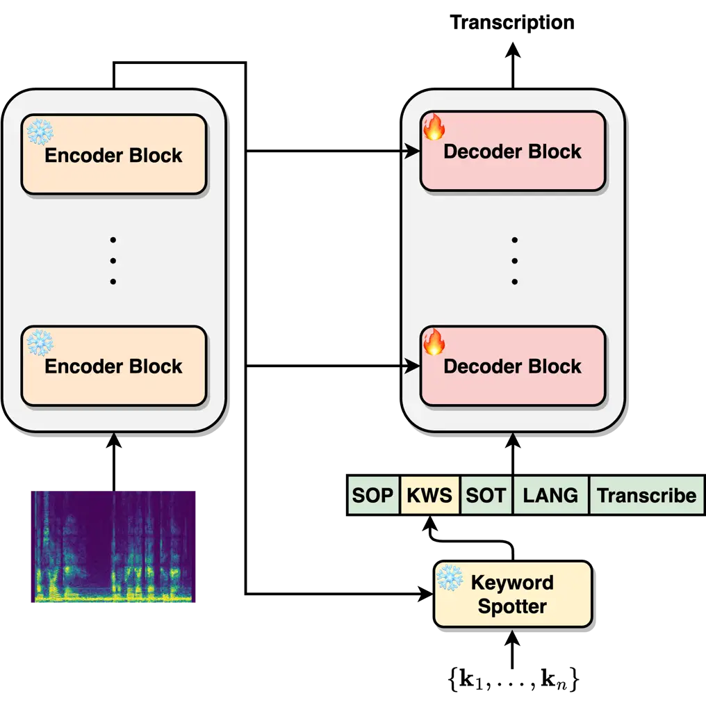
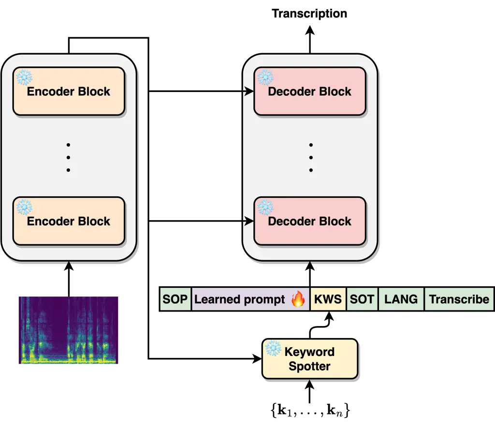
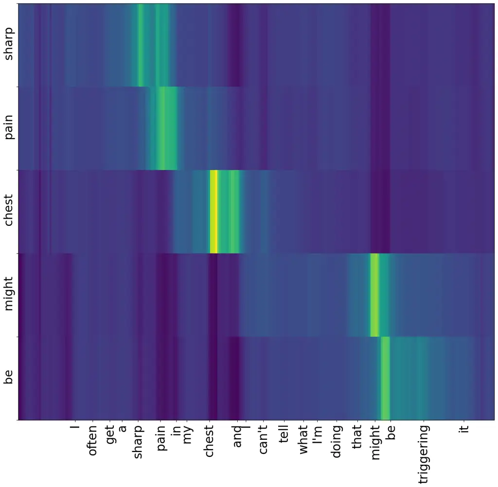
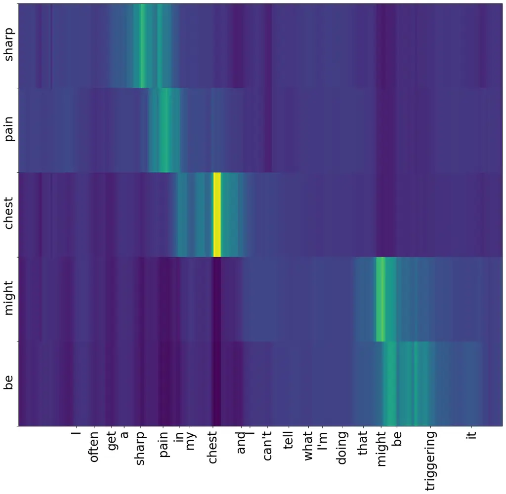

# Keyword-Guided Adaptation of Automatic Speech Recognition

Aviv Shamsian    Aviv Navon    Neta Glazer    Gill Hetz    Joseph Keshet

###### Abstract

Automatic Speech Recognition (ASR) technology has made significant
progress in recent years, providing accurate transcription across
various domains. However, some challenges remain, especially in noisy
environments and specialized jargon. In this paper, we propose a novel
approach for improved jargon word recognition by contextual biasing
Whisper-based models. We employ a keyword spotting model that leverages
the Whisper encoder representation to dynamically generate prompts for
guiding the decoder during the transcription process. We introduce two
approaches to effectively steer the decoder towards these prompts:
KG-Whisper, which is aimed at fine-tuning the Whisper decoder, and
KG-Whisper-PT, which learns a prompt prefix. Our results show a
significant improvement in the recognition accuracy of specified
keywords and in reducing the overall word error rates. Specifically, in
unseen language generalization, we demonstrate an average WER
improvement of $`5.1\%`$ over Whisper.

###### keywords

automatic speech recognition, keyword spotting, contextual biasing,
Whisper

^(†)^(†)address: aiOla Research, Israel^(†)^(†)email: {aviv.shamsian,
aviv}@aiola.com

## 1 Introduction

Automatic speech recognition (ASR) capabilities have rapidly progressed
in recent years through advancements in deep learning models trained on
massive datasets of speech. Models like HuBERT \[1\] and wav2vec \[2\]
utilize self-supervised pre-training techniques to learn representations
of acoustic and linguistic patterns from hundreds of thousands of hours
of diverse audio data. Although such models have shown great potential
in producing rich representations useful for transcription, their lack
of a high-quality decoder limits their robustness and generalization.
Recently, \[3\] alleviated this limitation by presenting a new
encoder-decoder transformer architecture named Whisper. Whisper was
trained on a massive multilingual corpus of transcribed web audio data
comprising 680,000 hours of speech.

However, Whisper and other state-of-the-art ASR models may suffer from
performance degradation when applied to real-world datasets presenting
numerous challenges \[4\]. For instance, in industrial surroundings
where heavy machinery operates continuously, background noise can reach
high levels. This acoustic environment makes it difficult for ASR
systems to accurately transcribe spoken commands or safety alerts issued
by workers. Similarly, on public transportation like a crowded bus or
subway train, ambient noise from engines or conversations can interfere
with passenger attempts to a voice-activated information system.
Additionally, domain-specific utterances and terminology, pose unique
challenges for ASR systems, as they require the identification of
specialized vocabulary and language patterns. For instance, in the
medical domain, physicians detailing medical conditions or treatment
plans, and in legal contexts, where lawyers and judges employ legal
jargon, case citations, and procedural language uncommon in everyday
conversation, demonstrate such challenges. To develop speech recognition
systems that are useful in real-world situations, it is essential to
overcome these practical hurdles.

One approach for alleviating these challenges is utilizing
domain-specific or personalized context for biasing transcriptions using
prior knowledge. A common approach is injecting context into beam search
or using shallow fusion \[5, 6, 7, 8\], deep fusion \[9, 10, 11, 12,
13\], or a combination of deep and shallow biasing \[14, 15, 16, 17\].
Recently, \[18\] proposed adapting Whisper into specific domains using
domain prompts which shows substantial reductions in word error rates.
However, this method requires finetuning with a large amount of data and
is limited in terms of the prior knowledge and terminology one can
provide. Prompting and prompt tuning Whisper was also shown beneficial
for adapting to novel tasks, such as audio-visual speech recognition and
code switching \[19\], and target speaker ASR \[20\]. However, the
challenge remains to design an efficient and effective way for
contextually biasing Whisper using domain-specific and personalized
terminology.



(a) KG-Whisper - decoder finetuning.



(b) KG-Whisper-PT - prompt tuning.

Figure 1: An illustration of (a) KG-Whisper - the decoder receives
keywords during fine-tuning, while the encoder module remains frozen.
(b) KG-Whisper-PT - the entire Whisper model parameters are frozen and
only a small number of prompt tokens are tuned.

To address this issue, we propose a novel approach for contextual
biasing. We utilize recent advancements in open vocabulary keyword
spotting \[21, 22, 23\] to guide the ASR predictions using prior domain
knowledge as a source of contextual information. Our approach first
identifies domain-specific and personalized jargon using AdaKWS \[24\],
a KWS system built on top of Whisper’s acoustic encoder. Next, the
identified keywords are used to prompt the decoder to encourage their
incorporation into the transcribed text. We propose two approaches for
finetune Whisper for using keyword prompts. The first, termed KG-Whisper
for keyword-guided Whisper, finetunes the entire set of decoder
parameters. The second and more efficient approach based on prompt
tuning \[25\], termed KG-Whisper-PT, achieves on-par or superior
generalization results using only $`{\sim}15`$K trainable parameters.
This approach preserves the original pre-trained Whisper parameters,
mitigating potential degradation resulting from fine-tuning over
specific datasets and enhancing the model’s ability to generalize to
novel datasets and domains. Most similar to our approach is the
concurrent work \[26\]. However, the paper provides only small-scale
finetune experiments on a limited number of languages, or employ spoken
form prompts.

Throughout extensive evaluation, we empirically demonstrate that
KG-Whisper and KG-Whisper-PT constantly outperform natural baselines.
Furthermore, we evaluate the generalization of the proposed method to
novel domains and challenging acoustic settings. Finally, we evaluate
the generalization performance to novel languages not seen during
training.

## 2 Method

Our goal is to reduce the overall Word Error Rate (WER) of the final
prediction and increase the recall over domain-specific (jargon) terms.
To achieve this, we integrate the predictions of a Keyword Spotting
(KWS) model into an ASR system, guiding the ASR predictions towards the
set of detected keywords.

We first present the notations and learning setup. Let
$`\mathcal{X}^{T}`$ denote the domain of sequences of $`T`$ speech
frames. Let $`\mathcal{V}`$ denote a dictionary of tokens (sub-word
units), and $`\mathcal{V}^{L}`$ the domain of all token sequences
containing $`L`$ tokens (sub-word units). Each token is represented by a
$`D`$-dimensional vector.

We utilize Whisper \[3\], a state-of-the-art transformer-based ASR. Its
encoder converts a speech sequence into a meaningful sequential
representation, taking advantage of the self-attention mechanism. Given
a speech input sequence $`\mathbf{x}\in\mathcal{X}^{T}`$, consisting of
$`T`$ speech frames, the encoder function
$`\mathbf{u}=f^{e}_{\phi}(\mathbf{x})`$ produces an output
$`\mathbf{u}\in\mathbb{R}^{F}`$. Here, $`F`$ represents the dimension of
the acoustic representation, and $`\phi`$ denotes the encoder
parameters.

The transformer decoder function takes the encoder representation
$`\mathbf{u}`$, a prompt $`\mathbf{p}\in\mathcal{V}^{L}`$, and the
previous tokens, $`\mathbf{t}^{i-1}`$. It then predicts the next token
$`\hat{t}^{i}=f^{d}_{\psi}(\mathbf{u},\mathbf{p},\mathbf{t}^{i-1})`$,
where $`\hat{t}^{i}\in\mathcal{V}`$ and $`\psi`$ represents the set of
decoder parameters. Given a training set of $`M`$ examples,
$`\mathcal{S}=\{(\mathbf{x}_{j},\mathbf{p}_{j},\mathbf{t}_{j})\}_{j=1}^{M}`$,
the ASR is trained to minimize the empirical loss:

```math
\min_{\{\phi,\psi\}}\sum_{j}\sum_{i}\mathcal{L}^{\text{CE}}\big(f^{d}_{\psi}(f^{e}_{\phi}(\mathbf{x}_{j}),\mathbf{p}_{j},\mathbf{t}^{i-1}_{j}),t^{i}_{j}\big)~, \tag{1}
```

where $`\mathcal{L}^{\text{CE}}(\hat{t},t)`$ is the cross-entropy loss
between the a predicted token, $`\hat{t}`$, and the correct one, $`t`$.

Expanding upon Whisper’s architecture and optimization, our goal is to
guide its predictions toward specific keywords (which can represent
out-of-vocabulary or rare words), while preserving the overall
performance of the rest of the words in the language. Our approach is
based on utilizing decisions from an open vocabulary KWS model \[24\].



(a) KG-Whisper



(b) KG-Whisper-PT

Figure 2: Visualization of the cross-attention weights for KG-Whisper
and KG-Whisper-PT. We illustrate how the model’s attention is directed
towards the identified keywords (Y-axis) as it predicts them within the
transcribed text (X-axis).

Let $`\mathcal{K}`$ represent a set of keywords, with each keyword
$`k\in\mathcal{K}`$ defined as a sequence of tokens within the token
vocabulary $`\mathcal{V}^{L}`$. The KWS \[24\] employs a function
$`\hat{\mathbf{y}}=f^{k}_{\theta}(\mathbf{u},\mathcal{K})`$ that takes
as input the encoder representation $`\mathbf{u}`$ and the set of
keywords $`\mathcal{K}`$, and predicts a binary vector
$`\hat{\mathbf{y}}\in\{0,1\}^{|\mathcal{K}|}`$. This vector indicates
the presence or absence of each keyword within the input utterance. The
KWS parameters, $`\theta`$, are optimized to minimize the cross-entropy
loss:

```math
\min_{\theta}~\sum_{j}\sum_{(k_{j}^{+},k_{j}^{-})\in\mathcal{K}}\mathcal{L}^{\text{CE}}\big(f^{k}_{\theta}(\mathbf{u}_{j},\mathcal{K})\big)~. \tag{2}
```

The KWS prediction vector $`\hat{\mathbf{y}}`$ is then used to generate
a prompt that is passed to the Whisper decoder. We introduce two novel
approaches for guiding Whisper’s predictions toward the identified
keywords. In the first approach, _KG-Whisper_, we fine-tune Whisper’s
decoder while freezing the encoder. In the second approach,
_KG-Whisper-PT_, we tune the prompt by adding a learned prefix to it,
while freezing the encoder the decoder. In both approaches we keep the
KWS model freezed.

### 2.1 KG-Whisper: Keyword-guided tuned-decoder

Our first approach involves fine-tuning the decoder parameters $`\psi`$.
Here, each training example is a tuple of a speech representation
$`\mathbf{u}`$, a prompt
$`\mathbf{p}^{\text{KWS}(\mathbf{u},\mathcal{K})}`$ generated from the
KWS, the previous (correct) tokens $`\mathbf{t}^{i-1}`$, and the next
token $`t^{i}`$:

```math
\min_{\psi}~\sum_{j}\sum_{i}\mathcal{L}^{\text{CE}}\big(f^{d}_{\psi}(\mathbf{u}_{j},\mathbf{p}^{\text{KWS}(\mathbf{u}_{j},\mathcal{K})},\mathbf{t}^{i-1}_{j}),t^{i}_{j}\big)~. \tag{3}
```

Namely, we fine-tune the decoder parameters to minimize the CE loss over
pairs of speech representations and KWS prompts.

### 2.2 KG-Whisper-PT: Keyword-guided prompt-tuning

|                        |                    |                    |           |
| ---------------------- | ------------------ | ------------------ | --------- |
|                        | Voxpopuli          |                    |           |
|                        | WER $`\downarrow`$ | F1 $`\uparrow`$    | \# Params |
| KG-Whisper – Oracle    | $`9.41`$           | $`97.53`$          | $`906`$M  |
| KG-Whisper-PT – Oracle | $`10.86`$          | $`95.91`$          | $`15`$K   |
| Whisper                | $`13.39`$          | $`81.77`$          | $`-`$     |
| Whisper + prompt       | $`16.70`$          | $`83.77`$          | $`-`$     |
| Whisper FT             | $`11.57`$          | $`82.54`$          | $`906`$M  |
| Whisper PT             | $`12.83`$          | $`90.38`$          | $`15`$K   |
| KG-Whisper             | $`\mathbf{9.78}`$  | $`91.54`$          | $`906`$M  |
| KG-Whisper-PT          | $`11.10`$          | $`\mathbf{95.25}`$ | $`15`$K   |

Table 1: WER and F1 results for Voxpopuli test dataset.

In the second method, we learn a prefix to the prompt that the KWS
generates, $`\mathbf{q}\in\mathbb{R}^{N\times D}`$, composed of $`N`$
tokens, where each token is a vector in $`\mathbb{R}^{D}`$. This is done
by minimizing the CE loss, while keeping the Whisper’s encoder and
decoder frozen.

```math
\min_{\mathbf{q}}~\sum_{j}\sum_{i}\mathcal{L}^{\text{CE}}\big(f^{d}_{\psi}(\mathbf{u}_{j},[\mathbf{q}~\mathbf{p}^{\text{KWS}(\mathbf{u}_{j},\mathcal{K})}],\mathbf{t}^{i-1}_{j}),t^{i}_{j}\big)~, \tag{4}
```

where $`\psi`$ denote the frozen parameters of the decoder.

In this paper, we highlight the application of contextual biasing with a
keyword spotter, focusing specifically on Whisper. However, we note that
both approaches outlined in this work apply to any encoder-decoder-based
ASR system.

### 2.3 Training strategy

Throughout the training phase, we emulate the KWS predictions by
dynamically generating a collection of positive and negative keywords
for each audio input within the batch. First, we randomly select the
quantity of keywords in the prompt, varying between $`1`$ to $`5`$.
Next, for each keyword, we determine if the keyword is positive or
negative through a coin flip, with a $`0.9`$ probability assigned to
positive keywords. Finally, we determine the keyword length by randomly
sampling the number of tokens for each keyword term, ranging from $`1`$
to $`4`$. Positive keywords are sampled from the transcript of the input
audio sample, while negative keywords are generated from other randomly
selected samples within the batch. After sampling the keywords we
concatenate them with $`|`$ delimiter. To pass the keyword as context to
the decoder module, we place them between the
$`\langle\textit{start\_of\_prev}\rangle\textit{(SOP)}`$ and
$`\langle\textit{start\_of\_transcript}\rangle\textit{(SOT)}`$ tokens,
as depicted in Figure 1.

## 3 Experiments

In this section, we evaluate KG-Whisper and KG-Whisper-PT using several
datasets and learning setups.  
Datasets. We use several well-known datasets. Voxpopuli \[27\]: a
comprehensive collection of recordings from the European Parliament,
making it a diverse speech dataset. The dataset includes more than
$`1600`$ hours of annotated speech from $`16`$ languages.
UWB-ATCC \[28\]: The Ultra-Wideband Air Traffic Control Communications
dataset contains radio communications between aircraft pilots and air
traffic control systems. This dataset is extremely challenging for ASR
models due to high levels of noise exceeding $`20\text{dB}`$.
Medical \[29\]: collection of medical reports made by patients including
over $`6600`$ utterances. Fleurs \[30\]: a diverse multilingual dataset
with $`12`$ hours of annotated audio from $`102`$ languages.

Data preprocessing. We follow the data preprocessing paradigm presented
by \[3, 24\]. We resample the audio samples to $`16`$Khz followed by
log-magnitude Mel-spectrogram generation. Specifically, we generate
80-channel Mel-spectrograms using 25-millisecond windows and
10-millisecond stride.

Experimental setup. We train KG-Whisper and KG-Whisper-PT on Voxpopuli
dataset for $`30`$K update steps using batch size of $`4`$ and
$`1e{-}7`$ and $`5e{-}4`$ learning rate, respectively. Unless stated
otherwize, we use a 12 token prefix prompt for KG-Whisper-PT. We use a
frozen version (i.e., without trainable parameters) of AdaKWS \[24\] as
the keyword spotter. In the evaluation step, we query the keyword
spotter with $`20`$ keywords for each audio sample. Among these
keywords, $`3`$ are positive, meaning they appear in the audio
utterance, while the remaining $`17`$ are negative. The keywords are
sampled proportionally to the term frequency–inverse document
frequency \[31\] scores.

We report common metrics in ASR domain, namely Word Error Rate (WER),
and the F1 score for the positive keywords.

Baselines. We compare our methods to several natural baselines. The
compared methods include: (1) Whisper - a pre-trained Whisper large-v2
model. (2) Whisper + prompt - providing keywords detected by the keyword
spotter as prompt to a pre-trained Whisper large-v2 model. (3) Whisper
FT - Whisper large-v2 model with fine-tuned decoder. (4)
KG-Whisper-Oracle - KG-Whisper with optimal KWS, i.e., providing the
positive ground truth keywords as prompt. (5) KG-Whisper-PT-Oracle -
KG-Whisper-PT with optimal KWS.

UWB-ATCC Medical WER $`\downarrow`$ F1 $`\uparrow`$ WER $`\downarrow`$
F1 $`\uparrow`$ Whisper $`76.55`$ $`24.54`$ $`7.33`$ $`80.50`$ Whisper +
prompt $`\mathbf{55.27}`$ $`61.57`$ $`32.82`$ $`68.71`$ KG-Whisper
$`56.09`$ $`67.75`$ $`6.87`$ $`88.74`$ KG-Whisper-PT $`57.88`$
$`\mathbf{70.89}`$ $`\mathbf{6.15}`$ $`\mathbf{96.58}`$

Table 2: Out of domain generalization: WER and F1 results for UWB-ATCC
and Medical test datasets.

### 3.1 Multi-lingual Finetuning

First, we evaluate KG-Whisper and KG-Whisper-PT using the Voxpopuli
dataset. We use the training set to fine-tune the decoder of KG-Whisper,
or the prefix prompt of KG-Whisper-PT, and evaluate the performance
using the test set. The results are presented in Table 1. KG-Whisper
surpasses Whisper variations by a notable margin, demonstrating
enhancements of $`1.8\%`$ in WER and $`9\%`$ in F1 metrics compared to
the top-performing baseline. The increase in F1 score suggests that our
method effectively guides Whisper towards the provided context keywords,
resulting in a higher frequency of positive keyword appearances in the
predicted transcript compared to other baselines. Furthermore,
KG-Whisper-PT shows a $`2.3\%`$ reduction in Whisper’s WER, while
utilizing a mere $`15`$K learnable parameters. Moreover, both KG-Whisper
and KG-Whisper-PT achieve comparable results to their Oracle baseline
counterparts which applied to the ground truth keywords as prompt.
Remarkably, Whisper + prompt exhibits inferior performance compared to
the naive Whisper. We observed that this discrepancy stems from the fact
that presenting prompts without fine-tuning encourages Whisper to
generate hallucinated content.

### 3.2 Out of domain generalization

We further investigate KG-Whisper and KG-Whisper-PT ability to
generalize to out-of-domain datasets characterized by challenging
acoustic environments, domain-specific jargon words, and new languages.
Here, we use the KG-Whisper and KG-Whisper-PT models trained on the
Voxpopuli dataset. Notably, our evaluation involves datasets _not used_
during the training process of the ASR and the KWS model, namely
zero-shot learning setup. First, we evaluate our methods on
UWB-ATCC \[28\] dataset which presents acoustic challenges due to poor
signal-to-noise ratio. The noise, originating from radio communication,
reaches over $`30`$dBs at peak, making UWB-ATCC challenging even for
state-of-the-art ASR systems like Whisper. Next, using the
Medical \[29\] dataset, we test how well KG-Whisper and KG-Whisper-PT
handle out-of-domain jargon words. Specifically, the Medical dataset
contains jargon words from the medical domain which we assume that
Whisper was less exposed to during training. Finally, we randomly select
$`6`$ low-resource languages from the Fleurs \[30\] dataset to evaluate
generalization to unseen languages that were not represented in
Whisper’s training data (Estonian: ET, Hungarian: HU , Latvian: LV,
Slovenian: SI, and Uzbek: UZ). The results are presented in Tables 2 and 3. We show that KG-Whisper-PT achieves substantial improvement over
Whisper baselines, improving both WER and keywords F1 on UWB-ATCC and
Medical datasets. Additionally, our method enhances Whisper’s WER
performance on all randomly selected languages from the Fleurs dataset.
Overall, KG-Whisper-PT yields an average WER improvement of $`5.1\%`$
over Whisper.

ET HU LV SI UZ Whisper $`24.96`$ $`19.14`$ $`25.91`$ $`25.82`$ $`86.69`$
Whisper + prompt $`21.18`$ $`23.19`$ $`23.94`$ $`27.95`$ $`81.30`$
KG-Whisper $`18.39`$ $`15.90`$ $`22.44`$ $`21.24`$ $`\mathbf{80.39}`$
KG-Whisper-PT $`\mathbf{17.67}`$ $`\mathbf{15.68}`$ $`\mathbf{21.95}`$
$`\mathbf{20.98}`$ $`80.94`$

Table 3: Generalization to unseen languages: WER results for unseen
languages from Fleurs dataset.

|           | Voxpopuli          |                    |     | Medical            |                    |
| --------- | ------------------ | ------------------ | --- | ------------------ | ------------------ |
|           | WER $`\downarrow`$ | F1 $`\uparrow`$    |     | WER $`\downarrow`$ | F1 $`\uparrow`$    |
| 4 tokens  | $`11.72`$          | $`94.66`$          |     | $`6.42`$           | $`96.37`$          |
| 8 tokens  | $`11.54`$          | $`94.97`$          |     | $`6.69`$           | $`96.22`$          |
| 12 tokens | $`\mathbf{11.10}`$ | $`95.25`$          |     | $`\mathbf{6.15}`$  | $`96.58`$          |
| 16 tokens | $`11.29`$          | $`\mathbf{95.35}`$ |     | $`6.17`$           | $`\mathbf{96.61}`$ |
| 20 tokens | $`11.27`$          | $`95.18`$          |     | $`6.27`$           | $`96.38`$          |
| 24 tokens | $`11.95`$          | $`94.11`$          |     | $`6.91`$           | $`95.62`$          |

Table 4: Learned prompt ablation: test results on Voxpopuli and Medical
datasets with varying number of learned tokens.

### 3.3 Ablation study

We empirically investigate the effect of learned prompt length on the
performance of KG-Whisper-PT. Specifically, we evaluate KG-Whisper-PT on
Voxpopuli and Medical datasets while varying the number of learnable
tokens ranging from $`4`$ to $`24`$ tokens. The results, presented in
Table 4, demonstrates that the WER increases when the prompt length
either decreases or increases, with the best WER and F1 results are
shown for 12 and 16 tokens. For longer prompts, the decoder tends to
introduce more widely insertion errors. These errors originated in
*hallucinations* \[32\], whereas undesirable text is generated. In
addition, long prompts increase the computational demand of the decoder.
In contrast, shorter prompts provide limited context for the decoder,
causing it to omit words or part of the original speech, which leads to
an increase in deletion errors.

## 4 Conclusion

Whisper is almost as good as a human listener for recognizing speech
under varying environmental conditions. However, its performance
declines in specialized spoken domains characterized by rare words or
jargon language. This paper introduces two novel techniques designed to
enhance Whisper’s detection of specific words by leveraging keyword
spotting. Utilizing prior knowledge on the domain and keyword spotter,
our method provides context to Whisper and boosts its transcription
capabilities. Both methods outperform Whisper baselines on various
datasets, even in challenging acoustic environments. Additionally, we
demonstrate that our methods can generalize to novel languages. We are
confident that our paper can lead to further research aimed at improving
the resilience and robustness of speech foundation models.

## References

- \[1\] W.-N. Hsu, B. Bolte, Y.-H. H. Tsai, K. Lakhotia,
  R. Salakhutdinov, and A. Mohamed, “Hubert: Self-supervised speech
  representation learning by masked prediction of hidden units,”
  _IEEE/ACM Transactions on Audio, Speech, and Language Processing_,
  vol. 29, pp. 3451–3460, 2021.
- \[2\] A. Baevski, Y. Zhou, A. Mohamed, and M. Auli, “wav2vec 2.0: A
  framework for self-supervised learning of speech representations,”
  _Advances in neural information processing systems_, vol. 33, pp.
  12 449–12 460, 2020.
- \[3\] A. Radford, J. W. Kim, T. Xu, G. Brockman, C. McLeavey, and
  I. Sutskever, “Robust speech recognition via large-scale weak
  supervision,” in _International Conference on Machine Learning
  (ICML)_. PMLR, 2023, pp. 28 492–28 518.
- \[4\] Y. Gong, S. Khurana, L. Karlinsky, and J. Glass, “Whisper-at:
  Noise-robust automatic speech recognizers are also strong general
  audio event taggers,” _arXiv preprint arXiv:2307.03183_, 2023.
- \[5\] I. Williams, A. Kannan, P. S. Aleksic, D. Rybach, and T. N.
  Sainath, “Contextual speech recognition in end-to-end neural network
  systems using beam search.” in _Interspeech_, 2018, pp. 2227–2231.
- \[6\] D. Zhao, T. N. Sainath, D. Rybach, P. Rondon, D. Bhatia, B. Li,
  and R. Pang, “Shallow-fusion end-to-end contextual biasing.” in
  _Interspeech_, 2019, pp. 1418–1422.
- \[7\] A. Gourav, L. Liu, A. Gandhe, Y. Gu, G. Lan, X. Huang,
  S. Kalmane, G. Tiwari, D. Filimonov, A. Rastrow _et al._,
  “Personalization strategies for end-to-end speech recognition
  systems,” in _ICASSP 2021-2021 IEEE International Conference on
  Acoustics, Speech and Signal Processing (ICASSP)_, 2021, pp.
  7348–7352.
- \[8\] D. Eitan, M. Pirchi, N. Glazer, S. Meital, G. Ayach, G. Krendel,
  A. Shamsian, A. Navon, G. Hetz, and J. Keshet, “Combining language
  models for specialized domains: A colorful approach,” _arXiv preprint
  arXiv:2310.19708_, 2023.
- \[9\] G. Pundak, T. N. Sainath, R. Prabhavalkar, A. Kannan, and
  D. Zhao, “Deep context: end-to-end contextual speech recognition,” in
  _2018 IEEE spoken language technology workshop (SLT)_, 2018, pp.
  418–425.
- \[10\] U. Alon, G. Pundak, and T. N. Sainath, “Contextual speech
  recognition with difficult negative training examples,” in _ICASSP
  2019-2019 IEEE International Conference on Acoustics, Speech and
  Signal Processing (ICASSP)_, 2019, pp. 6440–6444.
- \[11\] F.-J. Chang, J. Liu, M. Radfar, A. Mouchtaris, M. Omologo,
  A. Rastrow, and S. Kunzmann, “Context-aware transformer transducer for
  speech recognition,” in _2021 IEEE Automatic Speech Recognition and
  Understanding Workshop (ASRU)_, 2021, pp. 503–510.
- \[12\] K. M. Sathyendra, T. Muniyappa, F.-J. Chang, J. Liu, J. Su,
  G. P. Strimel, A. Mouchtaris, and S. Kunzmann, “Contextual adapters
  for personalized speech recognition in neural transducers,” in _ICASSP
  2022-2022 IEEE International Conference on Acoustics, Speech and
  Signal Processing (ICASSP)_, 2022, pp. 8537–8541.
- \[13\] T. N. Sainath, R. Prabhavalkar, D. Caseiro, P. Rondon, and
  C. Allauzen, “Improving contextual biasing with text injection,” in
  _ICASSP 2023-2023 IEEE International Conference on Acoustics, Speech
  and Signal Processing (ICASSP)_, 2023, pp. 1–5.
- \[14\] D. Le, G. Keren, J. Chan, J. Mahadeokar, C. Fuegen, and M. L.
  Seltzer, “Deep shallow fusion for rnn-t personalization,” in _2021
  IEEE Spoken Language Technology Workshop (SLT)_, 2021, pp. 251–257.
- \[15\] D. Le, M. Jain, G. Keren, S. Kim, Y. Shi, J. Mahadeokar,
  J. Chan, Y. Shangguan, C. Fuegen, O. Kalinli _et al._, “Contextualized
  streaming end-to-end speech recognition with trie-based deep biasing
  and shallow fusion,” _arXiv preprint arXiv:2104.02194_, 2021.
- \[16\] Y. Xu, B. Liu, Q. Huang, X. Song, Z. Wu, S. Kang, and H. Meng,
  “Cb-conformer: Contextual biasing conformer for biased word
  recognition,” in _ICASSP 2023-2023 IEEE International Conference on
  Acoustics, Speech and Signal Processing (ICASSP)_, 2023, pp. 1–5.
- \[17\] G. Sun, X. Zheng, C. Zhang, and P. C. Woodland, “Can contextual
  biasing remain effective with whisper and gpt-2?” _arXiv preprint
  arXiv:2306.01942_, 2023.
- \[18\] F.-T. Liao, Y.-C. Chan, Y.-C. Chen, C.-J. Hsu, and D.-s. Shiu,
  “Zero-shot domain-sensitive speech recognition with
  prompt-conditioning fine-tuning,” in _2023 IEEE Automatic Speech
  Recognition and Understanding Workshop (ASRU)_, 2023, pp. 1–8.
- \[19\] P. Peng, B. Yan, S. Watanabe, and D. Harwath, “Prompting the
  hidden talent of web-scale speech models for zero-shot task
  generalization,” _arXiv preprint arXiv:2305.11095_, 2023.
- \[20\] H. Ma, Z. Peng, M. Shao, J. Li, and J. Liu, “Extending whisper
  with prompt tuning to target-speaker asr,” _arXiv preprint
  arXiv:2312.08079_, 2023.
- \[21\] H.-K. Shin, H. Han, D. Kim, S.-W. Chung, and H.-G. Kang,
  “Learning audio-text agreement for open-vocabulary keyword spotting,”
  _arXiv preprint arXiv:2206.15400_, 2022.
- \[22\] K. Nishu, M. Cho, and D. Naik, “Matching latent encoding for
  audio-text based keyword spotting,” _arXiv preprint
  arXiv:2306.05245_, 2023.
- \[23\] K. Nishu, M. Cho, P. Dixon, and D. Naik, “Flexible keyword
  spotting based on homogeneous audio-text embedding,” _arXiv preprint
  arXiv:2308.06472_, 2023.
- \[24\] A. Navon, A. Shamsian, N. Glazer, G. Hetz, and J. Keshet,
  “Open-vocabulary keyword-spotting with adaptive instance
  normalization,” in _Proceeding of the International Conference on
  Audio, Speech, and Signal Processing (ICASSP)_, 2024.
- \[25\] B. Lester, R. Al-Rfou, and N. Constant, “The power of scale for
  parameter-efficient prompt tuning,” _arXiv preprint
  arXiv:2104.08691_, 2021.
- \[26\] Y. Li, Y. Li, M. Zhang, C. Su, M. Ren, X. Qiao, X. Zhao,
  M. Piao, J. Yu, X. Lv, M. Ma, Y. Zhao, and H. Yang, “A multitask
  training approach to enhance whisper with contextual biasing and
  open-vocabulary keyword spotting,” 2023. \[Online\]. Available:
  [https://api.semanticscholar.org/CorpusID:266999141](https://api.semanticscholar.org/CorpusID:266999141)
- \[27\] C. Wang, M. Riviere, A. Lee, A. Wu, C. Talnikar, D. Haziza,
  M. Williamson, J. Pino, and E. Dupoux, “Voxpopuli: A large-scale
  multilingual speech corpus for representation learning,
  semi-supervised learning and interpretation,” _arXiv preprint
  arXiv:2101.00390_, 2021.
- \[28\] J. Zuluaga-Gomez, A. Prasad, I. Nigmatulina, S. S. Sarfjoo,
  P. Motlicek, M. Kleinert, H. Helmke, O. Ohneiser, and Q. Zhan, “How
  does pre-trained wav2vec 2.0 perform on domain-shifted asr? an
  extensive benchmark on air traffic control communications,” in _2022
  IEEE Spoken Language Technology Workshop (SLT)_, 2023, pp. 205–212.
- \[29\] Y. Kumar, A. Koul, and S. Mahajan, “A deep learning approaches
  and fastai text classification to predict 25 medical diseases from
  medical speech utterances, transcription and intent,” _Soft
  computing_, vol. 26, no. 17, pp. 8253–8272, 2022.
- \[30\] A. Conneau, M. Ma, S. Khanuja, Y. Zhang, V. Axelrod, S. Dalmia,
  J. Riesa, C. Rivera, and A. Bapna, “Fleurs: Few-shot learning
  evaluation of universal representations of speech,” in _2022 IEEE
  Spoken Language Technology Workshop (SLT)_, 2023, pp. 798–805.
- \[31\] G. Salton and C. Buckley, “Term-weighting approaches in
  automatic text retrieval,” _Information processing & management_,
  vol. 24, no. 5, pp. 513–523, 1988.
- \[32\] A. Koenecke, A. S. G. Choi, K. Mei, H. Schellmann, and
  M. Sloane, “Careless whisper: Speech-to-text hallucination harms,”
  _arXiv preprint arXiv:2402.08021_, 2024.
