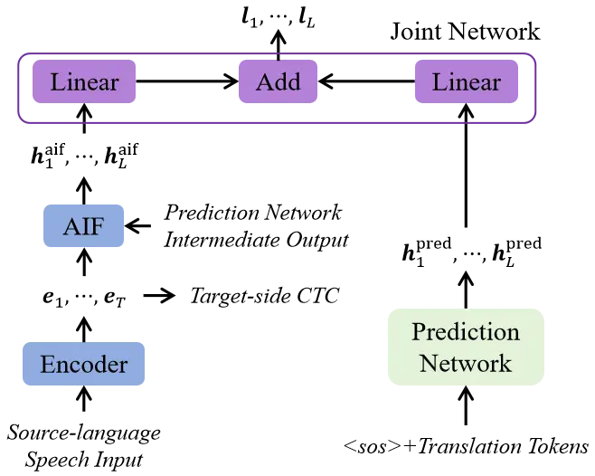
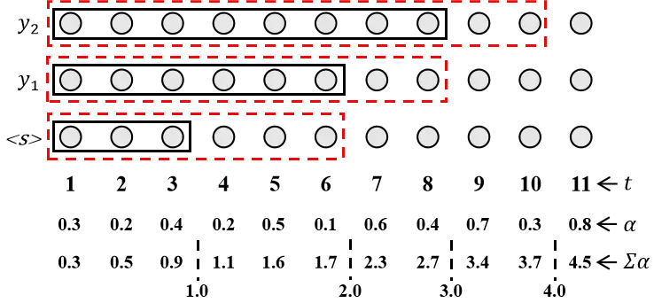
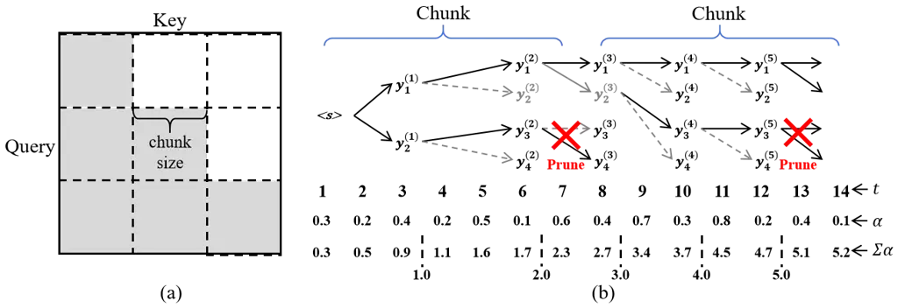
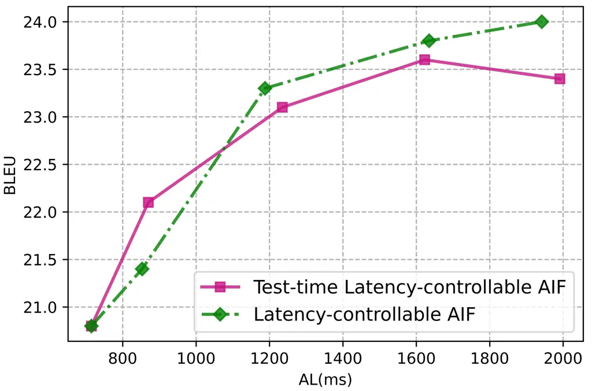
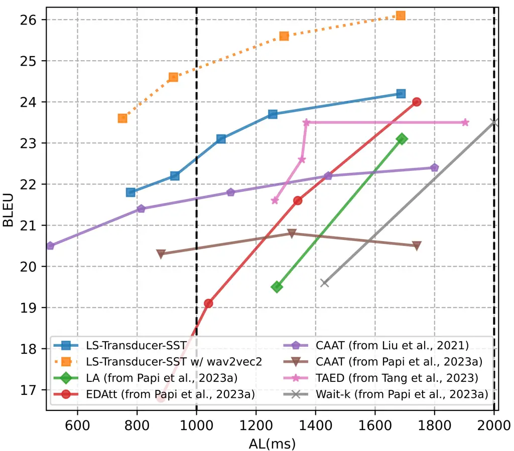
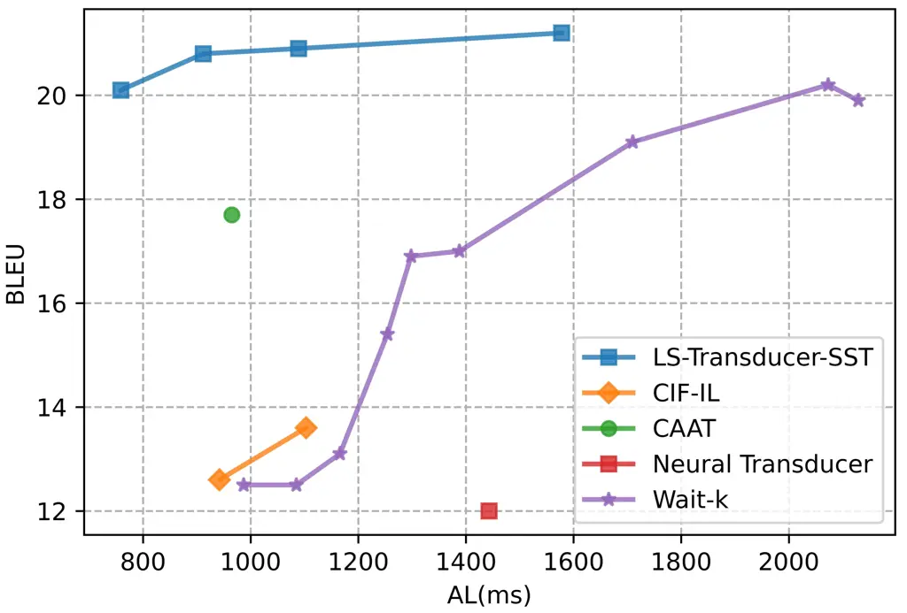
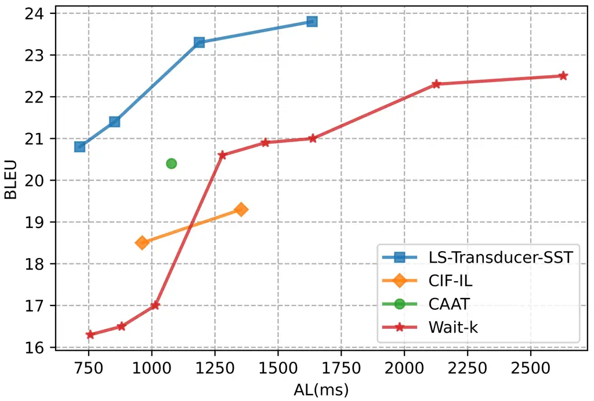
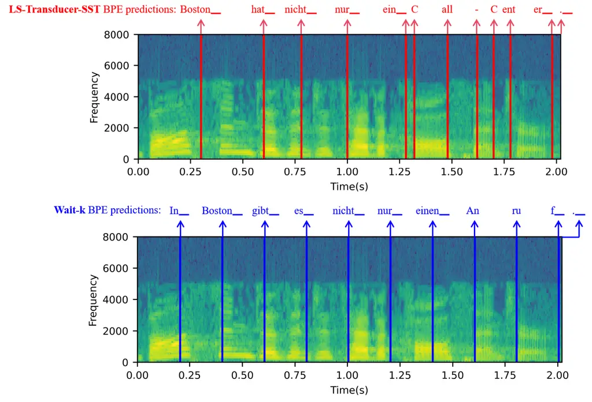
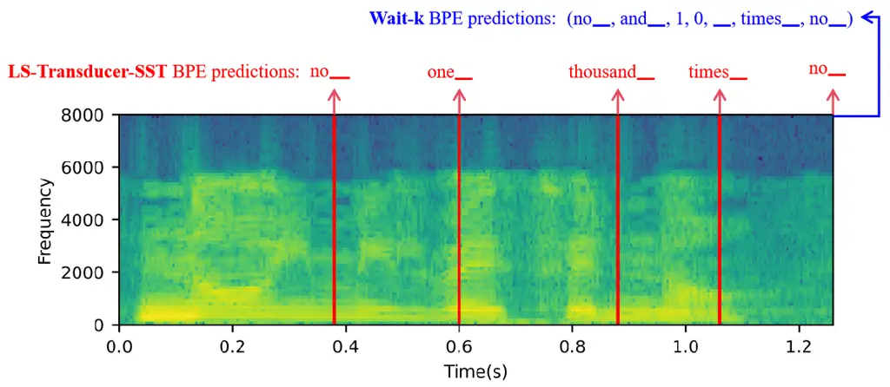
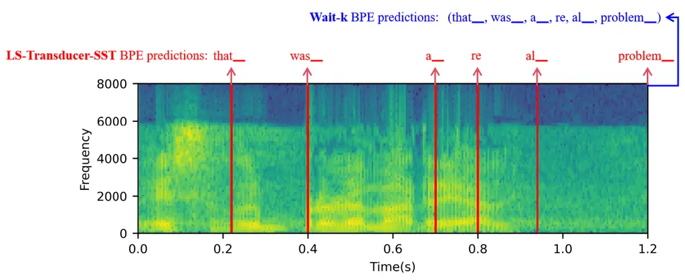

# Label-Synchronous Neural Transducer for E2E Simultaneous Speech Translation

Keqi Deng Affiliation: Department of Engineering, University of
Cambridge, Trumpington St., Cambridge, UK.    Philip C. Woodland
Affiliation: {kd502, pw117}@cam.ac.uk

###### Abstract

While the neural transducer is popular for online speech recognition,
simultaneous speech translation (SST) requires both streaming and
re-ordering capabilities. This paper presents the LS-Transducer-SST, a
label-synchronous neural transducer for SST, which naturally possesses
these two properties. The LS-Transducer-SST dynamically decides when to
emit translation tokens based on an Auto-regressive Integrate-and-Fire
(AIF) mechanism. A latency-controllable AIF is also proposed, which can
control the quality-latency trade-off either only during decoding, or it
can be used in both decoding and training. The LS-Transducer-SST can
naturally utilise monolingual text-only data via its prediction network
which helps alleviate the key issue of data sparsity for E2E SST. During
decoding, a chunk-based incremental joint decoding technique is designed
to refine and expand the search space. Experiments on the
Fisher-CallHome Spanish (Es-En) and MuST-C En-De data show that the
LS-Transducer-SST gives a better quality-latency trade-off than existing
popular methods. For example, the LS-Transducer-SST gives a 3.1/2.9
point BLEU increase (Es-En/En-De) relative to CAAT at a similar latency
and a 1.4 s reduction in average lagging latency with similar BLEU
scores relative to Wait-k.

## 1 Introduction

Simultaneous speech translation (SST) generates translations from input
speech in a streaming fashion. Conventional cascaded SST performs
streaming automatic speech recognition (ASR) followed by text-based
simultaneous machine translation Fügen et al. (2007). Recently,
end-to-end (E2E) SST has become popular and has advantages, including
lower latency Ren et al. (2020); Ma et al. (2020c). However, E2E SST is
challenging since it requires taking into account word re-ordering
between source and target languages during the streaming process Chang
and Lee (2022). Neural transducers, the dominant model for low-latency
ASR, find this difficult due to their monotonic nature. Furthermore, E2E
training results in severe data sparsity Bentivogli et al. (2021).

Current SST methods are normally based on the Transformer Vaswani et al.
(2017) attention-based encoder-decoder (AED) structure, which isn’t
naturally able to deal with streaming, as noted by Xue et al. (2022). A
popular approach to adapt the AED to SST is the Wait-k policy Ma et al.
(2020c), which is a fixed read-write policy that uses a fixed number of
wait duration steps before translation. However, it can be too
aggressive or conservative in different cases (Zheng et al., 2020).
Alternative methods involve a flexible policy which lets the model
decide how much input to read before generating the next translation
token Polák et al. (2023), such as monotonic multi-head attention (MMA)
Ma et al. (2020b) and Continuous Integrate-and-Fire (CIF) Dong and Xu
(2020) based SST system. However, these flexible policies normally rely
on a latency loss to adjust the quality-latency trade-off at training,
unlike the fixed Wait-k policy that can control latency at decoding
only.

To better address the challenges of E2E SST, this paper adapts the
label-synchronous neural transducer Deng and Woodland (2023) developed
for ASR to SST and denotes the resulting technique the
LS-Transducer-SST. In the LS-Transducer-SST, an Auto-regressive
Integrate-and-Fire (AIF) mechanism uses accumulated frame-level weights
to dynamically determine when to emit translation tokens, based on which
a label-level target-side encoder representation is extracted
auto-regressively using an attention mechanism. Therefore, the
LS-Transducer-SST is naturally equipped with both streaming and
re-ordering capabilities. In addition, the prediction network of the
LS-Transducer-SST works as a standard language model (LM) as its output
is directly combined with the extracted encoder representation at the
label level. As a benefit, the E2E SST data sparsity issue can be
alleviated because the prediction network can effectively utilise
monolingual text-only data, which is normally easy to collect, for tasks
such as pre-training or text-based adaptation. While the standard AIF
theoretically ensures low-latency output for the LS-Transducer-SST, to
better control the quality-latency trade-off, a latency-controllable AIF
is proposed, which controls the latency by adjusting the decision
threshold of the accumulated frame-level weights. Furthermore, the
latency-controllable AIF allows the quality-latency trade-off to be
controlled not only during training but also during decoding, enabling
the LS-Transducer-SST to combine the advantages of typical fixed and
flexible SST policies. This paper focuses on low/medium-latency
scenarios to keep the low-latency advantage of E2E SST. During decoding,
to improve translation quality, a chunk-based incremental joint decoding
is further proposed to refine and expand the search space. The proposed
LS-Transducer-SST was evaluated on Fisher-CallHome Spanish (Es-En) and
MuST-C En-De corpora and gave an improved quality-latency trade-off
compared to existing popular SST methods. The main contributions are
summarised below:

- •
  LS-Transducer-SST, naturally equipped with streaming and reordering
  abilities, is proposed for SST and can help alleviate its data
  sparsity.
- •
  A latency-controllable AIF is proposed to control the latency during
  decoding effectively.
- •
  A chunk-based incremental joint decoding is proposed to expand the
  search space.
- •
  Extensive experiments were conducted. Our code bridges the ESPnet and
  Fairseq toolkits and will facilitate future research¹¹ 1 The code is
  available at:
  [https://github.com/D-Keqi/LS-Transducer-SST](https://github.com/D-Keqi/LS-Transducer-SST).

## 2 Related Work

### 2.1 Label-synchronous Neural Transducer

The standard neural transducer Graves (2012) is a frame-synchronous
model, which operates on a frame-by-frame basis and uses blank tokens to
augment the output sequence. However, blank token prediction is
inconsistent with the LM task, which means the prediction network
doesn’t operate as a standard LM and cannot effectively utilise text
data Chen et al. (2022). The label-synchronous neural transducer Deng
and Woodland (2023) introduces an Auto-regressive Integrate-and-Fire
(AIF) mechanism, which extracts label-level encoder representations that
are directly combined with the prediction network at the label level.
Therefore, the operation becomes label-synchronous and the prediction
network is consistent with the LM task.

To be more specific, AIF learns frame-level weights
$`(\alpha_{1},\cdots,\alpha_{T})`$ for each encoder output frame
$`\mathbf{E}=(\bm{e}_{1},\cdots,\bm{e}_{T})`$. To generate the $`i`$-th
output unit, the weight $`\alpha_{t}`$ is accumulated from left to right
until it exceeds $`i`$, and then the time step of this located boundary
is denoted as $`T_{i}`$+1. Hence, AIF estimates a monotonic alignment
for streaming ASR. With this located boundary, the label-level
representation $`\bm{h}_{i}^{\rm aif}`$ is extracted using dot-product
attention with $`\textbf{E}_{1:T_{j}}`$ as the keys and values:

```math
\bm{h}_{i}^{\rm aif}={\rm softmax}(\bm{q}_{i}\cdot{{\textbf{E}_{1:T_{i}}}^{\top}})\cdot{\textbf{E}_{1:T_{i}}} \tag{1}
```

where the query $`\bm{q}_{j}`$ can be the prediction network
intermediate output. Suppose $`\bm{h}_{i}^{\rm pred}`$ is the output of
the prediction network which normally has the same structure as a
Transformer LM, the joint network combines $`\bm{h}_{i}^{\rm aif}`$ and
$`\bm{h}_{i}^{\rm pred}`$ at the label level and computes the predicted
logits $`\bm{l}_{i}`$ as follows:

```math
\bm{l}_{i}={\rm FC}(\bm{h}_{i}^{\rm aif})+{\rm FC}(\bm{h}_{i}^{\rm pred}) \tag{2}
```

where FC denotes a fully-connected network that maps the dimension to
the vocabulary size. Since the $`\bm{l}_{i}`$ has the same length as the
target sequence, the cross-entropy loss can be used as the training
objective. In addition, a connectionist temporal classification (CTC)
loss is also computed by the encoder to improve model training.

In ASR decoding, streaming joint decoding is used that also considers an
online CTC prefix score, which is modified to be strictly synchronised
with the AIF alignment.

### 2.2 E2E Simultaneous Speech Translation

For E2E simultaneous speech translation (SST), the fixed Wait-k Ma
et al. (2020c) policy is still the most popular approach Chang and Lee
(2022). While adopting this fixed policy, there are several studies that
try to improve the “pre-decision" process, including using CTC Ren
et al. (2020); Zeng et al. (2021) and the Continuous Integrate-and-Fire
(CIF) mechanism Dong et al. (2022).



Figure 1: Illustration of the proposed LS-Transducer-SST. Linear denotes
a linear classifier. Target-side CTC uses translations in the training
objective computation.

However, a flexible policy in which decisions to emit translation tokens
is made on the fly, is desirable for simultaneous translation Zheng
et al. (2020). A typical flexible policy is monotonic multi-head
attention (MMA) Ma et al. (2020b), however, Chang and Lee (2022) noted
its complex training techniques and proposed a flexible method CIF-IL,
in which CIF is used directly to estimate when to output a translation
token instead of being used as a pre-decision module. Given that CIF is
a monotonic method with limited re-ordering capabilities, a Transformer
decoder is built on top of the CIF output, in which infinite lookback
(IL) cross-attention attends to the previous CIF output. However, CIF
suffers from mismatched testing and training.

Xue et al. (2022) directly explored using a standard neural transducer
for the SST task. However, the standard neural transducer suffers from
limited re-ordering capabilities due to its monotonic alignment Liu
et al. (2021). To address this, the CAAT technique Liu et al. (2021)
augments it with cross-attention to remove the strong monotonic
constraint, but leads to the exacerbated issue of using large memory
during training. Similarly, (Tang et al., 2023) combined the Transducer
and AED (TAED) by using the AED decoder as the prediction network for
the Transducer. However, during training, the number of forward
computations for the AED decoder needs to increase in proportion to the
length of input speech. CAAT and TAED, to keep the streaming property
while handling re-ordering, complicate the training due to the
frame-synchronous nature, which is an important difference from our
label-synchronous approach.

Recently, several papers Liu et al. (2020); Papi et al. (2023a); Papi
et al. (2023b) used offline-trained AED models for SST inference. Local
Agreement (LA) Liu et al. (2020) generates two consecutive hypotheses
and takes agreeing prefixes as the stable hypothesis. Papi et al.
(2023a) noted that this strategy affects latency and proposed to use
encoder-decoder attention (EDATT) to decide when to emit translations.

However, here we focus on low and medium-latency scenarios. Since the
offline-trained models have a more serious mismatch when decoding with
low and medium latency, here we focus on training models in a streaming
manner.

## 3 Proposed Method: LS-Transducer-SST

The LS-Transducer-SST, as shown in Fig. 1, has four key components:
encoder, AIF, prediction network, and joint network. The encoder and AIF
extract label-level target-side representations
$`(\bm{h}_{1}^{\rm aif},\cdots,\bm{h}_{L}^{\rm aif})`$ from the
source-language speech in a streaming fashion, while AIF controls the
time steps at which the representations are emitted.

In addition, the prediction network is an auto-regressive structure,
e.g. Transformer LM structure, which generates representations
$`(\bm{h}_{1}^{\rm pred},\cdots,\bm{h}_{L}^{\rm pred})`$ based on
previous translation tokens. Since the representations obtained from AIF
and the prediction network have the same length, the joint network can
directly add the logits obtained from them using linear fully-connected
layers, and the prediction network performs as an explicit LM.

Hence, the output of the LS-Transducer-SST is a 2-dimensional matrix
$`\mathbb{R}^{L\cdot V}`$ ($`V`$ is the vocabulary size), which can use
a cross-entropy loss computed with target translations for training and
resolve the issue of expensive training for the standard neural
transducer, whose output is a 3-dimensional tensor.

### 3.1 Latency-controllable AIF



Figure 2: Illustration of latency-controllable AIF. $`t`$ denotes the
time step. $`\alpha`$ is the frame-level weight. The black solid line
shows when the tokens are emitted under standard AIF; the red dotted
line illustrates the case when the AIF decision threshold is increased
by 1.



Figure 3: Illustration of the proposed chunk-based incremental joint
decoding. (a) an illustration of the chunk-based mask; (b) an example of
the chunk-based incremental pruning according to the accumulated AIF
weights $`\sum\alpha`$, in which the chunk size is 7, the beam size is 2
within a chunk, the decision threshold of the $`i`$-th output
$`y^{(i)}`$ is $`i`$.

In the LS-Transducer-SST, AIF computes frame-level weights
$`(\alpha_{1},\cdots,\alpha_{T})`$ for each encoder output frame
$`\mathbf{E}=(\bm{e}_{1},\cdots,\bm{e}_{T})`$ to dynamically decide how
much input to read before emitting the next translation token giving a
flexible policy. Following Deng and Woodland (2023), the last element
$`e_{t,d}`$ of each frame $`\bm{e}_{t}`$ was used as the raw scalar
attention value to compute $`\alpha_{t}`$. To mitigate overly sharp
weights, this paper proposes a smoothing process to compute the weights
using a smoothing factor $`\delta`$ as follows:

```math
\alpha_{t}=(1-\delta)\times{\rm sigmoid}({e_{t,d}})+\delta \tag{3}
```

where $`d`$ is the dimension size of $`\bm{e}_{t}`$. To decide when to
emit the $`i`$-th translation token, $`\alpha_{t}`$ is accumulated from
left to right until it exceeds the decision threshold $`i`$, as shown in
the black solid line of Fig. 2. Suppose this time step is $`T_{i}`$+1,
$`\textbf{E}_{1:T_{i}}`$ is used to extract $`\bm{h}_{i}^{\rm aif}`$.
Note if the decision threshold has not been reached until all the speech
has been read, $`T_{i}=T`$, i.e. the entire $`\mathbf{E}`$ is used to
extract the $`\bm{h}_{i}^{\rm aif}`$. To help AIF learn this
cross-lingual speech-text alignment, a target-side CTC branch is
computed which can encourage the Transformer encoder to re-order the
output according to the target translation sequence Chuang et al.
(2021); Deng et al. (2022). Furthermore, a quantity loss
$`\mathcal{L}_{\rm qua}=|\sum_{i=1}^{T}\alpha_{i}-L|`$ is computed to
ensure that the accumulated AIF weight $`\sum_{i=1}^{T}\alpha_{i}`$
approaches the target translation token length $`L`$.

After obtaining the output time step $`T_{i}`$, in contrast to Deng and
Woodland (2023) that uses simple dot-product attention to generate
representations for the ASR task, preliminary experiments showed that
multi-head attention is more effective for the SST task, so
$`\bm{h}_{i}^{\rm aif}`$ is computed as:

```math
\bm{h}_{i}^{\rm aif}=\text{Multihead-attention}(\bm{q}_{i},\textbf{E}_{1:T_{i}},\textbf{E}_{1:T_{i}}) \tag{4}
```

where $`\textbf{E}_{1:T_{j}}`$ is used as the keys and values, and the
query $`\bm{q}_{i}`$ is the prediction network intermediate output at
the $`i`$-th step as shown in Fig. 1.

The AIF mechanism provides a natural approach to control the latency by
adjusting the decision threshold. In the standard AIF, the decision
threshold of the $`i`$-th translation token is $`i`$. By adding a
hyper-parameter $`\epsilon`$ into the decision threshold, i.e.
$`i+\epsilon`$, the quality-latency trade-off can be controlled, which
is called the latency-controllable AIF. As shown in Fig. 2, the red
dotted line represents the case of $`\epsilon=1`$, in which more input
speech will be read before deciding to output the $`i`$-th translation
token, thus the translation quality improves at the cost of increased
latency.

The latency-controllable AIF has many advantages over conventional E2E
SST systems. First, it only uses one hyper-parameter $`\epsilon`$ to
achieve fine-grained latency control and can meet any latency
requirements, because $`\epsilon`$ is not limited to integer values.
Compared to the fixed Wait-k policy Ma et al. (2020c) that normally
needs to set two hyper-parameter values, including the pre-decision
ratio and $`k`$, the latency-controllable AIF is easier to tune. Second,
in contrast to a typical flexible policy²² 2 We note some flexible
policies applied to offline-trained models Papi et al. (2023a); Papi
et al. (2023b) can control latency in decoding. that uses a latency loss
to control the quality-latency trade-off during training Ma et al.
(2020c); Chang and Lee (2022), the latency-controllable AIF can control
the latency at decoding time while only requiring a single trained
model.

### 3.2 Chunk-based Incremental Joint Decoding

For the ASR task, the label-synchronous neural transducer Deng and
Woodland (2023) is decoded based on beam search. However, for the SST
task, beam search re-ranks the top hypotheses while reading the input
speech, making it hard to process the translation results and evaluate
the latency. Hence, this paper proposes chunk-based incremental joint
decoding, which prunes the hypotheses to the same prefix within a chunk.
The chunk-based streaming Transformer is reviewed in this section before
describing chunk-based incremental pruning.

#### 3.2.1 Chunk-based Streaming Transformer

This paper uses the Chunk-based Li et al. (2020) Transformer encoder to
achieve streaming, which uses a chunk mask to limit the range of
query-key dot products for each frame within the Transformer
self-attention. As shown in Fig.3, the chunk mask allows the query to be
computed only with the keys from the current and previous (history)
chunks.

#### 3.2.2 Incremental Pruning within Chunk

Since the emitted translation tokens inside a chunk actually all
correspond to the same chunk speech duration, in order to expand the
search space without adding extra latency, beam search can be used
within a chunk while selecting only the highest-scoring hypothesis after
outputting the last token of this chunk. However, it is not always
feasible to know whether a token is the last one in a chunk, i.e., to
know in advance if the speech input required for the next token will
exceed the range of this chunk.

In the LS-Transducer-SST, the AIF mechanism uses frame-level weights
$`\alpha`$ to decide whether to output a translation token or not, so
comparing the accumulation of frame-level weights up to the current
chunk with the decision threshold of the next translation output token,
it can be confirmed if a token is the last one in a chunk. As shown in
the example in Fig. 3, the accumulated weights
$`\sum_{t=1}^{t=7}\alpha_{t}`$ up to the first chunk is $`2.3`$, so in
the standard AIF case, when outputting the second token $`y^{(2)}_{j}`$
($`j`$ can be e.g. $`1,\cdots,4`$ in Fig. 3), it is known that the
decision threshold for the next token (i.e. $`3`$) cannot be reached
within this chunk. Hence, pruning is required when emitting the $`2`$nd
translation token, i.e. only the highest-scoring hypothesis is kept. A
similar situation occurs with the $`5`$th token in Fig. 3.

### 3.3 Training

During training, as mentioned in Sec. 3, the LS-Transducer-SST uses the
cross-entropy (CE) loss $`\mathcal{L}_{\rm CE}`$ as the training
objective since the joint network output is a 2-dimensional matrix. In
addition, a target-side CTC branch and the AIF quantity loss
$`\mathcal{L}_{\rm qua}`$ are also computed. Hence, the final training
objective of the LS-Transducer-SST is as follows:

```math
\mathcal{L}=\beta\mathcal{L}_{\rm CTC}+(1-\beta)\mathcal{L}_{\rm CE}+\gamma\mathcal{L}_{\rm qua}\cdot L \tag{5}
```

where $`L`$ is the target translation token length as
$`\mathcal{L}_{\rm qua}`$ is a sentence-level loss. $`\beta`$ is the
target-side CTC weight and $`\gamma`$ is the weight of the
$`\mathcal{L}_{\rm qua}`$.

Since the LS-Transducer-SST prediction network works as a standard LM,
it can be initialised by a pre-trained target-language LM before SST
training. If an unseen domain is encountered during decoding,
target-language target-domain text can be used to fine-tune the
prediction network, giving flexible domain adaptation. Since monolingual
text is normally easy to collect, the LS-Transducer-SST can help
alleviate data sparsity issues in E2E SST.

### 3.4 Summary

In summary, this paper enhances the re-ordering capability of the
label-synchronous neural transducer by introducing a target-side CTC
branch, enabling AIF to decide when to emit translation tokens in SST
tasks. A chunk-based incremental joint decoding is proposed to meet SST
requirements, which prunes hypotheses within a chunk while expanding the
search space. To flexibly control the quality-latency trade-off, a
latency-controllable AIF is proposed that can be used at the decoding
stage. With these contributions, the LS-Transducer-SST becomes a natural
SST method combining the advantages of typical fixed and flexible SST
policies.

## 4 Experimental Setup

### 4.1 Dataset

SST models were trained on the Fisher-CallHome Spanish (FCS) Post et al.
(2013) and MuST-C v1.0 Di Gangi et al. (2019) English-German (En-De)
datasets. The dev/test sets of Europarl-ST Iranzo-Sánchez et al. (2020)
Spanish-English (Es-En) were used as cross-domain test sets for the FCS
corpus. The monolingual source-domain text-only data for FSC was the
training set English translations and Fisher Cieri et al. (2004)
transcriptions. For the MuST-C En-De, the training set German
translations and German text from TED2020 Reimers and Gurevych (2020)
were used. The English text from Europarl-ST was used as the
target-domain text. More data details are listed in Appendix A.

SST Experiments were implemented based on the ESPnet-ST Inaguma et al.
(2020) toolkit. To evaluate the latency, SimulEval Ma et al. (2020a) was
used to measure the speech version of the word-level Average Lagging
(AL) Ma et al. (2018); Ma et al. (2020c). Detokenized BLEU Papineni
et al. (2002) results are reported to evaluate translation quality.

### 4.2 SST Model Descriptions

SST models built in this paper have a streaming wav2vec2.0 Baevski
et al. (2020) encoder³³ 3 Note: Section 5.5 has a different setup to aid
comparisons., which was fine-tuned with a chunk-based mask of 64 chunk
size, resulting in 640 ms average latency. The encoder was first
pre-trained for ASR before SST training Inaguma et al. (2020). More
training and decoding details can be found in Appendix B.

|                                   |      |         |         |         |
| --------------------------------- | ---- | ------- | ------- | ------- |
| SST Models on FCS Corpus          | test | evltest | AL(s)   | Latency |
| ESPnetInaguma et al. (2020)       | 50.9 | 19.4    | Offline |         |
| Fast-MDInaguma et al. (2021)      | 54.4 | 21.3    | Offline |         |
| B-AED Deng et al. (2022)          | 47.7 | 15.3    | 3.434   | High    |
| Wait-$`5`$ w/ 360 ms pre-decision | 48.9 | 19.9    | 2.129   | High    |
| Wait-$`4`$ w/ 360 ms pre-decision | 48.1 | 20.2    | 2.073   | High    |
| Wait-$`3`$ w/ 360 ms pre-decision | 46.8 | 19.1    | 1.710   | Medium  |
| Wait-$`3`$ w/ 280 ms pre-decision | 42.0 | 17.0    | 1.388   | Medium  |
| Wait-$`1`$ w/ 280 ms pre-decision | 35.2 | 15.4    | 1.254   | Medium  |
| Wait-$`3`$ w/ 200 ms pre-decision | 28.7 | 13.1    | 1.166   | Medium  |
| Wait-$`1`$ w/ 200 ms pre-decision | 25.2 | 12.5    | 0.987   | Low     |
| CIF-IL with $`\lambda_{lat}=0.0`$ | 33.1 | 13.6    | 1.103   | Medium  |
| CIF-IL with $`\lambda_{lat}=0.5`$ | 30.3 | 12.6    | 0.942   | Low     |
| CAAT                              | 44.7 | 17.7    | 0.965   | Low     |
| Standard Neural Transducer        | 37.9 | 12.0    | 1.443   | Medium  |
| Proposed LS-Transducer-SST        | 46.3 | 20.1    | 0.759   | Low     |
| with $`\epsilon=1`$ in AIF        | 47.8 | 20.8    | 0.912   | Low     |
| with $`\epsilon=2`$ in AIF        | 49.7 | 20.9    | 1.089   | Medium  |
| with $`\epsilon=5`$ in AIF        | 51.4 | 21.2    | 1.578   | Medium  |

Table 1: BLEU ($`\uparrow`$) results on the Fisher-CallHome Spanish
(Es-En). Case-insensitive BLEU was reported on Fisher-test (4
references), and CallHome-evltest (single reference). AL
($`\downarrow`$) was tested on the CallHome-evltest. The latency is
divided into low, medium, and high regions with thresholds 1, 2, and 4s
Ansari et al. (2020). This paper focuses on low and medium-latency
scenarios.

The proposed LS-Transducer-SST was built with a 6-layer unidirectional
Transformer-encoder-based prediction network. The prediction network was
initialised by a pre-trained source-domain LM and then fixed during SST
training. Four different baseline models were implemented. First, the
widely-used Wait-k fixed policy model was built, which followed the
Transformer AED structure that contained a 6-layer Transformer decoder.
The quality-latency trade-off of the Wait-k was adjusted by varying
$`k`$ and the fixed pre-decision step size. Second, the flexible policy
method CIF-IL (see Sec. 2.2) which can performs well in low-latency
scenarios Chang and Lee (2022) was built with a 6-layer Transformer
decoder. The latency loss from Chang and Lee (2022) was used to control
latency during training with a weight denoted $`\lambda_{lat}`$. Third,
the CAAT Liu et al. (2021) was built, the prediction network had the
same structure as that of LS-Transducer-SST, and the joint network
consisted of 6-layer Transformer decoder with self-attention modules
removed. Note that knowledge distillation used in Liu et al. (2021) was
not employed in the Main Experiments in this paper in order to compare
fairly with other specifically built models. The decision step size
$`d`$ was set to 32.⁴⁴ 4 Appendix B explains the reasons to set $`d`$ to
a fixed value. Finally, a standard neural transducer was built with the
same prediction network as the CAAT.

### 4.3 LM and Text Adaptation

The source-domain Transformer LM was trained on the monolingual
source-domain text-only data for 50 epochs and further fine-tuned on the
cross-domain text for 15 epochs as a target-domain LM. If a density
ratio McDermott et al. (2019) was used for domain adaptation, the
weights for the source-domain and target-domain LMs were 0.3. When
conducting text-only domain adaptation for the LS-Transducer-SST, the
prediction network was fine-tuned on the cross-domain text for 25
epochs.

## 5 Experimental Results

The LS-Transducer-SST was compared to fixed and flexible policy models.
To maintain the low-latency advantage of E2E SST, we focus on the low
and medium latency scenarios, i.e. $`\text{AL}<1~\text{s}`$ and
$`1~\text{s}<\text{AL}<2~\text{s}`$ following Ansari et al. (2020).

### 5.1 Main Experiments

Table 1 gives the SST results on Fisher-CallHome Spanish (FSC) data, on
which our models yield good results compared to recent work. For the
popular Wait-k model, a large pre-decision step (e.g., 280 ms or 360 ms
in Table 1) is important to achieve promising translation quality, which
makes it suitable for medium or high-latency scenarios while performing
poorly when low-latency. In contrast, the flexible policy CIF-IL
outperformed the Wait-k model in low-latency scenarios. In addition, the
standard neural transducer didn’t work well on the SST task due its
monotonic constraint and limited re-ordering ability. It tends to
accumulate more information before emitting translations, resulting in
medium latency. However, CAAT, which augments the standard neural
transducer with cross attention to remove the monotonic constraint,
yielding good BLEU results in low-latency scenarios, outperforming the
Wait-k and CIF-IL.

While these existing methods showed good results, the proposed
LS-Transducer-SST gave a significantly better quality-latency trade-off
with the latency-controllable AIF⁵⁵ 5 Note unless specifically stated,
the latency-controllable AIF refers to being used during both training
and decoding.. Compared to CAAT, for similar latency (i.e. AL
$`\approx`$ 0.9s), the LS-Transducer-SST obtained a 3.1 BLEU gain.
Compared to the best BLEU results for Wait-k in Table 1, the
LS-Transducer-SST gave competitive BLEU results at 0.759 s AL latency
(1.37 s AL reduction).

|                                   |        |      |       |         |
| --------------------------------- | ------ | ---- | ----- | ------- |
| SST Models                        | COMMON | HE   | AL(s) | Latency |
| Wait-k Yan et al. (2023)          | 18.6   | –    | 6.8   | —       |
| TBCA Yan et al. (2023)            | 23.5   | –    | 2.3   | High    |
| MoSSTDong et al. (2022)           | 20.0   | –    | 2.742 | High    |
| Wait-$`5`$ with 360 ms            | 22.5   | 21.9 | 2.629 | High    |
| Wait-$`3`$ with 360 ms            | 22.3   | 21.1 | 2.127 | High    |
| Wait-$`3`$ with 280 ms            | 21.0   | 18.9 | 1.638 | Medium  |
| Wait-$`1`$ with 280 ms            | 20.6   | 17.8 | 1.280 | Medium  |
| Wait-$`3`$ with 200 ms            | 17.0   | 12.8 | 1.014 | Medium  |
| Wait-$`2`$ with 200 ms            | 16.5   | 11.8 | 0.881 | Low     |
| Wait-$`1`$ with 200 ms            | 16.3   | 11.2 | 0.757 | Low     |
| CIF-IL with $`\lambda_{lat}=0.0`$ | 19.3   | 18.2 | 1.354 | Medium  |
| CIF-IL with $`\lambda_{lat}=0.3`$ | 18.5   | 17.2 | 0.962 | Low     |
| CAAT                              | 20.4   | 18.9 | 1.078 | Medium  |
| LS-Transducer-SST                 | 20.8   | 19.3 | 0.715 | Low     |
| with $`\epsilon=1`$ in AIF        | 21.4   | 20.0 | 0.853 | Low     |
| with $`\epsilon=3`$ in AIF        | 23.3   | 21.3 | 1.188 | Medium  |
| with $`\epsilon=5`$ in AIF        | 23.8   | 22.3 | 1.635 | Medium  |

Table 2: Case-sensitive BLEU ($`\uparrow`$) results on MuST-C En-De. AL
($`\downarrow`$) was tested on the tst-COMMON set. This paper focuses on
low and medium-latency regions.

The results on the MuST-C En-De are shown in Table 2 and the conclusions
were consistent with that of FSC corpus: 1. the Wait-k model worked well
in medium or high-latency regimes while the CIF-IL surpassed it for
low-latency case; 2. CAAT greatly outperformed the Wait-k and CIF-IL
when AL is around 1 s; 3. the proposed LS-Transducer-SST yielded an
improved quality-latency trade-off compared with these existing methods.
When the latency was around 1 s AL, the LS-Transducer-SST outperformed
CAAT with a 2.9 BLEU gain. Compared to the Wait-5 policy with 320 ms
pre-decision step size, the LS-Transducer-SST could give a competitive
translation quality with 1.188 s AL latency, resulting in a 1.44 s AL
reduction.

Quality-latency trade-off curves corresponding to Tables 1 and 2 are
shown in Appendix C. Results with additional metrics are given in
Appendix E. A visual example in Appendix I.1 illustrates the re-ordering
capability of the LS-Transducer-SST.

### 5.2 Cross-domain Experiments

The Europarl-ST dev/test sets were used to evaluate the cross-domain
performance of the SST models trained on FSC data. As shown in Table 3,
the LS-Transducer-SST performed robustly regarding the latency and
translation quality in cross-domain scenarios. From the source domain
(i.e. FCS) to the cross-domain, the AL result of LS-Transducer-SST only
increased slightly (from 0.759s to 0.915s), whereas the latency of
Wait-k more than doubled (from 2.129s to 4.603s), since in cross domain,
the number of byte pair encoding (BPE) Gage (1994) units for target
translations tends to be relatively longer than for the source domain as
the BPE model is trained on source-domain text⁶⁶ 6 Note the modelling
unit is BPE, whose output time step needs to be mapped to the word level
to measure latency.. For example, on the evltest set of FSC, each BPE
unit corresponds to an average of 207 ms speech, whereas on the test set
of Europarl-ST, this value is 148 ms. This shows the robust advantage of
the LS-Transducer-SST as a flexible policy, as the fixed Wait-k policy
tends to be affected by the data distribution. A case study is shown in
Appendix I.2.

|                        |         |       |                            |      |       |
| ---------------------- | ------- | ----- | -------------------------- | ---- | ----- |
| SST Models             | FCS     |       | FCS$`\Rightarrow`$Europarl |      |       |
|                        | evltest | AL(s) | test                       | dev  | AL(s) |
| Wait-$`5`$ with 360 ms | 19.9    | 2.129 | 9.4                        | 10.6 | 4.603 |
| +Density Ratio         | –       | –     | 10.8                       | 12.3 | 4.565 |
| LS-Transducer-SST      | 20.1    | 0.759 | 10.4                       | 11.7 | 0.915 |
| +Adapt Pred. Net.      | –       | –     | 12.5                       | 13.8 | 0.863 |
| ++Shallow Fusion       | –       | –     | 12.8                       | 14.3 | 0.931 |

Table 3: Cross-domain BLEU ($`\uparrow`$) results on Europarl-ST Es-En
dev/test sets for SST models trained on Fisher-CallHome Spanish (FCS).
Pred. Net. denotes prediction network. AL ($`\downarrow`$) was tested on
the Europarl-ST test set.

The LS-Transducer-SST exceeded the BLEU score of Wait-k in cross-domain
scenarios, showing its robust generalisation. Moreover, since the
LS-Transducer-SST prediction network operates as an explicit LM and can
directly use target-language target-domain text for fine-tuning, the
cross-domain BLEU results of the LS-Transducer were further improved
with an adapted prediction network. Even when Wait-k used the density
ratio method McDermott et al. (2019) to subtract a source-domain LM
score and add a target-domain LM score during decoding for domain
adaptation, there was still a 1.7 BLEU gap with LS-Transducer-SST, which
is more flexible as it does not rely on an additional external LM. In
addition, shallow fusion Chorowski et al. (2015) can also be used to
further improve the LS-Transducer-SST with the target-domain LM (see
Table 3).



Figure 4: Quality-latency trade-off of LS-Transducer-SST on MuST-C En-De
tst-COMMON set. The 5 dots for the latency-controllable AIF are
$`\epsilon\in\{0,1,3,5,7\}`$.

### 5.3 Analysis of Latency-controllable AIF

Fig. 4 shows the quality-latency trade-off curves of the
LS-Transducer-SST, in which test-time latency-controllable AIF means
using the standard AIF (i.e. $`\epsilon=0`$) during training and
adjusting $`\epsilon`$ only during decoding. In general, the
latency-controllable AIF can flexibly and efficiently control the
quality-latency trade-off. While the latency-controllable AIF with
consistent training and decoding performed slightly better than the
test-time-only one, adjusting $`\epsilon`$ only in the decoding stage
achieves similar results, which is important in real-world deployment as
only one model needs to be maintained. Hence, as a flexible policy, the
proposed LS-Transducer-SST possesses the advantage of controlling the
latency during decoding, which is normally seen in fixed policies like
Wait-k.

|                            |              |      |       |
| -------------------------- | ------------ | ---- | ----- |
| SST Models                 | MuST-C En-De |      | AL(s) |
|                            | COMMON       | HE   |       |
| CAAT                       | 20.4         | 18.9 | 1.078 |
| w/ pre-trained pred. net.  | 18.1         | 16.5 | 1.068 |
| LS-Transducer-SST          | 20.8         | 19.3 | 0.715 |
| w/o pre-trained pred. net. | 19.3         | 18.3 | 0.704 |

Table 4: BLEU ($`\uparrow`$) results for CAAT and LS-Transducer-SST on
MuST-C En-De with or without prediction network (abbreviated as pred.
net.) pre-training.

### 5.4 Ablation Studies

The LS-Transducer-SST can effectively utilise monolingual text data by
initialising its prediction network with a pre-trained LM. Ablation
studies were conducted to evaluate the effectiveness of this
initialisation. As shown in Table 4, the prediction network
initialisation was highly effective for the LS-Transducer-SST and was
essential to surpass existing methods like CAAT. The monolingual
text-only data is normally easier to collect, which can help alleviate
E2E SST data sparsity. However, pre-training the prediction network did
not help for CAAT. This is because the CAAT inherits the
frame-synchronous property from the standard neural transducer, in which
the prediction network is inconsistent with the LM task Chen et al.
(2022).

Ablation studies on chunk-based decoding and multi-head attention for
AIF are in Appendix D.

### 5.5 Comparisons to Recent Work

To enable further comparisons, the TAED results from (Tang et al.,
2023), the CAAT results from (Liu et al., 2021) and (Papi et al.,
2023a), and the EDATT, LA, and Wait-k results from (Papi et al., 2023a)
were compared to the LS-Transducer-SST in the low/medium-latency
scenarios that is our focus. To allow a fair comparison, in contrast to
the Main Experiments, a streaming Conformer Gulati et al. (2020) encoder
was employed in the LS-Transducer-SST, and sequence-level knowledge
distillation (KD) Kim and Rush (2016) used⁷⁷ 7 Note only Section 5.5
uses the Conformer and KD. Detailed training settings are given in
Appendix G.



Figure 5: Quality-latency trade-off curves on MuST-C En-De tst-COMMON
set. Solid lines are comparable with technique results from the
literature. Dotted line indicates the use of wav2vec2.0. All results use
sequence-level KD in training.

As shown in Fig. 5, CAAT shows good results in the low-latency region,
while TAED performs well around 1.4 s. In general, CAAT and TAED inherit
the neural transducer low-latency advantage, which also motivates our
work. However, the translation quality does not always improve with
higher latency for CAAT and TAED. As latency continues to increase, the
mismatch with the offline case reduces, and strategies that use
offline-trained models for SST inference, like EDATT, begin to surpass
other published results. However, LS-Transducer-SST (solid blue line in
Fig. 5) still outperforms other models in both low and medium-latency
regions (up to an AL of about 1.7 s). Fig. 5 also shows that a
wav2vec2.0 encoder gives further performance benefits. Online training
is especially useful in lower latency operation and the
LS-Transducer-SST is able to effectively adjust the quality-latency
trade-off. Numerical values for Fig 5, along with the additional LAAL
metric, are given in Appendix H.

## 6 Conclusions

This paper proposes the LS-Transducer-SST, which naturally possesses
streaming and re-ordering capabilities. By introducing the target-side
CTC branch, the re-ordering capability of the label-synchronous neural
transducer is enhanced and thus the AIF mechanism can be used for SST.
Therefore, the LS-Transducer-SST is a flexible policy method that
dynamically decides when to emit translation tokens using the AIF. A
latency-controllable AIF is further proposed to effectively control the
latency at decoding or training, enabling the LS-Transducer-SST to
combine the advantages of typical fixed and flexible SST policies. In
addition, the LS-Transducer-SST provides a natural way to utilise
monolingual text-only data, which helps alleviate the E2E SST data
sparsity issue. During decoding, a chunk-based incremental joint
decoding is further proposed to refine and expand the search space. With
the focus on low and medium-latency scenarios, experiments showed that
the LS-Transducer-SST gives a better quality-latency trade-off than
existing methods.

## Limitations

This paper focuses on low-latency and medium-latency scenarios to
maintain the low-latency advantages of E2E SST models, although some
high-latency results are also shown. To explore solutions for
high-latency SST, a comparison against cascaded SST systems is
worthwhile. However, in real-world deployment, the cascade SST system
normally has more available training data than the E2E SST system, such
as machine translation and ASR data. The appropriate experimental setup
to simulate this real deployment scenario and reasonably compare
different SST systems is not straightforward, which is regarded as
future work.

Sequence-level knowledge distillation (KD), which uses a neural machine
translation model to generate pseudo target text given source text
paired with source speech and augments the original data with it Kim and
Rush (2016), was not used in the Main Experiments (it is used in
Section 5.5 to allow a close comparison with results from the
literature). The reasons are as follows: firstly, this technique
requires the source text, i.e. the ASR transcripts, which are not
necessarily always available. Secondly, we use the ESPnet-ST toolkit, in
which this KD is not the default setting and in general we have followed
the standard ESPnet-ST recipes. Thirdly, this method will double the
data size, requiring twice the computational resources. This paper
implements four different SST methods to compare with the
LS-Transducer-SST, along with adjusting the quality-latency trade-off,
making the experiments computationally expensive. Sequence-level KD can
be regarded as translation data augmentation and would not be expected
to affect the comparison between different methods. To verify this, we
selected some key experiments and give the results after using KD in
Appendix F.

Section 5.5 makes further comparisons with recent work from the
literature. We have aimed to make it as close a comparison as possible
with the literature and hence a Conformer encoder trained on the source
speech was used in place of the wav2vec2.0 encoder used in the Main
Experiments and also all comparisons use sentence-level KD. However,
there are many details which may not be strictly comparable across
different papers. For example, the teacher model involved in the
sentence-level KD will in general be different between different papers
and hence yield different pseudo target text. Also, some recent papers
have not yet released their code. Furthermore, even when papers do
provide code, others may not always be able to fully reproduce the
original results (e.g. the two CAAT results in Fig. 5). We believe that
the comparing to prior published work while attempting to control the
precise experimental conditions in Section 5.5 and Appendix H is the
best solution for comparing to the recent papers cited.

The LS-Transducer-SST has so far been evaluated on two European language
pairs in this paper, each in a single translation direction (i.e. Es-En
and En-De), and while we believe that the technique can be applied to
other languages (including non-European languages) and translation
directions, the performance has not been verified and is left as future
work.

## Ethics Statement

E2E SST systems suffer from data sparsity issues because
speech-translation parallel data is expensive to collect. For
under-resourced languages or domains, this issue will be more severe.
This can result in a poor user experience for minorities, making
minority views to be under-represented or misunderstood. The
LS-Transducer-SST proposed in this paper could be beneficial to this
concern as it provides a natural approach to utilise monolingual
text-only data, which is normally easy to collect, for pre-training and
text-based domain adaptation.

## Acknowledgments

Keqi Deng is funded by the Cambridge Trust. This work has been performed
using resources provided by the Cambridge Tier-2 system operated by the
University of Cambridge Research Computing Service (www.hpc.cam.ac.uk)
funded by EPSRC Tier-2 capital grant EP/T022159/1.

## References

- Ansari et al. (2020) Ebrahim Ansari, Amittai Axelrod, Nguyen Bach,
  Ondřej Bojar, Roldano Cattoni, Fahim Dalvi, Nadir Durrani, Marcello
  Federico, Christian Federmann, Jiatao Gu, Fei Huang, Kevin Knight,
  Xutai Ma, Ajay Nagesh, Matteo Negri, Jan Niehues, Juan Pino, Elizabeth
  Salesky, Xing Shi, Sebastian Stüker, Marco Turchi, Alexander Waibel,
  and Changhan Wang. 2020. [FINDINGS OF THE IWSLT 2020 EVALUATION
  CAMPAIGN](https://aclanthology.org/2020.iwslt-1.1). In _Proc. IWSLT_,
  Online.
- Baevski et al. (2020) Alexei Baevski, Yuhao Zhou, Abdelrahman Mohamed,
  and Michael Auli. 2020. [wav2vec 2.0: A framework for self-supervised
  learning of speech
  representations](https://arxiv.org/pdf/2006.11477.pdf). In _Proc.
  NeurIPS_.
- Bentivogli et al. (2021) Luisa Bentivogli, Mauro Cettolo, Marco Gaido,
  Alina Karakanta, Alberto Martinelli, Matteo Negri, and Marco
  Turchi. 2021. [Cascade versus direct speech translation: Do the
  differences still make a
  difference?](https://aclanthology.org/2021.acl-long.224) In _Proc.
  ACL/IJCNLP_, Online.
- Chang and Lee (2022) Chih-Chiang Chang and Hung-yi Lee. 2022.
  [Exploring continuous integrate-and-fire for adaptive simultaneous
  speech translation](https://doi.org/10.21437/Interspeech.2022-10627).
  In _Proc. Interspeech_, Incheon, Korea.
- Chen et al. (2022) Xie Chen, Zhong Meng, Sarangarajan Parthasarathy,
  and Jinyu Li. 2022. [Factorized neural transducer for efficient
  language model
  adaptation](https://doi.org/10.1109/ICASSP43922.2022.9746908). In
  _Proc. ICASSP_, Singapore.
- Chorowski et al. (2015) Jan K Chorowski, Dzmitry Bahdanau, Dmitriy
  Serdyuk, Kyunghyun Cho, and Yoshua Bengio. 2015. [Attention-based
  models for speech
  recognition](https://proceedings.neurips.cc/paper_files/paper/2015/file/1068c6e4c8051cfd4e9ea8072e3189e2-Paper.pdf).
  In _Proc. NeurIPS_, Montreal, Canada.
- Chuang et al. (2021) Shun-Po Chuang, Yung-Sung Chuang, Chih-Chiang
  Chang, and Hung-yi Lee. 2021. [Investigating the reordering capability
  in CTC-based non-autoregressive end-to-end speech
  translation](https://aclanthology.org/2021.findings-acl.92). In _Proc.
  ACL/IJCNLP (Findings)_, Online.
- Cieri et al. (2004) Christopher Cieri, David Miller, and Kevin
  Walker. 2004. [The fisher corpus: a resource for the next generations
  of
  speech-to-text](http://www.lrec-conf.org/proceedings/lrec2004/pdf/767.pdf).
  In _Proc. LREC_, Lisbon, Portugal.
- Deng et al. (2022) Keqi Deng, Shinji Watanabe, Jiatong Shi, and
  Siddhant Arora. 2022. [Blockwise streaming transformer for spoken
  language understanding and simultaneous speech
  translation](https://doi.org/10.21437/Interspeech.2022-933). In _Proc.
  Interspeech_, Incheon, Korea.
- Deng and Woodland (2023) Keqi Deng and Philip C. Woodland. 2023.
  [Label-synchronous neural transducer for end-to-end
  ASR](https://api.semanticscholar.org/CorpusID:259360768). _arXiv_,
  abs/2307.03088.
- Di Gangi et al. (2019) Mattia A Di Gangi, Roldano Cattoni, Luisa
  Bentivogli, Matteo Negri, and Marco Turchi. 2019. [MuST-C: a
  multilingual speech translation
  corpus](https://aclanthology.org/N19-1202). In _Proc. NAACL-HLT_,
  Minneapolis, Minnesota.
- Dong and Xu (2020) Linhao Dong and Bo Xu. 2020. [CIF: Continuous
  integrate-and-fire for end-to-end speech
  recognition](https://doi.org/10.1109/ICASSP40776.2020.9054250). In
  _Proc. ICASSP_, Barcelona, Spain.
- Dong et al. (2022) Qian Dong, Yaoming Zhu, Mingxuan Wang, and Lei
  Li. 2022. [Learning when to translate for streaming
  speech](https://aclanthology.org/2022.acl-long.50). In _Proc. ACL_,
  Dublin, Ireland.
- Fügen et al. (2007) Christian Fügen, Alex Waibel, and Muntsin
  Kolss. 2007. [Simultaneous translation of lectures and
  speeches](https://doi.org/10.1007/S10590-008-9047-0). _Machine
  Translation_, 21(4):209–252.
- Gage (1994) Philip Gage. 1994. [A new algorithm for data
  compression](https://api.semanticscholar.org/CorpusID:59804030). _The
  C Users Journal_, 12(02):23–38.
- Graves (2012) Alex Graves. 2012. [Sequence transduction with recurrent
  neural networks](https://api.semanticscholar.org/CorpusID:17194112).
  _ArXiv_, abs/1211.3711.
- Gulati et al. (2020) Anmol Gulati, James Qin, Chung-Cheng Chiu, Niki
  Parmar, Yu Zhang, Jiahui Yu, Wei Han, Shibo Wang, Zhengdong Zhang,
  Yonghui Wu, and Ruoming Pang. 2020. [Conformer: Convolution-augmented
  transformer for speech
  recognition](https://www.isca-archive.org/interspeech_2020/gulati20_interspeech.pdf).
  In _Proc. Interspeech_, Shanghai, China.
- Inaguma et al. (2021) Hirofumi Inaguma, Siddharth Dalmia, Brian Yan,
  and Shinji Watanabe. 2021. [Fast-MD: Fast multi-decoder end-to-end
  speech translation with non-autoregressive hidden
  intermediates](https://doi.org/10.1109/ASRU51503.2021.9687894). In
  _Proc. ASRU_, Cartagena, Colombia.
- Inaguma et al. (2020) Hirofumi Inaguma, Shun Kiyono, Kevin Duh,
  Shigeki Karita, Nelson Yalta, Tomoki Hayashi, and Shinji
  Watanabe. 2020. [ESPnet-ST: All-in-one speech translation
  toolkit](https://aclanthology.org/2020.acl-demos.34). In _Proc. ACL
  (demo)_, Seattle, Washington, USA.
- Iranzo-Sánchez et al. (2020) Javier Iranzo-Sánchez, Joan Albert
  Silvestre-Cerdà, Javier Jorge, Nahuel Roselló, Adrià Giménez, Albert
  Sanchis, Jorge Civera, and Alfons Juan. 2020. [Europarl-ST: A
  multilingual corpus for speech translation of parliamentary
  debates](https://doi.org/10.1109/ICASSP40776.2020.9054626). In _Proc.
  ICASSP_, Barcelona, Spain.
- Kim and Rush (2016) Yoon Kim and Alexander M. Rush. 2016.
  [Sequence-level knowledge
  distillation](https://aclanthology.org/D16-1139). In _Proc. EMNLP_,
  Austin, Texas.
- Li et al. (2020) Jinyu Li, Yu Wu, Yashesh Gaur, Chengyi Wang, Rui
  Zhao, and Shujie Liu. 2020. [On the comparison of popular end-to-end
  models for large scale speech
  recognition](https://doi.org/10.21437/Interspeech.2020-2846). In
  _Proc. Interspeech_, Shanghai, China.
- Liu et al. (2021) Dan Liu, Mengge Du, Xiaoxi Li, Ya Li, and Enhong
  Chen. 2021. [Cross attention augmented transducer networks for
  simultaneous translation](https://aclanthology.org/2021.emnlp-main.4).
  In _Proc. EMNLP_, Online and Punta Cana, Dominican Republic.
- Liu et al. (2020) Danni Liu, Gerasimos Spanakis, and Jan
  Niehues. 2020. [Low-latency sequence-to-sequence speech recognition
  and translation by partial hypothesis
  selection](https://www.isca-archive.org/interspeech_2020/liu20s_interspeech.pdf).
  In _Proc. Interspeech_, Shanghai, China.
- Ma et al. (2018) Mingbo Ma, Liang Huang, Hao Xiong, Renjie Zheng,
  Kaibo Liu, Baigong Zheng, Chuanqiang Zhang, Zhongjun He, Hairong Liu,
  Xing Li, Hua Wu, and Haifeng Wang. 2018. [STACL: Simultaneous
  translation with implicit anticipation and controllable latency using
  prefix-to-prefix framework](https://aclanthology.org/P19-1289). In
  _Proc. ACL_, Florence, Italy.
- Ma et al. (2020a) Xutai Ma, Mohammad Javad Dousti, Changhan Wang,
  Jiatao Gu, and Juan Pino. 2020a. [SIMULEVAL: An evaluation toolkit for
  simultaneous
  translation](https://aclanthology.org/2020.emnlp-demos.19). In _Proc.
  EMNLP (Demos)_, Online.
- Ma et al. (2020b) Xutai Ma, Juan Miguel Pino, James Cross, Liezl
  Puzon, and Jiatao Gu. 2020b. [Monotonic multihead
  attention](https://openreview.net/pdf?id=Hyg96gBKPS). In _Proc. ICLR_,
  Online.
- Ma et al. (2020c) Xutai Ma, Juan Miguel Pino, and Philipp Koehn.
  2020c. [SimulMT to SimulST: Adapting simultaneous text translation to
  end-to-end simultaneous speech
  translation](https://api.semanticscholar.org/CorpusID:226245979). In
  _Proc. AACL/IJCNLP_, Suzhou, China.
- McDermott et al. (2019) Erik McDermott, Hasim Sak, and Ehsan
  Variani. 2019. [A density ratio approach to language model fusion in
  end-to-end automatic speech
  recognition](https://doi.org/10.1109/ASRU46091.2019.9003790). In
  _Proc. ASRU_, Singapore.
- Ott et al. (2019) Myle Ott, Sergey Edunov, Alexei Baevski, Angela Fan,
  Sam Gross, Nathan Ng, David Grangier, and Michael Auli. 2019.
  [Fairseq: a fast, extensible toolkit for sequence
  modeling](https://aclanthology.org/N19-4009). In _Proc. NAACL-HLT
  (Demonstrations)_, Minneapolis, Minnesota.
- Papi et al. (2022a) Sara Papi, Marco Gaido, Matteo Negri, and Marco
  Turchi. 2022a. [Does simultaneous speech translation need simultaneous
  models?](https://aclanthology.org/2022.findings-emnlp.11.pdf) In
  _Proc. EMNLP (Findings)_, Abu Dhabi, United Arab Emirates.
- Papi et al. (2022b) Sara Papi, Marco Gaido, Matteo Negri, and Marco
  Turchi. 2022b. [Over-generation cannot be rewarded: Length-adaptive
  average lagging for simultaneous speech
  translation](https://aclanthology.org/2022.autosimtrans-1.2.pdf). In
  _Proc. 3rd AutoSimTrans_, Online.
- Papi et al. (2023a) Sara Papi, Matteo Negri, and Marco Turchi. 2023a.
  [Attention as a guide for simultaneous speech
  translation](https://aclanthology.org/2023.acl-long.745). In _Proc.
  ACL_, Toronto, Canada.
- Papi et al. (2023b) Sara Papi, Marco Turchi, and Matteo Negri. 2023b.
  [AlignAtt: Using attention-based audio-translation alignments as a
  guide for simultaneous speech
  translation](https://www.isca-archive.org/interspeech_2023/papi23_interspeech.pdf).
  In _Proc. Interspeech_, Dublin, Ireland.
- Papineni et al. (2002) Kishore Papineni, Salim Roukos, Todd Ward, and
  Wei-Jing Zhu. 2002. [BLEU: a method for automatic evaluation of
  machine translation](https://aclanthology.org/P02-1040/). In _Proc.
  ACL_, Philadelphia, USA.
- Polák et al. (2023) Peter Polák, Brian Yan, Shinji Watanabe, Alex
  Waibel, and Ondřej Bojar. 2023. [Incremental blockwise beam search for
  simultaneous speech translation with controllable quality-latency
  tradeoff](https://doi.org/10.21437/Interspeech.2023-2225). In _Proc.
  Interspeech_, Dublin, Ireland.
- Post et al. (2013) Matt Post, Gaurav Kumar, Adam Lopez, Damianos
  Karakos, Chris Callison-Burch, and Sanjeev Khudanpur. 2013. [Improved
  speech-to-text translation with the fisher and callhome
  Spanish-English speech translation
  corpus](https://aclanthology.org/2013.iwslt-papers.14). In _Proc.
  IWSLT_, Heidelberg, Germany.
- Reimers and Gurevych (2020) Nils Reimers and Iryna Gurevych. 2020.
  [Making monolingual sentence embeddings multilingual using knowledge
  distillation](https://arxiv.org/abs/2004.09813). In _Proc. EMNLP_,
  Heidelberg, Germany.
- Ren et al. (2020) Yi Ren, Jinglin Liu, Xu Tan, Chen Zhang, Tao Qin,
  Zhou Zhao, and Tie-Yan Liu. 2020. [SimulSpeech: End-to-end
  simultaneous speech to text
  translation](https://aclanthology.org/2020.acl-main.350). In _Proc.
  ACL_, Online.
- Tang et al. (2023) Yun Tang, Anna Sun, Hirofumi Inaguma, Xinyue Chen,
  Ning Dong, Xutai Ma, Paden Tomasello, and Juan Pino. 2023. [Hybrid
  transducer and attention based encoder-decoder modeling for
  speech-to-text tasks](https://aclanthology.org/2023.acl-long.695). In
  _Proc. ACL_, Toronto, Canada.
- Vaswani et al. (2017) Ashish Vaswani, Noam Shazeer, Niki Parmar, Jakob
  Uszkoreit, Llion Jones, Aidan N. Gomez, Lukasz Kaiser, and Illia
  Polosukhin. 2017. [Attention is all you
  need](https://proceedings.neurips.cc/paper_files/paper/2017/file/3f5ee243547dee91fbd053c1c4a845aa-Paper.pdf).
  In _Proc. NeurIPS_, Long Beach, CA, USA.
- Xue et al. (2022) Jian Xue, Peidong Wang, Jinyu Li, Matt Post, and
  Yashesh Gaur. 2022. [Large-scale streaming end-to-end speech
  translation with neural
  transducers](https://api.semanticscholar.org/CorpusID:248118691). In
  _Interspeech_, Incheon, Korea.
- Yan et al. (2023) Brian Yan, Jiatong Shi, Yun Tang, Hirofumi Inaguma,
  Yifan Peng, Siddharth Dalmia, Peter Polák, Patrick Fernandes, Dan
  Berrebbi, Tomoki Hayashi, Xiaohui Zhang, Zhaoheng Ni, Moto Hira, Soumi
  Maiti, Juan Pino, and Shinji Watanabe. 2023. [ESPnet-ST-v2:
  Multipurpose spoken language translation
  toolkit](https://aclanthology.org/2023.acl-demo.38). In _Proc. ACL
  (demo)_, Toronto, Canada.
- Zeng et al. (2021) Xingshan Zeng, Liangyou Li, and Qun Liu. 2021.
  [RealTranS: End-to-end simultaneous speech translation with
  convolutional weighted-shrinking
  transformer](https://aclanthology.org/2021.findings-acl.218). In
  _Proc. ACL/IJCNLP (Findings)_, Online.
- Zheng et al. (2020) Baigong Zheng, Kaibo Liu, Renjie Zheng, Mingbo Ma,
  Hairong Liu, and Liang Huang. 2020. [Simultaneous translation
  policies: From fixed to
  adaptive](https://aclanthology.org/2020.acl-main.254). In _Proc. ACL_,
  Seattle, Washington, USA.

|                        |                                       |                             |
| ---------------------- | ------------------------------------- | --------------------------- |
|                        | Fisher-CallHome Spanish (FSC) (Es-En) |                             |
| Domain                 | Spontaneous Conversation              |                             |
| Train set              | Fisher-train                          |                             |
|   -Duration            | 171.6 hours                           |                             |
|   -English words       | 1441K                                 |                             |
| Intra-domain test sets | Fisher-dev / -dev2 / -test            | CallHome-devtest / -evltest |
|   -Duration            | 4.6 / 4.7 / 4.5 hours                 | 3.8 / 1.8 hours             |
|   -English words       | (avg) 40K / 39K / 39K                 | 38K / 19K                   |
|                        | MuST-C v1.0 En-De                     |                             |
| Domain                 | TED Talk                              |                             |
| Train set              | train                                 |                             |
|   -Duration            | 400.0 hours                           |                             |
|   -German words        | 3880K                                 |                             |
| Test sets              | tst-COMMON                            | tst-HE                      |
|   -Duration            | 4.1 hours                             | 1.2 hours                   |
|   -German words        | 44K                                   | 10K                         |
|                        | Europarl-ST Es-En                     |                             |
| Domain                 | European Parliament                   |                             |
| Cross-domain test sets | dev                                   | test                        |
|   -Duration            | 5.4 hours                             | 5.1 hours                   |
|   -English words       | 53K                                   | 51K                         |

Table 5: Statistics of datasets used in this paper

## Appendix A Statistics

The training and test statistics are shown in Table 5. The data was
pre-processed following standard ESPnet-ST recipes, in which speed
perturbation was employed with factors 0.9 and 1.1. Following the
ESPnet-ST recipes, raw source speech was used as input, and 500 and 4000
BPE Gage (1994) were used as the modelling units for FCS and MuST-C
En-De, respectively. Model training was performed on 4 NVIDIA A100 GPUs
each with 80GB GPU memory. For the Fisher-CallHome Spanish corpus, each
epoch of training took about 26 minutes. For the MuST-C En-De corpus,
each training epoch consumed about 80 minutes.

## Appendix B Hyper-parameters and Inference

For the wav2vec2.0 encoder provided by Fairseq Ott et al. (2019),
"xlsr_53_56k" was used for FCS data and “wav2vec_vox_new" was used for
MuST-C data. SST training was for 35 and 20 epochs for FCS and MuST-C
En-De, respectively. The hyper-parameters of the models we built are as
follows, with other hyper-parameters following standard ESPnet-ST
recipes.

##### LS-Transducer-SST

The LS-Transducer-SST had a 6-layer unidirectional
Transformer-encoder-based prediction network (1024 attention dimension,
2048 feed-forward dimension, and 8 heads), resulting in 372.09 M
parameters. The $`3`$rd sub-layer output of the prediction network was
used as the query of the AIF mechanism. $`\delta`$ in Eq. 3 was set to
0.05. $`\beta`$ and $`\gamma`$ in Eq. 5 were respectively set to 0.6 and
0.05. The beam size within a chunk was 10 during the chunk-based
incremental joint decoding.

##### Wait-k

The Wait-k model (404.66 M parameters) had a 6-layer Transformer decoder
(1024 attention dimension, 2048 feed-forward dimension, and 8 heads).
The decoding process is similar to the chunk-based incremental decoding
of the LS-Transducer-SST. By counting the fixed pre-decision step size
and the waiting steps $`k`$, it is easy to know whether a token is the
last one of a chunk, i.e., whether incremental pruning is needed.

##### CIF-IL

The CIF-IL model (393.63 M parameters) had a 6-layer Transformer decoder
(1024 attention dimension, 2048 feed-forward dimension, and 8 heads). As
explained in Section.2.2, the CIF-IL used CIF to estimate when to emit
translation tokens and the 6-layer Transformer decoder was built on top
of the CIF output. The decoding process was similar to the incremental
decoding of the LS-Transducer-SST because AIF is an improved version of
CIF, and they both use frame-level weights to decide when to emit.

##### CAAT

Liu et al. (2021) chose block-based streaming Transformer encoder and
relied on $`d`$ to adjust the quality-latency trade-off. However, tuning
$`d`$ is not very suitable for the chunk-based Transformer encoder used
in this paper, and preliminary experiments showed that further
increasing $`d`$ did not improve performance, which was also reported in
Papi et al. (2022a). Therefore, this paper only sets $`d`$ to a fixed
value of 32. The attention dimension, feed-forward dimension, and
attention heads of the prediction network and the joint network were set
to 1024, 2048, and 8. The total parameters are 418.32 M. During
decoding, within each chunk, beam search was used while chunk-based
incremental pruning was performed at the last token, which is easy to
decide as the CAAT is still a frame-synchronous model.



Figure 6: Quality-latency trade-off curves on Fisher-CallHome Spanish
CallHome-evltest set, corresponding to Table 1.



Figure 7: Quality-latency trade-off curves on MuST-C En-De tst-COMMON
set, corresponding to Table 2.

##### Standard Neural Transducer

Decoding was based on beam search with chunk-based incremental pruning.
Since the speech is decoded on a per-frame basis, it’s easy to know
whether a token is the last one of a chunk. The parameters are 369.04 M.

## Appendix C Visualisation: Main Experiments

The quality-latency trade-off curves in Fig. 6 and Fig. 7 respectively
correspond to the results from Table 1 and Table 2 of the Main
Experiments.

|                     |              |      |       |
| ------------------- | ------------ | ---- | ----- |
| SST Models          | MuST-C En-De |      | AL(s) |
|                     | COMMON       | HE   |       |
| LS-Transducer-SST   | 20.8         | 19.3 | 0.715 |
| w/ tail beam search | 18.5         | 17.4 | 0.761 |
| w/ greedy search    | 17.8         | 16.8 | 0.760 |

Table 6: BLEU ($`\uparrow`$) results for LS-Transducer-SST with
different decoding methods. Tail beam search means to use beam search
only after reading all the input speech.

|                          |              |      |       |
| ------------------------ | ------------ | ---- | ----- |
| SST Models               | MuST-C En-De |      | AL(s) |
|                          | COMMON       | HE   |       |
| LS-Transducer-SST        | 20.8         | 19.3 | 0.715 |
| w/ dot-product attention | 20.4         | 18.8 | 0.710 |

Table 7: BLEU ($`\uparrow`$) for LS-Transducer-SST with multi-head
attention or dot-product attention for the AIF.

## Appendix D Further Ablation Studies

The results of further ablation studies for the Main Experiments are
included in this section to evaluate the effectiveness of the
chunk-based incremental joint decoding and the usage of multi-head
attention for AIF.

The results in Table 6 show that using beam search after reading the
whole speech (i.e. tail beam search) is better than greedy decoding, and
using beam search within each chunk (i.e., chunk-based incremental
decoding) performs the best, which it is because it more fully utilises
the beam search to widen the search space.

The results in Table 7 show that the multi-head attention works better
than the simple dot-product attention for the AIF, which is consistent
with the success of the Transformer Vaswani et al. (2017).

|                                       |             |                  |         |       |         |
| ------------------------------------- | ----------- | ---------------- | ------- | ----- | ------- |
| SST Models                            | Fisher-test | CallHome-evltest | LAAL(s) | AL(s) | Latency |
| Wait-$`5`$ with 360 ms                | 48.9        | 19.9             | 2.193   | 2.129 | High    |
| Wait-$`1`$ with 200 ms                | 25.2        | 12.5             | 1.072   | 0.987 | Low     |
| CIF-IL with $`\lambda_{lat}=0.0`$     | 33.1        | 13.6             | 1.244   | 1.103 | Medium  |
| CIF-IL with $`\lambda_{lat}=0.5`$     | 30.3        | 12.6             | 1.083   | 0.942 | Low     |
| CAAT                                  | 44.7        | 17.7             | 1.103   | 0.965 | Low     |
| Standard Neural Transducer            | 37.9        | 12.0             | 1.470   | 1.443 | Medium  |
| LS-Transducer-SST with $`\epsilon=1`$ | 47.8        | 20.8             | 1.180   | 0.912 | Low     |
| LS-Transducer-SST with $`\epsilon=5`$ | 51.4        | 21.2             | 1.743   | 1.578 | Medium  |

Table 8: Case-sensitive BLEU ($`\uparrow`$) results on the
Fisher-CallHome Spanish. LAAL ($`\downarrow`$) and AL ($`\downarrow`$)
was tested on the CallHome-evltest. Note that the wav2vec2.0 encoder was
used following the main experiment setup.

|                                       |        |      |         |       |         |
| ------------------------------------- | ------ | ---- | ------- | ----- | ------- |
| SST Models                            | COMMON | HE   | LAAL(s) | AL(s) | Latency |
| Wait-$`5`$ with 360 ms                | 22.5   | 21.9 | 2.663   | 2.629 | High    |
| Wait-$`1`$ with 200 ms                | 16.3   | 11.2 | 0.852   | 0.757 | Low     |
| CIF-IL with $`\lambda_{lat}=0.0`$     | 19.3   | 18.2 | 1.433   | 1.354 | Medium  |
| CIF-IL with $`\lambda_{lat}=0.3`$     | 18.5   | 17.2 | 1.081   | 0.962 | Low     |
| CAAT                                  | 20.4   | 18.9 | 1.144   | 1.078 | Medium  |
| LS-Transducer-SST with $`\epsilon=1`$ | 21.4   | 20.0 | 1.093   | 0.853 | Low     |
| LS-Transducer-SST with $`\epsilon=5`$ | 23.8   | 22.3 | 1.785   | 1.635 | Medium  |

Table 9: Case-sensitive BLEU ($`\uparrow`$) results on MuST-C En-De.
LAAL ($`\downarrow`$) and AL ($`\downarrow`$) was tested on the
tst-COMMON set. Note that the wav2vec2.0 encoder was used following the
main experiment setup.

|                                       |             |                  |          |       |         |
| ------------------------------------- | ----------- | ---------------- | -------- | ----- | ------- |
| SST Models                            | Fisher-test | CallHome-evltest | AL_CA(s) | AL(s) | Latency |
| CAAT                                  | 44.7        | 17.7             | 1.691    | 0.965 | Low     |
| LS-Transducer-SST with $`\epsilon=1`$ | 47.8        | 20.8             | 1.435    | 0.912 | Low     |

Table 10: Case-sensitive BLEU ($`\uparrow`$) results on the
Fisher-CallHome Spanish. AL_CA ($`\downarrow`$) and AL ($`\downarrow`$)
was tested on the CallHome-evltest. Note that the wav2vec2.0 encoder was
used following the main experiment setup.

|                                       |        |      |          |       |         |
| ------------------------------------- | ------ | ---- | -------- | ----- | ------- |
| SST Models                            | COMMON | HE   | AL_CA(s) | AL(s) | Latency |
| CAAT                                  | 20.4   | 18.9 | 1.897    | 1.078 | Medium  |
| LS-Transducer-SST with $`\epsilon=3`$ | 23.3   | 21.3 | 1.882    | 1.188 | Medium  |

Table 11: Case-sensitive BLEU ($`\uparrow`$) results on MuST-C En-De.
LAAL ($`\downarrow`$) and AL ($`\downarrow`$) was tested on the
tst-COMMON set. Note that the wav2vec2.0 encoder was used following the
main experiment setup.

## Appendix E Expanded Results: Main Experiments

In addition to the AL metric, in this section, the results from Table 1
and Table 2 in the main experiment are additionally measured using the
Length-Adaptive Average Lagging (LAAL) Papi et al. (2022b) metric. As
shown in Table 8 and Table 9, consistent with the findings of (Papi
et al., 2022b), the Wait-k model tends to have similar AL and LAAL
values, indicating a tendency to generate less compared to other models.
Overall, the experimental conclusions are consistent for both metrics.

Furthermore, a computation-aware (CA) metric (i.e. AL_CA) was also
considered with A100 GPU. As shown in Table 10 and Table 11, the
increase from AL to AL_CA values is smaller for LS-Transducer-SST than
for CAAT, indicating that LS-Transducer-SST decodes faster.

## Appendix F Results with Knowledge Distillation

Sequence-level knowledge distillation (KD) Kim and Rush (2016) was not
used in the main experiment because this is not the default setting of
the ESPnet-ST toolkit we used and would double the computational cost.
In this section, we select some key data and show the results of using
the KD.

|                                       |                   |        |      |       |         |
| ------------------------------------- | ----------------- | ------ | ---- | ----- | ------- |
| SST Models                            | Sentence-level KD | COMMON | HE   | AL(s) | Latency |
| Wait-$`3`$ with 280 ms                | ✗                 | 21.0   | 18.9 | 1.638 | Medium  |
| Wait-$`3`$ with 280 ms                | ✓                 | 23.8   | 20.4 | 1.608 | Medium  |
| CIF-IL with $`\lambda_{lat}=0.0`$     | ✗                 | 19.3   | 18.2 | 1.354 | Medium  |
| CIF-IL with $`\lambda_{lat}=0.0`$     | ✓                 | 21.8   | 19.6 | 1.060 | Medium  |
| CAAT                                  | ✗                 | 20.4   | 18.9 | 1.078 | Medium  |
| CAAT                                  | ✓                 | 23.9   | 22.5 | 1.017 | Medium  |
| LS-Transducer-SST with $`\epsilon=1`$ | ✗                 | 21.4   | 20.0 | 0.853 | Low     |
| LS-Transducer-SST with $`\epsilon=1`$ | ✓                 | 24.6   | 22.5 | 0.921 | Low     |

Table 12: Case-sensitive BLEU ($`\uparrow`$) results on MuST-C En-De. AL
($`\downarrow`$) was tested on the tst-COMMON set. Note that the
wav2vec2.0 encoder was used.

As shown in Table 12, the sequence-level KD was effective in improving
translation quality at the cost of increased training computation. The
experimental conclusions were consistent with and without this KD, i.e.,
CAAT exceeded Wait-k and CIF-IL when AL was around 1 s, while the
proposed LS-Transducer-SST gave both lower AL latency and higher BLEU
scores than other systems.

## Appendix G Training Setting for Section 5.5

A chunk-based streaming Conformer Gulati et al. (2020) encoder was built
and used only in Section 5.5. 80-dimensional filter bank was computed as
the input feature which was computed every 10 ms with a 25 ms window.
The speech features were down-sampled by a factor of 4 via two causal
convolution layers before being fed into a 12-layer chunk-based
streaming Conformer encoder, in which the chunk size was 32. Therefore,
the average latency from the chunk-based encoder was 640 ms, which was
the same as the main experiment. The attention dimension, feed-forward
dimension and attention heads were set to 512, 2048, and 8. $`\delta`$
in Eq. 3 was set to 0.05 as in the main experiment but the resulting
$`\alpha_{t}`$ was multiplied by 2, considering that here the frame
stride of the encoder output was twice that of the main experiment.
$`\epsilon`$ was set to $`\{-2,-1,0,1,3\}`$ for the latency-controllable
AIF. Sequence-level knowledge distillation Kim and Rush (2016) was built
using the code provided by Liu et al. (2021).

## Appendix H Numerical Values for Table 5

Numerical values for Fig. 5 are shown in Table 13. In addition, to AL
values shown in Fig. 5, the table also includes the Length-Adaptive
Average Lagging (LAAL) Papi et al. (2022b) metric.

|                           |      |       |         |
| ------------------------- | ---- | ----- | ------- |
| SST Models                | BLEU | AL(s) | LAAL(s) |
| Wait-k                    | 19.6 | 1.430 | 1.530   |
| from (Papi et al., 2023a) | 23.5 | 2.000 | 2.100   |
| LA                        | 19.5 | 1.270 | 1.410   |
| from (Papi et al., 2023a) | 23.1 | 1.690 | 1.790   |
| CAAT                      | 20.3 | 0.880 | 1.020   |
| from (Papi et al., 2023a) | 20.8 | 1.320 | 1.400   |
|                           | 20.5 | 1.740 | 1.780   |
| CAAT                      | 20.5 | 0.508 | —       |
| from (Liu et al., 2021)   | 21.4 | 0.814 | —       |
|                           | 21.8 | 1.115 | —       |
|                           | 22.2 | 1.443 | —       |
|                           | 22.4 | 1.801 | —       |
| EDATT                     | 16.8 | 0.880 | 1.080   |
| from (Papi et al., 2023a) | 19.1 | 1.040 | 1.200   |
|                           | 21.6 | 1.340 | 1.460   |
|                           | 24.0 | 1.740 | 1.830   |
| TAED                      | 21.6 | 1.263 | 1.411   |
| from (Tang et al., 2023)  | 22.6 | 1.354 | 1.530   |
|                           | 23.5 | 1.370 | 1.544   |
|                           | 23.5 | 1.903 | 2.024   |
| LS-Transducer-SST         | 21.8 | 0.778 | 1.037   |
| (fair comparison with     | 22.2 | 0.927 | 1.157   |
| other techniques above)   | 23.1 | 1.082 | 1.288   |
|                           | 23.7 | 1.256 | 1.437   |
|                           | 24.2 | 1.687 | 1.840   |
| LS-Transducer-SST         | 23.6 | 0.751 | 1.025   |
| with wav2vec2.0           | 24.6 | 0.922 | 1.159   |
| (unfair comparison with   | 25.6 | 1.294 | 1.492   |
| other techniques above)   | 26.1 | 1.686 | 1.841   |

Table 13: Case-sensitive BLEU ($`\uparrow`$) results on MuST-C En-De. AL
($`\downarrow`$) was tested on the tst-COMMON set. Numeric values
corresponding to Fig. 5.5.

## Appendix I Visual Case Study

### I.1 MuST-C En-De

A visual example from the MuST-C En-De tst-COMMON set is given in Fig. 8
to show the re-ordering capability of the LS-Transducer-SST, where the
LS-Transducer-SST successfully output “hat nicht nur" that corresponds
to the English transcripts “doesn’t just have". Note the chunk size of
the streaming Transformer encoder is 64, which means a range of 1.28 s.

### I.2 Cross-domain Europarl-ST Es-En

A visual case study is given to compare the LS-Transducer-SST and the
Wait-k in the cross-domain Europarl-ST Es-En test set. As shown in
Fig. 9, the Wait-k model has read the whole speech input from the first
BPE unit, because $`18\times 5\times 0.02=1.8~s`$ (0.02 s is the frame
stride), which is greater than the 1.27 s length of the speech. This is
a simple example without re-ordering, where the LS-Transducer-SST always
outputs each translation token after reading the corresponding
source-language speech. Another example in Fig. 10 from the Europarl-ST
Es-En test set contains a re-ordering case (“problema real" to “real
problem"). The LS-Transducer-SST decided to output the English word
“real" until reading the corresponding source speech.



Figure 8: An example (377.95s-379.97s segment of “ted_01381” from MuST-C
En-De tst-COMMON set) of LS-Transducer-SST and Wait-k (Wait-1 with
200 ms). The ground-truth transcript of this utterance is “boston
doesn’t just have a call center", while the ground-truth translation is
“Boston hat nicht nur ein Call-Center .". The red arrows denote the time
steps of the BPE units predicted by the LS-Transducer-SST. The blue
arrows represent the time steps for the Wait-k model.



Figure 9: An example (65.65s-64.38s segment of
“en.20110704.25.1-169-000” from Europarl-ST Es-En test set) of
LS-Transducer-SST and Wait-k (Wait-5 with 360 ms). The ground-truth
transcript of this utterance is “no y mil veces no", while the
ground-truth translation is “no a thousand times no".



Figure 10: An example (85.72s-86.93s segment of “en.20100120.5.3-063”
from Europarl-ST Es-En test set) of LS-Transducer-SST and Wait-k (Wait-5
with 360 ms). The ground-truth transcript of this utterance is “es un
problema real", while the ground-truth translation is “it is a real
problem".
