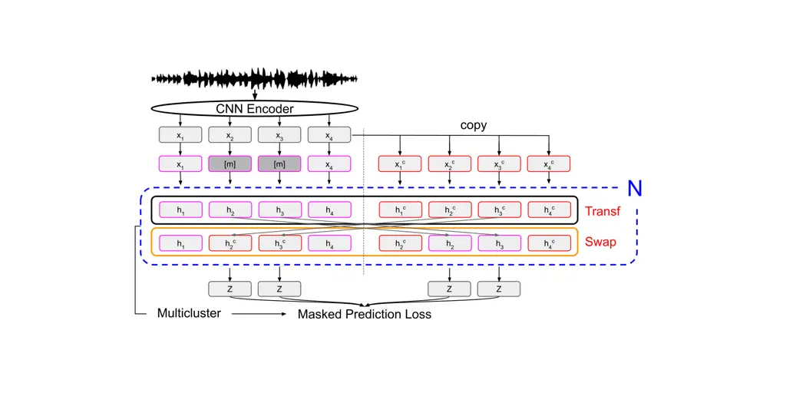
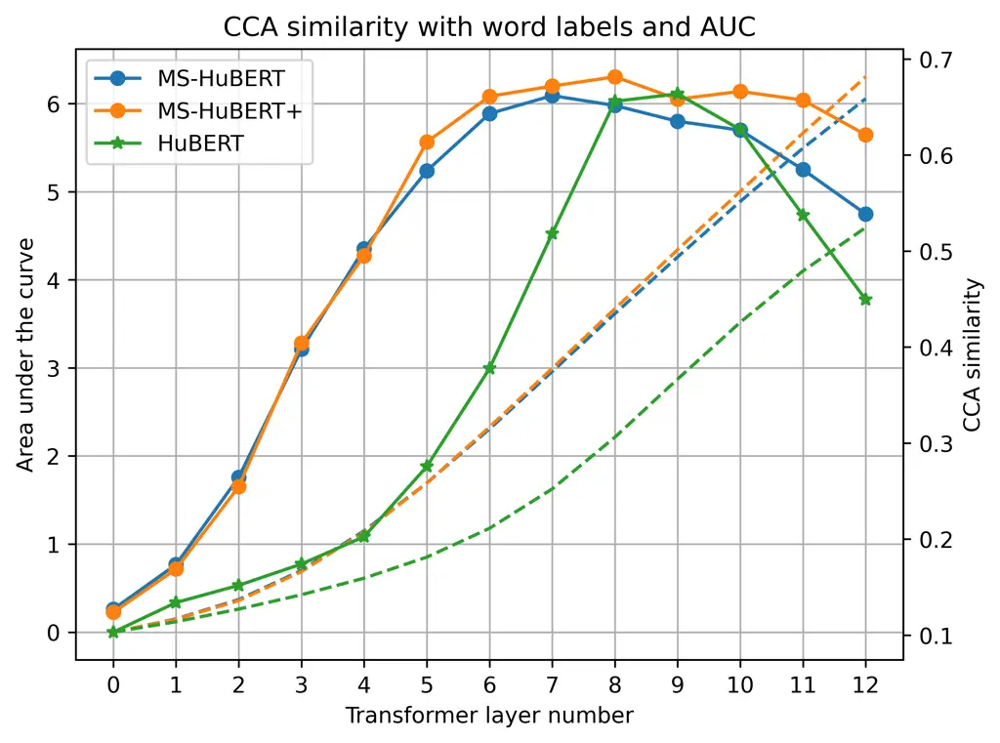
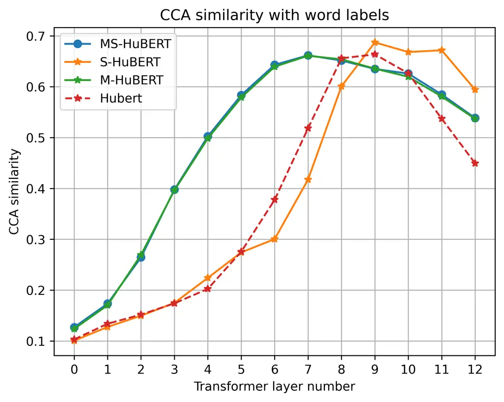
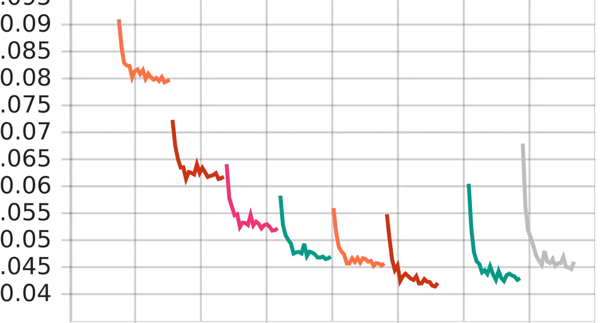
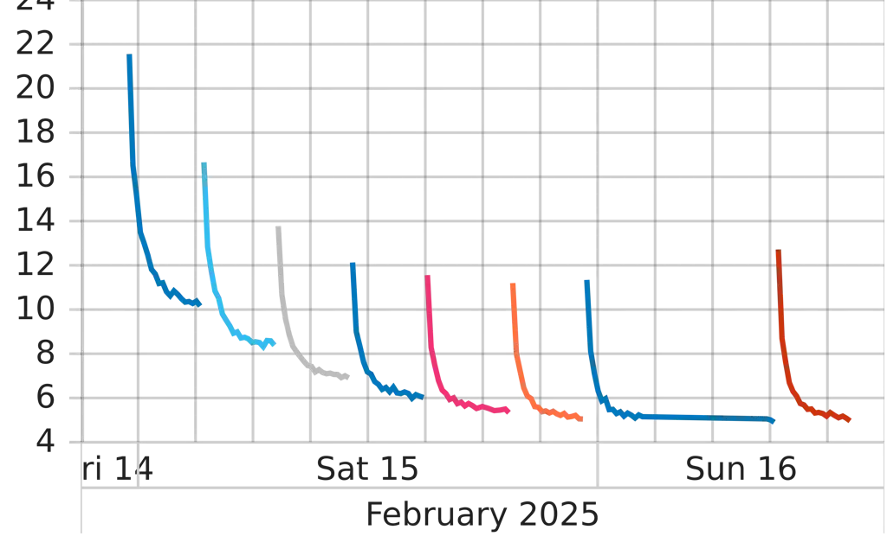
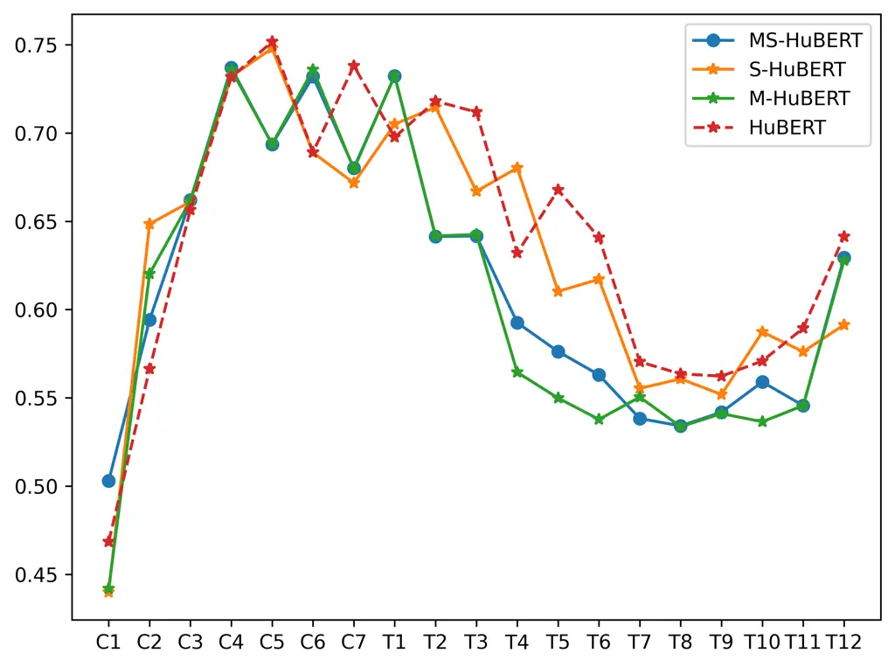
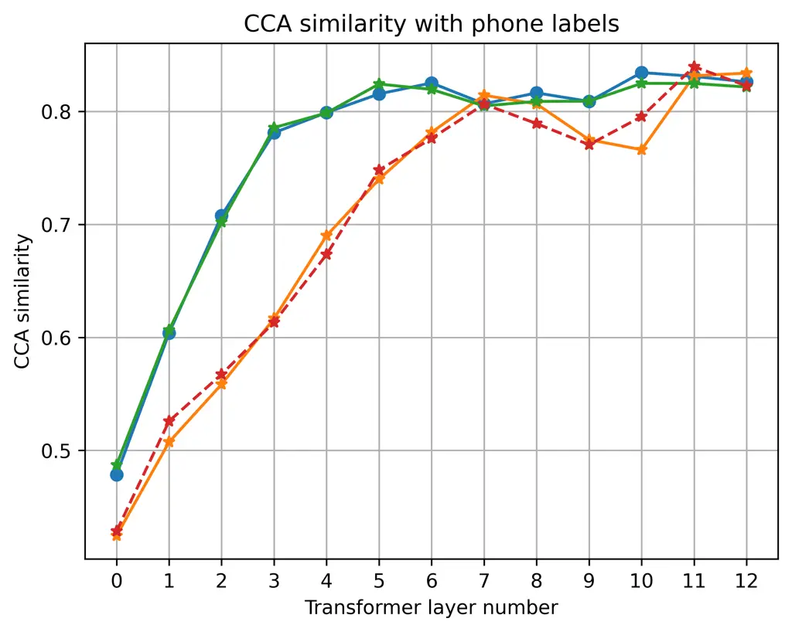

\interspeechfinaltrue

# MS-HuBERT: Mitigating Pre-training and Inference Mismatch in Masked Language Modelling methods for learning Speech Representations

Hemant Yadav    Sunayana Sitaram    Rajiv Ratn Shah

###### Abstract

In recent years, self-supervised pre-training methods have gained
significant traction in learning and encoding high-level information
from speech data. Among these methods, HuBERT has demonstrated
state-of-the-art performance in automatic speech recognition (ASR).
However, HuBERT’s performance lags behind data2vec due to disparities in
pre-training strategies. In this paper, we propose
MulticlusterSwap-HuBERT (MS-HuBERT), which integrates a Swap method to
address pre-training and inference mismatch observed in HuBERT and
incorporates Multicluster masked prediction loss for more effective
utilization of the models capacity. MS-HuBERT, an end-to-end
self-supervised pre-training method for robust speech representation
learning, beat vanilla HuBERT on the ASR Librispeech benchmark by a
large margin. Additionally, we demonstrate that the embeddings obtained
during pre-training encode essential information for improving ASR
performance. The model is available to use in SUPERB repository ¹¹ 1
https://github.com/s3prl/s3prl.

###### keywords

Automatic speech recognition, Multicluster masked prediction loss,
HuBERT

^(†)^(†)address: ¹IIIT Delhi, India  
²Microsoft Research Banglore, India ^(†)^(†)email:
{hemantya,rajivratn}@iiitd.ac.in, sunayana.sitaram@microsoft.com

## 1 Introduction

In the recent years, there has been a significant interest in studying
self-supervised pre-training methods to learn/encode high level
information present in the speech data \[1, 2, 3, 4, 5\]. These SSL
methods utilize the input data itself to learn to encode useful
information, with the choice of pretext task playing a pivotal role in
the encoded information. The most popular pretext task used is masked
predictive coding (MPC) \[6, 1, 7, 8, 9\]. HuBERT \[2\] is one such
model that popularized the masked language modelling (MLM) technique to
learn high-level speech representations from raw audio by achieving SOTA
on the automatic speech recognition (ASR) task. The underlying concept
of HuBERT revolves around iterative pre-training: starting with a raw
audio/pseudo-label pair (x/y), the model undergoes successive training
iterations where the trained model updates the pseudo-labels,
iteratively refining its representations until a predefined stopping
criterion is reached. I However, despite its success, HuBERT falls short
compared to data2vec \[10\] in ASR performance for two primary reasons:
firstly, during pre-training, data2vec accesses the full context to
generate continuous labels, which are updated after each gradient update
step, as opposed to the fixed discrete labels utilized in HuBERT for the
each iteration; and secondly, the output is averaged from multiple
layers for loss calculation.

To bridge this gap, we propose two modifications to the HuBERT
framework. Firstly, we introduce the ”Swap” method to enable full
context access during pre-training, thus addressing the pre-training and
inference mismatch observed in HuBERT and other MLM-based methods by
using both the masked and unmasked views during pre-training. Swap is
motivated by a simple idea, used heavily in the field of computer vision
\[11, 12, 13\]. Where two augmented views of the input are used to learn
a high level representation. Given $`e`$ layers in a encoder, it is a
general practice to add a similarity loss on the output embeddings of
the encoder after each layer, as seen in works using U-net type
architectures \[14, 15, 16\]. In contrast, we propose a Swap method
which swaps the output embeddings, at certain indices, after each layer
of the encoder between the masked and unmasked view of the input. This
is motivated by the simple fact, that the learned model is expected to
generate exactly the same output regardless of the two views.

Secondly, inspired by the work of Yadav et al. \[17\], we adopt a
Multicluster masked prediction loss (MPL) approach. Using multiple
cluster centers, also called multiple resolutions, has been investigated
by \[18, 19, 17\]. In \[19\], the author introduces down-sampling and
up-sampling modules within the transformer encoder after each layer to
facilitate learning features at multiple resolutions. On the other hand,
\[18\] explores parallel and hierarchical variations of HuBERT with
findings indicating the superiority of the hierarchical approach. This
involves training multiple models, each model adds almost same
parameters as the original HuBERT, at various resolutions using CNN as a
down-sampling module. Lastly \[17\] uses the fact that MPL is applied at
multiple layers of encoder at different resolutions. This method does
not introduce any additional parameters to the original HuBERT model,
except the linear layers used for loss calculation which are discarded
after the pre-training. In this work, we adopt this approach and modify
it for our use case for loss calculation.

These changes align HuBERT more closely towards data2vec, primarily
differing in their loss functions for pre-training and other minor
changes. The goal is study how much HuBERT can be improved, with these
changes, on the ASR task.

Figure 1: Proposed MS-HuBERT approach, an end-to-end self supervised
pre-training method to learn robust speech representations. The input
raw audio is passed to a CNN encoder. Two copies of the output is
created i.e., masked and unmasked. Which is passed through the Swap
modified 2nd encoder. Multicluster Masked prediction loss is calculated,
masked indices only, on the output embeddings from different blocks of
the modified 2nd encoder.

Based on these observations. In this work, we propose
MulticlusterSwap-HuBERT (MS-HuBERT) method, which incorporates (i) the
Swap method to address the pre-training and inference mismatch issue, as
the \[MASK\] symbol never appears during the inference, and (ii) the
Multicluster MPL similar to \[17\]. Our contributions are as follows:

1.  1.  We propose MS-HuBERT, an end-to-end self supervised pre-training
        method to learn robust speech representations. It combines the Swap
        method and Multicluster MPL with HuBERT as shown in Figure 1.
2.  2.  We show that MS-HuBERT outperforms the original HuBERT on the ASR
        Librispeech benchmark with a big margin. And matches the performance
        of data2vec in high-resource setting.
3.  3.  We showcase that the embeddings acquired during pre-training encode
        crucial information essential for addressing the ASR task. Thus
        utilizes the model capacity very effectively.

## 2 Method

### 2.1 Background

HuBERT is an iterative pre-training SSL method comprising of two
encoders based on CNN (1st) and transformer (2nd), in that order,
architectures. The CNN encoder serves the dual purpose of down-sampling
the input data. The resulting output is passed, denoted as $`U`$, to the
transformer encoder and its output is used for loss calculation. During
the pre-training stage, raw audio is passed to the CNN encoder and
approximately $`50\%`$ of the output is masked, using the masking token
$`[M]`$ and is subsequently passed to the transformer encoder. The
network is then trained to optimize to output a discrete target sequence
by minimizing the masked prediction loss. The complete details can be
found in the original paper \[2\].

### 2.2 MS-HuBERT

MS-HuBERT augments HuBERT model in two ways (i) the Swap method and (ii)
the Multicluster MPL as shown in Figure 1. Swap method is introduced to
address the pre-training and inference mismatch phase in HuBERT i.e,
during inference the model does not use masking. Swap method modifies
the 2nd encoder of HuBERT, such that the updated model now encounters,
two views of the input, both masked and unmasked inputs during
pre-training. Lastly, our proposed method uses modified Multicluster MPL
as proposed by \[17\], because of its enhanced model capacity
utilization in learning features suitable for the ASR task. These
changes aim to improve the ASR performance, as shown in the Table 1.

#### 2.2.1 Swap

Given a raw audio as an input, of batch of size 1, to the 1st encoder
(CNN), its output is denoted as $`X=x_{1},x_{2},...,x_{t-1},x_{t}`$,
where $`t`$ represents the total number of output tokens. Two views of
$`X`$ are created: (i) masked view, where on average, around 50% of
these tokens are masked, meaning that half of these tokens are replaced
with the $`[m]`$ token, resulting in an updated output
$`X^{m}=x_{1},[m],...,[m],x_{t}`$ (view 1) and (ii) unmasked view, a
duplicate of the original $`X`$, denoted as
$`X^{c}=x_{1}^{c},x_{2}^{c},...,x_{t-1}^{c},x_{t}^{c}`$ (view 2). These
two views are combined, to form a batch of size 2, and is passed to the
2nd encoder.

The second encoder has $`N`$ layers, each composed of a transformer
layer followed by a Swap layer as shown in Figure 1. The transformer
layer is exactly similar to the original HuBERT method. The proposed
Swap method’s function is to swap the outputs, at the masked indices, of
the transformer layer between the two views. This updated output serves
as input to the next block of encoder layer, and the process repeats
till the last layer. For example, the output of the transformer layer is
$`H_{m}=h_{1},h_{2},...,h_{t-1},h_{t}`$ and
$`H^{c}=h_{1}^{c},h_{2}^{c},...,h_{t-1}^{c},h_{t}^{c}`$ for the masked
and unmasked input respectively. The outputs at the masked indices are
now swapped using the swap method i.e., the updated output are
$`H^{m}=h_{1},h_{2}^{c},...,h_{t-1}^{c},h_{t}`$ and
$`H^{c}=h_{1}^{c},h_{2},...,h_{t-1},h_{t}^{c}`$ for the masked and
unmasked input, respectively.

It’s important to note that there is no associated loss with the ”Swap”
layer. This technique indirectly encourages the model to output the same
embeddings irrespective of the masked and unmasked view.

#### 2.2.2 Multicluster MPL

The Multicluster MPL, inspired from \[17\], involves the computation of
masked prediction loss (MPL) across multiple layers of the transformer
encoder, using multiple set of cluster centers as labels. These encoder
layers are selected equidistant in between the last layer and one
intermediate layer. For instance, consider a scenario with three sets of
labels as $`(500,250,100)`$, where the last layer index is 12 and the
intermediate layer index is 8, the multiple layers are $`(12,10,8)`$.

The Multicluster MPL is then formulated as the summation of MPL over
$`a`$, where $`a={(12,500),(10,250),(8,100)}`$ is a dictionary of which
label set to use with which transformer encoder layer ²² 2 In the
original paper $`a`$ would be calculated in reverse order i.e.,
$`{(8,500),(10,250),(12,100)}`$.. MPL is computed over the masked
indices only, as depicted in Figure 1. Furthermore, given the GPU memory
constraints, we randomly drop $`d`$ items from the dictionary $`a`$ for
every forward pass.

$`Multicluster\ loss=\sum_{a}(MPL)`$.

## 3 Experimental Details

For all the experiments, similar to the HuBERT base model configuration
\[2\], the MS-HuBERT model comprises a CNN encoder and 12 encoder
transformer layers consisting of 768-dimensional hidden states and 8
attention heads. There is no large model used for training or comparison
purposes.

Datasets: The ASR Librispeech benchmark dataset \[20\], which is derived
from the LibriVox project, is used for pre-training and supervised
finetuning purposes. It has 3 splits (i) Training, comprising
train-clean-100, train-clean-360, and train-other-500, (ii) Development
including dev-other and dev-clean, and (iii) Testing consists test-other
and test-clean. Each data instance comprises an audio and its
corresponding transcript. For pre-training MS-HuBERT, we use only the
raw audios from the combined training split resulting in a total 960
hours audios. For supervised fine-tuning, three sets of Libri-Light
\[21\]: 1 hour, 10 hour, 100 hour and the full Librispeech 960 hours
dataset is used.

pseudo-labels: Six sets of pseudo-labels with varying numbers of
clusters/resolutions are generated using first iteration HuBERT \[2\].
Initially, a K-means model with 1000 cluster centers is trained using
latent features extracted from the 6th layer of the first iteration
HuBERT base. Subsequently, another K-means model with 500 cluster
centers is trained using the 1000 cluster centers as features obtained
in the prior step. This process is iteratively repeated four times to
train four more K-means models with 250, 125, 50, and 25 cluster centers
(in that order) utilizing the cluster centers extracted from the
previous step. This results in a total of 6 set of pseudo labels used to
calculate the Multicluster MPL.

Pre-training: Unlike HuBERT, MS-HuBERT base incorporates 6
classification heads instead of just 1. This is because of the
Multicluster MPL. This results in a total parameter count of 96.01
million, representing an increment of around 1.25 million parameters
compared to HuBERT. MS-HuBERT is trained for 400,000 iterations on 32
GPUs with a batch size of at most 87.5 seconds of audio per GPU. The
best model checkpoint is determined using the dev-other subset.
Pre-trained models and training configurations will be made available
after the acceptance.

Given the memory constraints and to avoid the out-of-memory error, we
randomly drop 2 clusters, and their respective layer indices, in each
gradient update step. Furthermore, the intermediate layer index is
chosen using the formula : $`0.25*12`$, where $`12`$ is the number of
transformer encoder layers.

Supervised Fine-tuning and inference: We follow the Wav2Vec 2.0 \[1\]
strategy to fine-tune MS-HuBERT to minimize the Connectionist Temporal
Classification \[22\] loss using 8 GPUs. The total batch size is of 200
seconds of audio per GPU and the best model checkpoint is determined by
the lowest Word Error Rate (WER) achieved on the dev-other split. For
inference, 4-gram language model (LM) is used with a beam width of 500
for dev-other, dev-clean and 1500 for test-clean and test-other. We do a
conservative hyper-parameter search for the 1 hour and 10 hour splits
and fixed hyper-parameter are used for the 100 and 960 hours training
splits during fine-tuning. The inference hyper-parameters are searched
with Ax, a Bayesian optimization toolkit ³³ 3
https://github.com/facebook/Ax with a beam-width of 500 using 32 trials.

## 4 Results

|                   |           |           |            |            |
| ----------------- | --------- | --------- | ---------- | ---------- |
| Method            | dev-clean | dev-other | test-clean | test-other |
| 1hr               |           |           |            |            |
| wav2vec 2.0 \[1\] | 5.0       | 10.8      | 5.5        | 11.3       |
| HuBERT \[2\]      | 5.6       | 10.9      | 6.1        | 11.3       |
| WavLM \[9\]       | \-        | \-        | 5.7        | 10.8       |
| data2vec \[10\]   | 4.0       | 8.5       | 4.6        | 9.1        |
| MS-HuBERT         | 5.6       | 10.9      | 5.9        | 11.3       |
| \- Swap           | 5.9       | 11.6      | 6.2        | 12.3       |
| \- Multi          | 5.8       | 11.9      | 6.1        | 12.0       |
| 10hr              |           |           |            |            |
| wav2vec 2.0       | 3.8       | 9.1       | 4.3        | 9.5        |
| HuBERT            | 3.9       | 9.0       | 4.3        | 9.4        |
| WavLM             | \-        | \-        | 4.3        | 9.2        |
| data2vec          | 3.3       | 7.5       | 3.9        | 8.1        |
| MS-HuBERT         | 3.6       | 8.5       | 4.1        | 8.8        |
| \- Swap           | 3.8       | 8.6       | 4.1        | 9.2        |
| \- Multi          | 3.8       | 9.3       | 4.3        | 9.5        |
| 100hr             |           |           |            |            |
| wav2vec 2.0       | 2.7       | 7.9       | 3.4        | 8.0        |
| HuBERT            | 2.7       | 7.8       | 3.4        | 8.1        |
| WavLM             | \-        | \-        | 3.4        | 7.7        |
| data2vec          | 2.2       | 6.4       | 2.8        | 6.8        |
| MS-HuBERT         | 2.4       | 7.1       | 3.0        | 7.2        |
| \- Swap           | 2.6       | 6.9       | 3.1        | 7.4        |
| \- Multi          | 2.7       | 7.9       | 3.2        | 7.9        |
| 960hr             |           |           |            |            |
| wav2vec 2.0       | 2.0       | 5.9       | 2.6        | 6.1        |
| data2vec          | \-        | \-        | \-         | 5.5        |
| MS-HuBERT         | 1.8       | 5.1       | 2.4        | 5.5        |

Table 1: ASR Librispeech benchmark finetuning results using a 4-gram
language model. wav2vec 2.0 and data2vec are not a direct comparison to
MS-HuBERT and is shown only such that the reader has a broader picture.
The readers should ignore these two models until the Discussion section 5.

|                                   |             |      |      |
| --------------------------------- | ----------- | ---- | ---- |
| Method                            | P/F         | PR   | ASR  |
| wav2vec 2.0 \[1\]                 | P           | 5.74 | 6.43 |
| HuBERT \[2\]                      | P           | 5.41 | 6.42 |
| HuBERT + Spin256 \[23\]           | P + F       | 4.39 | 6.34 |
| HuBERT + LASER \[24\]             | P + F (1/3) | 4.61 | 6.18 |
| WavLM \[9\]                       | P           | 4.84 | 6.21 |
| WavLM + Spin256 \[23\]            | P + F       | 4.18 | 6.34 |
| WavLM + LASER \[24\]              | P + F (1/3) | 4.28 | 5.92 |
| WavLM Base + (iter 3) (90k) \[9\] | P           | 3.92 | 5.59 |
| ContentVec \[25\]                 | P + F       | 4.9  | 5.7  |
| data2vec \[10\]                   | P           | 4.69 | 4.94 |
| MR-HuBERT \[19\] (iter 3)         | P           | 4.16 | 5.76 |
| MS-HuBERT                         | P           | 4.42 | 5.60 |
| -Swap                             | P           | 4.37 | 5.68 |
| -Multi                            | P           | 5.0  | 6.48 |
| MS-HuBERT (iter 3)                | P           | 4.17 | 5.32 |
| MS-HuBERT (iter 3) (6 - 11)       | P           | 4.05 | 5.25 |

Table 2: SUPERB fine-tuning results. P and F stand for pre-training and
fine-tuning respectively. 6-11 means using layers only 6,7,8,9,10,11.
For more detailed results using different layers see Section 4.4.

### 4.1 Main Results: Supervised Fine-tuning and Inference

Table 1 presents the outcomes on the Librispeech ASR benchmark, where
MS-HuBERT is compared with two similar approaches, HuBERT and WavLM. It
is evident that MS-HuBERT yields superior results. The margin of
improvement increase and the size of dataset used for fine-tuning has a
direct proportionality. This is a desired property of any training
framework i.e., as the dataset increase the performance should increase.

Notably, upon the removal of the Swap concept, we observed a degradation
in performance, particularly in low-resource settings. This proves that
the Swap method does indeed contribute positively to the performance
gains.

### 4.2 MS-HuBERT as a Feature Extractor

To study the information encoded/learnt at different layers of the
MS-HuBERT model and how it compares to the original HuBERT, we conduct
two experiments: (i) SUPERB benchmark \[26\] and (ii) canonical
correlation analysis (CCA) similarity with word labels \[27, 28\].

SUPERB Benchmark: The SUPERB benchmark is designed to evaluate the
efficacy of a pre-trained model without fine-tuning i.e., using the
frozen encoder as a feature extractor. Specifically, a linear weighted
sum of the output embeddings of all the encoder layers serves as a
feature for solving any particular downstream task. In our study, we aim
to assess the quality of 2nd encoder embeddings, from the MS-HuBERT, for
tackling the speech recognition task. Thus, we employ the ASR and
phoneme-recognition (PR) tasks within the SUPERB benchmark. The
evaluation is on the clean split of the ASR Librispeech benchmark. The
results are reported in Table 2. Clearly MS-HuBERT surpasses HuBERT and
similar models by a significant margin. This shows the model’s
capability in encoding information crucial in solving the ASR and PR
task. Except on the ASR task using data2vec.

Based on the above comparison, we hypothesize, that MPL using pseudo
labels generated from k-means is better suited for PR task than ASR. The
reason might be the clustering algorithm used itself.

Figure 2: Solid lines show the CCA similarity with the word labels.
Dotted lines show the AUC area under the curv for different models.

Figure 3: CCA similarity with the word labels for MS-HuBERT and its
variants. The S-HuBERT curve is similar to WavLM.

CCA Similarity with Word Labels: Following the layer-wise analysis
conducted by Pasad et al. \[27, 28\], we use a modified version of
canonical correlation analysis (CCA). Specifically, a
projection-weighted CCA (PWCCA) \[29\]. The plots are shown in Figure 2.
It is clear that MS-HuBERT significantly enhances the performance of
word-level information across the transformer encoder layers.
Additionally, we compute the area under the curve (AUC) and observe that
it consistently surpasses that of Hubert. This increases the model
capacity utilization compared to HuBERT. We also plot the M-HuBERT
(MS-HuBERT - Swap) to study the effect the of Swap method. We found that
combining Swap with the Multicluster loss slightly increases the AUC
compared to not using it as shown in Figure 3.

|                                   |            |            |
| --------------------------------- | ---------- | ---------- |
| Method                            | test-clean | test-other |
| 1hr                               |            |            |
| WavLM Base + (iter 3) (90k) \[9\] | 5.4        | 9.8        |
| MR-HuBERT \[19\] (iter 3)         | 7.41       | 12.14      |
| Ms-HuBERT                         | 5.9        | 11.3       |
| Ms-HuBERT (iter 3)                | 5.4        | 10.8       |
| 10hr                              |            |            |
| WavLM Base + (iter 3) (90k)       | 4.2        | 8.8        |
| MR-HuBERT \[19\] (iter 3)         | 4.91       | 8.33       |
| Ms-HuBERT                         | 4.1        | 8.8        |
| Ms-HuBERT (iter 3)                | 3.9        | 8.4        |
| 100hr                             |            |            |
| WavLM Base + (iter 3) (90k)       | 2.9        | 6.8        |
| MR-HuBERT \[19\] (iter 3)         | 3.57       | 6.81       |
| Ms-HuBERT                         | 3.0        | 7.1        |
| Ms-HuBERT (iter 3)                | 3.0        | 7.0        |

Table 3: 3rd iteration results using a 4-gram language model. WavLM + is
model trained on 90k hours of dataset with data augmentation and 1
million steps.

| Method             | test-clean | test-other |
| ------------------ | ---------- | ---------- |
| SpeechT5 \[30\]    | 4.4        | 10.4       |
| speech2c \[31\]    | 5.0        | 11.9       |
| MS-HuBERT (iter 3) | 4.2        | 10.2       |

Table 4: No LM. on the 100hr subset. Encoder-fixed. Encoder-decoder
models comparison.

### 4.3 3rd Iteration Models

We compare 3rd iteration MS-HuBERT (iter 3) to the 3rd iteration WavLM
base+ which is trained on 960 and 94,000 hours of dataset respectively.
WavLM is trained for 1 million steps. 3rd iteration MS-HuBERT is trained
using the six set pseudo labels generated from the 7th layer of 2nd
iteration MS-HuBERT. As shown in Table 3, MS-HuBERT (iter 3) achieves
comparable performance to WavLM base +, even though pre-trained using
100 times less data. Which again shows that MS-HuBERT utilizes the model
capacity most effectively.

Table 4 presents our results for an encoder-decoder framework inspired
by Speech2C \[31\]. The encoder remains fixed, while only the decoder is
trained using six hierarchical clusters, each applied sequentially
across the six decoder layers, with fewer clusters assigned to the
initial layer. Notably, MS-HuBERT achieves superior performance.

| Layer no/s | PR             | ASR         |
| ---------- | -------------- | ----------- |
| 6 - 11     | (4.05)         | (5.25)      |
| 5          | 8.41 \[21.05\] | 10.52       |
| 6          | 6.56           | 8.75        |
| 7          | 5.63 \[11.23\] | 7.24        |
| 8          | 5.01           | 6.24        |
| 9          | 4.92 \[7.80\]  | 5.62        |
| 10         | 4.41 (4.36)    | 5.21        |
| 11         | 4.60 \[6.10\]  | 5.04 (4.85) |
| 12         | 4.82           | 5.17        |

Table 5: Evaluation of Individual Layers on the SUPERB Benchmark. PR and
ASR tasks are trained for 20% of the total steps, with results in
circular brackets indicating training for 100% of the total steps.
Results in rectangular brackets are for HuBERT \[32\].

### 4.4 Evaluation of Individual Layers on the SUPERB Benchmark

Rather than computing a weighted average across all layers, we analyze
the performance of using a single layer with a high CCA score,
specifically from layer 5 onward. The results are presented in Table 5
and Figures 4 and 5. In summary, We found that a weighted average yields
the best performance for the PR task, while using a specific layer works
best for the ASR task. Overall depth is important for learning better
representations.

Lastly, using the 8th layer of MS-HuBERT improves over HuBERT, resulting
in 33% less compute of transformer encoder.

Figure 4: PER values are plotted with the x-axis representing layers 5
to 12, ordered from left to right.

Figure 5: WER values on the y-axis should be divided by 100 to obtain
the final WER. The x-axis represents layers from 5 to 12, ordered from
left to right.

## 5 Discussion

In comparison to data2vec \[10\], our performance on the ASR Librispeech
benchmark, as illustrated in Table 1, still falls short, particularly
evident in low resource scenarios. This difference may stem from the
inherent nature of the MLM pre-text task utilizing discrete tokens. For
instance, WER metric for HuBERT and WavLM in a 1-hour setting lag behind
even wav2vec 2.0. However, as the fine-tuning dataset increases, the
performance gap diminishes. When leveraging the entire 960 hours of the
Librispeech dataset, our performance matches that of data2vec. On the
SUPERB benchmark, for the PR task, MS-HuBERT outperforms data2vec and is
comparable in the context of ASR.

Given MS-HuBERT is trained using the pseudo labels generated from the
the first iteration HuBERT, there could be a scope for performance
improvements as is evident from the MS-HuBERT (iter 3). Or the number of
layers used in between the Multicluster MPL may restrict the capacity to
learn higher level embeddings. However, larger models may alleviate this
limitation by offering more layers in between the MPL calculation.

## 6 Conclusion and Future Work

Our results highlight the potential of MS-HuBERT in bridging the
performance gap between HuBERT and data2vec on the ASR Librispeech
benchmark and content based tasks, ASR and PR, on the SUPERB benchmark.
MS-HuBERT is aimed at mitigating the pre-training and inference mismatch
in masked language modeling for learning. Building upon the HuBERT
framework, MS-HuBERT incorporates two key modifications: the Swap
method, enabling full context access during pre-training, and the
Multicluster loss approach for more effective training. Through
empirical evaluation on the ASR Librispeech benchmark, MS-HuBERT
demonstrates significant performance improvements over the original
HuBERT model, achieving state-of-the-art results and matching the
performance of data2vec in high-resource settings. Future research could
explore further enhancements to the MS-HuBERT methodology to avoid
iterative pre-training or improving the quality pseudo labels
altogether. Lastly, scaling the model size is also an open question.

## 7 Limitations

Complexity and Computational Cost: MS-HuBERT introduces additional
complexity to the pre-training process, particularly with the
incorporation of the Swap method and a little overhead when using
Multicluster MPL. This increased complexity may result in higher
computational costs during pre-training only. But during inference,
MS-HuBERT and HuBERT has the same complexity as they share exactly the
same architecture.

## References

- \[1\] A. Baevski, Y. Zhou, A. Mohamed, and M. Auli, “wav2vec 2.0: A
  framework for self-supervised learning of speech representations,”
  _Advances in Neural Information Processing Systems_, vol. 33, pp.
  12 449–12 460, 2020.
- \[2\] W.-N. Hsu, B. Bolte, Y.-H. H. Tsai, K. Lakhotia,
  R. Salakhutdinov, and A. Mohamed, “Hubert: Self-supervised speech
  representation learning by masked prediction of hidden units,”
  _IEEE/ACM Transactions on Audio, Speech, and Language Processing_,
  vol. 29, pp. 3451–3460, 2021.
- \[3\] T. Brown, B. Mann, N. Ryder, M. Subbiah, J. D. Kaplan,
  P. Dhariwal, A. Neelakantan, P. Shyam, G. Sastry, A. Askell _et al._,
  “Language models are few-shot learners,” _Advances in neural
  information processing systems_, vol. 33, pp. 1877–1901, 2020.
- \[4\] Y.-A. Chung, W.-N. Hsu, H. Tang, and J. Glass, “An unsupervised
  autoregressive model for speech representation learning,” _arXiv
  preprint arXiv:1904.03240_, 2019.
- \[5\] A. v. d. Oord, Y. Li, and O. Vinyals, “Representation learning
  with contrastive predictive coding,” _arXiv preprint
  arXiv:1807.03748_, 2018.
- \[6\] S. Schneider, A. Baevski, R. Collobert, and M. Auli, “wav2vec:
  Unsupervised pre-training for speech recognition,” _arXiv preprint
  arXiv:1904.05862_, 2019.
- \[7\] Y.-A. Chung, Y. Zhang, W. Han, C.-C. Chiu, J. Qin, R. Pang, and
  Y. Wu, “W2v-bert: Combining contrastive learning and masked language
  modeling for self-supervised speech pre-training,” in _2021 IEEE
  Automatic Speech Recognition and Understanding Workshop (ASRU)_. IEEE,
  2021, pp. 244–250.
- \[8\] A. Baevski, M. Auli, and A. Mohamed, “Effectiveness of
  self-supervised pre-training for speech recognition,” _arXiv preprint
  arXiv:1911.03912_, 2019.
- \[9\] S. Chen, C. Wang, Z. Chen, Y. Wu, S. Liu, Z. Chen, J. Li,
  N. Kanda, T. Yoshioka, X. Xiao _et al._, “Wavlm: Large-scale
  self-supervised pre-training for full stack speech processing,” _IEEE
  Journal of Selected Topics in Signal Processing_, 2022.
- \[10\] A. Baevski, W.-N. Hsu, Q. Xu, A. Babu, J. Gu, and M. Auli,
  “Data2vec: A general framework for self-supervised learning in speech,
  vision and language,” in _International Conference on Machine
  Learning_. PMLR, 2022, pp. 1298–1312.
- \[11\] T. Chen, S. Kornblith, M. Norouzi, and G. Hinton, “A simple
  framework for contrastive learning of visual representations,” in
  _International conference on machine learning_. PMLR, 2020, pp.
  1597–1607.
- \[12\] K. He, H. Fan, Y. Wu, S. Xie, and R. Girshick, “Momentum
  contrast for unsupervised visual representation learning,” in
  _Proceedings of the IEEE/CVF conference on computer vision and pattern
  recognition_, 2020, pp. 9729–9738.
- \[13\] J.-B. Grill, F. Strub, F. Altché, C. Tallec, P. Richemond,
  E. Buchatskaya, C. Doersch, B. Avila Pires, Z. Guo, M. Gheshlaghi Azar
  _et al._, “Bootstrap your own latent-a new approach to self-supervised
  learning,” _Advances in neural information processing systems_,
  vol. 33, pp. 21 271–21 284, 2020.
- \[14\] O. Ronneberger, P. Fischer, and T. Brox, “U-net: Convolutional
  networks for biomedical image segmentation,” in _Medical Image
  Computing and Computer-Assisted Intervention–MICCAI 2015: 18th
  International Conference, Munich, Germany, October 5-9, 2015,
  Proceedings, Part III 18_. Springer, 2015, pp. 234–241.
- \[15\] A. Riahi and É. Plourde, “Single channel speech enhancement
  using u-net spiking neural networks,” in _2023 IEEE Canadian
  Conference on Electrical and Computer Engineering (CCECE)_. IEEE,
  2023, pp. 111–116.
- \[16\] C. Macartney and T. Weyde, “Improved speech enhancement with
  the wave-u-net,” _arXiv preprint arXiv:1811.11307_, 2018.
- \[17\] H. Yadav, S. Sitaram, and R. R. Shah, “Analysing the masked
  predictive coding training criterion for pre-training a speech
  representation model,” in _ICASSP 2023-2023 IEEE International
  Conference on Acoustics, Speech and Signal Processing (ICASSP)_. IEEE,
  2023, pp. 1–5.
- \[18\] J. Shi, Y. Tang, H. Inaguma, H. GOng, J. Pino, and S. Watanabe,
  “Exploration on hubert with multiple resolutions,” _arXiv preprint
  arXiv:2306.01084_, 2023.
- \[19\] J. Shi, H. Inaguma, X. Ma, I. Kulikov, and A. Sun,
  “Multi-resolution hubert: Multi-resolution speech self-supervised
  learning with masked unit prediction,” _arXiv preprint
  arXiv:2310.02720_, 2023.
- \[20\] V. Panayotov, G. Chen, D. Povey, and S. Khudanpur,
  “Librispeech: an asr corpus based on public domain audio books,” in
  _2015 IEEE international conference on acoustics, speech and signal
  processing (ICASSP)_. IEEE, 2015, pp. 5206–5210.
- \[21\] J. Kahn, M. Rivière, W. Zheng, E. Kharitonov, Q. Xu, P. E.
  Mazaré, J. Karadayi, V. Liptchinsky, R. Collobert, C. Fuegen,
  T. Likhomanenko, G. Synnaeve, A. Joulin, A. Mohamed, and E. Dupoux,
  “Libri-light: A benchmark for asr with limited or no supervision,” in
  _ICASSP 2020 - 2020 IEEE International Conference on Acoustics, Speech
  and Signal Processing (ICASSP)_, 2020, pp. 7669–7673,
  [https://github.com/facebookresearch/libri-light](https://github.com/facebookresearch/libri-light).
- \[22\] A. Graves, S. Fernández, F. Gomez, and J. Schmidhuber,
  “Connectionist temporal classification: labelling unsegmented sequence
  data with recurrent neural networks,” in _Proceedings of the 23rd
  international conference on Machine learning_, 2006, pp. 369–376.
- \[23\] H.-J. Chang, A. H. Liu, and J. Glass, “Self-supervised
  fine-tuning for improved content representations by speaker-invariant
  clustering,” _arXiv preprint arXiv:2305.11072_, 2023.
- \[24\] A. Meghanani and T. Hain, “Laser: Learning by aligning
  self-supervised representations of speech for improving
  content-related tasks,” _arXiv preprint arXiv:2406.09153_, 2024.
- \[25\] K. Qian, Y. Zhang, H. Gao, J. Ni, C.-I. Lai, D. Cox,
  M. Hasegawa-Johnson, and S. Chang, “Contentvec: An improved
  self-supervised speech representation by disentangling speakers,” in
  _International Conference on Machine Learning_. PMLR, 2022, pp.
  18 003–18 017.
- \[26\] S.-w. Yang, P.-H. Chi, Y.-S. Chuang, C.-I. J. Lai, K. Lakhotia,
  Y. Y. Lin, A. T. Liu, J. Shi, X. Chang, G.-T. Lin _et al._, “Superb:
  Speech processing universal performance benchmark,” _arXiv preprint
  arXiv:2105.01051_, 2021.
- \[27\] A. Pasad, B. Shi, and K. Livescu, “Comparative layer-wise
  analysis of self-supervised speech models,” in _ICASSP 2023-2023 IEEE
  International Conference on Acoustics, Speech and Signal Processing
  (ICASSP)_. IEEE, 2023, pp. 1–5.
- \[28\] A. Pasad, J.-C. Chou, and K. Livescu, “Layer-wise analysis of a
  self-supervised speech representation model,” in _2021 IEEE Automatic
  Speech Recognition and Understanding Workshop (ASRU)_. IEEE, 2021, pp.
  914–921.
- \[29\] A. Morcos, M. Raghu, and S. Bengio, “Insights on
  representational similarity in neural networks with canonical
  correlation,” _Advances in neural information processing systems_,
  vol. 31, 2018.
- \[30\] J. Ao, R. Wang, L. Zhou, C. Wang, S. Ren, Y. Wu, S. Liu, T. Ko,
  Q. Li, Y. Zhang _et al._, “Speecht5: Unified-modal encoder-decoder
  pre-training for spoken language processing,” _arXiv preprint
  arXiv:2110.07205_, 2021.
- \[31\] C. Gao, G. Cheng, R. Yang, H. Zhu, P. Zhang, and Y. Yan,
  “Pre-training transformer decoder for end-to-end asr model with
  unpaired text data,” in _ICASSP 2021-2021 IEEE International
  Conference on Acoustics, Speech and Signal Processing (ICASSP)_. IEEE,
  2021, pp. 6543–6547.
- \[32\] S.-w. Yang, H.-J. Chang, Z. Huang, A. T. Liu, C.-I. Lai, H. Wu,
  J. Shi, X. Chang, H.-S. Tsai, W.-C. Huang _et al._, “A large-scale
  evaluation of speech foundation models,” _IEEE/ACM Transactions on
  Audio, Speech, and Language Processing_, 2024.

## Appendix A appendix

### A.1 CCA

Figure 6, 7 and, 8 shows the plots for CCA similarity for different
settings similar to the original work in \[28, 27\].

### A.2 MS-HuBERT components

Table 6 shows the ablation results for different components of MS-HUBERT
(iter 2).

Figure 6: CCA similarity with the mel

Figure 7: CCA similarity with the phone

Figure 8: CCA similarity with the word

|           |        |           |            |
| --------- | ------ | --------- | ---------- |
| Method    | LM     | test-lean | test-other |
| 1hr       |        |           |            |
| MS-HuBERT | None   | 18.4      | 24.8       |
| M-HuBERT  | None   | 19.5      | 26.3       |
| S-HuBERT  | None   | 21.3      | 28.2       |
| MS-HuBERT | 4-gram | 5.9       | 11.3       |
| M-HuBERT  | 4-gram | 6.2       | 12.3       |
| S-HuBERT  | 4-gram | 6.1       | 12.2       |
| 10hr      |        |           |            |
| MS-HuBERT | None   | 8.2       | 14.7       |
| M-HuBERT  | None   | 8.5       | 14.9       |
| S-HuBERT  | None   | 9.7       | 17.0       |
| MS-HuBERT | 4-gram | 4.1       | 8.8        |
| M-HuBERT  | 4-gram | 4.1       | 9.2        |
| S-HuBERT  | 4-gram | 4.3       | 9.5        |
| 100hr     |        |           |            |
| MS-HuBERT | None   | 4.6       | 10.6       |
| M-HuBERT  | None   | 4.8       | 10.9       |
| S-HuBERT  | None   | 5.5       | 12.5       |
| MS-HuBERT | 4-gram | 3.0       | 7.2        |
| M-HuBERT  | 4-gram | 3.1       | 7.4        |
| S-HuBERT  | 4-gram | 3.2       | 7.9        |

Table 6: ASR ablation
