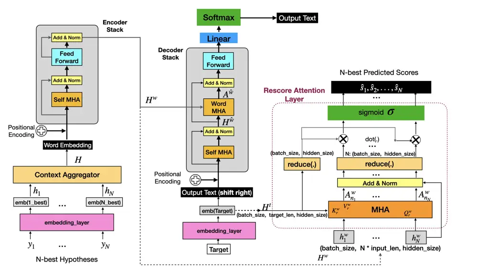

# Transformer-based Model for ASR N-Best Rescoring and Rewriting

Iwen E. Kang, Christophe Van Gysel, Man-Hung Siu

###### Abstract

Voice assistants increasingly use on-device Automatic Speech Recognition
(ASR) to ensure speed and privacy. However, due to resource constraints
on the device, queries pertaining to complex information domains often
require further processing by a search engine. For such applications, we
propose a novel Transformer based model capable of rescoring and
rewriting, by exploring full context of the N-best hypotheses in
parallel. We also propose a new discriminative sequence training
objective that can work well for both rescore and rewrite tasks. We show
that our Rescore+Rewrite model outperforms the Rescore-only baseline,
and achieves up to an average $`8.6`$% relative Word Error Rate (WER)
reduction over the ASR system by itself.

###### keywords

N-best deliberation, transformers, speech recognition, voice assistants

^(†)^(†)address: Apple^(†)^(†)email: {ekang, cvangysel,
manhung_siu}@apple.com

## 1 Introduction

ASR converts user spoken audio into word sequences and often represents
the word sequence as a ranked list of N hypotheses, known as the N-best
list. The top hypothesis (1-best) is used as the recognized input for
downstream tasks. To ensure speed and privacy, we can implement the ASR
recognizer as an on-device component, keeping user-spoken audio within
the device. On device ASR imposes constraints on model size that still
works well for personal tasks like “call mom” or “set alarm”, however,
it can be sub-optimal for entity-rich queries in knowledge domains \[1,
2\], such as “play Yesterday by Beatles”. Given these knowledge queries
are eventually processed in the server \[3, 4, 5\], ASR can also be
improved downstream by either re-ranking the N-best hypotheses, i.e.,
“rescoring”, or overriding the 1-best with its predicted corrections,
i.e., “rewriting”.

Conventional N-best rescoring often involves re-ranking based on a per
hypothesis “score” computed individually \[6, 7, 8, 9, 10, 11\]. This
approach typically interpolates with ASR acoustic scores for the
second-pass rescoring. An interesting alternative is to explore the
entire N-best list as input context for rescoring, and rewriting 1-best
by leveraging joint N-best information.

Using a transformer model for N-best rescoring has been proposed by
others. Guo et al. \[7\] proposed an LSTM-based Spell-Correction (SC)
model to use N-best text data for error corrections. Hrinchuk et al.
\[12\] proposed a vanilla Transformer model that operates similarly to
neural machine translation (NMT) \[13\], specifically focused on
rewriting without rescoring. Xu et al. \[9\] trained a BERT-based \[14\]
rescoring model with Minimum Word Error Rate (MWER) \[15\] loss. Pandey
et al. \[16\] proposed a rescoring model with attention to lattices. Hu
et al. \[17\], Hu et al. \[18\] proposed a Transformer-based rescoring
model, which achieves better accuracy and latency than their previous
LSTM-based counterpart \[19\]. Their “Transformer Deliberation Rescorer”
model attends to both encoded audio and text hypotheses. Variani et al.
\[20\], Variani et al. \[21\] proposed an N-best rescoring method using
acoustic representations as inputs for optimizing ASR interpolation
weights, and showed that Oracle Prediction, an edit-distance based
adaptive weight optimization method, outperforms the non-adaptive
weights.

Contrary to the related work above, which focused exclusively on either
rescoring or rewriting task, in this paper, we propose a model capable
of both rescoring and rewriting ASR hypotheses. This new model takes the
full context of the N-best hypotheses in parallel. Our proposed
Transformer Rescore Attention (TRA) model is illustrated in Figure 1. We
also propose a new discriminative sequence training objective, Matching
Query Similarity Distribution (MQSD), that can work well with
cross-entropy based training to perform both rescore and rewrite tasks.
Our work is different from \[20, 21\]: a) Their model requires acoustic
representations as inputs, while our model does NOT. Our TRA can operate
as a standalone model outside of on-device ASR, the acoustic
representations never leaves the device hence preserving privacy. b) Our
MQSD performs effectively for both rescoring/rewriting tasks, whereas
their Oracle Prediction is solely utilized to train a model for
optimizing adaptive weight interpolations.

We show that: (1) our TRA model trained with MQSD works well for both
rescore and rewrite tasks; (2) As a standalone model, our
Rescore+Rewrite model outperforms the Rescore-only baseline model; (3)
As an external LM model for ASR weights interpolation, our TRA model
also outperforms the 4-gram LM \[6\].

## 2 Models

In certain cases, due to privacy \[22\] or design limitations, the
on-device ASR acoustic embeddings may not be available to downstream
tasks that operate in the cloud. For example, the on-device encoder
state has a length proportional to the audio, and hence, may result in a
payload that would incur too much latency to transmit over the network.
Hence, we choose to simplify the “Transformer Deliberation Rescorer”
\[17\] by removing acoustic components from the model, and re-implement
it as our baseline “N-best Transformer Rescorer” (TR) model.

### 2.1 Transformer Rescorer (TR) Model

Our baseline TR model is trained using a combined cross-entropy and MWER
loss function. The MWER tries to minimize the expected number of word
errors over the N-best hypotheses expressed in this equation:

```math
L_{MWER}(x,y^{*})=\sum\limits_{y_{i}\in B\left(x,N\right)}p\left(y_{i}|x\right)\cdot\left(W\left(y_{i},y^{*}\right)-E_{N}\right)
```

where $`B(x,N)=\{y_{1},...,y_{N}\}`$ is the set of N-best hypotheses for
the input query $`x`$, $`W(y_{i},y^{*})`$ is the number of word errors
in a hypothesis $`y_{i}`$ relative to the ground-truth sequence
$`y^{*}`$, $`p(y_{i}|x)`$ is the normalized probability for hypothesis
$`y_{i}`$ given input query $`x`$ such that
$`\sum_{y_{i}}p(y_{i}|x)=1`$, $`E_{N}`$ is the averaged word errors over
the N-best hypotheses. This MWER loss is added to the Transformer
per-token cross-entropy loss $`L_{ce}`$ (see equation 3 in \[15\]) with
an interpolation hyper-parameter $`\alpha`$ as the combined loss:
$`L=L_{MWER}+\alpha L_{ce}`$.

At inference time, the normalized probability for each N-best hypothesis
is generated in teacher-forcing mode \[19, 17\], i.e., the Transformer’s
decoder is used to process each hypothesis (without beam-search) to
generate its sequence loss. This loss can be converted into a
probability using the $`sigmoid`$ function, and then re-normalized over
the probability sum of the N-best hypotheses.

### 2.2 Transformer Rescore Attention (TRA) Model

We propose a Transformer Rescore Attention (TRA) model by enhancing the
TR baseline model with a Rescore-Attention Layer, see Figure 1.



Figure 1: Transformer Rescore Attention (TRA) model. During training:
the Target, N-best and query similarity scores are fed to TRA, the
Target sequence is shifted right as input for the decoder stack to
compute per-token cross-entropy loss, the query similarity scores are
used as input against the N-best predicted scores to compute MQSD loss.
At inference time: the predicted “Target” is used to compute the N-best
predicted scores for rescoring, the predicted output text can also be
used to override the 1-best if its sequence loss exceeds a threshold.

The input of the model is a list of N-best hypotheses
$`\{y_{1},...,y_{N}\}`$ from the ASR recognizer. Each hypothesis
$`y_{i}`$ is tokenized into a sequence of subword tokens. The
Transformer encoder and decoder stacks are similar to \[23\]. The
embedding*layer maps each hypothesis $`y*{i}`$ to a high dimensional
hidden embedding space $`h*{i}\in R^{l\times d}`$, where $`l`$ is the
input sequence length and $`d`$ is the dimension of the hidden space.
Each hypothesis from the same input query is padded to the same sequence
length, and input sequences of the same N-best list size are grouped
into the same batch during model training. The Context Aggregator
concatenates the N-best hypotheses along the sequence-length dimension,
denoted as $`\left[h*{1};...;h*{N}\right]`$ with a concatenated sequence
length $`l*{N}=N\*l`$. The concatenated N-best hidden vector
$`H=\left[h_{1};...;h_{N}\right]`$ is fed to the Transformer’s encoder
stack to generate the N-best encoded vector
$`H^{w}=\left[h^{w}_{1};...;h^{w}_{N}\right]\in R^{l*{N}\times d}`$,
which in turn is fed to the Transformer’s decoder stack to generate the
cross-attention $`A^{\hat{w}}`$ between the decoder’s self-attention
output $`H^{\hat{w}}`$ and the N-best encoder output $`H^{w}`$. Similar
to \[23\], this cross-attentions $`A^{\hat{w}}`$ is normalized and fed
to a Feed-Forward layer followed by a Linear layer, then, a Softmax
layer to predict the next target token over a set of vocabulary, until
it reaches a special end-of-sequence token eos. We denote the predicted
target sequence as $`\hat{w}=\{\hat{w*{1}},...,\hat{w\_{t}}\}`$, and the
target sequence length as $`|\hat{w}|`$.

### 2.3 Rescore Attention Layer

This layer takes two inputs: the target embedding’s output
$`H^{t}\in R^{|\hat{w}|\times d}`$ and the N-best encoded vector
$`H^{w}`$. We first compute the N-best rescore cross-attention
$`A_{n}^{w}`$ between $`H^{w}`$ and the target’s encoded output
$`H^{t}`$ by:

```math
A_{n}^{w}=\text{Softmax}\left(\frac{\left(H^{w}Q_{r}^{w}\right)\left(H^{t}K_{r}^{w}\right)^{T}}{\sqrt{d}}\right)\left(H^{t}V_{r}^{w}\right)
```

where $`Q_{r}^{w}`$, $`K_{r}^{w}`$, $`V_{r}^{w}\in R^{d\times d}`$ are
the parameters of the Rescore-Attention Layer. This N-best rescore
cross-attention $`A_{n}^{w}`$ $`\in R^{l_{N}\times d}`$ provides a
high-dimensional similarity measurement for each N-best hypothesis
against the target sequence in different embedding subspaces via
Multi-Head Attentions (MHA) \[23\]. This N-best rescore cross-attention
is a concatenation of N attention blocks, i.e.,
$`A_{n}^{w}=\left[A^{w}_{n_{1}};...;A^{w}_{n_{N}}\right]\in R^{l_{N}\times d}`$,
indexed by $`i=1,...,N`$, where each attention block
$`A_{n_{i}}^{w}\in R^{l\times d}`$ is the $`i`$-th partition of of
$`A_{n}^{w}`$ in the sequence-length dimension with length $`l`$. The
output of this MHA layer is normalized and then fed to a reduce sum
function reduce($`\cdot`$), reduce by summing along the sequence-length
dimension $`l`$, denoted by
$`\sum_{l}(X_{l,\cdot}\in R^{l\times\cdot})`$. The same reduce function
is applied to the target sequence. Finally, a scalar $`\hat{s}_{i}`$ for
each N-best hypothesis $`\{\hat{s}_{1},...,\hat{s}_{N}\}`$ can be
computed using $`dot(\cdot)`$ products and sigmoid function $`\sigma`$
by:

```math
\hat{s}_{i}=\sigma\left(\sum_{l}(H^{t})_{l,\cdot}\cdot\sum_{l}\left(A^{w}_{n_{i}}\right)_{l,\cdot}\right).
```

### 2.4 Matching Query Similarity Distribution (MQSD) Loss

We propose an alternative to the MWER loss function that can work well
with cross-entropy (CE) based training for models to perform both
rescore and rewrite tasks. The Matching Query Similarity Distribution
(MQSD) loss is the cross-entropy loss of predicted scores over N-best
hypotheses, denoted by $`L_{MQSD}(x,y^{*})`$ as:

```math
-\sum\limits_{y_{i}\in B(x,N)}\left(\text{Softmax}\left(s_{i}\right)\cdot\log\left(\text{Softmax}\left(\hat{s}_{i}\right)\right)\right)
```

where $`B(x,N)=\{y_{1},...,y_{N}\}`$ is the set of N-best hypotheses for
the input query $`x`$; $`s_{i}=(1-wer(y_{i},y^{*}))^{2}`$ is the query
similarity score for hypothesis $`y_{i}`$, $`wer(y_{i},y^{*})`$ is the
word error rate of hypothesis $`y_{i}`$ relative to the ground-truth
sequence $`y^{*}`$, capped at 1.0; $`\hat{s}_{i}`$ is the predicted
query similarity score for hypothesis $`y_{i}`$. The query similarity
score is a similarity indicator between an N-best hypothesis and the
target query. The score is in the range \[0, 1\], where higher score
means higher similarity in edit distance and lower word error rate. Our
MQSD loss is different from MWER: The MWER training minimizes the
expected word errors over the N-best hypotheses through normalized
N-best probabilities, while the goal of MQSD loss is to mimic the N-best
query similarity scores distribution in the ground-truth through
predicted scores.

We train TRA model with a combined objective: minimizing the
Transformer’s cross-entropy loss $`L_{ce}`$ for the target token
sequence and the cross-entropy loss $`L_{MQSD}`$ for the N-best scores,
with a hyper-parameter $`\lambda`$ for interpolation:
$`L=L_{MQSD}+\lambda L_{ce}`$.

## 3 Experimental Setup

### 3.1 ASR system

Our on-device ASR system uses a word-piece Conformer following \[24\]
with wordpiece ouptuts and an external word-based LM trained with a
large text corpus. Our decoder uses a similar strategy to \[25\] with an
additional rescoring step \[26, 27\]. All of our experiments operate on
top of the N-best (with $`N\leq 10`$) list generated by the ASR system.

### 3.2 Training and evaluation data

#### 3.2.1 Training data

We train domain expert models by mixing a large (95%) synthetic
in-domain (music) training set with a small (5%) all-domain annotated
training set. The 1.8M annotated queries are sampled anonymously from
opted-in Voice Assistant (VA) queries across all domains and consist of
text/audio pairs. The 36M synthetic queries are obtained by enumerating
in-domain entity data feeds with query templates, similar to \[28\].
While the 4-gram LM (§3.3.2) is trained directly on the query texts, the
Transformer models (§3.3.1) require ASR N-bests lists for training. We
obtain N-best lists by decoding audio using our ASR system (§3.1). For
the 36M synthetic queries, we generate audio using Text-to-Speech (TTS).

#### 3.2.2 Evaluation sets

|            |         |            |                   |
| ---------- | ------- | ---------- | ----------------- |
| Collection | Sub-set | \# queries | avg. query length |
| VA-2022    | All     | 8,035      | 5.8               |
|            | Music   | 975        | 5.1               |
| VA-2023    | All     | 11,998     | 6.0               |
|            | Music   | 1,100      | 5.9               |

Table 1: Overview of the evaluation sets.

We evaluate our models on randomly sampled, representative, and
anonymized VA queries sampled across two years (2022 and 2023) where we
compare across the entire population and the sub-population
corresponding to music queries. Table 1 shows an overview of our
evaluation sets.

### 3.3 Rescoring/rewriting methods under comparison

#### 3.3.1 Transformers

We use a 16k vocabulary SentencePiece (SP) \[29\] to tokenize text input
into a sequence of subword tokens. The SP model was trained on all
queries in our training set (§3.2.1). Both TR and TRA models have 4
layers in the encoder stack, and 1 layer in the decoding stack, with MHA
with 8 heads, hidden layers dimension 512, and 2048 units in the
feed-forward layer for a total of 25M model parameters. The TRA model
has an additional 1M parameters in the Rescore Attention Layer which
includes an 8-headed MHA.

Training schedule. Both TR and TRA models are trained up to 300,000
steps on an 8-GPUs machine, with batch size as large as possible (up to
30,000 tokens) per replica. We adopt an early-stopping criteria on a
development-set (dev-set) to avoid over-fitting, the dev-set is a small
split (about 1%) from the annotated training set, and is evaluated every
5,000 steps. Similar to \[23\], we use the same parameters for Adam
optimizer and custom learning rate schedule, except with a lager value
of 8000 for warmup*steps. We also use the same dropout ratio 0.1 for
both Attention and ReLu layer. The baseline TR model is trained using
the combined MWER objective $`L=L*{MWER}+\alpha L*{ce}`$, following
\[17\] we set $`\alpha=0.01`$ in our experiments. Similarly, our TRA
model is trained using the combined MQSD objective:
$`L=L*{MQSD}+\lambda L\_{ce}`$. We set $`\lambda=0.01`$ in our
experiments.

Hyper-parameters. There are 2 tunable parameters in our TRA model: 1.
$`threshold_{R}`$, which triggers N-best rescoring only when the model’s
confidence score (log-probability) surpasses this threshold; 2.
$`threshold_{W}`$, which dictates the conditions under which to rewrite
the 1-best with the model’s predicted text, applied when its sequence
loss exceeds this threshold. The thresholds are optimized by performing
a grid-search over a range of possible values on a held-out dev-set,
such that we have the lowest WER on in-domain dev-set while WER on the
all-domain dev-set is not degraded. We searched for the best
$`threshold_{R}`$ first and then constraint the search for
$`threshold_{W}`$ $`>`$ $`threshold_{R}`$. Following this approach we
set $`\text{threshold}_{R}{}=-1.0`$ and $`\text{threshold}_{W}{}=-0.5`$
in our TRA model. Same thresholds are applied to all TRA experiments. To
avoid overriding 1-best when the N-best context is insufficient, we do
not perform rewrite when $`N=1`$. In our experiments, we present
evaluation results for our TRA model in two configurations: with
rewriting enabled (TRA-RW, rescore-rewrite) and without rewriting
(TRA-R, rescore-only).

#### 3.3.2 4-gram LM with Katz back-off

In addition to the Transformer models (§3.3.1) trained on entire N-best
lists, we also train a 4-gram back-off LM \[6\] on the reference text in
our training set (§3.2.1). 3- and 4-grams with a count less than 2 are
discarded. Good-Turing discounting is applied to 2-, 3- and 4-grams that
have a frequency of 7 or less. The 4-gram LM is combined with signals
extracted from the ASR decoding process using linear interpolation to
score the candidates in the N-best list, as described in the next
section (§3.4). The advantage of the 4-gram LM is that it allows for
estimation without needing to synthesize audio or run speech recognition
to generate N-best lists, unlike what is required for Transformer models
in §3.3.1. However, the downside of this approach is that the 4-gram LM
cannot utilize N-best list context to correct the unique error
distribution of the ASR system.

### 3.4 Interpolation with ASR decoding signals

In our second experiment set, we will combine the per-hypothesis signal
from each of the models described above with the scores assigned by the
ASR system (§3.1): the log-likelihood for the hypothesis given the input
audio provided by the Conformer, and the log-likelihood of the
hypothesis text under the on-device external LM \[30, Ch. 16\].

For each of the rescore-only models above (TR, TRA-R, 4-gram LM), we
include their log-probability as an additional signal. However, TRA-RW
may generate a new hypothesis not part of the N-best list, and lacking
corresponding ASR scores. In that case, the ASR-provided scores are
assumed to be zero, and we introduce a fourth signal, lmCost+, equal to
the Transformer’s generative log-likelihood. Following Zhang et al.
\[4\], the various signals are combined through a linear combination,
and we learn the weights via Powell’s method \[31\] against a separate
development set sampled independently from the same population and with
similar characteristics as the VA-2023 evaluation set.

## 4 Results

### 4.1 TR & TRA

|        |         |       |         |       |         |       |
| ------ | ------- | ----- | ------- | ----- | ------- | ----- |
|        | VA-2022 |       | VA-2023 |       | Average |       |
| Method | All     | Music | All     | Music | All     | Music |
| ASR    | 3.57    | 4.70  | 5.78    | 5.52  | 4.68    | 5.11  |
| TR     | 3.61    | 4.50  | 5.78    | 5.18  | 4.70    | 4.84  |
| TRA-R  | 3.52    | 4.28  | 5.72    | 5.29  | 4.62    | 4.79  |
| TRA-RW | 3.51    | 3.98  | 5.72    | 5.36  | 4.62    | 4.67  |

Table 2: WER evaluation (§3.2.2) of the Transformer models (§3.3.1) with
ASR N-best input. The average column depicts the arithmetic mean across
the evaluation sets.

Table 2 shows the results of the Transformer models operating directly
on the ASR N-best list texts. While TR and TRA-R perform rescoring of
the ASR N-best list only, TRA-RW also has the ability to overwrite the
1-best. We find that TRA (both R and RW) perform best on the entire
query population. However, for the music sub-population, results are
more inconsistent and while TRA-RW performs best on VA-2022 (music), the
TR model without the rescoring attention layer seems to perform better
on the music subset of VA-2023 (closely followed by TRA-R). We suspect
that this may be due to a drift in music entities popularity or user
behavior, since the training data was generated in 2022, and hence, the
TRA-RW model may be over-correcting to entities that are no longer as
relevant in 2023. However, if we look at the average across both test
sets, we see that both TRA-R/RW perform well on the entire query
population, and TRA-RW provides a significant improvement ($`8.6\%`$
rel.) on the music sub-collection. This is most likely due to good
coverage of the in-domain music synthetic queries (95%) in our training
set.

### 4.2 Interpolation with ASR signals

|                            | VA-2023           |                   |
| -------------------------- | ----------------- | ----------------- |
| Method                     | All               | Music             |
| ASR                        | 5.78              | 5.52              |
| 4-gram LM +$`W^{*}_{lm4}`$ | 5.57 $`(3.63\%)`$ | 5.26 $`(4.71\%)`$ |
| TR +$`W^{*}_{tr}`$         | 5.57 $`(3.63\%)`$ | 5.32 $`(3.62\%)`$ |
| TRA-R +$`W^{*}_{tra}`$     | 5.47 $`(5.36\%)`$ | 5.15 $`(6.70\%)`$ |
| TRA-RW +$`W^{*}_{tra+}`$   | 5.46 $`(5.53\%)`$ | 5.23 $`(5.25\%)`$ |

Table 3: WER on VA-2023 (§3.2.2) by combining ASR decoding signals with
signals from the rescoring/rewriting methods (§3.3) using a linear model
(§3.4), where +$`W^{*}`$ denotes models with optimized weights. The
relative improvement in WER over the ASR system is listed between
brackets.

Table 3 shows the results when interpolating the log-probability
provided by the various models with per-hypothesis signals extracted
from the ASR decoding process (§3.4). The incorporation of an additional
external LM (§3.3.2), which constitutes a traditional rescoring
approach, yields an additional improvement of $`{\sim}4\%`$. However,
compared to the 4-gram LM, the TRA models perform better and yield an
relative improvement between $`5.3\%`$ and $`6.7\%`$ on the full
collection, and the music sub-collection, resp. This leads us to the
following conclusion: while training a LM independently of the ASR
system’s error distribution is computationally simpler, as it eliminates
the need for TTS and ASR decoding to generate N-best lists. However,
training a Transformer using the ASR system’s N-best list yields
superior improvements because the Transformer approach can (a) make use
of additional contextual information available in the N-best list (e.g.,
the number of hypotheses, segments that differ across hypotheses), and
(b) learn to correct error patterns made by the specific ASR system it
was trained against.

## 5 Conclusions

In this paper, we proposed a novel Transformer-based model capable of
rescoring and rewriting ASR hypotheses. We also propose a new
discriminative sequence training objective MQSD that can work well with
cross-entropy based training for both rescore and rewrite tasks. Given
an N-best list as text input, our TRA model outputs both predicted text
and query similarity scores for N-best re-ranking. The predicted text
can be used to override the top hypothesis if its sequence loss exceeds
a threshold. As a standalone model, our TRA achieves up to $`8.6\%`$ WER
improvement over the ASR baseline on in-domain test sets. As an external
LM for ASR interpolations, our TRA model also outperforms the 4-gram LM
and the baseline TR model.  
Acknowledgments. We thank Russ Webb, Tatiana Likhomanenko, Tim Ng,
Thiago Fraga-Silva, and the anonymous reviewers for their comments and
feedback.

## References

- \[1\] E. Pusateri, C. Van Gysel, R. Botros, S. Badaskar, M. Hannemann,
  Y. Oualil, and I. Oparin, “Connecting and Comparing Language Model
  Interpolation Techniques,” _Interspeech_, 2019.
- \[2\] S. Gondala, L. Verwimp, E. Pusateri, M. Tsagkias, and
  C. Van Gysel, “Error-driven pruning of language models for virtual
  assistants,” in _ICASSP_. IEEE, 2021.
- \[3\] C. Van Gysel, “Modeling spoken information queries for virtual
  assistants: Open problems, challenges and opportunities,” in
  _SIGIR_, 2023.
- \[4\] Y. Zhang, S. Gondala, T. Fraga-Silva, and C. Van Gysel,
  “Server-side rescoring of spoken entity-centric knowledge queries for
  virtual assistants,” _International Journal of Speech
  Technology_, 2024.
- \[5\] S. Sannigrahi, T. Fraga-Silva, Y. Oualil, and C. Van Gysel,
  “Synthetic query generation using large language models for virtual
  assistants,” in _SIGIR_, 2024.
- \[6\] S. M. Katz, “Estimation of probabilities from sparse data for
  the language model component of a speech recognizer,” _ASSP_,
  vol. 35, 1987.
- \[7\] J. Guo, T. N. Sainath, and R. J. Weiss, “A spelling correction
  model for end-to-end speech recognition,” _ICASSP_, 2019.
- \[8\] H. Huang and F. Peng, “An empirical study of efficient asr
  rescoring with transformers,” in _ICASSP_, 2020.
- \[9\] L. Xu, Y. Gu, J. Kolehmainen, H. Khan, A. Gandhe, A. Rastrow,
  A. Stolcke, and I. Bulyko, “RescoreBERT: Discriminative speech
  recognition rescoring with BERT,” in _ICASSP_. IEEE, 2022.
- \[10\] J. Shin, Y. Lee, and K. Jung, “Effective sentence scoring
  method using BERT for speech recognition,” in _Asian Conference on
  Machine Learning_. PMLR, 2019.
- \[11\] D. Fohr and I. Illina, “BERT-based semantic model for rescoring
  n-best speech recognition list,” in _Interspeech_, 2021.
- \[12\] O. Hrinchuk, M. Popova, and B. Ginsburg, “Correction of
  automatic speech recognition with transformer sequence-to-sequence
  model,” in _ICASSP_. IEEE, 2020.
- \[13\] I. Sutskever, O. Vinyals, and Q. V. Le, “Sequence to sequence
  learning with neural networks,” _NeurIPS_, vol. 27, 2014.
- \[14\] J. D. M.-W. C. Kenton and L. K. Toutanova, “Bert: Pre-training
  of deep bidirectional transformers for language understanding,” in
  _NAACL-HLT_, vol. 1, 2019.
- \[15\] R. Prabhavalkar, T. N. Sainath, Y. Wu, P. Nguyen, Z. Chen,
  C.-C. Chiu, and A. Kannan, “Minimum word error rate training for
  attention-based sequence-to-sequence models,” in _ICASSP_. IEEE, 2018.
- \[16\] P. Pandey, S. D. Torres, A. O. Bayer, A. Gandhe, and
  V. Leutnant, “Lattention: Lattice-attention in ASR rescoring,” in
  _ICASSP_. IEEE, 2022.
- \[17\] K. Hu, R. Pang, T. N. Sainath, and T. Strohman, “Transformer
  based deliberation for two-pass speech recognition,” in
  _SLT_. IEEE, 2021.
- \[18\] K. Hu, T. N. Sainath, Y. He, R. Prabhavalkar, T. Strohman,
  S. Mavandadi, and W. Wang, “Improving deliberation by text-only and
  semi-supervised training,” in _Interspeech_, 2022.
- \[19\] T. N. Sainath, R. Pang, D. Rybach, Y. He, R. Prabhavalkar,
  W. Li, M. Visontai, Q. Liang, T. Strohman, Y. Wu _et al._, “Two-pass
  end-to-end speech recognition,” _Interspeech_, 2019.
- \[20\] E. Variani, T. Chen, J. Apfel, B. Ramabhadran, S. Lee, and
  P. Moreno, “Neural oracle search on n-best hypotheses,” in _ICASSP_,
  2020, pp. 7824–7828.
- \[21\] E. Variani, M. Riley, D. Rybach, C. Allauzen, T. Chen, and
  B. Ramabhadran, “On weight interpolation of the hybrid autoregressive
  transducer model,” in _Interspeech_, 2022.
- \[22\] L. Comanducci, P. Bestagini, M. Tagliasacchi, A. Sarti, and
  S. Tubaro, “Reconstructing Speech From CNN Embeddings,” _IEEE Signal
  Processing Letters_, vol. 28, 2021.
- \[23\] A. Vaswani, N. Shazeer, N. Parmar, J. Uszkoreit, L. Jones,
  A. N. Gomez, Ł. Kaiser, and I. Polosukhin, “Attention is all you
  need,” _NeurIPS_, 2017.
- \[24\] Z. Yao, D. Wu, X. Wang, B. Zhang, F. Yu, C. Yang, Z. Peng,
  X. Chen, L. Xie, and X. Lei, “Wenet: Production oriented streaming and
  non-streaming end-to-end speech recognition toolkit,” in
  _Interspeech_, 2021.
- \[25\] Y. Miao, M. Gowayyed, and F. Metze, “Eesen: End-to-end speech
  recognition using deep rnn models and wfst-based decoding,” in
  _ASRU_, 2015.
- \[26\] H. J. Dolfing and I. L. Hetherington, “Incremental language
  models for speech recognition using finite-state transducers,” in
  _ASRU_, 2001.
- \[27\] Z. Lei, M. Xu, S. Han, L. Liu, Z. Huang, T. Ng, Y. Zhang,
  E. Pusateri, M. Hannemann, Y. Deng _et al._, “Acoustic model fusion
  for end-to-end speech recognition,” in _ASRU_, 2023.
- \[28\] C. Van Gysel, M. Hannemann, E. Pusateri, Y. Oualil, and
  I. Oparin, “Space-efficient representation of entity-centric query
  language models,” in _Interspeech_, 2022.
- \[29\] T. Kudo and J. Richardson, “SentencePiece: A simple and
  language independent subword tokenizer and detokenizer for Neural Text
  Processing,” _EMNLP_, 2018.
- \[30\] D. Jurafsky and J. H. Martin, _Speech and Language Processing,
  3rd edition (February 4, 2024 draft)_. Prentice Hall, 2023.
- \[31\] M. J. D. Powell, “An efficient method for finding the minimum
  of a function of several variables without calculating derivatives,”
  _The Computer Journal_, vol. 7, no. 2, pp. 155–162, 1964.
