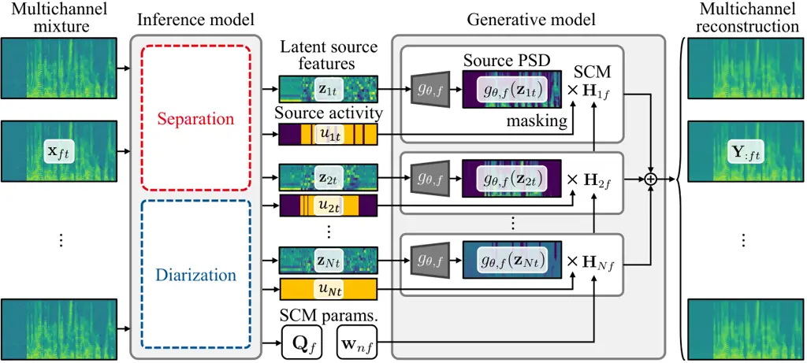
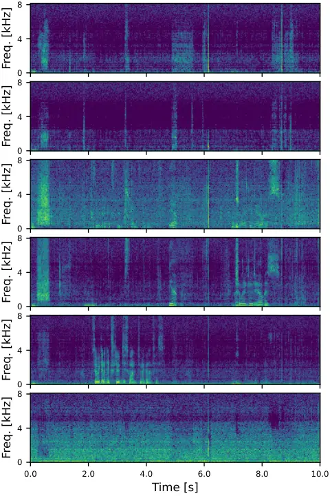
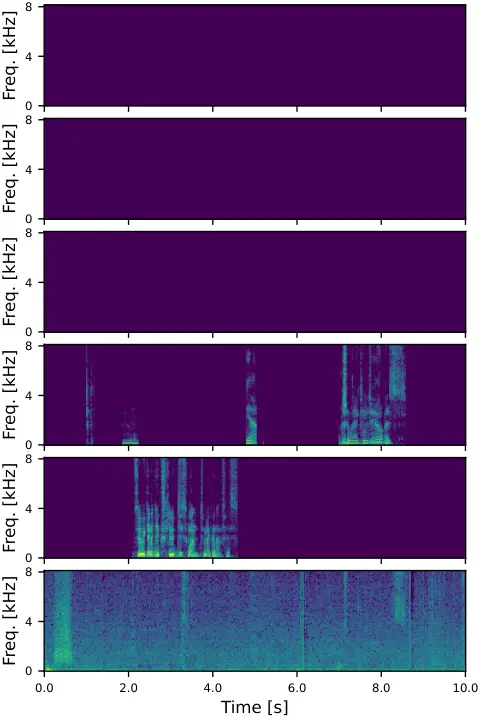

iliation=1\]YoshiakiBando iliation=1\]TomohikoNakamura
iliation=2\]ShinjiWatanabe

# Neural Blind Source Separation and Diarization for Distant Speech Recognition

###### Abstract

This paper presents a neural method for distant speech recognition (DSR)
that jointly separates and diarizes speech mixtures without supervision
by isolated signals. A standard separation method for multi-talker DSR
is a statistical multichannel method called guided source separation
(GSS). While GSS does not require signal-level supervision, it relies on
speaker diarization results to handle unknown numbers of active
speakers. To overcome this limitation, we introduce and train a neural
inference model in a weakly-supervised manner, employing the objective
function of a statistical separation method. This training requires only
multichannel mixtures and their temporal annotations of speaker
activities. In contrast to GSS, the trained model can jointly separate
and diarize speech mixtures without any auxiliary information. The
experiments with the AMI corpus show that our method outperforms GSS
with oracle diarization results regarding word error rates. The code is
available online.

###### keywords

distant speech recognition, neural blind source separation, speech
diarization

^(†)^(†)address: ¹National Institute of Advanced Science and Technology
(AIST), Japan  
²Carnegie Mellon University, USA ^(†)^(†)email: {y.bando,
tomohiko-nakamura}@aist.go.jp, swatanab@andrew.cmu.edu

## 1 Introduction

Speech separation and enhancement are essential functions for
multi-talker distant speech recognition (DSR) from noisy mixture
recordings \[1, 2, 3, 4, 5, 6, 7\]. As represented by teleconference
systems and conversational robots, speech signals are often recorded by
microphones located at distance from the speakers. Such recordings are
thus often contaminated by other speakers’ utterances and environmental
noise, which significantly degrade the recognition performance \[1, 2,
3\]. This calls for speech separation methods that can handle unknown
and dynamically changing numbers of active speakers in diverse noisy
environments.

Blind source separation (BSS) has widely been utilized in DSR because
sufficient and matched-domain training data of isolated signals are
often unavailable for conversational recordings \[8, 9, 10, 11, 12\].
The guided source separation (GSS) \[8, 9\], for example, estimates
time-frequency (TF) masks for active speakers based on a complex angular
central Gaussian mixture model (cACGMM) \[13\]. One drawback of the
cACGMM is its performance limitation due to the sparse assumption that
each TF bin contains only one source. To overcome this limitation,
full-rank spatial covariance analysis (FCA) \[14, 15\] and its
extensions \[10, 16\] have been investigated by assuming each TF bin as
the sum of all the sources. FCA has further been extended for
unsupervised training of a neural separation model by maximizing its
log-marginal likelihood \[17, 18\]. This method, called neural FCA, was
reported to outperform GSS and existing BSS methods.

Most of the BSS methods, including GSS and neural FCA, assume that the
number of sound sources is known in advance. Performing BSS with an
incorrect number of sources can cause the under- or over-separation
problem. GSS \[8\] solves this problem by masking source activities with
speaker diarization results provided in advance. This approach, however,
may often fall into sub-optimal solutions because the speaker
diarization and separation are in a chicken-and-egg relationship \[7,
6\]. A supervised neural model, called end-to-end neural diarization and
source separation (EEND-SS) \[19\], thus has been proposed to jointly
separate and diarize speech mixtures in a unified network architecture.
This method, however, requires oracle isolated signals to train source
separation, which constrains its applicability to multi-talker DSR
systems. For example, in the CHiME-7 DSR challenge \[4\], no participant
was able to make supervised neural separation to work because of the
domain mismatch.

In this paper, we propose a weakly-supervised method to perform joint
speech separation and diarization by a multitask learning of
unsupervised separation and supervised diarization (Fig. 1). We take
advantage of the BSS techniques that separate speech signals utilizing
the spatial information of multichannel mixtures. Specifically, the
unsupervised separation is trained based on the objective function of
the neural FCA. The supervised diarization is, on the other hand,
trained to minimize the binary cross entropy as in the EEND-SS. Since
there is a permutation ambiguity between the estimated sources and
oracle activations, we solve this problem by utilizing permutation
invariant training (PIT) \[19\]. Once the network is trained, it can
perform its inference only with multichannel mixtures unlike the
conventional BSS methods.



Figure 1: The overview of our joint separation and diarization.

The main contribution of this study is to solve speech separation and
diarization by taking full advantage of the statistical and neural
frameworks. While the speech separation has been actively solved by
using the unsupervised BSS techniques, the diarization has been solved
by the supervised neural training. We combine these statistical and
neural frameworks into a unified inference model with neural BSS
training. We demonstrate that such a compound architecture can be
successfully trained from real audio mixtures of the AMI corpus. The
experimental results show that our method outperforms GSS with the
oracle speaker activities regarding word error rates (WERs). The
diarization error rate (DER), in addition, is significantly improved
from that for signals separated by the original neural FCA.

## 2 Background

This section describes the formulation of BSS and introduces the neural
FCA, which is extended to the proposed joint source separation and
diarization.

### 2.1 Blind source separation

The typical BSS method assumes that an $`M`$-channel mixture signal
$`\mathbf{x}_{ft}\in\mathbb{C}^{M}`$ is a sum of $`N`$ source signals
$`{s}_{nft}\in\mathbb{C}`$ in the short-time Fourier transform (STFT)
domain:

```math
\displaystyle\mathbf{x}_{ft}=\sum_{n=1}^{N}\mathbf{a}_{nf}{s}_{nft}, \tag{1}
```

where $`\mathbf{a}_{nf}\in\mathbb{C}^{M}`$ is the steering vector for
source $`n`$, and $`t=1,\ldots,T`$ and $`f=1,\ldots,F`$ represent the
time and frequency indices, respectively. Each source signal
$`{s}_{nft}`$ is assumed to follow a complex zero-mean Gaussian
distribution with a power spectrum density (PSD)
$`{\lambda}_{nft}\in\mathbb{R}_{+}`$ as follows:

```math
\displaystyle{s}_{nft}\sim\mathcal{N}_{\mathbb{C}}\left({0},{{\lambda}_{nft}}\right). \tag{2}
```

By marginalizing $`{s}_{nft}`$ from Eqs. (1) and (2), the following
multivariate Gaussian likelihood is obtained:

```math
\displaystyle\mathbf{x}_{ft}\sim\mathcal{N}_{\mathbb{C}}\left({\bm{0}},{\sum_{n=1}^{N}{\lambda}_{nft}\mathbf{H}_{nf}}\right), \tag{3}
```

where
$`\mathbf{H}_{nf}=\mathbf{a}_{nf}\mathbf{a}_{nf}^{\mathsf{H}}\in\mathbb{S}_{+}^{M\times M}`$
is the spatial covariance matrix (SCM) of source $`n`$ at frequency
$`f`$. This model is known to be robust against diffuse noise and small
source movements by allowing the full-rankness of the SCMs \[14, 20\].

Since the inference of the full-rank SCMs is computationally demanding,
its reduction has been investigated \[14, 15, 13, 16, 21\]. The cACGMM
and GSS, for example, reduce the computational cost by assuming that
each TF bin of Eq. (3) has only one of all the sources¹¹ 1 Eq. (3) with
this assumption and the cACGMM are identical in their maximum likelihood
estimation \[13\].. In contrast, joint diagonalization (JD) \[16, 21\]
was proposed to reduce the cost while maintaining that each TF bin is
the sum of all the sources. The JD assumes that the SCM
$`\mathbf{H}_{nf}`$ is diagonalized by
$`\mathbf{Q}_{f}\in\mathbb{C}^{M\times M}`$ common for all the sources:

```math
\displaystyle\mathbf{H}_{nf}=\mathbf{Q}_{f}^{-1}\mathrm{diag}(\mathbf{w}_{nf})\mathbf{Q}_{f}^{-\mathsf{H}}, \tag{4}
```

where $`\mathbf{w}_{nf}\in\mathbb{R}_{+}^{M}`$ is a diagonal coefficient
for source $`n`$. The parameters of
$`\mathbf{Q}\triangleq\{\mathbf{Q}_{f}\}_{f=1}^{F}`$ and
$`\mathbf{{W}}\triangleq\{\mathbf{w}_{nf}\}_{n,f=1}^{N,F}`$ are
efficiently estimated by the iterative source steering (ISS)
algorithm \[22, 16\]. The separation performance with the JD SCMs was
reported to be comparable to that of the full-rank SCMs \[16\].

Another important factor for BSS is how to represent the source PSDs
$`{\lambda}_{nft}`$ precisely. A promising approach is deep spectral
modeling based on variational autoencoders (VAEs) \[23, 18, 24, 25\].
This model typically introduces $`D`$-dimensional latent source features
$`\mathbf{z}_{nt}\in\mathbb{R}^{D}`$ to generate the PSD
$`{\lambda}_{nft}`$ with a deep neural network (DNN)
$`g_{\theta,f}:\mathbb{R}^{D}\rightarrow\mathbb{R}_{+}`$ as follows:

```math
\displaystyle{\lambda}_{nft}=g_{\theta,f}(\mathbf{z}_{nt}), \tag{5}
```

where $`\theta`$ represents the model parameters of $`g_{\theta,f}`$.
The latent features $`\mathbf{z}_{nt}`$ are supposed to represent
spectral characteristics (e.g., pitches and envelopes). This model is
trained as a decoder of a VAE for isolated signals by assuming that
$`\mathbf{z}_{nt}`$ follows the standard Gaussian distribution:

```math
\displaystyle\mathbf{z}_{nt}\sim\mathcal{N}\left({\bm{0}},{{\bf I}}\right). \tag{6}
```

After training, the sources are separated from a mixture by estimating
$`\mathbf{z}_{nt}`$ to maximize the observation likelihood of Eq. (3).

### 2.2 Neural full-rank spatial covariance analysis

Neural FCA has been proposed to train the deep spectral model and its
inference (separation) model only from multichannel mixtures \[26\]. The
inference model $`h_{\phi}`$ is introduced to estimate latent source
features $`\mathbf{{Z}}\triangleq\{\mathbf{z}_{nt}\}_{n,t=1}^{N,T}`$ in
Eq. (5) from a multichannel mixture
$`\mathbf{{X}}\triangleq\{\mathbf{x}_{ft}\}_{f,t=1}^{F,T}`$ in Eq. (1)
as a posterior distribution $`q_{\phi}(\mathbf{{Z}}\mid\mathbf{{X}})`$:

```math
\displaystyle q_{\phi}(\mathbf{{Z}}\mid\mathbf{{X}})\leftarrow h_{\phi}(\mathbf{{X}}), \tag{7}
```

where $`\phi`$ represents the network parameters. The generative and
inference models are jointly trained to maximize an evidence lower bound
(ELBO) derived from Eqs. (3), (5), and (6):

```math
\displaystyle\mathcal{L}^{\mathrm{(sep)}} \displaystyle=\mathbb{E}_{q_{\phi}}[\log p_{\theta}(\mathbf{{X}}\mid\mathbf{{Z}},\mathbf{H})]-
```

```math
\displaystyle\hskip 71.13188pt\mathcal{D}_{\mathrm{KL}}[q_{\phi}(\mathbf{{Z}}\mid\mathbf{{X}})\mid p(\mathbf{{Z}})], \tag{8}
```

where $`\mathbb{E}_{q_{\phi}}[\cdot]`$ is the expectation by
$`q_{\phi}`$, and $`\mathcal{D}_{\mathrm{KL}}[p\mid q]`$ represents the
Kullback-Leibler (KL) divergence between $`p`$ and $`q`$. The SCM
$`\mathbf{H}_{nf}`$ is obtained by an expectation-maximization (EM)
algorithm \[14, 18\]. This method can be considered as a large VAE for
multichannel mixture signals, in which the decoder is defined by the
multichannel generative model of Eq. (3).

One relevant work to our study is weakly-supervised (WS) neural FCA for
a front-end system of DSR \[17\]. To handle the dynamically changing
number of active speakers, this method introduces the source activity
mask $`{u}_{nt}\in\{0,1\}`$ in a similar way to GSS. The inference model
$`h_{\phi}`$ is extended from Eq. (7) to utilize the mask $`{u}_{nt}`$
as a condition and estimate the correct number of latent source
features:

```math
\displaystyle q_{\phi}(\mathbf{{Z}}\mid\mathbf{{X}},\mathbf{{U}})\leftarrow h_{\phi}(\mathbf{{X}},\mathbf{{U}}). \tag{9}
```

While this method was reported to outperform the GSS in the CHiME-6
corpus, it assumes the mask $`{u}_{nt}`$ to be known in advance. Our
study aims to remove this limitation to perform the inference only with
multichannel mixture signals.

Figure 2: The inference model of neural FastFCA, which employs the
hybrid architecture proposed in \[27\].

Another relevant work called neural FastFCA \[26\] introduces the JD
(Eq. (4)) to reduce the computational cost. The inference model
$`h_{\phi}`$ is extended from Eq. (7) to estimate the diagonalizer
$`\mathbf{Q}`$ and diagonal elements $`\mathbf{{W}}`$ in addition to
$`q_{\phi}(\mathbf{{Z}}\mid\mathbf{{X}})`$:

```math
\displaystyle\left\{\mathbf{Q},\mathbf{{W}},q_{\phi}(\mathbf{{Z}}\mid\mathbf{{X}})\right\}\leftarrow h_{\phi}(\mathbf{{X}}). \tag{10}
```

As illustrated in Fig. 2, this inference model is designed to
efficiently estimate these parameters by alternately performing the ISS
algorithm and DNN inference \[27\]. The neural FastFCA was reported to
significantly reduce the inference time from that of the neural FCA
without performance degradation \[26\].

## 3 Joint Speech Separation and Diarization Based on Neural FastFCA

The proposed method performs joint separation and diarization by taking
a full advantage of neural FastFCA. Our method, called neural FCA with
speaker activity (FCASA), is an extension of the neural FastFCA in
Eq. (10) to estimate the time-varying number of active speakers in
addition to the separation parameters.

### 3.1 Generative model of multichannel mixture signals

To handle the unknown and time-varying number of active speakers, we
assume $`N`$ in Eq. (1) as a possible maximum number of sources and
introduce the speaker activity $`{u}_{nt}\in\{0,1\}`$ as:

```math
\displaystyle\mathbf{x}_{ft}=\sum_{n=1}^{N}{u}_{nt}\mathbf{a}_{nf}{s}_{nft}. \tag{11}
```

The mask is estimated by an inference model (detailed in the next
section) unlike the existing GSS and WS neural FCA. As in the neural
FastFCA, we also introduce the JD SCMs (Eq. (4)). The resulting
likelihood function is derived as follows:

```math
\displaystyle\mathbf{x}_{ft}\sim\mathcal{N}_{\mathbb{C}}\left({\bm{0}},{\mathbf{Q}_{f}^{-1}\left\{\sum_{n=1}^{N}\mathrm{diag}\left(\mathbf{\tilde{y}}_{nft}\right)\right\}\mathbf{Q}_{f}^{-\mathsf{H}}}\right), \tag{12}
```

where
$`\mathbf{\tilde{y}}_{nft}\triangleq{u}_{nt}g_{\theta,f}(\mathbf{z}_{nt})\mathbf{w}_{nf}\in\mathbb{R}_{+}^{M}`$
is the source PSD in the diagonalized space
$`\mathbf{Q}_{f}\mathbf{x}_{ft}`$.

### 3.2 Inference model

We design an inference model $`h_{\phi}`$ to jointly separate and
diarize an input multichannel mixture. Specifically, this model
$`h_{\phi}`$ outputs the posterior distributions of the source features
$`\mathbf{{Z}}`$ and the speaker activity $`{u}_{nt}`$ as well as the JD
parameters of $`\mathbf{Q}`$ and $`\mathbf{{W}}`$:

```math
\displaystyle\left\{\mathbf{Q},\mathbf{{W}},q_{\phi}(\mathbf{{Z}}\mid\mathbf{{X}}),q_{\phi}(\mathbf{{U}}\mid\mathbf{{X}})\right\}\leftarrow h_{\phi}(\mathbf{{X}}). \tag{13}
```

The posterior distributions $`q_{\phi}`$ are defined by network outputs
$`\mu_{\phi,ntd}\in\mathbb{R}`$,
$`\sigma^{2}_{\phi,ntd}\in\mathbb{R}_{+}`$, and
$`\eta_{\phi,nt}\in[0,1]`$ as follows:

```math
\displaystyle q_{\phi}(\mathbf{{Z}}\mid\mathbf{{X}}) \displaystyle\triangleq\prod_{n,t,d=1}^{N,T,D}\mathcal{N}\left({{z}_{ntd}\bigm|\mu_{\phi,ntd}},{\sigma^{2}_{\phi,ntd}}\right), \tag{14}
```

```math
\displaystyle q_{\phi}(\mathbf{{U}}\mid\mathbf{{X}}) \displaystyle\triangleq\prod_{n,t=1}^{N,T}\mathrm{Bernoulli}\left({{u}_{nt}\bigm|\eta_{\phi,nt}}\right), \tag{15}
```

At the inference phase, the source signals are separated by a
multichannel Wiener filter \[16, 26\] using $`\mathbf{Q}_{f}`$,
$`\mathbf{w}_{nf}`$, and $`\mu_{\phi,ntd}`$. The diarization results are
obtained as temporal speech activities by thresholding
$`\eta_{\phi,nt}`$. Note that we have not explicitly defined the prior
distribution for $`{u}_{nt}`$ because its posterior is trained as an
empirical distribution in a supervised manner.

While the inference model (Fig. 2) of the original neural FastFCA
utilizes a UNet-like architecture \[28\], we utilize the
resource-efficient (RE)-SepFormer \[29\] to handle the long-term
dependencies of speech activities. Since the original RE-SepFormer is
designed for monaural separation, we introduce the
transform-average-concatenate (TAC) \[30\] models for the inter-channel
communication of the channel-wise inference. The TAC modules are
inserted to the middles of RE-SepFormer blocks.

### 3.3 Training without isolated source signals

We train the inference model $`h_{\phi}`$ (Eq. (13)) and generative
model $`g_{\theta}`$ (Eq. (5)) in a multi-task learning of unsupervised
separation and supervised diarization. We use multichannel mixture
signals $`\mathbf{{X}}`$ and their temporal annotations of speaker
activities $`\mathbf{{U}}`$ for the training data. The objective
function to be maximized is the weighted sum of the functions for
unsupervised separation $`\mathcal{L}^{\mathrm{(sep)}}`$ and supervised
diarization $`\mathcal{L}^{\mathrm{(diar)}}`$ as follows:

```math
\displaystyle\mathcal{L} \displaystyle=\frac{1}{TF}\mathcal{L}^{\mathrm{(sep)}}+\gamma\frac{1}{TN}\mathcal{L}^{\mathrm{(diar)}}, \tag{16}
```

where $`\gamma\in\mathbb{R}_{+}`$ is a scaling hyperparameter.

The separation term $`\mathcal{L}^{\mathrm{(sep)}}`$ trains the
estimation of $`\mathbf{Q}`$, $`\mathbf{{W}}`$, and
$`q_{\phi}(\mathbf{{Z}}\mid\mathbf{{X}})`$ by using the ELBO of the
neural FastFCA:

```math
\displaystyle\mathcal{L}^{\mathrm{(sep)}} \displaystyle=\mathbb{E}_{q_{\theta}}[\log p_{\theta}(\mathbf{{X}}\mid\mathbf{{U}},\mathbf{{Z}},\mathbf{{W}},\mathbf{Q})]
```

```math
\displaystyle\hskip 71.13188pt-\mathcal{D}_{\mathrm{KL}}[q_{\phi}(\mathbf{{Z}}\mid\mathbf{{X}})\mid p(\mathbf{{Z}})]. \tag{17}
```

The first term of this ELBO is calculated as follows:

```math
\displaystyle\mathbb{E}_{p_{\theta}}[\log p_{\theta}\left(\mathbf{{X}}\mid\mathbf{{U}},\mathbf{{Z}},\mathbf{{W}},\mathbf{Q}\right)] \displaystyle\approx T\sum_{f=1}^{F}\log\left|\mathbf{Q}_{f}\mathbf{Q}_{f}^{\mathsf{H}}\right|
```

```math
\displaystyle\hskip-56.9055pt-\sum_{f,t,m=1}^{F,T,M}\left\{\log{\tilde{y}}_{:ftm}+\frac{|{\tilde{x}}_{ftm}|^{2}}{{\tilde{y}}_{:ftm}}\right\}, \tag{18}
```

where
$`\mathbf{\tilde{x}}_{ft}\triangleq[{\tilde{x}}_{ft1},\ldots,{\tilde{x}}_{ftM}]^{T}=\mathbf{Q}_{f}\mathbf{x}_{ft}\in\mathbb{C}^{M}`$
represents the diagonalized (quasi-separated) observation, and
$`{\tilde{y}}_{:ftm}\triangleq\sum_{n}{\tilde{y}}_{nftm}`$ is calculated
from the sample of $`q_{\phi}(\mathbf{{Z}}\mid\mathbf{{X}})`$. We use
the oracle speaker activities for the mask $`{u}_{nt}`$ as teacher
forcing. The maximization of this objective function is equivalent to
the maximization of the log-marginal likelihood
$`\log p_{\theta}(\mathbf{{X}}\mid\mathbf{{U}},\mathbf{{W}},\mathbf{Q})`$.
For $`q_{\phi}(\mathbf{{Z}}\mid\mathbf{{X}})`$, it also corresponds to
the minimization of the KL divergence between the network estimate and
the oracle posterior
$`\mathcal{D}_{\mathrm{KL}}[q_{\phi}(\mathbf{{Z}}\mid\mathbf{{X}})\mid p_{\theta}(\mathbf{{Z}}\mid\mathbf{{X}},\mathbf{Q},\mathbf{{W}},\mathbf{{U}})]`$.

The diarization term $`\mathcal{L}^{\mathrm{(diar)}}`$, on the other
hand, directly maximizes the log-posterior as supervised training:

```math
\displaystyle\mathcal{L}^{\mathrm{(diar)}} \displaystyle\triangleq\log q(\mathbf{{U}}\mid\mathbf{{X}})=-\mathrm{BCE}\left[{u}_{nt}\mid\eta_{\phi,nt}\right], \tag{19}
```

where $`\mathrm{BCE}\left[\cdot\mid\cdot\right]`$ represents the binary
cross entropy. The maximization of this objective corresponds to the
minimization of the KL divergence between the empirical posterior
distribution and the network estimate
$`\mathcal{D}_{\mathrm{KL}}[p_{\mathrm{data}}(\mathbf{{U}}\mid\mathbf{{X}})\mid q_{\phi}(\mathbf{{U}}\mid\mathbf{{X}})]`$.
Source indices $`\{1,\ldots,N\}`$ are permuted to minimize
$`\mathcal{L}`$ as PIT.

## 4 Experimental Evaluation

We evaluated our neural FCASA by using a real meeting dataset called the
AMI corpus \[31\]. The training and inference scripts with a pre-trained
model are available in
[https://ybando.jp/projects/neural-fcasa/](https://ybando.jp/projects/neural-fcasa/).

### 4.1 Dataset

The AMI corpus contains approximately 100 hours of English meeting
recordings. The recording was performed in three meeting rooms at
different institutes in European countries, and there were three to five
participants in each meeting. We utilized the audio signals recorded by
a microphone array placed on the meeting table in each room. The array
has a circular shape with eight microphones ($`M=8`$) and a radium of
10 cm. We used the official split of training, development, and
evaluation subsets having 80.7 hours, 9.7 hours, and 9.1 hours,
respectively. They were recorded in 48 kHz and resampled to
16 kHz \[31\]. All the recordings were dereverberated in advance by
using the weighted prediction error (WPE) method \[32\].

### 4.2 Experimental configurations

The network architectures of the proposed neural FCASA were determined
experimentally as follows. The encoder consisted of eight RE-SepFormer
blocks \[29\], with ISS blocks \[27\] inserted twice between them. The
RE-SepFormer blocks consisted of the Transformer encoder layers having
256 latent units with a feed-forward dimension of 1024 and eight
multi-head attentions. The decoder consisted of six linear layers, each
having 256 channels with residual connections and parametric rectified
linear units (PReLUs). The nonnegativity of the decoder outputs was
obtained by the softplus activation.

The networks were trained for 200 epochs by an AdamW optimizer with the
learning rate of $`1.0\times 10^{-4}`$ and the weight decay of
$`1.0\times 10^{-5}`$. The spectrograms were obtained by the STFT with
the window size of $`512`$ samples and the hop length of $`160`$
samples. The maximum number of sources $`N`$ was set to $`6`$ by
assuming five speakers ($`n=1,\ldots,N-1`$) at maximum and one noise
source ($`n=N`$). The dimension for the latent source features $`D`$ was
set to 64. Following \[17\], to prevent the noise source ($`n=N`$) from
representing speaker utterances, we set the dimension $`D`$ for noise to 10. The speaker activations $`{u}_{nt}`$ were obtained by using the
oracle diarization results, while that for noise was set to always
active. $`\gamma`$ in Eq. (16) was set to $`1.0`$. The training data was
split into 20-second clips and fed to the training pipeline with their
random crops of 10 seconds. The batch size was set to 128. These
hyperparameters and architectures were determined experimentally by
using the validation set.

|               |                |                                                                                                                    |                                                                                                                    |                                                                                                                    |                                                                                                                    |
| ------------- | -------------- | ------------------------------------------------------------------------------------------------------------------ | ------------------------------------------------------------------------------------------------------------------ | ------------------------------------------------------------------------------------------------------------------ | ------------------------------------------------------------------------------------------------------------------ |
| Method        | Diar.          | SCA^(↑)                                                                                                            | DER^(↓)                                                                                                            | WER^(↓)                                                                                                            | WER^(↓)                                                                                                            |
|               | free           |                                                                                                                    |                                                                                                                    | (AMI)                                                                                                              | (OWSM)                                                                                                             |
| Headset mic.  | –              | –                                                                                                                  | –                                                                                                                  | $`18.3`$ $`{}^{\scriptscriptstyle+0.4}_{\hskip-0.28453pt\smash{\raisebox{-0.28453pt}{$\scriptscriptstyle-0.4$}}}`$ | $`19.2`$ $`{}^{\scriptscriptstyle+1.8}_{\hskip-0.28453pt\smash{\raisebox{-0.28453pt}{$\scriptscriptstyle-1.6$}}}`$ |
| Array mic.    | –              | –                                                                                                                  | –                                                                                                                  | $`59.7`$ $`{}^{\scriptscriptstyle+0.7}_{\hskip-0.28453pt\smash{\raisebox{-0.28453pt}{$\scriptscriptstyle-0.7$}}}`$ | $`52.0`$ $`{}^{\scriptscriptstyle+3.4}_{\hskip-0.28453pt\smash{\raisebox{-0.28453pt}{$\scriptscriptstyle-3.1$}}}`$ |
| GSS           |                | –                                                                                                                  | –                                                                                                                  | $`36.3`$ $`{}^{\scriptscriptstyle+0.6}_{\hskip-0.28453pt\smash{\raisebox{-0.28453pt}{$\scriptscriptstyle-0.6$}}}`$ | $`28.7`$ $`{}^{\scriptscriptstyle+1.7}_{\hskip-0.28453pt\smash{\raisebox{-0.28453pt}{$\scriptscriptstyle-1.5$}}}`$ |
| cACGMM        | $`\checkmark`$ | –                                                                                                                  | –                                                                                                                  | $`44.9`$ $`{}^{\scriptscriptstyle+0.6}_{\hskip-0.28453pt\smash{\raisebox{-0.28453pt}{$\scriptscriptstyle-0.6$}}}`$ | $`34.9`$ $`{}^{\scriptscriptstyle+2.2}_{\hskip-0.28453pt\smash{\raisebox{-0.28453pt}{$\scriptscriptstyle-1.9$}}}`$ |
| FastMNMF2     | $`\checkmark`$ | –                                                                                                                  | –                                                                                                                  | $`42.6`$ $`{}^{\scriptscriptstyle+0.7}_{\hskip-0.28453pt\smash{\raisebox{-0.28453pt}{$\scriptscriptstyle-0.7$}}}`$ | $`33.7`$ $`{}^{\scriptscriptstyle+2.4}_{\hskip-0.28453pt\smash{\raisebox{-0.28453pt}{$\scriptscriptstyle-1.9$}}}`$ |
| WS Neural FCA |                | –                                                                                                                  | –                                                                                                                  | $`32.8`$ $`{}^{\scriptscriptstyle+0.6}_{\hskip-0.28453pt\smash{\raisebox{-0.28453pt}{$\scriptscriptstyle-0.6$}}}`$ | $`28.2`$ $`{}^{\scriptscriptstyle+2.2}_{\hskip-0.28453pt\smash{\raisebox{-0.28453pt}{$\scriptscriptstyle-1.8$}}}`$ |
| Neural FCA    | $`\checkmark`$ | $`14.8`$ $`{}^{\scriptscriptstyle+1.2}_{\hskip-0.28453pt\smash{\raisebox{-0.28453pt}{$\scriptscriptstyle-1.1$}}}`$ | $`82.4`$ $`{}^{\scriptscriptstyle+1.6}_{\hskip-0.28453pt\smash{\raisebox{-0.28453pt}{$\scriptscriptstyle-1.5$}}}`$ | $`33.3`$ $`{}^{\scriptscriptstyle+0.6}_{\hskip-0.28453pt\smash{\raisebox{-0.28453pt}{$\scriptscriptstyle-0.6$}}}`$ | $`28.5`$ $`{}^{\scriptscriptstyle+2.1}_{\hskip-0.28453pt\smash{\raisebox{-0.28453pt}{$\scriptscriptstyle-1.7$}}}`$ |
| Neural FCASA  | $`\checkmark`$ | $`75.6`$ $`{}^{\scriptscriptstyle+1.5}_{\hskip-0.28453pt\smash{\raisebox{-0.28453pt}{$\scriptscriptstyle-1.5$}}}`$ | $`14.1`$ $`{}^{\scriptscriptstyle+0.5}_{\hskip-0.28453pt\smash{\raisebox{-0.28453pt}{$\scriptscriptstyle-0.5$}}}`$ | $`33.2`$ $`{}^{\scriptscriptstyle+0.6}_{\hskip-0.28453pt\smash{\raisebox{-0.28453pt}{$\scriptscriptstyle-0.6$}}}`$ | $`27.0`$ $`{}^{\scriptscriptstyle+1.9}_{\hskip-0.28453pt\smash{\raisebox{-0.28453pt}{$\scriptscriptstyle-1.6$}}}`$ |

Table 1: SCAs, DERs, and WERs with their 95% confidence intervals.
“Diar. free” means that the separation method is free from the
diarization results. The non-free methods (i.e., GSS and WS Neural FCA)
used the oracle diarization results.

Our method was evaluated in the WERs, DERs, and source counting
accuracies (SCAs). We obtained WERs by utilizing two pre-trained ASR
models publicly available for ESPnet \[33\]. One is a standard
Transformer-based model trained only on the headset recordings in the
AMI corpus²² 2
[https://zenodo.org/records/4615756](https://zenodo.org/records/4615756).
The other is a large-scale pre-trained model called the Open
Whisper-style Speech Model (OWSM) v3.1 Medium \[34\]. This model is
based on the E-Branchformer \[35\] and was trained on 180k hours of
public speech data, including the AMI corpus. The WER was calculated for
crops of mixture signals, each having a minimum length of 10 seconds and
a target utterance at its center. We performed our method on them and
extracted the target by aligning the estimated and oracle diarization
results. White noise was added to the estimates with signal-to-noise
ratio of 40 dB for alleviating their distortions. Note that, while the
ASR model in \[9\] was trained by using separation results, we did not
because we focus on the frontend performance. We evaluated the DERs and
SCAs for 10-second clips obtained by splitting the whole mixture
recordings. To stabilize the diarization results, the outputs
$`\eta_{\phi,nt}`$ were smoothed by a median filter with a filer size of
11 frames.

We compared our method with the following existing BSS methods. For
statistical methods, we evaluated GSS \[8\], cACGMM \[13\], and fast
multichannel nonnegative matrix factorization 2 (FastMNMF2) \[16\].
FastMNMF2 is a state-of-the-art BSS method that utilizes JD SCMs. We
also evaluated the original neural FCA and WS neural FCA. For a fair
comparison, we implemented them with the JD SCMs and the same network
architecture as the proposed method³³ 3 They are FastFCA in precise, but
we call them FCA for simplicity.. Since the cACGMM, FastMNMF2, and
neural FCA are completely blind, we set the number of sources $`N`$ to 6
and aligned the source signals to the target utterances by using the
oracle diarization results. The SCA and DER were calculated for neural
FCA by performing voice activity detection (VAD) to the separated
signals. We utilized a public VAD model pre-trained on the AMI
corpus \[36\].



(a) Neural FCA



(b) Neural FCASA

Figure 3: Examples of separation results by Neural FCA and Neural FCASA.
Neural FCA over-separated one source into third and fourth results.

### 4.3 Experimental results

The WERs, DERs, and SCAs are summarized in Table 1. We first see that
the WERs of the statistical BSS methods (cACGMM and FastMNMF2)
significantly deteriorated from that of GSS with the oracle speaker
activities. The inaccurate number of sources caused the degradation of
separation performance in the classical methods. The WS neural FCA
improved WERs from GSS for the AMI-specific decoder, and the WS and
original neural FCA performed comparably. The DER and SCA of the neural
FCA were, however, extremely poor. As shown in Fig. 3-(a), it tended to
over-separate one utterance into multiple sources, which would degrade
the DER and SCA. In contrast, our neural FCASA maintained better
performance in all the SCA, DER, and WERs. Thanks to the supervised
diarization training, the speech utterances were successfully aggregated
as shown in Fig. 3-(b).

## 5 Conclusion

We presented neural FCASA, which performs joint speech separation and
diarization for DSR. By combining the unsupervised BSS and supervised
diarization techniques, our method trains an inference model without
supervision by isolated signals. Once trained, the model can be used to
jointly separate and diarize speech mixtures without auxiliary
information. The experimental results with the AMI corpus show that our
method outperformed GSS with oracle diarization results in WERs. The
future work includes extending our method to a continuous method as in
\[1\] for sequentially separating and diarizing mixture signals.

## 6 Acknowledgement

This study was supported by the BRIDGE program of the Cabinet Office,
Government of Japan. We thank Dr. Samuele Cornell and Dr. Yoshiki
Masuyama for their valuable discussion.

## References

- \[1\] Naoyuki Kanda et al. “VarArray meets t-SOT: Advancing the state
  of the art of streaming distant conversational speech recognition” In
  _Proc. ICASSP_, 2023, pp. 1–5
- \[2\] Anshuman Tripathi et al. “End-to-end multi-talker overlapping
  speech recognition” In _Proc. ICASSP_, 2020, pp. 6129–6133
- \[3\] Thilo von Neumann et al. “Multi-talker ASR for an unknown number
  of sources: Joint training of source counting, separation and ASR” In
  _Proc. Interspeech_, 2020, pp. 3097–3101
- \[4\] Samuele Cornell et al. “The CHiME-7 DASR Challenge: Distant
  Meeting Transcription with Multiple Devices in Diverse Scenarios” In
  _Proc. CHiME Workshop_, 2023, pp. 1–6 DOI:
  [10.21437/CHiME.2023-1](https://dx.doi.org/10.21437/CHiME.2023-1)
- \[5\] Shinji Watanabe et al. “CHiME-6 challenge: Tackling multispeaker
  speech recognition for unsegmented recordings” In _Proc. CHiME
  Workshop_, 2020, pp. 1–7
- \[6\] Ruoyu Wang et al. “The USTC-NERCSLIP Systems for the CHiME-7
  DASR challenge” In _Proc. CHiME Workshop_, 2023, pp. 13–18
- \[7\] Ivan Medennikov et al. “The STC system for the CHiME-6
  challenge” In _Proc. CHiME Workshop_, 2020, pp. 36–41
- \[8\] Christoph Boeddecker et al. “Front-End Processing for the
  CHiME-5 Dinner Party Scenario” In _Proc. CHiME-5 Workshop_, 2018, pp.
  35–40
- \[9\] Desh Raj et al. “GPU-accelerated guided source separation for
  meeting transcription” In _Proc. Interspeech_, 2023, pp. 1–5
- \[10\] Kazuki Shimada et al. “Unsupervised speech enhancement based on
  multichannel NMF-informed beamforming for noise-robust automatic
  speech recognition” In _IEEE/ACM TASLP_ 27.5, 2019, pp. 960–971
- \[11\] Lukas Drude et al. “Unsupervised Training of Neural Mask-Based
  Beamforming” In _Proc. Interspeech_, 2019, pp. 1253–1257
- \[12\] Zhong-Qiu Wang et al. “UNSSOR: Unsupervised Neural Speech
  Separation by Leveraging Over-determined Training Mixtures” In _Proc.
  NeurIPS_ 36, 2024
- \[13\] Nobutaka Ito et al. “Complex angular central Gaussian mixture
  model for directional statistics in mask-based microphone array signal
  processing” In _Proc. EUSIPCO_, 2016, pp. 1153–1157
- \[14\] Ngoc.. Duong et al. “Under-determined reverberant audio source
  separation using a full-rank spatial covariance model” In _IEEE/ACM
  TASLP_ 18.7, 2010, pp. 1830–1840
- \[15\] Hiroshi Sawada et al. “Experimental Analysis of EM and MU
  Algorithms for Optimizing Full-rank Spatial Covariance Model” In
  _Proc. EUSIPCO_, 2020, pp. 885–889
- \[16\] Kouhei Sekiguchi et al. “Fast multichannel nonnegative matrix
  factorization with directivity-aware jointly-diagonalizable spatial
  covariance matrices for blind source separation” In _IEEE/ACM TASLP_
  28, 2020, pp. 2610–2625
- \[17\] Yoshiaki Bando et al. “Weakly-Supervised Neural Full-Rank
  Spatial Covariance Analysis for a Front-End System of Distant Speech
  Recognition.” In _Proc. Interspeech_, 2022, pp. 3824–3828
- \[18\] Yoshiaki Bando et al. “Neural Full-Rank Spatial Covariance
  Analysis for Blind Source Separation” In _IEEE SPL_ 28, 2021, pp.
  1670–1674
- \[19\] Soumi Maiti et al. “EEND-SS: Joint end-to-end neural speaker
  diarization and speech separation for flexible number of speakers” In
  _Proc. SLT_, 2023, pp. 480–487
- \[20\] Hiroshi Sawada et al. “Multichannel extensions of non-negative
  matrix factorization with complex-valued data” In _IEEE TASLP_ 21.5,
  2013, pp. 971–982
- \[21\] Nobutaka Ito et al. “FastMNMF: Joint diagonalization based
  accelerated algorithms for multichannel nonnegative matrix
  factorization” In _Proc. ICASSP_, 2019, pp. 371–375
- \[22\] Robin Scheibler et al. “Fast and Stable Blind Source Separation
  with Rank-1 Updates” In _Proc. ICASSP_, 2020, pp. 236–240
- \[23\] Simon Leglaive et al. “A recurrent variational autoencoder for
  speech enhancement” In _Proc. ICASSP_, 2020, pp. 371–375
- \[24\] L. Li et al. “FastMVAE2: On Improving and Accelerating the Fast
  Variational Autoencoder-Based Source Separation Algorithm for
  Determined Mixtures” In _IEEE/ACM TASLP_ 31, 2023, pp. 96–110
- \[25\] Diederik Kingma et al. “Auto-encoding variational Bayes” In
  _arXiv preprint arXiv:1312.6114_, 2013
- \[26\] Yoshiaki Bando et al. “Neural Fast Full-Rank Spatial Covariance
  Analysis for Blind Source Separation” In _Proc. EUSIPCO_, 2023, pp.
  1–5
- \[27\] R. Scheibler et al. “Surrogate Source Model Learning for
  Determined Source Separation” In _Proc. ICASSP_, 2021, pp. 176–180
- \[28\] Efthymios Tzinis et al. “Sudo rm-rf: Efficient networks for
  universal audio source separation” In _Proc. MLSP_, 2020, pp. 1–6
- \[29\] Cem Subakan et al. “Resource-efficient separation transformer”
  In _Proc. ICASSP_, 2024, pp. 761–765
- \[30\] Yi Luo et al. “End-to-end microphone permutation and number
  invariant multi-channel speech separation” In _Proc. ICASSP_, 2020,
  pp. 6394–6398
- \[31\] Wessel Kraaij et al. “The AMI meeting corpus” In _Proc.
  International Conference on Methods and Techniques in Behavioral
  Research_, 2005, pp. 1–4
- \[32\] Takuya Yoshioka et al. “Generalization of multi-channel linear
  prediction methods for blind MIMO impulse response shortening” In
  _IEEE TASLP_ 20.10, 2012, pp. 2707–2720
- \[33\] Shinji Watanabe et al. “ESPnet: End-to-End Speech Processing
  Toolkit” In _Proc. Interspeech_, 2018, pp. 2207–2211 DOI:
  [10.21437/Interspeech.2018-1456](https://dx.doi.org/10.21437/Interspeech.2018-1456)
- \[34\] Yifan Peng et al. “OWSM v3.1: Better and Faster Open
  Whisper-Style Speech Models based on E-Branchformer” In _arXiv
  preprint arXiv:2401.16658_, 2024
- \[35\] Kwangyoun Kim et al. “E-Branchformer: Branchformer with
  enhanced merging for speech recognition” In _Proc. SLT_, 2023, pp.
  84–91
- \[36\] Hervé Bredin “pyannote. audio 2.1 speaker diarization pipeline:
  principle, benchmark, and recipe” In _Proc. Interspeech_, 2023, pp.
  1983–1987
