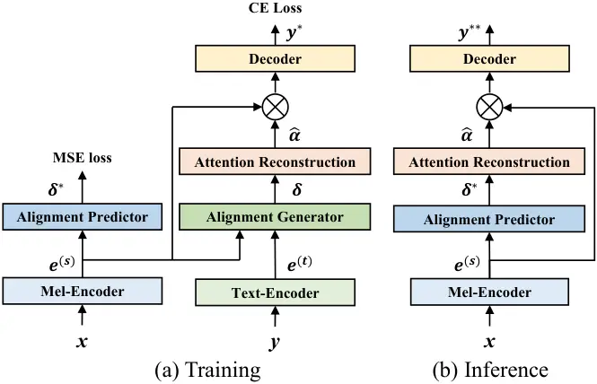
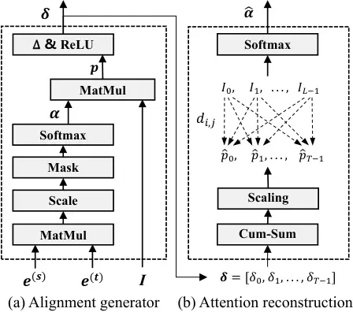
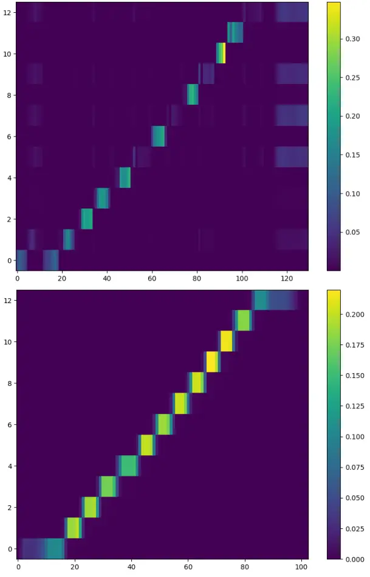

# EffectiveASR: A Single-Step Non-Autoregressive Mandarin Speech Recognition Architecture with High Accuracy and Inference Speed

1^(st) Ziyang Zhuang Affiliation: Ping An Technology    2^(nd) Chenfeng
Miao Affiliation: Ping An Technology    3^(rd) Kun Zou Affiliation: Ping
An Technology    4^(th) Ming Fang Affiliation: Ping An Technology   
5^(th) Tao Wei Affiliation: Ping An Technology    6^(th) Zijian Li
Affiliation: Georgia Institute of Technology    7^(th) Ning Cheng
Affiliation: Ping An Technology    8^(th) Wei Hu Affiliation: Ping An
Technology    9^(th) Shaojun Wang Affiliation: Ping An Technology   
10^(th) Jing Xiao Affiliation: Ping An Technology

###### Abstract

Non-autoregressive (NAR) automatic speech recognition (ASR) models
predict tokens independently and simultaneously, bringing high inference
speed. However, there is still a gap in the accuracy of the NAR models
compared to the autoregressive (AR) models. In this paper, we propose a
single-step NAR ASR architecture with high accuracy and inference speed,
called EffectiveASR. It uses an Index Mapping Vector (IMV) based
alignment generator to generate alignments during training, and an
alignment predictor to learn the alignments for inference. It can be
trained end-to-end (E2E) with cross-entropy loss combined with alignment
loss. The proposed EffectiveASR achieves competitive results on the
AISHELL-1 and AISHELL-2 Mandarin benchmarks compared to the leading
models. Specifically, it achieves character error rates (CER) of
4.26%/4.62% on the AISHELL-1 dev/test dataset, which outperforms the AR
Conformer with about 30x inference speedup.

###### Index Terms: 

ASR, single-step NAR, EffectiveASR

## I Introduction

In recent years, end-to-end (E2E) models have outperformed traditional
hybrid systems in automatic speech recognition (ASR) tasks. Among the
three widely used E2E methods—connectionist temporal classification
(CTC) \[1\], recurrent neural network transducer (RNN-T) \[2, 3\], and
attention-based encoder-decoder (AED) \[4, 5, 6\]—AED models have become
the preferred choice for sequence-to-sequence ASR modeling, thanks to
their superior recognition accuracy, as seen in models like Transformer
and Conformer. However, despite their strong performance, AED models
utilize an auto-regressive (AR) decoder that generates tokens
sequentially, with each token dependent on the preceding ones. This
results in computational inefficiency, as decoding time increases
linearly with the length of the output sequence. To address this issue
and speed up inference, non-autoregressive (NAR) models have been
introduced, allowing for parallel generation of output sequences.

Depending on the number of iterations in inference, NAR models are
classified as iterative or single-step models. Among the former, A-FMLM
\[7\], a non-autoregressive Transformer model (NAT), is the first
attempt to introduce the conditional masked language model (CMLM) \[8\]
into ASR. A-FMLM is designed to predict masked tokens conditioned on
unmasked ones and whole speech embeddings. However, its target token
length needs to be pre-defined, which limits the model’s performance. To
address this issue, ST-NAT \[9\] uses a CTC module to predict the length
of the target sequence. Unlike ST-NAT, Mask-CTC and its variants \[10,
11, 12\] propose to use the CMLM decoder to refine CTC.

However, iterative models require multiple iterations to achieve a
competitive result, limiting the speed of inference in practice. To
overcome this limitation, single-step NAR models are proposed. LASO
\[13\] implements parallel decoding of Transformer-style models based on
the position-dependent summarizer (PDS) module, but it requires a
predefined token length. InterCTC \[14, 15\] uses an additional
intermediate loss of CTC to relax the conditional independence
assumption of CTC models, improving the accuracy while maintaining the
inference speed of the CTC model. CASS-NAT and its variants \[16, 17,
18, 19\] conduct in-depth exploration on the combination of CTC
alignment and NAT, further improving the performance of the single-step
NAR models. Different from the CTC-based or NAT-based NAR models
mentioned above, Continuous Integrate-and-Fire (CIF) \[20\] is the first
attempt to model ASR tasks by explicitly predicting the length of the
target sequence. However, due to the conditional independence
assumption, the accuracy of these mentioned NAR models is significantly
inferior to the leading AR models.

Paraformer \[21\], a CIF-based model, designs a glancing language model
(GLM) based sampler to strengthen the NAR decoder with the ability to
model token interdependency. According to the Paraformer’s report, it
can achieve comparable performance to that of the AR transformer on open
source Mandarin Chinese datasets \[22, 23\]. A step further,
E-Paraformer \[24\] proposes a novel monotonic alignment mechanism
called Parallel Integrate-and-Fire (PIF), which not only enables
parallel computation instead of the recursive mechanism in CIF, but also
incorporates global context modeling capabilities and gets both better
CER performance and faster speeds than the Paraformer. Despite the
success of Paraformer and E-Paraformer in NAR ASR modeling, they both
require a well-designed two-pass training process, which makes the model
less compact and less efficient.

In this paper, we propose a single-step NAR ASR architecture inspired by
the Hard Monotonic Alignment (HMA) method applied in \[25, 26\], termed
EffectiveASR. The EffectiveASR is more compact compared to other
high-performance NAR models, with efficient training and inference
processes. And it achieves fairly competitive results on the public
AISHELL-1 and AISHELL-2 benchmarks compared to the leading models.

## II Methods



Fig. 1: The model architecture of the proposed EffectiveASR.
($`\bigotimes`$ represents the matrix multiplication operation)

### II-A Overview

The architecture of the proposed EffectiveASR is shown in Fig. 1. The
training network consists of six modules, namely mel-encoder,
text-encoder, alignment predictor, alignment generator, attention
reconstruction, and decoder. The text-encoder and alignment generator
are designed for training and are no longer activated during inference.

Let the acoustic feature sequence be
$`\boldsymbol{x}\in\mathcal{R}^{T}`$ and the transcription sequence be
$`\boldsymbol{y}\in\mathcal{R}^{L}`$, where $`T`$ and $`L`$ are the
length of acoustic feature sequence and transcription sequence
respectively. During training, the mel-encoder encodes
$`\boldsymbol{x}`$ into the acoustic embeddings
$`\boldsymbol{e}^{(\mathrm{s})}\in\mathcal{R}^{T,d}`$, and the
text-encoder encodes $`\boldsymbol{y}`$ into text embeddings
$`\boldsymbol{e}^{(\mathrm{t})}\in\mathcal{R}^{L,d}`$, where $`d`$ is
the embedding dimension. The alignment generator leverages
$`\boldsymbol{e}^{(\mathrm{s})}`$ and $`\boldsymbol{e}^{(\mathrm{t})}`$
to generate the alignment $`\boldsymbol{\delta}\in\mathcal{R}^{T}`$
between acoustic and text embeddings. $`\boldsymbol{\delta}`$ is then
passed to the attention reconstruction module to construct an attention
matrix $`\boldsymbol{\hat{\alpha}}\in\mathcal{R}^{L,T}`$. By multiplying
with $`\boldsymbol{\hat{\alpha}}`$, the acoustic embeddings
$`\boldsymbol{e}^{(\mathrm{s})}`$ are transformed into semantic
encodings, with a length corresponding to that of the output tokens. The
semantic encodings are finally fed into the decoder to predict tokens
$`\boldsymbol{y}^{*}\in\mathcal{R}^{L}`$. However, at the inference
stage, the model cannot obtain alignments through the generator because
of the lack of transcriptions. Therefore, during training, we use the
predictor to learn the alignment produced by the generator. Then during
inference, the output $`\boldsymbol{\delta^{*}}`$ of the alignment
predictor is used to reconstruct the attention matrix and perform the
inference of the model.

The mel-encoder is the same as the Conformer encoder \[27\], consisting
of several conformer blocks. The text-encoder and decoder are built with
Transformer \[28\] encoder blocks. Other modules will be detailed in the
following parts.



Fig. 2: Visualization of alignment generator and attention
reconstruction calculation process. (Operation $`\Delta`$ is defined as
Eq. (3). Operation Cum-Sum is defined as Eq. (6).)

### II-B Alignment generator

The alignment generator is built based on the Index Mapping Vector
(IMV), proposed in \[25\], which provides a creative way to describe the
alignment between input and output sequences. The calculation process of
IMV-based alignment for ASR is depicted in Fig. 2(a). First, a scaled
dot-product attention matrix $`\boldsymbol{\alpha}\in\mathcal{R}^{T,L}`$
is built by Eq. (1), with $`\boldsymbol{e}^{(\mathrm{s})}`$ as Query and
$`\boldsymbol{e}^{(\mathrm{t})}`$ as Key:

```math
\alpha_{i,j}=\frac{\mathrm{exp}((\boldsymbol{e}_{i}^{(\mathrm{s})}\cdot\boldsymbol{e}_{j}^{(\mathrm{t})})*d^{-0.5})}{\sum_{j=0}^{L-1}\mathrm{exp}((\boldsymbol{e}_{i}^{(\mathrm{s})}\cdot\boldsymbol{e}_{j}^{(\mathrm{t})})*d^{-0.5})} \tag{1}
```

where $`0\leq i\leq T-1`$, $`0\leq j\leq L-1`$, and $`d`$ is the
dimension of $`\boldsymbol{e}^{(\mathrm{s})}`$ and
$`\boldsymbol{e}^{(\mathrm{t})}`$. Then the IMV $`\boldsymbol{p}`$ is
calculated by Eq. (2):

```math
\boldsymbol{p}=\boldsymbol{\alpha}\cdot\boldsymbol{I} \tag{2}
```

where $`\boldsymbol{I}=[0,1,...,L-1]`$ is the index vector of
transcription, and $`\Sigma_{j=0}^{L-1}\alpha_{i,j}=1`$. Here
$`p_{i}=\Sigma_{j=0}^{L-1}(\alpha_{i,j}*j)`$ is the weighted sum of the
attention weight between the $`i`$-th input frame and each output token
and the position index of each output token. $`p_{i}`$ can be seen as
the expected alignment location of the $`i`$-th input frame in the
length range of the output text. We define the increment of alignment
locations of adjacent audio frames in the transcription as
$`{\Delta p_{i}}`$, which is calculated by Eq. (3). According to the
monotonicity assumption in \[25, 26, 6\], when there is a monotonic
correspondence between audio and transcription, it can be deduced that
$`\Delta p_{i}\geq 0`$, and the proof process can be found in \[25, 6\].

```math
\displaystyle\Delta p_{i}= \displaystyle p_{i}-p_{i-1}, \displaystyle 1\leq i\leq T-1 \tag{3}
```

However, at the beginning of training, the model has not been trained
well enough to satisfy $`\Delta p_{i}\geq 0`$ easily. To guarantee a
strictly monotonic constraint, $`\Delta p_{i}`$ is activated by ReLU, as
shown in Eq. (II-B):

```math
\displaystyle\delta_{i}=\left\{\begin{array}[]{ll}0,&i=0\\
{\rm ReLU}(\Delta p_{i}),&1\leq i\leq T-1\end{array}\right.
```

where $`\delta_{0}`$ is set to $`0`$. $`\delta_{i}`$ can be seen as the
weight of each encoder step involved in the calculation of decoding
label.

|     |                           |     |           |      |           |         |                      |
| --- | ------------------------- | --- | --------- | ---- | --------- | ------- | -------------------- |
|     | Model                     | LM  | AISHELL-1 |      | AISHELL-2 | Params  | RTF ($`\downarrow`$) |
|     |                           |     | dev       | test | test-ios  |         |                      |
| AR  | Transformer \[13\]        | w/o | 6.1       | 6.6  | 7.1       | 67.5M   | 0.1900               |
|     | Conformer \[29\]          | w/o | \-        | 5.21 | 5.83      | 46.25M  | 0.2100               |
| NAR | A-FMLM \[7\]              | w/o | 6.2       | 6.7  | \-        | \-      | 0.2800               |
|     | CTC-enhanced \[12\]       | w/o | 5.3       | 5.9  | 7.1       | 29.7M   | 0.0037 $`{\dagger}`$ |
|     | LASO-big \[13\]           | w/o | 5.9       | 6.6  | 6.7       | 80.0M   | 0.0040               |
|     | TSNAT \[30\]              | w/o | 5.1       | 5.6  | \-        | 87M     | 0.0185               |
|     | Improved CASS-NAT \[17\]  | w/o | 4.9       | 5.4  | \-        | 38.3M   | 0.0230               |
|     | AL-NAT \[18\]             | w/o | 4.9       | 5.3  | \-        | 71.3M   | 0.0050               |
|     | Paraformer \[21\]         | w/o | 4.6       | 5.2  | 6.19      | 46.2M   | 0.0168               |
|     | E-Paraformer \[24\]       | w/o | 4.36      | 4.79 | 6.08      | 43.6M   | 0.0069               |
|     | EffectiveASR Base (Ours)  | w/o | 4.30      | 4.66 | 6.03      | 43.6M ‡ | 0.0058               |
|     | EffectiveASR Large (Ours) | w/o | 4.26      | 4.62 | 5.76      | 76.0M ‡ | 0.0066               |

TABLE I: CER(%) and RTF results of our models on AISHELL-1 and AISHELL-2
tasks and the comparison with previous AR and NAR works. (†: RTF is
evaluated with batchsize of 8, ‡: Model parameters in the inference
phase.)

### II-C Attention reconstruction

After obtaining alignment $`\boldsymbol{\delta}`$, our goal is to
reconstruct an attention matrix, such that the acoustic embeddings
$`\boldsymbol{e}^{(\mathrm{s})}`$ of length $`T`$ can be transformed
into semantic encodings of length $`L`$ by multiplying with the
attention matrix. We follow the similar idea of \[25, 26\] in
reconstructing the attention matrix and the construction process of the
attention matrix can be summarized as shown in Fig. 2(b). First, a
monotonically increasing alignment position vector
$`\boldsymbol{p\mathrm{{}^{\prime}}}`$ is generated by accumulating
$`\delta_{i}`$, as shown in Eq. (6). Next, a scaling strategy, as
described in Eq. (7), is applied to ensure that the maximum value of
$`\boldsymbol{p^{\prime}}`$ matches the length of the output tokens.

```math
\displaystyle p_{i}{{}^{\prime}}= \displaystyle\sum_{m=0}^{i}\delta_{m}, \displaystyle 0\leq i\leq T-1 \tag{6}
```

```math
\displaystyle\hat{p}_{i}= \displaystyle\frac{p_{i}{{}^{\prime}}-p_{0}{{}^{\prime}}}{p_{T-1}{{}^{\prime}}-p_{0}{{}^{\prime}}}*(L-1), \displaystyle 0\leq i\leq T-1 \tag{7}
```

Since both $`\boldsymbol{\hat{p}}`$ and transcription index vector
$`\boldsymbol{I}`$ are monotonic sequences ranging from $`0`$ to
$`L-1`$, a distance-aware attention reconstruction is performed by Eq.
(8):

```math
\hat{\alpha}_{i,j}=\frac{{\rm exp}(-\sigma^{-2}*d_{i,j})}{\sum_{i=0}^{T-1}{\rm exp}(-\sigma^{-2}*d_{i,j})} \tag{8}
```

where
$`d_{i,j}=(\hat{p}_{i}-I_{j})^{2},0\leq i\leq T-1,0\leq j\leq L-1`$.
$`d_{i,j}`$ represents the semantic distance between the $`i`$-th
encoder frame and the $`j`$-th token. $`\sigma`$ is a learnable
hyperparameter. It’s evident that as the distance $`d_{i,j}`$ decreases,
the attention weight $`\hat{\alpha}_{i,j}`$ increases.

### II-D Alignment predictor

As mentioned in Section II-A, an alignment predictor is required to
generate alignments at inference stage. In EffectiveASR, the alignment
predictor is built with two 1D-Convolution layers, each followed by
layer normalization and ReLU function. During training, it takes
acoustic embeddings $`\boldsymbol{e}^{(\mathrm{s})}`$ as inputs to
generate a predicted alignment $`\boldsymbol{\delta}^{*}`$, while using
the alignment $`\boldsymbol{\delta}`$ produced by the alignment
generator as the label to update the predictor. In the inference stage,
we use the alignment $`\boldsymbol{\delta}^{*}`$ produced by the
alignment predictor to construct the attention matrix, as shown in the
Fig. 1(b). At the same time, we accumulate the
$`\boldsymbol{\delta}^{*}`$ and round it to predict the length of output
tokens. The Mean Square Error (MSE) loss is used to learn the alignment,
and the total loss is defined as:

```math
\mathcal{L}_{total}=\mathcal{L}_{\rm{CE}}(\boldsymbol{y},\boldsymbol{y^{*}})+\lambda\mathcal{L}_{\rm{MSE}}(\boldsymbol{\delta},\boldsymbol{\delta^{*}})\\
 \tag{9}
```

where $`\lambda`$ is the weight of alignment loss, and
$`\mathcal{L}_{\rm{CE}}`$ is the cross-entropy (CE) loss between the
text outputs and labels.

## III Experiments

### III-A Experimental Setup

The proposed method is evaluated on two public Mandarin corpus: 178
hours AISHELL-1 \[22\] and 1000 hours AISHELL-2 \[23\]. We use
80-channel filter banks computed from a 25 ms window with a stride of 10
ms as features. SpecAugment \[31\] and speed perturbation are used for
data augmentation for all experiments. The sizes of the vocabulary for
the AISHELL-1 and AISHELL-2 tasks are $`4,233`$ and $`5,208`$,
respectively. The EffectiveASR model is built in base and large size.
For both sizes, the layer numbers of {mel-encoder, text-encoder,
alignment predictor, decoder} are set to {12, 1, 2, 6}, while the
attention heads number of base model is $`4`$ with hidden dimension of
$`256`$ and the attention heads number of large model is $`6`$ with
hidden dimension of $`384`$. The hyperparameter $`\lambda`$ in Eq. (9)
is set to $`1.0`$ and the learnable hyperparameter $`\sigma`$ in Eq. (8)
is initialized with $`0.5`$. The proposed models are developed by ESPnet
\[32\] ¹¹ 1 https://github.com/espnet/espnet.git, which is a popular
open-source ASR toolkit. All experiments are performed on $`8`$ NVIDIA
Tesla V100 GPUs, following the default configurations of ESPnet.

We use the character error rate (CER) to evaluate the performance of
different models and the real-time factor (RTF) to measure the inference
speed.

### III-B Results

The evaluation results of AISHELL-1 and AISHELL-2 are detailed in Table
I. The CER and RTF values of previous works are obtained from the
papers’ report, except that results of the ESPnet Conformer are obtained
from the ESPnet official repository. The RTF of our models is calculated
on the AISHELL-1 test set with a batch size of $`1`$. For a fair
comparison with the published work, none of our experiments in Table I
uses an external language model (LM) or pre-training.

For AISHELL-1 task, the proposed EffectiveASR models (both base and
large size) outperform all other models presented. On the AISEHLL-1 test
set, our large model achieves a CER of 4.62%, which is 0.58%/0.17%
(absolutely) better than the previous leading results of NAR models
(from Paraformer \[29\]/E-Paraformer \[24\]). Furthermore, the inference
speed of our large model is twice more than that of Paraformer. With the
application of PIF, E-Paraformer also outperforms Paraformer in both
inference speed and CER. However, the two-pass training process of
E-Paraformer makes the model less compact and less efficient compared to
the single-step architecture of EffectiveASR. When compared with the AR
models, our model not only outperforms AR Conformer in CER, but also has
inference speed 30x faster than the AR Conformer, which is an impressive
performance.

Since AISHELL-1 contains less than 200 hours traning data, we also
validate our method on a larger corpus, 1000 hours AISHELL-2. On the
AISHELL-2 test ios set, our large model achieves a CER of 5.76%, which
also outperforms all AR and NAR models presented.

To further analyze the behavior of the proposed model, we plot the
alignment matrices in Figure 3, comparing the Conformer with the
proposed EffectiveASR. The alignment matrix of the Conformer is taken
from the model’s final cross-attention layer. As depicted in the figure,
the proposed approach yields more consistent and refined alignments
compared to the Conformer model, thereby contributing to an enhanced CER
performance.



Fig. 3: Alignment plots of both the baseline and proposed model. The
first plot is the alignment plot of the Conformer, while the second plot
is the alignment constructed by the proposed EffectiveASR. The
horizontal axis represents the input frame step, and the vertical axis
represents the output step.

## IV Conclusion

In this paper, we propose a novel single-step NAR ASR architecture
called EffectiveASR. By leveraging our proposed methods for generating
monotonic alignments and constructing alignment matrices, EffectiveASR
not only possesses a simpler structure but also achieves leading
performance in terms of inference efficiency and accuracy. Experiments
on open-source Mandarin datasets demonstrate that the proposed
EffectiveASR achieves better CER performance to the leading AR
Conformer, with a 30x decoding speedup. In the future, we will focus on
exploring the application of EffectiveASR in English speech recognition.

## References

- \[1\] A. Graves, S. Fernández, F. Gomez, and J. Schmidhuber,
  “Connectionist temporal classification: labelling unsegmented sequence
  data with recurrent neural networks,” in _ICML_, 2006.
- \[2\] A. Graves, “Sequence transduction with recurrent neural
  networks,” in _ICML_, 2012.
- \[3\] A. Graves, A.-r. Mohamed, and G. Hinton, “Speech recognition
  with deep recurrent neural networks,” in _ICASSP_, 2013.
- \[4\] J. K. Chorowski, D. Bahdanau, D. Serdyuk, K. Cho, and Y. Bengio,
  “Attention-based models for speech recognition,” _NIPS_, 2015.
- \[5\] W. Chan, N. Jaitly, Q. Le, and O. Vinyals, “Listen, attend and
  spell: A neural network for large vocabulary conversational speech
  recognition,” in _ICASSP_, 2016.
- \[6\] C. Miao, K. Zou, Z. Zhuang, T. Wei, J. Ma, S. Wang, and J. Xiao,
  “Towards efficiently learning monotonic alignments for attention-based
  end-to-end speech recognition.” _INTERSPEECH_, 2022.
- \[7\] N. Chen, S. Watanabe, J. Villalba, P. Żelasko, and N. Dehak,
  “Non-autoregressive transformer for speech recognition,” _IEEE Signal
  Processing Letters_, 2020.
- \[8\] M. Ghazvininejad, O. Levy, Y. Liu, and L. Zettlemoyer,
  “Mask-predict: Parallel decoding of conditional masked language
  models,” in _EMNLP-IJCNLP_, 2019.
- \[9\] Z. Tian, J. Yi, J. Tao, Y. Bai, S. Zhang, and Z. Wen,
  “Spike-triggered non-autoregressive transformer for end-to-end speech
  recognition,” _INTERSPEECH_, 2020.
- \[10\] Y. Higuchi, S. Watanabe, N. Chen, T. Ogawa, and T. Kobayashi,
  “Mask CTC: Non-autoregressive end-to-end ASR with CTC and mask
  predict,” _INTERSPEECH_, 2020.
- \[11\] Y. Higuchi, H. Inaguma, S. Watanabe, T. Ogawa, and
  T. Kobayashi, “Improved mask-ctc for non-autoregressive end-to-end
  asr,” in _ICASSP_, 2021.
- \[12\] X. Song, Z. Wu, Y. Huang, C. Weng, D. Su, and H. Meng,
  “Non-autoregressive transformer asr with ctc-enhanced decoder input,”
  in _ICASSP_, 2021.
- \[13\] Y. Bai, J. Yi, J. Tao, Z. Tian, Z. Wen, and S. Zhang, “Fast
  end-to-end speech recognition via non-autoregressive models and
  cross-modal knowledge transferring from bert,” _IEEE/ACM Transactions
  on Audio, Speech, and Language Processing_, 2021.
- \[14\] J. Lee and S. Watanabe, “Intermediate loss regularization for
  ctc-based speech recognition,” in _ICASSP_, 2021.
- \[15\] J. Nozaki and T. Komatsu, “Relaxing the conditional
  independence assumption of CTC-based ASR by conditioning on
  intermediate predictions,” _INTERSPEECH_, 2021.
- \[16\] R. Fan, W. Chu, P. Chang, and J. Xiao, “CASS-NAT: CTC
  alignment-based single step non-autoregressive transformer for speech
  recognition,” in _ICASSP_, 2021.
- \[17\] R. Fan, W. Chu, P. Chang, J. Xiao, and A. Alwan, “An improved
  single step non-autoregressive transformer for automatic speech
  recognition,” _INTERSPEECH_, 2021.
- \[18\] Y. Wang, R. Liu, F. Bao, H. Zhang, and G. Gao,
  “Alignment-learning based single-step decoding for accurate and fast
  non-autoregressive speech recognition,” in _ICASSP_, 2022.
- \[19\] R. Fan, W. Chu, P. Chang, and A. Alwan, “A CTC Alignment-Based
  Non-Autoregressive Transformer for End-to-End Automatic Speech
  Recognition,” _IEEE/ACM Transactions on Audio, Speech, and Language
  Processing_, 2023.
- \[20\] L. Dong and B. Xu, “CIF: Continuous integrate-and-fire for
  end-to-end speech recognition,” in _ICASSP_, 2020.
- \[21\] Z. Gao, S. Zhang, I. McLoughlin, and Z. Yan, “Paraformer: Fast
  and accurate parallel transformer for non-autoregressive end-to-end
  speech recognition,” _INTERSPEECH_, 2022.
- \[22\] J. D. H. Bu, B. W. X. Na, and H. Zheng, “Aishell-1: An
  open-source mandarin speech corpus and a speech recognition baseline,”
  in _O-COCOSDA_, 2017.
- \[23\] J. Du, X. Na, X. Liu, and H. Bu, “Aishell-2: Transforming
  mandarin asr research into industrial scale,” _arXiv preprint
  arXiv:1808.10583_, 2018.
- \[24\] K. Zou, F. Tan, Z. Zhuang, C. Miao, T. Wei, S. Zhai, Z. Li,
  W. Hu, S. Wang, and J. Xiao, “E-paraformer: A faster and better
  parallel transformer for non-autoregressive end-to-end mandarin speech
  recognition,” _INTERSPEECH_, 2024.
- \[25\] C. Miao, L. Shuang, Z. Liu, C. Minchuan, J. Ma, S. Wang, and
  J. Xiao, “EfficientTTS: An efficient and high-quality text-to-speech
  architecture,” in _ICML_, 2021.
- \[26\] Z. Zhuang, K. Zou, C. Miao, M. Fang, T. Wei, Z. Li, W. Hu,
  S. Wang, and J. Xiao, “Improving attention-based end-to-end speech
  recognition by monotonic alignment attention matrix reconstruction,”
  in _ICASSP_, 2024.
- \[27\] A. Gulati, J. Qin, C.-C. Chiu, N. Parmar, Y. Zhang, J. Yu,
  W. Han, S. Wang, Z. Zhang, Y. Wu _et al._, “Conformer:
  Convolution-augmented transformer for speech recognition,” in
  _INTERSPEECH_, 2020.
- \[28\] A. Vaswani, N. Shazeer, N. Parmar, J. Uszkoreit, L. Jones,
  A. N. Gomez, Ł. Kaiser, and I. Polosukhin, “Attention is all you
  need,” _NIPS_, 2017.
- \[29\] Z. Gao, Z. Li, J. Wang, H. Luo, X. Shi, M. Chen, Y. Li, L. Zuo,
  Z. Du, Z. Xiao _et al._, “Funasr: A fundamental end-to-end speech
  recognition toolkit,” _INTERSPEECH_, 2023.
- \[30\] Z. Tian, J. Yi, J. Tao, Y. Bai, and X. Liu, “Tsnat: Two-step
  non-autoregressvie transformer models for speech recognition,”
  _INTERSPEECH_, 2021.
- \[31\] D. S. Park, W. Chan, Y. Zhang, C.-C. Chiu, B. Zoph, E. D.
  Cubuk, and Q. V. Le, “Specaugment: A simple data augmentation method
  for automatic speech recognition,” in _INTERSPEECH_, 2019.
- \[32\] S. Watanabe, T. Hori, S. Karita, T. Hayashi, J. Nishitoba,
  Y. Unno, N. E. Y. Soplin, J. Heymann, M. Wiesner, N. Chen _et al._,
  “Espnet: End-to-end speech processing toolkit,” _INTERSPEECH_, 2018.
