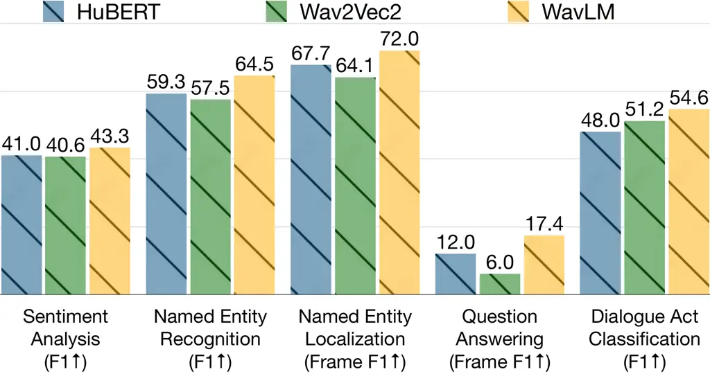
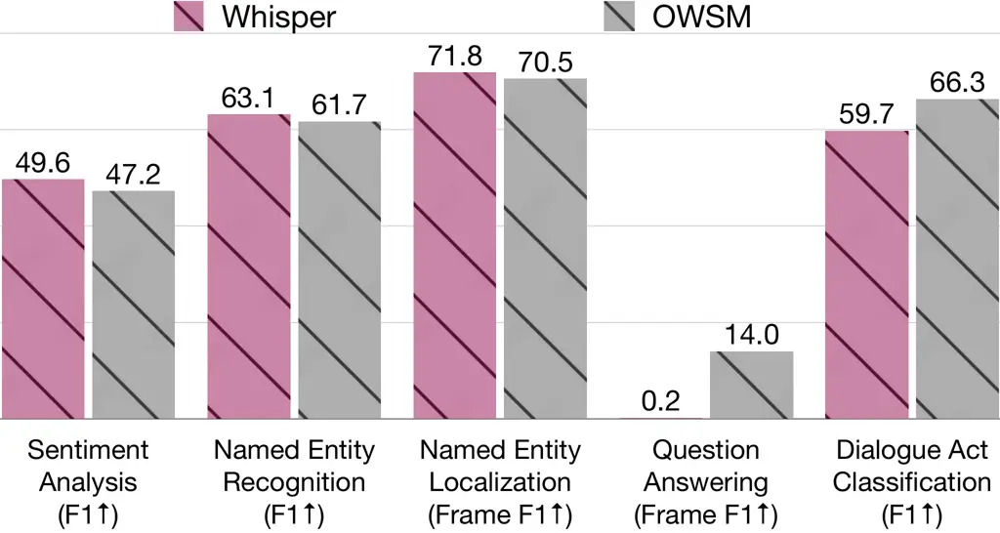
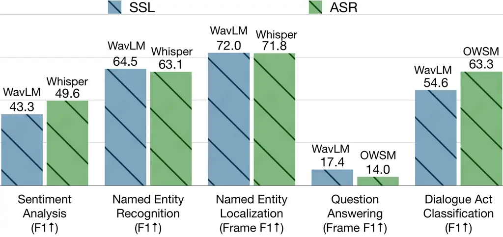
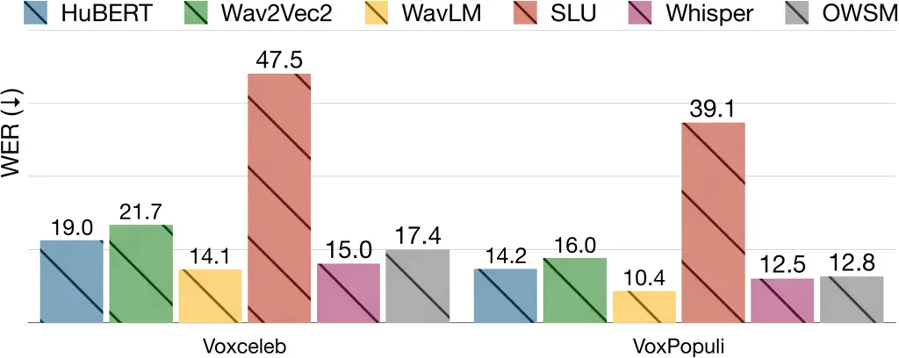
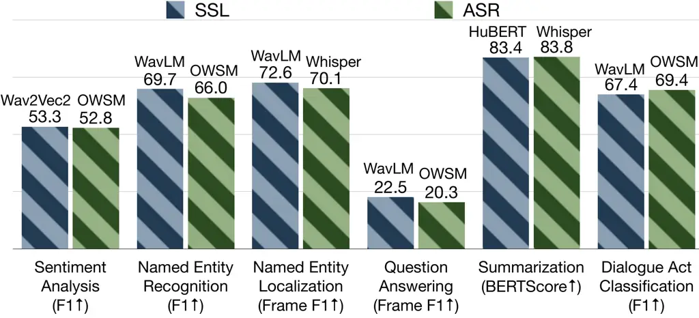
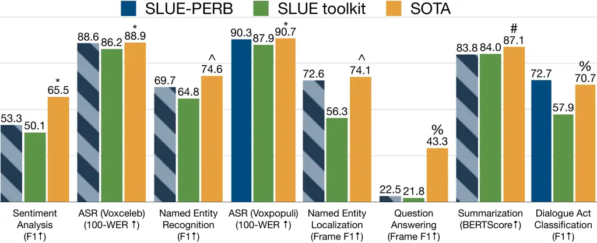

# On the Evaluation of Speech Foundation Models for Spoken Language Understanding

Siddhant Arora Affiliation:  Carnegie Mellon University, USA
Email: [siddhana@cs.cmu.edu](mailto:)    Ankita Pasad Affiliation: 
Toyota Technological Institute at Chicago    Chung-Ming Chien
Affiliation:  Toyota Technological Institute at Chicago    Jionghao Han
Affiliation:  Carnegie Mellon University, USA    Roshan Sharma, Jee-weon
Jung, Hira Dhamyal, William Chen Affiliation:  Carnegie Mellon
University, USA    Suwon Shon, Hung-yi Lee, Karen Livescu, Shinji
Watanabe Affiliation:  Carnegie Mellon University, USA Affiliation: 
Toyota Technological Institute at Chicago Affiliation:  ASAPP
Affiliation:  National Taiwan University

###### Abstract

The Spoken Language Understanding Evaluation (SLUE) suite of benchmark
tasks was recently introduced to address the need for open resources and
benchmarking of complex spoken language understanding (SLU) tasks,
including both classification and sequence generation tasks, on natural
speech. The benchmark has demonstrated preliminary success in using
pre-trained speech foundation models (SFM) for these SLU tasks. However,
the community still lacks a fine-grained understanding of the
comparative utility of different SFMs. Inspired by this, we ask: which
SFMs offer the most benefits for these complex SLU tasks, and what is
the most effective approach for incorporating these SFMs? To answer
this, we perform an extensive evaluation of multiple supervised and
self-supervised SFMs using several evaluation protocols: (i) _frozen_
SFMs with a _lightweight_ prediction head, (ii) _frozen_ SFMs with a
_complex_ prediction head, and (iii) _fine-tuned_ SFMs with a
_lightweight_ prediction head. Although the supervised SFMs are
pre-trained on much more speech recognition data (with labels), they do
not always outperform self-supervised SFMs; the latter tend to perform
at least as well as, and sometimes better than, supervised SFMs,
especially on the sequence generation tasks in SLUE. While there is no
_universally_ optimal way of incorporating SFMs, the _complex_
prediction head gives the best performance for most tasks, although it
increases the inference time. We also introduce an open-source toolkit
and performance leaderboard, SLUE-PERB, for these tasks and modeling
strategies.

## 1 Introduction

Spoken language understanding (SLU) refers to tasks that require
extracting semantics from spoken utterances. SLU systems have important
applications, for example, in voice assistants and conversational
agents, and have attracted increasing interest in recent years Yu et al.
(2019); Coucke et al. (2018). SLU encompasses a wide range of tasks,
such as predicting intents and slots Lugosch et al. (2019); Bastianelli
et al. (2020); Saade et al. (2018), recognizing entity mentions and
labels Bastianelli et al. (2020); Del Rio et al. (2021), detecting the
speaker’s sentiment Busso et al. (2008) and modeling the topic of a
spoken dialogue Ortega and Vu (2018); Stolcke et al. (2000). More
recently, there has been significant interest in tackling more complex
tasks like question answering Li et al. (2018); Shon et al. (2023) or
summarization Sharma et al. (2022).

The Spoken Language Understanding Evaluation (SLUE) Shon et al. (2022);
Shon et al. (2023) suite of benchmark tasks was recently proposed to
address the lack of sufficiently complex and varied tasks on natural
(rather than synthetic or read) speech from public datasets. SLUE uses
annotated natural speech from conversations and monologues and includes
both classification and sequence generation tasks. Traditional SLU
models use a pipeline Palmer and Ostendorf (2001); Horlock and King
(2003); Béchet et al. (2004) of an automatic speech recognition (ASR)
system followed by a natural language understanding (NLU) system.
End-to-end (E2E) SLU systems Arora et al. (2022); Ghannay et al. (2018)
have also been explored to mitigate the impact of error propagation
observed in pipeline approaches and take advantage of the information in
the audio signal beyond the word content.

A recent trend in E2E models has been the use of pre-trained speech
foundation models (SFM) Mohamed et al. (2022); Chen et al. (2021b); Hsu
et al. (2021); Radford et al. (2022); Peng et al. (2023b) that can learn
useful representations for a large number of tasks. Due to the
increasing diversity of models, benchmarks are important to compare the
performance of SFMs on multiple downstream tasks. Performance benchmarks
like SUPERB (Speech processing Universal PERformance Benchmark) Yang
et al. (2021) have facilitated standardized comparison of pre-trained
SFMs across a diverse range of speech-processing tasks. However, such
benchmarks lack coverage of challenging and realistic SLU tasks. Hence,
the community lacks a fine-grained understanding of the relative merits
of different SFMs and different ways to use them for downstream SLU
tasks.

Motivated by these shortcomings, we introduce _SLUE-PERB_ (Spoken
Language Understanding Evaluation PERformance Benchmark), specifically
designed to evaluate representations extracted from pre-trained SFMs on
complex SLU tasks. We use this benchmark to answer two main questions:
(i) which SFMs are most useful for these tasks, and (ii) how do
different ways of using these SFMs, varying in their compute budget,
compare. Our study addresses various questions concerning SLU systems,
such as whether supervised SFMs are more beneficial than self-supervised
SFMs, whether SFMs are effective as frozen feature extractors or should
be fine-tuned on downstream tasks, and whether the complexity of
prediction heads affects the performance trends.

We conduct a comprehensive analysis by examining three types of SFMs:
(i) self-supervised learning (SSL) speech models Baevski et al. (2020);
Hsu et al. (2021); Chen et al. (2021b) trained on unlabeled speech data;
(ii) (weakly) supervised ASR (and speech translation) models Radford
et al. (2022); Peng et al. (2023b) pre-trained on large labeled corpora;
and (iii) supervised SLU models pre-trained on external SLU corpora Chen
et al. (2020); Bastianelli et al. (2020). Our extensive experiments are
performed on the SLUE benchmark Shon et al. (2022); Shon et al. (2023),
which provides curated data for Sentiment Analysis (SA), Named Entity
Recognition (NER), Named Entity Localization (NEL), Dialogue Act
Classification (DAC), Question Answering (QA) and Summarization (SUMM).

|                                                                           |                       |              |      |      |          |                                            |              |
| ------------------------------------------------------------------------- | --------------------- | ------------ | ---- | ---- | -------- | ------------------------------------------ | ------------ |
| Dataset                                                                   | Speaking Style        | Size (hours) |      |      | Tasks    | Output                                     | Metric       |
|                                                                           |                       | Train        | Dev  | Test |          |                                            |              |
| SLUE-VoxCeleb                                                             | Conversational        | 012.8        | 02.1 | 09.0 | SA^(∗)   | sentiment class                            | F1           |
|                                                                           |                       |              |      |      | ASR^(†)  | text transcript                            | WER          |
| SLUE-VoxPopuli                                                            | Orated Speech         | 014.5        | 05.0 | 04.9 | NER^(†)  | (entity phrase, entity tag) pairs          | Label F1, F1 |
|                                                                           |                       |              |      |      | NEL^(§)  | (entity start time, entity end time) pairs | Frame F1     |
|                                                                           |                       |              |      |      | ASR^(†)  | text transcript                            | WER          |
| SLUE-HVB                                                                  | Scripted conversation | 006.8        | 01.0 | 03.6 | DAC^(∗)  | dialogue act classes                       | F1           |
| SLUE-SQA-5                                                                | Read speech           | 244.0        | 21.2 | 25.8 | QA^(§)   | (answer start time, answer end time)       | Frame F1     |
| SLUE-TED                                                                  | Orated Speech         | 664.0        | 81.0 | 84.0 | SUMM^(†) | text summary                               | ROUGE-L,     |
|                                                                           |                       |              |      |      |          |                                            | BERTScore    |
| ^(∗): Classification, ^(†): Sequence generation, ^(§): Temporal Alignment |                       |              |      |      |          |                                            |              |

Table 1: Overview of the datasets Shon et al. (2022); Shon et al. (2023)
and tasks in SLUE-PERB. "WER" = "word error rate."

The key contributions are:

- •
  We compare representations extracted from various pre-trained SFMs
  across all SLUE tasks. Our experiments reveal that pre-trained ASR
  SFMs excel in classification tasks, while SSL SFMs either outperform
  or perform comparably to supervised ASR SFMs in sequence generation
  tasks.
- •
  We evaluate different modeling strategies and find that the
  performance improves, and the performance gap between different SFMs
  reduces, as we increase the prediction head size or fine-tune the
  pre-trained SFMs instead of using frozen representations.
- •
  While no single method is _universally_ optimal for all tasks,
  employing a complex prediction head is the best performing strategy
  for most tasks when inference speed is not a limiting factor. On the
  other hand, fine-tuned SFMs with a lightweight prediction head are a
  good option if latency is a concern.
- •
  We release our code publicly so that researchers can easily reproduce
  our results and test their own pre-trained SFMs.

## 2 Related Work

### 2.1 Pre-trained speech foundation models

The earliest self-supervised speech model, pre-trained on large amounts
of unlabeled data, to show improvements in large-scale ASR was
wav2vec Schneider et al. (2019). Since then, the community has developed
a variety of pre-trained self-supervised SFMs Mohamed et al. (2022) and
their representations have been successfully incorporated into
task-specific models spanning many applications.

Recently, supervised SFMs pre-trained on large amounts of paired or
weakly paired speech-text data have gained in popularity. Studies  Arora
et al. (2023a); Arora et al. (2023b) have shown that these supervised
SFMs can be fine-tuned to achieve state-of-the-art (SOTA) performance on
certain downstream tasks. But it remains to be seen how supervised
pre-training compares with self-supervised SFMs on complex language
understanding tasks like those in SLUE.

The few studies so far on SFMs for SLU Yang et al. (2021); Shon et al.
(2022); Shon et al. (2023); Wu et al. (2023); Chien et al. (2023); Chou
et al. (2023) focus on only selected SLU tasks, a single pre-trained
SFM, or simpler SLU tasks. With SLUE-PERB, we aim to fill this knowledge
gap by studying the applicability of different types of SFMs and
modeling strategies on a variety of SLU tasks.

### 2.2 Performance benchmarks

Performance benchmarks have been widely used to study performance on
downstream tasks and the information encoded in SFMs. Among them,
*SUPERB* Yang et al. (2021) is a popular benchmark developed for SSL
SFMs. It includes a variety of downstream tasks from speech recognition,
speaker recognition, emotion recognition, to simple SLU tasks like
intent classification and slot filling. It uses a shared evaluation
protocol, combining a frozen SFM with a lightweight prediction head for
each task. Extensions of the benchmark to different languages
(LeBenchmark, IndicSUPERB, ML-SUPERB Parcollet et al. (2023); Javed
et al. (2023); Shi et al. (2023)), modalities (AV-SUPERB Tseng et al.
(2023)), and tasks (SUPERB-SG Tsai et al. (2022)) have been proposed.

Though such benchmarks have tremendous value, they lack coverage of
challenging and practical SLU tasks. Motivated by this, SLUE Shon et al.
(2022); Shon et al. (2023) was proposed to focus on more challenging SLU
tasks on freely available annotated natural speech datasets, including
conversational or long-discourse speech, as shown in Tab. 1. However,
the original SLUE tasks do not have a standardized evaluation protocol
with an interface to a benchmark. Additionally, SLUE primarily aimed to
compare various pipeline and E2E SLU systems rather than analyze the
comparative efficacy of different SFMs. To address these issues, we
introduce SLUE-PERB, which exhaustively evaluates various pre-trained
SFMs across different evaluation settings on these complex SLU tasks.

## 3 The SLUE-PERB benchmark

SLUE-PERB is an open-source testbed for evaluating SFMs on SLU tasks.

| Type | Speech Foundation Model           | Architecture     | Model size | Dataset (size in hours)          | Objective                      |
| ---- | --------------------------------- | ---------------- | ---------- | -------------------------------- | ------------------------------ |
| SSL  | Wav2Vec2 (large) (Baevski et al.) | 7-Conv 24-Trans  | 317.4M     | LibriLight 60k (60k)             | contrastive                    |
|      | HuBERT (large) (Hsu et al.)       | 7-Conv 24-Trans  | 316.6M     | LibriLight 60k (60k)             | masked prediction              |
|      | WavLM (large) (Chen et al.)       | 7-Conv 24-Trans  | 315.5M     | Mix 94k (94k)                    | masked prediction + de-noising |
| ASR  | Whisper (med.) (Radford et al.)   | 2-Conv 24-Trans  | 315.7M     | Web data (680k)                  | ASR, ST                        |
|      | OWSM (3.1) (Peng et al.)          | 2-Conv 18-Branch | 560.8M     | Open-source ASR + ST data (180k) | ASR, ST                        |
| SLU  | SWBD Sentiment (Arora et al.)     | 2-Conv 12-Conf   | 82.2M      | SWBD Sentiment (260)             | SLU                            |
|      | SLURP (Arora et al.)              | 2-Conv 12-Conf   | 83.2M      | SLURP (58)                       | SLU                            |

Table 2: Summary of the _encoder_ of self-supervised and supervised
pre-trained SFMs used in this work. The Mix 94k dataset is a mixture of
LibriLight 60k Kahn et al. (2020), GigaSpeech 10k Chen et al. (2021a),
and VoxPopuli 24k Wang et al. (2021).

### 3.1 Tasks

Our benchmark currently focuses on the datasets from SLUE Shon et al.
(2022) and SLUE Phase-2 Shon et al. (2023). We provide support for 6
SLUE tasks, shown in Tab. 1. SA is an utterance-level classification
task of identifying the sentiment of an utterance. NER is a sequence
prediction task of detecting the named entities and labeling their tags
in a spoken utterance. NEL involves locating the entities, i.e.,
predicting the start and end timestamps of any entity in the audio. DAC
is an utterance-level multi-label, multi-class classification task that
identifies the function(s) of an utterance in a spoken conversation,
such as a statement, a question, etc. QA involves locating the answer
(i.e. predicting the start and end timestamps) in a spoken document
given a spoken question. SUMM is a sequence prediction task that
involves generating a text summary of a long speech input. Sec. A.2 in
the Appendix provides additional dataset details.

### 3.2 Pre-trained speech foundation models

We experiment with the following three types of pre-trained SFMs,
summarised in Tab. 2, with additional details in Sec. A.1 in the
Appendix.

Self-supervised SFMs: To incorporate SSL SFMs, we follow prior work Yang
et al. (2021) and use a weighted sum of the hidden layer representations
of SSL encoder to generate speech representations.

Supervised ASR SFMs: We use representations derived from the hidden
layers of the encoder of supervised encoder-decoder ASR SFMs. The use of
the encoder alone makes the comparisons with SSL-based encoders more
straightforward, and also follows the practice of prior work using
supervised ASR SFMs for other downstream tasks Gong et al. (2023).
However, in future work, we plan to study the use of the pre-trained
decoder as well.

Supervised SLU SFMs: Since most SLU tasks have limited labeled data, our
benchmark also evaluates the impact of pre-training using an external
SLU corpus. As in the case of supervised ASR models, we use the encoder
of the pre-trained model to extract speech representations. For SLU
SFMs, we choose pre-training SLU corpora designed for the same task as
the target SLU data. Hence, we use SLU model pre-trained on the SWBD
Sentiment dataset for the SA task and SLU model pre-trained on SLURP for
all other tasks.

### 3.3 Evaluation Protocols

This section provides a high-level overview of the various prediction
heads and approaches for leveraging SFMs investigated in this study. We
consistently employ a learned weighted sum of hidden layers of SFMs to
generate speech representations across all 3 approaches. Further details
about the evaluation setup are in Sec. 4.

Lightweight prediction head: We first experiment with using a similar
evaluation protocol to SUPERB, where the pre-trained SFM is kept frozen,
with a lightweight prediction head learned on top of it to perform
classification or sequence generation. Depending on the task, this
lightweight prediction head usually consists of a classification layer
or a shallow encoder with CTC. As in SUPERB, we use weighted
combinations of hidden layer activations as the input to the classifier
or encoder. This evaluation protocol not only facilitates quick
comparison of various SFMs but also promotes the development of models
capable of performing well across multiple tasks without the need for
task-specific fine-tuning. Unlike SUPERB, SLUE-PERB does not restrict
its evaluation solely to SSL SFMs.

Fine-tuned representations: Another popular paradigm for incorporating
pre-trained SFMs is fine-tuning the SFMs along with a lightweight
prediction head. While there are multiple approaches to fine-tune SFMs,
including parameter-efficient approaches like LoRA Hu et al. (2022),
full fine-tuning has been most commonly used in prior works Ott et al.
(2019); Shon et al. (2022). However, this approach significantly
increases the computation cost during fine-tuning, which might make it
challenging to use in scenarios with a limited computation budget.

Complex prediction head: Motivated by prior works Zaiem et al. (2023b);
Zaiem et al. (2023a) that show a change in benchmark results with a
change in prediction head architectures, we investigate increasing the
complexity of the prediction head while keeping the SFMs frozen. In this
protocol, we experiment with a “prediction head” based on an
encoder-decoder architecture. The input to this prediction head is a
sequence of pre-trained speech representations and the output is a
sequence of text tokens denoting the SLU label sequence. While this
setting does increase inference time, it serves as a middle ground
between the “Lightweight prediction head” and “Fine-tuned
representations” settings in terms of the number of trainable parameters
and has been used in prior works on SLU Arora et al. (2022).

|                 |                  |                 |                    |                       |                 |                    |                       |                       |                      |                        |                 |
| --------------- | ---------------- | --------------- | ------------------ | --------------------- | --------------- | ------------------ | --------------------- | --------------------- | -------------------- | ---------------------- | --------------- |
| Evaluation      | Pre-Trained      | SLUE-VoxCeleb   |                    | SLUE-VoxPopuli        |                 |                    |                       | SQA-5                 | SLUE-TED             |                        | SLUE-HVB        |
| Protocol        | Model            | SA              | ASR                | NER                   |                 | ASR                | NEL                   | QA                    | SUMM                 |                        | DAC             |
|                 |                  | F1 $`\uparrow`$ | WER $`\downarrow`$ | Label F1 $`\uparrow`$ | F1 $`\uparrow`$ | WER $`\downarrow`$ | Frame F1 $`\uparrow`$ | Frame F1 $`\uparrow`$ | ROUGE-L $`\uparrow`$ | BERTScore $`\uparrow`$ | F1 $`\uparrow`$ |
| Lightweight     | HuBERT (large)   | $`41.0`$        | $`19.0`$           | $`76.5`$              | $`59.3`$        | $`14.2`$           | $`67.7`$              | $`12.0`$              | ✗                    | ✗                      | $`48.0`$        |
|                 | Wav2Vec2 (large) | $`40.6`$        | $`21.7`$           | $`73.6`$              | $`57.5`$        | $`16.0`$           | $`64.1`$              | 0$`6.0`$              | ✗                    | ✗                      | $`51.2`$        |
| prediction      | WavLM (large)    | $`43.3`$        | $`14.1`$           | $`80.6`$              | $`64.5`$        | $`10.4`$           | $`72.0`$              | $`17.4`$              | ✗                    | ✗                      | $`54.6`$        |
|                 | Whisper (medium) | $`49.6`$        | $`15.0`$           | $`79.6`$              | $`63.1`$        | $`12.5`$           | $`71.8`$              | 0$`0.1`$              | ✗                    | ✗                      | $`59.7`$        |
| head            | OWSM (3.1)       | $`47.2`$        | $`17.4`$           | $`78.4`$              | $`61.7`$        | $`12.8`$           | $`70.5`$              | $`14.0`$              | ✗                    | ✗                      | $`66.3`$        |
|                 | Pre-trained SLU  | $`36.4`$        | $`47.5`$           | $`60.8`$              | $`45.5`$        | $`39.1`$           | $`47.8`$              | 0$`2.0`$              | ✗                    | ✗                      | $`54.4`$        |
| Complex         | HuBERT (large)   | $`52.2`$        | $`15.5`$           | $`78.5`$              | $`63.1`$        | $`13.0`$           | $`69.8`$              | $`21.4`$              | $`16.0`$             | $`83.4`$               | $`66.1`$        |
|                 | Wav2Vec2 (large) | $`53.3`$        | $`17.2`$           | $`78.2`$              | $`63.7`$        | $`14.0`$           | $`71.2`$              | $`18.8`$              | $`16.2`$             | $`83.0`$               | $`65.8`$        |
| prediction      | WavLM (large)    | $`52.0`$        | $`11.4`$           | $`82.7`$              | $`69.7`$        | $`10.1`$           | $`72.6`$              | $`22.5`$              | $`16.4`$             | $`83.0`$               | $`67.4`$        |
|                 | Whisper (medium) | $`51.0`$        | $`14.9`$           | $`79.2`$              | $`64.1`$        | $`13.2`$           | $`70.1`$              | $`1.6`$               | $`16.0`$             | $`83.8`$               | $`67.8`$        |
| head            | OWSM (3.1)       | $`52.8`$        | $`16.5`$           | $`79.6`$              | $`66.0`$        | $`12.6`$           | $`68.6`$              | $`20.3`$              | $`16.5`$             | $`83.6`$               | $`69.4`$        |
|                 | Pre-trained SLU  | $`49.7`$        | $`36.4`$           | $`68.7`$              | $`54.8`$        | $`28.5`$           | $`54.4`$              | 0$`3.2`$              | $`15.4`$             | $`82.9`$               | $`66.3`$        |
| Fine-tuning     | HuBERT (large)   | $`46.5`$        | $`14.8`$           | $`78.8`$              | $`62.6`$        | $`12.0`$           | $`69.4`$              | ✗                     | ✗                    | ✗                      | $`72.7`$        |
|                 | Wav2Vec2 (large) | $`45.0`$        | $`14.7`$           | $`78.2`$              | $`62.9`$        | $`11.7`$           | $`68.6`$              | ✗                     | ✗                    | ✗                      | $`71.3`$        |
|                 | WavLM (large)    | $`47.9`$        | $`12.1`$           | $`82.5`$              | $`66.3`$        | 0$`9.7`$           | $`71.7`$              | ✗                     | ✗                    | ✗                      | $`71.5`$        |
| representations | Whisper (medium) | $`51.8`$        | $`20.5`$           | $`76.9`$              | $`59.8`$        | $`18.2`$           | $`56.6`$              | ✗                     | ✗                    | ✗                      | $`69.8`$        |
|                 | OWSM (3.1)       | $`47.8`$        | $`15.0`$           | $`78.5`$              | $`61.5`$        | $`14.3`$           | $`65.1`$              | ✗                     | ✗                    | ✗                      | $`72.1`$        |
|                 | Pre-trained SLU  | $`46.1`$        | $`34.6`$           | $`60.8`$              | $`47.6`$        | $`37.1`$           | $`49.1`$              | ✗                     | ✗                    | ✗                      | $`68.7`$        |

Table 3: Performance of various SSL, supervised ASR, and SLU
representations on the test set of SLUE tasks using various evaluation
protocols in SLUE-PERB. The symbol ✗ indicates that the results were not
computed, either due to the inability to perform summarization without a
decoder or because fine-tuning representations on SQA-5 and SLUE-TED
corpora is not feasible within our computational budget.

## 4 Experiments

We conduct our analysis by examining various SFMs as introduced in
Tab. 2. Training hyper-parameters are selected based on validation
performance. More details can be found in Sec. A.3 in the Appendix. All
our models and config files will be publicly available upon acceptance
of the paper.

Lightweight prediction head: For the SA task, we mean-pool the extracted
features from the SFMs across time, and then pass the pooled
representation through a linear layer to compute the probability for
each sentiment class. The lightweight classification layers are trained
using cross-entropy loss. In the case of DAC, we follow a similar
procedure of mean-pooling followed by a linear layer. As this is a
multi-label classification task, we use a sigmoid activation to compute
the probability for each dialogue class and train the linear layer using
binary cross entropy loss. During inference, classes with a probability
greater than 0.5 are considered positive.

For sequence prediction and temporal alignment tasks like ASR, NER, NEL
and QA, we pass the extracted features through a shallow encoder trained
with CTC loss. NER and ASR models use a 2-layer conformer encoder as the
prediction head and follow a similar input-output formulation as in Peng
et al. (2023a). For NEL, following Shon et al. (2023), we perform greedy
CTC decoding on the NER model to obtain frame-level alignments, which
are used to get entity start and end time-stamps. For the QA task, the
input to the model is the concatenation of the question and document
audio, and the output is the concatenation of the question and document
transcript where the answer is delimited by a special character (See
Sec. A.3). Since QA involves more complex language understanding, we use
a 4-layer conformer encoder¹¹ 1 2-layer conformer encoder achieved poor
performance and again get timestamps using greedy CTC decoding. We
experimented with encoder-only CTC training for SUMM as well but found
that coherent summaries cannot be produced without a decoder and, hence,
we do not report results with a lightweight prediction head for SUMM.

Complex prediction head: The complex prediction head is an
encoder-decoder architecture consisting of a 12-layer conformer encoder
and a 6-layer transformer decoder, which takes as input the weighted sum
of representations from pre-trained speech models and outputs the SLU
label sequence. For classification tasks, the SLU label sequence
comprises the ASR transcript concatenated after the SLU class label,
following prior work Arora et al. (2022). The SLU label sequences for
sequence generation and temporal alignment tasks are identical to those
in the "lightweight prediction head". For the SUMM task, the TED talks
are too long to fit in a GPU, and prior work Sharma et al. (2023) has
shown that very little performance is lost by using only the first 30
seconds of input audio in the SLUE-TED dataset.²² 2 This may be partly
attributed to the dataset characteristics, where both the audio and
ground truth summaries are sourced from TED talks. Upon manual
inspection, we observe that the summaries often serve as an introduction
to the talk, and the key information in the talk summary is often found
within the first 30 seconds. Hence, we truncate all the audios to 30
seconds since the TED talks were too long to fit in a GPU. Since we
experiment with various SFMs using the same setup (i.e. using only
30-second input), we believe it is a fair comparison for gaining
insights into the relative utility of various SFMs. Our approach can be
extended to use more than 30 seconds of input by developing additional
strategies to deal with long-form inputs, which will be an interesting
future direction. We follow prior works Shon et al. (2023) to first
pre-train the model for ASR on the TEDLIUM-3 corpus, and then train the
model for summarization on the SLUE-TED dataset.

Fine-tuned representations: The prediction head architecture and model
inputs/outputs are identical to those of the "lightweight prediction
head" setup for all the tasks. We omit the QA and SUMM tasks in this
setting, as fine-tuning representations on the SQA-5 and SLUE-TED
corpora is too computationally expensive.

Figure 1: Performance of various SSL SFMs with a lightweight prediction
head on SLUE tasks.

Figure 2: Performance of various supervised ASR SFMs with a lightweight
prediction head on SLUE tasks.

## 5 Results

In this section, we analyze the performance of various SFMs on our
performance leaderboard SLUE-PERB, as detailed in Sec. 3. This analysis
provides insights into the types of SFMs that prove most effective for
complex understanding tasks and how this trend varies across tasks and
modeling settings. Figs. 1-7 summarize our results. In all figures, bars
with sparse stripes correspond to the “lightweight prediction head”
setting, dense striped bars correspond to “complex prediction head”, and
solid bars correspond to “fine-tuned representations". Test and
development set results for all experiments are shown in ˛ 3 and 5 (in
the Appendix) respectively.

### 5.1 Lightweight prediction head

What is the best SSL SFM for SLU? We first compare SSL SFMs using the
“lightweight prediction head” evaluation protocol (Sec. 3.3) in Fig. 1.
We observe that among all SSL models, WavLM features consistently
demonstrate superior performance across all tasks, probably since it was
pre-trained on larger and more diverse corpora (see Tab. 2). We further
observe that HuBERT features outperform Wav2Vec2 on all tasks except
DAC. Prior work Yang et al. (2021) has also noted the superior
performance of WavLM and HuBERT’s representations.

What is the best supervised SFM for SLU? Fig. 2 compares models that use
supervised ASR SFMs and are trained with lightweight prediction heads.
Our results show that while OWSM is slightly worse than Whisper on SA,
NER, and NEL tasks, it significantly outperforms Whisper for DAC and QA.
As shown in Tab. 2, the two models differ in encoder architecture
(branchformer in OWSM Peng et al. (2024b) vs. transformer in
Whisper Radford et al. (2022)), training objective (joint Connectionist
Temporal Classification (CTC) loss in OWSM Peng et al. (2024b)), and
pre-training data, which may contribute to the difference in their
downstream performance. Notably, Whisper performs significantly worse on
QA. This may result from Whisper’s pre-training on 30-second speech
segments, while the input audios for QA tasks are typically longer than
30 seconds. While OWSM is also pre-trained on 30 second segments, our
results show that Whisper representations particularly struggle to
perform well on longer utterances; we discuss this further in Sec. A.3.

Figure 3: Performance of best performing SSL and ASR SFMs with a
lightweight prediction head on SLUE tasks. The label for each bar is the
specific SFM chosen.

Figure 4: ASR performance of SFMs with a lightweight prediction head on
VoxCeleb and VoxPopuli datasets.

Figure 5: Performance of best performing SSL and ASR SFMs with complex
prediction head on SLUE tasks. The label for each bar is the specific
SFM chosen.

Figure 6: Performance of best performing SSL and ASR SFMs with
fine-tuned representations on SLUE tasks. The label for each bar is the
specific SFM chosen.

Figure 7: Performance of best performing SLUE-PERB results, best E2E
model in SLUE toolkit Shon et al. (2022); Shon et al. (2023) and SOTA on
SLU tasks. SOTA results from ^(∗):Shon et al. (2022), $`\wedge`$:Pasad
et al. (2022), ^(%):Shon et al. (2023), ^(\#):Sharma et al. (2023).
Dense striped bars correspond to the “complex prediction head”, and
solid bars corresponds to “fine-tuned representations".

SSL vs. supervised SFMs for SLU: Fig. 3 reports the performance of the
best performing SSL and ASR SFMs using a lightweight prediction head. We
can observe that supervised ASR SFMs exhibit the best performance on the
classification tasks (SA, DAC). Meanwhile, SSL SFMs, WavLM, demonstrate
strong performance on temporal alignment and sequence generation tasks,
comparable to or better than supervised ASR SFMs. Since SSL SFMs have an
encoder-only architecture, the SLU tasks could leverage all the
information learned during pre-training as we use the representations
from all encoder layers. Supervised SFMs, on the other hand, employ an
encoder-decoder architecture and may also retain semantic information
within their decoder, which is not used for feature extraction in our
experiments. We anticipate that SLU tasks could benefit from integrating
the pre-trained decoder of supervised SFMs , although we leave this
exploration to future work.

Additionally, Tab. 3 shows that the supervised SLU SFMs consistently
underperform across all tasks, probably due to their much smaller
pre-training data. However, they are comparable to SSL SFMs on DAC. This
result may be attributed to the scripted nature of conversations in DAC,
that resemble the scripted recordings in the SLURP data used for
pre-training our SLU model.

We also report the ASR performance for the SLUE Phase-1 datasets in
Fig. 4. Surprisingly, we observe that features extracted from supervised
ASR SFMs exhibit worse WER than an SSL SFM, namely WavLM. As in sequence
generation tasks, we speculate that this may be attributed to the use of
representations from the encoder layers alone.

### 5.2 Do performance trends change with different modeling strategies?

Complex prediction head: Tab. 3 and Fig. 5 show the performance trends
of models with a complex prediction head. We observe that the trends
remain similar to the setting with simple prediction heads, where WavLM
features consistently achieve the best performance across most tasks.
Among supervised ASR SFMs, OWSM now outperforms Whisper on most tasks.
SSL SFMs demonstrate slight superiority on most temporal alignment and
sequence generation tasks, while supervised ASR SFMs excel on
classification tasks (Fig. 5). We note a reduction in the performance
gap between different SFMs compared to the lightweight prediction head
setting. For example, all models now exhibit very similar performance on
the SA task. Similarly for SUMM, the performance of all models is very
close, but the models that use supervised ASR SFMs are slightly better,
reinforcing prior work showing the benefits of ASR pre-training for
SUMM Sharma et al. (2023).

Fine-tuned representations: Similarly to the trends with frozen
representations, Tab. 3 and Fig. 6 demonstrate that WavLM features
continue to exhibit superior performance among SSL representations,
while OWSM performs better than Whisper when we fine-tune SFMs.
Additionally, Fig. 6 illustrates that even with complete fine-tuning of
SFMs, SSL SFMs (WavLM) still performs optimally on sequence generation
and temporal alignment tasks, whereas supervised ASR SFMs perform better
or equally well on classification tasks.

## 6 Discussion

### 6.1 Is there an overall best model?

When comparing the performance between lightweight and complex
prediction heads (refer to Figs. 3 and 5), we notice an improvement in
performance across all SFMs and tasks. Upon closer examination, it
becomes evident that the performance improvement is more pronounced for
the SSL SFMs compared to supervised ASR SFMs on classification tasks,
resulting in an overall decrease in the performance gap.

When comparing performance of frozen and fine-tuned representations
under the lightweight prediction head protocol (Figs. 3 and 6), we
generally observe an improvement in performance across all SFMs and
tasks. However, a notable exception is observed with the supervised ASR
SFMs, which perform worse on the NER and NEL tasks. This discrepancy may
be attributed to the presence of an excessive number of trainable
parameters, especially for the OWSM model, when the entire supervised
ASR encoder is fine-tuned.

We further compare the performance achieved by frozen representations
with a complex prediction head (Fig. 5) against fine-tuned
representations with a lightweight prediction head (Fig. 6).
Interestingly, complex prediction heads demonstrate superior performance
compared to fine-tuned representations across most tasks. However, for
the DAC task, fine-tuning a pre-trained encoder yields better results
across all SFMs.

Overall, our findings indicate that there is no _universal_ optimal
method for incorporating pre-trained SFMs across all tasks. When we take
both SFMs and prediction heads into consideration, the optimal SFMs and
method of incorporating them is task-dependent for our complex SLU
tasks. This is in contrast to some prior works Yang et al. (2021), where
a single model, WavLM, emerged as the _universal_ best performing model.

### 6.2 Performance-compute tradeoffs

We also compare the training and inference efficiency of using a complex
prediction head and fine-tuned representations, both of which outperform
frozen representations with a lightweight prediction head. Models with a
complex prediction head offer overall better performance, as well as
greater training efficiency due to their significantly fewer trainable
parameters (Tab. 6 in Appendix). However, it’s important to note that
the use of complex prediction heads leads to a substantial increase in
inference time compared to simple prediction heads ($`>`$ 2.5x for all
tasks). In summary, employing a complex prediction head is, in general,
better when inference speed is not a bottleneck. On the other hand, if
latency is a concern, fine-tuned representations with a lightweight
prediction head serve as a good option, enhancing performance without
compromising on inference time.

### 6.3 Training data tradeoffs

The SLUE benchmark comprises datasets with varying amounts of training
data, which enables us to consider the effects of both low-resource
settings and scenarios where we have sufficient labeled data ($`>`$ 200
hours). We observe certain trends in the utility of SFMs for lower-
vs. higher-resource tasks in Table 3. For example, the DAC task, with
only 7 hours of training data, has the smallest training set. Supervised
SFMs appear to be particularly beneficial for DAC across all settings
incorporating pre-trained representations. Conversely, for tasks with
more abundant labeled data, such as SQA and SUMM, we observe a narrower
performance gap between different SFMs. Interestingly, in some cases,
SSL SFMs like WavLM even outperform supervised SFMs. We plan to perform
a more thorough examination of the effects of varying data size within
each task in future work.

### 6.4 Comparison with SOTA and E2E baseline

Fig. 7 compares the best results in our SLUE-PERB benchmark with the
best E2E results in the original SLUE toolkit Shon et al. (2022); Shon
et al. (2023) and SOTA results published in prior works. The best
performing E2E models in our benchmark either outperform or achieve
comparable performance to existing E2E baselines in the SLUE toolkit.
For SA, the SOTA results Shon et al. (2022) are obtained by a pipeline
consisting of an ASR system, fine-tuned from Wav2Vec2-large, and a NLU
system fine-tuned from Deberta-large, on the SLUE-Voxceleb dataset. It
is notable that the SOTA results significantly outperform the SLUE-PERB
results, likely due to a significantly larger number of trainable
parameters (700 million vs. 32.41 million in our best model), as well as
stronger semantic processing ability due to the incorporation of a large
pre-trained text encoder. Regarding ASR tasks, we achieve similar
performance to SOTA results Shon et al. (2022), and the small
performance difference can be attributed to the fact that SOTA models
use external language models (LMs) during decoding.

For NER and NEL tasks, the SOTA results Pasad et al. (2022) perform
better than our benchmark models since they leverage external speech and
text data to significantly boost performance. There is a significant
difference between SOTA results and our best performing benchmark model
for QA tasks. The SOTA model Shon et al. (2023) is a pipeline system
similar to the SOTA SA model. We hypothesize that the performance gap
can be attributed to a larger number of trainable parameters (700
million vs. 32.41 million for in best model) as well as the fact that QA
is the most semantically challenging among all SLUE tasks and, hence,
greatly benefits from incorporating an LM. For SUMM, the SOTA
results Sharma et al. (2023) are achieved by using Whisper-base as the
ASR model and a fine-tuned T5-base model for text summarization. The
SOTA results outperform our best results, potentially because we do not
incorporate a pre-trained LM. We also demonstrate that we outperform the
current SOTA Shon et al. (2023) on DAC despite having fewer trainable
parameters (700M in the SOTA pipeline model vs. 561.91M in our best
model).

These findings highlight that the benchmark models are strong baseline
E2E models and outperform typical E2E baselines reported in prior
work Shon et al. (2022); Shon et al. (2023). By giving open access to
these strong baselines as part of SLUE-PERB, we facilitate faster
research and development on SLUE tasks. We further show that E2E models
can outperform pipeline systems for certain tasks despite having fewer
trainable parameters, indicating that the utility of pre-trained LMs is
task-dependent. However, pipeline SOTA models currently outperform
end-to-end models on semantically challenging SLU tasks like QA and SA.
Hence, we plan to extend our benchmark to include pipeline systems in
future work to further explore their effectiveness.

## 7 Conclusion

In this paper, we address the lack of performance benchmarks for
evaluating pre-trained SFMs on SLU tasks. We introduce SLUE-PERB to
compare multiple pre-trained SSL and supervised SFMs on complex SLU
tasks. Our experiments demonstrate that supervised ASR SFMs like OWSM
produce the best performing representations for classification tasks,
while SSL SFMs like WavLM can outperform or perform comparably to
supervised ASR SFMs on temporal alignment and sequence generation tasks.
The trends generally remain similar across different evaluation
settings, but the performance gap between different SFMs decreases as we
increase the size of the prediction head or fine-tune the SFMs. We also
find that while there is no _universal_ best approach for incorporating
SFMs, a complex prediction head gives the best performance for most
tasks, at the price of higher inference latency.

In addition to providing guidance for researchers working on SLU tasks,
we believe that our findings will spark innovation in developing SFMs
for SLU tasks. (i) SSL SFM representations either outperform or perform
comparably to supervised SFM representations for sequence generation
tasks. This suggests that supervised SFMs, which employ an
encoder-decoder architecture, may retain meaningful information within
their decoder, which is not straightforward to use for feature
extraction. Hence, developing encoder-only supervised SFMs Peng et al.
(2024a) could be a promising future research direction. (ii) SFMs like
Whisper demonstrate notably poor performance on QA since Whisper’s
pre-training is on 30-second speech segments, while the input audios for
QA tasks are typically longer than 30 seconds. This suggests the need
for SFMs pre-trained on longer speech utterances Chen et al. (2024).
(iii) Using a complex prediction head with a frozen SFM outperforms full
fine-tuning on most tasks, which suggests the exploration of modeling
strategies that can utilize SFMs without significantly changing the
pre-trained parameters, such as using parameter-efficient tuning
approaches Hu et al. (2022). By making all our code public, we aim to
facilitate future research and development on SLUE tasks. In future
work, we plan to extend SLUE-PERB to include more data and models,
including pipeline systems.

## Limitations

Our approach currently uses only the encoder of the supervised SFMs to
generate speech representations. A potential limitation is that
supervised SFMs are encoder-decoder architectures and may also retain
some information within their decoder, which is currently not being used
in generating speech representations. We plan to delve deeper into
generating representations from the pre-trained decoders in future work.
Fig. 7 also illustrates that pipeline models incorporating large
pre-trained text encoders can outperform E2E SLU models on many tasks.
Hence, a limitation of our benchmark is that we currently do not include
pipeline systems, and we plan to extend our benchmark to incorporate
these systems in future work. Further, we observe that full fine-tuning
of SFMs might be too computationally expensive for some tasks, and we
plan to explore the efficacy of parameter-efficient fine-tuning
approaches in future work.

## Broader Impact and Ethics

In this work, we compare various SFMs on many complex SLU tasks and gain
insights on which SFMs perform the best and what is the optimal way of
incorporating SFMs in E2E SLU systems. Our investigations aim to provide
valuable insights to researchers regarding which SFMs are best suited
for their experiments and how to achieve optimal performance with
minimal experimentation. Further, by incorporating SFMs, they can
perform the task with a significantly smaller number of trainable
parameters and without the need for large amounts of task-specific
labeled data. Additionally, we adhere to the ACL Ethics Policy. Our
experiments are based on open-source datasets with no violation of
privacy, and we will make all our code and models publicly available.

## Acknowledgement

Experiments in this work used the Bridges2 system at PSC and Delta
system at NCSA through allocations CIS210014 and IRI120008P from the
Advanced Cyberinfrastructure Coordination Ecosystem: Services & Support
(ACCESS) program, supported by National Science Foundation grants
\#2138259,#tel:2138286, \#tel:2138307, \#tel:2137603, and \#tel:2138296.

## References

- Arora et al. (2022) Siddhant Arora, Siddharth Dalmia, Pavel Denisov,
  Xuankai Chang, Yushi Ueda, Yifan Peng, Yuekai Zhang, Sujay Kumar,
  Karthik Ganesan, Brian Yan, Ngoc Thang Vu, Alan W. Black, and Shinji
  Watanabe. 2022. [ESPnet-SLU: Advancing spoken language understanding
  through espnet](https://doi.org/10.1109/ICASSP43922.2022.9747674). In
  _IEEE International Conference on Acoustics, Speech and Signal
  Processing, ICASSP 2022, Virtual and Singapore, 23-27 May 2022_, pages
  7167–7171. IEEE.
- Arora et al. (2023a) Siddhant Arora, Hayato Futami, Jee-weon Jung,
  Yifan Peng, Roshan S. Sharma, Yosuke Kashiwagi, Emiru Tsunoo, and
  Shinji Watanabe. 2023a. [Universlu: Universal spoken language
  understanding for diverse classification and sequence generation tasks
  with a single network](https://doi.org/10.48550/ARXIV.2310.02973).
  _CoRR_, abs/2310.02973.
- Arora et al. (2023b) Siddhant Arora, Hayato Futami, Shih-Lun Wu,
  Jessica Huynh, Yifan Peng, Yosuke Kashiwagi, Emiru Tsunoo, Brian Yan,
  and Shinji Watanabe. 2023b. A study on the integration of pipeline and
  e2e slu systems for spoken semantic parsing toward stop quality
  challenge. In _ICASSP 2023-2023 IEEE International Conference on
  Acoustics, Speech and Signal Processing (ICASSP)_, pages 1–2. IEEE.
- Baevski et al. (2020) Alexei Baevski, Yuhao Zhou, Abdelrahman Mohamed,
  and Michael Auli. 2020. wav2vec 2.0: A framework for self-supervised
  learning of speech representations. _Proc. NeurIPS_.
- Bastianelli et al. (2020) Emanuele Bastianelli, Andrea Vanzo, Pawel
  Swietojanski, and Verena Rieser. 2020. SLURP: A spoken language
  understanding resource package. In _Proc. EMNLP_.
- Béchet et al. (2004) Frédéric Béchet, Allen L. Gorin, Jeremy H.
  Wright, and Dilek Hakkani-Tür. 2004. [Detecting and extracting named
  entities from spontaneous speech in a mixed-initiative spoken dialogue
  context: How may I help
  you?$`{}^{\mbox{sm, tm}}`$](https://doi.org/10.1016/j.specom.2003.07.003).
  _Speech Commun._, 42(2):207–225.
- Busso et al. (2008) C. Busso, M. Bulut, C. Lee, A. Kazemzadeh,
  E. Mower, S. Kim, J. Changa, S. Lee, and S. Narayanan. 2008. IEMOCAP:
  Interactive emotional dyadic motion capture database. _Proc. LREC_,
  42(4):335–359.
- Chen et al. (2020) Eric Chen, Zhiyun Lu, Hao Xu, Liangliang Cao,
  Yu Zhang, and James Fan. 2020. A large scale speech sentiment corpus.
  In _Proc. LREC_.
- Chen et al. (2021a) Guoguo Chen, Shuzhou Chai, Guanbo Wang, Jiayu Du,
  Wei-Qiang Zhang, Chao Weng, Dan Su, Daniel Povey, Jan Trmal, Junbo
  Zhang, et al. 2021a. GigaSpeech: An evolving, multi-domain ASR corpus
  with 10,000 hours of transcribed audio. _arXiv preprint
  arXiv:2106.06909_.
- Chen et al. (2021b) Sanyuan Chen, Chengyi Wang, Zhengyang Chen, Yu Wu,
  Shujie Liu, Zhuo Chen, Jinyu Li, Naoyuki Kanda, Takuya Yoshioka, Xiong
  Xiao, et al. 2021b. WavLM: Large-scale self-supervised pre-training
  for full stack speech processing. _arXiv preprint arXiv:2110.13900_.
- Chen et al. (2024) William Chen, Takatomo Kano, Atsunori Ogawa, Marc
  Delcroix, and Shinji Watanabe. 2024. [Train long and test
  long:leveraging full document contexts in speech
  processing](https://doi.org/10.1109/ICASSP48485.2024.10446727). In
  _ICASSP 2024 - 2024 IEEE International Conference on Acoustics, Speech
  and Signal Processing (ICASSP)_, pages 13066–13070.
- Chien et al. (2023) Chung-Ming Chien, Mingjiamei Zhang, Ju-Chieh Chou,
  and Karen Livescu. 2023. Few-shot spoken language understanding via
  joint speech-text models. In _2023 IEEE Automatic Speech Recognition
  and Understanding Workshop (ASRU)_, pages 1–8. IEEE.
- Chou et al. (2023) Ju-Chieh Chou, Chung-Ming Chien, Wei-Ning Hsu,
  Karen Livescu, Arun Babu, Alexis Conneau, Alexei Baevski, and Michael
  Auli. 2023. Toward joint language modeling for speech units and text.
  _arXiv preprint arXiv:2310.08715_.
- Coucke et al. (2018) Alice Coucke, Alaa Saade, Adrien Ball, Théodore
  Bluche, Alexandre Caulier, David Leroy, Clément Doumouro, Thibault
  Gisselbrecht, Francesco Caltagirone, Thibaut Lavril, et al. 2018.
  Snips voice platform: an embedded spoken language understanding system
  for private-by-design voice interfaces. _arXiv preprint
  arXiv:1805.10190_.
- Del Rio et al. (2021) Miguel Del Rio, Natalie Delworth, Ryan
  Westerman, Michelle Huang, Nishchal Bhandari, Joseph Palakapilly,
  Quinten McNamara, Joshua Dong, Piotr Żelasko, and Miguel Jetté. 2021.
  Earnings-21: A practical benchmark for ASR in the wild. In _Proc.
  Interspeech_.
- Ghannay et al. (2019) S. Ghannay, A. Caubriere, Y. Esteve, N. Camelin,
  E. Simonnet, A. Laurent, and E. Morin. 2019. [End-To-End Named Entity
  and Semantic Concept Extraction from
  Speech](https://doi.org/10.1109/SLT.2018.8639513). In _SLT_.
- Ghannay et al. (2018) S. Ghannay, A. Caubrière, Y. Estève, N. Camelin,
  E. Simonnet, A. Laurent, and E. Morin. 2018. [End-to-end named entity
  and semantic concept extraction from
  speech](https://doi.org/10.1109/SLT.2018.8639513). In _2018 IEEE
  Spoken Language Technology Workshop (SLT)_, pages 692–699.
- Gong et al. (2023) Yuan Gong, Sameer Khurana, Leonid Karlinsky, and
  James Glass. 2023. Whisper-at: Noise-robust automatic speech
  recognizers are also strong general audio event taggers. _arXiv
  preprint arXiv:2307.03183_.
- Horlock and King (2003) James Horlock and Simon King. 2003.
  [Discriminative methods for improving named entity extraction on
  speech data](https://doi.org/10.21437/Eurospeech.2003-737). In _Proc.
  8th European Conference on Speech Communication and Technology
  (Eurospeech 2003)_, pages 2765–2768.
- Hsu et al. (2021) Wei-Ning Hsu, Benjamin Bolte, Yao-Hung Hubert Tsai,
  Kushal Lakhotia, Ruslan Salakhutdinov, and Abdelrahman Mohamed. 2021.
  HuBERT: Self-supervised speech representation learning by masked
  prediction of hidden units. _IEEE Trans. Audio, Speech, Lang.
  Process._, 29:3451–3460.
- Hu et al. (2022) Edward J. Hu, Yelong Shen, Phillip Wallis, Zeyuan
  Allen-Zhu, Yuanzhi Li, Shean Wang, Lu Wang, and Weizhu Chen. 2022.
  [Lora: Low-rank adaptation of large language
  models](https://openreview.net/forum?id=nZeVKeeFYf9). In _The Tenth
  International Conference on Learning Representations, ICLR 2022,
  Virtual Event, April 25-29, 2022_. OpenReview.net.
- Javed et al. (2023) Tahir Javed, Kaushal Santosh Bhogale, Abhigyan
  Raman, Pratyush Kumar, Anoop Kunchukuttan, and Mitesh M. Khapra. 2023.
  [Indicsuperb: A speech processing universal performance benchmark for
  indian languages](https://doi.org/10.1609/AAAI.V37I11.26521). In
  _Thirty-Seventh AAAI Conference on Artificial Intelligence, AAAI 2023,
  Thirty-Fifth Conference on Innovative Applications of Artificial
  Intelligence, IAAI 2023, Thirteenth Symposium on Educational Advances
  in Artificial Intelligence, EAAI 2023, Washington, DC, USA, February
  7-14, 2023_, pages 12942–12950. AAAI Press.
- Kahn et al. (2020) Jacob Kahn, Morgane Riviere, Weiyi Zheng, Evgeny
  Kharitonov, Qiantong Xu, Pierre-Emmanuel Mazaré, Julien Karadayi,
  Vitaliy Liptchinsky, Ronan Collobert, Christian Fuegen, et al. 2020.
  Libri-Light: A benchmark for ASR with limited or no supervision. In
  _Proc. ICASSP_.
- Köhn et al. (2016) Arne Köhn, Florian Stegen, and Timo Baumann. 2016.
  Mining the spoken wikipedia for speech data and beyond. In
  _Proceedings of the Tenth International Conference on Language
  Resources and Evaluation (LREC’16)_, pages 4644–4647.
- Li et al. (2018) Chia-Hsuan Li, Szu-Lin Wu, Chi-Liang Liu, and Hung-yi
  Lee. 2018. Spoken squad: A study of mitigating the impact of speech
  recognition errors on listening comprehension. In _Interspeech_.
- Lin (2004) Chin-Yew Lin. 2004. [ROUGE: A package for automatic
  evaluation of summaries](https://aclanthology.org/W04-1013). In _Text
  Summarization Branches Out_, pages 74–81, Barcelona, Spain.
  Association for Computational Linguistics.
- Lugosch et al. (2019) Loren Lugosch, Mirco Ravanelli, Patrick Ignoto,
  Vikrant Singh Tomar, and Yoshua Bengio. 2019. Speech model
  pre-training for end-to-end spoken language understanding. In _Proc.
  Interspeech_.
- Mohamed et al. (2022) Abdelrahman Mohamed, Hung-yi Lee, Lasse
  Borgholt, Jakob D Havtorn, et al. 2022. Self-supervised speech
  representation learning: A review. _IEEE Journal of Selected Topics in
  Signal Processing (JSTSP)_.
- Müller et al. (2019) Rafael Müller, Simon Kornblith, and Geoffrey E
  Hinton. 2019. When does label smoothing help? _Advances in neural
  information processing systems_, 32.
- Ortega and Vu (2018) Daniel Ortega and Ngoc Thang Vu. 2018.
  Lexico-acoustic neural-based models for dialog act classification. In
  _Proc. ICASSP_.
- Ott et al. (2019) Myle Ott, Sergey Edunov, Alexei Baevski, Angela Fan,
  Sam Gross, Nathan Ng, David Grangier, and Michael Auli. 2019. fairseq:
  A fast, extensible toolkit for sequence modeling. In _Proceedings of
  NAACL-HLT 2019: Demonstrations_.
- Palmer and Ostendorf (2001) David D. Palmer and Mari Ostendorf. 2001.
  [Improving information extraction by modeling errors in speech
  recognizer output](https://aclanthology.org/H01-1034). In _Proceedings
  of the First International Conference on Human Language Technology
  Research_.
- Parcollet et al. (2023) Titouan Parcollet, Ha Nguyen, Solene Evain,
  Marcely Zanon Boito, Adrien Pupier, Salima Mdhaffar, Hang Le, Sina
  Alisamir, Natalia Tomashenko, Marco Dinarelli, Shucong Zhang,
  Alexandre Allauzen, Maximin Coavoux, Yannick Esteve, Mickael Rouvier,
  Jerome Goulian, Benjamin Lecouteux, Francois Portet, Solange Rossato,
  Fabien Ringeval, Didier Schwab, and Laurent Besacier. 2023.
  [Lebenchmark 2.0: a standardized, replicable and enhanced framework
  for self-supervised representations of french
  speech](http://arxiv.org/abs/2309.05472).
- Park et al. (2019) Daniel S. Park, William Chan, Yu Zhang, Chung-Cheng
  Chiu, Barret Zoph, Ekin D. Cubuk, and Quoc V. Le. 2019. [Specaugment:
  A simple data augmentation method for automatic speech
  recognition](https://doi.org/10.21437/Interspeech.2019-2680). In
  _Interspeech_, pages 2613–2617.
- Pasad et al. (2022) Ankita Pasad, Felix Wu, Suwon Shon, Karen Livescu,
  and Kyu Han. 2022. On the use of external data for spoken named entity
  recognition. In _NAACL-HLT_.
- Peng et al. (2023a) Yifan Peng, Siddhant Arora, Yosuke Higuchi, Yushi
  Ueda, Sujay Kumar, Karthik Ganesan, Siddharth Dalmia, Xuankai Chang,
  and Shinji Watanabe. 2023a. [A study on the integration of pre-trained
  ssl, asr, lm and slu models for spoken language
  understanding](https://doi.org/10.1109/SLT54892.2023.10022399). In
  _2022 IEEE Spoken Language Technology Workshop (SLT)_, pages 406–413.
- Peng et al. (2024a) Yifan Peng, Yui Sudo, Muhammad Shakeel, and Shinji
  Watanabe. 2024a. [Owsm-ctc: An open encoder-only speech foundation
  model for speech recognition, translation, and language
  identification](http://arxiv.org/abs/2402.12654).
- Peng et al. (2024b) Yifan Peng, Jinchuan Tian, William Chen, Siddhant
  Arora, Brian Yan, Yui Sudo, Muhammad Shakeel, Kwanghee Choi, Jiatong
  Shi, Xuankai Chang, et al. 2024b. Owsm v3. 1: Better and faster open
  whisper-style speech models based on e-branchformer. _arXiv preprint
  arXiv:2401.16658_.
- Peng et al. (2023b) Yifan Peng, Jinchuan Tian, Brian Yan, Dan
  Berrebbi, Xuankai Chang, Xinjian Li, Jiatong Shi, Siddhant Arora,
  William Chen, Roshan Sharma, Wangyou Zhang, Yui Sudo, Muhammad
  Shakeel, Jee weon Jung, Soumi Maiti, and Shinji Watanabe. 2023b.
  [Reproducing whisper-style training using an open-source toolkit and
  publicly available data](http://arxiv.org/abs/2309.13876).
- Radford et al. (2022) Alec Radford, Jong Wook Kim, Tao Xu, Greg
  Brockman, Christine McLeavey, and Ilya Sutskever. 2022. [Robust speech
  recognition via large-scale weak
  supervision](https://doi.org/10.48550/arXiv.2212.04356). _CoRR_,
  abs/2212.04356.
- Saade et al. (2018) Alaa Saade, Alice Coucke, Alexandre Caulier,
  Joseph Dureau, Adrien Ball, Théodore Bluche, David Leroy, Clément
  Doumouro, Thibault Gisselbrecht, Francesco Caltagirone, et al. 2018.
  Spoken language understanding on the edge. _arXiv preprint
  arXiv:1810.12735_.
- Schneider et al. (2019) Steffen Schneider, Alexei Baevski, Ronan
  Collobert, and Michael Auli. 2019. [wav2vec: Unsupervised pre-training
  for speech
  recognition](https://doi.org/10.21437/Interspeech.2019-1873). In
  _Interspeech 2019, 20th Annual Conference of the International Speech
  Communication Association, Graz, Austria, 15-19 September 2019_, pages
  3465–3469. ISCA.
- Sharma et al. (2023) Roshan Sharma, William Chen, Takatomo Kano,
  Ruchira Sharma, Atsunori Ogawa, Siddhant Arora, Marc Delcroix, Rita
  Singh, Shinji Watanabe, and Bhiksha Raj. 2023. ESPNET-SUMM:
  Introducing a novel large dataset, toolkit, and a cross-corpora
  evaluation of speech summarization systems. In _ASRU 2023_.
- Sharma et al. (2022) Roshan Sharma, Shruti Palaskar, Alan W Black, and
  Florian Metze. 2022. [End-to-end speech summarization using restricted
  self-attention](https://doi.org/10.1109/ICASSP43922.2022.9747320). In
  _ICASSP 2022 - 2022 IEEE International Conference on Acoustics, Speech
  and Signal Processing (ICASSP)_, pages 8072–8076.
- Shi et al. (2023) Jiatong Shi, Dan Berrebbi, William Chen, En-Pei Hu,
  Wei-Ping Huang, Ho-Lam Chung, Xuankai Chang, Shang-Wen Li, Abdelrahman
  Mohamed, Hung yi Lee, and Shinji Watanabe. 2023. [ML-SUPERB:
  Multilingual Speech Universal PERformance
  Benchmark](https://doi.org/10.21437/Interspeech.2023-1316). In _Proc.
  INTERSPEECH 2023_, pages 884–888.
- Shon et al. (2023) Suwon Shon, Siddhant Arora, Chyi-Jiunn Lin, Ankita
  Pasad, Felix Wu, Roshan S Sharma, Wei-Lun Wu, Hung-yi Lee, Karen
  Livescu, and Shinji Watanabe. 2023. [SLUE phase-2: A benchmark suite
  of diverse spoken language understanding
  tasks](https://aclanthology.org/2023.acl-long.496). In _Proceedings of
  the 61st Annual Meeting of the Association for Computational
  Linguistics (Volume 1: Long Papers)_, pages 8906–8937, Toronto,
  Canada. Association for Computational Linguistics.
- Shon et al. (2022) Suwon Shon, Ankita Pasad, Felix Wu, Pablo Brusco,
  Yoav Artzi, Karen Livescu, and Kyu J. Han. 2022. [Slue: New benchmark
  tasks for spoken language understanding evaluation on natural
  speech](https://doi.org/10.1109/ICASSP43922.2022.9746137). In _ICASSP
  2022 - 2022 IEEE International Conference on Acoustics, Speech and
  Signal Processing (ICASSP)_, pages 7927–7931.
- Srivastava et al. (2014) Nitish Srivastava, Geoffrey Hinton, Alex
  Krizhevsky, Ilya Sutskever, and Ruslan Salakhutdinov. 2014. Dropout: a
  simple way to prevent neural networks from overfitting. _The journal
  of machine learning research_, 15(1):1929–1958.
- Stolcke et al. (2000) Andreas Stolcke, Klaus Ries, Noah Coccaro,
  Elizabeth Shriberg, Rebecca Bates, et al. 2000. Dialogue act modeling
  for automatic tagging and recognition of conversational speech.
  _Computational Linguistics_, 26(3):339–371.
- Tsai et al. (2022) Hsiang-Sheng Tsai, Heng-Jui Chang, Wen-Chin Huang,
  Zili Huang, et al. 2022. Superb-sg: Enhanced speech processing
  universal performance benchmark for semantic and generative
  capabilities. In _Association for Computational Linguistics (ACL)_.
- Tseng et al. (2023) Yuan Tseng, Layne Berry, Yi-Ting Chen, I-Hsiang
  Chiu, Hsuan-Hao Lin, Max Liu, Puyuan Peng, Yi-Jen Shih, Hung-Yu Wang,
  Haibin Wu, Po-Yao Huang, Chun-Mao Lai, Shang-Wen Li, David Harwath,
  Yu Tsao, Shinji Watanabe, Abdelrahman Mohamed, Chi-Luen Feng, and Hung
  yi Lee. 2023. [Av-superb: A multi-task evaluation benchmark for
  audio-visual representation models](http://arxiv.org/abs/2309.10787).
- Wang et al. (2021) Changhan Wang, Morgane Riviere, Ann Lee, Anne Wu,
  Chaitanya Talnikar, Daniel Haziza, Mary Williamson, Juan Pino, and
  Emmanuel Dupoux. 2021. VoxPopuli: A large-scale multilingual speech
  corpus for representation learning, semi-supervised learning and
  interpretation. _arXiv preprint arXiv:2101.00390_.
- Wu et al. (2023) Felix Wu, Kwangyoun Kim, Shinji Watanabe, Kyu J. Han,
  Ryan McDonald, Kilian Q. Weinberger, and Yoav Artzi. 2023. [Wav2seq:
  Pre-training speech-to-text encoder-decoder models using pseudo
  languages](https://doi.org/10.1109/ICASSP49357.2023.10096988). In
  _ICASSP 2023 - 2023 IEEE International Conference on Acoustics, Speech
  and Signal Processing (ICASSP)_, pages 1–5.
- Yang et al. (2021) Shu-Wen Yang, Po-Han Chi, Yung-Sung Chuang,
  Cheng-I Jeff Lai, Kushal Lakhotia, Yist Y. Lin, Andy T. Liu, Jiatong
  Shi, Xuankai Chang, Guan-Ting Lin, Tzu-Hsien Huang, Wei-Cheng Tseng,
  Ko-tik Lee, Da-Rong Liu, Zili Huang, Shuyan Dong, Shang-Wen Li, Shinji
  Watanabe, Abdelrahman Mohamed, and Hung-yi Lee. 2021. [SUPERB: speech
  processing universal performance
  benchmark](https://doi.org/10.21437/Interspeech.2021-1775). In
  _Interspeech 2021, 22nd Annual Conference of the International Speech
  Communication Association, Brno, Czechia, 30 August - 3 September
  2021_, pages 1194–1198. ISCA.
- Yu et al. (2019) Dian Yu, Michelle Cohn, Yi Mang Yang, Chun-Yen Chen,
  Weiming Wen, et al. 2019. Gunrock: A social bot for complex and
  engaging long conversations. In _Proc. EMNLP-IJCNLP: System
  Demonstrations_.
- Zaiem et al. (2023a) Salah Zaiem, Youcef Kemiche, Titouan Parcollet,
  Slim Essid, and Mirco Ravanelli. 2023a. Speech self-supervised
  representation benchmarking: Are we doing it right? _arXiv preprint
  arXiv:2306.00452_.
- Zaiem et al. (2023b) Salah Zaiem, Youcef Kemiche, Titouan Parcollet,
  Slim Essid, and Mirco Ravanelli. 2023b. Speech self-supervised
  representations benchmarking: a case for larger probing heads. _arXiv
  preprint arXiv:2308.14456_.
- Zhang\* et al. (2020) Tianyi Zhang\*, Varsha Kishore\*, Felix Wu\*,
  Kilian Q. Weinberger, and Yoav Artzi. 2020. [Bertscore: Evaluating
  text generation with
  bert](https://openreview.net/forum?id=SkeHuCVFDr). In _International
  Conference on Learning Representations_.

## Appendix A Appendix

### A.1 Model details

Wav2Vec2 Baevski et al. (2020) is a SSL speech model which employs a
contrastive loss during pre-training and has shown improvements in
large-scale ASR.

HuBERT Hsu et al. (2021) is another SSL model that predicts discrete
targets of masked speech regions, similar to the masked language model
objective.

WavLM Chen et al. (2021b) expands on HuBERT by increasing pre-training
data and adopting a masked speech denoising and prediction framework.

Whisper Radford et al. (2022) is one large speech foundation model that
has been pre-trained on huge amounts of labeled data for ASR and speech
translation (ST) tasks.

OWSM Peng et al. (2023b); Peng et al. (2024b) is a reproduction of
Whisper using publicly available data and open-source toolkits.

### A.2 Datasets, Tasks and Metrics

All the datasets are released under Creative Common license to give the
best freedom of use.

SLUE-VoxCeleb Shon et al. (2022): SLUE-VoxCeleb is constructed from
YouTube videos. In this dataset, each spoken utterance is labeled with
one of three sentiment classes: positive, negative, and neutral. To
assess SA performance, we calculate macro-averaged F1 scores.

SLUE-Voxpopuli Shon et al. (2022); Shon et al. (2023): SLUE-Voxpopuli
consists of European Parliament event recordings. It includes 7
named-entity tags and 13 sub-tags (fine-grained tagging labels). Prior
work Shon et al. (2023) extends SLUE-VoxPopuli to also evaluate NEL
systems by including word-level timestamps for entities. NEL performance
is evaluated either as a frame-level overlap between the predicted and
the ground-truth entity spans and is reported as an F1 score (frame-F1),
tuned with an offset hyperparameter Shon et al. (2023). The NEL
evaluation is purely based on the time stamps and does not consider the
entity tags or the entity phrases. Complementary to NEL, NER performance
is evaluated on the predicted named entity phrase and the corresponding
tags using a micro-averaged F1 score Ghannay et al. (2019); Shon et al.
(2022). In addition, we also report label-F1 that only considers the tag
predictions and excuses misspellings or segmentation errors in the
decoded text.

SLUE-HVB Shon et al. (2023): HarperValleyBank corpus consists of
scripted dialogues between bank employees and customers. The dialog act
labels in SLUE-HVB include 5 actions and 18 sub-actions (fine-grained
labeling scheme). We evaluate DAC on the fine-grained labeling scheme
using macro-averaged (unweighted) F1 score.

SLUE-SQA-5 Shon et al. (2023): SLUE-SQA-5 is a spoken question answering
(QA) corpus where both document and question consist of real speech
data. The question-answer pairs are collected from the text QA dataset;
spoken documents are collected from the Spoken Wikipedia dataset Köhn
et al. (2016) whereas the spoken versions of questions are obtained by
crowdsourcing. Similar to NEL, we measure the performance using the
frame-F1 score.

SLUE-TED Shon et al. (2023): SLUE-TED is a corpus of summaries for
TED-talks. The ground truth summary is obtained by concatenating the
title and abstract of TED talks, which are publicly available. We
evaluate summarisation performance using ROUGE Lin (2004) and
BERTScore Zhang\* et al. (2020).

### A.3 Experimental Setups

All our experiments are conducted with ESPnet-SLU toolkit Arora et al.
(2022). We apply SpecAugment Park et al. (2019) and use dropout
Srivastava et al. (2014) and label smoothing Müller et al. (2019)
techniques. The models are trained using an NVIDIA A40 (40GB) GPU. All
model, training, and inference parameters are selected based on
validation performance. Table  4 shows training and inference
hyperparameters for our hyperparameter search. We perform extensive
tuning of training parameters, particularly warmup and learning rate.
Full details about models, configuration files, and data preparation
will be made publicly available prior to publication.

Lightweight prediction head: For classification tasks, the prediction
head is a linear classifier that takes in the pooled representations as
discussed in Sec. 4. The output of the classifier layer is the number of
classes, which is 3 for SA and 18 for DAC. For NER and NEL, the output
is the text transcript, where entity phrases are delimited by entity
tags and special characters. An example of NER label sequence is “we
welcome ORG FILL parliament SEP ’s agreement” where “ORG” is the entity
tag, “parliament” is the entity mention, and FILL and SEP are special
characters.

For QA, the input is the concatenation of the question and document
audio, and the output is the concatenation of the question and document
transcript, where special characters again delimit the answer. An
example output sequence is “who is the present quarterback of the
broncos SEP nature and persistence of the tennessee volunteers
quarterback at the time ANS peyton manning ANS having …” where the “SEP”
token separate the question and document transcript and “peyton manning”
is the answer to the question delimited by special tokens “ANS”. Since
each spoken document is nearly 40 seconds long, we cannot use Whisper’s
original sinusoid positional embedding since it cannot accept inputs
greater than 30 seconds. Hence, we defined our own sinusoid positional
embedding that can accept inputs that are as long as 2 minutes to
generate speech representations from the Whisper encoder. Since sinusoid
positional embedding does not have any parameters, we believe that our
modeling design should not affect the quality of generated speech
representations. The architecture of the prediction head for NER and QA
are shallow conformer encoders trained with CTC loss, as described in
Sec. 4.

Complex prediction head: The architecture of the complex prediction head
is an encoder-decoder architecture consisting of a 12-layer conformer
encoder and a 6-layer transformer decoder. For SUMM task, the output is
the concatenation of the title and abstract of TED talks, which are
publicly available. An example of SUMM label sequence is “what it’s like
to be a parent in a war zone $`[`$sep$`]`$ how do parents protect their
children and help them feel secure again $`\cdots`$”. Further, for SQA,
we obtain the answer tokens from the decoder and then get the timestamps
for the answer tokens from greedy CTC decoding. The inference setting
for all other non-classification tasks is the same as that with the
“Lightweight prediction head”.

Fine-tuned representations: The architecture of the prediction head is
the same as the lightweight prediction head; however, now the
pre-trained speech representations are also fine-tuned. Similar to prior
work Baevski et al. (2020); Hsu et al. (2021); Chen et al. (2021b), the
convolutional feature encoder layers for SSL SFMs are kept frozen.

| Hyperparameter          | Value                                              |
| ----------------------- | -------------------------------------------------- |
| Convolution Subsampling | \[1/2x, 1/4x\]                                     |
| Dropout Rate            | \[0, 0.1, 0.2\]                                    |
| LR schedule             | \[inv. sqrt., exp. lr.\]                           |
| Max learning rate       | \[1e-1, 1e-2, 5e-3, 1e-3, 4e-4, 1e-4, 1e-5, 1e-6\] |
| Warmup steps            | \[2500, 5000, 10000\]                              |
| Number of epochs        | \[30, 50, 70\]                                     |
| Adam eps                | 1e-8                                               |
| Adam betas              | (0.9, 0.999)                                       |
| Weight decay            | \[1e-5, 1e-6, 1e-7\]                               |
| Beam Size               | \[1, 2, 10\]                                       |
| Length Penalty          | \[0, 0.1\]                                         |
| CTC weight              | \[0.0, 0.3\]                                       |

Table 4: Training and inference hyper-parameter search for SLUE-PERB
Models.

|                 |                  |                 |                    |                       |                 |                    |                       |                       |                      |                        |                 |
| --------------- | ---------------- | --------------- | ------------------ | --------------------- | --------------- | ------------------ | --------------------- | --------------------- | -------------------- | ---------------------- | --------------- |
| Evaluation      | Pre-Trained      | SLUE-VoxCeleb   |                    | SLUE-VoxPopuli        |                 |                    |                       | SQA-5                 | SLUE-TED             |                        | SLUE-HVB        |
| Protocol        | Model            | SA              | ASR                | NER                   |                 | ASR                | NEL                   | QA                    | SUMM                 |                        | DAC             |
|                 |                  | F1 $`\uparrow`$ | WER $`\downarrow`$ | Label F1 $`\uparrow`$ | F1 $`\uparrow`$ | WER $`\downarrow`$ | Frame F1 $`\uparrow`$ | Frame F1 $`\uparrow`$ | ROUGE-L $`\uparrow`$ | BERTScore $`\uparrow`$ | F1 $`\uparrow`$ |
| Lightweight     | HuBERT (large)   | $`37.2`$        | $`16.2`$           | $`81.8`$              | $`64.6`$        | $`13.8`$           | $`70.9`$              | $`14.3`$              | ✗                    | ✗                      | $`46.7`$        |
|                 | Wav2Vec2 (large) | $`40.0`$        | $`18.7`$           | $`79.9`$              | $`64.5`$        | $`15.4`$           | $`68.4`$              | 0$`6.7`$              | ✗                    | ✗                      | $`50.6`$        |
| prediction      | WavLM (large)    | $`38.9`$        | $`11.8`$           | $`87.4`$              | $`71.4`$        | $`10.2`$           | $`74.1`$              | $`18.9`$              | ✗                    | ✗                      | $`53.5`$        |
|                 | Whisper (medium) | $`44.7`$        | $`13.0`$           | $`85.8`$              | $`68.9`$        | $`12.0`$           | $`73.5`$              | 0$`0.4`$              | ✗                    | ✗                      | $`57.2`$        |
| head            | OWSM (3.1)       | $`42.2`$        | $`14.9`$           | $`84.6`$              | $`69.2`$        | $`12.6`$           | $`73.1`$              | $`15.0`$              | ✗                    | ✗                      | $`69.1`$        |
|                 | Pre-trained SLU  | $`36.6`$        | $`44.6`$           | $`66.6`$              | $`50.8`$        | $`37.7`$           | $`52.2`$              | 0$`2.2`$              | ✗                    | ✗                      | $`56.6`$        |
| Complex         | HuBERT (large)   | $`46.9`$        | $`12.8`$           | $`84.6`$              | $`69.4`$        | $`12.6`$           | $`72.7`$              | $`25.6`$              | $`16.1`$             | $`83.4`$               | $`62.8`$        |
|                 | Wav2Vec2 (large) | $`46.5`$        | $`14.3`$           | $`83.1`$              | $`68.9`$        | $`13.1`$           | $`74.0`$              | $`22.1`$              | $`16.3`$             | $`83.3`$               | $`67.0`$        |
| prediction      | WavLM (large)    | $`47.8`$        | 0$`9.6`$           | $`87.9`$              | $`74.1`$        | 0$`9.5`$           | $`74.7`$              | $`25.2`$              | $`16.7`$             | $`83.4`$               | $`70.7`$        |
|                 | Whisper (medium) | $`45.2`$        | $`12.8`$           | $`86.1`$              | $`69.9`$        | $`12.7`$           | $`73.9`$              | $`2.0`$               | $`16.3`$             | $`83.7`$               | $`69.4`$        |
| head            | OWSM (3.1)       | $`46.8`$        | $`14.0`$           | $`84.8`$              | $`72.2`$        | $`12.0`$           | $`70.7`$              | $`23.7`$              | $`16.6`$             | $`83.7`$               | $`73.5`$        |
|                 | Pre-trained SLU  | $`45.2`$        | $`33.5`$           | $`73.8`$              | $`61.0`$        | $`27.5`$           | $`57.8`$              | 0$`4.2`$              | $`15.8`$             | $`83.1`$               | $`66.8`$        |
| Fine-tuning     | HuBERT (large)   | $`42.4`$        | $`12.3`$           | $`84.3`$              | $`68.2`$        | $`11.6`$           | $`73.0`$              | ✗                     | ✗                    | ✗                      | $`73.8`$        |
|                 | Wav2Vec2 (large) | $`41.8`$        | $`12.5`$           | $`84.6`$              | $`70.4`$        | $`11.3`$           | $`71.1`$              | ✗                     | ✗                    | ✗                      | $`75.3`$        |
|                 | WavLM (large)    | $`45.0`$        | $`10.3`$           | $`88.3`$              | $`73.5`$        | 0$`9.3`$           | $`73.9`$              | ✗                     | ✗                    | ✗                      | $`75.9`$        |
| representations | Whisper (medium) | $`48.2`$        | $`18.2`$           | $`82.3`$              | $`65.5`$        | $`16.7`$           | $`56.3`$              | ✗                     | ✗                    | ✗                      | $`72.5`$        |
|                 | OWSM (3.1)       | $`44.2`$        | $`12.6`$           | $`83.7`$              | $`68.3`$        | $`13.7`$           | $`66.9`$              | ✗                     | ✗                    | ✗                      | $`76.8`$        |
|                 | Pre-trained SLU  | $`41.6`$        | $`31.1`$           | $`67.5`$              | $`54.1`$        | $`35.3`$           | $`54.8`$              | ✗                     | ✗                    | ✗                      | $`70.3`$        |

Table 5: Performance of various SSL, supervised ASR, and SLU
representations on the development set of SLUE tasks using various
evaluation protocols in SLUE-PERB. The symbol ✗ indicates that the
results were not computed either due to the inability to perform
summarization without a decoder or because fine-tuning representations
on SQA-5 and SLUE-TED corpora were not feasible within our computational
budget.

### A.4 Number of Trainable Parameters

We present the number of trainable parameters for all our models in
Tab. 6. We observe that the lightweight prediction head protocol has
approximately 6 million trainable parameters, the complex prediction
head setting has around 30 million trainable parameters, and fine-tuning
representation has nearly 300 million parameters for most speech
representations and tasks. Consequently, the complex prediction head
settings serves as a middle ground between lightweight prediction heads
and fine-tuned representation settings in terms of computational cost.
Furthermore, we demonstrate that increasing the number of trainable
parameters does not always result in improved performance.
Interestingly, models with complex prediction heads can outperform
models with fine-tuned representations on some SLU tasks, namely NER and
NEL. This observation highlights the need to explore diverse methods of
incorporating pre-trained speech representations to achieve optimal
performance.

|                 |                  |               |       |                |       |          |          |
| --------------- | ---------------- | ------------- | ----- | -------------- | ----- | -------- | -------- |
| Evaluation      | Pre-Trained      | SLUE-VoxCeleb |       | SLUE-VoxPopuli | SQA-5 | SLUE-TED | SLUE-HVB |
| Protocol        | Model            | SA            | ASR   | NER            | QA    | SUMM     | DAC      |
| Lightweight     | HuBERT (large)   | 001.1         | 006.5 | 006.5          | 09.7  | ✗        | 001.1    |
|                 | Wav2Vec2 (large) | 001.1         | 006.5 | 006.5          | 09.7  | ✗        | 001.1    |
| prediction      | WavLM (large)    | 001.1         | 006.5 | 006.5          | 09.7  | ✗        | 001.1    |
|                 | Pre-trained SLU  | 000.3         | 009.1 | 009.1          | 12.2  | ✗        | 000.3    |
| head            | Whisper (medium) | 001.1         | 009.1 | 009.1          | 09.7  | ✗        | 001.1    |
|                 | OWSM (3.1)       | 001.1         | 009.1 | 009.1          | 12.3  | ✗        | 001.1    |
| Complex         | HuBERT (large)   | 032.4         | 032.4 | 032.4          | 32.4  | 31.9     | 114.3    |
|                 | Wav2Vec2 (large) | 032.4         | 032.4 | 032.4          | 32.4  | 31.9     | 114.3    |
| prediction      | WavLM (large)    | 032.4         | 032.4 | 032.4          | 32.4  | 31.9     | 114.3    |
|                 | Pre-trained SLU  | 034.9         | 034.9 | 034.9          | 34.9  | 34.4     | 124.5    |
| head            | Whisper (medium) | 032.4         | 032.4 | 032.4          | 32.4  | 31.9     | 114.3    |
|                 | OWSM (3.1)       | 032.4         | 032.4 | 035.0          | 35.0  | 34.5     | 124.5    |
| Fine-tuning     | HuBERT (large)   | 313.4         | 318.9 | 318.9          | ✗     | ✗        | 313.5    |
|                 | Wav2Vec2 (large) | 314.2         | 319.7 | 319.7          | ✗     | ✗        | 314.3    |
|                 | WavLM (large)    | 312.3         | 317.8 | 317.8          | ✗     | ✗        | 312.3    |
| representations | Pre-trained SLU  | 083.5         | 093.3 | 092.3          | ✗     | ✗        | 083.5    |
|                 | Whisper (medium) | 306.7         | 314.8 | 314.8          | ✗     | ✗        | 306.8    |
|                 | OWSM (3.1)       | 561.9         | 569.9 | 569.9          | ✗     | ✗        | 561.9    |

Table 6: Number of trainable parameters (in million of parameters) in
models using various SSL, supervised ASR, and SLU representations across
different evaluation protocols in SLUE-PERB. The symbol ✗ indicates that
the results were not computed either due to the inability to perform
summarization without a decoder or because fine-tuning representations
on SQA-5 and SLUE-TED corpora were not feasible within our computational
budget.
