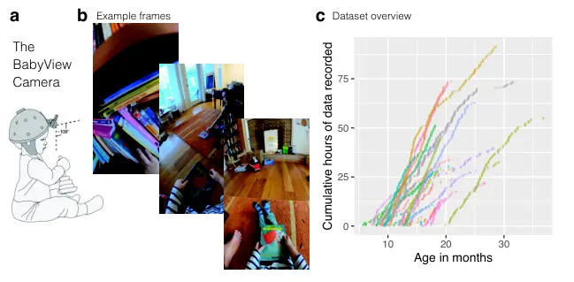

# The BabyView dataset: High-resolution egocentric videos of infants’ and young children’s everyday experiences

Bria Long⁰⁰footnotetext: \*Equal contribution. Affiliation: Stanford
University, Stanford, CA 94305    Robert Z. Sparks
Email: [tanawm@stanford.edu](mailto:)    Violet Xiang
Email: [syfeng@stanford.edu](mailto:)    Stefan Stojanov
Email: [aunag@stanford.edu](mailto:)    Zi Yin Affiliation: Stanford
University, Stanford, CA 94305 Email: [marchman@stanford.edu](mailto:)
   Grace E. Keene   Alvin W. M. Tan Affiliation: Stanford University,
Stanford, CA 94305 Email: [yamins@stanford.edu](mailto:)    Steven Y.
Feng Affiliation: Stanford University, Stanford, CA 94305
Email: [mcfrank@stanford.edu](mailto:)    Auddithio Nag
Affiliation: Stanford University, Stanford, CA 94305
Email: [chengxuz@mit.edu](mailto:)    Chengxu Zhuang
Affiliation: Massachusetts Institute of Technology, Cambridge, MA 02139
   Virginia A. Marchman Affiliation: Stanford University, Stanford, CA
94305    Daniel L. K. Yamins Affiliation: Stanford University, Stanford,
CA 94305    Michael C. Frank Email: [brlong@ucsd.edu{bsparks, ziyxiang,
stojanov, yinzi, gkeene,](mailto:) Affiliation: Stanford University,
Stanford, CA 94305 Affiliation: University of California, San Diego, La
Jolla, CA 92093

## Abstract

Human children far exceed modern machine learning algorithms in their
sample efficiency, achieving high performance in key domains with much
less data than current models. This “data gap” is a key challenge both
for building intelligent artificial systems and for understanding human
development. Egocentric video capturing children’s experience – their
“training data” – is a key ingredient for comparison of humans and
models and for the development of algorithmic innovations to bridge this
gap. Yet there are few such datasets available, and extant data are
low-resolution, have limited metadata, and importantly, represent only a
small set of children’s experiences. Here, we provide the first release
of a large developmental egocentric video dataset – the BabyView dataset
– recorded using a high-resolution camera with a large vertical
field-of-view and gyroscope/accelerometer data. This 868 hour dataset
includes egocentric videos from children spanning 6 months – 3 years of
age in longitudinal, at-home contexts. We provide gold-standard
annotations for the evaluation of speech transcription, speaker
diarization, and human pose estimation, and evaluate models in each of
these domains. We train self-supervised language and vision models and
evaluate their transfer to out-of-distribution tasks, including
syntactic structure learning, object recognition, depth estimation, and
image segmentation. Although performance in each domain scales with
dataset size, overall performance is relatively lower than when models
are trained on curated datasets, especially in the visual domain. Our
dataset stands as an open challenge for robust, human-like AI systems:
how can such systems achieve human-levels of success on the same scale
and distribution of training data as humans?

> Keywords: head-mounted cameras; data gap; language learning; visual
> representations; large language models

Infants and young children are remarkable learners, becoming capable and
engaged social partners within their first two years of life. The pace
of this developmental progress far exceeds modern machine learning
algorithms in its efficiency and capacity (Frank, (2023)). In
particular, signature accomplishments of artificial systems, such as
few-shot learning (Brown et al., (2020)) and image classification
(Krizhevsky et al., (2012)), require hundreds of billions of words of
training data and millions of labeled images. In contrast, human
learners become proficient in extending labels for newly learned visual
concepts (Carey & Bartlett, (1978)) and producing language (Frank et
al., (2021)) from only tens of millions of words and far fewer labeled
examples (Zhuang et al., (2021)). This “data gap” between human and
machine learners is thus a key challenge for the joint goals of
understanding human learning and building intelligent artificial
systems. Making progress will require not just an understanding of the
flexibility of human intelligence, but also an understanding of the
efficiency of human learning.

Data availability is a major barrier to progress in our understanding of
the gap in learning efficiency between machines and humans. To make
effective comparisons between human and machine learners, we need to be
able to evaluate models on data comparable to what children see and hear
during everyday learning experiences. While models today are trained on
millions or billions of images and/or videos, these are taken from the
adult perspective, providing a very different vantage point on the world
that is disconnected from real-world learning environments.

Egocentric video recordings taken from the child’s perspective provide a
key window into what children both see and hear as they learn about the
world around them and from their social partners (Smith et al., (2015);
Yoshida & Smith, (2008); Aslin, (2009); Franchak et al., (2011)).
Developmental psychology studies using these types of video recordings
have together revealed that the infant view is dramatically different
from that of adults’ (Yoshida & Smith, (2008)) and varies as children
learn to locomote on their own and interact actively with the objects,
places, and people around them (Kretch et al., (2014); Long, Sanchez et
al., (2022)).

Here we present the largest high-resolution developmental egocentric
video dataset to date, the BabyView dataset. We collect videos from 31
families predominantly located in the United States, totaling 868 hours
of usable recordings. We capitalize on innovations in the development of
head-mounted cameras (Long et al., (2023)), obtaining videos with a
large vertical field of view and coordinated gyroscope/accelerometer
data that can be used to estimate the child’s own head movements. We
provide pose detection, automated speech transcriptions, and
diarization, along with gold-standard annotations for use in evaluating
each of these. We additionally provide language outcome measures for a
subset of the children in the dataset. We then evaluate self-supervised
vision and language models on these data relative to existing
benchmarks.

## Related Work

##### Few developmental egocentric video datasets are available

Egocentric video has been an important domain for computer vision (Damen
et al., (2022); Grauman et al., (2022)) and resulting commercial
applications, such as wearable devices. Yet, egocentric video datasets
are mostly taken from the adult perspective, including the Ego4D
dataset, which has become an important standard in this field (Grauman
et al., (2022)). Head-mounted cameras have also been used in research
with children, including both descriptive investigations (Yoshida &
Smith, (2008); Aslin, (2009); Franchak et al., (2011); Kretch et al.,
(2014); Fausey et al., (2016); Bergelson & Aslin, (2017)) and computer
vision studies (Sheybani et al., (2024); Zhuang et al., (2021)).
Unfortunately, most prior work did not obtain consent for broad sharing
with other research groups and so many major datasets are unavailable
for re-analysis.

The few developmental egocentric video datasets that are available have
been difficult to use for training models for reasons of both data
quantity and quality (Long, Sanchez et al., (2022); Sullivan et al.,
(2021); Bergelson & Aslin, (2017)). For example, the SAYCam dataset – by
far the largest available dataset – is relatively low-resolution (480
$`\times`$ 640 pixels), has limited motion-correction (leading to blurry
views), and has timestamps imprinted on every frame (Sullivan et al.,
(2021)). The audio quality is quite variable depending on the background
noise and context, and the videos have restricted vertical view angle
that obscures views of children’s hands and what children are
interacting with. Further, SAYCam represents video from three children
of highly-involved and informed academic parents, all of whom were the
first children in their families. These issues have limited the field’s
ability to make use of automated annotations of the visual or linguistic
content of these videos and have restricted the ability to use these
data to draw broadly generalizable conclusions. Here, we present the
largest high-resolution, developmental egocentric video dataset with
broad consent from caregivers for reuse within the research community.

##### Models trained on developmental data show limited performance

Self-supervised vision models trained using developmental egocentric
video data (Zhuang et al., (2021); Orhan et al., (2020); Zhuang et al.,
(2022); Orhan & Lake, (2024); Vong et al., (2024)) have had some
intermediate success. However, these models significantly underperform
those self-supervised models trained on curated datasets, while the
latter models approach the accuracy of models trained using
fully-supervised methods (Oquab et al., (2023); Caron et al., (2021); He
et al., (2021); T. Chen et al., (2020); He et al., (2020)). Thus, it
remains unclear whether the current state-of-the-art techniques
represent truly general-purpose visual learning algorithms. In
particular, it is unclear whether gaps in model performance are due to
dataset quality and quantity or are instead due to the difficulty of
learning robust representations from children’s more realistic everyday
inputs.

Relatedly, in the language domain, recent work has investigated the
possibility of training language models (LMs) on small-scale
developmental datasets (Warstadt et al., (2023); Zhuang et al., (2024);
Feng et al., (2024), see e.g.,), but most of these have focused on
datasets larger than those available from egocentric video data. For
example, the text data used in the popular BabyLM competition (Warstadt
et al., (2023)) are also meant to approximate what a 10-year-old child
could receive (including text from Wikipedia and other sources), which
is very likely more – and different – data than what is required to
acquire a language. One exception is Qin et al. ((2024)), who trained
GPT-2 (Radford et al., (2019)) on very small amounts of input from a
single child and investigated the amount of grammatical knowledge that
could be learned.

Here, we evaluate whether data from a new, high-resolution dataset will
lead to increases in performance for self-supervised visual and
linguistic benchmark models.

## The BabyView Dataset

We address gaps in data availability by collecting and analyzing a new
set of developmental egocentric videos: the BabyView dataset. The
current paper describes the first release of the dataset, but data
collection is still ongoing and we anticipate future growth in the
overall size of the dataset. Recordings were obtained using a
high-resolution head-mounted camera for infants and children from 6
months through 3 years of age in at-home settings. In the BabyView-Home
portion of the dataset, 31 families recorded longitudinal data during
everyday activities for a total of 868 hours across all children. All
videos are accompanied by accelerometer/gyroscope data that can be used
to estimate children’s head-motion (N. Joshi et al., (2010); Karpenko et
al., (2011); B. Joshi et al., (2022)). We additionally release the
Ego-SingleChild dataset, a related dataset with 70 hours of recordings
with a different camera (see below). Together, these data comprise the
first release of the largest high-resolution egocentric video dataset
from children that will be available to researchers for both descriptive
analysis and model building (see Table 1 for comparison to prior
datasets).

|                                     |             |               |        |     |       |       |            |        |
| ----------------------------------- | ----------- | ------------- | ------ | --- | ----- | ----- | ---------- | ------ |
| Dataset                             | Egocentric? | Longitudinal? | Type   | N   | Hours | Audio | Transcript | Motion |
| BV-Home                             | ✓           | ✓             | Infant | 31  | 868   | ✓     | ✓          | ✓      |
| Ego-SingleChild                     | ✓           | ✓             | Infant | 1   | 70    | ✓     | ✓          |        |
| SAYCam Sullivan et al. ((2021))     | ✓           | ✓             | Infant | 3   | 476   | ✓     | ✓          |        |
| Ego4D Grauman et al. ((2022))       | ✓           |               | Adult  | 931 | 3,670 | ✓     | ✓          |        |
| Epic Kitchens Damen et al. ((2018)) | ✓           |               | Adult  | 37  | 100   | ✓     | ✓          |        |

Table 1: Comparison of the BabyView dataset to existing related
datasets; the BabyView dataset is the only egocentric developmental
video dataset with accelerometer/gyroscope data available for research.

### Camera and sensor data

The BabyView camera is a GoPro Hero Bones camera attached to a
child-safety helmet. This camera was selected because it has gyroscope
and accelerometer data, built-in image stabilization features, and
relatively high-resolution sound and video (Long et al., (2023)). The
camera is oriented vertically and is neutral with respect to the face
plane of the child, enabling the camera to capture both adult faces and
objects in a child’s hands in the same image, with an effective view
angle of 100° vertical by 75° horizontal (see Figure  1a,b) (Long et
al., (2023)).



Figure 1: (a) Schematic of a child wearing the BabyView camera
illustrating a large vertical field of view. (b) Example frames from a
video in the dataset (where the parent has provided broad sharing
consent). (c) Cumulative hours of video by each of the participants;
each color represents an individual child. The grey line represents
video data from the Ego-SingleChild subset. Data collection is ongoing.
The BabyView dataset thus collects high-resolution video and
gyroscope/accelerometer with a large vertical field of view from many
children over a large age range, with dense longitudinal data from a few
participants.

### Dataset components

##### BV-Home

Thirty-one families consented to capture home recordings with their
infant-toddler (0;5–3;1 years, average age at onboarding = 10 months, SD
= 0.26 years, see Figure 1c). Data collection is ongoing. Families were
recruited from a convenience sample of researchers in the field of
cognitive development (N=7/31 families) and from advertisements within
the State of California, and the broader United States. Some
English-speaking (N = 18/31) and English/Spanish bilingual families
(N=1/31) completed one or more parent-report measures of children’s
language development using the long-forms of the MacArthur-Bates
Communicative Development Inventories (Marchman et al., (2023);
Jackson-Maldonado et al., (2003)). Our current sample is relatively
multilingual (with only 19/31 English monolingual participants) and
highly educated, with 24/31 families having at least one parent with a
graduate degree. See Appendix for further information on participant
consent, detailed demographics, and number of language questionnaires.

##### Ego-SingleChild

We also release 70 hours of data from a single child of an academic
parent who recorded frequently. This participant was recruited before
procedures were finalized, and recorded using a different camera from
other participants. They used a Cigno F18 Night Vision 1080P Headband
Sport Camera rather than the BabyView camera, which yields shorter and
lower-resolution videos. However, they are comparable to previous dense
longitudinal recordings (see (Sullivan et al., (2021))), and thus
provide additional data that other researchers may benefit from.

### Data access & ongoing data collection

Egocentric video data from children in their home environments
necessarily contain more sensitive information than videos in egocentric
videos by adults. Families provided full consent for the data that are
shared at the time of recording. During a 6-month period after
recording, families can also retract any portion of their recording.
Thus, all data in this release will be made available in August 2025
once the parental embargo period has lapsed for all videos in this
release (release 2025.1). To ensure BabyView data are accessible to
researchers while protecting the privacy of participants, we distribute
the data through Databrary
([https://nyu.databrary.org/](https://nyu.databrary.org/)) (Gilmore et
al., (2016)), similar to previous developmental egocentric datasets
(Sullivan et al., (2021); Bergelson & Aslin, (2017)). Databrary is a
U.S. National Institutes of Health-funded site designed specifically for
the distribution of developmental video data. Access to data on
Databrary requires investigators to be authorized via an institutional
agreement that bars re-identification of participants and redistribution
of data.

BabyView is an ongoing longitudinal project and our aim is to release
further data as the dataset grows. Because of the multi-faceted and
growing nature of our dataset, we do not pre-specify train/test splits,
recognizing that any split might be appropriate for only a subset of
research goals (e.g., examining age-related change, or within- vs.
cross-child change).

[TABLE]

Table 2: Performance of the automated transcription and diarization
pipeline across the age of the child and the speaker. Child-produced
speech had the highest error rates.

## Annotations

### Language annotations

##### Transcription & diarization pipeline

All videos were transcribed using Distil-Whisper model distil-large-v3
(Gandhi et al., (2023)). As this version only supports English
transcription, we conducted transcription validation for families who
reported speaking only English at home. We also ran a multilingual voice
type classifier (Lavechin et al., (2020)) in parallel on the audio
extracted from all BabyView-Home videos (regardless of language), which
classified the speech segments as originating from a female adult, male
adult, key child (the wearer of the camera), or other child. Transcripts
and diarizations were then merged: Each utterance was assigned to one
speaker by choosing the model-annotated speaker category that had the
greatest overlap with the utterance timestamps. In some cases, an
utterance did not overlap with any model-annotated speaker; these were
marked as NA (NA rate was 8.39% for BV-Home). For our language model
training experiments below, we also ran the same pipeline on the SAYCam
audio, though we did not conduct validation on this dataset.

##### Evaluation procedure

To assess the accuracy of speech transcription and speaker diarization
on this dataset, we hand-annotated a subset of 2242 utterances in
English monolingual families, stratified across participant and age at
the time of recording. These utterances account for 2.59 hours of the
BV-Home videos. For each sampled video, we extracted 30 seconds of video
beginning at the midpoint of the video. Two authors transcribed the
speech and labeled the speaker in each segment. For transcription
validation, we computed a Word Error Rate (WER), which is the ratio of
the number of word-level errors to the total number of words in the
original utterance (Gandhi et al., (2023)). To evaluate speaker
diarization accuracy, we computed precision and recall of the model
output by age and speaker.

##### Child-produced and child-directed speech is challenging for transcription algorithms

Across all speakers, WER for automated transcriptions was comparable to
that for adult recordings and was somewhat lower in these naturalistic
home environments, especially compared to that previously seen using the
same methods with preschool classroom recordings (Sparks et al., (2024),
see). Qualitatively, these decrements in performance appear to result
from a high prevalence of infant-directed speech with which annotation
algorithms are less familiar. Although automated transcriptions perform
poorly for the youngest children, we see considerable improvement in WER
of child-produced speech of the older (18–30 months) children in the
dataset. Similarly, we found that Whisper often hallucinated incorrect
utterances for child-produced speech for the youngest infants (rather
than appropriately labeling it as babble). The speaker diarization
algorithm (Lavechin et al., (2020)) was able to identify whether a child
vs. adult was speaking 78% of the time, and often could accurately
identify the speaker type (female-adult, male-adult, key-child,
other-child) (see Table 2). While combining speaker diarization and
automated transcriptions can be useful, modern transcription algorithms
are still less accurate than humans at understanding both adult speech
in home environments and child-produced speech.

### Human pose annotations

##### Pose annotations

Human pose annotations provide critical data on the social information
available to infants and children throughout development that could
guide their learning (Fausey et al., (2016); Long, Sanchez et al.,
(2022)) and pose detection models been successfully applied to previous
egocentric datasets (Long, Sanchez et al., (2022); Long, Kachergis et
al., (2022)). We evaluated how well state-of-the-art pose detectors
performed on the BabyView dataset. To do so, we first sampled 353 frames
from the dataset (stratified across participants and sessions) and
manually annotated the 333 non-blurry frames using LabelStudio
(Tkachenko et al., (2020-2022)), creating a validation set. To
efficiently annotate the frames, we deployed the RTMPose (Jiang et al.,
(2023)) model via MMPose (Contributors, (2020)) as a backend to provide
initial pose keypoints and bounding box predictions, which we then
manually corrected. The pose annotations followed the format used in the
COCO keypoints dataset (Lin et al., (2014); Sun et al., (2019)). To
evaluate the accuracy of keypoint detections and compare our results
with those of other studies, we adopted the Object Keypoint Similarity
(OKS) metric (Sun et al., (2019)) (see Appendix).

| Architecture                              | Num. Params | Input Size | COCO-AP | Babyview-AP | COCO-AR | Babyview-AR |
| ----------------------------------------- | ----------- | ---------- | ------- | ----------- | ------- | ----------- |
| RTMO-l (Lu et al., (2023))                | 44.8M       | 640x640    | 0.724   | 0.593       | 0.762   | 0.723       |
| YOLOXPose-l (Maji et al., (2022))         | 87.0M       | 640x640    | 0.712   | 0.588       | 0.749   | 0.658       |
| SIMCC-resnet50 (Y. Li et al., (2022))     | 25.7M       | 384x288    | 0.735   | 0.676       | 0.790   | 0.723       |
| RTMPose-l-aic-coco (Jiang et al., (2023)) | 36.7M       | 384x288    | 0.773   | 0.735       | 0.819   | 0.773       |
| HRFormer-pose-base (YUAN et al., (2021))  | 43.2M       | 384x288    | 0.774   | 0.743       | 0.823   | 0.785       |
| ViTPose-H (Xu et al., (2022))             | 632M        | 256x192    | 0.788   | 0.788       | 0.840   | 0.825       |

Table 3: Pose Detection performance on COCO2017 Val and BabyView Val.
BabyView Validation frames were more challenging than COCO for all
models except ViTPose-H. AP refers to average precision, and AR refers
to average recall.

##### Child egocentric viewpoints are challenging for most pose detection models

The BabyView validation set was more challenging for most models than
the COCO validation set (Lin et al., (2014)), highlighting a new pose
benchmark for naturalistic egocentric videos (see Table 3). However,
ViTPose-H, the largest model in the group, showed comparable performance
between the two validation sets, suggesting that it is more robust to
the viewpoint variation inherent in egocentric videos.

## Benchmarks

### Language representation learning

Next, inspired by the BabyLM challenge, which seeks to learn human-like
linguistic representations from small amounts of
developmentally-realistic data (Warstadt et al., (2023)), we examined
the ability to learn linguistic representations from the BV-Home
transcripts. We compared our results with those obtained using
high-quality data from the Child Language Data Exchange System
(CHILDES), a repository of human-transcribed corpora of children’s and
caregivers’ talk (MacWhinney, (2014)).

##### Experiment Setup

We pretrained GPT-2 (Radford et al., (2019)) with 124M parameters
(small) on each dataset for up to 20 epochs (see Appendix for details).
We trained three seeds for each model, averaging their evaluation
results. For BV-Home, after deduplication, we only used transcripts for
English monolinguals for a total of $`\sim`$1.3M words of conversation
(19 families, 469 hours of video data), corresponding to $`\sim`$2M
total words including speaker labels and other metadata. To match this,
we sampled 2M total words from the diarized SAYCam data. For contrast,
the total amount of human-transcribed English-language data available in
CHILDES (including speaker labels and other metadata) is $`\sim`$29M
total words. To align the amount of training data across datasets, we
sampled 2M total words from CHILDES.

We further compared training on the combination of BV-Home and SAYCam
data with 4M total words from CHILDES. We also trained a version on the
entire 29M English subset of CHILDES, in line with Feng et al. ((2024)).
Each dataset was separated into 85/15 train and validation splits. This
resulted in 1.7M/0.3M splits for the 2M experiments, 3.4M/0.6M splits
for the 4M experiments, and 24.5M/4.5M splits for the 29M experiment.
For evaluation, we used Zorro (Huebner et al., (2021)), a benchmark
compatible with child vocabulary that aims to quantify the grammatical
knowledge of LMs by assessing their capability to effectively
distinguish between minimal pairs of sentences that exhibit various
grammatical contrasts.

##### BV-Home transcriptions provide comparable learning signal for grammatical knowledge

All GPT-2 models achieved above-chance performance on the Zorro
evaluation, even with fewer than 2M words of total training data. For
the 2M experiments (1.7M training words), there was a negligible
difference between BV-Home (63.47$`\pm`$1.24%), SAYCam data
(63.34$`\pm`$1.99%), and CHILDES (63.70$`\pm`$1.17%). For the 4M
experiments (3.4M training words), CHILDES (66.59$`\pm`$1.63%) performed
slightly better than the combination of BV-Home and SAYCam
(65.13$`\pm`$1.33%). Training on the full CHILDES (24.5M training words)
resulted in significantly higher performance (78.29$`\pm`$0.51%), as
expected with much more language data. This is also shown in Figure 2;
training on more language data resulted in better performance, in
contrast to our vision data scaling experiments shown in Figure 3.
Overall, despite the potential data quality issues in BabyView and
SAYCam transcripts (introduced by speech recognition errors), we
observed that transcriptions of BV-Home and SAYCam are overall
comparable to CHILDES as a learning signal for language models to obtain
grammatical knowledge.

Figure 2: Language data scaling experiments, showing grammatical
accuracy on Zorro (chance = 0.5) for GPT-2 trained on progressively
increasing amounts of child-directed speech (CDS) data. Within the GPT-2
CDS data points, the first represents 1.7M training words from BV-Home,
the second represents 3.4M training words combined over BV-Home and
SAYCam, and the final point represents 24.5M training words from
CHILDES. Zorro accuracy is also shown for RoBERTa (Liu et al., (2019))
\[240M words\] and BabyBERTa (Huebner et al., (2021)) \[5M words\].
Given the clear saturation of the metric in the larger pretrained model,
we used a logistic function, which asymptotically approaches 1, rather
than a linear fit.

Figure 3: Data scaling experiments for object recognition, depth
estimation and semantic segmentation. In a we observed a trend that
DINOv2 would require upwards of $`10^{7}`$ hours of video to match human
or ImageNet self-supervised ImageNet performance. In b and c, we also
observed unfavorable scaling for depth estimation and semantic
segmentation.

### Visual representation learning

We conducted a first set of experiments to investigate the ability of
recent self-supervised models to learn useful visual representations
from frames taken from these egocentric videos. Enabled by BV-Home, we
conducted the largest scale evaluation to date of self-supervised
learning methods trained on children’s egocentric visual experience.

Experiment Setup We trained a ViT-B/14 DINOv2 (Oquab et al., (2023))
from scratch as our reference self-supervised learning algorithm, due to
its high performance on various downstream tasks, including object
recognition, depth estimation, and semantic segmentation. We used the
standard training configuration from the official code base across all
training runs. We sampled Ego4D at 1 FPS, leading to 15M frames, and
sampled the BV-Home and SAYCam at 5FPS, leading to about 8M frames per
dataset for initial comparisons, and another 8M frames from the full
BV-Home dataset for a total of 16M BV-Home frames. Despite the inherent
redundancy in video data, this ensured a relatively large amount of
data, compared with the 1.4M ImageNet training set. We evaluated object
recognition accuracy on ImageNet, and after additional training on
high-resolution images of the original datasets, we evaluated depth
estimation on NYUv2 (Silberman et al., (2012)) and semantic segmentation
on COCOStuff (Caesar et al., (2018)). On top of the frozen ViT, for
ImageNet we used kNN and a linear probe, whereas for depth estimation we
trained a DPT and for semantic segmentation we used a linear probe,
following DINOv2 protocols (see Appendix).

|                                       |                            |                             |                          |                            |
| ------------------------------------- | -------------------------- | --------------------------- | ------------------------ | -------------------------- |
|                                       | Object Recognition – Top 1 |                             | Depth Estimation         | Semantic Segmentation      |
| Dataset                               | ImageNet kNN$`\uparrow`$   | ImageNet linear$`\uparrow`$ | NYUv2 RMSE$`\downarrow`$ | COCOStuff mIoU$`\uparrow`$ |
| None (random init.)                   | 10.00                      | 1.43                        | 0.886                    | 0.54                       |
| LVD-124M (Oquab et al., (2023))       | 82.10                      | 84.50                       | 0.307                    | 44.46                      |
| ImageNet (Russakovsky et al., (2015)) | 76.29                      | 77.64                       | 0.456                    | 34.65                      |
| Ego4D(Grauman et al., (2022))         | 43.59                      | 54.39                       | 0.525                    | 23.78                      |
| SAYCam(Sullivan et al., (2021))       | 42.59                      | 52.52                       | 0.518                    | 21.08                      |
| BV-Home (430 hours)                   | 40.72                      | 52.19                       | 0.526                    | 22.03                      |
| SAYCam + BV-Home (430 hours)          | 41.76                      | 53.28                       | 0.511                    | 22.53                      |
| SAYCam + BV-Home (868 hours)          | 42.76                      | 53.28                       | 0.505                    | 22.81                      |

Table 4: Object recognition, depth estimation, and semantic segmentation
results on the BabyView & comparison datasets. Downstream generalization
accuracy was significantly reduced when learning on frames from
egocentric videos relative to curated datasets.

##### Self-supervised learning from any egocentric data is challenging

We anticipated that the more diverse and higher-resolution videos in
BV-Home would afford improvements over prior egocentric video datasets
(Sullivan et al., (2021)). Yet, we found that models trained on a
similar amount of BV-Home data did not outperform those trained on the
SAYCam dataset, despite the difference in data quality (see Table 4),
though we found a small improvement in semantic segmentation performance
on models trained on BV-Home vs. SAYCam.¹¹ 1 Note results are above
random chance: ImageNet – 0.001, NYUv2 – 2, COCOstuff – 0.2. More
broadly, however, we found that the gap in performance is not just
specific to data collected from children. Even when training on Ego4D –
a roughly 7$`\times`$ larger and more diverse dataset – we saw that a
significant gap to curated vision datasets remained across all tasks. We
further investigated training an additional self-supervised learning
method, MoCov3 (X. Chen et al., (2021)) also based on a ViT-B/16 on 430
hours of BV-Home data: We obtained 18.7 for kNN and 27.3 for linear on
ImageNet, indicating that other self-supervised learning techniques also
show a significant gap in performance.

##### Insufficient scaling to meet human or self-supervised performance from curated datasets

Given a reasonably large amount of training data from egocentric video
of children’s visual experience, could the current self-supervised
state-of-the-art model reach human performance, or obtain equivalent
performance to training on curated vision datasets? To address this
question, we trained on 1%, 5%, 10%, 25%, 50%, and 100% of a combined
dataset of our first half of BV-Home (430 hours) and SAYCam, and
extrapolated by fitting log-linear trend lines. For a final datapoint,
we added another 424 hours of BV-Home video data (see Table 4). For
object recognition on ImageNet (see Figure  3a) we observed that more
than $`10^{7}`$ hours would be required to reach human
performance (Russakovsky et al., (2015)) or ImageNet pre-training
performance. In Figures 3b and 3c, we found that a similar trend holds
for depth estimation and semantic segmentation, with saturating
performance as the scale of data is increased, even as we roughly
doubled the amount of BV-Home data used in pre-training. Note that the
first two points on these plots indicated 160K and 800K images and the
last point 16M images. While training on the combination of both SAYCam
and the largest draw of the BV-Home dataset did lead to a numeric
improvement evaluation metrics compared to SAYCam alone, the improvement
was relatively slim. Overall, these results suggested that there is
still a substantial “data gap” between state-of-the-art self-supervised
vision models and children.

## General Discussion

We present a new, large-scale, high-resolution egocentric video dataset
documenting infants’ and young children’s everyday experiences,
accompanied by both dense metadata and gold-standard annotations for
several key domains. In contrast to prior work with lower-resolution
videos and earlier models (Long, Kachergis et al., (2022)), we find that
state-of-the-art speech recognition (Gandhi et al., (2023); Radford et
al., (2023)) and pose detection (Xu et al., (2022); Contributors,
(2020)) models perform well on stratified samples of frames and audio
recordings from the dataset. Further, language models trained on these
data performed comparably to models trained on current gold-standard
corpora of hand-transcribed child-directed speech corpora. The BabyView
camera thus provides improved data over which supervised algorithms can
extract descriptives that will be an important resource for
characterizing children’s early learning environments (Sparks et al.,
(2024)).

Yet, our results also suggest that the naturalistic, everyday
experiences of children pose a challenging problem for the most advanced
learning algorithms, especially in the visual domain: current
state-of-the-art models fall short relative to existing benchmarks when
trained on “human amounts” of visual or linguistic data, requiring
unrealistic amounts of additional data to achieve human-level
performance (Frank, (2023)). Scaling for language data suggested the
possibility of relatively strong performance with human-scale data, but
scaling for vision models was strikingly bad. In particular, our results
suggest that current self-supervised visual learning models are
dependent on large, curated datasets with a broad diversity of inputs to
construct robust visual representations useful for object recognition,
depth estimation, and semantic segmentation.

While a similar “data gap” has also been reported by Orhan ((2021)), our
findings yield a somewhat lower estimation of the amount of data needed
to achieve human-level performance than suggested in Orhan ((2021)) and
higher estimation than in Orhan ((2023)). However, direct comparisons
are challenging due to the fact that our results use the state of the
art DINOv2  (Oquab et al., (2023); Orhan, (2021)) rather than masked
autoencoders  (He et al., (2021); Orhan, (2023)), and solely egocentric
video datasets (vs. a mix of egocentric and allocentric). Most
importantly, we do not fine-tune our models end-to-end on ImageNet, as
in Orhan ((2021)); Orhan ((2023)), but freeze the pre-trained encoders
and train readout layers on top. Overall, however, our results are
broadly convergent with Orhan ((2021)) in suggesting that there remains
a large data gap between human and machine performance in
self-supervised visual learning.

What accounts for this difference between the visual and linguistic
domains? We suspect that this is because the language data in these
experiments are closer to the standard data used to train large language
models—e.g., conversation transcripts or subtitles. In contrast, images
sampled from egocentric videos vary dramatically from images in curated
visual datasets. Using transcribed language also means that the language
information has undergone some segmentation and parsing, unlike the
visual information. Future work that systematically varies input data
will help confirm these ideas.

What might lead to more child-like models of early learning? One idea is
that the joint learning of visual and language representations (Vong et
al., (2024)) requires more fine-grained and efficient learning
algorithms, such as lexicon-level visual grounding (Zhuang et al.,
(2023); Zhuang et al., (2024)). In addition, children’s everyday
experiences contain deep regularities within everyday activity contexts
(Clerkin et al., (2017); Clerkin & Smith, (2022); de Barbaro & Fausey,
(2022)) that are challenging for current models but appear advantageous
for human learners. For example, the same objects and words are repeated
often within the same activity contexts (e.g., mealtime), which could
create known contexts for children to learn infrequent items (e.g.,
pomegranates). Constructing models that can learn as children do from
these skewed input distributions – where some words and objects are
frequent and others appear very rarely – is thus a key challenge for
future work (Smith & Slone, (2017)).

In addition, we speculate that focusing on modeling event
representations in naturalistic video (Zhuang et al., (2020)) might lead
to more developmentally realistic models, as children are, of course,
learning from continuous events rather than static images. Indeed, new
work suggests that video models trained on SAYCam (Sullivan et al.,
(2021)) can learn action concepts (Orhan et al., (2024)). In addition,
we suspect that incorporating information about both children’s own
head-motion (B. Joshi et al., (2022)) via IMU data (contained in this
dataset), as well as attentional guidance signals from caregivers (Long,
Sanchez et al., (2022); Yu et al., (2021)) may yield more data-efficient
models of early language and visual concept learning.

Regardless of innovations in model architectures or learning algorithms,
our results highlight the need for developmentally-appropriate outcome
data (Tan et al., (2025)) which can be used to evaluate models trained
on developmental data. Our speculation about scaling for language model
training is hindered by the lack of developmental data on grammaticality
judgments – we do not know what a realistic topline should be for human
learners. Similarly, toddlers cannot classify all ImageNet categories,
and a growing literature suggests that object recognition abilities
mature throughout middle childhood, as does their visual concept
knowledge (Long et al., (2024); Huber et al., (2023)). Children’s
emerging mid-level visual understanding (such as motion, 3D shape, and
depth perception) may also be an alternative basis for comparing models
and children, especially as children may develop these capacities
through active exploration and interaction with their world long before
they have fine-grained category representations. Thus, this work
highlights the need to create benchmarks that allow us to measure and
quantify performance in a unified way across both models and children.
Systematically comparing models’ and children’s emerging representations
across both the linguistic (e.g., lexical knowledge, grammar, semantics)
and the visual (e.g., visual concepts, intuitive physics) domains will
likely help elucidate the observed gap in model performance by yielding
testable predictions for future work.

Finally, models trained on the same visual diet as children might
eventually emerge as superior models of neural responses to visual
stimuli. While there is a fairly substantial literature predicting
neural responses in ventral cortex from the embeddings of models trained
in different ways (Yamins et al., (2014); Conwell et al., (2024)), very
few of these models have been trained on naturalistic datasets (cf.
(Zhuang et al., (2021); Conwell et al., (2024))). We anticipate that the
BabyView dataset will enable the systematic benchmarking of models
trained with more ecologically-valid input data.

These data have several limitations. First, these data necessarily
incorporate selection bias: parents who opt-in to the study are
recording in their homes when they choose to (to avoid privacy issues)
and can choose to excise any portion of their data; in addition, some
naturalistic experiences (e.g., bathtime) are not incorporated into the
dataset. Further, with two exceptions, all families are located in the
United States, limiting generalizability. Nonetheless, BV-Home
incorporates data from a greater diversity of families across race,
ethnicity, and family incomes than before (see Appendix). The potential
harms that could arise from this dataset relate to breaches of privacy
and trust on the part of the participating families. To guard against
these, researchers are required to sign the Databrary data use agreement
(Gilmore et al., (2016)), which prohibits reidentification or
redistribution of videos.

In sum, we present the first release of a new, large-scale,
high-resolution developmental egocentric video dataset. Our dataset
provides an unprecedented view into the everyday experiences of young
children and stands as a challenge to modern AI: how can such systems
achieve human levels of success on the same scale and distribution of
training data as human children?

## Acknowledgments

We gratefully acknowledge the families who contributed to the dataset.
This work was supported by an NIH R00HD108386 to B.L., a Schmidt Futures
gift to M.C.F., a Stanford Human-Centered Artificial Intelligence
Institute Hoffman-Yee Grant to M.C.F. and D.L.K.Y, a gift from the
Center for the Study of Language and Information Olney Fund, and a gift
from Amazon, Inc.. D.L.K.Y. and trainees were supported by a Simons
Foundation grant 543061, National Science Foundation CAREER grant
1844724, National Science Foundation Grant NCS-FR 2123963, Office of
Naval Research grant S5122, ONR MURI 00010802, ONR MURI S5847, and ONR
MURI 1141386 - 493027. We also thank the Stanford HAI, Stanford Data
Sciences and the Marlowe team, and the Google TPU Research Cloud team
for computing support.

## References

- Aslin ((2009)) Aslin, R.N. (2009). How infants view natural scenes
  gathered from a head-mounted camera. Optometry and Vision Science 86 6
  561–565.
- Bergelson & Aslin ((2017)) Bergelson, E. & Aslin, R.N. (2017). Nature
  and origins of the lexicon in 6-mo-olds. Proceedings of the National
  Academy of Sciences 114 49 12916–12921.
- Brown et al. ((2020)) Brown, T., Mann, B., Ryder, N., Subbiah, M.,
  Kaplan, J.D., Dhariwal, P.others (2020). Language models are few-shot
  learners. Advances in neural information processing systems 33
  1877–1901.
- Caesar et al. ((2018)) Caesar, H., Uijlings, J. & Ferrari, V. (2018).
  Coco-stuff: Thing and stuff classes in context. In Proceedings of the
  ieee conference on computer vision and pattern recognition (
  1209–1218).
- Carey & Bartlett ((1978)) Carey, S. & Bartlett, E. (1978). Acquiring a
  single new word. Linguistics .
- Caron et al. ((2021)) Caron, M., Touvron, H., Misra, I., Jégou, H.,
  Mairal, J., Bojanowski, P. & Joulin, A. (2021). Emerging properties in
  self-supervised vision transformers. In Proceedings of the ieee/cvf
  international conference on computer vision ( 9650–9660).
- T. Chen et al. ((2020)) Chen, T., Kornblith, S., Norouzi, M. &
  Hinton, G. (2020). A simple framework for contrastive learning of
  visual representations. In Icml.
- X. Chen et al. ((2021)) Chen, X., Xie, S. & He, K. (2021). An
  empirical study of training self-supervised vision transformers. In
  Proceedings of the ieee/cvf international conference on computer
  vision ( 9640–9649).
- Clerkin et al. ((2017)) Clerkin, E.M., Hart, E., Rehg, J.M., Yu, C. &
  Smith, L.B. (2017). Real-world visual statistics and infants’
  first-learned object names. Philosophical Transactions of the Royal
  Society B: Biological Sciences 372 1711 20160055.
- Clerkin & Smith ((2022)) Clerkin, E.M. & Smith, L.B. (2022).
  Real-world statistics at two timescales and a mechanism for infant
  learning of object names. Proceedings of the National Academy of
  Sciences 119 18 e2123239119.
- Contributors ((2020)) Contributors, M. (20201). MMSegmentation:
  Openmmlab semantic segmentation toolbox and benchmark.
  [https://github.com/open-mmlab/mmsegmentation](https://github.com/open-mmlab/mmsegmentation).
- Contributors ((2020)) Contributors, M. (20202). Openmmlab pose
  estimation toolbox and benchmark.
  [https://github.com/open-mmlab/mmpose](https://github.com/open-mmlab/mmpose).
- Conwell et al. ((2024)) Conwell, C., Prince, J.S., Kay, K.N., Alvarez,
  G.A. & Konkle, T. (2024). A large-scale examination of inductive
  biases shaping high-level visual representation in brains and
  machines. Nature communications 15 1 9383.
- Damen et al. ((2018)) Damen, D., Doughty, H., Farinella, G.M., Fidler,
  S., Furnari, A., Kazakos, E.others (2018). Scaling egocentric vision:
  The epic-kitchens dataset. In Proceedings of the european conference
  on computer vision (eccv) ( 720–736).
- Damen et al. ((2022)) Damen, D., Doughty, H., Farinella, G.M.,
  Furnari, A., Kazakos, E., Ma, J.others (2022). Rescaling egocentric
  vision: Collection, pipeline and challenges for epic-kitchens-100.
  International Journal of Computer Vision 1–23.
- de Barbaro & Fausey ((2022)) de Barbaro, K. & Fausey, C.M. (2022). Ten
  lessons about infants’ everyday experiences. Current Directions in
  Psychological Science 31 1 28–33.
- Fausey et al. ((2016)) Fausey, C.M., Jayaraman, S. & Smith, L.B.
  (2016). From faces to hands: Changing visual input in the first two
  years. Cognition 152 101–107.
- Feng et al. ((2024)) Feng, S.Y., Goodman, N.D. & Frank, M.C. (2024).
  Is child-directed speech effective training data for language models?
  In Proceedings of the 2024 conference on empirical methods in natural
  language processing. : Association for Computational Linguistics.
  [https://arxiv.org/abs/2408.03617](https://arxiv.org/abs/2408.03617)
- Franchak et al. ((2011)) Franchak, J.M., Kretch, K.S., Soska, K.C. &
  Adolph, K.E. (2011). Head-mounted eye tracking: A new method to
  describe infant looking. Child development 82 6 1738–1750.
- Frank ((2023)) Frank, M.C. (2023). Bridging the data gap between
  children and large language models. Trends in Cognitive Sciences .
- Frank et al. ((2021)) Frank, M.C., Braginsky, M., Yurovsky, D. &
  Marchman, V.A. (2021). Variability and consistency in early language
  learning: The wordbank project. : MIT Press.
- Gandhi et al. ((2023)) Gandhi, S., von Platen, P. & Rush, A.M. (2023).
  Distil-whisper: Robust knowledge distillation via large-scale pseudo
  labelling. arXiv preprint arXiv:2311.00430 .
- Gilmore et al. ((2016)) Gilmore, R.O., Adolph, K.E. & Millman, D.S.
  (2016). Curating identifiable data for sharing: The databrary project.
  In 2016 new york scientific data summit (nysds) ( 1–6).
- Grauman et al. ((2022)) Grauman, K., Westbury, A., Byrne, E., Chavis,
  Z., Furnari, A., Girdhar, R.others (2022). Ego4d: Around the world in
  3,000 hours of egocentric video. In Proceedings of the ieee/cvf
  conference on computer vision and pattern recognition ( 18995–19012).
- He et al. ((2021)) He, K., Chen, X., Xie, S., Li, Y., Dollár, P. &
  Girshick, R. (2021). Masked autoencoders are scalable vision learners.
  arXiv preprint arXiv:2111.06377 .
- He et al. ((2020)) He, K., Fan, H., Wu, Y., Xie, S. & Girshick, R.
  (2020). Momentum contrast for unsupervised visual representation
  learning. In Proceedings of the ieee/cvf conference on computer vision
  and pattern recognition ( 9729–9738).
- Huber et al. ((2023)) Huber, L.S., Geirhos, R. & Wichmann, F.A.
  (2023). The developmental trajectory of object recognition robustness:
  children are like small adults but unlike big deep neural networks.
  Journal of vision 23 7 4–4.
- Huebner et al. ((2021)) Huebner, P.A., Sulem, E., Cynthia, F. &
  Roth, D. (2021). BabyBERTa: Learning more grammar with small-scale
  child-directed language. In A. Bisazza & O. Abend (Eds.), Proceedings
  of the 25th conference on computational natural language learning (
  624–646). Online: Association for Computational Linguistics.
  [https://aclanthology.org/2021.conll-1.49](https://aclanthology.org/2021.conll-1.49)
  doi:10.18653/v1/2021.conll-1.49
- Jackson-Maldonado et al. ((2003)) Jackson-Maldonado, D., Thal, D.J.,
  Fenson, L., Marchman, V.A., Newton, T. & Barbara, C. (2003).
  Macarthur-bates inventarios del desarollo de habilitades
  communicativas: User’s guide and technical manual. : Brookes
  Publishing Company.
- Jiang et al. ((2023)) Jiang, T., Lu, P., Zhang, L., Ma, N., Han, R.,
  Lyu, C.Chen, K. (2023). Rtmpose: Real-time multi-person pose
  estimation based on mmpose. arXiv preprint arXiv:2303.07399 .
- B. Joshi et al. ((2022)) Joshi, B., Xanthidis, M., Rahman, S. &
  Rekleitis, I. (2022). High definition, inexpensive, underwater
  mapping. In Ieee international conference on robotics and automation
  (icra) (p.  1113-1121). doi:10.1109/ICRA46639.2022.9811695
- N. Joshi et al. ((2010)) Joshi, N., Kang, S.B., Zitnick, C.L. &
  Szeliski, R. (2010). Image deblurring using inertial measurement
  sensors. ACM Transactions on Graphics (TOG) 29 4 1–9.
- Karpenko et al. ((2011)) Karpenko, A., Jacobs, D., Baek, J. &
  Levoy, M. (2011). Digital video stabilization and rolling shutter
  correction using gyroscopes. CSTR 1 2 13.
- Kretch et al. ((2014)) Kretch, K.S., Franchak, J.M. & Adolph, K.E.
  (2014). Crawling and walking infants see the world differently. Child
  development 85 4 1503–1518.
- Krizhevsky et al. ((2012)) Krizhevsky, A., Sutskever, I. & Hinton,
  G.E. (2012). Imagenet classification with deep convolutional neural
  networks. Advances in neural information processing systems 25 .
- Lavechin et al. ((2020)) Lavechin, M., Bousbib, R., Bredin, H.,
  Dupoux, E. & Cristia, A. (2020). An open-source voice type classifier
  for child-centered daylong recordings. arXiv preprint arXiv:2005.12656
  .
- Y. Li et al. ((2022)) Li, Y., Yang, S., Liu, P., Zhang, S., Wang, Y.,
  Wang, Z.Xia, S-T. (2022). Simcc: A simple coordinate classification
  perspective for human pose estimation. In European conference on
  computer vision ( 89–106).
- Z. Li ((2022)) Li, Z. (2022). Monocular depth estimation toolbox.
  [https://github.com/zhyever/Monocular-Depth-Estimation-Toolbox](https://github.com/zhyever/Monocular-Depth-Estimation-Toolbox).
- Lin et al. ((2014)) Lin, T-Y., Maire, M., Belongie, S., Hays, J.,
  Perona, P., Ramanan, D.Zitnick, C.L. (2014). Microsoft coco: Common
  objects in context. In Computer vision–eccv 2014: 13th european
  conference, zurich, switzerland, september 6-12, 2014, proceedings,
  part v 13 ( 740–755).
- Liu et al. ((2019)) Liu, Y., Ott, M., Goyal, N., Du, J., Joshi, M.,
  Chen, D.Stoyanov, V. (2019). Roberta: A robustly optimized bert
  pretraining approach.
  [https://arxiv.org/abs/1907.11692](https://arxiv.org/abs/1907.11692)
- Long et al. ((2024)) Long, B., Fan, J.E., Huey, H., Chai, Z. & Frank,
  M.C. (2024). Parallel developmental changes in children’s production
  and recognition of line drawings of visual concepts. Nature
  Communications 15 1 1191.
- Long et al. ((2023)) Long, B., Goodin, S., Kachergis, G., Marchman,
  V.A., Radwan, S.F., Sparks, R.Z.others (2023). The babyview camera:
  Designing a new head-mounted camera to capture children’s early social
  and visual environments. Behavior Research Methods 1–12.
- Long, Kachergis et al. ((2022)) Long, B., Kachergis, G., Agrawal, K. &
  Frank, M.C. (2022). A longitudinal analysis of the social information
  in infants’ naturalistic visual experience using automated detections.
  Developmental Psychology 58 2211-2229. doi:10.1037/dev0001414
- Long, Sanchez et al. ((2022)) Long, B., Sanchez, A., Kraus, A.M.,
  Agrawal, K. & Frank, M.C. (2022). Automated detections reveal the
  social information in the changing infant view. Child Development 93 1
  101–116.
- Lu et al. ((2023)) Lu, P., Jiang, T., Li, Y., Li, X., Chen, K. &
  Yang, W. (2023). Rtmo: Towards high-performance one-stage real-time
  multi-person pose estimation. arXiv preprint arXiv:2312.07526 .
- MacWhinney ((2014)) MacWhinney, B. (2014). The childes project: Tools
  for analyzing talk, volume i: Transcription format and programs. :
  Psychology Press.
- Maji et al. ((2022)) Maji, D., Nagori, S., Mathew, M. & Poddar, D.
  (2022). Yolo-pose: Enhancing yolo for multi person pose estimation
  using object keypoint similarity loss. In Proceedings of the ieee/cvf
  conference on computer vision and pattern recognition ( 2637–2646).
- Marchman et al. ((2023)) Marchman, V.A., Dale, P.S. & Fenson, L.
  (2023). The macarthur-bates communicative development inventories:
  User’s guide and technical manual, 3rd edition. : Brookes Publishing
  Company.
- Oquab et al. ((2023)) Oquab, M., Darcet, T., Moutakanni, T., Vo, H.,
  Szafraniec, M., Khalidov, V.others (2023). Dinov2: Learning robust
  visual features without supervision. arXiv preprint arXiv:2304.07193 .
- Orhan ((2021)) Orhan, A.E. (2021). How much human-like visual
  experience do current self-supervised learning algorithms need in
  order to achieve human-level object recognition? arXiv preprint
  arXiv:2109.11523 .
- Orhan ((2023)) Orhan, A.E. (2023). Scaling may be all you need for
  achieving human-level object recognition capacity with human-like
  visual experience. arXiv preprint arXiv:2308.03712 .
- Orhan et al. ((2020)) Orhan, A.E., Gupta, V. & Lake, B.M. (2020).
  Self-supervised learning through the eyes of a child. Advances in
  Neural Information Processing Systems 33 .
- Orhan & Lake ((2024)) Orhan, A.E. & Lake, B.M. (2024). Learning
  high-level visual representations from a child’s perspective without
  strong inductive biases. Nature Machine Intelligence 6 3 271–283.
- Orhan et al. ((2024)) Orhan, A.E., Wang, W., Wang, A.N., Ren, M. &
  Lake, B.M. (2024). Self-supervised learning of video representations
  from a child’s perspective. arXiv preprint arXiv:2402.00300 .
- Qin et al. ((2024)) Qin, Y., Wang, W. & Lake, B.M. (2024). A
  systematic investigation of learnability from single child linguistic
  input. In Proceedings of the 46th annual conference of the cognitive
  science society.
- Radford et al. ((2023)) Radford, A., Kim, J.W., Xu, T., Brockman, G.,
  McLeavey, C. & Sutskever, I. (2023). Robust speech recognition via
  large-scale weak supervision. In International conference on machine
  learning ( 28492–28518).
- Radford et al. ((2019)) Radford, A., Wu, J., Child, R., Luan, D.,
  Amodei, D., Sutskever, I. et al. (2019). Language models are
  unsupervised multitask learners. OpenAI blog 1 8 9.
- Ranftl et al. ((2021)) Ranftl, R., Bochkovskiy, A. & Koltun, V.
  (2021). Vision transformers for dense prediction. In Proceedings of
  the ieee/cvf international conference on computer vision (
  12179–12188).
- Russakovsky et al. ((2015)) Russakovsky, O., Deng, J., Su, H., Krause,
  J., Satheesh, S., Ma, S.others (2015). Imagenet large scale visual
  recognition challenge. International journal of computer vision 115
  211–252.
- Sheybani et al. ((2024)) Sheybani, S., Hansaria, H., Wood, J.,
  Smith, L. & Tiganj, Z. (2024). Curriculum learning with infant
  egocentric videos. Advances in Neural Information Processing Systems
  36 .
- Silberman et al. ((2012)) Silberman, N., Hoiem, D., Kohli, P. &
  Fergus, R. (2012). Indoor segmentation and support inference from rgbd
  images. In Computer vision–eccv 2012: 12th european conference on
  computer vision, florence, italy, october 7-13, 2012, proceedings,
  part v 12 ( 746–760).
- Smith & Slone ((2017)) Smith, L.B. & Slone, L.K. (2017). A
  developmental approach to machine learning? Frontiers in psychology
  8 296143.
- Smith et al. ((2015)) Smith, L.B., Yu, C., Yoshida, H. & Fausey, C.M.
  (2015). Contributions of head-mounted cameras to studying the visual
  environments of infants and young children. Journal of Cognition and
  Development 16 3 407–419.
- Sparks et al. ((2024)) Sparks, R.Z., Long, B., Keene, G.E., Perez,
  M.J., Tan, A.W., Marchman, V.A. & Frank, M.C. (2024). Characterizing
  contextual variation in children’s preschool language environment
  using naturalistic egocentric videos. In Proceedings of the 46th
  annual conference of the cognitive science society.
- Sullivan et al. ((2021)) Sullivan, J., Mei, M., Perfors, A.,
  Wojcik, E. & Frank, M.C. (2021). Saycam: A large, longitudinal
  audiovisual dataset recorded from the infant’s perspective. Open mind
  5 20–29.
- Sun et al. ((2019)) Sun, K., Xiao, B., Liu, D. & Wang, J. (2019). Deep
  high-resolution representation learning for human pose estimation. In
  Proceedings of the ieee/cvf conference on computer vision and pattern
  recognition ( 5693–5703).
- Tan et al. ((2025)) Tan, A.W.M., Yu, S., Long, B., Ma, W.A., Murray,
  T., Silverman, R.D.Frank, M.C. (2025). DevBench: A multimodal
  developmental benchmark for language learning. In Advances in Neural
  Information Processing Systems ( 37, 77445–77467). Vancouver, BC: .
- Tkachenko et al. ((2020-2022)) Tkachenko, M., Malyuk, M.,
  Holmanyuk, A. & Liubimov, N. (2020-2022). Label Studio: Data labeling
  software.
  [https://github.com/heartexlabs/label-studio](https://github.com/heartexlabs/label-studio)
  Open source software available from
  https://github.com/heartexlabs/label-studio
- Tomar ((2006)) Tomar, S. (2006). Converting video formats with ffmpeg.
  Linux journal 2006 146 10.
- Vong et al. ((2024)) Vong, W.K., Wang, W., Orhan, A.E. & Lake, B.M.
  (2024). Grounded language acquisition through the eyes and ears of a
  single child. Science 383 6682 504–511.
- Warstadt et al. ((2023)) Warstadt, A., Mueller, A., Choshen, L.,
  Wilcox, E., Zhuang, C., Ciro, J.others (2023). Findings of the babylm
  challenge: Sample-efficient pretraining on developmentally plausible
  corpora. In Proceedings of the babylm challenge at the 27th conference
  on computational natural language learning.
- Warstadt et al. ((2020)) Warstadt, A., Parrish, A., Liu, H.,
  Mohananey, A., Peng, W., Wang, S-F. & Bowman, S.R. (2020). BLiMP: The
  benchmark of linguistic minimal pairs for English. Transactions of the
  Association for Computational Linguistics 8 377–392.
  [https://aclanthology.org/2020.tacl-1.25](https://aclanthology.org/2020.tacl-1.25)
  doi:10.1162/tacl˙a˙00321
- Xu et al. ((2022)) Xu, Y., Zhang, J., Zhang, Q. & Tao, D. (2022).
  Vitpose: Simple vision transformer baselines for human pose
  estimation. Advances in Neural Information Processing Systems 35
  38571–38584.
- Yamins et al. ((2014)) Yamins, D.L., Hong, H., Cadieu, C.F., Solomon,
  E.A., Seibert, D. & DiCarlo, J.J. (2014). Performance-optimized
  hierarchical models predict neural responses in higher visual cortex.
  Proceedings of the national academy of sciences 111 23 8619–8624.
- Yoshida & Smith ((2008)) Yoshida, H. & Smith, L.B. (2008). What’s in
  view for toddlers? using a head camera to study visual experience.
  Infancy 13 3 229–248.
- Yu et al. ((2021)) Yu, C., Zhang, Y., Slone, L.K. & Smith, L.B.
  (2021). The infant’s view redefines the problem of referential
  uncertainty in early word learning. Proceedings of the National
  Academy of Sciences 118 52 e2107019118.
- YUAN et al. ((2021)) YUAN, Y., Fu, R., Huang, L., Lin, W., Zhang, C.,
  Chen, X. & Wang, J. (2021). Hrformer: High-resolution vision
  transformer for dense predict. In M. Ranzato, A. Beygelzimer,
  Y. Dauphin, P. Liang & J.W. Vaughan (Eds.), Advances in neural
  information processing systems ( 34, 7281–7293). : Curran Associates,
  Inc.
  [https://proceedings.neurips.cc/paper_files/paper/2021/file/3bbfdde8842a5c44a0323518eec97cbe-Paper.pdf](https://proceedings.neurips.cc/paper_files/paper/2021/file/3bbfdde8842a5c44a0323518eec97cbe-Paper.pdf)
- Zhuang et al. ((2023)) Zhuang, C., Fedorenko, E. & Andreas, J. (2023).
  Visual grounding helps learn word meanings in low-data regimes. arXiv
  preprint arXiv:2310.13257 .
- Zhuang et al. ((2024)) Zhuang, C., Fedorenko, E. & Andreas, J. (2024).
  Lexicon-level contrastive visual-grounding improves language modeling.
  arXiv preprint arXiv:2403.14551 .
- Zhuang et al. ((2020)) Zhuang, C., She, T., Andonian, A., Mark, M.S. &
  Yamins, D. (2020). Unsupervised learning from video with deep neural
  embeddings. In Proceedings of the ieee/cvf conference on computer
  vision and pattern recognition ( 9563–9572).
- Zhuang et al. ((2022)) Zhuang, C., Xiang, Z., Bai, Y., Jia, X.,
  Turk-Browne, N., Norman, K.Yamins, D. (2022). How well do unsupervised
  learning algorithms model human real-time and life-long learning?
  Advances in Neural Information Processing Systems 35 22628–22642.
- Zhuang et al. ((2021)) Zhuang, C., Yan, S., Nayebi, A., Schrimpf, M.,
  Frank, M.C., DiCarlo, J.J. & Yamins, D.L. (2021). Unsupervised neural
  network models of the ventral visual stream. Proceedings of the
  National Academy of Sciences 118 3 e2014196118.

## Appendix A Appendix

### Dataset details

#### Participant consent

All data collection was approved under Stanford University Protocols
\#20398 and \#72325. consent was obtained via one-on-one conversations.
Given the sensitive nature of the data, families had multiple
opportunities to withdraw their recordings. They could mark videos for
deletion during recording and up to six months during the embargo
period.

#### Participant instructions & recording details

All participant instructions were taken from Long et al. ((2023)) which
developed the protocols for using the BabyView Camera, and are publicly
available at https://osf.io/kwvxu/.

Families were instructed to record as often as was feasible for their
families, with a requested minimum of 45 minutes per week. We used
standard, rechargeable 9V battery to provide power to the BabyView
camera, which allows for continuous 45-60 minute recordings on a
standard charge. Families were compensated based on the duration (mins)
of video recordings they provided on a weekly basis, as well as bonuses
for questionnaires, totalling 18,370.00 USD across all families.

#### BV-Home additional participant demographics

Our sample is highly educated, with 24/31 families having at least one
parent with a graduate degree, and with all but one family having at
least one parent with a 4-year college degree. 14/31 children are
exposed to more than one language at home, including the following
languages: English, Chinese, Farsi, French, Gujarati, Japanese, Korean,
Malayalam, Portuguese, Spanish, Tagalog, Thai, Vietnamese.
Geographically, 22/31 of families live within California, 5/31 live in
the Northeastern United States, 1/31 live in the Southern United States,
1/31 live in the Midwestern United States, 1/31 live in Canada, and 1/31
live in South Korea.

Participating children were 58.06% female, 41.94% male, 0% African
American/Black, 19.35% Asian American/Pacific Islander, 38.71%
Caucasian/White, 9.68% Hispanic/Latinx, 41.94% multiracial, 0% other.

We only have income information for 27/31 families, as reporting was
optional. The average family income of our sample is 231622.15 USD
(75000–1000000 USD, SD = 181466.57 USD). 16/31 families have more than
one child in the household and 2/31 families have more than 2 caregivers
living in the household.

#### BV-Home language outcome questionnaires

Long-form MacArthur Bates CDI language questionnaires
(https://mb-cdi.stanford.edu/) were administered every 3 months starting
at enrollment. Families were provided compensation for each completed
questionnaire. These parent-report forms assess children’s vocabulary
comprehension and production; aggregate data by age can be viewed at
wordbank.stanford.edu. Forms were administered through Web-CDI
(https://webcdi.org/). Data from 69 (4 Spanish, 65 English)
questionnaires are included in this first release of the dataset.

#### Video processing pipeline

Videos were manually uploaded by each family to their personalized
Google Drive folders. The uploaded videos were automatically downloaded
to a secure server where the metadata (accelerometer and gyroscope) were
extracted and the videos were compressed then uploaded to a second
Google Drive platform. The compression step used the ffmpeg (Tomar,
(2006)) program to encode video into the libx265 format with a constant
rate factor of 23 to enable high quality MP4 videos.

### Annotation details

#### Pose keypoint details and evaluation

The pose keypoints that were evaluated includes 17 keypoints: nose, left
eye, right eye, left ear, right ear, left shoulder, right shoulder, left
elbow, right elbow, left wrist, right wrist, left hip, right hip, left
knee, right knee, left ankle, and right ankle.

The Object Keypoint Similarity (OKS) metric reported is as follows:

```math
OKS=\frac{\sum_{i}\exp\left(-\frac{d_{i}^{2}}{2s^{2}k_{i}^{2}}\right)\delta(v_{i}>0)}{\sum_{i}\delta(v_{i}>0)}.
```

In this formula, $`d_{i}`$ represents the Euclidean distance between the
detected keypoint and the ground truth, $`v_{i}`$ indicates the
visibility of the ground truth keypoint, $`s`$ denotes the object scale,
and $`k_{i}`$ is a constant specific to each keypoint that adjusts the
falloff. We report standard metrics for average precision and recall: AP
(the average of AP scores at 10 different OKS thresholds: 0.50, 0.55, …,
0.90, 0.95), and AR (the average of AR scores at OKS = 0.50, 0.55, …,
0.90, 0.95).

#### Compute resources and infrastructure for annotation

Our annotation work was performed on an internal cluster server with an
AMD EPYC 9334 32-Core Processor, 756GB memory, 8 NVIDIA A40 GPUs, and
Ubuntu 20.04. We used 8 GPUs for speech recognition and 1 GPU for both
assisting with annotation and testing pose detection models on the
validation set.

### Language benchmark details

#### Language model training & evaluation details

In training our GPT-2 models, we used a learning rate (LR) of
$`10^{-4}`$, linear LR scheduler with no warmup steps, a batch size of 8
or 16 per GPU, training seeds of 0, 42, and 123, and Adam optimizer with
$`\beta=(0.9,0.999)`$ and $`\epsilon=10^{-8}`$.

The final chosen GPT-2 model for each experiment is the epoch that
performed best (lowest loss) on the corresponding validation split. The
corresponding byte-level BPE tokenizer for each model was also trained
from scratch on the corresponding dataset.

The training data was set up so that each line corresponded to a single
transcribed conversation, which is broken up into chunks of 1024
consecutive tokens by GPT-2 during training. To ensure the data format
is consistent for evaluation purposes, we aligned the most important and
frequently occurring speaker labels across datasets (mainly based on the
existing CHILDES labels): CHI for the target child, MOT for the mother
or female adult, and OCHI for other children. All other speaker labels
were kept to their default. Around 60% or more of all utterances within
each dataset were from CHI or MOT.

See below for an example of part of a single training conversation.
Double asterisks surround speaker labels, double newline tokens separate
utterances, and an end-of-text token marks the end of the conversation.
This format was consistent across all conversations and datasets.

\*\*CHI\*\*: Hi. \n\n \*\*CHI\*\*: There you go. \n\n \*\*OCHI\*\*: Do
you have a little ball in your cup. \n\n (…) \n\n \*\*CHI\*\*: Are those
your stars? \n\n \*\*MOT\*\*: Can you say star? \n\n \*\*CHI\*\*: Star.
\n\n \*\*CHI\*\*: Look. \n\n \*\*CHI\*\*: Stars. \n\n \*\*MOT\*\*:
Stars. See? Look, look at the yellow star, a golden star.
\<\|endoftext\|\>

We found cases of duplicate conversations and duplicate utterances
within conversations among the transcribed data across the three
datasets. We removed these to the best of our ability before training.

The Zorro evaluation was inspired by BLiMP (Warstadt et al., (2020)) and
is a modification for child-directed language (e.g. lower vocabulary).
However, it was designed specifically for masked language models such as
RoBERTa. To adapt it to GPT-2, we reformatted the Zorro data to match
the BLiMP format and used the BLiMP evaluation in the BabyLM evaluation
suite ²² 2
[https://github.com/babylm/evaluation-pipeline-2023](https://github.com/babylm/evaluation-pipeline-2023)
since the main difference between the two is the evaluation data.
Further, we use the full Zorro test suite and do not filter examples by
vocabulary. Hence, our results are not comparable to Qin et al. ((2024))
which filters Zorro examples by the vocabulary of their training
datasets.

To better match the training data format and assess the effects of
speaker labels on evaluation, we came up with three variations of
Zorro: 1) the original Zorro evaluation sentences, 2) the sentences with
the CHI speaker label prepended, and 3) the sentences with the MOT
speaker label prepended. To further match the training data, the speaker
labels were surrounded by double asterisks, and sentences included
double newline tokens (before and after). We found that variation 3
(prepending each Zorro sentence with MOT) worked best for all datasets.
This is likely because the utterances spoken by the mother and female
adults are typically more grammatical than those of the child.

#### Compute resources and infrastructure for language model training

Our language model experiments were run on an internal cluster server
consisting of 5 A40s and 8 A100s.

### Vision benchmark details

#### Video preprocessing

##### BabyView

We sample BV-Home at 5 FPS at a resolution of 720x360 for the initial
224 global crop training of DINO, and at 720x1280 for the 518 high
resolution final stage of training. This results in a total of 16M
frames for the total BV-Home dataset.

To create datasets of different sizes (1%, 5%, etc.) we randomly
selected complete clips and append them to a continuously increasing
list which we save at different size increments. This ensureed that
every smaller set of data was a strict subset of the larger set (e.g.,
the clips in the 1% set are all contained in 5% set etc.). After getting
these lists of clips, we extracted frames with the same procedure.

Because the dataset was at a 9:16 widescreen aspect ratio, significantly
different from the mostly 4:3 ImageNet image aspect ratio for which the
DINO random cropping strategy was developed, we took random crop with
aspect ratio in the 4:3 to 3:4 range with the biggest possible size,
before performing the DINO cropping and augmentation. Empirically this
resulted in a 1% improvement in ImageNet classification accuracy.

##### SAYCam

We sampled SAYCam at 5 FPS in the native resolution of 480x640. This
resulted in a total of 8.5M frames.

##### Ego4D

We took the complete Ego4D dataset without additional post-processing
and sample frames at 1 FPS using ffmpeg at 1/2 of the original
resolution. The smallest side of the images we extracted ranged from 360
to 960 pixels—sufficient resolution for training (the variance in
resolution exists in the original dataset due to the use of different
recording devices). We reduced the original resolution to limit the
footprint of the dataset on disk and to lower the computational cost of
data loading. This resulted in a total of 15M frames. We apply the same
3:4 aspect ratio augmentation that we did for BabyView.

#### Training

##### DINOv2

To train DINOv2 we use the official code repository.³³ 3
[https://github.com/facebookresearch/dinov2](https://github.com/facebookresearch/dinov2)
We tried to perform minimal modifications of the existing pipeline. We
trained a ViT-B/14 with a batch size of 1024 with the default
ImageNet-1K training config for the default 125K parameter updates. This
initial training is done with a global crop of 224x224. All other
hyperparameters were kept the same. We experimented with doubling the
amount of parameter updates but did not see improvements. Following the
DINOv2 paper, we trained for an additional 10K parameter updates with a
global crop of size 518x518.

##### MoCov3

To train MoCov3 we use the official code repository.⁴⁴ 4
[https://github.com/facebookresearch/moco-v3](https://github.com/facebookresearch/moco-v3)
We trained a ViT-B/16 with a batch size of 512 with the default
ImageNet-1K training configurations for up to 725K parameter updates.
Similar to DINOv2, the training was done with an initial global crop of
224x224.

#### Downstream tasks

##### ImageNet Category Recognition

We used the code from the official DINOv2 repository for kNN
classification or for training a linear classifier. Our evaluation
procedure, therefore, directly followed the procedure used in DINOv2.

##### NYUv2 Depth Estimation

Following the descriptions in the DINOv2 paper, we used the Monocular
Depth Toolbox (Z. Li, (2022)), and follow their evaluation protocol. The
code interfacing DINOv2 with this package is not released, but the
trained depth estimation models and configs are released. After writing
the interface code, we verified that the evaluation was correct by
training a DPT-based Ranftl et al. ((2021)) depth estimator (Dense
Prediction Transformer) which uses the trained model as a backbone for
the semantic segmentation and depth estimation task. We utilized this
codebase on top of an off-of-the shelf official DINOv2 checkpoint which
matched the performance from the paper.

##### COCOStuff Semantic Segmentation

We interfaced the official DINOv2 code with the mmsegmentation
package (Contributors, (2020)). Similarly, the interface code is not
released but the models and configs are available. To verify
correctness, we trained a linear probe on top of an off-the-shelf
official DINOv2 checkpoint and matched the performance from the paper on
PASCAL VOC. We used the same config to train a linear probe on COCOStuff
as was released for PASCAL VOC. We did not find improvements by training
for longer. Future work may investigate training more complex
architectures, which was prohibitive for this work due to the time and
compute constraints required.

#### Compute resources

The DINOv2 vision models in this paper can be trained on a single 8x
NVIDIA A40 GPU node. While no multi-node training is required, one full
training run of DINOv2 takes about 3 days on 8x A40 GPUs. This
translates to about 550 GPU hours per experiment, making it difficult to
perform multiple runs to obtain error bars.

### Data accessibility

No data are available for review due to the parental embargo policy. All
data will be hosted on https://nyu.databrary.org/ in June 2025 after the
parental embargo for this release has lapsed. Researchers must be
affiliated with a PI at a research institution, who must request access
to the project.

All compressed videos and their associated meta-data will be named
according to a standardized format that encodes the participant id and
the date at which the recordings were made. A .csv spreadsheet will
provide detailed, anonymized information about each individual
participant. Separate language outcome data (in standard CDI format)
will be provided and linked to the individual participant IDs.

### Licensing

The code and behavioral data published with the benchmark will be
licensed under CC BY-NC 4.0. The video dataset is licensed under the
terms laid out in the Databrary Access Agreement, see
https://databrary.org/about/agreement/agreement.html.

Licenses for models used: YOLOXPose is licensed under the GPL-3.0
license. MMPose, RTMO, SimCC, ViTPose, mmsegmentation, DINOv2, Monocular
Depth Toolbox, and LabelStudio are licensed under the Apache-2.0
license. GPT-2 is licensed under the modified MIT License. RTMPose is
licensed under the MIT license. All are permissive for this paper
release.

We, the authors, bear all responsibility in case we have violated any
rights by the publication of these data and code in these venues.

### Code availability

Relevant model training code can be found at https://osf.io/j45qa/.
