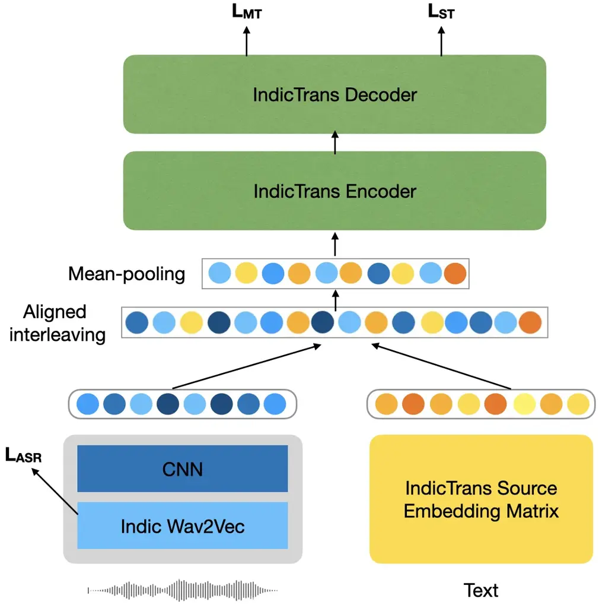
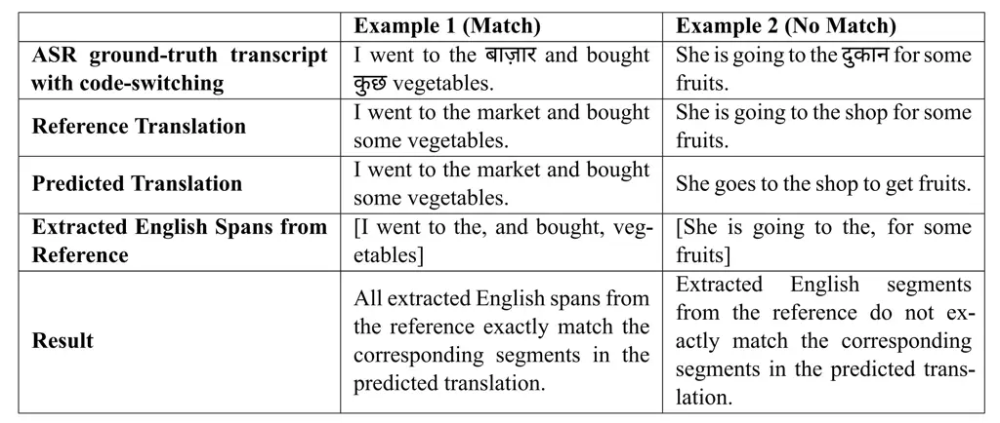
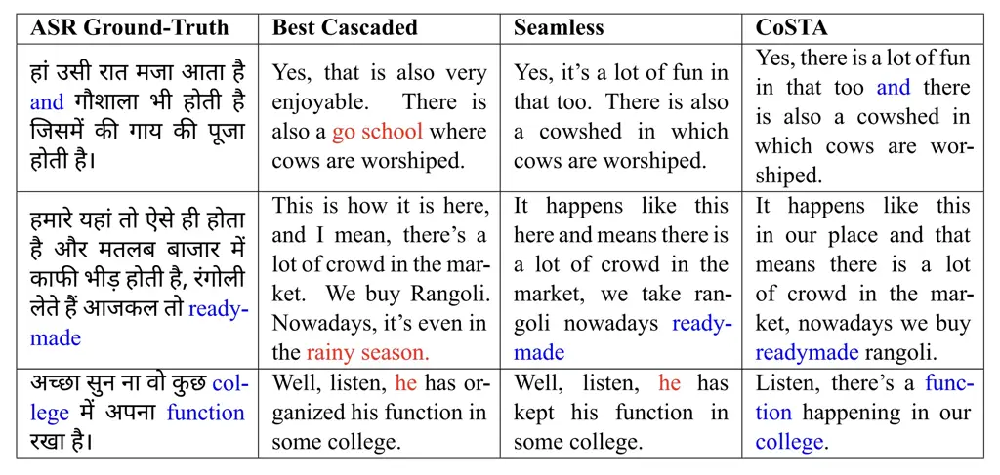

# CoSTA: Code-Switched Speech Translation using Aligned Speech-Text Interleaving

Bhavani Shankar    Preethi Jyothi    Pushpak Bhattacharyya
Affiliation: Indian Institute of Technology Bombay, India
Affiliation: {bhavanishankar, pjyothi, pb}@cse.iitb.ac.in

###### Abstract

Code-switching is a widely prevalent linguistic phenomenon in
multilingual societies like India. Building speech-to-text models for
code-switched speech is challenging due to limited availability of
datasets. In this work, we focus on the problem of spoken translation
(ST) of code-switched speech in Indian languages to English text. We
present a new end-to-end model architecture CoSTA that scaffolds on
pretrained automatic speech recognition (ASR) and machine translation
(MT) modules (that are more widely available for many languages). Speech
and ASR text representations are fused using an aligned interleaving
scheme and are fed further as input to a pretrained MT module; the whole
pipeline is then trained end-to-end for spoken translation using
synthetically created ST data. We also release a new evaluation
benchmark for code-switched Bengali-English, Hindi-English,
Marathi-English and Telugu-English speech to English text. CoSTA
significantly outperforms many competitive cascaded and end-to-end
multimodal baselines by up to $`3.5`$ BLEU points.

## 1 Introduction

More than half of the world’s population is presumed to be bilingual
Grosjean (2021), often leading to code-switching (CS) in conversational
speech, where speakers interweave words and phrases from multiple
languages within a single utterance. Recent work has explored
code-switching in automatic speech recognition (ASR) and machine
translation (MT) fairly extensively. In contrast, spoken translation
(ST) of code-switched speech has been somewhat under-explored. This is
largely due to the lack of evaluation benchmarks for ST using
code-switched speech and the predominantly monolingual bias of current
state-of-the-art ASR/MT systems.

In this work, we present a new and effective end-to-end solution for ST
of code-switched speech CoSTA, starting from pretrained ASR and MT
backbones. Simply cascading ASR and MT modules in a sequence is not very
effective, since code-switched speech results in many ASR errors which
cascade further via the MT module into the final ST predictions. We
propose using a speech encoder for the input speech and a text encoder
for the ASR text to derive speech and text representations,
respectively. These sequences are force-aligned and the speech-text
representations are interleaved according to the alignment. This merged
representation is then fed as input to a pretrained MT module, and the
entire pipeline is trained end-to-end with an ST objective.¹¹ 1 At test
time, we first produce an ASR output from the speech encoder which is
subsequently used to create the interleaved speech-text embeddings.
Aligned interleaving of speech-text representations is an important
design choice in CoSTA that is critical to deriving superior ST
performance.

Apart from a new ST model for code-switching, we release a new suite of
code-switched evaluation sets for ST in Bengali-English, Hindi-English,
Marathi-English and Telugu-English starting with ASR data from the
Indicvoices dataset Javed et al. (2024). We also release two new
podcast-based evaluation sets for ST with more complex code-switching in
Hindi-English and Telugu-English. (We also develop two new monolingual
evaluation sets for ST in Telugu and Hindi, to evaluate how our model
fares on largely monolingual inputs.) To the best of our knowledge, we
are the first to release ST resources to translate from the four Indic
code-switched language pairs to English.

We train our model on a modest 30 hours of synthetic ST data, where
translations are generated automatically from ASR ground-truth
transcriptions. We compare our trained model against state-of-the-art
cascaded baselines and end-to-end baselines such as SeamlessM4T
Seamless-Communication et al. (2023) and Whisper-ST Radford et al.
(2023), which have been trained on substantially larger datasets.
Despite CoSTA being trained in a low-resource setting with synthetically
generated translations, our model achieves the best BLEU scores
significantly outperforming the best end-to-end baseline by at most 3.5
points. Interestingly, our model also demonstrates robustness to
code-switching, showing no significant degradation in performance even
with increasing amounts of code-switching in a sentence.

In summary, our main contributions are:

1.  1.  We propose CoSTA, a new end-to-end architecture for code-switched
        ST. We introduce an interleaving technique that aligns speech and
        text embeddings, boosting translation accuracy for code-switched
        speech (detailed in Section 3).
2.  2.  We release new ST evaluation benchmarks for four different languages
        code-switched with English: Marathi, Telugu, Bengali, and Hindi
        (detailed in Section 4).
3.  3.  We show many detailed ablation experiments and demonstrate how CoSTA
        is robust to varying degrees of code-switching (detailed in
        Sections 5 and 6).

Our code and datasets will be publicly released upon publication. We
intend to release all the evaluation sets under the CC-BY-4.0 license²²
2
[https://creativecommons.org/licenses/by/4.0/](https://creativecommons.org/licenses/by/4.0/).

## 2 Related Work

To overcome the limitations of traditional cascaded spoken translation
(ST) systems, recent work has shifted towards end-to-end (E2E)
architectures that directly translate speech into text in a different
language, eliminating the need for intermediate transcription Berard
et al. (2016); Weiss et al. (2017); Kano et al. (2017); Berard et al.
(2018); Inaguma et al. (2020); Wang et al. (2020); Zhao et al. (2021).
However, training such E2E models posed challenges due to the need for
cross-modal, cross-lingual capabilities and the scarcity of labeled ST
data compared to machine translation (MT) and automatic speech
recognition (ASR).

To address these challenges, prior work extensively explored techniques
to leverage small amounts of labeled ST data including pretraining Weiss
et al. (2017); Berard et al. (2018); Bansal et al. (2019); Wang et al.
(2020); Alinejad and Sarkar (2020); Dong et al. (2021b); Zhang (2021);
Tang et al. (2022); Le et al. (2023); Lam et al. (2024), data
augmentation Park et al. (2019); Gangi et al. (2019); Shanbhogue et al.
(2023), self-training Pino et al. (2020); Wang et al. (2021); Fang
et al. (2022), and using self-supervised pre-trained audio
representations Nguyen et al. (2020); Wu et al. (2020); Wang et al.
(2021); Tang et al. (2022). Recognizing limitations in the single
encoder architecture, prior work explored enhancements such as employing
a second encoder to extract semantic information from speech or
incorporating both acoustic and textual information into a stacked
encoderDong et al. (2021a); Dong et al. (2021b). Multi-task frameworks
have also been shown to enhance the robustness of ST models Tang et al.
(2021); Ye et al. (2021); Bhavsar et al. (2022); Zhang et al. (2023).

To bridge the modality gap between speech and text, several methods like
mutual learning Zhao et al. (2021), projection into a common
representation space Han et al. (2021); Duquenne et al. (2022), modality
matching Chen et al. (2022), contrastive learning Ye et al. (2022); Yin
et al. (2023) and cross-modal regularization with scheduled sampling
Fang and Feng (2023) have also been explored. In very recent work,
multimodal models like SeamlessM4T Seamless-Communication et al. (2023),
Maestro Chen et al. (2022), mSLAM Bapna et al. (2022) learn shared
representations for speech and text and simultaneously support multiple
speech-to-text tasks like ASR and ST.

None of the above-mentioned prior works were focused on code-switched
ST. Weller et al. (2022) addressed this challenge by creating a
code-switched corpus for Spanish-English and exploring both cascaded and
end-to-end architectures for speech translation. Huber et al. (2022)
proposed a unified Language Agnostic E2E ST model (LAST) that is
well-suited for code-switched ST.

CoSTA distinguishes itself from prior work by bootstrapping on
pretrained MT and ASR models and combining speech and text modalities
using a new interleaving technique. We also release new ST evaluation
sets for four language pairs, Telugu-English, Marathi-English,
Hindi-English and Bengali-English, that have not been previously
addressed in any prior work.

## 3 CoSTA: Model Architecture

To train CoSTA, we assume access to a spoken translation (ST) corpus
$`\mathcal{D}=\{(\mathbf{s}^{i},\mathbf{x}^{i},\mathbf{y}^{i})\}_{i=1}^{N}`$
with $`N`$ training triples, where each triple consists of speech in a
source language ($`\mathbf{s}^{i}`$), its transcript
($`\mathbf{x}^{i}`$) and its translation in a target language
($`\mathbf{y}^{i}`$). Since we do not have access to any ST training
data for our code-switched languages of interest, we create
$`\mathcal{D}`$ by starting from an ASR corpus of code-switched speech
such as IndicVoices and synthetically generating English translations
using a pretrained model (such as IndicTrans Gala et al. (2023)).



Figure 1: Model with aligned interleaving, which aligns corresponding
speech and text embeddings and interleaves them before passing them
through the text encoder (IndicTrans encoder here).

Figure 1 shows a schematic diagram of CoSTA. We assume access to
pretrained ASR and MT models, which are encoder-only and encoder-decoder
models, respectively. We use fine-tuned Indic Wav2Vec Javed et al.
(2022) as our speech encoder and IndicTrans2 Gala et al. (2023) as our
pretrained MT model. CoSTA uses the Indic Wav2Vec speech encoder to
transform the input speech $`\mathbf{s}`$ into a sequence of speech
representations $`\{s_{1},\ldots,s_{T}\}`$ of length $`T`$. The source
transcript $`\mathbf{x}`$ is tokenized and transformed into a sequence
of text embeddings $`\{x_{1},\ldots,x_{M}\}`$ of length $`M`$, using the
tokenizer and text embedding layer of IndicTrans2’s encoder. To bridge
the length discrepancy between speech representations and token
embeddings, two convolutional layers with a stride of 4 each are added
after the ASR encoder (as in Ye et al. (2022)). The resulting features
are of dimensionality $`d\times T/4`$ where $`d`$ is the dimensionality
of the encoder representations and the time dimension is reduced by a
factor of 4.

#### Aligned interleaving.

Given an input speech representation sequence
$`\mathbf{s}=s_{1},\ldots,s_{T}`$ and its corresponding text token
sequence $`\mathbf{x}=x_{1},\ldots,x_{M}`$, how should we aggregate
these representations to produce the target translation $`\mathbf{y}`$?
We adopt the following simple strategy. A forced alignment Zhang and
Hira (2024) between $`\mathbf{s}`$ and $`\mathbf{x}`$ determines the
number of speech frames aligned to each $`x_{j}\in\mathbf{x}`$. The
representations of these aligned speech frames are averaged to compute
$`\bar{s}_{j}`$. This gives us the following interleaved alignment:
$`\mathbf{x}_{\mathbf{s}}=\{(\bar{s}_{1},x_{1}),\ldots,(\bar{s}_{M},x_{M})\}`$.
$`\mathbf{x}_{\mathbf{s}}`$ is fed as input to IndicTrans2’s encoder and
decoder modules. Simpler strategies like concatenating both sequences
lead to degraded performance. Aligned interleaving of speech-text
representations is critical to achieving high ST performance.

#### Training and Inference.

Our training loss is a combination of three objectives:

```math
\mathcal{L}=\mathcal{L}_{\text{ST}}+\lambda_{1}\mathcal{L}_{\text{ASR}}+\lambda_{2}\mathcal{L}_{\text{MT}}
```

- •
  $`\mathcal{L}_{\text{ST}}=-\sum_{n=1}^{N}\log P(\mathbf{y}_{n}|\mathbf{s}_{n},\mathbf{x}_{n})`$
  is a cross entropy-based ST loss applied to the IndicTrans2 decoder.
  The IndicTrans2 encoder takes both $`\mathbf{s}_{n}`$ and
  $`\mathbf{x}_{n}`$ as inputs with aligned interleaving, and both the
  encoder and decoder are supervised using $`\mathcal{L}_{\text{ST}}`$
  to produce $`\mathbf{y}_{n}`$.
- •
  $`\mathcal{L}_{\text{ASR}}`$ is the standard CTC-based ASR loss Graves
  et al. (2006). This is applied to the output of the encoder-only ASR
  model and encourages the model to perform well on the intermediate ASR
  task.
- •
  $`\mathcal{L}_{\text{MT}}=-\sum_{n=1}^{N}\log P(\mathbf{y}_{n}|\mathbf{x}_{n})`$
  is the standard cross-entropy MT loss to train the MT encoder and
  decoder, encouraging the model to perform well on the intermediate MT
  task.

The triplets in the training corpus $`\mathcal{D}`$ contain all the
information needed to define all three of the above-mentioned loss
terms. $`\lambda_{1}`$ and $`\lambda_{2}`$ are scaling factor
hyperparameters for the loss terms that we tune on a validation set
($`\lambda_{1}=1`$ and $`\lambda_{2}=1.5`$).

During inference, the ASR transcript is derived from the ASR
encoder-only model first, and subsequently force-aligned with the input
speech to create the interleaved representation sequence.

## 4 Dataset Details

### 4.1 Training/Fine-tuning Data

Due to the absence of existing speech-transcription-translation datasets
for the code-switched languages Telugu-English, Hindi-English,
Marathi-English, and Bengali-English, we sourced 30 hours of ASR data
for each language from IndicVoices Javed et al. (2024). IndicVoices is
an ASR dataset comprising 7348 hours of natural, spontaneous speech from
16237 speakers across 22 Indian languages, featuring monolingual and
code-switched speech. We want to use monolingual data during training to
show that we get performance gains on code-switched ASR without access
to any code-switched speech during training. We translate the
ground-truth transcripts of the 30-hour dataset into English using
IndicTrans2 Gala et al. (2023), the current state-of-the-art MT model
for Indic-to-English translation. We reiterate here that our training
set consists of ground-truth ASR transcriptions and synthetically
generated translations.

### 4.2 Code-switched Evaluation Sets

To create code-switched evaluation sets, we extracted approx. two hours
of speech-transcription data for each of Telugu, Hindi, Marathi, and
Bengali from IndicVoices with fairly high Code-Mixing Index (CMI)
scores. CMI metric quantifies the amount of code-switching in a corpus;
CMI of 0 indicates monolingual inputs, and the maximum value of 0.5
indicates an equal mix of both matrix (e.g. Telugu) and embedded
language (e.g. English) tokens. We translated these transcripts into
English using IndicTrans2 and manually post-edited any errors. Table 1
provides statistics for the four code-switched evaluation sets.

|                 |       |       |       |       |
| --------------- | ----- | ----- | ----- | ----- |
|                 | Te    | Hi    | Mr    | Bn    |
| Duration (Hrs.) | 2.3   | 2.5   | 2.2   | 2.1   |
| Instances       | 587   | 728   | 575   | 624   |
| \# Speakers     | 102   | 85    | 110   | 124   |
| CMI Score       | 25.5% | 22.1% | 21.7% | 23.3% |

Table 1: Statistics of the code-switched evaluation set.

#### Podcast Evaluation Sets.

To further evaluate our models on a more challenging dataset, we
obtained permission from Telugu³³ 3 [Telugu
Podcast](https://rawtalks.in) and Hindi podcasters⁴⁴ 4 [Hindi
Podcast](https://www.pulybazi.in) to create new code-switched evaluation
sets, referred to as the “podcast evaluation sets". This dataset is
highly conversational, multi-speaker, code-switched and has many
disfluencies, making it more challenging than the code-switched
evaluation sets derived from IndicVoices. The CMI scores for both the
sets exceed $`30\%`$, indicating a significantly higher amount of
code-mixing. We manually annotated the transcripts for the podcast
speech and created English translations after removing disfluencies from
the corresponding transcripts. Statistics of the podcast evaluation sets
are shown in Table 2.

|          |                 |           |           |
| -------- | --------------- | --------- | --------- |
| Language | Duration (Hrs.) | Instances | CMI Score |
| Telugu   | 2.5             | 624       | 32.14%    |
| Hindi    | 2.2             | 578       | 30.21%    |

Table 2: Statistics of the podcast evaluation set.

### 4.3 Monolingual Evaluation Sets

We also extract monolingual evaluation sets from IndicVoices for each of
Telugu and Hindi, and translated the speech transcripts into English
using IndicTrans2. We created monolingual datasets as a control to check
how well CoSTA performs on them. The translations were manually verified
to post-edit any errors in the machine-generated outputs. Statistics of
the monolingual evaluation sets are presented in Table 3. Annotation
guidelines for all these evaluation sets can be found in Appendix E.

|          |                 |           |             |
| -------- | --------------- | --------- | ----------- |
| Language | Duration (Hrs.) | Instances | \# Speakers |
| Telugu   | 2.5             | 581       | 126         |
| Hindi    | 2.6             | 643       | 137         |

Table 3: Statistics of the monolingual evaluation set.

## 5 Main Results

|            |                                         |       |       |       |       |       |       |       |       |
| ---------- | --------------------------------------- | ----- | ----- | ----- | ----- | ----- | ----- | ----- | ----- |
|            | Experiment                              | Mr-En |       | Te-En |       | Bn-En |       | Hi-En |       |
|            |                                         | BLEU  | WER   | BLEU  | WER   | BLEU  | WER   | BLEU  | WER   |
| Cascaded   | IndicWav2Vec + NLLB                     | 9.21  | 43.12 | 11.23 | 37.95 | 13.24 | 38.90 | 17.82 | 33.21 |
|            | Seamless (ASR) + NLLB                   | 8.32  | 45.60 | 9.80  | 38.23 | 14.77 | 37.56 | 17.80 | 35.10 |
|            | Seamless (ASR + MT)                     | 9.29  | 45.60 | 10.12 | 38.23 | 15.16 | 37.56 | 18.12 | 35.10 |
|            | IndicWav2Vec + IndicTrans               | 14.32 | 43.12 | 15.65 | 37.95 | 17.01 | 38.90 | 17.42 | 33.21 |
|            | IndicWav2Vec (ASR) + IndicTrans (MT) FT | 15.18 | 41.97 | 16.76 | 36.53 | 18.19 | 37.81 | 19.74 | 32.90 |
| End-to-End | Whisper ST                              | 14.60 | 46.54 | 19.35 | 44.15 | 22.31 | 45.05 | 24.36 | 36.15 |
|            | Seamless E2E                            | 18.30 | 43.60 | 26.77 | 38.23 | 25.61 | 37.56 | 27.30 | 35.10 |
|            | Seamless E2E FT                         | 19.62 | 42.21 | 27.54 | 36.10 | 27.93 | 37.56 | 28.99 | 34.11 |
|            | Seamless FT MT+ST                       | 19.50 | 42.13 | 27.10 | 36.11 | 27.40 | 37.40 | 28.10 | 34.09 |
|            | Seamless FT ASR+ST                      | 19.66 | 40.75 | 27.83 | 35.61 | 28.65 | 35.15 | 29.65 | 32.20 |
|            | CoSTA                                   | 21.43 | 38.58 | 29.87 | 34.37 | 31.05 | 34.89 | 33.12 | 32.19 |

Table 4: Comparison of cascaded and E2E baselines with CoSTA for Marathi
(Mr), Telugu (Te), Bengali (Bn), and Hindi (Hi) on the code-switched
evaluation set. BLEU and WER scores are reported. The best baseline is
in bold, with statistically significant improvements (at $`p<0.01`$
using the Wilcoxon signed rank test) highlighted in green.

#### Cascaded Baselines.

A cascaded ST baseline consists of a state-of-the-art ASR followed by an
MT system that translates the ASR transcript. For ASR, we used
IndicWav2Vec Javed et al. (2022), a multilingual speech model
pre-trained on 40 Indian languages and fine-tuned for ASR on 9 Indian
languages. We also leveraged the ASR capabilities of SeamlessM4T-v2, a
multimodal model that can take either speech or text as input for
translation Seamless-Communication et al. (2023) (henceforth referred to
as Seamless). For MT, we experimented with two state-of-the-art
multilingual MT models, NLLB Costa-jussà et al. (2022) and IndicTrans2
Gala et al. (2023) (henceforth referred to as IndicTrans). Additionally,
we set up a Seamless (ASR + MT) cascaded baseline where Seamless is used
for both ASR and MT. The above-mentioned baselines are all used
zero-shot. We also fine-tuned the best cascaded baseline (IndicWav2vec +
IndicTrans) on our 30-hour training dataset; IndicWav2vec is finetuned
on the speech-transcription pairs for ASR and IndicTrans is fine-tuned
on the transcription-translation pairs for MT.

|            |                                         |       |       |
| ---------- | --------------------------------------- | ----- | ----- |
|            | Experiment                              | Te-En | Hi-En |
| Cascaded   | IndicWav2Vec + NLLB                     | 11.82 | 12.31 |
|            | Seamless (ASR) + NLLB                   | 08.91 | 11.56 |
|            | Seamless (ASR + MT)                     | 09.98 | 12.34 |
|            | IndicWav2Vec + IndicTrans               | 14.97 | 15.20 |
|            | IndicWav2Vec (ASR) + IndicTrans (MT) FT | 15.16 | 15.95 |
| End-to-End | Whisper ST                              | 17.68 | 21.08 |
|            | Seamless E2E                            | 25.76 | 26.12 |
|            | Seamless E2E FT                         | 26.49 | 27.01 |
|            | Seamless FT MT+ST                       | 26.12 | 26.40 |
|            | Seamless FT ASR+ST                      | 26.87 | 26.93 |
|            | CoSTA                                   | 28.75 | 29.46 |

Table 5: Comparison of cascaded and E2E baselines with CoSTA for the
languages Telugu and Hindi on the podcast evaluation set. BLEU scores
are reported. The best baseline is in bold, with statistically
significant improvements (at $`p<0.01`$ using the Wilcoxon signed rank
test) highlighted in green.

#### End-to-End (E2E) Baselines.

For E2E baselines, we used two state-of-the-art E2E ST models, Whisper
Radford et al. (2023) and Seamless Seamless-Communication et al. (2023)
that we refer to as “Whisper ST" and “Seamless E2E", respectively. While
Seamless itself is a strong baseline, comparable in performance to
GPT-4o OpenAI (2024), we enhanced it further by fine-tuning it on our 30
hr training set to establish stronger baselines. “Seamless E2E"
represents the use of SeamlessM4T-v2 without any additional fine-tuning.
“Seamless E2E FT" indicates that Seamless was fine-tuned directly for
ST. “Seamless FT MT+ST" refers to fine-tuning first for MT using only
the transcription-translation pairs and subsequently fine-tuning on ST
using speech-translation pairs from our 30-hr dataset. Finally,
“Seamless FT ASR+ST" refers to an initial fine-tuning for ASR (using
speech-transcription pairs) followed by further fine-tuning for ST
(using speech-translation pairs).

#### Results.

Tables 4 and 5 show the results of CoSTA in comparison with the cascaded
and E2E Baselines on the IndicVoices and podcast evaluation sets,
respectively. We show both BLEU scores of the final translations, as
well as word error rates (WERs) of the ASR transcripts. CoSTA
significantly outperforms strong E2E baselines wrt BLEU scores on all
four language pairs in Table 4 and both podcast evaluation sets in
Table 5. It is also evident that E2E baselines are significantly better
than cascaded baselines for code-switched evaluation sets. From the WERs
in Table 4, we also observe that significant improvements in BLEU scores
are not contingent on obtaining significant reductions in WER (e.g., Bn
and Hi).

Table 6 shows the results of all systems on the two monolingual
evaluation sets. Here, we find cascaded baselines to be significantly
better than E2E baselines. Despite being E2E, CoSTA is statistically
comparable in performance to the best cascaded baseline for monolingual
evaluation sets.

|            |                                         |       |       |
| ---------- | --------------------------------------- | ----- | ----- |
|            | Experiment                              | Te-En | Hi-En |
| Cascaded   | IndicWav2Vec + NLLB                     | 26.72 | 27.30 |
|            | Seamless (ASR) + NLLB                   | 24.15 | 25.09 |
|            | Seamless (ASR + MT)                     | 23.21 | 25.11 |
|            | IndicWav2Vec + IndicTrans               | 28.56 | 28.78 |
|            | IndicWav2Vec (ASR) + IndicTrans (MT) FT | 29.75 | 29.90 |
| End-to-End | Whisper ST                              | 19.21 | 22.12 |
|            | Seamless E2E                            | 24.45 | 27.54 |
|            | Seamless E2E FT                         | 25.43 | 28.23 |
|            | Seamless FT MT+ST                       | 25.50 | 28.70 |
|            | Seamless FT ASR+ST                      | 26.01 | 28.65 |
|            | CoSTA                                   | 29.16 | 29.43 |

Table 6: Comparison of cascaded and E2E baselines with CoSTA for the
languages Telugu (Te) and Hindi (Hi), Marathi (Mr), and Bengali (Bn) on
the monolingual evaluation set. We report BLEU scores. We see that
cascaded models outperform E2E models when the input is not code
switched.

## 6 Ablations and Other Experiments

### 6.1 Evaluation of Code-switched Span Accuracy

We claim that the improvements in BLEU scores using CoSTA are aided by
improved translations of code-switched spans. To empirically verify this
claim, we aim to identify what fraction of English spans in the
ground-truth ASR transcriptions appear as-is in the predicted English
translations. First, we isolate all English spans by comparing the
ground-truth ASR transcriptions and reference translations. Let us call
these reference spans. Given a predicted translation, we check how many
English spans in it exactly match the reference spans and in order.
(Figure 2 in Appendix A further explains this calculation with an
example.) If two English spans in a translation match two of four
reference spans in the correct order, the match percentage will be
$`50\%`$. We note here this is an exact match of the English words and
does not account for correct synonyms or paraphrases, thus making it a
stricter evaluation of accuracy. Table 7 shows these English span
accuracies using CoSTA, the best E2E baseline and the best cascaded
baseline. CoSTA achieves the highest exact match among the three
(highlighted in bold), thus indicating that it is most successful in
accurately retaining English words from the ASR transcriptions in the
predicted translations.

|       |               |          |       |
| ----- | ------------- | -------- | ----- |
|       | Best Cascaded | Seamless | CoSTA |
| Te-En | 8.9%          | 54.3%    | 57.9% |
| Hi-En | 14.1%         | 55.1%    | 59.6% |
| Mr-En | 7.5%          | 48.1%    | 49.7% |
| Bn-En | 8.4%          | 51.9%    | 54.2% |

Table 7: Comparison of CoSTA with the best cascaded model (IndicWav2Vec
(ASR) + IndicTrans (MT) FT) and the best E2E model (Seamless FT ASR+ST).

### 6.2 Robustness of CoSTA’s Performance to Amount of Code-switching

|                     |       |       |
| ------------------- | ----- | ----- |
| Bin (English Words) | Te-En | Hi-En |
| 3                   | 29.82 | 32.94 |
| 5                   | 29.83 | 33.28 |
| 7                   | 29.54 | 33.27 |
| 10                  | 29.91 | 33.04 |

Table 8: BLEU scores for the four bins with varying numbers of English
words in Telugu and Hindi Speech.

We assess the correlation between the number of English words in a
sentence and the model’s score by using a linear model to determine
$`R^{2}`$ values. Four distinct bins, each containing 50 sentences from
the code-switched evaluation set are created, ensuring each sentence is
at least 12 words long. The bins comprise sentences with 3, 5, 7, and 10
English words, respectively. Table 8 shows BLEU scores for the four bins
for Telugu and Hindi. Our findings indicate nearly no correlation
between the number of English words (indicating degree of
code-switching) and the model’s score ($`R^{2}=0.006`$ for Telugu and
$`R^{2}=0.016`$ for Hindi). This means that the models are fairly robust
to the amount of code-switching in a sentence.

### 6.3 Combining Speech and Text

We compare different approaches for aggregating speech and text
embeddings before passing them through the IndicTrans encoder. We
evaluate four strategies: interleaving mean-pooled speech embeddings and
text embeddings, starting with either speech or text, appending
mean-pooled speech embeddings either before or after the text
embeddings. We fine-tune our Telugu and Hindi Models with 30 hour data
using all four approaches. Our findings in Table 9 indicate that
interleaving consistently outperforms appending, with statistically
significant improvements (at $`p<0.01`$, Wilcoxon signed rank test).
However, no discernible difference in performance was observed between
starting the interleaving process with speech or text embeddings.

|                           |       |       |
| ------------------------- | ----- | ----- |
|                           | Te-En | Hi-En |
| Append (Speech First)     | 18.98 | 21.16 |
| Append (Text First)       | 17.91 | 20.75 |
| Interleave (Speech First) | 29.87 | 33.12 |
| Interleave (Text First)   | 29.45 | 33.05 |

Table 9: Comparison of different speech and text fusion strategies (two
appending vs two interleaving).

### 6.4 Using only $`\mathcal{L}_{\text{ST}}`$ loss compared to using all three losses ($`\mathcal{L}_{\text{ST}}`$, $`\mathcal{L}_{\text{ASR}}`$, $`\mathcal{L}_{\text{MT}}`$)

Table 10 shows the results for all four languages on three different
models fine-tuned on the 30 hour train set, using only the ST loss
versus using all three losses (with $`\lambda_{1}=1`$ and
$`\lambda_{2}=1.5`$). Even with using only the ST loss, our model shows
significant improvement (at $`p<0.01`$ using wilcoxon signed rank test)
over Seamless, and using all the three losses ST, MT and ASR further
significantly improves the BLEU scores.

|         |             |              |       |
| ------- | ----------- | ------------ | ----- |
|         | Seamless FT | Only ST Loss | CoSTA |
| Telugu  | 27.54       | 28.96        | 29.87 |
| Hindi   | 28.99       | 32.23        | 33.12 |
| Marathi | 19.62       | 20.71        | 21.43 |
| Bengali | 27.90       | 30.53        | 31.05 |

Table 10: We compare CoSTA, Seamless E2E FT, and an ST loss-only model
on four languages using the code-switched evaluation set. Results
significantly better than both Seamless and ST loss models are in bold.

### 6.5 Size of Fine-tuning Dataset

We gradually increased the size of the fine-tuning dataset from 5 hours
to 30 hours to monitor BLEU scores on the code-switched evaluation sets
as a function of size. Table 11 shows that the BLEU scores stabilized
for both CoSTA and Seamless (finetuned) with about 30 hours of
fine-tuning data. While Seamless outperformed CoSTA with 5 and 10 hours
of fine-tuning data, CoSTA achieved statistically significant
improvements (at $`p<0.01`$, Wilcoxon signed rank test) over Seamless
using data of size 15 hours (and more).

|         |       |          |       |          |
| ------- | ----- | -------- | ----- | -------- |
| FT Data | Te-En |          | Hi-En |          |
|         | CoSTA | Seamless | CoSTA | Seamless |
| 5 hrs   | 23.90 | 26.85    | 25.12 | 27.81    |
| 10 hrs  | 27.16 | 27.10    | 27.35 | 28.43    |
| 15 hrs  | 28.65 | 27.23    | 29.27 | 28.65    |
| 20 hrs  | 29.55 | 27.34    | 31.54 | 28.76    |
| 25 hrs  | 29.72 | 27.52    | 32.91 | 28.90    |
| 30 hrs  | 29.87 | 27.54    | 33.12 | 28.99    |

Table 11: Comparison of the BLEU Scores with CoSTA and seamless with
varying numbers of hours of fine-tuning data. We do this experiment on
the languages Telugu and Hindi.

### 6.6 Mean-Pooling vs. Direct Interleaving

We examine the impact of speech embedding aggregation on CoSTA’s
performance. We compare ‘Mean-Pooling’ where speech embeddings
corresponding to a text embedding are averaged (mean-pooled) before
being interleaved with the text embedding and passed to the IndicTrans
Encoder with ‘Direct Interleaving’ where speech embeddings are directly
interleaved with the text embedding without mean-pooling. We conducted
this comparison using varying amounts of fine-tuning data from 5 hours
to 30 hours. Evaluations were performed on the Telugu IndicVoices
code-switched evaluation set. Table 12 shows that mean-pooling speech
embeddings consistently outperforms the direct interleaving approach,
regardless of the amount of fine-tuning data used.

|         |              |                     |
| ------- | ------------ | ------------------- |
| FT Data | Mean Pooling | Direct Interleaving |
| 5 hrs   | 23.90        | 23.81               |
| 10 hrs  | 27.16        | 24.15               |
| 15 hrs  | 28.65        | 24.76               |
| 20 hrs  | 29.55        | 25.51               |
| 25 hrs  | 29.72        | 25.98               |
| 30 hrs  | 29.87        | 26.40               |

Table 12: Comparison of BLEU scores on the Telugu code-switched
evaluation set: Mean Pooling vs. Direct Interleaving of speech
embeddings during aligned interleaving, using varying amounts of
fine-tuning data.

### 6.7 Cross-Domain Generalization Using Kathbath Data

To assess the generalizability of CoSTA when using a corpus different
from IndicVoices during training, we experiment with using a fine-tuning
set from Kathbath Javed et al. (2023). Kathbath comprises 1,684 hours of
labeled read speech spanning 12 Indian languages. We trained Telugu and
Hindi models using 30 hours of Kathbath data and translating
ground-truth transcripts into English using IndicTrans2 to create
speech-transcript-translate pairs. Table 13 shows the comparison between
CoSTA, and all the cascaded and end-to-end baseline models when
fine-tuned on Kathbath and evaluated on the code-switched test sets from
IndicVoices. We observe that our model significantly outperforms all
baselines, demonstrating its ability to generalize well when trained on
cross-domain data.

|            |                                         |       |       |
| ---------- | --------------------------------------- | ----- | ----- |
|            | Experiment                              | Te-En | Hi-En |
| Cascaded   | IndicWav2Vec + NLLB                     | 11.23 | 17.82 |
|            | Seamless (ASR) + NLLB                   | 9.80  | 17.80 |
|            | Seamless (ASR + MT)                     | 10.12 | 18.12 |
|            | IndicWav2Vec + IndicTrans               | 15.65 | 17.42 |
|            | IndicWav2Vec (ASR) + IndicTrans (MT) FT | 16.68 | 19.85 |
| End-to-End | Whisper ST                              | 19.35 | 24.36 |
|            | Seamless E2E                            | 26.77 | 27.30 |
|            | Seamless E2E FT                         | 27.38 | 29.05 |
|            | Seamless FT MT+ST                       | 27.23 | 29.21 |
|            | Seamless FT ASR+ST                      | 28.05 | 29.13 |
|            | CoSTA                                   | 28.54 | 33.56 |

Table 13: BLEU comparisons of all the baselines with CoSTA for
code-switched Telugu (Te-En) and Hindi (Hi-En) using Kathbath
fine-tuning data. The best baseline is in bold, with statistically
significant improvements (at $`p<0.01`$ using the Wilcoxon signed rank
test) highlighted in green.

### 6.8 Projected Concatenation

We compared our interleaving technique with an alternative where the
mean-pooled speech embeddings (dimension $`d`$) and their corresponding
text embeddings (dimension $`d`$) are concatenated, resulting in
embeddings of dimension $`2d`$. These concatenated embeddings are then
projected back to dimension $`d`$ using a single transformer encoder
(with 16 attention heads). The resulting embeddings are then passed
through the IndicTrans encoder. We refer to this technique as Projected
Concatenation. Table 14 shows performance on all four code-switched
evaluation sets after training using both interleaving strategies. While
projected concatenation outperforms the Seamless E2E baseline, our
interleaving module proves to be significantly better on all four
evaluation sets.

|       |       |                         |
| ----- | ----- | ----------------------- |
|       | CoSTA | Projected Concatenation |
| Te-En | 29.87 | 26.94                   |
| Hi-En | 33.12 | 32.21                   |
| Mr-En | 21.43 | 20.11                   |
| Bn-En | 31.05 | 29.81                   |

Table 14: BLEU comparison of CoSTA with Projected Concatenation that
merge and project the speech-text embeddings using a learnable
projection layer. We evaluate on four code-switched evaluation sets.
Statistically significant improvements are highlighted in bold.

### 6.9 Teacher Forcing vs Scheduled Sampling

During training, we employ teacher forcing and pass the ground truth ASR
transcripts through the text embedding module. However, during inference
we rely on ASR transcripts generated by the ASR head of our model. To
bridge this gap between training and inference, we compare teacher
forcing with scheduled sampling that gradually introduces ASR-generated
transcripts from our model into the text embedding layer by linearly
decreasing the probability of using ground truth ($`p`$) at a fixed rate
per epoch. We train our model on 30 hours of training data for all four
languages and evaluate on our code-switched evaluation sets. Our results
in Table 15 demonstrate that teacher forcing significantly outperforms
scheduled sampling for all languages.

|       |                 |                    |
| ----- | --------------- | ------------------ |
|       | Teacher Forcing | Scheduled Sampling |
| Te-En | 29.87           | 29.31              |
| Hi-En | 33.12           | 32.17              |
| Mr-En | 21.43           | 19.87              |
| Bn-En | 31.05           | 30.16              |

Table 15: Comparison of CoSTA (teacher forcing) with the model trained
using scheduled sampling. Higher BLEU for each language pair is
highlighted in bold.

## 7 Conclusion

In this work, we propose a new technique CoSTA for code-switched spoken
translation where aligned speech and ASR text representations are fed as
inputs to a pretrained MT model and finetuned end-to-end using ST data.
We outperform multiple state-of-the-art cascaded and end-to-end
baselines on code-switched evaluation sets in Telugu-English,
Hindi-English, Marathi-English and Bengali-English. We also create a new
evaluation benchmark for these language pairs for which no ST resources
previously existed.

## Limitations

1.  1.  Our model necessitates labeled data comprising speech,
        transcription, and translation triplets for training. However,
        speech data is often scarce, particularly for low-resource languages
        making it challenging to acquire enough training data for our model.
2.  2.  We assume fine-tuned ASR and MT models as the building blocks to our
        model.
3.  3.  Our model still relies on the ASR module to transcribe speech into
        text during inference, which does not address the issue of high
        latency in the cascaded systems.

## References

- Alinejad and Sarkar (2020) Ashkan Alinejad and Anoop Sarkar. 2020.
  [Effectively pretraining a speech translation decoder with machine
  translation data](https://doi.org/10.18653/v1/2020.emnlp-main.644). In
  _Proceedings of the 2020 Conference on Empirical Methods in Natural
  Language Processing (EMNLP)_, pages 8014–8020, Online. Association for
  Computational Linguistics.
- Bansal et al. (2019) Sameer Bansal, Herman Kamper, Karen Livescu, Adam
  Lopez, and Sharon Goldwater. 2019. [Pre-training on high-resource
  speech recognition improves low-resource speech-to-text
  translation](https://doi.org/10.18653/v1/N19-1006). In _Proceedings of
  the 2019 Conference of the North American Chapter of the Association
  for Computational Linguistics: Human Language Technologies, Volume 1
  (Long and Short Papers)_, pages 58–68, Minneapolis, Minnesota.
  Association for Computational Linguistics.
- Bapna et al. (2022) Ankur Bapna, Colin Cherry, Yu Zhang, Ye Jia,
  Melvin Johnson, Yong Cheng, Simran Khanuja, Jason Riesa, and Alexis
  Conneau. 2022. [mslam: Massively multilingual joint pre-training for
  speech and text](https://arxiv.org/abs/2202.01374). _CoRR_,
  abs/2202.01374.
- Berard et al. (2018) Alexandre Berard, Laurent Besacier, Ali Can
  Kocabiyikoglu, and Olivier Pietquin. 2018. [End-to-end automatic
  speech translation of
  audiobooks](https://doi.org/10.1109/ICASSP.2018.8461690). In _2018
  IEEE International Conference on Acoustics, Speech and Signal
  Processing, ICASSP 2018, Calgary, AB, Canada, April 15-20, 2018_,
  pages 6224–6228. IEEE.
- Berard et al. (2016) Alexandre Berard, Olivier Pietquin, Christophe
  Servan, and Laurent Besacier. 2016. [Listen and translate: A proof of
  concept for end-to-end speech-to-text
  translation](https://arxiv.org/abs/1612.01744). _CoRR_,
  abs/1612.01744.
- Bhavsar et al. (2022) Nidhir Bhavsar, Aakash Bhatnagar, and Muskaan
  Singh. 2022. [HMIST: Hierarchical multilingual isometric speech
  translation using multi-task learning framework and it’s influence on
  automatic dubbing](https://aclanthology.org/2022.paclic-1.61). In
  _Proceedings of the 36th Pacific Asia Conference on Language,
  Information and Computation_, pages 554–563, Manila, Philippines.
  Association for Computational Linguistics.
- Chen et al. (2022) Zhehuai Chen, Yu Zhang, Andrew Rosenberg, Bhuvana
  Ramabhadran, Pedro J. Moreno, Ankur Bapna, and Heiga Zen. 2022.
  [MAESTRO: matched speech text representations through modality
  matching](https://doi.org/10.21437/INTERSPEECH.2022-10937). In
  _Interspeech 2022, 23rd Annual Conference of the International Speech
  Communication Association, Incheon, Korea, 18-22 September 2022_,
  pages 4093–4097. ISCA.
- Costa-jussà et al. (2022) Marta R. Costa-jussà, James Cross, Onur
  Çelebi, Maha Elbayad, Kenneth Heafield, Kevin Heffernan, Elahe
  Kalbassi, Janice Lam, Daniel Licht, Jean Maillard, Anna Y. Sun, Skyler
  Wang, Guillaume Wenzek, Al Youngblood, Bapi Akula, Loïc Barrault,
  Gabriel Mejia Gonzalez, Prangthip Hansanti, John Hoffman, Semarley
  Jarrett, Kaushik Ram Sadagopan, Dirk Rowe, Shannon Spruit, Chau Tran,
  Pierre Andrews, Necip Fazil Ayan, Shruti Bhosale, Sergey Edunov,
  Angela Fan, Cynthia Gao, Vedanuj Goswami, Francisco Guzmán, Philipp
  Koehn, Alexandre Mourachko, Christophe Ropers, Safiyyah Saleem, Holger
  Schwenk, and Jeff Wang. 2022. [No language left behind: Scaling
  human-centered machine
  translation](https://doi.org/10.48550/ARXIV.2207.04672). _CoRR_,
  abs/2207.04672.
- Dong et al. (2021a) Qianqian Dong, Mingxuan Wang, Hao Zhou, Shuang Xu,
  Bo Xu, and Lei Li. 2021a. [Consecutive decoding for speech-to-text
  translation](https://doi.org/10.1609/AAAI.V35I14.17508). In
  _Thirty-Fifth AAAI Conference on Artificial Intelligence, AAAI 2021,
  Thirty-Third Conference on Innovative Applications of Artificial
  Intelligence, IAAI 2021, The Eleventh Symposium on Educational
  Advances in Artificial Intelligence, EAAI 2021, Virtual Event,
  February 2-9, 2021_, pages 12738–12748. AAAI Press.
- Dong et al. (2021b) Qianqian Dong, Rong Ye, Mingxuan Wang, Hao Zhou,
  Shuang Xu, Bo Xu, and Lei Li. 2021b. [Listen, understand and
  translate: Triple supervision decouples end-to-end speech-to-text
  translation](https://doi.org/10.1609/AAAI.V35I14.17509). In
  _Thirty-Fifth AAAI Conference on Artificial Intelligence, AAAI 2021,
  Thirty-Third Conference on Innovative Applications of Artificial
  Intelligence, IAAI 2021, The Eleventh Symposium on Educational
  Advances in Artificial Intelligence, EAAI 2021, Virtual Event,
  February 2-9, 2021_, pages 12749–12759. AAAI Press.
- Duquenne et al. (2022) Paul-Ambroise Duquenne, Hongyu Gong, Benoît
  Sagot, and Holger Schwenk. 2022. [T-modules: Translation modules for
  zero-shot cross-modal machine
  translation](https://doi.org/10.18653/v1/2022.emnlp-main.391). In
  _Proceedings of the 2022 Conference on Empirical Methods in Natural
  Language Processing_, pages 5794–5806, Abu Dhabi, United Arab
  Emirates. Association for Computational Linguistics.
- Fang and Feng (2023) Qingkai Fang and Yang Feng. 2023. [Understanding
  and bridging the modality gap for speech
  translation](https://doi.org/10.18653/V1/2023.ACL-LONG.884). In
  _Proceedings of the 61st Annual Meeting of the Association for
  Computational Linguistics (Volume 1: Long Papers), ACL 2023, Toronto,
  Canada, July 9-14, 2023_, pages 15864–15881. Association for
  Computational Linguistics.
- Fang et al. (2022) Qingkai Fang, Rong Ye, Lei Li, Yang Feng, and
  Mingxuan Wang. 2022. [STEMM: Self-learning with speech-text manifold
  mixup for speech
  translation](https://doi.org/10.18653/v1/2022.acl-long.486). In
  _Proceedings of the 60th Annual Meeting of the Association for
  Computational Linguistics (Volume 1: Long Papers)_, pages 7050–7062,
  Dublin, Ireland. Association for Computational Linguistics.
- Gala et al. (2023) Jay Gala, Pranjal A Chitale, A K Raghavan, Varun
  Gumma, Sumanth Doddapaneni, Aswanth Kumar M, Janki Atul Nawale,
  Anupama Sujatha, Ratish Puduppully, Vivek Raghavan, Pratyush Kumar,
  Mitesh M Khapra, Raj Dabre, and Anoop Kunchukuttan. 2023.
  [Indictrans2: Towards high-quality and accessible machine translation
  models for all 22 scheduled indian
  languages](https://openreview.net/forum?id=vfT4YuzAYA). _Transactions
  on Machine Learning Research_.
- Gangi et al. (2019) Mattia Antonino Di Gangi, Matteo Negri, Viet-Nhat
  Nguyen, Amirhossein Tebbifakhr, and Marco Turchi. 2019. [Data
  augmentation for end-to-end speech translation: Fbk@iwslt
  ‘19](https://api.semanticscholar.org/CorpusID:233281686). In
  _International Workshop on Spoken Language Translation_.
- Graves et al. (2006) Alex Graves, Santiago Fernández, Faustino J.
  Gomez, and Jürgen Schmidhuber. 2006. [Connectionist temporal
  classification: labelling unsegmented sequence data with recurrent
  neural networks](https://doi.org/10.1145/1143844.1143891). In _Machine
  Learning, Proceedings of the Twenty-Third International Conference
  (ICML 2006), Pittsburgh, Pennsylvania, USA, June 25-29, 2006_, volume
  148 of _ACM International Conference Proceeding Series_, pages
  369–376. ACM.
- Grosjean (2021) François Grosjean. 2021. _Life as a bilingual: Knowing
  and using two or more languages_. Cambridge University Press.
- Han et al. (2021) Chi Han, Mingxuan Wang, Heng Ji, and Lei Li. 2021.
  [Learning shared semantic space for speech-to-text
  translation](https://doi.org/10.18653/V1/2021.FINDINGS-ACL.195). In
  _Findings of the Association for Computational Linguistics: ACL/IJCNLP
  2021, Online Event, August 1-6, 2021_, volume ACL/IJCNLP 2021 of
  _Findings of ACL_, pages 2214–2225. Association for Computational
  Linguistics.
- Huber et al. (2022) Christian Huber, Enes Yavuz Ugan, and Alexander
  Waibel. 2022. [Code-switching without switching: Language agnostic
  end-to-end speech
  translation](https://doi.org/10.48550/ARXIV.2210.01512). _CoRR_,
  abs/2210.01512.
- Inaguma et al. (2020) Hirofumi Inaguma, Shun Kiyono, Kevin Duh,
  Shigeki Karita, Nelson Yalta, Tomoki Hayashi, and Shinji
  Watanabe. 2020. [ESPnet-ST: All-in-one speech translation
  toolkit](https://doi.org/10.18653/v1/2020.acl-demos.34). In
  _Proceedings of the 58th Annual Meeting of the Association for
  Computational Linguistics: System Demonstrations_, pages 302–311,
  Online. Association for Computational Linguistics.
- Javed et al. (2023) Tahir Javed, Kaushal Santosh Bhogale, Abhigyan
  Raman, Pratyush Kumar, Anoop Kunchukuttan, and Mitesh M. Khapra. 2023.
  [Indicsuperb: A speech processing universal performance benchmark for
  indian languages](https://doi.org/10.1609/AAAI.V37I11.26521). In
  _Thirty-Seventh AAAI Conference on Artificial Intelligence, AAAI 2023,
  Thirty-Fifth Conference on Innovative Applications of Artificial
  Intelligence, IAAI 2023, Thirteenth Symposium on Educational Advances
  in Artificial Intelligence, EAAI 2023, Washington, DC, USA, February
  7-14, 2023_, pages 12942–12950. AAAI Press.
- Javed et al. (2022) Tahir Javed, Sumanth Doddapaneni, Abhigyan Raman,
  Kaushal Santosh Bhogale, Gowtham Ramesh, Anoop Kunchukuttan, Pratyush
  Kumar, and Mitesh M Khapra. 2022. Towards building asr systems for the
  next billion users. In _Proceedings of the AAAI Conference on
  Artificial Intelligence_, volume 36, pages 10813–10821.
- Javed et al. (2024) Tahir Javed, Janki Atul Nawale, Eldho Ittan
  George, Sakshi Joshi, Kaushal Santosh Bhogale, Deovrat Mehendale,
  Ishvinder Virender Sethi, Aparna Ananthanarayanan, Hafsah Faquih,
  Pratiti Palit, Sneha Ravishankar, Saranya Sukumaran, Tripura
  Panchagnula, Sunjay Murali, Kunal Sharad Gandhi, Ambujavalli R,
  Manickam K M, C Venkata Vaijayanthi, Krishnan Srinivasa Raghavan
  Karunganni, Pratyush Kumar, and Mitesh M Khapra. 2024. [Indicvoices:
  Towards building an inclusive multilingual speech dataset for indian
  languages](https://arxiv.org/abs/2403.01926). _Preprint_,
  arXiv:2403.01926.
- Kano et al. (2017) Takatomo Kano, Sakriani Sakti, and Satoshi
  Nakamura. 2017. [Structured-based curriculum learning for end-to-end
  english-japanese speech
  translation](https://doi.org/10.21437/INTERSPEECH.2017-944). In
  _Interspeech 2017, 18th Annual Conference of the International Speech
  Communication Association, Stockholm, Sweden, August 20-24, 2017_,
  pages 2630–2634. ISCA.
- Kudo and Richardson (2018) Taku Kudo and John Richardson. 2018.
  [SentencePiece: A simple and language independent subword tokenizer
  and detokenizer for neural text
  processing](https://doi.org/10.18653/v1/D18-2012). In _Proceedings of
  the 2018 Conference on Empirical Methods in Natural Language
  Processing: System Demonstrations_, pages 66–71, Brussels, Belgium.
  Association for Computational Linguistics.
- Lam et al. (2024) Tsz Kin Lam, Alexandra Birch, and Barry
  Haddow. 2024. [Compact speech translation models via discrete speech
  units pretraining](https://doi.org/10.48550/ARXIV.2402.19333). _CoRR_,
  abs/2402.19333.
- Le et al. (2023) Phuong-Hang Le, Hongyu Gong, Changhan Wang, Juan
  Pino, Benjamin Lecouteux, and Didier Schwab. 2023. [Pre-training for
  speech translation: CTC meets optimal
  transport](https://proceedings.mlr.press/v202/le23a.html). In
  _International Conference on Machine Learning, ICML 2023, 23-29 July
  2023, Honolulu, Hawaii, USA_, volume 202 of _Proceedings of Machine
  Learning Research_, pages 18667–18685. PMLR.
- Nguyen et al. (2020) Ha Nguyen, Fethi Bougares, N. Tomashenko, Yannick
  Estève, and Laurent Besacier. 2020. [Investigating Self-Supervised
  Pre-Training for End-to-End Speech
  Translation](https://doi.org/10.21437/Interspeech.2020-1835). In
  _Proc. Interspeech 2020_, pages 1466–1470.
- OpenAI (2024) OpenAI. 2024. Hello gpt-4o.
  [https://openai.com/index/hello-gpt-4o/](https://openai.com/index/hello-gpt-4o/).
  Accessed: 2024-05-13.
- Park et al. (2019) Daniel S. Park, William Chan, Yu Zhang, Chung-Cheng
  Chiu, Barret Zoph, Ekin D. Cubuk, and Quoc V. Le. 2019. [SpecAugment:
  A Simple Data Augmentation Method for Automatic Speech
  Recognition](https://doi.org/10.21437/Interspeech.2019-2680). In
  _Proc. Interspeech 2019_, pages 2613–2617.
- Pino et al. (2020) Juan Pino, Qiantong Xu, Xutai Ma, Mohammad Javad
  Dousti, and Yun Tang. 2020. [Self-Training for End-to-End Speech
  Translation](https://doi.org/10.21437/Interspeech.2020-2938). In
  _Proc. Interspeech 2020_, pages 1476–1480.
- Post (2018) Matt Post. 2018. [A call for clarity in reporting BLEU
  scores](https://doi.org/10.18653/v1/W18-6319). In _Proceedings of the
  Third Conference on Machine Translation: Research Papers_, pages
  186–191, Brussels, Belgium. Association for Computational Linguistics.
- Radford et al. (2023) Alec Radford, Jong Wook Kim, Tao Xu, Greg
  Brockman, Christine McLeavey, and Ilya Sutskever. 2023. [Robust speech
  recognition via large-scale weak
  supervision](https://proceedings.mlr.press/v202/radford23a.html). In
  _International Conference on Machine Learning, ICML 2023, 23-29 July
  2023, Honolulu, Hawaii, USA_, volume 202 of _Proceedings of Machine
  Learning Research_, pages 28492–28518. PMLR.
- Seamless-Communication et al. (2023) Seamless-Communication, Loïc
  Barrault, Yu-An Chung, Mariano Coria Meglioli, David Dale, Ning Dong,
  Paul-Ambroise Duquenne, Hady Elsahar, Hongyu Gong, Kevin Heffernan,
  John Hoffman, Christopher Klaiber, Pengwei Li, Daniel Licht, Jean
  Maillard, Alice Rakotoarison, Kaushik Ram Sadagopan, Guillaume Wenzek,
  Ethan Ye, Bapi Akula, Peng-Jen Chen, Naji El Hachem, Brian Ellis,
  Gabriel Mejia Gonzalez, Justin Haaheim, Prangthip Hansanti, Russ
  Howes, Bernie Huang, Min-Jae Hwang, Hirofumi Inaguma, Somya Jain,
  Elahe Kalbassi, Amanda Kallet, Ilia Kulikov, Janice Lam, Daniel Li,
  Xutai Ma, Ruslan Mavlyutov, Benjamin Peloquin, Mohamed Ramadan,
  Abinesh Ramakrishnan, Anna Y. Sun, Kevin Tran, Tuan Tran, Igor
  Tufanov, Vish Vogeti, Carleigh Wood, Yilin Yang, Bokai Yu, Pierre
  Andrews, Can Balioglu, Marta R. Costa-jussà, Onur Celebi, Maha
  Elbayad, Cynthia Gao, Francisco Guzmán, Justine Kao, Ann Lee,
  Alexandre Mourachko, Juan Pino, Sravya Popuri, Christophe Ropers,
  Safiyyah Saleem, Holger Schwenk, Paden Tomasello, Changhan Wang, Jeff
  Wang, and Skyler Wang. 2023. [Seamlessm4t-massively multilingual &
  multimodal machine
  translation](https://doi.org/10.48550/ARXIV.2308.11596). _CoRR_,
  abs/2308.11596.
- Shanbhogue et al. (2023) Akshaya Vishnu Kudlu Shanbhogue, Ran Xue,
  Soumya Saha, Daniel Zhang, and Ashwinkumar Ganesan. 2023. [Improving
  low resource speech translation with data augmentation and ensemble
  strategies](https://doi.org/10.18653/V1/2023.IWSLT-1.21). In
  _Proceedings of the 20th International Conference on Spoken Language
  Translation, IWSLT@ACL 2023, Toronto, Canada (in-person and online),
  13-14 July, 2023_, pages 241–250. Association for Computational
  Linguistics.
- Tang et al. (2022) Yun Tang, Hongyu Gong, Ning Dong, Changhan Wang,
  Wei-Ning Hsu, Jiatao Gu, Alexei Baevski, Xian Li, Abdelrahman Mohamed,
  Michael Auli, and Juan Pino. 2022. [Unified speech-text pre-training
  for speech translation and
  recognition](https://doi.org/10.18653/v1/2022.acl-long.105). In
  _Proceedings of the 60th Annual Meeting of the Association for
  Computational Linguistics (Volume 1: Long Papers)_, pages 1488–1499,
  Dublin, Ireland. Association for Computational Linguistics.
- Tang et al. (2021) Yun Tang, Juan Miguel Pino, Changhan Wang, Xutai
  Ma, and Dmitriy Genzel. 2021. [A general multi-task learning framework
  to leverage text data for speech to text
  tasks](https://doi.org/10.1109/ICASSP39728.2021.9415058). In _IEEE
  International Conference on Acoustics, Speech and Signal Processing,
  ICASSP 2021, Toronto, ON, Canada, June 6-11, 2021_, pages 6209–6213.
  IEEE.
- Wang et al. (2021) Changhan Wang, Anne Wu, Juan Pino, Alexei Baevski,
  Michael Auli, and Alexis Conneau. 2021. [Large-scale self- and
  semi-supervised learning for speech
  translation](https://doi.org/10.21437/INTERSPEECH.2021-1912). In
  _Interspeech 2021, 22nd Annual Conference of the International Speech
  Communication Association, Brno, Czechia, 30 August - 3 September
  2021_, pages 2242–2246. ISCA.
- Wang et al. (2020) Chengyi Wang, Yu Wu, Shujie Liu, Ming Zhou, and
  Zhenglu Yang. 2020. [Curriculum pre-training for end-to-end speech
  translation](https://doi.org/10.18653/v1/2020.acl-main.344). In
  _Proceedings of the 58th Annual Meeting of the Association for
  Computational Linguistics_, pages 3728–3738, Online. Association for
  Computational Linguistics.
- Weiss et al. (2017) Ron J. Weiss, Jan Chorowski, Navdeep Jaitly,
  Yonghui Wu, and Zhifeng Chen. 2017. [Sequence-to-sequence models can
  directly translate foreign
  speech](https://doi.org/10.21437/INTERSPEECH.2017-503). In
  _Interspeech 2017, 18th Annual Conference of the International Speech
  Communication Association, Stockholm, Sweden, August 20-24, 2017_,
  pages 2625–2629. ISCA.
- Weller et al. (2022) Orion Weller, Matthias Sperber, Telmo Pires,
  Hendra Setiawan, Christian Gollan, Dominic Telaar, and Matthias
  Paulik. 2022. [End-to-end speech translation for code switched
  speech](https://doi.org/10.18653/v1/2022.findings-acl.113). In
  _Findings of the Association for Computational Linguistics: ACL 2022_,
  pages 1435–1448, Dublin, Ireland. Association for Computational
  Linguistics.
- Wu et al. (2020) Anne Wu, Changhan Wang, Juan Miguel Pino, and Jiatao
  Gu. 2020. [Self-supervised representations improve end-to-end speech
  translation](https://doi.org/10.21437/INTERSPEECH.2020-3094). In
  _Interspeech 2020, 21st Annual Conference of the International Speech
  Communication Association, Virtual Event, Shanghai, China, 25-29
  October 2020_, pages 1491–1495. ISCA.
- Ye et al. (2021) Rong Ye, Mingxuan Wang, and Lei Li. 2021. [End-to-end
  speech translation via cross-modal progressive
  training](https://doi.org/10.21437/INTERSPEECH.2021-1065). In
  _Interspeech 2021, 22nd Annual Conference of the International Speech
  Communication Association, Brno, Czechia, 30 August - 3 September
  2021_, pages 2267–2271. ISCA.
- Ye et al. (2022) Rong Ye, Mingxuan Wang, and Lei Li. 2022.
  [Cross-modal contrastive learning for speech
  translation](https://doi.org/10.18653/V1/2022.NAACL-MAIN.376). In
  _Proceedings of the 2022 Conference of the North American Chapter of
  the Association for Computational Linguistics: Human Language
  Technologies, NAACL 2022, Seattle, WA, United States, July 10-15,
  2022_, pages 5099–5113. Association for Computational Linguistics.
- Yin et al. (2023) Wenbiao Yin, Zhicheng Liu, Chengqi Zhao, Tao Wang,
  Jian Tong, and Rong Ye. 2023. [Improving speech translation by fusing
  speech and text](https://doi.org/10.18653/V1/2023.FINDINGS-EMNLP.414).
  In _Findings of the Association for Computational Linguistics: EMNLP
  2023, Singapore, December 6-10, 2023_, pages 6262–6273. Association
  for Computational Linguistics.
- Zhang (2021) Linlin Zhang. 2021. [ZJU’s IWSLT 2021 speech translation
  system](https://doi.org/10.18653/v1/2021.iwslt-1.16). In _Proceedings
  of the 18th International Conference on Spoken Language Translation
  (IWSLT 2021)_, pages 144–148, Bangkok, Thailand (online). Association
  for Computational Linguistics.
- Zhang and Hira (2024) Xiaohui Zhang and Moto Hira. 2024. Forced
  alignment for multilingual data.
  [https://pytorch.org/audio/stable/tutorials/forced_alignment_for_multilingual_data_tutorial.html](https://pytorch.org/audio/stable/tutorials/forced_alignment_for_multilingual_data_tutorial.html).
- Zhang et al. (2023) Yuhao Zhang, Chen Xu, Bei Li, Hao Chen, Tong Xiao,
  Chunliang Zhang, and Jingbo Zhu. 2023. [Rethinking and improving
  multi-task learning for end-to-end speech
  translation](https://doi.org/10.18653/v1/2023.emnlp-main.663). In
  _Proceedings of the 2023 Conference on Empirical Methods in Natural
  Language Processing_, pages 10753–10765, Singapore. Association for
  Computational Linguistics.
- Zhao et al. (2021) Jiawei Zhao, Wei Luo, Boxing Chen, and Andrew
  Gilman. 2021. [Mutual-learning improves end-to-end speech
  translation](https://doi.org/10.18653/v1/2021.emnlp-main.325). In
  _Proceedings of the 2021 Conference on Empirical Methods in Natural
  Language Processing_, pages 3989–3994, Online and Punta Cana,
  Dominican Republic. Association for Computational Linguistics.

## Appendix A Code-switched span accuracy Evaluation

Figure 2 shows the process of calculating the exact match between spans
of predicted and reference translations. We extract the spans from the
code-switched ground-truth transcript. Corresponding spans are then
matched, that means that the measure is order-dependant.



Figure 2: To assess the accuracy of code-switched span translation, we
evaluate the exact match between the English spans in the reference
translation and the predicted translation. This involves identifying the
English spans in the code-switched transcript and then comparing these
spans with those in the predicted translations. It is important to note
that this process is order-dependent.

## Appendix B Model output comparison

Figure 3 shows the outputs of three Hindi models: the best cascaded
model (IndicWav2Vec for ASR combined with IndicTrans for MT,
fine-tuned), the best seamless model (Seamless fine-tuned ASR+ST), and
CoSTA. We observe that the presence of English in Hindi speech
introduces multiple propagation errors, resulting in erroneous English
translations from the cascaded model, while the Seamless model and our
end-to-end model attempt to mitigate this issue. In fact, CoSTA
outperforms the others in accurately capturing English words within
Hindi speech.



Figure 3: Example generated outputs from the best hindi cascaded model
(IndicWav2Vec for ASR combined with IndicTrans for MT, fine-tuned), the
best seamless model (Seamless fine-tuned ASR+ST), and CoSTA. Note that
error propagation is observed in the cascaded model (highlighted in
red), arising from multiple factors: an incorrect transcript in the
first example, the English word ready-made being incorrectly transcribed
by the Hindi ASR model in the second example, and a machine translation
error in the third example. Additionally, the English words uttered in
the speech are correctly captured by CoSTA (highlighted in blue), unlike
in the cascaded and seamless models.

## Appendix C Lambda values for ASR and MT loss

To determine the values for $`\lambda_{1}`$ and $`\lambda_{2}`$, we
conducted experiments using various combinations. We tested values of 0,
0.5, 1, and 1.5 for each parameter. We train a Telugu model with 30
hours of our fine-tuning data for each combination of $`\lambda_{1}`$
and $`\lambda_{2}`$, and then evaluated on the code-switched evaluation
set. The highest score on the evaluation set was achieved when
$`\lambda_{1}=1`$ and $`\lambda_{2}=1.5`$. The scores obtained with
different values of $`\lambda_{1}`$ and $`\lambda_{2}`$ are presented in
Table 16.

|                 |                 |       |
| --------------- | --------------- | ----- |
| $`\lambda_{1}`$ | $`\lambda_{2}`$ | BLEU  |
| 0               | 0               | 28.96 |
| 0.5             | 0               | 29.05 |
| 0               | 0.5             | 29.11 |
| 1               | 0               | 29.23 |
| 0               | 1               | 29.16 |
| 1               | 1               | 29.51 |
| 1.5             | 1               | 29.64 |
| 1               | 1.5             | 29.87 |

Table 16: The scores obtained with different values of $`\lambda_{1}`$
and $`\lambda_{2}`$. We train a Telugu Model and evaluate it on the
telugu code-switched evaluation set.

## Appendix D Impact of Alignment Noise on CoSTA’s Performance

In CoSTA, we align speech representations with corresponding text
embeddings. We use forced alignment to determine the number of speech
embeddings associated with each text embedding. We introduce varying
levels of noise into the alignment process during training and examine
the effects on the model’s performance. We begin with the current forced
alignment and add noise to each alignment index $`I`$ using the formula
$`\lfloor I+N(0,\sigma)\rfloor`$, where $`N(0,\sigma)`$ is a Gaussian
distribution with mean 0 and standard deviation $`\sigma`$. Let us
consider an example. Consider an original alignment of (2, 5, 8, 11),
which indicates that for a given speech sequence $`s_{1}`$ to $`s_{13}`$
and a text sequence $`w_{1}`$ to $`w_{4}`$: $`s_{1}`$ to $`s_{2}`$ maps
to $`w_{1}`$, $`s_{3}`$ to $`s_{5}`$ maps to $`w_{2}`$, $`s_{6}`$ to
$`s_{8}`$ maps to $`w_{3}`$, and $`s_{9}`$ to $`s_{11}`$ maps to
$`w_{4}`$. Now, adding noise to (2, 5, 8, 11) might yield (3, 6, 8, 12).
Consequently, the new alignment would be: $`s_{1}`$ to $`s_{3}`$ maps to
$`w_{1}`$, $`s_{4}`$ to $`s_{6}`$ maps to $`w_{2}`$, $`s_{7}`$ to
$`s_{8}`$ maps to $`w_{3}`$, and $`s_{9}`$ to $`s_{12}`$ maps to
$`w_{4}`$. If any text embeddings are leftover, we just use the last
speech embedding for all the leftovers. Three different values of
$`\sigma`$ ($`\sigma=1,3,5`$) were tested to generate different levels
of alignment noise.We conduct this experiment on Hindi Model trained
with our 30 hr training data, and evaluate using the code-switched
evaluation set. We see in Table 17 that the BLEU score degrades with the
increase in $`\sigma`$ (increase in the noise).

|              |       |
| ------------ | ----- |
| $`\sigma`$   | BLEU  |
| $`\sigma=0`$ | 33.12 |
| $`\sigma=1`$ | 30.21 |
| $`\sigma=3`$ | 27.68 |
| $`\sigma=5`$ | 22.37 |

Table 17: BLEU scores of the CoSTA model trained with different levels
of alignment noise. The standard Hindi CoSTA model with no added
alignment noise ($`\sigma=0`$) is compared against three models trained
with varying degrees of noise ($`\sigma=1`$, $`\sigma=3`$, and
$`\sigma=5`$).

## Appendix E Dataset Annotation Guidelines

### E.1 Code-switched and Monolingual Evaluation sets

For both the code-switched and monolingual evaluation sets,
approximately two hours of speech-transcription data were extracted for
each of Telugu, Hindi, Marathi, and Bengali from IndicVoices Javed
et al. (2024) for the code-switched evaluation set. Additionally, two
hours of monolingual data were extracted specifically from IndicVoices
for Telugu and Hindi for the Monolingual evaluation set. The transcripts
were translated using IndicTrans2 Gala et al. (2023), with manual
verification required to correct any errors in the machine-generated
translations.

The project cost for each language is as follows: Hindi - Rs. 3000 per
hour, Marathi - Rs. 3000 per hour, Bengali - Rs. 3000 per hour, Telugu -
Rs. 3500 per hour.

During the post-editing task, annotators who were the native speakers of
the languages in the consideration were instructed to remove
disfluencies and convert words entirely in uppercase to lowercase. The
annotation process included: marking audio and transcription pairs as
mismatches without editing if they were completely discordant, editing
translations based on audio content in cases of minor mismatches between
audio and transcription and excluding non-speech words from the
translation process.

### E.2 Podcast Evaluation set

For the podcast evaluation set, annotators were instructed to annotate
transcripts of podcast speech and generate English translations after
removing disfluencies from the corresponding transcripts.

Guidelines for the tasks:

The intended final dataset:

1.  1.  Code-switched transcriptions with time markers, for Telugu and
        Hindi.
2.  2.  Disfluency correction.
3.  3.  English translations.

Guidelines for code-switched transcriptions:

- •
  Maintain speaker turns to reflect continuous speech segments from
  individual speakers. Use speaker identifiers like "A" for the first
  speaker, "B" for the second, etc. Timestamps for these turns are
  necessary for aligning with audio clips.
- •
  Transcribe disfluencies faithfully without correcting or omitting
  them.
- •
  For intra-word code-switched words, retain the respective language
  script for each element.
- •
  Indicate non-verbal sounds such as laughter using appropriate symbols
  or descriptors.

Guidelines for disfluency correction:

- •
  Correct only disfluent sentences; do not introduce additional words or
  change word order.
- •
  Focus solely on removing disfluent words while preserving the original
  sentence’s structure and meaning.

Guidelines for English translation:

- •
  Create a parallel dataset where each transcript is translated into
  fluent English, regardless of its disfluency status.
- •
  Ensure translations accurately convey the original speech’s meaning in
  natural, fluent English.

Detailed guidelines document can be found
[here](https://docs.google.com/document/d/1179-T3nIUsQmybx2BvhNJIqx0kXx5ZtOxQqpoPqodhg/edit?usp=sharing).
The transcription and translations required 4-5 rounds of verification.
The cost for both the languages for all these tasks came out to be
Rs.6000 per hour of audio.

## Appendix F Experimental Details

We fine-tune CoSTA with a learning rate of $`6e-5`$. We use raw 16kHz
speech as input to our model, and we jointly tokenize bilingual text
using SentencePiece Kudo and Richardson (2018). We use Adam optimizer
with parameters $`\beta_{1}=0.9`$, $`\beta_{2}=0.98`$, and a 20k-step
warm-up period. A dropout rate of 0.15 is applied during training. We
conducted experiments using Nvidia DGX A100 GPUs. We use sacreBLEU Post
(2018) to evaluate case-sensitive detokenized BLEU.
