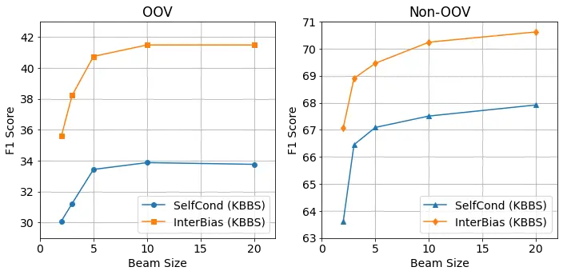

# InterBiasing: Boost Unseen Word Recognition through Biasing Intermediate Predictions

Yu Nakagome    Michael Hentschel

###### Abstract

Despite recent advances in end-to-end speech recognition methods, their
output is biased to the training data’s vocabulary, resulting in
inaccurate recognition of unknown terms or proper nouns. To improve the
recognition accuracy for a given set of such terms, we propose an
adaptation parameter-free approach based on Self-conditioned CTC. Our
method improves the recognition accuracy of misrecognized target
keywords by substituting their intermediate CTC predictions with
corrected labels, which are then passed on to the subsequent layers.
First, we create pairs of correct labels and recognition error instances
for a keyword list using Text-to-Speech and a recognition model. We use
these pairs to replace intermediate prediction errors by the labels.
Conditioning the subsequent layers of the encoder on the labels, it is
possible to acoustically evaluate the target keywords. Experiments
conducted in Japanese demonstrated that our method successfully improved
the F1 score for unknown words.

###### keywords

speech recognition, keywords biasing, connectionist temporal
classification, self-conditioning

^(†)^(†)address: ¹LINE WORKS Corporation, Japan  
²NAVER Cloud Corporation, South Korea^(†)^(†)email:
y.nakagome@line-works.com

## 1 Introduction

In recent years, the rapid advancement of deep neural networks has led
to remarkable recognition performance of end-to-end (E2E) speech
recognition models, including connectionist temporal classification
(CTC) \[1\], recurrent neural network transducers \[2\], and
attention-based encoder-decoders \[3, 4\]. These models are now widely
used by many users in practical applications such as conference
recording and AI dialogue systems. However, the performance of these
machine learning models is strongly dependent on the available training
data. As a result, recognizing rare words that are not readily available
in the training data, such as internal terms, person names, and
industry-specific terminology, remains a challenging problem. In many
practical scenarios, these rare terms are obtainable in advance, for
example, from user names, meeting chat logs or documents, or even words
registered by users. There is a growing demand for technology that
allows user customization by leveraging such information. Furthermore,
since each user has unique word requirements and new words are
continually added, it is desirable that the model does not require
additional training.

Traditional approaches to address these limitations have included the
use of weighted finite-state transducers \[5, 6, 7\]. However, these
approaches require the creation and adaption of a decoding graph, which
is not desirable for E2E speech recognizers that can use graph-free
decoding such as models using CTC. Moreover, alternative approaches like
employing deep biasing with text embeddings \[8, 9\] and integrating
error correction mechanisms \[10\] have been explored. However, it is
important to note that, in text embedding methods, the representation of
the model depends on its training data, which limits biasing towards the
words included in the training data.

A method that neither requires model retraining nor decoding graph
generation is keyword-boosted beam search (KBBS) \[11\]. This is a
practical technique that gives a bonus score if a word in the keyword
list appears in the beam search hypothesis. However, its limitation lies
in its inability to award bonuses if the target keyword is not present
within the search beam. This issue is particularly pronounced in
languages like Japanese, which feature multiple spellings; if the
spelling of the target keywords differs from the spelling in the
training data, the target keywords are less likely to appear in the
search beam. The peaky posterior distribution of CTC \[12\] further
enhances this issue. For keyword boosting to be effective, the posterior
probability of the target keyword must be a high value.

In this paper, we propose InterBiasing, a novel biasing method for
Self-conditioned CTC \[13\], designed to condition intermediate layers
in the acoustic model on the target keywords. Self-conditioned CTC has
achieved state-of-the-art performance in non-autoregressive E2E
models \[14\]. In this architecture, the CTC predictions are computed in
the intermediate encoder layers, and the subsequent layers are
conditioned on the predicted CTC sequence. This process is then repeated
in multiple layers. It can be interpreted as an iterative
refinement \[15, 16, 17\] of the prediction results within a single
encoder. By replacing the intermediate predictions of the target
vocabulary with the correct labels and conditioning the subsequent
layers on them, we can harness the framework of iterative refinement to
enhance the intermediate predictions while taking the target vocabulary
into consideration. The procedure of the proposed method can be
described as follows. First, we generate speech corresponding to a list
of keywords using Text-to-Speech (TTS) synthesis. Next, this speech is
input into a recognition model, which produces pairs of the correct
labels and recognition errors. Subsequently, we utilize these pairs to
correct intermediate prediction errors by substituting them with the
accurate labels. By ensuring that the subsequent layers of the encoder
are informed by these correct labels, we can acoustically assess the
target keywords. Our approach counter-acts CTC’s peaky posterior
distribution and allows the target keywords to appear in the search beam
where they can be further boosted. Moreover, since only the keywords
searched from the utterance hypothesis bias the intermediate outputs,
the target word can be biased regardless of the size of the keyword
list.

Figure 1: Overview of the proposed InterBiasing methods. The proposed
method has two steps. Step 1) Speech for a keyword list is generated via
Text-to-Speech (TTS), and this speech is fed into a recognition model to
create pairs of correct labels and recognition error instances. Step 2)
These pairs are utilized to replace intermediate prediction errors with
the correct labels, and the subsequent layers infer recognition
hypothesis based on these labels.

## 2 Background

In this section, we give an overview of CTC and Self-conditioned CTC,
which are the background of InterBiasing.

### 2.1 Connectionist Temporal Classification

End-to-end ASR aims to model the probability distribution of a token
sequence $`Y=(y_{l}\in\mathcal{V}\mid l=1,\dots,L)`$ given a sequence of
$`D`$-dimensional audio features
$`X=(\mathbf{x}_{t}\in\mathbb{R}^{D}\mid t=1,\dots,T)`$, where
$`\mathcal{V}`$ is a token vocabulary. In the CTC framework \[1\],
frame-level alignment paths between $`X`$ and $`Y`$ are introduced with
a special blank token $`\epsilon`$. An alignment path is denoted by
$`\pi=\left(\pi_{t}\in\mathcal{V}^{\prime}\mid t=1,\dots,T\right)`$,
where $`\mathcal{V}^{\prime}=\mathcal{V}\cup\{\epsilon\}`$. The
alignment path can be transformed into the corresponding token sequence
by using the collapsing function $`\mathcal{B}`$ that removes all
repeated tokens and blank tokens. A neural network is trained to
estimate the probability distribution of $`\pi_{t}`$. We denote the
output sequence of the neural network by
$`Z=(\mathbf{z}_{t}\in(0,1)^{|\mathcal{V}^{\prime}|}\mid t=1,\dots,T)`$,
where the element $`z_{t,k}`$ is interpreted as $`p(\pi_{t}=k|X)`$. The
training objective of CTC is the negative log-likelihood over all
possible alignment paths with the conditional independence assumption
per frame, as follows:

```math
\displaystyle\mathcal{L}_{\mathsf{ctc}}(Z,Y)=-\log\sum_{\pi\in\mathcal{B}^{-1}(Y)}\prod_{t}z_{t,\pi_{t}}. \tag{1}
```

The estimated token sequence $`\hat{Y}`$ is obtained as follows:

```math
\displaystyle\hat{Y}=\mathcal{B}(\mathsf{argmax}(Z)). \tag{2}
```

### 2.2 Conformer Encoder

The neural network used in this paper has $`N`$-stacked Conformer
encoders \[18\]. The $`n`$-th encoder accepts an input sequence
$`X^{(n-1)}`$ and produces an encoded sequence of the same shape:

```math
\displaystyle X^{(n)}=\mathsf{Encoder}^{(n)}(X^{(n-1)})\qquad(1\leq n\leq N), \tag{3}
```

where $`X^{(0)}=X`$ is a subsampled sequence of input audio features.
The output sequence $`Z`$ is obtained by applying a linear
transformation and the softmax function:

```math
\displaystyle Z=\mathsf{Softmax}(\mathsf{Linear}_{D\rightarrow|\mathcal{V}^{\prime}|}(X^{(N)})), \tag{4}
```

where $`\mathsf{Linear}_{D\rightarrow|\mathcal{V}^{\prime}|}(\cdot)`$
maps a $`D`$-dimensional vector into a
$`|\mathcal{V}^{\prime}|`$-dimensional vector for each element of
$`X^{(N)}`$.

### 2.3 Self-conditioned CTC

For regularizing the CTC model training, Intermediate CTC \[19\]
introduces an additional loss for output sequences of intermediate
encoders. An intermediate output sequence for the $`n`$-th encoder
$`Z^{(n)}=(\mathbf{z}^{(n)}_{t}\in(0,1)^{|\mathcal{V}^{\prime}|}|t=1,\dots,T)`$
is computed using the same linear transformation as Eq. 4:

```math
\displaystyle Z^{(n)}=\mathsf{Softmax}(\mathsf{Linear}_{D\rightarrow|\mathcal{V}^{\prime}|}(X^{(n)})). \tag{5}
```

The loss for the intermediate output sequence is the same as Eq. 1, and
is added to the final training objective as follows:

```math
\mathcal{L}_{\mathsf{ic}}=(1-\lambda)\mathcal{L}_{\mathsf{ctc}}(Z,Y)+\frac{\lambda}{|\mathcal{N}|}\sum_{n\in\mathcal{N}}\mathcal{L}_{\mathsf{ctc}}(Z^{(n)},Y), \tag{6}
```

where $`\lambda\in(0,1)`$ is a mixing weight and $`\mathcal{N}`$ is a
set of encoder indices for intermediate losses.

Self-conditioned CTC \[13\] utilizes the intermediate output sequence
for conditioning the subsequent encoders:

```math
\displaystyle C^{(n)} \displaystyle=\mathsf{Linear}_{|\mathcal{V}^{\prime}|\rightarrow D}(Z^{(n)}), \tag{7}
```

```math
\displaystyle X^{\prime(n)} \displaystyle=\begin{cases}X^{(n)}+C^{(n)}&(n\in\mathcal{N}),\\
X^{(n)}&(n\notin\mathcal{N}),\end{cases} \tag{8}
```

where $`C^{(n)}=(\mathbf{c}^{(n)}_{t}\mid t=1,\dots,T)`$ and
$`\mathsf{Linear}_{|\mathcal{V}^{\prime}|\rightarrow D}(\cdot)`$ maps a
$`|\mathcal{V}^{\prime}|`$-dimensional vector into a $`D`$-dimensional
vector for each element in the input sequence. This linear layer is
shared among the intermediate layers.

## 3 InterBiasing: Biasing Intermediate Predictions

Figure 1 illustrates the proposed InterBiasing framework. The proposed
method substitutes misrecognition of keywords with appropriate labels in
the intermediate predictions. The corrected predictions are converted to
frame-level biasing features $`C^{(n)}_{\mathsf{Bias}}`$ and the encoder
output $`X^{(n)}`$ in Eq. 3 is conditioned on them as follows:

```math
\displaystyle X^{\prime(n)} \displaystyle=X^{(n)}+C^{(n)}_{\mathsf{Bias}}. \tag{9}
```

### 3.1 Collecting Recognition Errors for a Keyword List with Synthetic Audio

To collect examples of misrecognitions of unknown keywords, we utilize
the intermediate prediction results from the TTS audio for these
keywords. The audio $`X_{\mathsf{TTS},\kappa}`$ from the set of keywords
$`\mathcal{K}`$ is generated using the following formula:

```math
\displaystyle X_{\mathsf{TTS},\kappa}=\mathsf{TTS}(\kappa),\quad\forall\kappa\in\mathcal{K}. \tag{10}
```

Then, we obtain the intermediate softmax probability
$`\hat{Y}^{(n)}_{\mathsf{TTS},\kappa}`$ by applying Eq. 2, 3 and 5 to
$`X_{\mathsf{TTS},\kappa}`$. In this intermediate prediction
$`\hat{Y}^{(n)}_{\mathsf{TTS},\kappa}`$, it is observed that the
predictions in the lower encoder layers deviate from the correct labels,
so we select the intermediate predictions from layers after the
$`{M_{\mathsf{bias}}}`$ layer as trigger words
$`W_{\mathsf{trigger},\kappa}`$ as follows:

```math
\displaystyle W_{\mathsf{trigger},\kappa}=\hat{Y}^{(n)}_{\mathsf{TTS},\kappa}\qquad(n\geq M_{\mathsf{bias}}). \tag{11}
```

### 3.2 Biasing Intermediate Predictions

If the intermediate prediction $`\hat{Y}^{(n)}`$ contains a word that
exactly matches $`W_{\mathsf{trigger,\kappa}}`$, the word is replaced by
$`{\kappa}`$ to obtain $`\hat{Y}^{(n)}_{\mathsf{bias}}`$.
$`\hat{Y}^{(n)}_{\mathsf{bias}}`$ is the sequence of the text domain,
which requires conversion to a frame step alignment for conditioning.
Similar to the previous study \[20\], we obtain the alignment of
$`A^{(n)}_{\mathsf{bias}}`$ by using the Viterbi algorithm as follows:

```math
\displaystyle A^{(n)}_{\mathsf{bias}}=\textsf{Viterbi}(\hat{Y}^{(n)}_{\mathsf{bias}},Z^{(n)}) \tag{12}
```

The alignment of $`A^{(n)}_{\mathsf{bias}}`$ is then converted into a
onehot vector $`{Z}^{(n)}_{\mathsf{bias}}`$ and we form a weighted sum
with the original softmax probability $`Z^{(n)}`$ with bias weight
$`w_{\mathsf{bias}}`$ as follows:

```math
\displaystyle{Z}^{(n)}_{\mathsf{bias}} \displaystyle=\mathsf{Onehot}(A^{(n)}_{\mathsf{bias}}), \tag{13}
```

```math
\displaystyle Z^{\prime(n)} \displaystyle=(1-w_{\mathsf{bias}})Z^{(n)}+w_{\mathsf{bias}}{Z}^{(n)}_{\mathsf{bias}} \tag{14}
```

Finally, the intermediate predictions are converted into the biasing
features using a linear layer:

```math
\displaystyle C^{(n)}_{\mathsf{Bias}} \displaystyle=\mathsf{Linear}_{|\mathcal{V}^{\prime}|\rightarrow D}(Z^{\prime(n)}). \tag{15}
```

Note that when no trigger word $`W_{\mathsf{trigger,\kappa}}`$ is
included in $`\hat{Y}^{(n)}`$, the conventional Self-conditioned CTC is
performed. That is, $`W_{\mathsf{trigger,\kappa}}`$ that do not appear
in $`\hat{Y}^{(n)}`$ are ignored, allowing for biasing towards
$`\kappa`$ regardless of the size of $`\mathcal{K}`$.

## 4 Experiments

|               |         |               |               |
| ------------- | ------- | ------------- | ------------- | --- | ---------------- |
|               | Dataset | $`            | \mathcal{K}   | `$  | Avg. char length |
|               |         | OOV / Non-OOV | OOV / Non-OOV |
| In-domain     | CSJ 1   | 2 / 8         | 5.0 / 3.1     |
|               | CSJ 2   | 4 / 3         | 4.0 / 5.7     |
|               | CSJ 3   | 23 / 8        | 4.3 / 3.1     |
| Out-of-domain | CV      | 59 / 54       | 5.6 / 4.3     |
|               | JSUT    | 212 / 103     | 3.7 / 2.8     |
|               | TED     | 99 / 78       | 4.0 / 3.6     |

Table 1: Summary of keyword set sizes and average number of characters
for OOV and Non-OOV keywords in each testset.

|                                                          |                                       |                   |                   |                    |                    |                    |
| -------------------------------------------------------- | ------------------------------------- | ----------------- | ----------------- | ------------------ | ------------------ | ------------------ |
|                                                          | CER (%) / OOV F1 (%) / Non-OOV F1 (%) |                   |                   |                    |                    |                    |
| Methods                                                  | CSJ eval1                             | CSJ eval2         | CSJ eval3         | Common Voice       | JSUT basic 5000    | TEDxJP-10K         |
| Greedy decoding                                          |                                       |                   |                   |                    |                    |                    |
| SelfCond                                                 | 4.6 / 75.0 / 88.9                     | 3.7 / 0.0 / 0.0   | 3.4 / 6.2 / 69.8  | 19.0 / 18.6 / 81.4 | 11.7 / 9.2 / 54.6  | 16.1 / 12.0 / 85.3 |
| TextSub                                                  | 4.6 / 75.0 / 90.1                     | 3.7 / 0.0 / 0.0   | 3.6 / 9.1 / 72.7  | 19.9 / 18.6 / 82.3 | 12.0 / 10.0 / 56.3 | 16.2 / 13.1 / 19.4 |
| InterBiasing                                             | 4.6 / 75.0 / 92.3                     | 3.7 / 40.0 / 0.0  | 3.5 / 27.4 / 75.6 | 19.0 / 22.7 / 82.9 | 11.7 / 13.5 / 59.5 | 16.1 / 13.1 / 85.9 |
| LM shallow fusion + Beam Search decoding                 |                                       |                   |                   |                    |                    |                    |
| SelfCond                                                 | 4.5 / 82.4 / 90.1                     | 3.7 / 0.0 / 33.3  | 3.4 / 9.2 / 72.7  | 17.3 / 18.6 / 82.8 | 11.5 / 9.2 / 54.9  | 15.8 / 12.0 / 85.6 |
| TextSub                                                  | 4.5 / 77.8 / 15.8                     | 3.7 / 0.0 / 33.3  | 3.5 / 12.1 / 73.7 | 18.1 / 10.7 / 79.2 | 13.0 / 8.8 / 20.4  | 16.7 / 8.3 / 8.3   |
| InterBiasing                                             | 4.5 / 82.4 / 93.5                     | 3.7 / 0.0 / 33.3  | 3.5 / 36.8 / 80.9 | 17.3 / 18.6 / 84.0 | 11.5 / 12.1 / 59.8 | 15.8 / 14.2 / 86.3 |
| LM shallow fusion + Keyword-boosted Beam Search decoding |                                       |                   |                   |                    |                    |                    |
| SelfCond                                                 | 3.9 / 88.9 / 90.3                     | 2.8 / 0.0 / 75.0  | 3.4 / 29.3 / 75.6 | 17.7 / 50.9 / 85.1 | 11.5 / 33.9 / 67.5 | 15.9 / 27.7 / 86.8 |
| InterBiasing                                             | 3.9 / 88.9 / 94.7                     | 2.8 / 40.0 / 75.0 | 3.3 / 62.4 / 83.3 | 17.7 / 52.3 / 85.8 | 11.5 / 41.5 / 70.2 | 15.8 / 33.0 / 87.4 |

Table 2: CERs and F1 scores of Out-of-Vocabulary (OOV) and Non-OOV words
in CSJ eval1, eval2, eval3, Common Voice, JSUT basic 5000 and
TEDxJP-10K. Reported metrics are in the following format: CER / F1 of
OOV words / F1 of Non-OOV words.

To evaluate the effectiveness of the proposed InterBiasing, we conducted
speech recognition experiments using the NeMo toolkit¹¹ 1
https://github.com/NVIDIA/NeMo \[21\]. The performance of the models was
evaluated based on character error rates (CERs) and F1 score. Following
the conventional study \[11\], we adopted the F1 score as our primary
evaluation metric.

### 4.1 Data

We utilized a model that was trained on the CSJ corpus \[22\], which
contains Japanese public speeches on academic topics. The vocabulary
$`\mathcal{V}`$ was a set of 3,260 character units. We used
80-dimensional Mel-spectrogram features as input features. SpecAugment
\[23\] and Speed perturbation \[24\] were also applied with the ESPNet
recipe \[25\].

We conducted the evaluation on three in-domain (CSJ eval1, eval2,
eval3 \[22\]) and three out-of-domain (JSUT-basic 5000 \[26\], Common
Voice v8.0 \[27\], TEDxJP-10K \[28\]) test sets. The out-of-domain test
sets are representative of the common scenario in applications where the
unseen user data does not match the training data in acoustic or lexical
conditions.

Here, we describe the process of generating bias keywords for our
evaluation experiments. Initially, we performed speech recognition on
each evaluation set using a model trained on the CSJ dataset. By
comparing the labels and recognition hypotheses, we identified words
that were incorrectly recognized. In this process, word segmentation was
conducted using morphological analysis with MeCab \[29\]. From the
extracted misrecognized words, we only retained proper nouns and
personal names with two characters or more using morphological labels.
In the final stage, we manually removed clear morphological analysis
errors from the extracted set of bias keywords. We classified all bias
keywords into out-of-vocabulary (OOV) keywords and Non-OOV keywords
based on whether they belong to the vocabulary in the CSJ training data.
The number of OOV and Non-OOV keywords in each evaluation set is shown
in Table 1.

### 4.2 Model Configurations

SelfCond: We used the Self-conditioned CTC model as described in
Section 2.3. The number of layers $`N`$ was 18, and the encoder
dimension $`D`$ was 512. The convolution kernel size and the number of
attention heads were 31 and 8, respectively. The model was trained for
50 epochs, and the final model was obtained by averaging model
parameters over 10 best checkpoints in terms of validation cer values.
The effective batch-size was set to 120. The Adam optimizer \[30\] with
$`\beta_{1}=0.9`$, $`\beta_{2}=0.98`$, the Noam Annealing learning rate
scheduling \[31\] with 1k warmup steps were used for training.
Self-conditioning are applied at every layer
($`\mathcal{N}=\{1,2,...,17\}`$).

TextSub (Text Substitution): A simple text substitution process was
applied to the final recognition hypotheses using the pairs of keywords
and trigger lists.

InterBias: To generate trigger words, we utilized synthetic speech via
the in-house TTS system. We then processed this synthesized speech
through the above mentioned SelfCond model, using the results from
greedy decoding in the intermediate layers ($`{M_{\mathsf{bias}}}`$ =
$`3`$). The bias weight $`w_{\mathsf{bias}}`$ was set to 0.9.
InterBiasing is applied at layer indices
($`\mathcal{N}=\{1,2,...,17\}`$).

Beam Search decoding: In the LM shallow fusion, a 10-gram Ngram was
trained using the text corpus from the speech training data with
KenLM \[32\]. Beam size, LM weight, and length penalty were set to 10,
0.5, and 0.2, respectively, optimized using the CSJ dev set. The weight
of KBBS was set to $`3.0`$.

### 4.3 Results

Table 2 summarizes the experimental results. First, in greedy decoding,
it can be seen that the TextSub significantly degraded the F1 score of
Non-OOV words in TEDxJP-10k. The TextSub frequently overcorrected
recognition results and was less likely to hit the trigger words since
they were not always present in the final outputs. In contrast, the
InterBiasing had more chances to hit trigger words because text
substitution was applied for intermediate predictions on multiple
layers. Compared to SelfCond and the TextSub, the experimental results
show a large improvement of F1 scores of the OOV words, and less
degradation of CERs with the proposed InterBiasing. It should be noted
that the large fluctuations in the results for CSJ eval1 and eval2
scores have little significance due to the low number of keywords being
evaluated, as shown in Table 1.

Next, in beam search decoding with LM shallow fusion, we also observed
that the proposed InterBiasing improved on the F1 scores of SelfCond on
many evaluation sets. As in the greedy decoding, especially for OOV
keywords in CSJ eval3, InterBiasing significantly improved the OOV and
Non-OOV recognition performance with beam search compared with SelfCond.
The performance of TextSub tended to degrade similarly to that observed
with greedy decoding.

Finally, in LM shallow fusion and KBBS decoding, KBBS remarkably boosted
the OOV and Non-OOV recognition performance of SelfCond. However, OOV F1
scores of SelfCond remained low. It was confirmed that the combination
of the proposed InterBiasing and KBBS further boosted the keyword
recognition of the SelfCond and achieved the best performance on all
evaluation sets. In particular, the recognition performance of OOV words
was improved. This appears to stem from InterBiasing increasing the
acoustic score of the keywords, causing the keywords to appear in the
hypothesis of KBBS.

### 4.4 Analysis of the Relationship Between Beam Size and Keyword Recognition Rate

In this section, we report an analysis of how the beam size impacts the
keyword recognition performance. Figure 2 shows the F1 scores of
SelfCond and InterBiasing for various beam sizes of KBBS on the JSUT
basic 5000. For the OOV keywords, SelfCond improved performance with
increasing beam size from 2 to 10, but did not improve F1 scores when
the beam size was further increased. This indicates that the acoustic
scores of many OOV words output from SelfCond were too low to appear in
the beam search hypothesis even when the beam size was increased. Using
InterBiasing with a beam size of only 2, the keyword recognition rate
was already superior to SelfCond with a beam size of 10. Furthermore,
when the beam size was increased to 10, the performance of InterBiasing
was further improved. Therefore, it can be seen that InterBiasing
enhanced the acoustic score of OOV words, making these words appear more
frequently within the beam search hypothesis. As a result, the effect of
KBBS is likely enhanced. Similarly, for Non-OOV words, we observed that
high keyword recognition rates were achieved even when using smaller
beam sizes.



Figure 2: F1 scores of Out-of-Vocabulary (OOV) and Non-OOV words in JSUT
basic 5000 with different beam sizes. LM shallow fusion and
Keyword-boosted Beam Search (KBBS) were utilized. Beam size was set to
2, 3, 5, 10, 20, respectively.

## 5 Conclusions

In this paper, we propose a method to improve the speech recognition
performance of unknown words without additional training by effectively
augmenting the intermediate predictions of the acoustic encoder with a
keyword list and integrating it into the subsequent network layers. This
approach allows for acoustic analysis of the keywords in the acoustic
encoder, thereby improving the recognition performance of unknown words
while minimizing side effects such as over-boosting. Experimental
results in Japanese confirmed that the proposed method enhances the
recognition performance of unknown words.

## References

- \[1\] A. Graves, S. Fernández, F. Gomez, and J. Schmidhuber,
  “Connectionist temporal classification: Labelling unsegmented sequence
  data with recurrent neural networks,” in _Proc. ICML_, 2006, p.
  369–376.
- \[2\] A. Graves, “Sequence transduction with recurrent neural
  networks,” in _International Conference on Machine Learning:
  Representation Learning Workshop_, 2012.
- \[3\] J. K. Chorowski, D. Bahdanau, D. Serdyuk, K. Cho, and Y. Bengio,
  “Attention-based models for speech recognition,” in _Proc. NeurIPS_,
  2015, pp. 577–585.
- \[4\] W. Chan, N. Jaitly, Q. Le, and O. Vinyals, “Listen, attend and
  spell: A neural network for large vocabulary conversational speech
  recognition,” in _Proc. ICASSP_, 2016, pp. 4960–4964.
- \[5\] D. Zhao, T. N. Sainath, D. Rybach, P. Rondon, D. Bhatia, B. Li,
  and R. Pang, “Shallow-Fusion End-to-End Contextual Biasing,” in _Proc.
  Interspeech_, 2019, pp. 1418–1422.
- \[6\] R. Huang, O. Abdel-Hamid, X. Li, and G. Evermann, “Class lm and
  word mapping for contextual biasing in end-to-end asr,” in _Proc.
  Interspeech_, 2020.
- \[7\] D. Le, M. Jain, G. Keren, S. Kim, Y. Shi, J. Mahadeokar,
  J. Chan, Y. Shangguan, C. Fuegen, O. Kalinli, Y. Saraf, and
  M. Seltzer, “Contextualized streaming end-to-end speech recognition
  with trie-based deep biasing and shallow fusion,” in _Interspeech_,
  2021, pp. 1772–1776.
- \[8\] K. Huang, A. Zhang, Z. Yang, P. Guo, B. Mu, T. Xu, and L. Xie,
  “Contextualized End-to-End Speech Recognition with Contextual Phrase
  Prediction Network,” in _Proc. Interspeech_, 2023, pp. 4933–4937.
- \[9\] Y. Sudo, M. Shakeel, Y. Fukumoto, Y. Peng, and S. Watanabe,
  “Contextualized automatic speech recognition with attention-based bias
  phrase boosted beam search,” in _Proc. ICASSP_, 2024, pp.
  10 896–10 900.
- \[10\] X. Wang, Y. Liu, J. Li, V. Miljanic, S. Zhao, and H. Khalil,
  “Towards contextual spelling correction for customization of
  end-to-end speech recognition systems,” _IEEE/ACM Transactions on
  Audio, Speech, and Language Processing_, vol. 30, pp. 3089–3097, 2022.
- \[11\] N. Jung, G. Kim, and J. S. Chung, “Spell my name: Keyword
  boosted speech recognition,” in _Proc. ICASSP_, 2022, pp. 6642–6646.
- \[12\] A. Zeyer, R. Schluter, and H. Ney, “Why does ctc result in
  peaky behavior?” _arXiv preprint arXiv:2105.14849_, 2021.
- \[13\] J. Nozaki and T. Komatsu, “Relaxing the Conditional
  Independence Assumption of CTC-Based ASR by Conditioning on
  Intermediate Predictions,” in _Proc. Interspeech_, 2021, pp.
  3735–3739.
- \[14\] Y. Higuchi, N. Chen, Y. Fujita, H. Inaguma, T. Komatsu, J. Lee,
  J. Nozaki, T. Wang, and S. Watanabe, “A comparative study on
  non-autoregressive modelings for speech-to-text generation,” in _Proc.
  ASRU_, 2021, pp. 47–54.
- \[15\] E. A. Chi, J. Salazar, and K. Kirchhoff, “Align-Refine:
  Non-autoregressive speech recognition via iterative realignment,” in
  _Proc. NAACL-HLT_, 2021, pp. 1920–1927.
- \[16\] Y. Higuchi, S. Watanabe, N. Chen, T. Ogawa, and T. Kobayashi,
  “Mask CTC: Non-autoregressive end-to-end ASR with CTC and mask
  predict,” in _Proc. Interspeech_, 2020, pp. 3655–3659.
- \[17\] Y. Nakagome, T. Komatsu, Y. Fujita, S. Ichimura, and Y. Kida,
  “InterAug: Augmenting Noisy Intermediate Predictions for CTC-based
  ASR,” in _Proc. Interspeech_, 2022, pp. 5140–5144.
- \[18\] A. Gulati, J. Qin, C.-C. Chiu, N. Parmar, Y. Zhang, J. Yu,
  W. Han, S. Wang, Z. Zhang, Y. Wu, and R. Pang, “Conformer:
  Convolution-augmented Transformer for Speech Recognition,” in _Proc.
  Interspeech_, 2020, pp. 5036–5040.
- \[19\] J. Lee and S. Watanabe, “Intermediate loss regularization for
  ctc-based speech recognition,” in _Proc. ICASSP_, 2021, pp. 6224–6228.
- \[20\] T. Komatsu, Y. Fujita, J. Lee, L. Lee, S. Watanabe, and
  Y. Kida, “Better Intermediates Improve CTC Inference,” in _Proc.
  Interspeechs_, 2022, pp. 4965–4969.
- \[21\] O. Kuchaiev, J. Li, H. Nguyen, O. Hrinchuk, R. Leary,
  B. Ginsburg, S. Kriman, S. Beliaev, V. Lavrukhin, J. Cook _et al._,
  “Nemo: a toolkit for building ai applications using neural modules,”
  _arXiv preprint arXiv:1909.09577_, 2019.
- \[22\] K. Maekawa, “Corpus of spontaneous japanese: Its design and
  evaluation,” in _ISCA & IEEE Workshop on Spontaneous Speech Processing
  and Recognition_, 2003.
- \[23\] D. S. Park, W. Chan, Y. Zhang, C.-C. Chiu, B. Zoph, E. D.
  Cubuk, and Q. V. Le, “SpecAugment: A Simple Data Augmentation Method
  for Automatic Speech Recognition,” in _Proc. Interspeech_, 2019, pp.
  2613–2617.
- \[24\] T. Ko, V. Peddinti, D. Povey, and S. Khudanpur, “Audio
  augmentation for speech recognition,” in _Proc. Interspeech_, 2015,
  pp. 3586–3589.
- \[25\] S. Watanabe, T. Hori, S. Karita, T. Hayashi, J. Nishitoba,
  Y. Unno, N. Enrique Yalta Soplin, J. Heymann, M. Wiesner, N. Chen,
  A. Renduchintala, and T. Ochiai, “ESPnet: End-to-End Speech Processing
  Toolkit,” in _Proc. Interspeech_, 2018, pp. 2207–2211.
- \[26\] R. Sonobe, S. Takamichi, and H. Saruwatari, “Jsut corpus: free
  large-scale japanese speech corpus for end-to-end speech synthesis,”
  _ArXiv_, vol. abs/1711.00354, 2017.
- \[27\] R. Ardila, M. Branson, K. Davis, M. Henretty, M. Kohler,
  J. Meyer, R. Morais, L. Saunders, F. M. Tyers, and G. Weber, “Common
  voice: A massively-multilingual speech corpus,” in _Proc. LREC_, 2020,
  pp. 4211–4215.
- \[28\] S. Ando and H. Fujihara, “Construction of a large-scale
  japanese asr corpus on tv recordings,” in _Proc. ICASSP_, 2021, pp.
  6948–6952.
- \[29\] T. Kudo, K. Yamamoto, and Y. Matsumoto, “Applying conditional
  random fields to Japanese morphological analysis,” in _Proc. EMNLP_,
  2004, pp. 230–237.
- \[30\] D. P. Kingma and J. Ba, “Adam: A Method for Stochastic
  Optimization,” in _Proc. ICLR_, 2015.
- \[31\] A. Vaswani, N. Shazeer, N. Parmar, J. Uszkoreit, L. Jones,
  A. N. Gomez, L. Kaiser, and I. Polosukhin, “Attention is all you
  need,” in _Proc. NeurlPS_, 2017, p. 6000–6010.
- \[32\] K. Heafield, “KenLM: Faster and smaller language model
  queries,” in _Proceedings of the Sixth Workshop on Statistical Machine
  Translation_, Jul. 2011, pp. 187–197.
