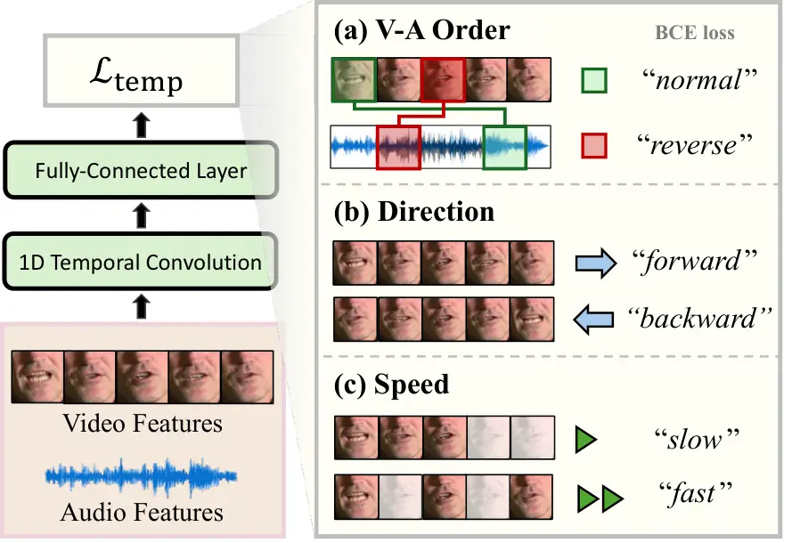
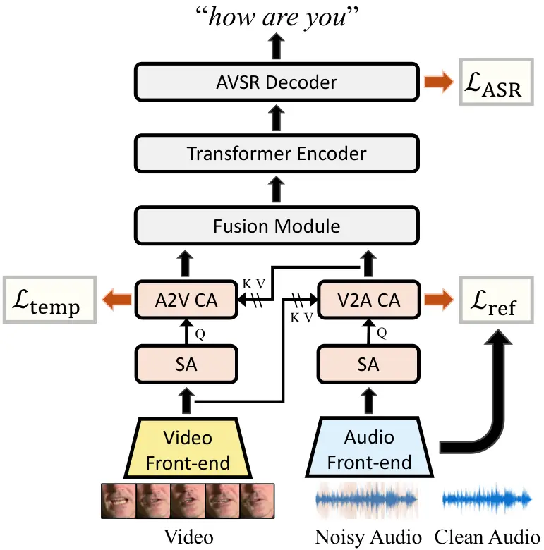

# Learning Video Temporal Dynamics with Cross-Modal Attention for Robust Audio-Visual Speech Recognition

Sungnyun Kim ^(†)^(†)thanks: \* Equal contribution.    Kangwook Jang   
Sangmin Bae    Hoirin Kim    Se-Young Yun

###### Abstract

Audio-visual speech recognition (AVSR) aims to transcribe human speech
using both audio and video modalities. In practical environments with
noise-corrupted audio, the role of video information becomes crucial.
However, prior works have primarily focused on enhancing audio features
in AVSR, overlooking the importance of video features. In this study, we
strengthen the video features by learning three temporal dynamics in
video data: context order, playback direction, and the speed of video
frames. Cross-modal attention modules are introduced to enrich video
features with audio information so that speech variability can be taken
into account when training on the video temporal dynamics. Based on our
approach, we achieve the state-of-the-art performance on the LRS2 and
LRS3 AVSR benchmarks for the noise-dominant settings. Our approach
excels in scenarios especially for babble and speech noise, indicating
the ability to distinguish the speech signal that should be recognized
from lip movements in the video modality. We support the validity of our
methodology by offering the ablation experiments for the temporal
dynamics losses and the cross-modal attention architecture design.

###### Index Terms:

robust audio-visual speech recognition, video temporal dynamics,
cross-modal attention

^(†)^(†)address: ¹Kim Jaechul Graduate School of AI, KAIST  
²School of Electrical Engineering, KAIST

## 1 Introduction

Audio-visual speech recognition (AVSR) \[1, 2, 3, 4, 5, 6\] represents a
paradigm, where the integration of both auditory and visual modalities
plays a crucial role for advancing speech recognition capabilities. This
multimodal approach utilizes not only the auditory cues existing in
speech but also valuable visual information, such as lip movements.
However, the conventional AVSR methods do not fully exploit the
potential of visual information \[7, 8\], which becomes significant when
the audio-only speech recognition system is susceptible to background
noise \[9, 10\]. In such practical scenarios, it is essential to allow
the AVSR system to rely on video information rather than
overly-corrupted audio information.

Previous studies \[8, 11, 12\] have mainly focused on enhancing noisy
audio features or reducing modality gap, whereas few works have explored
directly enhancing the video features with video-oriented learning for
AVSR. In particular, the audio enhancement is performed by taking
advantage of the undistorted video information \[7, 8\] or restoring
clean audio by a viseme-to-phoneme cluster mapping \[11\]. Also, several
studies have explored to fuse the audio and video features with
cross-modal attention \[13, 14\] or have proposed a contrastive loss to
minimize the discrepancy between the two modalities \[12, 15\]. While
these methods can be considered to improve the performance of AVSR, they
have not investigated the intrinsic characteristics of video modality,
such as temporal dynamics \[16, 17, 18\] and spatio-temporal correlation
\[19, 20\].



Figure 1: Our proposed temporal dynamics
guidance ($`\mathcal{L}_{\text{temp}}`$) involves predicting (a) the
context order considering both video (V) and audio (A) modalities
($`\mathcal{L}_{\text{order}}`$; Eq. 5), (b) playback direction
($`\mathcal{L}_{\text{direction}}`$; Eq. 6), and (c) whether certain
frames are skipped or not ($`\mathcal{L}_{\text{speed}}`$; Eq. 7). Each
video temporal predictor is consisted of 1D convolution and
fully-connected (FC) layers.

In this work, we suggest training on temporal dynamics in the video data
to enhance video features, making the AVSR system refer more to visual
information. Figure 1 describes our training method in detail, where
video features are processed through the temporal predictor to address
each visual-related task. Our method focuses on predicting three key
objectives: (1) the context order between two random video and audio
frames, (2) the playback direction of video frames, and (3) the playback
speed of video frames. As similar approaches have previously
demonstrated success in the action recognition tasks \[18, 21, 22\], our
AVSR system can discriminate the target speech to be recognized with the
lip movement pair in the presence of multiple speakers. Consequently,
our video features are expected to encapsulate richer temporal
understanding of the lip movements and audio context alignment, making
the AVSR system more robust in the noisy audio condition.

To boost the effectiveness of learning temporal dynamics, we incorporate
a cross-modal attention module within the video streamline, injecting
audio information into the video features. This structure enables video
features to consider temporal variability in speech, such as
coarticulation and variations in speaking speed, which can only be
captured by attending multiple adjacent audio frames. Understanding the
temporal order of context between speech and lip movements also
necessitates the cross-attention between two modalities. Furthermore, to
prevent misguidance of the temporal dynamics caused by distorted audio
features, we implement an additional cross-modal attention into the
audio streamline. This attention module is trained with a refinement
loss, utilizing clean video data to refine the noisy audio inputs.

To sum up, we propose a cross-modal attention structure to both video
and audio modality streamlines, enhancing video and audio features with
video temporal dynamics and audio refinement learning, respectively. Our
main contributions in this paper include the followings:

- •
  Video temporal dynamics learning. We particularly enhance the video
  features for AVSR with the explicit goal of learning temporal
  dynamics, thereby significantly improving robustness in noisy audio
  conditions. To this end, we design cross-modal attention modules for
  enhancing the correlation between video and audio features.
- •
  Robust AVSR performance. Evaluating on the LRS2 \[23\] and LRS3 \[24\]
  AVSR benchmarks with the MUSAN noise \[25\] added, our method achieves
  the state-of-the-art N-WER¹¹ 1 N-WER denotes word error rate (WER)
  averaged across all 4 noise types and 5 signal-to-noise ratio (SNR)
  levels (refer to Section 4.1). \[26\] on both benchmarks. In
  particular for the LRS3 benchmark, our method outperforms
  UniVPM \[11\] (5.2%) with N-WER of 4.6%.
- •
  Validation through ablation studies. We also investigate the validity
  of our methodology by offering the ablation experiments for the
  temporal dynamics losses and the cross-modal attention architecture
  design.

## 2 Related Works

### 2.1 Audio-Visual Speech Recognition

Recent AVSR works have focused on creating better audio-visual
multi-modal representations via sophisticated training schemes or
scaling up to larger datasets. AV-HuBERT \[5\] learns to predict the
cluster assignments of audio features for the masked prediction
training. Modality dropout is introduced for audio-visual fusion to
prevent models from excessively relying on the audio modality. Several
approaches \[27, 28, 29\] employ a teacher-student framework, where the
teacher model weights are updated via an exponential moving average of
the student model weights, to predict contextualized target
representations for the masked frames. Auto-AVSR \[6\] incorporates the
pretrained automatic speech recognition (ASR) model for creating
pseudo-labels of the unlabeled video dataset. The most recent
finding \[30\] illustrates that the linear projection is sufficient as a
visual front-end with large-scale datasets.

Since speech recognition is often susceptible to background noise or
ambient speech, addressing noise robustness in the AVSR system is a
practical and important problem. To this end, the follow-up study of
AV-HuBERT \[26\] suggests to leverage noise-augmented audio for
pretraining AV-HuBERT \[5\]. UniVPM \[11\] proposes a viseme-phoneme
mapping to restore clean audio from lip movements under noisy
environments. Reinforcement learning is also utilized for robust AVSR by
encouraging an agent to explore optimal strategies for WER \[10\].
GILA \[12\] fuses audio and video representations with consecutive
cross-modal attention blocks and implements contrastive loss to model
the temporal consistency between audio-visual frames. Our work departs
from prior works in the aspect of enhancing video features through
temporal dynamics learning. We propose integrating a cross-modal
attention module into the existing AVSR system to enhance its robustness
against various types of noise.

### 2.2 Temporal Dynamics Learning

Temporal dynamics refers to the information about changing patterns over
multiple consecutive temporal frames, which has proven to help
understanding videos, not necessarily with sound, in action recognition
tasks \[18, 22\]. The correlation between adjacent video frames can be
boosted by learning temporal self-supervision tasks, such as predicting
the direction of token’s temporal flow \[18\] or whether certain frames
are skipped \[22\]. Recent work has extended temporal dynamics into a
multi-modal scope, proposing an inter-modal contrastive loss that learns
longer-term dynamics through context ordering between video and audio
data \[21\]. Our work aims to enhance video features for noise-robust
AVSR by training temporal dynamics with simple binary classification
tasks in a self-supervised manner. This approach differs from
contrastive learning \[21\], which involves a complicated process of
sampling positive and negative pairs and challenging optimization.

## 3 Methodology

### 3.1 Overview

Our approach (Figure 1 and 2) is designed to reinforce the features of
each modality, achieved by the temporal dynamics
loss ($`\mathcal{L}_{\text{temp}}`$) and the refinement
loss ($`\mathcal{L}_{\text{ref}}`$). We insert a cross-modal attention
structure between the front-end feature extractors and the pretrained
AVSR encoder and train this attention structure with the two
aforementioned losses. In the video streamline, audio information is
injected by the audio-to-video (A2V) cross-modal attention as a key and
a value to train the temporal dynamics of video features. Vice-versa,
the video-to-audio (V2A) cross-modal attention utilizes clean video
information as a key and a value to refine the noisy audio features and
reduce the impact of noise on the subsequent A2V module. We block the
gradient flow from one side to the other for a stable training, ensuring
that each loss can only train its corresponding streamline’s cross-modal
attention. Consequently, the reinforced video and audio features are
input to the pretrained AVSR encoder.

### 3.2 A2V Video Temporal Dynamics Guidance

A2V cross-modal attention. We propose enhancing video features by
introducing a cross-modal attention structure, in which audio features
serve as the key and the value, and video features serve as the query.
Rather than employing the simple fusion methods that enforce the
alignment within a single frame, such as channel-wise concatenation or
frame-wise addition \[4, 31, 32\], we employ the attention mechanism to
ensure that the video features take into account various speech context
present in multiple audio frames. Furthermore, this A2V cross-modal
attention module can help the video features comprehend temporal
variability in speech, such as coarticulation or speaking speed, which
can only be captured by attending multiple adjacent audio frames.

Let us denote the outputs of the video and audio front-ends as
$`\mathbf{f}_{\text{v}},\,\mathbf{f}_{\text{a}}\in\mathbb{R}^{T\times D}`$,
respectively. They share the same sequence length $`T`$ and the channel
dimension $`D`$. To inject audio information into the video features, we
implement a stacked attention²² 2 Multi-head attention \[33\] mechanism
is employed for the SA and CA module, but we omit its notation for
brevity. module; self-attention (SA) and then cross-modal
attention (CA). The SA module in the beginning is for preparing the
features with referencing the other modality information.
$`\mathbf{f}_{\text{v}}`$ is first transformed by the query, key, and
value matrices,
$`\mathbf{W}_{q},\mathbf{W}_{k},\mathbf{W}_{v}\in\mathbb{R}^{D\times D}`$,
followed by a SA mechanism. Given a single FC layer
$`\mathbf{W}_{\text{fc}}\in\mathbb{R}^{D\times D}`$,

```math
\displaystyle\text{SA}(\mathbf{f}_{\text{v}}) \displaystyle=\text{Attention}(\mathbf{f}_{\text{v}};\,\mathbf{f}_{\text{v}};\,\mathbf{f}_{\text{v}})
```

```math
\displaystyle=\text{softmax}\left(\frac{(\mathbf{f}_{\text{v}}\mathbf{W}_{q})(\mathbf{f}_{\text{v}}\mathbf{W}_{k})^{\top}}{\sqrt{D}}\right)(\mathbf{f}_{\text{v}}\mathbf{W}_{v}), \tag{1}
```

```math
\displaystyle\mathbf{f}^{\prime}_{\text{v}} \displaystyle=\text{SA}(\mathbf{f}_{\text{v}})\cdot\mathbf{W}_{\text{fc}_{1}}. \tag{2}
```

The resulting video features are then processed by the A2V cross-modal
attention module, employing
$`\mathbf{f}^{\prime}_{\text{v}}\in\mathbb{R}^{T\times D}`$ as the query
and the audio features $`\tilde{\mathbf{f}}_{\text{a}}`$ as the key and
value. Here, $`\tilde{\mathbf{f}}_{\text{a}}`$ is refined by another
cross-modal attention in order to facilitate the accurate learning of
temporal dynamics for the video features (refer to Section 3.3 for
details on the audio feature refinement process).

```math
\displaystyle\text{CA}(\mathbf{f}^{\prime}_{\text{v}};\,\tilde{\mathbf{f}}_{\text{a}}) \displaystyle=\text{Attention}(\mathbf{f}^{\prime}_{\text{v}};\,\tilde{\mathbf{f}}_{\text{a}};\,\tilde{\mathbf{f}}_{\text{a}}), \tag{3}
```

```math
\displaystyle\tilde{\mathbf{f}}_{\text{v}}=\mathbf{f}_{\text{v}} \displaystyle+\text{CA}(\mathbf{f}^{\prime}_{\text{v}};\,\tilde{\mathbf{f}}_{\text{a}})\cdot\mathbf{W}_{\text{fc}_{2}}. \tag{4}
```

Our final audio-incorporated video features
$`\tilde{\mathbf{f}}_{\text{v}}\in\mathbb{R}^{T\times D}`$ are residual
summation of the original features and the FC layer’s output of the A2V
cross-modal attention.



Figure 2: Our cross-modal attention structure is inserted between the
feature extractors and the AVSR encoder. This structure leverages clean
video to refine audio, and then learns video temporal dynamics given the
refined audio features. Note that the gradient is not backpropagated
between the two modalities so that training
$`\mathcal{L}_{\text{temp}}`$ and $`\mathcal{L}_{\text{ref}}`$ does not
interfere each other.

Temporal dynamics guidance. We train temporal dynamics on the video
features, allowing them to be stronger contributors for AVSR. The
reliance on video information is more pronounced in AVSR with noisy
audio conditions \[9, 10\], therefore, strengthening the video features
would be essential. Previous studies \[18, 21, 22\] have shown improved
performance in the action recognition tasks by learning video temporal
dynamics. Viewing the AVSR task as continuous action recognition of lip
movements, likewise, allows us to leverage temporal dynamics learning to
understand natural lip movements. For instance, discerning whether the
given lip movement frames are being played forward or backward can help
the video features be enriched with natural lip movements over time.

To synchronize the temporal positions of the context in video and audio,
we involve the temporal order loss in a cross-modal way. The order loss
learns to predict the context order of two randomly selected frames, one
from the video sequence and another from the audio sequence (refer to
Figure 1(a)). Let us denote
$`\tilde{\mathbf{f}}_{\text{v}}=(\tilde{v}_{1},\cdots,\tilde{v}_{T})^{\top}`$
and
$`\tilde{\mathbf{f}}_{\text{a}}=(\tilde{a}_{1},\cdots,\tilde{a}_{T})^{\top}`$
for the enhanced video and audio features, which are the outputs from
each cross-modal attention module. The context order loss
$`\mathcal{L}_{\text{order}}`$ is defined as

```math
\mathcal{L}_{\text{order}}=\sum_{i,j,i\neq j}\text{BCE}(g(\tilde{v}_{i}\lVert\tilde{a}_{j}),y), \tag{5}
```

where $`\lVert`$ is a channel-wise concatenation. The frame order labels
are $`y=1`$ for $`i<j`$ and $`y=0`$ for $`i>j`$. BCE refers to a binary
cross-entropy loss, and $`g(\cdot)`$³³ 3 For the intuitive loss
formulations, the inputs of the binary classifiers in Eqs. 5–7 (_i.e.,_
$`\tilde{v}`$ and $`\tilde{a}`$), are the features that have already
undergone 1D temporal convolution in the binary classifier. is a binary
predictor network, composed of 1D temporal convolution \[34\] followed
by an FC layer. The purpose of temporal convolution is to fuse
temporally adjacent features, avoiding ambiguity where a single
characteristic (_e.g.,_ phoneme) may appear in multiple places within a
sequence.

Furthermore, we propose the direction loss and speed loss to train
temporal dynamics that are revealed in a short time duration,
particularly learning the local temporal dynamics. The direction loss
predicts whether consecutive temporal length $`t`$ video frames are
playing forward ($`y=1`$) or backward ($`y=0`$) (refer to Figure 1(b)).

```math
\displaystyle\mathcal{L}_{\text{direction}}=\sum_{i}\,\, \displaystyle\mathrm{BCE}(g(\tilde{v}_{i}\lVert\cdots\lVert\tilde{v}_{i+t-1}),1)
```

```math
\displaystyle+\mathrm{BCE}(g(\tilde{v}_{i+t-1}\lVert\cdots\lVert\tilde{v}_{i}),0). \tag{6}
```

Additionally, the speed loss predicts whether a given video sequence is
playing in a regular speed ($`y=1`$) or skipping the frames in the speed
of $`k>1`$ ($`y=0`$) (refer to Figure 1(c)).

```math
\displaystyle\mathcal{L}_{\text{speed}}=\sum_{i}\,\, \displaystyle\mathrm{BCE}(g(\tilde{v}_{i}\lVert\tilde{v}_{i+1}\lVert\cdots\lVert\tilde{v}_{i+t-1}),1)
```

```math
\displaystyle+\mathrm{BCE}(g(\tilde{v}_{i}\lVert\tilde{v}_{i+k}\lVert\cdots\lVert\tilde{v}_{i+(t-1)k}),0). \tag{7}
```

These two loss functions help the video features learn how lip shape
moves naturally over a short duration of time. We also mark that the
predictors are not shared across the different temporal dynamics losses
and discarded for inference.

### 3.3 V2A Audio Refinement

We have suggested the audio information be injected into the video
features by the A2V cross-modal attention for training the video
temporal dynamics. However, perturbed audio information with noise may
lead misguidance in learning the temporal dynamics. Similar to previous
AVSR works \[7, 8, 11\] that have performed audio enhancement with
accompanying clean video information, we aim to refine the audio inputs
through a V2A cross-modal attention.

Analogous to the video streamline (Eq. 1–4), audio features are modified
by the stacked SA-CA module, where the V2A cross-modal attention is
performed to refine the noisy audio features with the help of video
features.

```math
\displaystyle\mathbf{f}^{\prime}_{\text{a}} \displaystyle=\text{SA}(\mathbf{f}_{\text{a}})\cdot\mathbf{W}_{\text{fc}_{3}}, \tag{8}
```

```math
\displaystyle\tilde{\mathbf{f}}_{\text{a}} \displaystyle=\mathbf{f}_{\text{a}}+\text{CA}(\mathbf{f}^{\prime}_{\text{a}};\mathbf{f}_{\text{v}})\cdot\mathbf{W}_{\text{fc}_{4}}. \tag{9}
```

We remind this audio refinement process in Eq. 9 is preceding the video
feature enhancement in Eq. 4. The modified audio features
$`\tilde{\mathbf{f}}_{\text{a}}`$ reference the clean audio features
$`\mathbf{f}_{\text{a, clean}}`$, with loss calculated by the
mean-squared error (MSE). The clean audio features are not processed
further through our audio streamline.

```math
\mathcal{L}_{\text{ref}}=\lVert\tilde{\mathbf{f}}_{\text{a}}-\mathbf{f}_{\text{a, clean}}\rVert^{2}. \tag{10}
```

Overall training loss. The reinforced audio and video features are input
to the AVSR encoder, optimizing the entire model with the
sequence-to-sequence ASR loss \[5\], $`\mathcal{L}_{\text{ASR}}`$. Our
final loss is the linear combination of each loss as follows:

```math
\displaystyle\mathcal{L}_{\text{temp}}=\mathcal{L}_{\text{order}}+\mathcal{L}_{\text{direction}}+\mathcal{L}_{\text{speed}}, \tag{11}
```

```math
\displaystyle\mathcal{L}=\mathcal{L}_{\text{ASR}}+\lambda_{\text{temp}}\,\mathcal{L}_{\text{temp}}+\lambda_{\text{ref}}\,\mathcal{L}_{\text{ref}}, \tag{12}
```

where $`\lambda_{\text{temp}}`$ and $`\lambda_{\text{ref}}`$ are the
coefficients for video temporal loss and audio refinement loss. We
highlight that our method improves the performance of AVSR by simply
adding losses during the fine-tuning stage, thus, does not require
substantial training cost for pretraining.

## 4 Experiments and Results

### 4.1 Implementation Details

|                       |           |                        |           |               |               |               |                     |                        |     |     |     |     |     |                                 |     |     |     |     |     |                     |                       |            |
| --------------------- | --------- | ---------------------- | --------- | ------------- | ------------- | ------------- | ------------------- | ---------------------- | --- | --- | --- | --- | --- | ------------------------------- | --- | --- | --- | --- | --- | ------------------- | --------------------- | ---------- |
| Method                | ​PT Type​ | Babble, SNR (dB) $`=`$ |           |               |               |               |                     | Speech, SNR (dB) $`=`$ |     |     |     |     |     | Music + Natural, SNR (dB) $`=`$ |     |     |     |     |     | N-WER               |                       | Clean      |
|                       |           | -10                    | -5        | 0             | 5             | 10            | ​AVG                | -10                    | -5  | 0   | 5   | 10  | AVG | -10                             | -5  | 0   | 5   | 10  | AVG | AVG                 | N $`\geq`$ S          | $`\infty`$ |
| TM-seq2seq \[3\]      | -         | -                      | -         | 42.5          | -             | -             | -                   | -                      | -   | -   | -   | -   | -   | -                               | -   | -   | -   | -   | -   | -                   | -                     | 7.2        |
| EG-seq2seq \[7\]      | -         | 38.6                   | 31.1      | 25.5          | ​24.3         | ​20.7         | ​28.0               | -                      | -   | -   | -   | -   | -   | -                               | -   | -   | -   | -   | -   | -                   | -                     | 6.8        |
| GILA-Conformer \[12\] | -         | -                      | -         | -             | -             | -             | -                   | -                      | -   | -   | -   | -   | -   | -                               | -   | -   | -   | -   | -   | 7.0                 | -                     | 2.0        |
| AV-HuBERT \[26\]      | clean     | 30.0                   | 15.2      | 5.9           | 2.7           | 1.9           | 11.1                | 15.9                   | 7.5 | 3.9 | 2.4 | 1.9 | 6.3 | 12.1                            | 5.9 | 3.1 | 2.2 | 1.8 | 5.0 | 6.9                 | 10.0                  | 1.4        |
| UniVPM \[11\]         | clean     | 28.1                   | 13.8      | 5.1           | 2.2           | 1.7           | 10.2                | 14.5                   | 6.7 | 3.3 | 2.1 | 1.7 | 5.7 | 10.7                            | 5.2 | 2.7 | 1.9 | 1.6 | 4.4 | 6.2                 | 9.1                   | 1.2        |
| Ours                  | clean     | 28.3 24.8              | 13.4 11.2 |   4.8     4.6 |   2.4     2.3 |   1.7     1.9 |   10.1     9.0      | 9.9                    | 5.2 | 3.4 | 2.3 | 1.6 | 4.5 | 9.7                             | 4.9 | 2.6 | 2.0 | 1.8 | 4.2 |    5.7       5.4    |    8.3        7.8     | 1.5        |
| u-HuBERT \[35\]       | noisy     | -                      | -         | 4.1           | -             | -             | -                   | -                      | -   | -   | -   | -   | -   | -                               | -   | -   | -   | -   | -   | -                   | -                     | 1.2        |
| AV-HuBERT \[26\]      | noisy     | 28.4                   | 13.4      | 5.0           | 2.6           | 1.9           | 10.3                | 11.4                   | 4.6 | 2.9 | 2.2 | 1.8 | 4.6 | 9.7                             | 4.7 | 2.5 | 1.9 | 1.8 | 4.1 | 5.8                 | 8.3                   | 1.4        |
| MIR-GAN \[36\]        | noisy     | -                      | -         | -             | -             | -             | -                   | -                      | -   | -   | -   | -   | -   | -                               | -   | -   | -   | -   | -   | 5.6                 | -                     | 1.2        |
| UniVPM \[11\]         | noisy     | 26.8                   | 12.1      | 4.0           | 2.1           | 1.6           | 9.3                 | 10.4                   | 4.1 | 2.5 | 2.0 | 1.6 | 4.1 | 8.7                             | 4.1 | 2.1 | 1.7 | 1.5 | 3.6 | 5.2                 | 7.5                   | 1.2        |
| MSRL \[10\]           | noisy     | 22.4                   | 11.3      | 4.5           | 2.3           | -             | -                   | 7.2                    | 3.4 | 2.3 | 1.8 | -   | -   | 8.5                             | 4.3 | 2.4 | 1.7 | -   | -   | -                   | 6.8                   | 1.3        |
| Ours                  | noisy     | 25.8 22.7              | 11.9 9.9  |   4.4     4.0 |   2.4     2.2 |   1.8    1.8  |    9.3       8.1    | 5.4                    | 3.2 | 2.5 | 1.8 | 1.8 | 2.9 | 8.7                             | 3.7 | 2.4 | 2.0 | 1.7 | 3.7 |    4.9       4.6    |    6.9        6.4     | 1.5        |

Table 1: Comparisons of WER (%) with our model and prior works on the
LRS3 \[24\] AVSR benchmark. PT Type denotes whether the AVSR encoder is
pretrained with noise-augmented audio. For evaluation, noise is sampled
from the MUSAN \[25\] dataset, while the results with babble noise from
LRS3 are marked green. We average the WER for music and natural
noises \[11, 26\]. We cite AV-HuBERT \[26\] results from the appendix of
the original paper, which match the N-WER results (6.9% and 5.8%).

Datasets. We perform our experiments on the AVSR benchmarks, LRS2 \[23\]
and LRS3 \[24\]. Most of our experimental configurations follow prior
works \[11, 26\], which include the extraction and addition of noise
from MUSAN \[25\] (babble, music, and natural) and LRS3 (speech)
datasets. For training, we sample 0 dB SNR noise and always add it to
the clean speech signal for training. We use noise from the MUSAN test
set for evaluation as done in \[10, 11, 36\], as well as the babble
noise synthesized from LRS3 \[5, 7\]. We report WER evaluated on
noise-perturbed test set with 5 different SNR levels:
$`\{-10,-5,0,5,10\}`$. The evaluation metric is N-WER \[26\] (AVG), the
average WER across 4 noise categories and 5 SNRs. We also report
noise-dominant N-WER (N $`\geq`$ S), which only considers 3 non-positive
SNR levels.

Model and training description. We adopt AV-HuBERT-Large model \[26\] as
our backbone. As an initialization, we load the pretrained checkpoint
from \[26\], pretrained on noise-augmented
LRS3 \[24\] + VoxCeleb2 \[37\], and then fine-tune the model for 60K
steps on the LRS2 or LRS3 train set. For the first 48K steps, we freeze
the AVSR encoder and front-ends of both modalities while training the
AVSR decoder, the stacked SA-CA modules, and temporal predictors. We
adopt negative log-likelihood for $`\mathcal{L}_{\text{ASR}}`$.
$`\lambda_{\text{temp}}`$ and $`\lambda_{\text{ref}}`$ are 0.05 and 0.1,
respectively. We use a kernel size of 3 for the 1D convolution in the
binary temporal classifiers and set the temporal length $`t`$ as 3 in
Eqs. 6 and 7.

### 4.2 Robust AVSR Benchmark Results

In Table 1, we present the AVSR performance of our proposed method,
evaluated on the LRS3 \[24\] benchmark. Our model consistently surpasses
AV-HuBERT \[26\] across all four noise types, as indicated by N-WER of
5.7% and 4.9%, depending on whether the encoder is pretrained with
noise-augmented audio (_i.e.,_ PT Type). Also, it outperforms
MIR-GAN \[36\] and UniVPM \[11\] by 5.4%/4.6% N-WER for clean/noisy PT
Type, respectively, attaining a new state-of-the-art performance. Our
methods especially excelling in babble and speech noise while offering
comparable results in music and natural noises. This highlights the
importance of learning video temporal dynamics with audio information,
rendering the AVSR model to accurately distinguish the target speech
signal in multi-speaker scenarios by attending lip movements in the
video data. Meanwhile, it is crucial to acknowledge a trade-off in noise
robustness. Our method, catered to noise-corrupted conditions, leads to
exceptional performance gain in such scenarios but a slight degradation
in the clean speech setting, which has been similarly observed in other
noise-robust ASR works \[38, 39, 40\].

For the noise-dominant N-WER (N $`\geq`$ S), our results exhibit great
effectiveness in certain scenarios, highlighting its robustness and
real-world applicability. The comparisons with recent works, including
MSRL \[10\] and UniVPM \[11\], substantiate that our method bolsters the
robustness of our AVSR system with achieving 7.8% and 6.4%
noise-dominant N-WER regard to PT Type. Our method also outperforms
AV-HuBERT \[26\] for both PT Type with 8.3% and 6.9%. In contrast to
previous approaches that rely on the general methods for reducing the
modality gap, such as contrastive learning \[12\] or adversarial
learning \[11, 36\], our method incorporates the inherent
characteristics of video features, thereby resulting in superior
performance for the noise-dominant setting. Importantly, refined audio
information is injected into video features at this stage, making our
cross-modal attention design well-suited for the noise-robust AVSR task.

The trend of the aforementioned results continues in the LRS2 \[23\]
benchmark (Table 2). Our method surpasses the recent noise-robust AVSR
works, MIR-GAN \[36\] and UniVPM \[11\], with 5.9% N-WER and 7.7%
noise-dominant N-WER. Comparing with AV-HuBERT \[26\], around 11% of
relative performance gain is achieved in both average and noise-dominant
N-WER. This confirms that our method is still effective, regardless of
the difference between the pretraining and fine-tuning datasets.

|                       |                        |           |         |         |         |                |                        |     |     |     |     |     |                                 |     |     |     |     |     |               |                     |            |
| --------------------- | ---------------------- | --------- | ------- | ------- | ------- | -------------- | ---------------------- | --- | --- | --- | --- | --- | ------------------------------- | --- | --- | --- | --- | --- | ------------- | ------------------- | ---------- |
| Method                | Babble, SNR (dB) $`=`$ |           |         |         |         |                | Speech, SNR (dB) $`=`$ |     |     |     |     |     | Music + Natural, SNR (dB) $`=`$ |     |     |     |     |     | N-WER         |                     | Clean      |
|                       | -10                    | -5        | 0       | 5       | 10      | AVG            | -10                    | -5  | 0   | 5   | 10  | AVG | -10                             | -5  | 0   | 5   | 10  | AVG | AVG           | N $`\geq`$ S        | $`\infty`$ |
| AV-HuBERT \[26\]      | 31.7                   | 15.1      | 6.3     | 4.1     | 3.2     | 12.1           | 8.6                    | 5.5 | 4.2 | 3.7 | 3.3 | 5.1 | 11.0                            | 6.0 | 4.3 | 3.4 | 3.0 | 5.5 | 7.1           | 9.5                 | 2.6        |
| GILA-Conformer \[12\] | -                      | -         | -       | -       | -       | -              | -                      | -   | -   | -   | -   | -   | -                               | -   | -   | -   | -   | -   | 11.2          | -                   | 3.1        |
| MIR-GAN \[36\]        | -                      | -         | -       | -       | -       | -              | -                      | -   | -   | -   | -   | -   | -                               | -   | -   | -   | -   | -   | 7.0           | -                   | 2.2        |
| UniVPM \[11\]         | 30.1                   | 13.7      | 5.7     | 4.1     | 3.2     | 11.4           | 7.5                    | 5.1 | 3.4 | 3.1 | 2.8 | 4.4 | 10.9                            | 5.0 | 3.8 | 3.1 | 2.8 | 5.1 | 6.5           | 8.7                 | 2.2        |
| Ours                  | 27.8 22.4              | 12.6 10.1 | 5.2 5.0 | 3.7 3.7 | 3.0 3.2 |   10.4     8.9 | 7.5                    | 4.7 | 3.8 | 3.1 | 2.9 | 4.4 | 9.9                             | 6.0 | 3.8 | 3.3 | 2.9 | 5.2 |   6.3     5.9 |    8.4       7.7    | 2.7        |

Table 2: Comparisons of WER (%) with our model and prior works on the
LRS2 \[23\] AVSR benchmark. For the AV-HuBERT \[26\] results, we
fine-tune the pretrained AV-HuBERT encoder on LRS2. All models are
pretrained with noise-augmented audio (_i.e.,_ PT Type is noisy) except
for GILA-Conformer \[12\]. For evaluation, augmented noise is sampled
from the MUSAN \[25\] dataset, while the results with babble noise from
LRS3 are marked green. We average the WER for music and natural
noises \[11, 26\].

### 4.3 Ablation Study

Training losses. Table 3 shows our investigation on the independent
effects of the video temporal learning and audio refinement losses, by
systematically adding each loss component. The plain ASR
loss ($`\mathcal{L}_{\text{ASR}}`$) matches the ASR fine-tuning loss of
AV-HuBERT \[5\] baseline. Starting from this, we find that utilizing the
video temporal losses ($`\mathcal{L}_{\text{ASR}}`$ +
$`\mathcal{L}_{\text{temp}}`$) plays a crucial role in improving overall
performance, verifying the importance of strengthening the video
features for robust AVSR. Employing the audio refinement
loss ($`\mathcal{L}_{\text{ASR}}`$ + $`\mathcal{L}_{\text{ref}}`$) also
shows the performance improvement but not as much as video temporal
losses. Combining all the proposed
losses ($`\mathcal{L}_{\text{ASR}}`$ + $`\mathcal{L}_{\text{temp}}`$ +
$`\mathcal{L}_{\text{ref}}`$), we achieve the best AVSR performance
which shows refining noise-perturbed audio is particularly crucial for
correctly guiding the temporal dynamics to video features.

We further examine the performance of visual speech recognition (VSR) to
demonstrate the enhancement of visual features without any audio
information. For the VSR evaluation, the audio features are input as
zero vectors, and all the other implementations remain the same. Our
method, which is accompanied with the video temporal learning, produces
a lower 32.5% WER compared to the baseline (33.7%), indicating its
better representations of lip movements. However, when video temporal
learning is missing or has been misguided by noisy audio, the VSR
performance is adversely affected, resulting in 33.2% and 33.3% WER,
respectively.

Temporal dynamics loss. In Table 4(a), we further investigate how each
type of temporal dynamics loss affects the AVSR results. Since our video
temporal loss consists of three losses with various combinations
possible, we exclude each one individually to understand its impact on
the total temporal loss. We observe a performance drop when one of these
functions is omitted from the total temporal dynamics loss, especially
noticeable when the context order loss or speed loss is not included.
Additionally, we include a video-to-video order loss, which predicts the
order of randomly selected two video frames. This strategy has not
gained improvement, suggesting that learning the video-to-audio order
loss implicitly encompasses learning the video order itself.

Attention architecture designs. Table 4(b) demonstrates the
effectiveness of our cross-modal architecture design. As described in
Figure 2, we use a stacked SA-CA layer for each video and audio
streamline. The ablation experiments illustrate the necessity of both SA
and CA layers, with the CA layer revealed to be the most crucial
component. This underscores the significance of attending the other
modality for learning video temporal dynamics or refining noisy audio.
We also replace CA with the second SA layer to compare models with same
number of parameters, which is proved to be sub-optimal.

## 5 Conclusion

In this paper, we have proposed to train the temporal dynamics of video
features and employ the cross-modal attention, for the noise-robust AVSR
system. Our temporal dynamics learning includes predicting the context
order between two random audio and video frames in each sequence, the
playback direction, and the playback speed of video frames. Of our
stacked SA-CA module, the cross-modal attention plays a crucial role for
correlating each modality to one another. Our methodology achieves the
state-of-the-art performance on the LRS2 and LRS3 AVSR benchmarks,
particularly when the input audio is perturbed with various noise types
and SNR levels. This illustrates the significance of enhancing the video
features based on the temporal dynamics of lip movements. By extensive
ablation studies about our suggested loss and attention architecture, we
have confirmed the video temporal dynamics learning with cross-modal
attention design is essential for improving the noise-robustness of AVSR
system.

|                                                                                                    |          |          |      |
| -------------------------------------------------------------------------------------------------- | -------- | -------- | ---- |
| Loss                                                                                               | AVSR (L) | AVSR (M) | VSR  |
| $`\mathcal{L}_{\text{ASR}}`$                                                                       | 15.6     | 14.6     | 33.7 |
| $`\mathcal{L}_{\text{ASR}}`$ + $`\mathcal{L}_{\text{ref}}`$                                        | 14.8     | 12.9     | 33.2 |
| $`\mathcal{L}_{\text{ASR}}`$ + $`\mathcal{L}_{\text{temp}}`$                                       | 14.3     | 12.5     | 33.3 |
| $`\mathcal{L}_{\text{ASR}}`$ + $`\mathcal{L}_{\text{temp}}`$ + $`\mathcal{L}_{\text{ref}}`$ (ours) | 14.0     | 12.2     | 32.5 |

Table 3: Ablation experiments for the proposed training loss functions.
For AVSR, we average the WER results (%) across noise-dominant
settings (N $`\geq`$ S) on the LRS3 (L) and MUSAN (M) babble noise. VSR
is evaluated with video-only inputs, discarding the audio modality.

|                                                                                                    |             |
| -------------------------------------------------------------------------------------------------- | ----------- |
| Loss                                                                                               | ​​​​WER (%) |
| $`\mathcal{L}_{\text{ASR}}`$ + $`\mathcal{L}_{\text{temp}}`$ + $`\mathcal{L}_{\text{ref}}`$ (ours) | 12.2        |
|    (-) video-to-audio order                                                                        | 12.7        |
|    (-) direction                                                                                   | 12.5        |
|    (-) speed                                                                                       | 12.9        |
|    (+) video-to-video order                                                                        | 12.4        |
| (a) Temporal dynamics loss ablation                                                                |             |

|                                                                                                              |         |
| ------------------------------------------------------------------------------------------------------------ | ------- |
| (Loss fixed as: $`\mathcal{L}_{\text{ASR}}`$ + $`\mathcal{L}_{\text{temp}}`$ + $`\mathcal{L}_{\text{ref}}`$) |         |
| Architecture                                                                                                 | WER (%) |
| SA + CA (ours)                                                                                               | 12.2    |
|    (–) SA                                                                                                    | 12.4    |
|    (–) CA                                                                                                    | 13.0    |
| SA + SA                                                                                                      | 12.5    |
| (b) Attention architecture ablation                                                                          |         |

Table 4: Ablation experiments for (a) the proposed temporal dynamics
loss functions and (b) the attention module architecture designs. For
evaluation, we average the WER results across three SNRs (N $`\geq`$ S)
on the MUSAN babble noise.

## 6 Acknowledgements

This work was supported by Institute of Information & communications
Technology Planning & Evaluation (IITP) grant funded by the Korea
government (MSIT) \[No.20220-00641, 50%\] and the National Research
Foundation of Korea (NRF) grant funded by MSIT \[No. 2021R1A2C1014044,
50%\].

## References

- \[1\] Kuniaki Noda, Yuki Yamaguchi, Kazuhiro Nakadai, Hiroshi G Okuno,
  and Tetsuya Ogata, “Audio-visual speech recognition using deep
  learning,” Applied Intelligence, vol. 42, pp. 722–737, 2015.
- \[2\] Youssef Mroueh, Etienne Marcheret, and Vaibhava Goel, “Deep
  multimodal learning for audio-visual speech recognition,” in Proc.
  ICASSP, 2015, pp. 2130–2134.
- \[3\] Triantafyllos Afouras, Joon Son Chung, Andrew Senior, Oriol
  Vinyals, and Andrew Zisserman, “Deep audio-visual speech recognition,”
  IEEE Transactions on Pattern Analysis and Machine Intelligence, vol.
  44, pp. 8717–8727, 2018.
- \[4\] Pingchuan Ma, Stavros Petridis, and Maja Pantic, “End-to-end
  audio-visual speech recognition with conformers,” in Proc. ICASSP,
  2021, pp. 7613–7617.
- \[5\] Bowen Shi, Wei-Ning Hsu, Kushal Lakhotia, and Abdelrahman
  Mohamed, “Learning audio-visual speech representation by masked
  multimodal cluster prediction,” in Proc. ICLR, 2022.
- \[6\] Pingchuan Ma, Alexandros Haliassos, Adriana Fernandez-Lopez,
  Honglie Chen, Stavros Petridis, and Maja Pantic, “Auto-avsr:
  Audio-visual speech recognition with automatic labels,” in Proc.
  ICASSP, 2023, pp. 1–5.
- \[7\] Bo Xu, Cheng Lu, Yandong Guo, and Jacob Wang, “Discriminative
  multi-modality speech recognition,” in Proc. CVPR, 2020, pp.
  14433–14442.
- \[8\] Joanna Hong, Minsu Kim, Daehun Yoo, and Yong Man Ro, “Visual
  context-driven audio feature enhancement for robust end-to-end
  audio-visual speech recognition,” in Proc. Interspeech, 2022, pp.
  2838–2842.
- \[9\] Sucheng Ren, Yong Du, Jianming Lv, Guoqiang Han, and Shengfeng
  He, “Learning from the master: Distilling cross-modal advanced
  knowledge for lip reading,” in Proc. CVPR, 2021, pp. 13325–13333.
- \[10\] Chen Chen, Yuchen Hu, Qiang Zhang, Heqing Zou, Beier Zhu, and
  Eng Siong Chng, “Leveraging modality-specific representations for
  audio-visual speech recognition via reinforcement learning,” in Proc.
  AAAI, 2023, pp. 12607–12615.
- \[11\] Yuchen Hu, Ruizhe Li, Chen Chen, Chengwei Qin, Qiushi Zhu, and
  Eng Siong Chng, “Hearing lips in noise: Universal viseme-phoneme
  mapping and transfer for robust audio-visual speech recognition,” in
  Proc. ACL, 2023, pp. 15213–15224.
- \[12\] Yuchen Hu, Ruizhe Li, Chen Chen, Heqing Zou, Qiushi Zhu, and
  Eng Siong Chng, “Cross-modal global interaction and local alignment
  for audio-visual speech recognition,” in Proc. IJCAI, 2023, pp.
  5076–5084.
- \[13\] Liangfa Wei, Jie Zhang, Junfeng Hou, and Lirong Dai, “Attentive
  fusion enhanced audio-visual encoding for transformer based robust
  speech recognition,” in Proc. APSIPA ASC, 2020, pp. 638–643.
- \[14\] He Wang, Pengcheng Guo, Pan Zhou, and Lei Xie, “Mlca-avsr:
  Multi-layer cross attention fusion based audio-visual speech
  recognition,” in Proc. ICASSP, 2024, pp. 8150–8154.
- \[15\] Zi-Qiang Zhang, Jie Zhang, Jian-Shu Zhang, Ming-Hui Wu, Xin
  Fang, and Li-Rong Dai, “Learning contextually fused audio-visual
  representations for audio-visual speech recognition,” in Proc. ICIP,
  2022, pp. 1346–1350.
- \[16\] Ding Liu, Zhaowen Wang, Yuchen Fan, Xianming Liu, Zhangyang
  Wang, Shiyu Chang, and Thomas Huang, “Robust video super-resolution
  with learned temporal dynamics,” in Proc. ICCV, 2017, pp. 2507–2515.
- \[17\] Ding Liu, Zhaowen Wang, Yuchen Fan, Xianming Liu, Zhangyang
  Wang, Shiyu Chang, Xinchao Wang, and Thomas S Huang, “Learning
  temporal dynamics for video super-resolution: A deep learning
  approach,” IEEE Transactions on Image Processing, vol. 27, pp.
  3432–3445, 2018.
- \[18\] Sukmin Yun, Jaehyung Kim, Dongyoon Han, Hwanjun Song, Jung-Woo
  Ha, and Jinwoo Shin, “Time is matter: Temporal self-supervision for
  video transformers,” in Proc. ICML, 2022.
- \[19\] Jose Caballero, Christian Ledig, Andrew Aitken, Alejandro
  Acosta, Johannes Totz, Zehan Wang, and Wenzhe Shi, “Real-time video
  super-resolution with spatio-temporal networks and motion
  compensation,” in Proc. CVPR, 2017, pp. 4778–4787.
- \[20\] Peng Yi, Zhongyuan Wang, Kui Jiang, Junjun Jiang, and Jiayi Ma,
  “Progressive fusion video super-resolution network via exploiting
  non-local spatio-temporal correlations,” in Proceedings of the
  IEEE/CVF international conference on computer vision, 2019, pp.
  3106–3115.
- \[21\] Simon Jenni, Alexander Black, and John Collomosse,
  “Audio-visual contrastive learning with temporal self-supervision,” in
  Proc. AAAI, 2023, pp. 7996–8004.
- \[22\] Ishan Rajendrakumar Dave, Simon Jenni, and Mubarak Shah, “No
  more shortcuts: Realizing the potential of temporal self-supervision,”
  in Proc. AAAI, 2024, pp. 1481–1491.
- \[23\] Joon Son Chung, Andrew Senior, Oriol Vinyals, and Andrew
  Zisserman, “Lip reading sentences in the wild,” in Proc. CVPR, 2017,
  pp. 6447–6456.
- \[24\] Triantafyllos Afouras, Joon Son Chung, and Andrew Zisserman,
  “Lrs3-ted: a large-scale dataset for visual speech recognition,” arXiv
  preprint arXiv:1809.00496, 2018.
- \[25\] David Snyder, Guoguo Chen, and Daniel Povey, “Musan: A music,
  speech, and noise corpus,” arXiv preprint arXiv:1510.08484, 2015.
- \[26\] Bowen Shi, Wei-Ning Hsu, and Abdelrahman Mohamed, “Robust
  self-supervised audio-visual speech recognition,” in Proc.
  Interspeech, 2022, pp. 2118–2122.
- \[27\] Jiachen Lian, Alexei Baevski, Wei-Ning Hsu, and Michael Auli,
  “Av-data2vec: Self-supervised learning of audio-visual speech
  representations with contextualized target representations,” in Proc.
  ASRU, 2023, pp. 1–8.
- \[28\] Alexandros Haliassos, Pingchuan Ma, Rodrigo Mira, Stavros
  Petridis, and Maja Pantic, “Jointly learning visual and auditory
  speech representations from raw data,” in Proc. ICLR, 2023.
- \[29\] Alexandros Haliassos, Andreas Zinonos, Rodrigo Mira, Stavros
  Petridis, and Maja Pantic, “Braven: Improving self-supervised
  pre-training for visual and auditory speech recognition,” in Proc.
  ICASSP. IEEE, 2024, pp. 11431–11435.
- \[30\] Oscar Chang, Hank Liao, Dmitriy Serdyuk, Ankit Shahy, and
  Olivier Siohan, “Conformer is all you need for visual speech
  recognition,” in Proc. ICASSP, 2024, pp. 10136–10140.
- \[31\] Maxime Burchi and Radu Timofte, “Audio-visual efficient
  conformer for robust speech recognition,” in Proc. WACV, 2023, pp.
  2258–2267.
- \[32\] Stavros Petridis, Themos Stafylakis, Pingehuan Ma, Feipeng Cai,
  Georgios Tzimiropoulos, and Maja Pantic, “End-to-end audiovisual
  speech recognition,” in Proc. ICASSP, 2018, pp. 6548–6552.
- \[33\] Ashish Vaswani, Noam Shazeer, Niki Parmar, Jakob Uszkoreit,
  Llion Jones, Aidan N Gomez, Lukasz Kaiser, and Illia Polosukhin,
  “Attention is all you need,” in Proc. NeurIPS, 2017, pp. 6000–6010.
- \[34\] Shaojie Bai, J Zico Kolter, and Vladlen Koltun, “An empirical
  evaluation of generic convolutional and recurrent networks for
  sequence modeling,” arXiv preprint arXiv:1803.01271, 2018.
- \[35\] Wei-Ning Hsu and Bowen Shi, “u-hubert: Unified mixed-modal
  speech pretraining and zero-shot transfer to unlabeled modality,” in
  Proc. NeurIPS, 2022, pp. 21157–21170.
- \[36\] Yuchen Hu, Chen Chen, Ruizhe Li, Heqing Zou, and Eng Siong
  Chng, “Mir-gan: Refining frame-level modality-invariant
  representations with adversarial network for audio-visual speech
  recognition,” in Proc. ACL, 2023, pp. 11610–11625.
- \[37\] Joon Son Chung, Arsha Nagrani, and Andrew Zisserman,
  “Voxceleb2: Deep speaker recognition,” in Proc. Interspeech, 2018, pp.
  1086–1090.
- \[38\] Yiming Wang, Jinyu Li, Heming Wang, Yao Qian, Chengyi Wang, and
  Yu Wu, “Wav2vec-switch: Contrastive learning from original-noisy
  speech pairs for robust speech recognition,” in Proc. ICASSP, 2022,
  pp. 7097–7101.
- \[39\] Wei Wang and Yanmin Qian, “Hubert-agg: Aggregated
  representation distillation of hidden-unit bert for robust speech
  recognition,” in Proc. ICASSP, 2023, pp. 1–5.
- \[40\] Dianwen Ng, Ruixi Zhang, Jia Qi Yip, Zhao Yang, Jinjie Ni,
  Chong Zhang, Yukun Ma, Chongjia Ni, Eng Siong Chng, and Bin Ma,
  “De’hubert: Disentangling noise in a self-supervised model for robust
  speech recognition,” in Proc. ICASSP, 2023, pp. 1–5.

Appendix

## Appendix A Implementation Details

### A.1 Datasets

We perform our experiments on LRS2 \[23\] and LRS3 \[24\], datasets
comprising around 224 and 433 hours of audio-visual speech data,
respectively, from over 5,000 speakers. Most of our experimental
configurations follow \[11\] and \[26\], including the noise
augmentation and evaluation protocol. We extract noise from
MUSAN \[25\] (babble, music, and natural) and LRS3 (speech) datasets,
and partition them into train, validation, and test sets. For training,
we sample noise at 0 dB SNR and always add it to the clean speech
signal. For evaluation, we use noise from the MUSAN test set, as done in
\[10, 11, 36\], as well as synthesizing the babble noise by randomly
mixing 30 audio clips from LRS3, following \[5, 7\].

### A.2 Model and Training Description

We adopt AV-HuBERT-Large model \[26\] as our backbone, which consists of
24 and 9 Transformer \[33\] blocks as the AVSR encoder and decoder,
respectively. This backbone consists of a feature extractor for each
modality, where the visual feature extractor is a modified ResNet-18,
and the audio feature extractor is a linear projection layer. Extracted
features are concatenated to form fusion audio-visual features, which
are input to the Transformer encoder. While more recent AVSR models
exist \[6, 27, 29\], we apply our method to AV-HuBERT for fair
comparison with previous works \[10, 11, 26, 36\] that utilize the same
noise-augmenting protocol and pretrained AVSR encoder. The hidden
dimension of the cross-modal attention is 1024, same as that of the AVSR
encoder.

As an initialization, we load the pretrained checkpoint from \[26\],
pretrained on noise-augmented LRS3 \[24\] + VoxCeleb2 \[37\], and then
fine-tune the model for 60K steps on the LRS2 or LRS3 train set. We
observe unstable fine-tuning due to the insertion of untrained
cross-modal attention module between pretrained AVSR encoder and
front-ends of both modalities. Therefore, we freeze all pretrained
modules for the first 48k steps which means only cross-modal attention
module and the AVSR decoder are trained during these steps. We adopt
negative log-likelihood loss for $`\mathcal{L}_{\text{ASR}}`$ in a
sequence-to-sequence manner with a Transformer decoder. The total number
of parameters in our whole model is 500M while AV-HuBERT-Large is 477M,
implying the stacked SA-CA module only accounts for less than 5%. Our
code is implemented upon the fairseq pipeline.

For the binary temporal classifier, we use a kernel size of 3 for the 1D
convolutional layer followed by the single FC layer. We set the temporal
length $`t`$ as 3, sampling 3 consecutive frames to formulate direction
and speed loss functions. A single frame in our model spans 40 ms, which
is shorter than the average English phoneme duration of 100 ms. Thus, we
set the kernel size as 3 to match between lip movements and acoustic
characteristics such as phonemes, while also minimizing ambiguity from
repeated characteristics in a single sequence. Our internal experiments
with kernel sizes of 5 and 7 have yielded similar performance to kernel
size 3, while leading to slightly increased computational overhead.
However, one can consider using a larger kernel size when working with a
language that has longer duration phonemes than English.

### A.3 Positional Encoding

The conventional Transformer architecture consists of positional
encoding (PE) layers prior to self-attention layers to provide
contextual information regarding the position of tokens within a
sequence. In our framework, which is focused on learning temporal
dynamics, we aim to prevent learning redundant information attributable
to the PE layer. Consequently, in our cross-modal modules, we apply PE
to only the keys and values derived from the other modality streamline,
excluding the queries in the CA layer. This implementation ensures that
the PE layer does not directly learn temporal dynamics on the video
streamline side, where the queries are primarily tasked with computing
the temporal losses. For the same reason, SA layers in our cross-modal
module are designed without incorporating any PE layers.
