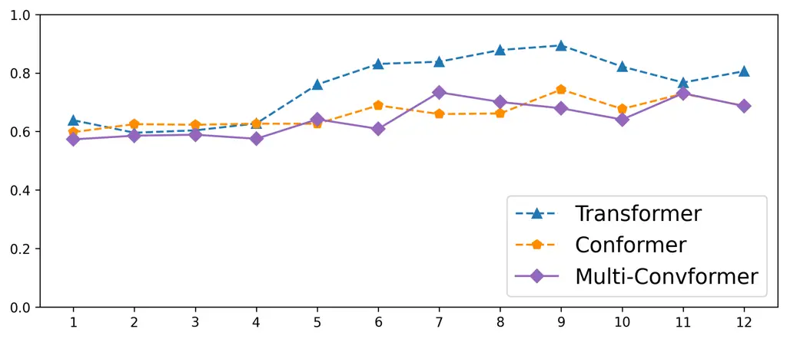
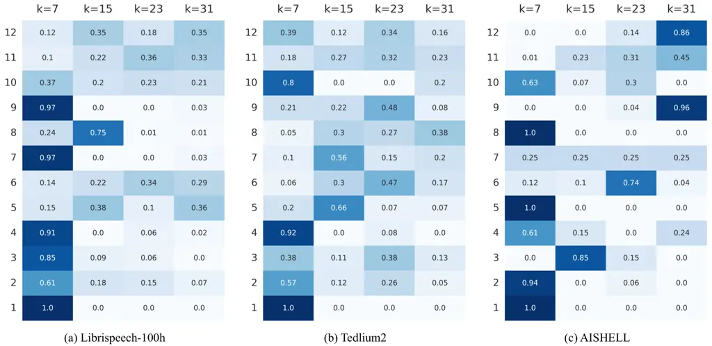

iliation=1\]DarshanPrabhu iliation=2\]YifanPeng
iliation=1\]PreethiJyothi iliation=2\]ShinjiWatanabe

# Multi-Convformer: Extending Conformer with Multiple Convolution Kernels

###### Abstract

Convolutions have become essential in state-of-the-art end-to-end
Automatic Speech Recognition (ASR) systems due to their efficient
modelling of local context. Notably, its use in Conformers has led to
superior performance compared to vanilla Transformer-based ASR systems.
While components other than the convolution module in the Conformer have
been reexamined, altering the convolution module itself has been far
less explored. Towards this, we introduce Multi-Convformer  that uses
multiple convolution kernels within the convolution module of the
Conformer in conjunction with gating. This helps in improved modeling of
local dependencies at varying granularities. Our model rivals existing
Conformer variants such as CgMLP and E-Branchformer in performance,
while being more parameter efficient. We empirically compare our
approach with Conformer and its variants across four different datasets
and three different modelling paradigms and show up to 8% relative word
error rate (WER) improvements.

###### keywords

Automatic Speech Recognition, Conformer, Multiple Convolutions, CgMLP.

^(†)^(†)address: ¹Department of Computer Science, Indian Institute of
Technology Bombay, Mumbai, India  
²Language Technologies Institute, Carnegie Mellon University,
Pittsburgh, PA, USA ^(†)^(†)email: {darshanp, pjyothi}@cse.iitb.ac.in,
yifanpen@andrew.cmu.edu, shinjiw@ieee.org

## 1 Introduction

In recent years, end-to-end automatic speech recognition (ASR) systems
have emerged as the preferred model of choice to obtain state-of-the-art
ASR performance. An integral component of such systems is the speech
encoder \[1, 2\] that uses Attention via Transformers \[3\] to map the
input speech into high-level acoustic representations. Transformer-based
ASR systems \[4, 5\] often struggle to model local relationships
effectively. To address this limitation, Gulati et al. \[6\] proposed
the Conformer \[7\] architecture, that combines multi-headed attention
with convolutions \[8, 9, 10\]. With the advent of Conformer models, the
idea of using convolutions alongside attention to independently model
both local and global relationships has been widely explored \[11, 12,
13, 14\].

Figure 1: Overview of our MultiConv encoder layer. It comprises a
stacked architecture similar to Conformer, except the convolution block
is replaced with a gated multi-kernel convolution block. We omit
residual connections and layer norm for readability.

Despite these notable advancements, prior work \[11\] has shown that the
use of fixed-kernel convolutions within these models creates a
bottleneck, forcing the model to re-purpose some of its attention heads
to function as local information extractors. This negatively impacts the
performance of attention, whose primary purpose is to model global
information. To address this limitation, in our work, we propose a
multiple convolution-based enhancement to the Conformer architecture
(that we call Multi-Convformer). Additionally, we incorporate gating, a
technique that has proven to be effective in encoder architectures \[15,
11, 12\]. By combining these approaches, we achieve significant
improvements (up to 8% relative WER improvement) over the original
Conformer architecture and perform at par or better than its variants
such as CgMLP \[15\] and E-Branchformer \[12\]. The use of multiple
convolutions in order to generate better local context has been widely
adopted in image-related tasks \[16, 17, 18, 19, 20\]. Such enhancements
have also been used in speech emotion recognition \[21\] and robust
ASR \[22, 23\]; the latter works use multiple convolutions within fully
convolutional or TDNN-style architectures (unlike our work).

Figure 2: Overview of the four variants of the Fusion() operation in our
proposed Multi-kernel Convolutional Spatial Gating Unit (M-CSGU) block
that demonstrates how convolution kernels with $`K=\{7,15,23,31\}`$ are
used in our MultiConv block. Briefly, the four architectures are as
follows: In (a) element-wise addition is employed on the outputs of the
convolutions to generate the final output. (b) builds upon (a) by
learning weights that determine the importance of each convolution’s
output. (c) uses compression kernels to reduce the input by
$`1/4^{\text{th}}`$ and then concatenates all of them frame-wise to
generate the output. (d) further enhances (c) by using an additional
depthwise convolution at the end that takes neighboring frames into
account when generating the final output.

In summary, our main contributions are as follows:

- •
  We propose Multi-Convformer, a variant of Conformer that uses multiple
  convolution kernels instead of a fixed kernel convolution to capture
  local context more effectively.¹¹ 1 Our code is available in the
  [ESPnet toolkit](https://github.com/espnet/espnet).
- •
  We show the effectiveness of our approach by comparing with Conformer
  and its variants on ASR and Spoken Language Understanding (SLU). We
  experiment with multiple datasets (Librispeech \[24\],
  Tedlium2 \[25\], AISHELL \[26\] and SLURP \[27\]) and various
  modelling paradigms and obtain up to 8% relative WER improvement over
  Conformer. We also conduct several analyses and ablations to showcase
  the effectiveness and interpretability of our approach.

## 2 Methodology

In this work, we experiment with the three most popular ASR
architectures: the attention-based encoder-decoder model (AED) \[28\],
the encoder-only model (pure CTC) \[29\] and the RNN-Transducer
model (RNN-T) \[30\]. An essential component common to all these
architectures is the encoder (Enc) module that maps an input sequence of
speech
features$`X=\{\mathbf{x}_{1},\mathbf{x}_{2},\ldots,\mathbf{x}_{L}|\mathbf{x}_{i}\in\mathbb{R}^{c}\}`$
to a (typically smaller) sequence of contextualized representations
$`H=\textsc{Enc}(X)=\{\mathbf{h}_{1},\mathbf{h}_{2},\ldots\mathbf{h}_{T}|\mathbf{h}_{i}\in\mathbb{R}^{d}\}`$.
Thereafter, the manner in which $`H`$ is trained to predict the final
$`M`$-length ground-truth token sequence
$`Y=\{y_{1},y_{2},\ldots,y_{M}|y_{i}\in\mathbb{N}^{+}\}`$ depends on the
underlying architecture. AED uses an attention-based decoder and a CTC
module to jointly learn a mapping from $`H`$ to $`Y`$. However, pure CTC
and RNN-T are encoder-only models that employ CTC \[31\] and
RNN-T \[30\] losses, respectively, to generate $`Y`$. Since our
modifications are constrained to the encoder, in subsequent sections, we
restrict our discussion only to the composition of the Enc module.

### 2.1 Multi-Convformer Encoder

Figure 1 illustrates the overall architecture of a single
Multi-Convformer encoder layer and Figure 2 gives an overview of how the
outputs from multiple convolutions are merged together. The
Multi-Convformer encoder layer consists of four blocks that are stacked
together and interspersed with layer normalization \[32\] and residual
connections. The two position-wise feed-forward layers aid in refining
the point-wise information, while the multi-head attention and
convolution are responsible for incorporating contextual information.
This stacked architecture has been widely used in prior work \[6, 11,
12, 33\]. We adopt this same stack, but replace the fixed single-kernel
convolution block with a more expressive multi-kernel convolution module
that will henceforth be referred to as MultiConv.

|                                            |                        |                   |                    |                    |                    |                |                   |                   |               |                   |                   |
| ------------------------------------------ | ---------------------- | ----------------- | ------------------ | ------------------ | ------------------ | -------------- | ----------------- | ----------------- | ------------- | ----------------- | ----------------- |
| Method                                     | Librispeech-100h (WER) |                   |                    |                    |                    | Tedlium2 (WER) |                   |                   | AISHELL (CER) |                   |                   |
|                                            | \# params              | Dev Clean         | Dev Other          | Test Clean         | Test Other         | \# params      | Dev               | Test              | \# params     | Dev               | Test              |
| Attention Encoder Decoder (AED) models     |                        |                   |                    |                    |                    |                |                   |                   |               |                   |                   |
| Transformer \[35\]                         | 40.9M                  | 8.02              | 20.14              | 8.39               | 20.34              | 33.8M          | 10.13             | 8.83              | 47.7M         | 5.16              | 5.53              |
| Conformer \[6\]                            | 37.4M                  | 6.59              | 17.24              | 6.89               | 17.27              | 33.9M          | 9.30              | 7.65              | 54.2M         | 4.23              | 4.63              |
| $`\textsc{MultiConv}_{\texttt{sum}}`$      | 37.0M                  | 6.00              | 16.56 $`\ddagger`$ | 6.33               | 16.60 $`\ddagger`$ | 33.5M          | 7.99 $`\ddagger`$ | 7.34              | 54.2M         | 4.18              | 4.47              |
| $`\textsc{MultiConv}_{\texttt{weighted}}`$ | 37.1M                  | 6.17              | 17.03              | 6.48               | 17.36              | 33.6M          | 8.15              | 7.41              | 54.4M         | 4.40              | 4.67              |
| $`\textsc{MultiConv}_{\texttt{concat}}`$   | 37.0M                  | 6.23              | 17.19              | 6.41               | 17.15              | 33.5M          | 8.32              | 7.42              | 54.2M         | 4.16 $`\dagger`$  | 4.46 $`\dagger`$  |
| $`\textsc{MultiConv}_{\texttt{depth}}`$    | 37.2M                  | 5.87 $`\ddagger`$ | 16.63              | 6.18  $`\ddagger`$ | 17.00              | 33.7M          | 8.01              | 7.27 $`\ddagger`$ | 54.7M         | 4.18              | 4.46              |
| Encoder Only (Pure CTC) models             |                        |                   |                    |                    |                    |                |                   |                   |               |                   |                   |
| Transformer \[35\]                         | 28.9M                  | 12.32             | 27.49              | 12.88              | 28.26              | 27.7M          | 11.97             | 11.71             | 28.7M         | 6.51              | 7.02              |
| Conformer \[6\]                            | 25.4M                  | 9.33              | 22.60              | 9.76               | 23.10              | 24.2M          | 9.65              | 8.80              | 39.9M         | 5.98              | 6.59              |
| $`\textsc{MultiConv}_{\texttt{depth}}`$    | 25.1M                  | 9.24              | 22.26 $`\dagger`$  | 9.47 $`\dagger`$   | 23.09              | 24.0M          | 8.81 $`\dagger`$  | 8.44 $`\ddagger`$ | 40.2M         | 5.67 $`\ddagger`$ | 6.01 $`\ddagger`$ |
| RNN Transducer (RNN-T) models              |                        |                   |                    |                    |                    |                |                   |                   |               |                   |                   |
| Transformer \[35\]                         | 32.5M                  | 9.18              | 22.40              | 9.43               | 22.95              | 28.7M          | 10.26             | 9.65              | 31.8M         | 5.69              | 6.21              |
| Conformer \[6\]                            | 28.9M                  | 6.79              | 18.28              | 7.19               | 18.70              | 25.2M          | 8.37              | 7.96              | 43.0M         | 4.93              | 5.22              |
| $`\textsc{MultiConv}_{\texttt{depth}}`$    | 28.7M                  | 6.60              | 17.53 $`\ddagger`$ | 7.05               | 18.23 $`\ddagger`$ | 24.9M          | 8.20              | 7.67              | 43.4M         | 4.65 $`\ddagger`$ | 5.05              |

Table 1: Comparing the performance (CER or WER %) of our proposed system
against Transformer and Conformer on three datasets. The three sections
are: (1) AED: Encoder-Decoder models with joint CTC-Attention loss, (2)
Pure CTC: Encoder-only model where only CTC loss is employed and (3)
RNN-T: RNN based Transducer model.   denotes the best CER / WER across
all experiments. $`\dagger`$ and $`\ddagger`$ indicate statistically
significant results compared to Conformer at $`p<0.05`$ and $`p<0.001`$
using MAPSSWE test \[34\], respectively.

As illustrated in Figure 1, in a single encoder layer, the output from
the multi-head attention block
$`A=\{\mathbf{a}_{1},\mathbf{a}_{2},\ldots,\mathbf{a}_{T}\ |\mathbf{a}_{j}\in\mathbb{R}^{d}\}`$
is first normalized with a layer normalization. Subsequently, it
undergoes channel projection to increase its dimensionality from $`d`$
to $`d_{\text{inter}}`$²² 2 Here $`d_{\text{inter}}>d`$. Typically,
$`d_{\text{inter}}=6d`$. Using a higher intermediate dimension has been
shown to be an effective strategy for position-wise feedforward
layers \[36\].. To introduce non-linearity to the representation, we
apply GELU \[37\] activation. The resulting output,
$`\hat{A}=\{\mathbf{\hat{a}}_{1},\mathbf{\hat{a}}_{2},\ldots,\mathbf{\hat{a}}_{T}|\mathbf{\hat{a}}_{j}\in\mathbb{R}^{d_{\text{inter}}}\}`$,
is then passed through our Multi-kernel Convolutional Spatial Gating
Unit (M-CSGU). M-CSGU is a more powerful alternative \[11, 12\] to the
standard convolution block due to its usage of gates \[38\] along with
convolutions. Finally, we employ another channel projection layer that
projects the output from $`\mathbb{R}^{d_{\text{inter}}}`$ back to
$`\mathbb{R}^{d}`$, followed by dropout for regularization.

Multi-kernel Convolutional Spatial Gating Unit (M-CSGU): M-CSGU module
takes $`\hat{A}`$ as its input. We first bifurcate each representation
in $`\hat{A}`$ into two parts, each having dimension
$`d^{\prime}=d_{\text{inter}}/2`$. Only one part undergoes layer
normalization and passes through multiple convolutions; the other part
stays intact. These parts are multiplied element-wise, thus creating a
gate. Next, we use $`P`$ depthwise convolutions with kernel sizes
$`K=\{k_{1},k_{2},\ldots,k_{P}\}`$. Formally, these operations are as
follows:

```math
\displaystyle[Z_{l},Z_{r}] \displaystyle=[\hat{A}[:,:d^{\prime}],\texttt{LayerNorm}(\hat{A}[:,d^{\prime}:])]
```

```math
\displaystyle[V_{1},V_{2},\ldots,V_{P}] \displaystyle=[\texttt{Conv}_{k_{1}}(Z_{r}),\ldots,\texttt{Conv}_{k_{P}}(Z_{r})]
```

```math
\displaystyle\tilde{Z}_{r} \displaystyle=\textsc{Fusion}([V_{1},V_{2},\ldots,V_{P}])
```

```math
\displaystyle\hat{C} \displaystyle=Z_{l}\odot\tilde{Z}_{r} \tag{1}
```

where $`\hat{A},\hat{C}\in\mathbb{R}^{T\times d_{\text{inter}}}`$,
$`Z_{l},Z_{r},V_{j},\tilde{Z}_{r}\in\mathbb{R}^{T\times d^{\prime}}`$,
$`\odot`$ represents element-wise products, $`\texttt{Conv}_{k_{i}}()`$
refers to a depthwise convolution with kernel size of $`k_{i}`$ and
$`\hat{C}`$ is the final output from this block which is further passed
to a position-wise feed-forward layer. Since Fusion must preserve the
dimensionality of the input, the number of input channels to each Conv
becomes $`d^{\prime}`$, however the size of the output channels depends
on the nature of the $`\textsc{Fusion}()`$ operation. We explore four
different fusion mechanisms, shown in Figure 2, that we can further
group into two categories: Sum-based and Concat-based Fusion.

Sum-based Fusion: In this mechanism, both the input and output channels
are of the same size. The outputs obtained from each convolution are
combined using an element-wise addition operation as shown in
Figure 2(a). That is, $`\tilde{Z}_{r}`$ in Equation 1 is computed as:
$`\tilde{Z}_{r}=V_{1}+V_{2}\ldots+V_{P}`$. In our experiments, we refer
to this fusion approach as $`\textsc{MultiConv}_{\texttt{sum}}`$. We
further enhance this fusion by learning weights that decide the
importance of each convolution for every frame of the input, as shown in
Figure 2(b) and defined formally below:

```math
\displaystyle\alpha^{s} \displaystyle=\{\alpha^{s}_{1},\ldots\alpha^{s}_{P}\}=\texttt{Softmax}(\textsc{FFN}_{d^{\prime}\rightarrow P}(Z^{s}_{r}))
```

```math
\displaystyle\tilde{Z}^{s}_{r} \displaystyle=\alpha^{s}_{1}\cdot V^{s}_{1}+\alpha^{s}_{2}\cdot V^{s}_{2}+\ldots+\alpha^{s}_{P}\cdot V^{s}_{P}
```

```math
\displaystyle\tilde{Z}_{r} \displaystyle=[\tilde{Z}^{1}_{r},\tilde{Z}^{2}_{r},\ldots\tilde{Z}^{T}_{r}]
```

where $`\textsc{FFN}_{a\rightarrow b}`$ is a projection layer that
projects $`a`$-dimensional inputs to $`b`$-dimensional outputs and
$`\alpha_{j}\in[0,1]`$ is the importance given by the $`s^{th}`$ frame
$`Z^{s}_{r}`$ to the output $`V^{s}_{j}`$ of the $`j^{th}`$ kernel. We
refer to this fusion mechanism as
$`\textsc{MultiConv}_{\texttt{weighted}}`$ in our experiments.

Concat-based Fusion: In contrast to sum, the concat-based fusion
allocates a portion of the output to each convolution, causing the
number of input and output channels for these convolutions to be
different. This reconstruction allocates $`1/P`$ of the total number of
features $`d^{\prime}`$ to each convolution, resulting in the number of
output channels to be $`d^{\prime}/P`$ as shown in Figure 2(c). This
operation is shown below:

```math
\displaystyle\tilde{Z}^{s}_{r} \displaystyle=\texttt{Concat}(V^{s}_{1},V^{s}_{2}\ldots,V^{s}_{P})
```

```math
\displaystyle\tilde{Z}_{r} \displaystyle=[\tilde{Z}^{1}_{r},\tilde{Z}^{2}_{r},\ldots\tilde{Z}^{T}_{r}]
```

where $`V^{s}_{j},\tilde{Z}^{s}_{r}\in\mathbb{R}^{d^{\prime}/P}`$. In
our experiments, we call this $`\textsc{MultiConv}_{\texttt{concat}}`$.
We further enhance this fusion by introducing a depthwise convolution
after the frame reconstruction to take neighboring frames into account
while combining the convolution outputs, as shown in Figure 2(d). We
refer to this architecture as $`\textsc{MultiConv}_{\texttt{depth}}`$ in
our experiments.

## 3 Experimental Setup

We conduct experiments on five datasets namely
Librispeech-100h (LS-100) \[24\], Librispeech-960h (LS-960) \[24\],
Tedlium-2 \[25\], AISHELL-1 \[26\] and SLURP \[27\]. We use ESPnet
toolkit \[39\] to run all our experiments on a combination of NVIDIA RTX
A6000 and NVIDIA Tesla V100 GPUs.³³ 3 We ensure same GPU and environment
is used while running all the experiments on a particular dataset. All
our models take $`80`$-dimensional log-Mel features as input that are
extracted with a 25ms window size and 10ms stride. We also use 3-way
speed perturbation with ratios $`\{0.9,1.0,1.1\}`$ and
SpecAugment \[40\]. In all our experiments, we use the experimental
settings recommended in ESPnet recipes. For all datasets except LS-960
and SLURP, the encoder-decoder architecture consists of $`12`$ encoder
and $`6`$ decoder layers with an attention dimension of $`d=256`$ and
$`4`$ attention heads. However, for LS-960 and SLURP, we use an $`18`$
layer encoder with $`8`$ attention heads and an attention dimension of
$`d=512`$.

## 4 Experimental Results and Analysis

Table 1 compares all four variants of our proposed
Multi-Convformer (elaborated in Section 2.1) to Transformer \[35\] and
Conformer \[6\] models. Our method significantly outperforms both these
approaches across all three datasets and multiple modelling paradigms;
results that are statistically significant are shown with $`\ddagger`$.
Additionally, we find that among the four Fusion methods (Figure 2),
$`\textsc{MultiConv}_{\texttt{sum}}`$ and
$`\textsc{MultiConv}_{\texttt{depth}}`$ perform better. Henceforth, we
will only show results with using the
$`\textsc{MultiConv}_{\texttt{depth}}`$ fusion strategy.

### 4.1 ASR and SLU Experiments

|                                         |                  |            |          |         |
| --------------------------------------- | ---------------- | ---------- | -------- | ------- |
| Method                                  | Librispeech-100h |            | Tedlium2 | AISHELL |
|                                         | Test Clean       | Test Other | Test     | Test    |
| Attention Encoder Decoder (AED) models  |                  |            |          |         |
| CgConv                                  | 6.36             | 17.18      | 7.44     | 4.55    |
| E-Branchformer \[12\]                   | 6.50             | 17.06      | 7.34     | 4.47    |
| $`\textsc{MultiConv}_{\texttt{depth}}`$ | 6.18             | 17.00      | 7.27     | 4.46    |
| Encoder Only (Pure CTC) models          |                  |            |          |         |
| CgConv                                  | 9.66             | 23.79      | 8.78     | 6.33    |
| E-Branchformer \[12\]                   | 10.05            | 23.87      | 8.78     | 6.04    |
| $`\textsc{MultiConv}_{\texttt{depth}}`$ | 9.47             | 23.09      | 8.44     | 6.01    |
| RNN Transducer (RNN-T) models           |                  |            |          |         |
| CgConv                                  | 6.95             | 18.18      | 7.72     | 5.24    |
| E-Branchformer \[12\]                   | 6.87             | 18.09      | 7.71     | 5.17    |
| $`\textsc{MultiConv}_{\texttt{depth}}`$ | 7.05             | 18.23      | 7.67     | 5.05    |

Table 2: Comparison of our system (WER %) with CgConv and
E-Branchformer (reproduced using ESPnet recipes \[39\]) on the test
splits of the three datasets.



Figure 3: Line plot showing the degree of diagonality seen in each
encoder layer’s self-attention block. A higher value indicates that the
attention weight matrix is more concentrated along its diagonal \[41\].

Comparison with Conformer variants. Table 2 shows the WER comparison
between our system and two Conformer variants: CgConv (Conformer with
convolution replaced by Convolutional Spatial Gating Unit \[15\])⁴⁴ 4
This is a stronger variant of the original CgMLP architecture \[15\],
which is a pure MLP-based system. and E-Branchformer (Conformer with
disentangled attention and convolution branches) \[12, 42\]. We note
here that $`\textsc{MultiConv}_{\texttt{sum}}`$ can be considered as an
improved version of CgConv, as it reduces to CgConv when a single fixed
convolution kernel is employed instead of multiple kernels. Further, we
find that the use of a gate in conjunction with convolution allows the
model to selectively utilize convolution, thereby introducing a natural
branching capability. As a result, our proposed architecture can be
viewed as an enhancement to CgConv and a parameter-efficient variant of
Branchformer that achieves comparable or better performance on
speech-related tasks.

In Figure 3, we compare the diagonal properties of self-attention blocks
among Transformer, Conformer, and Multi-Convformer via the diagonality
metric \[41, 11\]. This metric is an indication of the degree to which
attention heads focus on capturing local information rather than global
information. We find that Multi-Convformer allows for more global
self-attention blocks, resulting in a decreased diagonality value when
compared to both Transformer and Conformer, yielding 17% and 3% relative
reductions in average diagonality values across all layers,
respectively.

Performance on Librispeech-960h. Table 3 compares WERs of our proposed
system with other architectures on the full Librispeech \[24\] dataset.
For baselines, we reuse the numbers reported by Peng et al. \[12\]. We
evaluate with and without the use of an external language model (LM)
during inference. In both settings, our model is on par with
state-of-the-art architectures achieving comparable performance when
trained with large amounts of data.

SLU experiments. To evaluate the effectiveness of our proposed approach
on tasks other than ASR, in Table 4 we evaluate our method on SLU with
the SLURP \[27\] dataset. Multi-Convformer outperforms both Conformer
and E-Branchformer achieving the best accuracy and F1-score for both
intent classification and entity recognition tasks, while having the
least number of parameters.

Summary of results. In small-scale training data scenarios for ASR
(Librispeech-100h, Tedlium2 and AISHELL shown in Table 1) and SLU
(SLURP), Multi-Convformer performs consistently better than Conformer.
Moreover, our proposed system exhibits comparable or improved
performance when compared to other state-of-the-art Conformer variants
such as CgMLP and E-Branchformer. With large scale datasets like
Librispeech-960h, we find Multi-Convformer to be on par with all these
architectures.



Figure 4: Heatmap showing the importance given to each convolution
kernel across all encoder layers. A dark blue cell indicates a high
level of importance given to a specific kernel.

|                                          |        |            |            |            |            |
| ---------------------------------------- | ------ | ---------- | ---------- | ---------- | ---------- |
| Kernels                                  | Params | Without LM |            | With LM    |            |
|                                          |        | Test Clean | Test Other | Test Clean | Test Other |
| Conformer \[6\]                          | 147.8M | 2.16       | 4.74       | 1.84       | 3.95       |
| Branchformer \[11\]                      | 146.7M | 2.25       | 4.83       | 1.93       | 4.00       |
| E-Branchformer \[12\]                    | 148.9M | 2.14       | 4.55       | 1.85       | 3.71       |
| $`\textsc{MultiConv}_{\texttt{fusion}}`$ | 147.4M | 2.15       | 4.69       | 1.89       | 3.92       |

Table 3: Comparison of the performance (WER %) of our system against
other architectures on the full Librispeech dataset.

|                                          |        |                       |           |                    |           |        |
| ---------------------------------------- | ------ | --------------------- | --------- | ------------------ | --------- | ------ |
| Method                                   | Params | Intent Classification |           | Entity Recognition |           |        |
|                                          |        | Valid Acc.            | Test Acc. | SLU-F1             | Precision | Recall |
| Conformer \[6\]                          | 109M   | 87.4                  | 86.7      | 77.2               | 80.0      | 74.5   |
| E-Branchformer \[12\]                    | 110M   | 88.3                  | 87.4      | 78.5               | 80.7      | 76.5   |
| $`\textsc{MultiConv}_{\texttt{fusion}}`$ | 108M   | 88.8                  | 87.4      | 78.9               | 80.8      | 77.1   |

Table 4: Comparison (accuracy % and F1) of our system against other
architectures on the SLU task.

### 4.2 Analysis of Convolution Kernels

To better understand how the kernels are being utilized, in Figure 4, we
visualize the weights learned by the gate in
$`\textsc{MultiConv}_{\texttt{weighted}}`$ (shown in Figure 2(b)) on the
test-other split of Librispeech-100h, Tedlium2, and AISHELL datasets. We
observe that not every layer benefits from having multiple convolution
kernels. While the initial few encoder layers rely mostly on the smaller
kernels, the intermediate and final encoder layers reap the most
benefits of having multiple convolution kernels.

|                       |        |                  |            |
| --------------------- | ------ | ---------------- | ---------- |
| Kernels               | Params | Librispeech-100h |            |
|                       |        | Test Clean       | Test Other |
| $`K=\{3,7\}`$         | 36.8M  | 6.15             | 17.03      |
| $`K=\{23,31\}`$       | 37.0M  | 6.21             | 17.06      |
| $`K=\{7,31\}`$        | 36.9M  | 6.36             | 17.19      |
| $`K=\{7,15,23,31\}`$  | 37.2M  | 6.18             | 17.00      |
| $`K=\{7,15,31,63\}`$  | 37.4M  | 6.38             | 17.18      |
| $`K=\{37,43,49,55\}`$ | 37.8M  | 6.22             | 17.13      |

Table 5: Comparison of the performance (WER %) of our system with
varying number and size of convolution kernels.

In Table 5, we evaluate the performance of our system by varying the
number and size of the convolution kernels. We observe that when
convolutions with large kernel sizes (i.e. greater than $`32`$) are
used, performance is negatively impacted. Performance also diminishes
when there is a large gap between the chosen kernel sizes. Finally,
using four kernels instead of two further improves performance. Thus in
all our experiments, we use kernel sizes $`K=\{7,15,23,31\}`$.

## 5 Conclusion

In this work, we propose Multi-Convformer that utilizes multiple
convolution kernels instead of a single fixed convolution as in
Conformers. We demonstrate the effectiveness of Multi-Convformer by
comparing with Conformer and its variants on multiple
datasets (Librispeech-960, Tedlium2, AISHELL and Librispeech-100),
diverse modelling paradigms (AED, CTC, RNN-T) and different speech
tasks (ASR, SLU). We also conduct ablations and analysis for a more
comprehensive understanding of our architecture.

## 6 Acknowledgements

Our computing resources are supported by PSC Bridges2 and NCSA Delta via
ACCESS allocation CIS210014, under National Science Foundation grants
\#2138259, \#2138286, \#2138307, \#2137603, and \#2138296. Additionally,
the third author would like to gratefully acknowledge support from the
National Language Translation Mission (NLTM): Bhashini project funded by
the Ministry of Electronics and Information Technology (MeitY),
Government of India.

## 7 References

## References

- \[1\] Jinyu Li “Recent Advances in End-to-End Automatic Speech
  Recognition” In _APSIPA Transactions on Signal and Information
  Processing_ 11.1, 2022 DOI:
  [10.1561/116.00000050](https://dx.doi.org/10.1561/116.00000050)
- \[2\] Rohit Prabhavalkar et al. “End-to-End Speech Recognition: A
  Survey” In _IEEE/ACM Transactions on Audio Speech and Language
  Processing_ 32, 2024, pp. 325–351 DOI:
  [10.1109/TASLP.2023.3328283](https://dx.doi.org/10.1109/TASLP.2023.3328283)
- \[3\] Ashish Vaswani et al. “Attention is All you Need” In _Proc.
  NeurIPS_ 30, 2017
- \[4\] Linhao Dong, Shuang Xu and Bo Xu “Speech-Transformer: A
  No-Recurrence Sequence-to-Sequence Model for Speech Recognition” In
  _Proc. ICASSP_, 2018, pp. 5884–5888 DOI:
  [10.1109/ICASSP.2018.8462506](https://dx.doi.org/10.1109/ICASSP.2018.8462506)
- \[5\] Shigeki Karita et al. “A Comparative Study on Transformer vs RNN
  in Speech Applications” In _Proc. ASRU_, 2019, pp. 449–456 DOI:
  [10.1109/ASRU46091.2019.9003750](https://dx.doi.org/10.1109/ASRU46091.2019.9003750)
- \[6\] Anmol Gulati et al. “Conformer: Convolution-augmented
  Transformer for Speech Recognition” In _Proc. Interspeech_, 2020, pp.
  5036–5040 DOI:
  [10.21437/Interspeech.2020-3015](https://dx.doi.org/10.21437/Interspeech.2020-3015)
- \[7\] Pengcheng Guo et al. “Recent Developments on Espnet Toolkit
  Boosted By Conformer” In _Proc. ICASSP_, 2021, pp. 5874–5878 DOI:
  [10.1109/ICASSP39728.2021.9414858](https://dx.doi.org/10.1109/ICASSP39728.2021.9414858)
- \[8\] Alex Krizhevsky, Ilya Sutskever and Geoffrey Hinton “ImageNet
  Classification with Deep Convolutional Neural Networks” In _Proc.
  NeurIPS_ 25, 2012
- \[9\] Vincent Dumoulin and Francesco Visin “A guide to convolution
  arithmetic for deep learning” In _arXiv preprint arXiv:1603.07285_,
  2016
- \[10\] Saad Albawi, Tareq Mohammed and Saad Al-Zawi “Understanding of
  a convolutional neural network” In _Proc. ICET_, 2017, pp. 1–6 DOI:
  [10.1109/ICEngTechnol.2017.8308186](https://dx.doi.org/10.1109/ICEngTechnol.2017.8308186)
- \[11\] Yifan Peng et al. “Branchformer: Parallel MLP-Attention
  Architectures to Capture Local and Global Context for Speech
  Recognition and Understanding” In _Proc. ICML_ 162, 2022, pp.
  17627–17643
- \[12\] Kwangyoun Kim et al. “E-Branchformer: Branchformer with
  Enhanced Merging for Speech Recognition” In _Proc. SLT_, 2023, pp.
  84–91
- \[13\] Zengwei Yao et al. “Zipformer: A faster and better encoder for
  automatic speech recognition” In _Proc. ICLR_, 2024 URL:
  [https://openreview.net/forum?id=9WD9KwssyT](https://openreview.net/forum?id=9WD9KwssyT)
- \[14\] Guangyong Wei et al. “LFEformer: Local Feature Enhancement
  Using Sliding Window With Deformability for Automatic Speech
  Recognition” In _IEEE Signal Processing Letters_ 30, 2023, pp. 180–184
  DOI:
  [10.1109/LSP.2023.3241558](https://dx.doi.org/10.1109/LSP.2023.3241558)
- \[15\] Jin Sakuma, Tatsuya Komatsu and Robin Scheibler “MLP-ASR:
  Sequence-length agnostic all-MLP architectures for speech recognition”
  In _arXiv preprint arXiv:2202.08456_, 2022
- \[16\] Yinpeng Chen et al. “Dynamic Convolution: Attention Over
  Convolution Kernels” In _Proc. CVPR_, 2020, pp. 11027–11036 DOI:
  [10.1109/CVPR42600.2020.01104](https://dx.doi.org/10.1109/CVPR42600.2020.01104)
- \[17\] Xiyang Dai et al. “Dynamic DETR: End-to-End Object Detection
  With Dynamic Attention” In _Proc. ICCV_, 2021, pp. 2988–2997
- \[18\] Haoyu Chen, Jinjin Gu and Zhi Zhang “Attention in attention
  network for image super-resolution” In _arXiv preprint
  arXiv:2104.09497_, 2021
- \[19\] Yikang Zhang et al. “Dynet: Dynamic convolution for
  accelerating convolutional neural networks” In _arXiv preprint
  arXiv:2004.10694_, 2020
- \[20\] Yunsheng Li et al. “Revisiting Dynamic Convolution via Matrix
  Decomposition” In _Proc. ICLR_, 2021 URL:
  [https://openreview.net/forum?id=YwpZmcAehZ](https://openreview.net/forum?id=YwpZmcAehZ)
- \[21\] Zixuan Peng et al. “Efficient Speech Emotion Recognition Using
  Multi-Scale CNN and Attention” In _Proc. ICASSP_, 2021, pp. 3020–3024
  DOI:
  [10.1109/ICASSP39728.2021.9414286](https://dx.doi.org/10.1109/ICASSP39728.2021.9414286)
- \[22\] Joanna Rownicka, Peter Bell and Steve Renals “Multi-Scale
  Octave Convolutions for Robust Speech Recognition” In _Proc. ICASSP_,
  2020, pp. 7019–7023 DOI:
  [10.1109/ICASSP40776.2020.9053703](https://dx.doi.org/10.1109/ICASSP40776.2020.9053703)
- \[23\] Kyu. Han et al. “Multistream CNN for Robust Acoustic Modeling”
  In _Proc. ICASSP_, 2021, pp. 6873–6877 DOI:
  [10.1109/ICASSP39728.2021.9414639](https://dx.doi.org/10.1109/ICASSP39728.2021.9414639)
- \[24\] Vassil Panayotov et al. “Librispeech: An ASR corpus based on
  public domain audio books” In _Proc. ICASSP_, 2015, pp. 5206–5210 DOI:
  [10.1109/ICASSP.2015.7178964](https://dx.doi.org/10.1109/ICASSP.2015.7178964)
- \[25\] Anthony Rousseau, Paul Deléglise and Yannick Esteve “Enhancing
  the TED-LIUM corpus with selected data for language modeling and more
  TED talks.” In _Proc. LREC_, 2014, pp. 3935–3939
- \[26\] Bu Hui et al. “AIShell-1: An Open-Source Mandarin Speech Corpus
  and A Speech Recognition Baseline” In _Oriental COCOSDA_, 2017, pp.
  1–5 DOI:
  [10.1109/ICSDA.2017.8384449](https://dx.doi.org/10.1109/ICSDA.2017.8384449)
- \[27\] Emanuele Bastianelli et al. “SLURP: A Spoken Language
  Understanding Resource Package” In _Proc. EMNLP_, 2020, pp. 7252–7262
  DOI:
  [10.18653/v1/2020.emnlp-main.588](https://dx.doi.org/10.18653/v1/2020.emnlp-main.588)
- \[28\] Suyoun Kim, Takaaki Hori and Shinji Watanabe “Joint
  CTC-attention based end-to-end speech recognition using multi-task
  learning” In _Proc. ICASSP_, 2017, pp. 4835–4839 DOI:
  [10.1109/ICASSP.2017.7953075](https://dx.doi.org/10.1109/ICASSP.2017.7953075)
- \[29\] Yifan Peng, Kwangyoun Kim and Felix Wu “OWSM-CTC: An Open
  Encoder-Only Speech Foundation Model for Speech Recognition,
  Translation, and Language Identification” In _Proc. ACL_, 2024
- \[30\] Alex Graves “Sequence Transduction with Recurrent Neural
  Networks” In _proc. ICML_, 2012
- \[31\] Alex Graves et al. “Connectionist temporal classification:
  labelling unsegmented sequence data with recurrent neural networks” In
  _Proc. ICML_, 2006, pp. 369–376 DOI:
  [10.1145/1143844.1143891](https://dx.doi.org/10.1145/1143844.1143891)
- \[32\] Jimmy Ba, Jamie Kiros and Geoffrey Hinton “Layer normalization”
  In _arXiv preprint arXiv:1607.06450_, 2016
- \[33\] Sehoon Kim et al. “Squeezeformer: An Efficient Transformer for
  Automatic Speech Recognition” In _Proc. NeurIPS_ 35, 2022, pp.
  9361–9373
- \[34\] L. Gillick and S.J. Cox “Some statistical issues in the
  comparison of speech recognition algorithms” In _Proc. ICASSP_, 1989,
  pp. 532–535 vol.1 DOI:
  [10.1109/ICASSP.1989.266481](https://dx.doi.org/10.1109/ICASSP.1989.266481)
- \[35\] Linhao Dong, Shuang Xu and Bo Xu “Speech-Transformer: A
  No-Recurrence Sequence-to-Sequence Model for Speech Recognition” In
  _Proc. ICASSP_, 2018, pp. 5884–5888 DOI:
  [10.1109/ICASSP.2018.8462506](https://dx.doi.org/10.1109/ICASSP.2018.8462506)
- \[36\] Mor Geva et al. “Transformer Feed-Forward Layers Are Key-Value
  Memories” In _Proc. EMNLP_, 2021, pp. 5484–5495 DOI:
  [10.18653/v1/2021.emnlp-main.446](https://dx.doi.org/10.18653/v1/2021.emnlp-main.446)
- \[37\] Dan Hendrycks and Kevin Gimpel “Gaussian Error Linear Units
  (GELUs)” In _arXiv preprint arXiv:1606.08415_, 2016
- \[38\] Hanxiao Liu et al. “Pay Attention to MLPs” In _Proc. NeurIPS_
  34, 2021, pp. 9204–9215
- \[39\] Shinji Watanabe et al. “ESPnet: End-to-End Speech Processing
  Toolkit” In _Proc. Interspeech_, 2018, pp. 2207–2211 DOI:
  [10.21437/Interspeech.2018-1456](https://dx.doi.org/10.21437/Interspeech.2018-1456)
- \[40\] Daniel. Park et al. “SpecAugment: A Simple Data Augmentation
  Method for Automatic Speech Recognition” In _Proc. Interspeech_, 2019,
  pp. 2613–2617 DOI:
  [10.21437/Interspeech.2019-2680](https://dx.doi.org/10.21437/Interspeech.2019-2680)
- \[41\] Shucong Zhang et al. “On The Usefulness of Self-Attention for
  Automatic Speech Recognition with Transformers” In _Proc. SLT_, 2021,
  pp. 89–96 DOI:
  [10.1109/SLT48900.2021.9383521](https://dx.doi.org/10.1109/SLT48900.2021.9383521)
- \[42\] Yifan Peng, Kwangyoun Kim and Felix Wu “A Comparative Study on
  E-Branchformer vs Conformer in Speech Recognition, Translation, and
  Understanding Tasks” In _Proc. Interspeech_, 2023, pp. 2208–2212 DOI:
  [10.21437/Interspeech.2023-1194](https://dx.doi.org/10.21437/Interspeech.2023-1194)
