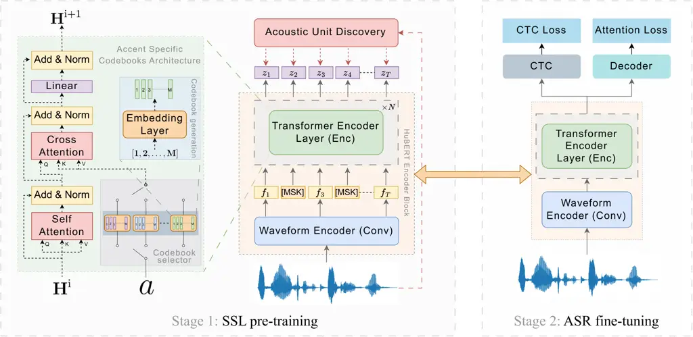

iliation=\*1\]DarshanPrabhu iliation=\*1\]AbhishekGupta
iliation=1\]OmkarNitsure iliation=1\]PreethiJyothi
iliation=2\]SriramGanapathy

# Improving Self-supervised Pre-training using Accent-Specific Codebooks

###### Abstract

Speech accents present a serious challenge to the performance of
state-of-the-art end-to-end Automatic Speech Recognition (ASR) systems.
Even with self-supervised learning and pre-training of ASR models,
accent invariance is seldom achieved. In this work, we propose an
accent-aware adaptation technique for self-supervised learning that
introduces a trainable set of accent-specific codebooks to the
self-supervised architecture. These learnable codebooks enable the model
to capture accent specific information during pre-training, that is
further refined during ASR finetuning. On the Mozilla Common Voice
dataset, our proposed approach outperforms all other accent-adaptation
approaches on both seen and unseen English accents, with up to $`9\%`$
relative reduction in word error rate (WER).

###### keywords

Automatic Speech Recognition, Accent Codebooks, Self-Supervised
Pretraining.

^(†)^(†)address: ¹Indian Institute of Technology Bombay, Mumbai, India  
²Indian Institute of Science, Bangalore, India. ^(†)^(†)email:
{darshanp, abhishekgupta, pjyothi}@cse.iitb.ac.in,
sriramg@iisc.ac.in^(\*)^(\*)footnotetext: These authors contributed
equally to this work.

## 1 Introduction

Self-supervised learning (SSL) has been established as a powerful
technique to learn representations for speech and language
processing \[1\]. With pretrained SSL models as a starting point, even
small amounts of labeled data are sufficient to achieve commercially
acceptable results in various downstream speech tasks \[2, 3\]. This has
led to the wide adoption of the current defacto training regime of
pretraining a model with an SSL objective, followed by fine-tuning on
downstream tasks such as automatic speech recognition (ASR) and spoken
language understanding \[4, 5\]. A key limitation of SSL-based models is
that performance on the downstream task suffers if there is a domain
shift from the pretraining data \[6\]. In this work, we focus on speech
accents as our domain of interest. The problem statement can be outlined
as - _How can we make SSL-trained models more robust to varying speech
accents, both seen and unseen during training?_

While prior work has extensively explored improving accented ASR in the
fine-tuning stage \[7, 8, 9, 10, 11, 12\], limited work has gone into
improving the robustness of SSL pretraining to varying speech accents.
Prior work on accent adaptation of SSL models includes introducing an
additional classifier into SSL pretraining \[13\], employing
accent-specific adapters \[14\], and normalizing pseudo-targets to a
single accent \[15\].

In this work, we adapt the technique introduced in Prabhu et al. \[16\]
for SSL pretraining. We introduce accent information during
self-supervised pre-training via a set of accent-specific codebooks.
These codebooks are integrated into the model using a cross-attention
module. For each accent seen in the training data, we introduce a
learnable codebook consisting of vectors that capture accent-specific
information during the pre-training process. While \[16\] used this
technique exclusively during ASR finetuning, we show that the benefits
increase when used during the SSL stage. To evaluate the effectiveness
of our method, we show ASR experiments on the multi-accented Mozilla
Common Voice corpus and show significant word error rate (WER)
reductions compared to multiple variants of HuBERT and other accent
adaptation techniques including an accent-agnostic approach (Domain
Adversarial Training (DAT) \[17\]) and an accent-aware approach
(MultiTask Learning (MTL) \[18\]).

While many self-supervised models exist for speech-related tasks \[2,
19, 20, 21, 22, 23, 24\], in this work we use HuBERT — a
state-of-the-art architecture that uses a masked language modeling (MLM)
objective and aims to reconstruct a sequence of discrete pseudo-targets
derived via a $`k`$-means clustering step. The clustering step in HuBERT
is used to generate pseudo-targets for pretraining. Prior work has aimed
to improve the quality of these generated pseudo-targets either through
teacher-forcing \[25\] or by designing task-specific
pseudo-targets \[26\]. Other efforts have focused on improving the
HuBERT architecture itself \[27, 28\]. To the best of our knowledge,
adapting HuBERT pretraining to be more robust across accents has not
been attempted before.

In summary, our main contributions are as follows:

- •
  We introduce codebook-based accent adaptation for self-supervised
  pre-training that aims at using a collection of accent-specific
  codebooks and cross-attention to improve SSL representations in the
  presence of accents.¹¹ 1 Code is available at
  [https://github.com/csalt-research/accented-codebooks-asr/tree/accented-pretraining](https://github.com/csalt-research/accented-codebooks-asr/tree/accented-pretraining).
  Our model outperforms baselines and all other previous approaches and
  achieves a significant improvement in performance with up to 9%
  relative WER reduction on the MCV dataset.
- •
  In a zero-shot setting on the L2-Arctic dataset, we show that our
  codebook-based pretrained model significantly outperforms baselines,
  thus demonstrating the generalization capability of our proposed
  system.

## 2 Methodology



Figure 1: Overview of the two-stage training pipeline used in our
proposed approach. In stage 1, we train an Encoder only model with the
HuBERT style pre-training objective. Our architecture incorporates
Accent-specific codebooks and additional Cross-Attention layers. The
model trained in this stage is used as Encoder in stage 2, where we
train an Encoder-Decoder model with Joint CTC-Attention objective for
ASR fine-tuning.

Figure 1 illustrates the main workflow of our proposed technique. We
adopt the standard two-stage training pipeline used in self-supervised
architectures:

1.  1.  A _self-supervised pretraining_ stage that involves training an
        encoder using a self-supervised learning objective \[29\].
2.  2.  A _supervised ASR fine-tuning_ stage that uses the pretrained
        encoder from the previous stage and further finetunes it using an
        ASR-specific supervised loss.

In our proposed framework, both these stages benefit from
accent-specific codebooks elaborated in Sections $`\lx@sectionsign`$2.1
and $`\lx@sectionsign`$2.2, respectively.

### 2.1 Self-supervised Pre-training with Codebooks

We use the HuBERT self-supervised architecture \[24\] that consists of
three modules: a convolution-based waveform encoder (denoted by Conv), a
Transformer-based encoder (denoted by Enc) and a
projection ($`\textsc{FFN}_{\text{tok}}`$) module. Conv takes raw speech
$`X=\{\mathbf{x}_{1},\mathbf{x}_{2},\ldots,\mathbf{x}_{L}|\mathbf{x}_{i}\in\mathbb{R}\}`$
as its input, and maps it via a stack of convolutions to
$`F=\textsc{Conv}(X)=\{\mathbf{f}_{1},\mathbf{f}_{2},\ldots,\mathbf{f}_{T}|\mathbf{f}_{i}\in\mathbb{R}^{d}\}`$.
$`F`$ is subsequently masked to generate $`\tilde{F}`$, where a fixed
$`P\%`$ of its frames are randomly masked. This masked representation
$`\tilde{F}`$ further passes through Enc to generate a contextualized
representation
$`H=\textsc{Enc}(\tilde{X})=\{\mathbf{h}_{1},\mathbf{h}_{2},\ldots\mathbf{h}_{T}|\mathbf{h}_{i}\in\mathbb{R}^{d}\}`$.
In parallel, an Acoustic Unit Discovery (AUD) module directly acts on
$`X`$ as its input and generates pseudo-target labels
$`Z=\{\mathbf{z}_{1},\mathbf{z}_{2},\ldots,\mathbf{z}_{T}|\mathbf{z}_{i}\in[1,V]\}`$
via an offline clustering step that uses a single or ensemble of
$`k`$-means clusterings. The size of the label set $`V`$ is determined
by the number of clusters used in AUD. A simple projection layer
$`\textsc{FFN}_{\text{tok}}`$ is used to convert $`H`$ from
$`\mathbb{R}^{d}`$ to the target vocabulary $`\mathbb{R}^{V}`$, and the
HuBERT model is trained end-to-end to predict $`Z`$ using a weighted
cross-entropy loss.

| Method           | Size | Aggregated |      |        | Seen Accents |      |      |      |      | Unseen Accents |      |      |      |      |      |      |      |      |
| ---------------- | ---- | ---------- | ---- | ------ | ------------ | ---- | ---- | ---- | ---- | -------------- | ---- | ---- | ---- | ---- | ---- | ---- | ---- | ---- |
|                  |      | All        | Seen | Unseen | AUS          | CAN  | UK   | SCT  | US   | AFR            | HKG  | IND  | IRL  | MAL  | NWZ  | PHL  | SGP  | WLS  |
| Conformer \[31\] | 43M  | 18.9       | 14.0 | 23.7   | 13.8         | 15.0 | 15.7 | 13.4 | 13.3 | 21.5           | 27.2 | 29.4 | 21.4 | 32.2 | 19.9 | 26.1 | 34.7 | 17.9 |
| HuBERT \[24\]    | 104M | 13.1       | 9.1  | 17.1   | 9.0          | 10.3 | 9.4  | 7.8  | 8.7  | 15.6           | 20.0 | 18.7 | 16.3 | 23.5 | 14.0 | 20.3 | 24.5 | 9.8  |
| + Pretrain ckpt  | 104M | 9.7        | 6.3  | 13.1   | 5.3          | 7.7  | 6.2  | 4.7  | 6.1  | 12.4           | 15.5 | 13.8 | 12.5 | 18.8 | 10.0 | 15.2 | 20.0 | 7.8  |
| + Frozen layers  | 74M  | 9.3        | 6.0  | 12.5   | 4.9          | 7.8  | 5.5  | 4.7  | 5.9  | 11.6           | 15.8 | 12.2 | 11.8 | 18.0 | 9.6  | 15.0 | 19.8 | 7.3  |
| MTL \[18\]       | 74M  | 9.4        | 6.0  | 12.8   | 5.0          | 7.6  | 5.6  | 4.7  | 5.9  | 11.9           | 15.5 | 13.4 | 12.2 | 17.6 | 10.0 | 15.4 | 19.1 | 8.3  |
| DAT \[17\]       | 74M  | 9.3        | 6.0  | 12.5   | 5.1          | 7.5  | 5.9  | 4.4  | 5.9  | 11.6           | 15.2 | 12.3 | 12.3 | 17.1 | 9.6  | 15.4 | 19.4 | 7.9  |
| Proposed         | 76M  | 8.9        | 5.9  | 11.9   | 3.7          | 7.5  | 5.5  | 4.7  | 5.9  | 10.8           | 14.7 | 11.6 | 11.4 | 16.7 | 9.2  | 14.9 | 18.3 | 7.3  |

Table 1: Comparison of the performance (WER % ) of our
architecture (Codebook Attention applied at all layers with $`50`$
entries in each learnable codebook) with baseline and other
architectures on the Mcv-Accent-100 dataset. Numbers in bold denote the
best across baselines, and   denotes the best WER across all
experiments. Ties are broken using overall WER. The aggregate result for
proposed model achieves statistically significant improvements compared
to best baseline (at $`p<`$ 0.001 MAPSSWE test \[30\]).

Our accent-based modifications are restricted to the Transformer-based
encoder Enc. The Enc module consists of a stack of $`N`$ identical
encoder layers. Each layer attends to the output of the previous layer
and contextualizes it using self-attention blocks and projection layers.
The self-attention block is responsible for introducing global context,
while the projection layer refines the point-wise information. In
addition to this, we introduce a cross-attention block that utilizes
attention mechanism to incorporate information from accent-specific
codebooks into the representations. We first discuss how the codebooks
are generated followed by an explanation of how they are utilized in a
single encoder layer.

Codebook Setup. Let $`E`$ be the number of accents seen during training.
We define a set of accent-specific codebooks
$`C=\{C^{1},C^{2},\ldots C^{E}|C^{i}\in\mathbb{R}^{M\times d}\}`$. Each
$`C_{i}`$ comprises $`M`$ learnable codebook entries. That is, each
codebook $`C^{i}`$ is:

```math
\displaystyle C^{i}=\{\mathbf{c}^{i}_{1},\ldots,\mathbf{c}^{i}_{M}|\mathbf{c}^{i}_{j}\in\mathbb{R}^{d}\}=\texttt{Embedding}([1,2,\ldots,M])
```

where Embedding is a standard embedding layer. For a training speech
input $`X`$, whose underlying accent ID (indexing the $`E`$ seen
accents) is $`a\in\{1,\ldots,E\}`$, we deterministically select the
codebook $`C^{a}`$. The codebook entries in $`C^{a}`$ are subsequently
integrated with all the encoder layers and across all attention heads.
We note here that the codebooks are accent-specific on account of a
single codebook being deterministically chosen per utterance during
training.

Integrating Codebooks using Cross-attention. Each Transformer-based
encoder layer of the HuBERT architecture consists of a self-attention
block that introduces global context, followed by a position-wise
feed-forward block that refines point-wise information. These two blocks
are separated by layer normalization and coupled via residual
connections. In our method, we introduce a cross-attention module that
is positioned between the self-attention and feedforward blocks and
integrates information from the codebooks into the audio representations
generated after self-attention. More precisely, for the
$`i^{\text{th}}`$ encoder layer, let $`\mathbf{A}`$ be the input to the
cross-attention block and $`\hat{\mathbf{A}}`$ be the output. Then, the
attention probabilities across the $`M`$ codebook entries in $`C^{a}`$
for the $`j^{\text{th}}`$ position $`\mathbf{A}_{j}`$ is computed as:

```math
\displaystyle\{\beta^{j}_{1},\beta^{j}_{2},\ldots,\beta^{j}_{M}\}=\mathrm{softmax}\left(\frac{(\mathbf{A}_{j}W^{i}_{Q})(C^{a}W^{i}_{K})^{T}}{\sqrt{d}}\right)
```

where $`W^{i}_{Q}`$, $`W^{i}_{K}\in\mathbb{R}^{d\times d}`$ are learned
projection matrices of the cross-attention block of the
$`i^{\text{th}}`$ encoder layer and $`\beta^{j}_{k}\in[0,1]`$ is the
attention weight assigned by the $`j^{\text{th}}`$ representation to the
$`k^{th}`$ entry in codebook $`C^{a}`$. Finally, the $`j^{th}`$ frame in
the output $`\hat{\mathbf{A}}`$ is a weighted average of the entries in
codebook $`C^{a}`$:

```math
\displaystyle\mathbf{\hat{A}}_{j}=\sum_{k=1}^{M}\beta_{k}^{j}\cdot(C^{a}_{k}W^{i}_{V})
```

where $`\hat{\mathbf{A}}_{j}`$, $`C^{a}_{k}`$ $`\in\mathbb{R}^{d}`$ and
$`W^{i}_{V}\in\mathbb{R}^{d\times d}`$. The output of the
cross-attention block is subjected to layer normalization, residual
connections are added and is fed as input to the feed-forward block.

### 2.2 Supervised ASR Fine-tuning

For the second stage of ASR fine-tuning, we adopt the state-of-the-art
hybrid CTC-attention end-to-end ASR framework \[32\] that consists of
three modules: an encoder ($`\textsc{Enc}_{f}`$), a decoder (Dec) and a
Connectionist Temporal Classification (CTC) \[33\] module. We replace
the encoder $`\textsc{Enc}_{f}`$ with the pretrained Conv and Enc
modules from Section 2.1, pretrained in conjunction with accent
codebooks. ASR fine-tuning makes use of labeled speech instances
$`(X,Y)`$ where $`X`$ is a raw speech sequence
$`X=\{\mathbf{x}_{1},\mathbf{x}_{2},\ldots,\mathbf{x}_{L}|\mathbf{x}_{i}\in\mathbb{R}\}`$
and $`Y`$ is a token sequence $`\{y_{1},\ldots,y_{M}\}`$. Both the
encoder parameters and the accent-specific codebooks in
$`\textsc{Enc}_{f}`$, initialized from the pretrained model, are further
finetuned using a supervised ASR objective. The Dec module uses a
cross-entropy loss ($`\mathcal{L}_{\text{att}}`$) to autoregressively
predict a token $`y_{t}`$ given previous tokens
$`\{y_{1},\ldots,y_{t-1}\}`$ and the encoder outputs. The CTC module, on
the other hand, imposes a CTC loss ($`\mathcal{L}_{\text{ctc}}`$)
directly on the encoder outputs and predicts a frame-aligned sequence of
tokens by marginalizing over all possible alignments of $`Y`$ to the
encoder outputs. The final loss is the weighted sum of both losses:

```math
\displaystyle\mathcal{L}_{\text{asr}} \displaystyle=\eta\times\mathcal{L}_{\text{ctc}}+(1-\eta)\times\mathcal{L}_{\text{att}} \tag{1}
```

where $`\eta`$ is a hyperparameter that balances the objectives.

### 2.3 Inference using Codebooks

During inference, we do not assume access to an accent label for a test
utterance. We employ the joint-beam search proposed by Prabhu et
al. \[16\]. This technique involves performing beam search jointly over
all the seen accents. Scores for the seen accents are computed using
each underlying accent-specific codebook. The beam width holds the best
expansions across all seen accents. More details of the joint beam
algorithm are in \[16\].

## 3 Experimental Setup

We conduct all our pre-training and fine-tuning experiments using
Fairseq \[34\] and ESPnet \[35\] toolkits, respectively, on NVIDIA RTX
A6000 GPUs.

Dataset details. We use the Mozilla Common Voice \[36\] accented English
Mcv-Accent benchmarking dataset²² 2
[https://tinyurl.com/accent-dataset](https://tinyurl.com/accent-dataset)
in all our experiments. This dataset consists of five seen (AUS, CAN,
SCT, UK, US) and nine unseen accents (AFR, HKG, IND, IRL, MAL, NWZ, PHL,
SGP, WLS). The dataset includes Mcv-Accent-100 and Mcv-Accent-600
training splits containing $`100`$ hours and $`620`$ hours of audio data
respectively, along with $`17`$ hours of validation and test splits. For
pretraining, we only utilize the larger Mcv-Accent-600 train split and
for ASR, we report results on both training splits.

Pre-training setup. In all our experiments, we utilize the HuBERT-Base
architecture \[24\]. This architecture consists of a $`7`$-layer
convolution feature extractor and a $`12`$-layer Transformer Encoder
with $`12`$ attention ($`d=768`$) heads. The model is trained for two
iterations, each consisting of $`200`$k steps. In both iterations, we
use $`500`$ hidden units obtained from the output of the
$`6^{\text{th}}`$ encoder layer via K-means clustering as the pseudo
targets. In each iteration, the model is trained using an Adam
optimizer \[37\] with learning rate of $`5e\text{-}5`$, $`32`$k warmup
steps, a batch size of $`87.5`$ seconds and gradient accumulation over
four steps.

Fine-tuning setup. We use the joint CTC-attention based encoder-decoder
architecture \[32\], but instead of the standard encoder, we replace it
with the model from the self-supervised pre-training 2.1 step. For
experiments on the Mcv-Accent-100 training split, we add 3-way speed
perturbation prior to training. Throughout all our experiments, we train
the model for $`50`$ epochs with a batch size of $`128`$, dropout rate
of $`0.1`$, a learning rate of $`1.0`$ and $`25K`$ warmup steps. The
loss is calculated with a CTC weight of 0.3 and label smoothing of 0.1.

## 4 Experimental Results and Analysis

Table 1 compares the performance (WER %) of our proposed system against
four alternative approaches: 1. Conformer baseline \[31\] 2. Replacing
the encoder in the Conformer with a pre-trained HuBERT model \[24\],
pretrained with the SSL objective on data Mcv-Accent-600 3. Jointly
training HuBERT baseline with an accent classifier (MTL) \[18\] 4.
Domain Adversarial Training (DAT) of the HuBERT baseline with an accent
classifier on the $`12^{\text{th}}`$ encoder layer.

| Accent used        | Seen Accents |     |     |     |     | Unseen Accents |      |      |      |      |     |      |      |     |
| ------------------ | ------------ | --- | --- | --- | --- | -------------- | ---- | ---- | ---- | ---- | --- | ---- | ---- | --- |
|                    | AUS          | CAN | UK  | SCT | US  | AFR            | HKG  | IND  | IRL  | MAL  | NWZ | PHL  | SGP  | WLS |
| Codebook Attention | 3.7          | 7.5 | 5.5 | 4.7 | 5.9 | 10.8           | 14.7 | 11.6 | 11.4 | 16.7 | 9.2 | 14.9 | 18.3 | 7.3 |
| Australia          | 4.9          | 7.4 | 5.6 | 4.9 | 6.0 | 10.9           | 14.9 | 11.4 | 11.3 | 17.2 | 9.9 | 14.8 | 18.2 | 7.6 |
| Canada             | 3.7          | 7.6 | 5.5 | 4.8 | 6.1 | 10.7           | 14.8 | 11.6 | 11.5 | 16.6 | 9.1 | 14.8 | 18.4 | 7.0 |
| England            | 4.1          | 7.4 | 5.7 | 4.7 | 6.1 | 11.0           | 14.6 | 11.7 | 11.5 | 16.6 | 9.3 | 15.0 | 18.6 | 7.7 |
| Scotland           | 3.6          | 7.4 | 5.5 | 5.2 | 5.8 | 10.7           | 14.3 | 11.3 | 11.5 | 16.5 | 9.0 | 14.7 | 18.6 | 7.1 |
| US                 | 3.8          | 7.7 | 5.6 | 4.4 | 6.1 | 10.8           | 14.8 | 11.9 | 11.5 | 17.2 | 9.2 | 14.9 | 18.5 | 7.3 |
| US + Canada        | 3.6          | 8.0 | 5.6 | 4.8 | 6.4 | 10.7           | 15.4 | 12.3 | 11.9 | 17.3 | 9.1 | 14.9 | 18.9 | 7.0 |

Table 2: Comparison of the performances (WER%) of inferences done in
absence of particular accents.

Similar to previous studies \[2, 24\], we find that replacing
Conformer’s encoder with a pre-trained HuBERT model leads to significant
improvement in performance; we note here that the HuBERT-based encoder
is pretrained from scratch on Mcv-Accent-600. Furthermore, we observe
that, during self-supervised pre-training, using an existing checkpoint
(i.e., the HUBERT-Base Librispeech checkpoint from Fairseq \[34\]) leads
to additional performance gains. Given the limited amount of supervised
finetuning data in Mcv-Accent-100, to combat overfitting, we freeze the
feature extractor and the first $`3`$ layers of the HuBERT encoder; this
yields further benefits. (In all subsequent experiments, we will use
this best setup of selective ASR finetuning.) We also compare our system
against the MTL and DAT approaches. Overall, our proposed approach
performs significantly better on nearly all accents, particularly the
unseen accents.

| Method                | All              | Accents |      |      |      |      |      |
| --------------------- | ---------------- | ------- | ---- | ---- | ---- | ---- | ---- |
|                       |                  | ARA     | HIN  | KOR  | MAN  | SPA  | VIA  |
| HuBERT Encoder \[24\] | 22.6             | 20.2    | 17.8 | 17.3 | 25.8 | 20.4 | 33.7 |
| MTL \[18\]            | 23.0             | 21.0    | 18.1 | 17.6 | 26.4 | 20.9 | 34.1 |
| DAT \[17\]            | 22.9             | 20.7    | 18.2 | 17.4 | 26.2 | 20.9 | 34.1 |
| Codebook Attention    | 21.7 $`\dagger`$ | 19.9    | 16.5 | 16.4 | 24.8 | 19.8 | 32.7 |

Table 3: Comparing zero-shot performance (WER %) of our architecture
with other approaches on the L2Arctic dataset. $`\dagger`$ indicates
statistical significance (at $`p`$ $`<`$0.001 using MAPSSWE test) w.r.t.
the HuBERT baseline.

Importance of Codebooks. Table 2 shows the WERs of our best
codebook-based system when the codebook of the seen accent is withheld
during inference with the joint beam search. The first row shows the
WERs when all codebooks are present. This is to check whether the
absence of the codebook of the seen accent during decoding degrades
performance. On removing the Australian codebook, we find that the WER
worsens from $`3.7\%`$ to $`4.9\%`$. Interestingly, WER of the unseen
New-Zealand accent suffers the most when the Australian codebook is
withheld ($`9.2\rightarrow 9.9`$). This suggests that relatedness in
accents is being captured in the codebooks. Also, on removing both US
and Canada accent codebooks (that are closely related), we see the
largest degradation in WER on US and Canada test samples.

Zero-shot ASR Evaluation. In Table 3, we compare WERs of our proposed
system with baselines when evaluated in a zero-shot setting on
out-of-domain accented samples from the L2-Arctic \[38\] dataset. The
dataset consists of six non-native English accents namely: Arabic (ARA),
Hindi (HIN), Korean (KOR), Mandarin (MAN), Spanish (SPA), and
Vietnamese (VIA). Our system significantly outperforms the baselines (at
$`p<0.001`$) across all accents on the L2-Arctic dataset. This attests
to the robustness of the learned speech representations from our system.

Ablation Analysis. In Table 4, we investigate various settings related
to the codebooks. We apply codebooks to different encoder layers and
obtain the best performance when applying codebooks on the
$`6^{\text{th}}`$ layer for seen accents, and on all 12 layers for
unseen accents. With varying codebook sizes, $`50`$ codebook entries
performed the best on both seen/unseen accents; 500 codebook entries
improved the seen accents further but hurt the unseen accents, thus
indicating overfitting. Lastly, we examined different training protocols
for the codebooks. Randomly-initialized (and not learnable) codebooks
($`C_{\text{random}}`$) do nearly as well as codebooks trained during
both SSL and ASR fine-tuning (denoted by $`C_{\text{both}}`$). We also
evaluate with frozen codebooks that are learned during pretraining and
frozen during ASR fine-tuning ($`C_{\text{frozen}}`$). This performs
nearly as well as $`C_{\text{both}}`$ on seen accents but slightly
underperforms on unseen accents. This suggests that the codebooks are
meaningfully learned during the pretraining stage.

|                            |                          |         |      |        |
| -------------------------- | ------------------------ | ------- | ---- | ------ |
| Setup                      |                          | Overall | Seen | Unseen |
| Layers                     | \# codebooks             |         |      |        |
| Varying codebook influence |                          |         |      |        |
| $`L=\{6\}`$                | $`C=50`$                 | 9.01    | 5.89 | 12.12  |
| $`L=\{1,\ldots,6\}`$       | $`C=50`$                 | 9.03    | 5.91 | 12.13  |
| $`L=\{1,\ldots,12\}`$      | $`C=50`$                 | 8.95    | 5.94 | 11.91  |
| Varying codebook size      |                          |         |      |        |
| $`L=\{1,\ldots,12\}`$      | $`C=50`$                 | 8.95    | 5.94 | 11.91  |
| $`L=\{1,\ldots,12\}`$      | $`C=200`$                | 9.01    | 6.00 | 12.10  |
| $`L=\{1,\ldots,12\}`$      | $`C=500`$                | 9.03    | 5.87 | 12.18  |
| Varying codebook nature    |                          |         |      |        |
| $`L=\{6\}`$                | $`C_{\text{both}}=50`$   | 9.01    | 5.89 | 12.12  |
| $`L=\{6\}`$                | $`C_{\text{frozen}}=50`$ | 9.07    | 5.91 | 12.23  |
| $`L=\{6\}`$                | $`C_{\text{random}}=50`$ | 8.98    | 5.93 | 12.02  |

Table 4: Comparison of the performance (WER %) of different variants of
our architecture. $`\textsc{C}_{L\in(i,\ldots,j)}(P=k)`$: Codebook
attention applied at all layers from $`i`$ to $`j`$ with $`k`$ entries
per accent codebook.

ASR Fine-tuning with Larger Dataset. We fine-tune the pretrained HuBERT
baseline, MTL, DAT, and our best system on Mcv-Accent-600. As seen in
Table 5, our system performs comparably to the other baselines on the
seen accents but significantly improves on unseen accents.

| Method             | Overall | Seen | Unseen |
| ------------------ | ------- | ---- | ------ |
| HuBERT \[24\]      | 6.68    | 3.87 | 9.49   |
| MTL \[18\]         | 6.57    | 3.76 | 9.37   |
| DAT \[17\]         | 6.57    | 3.83 | 9.30   |
| Codebook Attention | 6.43    | 3.80 | 9.19   |

Table 5: Comparison of WERs% of our approach compared to other baselines
on Mcv-Accent-600 dataset.

## 5 Conclusion

In this work, we propose an accent-aware ASR adaptation technique where
accent-specific codebooks are incorporated within the Transformer layers
of a HuBERT model via cross-attention. This integration happens right
from the SSL-based pretraining stage. The pretrained codebooks and
encoder layers are further finetuned using supervised ASR fine-tuning.
Compared to existing accent adaptation techniques, we observe that this
yields significant WER reductions on English utterances in both seen and
unseen accents in the Mozilla Common Voice (MCV) corpus. The
accent-aware models trained on MCV also generalize well to out-of-domain
accented English samples (from a different corpus, L2Arctic) when
evaluated in a zero-shot setting. In future work, we aim to use
self-training with unlabeled data (with accent labels) to further refine
the accent codebooks.

## 6 Acknowledgements

We acknowledge the financial support from a SERB Core Research Grant,
Department of Science and Technology, Government of India on accented
speech processing.

## 7 References

## References

- \[1\] Ankita Pasad, Bowen Shi and Karen Livescu “Comparative
  Layer-Wise Analysis of Self-Supervised Speech Models” In _Proc.
  ICASSP_, 2023, pp. 1–5 DOI:
  [10.1109/ICASSP49357.2023.10096149](https://dx.doi.org/10.1109/ICASSP49357.2023.10096149)
- \[2\] Alexei Baevski et al. “wav2vec 2.0: A framework for
  self-supervised learning of speech representations” In _Advances in
  neural information processing systems_ 33, 2020, pp. 12449–12460
- \[3\] Jing Zhao and Wei-Qiang Zhang “Improving automatic speech
  recognition performance for low-resource languages with
  self-supervised models” In _IEEE Journal of Selected Topics in Signal
  Processing_ 16.6, 2022, pp. 1227–1241
- \[4\] Shu-wen Yang et al. “SUPERB: Speech Processing Universal
  PERformance Benchmark” In _Proc. Interspeech_, 2021, pp. 1194–1198
  DOI:
  [10.21437/Interspeech.2021-1775](https://dx.doi.org/10.21437/Interspeech.2021-1775)
- \[5\] Hsiang-Sheng Tsai et al. “SUPERB-SG: Enhanced Speech processing
  Universal PERformance Benchmark for Semantic and Generative
  Capabilities” In _Proc. ACL_, 2022, pp. 8479–8492 DOI:
  [10.18653/v1/2022.acl-long.580](https://dx.doi.org/10.18653/v1/2022.acl-long.580)
- \[6\] Wei-Ning Hsu et al. “Robust wav2vec 2.0: Analyzing Domain Shift
  in Self-Supervised Pre-Training” In _Proc. Interspeech_, 2021, pp.
  721–725 DOI:
  [10.21437/Interspeech.2021-236](https://dx.doi.org/10.21437/Interspeech.2021-236)
- \[7\] Katrin Tomanek et al. “Residual Adapters for Parameter-Efficient
  ASR Adaptation to Atypical and Accented Speech” In _Proc. EMNLP_,
  2021, pp. 6751–6760
- \[8\] Abhinav Jain, Minali Upreti and Preethi Jyothi “Improved
  Accented Speech Recognition Using Accent Embeddings and Multi-task
  Learning.” In _Proc. Interspeech_, 2018, pp. 2454–2458
- \[9\] Genta Winata et al. “Learning Fast Adaptation on Cross-Accented
  Speech Recognition”, 2020
- \[10\] Kanishka Rao and Haşim Sak “Multi-accent speech recognition
  with hierarchical grapheme based models” In _Proc. ICASSP_, 2017, pp.
  4815–4819 DOI:
  [10.1109/ICASSP.2017.7953071](https://dx.doi.org/10.1109/ICASSP.2017.7953071)
- \[11\] Yanmin Qian, Xun Gong and Houjun Huang “Layer-Wise Fast
  Adaptation for End-to-End Multi-Accent Speech Recognition” In
  _IEEE/ACM Transactions on Audio, Speech, and Language Processing_ 30,
  2022, pp. 2842–2853 DOI:
  [10.1109/TASLP.2022.3198546](https://dx.doi.org/10.1109/TASLP.2022.3198546)
- \[12\] Song Li et al. “End-To-End Multi-Accent Speech Recognition with
  Unsupervised Accent Modelling” In _Proc. ICASSP_, 2021, pp. 6418–6422
  DOI:
  [10.1109/ICASSP39728.2021.9414833](https://dx.doi.org/10.1109/ICASSP39728.2021.9414833)
- \[13\] Keqi Deng, Songjun Cao and Long Ma “Improving Accent
  Identification and Accented Speech Recognition Under a Framework of
  Self-Supervised Learning” In _Proc. Interspeech_, 2021, pp. 1504–1508
  DOI:
  [10.21437/Interspeech.2021-1186](https://dx.doi.org/10.21437/Interspeech.2021-1186)
- \[14\] Anshu Bhatia et al. “Don’t stop self-supervision: Accent
  adaptation of speech representations via residual adapters” In _Proc.
  Interspeech_, 2023
- \[15\] Jakob Poncelet and Hugo Hamme “Unsupervised Accent Adaptation
  Through Masked Language Model Correction Of Discrete Self-Supervised
  Speech Units” In _ArXiv_ abs/2309.13994, 2023
- \[16\] Darshan Prabhu et al. “Accented Speech Recognition With
  Accent-specific Codebooks” In _Proc. EMNLP_, 2023, pp. 7175–7188
- \[17\] Nilaksh Das et al. “Best of Both Worlds: Robust Accented Speech
  Recognition with Adversarial Transfer Learning”, 2021 DOI:
  [10.48550/ARXIV.2103.05834](https://dx.doi.org/10.48550/ARXIV.2103.05834)
- \[18\] Zhang Jicheng et al. “E2E-Based Multi-Task Learning Approach to
  Joint Speech and Accent Recognition”, 2021 DOI:
  [10.21437/Interspeech.2021-1495](https://dx.doi.org/10.21437/Interspeech.2021-1495)
- \[19\] Sanyuan Chen et al. “Wavlm: Large-scale self-supervised
  pre-training for full stack speech processing” In _IEEE Journal of
  Selected Topics in Signal Processing_ 16.6, 2022, pp. 1505–1518
- \[20\] Yu-An Chung et al. “W2v-bert: Combining contrastive learning
  and masked language modeling for self-supervised speech pre-training”
  In _Proc. ASRU_, 2021, pp. 244–250
- \[21\] Alexei Baevski, Michael Auli and Abdelrahman Mohamed
  “Effectiveness of self-supervised pre-training for speech recognition”
  In _arXiv preprint arXiv:1911.03912_, 2019
- \[22\] Shaoshi Ling and Yuzong Liu “Decoar 2.0: Deep contextualized
  acoustic representations with vector quantization” In _arXiv preprint
  arXiv:2012.06659_, 2020
- \[23\] Alexei Baevski, Steffen Schneider and Michael Auli “vq-wav2vec:
  Self-Supervised Learning of Discrete Speech Representations” In _Proc.
  ICLR_, 2019
- \[24\] Wei-Ning Hsu et al. “Hubert: Self-supervised speech
  representation learning by masked prediction of hidden units” In
  _IEEE/ACM Transactions on Audio, Speech, and Language Processing_ 29,
  2021, pp. 3451–3460
- \[25\] Wei-Ning Hsu et al. “HuBERT: How much can a bad teacher benefit
  ASR pre-training?” In _Proc. ICASSP_, 2021, pp. 6533–6537
- \[26\] Varun Krishna and Sriram Ganapathy “Self Supervised
  Representation Learning with Deep Clustering for Acoustic Unit
  Discovery from Raw Speech” In _Proc. ICASSP_, 2022, pp. 3268–3272 DOI:
  [10.1109/ICASSP43922.2022.9747259](https://dx.doi.org/10.1109/ICASSP43922.2022.9747259)
- \[27\] Ruchao Fan et al. “CTCBERT: Advancing hidden-unit BERT with CTC
  objectives” In _Proc. ICASSP_, 2023, pp. 1–5
- \[28\] A Arunkumar and Srinivasan Umesh “Joint Encoder-Decoder
  Self-Supervised Pre-training for ASR” In _Proc. Interspeech_, 2022
- \[29\] Abdelrahman Mohamed et al. “Self-supervised speech
  representation learning: A review” In _IEEE Journal of Selected Topics
  in Signal Processing_ 16.6, 2022, pp. 1179–1210
- \[30\] L. Gillick and S.J. Cox “Some statistical issues in the
  comparison of speech recognition algorithms” In _Proc. ICASSP_, 1989,
  pp. 532–535 vol.1 DOI:
  [10.1109/ICASSP.1989.266481](https://dx.doi.org/10.1109/ICASSP.1989.266481)
- \[31\] Anmol Gulati et al. “Conformer: Convolution-augmented
  Transformer for Speech Recognition” In _Proc. Interspeech_, 2020, pp.
  5036–5040 DOI:
  [10.21437/Interspeech.2020-3015](https://dx.doi.org/10.21437/Interspeech.2020-3015)
- \[32\] Suyoun Kim, Takaaki Hori and Shinji Watanabe “Joint
  CTC-attention based end-to-end speech recognition using multi-task
  learning” In _Proc. ICASSP_, 2017, pp. 4835–4839
- \[33\] Alex Graves et al. “Connectionist temporal classification:
  labelling unsegmented sequence data with recurrent neural networks” In
  _Proceedings of the 23rd international conference on Machine
  learning_, 2006, pp. 369–376
- \[34\] Myle Ott et al. “fairseq: A Fast, Extensible Toolkit for
  Sequence Modeling” In _Proc. ACL_, 2019, pp. 48–53 DOI:
  [10.18653/v1/N19-4009](https://dx.doi.org/10.18653/v1/N19-4009)
- \[35\] Shinji Watanabe et al. “ESPnet: End-to-End Speech Processing
  Toolkit” In _Proc. Interspeech_, 2018, pp. 2207–2211 DOI:
  [10.21437/Interspeech.2018-1456](https://dx.doi.org/10.21437/Interspeech.2018-1456)
- \[36\] Rosana Ardila et al. “Common Voice: A Massively-Multilingual
  Speech Corpus”, 2019 DOI:
  [10.48550/ARXIV.1912.06670](https://dx.doi.org/10.48550/ARXIV.1912.06670)
- \[37\] Diederik Kingma and Jimmy Ba “Adam: A Method for Stochastic
  Optimization” In _Proc. ICLR_, 2015
- \[38\] Guanlong Zhao et al. “L2-ARCTIC: A Non-native English Speech
  Corpus” In _Proc. Interspeech_, 2018, pp. 2783–2787 DOI:
  [10.21437/Interspeech.2018-1110](https://dx.doi.org/10.21437/Interspeech.2018-1110)
