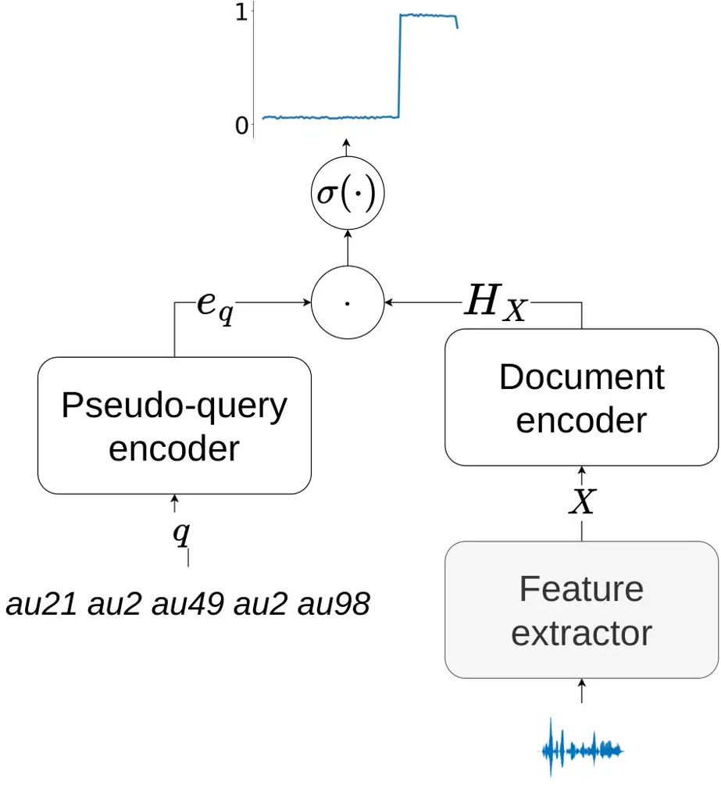
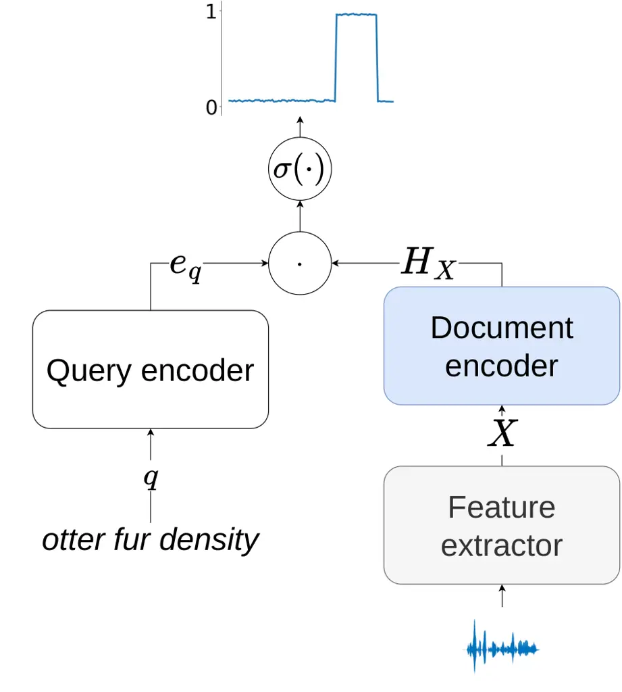

# Pretraining End-to-End Keyword Search with Automatically Discovered Acoustic Units

Bolaji Yusuf    Jan “Honza” Cernocky    Murat Saraclar

###### Abstract

End-to-end (E2E) keyword search (KWS) has emerged as an alternative and
complimentary approach to conventional keyword search which depends on
the output of automatic speech recognition (ASR) systems. While E2E
methods greatly simplify the KWS pipeline, they generally have worse
performance than their ASR-based counterparts, which can benefit from
pretraining with untranscribed data. In this work, we propose a method
for pretraining E2E KWS systems with untranscribed data, which involves
using acoustic unit discovery (AUD) to obtain discrete units for
untranscribed data and then learning to locate sequences of such units
in the speech. We conduct experiments across languages and AUD systems:
we show that finetuning such a model significantly outperforms a model
trained from scratch, and the performance improvements are generally
correlated with the quality of the AUD system used for pretraining.

###### keywords

keyword search, spoken term detection, acoustic unit discovery

^(†)^(†)address: ¹Bogazici University, Turkey  
²Brno University of Technology, Speech@FIT, Czechia ^(†)^(†)email:
{iyusuf,cernocky}@fit.vut.cz, murat.saraclar@bogazici.edu.tr

## 1 Introduction

Productive use of the internet relies heavily on the presence and
capacity of search engines to efficiently index and search through large
quantities of data. Since a significant proportion of that data is in
multimedia form, it is natural to develop technologies to allow
efficient search through non-textual documents. Keyword search (KWS),
also known as spoken term detection (STD), is one such technology: it
aims to locate where in an archive of spoken documents a user-specified
query has been uttered. A KWS system takes a written query and returns a
list of documents purported to contain the query, timestamps in those
documents where the query is located, and scores representing the
system’s confidence in its hypotheses.

KWS is traditionally done by conducting text-based retrieval on the
output of an automatic speech recognition (ASR) system. Outside settings
with very-low recognition error rates where one-best ASR outputs may be
sufficient, it is more common to index richer structures like lattices
or confusion networks \[1, 2, 3, 4, 5\], which improve recall by
accounting for uncertainty in ASR output.

More recently, ASR-free KWS methods have sought to eschew the ASR and
its concomitant complexities \[6, 7, 8, 9, 10, 11, 12\]. Instead of
relying on the output of an ASR system¹¹ 1 This refers to indexing and
search. Even ASR-free KWS systems generally rely on simple ASR systems
to get timing information required for training., a neural network is
trained in an end-to-end (E2E) fashion to locate written queries in
large spoken archives. We take \[12\] as a representative of this
approach, and use it as our baseline in this work. The KWS model
comprises a pair of encoders: a query encoder that takes a query in the
form of a sequence of letters and computes a vector representation
thereof, and a document encoder for computing a compatible
representation of the spoken document. The two are combined via
frame-wise inner-products and locations in the document which have high
inner-products with the query embedding are returned as hits.

Although E2E KWS methods are able to streamline the indexing and search,
they generally trail ASR-based methods in terms of search accuracy.
Furthermore, ASR-based systems can benefit from the rise in
semi-supervised learning that improve the underlying ASR model by using
large amounts of untranscribed speech for pretraining. Our objective in
this paper is, therefore, to design a pretraining scheme for E2E KWS to
be able to leverage untranscribed speech. We note here that \[12\]
already explored pretraining for E2E-KWS, but it only considered
pretraining with transcribed multilingual data, while we explore
pretraining with untranscribed data in the target language—with the
potential to expand to multilingual untranscribed data.

The input data for training E2E KWS comprises sets of speech documents
and the words (queries) they contain. Hence, to pretrain E2E KWS on an
untranscribed speech corpus with the same training objective, the
challenge is to get the list of queries which we can pretrain the KWS
model to locate. In other words, we need sequences of discrete units
corresponding\] to the spoken content.

Acoustic unit discovery (AUD) aims to solve this exact
problem—automatically discovering an inventory of phone-like units for a
language from completely unlabeled data. Several works have tackled AUD,
including Bayesian methods \[13, 14, 15, 16\], neural-network-based
methods \[17, 18, 19\] or hybrids thereof \[20, 21\].

We employ the Hierarchical Subspace Hidden Markov Model (H-SHMM) \[22,
23\], a non-parametric Bayesian model for AUD. H-SHMM models follows the
phone-loop AUD paradigm \[13, 16, 24\], where each acoustic unit is
modeled as an HMM. In H-SHMM, the HMM parameters are constrained to a
phonetic subspace of the parameter space and the parameters that define
the subspace itself are allowed to vary per language within a
constrained “hyper”-subspace. We choose H-SHMM as it has good
performance not just on intrinsic AUD but also unsupervised word
segmentation \[25\], which makes it suitable for our task of word
localization. After training the H-SHMM, we use it to label the
untranscribed speech. Then we use sequences of acoustic unit labels as
pseudo-queries for pretraining the model. Finally, we finetune the model
on a small amount of transcribed data.

We conduct experiments on the English Libri-light \[26\] and Turkish
Broadcast News \[27\] corpora. Our experiments show that AUD-based
pretraining significantly improves KWS performance for AUD that uses
MFCC features, with improvements that are correlated with the AUD
system’s phonetic correspondence. Furthermore, when the AUD uses
pretrained transformer features as input, we still get significant
improvements on Libri-light.

## 2 Methods



(a) Pretraining.



(b) Finetuning.

Figure 1: E2E KWS system during pretraining and finetuning. Grey boxes:
non-trainable components, white boxes: components which are trained from
scratch, blue boxes: trainable components whose parameters are
transferred from a pretrained model.

### 2.1 Background

#### 2.1.1 End-to-end Keyword Search

Our work is based on the E2E KWS model of \[12\]. This model ingests a
textual query in the form of a sequence of $`L`$ letters,
$`\bm{\mathbf{q}}=(q_{1},\dots,q_{L})`$, and a spoken utterance of $`N`$
frames,
$`\bm{\mathbf{X}}=(\bm{\mathbf{x}}_{1},\dots,\bm{\mathbf{x}}_{N})`$ and
predicts the sequence
$`\bm{\mathbf{y}}(\bm{\mathbf{q}},\bm{\mathbf{X}})=(y_{1},\dots,y_{N})`$,
where each $`y_{n}\in\{0,1\}`$ is a binary random variable indicating
the existence of the query in the $`n`$th frame of the document, i.e:

```math
\displaystyle y_{n}=\begin{cases}1,&\text{if}\ \bm{\mathbf{q}}\text{ is spoken in }\bm{\mathbf{X}}\text{ in a time span including }n\\
0,&\text{otherwise}.\end{cases} \tag{1}
```

The model comprises a pair of encoders:

- •
  The query encoder computes a fixed-length representation,
  $`\bm{\mathbf{e}}_{\bm{\mathbf{q}}}`$, of the query by passing it
  through a GRU, summing the activations from the last layer of the GRU
  across the sequence dimension, followed by an affine projection.
- •
  The document encoder computes a down-sampled representation, of the
  document
  $`\bm{\mathbf{H}}_{\bm{\mathbf{X}}}=(\bm{\mathbf{h}}_{1},\dots,\bm{\mathbf{h}}_{N})`$
  by passing it through a BLSTM followed by an affine transform.

The sequence
$`\bm{\mathbf{z}}(\bm{\mathbf{q}},\bm{\mathbf{X}})=(z_{1},\dots,z_{N})`$
of occurrence probabilities,
$`z_{n}\coloneqq P(y_{n}=1|\bm{\mathbf{q}},\bm{\mathbf{X}})`$, is then
obtained via a matrix-vector product of
$`\bm{\mathbf{H}}_{\bm{\mathbf{X}}}`$ and
$`\bm{\mathbf{e}}_{\bm{\mathbf{q}}}`$ as:

```math
\displaystyle z_{n}=\sigma(\bm{\mathbf{h}}_{n}^{\top}\bm{\mathbf{e}}_{\bm{\mathbf{q}}}), \tag{2}
```

where $`\sigma(\cdot)`$ is the logistic sigmoid function.

The vector of probabilities from (2) is then post-processed to obtain
the timestamps in the document hypothesized to contain the query, and
the corresponding confidence scores by detecting “islands” of
probabilities above $`0.5`$. The procedure is as follows:

1.  1.  Probabilities $`z_{n}<0.5`$ are zeroed-out.
2.  2.  The resulting “islands” of non-zero elements are returned as system
        hypotheses, and each hypothesis’ confidence score is computed as the
        median probability in its time-span.

The model is trained with mini-batch gradient descent on a transcribed
speech dataset. At each training step, $`t`$, the following objective is
minimized:

```math
\displaystyle J_{t}=\sum_{l=1}^{L}\sum_{m=1}^{M}f\Bigl( \displaystyle\bm{\mathbf{z}}\bigl(\bm{\mathbf{q}}_{t,l},\bm{\mathbf{X}}_{t,l,m}\bigr),\bm{\mathbf{y}}\bigl(\bm{\mathbf{q}}_{t,l},\bm{\mathbf{X}}_{t,l,m}\bigr)\Bigr), \tag{3}
```

where $`\{\bm{\mathbf{q}}_{t,1}\dots\bm{\mathbf{q}}_{t,L}\}`$ is a
mini-batch of $`L`$ queries sampled randomly from the set of unigrams,
bigrams and trigrams of the dataset;
$`\{\bm{\mathbf{X}}_{t,l,1},\dots,\bm{\mathbf{X}}_{t,l,M}\}`$ is a set
of documents sampled from the dataset such that
$`\{\bm{\mathbf{X}}_{t,l,1}\}`$ contains $`\bm{\mathbf{q}}_{t,l}`$ while
the other $`M-1`$ documents are sampled randomly; and $`f(\cdot)`$ is a
modified binary cross-entropy function defined as:

```math
\displaystyle f(z,y)=-\sum_{n=1}^{\hat{N}} \displaystyle\Bigl(\mathbbm{1}_{z_{n}>1-\phi}\cdot(1-y_{n})\log(1-z_{n})
```

```math
\displaystyle+\mathbbm{1}_{z_{n}<\phi}\cdot\lambda\cdot y_{n}\log z_{n}\Bigr), \tag{4}
```

with $`\phi`$ controlling the tolerance of the objective to
easily-classified frames and $`\lambda`$ controlling the relative
weighting of positive to negative frames. Following \[12\], we set
$`\lambda=5`$, $`\phi=0.7`$ and $`M=4`$ in all our experiments.

The word-level alignments required for training are obtained by training
an HMM-GMM ASR system on the training data and using it for forced
alignment.

#### 2.1.2 Hierarchical Subspace Hidden Markov Model

Acoustic unit discovery entails learning a set of units from
untranscribed data. For a language, $`l`$, this typically involves
learning a set of parameters,
$`\Theta^{l}=\{\bm{\mathbf{\theta}}^{l,u}\}_{u=1}^{U_{l}}`$ for each
unit $`u`$, which then allows frames of an utterance
$`\bm{\mathbf{X}}=(\bm{\mathbf{x}}_{1},\dots,\bm{\mathbf{x}}_{n})`$ in
that language to be labeled into discrete units $`v_{1},\dots,v_{N}`$
where each $`v_{n}\in\{1,2,\dots,U_{l}\}`$.

We employ H-SHMM \[22\], a Dirichlet-process-based Bayesian
nonparametric model for AUD. In H-SHMM, each acoustic unit is a 3-state,
left-to-right HMM-GMM with 4 Gaussians per state, and each
$`\bm{\mathbf{\theta}}^{l,u}`$ is a super-vector formed by concatenating
all the mean vectors, covariance matrix elements and mixture weights of
the HMM-GMM. The parameters of the HMM-GMMs are constrained to dwell in
a low-dimensional subspace of the full parameter space:

```math
\displaystyle\bm{\mathbf{\theta}}^{l,u}=g\bigl(\bm{\mathbf{W}}^{l}\bm{\mathbf{\eta}}^{l,u}+\bm{\mathbf{b}}^{l}\bigr), \tag{5}
```

where $`\bm{\mathbf{\eta}}^{l,u}`$ is a low-dimensional²² 2 We set the
dimensionality of $`\bm{\mathbf{\eta}}^{l,u}`$ to 100 in our
experiments. Contrast this to the dimensionality of
$`\bm{\mathbf{\theta}}^{l,u}`$ which is around 1000 for HMMs with MFCC
features and around 25000 for HMMs with XLS-R features. embedding of the
parameter, $`\bm{\mathbf{W}}^{l}`$ is a language-specific low-rank
matrix which, along with the bias vector $`\bm{\mathbf{b}}^{l}`$,
defines the subspace to which the parameters are constrained, and
$`g(\cdot)`$ is a non-linear function mapping vectors from the column
space of $`\bm{\mathbf{W}}^{l}`$ to HMM parameters, ensuring e.g. that
the dimensions corresponding to each covariance matrix constitute a
positive-definite matrix and that the mixture weights are non-negative
and sum up to one. The subspace parameters are themselves further
constrained to a $`K`$-dimensional “hyper”-subspace:

```math
\displaystyle\bm{\mathbf{W}}^{l}=\bm{\mathbf{M}}_{0}+\sum_{k=1}^{K}\alpha^{l}_{k}+\bm{\mathbf{M}}_{k}
```

```math
\displaystyle\bm{\mathbf{b}}^{l}=\bm{\mathbf{m}}_{0}+\sum_{k=1}^{K}\alpha^{l}_{k}+\bm{\mathbf{m}}_{k}, \tag{6}
```

where $`\bm{\mathbf{\alpha}}^{l}`$ is a language-specific
low-dimensional embedding, and $`\{\bm{\mathbf{M}}_{k}\}`$ and
$`\{\bm{\mathbf{m}}_{k}\}`$ define language-agnostic template matrices
and vectors whose linear combinations define the part of the space
$`\bm{\mathbf{W}}^{l}`$ and $`\bm{\mathbf{b}}^{l}`$ are allowed to
occupy. Thus, the subspace parameters are allowed to vary in a
controlled manner from one language to another. The H-SHMM defines a
distribution with trainable
parameters—$`\{\bm{\mathbf{M}}_{k}\},\{\bm{\mathbf{m}}_{k}\},\{\bm{\mathbf{\alpha}}^{l}\},\{\bm{\mathbf{\eta}}^{l,u}\}`$—which
are learned in two phases:

1.  1.  Supervised pretraining: The model is first trained on
        phonetically-transcribed speech from multiple languages not
        including the target language. This imbues the templates
        $`\{\bm{\mathbf{M}}_{k}\}`$ and $`\{\bm{\mathbf{m}}_{k}\}`$ with
        phone-like characteristics.
2.  2.  Acoustic unit discovery: The distributions
        $`\{\bm{\mathbf{M}}_{k}\}`$ and $`\{\bm{\mathbf{m}}_{k}\}`$ are kept
        fixed, and transferred to a target language, $`l^{*}`$, for which
        $`\bm{\mathbf{\alpha}}^{l^{*}}`$ and
        $`\{\bm{\mathbf{\eta}}^{l^{*},u}\}`$ are learned.

Both phases involve optimizing a variational lower bound on the
log-likelihood of the data, which yields a Baum-Welch-like training
procedure. Having obtained the distributions of the HMM parameters, the
untranscribed speech can them be labelled with a variational analog of
Viterbi decoding. Interested readers are referred to \[23\] for a
thorough coverage of H-SMMM and its inference.

### 2.2 Pretraining KWS with AUD

In this paper, we propose using AUD to label an otherwise untranscribed
speech corpus into acoustic units, and using these pseudo-labels to
pretrain the E2E KWS model in a setting where we have a small
transcribed corpus and a larger untranscribed speech corpus in the same
language.

We train an H-SHMM on a small subset of the unlabeled speech and use it
to transcribe the full corpus into sequences of acoustic units. Since
the KWS model expects word sequences as input, and the AUD only returns
phone-like units, we form pseudo-words from acoustic unit n-grams.
Specifically, we take all sequences of 5 to 15 consecutive acoustic
units as pseudo-words, and use these pseudo-words as queries to the KWS
model, which we pretrain using (3) to locate them in the corpus. Note
that we have the pseudo-word time boundaries for training since decoding
with H-SHMM, as with any other HMM, naturally yields frame-level
decisions for acoustic units.

After pretraining is complete, we transfer the document encoder and
discard the acoustic unit query encoder. We then initialize a new query
encoder for actual graphemes and train it along with the transferred
document encoder to locate real queries as described in Section 2.1.1.

## 3 Experiments

### 3.1 Setup

#### 3.1.1 Datasets

Keyword search: We test the performance on the Libri-light \[26\] and
Turkish Broadcast News (BNTR) \[27\] corpora. For Libri-light, we use
the 10 hour Libri-light training set as the transcribed data and test on
the standard Librispeech \[28\] sets (dev-clean, test-clean, dev-other
and dev-other). To match the Libri-light training data size, we use a
10-hour subset of BNTR from the VOA programs³³ 3
https://catalog.ldc.upenn.edu/LDC2012S06 for training and select two
10-hour subsets from the remaining BNTR data as dev and test sets. Since
neither dataset has official query lists, we randomly select 1500
queries composed of equal proportions of unigrams, bigrams and trigrams
for each of the dev and eval sets. Table 1 shows the proportion of
out-of-vocabulary (OOV) queries.

For Libri-light pretraining, we use the 360-hour set of Librispeech as
untranscribed data. In the case of BNTR, we use the full 180-hour BNTR
training set for pretraining.

|              |          |      |          |      |      |      |
| ------------ | -------- | ---- | -------- | ---- | ---- | ---- |
| Dataset      | LS-clean |      | LS-other |      | BNTR |      |
|              | Dev      | Test | Dev      | Test | Dev  | Test |
| OOV-Rate (%) | 1.1      | 2.6  | 2.5      | 3.6  | 11.9 | 6.3  |

Table 1: OOV rates for the query lists used for each dev/test set.

Acoustic unit discovery: For the supervised phase of H-SHMM training
where we estimate the hyper-subspaces ($`\{\bm{\mathbf{M}}_{k}\}`$, and
$`\{\bm{\mathbf{m}}_{k}\}`$ in Section 2.1.2), we use the models
from \[23\], trained on data from seven languages⁴⁴ 4
https://github.com/beer-asr/beer/tree/master/recipes/hshmm: French,
German, Polish and Spanish from the Globalphone corpus \[29\], and
Amharic, Swahili and Wolof from the Alffa project \[30\]. A
1500-utterance subset of each language (totalling around 19 hours of
speech) was used.

For actual acoustic unit discovery, where we learn the acoustic units
($`\{\bm{\mathbf{\alpha}}^{l}\},\{\bm{\mathbf{\eta}}^{l,u}\}`$) for each
target language, we use random 3000-utterance subsets from each
respective language’s untranscribed data, and use the learned HMMs to
transcribe the full corpus.

#### 3.1.2 Acoustic features

The default acoustic inputs to our models (both AUD and KWS) are
13-dimensional MFCC features. In addition, we consider features from a
pretrained 300 million parameter XLS-R model \[31\]⁵⁵ 5
https://dl.fbaipublicfiles.com/fairseq/wav2vec/xlsr2_300m.pt, from which
we use the output of the 15th layer, shown in \[23\] to yield
considerably better AUD performance. Note that, due to computational
constraints, we only use the XLS-R model as a feature extractor and we
do not finetune it.

|             |             |          |                    |     |          |                    |     |      |                    |         |      |
| ----------- | ----------- | -------- | ------------------ | --- | -------- | ------------------ | --- | ---- | ------------------ | ------- | ---- |
| Dataset     |             | LS-clean |                    |     | LS-other |                    |     | BNTR |                    | AUD-NMI |      |
| KWS Feature | AUD Feature | Dev      | Test               |     | Dev      | Test               |     | Dev  | Test               | LS      | BNTR |
| MFCC        | \-          | 38.4     | _(38.7)40.4_(42.0) |     | 16.2     | _(13.0)14.3_(15.7) |     | 67.0 | _(69.4)70.7_(71.9) | \-      | \-   |
| MFCC        | MFCC        | 44.2     | _(44.0)45.7_(47.4) |     | 21.1     | _(18.8)20.3_(21.9) |     | 74.5 | _(76.4)77.6_(78.6) | 34.2    | 27.2 |
| MFCC        | XLS-R       | 56.3     | _(54.9)56.5_(58.2) |     | 30.9     | _(27.1)28.7_(30.4) |     | 78.2 | _(80.4)81.4_(82.3) | 52.9    | 41.3 |
| XLS-R       | \-          | 73.2     | _(71.0)72.7_(74.4) |     | 62.2     | _(61.6)63.3_(65.0) |     | 84.8 | _(85.3)86.1_(86.9) | \-      | \-   |
| XLS-R       | XLS-R       | 75.8     | _(74.7)76.2_(77.6) |     | 65.5     | _(64.9)66.4_(67.9) |     | 84.0 | _(84.7)85.5_(86.2) | 52.9    | 41.3 |

Table 2: Term weighted value comparison between the baseline and the
proposed system. Dev set results are MTWVs, test set results are
triplets of $`{}_{l}A_{h}`$ where $`A`$ is the ATWV, and $`l`$ and $`h`$
are the 2.5th and 97.5th percentile ATWV estimate respectively.

#### 3.1.3 Metrics

Term Weighted Value: In our experiments, we report the term weighted
values (TWV) \[32, 33\], which is a measure of weighted recall and
precision averaged across queries. The TWV of a system on a set of
queries, $`\mathcal{Q}`$, at a threshold, $`\zeta`$, is defined as:

```math
\displaystyle\text{TWV}=100\times\bigl(1-\frac{1}{\mathcal{Q}}\sum_{q\in\mathcal{Q}}(P_{miss}(q,\zeta)+\beta P_{FA}(q,\zeta))\bigr), \tag{7}
```

where $`P_{miss}(q,\zeta)`$ is the probability of misses,
$`P_{FA}(q,\zeta)`$ is the probability of false alarms and $`\beta`$ is
a parameter controlling the relative importance of the two. Following
prior NIST evaluations \[32\], we set $`\beta=999.9`$. The threshold
$`~\zeta`$ is tuned on the dev sets. We report the maximum term weighted
value (MTWV)—the TWV at the threshold which maximizes it—for the dev
sets, and the actual term weighted value (ATWV)—computed by using the
threshold tuned on the corresponding dev set—for the test sets. We adopt
keyword-specific thresholding for across-query score
normalization \[34\] in order to allow various queries with different
score distributions to be compared with a single global threshold.

Normalized Mutual Information: We also report normalized mutual
information (NMI) for the AUD systems in order to see how KWS
performance correlates with the intrinsic quality of the AUD system used
for pretraining. NMI is computed by normalizing the mutual information
between discovered units $`\mathcal{U}`$ and reference phones
$`\mathcal{P}`$ by the sum of their entropies:

```math
\displaystyle\text{NMI}(\mathcal{P},\mathcal{U})=200\times\frac{I(\mathcal{P};\mathcal{U})}{H(\mathcal{P})+H(\mathcal{U})}\%. \tag{8}
```

NMI takes values in $`[0,100]`$, with 0 denoting completely uncorrelated
units and 100 denoting perfect match.

#### 3.1.4 Model configuration and hyper-parameters

We base the architecture of our model on \[12\]⁶⁶ 6 Code available at:
https://github.com/bolajiy/golden-retriever. The query encoder is a
network with a 32-dimensional embedding layer for computing vector
representations of each input grapheme, followed by 2 bidirectional GRU
layers with 256 output units per direction per layer, and a
400-dimensional output projection layer whose outputs are summed along
the sequence dimension to obtain the vectoral query representation.

The document encoder has 6 BLSTM layers with 512-dimensional output per
direction per layer, followed by a 400-dimensional output layer. We
apply dropout of 0.4 between successive BLSTM layers, and down-sample by
a factor of 2 after the fourth BLSTM layer. This results in document
encodings with frame durations of 40ms for XLS-R features and 20ms for
MFCC.

The H-SHMM use 3-state HMM-GMMs with 4 diagonal-covariance Gaussians per
HMM state, Dirichlet process with truncation parameter of 1,
100-dimensional unit embeddings ($`\bm{\mathbf{\eta}}^{l,u}`$) and
5-dimensional language embeddings ($`\bm{\mathbf{\alpha}}^{l}`$).

#### 3.1.5 Training details

The neural networks are trained with the Adam optimizer \[35\]. For
pretraining, we use a cosine decay schedule with peak learning rate of
5e-4 and final learning rate of 1e-7, and train for 200k steps using
mini-batch size of 256, with 10k warmup steps. For finetuning (and the
baseline with no pretraining), we train with the same step-based
learning rate scheduling as \[12\] using mini-batch size of 32. This
starts with a learning rate of 0.002, halved whenever the validation
loss (computed over 10% of the training queries) does not improve over 4
epochs. The training is stopped when validation loss does not improve
for 10 epochs.

### 3.2 Results

Table 2 shows the term weighted values of KWS with and without the
proposed pretraining scheme, as well as the intrinsic AUD metrics.

When MFCC are used as input features to KWS, we find that pretraining
with AUD learned pseudo-queries leads to significant improvements across
all dev and test sets—with 5.3, 6.0 and 6.9 ATWV improvements
respectively on the Librispeech-clean, Librispeech-other and BNTR test
sets. Furthermore, using XLS-R features for AUD (improving the quality
of the learned acoustic units by a considerable margin) leads further
significant ATWV improvements when compared to pretraining with
MFCC-based acoustic units.

Replacing the KWS input with XLS-R unsurprisingly results in a much
better performance, even compared to the pretrained MFCC-based systems,
especially on the acoustically difficult Librispeech-other sets.
Furthermore, when we pretrain the XLS-R based KWS system with AUD
labels, we observe +3.5 and +3.1 ATWV respectively on the Librispeech
test-clean and test-other sets and no improvement on the BNTR.

## 4 Conclusions

In this paper, we have proposed a pretraining scheme for end-to-end
keyword search. Our approach uses acoustic unit discovery to label
untranscribed data and construct pseudo-queries used to pretrain the KWS
model, before finetuning on a small trasncribed dataset. Our experiments
show that pretraining can significantly improve KWS performance.

We envision future work doing larger scale and multilingual pretraining
with acoustic unit targets in conjunction with or in place of
transcribed data. Another direction is to explore using more
sophisticated word segmentation methods instead of our naive use of all
n-grams of acoustic units.

## 5 Acknowledgements

The work was supported by Czech Ministry of Interior projects Nos.
VJ01010108 “ROZKAZ” and by European Union’s Horizon Europe project No.
SEP-210943216 “ELOQUENCE”. Computing on IT4I supercomputer was supported
by the Ministry of Education, Youth and Sports of the Czech Republic
through e-INFRA CZ (ID:90254). Computing on the ROYAL compute server was
supported by the Turkish Directorate of Strategy and Budget under the
ROYAL Project (CB SBB 2019K12-149250).

## References

- \[1\] K. Ng and V. W. Zue, “Subword-based approaches for spoken
  document retrieval,” _Speech Communication_, vol. 32, no. 3, pp.
  157–186, 2000.
- \[2\] I. Szöke, M. Fapšo, and L. Burget, “Hybrid word-subword decoding
  for spoken term detection,” in _The 31st Annual International ACM
  SIGIR Conference on Research and Development in Information
  Retrieval_, 2008, pp. 42–48.
- \[3\] D. Can and M. Saraçlar, “Lattice indexing for spoken term
  detection,” _IEEE Transactions on Audio, Speech, and Language
  Processing_, vol. 19, no. 8, pp. 2338–2347, 2011.
- \[4\] C. Chelba, T. J. Hazen, and M. Saraçlar, “Retrieval and browsing
  of spoken content,” _IEEE Signal Processing Magazine_, vol. 25, no. 3,
  pp. 39–49, 2008.
- \[5\] L. Mangu, B. Kingsbury, H. Soltau, H.-K. Kuo, and M. Picheny,
  “Efficient spoken term detection using confusion networks,” in
  _International Conference on Acoustics, Speech and Signal Processing
  (ICASSP), 2014 IEEE_, 2014, pp. 7844–7848.
- \[6\] K. Audhkhasi, A. Rosenberg, A. Sethy, B. Ramabhadran, and
  B. Kingsbury, “End-to-end ASR-free keyword search from speech,” _IEEE
  Journal of Selected Topics in Signal Processing_, vol. 11, no. 8, pp.
  1351–1359, 2017.
- \[7\] B. Gündoğdu, B. Yusuf, and M. Saraçlar, “Joint learning of
  distance metric and query model for posteriorgram-based keyword
  search,” _IEEE Journal of Selected Topics in Signal Processing_,
  vol. 11, no. 8, pp. 1318–1328, 2017.
- \[8\] B. Yusuf, B. Gundogdu, and M. Saraclar, “Low Resource Keyword
  Search with Synthesized Crosslingual Exemplars,” _IEEE/ACM
  Transactions on Audio, Speech, and Language Processing_, vol. 27,
  no. 7, pp. 1126–1135, 2019.
- \[9\] B. Yusuf, A. Gok, B. Gundogdu, and M. Saraclar, “End-to-End Open
  Vocabulary Keyword Search,” in _Proc. Interspeech 2021_, 2021, pp.
  4388–4392.
- \[10\] J. Švec, L. Šmídl, J. V. Psutka, and A. Pražák, “Spoken Term
  Detection and Relevance Score Estimation Using Dot-Product of
  Pronunciation Embeddings,” in _Proc. Interspeech 2021_, 2021, pp.
  4398–4402.
- \[11\] T. S. Fuchs, Y. Segal, and J. Keshet, “CNN-Based Spoken Term
  Detection and Localization without Dynamic Programming,” in _ICASSP
  2021-2021 IEEE International Conference on Acoustics, Speech and
  Signal Processing (ICASSP)_. IEEE, 2021, pp. 6853–6857.
- \[12\] B. Yusuf, J. Černocký, and M. Saraçlar, “End-to-End Open
  Vocabulary Keyword Search With Multilingual Neural Representations,”
  _IEEE/ACM Transactions on Audio, Speech, and Language Processing_,
  vol. 31, no. 08, pp. 3070–3080, 2023.
- \[13\] C.-y. Lee and J. Glass, “A nonparametric Bayesian approach to
  acoustic model discovery,” in _Proceedings of the 50th Annual Meeting
  of the Association for Computational Linguistics: Long Papers-Volume
  1_. Association for Computational Linguistics, 2012, pp. 40–49.
- \[14\] H. Chen, C.-C. Leung, L. Xie, B. Ma, and H. Li, “Parallel
  inference of dirichlet process Gaussian mixture models for
  unsupervised acoustic modeling: a feasibility study,” in _Proc.
  Interspeech 2015_, 2015, pp. 3189–3193.
- \[15\] M. Heck, S. Sakti, and S. Nakamura, “Iterative training of a
  dpgmm-hmm acoustic unit recognizer in a zero resource scenario,” in
  _2016 IEEE Spoken Language Technology Workshop (SLT)_. IEEE, 2016, pp.
  57–63.
- \[16\] L. Ondel, L. Burget, and J. Černockỳ, “Variational inference
  for acoustic unit discovery,” _Procedia Computer Science_, vol. 81,
  pp. 80–86, 2016.
- \[17\] J. Chorowski, R. J. Weiss, S. Bengio, and A. van den Oord,
  “Unsupervised speech representation learning using wavenet
  autoencoders,” _IEEE/ACM transactions on audio, speech, and language
  processing_, vol. 27, no. 12, pp. 2041–2053, 2019.
- \[18\] A. Baevski, S. Schneider, and M. Auli, “vq-wav2vec:
  Self-supervised learning of discrete speech representations,” in _8th
  International Conference on Learning Representations, ICLR_, 2020.
- \[19\] D. Harwath, W. Hsu, and J. R. Glass, “Learning hierarchical
  discrete linguistic units from visually-grounded speech,” in _8th
  International Conference on Learning Representations, ICLR_, 2020.
- \[20\] J. Ebbers, J. Heymann, L. Drude, T. Glarner, R. Haeb-Umbach,
  and B. Raj, “Hidden Markov Model Variational Autoencoder for Acoustic
  Unit Discovery,” in _Interspeech_, 2017, pp. 488–492.
- \[21\] T. Glarner, P. Hanebrink, J. Ebbers, and R. Haeb-Umbach, “Full
  Bayesian Hidden Markov Model Variational Autoencoder for Acoustic Unit
  Discovery,” in _Interspeech_, 2018, pp. 2688–2692.
- \[22\] B. Yusuf, L. Ondel, L. Burget, J. Černocký, and M. Saraçlar, “A
  Hierarchical Subspace Model for Language-Attuned Acoustic Unit
  Discovery,” in _ICASSP 2021 - 2021 IEEE International Conference on
  Acoustics, Speech and Signal Processing (ICASSP)_, 2021, pp.
  3710–3714.
- \[23\] L. Ondel, B. Yusuf, L. Burget, and M. Saraçlar, “Non-parametric
  bayesian subspace models for acoustic unit discovery,” _IEEE/ACM
  Transactions on Audio, Speech, and Language Processing_, vol. 30, pp.
  1902–1917, 2022.
- \[24\] L. Ondel, H. K. Vydana, L. Burget, and J. Černocký, “Bayesian
  Subspace Hidden Markov Model for Acoustic Unit Discovery,” in
  _Interspeech_, 2019, pp. 261–265.
- \[25\] Z. M. Boito, B. Yusuf, F. A. L. Y. Ondel, A. Villavicencio, and
  L. Besacier, “Unsupervised word segmentation from discrete speech
  units in low-resource settings,” in _Proceedings of the the 1st Annual
  Meeting of the ELRA/ISCA Special Interest Group on Under-Resourced
  Languages_. European Language Resources Association, 2022, pp. 1–9.
- \[26\] J. Kahn _et al._, “Libri-light: A benchmark for asr with
  limited or no supervision,” in _ICASSP 2020 - 2020 IEEE International
  Conference on Acoustics, Speech and Signal Processing (ICASSP)_, 2020,
  pp. 7669–7673,
  [https://github.com/facebookresearch/libri-light](https://github.com/facebookresearch/libri-light).
- \[27\] E. Arisoy, D. Can, S. Parlak, H. Sak, and M. Saraçlar, “Turkish
  broadcast news transcription and retrieval,” _IEEE Transactions on
  Audio, Speech, and Language Processing_, vol. 17, no. 5, pp.
  874–883, 2009.
- \[28\] V. Panayotov, G. Chen, D. Povey, and S. Khudanpur,
  “Librispeech: an ASR corpus based on public domain audio books,” in
  _2015 IEEE International Conference on Acoustics, Speech and Signal
  Processing (ICASSP)_. IEEE, 2015, pp. 5206–5210.
- \[29\] T. Schultz, N. T. Vu, and T. Schlippe, “Globalphone: A
  multilingual text & speech database in 20 languages,” in _2013 IEEE
  International Conference on Acoustics, Speech and Signal
  Processing_. IEEE, 2013, pp. 8126–8130.
- \[30\] L. Besacier _et al._, “Speech technologies for African
  languages: example of a multilingual calculator for education,” in
  _Interspeech_, 2015, pp. 1886–1887.
- \[31\] A. Babu _et al._, “XLS-R: Self-supervised Cross-lingual Speech
  Representation Learning at Scale,” in _Proc. Interspeech 2022_, 2022,
  pp. 2278–2282.
- \[32\] J. G. Fiscus, J. Ajot, J. S. Garofolo, and G. Doddingtion,
  “Results of the 2006 spoken term detection evaluation,” in
  _Proceedings of the ACM SIGIR Workshop on Searching Spontaneous
  Conversational Speech_, 2007, pp. 51–57.
- \[33\] S. Wegmann, A. Faria, A. Janin, K. Riedhammer, and N. Morgan,
  “The TAO of ATWV: Probing the mysteries of keyword search
  performance,” in _2013 IEEE Workshop on Automatic Speech Recognition
  and Understanding_, 2013, pp. 192–197.
- \[34\] D. R. Miller, M. Kleber, C.-L. Kao, O. Kimball, T. Colthurst,
  S. A. Lowe, R. M. Schwartz, and H. Gish, “Rapid and accurate spoken
  term detection,” in _Interspeech_, 2007, pp. 314–317.
- \[35\] D. P. Kingma and J. Ba, “Adam: A method for stochastic
  optimization,” in _3rd International Conference on Learning
  Representations, ICLR 2015_, 2015.
