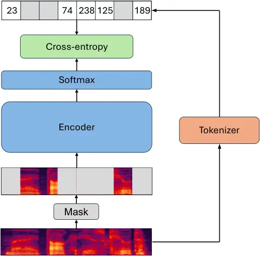
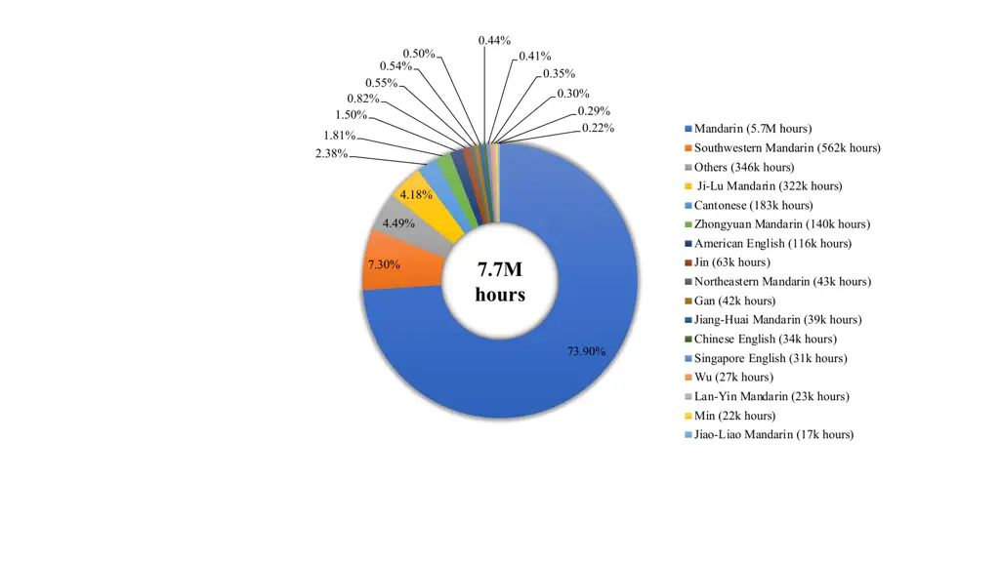
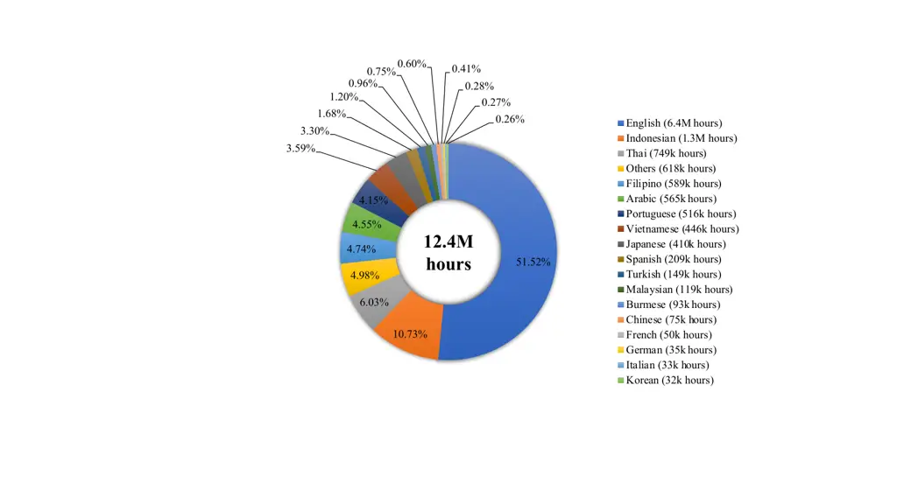
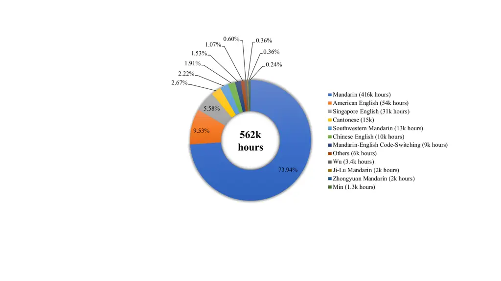
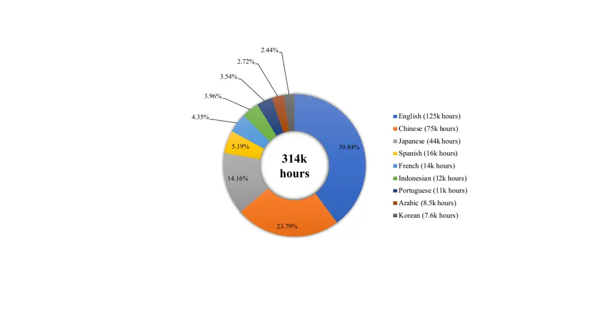

# Seed-ASR: Understanding Diverse Speech and Contexts with LLM-based Speech Recognition

Seed Team    ByteDance ^(†)^(†)thanks: Please cite this work as
"Seed-ASR (2024)". The list of authors can be found at the end of the
document.

###### Abstract

Modern automatic speech recognition (ASR) model is required to
accurately transcribe diverse speech signals (from different domains,
languages, accents, etc) given the specific contextual information in
various application scenarios. Classic end-to-end models fused with
extra language models perform well, but mainly in data matching
scenarios and are gradually approaching a bottleneck. In this work, we
introduce Seed-ASR¹¹ 1 Seed-ASR capabilities have been applied in a
variety of ByteDance products, and have provided technical
commercialization services in China with Doubao speech recognition
models., a large language model (LLM) based speech recognition model.
Seed-ASR is developed based on the framework of audio conditioned LLM
(AcLLM), leveraging the capabilities of LLMs by inputting continuous
speech representations together with contextual information into the
LLM. Through stage-wise large-scale training and the elicitation of
context-aware capabilities in LLM, Seed-ASR demonstrates significant
improvement over end-to-end models on comprehensive evaluation sets,
including multiple domains, accents/dialects and languages.
Additionally, Seed-ASR can be further deployed to support specific needs
in various scenarios without requiring extra language models. Compared
to recently released large ASR models, Seed-ASR achieves 10%-40%
reduction in word (or character, for Chinese) error rates on Chinese and
English public test sets, further demonstrating its powerful
performance.

   

|     |
| --- |
|     |

## 1 Introduction

We present Seed-ASR, an LLM-based large-scale ASR model. Aiming to
become a "smarter" speech recognition model, Seed-ASR is developed under
the framework of audio conditioned LLM (AcLLM), leveraging the
capability of LLMs by inputting continuous speech representation
together with instruction and contextual information into the LLM.
Seed-ASR has five major features:

1.  1.  High Recognition Accuracy: By training on over 20 million hours of
        speech data and nearly 900 thousand hours of paired ASR data, our
        Chinese multi-dialect model, Seed-ASR (CN), and our multilingual
        model, Seed-ASR (ML), achieve impressive results on public datasets
        and our in-house comprehensive evaluation sets (shown in Figure 1);
2.  2.  Large Model Capacity: Seed-ASR employs an audio encoder with nearly
        2 billion parameters and a Mixture of Experts (MoE) LLM with tens of
        billions of parameters for modeling. The experiments of scaling law
        on ASR tasks underpin our decision to choose large models;
3.  3.  Multiple language Support: While maintaining high accuracy, Seed-ASR
        (CN) supports transcribing Mandarin and 13 Chinese dialects with a
        single model. Additionally, Seed-ASR (ML) recognizes speech of
        English and 7 other languages, and is being extended to support more
        than 40 languages;
4.  4.  Context-aware Ability: Seed-ASR utilizes a range of contextual
        information, including historical dialogues, video editing history,
        and meeting participation details, in a unified model to capture
        essential indicators related to speech content. This integration
        substantially boosts keyword recall in ASR evaluation sets across
        various scenarios.
5.  5.  Stage-wise Training Recipe: The development of Seed-ASR goes through
        a simple and effective training recipe: self-supervised learning
        (SSL) of audio encoder $`\rightarrow`$ supervised fine-tuning (SFT)
        $`\rightarrow`$ context SFT $`\rightarrow`$ reinforcement learning
        (RL). Each stage has a distinct role, ensuring stage-by-stage
        performance improvement of Seed-ASR.

Figure 1: The comparison of ASR performance between Seed-ASR and other
strong released models on our internal multi-domain evaluation sets and
public sets, covering both Mandarin and English. The MLS en-US result of
Whisper Large-v3 is obtained by locally decoding the MLS en-US test set
because there is no reported WER on published papers or technical
reports.

Different from existing LLM-based ASR models \[44, 7, 43, 28, 48, 31,
12\], Seed-ASR aims for extensive improvements in ASR performance over
the state-of-the-art in ASR technology across multiple languages
including Chinese and English, tailored for a broad array of application
scenarios featuring varied speech types and contexts. To achieve this,
we build a series of high-quality evaluation sets that include a wide
range of speech inputs, such as different domains, accents/dialects,
languages and speech duration. These sets also cover evaluation of the
customization capability of an ASR system under different application
scenarios (e.g. the keyword accuracy and consistency in conversations).
In designing Seed-ASR, we chose the path of large-scale training,
leveraging both substantial model capacity and extensive training data
to enhance generalization ability. We also elaborate the customization
capability by training the model to account for contexts provided to the
AcLLM framework, forming a unified and compact model structure for
different scenarios. On our multi-dimensional evaluation sets, Seed-ASR
demonstrates more comprehensive and powerful model capability compared
to the classic end-to-end models. The performance advantage of Seed-ASR
is further evidenced in public test sets and our subjective
understanding evaluations. In the following sections, we will introduce
our motivation, methods, models and evaluation in detail.

## 2 Motivation

Since the rise of neural networks (NNs) and deep learning in 2010s, the
modeling of automatic speech recognition (ASR) has experienced an
upgrade from the hybrid framework \[25, 21, 32\] that only relies on
NN-based acoustic models to the end-to-end (E2E) framework \[20, 3, 6,
47, 15\] in which the entire NN models are trained to output
transcriptions directly. Although significant progress has been made in
recognition accuracy as measured by word error rate (WER), current
end-to-end ASR models are still not "smart" enough, which is limited by
the model capacity and from-scratch training manner. Specifically, it
cannot efficiently utilize rich common sense knowledge and conduct
contextual reasoning during the recognition process, thus inevitably
relying on the complicated fusion strategy with extra language models.
With the rapid development of LLM technology \[4, 34, 35, 11, 1, 45,
46\], the potential of AI continues to grow. Automatic speech
recognition (ASR), as a classic task in AI, also stands at the brink of
advancements in its model framework.

The upgrade of the ASR model could get inspirations from the technical
advancements of LLM, which can be attributed to three main aspects:

- •
  Unified model framework. LLM employs a decoder-only framework based on
  the next-token-prediction. It sequences the input and output text,
  relying on the self-attention mechanism to establish dependencies
  between tokens in sequences, thereby unifying text understanding and
  text generation;
- •
  The power of scaling law. Large-scale model parameters provide crucial
  capacity for LLM to learn knowledge from diverse data sources. For
  example, from GPT-2 \[40\] to GPT-3 \[4\], the number of parameters
  increases from 1.5 billion to 175 billion, enabling GPT-3 to exhibit
  better generalization and emergent abilities;
- •
  Comprehensive training pipeline, ChatGPT goes through three stages:
  pre-training, supervised fine-tuning (SFT) and reinforcement learning
  with human feedback (RLHF). In the stage of pre-training, LLM is
  trained on a large amount of text data, which makes it store extensive
  knowledge. In the stage of SFT, LLM is further fine-tuned on
  higher-quality, task-oriented data, enhancing its ability to reason
  with context and understand task instructions. Finally, in the RLHF
  stage, the training objective shifts to align the LLM’s behavior with
  human preferences with the help of reinforcement learning;

Since the task of ASR is to convert speech to text, its text generation
process is consistent with that of LLMs. The extensive text knowledge
and contextual reasoning capabilities stored in LLMs make them potential
components for providing semantic guidance to ASR. The remaining core
challenge is how to enable LLMs to better "understand" speech, a
modality that is different from text.

## 3 Methods

Figure 2: The model framework used in Seed-ASR. When contexts are
provided, the instruction is "There are relevant contexts, transcribe
the speech into text:". Otherwise, the instruction is "Transcribe the
speech into text:".

### 3.1 Framework and Training Recipe

Based on the aforementioned motivation, we propose Seed-ASR, a
large-scale speech recognition model built on the framework of audio
conditioned LLM (AcLLM). By inputting encoded continuous speech
representations together with a task instruction and relevant contexts
into a pretrained LLM, Seed-ASR can leverage the rich text knowledge and
the reasoning ability of the LLM to generate the corresponding text
transcription of speech. The overall framework is shown in Figure 2

Audio is a different modality from text. To enable LLMs better
understand diverse speech inputs, we adopt the concept of large-scale
pretraining in LLMs. Specifically, we construct an audio encoder with
nearly 2 billion parameters and conduct self-supervised learning (SSL)
on tens of millions of hours of data. The pre-trained audio encoder
gains strong speech representation ability, which facilitates rapid
convergence during supervised fine-tuning (SFT). After the large-scale
SSL stage, we implement a simple and effective stage-wise training
recipe within the framework of AcLLM (shown in Figure 3). In the stage
of SFT, we establish the mapping relationship between speech and text by
training on a large amount of speech-text pairs. In the stage of context
SFT, we use a relatively small amount of context-speech-text triples to
elicit the LLM’s ability to capture speech-relevant clues from context.
These triple data can be customized according to specific scenarios. In
the stage of reinforcement learning, we apply the training criteria of
MWER \[37\] and some improvements to further strengthen the ability of
our model. In the following subsections, we will introduce these methods
in more detail.

Figure 3: The stage-wise training recipe for the development of
Seed-ASR. SSL represents self-supervised learning, SFT represents
supervised fine-tuning, RL represents reinforcement learning.

### 3.2 SSL of Audio Encoder

Large-scale SSL enables audio encoders to capture rich information from
speech. Inspired by the BERT-based speech SSL framework \[27, 2, 8,
10\], we developed our audio encoder, a conformer-based \[22\] model
that captures both global and local structures stored in audio signals.
In this work, we primarily focus on speech signal. Since it is trained
on large-scale unsupervised data, we term the trained audio encoder as
LUISE, which represents Large-scale Unsupervised Iterative Speech
Encoder.



Figure 4: The training procedure of our audio encoder LUISE.

Adhering to the concept of BERT \[14\], LUISE adopts a learning paradigm
of masked language prediction. The training procedure is illustrated in
Figure 4. Specifically, the sequence of mel-filterbank feature extracted
from the waveform is first input to the tokenizer module to obtain
discrete labels for each frame. Then, the training of LUISE is conducted
using the cross-entropy criterion, with the loss function calculated
only for the masked frames. After training, the softmax layer is
removed, and the encoder part of LUISE is used for subsequent supervised
fine-tuning.

We utilize an iterative fixed tokenizer method to obtain the
corresponding discrete labels for each frame. In the first iteration, we
apply a random-projection layer \[10\] to project speech feature to a
randomly initialized codebook, and map them to discrete labels through
finding the nearest vector in the codebook. In the second iteration, we
perform K-means clustering on the representations of an intermediate
layer of the previously trained encoder to obtain a new codebook. The
discrete labels are then obtained by finding the closest vector in the
new codebook to the representation from the same intermediate layer.
During the selection of the intermediate layer, we freeze the parameters
of encoder trained in the first iteration, and add a mapping layer and
connectionist temporal classification (CTC) \[21\] loss to each
intermediate layer for supervised fine-tuning. Figure 5 shows the word
error rate (WER) obtained from supervised fine-tuning on the
representation of each intermediate layer. For LUISE with 2 billion
parameters, the output at the 25th layer (out of 32 layers) demonstrates
the best semantic representation and is used for the generation of
discrete labels in subsequent iterations.

Figure 5: The probing experiment of the layer with the best semantic
representations in LUISE. The result of word error rate is obtained by
conducting greedy search with a CTC model.

### 3.3 SFT

After the training on large-scale speech-only data, LUISE has developed
strong speech representation capabilities. It outputs continuous
representation containing rich speech and semantic information at a
frame rate of 40ms. In order for AcLLM to better understand the
corresponding text content in speech, we need to map the semantic
information from the encoded representation into the semantic space of
the LLM. To achieve this, we use the following two methods:

- •
  In the model structure, we introduce a converter module to connect our
  audio encoder (LUISE) with the LLM (as shown in Figure 2). The
  converter includes a downsampling module and a linear projection
  layer. We find that different downsampling methods work equally well,
  so we utilize the most concise method: frame splicing. Specifically,
  we input 4 consecutive frames of speech representation to the linear
  layer after splicing them in the feature dimension. Consequently, the
  frame rate of the speech representations in Figure 2 inputted to the
  LLM is 160ms;
- •
  In terms of the training method, we adopt the strategy of "learnable
  audio encoder + learnable converter + fixed LLM", which maximizes the
  retention of the LLM’s rich semantic knowledge and reasoning abilities
  by keeping its parameters unchanged. The learnable audio encoder and
  converter parameters ensure that the semantic information contained in
  the speech representation is aligned to the semantic space of the LLM.
  During the training process, the cross-entropy loss function is used,
  with only the token positions that generate the transcribed text
  participating in the cross-entropy calculation;

### 3.4 Context SFT

After training on large-scale speech-text pair data, our SFT model
achieves strong performance on test sets covering multiple domains.
However, the training manner of the SFT model determines that it lacks
the ability to recognize ambiguous speech content given contextual
information (contexts). These issues are more pronounced in scenarios
involving accents (with speech ambiguity), and homonyms or rare words
(with semantic ambiguity). Therefore, we introduce context-aware
training and the method of joint beam search to enhance the model’s
ability to utilize context effectively (an example is present in Figure
6).

- •
  Context-aware training: First, we use our internal LLM to generate
  contexts related to the transcription of speech. It performs better
  than using the history transcription in long-form speech as the
  contexts \[39\] in our experiments. Using the generated natural
  language contexts could also provide more complete semantics than
  sampled words in \[9\], thus enabling the learning of reasoning in
  addition to copying the relevant transcription content from contexts.
  Then, we build a dataset of \<context, speech, text\> triples, which
  are mixed with a certain proportion of general ASR data (speech-text
  pair data) for context-aware training. As shown in Figure 2, during
  context-aware training, we input the contexts and speech
  representations into the LLM. The goal of this training is to enhance
  the model’s ability to capture speech content-related clues from the
  contexts.
- •
  Joint beam search: We find that directly using the native beam search
  suffers from serious hallucination problem. To address this, we
  propose a decoding strategy of joint beam search to alleviate this
  problem. Specifically, we use joint beam search to find the optimal
  score $`P_{\text{joint}}(\bm{y}|\bm{x},\bm{c})`$, where $`\bm{y}`$
  represents the predicted hypothesis, $`\bm{x}`$ is the speech
  information, and $`\bm{c}`$ is the given contextual information. The
  hyper-parameter $`\alpha`$ is used to balance the importance of speech
  information and contextual information during the decoding:

  ```math
  P_{\text{joint}}(\bm{y}|\bm{x},\bm{c})=\frac{\alpha}{1+\alpha}*P(\bm{y}|\bm{x},\bm{c})+\frac{1}{1+\alpha}*P(\bm{y}|\bm{x}) \tag{1}
  ```

  Simultaneously, we introduce a pruning strategy that first uses
  context-independent score $`P(\bm{y}|\bm{x})`$ to filter out
  acoustically implausible candidate tokens, and then applies joint beam
  search to the remaining candidate tokens. The pruning strategy plays
  an important role in alleviating hallucination.

Figure 6: An example of transcribing speech with or without contexts.

### 3.5 RL

Since the training in the SFT and Context SFT stages is based on the
cross-entropy objective function, there is a mismatch with the
evaluation metrics used during inference (e.g. WER). With the successful
development of reinforcement learning (RL), it can learn relatively
optimal decision-making strategies in sequence modeling tasks.
Therefore, we introduce the RL stage by constructing a reward function
based on ASR metrics.

Word error rate (WER) is often considered a core metric for evaluating
the performance of ASR models, but certain parts of content (e.g.
keyword) in a sentence plays a more crucial role in the understanding of
the whole sentence. Therefore, we also introduce the metric of weighted
WER (WWER) as an additional reward function, emphasizing the importance
of keyword errors. Specifically, we apply minimum word error rate (MWER)
\[37\] as another training objective interpolated with the cross-entropy
objective $`\mathcal{L}_{\text{CE}}`$ in our RL stage:

```math
\mathcal{L}^{\text{N-best}}_{\text{mwer}}(\bm{x},\bm{y^{*}})=\frac{1}{N}\sum_{\bm{y_{i}}\in\text{N-best(x, N)}}\hat{P}(\bm{y_{i}}|\bm{x})(\mathcal{W}(\bm{y_{i}},\bm{y^{*}})-\bar{W})+\lambda\mathcal{L}_{\text{CE}} \tag{2}
```

where $`\mathcal{W}(\bm{y^{*}},\bm{y_{i}})`$ represents the WER value or
WWER value (where the weight of the keyword error is increased) between
the ground-truth ($`y^{*}`$) and each hypothesis $`\bm{y_{i}}`$ in
$`\text{N-best}(x,N)`$. $`\bar{W}`$ represents the average WER or WWER
of N-best hypotheses. $`\lambda`$ is the interpolation coefficient.
$`\hat{P}(\bm{y_{i}}|\bm{x})`$ represents the normalized likelihood
probability of hypotheses, which is calculated as follows:

```math
\hat{P}(\bm{y_{i}}|\bm{x})=\frac{P(\bm{y_{i}}|\bm{x})}{\sum_{\bm{y_{i}}\in\text{N-best(x, N)}}P(\bm{y_{i}}|\bm{x})} \tag{3}
```

To improve the training efficiency of RL, we deploy a remote service to
generate hypotheses and simultaneously calculate the MWER loss while
updating the model parameters on the current server. During the RL
training process: 1) we initialize the model parameters with the context
SFT model trained from the previous stage; 2) we utilize high-quality
data for reinforcement learning training, with a data scale of thousands
of hours. 3) to preserve the context-aware capability of the
initialization model, our training data also includes a certain
proportion of \<context, speech, text\> triples. After completing the RL
training, we obtain our Seed-ASR model.

|                              |                                |                             |                                       |
| ---------------------------- | ------------------------------ | --------------------------- | ------------------------------------- |
| Model                        | Multidomain WER $`\downarrow`$ | Hardcase (F1%) $`\uparrow`$ | Context Strict (Recall%) $`\uparrow`$ |
| Model after Context SFT      | 2.02                           | 93.39                       | 80.63                                 |
| \+ RL w/ WER reward          | 1.98                           | 93.39                       | 75.34                                 |
| \+ RL w/ Weighted WER reward | 1.94                           | 93.78                       | 78.01                                 |
|     + train w/ context       | 1.94                           | 93.72                       | 80.63                                 |

Table 1: Ablation studies in the stage of RL. Weighted WER as the reward
function shows better performance than WER on all three evaluation sets
(details of these sets are introduced in Section 4.1). The training data
of \<contexts, speech, text\> triples in RL stage ensure the
context-awareness ability does not drop. Seed-ASR utilizes the strategy
in the last row. The metric of WER or weighted WER calculates the
character error for Chinese, Japanese and Korean, and word error for
English and other languages.

### 3.6 Observations

In the process of improving the performance of Seed-ASR, we have also
obtained some observations:

#### 3.6.1 Scaling Law

In the realm of LLM, it is observed that larger models can continuously
reduce the loss value by training on more data \[29, 26\]. To the best
of our knowledge, there is no relevant research on scaling laws for
audio encoders under LLM-based framework. During the SSL stage, we
conduct experiments to explore the performance of LUISE with different
model sizes. Specifically, we select five groups of model sizes: 75M,
0.2B, 0.6B, 2B, and 5B. The training data comprises of 7.7 million hours
of unsupervised speech-only data covering multiple domains, ensuring the
full utilization of the model capacity. Different-sized models maintain
consistency in most training configurations, except that as we increase
the model size, we proportionally expand the width and depth of the
model, appropriately increase the batch size and weight decay, and
reduce the learning rate.

Figure 7: (a) depicts the correlation between the pretraining loss of
our audio encoder (LUISE) and base-2 logarithm of the model parameter
size. (b) depicts the correlation between the greedy WER after the SFT
and base-2 logarithm of the model parameter size. (c) depicts the
correlation between the greedy WER after SFT and the pretraining loss of
LUISE.

We first focus on the correlation between the cross-entropy pretraining
loss value on the validation set and the model size. As shown in Figure
7, we observed a nearly linear correlation between the two.
Additionally, we compared the performance after training on a
small-scale SFT data based on the trained LUISE. Greedy search was used
for inference. As shown in Figure 7, the WER metric on the multidomain
evaluation set also exhibits a nearly linear correlation with the model
size of LUISE. Furthermore, this reveals a positive correlation between
the WER metric on the test set after SFT and the loss function value in
the SSL stage in Figure 7. These findings on scaling law provide
guidance for our encoder selection (taking into account the balance of
performance and efficiency) and subsequent optimization.

#### 3.6.2 Long-form Ability

Our Seed-ASR is modeled under the framework of AcLLM, which naturally
leverages the semantic knowledge and long-context modeling capabilities
of LLM. Therefore, we also explore the option of directly inputting the
entire long-form speech into LLM for recognition. This approach
effectively avoids two problems associated with segmenting long-form
speech for multiple independent inferences: 1) The segmentation process
may result in the loss of information at the boundaries, decreasing
recognition accuracy; 2) The segmentation process disrupts the strong
global context information in long-form speech, affecting both the
accuracy and consistency of recognition.

|                                |         |         |         |         |         |         |
| ------------------------------ | ------- | ------- | ------- | ------- | ------- | ------- |
| Model                          | Avg WER | video_1 | video_2 | video_3 | video_4 | video_5 |
| Transducer-based E2E Model     | 3.92    | 2.83    | 3.80    | 3.80    | 4.22    | 4.66    |
| Paraformer-large               | 5.97    | 5.78    | 5.36    | 5.80    | 6.87    | 5.96    |
| Our Model after short-form SFT | 2.28    | 1.48    | 1.99    | 2.31    | 2.64    | 2.73    |
|     + long-form SFT            | 2.08    | 1.44    | 1.96    | 1.95    | 2.56    | 2.31    |

Table 2: The comparison of performance on long-form video test sets.

Specifically, we build a series of long-form video test sets comprising
5 datasets from different sources. During training, the entire long-form
data is inputted into the model without any segmentation processing. The
duration distribution of the test set is comparable to that of the
training set. As shown in Table 2, using long-form data for both
training and testing results in relative WER reduction of nearly 8.8%
compared to short-form training, which employs a domain-adaptive VAD to
segment long-form speech into several parts for training and testing.
The maximum duration of the long-form video test sets is 5 minutes, with
scheduler for significant length extension.

## 4 Model and Evaluation

At present, we focus on the comprehensive improvement of Chinese and
multilingual (without Chinese) speech recognition performance in diverse
scenarios. Therefore, we present two Seed-ASR models with the same model
structure and training recipe: the Chinese multi-dialect model, termed
Seed-ASR (CN), and the multilingual model, termed Seed-ASR (ML). While
we also have models that support both Chinese and multilingual
languages, this report will specifically detail the two Seed-ASR models
that focus on Chinese and multilingual (excluding Chinese),
respectively.

Seed-ASR (CN) not only transcribes Mandarin and 13 Chinese dialects with
a single model but also demonstrates significant performance
improvements over other released large models on the multi-dimensional
evaluation sets, including multi-domain, multi-dialect, multi-accent and
public set. Additionally, the training in the context SFT stage endows
Seed-ASR (CN) with effective context-aware ability as demonstrated on
dialogue context evaluation sets. Similarly, Seed-ASR (ML) achieves
competitive results compared to other released models on 8 multilingual
public sets (including English) and multi-domain evaluation sets, and it
is being extended to more than 40 languages. The metric of word error
rate (WER) is used as the main objective metric in the following part.
Unless otherwise specified, the metric of WER calculates the character
error for Chinese, Japanese, Korean, and calculates word error for
English and other Languages.

### 4.1 Seed-ASR (CN)

Seed-ASR (CN) follows the complete training pipeline shown in Figure 3.
In the SSL stage, we utilize the LUISE encoder with nearly 2B
parameters, and conduct training on nearly eight million hours of
Mandarin and Chinese dialect speech data from various domains. In the
SFT stage, we use the trained LUISE and a MoE LLM with over ten billion
parameters for model initialization. The training data comprises a
mixture of Mandarin data containing multiple domain and dialect data.
The detailed data distribution in the stage of SSL and SFT is introduced
in Appendix A.3. In the Context SFT stage, we use a certain proportion
of SFT-stage data mixed with some \<context, speech, text\> triple data
for training. In the RL stage, we use the trained context SFT model for
initialization, and construct high-quality training data for training.
Following this comprehensive training process, we obtain Seed-ASR (CN).

To comprehensively evaluate the ASR ability of the Seed-ASR (CN) model,
we compare it with other released models on public datasets and
construct a series of evaluation sets, including the multi-domain sets,
multi-source video sets, hardcase sets, multi-dialect sets, multi-accent
sets, context-aware sets, and subjective intelligibility evaluation.

#### 4.1.1 Evaluation on Public Set

We compare Seed-ASR (CN) with recently released large models on several
Chinese ASR benchmarks, including: 1) the test set of aishell-1 \[5\],
marked as aishell1_test, with about 5 hours of read speech; 2) three
test sets of aishell-2 \[16\], marked as aishell2_andriod, aishell2_ios,
and aishell2_mic, each set containing about 5 hours of read speech; 3)
two test sets of Wenetspeech \[49\], marked as wenetspeech_testnet and
wenetspeech_testmeeting, containing 23 hours and 15 hours of
multi-domain test data, respectively.

|                         |                  |            |                  |               |
| ----------------------- | ---------------- | ---------- | ---------------- | ------------- |
|                         | Paraformer-large | Qwen-Audio | Hubert+Baichuan2 | Seed-ASR (CN) |
| aishell1_test           | 1.68             | 1.3        | 0.95             | 0.68          |
| aishell2_andriod        | 3.13             | 3.3        | 3.5 (avg)        | 2.27          |
| aishell2_ios            | 2.85             | 3.1        |                  | 2.27          |
| aishell2_mic            | 3.06             | 3.3        |                  | 2.28          |
| wenetspeech_testnet     | 6.74             | 9.5        | 6.06             | 4.66          |
| wenetspeech_testmeeting | 6.97             | 10.87      | 6.26             | 5.69          |
| Average-6               | 4.07             | 5.23       | 3.96             | 2.98          |

Table 3: The comparison of Seed-ASR (CN) and other released large ASR
models on Chinese ASR benchmarks.

The final result is the average of WER (character for Chinese) of the
above 6 test sets. Our baselines for comparison include Paraformer-Large
\[17\], Qwen-Audio \[12\], and a recently released LLM-based ASR model
with the structure of Hubert+Baichuan2 \[18\]. Their results presented
here are from their respective papers. As shown in Table 3. Seed-ASR
(CN) demonstrates a significant performance advantage over other models,
achieving state-of-the-art results on these public datasets. For the
average WER on the 6 sets, Seed-ASR (CN) achieves more than 24%-40% WER
reduction than other published models.

#### 4.1.2 Evaluation on Multi-domain and Multi-source Video Set

We also conduct a comprehensive performance comparison on the
multi-domain evaluation set, which contains high-quality evaluation data
from various scenarios including video, live, voice search, meeting,
intelligent assistants, etc. The weighted average WER of total 7 sets in
multi-domain sets is used as the final metric. We select a
transducer-based end-to-end models \[20\] with a MoE encoder and over
300M parameters as one of the baselines. Additionally, we also run the
results of Paraformer-large (offline decoding) on the multi-domain
evaluation set as another baseline. From the results in Table 4,
Seed-ASR (CN) shows significant performance advantage, with a relative
decrease of more than 47% in the WER metric compared to our strong
end-to-end model. On the video evaluation sets covering 7 different
subsets, Seed-ASR (CN) also obtains considerable performance
improvement. These results demonstrate the strong foundational
capabilities of Seed-ASR (CN).

|                            |                                   |                                  |                             |
| -------------------------- | --------------------------------- | -------------------------------- | --------------------------- |
| Model                      | Multidomain (WER%) $`\downarrow`$ | Video-avg7 (WER%) $`\downarrow`$ | Hardcase (F1%) $`\uparrow`$ |
| Transducer-based E2E Model | 3.68                              | 3.92                             | 90.42                       |
| Paraformer-large           | 5.23                              | 5.97                             | 87.99                       |
| Seed-ASR (CN)              | 1.94                              | 2.70                             | 93.72                       |

Table 4: Evaluation results on three sets covering multi-domain,
multi-source video and hardcase with proper nouns. The metric of WER is
used for the first two sets, and the F1 score of given keyword is used
as the metric of hardcase set.

Additionally, we evaluate the high-level ASR capabilities by introducing
10 hardcase test sets that cover utterances contain book titles, car
names, idioms, drug names, movie names, ancient poems, product names,
music names, etc. These test sets are designed to evaluate the model’s
ability to recognize speech content containing proper nouns with strong
professionalism and domain specificity, reflecting the ASR model’s
knowledge reserve and recognition accuracy. The evaluation metric for
the hardcase sets is the F1 score of the given keyword in each sentence.
As shown in Table 4, the Seed-ASR (CN) model achieves a 3.3% absolute
increase in the F1 value compared to the end-to-end model baseline,
demonstrating the effectiveness of the AcLLM model framework in
leveraging LLM’s common sense knowledge and semantic reasoning
capability.

#### 4.1.3 Evaluation on Multi-dialect Set and Multi-accent Set

Since our Seed-ASR (CN) model supports the recognition of Mandarin and
13 Chinese dialects, we also introduce a dialect evaluation set. This
set includes a total of 13 dialects (Cantonese, Southwest, Wu, Ji-lu,
Zhongyuan, Min, etc.) and uses the same or similar pronunciation of
Chinese characters to manually label the text. Specific demos of our
dialect evaluation set are available on our website²² 2
[https://bytedancespeech.github.io/seedasr_tech_report](https://bytedancespeech.github.io/seedasr_tech_report).
We use WER as the objective metric for this dialect evaluation set.

|                             |                                    |
| --------------------------- | ---------------------------------- |
| Model                       | Average WER on 13 Chinese Dialects |
| Finetuned Whisper Medium-v2 | 21.68                              |
| Seed-ASR (CN)               | 19.09                              |

Table 5: Comparison on the 13 Chinese dialect evaluation sets.

We utilize a fine-tuned Whisper Medium-v2 with 769M parameters as our
baseline. For a fair comparison, we train both Whisper Medium-v2 and
Seed-ASR (CN) with the same dialect training set. Seed-ASR (CN) needs to
maintain comprehensive capabilities in Mandarin while improving ASR
performance on dialects, thus it is trained with a larger proportion of
Mandarin data from multiple domains. In contrast, Whisper Medium-v2
shows inferior results on comprehensive evaluation sets such as the
multi-domain set. Despite this, the Seed-ASR (CN) model, with its larger
modeling capacity, still shows performance advantages over the baseline
on the 13 dialect sets, with the average WER across the 13 dialects
decreasing from 21.68 to 19.2 (an 11.4% relative WER reduction), and a
relative WER reduction of more than 21% on a single dialect test set.

|                                     |                                   |
| ----------------------------------- | --------------------------------- |
| Model                               | Average WER on 11 Chinese Accents |
| Transducer-based E2E Model          | 13.74                             |
| Seed-ASR (CN) (w/o accent SFT data) | 5.90                              |
| Seed-ASR (CN)                       | 4.96                              |

Table 6: Comparison on the 11 Chinese accent evaluation sets.

To further verify the recognition performance of Seed-ASR (CN) on
diverse speech, we introduce a series of accent evaluation sets, which
include 11 Chinese accents from Anhui, Fujian, Gansu, Guangdong,
Guizhou, Hunan, Jiangxi, Liaoning, Shaanxi, Shanxi, and Yunnan. Specific
accent speech samples are also available on our website². As shown in
Table 6, Seed-ASR (CN) exhibits significant improvement on the accent
test sets compared to our strong E2E model trained from scratch. We also
conduct an ablation study by removing the accent SFT data during the
training process, yet Seed-ASR (CN) still achieves strong performance on
the accent sets. The results on multi-dialect and multi-accent
evaluation sets demonstrate the strong robustness of Seed-ASR (CN) in
recognizing Chinese speech from different regions.

#### 4.1.4 Evaluation on Dialogue Context Set

In the evaluation of context awareness, we construct a high-quality
dialogue context set where dialogue history is used as the contextual
information. As shown in Figure 8, we provide two examples of dialogues.
Each test case includes the corresponding dialogue history text and the
current recognized speech content. We divide the dialogue context
evaluation into two subsets: strict and loose. The strict subset
contains samples that have a strong dependence on the historical
dialogue to accurately recognize the content of speech, such as person
names. The loose subset has a weaker dependence between the historical
dialogue and the content of speech, such as proper nouns. We use keyword
recall as the evaluation metric.

Figure 8: Examples of strict and loose evaluation subsets.

On the dialogue evaluation set, Seed-ASR (CN) model shows better keyword
recall than a strong end-to-end transducer-based model that utilizes
context FST biasing \[23, 51\] to improve keyword recall. Compared with
Seed-ASR (CN) model that infers without context, the usage of context
information brings more than a 15% recall improvement. These results
demonstrate the strong ability of our AcLLM model framework in utilizing
the context-awareness capabilities of LLM.

|                            |                            |                                      |
| -------------------------- | -------------------------- | ------------------------------------ |
| Model                      | Decoding method            | Dialogue Context Set Strict \| Loose |
| Transducer-based E2E Model | Context FST biasing        | 72.77 \| 84.58                       |
| Seed-ASR (CN)              | Beam Search (w/o contexts) | 65.45 \| 89.33                       |
| Seed-ASR (CN)              | Joint Beam Search          | 80.63 \| 93.89                       |

Table 7: The comparison of Seed-ASR and end-to-end models on our
dialogue context sets, which cover strict subset and loose subset.
Different decoding strategies are also compared.

On our website², we also provide several demos showcasing the
context-aware capabilities of Seed-ASR (CN). In the application scenario
of intelligent assistants, the contexts not only include conversation
history but also support information such as bot names, bot
descriptions, and subtitle history. Additionally, we found that
contextual information such as user edit history for video captions and
the names of participants in meetings can also enhance the performance
of Seed-ASR in their respective applications.

#### 4.1.5 Subjective Evaluation

In addition to the objective evaluations mentioned above, we also
conduct a subjective evaluation to further measure the effectiveness of
the Seed-ASR (CN) model. We selecte three well-educated transcribers to
transcribe the audio in 5 test scenarios in the multidomain set (videos,
live, voice search, meetings, and intelligent assistants). During
transcription, the transcribers could listen to the samples multiple
times and use search engines to ensure the accuracy of their
transcription. After they complete the transcription, we will randomize
the results from both the transcribers and the Seed-ASR (CN) model for
subjective evaluation. The subjective evaluation metric is
intelligibility, and the covered score range is 1-5 points. The scoring
standard is shown in the following Figure 9.

Figure 9: The scoring standard for subjective evaluation.

On the test sets for voice search and voice assistants, the
intelligibility of human recognition results is comparable to that of
the Seed-ASR (CN) model. However, in live, videos, and meetings,
Seed-ASR (CN) demonstrates better subjective intelligibility than
humans. Specifically, compared to humans, in the case of professional
field vocabulary and complex audio environments, the model can
transcribe the content more accurately and give recognition results with
higher intelligibility compared with human.

|                 |                |                |                |                |                       |         |
| --------------- | -------------- | -------------- | -------------- | -------------- | --------------------- | ------- |
|                 | Voice search   | Live           | Video          | Meeting        | Intelligent assistant | Average |
| 3 Human Results | 4.89/4.85/4.87 | 4.26/4.58/4.50 | 4.60/4.64/4.63 | 4.30/4.03/4.37 | 4.92/4.85/4.88        | \-      |
| Human Average   | 4.87           | 4.45           | 4.62           | 4.23           | 4.88                  | 4.61    |
| Seed-ASR (CN)   | 4.9            | 4.81           | 4.89           | 4.76           | 4.92                  | 4.86    |

Table 8: Comparison of subjective intelligibility score between Seed-ASR
(CN) and three human transcribers.

#### 4.1.6 Summary

Following a stage-by-stage training recipe including SFT $`\rightarrow`$
context SFT $`\rightarrow`$ RL, our Seed-ASR (CN) model is produced. On
above comprehensive evaluation sets, we observe that certain
capabilities of our Seed-ASR (CN) model are enhanced at different
training stages. Here, we present a detailed ablation study on the
effect of each stage, with results shown in Table 9. First, the
introduction of the RL stage brings improvements on most evaluation
sets, such as multi-domain, multi-source video, multi-dialect, hardcase,
and code-switch. The slight degradation in the accent test set may be
due to the training data ratio. Additionally, training in the context
SFT stage positively impacts most test sets, notably bringing
significant improvement in the recall metric on the context strict test
set. This further demonstrates the effectiveness of our context-aware
training and decoding strategy in the context SFT stage.

|                     |                                    |                                          |                                    |                                     |                             |                                       |                                   |
| ------------------- | ---------------------------------- | ---------------------------------------- | ---------------------------------- | ----------------------------------- | --------------------------- | ------------------------------------- | --------------------------------- |
| Model               | Multi-domain (WER%) $`\downarrow`$ | Multi-source Video (WER%) $`\downarrow`$ | Multi-accent (WER%) $`\downarrow`$ | Multi-dialect (WER%) $`\downarrow`$ | Hardcase (F1%) $`\uparrow`$ | Context-strict (recall%) $`\uparrow`$ | Code-switch (WER%) $`\downarrow`$ |
| Seed-ASR (CN)       | 1.94                               | 2.7                                      | 4.96                               | 19.09                               | 93.72                       | 80.63                                 | 5.65                              |
|    w/o RL           | 2.02                               | 2.79                                     | 5.05                               | 19.48                               | 93.39                       | 80.63                                 | 6.07                              |
|     w/o context SFT | 2.11                               | 2.82                                     | 4.89                               | 19.47                               | 93.43                       | 61.26                                 | 5.93                              |

Table 9: Ablation studies on Seed-ASR (CN) after different stages.

The evaluation results demonstrate that Seed-ASR (CN) possesses more
comprehensive and powerful model capabilities compared to classic
end-to-end models and other released models. The performance advantage
of Seed-ASR is evident in public test sets and our subjective
intelligibility evaluation, where it even surpasses human transcribers
in some domains. Moreover, Seed-ASR has achieved significant recall
improvements compared to end-to-end models combined with context FST
fusion strategies on the context-aware evaluation set. This unified and
concise structure reflects Seed-ASR’s ability to support customized ASR
application scenarios. Overall, the evaluation results showcase the
powerful capabilities of the Seed-ASR model in various ASR scenarios
that handle diverse speech inputs and contexts.

### 4.2 Seed-ASR (ML)

As demonstrated above, Seed-ASR (CN) exhibits strong performance in
recognizing Mandarin and Chinese dialects. To extend these advantages to
languages spoken by users in other countries, we also apply the Seed-ASR
methodology to multilingual scenarios, resulting in our multilingual
model: Seed-ASR (ML). The training of Seed-ASR (ML) differs from
Seed-ASR (CN) primarily in terms of the training data. While Seed-ASR
(CN) focuses on Mandarin and Chinese dialects, Seed-ASR (ML) is trained
on a diverse set of multilingual data. In the stage of SSL, the audio
encoder of Seed-ASR (ML) also utilizes the LUISE with 2B parameters, and
is trained with over tens of millions of hours of unsupervised
multilingual data from multi-domain sources. In the subsequent stages,
we select the training data from our multilingual ASR training sets sum
up to hundreds of thousands of hours covering 9 languages: English,
Chinese, Arabic, Spanish, French, Indonesian, Japanese, Korean and
Portuguese. The detailed data distribution in the stage of SSL and SFT
is introduced in Appendix A.3. We conduct performance comparisons on our
multiple evaluation sets and public datasets.

#### 4.2.1 Evaluation on Multi-domain and Multi-accent Sets

On the multi-domain evaluation sets, the covered domains are the same as
the multi-domain evaluation sets on Seed-ASR (CN) introduced in Section
4.1.2. The hardcase test sets cover domains ranging from medical health,
food and drink, sports, technology, outfit, games, entertainment and
beauty. We also build an evaluation of different accents of English,
including speakers from Great Britain, United States, Australia, Canada,
China, India, Singapore, New Zealand and South Africa. For multilingual
evaluation, we report the average WER performance on 7 non-English
languages: Arabic (AR), Spanish (ES), French (FR), Indonesian (ID),
Japanese (JA), Korean (KO), and Portuguese (PT). As shown in Table 10,
the baselines for comparison include Google USM\[50\] (API call ³³ 3
https://sites.research.google/usm/), Whisper Large v3\[39\] (offline
decoding) and Universal-1\[41\] (API call ⁴⁴ 4
https://www.assemblyai.com/app/). Since Universal-1 only supports 3
languages in our multilingual multi-domain evaluation sets, its
corresponding results are not included here. We attach the language-wise
performance comparison on multilingual multi-domain evaluation sets
among these models to Appendix A.1. From the results in Table 10,
Seed-ASR (ML) demonstrates relatively over 42% and 40% on English and
multilingual multi-domain evaluation sets, respectively, compared to the
strongest baselines. Similar significant improvements are also observed
on the English multi-accent and hardcase evaluation sets.

|                                                 |                  |                        |                   |               |
| ----------------------------------------------- | ---------------- | ---------------------- | ----------------- | ------------- |
|                                                 | Google USM\[50\] | Whisper Large v3\[39\] | Universal-1\[41\] | Seed-ASR (ML) |
| English Multi-domain (WER%) $`\downarrow`$      | 9.33             | 10.41                  | 9.95              | 5.34          |
| English Multi-accent (WER%) $`\downarrow`$      | 22.19            | 21.52                  | 14.40             | 11.26         |
| English Hardcase (F1%) $`\uparrow`$             | 63.30            | 79.54                  | 77.82             | 87.94         |
| Multilingual Multi-domain (WER%) $`\downarrow`$ | 21.51            | 20.55                  | \-                | 12.16         |

Table 10: Comparison with Google USM, Whisper Large v3 and Universal-1
on English multi-domain, multi-accent, hardcase evaluation sets, and
multilingual multi-domain evaluation sets.

#### 4.2.2 Evaluation on Public Sets

In addition to the internal multi-domain evaluation sets, we also
compare Seed-ASR (ML) with other models on public test sets for English
and other languages, including Librispeech \[36\] test clean/other, MLS
\[38\], Tedlium 3 \[24\], Callhome, Switchboard\[19\], AMI \[30\], and
Fleurs \[13\]. Details of the test sets are introduced in Appendix A.2.
The results are illustrated in Table 11. Note that all the results of
baseline models are WERs reported by the respective papers or technical
reports of the baseline models (Whisper Large-v3 results are from the
Universal-1’s technical report \[41\]). As shown in Table 11, Seed-ASR
(ML) achieves top performance on most of the test sets across different
languages with improvements ranging from 10% to 40%, indicating Seed-ASR
(ML)’s generalization ability to domains unseen during training.

|                        |          |                  |                        |                  |                   |                      |               |
| ---------------------- | -------- | ---------------- | ---------------------- | ---------------- | ----------------- | -------------------- | ------------- |
| Test set               | Language | Google USM\[50\] | Whisper Large-v2\[39\] | Whisper Large-v3 | Universal-1\[41\] | Gemini-1.5 Pro\[42\] | Seed-ASR (ML) |
| Librispeech test_clean | EN       | \-               | 2.7                    | 1.8              | 1.6               | \-                   | 1.58          |
| Librispeech test_other | EN       | \-               | 5.2                    | 3.6              | 3.1               | \-                   | 2.84          |
| Tedlium 3              | EN       | \-               | 4.0                    | 7.4              | 7.5               | \-                   | 3.11          |
| Switchboard            | EN       | \-               | 13.8                   | \-               | \-                | \-                   | 11.59         |
| CallHome               | EN       | \-               | 17.6                   | \-               | \-                | \-                   | 12.24         |
| AMI IHM                | EN       | \-               | 16.9                   | \-               | \-                | \-                   | 13.16         |
| Fleurs                 | EN       | \-               | 4.4                    | \-               | \-                | \-                   | 3.43          |
|                        | AR       | \-               | 16                     | \-               | \-                | \-                   | 13.05         |
|                        | ES       | \-               | 3.0                    | 2.8              | 5.0               | \-                   | 2.50          |
|                        | FR       | \-               | 8.3                    | 5.6              | 6.8               | \-                   | 7.09          |
|                        | ID       | \-               | 7.1                    | \-               | \-                | \-                   | 4.24          |
|                        | JA       | \-               | 5.3                    | \-               | \-                | \-                   | 3.46          |
|                        | KO       | \-               | 14.3                   | \-               | \-                | \-                   | 3.25          |
|                        | PT       | \-               | 4.3                    | \-               | \-                | \-                   | 3.55          |
| MLS                    | EN       | 7                | 6.2                    | \-               | \-                | 4.6                  | 4.14          |
|                        | ES       | \-               | 4.2                    | 5.7              | 3.3               | \-                   | 3.76          |
|                        | FR       | \-               | 7.3                    | 8.1              | 2.3               | \-                   | 5.10          |
|                        | PT       | \-               | 6.8                    | \-               | \-                | \-                   | 5.04          |

Table 11: ASR Results of Seed-ASR (ML) on English and Multilingual
Public test sets

#### 4.2.3 Summary

Similar with Seed-ASR (CN), Seed-ASR (ML) demonstrates exceptional
performance across a wide range of evaluation sets comapred to multiple
strong baselines. The model excels in recognizing speech with diverse
acoustic environments, semantic contexts and accents across multiple
languages, underscoring the model’s generalization ability and its
effectiveness in processing speech from various unseen domains during
training. Overall, the results on above evaluation sets on Chinese and
multilingual setting demonstrate the generalization and strong
foundation abilities of Seed-ASR in diverse application scenarios
covering multi-lingual, multi-dialect, multi-accent, multi-domain, and
multiple customization requirements.

## 5 Conclusion

The Seed-ASR models, trained through a stage-by-stage recipe including
SFT, context SFT, and RL, demonstrates superior capabilities across
various evaluation sets across different acoustic and semantic domains,
accents/dialects/languages, and long range speech duration, compared to
recently-released strong end-to-end models. The large-scale LUISE
pretraining and SFT to connect LUISE and LLM endow Seed-ASR capacity to
understand diverse speech content. The introduction of context SFT stage
significantly boosts the models’ recall on keywords given related
context, showcasing the model’s strong customization ability in
utilizing the context-awareness abilities of LLMs. The RL stage further
consolidates the alignment between Seed-ASR’s text generation behavior
and the requirement for accurate transcription, especially the
transcription of semantically important parts. Overall, the results
affirm Seed-ASR’s position as a top-performing ASR model for diverse
applications involving multiple languages, dialects, accents, domains,
and customization needs. In future, we will focus on extending
Seed-ASR’s ability to deal with multiple tasks within a single model,
further enhance the long-form ability and increase the number of
supported languages.

## References

- \[1\] Rohan Anil, Andrew M Dai, Orhan Firat, Melvin Johnson, Dmitry
  Lepikhin, Alexandre Passos, Siamak Shakeri, Emanuel Taropa, Paige
  Bailey, Zhifeng Chen, et al. Palm 2 technical report. arXiv preprint
  arXiv:2305.10403, 2023.
- \[2\] Alexei Baevski, Yuhao Zhou, Abdelrahman Mohamed, and Michael
  Auli. wav2vec 2.0: A framework for self-supervised learning of speech
  representations. Advances in neural information processing systems,
  33:12449–12460, 2020.
- \[3\] Dzmitry Bahdanau, Jan Chorowski, Dmitriy Serdyuk, Philemon
  Brakel, and Yoshua Bengio. End-to-end attention-based large vocabulary
  speech recognition. In 2016 IEEE international conference on
  acoustics, speech and signal processing (ICASSP), pages 4945–4949.
  IEEE, 2016.
- \[4\] Tom Brown, Benjamin Mann, Nick Ryder, Melanie Subbiah, Jared D
  Kaplan, Prafulla Dhariwal, Arvind Neelakantan, Pranav Shyam, Girish
  Sastry, Amanda Askell, et al. Language models are few-shot learners.
  Advances in neural information processing systems, 33:1877–1901, 2020.
- \[5\] Hui Bu, Jiayu Du, Xingyu Na, Bengu Wu, and Hao Zheng. Aishell-1:
  An open-source mandarin speech corpus and a speech recognition
  baseline. In 2017 20th conference of the oriental chapter of the
  international coordinating committee on speech databases and speech
  I/O systems and assessment (O-COCOSDA), pages 1–5. IEEE, 2017.
- \[6\] William Chan, Navdeep Jaitly, Quoc Le, and Oriol Vinyals.
  Listen, attend and spell: A neural network for large vocabulary
  conversational speech recognition. In 2016 IEEE international
  conference on acoustics, speech and signal processing (ICASSP), pages
  4960–4964. IEEE, 2016.
- \[7\] Feilong Chen, Minglun Han, Haozhi Zhao, Qingyang Zhang, Jing
  Shi, Shuang Xu, and Bo Xu. X-llm: Bootstrapping advanced large
  language models by treating multi-modalities as foreign languages.
  arXiv preprint arXiv:2305.04160, 2023.
- \[8\] Sanyuan Chen, Chengyi Wang, Zhengyang Chen, Yu Wu, Shujie Liu,
  Zhuo Chen, Jinyu Li, Naoyuki Kanda, Takuya Yoshioka, Xiong Xiao,
  et al. Wavlm: Large-scale self-supervised pre-training for full stack
  speech processing. IEEE Journal of Selected Topics in Signal
  Processing, 16(6):1505–1518, 2022.
- \[9\] Zhehuai Chen, He Huang, Andrei Andrusenko, Oleksii Hrinchuk,
  Krishna C Puvvada, Jason Li, Subhankar Ghosh, Jagadeesh Balam, and
  Boris Ginsburg. Salm: Speech-augmented language model with in-context
  learning for speech recognition and translation. In ICASSP 2024-2024
  IEEE International Conference on Acoustics, Speech and Signal
  Processing (ICASSP), pages 13521–13525. IEEE, 2024.
- \[10\] Chung-Cheng Chiu, James Qin, Yu Zhang, Jiahui Yu, and Yonghui
  Wu. Self-supervised learning with random-projection quantizer for
  speech recognition. In International Conference on Machine Learning,
  pages 3915–3924. PMLR, 2022.
- \[11\] Aakanksha Chowdhery, Sharan Narang, Jacob Devlin, Maarten
  Bosma, Gaurav Mishra, Adam Roberts, Paul Barham, Hyung Won Chung,
  Charles Sutton, Sebastian Gehrmann, et al. Palm: Scaling language
  modeling with pathways. Journal of Machine Learning Research,
  24(240):1–113, 2023.
- \[12\] Yunfei Chu, Jin Xu, Xiaohuan Zhou, Qian Yang, Shiliang Zhang,
  Zhijie Yan, Chang Zhou, and Jingren Zhou. Qwen-audio: Advancing
  universal audio understanding via unified large-scale audio-language
  models. arXiv preprint arXiv:2311.07919, 2023.
- \[13\] Alexis Conneau, Min Ma, Simran Khanuja, Yu Zhang, Vera Axelrod,
  Siddharth Dalmia, Jason Riesa, Clara Rivera, and Ankur Bapna. Fleurs:
  Few-shot learning evaluation of universal representations of speech.
  In 2022 IEEE Spoken Language Technology Workshop (SLT), pages 798–805.
  IEEE, 2023.
- \[14\] Jacob Devlin, Ming-Wei Chang, Kenton Lee, and Kristina
  Toutanova. Bert: Pre-training of deep bidirectional transformers for
  language understanding. arXiv preprint arXiv:1810.04805, 2018.
- \[15\] Linhao Dong and Bo Xu. Cif: Continuous integrate-and-fire for
  end-to-end speech recognition. In ICASSP 2020-2020 IEEE International
  Conference on Acoustics, Speech and Signal Processing (ICASSP), pages
  6079–6083. IEEE, 2020.
- \[16\] Jiayu Du, Xingyu Na, Xuechen Liu, and Hui Bu. Aishell-2:
  Transforming mandarin asr research into industrial scale. arXiv
  preprint arXiv:1808.10583, 2018.
- \[17\] Zhifu Gao, Shiliang Zhang, Ian McLoughlin, and Zhijie Yan.
  Paraformer: Fast and accurate parallel transformer for
  non-autoregressive end-to-end speech recognition. arXiv preprint
  arXiv:2206.08317, 2022.
- \[18\] Xuelong Geng, Tianyi Xu, Kun Wei, Bingsheng Mu, Hongfei Xue,
  He Wang, Yangze Li, Pengcheng Guo, Yuhang Dai, Longhao Li, et al.
  Unveiling the potential of llm-based asr on chinese open-source
  datasets. arXiv preprint arXiv:2405.02132, 2024.
- \[19\] John J Godfrey, Edward C Holliman, and Jane McDaniel.
  Switchboard: Telephone speech corpus for research and development. In
  Acoustics, speech, and signal processing, ieee international
  conference on, volume 1, pages 517–520. IEEE Computer Society, 1992.
- \[20\] Alex Graves. Sequence transduction with recurrent neural
  networks. arXiv preprint arXiv:1211.3711, 2012.
- \[21\] Alex Graves, Santiago Fernández, Faustino Gomez, and Jürgen
  Schmidhuber. Connectionist temporal classification: labelling
  unsegmented sequence data with recurrent neural networks. In
  Proceedings of the 23rd international conference on Machine learning,
  pages 369–376, 2006.
- \[22\] Anmol Gulati, James Qin, Chung-Cheng Chiu, Niki Parmar,
  Yu Zhang, Jiahui Yu, Wei Han, Shibo Wang, Zhengdong Zhang, Yonghui Wu,
  et al. Conformer: Convolution-augmented transformer for speech
  recognition. arXiv preprint arXiv:2005.08100, 2020.
- \[23\] Yanzhang He, Tara N Sainath, Rohit Prabhavalkar, Ian McGraw,
  Raziel Alvarez, Ding Zhao, David Rybach, Anjuli Kannan, Yonghui Wu,
  Ruoming Pang, et al. Streaming end-to-end speech recognition for
  mobile devices. In ICASSP 2019-2019 IEEE International Conference on
  Acoustics, Speech and Signal Processing (ICASSP), pages 6381–6385.
  IEEE, 2019.
- \[24\] François Hernandez, Vincent Nguyen, Sahar Ghannay, Natalia
  Tomashenko, and Yannick Esteve. Ted-lium 3: Twice as much data and
  corpus repartition for experiments on speaker adaptation. In Speech
  and Computer: 20th International Conference, SPECOM 2018, Leipzig,
  Germany, September 18–22, 2018, Proceedings 20, pages 198–208.
  Springer, 2018.
- \[25\] Geoffrey Hinton, Li Deng, Dong Yu, George E Dahl, Abdel-rahman
  Mohamed, Navdeep Jaitly, Andrew Senior, Vincent Vanhoucke, Patrick
  Nguyen, Tara N Sainath, et al. Deep neural networks for acoustic
  modeling in speech recognition: The shared views of four research
  groups. IEEE Signal processing magazine, 29(6):82–97, 2012.
- \[26\] Jordan Hoffmann, Sebastian Borgeaud, Arthur Mensch, Elena
  Buchatskaya, Trevor Cai, Eliza Rutherford, Diego de Las Casas,
  Lisa Anne Hendricks, Johannes Welbl, Aidan Clark, et al. Training
  compute-optimal large language models. arXiv preprint
  arXiv:2203.15556, 2022.
- \[27\] W. Hsu, B. Bolte, Y. H. Tsai, K. Lakhotia, R. Salakhutdinov,
  and A. Mohamed. HuBERT: Self-supervised speech representation learning
  by masked prediction of hidden units. IEEE/ACM Transactions on Audio,
  Speech, and Language Processing, 29:3451–3460, 2021.
- \[28\] Rongjie Huang, Mingze Li, Dongchao Yang, Jiatong Shi, Xuankai
  Chang, Zhenhui Ye, Yuning Wu, Zhiqing Hong, Jiawei Huang, Jinglin Liu,
  et al. Audiogpt: Understanding and generating speech, music, sound,
  and talking head. In Proceedings of the AAAI Conference on Artificial
  Intelligence, volume 38, pages 23802–23804, 2024.
- \[29\] Jared Kaplan, Sam McCandlish, Tom Henighan, Tom B Brown,
  Benjamin Chess, Rewon Child, Scott Gray, Alec Radford, Jeffrey Wu, and
  Dario Amodei. Scaling laws for neural language models. arXiv preprint
  arXiv:2001.08361, 2020.
- \[30\] Wessel Kraaij, Thomas Hain, Mike Lincoln, and Wilfried Post.
  The ami meeting corpus. In Proc. International Conference on Methods
  and Techniques in Behavioral Research, 2005.
- \[31\] Y. Li, Y. Wu, J. Li, and S. Liu. Prompting large language
  models for zero-shot domain adaptation in speech recognition.
  arXiv:2306.16007, 2023.
- \[32\] Yajie Miao, Mohammad Gowayyed, and Florian Metze. Eesen:
  End-to-end speech recognition using deep rnn models and wfst-based
  decoding. In 2015 IEEE workshop on automatic speech recognition and
  understanding (ASRU), pages 167–174. IEEE, 2015.
- \[33\] Chinese Academy of Social Sciences and City University
  of Hong Kong. the language atlas of china. The Commercial Press, 2012.
- \[34\] OpenAI. Introducing chatgpt. URL
  https://openai.com/blog/chatgpt, 2022.
- \[35\] OpenAI. Gpt-4 technical report. 2023.
- \[36\] Vassil Panayotov, Guoguo Chen, Daniel Povey, and Sanjeev
  Khudanpur. Librispeech: an asr corpus based on public domain audio
  books. In 2015 IEEE international conference on acoustics, speech and
  signal processing (ICASSP), pages 5206–5210. IEEE, 2015.
- \[37\] Rohit Prabhavalkar, Tara N Sainath, Yonghui Wu, Patrick Nguyen,
  Zhifeng Chen, Chung-Cheng Chiu, and Anjuli Kannan. Minimum word error
  rate training for attention-based sequence-to-sequence models. In 2018
  IEEE International Conference on Acoustics, Speech and Signal
  Processing (ICASSP), pages 4839–4843. IEEE, 2018.
- \[38\] Vineel Pratap, Qiantong Xu, Anuroop Sriram, Gabriel Synnaeve,
  and Ronan Collobert. Mls: A large-scale multilingual dataset for
  speech research. arXiv preprint arXiv:2012.03411, 2020.
- \[39\] Alec Radford, Jong Wook Kim, Tao Xu, Greg Brockman, Christine
  McLeavey, and Ilya Sutskever. Robust speech recognition via
  large-scale weak supervision. In International Conference on Machine
  Learning, pages 28492–28518. PMLR, 2023.
- \[40\] Alec Radford, Jeffrey Wu, Rewon Child, David Luan, Dario
  Amodei, Ilya Sutskever, et al. Language models are unsupervised
  multitask learners. OpenAI blog, 1(8):9, 2019.
- \[41\] Francis McCann Ramirez, Luka Chkhetiani, Andrew Ehrenberg,
  Robert McHardy, Rami Botros, Yash Khare, Andrea Vanzo, Taufiquzzaman
  Peyash, Gabriel Oexle, Michael Liang, et al. Anatomy of industrial
  scale multilingual asr. arXiv preprint arXiv:2404.09841, 2024.
- \[42\] Machel Reid, Nikolay Savinov, Denis Teplyashin, Dmitry
  Lepikhin, Timothy Lillicrap, Jean-baptiste Alayrac, Radu Soricut,
  Angeliki Lazaridou, Orhan Firat, Julian Schrittwieser, et al. Gemini
  1.5: Unlocking multimodal understanding across millions of tokens of
  context. arXiv preprint arXiv:2403.05530, 2024.
- \[43\] P.K. Rubenstein, C. Asawaroengchai, D.D. Nguyen, et al.
  AudioPaLM: A large language model that can speak and listen.
  arXiv:2306.12925, 2023.
- \[44\] Changli Tang, Wenyi Yu, Guangzhi Sun, Xianzhao Chen, Tian Tan,
  Wei Li, Lu Lu, Zejun Ma, and Chao Zhang. Salmonn: Towards generic
  hearing abilities for large language models. arXiv preprint
  arXiv:2310.13289, 2023.
- \[45\] Hugo Touvron, Thibaut Lavril, Gautier Izacard, Xavier Martinet,
  Marie-Anne Lachaux, Timothée Lacroix, Baptiste Rozière, Naman Goyal,
  Eric Hambro, Faisal Azhar, et al. Llama: Open and efficient foundation
  language models. arXiv preprint arXiv:2302.13971, 2023.
- \[46\] Hugo Touvron, Louis Martin, Kevin Stone, Peter Albert, Amjad
  Almahairi, Yasmine Babaei, Nikolay Bashlykov, Soumya Batra, Prajjwal
  Bhargava, Shruti Bhosale, et al. Llama 2: Open foundation and
  fine-tuned chat models. arXiv preprint arXiv:2307.09288, 2023.
- \[47\] Shinji Watanabe, Takaaki Hori, Suyoun Kim, John R Hershey, and
  Tomoki Hayashi. Hybrid ctc/attention architecture for end-to-end
  speech recognition. IEEE Journal of Selected Topics in Signal
  Processing, 11(8):1240–1253, 2017.
- \[48\] J. Wu, Y. Gaur, Z. Chen, et al. On decoder-only architecture
  for speech-to-text and large language model integration.
  arXiv:2307.03917, 2023.
- \[49\] Binbin Zhang, Hang Lv, Pengcheng Guo, Qijie Shao, Chao Yang,
  Lei Xie, Xin Xu, Hui Bu, Xiaoyu Chen, Chenchen Zeng, et al.
  Wenetspeech: A 10000+ hours multi-domain mandarin corpus for speech
  recognition. In ICASSP 2022-2022 IEEE International Conference on
  Acoustics, Speech and Signal Processing (ICASSP), pages 6182–6186.
  IEEE, 2022.
- \[50\] Yu Zhang, Wei Han, James Qin, Yongqiang Wang, Ankur Bapna,
  Zhehuai Chen, Nanxin Chen, Bo Li, Vera Axelrod, Gary Wang, et al.
  Google usm: Scaling automatic speech recognition beyond 100 languages.
  arXiv preprint arXiv:2303.01037, 2023.
- \[51\] Ding Zhao, Tara N Sainath, David Rybach, Pat Rondon, Deepti
  Bhatia, Bo Li, and Ruoming Pang. Shallow-fusion end-to-end contextual
  biasing. In Interspeech, pages 1418–1422, 2019.

## 6 Authors (alphabetical order)

|               |               |              |
| ------------- | ------------- | ------------ |
| Ye Bai        | Mingkun Huang | Ming Tu      |
| Jingping Chen | Youjia Huang  | Bo Wang      |
| Jitong Chen   | Jishuo Jin    | Hao Wang     |
| Wei Chen      | Fanliu Kong   | Yuping Wang  |
| Zhuo Chen     | Zongwei Lan   | Yuxuan Wang  |
| Chuang Ding   | Tianyu Li     | Hanzhang Xia |
| Linhao Dong   | Xiaoyang Li   | Rui Xia      |
| Qianqian Dong | Zeyang Li     | Shuangyi Xie |
| Yujiao Du     | Zehua Lin     | Hongmin Xu   |
| Kepan Gao     | Rui Liu       | Meng Yang    |
| Lu Gao        | Shouda Liu    | Bihong Zhang |
| Yi Guo        | Lu Lu         | Jun Zhang    |
| Minglun Han   | Yizhou Lu     | Wanyi Zhang  |
| Ting Han      | Jingting Ma   | Yang Zhang   |
| Wenchao Hu    | Shengtao Ma   | Yawei Zhang  |
| Xinying Hu    | Yulin Pei     | Yijie Zheng  |
| Yuxiang Hu    | Chen Shen     | Ming Zou     |
| Deyu Hua      | Tian Tan      |              |
| Lu Huang      | Xiaogang Tian |              |

## Appendix A Appendix

### A.1 Detailed Results of Seed-ASR (ML)

In Table 12, we present a language-wise comparison among Google USM,
Whisper Large-v3, and Seed-ASR (ML) on the multilingual multi-domain
evaluation sets for non-English languages. The results clearly
demonstrate Seed-ASR (ML)’s advantage in every language, with WER
reduction ranging from 26% to 47%. For the two relatively low-resource
languages, Arabic (AR) and Indonesian (ID), which are spoken by large
populations in the world, Seed-ASR (ML) achieves a relative WER
reduction of over 45%.

|          |            |                  |               |
| -------- | ---------- | ---------------- | ------------- |
| Language | Google USM | Whisper Large-v3 | Seed-ASR (ML) |
| AR       | 35.21      | 48.31            | 18.69         |
| ES       | 15.20      | 16.68            | 10.28         |
| FR       | 20.48      | 17.62            | 12.70         |
| ID       | 22.29      | 20.47            | 10.86         |
| JA       | 24.62      | 18.57            | 13.72         |
| KO       | 13.88      | 13.07            | 7.77          |
| PT       | 19.88      | 18.78            | 11.69         |

Table 12: Language-wise performance of Seed-ASR (ML) on multilingual
multi-domain evaluation sets.

### A.2 Details of English and Multilingual public test sets used in Seed-ASR (ML) evaluation

The details of the English and multilingual public test sets are as
follows:

Librispeech \[36\]: as per usual, we report the WER on the test-clean
and test-other sets.

Tedlium 3 \[24\]: The test set provided in Tedlium 3 with segmented
transcripts is employed.

CallHome, Switchboard and AMI IHM: we keep consistent with Whisper v3
\[39\] by using the two corpora from LDC2002S09 and LDC2002T43 for
CallHome and Switchboard. We only report the IHM subset from AMI corpus.

Fleurs \[13\]: since transcripts from Fleurs test sets are annotated and
processed with text normalization, we asked linguistics to conduct the
inverse text normalization for the 8 languages and calculated the WERs
on the corresponding transcripts.

MLS \[38\]: we evaluated the test subset of English, Spanish, French and
Portuguese from MLS.

### A.3 Training Dataset Statistics

In this section, we present the statistical information regarding the
amount and language of data used in self-supervised learning (SSL) of
LUISE and supervised fine-tuning (SFT) of Seed-ASR. This includes four
parts: the speech-only data used in the training of LUISE used in
Seed-ASR (CN) and Seed-ASR (ML), and the general ASR data used for
Seed-ASR (CN) and Seed-ASR (ML).



Figure 10: Training data statistics of the large-scale self-supervised
learning of LUISE used in Seed-ASR (CN). (1) The total amount of
training data is 7.7 million hours; (2) Mandarin Chinese has the highest
proportion with about 5.6 million hours of speech data, accounting for
about 74%; In addition to Mandarin Chinese, we also include other
Chinese dialects and categorize them according to the Language Atlas of
China \[33\]; (3) We also include English data from different regions,
as well as a small amount of Mandarin-English code-switching data.



Figure 11: Training data statistics of the large-scale self-supervised
learning of LUISE used in Seed-ASR (ML). (1) The total amount of
training data is 12.4 million hours; (2) English has the highest
proportion with about 6.4 million hours speech data, accounting for
51.52%; (3) In addition to English, we also include data from more than
20 other languages; (4) Categories with less than 0.2% of the data (such
as Romanian, Polish, Dutch, Russian, etc.) were grouped into the
"Others".



Figure 12: Training data statistics of the supervised fine-tuning of
Seed-ASR (CN). (1) The total amount of training data is 562k hours; (2)
Mandarin Chinese has the highest proportion with about 416k hours speech
data, accounting for 73.94%; (3) In addition to Mandarin Chinese, we
also include data of Chinese dialects and English from different
regions; (4) Categories with less than 0.2% of the data (such as Jin,
Min, Xiang, Hakka, etc.) were grouped into the "Others".



Figure 13: Training data statistics of the supervised fine-tuning of
Seed-ASR (ML). (1) The total amount of training data is 314k hours; (2)
English has the highest proportion with about 125k hours speech data,
accounting for 39.84%; (3) In addition to English, we include some
languages that are widely used around the world, as mentioned in the
main text.
