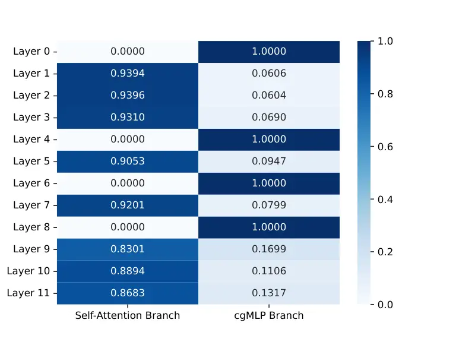
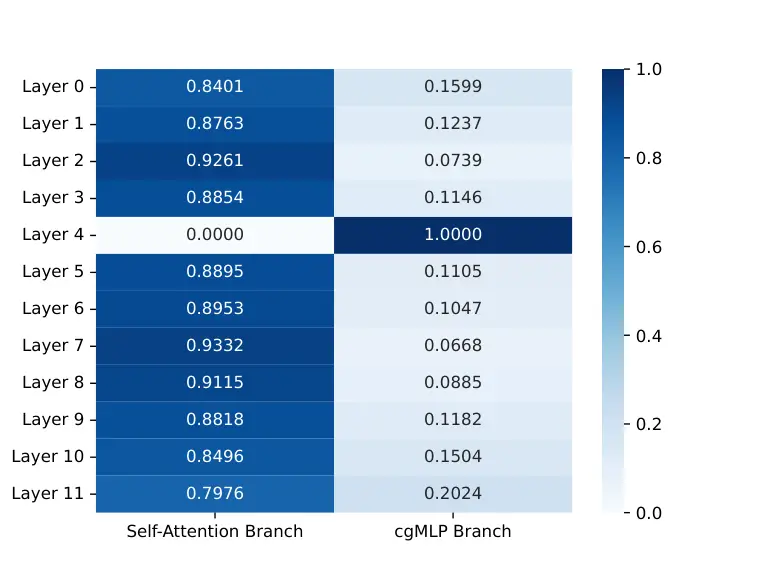
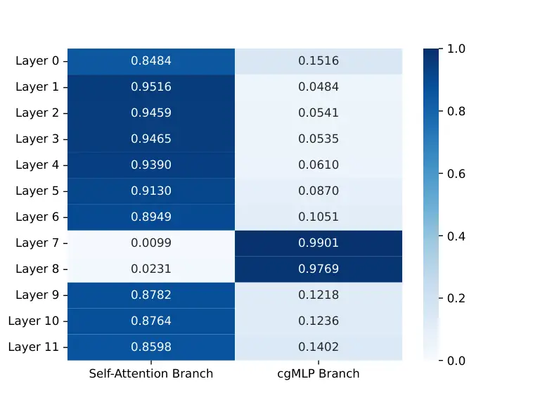
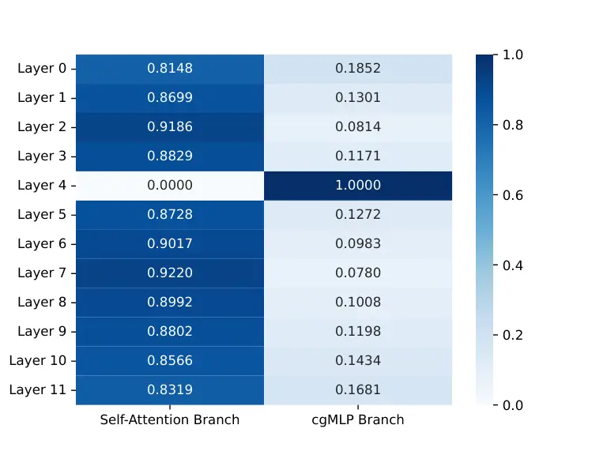
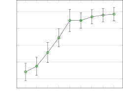

# Tailored Design of Audio-Visual Speech Recognition Models using Branchformers

PubID: pubid: 0000–0000/00\$00.00 © 2021 IEEE

David
Gimeno-Gómez[](https://orcid.org/0000-0002-7375-9515)
   Carlos-D.
Martínez-Hinarejos[](https://orcid.org/0000-0002-6139-2891)
^(†)^(†)thanks: Pattern Recognition and Human Language Technology
research center, Universitat Politècnica de València, Spain (e-mail:
dagigo1@dsic.upv.es)^(†)^(†)thanks: This version of the article has been
accepted for publication in Computer Speech & Language, after peer
review. The final published version is available at:
[https://doi.org/10.1016/j.csl.2025.101811.](https://doi.org/10.1016/j.csl.2025.101811.)

###### Abstract

Recent advances in Audio-Visual Speech Recognition (AVSR) have led to
unprecedented achievements in the field, improving the robustness of
this type of system in adverse, noisy environments. In most cases, this
task has been addressed through the design of models composed of two
independent encoders, each dedicated to a specific modality. However,
while recent works have explored unified audio-visual encoders,
determining the optimal cross-modal architecture remains an ongoing
challenge. Furthermore, such approaches often rely on models comprising
vast amounts of parameters and high computational cost training
processes. In this paper, we aim to bridge this research gap by
introducing a novel audio-visual framework. Our proposed method
constitutes, to the best of our knowledge, the first attempt to harness
the flexibility and interpretability offered by encoder architectures,
such as the Branchformer, in the design of parameter-efficient AVSR
systems. To be more precise, the proposed framework consists of two
steps: first, estimating audio- and video-only systems, and then
designing a tailored audio-visual unified encoder based on the
layer-level branch scores provided by the modality-specific models.
Extensive experiments on English and Spanish AVSR benchmarks covering
multiple data conditions and scenarios demonstrated the effectiveness of
our proposed method. Even when trained on a moderate scale of data, our
models achieve competitive word error rates (WER) of approximately 2.5%
for English and surpass existing approaches for Spanish, establishing a
new benchmark with an average WER of around 9.1%. These results reflect
how our tailored AVSR system is able to reach state-of-the-art
recognition rates while significantly reducing the model complexity
w.r.t. the prevalent approach in the field. Code and pre-trained models
are available at
[https://github.com/david-gimeno/tailored-avsr](https://github.com/david-gimeno/tailored-avsr).

###### Index Terms: 

Audio-visual speech recognition, branchformer, architecture design,
unified audio-visual encoder, interpretability, parameter efficiency.

## I Introduction

Automatic Speech Recognition (ASR) is a widely studied task in the field
of speech processing \[1\]. Albeit current ASR systems are nowadays
capable of understanding spoken language with great quality \[2, 3\],
their performance can be considerably affected in adverse scenarios,
such as a noisy environment \[4\]. This challenge has led to the
emergence of Visual Speech Recognition (VSR) technologies as an
interesting avenue of research \[5, 6, 7\]. Nonetheless, inspired by our
speech perception process \[8, 9, 10\], researchers have increasingly
turned their focus towards Audio-Visual Speech Recognition (AVSR) as a
promising solution, demonstrating how the incorporation of visual cues
when interpreting speech improves the performance of this type of
systems in challenging, noisy scenarios \[11, 12, 13, 14, 15, 16\].
While multiple methods have been investigated to effectively integrate
both modalities \[17, 18, 19, 20\], the prevalent AVSR architecture
nowadays is based on early fusion strategies, either combining the
speech features extracted by two independent encoders \[11, 12, 15,
14\], each dedicated to a specific modality, or adopting the recent
trend of unified multi-modal encoders \[13, 21, 22\].

However, although these approaches represent the current state of the
art, determining the optimal cross-modal architectures remains an
ongoing challenge. A significant limitation of existing studies lies not
only in their reliance on models with vast amounts of parameters and
extensive pretraining processes, but also in their focus on how
audio-visual features should be fused to enhance the performance of a
fixed encoder backbone. Therefore, it is not clear how encoder
architectures can be adapted to the different nature and intrinsic
characteristics of each modality. The Branchformer encoder \[23, 24\]
seemed to represent one step forward in this regard. However, apart from
being proposed solely in the context of auditory-based ASR, the authors
did not exploit the potential of the flexibility and interpretability
offered by this architecture for the design of tailored and
parameter-efficient systems. These were the reasons that motivated our
work, whose key contributions are:

- •
  We propose a novel framework to design tailored, unified audio-visual
  encoders capable of reaching state-of-the-art performance, while
  reducing the number of model parameters by nearly half, e.g., from
  103.5M to 59.3M in the model trained for English, when compared to the
  conventional and prevalent AVSR architecture.
- •
  To the best of our knowledge, our work is one of the first attempts to
  harness the flexibility and interpretability offered by encoder
  architectures, such as the Branchformer, in the design of
  parameter-efficient AVSR systems. Specifically, we leverage these
  properties to identify the context dependencies – whether short- or
  long-term – that are more relevant for processing each modality. This
  analysis directly informs the design of a tailored AVSR system,
  optimized to handle the distinct characteristics of audio and visual
  inputs effectively.
- •
  Through extensive experiments on two English (LRS2-BBC \[11\] and
  LRS3-TED \[25\]) and four Spanish (MuAViC \[26\], CMU-MOSEAS \[27\],
  LIP-RTVE \[28\], and VLRF \[29\]) AVSR benchmarks, we demonstrated the
  effectiveness of our proposed audio-visual framework across diverse
  data conditions and scenarios. Even with a moderate scale of training
  data and a significantly reduced number of model parameters, our
  models remarkably achieve competitive word error rates (WER) of
  approximately 2.5%, on par with state-of-the-art methods \[12, 14\]
  under similar conditions. For Spanish datasets, the framework
  surpasses existing approaches, achieving an average WER around 9.1%,
  thereby establishing a new benchmark for this language.
- •
  Our analysis provides initial insights into the architectural
  differences, beyond the frontends, in processing speech features
  across modalities. Acoustic cues rely on both short- and long-term
  relationships, whereas the video-only system heavily depends on
  global-context cues, likely reflecting the ambiguity and limited
  information in lipreading. Additionally, our adaptive audio-visual
  fusion module underscored the dominant role of acoustic cues, with a
  relevance of approximately 70% — a finding that aligns with studies
  indicating that only 30% of speech information is visible \[30\].
- •
  We investigate the impact of noise distortions during both training
  and inference, as well as scenarios where the acoustic signal is
  completely absent. Consistent with \[31\], our findings highlight the
  limitations of current approaches in effectively exploiting the
  complementary information provided by visual cues, particularly in our
  Spanish-language experiments.

## II Related Work

State of the Art in AVSR. Thanks to the collection of large-scale
datasets \[25, 26\] and the use of powerful attention-based mechanisms
\[32\], unprecedented results have been achieved in the context of AVSR
\[13, 14, 15, 7\]. While most of these studies are predominantly
evaluated on English — with performances between 0.8-0.9%, 1.0-1.5%, and
12-20% WER for AVSR, ASR, and VSR tasks, respectively \[15, 7\] — the
performance for other languages, such as Spanish, remains comparably
distant. Though recent works are considering more languages in their
studies \[6, 33, 26, 34\], Spanish AVSR performance is notably lower
with an average WER of approximately 16%, 15%, 50% WER for AVSR, ASR,
and VSR tasks, respectively. In terms of model architecture, the hybrid
CTC/Attention framework \[35\] is the most prevalent decoding paradigm
adopted in the field. In our research, we also adopt this architecture,
aiming to assess the effectiveness of our proposed audio-visual encoder
more compellingly.

Parameter-Efficient ASR Models. Several works have focused their efforts
on building parameter-efficient ASR models through diverse methods,
including distillation \[36\], quantization \[37, 38\], pruning \[39,
40\], and parameter-sharing techniques \[41\]. Compatible with
structured sparsity, Ding et al. \[40\] investigated the search of
optimal sparse subnetworks within audio-only ASR architectures, not only
without experiencing a significant drop in performance but also
achieving robustness under noisy conditions. Although limited, similar
methods were also applied for VSR, highlighting Fernández-López et al.
\[42\], which explored multiple pruning strategies, also demonstrating
the potential robustness of these sparse models to noise compared to
their dense counterparts. For AVSR, the increasing computational demands
have led to innovations such as mask optimization training procedures
aimed at improving scalability \[16\]. Of particular note, however, is
the work by Burchi and Timofte \[14\], who introduced a
non-autoregressive CTC-based AVSR architecture. Their approach achieved
competitive results, while reducing model complexity through an
efficient attention mechanism. However, unlike our research, their
proposed model offered no architectural innovation in the fusion of
audio-visual speech cues.

Interpreting ASR. Multiple studies demonstrated that as we progress
through the encoder layers, low-level patterns like speaker
characteristics and noise are gradually disregarded, leading to a more
standardized representation of high-level semantics \[43, 44\]. The
primary focus of other works has been to interpret the underlying
phonetic representations captured by these deep neural networks. This
was achieved either through phonetic-based regularization techniques
during training \[45, 46\] or the incorporation of additional modules to
provide more explainable speech representations, with the goal of
identifying the most relevant features for the model \[47, 48\]. While
these studies focused on improving the interpretation of ASR systems,
the Branchformer encoder \[23\] represents one of the first attempts in
addressing the problem from the perspective of model architecture
design. As described in Subsection III-A, this encoder allows
researchers to interpret whether the global or local dependencies are
more relevant at each encoder layer when processing speech. However,
despite conducting several interesting studies, the authors did not
exploit the potential of this novel approach towards the design of
optimal and parameter-efficient ASR architectures as we propose in this
paper. In addition, unlike our work, all these studies were focused on
auditory-only ASR without considering the audio-visual integration and
how both modalities differentiate and complement each other.

Cross-Modal Unified Encoders for AVSR. Shi et al. \[13\] introduced
AV-HuBERT, a self-supervised learning framework for AVSR capable of
reaching state-of-the-art results on the LRS3-TED benchmark \[25\]. The
audio- and video-based cues are first processed by modality-independent
frontends. These frontend features are then fused and fed into a shared
backbone Transformer estimated with a frame-level masked cluster
prediction task. Zhu et al. \[21\] presented VATLM, an extension of the
AV-HuBERT framework that not only integrates audio and visual cues, but
it also incorporates the corresponding text transcription as an
additional input to the unified cross-modal encoder backbone. Both
architectures presented a base and large variant comprising around 105M
and 330M, respectively. However, the substantial performance gap between
the base and large models in both works reflects how the effectiveness
of these architectures highly depends on the number of parameters that
they comprise. Similar findings are found for the cross-lingual XLAVS-R
model \[49\], whose architecture is mainly based on AV-HuBERT.
Conversely, Li et al. \[22\] compared multiple methods to fuse the audio
and visual cues using a supervised AVSR architecture without relying on
large-scale pretraining processes. Their experiments showed superior
performance when concatenating both modalities along the temporal
dimension, thus offering a robust approach to noisy scenarios that does
not require forced alignment despite the modality mismatch in terms of
sampling rate.

Our present work. However, these studies were limited to how the
audio-visual features should be fused to maximize the performance of a
fixed unified encoder, which was not modified or adapted to the
different nature and intrinsic characteristics of each modality. Unlike
prior research, our proposed method focused on the tailored design of
the optimal cross-modal encoder architecture for parameter-efficiency
AVSR by leveraging the interpretability and flexibility of the
Branchformer encoder \[23\]. Furthermore, we show the effectiveness of
our proposed method through extensive experiments in two different
languages and a wide range of data conditions, even when estimated with
a moderate amount of training data.

## III Method

For clarity, we first describe the conventional and prevalent end-to-end
architecture for AVSR in Subsection III-A, as background, to
subsequently introduce our proposed tailored and unified audio-visual
encoder in Subsection III-B.

### III-A Model Architecture

Audio Frontend. The audio frontend transforms the raw audio waveforms
into 80 mel-spectrogram coefficients by applying a short-time Fourier
transform with a 20ms window and a 10ms step size. Then, a two-layer
convolutional module is not only in charge of extracting more powerful
local and temporal acoustic features, but also of down-sampling the
pre-processed audio sequence to a quarter of its length. This
down-sampling addresses the mismatch in sample rates between audio and
visual cues, which typically correspond to 100 fps and 25 fps,
respectively, as it is the case with the datasets in our case study.
Consequently, audio and visual cues are temporally aligned. The final
acoustic representation sequence consists of 256-dimensional embeddings.

Visual Frontend. Consistent with prior works \[6, 15\], spatio-temporal
relationships are captured by using a 3D convolutional layer with a
kernel of 7$`\times`$7 pixels and a receptive field of 5 frames. Once
these visual features are flattened along the time dimension, a 2D
ResNet-18 \[50\] is responsible for extracting local visual patterns,
resulting in a 512-dimensional feature representation.

Branchformer Encoder. Both the acoustic and visual feature sequences are
projected to a 256-dimensional space and further injected with a
relative positional encoding \[51\]. Then, these enhanced frontend
representations are each passed through a different modality-specific
encoder inspired by the Branchformer architecture \[23\] and its
enhanced variant, E-Branchformer \[24\]. This enhanced variant not only
explored more advanced convolution-based merging techniques, but also
incorporated feed-forward modules in a macaron-style configuration. Each
of the 12 layers in our encoder consists primarily of two parallel
branches:

- •
  Self-Attention Branch. This branch is responsible for modeling the
  global long-term dependencies from speech cues using a multi-headed
  self-attention mechanism \[32\]. Concretely, we set to 4 and 64 the
  number and size of the attention heads comprising the module,
  respectively.
- •
  cgMLP Branch. A Multi-Layer Perceptron with Convolutional Gating
  (cgMLP) module \[52\] is designed to capture the local context
  relationships. Specifically, the input sequence is first projected to
  an up-sampling inner dimension of 2048. Then, the sequence is split to
  process part of it using a 1D depth-wise convolutional layer with a
  kernel size of 31 to subsequently apply a linear gating mechanism.
  Finally, a linear layer projects the obtained representation to its
  original dimension of 256.

As shown in the scheme depicted in Figure 1, the encoder layers also
incorporate two feed-forward modules with an up-sampling inner dimension
of 2048 set in a macaron-style manner alongside their corresponding
residual connections with a scale factor of $`1/2`$. In all cases, the
Swish activation function \[53\] is used, layer normalization \[54\]
precedes each of the described modules, while a final dropout \[55\] of
0.1 is applied over their output. Finally, the latent representations
provided by both branches are merged via a learnable weighted method
that, as described below (and reflected in Figure 2), allowed us to
interpret which branch was more relevant at each encoder layer for the
audio- and video-only case studies.

Fig. 1: Architecture design of an encoder Branchformer layer \[23\].

Learnable Weighted Merge Layer. This module is in charge of combining
the output of both branches and dynamically generating the weights
representing the relevance of each branch at each encoder layer through
an attention-based pooling projection process. Let
$`\boldsymbol{Z}\in\mathbb{R}^{T\times d}`$ be the $`d`$-dimensional
audio or video sequence of length $`T`$ processed by one of the encoder
branches and $`\boldsymbol{w}\in\mathbb{R}^{d}`$ be a learnable
parameter vector. The attention weights
$`\boldsymbol{\alpha}\in\mathbb{R}^{T}`$ for each vector
$`\boldsymbol{z}_{i}\in\mathbb{R}^{d},1\leq i\leq T`$ composing
$`\boldsymbol{Z}`$ are computed as:

```math
\alpha_{i}=\frac{\exp\left(\boldsymbol{w}^{T}\boldsymbol{z}_{i}/\sqrt{d}\right)}{\Sigma^{T}_{j=1}\exp\left(\boldsymbol{w}^{T}\boldsymbol{z}_{j}/\sqrt{d}\right)}, \tag{1}
```

representing the scaled dot product between $`\boldsymbol{Z}`$ and
$`\boldsymbol{w}`$ followed by a softmax normalization. Once the
attention scores $`\boldsymbol{\alpha}`$ were computed, we transform the
sequence $`\boldsymbol{Z}`$ into the output
$`\boldsymbol{a}\in\mathbb{R}^{d}`$ via a weighted sum:
$`\boldsymbol{a}=\Sigma^{T}_{i=1}\alpha_{i}\boldsymbol{z}_{i}`$.
Therefore, based on this procedure, we could transform the output
sequences from the self-attention and cgMLP branches into the
attention-enriched representations denoted by $`\boldsymbol{a_{att}}`$
and $`\boldsymbol{a_{mlp}}`$, respectively. Then, these two vectors are
projected to two scalars and normalized using softmax to obtain the
branch relative weights as follows:

```math
w_{attn},w_{mlp}=softmax\left(\boldsymbol{W}_{attn}\boldsymbol{a}_{attn},\boldsymbol{W}_{mlp}\boldsymbol{a}_{mlp}\right), \tag{2}
```

where
$`\boldsymbol{W}_{att},\boldsymbol{W}_{mlp}\in\mathbb{R}^{1\times d}`$
are linear transforms. Finally, the encoder provides a merged output
$`\boldsymbol{X}\in\mathbb{R}^{T\times d}`$ capturing both global and
local speech patterns computed as defined in:

```math
\boldsymbol{X}=w_{att}\boldsymbol{Z}_{att}+w_{mlp}\boldsymbol{Z}_{mlp}, \tag{3}
```

where $`\boldsymbol{Z}_{att}`$ and $`\boldsymbol{Z}_{mlp}`$ refer to the
output latent representations provided by the self-attention and cgMLP
encoder branches, respectively. In this work, $`d`$ corresponds to 256
dimensions.

Adaptive Audio-Visual Fusion. We present an adaptive audio-visual fusion
module based on the learnable weighted merge layer described above. Let
$`\boldsymbol{X}_{audio}`$ and $`\boldsymbol{X}_{video}`$ be the audio
and video sequences encoded by the corresponding modality-specific
encoder, respectively, the audio-visual speech representation is defined
such that:

```math
\boldsymbol{X}=PoswiseFFN\left(w_{audio}\boldsymbol{X}_{audio}+w_{video}\boldsymbol{X}_{video}\right), \tag{4}
```

where $`w_{audio}`$ and $`w_{video}`$ are the modality relative weights
resulting from an attention-based pooling projection process, and
$`PoswiseFFN`$ represents a 2-layer position-wise feed-forward module
with an inner and output dimension of 2048 and 256, a Swish activation
layer, and a dropout rate of 0.1.

CTC/Attention Decoder. This state-of-the-art hybrid architecture \[35\]
combines both the Markov assumptions of CTC \[56\] (properties in
harmony with the speech nature) and the flexibility of the
non-sequential alignments offered by the attention-based decoder \[32\].
As Figure 3 depicts, this module is composed of a linear projection as
the CTC-based decoding branch and a 6-layer Transformer decoder of 4
attention heads of 64 dimensions attached to the Cross Entropy (CE)
criterion. As proposed by \[35\], its loss function is defined as
follows:

```math
\mathcal{L}=\alpha\log p_{ctc}(\boldsymbol{Y}|\boldsymbol{X})+(1-\alpha)\log p_{attn}(\boldsymbol{Y}|\boldsymbol{X}), \tag{5}
```

where $`p_{ctc}`$ and $`p_{attn}`$ denote the CTC and Attention
posteriors, respectively. In both terms, $`\boldsymbol{X}`$ and
$`\boldsymbol{Y}`$ refer to the speech latent representation processed
by the encoder and its corresponding character-level target
transcription, respectively. The $`\alpha`$ weight balances the relative
influence of each decoding branch.

Language Model. In this work, we use the character-level Language Models
(LM) publicly released by Ma et al. \[6\] for Spanish and English. These
models, defined as 16-layer Transformer encoders \[32\], were estimated
with text from different sources comprising more than 150M characters
each.

Inference. In the CTC/Attention architecture inference process, the
Attention-based decoder primarily determines when the beam search
decoding concludes by predicting the end-of-sentence token, and thus
both the CTC-based decoding branch and the LM serve as additional
scoring factors, as reflected by

```math
S=\lambda S_{ctc}+(1-\lambda)S_{attn}+\beta S_{lm}, \tag{6}
```

where $`S_{ctc}`$ and $`S_{attn}`$ are the scores of the CTC- and the
Attention-based decoder, respectively, $`\lambda`$ is their
corresponding relative weight, and $`\beta`$ and $`S_{lm}`$ refer to the
LM decoding influence weight and the LM score, respectively. Readers are
referred to Watanabe et al. \[35\] for a more comprehensive description
of this inference process.

### III-B The Tailored Audio-Visual Branchformer

The model architecture previously described, composed of two independent
modality-specific encoders, corresponds to the most prevalent approach
adopted in the context of AVSR \[11, 12, 57, 15, 14\]. While recent
works have explored unified encoder architectures \[13, 21, 22\],
determining the optimal cross-modal architecture remains an ongoing
challenge. In this paper, unlike prior works, we introduce a novel
framework that, to the best of our knowledge, constitutes the first
attempt to harness the flexibility and interpretability offered by
encoder architectures, such as the Branchformer \[23\], in the design of
parameter-efficient AVSR systems. The proposed method comprises multiple
steps.

Training Modality-Specific Models. We first estimated models for
audio-only and video-only inputs separately, each utilizing its
corresponding modality-specific Branchformer encoder: one dedicated to
the processing of audio speech cues ($`E_{audio}`$) and the other to
visual speech cues ($`E_{video}`$).

Analyzing Branchformer Encoder Layers. As described in Subsection III-A,
the Branchformer encoder allowed us to analyze which branch was more
relevant at each encoder layer for each of our estimated
modality-specific models. Figure 2 reflects how the encoder adopted a
different architecture depending on the addressed modality for the
LRS2-BBC dataset. The increased reliance on global context relationships
in the video-only scenario, compared to the audio-only setting, could be
attributed to the limited information provided by lip movements when
interpreting speech \[30\]. Section V discusses the patterns observed
across the datasets explored in our work.



(a)



(b)

Fig. 2: Visualization of the average Branchformer weights on the LRS2
validation data set. (a) Acoustic Speech Recognition. (b) Visual Speech
Recognition.

Fig. 3: Our proposed method involves preprocessing visual and audio
cues, conditioning the resulting temporal-aligned speech features with
positional and modality embeddings, and then modeling them using a
tailored encoder, whose architecture design is based on the
interpretable weights of models previously estimated for audio- and
video-only settings, to perform the final speech interpretation in an
autoregressive manner through the hybrid CTC/Attention paradigm. Both
feed forward networks share parameters across modalities. CE and CTC
refer to Cross Entropy and Connectionist Temporal Classification,
respectively.

Designing a Tailored AVSR Model. We also observed that, in most cases
and regardless of the modality, one of the relative branch weights of
the modality-specific models tended to approach saturation, with values
consistently close to 1. Our hypothesis was that, due to this
saturation, the branch associated with the lower impact could be removed
without a significant decrease in model performance. Based on this
analysis, we designed a tailored, unified, parameter-efficient encoder
for AVSR, whose overview scheme is depicted in Figure 3. This tailored
design involves the selection of ad-hoc global- or local-context
processing modules depending on the modality and the specific encoder
layer level we are addressing. Specifically, our proposed tailored
encoder is composed of 12 layers with two parallel branches but, in this
case, each one is in charge of processing a different modality. Each
layer of these branches is defined by a self-attention or cgMLP module
depending on which of them was more relevant in its corresponding
modality-specific model. Formally, this can be expressed as follows:

```math
\delta_{im}(x_{m})=\begin{cases}cgMLP(x_{m})&\text{if }E_{im}^{global}(x_{m})<E_{im}^{local}(x_{m}),\\
SelfAttention(x_{m})&\text{otherwise,}\end{cases} \tag{7}
```

where $`i`$ denotes the layer index, $`m\in\{audio,video\}`$ indicates
the modality, and $`x_{m}`$ represents the input features for modality
$`m`$. Therefore, $`\delta_{im}`$ corresponds to the context-specific
processing module of the $`i`$-th layer of the tailored, unified
audio-visual encoder. Additionally, $`E_{im}^{global}(x_{m})`$ and
$`E_{im}^{local}(x_{m})`$ refer to the scores provided by our
modality-specific models that indicate the relevance of global and local
context at layer $`i`$ for modality $`m`$, respectively.

Unlike the original Branchformer encoder, we do not merge the encoded
representation of each branch. Doing so would fundamentally alter the
nature of the audio- and video-only representations, thus hindering the
ad-hoc design described above by not having a base model to select one
module focused on either global or local context relationships.
Nonetheless, we share the two feed-forward modules with the intention of
enhancing the model’s cross-modal capabilities. Consequently, in order
to facilitate the model to distinguish between both modalities, we
introduced a modality embedding that conditions the frontend speech
representations. A preliminary ablation study showed that, although no
significant differences were observed, incorporating the modality
embedding consistently led to slight improvements.

As supported by our extensive experiments, this tailored architecture
design allowed us to reduce the number of model parameters by nearly
half compared to conventional AVSR systems, while achieving
state-of-the-art recognition rates across diverse benchmarks.

## IV Experiments

The models proposed in this work were implemented using the open-source
ESPNet toolkit \[58\]. Experiments were conducted on a 24-core 3.40MHz
Intel i7-13700K CPU and a GeForce RTX 4090 GPU with 24GB memory.

### IV-A Datasets

In our work, we considered multiple AVSR benchmarks covering two
different languages, as well as a wide range of scenarios and data
conditions, to properly evaluate the effectiveness of our proposed
audio-visual framework.

LRS2-BBC \[11\] is a large-scale English database composed of around 224
hours collected from BBC TV programs. It consists of a pre-training set
with 96,318 samples (195 hours), a training set with 45,839 samples (28
hours), a validation set with 1,082 samples (0.6 hours), and a test set
with 1,243 samples (0.5 hours). It offers more than 2M running words
with a vocabulary size of around 40k.

LRS3-TED \[25\] is the largest publicly audio-visual English database,
providing around 438 hours collected from TED talks. It consists of a
‘pre-train’ set with 118,516 samples (407 hours), a ‘train-val’ set with
31,982 samples (30 hours), and a test set with 1,321 samples (0.9
hours). It offers more than 4M running words with a vocabulary size of
around 50k.

MuAViC\_(es) \[26\] is a large-scale multilingual corpus collected from
TED and TEDx talks. In our work, we only considered its Spanish
partition, offering around 181 hours of data. It is split into a
training set with 102,035 samples (177.5 hours), a validation set with
906 samples (1.6 hours), and a test set of 1012 samples (1.7 hours). It
comprises around 1.7M running words with a vocabulary size of around
58k.

CMU-MOSEAS\_(es) \[27\] is a large-scale database collected from YouTube
monologue videos covering 4 different languages. In our work, we only
considered its Spanish partition. According to \[6\], we defined a
training set with 8,253 samples (15.7 hours) and a test set with 329
samples (0.6 hours). The database provides more than 150k running words
with a vocabulary size of around 14k.

LIP-RTVE \[28\] is a challenging Spanish database collected from TV
newscast programs, providing around 13 hours of data. Its
speaker-independent partition consists of a training set with 7,142
samples (9 hours), a validation set with 1638 samples (2 hours), and a
test set with 1572 samples (2 hours). It comprises around 300 speakers
and more than 100k running words with a vocabulary size of around 10k.

VLRF \[29\] is a Spanish database primarily designed to study the
feasibility of the VSR task, providing 1 hour of data. It was recorded
in controlled laboratory settings, providing a speaker-dependent
partition composed of 24 speakers, each one with 25 assigned unrelated
but predefined sentences. It is split into a training set with 480
samples (0.92 hours) and a test set with 120 samples (0.23 hours),
comprising around 4k running words with a vocabulary size of 1374.

### IV-B Model Architecture Comparison.

In our work, we compared three different types of models.

Audio- and Video-Only. These modality-specific systems constitute the
baseline from which we will extract the Branchformer-based knowledge to
design our proposed tailored AVSR system. Note that in these audio- and
video-only settings, the model architecture described in Subsection
III-A is modified so that, in addition to removing the audio-visual
fusion module, only the corresponding frontend is considered. The audio-
and video-only models comprise around 51.2M and 60.7M parameters,
respectively, for both languages.

Conventional AVSR. This model corresponds to the architecture described
in Subsection III-A, where a modality-specific Branchformer encoder is
defined for each modality. This model represents the conventional
architecture adopted in the context of AVSR, comprising around 103.5M
parameters for both languages studied in our work.

Tailored AVSR. This model corresponds to the architecture described in
Subsection III-B, where a tailored audio-visual Branchformer was
designed. This model represents a step forward in parameter efficiency
in the context of audio-visual speech integration, comprising around
59.3M or 58.3M parameters for English and Spanish, respectively.

### IV-C Implementation Details

Audio Processing. We first sampled all audio waveforms at 16 kHz and
then applied utterance-level mean subtraction.

Video Processing. All videos were first sampled at 25 fps. Similar to
\[12, 6, 14\], we cropped patches of 96$`\times`$96 pixels centered on
the speaker’s mouth. We used the RetinaFace face detector \[59\] and the
Face Alignment Network \[60\] to detect 68 facial landmarks.
Subsequently, we applied a similarity transformation w.r.t. a neutral
reference frame, thereby removing possible translation and scaling
variations. The cropped lip regions were converted into gray-scale, and
normalized based on the overall mean and variance of the training set.

Text Processing. We first normalize texts by punctuation removal and
uppercasing. Similar to \[6\], we then used a character-level tokenizer
with a vocab size of 41 and 37 for English and Spanish, respectively. In
both cases, special symbols, such as the ‘space’, ’end of sentence’, and
the ‘blank’ tokens, were included.

Data Augmentation. We applied SpecAugment \[61\] on our audio cues
during training with two frequency masks with mask size parameter F = 27
and five time masks with adaptive size pS = 0.05. Furthermore, we
introduce speed perturbation by randomly selecting a scale factor
between 0.9 and 1.1 from a uniform distribution. Regarding video, random
cropping of 88$`\times`$88 pixels, horizontal flipping, and time masking
\[6\] with a maximum of 0.4 seconds were applied during training.

Training Settings. Similar to \[14\], we used the Adam optimizer \[62\]
and a Noam scheduler \[32\] with 10k warmup steps, yielding a peak
learning rate of 0.001 with a batch size of 64 samples. All the proposed
models were trained for 100 epochs. Those utterances that were longer
than 20 seconds were discarded. In all cases, the loss weight $`\alpha`$
in Eq. (5) was set to 0.1. Similar to most works in the field, the
visual frontend was initialized in all our experiments with the publicly
released weights¹¹ 1
[https://github.com/mpc001/Lipreading_using_Temporal_Convolutional_Networks](https://github.com/mpc001/Lipreading_using_Temporal_Convolutional_Networks)
trained on the word-level LRW classification task \[63\]. Additionally,
encountering convergence issues with the Spanish video-only system and
inspired by the work carried out by Ma et al. \[6\], we adopted a
cross-lingual learning strategy, initializing both the visual frontend
and the encoder backbone with the weights estimated for the English
benchmark. Subsequently, we conducted fine-tuning following the training
settings outlined in \[6\].

Inference Settings. Similar to \[6\], we set the LM weight $`\beta`$ of
Eq. (6) to 0.6 and 0.4 for English and Spanish, respectively. For
English, we set a word insertion penalty of 0.5 and a beam size of 40,
while for Spanish, we set the word insertion penalty and the beam size
to 0.0 and 30, respectively. Regarding the CTC/Attention balance, we set
the weight $`\lambda`$ of Eq. (6) to 0.1. Note that, during inference,
we averaged the model parameters on the 10 epochs with the top
validation performance.

Evaluation Metric. Reported results were evaluated by the well-known
Word Error Rate (WER) with 95% confidence intervals using the bootstrap
method described by \[64\].

Limitations. Numerous studies \[11, 12, 13, 14\] investigated the
benefits of techniques involving either masking or incorporating noise
into acoustic cues during training. While these methods have
demonstrated improvements in the robustness of AVSR systems, we
consciously refrained from adopting these strategies. Our rationale was
to properly study the cross-modality learning capabilities and noise
robustness of our proposed method strictly from an architectural design
perspective, without incorporating such data augmentation artifacts.

## V Results & Discussion

Method Modality No. of Parameters Total Hours Additional Datasets
Dataset LRS2-BBC LRS3-TED Shi et al. \[13\] A 325M 2,192 VoxCeleb2 - 1.5
Ma et al. \[15\] A 250.4M 3,448 LRW, VoxCeleb2, AVSpeech 1.5 1.0 Burchi
and Timofte \[65\] A 119M 3,116 LRW, VoxCeleb2, AVSpeech - 0.7 Ma et al.
\[12\] A $`\sim`$100M 381 / 595 LRW 3.9 2.3 Ma et al. \[15\] A 250.4M
818 LRW 2.6 1.5 Burchi and Timofte \[14\] A 61.7M 818 LRW 2.4 2.0 Ours
(Conventional) A 51.2M 818 LRW 3.9$`\pm`$0.5 2.4$`\pm`$0.4 Ours
(Tailored) A 43.3M 818 LRW 4.1$`\pm`$0.5 2.6$`\pm`$0.4 Shi et al. \[13\]
V 325M 2,192 VoxCeleb2 - 26.9 Liu et al. \[66\] V \>250M 6720 LRW,
VoxCeleb2, AVSpeech, Synthetic - 16.9 Ma et al. \[15\] V 250.4M 3,448
LRW, VoxCeleb2, AVSpeech 14.6 19.1 Burchi and Timofte \[65\] V 130M
3,116 LRW, VoxCeleb2, AVSpeech - 25.5 Ma et al. \[12\] V $`\sim`$100M
381 / 595 LRW 37.9 43.3 Prajwal et al. \[57\] V - 698 - 28.9 40.6 Ma et
al. \[6\] V 52M 818 LRW 27.3 34.5 Ma et al. \[15\] V 250.4M 818 LRW 27.9
33.0 Burchi and Timofte \[14\] V 61.7M 818 LRW 29.8 37.5 Ours
(Conventional) V 60.7M 818 LRW 29.9$`\pm`$1.6 37.0$`\pm`$1.6 Ours
(Tailored) V 51.3M 818 LRW 33.6$`\pm`$1.7 41.2$`\pm`$1.7 Shi et al.
\[13\] AV 325M 2,192 VoxCeleb2 - 1.3 Ma et al. \[15\] AV 250.4M 3,448
LRW, VoxCeleb2, AVSpeech 1.5 0.9 Burchi and Timofte \[65\] AV 197M 3,116
LRW, VoxCeleb2, AVSpeech - 0.8 Ma et al. \[12\] AV $`\sim`$100M 381 /
595 LRW 3.7 2.3 Burchi and Timofte \[14\] AV 61.7M 818 LRW 2.3 1.8 Ours
(Conventional) AV 103.5M 818 LRW 3.0$`\pm`$0.4 2.4$`\pm`$0.4 Ours
(Tailored) AV 59.3M 818 LRW 3.0$`\pm`$0.4 2.1$`\pm`$0.4

TABLE I: Comparison of WER (%) to the state of the art on the test sets
of the datasets composing the English benchmark for audio-only (A),
video-only (V), and audio-visual (AV) settings. Works using non-publicly
resources were not considered. Gray shading highlights, along with their
corresponding results, those works comparable to ours in terms of either
the number of model parameters, hours of training data, or both. Within
each subdivision, best results for each dataset are indicated in bold.

Method Modality No. of Parameters Total Hours Additional Datasets %WER
MuAViC*(es) Anwar et al. \[26\] A 325M 2,370 LRW, LRS3, VoxCeleb2 16.5
Burchi et al. \[65\] A 119M 4,957 LRW, LRS3, VoxCeleb2, AVSpeech, MuAViC
7.9 Ours A 51.2M 203 - 11.6$`\pm`$0.8 Ours (Tailored) A 43.3M 203 -
12.8$`\pm`$0.8 Ma et al. \[6\]^(^(†)) V 52M 1,546 LRW, LRS2&3, AVSpeech
56.6$`\pm`$0.3 Kim et al. \[33\]^(^(†)) V 325M 2,825 LRW, LRS3, mTEDx,
MLS 70.2 Yeo et al. \[69\] V 250.4M 3,832 LRW, LRS2&3, VoxCeleb2,
AVSpeech 45.7 Ours V 60.7M 1,021 LRW, LRS2&3 77.4$`\pm`$1.5 Ours
(Tailored) V 51.3M 1,021 LRW, LRS2&3 80.9$`\pm`$1.6 Anwar et al. \[26\]
AV 325M 2,370 LRW, LRS3, VoxCeleb2 15.9 Hong et al. \[34\] AV $`>`$325M
2,900 LRW, LRS3, VoxCeleb2, MuAViC 18.0 Burchi et al. \[65\] AV 197M
4,957 LRW, LRS3, VoxCeleb2, AVSpeech, MuAViC 8.2 Ours (Conventional) AV
103.5M 361 LRW 11.6$`\pm`$0.7 Ours (Tailored) AV 58.3M 361 LRW
14.3$`\pm`$1.1 CMU-MOSEAS*(es) Ma et al. \[6\] A 50M 1,546 LRW, LRS2&3,
AVSpeech 15.4$`\pm`$0.1 Ours A 51.2M 203 - 12.9$`\pm`$1.2 Ours
(Tailored) A 43.3M 203 - 15.1$`\pm`$1.3 Ma et al. \[6\] V 52M 1,546 LRW,
LRS2&3, AVSpeech 44.6$`\pm`$0.6 Ours V 60.7M 1,021 LRW, LRS2&3
46.7$`\pm`$2.1 Ours (Tailored) V 51.3M 1,021 LRW, LRS2&3 52.6$`\pm`$2.2
Ours (Conventional) AV 103.5M 361 LRW 13.0$`\pm`$1.3 Ours (Tailored) AV
58.3M 361 LRW 15.3$`\pm`$1.4 LIP-RTVE Ours (Prior Work) \[28\] A - 9 -
15.3$`\pm`$0.8 Ours A 51.2M 203 - 7.8$`\pm`$0.5 Ours (Tailored) A 43.3M
203 - 8.9$`\pm`$0.5 Ours (Prior Work) \[28\] V - 9 - 95.9$`\pm`$0.2 Ours
V 60.7M 1,021 LRW, LRS2&3 58.4$`\pm`$1.0 Ours (Tailored) V 51.3M 1,021
LRW, LRS2&3 64.0$`\pm`$1.1 Ours (Conventional) AV 103.5M 361 LRW
6.7$`\pm`$0.4 Ours (Tailored) AV 58.3M 361 LRW 7.6$`\pm`$0.5 VLRF Ours
(Prior Work) \[67\] A - 1 - 9.1$`\pm`$3.0 Ours A 51.2M 203 -
4.9$`\pm`$2.1 Ours (Tailored) A 43.3M 203 - 6.0$`\pm`$2.3
Fernández-López \[68\] V - - Synthetic 72.9 Ours (Prior Work) \[67\] V -
1 - 59.7$`\pm`$4.3 Ours V 60.7M 1,021 LRW, LRS2&3 21.8$`\pm`$3.0 Ours
(Tailored) V 51.3M 1,021 LRW, LRS2&3 23.0$`\pm`$3.2 Ours (Conventional)
AV 103.5M 361 LRW 5.0$`\pm`$1.7 Ours (Tailored) AV 58.3M 361 LRW
5.8$`\pm`$2.2 $`\dagger`$ Though results were reported for mTEDx \[70\],
it corresponds to MuAViC, as noted by Anwar et al. \[26\].

TABLE II: Comparison of WER (%) to the state of the art on the Spanish
benchmark test sets for audio-only (A), video-only (V), and audio-visual
(AV) settings. Works using non-publicly resources were not considered.
For each dataset, best results within each modality subdivision are
highlighted in bold. Cells with missing number of model parameters
correspond to approaches of different nature based on HMMs \[28, 67,
68\]

Supporting our Proposed Method. Several reasons motivated and supported
the design of our unified, tailored audio-visual encoder. First of all,
we trained audio- and video-only systems to corroborate that acoustic
and visual cues require different contextual dependencies when
recognizing speech. As Figure 2 reflects, the Branchformer encoder
adopted a notably different architecture for each modality, with one of
the branches often dominating in almost all layers. We hypothesized that
the branch associated with the lower relevance could be pruned without a
substantial performance loss. Experimental results reported in Tables I
and II (rows named as “Ours” and “Ours (Tailored)”) supported this
hypothesis: fine-tuning the tailored version of these modality-specific
models for ten epochs yielded recognition rates comparable to their
complete counterparts, while reducing the number of parameters by 15.5%.
Therefore, we designed the novel tailored audio-visual framework we
present in this paper. Albeit the structure of each branch, as Figure 3
suggests, aligns with the patterns observed in the modality-specific
models, note that we also introduced two parameter-shared feed-forward
modules to exploit the cross-modality capabilities of our architecture.

Effectiveness of the Tailored AVSR framework. The AVSR task is
predominantly assessed in English. For this reason, we first present
Table I to demonstrate the effectiveness of our proposed
parameter-efficient AVSR system, which was able to achieve competitive
results compared to the current state of the art. While our approach may
be outperformed by various works, they are not directly comparable to
our method, since their proposed architectures that not only relied on
models comprising vast amounts of parameters, but also on additional
large-scale datasets for their pre-training. Similarly, Table II
compares our method within the context of the Spanish benchmarks, where
we have surpassed the state of the art in most of the datasets by a
substantial margin. However, only in the case of MuAViC, our approach
exhibits a significant performance drop compared to \[65\] for ASR and
AVSR, and \[6, 69\] for VSR. This disparity can be attributed to several
factors, including the larger number of parameters and total training
hours in their proposed models. Additionally, a notable difference
between these models and our work, as well as other underperforming
studies \[26, 33, 34\], is the use of the AVSpeech dataset \[71\]. The
inclusion of this dataset, primarily compiled from TED talks, may have
contributed to the performance boost in these state-of-the-art models by
providing in-domain data during their pre-training phase.

Our tailored model stands out as the AVSR architecture with the least
parameters, capable of achieving state-of-the-art recognition rates in
two different languages, even when trained on a moderate scale of data.
Furthermore, given the wide range of data conditions covered by the
Spanish benchmark, we demonstrated that our proposed audio-visual
framework can effectively address AVSR in diverse domains within a
single training procedure.

One interesting finding is that, in both languages, tailored video-only
systems showed a significant performance drop compared to their
audio-only counterparts, suggesting that VSR is a task more dependent on
the model complexity. We also tested the robustness of our AVSR systems
in scenarios where acoustic cues are absent and found no significant
differences between the complete and tailored architectures.

| Dataset          | Method     | SNR levels (dB) |                 |                |                |                |
| ---------------- | ---------- | --------------- | --------------- | -------------- | -------------- | -------------- |
|                  |            | -5              | 0               | 5              | 10             | 15             |
| LRS2-BBC         | A          | 72.8$`\pm`$1.8  | 17.4$`\pm`$1.5  | 10.1$`\pm`$0.9 | 5.0$`\pm`$0.6  | 4.3$`\pm`$0.6  |
|                  | AV\_(conv) | 49.4$`\pm`$1.9  | 10.8$`\pm`$1.1  | 6.8$`\pm`$0.7  | 4.2$`\pm`$0.5  | 3.6$`\pm`$0.5  |
|                  | AV\_(tail) | 45.8$`\pm`$1.9  | 11.6$`\pm`$1.2  | 6.0$`\pm`$0.6  | 3.9$`\pm`$0.5  | 3.3$`\pm`$0.5  |
| LRS3-TED         | A          | 78.9$`\pm`$1.5  | 18.4$`\pm`$1.6  | 9.1$`\pm`$0.7  | 4.1$`\pm`$0.5  | 2.7$`\pm`$0.4  |
|                  | AV\_(conv) | 62.4$`\pm`$1.7  | 14.8$`\pm`$1.4  | 7.1$`\pm`$0.6  | 3.5$`\pm`$0.4  | 2.8$`\pm`$0.4  |
|                  | AV\_(tail) | 60.5$`\pm`$1.7  | 13.8$`\pm`$1.3  | 6.7$`\pm`$0.6  | 3.6$`\pm`$0.4  | 2.5$`\pm`$0.4  |
| MuAViC\_(es)     | A          | 94.5$`\pm`$1.4  | 34.5$`\pm`$2.2  | 29.3$`\pm`$1.2 | 16.8$`\pm`$0.9 | 13.3$`\pm`$0.8 |
|                  | AV\_(conv) | 95.5$`\pm`$1.4  | 32.9$`\pm`$2.1  | 28.8$`\pm`$1.2 | 16.5$`\pm`$0.8 | 13.1$`\pm`$0.8 |
|                  | AV\_(tail) | 92.6$`\pm`$1.2  | 34.3$`\pm`$2.1  | 33.3$`\pm`$1.6 | 20.6$`\pm`$1.2 | 16.3$`\pm`$1.1 |
| CMU-MOSEAS\_(es) | A          | $`>`$100.0      | 38.2$`\pm`$3.9  | 34.9$`\pm`$2.2 | 19.9$`\pm`$1.5 | 15.5$`\pm`$1.4 |
|                  | AV\_(conv) | $`>`$100.0      | 38.4$`\pm`$3.5  | 35.2$`\pm`$2.1 | 19.0$`\pm`$1.5 | 14.8$`\pm`$1.3 |
|                  | AV\_(tail) | 98.6$`\pm`$1.5  | 43.5$`\pm`$4.0  | 37.1$`\pm`$2.2 | 23.3$`\pm`$1.7 | 17.6$`\pm`$1.4 |
| LIP-RTVE         | A          | 89.6$`\pm`$1.3  | 25.6$`\pm`$1.5  | 18.6$`\pm`$0.8 | 11.0$`\pm`$0.6 | 8.8$`\pm`$0.5  |
|                  | AV\_(conv) | 90.3$`\pm`$1.3  | 25.6$`\pm`$1.6  | 16.3$`\pm`$0.8 | 9.3$`\pm`$0.6  | 7.5$`\pm`$0.5  |
|                  | AV\_(tail) | 87.4$`\pm`$1.0  | 26.9$`\pm`$1.6  | 18.2$`\pm`$0.8 | 10.8$`\pm`$0.6 | 8.6$`\pm`$0.5  |
| VLRF             | A          | $`>`$100.0      | 57.0$`\pm`$14.2 | 34.5$`\pm`$6.0 | 12.8$`\pm`$3.5 | 7.3$`\pm`$2.3  |
|                  | AV\_(conv) | $`>`$100.0      | 82.4$`\pm`$15.9 | 45.8$`\pm`$8.0 | 12.6$`\pm`$3.0 | 6.2$`\pm`$2.1  |
|                  | AV\_(tail) | $`>`$100.0      | 59.3$`\pm`$13.1 | 35.4$`\pm`$6.4 | 12.1$`\pm`$3.0 | 6.6$`\pm`$2.5  |

TABLE III: Results in WER (%) of Our Proposed Audio-Only (A) and
Audio-Visual (AV) Speech Recognition Systems in Babble Noisy Settings
with Multiple SNR Levels. AV*(conv) and AV*(tail) refer to the
Conventional and Tailored AVSR Systems, Respectively.

Noise Robustness. As Table III reflects, we evaluated the robustness of
our proposed audio-only and audio-visual systems in multiple Signal to
Noise Ratio (SNR) levels using babble noise from the NoiseX corpus
\[72\]. Consistent with numerous studies \[11, 12, 14, 26\], our
experiments show that incorporating visual cues significantly enhances
the model performance in high-level noise conditions across all studied
benchmarks. Our results demonstrate that, despite a reduction in the
number of model parameters by nearly half, our proposed tailored
audio-visual encoder retained its robustness to noise. For Spanish, the
benefit of incorporating visual cues, as can also be inferred from Table
II, is less pronounced than for English datasets. As we later discuss,
this could be attributed to the smaller amount of available visual data,
which may limit the robust estimation of the visual encoder.

Fig. 4: Analysis of training with additive noise both for our proposed
audio-only ASR and tailored AVSR architectures. Results in WER (%) under
babble noisy conditions with multiple SNR levels across the English and
Spanish test benchmarks. Shaded areas correspond to 95% confidence
intervals. An asterisk (\*) indicates experiments where training
included babble noise acoustic distortions at varying and random SNR
levels.



(a)



(b)

Fig. 5: Visualization of the average Branchformer weights on the MuAViC
validation data set. (a) Acoustic Speech Recognition. (b) Visual Speech
Recognition.

Because of this, additional experiments incorporating noise distortions
into acoustic cues during training were also conducted. These data
augmentation techniques were expected to increase system robustness to
noise and better balance the contributions of audio and visual
modalities. As shown in Figure 4, while performance under high levels of
noise improved significantly, there was no noticeable increase in
reliance on visual speech cues, as also evidenced by the poor results
when audio input was masked. This suggests that when noise is added
during training, the model primarily learns to filter out the noise
rather than fully relying on the complementary, yet limited, visual
modality. This finding is supported by Lin and Harte \[31\], who argue
that current AVSR systems do not fully exploit the visual modality,
highlighting the need for further research in this area. However, for
English datasets, the visual contribution appears to be more relevant,
as previously noted in the discussion of Table III. A potential
explanation, particularly regarding discrepancies with English datasets,
is the convergence issues observed in video-only Spanish experiments. In
these cases, the model failed to achieve satisfactory results unless its
encoder was pre-trained with weights from the English model. However,
within our proposed framework, this approach is not always practical, as
it requires the same tailored architecture across both languages. This
further emphasizes the necessity for future work on cross-lingual
learning in lipreading technologies.

Interestingly, we also observed differences in how noise distortions
were incorporated during training for Spanish and English datasets.
While for Spanish, the model was able to handle heavily distorted audio
signals (up to -5 SNR) from the beginning, for English, a gradual
introduction of noise through curriculum learning was necessary,
progressively worsening the SNR level across epochs. This discrepancy
likely stems from the cleaner nature of the English data compared to the
Spanish corpus, making the incorporation of noise during training more
impactful for the former. These observations further support the idea
that dataset characteristics play a crucial role in determining model
effectiveness in adverse scenarios, such as noisy environments, and even
in the modeling of visual cues, as discussed in \[73\].

Interpreting AVSR. In Figure 2, we can contrast the different patterns
observed between the branch weights of an audio-only and a video-only
system. Consistent with the findings of the original Branchformer
authors \[23\], the audio-only system adopted an architecture where the
relevance of each branch changes primarily in an interleaving manner
across layers. Conversely, the video-only system exhibits a high
dependency on global-context relationships to effectively process the
visual speech features. The model may rely on context due to limited
information and lipreading’s inherent ambiguity.

As suggested by Figure 5, similar patterns were observed across all
benchmarks in our study for video-only systems. This may be largely due
to the Spanish VSR models’ strong reliance on English pre-training,
which likely guided the model toward similar architectural patterns. In
contrast, the audio-only Spanish model — achieving strong performance
without English pre-training — did not exhibit the same interleaved
layer-wise pattern seen in the English model. This discrepancy across
languages in terms of model architecture suggests potential differences
in how speech information is processed, which may be particularly
relevant for the development of multilingual ASR systems \[26, 34\],
opening up promising avenues for future research. Another possible
reason for this difference is that the Spanish audio-only model was
trained on four distinct datasets from different domains, which may have
encouraged the encoder to learn more generalizable and context-aware
representations.

Regarding our AVSR systems, we also inspected the relative weight
learned during training when fusing the audio and visual cues. In all
cases, regardless of the language or the architecture, our adaptive
fusion module consistently assigned roughly 73.1$`\pm`$12.3% relevance
to the acoustic cues. This observation aligns with Duchnowski et
al. \[30\], which supported that only around 30% of speech information
is visible.



Fig. 6: Average relative acoustic weights learned by the proposed
Adaptive Audio-Visual Fusion layer at different SNR levels, evaluated on
the test sets of the English benchmarks in our case study. The weights
analyzed correspond to the tailored AVSR model architecture trained with
noise distortions.

Additional experiments were carried out to investigate the variability
of the learnable relative weights under different levels of noise
degradation. In line with the findings reported by Peng et al. \[23\],
our initial analyses revealed that the weights remained remarkably
stable across diverse conditions. However, when noise distortions were
introduced during training, notable changes emerged. As shown in
Figure 6, we can observe how visual cues became increasingly influential
as the SNR decreased. Interestingly, these changes when fusing
modalities were only markedly pronounced in the tailored,
parameter-efficient architecture. This suggests that models with lower
complexity are less able to learn to denoise corrupted audio and instead
tend to compensate for audio degradation by relying more heavily on
visual speech cues. Conversely, for the Spanish benchmarks, the adaptive
fusion either remained largely stable across noise conditions (in the
full-model dense setup) or exhibited a even stronger dependence on the
audio modality around 90% (in the tailored variant), underscoring
ongoing challenges in effectively leveraging visual cues in
cross-language settings, as discussed throughout this section.

Overall, our analysis provides initial insights into the architectural
differences, beyond the frontends, when dealing with speech features
from different modalities and how relevant each of them can be when
decoding speech.

## VI Conclusions & Future Work

In this paper, we introduced a novel framework for the tailored design
of unified audio-visual encoders in the context of parameter-efficient
AVSR by leveraging the interpretability and flexibility offered by the
Branchformer architecture \[23\]. Through extensive experiments across
multiple languages and data conditions, we showed the effectiveness of
our proposed encoder, which was able to achieve competitive results with
a moderate amount of training data, while significantly reducing the
number of parameters composing the model. Regarding our future work, we
intend to focus our efforts towards developing lightweight AVSR systems
for real-world applications. This includes exploring the combination of
our tailored audio-visual encoder with parameter-sharing techniques,
such as the Sim-T architecture \[41\]; the integration of audio-visual
cues in early stages through, for instance, the implementation of
intermediate auxiliary losses \[6, 74\]; and finally the shift to
non-autoregressive paradigms, such as the Mask-CTC decoder \[75\],
capable of achieving state-of-the-art recognition rates in much less
inference time. In this context, we further aim to investigate the
potential of cross-modal and cross-lingual learning within
parameter-efficient AVSR frameworks.

## Acknowledgments

This work was partially supported by Generalitat Valenciana through
Grant CIACIF/2021/295 and Conselleria de Educación, Universidades y
Empleo under project LightVED, funded by the PROMETEO 2024 program
(CIPROM/2023/17). It was also supported by Grant PID2021-124719OB-I00
under project LLEER, funded by MCIN/AEI and ERDF, EU “A way of making
Europe”.

## References

- \[1\] M. Gales and S. Young, _The application of hidden Markov models
  in speech recognition_. Now Publishers Inc, 2008.
- \[2\] A. Radford, J. Kim, T. Xu, G. Brockman, C. McLeavey, and
  I. Sutskever, “Robust speech recognition via large-scale weak
  supervision,” in _ICML_. PMLR, 2023, pp. 28 492–28 518.
- \[3\] A. Baevski, Y. Zhou, A. Mohamed, and M. Auli, “wav2vec 2.0: A
  Framework for Self-Supervised Learning of Speech Representations,” in
  _Advances in Neural Information Processing Systems_, vol. 33, 2020,
  pp. 12 449–12 460.
- \[4\] B. Juang, “Speech recognition in adverse environments,”
  _Computer Speech & Language_, vol. 5, no. 3, pp. 275–294, 1991.
- \[5\] A. Fernandez-Lopez and F. M. Sukno, “Survey on automatic
  lip-reading in the era of deep learning,” _Image and Vision
  Computing_, vol. 78, pp. 53–72, 2018.
- \[6\] P. Ma, S. Petridis, and M. Pantic, “Visual speech recognition
  for multiple languages in the wild,” _Nature Machine Intelligence_,
  vol. 4, no. 11, pp. 930–939, 2022.
- \[7\] O. Chang, H. Liao, D. Serdyuk, A. Shah, and O. Siohan,
  “Conformer is All You Need for Visual Speech Recognition,” in
  _ICASSP_, 2024, pp. 10 136–10 140.
- \[8\] H. McGurk and J. MacDonald, “Hearing lips and seeing voices,”
  _Nature_, vol. 264, no. 5588, pp. 746–748, 1976.
- \[9\] J. Besle, A. Fort, C. Delpuech, and M.-H. Giard, “Bimodal
  speech: early suppressive visual effects in human auditory cortex,”
  _European journal of Neuroscience_, vol. 20, no. 8, pp.
  2225–2234, 2004.
- \[10\] J. E. Stacey, C. J. Howard, S. Mitra, and P. C. Stacey,
  “Audio-visual integration in noise: Influence of auditory and visual
  stimulus degradation on eye movements and perception of the McGurk
  effect,” _Attention, Perception, & Psychophysics_, vol. 82, pp.
  3544–3557, 2020.
- \[11\] T. Afouras, J. S. Chung, A. Senior, O. Vinyals, and
  A. Zisserman, “Deep audio-visual speech recognition,” _IEEE
  Transactions on PAMI_, vol. 44, no. 12, pp. 8717–8727, 2018.
- \[12\] P. Ma, S. Petridis, and M. Pantic, “End-to-end audio-visual
  speech recognition with conformers,” in _ICASSP_, 2021, pp. 7613–7617.
- \[13\] B. Shi, W. N. Hsu, K. Lakhotia, and A. Mohamed, “Learning
  audio-visual speech representation by masked multimodal cluster
  prediction,” _arXiv preprint arXiv:2201.02184_, 2022.
- \[14\] M. Burchi and R. Timofte, “Audio-visual efficient conformer for
  robust speech recognition,” in _WACV_, 2023, pp. 2258–2267.
- \[15\] P. Ma, A. Haliassos, A. Fernandez-Lopez, H. Chen, S. Petridis,
  and M. Pantic, “Auto-avsr: Audio-visual speech recognition with
  automatic labels,” in _ICASSP_, 2023, pp. 1–5.
- \[16\] A. Fernandez-Lopez, H. Chen, P. Ma, L. Yin, Q. Xiao,
  S. Petridis, S. Liu, and M. Pantic, “MSRS: Training Multimodal Speech
  Recognition Models from Scratch with Sparse Mask Optimization,” in
  _Interspeech_, 2024, pp. 2820–2824.
- \[17\] G. Potamianos, C. Neti, G. Gravier, A. Garg, and A. Senior,
  “Recent advances in the automatic recognition of audiovisual speech,”
  _IEEE_, vol. 91, no. 9, pp. 1306–1326, 2003.
- \[18\] G. Sterpu, C. Saam, and N. Harte, “Attention-based Audio-Visual
  Fusion for Robust Automatic Speech Recognition,” in _ICMI_, 2018, p.
  111–115.
- \[19\] L. Wei, J. Zhang, J. Hou, and L. Dai, “Attentive Fusion
  Enhanced Audio-Visual Encoding for Transformer Based Robust Speech
  Recognition,” in _APSIPA ASC_, 2020, pp. 638–643.
- \[20\] Y. Wu, C. Li, S. Yang, Z. Wu, and Y. Qian, “Audio-Visual
  Multi-Talker Speech Recognition in a Cocktail Party,” in
  _Interspeech_, 2021, pp. 3021–3025.
- \[21\] Q. Zhu, L. Zhou, Z. Zhang, S. Liu, B. Jiao, J. Zhang, L. Dai,
  D. Jiang, J. Li, and F. Wei, “VatLM: Visual-Audio-Text Pre-Training
  with Unified Masked Prediction for Speech Representation Learning,”
  _IEEE Transactions on Multimedia_, pp. 1–11, 2023.
- \[22\] J. Li, C. Li, Y. Wu, and Y. Qian, “Robust Audio-Visual ASR with
  Unified Cross-Modal Attention,” in _ICASSP_, 2023, pp. 1–5.
- \[23\] Y. Peng, S. Dalmia, I. Lane, and S. Watanabe, “Branchformer:
  Parallel MLP-attention architectures to capture local and global
  context for speech recognition and understanding,” in _ICML_, vol.
  162, 2022, pp. 17 627–17 643.
- \[24\] K. Kim, F. Wu, Y. Peng, J. Pan, P. Sridhar, K. J. Han, and
  S. Watanabe, “E-Branchformer: Branchformer with Enhanced Merging for
  Speech Recognition,” in _IEEE SLT Workshop_, 2023, pp. 84–91.
- \[25\] T. Afouras, J.-S. Chung, and A. Zisserman, “LRS3-TED: a
  large-scale dataset for visual speech recognition,” _arXiv preprint
  arXiv:1809.00496_, 2018.
- \[26\] M. Anwar, B. Shi, V. Goswami, W. Hsu, J. Pino, and C. Wang,
  “MuAViC: A Multilingual Audio-Visual Corpus for Robust Speech
  Recognition and Robust Speech-to-Text Translation,” in _Interspeech_,
  2023, pp. 4064–4068.
- \[27\] A. B. Zadeh, Y. Cao, S. Hessner, P. P. Liang, S. Poria, and
  L.-P. Morency, “CMU-MOSEAS: A multimodal language dataset for spanish,
  portuguese, german and french,” in _EMNLP_, 2020, pp. 1801–1812.
- \[28\] D. Gimeno-Gómez and C.-D. Martínez-Hinarejos, “LIP-RTVE: An
  Audiovisual Database for Continuous Spanish in the Wild,” in
  _Proceedings of LREC_, June 2022, pp. 2750–2758.
- \[29\] A. Fernandez-Lopez, O. Martinez, and F. M. Sukno, “Towards
  estimating the upper bound of visual-speech recognition: The visual
  lip-reading feasibility database,” in _12th FG)_. IEEE, 2017, pp.
  208–215.
- \[30\] P. Duchnowski, D. S. Lum, J. C. Krause, M. G. Sexton, M. S.
  Bratakos, and L. D. Braida, “Development of speechreading supplements
  based on automatic speech recognition,” _IEEE Trans. on Biomedical
  Engineering_, vol. 47, no. 4, pp. 487–496, 2000.
- \[31\] Z. Lin and N. Harte, “Uncovering the Visual Contribution in
  Audio-Visual Speech Recognition,” _arXiv preprint
  arXiv:2412.17129_, 2024.
- \[32\] A. Vaswani, N. Shazeer, N. Parmar, J. Uszkoreit, L. Jones,
  A. N. Gomez, L. Kaiser, and I. Polosukhin, “Attention is all you
  need,” _Advances in neural information processing systems_, vol. 30,
  pp. 6000–6010, 2017.
- \[33\] M. Kim, J. H. Yeo, J. Choi, and Y. M. Ro, “Lip reading for
  low-resource languages by learning and combining general speech
  knowledge and language-specific knowledge,” in _ICCV_, 2023, pp.
  15 359–15 371.
- \[34\] J. Hong, S. Park, and Y. Ro, “Intuitive multilingual
  audio-visual speech recognition with a single-trained model,” in
  _Findings of EMNLP_. Association for Computational Linguistics, 2023,
  pp. 4886–4890.
- \[35\] S. Watanabe, T. Hori, S. Kim, J. R. Hershey, and T. Hayashi,
  “Hybrid ctc/attention architecture for end-to-end speech recognition,”
  _IEEE JSTSP_, vol. 11, no. 8, pp. 1240–1253, 2017.
- \[36\] C. Li, L. Zhu, S. Xu, P. Gao, and B. Xu, “Compression of
  Acoustic Model via Knowledge Distillation and Pruning,” in _ICPR_,
  2018, pp. 2785–2790.
- \[37\] H. D. Nguyen, A. Alexandridis, and A. Mouchtaris, “Quantization
  Aware Training with Absolute-Cosine Regularization for Automatic
  Speech Recognition,” in _Interspeech_, 2020, pp. 3366–3370.
- \[38\] T. N. Sainath, Y. He, B. Li, A. Narayanan, R. Pang,
  A. Bruguier, S.-Y. Chang, W. Li, R. Alvarez, Z. Chen, C.-C. Chiu,
  D. Garcia, A. Gruenstein, K. Hu, A. Kannan, Q. Liang, I. McGraw,
  C. Peyser, R. Prabhavalkar, G. Pundak, D. Rybach, Y. Shangguan,
  Y. Sheth, T. Strohman, M. Visontai, Y. Wu, Y. Zhang, and D. Zhao, “A
  Streaming On-Device End-To-End Model Surpassing Server-Side
  Conventional Model Quality and Latency,” in _ICASSP_, 2020, pp.
  6059–6063.
- \[39\] C.-. J. Lai, Y. Zhang, A. H. Liu, S. Chang, Y.-L. Liao, Y.-S.
  Chuang, K. Qian, S. Khurana, D. Cox, and J. Glass, “Parp: Prune,
  adjust and re-prune for self-supervised speech recognition,” in
  _Advances in Neural Information Processing Systems_, vol. 34, 2021,
  pp. 21 256–21 272.
- \[40\] S. Ding, T. C., and Z. W., “Audio Lottery: Speech Recognition
  made Ultra-Lightweight, Noise-Robust, and Transferable,” in
  _ICLR_, 2022.
- \[41\] G. Wei, Z. Duan, S. Li, G. Yang, X. Yu, and J. Li, “Sim-T:
  Simplify the Transformer Network by Multiplexing Technique for Speech
  Recognition,” _arXiv preprint arXiv:2304.04991_, 2023.
- \[42\] A. Fernandez-Lopez, H. Chen, P. Ma, A. Haliassos, S. Petridis,
  and M. Pantic, “Sparsevsr: Lightweight and noise robust visual speech
  recognition,” _arXiv preprint arXiv:2307.04552_, 2023.
- \[43\] A.-R. Mohamed, G. Hinton, and G. Penn, “Understanding how deep
  belief networks perform acoustic modelling,” in _ICASSP_, 2012, pp.
  4273–4276.
- \[44\] C.-Y. Li, P.-C. Yuan, and H.-Y. Lee, “What Does a Network Layer
  Hear? Analyzing Hidden Representations of End-to-End ASR Through
  Speech Synthesis,” in _ICASSP_, 2020, pp. 6434–6438.
- \[45\] S. Tan, K. C. Sim, and M. Gales, “Improving the
  interpretability of deep neural networks with stimulated learning,” in
  _ASRU_, 2015, pp. 617–623.
- \[46\] C. Wu, M. J. F. Gales, A. Ragni, P. Karanasou, and K. C. Sim,
  “Improving Interpretability and Regularization in Deep Learning,”
  _IEEE/ACM TASLP_, vol. 26, no. 2, pp. 256–265, 2018.
- \[47\] M. Ravanelli and Y. Bengio, “Interpretable convolutional
  filters with sincnet,” _arXiv preprint arXiv:1811.09725_, 2018.
- \[48\] P. Agrawal and S. Ganapathy, “Interpretable Representation
  Learning for Speech and Audio Signals Based on Relevance Weighting,”
  _IEEE/ACM TASLP_, vol. 28, pp. 2823–2836, 2020.
- \[49\] H. Han, M. Anwar, J. Pino, W.-N. Hsu, M. Carpuat, B. Shi, and
  C. Wang, “XLAVS-R: Cross-Lingual Audio-Visual Speech Representation
  Learning for Noise-Robust Speech Perception,” _arXiv preprint
  arXiv:2403.14402_, 2024.
- \[50\] K. He, X. Zhang, S. Ren, and J. Sun, “Deep residual learning
  for image recognition,” in _CVPR_, 2016, pp. 770–778.
- \[51\] Z. Dai, Z. Yang, Y. Yang, J. Carbonell, Q. Le, and
  R. Salakhutdinov, “Transformer-XL: Attentive language models beyond a
  fixed-length context,” in _Proc. ACL_, 2019, pp. 2978–2988.
- \[52\] J.Sakuma, T. Komatsu, and R. Scheibler, “MLP-based architecture
  with variable length input for automatic speech recognition,” 2022.
  \[Online\]. Available:
  [https://openreview.net/forum?id=RA-zVvZLYIy](https://openreview.net/forum?id=RA-zVvZLYIy)
- \[53\] P. Ramachandran, B. Zoph, and Q. V. Le, “Searching for
  activation functions,” _arXiv preprint arXiv:1710.05941_, 2017.
- \[54\] J. L. Ba, J. R. Kiros, and G. Hinton, “Layer normalization,”
  _arXiv preprint arXiv:1607.06450_, 2016.
- \[55\] N. Srivastava, G. Hinton, A. Krizhevsky, I. Sutskever, and
  R. Salakhutdinov, “Dropout: a simple way to prevent neural networks
  from overfitting,” _JMLR_, vol. 15, no. 1, pp. 1929–1958, 2014.
- \[56\] A. Graves, S. Fernández, F. Gomez, and J. Schmidhuber,
  “Connectionist temporal classification: labelling unsegmented sequence
  data with recurrent neural networks,” in _Proceedings of the 23rd
  ICML_, 2006, pp. 369–376.
- \[57\] K. Prajwal, T. Afouras, and A. Zisserman, “Sub-word level lip
  reading with visual attention,” in _CVPR_, 2022, pp. 5162–5172.
- \[58\] S. Watanabe, T. Hori, S. Karita, T. Hayashi, J. Nishitoba,
  Y. Unno, N. E. Y. Soplin, J. Heymann, M. Wiesner, N. Chen,
  A. Renduchintala, and T. Ochiai, “ESPnet: End-to-End Speech Processing
  Toolkit,” in _Interspeech_, 2018, pp. 2207–2211.
- \[59\] J. Deng, J. Guo, E. Ververas, I. Kotsia, and S. Zafeiriou,
  “Retinaface: Single-shot multi-level face localisation in the wild,”
  in _CVPR_, 2020, pp. 5202–5211.
- \[60\] A. Bulat and G. Tzimiropoulos, “How far are we from solving the
  2d & 3d face alignment problem? (and a dataset of 230,000 3d facial
  landmarks),” in _ICCV_, 2017, pp. 1021–1030.
- \[61\] D. S. Park, Y. Zhang, C.-C. Chiu, Y. Chen, B. Li, W. Chan,
  Q. V. Le, and Y. Wu, “SpecAugment on Large Scale Datasets,” in
  _ICASSP_, 2020, pp. 6879–6883.
- \[62\] D. P. Kingma and J. Ba, “Adam: A method for stochastic
  optimization,” _arXiv preprint arXiv:1412.6980_, 2014.
- \[63\] P. Ma, B. Martinez, S. Petridis, and M. Pantic, “Towards
  practical lipreading with distilled and efficient models,” in _IEEE
  International Conference on Acoustics, Speech and Signal Processing
  (ICASSP)_, 2021, pp. 7608–7612.
- \[64\] M. Bisani and H. Ney, “Bootstrap estimates for confidence
  intervals in asr performance evaluation,” in _ICASSP_, vol. 1, 2004,
  pp. 409–412.
- \[65\] M. Burchi, K. C. Puvvada, J. Balam, B. Ginsburg, and
  R. Timofte, “Multilingual audio-visual speech recognition with hybrid
  ctc/rnn-t fast conformer,” in _ICASSP_, 2024, pp. 10 211–10 215.
- \[66\] X. Liu, E. Lakomkin, K. Vougioukas, P. Ma, H. Chen, R. Xie,
  M. Doulaty, N. Moritz, J. Kolar, S. Petridis, M. Pantic, and
  C. Fuegen, “SynthVSR: Scaling Up Visual Speech Recognition With
  Synthetic Supervision,” in _CVPR_, 2023, pp. 18 806–18 815.
- \[67\] D. Gimeno-Gómez and C.-D. Martínez-Hinarejos, “Continuous
  lipreading based on acoustic temporal alignments,” _EURASIP Journal on
  Audio, Speech, and Music Processing_, vol. 2024, no. 1, p. 25, 2024.
- \[68\] A. Fernandez-Lopez and F. Sukno, “End-to-End Lip-Reading
  Without Large-Scale Data,” _IEEE/ACM TASLP_, vol. 30, pp.
  2076–2090, 2022.
- \[69\] J. H. Yeo, M. Kim, S. Watanabe, and Y. M. Ro, “Visual speech
  recognition for languages with limited labeled data using automatic
  labels from whisper,” in _ICASSP_, 2024, pp. 10 471–10 475.
- \[70\] E. Salesky, M. Wiesner, J. Bremerman, R. Cattoni, M. Negri,
  M. Turchi, D. Oard, and M. Post, “The Multilingual TEDx Corpus for
  Speech Recognition and Translation,” in _Interspeech_, 2021, pp.
  3655–3659.
- \[71\] A. Ephrat, I. Mosseri, O. Lang, T. Dekel, K. Wilson,
  A. Hassidim, W. Freeman, and M. Rubinstein, “Looking to Listen at the
  Cocktail Party: A Speaker-Independent Audio-Visual Model for Speech
  Separation,” _ACM Trans. Graph._, vol. 37, no. 4, pp. 1–11, 2018.
- \[72\] A. Varga and H. J. M. Steeneken, “Assessment for automatic
  speech recognition: II. NOISEX-92: A database and an experiment to
  study the effect of additive noise on speech recognition systems,”
  _Speech Communication_, vol. 12, no. 3, pp. 247–251, 1993.
- \[73\] D. Gimeno-Gómez and C.-D. Martínez-Hinarejos, “Evaluation of
  End-to-End Continuous Spanish Lipreading in Different Data
  Conditions,” _Language Resources and Evaluation_, 2025.
- \[74\] J. Lee and S. Watanabe, “Intermediate Loss Regularization for
  CTC-Based Speech Recognition,” in _ICASSP_, 2021, pp. 6224–6228.
- \[75\] Y. Higuchi, H. Inaguma, S. Watanabe, T. Ogawa, and
  T. Kobayashi, “Improved Mask-CTC for Non-Autoregressive End-to-End
  ASR,” in _ICASSP_, 2021, pp. 8363–8367.

|                                                                              |                                                                                                                                                                                                                                                                                                                                                                                                                                                                                                                                                                                                                                                                                      |
| ---------------------------------------------------------------------------- | ------------------------------------------------------------------------------------------------------------------------------------------------------------------------------------------------------------------------------------------------------------------------------------------------------------------------------------------------------------------------------------------------------------------------------------------------------------------------------------------------------------------------------------------------------------------------------------------------------------------------------------------------------------------------------------ |
| ![[Uncaptioned image]](arxiv-2407-06606--5b44a659b8b8.figures/figure-5.webp) | David Gimeno-Gómez received the B.Sc. degree in computer science and the M.Sc. degree in artificial intelligence, pattern recognition, and digital image from the Universitat Politècnica de València, Valencia, Spain, in 2019 and 2020, respectively. He is currently working towards a thesis for the Ph.D. degree. He pertains to the Pattern Recognition and Human Language Technology Research Center, where he develops his research on the topics of speech recognition, affective computing, and multimodal learning. Since 2020, he has participated in several research projects related to deep learning for multimodal interaction and audio-visual speech recognition. |

|                                                                              |                                                                                                                                                                                                                                                                                                                                                                                                                                                                                                                                                                                                                                                                                                                                                                 |
| ---------------------------------------------------------------------------- | --------------------------------------------------------------------------------------------------------------------------------------------------------------------------------------------------------------------------------------------------------------------------------------------------------------------------------------------------------------------------------------------------------------------------------------------------------------------------------------------------------------------------------------------------------------------------------------------------------------------------------------------------------------------------------------------------------------------------------------------------------------- |
| ![[Uncaptioned image]](arxiv-2407-06606--5b44a659b8b8.figures/figure-6.webp) | Carlos-D. Martínez-Hinarejos received the B.Sc. degree in computer science, the Ph.D. degree in pattern recognition and artificial intelligence, and the B.Sc. degree in biotechnology from the Universitat Politècnica de València (UPV), Valencia, Spain, in 1998, 2003, and 2012, respectively. He joined the UPV staff in the Computation and Computer Systems Department, UPV, in 2000. He pertains to the Pattern Recognition and Human Language Technology Research Center, where he develops his research on the topics of speech recognition, dialogue systems, multimodal systems, and text classification. He has participated in many European and Spanish projects, and is the current coordinator of the Spanish Network for Speech Technologies. |
