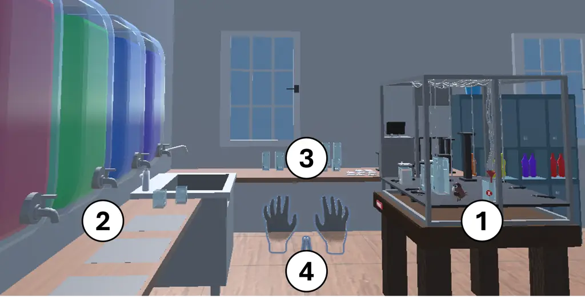
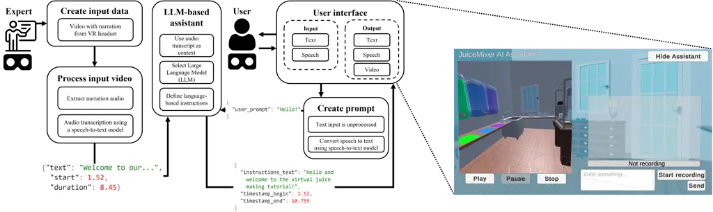

# AI-Powered Immersive Assistance for Interactive Task Execution in Industrial Environments

Tomislav Duricic ^(†)^(†)thanks: Corresponding Author. Email:
tduricic@know-center.at. Affiliation: Know-Center GmbH    Peter Müllner
Affiliation: Know-Center GmbH    Nicole Weidinger
Affiliation: Know-Center GmbH    Neven ElSayed Affiliation: Know-Center
GmbH    Dominik Kowald Affiliation: Know-Center GmbH Affiliation: Graz
University of Technology    Eduardo Veas Affiliation: Know-Center GmbH
Affiliation: Graz University of Technology

###### Abstract

Many industrial sectors rely on well-trained employees that are able to
operate complex machinery. In this work, we demonstrate an AI-powered
immersive assistance system that supports users in performing complex
tasks in industrial environments. Specifically, our system leverages a
VR environment that resembles a juice mixer setup. This digital twin of
a physical setup simulates complex industrial machinery used to mix
preparations or liquids (e.g., similar to the pharmaceutical industry)
and includes various containers, sensors, pumps, and flow controllers.
This setup demonstrates our system’s capabilities in a controlled
environment while acting as a proof-of-concept for broader industrial
applications. The core components of our multimodal AI assistant are a
large language model and a speech-to-text model that process a video and
audio recording of an expert performing the task in a VR environment.
The video and speech input extracted from the expert’s video enables it
to provide step-by-step guidance to support users in executing complex
tasks. This demonstration showcases the potential of our AI-powered
assistant to reduce cognitive load, increase productivity, and enhance
safety in industrial environments.

^(†)^(†)paperid: 123

## 1 Introduction

As the industrial sector continues to embrace technological
advancements, integrating Artificial Intelligence (AI) into operational
processes has become a key driver of efficiency, safety, and
innovation \[Shaji et al.(2022)Shaji, Bishnu, Mishra, Ramakrishna,
Krishna RS, Thomas K, and David\]. In this vein, this paper introduces
an AI assistant designed for immersive training, leveraging the
synergies of multimodal AI and Virtual Reality (VR) technology to
support task execution within industrial environments. The motivation
for such tools arises from the increasing complexity of industrial
machinery, which burdens operators with a cognitive load that can
compromise both productivity and safety \[Carvalho et al.(2020)Carvalho,
Chouchene, Lima, and Charrua-Santos\]. Additionally, there is a need to
improve machine operator training and adaptability in the face of
evolving industrial standards and practices, while also providing
support in situations where a knowledgeable expert is
unavailable \[Patalas-Maliszewska and Kłos(2019)\].

Furthermore, additional challenges include the unavailability of
physical machinery for training due to cost, the infrequent nature of
certain tasks performed by experts only during assembly, and the
significant need for upskilling in an ever-changing job market \[Collino
and Lauto(2022)\]. These challenges underscore the importance of
creating a flexible and comprehensive virtual solution, allowing
trainees to experience key activities in a safe, immersive
environment \[Radhakrishnan et al.(2021)Radhakrishnan, Koumaditis, and
Chinello\].

In response, our approach, showcased on a virtual juice mixer testbed
that is a digital twin \[Sjarov et al.(2020)Sjarov, Lechler, Fuchs,
Brossog, Selmaier, Faltus, Donhauser, and Franke\] of an actual physical
setup , aims to demonstrate how AI assistants can offer a scalable and
effective solution to these challenges and enhance interactive task
execution across a wide array of industrial applications.

The novelty of our approach lies in deploying an interactive AI
assistant powered by a large language model (LLM) that uses audio
transcripts to dynamically generate step-by-step guidance for immersive
and intuitive training. These transcripts are extracted from a video of
an expert performing the task in a VR environment and serve as the
primary context for guidance. The virtual testbed replicates the setup
of its physical counterpart, ensuring that our simulations and training
scenarios align with real-world operations \[Jiang et al.(2021)Jiang,
Yin, Li, Luo, and Kaynak\]. The LLM-based assistant processes both text
and speech inputs, dynamically adapting outputs to address user needs at
each step.

By implementing this system on a VR platform, we demonstrate the
practical application of our AI assistant in simplifying complex
industrial tasks and its potential to improve operational efficiency and
learning effectiveness. This paper details the implementation and use of
our assistant, illustrating how it integrates with VR to provide
immersive, intuitive support for industrial operations. Through this
exploration, we contribute to the discourse on AI’s role in industrial
automation, offering insights into its potential to improve interactions
with complex machinery. In the next section, we outline the challenges
of integrating immersive technologies into industrial operations and the
role of AI in enhancing safety and efficiency.

## 2 Background

Industrial Immersive Environments. The integration of immersive
technologies, such as digital twins and VR, into industrial settings
represents a paradigm shift in how operations and training are
conducted. Digital twins offer a digital representation of physical
systems, enabling real-time monitoring, simulation, and control of
industrial processes without direct physical interaction \[Jiang
et al.(2021)Jiang, Yin, Li, Luo, and Kaynak, Stavropoulos and
Mourtzis(2022)\]. Simultaneously, VR has emerged as a crucial tool for
immersive training, allowing operators to experience and interact with
complex machinery in a safe, virtual environment before applying these
skills in the real world \[Hasan et al.(2017)Hasan, Aziz, Mutaleb, and
Umar, Randeniya et al.(2019)Randeniya, Ranjha, Kulkarni, and Lu, Gavish
et al.(2015)Gavish, Gutiérrez, Webel, Rodríguez, Peveri, Bockholt, and
Tecchia\]. These technologies have not only streamlined operational
procedures but also significantly minimized risks, contributing to a
safer and more efficient industrial environment \[Voinea
et al.(2023)Voinea, Gîrbacia, Duguleană, Boboc, and Gheorghe, Babalola
et al.(2023)Babalola, Manu, Cheung, Yunusa-Kaltungo, and Bartolo\].

Challenges in Industrial Operations and the Role of AI. Despite
advancements in immersive technologies, industrial operations continue
to face significant challenges. Increasing complexity of machinery and
rapid technological and regulatory changes demand expertise and
flexibility from operators \[Rüßmann et al.(2015)Rüßmann, Lorenz,
Gerbert, Waldner, Justus, Engel, and Harnisch, Sahoo and Lo(2022), Alkan
et al.(2018)Alkan, Vera, Ahmad, Ahmad, and Harrison\]. These challenges,
coupled with the potential for human error under high cognitive load,
underscore the need for innovative solutions to support operators in
real-time decision-making and task execution. Moreover, the potential
unavailability of experts, due to distance or scheduling conflicts,
further complicates these challenges, underscoring the importance of an
autonomous guidance system \[Torres et al.(2021)Torres, Nadeau, and
Landau, Carvalho et al.(2020)Carvalho, Chouchene, Lima, and
Charrua-Santos, Naef et al.(2022)Naef, Chadha, and Lefsrud\]. Our goal
is to enable trainees to access prerecorded information contextualized
to their needs on the fly. Notable attempts in the past relied on
continuous tracking of visual attention, coupled with the recognition of
focused objects, to retrieve video snippets \[Leelasawassuk
et al.(2017)Leelasawassuk, Damen, and Mayol-Cuevas\]. Another attempt
introduced a new benchmark dataset and explored the use of foundation
models to address similar challenges \[Bao et al.(2023)Bao, Yu, Zhang,
Storks, Bar-Yossef, De La Iglesia, Su, Zheng, and Chai\].

AI has emerged as a key enabler in overcoming these obstacles by
augmenting human capabilities with intelligent, context-aware
assistance. Leveraging AI, industries can create systems capable of
analyzing complex data to offer predictive insights, automate routine
tasks, and provide adaptive, step-by-step guidance tailored to the
operator’s current task and environment \[Lee et al.(2020), Javaid
et al.(2022)Javaid, Haleem, Singh, and Suman\]. The fusion of AI with
immersive technologies paves the way for a new generation of assistance
systems that are more intuitive, interactive, and capable of
significantly reducing the cognitive load on operators, thus mitigating
the risks associated with complex industrial operations \[Tiple
et al.(2024)Tiple, Bulchandani, Paliwal, Shah, Jain, Dhaka, and Gupta,
Chheang et al.(2024)Chheang, Sharmin, Márquez-Hernández, Patel,
Rajasekaran, Caulfield, Kiafar, Li, Kullu, and Barmaki\].

This evolving landscape of industrial settings, coupled with the
transformative capabilities of AI, lays the groundwork for building and
showcasing our system. Our approach goes beyond mere recognition of
actual context and allows trainees to pose queries and interact with the
content guided by a multimodal AI assistant.

## 3 Demo Setup

The live demonstration showcases our AI-powered immersive assistance
system in VR. Users experience an interactive setup featuring the
virtual juice mixer testbed, designed to simulate a complex industrial
machine with containers, sensors, pumps, and flow controllers. The demo
provides participants with an immersive experience that highlights the
AI assistant’s capabilities. The video for the demo is hosted on YouTube
and is available at
\[[https://www.youtube.com/watch?v=iFdK_TUcVQs](https://www.youtube.com/watch?v=iFdK_TUcVQs)\].

Development Framework. The system is developed using Unity¹¹ 1
[https://unity.com/](https://unity.com/) and Oculus VR²² 2
[https://developer.oculus.com/](https://developer.oculus.com/), with
Meta Quest³³ 3
[https://www.meta.com/at/en/quest/products/quest-2/](https://www.meta.com/at/en/quest/products/quest-2/)
serving as the primary device for the demonstration. The development
process involves creating an environment that accurately replicates the
juice mixing operation, allowing users to interact with virtual
components and understand the task’s operational principles.

Juice Mixer Digital Twin. In our VR setup, the juice mixer, juice
station, and spare part station form the core of the interactive
environment simulating the juice mixing process (see Figure 1). The
juice mixer resembles a machine used in pharmaceutical and chemical
domains. This setup allows users to interact with digital twin, helping
them grasp the operational principles and functionalities of the juice
mixing operation in an immersive manner.

Figure 1: Overview of the virtual juice mixing setup in VR. Key
components are highlighted: (1) Juice Mixer, (2) Juice Station, (3)
Spare Part Station, and (4) Controller/Hands as input, which illustrates
the user interaction within the immersive environment.

Operational Task Flow. The task flow is structured to guide users
through the juice mixing process in a sequential and logical manner,
utilizing VR controls for interaction with the virtual equipment:

- •
  Preparation: Users select and pick up a container, placing it under a
  spout at the juice station, where the container is automatically
  filled with their chosen type of juice. A visual indicator shows the
  fill level of the container.
- •
  Assembly: Once filled, users attach the lid and relevant sensors
  (temperature and pH sensors) to the container. At this stage, they
  also connect a tube from the pump to the container, enabling the
  forthcoming mixing process. These components are designed for easy
  attachment through intuitive controller actions, enhancing the realism
  of the simulation.
- •
  Mixing: With the setup complete, the user proceeds to the mixing
  stage, interacting with virtual knobs to adjust the pump’s strength
  and operational mode. The process provides hands-on experience in
  managing the mixing intensity and duration, closely replicating the
  actual operational controls.
- •
  Final Steps: After mixing, users examine the final mixture, assessing
  the outcome of their efforts. This step not only concludes the task
  flow but also reinforces the learning objectives by enabling users to
  directly observe the results of their actions.

This simulation provides users with a comprehensive understanding of the
juice mixing process within a controlled, risk-free virtual environment.
The interactive setup enhances training efficacy, allowing operators to
master complex machinery operations without the physical risks typically
associated with industrial environments.

## 4 AI-Powered Immersive Assistance

Figure 2: System-level (left) and user-level (right) perspective of the
immersive AI assistant. The assistant needs an expert to perform the
task, and the expert’s narration is transcribed to text, which serves as
context for the LLM. Given this context and text or speech input from
the user, the LLM generates multimodal instructions that guide the user
through the task. These instructions are presented to the user within a
VR environment with media controls, text command input, and voice
interaction to facilitate user engagement with the AI Assistant.

The AI assistant supports immersive and interactive juice mixer
operation training. It uses a narrated expert video as input to guide
trainees through an interactive assistant, allowing learning at their
own pace when direct expert interaction is unavailable. Next, we delve
into the implementation details (as depicted in Figure 2) of the AI
assistant and user interactions within the VR environment.

Expert Video Creation and Processing. The development of our AI
assistant for machine operation training starts with capturing a video
of an expert performing the task in the VR environment. The expert
narrates and explains their actions step by step during the task. This
narration is essential for capturing detailed instructions and insights
for learning. After recording, the audio is transcribed into text using
the OpenAI speech-to-text model⁴⁴ 4
[https://platform.openai.com/docs/guides/speech-to-text](https://platform.openai.com/docs/guides/speech-to-text),
with timestamps included to preserve sequence information. This
transcript is then converted into a JSON format, serving as the primary
input for generating the AI assistant’s instructional content.

Creating an LLM-Based Assistant. Using the OpenAI Assistants API⁵⁵ 5
[https://platform.openai.com/assistants/](https://platform.openai.com/assistants/),
we employ the GPT-4 language model to power our AI assistant, which
enhances the user experience by allowing interactive and intuitive
communication. The transcript, already formatted in JSON from the
expert’s narrated video, provides a rich context that the LLM uses to
guide users through the juice mixing process in the VR setting. This
approach enables us to capture the expert’s knowledge effectively while
simplifying the user’s interaction with the system, enabling them to ask
questions and receive instructions that are contextually aware and
precisely timed.

Defining AI Assistant Behavior and Communication. The AI assistant’s
behavior and communication style is simply defined by a set of explicit
instructions using natural language within the OpenAI Assistants
platform. These instructions dictate that the assistant’s role is to
guide users through the juice mixer operation in VR, step by step. The
assistant uses a detailed transcript as context, timestamped and
formatted in JSON, derived from an expert’s video tutorial. The AI
assistant is instructed with the following primary functions: (i) Guide
Users - Present and sequentially navigate through the juice-making
steps, prompting users to confirm completion before proceeding. (ii)
Respond to Queries - Address user queries by referencing specific parts
of the transcript, using timestamps to provide contextual accuracy.
(iii) Troubleshoot Issues - Offer solutions for common operational
challenges as outlined in the transcript.

The assistant facilitates effective communication, ensuring each user
gains practical skills and deep understanding of the juice mixing
process. Initially, the assistant introduces itself, outlining its role
and explaining how it assists in the juice-making process. It then
continues guiding the user, responding to queries and providing detailed
instructions based on the structured content of the expert’s narration.

Each response provides clear and detailed instructions for the current
task or query and includes precise timestamps that dictate the playback
window of the expert’s video in the user interface. This targeted video
playback visually highlights the specific step being discussed,
enriching the learning experience by synchronizing instructional content
with relevant visual cues. The assistant operates without external
knowledge, relying entirely on the expert’s video content to ensure a
smooth and effective training experience.

Interacting with the AI Assistant The user interface for engaging with
the AI assistant is designed to be both intuitive and user-friendly.
Positioned next to the virtual juice mixer within the VR environment,
the interface includes a dedicated panel that hosts several essential
components for interaction, illustrated in Figure 2:

- •
  Input Textbox: Allows users to type their prompts, facilitating
  textual communication with the AI assistant.
- •
  Audio Input Option: Enables speech input, with recordings transcribed
  to text via OpenAI’s speech-to-text model⁶⁶ 6
  [https://platform.openai.com/docs/guides/speech-to-text](https://platform.openai.com/docs/guides/speech-to-text).
  Transcriptions appear in the input textbox for review or editing.
- •
  Response Display and Audio Output: After query submission, the AI
  assistant processes the prompt and displays the response in an output
  textbox. Simultaneously, the response is converted from text to
  speech⁷⁷ 7
  [https://platform.openai.com/docs/guides/text-to-speech](https://platform.openai.com/docs/guides/text-to-speech),
  providing audio feedback.
- •
  Video Panel Integration: The video panel displays clips from the
  expert video based on the AI assistant’s timestamped responses,
  visually demonstrating the specific steps being discussed.

The multimodal interface allows for flexible user interaction with the
AI assistant, utilizing text, audio, and video outputs. The integration
of these components ensures that all users can effectively navigate and
master the juice mixing process within the VR environment, regardless of
their specific learning needs or environmental conditions.

## 5 Conclusion and Future Work

In this work, we presented an AI-powered immersive assistance system to
interactively support users in task training and execution in industrial
settings. Using a virtual juice mixer testbed, we demonstrated the
potential of our system to enhance productivity and streamline complex
operational tasks.

In the future, we will investigate ways to support users in a more
precise and effective way. For example, by examining how the user
interface can impact the user behavior, or by incorporating
physiological indicators. Also, novel large language models, e.g.,
GPT-4-vision⁸⁸ 8
[https://platform.openai.com/docs/guides/vision](https://platform.openai.com/docs/guides/vision),
will enable us to extract multimodal embeddings from the experts’ video
recordings, which could enhance the quality of the contextual
information and thus, improve the precision of the assistants’ guidance.
Finally, we plan to combine our data-driven AI approach with a
theory-driven one, e.g., based on cognitive-inspired recommender
systems \[Kowald et al.(2015)Kowald, Kopeinik, Seitlinger, Ley, Albert,
and Trattner, Lex et al.(2021)Lex, Kowald, Seitlinger, Tran, Felfernig,
Schedl, et al.\], to enhance the transparency and understandability of
our AI-powered immersive assistant.

Acknowledgements. This work was funded by the FFG COMET module
Data-Driven Immersive Analytics (DDIA).

## References

- \[Alkan et al.(2018)Alkan, Vera, Ahmad, Ahmad, and Harrison\]
  B. Alkan, D. A. Vera, M. Ahmad, B. Ahmad, and R. Harrison. Complexity
  in manufacturing systems and its measures: a literature review.
  _European Journal of Industrial Engineering_, 12(1):116–150, 2018.
- \[Babalola et al.(2023)Babalola, Manu, Cheung, Yunusa-Kaltungo, and
  Bartolo\] A. Babalola, P. Manu, C. Cheung, A. Yunusa-Kaltungo, and
  P. Bartolo. A systematic review of the application of immersive
  technologies for safety and health management in the construction
  sector. _Journal of safety research_, 85:66–85, 2023.
- \[Bao et al.(2023)Bao, Yu, Zhang, Storks, Bar-Yossef, De La Iglesia,
  Su, Zheng, and Chai\] Y. Bao, K. P. Yu, Y. Zhang, S. Storks,
  I. Bar-Yossef, A. De La Iglesia, M. Su, X. L. Zheng, and J. Chai. Can
  foundation models watch, talk and guide you step by step to make a
  cake? _arXiv preprint arXiv:2311.00738_, 2023.
- \[Carvalho et al.(2020)Carvalho, Chouchene, Lima, and Charrua-Santos\]
  A. V. Carvalho, A. Chouchene, T. M. Lima, and F. Charrua-Santos.
  Cognitive manufacturing in industry 4.0 toward cognitive load
  reduction: A conceptual framework. _Applied System Innovation_,
  3(4):55, 2020.
- \[Chheang et al.(2024)Chheang, Sharmin, Márquez-Hernández, Patel,
  Rajasekaran, Caulfield, Kiafar, Li, Kullu, and Barmaki\] V. Chheang,
  S. Sharmin, R. Márquez-Hernández, M. Patel, D. Rajasekaran,
  G. Caulfield, B. Kiafar, J. Li, P. Kullu, and R. L. Barmaki. Towards
  anatomy education with generative ai-based virtual assistants in
  immersive virtual reality environments. In _2024 IEEE International
  Conference on Artificial Intelligence and eXtended and Virtual Reality
  (AIxVR)_, pages 21–30. IEEE, 2024.
- \[Collino and Lauto(2022)\] S. Collino and G. Lauto. Reducing
  cognitive biases through digitally enabled training. a conceptual
  framework. In _Do Machines Dream of Electric Workers? Understanding
  the Impact of Digital Technologies on Organizations and Innovation_,
  pages 179–191. Springer, 2022.
- \[Gavish et al.(2015)Gavish, Gutiérrez, Webel, Rodríguez, Peveri,
  Bockholt, and Tecchia\] N. Gavish, T. Gutiérrez, S. Webel,
  J. Rodríguez, M. Peveri, U. Bockholt, and F. Tecchia. Evaluating
  virtual reality and augmented reality training for industrial
  maintenance and assembly tasks. _Interactive Learning Environments_,
  23(6):778–798, 2015.
- \[Hasan et al.(2017)Hasan, Aziz, Mutaleb, and Umar\] R. B. Hasan,
  F. B. A. Aziz, H. A. A. Mutaleb, and Z. Umar. Virtual reality as an
  industrial training tool: A review. _J. Adv. Rev. Sci. Res_,
  29(1):20–26, 2017.
- \[Javaid et al.(2022)Javaid, Haleem, Singh, and Suman\] M. Javaid,
  A. Haleem, R. P. Singh, and R. Suman. Artificial intelligence
  applications for industry 4.0: A literature-based study. _Journal of
  Industrial Integration and Management_, 7(01):83–111, 2022.
- \[Jiang et al.(2021)Jiang, Yin, Li, Luo, and Kaynak\] Y. Jiang,
  S. Yin, K. Li, H. Luo, and O. Kaynak. Industrial applications of
  digital twins. _Philosophical Transactions of the Royal Society A_,
  379(2207):20200360, 2021.
- \[Kowald et al.(2015)Kowald, Kopeinik, Seitlinger, Ley, Albert, and
  Trattner\] D. Kowald, S. Kopeinik, P. Seitlinger, T. Ley, D. Albert,
  and C. Trattner. Refining frequency-based tag reuse predictions by
  means of time and semantic context. In _Mining, Modeling, and
  Recommending’Things’ in Social Media: 4th International Workshops,
  MUSE 2013, Prague, Czech Republic, September 23, 2013, and MSM 2013,
  Paris, France, May 1, 2013, Revised Selected Papers_, pages 55–74.
  Springer, 2015.
- \[Lee et al.(2020)\] J. Lee et al. Industrial ai. _Applications with
  sustainable performance_, 2020.
- \[Leelasawassuk et al.(2017)Leelasawassuk, Damen, and Mayol-Cuevas\]
  T. Leelasawassuk, D. Damen, and W. Mayol-Cuevas. Automated capture and
  delivery of assistive task guidance with an eyewear computer: the
  glaciar system. In _Proceedings of the 8th Augmented Human
  International Conference_, pages 1–9, 2017.
- \[Lex et al.(2021)Lex, Kowald, Seitlinger, Tran, Felfernig, Schedl,
  et al.\] E. Lex, D. Kowald, P. Seitlinger, T. N. T. Tran,
  A. Felfernig, M. Schedl, et al. Psychology-informed recommender
  systems. _Foundations and trends® in information retrieval_,
  15(2):134–242, 2021.
- \[Naef et al.(2022)Naef, Chadha, and Lefsrud\] M. Naef, K. Chadha, and
  L. Lefsrud. Decision support for process operators: Task loading in
  the days of big data. _Journal of Loss Prevention in the Process
  Industries_, 75:104713, 2022.
- \[Patalas-Maliszewska and Kłos(2019)\] J. Patalas-Maliszewska and
  S. Kłos. An approach to supporting the selection of maintenance
  experts in the context of industry 4.0. _Applied Sciences_,
  9(9):1848, 2019.
- \[Radhakrishnan et al.(2021)Radhakrishnan, Koumaditis, and Chinello\]
  U. Radhakrishnan, K. Koumaditis, and F. Chinello. A systematic review
  of immersive virtual reality for industrial skills training.
  _Behaviour & Information Technology_, 40(12):1310–1339, 2021.
- \[Randeniya et al.(2019)Randeniya, Ranjha, Kulkarni, and Lu\]
  N. Randeniya, S. Ranjha, A. Kulkarni, and G. Lu. Virtual reality based
  maintenance training effectiveness measures–a novel approach for rail
  industry. In _2019 IEEE 28th International Symposium on Industrial
  Electronics (ISIE)_, pages 1605–1610. IEEE, 2019.
- \[Rüßmann et al.(2015)Rüßmann, Lorenz, Gerbert, Waldner, Justus,
  Engel, and Harnisch\] M. Rüßmann, M. Lorenz, P. Gerbert, M. Waldner,
  J. Justus, P. Engel, and M. Harnisch. Industry 4.0: The future of
  productivity and growth in manufacturing industries. _Boston
  consulting group_, 9(1):54–89, 2015.
- \[Sahoo and Lo(2022)\] S. Sahoo and C.-Y. Lo. Smart manufacturing
  powered by recent technological advancements: A review. _Journal of
  Manufacturing Systems_, 64:236–250, 2022.
- \[Shaji et al.(2022)Shaji, Bishnu, Mishra, Ramakrishna, Krishna RS,
  Thomas K, and David\] H. A. Shaji, S. K. Bishnu, T. Mishra, M. S.
  Ramakrishna, N. Krishna RS, R. Thomas K, and D. R. David. Artificial
  intelligence for automating and monitoring safety, efficiency and
  productivity in industrial facilities. In _Offshore Technology
  Conference_, page D011S003R003. OTC, 2022.
- \[Sjarov et al.(2020)Sjarov, Lechler, Fuchs, Brossog, Selmaier,
  Faltus, Donhauser, and Franke\] M. Sjarov, T. Lechler, J. Fuchs,
  M. Brossog, A. Selmaier, F. Faltus, T. Donhauser, and J. Franke. The
  digital twin concept in industry–a review and systematization. In
  _2020 25th IEEE international conference on emerging technologies and
  factory automation (ETFA)_, volume 1, pages 1789–1796. IEEE, 2020.
- \[Stavropoulos and Mourtzis(2022)\] P. Stavropoulos and D. Mourtzis.
  Digital twins in industry 4.0. In _Design and operation of production
  networks for mass personalization in the era of cloud technology_,
  pages 277–316. Elsevier, 2022.
- \[Tiple et al.(2024)Tiple, Bulchandani, Paliwal, Shah, Jain, Dhaka,
  and Gupta\] B. Tiple, C. Bulchandani, I. Paliwal, D. Shah, A. Jain,
  C. Dhaka, and V. Gupta. Ai based augmented reality assistant.
  _International Journal of Intelligent Systems and Applications in
  Engineering_, 12(13s):505–516, 2024.
- \[Torres et al.(2021)Torres, Nadeau, and Landau\] Y. Torres,
  S. Nadeau, and K. Landau. Classification and quantification of human
  error in manufacturing: A case study in complex manual assembly.
  _Applied Sciences_, 11(2):749, 2021.
- \[Voinea et al.(2023)Voinea, Gîrbacia, Duguleană, Boboc, and
  Gheorghe\] G.-D. Voinea, F. Gîrbacia, M. Duguleană, R. G. Boboc, and
  C. Gheorghe. Mapping the emergent trends in industrial augmented
  reality. _Electronics_, 12(7):1719, 2023.
