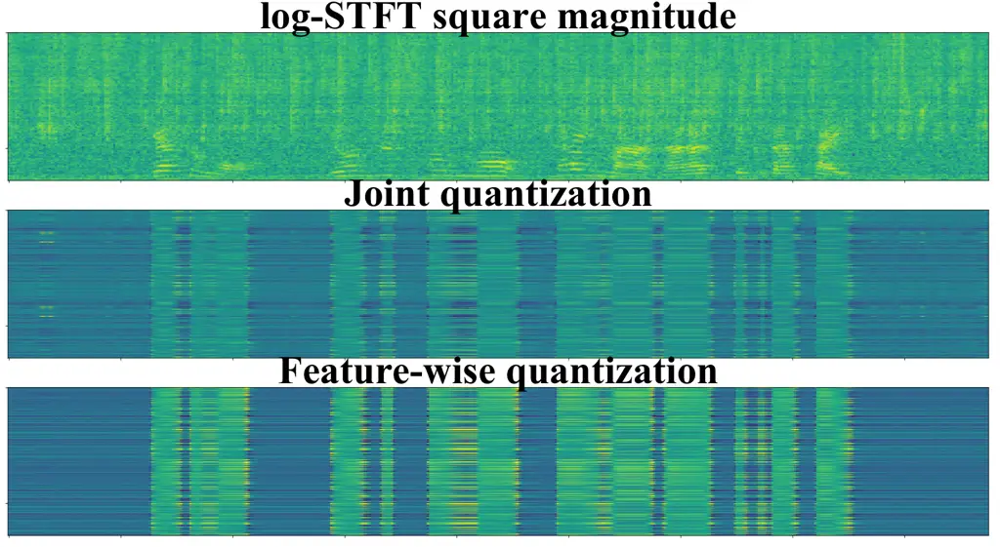

# Self-Supervised Learning for Multi-Channel Neural Transducer

Atsushi Kojima

###### Abstract

Self-supervised learning, such as with the wav2vec 2.0 framework
significantly improves the accuracy of end-to-end automatic speech
recognition (ASR). Wav2vec 2.0 has been applied to single-channel
end-to-end ASR models. In this work, we explored a self-supervised
learning method for a multi-channel end-to-end ASR model based on the
wav2vec 2.0 framework. As the multi-channel end-to-end ASR model, we
focused on a multi-channel neural transducer. In pre-training, we
compared three different methods for feature quantization to train a
multi-channel conformer audio encoder: joint quantization, feature-wise
quantization and channel-wise quantization. In fine-tuning, we trained
the multi-channel conformer–transducer. All experiments were conducted
using the far-field in-house and CHiME-4 datasets. The results of the
experiments showed that feature-wise quantization was the most effective
among the methods. We observed a 66% relative reduction in character
error rate compared with the model without any pre-training for the
far-field in-house dataset.

^(†)^(†)address: Advanced Media, Inc.^(†)^(†)email:
a-kojima@advanced-media.co.jp

Index Terms: Self-supervised learning, wav2vec 2.0, Multi-channel
end-to-end speech recognition, Neural transducer, Conformer

## 1 Introduction

Self-supervised learning significantly improves the accuracy of
end-to-end automatic speech recognition (ASR) models such as the
attention-based encoder-decoder \[1\], connectionist temporal
classification (CTC) \[2\] and neural transducers \[3\]. The most
popular framework for self-supervised learning is wav2vec 2.0 \[4\]. In
wav2vec 2.0 pre-training, the model is trained similarly to that in
masked language modeling \[5\]. In fine-tuning, the model is trained
using the ASR loss function. Wav2vec 2.0 has been mainly applied to
single-channel end-to-end ASR models \[4, 6, 7\]. In this work, we train
a multi-channel end-to-end ASR model based on the wav2vec 2.0 framework.

Multi-channel end-to-end ASR models can improve the robustness of
far-field ASR in noisy environments, because the models can capture not
only spectral information but also spatial information of the target and
interference signals captured from different microphones \[8, 9\]. In
many end-to-end multi-channel ASR architectures \[10, 11, 12, 13, 14,
15\], a multi-channel neural transducer \[14\] is promising in terms of
efficiency and accuracy.

Multi-channel neural transducers are based on neural transducers such as
Transformer–Transducer \[16, 17\] and Conformer–Transducer \[18\].
Multi-channel neural transducers can learn the contextual relationship
across channels using channel-wise and cross-channel self-attention
layers without beamforming \[19, 20, 21\]. Multi-channel neural
transducers outperform typical multi-channel end-to-end ASR models,
which are cascaded with neural beamforming \[14\].

In this work, we train a multi-channel neural transducer based on
wav2vec 2.0 pre-training. For training, we explore three quantization
methods: joint quantization, feature-wise quantization and channel-wise
quantization. We report the results of experiments using the far-field
in-house and public CHiME-4 datasets \[9\].

In the experiments, we show that feature-wise quantization has the best
performance among the quantization methods. We observe 66% and 4.2%
relative reductions in character error rate compared with the model
without any pre-training for the far-field in-house and CHiME-4
datasets, respectively.

## 2 Background

### 2.1 Multi-channel neural transducer

Figure 1: Architecture of multi-channel neural transducer in the case of
two channels.

We first describe the architecture of a multi-channel neural transducer.
Figure 1 shows an overview of a multi-channel neural transducer in the
case of two channels. Given acoustic feature $`\bm{x}`$ and previous
tokens $`\bm{y}_{u-1}`$, the multi-channel audio encoder converts
acoustic feature $`\bm{x}`$ to hidden vector $`\bm{f}`$, and the label
encoder predicts a new token $`\bm{y}_{U}`$ based on past tokens except
for a blank token. The joint network outputs vector $`J`$ using two
hidden vectors from audio and label encoders, and softmax outputs
logits.

A multi-channel audio encoder consists of channel-wise self-attention
and cross-channel self-attention layers. The channel-wise self-attention
layers convert inputs from each channel to hidden vectors independently
via multi-head attention (MHA) \[22\]. The cross-channel self-attention
layers learn the contextual relationship across channels. We convert
hidden vector $`h_{i}`$ of the $`i`$th channel from the channel-wise
self-attention layers to query $`Q_{i}`$, and the mean vector of the
hidden vectors of other channel inputs from the channel-wise
self-attention layers is converted to key $`{K_{i}}`$ and value
$`{V_{i}}`$. The MHA is calculated using $`Q_{i}`$, $`K_{i}`$ and
$`V_{i}`$. Finally, hidden vectors from the cross-channel self-attention
layers are fused by taking a simple average. For input features, a
multi-channel audio encoder obtains not only amplitude features but also
phase features, unlike a single-channel neural transducer.

A multi-channel neural transducer is trained using the recurrent neural
network–Transducer (RNN–T) loss \[3\]. Given acoustic features
$`\bm{x}`$ and label sequence $`\bm{y}`$, the neural transducer outputs
$`T\times U`$ logits. The RNN–T loss is calculated as the sum of
probabilities for all paths using a forward–backward algorithm. The
RNN–T loss function is written as

```math
\lambda_{\rm RNN-T}=-\sum_{i}\log{P(\bm{y}|{\rm x})}, \tag{1}
```

```math
P(\bm{y}|{\rm x})=\sum_{\bm{J}\in\mathcal{Z}(\bm{y},T)}P(J|{\rm x}), \tag{2}
```

where $`\mathcal{Z}(\bm{y},T)`$ is the set of all alignments of length
$`T`$ for the token sequence.

### 2.2 Self-supervised learning based on wav2vec 2.0 framework

We next describe self-supervised learning based on the wav2vec 2.0
framework. In wav2vec 2.0 pre-training, the audio encoder is trained by
minimizing the contrastive loss. Given target quantized feature
$`{\bm{q}}_{t}`$ and $`K`$ distractors (non-target quantized features),
the model must identify the true quantized feature among $`K+1`$
quantized features $`{\bm{\tilde{q}}\in\bm{Q}_{t}}`$. The contrastive
loss is calculated as

```math
\lambda=-\log{\frac{\exp(sim(\bm{f}_{t},\bm{q}_{t}))}{\sum_{\bm{\tilde{q}}\sim\bm{Q}_{t}}\exp(sim(\bm{f}_{t},\bm{\tilde{q}}_{t}))}}, \tag{3}
```

where $`\bm{f}`$ denotes hidden vectors from the masked audio encoder
and $`sim`$ is a function for calculating the cosine similarity between
two vectors:
$`sim(\bm{a},\bm{b})=\bm{a}^{T}\bm{b}/||\bm{a}||||\bm{b}||`$.

An audio encoder consists of Transformer \[22\] or Conformer \[18\]. A
quantizer consists of a quantization \[4\] or linear \[6\] layer.

## 3 Self-supervised learning for multi-channel neural transducer

For the training of the multi-channel audio encoder, we explore three
quantization methods: joint quantization, feature-wise quantization and
channel-wise quantization.

### 3.1 Joint quantization

Figure 2 shows joint quantization. In this figure, $`X^{\rm amplitude}`$
and $`X^{\rm phase}`$ are the amplitude and phase features,
respectively. $`\bm{f}`$ and $`\bm{q}`$ are the hidden vector from the
masked features and the quantized feature as in figure, respectively.
This example shows the case of two channels. In this approach, the
quantizer converts concatenated vectors
$`[{X_{1}}^{\rm amplitude};{X_{2}}^{\rm amplitude};{X_{2}}^{\rm amplitude};{X_{2}}^{\rm phase}]`$
to quantized vector $`\bm{q}`$. The quantizer consists of a single
linear layer.

Figure 2: Joint quantization in the case of two channels.

Figure 3: Feature-wise quantization.

Figure 4: Channel-wise quantization.

### 3.2 Feature-wise quantization

Figure 4 shows feature-wise quantization in the case of two channels. In
this method, the quantization module consists of amplitude, phase and
joint quantizers. The amplitude quantizer converts amplitude features
$`[{X_{1}}^{\rm amplitude};{X_{2}}^{\rm amplitude}]`$ to quantized
amplitude features $`\bm{q}^{\rm amplitude}`$. The phase quantizer
converts phase features $`[{X_{1}}^{\rm phase};{X_{2}}^{\rm phase}]`$ to
quantized phase features $`\bm{q}^{\rm phase}`$. The joint quantizer
obtains the two vectors $`[\bm{q}^{\rm amplitude};\bm{q}^{\rm phase}]`$
from the two quantizers and converts them to quantized feature
$`\bm{q}`$. All quantizers consist of linear layers.

### 3.3 Channel-wise quantization

Figure 4 shows channel-wise quantization. In this method, the
quantization module consists of channel quantizers, the attention and
the joint quantizer. The channel quantizers convert the amplitude and
phase features $`[{X_{c}}^{\rm amplitude};{X_{c}}^{\rm phase}]`$ from
each input channel to channel-wise quantized features $`{\bm{q}_{c}}`$.
To capture the contextual relationship across channels, the attention
was calculated. For instance, the attention for the first channel in the
case of two channels is calculated as

```math
{\bm{a}}_{1}={\rm Softmax}(\bm{w}^{T}{\rm Tanh}(UX_{1}+HX_{2}+\bm{b})), \tag{4}
```

where $`X_{1}=[{X_{1}}^{\rm amplitude};{X_{1}}^{\rm phase}]`$,
$`X_{2}=[{X_{2}}^{\rm amplitude};{X_{2}}^{\rm phase}]`$ and $`\bm{w}`$,
$`U`$, $`H`$ and $`\bm{b}`$ are model parameters. The attention is used
to calculate weighted quantized vector $`{\bm{q}_{c}}^{{}^{\prime}}`$.
The joint quantizer converts the weighted quantized features from each
channel quantizer to quantized vector $`\bm{q}`$.

## 4 Experiments

### 4.1 Data preparation

Far-field in-house dataset  
As the experimental dataset, we use the far-field in-house dataset,
which consists of 104.3 hours of transcribed Japanese speech. The speech
is recorded by a two-channel linear microphone array with an
inter-microphone spacing of 8 mm. The amounts of training and test data
are 102 and 2.3 hours, respectively. For pre-training and fine-tuning,
we use the training set, and for the evaluation, we use the test set.
For this dataset, we report the character error rate (CER).

CHiME-4 dataset  
We also use the CHiME-4 dataset to evaluate our proposed method. Speech
in English is recorded by six microphones. For efficient training, we
pick up the first and sixth microphone channels as input signals. In
this experiment, we use training and evaluation sets on real data. For
pre-training and fine-tuning, we use the training set. For evaluation,
we use the eval set. For this dataset, we report the word error rate
(WER) and CER.

### 4.2 Model details

We next describe the architecture of the multi-channel neural
transducer. We use eight conformer layers and a unidirectional long
short-term memory (LSTM) layer with 256 hidden nodes for the
multi-channel audio and label encoders, respectively. Table 1 shows the
parameters of the Conformer \[18\] encoder model. The parameter size of
the multi-channel audio encoder is 15.0 (M). The joint network obtains
512-dimensional vectors from audio and label encoders, and outputs
256-dimensional vector with Tanh activation. Finally, softmax outputs
logits.

| Parameter                            | Value |
| ------------------------------------ | ----- |
| Number of layers                     | 8     |
| Number of channels                   | 2     |
| Number of heads                      | 8     |
| Head dimension                       | 32    |
| Kernel size                          | 7     |
| Number of hidden nodes               | 256   |
| Position-wise feed-forward dimension | 512   |

Table 1: Multi-channel Conformer encoder architecture.

For the amplitude feature, we use the log-STFT square magnitude. For the
phase feature, we use cosine interchannel phase differences (cosIPD) and
sinIPD \[23\]. The features are extracted every 10 ms with a window size
of 25 ms from audio samples. We set the FFT size as 512.

In the wav2vec 2.0 pre-training, we train the multi-channel audio
encoder by minimizing the contrastive loss. We mask 50% of the time
steps and set the number of distractors as 100. The distractors are
uniformly sampled from other masked time steps of the same utterance.

For fine-tuning, we train the multi-channel neural transducer by
minimizing the RNN–T loss. As the baseline system, we use the
multi-channel neural transducer without any pre-training. For the
far-field in-house dataset, the model outputs 715 characters and a blank
token. For the CHiME-4 dataset, the model outputs 26 lower-case alphabet
characters, three special tokens (apostrophe, period and whitespace) and
a blank token. In addition, gradient clipping is applied with a value of
5 to avoid an exploding gradient. We apply SpecAugment \[24\] to improve
robustness. For the training of all models, we use the Transformer
learning schedule \[22\]. We also use the Adam optimizer \[25\], setting
$`{\beta}_{1}=0.9`$, $`{\beta}_{2}=0.98`$ and $`\epsilon=10`$. All
networks are implemented using Pytorch \[26\].

### 4.3 Results

#### 4.3.1 Far-field in-house dataset

| ID   | pre-training | quantization | amplitude quantizer activation | phase quantizer activation | CERR (%)     |
| ---- | ------------ | ------------ | ------------------------------ | -------------------------- | ------------ |
| exp0 | \-           | \-           | \-                             | \-                         | 0            |
| exp1 | ✓            | feature      | Swish                          | Swish                      | 58.1         |
| exp2 | ✓            | feature      | Swish                          | ReLU                       | 60.5         |
| exp3 | ✓            | joint        | \-                             | \-                         | 62.1         |
| exp4 | ✓            | feature      | Swish                          | None                       | $`{\bf 66}`$ |

Table 2: Results of feature-wise quantization for far-field in-house
dataset. Results are given as relative character error rate reduction
(CERR) \[%\]. A positive value indicates an improvement.

Table 2 shows the results of feature-wise quantization for the far-field
in-house dataset. In this experiment, we investigate the effect of the
activation function for the amplitude and phase quantizers. Compared
with the result of the model without any pre-training (exp0), we observe
an improvement for all pre-training methods (exp1, exp2, exp3, exp4). In
addition, the amount of improvement depends on the activation function
(exp1, exp2, exp4). We observe a 66% relative reduction in CER using the
quantization method employing the amplitude quantizer with Swish
activation \[27\] and the phase quantizer without any activation (exp4).
The CER of the method was lower than that for joint quantization (exp3).

| ID   | pre-training | quantization | CERR (%) |
| ---- | ------------ | ------------ | -------- |
| exp0 | \-           | \-           | 0        |
| exp3 | ✓            | joint        | 62.1     |
| exp5 | ✓            | channel      | 49.1     |

Table 3: Results of channel-wise quantization for far-field in-house
dataset. Results are given as relative character error rate reduction
(CERR) \[%\]. A positive value indicates an improvement.

Table 3 shows the results of channel-wise quantization. Compared with
the result of the model without any pre-training (exp0), the
quantization method also reduced CER (exp5). The improvement was greater
for joint quantization (exp3) than for channel-wise quantization (exp5).

#### 4.3.2 CHiME-4 dataset

Table 4 shows the results of feature-wise quantization for the CHiME-4
dataset. Compared with the result of the model without any pre-training
(expA), we observe an improvement for all pre-training methods (expB,
expC, expD, expE), the same as that for the far-field in-house dataset.
We observe a 2.4% relative reduction in WER using the quantization
method employing the amplitude quantizer with Swish activation and the
phase quantizer with Swish activation (expB). We observe a 4.2% relative
reduction in CER using the quantization method employing the amplitude
quantizer with Swish activation and the phase quantizer without any
activation (expE). Comparing the improvement of CER the for far-field
in-house dataset, the improvement of CER for the CHiME-4 dataset was
small. We concluded that this is caused by the amount of training data
in the CHiME-4 dataset being smaller than that in the far-field in-house
dataset.

| ID   | pre-training | quantization | amplitude quantizer activation | phase quantizer activation | CERR (%) | WERR (%) |
| ---- | ------------ | ------------ | ------------------------------ | -------------------------- | -------- | -------- |
| expA | \-           | \-           | \-                             | \-                         | 0        | 0        |
| expB | ✓            | feature      | Swish                          | Swish                      | 3.6      | 2.4      |
| expC | ✓            | feature      | Swish                          | ReLU                       | 2.6      | 1.7      |
| expD | ✓            | joint        | \-                             | \-                         | 3.2      | 1.4      |
| expE | ✓            | feature      | Swish                          | None                       | 4.2      | 0.1      |

Table 4: Results of feature-wise quantization for CHiME-4 dataset.
Results are given as relative character error rate reduction (CERR)
\[%\] and relative word error rate reduction (WERR) \[%\]. A positive
value indicates an improvement.

### 4.4 Analysis of hidden vectors



Figure 5: Analysis of hidden vectors after self-supervised learning.

We next analyze the hidden vectors from the multi-channel audio encoder
after pre-training. Figure 5 shows hidden vectors from multi-channel
audio encoders trained by different quantization methods for the
far-field in-house dataset. The upper figure shows the log-STFT square
magnitude. The middle figure shows the hidden vector from the
multi-channel audio encoder trained by joint quantization (exp3). The
lower figure shows the hidden vector from the multi-channel audio
encoder trained by feature-wise quantization (exp4). By comparing the
hidden vectors, we observe a clearer contrast between the speech and
noise sections for feature-wise quantization. This result suggests that
the multi-channel audio encoder trained by feature-wise quantization
learns the latent representation better than the multi-channel audio
encoder trained by joint quantization in terms of noise robustness.

## 5 Conclusion

In this work, we trained a multi-channel neural transducer based on
wav2vec 2.0 pre-training. For the training, we explored three
quantization methods: joint quantization, feature-wise quantization and
channel-wise quantization. We reported the results of experiments using
the far-field in-house and public datasets. We experimentally showed
that the feature-wise quantization method had the best performance. We
observed 66% and 4.2% relative reductions in CER compared with the model
without any pre-training for the far-field in-house and CHiME-4
datasets, respectively.

## References

- \[1\] W. Chan, N. Jaitly, Q. Le and O. Vinyals, “Listen, attend and
  spell: A neural network for large vocabulary conversational speech
  recognition,” in Proc. ICASSP, 2016.
- \[2\] A. Graves, S. Fernández, F. Gomez and J. Schmidhuber,
  “Connectionist temporal classification: Labelling unsegmented sequence
  data with recurrent neural networks,” in Proc. ICML, 2006.
- \[3\] A. Graves, “Sequence transduction with recurrent neural
  networks,” arXiv preprint arXiv:1211.3711, 2012.
- \[4\] A. Baevski, H. Zhou, A. Mohamed and M. Auli, “wav2vec 2.0: A
  framework for self-supervised learning of speech representations,”
  arXiv preprint arXiv:2006.11477, 2020.
- \[5\] J. Devlin, M.-W. Chang, K. Lee and K. Toutanova, “Bert:
  Pre-training of deep bidirectional transformers for language
  understanding,” arXiv, abs/1810.04805, 2018.
- \[6\] Y. Zhang, J. Qin, D. S. Park, W. Han, C.-C. Chiu, R.
  Pang, Q. V. Le and Y. Wu, “Pushing the limits of semi-supervised
  learning for automatic speech recognition,” arXiv preprint
  arXiv:2010.10504, 2020.
- \[7\] S. Sadhu, D. He, C.-W. Huang, S. H. Mallidi, M. Wu, A.
  Rastrow, A. Stolcke, J. Droppo and R. Maas, “Wav2vec-C: A
  self-supervised model for speech representation learning,” in Proc.
  INTERSPEECH, 2021.
- \[8\] R. Haeb-Umbach, J. Heymann, L. Drude, S. Watanabe, M. Delcroix
  and T. Nakatani, “Far-field automatic speech recognition,” Proc.
  IEEE, 2020.
- \[9\] E. Vincent, S. Watanabe, A. A. Nugraha, J. Barker and R. Marxer,
  “An analysis of environment, microphone and data simulation mismatches
  in robust speech recognition,” Computer Speech & Language, vol. 46,
  pp. 535-557, 2017.
- \[10\] T. Ochiai, S. Watanabe, T. Hori and J. R. Hershey,
  “Multichannel end-to-end speech recognition,” arXiv preprint
  arXiv:1703.04783, 2017.
- \[11\] X. Chang, W. Zhang, Y. Qian, J. Le Roux and S. Watanabe,
  “MIMO-SPEECH: End-to-end multi-channel multi-speaker speech
  recognition,” in Proc. ASRU, 2019.
- \[12\] A. S. Subramanian, X. Wang, S. Watanabe, T. Taniguchi, D. Tran
  and Y. Fujita, “An investigation of end-to-end multichannel speech
  recognition for reverberant and mismatch conditions,” arXiv preprint
  arXiv:1904.09049, 2019.
- \[13\] F. Chang, M. Radfar, A. Mouchtaris, B. King and S. Kunzmann,
  “End-to-end multi-channel Transformer for speech recognition,” in
  Proc. ICASSP, 2021.
- \[14\] F. Chang, M. Radfar, A. Mouchtaris and M. Omologo,
  “Multi-channel Transformer Transducer for speech recognition,” in
  Proc. INTERSPEECH, 2021.
- \[15\] B. Li, T. N. Sainath, R. J. Weiss, K. W. Wilson and M.
  Bacchiani, “Neural network adaptive beamforming for robust
  multichannel speech recognition,” in Proc. INTERSPEECH, 2016.
- \[16\] C. F. Yeh, J. Mahadeokar, K. Kalgaonkar, Y. Wang, D. Le, M.
  Jain, K. Schubert, C. Fuegen and M. L. Seltzer,
  “Transformer–Transducer: End-to-end speech recognition with
  self-attention,” in Proc. INTERSPEECH, 2020.
- \[17\] Q. Zhang, H. Lu, H. Sak, A. Tripathi, E. McDermott, S. Koo
  and S. Kumar, “Transformer Transducer: A streamable speech recognition
  model with Transformer encoders and RNN–T loss,” in Proc.
  INTERSPEECH, 2020.
- \[18\] A. Gulati, J. Qin, C.-C. Chiu, N. Parmar, Y. Zhang, J. Yu, W.
  Han, S. Wang, Z. Zhang, Y. Wu and R. Pang, “Conformer:
  Convolution-augmented transformer for speech recognition,”in Proc.
  INTERSPEECH, 2020.
- \[19\] J. Heymann, L. Drude and R. Haeb-Umbach, “Neural network based
  spectral mask estimation for acoustic beamforming,” in Proc.
  ICASSP, 2016.
- \[20\] H. Erdogan, J. Hershey, S. Watanabe, M. Mandel, and J. Le
  Roux, “Improved MVDR beamforming using single-channel mask prediction
  networks,” in Proc. INTERSPEECH, 2016.
- \[21\] T. Higuchi, K. Kinoshita, N. Ito, S. Karita and T. Nakatani,
  “Frame-by-frame closed-form update for mask-based adaptive MVDR
  beamforming,” in Proc. ICASSP, 2018.
- \[22\] A. Vaswani, N. Shazeer, N. Parmar, J. Uszkoreit, L.
  Jones, A. N. Gomez, L. Kaiser and I. Polosukhin, “Attention is all you
  need,” in Proc. NIPS, 2017.
- \[23\] Z. Wang, J. Le Roux and J. R. Hershey, “Multi-channel deep
  clustering: Discriminative spectral and spatial embeddings for
  speaker-independent speech separation,” in Proc. ICASSP, 2018.
- \[24\] D. S. Park, W. Chan, Y. Zhang, C. Chiu, B. Zoph, E. D. Cubuk
  and Q. V. Le, “SpecAugment: A simple data augmentation method for
  automatic speech recognition,” in Proc. INTERSPEECH, 2019.
- \[25\] D. P. Kingma and J. Ba, “Adam: A method for stochastic
  optimization,” in Proc. ICLR, 2015.
- \[26\] A. Paszke, S. Gross, F. Massa, A. Lerer, J. Bradbury, G.
  Chanan, T. Killeen, Z. Lin, N. Gimelshein, L. Antiga, A. Desmaison, A.
  Köpf, E. Yang, Z. DeVito, M. Raison, A. Tejani, S. Chilamkurthy, B.
  Steiner, L. Fang, J. Bai and S. Chintala, “PyTorch: An imperative
  style, high-performance deep learning library,” in Proc.
  NeurIPS, 2019.
- \[27\] P. Ramachandran, B. Zoph and Q. V Le, “Searching for
  activation functions,” arXiv preprint arXiv:1710.05941, 2017.
