# Approaching Deep Learning through the Spectral Dynamics of Weights

David Yunis Affiliation: Toyota Technological Institute at Chicago,
Chicago, IL, USA Correspondence to: <dyunis@ttic.edu>    Kumar Kshitij
Patel Affiliation: Toyota Technological Institute at Chicago, Chicago,
IL, USA    Samuel Wheeler Affiliation: Argonne National Laboratory,
Lemont, IL, USA    Pedro Savarese Affiliation: Toyota Technological
Institute at Chicago, Chicago, IL, USA    Gal Vardi
Affiliation: Weizmann Institute of Science, Israel, work done primarily
at TTIC    Karen Livescu Affiliation: Toyota Technological Institute at
Chicago, Chicago, IL, USA    Michael Maire Affiliation: Department of
Computer Science, University of Chicago, Chicago, IL, USA    Matthew
R. Walter Affiliation: Toyota Technological Institute at Chicago,
Chicago, IL, USA

###### Abstract

We propose an empirical approach centered on the spectral dynamics of
weights—the behavior of singular values and vectors during
optimization—to unify and clarify several phenomena in deep learning. We
identify a consistent bias in optimization across various experiments,
from small-scale “grokking” to large-scale tasks like image
classification with ConvNets, image generation with UNets, speech
recognition with LSTMs, and language modeling with Transformers. We also
demonstrate that weight decay enhances this bias beyond its role as a
norm regularizer, even in practical systems. Moreover, we show that
these spectral dynamics distinguish memorizing networks from
generalizing ones, offering a novel perspective on this longstanding
conundrum. Additionally, we leverage spectral dynamics to explore the
emergence of well-performing sparse subnetworks (lottery tickets) and
the structure of the loss surface through linear mode connectivity. Our
findings suggest that spectral dynamics provide a coherent framework to
better understand the behavior of neural networks across diverse
settings.

###### Keywords: 

Machine Learning, ICML

## 1 Introduction

Interest in neural networks has exploded in the past decade.
Capabilities are rapidly improving, and deployment is ever-increasing.
Yet, although issues with these technologies now have social
repercussions (Bender et al., 2021; Bommasani et al., 2021), many
fundamental questions regarding their behavior remain unanswered.

(a) Schematic


(b) SVs

Figure 1: Left: Schematic for the spectral dynamics of a weight matrix.
As training proceeds top singular vectors become stable and top singular
values grow disproportionately large. Right: Singular value evolution
for a single matrix in a Transformer, where each line is a single
singular value and color represents rank. We see a disproportionate
trend where large singular values grow larger faster. We explore these
spectral dynamics of weights and connect them to generalization,
regularization, and seemingly unrelated phenomena like linear mode
connectivity.

For instance, despite extensive research, we still lack a complete
understanding of the implicit biases (Neyshabur et al., 2014) of neural
networks trained via stochastic optimization. Even basic questions
regarding the role of regularization like weight decay (Hanson & Pratt,
1988; Krogh & Hertz, 1991; Zhang et al., 2018a) have only partial
answers (Van Laarhoven, 2017; Andriushchenko et al., 2023; Yaras et al.,
2023b). Perhaps most vexing, we lack a complete explanation for how
neural networks generalize, despite having the capacity to perfectly
memorize the training data (Zhang et al., 2021). Such an explanation may
allow us to design better algorithms, however a lack of understanding
makes the deployment of neural networks vulnerable to uninterpretable
errors across fields (Szegedy et al., 2013; Ilyas et al., 2019;
Hendrycks et al., 2021; Zou et al., 2023).

Although theoretical explanations have been put forward to make analysis
tractable, these studies often rely on special settings like deep linear
networks (Arora et al., 2018; Arora et al., 2019) or infinite-width
systems (Jacot et al., 2018), and arguments may rely on unsubstantiated
or impractical assumptions like near zero initialization. On the
empirical side, a growing body of work in interpretability has attempted
to reverse-engineer neural networks (Rahaman et al., 2019; Barak et al.,
2022; Nanda et al., 2023), but given the difficulty of the tasks, the
systems of interest have been very small-scale, and the methodology for
analysis quite bespoke and difficult to scale. A third category of work
aims at understanding empirical behavior from a higher level (Zhang
et al., 2021; Huh et al., 2022; Yu & Wu, 2023), but while these works
often study larger-scale systems, they often focus on more abstract
objects like the gram matrix (Huh et al., 2022) or NTK (Fort et al.,
2020), and thus do not have the granularity and predictive power of the
previous two categories.

To bridge these gaps, we propose a task-agnostic, unifying perspective
of many disparate phenomena in deep learning across many different
practical tasks and architectures, including image classification with
ConvNets, image generation with UNets, speech recognition with LSTMs and
language modeling with Transformers. Through extensive experiments, we
examine the dynamics of singular values and singular vectors of weight
matrices and the spectral dynamics of weights. We show that such
dynamics underlie many distinct phenomena and appear intimately tied to
generalization. We are motivated to study these dynamics specifically as
optimization is the fundamental process driving deep learning (Nagarajan
& Kolter, 2019; Zhang et al., 2021), the matrix parameters form the core
identity of any neural network, and the singular value decomposition is
a fundamental way to view any matrix. We detail our specific
contributions in the following paragraphs.

As a test bed for understanding generalization, Power et al. (2022)
introduce the “grokking” phenomenon, where a small-scale model initially
minimizes the training loss but performs poorly on validation data, then
with much more training suddenly minimizes the validation loss. In
particular, Nanda et al. (2023) showed that in simple modular arithmetic
tasks, the specific solution learned by optimization could be
reverse-engineered from the weight matrices. Although this description
is precise, in Section 3, we notice a task-agnostic view of grokking,
observing that the drop in validation loss during grokking coincides
with the simultaneous discovery of low-rank solutions across all weight
matrices in the network. The connection between rank and generalization
might intuitively be through Occam’s Razor. Furthermore, echoing
existing works (Lyu et al., 2023; Liu et al., 2023), we find that weight
decay clearly affects grokking and rank minimization: neither behavior
occurs as strongly without it. Having said that, we demonstrate that
increasing the training data can partially compensate for the absence of
weight decay in terms of generalization and rank minimization, and in
all cases, we see a correlation between low-rank matrices and
generalization. Thus, we find that examining spectral dynamics provides
a task-agnostic view of grokking.

Though this suggests a connection between rank and generalization,
grokking is typically studied on synthetic tasks, very small-scale
models like single-layer Transformers or small MLPs, and requires very
particular hyperparameter settings (Power et al., 2022; Nanda et al.,
2023; Gromov, 2023; Kumar et al., 2023). If our perspective is to be
useful, it needs to scale to larger systems. Thus, we turn to common
empirical tasks drawn from the literature like image classification,
image generation, speech recognition and language modeling as well as
varied and larger networks like VGG (Simonyan & Zisserman, 2014),
UNet (Ronneberger et al., 2015), LSTM (Hochreiter & Schmidhuber, 1997b)
and Transformers (Vaswani et al., 2017).

In Section 4, we demonstrate that the spectral dynamics are biased
toward effective rank minimization across various practical neural
networks in complex settings. Although this behavior echoes theoretical
predictions in the deep linear setting, we find that the behavior of
networks disagrees with a common theoretical assumption about low-rank
dynamics: alignment of singular vectors in consecutive layers (Saxe
et al., 2014; Arora et al., 2018; Arora et al., 2019; Milanesi et al.,
2021). Thus, the rank minimization mechanism may differ from what the
theory describes. It is notable too that our hyperparameter settings are
drawn from existing literature, thus the trend toward rank minimization
coincides with well-generalizing networks across settings.

Still, in these more practical settings, we do not see such an obvious
rank minimization as in grokking, nor is there a sudden transition from
memorization to generalization. One particularly notable ingredient for
grokking was a very high level of weight decay. Weight decay has a long
history as a regularizer explicitly penalizing parameter norm, which can
be used for norm-based generalization bounds (Bartlett, 1996), but these
bounds do not seem to explain the success of practical
systems (Nagarajan & Kolter, 2019; Jiang et al., 2019). Recently, others
have suggested an implicit effect of weight decay on parameter rank in
theoretical or small-scale empirical studies (Galanti et al., 2022;
Timor et al., 2023) which may be connected to generalization (Razin &
Cohen, 2020). As such, we explore this effect of weight decay in
practical settings.

In Section 5, we empirically connect rank minimization to weight decay,
showing that weight decay promotes rank minimization across
architectures and tasks. In addition, in some cases it also appears to
promote singular vector alignment in consecutive weights despite the
nonlinearities between layers, which indicates further compression of
the model. Although weight decay explicitly penalizes norm, studying
spectral dynamics allows us to observe the implicit effect on rank. Such
an effect can help in understanding generalization as norm
regularization is insufficient.

Given the suggestive connection between rank and generalization, we turn
to the classic memorization experiments of Zhang et al. (2021). Zhang
et al. (2021) demonstrated that even small networks can memorize random
labels. Hence, any arguments about generalization need to take into
account the structure of the data and the optimization process. In
Section 6, we show that training with random labels leads to high-rank
solutions, while rank with true labels is much lower. We also find that
while random labels do not align consecutive layers, true labels do,
which is surprising given the non-linearities between layers. Through
spectral dynamics, we see a clear difference between the optimization of
generalizing and memorizing networks, which provides a foothold in the
climb toward better theoretical understanding.

Our results suggest that viewing neural networks through the lens of
spectral dynamics can shed light on several generalization-related
phenomena, but we suspect there are broader connections. In the
literature, many curious and unexplained phenomena regarding neural
networks exist. We take two as case studies. First, the lottery ticket
hypothesis (LTH) (Frankle & Carbin, 2018), which has found the existence
of sparse sub-networks with similar performance. Such a phenomenon
provides evidence that, despite ever-increasing parameter counts and
energy costs, efficient smaller networks already exist. Understanding
the source of such efficiency may help us alleviate deployment costs.
Second, linear mode connectivity (LMC) (Nagarajan & Kolter, 2019;
Frankle et al., 2020; Neyshabur et al., 2020), which finds that models
sharing a portion of the optimization trajectory can be averaged
together in weight-space to yield a stronger model (Wortsman et al.,
2022; Ramesh et al., 2022). This phenomenon indicates that, after some
training, the loss surface is quite convex in a subspace, even though
the optimization problem is theoretically extremely nonconvex. As any
finetuning from pre-trained models stays in this convex space (Neyshabur
et al., 2020; Li et al., 2022; Sadrtdinov et al., 2023), an explanation
for what underlies model-averaging would help to clarify the role of
pretraining, would shed light on the commonly-used low-rank
adaptation (Hu et al., 2021), and could lead to better optimization.

In Section 7, we find that global magnitude pruning, a standard
procedure for finding lottery tickets, preserves top singular vectors
and acts like a low-rank pruning. We also see that the ability to
interpolate between models in LMC strongly correlates with sharing top
singular vectors. With these results, we note that the two phenomena can
be seen as aspects of the spectral dynamics of weights and bring them
under the umbrella of prior sections.

To summarize the discussion above, by studying the spectral dynamics of
weights, we find:

- •
  Grokking is intimately linked to rank minimization;
- •
  Rank minimization is a general phenomenon in more complex tasks;
- •
  Weight decay acts implicitly as a low-rank regularizer;
- •
  Generalizing solutions have a lower rank than memorizing ones; and
- •
  Top singular vectors are preserved when performing magnitude pruning
  while linearly interpolating between connected modes.

All of these phenomena and effects have previously been studied in
isolation to varying degrees, but by approaching deep learning through
spectral dynamics, we aim at a common language for neural networks. Code
for all experiments is released at
[https://github.com/dyunis/spectral_dynamics](https://github.com/dyunis/spectral_dynamics).

## 2 Related Work

### 2.1 Grokking

Power et al. (2022) first noticed a surprising phenomenon they called
“grokking” where models quickly fit the training data on toy tasks, then
after a long period of training, very quickly generalize on the
validation data. Later, others found that this phenomenon can occur in a
relaxed fashion (Thilak et al., 2022) on very simple models and
different datasets (Liu et al., 2022; Gromov, 2023; Kumar et al., 2023;
Xu et al., 2023) and that weight decay seems critical to cause it (Lyu
et al., 2023; Liu et al., 2023; Tan & Huang, 2023). Some posit a
transition from the kernel (Jacot et al., 2018) to rich (Atanasov
et al., 2023) regime explains grokking (Kumar et al., 2023; Mohamadi
et al., 2023). There is also empirical evidence for a connection between
double descent and grokking (Davies et al., 2022) the discovery of a
sparse solution (Merrill et al., 2023), the simplification of decision
boundaries (Humayun et al., 2024) and the leading indicator of loss
oscillation (Thilak et al., 2022; Notsawo Jr et al., 2023). None of
these works have explicitly examined the connection with rank, which we
do in Section 3, and provides a common framework through which to view
many of these results.

### 2.2 Singular Value Dynamics

Prior work on deep linear networks (Arora et al., 2019; Milanesi et al., 2021) suggests that rank minimization may describe implicit
regularization in deep matrix factorization better than simple matrix
norms. See (Arora et al., 2018) (Appendix A) for a detailed argument.
However, a critical assumption used in these works is “balanced
initialization.” This means that for consecutive matrices $`W_{i}`$ and
$`W_{i+1}`$ in the product matrix $`\prod_{j}W_{j}`$, we have
$`W^{\top}_{i+1}W_{i+1}=W_{i}W_{i}^{\top}`$ at initialization.
Decomposing these matrices with SVDs and leveraging orthogonality, this
simplifies to
$`V_{i+1}\Sigma_{i+1}^{2}V_{i+1}^{\top}=U_{i}\Sigma_{i}^{2}U_{i}^{\top}`$
where $`U_{i}`$ and $`V_{i+1}`$ are orthogonal matrices. Since these are
orthogonal decompositions of the same matrix, their diagonals must be
equivalent, allowing for the permutation of elements with the same
value. This leads to $`U_{i}=V_{i+1}O`$ up to signs, where $`O`$ is a
block diagonal permutation matrix that may permute the rows of
equivalent diagonal elements. Notably, if all diagonal elements are
distinct and $`U_{i}`$ and $`V_{i+1}`$ are square matrices, then
$`U_{i}=V_{i+1}`$ up to signs.

Under the balanced initialization assumption, all product matrices will
be aligned. Consequently, the product of the diagonals will evolve in a
closed-form manner, with larger singular values growing faster than
smaller ones. As shown by (Arora et al., 2019), this translates to
rank-minimizing behavior with increasing depth in the matrix products.
This formula is also empirically validated for linear matrix
factorization problems. Similar results have been derived for tensor
products and other structured settings (Saxe et al., 2014; Yaras et al.,
2023a). More generally, (Ji & Telgarsky, 2019) show that for deep linear
networks with infinite training alignment between layers will happen. In
Section 4, we explore how these conclusions and assumptions hold for
much larger, practical neural networks that are far from linear.

### 2.3 Low-Rank Properties

Another line of research focuses on more general low-rank biases. Early
work explored norms as an implicit bias (Gunasekar et al., 2017).
Theoretical analyses reveal that norms or closed-form functions of
weights might be insufficient to explain implicit regularization, but
they do not necessarily contradict the possibility of rank
minimization (Razin & Cohen, 2020; Vardi & Shamir, 2021). Numerous
studies investigate low-rank biases in various matrices, including the
Jacobian (Pennington et al., 2018), weight matrices (Le & Jegelka, 2021;
Martin & Mahoney, 2020; Martin & Mahoney, 2021; Frei et al., 2022; Ongie
& Willett, 2022), Gram matrix (Huh et al., 2022), and features (Yu & Wu,
2023; Feng et al., 2022). Additionally, research suggests that dynamics
influence the decay of rank (Li et al., 2020; Chen et al., 2023; Wang &
Jacot, 2023). Some works establish connections between weight decay and
rank minimization in idealized settings (Ziyin et al., 2022; Galanti
et al., 2022; Zangrando et al., 2024; Ergen & Pilanci, 2023; Parhi &
Nowak, 2023; Shenouda et al., 2023). We are particularly interested in
how far these connections extend in practice. In Section 5, we present
empirical evidence that sometimes disagrees with, but also expands,
arguments from theory and small-scale systems to much larger ones.

## 3 Grokking and Rank Minimization

Motivated by theoretical work that proposes connections between rank and
generalization (Razin & Cohen, 2020) weight decay and rank (Galanti
et al., 2022; Timor et al., 2023; Yaras et al., 2023b; Zangrando et al.,
2024), and the importance of weight decay for grokking (Power et al.,
2022; Lyu et al., 2023; Liu et al., 2023) in simple settings, we
evaluate the potential connection between rank and grokking in neural
networks. Examining grokking through the lens of rank (and more
generally spectral dynamics) offers a complementary perspective on
grokking with other descriptions such as fourier decomposition (Nanda
et al., 2023), the simplification of linear decision boundaries (Humayun
et al., 2024), the connection to double descent (Davies et al., 2022),
and the discovery of a sparse solution (Merrill et al., 2023).

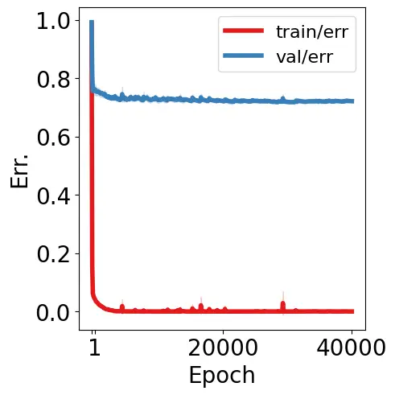

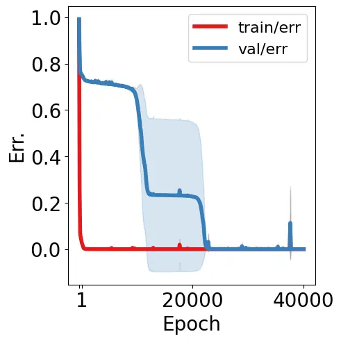

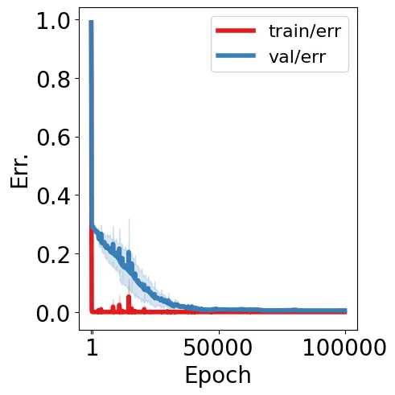

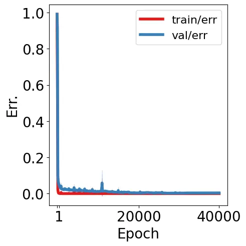

(a) Error

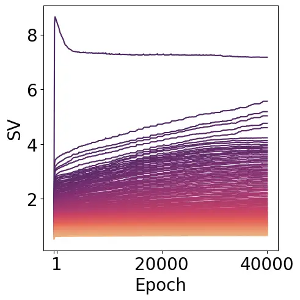

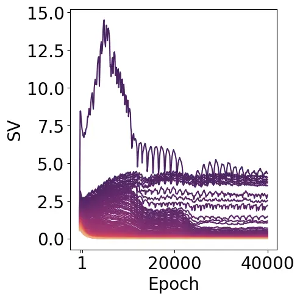

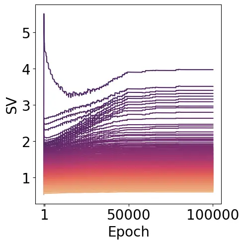

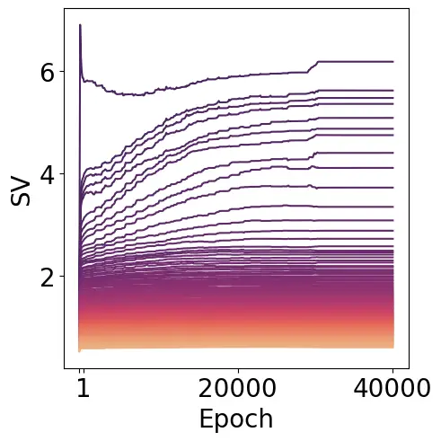

(b) SV Evolution

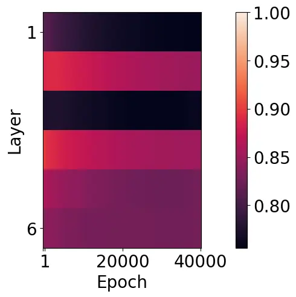

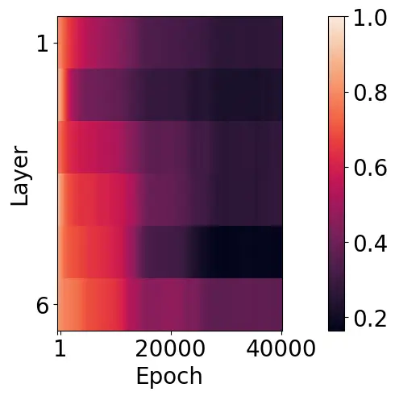

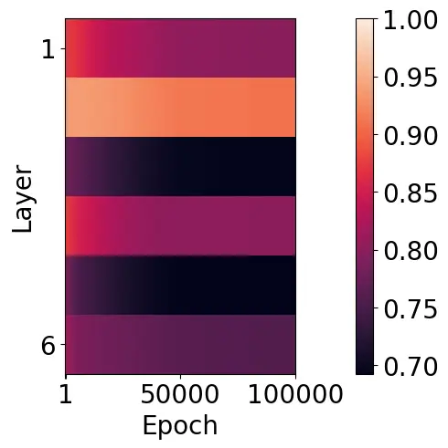

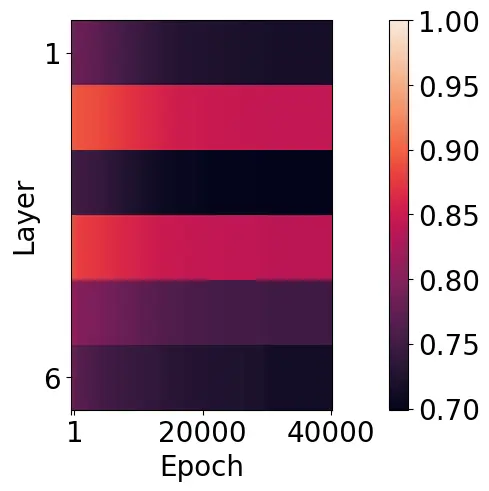

(c) Effective Rank

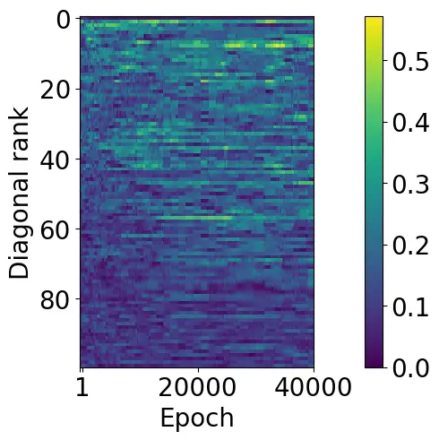

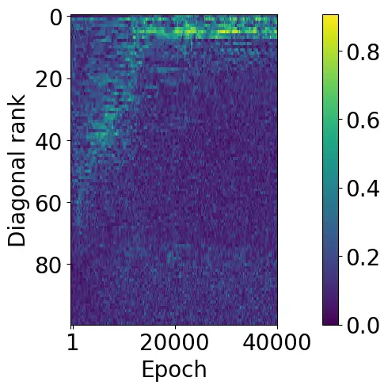

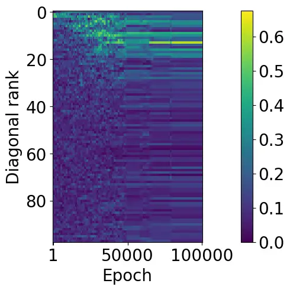

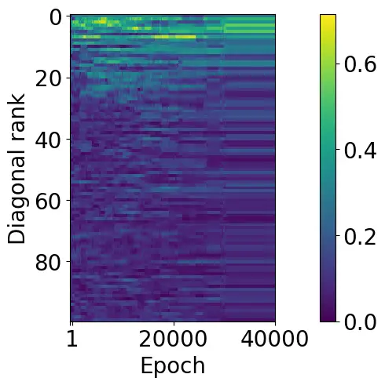

(d) Alignment

Figure 2: Grokking and Spectral Dynamics. Top row: 30% data and no
weight decay. 2nd row: 30% data and weight decay 1.0 (grokking), using
hyperparameters from Nanda et al. (2023). 3rd row: 70% data with no
weight decay (slingshot), using hyperparameters from Thilak et al.
(2022). Bottom row: 90% data and no weight decay. 2nd column: Singular
value evolution is visualized for the first attention parameter, where
each line represents a single singular value and the color represents
the rank. 4th column: Alignment (Eqn. 3) between the embedding and the
first attention parameter is also visualized, where the y-axis
corresponds to index $`i`$ of the diagonal. 3rd column: One can see that
grokking co-occurs with low-rank weights (effective rank is Eqn. 1). In
addition, there is an alignment that begins early in training that
evolves up the diagonal. Without weight decay and with less data,
neither grokking nor the other phenomena occur during the entire
training budget, but using more data, even without weight decay, leads
to low-rank solutions from the beginning of training. The slingshot case
follows a similar trend, though the validation loss is gradually fit.
Across cases with good generalization, parameters are lower rank, and
alignment is also more prevalent in the top ranks.

We largely follow the setting of Nanda et al. (2023), optimizing a
single-layer Transformer for modular addition (details in Appendix A).
Inspired by work in the deep linear case (Saxe et al., 2014; Arora
et al., 2019; Milanesi et al., 2021; Yaras et al., 2023b), we track the
evolution of singular values for individual weight matrices. To gain a
high-level overview of all parameter evolutions, we compute the
(normalized) effective rank of a matrix $`W`$ (Roy & Vetterli, 2007)
with rank $`R`$ as

```math
\displaystyle\text{EffRank}(W):=-\sum_{i=1}^{R}\frac{\sigma_{i}}{\sum_{j}\sigma_{j}}\log\frac{\sigma_{i}}{\sum_{j}\sigma_{j}}\kern 5.0pt, \tag{1}
```

```math
\displaystyle\text{NormEffRank}(W):=\frac{\text{EffRank}(W)}{R}\kern 5.0pt, \tag{2}
```

where $`\sigma_{i}`$’s are the singular values of matrix $`W`$ and
$`\text{EffRank}(W)`$ is the entropy of the normalized singular value
distribution. As the probability mass concentrates, the effective rank
decreases. We plot $`\text{NormEffRank}(W)`$ to compare across layers
and time.

In addition, inspired by the assumptions of balancedness made by prior
work (Arora et al., 2018; Arora et al., 2019), we examine the alignment
of consecutive weight matrices in the Transformer. To examine and
quantify this alignment between consecutive matrices in a network at
training time $`t`$, i.e.,

```math
\displaystyle W_{i} \displaystyle=\sum_{j=1}^{R}\sigma_{j}(t)u_{j}(t)v_{j}(t)^{\top}\kern 5.0pt,
```

```math
\displaystyle W_{i+1} \displaystyle=\sum_{k=1}^{R}\sigma^{\prime}_{k}(t)u^{\prime}_{k}(t){v^{\prime}_{k}}(t)^{\top}\kern 5.0pt,
```

we compute,

```math
A(t)_{jk}=\lvert\langle u_{j}(t),v^{\prime}_{k}(t)\rangle\rvert, \tag{3}
```

where the absolute value is taken to ignore sign flips in the SVD
computation. We then plot the diagonal of this matrix
$`A(t)_{ii}~\forall~i\leq 100`$ over time. For exact details on how
alignment is computed for different architectures and layers that are
more complex than the fully connected case, please see Appendix A.

In Figure 2, we see a tight alignment: the sudden drop in validation
loss coincides precisely with the onset of low-rank behavior in the
singular values. Examining inter-layer alignment during training, we
observe that the final low-rank solution gradually emerges from the
model’s middle ranks. Conversely, the grokking phenomenon is absent
without weight decay, and no low-rank solution seems to develop. We also
replicate the setting of Thilak et al. (2022) who show a form of
grokking without weight decay, but when plotted on a linear-scale x-axis
the generalization appears much less sudden than the setting with weight
decay. Additionally, when using 90% of the data and no weight decay,
generalization still coincides with effective rank minimization. The
familiar reader will note that Nanda et al. (2023) previously showed
that the particular solution found in modular addition is a low rank
fourier decomposition, so our observations on low rank weights will
directly follow. While such a description for modular addition is
impressively precise, it may be difficult to obtain for more complex
tasks. In following sections we argue that rank minimization is a
perspective that can apply in more complex settings when one does not
know what to look for in the weights, and it may even be possible to
eventually interpret the neural network via the top ranks (Praggastis
et al., 2022).

We also want to highlight a complication between norm and generalization
that our results indicate, in dialogue with Liu et al. (2023). One can
see that without weight decay but with 90% of the data, the generalizing
solution that is discovered has many singular values larger than 1, and
the maximum singular value is also larger than that of the grokked
solution, for which most singular values are near zero. Recall the norm
of matrix $`W`$ is given by
$`\lVert W\rVert_{2}=\sqrt{\sum_{i}\sigma_{i}^{2}}`$ where
$`\sigma_{i}`$ are the singular values. Thus, the large-data solution
has a much higher norm than the grokked solution. Still, both settings
generalize with a certain low-rank behavior. The confounding factor is
that, with high weight decay, the smaller singular values disappear,
while without, they do not. We currently lack a precise understanding of
how low-rank behavior directly relates to generalization, and it might
not always hold true – high-rank solutions might also generalize.
Nonetheless, from Occam’s Razor’s perspective, a low-rank solution is
conceptually “simpler” due to its lower dimensionality, making for a
compelling explanation.

## 4 Spectral Dynamics Across Tasks

Inspired by the results on grokking and prior work on deep linear
networks, which studies the evolution of the SVD of the weight
matrices (Saxe et al., 2014; Arora et al., 2018; Arora et al., 2019;
Milanesi et al., 2021; Yaras et al., 2023a), we apply the same analysis
to larger, more practical systems. We show that the trends we saw in the
analysis of grokking mostly hold true across networks and tasks at a
much larger scale, even though our findings do occasionally deviate from
theoretical predictions.

### 4.1 Methodology

Our experiments aim to examine reasonably sized neural networks across a
variety of tasks. We select models and tasks that are representative of
current applications. Specifically, we focus on:

- •
  Image classification with CNNs (VGG-16 (Simonyan & Zisserman, 2014))
  on CIFAR10 (Krizhevsky, 2009);
- •
  Image generation through diffusion with UNets (Ronneberger et al., 2015) on MNIST (LeCun, 1998);
- •
  Speech recognition with LSTMs (Hochreiter & Schmidhuber, 1997b) on
  LibriSpeech (Panayotov et al., 2015); and
- •
  Language modeling with Transformers (Vaswani et al., 2017) on
  Wikitext-103 (Merity et al., 2016).

Training hundreds of runs for each of the above experiments is
computationally expensive, limiting the scale of models we can explore.
We primarily adopt hyperparameters from existing literature, with minor
modifications for simplicity. This ensures that any correlations
observed are likely a reflection of common practices, not introduced
bias on our part. We hope that the broad scope of these experiments will
allow for a more general perspective on neural network optimization.

The primary evidence in this section comes from computing the SVDs of
weight matrices within the models. Consequently, we disregard 1D bias
and normalization parameters in our analysis. However, previous research
suggests that in some cases these parameters are not crucial for
performance (Zhang et al., 2018b; Mohan et al., 2019; Karras et al.,
2023). Due to the large number of matrices in these models, we present
plots of individual layers’ matrix parameters and statistics summarizing
behavior across layers for conciseness of presentation. Hundreds of
thousands of plots were generated for this study, making it impossible
to include them all. Full experimental details, including
hyperparameters, are available in Appendix A, where we take
hyperparameters from existing settings in the literature.

### 4.2 Effective Rank Minimization

Building on theoretical (Saxe et al., 2014; Arora et al., 2019; Milanesi
et al., 2021; Boix-Adserà et al., 2023; Yaras et al., 2023a) and
empirical (Dittmer et al., 2019; Martin & Mahoney, 2020; Martin &
Mahoney, 2021; Boix-Adserà et al., 2023) findings, we investigate
effective rank minimization across parameters in larger models and on a
more diverse variety of tasks. Figure 3 reveals a consistent trend: the
effective rank of network parameters generally decreases throughout
training, regardless of the specific parameter or network architecture.
This suggests a progressive “simplification” of the network as training
progresses, and echoes our previous findings in the high-data regime on
modular addition.

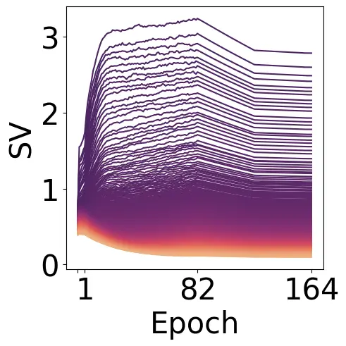

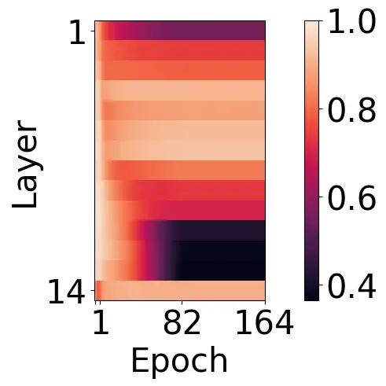

(a) VGG


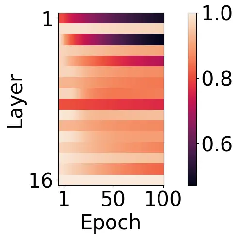

(b) UNet

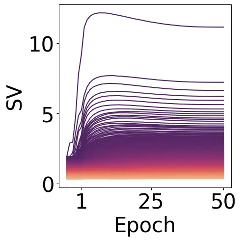

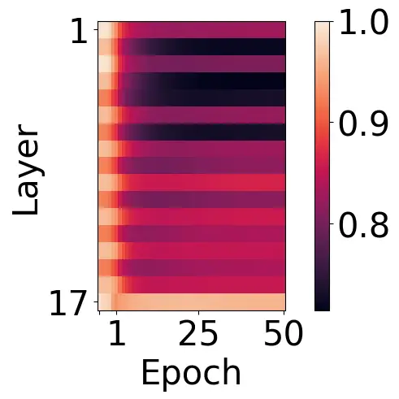

(c) LSTM

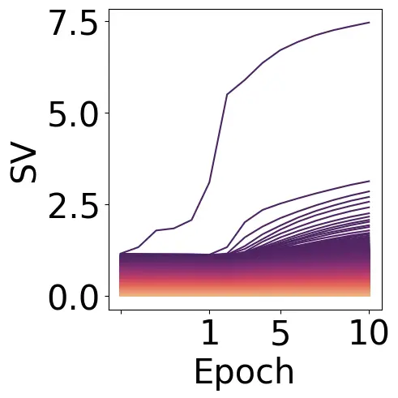

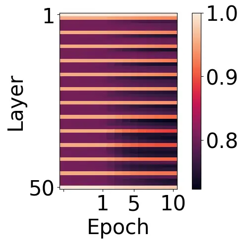

(d) Transformer

Figure 3: Top row: Singular value evolution for a single matrix in the
middle of each model. Each line represents a singular value, whereas
color represents rank. Notice the unequal evolution where top singular
values grow at a disproportionate rate. Bottom row: Normalized effective
rank (Eqn. 1) evolution visualized in color for different matrices
across architectures and time. As we move down the $`y`$-axis, the depth
of the parameters in the model increases, while the $`x`$-axis tracks
training time. Notice decreasing effective rank across nearly all
parameters, though the magnitude differs across layers. The block-like
patterns in the VGG case are likely due to different channel dimension
sizes. The banding in the UNet, LSTM, and Transformer cases is due to
the differences between convolutional and linear layers, residual block
connections, and attention and fully connected layers, respectively. The
sharp transition midway through training in the VGG case is likely due
to a 10$`\times`$ learning rate decay.

We further conduct a singular-value pruning experiment to explore the
relationship between low-rank behavior and model performance. We prune
either the top or bottom half of the singular values for each weight
matrix in the network and then evaluate the pruned model at each
training step. Intuitively, we expect the top singular values to capture
the most critical information for the network’s function. Figure 4
confirms this hypothesis, demonstrating that the pruned parameters,
without further training, can closely approximate the full model’s
performance. This may not have been the case. In particular,
simultaneously pruning lower components across all layers may lead to
losing some critical signal that must be passed between layers, or the
large number of small magnitude singular values may provide some
important noising effect, thus empirical confirmation is necessary.
Another way to argue this is that, though each individual matrix is
well-approximated in euclidean space by its top ranks, it is unclear the
total effect on the neural network function from pruning these matrices
simultaneously. We will rely in later sections on this observation that
large singular values are more important to the function of the network.

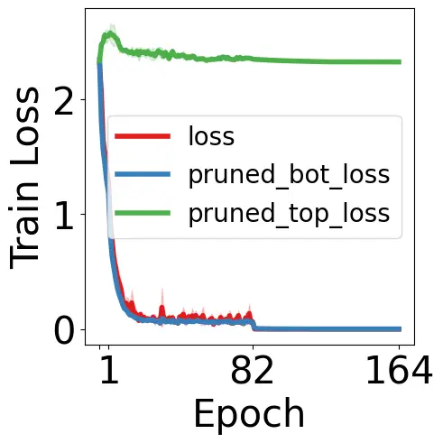

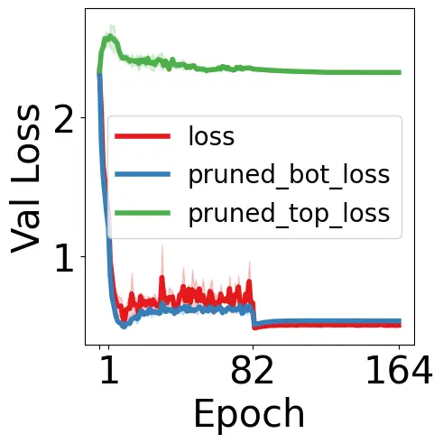

(a) VGG

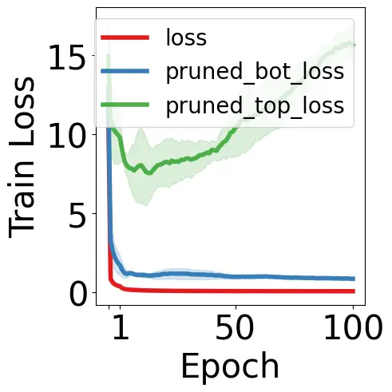

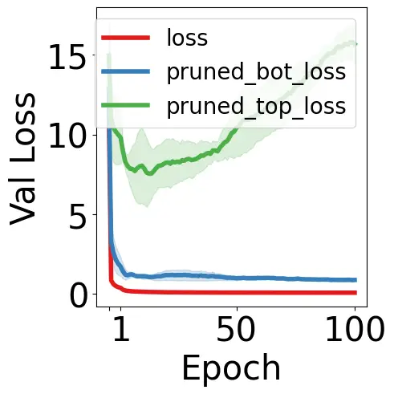

(b) UNet

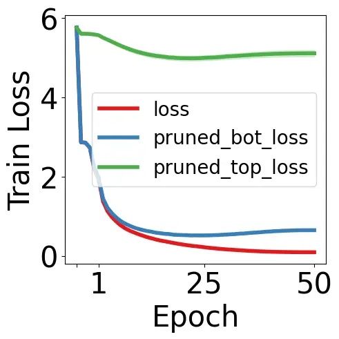

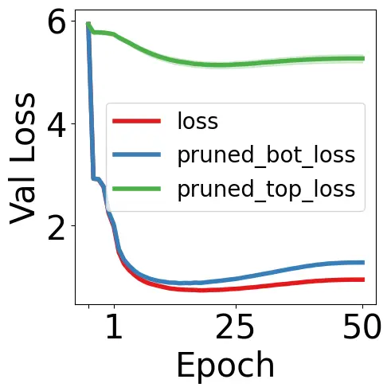

(c) LSTM

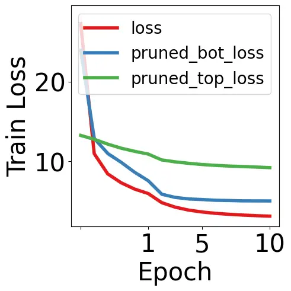

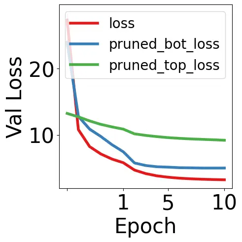

(d) Transformer

Figure 4: Top row: Training losses for all tasks. Bottom row: Validation
losses for all tasks. Red is the full model. Blue is post-training
pruning the bottom half of the SVD for every matrix in the model that is
not the final layer. Green is post-training pruning the top half of the
SVD. Notice that for all models, keeping the top half of the SVD is
close to the full model performance, supporting the idea that the top
directions provide a better approximation to the function.

### 4.3 Alignment of Singular Vectors Between Layers

Similar to the analysis of grokking, we investigate the alignment
between consecutive layers in the larger neural networks considered in
this section. We not only employ the alignment matrix defined in Eqn. 3
but also derive and plot a scalar measure for alignment based on the top
diagonal entries:

```math
a(t)=\frac{1}{10}\sum_{i=1}^{10}A(t)_{ii} \tag{4}
```

For specific details on calculating this measure in diverse
architectures and complex layers (beyond fully connected layers), please
refer to Appendix A.

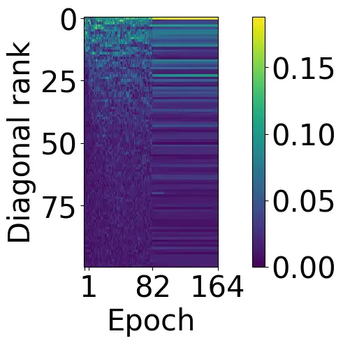

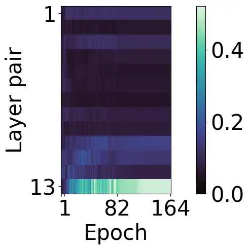

(a) VGG


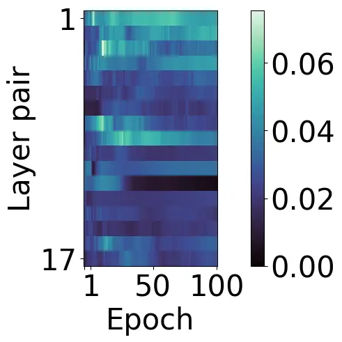

(b) UNet

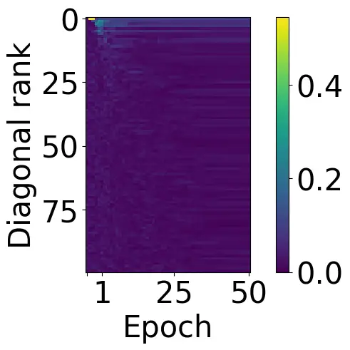

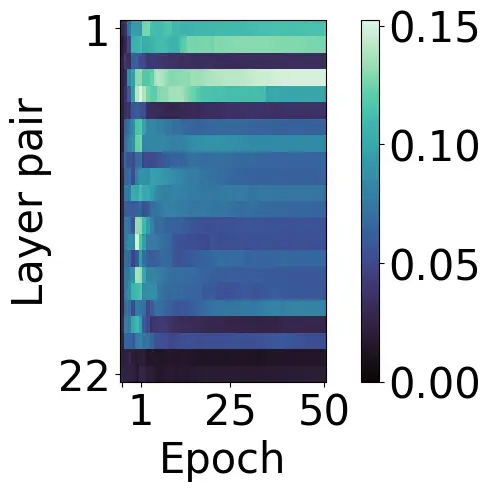

(c) LSTM

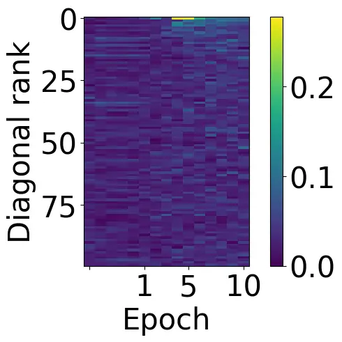

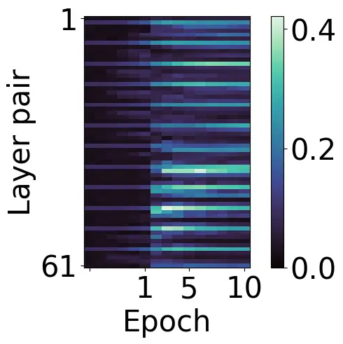

(d) Transformer

Figure 5: Neighboring layer alignment of singular vectors. Top row: The
diagonal of the alignment matrix $`A(t)_{ii}`$ (Eqn. 3) vs. training
time for a single pair of matrices in the middle of each model. We see a
small amount of alignment in the top ranks between layers shortly after
training begins, but this becomes more diffuse over time. Bottom row:
Alignment metric (Eqn. 4) for pairs of matrices for depth vs. training
time. It is hard to make out a global trend across models, though the
LSTM shows a weak signal around Epoch 1 when the initial alignment
occurs, and the Transformer case has a banding pattern with depth due to
alignment between the query and key matrices that have no nonlinearity
in between.

Figure 5 reveals a key finding: the theoretical assumption of balanced
initialization, which posits aligned singular value decompositions
(SVDs) between weight matrices (Arora et al., 2018; Saxe et al., 2014),
does not hold true at the start of training in these larger networks.
Additionally, unlike the linear case discussed in Du et al. (2018), the
alignment does not appear to remain static throughout training. However,
a weak signal of alignment in the top ranks develops. This trend is
somewhat reminiscent of the theoretical result provided by Mulayoff &
Michaeli (2020) for linear networks under the assumption of whitened
input data. Still, the weakness of the observed signal means that
existing theoretical models do not fully capture the complexities of
real-world neural network training.

## 5 The Effect of Weight Decay

In light of the previously observed evolution of singular values, we
investigate a proposed effect of weight decay. Though weight decay
explicitly penalizes the norm of weights, there is evidence that
complicates the connection between norm and generalization for neural
networks (Razin & Cohen, 2020; Andriushchenko et al., 2023), meaning we
do not have a full understanding as to why weight decay may be useful.
Alternatively, some theoretical (Boix-Adserà et al., 2023; Razin &
Cohen, 2020; Yaras et al., 2023a; Timor et al., 2023; Ongie & Willett,
2022; Galanti et al., 2022; Zangrando et al., 2024) and empirical
works (Galanti et al., 2022; Boix-Adserà et al., 2023) propose a
connection with the rank of matrices in constrained settings. Still, a
comprehensive connection to larger empirical networks has not yet been
demonstrated.

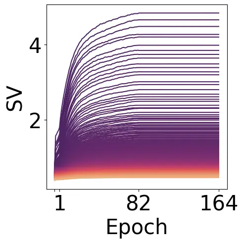

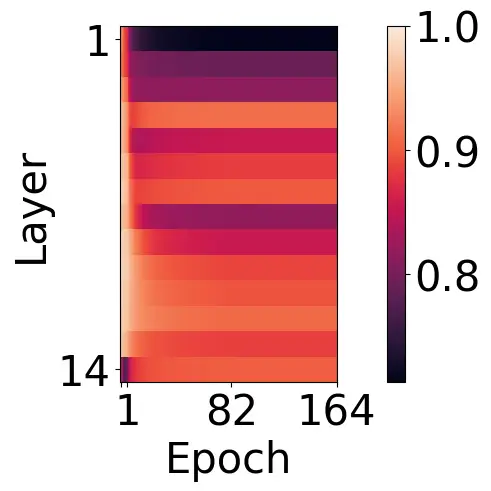

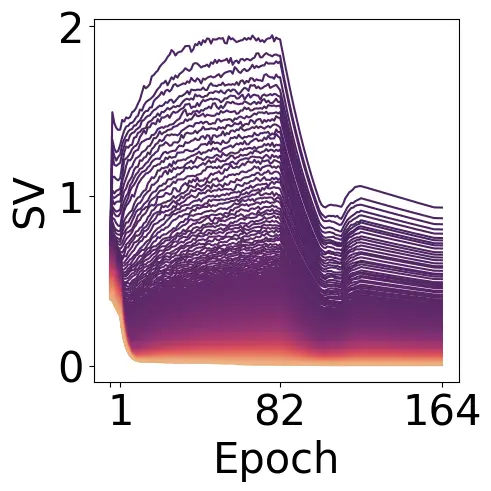

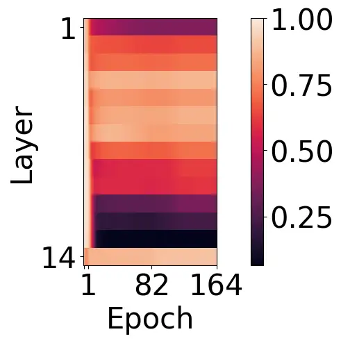

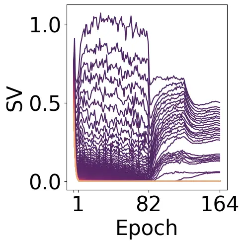

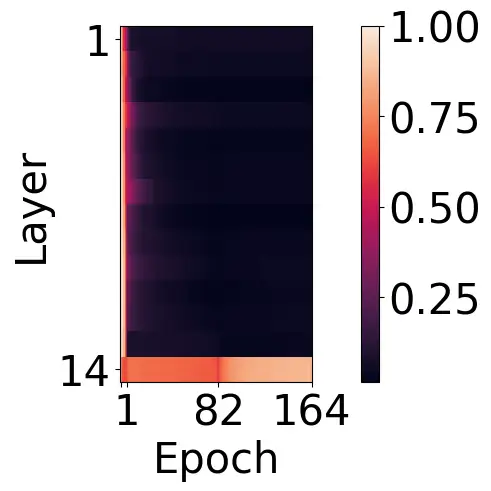

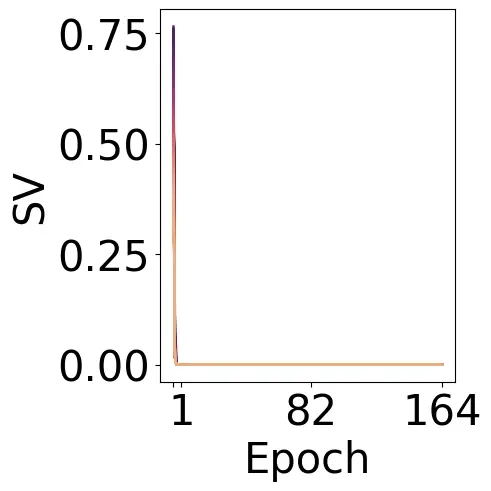

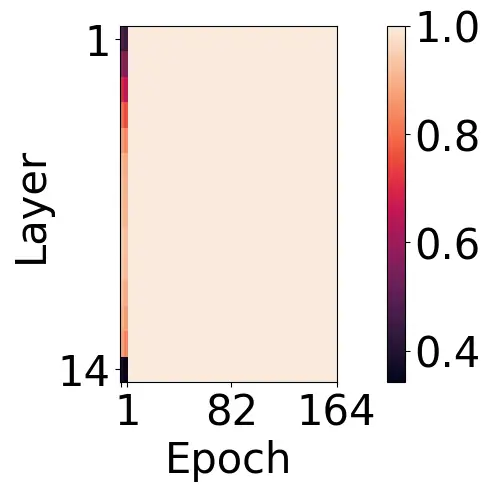

(a) VGG

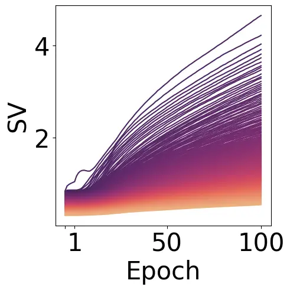


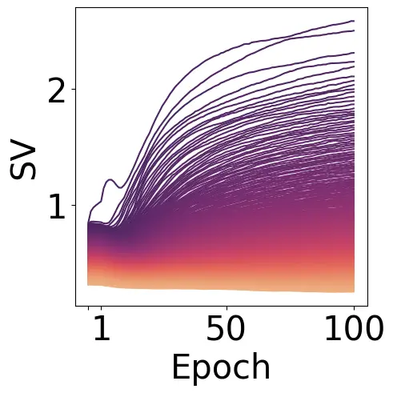

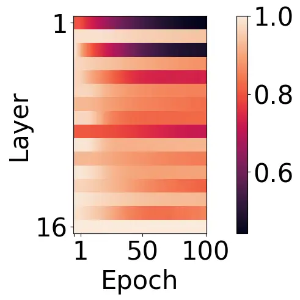

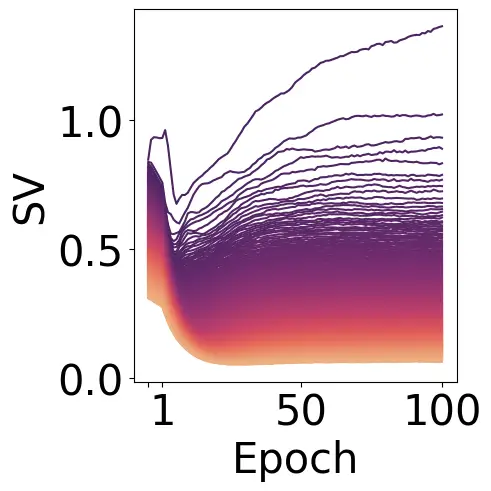


(b) UNet


(c) LSTM


(d) Transformer

Figure 6: SV evolution for a single matrix and normalized effective rank
(Eqn. 1) across matrices over time, where the rows use differing amounts
of weight decay. From top to bottom, for VGG we use coefficients
$`\{0,0.001,0.01,0.1\}`$, while for other networks we use coefficients
$`\{0,0.1,1,10\}`$. Higher weight decay coefficients promote more
aggressive rank minimization. VGG uses SGD and momentum, while the rest
use AdamW (Loshchilov & Hutter, 2017), which may explain the earlier
norm collapse.

We speculate on the intuition of the mechanism in more practical
settings. Notice in its simplest form that weight decay asks for
$`\text{arg min}_{W}\,\mathcal{L}(W)+\lambda\lVert W\rVert_{F}^{2}`$,
where $`\lVert W\rVert_{F}^{2}=\sum_{i=1}^{R}\sigma_{i}^{2}`$ with
singular values $`\sigma_{i}`$ of weight matrix $`W`$ with rank $`R`$.
We saw that larger singular values of neural networks grow faster
(Fig. 3 top row) and that the top singular vectors are much more useful
for minimizing task loss than the bottom ones (Fig. 4). Thus, with minor
weight decay regularization, one straightforward solution for the
network may be to minimize the rank of a given weight matrix while
preserving the top singular values to minimize $`\mathcal{L}(W)`$. Timor
et al. (2023) argue a similar effect as if all singular values are less
than 1, the norm of activations will shrink with depth, so it will be
impossible to pass signals with sufficiently deep networks. Thus it is
important for a few singular values to be sufficiently large.

Figure 6 shows that adding weight decay produces this exact low-rank
behavior, while too much weight decay leads to complete norm collapse.
The exact choice of “too much” varies across architectures and tasks,
though it may be due to the use of SGD for VGG (Simonyan & Zisserman, 2014) instead of AdamW (Loshchilov & Hutter, 2017) for the rest.

In addition, even more surprisingly, large amounts of weight decay
promote a tighter alignment in the top singular vectors of consecutive
layers of the Transformer, but not other networks. We see this in
Figure 7. This behavior is quite reminiscent of the balancedness
condition (Arora et al., 2018; Arora et al., 2019; Du et al., 2018),
though the Transformer considered here has nonlinearities and much more
complex structures. It is curious that the trend is so strong for only
this architecture. We also provide additional evidence in Appendix A
where Figure 14 shows that the solutions with very high weight decay are
still performant, even though they are much lower rank. Though it is
difficult to argue as simple a trend as “lower rank equals better
generalization” because one does not know the minimal rank necessary for
a given task, it is notable that the role of weight decay for improving
generalization is tied up with its function as a rank regularizer. In
addition, although we lack precise tools to entirely interpret complex
models, when there are only a few ranks per matrix it may become
possible to extend analysis efforts (Nanda et al., 2023; Praggastis
et al., 2022) to more complex domains.


(a) VGG


(b) UNet


(c) LSTM


(d) Transformer

Figure 7: Diagonal of alignment for a single pair over time (Eqn. 3) and
alignment metric across pairs of matrices over time (Eqn. 4) where the
y-axis represents depth. From top to bottom, for VGG we use coefficients
$`\{0,0.001,0.01,0.1\}`$, while for other networks we use coefficients
$`\{0,0.1,1,10\}`$. We see that the maximum alignment magnitude is
higher with large weight decay, and in particular, the Transformer has
the strongest alignment even when nonlinearities separate the MLP
layers.


(a) Train Err.


(b) Val. Err.


(c) SVs


(d) Eff. Rank


(e) Alignment

Figure 8: Top row: results with true labels. Bottom row: results with
random labels. We see that the middle layers have a lower effective rank
when using true labels and that alignment in the middle layers persists
throughout training, unlike in the random label case. We emphasize this
alignment occurs despite the nonlinearities.

## 6 Spectral Dynamics with Random Labels

Given the observations connecting generalization and rank thus far, and
the enlightening view on the implicit effects of weight decay, we are
interested in seeing whether the perspective developed sheds any light
on the classic random label memorization experiments of Zhang et al.
(2021).

Similar to Zhang et al. (2021), we train a simple MLP to fit random or
true labels on CIFAR10. Please see Appendix A for the details regarding
the experimental setup. Zhang et al. (2021) decay the learning rate to
zero, and the random label experiments only converge late in training.
Consequently, we use a constant learning rate to control this
phenomenon. We see in Figure 8 that both cases are able to achieve zero
error, though with different singular value evolution and alignment in
the middle layer.

Surprisingly, we see that with true labels the inner layers are low
rank, while with random labels they are much higher rank. This may be
explained by the shared structure in the true classes of the dataset,
which manifests in the parameters. Even more surprisingly, we find here
that even without weight decay, inner layers align with true labels,
while with random labels, this alignment occurs and then disappears with
more training. This is particularly intriguing as there are
non-linearities that could theoretically separate the network from the
linear case, and yet strong alignment occurs despite that. Such
alignment has not yet been leveraged by existing theory, and might
provide structured assumptions for new understanding. In summary, these
results suggest that viewing generalization through the lens of rank may
be fruitful.

## 7 Beyond Generalization

We have seen over the course of many experiments that deep models are
biased toward low rank, and that there is a tempting connection between
rank minimization and generalization. Still, the lens of spectral
dynamics can be applied more broadly. In the following subsections, we
explore two phenomena: lottery tickets (Frankle & Carbin, 2018) and
linear mode connectivity (Frankle et al., 2020). Beyond shedding further
light on neural networks, these phenomena have implications for more
efficient inference and storage, as well as understanding the importance
of pretraining (Neyshabur et al., 2020). We find that lottery tickets
are a sparse approximation of final-checkpoint top singular vectors. The
ability to linearly interpolate between faraway checkpoints and improve
performance coincides strongly with top singular vector sharing between
checkpoints. Such observations may form a foundation for a better
understanding compression and model averaging (Wortsman et al., 2022;
Ilharco et al., 2022).

### 7.1 Top Singular Vectors Become Stable Earlier


(a) VGG


(b) UNet


(c) LSTM


(d) Transformer

Figure 9: Top row: Singular vector agreement for a single matrix in the
middle of each model (diagonal of Eqn. 5). Notice top singular vectors
become stable in direction earlier. Bottom row: Summary score for each
matrix across architectures. As we move down the $`y`$-axis, the depth
of the parameters in the model increases, while the $`x`$-axis tracks
training time. The sharp transition midway through training in the VGG
case is likely due to a 10x learning rate decay.

Before we explore the phenomena, we first make another observation that
will be helpful. As top singular values grow disproportionately large,
it would be natural that top singular vectors become stable in direction
as the gradients remain small. To demonstrate this, for a given matrix
in the network
$`W_{i}(t)=\sum_{j=1}^{R}\sigma_{j}(t)u_{j}(t)v_{j}(t)^{\top}`$ at
training time t, we compute

```math
S(t)_{jk}=\lvert\langle u_{j}(t)v_{j}(t)^{\top},u_{k}(T)v_{k}(T)^{\top}\rangle\rvert, \tag{5}
```

where $`T`$ is the final step of training, and the absolute value is
taken to ignore sign flips in the SVD computation. We then plot the
diagonal of this matrix $`S(t)_{ii}~\forall~i\leq 100`$ over time. We
also use a scalar measure of the diagonal to summarize like in the
alignment case: $`s(t)=\frac{1}{10}\sum_{i}S(t)_{ii}`$. In Figure 9, we
see that top singular vectors converge in direction earlier than bottom
vectors.

### 7.2 Lottery Tickets Preserve Final Top Singular Vectors

As large singular vectors will become stable late in training, we wonder
about the connection to magnitude pruning and the lottery ticket
hypothesis. Frankle & Carbin (2018) first showed evidence for the
lottery ticket hypothesis, the idea that there exist sparse subnetworks
of neural networks that can be trained to a comparable performance as
the full network, where the sparse mask is computed from the largest
magnitude weights of the network at the end of training. Frankle et al.
(2020) build further on this hypothesis and notice that, for larger
networks, the masking cannot begin at initialization, but rather at some
point early in training. Still, the mask must come from the end of
training.

The reason for this particular choice of mask may be connected to the
dynamics we previously observed. Specifically, at the end of training
large singular values are disproportionately larger, so high-magnitude
weights may correspond closely to weights in the top singular vectors at
the end of training. If magnitude masks were computed at the beginning,
the directions that would become the top singular vectors might be
prematurely masked as they have not yet stabilized, which may prevent
learning on the task.

Here we train an unmasked VGG-16 (Simonyan & Zisserman, 2014) on
CIFAR10, then compute either a random mask, or a global magnitude mask
from the end of training, and rewind to an early point (Frankle et al., 2020) to start sparse retraining. Please see Appendix A for details. In
Figure 10, we plot the singular vector agreement (SVA, Eqn. 5) between
the final model, masked and unmasked, where we see exactly that
magnitude masks preserve the top singular vectors of parameters, and
with increasing sparsity fewer directions are preserved. Even though
prior work has remarked that it is possible to use low-rank
approximations for neural networks (Yu et al., 2017), and others have
explicitly optimized for low-rank lottery tickets (Wang et al., 2021;
Schotthöfer et al., 2022), we rather are pointing out that the magnitude
pruning procedure seems to recover a low-rank approximation.


(a) Loss


(b) Pruned SVA


(c) All Layers


(d) SVA evol.


(e) All Layers

Figure 10: Top row: Magnitude pruning. Bottom row: random pruning. First
column: Training loss. We see that at 5% sparsity magnitude pruning is
significantly better than random pruning of the same layerwise sparsity.
2nd column: Singular vector alignment pre- and post-pruning at the end
of training for a single layer (the 3rd convolution). We see that
magnitude pruning approximates the top singular vectors, while random
pruning at the same level does not. 3rd column: Singular vector
alignment score pre- and post-pruning across all layers. Agreement is
higher across all layers for magnitude pruning, though later layers do
not agree, likely as later layers are wider so weights are lower
magnitude. 4th column: Singular vector alignment between the pruned and
unpruned models along the training trajectory. We see that the magnitude
pruning still has similar dynamics in its top singular vectors, while
random pruning does not. Last column: Singular vector alignment score
between pruned and unpruned models across layers and time. Again
evolution is similar for early layers with magnitude pruning, and
completely different for random pruning.

We also compute the singular vector agreement (SVA) between the masked
model trajectory and the original unmasked model trajectory (diagonal of
Eqn. 5). We see in Figure 10 that there is no agreement between the
bottom singular vectors at all, but there is still loose agreement in
the top singular vectors. Thus, it seems the mask allows the dynamics of
only the top singular vectors to remain similar, which we know are most
important from the pruning analysis in Figure 4.

Preserving top singular vectors by pruning seems like a natural outcome
of large matrices, so as a control, we follow exactly the same protocol
except we generate the mask randomly with the same layerwise sparsity.
We can see in Figure 10 that this results in much lower preservation of
top singular vector dynamics, and also performs worse, as in (Frankle
et al., 2020). It would not be surprising that random pruning is worse
if simply evaluated at the end of training, but masking is applied quite
early in training at epoch 4 of 164 long before convergence, so it’s
striking that the network now fails to learn further even though it is
far from convergence. We interpret this as evidence that the mask has
somehow cut signal flow between layers, so it is now impossible for the
network to learn further, while magnitude pruning and rewinding still
allows signals to pass that eventually become important.

### 7.3 Spectral Dynamics and Linear Mode Connectivity

We come to the final phenomenon that we seek to describe: linear mode
connectivity. Linear mode connectivity (LMC) is the property that one
can interpolate linearly between two different minima in weight space
and every parameter set along that path performs well, which gives the
impression that the loss surface of neural networks is somehow convex
despite its theoretical nonconvexity. This was first demonstrated in
small networks with the same initialization (Nagarajan & Kolter, 2019),
then expanded to larger networks and connected to lottery
tickets (Frankle et al., 2020; Paul et al., 2022). Entezari et al.
(2021) first conjecture that two arbitrary minima show LMC up to
permutation, and demonstrate it in simple models. This was expanded to
wide models (Ainsworth et al., 2022; Jordan et al., 2022; Qu & Horvath,
2024), and can be proven in various ways (Kuditipudi et al., 2019; Brea
et al., 2019; Simsek et al., 2021; Ferbach et al., 2023), but it does
not hold for standard models (Qu & Horvath, 2024). LMC has also been
exploited for model-averaging and performance gains (Wortsman et al.,
2022; Ilharco et al., 2022; Rame et al., 2022). Still despite all of
this work, we lack a description for why LMC occurs. In particular: why
is there a convex, high dimensional (Yunis et al., 2022) basin that
models find shortly in training (Frankle et al., 2020), or after
pretraining (Neyshabur et al., 2020; Sadrtdinov et al., 2023)? We do not
answer this question in full, but find an interesting view through the
singular vectors.

#### 7.3.1 Linear Mode Connectivity Correlates with Top Singular Vector Agreement

As we saw earlier directional convergence of top singular vectors in
Figure 9, it suggests the dynamics of those components are more stable,
so we might expect mode-connected solutions to share these components.
To examine this, we plot agreement between the singular vectors of the
weight matrices at either endpoint of branches:

```math
\displaystyle W^{(1)}(T) \displaystyle=\sum_{j}^{R}\sigma_{j}(T)u_{j}(T)v_{j}(T)^{\top}\kern 5.0pt,
```

```math
\displaystyle W^{(2)}(T) \displaystyle=\sum_{k}^{R}\sigma^{\prime}_{k}(T)u^{\prime}_{k}(T){v^{\prime}_{k}}(T)^{\top}\kern 5.0pt,
```

spawned from the same initialization in training. If the branches are
split from an initialization on a trunk trajectory $`W(t)`$, we call
$`t`$ the split point or epoch. We visualize the diagonal of
$`\lvert\langle u_{j}(T)v_{j}(T)^{\top},u^{\prime}_{k}(T){v^{\prime}_{k}}(T)^{\top}\rangle\rvert_{jk}`$
vs. split epoch, where the absolute value is taken to ignore sign flips
in SVD computation.


(a) VGG


(b) UNet


(c) LSTM


(d) Transformer

Figure 11: Top row: Barrier size vs. split step. Middle row: singular
vector agreement for a single matrix parameter between branch endpoints
that share a common trunk. Bottom row: summary statistic for singular
vector agreement across layers vs. split step. We see that as models
exhibit LMC, they also share top singular vectors.


(a) VGG


(b) UNet


(c) LSTM


(d) Transformer

Figure 12: Top row: Barrier size vs. split step. Middle row: singular
vector agreement for a single matrix parameter between branch endpoints
that do not share a common trunk, but do share split time and branch
data order. Bottom row: summary statistic for singular vector agreement
across layers. We see that when branches do not share a common trunk,
there is neither LMC nor singular vector agreement, even though the
optimization is otherwise the same.

To remind the reader, LMC only occurs after a small amount of training
time has passed. Too early and the final models of each branch will show
a bump, or barrier, in the loss surface along the linear interpolation
(Frankle et al., 2020). To measure this precisely, we use the definition
from Neyshabur et al. (2020), which is the maximum deviation from a
linear interpolation in the loss, an empirical measure for convexity in
this linear direction. When this deviation is 0, we consider the
checkpoints to exhibit LMC. Please see Appendix A.9 for details on the
calculation. Given evidence in Figure 4 that top components are the most
important for prediction, and that top components become stable before
training has finished, it is plausible that LMC is connected to the
stability of top singular vectors in the later portion of training.

This would mean that checkpoints that do not exhibit the LMC property
should not share top singular vectors, while checkpoints that do exhibit
the LMC property should share top singular vectors. We see in Figure 11
that this is the case across models and tasks, where the alignment
between endpoints is much stronger in top singular vectors. We also see
no LMC and poor agreement in top components between branches that have
initializations from different trunk trajectories, but with the same
split epoch $`t`$ and the same branch data order in Figure 12. Thus,
these top directions are not a unique property of the architecture and
data, but rather are dependent on initialization. It is notable that
concurrent work (Ito et al., 2024) arrives at a similar conclusion:
permutation solvers between optima match top singular vectors. Though
the conclusions are similar, their experiments are primarily conducted
on smaller scale settings, and only for permutation matching at the end
of training. Here we connect these observations to the optimization
behavior of networks throughout training.

#### 7.3.2 Perturbing Breaks Linear Mode Connectivity and Singular Vector Agreement Simultaneously

To make the connection between top singular vectors and LMC even
tighter, we intervene in the normal training process. If we add random
perturbations to destabilize the components that will become the top
components long before they have converged, and if singular vector
agreement is tied to LMC, we would like to see that final models no
longer exhibit the LMC property. Indeed this is the case. In Figure 13,
when increasingly large random perturbations are applied, the barrier
between final checkpoints increases and the LMC behavior disappears.
Please see Appendix A for details. In addition, the previously-strong
singular vector agreement disappears simultaneously. Thus it seems this
agreement is tied to linear mode connectivity.

We speculate that, due to the results in Figure 4 that show the top half
of the SVDs are much more critical for performance, if these components
are shared then interpolating will not affect performance much. Rather,
interpolation will eliminate the orthogonal bottom components which may
only make a minor impact on performance. If however the top components
are not shared, then interpolating between two models will remove these
components, leading to poor performance in between. Such observations
may help in explaining the utility of pretraining (Neyshabur et al.,
2020), weight averaging (Rame et al., 2022; Wortsman et al., 2022;
Ilharco et al., 2022) or the use of LoRA (Huh et al., 2022) to replace
full finetuning.


(a) VGG


(b) UNet


(c) LSTM


(d) Transformer

Figure 13: Top row: Barrier size vs. perturbation magnitude. Middle row:
singular vector agreement for a single matrix parameter between branch
endpoints vs. perturbation magnitude. Bottom row: summary statistic for
singular vector agreement across layers with perturbation magnitude. We
see that whereas without perturbation models would exhibit LMC after
training, with increasing perturbations the LMC property disappears
simultaneously with the agreement in top singular vectors.

## 8 Discussion

We provide an empirical perspective to understand deep learning through
the lens of SVD dynamics. We first note a tendency toward rank
minimization on a small scale in grokking, then expand these findings to
practical networks and tasks. In addition we find that weight decay,
though it explicitly penalizes norm, implicitly promotes this low-rank
bias. We also show through the developed analysis that generalization
and memorization differ in the rank and alignment of solutions found by
optimization.

We go beyond remarks on generalization and show that magnitude pruning
for lottery tickets acts similarly to low-rank pruning, and linear mode
connectivity coincides with the sharing of top singular vectors between
checkpoints. Low rank models have more efficient inference, and
finetuning from pretrained models always operates in the LMC
regime (Neyshabur et al., 2020), thus this understanding can lead to
more efficient inference and compression and possibly stronger
optimization practices.

While a comprehensive theory for our results remains elusive, these
observations can act as a platform for a deeper understanding of deep
learning. Notably, the observed spectral dynamics appear consistent
across diverse settings, even without restrictive assumptions like
balanced initialization, linearity, or small weight scales. This
suggests a common underlying mechanism.

On the empirical side, several interesting problems present themselves.
Interpretability of neural networks is a growing area of research (Nanda
et al., 2023), and there already exist early efforts to interpret
singular vectors of convolutional weights (Praggastis et al., 2022).
There may also be connections to other unexplained phenomena such as
double descent (Belkin et al., 2019; Nakkiran et al., 2021; Davies
et al., 2022) or adversarial examples (Szegedy et al., 2013; Ilyas
et al., 2019; Hendrycks et al., 2021). The solutions to these problems
may help us diagnose deployment risks in the wild, and ideally help to
design better algorithms. We believe our results contribute another step
along this path.

## Acknowledgements

DY would like to thank the following people for helpful discussion at
many different stages: Wei Hu for a conversation on connecting LMC to
rank dynamics in deep matrix factorization; Jonathan Frankle for very
early support and periodic discussions on aiming to understand the
source of LMC; Shubham Toshniwal and Shane Settle for support in
following this line of work in the early stages; Mikhail Belkin, Tengyu
Ma, and Rob Nowak for early conversations and encouragement on studying
rank minimization in small-scale cases; Sudarshan Babu, Haochen Wang,
Takuma Yoneda, and Xiao Zhang for discussions and enthusiasm on resuming
this work when it had been paused; Sam Buchanan for similar enthusiasm
on resuming the work and very helpful comments on presentation; Anmol
Kabra for suggestions on additional experiments and visualizations to
round out the work; and David McAllester for very helpful comments on
presentation. DY would also like to thank Adam Bohlander for his work in
maintaining the TTIC cluster, which made the many experiments in this
paper possible. This material is based upon work supported by the
National Science Foundation Graduate Research Fellowship Program under
Grant No. 1754881. KKP was supported through the NSF TRIPOD Institute on
Data, Economics, Algorithms and Learning (IDEAL) and other awards from
DARPA and NSF.

## References

- Ainsworth et al. (2022) Ainsworth, S., Hayase, J., and Srinivasa, S.
  Git re-basin: Merging models modulo permutation symmetries. In
  _Proceedings of the International Conference on Learning
  Representations (ICLR)_, 2022.
- Andriushchenko et al. (2023) Andriushchenko, M., D’Angelo, F., Varre,
  A., and Flammarion, N. Why do we need weight decay in modern deep
  learning? _arXiv preprint arXiv:2310.04415_, 2023.
- Arora et al. (2018) Arora, S., Cohen, N., and Hazan, E. On the
  optimization of deep networks: Implicit acceleration by
  overparameterization. In _Proceedings of the International Conference
  on Machine Learning (ICML)_, 2018.
- Arora et al. (2019) Arora, S., Cohen, N., Hu, W., and Luo, Y. Implicit
  regularization in deep matrix factorization. In _Advances in Neural
  Information Processing Systems (NeurIPS)_, 2019.
- Atanasov et al. (2023) Atanasov, A., Bordelon, B., Sainathan, S., and
  Pehlevan, C. The onset of variance-limited behavior for networks in
  the lazy and rich regimes. In _Proceedings of the International
  Conference on Learning Representations (ICLR)_, 2023.
- Barak et al. (2022) Barak, B., Edelman, B., Goel, S., Kakade, S.,
  Malach, E., and Zhang, C. Hidden progress in deep learning: SGD learns
  parities near the computational limit. In _Advances in Neural
  Information Processing Systems (NeurIPS)_, 2022.
- Bartlett (1996) Bartlett, P. For valid generalization the size of the
  weights is more important than the size of the network. _Advances in
  neural information processing systems_, 9, 1996.
- Belkin et al. (2019) Belkin, M., Hsu, D., Ma, S., and Mandal, S.
  Reconciling modern machine-learning practice and the classical
  bias–variance trade-off. _Proceedings of the National Academy of
  Sciences_, 116(32):15849–15854, 2019.
- Bender et al. (2021) Bender, E. M., Gebru, T., McMillan-Major, A., and
  Shmitchell, S. On the dangers of stochastic parrots: Can language
  models be too big? In _Proceedings of the 2021 ACM conference on
  fairness, accountability, and transparency_, pp. 610–623, 2021.
- Biderman et al. (2023) Biderman, S., Schoelkopf, H., Anthony, Q. G.,
  Bradley, H., O’Brien, K., Hallahan, E., Khan, M. A., Purohit, S.,
  Prashanth, U. S., Raff, E., et al. Pythia: A suite for analyzing large
  language models across training and scaling. In _Proceedings of the
  International Conference on Machine Learning (ICML)_, 2023.
- Biewald (2020) Biewald, L. Experiment tracking with weights and
  biases, 2020. URL [https://www.wandb.com/](https://www.wandb.com/).
  Software available from wandb.com.
- Boix-Adserà et al. (2023) Boix-Adserà, E., Littwin, E., Abbe, E.,
  Bengio, S., and Susskind, J. M. Transformers learn through gradual
  rank increase. In _Thirty-seventh Conference on Neural Information
  Processing Systems_, 2023.
- Bommasani et al. (2021) Bommasani, R., Hudson, D. A., Adeli, E.,
  Altman, R., Arora, S., von Arx, S., Bernstein, M. S., Bohg, J.,
  Bosselut, A., Brunskill, E., et al. On the opportunities and risks of
  foundation models. _arXiv preprint arXiv:2108.07258_, 2021.
- Brea et al. (2019) Brea, J., Simsek, B., Illing, B., and Gerstner, W.
  Weight-space symmetry in deep networks gives rise to permutation
  saddles, connected by equal-loss valleys across the loss landscape.
  _arXiv preprint arXiv:1907.02911_, 2019.
- Chen et al. (2023) Chen, F., Kunin, D., Yamamura, A., and Ganguli, S.
  Stochastic collapse: How gradient noise attracts SGD dynamics towards
  simpler subnetworks. In _Advances in Neural Information Processing
  Systems (NeurIPS)_, 2023.
- Davies et al. (2022) Davies, X., Langosco, L., and Krueger, D.
  Unifying grokking and double descent. In _NeurIPS ML Safety
  Workshop_, 2022.
- Dittmer et al. (2019) Dittmer, S., King, E. J., and Maass, P. Singular
  values for ReLU layers. _IEEE Transactions on Neural Networks and
  Learning Systems_, 31(9):3594–3605, 2019.
- Du et al. (2018) Du, S. S., Hu, W., and Lee, J. D. Algorithmic
  regularization in learning deep homogeneous models: Layers are
  automatically balanced. In _Advances in Neural Information Processing
  Systems (NeurIPS)_, 2018.
- Entezari et al. (2021) Entezari, R., Sedghi, H., Saukh, O., and
  Neyshabur, B. The role of permutation invariance in linear mode
  connectivity of neural networks. In _Proceedings of the International
  Conference on Learning Representations (ICLR)_, 2021.
- Ergen & Pilanci (2023) Ergen, T. and Pilanci, M. Path regularization:
  A convexity and sparsity inducing regularization for parallel relu
  networks. In _Advances in Neural Information Processing Systems
  (NeurIPS)_, 2023.
- Feng et al. (2022) Feng, R., Zheng, K., Huang, Y., Zhao, D., Jordan,
  M., and Zha, Z.-J. Rank diminishing in deep neural networks. In
  _Advances in Neural Information Processing Systems (NeurIPS)_, 2022.
- Ferbach et al. (2023) Ferbach, D., Goujaud, B., Gidel, G., and
  Dieuleveut, A. Proving linear mode connectivity of neural networks via
  optimal transport. _arXiv preprint arXiv:2310.19103_, 2023.
- Fort et al. (2020) Fort, S., Dziugaite, G. K., Paul, M., Kharaghani,
  S., Roy, D. M., and Ganguli, S. Deep learning versus kernel learning:
  an empirical study of loss landscape geometry and the time evolution
  of the neural tangent kernel. In _Advances in Neural Information
  Processing Systems (NeurIPS)_, 2020.
- Frankle & Carbin (2018) Frankle, J. and Carbin, M. The lottery ticket
  hypothesis: Finding sparse, trainable neural networks. In _Proceedings
  of the International Conference on Learning Representations
  (ICLR)_, 2018.
- Frankle et al. (2020) Frankle, J., Dziugaite, G. K., Roy, D., and
  Carbin, M. Linear mode connectivity and the lottery ticket hypothesis.
  In _Proceedings of the International Conference on Machine Learning
  (ICML)_, 2020.
- Frei et al. (2022) Frei, S., Vardi, G., Bartlett, P., Srebro, N., and
  Hu, W. Implicit bias in leaky ReLU networks trained on
  high-dimensional data. In _Proceedings of the International Conference
  on Learning Representations (ICLR)_, 2022.
- Galanti et al. (2022) Galanti, T., Siegel, Z. S., Gupte, A., and
  Poggio, T. SGD and weight decay provably induce a low-rank bias in
  neural networks. _arXiv preprint arXiv:2206.05794_, 2022.
- Gromov (2023) Gromov, A. Grokking modular arithmetic. _arXiv preprint
  arXiv:2301.02679_, 2023.
- Gunasekar et al. (2017) Gunasekar, S., Woodworth, B. E., Bhojanapalli,
  S., Neyshabur, B., and Srebro, N. Implicit regularization in matrix
  factorization. In _Advances in Neural Information Processing Systems
  (NeurIPS)_, 2017.
- Hanson & Pratt (1988) Hanson, S. and Pratt, L. Comparing biases for
  minimal network construction with back-propagation. In _Advances in
  Neural Information Processing Systems (NeurIPS)_, 1988.
- Harris et al. (2020) Harris, C. R., Millman, K. J., van der Walt,
  S. J., Gommers, R., Virtanen, P., Cournapeau, D., Wieser, E., Taylor,
  J., Berg, S., Smith, N. J., Kern, R., Picus, M., Hoyer, S., van
  Kerkwijk, M. H., Brett, M., Haldane, A., del Río, J. F., Wiebe, M.,
  Peterson, P., Gérard-Marchant, P., Sheppard, K., Reddy, T., Weckesser,
  W., Abbasi, H., Gohlke, C., and Oliphant, T. E. Array programming with
  NumPy. _Nature_, 585(7825):357–362, September 2020.
- Hendrycks et al. (2021) Hendrycks, D., Zhao, K., Basart, S.,
  Steinhardt, J., and Song, D. Natural adversarial examples. In
  _Proceedings of the IEEE/CVF conference on computer vision and pattern
  recognition_, pp. 15262–15271, 2021.
- Ho et al. (2020) Ho, J., Jain, A., and Abbeel, P. Denoising diffusion
  probabilistic models. In _Advances in Neural Information Processing
  Systems (NeurIPS)_, 2020.
- Hochreiter & Schmidhuber (1997a) Hochreiter, S. and Schmidhuber, J.
  Flat minima. _Neural computation_, 9(1):1–42, 1997a.
- Hochreiter & Schmidhuber (1997b) Hochreiter, S. and Schmidhuber, J.
  Long short-term memory. _Neural computation_, 9(8):1735–1780, 1997b.
- Hu et al. (2021) Hu, E. J., Wallis, P., Allen-Zhu, Z., Li, Y., Wang,
  S., Wang, L., Chen, W., et al. Lora: Low-rank adaptation of large
  language models. In _Proceedings of the International Conference on
  Learning Representations (ICLR)_, 2021.
- Huh et al. (2022) Huh, M., Mobahi, H., Zhang, R., Cheung, B., Agrawal,
  P., and Isola, P. The low-rank simplicity bias in deep networks.
  _Transactions on Machine Learning Research_, 2022.
- Humayun et al. (2024) Humayun, A. I., Balestriero, R., and
  Baraniuk, R. Deep networks always grok and here is why. _arXiv
  preprint arXiv:2402.15555_, 2024.
- Hunter (2007) Hunter, J. D. Matplotlib: A 2D graphics environment.
  _Computing in Science & Engineering_, 9(3):90–95, 2007.
- Ilharco et al. (2022) Ilharco, G., Ribeiro, M. T., Wortsman, M.,
  Schmidt, L., Hajishirzi, H., and Farhadi, A. Editing models with task
  arithmetic. In _Proceedings of the International Conference on
  Learning Representations (ICLR)_, 2022.
- Ilyas et al. (2019) Ilyas, A., Santurkar, S., Tsipras, D., Engstrom,
  L., Tran, B., and Madry, A. Adversarial examples are not bugs, they
  are features. _Advances in neural information processing systems_,
  32, 2019.
- Ioffe & Szegedy (2015) Ioffe, S. and Szegedy, C. Batch normalization:
  Accelerating deep network training by reducing internal covariate
  shift. In _Proceedings of the International Conference on Machine
  Learning (ICML)_, 2015.
- Ito et al. (2024) Ito, A., Yamada, M., and Kumagai, A. Analysis of
  linear mode connectivity via permutation-based weight matching. _arXiv
  preprint arXiv:2402.04051_, 2024.
- Jacot et al. (2018) Jacot, A., Gabriel, F., and Hongler, C. Neural
  tangent kernel: Convergence and generalization in neural networks. In
  _Advances in Neural Information Processing Systems (NeurIPS)_, 2018.
- Ji & Telgarsky (2019) Ji, Z. and Telgarsky, M. Gradient descent aligns
  the layers of deep linear networks. In _Proceedings of the
  International Conference on Learning Representations (ICLR)_, 2019.
- Jiang et al. (2019) Jiang, Y., Neyshabur, B., Mobahi, H., Krishnan,
  D., and Bengio, S. Fantastic generalization measures and where to find
  them. _arXiv preprint arXiv:1912.02178_, 2019.
- Jordan et al. (2022) Jordan, K., Sedghi, H., Saukh, O., Entezari, R.,
  and Neyshabur, B. REPAIR: REnormalizing Permuted Activations for
  Interpolation Repair. In _Proceedings of the International Conference
  on Learning Representations (ICLR)_, 2022.
- Karras et al. (2023) Karras, T., Aittala, M., Lehtinen, J., Hellsten,
  J., Aila, T., and Laine, S. Analyzing and improving the training
  dynamics of diffusion models. _arXiv preprint arXiv:2312.02696_, 2023.
- Krizhevsky (2009) Krizhevsky, A. Learning multiple layers of features
  from tiny images, 2009.
- Krogh & Hertz (1991) Krogh, A. and Hertz, J. A simple weight decay can
  improve generalization. In _Advances in Neural Information Processing
  Systems (NeurIPS)_, 1991.
- Kuditipudi et al. (2019) Kuditipudi, R., Wang, X., Lee, H., Zhang, Y.,
  Li, Z., Hu, W., Ge, R., and Arora, S. Explaining landscape
  connectivity of low-cost solutions for multilayer nets. In _Advances
  in Neural Information Processing Systems (NeurIPS)_, 2019.
- Kumar et al. (2023) Kumar, T., Bordelon, B., Gershman, S. J., and
  Pehlevan, C. Grokking as the transition from lazy to rich training
  dynamics. _arXiv preprint arXiv:2310.06110_, 2023.
- Le & Jegelka (2021) Le, T. and Jegelka, S. Training invariances and
  the low-rank phenomenon: beyond linear networks. In _Proceedings of
  the International Conference on Learning Representations
  (ICLR)_, 2021.
- LeCun (1998) LeCun, Y. The MNIST database of handwritten digits.
  [http://yann.lecun.com/exdb/mnist/](http://yann.lecun.com/exdb/mnist/), 1998.
- Lhoest et al. (2021) Lhoest, Q., del Moral, A. V., Jernite, Y.,
  Thakur, A., von Platen, P., Patil, S., Chaumond, J., Drame, M., Plu,
  J., Tunstall, L., Davison, J., Šaško, M., Chhablani, G., Malik, B.,
  Brandeis, S., Scao, T. L., Sanh, V., Xu, C., Patry, N.,
  McMillan-Major, A., Schmid, P., Gugger, S., Delangue, C., Matussière,
  T., Debut, L., Bekman, S., Cistac, P., Goehringer, T., Mustar, V.,
  Lagunas, F., Rush, A. M., and Wolf, T. Datasets: A community library
  for natural language processing. _arXiv preprint
  arXiv:2109.02846_, 2021.
- Li et al. (2022) Li, M., Gururangan, S., Dettmers, T., Lewis, M.,
  Althoff, T., Smith, N. A., and Zettlemoyer, L. Branch-train-merge:
  Embarrassingly parallel training of expert language models. _arXiv
  preprint arXiv:2208.03306_, 2022.
- Li et al. (2020) Li, Z., Luo, Y., and Lyu, K. Towards resolving the
  implicit bias of gradient descent for matrix factorization: Greedy
  low-rank learning. In _Proceedings of the International Conference on
  Learning Representations (ICLR)_, 2020.
- Liu et al. (2022) Liu, Z., Kitouni, O., Nolte, N. S., Michaud, E.,
  Tegmark, M., and Williams, M. Towards understanding grokking: An
  effective theory of representation learning. In _Advances in Neural
  Information Processing Systems (NeurIPS)_, 2022.
- Liu et al. (2023) Liu, Z., Michaud, E. J., and Tegmark, M. Omnigrok:
  Grokking beyond algorithmic data. In _Proceedings of the International
  Conference on Learning Representations (ICLR)_, 2023.
- Loshchilov & Hutter (2017) Loshchilov, I. and Hutter, F. Fixing weight
  decay regularization in Adam. _arXiv preprint arXiv:1711.05101_, 2017.
- Lyu et al. (2023) Lyu, K., Jin, J., Li, Z., Du, S. S., Lee, J. D., and
  Hu, W. Dichotomy of early and late phase implicit biases can provably
  induce grokking. In _Proceedings of the International Conference on
  Learning Representations (ICLR)_, 2023.
- Martin & Mahoney (2020) Martin, C. H. and Mahoney, M. W. Heavy-tailed
  universality predicts trends in test accuracies for very large
  pre-trained deep neural networks. In _Proceedings of the SIAM
  International Conference on Data Mining (ICDM)_, 2020.
- Martin & Mahoney (2021) Martin, C. H. and Mahoney, M. W. Implicit
  self-regularization in deep neural networks: Evidence from random
  matrix theory and implications for learning. _Journal of Machine
  Learning Research_, 22(165):1–73, 2021.
- Merity et al. (2016) Merity, S., Xiong, C., Bradbury, J., and
  Socher, R. Pointer sentinel mixture models. In _Proceedings of the
  International Conference on Learning Representations (ICLR)_, 2016.
- Merrill et al. (2023) Merrill, W., Tsilivis, N., and Shukla, A. A tale
  of two circuits: Grokking as competition of sparse and dense
  subnetworks. In _ICLR 2023 Workshop on Mathematical and Empirical
  Understanding of Foundation Models_, 2023.
- Milanesi et al. (2021) Milanesi, P., Kadri, H., Ayache, S., and
  Artières, T. Implicit regularization in deep tensor factorization. In
  _Proceedings of the International Joint Conference on Neural Networks
  (IJCNN)_, 2021.
- Mohamadi et al. (2023) Mohamadi, M. A., Li, Z., Wu, L., and
  Sutherland, D. Grokking modular arithmetic can be explained by margin
  maximization. In _NeurIPS 2023 Workshop on Mathematics of Modern
  Machine Learning_, 2023.
- Mohan et al. (2019) Mohan, S., Kadkhodaie, Z., Simoncelli, E. P., and
  Fernandez-Granda, C. Robust and interpretable blind image denoising
  via bias-free convolutional neural networks. _arXiv preprint
  arXiv:1906.05478_, 2019.
- Mulayoff & Michaeli (2020) Mulayoff, R. and Michaeli, T. Unique
  properties of flat minima in deep networks. In _Proceedings of the
  International Conference on Machine Learning (ICML)_, 2020.
- Nagarajan & Kolter (2019) Nagarajan, V. and Kolter, J. Z. Uniform
  convergence may be unable to explain generalization in deep learning.
  In _Advances in Neural Information Processing Systems
  (NeurIPS)_, 2019.
- Nakkiran et al. (2021) Nakkiran, P., Kaplun, G., Bansal, Y., Yang, T.,
  Barak, B., and Sutskever, I. Deep double descent: Where bigger models
  and more data hurt. _Journal of Statistical Mechanics: Theory and
  Experiment_, 2021(12), 2021.
- Nanda et al. (2023) Nanda, N., Chan, L., Lieberum, T., Smith, J., and
  Steinhardt, J. Progress measures for grokking via mechanistic
  interpretability. _arXiv preprint arXiv:2301.05217_, 2023.
- Neyshabur et al. (2014) Neyshabur, B., Tomioka, R., and Srebro, N. In
  search of the real inductive bias: On the role of implicit
  regularization in deep learning. _arXiv preprint
  arXiv:1412.6614_, 2014.
- Neyshabur et al. (2020) Neyshabur, B., Sedghi, H., and Zhang, C. What
  is being transferred in transfer learning? In _Advances in Neural
  Information Processing Systems (NeurIPS)_, 2020.
- Notsawo Jr et al. (2023) Notsawo Jr, P., Zhou, H., Pezeshki, M., Rish,
  I., Dumas, G., et al. Predicting grokking long before it happens: A
  look into the loss landscape of models which grok. _arXiv preprint
  arXiv:2306.13253_, 2023.
- Ongie & Willett (2022) Ongie, G. and Willett, R. The role of linear
  layers in nonlinear interpolating networks. _arXiv preprint
  arXiv:2202.00856_, 2022.
- Panayotov et al. (2015) Panayotov, V., Chen, G., Povey, D., and
  Khudanpur, S. Librispeech: an asr corpus based on public domain audio
  books. In _Proceedings of the IEEE International Conference on
  Acoustics, Speech and Signal Processing (ICASSP)_, 2015.
- Parhi & Nowak (2023) Parhi, R. and Nowak, R. D. Deep learning meets
  sparse regularization: A signal processing perspective. _IEEE Signal
  Processing Magazine_, 40(6):63–74, 2023.
- Paszke et al. (2019) Paszke, A., Gross, S., Massa, F., Lerer, A.,
  Bradbury, J., Chanan, G., Killeen, T., Lin, Z., Gimelshein, N.,
  Antiga, L., et al. Pytorch: An imperative style, high-performance deep
  learning library. In _Advances in Neural Information Processing
  Systems (NeurIPS)_, 2019.
- Paul et al. (2022) Paul, M., Chen, F., Larsen, B. W., Frankle, J.,
  Ganguli, S., and Dziugaite, G. K. Unmasking the lottery ticket
  hypothesis: What’s encoded in a winning ticket’s mask? In _Proceedings
  of the International Conference on Learning Representations
  (ICLR)_, 2022.
- Pennington et al. (2018) Pennington, J., Schoenholz, S., and
  Ganguli, S. The emergence of spectral universality in deep networks.
  In _Proceedings of the International Conference on Artificial
  Intelligence and Statistics (AISTATS)_, 2018.
- Power et al. (2022) Power, A., Burda, Y., Edwards, H., Babuschkin, I.,
  and Misra, V. Grokking: Generalization beyond overfitting on small
  algorithmic datasets. _arXiv preprint arXiv:2201.02177_, 2022.
- Praggastis et al. (2022) Praggastis, B., Brown, D., Marrero, C. O.,
  Purvine, E., Shapiro, M., and Wang, B. The SVD of convolutional
  weights: a CNN interpretability framework. _arXiv preprint
  arXiv:2208.06894_, 2022.
- Qu & Horvath (2024) Qu, X. and Horvath, S. Rethink model re-basin and
  the linear mode connectivity. _arXiv preprint arXiv:2402.05966_, 2024.
- Rahaman et al. (2019) Rahaman, N., Baratin, A., Arpit, D., Draxler,
  F., Lin, M., Hamprecht, F., Bengio, Y., and Courville, A. On the
  spectral bias of neural networks. In _Proceedings of the International
  Conference on Machine Learning (ICML)_, 2019.
- Ramachandran et al. (2017) Ramachandran, P., Zoph, B., and Le, Q. V.
  Searching for activation functions. _arXiv preprint
  arXiv:1710.05941_, 2017.
- Rame et al. (2022) Rame, A., Kirchmeyer, M., Rahier, T.,
  Rakotomamonjy, A., Gallinari, P., and Cord, M. Diverse weight
  averaging for out-of-distribution generalization. In _Advances in
  Neural Information Processing Systems (NeurIPS)_, 2022.
- Ramesh et al. (2022) Ramesh, A., Dhariwal, P., Nichol, A., Chu, C.,
  and Chen, M. Hierarchical text-conditional image generation with CLIP
  latents. _arXiv preprint arXiv:2204.06125_, 2022.
- Razin & Cohen (2020) Razin, N. and Cohen, N. Implicit regularization
  in deep learning may not be explainable by norms. In _Advances in
  Neural Information Processing Systems (NeurIPS)_, 2020.
- Ronneberger et al. (2015) Ronneberger, O., Fischer, P., and Brox, T.
  U-net: Convolutional networks for biomedical image segmentation. In
  _Proceeding of the International Conference on Medical Image Computing
  and Computer-Assisted Intervention (MICCAI)_, 2015.
- Roy & Vetterli (2007) Roy, O. and Vetterli, M. The effective rank: A
  measure of effective dimensionality. In _Proceedings of the European
  Signal Processing Conference (EUSIPCO)_, 2007.
- Sadrtdinov et al. (2023) Sadrtdinov, I., Pozdeev, D., Vetrov, D. P.,
  and Lobacheva, E. To stay or not to stay in the pre-train basin:
  Insights on ensembling in transfer learning. In _Advances in Neural
  Information Processing Systems (NeurIPS)_, 2023.
- Saxe et al. (2014) Saxe, A., McClelland, J., and Ganguli, S. Exact
  solutions to the nonlinear dynamics of learning in deep linear neural
  networks. In _Proceedings of the International Conference on Learning
  Representations (ICLR)_, 2014.
- Schotthöfer et al. (2022) Schotthöfer, S., Zangrando, E., Kusch, J.,
  Ceruti, G., and Tudisco, F. Low-rank lottery tickets: Finding
  efficient low-rank neural networks via matrix differential equations.
  In _Advances in Neural Information Processing Systems (NeurIPS)_,
  volume 35, 2022.
- Shenouda et al. (2023) Shenouda, J., Parhi, R., Lee, K., and Nowak,
  R. D. Vector-valued variation spaces and width bounds for DNNs:
  Insights on weight decay regularization. _arXiv preprint
  arXiv:2305.16534_, 2023.
- Simonyan & Zisserman (2014) Simonyan, K. and Zisserman, A. Very deep
  convolutional networks for large-scale image recognition. _arXiv
  preprint arXiv:1409.1556_, 2014.
- Simsek et al. (2021) Simsek, B., Ged, F., Jacot, A., Spadaro, F.,
  Hongler, C., Gerstner, W., and Brea, J. Geometry of the loss landscape
  in overparameterized neural networks: Symmetries and invariances. In
  _Proceedings of the International Conference on Machine Learning
  (ICML)_, 2021.
- Sohl-Dickstein et al. (2015) Sohl-Dickstein, J., Weiss, E.,
  Maheswaranathan, N., and Ganguli, S. Deep unsupervised learning using
  nonequilibrium thermodynamics. In _Proceedings of the International
  Conference on Machine Learning (ICML)_, 2015.
- Szegedy et al. (2013) Szegedy, C., Zaremba, W., Sutskever, I., Bruna,
  J., Erhan, D., Goodfellow, I., and Fergus, R. Intriguing properties of
  neural networks. _arXiv preprint arXiv:1312.6199_, 2013.
- Tan & Huang (2023) Tan, Z. and Huang, W. Understanding grokking
  through a robustness viewpoint. _arXiv preprint
  arXiv:2311.06597_, 2023.
- Thilak et al. (2022) Thilak, V., Littwin, E., Zhai, S., Saremi, O.,
  Paiss, R., and Susskind, J. The slingshot mechanism: An empirical
  study of adaptive optimizers and the grokking phenomenon. _arXiv
  preprint arXiv:2206.04817_, 2022.
- Timor et al. (2023) Timor, N., Vardi, G., and Shamir, O. Implicit
  regularization towards rank minimization in relu networks. In
  _Proceedings of the International Conference on Algorithmic Learning
  Theory (ALT)_, 2023.
- Van Laarhoven (2017) Van Laarhoven, T. L2 regularization versus batch
  and weight normalization. _arXiv preprint arXiv:1706.05350_, 2017.
- Vardi & Shamir (2021) Vardi, G. and Shamir, O. Implicit regularization
  in relu networks with the square loss. In _Proceedings of the Annual
  Conference on Learning Theory (COLT)_, 2021.
- Vaswani et al. (2017) Vaswani, A., Shazeer, N., Parmar, N., Uszkoreit,
  J., Jones, L., Gomez, A. N., Kaiser, Ł., and Polosukhin, I. Attention
  is all you need. In _Advances in Neural Information Processing Systems
  (NeurIPS)_, 2017.
- Wang & Vastola (2022) Wang, B. and Vastola, J. ML from scratch: Stable
  diffusion, day 2, 2022. URL
  [https://colab.research.google.com/drive/1Y5wr91g5jmpCDiX-RLfWL1eSBWoSuLqO?usp=sharing#scrollTo=9is-DXZYwIIi](https://colab.research.google.com/drive/1Y5wr91g5jmpCDiX-RLfWL1eSBWoSuLqO?usp=sharing#scrollTo=9is-DXZYwIIi).
- Wang et al. (2021) Wang, H., Agarwal, S., and Papailiopoulos, D.
  Pufferfish: Communication-efficient models at no extra cost.
  _Proceedings of Machine Learning and Systems_, 3:365–386, 2021.
- Wang & Jacot (2023) Wang, Z. and Jacot, A. Implicit bias of SGD in
  $`l\_`${$`2`$}-regularized linear DNNs: One-way jumps from high to low
  rank. _arXiv preprint arXiv:2305.16038_, 2023.
- Waskom (2021) Waskom, M. L. seaborn: statistical data visualization.
  _Journal of Open Source Software_, 6(60):3021, 2021.
- Wortsman et al. (2022) Wortsman, M., Ilharco, G., Gadre, S. Y.,
  Roelofs, R., Gontijo-Lopes, R., Morcos, A. S., Namkoong, H., Farhadi,
  A., Carmon, Y., Kornblith, S., and Schmidt, L. Model soups: averaging
  weights of multiple fine-tuned models improves accuracy without
  increasing inference time. In _Proceedings of the International
  Conference on Machine Learning (ICML)_, 2022.
- Xu et al. (2023) Xu, Z., Wang, Y., Frei, S., Vardi, G., and Hu, W.
  Benign overfitting and grokking in ReLU networks for XOR cluster data.
  In _Proceedings of the International Conference on Learning
  Representations (ICLR)_, 2023.
- Yaras et al. (2023a) Yaras, C., Wang, P., Hu, W., Zhu, Z., Balzano,
  L., and Qu, Q. Invariant low-dimensional subspaces in gradient descent
  for learning deep matrix factorizations. In _NeurIPS 2023 Workshop on
  Mathematics of Modern Machine Learning_, 2023a.
- Yaras et al. (2023b) Yaras, C., Wang, P., Hu, W., Zhu, Z., Balzano,
  L., and Qu, Q. The law of parsimony in gradient descent for learning
  deep linear networks. _arXiv preprint arXiv:2306.01154_, 2023b.
- Yu & Wu (2023) Yu, H. and Wu, J. Compressing transformers: Features
  are low-rank, but weights are not! In _Proceedings of the National
  Conference on Artificial Intelligence (AAAI)_, 2023.
- Yu et al. (2017) Yu, X., Liu, T., Wang, X., and Tao, D. On compressing
  deep models by low rank and sparse decomposition. In _Proceedings of
  the IEEE/CVF Conference on Computer Vision and Pattern Recognition
  (CVPR)_, 2017.
- Yunis et al. (2022) Yunis, D., Patel, K. K., Savarese, P. H. P.,
  Vardi, G., Frankle, J., Walter, M., Livescu, K., and Maire, M. On
  convexity and linear mode connectivity in neural networks. In _OPT
  2022: Optimization for Machine Learning (NeurIPS 2022
  Workshop)_, 2022.
- Zangrando et al. (2024) Zangrando, E., Deidda, P., Brugiapaglia, S.,
  Guglielmi, N., and Tudisco, F. Neural rank collapse: Weight decay and
  small within-class variability yield low-rank bias. _arXiv preprint
  arXiv:2402.03991_, 2024.
- Zhang et al. (2021) Zhang, C., Bengio, S., Hardt, M., Recht, B., and
  Vinyals, O. Understanding deep learning (still) requires rethinking
  generalization. _Communications of the ACM_, 64(3):107–115, 2021.
- Zhang et al. (2018a) Zhang, G., Wang, C., Xu, B., and Grosse, R. Three
  mechanisms of weight decay regularization. _arXiv preprint
  arXiv:1810.12281_, 2018a.
- Zhang et al. (2018b) Zhang, H., Dauphin, Y. N., and Ma, T. Fixup
  initialization: Residual learning without normalization. In
  _Proceedings of the International Conference on Learning
  Representations (ICLR)_, 2018b.
- Ziyin et al. (2022) Ziyin, L., Li, B., and Meng, X. Exact solutions of
  a deep linear network. In _Advances in Neural Information Processing
  Systems (NeurIPS)_, 2022.
- Zou et al. (2023) Zou, A., Wang, Z., Kolter, J. Z., and Fredrikson, M.
  Universal and transferable adversarial attacks on aligned language
  models. _arXiv preprint arXiv:2307.15043_, 2023.

## Appendix A Experimental Details

For all experiments, we use 3 random seeds and average all plots over
those 3. This is relatively small, but error bars tend to be very tight,
and due to the high volume of runs required for this work we lack the
resources to run much more.

In order to compute alignment we consider only pairs of layers that
directly feed into each other, and ignore the influence of residual
connections so as to cut down on the number of comparisons. Specifics on
individual architectures are given below.

### A.1 Image Classification with VGG

We train a VGG-16 (Simonyan & Zisserman, 2014) on CIFAR-10 (Krizhevsky, 2009) for 164 epochs, following hyperparameters and learning rate
schedule in (Frankle et al., 2020), but without data augmentation. For
the optimizer we use SGD with batch size 128, initial learning rate 0.1
and momentum of 0.9. We also decay the learning rate 3 times by a factor
of 10 at epoch 82, epoch 120, and finally at epoch 160. We also use a
minor amount of weight decay with coefficient 0.0001.

VGG-16 uses ReLU activations and batch normalization (Ioffe & Szegedy,
2015), and includes both convolutional and linear layers. For linear
layers we simply compute the SVD of the weight matrix. For convolutional
layers, the parameters are typically stored as a 4D tensor of shape
$`(c_{\text{out}},c_{\text{in}},h,w)`$ for the output channels, input
channels, height and width of the filters respectively. As the filters
compute a transformation from each position and input channel to an
output channel, we compute the SVD of the flattened tensor
$`(c_{\text{out}},c_{\text{in}}\cdot h\cdot w)`$, which maps all inputs
to outputs, similar to Praggastis et al. (2022). This is not the SVD of
the entire transformation of the feature map to the next feature map,
but rather the transformation from a set of adjacent positions to a
particular position in the next layer. For the individual SV evolution
plot, we use the 12th convolutional layer.

In order to compute alignment of bases between consecutive convolutional
layers, $`V_{i+1}^{\top}U_{i}`$ we need to match the dimensionality
between $`U_{i}`$ and $`V_{i+1}`$. For convolutional layers we are
presented with a question as to how to handle the spatial dimensions
$`h`$ and $`w`$ as naively the input dimension of the next layer will be
a factor of $`h\cdot w`$ larger dimension. We experimented with multiple
cases, including aligning at each spatial position individually or
averaging over the alignment at all spatial positions, and eventually
settled at aligning the output of one layer to the center spatial input
of the next layer. That is, for a 3x3 convolution mapping to a following
3x3 convolution, we compute the alignment only for position (1,1) of the
next layer. This seemed reasonable to us as on average the edges of the
filters showed poorer alignment overall. For the individual alignment
plot, we use the alignment between the 11th and 12th convolutional
layers at the center spatial position of the 12th convolutional layer.

### A.2 Image Generation with UNets

We train a UNet (Ronneberger et al., 2015) diffusion
model (Sohl-Dickstein et al., 2015; Ho et al., 2020) on MNIST (LeCun, 1998) generation. We take model design and hyperparameters from (Wang &
Vastola, 2022). In particular we use a 4-layer residual UNet and train
with AdamW (Loshchilov & Hutter, 2017) with batch size 128, and learning
rate of 0.0003 for 100 epochs. This model uses swish (Ramachandran
et al., 2017) activations and a combination of linear and convolutional,
as well as transposed convolutional layers.

Computing SVDs and alignment is similar to the image classification case
described above, except in the case of the transposed convolutions where
an extra transpose of dimensions is needed as parameters are stored with
the shape $`(c_{\text{in}},c_{\text{out}},h,w)`$. For the individual SV
evolution plot, we use the 3rd convolutional layer. For the alignment
plot, we use the alignment between the 3rd and 4th convolutional layers
at the center spatial position of the 4th convolutional layer.

### A.3 Speech Recognition with LSTMs

We train a bidirectional LSTM (Hochreiter & Schmidhuber, 1997a) for
automatic speech recognition on LibriSpeech (Panayotov et al., 2015). We
tune for a simple and well-performing hyperparameter setting. We use
AdamW (Loshchilov & Hutter, 2017) with batch size 32, learning rate
0.0003 and weight decay 0.1 for 50 epochs. We also use a cosine
annealing learning rate schedule from 1 to 0 over the entire 50 epochs.

The LSTM only has matrix parameters and biases, so it is straightforward
to compute SVDs of the matrices. For individual SV evolution plots, we
plot the 3rd layer input parameter. In the case of alignment, we make a
number of connections: first down depth for the input parameters, then
connecting the previous input parameter to the current hidden parameter
in both directions, then connecting the previous hidden parameter to the
current input parameter. In particular the LSTM parameters are stored as
a stack of 4 matrices in PyTorch, and we find alignment is highest for
the ”gate” submatrix, so we choose that for all plots. For the
individual layer alignment, we plot alignment between the 3rd and 4th
layer input parameters.

### A.4 Language Modeling with Transformers

We train a Transformer (Vaswani et al., 2017) language model on
Wikitext-103 (Merity et al., 2016). We base hyperparameter choices on
the Pythia suite (Biderman et al., 2023), specifically the 160 million
parameter configuration with sinusoidal position embeddings, 12 layers,
model dimension 768, 12 attention heads per layer, and hidden dimension 768. We use AdamW (Loshchilov & Hutter, 2017) with batch size 256,
learning rate 0.0006 and weight decay 0.1. We use a context length of
2048 and clip gradients to a maximum norm of 1. We also use a learning
rate schedule with a linear warmup and cosine decay to 10% of the
learning rate, like Biderman et al. (2023).

For SVDs, for simplicity we take the SVD of the entire
$`(3d_{\text{model}},d_{\text{model}})`$ parameter that computes
queries, keys and values from the hidden dimension inside the attention
layer, without splitting into individual heads. This is reasonable as
the splitting is done after the fact internally. We also take the SVD of
the output parameters, and linear layers of the MLPs, which are 2
dimensional matrices. For the individual SV evolution plot, we plot the
SVs of $`W_{1}`$ of the 8th layer MLP

For alignment, we consider the alignment of $`W_{Q}`$ and $`W_{K}`$
matrices, $`W_{V}`$ and $`W_{O}`$ matrices, computing alignment between
heads individually then averaging over all heads. We also consider the
alignment between $`W_{O}`$ and $`W_{1}`$ of the MLP block, between
$`W_{1}`$ and $`W_{2}`$ of the MLP block, and between $`W_{2}`$ and the
next attention layer. For the individual layer alignment, we plot
alignment between $`W_{1}`$ and $`W_{2}`$ of the 8th layer MLP.

### A.5 Weight Decay Experiments


(a) VGG


(b) UNet


(c) LSTM


(d) Transformer

Figure 14: Training loss over time, where the rows use differing amounts
of weight decay. From top to bottom, for VGG we use coefficients
$`\{0,0.001,0.01,0.1\}`$, while for other networks we use coefficients
$`\{0,0.1,1,10\}`$. We see that it is still possible to achieve low
training loss under high weight decay, and as we increase the amount of
weight decay, the gap between pruned and unpruned parameters closes,
lending support to the idea that the parameters become lower rank.

All tasks are trained in exactly the same fashion as mentioned
previously, with increasing weight decay in the set
$`\{0,0.0001,0.001,0.01,0.1,1.0,10.0\}`$. For ease of presentation we
consider a subset of settings across tasks. In Figure 14 we include
trained model performance and pruned model performance to show that,
even with high levels of weight decay, models do not entirely break
down. More so, the approximation of the pruned model to the full model
gets better with higher weight decay.

### A.6 Grokking Experiments

We mostly follow the settings and architecture of Nanda et al. (2023),
except we use sinusoidal positional encodings instead of learned.

For the slingshot case we follow hyperparameter settings in Thilak
et al. (2022), Appendix B except with the 1-layer architecture from
Nanda et al. (2023) instead of the 2-layer architecture specified. W
perform addition modulo 97. The original grokking plot in Thilak et al.
(2022) appears much more dramatic as it log-scales the x-axis, which we
do not do here for clarity.

### A.7 Random Label Experiments

We train a 4-layer MLP on CIFAR10 (Krizhevsky, 2009) with either
completely random labels, or the true labels. We use SGD with momentum
of 0.9 and constant learning rate of 0.001, and train for 300 epochs to
see the entire trend of training. The major difference to the setting of
Zhang et al. (2021) is the use of a constant learning rate, as their use
of a learning rate schedule might conflate the results.

### A.8 Magnitude Pruning Experiments

We use the same VGG setup as described previously. In this case we train
til the end, then compute a global magnitude mask. To do this we flatten
all linear and convolutional weights into a single vector, except for
the last linear layer, and sort by magnitude. Then we keep the top 5% of
weights globally, and reshape back to the layerwise masks. This results
in different sparsity levels for different layers, so when generating
the random masks, we use the per-layer sparsities that resulted from the
global magnitude mask.

To retrain the network, we rewind to epoch 4, then continue training
with the mask, always setting other weights and their gradients to 0. We
average all results over 3 random seeds.

### A.9 LMC Experiments

We save 5 evenly-spaced checkpoints in the first epoch, as well as at
the end of the next 4 epochs for 10 intializations in total. We train 3
trunks, and split 3 branches from each trunk for a total of 9 branches
which we average all plots over.

Following Neyshabur et al. (2020), we compute the barrier between
checkpoints as follows: given $`W^{(1)}(T)`$ and $`W^{(2)}(T)`$ that
were branched from $`W(t)`$ we compute

```math
b(t)=(\max_{\alpha\in[0,1]}\mathcal{L}((1-\alpha)W^{(1)}(T)+\alpha W^{(2)}(T))-((1-\alpha)\mathcal{L}(W^{(1)}(T))+\alpha\mathcal{L}(W^{(2)}(T))) \tag{6}
```

when this quantity is 0, we consider the checkpoints to exhibit LMC.

We recompute batch normalization parameters after interpolating for
VGG-16, and group normalization parameters for the UNet, as these do not
necessarily interpolate well (Frankle et al., 2020). We also compute
singular vector agreement for the same parameter between either branch
endpoint.

To plot the singular vector (dis)agreement and LMC between different
modes, we make 11 evenly spaced measurements interpolating between
branch endpoints that had the same split epoch, and the same branch
seed, but different trunk initializations.

### A.10 Perturbed LMC Experiments

We perturb all weights $`W`$ after the point of dynamics stability where
we expect to see LMC at the end of training (epoch 4 is sufficiently
late in all cases) using randomly sampled normal perturbations
$`\epsilon\sim\mathcal{N}(0,I)`$ with
$`\lVert\epsilon\rVert=\eta\lVert W\rVert`$ where
$`\eta\in\{0.0,0.1,0.25,0.5,1.0,2.5\}`$. We do not perturb the output
layer, as this has a very substantial effect on the optimization. We
also do not perturb the input layer for the Transformer as it is too
computationally expensive for our resources.

## Appendix B Limitations

There are a few key limitations to our study. As mentioned, we lack the
computational resources to run more than 3 random seeds per experiment,
though we do find error bars to be quite tight in general (except for
the generalization epoch in the grokking experiments). In addition, as
discussed we ignore 1D parameters in the neural networks, which may be
particularly crucial (especially normalization). In addition, due to
computational constraints we do not consider alignment of layers across
residual connections as this quickly becomes combinatorial in depth,
thus there may be other interesting interactions that we do not observe.
Finally, due to computational constraints we are unable to investigate
results on larger models than the 12 layer Transformer, which may have
different behavior.

## Appendix C Compute Resources

All experiments are performed on an internal cluster with on the order
of 100 NVIDIA 2080ti GPUs or newer. All experiments run on a single GPU
in less than 8 hours, though it is extremely helpful to parallelize
across machines. We estimate that end-to-end it might take a few days on
these resources to rerun all of the experiments in this paper.
Additionally, the storage requirements for all of the checkpoints will
take on the order of 5 terabytes.

## Appendix D Code Sources

We use PyTorch (Paszke et al., 2019) and NumPy (Harris et al., 2020) for
all experiments and Weights & Biases (Biewald, 2020) for experiment
tracking. We make plots with Matplotlib (Hunter, 2007) and
Seaborn (Waskom, 2021). We also use HuggingFace Datasets (Lhoest et al., 2021) for Wikitext-103 (Merity et al., 2016).
