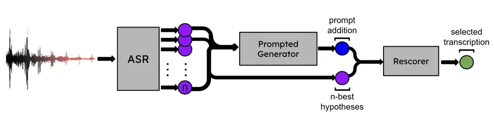

# ProGRes: Prompted Generative Rescoring on ASR N-Best

Ada Defne Tur    Adel Moumen    Mirco Ravanelli

###### Abstract

Large Language Models (LLMs) have shown their ability to improve the
performance of speech recognizers by effectively rescoring the
$`n`$-best hypotheses generated during the beam search process. However,
the best way to exploit recent generative instruction-tuned LLMs for
hypothesis rescoring is still unclear. This paper proposes a novel
method that uses instruction-tuned LLMs to dynamically expand the
$`n`$-best speech recognition hypotheses with new hypotheses generated
through appropriately-prompted LLMs. Specifically, we introduce a new
zero-shot method for ASR $`n`$-best rescoring, which combines confidence
scores, LLM sequence scoring, and prompt-based hypothesis generation. We
compare Llama-3-Instruct, GPT-3.5 Turbo, and GPT-4 Turbo as prompt-based
generators with Llama-3 as sequence scorer LLM. We evaluated our
approach using different speech recognizers and observed significant
relative improvement in the word error rate (WER) ranging from 5% to
25%.

###### Index Terms: 

speech recognition, large language models, rescoring.

^(†)^(†)address: ¹McGill University, ²Mila-Quebéc AI Institute,
³Concordia University,  
⁴Université de Montréal, ⁵Avignon Université  
ada.tur@mail.mcgill.ca, mirco.ravanelli@concordia.ca,  
adel.moumen@univ-avignon.fr

## 1 Introduction

Despite the significant advancements of recent years, Automatic Speech
Recognition (ASR) still poses some challenges \[1\]. These challenges
are particularly evident in scenarios involving noise and reverberation
\[2, 3, 4, 5, 6, 7\], spontaneous dialogues \[8, 9, 10\], or recordings
containing numerous named entities such as people, locations,
organizations, and scientific/technical terminology \[11, 12, 13\]. ASRs
are indeed not trained on enough data to deeply capture linguistic
information, resulting in challenges when transcribing unknown words and
named entities, particularly those related to social culture (such as
“Billie Eilish” or “Tour de Ski”).

ASR $`n`$-best:

- •
  it is distributed throughout the southern philippines walaca and new
  guina
- •
  it is distributed throughout the southern pilippines walaca and new
  guina
- •
  it is distributed throughout the southern philippines valaca and new
  guina
- •
  it is distributed throughout the southern pilippines valaca and new
  guina
- •
  it is distributed throughout the southern philippines walaka and new
  guina

Prompt Addition: it is distributed throughout the southern philippines
wallacea and new guinea  
Ground Truth: it is distributed throughout the southern philippines
wallacea and new guinea

Figure 1: Example of a prompted generation using ASR $`n`$-best.

To mitigate these issues, language models are commonly used to enhance
ASR performance by ensuring that transcriptions maintain linguistic
plausibility. The dominant approach for combining acoustic and
linguistic information is known as rescoring, which involves using a
language model to assign probabilities to candidate word sequences \[14,
15, 16, 17, 18, 19, 20, 21, 22\]. These probabilities are then combined
linearly with the acoustic scores provided by the ASR. Rescoring can be
performed in two ways: either during the decoding process, where partial
hypotheses are rescored, or after decoding, where the $`n`$-best
alternatives are rescored \[23, 24\]. Traditionally, rescoring involved
using simple language models, such as n-grams and word graphs \[25,
26\]. Only relatively recently, recurrent neural networks and
transformers have been successfully employed \[27\]. Modern LLMs, on the
other hand, have achieved remarkable success in natural language
processing, making them ideal candidates for ASR rescoring. LLMs have
much vaster knowledge of a human language than an ASR and can predict
how phonetic patterns between arbitrary sets of words can correlate to
more meaningful replacements. Consider the example depicted in Figure 1:
only a powerful LLM has the information necessary to identify relevant
locations and correct the hypotheses.



Figure 2: Overview of the ProGRes pipeline: (1) An ASR generates
$`n`$-best hypotheses. (2) The hypotheses are extended with a suggestion
from an LLM. (3) The entire set is rescored to produce the final
transcription.

The optimal way to leverage instruction-tuned LLMs for ASR rescoring is
the object of intense research efforts. In \[28\], for instance, the
authors proposed prompting an LLM like Chat-GPT to select from the
$`n`$-best options or generate a new output, demonstrating significant
effectiveness in improving ASR error rates.

This paper extends this approach by introducing a novel method to
effectively use LLMs for ASR $`n`$-best rescoring, called PROmpted
Generative REScoring (ProGRes). In particular, our main contributions
are the following:

- •
  We propose using prompt-based LLMs to dynamically augment the ASR
  $`n`$-best, informed by its existing hypotheses. Our idea originated
  from observing that rescoring provides minimal benefits, even with
  LLMs, when the correct transcription is not among the top $`n`$
  hypotheses. With prompt addition, we aim to increase the likelihood
  that at least one hypothesis closely matches the correct
  transcription, reducing the overall WER significantly.
- •
  Unlike previous work which ignores the existing ASR $`n`$-best
  hypotheses after generating the LLM ones \[28\], we propose to assign
  a score to each hypothesis in the extended set using another
  state-of-the-art open-weight LLM (in our case, Llama-3). These LLM
  probabilities are then interpolated with the ASR confidence scores.

We demonstrate that ProGRes leads to significant improvements in word
error rates. It also outperforms existing methods that restrict the use
of generative LLMs to either $`n`$-best rescoring or generating a new
hypothesis alone.

The code for implementing ProGRes and replicating the experiments
discussed in this paper is publicly available on GitHub¹¹ 1
https://github.com/AdaDTur/ProGRes/.

## 2 Proposed Method

The proposed method is summarized in Figure 2. First, for each audio
signal, we extract the $`n`$-best hypotheses from a pretrained ASR
model. We then prompt an LLM to generate a more diverse set of
hypotheses. Subsequently, we rescore these extended hypotheses to obtain
the final transcription. The following sub-section will provide a
detailed description of the proposed method.

### 2.1 Prompted Generation

The $`n`$-best hypotheses generated by the ASR are often noisy and
sub-optimal. Many of these hypotheses rely solely on phonetic evidence
and do not incorporate general knowledge, common sense, or deep
linguistic insights. Our approach aims to improve the quality of the
$`n`$-best hypotheses by using a secondary generative LLM. This
intelligent model analyzes the $`n`$-best hypotheses and generates a
more plausible transcription, that avoids non-existent tokens, words,
named entities, etc. Similar to \[28\], we use the following prompt:

```ltx_verbatim
"Perform error correction on the top outputs generated
by an ASR system. The ASR hypotheses, listed in order of
their ASR posterior score, are as follows: [ASR n-best]
Please provide the corrected ASR transcription of the
given utterance only, surrounding it with < >. Do not
add any explanations or commentary."
```

For each set of hypotheses, the LLM is prompted to predict the most
plausible transcription. The LLM has the flexibility to either select an
existing hypothesis or generate one entirely from scratch. The ASR
$`n`$-best hypotheses and the LLM-generated hypothesis are concatenated
to form an extended set of hypotheses.

### 2.2 LLM score

The next step involves assigning a linguistic plausibility score to each
hypothesis within the extended set. This score can be computed by
employing an open-weight LLM, such as Llama-3, and using the following
equation:

```math
LLM_{score}(\mathbf{w})=\sum_{t=1}^{T}\log P_{\text{LLM}}(w_{t}|w_{1},w_{2},\ldots,w_{t-1};\boldsymbol{\theta}).
```

Here $`LLM_{score}`$ denotes the pseudo-log-likelihood score for the
sequence $`\mathbf{w}=[w_{1},w_{2},\ldots,w_{t},\ldots,w_{T}]^{T}`$,
where $`w_{t}`$ is the token at position $`t`$. The term
$`P_{\text{LLM}}`$ is the conditional probability of token $`w_{t}`$
given the preceding tokens, while $`\boldsymbol{\theta}`$ are the
parameters of the considered LLM. A higher $`LLM_{score}`$ indicates
greater linguistic plausibility of the hypothesis

### 2.3 ASR score

For each hypothesis in the extended set, we also compute the ASR
confidence score by evaluating the loss of the ASR model with the
hypothesis treated as the target label:

```math
ASR_{score}(\mathbf{w},\mathbf{x})=-\text{loss}(p(\mathbf{x}),\mathbf{w}),
```

where $`p(\mathbf{x})`$ represents the sequence of token probabilities
predicted by the ASR model with the audio signal $`\mathbf{x}`$ in input
and $`\mathbf{w}`$ is the hypothesis for which we want to determine the
score. The ASR score depends on “how well” the hypothesis matches the
acoustic evidence. The $`loss`$, which should be in the log-domain, can
either be the Negative Log-Likelihood (NLL) or the Connectionist
Temporal Classification (CTC) loss, or any other loss used to train the
ASR model. Note that during training, the loss is normally minimized.
Therefore, we need to negate it to get a score that is higher when the
hypothesis matches the acoustic signal well.

The ASR score can be computed for all hypotheses, including those
generated by the LLM. We assign the confidence score of the best ASR
hypothesis to the LLM-generated one. The LLM-generated hypothesis is
more likely to be the best, and we observed that boosting it in this way
helps improve performance.

### 2.4 Interpolation

To combine LLM and ASR scores, we use linear interpolation, as shown in
the following equation:

```math
\text{score}=(1-\alpha)\cdot\text{ASR}_{\text{score}}+\alpha\cdot\text{LLM}_{\text{score}},
```

where the hyperparameter $`\alpha`$ is introduced to adjust the ratio
between the ASR and LLM scores. The optimal value of the language model
weight $`\alpha`$ can be determined by performing a linear search
optimization on the validation set. This step might involve testing
values between 0 and 1 in increments of 0.05, as discussed in Sec. 5.3.
The hypothesis with the highest score is selected as the output ASR
transcription.

## 3 Related Work

Masked language models (MLMs), with their popular speech-specific
variant, warped language models (WLMs), have been adopted to improve ASR
performance. MLMs can generate embeddings that, when combined with
acoustic and linguistic information, serve as input for the rescorer.
Additionally, MLMs can be employed to extract sequence scores \[29\].
WLMs can analyze an entire sequence of all $`n`$-best hypotheses and
perform token deletion, insertion, and substitution as needed to rescore
the $`n`$-best hypotheses provided by the ASR \[30\]. Ma et al. explored
the use of generative models for rescoring, particularly architectures
like T5 \[24\]. Instead of using a masked model to analyze and alter the
hypotheses, their approach involves using a fine-tuned rescoring model
fed by either the $`n`$-best hypotheses or the ASR beam-search decoding
lattice.

While fine-tuned rescoring models have proven effective in enhancing ASR
performance, the emergence of prompt-based models recently introduced
new opportunities for ASR error correction. Building on their previous
work, Ma et al. investigated the potential of prompt-based language
models \[28\]. They employed two methods: a selective approach where the
model, such as ChatGPT, analyzes the $`n`$-best hypotheses and selects
the most suitable option, and an unconstrained approach where ChatGPT’s
generative capabilities are exploited to correct possible errors. Our
contribution extends the work by Ma et al. in different ways. First,
ProGRes concatenates the $`n`$-best ASR hypotheses and those generated
by the LLMs. This step ensures that the considered hypotheses does not
diverge significantly from the original ASR ones. Additionally, unlike
their approach, we incorporate a rescoring step that interpolates ASR
and LLM scores. These improvements have resulted in superior ASR
performance.

## 4 Experimental Setup

### 4.1 ASRs

Our study considers two speech recognizers. First, we employ an ASR
trained on SPGISpeech data using the ESPnet toolkits \[31, 32\] (ASR₁).
This recognizer utilizes an STFT with 512 FFT points and a hop length of
256 to extract spectrogram features. It employs a conformer architecture
as an encoder, which combines convolutional front-end for local
dependencies with a self-attention mechanism for longer-range
dependencies. Additionally, we utilize an ASR system trained on
CommonVoice 16.1 using SpeechBrain \[33\]²² 2
https://github.com/speechbrain/speechbrain/tree/develop/recipes/CommonVoice/ASR
(ASR₂). This recognizer is constructed using WavLM for feature
extraction, a standard deep neural network, and connectionist temporal
classification (CTC) for sequence modeling \[34\]. The decoding process
for both ASRs involves beam search to generate a set of $`n`$ hypotheses
with associated probabilities \[35, 36\]. We set n=10 for ASR₁ and n=20
for ASR$`2`$.

### 4.2 LLMs

We evaluate several LLMs for generating and rescoring prompted
hypotheses. Specifically, for prompting, we assess three
instruction-tuned models: GPT-3.5-turbo, GPT-4 \[37\], and Llama-3
\[38\]. We utilize the OpenAI API for optimized generation with the GPT
models. For Llama-3, we employ the quantized version provided by
UnslothAI³³ 3 https://www.unsloth.ai/blog/llama3. For rescoring, we
require an open-weight model that allows us to compute the LLM log
probabilities. We utilize the standard non-instruction-tuned Llama-3
model from Meta, which has 8 billion parameters \[39\]. Importantly, we
have not fine-tuned any models throughout our process, resulting in a
purely zero-shot pipeline.

|                           |                  |                  |                  |                  |
| ------------------------- | ---------------- | ---------------- | ---------------- | ---------------- | ---------------- | ---------------- | ---------------- | -------- |
|                           | Prompt Only      | LLM Rescoring    | ProGRes          | Oracle           |
|                           | ASR₁ $`\mathbf{  | }`$ ASR₂         | ASR₁ $`\mathbf{  | }`$ ASR₂         | ASR₁ $`\mathbf{  | }`$ ASR₂         | ASR₁ $`\mathbf{  | }`$ ASR₂ |
| ASR $`n`$-best Hypotheses | \-               | 43.75 $`\mathbf{ | }`$ 13.97        | 42.84 $`\mathbf{ | }`$ 11.42        | 38.38 $`\mathbf{ | }`$ 6.82         |
| ASR + Llama 3 Prompt      | 49.12 $`\mathbf{ | }`$ 11.41        | 46.73 $`\mathbf{ | }`$ 13.61        | 46.14 $`\mathbf{ | }`$ 11.30        | 37.42 $`\mathbf{ | }`$ 6.54 |
| ASR + GPT 3.5 Prompt      | 46.05 $`\mathbf{ | }`$ 10.50        | 44.82 $`\mathbf{ | }`$ 12.98        | 44.19 $`\mathbf{ | }`$ 10.57        | 37.18 $`\mathbf{ | }`$ 6.62 |
| ASR + GPT 4 Prompt        | 42.65 $`\mathbf{ | }`$ 9.39         | 41.70 $`\mathbf{ | }`$ 11.80        | 40.84 $`\mathbf{ | }`$ 9.32         | 36.17 $`\mathbf{ | }`$ 5.48 |

Table 1: WER on the CommonVoice test set using various combinations of
prompting, rescoring, and ASR models. All values are percentages.

### 4.3 Evaluation Dataset

The performance of ASR₁ is evaluated using the test set of CommonVoice
14.0 (English portion), that of ASR₂ on the test set of CommonVoice 16.1
(English portion), both comprising  16,300 audio samples \[40\]. It is
important to note that the ASR₁ operates under mismatch conditions as it
is trained on data different from CommonVoice, whereas the ASR₂ is
trained specifically on CommonVoice data. This setup enables us to
explore various experimental conditions. The hyperparameter $`\alpha`$
is tuned using the validation set.

### 4.4 Libraries

Beyond the SpeechBrain \[33\] and ESPnet toolkit \[31\], we used
TorchAudio for audio file reading \[41\]. We use the Minicons library to
extract the LLM score for each hypothesis \[42\], without altering the
casing or punctuation. We use the OpenAI python API for GPT-3.5 and
GPT-4 models⁴⁴ 4 https://github.com/openai/openai-python.

## 5 Results

This section shows the experimental validation of the proposed ProGRes
method for rescoring.

### 5.1 Baselines

We compute the baseline WER for both speech recognizers under
consideration. For ASR₁, we achieve a WER of 42.94% on the test set.
This high WER is due to the mismatched conditions, as the model is
trained on SPGISpeech (which contains audio data from the financial
domain) and tested on CommonVoice (which includes data from various
other domains). For ASR₂, the WER is 12.38% on the test set. In this
case, the model is both trained and tested on CommonVoice data, using
the training and test portions of the dataset, respectively.

### 5.2 Prompted Generative Rescoring

Table 1 presents the ASR performance of both ASR₁ and ASR₂ on the test
set under various configurations:

- •
  Prompt Only: This configuration uses the LLM-generated hypothesis as
  the ASR transcription, similar to the unconditioned generation
  approach discussed in Ma et al.
- •
  LLM Rescoring: Here, an extended set of hypotheses, including both ASR
  $`n`$-best and LLM-generated ones, is reranked based on LLM scores,
  with the top-scoring hypothesis selected as the ASR transcription.
- •
  ProGRes: This is the proposed method, which reranks the extended set
  of hypotheses using an interpolation between LLM and ASR scores.
- •
  Oracle: This configuration selects the hypothesis with the lowest WER
  from the extended hypotheses, serving as a lower bound limit for
  rescoring performance.

As shown in Table 1, ProGRes outperforms both prompt-only and LLM
rescoring approaches. We observe an improvement in 87.5% of the
experiments in the table, which consider various LLMs and ASRs. Among
the LLMs tested, GPT-4 achieves the highest performance, followed by
GPT-3.5 and Llama-3. For instance, GPT-4 achieves a relative performance
improvement over the baseline of 4.9% for ASR₁ (with a WER of 42.94% for
the baseline and 40.84% for ProGRes) and 24.7% for ASR₂ (with a WER of
12.38% for the baseline and 9.82% for ProGRes). This result suggests
that larger improvements are achievable when the ASR hypotheses are only
slightly inaccurate (ASR₂). Conversely, in mismatched training scenarios
where ASR hypotheses contain numerous errors (ASR₁), LLMs struggle to
identify suitable corrections, as highlighted by the minimal improvement
in the prompt-only configuration for ASR₁ compared to the baseline
(42.65% vs 42.94%). We also include oracle WERs, with a baseline oracle
WER of 38.38% for ASR₁ and 6.82% for ASR₂, which decreases to a minimal
oracle WER of 36.17% for ASR₁ and 5.48% for ASR₂ with GPT-4 prompting.

The results in Table 1 also reveal that relying solely on LLM rescoring
does not lead to substantial improvements in ASR accuracy, confirming
the necessity of integrating both LLM and ASR scores. It is worth
highlighting that, despite the considerable performance enhancement over
the baseline, there remains a significant gap compared to the oracle.
This result suggests that even after rescoring, the optimal choice is
not consistently identified.

We also considered using forced alignment to generate the ASR score for
the prompt addition. In our preliminary experiments, using a subset of
3064 audio files from the validation set, we saw a reduction in WER from
8.03% with our existing approach to 7.75% using forced alignment scores.
Though this process adds an extra layer of computation, it is a more
principled way of scoring prompt additions instead of using the same
score as the ASR 1-best, especially for faulty additions.

Figure 3: WER results for different language model weights $`\alpha`$.
The left panel shows results for ASR₁, and the right panel shows results
for ASR₂. Non-prompted results simply refer to the original ASR
$`n`$-best hypotheses.

### 5.3 Effect of LLM Weight

The weight assigned to the LLM scores during rescoring balances the
contributions of ASR and LLM scores through linear interpolation, as
discussed in Sec. 2.4. The results in Table 1 utilize the LLM weight
optimized through a line search on the validation set. Figure 3
illustrates the impact of varying the LLM weight from 0 (ASR rescoring
only) to 1 (LLM rescoring only) with increments of 0.05.

Interestingly, the performance curves remain relatively flat across a
broad range for both ASR₁ (Figure 3-left) and ASR₂ (Figure 3-right), as
well as for different LLMs. We observed that setting the LLM weight to a
moderate value, neither too small (e.g., $`\alpha\geq`$0.05) nor too
large (e.g., $`\alpha\leq`$0.6), provides a remarkable performance
improvement compared to the non-rescored case ($`\alpha=0`$).

This evidence confirms the quality of the hypotheses generated by the
LLM, as they frequently achieve the highest combined scores; as shown in
Table 1, the addition of these LLM-generated hypotheses outperforms the
original $`n`$-best with WERs from 13.61% to 11.80% compared to 13.97%.
These hypotheses are often linguistically plausible, and even a small
boost can result in them achieving the best scores. However, the ProGRes
system, through the combination of ASR and LLM scores, is still able to
filter out noisy cases (e.g, when the LLM-generated hypotheses are
nonsensical or incomplete) or output ASR hypotheses that are a better
prediction than the prompt addition.

### 5.4 Prompt Tuning

We observed that the choice of prompt significantly influences the
hypotheses generated by the LLM. Initially, we considered the following
prompt:

```ltx_verbatim
"Below are hypotheses for the transcription of a
natural language sentence produced by an automatic
speech recognizer. Please return only the sentence
you believe is the most plausible transcription,
surrounding the sentence with <>. Reminder that
spelling of names may be different, as well as words
used, as the hypotheses are phonetically estimated,
so please return a sentence that is NOT in the
hypotheses. Please provide the most likely based on
information you have about plausible sentences from
these n-best: [ASR n-best]"
```

This prompt appears reasonable and apparently similar to those used by
Ma et al. in prior unconstrained experiments (see Sec. 5.2). However, we
found it suboptimal in some scenarios. Specifically, the prompt
performed well overall, but it was prone to cause hallucinations, in the
form of unnecessary sentence extensions, repeated sentences, or
unrelated additions. After experimenting with the prompt proposed by Ma
et al., we observed a lower rate of hallucinations and a closer
alignment of generated hypotheses with the ASR outputs. This difference
can be attributed to the varying degrees of constraint imposed by the
prompts. The initial prompt allowed more freedom to the LM, thereby
increasing the risk of hallucinations. This result highlights the
crucial role of prompt engineering in the context of ASR $`n`$-best
rescoring.

### 5.5 Qualitative Example

In this section, we present a qualitative example that illustrates the
impact of LLM-generated hypotheses. When the best hypothesis differs
from the ASR’s top choice, the prompted LLM can exploit information from
other hypotheses to generate an improved hypothesis. For instance,
consider the following example:

- •
  ASR 1-BEST: my knee wants to zoom
- •
  PROMPT ADDITION: my niece wants tickets to zoo
- •
  GROUND TRUTH: my niece wants tickets to the zoo

Initially, the prompt addition may seem unlikely: how could the prompted
model derive “my niece” from “my knee” and “tickets to zoo” from “to
zoom”? However, upon examining the ASR $`n`$-best list for this specific
example, the process becomes clear:

- •
  my knee wants to zoom
- •
  my knee wants to zoe
- •
  my knee’s wants to zoom
- •
  my knee’s wants to zoe
- •
  my knee’s wants tickets to zoom
- •
  my knee’s wants tickets to zoe
- •
  my knee’s wants to zoom and

The prompted model analyzes these options and formulates a plausible
hypothesis. It recognizes that “tickets to zoom/zoe” can be interpreted
as “tickets to zoo”, and it corrects “knee’s” to “niece” based on
grammatical context. This example demonstrates how the prompted model
effectively utilizes the ASR $`n`$-best alternatives and its linguistic
knowledge to propose a highly accurate option for rescoring purposes.

### 5.6 Contamination

One crucial factor to consider when evaluating LLMs on large,
open-source datasets is the risk of contamination. Its performance may
not accurately reflect real-world scenarios if the LLM model is trained
on the considered validation and testing data. For instance, like Ma et
al., our study utilizes CommonVoice, a dataset comprised of substantial
text transcriptions from Wikipedia, which is commonly incorporated into
the training datasets of modern LLMs. We regard the knowledge acquired
from sources like Wikipedia and other web-based resources as part of the
“world knowledge” learned by the LLM. As shown in our results, this
knowledge integration plays a crucial role in improving the ASR
performance.

However, we perform a sanity check to assess the level of contamination
in our prompt additions. Our primary concern is ensuring that prompt
additions do not merely replicate accurate transcripts already available
on Wikipedia. The most straightforward method for this analysis involves
searching for named entities that are unrelated to common cultural
knowledge. For instance, the model should correctly identify “Elvis”
when the sentence provides clues like “the King of Rock and Roll”. If
the model suggests “Jon” instead of “John”, and the transcription
consistently uses “Jon” without any supporting context in the
hypotheses, it suggests potential contamination. This occurs when the
model corrects a specific named entity from the data that the ASR does
not include in its $`n`$-best results.

To analyze this aspect, we filtered instances where the prompt addition
was selected as the top candidate and compare it with the ASR’s 1-best
output for the same audio sample and its transcription. We identified
“rare” named entities from the transcriptions that are absent in the
ASR’s $`n`$-best results and verified that these are also absent in the
prompt additions. Below, we provide some examples where we checked
contamination within data-specific named entities:

- •
  ASR 1-BEST: copper is married with 2 children.  
  PROMPT ADDITION: copper is married with two children.  
  GROUND TRUTH: popov is married with two children.
- •
  ASR 1-BEST: mccleann a graduate of sequoia high school and the college
  of sanmato.  
  PROMPT ADDITION: mccleann a graduate of sequoia high school and the
  college of san mateo.  
  GROUND TRUTH: mcclellan a graduate of sequoia high school and the
  college of san mateo.
- •
  ASR 1-BEST: his yogurt sister farland plagued valueball for the
  canadian national team.  
  PROMPT ADDITION: his younger sister farland played volleyball for the
  canadian national team.  
  GROUND TRUTH: his younger sister falin played volleyball for the
  canadian national team.
- •
  ASR 1-BEST: third janssen has developed what is called to intelligent
  design.  
  PROMPT ADDITION: third janssen has developed what is called the
  intelligent design group.  
  GROUND TRUTH: phillip johnson has developed what is called the
  intelligent design movement.

In none of the cases above had the LLM generated the ground truth named
entity. Based on our analysis, we found no evidence that data-specific
knowledge beyond the hypotheses influenced the prompt additions.

## 6 Conclusions

This work introduces ProGRes, a novel method designed for improving ASR
$`n`$-best rescoring by leveraging information from modern LLMs. Our
approach extends the initial set of $`n`$-best hypotheses provided by
the ASR with hypotheses generated by prompt-based LLMs. ProGRes then
reranks this extended set of hypotheses using scores derived from both
linguistic information (obtained via open-weight LLMs) and acoustic
information (provided by the ASR). We evaluated our approach using
various LLMs and ASRs and demonstrated significant reductions in WER.
Specifically, on the CommonVoice test set, we observed a WER reduction
from 42.94% to 40.84% for the first ASR system and 12.38% to 9.32% for
the second ASR.

One limitation of our approach is its computational complexity,
primarily due to the resource-intensive nature of LLMs. Nevertheless, we
believe that ProGRes can applied in domains where transcription accuracy
is critical, such as medical dictations and meeting and lecture
transcriptions involving technical or uncommon terminology.

In future research, we plan to explore new methods to reduce resource
consumption while effectively taking advantage of the rich information
contained within LLMs. We also plan to explore fine-tuning generative
models on the aforementioned domains, exploring more diverse ASRs and
datasets, and continuing analysis with forced alignment.

Acknowledgments: We acknowledge the support of the Natural Sciences and
Engineering Research Council of Canada (NSERC) and the Digital Research
Alliance of Canada (alliancecan.ca). We thank OVHCloud for donating part
of the GPU computing resources needed for this work.

## References

- \[1\] D. Yu and J. Li, “Recent progresses in deep learning based
  acoustic models,” IEEE/CAA Journal of Automatica Sinica, vol. 5, no.
  3, pp. 409–419, 2018.
- \[2\] J. Li, L. Deng, Y. Gong, and R. Haeb-Umbach, “An overview of
  noise-robust automatic speech recognition,” IEEE/ACM Transactions on
  Audio, Speech, and Language Processing, vol. 22, no. 4, pp.
  745–777, 2014.
- \[3\] K. Kinoshita, M. Delcroix, S. Gannot, et al., “A Summary of the
  REVERB Challenge: State-of-the-Art and Remaining Challenges in
  Reverberant Speech Processing Research,” EURASIP Journal on Advances
  in Signal Processing, vol. 7, 2016.
- \[4\] M. Ravanelli and M. Omologo, “Contaminated Speech Training
  Methods for Robust DNN-HMM Distant Speech Recognition,” in Proceedings
  of Interspeech, 2015.
- \[5\] M. Ravanelli and M. Omologo, “On the Selection of the Impulse
  Responses for Distant-Speech Recognition Based on Contaminated Speech
  Training,” in Proceedings of Interspeech, 2014.
- \[6\] M. Matassoni, R. Astudillo, A. Katsamanis, and M. Ravanelli,
  “The DIRHA-GRID Corpus: Baseline and Tools for Multi-Room Distant
  Speech Recognition Using Distributed Microphones,” in Proceedings of
  Interspeech, 2014.
- \[7\] Mirco Ravanelli, Deep Learning for Distant Speech Recognition,
  Ph.D. thesis, University of Trento, 2017.
- \[8\] S Cornell et al., “The chime-7 dasr challenge: Distant meeting
  transcription with multiple devices in diverse scenarios,” arXiv
  preprint arXiv:2306.13734, 2023.
- \[9\] P. Gabler, B. C. Geiger, B. Schuppler, and R. Kern,
  “Reconsidering Read and Spontaneous Speech: Causal Perspectives on the
  Generation of Training Data for Automatic Speech Recognition,”
  Information, vol. 14, no. 2, 2023.
- \[10\] Seyed Mahed Mousavi, Gabriel Roccabruna, Simone Alghisi,
  Massimo Rizzoli, Mirco Ravanelli, and Giuseppe Riccardi, “Are LLMs
  Robust for Spoken Dialogues?,” in Proceedings of the International
  Workshop on Spoken Dialogue Systems Technology (IWSDS), 2024.
- \[11\] X. Liu, M. J. Gales, and P. C. Woodland, “Using named entities
  in speech recognition,” in Proceedings of Interspeech, 2011.
- \[12\] A. Caubrière et al., “Where are we in named entity recognition
  from speech?,” in Proceedings of LREC, 2020.
- \[13\] S. Mdhaffar, J. Duret, T. Parcollet, and Y. Estève, “End-to-End
  Model for Named Entity Recognition from Speech Without Paired Training
  Data,” in Proceedings of Interspeech, 2022.
- \[14\] E. Kang, C. Van Gysel, and M.-H. Siu, “Transformer-based model
  for asr n-best rescoring and rewriting,” in Proceedings of
  Interspeech, 2024.
- \[15\] J. Jansen van Vüren and T. Niesler, “Improving n-best rescoring
  in under-resourced code-switched speech recognition using pretraining
  and data augmentation,” Languages, vol. 7, no. 3, 2022.
- \[16\] L. Xu, Y. Gu, J. Kolehmainen, H. Khan, A. Gandhe, A. Rastrow,
  A. Stolcke, and I. Bulyko, “Rescorebert: Discriminative speech
  recognition rescoring with bert,” in Proceedings of ICASSP, 2022.
- \[17\] T. Udagawa, M. Suzuki, G. Kurata, N. Itoh, and G. Saon, “Effect
  and analysis of large-scale language model rescoring on competitive
  ASR systems,” in Proceedings of Interspeech, 2022.
- \[18\] Y. Song, X. Huang, X. Zhao, D. Jiang, and R. Wong, “Multimodal
  n-best list rescoring with weakly supervised pre-training in hybrid
  speech recognition,” in Proceedings of ICDM, 2021.
- \[19\] H. Xu, T. Chen, D. Gao, Y. Wang, K. Li, N. Kumar Goel,
  Y. Carmiel, D. Povey, and S. Khudanpur, “A pruned rnnlm
  lattice-rescoring algorithm for automatic speech recognition,”
  Proceedings of ICASSP, 2018.
- \[20\] E. Chung, H. Jeon, J. Park, and Y. Lee, “Lattice rescoring for
  speech recognition using large scale distributed language models,” in
  Proceedings of COLING 2012, 2012.
- \[21\] Fl Peng, Sl Roy, B. Shahshahani, and F. Beaufays, “Search
  results based n-best hypothesis rescoring with maximum entropy
  classification,” in Proceedings of ASRU, 2013.
- \[22\] C. Chelba, D. Bikel, M. Shugrina, P. Nguyen, and S. Kumar,
  “Large scale language modeling in automatic speech recognition,” arXiv
  preprint arXiv:1210.8440, 2012.
- \[23\] H. Sak, M. Saraçlar, and Tunga G., “On-the-fly lattice
  rescoring for real-time automatic speech recognition,” in Proceedings
  of Interspeech, 2010.
- \[24\] R. Ma, M.. Gales, K. Knill, and M. Qian, “N-best T5: Robust ASR
  error correction using multiple input hypotheses and constrained
  decoding space,” in Proceedings of Interspeech, 2023.
- \[25\] S. Ortmanns, H. Ney, and X. Aubert, “A word graph algorithm for
  large vocabulary continuous speech recognition,” Computer Speech and
  Language, vol. 11, no. 1, pp. 43–72, 1997.
- \[26\] D. Hakkani-Tur and G. Riccardi, “A general algorithm for word
  graph matrix decomposition,” in Proceedings of ICASSP, 2003.
- \[27\] A. Vaswani, N. Shazeer, N. Parmar, J. Uszkoreit, L. Jones, A. N
  Gomez, L. Kaiser, and I. Polosukhin, “Attention is all you need,” in
  Proceesings of NeurIPS, 2017.
- \[28\] R. Ma, M. Qian, P. Manakul, M. Gales, and K. Knill, “Can
  generative large language models perform ASR error correction?,” arXiv
  preprint arXiv:2307.04172, 2023.
- \[29\] D. Fohr and I. Illina, “Bert-based semantic model for rescoring
  n-best speech recognition list,” in Proceedings of Interspeech, 2021.
- \[30\] M. Namazifar, J. Malik, L. Erran Li, G. Tur, and
  D. Hakkani-Tür, “Correcting automated and manual speech transcription
  errors using warped language models,” arXiv preprint
  arXiv:2103.14580, 2021.
- \[31\] S. Watanabe et al., “ESPnet: End-to-end speech processing
  toolkit,” in Proceedings of Interspeech, 2018.
- \[32\] T. Hayashi et al., “Espnet-TTS: Unified, reproducible, and
  integratable open source end-to-end text-to-speech toolkit,” in
  Proceedings of ICASSP, 2020.
- \[33\] M. Ravanelli et al., “Speechbrain: A general-purpose speech
  toolkit,” arXiv preprint arXiv:2106.04624, 2021.
- \[34\] A. Baevski, H. Zhou, A. Mohamed, and M. Auli, “wav2vec 2.0: a
  framework for self-supervised learning of speech representations,” in
  Proceedings of NeurIPS, 2020.
- \[35\] A. Gulati et al., “Conformer: Convolution-augmented transformer
  for speech recognition,” in Proceedings of Interspeech, 2020.
- \[36\] R. Sennrich, B. Haddow, and A. Birch, “Neural Machine
  Translation of Rare Words with Subword Units,” in Proceedings of
  ACL, 2016.
- \[37\] OpenAI et al., “Gpt-4 technical report,” 2024.
- \[38\] T. Brown et al., “Language Models are Few-Shot Learners,” in
  Proceedings of NeurIPS, 2020.
- \[39\] Hugo Touvron et al., “LLaMA: open and efficient foundation
  language models,” arXiv preprint arXiv:2302.13971, 2023.
- \[40\] R. Ardila et al., “Common voice: A massively-multilingual
  speech corpus,” in Proceedings of LREC, 2020.
- \[41\] J. Hwang et al., “TorchAudio 2.1: Advancing speech recognition,
  self-supervised learning, and audio processing components for
  PyTorch,” in Proceedings of ASRU, 2023.
- \[42\] Kanishka Misra, “minicons: Enabling flexible behavioral and
  representational analyses of transformer language models,” arXiv
  preprint arXiv:2203.13112, 2022.
