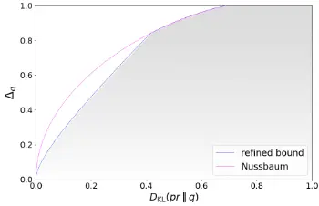

## Refined Statistical Bounds for Classification Error Mismatches with Constrained Bayes Error

Zijian Yang∗† , Vahe Eminyan∗ , Ralf Schl¨uter∗† , Hermann Ney∗† ∗Machine Learning and Human Language Technology Group, Lehrstuhl Informatik 6, Computer Science Department, RWTH Aachen University, Germany †AppTek GmbH, Germany

Abstract-In statistical classification/multiple hypothesis testing and machine learning, a model distribution estimated from the training data is usually applied to replace the unknown true distribution in the Bayes decision rule, which introduces a mismatch between the Bayes error and the model-based classification error. In this work, we derive the classification error bound to study the relationship between the KullbackLeibler divergence and the classification error mismatch. We first reconsider the statistical bounds based on classification error mismatch derived in previous works, employing a different method of derivation. Then, motivated by the observation that the Bayes error is typically low in machine learning tasks like speech recognition and pattern recognition, we derive a refined Kullback-Leibler-divergence-based bound on the error mismatch with the constraint that the Bayes error is lower than a threshold.

Index Terms-machine learning, classification error bound, multiple hypothesis testing, mismatch condition

## I. INTRODUCTION &amp; RELATED WORK

Statistical classification, also known as multiple hypothesis testing, is widely applied in machine learning areas, e.g. neural machine translation [1], automatic speech recognition [2], and pattern recognition [3]. In these tasks, the recognition/decoding result is generated by using a decision rule. In statistical classification, an important performance measure is the classification error, which is minimized by the Bayes decision rule that utilizes the underlying true distribution of the classification task. Information theory provides several bounds on the Bayes error, such as Chernoff bound [4], nearest neighbor bound [5], and Lainiotis bound [6]. However, these general bounds do not cover more specific modeling issues. In practice, the true distribution is unknown, and a probabilistic model is trained to approximate the true distribution and used in the decision rule, which introduces a discrepancy between the true distribution of the data and the probabilistic model [7], [8]. This discrepancy is not addressed in the works for error bounds on the Bayes error. In this work, we will make a mathematically strict distinction between true and model distributions used in decision rules. We refer to the difference between the Bayes error and the model-based classification error as the classification error mismatch.

In information theory and machine learning, many statistical measures are introduced w.r.t two mismatched distributions, e.g., Kullback-Leibler (KL) divergence and total variation distance. The relationship between total variation distance and KL divergence has been investigated in the past years.

In machine learning, [9, p.10] introduced the BretagnolleHuber bound for density estimation. Vajda et al. introduced a refinement of Pinsker's inequality in [10]. Based on [10], Fedotov et al. derived the parametrization of the tight bound between KL-divergence and total variation distance in [11].

While considerable attention has been devoted to investigating the total variation distance in existing literature, relatively limited studies have been placed on the classification error mismatch. The relationship between total variation distance and the classification error mismatch was derived in [7]. In that work, Ney derived several statistical bounds on the error mismatch from the bounds for total variation distance. Nussbaum et al. provided a tight bound between f-divergence and error mismatch in [12], and Schl¨uter et al. derived the complete proof of the bound in [8].

While the bound derived in [8], [12] is tight when the true distribution is arbitrary, it can be refined when more information about the true distribution is obtained. In practice, many classification tasks typically have a low Bayes error. For instance, in speech recognition, the word error rate of human speech recognition is often below 1% [13] for a wide range of conditions [14], indicating the Bayes error to be even lower. Motivated by this, in this work, we derive that the KL-divergence-based classification error bound can be refined when the Bayes error is lower than a threshold.

This paper is organized as follows: initially, we provide an overview of the fundamental concepts related to the classification error problem. Subsequently, we reexamine the proof of the general f-divergence-based tight bound as proposed in [8], and derive the local and global bounds between KL-divergence and classification error mismatch with an alternative approach, without employing the permutation method used in the original proof. Based on the local bound, we then derive a refined KLdivergence-based bound under the condition that the Bayes error remains below a certain threshold.

## II. CLASSIFICATION ERROR MISMATCH

Consider a statistical classification problem, where pr(c, x) is defined as the joint true distribution for a class c ∈ C and an observation x ∈ X. To simplify the discussion, we assume that x is a discrete variable, where |X| &gt; 2 and |C| &gt; 2. The Bayse decision rule for the classification task is defined as:

$$c _ { * } ^ { x } \colon = \arg \max _ { c } p r ( c , x ) = \arg \max _ { c } p r ( c | x ) .$$

where pr is the true probability. In practical applications, the true distribution is unknown. Therefore, a model distribution q(c, x) is employed to estimate the true distribution. The model-based decision rule is defined as:

$$c _ { q } ^ { x } \colon = \arg \max _ { c } q ( c , x ) = \arg \max _ { c } q ( c | x ) . \quad ( 2 ) \ \ p r ( c | x )$$

For a joint event (x, c), given the Bayes decision rule x → cx∗ and model-based decision rule x → cxq , the classification error counts for Bayes and model-based decision rules are defined as:

$$e _ { * } ( x , c ) \colon = 1 - \delta ( c _ { * } ^ { x } , c ) , \ \ e _ { q } ( x , c ) \colon = 1 - \delta ( c _ { q } ^ { x } , c ) , \quad ( 3 ) \quad \text {that} \colon$$

where δ(·, ·) is the Kronecker delta. The local Bayes classification error E∗{e|x} is defined as the expectation of e(x, c) under the true distribution pr(c|x):

$$\mathbb { E } \{ e _ { * } | x \} \colon = \sum _ { c } p r ( c | x ) e _ { * } ( x , c ) = 1 - p r ( c _ { * } ^ { x } | x ) \quad ( 4 ) \quad \text {between} \quad \\ \quad$$

The local model-based classification error, i.e. the expectation of error using the model-based decision rule, is defined similarly by replacing the Bayes decision rule with the modelbased decision rule:

$$\mathbb { E } \{ e _ { q } | x \} \colon = \sum _ { c } p r ( c | x ) e _ { q } ( x , c ) = 1 - p r ( c _ { q } ^ { x } | x ) \quad ( 5 ) \quad ^ { \stackrel { q ( c | x ) } { m i s m a t } }$$

Note that the model distribution is only used to estimate the true distribution in the decision rule. Therefore, the expectation is still computed under the true distribution. The effect of local classification mismatch can be represented by the local error mismatch:

$$\Delta _ { q } ( x ) \colon = \mathbb { E } \{ e _ { q } | x \} - \mathbb { E } \{ e _ { * } | x \} = p r ( c _ { * } ^ { x } | x ) - p r ( c _ { q } ^ { x } | x ) \quad ( 6 ) \quad \text {case $\Delta_{q}$}$$

with ∆q(x) ∈ [0, 1] according to the definition. The global Bayes and model-based classification errors, E∗ and Eq, are defined as the expectation of the local errors:

$$E _ { * } = \sum _ { x } p r ( x ) \mathbb { E } \{ e _ { * } | x \} , \ \ E _ { q } = \sum _ { x } p r ( x ) \mathbb { E } \{ e _ { q } | x \} . \ \ ( 7 )$$

The global error mismatch ∆q is defined as the difference between Eq and E∗:

$$\Delta _ { q } \colon = E _ { q } - E _ { * } = \sum _ { x } p r ( x ) \Delta _ { q } ( x ) . \quad ( 8 ) \ = \ \ = \ \ c \in \real ^ { 2 }$$

It is shown in [7] that the total variation distance V , defined as:

$$V \colon = \frac { 1 } { 2 } \sum _ { x , c } | p r ( c , x ) - q ( c , x ) | , \quad \quad ( 9 ) ^ { c \infty }$$

is an upper bound of the global error mismatch, namely:

$$\Delta _ { q } \leq \sum _ { x , c } | p r ( c , x ) - q ( c , x ) | = 2 V \quad ( 1 0 ) \quad = \\ =$$

This indicates that all the upper bounds for total variation distance can also be applied to ∆q, though not tight anymore. In [8], the bounds derived from V were compared with the tight bound derived for ∆q.

## III. RELATIONSHIP BETWEEN LOCAL ERROR MISMATCH AND KL-DIVERGENCE

## A. Local Bound for f-Divergence

For discrete variables, the f-divergence from q(c|x) to pr(c|x) is defined as:

$$\longrightarrow \quad D _ { f } \left ( p r ( c | x ) \, \| \, q ( c | x ) \right ) \colon = \sum _ { c } q ( c | x ) f ( \frac { p r ( c | x ) } { q ( c | x ) } )$$

where f is a convex function f : R+ → R with the specific property f(1) = 0. The understanding of the edge cases is that:

$$f ( 0 ) = f ( 0 ^ { + } ) , \ \ 0 f ( \frac { 0 } { 0 } ) = 0 .$$

Equation (11) is referred to as a local measure because the measure is computed for a single observation. In [8], Schl¨uter et al. derived the global bound of ∆q based on f-divergence between joint distributions pr(c, x) and q(c, x), which can also be applied to the proof of the local f-divergence. In this work, we revisit the result from [8] and reformulate it to a local bound, with a different proof.

Theorem 1. The local f-divergence between pr(c|x) and q(c|x) is tightly lower-bounded by a function of the local error mismatch ∆q(x) in the following way:

$$\begin{array} { r l } { \tt a n t e } & { D _ { f } ( p r ( c | x ) \, \| \, q ( c | x ) ) \geq \frac { 1 } { 2 } ( f ( 1 + \Delta _ { q } ( x ) ) + f ( 1 - \Delta _ { q } ( x ) ) ) } \\ { \tt e c t i a t i o n } & { ( 1 3 ) } \end{array}$$

Proof. When ∆q(x) = 0, the right-hand side of (13) equals 0, the inequality holds because of the non-negativity of fdivergence. In the following case, we consider the non-trivial case ∆q(x) ∈ (0, 1].

Lemma 1. Aggregation of two summands of an f-Divergence: with p1, p2, q1, q2 ∈ R+, the following inequality holds:

$$q _ { 1 } f ( \frac { p _ { 1 } } { q _ { 1 } } ) + q _ { 2 } f ( \frac { p _ { 2 } } { q _ { 2 } } ) \geq ( q _ { 1 } + q _ { 2 } ) f ( \frac { p _ { 1 } + p _ { 2 } } { q _ { 1 } + q _ { 2 } } )$$

With this lemma, we can derive that:

$$f \} . \quad ( 7 ) \quad & q _ { 1 } f ( \frac { p _ { 1 } } { q _ { 1 } } ) + q _ { 2 } f ( \frac { p _ { 2 } } { q _ { 2 } } ) \geq ( q _ { 1 } + q _ { 2 } ) f ( \frac { p _ { 1 } + p _ { 2 } } { q _ { 1 } + q _ { 2 } } ) \\ & \text {With this lemma, we can derive that:} \\ \text {difference} \quad & D _ { f } ( p r ( c | x ) \, \| \, q ( c | x ) ) = \sum _ { c } q ( c | x ) f ( \frac { p r ( c | x ) } { q ( c | x ) } ) \\ & ( 8 ) \quad = \sum _ { c \in \{ c ^ { x } , c ^ { x } \} } q ( c | x ) f ( \frac { p r ( c | x ) } { q ( c | x ) } ) + \sum _ { c \in \mathcal { C } \ \{ c ^ { x } , c ^ { x } \} } q ( c | x ) f ( \frac { p r ( c | x ) } { q ( c | x ) } ) \\ \text {defined} \quad & \geq \sum _ { c \in \{ c ^ { x } , c ^ { x } \} } q ( c | x ) f ( \frac { p r ( c | x ) } { q ( c | x ) } ) \\ & ( 9 ) \quad + \sum _ { c \in \mathcal { C } \ \{ c ^ { x } , c ^ { x } \} } q ( c | x ) f ( \frac { \sum _ { c \in \mathcal { C } \ \{ c ^ { x } , c ^ { x } \} } p r ( c | x ) } { \sum _ { c \in \mathcal { C } \ \{ c ^ { x } , c ^ { x } \} } q ( c | x ) } ) \\ & ( 1 0 ) \quad = \sum _ { c \in \{ c ^ { x } , c ^ { x } \} } q ( c | x ) f ( \frac { p r ( c | x ) } { q ( c | x ) } ) \\ \text {variation} \quad & \text { anymore.} \quad + ( 1 - q ( c _ { * } ^ { x } | x ) - q ( c _ { q } ^ { x } | x ) ) f ( \frac { 1 - p r ( c _ { * } ^ { x } | x ) } { 1 - q ( c _ { * } ^ { x } | x ) - q ( c _ { q } ^ { x } | x ) } ) \\$$

$$& \geq \frac { 1 - q ( c _ { * } ^ { x } | x ) + q ( c _ { q } ^ { x } | x ) } { 2 } f \left ( \frac { \frac { 1 - p r ( c _ { * } ^ { x } | x ) + p r ( c _ { q } ^ { x } | x ) } { 2 } } { \frac { 1 - q ( c _ { x } ^ { x } | x ) + q ( c _ { q } ^ { x } | x ) } { 2 } } \right ) \quad \text {The ass} \\ & \quad + \frac { 1 + q ( c _ { * } ^ { x } | x ) - q ( c _ { q } ^ { x } | x ) } { 2 } f \left ( \frac { \frac { 1 + p r ( c _ { * } ^ { x } | x ) - p r ( c _ { q } ^ { x } | x ) } { 2 } } { \frac { 1 + q ( c _ { x } ^ { x } | x ) - q ( c _ { q } ^ { x } | x ) } { 2 } } \right ) \quad \text {where} \\ & = \frac { 1 + \epsilon } { 2 } f ( \frac { 1 - \Delta _ { q } ( x ) } { 1 + \epsilon } ) + \frac { 1 - \epsilon } { 2 } f ( \frac { 1 + \Delta _ { q } ( x ) } { 1 - \epsilon } ) \quad ( 1 6 ) \\ \text {where } \epsilon \colon = q ( c _ { q } ^ { x } | x ) - q ( c _ { * } ^ { x } | x ) \in ( 0 , 1 ) . \text { Note that } f \text { is convex} \quad \text {Note} \ t b {$$

where ϵ := q(cxq |x) - q(cx∗ |x) ∈ (0, 1). Note that f is convex and f(1) = 0, based on the property of a convex function that f(u)-f(1) u-1 is monotonically non-decreasing in u, let u = 1-∆q(x) 1+ϵ , and u0 = 1 -∆q(x), we have 1 &gt; u0 ≥ u, and therefore the following inequality holds:

$$& \text {and therefore the following inequality holds:} & & \text {In} \ m a t h s c r { I } \\ & \frac { f ( u ) - f ( 1 ) } { u - 1 } \leq \frac { f ( u _ { 0 } ) - f ( 1 ) } { u _ { 0 } - 1 } & & \text {in} \text {, } \text {point, } b \\ & \Rightarrow ( 1 + \epsilon ) \frac { f ( \frac { 1 - \Delta _ { q } ( x ) } { 1 + \epsilon } ) } { - \Delta _ { q } ( x ) - \epsilon } \leq \frac { f ( 1 - \Delta _ { q } ( x ) ) } { - \Delta _ { q } ( x ) } \\ & \Rightarrow ( 1 + \epsilon ) \frac { f ( \frac { 1 - \Delta _ { q } ( x ) } { 1 + \epsilon } ) } { \Delta _ { q } ( x ) + \epsilon } \geq \frac { f ( 1 - \Delta _ { q } ( x ) ) } { \Delta _ { q } ( x ) } \\ & \Rightarrow ( 1 + \epsilon ) f ( \frac { 1 - \Delta _ { q } ( x ) } { 1 + \epsilon } ) \geq f ( 1 - \Delta _ { q } ( x ) ) \left ( 1 + \frac { \epsilon } { \Delta _ { q } ( x ) } \right ) \, ( 1 7 ) \quad \text {divergent} \\ & \text {Similarly, } \det \ u \, = \, \frac { 1 + \Delta _ { q } ( x ) } { \Delta _ { q } } \text { and } u _ { 1 } \, = \, 1 + \Delta _ { q } ( x ) , \, \text {we have}$$

Similarly, let u = 1+∆q(x) 1-ϵ and u1 = 1 + ∆q(x), we have u ≥ u1 &gt; 1, and therefore we obtain the following inequality:

$$& \frac { f ( u ) - f ( 1 ) } { u - 1 } \geq \frac { f ( u _ { 1 } ) - f ( 1 ) } { u _ { 1 } - 1 } \\ & \Rightarrow ( 1 - \epsilon ) f ( \frac { 1 + \Delta _ { q } ( x ) } { 1 - \epsilon } ) \geq f ( 1 + \Delta _ { q } ( x ) ) ( 1 + \frac { \epsilon } { \Delta _ { q } ( x ) } ) \ \ ( 1 8 ) \quad \text {distribu} \\$$

Then, by substituting (17) and (18) into (16), we have:

$$T h e n , \, & \text { by substituting } ( 1 7 ) \text { and } ( 1 8 ) \text { into } ( 1 6 ) , \, \text { we have:} \quad \text { be obtainable} \\ & \quad 2 D _ { f } ( p r ( | x | ) \, \| \, q ( c | x ) ) \\ & \geq \frac { 1 } { 2 } \left ( \underbrace { f ( 1 + \Delta _ { q } ( x ) ) + f ( 1 - \Delta _ { q } ( x ) ) } _ { \geq 2 f \left ( \frac { 1 + \Delta _ { q } ( x ) + 1 } { 2 } \right ) \Delta _ { q } ( x ) } \right ) ( 1 + \frac { \epsilon } { \Delta _ { q } ( x ) } ) \quad D _ { K L } ( p r ) \\ & \geq \lim _ { \epsilon \to 0 ^ { + } } \frac { 1 } { 2 } \left ( f ( 1 + \Delta _ { q } ( x ) ) + f ( 1 - \Delta _ { q } ( x ) ) \right ) ( 1 + \frac { \epsilon } { \Delta _ { q } ( x ) } ) \\ & = \frac { 1 } { 2 } \left ( f ( 1 + \Delta _ { q } ( x ) ) + f ( 1 - \Delta _ { q } ( x ) ) \right ) . \quad \text { (19)} \quad \text { by utili} \\ \text { Therefore, } & ( 1 3 ) \text { is  proved.  When } \Delta _ { q } ( x ) \, = \, 0 , \, \text { the equality} \quad \text {alternat} \quad \text {lower-by}$$

Therefore, (13) is proved. When ∆q(x) = 0, the equality can be obtained by pr(c|x) = q(c|x), ∀c. When ∆q ∈ (0, 1], the equality of the bound can be obtained by the following parametrized distribution with λ ∈ (0.5, 1]:

$$\text {parametrized distribution with } \lambda \in ( 0 . 3 , 1 ] \colon \\ \ p r ( c | x ) = \left \{ \begin{array} { l l l } { \lambda , } & { c = c _ { 1 } } \\ { 1 - \lambda , } & { c = c _ { 2 } } \\ { 0 , } & { o t h e r w i s e } \end{array} , \\ q ( c | x ) = \lim _ { \epsilon \to 0 ^ { + } } \left \{ \begin{array} { l l l } { 0 . 5 - \epsilon , } & { c = c _ { 1 } } \\ { 0 . 5 + \epsilon , } & { c = c _ { 2 } } \\ { 0 , } & { o t h e r w i s e } \end{array} , \\ \text {where } c _ { 1 } \text { and } c _ { 2 } \text { are two different classes } c _ { 1 } \text { s e n s } \text { , and } \epsilon \text { s e n s } \text { that } \text { is also } c _ { 1 }$$

where c1 and c2 are two different classes, and ϵ ensures that cxq = c2 ̸= c1 = cx∗ . With the distributions discussed above, the tightness of the bound is verified.

## B. Local Bound for KL-Divergence

□

The KL-divergence is obtained by setting f(u) = u logu. The associated lower bound becomes:

$$D _ { \text {KL} } ( p r ( c | x ) \, \| \, q ( c | x ) ) \geq B ( \Delta _ { q } ( x ) )$$

where B is defined as:

$$B ( u ) = \frac { 1 } { 2 } \left ( ( 1 + u ) \log ( 1 + u ) + ( 1 - u ) \log ( 1 - u ) \right ) \ \ ( 2 2 )$$

Note that B is also a convex function and B(0) = 0.

## IV. RELATIONSHIP BETWEEN GLOBAL ERROR MISMATCH AND KL-DIVERGENCE

In machine learning tasks, the performance of the model is usually not measured on one single observation or data point, but on the whole dataset. Therefore, in this section, we investigate the bounds for the global error mismatch ∆q.

## A. Conditional KL-Divergence

Since B(∆q(x)) is the lower bound of the local KLdivergence and B is convex, the expectation of local KL-divergence under pr(x), namely, the conditional KLdivergence is lower-bounded by B(∆q ):

$$\sum _ { x } p r ( x ) D _ { \text {KL} } ( p r ( c | x ) \, \| \, q ( c | x ) ) & \geq \sum _ { x } p r ( x ) B ( \Delta _ { q } ( x ) ) \\ & \geq B ( \sum _ { x } p r ( x ) \Delta _ { q } ( x ) ) = B ( \Delta _ { q } ) \\$$

The equality for ∆q ∈ (0, 1] can be obtained with such a distribution that for each x, the conditional probabilities are like in (20) with λ ∈ (0.5, 1]. When ∆q = 0, the equality can be obtained by pr(c|x) = q(c|x), ∀x, c.

## B. Joint KL-Divergence

Now we consider another global measure, KL-divergence DKL(pr ∥ q) between joint distributions pr(c, x) and q(c, x):

$$D _ { K L } ( p r \left \| \ q \right ) \colon = \sum _ { x , c } p r ( c , x ) \log \frac { p r ( c , x ) } { q ( c , x ) } .$$

In [8], the bound between DKL(pr ∥ q) and ∆q was proved by utilizing the permutation operation. Here, we provide an alternative proof. To this end, we show that DKL(pr ∥ q) is lower-bounded by the conditional KL-divergence:

$$& \colon ( 0 , 1 ] , & & \text {lower-bounded by the conditional KL-divergence} \\ & \text {lowing} & \ D _ { K L } ( p r \ \| q ) = \sum _ { x , c } p r ( c , x ) ( \log \frac { p r ( c | x ) } { q ( c | x ) } + \log \frac { p r ( x ) } { q ( x ) } ) \\ & & = \sum _ { x } p r ( x ) \sum _ { c } p r ( c | x ) \log \frac { p r ( c | x ) } { q ( c | x ) } + \sum _ { x } p r ( x ) \log \frac { p r ( x ) } { q ( x ) } \\ & & \geq \sum _ { x } p r ( x ) \sum _ { c } p r ( c | x ) \log \frac { p r ( c | x ) } { q ( c | x ) } \\ & & \text {Combining (23) and (25), it is observed that } \ D _ { K L } ( p r \ \| q )$$

Combining (23) and (25), it is observed that DKL(pr ∥ q) is also lower-bounded by B(∆q):

$$D _ { \text {KL} } ( p r \, \| \, q ) \geq B ( \Delta _ { q } ) .$$

The equality is obtained when having the same conditional distributions as in the case of conditional KL-divergence, with additional condition pr(x) = q(x).

## V. REFINED BOUNDS WITH CONSTRAINTS ON E∗

The bound (26) is tight when the true distribution pr(c, x) is unconstrained. However, the bound can be refined if the true distribution is subject to some constraints. One typical condition in machine learning tasks is that the Bayes error is low. For instance, the word-level classification error of human speech recognition can be below 1% [14], indicating the Bayes error to be even lower. Inspired by this, we consider a system with low Bayes error E∗ ≤ t &lt; 0.5, where t is an estimated threshold. Under this constraint, a refined bound is given as:

Theorem 2. When E∗ ≤ t &lt; 0.5, DKL(pr||q) is lowerbounded by the following function of ∆q,

$$D _ { K L } ( p r | | q ) \geq \left \{ \begin{array} { l l } { ( \Delta _ { q } + 2 t ) B ( \frac { \Delta _ { q } } { \Delta _ { q } + 2 t } ) } & { , f o r \, \Delta _ { q } \in [ 0 , 1 - 2 t ) } \\ { B ( \Delta _ { q } ) } & { , f o r \, \Delta _ { q } \in [ 1 - 2 t , 1 ] } \\ { E _ { * } = E _ { 0 } } & { ( 2 7 ) } \end{array} \quad \text {where } \bar { E }$$

To prove Theorem 2, we first introduce two lemmas, followed by their proofs.

Lemma 2. When ∆q &lt; 1-2t, there is at least one observation x0 with pr(x0) &gt; 0 such that cx0 ∗ = cx0 q holds.

Proof. For the sake of contradiction, suppose for all x, cx∗ ̸= cxq , then for each local error mismatch ∆q(x), we have

$$\Delta _ { q } ( x ) & = p r ( c _ { * } ^ { x } | x ) - p r ( c _ { q } ^ { x } | x ) \geq p r ( c _ { * } ^ { x } | x ) - ( 1 - p r ( c _ { * } ^ { x } | x ) ) \\ & = 1 - 2 \mathbb { E } \{ e _ { * } | x \} \\ \intertext { \text {Theor} } \intertext { T h o r f o r } \Delta _ { q } ( x ) & = p r ( c _ { * } ^ { x } | x ) - p r ( c _ { q } ^ { x } | x ) \geq p r ( c _ { * } ^ { x } | x ) \\ \intertext { A c c o r d i n d } \intertext { S c o r d i n d } \intertext { T h o r f o r } \Delta _ { q } ( x ) & = 1 - 2 \mathbb { E } \{ e _ { * } | x \} \\$$

Therefore, ∆q is lower-bounded by:

$$\Delta _ { q } = \sum _ { x } p r ( x ) \Delta _ { q } ( x ) & \geq 2 \sum _ { x } p r ( x ) p r ( c _ { * } ^ { x } | x ) - 1 \\ & = 1 - 2 E _ { * } \geq 1 - 2 t , \\$$

which contradicts the condition on ∆q.

Note that since cx0 ∗ = cx0 q , ∆q(x0) = 0. Without loss of generality, we assume that for all the other observations x ̸= x0, cx∗ ̸= cxq . When pr(x0) = 1, ∆q = pr(x0)∆q(x0) = 0, and the right-hand side of (27) is 0. Therefore (27) holds. In the following discussion, we assume pr(x0) &lt; 1. ∆q can be rewritten as:

$$\text {rewritten as:} \\ \Delta _ { q } & = p r ( x _ { 0 } ) \Delta _ { q } ( x _ { 0 } ) + \sum _ { x \neq x _ { 0 } } p r ( x ) \Delta _ { q } ( x ) \\ & = 0 + ( 1 - p r ( x _ { 0 } ) ) \sum _ { x \neq x _ { 0 } } \frac { p r ( x ) } { 1 - p r ( x _ { 0 } ) } \Delta _ { q } ( x ) \\ & = ( 1 - p r ( x _ { 0 } ) ) \tilde { \Delta } _ { q } ( x _ { 0 } ) \\ \text {which} \ \tilde { \Delta } _ { q } \left ( x \right ) \colon & \text {is the $p r(x_{0})$} \sum _ { x \neq x _ { 0 } } \frac { p r ( x ) } { 1 - p r ( x _ { 0 } ) } \Delta _ { q } ( x ) \\$$

where ˜∆q(x0) is the expected classification error for the renormalized true distribution ˜ pr(x) without x0.

$$\tilde { p r } ( x ) = \frac { \ p r ( x ) } { 1 - \ p r ( x _ { 0 } ) } , \tilde { \Delta } _ { q } ( x _ { 0 } ) = \sum _ { x \neq x _ { 0 } } \tilde { p r } ( x ) \Delta _ { q } ( x ) \quad ( 3 1 ) \quad \text {the left} \\$$

Lemma 3. ∀∆q ∈ [0, 1-2t), ˜∆q(x0) is lower-bounded by:

$$\tilde { \Delta } _ { q } ( x _ { 0 } ) \geq \Delta _ { q } ( 1 + \frac { 1 - 2 t - \Delta _ { q } } { 2 ( t - \mathbb { E } \{ e _ { * } | x _ { 0 } \} ) + \Delta _ { q } } ) \geq \frac { \Delta _ { q } } { 2 t + \Delta _ { q } } . \\ \text {if the} \\$$

Proof. when ∆q = 0, the Lemma obviously holds. Therefore, we consider the interval ∆q ∈ (0, 1 - 2t). According to the definition of ∆q, we have:

$$\text {system} \quad \Delta _ { q } = ( 1 - p r ( x _ { 0 } ) ) \, \tilde { \Delta } _ { q } ( x _ { 0 } ) \Rightarrow \quad p r ( x _ { 0 } ) = 1 - \frac { \Delta _ { q } } { \tilde { \Delta } _ { q } ( x _ { 0 } ) } . \ \ ( 3 3 )$$

Since ∆q &lt; 1 - 2t, we also have:

$$\left ( 1 - p r ( x _ { 0 } ) \right ) \tilde { \Delta } _ { q } ( x _ { 0 } ) = \Delta _ { q } < 1 - 2 t .$$

Meanwhile, according to the constraint E∗ ≤ t, we have:

$$E _ { * } = p r ( x _ { 0 } ) \mathbb { E } \{ e _ { * } | x _ { 0 } \} + ( 1 - p r ( x _ { 0 } ) ) \, \tilde { E } _ { * } ( x _ { 0 } ) \leq t .$$

where ˜E∗(x0) is defined as:

$$\tilde { E } _ { * } ( x _ { 0 } ) = \sum _ { x \neq x _ { 0 } } \tilde { p } r ( x ) \mathbb { E } \{ e _ { * } | x \} .$$

According to (28) and the definition of ˜∆q(x0) in (31), ˜E∗(x0) and ˜∆q(x0) have the following relationship:

$$\sum _ { x \choose x } ^ { * \, ^ { 7 } } \quad \tilde { \Delta } _ { q } ( x _ { 0 } ) \geq 1 - 2 \tilde { E } _ { * } ( x _ { 0 } ) \Leftrightarrow \tilde { E } _ { * } ( x _ { 0 } ) \geq \frac { 1 - \tilde { \Delta } _ { q } ( x _ { 0 } ) } { 2 } \quad ( 3 7 )$$

According to (34) and (37), we have:

$$( 1 - p r ( x _ { 0 } ) ) ( 1 - 2 \tilde { E } _ { * } ( x _ { 0 } ) ) & < 1 - 2 t \\ \Rightarrow ( 1 - p r ( x _ { 0 } ) ) \tilde { E } _ { * } ( x _ { 0 } ) & > t - \frac { p r ( x _ { 0 } ) } { 2 } \\$$

$$B y \text { substituting (38) into (35), we obtain that } \mathbb { E } \{ e _ { * } | x _ { 0 } \} & < \frac { 1 } { 2 } \colon \\ \square \quad & p r ( x _ { 0 } ) \mathbb { E } \{ e _ { * } | x _ { 0 } \} \leq t - ( 1 - p r ( x _ { 0 } ) ) \tilde { E } _ { * } ( x _ { 0 } ) < t - t + \frac { p r ( x _ { 0 } ) } { 2 } \\ \text {loss of} & \quad \Rightarrow \mathbb { E } \{ e _ { * } | x _ { 0 } \} < \frac { 1 } { 2 } . \\ \text {s} _ { 0 } & = 0 , \quad \text {To obtain the bound for } \Delta _ { a } , \text { by substituting } ( 3 3 ) \text { into } ( 3 5 ) ,$$

To obtain the bound for ∆q, by substituting (33) into (35), combined with (37), the following inequality can be derived.

$$d s . \text { in } \text { combined with } ( 3 / ) , \text { the following inequality can be derived.} \\ \text {can be } & & p r ( x _ { 0 } ) \mathbb { E } \{ e _ { * } | x _ { 0 } \} + ( 1 - p r ( x _ { 0 } ) ) \frac { 1 - \tilde { \Delta } _ { q } ( x _ { 0 } ) } { 2 } \leq t \\ & \Rightarrow ( 1 - \frac { \Delta _ { q } } { \tilde { \Delta } _ { q } ( x _ { 0 } ) } ) \mathbb { F } \{ e _ { * } | x _ { 0 } \} + ( \frac { \Delta _ { q } } { \tilde { \Delta } _ { q } ( x _ { 0 } ) } ) \frac { 1 - \tilde { \Delta } _ { q } ( x _ { 0 } ) } { 2 } \leq t \\ & \Rightarrow ( 2 t - 2 \mathbb { E } \{ e _ { * } | x _ { 0 } \} + \Delta _ { q } ) \tilde { \Delta } _ { q } ( x _ { 0 } ) \geq \Delta _ { q } ( 1 - 2 \mathbb { E } \{ e _ { * } | x _ { 0 } \} ) \\ ( 3 0 ) & \quad \text {Now we prove that}$$

Now we prove that

$$2 t - 2 \mathbb { E } \{ e _ { * } | x _ { 0 } \} + \Delta _ { q } > 0 .$$

For the sake of contradiction, if 2t - 2E{e∗|x0} +∆q ≤ 0, the left-hand side of (40) is less than or equal to 0, while the right-hand side of the inequality, ∆q(1-2E{e∗|x0}) &gt; 0

Fig. 1: Comparison of the Nussbaum bound [12] and the refined bound in this paper. The simulations in the upper figure are under the constraint E∗ ≤ 0.08. The grey dots refer to the simulation points.

because E{e∗|x0} &lt; 0.5 and ∆q &gt; 0, which contradicts to the inequality. Therefore, (41) holds. By dividing both sides of (40) by (41), we have:

$$\tilde { \Delta } _ { q } ( x _ { 0 } ) & \geq \frac { \Delta _ { q } ( 1 - 2 \mathbb { E } \{ e _ { * } | x _ { 0 } \} ) } { 2 t - 2 \mathbb { E } \{ e _ { * } | x _ { 0 } \} + \Delta _ { q } } \\ & = \Delta _ { q } ( 1 + \frac { 1 - 2 t - \Delta _ { q } } { 2 ( t - \mathbb { E } \{ e _ { * } | x _ { 0 } \} ) + \Delta _ { q } } ) \\$$

Because ∆q &lt; 1 - 2t and E{e∗|x0} ≥ 0, the right-hand side of the inequality obtains minimum when E{e∗|x0} = 0, i.e.

$$\tilde { \Delta } _ { q } ( x _ { 0 } ) \geq \Delta _ { q } ( 1 + \frac { 1 - 2 t - \Delta _ { q } } { 2 ( t - \mathbb { E } \{ e _ { * } | x _ { 0 } \} ) + \Delta _ { q } } ) \geq \frac { \Delta _ { q } } { 2 t + \Delta _ { q } } \ ( 4 3 )$$

Based on Lemma 2 and Lemma 3, we provide the proof of Theoream 2 as follows:

Proof of Theorem 2. When ∆q = 0, the inequality holds because of the non-negativity. When ∆q ∈ (0, 1 - 2t), we have:

$$& \text {Proof of Theorem 2.  When } \Delta _ { q } \, = \, 0 , \, \text { the inequality holds} \\ & \text {because of the non-negativity. When } \Delta _ { q } \, \in ( 0 , 1 - 2 t ) , \, \text { we } \, \text { Figure} \\ & \text {have: }$$

$$& = ( 1 - p r ( x _ { 0 } ) ) B ( \tilde { \Delta } _ { q } ( x _ { 0 } ) ) = \Delta _ { q } \frac { B ( \tilde { \Delta } _ { q } ( x _ { 0 } ) ) } { \tilde { \Delta } _ { q } ( x _ { 0 } ) } \left ( c . f . \left ( 3 0 \right ) \right ) \\ & \geq \Delta _ { q } \frac { B ( \frac { \Delta _ { q } } { 2 t + \Delta _ { q } } ) } { \frac { \Delta _ { q } } { 2 t + \Delta _ { q } } } = ( \Delta _ { q } + 2 t ) g ( \frac { \Delta _ { q } } { \Delta _ { q } + 2 t } ) \\ & \quad \geq \Delta _ { q } \frac { B ( u ) - q ( 0 ) } { 2 t + \Delta _ { q } }$$

(c.f. (43), and B is convex, B(u) - g(0) u-0 is monotonically

$$\text {d} \, \text { the } \quad \text {non-decreasing} ; \, \text {equality for } \tilde { \Delta } _ { q } ( x _ { 0 } ) = \frac { \Delta _ { q } } { \Delta _ { q } + 2 t } )$$

For the second segment ∆q ∈ [1-2t, 1], let pr(c|x) and q(c|x) be distributions given in (20) for each x. In this case,

$$\Delta _ { q } = 2 \lambda - 1 \Rightarrow \lambda = \frac { 1 + \Delta _ { q } } { 2 } \in [ 1 - t , 1 ] , \\ \\ \Gamma _ { q } = 1 - 1 \Rightarrow \lambda = \frac { 1 + \Delta _ { q } } { 2 } \in [ 1 - t , 1 ] ,$$

$$E _ { * } = 1 - \lambda \leq t$$

which shows that these distributions are valid under the constraint. Therefore, (26) is still the tightest bound. □

For the first segment where ∆q ∈ [0, 1 - 2t), equality is achieved through a particular selection of distributions. Effectively, there are two observations x1, x2, and pr(x) = 0 for x /∈ {x1, x2}. Given a parameter λ ∈ [0.5, 1 - t), the true and model distributions for observation x1 and x2 are parametrized as follows:

$$& \text { and side } \quad \text {parametrize as follows:} \\ & 0 , \, i . e . & & \ p r ( x _ { 1 } ) = 1 - \frac { t } { 1 - \lambda } , \, p r ( c | x _ { 1 } ) = q ( c | x _ { 1 } ) = \left \{ \begin{array} { c c c } 1 , & c = c _ { 1 } \\ 0 , & \text {otherwise} \end{array} \\ & \quad \circledast ( 4 3 ) & & \\ & \quad \circledast ( 4 3 ) & & \\ & \quad \circledast ( x _ { 2 } ) = \frac { t } { 1 - \lambda } , & \ p r ( c | x _ { 2 } ) = \left \{ \begin{array} { c c c } \lambda , & c = c _ { 1 } \\ 1 - \lambda , & c = c _ { 2 } \\ 0 , & \text {otherwise} \end{array} \\ & \text {proof of} & & \\ & \quad q ( c | x _ { 2 } ) = \lim _ { c \to 0 ^ { + } } \left \{ \begin{array} { c c c } 0 . 5 - \epsilon , & c = c _ { 1 } \\ 0 . 5 + \epsilon , & c = c _ { 2 } \\ 0 , & \text {otherwise} \end{array} \\ & \text {holds} & & \\ & 2 t ) , \, \text { we } & \text {Figure } \ 1 \ \text {shows the comparison of the Nussbaum bound} & & \\ & ( 2 6 ) \text { and the derived bound (27) with simulation results, on} & &$$

Figure 1 shows the comparison of the Nussbaum bound (26) and the derived bound (27) with simulation results, on the constraint E∗ ≤ 0.08. The simulation was conducted by generating various distribution pairs (pr, q) until all the reachable areas were covered. Each grey dot represents the result of a single simulation. The simulation results verify that (27) is tight under the constraint E∗ ≤ t for ∆q ∈ [0, 1], providing an improved bound compared to Nussbaum bound.

## VI. CONCLUSION

In this work, we investigated the relationship between the Kullback-Leibler divergence and the classification error mismatch, which is introduced by replacing the unknown true distribution with the distribution from the model in Bayes decision rule. We started by revisiting the statistical bound with unconstrained true distributions from previous works and offered an alternative proof. Motivated by the assumption that the Bayes error is typically low in machine learning tasks, we further derived the refined bound on the error mismatch under the constraint that Bayes error is lower than a threshold. The analytical results were supported by simulations.

## REFERENCES

- [1] F. Stahlberg, "Neural machine translation: A review," Journal of Artificial Intelligence Research, vol. 69, pp. 343-418, 2020.
- [2] R. Prabhavalkar, T. Hori, T. N. Sainath, R. Schl¨uter, and S. Watanabe, "End-to-end speech recognition: A survey," IEEE/ACM Transactions on Audio, Speech, and Language Processing, 2023.
- [3] A. K. Jain, R. P. W. Duin, and J. Mao, "Statistical pattern recognition: A review," IEEE Transactions on pattern analysis and machine intelligence, vol. 22, no. 1, pp. 4-37, 2000.
- [4] J. T. Chu, "Error bounds for a contextual recognition procedure," IEEE Transactions on Computers, vol. 100, no. 10, pp. 1203-1207, 1971.
- [5] P. A. Devijver, "On a new class of bounds on bayes risk in multihypothesis pattern recognition," IEEE Transactions on Computers, vol. 100, no. 1, pp. 70-80, 1974.
- [6] D. Lainiotis, "A class of upper bounds on probability of error for multihypotheses pattern recognition (corresp.)," IEEE Transactions on Information Theory, vol. 15, no. 6, pp. 730-731, 1969.
- [7] H. Ney, "On the relationship between classification error bounds and training criteria in statistical pattern recognition," in Pattern Recognition and Image Analysis: First Iberian Conference, IbPRIA 2003, Puerto de Andratx, Mallorca, Spain, JUne 4-6, 2003. Proceedings 1. Springer, 2003, pp. 636-645.
- [8] R. Schl¨uter, M. Nussbaum-Thom, E. Beck, T. Alkhouli, and H. Ney, "Novel tight classification error bounds under mismatch conditions based on f-divergence," in 2013 IEEE Information Theory Workshop (ITW). IEEE, 2013, pp. 1-5.
- [9] V. Vapnik, Statistical Learning Theory. Wiley, 1998.
- [10] I. Vajda, "Note on discrimination information and variation (corresp.)," IEEE Transactions on Information Theory, vol. 16, no. 6, pp. 771-773, 1970.
- [11] A. A. Fedotov, P. Harremo¨es, and F. Topsoe, "Refinements of pinsker's inequality," IEEE Transactions on Information Theory, vol. 49, no. 6, pp. 1491-1498, 2003.
- [12] M. Nussbaum-Thom, E. Beck, T. Alkhouli, R. Schl¨uter, and H. Ney, "Relative error bounds for statistical classifiers based on the fdivergence." in Interspeech, 2013, pp. 2197-2201.
- [13] T. Wesker, B. T. Meyer, K. Wagener, J. Anem¨uller, A. Mertins, and B. Kollmeier, "Oldenburg logatome speech corpus (ollo) for speech recognition experiments with humans and machines." in Interspeech. Citeseer, 2005, pp. 1273-1276.
- [14] R. P. Lippmann, "Speech recognition by machines and humans," Speech communication, vol. 22, no. 1, pp. 1-15, 1997.
