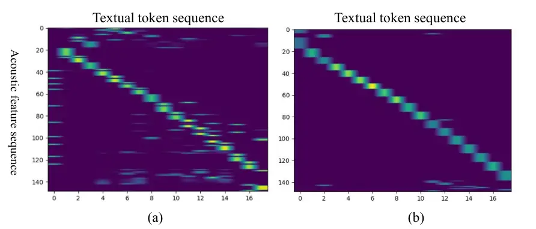

# Temporal Order Preserved Optimal Transport-based Cross-modal Knowledge Transfer Learning for ASR

Xugang Lu    Peng Shen    Yu Tsao    Hisashi Kawai

###### Abstract

Transferring linguistic knowledge from a pretrained language model (PLM)
to an acoustic model has been shown to greatly improve the performance
of automatic speech recognition (ASR). However, due to the heterogeneous
feature distributions in cross-modalities, designing an effective model
for feature alignment and knowledge transfer between linguistic and
acoustic sequences remains a challenging task. Optimal transport (OT),
which efficiently measures probability distribution discrepancies, holds
great potential for aligning and transferring knowledge between acoustic
and linguistic modalities. Nonetheless, the original OT treats acoustic
and linguistic feature sequences as two unordered sets in alignment and
neglects temporal order information during OT coupling estimation.
Consequently, a time-consuming pretraining stage is required to learn a
good alignment between the acoustic and linguistic representations. In
this paper, we propose a Temporal Order Preserved OT (TOT)-based
Cross-modal Alignment and Knowledge Transfer (CAKT) (TOT-CAKT) for ASR.
In the TOT-CAKT, local neighboring frames of acoustic sequences are
smoothly mapped to neighboring regions of linguistic sequences,
preserving their temporal order relationship in feature alignment and
matching. With the TOT-CAKT model framework, we conduct Mandarin ASR
experiments with a pretrained Chinese PLM for linguistic knowledge
transfer. Our results demonstrate that the proposed TOT-CAKT
significantly improves ASR performance compared to several
state-of-the-art models employing linguistic knowledge transfer, and
addresses the weaknesses of the original OT-based method in sequential
feature alignment for ASR.

###### Index Terms:

Optimal transport, Cross-modal knowledge transfer, automatic speech
recognition

^(†)^(†)address: 1. National Institute of Information and Communications
Technology, Japan  
2. Research Center for Information Technology Innovation, Academia
Sinica, Taiwan

## 1 Introduction

The combination of a pretrained language model (PLM) with an end-to-end
(E2E)-based acoustical model for automatic speech recognition (ASR) has
made significant progress in recent years \[1, 2, 3, 4, 5, 6\]. The
advantage of incorporating a PLM in ASR lies in the availability of
unpaired large text corpora for training the PLM. Moreover, the
linguistic knowledge encoded in the PLM can be utilized in ASR decoding.
In most studies, the PLM is employed as an external language model (LM)
for post-processing tasks such as beam search or rescoring in ASR \[7,
8\]. However, using an external LM for post-processing compromises the
speed and sometimes parallel decoding capabilities of ASR. Addressing
how to transfer linguistic knowledge to acoustic encoding during model
training, and subsequently conducting speech recognition without relying
on any external LM post-training, is an intriguing research topic.

In this study, our focus is on transferring linguistic knowledge from a
PLM to a temporal connectionist temporal classification (CTC)-based ASR
\[9\]. While there are several advanced end-to-end (E2E)-based ASR
approaches that incorporate linguistic knowledge in acoustic model
learning \[10, 11\], using a PLM, such as bidirectional encoder
representation from transformers (BERT) \[12\]), facilitates linguistic
knowledge transfer in ASR \[13, 14, 15, 16\], This knowledge transfer
can also occur with a pretrained acoustic encoder, such as wav2vec2
\[17\], for both linguistic and acoustic knowledge transfer \[18, 19,
20, 21, 22, 23, 24, 25\]. However, due to the heterogeneous feature
distributions in acoustic and linguistic spaces, it remains a
challenging task to efficiently align feature representations between
linguistic and acoustic modalities to facilitate knowledge transfer. In
most studies, a cross-attention module is designed to integrate acoustic
and text representations within a transformer decoder framework for
combining acoustic and linguistic knowledge in ASR \[26\]. Yet, in the
decoding stage, true text representations are unavailable, leading to
the adoption of predicted text representations in decoding. This
mismatch between training and testing phases weakens the benefits of
linguistic information in ASR.

For efficient alignment and matching, an effective distance metric is
needed to measure the difference between acoustic and linguistic feature
representations. Considering this requirement, optimal transport (OT)
emerges as a suitable tool for cross-modal alignment and linguistic
knowledge transfer. OT, originally proposed for optimal allocating
resources and later as a measure of discrepancies between probability
distributions \[27, 28\], has found widespread applications in machine
learning, particularly in domain adaptation \[28\]. In the field of
speech, it has been employed for cross-domain spoken language
recognition and speech enhancement \[29, 30, 31\], as well as in speech
translation and understanding \[32, 33, 34, 35\]. The OT has been
initially proposed for linguistic knowledge transfer learning for ASR in
\[36\]. While OT is applicable for cross-domain alignment, its use in
speech encounters a limitation. The original OT treats acoustic and
linguistic feature sequences as two unordered sets in alignment and
neglects temporal order information during OT coupling estimation. While
acoustic and text speech exhibit a strong temporal order structure,
requiring preservation of their temporal order relationship during
alignment between an acoustic sequence and a linguistic sequence.
Therefore, in \[36\], a well pretrained acoustic model was applied in
order to efficiently explore matched acoustic features to those
linguistic features during cross-modal learning. And the performance was
strongly depended on the goodness of the pretrained acoustic model. In
this paper, we propose a Temporal Order Preserved OT (TOT)-based
Cross-modal Alignment and Knowledge Transfer (CAKT) model (TOT-CAKT) for
CTC-based ASR. With the TOT-CAKT, the temporal order relationship is
explicitly maintained during feature alignment and matching. It is
hypothesized that through this alignment and matching, linguistic
knowledge can be efficiently transferred to acoustic encoding, thereby
enhancing ASR performance.

The rest of this paper is organized as follows: the proposed method is
introduced in Section 2, where a cross-modal alignment module based on
TOT and a neural adapter module for efficient linguistic feature
transfer are designed. In Section 3, we conduct experiments to evaluate
TOT-CAKT, comparing the results with several knowledge transfer learning
algorithms for ASR, and provide a visualization of the learned transport
coupling in OT. Finally, the conclusion is presented in Section 4.

## 2 Proposed method

The model framework of the proposed TOT-CAKT method is illustrated in
Fig. 1. This model framework is modified based on a conformer-CTC-based
ASR model, incorporating two key modifications. First, an ‘Adapter’
module is added as shown in the gray blocks in Fig. 1. Second, an
temporal order preserved OT-based cross-modal matching module is
introduced in the right branch of Fig. 1. Both the acoustic features
extracted from the conformer encoder and linguistic features derived
from a PLM (with BERT utilized in this paper) are involved in the
cross-modal matching process. Further details are provided in the
following sections.

Figure 1: The model framework of the proposed cross-modal alignment and
knowledge transfer method based on TOT.

### 2.1 Acoustic and linguistic feature representations

The acoustic feature is extracted from the acoustic encoder where a
conformer-based encoder \[37\]) is adopted. The process in the
‘Subsampling’ module involves a two-layer convolution process with a
downsampling operation (a downsampling rate of $`4`$ was used in this
paper). By incorporating a positional encoding from
$`{\rm PE}_{\rm A}`$, the initial input to conformer blocks is obtained
as $`{\bf H}_{0}`$. The output of the conformer encoder is represented
as an acoustic representation $`{\bf H}_{\rm ca}`$.

```math
\begin{array}[]{l}{\bf H}_{0}={\rm Subsampling}\left({\bf X}\right)+{\rm PE}_{\rm A}\\
{\bf H}_{{\rm ca}}={\rm Conformer}\left({{\bf H}_{0}}\right)\in R^{l_{a}\times d_{a}},\\
\end{array} \tag{1}
```

where $`l_{a}`$ and $`d_{a}`$ are temporal length and dimension of the
acoustic feature vectors, respectively. Before engaging in cross-modal
feature alignment, a linear projection termed ‘FC2’ in the ‘Adapter’
module is utilized to perform a feature dimension matching transform:

```math
{\bf H}_{\rm A}={\rm FC}_{\rm 2}\left({{\bf H}_{{\rm ca}}}\right)\in R^{l_{a}\times d_{t}} \tag{2}
```

In this equation, $`d_{t}`$ corresponds to linguistic feature dimension.
In the right branch of Fig. 1, the context-dependent linguistic feature
representation is explored from a pretrained BERT model. The process is
formulated as:

```math
\begin{array}[]{l}{\bf y}_{{\rm token}}={\rm BERTTokenizer}\left({\bf y}\right)\\
\vskip 5.69054pt{\bf Z}_{0}=\left[{{\rm CLS,}{\bf y}_{{\rm token}},{\rm SEP}}\right]\\
\vskip 5.69054pt{\bf Z}_{i}={\rm BERT}_{i}\left({{\bf Z}_{i-1}}\right),\\
\end{array} \tag{3}
```

where ‘$`{\rm BERT}_{i}`$’ is the $`i`$-th transformer encoder layer of
BERT model, $`i`$ takes values from $`1`$ to $`L`$, with $`L`$
representing the total number of BERT encoder layers.
‘$`\rm BERTTokenizer`$’ is a process to convert standard text to word
piece based tokens \[12\]. Token symbols ‘CLS’ and ‘SEP’ represent the
start and end of an input sequence.
$`{\bf Z}_{L}\in\mathbb{R}^{l_{t}\times d_{t}}`$ is the final text
representation which encodes context dependent linguistic information,
$`l_{t}`$ denotes the sequence length, and $`d_{t}`$ represents feature
dimension of text encoding representation.

### 2.2 Sinkhorn algorithm for cross-modal alignment

The original OT was formulated to transform from one probability
distribution to another with minimum transport cost \[27\]. In this
study, we applied OT for feature alignment on two sets. Given acoustic
and linguistic feature sequences $`{\bf H}_{A}`$ and $`{\bf Z}_{L}`$
respectively, as:

```math
\begin{array}[]{l}{\bf H}_{A}=\left[{{\bf h}_{1},{\bf h}_{2},...,{\bf h}_{i},...,{\bf h}_{l_{a}}}\right]\\
{\bf Z}_{L}=\left[{{\bf z}_{1},{\bf z}_{2},...,{\bf z}_{j},...,{\bf z}_{l_{t}}}\right],\\
\end{array} \tag{4}
```

where $`l_{a}`$ and $`l_{t}`$ are lengths of the two sequences. Suppose
the two sequences in Eq. (4) are sampled from two probability
distributions with weight vectors
$`{\bf a}=\left[{a_{1},a_{2},...,a_{i},...,a_{l_{a}}}\right]`$ and
$`{\bf b}=\left[{b_{1},b_{2},...,b_{j},...,b_{l_{t}}}\right]`$.
($`a_{i}={1\mathord{\left/{\vphantom{1{l_{a}}}}\right.\kern-1.2pt}{l_{a}}},b_{j}={1\mathord{\left/{\vphantom{1{l_{t}}}}\right.\kern-1.2pt}{l_{t}}}`$
as uniform distributions if no prior information is available). The OT
distance between the two sequences is defined as:

```math
L_{\rm OT}\mathop{=}\limits^{\Delta}\mathop{\min}\limits_{\gamma\in\prod{\left({{\bf H}_{A},{\bf Z}_{L}}\right)}}\left\langle{\gamma,{\bf C}}\right\rangle, \tag{5}
```

where $`{\gamma}`$ is a transport coupling set defined as:

```math
\prod{\left({{\bf H}_{A},{\bf Z}_{L}}\right)}\mathop{=}\limits^{\Delta}\left\{{\gamma\in R_{+}^{l_{a}\times l_{t}}\left|{\gamma{\bf 1}_{l_{t}}={\bf a},\gamma^{T}{\bf 1}_{l_{a}}={\bf b}}\right.}\right\} \tag{6}
```

In Eq. (6), $`{\bf 1}_{l_{a}}`$ and $`{\bf 1}_{l_{t}}`$ are vectors of
ones with dimensions $`l_{a}`$ and $`l_{t}`$, respectively. In Eq. (5),
$`\bf C`$ is a distance matrix (or ground metric) with element
$`{c_{i,j}}`$ defined as pair-wised cosine distance:

```math
c_{i,j}={\bf C}\left({{\bf h}_{i},{\bf z}_{j}}\right)\mathop{=}\limits^{\Delta}1-\cos\left({{\bf h}_{i},{\bf z}_{j}}\right) \tag{7}
```

A fast estimation of OT has been introduced through the celebrated
entropy-regularized OT (EOT) \[38\] where the EOT loss is defined as:

```math
L_{\rm EOT}\left({{\bf H}_{A},{\bf Z}_{L}}\right)\mathop{=}\limits^{\Delta}\mathop{\min}\limits_{\gamma\in\prod{\left({{\bf H}_{A},{\bf Z}_{L}}\right)}}\left\langle{\gamma,{\bf C}}\right\rangle-\alpha_{1}H\left(\gamma\right), \tag{8}
```

where $`\alpha_{1}`$ is a regularization coefficient, and
$`H\left(\gamma\right)`$ is entropy of coupling matrix defined as:

```math
H\left(\gamma\right)\mathop{=}-\sum\limits_{i,j}{\gamma_{i,j}\log\gamma_{i,j}}. \tag{9}
```

The solution of Eq. (8) can be implemented with Sinkhorn algorithm as
\[27\]:

```math
\gamma_{\alpha_{1}}=diag\left({{\bf u}_{1}}\right)*{\bf G}*diag\left({{\bf u}_{2}}\right) \tag{10}
```

where $`{\bf G}=\exp\left({-\frac{{\bf C}}{{\alpha_{1}}}}\right)`$,
$`{{\bf u}_{1}}`$ and $`{{\bf u}_{2}}`$ are two scaling (or
re-normalization) vectors.

### 2.3 Temporal order preserved OT

In the original estimation of OT in Eq. (8), the two sequences in Eq.
(4) are treated as two sets without considering their temporal order
relationship. In speech, temporal order information is crucial in OT
coupling during cross-modal alignment, meaning that neighboring frames
in an acoustic sequence should be progressively coupled with the
neighboring tokens in a linguistic sequence. Therefore, as showed in
Fig. 1, the temporal order information is input to the OT matching
block. For the sake of clarity, the two sequences in Eq. (4) can be
further represented with temporal order information as:

```math
\begin{array}[]{l}{\bf H}_{A}=\left[{\left({{\bf h}_{1},1}\right),\left({{\bf h}_{2},2}\right),...,\left({{\bf h}_{i},i}\right),...,\left({{\bf h}_{l_{a}},l_{a}}\right)}\right]\\
{\bf Z}_{L}=\left[{\left({{\bf z}_{1},1}\right),\left({{\bf z}_{2},2}\right),...,\left({{\bf z}_{j},j}\right),...,\left({{\bf z}_{l_{t}},l_{t}}\right)}\right]\\
\end{array} \tag{11}
```

During the alignment of the two sequences for knowledge transfer, it is
crucial to consider that elements with significant cross temporal
distances might not be likely to be coupled. In other words, the
coupling pairs with high probabilities between the two sequences should
be distributed along the diagonal line of the temporal coherence
positions. Based on this consideration, the temporal coupling prior
could be defined as a two dimensional Gaussian distribution \[39\]. The
fundamental concept is that the coupled pairs should not deviate
significantly from the diagonal line of temporal coherence positions
between the two sequences, which can be defined as:

```math
p_{i,j}\mathop{=}\limits^{\Delta}\frac{1}{{\sigma\sqrt{2\pi}}}\exp\left({-\frac{{d_{i,j}^{2}}}{{2\sigma^{2}}}}\right), \tag{12}
```

where $`\sigma`$ is a variation variable controlling the impact of the
cross-temporal distance $`d_{i,j}`$ as defined in Eq. (13).

```math
d_{i,j}=\frac{{\left|{{\raise 2.15277pt\hbox{$\scriptstyle i$}\kern-1.00006pt/\kern-1.49994pt\lower 1.07639pt\hbox{$\scriptstyle{l_{a}}$}}-{\raise 2.15277pt\hbox{$\scriptstyle j$}\kern-1.00006pt/\kern-1.49994pt\lower 1.07639pt\hbox{$\scriptstyle{l_{t}}$}}}\right|}}{{\sqrt{{\raise 2.15277pt\hbox{$\scriptstyle 1$}\kern-1.00006pt/\kern-1.49994pt\lower 1.07639pt\hbox{$\scriptstyle{l_{a}^{2}}$}}+{\raise 2.15277pt\hbox{$\scriptstyle 1$}\kern-1.00006pt/\kern-1.49994pt\lower 1.07639pt\hbox{$\scriptstyle{l_{t}^{2}}$}}}}} \tag{13}
```

In Eq. (13), the cross-temporal distance is defined on the normalized
sequence lengths in acoustic and linguistic spaces. In this definition,
it is evident that the farther the distance between a paired position
and the temporal diagonal line, the lower possibility of their
correspondence in transport coupling. By incorporating this temporal
coherence prior as regularization, the new OT is defined as:

```math
L_{\rm{TOT}}({\bf H}_{A},{\bf Z}_{L})\mathop{=}\limits^{\Delta}\mathop{\min}\limits_{\mathclap{\gamma\in\prod{({\bf H}_{A},{\bf Z}_{L})}}}<\gamma,{\bf C}>-\alpha_{1}H(\gamma)+\alpha_{2}KL(\gamma||P), \tag{14}
```

where $`\alpha_{1}`$ and $`\alpha_{2}`$ are two trade off parameters. In
Eq. (14), $`KL(\gamma||P)`$ is the Kullback-Leibler (KL) divergence
between the transport coupling matrix $`\gamma`$ and temporal prior
correspondence matrix $`P`$ with elements defined in Eq. (12). Building
upon the definitions of KL-divergence and entropy, Eq. (14) can be
further expressed to:

```math
L_{\rm{TOT}}({\bf H}_{A},{\bf Z}_{L})\mathop{=}\limits^{\Delta}\mathop{\min}\limits_{\gamma\in\prod{({\bf H}_{A},{\bf Z}_{L})}}<\gamma,{\bf\tilde{C}}>-\tilde{\alpha}H(\gamma), \tag{15}
```

where $`\tilde{\alpha}=\alpha_{1}+\alpha_{2}`$, and combined ground cost
matrix as

```math
{\bf\tilde{C}}={\bf C}-\alpha_{2}\log P \tag{16}
```

Following the procedures outlined in \[38\], the solution of Eq. (15) is
obtained using the Sinkhorn algorithm as:

```math
\gamma_{\tilde{\alpha}}=diag\left({{\bf u}_{1}}\right)*{\bf\tilde{G}}*diag\left({{\bf u}_{2}}\right), \tag{17}
```

where
$`{\bf\tilde{G}}=\exp\left({-\frac{{{\bf\tilde{C}}}}{{\tilde{\alpha}}}}\right)`$.
Substituting variables in Eq. (16) to $`{\bf\tilde{G}}`$, we can obtain:

```math
{\bf\tilde{G}}=P^{\frac{{\alpha_{2}}}{{\alpha_{1}+\alpha_{2}}}}\exp(-\frac{{\bf C}}{{\alpha_{1}+\alpha_{2}}}) \tag{18}
```

From this equation, we can see that the transport coupling between the
two sequences is further constrained by their temporal order
correspondence. TOT involves several hyper-parameters that can be
challenging to control. For the sake of simplification, we consolidate
their effects into a reduced number of hyper-parameters. For example,
considering Eq. (16), the impact of variation $`\sigma`$ in Eq. (12) and
$`\alpha_{2}`$ in Eq. (14) can be combined into a single control
parameter $`\beta`$, defined as:

```math
{\bf\tilde{C}}={\bf C}+\beta d_{i,j}^{2} \tag{19}
```

And the Sinkhorn algorithm is applied on the cost function matrix
$`{\bf\tilde{C}}`$ for OT in real implementations.

### 2.4 Loss function

The proposed TOT-CAKT involves two loss functions: the cross-modal
alignment and matching loss (in the right branch of Fig. 1) and the CTC
loss (in the left branch of Fig. 1). In cross-modal alignment, the
acoustic feature can be projected onto the linguistic space using OT as:

```math
\begin{array}[]{l}\begin{aligned} {\bf\tilde{Z}}_{L}&\mathop{=}\limits^{\Delta}{\rm OT}\left({{\bf H}_{A}\to{\bf Z}_{L}}\right)\\
&=\gamma^{*}\times{\bf H}_{A}\in R^{l_{t}\times d_{t}},\\
\end{aligned}\end{array} \tag{20}
```

where $`\gamma^{*}`$ is the optimal transport coupling based on OT.
Subsequently, the alignment loss is defined as:

```math
L_{{\rm align}}=\sum\limits_{j=2}^{l_{t}-1}{1-\cos\left({{\bf\tilde{z}}_{L}^{j},{\bf z}_{L}^{j}}\right)}, \tag{21}
```

where $`{\bf\tilde{z}}_{L}^{j}`$ and $`{\bf z}_{L}^{j}`$ are row vectors
of feature matrices $`{\bf\tilde{Z}}_{L}`$ and $`{\bf Z}_{L}`$ (matching
on temporal dimensions), respectively. In Eq. (21), the usage of indices
from $`2`$ to $`l_{t}-1`$ is for handling special symbols ‘$`\rm CLS`$’
and ‘$`\rm SEP`$’. For efficient linguistic knowledge transfer to
acoustic encoding, the following transforms are designed as indicated in
Fig. 1:

```math
\begin{array}[]{l}{\bf\hat{H}}_{{\rm ca}}={\rm FC}_{\rm 3}\left({{\rm LN(}{\bf H}_{A}{\rm)}}\right)\in R^{l_{a}\times d_{a}}\\
{\bf H}^{a,t}={\bf H}_{{\rm ca}}{\rm+s\cdot LN(}{\bf\hat{H}}_{{\rm ca}}{\rm)},\\
\end{array} \tag{22}
```

where $`s`$ is a scaling parameter to adjust the importance of
transferring linguistic projected feature. Based on this new
representation $`{\bf H}^{a,t}`$ which is intended to encode both
acoustic and linguistic information, the final probability prediction
for ASR is formulated as:

```math
{\bf\tilde{P}}={\rm Softmax}\left({{\rm FC1}\left({\bf H}^{a,t}\right)}\right), \tag{23}
```

where ‘FC1’ is a linear full-connected transform. The total loss in
model learning is defined as:

```math
L\mathop{=}\limits^{\Delta}\lambda.L_{{\rm CTC}}({\bf\tilde{P}},{\bf y}_{{\rm token}})+(1-\lambda).w.{(L_{{\rm align}}+L_{{\rm TOT}})}, \tag{24}
```

where $`L_{{\rm CTC}}({\bf\tilde{P}},{\bf y}_{{\rm token}})`$ is CTC
loss, $`{L_{{\rm align}}}`$ and $`{L_{{\rm TOT}}}`$ are cross-modality
alignment loss and TOT loss, respectively. After the model is trained,
only the left branch of Fig. 1 is retained for ASR inference.

## 3 Experiments

ASR experiments were conducted on the open-source Mandarin speech corpus
AISHELL-1 \[40\] to evaluate the proposed algorithm. The data corpus
comprises three datasets: a training set with 340 speakers (150 hours),
a development (or validation) set with 40 speakers (10 hours), and a
test set with 20 speakers (5 hours). Data augmentation as used in \[40\]
was applied. Given the tonal nature of the Mandarin language in the ASR
task, in addition to using 80-dimensional log Mel-filter bank features,
three extra acoustic features related to fundamental frequency, i.e.,
F0, delta F0 and delta delta F0, were utilized as raw input features.
These features were extracted with a 25ms window size and a 10ms shift.

### 3.1 Model architecture

In Fig. 1, the ‘Subsampling’ module consists of two CNN blocks with 256
channels, kernel size 3, stride 2, and ReLU activation function in each.
The acoustic encoder is formed by stacking $`16`$ conformer blocks
\[37\], with each having a kernel size of 15, attention dimension
$`d_{a}=256`$, $`4`$ attention heads, and a 2048-dimensional FFN layer.
The ‘bert-base-chinese’ from huggingface is used as the pretrained PLM
for linguistic knowledge transfer \[41\]. In this Chinese BERT model,
$`12`$ transformer encoders are applied, the token (or vocabulary) size
is 21128, and the dimension of linguistic feature representation is
$`d_{t}=768`$.

### 3.2 Hyper-parameters in model learning

Several hyper-parameters are associated with the proposed model, and
these parameters may have a joint (or correlated) effect in efficient
linguistic knowledge transfer learning. In our preliminary experiments,
for easy implementation, they were fixed as $`\beta=0.5`$ in Eq. (19),
alignment trade off parameter $`\lambda=0.3`$ and scale parameter
$`w=1.0`$ in Eq. (24). $`{\tilde{\alpha}}`$ in Eq. (15) and $`s`$ in Eq.
(22) were varied in experiments. For optimization, Adam optimizer \[42\]
is used with a learning rate (initially set to 0.001) schedule with
20,000 warm-up steps. The model with cross-modal transfer was trained
for 130 epochs, and the final model used for evaluation was obtained by
averaging models from the last 10 epochs (the original conformer-CTC
model without the adapter module was pretrained or trained from scratch
in different experimental settings when jointly combined with
cross-modal learning). The performance was evaluated based on character
error rate (CER).

### 3.3 Results

In inference stage, only the left branch (blocks in dashed red box in
Fig. 1) is utilized, maintaining the decoding speed similar to that of
the CTC-based decoding. In our experiments, only CTC greedy search-based
decoding was employed, and the results are presented in table 1. The
results of the baseline system and several state-of-the-art systems that
integrate BERT for linguistic knowledge transfer are also provided for
comparison.

|                                                 |         |          |
| ----------------------------------------------- | ------- | -------- |
| Methods                                         | dev set | test set |
| Conformer+CTC (Baseline)                        | 5.53    | 6.05     |
| Conformer+CTC/AED (\[5, 43\])                   | 4.61    | 5.06     |
| NAR-BERT-ASR (\[14\])                           | 4.90    | 5.50     |
| KT-RL-ATT (\[22\])                              | 4.38    | 4.73     |
| Wav2vec-BERT (\[21\])                           | 4.10    | 4.39     |
| Without pretraining condition                   |         |          |
| OT-BERT(w/o) (\[36\])                           | 4.21    | 4.52     |
| TOT-CAKT(w/o),$`\tilde{\alpha}=0.01`$,$`s=1.0`$ | 4.03    | 4.30     |
| TOT-CAKT(w/o), $`\tilde{\alpha}=0.1`$,$`s=1.0`$ | 4.16    | 4.48     |
| TOT-CAKT(w/o),$`\tilde{\alpha}=0.5`$,$`s=1.0`$  | 3.99    | 4.36     |
| TOT-CAKT(w/o),$`\tilde{\alpha}=0.5`$,$`s=0.5`$  | 4.06    | 4.40     |
| TOT-CAKT(w/o),$`\tilde{\alpha}=0.5`$,$`s=0.1`$  | 3.93    | 4.35     |
| TOT-CAKT(w/o),$`\tilde{\alpha}=0.01`$,$`s=0.1`$ | 4.02    | 4.29     |
| With pretraining condition                      |         |          |
| OT-BERT(w/)(\[36\])                             | 3.96    | 4.27     |
| TOT-CAKT(w/)                                    | 3.88    | 4.21     |

Table 1: ASR performance on the AISHELL-1 corpus, CER (%).

In this table, ‘Conformer+CTC’ is the baseline system, trained without
linguistic knowledge transfer. ‘Conformer+CTC/AED’ denotes a hybrid
CTC/AED ASR system \[3, 4, 5\] which used a transformer decoder with
attention to text representation during model training. ‘NAR-BERT-ASR’,
‘KT-RL-ATT’, and ‘Wav2vec-BERT’ are all based on integrating acoustic
and linguistic features from BERT for ASR \[22, 23, 14, 21\], and even
used a pretrained acoustic model (from wav2vec2.0 \[17\]) and PLM for
knowledge transfer. In the OT based cross-modal learning, two
experimental conditions were examined. One is that models with
cross-modal learning were trained from scratch, i.e., without
pretraining condition. The other is that the models were initialized
with a pretrained acoustic model, then were further trained with
cross-modal learning, i.e., with pretraining condition. Correspondingly,
in table 1, ‘OT-BERT(w/o)’ and ‘TOT-CAKT(w/o)’ denote results of
cross-modal linguistic knowledge transfer learning based on OT in \[36\]
and the proposed TOT-CAKT method for without pretraining condition,
respectively, ‘OT-BERT(w/)’ and ‘TOT-CAKT(w/)’ are results with
pretraining condition. From this table, we can observe that linguistic
knowledge significantly enhances the ASR performance (not in a
conventional way like LM rescoring). From the results in ‘OT-BERT(w/o)’
and ‘TOT-CAKT(w/o)’, both the methods in \[36\] and the proposed
cross-modal learning could efficiently transfer linguistic knowledge in
acoustic encoding, yielding promising results. Moreover, when comparing
results in ‘OT-BERT(w/o)’ and ‘TOT-CAKT(w/o)’, a significant performance
improvement was observed when all models with cross-modal learning were
trained from scratch (without pretraining condition). Furthermore, the
performance of our proposed TOT-CAKT, even without pretraining could
reach a level comparable to the original OT-based method, which requires
a time-consuming pretraining stage (as in ‘OT-BERT(w/)). Finally, we
further examined that when pretraining was utilized before cross-modal
learning, the improvement of our proposed method (as shown in
‘TOT-CAKT(w/)’ in table 1) compared to the ‘OT-BERT(w/)’ in \[36\] was
reduced. This suggests that the pretraining stage could implicitly
provide temporal order information for cross-modal feature alignment and
knowledge transfer. In comparison, our proposed method explicitly
incorporates temporal order information in the mathematical modeling
with flexible parameters for control in experiments. Based on our
formulation, our future work will focus on finding optimal temporal
order parameter settings.

### 3.4 Visualization of transport coupling

In the proposed TOT-CAKT, the coupled pairs between the acoustic and
linguistic feature sequences are explicitly designed to correspond to
their temporal coherence, i.e., acoustic segments should match well with
their linguistic tokens sequentially. Two examples of the coupling
matrices are shown in Fig. 2. In Fig. 2-a, the coupling matrix is
learned based on OT without temporal order constraint, and Fig. 2-b is
the coupling matrix learned with temporal order constraint.



Figure 2: Transport coupling matrix without temporal order constraint
(a); with temporal order constraint (b). (Both of these cross-modal
learning methods started from scratch without acoustic model
pretraining.)

From this figure, it is evident that clear temporal correspondences
exist between the acoustic feature sequence and linguistic token
sequence in both transport couplings. Moreover, several positions with
incorrect couplings in Fig. 2-a were corrected in Fig. 2-b by our
proposed method, which explicitly adds a temporal order constraint.

## 4 Conclusion

Acoustic and linguistic features belonging to different modalities
require feature alignment as a crucial step in transferring linguistic
knowledge from a PLM to acoustic encoding. In this paper, we proposed a
novel TOT-CAKT. In the TOT-CAKT, a transfer coupling or mapping
preserving temporal order information between acoustic sequence and
linguistic sequence was first estimated. Subsequently, acoustic features
were mapped to the linguistic space based on the transport coupling,
allowing direct comparison of the mapped features to match the
information encoded in the PLM. Our ASR experimental results confirmed
the effectiveness of the proposed TOT-CAKT. Additionally, based on the
visualization of transport coupling, we verified that TOT could
eliminate unreasonable matches between the acoustic and linguistic
sequences.

In the proposed TOT-CAKT, several hyper-parameters involved in model
learning are challenging to control. Additionally, some of these
hyper-parameters are sensitive in implementation and may lead to
stability problems in the Sinkhorn algorithm. In the current paper, the
combined effects of those hyper-parameters have not been clearly
explored, and a clear understanding of their combined rules has not been
established, potentially hindering the identification of optimal
solutions for improving ASR performance. Figuring out a set of optimal
hyper-parameters in the proposed TOT-CAKT remains as our future work.

## References

- \[1\] J. Li, “Recent advances in end-to-end automatic speech
  recognition,” _APSIPA Transactions on Signal and Information
  Processing_, DOI 10.1561/116.00000050, 2022.
- \[2\] W. Chan, N. Jaitly, Q. Le and O. Vinyals, “Listen, attend and
  spell: A neural network for large vocabulary conversational speech
  recognition,” in _Proc. of ICASSP_, 2016, pp. 4960-4964.
- \[3\] S. Kim, T. Hori, and S. Watanabe, “Joint CTC-attention based
  end-to-end speech recognition using multi-task learning,” in _Proc. of
  ICASSP_, 2017, pp. 4835–4839.
- \[4\] T. Hori, S. Watanabe, and J. R. Hershey, “Joint ctc/attention
  decoding for end-to-end speech recognition,” in _Proc. of ACL_, 2017,
  vol. 1, pp. 518–529.
- \[5\] S. Watanabe, T. Hori, S. Kim, J. R. Hershey and T. Hayashi,
  “Hybrid CTC/Attention Architecture for End-to-End Speech Recognition,”
  _IEEE Journal of Selected Topics in Signal Processing_, vol. 11, no.
  8, pp. 1240-1253, 2017.
- \[6\] A. Graves, “Sequence transduction with recurrent neural
  networks,” _arXiv preprint_, arXiv:1211.3711, 2012.
- \[7\] J. Shin, Y. Lee, and K. Jung, “Effective sentence scoring
  method using BERT for speech recognition,” in _Proc. of ACML_, 2019,
  pp. 1081-1093.
- \[8\] J. Salazar, D. Liang, T. Nguyen, K. Kirchhoff, “Masked Language
  Model Scoring,” in _Proc. of ACL_, 2020, pp. 2699-2712.
- \[9\] A. Graves, and N. Jaitly, “Towards end to-end speech
  recognition with recurrent neural networks,” in _Proc. ICML_, 2014,
  pp. 1764–1772.
- \[10\] Higuchi, K. Karube, T. Ogawa, et al., “Hierarchical conditional
  end-to-end asr with ctc and multi-granular subword units,” in _Proc.
  of ICASSP_, 2022, pp. 7797-7801.
- \[11\] Y. Fujita, T. Komatsu, and Y. Kida, “Multi-sequence
  intermediate conditioning for ctc-based asr,” _arXiv preprint_,
  arXiv:2204.00175, 2022.
- \[12\] J. Devlin, M. Chang, K. Lee, and K. Toutanova, “Bert:
  Pretraining of deep bidirectional transformers for language
  understanding,” _arXiv preprint_, arXiv:1810.04805, 2018.
- \[13\] Y. Bai, J. Yi, J. Tao, Z. Tian, Z. Wen and S. Zhang, ”Fast
  End-to-End Speech Recognition Via Non-Autoregressive Models and
  Cross-Modal Knowledge Transferring From BERT,” _IEEE/ACM Transactions
  on Audio, Speech, and Language Processing_, vol. 29, pp.
  1897-1911, 2021.
- \[14\] F. Yu, K. Chen, and K. Lu, “Non-autoregressive ASR Modeling
  using Pre-trained Language Models for Chinese Speech Recognition,”
  _IEEE/ACM Transactions on Audio, Speech, and Language Processing_,
  vol. 30, pp. 1474-1482, 2022
- \[15\] Y. Kubo, S. Karita, M. Bacchiani, “Knowledge Transfer from
  Large-Scale Pretrained Language Models to End-To-End Speech
  Recognizers,” in _Proc. of ICASSP_, 2022, pp. 8512-8516.
- \[16\] K. Choi, H. Park, “Distilling a Pretrained Language Model to a
  Multilingual ASR Model,” in _Proc. of INTERSPEECH_, 2022, pp.
  2203-2207.
- \[17\] A. Baevski, Y. Zhou, A. Mohamed, and M. Auli, “Wav2vec 2.0: A
  framework for self-supervised learning of speech representations,” in
  _Proc. of NeurIPS_, 2020.
- \[18\] H. Futami, H. Inaguma, M. Mimura, S. Sakai, T. Kawahara,
  “Distilling the Knowledge of BERT for CTC-based ASR,” CoRR
  abs/2209.02030, 2022.
- \[19\] Y. Higuchi, T. Ogawa, T. Kobayashi, S. Watanabe, “BECTRA:
  Transducer-Based End-To-End ASR with Bert-Enhanced Encoder,” in _Proc.
  of ICASSP_, 2023, pp. 1-5.
- \[20\] M. Han, F. Chen, J. Shi, S. Xu, B. Xu, “Knowledge Transfer
  from Pre-trained Language Models to Cif-based Speech Recognizers via
  Hierarchical Distillation,” _arXiv preprint_, arXiv:2301.13003, 2023.
- \[21\] K. Lu and K. Chen, “A Context-aware Knowledge Transferring
  Strategy for CTC-based ASR,” in _Proc. of SLT_, 2022, pp. 60-67.
- \[22\] K. Deng, S. Cao, Y. Zhang, L. Ma, G. Cheng, J. Xu, P. Zhang,
  “Improving CTC-Based Speech Recognition Via Knowledge Transferring
  from Pre-Trained Language Models,” in _Proc. of ICASSP_, 2022, pp.
  8517-8521.
- \[23\] K. Deng, Z. Yang, S. Watanabe, Y. Higuchi, G. Cheng, P. Zhang,
  “Improving Non-Autoregressive End-to-End Speech Recognition with
  Pre-Trained Acoustic and Language Models,” in _Proc. of ICASSP_, 2022,
  pp. 8522-8526.
- \[24\] K. Deng, Z, P. Woodland, “FastInject: Injecting Unpaired Text
  Data into CTC-Based ASR Training,” in _Proc. of ICASSP_, 2024, pp.
  11836-11840.
- \[25\] M. Han, L. Dong, Z. Liang, M. Cai, S. Zhou, Z. Ma, B. Xu,
  “Improving End-to-End Contextual Speech Recognition with Fine-Grained
  Contextual Knowledge Selection,” in _Proc. of ICASSP_, 2022, pp.
  8532-8536.
- \[26\] A. Vaswani, N. Shazeer, N. Parmar, J. Uszkoreit, L. Jones, A.
  Gomez, L. Kaiser, and I. Polosukhin, “Attention is all you need,” in
  _Proc. of NIPS_, 2017, pp. 5998-6008.
- \[27\] C. Villani, Optimal transport: old and new, volume 338.
  Springer, 2009
- \[28\] N. Courty, R. Flamary, A. Habrard, A. Rakotomamonjy, “Joint
  distribution optimal transportation for domain adaptation,” in _Proc.
  of NIPS_, 2017, pp. 3733-3742.
- \[29\] X. Lu, P. Shen, Y. Tsao, H. Kawai, “Unsupervised Neural
  Adaptation Model Based on Optimal Transport for Spoken Language
  Identification,” in _Proc. of ICASSP_, 2021, pp. 7213-7217.
- \[30\] H. Lin, H. Tseng, X. Lu, Y. Tsao, “Unsupervised Noise Adaptive
  Speech Enhancement by Discriminator-Constrained Optimal Transport,” in
  _Proc. of NeurIPS_, 2021, pp. 19935-19946.
- \[31\] H. Tseng, H. Lin, H. Hsuan, and Y. Tsao, “Interpretations of
  Domain Adaptations via Layer Variational Analysis,” _arXiv preprint_,
  CoRR abs/2302.01798, 2023.
- \[32\] W. Cho, D. Kwak, J. Yoon, N. Kim, “Speech to Text Adaptation:
  Towards an Efficient Cross-Modal Distillation,” in _Proc. of
  INTERSPEECH_, 2020, pp. 896-900.
- \[33\] W. Wang, S. Ren, Y. Qian, S. Liu, Y. Shi, Y. Qian, M. Zeng,
  “Optimizing Alignment of Speech and Language Latent Spaces for
  End-To-End Speech Recognition and Understanding,” in _Proc. of
  ICASSP_, 2021, pp. 7802-7806.
- \[34\] Y. Zhou, Q. Fang, Y. Feng, “CMOT: Cross-modal Mixup via
  Optimal Transport for Speech Translation,” _arXiv preprint_,
  arXiv:2305.14635, 2023.
- \[35\] P. Le, H. Gong, C. Wang, J. Pino, B. Lecouteux, D. Schwab,
  “Pre-training for Speech Translation: CTC Meets Optimal Transport,”
  _arXiv preprint_, CoRR abs/2301.11716, 2023.
- \[36\] X. Lu, P. Shen, Y. Tsao, H. Kawai, “Cross-Modal Alignment with
  Optimal Transport for CTC-Based ASR,” _IEEE-ASRU_, 2023,
  Dec.16-20,Taipei, Taiwan.
- \[37\] A. Gulati, J. Qin, C. Chiu, et al., “Conformer: Convolution
  augmented transformer for speech recognition,” _arXiv preprint_,
  arXiv:2005.08100, 2020
- \[38\] M. Cuturi, “Sinkhorn distances: Lightspeed computation of
  optimal transport,” in _Proc. of NIPS_, 2013, vol. 26.
- \[39\] B. Su, G. Hua, “Order-Preserving Wasserstein Distance for
  Sequence Matching,” in _Proc. of the IEEE Conference on Computer
  Vision and Pattern Recognition (CVPR)_, 2017.
- \[40\] Hui Bu, Jiayu Du, Xingyu Na, Bengu Wu, and Hao Zheng,
  “AIShell-1: An open-source mandarin speech corpus and a speech
  recognition baseline,” in _Proc. of COCOSDA_, 2017, pp. 1-5.
- \[41\] https://huggingface.co/
- \[42\] Diederik P. Kingma, Jimmy Ba, “Adam: A Method for Stochastic
  Optimization,” in _Proc. of ICLR_, 2015.
- \[43\] B. Zhang, D. Wu, Z. Peng, X. Song, Z. Yao, H. Lv, L. Xie, C.
  Yang, F. Pan, J. Niu, “WeNet 2.0: More Productive End-to-End Speech
  Recognition Toolkit,” in _Proc. of INTERSPEECH_, 2022, pp. 1661-1665.
