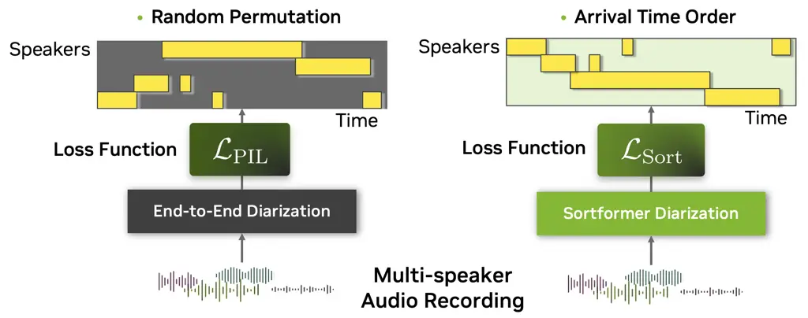
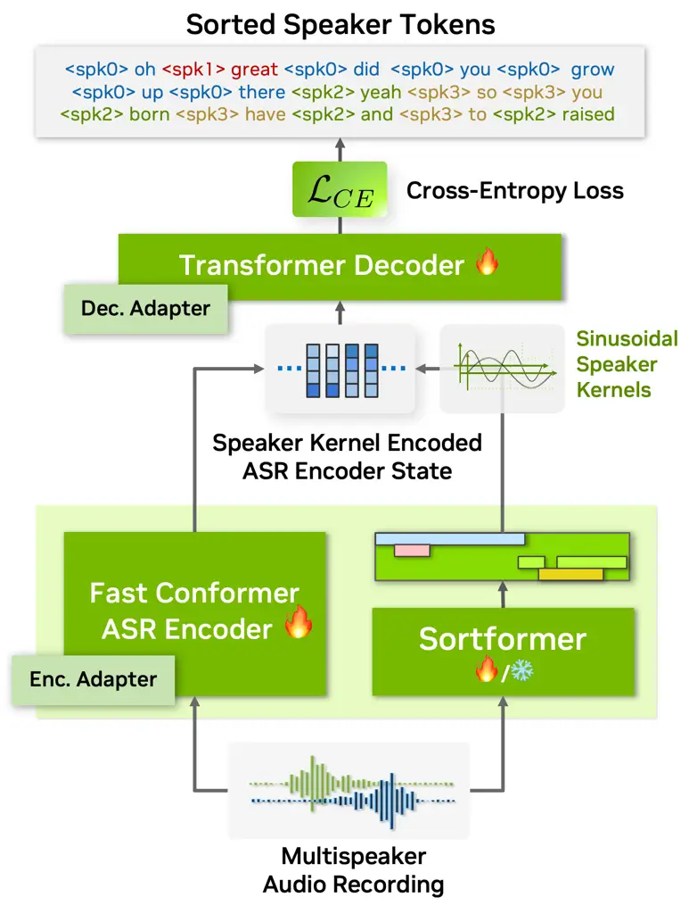
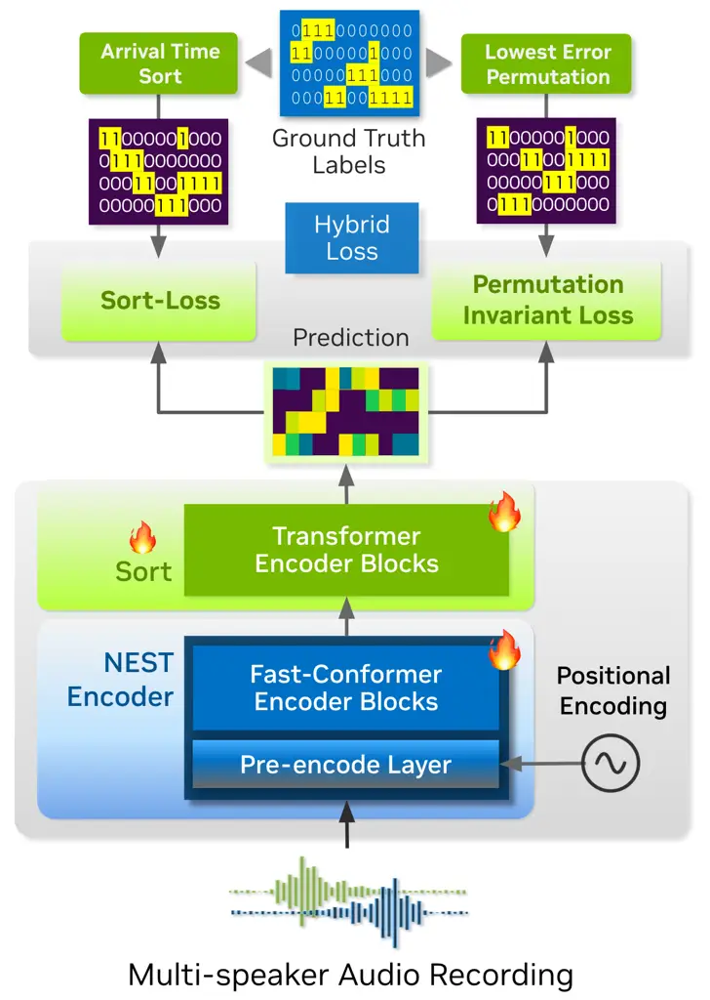
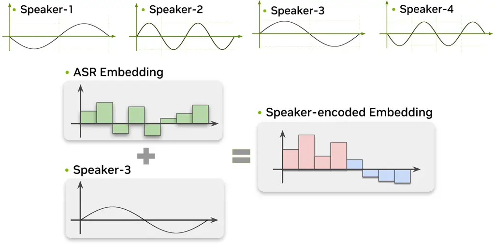
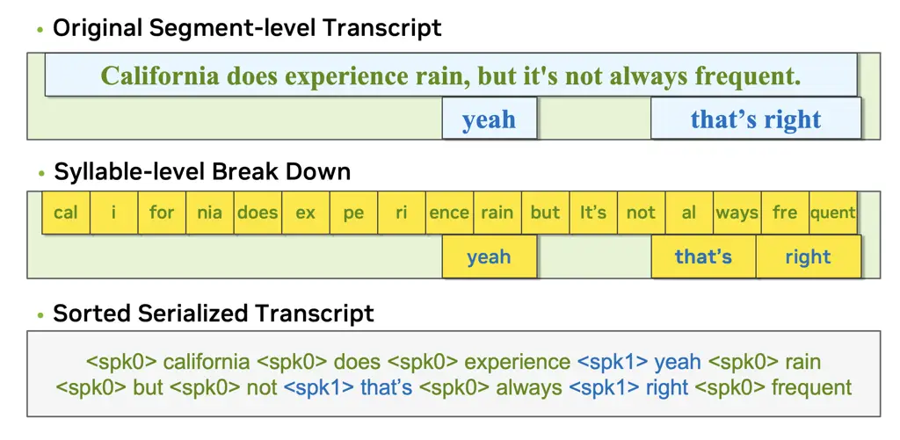

# Sortformer: A Novel Approach for Permutation-Resolved Speaker Supervision in Speech-to-Text Systems

Taejin Park Affiliation: NVIDIA, Santa Clara, USA Correspondence to:
<taejinp@nvidia.com>    Ivan Medennikov Affiliation: NVIDIA, Santa
Clara, USA    Kunal Dhawan Affiliation: NVIDIA, Santa Clara, USA   
Weiqing Wang Affiliation: NVIDIA, Santa Clara, USA    He Huang
Affiliation: NVIDIA, Santa Clara, USA    Nithin Rao Koluguri
Affiliation: NVIDIA, Santa Clara, USA    Krishna C. Puvvada Affiliation:
NVIDIA, Santa Clara, USA    Jagadeesh Balam Affiliation: NVIDIA, Santa
Clara, USA    Boris Ginsburg Affiliation: NVIDIA, Santa Clara, USA

###### Abstract

Sortformer is an encoder-based speaker diarization model designed for
supervising speaker tagging in speech-to-text models. Instead of relying
solely on permutation invariant loss (PIL), Sortformer introduces Sort
Loss to resolve the permutation problem, either independently or in
tandem with PIL. In addition, we propose a streamlined multi-speaker
speech-to-text architecture that leverages Sortformer for speaker
supervision, embedding speaker labels into the encoder using sinusoidal
kernel functions. This design addresses the speaker permutation problem
through sorted objectives, effectively bridging timestamps and tokens to
supervise speaker labels in the output transcriptions. Experiments
demonstrate that Sort Loss can boost speaker diarization performance,
and incorporating the speaker supervision from Sortformer improves
multi-speaker transcription accuracy. We anticipate that the proposed
Sortformer and multi-speaker architecture will enable the seamless
integration of speaker tagging capabilities into foundational
speech-to-text systems and multimodal large language models (LLMs),
offering an easily adoptable and user-friendly mechanism to enhance
their versatility and performance in speaker-aware tasks. The code and
trained models are made publicly available through the NVIDIA NeMo
Framework.

###### Keywords:

Machine Learning, ICML

^(†)^(†)affiliationnotice: Equal contribution

## 1 Introduction

With recent advances in deep neural networks and large language models
(LLMs), automatic speech recognition (ASR) is being deployed across a
broader range of industrial applications, enabling numerous new use
cases. In transcription services, a growing number of applications
require speaker annotations because natural language understanding (NLU)
modules need to recognize speakers to gain a deeper understanding of
conversations and interactions. Moreover, as modern machine learning
models demand large amounts of training data, the need for automatic
annotation systems has grown significantly.



Figure 1: Sortformer resolves permutation problem by following the
arrival-time order of the speech segments.

The rising demand for speaker annotations underscores the need for
robust speaker tagging—also known as speaker diarization, which is the
process of estimating generic speaker labels by assigning audio segments
to individual speakers. In the context of automatic speech recognition
(ASR), multi-speaker ASR (also referred to as speaker-attributed ASR or
multi-talker ASR in the literature) requires the speaker diarization
process, either directly or indirectly, to transcribe spoken words with
speaker annotations alongside the generated text. As ASR models continue
to be streamlined and become more accurate, speaker diarization is
progressively integrated into the ASR framework or performed
simultaneously during the ASR decoding process, enabling rich
transcription with conversational context.

Despite recent advances in speaker diarization and multi-speaker ASR,
these systems have been typically trained, deployed, and evaluated
separately from ASR models due to challenges such as data scarcity and
application diversity. Collecting annotated multi-talker conversational
speech is significantly more difficult than acquiring images or
single-speaker speech data, particularly for low-resource languages or
privacy-sensitive domains such as medical applications. Additionally,
multi-speaker ASR use cases often require models to perform inference on
multi-hour audio samples, while acquiring such long-form training data
is even more challenging.

Although these cascaded multi-speaker ASR systems achieve competitive
performance, optimizing or fine-tuning high-performance multi-speaker
ASR systems for specific domains remains a considerable challenge, as
demonstrated by evaluations such as CHiME challenges (Barker et al.,
2017; Barker et al., 2018; Watanabe et al., 2020; Cornell et al., 2023).
On the other hand, end-to-end multi-speaker ASR models without explicit
speaker diarization modules have been proposed (Kanda et al., 2020b; Shi
et al., 2024) which are based on the serialized output training (SOT)
technique. However, training such end-to-end multi-speaker ASR systems
requires speaker-annotated multi-speaker data, which is relatively
scarce and challenging to collect and annotate. As a result, the
performance of end-to-end multi-speaker ASR systems tends to lag behind
that of cascaded systems (Kanda et al., 2022b).

To address these challenges, we propose Sortformer¹¹ 1
[https://huggingface.co/nvidia/diar_sortformer_4spk-v1](https://huggingface.co/nvidia/diar_sortformer_4spk-v1),
introducing Sort Loss and techniques for bridging timestamps with text
tokens. Despite the popularity of end-to-end speaker diarization
systems, such speaker diarization models have not been able to be
seamlessly integrated into ASR models or multimodal LLMs. To overcome
this, we introduce an arrival time sorting (ATS) approach, where speaker
tokens from ASR outputs and speaker timestamps from diarization outputs
are sorted by arrival times to resolve permutations (see Figure 1).

Our proposed method enables multi-speaker ASR systems or multimodal LLMs
to be trained or fine-tuned while significantly improving in speaker
tagging accuracy with a relatively small amount of fine-tuning. A key
advantage is that multi-speaker ASR training can leverage a standard
token-level cross-entropy loss, facilitated by the permutation-resolved
speaker supervision of the Sortformer model. This approach makes
multi-speaker ASR training functionally equivalent to standard
mono-speaker ASR training and fine-tuning, requiring only minimal
architectural adjustments. Additionally, our method eliminates the need
for word-level or segment-level timestamps, significantly reducing
annotation requirements. Furthermore, Sortformer can function
independently as an end-to-end speaker diarization model.



Figure 2: The overall dataflow of speaker supervision from Sortformer
model integrated into the proposed MS-ASR system.

## 2 Related Works

### 2.1 Speaker Diarization

Before multi-speaker ASR gained prominence, speaker diarization handled
the task of identifying “who spoke when” without transcription. Early
systems, such as the RT03 evaluation (Tranter et al., 2003), combined
ASR word timestamps with speaker segmentations or attempted to use
phrase dictionaries (Canseco-Rodriguez et al., 2004), which showed
limited success. Recent advances, like TS-VAD (Medennikov et al.,
2020a), revolutionized cascaded multi-speaker ASR by employing
target-speaker voice activity detection into the multi-speaker ASR
pipeline, influencing subsequent systems (Wang & Li, 2022; Yang et al.,
2024). These approaches achieved strong results in real-world challenges
(Wang et al., 2021; Niu et al., 2024), cementing their relevance in
modular systems.

To streamline the speaker diarization system, a slew of end-to-end
neural diarization (EEND) models were proposed, framing speaker labeling
as a frame-wise classification task with permutation invariant training
(PIT) loss (Yu et al., 2017b; Fujita et al., 2019). Subsequent works
(Fujita et al., 2020; Takashima et al., 2021) introduced flexible output
dimensions to accommodate varying numbers of speakers, while hybrid
approaches like EEND-EDA (Horiguchi et al., 2020) and attention-based
models (Chen et al., 2024) achieved greater accuracy.

### 2.2 Multi-speaker ASR

Early studies on multi-speaker ASR—exemplified by (Yu et al., 2017a;
Qian et al., 2018)—used separate components for source separation and
transcription. Jointly trainable systems (Shafey et al., 2019) later
introduced speaker attribution alongside text generation. Key
advancements like SOT (Kanda et al., 2020b) enabled simpler models by
leveraging attention mechanisms, extending to token-level SOT (t-SOT)
for streaming (Kanda et al., 2022a). Recent systems, such as (Shi et
al., 2024), adopt non-PIT loss schemes like dominance ranking. Strictly
end-to-end systems often face limitations in handling speaker counting
and domain-specific datasets (Shafey et al., 2019; Wang et al., 2024).
Cascaded systems like Transcribe-to-Diarize (Kanda et al., 2022b)
combine diarization and ASR with SOT, while modular systems
incorporating clustering steps (Cornell et al., 2023) still show strong
performance. However, such systems require extensive tuning,
highlighting the need for more adaptable architectures.

### 2.3 Limitations of Previous Approaches

Despite the abundance of high-performing end-to-end diarization and ASR
models (Fujita et al., 2019; Horiguchi et al., 2022a; Chen et al.,
2024), there have been limited efforts to create a synergistic effect by
integrating both models within a differentiable computational graph. To
the best of our knowledge, our proposed system is the first to integrate
an end-to-end diarization system with an end-to-end multi-speaker ASR
model at the computational graph level. Challenge-winning cascaded or
modular systems (Cornell et al., 2023; Medennikov et al., 2020b; Niu et
al., 2024) demonstrate remarkable performance, where speaker diarization
and ASR are processed sequentially with additional source separation
modules (Boeddecker et al., 2018; Žmolíková et al., 2019). However,
these systems are difficult to optimize because each component often
needs to be tailored for domain-specific datasets. Our approach focuses
on ease of deployment and adaptability, where a multi-speaker ASR model
is trained in the same way as mono-speaker ASR models, based on token
objectives and cross-entropy loss.

## 3 Proposed Approach: Sortformer

### 3.1 Permutation Problem in Diarization

Speaker diarization or speaker-attributed ASR always accompanies issues
of permutation matching between inferred speaker and the ground-truth
speaker during training for calculating losses or evaluation processes
to find the right speaker mapping. To tackle this issue, the concept of
PIL or PIT was first popularized by the two studies (Kolbæk et al.,
2017; Yu et al., 2017b) for the task of speech source separation, which
inevitably requires the model to handle PIL calculation. Following this,
(Fujita et al., 2019) adopted the concept of PIL for the task of speaker
diarization, and later improved it in (Horiguchi et al., 2022a) by
employing a sequence-to-sequence model to generate the attractors by
training the model with PIL.

While PIL shows promising results in the aforementioned tasks, PIL-based
end-to-end speaker diarization model is more challenging to integrate
into ASR systems. Since PIL requires a specialized loss function at the
model’s output layer, it limits its applicability when training
multi-speaker ASR models for multiple tasks simultaneously using the
same ground truth. For example, if a model is trained for tasks like
speech summarization, speech translation, and multi-speaker ASR
concurrently, this constraint mandates a specialized loss calculation
mechanism specifically designed for the multi-speaker ASR task. In
contrast, the sorting-based approach does not impose special
requirements on the loss function. Once the speaker tokens in the ground
truth labels are sorted, the model can be trained using the standard
cross-entropy function on text tokens (see Fig. 2). This approach
improves ease of use and adaptability, especially for those unfamiliar
with complex model architectures.

### 3.2 Diarization Model as a Multi-label Binary Classifier

We propose a model designed for the simultaneous estimation of class
presences from a sequence of input tokens while the class labels follow
the arrival time of each speaker’s first segment. Consider a set of
frame-wise $`D`$-dimensional embedding vectors,
$`\{\mathbf{x}_{t}\}_{t=1}^{T}`$, where
$`\mathbf{x}_{t}\in\mathbb{R}^{D},t=1,2,\makebox[10.00002pt][c]{.\hfil.\hfil.},T`$
represents the frame index. Given the input sequence, the model is
expected to generate the class presence vector sequence
$`\{\mathbf{\xi}_{t}\}_{t=1}^{T}`$, where
$`\mathbf{\xi}_{t}\in\mathbb{R}^{K},t=1,2,\makebox[10.00002pt][c]{.\hfil.\hfil.},T`$.
In this context, $`\mathbf{\xi}_{t}=`$
$`\left[y_{1,t},y_{2,t},\makebox[10.00002pt][c]{.\hfil.\hfil.},y_{K,t}\right]^{\top}`$
denotes the class presences of $`K`$ classes ($`K`$ potential speakers)
at time $`t`$, where $`y_{k,t}\in\{0,1\}`$ indicates the speech activity
of the $`k`$-th speaker at the $`t`$-th frame.

```math
P\left(\mathbf{\xi}_{1},\!\makebox[9.24994pt][c]{.\hfil.\hfil.},\mathbf{\xi}_{T}\!\!\mid\mathbf{x}_{1},\!\makebox[9.24994pt][c]{.\hfil.\hfil.},\!\mathbf{x}_{T}\right)\!=\!\!\prod_{k=1}^{K}\prod_{t=1}^{T}\!P\left(y_{k,t}\!\mid\!\mathbf{x}_{1},\!\makebox[9.24994pt][c]{.\hfil.\hfil.},\mathbf{x}_{T}\right) \tag{1}
```

Sortformer assumes the conditional independence of $`y_{k,t}`$ given the
embedding vectors (features). Therefore, Sortformer employs Sigmoid
instead of Softmax unlike the activation function for the output layer
in the Transformer encoder (Vaswani et al., 2017). This assumption is
formalized as in Eq. (1).

Under this framework, the task is construed as a multi-label
classification problem, which is amenable to modeling via a neural
network, denoted by $`f_{\Theta}`$. The model is defined as follows:

```math
\displaystyle\mathbf{P}=\left[\mathbf{p}_{1},\makebox[10.00002pt][c]{.\hfil.\hfil.},\mathbf{p}_{T}\right]=f_{\Theta}\left(\mathbf{x}_{1},\makebox[10.00002pt][c]{.\hfil.\hfil.},\mathbf{x}_{T}\right), \tag{2}
```

where
$`\mathbf{p}_{t}=\left[p_{1,t},\makebox[10.00002pt][c]{.\hfil.\hfil.},p_{K,t}\right]^{\top}\in[0,1]^{K}`$
represents the posterior probabilities of the presence of $`K`$ classes
at frame index $`t`$, $`\mathbf{P}`$ is a $`K`$ by $`T`$ matrix that
contains the columns of $`\mathbf{p}_{t}`$ vectors and $`f_{\Theta}`$
represents the Sortformer model with a set of parameters $`\Theta`$.
Each $`\hat{y}_{k,t}`$ is defined as a binarized value from $`p_{k,t}`$.
Eq. (2) can be rewritten in matrix form by concatenating the vectors as
$`\mathbf{X}=[\mathbf{x}_{1},\mathbf{x}_{2},\ldots,\mathbf{x}_{T}]`$,
where each column of $`\hat{\mathbf{Y}}`$ represents the class presence
at time $`t`$, i.e.,
$`\hat{\mathbf{Y}}=[\hat{\mathbf{\xi}}_{1},\hat{\mathbf{\xi}}_{2},\ldots,\hat{\mathbf{\xi}}_{T}]`$,
where $`\{\hat{\mathbf{\xi}}_{t}\}_{t=1}^{T}`$ is the estimation of
class presences.

If we decompose $`\hat{\mathbf{Y}}`$ in terms of speaker identity, the
class presence matrix becomes
$`\hat{\mathbf{Y}}=[\hat{\mathbf{y}}_{1},\hat{\mathbf{y}}_{2},\ldots,\hat{\mathbf{y}}_{K}]^{\top}`$,
where $`\mathbf{\hat{y}}_{k}`$ is a row-wise speaker presence vector,
$`\mathbf{\hat{y}}_{k}=\left[\hat{y}_{k,1},\hat{y}_{k,2},\ldots,\hat{y}_{k,T}\right]^{\top}`$,
for the $`k`$-th speaker. Similarly, $`\mathbf{P}`$ can also be
decomposed as
$`\mathbf{P}=[\mathbf{q}_{1},\mathbf{q}_{2},\ldots,\mathbf{q}_{K}]^{\top}`$,
where $`\mathbf{q}_{k}`$ is a row-wise speaker presence posterior
probabilities,
$`\mathbf{q}_{k}=\left[p_{k,1},p_{k,2},\ldots,p_{k,T}\right]^{\top}`$,
for the $`k`$-th speaker. Thus, in its simplest form, the model can be
represented as $`\mathbf{P}=f_{\Theta}(\mathbf{X})`$, where
$`\mathbf{X}\in\mathbb{R}^{D\times T}`$ is the input sequence and
$`\mathbf{P}\in\mathbb{R}^{K\times T}`$ is a matrix containing the
speaker presence posterior probabilities.



Figure 3: Sortformer architecture with hybrid loss.

### 3.3 Loss Calculation

##### Binary Cross-Entropy

The loss values for the individual sigmoid output $`p_{k,t}`$ in the
aforementioned model, represented by
$`f_{\Theta}\left(\mathbf{X}\right)`$, are calculated using the binary
cross-entropy (BCE) function. Let $`p_{k,t}`$ represent the class
presence posterior probability in Eq. (2), where $`p_{k,t}\in[0,1]`$. To
simplify the notation, we drop $`k`$ and $`t`$. The BCE loss for a
single example is defined as:

```math
\mathcal{L}_{\text{BCE}}(y,p)=-\left(y\log(p)+(1-y)\log(1-p)\right), \tag{3}
```

where $`y\in\{0,1\}`$ is the true speaker label for the example, and
$`p\in[0,1]`$ is the predicted speaker probability for the positive
class.

##### Permutation Invariant Loss

Hereafter, we refer to the function that computes PIL as
_$`\mathcal{L}_{\text{PIL}}`$_. The definition of PIL can be described
as follows: Let
$`\mathbf{Y}=[\mathbf{y}_{1},\dots,\mathbf{y}_{K}]^{\top}\in\mathbb{R}^{K\times T}`$
be the ground truth speaker presence matrix, and
$`\mathbf{P}=[\mathbf{q}_{1},\mathbf{q}_{2},\ldots,\mathbf{q}_{K}]^{\top}\in\mathbb{R}^{K\times T}`$
be the predicted speaker presence matrix where $`K`$ denotes the number
of speakers and $`T`$ denotes the number of frames.
$`\mathcal{L}_{\text{PIL}}`$ aims to find the permutation $`\pi`$ that
minimizes the error between the predicted matrix and the ground truth.
Mathematically, it is defined as:

```math
\displaystyle\mathcal{L}_{\text{PIL}}\left(\mathbf{Y},\mathbf{P}\right)=\min_{\pi\in\Pi}\big\{\mathcal{L}_{\text{BCE}}\left(\mathbf{Y}_{\pi},\mathbf{P}\right)\big\}, \tag{4}
```

where $`\Pi`$ is the set of all possible permutations of the indices
$`\{1,\dots,K\}`$, and $`\mathbf{Y}_{\pi}`$ is the matrix $`\mathbf{Y}`$
permuted according to the permutation function $`\pi`$, i.e.,
$`\mathbf{Y}_{\pi}=[\mathbf{y}_{\pi(1)},\dots,\mathbf{y}_{\pi(K)}]^{\top}`$.
If we express the Eq. (4) using the speaker-wise class presence vector
$`\mathbf{y}_{k}`$ and speaker-wise posterior speaker probability
$`\mathbf{q}_{k}`$, the equation becomes:

```math
\displaystyle\mathcal{L}_{\text{PIL}}\!\left(\mathbf{Y},\mathbf{P}\right)= \displaystyle\min_{\pi\in\Pi}\bigg\{\frac{1}{K}\sum_{k=1}^{K}\mathcal{L}_{\text{BCE}}\left(\mathbf{y}_{\pi(k)},\mathbf{q}_{k}\right)\bigg\} \tag{5}
```

```math
\displaystyle= \displaystyle\min_{\pi\in\Pi}\bigg\{\frac{1}{TK}\sum_{k=1}^{K}\sum_{t=1}^{T}\mathcal{L}_{\text{BCE}}\left(y_{\pi(k),t},p_{k,t}\right)\bigg\}. \tag{6}
```

##### Sort Loss

Sort Loss is designed to compare predicted outputs with true labels,
typically sorted by arrival time order or another relevant metric. The
key distinction Sortformer introduces compared to the previous
end-to-end diarization systems such as EEND-SA (Fujita et al., 2019),
EEND-EDA (Horiguchi et al., 2022a) lies in the organization of class
presence matrix $`\mathbf{\hat{Y}}`$. Let $`\Psi`$ be a function that
measures the arrival time of the first speaker segment for the
corresponding speaker bin,

```math
\displaystyle\Psi\big(\mathbf{y}_{k}\big) \displaystyle=\min\{t^{\prime}\mid y_{k,t^{\prime}}\neq 0,t^{\prime}\in[1,T]\}=t^{0}_{k} \tag{7}
```

where $`t^{0}_{k}`$ is the frame index of the first speaker segment for
the $`k`$-th speaker. Sortformer is expected to generate values
$`\mathbf{\hat{y}}_{k}`$ for each speaker index $`k`$, where the
following condition holds:

```math
\Psi(\mathbf{\hat{y}}_{1})\leq\Psi(\mathbf{\hat{y}}_{2})\leq\cdots\leq\Psi(\mathbf{\hat{y}}_{k}), \tag{8}
```

which indicates that the model function $`f_{\Theta}`$ learns to
generate the class presence output $`\mathbf{\hat{Y}}`$ with row indices
sorted in arrival time order. Let $`\eta`$ the sorting function applied
to the indices $`\{1,\dots,K\}`$, and $`\mathbf{Y}_{\eta}`$ be the
vector $`\mathbf{y}`$ sorted according to the arrival time order sorting
function $`\eta`$, i.e.,

```math
\eta\big(\mathbf{Y}\big)=\mathbf{Y}_{\eta}=\left(\mathbf{y}_{\eta(1)},\dots,\mathbf{y}_{\eta(K)}\right). \tag{9}
```

Using the arrival time function defined in Eq. (7), accordingly, the
following conditions hold in the ground truth vectors
$`\mathbf{y}_{\eta(k)}`$ for all $`K`$ speakers:

```math
\Psi(\mathbf{y}_{\eta(1)})\leq\Psi(\mathbf{y}_{\eta(2)})\leq\cdots\leq\Psi(\mathbf{y}_{\eta(K)}) \tag{10}
```

Thus, sort-loss with the sorting function $`\eta`$ is defined
mathematically as:

```math
\displaystyle\mathcal{L}_{\text{Sort}}\left(\mathbf{Y},\mathbf{P}\right)=\mathcal{L}_{\text{BCE}}\left(\mathbf{Y}_{\eta},\mathbf{P}\right)=\frac{1}{K}\sum_{k=1}^{K}\mathcal{L}_{\text{BCE}}(\mathbf{y}_{\eta(k)},\mathbf{q}_{k}), \tag{11}
```

where $`\mathbf{y_{\eta(k)}}`$ is the vector of true labels that are
sorted in arrival time order resulting in the sorted index $`\eta(k)`$,
$`\mathbf{q}_{k}`$ is the vector of predicted outputs,
$`\mathcal{L}_{\text{BCE}}(\mathbf{y}_{\eta(k)},\mathbf{q}_{k})`$
represents the loss for the $`k`$-th speaker, and $`K`$ is the total
number of speakers.

##### Hybrid Loss

While Sortformer can be trained solely with Sort Loss, there is a
limitation that arrival time estimation is not always correct. This
issue becomes more pronounced as the number of speakers increases during
the training session. Note that Sortformer models can be trained using
Sort Loss only, PIL only, or a hybrid loss by setting the weight between
these two losses. The hybrid loss $`\mathcal{L}_{\text{hybrid}}`$ can be
described as follows:

```math
\displaystyle\mathcal{L}_{\text{hybrid}}=\alpha\cdot\mathcal{L}_{\text{Sort}}+(1-\alpha)\cdot\mathcal{L}_{\text{PIL}}, \tag{12}
```

where $`\alpha`$ is an empirically determined weighting factor.

### 3.4 Transformer Encoder Learns to Sort

Sort Loss, along with sorted target objectives, enables the model to
learn the sorting of arrival times as it generates frame-level speaker
labels. Therefore, a model trained with Sort Loss can be viewed as
performing neural sorting, as the sorting operation is integrated into
the Transformer’s matrix multiplication process. Sortformer models are
trained by minimizing the Sort Loss, which is used to train
$`f_{\Theta}`$:

```math
\displaystyle\mathcal{L}_{\text{Sort}}\big(\mathbf{Y},f_{\Theta}(\mathbf{X})\big) \displaystyle=\mathcal{L}_{\text{BCE}}\big(\mathbf{Y}_{\eta},f_{\Theta}\left(\mathbf{X}\right)\big). \tag{13}
```

It is worth noting that our model differs from conventional
Transformer-based end-to-end diarization systems, such as EEND-SA
(Fujita et al., 2019) and EEND-EDA (Horiguchi et al., 2022a) through its
use of positional embeddings. These baseline systems do not require
positional embeddings, as the ordering of speaker labels is not relevant
to these end-to-end diarization models. However, the multi-head
self-attention (MHA) in Transformers (Vaswani et al., 2017) inherently
exhibits permutation equivariance when positional embeddings are omitted
(see Appendix Sections E and F). Therefore, Sortformer employs
positional embeddings to provide the model with a sense of sequence
ordering.



Figure 4: Sinusoidal kernels are applied to represent speaker
supervisions on top of the ASR embeddings.

## 4 Bridging Timestamps and Tokens

### 4.1 Resource-Efficient Training with Adapters

To effectively leverage the knowledge from a pretrained ASR model, we
incorporate adapters for multi-speaker ASR tasks, as outlined in (Wang
et al., 2024). A common challenge with fully fine-tuning a pretrained
ASR model on new tasks is that it tends to forget previous tasks. In our
case, the primary distinction between single-speaker and multi-speaker
ASR lies in the insertion of speaker tokens into the single-speaker
transcripts. Consequently, preserving the previously acquired knowledge
becomes crucial for multi-speaker ASR. This makes the use of adapters,
as described in (Houlsby et al., 2019), a more effective approach.

### 4.2 Speaker Supervision with Speaker Kernel

The most crucial part of integrating the speaker diarization model and
the ASR model is how the words or tokens are assigned to speaker labels.
In our framework, the diarization result is treated as a speaker
encoding by injecting information through differentiable kernels. Fig. 4
shows how sinusoidal kernels are added to the original ASR encoder
states. Let $`\mathbf{\gamma}_{k}`$ be the speaker kernel for the
$`k`$-th speaker. We define $`\mathbf{\kappa}_{k,z}=\sin((2\pi kz)/M)`$,
$`\mathbf{\gamma}_{k}=\bigl[\mathbf{\kappa}_{k,1},\mathbf{\kappa}_{k,2},\dots,\mathbf{\kappa}_{k,M}\bigr]`$,
and
$`\Gamma=[\mathbf{\gamma}_{1},\mathbf{\gamma}_{2},\dots,\mathbf{\gamma}_{K}]^{\top}`$,
where $`M`$ is the dimension of the ASR encoder state, $`z`$ is the
embedding vector bin index, and $`\Gamma\in\mathbb{R}^{K\times M}`$
contains the kernels for $`K`$ speakers. We employ additive kernels
based on the aforementioned sinusoidal functions. The following equation
represents the kernel-based speaker encoding:

```math
\displaystyle\mathbf{\tilde{A}}=\frac{\mathbf{A}}{\;\;\|\mathbf{A}\|_{2}}+\mathbf{\Gamma}^{T}\!\cdot\!\mathbf{P}, \tag{14}
```

where $`\mathbf{A}`$ is the encoder state (also referred to as the ASR
embedding) from the encoder part of the ASR model, and
$`\|\mathbf{A}\|_{2}`$ denotes the L2 norm of each column (feature
vector) in $`\mathbf{A}`$. $`\mathbf{\tilde{A}}`$ is the speaker-encoded
encoder state matrix with dimensions $`M`$ by $`T`$. $`\mathbf{P}`$ is
the output from Eq. (2), which we refer to as speaker supervision.

### 4.3 Sorted Speaker Token-Objectives in Transcript

##### Sorted Serialized Transcript

We use speaker tokens that represent the generic speaker labels such as
\<spk0\>, \<spk1\>, $`\cdots`$ \<spkK\>. These speaker tokens appear as
single tokens in both predicted text and ground truth text. In the
ground truth text, these tokens are also sorted in arrival time order,
meaning the first appearing speaker is assigned \<spk0\> where the
second appearing speaker is assigned \<spk1\> and so on. Therefore, if
both a word and the corresponding speaker’s speech segment are
recognized correctly, these speaker tokens and speaker kernels are
aligned by the decoder. As a result, the ASR model and Sortformer
diarization model can be trained or fine-tuned using a standard
cross-entropy loss on these sorted tokens (including speaker tokens),
without requiring a separate PIT or PIL mechanism for the ASR decoding
stage. We refer to the transcriptions that include sorted word-level
objectives as Sorted Serialized Transcript (SST). Our approach does not
require word-level timestamps for training, thanks to the word-timestamp
approximation scheme (see Appendix C for more details).

Figure 5: Three types of transcriptions for multi-speaker ASR model
training.

##### Word level vs. Segment level

In our proposed framework for training multi-speaker ASR models, speaker
tokens can be applied at two different levels as described in Figure 5.
A speaker token is placed in front of every word. The order of words is
determined by comparing the onset (start time) of each word. The
segment-level objective is conceptually similar to the SOT (Kanda et
al., 2020b; Kanda et al., 2021) style, while the speaker tokens used in
our work are sorted speaker indices and not the change of speaker token.
In comparison, SOT focuses on speaker change point token \<cs\> with
serialized outputs, while SST does not employ speaker change points but
employs sorted speaker tokens to assign a generic speaker index (e.g.,
\<spk3\>) for each word. On the other hand, the word-level objective
simply places speaker tokens before each and every word.

##### Permutation Resolution via Sorting

In this work, all multi-speaker ASR training sessions use the same
cross-entropy loss as conventional single-speaker ASR models, without
relying on permutation-invariant or alternative permutation-handling
losses. Instead, the permutation problem is resolved by directly
matching the model’s logit outputs with speaker and word tokens that are
sorted by speaker arrival time, as illustrated in Figure 2 and Figure 5.
Speaker tokens in the ground truth transcriptions are sorted by arrival
time during data preparation, and the Sortformer module is designed to
generate speaker predictions in the same arrival-time order, ensuring
correct alignment with these ground truth labels. During the
multi-speaker ASR training, Sortformer can either be fine-tuned, or its
weights can be kept frozen. Regardless of whether Sortformer’s weights
are fine-tuned or frozen, the training of the multi-speaker ASR system
is governed solely by the cross-entropy loss applied to the output
tokens.

[TABLE]

Table 1: DER results on speaker diarization. All evaluations include
overlapping speech. Dataset name, number of speakers, and collar length
are shown. Underlined values are the best-performing Sortformer
evaluations. A single Sortformer model is trained for each loss type and
evaluated on three datasets. Systems marked with a cross (†) involve a
clustering phase and are not strictly end-to-end.

## 5 Experimental Results

### 5.1 Diarization Model Training

#### 5.1.1 Datasets

For training data of the Sortformer end-to-end diarizer, we use a
combination of 2,030 hours of real data (Fisher English Training Speech
Part1 and 2 (Cieri et al., 2004), AMI Corpus Individual Headset Mix
(IHM) (Kraaij et al., 2005) using the train and dev split from (Landini
et al., 2022), DIHARD3-dev (Ryant et al., 2020), VoxConverse-v0.3 (Chung
et al., 2020), ICSI (Janin et al., 2003), AISHELL-4 (Fu et al., 2021),
NIST SRE 2000 CALLHOME Part1 ²² 2 We use the two-fold splits from the
Kaldi x-vector recipe (Przybocki & Martin, 2001) where Part1 is used for
training and fine-tuning and Part2 for evaluation (Przybocki & Martin, 2001) which we refer to as CALLHOME) and 5150 hours of audio mixture
data (created using using LibriSpeech (Panayotov et al., 2015) and NIST
SRE04-10 (Doddington et al., 2000; Gonzalez-Rodriguez, 2014) as source
datasets) generated by an open-source speech data simulator (Park et
al., 2023).

All parameters for audio mixture generated using an open-source speech
data simulator (Park et al., 2023) are default settings except that the
overlap ratio is set to 0.12 and the average silence ratio is set to
0.1. We evaluate the model performance on DIHARD3-eval (Ryant et al., 2020) (referred to as DH3 in Table 1), CALLHOME-part2 (Przybocki &
Martin, 2001), and a two-speaker subset of 109 sessions from Callhome
American English Speech (CHAES) (Canavan et al., 1997), which we refer
to as CH109. In DIHARD3-eval, we include only sessions with four or
fewer speakers.

#### 5.1.2 Data Cleaning

For the Fisher English Training Speech (Cieri et al., 2004), AMI (Kraaij
et al., 2005), and NIST SRE 04-10 datasets (Doddington et al., 2000;
Gonzalez-Rodriguez, 2014), we refined the speaker annotations by
applying a multilingual speech activity detection (SAD) model from an
open-source toolkit and a pretrained Sortformer diarizer model to gain
more accurate and tight boundaries where the minimal amount of silence
exists between the onset and offset of speech and the segment start and
end. For datasets such as AMI (Kraaij et al., 2005), ICSI (Janin et al.,
2003), AISHELL-4 (Fu et al., 2021) where more than four speakers exist
and/or session lengths are far longer than the 90-second limit, we
truncated the dataset into 90-second short segments and retained only
those segments containing less than or equal to four speakers.

#### 5.1.3 Training Setup

Our model is based on the L-size NEST (Huang et al., 2025) encoder (115M
parameters). We use 18 layers of Transformer (Vaswani et al., 2017)
encoder blocks with a hidden size of 192, and two feed-forward layers
with four sigmoid outputs on top of it (See Fig. 3). In total, including
the NEST encoder, we evaluate a 123M parameter Sortformer model. We
employ a two-stage training strategy on the Sortformer model:
pretraining stage with both real and simulated data, and fine-tuning
stage with real data only. We use 90-second long training samples and a
batch size of 4. We use adamW (Loshchilov, 2017) optimizer with a
learning rate of $`10^{-4}`$ and a weight decay of $`10^{-3}`$. The
minimum learning rate is $`10^{-6}`$. We use 2,500 steps of warmup where
inverse square-root annealing is employed for learning-rate scheduling.
A dropout rate of 0.5 is used for Transformer encoder layers and
feedforward layers, and 0.1 is used for NEST encoders. We do not employ
any special augmentation schemes such as SpecAugment (Park et al.,
2019). All Sortformer models are trained on 8 nodes of 8$`\times`$NVIDIA
Tesla V100 GPUs. Relative to pure Permutation Invariant Loss (PIL)
training, which has an average epoch time of 1,020 seconds, our
sorting-based approach introduces minimal training time overhead. The
average epoch duration increases by 0.22% to 1,022.28 seconds for a pure
sort loss configuration, and increases by 2.26% to 1,043.1 seconds for a
hybrid loss setup.

|          |         |        |              |             |           |         |                            |        |                |        |
| -------- | ------- | ------ | ------------ | ----------- | --------- | ------- | -------------------------- | ------ | -------------- | ------ |
|          |         | Model  | Train        | Infer       | Diar.     |         |                            |        |                |        |
| System   | Obj.    | Param. | Speaker      | Speaker     | Model     | Adapter | AMI-test ($`\leq`$ 4-spks) |        | CH109 (2-spks) |        |
| Index    | Level   | Size   | Supervision  | Supervision | Fine-tune | Dim.    | WER                        | cpWER  | WER            | cpWER  |
| baseline | -       | 170M   | -            | -           | -         | -       | 26.93%                     | -      | 21.81%         | -      |
| 1        | word    | 170M   | -            | -           | -         | -       | 19.67%                     | 32.94% | 18.57%         | 24.80% |
| 2        | word    | 293M   | Sortformer   | Sortformer  | ✗         | -       | 20.08%                     | 28.17% | 18.65%         | 22.22% |
| 3        | word    | 293M   | Sortformer   | Sortformer  | ✓         | -       | 19.47%                     | 32.74% | 19.53%         | 26.97% |
| 4        | word    | 293M   | Ground Truth | Sortformer  | -         | -       | 19.48%                     | 26.83% | 18.74%         | 24.39% |
| 5        | segment | 1.12B  | Sortformer   | Sortformer  | ✗         | 256     | 18.58%                     | 28.59% | 17.74%         | 22.19% |
| 6        | word    | 1.12B  | Sortformer   | Sortformer  | ✗         | 256     | 18.04%                     | 26.71% | 16.46%         | 21.45% |

Table 2: Evaluation results of Sortformer-MS-Canary on short segments
from AMI test and CH109. Underlined numbers are the best performing
setups without adapter. Except the baseline, the ASR encoder and decoder
are fine-tuned in all systems.

|                        |        |      |      |       |       |
| ---------------------- | ------ | ---- | ---- | ----- | ----- |
|                        | Param. | Spk. | WER  |       |       |
| ASR Systems            | Size   | Spv. | 1mix | 2mix  | 3mix  |
| Canary ASR             | 170M   | ✗    | 2.19 | 21.37 | 48.71 |
| (Puvvada et al., 2024) | 1B     | ✗    | 1.65 | 20.49 | 47.32 |
| SOT-ASR                | 135.6M | ✗    | 4.6  | 11.2  | 24.0  |
| (Kanda et al., 2020b)  |        |      |      |       |       |
| SOT-ASR-SQR            | 135.6M | ✗    | 4.2  | 8.7   | 20.2  |
| (Kanda et al., 2020a)  |        |      |      |       |       |
| DOM-SOT                | 33M    | ✗    | 5.17 | 5.56† | 9.96† |
| (Shi et al., 2024)     |        |      |      |       |       |
| MT-LLM                 | 8.4B   | ✓    | 2.3  | 5.2   | 10.2  |
| (Meng et al., 2025)    |        |      |      |       |       |
| MS-Canary              | 170M   | ✗    | 2.74 | 6.55  | 12.14 |
| Sortformer-MS-Canary   | 293M   | ✓    | 2.26 | 4.61  | 9.05  |

Table 3: Comparison of WER on the LibriSpeechMix dataset. Evaluations
marked with a cross (†) are tested on audio mixtures with a fixed delay
for each speaker in the dataset.

### 5.2 Results on Speaker Diarization Task

Table 1 shows the experimental results of diarization evaluation on
Sortformer diarizer. We evaluate three models trained with three
different loss types: PIL only, Sort Loss only, and hybrid loss with
$`\alpha=0.5`$ in Eq. (12). We train the Sortformer model to handle up
to 4 speakers, so we compare the popular neural diarizers that are
reporting speaker-wise diarization error rate (DER) on each dataset. In
addition, it is crucial to remind that Sortformer is not individually
fine-tuned on three evaluation datasets, unlike the systems in EEND-EDA
(Horiguchi et al., 2022a), EEND-GLA (Horiguchi et al., 2022b) and
WavLM+EEND-VC (Chen et al., 2022). We apply timestamp postprocessing
that mitigates the errors generated from collar length and annotation
style of the datasets. See Appendix B for details of the postprocessing.
A noteworthy result from Table 1 is that Sort Loss alone achieves
performance comparable to that of the traditional PIL-trained model.
Because Sort Loss offers a competitive training signal, combining it
with PIL in a hybrid loss allows the model to leverage strengths from
both, leading to performance that surpasses models trained with either
loss alone.

### 5.3 Multi-speaker ASR Training Data

#### 5.3.1 Datasets

The training dataset used for real-life multi-speaker recording
experiments includes the AMI (Kraaij et al., 2005) Individual Headset
Mix (IHM) train split, which has been used in previous research. It also
includes the ICSI (Janin et al., 2003) dataset, the DipCo dataset
(Segbroeck et al., 2020), and a 30K segment subset of the Fisher English
Training Speech Part 1 and 2 dataset. The first three sets collectively
contain 138 hours of multi-speaker speech, with up to four speakers per
sample. The Fisher dataset comprises 2,000 hours of two-speaker data. To
address the speaker data imbalance, 30K samples are randomly selected
from the Fisher dataset and incorporated into our four-speaker data
blend. The resulting combined training corpus consists of 230 hours of
multi-speaker audio, with a maximum of four speakers per sample. We
report word error rate (WER) and concatenated minimum-permutation WER
(cpWER) (Watanabe et al., 2020) for real-life multi-speaker recording
experiments. See Appendix D for detailed descriptions of the evaluation
metrics.

For comparative studies, we evaluate our model on LibriSpeechMix (Kanda
et al., 2020b), which is the most popular artificial audio mixture
dataset for testing harsh overlap speech for multi-speaker ASR systems.
We follow the train, validation, and test set split as described in
(Kanda et al., 2020b) and created 2M audio mixtures from the LibriSpeech
(Panayotov et al., 2015) corpus. For the LibriSpeechMix dataset, WER is
reported following the methodology described in (Kanda et al., 2020b;
Kanda et al., 2020a).

#### 5.3.2 Training Setup

For the real-life multi-speaker recording experiments, we build upon the
Canary architecture (Puvvada et al., 2024), extending its capabilities
to process multi-speaker input. We use the 170M variant for fine-tuning
experiments and the 1B model for our adapter experiments following the
adapter approach outlined in (Wang et al., 2024). For all these
experiments, a single NVIDIA RTX 6000 Ada GPU is used.

We train the Canary-170M models for 50K steps on the multi-speaker ASR
training data blend, using a batch size of 64. Both the Fast-Conformer
encoder and Transformer decoder parameters are fully fine-tuned. Speaker
information is integrated through the Sortformer model, whose output is
combined with the ASR encoder embedding via a sinusoidal kernel. For the
Canary-1B model, all other model parameters are frozen, and only the
adapter parameters in the encoder and decoder are learned over 75K
updates on the multi-speaker ASR training data blend, starting from
random initialization. All models are trained using the AdamW
(Loshchilov, 2017) optimizer, with a weight decay of $`10^{-3}`$,
inverse square root annealing, a warm-up of 2,500 steps, a peak learning
rate of $`3.10^{-4}`$, and a minimum learning rate of $`10^{-6}`$.

For the LibriSpeechMix experiments, we use System 2 from Table 2 with
the 170M ASR model, the model without an adapter while using the
SOT-style speaker token objective to test the effectiveness of the SOT
approach. First, we fine-tune the Sortformer model from the evaluation
in Table 2 on the 960-hour LibriSpeechMix training dataset. Then we run
180K steps of fine-tuning of the ASR model while keeping the Sortformer
model frozen, obtaining the Sortformer-MS-Canary model. As a baseline,
we also fine-tune the Canary-170M model on LibriSpeechMix data for the
same number of updates without any speaker supervision from Sortformer.
This model is referred to as MS-Canary in Table 3.

### 5.4 Results on Multi-speaker ASR

#### 5.4.1 Ablation Study Design

We perform an ablation study on real-life multi-speaker recordings to
gauge the contribution of each component. As a baseline system, we use
the Canary-170M (Puvvada et al., 2024) ASR model in its original form
without any fine-tuning. Table 2 shows the various setups we evaluate to
show the contributions of each component. The baseline system is a
single-speaker Canary-170M (Puvvada et al., 2024) model that is not
trained on the multi-speaker ASR dataset. The original Canary-170M model
does not have speaker tokens; therefore, cpWER is not calculated. See
Appendix D for detailed description about WER calculation. The baseline
system shows how challenging the evaluation set is for the vanilla ASR
model. System 1 is the most primitive model where neither speaker
supervision nor adapters are used. System 2 and System 3 are the models
where Sortformer diarization module is plugged in while Sortformer model
weights are frozen in System 2 and fine-tuned in System 3. Finally,
System 4 is a system trained with ground-truth speaker labels fed
through a speaker kernel but Sortformer is used as speaker supervision
during inference. System 5 and System 6 are the multi-speaker ASR models
trained with the adapter technique in (Wang et al., 2024), with the
Canary-1B model. Systems 5 and 6 show the best-performing setup in both
segment-level and word-level objectives. However, System 5 not only
shows degradation in segment-level objectives, but we also observe this
decline across all types of settings and datasets.

#### 5.4.2 Comparative Evaluation

For evaluation on the LibriSpeechMix benchmark, shown in Table 3, we
compare our proposed model with other top-performing systems in the
literature that report WERs across all three mixture sets with the same
model. See Appendix D for the WER calculation in Table 3.
Sortformer-MS-Canary achieves the best performance on multi-talker
datasets (2-mix and 3-mix), while the baseline single-speaker Canary ASR
models (170M and 1B) show slightly better performance on 1-mix (single
speaker). Furthermore, the improvement from MS-Canary to
Sortformer-MS-Canary indicates that we can successfully integrate a
123M-parameter Sortformer model, yielding a relative error rate
reduction of 30% for 2-mix and 25% for 3-mix, while showing minor
degradation on single-speaker 1-mix audio when compared to the baseline
Canary-170M model.

#### 5.4.3 Runtime Performance

Runtime evaluations were performed on a single NVIDIA RTX A6000 Ada GPU.
The stand-alone Sortformer diarization model was benchmarked on the
LibriSpeechMix test-3mix dataset (42,514.9s total audio, using 10-run
averages). In multi-speaker ASR tasks (batch size: 100), integrating
Sortformer supervision with the MS-Canary system (170M parameters)
increased processing time by a mere 0.78%, increasing from 297.891s to
300.213s for the Sortformer-MS-Canary system (293M parameters).

## 6 Conclusion

In this paper, we propose Sortformer, an encoder-type diarization model
designed for integration with speech-to-text systems. By learning an
arrival-time sorting mechanism, Sortformer enables permutation-resolved
speaker supervision, thereby supporting cross-entropy loss-based
training and unifying multi-speaker ASR frameworks with the principles
of monaural ASR frameworks. In addition, we show that combining Sort
Loss with PIL as a hybrid loss improves stand-alone diarization
performance when trained solely on PIL. Finally, we demonstrate that the
proposed framework can improve multi-talker ASR benchmarks to a system
without speaker supervision. Future work will explore streaming systems,
target-speaker ASR features, and multi-task capabilities such as
translation and summarization. We hope our proposed work serves as an
accessible baseline to inspire further research in multi-speaker ASR.

## Impact Statement

This research introduces Sortformer, a novel encoder-based diarization
model that addresses the challenging speaker permutation problem in
multi-speaker STT systems. By employing a Sort Loss function based on
speaker arrival times, Sortformer enables permutation-resolved speaker
supervision. This innovation streamlines the integration of speaker
tagging, allowing STT models to be trained with standard cross-entropy
loss, similar to simpler mono-speaker systems, and reduces complex
annotation needs. Experiments confirm improved diarization performance
and transcription accuracy. The broader impact lies in making advanced
multi-speaker ASR more accessible and easier to deploy. We foresee
Sortformer accelerating the development of more versatile and accurate
speaker-aware applications, paving the way for seamless integration into
foundational STT models and LLMs, thus benefiting a wide range of
interactive technologies.

## References

- Akiba et al. (2019) Akiba, T., Sano, S., Yanase, T., Ohta, T., and
  Koyama, M. Optuna: A next-generation hyperparameter optimization
  framework. In _Proceedings of the 25th ACM SIGKDD International
  Conference on Knowledge Discovery & Data Mining_, pp. 2623–2631, 2019.
- Barker et al. (2018) Barker, J., Watanabe, S., Vincent, E., and
  Trmal, J. The Fifth CHiME Speech Separation and Recognition Challenge:
  Dataset, Task and Baselines. In _Proc. INTERSPEECH_, pp.
  1561–1565, 2018.
- Barker et al. (2017) Barker, J. P., Marxer, R., Vincent, E., and
  Watanabe, S. The chime challenges: Robust speech recognition in
  everyday environments. _New era for robust speech recognition:
  Exploiting deep learning_, pp. 327–344, 2017.
- Boeddecker et al. (2018) Boeddecker, C., Heitkaemper, J.,
  Schmalenstroeer, J., Drude, L., Heymann, J., and Haeb-Umbach, R.
  Front-end processing for the chime-5 dinner party scenario. In _Proc.
  CHiME 2018_, pp. 35–40, 2018. doi: 10.21437/CHiME.2018-8.
- Canavan et al. (1997) Canavan, A., Graff, D., and Zipperlen, G.
  CALLHOME American English speech, 1997. URL
  [https://catalog.ldc.upenn.edu/LDC97S42](https://catalog.ldc.upenn.edu/LDC97S42).
  Accessed: 2025-05-23.
- Canseco-Rodriguez et al. (2004) Canseco-Rodriguez, L., Lamel, L., and
  Gauvain, J.-L. Speaker Diarization from Speech Transcripts. In _Proc.
  ICSLP_, pp. 3–7, 2004.
- Chen et al. (2022) Chen, S., Wang, C., and et al., Z. C. WavLM:
  Large-Scale Self-Supervised Pre-Training for Full Stack Speech
  Processing. _IEEE Journal of Selected Topics in Signal Processing_,
  16(6), 2022.
- Chen et al. (2024) Chen, Z., Han, B., Wang, S., and Qian, Y.
  Attention-based encoder-decoder end-to-end neural diarization with
  embedding enhancer. _IEEE/ACM Transactions on Audio, Speech, and
  Language Processing_, 32:1636–1649, 2024.
- Chung et al. (2020) Chung, J. S., Huh, J., Nagrani, A., Afouras, T.,
  and Zisserman, A. Spot the conversation: Speaker diarisation in the
  wild. In _Proc. INTERSPEECH_, pp. 299–303, 2020. doi:
  10.21437/Interspeech.2020-2337.
- Cieri et al. (2004) Cieri, C., Miller, D., and Walker, K. The Fisher
  Corpus: A Resource for the Next Generations of Speech-to-text. In
  _Proc. LREC_, pp. 69–71, 2004.
- Cornell et al. (2023) Cornell, S., Wiesner, M. S., Watanabe, S., Raj,
  D., Chang, X., Garcia, P., Masuyam, Y., Wang, Z.-Q., Squartini, S.,
  and Khudanpur, S. The CHiME-7 DASR Challenge: Distant Meeting
  Transcription with Multiple Devices in Diverse Scenarios. In _Proc.
  CHiME 2023_, pp. 1–6, 2023.
- Doddington et al. (2000) Doddington, G. R., Przybocki, M. A.,
  Martin, A. F., and Reynolds, D. A. The nist speaker recognition
  evaluation–overview, methodology, systems, results, perspective.
  _Speech communication_, 31(2-3):225–254, 2000.
- Fu et al. (2021) Fu, Y., Cheng, L., Lv, S., Jv, Y., Kong, Y., Chen,
  Z., Hu, Y., Xie, L., Wu, J., Bu, H., Xu, X., Du, J., and Chen, J.
  Aishell-4: An open source dataset for speech enhancement, separation,
  recognition and speaker diarization in conference scenario. In _Proc.
  INTERSPEECH_, pp. 3665–3669, 2021. doi:
  10.21437/Interspeech.2021-1397.
- Fujita et al. (2019) Fujita, Y., Kanda, N., Horiguchi, S., Xue, Y.,
  Nagamatsu, K., and Watanabe, S. End-to-End Neural Speaker Diarization
  with Self-Attention. In _Proc. ASRU_, pp. 296–303, 2019.
- Fujita et al. (2020) Fujita, Y., Watanabe, S., Horiguchi, S., Xue, Y.,
  Shi, J., and Nagamatsu, K. Neural speaker diarization with
  speaker-wise chain rule. _arXiv preprint arXiv:2006.01796_, 2020.
- Gonzalez-Rodriguez (2014) Gonzalez-Rodriguez, J. Evaluating automatic
  speaker recognition systems: An overview of the nist speaker
  recognition evaluations (1996-2014). _Loquens_, 1(1):e007–e007, 2014.
- Horiguchi et al. (2020) Horiguchi, S., Fujita, Y., Watanabe, S., Xue,
  Y., and Nagamatsu, K. End-to-end speaker diarization for an unknown
  number of speakers with encoder-decoder based attractors. In _Proc.
  INTERSPEECH_, pp. 269–273, 2020. doi: 10.21437/Interspeech.2020-1022.
- Horiguchi et al. (2022a) Horiguchi, S., Fujita, Y., Watanabe, S., Xue,
  Y., and Garcia, P. Encoder-decoder based attractors for end-to-end
  neural diarization. _IEEE/ACM Transactions on Audio, Speech, and
  Language Processing_, 30:1493–1507, 2022a.
- Horiguchi et al. (2022b) Horiguchi, S., Watanabe, S., García, P.,
  Takashima, Y., and Kawaguchi, Y. Online neural diarization of
  unlimited numbers of speakers using global and local attractors.
  _IEEE/ACM Transactions on Audio, Speech, and Language Processing_,
  31:706–720, 2022b.
- Houlsby et al. (2019) Houlsby, N., Giurgiu, A., Jastrzebski, S.,
  Morrone, B., De Laroussilhe, Q., Gesmundo, A., Attariyan, M., and
  Gelly, S. Parameter-Efficient Transfer Learning for NLP. In _Proc.
  ICML_, pp. 2790–2799, 2019.
- Huang et al. (2025) Huang, H., Park, T., Dhawan, K., Medennikov, I.,
  Puvvada, K. C., Koluguri, N. R., Wang, W., Balam, J., and Ginsburg, B.
  Nest: Self-supervised fast conformer as all-purpose seasoning to
  speech processing tasks. In _Proc. ICASSP_, pp. 1–5. IEEE, 2025.
- Janin et al. (2003) Janin, A., Baron, D., Edwards, J., Ellis, D.,
  Gelbart, D., Morgan, N., Peskin, B., Pfau, T., Shriberg, E., Stolcke,
  A., et al. The icsi meeting corpus. In _Proc. ICASSP_, volume 1, pp.
  I–I. IEEE, 2003.
- Kanda et al. (2020a) Kanda, N., Gaur, Y., Wang, X., et al. Joint
  Speaker Counting, Speech Recognition, and Speaker Identification for
  Overlapped Speech of Any Number of Speakers. In _Proc. INTERSPEECH_,
  2020a.
- Kanda et al. (2020b) Kanda, N., Gaur, Y., et al. Serialized Output
  Training for End-to-End Overlapped Speech Recognition. In _Proc.
  INTERSPEECH_, pp. 2797–2801, 2020b.
- Kanda et al. (2021) Kanda, N., Chang, X., and et al., Y. G.
  Investigation of End-to-End Speaker-Attributed ASR for Continuous
  Multi-Talker Recordings. In _Proc. SLT_, 2021.
- Kanda et al. (2022a) Kanda, N., Wu, J., et al. Streaming Multi-Talker
  ASR with Token-Level Serialized Output Training. In _Proc.
  INTERSPEECH_, pp. 3774–3778, 2022a.
- Kanda et al. (2022b) Kanda, N., Xiao, X., and et al., Y. G.
  Transcribe-to-Diarize: Neural Speaker Diarization for Unlimited Number
  of Speakers Using End-to-End Speaker-Attributed ASR. In _Proc.
  ICASSP_, pp. 8082–8086, 2022b.
- Kolbæk et al. (2017) Kolbæk, M., Yu, D., Tan, Z.-H., and Jensen, J.
  Multitalker speech separation with utterance-level permutation
  invariant training of deep recurrent neural networks. _IEEE/ACM
  Transactions on Audio, Speech, and Language Processing_,
  25(10):1901–1913, 2017.
- Kraaij et al. (2005) Kraaij, W., Hain, T., Lincoln, M., and Post, W.
  The ami meeting corpus. In _Proc. International Conference on Methods
  and Techniques in Behavioral Research_, pp. 1–4, 2005.
- Landini et al. (2022) Landini, F., Profant, J., Diez, M., and
  Burget, L. Bayesian hmm clustering of x-vector sequences (vbx) in
  speaker diarization: theory, implementation and analysis on standard
  tasks. _Computer Speech & Language_, 71:101254, 2022.
- Loshchilov (2017) Loshchilov, I. Decoupled weight decay
  regularization. _arXiv preprint arXiv:1711.05101_, 2017.
- Medennikov et al. (2020a) Medennikov, I., Korenevsky, M., Prisyach,
  T., Khokhlov, Y., Korenevskaya, M., Sorokin, I., Timofeeva, T.,
  Mitrofanov, A., Andrusenko, A., Podluzhny, I., Laptev, A., and
  Romanenko, A. Target-speaker voice activity detection: A novel
  approach for multi-speaker diarization in a dinner party scenario. In
  _Proc. INTERSPEECH_, pp. 274–278, 2020a. doi:
  10.21437/Interspeech.2020-1602.
- Medennikov et al. (2020b) Medennikov, I., Korenevsky, M., Prisyach,
  T., Khokhlov, Y., Korenevskaya, M., Sorokin, I., Timofeeva, T.,
  Mitrofanov, A., Andrusenko, A., Podluzhny, I., et al. The STC System
  for the CHiME-6 Challenge. In _Proc. CHiME 2020_, 2020b.
- Meng et al. (2025) Meng, L., Hu, S., Kang, J., Li, Z., Wang, Y., Wu,
  W., Wu, X., Liu, X., and Meng, H. Large language model can transcribe
  speech in multi-talker scenarios with versatile instructions. In
  _Proc. ICASSP_, pp. 1–5. IEEE, 2025.
- Niu et al. (2024) Niu, S., Wang, R., Du, J., Yang, G., Tu, Y., Wu, S.,
  Qian, S., Wu, H., Xu, H., Zhang, X., Zhong, G., Yu, X., Chen, J.,
  Wang, M., Cai, D., Gao, T., Wan, G., Ma, F., Pan, J., and Gao, J. The
  ustc-nercslip systems for the chime-8 notsofar-1 challenge. In _CHiME
  2024_, pp. 31–36, 2024. doi: 10.21437/CHiME.2024-7.
- Panayotov et al. (2015) Panayotov, V., Chen, G., Povey, D., and
  Khudanpur, S. Librispeech: an asr corpus based on public domain audio
  books. In _Proc. ICASSP_, pp. 5206–5210. IEEE, 2015.
- Park et al. (2019) Park, D. S., Chan, W., Zhang, Y., Chiu, C.-C.,
  Zoph, B., Cubuk, E. D., and Le, Q. V. Specaugment: A simple data
  augmentation method for automatic speech recognition. In _Proc.
  INTERSPEECH_, pp. 2613–2617, 2019. doi:
  10.21437/Interspeech.2019-2680.
- Park et al. (2022) Park, T. J., Koluguri, N. R., Balam, J., and
  Ginsburg, B. Multi-scale speaker diarization with dynamic scale
  weighting. In _Proc. INTERSPEECH_, pp. 5080–5084, 2022. doi:
  10.21437/Interspeech.2022-991.
- Park et al. (2023) Park, T. J., Huang, H., Hooper, C., Koluguri, N.
  R., Dhawan, K., Jukić, A., Balam, J., and Ginsburg, B. Property-aware
  multi-speaker data simulation: A probabilistic modelling technique for
  synthetic data generation. In _CHiME 2023_, pp. 82–86, 2023. doi:
  10.21437/CHiME.2023-16.
- Przybocki & Martin (2001) Przybocki, M. and Martin, A. 2000 NIST
  Speaker Recognition Evaluation, 2001. URL
  [https://catalog.ldc.upenn.edu/LDC2001S97](https://catalog.ldc.upenn.edu/LDC2001S97).
  Accessed: 2025-05-23.
- Puvvada et al. (2024) Puvvada, K. C., Żelasko, P., Huang, H.,
  Hrinchuk, O., Koluguri, N. R., Dhawan, K., Majumdar, S., Rastorgueva,
  E., Chen, Z., Lavrukhin, V., Balam, J., and Ginsburg, B. Less is more:
  Accurate speech recognition & translation without web-scale data. In
  _Proc. INTERSPEECH_, pp. 3964–3968, 2024. doi:
  10.21437/Interspeech.2024-2294.
- Qian et al. (2018) Qian, Y., Chang, X., and Yu, D. Single-channel
  Multi-talker Speech Recognition with Permutation Invariant Training.
  _Speech Communication_, 104:1–11, 2018.
- Ryant et al. (2020) Ryant, N., Church, K., Cieri, C., Du, J.,
  Ganapathy, S., and Liberman, M. Third DIHARD challenge evaluation
  plan. _arXiv preprint arXiv:2006.05815_, 2020.
- Segbroeck et al. (2020) Segbroeck, M. V., Zaid, A., Kutsenko, K.,
  Huerta, C., Nguyen, T., Luo, X., Hoffmeister, B., Trmal, J., Omologo,
  M., and Maas, R. DiPCo — dinner party corpus. In _Proc. INTERSPEECH_,
  pp. 434–436, 2020. doi: 10.21437/Interspeech.2020-2800.
- Shafey et al. (2019) Shafey, L. E., Soltau, H., and Shafran, I. Joint
  Speech Recognition and Speaker Diarization via Sequence Transduction.
  In _Proc. INTERSPEECH_, pp. 396–400, 2019.
- Shi et al. (2024) Shi, Y., Li, L., Yin, S., Wang, D., and Han, J.
  Serialized output training by learned dominance. In _Proc.
  INTERSPEECH_, pp. 712–716, 2024. doi: 10.21437/Interspeech.2024-1710.
- Takashima et al. (2021) Takashima, Y., Fujita, Y., Watanabe, S.,
  Horiguchi, S., García, P., and Nagamatsu, K. End-to-end speaker
  diarization conditioned on speech activity and overlap detection. In
  _2021 IEEE Spoken Language Technology Workshop (SLT)_, pp. 849–856.
  IEEE, 2021.
- Tranter et al. (2003) Tranter, S. E., Yu, K., Reynolds, D. A.,
  Evermann, G., Kim, D. Y., and Woodland, P. C. An Investigation into
  the Interactions between Speaker Diarisation Systems and Automatic
  Speech Transcription. _CUED/F-INFENG/TR-464_, 2003.
- Vaswani et al. (2017) Vaswani, A., Shazeer, N., Parmar, N., Uszkoreit,
  J., Jones, L., Gomez, A. N., Kaiser, Ł., and Polosukhin, I. Attention
  is all you need. _Advances in neural information processing systems_,
  30, 2017.
- von Neumann et al. (2023) von Neumann, T., Boeddeker, C. B., Delcroix,
  M., and Haeb-Umbach, R. MeetEval: A toolkit for computation of word
  error rates for meeting transcription systems. In _CHiME 2023_, pp.
  27–32, 2023. doi: 10.21437/CHiME.2023-6.
- Wang & Li (2022) Wang, W. and Li, M. Incorporating end-to-end
  framework into target-speaker voice activity detection. In _Proc.
  ICASSP_, pp. 8362–8366. IEEE, 2022.
- Wang et al. (2021) Wang, W., Cai, D., Lin, Q., Yang, L., Wang, J.,
  Wang, J., and Li, M. The DKU-DukeECE-Lenovo system for the diarization
  task of the 2021 VoxCeleb Speaker Recognition Challenge. _arXiv
  e-prints_, pp. arXiv–2109, 2021.
- Wang et al. (2024) Wang, W., Dhawan, K., Park, T., Puvvada, K. C.,
  Medennikov, I., Majumdar, S., Huang, H., Balam, J., and Ginsburg, B.
  Resource-efficient adaptation of speech foundation models for
  multi-speaker asr. In _2024 IEEE Spoken Language Technology Workshop
  (SLT)_, pp. 1224–1231. IEEE, 2024.
- Watanabe et al. (2020) Watanabe, S., Mandel, M., Barker, J., et al.
  CHiME-6 Challenge: Tackling Multispeaker Speech Recognition for
  Unsegmented Recordings. In _Proc. CHiME 2020_, 2020.
- Yang et al. (2024) Yang, G., He, M., Niu, S., Wang, R., Yue, Y., Qian,
  S., Wu, S., Du, J., and Lee, C.-H. Neural speaker diarization using
  memory-aware multi-speaker embedding with sequence-to-sequence
  architecture. In _Proc. ICASSP_, pp. 11626–11630. IEEE, 2024.
- Yu et al. (2017a) Yu, D., Chang, X., and Qian, Y. Recognizing
  Multi-Talker Speech with Permutation Invariant Training. In _Proc.
  INTERSPEECH_, pp. 2456–2460, 2017a.
- Yu et al. (2017b) Yu, D., Kolbæk, M., Tan, Z.-H., and Jensen, J.
  Permutation invariant training of deep models for speaker-independent
  multi-talker speech separation. In _Proc. ICASSP_, pp. 241–245. IEEE,
  2017b.
- Žmolíková et al. (2019) Žmolíková, K., Delcroix, M., Kinoshita, K.,
  Ochiai, T., Nakatani, T., Burget, L., and Černockỳ, J. Speakerbeam:
  Speaker aware neural network for target speaker extraction in speech
  mixtures. _IEEE Journal of Selected Topics in Signal Processing_,
  13(4):800–814, 2019.

## Appendix A Data Cleaning

In our proposed multi-speaker ASR model, speaker tokens are generated by
the model to predict the corresponding speaker label for each word.
During training, we clean the data according to the following rules:

- •
  We segment the long-form audio into shorter segments, each ranging
  between 10 and 20 seconds.
- •
  Words in the transcripts are sorted based on their arrival time, even
  when they overlap, as illustrated in Figure 5. Overlapping speech
  results in more frequent speaker changes.
- •
  If word-level timestamps are missing, we simulate them from
  segment-level timestamps. Specifically, we split the words into
  syllables and assume that each syllable has the same duration. The
  timestamp of each word is then estimated based on the number of
  syllables of each word and the average duration of each syllable.
- •
  Speaker tokens are assigned based on the arrival time of each speaker,
  starting from \<spk0\>, followed by \<spk1\>, \<spk2\>, and so on.
- •
  Samples with more than a 1-second overlap at the beginning or end are
  excluded.
- •
  Samples where the first speaker only has one or two filler words at
  the beginning are excluded.

## Appendix B Postprocessing of Speaker Diarization Segments (Timestamps)

We apply timestamp postprocessing that mitigates the errors generated
from collar length and annotation style differences from multiple
datasets. Our postprocessing step consists of:

1.  1.  Onset threshold: The threshold for detecting the beginning of
        speech.
2.  2.  Offset threshold: The threshold for detecting the end of speech.
3.  3.  Onset padding: The duration added at the beginning of each speech
        segment.
4.  4.  Offset padding: The duration added at the end of each speech
        segment.
5.  5.  Minimum duration (on): The minimum duration required to retain a
        speech segment, used to remove short non-speech segments.
6.  6.  Minimum duration (off): The minimum duration required to retain a
        non-speech segment, used to remove very short speech segments.

The parameters are tuned on two different splits of datasets: Set-A on
DIHARD3 (Ryant et al., 2020) Dev split and Set-B on CALLHOME Part1
(Przybocki & Martin, 2001). Then Set-A parameters are applied to
DIHARD3-eval, and Set-B is applied to CALLHOME Part2 and CH109. This
speaker diarization postprocessing scheme is inspired by the
postprocessing procedure in (Medennikov et al., 2020a). We optimize
these floating-point postprocessing parameters with Optuna(Akiba et al., 2019) software.

## Appendix C Word Timestamp Approximation



Figure 6: Process of generating pseudo word timestamp and sorted
serialized transcript.

We employ a syllable-based word timestamp approximation technique for
word-level objectives. After end-to-end ASR models gained popularity,
such as RNNT-based models and attention encoder-decoder (AED) models,
the ASR training process no longer requires word-by-word timestamp
(alignment of words). Thus, securing speech datasets with word
timestamps is difficult, and it becomes even more challenging when it
comes to multi-speaker conversations because overlaps make it hard to be
aligned with the forced aligners. Therefore, we propose a method to
train a model without providing the model with timestamps by
approximating the timestamps:

```math
\displaystyle\vskip-8.61108pt\ell \displaystyle=t_{\text{end}}-t_{\text{start}} \tag{15}
```

```math
\displaystyle\tau^{\text{word}}_{i} \displaystyle=\left[\delta_{i},\delta_{i}+\frac{\ell}{N}n\right]=\left[\delta_{i},\delta_{i}+\lambda{n},\right] \tag{16}
```

where N is the total number of syllables in a segment, $`\delta_{i}`$ is
the start time of the $`i`$-th word, $`t_{\text{start}}`$ and
$`t_{\text{end}}`$ are start and end time of the segment. $`\ell`$
represents the segment length, $`\lambda=\frac{\ell}{N}`$ denotes the
average syllable duration (speaking rate), defined as the segment length
divided by the total number of syllables within that segment. This rate,
denoted by $`\lambda`$, provides an average measure of how quickly
syllables are spoken during the segment. Hence, $`\lambda`$ value is
used to normalize the segment length and derive the start time and end
time of each word. $`\tau^{\text{word}}_{i}`$ represents the timestamp
of the $`i`$-th word, and $`n`$ denotes the number of syllables in the
$`i`$-th word.

Figure 6 shows how word-timestamps are calculated in the absence of
word-by-word timestamps. We split the words into syllable levels and
assume that each syllable has the same duration. Thus, the timestamp of
each word is then estimated based on the number of syllables of each
word and the average duration of each syllable. The proposed
word-timestamp approximation ensures the approximated word timestamps
are comparable to the original word timestamps.

## Appendix D Word Error Rate (WER) Calculation

When measuring the accuracy of multi-speaker ASR models, we need to
assess both speaker tagging accuracy and word error rate (WER) itself,
which comprises insertion, deletion, and substitution errors. However,
in some of our experiments, we evaluate monaural ASR on multi-speaker
recordings or artificial audio mixtures. Additionally, in Table 3, we
report multi-speaker ASR system results using cpWER (Watanabe et al., 2020) for real-life multi-speaker recordings, as well as a method
referred to as WER in previous studies(Kanda et al., 2020b; Kanda et
al., 2020a) that introduced the LibriSpeechMix dataset. Furthermore, we
report WERs on the monaural ASR systems tested on multi-speaker
datasets. The WER values reported in the literature (Shi et al., 2024;
Meng et al., 2025) could lead to misconceptions, as different groups of
authors exhibit discrepancies in their descriptions. Here, we clarify
the schemes we use to calculate WER values.

1.  1.  cpWER (Concatenated Minimum-Permutation WER): cpWER multi-speaker
        ASR on multi-speaker recordings: The cpWER metric evaluates speech
        recognition and diarization jointly through the following three
        steps:
    - •
      Concatenation: Merging all utterances per speaker in both the
      reference and hypothesis.
    - •
      Permutation Scoring: Computing WER across all possible speaker
      permutations (e.g., 24 permutations for 4 speakers).
    - •
      Optimal Selection: Selecting the permutation with the lowest WER
      as the final score.

    As proposed in (Watanabe et al., 2020), cpWER inherently captures
    diarization errors and is used as the primary evaluation metric.
    Additionally, utterance-level error breakdowns are reported for
    detailed analysis.

2.  2.  WER for monaural ASR on multi-speaker recordings (in Table 2): For
        the baseline model, Canary 170M, we use word timestamps from
        annotations or forced-alignment results to sort the words based on
        their start times. We then evaluate WER in the same manner as
        standard monaural ASR evaluation.
3.  3.  WER for multi-speaker ASR on multi-speaker recordings (in Table 2):
        For all systems in Table 2, we remove the speaker tokens from both
        hypothesis and reference and measure WER values from the
        speaker-token removed hypothesis and reference pairs.
4.  4.  WER of monaural ASR for the LibriSpeechMix dataset (in Table 3):
        Baseline Canary ASR models (170M and 1B) fall into this category. We
        use the optimal reference combination (ORC) WER from the open-source
        toolkit (von Neumann et al., 2023). In ORC WER, speaker labels are
        ignored, and WER is measured based solely on hypothesis and
        reference transcript pairs. Although speaker labels are ignored, WER
        in SOT approaches still reflects speaker tagging accuracy, since SOT
        concatenates all word outputs for each speaker.
5.  5.  WER of Multi-Speaker ASR for the LibriSpeechMix Dataset (in Table
        3): The multi-speaker (MS) version of Canary falls into this
        category. We use cpWER from the open-source toolkit (von Neumann et
        al., 2023). This aligns with the WER definitions in (Kanda et al.,
        2020a; Shi et al., 2024), where a mapping that delivers the lowest
        WER between predicted speakers and the ground-truth speakers is
        found, and then the WERs for all speakers are summed.

## Appendix E Permutation Properties

### E.1 Definitions

Here are definitions and properties needed for clearly describing the
permutation equivariance in the multi-head self-attention (MHA)
mechanism in Transformer architectures. Note that we assume no
positional embeddings are used on any input matrix or embedding.

###### Definition E.1 (Permutation Function $`\pi`$).

Let $`n\in\mathbb{Z}_{+}`$ be a positive integer. A permutation is
defined as any bijective transformation of the finite set
$`\{1,\ldots,n\}`$ into itself. Thus, a permutation is a function
$`\pi:\{1,2,\ldots,n\}\longrightarrow\{1,2,\ldots,n\}`$ such that, for
every integer $`i\in\{1,\ldots,n\}`$, there exists exactly one integer
$`j\in\{1,\ldots,n\}`$ for which

```math
\displaystyle\pi(j)=i. \tag{17}
```

###### Definition E.2 (Permutation Matrix $`P_{\pi}`$).

Let $`S=\{1,2,\dots,n\}`$ be a finite set of $`n`$ integers. A
permutation $`\pi`$ is a bijective function from $`S`$ to itself,
$`\pi:S\to S`$. The permutation matrix
$`P_{\pi}\in\mathbb{R}^{n\times n}`$ corresponding to the permutation
$`\pi`$ is defined such that its entry in the $`i`$-th row and $`j`$-th
column, denoted as $`(P_{\pi})_{ij}`$, is given by:

```math
\displaystyle(P_{\pi})_{ij}=\begin{cases}1&\text{if }i=\pi(j)\\
0&\text{otherwise}\end{cases} \tag{18}
```

This can also be written using the Kronecker delta symbol as follows:

```math
\displaystyle(P_{\pi})_{ij}=\delta_{i,\pi(j)} \tag{19}
```

The permutation matrix $`P_{\pi}`$ can be expressed by employing
standard basis vectors. Let $`e_{k}`$ be the $`k`$-th standard basis
vector in $`\mathbb{R}^{n}`$ (a column vector with a 1 in the $`k`$-th
position and 0s elsewhere). The permutation matrix $`P_{\pi}`$ can be
constructed by arranging the standard basis vectors $`e_{\pi(j)}`$ as
its columns:

```math
\displaystyle P_{\pi}=\begin{bmatrix}|&|&&|\\
e_{\pi(1)}&e_{\pi(2)}&\dots&e_{\pi(n)}\\
|&|&&|\end{bmatrix} \tag{20}
```

This means the $`j`$-th column of $`P_{\pi}`$ is the vector
$`e_{\pi(j)}`$.

###### Definition E.3 (Spatial Permutation).

Given a spatial permutation $`\pi`$, the transformation $`T_{\pi}`$ of a
feature map $`\mathbf{X}\in\mathbb{R}^{n\times d}`$ is given by:

```math
\displaystyle T_{\pi}(\mathbf{X})=P_{\pi}\mathbf{X} \tag{21}
```

where $`P_{\pi}\in\mathbb{R}^{n\times n}`$ is the permutation matrix.

### E.2 Properties

###### Property 1 (_Permutation Invariance_).

Let $`\mathcal{X}`$ be a set and $`\mathcal{Y}`$ be a codomain. A
function $`f:2^{\mathcal{X}}\rightarrow\mathcal{Y}`$ is said to be
permutation invariant if, for any subset
$`\{x_{1},\makebox[10.00002pt][c]{.\hfil.\hfil.},x_{M}\}\subseteq\mathcal{X}`$
and any permutation $`\pi`$ of the indices
$`\{1,\makebox[10.00002pt][c]{.\hfil.\hfil.},M\}`$, the following holds:

```math
\displaystyle f\left(x_{1},\makebox[10.00002pt][c]{.\hfil.\hfil.},x_{M}\right)=f\left(x_{\pi(1)},\makebox[10.00002pt][c]{.\hfil.\hfil.},x_{\pi(M)}\right). \tag{22}
```

This property means that the output of $`f`$ is independent of the order
of the elements in its input set. In a matrix form, an operator
$`A:\mathbb{R}^{d\times n}\rightarrow\mathbb{R}^{d\times n}`$ is
spatially permutation invariant if:

```math
\displaystyle A(T_{\pi}(\mathbf{X}))=A(\mathbf{X}), \tag{23}
```

for any input $`\mathbf{X}`$ and any spatial permutation $`\pi`$.

###### Property 2 (_Permutation Equivariance_).

Let $`\pi`$ be a permutation of
$`\{1,2,\makebox[10.00002pt][c]{.\hfil.\hfil.},n\}`$, and let
$`f:\mathbb{R}^{n}\rightarrow\mathbb{R}^{m}`$ be a function. Then, $`f`$
is said to be _permutation equivariant_ if for every input
$`\mathbf{x}=(x_{1},x_{2},\makebox[10.00002pt][c]{.\hfil.\hfil.},x_{n})\in\mathbb{R}^{n}`$,
it holds that

```math
f(\pi(\mathbf{x}))=\pi(f(\mathbf{x})), \tag{24}
```

where $`\pi(\mathbf{x})`$ represents the permutation of the components
of $`\mathbf{x}`$ according to $`\pi`$, and $`\pi(f(\mathbf{x}))`$
represents the permutation of the components of $`f(\mathbf{x})`$ in the
same manner. We can describe this property in a matrix form as follows:
A function $`F:\mathbb{R}^{n\times d}\to\mathbb{R}^{n\times d}`$ is
permutation equivariant if for any input matrix
$`\mathbf{X}\in\mathbb{R}^{n\times d}`$ and any permutation matrix
$`P_{\pi}\in\mathbb{R}^{n\times n}`$ (representing permutation $`\pi`$
of the $`n`$ items/rows), the following holds:

```math
F(P_{\pi}\mathbf{X})=P_{\pi}F(\mathbf{X}). \tag{25}
```

## Appendix F Permutation in Multi-head Self Attention

### F.1 Multi-head Self Attention Structure

The MHA architecture proposed in (Vaswani et al., 2017) is a key
component of the Transformer model. Let $`n`$ be the input (sequence)
length, $`d`$ the model (embedding) dimension per token, and $`h`$ the
number of parallel attention heads. We first project the inputs into
query, key, and value matrices
$`\mathbf{Q},\mathbf{K},\mathbf{V}\in\mathbb{R}^{n\times d}`$, where
$`\mathbf{Q}=\mathbf{X}\mathbf{W}_{i}^{Q}`$,
$`\mathbf{K}=\mathbf{X}\mathbf{W}_{i}^{K}`$, and
$`\mathbf{V}=\mathbf{X}\mathbf{W}_{i}^{V}`$. Subsequently, we apply
scaled dot-product attention independently in each of the $`h`$ heads
(of width $`d_{k}=d/h`$), yielding head outputs
$`\mathbf{O}_{1},\dots,\mathbf{O}_{h}\in\mathbb{R}^{n\times d_{k}}`$.
Finally, we concatenate and linearly re-project:

```math
\displaystyle\text{MHA}(\mathbf{Q},\mathbf{K},\mathbf{V}) \displaystyle=\text{Concat}(\mathbf{O}_{1},\dots,\mathbf{O}_{h})\,\mathbf{W}^{O}, \tag{26}
```

where $`\mathbf{W}^{O}\in\mathbb{R}^{(h\,d_{k})\times d}`$ is a
trainable matrix. Each $`i`$-th head, also referred to as
self-attention, is then defined as:

```math
\displaystyle\mathbf{O}_{i} \displaystyle=\text{Attention}(\mathbf{Q},\mathbf{K},\mathbf{V}) \tag{27}
```

```math
\displaystyle=\text{Attention}(\mathbf{X}\mathbf{W}_{i}^{Q},\mathbf{X}\mathbf{W}_{i}^{K},\mathbf{X}\mathbf{W}_{i}^{V}) \tag{28}
```

```math
\displaystyle=\text{softmax}\left(\frac{\mathbf{X}\mathbf{W}_{i}^{Q}\big(\mathbf{X}\mathbf{W}_{i}^{K}\big)^{\top}}{\sqrt{d_{k}}}\right)\mathbf{X}\mathbf{W}_{i}^{V} \tag{29}
```

where
$`\mathbf{W}_{i}^{Q},\mathbf{W}_{i}^{K},\mathbf{W}_{i}^{V}\in\mathbb{R}^{d\times d_{k}}`$
are trainable parameter matrices.

### F.2 Proof of Permutation Equivariance

Proof. Permutation equivariance means that if you permute the input, the
output should be permuted in the same way. Mathematically, for a
function $`f`$ and a permutation matrix $`P`$, this is expressed as:

```math
\displaystyle f(PX)=P\cdotp f(X) \tag{30}
```

Let $`P\mathbf{Q},P\mathbf{K},P\mathbf{V}`$ be the permuted version of
the query, key, and value matrices
$`\mathbf{Q},\mathbf{K},\mathbf{V}\in\mathbb{R}^{n\times d}`$:

```math
\displaystyle P\mathbf{Q},P\mathbf{K},P\mathbf{V} \tag{31}
```

where $`P`$ is a permutation matrix. The attention mechanism with the
permuted inputs can be described as:

```math
\displaystyle\mathbf{O}_{i}^{\prime} \displaystyle=\text{softmax}\left(\frac{P\mathbf{X}\mathbf{W}_{i}^{Q}\big(P\mathbf{X}\mathbf{W}_{i}^{K}\big)^{\top}}{\sqrt{d_{k}}}\right)P\mathbf{X}\mathbf{W}_{i}^{V} \tag{32}
```

```math
\displaystyle=\text{softmax}\left(\frac{P\mathbf{X}\mathbf{W}_{i}^{Q}(\mathbf{W}_{i}^{K})^{\top}\mathbf{X}^{\top}P^{\top}}{\sqrt{d_{k}}}\right)P\mathbf{X}\mathbf{W}_{i}^{V} \tag{33}
```

Using the property of the softmax function:

```math
\displaystyle=P\cdotp\text{softmax}\left(\frac{\mathbf{X}\mathbf{W}_{i}^{Q}(\mathbf{W}_{i}^{K})^{\top}\mathbf{X}^{\top}}{\sqrt{d_{k}}}\right)P^{T}P\mathbf{X}\mathbf{W}_{i}^{V} \tag{34}
```

Since $`P^{\top}P=I`$ (the identity matrix, because $`P`$ is a
permutation matrix):

```math
\displaystyle=P\cdotp\text{softmax}\left(\frac{\mathbf{X}\mathbf{W}_{i}^{Q}(\mathbf{W}_{i}^{K})^{\top}\mathbf{X}^{\top}}{\sqrt{d_{k}}}\right)\mathbf{X}\mathbf{W}_{i}^{V} \tag{35}
```

```math
\displaystyle=P\cdotp\text{softmax}\left(\frac{\mathbf{X}\mathbf{W}_{i}^{Q}\big(\mathbf{X}\mathbf{W}_{i}^{K}\big)^{\top}}{\sqrt{d_{k}}}\right)\mathbf{X}\mathbf{W}_{i}^{V} \tag{36}
```

Hence:

```math
\displaystyle\mathbf{O}_{i}^{\prime}=P\mathbf{O}_{i} \tag{37}
```

Concatenating across all heads:

```math
\displaystyle\text{Concat}(\mathbf{O}_{1}^{\prime},\ldots,\mathbf{O}_{h}^{\prime}) \displaystyle=\text{Concat}(P\mathbf{O}_{1},\ldots,P\mathbf{O}_{h}) \tag{38}
```

```math
\displaystyle=P\cdotp\text{Concat}(\mathbf{O}_{1},\ldots,\mathbf{O}_{h}) \tag{39}
```

Finally, the equation can be arranged as:

```math
\displaystyle\text{MHA}(P\mathbf{Q},P\mathbf{K},P\mathbf{V})=P\cdotp\text{MHA}(\mathbf{Q},\mathbf{K},\mathbf{V}) \tag{40}
```

This holds the definition of (30) and shows that the MHA mechanism is
permutation equivariant, as the output under any permutation of the
inputs is simply the same permutation applied to the original output. ∎
