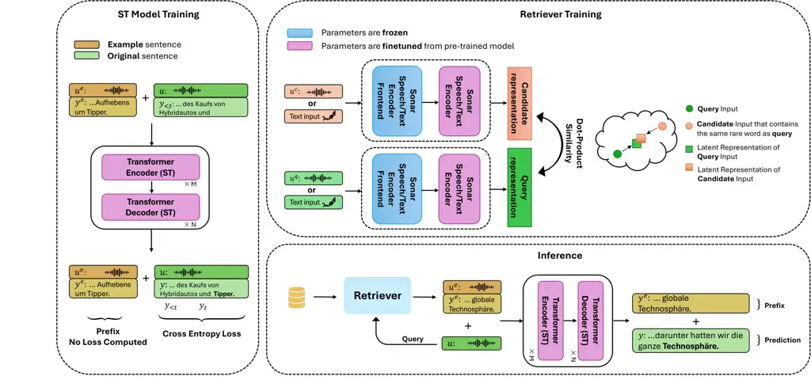

# Optimizing Rare Word Accuracy in Direct Speech Translation with a Retrieval-and-Demonstration Approach

Siqi Li and Danni Liu and Jan Niehues Affiliation: Karlsruhe Institute
of Technology, Germanysiqil31@uci.edu, {danni.liu, jan.niehues}@kit.edu
Affiliation: University of California, Irvine, USA

###### Abstract

Direct speech translation (ST) models often struggle with rare words.
Incorrect translation of these words can have severe consequences,
impacting translation quality and user trust. While rare word
translation is inherently challenging for neural models due to sparse
learning signals, real-world scenarios often allow access to
translations of past recordings on similar topics. To leverage these
valuable resources, we propose a retrieval-and-demonstration approach to
enhance rare word translation accuracy in direct ST models. First, we
adapt existing ST models to incorporate retrieved examples for rare word
translation, which allows the model to benefit from prepended examples,
similar to in-context learning. We then develop a cross-modal
(speech-to-speech, speech-to-text, text-to-text) retriever to locate
suitable examples. We demonstrate that standard ST models can be
effectively adapted to leverage examples for rare word translation,
improving rare word translation accuracy over the baseline by 17.6% with
gold examples and 8.5% with retrieved examples. Moreover, our
speech-to-speech retrieval approach outperforms other modalities and
exhibits higher robustness to unseen speakers. Our code is publicly
available¹¹ 1 :
[SiqiLii/Retrieve-and-Demonstration-ST](https://github.com/SiqiLii/Retrieve-and-Demonstration-ST)
.

^(\*)^(\*)footnotetext: Equal contribution; Siqi’s work done while at
KIT

## 1 Introduction

Speech translation (ST) traditionally involves cascading automatic
speech recognition (ASR) and machine translation (MT) Stentiford and
Steer (1988); Waibel et al. (1991) to convert spoken language into text
in a different language. However, recent years have witnessed rapid
progress in direct ST models Anastasopoulos et al. (2021);
Anastasopoulos et al. (2022); Agarwal et al. (2023) that bypass
intermediate text representations for lower inference latency and
reduced error propagation Sperber and Paulik (2020). Despite the
advancements, accurately translating rare words like person names Gaido
et al. (2021); Gaido et al. (2023) remains a significant challenge for
ST systems. While infrequent, incorrect translations of rare words can
severely degrade overall translation quality and even users’ trust in
the deployed models. Rare word translation is inherently difficult for
ST models due to limited or absent learning signals. Practically,
however, valuable external resources hold the potential to address this
issue. Real-world scenarios often allow access to translations from past
recordings on similar topics, sometimes even from the same speaker.
Similarly, human translators often leverage existing translations Bowker
(2005), especially for special terminologies Brkić et al. (2009).
Inspired by these observations, we ask the question: How can we improve
the rare word translation performance of direct ST models by leveraging
an example pool that contains similar translations?

The envisioned approach faces challenges in both the retrieval and
translation components. First, the retrieval task is complicated by the
variability of speech and the locality of rare words. As the speaking
condition for the same rare word differs in every utterance, source-side
feature matching as often done in text translation Zhang et al. (2018);
Bulte and Tezcan (2019); Xu et al. (2020); Cai et al. (2021); Hao et al.
(2023) is not sufficient to handle the pronunciation variations.
Moreover, as rare words only constitute a small portion of the query and
candidate utterances, the retriever must be able to locate the relevant
information in long speech utterances. For the translation model,
integrating retrieved utterance-translation pairs is also non-trivial.
Standard models trained on sentence-level data require adaptation to
ingest the examples. Besides processing longer inputs, they also need to
pinpoint both the acoustic features and corresponding textual
translations of rare words.

Addressing the above challenges, we introduce a
retrieval-and-demonstration framework (Figure 1) effective for improving
rare word translation accuracy of ST models. Specifically, we adapt
standard ST models to benefit from prepended examples in a way similar
to in-context learning Brown et al. (2020), and then build a retriever
to find suitable examples. Building on recent multi-modal encoders
Duquenne et al. (2023), the retriever supports multiple modalities
(speech$`\rightarrow`$speech, speech$`\rightarrow`$text,
text$`\rightarrow`$text). Second, we propose an evaluation methodology
to adapt standard ST corpora, MuST-C Di Gangi et al. (2019) in this
case, for targeted assessment of rare words translation (§3.1). Our main
findings are:

- •
  Standard direct ST models can be easily adapted to benefit from
  prepended examples for rare word translation, in a way similar to
  in-context learning (§4.1). This improves rare word translation
  accuracy over the baseline by 17.6% with gold examples and 8.5% with
  retrieved examples.
- •
  Text-to-text information retrieval architectures Karpukhin
  et al. (2020) can be effectively adapted for speech-based rare word
  retrieval, yielding 33.3% to 46.6% top-1 retrieval accuracy under
  different modalities (§4.2).
- •
  Compared to other modalities, speech-to-speech retrieval leads to
  higher overall translation quality and rare word translation accuracy
  (§4.3), as well as more robustness to unseen speakers (§5.1).



Figure 1: Proposed retrieval-and-demonstration framework: At the ST
model training stage (§2.1), example-prepended training data is used to
instill in-context learning abilities in the S2T model. At the retriever
training stage (§2.2), SONAR encoders are fine-tuned within the DPR
architecture for our rare word task. At the inference stage (§2.3),
retrieved examples are used as demonstrations to facilitate the
translation of rare words.

## 2 Proposed Framework

Our retrieval-and-demonstration framework is illustrated in Figure 1.
First, a trained direct ST model is finetuned to ingest examples (§2.1),
which serve as demonstrations of correctly translating the rare words in
question. During inference, given an utterance containing rare words, we
retrieve (§2.2) a relevant utterance and its translation as a
demonstration to guide the inference (§2.3).

### 2.1 Adapting ST Models to Ingest Examples

#### Motivation

Human translators often leverage example translations also known as
translation memory Bowker (2005), especially for domain-specific
translation with terminologies Brkić et al. (2009). We aim to apply a
similar approach to direct ST models. The underlying idea mirrors that
of in-context learning (ICL) Brown et al. (2020), where providing models
with task-specific examples during inference improves the quality of the
generated output. While ICL has been primarily observed on text-based
LLMs Brown et al. (2020); Min et al. (2022); Vilar et al. (2023), we
explore whether small- or medium-sized encoder-decoder-based speech
translation models can also exhibit this capability.

#### Training

To adapt standard ST models to ingest examples, the example utterance
and translation must be included as context for training and inference.
An intuitive approach is to include the example as prefix in both input
and output, as shown in the left side of Figure 1. This allows the
output generation to be conditioned on the example utterance and
translation as context. Formally, given an utterance $`u`$, let
$`\hat{y}`$ be the target translation and $`y`$ the predicted
translation. Let $`(u^{e},y^{e})`$ be an example utterance-translation
pair. We aim to adapt an ST model so that the model maximizes the
probability of generating the correct translation $`\hat{y}`$, given the
input utterance $`u`$ and example
$`(u^{e},y^{e}):y=\operatorname*{arg\,max}_{\hat{y}}P(\hat{y}|u^{e},y^{e},u)`$.
The difference to the standard training is that the example
$`(u^{e},y^{e})`$ is included as context when generating the target
translation. For the training data, for the $`i`$-th training utterance
$`u_{i}`$, an example utterance $`u_{i}^{e}`$ is prepended to it,
forming a concatenated input $`u_{i}^{e}+u_{i}`$.²² 2 Details on
constructing the dataset is in §3.1. The targets are also concatenated
as $`y_{i}^{e}+\texttt{<SEP>}+y_{i}`$, where \<SEP\> is a special token
indicating the separator between sentences. During training, the loss is
only calculated on $`y_{i}`$ to prioritize the translation of the
utterance after the example.³³ 3 Including the loss on the prefix leads
the finetuning step to end prematurely in preliminary experiments. The
loss calculation is formally described in Appendix A. In doing so, we
encourage the model to predict its outputs based on the context provided
by the demonstration example.

### 2.2 Example Retrieval

#### Formalization and Challenge

Given a query utterance $`u`$ containing a rare word $`w`$, we aim to
retrieve a relevant example $`(u^{e},y^{e})`$ from an example pool
$`\mathcal{D}=\{(u^{1},y^{1}),…,(u^{m},y^{m})\}`$ with a retrieval model
$`r`$, such that the rare word $`w`$ is spoken in utterance $`u^{e}`$.
Here $`u^{i}`$ indicates the $`i`$-th utterance and $`y^{i}`$ its
translation. As the query $`u`$ is only in speech, we face additional
complexities compared to text-based retrieval. First, speech is
versatile, unlike text, which often has a standard writing system. The
speaking condition for the same word varies in every recording,
requiring a robust retriever that accounts for pronunciation variations.
Second, speech sequences are magnitudes longer than text. The retriever
must find fine-grained local features corresponding to the keywords in
long sequences. Third, transcribing the query utterance first and then
using text-based retrieval is suboptimal due to ASR errors, especially
on rare words.

#### Architecture

As the nature of our example retrieval task resembles information
retrieval (IR) where relevant answers are retrieved given a question, we
take inspiration from IR approaches for our retriever. In text-to-text
IR, a prominent architecture is the Dense Passage Retriever (DPR)
Karpukhin et al. (2020). It has a dual-encoder architecture, where one
encoder encodes the questions, and the other encodes the passages
potentially containing answers to the questions. The retrieval model is
trained with a contrastive objective, mapping question-passage
(positive) pairs closer to each other in the latent space while pushing
irrelevant (negative) pairs further apart. During inference, passages
closer to the encoded question by the dot-product similarity are
returned as answers. In our case, the utterances containing the same
rare words are considered positive pairs, while those not sharing the
same rare words are negative pairs.

#### Speech-to-Speech/Text Retrieval

We propose to extend the DPR model to support querying from speech. As
the example utterances to be retrieved often also have text transcripts
available, we consider the following retrieval modalities:

- •
  Speech$`\rightarrow`$speech retrieval: we retrieve $`u^{e}`$ in speech
  using audio query $`u`$.
- •
  Speech$`\rightarrow`$text retrieval: we retrieve $`y^{e}`$ directly
  using audio query $`u`$. This requires the retriever to support both
  modalities (text and speech).
- •
  Naïve text$`\rightarrow`$text retrieval: first transcribing the query
  utterance $`u`$ and then text-to-text retrieval for $`y^{e}`$. As
  discussed before, the risk of ASR errors especially on rare words
  renders this approach suboptimal. The additional inference time for
  running ASR makes it further unpractical.

Given these requirements, instead of initializing the dual encoders with
pre-trained BERT Devlin et al. (2019) as in DPR Karpukhin et al. (2020),
we leverage recent speech-text joint representation models including
SONAR Duquenne et al. (2023) and SpeechT5 Ao et al. (2022).

### 2.3 Integrating Examples into ST Model

#### Inference with Retrieved Examples

During inference, the model is provided with a test input $`u`$ and a
retrieved example $`(u^{e},y^{e})`$. The example is prepended to test
input in the same way as in training. The example input-output pairs are
integrated by forced decoding. After the separator token (\<SEP\>), the
model starts to autoregressively generate the output translation,
conditioned additionally by the example utterance and translations.

#### Practical Considerations

An advantage of our framework is its modularity. The separation of the
ST and retrieval modules enables straightforward upgrades to newer
models in either component. Moreover, the retrieval module can be
implemented using highly optimized toolkits like FAISS Johnson et al.
(2021), which ensures efficient retrieval without compromising inference
speed. Prepending examples however leads to increased inference latency
as discussed in §5.5.

|                  |         |                        |                |                      |
| ---------------- | ------- | ---------------------- | -------------- | -------------------- |
| Split            | \# utt. | Avg. utt. duration (s) | Avg. \# tokens | \# unique rare words |
| train (original) | 250942  | 6.5                    | 27.1           | 9512                 |
| tst-COMMON       | 002580  | 5.8                    | 25.3           | 0157                 |
| rare-word pool   | 009821  | 9.7                    | 43.1           | 8679                 |
| dev-rare-word    | 006932  | 9.9                    | 42.8           | 6244                 |
| tst-rare-word    | 002500  | 9.9                    | 43.1           | 2358                 |
| train-reduced    | 231689  | 6.2                    | 25.8           | 3164                 |

Table 1: Dataset statistics. We split the original training set into the
example pool with rare words (rare-word pool), dev/test sets for rare
words (dev/tst-rare-word), and a reduced training set (train-reduced).
The example pool simulates existing resources for querying.

## 3 Experimental Setup

### 3.1 Dataset Construction

For evaluation, we use the English-to-German subset of the MuST-C
dataset Di Gangi et al. (2019), where the task is to translate from
English public-speaking audio to German text. To create a targeted test
condition for rare words, we extract sentences containing rare words
from the original training set to create dedicated sets. The statistics
of the original dataset and the newly created splits are in Table 1. The
rare-word sets have higher average token counts due to: 1) longer
utterance duration and 2) the rare words being segmented into
finer-grained subwords. Note that we only re-split the training set,
leaving the official validation and test sets (tst-COMMON) unmodified.
Below we describe the dataset construction process in detail.

#### Rare Word Sets

Our data partition step is inspired by Niehues (2021), which re-splits
parallel data based on word frequencies. Specifically, from the English
transcript, we find rare words by their corpus-level frequency, choosing
those appearing two or three times in the original training set. For
rare words occurring twice, we move their corresponding utterances to
the rare-word pool and the joint dev/tst set respectively, which creates
a zero-shot condition where the rare word is never seen in training. For
rare words occurring thrice, we follow the same strategy for two
occurrences. The remaining third occurrence is retained in the reduced
training set to create a one-shot learning scenario, where the rare word
is seen once in the training set. Finally, the aggregated dev/tst set is
split into individual development and test sets for standard evaluation.
We analyze the rare word types in tst-rare-word by a named entity
recognition (NER) model⁴⁴ 4 [Huggingface
model](https://huggingface.co/urchade/gliner_large-v2.1) by Zaratiana
et al. (2023) with results in Table 2. A more detailed categorization of
the words is in Appendix B.

|               |        |          |      |      |         |
| ------------- | ------ | -------- | ---- | ---- | ------- |
| tst-rare-word | Person | Location | Tech | Food | Company |
| 2358          | 130    | 72       | 29   | 27   | 25      |

Table 2: NER results on rare words in tst-rare-word with the number of
unique words in each category.

#### Training Data with Prepended Examples

To adapt the ST model and to train the retriever, we need training data
with prepended examples. As most utterances lack rare words by the
previously used corpus-level frequency (3164 rare words in 231k
utterances in Table 1), we train the retriever on simulated data by
treating words that have the lowest corpus-level frequency in each
sentence as simulated rare words. Specifically, we propose to use
sentence-level rare words to choose the prepended examples. For each
piece of the training data $`(u^{i},s^{i},y^{i})`$, we identify the word
$`w_{s}`$ in $`s^{i}`$ that has the least corpus-level frequency among
all words in its transcript. We then sample another training instance
$`(u^{j},s^{j},y^{j})`$ where $`s^{j}`$ contains the same sentence-level
rare word $`w_{s}`$ as example. In short, the retriever is trained
without rare word retrieval data. In this zero-shot training setup, the
retrieval accuracy is limited by the strong mismatch between the train
and test conditions.

#### Test Set with Gold Examples

We also construct a variant of tst-rare-word set with gold examples,
where the rare word in the test utterance is always present in the
example. This serves as an oracle condition for evaluating the ST
model’s ability to learn from perfect demonstrations. As our data
splitting procedure ensures that the rare words also occur in the
example pool, we select sentences from the rare-word pool containing the
same rare words as those in the tst-rare-word set to serve as example
sentences. The example sentences are then prepended to test sentences in
a way identical to that in the training set with prepended examples.

### 3.2 Model Configuration

#### ST Model

We use the Transformer architecture s2t_transformer_s in FairSeq S2T
Wang et al. (2020) for all our ST models. To prevent the tokenizer from
seeing the rare words during its training, which will cause an unfair
test condition, we train the SentencePiece Kudo and Richardson (2018)
tokenizer on the reduced train set after the utterances containing rare
words are moved to dedicated splits (Table 1). Based on this vocabulary,
we train the base model on the train-reduced set, closely following the
hyperparameters from Wang et al. (2020). We then adapt the base model to
ingest examples as described in §2.1 using the reduced training set with
prepended examples (§3.1). As the prefix tokens do not contribute to the
overall loss (Figure 1), we double the effective batch size to keep the
loss scale comparable to before. Further details on training and
inference are in Appendix C.

#### Retriever

We use the DPR Karpukhin et al. (2020) architecture for the retriever.
The encoders are initialized with either SONAR Duquenne et al. (2023) or
SpeechT5 Ao et al. (2022). For both models, we use the encoder only and
discard the decoder. DPR requires fixed-size embeddings from its
encoders. For SpeechT5, we mean-pool over the sequence length. For
SONAR, we use the built-in attention-pooling for the speech encoder and
mean-pooling for the text encoder. The dual encoders in DPR are trained
on the reduced training set with prepended examples. Each sentence’s
example serves as a positive example, while examples from other
sentences in the batch are in-batch negatives. Only the top layer of the
encoders is trained, as the lower layers of the encoders are likely
responsible for extracting low-level acoustic features. These features
are considered less relevant for our retrieval task, which focuses on
word-level information. Another reason is memory efficiency in training.
Further details on training and inference are in Appendix D.

### 3.3 Evaluation

#### Metrics

We evaluate speech translation quality with BLEU Papineni et al.
(2002)⁵⁵ 5 sacreBLEU Post (2018) signature:  
nrefs:1—case:mixed—eff:no—tok:13a—smooth:exp—version:2.4.2 and COMET Rei
et al. (2020)⁶⁶ 6 with Unbabel/wmt22-comet-da; $`\times`$100 for
readability. The COMET models take text transcripts as source.. For the
accuracy of rare word translation, we evaluate how many unique
lemmatized rare words in the test set are translated. We use the spaCy
toolkit Honnibal et al. (2020) for word lemmatization and used AWESoME
Aligner Dou and Neubig (2021) for en-de word-level alignment. For rare
word accuracy, we further distinguish between rare words appearing once
or never appear in the training set (§3.1), which corresponds to the
one-shot and zero-shot accuracy. For the retriever, we use top-1
retrieval accuracy to evaluate the retriever’s performance. Only the
first retrieved examples are used as demonstrations in the ST model.

#### Evaluation Difficulty

As described in §3.1, our rare word sets are based on rare words from
the source-side English transcripts.⁷⁷ 7 Constructing these sets based
on target-side rare words would be unrealistic since the target is
unavailable in practice. Due to the flexibility of translation, even
with gold examples, some rare words are translated differently in the
example translation versus the reference translation of the actual test
sentence. Only 845 of the 2500 unique words are translated to identical
target words when using gold examples. Therefore, the highest possible
accuracy is 33.8% given this strict evaluation.⁸⁸ 8 Ideally, beyond
lexical matches, synonyms and other alternative translations should also
be considered. As the evaluation of these cases is non-straightforward,
we choose the strict lexical evaluation.

## 4 Main Results

Before presenting the results of our proposed framework, we confirm that
our baseline model performs on par with those reported in the
literature. The details are in Appendix E.

### 4.1 Impact of Demonstration

#### Direct ST models can effectively learn from demonstration at inference time.

To independently analyze the ST model’s ability to learn from the
prepended examples, we first assume an oracle retrieval model by using
gold examples which always contain the rare words in question. The
results are in row (2) of Table 3. Compared to the baseline in row (1),
this model achieves substantially higher overall rare word translation
accuracy ($`+`$17.6% abs.), with a larger gain in zero-shot ($`+`$18.8%)
than one-shot accuracy ($`+`$15.3%). Nonetheless, this gain comes at the
cost of overall translation quality ($`-`$0.2 BLEU, $`-`$2.3 COMET). A
potential reason is that the prepended example sentences make the input
sequences much longer and therefore create more difficulty for learning.
Nonetheless, since rare words are often important named entities,
capturing them correctly is as crucial if not more than the overall
translation quality scores. Overall, the results suggest that
task-specific demonstrations provided at inference time can effectively
enhance rare word translation accuracy of direct ST models.

#### Quality of the given demonstration matters.

Next, we study the impact of the demonstration quality. In contrast to
the gold examples before, we now use random examples that do not contain
rare words relevant to the sentence to be translated. The results are in
row (3) of Table 3. This led to a decline in translation quality
($`-`$1.3 BLEU, $`-`$2.4 COMET) and rare word accuracy. These results
indicate that irrelevant demonstrations are harmful.

#### Seeing rare words only in training does not sufficiently improve their translation accuracy.

Instead of retrieving data from the rare-word pool as demonstration, a
simple alternative is to add these data in training. Here, we add the
rare-word pool into the training set and train an identical model to the
baseline. The results are in row (4) of Table 3. Overall, the rare word
accuracy only sees a slight increase compared to row (1), with an
absolute accuracy improvement of 3.7%, which is far less than using gold
example sentences (+17.6% overall). This indicates that training with
rare words alone is insufficient for improving their translation
accuracy. This is likely because of the limited training signal for rare
words, as each appears only once or twice. Note that the translation
quality scores under this data condition also improved, which is likely
a result of the additional training data.

|                                                             |      |       |                 |                |                |
| ----------------------------------------------------------- | ---- | ----- | --------------- | -------------- | -------------- |
| ST Model                                                    | BLEU | COMET | Overall acc (%) | 0-shot acc (%) | 1-shot acc (%) |
| \(1\) baseline model (on train-reduced)                     | 17.2 | 57.9  | 11.8            | 11.0           | 13.3           |
| \(2\) adapted + gold example                                | 17.0 | 55.6  | 29.4            | 29.8           | 28.6           |
| \(3\) adapted + random example                              | 15.7 | 53.2  | 08.8            | 08.4           | 09.7           |
| \(4\) train on {train-reduced + rare-word pool} (more data) | 17.9 | 59.0  | 15.5            | 14.7           | 17.2           |
| Using retrieved examples                                    |      |       |                 |                |                |
| \(5\) adapted + text (gold transcript)$`\rightarrow`$text   | 15.2 | 54.4  | 20.1            | 19.6           | 21.2           |
| \(6\) adapted + speech$`\rightarrow`$text                   | 15.3 | 54.0  | 18.8            | 18.2           | 20.2           |
| \(7\) adapted + speech$`\rightarrow`$speech                 | 16.2 | 55.3  | 20.3            | 20.3           | 20.2           |

Table 3: Translation quality (BLEU$`\uparrow`$, COMET$`\uparrow`$) and
rare word accuracy$`\uparrow`$ (overall, 0- and 1-shot) of different
models on the tst-rare-word split. The lower section uses retrieved
examples from the retriever (§4.3).

|                                      |      |       |       |
| ------------------------------------ | ---- | ----- | ----- |
| Retrieval Model                      | T→T  | S→T   | S→S   |
| \(1\) Orig. DPR w/ BERT (pretrained) | 02.0 | $`-`$ | $`-`$ |
| \(2\) Orig. DPR w/ BERT (finetuned)  | 55.8 | $`-`$ | $`-`$ |
| \(3\) DPR w/ SpeechT5 (finetuned)    | 00.1 | 0.0   | 00.0  |
| \(4\) DPR w/ SONAR (pretrained)      | 28.7 | 22.3  | 20.6  |
| \(5\) DPR w/ SONAR (finetuned)       | 46.6 | 33.3  | 41.3  |

Table 4: Top-1 retrieval accuracy (%) of different retrievers on 3
modalities of text-to-text (T$`\rightarrow`$T), speech-to-text
(S$`\rightarrow`$T), and speech-to-speech (S$`\rightarrow`$S) on the
tst-rare-word split. T$`\rightarrow`$T retrieval uses gold transcripts
as query.

### 4.2 Retrieval Performance

Before integrating retrieved examples into the ST model, we analyze the
retrieval performance alone with results in Table 4. To establish the
upper bounds of retrieval performance, we first use the original DPR
model for text-to-text retrieval with gold transcripts of the query
utterances and examples. As shown in row (1) of Table 4, directly using
the pretrained DPR for QA is not sufficient for our task of rare word
retrieval. Fine-tuning DPR’s encoders (row (2)) on our task enables
effective rare word retrieval in a text-to-text setting (55.8%).

#### Encoder choice is crucial for successful retrieval.

We proceed by adapting the original DPR to retrieval from speech.
Overall, we notice that the choice of the encoder heavily impacts the
retrieval performance. With SONAR, using the pretrained encoders already
achieves partial success in fulfilling the task (row (4) in Table 4),
with finetuning further improving the results (row (5)). However,
finetuning SpeechT5 proves insufficient for learning the task (row (3)).
We believe that the discrepancy primarily arises from the models’
ability to aggregate information over the sentence length: SONAR is
explicitly trained to aggregate it into fixed-size embeddings while
SpeechT5 lacks such a mechanism. Naïve mean-pooling over sequence length
fails to create meaningful embeddings over long sequences like speech,
as well as character-level text representations used in SpeechT5.

#### Speech$`\rightarrow`$speech outperforms speech$`\rightarrow`$text retrieval.

While we initially expected speech-to-speech retrieval to be more
challenging than speech-to-text retrieval due to the high variability of
speech, the finetuned retriever in (5) of Table 4 shows stronger
performance on speech$`\rightarrow`$speech retrieval than
speech$`\rightarrow`$text (41.3% vs. 33.3%). We suppose that the reason
is the modality gap between text and speech, which makes it more
challenging to bridge the two different types of data.

### 4.3 ST Performance with Retrieved Examples

#### Correlation between retrieval accuracy and translation quality:

As the retriever based on finetuned SONAR showed the most promising
retrieval results (Table 4), we use the retrieved examples from this
model to guide the ST. The results are in rows (5), (6), and (7) of
Table 3. When comparing the performance of the three retrieval
modalities, retrieval accuracy does not always translate to improved
overall translation quality or rare word accuracy. Although text-to-text
retrieval using gold transcripts had the highest retrieval accuracy
(Table 4), its integration into the ST model resulted in lower
translation quality compared to speech-to-speech retrieval. Moreover, in
practice, we still need an ASR model to derive the transcripts that
likely contain errors, especially on rare words. This introduces
additional limitations to the text-to-text retrieval approach. Overall,
these results show that speech-speech retrieval is more effective than
the other modalities in improving rare word translation accuracy.
Despite the improvement in rare word translation accuracy, we also note
the drop in translation quality compared to the baseline (row (7) vs.
(1); $`-`$1.0 BLEU and $`-`$2.6 COMET). We expect that increasing the
robustness of the ST model to examples containing incorrect rare words,
for instance by including such examples in training, could mitigate this
negative impact.

#### Does speech$`\rightarrow`$speech retrieval help by implicit speaker adaptation?

Speech-to-speech retrieval could be particularly effective in finding
same-speaker utterances due to the access to acoustic information. This
raises the hypothesis that if the prepended example originates from the
same speaker as the utterance to be translated, translation quality
could be improved by implicit speaker adaptation Saon et al. (2013),
where the model benefits from adapting to the specific speaker’s voice
characteristics. To test this, we analyze the proportion of retrieved
sentences from the same speaker across different retrieval modalities.
The results in Table 5 show similar percentages for all three scenarios,
indicating that the gains by speech-to-speech retrieval do not stem from
speaker adaptation.

|                                |      |      |      |
| ------------------------------ | ---- | ---- | ---- |
| DRP + SONAR finetuned          | T→T  | S→T  | S→S  |
| Examples from same speaker (%) | 50.3 | 53.4 | 50.2 |

Table 5: Proportion of retrieved examples from the same speaker as the
utterance to be translated for the three retrieval modalities on
tst-rare-word.

## 5 Further Analyses and Discussions

### 5.1 Effects on Unseen Speakers

Now we push the approach further under the challenging scenario of
unseen speakers, i.e., the example pool does not contain any utterance
from the speaker of the test utterance. Specifically, during retrieval,
we ignore utterances from the same speaker as the query utterance. As
shown in Table 6, this harms retrieval accuracy substantially, losing
14.9% to 23.4% compared to Table 4 for the three modalities. This is
mainly due to the limited coverage of the rare-word pool, which contains
only one sentence for most rare words. Excluding the speaker also
excludes the rare word. However, the BLEU scores and overall rare word
translation accuracy change only slightly compared to Table 3:
T$`\rightarrow`$T ($`-`$0.6 BLEU, $`-`$1.5%), S$`\rightarrow`$T
($`-`$0.3 BLEU, $`-`$3.2%), S$`\rightarrow`$S ($`+`$0.2 BLEU,
$`-`$1.0%). This demonstrates that our approach, especially when using
speech$`\rightarrow`$speech retrieval, is relatively robust to unseen
speakers.

|                         |                   |      |                 |                |                |
| ----------------------- | ----------------- | ---- | --------------- | -------------- | -------------- |
| Retrieval modality      | Retrieval acc (%) | BLEU | Overall acc (%) | 0-shot acc (%) | 1-shot acc (%) |
| \(5\) T$`\rightarrow`$T | 23.2              | 14.6 | 18.6            | 18.5           | 18.7           |
| \(6\) S$`\rightarrow`$T | 18.4              | 15.0 | 15.6            | 15.6           | 15.7           |
| \(7\) S$`\rightarrow`$S | 23.5              | 16.4 | 19.3            | 18.8           | 20.2           |

Table 6: Retrieval and ST performance on unseen speakers. Compared to
Table 3, S$`\rightarrow`$S retrieval has the least decrease in
translation quality and rare word accuracy.

### 5.2 Qualitative Example

Table 7 shows an example where our approach creates partially correct
translation for the named entities “Patrice and Patee”. To avoid
cherry-picked results, we include more examples where our approach
succeeds and fails in Appendix F.

|                                                                                                                                                                        |
| ---------------------------------------------------------------------------------------------------------------------------------------------------------------------- |
| Source (transcript): Patrice and Patee set out most days to go out hunting in the forest around their homes.                                                           |
| Baseline (Table 3 row $`(1)`$): Die Bäume und Petes (Trees and Petes) setzten die meisten Tage hinaus, um in den Wäldern um ihre Häuser zu pumpen.                     |
| Adding rare-word pool to training (Table 3 row $`(4)`$): Patrizinpathie (Patrizinpathie) setzte sich in den meisten Tagen um die Jagd in den Wäldern um ihre Häuser.   |
| Speech$`\rightarrow`$speech example (Table 4 row $`(5)`$): Sie heißen Patrice und Patee (Their names are Patrice and Patee.).                                          |
| Adapted ST + speech$`\rightarrow`$speech (Table 3 row $`(7)`$): Patrice und Pateetee setzten die meisten Tage, um in den Wäldern um ihre Häuser herum jagen zu können. |
| Target: Patrice und Patee (Patrice and Patee) gehen fast jeden Tag jagen in dem Wald rundum ihr Heim.                                                                  |

Table 7: An example of our retrieval-and-demonstration approach
improving the translation of rare words.

### 5.3 Analyses of Retrieval Performance

In our main experiments, we partially finetuned the DPR encoders. We now
investigate the impact of different numbers of trainable parameters in
the retriever. As shown in Figure 2, the retrieval performance of the
SONAR-based retriever is stable across 100 to 500M trainable parameters
out of a total of over 1.3B parameters. This indicates that the
retriever can maintain nearly consistent performance despite changes in
model capacity.

Figure 2: Retrieval performance of the SONAR-based retriever for
different numbers of trainable parameters.

### 5.4 Potential of Using More Examples

Few-shot learning is more often performant than one-shot learning
because it provides the model with a broader context and more varied
examples. However, as shown in Table 8, the increase in retrieval
accuracy with additional top-10 examples is still not substantial
compared to the top-1 result. Including multiple examples also makes
input sequences significantly longer, especially as audio inputs are
factors longer than text. This not only poses a challenge for the model
but would also significantly slow down the inference speed, which we aim
to avoid. For these reasons, we do not further explore the potential of
using more examples.

|                 |      |      |      |
| --------------- | ---- | ---- | ---- |
| DPR + SONAR ft. | T→T  | S→T  | S→S  |
| Top 1           | 46.6 | 33.3 | 41.3 |
| Top 5           | 60.4 | 48.0 | 56.2 |
| Top 10          | 64.6 | 53.1 | 61.1 |

Table 8: Top-10 retrieval performance (%) of the SONAR-based retriever
on the tst-rare-word set.

### 5.5 Inference Latency of Including Examples

A downside of our approach is the additional inference latency due to
longer prefixes, as inherent in other vanilla in-context learning
approaches. On the same GPU (NVIDIA Titan RTX) with batch size 1, the
average inference time is 0.35s per sentence (system in Row 1, Table 3)
and 0.82s after adding examples (average of the systems in Row 2-7,
Table 3). The main contributor of the additional latency is the roughly
doubled input sequence length. The text prefixes from the prepended
examples are incorporated by forced decoding and do not incur much
latency.

### 5.6 Potential of Using Chunk-Based Examples

Our in-context examples are in the form of parallel data. An alternative
is to use chunks instead of unprocessed parallel data. In this case, as
the source and target of the in-context examples have to be aligned,
creating the chunk-based example pool requires two additional alignment
steps: audio-transcript alignment and transcript-translation alignment.
While both steps have established off-the-shelf tools, this
significantly complicates the workflow. Increasing the number of
retrieval candidates may also increase the difficulty of the retrieval
task. A main advantage of using chunks is the reduced inference latency
as the prefixes are shorter. Moreover, shorter context may be easier for
the model to locate and utilize. We leave the exploration of this
alternative for future work.

### 5.7 Reusing ST Encoder for Retrieval

In our main experiments, we use SONAR for retrieval. An attractive
alternative is to use the encoder of pretrained ST models for retrieval,
which would dramatically reduce the total model size at inference.
However, based on our comparison to using the SpeechT5 encoder for
retrieval (Row 3, Table 4) and interpretations, models that do not
explicitly shrink the sequence length dimension into more compact
representations are likely unable to perform the retrieval task.
Therefore, we believe the encoders of existing ST models would need to
learn an aggregation mechanism like in SONAR to be ready for the
retrieval task.

## 6 Related Work

#### Retrieval-Augmented Translation

Our work falls within the paradigm of retrieval-augmented translation
(RAT) Simard and Langlais (2001); Koehn and Senellart (2010); Tu et al.
(2018); Khandelwal et al. (2021), which augments a translation model
with results retrieved from a translation memory. Prior works on RAT
primarily focus on text-to-text translation Zhang et al. (2018); Gu
et al. (2018); Bulte and Tezcan (2019); Xu et al. (2020); Cai et al.
(2021); Hoang et al. (2023); Hao et al. (2023), where retrieval relies
on textual feature matching such as $`n`$-gram overlap. These methods
are therefore not readily applicable to direct ST due to the continuous
nature of speech and much longer input lengths. In ST, Du et al. (2022)
use $`k`$NN-MT Khandelwal et al. (2021) for domain adaption. This
approach requires a joint model for speech and text input, with a fully
text-based datastore. Our work does not require modifying the ST model
to support speech and text inputs, and enables the retriever to query
from speech to speech or text. Our retrieval module is related to the
recent work by Lin et al. (2024) as both are based on DPR. The main
difference is that their model is for question answering and does not
support cross-modal retrieval. Chen et al. (2024) show that LLMs adapted
for speech could leverage in-context examples for speech recognition and
translation. Our work is orthogonal to theirs in that we show that
conventional encoder-decoder ST models can be trained to exhibit
in-context learning abilities.

#### Rare Words in ASR, MT, and direct ST

In ASR, some representative approaches to handle rare words include
language model rescoring or fusion Raju et al. (2019); Yang et al.
(2021); Huang et al. (2022); Weiran et al. (2022); Mathur et al. (2023),
data augmentation by text-to-speech (TTS) Guo et al. (2019); Zheng
et al. (2021); Qu et al. (2023), and context enhancement by an
additional memory module Bruguier et al. (2019); Jain et al. (2020);
Chang et al. (2021); Huber et al. (2021); Qiu et al. (2022); Huber and
Waibel (2024). In MT, rare word translation has been tackled by, among
other techniques, constrained decoding Chatterjee et al. (2017); Hasler
et al. (2018); Ailem et al. (2021); Zhang et al. (2023), copying by
source annotations Dinu et al. (2019); Song et al. (2019); Bergmanis and
Pinnis (2021) or pointing mechanisms Gulcehre et al. (2016); Pham et al.
(2018); Gu et al. (2019); Zhang et al. (2021), and retrieval-augmented
translation Martins et al. (2023); Liu et al. (2023). In direct ST,
translating rare words is a significant challenge due to the combined
complexities of ASR and MT. The amount of prior work is also relatively
sparse. Gaido et al. (2022) use multilingual models to improve the
accuracy of non-English names. Gaido et al. (2023) propose to first
detect named entities (NEs) in the source audio that are present in a
given contextual dictionary and then inject these NEs in text form into
the decoder. Our approach does not assume a readily available contextual
dictionary, but can instead leverage unprocessed parallel data.

## 7 Conclusion

We introduced a retrieval-and-demonstration approach to improve rare
word translation accuracy in direct ST. For real-world applications,
e.g., translating scientific talks, we recommend adding utterances from
the same speaker to the example pool and using speech-to-speech
retrieval to identify examples. When feasible, one should consider
incorporating an additional verification step to ensure the relevance of
the retrieved sentences, by human-in-the-loop or automated techniques.

## Limitations

#### Robustness to Irrelevant Examples

Our approach effectively improves the accuracy of rare word translation.
However, as elaborated in the result discussions, we also observed that
incorrectly retrieved examples tend to harm translation quality. As a
next step, we hope to increase the robustness of the ST models to
irrelevant examples. This could for instance be achieved by
incorporating incorrect rare words during training to enhance the
model’s resilience to such errors.

#### Targeted Solution for Rare Word Translation

Our approach is a targeted solution for the use-case of rare word
translation. When there is no rare word in the test sentence, the
examples will harm translation quality, as seen in the case of using
irrelevant examples. Whether rare words exist in the test sentences
could be determined by ST model confidence (decoding probability) or
retriever distances to the closest neighbor in the example pool. We
leave this exploration to future work.

#### Language Coverage

Our experiments were limited to the English-to-German language pair due
to resource constraints. Experiments on additional language pairs,
especially distant ones, would further substantiate the findings.

#### Extension to other Audio Tasks

This work focused on rare words in direct speech translation. An
extension to other audio tasks would enlarge the impact of the proposed
approach. As a partial remedy, we performed preliminary experiments on
rare word ASR in Appendix G and found that the results support the main
findings in this work.

## Acknowledgments

We thank the anonymous reviewers for their insightful feedback. We also
thank Papi et al. (2024) for reporting Conformer bugs which led to
unexplainable results in our initial experiments. Part of this work was
performed on the HoreKa supercomputer funded by the Ministry of Science,
Research and the Arts Baden-Württemberg and by the Federal Ministry of
Education and Research. Part of this work was supported by funding from
the pilot program Core-Informatics of the Helmholtz Association (HGF).
Part of this work received support from the European Union’s Horizon
research and innovation programme under grant agreement No 101135798,
project Meetween (My Personal AI Mediator for Virtual MEETtings BetWEEN
People).

## References

- Agarwal et al. (2023) Milind Agarwal, Sweta Agrawal, Antonios
  Anastasopoulos, Luisa Bentivogli, Ondřej Bojar, Claudia Borg, Marine
  Carpuat, Roldano Cattoni, Mauro Cettolo, Mingda Chen, William Chen,
  Khalid Choukri, Alexandra Chronopoulou, Anna Currey, Thierry Declerck,
  Qianqian Dong, Kevin Duh, Yannick Estève, Marcello Federico, Souhir
  Gahbiche, Barry Haddow, Benjamin Hsu, Phu Mon Htut, Hirofumi Inaguma,
  Dávid Javorský, John Judge, Yasumasa Kano, Tom Ko, Rishu Kumar,
  Pengwei Li, Xutai Ma, Prashant Mathur, Evgeny Matusov, Paul McNamee,
  John P. McCrae, Kenton Murray, Maria Nadejde, Satoshi Nakamura, Matteo
  Negri, Ha Nguyen, Jan Niehues, Xing Niu, Atul Kr. Ojha, John
  E. Ortega, Proyag Pal, Juan Pino, Lonneke van der Plas, Peter Polák,
  Elijah Rippeth, Elizabeth Salesky, Jiatong Shi, Matthias Sperber,
  Sebastian Stüker, Katsuhito Sudoh, Yun Tang, Brian Thompson, Kevin
  Tran, Marco Turchi, Alex Waibel, Mingxuan Wang, Shinji Watanabe, and
  Rodolfo Zevallos. 2023. [FINDINGS OF THE IWSLT 2023 EVALUATION
  CAMPAIGN](https://doi.org/10.18653/v1/2023.iwslt-1.1). In _Proceedings
  of the 20th International Conference on Spoken Language Translation
  (IWSLT 2023)_, pages 1–61, Toronto, Canada (in-person and online).
  Association for Computational Linguistics.
- Ailem et al. (2021) Melissa Ailem, Jingshu Liu, and Raheel
  Qader. 2021. [Encouraging neural machine translation to satisfy
  terminology
  constraints](https://doi.org/10.18653/v1/2021.findings-acl.125). In
  _Findings of the Association for Computational Linguistics: ACL-IJCNLP
  2021_, pages 1450–1455, Online. Association for Computational
  Linguistics.
- Anastasopoulos et al. (2022) Antonios Anastasopoulos, Loïc Barrault,
  Luisa Bentivogli, Marcely Zanon Boito, Ondřej Bojar, Roldano Cattoni,
  Anna Currey, Georgiana Dinu, Kevin Duh, Maha Elbayad, Clara Emmanuel,
  Yannick Estève, Marcello Federico, Christian Federmann, Souhir
  Gahbiche, Hongyu Gong, Roman Grundkiewicz, Barry Haddow, Benjamin Hsu,
  Dávid Javorský, Vĕra Kloudová, Surafel Lakew, Xutai Ma, Prashant
  Mathur, Paul McNamee, Kenton Murray, Maria Nǎdejde, Satoshi Nakamura,
  Matteo Negri, Jan Niehues, Xing Niu, John Ortega, Juan Pino, Elizabeth
  Salesky, Jiatong Shi, Matthias Sperber, Sebastian Stüker, Katsuhito
  Sudoh, Marco Turchi, Yogesh Virkar, Alexander Waibel, Changhan Wang,
  and Shinji Watanabe. 2022. [Findings of the IWSLT 2022 evaluation
  campaign](https://doi.org/10.18653/v1/2022.iwslt-1.10). In
  _Proceedings of the 19th International Conference on Spoken Language
  Translation (IWSLT 2022)_, pages 98–157, Dublin, Ireland (in-person
  and online). Association for Computational Linguistics.
- Anastasopoulos et al. (2021) Antonios Anastasopoulos, Ondřej Bojar,
  Jacob Bremerman, Roldano Cattoni, Maha Elbayad, Marcello Federico,
  Xutai Ma, Satoshi Nakamura, Matteo Negri, Jan Niehues, Juan Pino,
  Elizabeth Salesky, Sebastian Stüker, Katsuhito Sudoh, Marco Turchi,
  Alexander Waibel, Changhan Wang, and Matthew Wiesner. 2021. [FINDINGS
  OF THE IWSLT 2021 EVALUATION
  CAMPAIGN](https://doi.org/10.18653/v1/2021.iwslt-1.1). In _Proceedings
  of the 18th International Conference on Spoken Language Translation
  (IWSLT 2021)_, pages 1–29, Bangkok, Thailand (online). Association for
  Computational Linguistics.
- Ao et al. (2022) Junyi Ao, Rui Wang, Long Zhou, Chengyi Wang, Shuo
  Ren, Yu Wu, Shujie Liu, Tom Ko, Qing Li, Yu Zhang, Zhihua Wei, Yao
  Qian, Jinyu Li, and Furu Wei. 2022. [SpeechT5: Unified-modal
  encoder-decoder pre-training for spoken language
  processing](https://doi.org/10.18653/v1/2022.acl-long.393). In
  _Proceedings of the 60th Annual Meeting of the Association for
  Computational Linguistics (Volume 1: Long Papers)_, pages 5723–5738,
  Dublin, Ireland. Association for Computational Linguistics.
- Baevski et al. (2020) Alexei Baevski, Yuhao Zhou, Abdelrahman Mohamed,
  and Michael Auli. 2020. wav2vec 2.0: A framework for self-supervised
  learning of speech representations. _Advances in neural information
  processing systems_, 33:12449–12460.
- Bergmanis and Pinnis (2021) Toms Bergmanis and Mārcis Pinnis. 2021.
  [Facilitating terminology translation with target lemma
  annotations](https://doi.org/10.18653/v1/2021.eacl-main.271). In
  _Proceedings of the 16th Conference of the European Chapter of the
  Association for Computational Linguistics: Main Volume_, pages
  3105–3111, Online. Association for Computational Linguistics.
- Bowker (2005) Lynne Bowker. 2005. [Productivity vs quality? a pilot
  study on the impact of translation memory
  systems](https://api.semanticscholar.org/CorpusID:59517742).
- Brkić et al. (2009) Marija Brkić, Sanja Seljan, and Bozena Basic
  Mikulic. 2009. [Using translation memory to speed up translation
  process](https://api.semanticscholar.org/CorpusID:62878803).
- Brown et al. (2020) Tom Brown, Benjamin Mann, Nick Ryder, Melanie
  Subbiah, Jared D Kaplan, Prafulla Dhariwal, Arvind Neelakantan, Pranav
  Shyam, Girish Sastry, Amanda Askell, et al. 2020. Language models are
  few-shot learners. _Advances in neural information processing
  systems_, 33:1877–1901.
- Bruguier et al. (2019) Antoine Bruguier, Rohit Prabhavalkar, Golan
  Pundak, and Tara N. Sainath. 2019. [Phoebe: Pronunciation-aware
  contextualization for end-to-end speech
  recognition](https://doi.org/10.1109/ICASSP.2019.8682441). In _ICASSP
  2019 - 2019 IEEE International Conference on Acoustics, Speech and
  Signal Processing (ICASSP)_, pages 6171–6175.
- Bulte and Tezcan (2019) Bram Bulte and Arda Tezcan. 2019. [Neural
  fuzzy repair: Integrating fuzzy matches into neural machine
  translation](https://doi.org/10.18653/v1/P19-1175). In _Proceedings of
  the 57th Annual Meeting of the Association for Computational
  Linguistics_, pages 1800–1809, Florence, Italy. Association for
  Computational Linguistics.
- Cai et al. (2021) Deng Cai, Yan Wang, Huayang Li, Wai Lam, and Lemao
  Liu. 2021. [Neural machine translation with monolingual translation
  memory](https://doi.org/10.18653/v1/2021.acl-long.567). In
  _Proceedings of the 59th Annual Meeting of the Association for
  Computational Linguistics and the 11th International Joint Conference
  on Natural Language Processing (Volume 1: Long Papers)_, pages
  7307–7318, Online. Association for Computational Linguistics.
- Chang et al. (2021) Feng-Ju Chang, Jing Liu, Martin Radfar, Athanasios
  Mouchtaris, Maurizio Omologo, Ariya Rastrow, and Siegfried
  Kunzmann. 2021. [Context-aware transformer transducer for speech
  recognition](https://doi.org/10.1109/ASRU51503.2021.9687895). In _IEEE
  Automatic Speech Recognition and Understanding Workshop, ASRU 2021,
  Cartagena, Colombia, December 13-17, 2021_, pages 503–510. IEEE.
- Chatterjee et al. (2017) Rajen Chatterjee, Matteo Negri, Marco Turchi,
  Marcello Federico, Lucia Specia, and Frédéric Blain. 2017. [Guiding
  neural machine translation decoding with external
  knowledge](https://doi.org/10.18653/v1/W17-4716). In _Proceedings of
  the Second Conference on Machine Translation_, pages 157–168,
  Copenhagen, Denmark. Association for Computational Linguistics.
- Chen et al. (2024) Zhehuai Chen, He Huang, Andrei Andrusenko, Oleksii
  Hrinchuk, Krishna C. Puvvada, Jason Li, Subhankar Ghosh, Jagadeesh
  Balam, and Boris Ginsburg. 2024. [Salm: Speech-augmented language
  model with in-context learning for speech recognition and
  translation](https://doi.org/10.1109/ICASSP48485.2024.10447553). In
  _ICASSP 2024 - 2024 IEEE International Conference on Acoustics, Speech
  and Signal Processing (ICASSP)_, pages 13521–13525.
- Devlin et al. (2019) Jacob Devlin, Ming-Wei Chang, Kenton Lee, and
  Kristina Toutanova. 2019. [BERT: Pre-training of deep bidirectional
  transformers for language
  understanding](https://doi.org/10.18653/v1/N19-1423). In _Proceedings
  of the 2019 Conference of the North American Chapter of the
  Association for Computational Linguistics: Human Language
  Technologies, Volume 1 (Long and Short Papers)_, pages 4171–4186,
  Minneapolis, Minnesota. Association for Computational Linguistics.
- Di Gangi et al. (2019) Mattia A. Di Gangi, Roldano Cattoni, Luisa
  Bentivogli, Matteo Negri, and Marco Turchi. 2019. [MuST-C: a
  Multilingual Speech Translation
  Corpus](https://doi.org/10.18653/v1/N19-1202). In _Proceedings of the
  2019 Conference of the North American Chapter of the Association for
  Computational Linguistics: Human Language Technologies, Volume 1 (Long
  and Short Papers)_, pages 2012–2017, Minneapolis, Minnesota.
  Association for Computational Linguistics.
- Dinu et al. (2019) Georgiana Dinu, Prashant Mathur, Marcello Federico,
  and Yaser Al-Onaizan. 2019. [Training neural machine translation to
  apply terminology constraints](https://doi.org/10.18653/v1/P19-1294).
  In _Proceedings of the 57th Annual Meeting of the Association for
  Computational Linguistics_, pages 3063–3068, Florence, Italy.
  Association for Computational Linguistics.
- Dou and Neubig (2021) Zi-Yi Dou and Graham Neubig. 2021. [Word
  alignment by fine-tuning embeddings on parallel
  corpora](https://doi.org/10.18653/v1/2021.eacl-main.181). In
  _Proceedings of the 16th Conference of the European Chapter of the
  Association for Computational Linguistics: Main Volume_, pages
  2112–2128, Online. Association for Computational Linguistics.
- Du et al. (2022) Yichao Du, Weizhi Wang, Zhirui Zhang, Boxing Chen,
  Tong Xu, Jun Xie, and Enhong Chen. 2022. [Non-parametric domain
  adaptation for end-to-end speech
  translation](https://doi.org/10.18653/v1/2022.emnlp-main.21). In
  _Proceedings of the 2022 Conference on Empirical Methods in Natural
  Language Processing_, pages 306–320, Abu Dhabi, United Arab Emirates.
  Association for Computational Linguistics.
- Duquenne et al. (2023) Paul-Ambroise Duquenne, Holger Schwenk, and
  Benoît Sagot. 2023. [SONAR: sentence-level multimodal and
  language-agnostic
  representations](https://doi.org/10.48550/ARXIV.2308.11466). _CoRR_,
  abs/2308.11466.
- Gaido et al. (2022) Marco Gaido, Matteo Negri, and Marco Turchi. 2022.
  [Who are we talking about? handling person names in speech
  translation](https://doi.org/10.18653/v1/2022.iwslt-1.6). In
  _Proceedings of the 19th International Conference on Spoken Language
  Translation (IWSLT 2022)_, pages 62–73, Dublin, Ireland (in-person and
  online). Association for Computational Linguistics.
- Gaido et al. (2021) Marco Gaido, Susana Rodríguez, Matteo Negri, Luisa
  Bentivogli, and Marco Turchi. 2021. [Is “moby dick” a whale or a bird?
  named entities and terminology in speech
  translation](https://doi.org/10.18653/v1/2021.emnlp-main.128). In
  _Proceedings of the 2021 Conference on Empirical Methods in Natural
  Language Processing_, pages 1707–1716, Online and Punta Cana,
  Dominican Republic. Association for Computational Linguistics.
- Gaido et al. (2023) Marco Gaido, Yun Tang, Ilia Kulikov, Rongqing
  Huang, Hongyu Gong, and Hirofumi Inaguma. 2023. [Named entity
  detection and injection for direct speech
  translation](https://doi.org/10.1109/ICASSP49357.2023.10094689). In
  _ICASSP 2023 - 2023 IEEE International Conference on Acoustics, Speech
  and Signal Processing (ICASSP)_, pages 1–5.
- Gu et al. (2019) Jetic Gu, Hassan S. Shavarani, and Anoop
  Sarkar. 2019. [Pointer-based fusion of bilingual lexicons into neural
  machine translation](https://arxiv.org/abs/1909.07907). _CoRR_,
  abs/1909.07907.
- Gu et al. (2018) Jiatao Gu, Yong Wang, Kyunghyun Cho, and Victor O. K.
  Li. 2018. [Search engine guided neural machine
  translation](https://doi.org/10.1609/AAAI.V32I1.12013). In
  _Proceedings of the Thirty-Second AAAI Conference on Artificial
  Intelligence, (AAAI-18), the 30th innovative Applications of
  Artificial Intelligence (IAAI-18), and the 8th AAAI Symposium on
  Educational Advances in Artificial Intelligence (EAAI-18), New
  Orleans, Louisiana, USA, February 2-7, 2018_, pages 5133–5140. AAAI
  Press.
- Gulcehre et al. (2016) Caglar Gulcehre, Sungjin Ahn, Ramesh Nallapati,
  Bowen Zhou, and Yoshua Bengio. 2016. [Pointing the unknown
  words](https://doi.org/10.18653/v1/P16-1014). In _Proceedings of the
  54th Annual Meeting of the Association for Computational Linguistics
  (Volume 1: Long Papers)_, pages 140–149, Berlin, Germany. Association
  for Computational Linguistics.
- Guo et al. (2019) Jinxi Guo, Tara N. Sainath, and Ron J. Weiss. 2019.
  [A spelling correction model for end-to-end speech
  recognition](https://doi.org/10.1109/ICASSP.2019.8683745). In _ICASSP
  2019 - 2019 IEEE International Conference on Acoustics, Speech and
  Signal Processing (ICASSP)_, pages 5651–5655.
- Hao et al. (2023) Hongkun Hao, Guoping Huang, Lemao Liu, Zhirui Zhang,
  Shuming Shi, and Rui Wang. 2023. [Rethinking translation memory
  augmented neural machine
  translation](https://doi.org/10.18653/v1/2023.findings-acl.162). In
  _Findings of the Association for Computational Linguistics: ACL 2023_,
  pages 2589–2605, Toronto, Canada. Association for Computational
  Linguistics.
- Hasler et al. (2018) Eva Hasler, Adrià de Gispert, Gonzalo Iglesias,
  and Bill Byrne. 2018. [Neural machine translation decoding with
  terminology constraints](https://doi.org/10.18653/v1/N18-2081). In
  _Proceedings of the 2018 Conference of the North American Chapter of
  the Association for Computational Linguistics: Human Language
  Technologies, Volume 2 (Short Papers)_, pages 506–512, New Orleans,
  Louisiana. Association for Computational Linguistics.
- Hoang et al. (2023) Cuong Hoang, Devendra Sachan, Prashant Mathur,
  Brian Thompson, and Marcello Federico. 2023. [Improving retrieval
  augmented neural machine translation by controlling source and
  fuzzy-match
  interactions](https://aclanthology.org/2023.findings-eacl.22). In
  _Findings of the Association for Computational Linguistics: EACL
  2023_, pages 289–295, Dubrovnik, Croatia. Association for
  Computational Linguistics.
- Honnibal et al. (2020) Matthew Honnibal, Ines Montani, Sofie
  Van Landeghem, and Adriane Boyd. 2020. [spaCy: Industrial-strength
  Natural Language Processing in
  Python](https://doi.org/10.5281/zenodo.1212303).
- Huang et al. (2022) W. Ronny Huang, Cal Peyser, Tara Sainath, Ruoming
  Pang, Trevor D. Strohman, and Shankar Kumar. 2022. [Sentence-Select:
  Large-Scale Language Model Data Selection for Rare-Word Speech
  Recognition](https://doi.org/10.21437/Interspeech.2022-10820). In
  _Proc. Interspeech 2022_, pages 689–693.
- Huber et al. (2021) Christian Huber, Juan Hussain, Sebastian Stüker,
  and Alexander Waibel. 2021. [Instant one-shot word-learning for
  context-specific neural sequence-to-sequence speech
  recognition](https://doi.org/10.1109/ASRU51503.2021.9687898). In _IEEE
  Automatic Speech Recognition and Understanding Workshop, ASRU 2021,
  Cartagena, Colombia, December 13-17, 2021_, pages 1–7. IEEE.
- Huber and Waibel (2024) Christian Huber and Alexander Waibel. 2024.
  [Continuously learning new words in automatic speech
  recognition](https://doi.org/10.48550/ARXIV.2401.04482). _CoRR_,
  abs/2401.04482.
- Jain et al. (2020) Mahaveer Jain, Gil Keren, Jay Mahadeokar, Geoffrey
  Zweig, Florian Metze, and Yatharth Saraf. 2020. [Contextual RNN-T for
  Open Domain ASR](https://doi.org/10.21437/Interspeech.2020-2986). In
  _Proc. Interspeech 2020_, pages 11–15.
- Johnson et al. (2021) Jeff Johnson, Matthijs Douze, and Hervé
  Jégou. 2021. [Billion-scale similarity search with
  gpus](https://doi.org/10.1109/TBDATA.2019.2921572). _IEEE Trans. Big
  Data_, 7(3):535–547.
- Karpukhin et al. (2020) Vladimir Karpukhin, Barlas Oguz, Sewon Min,
  Patrick Lewis, Ledell Wu, Sergey Edunov, Danqi Chen, and Wen-tau
  Yih. 2020. [Dense passage retrieval for open-domain question
  answering](https://doi.org/10.18653/v1/2020.emnlp-main.550). In
  _Proceedings of the 2020 Conference on Empirical Methods in Natural
  Language Processing (EMNLP)_, pages 6769–6781, Online. Association for
  Computational Linguistics.
- Khandelwal et al. (2021) Urvashi Khandelwal, Angela Fan, Dan Jurafsky,
  Luke Zettlemoyer, and Mike Lewis. 2021. [Nearest neighbor machine
  translation](https://openreview.net/forum?id=7wCBOfJ8hJM). In _9th
  International Conference on Learning Representations, ICLR 2021,
  Virtual Event, Austria, May 3-7, 2021_. OpenReview.net.
- Koehn and Senellart (2010) Philipp Koehn and Jean Senellart. 2010.
  [Convergence of translation memory and statistical machine
  translation](https://aclanthology.org/2010.jec-1.4). In _Proceedings
  of the Second Joint EM+/CNGL Workshop: Bringing MT to the User:
  Research on Integrating MT in the Translation Industry_, pages 21–32,
  Denver, Colorado, USA. Association for Machine Translation in the
  Americas.
- Kudo and Richardson (2018) Taku Kudo and John Richardson. 2018.
  [SentencePiece: A simple and language independent subword tokenizer
  and detokenizer for neural text
  processing](https://doi.org/10.18653/v1/D18-2012). In _Proceedings of
  the 2018 Conference on Empirical Methods in Natural Language
  Processing: System Demonstrations_, pages 66–71, Brussels, Belgium.
  Association for Computational Linguistics.
- Lin et al. (2024) Chyi-Jiunn Lin, Guan-Ting Lin, Yung-Sung Chuang,
  Wei-Lun Wu, Shang-Wen Li, Abdelrahman Mohamed, Hung-yi Lee, and
  Lin-Shan Lee. 2024. [Speechdpr: End-to-end spoken passage retrieval
  for open-domain spoken question
  answering](https://doi.org/10.48550/ARXIV.2401.13463). _CoRR_,
  abs/2401.13463.
- Liu et al. (2023) Danni Liu, Thai Binh Nguyen, Sai Koneru, Enes
  Yavuz Ugan, Ngoc-Quan Pham, Tuan Nam Nguyen, Tu Anh Dinh, Carlos
  Mullov, Alexander Waibel, and Jan Niehues. 2023. [KIT’s multilingual
  speech translation system for IWSLT
  2023](https://doi.org/10.18653/v1/2023.iwslt-1.6). In _Proceedings of
  the 20th International Conference on Spoken Language Translation
  (IWSLT 2023)_, pages 113–122, Toronto, Canada (in-person and online).
  Association for Computational Linguistics.
- Martins et al. (2023) Pedro Henrique Martins, João Alves, Tânia Vaz,
  Madalena Gonçalves, Beatriz Silva, Marianna Buchicchio, José G. C.
  de Souza, and André F. T. Martins. 2023. [Empirical assessment of
  kNN-MT for real-world translation
  scenarios](https://aclanthology.org/2023.eamt-1.12). In _Proceedings
  of the 24th Annual Conference of the European Association for Machine
  Translation_, pages 115–124, Tampere, Finland. European Association
  for Machine Translation.
- Mathur et al. (2023) Puneet Mathur, Zhe Liu, Ke Li, Yingyi Ma, Gil
  Keren, Zeeshan Ahmed, Dinesh Manocha, and Xuedong Zhang. 2023.
  [PersonaLM: Language model personalization via domain-distributed span
  aggregated k-nearest n-gram retrieval
  augmentation](https://doi.org/10.18653/v1/2023.findings-emnlp.757). In
  _Findings of the Association for Computational Linguistics: EMNLP
  2023_, pages 11314–11328, Singapore. Association for Computational
  Linguistics.
- Min et al. (2022) Sewon Min, Xinxi Lyu, Ari Holtzman, Mikel Artetxe,
  Mike Lewis, Hannaneh Hajishirzi, and Luke Zettlemoyer. 2022.
  [Rethinking the role of demonstrations: What makes in-context learning
  work?](https://doi.org/10.18653/v1/2022.emnlp-main.759) In
  _Proceedings of the 2022 Conference on Empirical Methods in Natural
  Language Processing_, pages 11048–11064, Abu Dhabi, United Arab
  Emirates. Association for Computational Linguistics.
- Niehues (2021) Jan Niehues. 2021. [Continuous learning in neural
  machine translation using bilingual
  dictionaries](https://doi.org/10.18653/v1/2021.eacl-main.70). In
  _Proceedings of the 16th Conference of the European Chapter of the
  Association for Computational Linguistics: Main Volume_, pages
  830–840, Online. Association for Computational Linguistics.
- Papi et al. (2024) Sara Papi, Marco Gaido, Andrea Pilzer, and Matteo
  Negri. 2024. [When good and reproducible results are a giant with feet
  of clay: The importance of software quality in
  NLP](https://aclanthology.org/2024.acl-long.200). In _Proceedings of
  the 62nd Annual Meeting of the Association for Computational
  Linguistics (Volume 1: Long Papers)_, pages 3657–3672, Bangkok,
  Thailand. Association for Computational Linguistics.
- Papineni et al. (2002) Kishore Papineni, Salim Roukos, Todd Ward, and
  Wei-Jing Zhu. 2002. [Bleu: a method for automatic evaluation of
  machine translation](https://doi.org/10.3115/1073083.1073135). In
  _Proceedings of the 40th Annual Meeting of the Association for
  Computational Linguistics_, pages 311–318, Philadelphia, Pennsylvania,
  USA. Association for Computational Linguistics.
- Pham et al. (2018) Ngoc-Quan Pham, Jan Niehues, and Alexander
  Waibel. 2018. [Towards one-shot learning for rare-word translation
  with external experts](https://doi.org/10.18653/v1/W18-2712). In
  _Proceedings of the 2nd Workshop on Neural Machine Translation and
  Generation_, pages 100–109, Melbourne, Australia. Association for
  Computational Linguistics.
- Post (2018) Matt Post. 2018. [A call for clarity in reporting BLEU
  scores](https://doi.org/10.18653/v1/W18-6319). In _Proceedings of the
  Third Conference on Machine Translation: Research Papers_, pages
  186–191, Brussels, Belgium. Association for Computational Linguistics.
- Qiu et al. (2022) David Qiu, Tsendsuren Munkhdalai, Yanzhang He, and
  Khe Chai Sim. 2022. [Context-aware neural confidence estimation for
  rare word speech
  recognition](https://doi.org/10.1109/SLT54892.2023.10023411). In _IEEE
  Spoken Language Technology Workshop, SLT 2022, Doha, Qatar, January
  9-12, 2023_, pages 31–37. IEEE.
- Qu et al. (2023) Leyuan Qu, Cornelius Weber, and Stefan Wermter. 2023.
  [Emphasizing unseen words: New vocabulary acquisition for end-to-end
  speech recognition](https://doi.org/10.1016/J.NEUNET.2023.01.027).
  _Neural Networks_, 161:494–504.
- Raju et al. (2019) Anirudh Raju, Denis Filimonov, Gautam Tiwari,
  Guitang Lan, and Ariya Rastrow. 2019. [Scalable Multi Corpora Neural
  Language Models for
  ASR](https://doi.org/10.21437/Interspeech.2019-3060). In _Proc.
  Interspeech 2019_, pages 3910–3914.
- Rei et al. (2020) Ricardo Rei, Craig Stewart, Ana C Farinha, and Alon
  Lavie. 2020. [COMET: A neural framework for MT
  evaluation](https://doi.org/10.18653/v1/2020.emnlp-main.213). In
  _Proceedings of the 2020 Conference on Empirical Methods in Natural
  Language Processing (EMNLP)_, pages 2685–2702, Online. Association for
  Computational Linguistics.
- Saon et al. (2013) George Saon, Hagen Soltau, David Nahamoo, and
  Michael Picheny. 2013. [Speaker adaptation of neural network acoustic
  models using i-vectors](https://doi.org/10.1109/ASRU.2013.6707705). In
  _2013 IEEE Workshop on Automatic Speech Recognition and Understanding,
  Olomouc, Czech Republic, December 8-12, 2013_, pages 55–59. IEEE.
- Simard and Langlais (2001) Michel Simard and Philippe Langlais. 2001.
  [Sub-sentential exploitation of translation
  memories](https://aclanthology.org/2001.mtsummit-papers.60). In
  _Proceedings of Machine Translation Summit VIII_, Santiago de
  Compostela, Spain.
- Song et al. (2019) Kai Song, Yue Zhang, Heng Yu, Weihua Luo, Kun Wang,
  and Min Zhang. 2019. [Code-switching for enhancing NMT with
  pre-specified translation](https://doi.org/10.18653/v1/N19-1044). In
  _Proceedings of the 2019 Conference of the North American Chapter of
  the Association for Computational Linguistics: Human Language
  Technologies, Volume 1 (Long and Short Papers)_, pages 449–459,
  Minneapolis, Minnesota. Association for Computational Linguistics.
- Sperber and Paulik (2020) Matthias Sperber and Matthias Paulik. 2020.
  [Speech translation and the end-to-end promise: Taking stock of where
  we are](https://doi.org/10.18653/v1/2020.acl-main.661). In
  _Proceedings of the 58th Annual Meeting of the Association for
  Computational Linguistics_, pages 7409–7421, Online. Association for
  Computational Linguistics.
- Stentiford and Steer (1988) Fred WM Stentiford and Martin G
  Steer. 1988. Machine translation of speech. _British Telecom
  technology journal_, 6(2):116–122.
- Tu et al. (2018) Zhaopeng Tu, Yang Liu, Shuming Shi, and Tong
  Zhang. 2018. [Learning to remember translation history with a
  continuous cache](https://doi.org/10.1162/tacl_a_00029). _Transactions
  of the Association for Computational Linguistics_, 6:407–420.
- Vilar et al. (2023) David Vilar, Markus Freitag, Colin Cherry, Jiaming
  Luo, Viresh Ratnakar, and George Foster. 2023. [Prompting PaLM for
  translation: Assessing strategies and
  performance](https://doi.org/10.18653/v1/2023.acl-long.859). In
  _Proceedings of the 61st Annual Meeting of the Association for
  Computational Linguistics (Volume 1: Long Papers)_, pages 15406–15427,
  Toronto, Canada. Association for Computational Linguistics.
- Waibel et al. (1991) Alex Waibel, Ajay N Jain, Arthur E McNair,
  Hiroaki Saito, Alexander G Hauptmann, and Joe Tebelskis. 1991. Janus:
  a speech-to-speech translation system using connectionist and symbolic
  processing strategies. In _Acoustics, speech, and signal processing,
  IEEE international conference on_, pages 793–796. IEEE Computer
  Society.
- Wang et al. (2020) Changhan Wang, Yun Tang, Xutai Ma, Anne Wu, Dmytro
  Okhonko, and Juan Pino. 2020. [Fairseq S2T: Fast speech-to-text
  modeling with fairseq](https://aclanthology.org/2020.aacl-demo.6). In
  _Proceedings of the 1st Conference of the Asia-Pacific Chapter of the
  Association for Computational Linguistics and the 10th International
  Joint Conference on Natural Language Processing: System
  Demonstrations_, pages 33–39, Suzhou, China. Association for
  Computational Linguistics.
- Weiran et al. (2022) Wang Weiran, Tongzhou Chen, Tara Sainath, Ehsan
  Variani, Rohit Prabhavalkar, W. Ronny Huang, Bhuvana Ramabhadran,
  Neeraj Gaur, Sepand Mavandadi, Cal Peyser, Trevor Strohman, Yanzhang
  He, and David Rybach. 2022. [Improving Rare Word Recognition with
  LM-aware MWER
  Training](https://doi.org/10.21437/Interspeech.2022-10660). In _Proc.
  Interspeech 2022_, pages 1031–1035.
- Xu et al. (2020) Jitao Xu, Josep Crego, and Jean Senellart. 2020.
  [Boosting neural machine translation with similar
  translations](https://doi.org/10.18653/v1/2020.acl-main.144). In
  _Proceedings of the 58th Annual Meeting of the Association for
  Computational Linguistics_, pages 1580–1590, Online. Association for
  Computational Linguistics.
- Yang et al. (2021) Chao-Han Huck Yang, Linda Liu, Ankur Gandhe, Yile
  Gu, Anirudh Raju, Denis Filimonov, and Ivan Bulyko. 2021. [Multi-task
  language modeling for improving speech recognition of rare
  words](https://doi.org/10.1109/ASRU51503.2021.9688282). In _IEEE
  Automatic Speech Recognition and Understanding Workshop, ASRU 2021,
  Cartagena, Colombia, December 13-17, 2021_, pages 1087–1093. IEEE.
- Zaratiana et al. (2023) Urchade Zaratiana, Nadi Tomeh, Pierre Holat,
  and Thierry Charnois. 2023. [Gliner: Generalist model for named entity
  recognition using bidirectional
  transformer](https://doi.org/10.48550/ARXIV.2311.08526). _CoRR_,
  abs/2311.08526.
- Zhang et al. (2023) Huaao Zhang, Qiang Wang, Bo Qin, Zelin Shi, Haibo
  Wang, and Ming Chen. 2023. [Understanding and improving the robustness
  of terminology constraints in neural machine
  translation](https://doi.org/10.18653/v1/2023.acl-long.332). In
  _Proceedings of the 61st Annual Meeting of the Association for
  Computational Linguistics (Volume 1: Long Papers)_, pages 6029–6042,
  Toronto, Canada. Association for Computational Linguistics.
- Zhang et al. (2018) Jingyi Zhang, Masao Utiyama, Eiichro Sumita,
  Graham Neubig, and Satoshi Nakamura. 2018. [Guiding neural machine
  translation with retrieved translation
  pieces](https://doi.org/10.18653/v1/N18-1120). In _Proceedings of the
  2018 Conference of the North American Chapter of the Association for
  Computational Linguistics: Human Language Technologies, Volume 1 (Long
  Papers)_, pages 1325–1335, New Orleans, Louisiana. Association for
  Computational Linguistics.
- Zhang et al. (2021) Tong Zhang, Long Zhang, Wei Ye, Bo Li, Jinan Sun,
  Xiaoyu Zhu, Wen Zhao, and Shikun Zhang. 2021. [Point, disambiguate and
  copy: Incorporating bilingual dictionaries for neural machine
  translation](https://doi.org/10.18653/v1/2021.acl-long.307). In
  _Proceedings of the 59th Annual Meeting of the Association for
  Computational Linguistics and the 11th International Joint Conference
  on Natural Language Processing (Volume 1: Long Papers)_, pages
  3970–3979, Online. Association for Computational Linguistics.
- Zheng et al. (2021) Xianrui Zheng, Yulan Liu, Deniz Gunceler, and
  Daniel Willett. 2021. [Using synthetic audio to improve the
  recognition of out-of-vocabulary words in end-to-end asr
  systems](https://doi.org/10.1109/ICASSP39728.2021.9414778). In _ICASSP
  2021 - 2021 IEEE International Conference on Acoustics, Speech and
  Signal Processing (ICASSP)_, pages 5674–5678.

## Appendix A Details on Masked Loss

During the training of our adapted ST model, example sentences are
prepended to sentences in the reduced training set. The translation of
the example sentence is used as a prefix and masked during loss
calculation. The cross-entropy loss function we use for training can be
expressed as Equation 1:

```math
\mathcal{L}=-\sum_{t=1}^{T}M_{t}logP(y_{t}|y_{<t},u^{e},y^{e},u) \tag{1}
```

With $`M_{t}`$ as a mask function Equation 2:

```math
M_{t}=\begin{cases}0&\text{if position $t$ is part of $y^{e}$}\\
1&\text{if position $t$ is part of $y$}\\
\end{cases} \tag{2}
```

## Appendix B Details of Rare Word Types

The detailed rare word analysis results for Table 2 are in Table 9.

|                |           |
| -------------- | --------- |
| Rare Word Type | Frequency |
| Person         | 130       |
| Location       | 72        |
| Technology     | 29        |
| Food           | 27        |
| Company        | 25        |
| Biology        | 23        |
| Organization   | 18        |
| Health         | 18        |
| Culture        | 14        |
| Transport      | 14        |
| Religion       | 14        |
| Fashion        | 13        |
| Medicine       | 12        |
| Science        | 12        |
| Geography      | 11        |
| Chemics        | 11        |
| Language       | 11        |
| History        | 10        |
| Politics       | 9         |
| Architecture   | 9         |
| Military       | 9         |
| Environment    | 8         |
| Education      | 7         |
| Sport          | 7         |
| Law            | 6         |
| Society        | 4         |
| Data           | 4         |
| Book           | 4         |
| Physics        | 4         |
| Game           | 3         |
| Economy        | 3         |
| Literature     | 2         |
| Art            | 2         |
| Music          | 1         |
| Entertainment  | 1         |
| Award          | 1         |

Table 9: Detailed NER results on rare words in tst-rare-word with the
number of unique words in each category.

## Appendix C ST Training and Inference Details

### C.1 Training Details

We use the Transformer architecture s2t_transformer_s in FairSeq S2T
Wang et al. (2020) For all our ST models, the encoder-decoder
architecture consists of 12 transformer encoder blocks and 6 transformer
decoder blocks, with a model dimension of 256 and an inner dimension
(FFN) of 2,048.

We initialized the ST model from a pre-trained ASR model⁹⁹ 9
[https://dl.fbaipublicfiles.com/fairseq/s2t/mustc_de_asr_transformer_s.pt](https://dl.fbaipublicfiles.com/fairseq/s2t/mustc_de_asr_transformer_s.pt).
Subsequently, we fine-tuned the pre-trained model for the ST task with
hyperparameters following Wang et al. (2020), specifically, we set
dropout rate 0.1 and label smoothing 0.1. The ST training used a
tokenizer with a vocabulary size of 8,000. To prevent the tokenizer from
seeing the rare words during its training, which will cause an unfair
test condition, we train the SentencePiece Kudo and Richardson (2018)
tokenizer on the reduced train set after the utterances containing rare
words are moved to other splits as discussed in §3.1.

During the training of the adapted ST model with examples, we doubled
the effective batch size to maintain a comparable loss scale since the
prefix tokens do not contribute to the overall loss. Additionally, we
set dropout rate to 0.2 after doing a search in {0.1, 0.2, 0.3} based on
the dev loss during the training of the adapted ST model. The training
was stopped after the validation performance did not improve for 30
consecutive epochs (patience 30). For evaluation, we averaged the last
10 checkpoints.

### C.2 Inference Details

The inference uses a beam size of 5. Since the rare-word-tst dataset
includes example-prepended sentences, the sentences are longer than
typical translation sentences. To keep all utterances in the
rare-word-tst set, we set a large allowed source size with
–max-source-positions 30000. This ensures that even the longest
utterances are not excluded from the rare-word-tst set.

## Appendix D Retriever Training and Inference Details

### D.1 Training Details

Our retriever is based on the DPR Karpukhin et al. (2020) architecture,
where a dense passage encoder $`E_{P}`$ and a question encoder $`E_{Q}`$
is constructed to map candidate input $`c`$ and query input $`q`$ to
latent representation vectors respectively. The similarity between the
candidate representation and the query representation is defined as the
dot-product of their vectors as shown in Equation 3:

```math
sim(q,c)=E_{Q}(q)^{T}E_{P}(c) \tag{3}
```

The encoders $`E_{P}`$ and $`E_{Q}`$ of DPR are initialized with
SpeechT5 encoderAo et al. (2022) or SONAR encoder Duquenne et al.
(2023).

#### Speech T5

The SpeechT5 speech/text encoder transforms speech or text input into a
768-dimensional embedding vector. It comprises 12 Transformer encoder
blocks, each with a model dimension of 768 and an inner feed-forward
network (FFN) dimension of 3,072. Before the encoder, a
speech/text-encoder pre-net preprocesses the input. The speech-encoder
pre-net includes the convolutional feature extractor of wav2vec Baevski
et al. (2020) for waveform downsampling. The text-encoder pre-net
applies positional encoding to convert character-level tokenized indices
into embedding vectors.

#### SONAR

The SONAR speech/text encoder encodes speech/text input to an embedding
vector of 1,024. The encoder consists of 24 transformer encoder blocks
with a model dimension of 1,024 and an inner dimension (FFN) of 8,192.
The speech encoder-frontend applies the wav2vec feature extractor
Baevski et al. (2020), while the text encoder-frontend uses a position
encoder.

#### Training

The dual encoders in DPR are trained on a reduced training set with
prepended examples. Each sentence’s example works as a positive example,
while examples from other sentences in the batch serve as in-batch
negatives. We set a batch size of 4 and a learning rate of 2e-5 for
training.

Given the large size of the SONAR encoder, for memory efficiency, only
the top layer of the encoder is trained. This approach is not only for
memory efficiency but also because the lower layers likely extract
low-level acoustic features, which are less relevant for our retrieval
task focused on word-level information. We further investigate the
retrieval accuracy under different numbers of trainable parameters. As
shown in Figure 2. We use the settings with the best retrieval accuracy
for our ST task. which are:

- •
  For the speech-to-speech retriever, the top 2 layers of both speech
  encoders are trained, resulting in 205 million trainable parameters.
- •
  For the speech-to-text retriever, the top 8 layers of both the text
  and speech encoders are trained, with 422 million trainable
  parameters.
- •
  For the text-to-text retriever, the top 8 layers of both text encoders
  are trainable, totaling 335 million trainable parameters.

### D.2 Inference Details

During inference time, we apply the passage encoder $`E_{P}`$ to all the
candidates in the rare-word pool. Given a question $`q`$, we can derive
its embedding $`v_{q}=E_{Q}(q)`$ and then retrieve the top-1 candidate
whose embedding is the closest to $`v_{q}`$ from the rare-word pool.

## Appendix E Comparison to Existing Results

We confirm that our baseline model performs on par with those reported
in the literature with the results in Table 10.

|                                |      |
| ------------------------------ | ---- |
|                                | BLEU |
| Fairseq S2T Wang et al. (2020) | 22.7 |
| Our baseline model             | 23.6 |

Table 10: The performance of our baseline model on the tst-COMMON split
of MuST-C is comparable to existing baselines. Both models have the
identical architecture using s2t_transformer_s.

## Appendix F Additional Examples

Here we present two additional translation examples for comparison among
the baseline model, the model trained with an additional rare-word pool,
and our approach. In the first example, our approach successfully
translates a zero-shot word perfectly. In the second example, we
demonstrate a case where our approach does not perform well.

|                                                                                                                                                          |
| -------------------------------------------------------------------------------------------------------------------------------------------------------- |
| source (transcript): Murali Krishna (Murali Krishna) comes from one of those villages.                                                                   |
| baseline model (on train-reduced) (Table 3 row $`(1)`$):Moralische Christen (Moral Christians) sind aus einem dieser Dörfer.                             |
| train on {train-reduced + rare-word pool} (Table 3 row $`(4)`$): Das Marate Krishna (Marate Krishna) kommt aus einem dieser Dörfer.                      |
| speech$`\rightarrow`$speech example (Table 4 row $`(5)`$): Sie arbeitet mit Leuten wie Murali Krishna. (She works with people like Murali Krishna.).     |
| adapted + speech$`\rightarrow`$speech (Table 3 row $`(7)`$): Murali Krishna (Murali Krishna) kommt aus einem dieser Dörfer.                              |
| target: Murali Krishna (Murali Krishna) kommt aus einer dieser Dörfer.                                                                                   |
| source (transcript): The McLaren (McLaren) just popped off and scratched the side panel.                                                                 |
| baseline model (on train-reduced) (Table 3 row $`(1)`$):Und der Klient (client) stoppte ab und kratzte die Seite des Paddels.                            |
| train on {train-reduced + rare-word pool} (Table 3 row $`(4)`$): Und der Spieler (player) stürzte einfach ab und kratzte auf den Bürgersteig.            |
| speech$`\rightarrow`$speech example (Table 4 row $`(5)`$): Aber als Nebeneffekt sammelt er Kornette. (But as a sideline, he happens to collect cornets.) |
| adapted + speech$`\rightarrow`$speech (Table 3 row $`(7)`$): Als der Klairner (Klairner) gerade ankam, stopfte er ein Nebenpandel.                       |
| target: Der McLaren (McLaren) bekam eine Beule und einen Kratzer an der Seitenkarosserie.                                                                |

Table 11: Additional examples of our retrieval-and-demonstration
approach.

## Appendix G Preliminary ASR Results

To test the generalizability of our approach, we additionally ran rare
word ASR experiments on the same data splits following the data
construction steps in §3.1. The results are in Table 12. Here we
directly used all hyperparameters for the ST models. The scores
therefore may be not optimal. However, pir main findings still hold
given the additional results:

1.  1.  ASR models can also effectively learn from demonstration at
        inference time: Rare word recognition accuracy in line (2) vs. (1)
        improves from 31.2 to 72.1%.
2.  2.  Seeing rare words only in training does not sufficiently improve
        their recognition accuracy: Rare word accuracy does not improve as
        much in line (4) vs. (1) compared to (2) vs. (1).
3.  3.  Speech→speech outperforms speech→text retrieval: In systems with
        retrieved examples, line (7) has the best performance.

|                                                             |      |                 |                |                |
| ----------------------------------------------------------- | ---- | --------------- | -------------- | -------------- |
| ASR Model                                                   | WER  | Overall acc (%) | 0-shot acc (%) | 1-shot acc (%) |
| \(1\) baseline model (on train-reduced)                     | 14.8 | 31.2            | 27.0           | 40.3           |
| \(2\) adapted + gold example                                | 22.0 | 72.1            | 71.4           | 73.8           |
| \(3\) adapted + random example                              | 25.3 | 19.8            | 18.6           | 22.4           |
| \(4\) train on {train-reduced + rare-word pool} (more data) | 13.9 | 42.8            | 38.7           | 51.7           |
| Using retrieved examples                                    |      |                 |                |                |
| \(5\) adapted + text (gold transcript)$`\rightarrow`$text   | 28.0 | 46.2            | 45.0           | 48.8           |
| \(6\) adapted + speech$`\rightarrow`$text                   | 28.1 | 40.1            | 39.3           | 41.7           |
| \(7\) adapted + speech$`\rightarrow`$speech                 | 21.7 | 46.8            | 46.2           | 48.1           |

Table 12: ASR quality (WER$`\downarrow`$) and rare word
accuracy$`\uparrow`$ (overall, 0- and 1-shot) of different models on the
tst-rare-word split. The lower section uses retrieved examples from the
retriever (§4.3).
