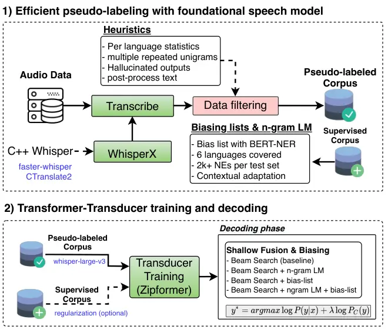
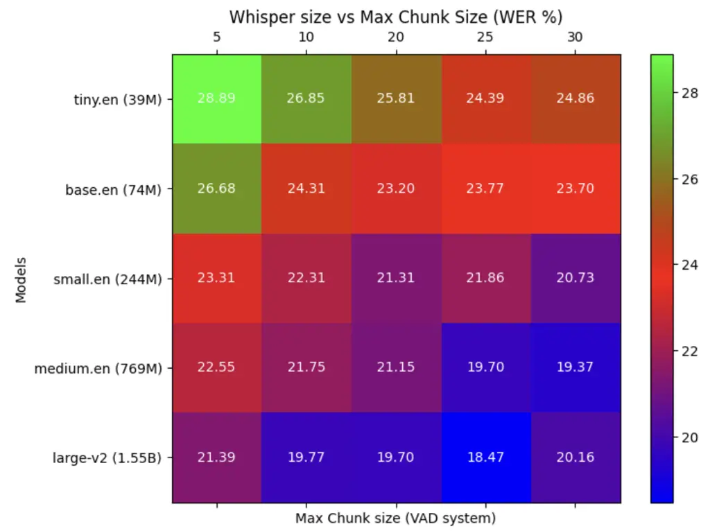

# Fast Streaming Transducer ASR Prototyping via Knowledge Distillation with Whisper

Iuliia Thorbecke¹¹ 1 Equal contribution. Order is determined by a coin
flip. Juan Zuluaga-Gomez¹¹ 1 Equal contribution. Order is determined by
a coin flip. Esaú Villatoro-Tello Affiliation:  Idiap Research
Institute, Switzerland; Affiliation:  University of Zurich, Switzerland;
Affiliation:  EPFL, Switzerland;    Shashi Kumar Pradeep Rangappa Sergio
Burdisso Affiliation:  Idiap Research Institute, Switzerland;
Affiliation:  EPFL, Switzerland;    Petr Motlicek Karthik Pandia Aravind
Ganapathiraju Affiliation:  Idiap Research Institute, Switzerland;
Affiliation:  Brno University of Technology, Czech Republic;
Affiliation:  Uniphore,
Indiaiuliia.nigmatulina@idiap.chjuan.zuluaga@eu4m.eu

###### Abstract

The training of automatic speech recognition (ASR) with little to no
supervised data remains an open question. In this work, we demonstrate
that streaming Transformer-Transducer (TT) models can be trained from
scratch in consumer and accessible GPUs in their entirety with
pseudo-labeled (PL) speech from foundational speech models (FSM). This
allows training a robust ASR model just in one stage and does not
require large data and computational budget compared to the two-step
scenario with pre-training and fine-tuning. We perform a comprehensive
ablation on different aspects of PL-based streaming TT models such as
the impact of (1) shallow fusion of n-gram LMs, (2) contextual biasing
with named entities, (3) chunk-wise decoding for low-latency streaming
applications, and (4) TT overall performance as the function of the FSM
size. Our results demonstrate that TT can be trained from scratch
without supervised data, even with very noisy PLs. We validate the
proposed framework on 6 languages from CommonVoice and propose multiple
heuristics to filter out hallucinated PLs.

## 1 Introduction

There are many challenges when developing automatic speech recognition
(ASR) engines for industrial applications, including (1) large-scale
databases that generalize across multiple domains; (2) inference under
challenging low-latency settings; and (3) lightweight ASR model size to
minimize deployment costs. While the first has been solved by training
large acoustic foundational speech models (FSM) with massive databases
(Conneau et al., 2020; Pratap et al., 2023), the latter two strongly
relate to architectural choices, e.g., using Connectionist Temporal
Classification (CTC) (Graves et al., 2006) or transducer-based (Graves, 2012) modeling.



Figure 1: Proposed framework for efficient and fast streaming ASR
prototyping with pseudo-labeled data. Transducer models are further
improved via shallow fusion of n-gram LMs and contextual biasing of
target named entities.

In industrial applications, large supervised databases in target domains
are not always available, thus several techniques have been proposed to
develop robust ASR models with small supervised corpora: (1) data
augmentation (Park et al., 2019; Bartelds et al., 2023); (2) only-audio
self-supervised pre-training with large databases and fine-tuning with
small corpora (Baevski et al., 2020; Conneau et al., 2020; Zuluaga-Gomez
et al., 2023); (3) pseudo-label then fine-tune, e.g., semi-supervised
learning (Zhu et al., 2023; Lugosch et al., 2022; Zuluaga-Gomez et al., 2021) and weakly supervised learning  (Radford et al., 2022). Most of
the approaches target the attention-based encoder-decoder
(AED) (Watanabe et al., 2017a) or CTC models. Even though these two
architectures have shown impressive results on multiple benchmarks
(e.g., Whisper (Radford et al., 2022)), they still lag in streaming
settings (Prabhavalkar et al., 2023).

The Transformer-Transducer architecture (Yeh et al., 2019) is widely
exploited for industrial uses that require streaming decoding because
the transducer decoder naturally supports streaming (Li et al., 2021; Li
et al., 2020). However, the transducer used to be harder to train
compared to AED and CTC, thus, it was less explored in the community,
until it was shown to achieve a performance as close as AED
models (Sainath et al., 2020). The transducer models consist of an
encoder, predictor and joint networks. Using a Transformer (Vaswani
et al., 2017) encoder leads to a Transformer-Transducer (TT)
architecture (Battenberg et al., 2017; Yeh et al., 2019; Zhang et al.,
2020a). When trained from scratch, the TT models require sufficient
amounts of supervised datasets in the target language and
domain (Noroozi et al., 2023; Li et al., 2021). At the same time,
fine-tuning a large pre-trained model, even when using a transducer
decoder, would not allow streaming decoding.

In this work, we focus on two questions partly unanswered by the
research community: (1) Could we quickly prototype a streaming TT model
on a single accessible GPU? (2) Can we train TT models with only
pseudo-labeled (PL) data? We target the streaming scenario, which is by
nature more challenging than standard offline (full attention)
decoding (Sainath et al., 2020). Despite the robustness of AED models in
the offline scenario, they still require a large amount of supervised
data. Here, we use TT models (Yeh et al., 2019), where the challenge
arises on the fact that these do not include a self-supervised stage,¹¹
1 Chiu et al. (2022) explore to warm start the encoder with a
pre-trained SSL-based model, albeit closed source model. i.e., needing
audio-text pairs always. We demonstrate that TT models can be trained
entirely from scratch with PLs generated from Whisper (Radford et al., 2022) while attaining competitive performance in streaming scenarios.
The overall proposed approach is illustrated in Figure 1.

##### Contributions:

- •
  We propose a framework for full-stack rapid development of ASR
  streaming solutions from scratch with low-to-zero supervised
  resources;
- •
  comprehensive study of TT performance as a function of the
  pseudo-labels quality, for both, online and offline settings;
- •
  robust heuristics to filter out noisy and hallucinated PLs from FSM;
- •
  evaluation of the impact of shallow fusion with external n-gram LM and
  contextual biasing for named entities;
- •
  experimentation and validation on 6 languages from CommonVoice.

## 2 Related Work

Developing robust ASR systems for low-latency online settings with
little to no supervised data is still an open challenge in the
community. In this section, we introduce the most prominent approaches
to overcome these issues.

##### From Encoder-Decoder to Transducer models

One of the key advantages of transducer models over encoder-decoder
relies on the fact that it supports streaming decoding. Not until
recently, it has been demonstrated that these models can surpass
standard AED systems  (Sainath et al., 2020). There have been multiple
breakthroughs that have made transducer training easier, such as
(1) pruned transducer loss  (Kuang et al., 2022), (2) better
architectures, e.g., FastConformer (Rekesh et al., 2023); and (3) from
the modeling side, e.g., model pruning, sparsification (Yang et al.,
2022a), and quantization (Sainath et al., 2020). However, little to no
work has been done on fast TT model prototyping (few GPU-days) with pure
pseudo-labeled data.

##### Pseudo-labeling in ASR

Semi-supervised learning (Zhang et al., 2020b; Park et al., 2020;
Higuchi et al., 2021), pseudo labeling (Zavaliagkos and Colthurst, 1998;
Likhomanenko et al., 2020; Hwang et al., 2022), and weakly supervised
learning (Radford et al., 2022) are a family of methods aiming to partly
alleviate the burden of lack of labeled data for supervised ASR
training. These methods have shown promising word error rate (WER)
improvement in multiple settings and languages. In practice, a teacher
model is trained on an audio-text paired corpus
$`D_{l}=\{X_{i},Y_{i}\}`$. Then, it is used to pseudo label a much
larger unlabeled only audio corpus, $`D_{pl}=\{X_{i},Y^{*}_{i}\}`$.
Afterward, usually a smaller model (Barrault et al., 2023) can use
$`D_{l}`$ and $`D_{pl}`$ for supervised training or fine-tuning (Hsu
et al., 2021).

The main difference between most of the previous studies and our
approach proposed in the paper is that typically iterative training is
used Zhang et al. (2020b); Park et al. (2020); Hwang et al. (2022). A
multi-stage strategy combining self- and semi-supervised learning
eventually results in strong pseudo-labels. In the present paper, we
focus on the performance that can be achieved “out-of-the-box” by using
already available FSM and training transducer models from scratch and
only once. Thus, this approach allows for minimizing the overall
computational cost, i.e., one-stage training and applying improvement
methods, such as decoding with shallow fusion. We aim to reveal the
potential of the FSM in pseudo-label generation and demonstrate what
performance can be reached with minimal training efforts.

PLs, however, are often noisy and bounded by the quality of a teacher
model, whereas their use might result in suboptimal final performance in
the models. This can be solved by either filtering out the nosiest
samples or increasing the teacher model size to improve their quality.²²
2 We assume that a larger model, trained under the same conditions and
with increased data, will attain lower WERs. Several approaches to
improve the PL quality include improving loss functions (Zhu et al.,
2023; Gao et al., 2023), pairing online and offline models at training
time (Higuchi et al., 2021), and continuous single-language
 (Likhomanenko et al., 2022; Berrebbi et al., 2022) and multilingual
pseudo-labeling setting (Lugosch et al., 2022).

##### Knowledge Distillation with Large Models

Knowledge distillation (KD), or teacher-student training (Watanabe
et al., 2017b), is a very well-known technique to distill knowledge from
a large model into a smaller model (Hinton et al., 2015). The former is
considered the Teacher and the latter is the Student. In this framework,
we first train the teacher model with the correct label (e.g.,
supervised training) (Takashima et al., 2018) or in a self-supervised
manner. The student model is then trained with the posterior
distributions of the pre-trained teacher model (Chebotar and Waters,
2016). There has been prior work on KD for CTC (Takashima et al., 2018)
and AED models with Whisper (Radford et al., 2022) (Gandhi et al., 2023;
Ferraz et al., 2024) and Transducer models (Panchapagesan et al., 2021).
Similarly, work to distil offline transducer models into online has been
explored by Kurata and Saon (2020) or from self-supervised models (Yang
et al., 2022b).

In our work, we focus on sequence-level KD, which means we use the
one-best hypothesis from the teacher model instead of using the
posterior distribution. This approach has some benefits: (1) no need to
cache the teacher model or its outputs into memory; (2) no need to
modify the current ASR training pipelines; (3) overall faster ASR
training w.r.t teacher-student based KD, where we can leverage highly
optimized inference pipelines–including model quantization–for PL
generation, e.g., WhisperX (Bain et al., 2023). All this results in
pseudo-labeling that meets the needs for fast prototyping for standard
industrial applications.

## 3 Experimental Setup

This section describes the datasets, TT architecture, details for
training with pseudo-labeled data, effective integration of language
model and contextual biasing with shallow fusion, and metrics we use for
evaluation.

### 3.1 Pseudo Labeling with Whisper

Our core contribution is the fast prototyping of TT streaming ASR
trained exclusively on pseudo-labeled data. We select the Whisper model
as our teacher model (Radford et al., 2022) due to its strong
performance across multiple benchmarks. In addition, Whisper provides
models at different parameter scales.

##### Decoding with WhisperX pipeline

We use the WhisperX pipeline (Bain et al., 2023) across all the
experiments to generate PLs. It is composed of (1) a voice activity
detection step to segment long-form audio; (2) batching multiple
segments for efficient inference; (3) model quantization of Whisper and
C++ implementation on FasterWhisper³³ 3
[https://github.com/SYSTRAN/faster-whisper](https://github.com/SYSTRAN/faster-whisper)
which uses CTranslate2 for fast decoding;⁴⁴ 4
[https://github.com/OpenNMT/CTranslate2/](https://github.com/OpenNMT/CTranslate2/)
(4) model inference and word level alignment. Note that we pseudo-label
each training corpus with 5 Whisper model sizes, i.e., whisper-tiny,
base, small, medium, and large-v3.

##### Data filtering heuristics

We developed multiple data selection heuristics ($`H`$) to filter out
noisy and hallucinated PLs. $`H1`$: remove PL if composed of the same
unigram three or more times. $`H2`$: compute maximum word length from
supervised training corpus and remove utterances with one or more PLs
larger than the max threshold.⁵⁵ 5 See the per language proposed
thresholds in appendix C. $`H3`$: compute $`word_{ratio}`$⁶⁶ 6 Number of
words divided by utterance duration \[seconds\]. and filter out samples
with $`word_{ratio}`$ less than 1 or more than 4. $`H4`$: verbalize all
the numbers from the pseudo-labels, remove punctuation and normalize
following the CommonVoice recipe in Lhotse (Żelasko et al., 2021). These
heuristics are applied for every training corpora. Similar heuristics
are proposed in (Barrault et al., 2023).

### 3.2 Transformer-Transducer Training

We train Transformer-Transducer models from scratch for each language
and dataset. We use stateless predictor (Ghodsi et al., 2020) and
Zipformer encoder model (Yao et al., 2023) with the latest Icefall
Transducer recipe and its default training hyper-parameters.⁷⁷ 7
[https://github.com/k2-fsa/icefall/tree/master/egs/librispeech/ASR/zipformer](https://github.com/k2-fsa/icefall/tree/master/egs/librispeech/ASR/zipformer).
This includes ScaledAdam optimizer (Kingma and Ba, 2014), learning rate
scheduler with a 500-step warmup phase (Vaswani et al., 2017) followed
by a decay phase (each 7.5k steps and 3.5 epochs), as in Yao et al.
(2023). The neural TT model is jointly optimized with an interpolation
of simple and pruned RNN-T loss (Kuang et al., 2022; Graves, 2012) and
CTC loss (Graves et al., 2006) ($`\lambda=0.1`$), according to:

```math
\mathcal{L}=(1-\lambda)\cdot\mathcal{L}_{RNN\-T}+\lambda\cdot\mathcal{L}_{CTC}. \tag{1}
```

We use an effective batch size of 600s with a gradient accumulation of
1, the peak learning rate is $`lr=5.0e^{-2}`$ and we train each TT for
30 epochs on a single RTX 3090 GPU with only PLs.⁸⁸ 8 We also run an
experiment valuable for the industrial domain. It includes a thorough
analysis of PLs quality for the call-center domain, see Appendix D.
Training takes between 1 and 2 days. During the decoding, we use a beam
size of 4.

##### Regularization with supervised data

We perform experiments where along with PLs we mix in 100h of randomly
selected supervised data from the train set $`D_{l}`$ during training.
We compute mixing weights between $`D_{l}`$ and $`D_{pl}`$ so each
training batch contains at least one sample from $`D_{l}`$. This is
achieved with CutSet.Mux function from Lhotse (Żelasko et al., 2021).⁹⁹
9 It lazily loads two or more datasets and mixes them on the fly
according to pre-defined mixing weights. All the experiments that uses
PL and supervised data are denoted with +sup. \[100h\], otherwise, the
model is trained with PL only. As an ablation experiment, we also test
the performance by scaling up supervised data to 200h and 400h when
using the weakest FSM, i.e., whisper-tiny. This experiment aims to
(1) compensate for very low-quality PLs, and (2) demonstrate that
Whisper PLs (from the largest models) are of sufficient quality for
transducer training without any supervised data.

##### Enabling streaming decoding with multi-chunk training

All the models proposed in this work can perform streaming decoding.
This is achieved by performing chunk-wise multi-chunk training. During
training, we use causal masking of different sizes to enable streaming
decoding under different low-latency configurations (Swietojanski
et al., 2023; Kumar et al., 2024). Specifically, we rely on two lists:
chunk-size={640ms,1280ms,2560ms,full} and
left-context-frames={64,128,256,full}.¹⁰¹⁰ 10 The effective number of
left context chunks is computed as
$`left\_context\_frames//chunk\_size`$. At training time, we randomly
select the chunk size and the left context chunks for each batch. This
enables the final model to work on a wide variety of streaming settings.
At test time, we select 13 different decoding configurations ranging
from 320 ms¹¹¹¹ 11 Decode chunk size of 320ms is more challenging as it
has not been used during training. to 2560 ms chunks (see App. A).

### 3.3 Language Modeling and Contextual Biasing

Leveraging more text data and context information with language model
and keywords integration can considerably improve ASR performance. Since
in our set-up, we assume that we have zero (or very little) supervised
data, using extra unpaired text data would not contradict the original
constraints. At the same time, relying mainly on pseudo-labels, we see
text knowledge integration as an opportunity to make our models more
reliable and robust. The widely used method of LM integration during the
decoding is shallow fusion (SF) (Aleksic et al., 2015; Kannan et al.,
2018; Zhao et al., 2019; Jung et al., 2022). SF means log-linear
interpolation of the score from the ASR model with an external
separately optimized LM at each step of the beam search:

```math
y^{\ast}=\argmax\log P(y|x)+\lambda\log P_{LM}(y), \tag{2}
```

where $`P_{LM}(y)`$ is an external LM and $`\lambda`$ is a
hyperparameter to control the impact of the LM on the overall model
score.

To gain more possible improvement from the text information, we explore
three options with the SF: (1) word-level n-gram LM, (2) named-entities,
(3) combination of word-level n-gram LM and named-entities. We choose
n-gram over neural network (NN) LMs, as the use of NN-LMs would be
impractical in low-latency streaming scenarios due to the size of the
models. Named entities are extracted automatically and considered as
keywords forming biasing lists: for more details see Section 3.4.1.

##### Shallow fusion with Aho-Corasick

One of the drawbacks of LM fusion is that it typically slows down the
decoding time during inference, especially when using bigger NN-LMs.
Since we focus on streaming ASR models in this paper, any potential
increase in inference time is critical for us. Recent studies
demonstrated that SF implemented with the Aho-Corasick (AC) algorithm
(Aho and Corasick, 1975) is fast and optimized when used for the keyword
biasing (Guo et al., 2023). Thus, we use the AC implementation from
Icefall¹²¹² 12
[https://github.com/k2-fsa/icefall/blob/master/icefall/context_graph.py](https://github.com/k2-fsa/icefall/blob/master/icefall/context_graph.py)
to integrate key named entities (NE) and word-level n-gram LMs during
the decoding.

The Transducer model we use outputs its hypotheses at the subword level
and, in this case, an external LM is also typically trained on subwords.
In our experiments, to benefit from the word-level statistics, we
integrate word-based n-gram external LMs. Such integration from word to
subword level is possible with the AC implementation. First, the LM
n-grams are converted into strings of subword units with
SentecePieces;¹³¹³ 13
[https://github.com/google/sentencepiece](https://github.com/google/sentencepiece)
second, the subword units are used to build an AC prefix trie including
LM weights in the probability domain.

When a string match occurs between a model prediction and a string in
the prefix trie, the log probability of the matching hypothesis is
augmented by the LM weight. To obtain positive cost, we convert the
logarithmic LM weights (e.g., from ARPA) back to probabilities by taking
an exponent. In the case of context biasing, SF works in the same way
but instead of LM weights a fixed bias cost is added to each matched
arc. Typically when applying context biasing alone, we set such cost to
0.7.¹⁴¹⁴ 14 For contextual biasing with NEs, we tested the biasing costs
= {0.1, 0.3,0.5,0.7,1.0,1.5,2.0}. 0.7 performed systematically better in
all scenarios. For SF with combined n-gram LM and biasing list, we still
use LM weights, bias cost, and a single prefix tree. Using a single
prefix tree has the advantage of faster running time, which is relevant
for streaming models. We tune the biasing cost on the dev sets and set
it differently when a biased entity is present in the LM vs when it is
not¹⁵¹⁵ 15 For SF of n-gram LM combined with NEs, we tested the biasing
following costs: inLM = {0.5,1.0,1.5,2.0}; notInLM= {0.5,1.0,1.5,2.0}.
inLM=0.5 and notInLM=1.5 performed systematically better in all
settings.:

```math
C=\begin{cases}\alpha_{outLM}&\text{if NE is not in LM,}\\
exp(LMw)+\alpha_{inLM}&\text{if NE is in LM,}\\
exp(LMw)&\text{otherwise.}\end{cases}
```

##### Language modeling

For LM SF, we train tri-gram word-level LMs with SRILM (Stolcke, 2002).
To train n-gram LMs, we use text data from the corresponding train sets.
All the train texts are uppercased and normalized to contain only
unicode characters.

Evaluation protocol  For evaluation, we use the standard word error rate
(WER) metric for ASR which is the lower the better.

### 3.4 Databases

Here, we introduce the datasets used for fast ASR prototyping and
describe the process of generating biasing lists for each language.

#### 3.4.1 CommonVoice Database

The CommonVoice dataset comprises several thousand hours of audio in
more than 100 languages (Ardila et al., 2020). To the best of our
knowledge,¹⁶¹⁶ 16 According to the discussions in the official
OpenAI-Whisper GitHub repository:
[https://github.com/openai/whisper/discussions/349](https://github.com/openai/whisper/discussions/349),
[https://github.com/openai/whisper/discussions/2305](https://github.com/openai/whisper/discussions/2305).
the CommonVoice data was not used for training Whisper model and can be
used for zero-shot evaluation. In our case, it is an important point, as
using unseen data for generating PLs provides a more realistic
estimation of the proposed approach performance.¹⁷¹⁷ 17 Although
officially the CommonVoice data is not included in the training data for
Whisper, we realize the possibility of some CommonVoice data still being
seen by the model through other sources and in a small amount. For
experimentation, we select six languages from CommonVoice-v11 (Ardila
et al., 2020) ¹⁸¹⁸ 18 CommonVoice-v11: cv-corpus-11.0-2022-09-21 which
have sufficient data for training ASR and language models: Catalan (CA),
English (EN), German (DE), French (FR), Spanish (ES), and Italian (IT).
We use the official train sets and report WERs on the official test
sets. See Table 1 for further statistics.

|        |           |                                 |            |             |
| ------ | --------- | ------------------------------- | ---------- | ----------- |
| Lang   | Train set | Test set stats & Named entities |            |             |
| (code) | \[hr\]    | utt/hr                          | unique^(†) | nb. utt^(‡) |
| EN     | 1000      | 16K/27                          | 6921       | 6442        |
| CA     | 1200      | 16.3K/28                        | 2108       | 2607        |
| FR     | 600       | 16K/26                          | 6035       | 7486        |
| DE     | 600       | 16K/27                          | 6949       | 8491        |
| ES     | 317       | 15.5K/26                        | 4776       | 6528        |
| IT     | 200       | 15k/26                          | 5838       | 5938        |

Table 1: Train and test sets statistics with context information per
CommonVoice language. ^(†)total of unique entities per test set after
removing unigrams shorter than 5 characters. ^(‡)number of utterances in
the test set with at least one named entity.

##### Biasing List Creation

We automatically create biasing lists for target CommonVoice subsets to
perform the contextual biasing experiments. For this purpose, we use
BERT models from HuggingFace (Wolf et al., 2020) fine-tuned on the
named-entity recognition (NER) task for each language individually.¹⁹¹⁹
19 EN:
[dslim/bert-base-NER-uncased](https://dslim/bert-base-NER-uncased); DE,
ES, FR:
[Babelscape/wikineural-multilingual-ner](https://Babelscape/wikineural-multilingual-ner)
(Armengol-Estapé et al., 2021); CA:
[projecte-aina/roberta-base-ca-cased-ner](https://projecte-aina/roberta-base-ca-cased-ner) (Tedeschi
et al., 2021). The following steps are included: (1) automatic text
labeling with BERT, (2) NEs extraction from the BERT labels, (3) NEs
lists filtering. In Table 1, one can see the statistics of NE lists per
language where the size of lists with unique NEs varies from 2108 to
6949 which is rather long for contextual biasing.²⁰²⁰ 20 The ideal size
of the biasing FST is significantly influenced by the data; according to
Chen et al. (2019), performance started to decline when the number of
contextual entities surpassed 1000. The last column of Table 1 shows the
number of utterances per test set that contain at least one NE. This
information gives an estimation of the proportion of NEs in the test
sets: DE and FR sets have almost half of the utterances with NEs, at the
same time, the CA set has only 17% of those.

##### Heuristics for biasing list selection

Since NEs are automatically extracted with the BERT-based NER,
extraction errors are inevitable. To minimize noise from potentially
erroneously extracted NEs, we follow simple filtering heuristics when
preparing the final biasing lists. $`H1`$: select only NEs that are
composed of 1 to 4 words, and $`H2`$: remove single-word NEs shorter
than 5 characters. For example, the filtering step is important to
reduce such noisy outputs as short single words that often are not NEs:
ich, wir, die – for DE, san, mar, new – for ES. We also tried to further
filter the lists by only allowing NEs that are repeated at least twice,
or NEs composed of bigram or more. However, in our experiments, only
applying $`H1`$ and $`H2`$ was sufficient and yielded better WERs
overall.

## 4 Results

We report our results in two parts. First, we present the overall
performance of models trained with PL and with different settings. The
following configurations are compared: (1) offline VS streaming TT
models, (2)  models trained on PL-only VS models with supervised data
regularization, and (3) models with different chunk sizes. Second, we
report the performance of models with SF. For the baseline, we use a
Zipformer streaming model trained per each language on PL only. In
addition, we also compare our results to the offline Zipformer trained
on the same data and include the reference to the previous results
reported on CommonVoice in (Radford et al., 2022) (Table 3).²¹²¹ 21 Note
that the results from (Radford et al., 2022) are not directly comparable
to ours, as we use the CV-11 version of CommonVoice and (Radford et al., 2022) uses the version CV-7. We anyway include their results to have the
previous reference point but locate them in Appendix.

### 4.1 Performance on models with PL of different quality

##### Offline models

In Figure 2, we present the offline results for TT models trained from
scratch on PL data only in six languages (depicted by blue graphs).
These models are evaluated only in a non-streaming context to determine
the upper bound WERs achievable by training with PLs of varying
qualities. As the size of the Whisper Model increases (shown on a
log-scaled x-axis), there is a corresponding improvement in WERs, also
on a log-scale. The best performance is observed for ES, with the least
favourable results for EN. These results show that our approach adapts
across a spectrum of PL data quantities and qualities, ranging from 200h
for IT to over 1000h for CA and EN. We additionally analyzed the
performance of models trained on PLs depending on how well each language
is represented in the data used for training Whisper models (Radford
et al., 2022). Yet, no consistent effect is noticed.

Figure 2: WERs for offline Zipformer models on six languages of
CommonVoice. Models are trained with pseudo-labels from different
Whisper model sizes (blue graphs). Adding 100h of supervised data during
training (red graph) regularizes the training up to models with 700M
params, especially for languages with less data.

##### Regularization with supervised data

Red graphs in Figure 2 also show WERs for offline models that along with
PLs include a small amount of supervised data, up to 100h, for
regularization. This strategy proves to be beneficial in cases with
noisier PLs, particularly for smaller Whisper models like Whisper-tiny,
Whisper-base, and Whisper-small when WER goes down for all the
languages. The benefits, however, decrease or are absent with more
accurate PLs generated by larger models, such as Whisper-medium and
Whisper-large-v3. Thus, with our results on six languages, we can
conclude that when supervised data is available, regularization is
recommended for models with weak PLs and can be omitted with strong PLs.
The results with 100h regularization are also available in Table 3 for
offline models and are consistent with the performance on streaming
models reported in Table 2.

Figure 3: Box plots of WERs for six languages of CommonVoice. Streaming
Zipformer models are trained from scratch, with only PLs generated with
different Whisper model sizes. Each box denotes 13 decoding
configurations, ranging from challenging (320ms chunk with limited left
context) to more relaxed (2560ms chunk with full left context) streaming
settings. (Note different WER scaling on the y-axis.)

##### Scaling-up supervised data helps on cases with very noisy PLs

For the ablation experiment on mixing in more supervised data, we
maintain a fixed computational budget for generating PLs and explore the
extent to which supervised data can offset noisy PLs. The results are
pictured in Figure 4. Using only Whisper-tiny, we train TT models from
scratch for the six CommonVoice languages with over 200h of available
supervised data. Our results show significant improvements in WER as
supervised data increases from 100h to 200h and even more so up to 400h,
especially in languages like Catalan, French, and Italian, which likely
suffer from lower-quality PLs. For this experiment, our oracle results
are from the models fully trained on the supervised data, which can be
found in Table 3 for offline models and in Table 2 for streaming models.

Figure 4: Ablations on WERs of Zipformer models for 6 languages of
CommonVoice. We study the impact of mixing supervised data during
training with pseudo-labeled of very low quality, i.e., Whisper-tiny.

|                                                     |                  |      |      |      |                        |      |      |      |
| --------------------------------------------------- | ---------------- | ---- | ---- | ---- | ---------------------- | ---- | ---- | ---- |
|                                                     | cs=320ms;lf=2.5s |      |      |      | cs=320ms;lf=$`\infty`$ |      |      |      |
| Experiment                                          | CA               | DE   | ES   | IT   | CA                     | DE   | ES   | IT   |
| Whisper-tiny ($`39M`$)                              |                  |      |      |      |                        |      |      |      |
| Zipformer ($`70M`$)                                 | 46.2             | 29.5 | 24.5 | 37.3 | 46.0                   | 28.9 | 23.8 | 36.7 |
| +sup. \[100h\]                                      | 38.7             | 27.0 | 21.6 | 26.7 | 38.3                   | 26.4 | 21.0 | 25.9 |
| +n-gram LM                                          | 38.6             | 26.2 | 21.2 | 25.7 | 38.2                   | 25.5 | 20.5 | 25.0 |
| +bias-list                                          | 34.4             | 26.3 | 21.3 | 25.5 | 33.9                   | 25.7 | 20.5 | 24.7 |
| +n-gram LM+(BL)                                     | 34.0             | 25.7 | 21.0 | 24.7 | 33.6                   | 25.1 | 20.2 | 23.9 |
| Whisper-base ($`74M`$)                              |                  |      |      |      |                        |      |      |      |
| Zipformer ($`70M`$)                                 | 39.7             | 23.9 | 20.2 | 28.4 | 39.4                   | 23.3 | 19.5 | 27.6 |
| +sup. \[100h\]                                      | 29.9             | 22.2 | 18.3 | 23.0 | 29.6                   | 21.5 | 17.6 | 22.3 |
| +n-gram LM                                          | 29.4             | 21.4 | 17.8 | 22.2 | 29.1                   | 20.8 | 17.1 | 21.5 |
| +bias-list                                          | 26.0             | 21.6 | 17.6 | 22.0 | 25.6                   | 21.0 | 16.9 | 21.2 |
| +n-gram LM+(BL)                                     | 25.7             | 21.0 | 17.2 | 21.3 | 25.2                   | 20.4 | 16.5 | 20.7 |
| Whisper-small ($`244M`$)                            |                  |      |      |      |                        |      |      |      |
| Zipformer ($`70M`$)                                 | 21.1             | 22.4 | 16.2 | 21.5 | 20.8                   | 21.3 | 15.4 | 20.6 |
| +sup. \[100h\]                                      | 20.1             | 17.8 | 16.0 | 20.1 | 19.8                   | 17.2 | 15.3 | 19.3 |
| +n-gram LM                                          | 19.6             | 17.1 | 15.5 | 19.3 | 19.3                   | 16.5 | 14.8 | 18.5 |
| +bias-list                                          | 17.7             | 17.2 | 15.4 | 19.3 | 17.3                   | 16.6 | 14.7 | 18.5 |
| +n-gram LM+(BL)                                     | 17.4             | 16.7 | 15.0 | 18.8 | 17.1                   | 16.1 | 14.3 | 17.9 |
| Whisper-medium ($`769M`$)                           |                  |      |      |      |                        |      |      |      |
| Zipformer ($`70M`$)                                 | 16.7             | 16.5 | 17.6 | 18.6 | 16.4                   | 15.8 | 16.7 | 17.8 |
| +sup. \[100h\]                                      | 16.5             | 16.6 | 14.9 | 19.4 | 16.2                   | 15.8 | 14.3 | 18.4 |
| +n-gram LM                                          | 16.1             | 15.8 | 14.6 | 18.6 | 15.8                   | 15.1 | 13.9 | 17.7 |
| +bias-list                                          | 14.8             | 16.0 | 14.6 | 18.6 | 14.5                   | 15.3 | 13.9 | 17.7 |
| +n-gram LM+(BL)                                     | 14.6             | 15.5 | 14.3 | 18.1 | 14.3                   | 14.8 | 13.6 | 17.2 |
| Whisper-large-v3 ($`1.5B)`$                         |                  |      |      |      |                        |      |      |      |
| Zipformer ($`70M`$)                                 | 22.5             | 16.1 | 15.9 | 17.5 | 21.8                   | 15.3 | 15.1 | 16.7 |
| +sup. \[100h\]                                      | 16.6             | 16.3 | 14.6 | 18.4 | 16.4                   | 15.6 | 14.0 | 17.6 |
| +n-gram LM                                          | 16.2             | 15.6 | 14.2 | 17.6 | 16.0                   | 14.9 | 13.6 | 16.8 |
| +bias-list                                          | 15.0             | 15.8 | 14.1 | 17.8 | 14.8                   | 15.1 | 13.5 | 17.0 |
| +n-gram LM+(BL)                                     | 14.8             | 15.3 | 13.8 | 17.2 | 14.5                   | 14.6 | 13.2 | 16.4 |
| Baseline streaming Zipformer (only supervised data) |                  |      |      |      |                        |      |      |      |
| Zipformer ($`70M`$)                                 | 7.8              | 13.8 | 13.5 | 17.5 | 7.6                    | 13.1 | 12.8 | 16.6 |

Table 2: WERs for streaming evaluation with n-gram LM and bias-lists
(BL). Listed on four CommonVoice languages and two decoding
configurations. The Zipformer models are trained with pseudo-labeled
data from different Whisper models and 100h of supervised data
(“sup. \[100h\]”) from the original train set. All experiments show
additive WERs improvement when adding either (or both) n-gram LM or
biasing lists.

|                                                   |                    |      |      |      |      |      |
| ------------------------------------------------- | ------------------ | ---- | ---- | ---- | ---- | ---- |
|                                                   | Language \[hours\] |      |      |      |      |      |
| Experiment                                        | CA                 | EN   | DE   | FR   | ES   | IT   |
|                                                   | 1200               | 1000 | 600  | 600  | 317  | 200  |
| Whisper-tiny ($`39M`$)                            |                    |      |      |      |      |      |
| Radford et al. (2022)                             | 51.0               | 28.8 | 34.5 | 49.7 | 30.3 | 44.5 |
| Zipformer ($`70M`$)                               | 41.1               | 21.5 | 25.7 | 33.8 | 20.1 | 32.2 |
| +sup. \[100h\]                                    | 36.8               | 20.9 | 22.6 | 29.7 | 16.1 | 19.8 |
| +n-gram LM                                        | 32.4               | 21.0 | 22.1 | 31.3 | 15.9 | 18.7 |
| +n-gram LM+(BL)                                   | 32.0               | 20.7 | 21.5 | 30.8 | 15.6 | 18.0 |
| Whisper-base ($`74M`$)                            |                    |      |      |      |      |      |
| Radford et al. (2022)                             | 39.9               | 21.9 | 24.5 | 37.3 | 19.6 | 30.5 |
| Zipformer ($`70M`$)                               | 30.5               | 19.2 | 19.4 | 24.7 | 14.8 | 22.7 |
| +sup. \[100h\]                                    | 27.9               | 19.1 | 17.5 | 21.8 | 12.6 | 16.3 |
| +n-gram LM                                        | 24.0               | 19.1 | 17.0 | 22.2 | 12.2 | 15.5 |
| +n-gram LM+(BL)                                   | 23.7               | 18.8 | 16.4 | 21.7 | 11.8 | 14.8 |
| Whisper-small ($`244M`$)                          |                    |      |      |      |      |      |
| Radford et al. (2022)                             | 23.8               | 14.5 | 13.0 | 22.7 | 10.3 | 16.0 |
| Zipformer ($`70M`$)                               | 18.6               | 17.1 | 13.4 | 16.5 | 10.7 | 14.8 |
| +sup. \[100h\]                                    | 17.4               | 16.9 | 12.8 | 15.8 | 10.2 | 12.9 |
| +n-gram LM                                        | 15.1               | 16.7 | 12.4 | 15.8 | 10.0 | 12.4 |
| +n-gram LM+(BL)                                   | 14.9               | 16.4 | 11.9 | 15.4 | 9.7  | 11.8 |
| Whisper-medium ($`769M`$)                         |                    |      |      |      |      |      |
| Radford et al. (2022)                             | 16.4               | 11.2 | 8.5  | 16.0 | 6.9  | 9.4  |
| Zipformer ($`70M`$)                               | 14.0               | 16.7 | 11.3 | 13.7 | 9.5  | 12.1 |
| +sup. \[100h\]                                    | 13.7               | 16.4 | 11.3 | 13.5 | 9.5  | 12.0 |
| +n-gram LM                                        | 12.1               | 16.2 | 10.9 | 13.2 | 9.3  | 11.5 |
| +n-gram LM+(BL)                                   | 11.9               | 15.9 | 10.4 | 12.9 | 9.0  | 11.1 |
| Whisper-large-v3 ($`1.5B)`$                       |                    |      |      |      |      |      |
| Radford et al. (2022)                             | 14.1               | 9.4  | 6.4  | 13.9 | 5.6  | 7.1  |
| Zipformer ($`70M`$)                               | 12.8               | 16.2 | 10.5 | 12.4 | 8.9  | 11.1 |
| +sup. \[100h\]                                    | 13.6               | 16.3 | 10.7 | 12.4 | 9.0  | 11.6 |
| +n-gram LM                                        | 12.1               | 16.0 | 10.4 | 12.0 | 8.9  | 11.3 |
| +n-gram LM+(BL)                                   | 11.8               | 15.6 | 10.0 | 11.6 | 8.6  | 10.8 |
| Baseline offline Zipformer (only supervised data) |                    |      |      |      |      |      |
| Zipformer ($`70M`$)                               | 4.9                | 14.5 | 8.5  | 10.7 | 8.1  | 10.2 |

Table 3: WERs for six CommonVoice languages. The Zipformer offline
models are trained with pseudo-labeled data from different Whisper
models. We also report WERs when a small amount of supervised data is
added during training, denoted as ‘‘sup. \[100h\]’’. Note that the
transducer models are trained from scratch in $`\sim`$1 day GPU time.

##### Low-latency streaming decoding

Figure 3 lists the streaming decoding results across six CommonVoice
languages, testing 13 different decoding configurations (see 3.2). We
establish an upper performance bound with models tested in non-streaming
mode and also include a box plot for each TT model trained with PLs
derived from various Whisper model sizes. The results show how model
performance can fluctuate under different streaming conditions, with
smaller chunk sizes or limited left context posing greater challenges.

The results with the configuration with cs=320ms and lf=2.5s are also
reported in Tables 2 and 4 and demonstrate consistently better
performance when the full left context is used. This tendency stays
independent of language and SF.

### 4.2 SF with n-gram LM brings substantial WER reductions on challenging scenarios - and decoding analysis

Performance on different models and languages with SF is presented in
Table 2. Zipformer models in the table are our baselines, i.e.,
streaming models trained on PL data. We use the further improved models
with an additional 100h of supervised data for decoding with SF. For all
the languages, we can see a WER decrease when decoded with an external
LM. The WER also always improves when context biasing with NEs is
introduced. It is an important observation since all NEs are extracted
automatically with no human supervision involved. Moreover, all biasing
lists are rather long, which often is an obstacle to improvement when
biasing methods are used (Chen et al., 2019). Nevertheless, our approach
proves to work on biasing lists of large sizes as well. According to our
results, external LM and context NEs fusions are complementary methods,
gaining the best WER when they are combined during decoding.

The improvement with SF is consistent through the languages and has the
biggest impact when models are trained on weaker PLs generated from the
smaller Whisper models. This behavior is expected, as the models that
saw less training data have more potential to still benefit from any
additional data given during regularization and/or decoding. On the
other hand, the improvement decreases with the PLs generated by
Whisper-medium and Whisper-large-v3.

Another remarkable observation is that the models trained on PLs are
more competitive with the models trained on the supervised data only
when less training data is given. For example, CA language has 1200h of
training data and supervised models are considerably winning over the PL
models even after all the improvements we introduce: 7.8% VS 14.8% for
supervised and PL models correspondingly.²²²² 22 Here and below in this
paragraph, we report WERs for the configuration with cs=320ms and
lf=2.5s. We observe the same tendency in the results with the other
configuration as well. When double less training data is used for DE
language, i.e., 600h, the difference is less prominent but still
considerable: 13.8% VS 15.3% for supervised and PL models
correspondingly. When the amount of training data is further reduced to
317h for ES and 200h for IT, we observe either little or no degradation
from supervised models to PL models: 13.5% VS 13.8% for ES and 17.5% VS
17.2% for IT for supervised and PL models correspondingly. These results
illustrate well the advantages and strengths of the proposed framework
and methods for the low-resource scenarios. Due to space constraints, in
Table 2, we show the performance only on four languages; SF impact on
offline models for all six languages can be found in Table 3.

## 5 Conclusions

In this work, we propose a framework to meet the challenge of training
streaming ASR systems with few-to-none supervised data by leveraging PLs
from foundational speech models. We conduct a thorough examination of
the efficacy of PL-based TT models across various dimensions, including
offline and chunk-wise decoding for streaming applications, and the
influence of FSM size on the TT model’s WERs. We introduce robust
heuristics to filter out unreliable and hallucinated PLs. Our findings
reveal that TT models can be effectively trained from scratch on noisy
PLs. We managed to further improve the performance of models trained
with weak pseudo-labels (generated by Whisper-tiny, -base, and -small)
by adding regularization with different amounts of supervised data.
Additionally, we prove that decoding with the shallow fusion of external
n-gram LM and automatically generated named entities always improves the
performance of models, independent of the quality of pseudo-labels.

## Limitations

One of the limitations of the paper is that the data from the
CommonVoice dataset is read speech that can considerably differ from
spontaneous speech and unprepared conversations. Our choice was mostly
due to the possibility of testing our framework on six different
languages and in this regard, CommonVoice suited us well. Besides this,
models for each language were trained on a different amount of data
(from 200h to 1200h) that demonstrated different impacts of the proposed
methods. However, no experiments were done to see the performance with
different amounts of train data within each language.

Another limitation of the paper is that despite focusing mostly on the
streaming ASR models, we provide no results on the execution time. This
information would be especially important for the shallow fusion
experiments. Although we noted good time performance of the proposed
shallow fusion implementation for offline models, the evaluation for
streaming models is missing.

## Ethical Considerations

All speech data sets we use have anonymous speakers. We do not have any
access to nor try to create any PII of speakers.

## Acknowledgements

This work was supported by the Idiap & Uniphore collaboration project.
Part of the work was also support supported by EU Horizon 2020 project
ELOQUENCE²³²³ 23 [https://eloquenceai.eu/](https://eloquenceai.eu/)
(grant number 101070558).

## References

- Aho and Corasick (1975) Alfred V Aho and Margaret J Corasick. 1975.
  Efficient string matching: an aid to bibliographic search.
  _Communications of the ACM_, 18(6):333–340.
- Aleksic et al. (2015) Petar Aleksic, Mohammadreza Ghodsi, et al. 2015.
  Bringing contextual information to google speech recognition. In
  _Interspeech_, pages 468–472.
- Ardila et al. (2020) Rosana Ardila, Megan Branson, Kelly Davis,
  Michael Kohler, Josh Meyer, Michael Henretty, Reuben Morais, Lindsay
  Saunders, Francis Tyers, and Gregor Weber. 2020. Common voice: A
  massively-multilingual speech corpus. In _Proceedings of the Twelfth
  Language Resources and Evaluation Conference_, pages 4218–4222.
- Armengol-Estapé et al. (2021) Jordi Armengol-Estapé, Casimiro Pio
  Carrino, Carlos Rodriguez-Penagos, Ona de Gibert Bonet, Carme
  Armentano-Oller, Aitor Gonzalez-Agirre, Maite Melero, and Marta
  Villegas. 2021. [Are multilingual models the best choice for
  moderately under-resourced languages? A comprehensive assessment for
  Catalan](https://doi.org/10.18653/v1/2021.findings-acl.437). In
  _Findings of the Association for Computational Linguistics: ACL-IJCNLP
  2021_, pages 4933–4946, Online. Association for Computational
  Linguistics.
- Baevski et al. (2020) Alexei Baevski, Yuhao Zhou, Abdelrahman Mohamed,
  and Michael Auli. 2020. wav2vec 2.0: A framework for self-supervised
  learning of speech representations. _Advances in neural information
  processing systems_, 33:12449–12460.
- Bain et al. (2023) Max Bain, Jaesung Huh, Tengda Han, and Andrew
  Zisserman. 2023. [WhisperX: Time-Accurate Speech Transcription of
  Long-Form Audio](https://doi.org/10.21437/Interspeech.2023-78). In
  _Proc. INTERSPEECH 2023_, pages 4489–4493.
- Barrault et al. (2023) Loïc Barrault, Yu-An Chung, Mariano Cora
  Meglioli, David Dale, Ning Dong, Paul-Ambroise Duquenne, Hady Elsahar,
  Hongyu Gong, Kevin Heffernan, John Hoffman, et al. 2023.
  Seamlessm4t-massively multilingual & multimodal machine translation.
  _arXiv preprint arXiv:2308.11596_.
- Bartelds et al. (2023) Martijn Bartelds, Nay San, Bradley McDonnell,
  Dan Jurafsky, and Martijn Wieling. 2023. [Making more of little data:
  Improving low-resource automatic speech recognition using data
  augmentation](https://doi.org/10.18653/v1/2023.acl-long.42). In
  _Proceedings of the 61st Annual Meeting of the Association for
  Computational Linguistics (Volume 1: Long Papers)_, pages 715–729,
  Toronto, Canada. Association for Computational Linguistics.
- Battenberg et al. (2017) Eric Battenberg, Jitong Chen, Rewon Child,
  Adam Coates, Yashesh Gaur Yi Li, Hairong Liu, Sanjeev Satheesh,
  Anuroop Sriram, and Zhenyao Zhu. 2017. Exploring neural transducers
  for end-to-end speech recognition. In _2017 IEEE automatic speech
  recognition and understanding workshop (ASRU)_, pages 206–213. IEEE.
- Berrebbi et al. (2022) Dan Berrebbi, Ronan Collobert, Samy Bengio,
  Navdeep Jaitly, and Tatiana Likhomanenko. 2022. Continuous
  pseudo-labeling from the start. In _The Eleventh International
  Conference on Learning Representations_.
- Chebotar and Waters (2016) Yevgen Chebotar and Austin Waters. 2016.
  [Distilling Knowledge from Ensembles of Neural Networks for Speech
  Recognition](https://doi.org/10.21437/Interspeech.2016-1190). In
  _Proc. Interspeech 2016_, pages 3439–3443.
- Chen et al. (2021) Guoguo Chen, Shuzhou Chai, Guan-Bo Wang, Jiayu Du,
  Wei-Qiang Zhang, Chao Weng, Dan Su, Daniel Povey, Jan Trmal, Junbo
  Zhang, Mingjie Jin, Sanjeev Khudanpur, Shinji Watanabe, Shuaijiang
  Zhao, Wei Zou, Xiangang Li, Xuchen Yao, Yongqing Wang, Zhao You, and
  Zhiyong Yan. 2021. [GigaSpeech: An Evolving, Multi-Domain ASR Corpus
  with 10,000 Hours of Transcribed
  Audio](https://doi.org/10.21437/Interspeech.2021-1965). In _Proc.
  Interspeech 2021_, pages 3670–3674.
- Chen et al. (2019) Zhehuai Chen, Mahaveer Jain, Yongqiang Wang,
  Michael L Seltzer, and Christian Fuegen. 2019. End-to-end contextual
  speech recognition using class language models and a token passing
  decoder. In _Proc. of IEEE International Conference on Acoustics,
  Speech and Signal Processing (ICASSP)_, pages 6186–6190. IEEE.
- Chiu et al. (2022) Chung-Cheng Chiu, James Qin, Yu Zhang, Jiahui Yu,
  and Yonghui Wu. 2022. Self-supervised learning with random-projection
  quantizer for speech recognition. In _International Conference on
  Machine Learning_, pages 3915–3924. PMLR.
- Conneau et al. (2020) Alexis Conneau, Alexei Baevski, Ronan Collobert,
  Abdelrahman Mohamed, and Michael Auli. 2020. Unsupervised
  cross-lingual representation learning for speech recognition. _arXiv
  preprint arXiv:2006.13979_.
- Ferraz et al. (2024) Thomas Palmeira Ferraz, Marcely Zanon Boito,
  Caroline Brun, and Vassilina Nikoulina. 2024. Multilingual
  distilwhisper: Efficient distillation of multi-task speech models via
  language-specific experts. In _ICASSP 2024-2024 IEEE International
  Conference on Acoustics, Speech and Signal Processing (ICASSP)_.
- Gandhi et al. (2023) Sanchit Gandhi, Patrick von Platen, and
  Alexander M Rush. 2023. Distil-Whisper: Robust Knowledge Distillation
  via Large-Scale Pseudo Labelling. _arXiv preprint arXiv:2311.00430_.
- Gao et al. (2023) Dongji Gao, Matthew Wiesner, Hainan Xu, Leibny Paola
  Garcia, Daniel Povey, and Sanjeev Khudanpur. 2023. Bypass temporal
  classification: Weakly supervised automatic speech recognition with
  imperfect transcripts. _arXiv preprint arXiv:2306.01031_.
- Ghodsi et al. (2020) Mohammadreza Ghodsi, Xiaofeng Liu, James Apfel,
  Rodrigo Cabrera, and Eugene Weinstein. 2020. Rnn-transducer with
  stateless prediction network. In _ICASSP_, pages 7049–7053. IEEE.
- Graves (2012) Alex Graves. 2012. Sequence transduction with recurrent
  neural networks. _arXiv preprint arXiv:1211.3711_.
- Graves et al. (2006) Alex Graves, Santiago Fernández, Faustino J.
  Gomez, and Jürgen Schmidhuber. 2006. [Connectionist temporal
  classification: labelling unsegmented sequence data with recurrent
  neural networks](https://doi.org/10.1145/1143844.1143891). In _Machine
  Learning, Proceedings of the Twenty-Third International Conference
  (ICML 2006), Pittsburgh, Pennsylvania, USA, June 25-29, 2006_, volume
  148 of _ACM International Conference Proceeding Series_, pages
  369–376. ACM.
- Guo et al. (2023) Yachao Guo, Zhibin Qiu, Hao Huang, and Chng Eng
  Siong. 2023. Improved Keyword Recognition Based on Aho-Corasick
  Automaton. In _2023 International Joint Conference on Neural Networks
  (IJCNN)_, pages 1–7. IEEE.
- Higuchi et al. (2021) Yosuke Higuchi, Niko Moritz, Jonathan Le Roux,
  and Takaaki Hori. 2021. [Momentum Pseudo-Labeling for Semi-Supervised
  Speech Recognition](https://doi.org/10.21437/Interspeech.2021-571). In
  _Proc. Interspeech 2021_, pages 726–730.
- Hinton et al. (2015) Geoffrey Hinton, Oriol Vinyals, and Jeff
  Dean. 2015. Distilling the knowledge in a neural network. _arXiv
  preprint arXiv:1503.02531_.
- Hsu et al. (2021) Wei-Ning Hsu, Yao-Hung Hubert Tsai, Benjamin Bolte,
  Ruslan Salakhutdinov, and Abdelrahman Mohamed. 2021. Hubert: How much
  can a bad teacher benefit asr pre-training? In _ICASSP 2021-2021 IEEE
  International Conference on Acoustics, Speech and Signal Processing
  (ICASSP)_, pages 6533–6537. IEEE.
- Hwang et al. (2022) Dongseong Hwang, Khe Chai Sim, Zhouyuan Huo, and
  Trevor Strohman. 2022. Pseudo label is better than human label. _arXiv
  preprint arXiv:2203.12668_.
- Jung et al. (2022) Namkyu Jung, Geonmin Kim, and Joon Son Chung. 2022.
  Spell my name: keyword boosted speech recognition. In _ICASSP_, pages
  6642–6646. IEEE.
- Kannan et al. (2018) Anjuli Kannan, Yonghui Wu, Patrick Nguyen, Tara N
  Sainath, Zhijeng Chen, and Rohit Prabhavalkar. 2018. An analysis of
  incorporating an external language model into a sequence-to-sequence
  model. In _ICASSP_, pages 1–5828. IEEE.
- Kingma and Ba (2014) Diederik P Kingma and Jimmy Ba. 2014. Adam: A
  method for stochastic optimization. _arXiv preprint arXiv:1412.6980_.
- Kuang et al. (2022) Fangjun Kuang, Liyong Guo, Wei Kang, Long Lin,
  Mingshuang Luo, Zengwei Yao, and Daniel Povey. 2022. Pruned rnn-t for
  fast, memory-efficient asr training. _arXiv preprint
  arXiv:2206.13236_.
- Kumar et al. (2023) Anurag Kumar, Ke Tan, Zhaoheng Ni, Pranay Manocha,
  Xiaohui Zhang, Ethan Henderson, and Buye Xu. 2023. Torchaudio-squim:
  Reference-less speech quality and intelligibility measures in
  torchaudio. In _ICASSP 2023-2023 IEEE International Conference on
  Acoustics, Speech and Signal Processing (ICASSP)_, pages 1–5. IEEE.
- Kumar et al. (2024) Shashi Kumar, Srikanth Madikeri, Juan
  Zuluaga-Gomez, Easu Villatoro-Tello, , Iuliia Nigmatulina, Petr
  Motlicek, K E Manjunath, and Aravind Ganapathiraju. 2024.
  XLSR-Transducer: Streaming ASR for Self-Supervised Pretrained Models.
  In _Submitted to INTERSPEECH 2024_.
- Kurata and Saon (2020) Gakuto Kurata and George Saon. 2020. Knowledge
  distillation from offline to streaming rnn transducer for end-to-end
  speech recognition. In _Interspeech_, pages 2117–2121.
- Lhoest et al. (2021) Quentin Lhoest, Albert Villanova del Moral,
  Yacine Jernite, Abhishek Thakur, Patrick von Platen, Suraj Patil,
  Julien Chaumond, Mariama Drame, Julien Plu, Lewis Tunstall,
  et al. 2021. Datasets: A community library for natural language
  processing. _arXiv preprint arXiv:2109.02846_.
- Li et al. (2020) Bo Li, Shuo-yiin Chang, Tara N Sainath, Ruoming Pang,
  Yanzhang He, Trevor Strohman, and Yonghui Wu. 2020. Towards fast and
  accurate streaming end-to-end asr. In _ICASSP_, pages 6069–6073. IEEE.
- Li et al. (2021) Bo Li, Anmol Gulati, Jiahui Yu, Tara N Sainath,
  Chung-Cheng Chiu, Arun Narayanan, Shuo-Yiin Chang, Ruoming Pang,
  Yanzhang He, James Qin, et al. 2021. A better and faster end-to-end
  model for streaming asr. In _ICASSP_, pages 5634–5638. IEEE.
- Likhomanenko et al. (2022) Tatiana Likhomanenko, Ronan Collobert,
  Navdeep Jaitly, and Samy Bengio. 2022. Continuous soft pseudo-labeling
  in asr. In _I Can’t Believe It’s Not Better Workshop: Understanding
  Deep Learning Through Empirical Falsification_.
- Likhomanenko et al. (2020) Tatiana Likhomanenko, Qiantong Xu, Jacob
  Kahn, Gabriel Synnaeve, and Ronan Collobert. 2020. slimipl:
  Language-model-free iterative pseudo-labeling. _arXiv preprint
  arXiv:2010.11524_.
- Lugosch et al. (2022) Loren Lugosch, Tatiana Likhomanenko, Gabriel
  Synnaeve, and Ronan Collobert. 2022. Pseudo-labeling for massively
  multilingual speech recognition. In _ICASSP 2022-2022 IEEE
  International Conference on Acoustics, Speech and Signal Processing
  (ICASSP)_, pages 7687–7691. IEEE.
- Noroozi et al. (2023) Vahid Noroozi, Somshubra Majumdar, Ankur Kumar,
  Jagadeesh Balam, and Boris Ginsburg. 2023. Stateful fastconformer with
  cache-based inference for streaming automatic speech recognition.
  _arXiv preprint arXiv:2312.17279_.
- Panayotov et al. (2015) Vassil Panayotov, Guoguo Chen, Daniel Povey,
  and Sanjeev Khudanpur. 2015. Librispeech: an ASR corpus based on
  public domain audio books. In _International Conference on Acoustics,
  Speech and Signal Processing (ICASSP)_, pages 5206–5210. IEEE.
- Panchapagesan et al. (2021) Sankaran Panchapagesan, Daniel S Park,
  Chung-Cheng Chiu, Yuan Shangguan, Qiao Liang, and Alexander
  Gruenstein. 2021. Efficient knowledge distillation for rnn-transducer
  models. In _ICASSP 2021-2021 IEEE International Conference on
  Acoustics, Speech and Signal Processing (ICASSP)_, pages 5639–5643.
  IEEE.
- Park et al. (2019) Daniel S. Park, William Chan, Yu Zhang, Chung-Cheng
  Chiu, Barret Zoph, Ekin D. Cubuk, and Quoc V. Le. 2019. [SpecAugment:
  A Simple Data Augmentation Method for Automatic Speech
  Recognition](https://doi.org/10.21437/Interspeech.2019-2680). In
  _Proc. Interspeech 2019_, pages 2613–2617.
- Park et al. (2020) Daniel S Park, Yu Zhang, Ye Jia, Wei Han,
  Chung-Cheng Chiu, Bo Li, Yonghui Wu, and Quoc V Le. 2020. Improved
  noisy student training for automatic speech recognition. _arXiv
  preprint arXiv:2005.09629_.
- Prabhavalkar et al. (2023) Rohit Prabhavalkar, Takaaki Hori, Tara N
  Sainath, Ralf Schlüter, and Shinji Watanabe. 2023. End-to-end speech
  recognition: A survey. _IEEE/ACM Transactions on Audio, Speech, and
  Language Processing_.
- Pratap et al. (2023) Vineel Pratap, Andros Tjandra, Bowen Shi, Paden
  Tomasello, Arun Babu, Sayani Kundu, Ali Elkahky, Zhaoheng Ni, Apoorv
  Vyas, Maryam Fazel-Zarandi, et al. 2023. Scaling speech technology to
  1,000+ languages. _arXiv preprint arXiv:2305.13516_.
- Radford et al. (2022) Alec Radford, Jong Wook Kim, Tao Xu, Greg
  Brockman, Christine McLeavey, and Ilya Sutskever. 2022. [Robust speech
  recognition via large-scale weak
  supervision](https://arxiv.org/abs/2212.04356). _ArXiv preprint_,
  abs/2212.04356.
- Radford et al. (2019) Alec Radford, Jeffrey Wu, Rewon Child, David
  Luan, Dario Amodei, Ilya Sutskever, et al. 2019. Language models are
  unsupervised multitask learners. _OpenAI blog_, 1(8):9.
- Rekesh et al. (2023) Dima Rekesh, Nithin Rao Koluguri, Samuel Kriman,
  Somshubra Majumdar, Vahid Noroozi, He Huang, Oleksii Hrinchuk, Krishna
  Puvvada, Ankur Kumar, Jagadeesh Balam, et al. 2023. Fast conformer
  with linearly scalable attention for efficient speech recognition. In
  _2023 IEEE Automatic Speech Recognition and Understanding Workshop
  (ASRU)_, pages 1–8. IEEE.
- Sainath et al. (2020) Tara N Sainath, Yanzhang He, Bo Li, Arun
  Narayanan, Ruoming Pang, Antoine Bruguier, Shuo-yiin Chang, Wei Li,
  Raziel Alvarez, Zhifeng Chen, et al. 2020. A streaming on-device
  end-to-end model surpassing server-side conventional model quality and
  latency. In _ICASSP 2020-2020 IEEE International Conference on
  Acoustics, Speech and Signal Processing (ICASSP)_, pages 6059–6063.
  IEEE.
- Stolcke (2002) Andreas Stolcke. 2002. SRILM-an extensible language
  modeling toolkit. In _Seventh international conference on spoken
  language processing_.
- Swietojanski et al. (2023) Pawel Swietojanski, Stefan Braun,
  et al. 2023. Variable attention masking for configurable transformer
  transducer speech recognition. In _ICASSP_, pages 1–5. IEEE.
- Takashima et al. (2018) Ryoichi Takashima, Sheng Li, and Hisashi
  Kawai. 2018. An investigation of a knowledge distillation method for
  ctc acoustic models. In _2018 IEEE International Conference on
  Acoustics, Speech and Signal Processing (ICASSP)_, pages 5809–5813.
  IEEE.
- Tedeschi et al. (2021) Simone Tedeschi, Valentino Maiorca, Niccolò
  Campolungo, Francesco Cecconi, and Roberto Navigli. 2021. [WikiNEuRal:
  Combined neural and knowledge-based silver data creation for
  multilingual NER](https://aclanthology.org/2021.findings-emnlp.215).
  In _Findings of the Association for Computational Linguistics: EMNLP
  2021_, pages 2521–2533, Punta Cana, Dominican Republic. Association
  for Computational Linguistics.
- Vaswani et al. (2017) Ashish Vaswani, Noam Shazeer, Niki Parmar, Jakob
  Uszkoreit, Llion Jones, Aidan N Gomez, Łukasz Kaiser, and Illia
  Polosukhin. 2017. Attention is all you need. _Advances in neural
  information processing systems_, 30.
- Watanabe et al. (2017a) Shinji Watanabe, Takaaki Hori, Suyoun Kim,
  John R Hershey, and Tomoki Hayashi. 2017a. Hybrid ctc/attention
  architecture for end-to-end speech recognition. _IEEE Journal of
  Selected Topics in Signal Processing_, 11(8):1240–1253.
- Watanabe et al. (2017b) Shinji Watanabe, Takaaki Hori, Jonathan
  Le Roux, and John R Hershey. 2017b. Student-teacher network learning
  with enhanced features. In _2017 IEEE International Conference on
  Acoustics, Speech and Signal Processing (ICASSP)_, pages 5275–5279.
  IEEE.
- Wolf et al. (2020) Thomas Wolf, Lysandre Debut, Victor Sanh, Julien
  Chaumond, Clement Delangue, Anthony Moi, Pierric Cistac, Tim Rault,
  Rémi Louf, Morgan Funtowicz, et al. 2020. Transformers:
  State-of-the-art natural language processing. In _Proceedings of the
  2020 conference on empirical methods in natural language processing:
  system demonstrations_, pages 38–45.
- Yang et al. (2022a) Haichuan Yang, Yuan Shangguan, Dilin Wang, Meng
  Li, Pierce Chuang, Xiaohui Zhang, Ganesh Venkatesh, Ozlem Kalinli, and
  Vikas Chandra. 2022a. Omni-sparsity dnn: Fast sparsity optimization
  for on-device streaming e2e asr via supernet. In _ICASSP 2022-2022
  IEEE International Conference on Acoustics, Speech and Signal
  Processing (ICASSP)_, pages 8197–8201. IEEE.
- Yang et al. (2022b) Xiaoyu Yang, Qiujia Li, and Philip C Woodland.
  2022b. Knowledge distillation for neural transducers from large
  self-supervised pre-trained models. In _ICASSP 2022-2022 IEEE
  International Conference on Acoustics, Speech and Signal Processing
  (ICASSP)_, pages 8527–8531. IEEE.
- Yao et al. (2023) Zengwei Yao, Liyong Guo, Xiaoyu Yang, Wei Kang,
  Fangjun Kuang, Yifan Yang, Zengrui Jin, Long Lin, and Daniel
  Povey. 2023. Zipformer: A faster and better encoder for automatic
  speech recognition. _arXiv preprint arXiv:2310.11230_.
- Yeh et al. (2019) Ching-Feng Yeh, Jay Mahadeokar, Kaustubh Kalgaonkar,
  Yongqiang Wang, Duc Le, Mahaveer Jain, Kjell Schubert, Christian
  Fuegen, and Michael L Seltzer. 2019. Transformer-transducer:
  End-to-end speech recognition with self-attention. _arXiv preprint
  arXiv:1910.12977_.
- Zavaliagkos and Colthurst (1998) George Zavaliagkos and Thomas
  Colthurst. 1998. Utilizing untranscribed training data to improve
  perfomance. In _LREC_, pages 317–322. Citeseer.
- Żelasko et al. (2021) Piotr Żelasko, Daniel Povey, Jan Trmal, Sanjeev
  Khudanpur, et al. 2021. Lhotse: a speech data representation library
  for the modern deep learning ecosystem. _arXiv preprint
  arXiv:2110.12561_.
- Zhang et al. (2020a) Qian Zhang, Han Lu, Hasim Sak, Anshuman Tripathi,
  Erik McDermott, Stephen Koo, and Shankar Kumar. 2020a. Transformer
  transducer: A streamable speech recognition model with transformer
  encoders and rnn-t loss. In _ICASSP_, pages 7829–7833. IEEE.
- Zhang et al. (2020b) Yu Zhang, James Qin, Daniel S Park, Wei Han,
  Chung-Cheng Chiu, Ruoming Pang, Quoc V Le, and Yonghui Wu. 2020b.
  Pushing the limits of semi-supervised learning for automatic speech
  recognition. _arXiv preprint arXiv:2010.10504_.
- Zhao et al. (2019) Ding Zhao, Tara N Sainath, David Rybach, Pat
  Rondon, Deepti Bhatia, Bo Li, and Ruoming Pang. 2019. Shallow-Fusion
  End-to-End Contextual Biasing. In _Interspeech_, pages 1418–1422.
- Zhu et al. (2023) Han Zhu, Dongji Gao, Gaofeng Cheng, Daniel Povey,
  Pengyuan Zhang, and Yonghong Yan. 2023. Alternative pseudo-labeling
  for semi-supervised automatic speech recognition. _IEEE/ACM
  Transactions on Audio, Speech, and Language Processing_.
- Zuluaga-Gomez et al. (2021) Juan Zuluaga-Gomez, Iuliia Nigmatulina,
  Amrutha Prasad, Petr Motlicek, Karel Veselý, Martin Kocour, and Igor
  Szöke. 2021. [Contextual Semi-Supervised Learning: An Approach to
  Leverage Air-Surveillance and Untranscribed ATC Data in ASR
  Systems](https://doi.org/10.21437/Interspeech.2021-1373). In _Proc.
  Interspeech_, pages 3296–3300.
- Zuluaga-Gomez et al. (2023) Juan Zuluaga-Gomez, Amrutha Prasad, Iuliia
  Nigmatulina, Seyyed Saeed Sarfjoo, Petr Motlicek, Matthias Kleinert,
  Hartmut Helmke, Oliver Ohneiser, and Qingran Zhan. 2023. How does
  pre-trained wav2vec 2.0 perform on domain-shifted asr? an extensive
  benchmark on air traffic control communications. In _2022 IEEE Spoken
  Language Technology Workshop (SLT)_, pages 205–212. IEEE.

## Appendix A Streaming decoding configurations

We perform a swipe of streaming decoding evaluations under multiple
low-latency settings. We evaluate the following configurations:

- •
  Decode chunk size = 320ms with left context of 2560ms, 5120ms and
  full;
- •
  decode chunk size = 640ms with left context of 2560ms, 5120ms and
  full;
- •
  decode chunk size = 1280ms with left context of 2560ms, 5120ms and
  full;
- •
  decode chunk size = 2560ms with left context of 2560ms, 5120ms and
  full.

The overall results are reported in Figure 3 for each of the proposed
languages.

## Appendix B Extended results for models trained on PL data

|                                                     |                  |      |      |      |                        |      |      |      |
| --------------------------------------------------- | ---------------- | ---- | ---- | ---- | ---------------------- | ---- | ---- | ---- |
|                                                     | cs=320ms;lf=2.5s |      |      |      | cs=320ms;lf=$`\infty`$ |      |      |      |
| Experiment                                          | CA               | DE   | ES   | IT   | CA                     | DE   | ES   | IT   |
| Whisper-tiny ($`39M`$)                              |                  |      |      |      |                        |      |      |      |
| Zipformer ($`70M`$)                                 | 46.2             | 29.5 | 24.5 | 37.3 | 46.0                   | 28.9 | 23.8 | 36.7 |
| +n-gram LM                                          | 46.0             | 29.0 | 24.0 | 36.5 | 45.8                   | 28.4 | 23.2 | 35.9 |
| +bias-list                                          | 43.7             | 28.9 | 23.7 | 36.0 | 43.6                   | 28.4 | 23.0 | 35.3 |
| +n-gram LM+(BL)                                     | 43.6             | 28.4 | 23.3 | 35.3 | 43.5                   | 28.0 | 22.6 | 34.6 |
| Whisper-base ($`74M`$)                              |                  |      |      |      |                        |      |      |      |
| Zipformer ($`70M`$)                                 | 39.7             | 23.9 | 20.2 | 28.4 | 39.4                   | 23.3 | 19.5 | 27.6 |
| +n-gram LM                                          | 39.1             | 23.2 | 19.8 | 27.5 | 38.7                   | 22.5 | 19.0 | 26.7 |
| +bias-list                                          | 36.2             | 23.3 | 19.6 | 27.2 | 36.0                   | 22.7 | 18.9 | 26.4 |
| +n-gram LM+(BL)                                     | 36.0             | 22.7 | 19.3 | 26.5 | 35.7                   | 22.2 | 18.5 | 25.7 |
| Whisper-small ($`244M`$)                            |                  |      |      |      |                        |      |      |      |
| Zipformer ($`70M`$)                                 | 21.1             | 22.4 | 16.2 | 21.5 | 20.8                   | 21.3 | 15.4 | 20.6 |
| +n-gram LM                                          | 20.8             | 21.8 | 15.8 | 20.7 | 20.5                   | 20.8 | 15.0 | 19.8 |
| +bias-list                                          | 20.0             | 21.7 | 15.6 | 20.5 | 19.7                   | 20.6 | 14.8 | 19.7 |
| +n-gram LM+(BL)                                     | 19.8             | 21.3 | 15.2 | 20.0 | 19.6                   | 20.2 | 14.5 | 19.1 |
| Whisper-medium ($`769M`$)                           |                  |      |      |      |                        |      |      |      |
| Zipformer ($`70M`$)                                 | 16.7             | 16.5 | 17.6 | 18.6 | 16.4                   | 15.8 | 16.7 | 17.8 |
| +n-gram LM                                          | 16.4             | 15.8 | 17.4 | 17.8 | 16.1                   | 15.1 | 16.4 | 17.0 |
| +bias-list                                          | 16.1             | 16.0 | 17.0 | 17.8 | 15.9                   | 15.3 | 16.0 | 17.1 |
| +n-gram LM+(BL)                                     | 15.9             | 15.6 | 16.8 | 17.3 | 15.7                   | 14.9 | 15.8 | 16.5 |
| Whisper-large-v3 ($`1.5B)`$                         |                  |      |      |      |                        |      |      |      |
| Zipformer ($`70M`$)                                 | 22.5             | 16.1 | 15.9 | 17.5 | 21.8                   | 15.3 | 15.1 | 16.7 |
| +n-gram LM                                          | 22.4             | 15.4 | 15.6 | 16.8 | 21.7                   | 14.7 | 14.9 | 16.0 |
| +bias-list                                          | 21.9             | 15.6 | 15.5 | 16.9 | 21.1                   | 14.9 | 14.8 | 16.1 |
| +n-gram LM+(BL)                                     | 22.1             | 15.2 | 15.3 | 16.4 | 21.3                   | 14.5 | 14.6 | 15.6 |
| Baseline streaming Zipformer (only supervised data) |                  |      |      |      |                        |      |      |      |
| Zipformer ($`70M`$)                                 | 7.8              | 13.8 | 13.5 | 17.5 | 7.6                    | 13.1 | 12.8 | 16.6 |

Table 4: WERs for streaming evaluation with n-gram LM and bias-lists
(BL). Listed on four CommonVoice languages and two decoding
configurations. The Zipformer models are trained with only
pseudo-labeled data from different Whisper models. All experiments show
additive WERs improvement when adding either (or both) n-gram LM or
biasing lists.

##### Offline models evaluation

Table 3 shows the WERs for Zipformer offline models trained on six
CommonVoice languages with either solely PLs or a mix of PLs and a small
amount of supervised data (100h). These extended results correspond to
those depicted in Figure 2 in the main paper.

##### Streaming models evaluation

Table 4 shows the WERs for Zipformer streaming models trained on four
CommonVoice languages with solely PLs and evaluated on two different
streaming configurations.

## Appendix C Filtering stage

As part of our efforts to reduce the amount of the hallucinated or
low-quality pseudo-labels, we propose to filter out data based on some
heuristics, as described in Section 3.

In Table 5 we list the exact statistics of the maximum number of
characters allowed per pseudo-labeled word for each dataset from
CommonVoice. Note that languages that join words, such as German (DE)
have a substantially larger threshold. Note that if a single word of the
full pseudo-labeled utterance meets the threshold, we discard the entire
sample.

| CA  | EN  | DE  | FR  | ES  | IT  |
| --- | --- | --- | --- | --- | --- |
| 16  | 16  | 30  | 20  | 25  | 22  |

Table 5: Maximum number of characters allowed in each pseudo-labeled
word with Whisper.

## Appendix D Call-center speech use case

We also evaluate our approach on a particularly important use case for
industrial applications. Here, we are given 1.7k hr of unlabeled audio
and our task is to train a TT system from scratch without incurring
costly labeling for supervised training. This is a challenging scenario
because Whisper models might not perform as well as in benchmarks due
to, unseen noise or artifacts, accent or simply due to domain shift.
Below, we define the database and the steps followed.

### D.1 Call-center database

We employ a collection of unlabeled two-channel agent-user conversations
of more than 10 minutes long from the call center domain. In total,
there are 12.8k WAV audio files, i.e., $`\sim`$1728 hr. We use a 54-min
test set with gold annotations to evaluate our system. We generate
pseudo-labels with WhisperX pipeline (§3.1), though we slightly modify
the VAD step to only allow up to 5 seconds of contiguous silence between
contiguous segments. This process leads to 735 hrs of pure
pseudo-labeled audio.

### D.2 Baseline performance

In Figure 5 we list a matrix with the WERs obtained by varying the
Whisper model size and the maximum chunk size for the cut and merge step
from WhisperX Bain et al. (2023). See more information in §3.1.
Increasing model size yields better WERs while having 25-second long
segments produces lower WERs overall. This is expected as the Whisper
model is trained with audios of $`\sim`$30 seconds long Radford et al.
(2022).



Figure 5: WERs on the test set with different Whisper model
configurations and chunk sizes of the VAD model.

### D.3 Filtering Stage

We perform an exhaustive filtering stage to remove potential low-quality
data. This step further reduces the dataset to 510 hours, i.e., a 30%
relative reduction. We use similar heuristics as in §3.1 to reduce the
hallucinated hypotheses.²⁴²⁴ 24 An example of a hallucinated hypothesis:
utt-id-01 let me try to turn my flashlight on okay w b a d w b a d w w w
w.

### D.4 Additional supervised data

We use GigaSpeech Chen et al. (2021) (GS) L subset (2.5k hours), full
LibriSpeech Panayotov et al. (2015) (LS) train set and CommonVoice
English Ardila et al. (2020) (CV) train subset (1.5k hours) as extra
datasets during training. This aims to regularize the training phase. In
total, we use 5k hours of speech as extra datasets, while 510 hours are
set as the target domain set.

### D.5 Pseudo-labeled data filtering

As we aim to develop an ASR system as fast as possible, we developed a
process to select a subset of the PL database smartly. We extract
acoustic and text-based metadata from each $`\{X,Y^{*}\}`$ pair. The
acoustic metrics (1) STOI, PESQ and SI-SDR are computed with
TorchAaudio-SQUIM Kumar et al. (2023); (2) perplexity is computed with
GPT2 Radford et al. (2019) using HuggingFace Wolf et al. (2020); Lhoest
et al. (2021) and (3) a pseudo-edit-distance metric computed by
comparing different Whisper model outputs, i.e., WER metric:
whisper-tiny:hypothesis & whisper-large-v2:reference.

### D.6 Experiments

We perform two experiments for the call center use case. First, in the
baseline scenario, we filter out (or select) a subset from the original
PL dataset by using one or multiple metrics, e.g., perplexity and SI-SDR
threshold. We use the remaining dataset for ASR training. Second, we are
presented with a fixed computational budget that limits the final
dataset size for model training. This leads us to select a smaller
portion of the PL dataset based on i) random selection or ii) sorting
the PL dataset by one metric (e.g., SI-DR) and then selecting the top
samples that meet the allowed computational budget.

## Appendix E Data Selection Based on Metrics

This is the baseline scenario, where we filter the PL dataset by one or
multiple metrics, and then we use the remaining dataset for ASR
training. The results of this approach are listed in Table 6. Experiment 0) shows the WERs when using all the PL dataset, which serves as the
baseline. From Exp 1) to 5) we run several filtering strategies, with
some proposed metrics. Furthermore, we note that Exp 3) shows the best
WERs while using 25% less data than Exp 0). This translates to faster
training and convergence of the Zipformer model. In conclusion, these
early experiments indicate that better WERs can be attained with fewer
data points when a smart policy is in place. For instance, 0.5% absolute
WER reduction, i.e., 13.9% WER (Exp 0) $`\rightarrow`$ 13.4% WER (Exp 3)
from Table 6.

|     |                               |              |             |              |             |         |      |
| --- | ----------------------------- | ------------ | ----------- | ------------ | ----------- | ------- | ---- |
| Exp | Data selection policy         |              |             |              |             | Dataset | WER  |
|     | PPL                           | STOI         | SI-SDR      | WER^(†)      | BLEU        | Size    |      |
| -)  | ALL data (no additional data) |              |             |              |             | 510     | 15.1 |
| 0\) | ALL data (baseline model)     |              |             |              |             | 510     | 13.9 |
| 1\) | $`\leq`$ 500                  | $`\leq`$ 0.7 | $`\geq`$ 15 | \-           | \-          | 210     | 15.1 |
| 2\) | $`\leq`$ 800                  | $`\leq`$ 0.3 | $`\geq`$ 5  | \-           | \-          | 437     | 13.5 |
| 3\) | \-                            | \-           | \-          | $`\leq`$ 25% | \-          | 387     | 13.4 |
| 4\) | \-                            | \-           | \-          | \-           | $`\geq`$ 50 | 428     | 13.9 |

Table 6: WERs for Zipformer models trained for 20 epochs with different
data selection policies. Note that all experiments use the multi-dataset
training recipe unless otherwise specified. ^(†)Metric computed from
comparing hypothesis between Whisper tiny and large-v2.

##### Fixed Computational Budget

In this setting, we are presented with a fixed computational budget,
i.e., limited by the dataset sized for model training. This leads to
selecting a smaller portion of the PL dataset based on i) random
selection or ii) sorting the PL dataset by one metric (e.g., SI-DR) and
then selecting the top samples meeting the allowed budget. These results
are listed in Table 7. We can see significant WERs improvements up to
the 200h of training. After this point, bringing more PL data at
training time does not improve significantly WERs. In addition, we can
conclude that none of the proposed sorting metrics is significantly
better than random selection for ASR training when a fixed computational
budget is imposed. There are several hypotheses that can justify these
results, as follows:

1.  1.  The amount of PL data brings more WERs reductions than the proposed
        sorting metrics;
2.  2.  pseudo-labels from Whisper large-v2 are of sufficiently good
        quality, close to gold annotation levels;
3.  3.  the filtering stage is already removing most of the noisy and/or
        hallucinated PLs, i.e., the remaining 510-hour subset is already of
        good quality overall;
4.  4.  the proposed sorting metrics are not sufficiently discriminative for
        selecting the data required for the downstream application, i.e.,
        random selection leads to lower WERs in some cases;
5.  5.  using supervised data at training time brings important
        regularization, thus minimizing the issue of using noisy PLs.

|     | Sorting                     | Dataset size       |      |      |      |      | $`\Delta^{\dagger}`$ |
| --- | --------------------------- | ------------------ | ---- | ---- | ---- | ---- | -------------------- |
|     | Metric                      | 50h                | 100h | 200h | 300h | 400h |                      |
| 0\) | ALL data (baseline)         | \[510h\] 13.9% WER |      |      |      |      |                      |
| 1\) | WER ($`\downarrow`$)        | 30.7               | 19.3 | 15.3 | 15.0 | 13.8 | 55%                  |
| 2\) | Perplexity ($`\downarrow`$) | 31.3               | 21.3 | 17.2 | 14.6 | 14.0 | 55%                  |
| 3\) | STOI ($`\uparrow`$)         | 33.0               | 21.7 | 16.6 | 15.9 | 13.9 | 57%                  |
| 4\) | Random selection            | 30.0               | 19.7 | 14.9 | 14.2 | 13.9 | 53%                  |

Table 7: WERs for Zipformer models trained for 10 epochs with different
computational budgets w.r.t amount of data. ^(†)delta of relative WER
reduction 50h $`\rightarrow`$ 400h.

The filtering stage is key for model training.  We confirmed this
hypothesis by training a Zipformer model with multi-dataset training on
the unfiltered PL dataset, i.e., a 735-hour subset. To our surprise, the
model performance, even though seeing more data than Exp 0 (Table 7 and
Table 6), did not reach acceptable WERs, e.g., 30%+ WER. Further
research down this line will shed light on what are the best practices
for selecting representative data for training, including filtering of
hallucinated PLs. Note that selecting or sorting PLs might be of less
importance as the dataset size increases.
