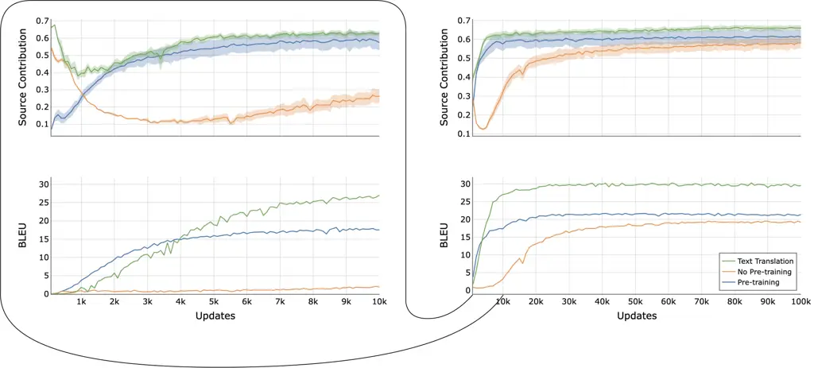
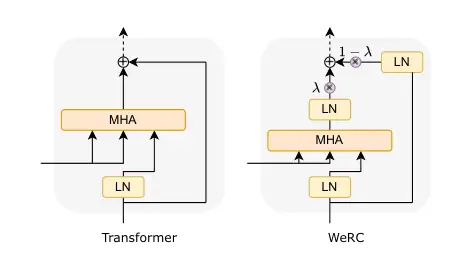

# Unveiling the Role of Pretraining in Direct Speech Translation

Belen Alastruey Email: [alastruey@meta.com](mailto:)    Gerard I.
Gállego Email: [gerard.i.gallego@upc.edu](mailto:)    Marta R.
Costa-jussà Email: [costajussa@meta.com](mailto:)    FAIR    Meta   
TALP Research Center    Universitat Politècnica de Catalunya   
Barcelona

###### Abstract

Direct speech-to-text translation systems encounter an important
drawback in data scarcity. A common solution consists on pretraining the
encoder on automatic speech recognition, hence losing efficiency in the
training process. In this study, we compare the training dynamics of a
system using a pretrained encoder, the conventional approach, and one
trained from scratch. We observe that, throughout the training, the
randomly initialized model struggles to incorporate information from the
speech inputs for its predictions. Hence, we hypothesize that this issue
stems from the difficulty of effectively training an encoder for direct
speech translation. While a model trained from scratch needs to learn
acoustic and semantic modeling simultaneously, a pretrained one can just
focus on the latter. Based on these findings, we propose a subtle change
in the decoder cross-attention to integrate source information from
earlier steps in training. We show that with this change, the model
trained from scratch can achieve comparable performance to the
pretrained one, while reducing the training time.

## 1 Introduction

In recent years, extensive research has been done in the field of
speech-to-text translation (ST). These models have transitioned from
cascaded systems to direct ones Salesky et al. (2023). While this shift
helps mitigate error propagation, it introduces other challenges such as
scarcity of training data and the need for the model to tackle
translation and speech recognition simultaneously. To bypass these
issues, a common approach to train direct ST systems involves
pretraining the encoder on the Automatic Speech Recognition (ASR) task
(Bérard et al., 2018). This enables the encoder to learn acoustic
modeling in the source language by leveraging ASR data, and the model
can focus on semantic modeling during the ST training.

Various studies have been conducted on pretraining for ST. Bansal et al.
(2019), introduced a method to enhance ST performance for low-resource
source languages by utilizing ASR pretraining from a high-resource
language. Alinejad and Sarkar (2020) enhanced the performance of an ST
system by pretraining both the encoder and the decoder on ASR and MT
respectively. Wang et al. (2020b) and Le et al. (2023) proposed
variations of ASR pretraining that yielded superior results.

However, pretraining has some drawbacks too. It has additional data
requirements, which can be a problem particularly in languages that
don’t have a written form and hence no ASR data. Furthermore, it
complicates the training pipeline and worsens the efficiency of the
overall training process.

Recent studies have already questioned the pretraining approach, Zhang
et al. (2022), demonstrating that similar results can be achieved under
certain conditions without the need for pretraining. However, the
authors show that many strategies need to be simultaneously used to
achieve this, such as an exhaustive hyperparameter tunning, CTC-based
regularization and their proposed parameterized distance penalty.

Complementing previous interpretability works in ST Xu et al. (2021);
Alastruey et al. (2022), in this study, we conduct the first-ever
analysis of the training dynamics of a ST system, and based on its
results, we propose a subtle modification in the Transformer Vaswani
et al. (2017) architecture to bypass the pretraining stage.

First, we compare the training dynamics of a conventional system that
uses a pretrained encoder with one trained from scratch¹¹ 1 The
pretraining is done on the same amount of training data than the ST
training.. Through this analysis, we observe significant disparities in
their behaviors. Particularly, we note that when making predictions, the
model trained from scratch delays the utilization of information
extracted by the encoder until a later stage of training.

We hypothesize that this delay occurs due to the complexity of the
acoustic modeling task, that in this setting needs to be learned
together with the semantic modeling. Hence, it takes a significant
amount of updates to sufficiently train the encoder so that it can
extract meaningful information. Consequently, the model ignores the
encoder outputs and focuses on training the decoder for language
modeling. Once the encoder can extract valuable representations, the
model has already converged towards language modeling and struggles to
rely on the information obtained by the encoder.

Secondly, we believe that by forcing the model to utilize encoder
outputs earlier in the training process, the model would not converge
towards language modeling and the encoder would be trained more rapidly,
leading to higher-quality representations in its outputs. Through a
modification in the residual connection in the decoder cross-attention
mechanism, we force the model trained from scratch to integrate source
information from earlier training steps, and we observe a comparable
performance than in the pretrained one.

Overall, the main contributions of our work are: (1) the first study of
training dynamics in ST, that unveils the role of the pretraining, and
(2) a modification in the Transformer architecture to bypass the
pretraining stage.

## 2 Related Work

### 2.1 Interpretability of Transformer Models

Our research aims to quantify the source of information used for making
predictions in these models, specifically whether it originates from the
source (encoder input) or the target prefix (previously predicted words
serving as decoder inputs). To achieve this, we employ the ALTI+
interpretability method Ferrando et al. (2022a).

ALTI+ employs a strategy to rewrite attention blocks, as introduced by
Kobayashi et al. (2020), along with the contribution definition provided
by Ferrando et al. (2022b) and a variation of rollout inspired by Abnar
and Zuidema (2020). By utilizing ALTI+, we determine the extent to which
each input token in the source and target prefix contribute to the
prediction of a token. Furthermore, by summing the individual
contribution of each token in the encoder source, the authors obtain a
unique score referred to as source contribution, that we use to study
training dynamics on ST.

### 2.2 Training Dynamics on Machine Translation

Previous work has been done to understand how Transformers learn in the
task of Machine Translation on text. Voita et al. (2021) analyse how the
source contribution varies along the training using Layerwise Relevance
Propagation method to track source and target contribution, and describe
three different training phases.

#### Target-side language modeling:

The beginning of training is devoted to target-side language modeling.
The total contribution of the source substantially decreases. This means
that in the trade-off between information coming from the source and the
target prefix, the model gives more and more priority to the prefix.

#### Learning how to use source:

In the second stage, the source influence increases quickly. This means
that, opposite to the first stage, in the trade-off between information
coming from the source and the target prefix, the model progressively
gives more and more importance to source information.

#### Refining translations:

In the last stage, the source contribution remains constant. By
analysing other metrics the authors see that the model is learning to
refine some translations. The model learns to align better, and is able
to generate more natural translations instead of word-to-word ones.



Figure 1: Source contribution ($`\pm`$std) and BLEU along the full
training (right) and along the first 10k updates (left).

## 3 Training Dynamics in Speech Translation

In this section, we analyse how much two training strategies on a
Transformer-based system²² 2 We train the small S2T-Transformer
architecture from Fairseq
([https://github.com/facebookresearch/fairseq](https://github.com/facebookresearch/fairseq)).
rely on the speech source when making predictions along a ST training.
In particular, we study: (1) a standard ST system, consisting on an ASR
pretraining, followed by a re-initialization of the decoder and a
training on ST data, and (2) a system that only performs a ST training
on a randomly initialized model.

To measure the amount of input information used by the model to generate
a prediction we use the source contribution defined by ALTI+, covered in
Section 2.1.

To generalize this score to a sentence-wise score, we average the source
contribution used for the prediction of each token in a sentence.
Finally, to obtain a score over a test set, we average again the score
obtained by every sentence in the set.

Given that we use a different source contribution measure than Voita
et al. (2021) in their work described in Section 2.2, we decide to train
an additional MT model, to confirm that the three stages described in
their work still happen on our setting.

For all our analysis, we store a checkpoint every 1k updates during the
full training, and every 100 updates during the first 10k³³ 3 Setup
details of the experiments are in Appendix A.. For each of the
checkpoints, we evaluate the model computing BLEU and source
contribution scores on English-German MuST-C dataset Cattoni et al.
(2021) ⁴⁴ 4 We use transcripts and text translations for the MT model..

### 3.1 Results Analysis

In Figure 1, we see the obtained results. When focusing on the first 10k
updates we first observe that the three stages described in Section 2.2
still happen in the text translation model. However, when analysing both
ST variants, we observe different behaviours.

In the standard setting with a pretrained encoder, we observe a
two-stage process. This model skips the first stage described in Section
2.2, and rapidly integrates source data from the beginning of training.
This phenomenon is coherent, as the encoder has been pretrained,
resulting in high-quality representations that are immediately
beneficial for the decoder during prediction tasks. As in the case of
text translation, the last stage starts after the first around 6k
updates.

Instead, the ST model trained from scratch undergoes the same
three-stage process than text translation. However, each stage appears
to require significantly more time compared to text translation.
Specifically, the model does not achieve a stable level of source
contribution until after approximately 30k updates, whereas the other
two models achieve this stability after only 6k updates.

We hypothesize this happens due to the difficulty of training the
encoder for the task of ST from scratch. Unlike an encoder in text
translation, which solely requires semantic modeling, a ST encoder
learns both acoustic and semantic modeling. This dual requirement makes
the training process for an ST encoder more time-consuming than that of
a text translation model. Consequently, the model tends to overlook the
encoder during the early stages of training, focusing instead on
language modeling.

Overall, we believe that the initial stage outlined in Section 2.2 is
not a result of the need to learn language modeling. Rather, it’s a
strategy to bypass the encoder information until the encoder is
adequately trained. This process is quick in text translation,
non-existent when using a pre-trained encoder in ST, and lengthy when
training an ST system from scratch.

Moreover, we think that by the time the ST encoder trained from scratch
becomes capable of extracting relevant information, the model has
already converged towards relying on language modeling. As a result, it
never reaches the level of contribution achieved by the pretrained model
(as shown in Figure 1), leading to inferior performance.

## 4 Training ST from Scratch

Building on our previous analysis, we hypothesize that forcing a Speech
Translation model trained from scratch to utilize source information
from the start could enhance the training process. If the model is
required to use the encoder’s representations, regardless of their
quality, poor representations will negatively impact the model’s overall
performance. This, in turn, will cause a faster training of the encoder
to extract better representations.

In particular, considering the results in Figure 1, we observe that both
the text translation model and the pretrained speech translation model
achieve a stable source contribution of approximately 65%. Hence, we
consider this proportion to be optimal and aim to enforce it in the
speech translation model trained from scratch.

To test our hypothesis we propose a subtle architecture modification,
that forces the Transformer to use source information along the full
training. Our modification focuses on the cross-attention layer of the
decoder, which is the step where source and target information is
aggregated, with source information coming from the attention block and
target-prefix details coming from the residual flow.



Figure 2: Standard S2T-Transformer cross-attention layer (left) and
proposed WeRC (right).

### 4.1 WeRC: Weighted Residual Connection

We modify the residual connection after each cross-attention block in
the decoder. This sum aggregates the output of the cross-attention block
($`x_{attn}`$) and the residual stream($`x_{res}`$). Our goal is to
increase the information flow coming from the source, so we scale these
two components giving a higher weight to the output of the
cross-attention (Eq. 1). Specifically, we aim to approximately match the
proportion of source contribution found in Section 3.1, hence we set
$`\lambda=0.65`$.

```math
x_{out}=\lambda\cdot x_{attn}+(1-\lambda)\cdot x_{res} \tag{1}
```

However, a potential issue of this approach is that the cross-attention
block could converge towards producing small-norm vectors, so that they
would still have a small contribution regardless of the weighting. To
solve this potential issue, we normalize each term of the summation (Eq.
2), by adding layer normalization layers Ba et al. (2016). This ensures
both tensors have the same norm before the weighting. Therefore they
will contribute to the sum with the target proportion.⁵⁵ 5 Note that we
remove the learnable parameters from layer normalization to avoid any
scaling that could affect the predefined weights.

```math
x_{out}=\lambda\cdot LN(x_{attn})+(1-\lambda)\cdot LN(x_{res}) \tag{2}
```

Results in Table 1 show that our model, which incorporates WeRC and is
trained from scratch, outperforms the baseline by +1.3 BLEU points.
Additionally, it nearly achieves the same performance as the model with
pretraining, while reducing the training time by skipping the
pretraining stage. Additionally, we extend this experiment to En-Es and
En-Fr MuST-C sets and obtain analogous results.

|                  |            |       |       |       |
| ---------------- | ---------- | ----- | ----- | ----- |
| Model            | Pretrained | En-De | En-Es | En-Fr |
| Baseline         | Yes        | 22.4  | 27.3  | 32.3  |
| Baseline         | No         | 20.4  | 26.3  | 30.9  |
| WeRC             | No         | 22.2  | 27.2  | 32.4  |
| WeRC w/o norm    | No         | 21.8  | \-    | \-    |
| WeRC w/o weights | No         | 21.6  | \-    | \-    |

Table 1: BLEU ($`\uparrow`$) on MuST-C test set averaging the best 10
checkpoints.

### 4.2 Ablation Study

We perform an ablation study on the usefulness of the weighted sum and
the layer normalization individually. In Table 1 we observe that both
strategies achieve a better performance than the baseline trained from
scratch, but they are still considerably behind WeRC and the pretrained
baseline. In the case of the variant without normalization, we believe
this is as a result of the trainable parameters in the attention block
(as described earlier). In the case of the model without weights, we
believe this happens because the model is forced to use a 50% of source
contribution, which is below the optimal (as observed in Figure 1).
Additional ablation studies regarding the use of WeRC on a MT and a
pretrained ST models can be found in Appendix B.

## 5 Conclusions

In this work, we present the first study on the training dynamics of
direct ST systems, comparing a standard ST model with a pretrained
encoder to one trained from scratch. The analysis shows that, without
pretraining, the model struggles to incorporate information from the
encoder’s outputs when making predictions. As an explanation, we suggest
the encoder needs more updates than in a text task until it can extract
valuable representations of the input tokens. Once this is achieved, the
model has already converged towards language modeling, hence failing to
utilize the information extracted by the encoder effectively even in
later steps. To address this issue, we propose a subtle modification to
the transformer architecture that forces the model to incorporate source
information throughout the whole training. By doing so, we achieve
comparable performance in a model trained from scratch to one with
pretraining, while reducing training time and data requirements.

## Limitations

While our study provides valuable insights into the training dynamics of
direct ST systems and proposes a novel approach to improve the
efficiency of the training process, our findings are based on a specific
model, dataset and languages. We believe different results could be
obtained in other settings, such as low resource speech translation.

Furthermore, our paper focuses on a classic and widely extended
pretraining strategy. ASR and ST training sets correspond to the same
dataset and have the same size, differing only in the language of the
targets. We also don’t use additional techniques such as CTC auxiliary
loss. However, our goal in this work is not obtaining a new
state-of-the-art ST training strategy but analysing and understanding a
common training strategy using interpretability tools, and performing
additional experiments to validate the hypothesis extracted from the
analysis.

Finally, in our work we use the learning rate defined by Wang et al.
(2020a) for ST finetuning also on the experiments trained from scratch.
We acknowledge that the performance of experiments trained from scratch
could be pushed further by tuning this hyperparameter. However, we
wanted to keep experiments comparable for the training dynamics
analysis, and hence we decided to use the same learning rate.
Furthermore, this should not have an impact in the conclusions of the
paper, given that our proposed modification (WeRC) is also trained from
scratch and uses the same learning rate.

## References

- Abnar and Zuidema (2020) Samira Abnar and Willem Zuidema. 2020.
  [Quantifying attention flow in
  transformers](https://doi.org/10.18653/v1/2020.acl-main.385). In
  _Proceedings of the 58th Annual Meeting of the Association for
  Computational Linguistics_, pages 4190–4197, Online. Association for
  Computational Linguistics.
- Alastruey et al. (2022) Belen Alastruey, Javier Ferrando, Gerard I.
  Gállego, and Marta R. Costa-jussà. 2022. [On the locality of attention
  in direct speech
  translation](https://doi.org/10.18653/v1/2022.acl-srw.32). In
  _Proceedings of the 60th Annual Meeting of the Association for
  Computational Linguistics: Student Research Workshop_, pages 402–412,
  Dublin, Ireland. Association for Computational Linguistics.
- Alinejad and Sarkar (2020) Ashkan Alinejad and Anoop Sarkar. 2020.
  [Effectively pretraining a speech translation decoder with machine
  translation data](https://doi.org/10.18653/v1/2020.emnlp-main.644). In
  _Proceedings of the 2020 Conference on Empirical Methods in Natural
  Language Processing (EMNLP)_, pages 8014–8020, Online. Association for
  Computational Linguistics.
- Ba et al. (2016) Jimmy Lei Ba, Jamie Ryan Kiros, and Geoffrey E
  Hinton. 2016. Layer normalization. In _Advances in Neural Information
  Processing Systems_.
- Bansal et al. (2019) Sameer Bansal, Herman Kamper, Karen Livescu, Adam
  Lopez, and Sharon Goldwater. 2019. [Pre-training on high-resource
  speech recognition improves low-resource speech-to-text
  translation](https://doi.org/10.18653/v1/N19-1006). In _Proceedings of
  the 2019 Conference of the North American Chapter of the Association
  for Computational Linguistics: Human Language Technologies, Volume 1
  (Long and Short Papers)_, pages 58–68, Minneapolis, Minnesota.
  Association for Computational Linguistics.
- Bérard et al. (2018) Alexandre Bérard, Laurent Besacier, Ali Can
  Kocabiyikoglu, and Olivier Pietquin. 2018. [End-to-end automatic
  speech translation of
  audiobooks](https://doi.org/10.1109/ICASSP.2018.8461690). In _2018
  IEEE International Conference on Acoustics, Speech and Signal
  Processing (ICASSP)_, pages 6224–6228.
- Cattoni et al. (2021) Roldano Cattoni, Mattia Antonino Di Gangi, Luisa
  Bentivogli, Matteo Negri, and Marco Turchi. 2021. [Must-c: A
  multilingual corpus for end-to-end speech
  translation](https://doi.org/https://doi.org/10.1016/j.csl.2020.101155).
  _Computer Speech & Language_, 66:101155.
- Ferrando et al. (2022a) Javier Ferrando, Gerard I. Gállego, Belen
  Alastruey, Carlos Escolano, and Marta R. Costa-jussà. 2022a. [Towards
  opening the black box of neural machine translation: Source and target
  interpretations of the
  transformer](https://aclanthology.org/2022.emnlp-main.599). In
  _Proceedings of the 2022 Conference on Empirical Methods in Natural
  Language Processing_, pages 8756–8769, Abu Dhabi, United Arab
  Emirates. Association for Computational Linguistics.
- Ferrando et al. (2022b) Javier Ferrando, Gerard I. Gállego, and
  Marta R. Costa-jussà. 2022b. [Measuring the mixing of contextual
  information in the
  transformer](https://aclanthology.org/2022.emnlp-main.595). In
  _Proceedings of the 2022 Conference on Empirical Methods in Natural
  Language Processing_, pages 8698–8714, Abu Dhabi, United Arab
  Emirates. Association for Computational Linguistics.
- Kingma and Ba (2017) Diederik P. Kingma and Jimmy Ba. 2017. [Adam: A
  method for stochastic optimization](http://arxiv.org/abs/1412.6980).
- Kobayashi et al. (2020) Goro Kobayashi, Tatsuki Kuribayashi, Sho
  Yokoi, and Kentaro Inui. 2020. [Attention is not only a weight:
  Analyzing transformers with vector
  norms](https://doi.org/10.18653/v1/2020.emnlp-main.574). In
  _Proceedings of the 2020 Conference on Empirical Methods in Natural
  Language Processing (EMNLP)_, pages 7057–7075, Online. Association for
  Computational Linguistics.
- Le et al. (2023) Phuong-Hang Le, Hongyu Gong, Changhan Wang, Juan
  Pino, Benjamin Lecouteux, and Didier Schwab. 2023. [Pre-training for
  speech translation: Ctc meets optimal
  transport](http://arxiv.org/abs/2301.11716).
- Salesky et al. (2023) Elizabeth Salesky, Marcello Federico, and Marine
  Carpuat, editors. 2023. [_Proceedings of the 20th International
  Conference on Spoken Language Translation (IWSLT 2023)_](https://aclanthology.org/2023.iwslt-1.0). Association for
  Computational Linguistics, Toronto, Canada (in-person and online).
- Vaswani et al. (2017) Ashish Vaswani, Noam Shazeer, Niki Parmar, Jakob
  Uszkoreit, Llion Jones, Aidan N. Gomez, Lukasz Kaiser, and Illia
  Polosukhin. 2017. Attention is all you need. In _Proceedings of the
  31st Conference on Neural Information Processing Systems (NeurIPS)_,
  pages 5998–6008.
- Voita et al. (2021) Elena Voita, Rico Sennrich, and Ivan Titov. 2021.
  [Language modeling, lexical translation, reordering: The training
  process of NMT through the lens of classical
  SMT](https://doi.org/10.18653/v1/2021.emnlp-main.667). In _Proceedings
  of the 2021 Conference on Empirical Methods in Natural Language
  Processing_, pages 8478–8491, Online and Punta Cana, Dominican
  Republic. Association for Computational Linguistics.
- Wang et al. (2020a) Changhan Wang, Yun Tang, Xutai Ma, Anne Wu, Dmytro
  Okhonko, and Juan Pino. 2020a. fairseq s2t: Fast speech-to-text
  modeling with fairseq. _arXiv preprint arXiv:2010.05171_.
- Wang et al. (2020b) Chengyi Wang, Yu Wu, Shujie Liu, Ming Zhou, and
  Zhenglu Yang. 2020b. [Curriculum pre-training for end-to-end speech
  translation](https://doi.org/10.18653/v1/2020.acl-main.344). In
  _Proceedings of the 58th Annual Meeting of the Association for
  Computational Linguistics_, pages 3728–3738, Online. Association for
  Computational Linguistics.
- Xu et al. (2021) Chen Xu, Bojie Hu, Yanyang Li, Yuhao Zhang, Shen
  Huang, Qi Ju, Tong Xiao, and Jingbo Zhu. 2021. [Stacked
  acoustic-and-textual encoding: Integrating the pre-trained models into
  speech translation
  encoders](https://doi.org/10.18653/v1/2021.acl-long.204). In
  _Proceedings of the 59th Annual Meeting of the Association for
  Computational Linguistics and the 11th International Joint Conference
  on Natural Language Processing (Volume 1: Long Papers)_, pages
  2619–2630, Online. Association for Computational Linguistics.
- Zhang et al. (2022) Biao Zhang, Barry Haddow, and Rico Sennrich. 2022.
  Revisiting end-to-end speech-to-text translation from scratch. In
  _International Conference on Machine Learning_.

## Appendix A Experimental Setup

#### ST Models Details:

In our experiments we use commonly used Fairseq⁶⁶ 6
https://github.com/facebookresearch/fairseq Transformer and
S2T-Transformer architectures. In the case of speech, it consists of 12
encoder layers and 6 decoder layers. Both the encoder and the decoder
use 4 attention heads, the embedding dimension is 256, and in the MLP
blocks it is 2048. The decoder output dimension is 256, the same as the
decoder embedding dimension. The model has layer normalization before
its main blocks instead of after, and a dropout of 0.1 is used in both
the attention weights and in the MLP activations. ReLU is used as the
activation function for the MLP. Regarding text models we have 6 encoder
and 6 decoder layers, no dropout, an embedding dimension of 512 and 8
attention heads (other settings remain the same than for speech).

#### Training Setup:

In the case of speech translation and speech recognition trainings, we
follow the setup defined by Wang et al. (2020a). We fix a maximum of
20000 tokens per batch. We use Adam optimizer Kingma and Ba (2017) and a
learning rate of $`1\cdot 10^{-3}`$ with an inverse square root
scheduler. We apply a warm-up for the first 10000 updates and we clip
the gradient to 10 to avoid exploding gradients. We use label smoothed
Cross-entropy loss, with a smoothing factor of 0.1. The update frequency
is set to 16, simulating the use of 16 GPUs. We train each model for a
maximum of 100000 updates. In ST trainings we use a learning rate of
$`2\cdot 10^{-3}`$ while on speech recognition it is $`1\cdot 10^{-3}`$,
as done by Wang et al. (2020a).

In the text translation system, we again follow the setup defined by
Wang et al. (2020a) for Machine Translation. It is similar than the
speech translation one but the maximum number of tokens per batch is
limited to 4096 and the number of warm updates is 4000. Gradient
clipping is removed and learning rate is set to $`5\cdot 10^{-4}`$.

## Appendix B Results on Machine Translation and Speech Translation with Pretraining

In this section, we aim to study the impact of using WeRC on the
analysed MT system and on the ST training with a pretrained encoder.
These settings achieve an optimal level of source contribution from the
first updates of the training, so we hypothesize that WeRC might have a
less noticeable impact than in the main study of this paper (ST from
scratch). In Table 2⁷⁷ 7 Note that this results are obtained evaluating
on the best checkpoint without checkpoint averaging. we see the obtained
results. We observe that both settings maintain the same performance,
which is consistent with our hypothesis.

| Model                  | BLEU |
| ---------------------- | ---- |
| Baseline MT            | 31.6 |
| WeRC                   | 31.6 |
| Baseline Pretrained ST | 21.8 |
| WeRC                   | 21.8 |

Table 2: WeRC performance on MT and pretrained ST.
