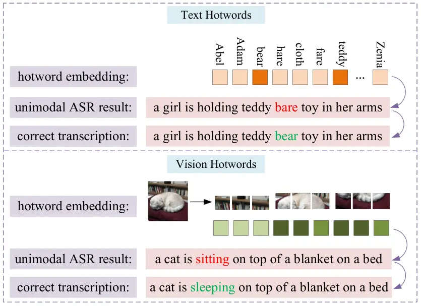
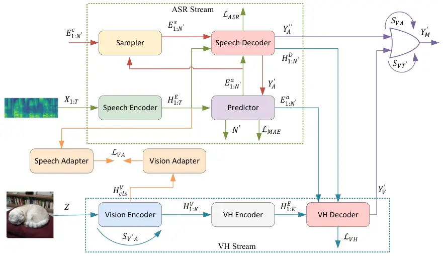
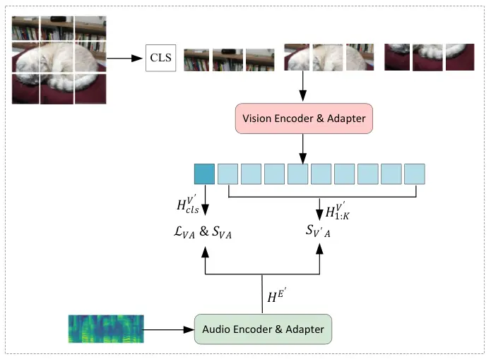
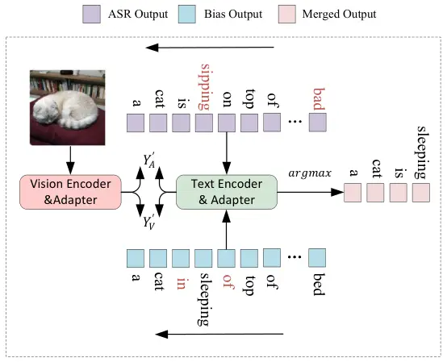
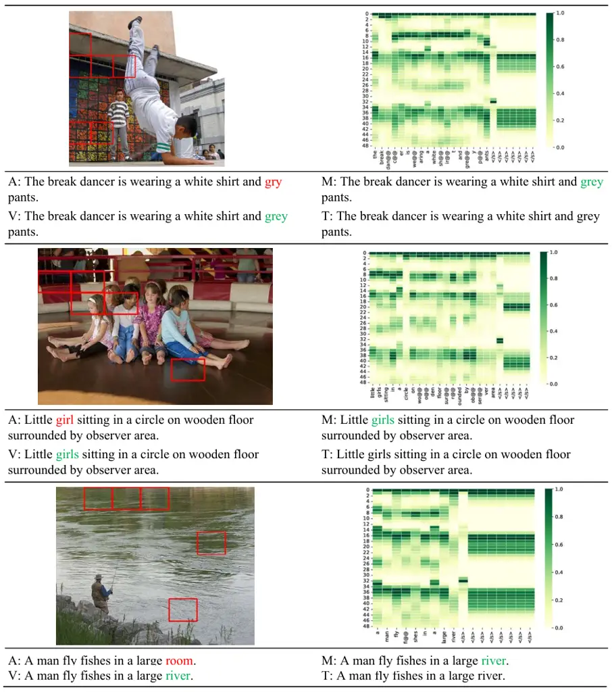
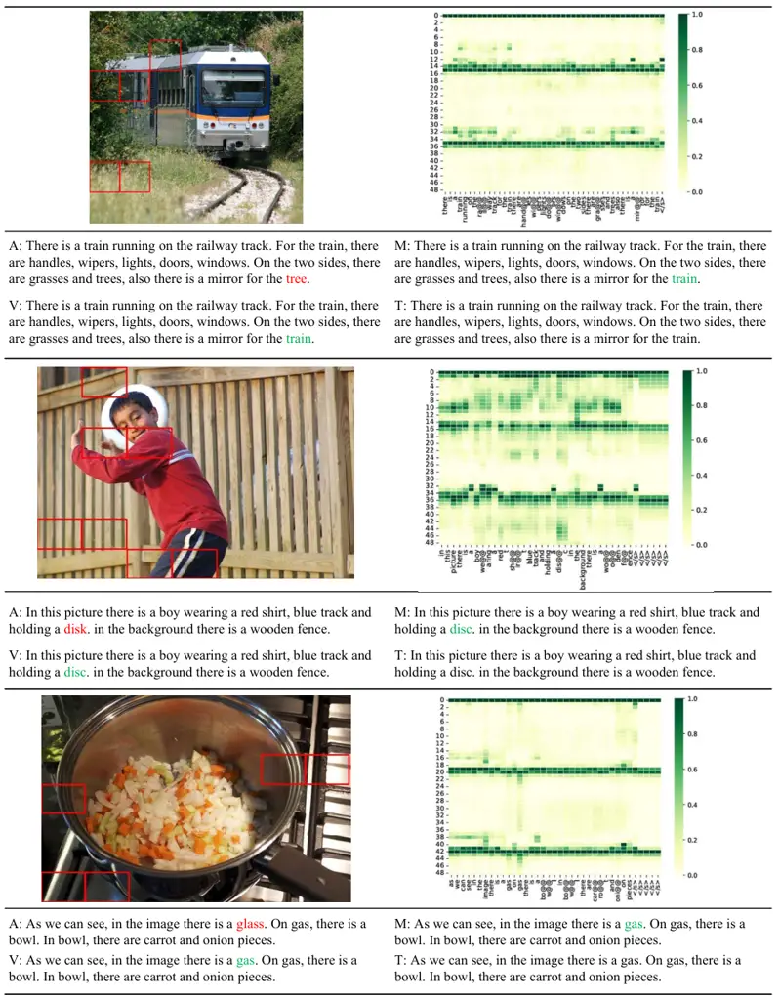

# VHASR: A Multimodal Speech Recognition System With Vision Hotwords

Jiliang Hu Affiliation: Key Laboratory of Aerospace Information Security
and Trusted Computing, Ministry ofEducation, School of Cyber Science and
Engineering, Wuhan University, Wuhan, China,    Zuchao Li
^(†)^(†)thanks: Corresponding author. This work was supported by the
National Natural Science Foundation of China (No. 62306216, No.
72074171, No. 72374161), the Natural Science Foundation of Hubei
Province of China (No. 2023AFB816), the Fundamental Research Funds for
the Central Universities (No. 2042023kf0133). Affiliation: Key
Laboratory of Aerospace Information Security and Trusted Computing,
Ministry ofEducation, School of Cyber Science and Engineering, Wuhan
University, Wuhan, China, Affiliation: School of Computer Science, Wuhan
University, Wuhan, China    Ping Wang Affiliation: School of Information
Management, Wuhan University, Wuhan, China    Haojun Ai Affiliation: Key
Laboratory of Aerospace Information Security and Trusted Computing,
Ministry ofEducation, School of Cyber Science and Engineering, Wuhan
University, Wuhan, China,    Lefei Zhang Affiliation: School of Computer
Science, Wuhan University, Wuhan, China    Hai Zhao
Affiliation: Department of Computer Science and Engineering, Shanghai
Jiao Tong University.

###### Abstract

The image-based multimodal automatic speech recognition (ASR) model
enhances speech recognition performance by incorporating audio-related
image. However, some works suggest that introducing image information to
model does not help improving ASR performance. In this paper, we propose
a novel approach effectively utilizing audio-related image information
and set up VHASR, a multimodal speech recognition system that uses
vision as hotwords to strengthen the model’s speech recognition
capability. Our system utilizes a dual-stream architecture, which
firstly transcribes the text on the two streams separately, and then
combines the outputs. We evaluate the proposed model on four datasets:
Flickr8k, ADE20k, COCO, and OpenImages. The experimental results show
that VHASR can effectively utilize key information in images to enhance
the model’s speech recognition ability. Its performance not only
surpasses unimodal ASR, but also achieves SOTA among existing
image-based multimodal ASR.¹¹ 1 Our code is available at
[https://github.com/193746/VHASR](https://github.com/193746/VHASR)

## 1 Introduction

Figure 1: Comparison between text hotwords and the vision hotwords
proposed in this paper. Text hotwords are a set of custom keywords that
are prone to errors, while image hotwords refer to patches of an image.
The hotword with a darker rectangle indicates that it is more relevant
to transcription.

ASR model (Chan et~al., 2015) takes audio as input and produces
corresponding transcription. One effective method to improve the model’s
ASR performance is to increase both the volume of training data and the
number of model parameters. We are now in the era of large language
models (LLMs) (Brown, 2020; Li et~al., 2023), which have been developed
across various domains (Yang et~al., 2024; Zhang et~al., 2023). In the
speech domain, there are also many LLMs that demonstrate impressive ASR
capabilities (Chu et~al., 2023; Radford et~al., 2023). However, this
approach can be expensive. A more cost-effective alternative is to
introduce additional information related to speech into the model. This
information can be presented in either textual or visual forms. The ASR
system that utilizes audio-related information from various modalities
is referred to as multimodal ASR.

Hotwords, which are terms in certain professional fields or words that
are easily confused with other homonyms, are common textual cues. There
have been many studies on how to freely customize hotwords and improve
the recall of hotwords (Han et~al., 2021; Shi et~al., 2024). It is also
possible to use captions as textual information (Moriya and Jones, 2018;
Han et~al., 2023).

Visual cues can be in the form of video or image. Audio-Visual Speech
Recognition (AVSR) enhances the accuracy of speech recognition by
capturing lip movement information of characters in video (Ivanko
et~al., 2023). Image-based multimodal ASR extracts visual feature from
image associated with speech to correct transcription errors. We
abbreviate image-based multimodal ASR as IBSR. Because the lip movement
information of video’s role is closely linked to his speech, it
influences nearly every word in the transcribed text. In contrast, IBSR
only impacts a subset of the words as the image is only associated with
specific audio clips (onea\vtop{\halign{#\cr\hbox{}\crcr}}). IBSR
currently lacks a universal and effective method for utilizing image
information, leading to various experimental results in different
studies. Some works (Sun et~al., 2016; Srinivasan et~al., 2020a;
Srinivasan et~al., 2020c) have a positive effect by incorporating image
information, while others (Srinivasan et~al., 2020b; Oneată and Cucu,
2022; Han et~al., 2023), have the opposite effect.

In this paper, we propose a novel approach effectively utilizing
audio-related image information and set up VHASR, a multimodal speech
recognition system that utilizes vision hotwords to enhance the model's
speech recognition capability. It calculates the similarity between
different modalities to improve the effectiveness of cross-modal fusion.
Drawing inspiration from text hotwords, we utilize Vision Transformer
(ViT) to partition images into multiple visual tokens and consider each
visual token as a vision hotword. Our system adopts a dual-stream
architecture. One stream is the ASR stream, which receives audio
information and produces transcribed text. The other stream is the
vision hotwords (VH) stream, which receives vision hotwords and audio
hidden features, and generates corresponding text. In the VH stream, we
calculate the similarity between audio and vision hotwords to reduce the
weight of vision hotwords with low similarity. This process helps to
extract fine-grained image information. When inferring, VHASR first
transcribes the text separately from the ASR stream and the VH stream,
and then merges the outputs. We ensure the high accuracy of the merged
output by comparing the similarity of different modalities.
Specifically, we first calculate the audio-image similarity to discard
the VH stream if the similarity is low. Then, we calculate the
image-text token similarity to compare the ASR stream and VH stream
outputs by tokens. Finally, tokens with higher similarity are selected
for the merged output.

We evaluate the proposed model on four datasets: Flickr8k, ADE20k, COCO,
and OpenImages. The experimental results show that VHASR can effectively
utilize critical information in images to improve the model's ASR
performance. Its performance is not only better than ordinary unimodal
ASR models but also surpasses existing IBSR models. The contributions of
this paper are as follows:

1.  (1)
    We demonstrate that through our idea of vision hotwords, injecting
    audio-related image into the ASR model can help the model correct
    transcription errors.
2.  (2)
    We propose VHASR, by utilizing a dual-stream architecture and
    calculating the cross-modal similarity, it promotes effective
    utilization of visual information in vision hotwords.
3.  (3)
    The proposed model achieves SOTA on Flickr8k, ADE20k, COCO, and
    OpenImages.

## 2 Related Work

Image-based multimodal ASR. Sun et~al. (2016) introduce a multimodal
speech recognition scenario which utilizes images to assist the language
model in decoding the most probable words and rescoring the top
hypotheses. Caglayan et~al. (2019) propose an end-to-end multimodal ASR
system implemented by LSTM (Graves and Graves, 2012). They apply visual
adaptive training (Palaskar et~al., 2018) to finetune a pretrained ASR
model with visual data, and leverage visual information to initialize
model's encoder and decoder. Srinivasan et~al. (2020b) present a model
for multimodal ASR that utilizes visual feature from object proposals.
They integrate the features of object proposals into a visual
representation by utilizing their attention distribution as weights, and
incorporate this visual representation into the model via a hierarchical
attention mechanism. Oneată and Cucu (2022) combine speech and visual
embeddings using two fusion approaches. One approach fuses along the
embedding dimension, and another fuses along the sequence dimension.
They find that the first method performs better. Han et~al. (2023)
propose a novel multimodal ASR model called ViLaS, which is based on the
continuous integrate-and-fire (CIF) mechanism (Dong and Xu, 2020). It
can integrate image and caption information simultaneously or separately
to facilitate speech recognition. Chang et~al. (2023) propose a
multimodal ASR system for embodied agents. Their model is based on
Transformer (Vaswani et~al., 2017), where the visual feature vector is
concatenated to the decoder's input word embedding at every timestep of
generation.

Figure 2: The structure of our proposed model, VHASR. The green dashed
box contains the modules of the ASR stream, while the blue dashed box
contains the modules of the VH stream. The data flow in the ASR part is
indicated by green and red lines. It only passes through the red lines
during ASR model's second pass of training. The VH stream's data flow is
denoted by blue lines. The data flow for calculating audio-image
similarity is represented by yellow lines. The purple lines illustrate
the data flow when merging two streams.

Function of image information. Srinivasan et~al. (2020a) conduct the
experiment called audio corruption, in which they mask the words related
to nouns and places with silence and white noise, respectively. The
study demonstrates that visual representations help in recovering words
that are masked in the input acoustic signal. Srinivasan et~al. (2020c)
think the previous work has only masked a fixed set of words in the
audio, which is an unrealistic setting. So, they propose a method called
RandWordMask, where masking can occur for any word segment to improve
the audio corruption experiment. Kumar et~al. (2023) propose two
effective ASR error correction methods: one employs a gated fusion
method to concatenate visual and textual features, while the other
utilizes image's caption as correction model's prompt. Both methods
demonstrate that visual information helps restoring incorrect words in
transcription. In short, image information helps to recover incorrect
words in transcription that are caused by masked acoustic signals or ASR
model's error.

## 3 VHASR

### 3.1 ASR Stream

Follow Gao et~al. (2022), we adopt this parallel Transformer for
non-autoregressive end-to-end speech recognition as the basic framework
of our ASR stream. As shown in green dashed box of Figure 2, the adopted
framework consists of four parts: speech encoder, predictor, sampler,
and decoder. The framework adopts two-pass training and one-pass
inference.

#### 3.1.1 Acoustic Representation Learning

Let \$X\$ be a speech sequence with \$T\$ frames,
\$X={x_1,x_2,x_3,…,x_T}\$. \$Y\$ is a sequence of tokens, and its length
is \$N\$. Each token is in the vocabulary \$V\$, \$Y={y_1,y_2,y_3,…,y_N
∣y_i∈V}\$.

The speech encoder adopts the SAN-M (Gao et~al., 2020) structure, which
is a special Transformer Layer that combines self-attention mechanism
with deep feed-forward sequential memory networks (DFSMN). It converts
the input \$X_1:T\$ to the hidden representation \$H_1:T^E\$. \$\$
H_1:T^E=SpeechEncoder(X_1:T) \$\$

The predictor is a two-layer Deep Neural Networks (DNN) model that
aligns speech and text based on CIF. It is used to predict the length of
sentences \$N^'\$ and extract acoustic representation \$E_1:N^'^a\$ from
the speech encoder's hidden representation \$H_1:T^E\$.

\$\$ N^',E_1:N^'^a=Predictor(H_1:T^E) \$\$

The sampler does not contain learnable parameters and is only applied
when training. It strengthens acoustic representation to semantic
representation by incorporating text features, aiming to better train
the context modeling ability of the speech decoder. The \$E_1:N^'^c\$
denotes the embedding of \$Y\$. The sampler initially identifies tokens
in \$Y_A^'\$ with transcription errors, and subsequently combines the
correct embeddings of these error tokens in \$E_1:N^'^c\$ into
\$E_1:N^'^a\$ to generate the semantic features \$E_1:N^'^s\$. Not every
error token's correct embedding will be incorporated into \$E_1:N^'^a\$,
this is determined by the mixing ratio \$λ\$, \$λ∈(0,1)\$.

\$\$ E_1:N^'^s=Sampler(E_1:N^'^a,E_1:N^'^c,⌈λ∑_i=1^N^'(y_i^' ≠y_i) ⌉)
\$\$

#### 3.1.2 Decoding Process

The speech decoder adopts the bidirectional SAN-M structure. In the
first pass of training, the hidden representation \$H_1:T^E\$ obtained
by the speech encoder and the acoustic representation \$E_1:N^'^a\$
generated by the predictor are input to the speech decoder to obtain the
initial decoding result \$Y_A^'\$.

\$\$ Y_A^'=SpeechDecoder(H_1:T^E,N^',E_1:N^'^a) \$\$

In the second pass of training, the hidden representation \$H_1:T^E\$
and the semantic representation \$E_1:N^'^s\$ obtained by the sampler
are input to the speech decoder to obtain the second decoding result
\$Y_A^''\$ \$\$ Y_A^''=SpeechDecoder(H_1:T^E,N^',E_1:N^'^s) \$\$

During the first pass, no gradient backpropagation is performed, and
\$Y_A^'\$ is only used to determine the sampling number of the sampler.
\$Y_A^''\$ obtained in the second pass is used to calculate the ASR
loss. In inference, the model directly takes \$Y_A^'\$ as output and
does not calculate \$Y_A^''\$.

### 3.2 Vision Hotwords Stream

#### 3.2.1 Vision Representation Learning

In the VH stream, we need to extract visual features from images by the
vision encoder firstly. A naive idea is to extract the features from the
entire image. Because most of the information in the image is unrelated
to the audio, especially the background of the image. The introduction
of irrelevant information may cause the visual features to become noise.
Therefore, we should consider a strategy to extract fine-grained image
information.

The vision encoder is essentially ViT (Dosovitskiy et~al., 2020). ViT
uses Transformer to extract visual features. It follows the application
of the Transformer in natural language processing by initially dividing
the image into multiple patches, considering each patch as a token,
embedding the positional information, and then feeding visual tokens
(Peng et~al., 2024) into the Transformer. The features outputted by ViT
are the features of each visual token. If the downstream task of ViT is
classification, a trainable CLS token can be added in front of the
visual token. The score on the CLS token can then be utilized for
classification. It would be a good choice if we utilize each visual
tokens' features instead of entire image's features. At the token
granularity level, we can diminish the impact of tokens unrelated to
audio and amplify the influence of tokens related to audio.

So, our strategy is to calculate the features of each visual token and
then adjust the weight of visual tokens. For the ASR model with text
hotwords, it is often necessary to consider how to capture involved
hotwords and exclude unrelated hotwords when there are many customized
hotwords. This is similar to our consideration, so we call each visual
token an vision hotword. Let Z be the input image. First, utilize the
vision encoder to transform it into token-level visual features
\$H_0:K^V\$, where K represents the number of vision hotwords. The
initial features of \$H_0:K^V\$, corresponds to the features of the CLS
token, while others are vision hotwords' features.

\$\$ H_0:K^V=VisionEncoder(Z) \$\$ \$\$ H_CLS^V=H_0:K^V \[  0   \]  ;
H_1:K^V=H_0:K^V \[  1 ​: ​ K   \]\$\$

We determine the correlation between each vision hotword and audio by
calculating their cosine similarity. Specifically, the first step is to
input \$H_1:K^V\$ into the vision adapter, which is composed of a linear
layer, to obtain \$H_1:K^V^'\$. Next, we add the embedding of a
trainable CLS token to the beginning of the acoustic features
\$H_1:T^E\$, resulting in \$H_0:T^E\$. This \$H_0:T^E\$ is then fed into
the speech adapter, which consists of a Transformer layer, to produce
the complete audio features \$H^E^'\$.

\$\$ H_1:K^V^'=VisionAdapter(H_1:K^V) \$\$ \$\$
H^E^'=SpeechAdapter(H_0:T^E)\[0\] \$\$

Then, calculate cosine similarity between vision hotwords and audio,
denoted as \$S_V^'A\$.

\$\$ S_V^'A=cos(H_1:K^V^',H^E^') \$\$

Finally, we adjust the weight of \$H_1:K^V\$ by \$S_V^'A\$.

\$\$ H_1:K^V=H_1:K^V ×S_V^'A \$\$

Figure 3: Using vision hotword-audio similitude and image-audio
similitude to learn fine visual representation.

In order to enhance the effectiveness of similarity-based weight
adjustment, an additional loss needs to be introduced to train the
adapters. We utilize the acoustic features and the CLS token's features
of the image to calculate the image-audio contrastive loss \$L_VA\$ to
optimize the adapters. The reason for using image-audio contrastive loss
instead of vision hotwords-audio contrastive loss is that the former has
a coarser granularity, making it easier to converge. Moreover, during
inference, we need to use image-audio similarity for decoding
optimization, which will be explained at length in Section 3.3. Figure 3
illustrates in detail our optimization of visual representation by
calculating the similitude between vision hotwords and audio, as well as
the similitude between image and audio.

\$\$ H_CLS^V^'=VisionAdapter(H_CLS^V) \$\$ \$\$
L_VA=ContrastiveLoss(H_CLS^V^',H^E^') \$\$

#### 3.2.2 Decoding Process

The blue line in Figure 2 illustrates the data flow of the VH module.
After extracting the fine visual representation of \$H_1:K^V\$, we
further refine it using an LSTM-based VH encoder to obtain \$H_1:K^E\$.

\$\$ H_1:K^E=VHEncoder(H_1:K^V) \$\$

The next step is to use a text decoder to obtain the probability
distribution of each token. Obviously, if we only use \$H_1:K^E\$ which
just contains image information as input, it will result in a
significant deviation in the probability distribution of tokens, and the
VH stream's outcome will be completely inconsistent with the correct
transcription. So, we need to incorporate certain hidden features of the
ASR stream to modify the output of the VH stream. Drawing lessons from
the idea of Shi et~al. (2024), we integrate the acoustic features vector
\$E_1:N^'^a\$ outputted by the predictor and the hidden features
\$H_1:N^'^D\$ outputted by the speech decoder with \$H_1:K^E\$
separately to derive \$E_1:N^'^a^'\$ and \$H_1:N^'^D^'\$, which have
been influenced by image information. The VH decoder adopts the same
bidirectional SAN-M architecture as the speech decoder.

\$\$ E_1:N^'^a^'=VHDecoder(E_1:N^'^a,H_1:K^E) \$\$ \$\$
H_1:N^'^D^'=VHDecoder(H_1:N^'^D,H_1:K^E) \$\$

The final input to the VH output layer is the average of \$E_1:N^'^a^'\$
and \$H_1:N^'^D^'\$.

\$\$ Y_V^'= y_i∈V argmax (W_1:V^V (E_1:N^'^a^'+H_1:N^'^D^') 2 +b_1:V^V)
\$\$

### 3.3 Dual-stream Merging

Figure 4: The specific process of decoding optimization.

In this section, we will discuss how to merge the outputs of the ASR
stream and the VH stream. A straightforward approach is to add the
probability distributions of tokens from two modules by assigning a
specific weight, denoted as \$M_1\$. The formula for \$M_1\$ is as
follows, where \$p_A\$, \$p_V\$, and \$p_M\$ are the tokens' probability
distributions of the ASR stream, VH stream, and merged result. \$α\$ is
the proportion of \$p_A\$, and \$α∈(0,1)\$. \$\$ p_M=αSoftmax(p_A)+(1-α)
Softmax(p_V) \$\$ \$\$ Y_M_1^'= y_i∈V argmax (p_M) \$\$

The \$M_1\$ has low flexibility, making it difficult to achieve good
results in practice. Figure 4 illustrates a merging method based on
image-token similarity, referred to as \$M_2\$. The vision encoder and
adapter are used to calculate the visual features of the image,
\$H_CLS^V^'\$, and the text encoder and adapter are used to calculate
the features of each token, \$H_1:N^'^T^'\$. The formula for
\$H_CLS^V^'\$ has been provided in Section 3.2.1, and the formula for
\$H_1:N^'^T^'\$ is as follows. The text encoder consists of Transformer
layers, the text adapter consists of a linear layer, and \$Embedding\$
is a additional embedding layer. \$\$
H_1:N^'^T=TextEncoder(Embedding(Y^')) \$\$ \$\$
H_1:N^'^T^'=TextAdapter(H_1:N^'^T) \$\$

Based on \$H_CLS^V^'\$ and \$H_1:N^'^T^'\$, the cosine similarity of the
image and tokens, \$S_VT^'\$, can be calculated. \$\$
S_VT^'=cos(H_CLS^V^',H_1:N^'^T^') \$\$

When calculating \$Y_M_2^'\$, we first calculate the text features of
the ASR stream output \$Y_A^'\$ and the VH stream output \$Y_V^'\$,
respectively, namely \$H_1:N^'^T_A^'\$ and \$H_1:N^'^T_V^'\$. Then
calculate their cosine similarities with \$H_CLS^V^'\$ separately,
namely \$S_VT^'^A\$ and \$S_VT^'^V\$. Finally, a token by token
comparison of the dual-stream is conducted according to \$S_VT^'^A\$ and
\$S_VT^'^V\$. Specifically, the value of these two similarities at any
position represents the similarity score between the token at that
position and the image. At the same position, \$Y_A^'\$ and \$Y_V^'\$
may obtain different tokens. We determine which token to choose as the
final result by judging the value of \$S_VT^'^A\$ and \$S_VT^'^V\$ at
that position. If \$S_VT^'^A\>S_VT^'^V\$, we take the token on
\$Y_A^'\$, and vice versa. After completing \$N^'\$ comparisons,
\$Y_M_2^'\$ can be obtained.

In Section 3.2.1, to achieve an fine-grained visual representation, we
additionally introduce speech and vision adapters in VHASR to compute
the similarity between vision hotwords and audio. Then, to train the
adapter, we calculate contrastive loss between the image and audio. In
the inference stage, we can further utilize the trained adapter to
optimize \$M_2\$ by calculating image-audio similarity. Specifically, we
calculate the image-audio similarity \$S_VA\$ for a batch of data. If
the audio of a piece of data does not match its own image, it is
considered that the correlation between this image and audio is low.
Therefore, for this data, the output of the VH stream is discarded, and
the output of the ASR stream is directly used as the final output. We
introduce a novel merging method called \$M_3\$. It involves initially
filtering data with low image and audio correlation using \$S_VA\$,
followed by dual-stream merging as outlined in \$M_2\$. We will conduct
a detailed comparative experiment on these three merging methods in
Section 4.

## 4 Experiment

### 4.1 Configuration

Table 1 shows all the datasets used in this paper, with Flickr8k,
ADE20k, COCO, and OpenImages used for training and testing, and
SpokenCOCO used for pre-training. Flickr8k is from Harwath and Glass
(2015) and SpokenCOCO is from Hsu et~al. (2021). ADE20k, COCO and
OpenImages are from Local Narratives proposed by Harwath et~al. (2016).
In order to shorten the experimental period, we filter data with audio
exceeding 40s in ADE20k, and with more than 40 tokens or an audio
duration of more than 20 seconds in COCO and OpenImages. We use word
error rate (WER) as an evaluation metric to evaluate the speech
recognition performance of ASR stream, VH stream, \$M_1\$, \$M_2\$, and
\$M_3\$.

| Dataset&Train&Validation&Test |
| ----------------------------- |
| Flickr8k&30,000&5,000&5,000   |
| ADE20k&17,067&1,672&-         |
| COCO&49,109&3,232&-           |
| OpenImages&269,749&27,813&-   |
| SpokenCOCO&592,187&25,035&-   |

Table 1: Datasets used in experiments.

|                                                                                                                                              |
| -------------------------------------------------------------------------------------------------------------------------------------------- |
| Dataset    &Baseline&   VHASR                                                                                                                |
| && \$WER\$ (\$↓\$) & \$Pretrain\$ & \$WER_ASR\$ (\$↓\$) &\$WER_VH\$ (\$↓\$) & \$WER_M_1\$ (\$↓\$) & \$WER_M_2\$ (\$↓\$)& \$WER_M_3\$ (\$↓\$) |
| Flickr8k    &3.86&✕&3.84&3.94&3.82&3.62&3.60                                                                                                 |
| &&& ✓&3.55&3.51&3.54&3.22&3.21                                                                                                               |
| ADE20k    &10.51&✕&10.33&10.52&10.38&9.80&9.60                                                                                               |
| &&& ✓&10.27&10.37&10.32&9.62&9.53                                                                                                            |
| COCO    &10.44&✕&10.35&10.34&10.28&9.63&9.61                                                                                                 |
| &&& ✓&10.25&10.36&10.28&9.60&9.59                                                                                                            |
| OpenImages    &8.72&✕&8.61&8.58&8.58&7.73&7.71                                                                                               |
| &&& ✓&8.58&8.63&8.59&7.70&7.68                                                                                                               |

Our baseline is 220M English Paraformer. In Flickr8k, we compare our
model with Acoustic-LM-RNN proposed by Sun et~al. (2016), model
utilizing object features as visual information (abbreviated as
Multimodal (object) in the paper) from Srinivasan et~al. (2020a),
Weighted-DF in Srinivasan et~al. (2020c), MAG proposed by Srinivasan
et~al. (2020b), model fusing the two modalities along the sequence
dimension (abbreviated as Multimodal (emb) in the paper) from Oneată and
Cucu (2022) and ViLaS in Han et~al. (2023).

The modules in CLIP-Base (Radford et~al., 2021) is utilized to construct
the vision encoder and vision adapter for the VH stream, as well as the
vision encoder and text encoder for \$M_2\$. The vision module of the VH
stream freeze parameters during training, and the \$M_2\$'s modules do
not require training. The 220M English Paraformer is chosen as the
foundational framework for ASR stream, initialized with the same
parameters as the baseline. \$λ\$ of sampler is set to 0.75 and \$α\$ of
\$M_1\$ is set to 0.5. The experimental environment is constructed using
Funasr (Gao et~al., 2023) and ModelScope. We trained the models until
convergence, and consistently utilize the Adam optimizer with a learning
rate of 5e-5.

### 4.2 Main Result

Table 4.1 presents the results of the proposed method and baseline on
four datasets. For the ASR stream and VH stream, the WER of the ASR
stream is lower. The VH stream can acquire the ability of transcribing
by utilizing the hidden layer's features of the ASR stream as VH
decoder's input. Among the three merge methods, \$M_3\$ has the best
results, followed by \$M_2\$, and finally \$M_1\$. This is consistent
with our expected results. \$M_1\$ has limited flexibility, and the
fixed weight proportion is not applicable to all data. By calculating
image-token similarity, comparing the results of the ASR stream and VH
stream token by token, and resulting in a final output with the highest
similarity, \$M_2\$ achieves WER that are better than both \$WER_ASR\$
and \$WER_VH\$. Furthermore, by calculating audio-image similarity in
addition and excluding the VH stream with low similarity, \$M_3\$
reduces the transcription error compared to \$M_2\$. For the baseline
and ASR stream, ASR stream performs better, indicating that joint
training of the ASR stream, VH stream, and audio-image pairing improves
the unimodal ASR's performance. For the baseline and \$M_3\$, \$M_3\$
outperforms the baseline on all four datasets, demonstrating the
effectiveness of our method. In addition, pre-training with large-scale
corpora can further strengthen the performance of the model. We use
SpokenCOCO, which contains the largest amount of data, to pre-train the
proposed model, resulting in improvements in all five metrics of the
model across all four datasets.

### 4.3 Ordinary Multimodal Fusion vs Hotword Level Multimodal Fusion

| Model    &   Word Error Rate (\$↓\$)                                        |
| --------------------------------------------------------------------------- |
| &&&& w/o vision & w vision                                                  |
| Acoustic-LM-RNN (Sun et~al., 2016)    &14.75&13.81 (\$↓\$ 0.94)             |
| Multimodal (object) (Srinivasan et~al., 2020a)    &16.40&14.80 (\$↓\$ 1.60) |
| Weighted-DF (Srinivasan et~al., 2020c)    &13.70&13.40 (\$↓\$ 0.30)         |
| MAG (Srinivasan et~al., 2020b)    &13.60&13.80 (\$↑\$ 0.20)                 |
| Multimodal (emb) (Oneată and Cucu, 2022)    &3.80&4.30 (\$↑\$ 0.50)         |
| ViLaS (Han et~al., 2023)    &3.40&3.40 (\$↓\$ 0)                            |
| VHASR    &3.86&3.21 (\$↓\$ 0.65)                                            |

| Dataset & Mask Ratio &      Baseline    &      VHASR                                                             |
| ---------------------------------------------------------------------------------------------------------------- |
| && \$WER\$ (\$↓\$)& \$RR\$ (\$↑\$)& \$WER_ASR\$ (\$↓\$)&\$RR_ASR\$(\$↑\$)& \$WER_M_2\$ (\$↓\$)&\$RR_M_2\$(\$↑\$) |
| Flickr8k&30%&29.36&80.75 &27.39&83.22&22.36&83.29                                                                |
| &50%&46.79&69.80 &45.01&72.84&38.35&73.38                                                                        |
| &70%&62.66&58.83 &63.43&60.60&55.04&61.34                                                                        |
| ADE20k&30%&24.79&92.02 &24.40&92.51&19.96&92.60                                                                  |
| &50%&34.16&89.18 &32.95&89.86&26.91&90.06                                                                        |
| &70%&42.30&86.33 &40.70&87.45&33.39&87.46                                                                        |
| COCO&30%&25.60&92.02 &24.23&92.85&20.13&92.87                                                                    |
| &50%&35.59&89.42 &33.22&91.05&27.06&91.05                                                                        |
| &70%&44.00&87.76 &41.35&89.26&33.84&89.32                                                                        |

The comparison results are shown in the Tabel 4.3. Without vision
information, Vilas (Han et~al., 2023) performs better than our VHASR
since they have done sufficient pretraining. With vision information,
VHASR's ASR performance has been significantly enhanced and it achieves
the lowest WER. Obviously, our experimental results indicate that the
incorporation of visual information aids in rectifying tokens for ASR
transcription errors and decreasing WER. However, Srinivasan et~al.
(2020b), Oneată and Cucu (2022) and Han et~al. (2023) argue that the
speech in Flickr8k is sufficiently clear, making it challenging to
enhance transcription performance by incorporating additional
information from other modalities.

MAG (Srinivasan et~al., 2020b) utilize global visual features, which may
introduce a significant amount of information unrelated to audio and
potentially impact the model's ASR performance. They considered this
issue and proposed MAOP, which utilizes multiple fine-grained image
features extracted from object proposals. But in terms of clean
Flickr8k, MAOP's performance is not as good as MAG's. Oneată and Cucu
(2022) take a sequence of image features vectors from the layer
preceding the global average pooling layer in the vision encoder, for
leveraging more fine-grained characteristics of the image. However, they
did not consider that some image vectors in the sequence have low
correlation with the audio. Introducing these vectors fully into the
backbone will still impact the model's recognition ability. Han et~al.
(2023) use ViT as a vision encoder and utilizes the image tokens for
visual representation, which aligns with our approach. However, they do
not reduce the weight of visual tokens with low importance, as we do.
This resulted in the introduction of visual information not improving
the recognition performance of the model. Compared to these works that
use ordinary multimodal fusion approach, our proposed method, which
injects visual modality information by vision hotwords, have made
improvements in refining image representation and eliminating irrelevant
image information. Therefore, our proposed model can enhance performance
using visual features even when the dataset is of high quality and the
baseline is strong.

### 4.4 Audio Corruption

To further demonstrate that introducing image information related to
audio can reduce transcription errors in proposed model, we conduct an
audio corruption experiment proposed by Srinivasan et~al. (2020a). We
first use the timestamp prediction model proposed by Shi et~al. (2023)
to align audio and transcribed text. Then, we mask the words in the
audio to a certain proportion by replacing the audio segments
corresponding to the masked words with Additive White Gaussian Noise
(AWGN). We use the recovery rate (RR) defined in Srinivasan et~al.
(2020a) to calculate the proportion of masked words recovered in the
model transcription results. Unlike Srinivasan et~al. (2020a), our
approach only masks the test data, while the training data remains
unchanged.

We conduct this experiment on Flickr8k, ADE20k, and COCO, and the
experimental results are shown in Table 4.3. In terms of baseline and
ASR stream, regardless of the mask ratio, the ASR stream has lower WER
and higher RR on all three datasets. This suggests that the jointly
trained ASR stream exhibits stronger noise resistance and audio content
prediction abilities compared to unimodal ASR. In terms of ASR stream
and \$M_2\$, by incorporating image information, \$M_2\$ significantly
reduces WER and enhances RR, as evidenced by the mask ratio across the
three datasets. This indicates that image information can assist the
model in capturing image-related words in audio, enabling the model to
accurately transcribe these words even if their corresponding audio is
masked. Furthermore, we can argue that on normal unmasked data, image
information can assist the model in correcting words related to image
but with transcription errors.

### 4.5 Ablation Result

To demonstrate that the refined image representation extracted by the
method proposed in Section 3.2.1 is more effective than the full image
representation, we conduct the ablation experiments. The experimental
results are presented in Table 4.5. On four datasets, whether it is
\$M_1\$ or \$M_2\$, the model using refined image representation has
better performance. This not only shows the effectiveness of the method
described in Section 3.2.1 but also offers one of reasons why our model
is stronger than other benchmarks.

| Dataset    &   \$WER_M_1\$ (\$↓\$)    &      \$WER_M_2\$ (\$↓\$) |
| ---------------------------------------------------------------- |
| &&w/o refine& w refine& w/o refine & w refine                    |
| Flickr8k    &3.88&3.82&3.67&3.62                                 |
| ADE20k    &10.67&10.38&10.17&9.80                                |
| COCO    &10.46&10.28&9.64&9.63                                   |
| OpenImages    &8.73&8.58&7.81&7.73                               |

In order to showcase the strength of our baseline, we evaluate its ASR
performance against Whisper. The experimental results are presented in
the Table 6. As the table shows, Whisper excels on F8k. This is
attributed to: (1) Whisper's utilization of a large amount of data for
pretraining, which we did not employ. (2) F8k being a high-quality
dataset where many IBSR works achieve superior results without using
visual information (refer to Table 4.3). Nevertheless, our approach can
enhance the ASR capability of the model by effectively leveraging visual
information. In ADE20k, a dataset with more noise, our baseline
demonstrates stronger noise resistance and performs better than Whisper.
In essence, our baseline is on par with Whisper. Furthermore, our
system's ASR module is adaptable and we will explore which ASR module
can achieve optimal performance for VHASR in the future.

|                                      |
| ------------------------------------ |
| Model&Params&Trained&Flickr8k&ADE20k |
| Whisper&244M&✓&3.38&14.28            |
| Whisper&1.5B&✕&3.05&14.08            |
| Baseline&220M&✓&3.86&10.51           |
| VHASR &333M&✓&3.21&9.53              |

Table 6: WER of Whisper, our baseline and VHASR on FLickr8k and ADE20k.
The 1.5B Whisper is version V3.

## 5 Conclusion

We propose VHASR, a multimodal speech recognition system that utilizes
vision hotwords to strengthen the model's speech recognition ability.
Our system features a dual-stream architecture, consisting of an ASR
stream and a VH stream that firstly transcribe separately and then
combine their outputs. By leveraging vision hotwords, the VH stream
concentrates on key visual information, allowing for precise
transcription of words associated with images. In the merging phase, the
VH stream assists the ASR stream in correcting any mis-transcribed words
related to images, thereby ensuring high accuracy in the final
transcription. We conduct comprehensive experiments on Flickr8k, ADE20k,
COCO, and OpenImages, which showcase the effectiveness of vision
hotwords and the robust ASR performance of VHASR.

## Limitations

The Limitations of VHASR include: (1) currently, VHASR can only
introduce image information to enhance the model's speech recognition
ability, which does not have sufficient versatility. In the future, we
will enable VHASR to support input of audio-related text information
(such as hotwords, titles) and video information, enabling the model to
extract feature beneficial for speech recognition from multiple modal
information, and building a more versatile multimodal speech recognition
model. (2) we have only demonstrated that vision hotwords is a effective
way to utilize image information, and there may be other applicable
methods. We will design more in-depth experiments in the following work
to explore more feasible ideas.

## References

- Brown (2020) Tom~B Brown. 2020. Language models are few-shot learners.
  _arXiv preprint arXiv:2005.14165_.
- Caglayan et~al. (2019) Ozan Caglayan, Ramon Sanabria, Shruti Palaskar,
  Loic Barraul, and Florian Metze. 2019. Multimodal grounding for
  sequence-to-sequence speech recognition. In _ICASSP 2019-2019 IEEE
  International Conference on Acoustics, Speech and Signal Processing
  (ICASSP)_, pages 8648–8652. IEEE.
- Chan et~al. (2015) William Chan, Navdeep Jaitly, Quoc~V Le, and Oriol
  Vinyals. 2015. Listen, attend and spell. _arXiv preprint
  arXiv:1508.01211_.
- Chang et~al. (2023) Allen Chang, Xiaoyuan Zhu, Aarav Monga, Seoho Ahn,
  Tejas Srinivasan, and Jesse Thomason. 2023. Multimodal speech
  recognition for language-guided embodied agents. _arXiv preprint
  arXiv:2302.14030_.
- Chu et~al. (2023) Yunfei Chu, Jin Xu, Xiaohuan Zhou, Qian Yang,
  Shiliang Zhang, Zhijie Yan, Chang Zhou, and Jingren Zhou. 2023.
  Qwen-audio: Advancing universal audio understanding via unified
  large-scale audio-language models. _arXiv preprint arXiv:2311.07919_.
- Dong and Xu (2020) Linhao Dong and Bo~Xu. 2020. Cif: Continuous
  integrate-and-fire for end-to-end speech recognition. In _ICASSP
  2020-2020 IEEE International Conference on Acoustics, Speech and
  Signal Processing (ICASSP)_, pages 6079–6083. IEEE.
- Dosovitskiy et~al. (2020) Alexey Dosovitskiy, Lucas Beyer, Alexander
  Kolesnikov, Dirk Weissenborn, Xiaohua Zhai, Thomas Unterthiner,
  Mostafa Dehghani, Matthias Minderer, Georg Heigold, Sylvain Gelly,
  et~al. 2020. An image is worth 16x16 words: Transformers for image
  recognition at scale. _arXiv preprint arXiv:2010.11929_.
- Gao et~al. (2023) Zhifu Gao, Zerui Li, Jiaming Wang, Haoneng Luo, Xian
  Shi, Mengzhe Chen, Yabin Li, Lingyun Zuo, Zhihao Du, Zhangyu Xiao,
  et~al. 2023. Funasr: A fundamental end-to-end speech recognition
  toolkit. _arXiv preprint arXiv:2305.11013_.
- Gao et~al. (2020) Zhifu Gao, Shiliang Zhang, Ming Lei, and Ian
  McLoughlin. 2020. San-m: Memory equipped self-attention for end-to-end
  speech recognition. _arXiv preprint arXiv:2006.01713_.
- Gao et~al. (2022) Zhifu Gao, Shiliang Zhang, Ian McLoughlin, and
  Zhijie Yan. 2022. Paraformer: Fast and accurate parallel transformer
  for non-autoregressive end-to-end speech recognition. _arXiv preprint
  arXiv:2206.08317_.
- Graves and Graves (2012) Alex Graves and Alex Graves. 2012. Long
  short-term memory. _Supervised sequence labelling with recurrent
  neural networks_, pages 37–45.
- Han et~al. (2023) Minglun Han, Feilong Chen, Ziyi Ni, Linghui Meng,
  Jing Shi, Shuang Xu, and Bo~Xu. 2023. Vilas: Integrating vision and
  language into automatic speech recognition. _arXiv preprint
  arXiv:2305.19972_.
- Han et~al. (2021) Minglun Han, Linhao Dong, Shiyu Zhou, and
  Bo~Xu. 2021. Cif-based collaborative decoding for end-to-end
  contextual speech recognition. In _ICASSP 2021-2021 IEEE International
  Conference on Acoustics, Speech and Signal Processing (ICASSP)_, pages
  6528–6532. IEEE.
- Harwath and Glass (2015) David Harwath and James Glass. 2015. Deep
  multimodal semantic embeddings for speech and images. In _2015 IEEE
  Workshop on Automatic Speech Recognition and Understanding (ASRU)_,
  pages 237–244. IEEE.
- Harwath et~al. (2016) David Harwath, Antonio Torralba, and James
  Glass. 2016. Unsupervised learning of spoken language with visual
  context. _Advances in Neural Information Processing Systems_, 29.
- Hsu et~al. (2021) Wei-Ning Hsu, David Harwath, Tyler Miller,
  Christopher Song, and James Glass. 2021. Text-free image-to-speech
  synthesis using learned segmental units. In _Proceedings of the 59th
  Annual Meeting of the Association for Computational Linguistics and
  the 11th International Joint Conference on Natural Language Processing
  (Volume 1: Long Papers)_, pages 5284–5300.
- Ivanko et~al. (2023) Denis Ivanko, Dmitry Ryumin, and Alexey
  Karpov. 2023. A review of recent advances on deep learning methods for
  audio-visual speech recognition. _Mathematics_, 11(12):2665.
- Kumar et~al. (2023) Vanya~Bannihatti Kumar, Shanbo Cheng, Ningxin
  Peng, and Yuchen Zhang. 2023. Visual information matters for asr error
  correction. In _ICASSP 2023-2023 IEEE International Conference on
  Acoustics, Speech and Signal Processing (ICASSP)_, pages 1–5. IEEE.
- Li et~al. (2023) Zuchao Li, Shitou Zhang, Hai Zhao, Yifei Yang, and
  Dongjie Yang. 2023. Batgpt: A bidirectional autoregessive talker from
  generative pre-trained transformer. _arXiv preprint arXiv:2307.00360_.
- Moriya and Jones (2018) Yasufumi Moriya and Gareth~JF Jones. 2018.
  Lstm language model adaptation with images and titles for multimedia
  automatic speech recognition. In _2018 IEEE Spoken Language Technology
  Workshop (SLT)_, pages 219–226. IEEE.
- Oneată and Cucu (2022) Dan Oneată and Horia Cucu. 2022. Improving
  multimodal speech recognition by data augmentation and speech
  representations. In _Proceedings of the IEEE/CVF Conference on
  Computer Vision and Pattern Recognition_, pages 4579–4588.
- Palaskar et~al. (2018) Shruti Palaskar, Ramon Sanabria, and Florian
  Metze. 2018. End-to-end multimodal speech recognition. In _2018 IEEE
  International Conference on Acoustics, Speech and Signal Processing
  (ICASSP)_, pages 5774–5778. IEEE.
- Peng et~al. (2024) Tianshuo Peng, Zuchao Li, Lefei Zhang, Ping Wang,
  Bo~Du, et~al. 2024. Multi-modal auto-regressive modeling via visual
  tokens. In _ACM Multimedia 2024_.
- Radford et~al. (2021) Alec Radford, Jong~Wook Kim, Chris Hallacy,
  Aditya Ramesh, Gabriel Goh, Sandhini Agarwal, Girish Sastry, Amanda
  Askell, Pamela Mishkin, Jack Clark, et~al. 2021. Learning transferable
  visual models from natural language supervision. In _International
  conference on machine learning_, pages 8748–8763. PMLR.
- Radford et~al. (2023) Alec Radford, Jong~Wook Kim, Tao Xu, Greg
  Brockman, Christine McLeavey, and Ilya Sutskever. 2023. Robust speech
  recognition via large-scale weak supervision. In _International
  Conference on Machine Learning_, pages 28492–28518. PMLR.
- Shi et~al. (2023) Xian Shi, Yanni Chen, Shiliang Zhang, and Zhijie
  Yan. 2023. Achieving timestamp prediction while recognizing with
  non-autoregressive end-to-end asr model. In _arXiv preprint
  arXiv:2301.12343_.
- Shi et~al. (2024) Xian Shi, Yexin Yang, Zerui Li, Yanni Chen, Zhifu
  Gao, and Shiliang Zhang. 2024. Seaco-paraformer: A non-autoregressive
  asr system with flexible and effective hotword customization ability.
  In _ICASSP 2024-2024 IEEE International Conference on Acoustics,
  Speech and Signal Processing (ICASSP)_, pages 10346–10350. IEEE.
- Srinivasan et~al. (2020a) Tejas Srinivasan, Ramon Sanabria, and
  Florian Metze. 2020a. Looking enhances listening: Recovering missing
  speech using images. In _ICASSP 2020-2020 IEEE International
  Conference on Acoustics, Speech and Signal Processing (ICASSP)_, pages
  6304–6308. IEEE.
- Srinivasan et~al. (2020b) Tejas Srinivasan, Ramon Sanabria, Florian
  Metze, and Desmond Elliott. 2020b. Fine-grained grounding for
  multimodal speech recognition. In _Findings of the Association for
  Computational Linguistics: EMNLP 2020_, pages 2667–2677.
- Srinivasan et~al. (2020c) Tejas Srinivasan, Ramon Sanabria, Florian
  Metze, and Desmond Elliott. 2020c. Multimodal speech recognition with
  unstructured audio masking. In _Proceedings of the First International
  Workshop on Natural Language Processing Beyond Text_, pages 11–18.
- Sun et~al. (2016) Felix Sun, David Harwath, and James Glass. 2016.
  Look, listen, and decode: Multimodal speech recognition with images.
  In _2016 IEEE Spoken Language Technology Workshop (SLT)_, pages
  573–578. IEEE.
- Vaswani et~al. (2017) Ashish Vaswani, Noam Shazeer, Niki Parmar, Jakob
  Uszkoreit, Llion Jones, Aidan~N Gomez, Łukasz Kaiser, and Illia
  Polosukhin. 2017. Attention is all you need. _Advances in neural
  information processing systems_, 30.
- Yang et~al. (2024) Yifei Yang, Runhan Shi, Zuchao Li, Shu Jiang, Yang
  Yang, Bao-Liang Lu, and Hai Zhao. 2024. Batgpt-chem: A foundation
  large model for chemical engineering.
- Zhang et~al. (2023) Shitou Zhang, Jingrui Hou, Siyuan Peng, Zuchao Li,
  Qibiao Hu, and Ping Wang. 2023. Arcgpt: A large language model
  tailored for real-world archival applications. _arXiv preprint
  arXiv:2307.14852_.

## Appendix A Appendix

### A.1 Case Study

In Section 4.4, we demonstrated that VHASR can use image information to
correct words which is related to images and has transcription errors.
In this section, we will use examples to explain how VHASR achieves
this.

Figure 5 shows three examples from Flickr8k. "_A_" refers to the
transcription of the ASR stream, "_V_" refers to the transcription of
the VH stream, "_M_" refers to the transcription obtained by \$M_3\$,
and "_T_" refers to the real transcription. We extract the attention
score matrix from the last layer of the VH decoder and create a heatmap.
The horizontal axis of the heatmap represents the subtoken, while the
vertical axis represents the number of vision hotwords. We identify the
subtokens that are transcribed incorrectly by the ASR stream but
corrected by the VH stream. Then, we extract the top 5 vision hotwords
that have the highest attention scores with them. Chosen vision hotwords
are marked on the original image.

In the first example, the ASR stream incorrectly transcribes "_grey_" as
"_gry_", while the VH stream doesn't make this mistake. The combination
of the two streams helps correct the error. specifically, the subtokens
corresponding to "_grey_" focus on six vision hotwords, five of which
are background, and one includes the grey pants of the dancer.
Therefore, the vision encoder successfully extracts information about
"_grey_" and helps the VH stream transcribe "_grey_" accurately.
Furthermore, by merging the ASR stream and VH stream with \$M_3\$, error
in the ASR stream is rectified. In the second example, the ASR stream
incorrectly transcribes "_girls_" as "_girl_", which was also corrected
by the accurate VH stream. Among the vision hotwords corresponding to
"_girls_", three are related to background, and two include the heads of
the girls, so the VH stream successfully identified "_girls_". In the
third example, the ASR stream incorrectly transcribes "_river_" as
"_room_", but the VH stream correctly transcribes "_river_" by utilizing
the information about "_river_" contained in the vision hotwords. By
merging, the VH stream helps correct error in the ASR stream. These
examples are not unique, and the same phenomenon occurs in many
utterances. In Figure 6, we show another three examples from COCO for
readers' reference.

Although the VH stream of VHASR has less speech recognition ability than
the ASR stream, it can extract features from key vision hotwords and
capture keywords in transcription, thereby correctly identifying words
that may be difficult for the ASR stream to recognize. After
token-by-token merging based on visual-token similarity, the VH stream
can correct some transcription errors in the ASR stream, leading to a
more accurate transcription.

Figure 5: Three examples about how VH stream helps to rectify ASR
stream's error.

Figure 6: More examples about case study.

Table 5: Experimental results of ablation studies.

Table 4: Experimental results of audio corruption with AWGN.

Table 3: Comparison results with benchmarks in F8k.

Table 2: Main results of proposed model in four datasets. The
\$WER_ASR\$ and \$WER_VH\$ represent the result of the ASR stream and VH
stream, respectively. \$M_1\$ combines the outcomes of two streams with
designated weights, whereas \$M_2\$ merges by assessing the similarity
between image and text tokens. Building on \$M_2\$, \$M_3\$ evaluates
the similarity between images and audio to eliminate unrelated images.
