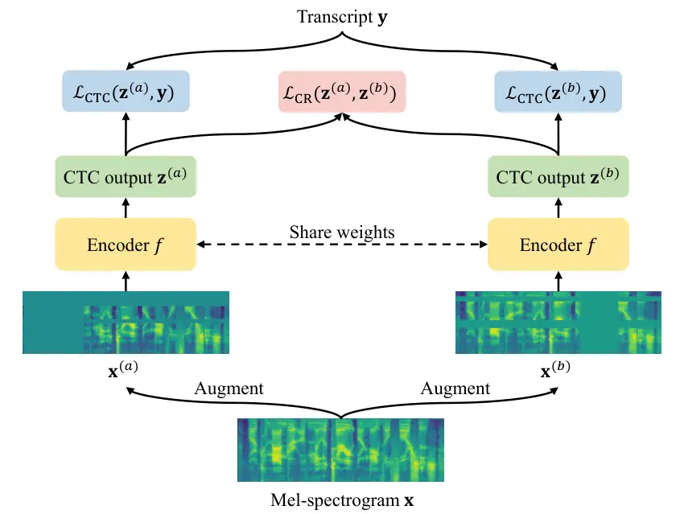

# CR-CTC: Consistency regularization on CTC for improved speech recognition

Zengwei Yao    Wei Kang    Xiaoyu Yang    Fangjun Kuang    Liyong Guo   
Han Zhu Affiliation: Zengrui Jin, Zhaoqing Li, Long Lin, Daniel Povey
Affiliation: Xiaomi Corp., Beijing, China
Email: [dpovey@xiaomi.com](mailto:)

###### Abstract

Connectionist Temporal Classification (CTC) is a widely used method for
automatic speech recognition (ASR), renowned for its simplicity and
computational efficiency. However, it often falls short in recognition
performance. In this work, we propose the Consistency-Regularized CTC
(CR-CTC), which enforces consistency between two CTC distributions
obtained from different augmented views of the input speech
mel-spectrogram. We provide in-depth insights into its essential
behaviors from three perspectives: 1) it conducts self-distillation
between random pairs of sub-models that process different augmented
views; 2) it learns contextual representation through masked prediction
for positions within time-masked regions, especially when we increase
the amount of time masking; 3) it suppresses the extremely peaky CTC
distributions, thereby reducing overfitting and improving the
generalization ability. Extensive experiments on LibriSpeech, Aishell-1,
and GigaSpeech datasets demonstrate the effectiveness of our CR-CTC. It
significantly improves the CTC performance, achieving state-of-the-art
results comparable to those attained by transducer or systems combining
CTC and attention-based encoder-decoder (CTC/AED). We release our code
at
[https://github.com/k2-fsa/icefall](https://github.com/k2-fsa/icefall).

|     |
| --- |
|     |

## 1 introduction

End-to-end approaches (Graves et al., 2006; Graves, 2012; Chan et al.,
2015), which eliminate the need of pre-aligned speech-text data, have
replaced traditional hybrid systems (Bourlard & Morgan, 2012; Hinton
et al., 2012) and become dominant methods in automatic speech
recognition (ASR). Prominent examples include Connectionist Temporal
Classification (CTC) (Graves et al., 2006), Transducer (Graves, 2012)
(also known as RNN-T), and the method that combines CTC and
attention-based encoder-decoder (AED) (Chan et al., 2015), referred to
as CTC/AED (Watanabe et al., 2017). To handle the alignment between
speech and token sequences, CTC (Graves et al., 2006) introduces a blank
token and makes independent predictions at each frame, training the
model to maximize the total probability over all valid alignments.
Transducer (Graves, 2012) extends CTC by introducing a prediction
network and a joint network, explicitly modeling the interdependencies
on output labels. CTC/AED (Watanabe et al., 2017) integrates CTC into
AED (Chan et al., 2015) for jointly training, while the CTC and AED
scores are fused during the decoding process. Among these three methods,
CTC is the simplest and most computationally efficient due to its
frame-independent assumption, making it a strong candidate for
real-world deployment. However, it significantly lags behind transducer
and CTC/AED in terms of recognition performance, which limits its
applicability.

To improve the CTC performance, in this work we propose the
Consistency-Regularized CTC (_CR-CTC_), which takes two different
augmented views of the same speech mel-spectrogram as input, and
enforces consistency between the resulting CTC distributions. We analyze
its internal behaviors from three following perspectives. First, it
performs self-distillation between sub-models randomly sampled by
drop-based techniques (Srivastava et al., 2014; Huang et al., 2016).
Second, for positions within time-masked regions, the model is required
to predict the target token distributions, forcing it to learn
contextual representation based on unmasked context, akin to
self-supervised learning methods (Devlin et al., 2019; Baevski et al.,
2020; Hsu et al., 2021). Therefore, we especially increase the amount of
time masking in _CR-CTC_ to enhance this masked prediction behavior.
Third, the consistency regularization suppresses extremely peaky CTC
distributions, which mitigates overfitting and improves the model’s
generalization ability. Inspired by this, we additionally propose an
simple method specifically designed to learn smoother CTC distributions
(Appendix Section A.1), which is experimentally validated to be
effective.

We conduct experiments on LibriSpeech, Aishell-1, and GigaSpeech
datasets using Zipformer (Yao et al., 2024) as speech encoder. The
results demonstrate the superiority of _CR-CTC_, which significantly
outperforms vanilla CTC and achieves results comparable to, or even
slightly better than, those of transducer and CTC/AED. In addition,
_CR-CTC_ can further improve the performance of transducer and CTC/AED
when employed for jointly training. We perform detailed ablation studies
on LibriSpeech dataset to investigate the effect of each functional
component in _CR-CTC_ and to validate our explanations.

## 2 related work

Self-distillation. Unlike traditional knowledge distillation (Buciluǎ
et al., 2006; Hinton et al., 2015), which transfers knowledge from a
larger and high-capacity teacher model to a smaller student model,
self-distillation (Furlanello et al., 2018; Zhu et al., 2018; Mobahi
et al., 2020; Allen-Zhu & Li, 2020) involves learning from a
same-architecture model that processes the same training data. This
approach enables the model to extract more refined representations and
achieve improved performance. For example, BANs (Furlanello et al., 2018) introduces a re-training procedure in which a newly initialized
student model is trained to match a pre-trained teacher model,
subsequently serving as the teacher in the next iteration. Some works
also explore constructing the teacher and student models from a shared
network, distilling knowledge from deeper layers to shallower
layers (Zhang et al., 2019; Kim et al., 2024), or between pairs of
sub-models randomly initialized through drop-based
techniques (Srivastava et al., 2014; Huang et al., 2016), such as
R-Drop (Wu et al., 2021) and cosub (Touvron et al., 2023). Our _CR-CTC_
fundamentally conducts self-distillation between random sub-models,
sharing similar idea to R-Drop and cosub, while our approach further use
different augmented input views, which enriches the diversity of
predictions from these sub-models.

Masked prediction. Masked prediction has proven highly effective in
self-supervised learning (Devlin et al., 2019; Baevski et al., 2019;
Joshi et al., 2020; Baevski et al., 2020; Hsu et al., 2021; He et al.,
2022; Baevski et al., 2023). In this approach, the model is tasked with
predicting masked positions based on the surrounding unmasked context,
which encourages the learning of robust contextual representations.
Notable methods for speech representation learning include wav2vec
2.0 (Baevski et al., 2020), HuBERT (Hsu et al., 2021), and data2vec
2.0 (Baevski et al., 2023), which primarily differ in their prediction
targets. Specifically, wav2vec 2.0 (Baevski et al., 2020) jointly trains
a representation quantizer and learns to distinguish the true quantized
target from distractors (Oord et al., 2018). HuBERT generates target
labels through offline clustering, while data2vec 2.0 uses
contextualized representations from a teacher model as its targets. Our
_CR-CTC_ essentially performs masked prediction for positions within
time-masked regions, where the target labels are frame-level token
distributions generated based on another augmented view of input.

Peaky CTC distributions. CTC models are known for predicting extremely
peaky distributions (Graves et al., 2006; Sak et al., 2015), which can
be harmful in certain scenarios, such as forced alignment (Huang et al., 2024) and knowledge distillation (Ding et al., 2020). These peaky
distributions lead to inaccurate alignments as the model assigns
excessive blanks to non-silence frames. To address this, label priors
are employed to suppress the peaky distributions, thereby improving the
accuracy of forced alignment (Huang et al., 2024). As position
mismatches of CTC spikes can hinder knowledge distillation performance,
some approaches propose to encourage consistent alignments between the
teacher and student (Ding et al., 2020) or to utilize sequence-level
distillation (Takashima et al., 2019). Unlike previous works, we
demonstrate that peak suppression in _CR-CTC_ can improve the
generalization ability of the CTC models.

Consistency regularization. The technique of consistency regularization
has demonstrated effectiveness in learning generalizable image
representations across various learning paradigms, including
self-supervised (Chen et al., 2020; Grill et al., 2020; He et al., 2020;
Chen & He, 2021), semi-supervised (Sajjadi et al., 2016; Laine & Aila,
2016; Sohn et al., 2020), and supervised (Wu et al., 2021; Touvron
et al., 2023; Heo et al., 2023) learning tasks. Self-supervised methods,
such as SimCLR (Chen et al., 2020), BYOL (Grill et al., 2020), MoCo (He
et al., 2020) and SimSiam (Chen & He, 2021), aim to align hidden
representations of unlabeled image data from different model branches or
different augmented views. They address the training issue of feature
collapsing into a constant vector (Chen & He, 2021) through contrastive
learning (Chen et al., 2020; He et al., 2020), momentum encoder (Grill
et al., 2020; He et al., 2020), and stop-gradient operation (Chen & He,
2021). In semi-supervised learning, a prominent example leveraging
consistency regularization is FixMatch (Sohn et al., 2020). It generates
pseudo-labels based on high-confidence predictions from weakly augmented
images, then trains the model to predict these pseudo-labels using the
strongly augmented versions of the same images. Additionally, in
supervised learning, methods such as R-Drop (Wu et al., 2021) and
cosub (Touvron et al., 2023) encourage consistency between predictions
of randomly sampled sub-models using drop-based techniques.

When employing consistency regularization as unsupervised objective to
train transformer encoders on unlabeled speech data, a new training
issue arises in the form of the shortcut learning problem (Geirhos
et al., 2020), which is tackled using reconstruction loss in Speech
SimCLR (Jiang et al., 2020) and temporal augmentation in C-Siam (Khorram
et al., 2022). Some studies explore leveraging consistency
regularization to enhance model robustness during predicting the
pseudo-labels of untranscribed data, which are generated based on
different augmentations (Masumura et al., 2020; Weninger et al., 2020;
Chen et al., 2021b; Higuchi et al., 2021; Sapru, 2022) or through speech
chain reconstruction (Qi et al., 2022). In contrast to these
self/semi-supervised ASR works, our work focuses on a fully supervised
setting, where we introduce consistency loss as a regularization term to
improve performance of CTC model trained on labeled data. As the
consistency regularization is enforced on CTC distributions, which are
stably supervised by the main CTC loss, it inherently avoids the
training issues associated with the unsupervised objectives as observed
in Speech SimCLR (Jiang et al., 2020) and C-Siam (Khorram et al., 2022).

The idea of R-Drop (Wu et al., 2021) has also been extended to
supervised ASR (Gao et al., 2022; Yoon et al., 2024). For example, to
improve the CTC/AED system,  (Gao et al., 2022) specially designs the
spatial-temporal dropout to construct the sub-models, with consistency
regularization enforced exclusively on the CTC spike frames.
Cons-KD (Yoon et al., 2024) integrates consistency regularization into a
knowledge distillation system, enabling the student model to be more
robust to inconsistency induced by dropout. In this work, we focus on
improving the performance of pure CTC systems and are the first to
enable CTC models to match the performance of transducer and CTC/AED
systems by a simple yet effective approach. Moreover, we introduce peak
suppression as a novel explanatory perspective, demonstrating for the
first time that it can mitigate overfitting and enhance the
generalization ability of CTC models.

## 3 method

We first introduce the standard CTC algorithm in Section 3.1. Then we
present the detailed implementation of our proposed
Consistency-Regularized CTC (_CR-CTC_) in Section 3.2, followed by
in-depth explanations from different perspectives in Section 3.3.

### 3.1 Preliminary: Connectionist Temporal Classification

The ASR task is to convert a sequence of speech frames
$`\mathbf{x}=\{x_{t}\}_{1}^{T}`$ of length $`T`$ to a sequence of
transcript tokens $`\mathbf{y}=\{y_{u}\in\mathcal{V}\}_{1}^{U}`$ of
length $`U`$, where $`\mathcal{V}`$ is the vocabulary and typically
$`T\geq U`$. CTC (Graves et al., 2006) extends the vocabulary
$`\mathcal{V}`$ to $`\mathcal{V}^{\prime}=\mathcal{V}\cup\{\epsilon\}`$
with a blank token $`\epsilon`$, and aims to maximize the total
posterior probability of all valid alignments
$`\bm{\pi}=\{\pi_{t}\in\mathcal{V}^{\prime}\}^{T}_{1}`$ between
$`\mathbf{x}`$ and $`\mathbf{y}`$. Let $`\mathcal{B}(\bm{\pi})`$ denote
the many-to-one map that merges repeating tokens and removes all blanks
in $`\bm{\pi}`$, and $`p(\bm{\pi}|\mathbf{x})`$ denote the posterior
probability of alignment $`\bm{\pi}`$, the CTC loss function is
formulated as:

```math
\vskip-3.99994pt\mathcal{L}_{\mathrm{CTC}}(\mathbf{x},\mathbf{y})=-\log\sum_{\bm{\pi}\in\mathcal{B}^{-1}(\mathbf{y})}p(\bm{\pi}|\mathbf{x}). \tag{1}
```

Specifically, given the input $`\mathbf{x}`$, it employs an encoder
$`f`$ to estimate the $`|\mathcal{V}^{\prime}|`$-dimensional probability
distributions $`\mathbf{z}=\{z_{t}\}^{T}_{1}`$:
$`\mathbf{z}=f(\mathbf{x})`$ ¹¹ 1 $`T`$ is typically downsampled in the
encoder $`f`$ by a factor of 4 for efficiency. This is omitted for the
sake of simplicity in expression., where $`f`$ is modeled by a speech
encoder network such as Zipformer (Yao et al., 2024) followed by a
linear projection layer and a _softmax_ function. Note that we now start
to use $`\mathcal{L}_{\mathrm{CTC}}(\mathbf{z},\mathbf{y})`$ instead of
$`\mathcal{L}_{\mathrm{CTC}}(\mathbf{x},\mathbf{y})`$ for ease of
description in the following sections. Under the frame-independent
assumption (Graves et al., 2006), $`p(\bm{\pi}|\mathbf{x})`$ is computed
as:

```math
\vskip-5.0ptp(\bm{\pi}|\mathbf{x})=\prod_{t=1}^{T}z_{t,\pi_{t}}, \tag{2}
```

where $`z_{t,\pi_{t}}`$ is the probability of emitting token $`\pi_{t}`$
at frame $`t`$.

### 3.2 Our approach: Consistency-regularized CTC



Figure 1: Overall architecture of _CR-CTC_.

Figure 1 illustrates the overall architecture of our proposed _CR-CTC_.
It takes as input two different augmented views, $`\mathbf{x}^{(a)}`$
and $`\mathbf{x}^{(b)}`$, both derived from the input speech
mel-spectrogram $`\mathbf{x}`$. The two input views are then passed
through a shared speech encoder $`f`$, which estimates the per-frame
distributions: $`\mathbf{z}^{(a)}=f(\mathbf{x}^{(a)})`$,
$`\mathbf{z}^{(b)}=f(\mathbf{x}^{(b)})`$. In addition to computing the
CTC losses on both branches:
$`\mathcal{L}_{\mathrm{CTC}}(\mathbf{z}^{(a)},\mathbf{y})`$ and
$`\mathcal{L}_{\mathrm{CTC}}(\mathbf{z}^{(b)},\mathbf{y})`$, we
introduce an auxiliary loss (defined in Equation 4) to enforce
consistency between $`\mathbf{z}^{(a)}`$ and $`\mathbf{z}^{(b)}`$:
$`\mathcal{L}_{\mathrm{CR}}(\mathbf{z}^{(a)},\mathbf{z}^{(b)})`$. The
overall loss of the whole model is formulated as:

```math
\mathcal{L}=\frac{1}{2}(\mathcal{L}_{\mathrm{CTC}}(\mathbf{z}^{(a)},\mathbf{y})+\mathcal{L}_{\mathrm{CTC}}(\mathbf{z}^{(b)},\mathbf{y}))+\alpha\mathcal{L}_{\mathrm{CR}}(\mathbf{z}^{(a)},\mathbf{z}^{(b)}), \tag{3}
```

where $`\alpha`$ is a hyper-parameter that controls the consistency
regularization.

Different augmented views. The two different augmented views,
$`\mathbf{x}^{(a)}`$ and $`\mathbf{x}^{(b)}`$, are generated by
independently applying SpecAugment (Park et al., 2019) to two copies of
the input mel-spectrogram $`\mathbf{x}`$. SpecAugment involves warping
along time axis, masking blocks of frequency channels, and masking
blocks of time steps. Since time warping alters feature timing and thus
shifts output timestamps, we apply it first before creating the copies
to prevent significant timestamp mismatches between the outputs of two
branches. Subsequently, random frequency masking and time masking are
both applied to the two copies, resulting in $`\mathbf{x}^{(a)}`$ and
$`\mathbf{x}^{(b)}`$. Note that we also increase the amount of time
masking by a factor of 2.5 compared to regular systems. The reason
behind this adjustment is explained in Section 3.3, with implementation
details provided in Section 4.1.

Consistency regularization loss. The consistency regularization is
applied on each frame $`t`$, by minimizing the bidirectional
Kullback-Leibler divergence (denoted as $`D_{\mathrm{KL}}`$) between
each pair of distributions $`z^{(a)}_{t}`$ and $`z^{(b)}_{t}`$:
$`D_{\mathrm{KL}}(\mathrm{\emph{sg}}(z^{(b)}_{t})\|z^{(a)}_{t})`$ and
$`D_{\mathrm{KL}}(\mathrm{\emph{sg}}(z^{(a)}_{t})\|z^{(b)}_{t})`$, where
$`\mathrm{\emph{sg}}`$ denotes the operation stopping gradient on the
target distributions. The regularization loss
$`\mathcal{L}_{\mathrm{CR}}(\mathbf{z}^{(a)},\mathbf{z}^{(b)})`$ is
formulated as:

```math
\mathcal{L}_{\mathrm{CR}}(\mathbf{z}^{(a)},\mathbf{z}^{(b)})=\frac{1}{2}\sum_{t=1}^{T}D_{\mathrm{KL}}(\mathrm{\emph{sg}}(z^{(b)}_{t})\|z^{(a)}_{t})+D_{\mathrm{KL}}(\mathrm{\emph{sg}}(z^{(a)}_{t})\|z^{(b)}_{t}). \tag{4}
```

### 3.3 Explanation

We now explain the essential behaviors of our proposed _CR-CTC_ from
three different perspectives: 1) it performs self-distillation between
pairs of sub-models with different input views; 2) it conducts
contextual representation learning by predicting the token distributions
at masked positions based on unmasked context; 3) it suppresses
extremely peaky CTC distributions, mitigating overfitting and enhancing
generalization ability. We conduct an empirical investigation through
ablation studies in Section 4.3, and the experimental results validate
our explanations.

Self-distillation. When using model regularization techniques such as
dropout (Srivastava et al., 2014) and stochastic depth (Huang et al.,
2016), which randomly drop parts of the model (neurons or layers), it
can be viewed as implicitly training randomly sampled sub-models that
are ultimately combined into an ensemble during inference. Similar to
R-Drop (Wu et al., 2021) and cosub (Touvron et al., 2023), in _CR-CTC_,
enforcing consistency regularization between the two branches enables to
perform self-distillation between pairs of randomly sampled sub-models
derived from the shared model $`f`$, with each sub-model receiving
supervision signals in the form of per-frame predictions from the other.
In addition, feeding different augmented views (with larger amount of
time masking) exposes these sub-models to varied aspects of the input
data, enhancing their prediction diversity and facilitating richer
knowledge transfer as well as complementary representation learning.

Masked prediction. In _CR-CTC_, consistency regularization requires
frames within the time-masked regions in each branch to predict the
corresponding token distributions, which are generated by the other
branch on the fly. Similar to masked-based self-supervised
models (Devlin et al., 2019; Baevski et al., 2020; Hsu et al., 2021),
this behavior encourages the model to capture acoustic information on
the unmasked context and exploit its implicit language modeling
capability. Independently applying random time masking to the two
branches reduces the occurrence of positions masked by both branches,
thereby improve the quality of the provided target distributions for
these masked positions. Furthermore, increasing the amount of time
masking in _CR-CTC_ enhances contextual representation learning through
the masked prediction behavior.

Peak suppression. In line with previous works (Graves et al., 2006; Sak
et al., 2015), we also observe that CTC tends to learn extremely peaky
distributions. As shown in Figure 2 (left), almost all non-blank tokens
occupy only one frame, while the remaining frames are dominated by the
blank token, with both types of emissions occurring with extremely high
probabilities. This phenomenon suggests potential overfitting to
training data, which limits generalization ability to unseen data.

Enforcing prediction consistency between the two branches in _CR-CTC_
guides the model to learn the average of their predictions, ultimately
resulting in smoother distributions. The peak suppression behavior
reduces overconfidence on training data, thereby improving the model’s
generalization ability. As presented in Figure 2 (right), _CR-CTC_
exhibits reduced token emitting probabilities and an increased
occurrence of repeating non-blank tokens. A comparison of concrete
statistics on the distribution peakedness between CTC and _CR-CTC_ is
provided in Table 6.

Inspired by this, we also propose a simple method, called
Smooth-Regularized CTC (_SR-CTC_), which incorporates an auxiliary loss
into regular CTC, specifically encouraging the model to learn smoother
CTC distributions. Appendix Section A.1 presents the details of
_SR-CTC_.

(a) Sample 1 in CTC

(b) Sample 1 in _CR-CTC_

(c) Sample 2 in CTC

(d) Sample 2 in _CR-CTC_

(e) Sample 3 in CTC

(f) Sample 3 in _CR-CTC_

(g) Sample 4 in CTC

(h) Sample 4 in _CR-CTC_

Figure 2: Visualization of token emitting probabilities for vanilla CTC
(left) and our _CR-CTC_ (right) on four randomly selected samples from
LibriSpeech test set. The gray dashed lines indicate the blank token.
Compared to vanilla CTC, the token distributions in _CR-CTC_ are
smoother with lower emitting probabilities and more repeating non-blank
tokens.

## 4 experiments

### 4.1 Experimental setup

Datasets. To evaluate the effectiveness of our proposed _CR-CTC_, we
conduct experiments on three publicly available ASR datasets: 1)
LibriSpeech (Panayotov et al., 2015), which contains 1000 hours of
English speech; 2) Aishell-1 (Bu et al., 2017), which consists of 170
hours of Mandarin speech; 3) GigaSpeech (Chen et al., 2021a), comprising
10000 hours of English speech.

Implementation details. Our experiments are performed using the icefall
framework ²² 2
[https://github.com/k2-fsa/icefall](https://github.com/k2-fsa/icefall),
with Lhotse toolkit (Żelasko et al., 2021) for data preparation. For
regular ASR recipes in icefall, default parameter settings of
SpecAugment (Park et al., 2019) include a time warping factor of 80, 2
frequency masking regions with a maximum width of 27, and 10 time
masking regions with a maximum width of 100, along with a maximum
masking fraction of 15% specifically for time masking ³³ 3 See the
SpecAugment implementation in Lhotse for more details:
[https://github.com/lhotse-speech/lhotse/blob/master/lhotse/dataset/signal_transforms.py](https://github.com/lhotse-speech/lhotse/blob/master/lhotse/dataset/signal_transforms.py).
In our _CR-CTC_ systems, we utilize larger amount of time masking
through increasing both the number of time masking regions and the
maximum masking fraction by a factor of 2.5. Speed perturbation (Ko
et al., 2015) with factors 0.9, 1.0 and 1.1 is applied to
LibriSpeech (Panayotov et al., 2015) and Aishell-1 (Bu et al., 2017)
datasets. The input features are 80-dimensional mel-spectrograms
extracted using 25-ms windows with a 10-ms shift. For LibriSpeech and
GigaSpeech datasets, we employ 500-class Byte Pair Encoding
(BPE) (Sennrich et al., 2016) word pieces as modeling units, while for
Aishell-1 dataset, we use 4336-class characters. By default, we set
$`\alpha`$ in Equation 3 to 0.2. Zipformer (Yao et al., 2024), which
uses dropout (Srivastava et al., 2014) and stochastic depth (Huang
et al., 2016), is used as our speech encoder due to its speed and high
performance. It takes input features at frame rate of 100Hz, processes
the sequence through 6 stacks with frame rates of 50Hz, 25Hz, 12.5Hz,
6.25Hz, 12.5Hz, and 25Hz, and finally produces the encoder output at
frame rate of 25Hz. Following (Yao et al., 2024), pruned
transducer (Kuang et al., 2022), a highly optimized and memory-efficient
version of transducer, is employed for comparison. Word-error-rate (WER)
and character-error-rate (CER) are employed as ASR metrics for English
and Mandarin datasets, respectively. As _CR-CTC_ requires two forward
pass during training, we train _CR-CTC_ models with half the batch size
and half the number of epochs compared to CTC models, ensuring a fair
comparison in terms of training cost. Training configuration in terms of
number of GPUs and training epochs are provided in Appendix Section A.2.
For CTC and _CR-CTC_ systems, we use prefix search decoding (Graves
et al., 2006) with a beam size of 4 for comparisons against other
state-of-the-art models, and employ greedy search decoding for ablation
studies. Results comparison between these two decoding methods are
provided in Appendix Section A.3. For pruned transducer models, we use
beam search decoding with beam size of 4 (Kang et al., 2023). For
CTC/AED systems, we use joint decoding that combines CTC scores and AED
scores (Watanabe et al., 2017).

### 4.2 Comparison with state-of-the-art models

In this section, we compare our _CR-CTC_ with other state-of-the-art
models. For LibriSpeech and GigaSpeech datasets, we also use _CR-CTC_ as
an auxiliary loss in CTC/AED and pruned transducer systems for joint
training (denoted as _CR-CTC_/AED and pruned transducer w/ _CR-CTC_), to
further validate the representation learning capability of _CR-CTC_.
Note that for the models that combine _CR-CTC_ and pruned transducer, we
only utilize the transducer head for decoding, without incorporating the
CTC scores. For the larger GigaSpeech dataset, we additionally use a
even larger scale of Zipformer (Zipformer-XL). Model configuration of
different scales of Zipformer are provided in Table 15. For Aishell-1
dataset, which is considerably smaller, we conduct experiments on
Zipformer-S and Zipformer-M to ensure comparable parameter counts with
other models reported in the literature.

|                                                      |            |            |            |
| ---------------------------------------------------- | ---------- | ---------- | ---------- |
| Model                                                | Params (M) | WER (%)    |            |
|                                                      |            | test-clean | test-other |
| CTC/AED, E-Branchformer-B (Kim et al., 2023)         | 41.1       | 2.49       | 5.61       |
| CTC/AED, Branchformer (Peng et al., 2022)            | 116.2      | 2.4        | 5.5        |
| CTC/AED, E-Branchformer-L (Kim et al., 2023)         | 148.9      | 2.14       | 4.55       |
| Transducer, ContextNet-S (Han et al., 2020)          | 10.8       | 2.9        | 7.0        |
| Transducer, ContextNet-M (Han et al., 2020)          | 31.4       | 2.4        | 5.4        |
| Transducer, ContextNet-L (Han et al., 2020)          | 112.7      | 2.1        | 4.6        |
| Transducer, Conformer-S (Gulati et al., 2020)        | 10.3       | 2.7        | 6.3        |
| Transducer, Conformer-M (Gulati et al., 2020)        | 30.7       | 2.3        | 5.0        |
| Transducer, Conformer-L (Gulati et al., 2020)        | 118.8      | 2.1        | 4.3        |
| Transducer, MH-SSM 32L (Fathullah et al., 2023)      | 140.3      | 2.01       | 4.61       |
| Transducer, Stateformer 25L (Fathullah et al., 2023) | 139.8      | 1.91       | 4.36       |
| CTC/AED, Zipformer-S (Yao et al., 2024)              | 46.3       | 2.46       | 6.04       |
| CTC/AED, Zipformer-M (Yao et al., 2024)              | 90.0       | 2.22       | 4.97       |
| CTC/AED, Zipformer-L (Yao et al., 2024)              | 174.3      | 2.09       | 4.59       |
| Pruned transducer, Zipformer-S (Yao et al., 2024)    | 23.3       | 2.42       | 5.73       |
| Pruned transducer, Zipformer-M (Yao et al., 2024)    | 65.6       | 2.21       | 4.79       |
| Pruned transducer, Zipformer-L (Yao et al., 2024)    | 148.4      | 2.00       | 4.38       |
| CTC, Zipformer-S                                     | 22.1       | 2.85       | 6.89       |
| CTC, Zipformer-M                                     | 64.3       | 2.52       | 6.02       |
| CTC, Zipformer-L                                     | 147.0      | 2.5        | 5.72       |
| _CR-CTC_, Zipformer-S (ours)                         | 22.1       | 2.52       | 5.85       |
| _CR-CTC_, Zipformer-M (ours)                         | 64.3       | 2.1        | 4.61       |
| _CR-CTC_, Zipformer-L (ours)                         | 147.0      | 2.02       | 4.35       |
| _CR-CTC_/AED, Zipformer-L (ours)                     | 174.3      | 1.96       | 4.08       |
| Pruned transducer w/ _CR-CTC_, Zipformer-L (ours)    | 148.8      | 1.88       | 3.95       |

Table 1: WER(%) performance of our method on LibriSpeech dataset
compared to the best results reported in the literature without using an
external language model.

LibriSpeech dataset. Table 1 presents the results on LibriSpeech dataset
for _CR-CTC_ and other state-of-the-art models. Our _CR-CTC_
significantly outperforms the CTC baselines on all three scales of
Zipformer encoder. When comparing to CTC/AED models, our _CR-CTC_
achieves lower WER on Zipformer-M/L, while yielding comparable result on
Zipformer-S. Similarly, our _CR-CTC_ surpasses pruned transducer on
Zipformer-M, and performs comparably on Zipformer-L. It also
demonstrates that _CR-CTC_ can further enhance the performance of
CTC/AED and pruned transducer models when used for jointly training. A
notable result is that pruned transducer combined with _CR-CTC_ using
Zipformer-L achieves a new state-of-the-art result of 1.88%/3.95% on
test-clean/test-other, outperforming both the transducer models with
Conformer-L (Gulati et al., 2020) and Stateformer 25L (Fathullah et al.,
2023).

|                                                           |            |         |      |
| --------------------------------------------------------- | ---------- | ------- | ---- |
| Model                                                     | Params (M) | WER (%) |      |
|                                                           |            | dev     | test |
| CTC/AED, Conformer in ESPnet (Watanabe et al., 2018)      | 46.2       | 4.5     | 4.9  |
| CTC/AED, Conformer in WeNet (Yao et al., 2021)            | 46.3       | $`-`$   | 4.61 |
| CTC/AED, E-Branchformer in ESPnet (Watanabe et al., 2018) | 37.9       | 4.2     | 4.5  |
| CTC/AED, Branchformer (Peng et al., 2022)                 | 45.4       | 4.19    | 4.43 |
| Pruned transducer, Zipformer-S (Yao et al., 2024)         | 30.2       | 4.4     | 4.67 |
| Pruned transducer, Zipformer-M (Yao et al., 2024)         | 73.4       | 4.13    | 4.4  |
| CTC, Zipformer-S                                          | 23.1       | 4.89    | 5.26 |
| CTC, Zipformer-M                                          | 66.2       | 4.47    | 4.8  |
| CTC/AED, Zipformer-S                                      | 39.3       | 4.47    | 4.8  |
| CTC/AED, Zipformer-M                                      | 83.2       | 4.0     | 4.32 |
| _CR-CTC_, Zipformer-S (ours)                              | 23.1       | 3.9     | 4.12 |
| _CR-CTC_, Zipformer-M (ours)                              | 66.2       | 3.72    | 4.02 |

Table 2: WER(%) performance of our method on Aishell-1 dataset compared
to the best results reported in the literature without using an external
language model.

Aishell-1 dataset. Table 2 presents the results on Aishell-1 dataset.
Our _CR-CTC_ models not only significantly outperform vanilla CTC by a
substantial margin but also achieve better results than all other
CTC/AED and pruned transducer models. For example, _CR-CTC_ with
Zipformer-S surpasses CTC/AED with Zipformer-M while using much fewer
parameters.

|                                                           |            |         |       |
| --------------------------------------------------------- | ---------- | ------- | ----- |
| Model                                                     | Params (M) | WER (%) |       |
|                                                           |            | dev     | test  |
| CTC/AED, Transformer (Chen et al., 2021a)                 | 87         | 12.30   | 12.30 |
| CTC/AED, Conformer in Wenet (Zhang et al., 2022)          | 113.2      | 10.7    | 10.6  |
| CTC/AED, Conformer in ESPnet (Chen et al., 2021a)         | 113.2      | 10.9    | 10.8  |
| CTC/AED, E-Branchformer in ESPnet (Watanabe et al., 2018) | 148.9      | 10.6    | 10.5  |
| CTC, Zipformer-S                                          | 22.1       | 12.08   | 11.95 |
| CTC, Zipformer-M                                          | 64.3       | 11.23   | 11.27 |
| CTC, Zipformer-L                                          | 147.0      | 11.16   | 11.16 |
| CTC, Zipformer-XL                                         | 286.6      | 10.8    | 10.87 |
| CTC/AED, Zipformer-S                                      | 46.3       | 11.4    | 11.39 |
| CTC/AED, Zipformer-M                                      | 90.0       | 10.57   | 10.61 |
| CTC/AED, Zipformer-L                                      | 174.3      | 10.26   | 10.38 |
| CTC/AED, Zipformer-XL                                     | 315.5      | 10.22   | 10.33 |
| Pruned transducer, Zipformer-S                            | 23.3       | 10.98   | 10.94 |
| Pruned transducer, Zipformer-M                            | 65.6       | 10.37   | 10.42 |
| Pruned transducer, Zipformer-L                            | 148.4      | 10.23   | 10.28 |
| Pruned transducer, Zipformer-XL                           | 288.2      | 10.09   | 10.2  |
| _CR-CTC_, Zipformer-S (ours)                              | 22.1       | 11.68   | 11.58 |
| _CR-CTC_, Zipformer-M (ours)                              | 64.3       | 10.62   | 10.72 |
| _CR-CTC_, Zipformer-L (ours)                              | 147.0      | 10.31   | 10.41 |
| _CR-CTC_, Zipformer-XL (ours)                             | 286.6      | 10.15   | 10.28 |
| _CR-CTC_/AED, Zipformer-XL (ours)                         | 315.5      | 9.92    | 10.07 |
| Pruned transducer w/ _CR-CTC_, Zipformer-XL (ours)        | 286.6      | 9.95    | 10.03 |

Table 3: WER(%) performance of our method on GigaSpeech dataset compared
to the best results reported in the literature without using an external
language model.

GigaSpeech dataset. Table 3 shows the results on GigaSpeech dataset. Our
_CR-CTC_ consistently achieves a significantly lower WER than vanilla
CTC across all scales of Zipformer. In comparisons with CTC/AED or
pruned transducer models, our _CR-CTC_ demonstrates comparable
performance on Zipformer L/XL. Additionally, the results indicate that
employing _CR-CTC_ for joint training can further improve the
performance of both CTC/AED and pruned transducer models.

### 4.3 Ablation studies

We now perform ablation studies on LibriSpeech dataset using Zipformer-M
encoder to investigate the effect of each component in _CR-CTC_
(Section 3.2), and to validate our explanations of its behaviors
(Section 3.3). Results of tuning $`\alpha`$ in Equation 3 and the ratio
used to increase the amount of time masking are presented in Table 16.

|                                                           |            |            |
| --------------------------------------------------------- | ---------- | ---------- |
| Method                                                    | WER (%)    |            |
|                                                           | test-clean | test-other |
| CTC baseline                                              | 2.51       | 6.02       |
| EMA-distilled CTC                                         | 2.31       | 5.25       |
| _CR-CTC_ (final)                                          | 2.12       | 4.62       |
|     No larger time masking                                | 2.19       | 4.98       |
|     No larger time masking, no different augmented views  | 2.27       | 5.11       |
|     Use hard-label CE-based $`\mathcal{L}_{\mathrm{CR}}`$ | 2.14       | 4.84       |
|     Remove _sg_ in $`\mathcal{L}_{\mathrm{CR}}`$          | 2.24       | 4.97       |

Table 4: Ablation studies for self-distillation in _CR-CTC_ on
LibriSpeech dataset using Zipformer-M encoder and greedy search
decoding.

Self-distillation. One self-distillation method in self-supervised
learning is to construct a teacher model by tracking the model weights
using exponential moving average (EMA) (Grill et al., 2020; He et al.,
2020; Baevski et al., 2023). For comparison, we include this approach,
referred to as EMA-distilled CTC, which incorporates an auxiliary loss
to learn from the CTC distribution of the EMA teacher model. Its details
are provided in Appendix Section A.6. As presented in Table 4, _CR-CTC_
significantly outperforms EMA-distilled CTC, demonstrating its
superiority in self-distillation. For _CR-CTC_, both the lack of
increased time masking and the absence of different augmented views lead
to WER degradation, indicating the effectiveness of enhancing the input
diversity between sub-models during self-distillation. Replacing
$`D_{\mathrm{KL}}`$ with hard label-based cross-entropy (CE) function in
$`\mathcal{L}_{\mathrm{CR}}`$ (Equation 4) results in a WER degradation
of 0.02%/0.22% on test-clean/test-other. This suggests the advantage of
using $`D_{\mathrm{KL}}`$ which enables a finer-grained
self-distillation as it distills over the full CTC lattice, whereas the
hard label CE-based method only distills the best alignment. When
removing the _sg_ operation in $`\mathcal{L}_{\mathrm{CR}}`$, the WER
increase by 0.12%/0.35%, which implies that the model might have a
tendency towards a degenerated solution (Chen & He, 2021) that is
insensitive to the pattern of input masking and model dropout.

|                                                                   |            |            |
| ----------------------------------------------------------------- | ---------- | ---------- |
| Method                                                            | WER (%)    |            |
|                                                                   | test-clean | test-other |
| CTC baseline                                                      | 2.51       | 6.02       |
|     Use larger time masking                                       | 2.68       | 6.28       |
| _CR-CTC_ (final)                                                  | 2.12       | 4.62       |
|     No larger time masking                                        | 2.19       | 4.98       |
|     No larger time masking, no different augmented views          | 2.27       | 5.11       |
|     No larger time masking, use larger frequency masking          | 2.26       | 4.98       |
|     Exclude self-masked frames in $`\mathcal{L}_{\mathrm{CR}}`$   | 2.32       | 5.26       |
|     Exclude self-unmasked frames in $`\mathcal{L}_{\mathrm{CR}}`$ | 2.32       | 5.02       |

Table 5: Ablation studies for masked prediction in _CR-CTC_ on
LibriSpeech dataset using Zipformer-M encoder and greedy search
decoding.

Masked prediction. As reported in Table 5, without increasing the amount
of time masking, the WER of _CR-CTC_ increases by 0.07%/0.36% on
test-clean/test-other, suggesting the effectiveness of enhancing the
masked prediction behavior for contextual representation learning.
Additionally, without using different augmented views, the WER increases
further by 0.12%/0.13%. This indicates the advantage of independently
applying random time masking, which improves the quality of the provided
target distributions for the masked positions. However, using larger
amount of frequency masking leads to a WER degradation of 0.07% on
test-clean, implying that the performance gain from increasing the
amount of time masking is primarily due to the masked prediction
behavior, rather than merely increasing the input diversity for the two
branches. Furthermore, applying larger amount of time masking does not
benefit the CTC baseline, as it increases the WER by 0.17%/0.26%. In the
final _CR-CTC_ system, excluding frames with time-masked regions in the
current branch (self-masked) from $`\mathcal{L}_{\mathrm{CR}}`$
(Equation 4) leads to a larger WER degradation compared to excluding the
remaining unmasked frames (self-unmasked). This highlights the
importance of the masked prediction behavior in the overall performance
of _CR-CTC_.

|              |                    |                      |           |            |            |
| ------------ | ------------------ | -------------------- | --------- | ---------- | ---------- |
| Method       | Non-blank duration | Emit probability (%) |           | WER (%)    |            |
|              | (frames)           | blank                | non-blank | test-clean | test-other |
| CTC baseline | 1.04               | 99.64                | 98.50     | 2.51       | 6.02       |
| _SR-CTC_     | 4.25               | 95.44                | 90.04     | 2.32       | 5.22       |
| _CR-CTC_     | 1.28               | 94.19                | 89.42     | 2.12       | 4.62       |

Table 6: Ablation studies for peak suppression in _CR-CTC_ on
LibriSpeech dataset using Zipformer-M encoder and greedy search
decoding. We include the averaged duration of all non-blank tokens, as
well as the averaged emitting probabilities of the blank token and all
non-blank tokens on the best alignments.

Peak suppression. To measure the peakedness of the learned CTC
distributions, we compute the averaged duration over all non-blank
tokens, as well as the averaged emitting probabilities for the blank
token and all non-blank tokens, based on the best alignment obtained
through greedy search decoding on the test sets. We also include the
method _SR-CTC_ (described in Appendix Section A.1) for comparison. As
presented in Table 6, compared to the CTC baseline, _CR-CTC_ learns
smoother distributions and significantly improves the recognition
performance. Note that _SR-CTC_ also surpasses the CTC baseline by
0.19%/0.8% on test-clean/test-other, while exhibiting a notably larger
average duration of non-blank tokens. This manifests the effectiveness
of peak suppression in reducing overfitting and improving generalization
performance.

|                               |            |            |            |
| ----------------------------- | ---------- | ---------- | ---------- |
| Method                        | Params (M) | WER (%)    |            |
|                               |            | test-clean | test-other |
| CTC baseline                  | 64.3       | 2.51       | 6.02       |
| CTC w/ AED head               | 90.0       | 2.46       | 5.57       |
| CTC w/ pruned transducer head | 65.8       | 2.42       | 5.4        |
| _CR-CTC_                      | 64.3       | 2.12       | 4.62       |

Table 7: Comparison between _CR-CTC_ and methods using an auxiliary head
for jointly training on LibriSpeech dataset using Zipformer-M encoder
and greedy search decoding.

Compared to using auxiliary head for jointly training. The
straightforward approach to improve the CTC performance is using an
auxiliary head of AED (Chan et al., 2015; Hentschel et al., 2024) or
pruned transducer (Kuang et al., 2022) for jointly training, while
retaining only the CTC head for inference. As reported in Table 7,
_CR-CTC_ significantly outperforms these two methods with less model
parameters, suggesting the advantage of our method.

## 5 conclusion

In this work, we introduce the _CR-CTC_ to enhance CTC performance.
Specifically, it takes as input two different augmented views of the
same speech mel-spectrogram, and enforce consistency between the two
obtained CTC distributions. We explain our method from three different
perspectives: 1) self-distillation between randomly sampled sub-models; 2) masked prediction for positions within time-masked regions,
facilitating the learning of contextual representation; 3) peak
suppression, which reduces overfitting and improves the model’s
generalization ability. Extensive experiments on LibriSpeech, Aishell-1,
and GigaSpeech datasets demonstrate the effectiveness of _CR-CTC_.
Additionally, detailed ablation studies validate our explanations.

## References

- Allen-Zhu & Li (2020) Zeyuan Allen-Zhu and Yuanzhi Li. Towards
  understanding ensemble, knowledge distillation and self-distillation
  in deep learning. _arXiv preprint arXiv:2012.09816_, 2020.
- Baevski et al. (2019) Alexei Baevski, Steffen Schneider, and Michael
  Auli. vq-wav2vec: Self-supervised learning of discrete speech
  representations. _arXiv preprint arXiv:1910.05453_, 2019.
- Baevski et al. (2020) Alexei Baevski, Yuhao Zhou, Abdelrahman Mohamed,
  and Michael Auli. wav2vec 2.0: A framework for self-supervised
  learning of speech representations. _Advances in neural information
  processing systems_, 33:12449–12460, 2020.
- Baevski et al. (2023) Alexei Baevski, Arun Babu, Wei-Ning Hsu, and
  Michael Auli. Efficient self-supervised learning with contextualized
  target representations for vision, speech and language. In
  _International Conference on Machine Learning_, pp. 1416–1429.
  PMLR, 2023.
- Bourlard & Morgan (2012) Herve A Bourlard and Nelson Morgan.
  _Connectionist speech recognition: a hybrid approach_, volume 247.
  Springer Science & Business Media, 2012.
- Bu et al. (2017) Hui Bu, Jiayu Du, Xingyu Na, Bengu Wu, and Hao Zheng.
  Aishell-1: An open-source mandarin speech corpus and a speech
  recognition baseline. In _20th conference of the oriental chapter of
  the international coordinating committee on speech databases and
  speech I/O systems and assessment (O-COCOSDA)_, pp. 1–5, 2017.
- Buciluǎ et al. (2006) Cristian Buciluǎ, Rich Caruana, and Alexandru
  Niculescu-Mizil. Model compression. In _Proceedings of the 12th ACM
  SIGKDD international conference on Knowledge discovery and data
  mining_, pp. 535–541, 2006.
- Chan et al. (2015) William Chan, Navdeep Jaitly, Quoc V Le, and Oriol
  Vinyals. Listen, attend and spell. _arXiv preprint
  arXiv:1508.01211_, 2015.
- Chen et al. (2021a) Guoguo Chen, Shuzhou Chai, Guanbo Wang, Jiayu Du,
  Wei-Qiang Zhang, Chao Weng, Dan Su, Daniel Povey, Jan Trmal, Junbo
  Zhang, et al. Gigaspeech: An evolving, multi-domain asr corpus with
  10,000 hours of transcribed audio. _arXiv preprint arXiv:2106.06909_,
  2021a.
- Chen et al. (2020) Ting Chen, Simon Kornblith, Mohammad Norouzi, and
  Geoffrey Hinton. A simple framework for contrastive learning of visual
  representations. In _International conference on machine learning_,
  pp. 1597–1607. PMLR, 2020.
- Chen & He (2021) Xinlei Chen and Kaiming He. Exploring simple siamese
  representation learning. In _Proceedings of the IEEE/CVF conference on
  computer vision and pattern recognition_, pp. 15750–15758, 2021.
- Chen et al. (2021b) Zhehuai Chen, Andrew Rosenberg, Yu Zhang, Heiga
  Zen, Mohammadreza Ghodsi, Yinghui Huang, Jesse Emond, Gary Wang,
  Bhuvana Ramabhadran, and Pedro J Moreno. Semi-supervision in asr:
  Sequential mixmatch and factorized tts-based augmentation. In
  _Interspeech_, pp. 736–740, 2021b.
- Devlin et al. (2019) Jacob Devlin, Ming-Wei Chang, Kenton Lee, and
  Kristina Toutanova. BERT: Pre-training of deep bidirectional
  transformers for language understanding. In _Proceedings of the 2019
  Conference of the North American Chapter of the Association for
  Computational Linguistics: Human Language Technologies, Volume 1 (Long
  and Short Papers)_, pp. 4171–4186, 2019.
- Ding et al. (2020) Haisong Ding, Kai Chen, and Qiang Huo. Improving
  knowledge distillation of ctc-trained acoustic models with
  alignment-consistent ensemble and target delay. _IEEE/ACM transactions
  on audio, speech, and language processing_, 28:2561–2571, 2020.
- Fathullah et al. (2023) Yassir Fathullah, Chunyang Wu, Yuan Shangguan,
  Junteng Jia, Wenhan Xiong, Jay Mahadeokar, Chunxi Liu, Yangyang Shi,
  Ozlem Kalinli, Mike Seltzer, et al. Multi-head state space model for
  speech recognition. _arXiv preprint arXiv:2305.12498_, 2023.
- Furlanello et al. (2018) Tommaso Furlanello, Zachary Lipton, Michael
  Tschannen, Laurent Itti, and Anima Anandkumar. Born again neural
  networks. In _International conference on machine learning_, pp.
  1607–1616. PMLR, 2018.
- Gao et al. (2022) Yingying Gao, Junlan Feng, Tianrui Wang, Chao Deng,
  and Shilei Zhang. A ctc triggered siamese network with
  spatial-temporal dropout for speech recognition. _arXiv preprint
  arXiv:2206.08031_, 2022.
- Geirhos et al. (2020) Robert Geirhos, Jörn-Henrik Jacobsen, Claudio
  Michaelis, Richard Zemel, Wieland Brendel, Matthias Bethge, and
  Felix A Wichmann. Shortcut learning in deep neural networks. _Nature
  Machine Intelligence_, 2(11):665–673, 2020.
- Graves (2012) Alex Graves. Sequence transduction with recurrent neural
  networks. _arXiv preprint arXiv:1211.3711_, 2012.
- Graves et al. (2006) Alex Graves, Santiago Fernández, Faustino Gomez,
  and Jürgen Schmidhuber. Connectionist temporal classification:
  labelling unsegmented sequence data with recurrent neural networks. In
  _Proceedings of the 23rd international conference on Machine
  learning_, pp. 369–376, 2006.
- Grill et al. (2020) Jean-Bastien Grill, Florian Strub, Florent Altché,
  Corentin Tallec, Pierre Richemond, Elena Buchatskaya, Carl Doersch,
  Bernardo Avila Pires, Zhaohan Guo, Mohammad Gheshlaghi Azar, et al.
  Bootstrap your own latent-a new approach to self-supervised learning.
  _Advances in neural information processing systems_,
  33:21271–21284, 2020.
- Gulati et al. (2020) Anmol Gulati, James Qin, Chung-Cheng Chiu, Niki
  Parmar, Yu Zhang, Jiahui Yu, Wei Han, Shibo Wang, Zhengdong Zhang,
  Yonghui Wu, and Ruoming Pang. Conformer: Convolution-augmented
  Transformer for Speech Recognition. In _Proc. Interspeech 2020_, pp.
  5036–5040, 2020.
- Han et al. (2020) Wei Han, Zhengdong Zhang, Yu Zhang, Jiahui Yu,
  Chung-Cheng Chiu, James Qin, Anmol Gulati, Ruoming Pang, and Yonghui
  Wu. Contextnet: Improving convolutional neural networks for automatic
  speech recognition with global context. In _Interspeech 2020_, pp.
  3610–3614, 2020.
- He et al. (2020) Kaiming He, Haoqi Fan, Yuxin Wu, Saining Xie, and
  Ross Girshick. Momentum contrast for unsupervised visual
  representation learning. In _Proceedings of the IEEE/CVF conference on
  computer vision and pattern recognition_, pp. 9729–9738, 2020.
- He et al. (2022) Kaiming He, Xinlei Chen, Saining Xie, Yanghao Li,
  Piotr Dollár, and Ross Girshick. Masked autoencoders are scalable
  vision learners. In _Proceedings of the IEEE/CVF conference on
  computer vision and pattern recognition_, pp. 16000–16009, 2022.
- Hentschel et al. (2024) Michael Hentschel, Yuta Nishikawa, Tatsuya
  Komatsu, and Yusuke Fujita. Keep decoding parallel with effective
  knowledge distillation from language models to end-to-end speech
  recognisers. In _ICASSP 2024-2024 IEEE International Conference on
  Acoustics, Speech and Signal Processing (ICASSP)_, pp. 10876–10880.
  IEEE, 2024.
- Heo et al. (2023) Byeongho Heo, Taekyung Kim, Sangdoo Yun, and
  Dongyoon Han. Masking augmentation for supervised learning. _arXiv
  preprint arXiv:2306.11339_, 2023.
- Higuchi et al. (2021) Yosuke Higuchi, Niko Moritz, Jonathan Le Roux,
  and Takaaki Hori. Momentum pseudo-labeling for semi-supervised speech
  recognition. _arXiv preprint arXiv:2106.08922_, 2021.
- Hinton et al. (2012) Geoffrey Hinton, Li Deng, Dong Yu, George E Dahl,
  Abdel-rahman Mohamed, Navdeep Jaitly, Andrew Senior, Vincent
  Vanhoucke, Patrick Nguyen, Tara N Sainath, et al. Deep neural networks
  for acoustic modeling in speech recognition: The shared views of four
  research groups. _IEEE Signal processing magazine_, 29(6):82–97, 2012.
- Hinton et al. (2015) Geoffrey E. Hinton, Oriol Vinyals, and Jeffrey
  Dean. Distilling the knowledge in a neural network. _ArXiv_,
  abs/1503.02531, 2015.
- Hsu et al. (2021) Wei-Ning Hsu, Benjamin Bolte, Yao-Hung Hubert Tsai,
  Kushal Lakhotia, Ruslan Salakhutdinov, and Abdelrahman Mohamed.
  Hubert: Self-supervised speech representation learning by masked
  prediction of hidden units. _IEEE/ACM transactions on audio, speech,
  and language processing_, 29:3451–3460, 2021.
- Huang et al. (2016) Gao Huang, Yu Sun, Zhuang Liu, Daniel Sedra, and
  Kilian Q Weinberger. Deep networks with stochastic depth. In _Computer
  Vision–ECCV 2016: 14th European Conference, Amsterdam, The
  Netherlands, October 11–14, 2016, Proceedings, Part IV 14_, pp.
  646–661, 2016.
- Huang et al. (2024) Ruizhe Huang, Xiaohui Zhang, Zhaoheng Ni, Li Sun,
  Moto Hira, Jeff Hwang, Vimal Manohar, Vineel Pratap, Matthew Wiesner,
  Shinji Watanabe, et al. Less peaky and more accurate ctc forced
  alignment by label priors. In _ICASSP 2024-2024 IEEE International
  Conference on Acoustics, Speech and Signal Processing (ICASSP)_, pp.
  11831–11835. IEEE, 2024.
- Jiang et al. (2020) Dongwei Jiang, Wubo Li, Miao Cao, Wei Zou, and
  Xiangang Li. Speech simclr: Combining contrastive and reconstruction
  objective for self-supervised speech representation learning. _arXiv
  preprint arXiv:2010.13991_, 2020.
- Joshi et al. (2020) Mandar Joshi, Danqi Chen, Yinhan Liu, Daniel S
  Weld, Luke Zettlemoyer, and Omer Levy. Spanbert: Improving
  pre-training by representing and predicting spans. _Transactions of
  the association for computational linguistics_, 8:64–77, 2020.
- Kang et al. (2023) Wei Kang, Liyong Guo, Fangjun Kuang, Long Lin,
  Mingshuang Luo, Zengwei Yao, Xiaoyu Yang, Piotr Żelasko, and Daniel
  Povey. Fast and parallel decoding for transducer. In _ICASSP 2023-2023
  IEEE International Conference on Acoustics, Speech and Signal
  Processing (ICASSP)_, pp. 1–5. IEEE, 2023.
- Khorram et al. (2022) Soheil Khorram, Jaeyoung Kim, Anshuman Tripathi,
  Han Lu, Qian Zhang, and Hasim Sak. Contrastive siamese network for
  semi-supervised speech recognition. In _ICASSP 2022-2022 IEEE
  International Conference on Acoustics, Speech and Signal Processing
  (ICASSP)_, pp. 7207–7211. IEEE, 2022.
- Kim et al. (2024) Eungbeom Kim, Hantae Kim, and Kyogu Lee. Guiding
  frame-level ctc alignments using self-knowledge distillation. _arXiv
  preprint arXiv:2406.07909_, 2024.
- Kim et al. (2023) Kwangyoun Kim, Felix Wu, Yifan Peng, Jing Pan,
  Prashant Sridhar, Kyu J Han, and Shinji Watanabe. E-branchformer:
  Branchformer with enhanced merging for speech recognition. In _2022
  IEEE Spoken Language Technology Workshop (SLT)_, pp. 84–91.
  IEEE, 2023.
- Ko et al. (2015) Tom Ko, Vijayaditya Peddinti, Daniel Povey, and
  Sanjeev Khudanpur. Audio augmentation for speech recognition. In
  _Sixteenth annual conference of the international speech communication
  association_, 2015.
- Kuang et al. (2022) Fangjun Kuang, Liyong Guo, Wei Kang, Long Lin,
  Mingshuang Luo, Zengwei Yao, and Daniel Povey. Pruned rnn-t for fast,
  memory-efficient asr training. _arXiv preprint
  arXiv:2206.13236_, 2022.
- Laine & Aila (2016) Samuli Laine and Timo Aila. Temporal ensembling
  for semi-supervised learning. _arXiv preprint arXiv:1610.02242_, 2016.
- Masumura et al. (2020) Ryo Masumura, Mana Ihori, Akihiko Takashima,
  Takafumi Moriya, Atsushi Ando, and Yusuke Shinohara. Sequence-level
  consistency training for semi-supervised end-to-end automatic speech
  recognition. In _ICASSP 2020-2020 IEEE International Conference on
  Acoustics, Speech and Signal Processing (ICASSP)_, pp. 7054–7058.
  IEEE, 2020.
- Mobahi et al. (2020) Hossein Mobahi, Mehrdad Farajtabar, and Peter
  Bartlett. Self-distillation amplifies regularization in hilbert space.
  _Advances in Neural Information Processing Systems_,
  33:3351–3361, 2020.
- Oord et al. (2018) Aaron van den Oord, Yazhe Li, and Oriol Vinyals.
  Representation learning with contrastive predictive coding. _arXiv
  preprint arXiv:1807.03748_, 2018.
- Panayotov et al. (2015) Vassil Panayotov, Guoguo Chen, Daniel Povey,
  and Sanjeev Khudanpur. Librispeech: an asr corpus based on public
  domain audio books. In _IEEE international conference on acoustics,
  speech and signal processing (ICASSP)_, pp. 5206–5210, 2015.
- Park et al. (2019) Daniel S Park, William Chan, Yu Zhang, Chung-Cheng
  Chiu, Barret Zoph, Ekin D Cubuk, and Quoc V Le. Specaugment: A simple
  data augmentation method for automatic speech recognition. _arXiv
  preprint arXiv:1904.08779_, 2019.
- Peng et al. (2022) Yifan Peng, Siddharth Dalmia, Ian Lane, and Shinji
  Watanabe. Branchformer: Parallel mlp-attention architectures to
  capture local and global context for speech recognition and
  understanding. In _International Conference on Machine Learning_, pp.
  17627–17643. PMLR, 2022.
- Qi et al. (2022) Heli Qi, Sashi Novitasari, Sakriani Sakti, and
  Satoshi Nakamura. Improved consistency training for semi-supervised
  sequence-to-sequence asr via speech chain reconstruction and
  self-transcribing. _arXiv preprint arXiv:2205.06963_, 2022.
- Sajjadi et al. (2016) Mehdi Sajjadi, Mehran Javanmardi, and Tolga
  Tasdizen. Regularization with stochastic transformations and
  perturbations for deep semi-supervised learning. _Advances in neural
  information processing systems_, 29, 2016.
- Sak et al. (2015) Haşim Sak, Andrew Senior, Kanishka Rao, Ozan Irsoy,
  Alex Graves, Françoise Beaufays, and Johan Schalkwyk. Learning
  acoustic frame labeling for speech recognition with recurrent neural
  networks. In _2015 IEEE international conference on acoustics, speech
  and signal processing (ICASSP)_, pp. 4280–4284, 2015.
- Sapru (2022) Ashtosh Sapru. Using data augmentation and consistency
  regularization to improve semi-supervised speech recognition. 2022.
- Sennrich et al. (2016) Rico Sennrich, Barry Haddow, and Alexandra
  Birch. Neural machine translation of rare words with subword units. In
  _Proceedings of the 54th Annual Meeting of the Association for
  Computational Linguistics_, pp. 1715–1725, 2016.
- Sohn et al. (2020) Kihyuk Sohn, David Berthelot, Nicholas Carlini,
  Zizhao Zhang, Han Zhang, Colin A Raffel, Ekin Dogus Cubuk, Alexey
  Kurakin, and Chun-Liang Li. Fixmatch: Simplifying semi-supervised
  learning with consistency and confidence. _Advances in neural
  information processing systems_, 33:596–608, 2020.
- Srivastava et al. (2014) Nitish Srivastava, Geoffrey Hinton, Alex
  Krizhevsky, Ilya Sutskever, and Ruslan Salakhutdinov. Dropout: a
  simple way to prevent neural networks from overfitting. _The Journal
  of Machine Learning Research_, 15(1):1929–1958, 2014.
- Takashima et al. (2019) Ryoichi Takashima, Li Sheng, and Hisashi
  Kawai. Investigation of sequence-level knowledge distillation methods
  for ctc acoustic models. In _ICASSP 2019-2019 IEEE International
  Conference on Acoustics, Speech and Signal Processing (ICASSP)_, pp.
  6156–6160. IEEE, 2019.
- Touvron et al. (2023) Hugo Touvron, Matthieu Cord, Maxime Oquab, Piotr
  Bojanowski, Jakob Verbeek, and Hervé Jégou. Co-training 2l submodels
  for visual recognition. In _Proceedings of the IEEE/CVF Conference on
  Computer Vision and Pattern Recognition_, pp. 11701–11710, 2023.
- Watanabe et al. (2017) Shinji Watanabe, Takaaki Hori, Suyoun Kim,
  John R Hershey, and Tomoki Hayashi. Hybrid ctc/attention architecture
  for end-to-end speech recognition. _IEEE Journal of Selected Topics in
  Signal Processing_, 11(8):1240–1253, 2017.
- Watanabe et al. (2018) Shinji Watanabe, Takaaki Hori, Shigeki Karita,
  Tomoki Hayashi, Jiro Nishitoba, Yuya Unno, Nelson Enrique Yalta
  Soplin, Jahn Heymann, Matthew Wiesner, Nanxin Chen, Adithya
  Renduchintala, and Tsubasa Ochiai. ESPnet: End-to-end speech
  processing toolkit. In _Proceedings of Interspeech_, pp.
  2207–2211, 2018.
- Weninger et al. (2020) Felix Weninger, Franco Mana, Roberto Gemello,
  Jesús Andrés-Ferrer, and Puming Zhan. Semi-supervised learning with
  data augmentation for end-to-end asr. _arXiv preprint
  arXiv:2007.13876_, 2020.
- Wu et al. (2021) Lijun Wu, Juntao Li, Yue Wang, Qi Meng, Tao Qin, Wei
  Chen, Min Zhang, Tie-Yan Liu, et al. R-drop: Regularized dropout for
  neural networks. _Advances in Neural Information Processing Systems_,
  34:10890–10905, 2021.
- Yao et al. (2024) Zengwei Yao, Liyong Guo, Xiaoyu Yang, Wei Kang,
  Fangjun Kuang, Yifan Yang, Zengrui Jin, Long Lin, and Daniel Povey.
  Zipformer: A faster and better encoder for automatic speech
  recognition. In _The Twelfth International Conference on Learning
  Representations_, 2024.
- Yao et al. (2021) Zhuoyuan Yao, Di Wu, Xiong Wang, Binbin Zhang, Fan
  Yu, Chao Yang, Zhendong Peng, Xiaoyu Chen, Lei Xie, and Xin Lei.
  WeNet: Production Oriented Streaming and Non-Streaming End-to-End
  Speech Recognition Toolkit. In _Proc. Interspeech_, pp.
  4054–4058, 2021.
- Yoon et al. (2024) Ji Won Yoon, Hyeonseung Lee, Ju Yeon Kang, and
  Nam Soo Kim. Cons-kd: Dropout-robust knowledge distillation for
  ctc-based automatic speech recognition. _IEEE Access_, 2024.
- Żelasko et al. (2021) Piotr Żelasko, Daniel Povey, Jan Trmal, Sanjeev
  Khudanpur, et al. Lhotse: a speech data representation library for the
  modern deep learning ecosystem. _arXiv preprint
  arXiv:2110.12561_, 2021.
- Zhang et al. (2022) Binbin Zhang, Di Wu, Zhendong Peng, Xingchen Song,
  Zhuoyuan Yao, Hang Lv, Lei Xie, Chao Yang, Fuping Pan, and Jianwei
  Niu. Wenet 2.0: More productive end-to-end speech recognition toolkit.
  _arXiv preprint arXiv:2203.15455_, 2022.
- Zhang et al. (2019) Linfeng Zhang, Jiebo Song, Anni Gao, Jingwei Chen,
  Chenglong Bao, and Kaisheng Ma. Be your own teacher: Improve the
  performance of convolutional neural networks via self distillation. In
  _Proceedings of the IEEE/CVF international conference on computer
  vision_, pp. 3713–3722, 2019.
- Zhu et al. (2018) Xiatian Zhu, Shaogang Gong, et al. Knowledge
  distillation by on-the-fly native ensemble. _Advances in neural
  information processing systems_, 31, 2018.

## Appendix A Appendix

### A.1 Smooth-regularized CTC

Smooth-regularized CTC (_SR-CTC_) discourages peaky distributions by
adding an smooth regularization loss (denoted as
$`\mathcal{L}_{\mathrm{SR}}`$) to regular CTC model. Specifically, we
first apply a smooth kernel $`K`$ of size 3 to the model prediction
$`\mathbf{z}`$, smoothing it along the time dimension:
$`\mathbf{z}^{(s)}=\mathrm{\emph{smooth}}(\mathbf{z},K)`$. The smoothing
operation is done by using a 1-D depth-wise convolution layer. Then we
minimize the $`D_{\mathrm{KL}}`$ between $`\mathbf{z}`$ and
$`\mathbf{z}^{(s)}`$, similar to the consistency loss in _CR-CTC_
(Equation 4):

```math
\mathcal{L}_{\mathrm{SR}}(\mathbf{z},\mathbf{z}^{(s)})=\sum_{t=1}^{T}D_{\mathrm{KL}}(\mathrm{\emph{sg}}(z^{(s)}_{t})\|z_{t}). \tag{5}
```

The overall loss of _SR-CTC_ is formulated as:

```math
\mathcal{L}^{\prime}=\mathcal{L}_{\mathrm{CTC}}(\mathbf{z},\mathbf{y})+\beta\mathcal{L}_{\mathrm{SR}}(\mathbf{z},\mathbf{z}^{(s)}), \tag{6}
```

where $`\beta`$ is a hyper-parameter. In this work, we use
$`K=(0.25,0.5,0.25)`$ and $`\beta=0.2`$.

We validate its effectiveness in Section 4.3. Table 6 presents the
experimental result.

### A.2 Training configuration

Training configuration, including the number of GPUs and training
epochs, on LibriSpeech, Aishell-1 and GigaSpeech datasets are presented
in Table 8, Table 9, and Table 10, respectively.

|                                            |                         |        |
| ------------------------------------------ | ----------------------- | ------ |
| Model                                      | GPUs                    | Epochs |
|                                            | (80G NVIDIA Tesla A100) |        |
| CTC, Zipformer-S                           | 1                       | 100    |
| CTC, Zipformer-M                           | 2                       | 100    |
| CTC, Zipformer-L                           | 2                       | 100    |
| _CR-CTC_, Zipformer-S                      | 1                       | 50     |
| _CR-CTC_, Zipformer-M                      | 2                       | 50     |
| _CR-CTC_, Zipformer-L                      | 2                       | 50     |
| _CR-CTC_/AED, Zipformer-L                  | 2                       | 50     |
| Pruned transducer w/ _CR-CTC_, Zipformer-L | 2                       | 50     |

Table 8: Training configuration on LibriSpeech dataset.

|                       |                         |        |
| --------------------- | ----------------------- | ------ |
| Model                 | GPUs                    | Epochs |
|                       | (80G NVIDIA Tesla A100) |        |
| CTC, Zipformer-S      | 1                       | 120    |
| CTC, Zipformer-M      | 1                       | 120    |
| CTC/AED, Zipformer-S  | 1                       | 60     |
| CTC/AED, Zipformer-M  | 1                       | 60     |
| _CR-CTC_, Zipformer-S | 1                       | 60     |
| _CR-CTC_, Zipformer-M | 1                       | 60     |

Table 9: Training configuration on Aishell-1 dataset.

|                                             |                         |        |
| ------------------------------------------- | ----------------------- | ------ |
| Model                                       | GPUs                    | Epochs |
|                                             | (80G NVIDIA Tesla A100) |        |
| CTC, Zipformer-S                            | 2                       | 60     |
| CTC, Zipformer-M                            | 2                       | 60     |
| CTC, Zipformer-L                            | 2                       | 60     |
| CTC, Zipformer-XL                           | 4                       | 60     |
| CTC/AED, Zipformer-S                        | 2                       | 30     |
| CTC/AED, Zipformer-M                        | 2                       | 30     |
| CTC/AED, Zipformer-L                        | 2                       | 30     |
| CTC/AED, Zipformer-XL                       | 4                       | 30     |
| Pruned transducer, Zipformer-S              | 2                       | 30     |
| Pruned transducer, Zipformer-M              | 2                       | 30     |
| Pruned transducer, Zipformer-L              | 2                       | 30     |
| Pruned transducer, Zipformer-XL             | 4                       | 30     |
| _CR-CTC_, Zipformer-S                       | 2                       | 30     |
| _CR-CTC_, Zipformer-M                       | 2                       | 30     |
| _CR-CTC_, Zipformer-L                       | 2                       | 30     |
| _CR-CTC_, Zipformer-XL                      | 4                       | 30     |
| _CR-CTC_/AED, Zipformer-XL                  | 4                       | 30     |
| Pruned transducer w/ _CR-CTC_, Zipformer-XL | 4                       | 30     |

Table 10: Training configuration on GigaSpeech dataset.

### A.3 Results of different decoding methods

Results comparison between greedy search decoding and prefix search
decoding for CTC and _CR-CTC_ on LibriSpeech, Aishell-1 and GigaSpeech
datasets are presented in Table 11, Table 12, and Table 13,
respectively. In addition, Table 14 presents the results of different
beam sizes for prefix search decoding on LibriSpeech dataset with
Zipformer-M encoder.

|                       |                        |            |                        |            |
| --------------------- | ---------------------- | ---------- | ---------------------- | ---------- |
| Model                 | Greedy search decoding |            | Prefix search decoding |            |
|                       | test-clean             | test-other | test-clean             | test-other |
| CTC, Zipformer-S      | 2.85                   | 6.91       | 2.85                   | 6.89       |
| CTC, Zipformer-M      | 2.51                   | 6.02       | 2.52                   | 6.02       |
| CTC, Zipformer-L      | 2.49                   | 5.7        | 2.5                    | 5.72       |
| _CR-CTC_, Zipformer-S | 2.57                   | 5.95       | 2.52                   | 5.85       |
| _CR-CTC_, Zipformer-M | 2.12                   | 4.62       | 2.1                    | 4.61       |
| _CR-CTC_, Zipformer-L | 2.03                   | 4.37       | 2.02                   | 4.35       |

Table 11: WER (%) results of different decoding methods on LibriSpeech
dataset.

|                       |                        |      |                        |      |
| --------------------- | ---------------------- | ---- | ---------------------- | ---- |
| Model                 | Greedy search decoding |      | Prefix search decoding |      |
|                       | dev                    | test | dev                    | test |
| CTC, Zipformer-S      | 4.88                   | 5.26 | 4.89                   | 5.26 |
| CTC, Zipformer-M      | 4.46                   | 4.8  | 4.47                   | 4.8  |
| _CR-CTC_, Zipformer-S | 3.9                    | 4.12 | 3.9                    | 4.12 |
| _CR-CTC_, Zipformer-M | 3.73                   | 4.02 | 3.72                   | 4.02 |

Table 12: WER (%) results of different decoding methods on Aishell-1
dataset.

|                        |                        |       |                        |       |
| ---------------------- | ---------------------- | ----- | ---------------------- | ----- |
| Model                  | Greedy search decoding |       | Prefix search decoding |       |
|                        | dev                    | test  | dev                    | test  |
| CTC, Zipformer-S       | 12.15                  | 12.03 | 12.08                  | 11.95 |
| CTC, Zipformer-M       | 11.3                   | 11.31 | 11.23                  | 11.27 |
| CTC, Zipformer-L       | 11.21                  | 11.19 | 11.16                  | 11.16 |
| CTC, Zipformer-XL      | 10.85                  | 10.91 | 10.8                   | 10.87 |
| _CR-CTC_, Zipformer-S  | 11.85                  | 11.8  | 11.68                  | 11.58 |
| _CR-CTC_, Zipformer-M  | 10.78                  | 10.88 | 10.62                  | 10.72 |
| _CR-CTC_, Zipformer-L  | 10.42                  | 10.56 | 10.31                  | 10.41 |
| _CR-CTC_, Zipformer-XL | 10.28                  | 10.41 | 10.15                  | 10.28 |

Table 13: WER (%) results of different decoding methods on GigaSpeech
dataset.

| Method   | Beam size | test-clean | test-other |
| -------- | --------- | ---------- | ---------- |
| CTC      | 1         | 2.52       | 6.02       |
|          | 2         | 2.52       | 6.02       |
|          | 4         | 2.52       | 6.02       |
|          | 8         | 2.52       | 6.02       |
| _CR-CTC_ | 1         | 2.1        | 4.61       |
|          | 2         | 2.1        | 4.61       |
|          | 4         | 2.1        | 4.61       |
|          | 8         | 2.1        | 4.61       |

Table 14: WER (%) results of different beam sizes for prefix search
decoding on LibriSpeech dataset using Zipformer-M encoder.

### A.4 Model configuration of different scales of Zipformer

Table 15 presents model configuration of different scales of Zipformer.

| Scale | layer-numbers | embedding-dimensions       | feed-forward-dimensions        |
| ----- | ------------- | -------------------------- | ------------------------------ |
| S     | {2,2,2,2,2,2} | {192,256,256,256,256,256}  | {512,768,768,768,768,768}      |
| M     | {2,2,3,4,3,2} | {192,256,384,512,384,256}  | {512,768,1024,1536,1024,768}   |
| L     | {2,2,4,5,4,2} | {192,256,512,768,512,256}  | {512,768,1536,2048,1536,768}   |
| XL    | {2,2,4,5,4,2} | {192,384,768,1024,768,384} | {512,1024,2048,3072,2048,1024} |

Table 15: Model configuration of Zipformer at four different scales.

### A.5 Ablation Studies on Hyper-parameter Tuning

Table 16 presents results of tuning hyper-parameters, including
$`\alpha`$ in Equation 3 and the ratio used to increase the amount of
time masking for _CR-CTC_.

|                                    |            |            |
| ---------------------------------- | ---------- | ---------- |
| Hyper-parameter                    | WER (%)    |            |
|                                    | test-clean | test-other |
| $`\alpha=0.1`$                     | 2.19       | 4.8        |
| $`\alpha=0.2`$ (final)             | 2.12       | 4.62       |
| $`\alpha=0.3`$                     | 2.23       | 4.84       |
| $`1.0\times`$ time masking         | 2.19       | 4.98       |
| $`1.5\times`$ time masking         | 2.19       | 4.73       |
| $`2.0\times`$ time masking         | 2.17       | 4.71       |
| $`2.5\times`$ time masking (final) | 2.12       | 4.62       |
| $`3.0\times`$ time masking         | 2.17       | 4.81       |

Table 16: Results of tuning $`\alpha`$ that controls
$`\mathcal{L}_{\mathrm{CR}}`$ (Equation 3) and the ratio used to
increase the amount of time-masking for _CR-CTC_ on LibriSpeech dataset
using Zipformer-M encoder and greedy search decoding.

### A.6 EMA-distilled CTC

In EMA-distilled CTC, the teacher model $`f^{(e)}`$ is dynamically
constructed for self-distillation. Its weights $`\theta^{(e)}`$ are
updated using the exponential moving average of the current model’s
weights $`\theta`$:
$`\theta^{(e)}\leftarrow\tau\theta^{(e)}+(1-\tau)\theta`$, where
$`\tau=\min(0.9999,1-10/\max(20,\mathrm{step}))`$. The teacher model
$`f^{(e)}`$ processes the unmasked input $`\mathbf{x}^{(e)}`$, and
produces the CTC distribution
$`\mathbf{z}^{(e)}=f^{(e)}(\mathbf{x}^{(e)})`$ which serves as
distillation target for the current model $`f`$. Similar to
$`\mathcal{L}_{\mathrm{CR}}`$ in _CR-CTC_ (Equation 4), the distillation
loss $`\mathcal{L}_{\mathrm{EMA}}`$ is defined as:

```math
\mathcal{L}_{\mathrm{EMA}}(\mathbf{z},\mathbf{z}^{(e)})=\sum_{t=1}^{T}D_{\mathrm{KL}}(\mathrm{\emph{sg}}(z^{(e)}_{t})\|z_{t}). \tag{7}
```

The overall loss of EMA-distilled CTC is formulated as:

```math
\mathcal{L}^{\prime\prime}=\mathcal{L}_{\mathrm{CTC}}(\mathbf{z},\mathbf{y})+\gamma\mathcal{L}_{\mathrm{EMA}}(\mathbf{z},\mathbf{z}^{(e)}), \tag{8}
```

where $`\gamma`$ is a hyper-parameter. In this work, we use
$`\gamma=0.2`$. Table 4 presents the experimental result.

### A.7 Results using Conformer encoder

To validate the effectiveness and generalization ability of our proposed
_CR-CTC_, we conduct experiments on LibriSpeech dataset using a
Conformer (Gulati et al., 2020) encoder, comparing different methods
including CTC (Graves et al., 2006), CTC/AED (Watanabe et al., 2017),
pruned transducer (Kuang et al., 2022) and _CR-CTC_. Specifically, we
use a 12-layer Conformer, with an embedding dimension of 512, a
convolution kernel size of 31, and a feedforward hidden dimension of 2048. For the CTC/AED model, the AED decoder is modeled by a 6-layer
Transformer, where each layer has an attention dimension of 512 and a
feedforward hidden dimension of 2048. The vanilla CTC model is trained
for 100 epochs, while the other three models are trained for 50 epochs.
Table 17 presents the experimental results. _CR-CTC_ substantially
outperforms the vanilla CTC and achieves marginally better results
compared to the pruned transducer and CTC/AED.

|                   |            |            |            |
| ----------------- | ---------- | ---------- | ---------- |
| Method            | Params (M) | WER (%)    |            |
|                   |            | test-clean | test-other |
| CTC               | 77.4       | 2.92       | 7.15       |
| CTC/AED           | 103.1      | 2.5        | 5.94       |
| Pruned transducer | 78.6       | 2.49       | 5.87       |
| _CR-CTC_ (ours)   | 77.4       | 2.43       | 5.78       |

Table 17: WER(%) performance of difference methods on LibriSpeech
dataset using a 12-layer Conformer encoder.
