# Evolutionary Retrofitting

Mathurin Videau
[](https://orcid.org/0009-0002-3672-808X)
Affiliation: Meta AI, Paris, France Affiliation: TAU, INRIA and LISN
(CNRS & Univ. Paris-Saclay), Orsay, France email: <mvideau@meta.com> ,
Mariia Zameshina
[](https://orcid.org/0009-0005-4599-2749)
Affiliation: Univ Gustave Eiffel, CNRS, LIGM, Champs-sur-Marne, France
Affiliation: Meta AI, Paris, France email: <mzameshina@gmail.com> ,
Alessandro Leite
[](https://orcid.org/0000-0002-3071-8019)
Affiliation: INSA Rouen Normandy, University of Rouen Normandy, LITIS UR
4108, Rouen, France email: <aleite@insa-rouen.fr> , Laurent Najman
[](https://orcid.org/0009-0004-7294-7081)
Affiliation: Univ Gustave Eiffel, CNRS, LIGM, Champs-sur-Marne, France
Affiliation: Department of Mathematics - Khalifa University, Abu Dhabi,
UAE email: <laurent.najman@esiee.fr> , Marc Schoenauer
[](https://orcid.org/0000-0003-1450-6830)
Affiliation: TAU, INRIA and LISN (CNRS & Univ. Paris-Saclay), Orsay,
France email: <marc.schoenauer@inria.fr> and Olivier Teytaud
[](https://orcid.org/0000-0001-5570-5209)
Affiliation: Thales - CortAIx-Labs, Palaiseau, France

© none

###### Abstract.

AfterLearnER (After Learning Evolutionary Retrofitting) consists in
applying evolutionary optimization to refine fully trained machine
learning models by optimizing a set of carefully chosen parameters or
hyperparameters of the model, with respect to some actual, exact, and
hence possibly non-differentiable error signal, performed on a subset of
the standard validation set. The efficiency of AfterLearnER is
demonstrated by tackling non-differentiable signals such as
threshold-based criteria in depth sensing, the word error rate in speech
re-synthesis, the number of kills per life at Doom, computational
accuracy or BLEU in code translation, image quality in 3D generative
adversarial networks (GANs), and user feedback in image generation via
Latent Diffusion Models (LDM). This retrofitting can be done after
training, or dynamically at inference time by taking into account the
user feedback. The advantages of AfterLearnER are its versatility, the
possibility to use non-differentiable feedback, including human
evaluations (i.e., no gradient is needed), the limited overfitting
supported by a theoretical study, and its anytime behavior. Last but not
least, AfterLearnER requires only a small amount of feedback, i.e., a
few dozen to a few hundred scalars, compared to the tens of thousands
needed in most related published works.

###### Keywords: 

Evolutionary algorithms, machine learning, speech synthesis,
hyperparameters

## 1. Introduction

Retrofitting is the addition of new technology or features to older
systems (Douglas, 2006; Dawson, 2007; Dixon and Eames, 2013).
Retrofitting is routinely used in industry, e.g., in the building
sector, to adapt old buildings to new needs or new regulations. When it
comes to machine learning models, the term is mainly used in natural
language processing (NLP) since the seminal work of Faruqui et al.
(2015a), who modified the representation of the word vector to take into
account some semantic knowledge. This is done in a post hoc way, i.e.,
without retraining the whole network, though nevertheless requiring a
differentiable auxiliary loss function (more in Section 2.1.3).

Other examples of such retrofitting (though not using that term) are
used for transfer learning when only some of the last layers of a deep
neural network that had been trained for a given task are fine-tuned for
another one (Oquab et al., 2023) (more in Section 2.1.1). However, even
though they do not involve the whole set of weights, such re-trainings
use gradient descent and, therefore, only work with differentiable
losses.

On the opposite, gradient-free (aka black-box) optimization offers two
main advantages: it does not require the computation of the gradient,
thus decreasing the computational cost and memory requirements; and it
can handle non-differentiable functions that are out of reach of
gradient-based methods. Indeed, there are many situations where the
actual goal of the ML model is better expressed as a non-differentiable
metric, and the differentiable metric used for training with stochastic
gradient descent (SGD) approaches is only a proxy of such an actual
goal. Examples of such situations will be given in Section 5, like e.g.,
the number of kills in the Doom video game (Section 5.3).

However, black-box optimizers generally do not scale very well with the
number of variables, and cannot be used to optimize a large set of
parameters (e.g., the weights) of current deep models – with some
significant exceptions like, for instance, OpenAI Evolution Strategies
(Salimans et al., 2017).

With this in mind, this work proposes AfterLearnER, for After Learning
Evolutionary Retrofitting, which optimizes in a post-hoc way a small set
of parameters and/or hyperparameters of a fully trained model, referred
to in the following as the $`\aleph`$-parameters¹¹ 1 We use the singular
($`\aleph`$-parameter) to denote the full set of parameters or
hyperparameters optimized by AfterLearnER.. AfterLearnER is agnostic
with respect to the learning algorithm used to train the model.
Furthermore, it can optimize any specific loss function, here termed the
$`\aleph`$-loss, that can be different from the one used during the
model training. Notably, AfterLearnER can handle non-differentiable
$`\aleph`$-losses, allowing for better alignment with the actual goals
of the learning task without the need to run any gradient
backpropagation cycle. A detailed presentation of AfterLearnER is given
in Section 3.1.

AfterLearnER clearly relates to hyperparameter optimization (HPO)
(Feurer and Hutter, 2019), transfer learning (Zhuang et al., 2021), and
fine-tuning (Lialin et al., 2023) approaches. Furthermore, because
AfterLearnER operates after the standard training process, it
semantically relates to a number of test-time adaptation (TTA)
approaches (Niu et al., 2022; Chen et al., 2022). The crucial difference
from most of these works is that AfterLearnER can handle
non-differentiable $`\aleph`$-losses. AfterLearnER can also be used to
handle distributional data shift (like TTA approaches (Niu et al.,
2022)) or to adapt the pre-trained model to new tasks, like transfer
learning (Oquab et al., 2023), though it is initially conceived to
improve the pre-trained model for the same task, the $`\aleph`$-loss
providing a different point of view on that task. These issues are
discussed in more detail in Section 2 below and illustrated by the
experiments presented in Section 5.

##### Contributions.

The main contributions of this work are as follows:

- •
  We propose AfterLearnER (After Learning Evolutionary Retrofitting), a
  novel gradient-free optimization framework that enables the post-hoc
  tuning of a small set of parameters or hyperparameters
  ($`\aleph`$-parameters) of fully trained machine learning models,
  using arbitrary target objectives, including non-differentiable loss
  functions ($`\aleph`$-losses), without requiring gradient computation
  or backpropagation.
- •
  In contrast to conventional fine-tuning, transfer learning, and
  test-time adaptation approaches, which rely on differentiable
  surrogate losses and retraining cycles, AfterLearnER operates entirely
  in a black-box optimization setting and can directly optimize the
  actual performance metrics of interest, even when they are
  non-differentiable or hard to model.
- •
  We show that AfterLearnER is training and model-agnostic, and can be
  seamlessly applied across a wide range of application domains and
  modalities. We report experimental results in both offline and online
  settings, including depth estimation, speech re-synthesis,
  reinforcement learning for video games, code translation, 3D
  generative modeling, and text-to-image diffusion.
- •
  We provide extensive experimental evidence that AfterLearnER can
  significantly improve the alignment of a model with real-world target
  metrics, even when those metrics are not accessible via gradient-based
  optimization, thus broadening the scope of practical retrofitting
  beyond what is achievable with conventional fine-tuning, transfer
  learning, or test-time adaptation approaches.

The paper is organized as follows. Section 2 surveys the related works:
Section 2.1 (resp. Section 2.2) discusses differentiable (resp.
non-differentiable) losses, and Section 2.3 introduces the black-box
optimization algorithms used in AfterLearnER. Section 3 presents
AfterLearnER in detail, following some kind of “user guide” format.
Section 3.3 discusses a priori the advantages of the proposed
methodology. Section 4 presents our experimental setup and Section 5
presents the experimental results obtained across various applications
by AfterLearnER in offline mode for Depth sensing (Section 5.1), speech
re-synthesis (Section 5.2), reinforcement learning for Doom video-game
(Section 5.3), and code translation (Section 5.4); and by AfterLearnER
in online mode for interactive GANs (Section 6.1), 3D-GANs
(Section 6.2), and text-to-image (Sections 6.3 and 6.4). Finally,
Section 7 globally discusses the results, and Section 8 concludes the
paper.

## 2. Related work

AfterLearnER is related to a number of previous works, with some
significant differences that are summarized in Table 1 along different
axes and discussed in turn in this section. We are aware that many other
works could have been cited here. However, we did our best to cover the
most prominent lines of related work, even if we did not cite all
relevant papers in each subsection below to avoid bloating.

We first survey approaches optimizing a differentiable loss before
moving on to those that handle non-differentiable losses. And because
the latter is the context of AfterLearnER, Section 2.3 then briefly
describes black-box optimization tools, focusing on the ones used in the
present work.

### 2.1. Differentiable loss functions

The works below require a differentiable loss function – a critical
difference with AfterLearnER.

. Framework Final Additional Reoptimized Gradient needed Additional
References task knowledge parameters Full Backprop Hyperparameter tuning
Same – Small part No (outer loop) Many \<1\> Fine-tuning Different
Smaller dataset Depends Yes A few \<2\> Transfer learning Different
Distinct dataset Entire net Yes A few \<3\>\<7\> Test-Time Training Same
– Large part Yes A few \<4\> Test-Time Adaptation Same – Small part Yes
None \<5\> Retrofitting Same High-level info Small part Depends None
\<6\> Small part No AfterLearnER Same Coarse grain info or latent vars
(possibly interactive) None

¡1¿ Feurer and Hutter (2019) ¡2¿ Lialin et al. (2023) ¡3¿ Zhuang et al.
(2021) ¡4¿ Sun et al. (2020) ¡5¿ Wang et al. (2021) ¡6¿ Faruqui et al.
(2015b) ¡7¿ Soemers et al. (2023)

Table 1. Comparison between different works related to AfterLearnER. The
columns from left to right are: Whether their target task is the same as
the one used during pre-training; Whether any additional knowledge is
needed for the optimization; What proportion of the model parameters are
modified; Whether some gradient is needed or not; The number of full
backprop optimization that is performed (if any) after the pre-training;
The corresponding typical references (there are dozens of other works,
and we cannot pretend to be exhaustive).

#### 2.1.1. Fine-tuning and transfer learning

Fine-tuning amounts to optimizing some weights (generally a few layers)
of a trained neural network to improve its accuracy for some more
specific task than the one it was trained on. Fine-tuning has now become
a routine process in deep learning (Lialin et al., 2023). It is used,
for instance, to specialize general-purpose Large Language Models (LLMs)
for downstream tasks (Ouyang et al., 2022), including supervised
learning and Reinforcement Learning from Human Feedback (see
Section 2.2.1 below). Still, in the context of LLMs, it can be used to
“improve” the outcomes of the model following the programmer’s
preferences (Rozado, 2023). In such situations, the whole model is
fine-tuned using standard gradient-based optimization of the training
loss itself, and even though only a fraction of the iterations is
needed, this still has a significant cost.

Another use of fine-tuning relates to transfer learning (Zhuang et al.,
2021): a model that has been trained for a specific task can be
fine-tuned to perform a different but similar task, freezing most of the
model, and optimizing only a fraction of it (e.g., one or a few last
layers). Under some mild hypotheses, it has been demonstrated (Lu
et al., 2022; Giannou et al., 2023) and later proved (Burkholz, 2024)
that normalization layers are indeed good candidates for such
fine-tuning. This approach is sometimes referred to as Feature
Extraction: the frozen layers de facto become feature extractors. Still,
the number of unfrozen weights (the $`\aleph`$-parameter here) can be
rather high (e.g., more than 100,000 in (Lu et al., 2022)). Furthermore,
here again, a few iterations of the full backprop optimization are
needed: The optimization is thus costly, both in computation and in
memory.

To mitigate the cost of fine-tuning, Parameter Efficient Fine-Tuning
(PEFT) strategies have been developed. A common PEFT approach involves
adding a few new blocks to the model, initialized as identity functions
while freezing all existing weights, as demonstrated by Houlsby et al.
(2019). These newly introduced parameters allow the model to specialize
for new tasks. Another PEFT approach injects trainable low-rank
decomposition matrices into each layer of the model (Hu et al., 2021;
Liu et al., 2024). These matrices adapt the model to the new task,
making PEFT a practical alternative to full model fine-tuning.

As its name says, however, the goal of transfer learning is to handle
tasks that are not the ones for which the model was pre-trained, or to
modify the behavior of the model, whereas the main goal of AfterLearnER
is to improve the outputs of the model on the very same task for which
it was initially trained, possibly using a non-differentiable
$`\aleph`$-loss that better describes its desired behavior. Also, the
$`\aleph`$-parameter that AfterLearnER tunes is generally much smaller
than that of the above works, even when considering that most weights
are frozen.

#### 2.1.2. Test-Time Training / Adaptation

Whereas fine-tuning and transfer learning pertain to supervised learning
in that they require labeled examples of the new task, there are many
real-world situations where such labels are not available. A large body
of work has been devoted to such contexts, in particular, to handle the
case of distribution shift between training and testing times,
pertaining to unsupervised domain adaptation. A survey and discussion of
several of such approaches is given in (Niu et al., 2022).

A first line of research assigns some labels to the unlabeled test data
and performs some test time training. Such labels can be
self-supervision labels, e.g., the number of $`90\hspace{0pt}{^\circ}`$
rotations in images (Sun et al., 2020) and the upper layers of the
pre-trained model are gradually modified by standard backprop; or one
can use some pseudo-labels obtained from a copy of the pre-trained model
that is gradually updated (Chen et al., 2022). However, in both cases,
the size of the $`\aleph`$-parameter is rather large (a large fraction
of the original model), and the $`\aleph`$-loss must be some usual
supervised training loss, hence differentiable.

On the other hand, test-time adaptation (TTA), as proposed by Wang
et al. (2021), and further refined by, e.g., Niu et al. (2022); Niu
et al. (2023), performs some generic entropy minimization, and only
optimizes some affine transformation parameters of the normalization
layers of the original deep network, in order to fully preserve the
pre-trained model. The TTA $`\aleph`$-parameter is hence very small, a
feature shared with AfterLearnER. However, the entropy minimization is
gradient-based, and the $`\aleph`$-loss is limited to the chosen entropy
— or possibly another differentiable loss (Goyal et al., 2022).

The main advantage of AfterLearnER compared to test-time adaptation
remains the possible use of non-differentiable $`\aleph`$-loss, together
with, in most cases, the small amount of data needed and the small
compute needed (see Section 5).

#### 2.1.3. Retrofitting in NLP

Retrofitting in Natural Language Processing enhances word vector
representations by refining them with relational information from
semantic lexicons. This post-hoc technique adjusts pre-trained word
vectors so that semantically related words are closer in the
representation vector space.

Faruqui et al. (2015b) introduced a graph-based retrofitting method that
refines the word vectors using belief propagation on a graph constructed
from the lexical relationships, encouraging linked words to have similar
vector representations. This process retains the original distributional
properties while integrating relational information. ConceptNet (Speer
et al., 2017), a multilingual knowledge graph, links words and sentences
through labeled edges and improves the understanding of word meanings.
Combined retrofitting with word embeddings forms a hybrid semantic space
called ConceptNet Numberbatch, which provides a richer understanding of
language.

In summary, retrofitting for NLP leverages external knowledge to refine
word representations, enhancing their quality and interpretability for
various NLP tasks. Both AfterLearnER and the above works aim to take new
knowledge into account to improve the task the model was pre-trained on
by modifying a few of its parameters (the $`\aleph`$-parameters).
However, AfterLearnER can modify any type of $`\aleph`$-parameter and is
not limited to modifying the latent representation of the model.
Furthermore, AfterLearnER uses far less new knowledge than the full
lexicons required by NLP retrofitting approaches (Chiu et al., 2019).

### 2.2. Non-differentiable loss functions

Stochastic gradient descent and its many variants perform extremely well
for many machine learning tasks, but can only handle differentiable loss
functions. Non-differentiable criteria used in depth estimation
(Section 5.1), simulators as in first-person shooters (Section 5.3), or
criteria based on compilers as in code translation (Section 5.4), or
human satisfaction as in image generation (Sections 6.2, 6.3 and 6.1)
are beyond gradient-based approaches.

#### 2.2.1. Reinforcement Learning from Human Feedback

A particular case of non-differentiable loss function is the one built
from human feedback. Reinforcement learning from human feedback (RLHF)
has recently gained importance in image generation (Lee et al., 2023b)
and large language models (LLMs). However, most low-budget RLHF papers
(working with dozens or hundreds of human feedback samples) are in the
field of robotics (Jain et al., 2015). The trend in LLMs is more in the
dozens of thousands, or even the millions (Abramson et al., 2022),
though limited human feedback is sometimes sufficient (Kim et al., 2023)
and real-time user-specific preferences can sometimes be taken into
account (Videau et al., 2023). Low-budget RLHF can be based on inverse
reinforcement learning (IRL) i.e., simulating human preferences from
preference signals in a reward model (Adams et al., 2022). To reduce the
need for abundant ground truth data, it is important to focus on small
but impactful weights of the model as $`\aleph`$-parameter. As already
mentioned in Section 2.1.1, Lu et al. (2022); Giannou et al. (2023);
Burkholz (2024) present such possible small impactful parts, for
instance, the normalization layers, which intersect entirely the
information flow from input to output.

#### 2.2.2. Indirectly using gradients

On the other hand, several workarounds have been proposed to handle
non-differentiable losses. The principle of reward shaping, in various
contexts such as non-differentiability or delayed reward, is to modify
the loss function, to make it easier to optimize. Using approximations
or modifications of the real loss is, however, risky, as pointed out
by (Skalse et al., 2023): the solution to the reformulated problem might
not be a solution for the original problem. In terms of optimization
algorithms, Rolinek et al. (2020) propose a method specific to
rank-based criteria. Jiang et al. (2020) and Huang et al. (2021) propose
to approximate non-differentiable loss functions by differentiable ones.
Hiranandani et al. (2021) focuses on criteria defined on the confusion
matrix. Sun et al. (2022) focus on a random subspace of a huge parameter
space. Susano Pinto et al. (2023) apply the Reinforce (Williams, 1992)
algorithm. Also, in (Wang et al., 2021; Niu et al., 2023; Lee et al.,
2023a), differentiable criteria are designed as proxies to the actual
target loss functions, adding one level of approximation to the goal,
and hence possibly leading to less accurate solutions. On the other
hand, AfterLearnER explicitly handles the non-differentiable
$`\aleph`$-loss, based on generic black-box optimization (Section 2.3).

#### 2.2.3. Hyperparameter Tuning

Hyperparameter optimization (HPO) has become routine in the ML world in
general (see e.g., Feurer and Hutter (2019) for a survey), and in deep
learning in particular. The $`\aleph`$-parameter, in such context, is
made of the usual hyperparameters of the training pipeline and can
include architecture parameters (HPO is then called neural architecture
search (NAS)). The optimization is then a two-tiered process, as shown
in Figure 1-top, in which the inner loop is a full backprop
optimization, and the outer loop is a black-box optimization (e.g.,
Bayesian (Kandasamy et al., 2018) or Evolutionary (Assunção et al.,
2019)). But the process is extremely costly because the $`\aleph`$-loss
is then the performance of the fully re-trained network. As such, we do
not consider it as an alternative to AfterLearnER, nor do we compare
AfterLearnER with HPO approaches as they do not tackle the same
problems.

### 2.3. Tools for black-box optimization

Black-box optimization (BBO) refers to optimization methods that only
need, from the loss function $`f`$ (aka the objective function in the
optimization world), the value of $`f\left(x\right)`$ for any given
$`x`$. In particular, no gradient is used, and no knowledge of the
internal structure of $`f`$ is necessary. Many approaches have been
proposed in the literature, from Mathematical Programming (deterministic
methods that offer guarantees but sometimes poorly scale up (unless the
problem to solve has some good mathematical properties) to
Metaheuristics (i.e., stochastic approaches that often experimentally
outperform Mathematical Programming methods but hardly find the exact
solution), and many intermediate algorithms. Among the most popular
metaheuristics are Evolutionary Algorithms (Schwefel, 1995; Goldberg,
1989; Bäck et al., 1997; Eiben and Smith, 2015), and Iterated Local
Search (Stützle and Ruiz, 2018), including Simulated
Annealing (Kirkpatrick et al., 1983), Tabu Search (Glover and Laguna,
1997), Differential Evolution (DE) (Storn and Price, 1997), and Particle
Swarm Optimization (PSO) (Kennedy and Eberhart, 1995).

Algorithm 5 in Appendix B outlines the functioning of the optimization
algorithms used in this study, within a parallel computing context,
using the well-known ask-and-tell interface: the algorithm $`o`$ is
defined by its methods $`initialize`$, $`tell`$ (informs $`o`$ of the
value of $`f(x)`$), $`ask`$ (returns next value $`x`$ to evaluate), and
$`recommend`$ (returns its best guess for the optimum). There are many
libraries for black-box optimization. AfterLearnER uses Nevergrad (Rapin
and Teytaud, 2018) that implements, among others, Evolutionary
Algorithms (Eiben and Smith, 2015), Mathematical Programming (Powell,
1994; Powell, 1964), and handcrafted combinations (Meunier et al.,
2022b).

In terms of black-box optimization tools, AfterLearnER can perform
several internal runs using different optimizers, as developed
in Algorithm 1. By default, it uses a single algorithm, namely the
optimization wizard (Appendix C) NGOpt (Meunier et al., 2022a), which
automatically selects a relevant algorithm based on the available
computational budget, the problem dimension, and the types of variables
to optimize. Other algorithms are used in some cases, for the sake of
comparison: $`(1+1)`$ refers to the $`(1+1)`$-evolution strategy with
one-fifth rule (Rechenberg, 1973), Discrete$`(1+1)`$ is a classical
evolutionary algorithm with mutation rate $`1/d`$ in dimension $`d`$
(see discussions in (Doerr et al., 2019; Einarsson et al., 2019)),
DiagonalCMA (the diagonal version of Covariance Matrix Adaptation
Evolution Strategies) (Ros and Hansen, 2008; Hansen and Ostermeier,
2003), Differential Evolution (DE) (Storn and Price, 1997), Particle
Swarm Optimization (PSO) (Kennedy and Eberhart, 1995), Lengler which
extends the Discrete$`(1+1)`$ to a decreasing mutation rate (Einarsson
et al., 2019); TBPSA refers to Test-Based Population Size Adaptation as
in (Khalidov et al., 2019), Powell (Powell, 1964), SQP (Sequential
Quadratic Programming (Artelys, 2015a)), GeneticDE which combines
several variants of DE, Cobyla (Powell, 1994). They are chosen according
to the recommendations described in the Nevergrad documentation, as
detailed later (Section 5.3.4 or Section 5.4). We sometimes use the
baseline Zero for validation: this is a naive method just recommending
the center of the search space, we should, therefore, always do better
than this. Some algorithms used in our experiments also use prefixes as
follows. “Optim” means “Optimistic”  (Munos, 2014), Disc. refers to
Discrete (Rapin and Teytaud, 2018), “Recomb” refers to recombinations by
crossover (Holland, 1975). “Port” refers to Portfolio, which is the name
used in Nevergrad for the choice of mutation rate in (Dang and Lehre,
2016), “Split” refers to an automatic decomposition in blocks of
variables(Rapin and Teytaud, 2018), “Prog” refers to progressive
optimization inspired by (Wang et al., 2009), “Noisy” refers to a
combination with bandit algorithms related to (Heidrich-Meisner and
Igel, 2009; Cauwet and Teytaud, 2016; Chiu et al., 2015). We use
$`k<50`$ runs (see $`k`$ in the table) and pick up the one with the best
validation $`\aleph`$-loss, as in Algorithm 1. The names of all methods
are those in Nevergrad (Rapin and Teytaud, 2018).

## 3. The AfterLearnER Algorithm

Figure 1. AfterLearnER vs. Classical ML. Top: Standard gradient-based
training (e.g., backpropagation) and hyperparameter tuning (the outer
loop). Bottom: The two modes of AfterLearnER. Left: In the offline mode,
retrofitting of some parameters (termed $`\aleph`$-parameter, see text)
of the trained model, once and for all before test time, as in
Sections 5.1, 5.2, 5.3 and 5.4, and the output of AfterLearnER is an
optimized model. Right: In the online mode, the $`\aleph`$-parameter can
also include some model input in the latent space, the objective can
then be dynamic (the loss, the user feedback, or a surrogate model), as
in Sections 6.1, 6.2, 6.3 and 6.4. The output of AfterLearneER is then
an improved output for the given input.

### 3.1. Overview

The overall view of AfterLearER is given in Figure 1. AfterLearnER can
operate before test/inference time (bottom left) or at test/inference
time (bottom right) – more details below. In both cases, the user should
proceed as follows:

- •
  Select the $`\aleph`$-parameter, a small subset of the hyperparameters
  and/or model parameters to be fine-tuned. Several examples of such
  $`\aleph`$-parameter are given in the experimental Sections 5 and 6
  and detailed in Table 2.
- •
  Choose a focused, reliable, possibly non-differentiable
  $`\aleph`$-loss function (e.g., from human feedback) as the objective
  of the retrofitting. In particular, it can (and is) be different from
  the loss used for training the model, which is required to be
  differentiable.
- •
  Find approximately the optimal values of the $`\aleph`$-parameter
  using a black-box optimization algorithm to minimize the
  $`\aleph`$-loss, using only the results of a few inferences on a
  validation set, in particular without ever retraining the whole model.

AfterLearnER always operates on the fully trained model, i.e., after the
classical backprop training. As said, there are two modes in
AfterLearnER. In offline mode (Figure 1-bottom left, examples in
Sections 5.1, 5.2, 3, 5.3 and 5.4), AfterLearnER optimizes the
$`\aleph`$-parameter w.r.t. the $`\aleph`$-loss once and for all, using
some low-volume coarse-grain validation data. In particular, it only
needs a few inferences of the trained model (and in particular, no
gradient backpropagation).

In the online mode (Figure 1-bottom right and  Sections 6.1, 6.2, 6.3
and 6.4), AfterLearnER optimizes the model answer to each test example
during inference, and the $`\aleph`$-parameter can typically contain
some latent variables, input to the model. This amounts to online
retraining based on some small aggregated feedback (see Section 3.3.4).

Note that these two modes are not very different. In both cases, for
optimal performance on an application, we optimize it using the actual
satisfaction criterion. When there is one actionable user feedback
(e.g., for image generation, see the experiments in Section 6), it is
used to construct the $`\aleph`$-loss: this is the online mode. On the
other hand, when playing Doom (Section 5.3) or estimating depth
(Section 5.1), getting user feedback on a significant part of the
results would take a significant time. AfterLearnER is then run in
offline mode, based on data previously gathered. The main difference is
that the $`\aleph`$-loss, and hence the criterion for success (see also
Section 4.2.3), can be computed in the offline mode, whereas it will be
based on human ratings, and hence, rather slowly, in the online mode. In
both cases, the implementation follows Algorithm 1 detailed below, which
is, codewise, implemented in a few lines as shown in Section 2.3; for a
deep learning model stored in GPU memory, we need two more lines for
reading/writing directly the weights as shown in Appendix G.

### 3.2. The Algorithm

The AfterLearnER algorithm and its default hyperparameter settings are
presented in Algorithm 1. Given an $`\aleph`$-loss to be minimized on
some validation set $`\mathcal{V}`$ (running the trained model at hand
on the data points in $`\mathcal{V}`$), AfterLearnER needs an integer
$`k`$ (the number of times the embedded optimizer(s) will be launched
within one run of AfterLearnER, hereafter called number of internal
runs), a non-empty list of black-box optimization algorithms, and a list
of possible budgets. It then loops k independent times (6), launching
(Line 4) one randomly chosen black-box algorithm in the list (Line 2) to
minimize the $`\aleph`$-loss on $`\mathcal{V}`$, until exhausting one of
the available budgets (Line 3). The result of the run is stored (Line
5), and the best result of the $`k`$ internal runs is returned by
AfterLearnER (Line 7).

By default, the list of black-box algorithms is made of a single
algorithm; the wizard $`NGOpt`$ (Meunier et al., 2022a), presented in
more detail in Appendix C. As a wizard, it can work in all
dimensions/domains/budgets. The budget and the number of runs depend on
the expected computational cost and the available overall compute
budget. See Table 3 for some examples of AfterLearnER settings used in
the present work.

1: $`\aleph`$-loss $`\ell`$

2: $`\mathcal{V}`$ validation set

3: List of black-box optimization algorithms $`O`$ $`\triangleright`$ By
default $`O=\{NGOpt\}`$

4: List of budgets $`B`$ $`\triangleright`$ No default value

5: Number of independent internal runs $`k`$ $`\triangleright`$ By
default 1

6: for $`i\in\{1,\dots,k\}`$ do

7:   Randomly draw $`o_{i}\in O`$ $`\triangleright`$ only if $`\#O>1`$

8:   Randomly draw $`b_{i}\in B`$

9:   Run $`o_{i}`$ to minimize $`\ell`$ on $`\mathcal{V}`$ with budget
$`b_{i}`$

10:   $`\aleph`$-parameter $`p_{i}=o_{i}.recommend()`$
$`\triangleright`$ The result of internal run $`i`$

11: end for

12: return $`\aleph`$-parameter $`p=ArgMin_{i\in[1,k]}\ell(p_{i})`$
$`\triangleright`$ Best result in $`k`$ internal runs

Algorithm 1 The AfterLearnER algorithm.

### 3.3. Rationale for AfterLearnER

The main advantage of AfterLearnER is that it works on the real end-user
objective function, without requiring an adaptation to gradient-based
optimization. This section discusses the other potential benefits of
using retrofitting beyond the obvious generic advantages of any
gradient-free optimization: in settings in which the gradient cannot be
computed or does not make any sense; e.g., discrete metrics or discrete
domains.

#### 3.3.1. Computational cost

Even when the gradient exists and is easy to compute, it might require a
large computational cost, and re-optimizing billions of weights for each
value of the hyperparameters is time-consuming. AfterLearnER has a low
computational cost: no gradient must be computed during AfterLearnER,
therefore saving the memory and computation costs of the backward pass.
Examples of budget are given in Table 3.

#### 3.3.2. Theoretical Analysis of Overfitting Risk

Whereas gradient-based optimization does not lead to any bound on the
generalization error, such bounds can be obtained when using black-box
optimization, as detailed now. These bounds suggest that the risk of
overfitting of AfterLearnER is low.

Indeed, consider $`\delta_{\epsilon}`$ the risk of an
$`\epsilon`$-divergence between the empirical risk and the risk in
generalization for a given $`\aleph`$-parameter:

```math
\delta_{\epsilon}=P(|(expected\ loss)\ -\ (empirical\ loss\ on\ dataset)|>\epsilon)
```

If we use the validation error for picking up the best
$`\aleph`$-parameter, in a list of $`N`$ $`\aleph`$-parameters (eg this
list is created by random sampling as in random search, or by
low-discrepancy search), the risk of deviation $`\epsilon`$ for that
$`\aleph`$-parameter is at most $`N\cdot\delta_{\epsilon}`$ (Bonferroni
correction (Bonferroni, 1936)) instead of $`\delta_{\epsilon}`$:

```math
{P(\exists\mbox{ $\aleph$-parameter{}\ }c,|(expected\ loss)_{c}\ -\ (empirical\ loss\ on\ dataset)_{c}|>\epsilon)\leq N\delta_{\epsilon}}
```

If the $`N`$ $`\aleph`$-parameters are not defined a priori but built by
optimization, with $`\lambda`$ $`\aleph`$-parameters per iteration and
selection of the best at each iteration, then, assuming the optimization
algorithm is deterministic, the number of possible internal states of
the optimization algorithm after the choice of one $`\aleph`$-parameter
among $`\lambda`$ possible choices is $`\lambda`$. Hence the list of
$`M`$ possible internal states after $`n`$ iterations has length
$`\lambda^{n}`$  (Fournier and Teytaud, 2011). The total risk is
therefore at most $`\lambda^{n}\cdot{\delta_{\epsilon}}`$ where $`n`$ is
the number of iterations.

This proof is valid for deterministic optimization algorithms, with
internal states and final output depending only on the selection of one
$`\aleph`$-parameter at each of the $`n`$ iterations. In the
deterministic case, the random part only depends on the evaluation of a
dataset, which is possibly randomized, and on the sampling process
providing the dataset. $`\delta_{\epsilon}`$ refers to a probability for
this probability universe. For a randomized optimization algorithm, the
risk $`\delta_{\epsilon,\omega}`$ of a deviation $`\epsilon`$ also
depends on $`\omega`$, the random seed of the optimization algorithm.
Then, we get an overall risk

```math
\delta_{\epsilon}={\mathbb{E}}_{\omega}\delta_{\epsilon,\omega}. \tag{1}
```

However, the deterministic reasoning above also holds for a stochastic
optimization algorithm for any fixed random seed $`\omega`$, and
therefore Equation 1 makes it also valid for a stochastic optimization
algorithm.

And if the total number $`N`$ of evaluations is fixed at $`N`$, then
$`n=N/\lambda`$ and the total risk is at most
$`\lambda^{N/\lambda}\cdot\delta_{\epsilon}`$.

Furthermore, if AfterLearnER performs $`k>1`$ independent optimization
runs (see internal runs in Algorithm 1), and if the budget $`B`$ is
divided by $`k`$, then the Bonferroni correction leads to a risk bounded
by

```math
\displaystyle\underbrace{k}_{\text{Bonferroni correction for $k$ runs}}\cdot\underbrace{\lambda^{(B/(\lambda\cdot k))}}_{\text{Branching factor per run}}\cdot\underbrace{\delta}_{\text{Risk for a single model}} \tag{2}
```

for the resulting parametrization. These equations, interestingly, lead
to upper bounds less than 1 in many cases of interest (e.g., Hoeffding
bound for upper bounding $`\delta_{\epsilon}`$, and a dataset size 8000,
and $`\epsilon=0.05`$, and $`\lambda=2`$ and budget $`B=100`$, lead to a
bound $`<0.01`$.) According to these bounds, increasing the number $`k`$
of independent runs for a fixed total budget decreases the risk of
overfitting. This is particularly visible in Table 4, for the Speech
Resynthesis problem, for which overfitting is critical. Also, according
to this bound, increasing the parallelism $`\lambda`$ decreases the risk
of overfitting. A drawback, however, is that increasing the number of
runs makes the results closer to a random search and, therefore,
possibly less precise.

#### 3.3.3. Versatility, convenience

Black-box optimization is a very versatile approach, allowing the user
to easily explore different objective functions. For Doom (Section 5.3),
for fair comparisons, we report results on the same losses as the ones
used by the authors of previous works (Lample and Chaplot, 2017).
However, a significant benefit of AfterLearnER is its ability to adapt a
model to a different loss, the $`\aleph`$-loss, without the need to
manually craft reward shaping or to use an approximate proxy.

We note that the approach can be applied for the optimization of a
complex system, including several deep learning models combined with
other mathematical programming tools or signal processing methods, even
if some of these blocks are non-differentiable, as illustrated by the
experiments presented in Section 5.

#### 3.3.4. Small Aggregated Anytime Feedback

In summary, the potential benefit of AfterLearnER is that it only needs
feedback with the following properties:

- •
  Small: A few dozen scalars is enough, as will be demonstrated in the
  experiments (see Table 2).
- •
  Aggregated: A feedback of one scalar per model is sufficient, instead
  of one scalar per data point or one scalar and a gradient for each
  mini-batch. This is visible in our applications when training once and
  for all a model between training and testing, in Sections 5.1, 5.2,
  6.1, 5.3 and 5.4.
- •
  Anytime: AfterLearner can be stopped when desired, given the real-time
  user feedback (Zilberstein, 1996).

The purpose of the rest of the paper is to validate experimentally
AfterLearnER on eight diverse use cases that highlight these properties.

## 4. Experimental settings

AfterLearnER will now be validated on eight use cases whose main
characteristics (including the $`\aleph`$-parameters) are given in
Table 2, while the corresponding AfterLearnER hyperparameters used in
their respective experiments are given in Table 3.

### 4.1. AfterLearnER User Guide

The choice of these test beds and their setups has been guided by the
following principles, which can be viewed as a kind of User Guide for
AfterLearnER.

1.  (1)
    Optimize a small but impactful part: Lu et al. (2022); Giannou
    et al. (2023); Burkholz (2024) have demonstrated how a small part of
    the parameters of an ML model (i.e., a small number of weights) can
    have a big impact on its performance. Typically, for a huge network
    or a combination of modules, one should look for the smallest set of
    weights that intersect all paths from inputs to outputs.
    Furthermore, it is important to keep the dimension of the
    optimization problem small: black-box optimization algorithms do not
    scale up very well in general — opposite to gradient-based
    optimization algorithms. The second column of Table 2 describes the
    $`\aleph`$-parameters of all use cases, while the third column shows
    that, except for Doom, the volume of feedbacks is small compared
    to e.g., Zhu et al. (2023); Arakawa et al. (2018).
2.  (2)
    Don’t fear non-differentiable $`\aleph`$-losses: This is the main
    advantage of AfterLearnER: Lu et al. (2022); Giannou et al. (2023);
    Burkholz (2024) optimize a small set of parameters (as we do), but
    with differentiable criteria. There are many methods for
    differentiable optimization in machine learning, and gradient-free
    algorithms cannot outperform these methods unless the gradient is
    unreliable. We note that Niu et al. (2022); Niu et al. (2023); Lee
    et al. (2023a) propose to create (possibly without any human
    feedback or ground truth, thanks to unsupervised entropy
    minimization) a differentiable criterion based on entropy. However,
    AfterLearnER focuses on cases in which a non-differentiable
    criterion is worth a direct optimization.

|                                                   |                                                                |                                                                |                                         |
| ------------------------------------------------- | -------------------------------------------------------------- | -------------------------------------------------------------- | --------------------------------------- |
| Problem                                           | $`\aleph`$-parameter                                           | Feedback volume                                                | Type of feedback                        |
| Depth sensing                                     | $`6`$ input normalization parameters                           | 300 feedbacks by the large model ($`{\mathbb{R}}^{300}`$)      | Depth estimate by the large model       |
| Speech resynthesis                                | $`2`$ real values (formerly hard-coded)                        | 40 automatically computed feedbacks for TextLess               | Word Error Rate                         |
| Doom AI                                           | Rescaling of the output layer ($`35`$ weights)                 | Kills per life in VizDoom, in $`{\mathbb{R}}^{60000}`$         | VizDoom simulation                      |
| Code Translation                                  | Rescaling between encoder & decoder ($`1024`$ weights)         | BLEU + comp. accuracy on valid set, in $`{\mathbb{R}}^{1000}`$ | Automatically computed score            |
| Facial Composites (offline fairness, Algorithm 3) | Single random seed                                             | 5 user clicks among 30 screens                                 | Human preference for the initialization |
| EG3D-cats, global modifs                          | Latent variable $`z`$ (problem dependent)                      | Image quality: 200 user inputs, one per image                  | Surrogate model                         |
| EG3D-cats, local modifs                           | Latent variable $`z`$ (problem dependent)                      | Image quality: 200 user inputs, one per image                  | Surrogate model                         |
| Latent Diffusion Model, 200 images                | Latent variable $`z`$, in $`{\mathbb{R}}^{4\cdot 64\cdot 64}`$ | Image quality: 200 user inputs, one per image                  | Human rating + surrogate                |
| Latent Diffusion Model, 15 images                 | Latent variable $`z`$, in $`{\mathbb{R}}^{4\cdot 64\cdot 64}`$ | Variable, a few clicks                                         | Human rating                            |

Table 2. The size of the $`\aleph`$-parameters optimized by AfterLearnER
varies between 1 and 16384. All the feedbacks in this table are not
differentiable. For comparison, a classical ML training with $`e`$
epochs on a dataset of cardinal $`S`$ and a gradient of size $`p`$ has a
feedback of size $`({\mathbb{R}}\cdot{\mathbb{R}}^{p})^{e\cdot S}`$.

| Problem                       | List of Optimizers $`O`$  | List of Budgets $`B`$                 |
| ----------------------------- | ------------------------- | ------------------------------------- |
| Depth sensing                 | $`\{NGOpt\}`$             | $`\{50\}`$                            |
| Speech resynthesis            | $`\{NGOpt\}`$             | $`\{2,10,20,40,80\}`$                 |
| Doom AI                       | $`\{OptimDisc(1+1)\}`$    | $`\{300,600,800,1000,1200\}`$         |
| Code translation              | $`\{DiagonalCMA\}`$       | $`\{1000\}`$                          |
| Facial Composites Fairness    | $`\{RandomSearch\}`$      | $`\{30\}`$                            |
| EG3D-cats, global modifs      | $`\{RandomSearch\}`$      | 10000\*                               |
| EG3D-cats, local modifs       | $`\{NGOpt\}`$             | 10000\*                               |
| Latent Diffusion Models - 200 | Lengler (surrogate model) | 200 images\*\*                        |
| Latent Diffusion Models - 15  | Lengler (with crossover)  | a few batches ($`\approx 15`$ images) |

Table 3. Typical AfterLearnER parametrization for the test cases of
Section 5 and Section 6 (as several runs are considered, the budgets are
not all the same). The specific case of LDM-15 uses an additional
“Voronoi crossover” described in Section 6.4.  
^(⋆) 10000 for EG3D is an upper bound: The actual number is frequently
just a few dozen.  
^(⋆⋆) for this application to LDM, 200 is the number of human feedbacks
used in the offline mode for training the surrogate model, which is then
used online at each generation.

### 4.2. Experimental Protocol

#### 4.2.1. Baselines

Because AfterLearnER starts from a fully trained model, this model is
the baseline to which AfterLearner should be compared. We have used, as
far as possible, the implementations that the authors have provided on
the internet (e.g., on GitHub). Each run is detailed in turn in the
corresponding sections.

#### 4.2.2. Comparison Metrics

There are two fundamental metrics that can be used to compare
AfterLearnER with the baselines: (a) the training loss that was used to
train the model that AfterLearnER tries to improve, and (b) the
$`\aleph`$-loss used by AfterLearnER during its optimization process.
One may point out that both metrics are challenging to compare. First,
AfterLearnER could not rapidly obtain positive results without
benefiting from the excellent initial point provided by the baseline.
Second, standard training and AfterLearnER do not have the same
objectives: the $`\aleph`$-loss is supposedly closer to the actual goal
of the user than the training loss, which is either a differentiable
proxy for the $`\aleph`$-loss (in the offline mode), or lacks user input
(in the online mode). However, because user satisfaction is our ultimate
goal, we will use the latter and compare AfterLearnER with the
corresponding baseline using the $`\aleph`$-loss.

#### 4.2.3. Comparing $`\aleph`$-losses

For each use case, the performances of the model optimized by
AfterLearnER (in terms of $`\aleph`$-loss, as argued above) are
evaluated against the baselines on several different scenarios, or
contexts that will be described in the respective sections. These
contexts can involve different hyperparameters of AfterLearnER (such as
the number of internal runs $`k`$, the different budgets for the
different internal runs B, or the possible choices of the embedded
optimizer O, see Algorithm 1), or different situations depending on the
problem at hand. For each context, a small number of independent runs of
AfterLearnER are performed on a validation set, and the average
$`\aleph`$-loss (with std. dev.) on a separate test set are reported, as
one can see below.

#### 4.2.4. P-values

As stated in Algorithm 1, one run of AfterLearnER launches $`k`$
internal runs with budgets $`b_{1},\dots,b_{k}`$, and thus its total
budget is $`N=\sum_{i=1}^{k}b_{i}`$. Thus, despite the low cost of
AfterLearnER compared to a full backpropagation training procedure, such
repeated experiments are still costly, and in some (though not all) of
our experimental contexts, a rather small number of independent runs of
AfterLearner itself is performed, making comparative statistically
significant tests impossible for some unique contexts. Nevertheless,
when considering several contexts simultaneously, it becomes possible to
test the statistical relevance of our findings by computing the p-values
through a binomial test (Fisher’s exact test), with the null hypothesis
being “the model improved by AfterLearnER does not outperform the
baseline on a given context with probability $`\geq\frac{1}{2}`$”. We
refer to this measure simply by “p-value” in the following, in the
absence of any ambiguity.

### 4.3. Outline of experiments

Next two sections present the experimental validation of AfterLearnER on
eight test cases. Section 5 details four experiments that pertain to the
offline mode, and directly use Algorithm 1: Depth Sensing (Section 5.1),
Speech Resynthesis (Section 5.2), Doom (Section 5.3), and Code
Translation (Section 5.4).

Section 6 in turn describes the four experiments that the online mode of
AfterLearnER, which is then tightly embedded in the inference process:
Facial Composites (Section 6.1), 3D-GANs with EG3D (Section 6.2), Latent
Diffusion Models (LDM) with a surrogate model learnt on human feedback
(Section 6.3), and Interactive LDM (Section 6.4).

## 5. Offline Mode Experiments

### 5.1. Depth sensing

#### 5.1.1. Context

MiDaS (Ranftl et al., 2022) is a famous deep network for monocular depth
estimation from a single image. This neural network exists in three
trained variants: large, hybrid, and small. The large one, known for its
precision (Birkl et al., 2023), is considered here as the ground truth.

Following (Ranftl et al., 2022), ImageNet images are first resized to
$`144\times 144`$ pixels. Then, AfterLearnER (Algorithm 1) uses a set
$`\mathcal{V}`$ of 300 images randomly drawn from the ImageNet
validation set (of size 50,000). With $`b=50`$, the feedback used by
AfterLearnER is made of the 50 scalars obtained in applying 50 variants
of the model (corresponding to different $`\aleph`$-parameters
iteratively provided by AfterLearnER) to the images in $`\mathcal{V}`$,
for each of the $`k`$ internal runs. Furthermore, a set
$`{\mathcal{V}}^{\prime}`$ of 500 images randomly drawn from the
ImageNet test set are used to assess AfterLearnER performance.

#### 5.1.2. $`\aleph`$-parameter

AfterLearnER tunes the 6 normalization parameters (multiplication and
bias for each of 3 channels) for optimizing the $`\aleph`$-loss on
$`\mathcal{V}`$.

#### 5.1.3. $`\aleph`$-loss: Estimating depth

Yin et al. (2020) point out that there exist several depth estimation
criteria created for different applications: a criterion that is good
for local differences (relative depth) might be plain wrong for global
profiles. Therefore, a diversity of criteria has been proposed,
including, among others, the absolute relative error (AbsRel), the
weighted human disagreement rate  (Xian et al., 2018), the
scale-invariant root-mean-square error (Li et al., 2019), or the
frequency of obtaining a mismatch greater than a given threshold (Ranftl
et al., 2022). These different losses are used in different areas (Paul
et al., 2022; Hwang et al., 2021; Ma and Karaman, 2018).

Following (Ranftl et al., 2022), we focus here on the frequency of
failing, by a factor greater than $`1.25^{i}`$, with $`i=1,2`$, or $`3`$
(further referred to as Threshold $`i`$). These criteria are not
continuous and are flat almost everywhere, so that their gradient is
essentially zero. The baselines corresponding to the different
Thresholds are computed using the code available
at [github.com/isl-org/MiDaS](https://github.com/isl-org/MiDaS).

#### 5.1.4. Results

AfterLearnER (Algorithm 1) is launched here with values $`O=\{NGOpt\}`$,
$`B=\{b\}`$ (by default $`50`$), for different values of $`k`$.

Figure 2 displays the $`\aleph`$-loss on the test set
$`\mathcal{V}^{\prime}`$ versus the number of internal runs $`k`$, each
one with a budget of 50 (other results are presented in Appendix A).
These results demonstrate an enhancement in the $`\aleph`$-loss
optimized using the validation set, consistently improving the
performance of the Small baseline and sometimes outperforming the
performance of the Hybrid model, even with $`k<10`$. Appendix A also
presents evidence of effective transferability: specifically, training
on Threshold 3 (i.e., with ratio $`1.25^{3}`$) not only improves the
outcomes in the test set for that metric but also yields positive
results for other metrics discussed in Section 5.1.3 above.

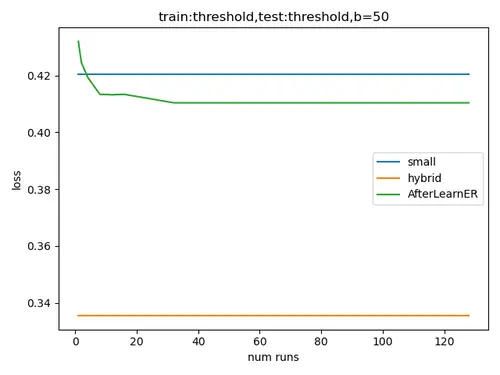

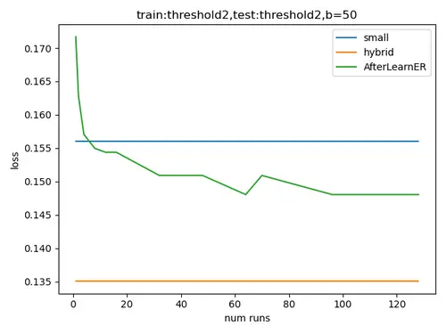

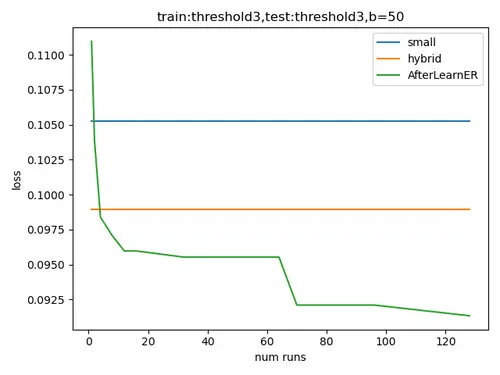

Figure 2. Depth Sensing: Average (over 60 runs) $`\aleph`$-losses on the
test set $`\mathcal{V}^{\prime}`$ of the small and hybrid models (the
baselines), and of the model optimized by AfterLearnER on Thresholds 1
(left), 2 (middle) or 3 (right), for different values of $`k`$ (x-axis),
with $`b=50`$.

#### 5.1.5. Discussion

Whereas AfterLearnER needs no more than 50 scalars of feedback in order
to improve the Small model, a larger budget allows it to sometimes
outperform the Hybrid model with just 300 scalars (e.g., $`k=6`$ and
$`b=50`$ in Figure 2). And though we used in the present case the large
MiDaS model as a ground truth for the sake of reproducibility, if the
feedback were to be asked to human raters, it would remain a reasonable
effort for small $`k`$s.

Furthermore, we observe that results are robust and are effectively
transferred to different loss functions (Appendix A).

### 5.2. Speech resynthesis: a few dozen of feedbacks for improving sound quality

TextLessLib (Kharitonov et al., 2022) is a deep learning library for
speech synthesis without text representations. It includes a demo of
speech resynthesis (Polyak et al., 2021) from low bit rates.

#### 5.2.1. Context

The discrete resynthesis operation can be viewed as a form of lossy
compression for speech. Approaches such as that of Polyak et al. (2021)
directly train in the waveform using an autoencoder, with adversarial
and reconstruction loss. Here, we directly optimize the Word Error Rate
(WER) (Kharitonov et al., 2022), which is not differentiable. We use
data and code from (Polyak et al., 2021), splitting the training data
into 75% for the $`\aleph`$-parameter optimization and 25% as a
post-optimization test set. The results can, therefore, not be compared
numerically to the results in the original work as we use additional
information. Nonetheless, the results show that a few dozen scalar
feedbacks are enough for a significant improvement.

#### 5.2.2. $`\aleph`$-parameter

AfterLearnER handles here two parameters of the Tacotron/Vocoder model
(Wang et al., 2017): the sigma in WaveGlow/inference (Prenger et al., 2019) and the denoiser strength. These two parameters are hard-coded in
the original code.

#### 5.2.3. $`\aleph`$-loss: Word-Error-Rate

This measure evaluates how accurately the audio can be transcribed after
compression, assessing how well the textless compression preserves
speech-specific characteristics and clarity. WER is computed through the
wav2vec 2.0-based (Baevski et al., 2020) and Automatic Speech
Recognition (ASR) system: the code compares the output with the
ground-truth transcription. The WER is also used to evaluate the
retrofitted model on the test set.

#### 5.2.4. Results: robust low budget quality improvement

The results of different parameterizations of AfterLearnER are presented
in Table 4. One can observe that picking up the best outcome from
multiple shorter internal runs (i.e., a large $`k`$ with a small budget
$`b`$ per run) yields the most favorable results. In certain instances,
the internal number of runs $`k`$ is even so large, and the budget per
run so limited that the approach resembles a random search (e.g., a
$`9.9\%`$ improvement observed with the best of 8 runs each having a
budget of 2). These experiments demonstrate that AfterLearnER can
significantly improve test results at a low $`\aleph`$-loss within a few
evaluations on a small validation set.

#### 5.2.5. Discussion

Table 4 shows that for this use case with minimal sample size, the
utilization of a high number of runs (and a smaller $`b`$) consistently
enhances performance in generalization, aligned with the theoretical
discussions presented in Section 3.3.2: such results experimentally
demonstrate the reduction of the risk of overfitting by using a large
number of runs and a small budget per run.

| Internal   | Budget | WER              | Average                   | Std. dev. |
| ---------- | ------ | ---------------- | ------------------------- | --------- |
| runs $`k`$ | $`b`$  | $`(\downarrow)`$ | improv. (%, $`\uparrow`$) | WER       |
|            | 2      | 7.488            | 4.511                     | 0.335     |
|            | 10     | 7.558            | 3.620                     | 0.202     |
|            | 40     | 7.736            | 1.361                     | 0.235     |
| 3          | 80     | 7.542            | 3.828                     | 0.298     |
|            | 2      | 7.306            | 6.837                     | 0.387     |
|            | 10     | 7.501            | 4.355                     | 0.147     |
|            | 40     | 7.751            | 1.163                     | 0.217     |
| 4          | 80     | 7.378            | 5.924                     | 0.201     |
|            | 2      | 7.222            | 7.908                     | 0.397     |
|            | 10     | 7.442            | 5.104                     | 0.130     |
| 5          | 40     | 7.803            | 0.502                     | 0.149     |
|            | 2      | 7.273            | 7.259                     | 0.417     |
| 6          | 10     | 7.433            | 5.216                     | 0.104     |
|            | 2      | 7.097            | 9.506                     | 0.361     |
| 7          | 10     | 7.398            | 5.661                     | 0.076     |
| 8          | 2      | 7.067            | 9.880                     | 0.344     |

Table 4. Word Error Rate ($`\aleph`$-loss) on the test set in textless
Speech Resynthesis for different numbers of internal runs $`k`$ and
different budgets $`b`$ per internal run. The baseline WER is 7.84. For
each pair $`(k,b)`$, several independent runs are run (at least 6 per
row – std dev in the last colum): 100% of contexts lead to an
improvement on average. The p-value (Section 4.2.4) over the 16
independent contexts, under the null assumption that the probability of
improvement is not greater than .5, is significant
(p-val$`\leq 1.6e-5`$). Consistently with Section 3.3.2, we observe low
overfitting and excellent performance for $`k`$ large.

### 5.3. Doom AI: Retrofitting for Deep Reinforcement Learning

#### 5.3.1. Context

We explore the application of AfterLearnER in the context of the game
“Doom”, in the framework defined by Lample and Chaplot (2017). Our study
focuses on two distinct setups: “Normal mode”, where the agent combats
10 bots, and “Terminator mode”, involving a confrontation with 20 bots.
As the base trained network, we use the agent defined in  (Lample and
Chaplot, 2017), which is trained in Normal mode.

#### 5.3.2. $`\aleph`$-parameter

We add a flattened action head of length 35 in the final layer of the
baseline network, where the output $`o`$ (of dimension 35) is adjusted
to $`o\cdot\exp\left(r\right)`$: These 35 scalars are the
$`\aleph`$-parameter to optimize.

#### 5.3.3. $`\aleph`$-loss: Kill/Death ratio

Since the main objective in Doom is to kill as many bots as possible
while minimizing your own deaths, we optimize the non-differentiable and
long-term objective of the kill/death ratio. However, this reinforcement
signal is very noisy: when $`k>1`$, it might happen that the comparison
between the different signals on the last iteration of each internal
run, is a wrong indicator of which of the $`k`$ runs is the best one.
So, instead of the last value of this kill/death ratio, we use a moving
average of the last $`8`$ values as the $`\aleph`$-loss returned to the
black-box optimizer.

#### 5.3.4. Results: AfterlearnER kills monsters in Doom

A clear improvement can be seen in Table 5. In that Table, the suffix 10
(resp. 100) refers to dividing the scale by 10, i.e., we use
$`\exp\left(0.1r\right)`$ (resp. $`\exp\left(0.01r\right)`$) instead of
$`\exp\left(r\right)`$. The suffix w20 means that we use $`P=20`$
parallel workers inside each of the $`k`$ internal runs, as opposed to a
single worker: this reduces the wall-clock computational cost, but also
the number of available feedbacks, as shown in Algorithm 5 in Appendix
B. Note that these experiments are run in preemptable mode on the
cluster, allowing for interruptions, hence the uncontrolled number of
internal runs $`k`$ in Table 5 (last column). We observe, nonetheless,
positive results in almost all cases.

Here, we use a single black-box optimization method $`o`$ in $`O`$ for
each experiment, but we repeat the experiment with distinct $`o`$ for
the sake of comparisons. We refer to Section 2.3 for more details about
the different algorithms mentioned in Table 5.

#### 5.3.5. Discussion

The terminator mode is a priori easier to optimize: the baseline agent
was originally optimized for normal mode, a priori leaving a more
significant gap of potential improvement by AfterLearnER for this
transfer learning.

In terminator mode, the best results are obtained by methods based on
DiscreteOnePlusOne. Therefore, we only used this optimization algorithm
for the normal mode, and we can observe an improvement over the baseline
in all cases. The validation score for TBPSA is the lowest: this is
because TBPSA (Khalidov et al., 2019) explores widely and tries to learn
from samples far away from the current optimum (as recommended
in (Beyer, 1998)). Its performance in the test is nonetheless among the
top 4.

|                 |                                  |                         |                      |                      |            |
| --------------- | -------------------------------- | ----------------------- | -------------------- | -------------------- | ---------- |
|                 |                                  | Total                   |                      | Average              | Number of  |
|                 | Optimizer                        | budget                  | Validation           | test                 | internal   |
|                 |                                  | $`\sum_{i\leq k}b_{i}`$ | score ($`\uparrow`$) | score ($`\uparrow`$) | runs $`k`$ |
|                 | Baseline                         |                         |                      | 3.61                 |            |
|                 | DiagonalCMAw20                   | 9348                    | 2.447                | 3.642                | 11         |
|                 | NoisyDisc(1+1)w20                | 6864                    | 3.590                | 3.616                | 15         |
|                 | Noisy(1+1)w20                    | 10880                   | 3.319                | 3.589                | 17         |
|                 | OptimDisc(1+1)10                 | 4500                    | 3.700                | 3.719                | 11         |
|                 | OptimDisc(1+1)w20                | 5980                    | 3.712                | 3.682                | 13         |
|                 | OptimNoisy(1+1)w20               | 6764                    | 3.651                | 3.685                | 14         |
|                 | ProgNoisyw20                     | 8028                    | 3.114                | 3.615                | 18         |
|                 | RecombPortOptimNoisyDisc(1+1)10  | 5400                    | 3.686                | 3.658                | 15         |
|                 | RecombPortOptimNoisyDisc(1+1)w20 | 5696                    | 3.630                | 3.639                | 17         |
|                 | SplitNoisyw20                    | 13144                   | 3.234                | 3.646                | 18         |
| Terminator mode | TBPSAw20                         | 5964                    | 2.404                | 3.678                | 15         |
|                 | Baseline                         |                         |                      | 3.31                 |            |
|                 | OptimDisc(1+1)100                | 51500                   | 3.382                | 3.356                | 87         |
|                 | OptimDisc(1+1)10                 | 31200                   | 3.419                | 3.399                | 50         |
|                 | OptimDisc(1+1)w20                | 6644                    | 3.380                | 3.430                | 20         |
|                 | RecombPortOptimNoisyDisc(1+1)100 | 46900                   | 3.453                | 3.447                | 75         |
| Normal mode     | RecombPortOptimNoisyDisc(1+1)10  | 19950                   | 3.346                | 3.329                | 36         |

Table 5. Results on Doom. The red marker indicates the only detrimental
run of AfterLearnER, which reduced test performance. For each of the 16
lines, we run AfterLearnER several times (at least 3 runs per row). The
p-value over these 16 lines (Section 4.2.4) is less than $`3.10^{-4}`$.

### 5.4. Code translation

#### 5.4.1. Context

Transcompilers perform code translation, i.e., convert source code from
one programming language to another while maintaining the same level of
abstraction. Unlike traditional compilers, which translate high-level
code to low-level languages like assembly, transcompilers focus on
translating between languages of similar complexity. This process is
useful for updating obsolete codebases or integrating code written in
different languages. Roziere et al. (2020) leverage unsupervised machine
translation techniques to develop a neural transcompiler. Trained on
source code from open-source GitHub projects, their transformer model
can accurately translate functions between C++, Java, and Python. This
method uses only monolingual source code, requires no specific language
expertise, and can be generalized to other programming languages. The
present section uses this neural transcompiler as a baseline, and
applies AfterLearnER before test/inference time (Algorithm 1) to improve
its performance.

#### 5.4.2. $`\aleph`$-parameter: linear rescaling

A linear rescaling layer (1024 weights) is added between the encoder and
the decoder, and these 1024 scalars are the $`\aleph`$-parameter to be
optimized.

#### 5.4.3. $`\aleph`$-loss: a diversity of criteria

Many criteria can be used for code translation: computational accuracy,
which checks that both programs’ outputs are equal for the same input,
code speed, code size, BLEU (Papineni et al., 2002), which checks the
correctness and readability of the code by measuring the similarity of
n-grams between generated code and reference code, adjusting for length.
Recent papers (Jiao et al., 2023) pointed out that overfitting or other
issues can arise, making the joint improvement of robust and diversified
criteria relevant, in particular on smaller but curated data sets. In
this work, we use either the computational accuracy (frequency of
obtaining a code which satisfies the requirements) or the BLEU (Papineni
et al., 2002)²² 2 From the abstract of (Papineni et al., 2002): BLEU is
a method of automatic machine translation evaluation that is quick,
inexpensive, and language-independent, that correlates highly with human
evaluation, and that has little marginal cost per run.. None of these
$`\aleph`$-losses is differentiable.

BLEU: C++ $`\to`$ Java BLEU: Python $`\to`$ C++  

  BLEU: Python $`\to`$ Java Comp. accuracy: Python $`\to`$ Java  

Figure 3. Results of AfterLearnER on several problems from  (Roziere
et al., 2020) with BLEU or Accuracy $`\aleph`$-losss (the lower the
better). Each curve is the average over 3 runs of AfterLearner with
$`k=1`$ (i.e., one internal run) and the set $`O`$ limited to a single
optimization method. The horizontal line is the baseline, i.e., without
any retrofitting. Note that if we remove Zero (which is a baseline run
for validation, which does not modify the baseline) and SQP (which does
not make sense for this dimensionality), AfterLearner is successful in
31 independent cases out of 32, with p-value $`\leq 1e-8`$
(Section 4.2.4).

#### 5.4.4. Results: AfterLearnER can code

Figure 3 compares the solutions obtained using AfterLearnER (with
different black-box optimizers $`o`$) to the baseline solution using a
feedback limited to $`b`$ ground truth scalar numbers ($`b`$ on the
$`x`$-axis). $`O`$ is restricted to a singleton $`\{o\}`$ (see $`o`$ in
the legend) and a single run ($`k=1`$).

The results obtained with AfterLearER improve over the baseline,
whatever the optimizer used, though some optimizers perform better than
others. Empirically, DiagonalCMA is often the best choice in this
context.

#### 5.4.5. Discussion

These experiments have been performed with the distribution of test
cases in the original code from Roziere et al. (2020), i.e., code size
limit at 100 tokens: we investigated the case of a limit 512, but
further work is needed on the dataset as there are redundancies between
validation and test in that context in particular when using
computational accuracy, which aggregates distinct but functionally
similar codes.

## 6. Online Mode Experiments

### 6.1. Evolutionary GAN: Facial Composites with Fairness

#### 6.1.1. Context: Improving diversity in the latent space of Evolutionary Interactive GANs.

Generative adversarial networks (GANs) (Berthelot et al., 2017; Riviere,
2019; Mirza and Osindero, 2014; Karras et al., 2018) are now a widely
used generative model. Interactive GANs (Bontrager et al., 2018; Rozière
et al., 2020) propose images to the user and repeatedly modify their
proposals based on the user’s feedback. We first present such an
interactive GAN, namely the one from (Rozière et al., 2020), presented
in an instance of AfterLearnER in online mode, namely  Algorithm 2.

Given that the human feedback is based on clicks, the black-box
optimizer $`o`$ must be a rank-based algorithm, i.e., it only uses
comparisons between fitnesses, regardless of actual values. Likewise,
the default value of $`o`$ is Lengler’s method (Doerr et al., 2019)
because it is the recommended variant of DiscreteOnePlusOne (see (Rapin
and Teytaud, 2018)). Despite the effectiveness of DiscreteOnePlusOne for
taking into account user feedback on the fly, unfairness due to the lack
of diversity remains an issue due to the so-called mode collapse. Thus,
it is frequently challenging to get some image classes (Zameshina
et al., 2022).

Therefore, we propose Algorithm 3, a variant of AfterLearnER for
choosing the seed parameter $`s`$ in Algorithm 2 so that it generates a
more diverse initial population. Algorithm 2 can be seen as having a
seed $`s`$ as $`\aleph`$-parameter, that we optimize with a simplified
AfterLearnER (Algorithm 3) as follows:

- •
  As a proxy of Algorithm 2, we use the user feedback on the initial
  screen generated by Algorithm 2 for a specific random seed $`i`$.
- •
  We optimize this random seed $`i`$ by enumerating $`30`$ possibilities
  and requesting user feedback: what are the 5 most diverse seeds?
- •
  Then, the algorithm uses one of the 5 preferred seeds (randomly
  drawn).

The motivation for randomly using one of the 5 preferred seeds is to
ensure that the code is still randomized and that repeated runs can have
some diversity even in the first iteration. Note that later iterations
are anyway randomized.

#### 6.1.2. $`\aleph`$-parameter: The random seed

Before running Algorithm 2, we optimize the “random” seed that produces
the most diverse initial images according to the user feedback, as
described in Algorithm 3.

#### 6.1.3. $`\aleph`$-loss: Interactive measure of diversity

To evaluate the efficiency of Algorithm 2, which now incorporates seed
optimization from Algorithm 3, various facial categories were targeted,
and the $`\aleph`$-loss measures the user’s satisfaction. We report the
number of iterations over 25-image screens required to achieve
satisfactory results in the user’s eye for each category. Here, we
measure diversity considering up to four categories: Female Asian,
Female Blonde, Male Black, and Male Blond (see Figure 11).

#### 6.1.4. Results: fairness improvement on various categories

Preliminary runs show that it is frequently hard to reach, as far as we
can tell from very long runs, some categories with the original version
of the algorithm (Algorithm 2) when the initial population is not
diverse enough. Hence our first experiment will check that several such
categories can be reached with our optimized “random” seed obtained
by Algorithm 3. On average, the algorithm achieves the desired outcomes
within $`3.0\pm 0.2`$ screen iterations over the four categories. We
conclude that this limitation was primarily due to the initial set of
faces on the presented screen belonging to the same category, thereby
creating a high hurdle for diverging from that specific cluster.

1: A black-box rank based optimizer $`o`$ $`\triangleright`$ by default
DiscreteLenglerOnePlusOne

2: $`\lambda`$, number of images per screen

3: $`\mu<\lambda`$ number of clicks (selected images) per screen

4: a GAN converting latent variables $`(c_{i})_{1\leq i\leq\lambda}`$ to
images

5: If $`s`$ is not specified, $`s\leftarrow`$ random()

6: From $`s`$, generate first $`\lambda`$ parametrizations
$`c_{1},\dots,c_{\lambda}`$

7: while user not satisfied do

8:   Display $`GAN(c_{1}),\dots,GAN(c_{\lambda})`$ to the user

9:   user clicks on $`\mu`$ images
$`(i_{1},\ldots,i_{\mu})\in\{1,\dots,\lambda\}^{\mu}`$

10:   Report to $`o`$ that the fitnesses of
$`c_{i_{1}},\ldots,c_{i\mu}`$ are greater than those of $`c_{j}`$ for
$`j\not\in\{i_{1},\dots,i_{\mu}\}`$

11:   $`o`$ gives back next $`\lambda`$ parametrizations
$`c_{1},\dots,c_{\lambda}`$

12: end while

Algorithm 2 Base algorithm from (Rozière et al., 2020) for generating
images as desired by users. Users only click on their favorite image, on
each screen.

1: $`\lambda`$, number of images per screen.

2: a GAN converting latent variables $`(c_{i})_{1\leq i\leq\lambda}`$ to
images

3: Randomly choose $`s_{1},\dots,s_{30}`$ random seeds

4: for $`1\leq i\leq 30`$ do $`\triangleright`$ Surrogate of Algorithm 2
with random seed $`i`$

5:   GAN generates $`\lambda`$ images using seed $`i`$
$`\triangleright`$ similarly to Algorithm 2, 6.

6:   Display this screen to the user

7: end for

8: ask the user for the 5 most diverse screens $`i_{1},\dots,i_{5}`$
$`\triangleright`$ Human Feedback

9: 5 of Algorithm 2 becomes "$`s\leftarrow`$
random-choice$`([i_{1},\dots,i_{5}])`$"

Algorithm 3 AfterLearnER for seed optimization: after running this
algorithm, the random seed (5 of Algorithm 2) becomes “Initialize $`o`$
with a random choice of $`s`$ in an optimized subset of 5 seeds”.

#### 6.1.5. Discussion

This experiment is a combination of (Rozière et al., 2020) and a
straightforward application of AfterLearnER to optimize its “random”
seed: in spite of its simplicity, this approach solves a real diversity
problem and is a reminder that taking care of a seed can have a big
impact (as also reported in (Ventos et al., 2017), which applied seed
optimization for winning a world computer championship of bridge). For
more technical novelty, Section 6.2 extends this work to 3D GANs, adds
surrogate models, and considers local convergence (see the
“evolutionary” version). Section 6.3 extends it to latent diffusion
models, and Section 6.4 adds Voronoi crossovers.

### 6.2. EG3D-cats: local and global optimization of a surrogate model

#### 6.2.1. Context: Offline optimization of the latent variable thanks to a surrogate model

EG3D-cats (Chan et al., 2022) is a pioneering work in 3D GANs, with
impressive results. In the present Section, we improve EG3D-cats by
learning in the latent space: instead of randomly drawing a latent
variable $`z`$, we learn a surrogate model of image quality and use it
to optimize the input $`z`$ to the GAN, in order to avoid $`z`$’s
leading to low quality.

##### Building the surrogate model

We proceed as follows:

- •
  Generate 200 images corresponding to 200 randomly chosen latent
  variables $`z`$.
- •
  Get binary user feedback: good or bad, for each image.
- •
  Train a decision tree (we use the scikit-learn
  implementation (Pedregosa et al., 2011)) to approximate the
  probability, for a given latent variable $`z`$, that it generates a
  bad image: $`tree(z)\approx P\left(bad|z\right)`$.

#### 6.2.2. $`\aleph`$-parameter:

The latent variable $`z`$ of EG3D-cats: dimension 512.

#### 6.2.3. $`\aleph`$-loss: The surrogate model

We propose two variants of the algorithm, both using the trained
decision tree described above to optimize the $`\aleph`$-parameter
$`z`$:

- •
  The random search variant applies random search on $`tree`$: Randomly
  draw $`z`$ until $`tree(z)=0`$, i.e., the trained decision tree
  predicts that the image will be ok.
- •
  The evolutionary version (searching for local modifications) applies
  NGOpt on the objective function
  $`l:x\mapsto tree(z_{0}+\epsilon\cdot x)`$ for some randomly drawn
  $`z_{0}`$. For a small $`\epsilon`$ (e.g., $`1\mathrm{e}{-2}`$), the
  final value is close to the starting point $`z_{0}`$, thus preserving
  the diversity of the original GAN: this is the main advantage of the
  evolutionary version compared to the random search. Note that the
  evolutionary version works in $`{\mathbb{R}}^{n}`$ and has, therefore,
  no theoretical guarantee of staying close to $`z_{0}`$: however, it is
  initialized with normal random variables, and therefore the small
  $`\epsilon`$ implies that it searches in the neighborhood of $`z_{0}`$
  first.

In both cases, we stop at a budget of 10000. To evaluate the approach,
we use human raters to assess the improvement between the initial $`z`$
and the optimized $`z`$. The humans (not working in the computer science
field) are presented with a cat generated by EG3D-cats and a cat
generated by AfterLearnER: they choose the cat image they prefer or
click on “no preference”. The success rates are evaluated among cases in
which they do have a preference. For the evolutionary variant, raters
have to choose one of both cat images, but only images for which the
initial $`z_{0}`$ was not satisfactory (i.e. $`P(bad|z_{0})>0`$) are
presented: these statistical comparisons are based on paired data, i.e.,
$`z_{0}`$ vs $`z_{0}+\epsilon\cdot x^{\star}`$ with $`x^{\star}`$
recommended by the optimization run. Figures 4 and 5 present some
qualitative results before and after the evolution done by AfterLearnER.

#### 6.2.4. Results: offline improvement of the model

The results, with 4 human raters, are presented in Table 6. In all
setups, we observe an improvement when using AfterLearnER compared to
vanilla EG3D (i.e., all numbers are larger than $`50\%`$). The most
significant improvement is seen in the enhancement of faces, with 90% of
cases showing a modification. Of course, the different random seeds used
for computing these statistics are distinct from those used for creating
the training set of 200 images.

| Initial model        | Proposed method | Frequency of improvement $`(\uparrow)`$ | Remark |
| -------------------- | --------------- | --------------------------------------- | ------ |
| afhqcats512-128      | Random search   | 65% (160 images)                        | Cats   |
| afhqcats512-128      |                 | 71% (193 images)                        | Cats   |
| ffhqrebalanced512-64 | Evolution       | 90% (180 images)                        | Faces  |

Table 6. Results of the AfterLearnER improvement of the EG3D-cats
algorithm with human raters, using a double-blind interface with
randomized left/right positioning of compared images: the percentage
shows how frequently our method outperformed the vanilla LDM according
to human raters.

Figure 4. Example of evolution: unmodified cat (bottom) generated by
EG3D-cats and its evolutionary counterpart (top). Left: the ears have
been significantly improved, while the neck is improved on the right.

Figure 5. Example of evolution: unmodified cat (bottom) generated by
EG3D-cats and its evolutionary counterpart (top). In both cases, the
mouth has been significantly modified, though it is still not perfect.

#### 6.2.5. Discussion

We demonstrated that it is possible to learn a good approximation of the
set of $`z`$’s that lead to errors using a decision tree at a reasonable
cost: labelling 200 examples is feasible for a motivated human.

### 6.3. LDM: learning a surrogate model on 200 human feedbacks

#### 6.3.1. Context: Using feedback to steer the model output towards human preferences.

Latent Diffusion Models (LDM) (Rombach et al., 2022) recently provided
impressive results in text-to-image generation: a prompt conditions the
output. This section is based on (Videau et al., 2023), and applies the
same techniques on latent models as in Section 6.2.

##### Building the surrogate model

- •
  Generate 200 images on the prompt “a photograph of an astronaut riding
  a horse”.
- •
  Get a binary user feedback: good or bad, with a special emphasis on
  the quality of crops.
- •
  Train a classifier to approximate the probability, for a given latent
  variable $`z`$, that it generates a bad image:
  $`tree(z)\simeq P\left(bad|z\right)`$.

Depending on the experiment, the classifier is a decision tree or a
neural network, and we use the scikit-learn implementation in both
cases (Pedregosa et al., 2011)³³ 3 We use MLPClassifier(solver=’lbfgs’,
alpha=1e-5, hidden_layer_sizes=(5, 2), random_state=1)  and  
tree.DecisionTreeClassifier(). .

#### 6.3.2. $`\aleph`$-parameter

The latent variables of LDM.

#### 6.3.3. $`\aleph`$-loss: The Surrogate Model

As in Section 6.2.1, we use the trained decision tree as AfterLearnER
$`\aleph`$-loss to determine an optimal latent value $`z`$ that
minimizes $`tree(z)\approx P\left(bad|z\right)`$. The optimization is
stopped as soon as it reaches some $`z`$ satisfying
$`tree\left(z\right)=0`$.

To assess the effectiveness of this approach, we rely on human raters.
Specifically, raters are asked: “Is the crop of this image of top
quality and does it include the entire astronaut and horse?” We refer to
this evaluation metric as the ’satisfaction rate’.

#### 6.3.4. Results

The training is done on images labeled by us, and the performance is
measured on other generated images with/without AfterLearner, with
different seeds. The human raters, in randomized order among the 4
tested methods, work in double-blind. The prompt is “A photograph of an
astronaut riding a horse”. The results are presented in Table 7. We
observe progress in all contexts: the frequency of poorly cropped images
dramatically decreases.

| Experimental setup       | Optimizer         | Loss          | Satisfaction rate $`(\uparrow)`$ |
| ------------------------ | ----------------- | ------------- | -------------------------------- |
| LDM                      |                   |               | 2.9% (486)                       |
| LDM+AfterLearnER         | Random search     | Decision tree | 5.1 % (98)                       |
| LDM+AfterLearnER         | Lengler           | Decision tree | 5.6 % (180)                      |
| LDM+AfterLearnER         | Discrete$`(1+1)`$ | Neural net    | 6.7 % (104)                      |
| Average LDM+AfterLearnER |                   |               | 5.7 % (382)                      |

Table 7. Results of AfterLearnER on LDM. Between parenthesis the number
of rated images. The overall comparison LDM vs. AfterLearnER+LDM is
statistically significant, with p-value 0.04 for Fisher’s exact test.
The ’satisfaction rate’ is described in Section 6.3.3. The p-value
(Section 4.2.4) for the difference between LDM (2.9% on 486 runs) and
the average case (5.7% on 382 runs) is p-val$`=0.02`$.

#### 6.3.5. Discussion:

This success looks surprising: how can we learn something with 200
examples, whereas the latent space has dimension
$`4\cdot 64\cdot 64=16384`$? Nevertheless, the results presented in the
next Section will confirm these results, switching to an online context,
with an even lower budget.

### 6.4. LDM with online human feedback, learning from 15 images

#### 6.4.1. Context:

In order to double-check the results above (successful inference from a
few data points in a huge latent space), we perform the following
experiment:

- •
  15 images are generated with the same text input.
- •
  The users select their five favorite images.
- •
  Learning a “local” surrogate model on the fly: these (at most 5)
  favorite images are separated from the other 10, using scikit-learn
  neural network.
- •
  Similarly to both previous sections, we minimize the probability of
  generating bad images (according to the local surrogate model) using
  Nevergrad (Lengler algorithm (Doerr et al., 2019)), with an initial
  point created by crossover based on the favorite images as parents (as
  proposed in (Videau et al., 2023) and as detailed below).

##### Application of the crossover operator for 2 parents

The vanilla optimization by Nevergrad is here improved by creating a
starting point for the optimization run built using a specific crossover
operator, so-called Voronoi crossover (Hamda et al., 2002; Seo and Moon,
2002; Pehlivanoglu, 2012; Seo et al., 2005; Videau et al., 2023), in
order to provide a better merging between different individuals than by
geometric averages: the Voronoi split between $`z_{1}`$ and $`z_{2}`$
for getting a child corresponding to a crossover between images with
latent variables $`z_{1}`$ and $`z_{2}`$ (Algorithm 4). These Voronoi
combinations are used as starting points for the optimization by
AfterLearnER.

Latent variables $`z_{1}`$ and $`z_{2}`$, coordinates
$`p_{1}\in I_{1}=LDM(z_{1})`$ and $`p_{2}\in I_{2}=LDM(z_{2})`$.

Create a new latent variable $`z`$ of same shape as $`z_{1}`$ and
$`z_{2}`$.

for each $`p`$ spatial coordinate in $`z`$. do

  if $`||p_{1}-p||<||p_{2}-p||`$ then

   $`z(p)=z_{1}(p)`$

  else

   $`z(p)=z_{2}(p)`$

  end if

end for

Algorithm 4 Pseudo-code for the crossover of images with latent
variables $`z_{1}`$ and $`z_{2}`$, at points $`p_{1}`$ and $`p_{2}`$.
Here, the user has selected the point $`p_{1}`$ in the image generated
from the latent variable $`z_{1}`$ and the point $`p_{2}`$ in the image
generated from the latent variable $`z_{2}`$, out of 15 images. Latent
variables are tensors with shape $`64\times 64\times 4`$.

##### Application of the crossover operator for more than 2 clicks by users

Two modifications of Algorithm 4 are needed. First, we might have more
than 2 images chosen by the user, so we extend Algorithm 4 to more than
two images. Second, we need to create more than one offspring, so that
randomization is necessary. For these two extensions, we follow (Videau
et al., 2023): let us consider $`k`$ clicks, with positions
$`p_{1},\dots,p_{k}`$, in images built on latent variables
$`z_{i_{1}},\dots,z_{i_{k}}`$. Each offspring image
$`I_{Voronoi}=G(z_{Voronoi})`$ is built by constructing a latent
variable $`z_{Voronoi}`$ as in Figures 3-5.

```math
\displaystyle r \displaystyle\mbox{ is randomly drawn uniformly in }[1,2] \tag{3}
```

```math
\displaystyle z_{Voronoi}(x) \displaystyle= \displaystyle z_{i_{j}}(x)\mbox{ if }\ \forall u\neq j,||x-p_{j}||<\frac{1}{r}||x-p_{u}|| \tag{4}
```

```math
\displaystyle z_{Voronoi}(x) \displaystyle\sim \displaystyle\mathcal{N}(0,\,1)\mbox{for each channel otherwise} \tag{5}
```

#### 6.4.2. $`\aleph`$-loss

To evaluate this approach, we use a specific prompt and quality
criterion (see below). We generate a batch of images with the vanilla
LDM, and a second batch, using AfterLearnER, after selection of the 5
best by the user.

We then compare the number of images that fit the given criterion in the
initial batch (no user feedback) and in subsequent batches (i.e., with
user feedback).

#### 6.4.3. Results

AfterLearnER was tested on three different setups:

- •
  First setup: the prompt is “A close-up photographic portrait of a
  young woman with colored hair.”. We consider images 15 to 28, in 2
  cases: first case, the user selects red hair; and second case, the
  user selects blue hair. Observation: the next generation by
  AfterLearnER + LDM have dramatically greater proportions of red hair
  (resp. blue hair). Results are presented in Figure 6.
- •
  Second context: “fighting Cthulhu in the jungle”. For the second setup
  (Figure 7, Figure 8), we present more sophisticated experiments with
  celebrities fighting Cthulhu. We observe a moderate improvement, on
  this easy setting of very famous people: some people, like X Y
  (anonymized celebrity), are easier to generate in arbitrary contexts,
  so that the classical LDM performs well. The prompt becomes much
  harder for a scientist like Yann LeCun: in this harder setting, the
  improvement becomes much greater (Figure 9).
- •
  Third setup, we now check that AfterLearnER can also have an impact on
  realism. We just ask for “Medusa” and feed AfterLearnER with the
  realism opinion of the user. The second batch uses preferences
  mentioned by the user in the first batch, then the third batch uses
  preferences mentioned by the user in the second batch, and so on. Each
  batch improves over the previous one. Within 3 batches of 14 images,
  we get way more realistic portraits of Medusa (Figure 10).

Results are aggregated in Table 8. They are always positive, with a
clear gap in 3 out of 4 contexts.

#### 6.4.4. Discussion

In each setup, we increase the proportion of images that fit specific
criteria. This approach is particularly effective for generating images
that are difficult to produce by default, such as “Yann LeCun fighting
tentacles in the Jungle.” In these challenging scenarios, the
text-to-image model struggles to combine elements like Yann LeCun, a
jungle, and tentacles. However, by selecting the right images, we can
guide the model to produce outputs that better match user preferences,
showing the effectiveness of the proposed approach.

|        |        |                             |                         |
| ------ | ------ | --------------------------- | ----------------------- |
| Figure |        | Context                     | Observation             |
|        | Top    | 2nd batch, after FB         | Mostly red hair         |
| Fig.   |        | on red hair in batch 1      |                         |
| 6      | Bottom | 2nd batch, after FB         | All blue hair           |
|        |        | on blue hair in batch 1     |                         |
|        | Top    | Initial batch               | Success 11/14           |
| Fig.   | Middle | Batch 2 after FB on batch 1 | Success 12/14           |
| 7      | Botom  | Batch 3 after FB on         | Success 13/14           |
|        |        | batches 1 and 2             |                         |
| Fig.   | Top    | Initial batch               | Success $`\simeq 30\%`$ |
| 9      | Bottom | After FB on the 1st batch   | Success $`\simeq 71\%`$ |
| Fig.   | Top    | Initial batch               | Low quality             |
| 10     | Middle | After FB on 1st batch       |                         |
|        | Bottom | After FB on batches 1 and 2 | High quality            |

Table 8. Overview of our low-budget image generation experiments. FB
refers to user feedback (clicks on the preferred images inside a screen
presenting a batch of images). For  Figure 10 the quality is not
measured by quantified metrics and the reader can compare the top 2 rows
to the bottom 2 rows there.

The user selects red hair. Images 15 to 28, after a warm up of 14
images.

The user selects blue hair. Images 15 to 26, after a warm up of 14
images.

Figure 6. LDM with prompt “A close up photographic portrait of a young
woman with colored hair”. We present generated images, after a warm up
over 14 images. The only difference between top and bottom is that the
user clicks differently during the first batch. We observe variations in
the necklaces and eyes when the rest of the image looks similar. In
spite of the very low budget (the human user provides feedback on 14
images only) there is a clear increase in the target hair color.

First batch of 14 images. Tentacles: in 11 images. XY is the only human:
in 12 images.

Second batch of 14 images. Tentacles in 12 images. XY is the only human:
in all images.

Third batch of 14 images. Tentacles: in 13 images. XY is the only human:
in all images.

Figure 7. XXX YYY (anonymized) fighting tentacles in the jungle. The
original LDM is already good here, but we observe an increased frequency
of XXX YYY and an increased frequency of tentacles in the new batches. A
more challenging task is proposed in Figure 9.

Figure 8. XY (anonymized) fighting tentacles in the jungle, selection of
best images, less than 50 runs of LDM, one minute per LDM run with
default parameters on a Mac M1.

Initial generations of 15 images, by the vanilla LDM code. Tentacles in
4 or 5 images, over 15: tentacles are difficult to obtain when a
scientist is in the picture.

After selection of the 5 preferred images out of the 15 above, 14 new
generations by AfterLearnER. Tentacles in 10/14 images.

Figure 9. A scientist fighting tentacles in the jungle. The frequency of
tentacles has increased a lot. All images have significant differences
in terms of position. We observe again that 15 images evaluated by the
user are enough for a meaningful impact.

Figure 10. Medusa. Top two rows: first batch, i.e., equivalent to
default LDM. Rows 3 and 4: second generation, after clicking on the most
realistic image of the first batch. Rows 5 and 6: generation 3, after
clicking on the two most realistic images of generation 2. Colors become
better, and sus-sternal dimples appear. We observe that a user feedback
about 2 generations of images are enough for improving outputs.

## 7. Overview and discussion

### 7.1. Overview

All results in the present paper come from applying AfterLearnER after a
classical ML pipeline.

Depth sensing (Section 5.1): We use the small MiDaS model and optimize
$`\aleph`$-parameters on a small dataset. More precisely, 300 images are
used for optimizing $`\aleph`$-parameters by distillation of the big
MiDaS model so that we get test errors better than the original Small
MiDaS, or even (in some cases) the Hybrid MiDaS. These results only
require 50 scalars of feedback for adapting a model to different loss
functions. In this benchmark, the loss is not differentiable either.

Speech resynthesis (Section 5.2): We use the checkpoint previously tuned
in  (Kharitonov et al., 2022) and optimize two $`\aleph`$-parameter on
75% of the test set and check on the remaining test data. This is a
simple experiment with just two constants, hardcoded in the original
code, optimized on a small dataset. The numbers are not directly
comparable to the original work as we use a split of the test set: but
we show that a small feedback (40 scalars) on a split of the test set is
enough for, on average, an improvement on the rest of the test set.
Compared to (Ranzato et al., 2016), we do a fast distribution shift and
not a whole training.

Doom/Arnold (Section 5.3): In this reinforcement learning context, we
use the same simulator as the one used in the original paper/code. This
consistency allows for a direct comparison of our results. We observed
enhanced outcomes primarily because we focused on optimizing the actual
objective function.

Transcoder (Section 5.4): We use the same training/validation data as in
the GitHub repository of (Roziere et al., 2020). We immediately observe
an improvement (Figure 3) only using a few hundred scalars. We do not
use any information about the objective function, so we could have an
online estimator such as speed, memory consumption or elegance — which
cannot be done with the original supervised learning.

Interactive GAN (Section 6.1): The results here are close to those
in (Rozière et al., 2020), but obtained faster using discrete
optimization (Doerr et al., 2019) and tools (Videau et al., 2023), and
we improved diversity by optimizing the initialization as
in Algorithm 3. Experimental results show that eight clicks are
sufficient for most cases, with three clicks (on average) for our chosen
classes.

3D Gan EG3D for AFHQ (cats) (Section 6.2): With 200 feedbacks, we built
a more realistic EG3D-cats, outperforming state-of-the-art in
three-dimensional cats and three-dimensional face generation.

LDM (Section 6.3) : We provide an interactive counterpart of LDM. The
fact that it works is quite counter-intuitive: the latent space has
dimension $`4\cdot 64\cdot 64`$. We perform several tests with hair
color, image quality, and realism, and results are repeatedly confirmed.
They are in line with user needs: whereas most LDM users (in particular
in the new field of prompt engineering for txt2img) do many independent
rerolls, we guide these rerolls using previous results. Section 6.4
presents results in a very low budget case.

### 7.2. Discussion

Before detailing the experimental validation, we take a look at the a
priori benefits of retrofitting on the problems described in Table 2,
according to the rationale developed in Section 3.3.

Table 2 shows, in particular, the different sizes of the feedback used
in the following. It can always be provided by humans or computationally
expensive solvers. Regarding RLHF (Reinforcement Learning with Human
Feedback – such as EG3D, LDM, Facial Composites), we consider feedback
limited to dozens or hundreds of scalars (far less than most works as
discussed in Section 2.2.1).

For facial composites (Section 6.1), speech re-synthesis (Section 5.2)
and depth sensing (Section 5.1), the number of runs is $`k=1`$ because
of the computational cost (for depth and speech) or limited human
attention span (for facial composites and latent diffusion models).

Our approach requires less data and utilizes feedback at a more
aggregated level, compared to most RLHF (Zhu et al., 2023) and Human In
The Loop Reinforcement Learning (HITLRL (Arakawa et al., 2018))
approaches. Specifically, our approach needs only one objective function
value per parametrized model and dataset. In contrast, classical
stochastic-gradient methods require one objective function value and one
gradient value per parameterized model and per data point. The process
is hence compatible with evaluation by humans, who can study an entire
system output, and compare on key points (see e.g., human feedback for
interactive GAN Section 6.1), or with end-of-episode (delayed)
evaluations by complex simulators (e.g., VizDoom (Kempka et al., 2016)
for Doom, in Section 5.3) or non-differentiable computational accuracy
(in code translation, Section 5.4).

## 8. Conclusions

This paper demonstrates the potential of integrating small-scale
feedback directly into the optimization process, as in retrofitting,
through black-box optimization approaches. Likewise, such a strategy is
especially beneficial for optimizing a few scalars using a
non-differentiable criterion, a common challenge in various fields. That
way, we provide substantial improvements in state-of-the-art Deep
Learning (DL) applications, e.g., use cases such as Doom and code
translation. Furthermore, our methodology enables the generation of
facial composites with minimal user interaction, requiring as few as
three interactions for getting a first approximation. Similarly, we
optimize $`\aleph`$-parameters for depth estimation, language
translation, and speech synthesis. Our method requires only dozens to
hundreds of (e.g., human) evaluations to achieve significant
improvements. Additionally, we have enhanced the EG3D-cats model with a
streamlined codebase, illustrating our approach’s versatility and
practicality (see Algorithm 8 in appendix F). Overall, our findings
underscore the value of human-in-the-loop methodologies or
simulation-based feedbacks in refining DL solutions across various
domains without relying on thousands of feedbacks.

We make the following recommendations for the use of AfterLearnER:

- •
  Consider problems in which the actual objective is not differentiable
  and is hence typically approximated for gradient-based training by
  various proxies, or by ad-hoc reward shaping.
- •
  Apply AfterLearER after the classical gradient-based training, and
  without any backprop retraining.
- •
  Restrict the $`\aleph`$-parameter to key parameters: typically, some
  parameters at the input or output transformations, or a single layer,
  as small as possible. Dimensions in the 1000s is manageable in a
  black-box manner (though this, of course, depends on the budget), but
  we prefer as much as possible small families of parameters that
  intersect all paths from input to output.
- •
  Increasing the number of runs (parameter $`k`$), or the parallelism
  $`\lambda`$, makes the code closer to random search, and less prone to
  overfitting, as predicted by the theoretical analysis of Section 3.3.2
  and confirmed in the experiments.

We emphasize the concept of small aggregated anytime feedback
(Section 3.3.4). While we did a part of our experiments from
automatically computed feedback (e.g., word error rate based on programs
for speech synthesis or the biggest MiDaS model in depth estimation),
AfterLearnER uses an aggregated feedback, which could be provided by
humans or expensive simulators, based on a global experience of the
system, without the need for fine grain feedback. Also, this shows a
clear generalization: compared to systems using millions of fine-grained
feedbacks, our system can not so easily “cheat” (overfit) using
redundancies between train/validation and testing.

### Limitations and further work

Most of the feature construction was performed by DL: what we propose
can be added on top of a DL solution, but does not replace it. We
outperform Arnold for Doom, but only with Arnold and its reward shaping
as an excellent starting point. The situation is similar for speech
resynthesis, interactive generation, and depth sensing. In the case of
the Transcoder, we manage to optimize a few weights of the checkpoint
within a few dozen evaluations.

Maybe some of our results could be improved by applying AfterLearnER on
several layers in turn: in the present paper, we only heuristically
guessed which parameters to optimize and did not investigate larger
search spaces. This might be particularly true for cases in which we can
generate new data with a simulator, as in the case of Doom
(Section 5.3).

Improving generalization by searching for flat optima is a challenging
topic (He et al., 2019; Baldassi et al., 2020; Hoffer et al., 2017),
mostly explored for gradient-based optimization of weights: our context
(black-box optimization, validation set, after training) is specific,
promising, and deserves exploration. This includes the theory
in Section 3.3.2.

Multi-objective extensions seem to be natural for Arnold/Doom (using the
various reward shaping criteria used in the original code) and for code
translation, where BLEU and comp. acc. are completely different
measures, and for the many criteria of depth sensing: there exist many
multi-objective variants of black-box optimizers.

The present paper demonstrated the applicability of AfterLearnER, with
experiments reproducible with a relatively low budget. Some obvious
further works include the large-scale application on unsolved problems,
such as fighting hallucinations in large language models or optimizing
code translation for speed.

(a) Female Asian

(b) Male Black

(c) Blonde male

(d) Sarcastic female (4)

(e) Sad man (3)

(f) Red haired female (2)

Figure 11. First 3 images (top, and middle left): examples corresponding
to female Asian, male black, and blonde male, respectively, i.e., 3
categories used in our experiment. The 3 other images are test cases
with labels not provided in the tuning in Algorithm 3: they show the
versatility of the method. The number in parentheses is the number of
clicks before obtaining the result. None of the faces presented here
corresponds to a real-world person: these faces are obtained by
optimization through Algorithm 2.

## Acknowledgements

The authors thank the reviewers for their insightful and constructive
feedback, which has substantially improved the quality of this work. AL
acknowledges support from the French National Research Agency (ANR)
under Grant No. ANR-23-CPJ1-0099-01.

## References

- Abramson et al. (2022) Josh Abramson, Arun Ahuja, Federico Carnevale,
  Petko Georgiev, Alex Goldin, Alden Hung, Jessica Landon, Jirka Lhotka,
  Timothy Lillicrap, Alistair Muldal, George Powell, Adam Santoro, Guy
  Scully, Sanjana Srivastava, Tamara von Glehn, Greg Wayne, Nathaniel
  Wong, Chen Yan, and Rui Zhu. 2022. Improving Multimodal Interactive
  Agents with Reinforcement Learning from Human Feedback.
  arXiv:2211.11602
- Adams et al. (2022) Stephen Adams, Tyler Cody, and Peter A.
  Beling. 2022. A survey of inverse reinforcement learning. _Artif.
  Intell. Rev._ 55, 6 (aug 2022), 4307–4346.
- Arakawa et al. (2018) Riku Arakawa, Sosuke Kobayashi, Yuya Unno, Yuta
  Tsuboi, and Shin-ichi Maeda. 2018. Dqn-tamer: Human-in-the-loop
  reinforcement learning with intractable feedback. _arXiv:1810.11748_
  (2018).
- Artelys (2015a) SME Artelys. 2015a.
  [https://www.artelys.com/news/159/16/KNITRO-wins-the-GECCO-2015-Black-Box-Optimization-Competition](https://www.artelys.com/news/159/16/KNITRO-wins-the-GECCO-2015-Black-Box-Optimization-Competition)
- Artelys (2015b) SME Artelys. 2015b. Artelys SQP Wins the BBCOMP
  competition.
  [https://www.ini.rub.de/PEOPLE/glasmtbl/projects/bbcomp/index.html](https://www.ini.rub.de/PEOPLE/glasmtbl/projects/bbcomp/index.html).
- Assunção et al. (2019) Filipe Assunção, Nuno Lourenço, Penousal
  Machado, and Bernardete Ribeiro. 2019. DENSER: Deep Evolutionary
  Network Structured Representation. _Genetic Programming and Evolvable
  Machines_ 20 (03 2019).
- Awad et al. (2020) Noor Awad, Gresa Shala, Difan Deng, Neeratyoy
  Mallik, Matthias Feurer, Katharina Eggensperger, Andre’ Biedenkapp,
  Diederick Vermetten, Hao Wang, Carola Doerr, Marius Lindauer, and
  Frank Hutter. 2020. Squirrel: A Switching Hyperparameter Optimizer.
  arXiv:2012.08180
- Bäck et al. (1997) Th. Bäck, D.B. Fogel, and Z. Michalewicz
  (Eds.). 1997. _Handbook of Evolutionary Computation_. Oxford
  University Press.
- Baevski et al. (2020) Alexei Baevski, Yuhao Zhou, Abdelrahman Mohamed,
  and Michael Auli. 2020. wav2vec 2.0: A framework for self-supervised
  learning of speech representations. _Advances in neural information
  processing systems_ 33 (2020), 12449–12460.
- Baldassi et al. (2020) Carlo Baldassi, Enrico M. Malatesta, Matteo
  Negri, and Riccardo Zecchina. 2020. Wide flat minima and optimal
  generalization in classifying high-dimensional Gaussian mixtures.
  arXiv:2010.14761 (2020).
- Berthelot et al. (2017) David Berthelot, Tom Schumm, and Luke
  Metz. 2017. BEGAN: Boundary Equilibrium Generative Adversarial
  Networks. _CoRR_ abs/1703.10717 (2017). arXiv:1703.10717
- Beyer (1998) Hans-Georg Beyer. 1998. Mutate large, but inherit small!
  On the analysis of rescaled mutations in ( $`(1,\lambda)`$-ES with
  noisy fitness data. In _Parallel Problem Solving from Nature — PPSN
  V_. Springer, 109–118.
- Birkl et al. (2023) Reiner Birkl, Diana Wofk, and Matthias
  Müller. 2023. Midas v3. 1–a model zoo for robust monocular relative
  depth estimation. _arXiv:2307.14460_ (2023).
- Bonferroni (1936) Carlo Bonferroni. 1936. Teoria statistica delle
  classi e calcolo delle probabilita. _Pubblicazioni del R Istituto
  Superiore di Scienze Economiche e Commericiali di Firenze_ 8 (1936),
  3–62.
- Bontrager et al. (2018) Philip Bontrager, Wending Lin, Julian
  Togelius, and Sebastian Risi. 2018. Deep Interactive Evolution. _7th
  International Conference on Computational Intelligence in Music,
  Sound, Art and Design_ (2018).
- Burkholz (2024) Rebekka Burkholz. 2024. Batch normalization is
  sufficient for universal function approximation in CNNs. In _The 12th
  International Conference on Learning Representations_.
- Cauwet and Teytaud (2016) Marie-Liesse Cauwet and Olivier
  Teytaud. 2016. Noisy Optimization: Fast Convergence Rates with
  Comparison-Based Algorithms. In _Genetic and Evolutionary Computation
  Conference_. 1101–1106.
- Chan et al. (2022) Eric R. Chan, Connor Z. Lin, Matthew A. Chan, Koki
  Nagano, Boxiao Pan, Shalini De Mello, Orazio Gallo, Leonidas Guibas,
  Jonathan Tremblay, Sameh Khamis, Tero Karras, and Gordon
  Wetzstein. 2022. Efficient Geometry-aware 3D Generative Adversarial
  Networks. In _CVPR_.
- Chen et al. (2022) Dian Chen, Dequan Wang, Trevor Darrell, and Sayna
  Ebrahimi. 2022. Contrastive Test-Time Adaptation. In _IEEE/CVF
  Conference on Computer Vision and Pattern Recognition_. 295–305.
- Chiu et al. (2019) Billy Chiu, Simon Baker, Martha Palmer, and Anna
  Korhonen. 2019. Enhancing biomedical word embeddings by retrofitting
  to verb clusters. In _BioNLP@ACL_.
- Chiu et al. (2015) Shih-Yuan Chiu, Ching-Nung Lin, Jialin Liu,
  Tsang-Cheng Su, Fabien Teytaud, Olivier Teytaud, and Shi-Jim
  Yen. 2015. Differential Evolution for Strongly Noisy Optimization: Use
  1.01^(n) Resamplings at Iteration n and Reach the -1/2 Slope. In _IEEE
  Congress on Evolutionary Computation_.
- Dang and Lehre (2016) Duc-Cuong Dang and Per Kristian Lehre. 2016.
  Self-adaptation of Mutation Rates in Non-elitist Populations. In
  _Parallel Problem Solving from Nature - PPSN XIV - 14th International
  Conference_. 803–813.
- Dawson (2007) Richard Dawson. 2007. Re-engineering cities: a framework
  for adaptation to global change. _Philosophical Transactions of the
  Royal Society A: Mathematical, Physical and Engineering Sciences_ 365,
  1861 (2007), 3085–3098.
- Dixon and Eames (2013) Tim Dixon and Malcolm Eames. 2013. Scaling up:
  the challenges of urban retrofit. _Building research & information_
  41, 5 (2013), 499–503.
- Doerr et al. (2019) Benjamin Doerr, Carola Doerr, and Johannes
  Lengler. 2019. Self-Adjusting Mutation Rates with Provably Optimal
  Success Rules. In _Genetic and Evolutionary Computation Conference_.
  1479–1487.
- Douglas (2006) James Douglas. 2006. _Building adaptation_. Routledge.
- Eiben and Smith (2015) A. E. Eiben and James E. Smith. 2015.
  _Introduction to Evolutionary Computing, Second Edition_. Springer.
- Einarsson et al. (2019) Hafsteinn Einarsson, Marcelo Matheus Gauy,
  Johannes Lengler, Florian Meier, Asier Mujika, Angelika Steger, and
  Felix Weissenberger. 2019. The linear hidden subset problem for the
  (1+1)-EA with scheduled and adaptive mutation rates. _Theoretical
  Computer Science_ 785 (2019), 150–170.
- Faruqui et al. (2015a) Manaal Faruqui, Jesse Dodge, Sujay Kumar
  Jauhar, Chris Dyer, Eduard Hovy, and Noah A. Smith. 2015a.
  Retrofitting Word Vectors to Semantic Lexicons. In _Conference of the
  North American Chapter of the Association for Computational
  Linguistics: Human Language Technologies_, Rada Mihalcea, Joyce Chai,
  and Anoop Sarkar (Eds.). 1606–1615.
- Faruqui et al. (2015b) Manaal Faruqui, Jesse Dodge, Sujay Kumar
  Jauhar, Chris Dyer, Eduard Hovy, and Noah A. Smith. 2015b.
  Retrofitting Word Vectors to Semantic Lexicons. In _Conference of the
  North American Chapter of the Association for Computational
  Linguistics: Human Language Technologies_, Rada Mihalcea, Joyce Chai,
  and Anoop Sarkar (Eds.). 1606–1615.
- Feurer and Hutter (2019) Matthias Feurer and Frank Hutter. 2019.
  Hyperparameter optimization. In _Automated Machine Learning: Methods,
  Systems, Challenges_, Frank Hutter, Lars Kotthoff, and Joaquin
  Vanschoren (Eds.). 3–38.
- Fournier and Teytaud (2011) Hervé Fournier and Olivier Teytaud. 2011.
  Lower Bounds for Comparison Based Evolution Strategies Using
  VC-dimension and Sign Patterns. _Algorithmica_ 59, 3 (2011), 387–408.
- Giannou et al. (2023) Angeliki Giannou, Shashank Rajput, and Dimitris
  Papailiopoulos. 2023. The Expressive Power of Tuning Only the
  Normalization Layers. In _The 36th Annual Conference on Learning
  Theory_, Gergely Neu and Lorenzo Rosasco (Eds.), Vol. 195. 4130–4131.
- Glover and Laguna (1997) Fred Glover and Manuel Laguna. 1997. _Tabu
  Search_. Kluwer Academic Publishers.
- Goldberg (1989) David E. Goldberg. 1989. _Genetic Algorithms in
  Search, Optimization and Machine Learning_. Addison-Wesley.
- Goyal et al. (2022) Sachin Goyal, Mingjie Sun, Aditi Raghunathan, and
  J. Zico Kolter. 2022. Test Time Adaptation via Conjugate
  Pseudo-labels. In _Advances in Neural Information Processing Systems_,
  S. Koyejo, S. Mohamed, A. Agarwal, D. Belgrave, K. Cho, and A. Oh
  (Eds.), Vol. 35. 6204–6218.
- Hamda et al. (2002) Hatem Hamda, François Jouve, Evelyne Lutton, Marc
  Schoenauer, and Michele Sebag. 2002. Compact unstructured
  representations for evolutionary design. _Applied Intelligence_ 16
  (2002), 139–155.
- Hansen and Ostermeier (2003) Nikolaus Hansen and Andreas
  Ostermeier. 2003. Completely Derandomized Self-Adaptation in Evolution
  Strategies. _Evolutionary Computation_ 11, 1 (2003).
- He et al. (2019) Haowei He, Gao Huang, and Yang Yuan. 2019. Asymmetric
  Valleys: Beyond Sharp and Flat Local Minima. In _Advances in Neural
  Information Processing Systems_, H. Wallach, H. Larochelle,
  A. Beygelzimer, F. d'Alché-Buc, E. Fox, and R. Garnett (Eds.),
  Vol. 32.
- Heidrich-Meisner and Igel (2009) Verena Heidrich-Meisner and Christian
  Igel. 2009. Hoeffding and Bernstein Races for Selecting Policies in
  Evolutionary Direct Policy Search. In _Proceedings of the 26th Annual
  International Conference on Machine Learning_ _(ICML ’09)_. ACM,
  401–408.
- Hiranandani et al. (2021) Gaurush Hiranandani, Hari Narasimhan, Jatin
  Mathur, Mahdi Milani Fard, and Sanmi Koyejo. 2021. Optimizing Blackbox
  Metrics with Iterative Example Weighting. In _38th International
  Conference on Machine Learning_.
- Hoffer et al. (2017) Elad Hoffer, Itay Hubara, and Daniel
  Soudry. 2017. Train Longer, Generalize Better: Closing the
  Generalization Gap in Large Batch Training of Neural Networks. In
  _31st International Conference on Neural Information Processing
  Systems_. 1729–1739.
- Holland (1975) John H. Holland. 1975. _Adaptation in Natural and
  Artificial Systems_. University of Michigan Press.
- Houlsby et al. (2019) Neil Houlsby, Andrei Giurgiu, Stanislaw
  Jastrzebski, Bruna Morrone, Quentin De Laroussilhe, Andrea Gesmundo,
  Mona Attariyan, and Sylvain Gelly. 2019. Parameter-efficient transfer
  learning for NLP. In _International Conference on Machine Learning_.
  2790–2799.
- Hu et al. (2021) Edward J Hu, Yelong Shen, Phillip Wallis, Zeyuan
  Allen-Zhu, Yuanzhi Li, Shean Wang, Lu Wang, and Weizhu Chen. 2021.
  Lora: Low-rank adaptation of large language models. _arXiv:2106.09685_
  (2021).
- Huang et al. (2021) Chen Huang, Shuangfei Zhai, Pengsheng Guo, and
  Josh Susskind. 2021. MetricOpt: Learning To Optimize Black-Box
  Evaluation Metrics. In _IEEE/CVF Conference on Computer Vision and
  Pattern Recognition_. 174–183.
- Hwang et al. (2021) Seung-Jun Hwang, Sung-Jun Park, Gyu-Min Kim, and
  Joong-Hwan Baek. 2021. Unsupervised Monocular Depth Estimation for
  Colonoscope System Using Feedback Network. _Sensors_ 21, 8 (2021).
- Jain et al. (2015) Ashesh Jain, Shikhar Sharma, Thorsten Joachims, and
  Ashutosh Saxena. 2015. Learning preferences for manipulation tasks
  from online coactive feedback. _Int. J. Robotics Res._ 34, 10 (2015),
  1296–1313.
- Jiang et al. (2020) Qijia Jiang, Olaoluwa Adigun, Harikrishna
  Narasimhan, Mahdi Milani Fard, and Maya Gupta. 2020. Optimizing
  Black-box Metrics with Adaptive Surrogates. In _37th International
  Conference on Machine Learning_, Hal Daumé III and Aarti Singh (Eds.),
  Vol. 119. 4784–4793.
- Jiao et al. (2023) Mingsheng Jiao, Tingrui Yu, Xuan Li, Guanjie Qiu,
  Xiaodong Gu, and Beijun Shen. 2023. On the Evaluation of Neural Code
  Translation: Taxonomy and Benchmark. arXiv:2308.08961
- Kandasamy et al. (2018) Kirthevasan Kandasamy, Willie Neiswanger, Jeff
  Schneider, Barnabás Póczos, and Eric P. Xing. 2018. Neural
  architecture search with Bayesian optimisation and optimal transport.
  In _32nd International Conference on Neural Information Processing
  Systems_, Samy Bengio, Hanna M. Wallach, Hugo Larochelle, Kristen
  Grauman, and Nicolò Cesa-Bianchi (Eds.). 2020–2029.
- Karras et al. (2018) Tero Karras, Timo Aila, Samuli Laine, and Jaakko
  Lehtinen. 2018. Progressive Growing of GANs for Improved Quality,
  Stability, and Variation. In _Proceedings of ICLR_.
- Kempka et al. (2016) Michał Kempka, Marek Wydmuch, Grzegorz Runc,
  Jakub Toczek, and Wojciech Jaśkowski. 2016. ViZDoom: A Doom-based AI
  Research Platform for Visual Reinforcement Learning.
  _arXiv:1605.02097_ (2016).
- Kennedy and Eberhart (1995) James Kennedy and Russell C.
  Eberhart. 1995. Particle swarm optimization. In _IEEE International
  Conference on Neural Networks_. 1942–1948.
- Khalidov et al. (2019) Vasil Khalidov, Maxime Oquab, Jérémy Rapin, and
  Olivier Teytaud. 2019. Consistent population control: generate plenty
  of points, but with a bit of resampling. In _15th ACM/SIGEVO
  Conference on Foundations of Genetic Algorithms_. 116–123.
- Kharitonov et al. (2022) Eugene Kharitonov, Jade Copet, Kushal
  Lakhotia, Tu Anh Nguyen, Paden Tomasello, Ann Lee, Ali Elkahky,
  Wei-Ning Hsu, Abdelrahman Mohamed, Emmanuel Dupoux, and Yossi
  Adi. 2022. textless-lib: a Library for Textless Spoken Language
  Processing. _arXiv:2202.07359_ (2022).
- Kim et al. (2023) Changyeon Kim, Jongjin Park, Jinwoo Shin, Honglak
  Lee, Pieter Abbeel, and Kimin Lee. 2023. Preference Transformer:
  Modeling Human Preferences using Transformers for RL. In _The 11th
  International Conference on Learning Representations_.
- Kirkpatrick et al. (1983) S. Kirkpatrick, C. D. Gelatt, and M. P.
  Vecchi. 1983. Optimization by Simulated Annealing. 220, 4598 (1983),
  671–680.
- Lample and Chaplot (2017) Guillaume Lample and Devendra Singh
  Chaplot. 2017. Playing FPS Games with Deep Reinforcement Learning. In
  _Thirty-First AAAI Conference on Artificial Intelligence_. 2140–2146.
- Lee et al. (2023a) J. Lee, D. Das, J. Choo, and S. Choi. 2023a.
  Towards Open-Set Test-Time Adaptation Utilizing the Wisdom of Crowds
  in Entropy Minimization. In _IEEE/CVF International Conference on
  Computer Vision_. 16334–16334.
- Lee et al. (2023b) Kimin Lee, Hao Liu, Moonkyung Ryu, Olivia Watkins,
  Yuqing Du, Craig Boutilier, Pieter Abbeel, Mohammad Ghavamzadeh, and
  Shixiang Shane Gu. 2023b. Aligning Text-to-Image Models using Human
  Feedback. arXiv:2302.12192
- Li et al. (2019) Zhengqi Li, Tali Dekel, Forrester Cole, Richard
  Tucker, Noah Snavely, Ce Liu, and William T. Freeman. 2019. Learning
  the Depths of Moving People by Watching Frozen People. In _Proceedings
  of the IEEE Conference on Computer Vision and Pattern Recognition
  (CVPR)_.
- Lialin et al. (2023) Vladislav Lialin, Vijeta Deshpande, and Anna
  Rumshisky. 2023. Scaling down to scale up: A guide to
  parameter-efficient fine-tuning. _arXiv:2303.15647_ (2023).
- Liu et al. (2020) Jialin Liu, Antoine Moreau, Mike Preuss, Jeremy
  Rapin, Baptiste Roziere, Fabien Teytaud, and Olivier Teytaud. 2020.
  Versatile Black-Box Optimization. In _Genetic and Evolutionary
  Computation Conference_. 620–628.
- Liu et al. (2024) Shih-Yang Liu, Chien-Yi Wang, Hongxu Yin, Pavlo
  Molchanov, Yu-Chiang Frank Wang, Kwang-Ting Cheng, and Min-Hung
  Chen. 2024. Dora: Weight-decomposed low-rank adaptation.
  _arXiv:2402.09353_ (2024).
- Lu et al. (2022) Kevin Lu, Aditya Grover, Pieter Abbeel, and Igor
  Mordatch. 2022. Frozen Pretrained Transformers as Universal
  Computation Engines. _AAAI Conference on Artificial Intelligence_ 36,
  7 (Jun. 2022), 7628–7636.
- Ma and Karaman (2018) Fangchang Ma and Sertac Karaman. 2018.
  Sparse-to-dense: Depth prediction from sparse depth samples and a
  single image. In _IEEE international conference on robotics and
  automation_. 4796–4803.
- Meunier et al. (2022a) Laurent Meunier, Herilalaina Rakotoarison,
  Pak-Kan Wong, Baptiste Rozière, Jérémy Rapin, Olivier Teytaud, Antoine
  Moreau, and Carola Doerr. 2022a. Black-Box Optimization Revisited:
  Improving Algorithm Selection Wizards Through Massive Benchmarking.
  _IEEE Trans. Evol. Comput._ 26, 3 (2022), 490–500.
- Meunier et al. (2022b) Laurent Meunier, Herilalaina Rakotoarison,
  Pak Kan Wong, Baptiste Roziere, Jérémy Rapin, Olivier Teytaud, Antoine
  Moreau, and Carola Doerr. 2022b. Black-Box Optimization Revisited:
  Improving Algorithm Selection Wizards Through Massive Benchmarking.
  _IEEE Transactions on Evolutionary Computation_ 26, 3 (2022), 490–500.
- Mirza and Osindero (2014) Mehdi Mirza and Simon Osindero. 2014.
  Conditional generative adversarial nets. _arXiv preprint
  arXiv:1411.1784_ (2014).
- Munos (2014) Rémi Munos. 2014. _From Bandits to Monte-Carlo Tree
  Search: The Optimistic Principle Applied to Optimization and
  Planning_. Technical Report.
- Niu et al. (2022) Shuaicheng Niu, Jiaxiang Wu, Yifan Zhang, Yaofo
  Chen, Shijian Zheng, Peilin Zhao, and Mingkui Tan. 2022. Efficient
  Test-Time Model Adaptation without Forgetting. In _39th International
  Conference on Machine Learning_, Kamalika Chaudhuri, Stefanie Jegelka,
  Le Song, Csaba Szepesvari, Gang Niu, and Sivan Sabato (Eds.),
  Vol. 162. 16888–16905.
- Niu et al. (2023) Shuaicheng Niu, Jiaxiang Wu, Yifan Zhang, Zhiquan
  Wen, Yaofo Chen, Peilin Zhao, and Mingkui Tan. 2023. Towards Stable
  Test-time Adaptation in Dynamic Wild World. In _The 11th International
  Conference on Learning Representations_.
- Oquab et al. (2023) Maxime Oquab, Timothée Darcet, Théo Moutakanni,
  Huy Vo, Marc Szafraniec, Vasil Khalidov, Pierre Fernandez, Daniel
  Haziza, Francisco Massa, Alaaeldin El-Nouby, et al. 2023. Dinov2:
  Learning robust visual features without supervision.
  _arXiv:2304.07193_ (2023).
- Ouyang et al. (2022) Long Ouyang, Jeffrey Wu, Xu Jiang, Diogo Almeida,
  Carroll Wainwright, Pamela Mishkin, Chong Zhang, Sandhini Agarwal,
  Katarina Slama, Alex Ray, et al. 2022. Training language models to
  follow instructions with human feedback. _Advances in Neural
  Information Processing Systems_ 35 (2022), 27730–27744.
- Papineni et al. (2002) Kishore Papineni, Salim Roukos, Todd Ward, and
  Wei-Jing Zhu. 2002. BLEU: a method for automatic evaluation of machine
  translation. In _40th annual meeting on association for computational
  linguistics_. 311–318.
- Paul et al. (2022) Sandip Paul, Bhuvan Jhamb, Deepak Mishra, and
  M. Senthil Kumar. 2022. Edge loss functions for deep-learning
  depth-map. _Machine Learning with Applications_ 7 (2022), 100218.
- Pedregosa et al. (2011) Fabian Pedregosa, Gaël Varoquaux, Alexandre
  Gramfort, Vincent Michel, Bertrand Thirion, Olivier Grisel, Mathieu
  Blondel, Peter Prettenhofer, Ron Weiss, Vincent Dubourg, Jake
  Vanderplas, Alexandre Passos, David Cournapeau, Matthieu Brucher,
  Matthieu Perrot, and Édouard Duchesnay. 2011. Scikit-learn: Machine
  Learning in Python. _Journal of Machine Learning Research_ 12 (2011),
  2825–2830.
- Pehlivanoglu (2012) Y. Volkan Pehlivanoglu. 2012. A new vibrational
  genetic algorithm enhanced with a Voronoi diagram for path planning of
  autonomous UAV. _Aerospace Science and Technology_ 16, 1 (2012),
  47–55.
- Polyak et al. (2021) Adam Polyak, Yossi Adi, Jade Copet, Eugene
  Kharitonov, Kushal Lakhotia, Wei-Ning Hsu, Abdelrahman Mohamed, and
  Emmanuel Dupoux. 2021. Speech Resynthesis from Discrete Disentangled
  Self-Supervised Representations. _arXiv:2104.00355_ (2021).
- Powell (1964) Michael J.D. Powell. 1964. An efficient method for
  finding the minimum of a function of several variables without
  calculating derivatives. _Comput. J._ 7, 2 (1964), 155–162.
- Powell (1994) Michael J.D. Powell. 1994. _A Direct Search Optimization
  Method That Models the Objective and Constraint Functions by Linear
  Interpolation_. Springer Netherlands, 51–67.
- Prenger et al. (2019) Ryan Prenger, Rafael Valle, and Bryan
  Catanzaro. 2019. Waveglow: A flow-based generative network for speech
  synthesis. In _IEEE International Conference on Acoustics, Speech and
  Signal Processing_. 3617–3621.
- Ranftl et al. (2022) René Ranftl, Katrin Lasinger, David Hafner,
  Konrad Schindler, and Vladlen Koltun. 2022. Towards Robust Monocular
  Depth Estimation: Mixing Datasets for Zero-Shot Cross-Dataset
  Transfer. _IEEE Transactions on Pattern Analysis and Machine
  Intelligence_ 44, 3 (2022).
- Ranzato et al. (2016) Marc’Aurelio Ranzato, Sumit Chopra, Michael
  Auli, and Wojciech Zaremba. 2016. Sequence Level Training with
  Recurrent Neural Networks. In _4th International Conference on
  Learning Representations_, Yoshua Bengio and Yann LeCun (Eds.).
- Rapin and Teytaud (2018) Jeremy Rapin and Olivier Teytaud. 2018.
  Nevergrad - A gradient-free optimization platform.
  [https://GitHub.com/FacebookResearch/Nevergrad](https://GitHub.com/FacebookResearch/Nevergrad).
- Rechenberg (1973) Ingo Rechenberg. 1973. _Evolutionstrategie:
  Optimierung Technischer Systeme nach Prinzipien des Biologischen
  Evolution_. Fromman-Holzboog Verlag.
- Riviere (2019) M. Riviere. 2019. Pytorch GAN Zoo.
  [https://GitHub.com/FacebookResearch/pytorch_GAN_zoo](https://GitHub.com/FacebookResearch/pytorch_GAN_zoo).
- Rolinek et al. (2020) Michal Rolinek, Vit Musil, Anselm Paulus, Marin
  Vlastelica, Claudio Michaelis, and Georg Martius. 2020. Optimizing
  Rank-Based Metrics With Blackbox Differentiation. In _IEEE/CVF
  Conference on Computer Vision and Pattern Recognition_.
- Rombach et al. (2022) Robin Rombach, Andreas Blattmann, Dominik
  Lorenz, Patrick Esser, and Björn Ommer. 2022. High-Resolution Image
  Synthesis With Latent Diffusion Models. In _IEEE/CVF Conference on
  Computer Vision and Pattern Recognition_. 10684–10695.
- Ros and Hansen (2008) Raymond Ros and Nikolaus Hansen. 2008. A Simple
  Modification in CMA-ES Achieving Linear Time and Space Complexity. In
  _Parallel Problem Solving from Nature – PPSN X_. Springer Berlin
  Heidelberg, 296–305.
- Rozado (2023) David Rozado. 2023. RightWingGPT – An AI Manifesting the
  Opposite Political Biases of ChatGPT.
  [https://davidrozado.substack.com/p/rightwinggpt](https://davidrozado.substack.com/p/rightwinggpt)
  Last accessed on August 2024.
- Roziere et al. (2020) Baptiste Roziere, Marie-Anne Lachaux, Lowik
  Chanussot, and Guillaume Lample. 2020. Unsupervised translation of
  programming languages. _Advances in Neural Information Processing
  Systems_ 33 (2020), 20601–20611.
- Rozière et al. (2020) Baptiste Rozière, Fabien Teytaud, Vlad Hosu,
  Hanhe Lin, Jérémy Rapin, Mariia Zameshina, and Olivier Teytaud. 2020.
  EvolGAN: Evolutionary Generative Adversarial Networks. In _15th Asian
  Conference on Computer Vision_ _(Lecture Notes in Computer Science,
  Vol. 12625)_, Hiroshi Ishikawa, Cheng-Lin Liu, Tomás Pajdla, and
  Jianbo Shi (Eds.). 679–694.
- Salimans et al. (2017) Tim Salimans, Jonathan Ho, Xi Chen, Szymon
  Sidor, and Ilya Sutskever. 2017. Evolution strategies as a scalable
  alternative to reinforcement learning. _arXiv:1703.03864_ (2017).
- Schwefel (1995) H.-P. Schwefel. 1995. _Numerical Optimization of
  Computer Models_ (2nd ed.). John Wiley & Sons.
- Seo and Moon (2002) Dong-il Seo and Byung Ro Moon. 2002. Voronoi
  Quantizied Crossover For Traveling Salesman Problem. In _GECCO 2002:
  Proceedings of the Genetic and Evolutionary Computation Conference,
  New York, USA, 9-13 July 2002_, William B. Langdon, Erick Cantú-Paz,
  Keith E. Mathias, Rajkumar Roy, David Davis, Riccardo Poli, Karthik
  Balakrishnan, Vasant G. Honavar, Günter Rudolph, Joachim Wegener,
  Larry Bull, Mitchell A. Potter, Alan C. Schultz, Julian F. Miller,
  Edmund K. Burke, and Natasa Jonoska (Eds.). Morgan Kaufmann, 544–552.
- Seo et al. (2005) Jeong-Yeon Seo, Sang-Min Park, Seoung Soo Lee, and
  Deok-Soo Kim. 2005. Regrouping Service Sites: A Genetic Approach Using
  a Voronoi Diagram. In _Computational Science and Its Applications –
  ICCSA 2005_, Osvaldo Gervasi, Marina L. Gavrilova, Vipin Kumar,
  Antonio Laganá, Heow Pueh Lee, Youngsong Mun, David Taniar, and Chih
  Jeng Kenneth Tan (Eds.). Springer Berlin Heidelberg, Berlin,
  Heidelberg, 652–661.
- Skalse et al. (2023) Joar Skalse, Nikolaus H. R. Howe, Dmitrii
  Krasheninnikov, and David Krueger. 2023. Defining and characterizing
  reward hacking. In _36th International Conference on Neural
  Information Processing Systems_.
- Soemers et al. (2023) Dennis J. N. J. Soemers, Vegard Mella, Eric
  Piette, Matthew Stephenson, Cameron Browne, and Olivier Teytaud. 2023.
  Towards a General Transfer Approach for Policy-Value Networks.
  _Transactions on Machine Learning Research_ (2023).
- Speer et al. (2017) Robyn Speer, Joshua Chin, and Catherine
  Havasi. 2017. Conceptnet 5.5: An open multilingual graph of general
  knowledge. In _AAAI Conference on Artificial Intelligence_, Vol. 31.
- Storn and Price (1997) Rainer Storn and Kenneth Price. 1997.
  Differential Evolution - A Simple and Efficient Heuristic for Global
  Optimization over Continuous Spaces. _J. of Global Optimization_ 11, 4
  (Dec. 1997), 341–359.
- Stützle and Ruiz (2018) Thomas Stützle and Rubén Ruiz. 2018. Iterated
  Local Search. In _Handbook of Heuristics_, Rafael Martí, Panos M.
  Pardalos, and Mauricio G. C. Resende (Eds.). Springer, 579–605.
- Sun et al. (2022) Tianxiang Sun, Yunfan Shao, Hong Qian, Xuanjing
  Huang, and Xipeng Qiu. 2022. Black-Box Tuning for
  Language-Model-as-a-Service. In _39th International Conference on
  Machine Learning_, Kamalika Chaudhuri, Stefanie Jegelka, Le Song,
  Csaba Szepesvari, Gang Niu, and Sivan Sabato (Eds.), Vol. 162.
  20841–20855.
- Sun et al. (2020) Yu Sun, Xiaolong Wang, Zhuang Liu, John Miller,
  Alexei Efros, and Moritz Hardt. 2020. Test-Time Training with
  Self-Supervision for Generalization under Distribution Shifts. In
  _37th International Conference on Machine Learning_, Hal Daumé III and
  Aarti Singh (Eds.), Vol. 119. 9229–9248.
- Susano Pinto et al. (2023) André Susano Pinto, Alexander Kolesnikov,
  Yuge Shi, Lucas Beyer, and Xiaohua Zhai. 2023. Tuning Computer Vision
  Models With Task Rewards. In _40th International Conference on Machine
  Learning_, Andreas Krause, Emma Brunskill, Kyunghyun Cho, Barbara
  Engelhardt, Sivan Sabato, and Jonathan Scarlett (Eds.), Vol. 202.
  33229–33239.
- Ventos et al. (2017) Veronique Ventos, Yves Costel, Olivier Teytaud,
  and Solène Thépaut Ventos. 2017. Boosting a Bridge Artificial
  Intelligence. In _29th International Conference on Tools with
  Artificial Intelligence_. 1280–1287.
- Videau et al. (2023) Mathurin Videau, Nickolai Knizev, Alessandro
  Leite, Marc Schoenauer, and Olivier Teytaud. 2023. Interactive Latent
  Diffusion Model. In _Genetic and Evolutionary Computation Conference_.
  586–596.
- Wang et al. (2021) Dequan Wang, Evan Shelhamer, Shaoteng Liu, Bruno
  Olshausen, and Trevor Darrell. 2021. Tent: Fully Test-Time Adaptation
  by Entropy Minimization. In _International Conference on Learning
  Representations_.
- Wang et al. (2009) Yizao Wang, Jean-Yves Audibert, and Rémi
  Munos. 2009. Algorithms for Infinitely Many-Armed Bandits. In
  _Advances in Neural Information Processing Systems 21_, D. Koller,
  D. Schuurmans, Y. Bengio, and L. Bottou (Eds.). Curran Associates,
  Inc., 1729–1736.
- Wang et al. (2017) Yuxuan Wang, R. J. Skerry-Ryan, Daisy Stanton,
  Yonghui Wu, Ron J. Weiss, Navdeep Jaitly, Zongheng Yang, Ying Xiao,
  Zhifeng Chen, Samy Bengio, Quoc V. Le, Yannis Agiomyrgiannakis, Rob
  Clark, and Rif A. Saurous. 2017. In _INTERSPEECH_, Francisco Lacerda
  (Ed.). 4006–4010.
- Weise et al. (\[n. d.\]) Thomas Weise, Zijun Wu, and Markus Wagner.
  \[n. d.\]. An Improved Generic Bet-and-Run Strategy for Speeding Up
  Stochastic Local Search. _arXiv:1806.08984_ (\[n. d.\]).
- Williams (1992) Ronald J. Williams. 1992. Simple Statistical
  Gradient-Following Algorithms for Connectionist Reinforcement
  Learning. In _Machine Learning_. 229–256.
- Xian et al. (2018) Ke Xian, Chunhua Shen, Zhiguo Cao, Hao Lu, Yang
  Xiao, Ruibo Li, and Zhenbo Luo. 2018. Monocular Relative Depth
  Perception with Web Stereo Data Supervision. In _IEEE/CVF Conference
  on Computer Vision and Pattern Recognition_. 311–320.
- Xu et al. (2008) Lin Xu, Frank Hutter, Holger H. Hoos, and Kevin
  Leyton-Brown. 2008. SATzilla: Portfolio-based Algorithm Selection for
  SAT. _J. Artif. Int. Res._ 32, 1 (June 2008), 565–606.
- Yin et al. (2020) Wei Yin, Xinlong Wang, Chunhua Shen, Yifan Liu, Zhi
  Tian, Songcen Xu, Changming Sun, and Dou Renyin. 2020. DiverseDepth:
  Affine-invariant Depth Prediction Using Diverse Data.
  _arXiv:2002.00569_ (2020).
- Zameshina et al. (2022) M. Zameshina, O. Teytaud, Fabien Teytaud,
  Vlad Hosu, Nathanael Carraz, Laurent Najman, and Markus Wagner. 2022.
  Fairness in Generative Modeling: Do It Unsupervised!. In _Genetic and
  Evolutionary Computation Conference Companion_. 320–323.
- Zhu et al. (2023) Banghua Zhu, Michael Jordan, and Jiantao Jiao. 2023.
  Principled Reinforcement Learning with Human Feedback from Pairwise or
  K-wise Comparisons. In _40th International Conference on Machine
  Learning_, Andreas Krause, Emma Brunskill, Kyunghyun Cho, Barbara
  Engelhardt, Sivan Sabato, and Jonathan Scarlett (Eds.), Vol. 202.
  43037–43067.
- Zhuang et al. (2021) Fuzhen Zhuang, Zhiyuan Qi, Keyu Duan, Dongbo Xi,
  Yongchun Zhu, Hengshu Zhu, Hui Xiong, and Qing He. 2021. A
  Comprehensive Survey on Transfer Learning. _Proc. IEEE_ 109, 1 (2021),
  43–76.
- Zilberstein (1996) Shlomo Zilberstein. 1996. Using Anytime Algorithms
  in Intelligent Systems. _AI Magazine_ 17, 3 (1996), 73.

## Appendix A Full results for the AfterLearnER / MiDaS experiment

We observe here (i) good performance even with a low budget (total
budget $`<300`$ is enough for positive results) (ii) good transfer, in
particular when training on Th3. Note that AfterLearnER succeeds in 25
cases out of 27 independent runs, which happens with p-value $`2.8e-6`$
under the null hypothesis that the success rate is at most $`0.5`$.

For each budget, there are three loss functions Th1, Th2 and Th3 which
can be used in training or in test, hence 9 curves. For 3 of them, train
and test use the same loss function: the 6 others are about transfer.
The non-transfer cases are also presented in the main text. Fig. 12
considers a budget $`b=1`$. Fig. 13 considers a budget $`b=50`$. Fig. 14
considers a budget 150. In each figure, the x-axis is the number of runs
$`k`$. We observe an excellent transfer with $`b`$ small, which suggests
that the good mathematical properties in terms of overfitting (Eq. 2)
also indicate a robust transfer.

Testing on Th1, training with Th1, Th2, Th3 respectively:  
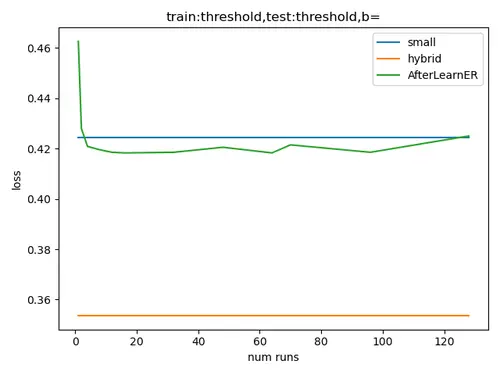
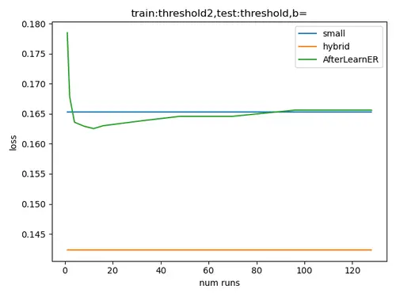
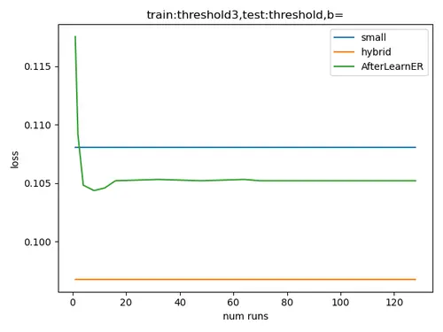

Testing on Th2, training with Th1, Th2, Th3 respectively:  
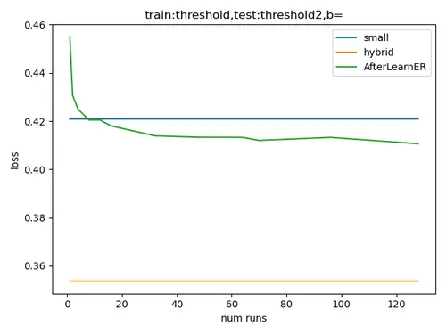
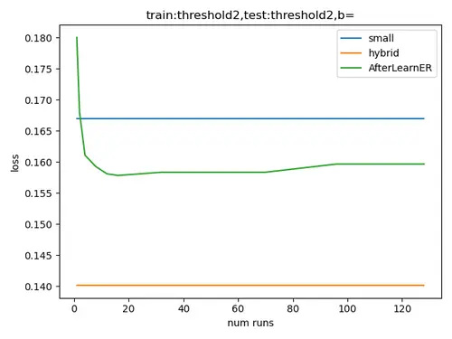
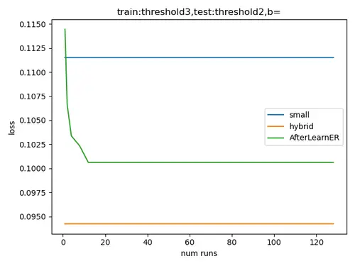

Testing on Th3, training with Th1, Th2, Th3 respectively:  
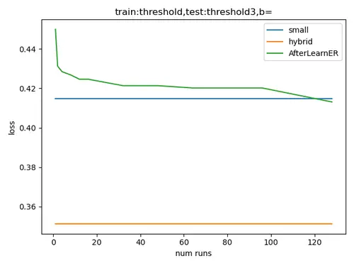
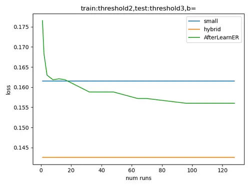
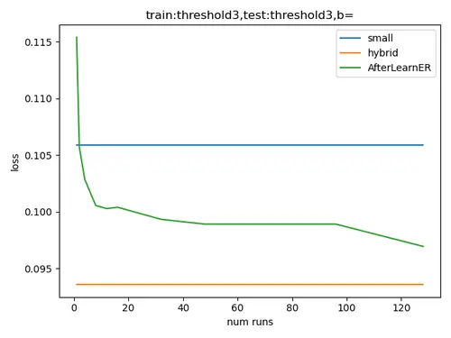

Figure 12. AfterLearnER applied to MiDaS with budget $`B=\{1\}`$: with
this budget 1, we are actually running random search and already get
positive results. We note that with a training on Th3, we get positive
results for all tests with $`b\times k`$ (total number of scalar
evaluations provided to AfterLearner) greater than 20: so 20 evaluations
is enough for a good transfer to all criteria Th1, Th2, Th3.

Testing on Th1, training with Th1, Th2, Th3 respectively:  

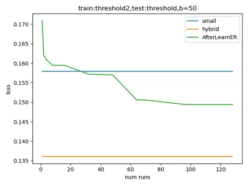
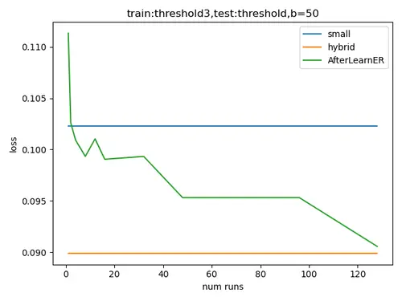

Testing on Th2, training with Th1, Th2, Th3 respectively:  
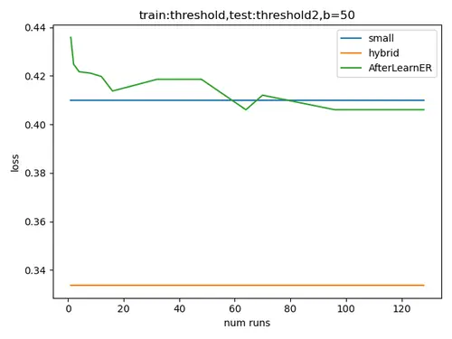

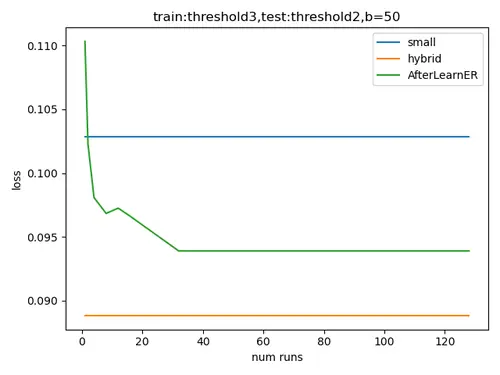

Testing on Th3, training with Th1, Th2, Th3 respectively:  
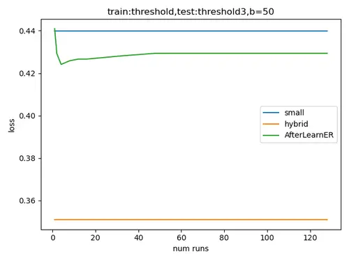
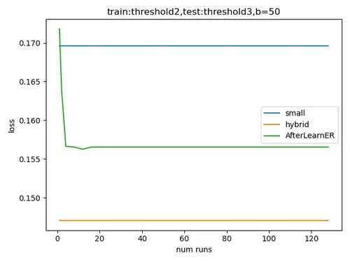


Figure 13. AfterLearnER applied to MiDaS with budget $`B=\{50\}`$.
Compared to $`B=\{1\}`$, the number of scalar evaluations needed for
beating the baseline is greater, but remains in the hundreds. Th3
remains the best training criterion for good transfer to all 3 criteria
Th1,Th2,Th3.

Testing on Th1, training with Th1, Th2, Th3 respectively:  
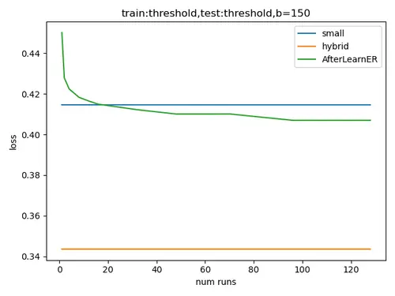
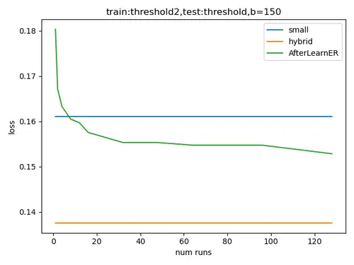
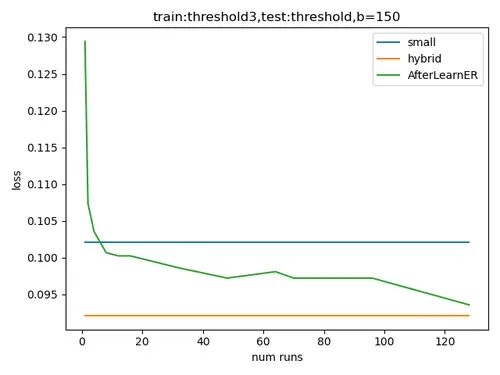

Testing on Th2, training with Th1, Th2, Th3 respectively:  
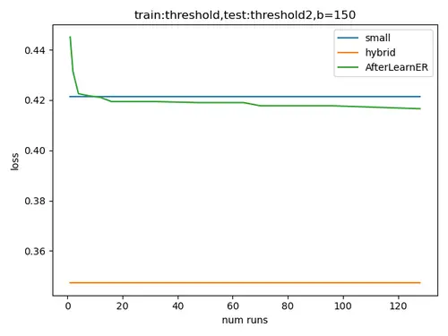
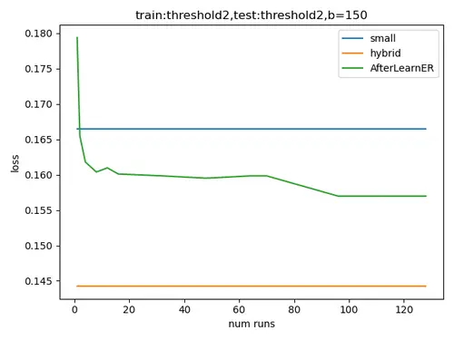
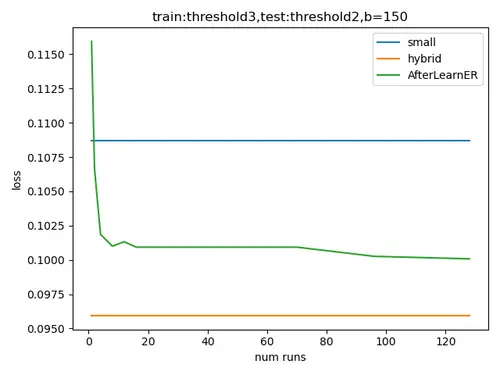

Testing on Th3, training with Th1, Th2, Th3 respectively:  
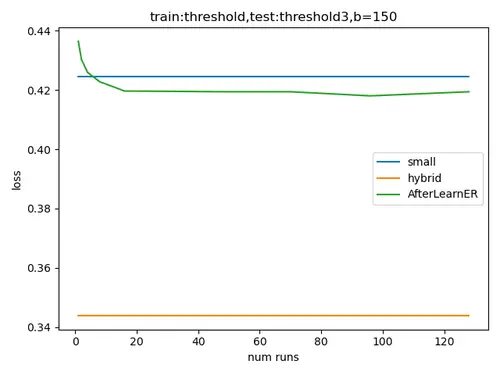
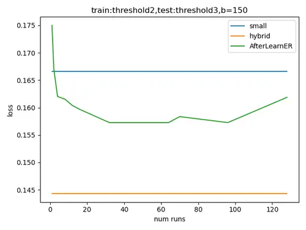
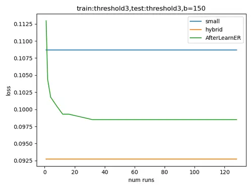

Figure 14. AfterLearnER applied to MiDaS with budget $`B=\{150\}`$.
Compared to $`B=\{1\}`$, the number of scalar evaluations needed for
beating the baseline is greater, but remains in the hundreds. Th3
remains the best training criterion for good transfer to all 3 criteria
Th1,Th2,Th3.

## Appendix B Ask and Tell

objective function $`f`$, number of workers $`P\geq 1`$, domain $`D`$,
budget $`b`$

$`o.initialize\left(D,b,P\right)`$ $`\triangleright`$ Initialize $`o`$
given $`P`$, domain $`D`$, and budget $`b`$

procedure Worker-task($`x`$)

  Compute $`f\left(x\right)`$

   $`o.tell\left(x,f\left(x\right)\right)`$ $`\triangleright`$ Inform
the method $`o`$ of the performance obtained by the $`\aleph`$P $`x`$,
no gradient needed

end procedure

for $`i\in\{1,\dots,b\}`$ do

  Wait until there are less than $`P`$ computations in progress in the
FIFO

  Request $`x\leftarrow o.ask\left(\right)`$ ($`x\in D`$)
$`\triangleright`$ Choice of $`\aleph`$-parameter to be tested

  Put $`x`$ in the FIFO of workers tasks

end for

Wait until the FIFO is empty

return $`o.recommend\left(\right)`$ $`\triangleright`$ Final returned
value

Algorithm 5 General organization of a parallel asynchronous black-box
optimization method $`o`$. There is a first-in-first-out (FIFO) pool of
pairs $`\left(x,f\left(x\right)\right)`$ to be computed by the workers.
The sequential case corresponds to $`P=1`$.

## Appendix C Black-box optimization wizards and NGOpt

After becoming famous in SAT solving(Xu et al., 2008), wizards become
important in black-box optimization as well(Weise et al., \[n. d.\]; Liu
et al., 2020; Awad et al., 2020; Meunier et al., 2022a).

Optimization wizards are based on selecting, from characteristics of the
domain (dimension, type of variables) and of the optimization run
(budget, parallelism), an optimization algorithm or a bet-and-run (Weise
et al., \[n. d.\]) or chaining of several optimization algorithms.
NGOpt, an open-source wizard for black-box optimization, is available in
(Rapin and Teytaud, 2018) and as a PyPi package.

For example, in a continuous setting, with moderate dimension, a large
budget, and a sequential optimization context (no parallelism),
NGOpt(Meunier et al., 2022a) chooses a chaining of CMA (Hansen and
Ostermeier, 2003) fastened with a metamodel and followed by Sequential
Quadratic Programming(Artelys, 2015b).

An example of code involving NGOpt is provided in Appendix D.

## Appendix D Reproducibility

All black-box optimization algorithms are available in (Rapin and
Teytaud, 2018). Nevergrad can be installed by cloning
[https://github.com/facebookresearch/nevergrad](https://github.com/facebookresearch/nevergrad)
or by “pip install nevergrad”.

A minimal example of optimization with some optimization methods
mentioned above is in Algorithm 6 (without link with deep learning).
Algorithm 9 presents an application for the optimization of a single
layer of a PyTorch model.

import nevergrad as ng

import numpy as np

def loss(x):

return np.sum((x - 1.7) \*\* 2)

\# 3 optimization methods in dimension 10, continuous.

optim_ngopt = ng.optimizers.registry\["NGOpt"\](10, 500)

optim_de = ng.optimizers.registry\["DE"\](10, 500)

optim_lengler= ng.optimizers.registry\["DiscreteLenglerOnePlusOne"\](10, 500)

\# 1 optimization method for dimension 10, integer values between 1 and
4,

\# with 30 parallel evaluations.

array = ng.p.Array(init=np.array(\[2\] \* 10), lower=1,
upper=4).set_integer_casting()

optim_opo = ng.optimizers.registry\["DiscreteOnePlusOne"\](array, 500)

\# an example with minimize

print(optim_ngopt.minimize(lambda x: loss(x)).value)

\# an example with ask and tell

for k in range(50):

x = optim_de.ask()

y = loss(x.value)

optim_de.tell(x, y)

\# an example with minimize in a discrete context

print(optim_opo.minimize(loss).value)

Algorithm 6 Sample code: Minimal example of black-box optimization.

The detailed code to improve EG3D is in Algorithm 8.

A minimal code for running Retrofit on a Pytorch model (all parameters)
is Algorithm 7.

\# Our retrofit method:

\# less overfitting, more privacy, less poisoning, no fair use issue.

def retrofit(model, epochs,optim_name="NGOpt",cross_entropy=False):

with torch.no_grad():

if cross_entropy:

criterion = nn.CrossEntropyLoss()

else:

criterion = binary_accuracy

d = 0

\# In this version we work on all parameters.

for name, param in model.named_parameters():

d += len(param.data.detach().cpu().numpy().flatten())

\#print(d)

optim = ng.optimizers.registry\[optim_name\](d,epochs)

for epoch in range(epochs):

total_loss = 0

num = 0

w = optim.ask()

set_weights(model,w.value)

for x, y in train_loader:

y_scores = model(x)

if cross_entropy:

loss = criterion(y_scores, y)

else:

loss = criterion(y_scores\[:,1\], y)

\#loss.backward() not needed here!

\#optimizer.step()

total_loss += loss.item()

num += len(y)

optim.tell(w,total_loss/num)

\#if epoch %

\# print(epoch, total_loss / num)

set_weights(model,optim.recommend().value)

Algorithm 7 Minimal example of code modifying a Pytorch model for
cross-entropy or directly for the classification error. The key point is
not minimizing the cross-entropy error (which can be done much faster
with gradient-based optimization) but the direct optimization of the
success rate.

## Appendix E Computational cost

|                                       |                         |                 |
| ------------------------------------- | ----------------------- | --------------- |
| Application                           | computational cost      |                 |
|                                       | Offline comp. cost      | Online overhead |
| Depth sensing                         |                         |                 |
| (Fig. 2, $`k=10`$, $`B=50`$)          | 12h, 10 GPUs            | zero            |
| Speech resynthesis (Tab. 4, 1st line) | 1 GPU, 2 hours          | zero            |
| EG3D (Section 6.2)                    | 200 labelled examples\* | negligible      |
| Evol. Interactive GAN (Section 6.1)   | selecting 5 batches\*   | zero            |
|                                       | out of 30               |                 |
| LDM (offline, Section 6.3)            | 200 images              | negligible      |
| LDM (online, Section 6.4)             | negligible              | negligible      |
| Doom (Tab. 5)                         | 48 hours, $`k`$ GPU     | zero            |
| Code translation (Section 5.4)        | 0 to 54 hours\*\*,      | zero            |
|                                       | 0 to thousands of       |                 |
|                                       | labelled translations   |                 |

Table 9. Computational cost. \*Here, the cost is in terms of data
collection. \*\*We get positive results even with a very low budget,
though greater budgets lead to better results (Figure 3). The online
overhead exists only when we modify, online, the latent variables of a
GAN for each new generation of images; however, it is typically
negligible compared to the generation of images itself.

Table 9 presents typical computational costs of AfterLearnER for a
typical entire run, providing significant improvements compared to the
initial DL tool.

## Appendix F Code: AfterLearnER online in the case of EG3D for cat generation

Algorithm 8 shows the integration of our work in the case of cats
generated by EG3D.

\# Code for modifying a latent vector z, using a list of the

\# bad random seeds over the 200 first seeds.

if "afhqcats512-128" in network_pkl:

Y = \[1\] \* 200 \# Seeds 15, 84, 47 are bad for cats.

bad_latent_z = \[15,84,47,30,33,78,4,50,49,

56,11,17, 36,85,59,16,63,81,25,39, 87,45,41,58,60,68,46,38\]

bad_latent_z += \[130,113,146,107,143,

175,158,192,121, 110,181,186,170,120,163,193,155,

144,148,191,141, 105,187,183,174,

129,117,100,157,166,194,198,138, 156,168,114,127,103,109\]

if "ffhqrebalanced512-64" in network_pkl:

Y = \[1\] \* 200

bad_latent_z = \[27,14,88,42,37,25,73, 53,40,17,45,92,

50,3,84,29,12,31,98,72,51,46,57,16,13,33,

43,69,60,74, 77,75,41,89,39,87,68,67,56,

35,26,9,23,7,38,20,63,55, 28,36,8,6,64\]

bad_latent_z += \[132,145,194,187,119,169, 137,176,185, 147,111,139,171,

101,161,116,115,155,175,118,112,144,172,

198,124,181, 129,117,189,108,174,138,121,143,

156,130,146,179,140,153,136,168,131,180,110, 109,199,100\]

for p in bad_latent_z:

Y\[p\] = 0

\# Random generation

X = \[list(np.random.RandomState(i).randn(1, G.z_dim)\[0\])

for i in range(len(Y))\]

\# Learning with Scikit-Learn.

from sklearn import tree

clf = tree.DecisionTreeClassifier()

print(len(X), len(Y), len(X\[0\]))

clf = clf.fit(X, Y)

\# Optimization with Nevergrad: modify bad cats.

z = np.random.RandomState(seed).randn(1, G.z_dim)

import nevergrad as ng

epsilon = 0.01

def loss(x):

assert len(x) == G.z_dim

return clf.predict_proba(

\[list(z\[0\] + epsilon \* x)\])\[0\]\[0\]

nevergrad_optimizer = ng.optimizers.NGOpt(G.z_dim, 10000)

for nevergrad_iteration in range(1, 10000):

x = nevergrad_optimizer.ask()

l = loss(x.value)

if l \< 1e-5:

break

else:

nevergrad_optimizer.tell(x, l)

print(f"Success in {nevergrad_iteration} iterations")

z\[0\] += epsilon \* nevergrad_optimizer.recommend().value

Algorithm 8 The short code at the top of EG3D-cats for getting
AfterLearnER on top of it. There is no significant computational
overhead, we learn directly from $`z`$: we do not generate anything.

## Appendix G Tuning a Pytorch model: code

Appendix D presents a minimal example of black-box optimization in the
general case, in the case of the platform Nevergrad used in all our
experiments. In Algorithm 9, we present a few lines of code for
optimizing a single layer of a Pytorch model. In Algorithm 7, we provide
a function for optimizing all weights of a Pytorch model. The long URL
for a small-scale experiment is
[https://colab.research.google.com/drive/10GujGQp_59SX60kLoGQ5TOKF9Na1ybRM](https://colab.research.google.com/drive/10GujGQp_59SX60kLoGQ5TOKF9Na1ybRM)
(short URL:
[https://tinyurl.com/teloretrofit](https://tinyurl.com/teloretrofit)):
we refer to the reading guide at the top of this link for more details.
Additional experiments on residual networks for classifying images are
available at
[https://colab.research.google.com/drive/1tlmBE55mo-NatTlGd-q3nM0mMak4DN92](https://colab.research.google.com/drive/1tlmBE55mo-NatTlGd-q3nM0mMak4DN92)
(short URL
[https://tinyurl.com/retrofitresnet](https://tinyurl.com/retrofitresnet))
and for a small scale
[https://colab.research.google.com/drive/108hV_zNjAqP21C9JIwbIre63UhvX-gGu](https://colab.research.google.com/drive/108hV_zNjAqP21C9JIwbIre63UhvX-gGu)
(short URL
[https://tinyurl.com/retrofitresnetsmall](https://tinyurl.com/retrofitresnetsmall)).

import nevergrad as ng

\# Here you need to load your Python model.

Todo.

\# Get a good initial value:

with torch.no_grad():

w0 = my_model.output.weight.data.detach().cpu().numpy

\# w0.shape can then be used for initializing an array
ng.p.Array(shape=w0.shape):

my_optim = ng.optimizers.DiscreteLenglerOnePlusOne(

ng.p.Array(shape=w0.shape), budget=500)

\# w0 can then be used in optim.suggest().

my_optim.suggest(w0)

\# Modify the value so that it becomes w:

for i in range(my_optim.budget):

w = my_optim.ask()

with torch.no_grad():

my_model.output.weight.data.copy\_(torch.tensor(w.value))

loss = Todo

\#After computing the loss loss (e.g. loss=-accuracy):

my_optim.tell(w, loss)

\# The optimization is over:

\# we put the recommended w

\# in the pytorch model.

w = my_optim.recommend()

with torch.no_grad():

my_model.output.weight.data.copy\_(torch.tensor(w.value))

\# You might save your model here.

Todo.

Algorithm 9 Python code for tuning a single layer of a Pytorch model (we
refer to Algorithm 7 for a more general case). In this example, we focus
on the last layer.
