\noautomath

Media Engineering and Technology Faculty  
German University in Cairo  
![[Uncaptioned
image]](arxiv-2410-13318--7adc1f8ffddd.figures/figure-1.webp)

Computational Approaches to Arabic-English Code-Switching

Ph.D. Thesis

|                  |                            |
| ---------------- | -------------------------- |
| Author:          | Caroline Nabil Samy Sabty  |
| Supervisors:     | Prof. Dr. Slim Abdennadher |
| Submission Date: | May, 2021                  |

This is to certify that:

- (i)
  the thesis comprises only my original work toward …
- (ii)
  due acknowlegement has been made in the text to all other material
  used

 

Caroline Nabil Sabty  
 May, 2021

I would like to dedicate my thesis to my angel and beloved sister
Nathalie

## Acknowledgments

First and foremost, praise and thanks to God for His continuous showers
of blessings, unconditional love and guidance throughout my journey.
Looking back at every step along the way I can see clearly His perfect
plan for me and it was all done because of His help and blessing.

I would like to thank my supervisor and mentor, Prof. Dr. Slim
Abdennadher, my role mode and great supporter throughout my journey. He
was the source of inspiration and encouragement to pursue post-graduate
studies. He was always there for me with his constant guidance and
supervision throughout my years of studies and career. He believed in me
and motivated me during hard times. I was fortunate I got to learn so
much from him. I learned how to be very passionate about teaching no
matter how many times the information is being repeated. I learned the
excitement of doing research and how to keep trying till reaching the
goal. Words will never be enough to express my gratitude to him for
being where I am today.

I am eternally grateful to my sister Nathalie. She was the perfect
example for persistence and having the right mindset through out the
most challenging situations when getting something done. She has never
given up no matter how burdensome something might get. Everyday during
my work, I was channeling her mindset to encourage myself, to advance
more and to eventually reach that finish line. Even though I wanted her
to be here to witness this moment more than anything else, I can safely
say that I felt her presence with me in every page, guiding me, looking
over my shoulder and never leaving my side. I am eternally grateful to
you, Nathalie.

I want to express my utter gratitude to my parents (Nabil and Mervat)
who have been nothing but supportive and devoted to me and to my work. I
am indebted for their endless love and prayers. Despite all the
hardships we faced, they never failed to have my back, constantly pushed
me forward and encouraged me to put my work above anything. So thank you
wholeheartedly for always raising me up the way you do.

I am genuinely grateful for my loving, caring husband and backbone
(Nader) for always believing in me, for all the sacrifices he did and
for all his support and assistance to make sure my work flew
undisturbed. I am a lucky and blessed wife to have such a man by my side
during this journey. I also want to thank my kids (Gamal and Nathalie)
for showering me with their love through it all and also for their
acceptance of the times where i was mostly focused on my work.

I want to thank my mother-in-law (Nadia) for her continuous support and
help. I learned a lot from her, she is a true meaning of a self-giving
person. A special thank you for my father-in-law (Gamal) who was a true
legend. Marie, Rami, and Marguerite, thank you for your continuous
encouragement.

I cannot thank enough my friends and sisters Nada and Marlein, who were
always there for me. Things would have been much harder without them, I
am grateful to have them in my life. One of the things I really cherish
is sharing the journey of my PhD. with my very special and loving
friends, Injy and Alia. Injy has helped me find my way in the field and
the topic and Alia used to listen to me and help me overcome a lot of
challenges.

Nermine, Mirna, Carole and Steve my oldest lifetime friends, regardless
of where you live and how often we meet, I never feel that you are away,
thank you for always being there for me. Carine, Amir, Caroline and Mina
thank you for your continuous encouragement.

A special thank you to Dr. Mohamed Elmahdy for his guidance at the
beginning of my research journey and for helping me to find my way and
passion to my topic. To all my instructors, friends and colleagues
especially Dr. Mervat, thank you for the motivation and inspiration.

## Abstract

Natural Language Processing (NLP) is a vital computational method for
addressing language processing, analysis, and generation. NLP tasks form
the core of many daily applications, from automatic text correction to
speech recognition. While significant research has focused on NLP tasks
for the English language, less attention has been given to Modern
Standard Arabic and Dialectal Arabic. Globalization has also contributed
to the rise of Code-Switching (CS), where speakers mix languages within
conversations and even within individual words (intra-word CS). This is
especially common in Arab countries, where people often switch between
dialects or between dialects and a foreign language they master. CS
between Arabic and English is frequent in Egypt, especially on social
media. Consequently, a significant amount of code-switched content can
be found online. Such code-switched data needs to be investigated and
analyzed for several NLP tasks to tackle the challenges of this
multilingual phenomenon and Arabic language challenges. No work has been
done before for several integral NLP tasks on Arabic-English CS data. In
this work, we focus on the Named Entity Recognition (NER) task and other
tasks that help propose a solution for the NER task on CS data, e.g.,
Language Identification. This work addresses this gap by proposing and
applying state-of-the-art techniques for Modern Standard Arabic and
Arabic-English NER. We have created the first annotated CS
Arabic-English corpus for the NER task. Also, we apply two enhancement
techniques to improve the NER tagger on CS data using CS contextual
embeddings and data augmentation techniques. All methods showed
improvements in the performance of the NER taggers on CS data. Finally,
we propose several intra-word language identification approaches to
determine the language type of a mixed text and identify whether it is a
named entity or not.

###### Contents

1.  Acknowledgments
2.  Abstract
3.  1 Introduction
4.  2 Background
    1.  2.1 Linguistic Background
        1.  2.1.1 Varieties of Arabic Language
        2.  2.1.2 Challenges of Arabic Language
    2.  2.2 Traditional Machine Learning Approaches
        1.  2.2.1 Naïve Bayes Classifier
        2.  2.2.2 Conditional Random Fields
    3.  2.3 Deep Learning Approaches
        1.  2.3.1 Convolution Neural Network
        2.  2.3.2 Recurrent Neural Network
        3.  2.3.3 Transformers
        4.  2.3.4 Configuration of Deep Neural Network
    4.  2.4 Word Embeddings
        1.  2.4.1 Classical Word Embeddings
        2.  2.4.2 Contextual Word Embeddings
    5.  2.5 Evaluation Metrics
5.  3 Related Work
    1.  3.1 Named Entity Recognition
        1.  3.1.1 Named Entity Recognition on Monolingual Data
        2.  3.1.2 Named Entity Recognition on Code-Switched Data
    2.  3.2 Related NLP Tasks on CS Data
        1.  3.2.1 Code-Switched Data Collection
        2.  3.2.2 Code-Switched Contextual Embeddings
        3.  3.2.3 Data Augmentation Techniques
        4.  3.2.4 Automatic Language Identification on Code-Switched
            Data
6.  4 Named Entity Recognition on MSA Data
    1.  4.1 Corpora
    2.  4.2 NER using Conditional Random Field
        1.  4.2.1 Model Architecture
        2.  4.2.2 Initial Baseline Features
        3.  4.2.3 Word Embeddings based Feature
        4.  4.2.4 Evaluation and Results
    3.  4.3 NER using Deep Learning on MSA Data
        1.  4.3.1 Model Architecture
        2.  4.3.2 Model Hyper-Parameters
        3.  4.3.3 Evaluation and Results
        4.  4.3.4 Tuning Hyper-Parameters
        5.  4.3.5 Contextual Embeddings
    4.  4.4 Summary
    5.  4.5 Conclusion
7.  5 Named Entity Recognition on Code-Switching Data
    1.  5.1 Data Collection and Annotation
        1.  5.1.1 Twitter Data-set
        2.  5.1.2 Translated Data-Set
        3.  5.1.3 Transcribed Speech Data-set
    2.  5.2 Named Entity Recognition Model
        1.  5.2.1 Pre-trained Embeddings
        2.  5.2.2 Model Architecture
    3.  5.3 Experiments and Results
        1.  5.3.1 Multiple Monolingual Data-sets
        2.  5.3.2 Code-Switching Data-set
    4.  5.4 Summary
8.  6 Contextual Embeddings for Arabic-English CS Data
    1.  6.1 Data Collection
    2.  6.2 Trained Embedding Models
        1.  6.2.1 Baseline
        2.  6.2.2 Contextual String Embeddings
        3.  6.2.3 BERT
        4.  6.2.4 ELECTRA
    3.  6.3 New Proposed Embedding Model: KERMIT
    4.  6.4 Evaluation & Results
        1.  6.4.1 Intrinsic Evaluation
        2.  6.4.2 Extrinsic Evaluation
        3.  6.4.3 Discussion
    5.  6.5 Summary
9.  7 Data Augmentation Techniques on CS Data for NER
    1.  7.1 Data Augmentation Techniques
        1.  7.1.1 Word Embedding Substitution
        2.  7.1.2 Modified Easy Data Augmentation Technique
        3.  7.1.3 Back-Translation
    2.  7.2 Experiments & Results
        1.  7.2.1 Modified Easy Data Augmentation (EDA)
        2.  7.2.2 Word Embedding Substitution & Back-Translation
    3.  7.3 Discussion
    4.  7.4 Summary
10. 8 Language Identification of Intra-Word CS for Arabic-English
    1.  8.1 Data Collection and Annotation
        1.  8.1.1 Data Collection
        2.  8.1.2 Tag Description
        3.  8.1.3 Data Statistics
        4.  8.1.4 Observations
    2.  8.2 Baseline Models
        1.  8.2.1 Naïve Bayes Baseline Model
        2.  8.2.2 Character Bidirectional LSTM Baseline Models
    3.  8.3 Segmental Recurrent Neural Networks Models
        1.  8.3.1 Data Pre-processing
        2.  8.3.2 Main SegRNN Model
        3.  8.3.3 SegRNN with Word Embeddings Models
    4.  8.4 Evaluation & Results
        1.  8.4.1 Main Data-set
        2.  8.4.2 Coarse-grained NE
    5.  8.5 Summary
11. 9 Conclusion & Future Work
12. Bibliography

## Chapter 1 Introduction

Humans invented natural language to communicate with each other. Natural
Language Processing (NLP) is a research field dealing with how computers
manipulate natural language inputs and outputs \[218\]. Nowadays, many
trending applications are being used daily, such as Siri¹¹ 1
https://www.apple.com/siri/ and Alexa²² 2 https://www.alexa.com/ that
rely on NLP tasks; ranging from simple ones like automatic text
correction to more complex ones like information extraction and speech
recognition. Much work has been conducted on various NLP tasks for some
significant languages (e.g. English). However, relatively less work is
available for other languages used in computing (e.g. Arabic).

Arabic is one of the languages most spoken globally, ranking the sixth,
as it is spoken by around 274 million people \[74\]. It exists in
different forms, such as Modern Standard Arabic (MSA) and Dialectal
Arabic (DA). MSA is mostly used in a formal context. DA is used more in
everyday life communications (written or spoken) between Arabic
speakers. There are several dialectal types of Arabic in different
countries, such as, for example, Egyptian, Levantine, Gulf, and Iraqi
dialects of Arabic. In addition to the main two forms of Arabic, native
speakers switch between their dialect and other dialects or foreign
languages in the same conversation, which is known as code-switching
(CS) \[78\]. CS is defined as the embedding of linguistic units such as
phrases, words, and morphemes of one language into an utterance of
another language \[176\].As a result of globalization and better quality
of education, a significant percentage of the population in Arab
countries have become bilingual/multilingual. This has raised the
frequency of CS among Arabs in their daily communications. For instance,
in Algeria, people tend to code-switch Arabic with French; meanwhile, in
Egypt, people tend to code-switch it with English, as shown in the
following example of code-switching within the same sentence: .London يف
Saturday موي داحتالا vs لالهلا يدوعسلا ربوسلا سأك  
(The Saudi Super Cup Al Hilal vs Al Aitihad on Saturday in London.) As
user-generated content increases, it is easy to observe that users mix
between different languages in the same word, a practice known as
intra-word CS. For example, speakers can say quizat which is composed
from the English word quiz and the suffix at referring to plural in
Arabic. Multilingual social media users are generating a huge amount of
data containing a high frequency of CS. However, such mixed
words/sentences are usually overlooked in NLP tasks; as NLP tasks are
designed to process texts written in a single language. The rise of
social media networks and other informal communication platforms has led
to an increased need to apply NLP tasks on CS, and not only DA and MSA.

Though posing several orthographic and morphological challenges, along
with the challenges posed by the different dialectal variations, Arabic
NLP has achieved many successes and developments \[64\]. There are still
considerable gaps for several essential NLP tasks, such as Language
Identification (LID) and Named Entity Recognition (NER) tasks. Less work
has been done for these tasks on MSA and DA than on other languages, and
no work has been done for Arabic-English CS data. NER refers to
recognizing spans of text that refer to real-world entities and
classifying them into different types or categories (e.g., person,
location, organization). NER has proved to be highly significant to
various tasks in NLP, such as information retrieval and question
answering tasks. Also, there are several use-cases for the NER task
such, as text classification, customer support, content recommendation
and semantic annotaion. Applying NER task on Arabic-English CS data
faces more challenges than the already existing ones of automatically
processing MSA and DA. Some of these added challenges are having two
different languages in the same sentence as well as the limited or lack
of CS data for the NER tasks.

In this work, we tackled the challenge to apply the NER task on CS data
by presenting several NER taggers and complementing the taggers with
other NLP tasks that help in enhancing the performance on such data.
Also, we implement CS Intra-word Language Identification (LID)
approaches. Language Identification (LID) refers to the task of
determining the language type of a text. Intra-word LID involves
segmenting mixed words and tagging each part with its corresponding
language identification and states whether a word is a named entity or
not. It could be used as a pre-processing task for other NLP tasks.

In this work, state-of-the-art techniques were used to implement the
Arabic Name Entity Recognition task and Language Identification of
intra-word. The main contributions included:

1.  a)
    Collecting and annotating the required Arabic-English CS corpus for
    NER task
2.  b)
    Developing different taggers for MSA and CS NER
3.  c)
    Applying enhancement techniques to improve the performance of the CS
    NER taggers
4.  d)
    Creating Arabic-English CS corpus for intra-word LID
5.  e)
    Developing different approaches for LID of intra-word CS

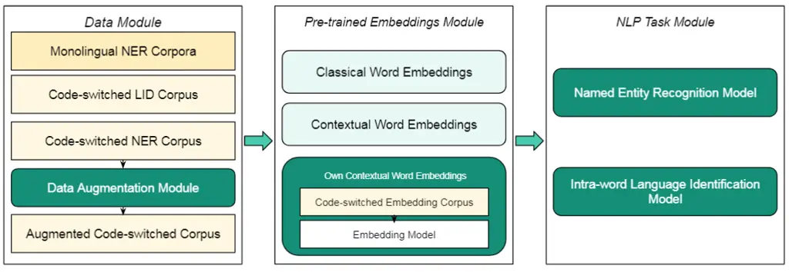

Figure 1.1: Proposed pipeline approach for applying NLP tasks on CS data

We propose a pipeline approach to apply NLP tasks on CS data as shown in
Figure 1.1. To apply the tasks of NER and LID on the CS text, we first
collected and annotated data. To the best of our knowledge the first two
corpora for NER and LID of intra-word code-switching for Arabic-English
language pairs, were presented and were composed of 6,525 and 2,507
sentences, respectively.

To apply the NER task, three tagging techniques based on supervised
algorithms were presented. We started with Conditional Random Field
along with word embeddings for MSA. It was hypothesized that integrating
word embedding features to the conventional lexical and contextual
features could improve Arabic NER performance. Since most CRF
implementations support categorical features only, continuous word
embedding vectors were clustered. The best word embedding setting of
combining fine and coarse cluster IDs resulted in a 76.4% F1-score on
ANERCorp \[38\] with a relative improvement from the baseline of 11.7%.
Thus, the system achieved the best performance by the following
features: Current word, Stemming, Lexical, Contextual, POS tagging, fine
and coarse word embedding cluster IDs. Afterwards, with the successful
use of deep learning models in solving a wide range of NLP tasks,
including NER and reaching state-of-the-art performance \[141, 145\],
several deep learning variations were investigated in order to reach the
final models with the best performance on MSA and CS data. The usage of
different types of classical and contextual word embeddings was also
investigated. The performance of the NER tagger on MSA increased by
7.31% as compared to the CRF model and the results equalled 83.71%
F1-score. Regarding the NER tagger on CS data, we improved significantly
the performance of the system by 25.69% absolute F1-score from its
baseline to reach 77.69% F1-score using the BiLSTM-CRF model and
classical and contextual word embeddings.

Two enhancement techniques were developed in order to further improve
the performance of the CS NER taggers, CS contextual embeddings and data
augmentation. While many NLP models such as NER perform well using
contextual word embeddings, they face more challenges when dealing with
CS data. Recently, bilingual word embeddings drew attention to embedding
in the same space words from two languages. Most of the standard
bilingual word embedding techniques are intended work on monolingual
texts, not on a mix of two languages. Thus, these techniques are not the
ideal option to learn embeddings for code-switched tasks \[192\]. We
propose a solution to train for the first time bilingual contextual
embedding models used state-of-the-art types on a CS Arabic-English
corpus composed of 144 million tokens that we collected, they are
represented in the pre-trained embeddings module in Figure 1.1. We also
propose a new contextual word embedding model called KERMIT based on the
previous work of \[68, 57\] capable of mapping both Arabic and English
words inside one vector space efficiently in terms of data usage. The
highest results achieved by combining Contextual string embedding with
Arabic FastText embedding enhanced the NER model by 0.51%.

Also, an extensive training data-set was needed to improve the
performance of the NER system. As stated before, there was a problem of
lack of data with the resources suitable for the NER task, especially on
CS data. Due to the scarcity of data, several approaches were devised to
overcome this issue. One way to produce more data is using data
augmentation techniques. We apply three different data augmentation
techniques on our CS corpus to automatically create new labeled training
data from available ones represented in the data module in Figure 1.1.
Investigating data augmentation within the NLP field is challenging and
less tackled. This was the first time data augmentation techniques have
been applied on NER on any CS data due to the complexity of the
different languages and the diversity of the various NLP tasks. Our
proposed methods show more of an increase of 1.51% in the F1-score than
the NER model without data augmentation.

Moreover, we construct the LID model using Segmental Recurrent Neural
Networks (SegRNN). We investigate the usage of different word embeddings
with SegRNN. Our highest LID system for tagging the entire data-set is
obtained using SegRNN alone, achieving an F1-score of 94.84% and
recognizing mixed words with F1-score equal to 81.15%. Besides, the
model of the SegRNN with FastText embeddings achieve the highest results
equal to 81.45% F1-score for tagging the mixed words.

The rest of this thesis is outlined as follows. Chapter 2 discusses the
linguistic background about the Arabic language and then different
machine learning approaches used with sequential text to apply NER and
LID tasks. Chapter 3 presents some related work for code-switching data,
Named Entity Recognition, and other related tasks. Chapter 4 presents
the different NER taggers on MSA data along with their evaluations and
results. Chapter 5 illustrates the data collection and annotation and
the NER models of CS data with their evaluation and results. In Chapter
6 and 7, the two enhancement techniques for the NER tagger on CS data of
CS contextual embeddings and data augmentation are presented. The corpus
of the LID task and the implemented models with their evaluations and
results are presented in Chapter 8. Finally, Chapter 10 concludes the
thesis and presents recommendations for future work.

## Chapter 2 Background

This chapter first presents the linguistic background of the Arabic
language, including its varieties and challenges in some NLP tasks. The
traditional machine learning and deep learning approaches are discussed
as used with sequential text to apply tasks like NER and LID.

The suitability of the algorithms for recognition and classification of
entities (NERC) is evaluated through competitions such as MUC, CONLL or
ACE. In general, these competitions are limited to the recognition of
predefined entity types in certain languages

impp phd: http://cogprints.org/5859/1/Thesis-David-Nadeau.pdf

ACE 2003 100K training, 50K evaluation entities, relations English,
Chinese, Arabic

The Arabic NER (ANER) Finally, Arabic (F. Huang 2005) has started to
receive a lot of attention in large-scale projects such as Global
Autonomous Language Exploitation (GALE).\[177\]

Many NER systems based on pattern matching rules or statistical models
achieved satisfactory performances on well-formed text

Generating Candidates: addresses name variation challenge find all
potentially relevant candidates familiar tradeoff between precision and
recall Need high recall so that correct entity is among candidates But
too many candidates hurts precision and efficiency

why nlp is difficult?

Variation: many different ways of expressing the same thing Different
languages Different styles / genres Messiness … ungrammatical,
fragmentary, non-standard Ambiguity: same bit of language can have many
different interpretations So much depends on linguistic (and other)
context Creativity and evolution: language change New terms, new
meanings, non-literal interpretations Sparsity: so many different words,
so many different combinations, so many possible contexts …. Grounding
and world knowledge: language does not exist in isolation Humans do not
learn language by purely observing endless stream of language Ultimately
an AI-complete problem

Ambiguity is one of the problems that makes NER a challenging task, as
the same word can indicate various real word entities which might be
with different types or none such ”Lincoln” that could refer to a
person, location or car. Also, the same entity could be written with
different ways such as ”Lincoln”, ”Abraham Lincoln” or ”A. Lincoln”. In
addition, the same word may indicate multiple named entities with the
same type such as ”Manchester” refers to multiple locations in the word
having the same name.

Having chosen a set of target languages for the NERC system to build,
one must consider that it can be difficult to port an existing system to
a new domain. If a classifier was trained using juristic texts, it will
be difficult for this classifier to deal with material originated from
bio informatics.

### 2.1 Linguistic Background

Languages reflect the human mind. It is a way of communication where
humans can express themselves. One of the oldest languages is Arabic. It
is the official language of 24 countries dominantly lying in the middle
east, and north Africa \[234\]. Arabic is also one of the top nine
languages used on the web \[75\]. It is a rich morphological language.

#### 2.1.1 Varieties of Arabic Language

The Arabic language has three main varieties: Classical Arabic (CA),
Modern Standard Arabic (MSA), and Dialectal Arabic (DA). CA was used in
the Quran and early Islamic literature. MSA is the formal language in
almost all Arab countries. It is used in schools and universities, in
the media, and in formal writing such as Arabic newspapers and letters.
It is one of the six official languages of the United Nations used in
their meetings and documents. DA (Colloquial) is the language used in
informal daily communication \[220, 64\]. Within each Arab country and
its regions, there are different dialects such as Egyptian, Lebanese and
Tunisian. The Arabic dialects themselves differ, sometimes
significantly, depending on many factors (e.g., geographical location,
social and economic status). There is a huge gap between the written
form of Arabic MSA and the different Arabic dialects as spoken in
different areas due to their significant number. Recently, DA is also
being used as the main written language on social media. Nevertheless,
the main focus of most NLP research was on MSA.

In addition to the three main varieties of Arabic, native Arabic
speakers typically mix MSA and dialectal Arabic. Due to the presence of
many multilingual speakers in Arabic countries, people often mix
multiple languages in the same context, known as Code-Switching (CS)
\[47\]. CS is defined as the embedding of linguistic units such as
phrases, words, and morphemes of one language into an utterance of
another language \[176\]. This linguistic behavior (or practice) occurs
in both forms of the language, whether spoken or written. The primary
language appears the most inside an utterance, while the secondary
language used inside the utterance is the language of embedded words or
phrases. There are three main types of Code-Switching: Inter-sentential,
Intra-sentential and Intra-word.

- •
  Inter-sentential CS refers to switching between different languages
  from one sentence to another \[43\]. For example:  
  That’s a great idea! .اركب جرخن نكمم  
  (We can go out tomorrow. That’s a great idea!)
- •
  Intra-sentential CS refers to using multiple languages within the same
  sentence \[43\]. For example:  
  .جرخا و lab و project يدنع weekendلا دعب  
  (After the weekend, I have a project and a lab and I will go out.)
- •
  Intra-word CS refers to mixing between different languages in the same
  word \[158\]. For example:  
  The word quizat which is composed from the English word quiz and the
  suffix at indicating a plural word in Arabic.

Researchers use several definitions for CS, such as \[175\] who decided
to use the term Code-Mixing (CM) instead of intra-sentential CS.
However, other researchers do not distinguish between the different
types of CS such as inter or intra-sentential and refer to both types as
Code-Switching \[49\]. The phenomenon of code-switching has been
increasingly reported in linguistic studies in the past years as more
people tend to code-switch. Furthermore, this phenomenon has become
popular in Arab countries, where people code-switch between different
dialects or their own dialect and foreign languages. For instance, it is
common to mix Arabic and French in Tunisia and Egyptian Arabic and
English in Egypt. CS behavior is common in online interaction,
especially among social media users, generating vast CS data \[33\]. For
example, on Twitter, the multilingual users using code-switching are
more active than the monolingual ones and therefore, they produce more
code-switched text \[104\].

#### 2.1.2 Challenges of Arabic Language

Although Arabic is one of the languages that are used the most, it
presents several challenges for NLP tasks. One of the significant
problems that face NER and LID, in general, is the lack of labeled data,
a task for which large annotated corpora are needed. A huge scarcity in
available resources exists, especially for dialectal Arabic and
Code-Switching. Moreover, Arabic poses several orthographic and
morphological challenges, in addition to having dialectal variations
\[64\].

Challenges of Arabic language with regard to its characteristics and
their related computational problems at  Orthographic  Morphological 
Syntactic levels

Arabic orthography  Lack of consistency in orthography  Hamza Spelling
 Defective Verb Ambiguity  Nonappearance of capital letters  Inherent
ambiguity in named entities  Vowels  Lack of uniformity in writing
styles Arabic morphology  Morphology is intricate  Annexation Syntax
is intricate  Multi word expressions  Syntactically flexible text
sequence

##### Arabic Orthography

The Arabic script is one of the main linguistic properties that are the
most challenging to the automatic processing of Arabic \[83\]. The
alphabet of the Arabic language is composed of 28 letters that are all
consonants, three long vowels, and three short vowels. The long vowels
are (ا ) pronounced (Alef), (و ) pronounced as (Waw), and (ي )
pronounced as (Ya’a). The short vowels, present in the pronunciation of
words, distinguish words from each other, but no unique letters
represent them in writing. They are sometimes represented by special
marks called diacritics above or below a letter. The majority of Arabic
text, especially on social media, does not carry the diacritic marks and
this leads to orthographic ambiguity \[64\]. The diacritics give various
meanings to the same lexical form. It is easy for a native Arabic
speaker to read such words and distinguish between them based on the
context surrounding the word. Nevertheless, it is very challenging for a
computational system. For instance, the word ييحي without diacritics, it
could be considered a named entity of a type person name Yahya, or not a
named entity and could be a verb (gives life back) or a verb (greets)
\[260\].

One of the characteristics of the Arabic letters is that they have
various shapes according to their position in the word. For example, the
letter م m has three forms, it is written at the beginning as ــم , at
the middle as ــمــ or at the end as مــ \[223\]. The lack of
consistency in Arabic orthography poses particular challenges for
different NLP tasks such as NER. One of the reasons English NER is
easier than the Arabic NER is that most of the names begin with capital
letters. These show that a word or its succession is a named entity but
that is not an Arabic option. For example, in English, the name Sara
starts with a capital letter, but in Arabic the same name هراس does not
contain any special marks or indications that the word refers to a
person name. Moreover, it is common in Arabic, similar to other
languages, to face ambiguity between named entities. For example, دبأ
دمحأ (Ahmed Abad) refers to both a person name and a location name. This
is a conflicting situation as the same NE could be tagged as two
different NE types \[220\]. It is also expected that nouns and
adjectives that are not named entities could be mixed up with Arabic
nouns that are named entities. For example, the word لمأ could mean hope
or refers to a name of a person, which might cause ambiguity while
recognizing the named entities \[223\].

There is a high degree of spelling inconsistency while writing MSA and
DA, especially on social media. Furthermore, a non-Arabic word could be
transcribed into Arabic, and it will be called Arabizi. There are no
specific transcription schemes for such words as Arabic script has a
high level of ambiguity. For instance, the NE ”Washington” referring to
a city could be transcribed to any of the following Arabic words:
نطجنشاو , نطنشاو , نطغنشاو , نطنشو \[223\]. The Western European
languages have fewer speech sounds than Arabic, making Arabic
complicated by having many NE variants that might be incorrect.

##### Arabic Morphology

The performance of information retrieval and other tasks, including NER,
is affected by the representations of the words and their extracted
morphosyntactic features. In morphologically complex languages, such as
Arabic, it is challenging to extract such features due to its extremely
inflectional properties \[77\]. In other languages like English, clitics
are treated as separate words. However, in Arabic, they are agglutinated
to the words as features for several indications (e.g., number, gender,
and mood) \[64\]. The syntactic relationship between words in the
sentence is represented by the inflectional endings. Thus, the
relationships between words are one of the morphological challenges in
Arabic. There is a set of clitics for the Arabic language attached to
named entities or words in general, such as prepositions, conjunctions,
or both. For example, the word انرصمبو (and by our Egypt) contains the
named entity رصم (Egypt) of type Location attached to it prefixes and
suffixes \[220\].

Moreover, usually Arabic verbs have a root of three or four characters.
There is a template for the derivation of the verbs in Arabic:
Verb/Lemma = Root + Pattern; the patterns could make the verb in the
past, present/future tense \[223\]. For example, the verb بتكي
(future/present form from write) is composed of the root بتك and the
letter/pattern ي . In addition, it is possible to add 0 or more prefixes
and suffixes to form a Word/New Verb: Prefix (es) + Verb/Lemma + Suffix
(es) \[83\]. For instance, the word هبتكيس (he will write it) is
composed of the verb بتكي , the prefix س and the suffix ه . An example
that is also not common in other languages is to have one Arabic word
that translates to an entire sentence. For instance, the Arabic word
اهنوسرديسو that is translated to a sentence composed of five English
words, and they will study it \[64\].

Thus, in many ANLP tasks, some operations should be applied to process
the text and reduce the words to an acceptable abstract form, such as
stemming, root extraction, and lemmatization. The stemming is applied to
remove the prefixes and suffixes of the words. The root extraction
identifies the root/verb of a word composed of three or four letters.
The lemmatization is applied to relate a given word to its actual
lexical or grammatical morpheme. This process is done by converting the
verb to its perfective, third person, singular form and converting the
noun or adjective to its singular indefinite form. For example, the word
مهجاتحن (we need them) after applying a stemming technique will be جاتحن
(we need), after root/verb extraction will be جوح (need) and after
lemmetization will be جاتحا (needed) \[77\] .

### 2.2 Traditional Machine Learning Approaches

Machine learning (ML) builds systems that can apply statistical learning
techniques to learn from data, identify patterns and make predictions
automatically. ML methods focus on extracting meaningful data from
narrative text, which is a distinctive sub-field of NLP \[162\].
Concerning the NER task, the generation of statistical models for named
entity predictions is achieved using ML algorithms that determine named
entity types from annotated texts \[220\]. Machine learning uses
learning algorithms that need large training and testing data along with
a set of features from these data. There are three categories of machine
learning methods, supervised, semi-supervised, and unsupervised. The
difference between the three methods is mainly the usage of prior
knowledge. Supervised methods learn to predict by training on annotated
examples. They are usually used for classification or regression tasks.

Usually a corpus is divided into two or three parts. The first one is
the train, used for training the parameters of the model. The second one
is the test, used in the final evaluation of the model. The third one is
the validation used to reach the optimal values of the model
hyper-parameters. Generally, the ML process in the NER task starts by
converting the text into structured data, text featurization. One of the
best known and currently used text featurization methods is word
embeddings discussed in this Chapter as well.

One of the simplest supervised approaches is the Naïve Bayes; it is
usually used as a benchmark or baseline in several NLP tasks. Among the
traditional supervised machine learning approaches that have proven to
be very successful in different NLP tasks, especially in NER, is
Conditional Random Fields (CRF) \[37\].

#### 2.2.1 Naïve Bayes Classifier

Simple Bayesian Classifier is one of the most effective classifications
used in machine learning. These probabilistic approaches put relevant
assumptions about the problem data, and build a model based on these
assumptions. While training the machine learning model the parameters of
the probabilistic model are learned. The new input classifications are
applied following the Bayes rules. Naïve Bayes is one of the classifiers
based on Bayes theorem of probability used to predict the class of
unknown data-sets. The model assumes that there is no relation between
the different features of the input and ignores the correlations. The
label or class _Y_ could be related to only one feature node. This
assumption is not accurate in most of the tasks; however, it makes the
task simpler especially when dealing with a large number of attributes
\[165\].

#### 2.2.2 Conditional Random Fields

CRFs are one of the main statistical machine learning techniques. They
are used as sequence classifiers to segment and label sequence data
based on probabilistic models \[140\]. The probabilistic sequence
classifiers compute a probability distribution over the possible labels
to choose the best label sequence of units (e.g., words, sentences,
letters). CRF could be considered as an enhancement or generalization of
Hidden Markov Models (HMM) and Maximum Entropy (ME) \[140\]. The HMM
considers the observed events such as the words available in the input
and the causal factors in the probabilistic model that are hidden, such
as part-of-speech tags \[170\]. The labeling decision is only dependent
on the current input with its corresponding observed object. In general,
for the NER task, the goal is to predict label _Y_ for input _X_. The
HMM is a generative probabilistic model which specifies the joint
distribution: $`p(X,Y)`$. Nevertheless, the CRF is a discriminative
undirected graph model, and specifies the conditional distribution of
the _y_ labels given _x_ inputs: $`p(Y|X)`$ \[87\].

The ME method calculates estimated probabilities relying mainly on the
imposed constraints while making a few other assumptions. The
constraints are deduced from the training data, and they express some
relationships between features and output \[40\]. This method selects
the probability distribution with the highest entropy that satisfies the
previous property \[53\]. While the ME model considers the dependencies
between neighboring states, CRF calculates in a single model all the
state transitions globally to avoid the Label Bias problem of ME
\[246\].

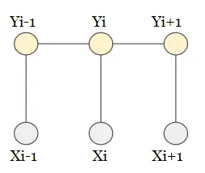

Figure 2.1: Graphical structures of CRF for sequences

One of the main advantages of CRF is the ability to consider contextual
information before assigning a label to a word. The input feature states
of the CRF model are the sequence of features (e.g., capital, the
previous word, the following word) given in the same order as the input
sentence, and the features correspond to the tokens. The sentence-level
information is included in the model by selecting the output sequence
that maximizes the possibility of the whole sequence \[140\]. N-gram
algorithm and other available NLP techniques consider words as atomic
units that do not have anything in common, which results in simplicity
and capability to train a large amount of data. However, these
techniques mostly recognize words available in the training data
\[169\]. CRF models can predict many interdependent variables, which is
needed in the NER task. Thus, CRF would overcome some of the main
challenges of NER. The first such challenge is that some entities are
rare and do not appear in the training set and should be identified
based on context. The second one is the ambiguity problem of named
entities, which could be solved by considering the context of the entity
(previous or following word) \[186\].

very imp
http://www.davidsbatista.net/blog/2017/11/13/Conditional_Random_Fields/

make sure same https://taku910.github.io/crfpp/

Task-specific prediction

X input variable pixels values y target variable class for every pixel

x is words in sentence y labels of words (person loc org)

predict y/ci the label of xi features xi1…xik

the features are very colorated with each other they have radantant
information

Naive bayes assumes the features are not dependent ignores the
colorations

corolated related ignores it –¿ in correct independent assumptions

add edges to caption correlations hard to figure out rise heavly
dependent

CRF representation model disrtibuation over y

model conditional disrtib of y given x p(y—x)

like gibbs distru we have a set of factors with their scope D1 multple
the factors to get unnormalized measures P partition function of x z(x)
for any given x i sum over y

Features: capital, pervious word, next word,..

math equ
https://www.aitimejournal.com/@akshay.chavan/introduction-to-conditional-random-fields-crfs

We are interested in structured prediction problems in which we observe
input-output pairs formula in page 11
http://sro.sussex.ac.uk/id/eprint/73258/1/Galliani

### 2.3 Deep Learning Approaches

Recently, in several NLP tasks, the state-of-the-art performance was
achieved using deep learning techniques, a subset of machine learning.
The main advantage of deep learning models is automatically extracting
complex features from input data instead of the manual handcrafted
feature engineering used in other ML methods. It also refers to
Artificial Neural Network (ANN) with multiple complex neural network
layers.

ANN is inspired by how the human brain processes information. The
central computational units of a Neural Network (NN) are artificial
neurons where directed edges interconnect them. The connections between
the neurons are represented by the weights, which determine the impact
of one neuron on another \[135\]. ANN is designed to recognize patterns
and detect trends represented as numerical values in vectors, into which
all input data should be translated. The neural unit, as shown in Figure
2.2a takes as input vector _x_ having weight _w_ expressing the
importance of this input to the output and _z_ is the weighted sum of
inputs. The output of the unit is _y_ which is based on the activation
function; in this example, it is the Sigmoid function \[5\]. The
activation function determines whether and to what extent the input
should progress and affect the output of the network. The weights _w_
are adjusted based on an error signal/feedback during learning to find
the desired output. The selection of the type of activation function is
made after experimenting with several functions and selecting the one
that gets the best results on the validation data.

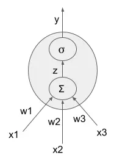

(a) Neural Unit

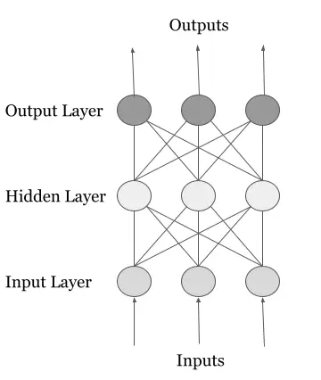

(b) Feed Forward Neural Network

Figure 2.2: ANN Basic Architecture

There are several architectures of a NN, and the most common and
straightforward type is the Feed Forward Neural Networks \[216\]. The
architecture of this network is composed of the first layer representing
the input, the final layer representing the output, and the intermediary
layers are hidden layers as shown in Figure 2.2b. The layers are
composed of neuron units/nodes; a specific layer can have an arbitrary
number of nodes called bias nodes. The values of the bias nodes are
equal to one, which provides the node with a constant value that is
trainable with the inputs \[5\]. Also, the value of the bias gives an
indication to the activation function to move either right or left.

As stated before the general training/learning process of a neural
network requires dividing the data into three sets. The first one is the
training set which allows the network to understand the weights. The
second one is the validation set; the network uses it to fine-tune the
performance. The last one is the test set, which is used to measure the
performance and error margin of the network. The training of the network
starts by forwarding the propagation of the input information to a
hidden layer(s) through an output layer to calculate the loss value.
Then the errors are backpropagated \[204\] from an output to an input
layer via hidden layer(s). The last step is updating the values of the
parameters, such as the weights and biases based on the feedback
calculated by training errors during back-propagation. The minimization
of the error function could be achieved through the gradient-based
optimization algorithms \[202\]. One of the main disadvantages of Feed
Forward Neural Networks is that they are not a good option for sequence
data as they do not have adequate memory and cannot remember historical
input data. Different Deep Neural Network architectures are used for
various tasks and data modalities. In general, these are three common
architecture types: Convolutional Neural Network used for spatial
analysis, Recurrent Neural Network used for sequential analysis and the
Transformers.

#### 2.3.1 Convolution Neural Network

The Convolutional Neural Networks (CNN) is a deep learning algorithm
commonly used in the Computer Vision field \[143\]. It could be
considered as a specialized Feed Forward Neural Network. It takes the
input image and specifies learn-able weights and biases to different
objects in the image to assess their importance. CNN checks four key
ideas which are shared weights, local connections, use of many layers,
and pooling layers. The CNN automatically extracts features from the
image by applying a collection of filters to create a final hierarchical
structure of features. Each filter has a weight that is learned from the
training data \[35\].

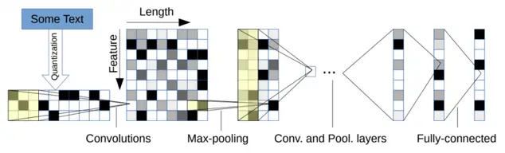

Figure 2.3: Character-based CNN for text classification \[264\]

CNN is also used in different NLP tasks with text input \[125\]. The
process starts by sliding filters of different window sizes over the
input that could be word embeddings. Each filter has a weight and
generates a new feature for the different windows. A feature map is
generated by sliding the filter over each window. As a result of some
calculations that consider a small segment of the input sequence and
share the parameters with the calculations to its left and right to
generate each entry in the feature map. In order to condense a feature
map to its most important feature, a pooling technique is used.
Max-pooling is one of the most common types of pooling. It takes all
maximum values of the feature maps and concatenates them to form a
vector. This vector is given to the next layer or output layer at the
end \[203\].

Figure 2.3 illustrates an example of CNN model as applied on text. The
model takes as input the text/word embeddings and aggregates the local
information from the neighbours to save the meaning of a word by
applying a convolution operations. This network is composed of one large
and one small CNNs. These are composed of nine layers deep with six
convolutional layers and three fully connected layers.

The weights for a particular hidden unit are then shared for all
positions in the input image. As such, this acts as a convolutional
layer, with a local filter being convolved over an entire image to
produce a feature map. CNNs are usually composed of several such
convolutional layers, separated by pooling layers. The convolutional
layers apply the local filter to all positions in the image, while the
pooling layers reduce the size of the encoded data by downsampling the
resulting feature map. The most common type of pooling used is max
pooling, which outputs the maximum value over each pooling region, but
mean pooling is also used in some of the literature. These pooling
layers are particularly important because they reduce the computation
for higher layers, by removing non-maximal hidden unit activations. They
also act as a form of translational invariance: by pooling over a 2 × 2
region, for example, a maximal activation can translate by one pixel and
still produce an identical output. Following a series of alternating
convolution and pooling layers, a number of fully connected layers may
also be incorporated, to learn the high order correlations in the
features. Fully connected layers are now feasible in the higher layers,
as the input dimensionality has been significantly reduced through
pooling. Finally, a multi-class

#### 2.3.2 Recurrent Neural Network

Recurrent Neural Network (RNN) \[81\] is a specific kind of ANN that has
internal memory designed to remember its past input every time a new
input is given. It is composed of neurons connected by weighted arcs _w_
and models sequential data better than Feed Forward Network as it models
the relationships between the inputs over time using a feedback
mechanism/loops \[5\]. For every element of a sequence, it performs the
same task with the output while depending on previous computations.

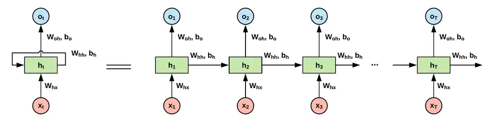

Figure 2.4: Overall visualization of RNNs \[97\]

RNN is commonly used in the NER and LID tasks and has showed success due
to its capabilities of handling sequential tasks \[144, 100\]. As
illustrated in Figure 2.4, the input vector is _x\_(t)_ that represents
the current input and _h\_(t)_ represents the current hidden timestamp
layer. _W\_(hx)_ is a weighted matrix of current timestamp layer that is
used in multiplication of the input vector and it is given to the
activation function. The function computes the activation value for the
hidden timestamp layer. This hidden layer is used to calculate the
corresponding output _o\_(t)_ using weight at output state _W\_(hy)_ and
hidden state. This RNN architecture does not require a fixed length
limit prior to context because each element is processed one by one at a
time. Nevertheless, this affects the parallelism of the execution of
this architecture. RNN learns long-distance dependencies because of its
maintaining memory-based history information. However, practically, they
fail due to the vanishing or exploding gradient \[157\]. Thus, a series
of RNN variants have been created in order to solve this problem.

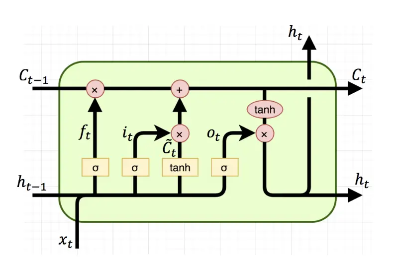

Figure 2.5: Gates of LSTM unit layer \[161\]

One of them is Long-Short-Term-Memory (LSTM) that was designed to solve
the vanishing problem of RNN. \[116\]. LSTM network contains connected
memory blocks/cells instead of the traditional nodes of the RNN. They
retain information for a longer time, needed in NLP, to model long-term
dependencies. LSTM has mechanisms to decide what information should be
remembered and what should be forgotten. As shown in Figure 2.5, the
LSTM network augments the RNN architecture with an input gate _i\_(t)_,
forget gate _f\_(t)_ and an output gate _o\_(t)_. All gates share a common
design pattern; they contain a feed-forward layer followed by a Sigmoid
activation function and by a point-wise multiplication with the layer
being gated. They are all functions of the current input _x\_(t)_ and the
hidden previous state _h\_(t)_. These gates interact with the current
input, its cell state _c\_(t)_ and the previous cell state _c\_(t-1)_ and
allow the model to either retain or overwrite information.The forget
gate _f\_(t)_ is capable of removing context that is not needed. It
computes the weighted sum of the previous hidden layers and the current
input and passes that to a Sigmoid activation function. The context
vector is multiplied to the output to remove the unneeded information
\[90\]. However, the disadvantage of using LSTM is that it does not
check the future context as it checks the previous one only.

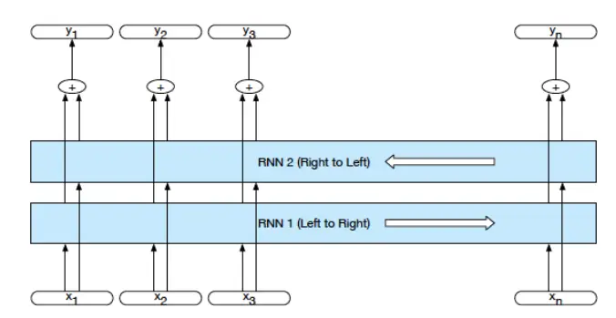

Figure 2.6: Bidirectional LSTM Architecture \[124\]

To benefit from the previous and from future contexts, Bidirectional
Long Short-Term Memory Networks (BiLSTM) was proposed as an extension to
LSTM. This represents two separate LSTMs each one representing a
sequence forward and backward to save the previous and future
information as shown in the Figure 2.6. It takes advantage of both left
and right contexts and is considered as pair of LSTMs, the first one is
trained from left-to-right and the second one is trained from the
right-to-left. This has showed promising results in different NLP tasks
\[258\].

For the sake of predicting the current tags, there are two common ways
to make use of the previous and the future tag information. One way is
to predict a distribution of tags, step by step, and then use beam-like
decoding to find the best sequence of tags; this could be achieved using
the Maximum Entropy Markov model. The other way is to use the CRF model
which focuses on sentence-level instead of individual positions \[119\].
As stated before, CRF is one of the most conventional high-performance
sequence labeling models. Combining LSTM/BiLSTM with a CRF layer has an
advantage over LSTM/BiLSTM alone and CRF alone. As shown in Figure 2.7
CRF layer on top of BiLSTM will add the sentence level tag information
to the model. Then, the CRF Layer can efficiently predict the current
tag from past and future tags, equal to the BiLSTM past and future input
features. These extra features can boost tagging accuracy \[119\].
Combining both LSTM/BiLSTM and CNN networks is also used to solve
sequential problems. It takes advantage of both models, the CNN
extracting the features from the input text, and the LSTM/BiLSTM saving
the chronological order of the input words

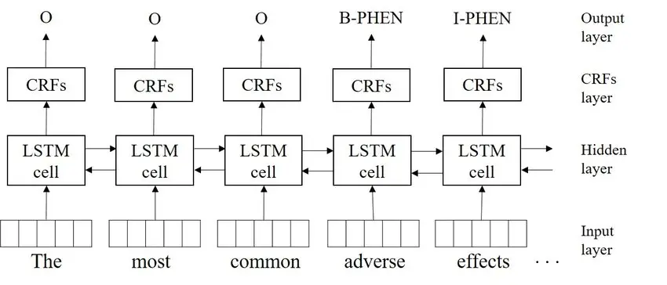

Figure 2.7: Bidirectional LSTM with CRF layer Architecture for NER
\[128\]

#### 2.3.3 Transformers

Transformers are a recent type of neural network architecture \[241\].
They have become a mainstream architecture used in several NLP tasks as
they are very powerful. The transformer models solve the disadvantages
of the LSTM models as they allow parallelism in training and capture
long term dependencies of tokens in a sequence. In comparison with
BiLSTM models that cover the full context of a sequence by concatenating
two models in one vector, the transformers monitor in one model the
sequence bidirectionally. This method is better than the concatenation
as it gives better representation of sequence. This is achieved by
modeling direct dependencies between each two words in a sequence.
Transformers model dependencies using an attention mechanism. As shown
in Figure 2.8 its architecture depends on stacked layers of
self-attention and point-wise in forming encoder and decoder components;
the encoder is the component on the left and the decoder is the one on
the right.

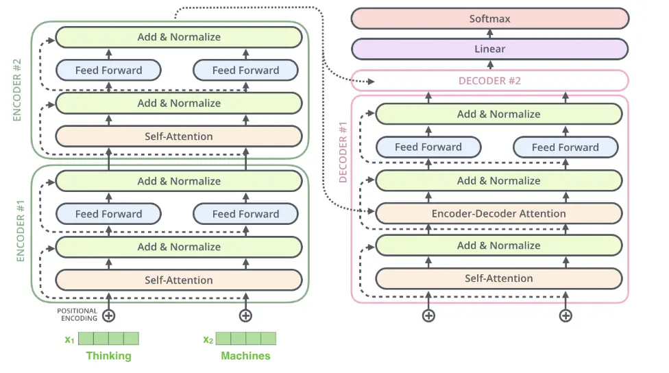

Figure 2.8: Transformer Architecture\[18\]

Few concepts must be defined in order to better understand the
architecture of the transforms such as, for example, attention,
self-attention, encoder and decoder.

##### Attention

As proposed by \[155\], attention is based on context-encoding mechanism
to overcome the drawback of the context vector mechanism of the LSTM
model. The idea behind this mechanism is that, each time a model outputs
a hidden state, the context from part of the input sequence where most
relevant information is used.

##### Self-Attention

Transformers use the mechanism of self-attention to find words in a
sentence that are relevant to the current processed word. This is
achieved by calculating a score for the tokens in a sequence to
represent its relevance. Then after calculating the scores for every
token, all the scores are added to get the output for the first position
token.

Another mechanism used by the transformers is the Multi-Headed Attention
which enhances the performance of self-attention. The attention layer is
given different heads, each with different parameter values. Using the
given values the head computes the output attention. After all the
outputs of the heads are concatenated to form the final output of the
attention layer.

##### Encoder

One of the main components of the transformer is the encoder. It is
created from a stack of N identical layers, with each one being composed
of two sub-layers. The first sub-layer is composed of a multi-head
self-attention mechanism. The second one is a simple position wise fully
connected to a Feed Forward network followed by a normalization layer. A
corresponding hidden state is passed to the decoding stage for each
input vector. As shown in the Figure 2.8 the vectors of the input pass
through positional encoding nodes. An order representation is given to
the input vectors by these nodes that add positional encoding vectors.

##### Decoder

The final main component is the decoder which is also created from a
stack of N identical layers, with each one being composed of two
sub-layers. However, a third sub-layer performs multi-headed attention
on the output of the stack of the encoder. The output of the decoder is
converted to word format using a linear layer followed by a Softmax
layer.

#### 2.3.4 Configuration of Deep Neural Network

Model design variables determine the network structure, such as the
number and size of the hidden layers, and the hyper-parameters determine
how the network is trained, such as learning and dropout rate \[69\].
The following are some model variables and hyper-parameters that affect
the training of deep learning models.

Epoch: It is a random cutoff number, usually defined as ”one pass over
the whole dataset”. It is used to separate training into different
phases, which is useful for logging and for periodic assessment \[56\].

Batch Size: It is the number of sentences that will be propagated
through the network. The training dataset will be divided by the number
of batch sizes. Small batch sizes are attractive since they can make
convergence in fewer epochs. However, large batch sizes provide more
data-parallelism, which successively enhances computational efficiency
and scalability \[67\].

Activation Function: It is used to establish non linearity to models,
which allows deep learning models to learn non-linear prediction. It
calculates the output from the summation of the weighted input signals
of the neural network and also maps the result between 0 to 1 or -1 to
1, depending on the function. The main reason for using it is to
transform the input signal in a network into an output signal. It is a
mathematical equation that is responsible for determining the output of
a neural network. Each neuron has a function attached that determines
whether it should be activated or not. This function is applied to the
summation of the product of input nodes and their weights. A Neural
Network unaccompanied by the Activation function would directly be a
Linear regression model, which will not fulfill learning complicated
functional mappings from data \[46\]. The following are popular
activation functions that are experimented with in order to find the
best match for the different deep learning models, Softmax, Softplus
\[91\], Softsign, Relu \[178\], Tanh, Sigmoid, Hard-Sigmoid, and Linear
\[45\].

impppp how to choose activation function

https://machinelearningmastery.com/choose-an-activation-function-for-deep-learning/

When building a model and training a neural network, the selection of
activation functions is critical. Experimenting with different
activation functions for different problems will allow you to achieve
much better results.

An additional aspect of activation functions is that they must be
computationally efficient because they are calculated across thousands
or even millions of neurons for each data sample. Modern neural networks
use a technique called backpropagation to train the model, which places
an increased computational strain on the activation function, and its
derivative function. The need for speed has led to the development of
new functions such as ReLu

The softmax function is another type of AF used in neural networks to
compute probability distribution from a vector of real numbers. This
function generates an output that ranges between values 0 and 1 and with
the sum of the probabilities being equal to 1 This function is mainly
used in multi-class models where it returns probabilities of each class,
with the target class having the highest probability. It appears in
almost all the output layers of the DL architecture where they are used.
The primary difference between the sigmoid and softmax AF is that while
the former is used in binary classification, the latter is used for
multivariate classification.

he softsign function is another AF that is used in neural network
computing. Although it is primarily in regression computation problems,
nowadays it is also used in DL based text-to-speech applications. The
main difference between the softsign function and the tanh function is
that unlike the tanh function that converges exponentially, the softsign
function converges in a polynomial form.

In an ANN, the sigmoid function is a non-linear AF used primarily in
feedforward neural networks. It is a differentiable real function,
defined for real input values, and containing positive derivatives
everywhere with a specific degree of smoothness. The sigmoid function
appears in the output layer of the deep learning models and is used for
predicting probability-based outputs Some of the major drawbacks of the
sigmoid function include gradient saturation, slow convergence, sharp
damp gradients during backpropagation from within deeper hidden layers
to the input layers, and non-zero centered output that causes the
gradient updates to propagate in varying directions

The next activation function that we are going to look at is the Sigmoid
function. It is one of the most widely used non-linear activation
function. Sigmoid transforms the values between the range 0 and 1. Here
is the mathematical expression for sigmoid-A noteworthy point here is
that unlike the binary step and linear functions, sigmoid is a
non-linear function. This essentially means -when I have multiple
neurons having sigmoid function as their activation function,the output
is non linear as well

The tanh function is much more extensively used than the sigmoid
function since it delivers better training performance for multilayer
neural networks. The biggest advantage of the tanh function is that it
produces a zero-centered output, thereby supporting the backpropagation
process. The tanh function has been mostly used in recurrent neural
networks for natural language processing and speech recognition tasks.

However, the tanh function, too, has a limitation – just like the
sigmoid function, it cannot solve the vanishing gradient problem. Also,
the tanh function can only attain a gradient of 1 when the input value
is 0 (x is zero). As a result, the function can produce some dead
neurons during the computation process.

One of the most popular AFs in DL models, the rectified linear unit
(ReLU) function, is a fast-learning AF that promises to deliver
state-of-the-art performance with stellar results. Compared to other AFs
like the sigmoid and tanh functions, the ReLU function offers much
better performance and generalization in deep learning. The function is
a nearly linear function that retains the properties of linear models,
which makes them easy to optimize with gradient-descent methods. The
ReLU function performs a threshold operation on each input element where
all values less than zero are set to zero. y rectifying the values of
the inputs less than zero and setting them to zero, this function
eliminates the vanishing gradient problem observed in the earlier types
of activation functions (sigmoid and tanh). The most significant
advantage of using the ReLU function in computation is that it
guarantees faster computation – it does not compute exponentials and
divisions, thereby boosting the overall computation speed. Another
critical aspect of the ReLU function is that it introduces sparsity in
the hidden units by squishing the values between zero to maximum.

The exponential linear units (ELUs) function is an AF that is also used
to speed up the training of neural networks (just like ReLU function).
The biggest advantage of the ELU function is that it can eliminate the
vanishing gradient problem by using identity for positive values and by
improving the learning characteristics of the model. ELUs have negative
values that push the mean unit activation closer to zero, thereby
reducing computational complexity and improving the learning speed. The
ELU is an excellent alternative to the ReLU – it decreases bias shifts
by pushing mean activation towards zero during the training process

Optimization Function: This function is used to minimize the output of
the error function. It depends on the internal learnable parameters of a
model applied to the input to compute the predicted output. The internal
parameters significantly impact and efficiently train the model and
process accurate outcomes \[46\]. One of the commonly used optimization
functions is the Stochastic Gradient Descent (SGD). However, it is not
easy to state the learning rate as it affects its performance. To
overcome its disadvantages other functions were proposed such as Adagrad
\[73\], RMSProp \[115\], Adadelta \[261\], Adam \[131\], Adamax \[131\]
and Nadam \[72\].

Dropout: This function is used to tackle the overfitting problem due to
the noise found in the training dataset but not in the test dataset. As
deep neural networks have various non-linear hidden layers, which make
the model an exceedingly expressive model. They can learn very
complicated relationships between the outputs and the inputs. It is an
averaging technique to combine the exponential number of hidden layer
architectures, each sharing the same weights. Some of the complicated
relationships will be the outcome of sampling noise due to the limited
training data \[230\].

Learning Rate: This function specifies how fast a network updates its
parameters. A lower value makes the network train faster; however, it
can miss the minimum loss function \[69\].

During training, for each input sample, each hidden unit in the fully
connected layer is removed from computation (“dropped out”) with a
certain probability (usually p = 0.5). This means that it is unused in
both the forward-pass and backpropagation stages. Following training,
inference can then be performed with an approximate model averaging
technique: all of the units are used in the encoding process, with the
weights of each neuron scaled by 1−p (the expected value of the number
of units that remain during dropout training). Dropout provides a number
of benefits. Firstly, it prevents features from “co-adapting” to capture
a particular feature in the input data: with hidden units dropping out
randomly, any unit cannot rely on another feature being active. This
process thereby ensures that each hidden unit is independent and robust,
learning a feature that is useful in conjunction with the random subset
of other features that is selected during dropout. Secondly, it can be
considered a form of adaptive regularisation \[95\], leading to better
generalisation on unseen data. Lastly, it has been shown that model
combination nearly always improves the performance of machine learning
models. By using the proposed encoding technique, the dropout model
approximately averages

### 2.4 Word Embeddings

One of the powerful developments in the NLP field is word embeddings.
This is used to convert input text to a machine-readable format. One of
the traditional techniques to do so is one-hot encoding. This represents
each sequence text input in _d_ dimensional space, where _d_ is the
vocabulary size in the dataset. If the term is presented in the
document, it will get 1 and 0 otherwise. In the case of a large corpus,
this method will generate huge vectors that are very sparse and
inefficient. Thus, later word embeddings were introduced where each word
is projected to a dense vector; of short length and most elements are
non-zero. These word embeddings preserve the semantic distance between
words, and semantically similar words are grouped near each other. Word
embedding or representation is done by mapping every word _wi_ in a
sentence to vector _xi_ in multi-dimensional space. The word embeddings
are stored in a matrix _X_. Thus, an input represented as a sequence of
words _w1,…,wt_ is represented as a corresponding sequence of word
embeddings _x1,..,xt_, that is given to the neural network.

As it is hard to identify the similarity between the same Arabic words
having different prefixes and suffixes, the usage of word embedding
makes it easier to find these similarities as similar words are mapped
to nearby vectors. For instance, the words ةلودلا (the country),
ناتلودلا (the two countries), لودلا (the countries) differ in their
morphological forms, however, their embedding should be placed near each
other in the space.

Large datasets are used to train and save the embeddings. Then these
could be used as pre-trained word embeddings models in various
downstream NLP tasks to boost their performance. Moreover, they avoid
training an embedding model from scratch as learning independent
representations for words from the training data alone is difficult
\[194\]. Thus, adding word embedding to deep learning models enhances
the performance by specifying syntactic and semantic word relationships.
There are two main categories of word embeddings: classical
(non-contextual) and contextual word embeddings. The main difference
between these two categories is whether the context of a word affects
its embedding and changes it or not. It is challenging to learn
high-quality representations because of the different characteristics of
the words and changes they undergo based on the linguistic contexts
\[189\].

Classical word embeddings do not consider the context of the words, and
the generated vectors are static; they do not change based on the
context of the word. For instance, the word “apple” has a different
meaning in the following two sentences “I want to eat an apple” and
“Apple store is very crowded today”. Thus, using classical word
embeddings will generate the same vector for the word “apple” in both
sentences. Therefore, to overcome this problem of ambiguity, contextual
word embeddings are being introduced, and several types are being
proposed in the NLP field. Contextual word embeddings generate different
embeddings for the same words based on their context, which is essential
to capture the semantics of the ambiguous words based on their context
\[189\]. In this example, “apple” will be given different vectors in
both sentences. This will help explain that it refers to fruit and in
the second one, to a store or organization in the first sentence. The
following are some of the embeddings types most used in various NLP
tasks.

#### 2.4.1 Classical Word Embeddings

There are two main classes of embeddings, word-level and
character-level. The Word2vec and GloVe embeddings will be discussed
next from a word-level class and FastText embeddings from the
character-level class.

##### Word2vec (W2V)

Word2vec (W2V) learns word representations using neural networks. The
architecture of W2V is a Feed Forward Neural Network with one hidden
layer. The representations are created by training a classifier to
distinguish nearby and far-away words. The two main prediction/learning
approaches commonly used in W2V are continuous Bag-of-Words (CBOW) and
Skip-gram. CBOW predicts the current word based on the given context. In
comparison, Skip-gram predicts surrounding words given the current word.
W2V provides multiple degrees of similarity between different words by
mapping to nearby vectors \[169\].The most popular pre-trained Word2Vec
embedding models were developed by Google. It was trained on 100 billion
words of Google News data-set.

In this paper, we focus on distributed representations of words learned
by neural networks, We propose two novel model architectures for
computing continuous vector representations of words from very large
data sets. T

prediction based models: Skip-gram (Mikolov et al. 2013a) CBOW (Mikolov
et al. 2013b) Learn embeddings as part of the process of word prediction
Train a neural network to predict neighboring words Predict each
neighboring word in a context window of words from the current word
Popular embedding method Very fast to train Code available on the web
Idea: predict rather than count

Instead of counting how often each word (context) occurs near target
word ”apricot” Train a classifier on a binary prediction task: Is likely
to show up near ”apricot”?

Recent advancements in representational learning for natural language
processing opened new ways for feature learning of discrete objects such
as words. In particular, the Skip-gram model \[21\] aims to learn
continuous feature representations for words by optimizing a
neighborhood preserving likelihood objective. The algorithm proceeds as
follows: It scans over the words of a document, and for every word it
aims to embed it such that the word’s features can predict nearby words
(i.e., words inside some context window). The Skip-gram objective is
based on the distributional hypothesis which states that words in
similar contexts tend to have similar meanings \[9\]. That is, similar
words tend to appear in similar word neighborhoods.

Randomly initialise two sets of embeddings – each word in the vocabulary
has a target embedding, tw and a context embedding, cw ¡ Iteratively
shift target and context embeddings so that: § target embedding of word
w is more like the context embeddings of words that occur nearby and
less like the embeddings of words that don’t occur nearby

word emb training:

Embeddings are randomly initialised ¡ Iterate over text: § compute
objective function for target word using positive and negative samples ¡
Stochastic gradient descent / backpropagation is used to improve the
weights ¡ Training continues …..

##### GloVe

It is another widely known model for generating pre-trained embeddings.
Deriving the relationship between words from global statistics is the
main idea of Glove. The training of this algorithm is computed on
aggregated global word-word co-occurrence statistics in a large amount
of textual data. One of the English pre-trained models of GloVe \[187\],
was trained on Wikipedia 2014 and Gigaword 5 data. Both Word2vec and
Glove word embeddings perform similarly in most applications. However,
the training of Glove is based on matrix factorization, thus, it could
be easier parallelized. Besides, both of them share the same main
limitations, one of which being the problem of out-of-vocabulary words,
which is solved by introducing the character-level embeddings such
FastText.

##### FastText

It was created by Facebook as an extension of W2V. FastText encodes
character-level representations for a word. It breaks words into
N-grams, and the word embedding is computed as the sum of all these
N-grams. This capability helps FastText in outperforming W2V in modeling
word representations. Several pre-trained models trained on Wikipedia
were released for several languages, including English and Arabic. The
main advantage of FastText, as compared to W2V, is that it can generate
embeddings for unseen words, words not processed during training from
their character n-gram features \[42\].

#### 2.4.2 Contextual Word Embeddings

Contextual word embeddings are considered the new approach for
representing the vector of a word in a given text, as compared to
Word2Vec and GloVe models. These embeddings provide different vector
representations of a single word and are derived from pre-trained
bidirectional language models on a large text corpus \[190\]. The
contextual embeddings perform better when being used in a downstream
like NER on ambiguous, complex, and unseen languages \[22\]. In the
following part several types of contextual embeddings will be discussed,
ELMo, BERT, Contextual string embeddings, Pooled FLAIR embeddings,
ELECTRA and MUSE.

##### ELMo

Embeddings from Language Models (ELMo) was one of the first
contextualized word embeddings based on language modeling trained using
BiLSTM. The task of language modeling is unsupervised learning used in
ELMo in the pre-training phase. ELMo combines all layers with a weighted
average pooling operation. A language model generates the following word
based on the previous words in the sentence. The purpose is to
distribute over sentences in the original training data as close as
possible to the resulting distribution. The internal representations
from the BiLSTM language model is transferred after pre-training on a
large dataset to form ELMo embeddings \[190\]. Several pre-trained ELMo
models for several languages include the Arabic language implemented by
\[189\].

##### BERT

Bidirectional Encoder Representations from Transformers (BERT) is a
transformer-based language model. It replaces language modeling with
Masked Language Model (MLM) and Next Sentence Prediction (NSP) tasks.
MLMs are trained on masking out random tokens by replacing them with a
special token \[MASK\] inside a sentence. The model then tries to
predict the masked tokens using the whole context of a sequence.
Besides, NSP models are trained on distinguishing whether two input
sentences are continuous segments or are separate \[68\]. BERT models
sentences as a sequence of tokens. Each input token in a sequence flows
through stacked encoders and outputs a hidden state representing the
word embedding. This enables BERT to train in parallel. The data-path of
input sequence is shown in Figure 2.9

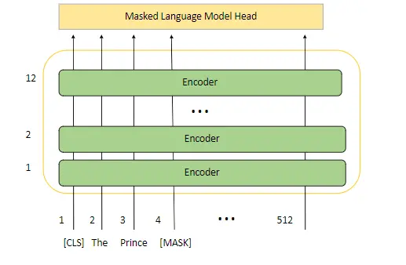

Figure 2.9: Shows data-path of input tokens inside BERT model \[17\]

The size of the model can vary according to the number of stacked
encoders and hidden size. Larger BERT models require more data to train
without overfitting. BERT models train on a fixed length sequence. In
the tokenization phase, BERT uses the WordPiece model to tokenize words.
A token that is not in its vocabulary is broken by the WordPiece model
into segments that the model can tokenize. Special tokens \[CLS\] and
\[SEP\] are added in the tokenization process to split a pair of
sentences. Finally, a special token \[MASK\] replaces the tokens that
are being predicted. Then three embedding layers are added to the input
vectors before feeding them to the encoders as shown in Figure 2.10. A
static positional embedding is added to each token to indicate its
position in the sequence. Segment embedding designed to help distinguish
which sentence a token belongs to when a pair of sentences is inputted,
helps in handling a variety of NLP tasks. At last token embedding
transforms the input representation into fixed-size vector.

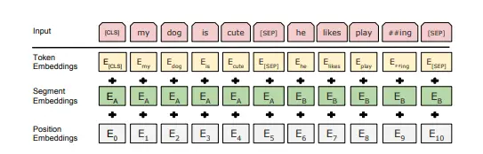

Figure 2.10: BERT input representation \[68\]

BERT was state-of-the art in 11 NLP tasks, including NER \[68\]. One of
the main pre-trained BERT models is the BERT Multilingual model, which
contains 104 different languages, including Arabic and English.

##### Contextual String Embeddings

It is a contextualized character-level/string bidirectional language
model. Contextual string Embeddings model sentences as a sequence of
characters and trains on the auto-regressive task. Contextual string
Embeddings architecture is an Encoder-Decoder architecture variant. The
first layer is the encoder layer which is the embedding layer for the
model. Then hidden layers are LSTM layers. Finally, a decoder layer
which is a fully connected dense layer for output. FLAIR can model
sequence bidirectionally by stacking a forward and a backward character
language model. Therefore, to get the whole context, the forward and
backward FLAIR language models should be trained. Besides considering
the context, these language models are trained without the explicit
notion of words which lead to modeling the words as a sequence of
characters. Its models can produce several embeddings for the same word
based on its context and manage dealing with rare and misspelled words
by modeling context as characters \[11\].

A variant of Contextual string Embeddings embeddings is the Pooled FLAIR
embeddings. It has an identical architecture of Contextual string
embeddings. The difference lies in having an additional memory
component. This component solves the disadvantage of Contextual string
embeddings by generating meaningful embeddings of rare strings used in
an under-specified context. Pooling operation aggregates the
contextualized embeddings of all unique strings it finds and retrives
previous embeddings produced from memory. Then, the pool operation is
performed and defines one-word embedding for all contextualized
instances \[10\].

##### ELECTRA

Efficiently Learning an Encoder that Classifies Token Replacements
Accurately (ELECTRA) is composed of two neural networks, a generator and
a discriminator trained together on MLM and Replaced Token Detection
(RTD) tasks. RTD is a particular unsupervised task that trains
discriminative models. The architectures of the discriminator and
generator are encoder variants of transformers like BERT. The language
model is given a sequence of tokens from a generator and tries to
predict whether a generator or original token replaces a token. A full
modeling context does this. The ELECTRA model is trained to minimize the
combined losses of the generator and the discriminator. The generator
model is only used in pre-training. In the fine-tuning stage, the
generator model is thrown away and the discriminator model is used for
downstream tasks. Figure 2.11 visualizes the inner components of
ELECTRA.

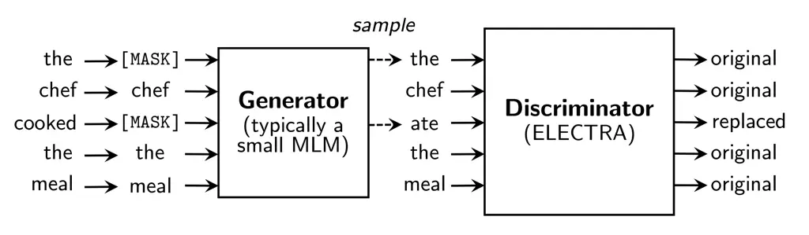

Figure 2.11: ELECTRA generator and discriminator components \[57\]

An input sequence first passes through a generator that is identical to
BERT. The three embedding layers in Figure 2.10 are added to the input
sequence. The generator inputs are corrupted by replacing random tokens
with a special token \[MASK\] which the generator is trained to predict.
Then, using the attention mechanism, the encoder layers output hidden
states of the embedding representation. The output layers of the
generator predict the tokens in the sequence using the embedding
representation computed. Next, the discriminator model takes the
computed representation as input. The discriminator model has as well
its own three embedding layers that add vectors to the input tokens. The
encoder layers then compute attention and finally, discriminative output
layers distinguish tokens in the data from those that have been replaced
by the generator model. The ELECTRA model is trained to minimize the
combined losses of the generator and the discriminator. Compared with
BERT, the ELECTRA training mechanism is considered to be more efficient
because the task is defined over all input tokens rather than just the
15% tokens that were masked out \[57\].

##### MUSE

One of the recent embedding types is the Multilingual Universal Sentence
Encoder (MUSE) \[257\]. Being one of the members of the Universal
Sentence Encoder (USE) embedding models \[48\], it maps text written in
different languages having the same meanings, to nearby embedding space
representations. To align the cross-lingual vector spaces, a translation
ranking task is used by MUSE. A sentence of any length is mapped by MUSE
to a vector with dimensions equal to 512. MUSE has multilingual models
that support 16 languages, one of which being Arabic. The available
models are trained on generic corpora from different sources such as
Wikipedia and contain vocabulary of 200,000 sub-words.

### 2.5 Evaluation Metrics

to check https://wiki.pathmind.com/accuracy-precision-recall-f1 imp to
add conf matrix :
https://dspace.cvut.cz/bitstream/handle/10467/76132/F3-BP-2018-Tishin-Nikita-thesis.pdf

It is essential to discuss the evaluation metrics commonly used to
evaluate and compare the different NER techniques and models. Evaluating
a system requires a comparison between the outputs with the
gold-standard annotations. The gold-standard corpus contains annotated
instances with the same types of named entities, and this corpus is
usually tagged manually. The process starts by randomly dividing the
corpus into training and testing sets with portions of 70%-30% or
80%-20% respectively and is followed by the learning process of the
model that uses the training set. Then entities are extracted from the
test set using the trained model. For each named entity type several
evaluation metrics could be calculated.

The different NER forums have suggested various evaluation schemes; in
this work, the exact-match evaluation suggested at CoNLL-2003 \[235\] is
followed. A simple method used to analyze the success rate and denote
the right and wrong predictions is the confusion matrix. The rows of the
matrix represents an actual class and the columns represent a predicted
class.

|                          | True label positive | True label negative |
| ------------------------ | ------------------- | ------------------- |
| Predicted label positive | True Positive (TP)  | False Positive (FP) |
| Predicted label negative | False Negative (FN) | True Negative (TN)  |

Table 2.1: Confusion Matrix

As shown in Table 2.1, the possible classification cases are denoted as
$`TP`$ and $`TN`$ representing the correctly classified number of
positive and negative named entities as well as $`FN`$ and $`FP`$
representing the misclassified negative and positive named entities,
respectively. The information given by the confusion matrix is not
enough to evaluate the performance and more concise metrics are used.

There are four common metrics that use numerical values to represent
several aspects of the quality of a system, Accuracy, Precision, Recall,
and F1-score (micro-averaged). The Accuracy is a common evaluation
metric in machine learning classification tasks. However, it gives high
values to systems that do not return any results. Accuracy is the
percentage of correct predictions from the total predictions made by the
system.

```math
Accuracy=\frac{TP+TN}{TP+TN+FP+FN} \tag{2.1}
```

The Precision is the percentage of named entities recognized by the
correct system. It is calculated by computing the ratio of several
correct answers to the total number of answers as shown in Equation 2.2
\[117\].

```math
Precision=\frac{TP}{TP+FP} \tag{2.2}
```

The Recall is the percentage of named entities in the corpus/golden
annotations found by the system. It is calculated by computing the ratio
of the number of correct system answers to the expected total number of
answers as shown in Equation 2.3. A named entity is considered correct
if it matches the corresponding entity in the corpus.

```math
Recall=\frac{TP}{TP+FN} \tag{2.3}
```

The F1-score combines those two values, as shown in Equation 2.4. It is
the harmonic mean of Precision and Recall used to balance their results.

```math
F1-score=\frac{2*Precision*Recall}{Precision+Recall} \tag{2.4}
```

## Chapter 3 Related Work

Many efforts have been made to improve the performance of several NLP
tasks for the English language and develop similar Arabic language
techniques. This chapter discusses some related work for the NER task on
monolingual and code-switched data. Then, we discuss previous work of
other related NLP tasks on CS data.

### 3.1 Named Entity Recognition

The NER task was officially coined for the first time in the Message
Understanding Conferences (MUC-6) in 1995 \[231\]. Detecting and
classifying entities in the text was one of the first steps needed for
most information extraction applications. Information extraction refers
to the task of converting unstructured information in text into
structured data. One of the earliest Arabic NER research was done in
1998 \[160\], and more work was done for the Arabic language starting
2007 \[221\]. First, in this section, an overview of some of the
previous work related to NER on monolingual English and Arabic data is
presented. Second, we give an overview of NER approaches applied to
code-switched data.

#### 3.1.1 Named Entity Recognition on Monolingual Data

Much research has been conducted on NER for monolingual text. Due to the
morphological complexity of the Arabic language, fewer attempts have
been made to tackle the problem of NER in Arabic as compared to other
languages such as English. The two main approaches mainly used in NER
systems are the rule-based and machine learning-based approaches.

The rule-based approach is one of the earliest approaches used and
depends on grammar/hand-crafted rules, usually represented as regular
expressions. The advantage of such an approach is that it relies on
lexical resources and does not require annotated training data. For
instance, this approach has been used for English NER in \[168, 110,
195\].

For the Arabic NER task, we present some of the systems that used
rule-based approaches. In \[160\], they developed TAGARAB, an Arabic
name recognizer that uses a pattern‐recognition engine integrated with
morphological analysis. The role of the morphological analyzer is to
decide where a name ends, and the non-name context begins. They randomly
selected fourteen documents and tagged them manually. The system
achieved an F1-score of 85% for recognizing four different entity types.

In addition, in \[167\] used NooJ¹¹ 1 NooJ is available at
http://www.nooj4nlp.net. linguistic environment to process the Arabic
text and build NER tagger. Their system was composed of a tokenizer,
morphological, and named entity finder. They used a set of gazetteers
and lists to find the named entities and support the constructed rules.
They achieved F1-score equal to 85% for Person, 76% for Location, and
84% for Organization.

In \[222\], the Arabic NER system relied on a whitelist containing names
and a set of grammar rules. It was evaluated using their data-set, the
results of the evaluation accomplished a high F1-score of 87.7% Person,
85.9% for Location, and 83.15 % for Organization.

The system of \[16\] was implemented using GATE²² 2 GATE is available at
http://gate.ac.uk/. and an Arabic morphological analysis is provided.
They used several gazetteers in their system, and it was evaluated using
ANERcorp. The system achieved an F1-score of 76.27% for Person, 70.87%
for Location, and 57.30% for Organization.

However, the rule-based approach is domain-specific, and lexicon
resources are not always available. Therefore, creating such resources
and maintaining them is time- and effort- consuming especially, if the
linguists required knowledge is not available \[254, 220\]. Thus, most
recent studies have started moved to use machine learning-based
approaches.

The second main approach is machine learning; there are three machine
learning methods, supervised, semi-supervised, and unsupervised. The
unsupervised and semi-supervised (bootstrapped) require very little
training data for learning to predict using both labeled and unlabeled
data. The main idea of supervised approaches is learning to predict by
training on annotated examples with features. We will focus on the
supervised learning approach similar to our approaches for NER taggers.

Among the different supervised approaches that have been conducted on
English NER are Hidden Markov Models (e.g., \[266\]), Conditional Random
Fields (CRF) (e.g., \[164\]), Support Vector Machines (SVM) (e.g.,
\[147\]), and decision trees (e.g., \[215\]) \[177\].

In \[38\], they used the Maximum Entropy (ME) and N-grams based
algorithms, built a system (ANERsys), and created the freely available
corpus (ANERcorp) and gazetteer (ANERgazet) for training and testing.
This system achieved an F1-score of 55.23%. The system was enhanced in
\[36\] by comparing two different techniques, SVM and CRF. They have
also explored various combinations of contextual, lexical, and
morphological features on different data-sets, but they could not show
which one, SVM or CRF was better as it differs for different entity
types. The best results achieved were 83.5% F1-score for the ACE 2003 BN
data \[70\]. In \[37\] the probabilistic model was replaced from ME to
CRF, and the result as 79.21% F1-score was obtained.

A set of features was investigated in \[4\] to be used for CRF sequence
labeling. These showed that character N-grams of leading and trailing
characters of a word could be represented as lexical features. This
could help in the NER task without the use of linguistic analysis. Their
system achieved 81% F1-score on ANERCorp dataset \[38\] and 76% F1-score
on ACE 2005 dataset. However, they have only considered three NE types
(persons, locations, and organizations).

In \[3\], they implemented an Arabic NER task using bootstrapping
semi-supervised pattern recognition and CRF. Their system extracts 10
types of NEs. It outperformed the LingPipe recognizer³³ 3
http://alias-i.com/lingpipe when both systems were evaluated on the
ANERcorp data-set.

Also, a combination of both rule-based and machine learning-based
approaches was used as a hybrid approach. In \[168\] and \[27\] English
NER systems using hybrid approaches were implemented.

A hybrid approach for Arabic NER was also used in \[182\] they used a
hybrid approach for Arabic NER. The rule-based part of their system is
similar to the one presented in \[222\], regarding the machine learning
part started by features and classifiers selections. Their approach
showed promising results on the ANERcorp data-set; however, it still had
the problems of the rule-based approaches. The system performance was
90.1% F1-score for Location, 94.4% for Person, and 90.1% for
Organization.

Afterward, using word representations for NER tasks \[219\] was
experimented with. Since labeled data is costly and many unlabeled data
exists, a new technique was introduced to cluster words and then use the
clusters as features in supervised approaches. The first type used was
Brown clustering \[44\], which improved the performance when used in
\[148\] as features in semi-supervised English NER. The idea of Brown
clustering is minimizing the bi-gram language model perplexity for a
text corpus. However, its disadvantage lies in its inability to cluster
tens of millions of phrases. K-means clustering algorithm was used in
\[149\] to include the clusters of phrases as features in the CRF
classifier for NER. The advantage of using the k-means clustering
algorithm is the ability to cluster tens of millions of words.
Afterward, the focus moved to using word embeddings in linear NER models
and enhancing the results (e.g., \[238, 237\]).

In \[98\], three approaches for incorporating word embeddings with CRF
were presented to apply the NER task, binarization, clustering, and a
new proposed distributional prototype method. A high performance using
the three techniques compared to using the continuous embedding as
heterogeneous features were achieved. It was demonstrated in \[185\]
that plugging phrase embeddings in a log-linear CRF system improved the
performance.

In the NER biomedical domain \[251\], word embedding is also used for
NER in clinical texts. The clinical texts contain a lot of noise and
unstructured sentences compared to general English texts. Different word
embedding algorithms were investigated and compared since they could
represent hidden meanings and capture relations in the real value
matrix. Word2Vec and the ranking-based neural word embedding algorithms
and three different strategies were compared for deriving and
distributing word representation features from their embeddings. Also,
the NER system presented in \[150\] achieved high results using a CRF
classifier with features like lexicon resources, with one of them being
word embeddings.

For the Arabic language, the first NER system that used word
representations was presented in \[269\]. Their system was applied on
Dialectal Arabic, and the Brown clustering feature was used in addition
to the classical features. They continued work, and they proposed in
\[270\] a technique to use word embeddings by clustering them and using
the clusters as features along with the other set of features in the CRF
system. Their approach showed promising results; nevertheless, it was
designed to recognize entities extracted from social media texts written
in dialectal Arabic. It achieved a 72.68% F1-score on a Dialectal
data-set. Besides, few details were given concerning the dimensions of
the generated vectors and the numbers of clusters. The second one
presented in \[138\] mainly focused on comparing two different word
embedding algorithms, Word2Vec and Global Vectors. The AQMAR corpus,
which consists of 74k tokens, was used. The best performance of the
system achieved was 67.22% F1-score. However, the effect of the number
of clusters was not studied.

Supervised or semi-supervised traditional machine learning approaches
require domain-specific resources and a lot of feature engineering. That
is why neural network systems have been proposed for the NER task, and
this improved performance significantly \[253\]. One of the early neural
network architectures for NER was presented in \[58\]. They constructed
feature vectors from lexicons, dictionaries, and orthographic features.
Later in \[59\], they implemented the first-word embedding model instead
of the manually created feature vectors along with the neural network
system. This model showed the importance of having word embeddings in
several NLP tasks, such as the NER. The input of the model was given as
a sequence of embeddings of each word in a sentence. They used a
Convolution layer connected to a CRF layer and achieved an 89.59%
F1-score on the English CoNLL 2003 data-set \[235\].

In \[119\], they used BiLSTM instead of Convolutional Neural Networks.
They proposed several models for sequence tagging. The model that
produced accurate tagging performance was BiLSTM-CRF; a CRF layer was
connected on top of BiLSTM to decode labels for the entire sentence.
They scored 84.26% F1-score on English CoNLL 2003 data-set using random
embedding. In \[256\], they introduced different Neural Network-based
models for NER on three data-sets in English, German, and Arabic. For
the English, they used the CoNLL 2003 data-set, for German, they used
GermEval 2014 NER shared task \[39\], and for Arabic, they used
ANERcorp. The different models they experimented with were BiLSTM,
window BiLSTM, and a word-level feed-forward. They also added other
features such as CRF, Part-of-Speech tagging, and word embedding. The
best results for English were 88.9%; for German 76.1%, and for Arabic,
71.3% F1-score.

Learning character embeddings has proved to help tackle out-of-vocab
words, especially for morphologically rich languages. Therefore,
combining the characters of a word and its context has been shown to
enhance NER systems \[141\]. For instance, a hybrid BiLSTM and CNN
architecture was created in \[55\]. Its advantages are to detect word
and character features with no need to use most feature engineering. For
modeling character-level information, CNN was used. A model using
BiLSTM-CRF was introduced in \[157\]. A CNN was added to the model to
benefit from its capability to convert character-level data of a word
into its character-level presentation. They combined word and character
level representation to be the input to BiLSTM followed by CRF layer to
generate the labels. They obtained a 91.21% F1-Score on CoNLL 2003
data-set. One of the advantages of their model is easily applying data
from several domains to the model because it does not require data from
a specific domain or task-specific knowledge.

In \[141\], developing resources and features for new languages and
domains were tackled. Two models using BiLSTM were created, and output
label dependencies via CRF were added and another one using a
transition-based approach inspired by a shift-reduce parser for NER on
four languages. The best performance using the BiLSTM and CRF models was
achieved. Their model does not require any language-specific resources
or features. A character-based word representation model was also used
to capture orthographic sensitivity. For the English and German
languages, CoNLL 2003 data-set was used and achieved a 90.94% and 78.76%
F1-score. Moreover, for the Dutch and Spanish languages, CoNLL 2002
data-set \[235\] was used and achieved an 81.84% and 85.75% F1-score.

Another bidirectional recursive Neural Network connected to a
Convolutional Network was explored in \[146\]. This approach divides
each sentence into chunks of meaningful sentences holed by nodes, then
the model categorizes each node by these hidden features and evaluates
hidden state features of every node. They got an F1-score equal to
90.91% for BiLSTM-CNN and added to it word embedding only. Also, they
achieved an F1-score equal to 91.55% with lexicon and capitalization
features on OntoNotes 5.0 data-set \[118\]. They also scored an F1-score
equal to 91.62% using BiLSTM-CNN along with the lexicon and word
embedding.

As traditional word embeddings do not consider the context of the words,
recently, new types of contextual word embeddings have been proposed and
used in several NLP tasks. Some work has been conducted for the NER task
using contextual embeddings for the English language. In \[188\] they
introduced a semi-supervised approach using bidirectional language
models for adding contextual pre-trained embeddings to different NLP
tasks. They evaluated their model using CoNLL 2003 English data-set for
NER. It achieved an F1-score of 91.93%, which is an improvement of 1%
from the baseline system implemented with the regular pre-trained
embeddings.

Moreover, a new type of embeddings was proposed in \[189\], which is
deep contextualized word embeddings (ELMo) that could be added to
existing models. This new type considers the syntax and semantics of the
words and their variations in different linguistics contexts. They
tested their new type of embeddings on different NLP tasks, including
NER. The CoNLL 2003 data-set was used, and a baseline using
character-based representation, pre-trained word embeddings, two BiLSTM
layers, and a CRF layer were built. The baseline got an F1-score of
90.15%, and the model was enhanced by adding ELMo to it. It got an
F1-score of 92.22%.

The use of ELMo embeddings improved the performance of most NLP tasks.
However, it is not easy to integrate it into neural network
architectures, but there are several ways to do it: weighting the three
layers or using only the first or last one. A task-specific architecture
that considers the embeddings as additional features can also be used
\[200\]. Another new type of embeddings was presented in \[68\]; it is
called Bidirectional Encoder Representations from Transformers (BERT).
This new type uses an unlabelled text by conditioning the left and right
context in all layers to train bidirectional word representations.
Several approaches using BERT on CoNLL 2003 data-set for NER were
compared, and the best one got an F1-score of 92.8%.

In \[11\], the newly proposed type of embeddings called Contextual
string embeddings for the NER task on CoNLL 2003 English and German data
was used. The embeddings combine the advantages of all other contextual
embeddings, which are training on a large unlabelled data-set, and
consider the context. They model the words as a sequence of characters
to better handle misspelled words and prefixes and suffixes of words. An
F1-score of 93.09% and 88.33% for English and German languages were
achieved, respectively.

A Pooling contextualized embedding was proposed in \[10\] for the NER
task. The open-source FLAIR framework ⁴⁴ 4
https://github.com/zalandoresearch/flair to build the NER system was
used and implemented using the BiLSTM-CRF sequence labeling. The system
aggregates contextual embeddings of all unique strings by a pooling
technique. CoNLL 2003 data-set and WNUT-17 task \[66\] were used to
evaluate their model. The system achieved high results of a 93.18%
F1-score on CoNLL 2003 English data, an 88.27% F1-score on CoNLL 2003
German, a 90.44% on CoNLL 2003 Dutch, and a 49.59% F1-score on WNUT-17.
The results achieved on the CoNLL 2003 data are considered
state-of-the-art results in the NER task for these languages.

All the previous work presented mainly tackled the English language.
Regarding the Arabic, in \[95\] they used deep learning for the NER task
on the Twitter data-set. This takes advantage of both character- and
word-level representations by applying them to integrate between BiLSTM
and CRF. Not only did they use unannotated corpora, but their model also
depends on unsupervised word representations learned from their corpora.
Their system obtained an 85.71% F1-Score for Arabic NER in social media.
The data-set used in this paper is unsupervised, and it was collected
from Twitter. In addition, this paper did not add the CNN layer, which
was observed in our work to boost performance.

As contextual embeddings achieved state-of-the-art results in several
NLP tasks such as English NER, pre-trained Arabic contextual embeddings
were proposed. One of the most recent embeddings, AraBERT \[21\] was
trained on 70 million sentences, corresponding to around 24GB of the
text of the news domain. AraBERT was used to evaluate different tasks,
and its performance was compared in several baselines, one of which was
the NER system implemented by \[76\]. The NER model was based on
Bi-LSTM-CRF and BERT multilingual embeddings, the use of AraBERT
increased the performance and achieved an F1-score of 84.2%, which is
the highest result on ANERCorp. BERT was trained in \[111\] in a
semi-supervised learning approach for Arabic NER using labeled and
semi-labeled data-sets. They relied on the pre-trained model of AraBERT
and followed the approach of teacher-student learning mechanism proposed
by \[255\]. They compared their approach to three other available
techniques presented in \[184, 2, 112\] using the same MSA data-sets
(AQMAR, NEWS, and TWEETS), and they achieved higher results on the first
two sets as 65.5% and 78.6% F1-score respectively.

#### 3.1.2 Named Entity Recognition on Code-Switched Data

Concerning the NER on code-switching data, no work has been conducted in
this direction for Arabic-English CS text before the present work.
Regarding other language pairs, in \[99\], they introduced a hybrid
approach for NER from CS English-Hindi and English-Tamil. A classifier
based on CRF was used, and an F1-score of 62.17% for English-Hindi and
44.12% for English-Tamil were achieved. In \[31\], they proposed a
Bengali-English code-mixed data-set in the domain of sports and tourism
for the NER task. They also compared four machine learning approaches
for NER on code-mixed. The best performance achieved was a 92.31%
F1-score for sports data using CRF and a 70.63% F1-score using SVM for
the tourism data.

In FIRE’2015, a shared task was established to collect and recognize
entities from CS social media data for Hindi, Malayalam, Tamil, and
English languages \[198\]. Lately, the CALCS 2018 shared task for the
third workshop on Computational Approaches on Linguistic Code-switching
\[6\] and was established for the NER task on CS data from social media
for English-Spanish (ENG-SPA) and MSA-Egyptian (EGY). Of the 9
participants, 8 submitted work on ENG-SPA, and 6 submitted work on
MSA-EGY \[24, 121, 122, 89, 247\]. The best performance of the language
pair MSA-EGY was achieved by \[247\]; their model was implemented using
BiLSTM-CRF and an embedding layer. An F1-score equal to 71.62% was
achieved.

Furthermore, a NER tool for Hindi-English code-mixed data was proposed
in \[226\]. They implemented two different models, one using a CRF
classifier and another using an LSTM model composed of two bidirectional
layers. The performance of their models was 72.06% and 64.64% F1-score,
respectively. A benchmark for Linguistic Code-switching Evaluation
(LinCE) using deep learning and pre-trained ELMo and BERT-based models
was proposed in \[8\]. The results obtained by the researchers can be
submitted and compared to others in real-time. LinCE covers four CS
language pairs, one of which being MSA-EGY and including several NLP
tasks. One of them was the NER covering the language pair MSA-EGY.

In \[7\], they addressed NER for code-switched texts using 50k
Spanish-English, and 10k Modern Standard Arabic-Egyptian annotated
tweets on nine entity types. Other researchers showed different
approaches for code-switched corpus acquisition techniques. Also, in
\[88\], they presented a code-switching data generator system using a
pre-trained BERT monolingual model and Generative Adversarial Networks.
A Bert-based Chinese model was applied to monolingual data and
configured to generate Mandarin-English code-switching data. A
discriminator compared generated data and actual code-switched data,
assuring that generated data was similar to real code-switching data. To
test the effectiveness of the generated data, it was used to train a new
language model. The trained language model showed lower perplexity of
3591.66 on monolingual corpus while it achieved 1935.97 perplexities on
code-mixed data. Finally, GLUECoS \[127\] presented an evaluation
benchmark containing data-sets in English-Hindi and English-Spanish for
six NLP tasks and using pre-trained multilingual embedding.

### 3.2 Related NLP Tasks on CS Data

An overview of some of the most relevant work concerning collecting CS
data by transcribing speech data or by using social media and web
documents is provided in this section. Besides, the available work on CS
Contextual embeddings, data augmentation techniques, and the automatic
language identification task focusing on word-level identification are
also discussed.

#### 3.2.1 Code-Switched Data Collection

Due to the increasing importance of CS data, several researchers have
been recently working on collecting CS data for different languages and
NLP tasks (e.g., NER, Automatic Speech Recognition (ASR)). Several
approaches have been used to collect such data, one of them being
gathering (e.g., audio recordings from interviews) and transcribing
speech data, as people tend to code-switch more while talking. One
popular approach to gather data is using the power of the crowd using,
for example, Amazon Mechanical Turk or Games With A Purpose (e.g.,
\[243\] and \[181\]). Another approach to collecting CS data was
gathering data from social media platforms, web documents, or news
commentaries. This approach was faster and easier than the first one and
could lead to a vast amount of collected data. The following are some
example of CS corpora:

- •
  Arabic-English corpus \[106\] collected by recording and transcribing
  informal interviews.
- •
  CSCS Egyptian-Arabic CS corpus \[28\] containing 1,153 sentences,
  gathered from speech transcriptions \[106\], that have been tokenized,
  lemmatized, and tagged with POS.
- •
  MSA-DA (Egyptian) and English-Spanish corpora \[6\] proposed a CS NER
  data-set to benchmark NER approaches containing data gathered from
  Twitter and nine entity types.
- •
  MSA-DA (Levantine, Gulf, and Egyptian) corpus \[259\] collected from
  news commentaries. It has sentences annotated on Amazon Mechanical
  Turk. Each sentence has three labels: dialectal content, how much
  dialect there is, and the type of Arabic dialect.
- •
  Arabic-English parallel corpus \[166\] gathered from official
  documents of United Nations with two reference translations;
  monolingual Arabic monolingual English.
- •
  MSA-English corpus \[105\] gathered by harvesting a collection of
  documents (books, tutorials, and notes) from the web in the domain of
  computers. The corpus contains 2,361,002 sentences, with 240,874
  code-mixed sentences.
- •
  Arabic-English corpus \[105\] collected from web documents of online
  libraries and search engines were presented. A language model for
  Arabic-English CS was built using the corpus.
- •
  Romanized Algerian Arabic-French corpus \[61\] collected from Algerian
  news website was created and annotated with word-level language type.
- •
  MSA and Moroccan Arabic corpus \[213\] created to use for language
  identification. Data about varying subjects and blogs from Moroccan
  Internet discussion boards were collected.
- •
  MSA-DA (Egyptian) EMNLP 2014 Shared Task corpus \[228\] created from
  unique tweet ids and character offsets of tweets and posts from blogs
  for the LID task.
- •
  MSA-DA (Egyptian and Levantine) corpus \[79\] manually annotated for
  the language identification task, two ways of annotation were applied
  on each token, one based on the context and one ignored the context of
  the word.
- •
  Turkish-German corpus \[49\] created with a focus on intra-sentential
  switches using Twitter.
- •
  Spanish-Wixarika corpus \[158\] created from comments and posts from
  public pages on Facebook and manually annotated with intra-sentential
  switches as well. The last two corpora are similar to our data
  collection for the LID task, focusing on intra-sentential switches.

#### 3.2.2 Code-Switched Contextual Embeddings

Some studies implemented different word embedding models to deal with
various Arabic NLP tasks. For example, Arabic pre-trained word embedding
models were implemented \[227\]. Their first version contained six
distinct models built using either Continuous Bag-of-Words (CBOW) or
Skip-gram (SG) techniques for the different text domains. They measured
the similarity of word vectors of a subset of sentiment words and named
entities to evaluate their models. Then they applied the clustering
technique to see if, in each set, the words with the same polarity will
be clustered together or not. SemEval-2017 Semantic Textual Similarity
was also used to check how equivalent paired snippets of text were.

Another set of word embedding models for the Arabic language was
presented in \[86\]. The models were implemented using CBOW, SG, and
GloVe techniques and generated from a set of Arabic tweets. They
proposed a new way to measure the similarity of Arabic words to evaluate
the performance of their proposed models. Besides, the performance in
the multi-class sentiment analysis classification task was tested.

Bilingual models have been explored to bridge the gap between languages
in CS word embedding and building models for low-resource languages.
Several bilingual models have been proposed to align cross-lingual data
using different alignment techniques such as word-level \[113, 84\],
sentence-level \[113, 93\], both word and sentence level \[154\] and
document-level alignments \[244, 245\].

Besides, in \[239\] they presented a comparison between four different
cross-lingual embeddings models \[154, 113, 84, 244\], varying in terms
of the amount of supervision. \[192\] compared between the three
bilingual models \[113, 84, 154\] for enhancing the downstream tasks of
sentiment analysis and POS tagging on English-Spanish CS data. Moreover,
they proposed an approach for training CS text generated by \[191\]
using Skip-grams.

In \[139\], they proposed several Arabic-English cross-lingual word
embedding models trained on pairs of Arabic-English parallel sentences.
It is essential to mention that training cross-lingual and multilingual
embeddings require monolingual data. The set of syntactic structures and
semantic associations of code-switched text are not shown in monolingual
sentences. Thus, learning CS text analysis using cross-lingual and
multilingual embeddings is not optimal. Code-switched embedding should
be trained using CS text \[192\].

In \[88\], they proposed an approach to employ the BERT model and
Generative Adversarial Net model for CS text generation. The developed
system, capable of generating full CS sentences by training on low
resourced CS data, the BERT model learns contextual embedding
representation through this process. They evaluated their generated data
in an ASR system on Mandarin-English CS data. A Multi-Encoder-Decoder
Transformer model was proposed in \[267\] for CS data. This model
involves two language-specific encoder modules, each trained on
monolingual data. These two modules are then integrated and trained on
low-resourced CS data. Eventually, this module is capable of
representing contextual embedding.

Related to our work for Arabic-English CS data, in \[108\], they
compared different bilingual embeddings \[113, 84, 154\] having
different cross-lingual supervision. They also proposed two extensions,
one of which depends on monolingual and small CS corpora, combining the
first two approaches. They evaluated the effect of using different
embeddings in language modeling. However, the proposed embeddings are
classical ones and do not consider the context of the words.

#### 3.2.3 Data Augmentation Techniques

Due to the scarcity of data, several approaches were devised to overcome
this issue. One way to produce more data is to use data augmentation
techniques, i.e., automatically create new labeled training data from
available ones. Another way is using active learning, i.e., selecting
the most informative parts of an unlabeled data-set and manually
labeling it \[236\]. Data augmentation aims to slightly modify/transform
the already existing data in a relevant way to produce more data that is
similar to the original one.

It is a well-known technique for augmenting image data-set, where it was
proven to be effective \[232, 136\]. Data augmentation involves creating
new images by cropping, padding, and horizontal flipping the original
ones in the data-sets to train neural network models with larger sets
\[52, 136\]. Also, it is a successful technique in speech recognition
\[63, 132\]. The increase of data boosts the performance of the learning
model with a limited number of training examples. However, applying data
augmentation to the NLP field is harder and less studied, and this is
due to the complexity of the different languages and the diversity of
the various NLP tasks. Lexical substitution (substituting words in a
sentence without changing its meaning) is one often used text data
augmentation approach with many different techniques using, thesauri
such as, for example, WordNet \[249, 224\]), Classical word embeddings
such as, for example, Word2Vec, FastText and GloVe \[248, 102\]), or
Contextual embeddings (e.g., BERT \[133\]). Some studies used
back-translation to do data augmentation for different tasks while
keeping the semantics of the sentences \[156, 252\] more, but none of
them handled CS data. Several works have combined different techniques
to augment the data \[153, 114\].

Recently, large generative models have been used to artificially
synthesize new labeled data based on fine-tuning a language model and
having a filtering technique for selecting from the generated data \[20,
137\]. Many studies have been applied to augment data using unlabeled
data and small labeled sets because of the lack of training data
concerning the NER task. Very few works used data augmentation
techniques to augment the training data for NER, \[1, 163\] and none did
on CS data.

In \[1\], they proposed a selective data augmentation approach, which is
based on selecting the most relevant data to augment a target training
data from another. They also proved that selective data augmentation is
better than combining several corpora. Also, in \[163\] and \[129\],
they used bootstrapping approaches to generate machine labeled data and
improving NER performance. However, all the techniques mentioned above
relied on having several labeled and unlabeled corpora, which are rarely
available for CS data. Data augmentation performed to generate realistic
textual data for the NER task is a challenging task in CS, as it
requires creating switch points and tagging them. Some existing data
augmentation techniques, such as, for example, the random swap of words,
are not beneficial for the NER task, as no new entities would be added.

#### 3.2.4 Automatic Language Identification on Code-Switched Data

LID is the task of identifying the language of sentences or tokens.
Previously, the automatic Language Identification (LID) task was known
on the document-level, either monolingual or multilingual \[120, 29,
152, 130\]. However, the focus moved to the word-level LID to process
code-switched data. Between the document-level and the word-level LID,
there were several shared tasks on sentence-level LID in the
Discriminating between Similar Languages \[159\] in particular, Arabic
dialect identification.

LID is the most extensively covered task on CS data. This is due to the
available LID-annotated corpora, and the LID shared tasks \[229, 12,
173\] which significantly contributed to the research on CS LID. Work on
LID is also motivated because it is a pre-processing task for other
tasks \[50\]. For Arabic CS, LID is a needed in several cases; MSA-DA,
DA-Foreign when Arabic words are written in Arabizi, and DA-Foreign when
the foreign language is written in Arabic script. Most of the work in
this field covered the first case, followed by the second. The last case
is the least frequently used and, as such, the least studied.

The first and second shared tasks held for language identification on
code-switched data were in CodeSwitch shared tasks \[229, 225\]. The
best systems presented in \[225\] achieved high-performance results for
all language pairs \[212\]. However, most of the participants failed to
recognize and assign a mixed label for intra-word CS. Different
approaches are being implemented to tackle the CS LID problem in various
languages. For instance, in \[32\] they focused on the language pair
Spanish-English using SVM classifier.

Besides, in \[34\] they identified mixed words of Nepali-English data
using various approaches such as linear kernel SVMs, dictionary-based
methods, and k-nearest neighbor approach. An unsupervised word-level LID
approach for CS data of any language pairs was implemented in \[201\],
without the need of having annotated training data. A Feed Forward
network and a constrained decoder for LID of CS and monolingual data
were presented in \[265\]. In \[123\], researchers implemented a model
for LID on word-level Hindi-English data.

Additionally, an RNN system was implemented in \[51\] to detect the
language of code-switched data such as English-Spanish, English-Nepali,
Mandarin-English, and Modern Standard Arabic-Egyptian Arabic. They used
Twitter data provided by the EMNLP Code-switching Workshop \[229\].
Several other works have been conducted for CS identification for
Egyptian Arabic and MSA data, such as in \[14\] that used CRF classifier
and in \[212\] that used an RNN model.

In \[78, 54\] they tackled the problem of identifying the CS point in
MSA-DA data. Another work that has been conducted for CS identification
for Egyptian Arabic and MSA data using the CRF classifier was presented
in \[14\]. In \[82\] and \[15\], they focused on distinguishing between
English and Arabizi in the same sentence using a finite state
transducer, morphological analyzer, and POS disambiguation tool, and a
decision tree based on a language model. Moreover, a system for
detecting the CS point was presented \[13\] using CRF classifiers. They
tested their system on several language pairs, including the ones
similar to our Arabizi-English and Arabic-Engari. The best systems
achieved an F1-score equal to 97.0% and 98.9%, respectively.

Segmentation of words is a significant step in the subword-level LID
before tagging. A popular technique for labeling unsegmented data is the
connectionist temporal classification (CTC) presented in \[94\].
Nevertheless, they assume a monotonic alignment between the inputs and
the outputs and do not predict the segmentation boundaries. Later, the
SegRNN model was proposed and used for segmentation, and labeling
\[134\]. Several machine learning methods segments the words into
morphemes \[109, 205, 96, 60, 126\].

Unfortunately, all of the above studies did not focus on detecting the
language of code-switched intra-word. Identifying the language of the
sub-word is a more challenging task and not widespread yet. Only two
research papers tackled this issue, and not one did for AR-EN CS data.
The first one was in \[179\], which focused on detecting intra-word CS
for Dutch–Limburgish. They used the Morfessor \[62\] to segment all
words into morphemes. For each morph, the model computed its probability
in each language. The second one was in \[158\], which focused on
German-Turkish (DE-TR) and Spanish-Wixarika (ES-WIX) CS data. Several
models for segmentation and tagging of sub-words were implemented. The
Segmental recurrent neural network (SegRNN) \[134\] achieved the best
F1-score of 98.7% for DE-TR segmentation and 92.5% for tagging DE-TR.
Nevertheless, the model of BiLSTM and sequence-to-sequence got 98.1% for
segmentation of the language pair ES-WIX and 95.1% for tagging of DE-TR.
A similar architecture of the SegRNN was followed in this work to build
LID models for AR-EN CS data.

The vast majority of work in this task mainly targets textual data.
Currently most of research is this area is mainly concerned with
MSA-EGY/LEV/GULF. \[259\] worked on MSA-DA CS on the inter-sentential
level for the following dialects: Egyptian, Levantine and Gulf. The
authors used a language modeling approach to predict the language of a
sentence. \[79\] present AIDA (Automatic Identification of Dialectal
Arabic) to address the problem of token-level dialect identification in
MSA-DA sentences. The system incorporates multiple resources, including
language models, dictionaries, MSA Morphological Analyzer and
sound-change-rules. The system was tested on forum data for Egyptian and
Levantine dialects. In \[EAD13, EAD14\], the authors then proceeded
further with their work, where they further improved the system accuracy
on the Egyptian Arabic-MSA task by using language modeling and a
morphological analyzer that decides whether a word is in MSA or DA.
\[AED15\] present AIDA2; an improved version of AIDA handling MSA-EGY.
AIDA2 is a hybrid system incorporating several classifiers and components
including language models, a named entity recognizer, and a
morphological analyzer. A Conditional Random Field classifier is then
trained using decisions from these underlying components to perform
final token-level identification. Sentence-level identification is
achieved using a decision tree classifier that fuses together decisions
from two different classifiers; Comprehensive classifier and Abstract
classifier, covering both detailed aspects of the language as well as
implicit semantic and syntactic relations between words. \[VTL+14\] deal
with token-LID as a three-way classification task, where they separate
their collected code-mixed tweets corpus into Romanized Moroccan Arabic
(Darija), English and French tweets using a Maximum Entropy classifier.

\[SM16a\] present the first token-level LID system for MSA-Darija
(Moroccan Arabic). The authors use Conditional Random Fields where they
integrate several sources of knowledge, including an named entity
gazetteer and character language models.

\[ERA18\] focused on automatic LID for four Arabic dialects of Egypt,
North Africa, Gulf and Levant and MSA with the focus to address
bivalency and dialectal written CS. Bivalency is having the same
semantic content of a word in several dialects or languages. It is a
common feature of written Arabic, as the different Arabic dialects and
MSA are closely related to each other. They implemented several
classifiers for LID using Support Vector Machine, Naïve Bayes, k–Nearest
Neighbor and Decision Trees. They added new features grammatical and
stylistic and proposed a subtractive bivalency profiling (SBP) approach
to identify the bivalent words.

\[228\]The EMNLP 2014 First Shared Task on Language Identification in CS
Data, which included CS data from four language pairs, including Modern
Standard Arabic-Dialectal Arabic (Egyptian Dialect). They collected
their MSA-DA data from Twitter and Blog commentaries. The task had seven
participants \[CVB+14, LAL+14, JB14, EAD14\]. Most of them used machine
learning algorithms or language models, hand crafted rules and external
resources. The systems that got the best results for identifying MSA-DA
are …..

Also, in \[CL14\] they used the same dataset of Twitter of the EMNLP
2014 shared task and proposed an RNN model with raw features and word
embedding for LID.

The second Shared Task EMNLP 2016 was held on Language Identification in
Code-Switched Data for the language pairs MSA-DA and SPA-ENG \[MAG+19\].
They had nine participants and only four worked on MSA-DA identification
\[SMA+16, 12, JMO+16, Shr16\].

\[8\] proposed a benchmark for Linguistic Code-switching Evaluation
(LinCE). The results of researchers can be submitted and compared to
others in real-time. LinCE covers four CS language pairs and one of them
is MSA-EGY. It includes several NLP tasks, however, only two of them the
LID and NER tasks cover the MSA-EGY data. ADIDA is another tool for
automatic Arabic dialect identification presented in \[OSB+19\]. It
identifies 25 dialects of Arab cities and MSA.

\[TB19\] used language identification to study online written text
generated by Moroccan, and CS was among the most important findings.
They focused on analyzing and identifying scripts, identifying used
languages and evaluating the amount of used words.

In \[HMA+15\], they applied different analytical studies to study how
close 5 dialects (two from Algeria, one from Tunisia, and two from
Palestine and Syria) are to each other and to MSA in terms of Hellinger
distance. In addition, they implemented a dialect identification task
using naive Bayes classifier and machine translation between MSA and all
dialects.

\[AD17\] used the supervised machine learning HMM and N-gram
classification tagging and lexicon-based method. In addition, they
embedded to these methods some linguistic rules to apply LID task on CS
Algerian texts. Afterwards, in \[ADB+18\] they investigated methods to
add extra knowledge by unlabelled data and implemented a new model using
DNN.

\[SSF+18\] implemented a system to identify Arabic dialects in CS MSA-DA
texts written in Arabic or Arabizi texts. They created their own lexicon
and corpus for Algerian, Tunisian, Moroccan and Egyptian dialects. In
addition, they developed a morphological analyzer and transliterators
from Arabizi to Arabic.

\[ASE+19\] present their neural network system for performing
token-level CS LID for MSA-EGY. They investigate the effect of
incorporating several features into their system, including POS tags,
word- and character-level representations, Brown clusters, dictionary,
and named entity gazetteers. Experimental results show that POS tags
give a strong signal to CS points.

In order to facilitate the annotation process, \[BD10\] implemented
cross-lingual Arabic Blog Alerts (COLABA); a web application to split,
annotate, creates lemma for dialectal Arabic texts. It focuses on
accuracy, optimization of time and efficiency with maintaining high
security and integrity of data. \[AR15\] also presented an annotation
tool for MSA-DA called DIWAN. The annotation is done on the token level
with morphological and semantic information.

\[AD17\] implemented an LID system using supervised machine learning
with standard methods to identify language of each word in its context
between Algerian Arabic, Berber, French, English, MSA and mixed
languages. They also combined to these methods a lexicon-based method
and introduced linguistic rules to deal with ambiguity and identify
unseen tokens.

\[Aba18\] addressed the identification of Algerian sub-dialects in
Algerian Romanized Arabic social media comments containing
Arabizi-French code-switching. They created a new corpus from comments
of Facebook posts and used two existing LID tools and different
classifiers based on a heuristic of features selection for this task.

\[Cyr19\] worked on language identification in CS Afro-trap, a
subdivision of French rap where many languages blend together. Their
corpus was collected from lyrics of songs and contained several
languages including French, English, African, Arabic, and Spanish. The
corpus was used to train different classifiers using supervised
learning. They defined word- and context-based sets of features for the
classifiers.

##### Arabic CS Textual Corpora

- •
  MSA-DA (Levantine, Gulf, and Egyptian) corpus \[259\]: text corpus
  containing 3.1M sentences collected from news commentaries. It has
  142,530 sentences annotated on Amazon Mechanical Turk. Each sentence
  has three labels whether it contains dialectal content, how much
  dialect there is, and the type of Arabic dialect.
- •
  MSA-DA (Egyptian and Levantine) corpus \[79\]: text corpus containing
  27,173 annotated tokens from forum posts. The data was manually
  annotated for the language identification task, two ways of annotation
  were applied on each token, one based on the context and one ignored
  the context of the word.
- •
  \[VTL+14\]
- •
  MSA-DA (Moroccan Darija) corpus \[SM16a\]: text corpus composed of
  posts collected from Moroccan internet discussion boards written in
  Arabic scripts. They filtered the collected posts using Darija terms
  as a seed list to have the CS behavior in the data. It contains
  223,284 tokens annotated with their corresponding language ID for the
  LID task.
- •
  MSA-DA (Egyptian) EMNLP 2014 Shared Task corpus \[228\]: text corpus
  containing unique tweet ids and character offsets of 9,947 tweets and
  12,017 posts from blogs for LID task.
- •
  MSA-DA (Egyptian) EMNLP 2016 Shared Task corpus \[MAG+19\]:
- •
  …….DA (Moroccan) corpus \[TB19\]: text corpus gathered from comments
  from Facebook and YouTube. It contains 580,751 sentences to be used in
  the LID task and to analyze the Moroccan dialect.
- •
  MSA-DA (from Maghreb and Middle-east) \[HMA+15\]: multi-dialect
  parallel corpus containing 40,906 MSA words aligned manually with
  37,500 words from 5 dialects (two from Algeria, one from Tunisia, and
  two from Palestine and Syria). Some of the data was collected by
  recording daily conversations, others were collected using movies and
  shows recordings. Then they were manually transcribed and after
  translated to MSA. The rest of the data was generated by translating
  the MSA corpus to the needed dialects.
- •
  DZDC12; a new multipurpose parallel Algerian Arabizi-French CS corpus
  \newciteAba19/\[Aba20\]: text corpus containing $`2,400`$ sentences
  gathered from Facebook. The corpus contains information on users’
  genders, regions and cities, named entities, emotions and level of
  abuse of sentences.
- •
  Arabic-English parallel corpus \[166\]: a parallel CS Arabic-English
  corpus gathered from official documents of United Nations with two
  reference translations; monolingual Arabic monolingual English.
- •
  Algerian Arabic-French CS corpus \[CRS+14\]: text corpus containing
  $`339,504`$ comments, $`6,718,502`$ tokens and Comments from the news
  story of an Algerian newspaper. Contains word-level language id
  annotations.
- •
  Arabic-Moroccan Darija CS corpus \newciteSM16b text corpus containing
  223k tokens gathered from internet discussion forums and blogs
  covering a wide range of topics, including politics, religion, sport
  and economics.
- •
  Egyptian Arabic-English CS NER corpus \[SSE+19\]: NER annotated Corpus
  containing 6,525 sentences gathered from Speech transcriptions
  \[106\], Twitter and translated sentences from the Arabic ANERCorp and
  AQMAR data-sets for NER.
- •
  CSCS Egyptian-Arabic CS corpus \[28\]: Text corpus containing 1,153
  sentences, gathered from speech transcriptions \[106\], that have been
  tokenized, lemmatized and tagged with POS.
- •
  \[HEA17\]: MSA-English text corpus gathered by harvesting a collection
  of documents (books,tutorials, notes, etc) from the web in the domain
  of computers. The corpus contains 2,361,002 sentences, with 240,874
  code-mixed sentences.
- •
  Arabic-MSA datasets from the EMNLP 2016 version of the shared task
- •
  \[DGH+19\]
- •
  AAS+18b MSA-DA NER
- •
  \[AKE+16\] ”loanwords from Berber, French and Spanish, and many
  speakers code-switch between Moroccan and French or Spanish”
- •
  \[RSS19\] Arabic-English
- •
  \[SEF+20\] first treebank for a romanized user-generated content
  variety of Algerian-French
- •
  \[KHE+18\]
- •
  \[ADA+19\]
- •
  \[TFA+19\] Lebanese Arabizi tweets containing CS annotated for
  sentiment analysis
- •
  \[GD20\]
- •
  \[AS17\] ALG containing CS

\toAdd

- more corpora

\[SMK16\] ”a web-based tool for the annotation of token sequences with
an arbitrary set of labels.” \[ADC+16\] “developed the corpus on which
the DSL Arabic shared task is based”

## Chapter 4 Named Entity Recognition on MSA Data

In the first part of this work we investigated applying NER task on MSA
data before moving to the CS data \[206, 25\]. This chapter introduces
the two different supervised NER approaches that we investigated for the
MSA data as shown in Figure 4.1. It starts by the traditional machine
learning approach CRF and then moving to the deep learning approach that
we implemented. The proposed NER approaches recognize named entities
with three types of proper names, Location (LOC), Person (PER) and
Organization (ORG), also known as the ENAMEX types. In addition,
following the convention proposed in the CoNLL conferences \[214, 235\],
a Miscellaneous type was used to include the proper names not belonging
to the ENAMEX types and the ones not considered NE were tagged with
other (O).

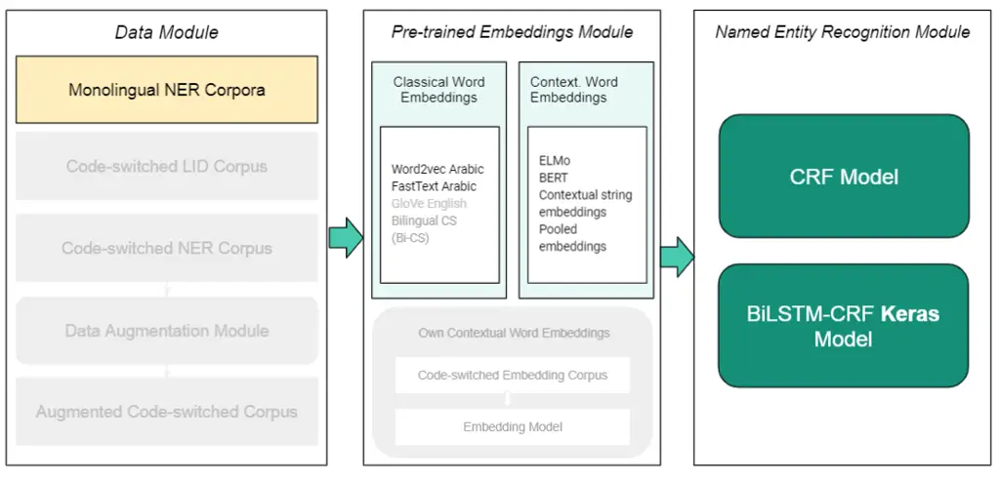

Figure 4.1: NER proposed approaches on MSA

### 4.1 Corpora

Two main available corpora were used in our introduced NER approaches
for MSA; ANERCorp and AQMAR. The ANERCorp (Arabic Named Entity
Recognition Corpus) was created by \[38\]. It is the largest free
annotated corpus for Arabic NER. The domain of the corpus is news and
consists of 150,286 tokens and 32,114 entities which is a ratio of 4.67
tokens to types. The percentage of entities for each type is presented
in Table 4.1. The labels of ANERCorp follows the IOB format (classes)
that is used in MUC-6 tasks¹¹ 1
http://cs.nyu.edu/cs/faculty/grishman/muc6.html. Each class has two
types: B-class and I-class. The B-class denotes the beginning of an
entity and the I-class denotes the inside of a class.

| Entity Type   | Ratio |
| ------------- | ----- |
| Person        | 39.0  |
| Location      | 30.4  |
| Organization  | 20.6  |
| Miscellaneous | 10.0  |

Table 4.1: Ratio of Entities per Type (%)

The AQMAR (American and Qatari Modeling of Arabic) is an Arabic
Wikipedia Named Entity Corpus and Tagger. It is composed of 74,000
tokens and around 5,854 entities of 28 Arabic Wikipedia articles
hand-annotated for named entities \[172\]. Unlike the first corpus, the
domain of AQMAR is diverse and includes topic areas of interest such as,
for example, history, technology, science, and sports. In the following
NER approaches, different training sets were investigated but unified so
the testing data will be composed of 40k tokens.

### 4.2 NER using Conditional Random Field

The first NER technique introduced for MSA data was using the supervised
approach of Conditional Random Field and word embeddings. CRF, being one
of the main statistical machine learning techniques, labels a sequence
of tokens instead of classifying each token alone. Also, fundamental
improvements in the NLP field and in the NER task took place because of
developments in the word embeddings. Unsupervised word embedding with
CRF showed that it can be integrated to perform NER task for MSA. This
combination could not be done directly as CRF systems only allow
categorical features and not continuous features such as word embedding
vectors.

The proposed solution was to cluster the generated vectors and plug the
generated cluster IDs in the feature vector of the CRF system along with
other lexical and contextual features. However, it was hard to know the
optimal number of clusters. Thus, we compared different numbers of
clusters to know which one achieves the best performance.

#### 4.2.1 Model Architecture

As shown in Figure 4.2, the system starts by normalizing the data. As
the Arabic letters have different shapes, a normalization process was
needed to unify some letters written differently. For instance, ’آ ’ and
’أ ’ are replaced with ’ا ’ and some punctuation such as ’.’ and ’,’
were removed. We trained our own Word2Vec model using an independent
Arabic news-wire data-set. The normalized training data and the model
were used to generate vectors for the training data. Afterwards, the
vectors were clustered using a clustering model. The output from the
previous step was used to generate IDs based on the cluster number for
the training data. These IDs were added as features in the CRF system.
Several features were added to the training data as will be explained
later. In the final step, the new generated training data with all the
features was fed as inputs to the CRF algorithm. The toolkit used to
apply the CRF algorithm was CRF++ \[183\], open source tool used mainly
for sequence classification. The main advantage of this tool was its
ability to handle large feature sets while having the option of using
multi-threading which makes it much faster than other existing CRF
tools.

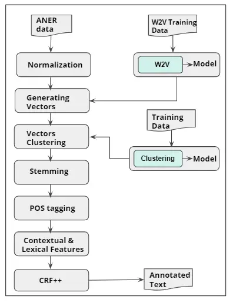

Figure 4.2: A block diagram for the proposed CRF system

#### 4.2.2 Initial Baseline Features

Features are considered the characteristic attributes of words that
should be used with ML algorithms \[177\]. The main selected features
are: stemming, POS tagging, and some contextual and lexical features.

##### Stemming Features

In order to get the single representation of the words which is called
Stem, a new approach should be implemented or used \[233\]. Adding the
stems of the words as a feature to the CRF algorithm can help matching
similar words with different morphological representations. Thus, the
”ISRI stemmer” algorithm that is described in \[233\] for word stemming
on the whole data-set was used.

##### Part-Of-Speech tag Features

The Part-Of-Speech is a category each word is assigned to represent its
type such as, for example, Nouns, Verbs, etc. Several POS tagging tools
were investigated and the one that resulted in the best tagging
performance was RDRPOSTagger. A language independent tool, it identifies
part-of-speech tags. RDRPOSTagger applied an error-driven approach to
construct a Single Classification Ripple Down Rules tree of
transformation rules \[180\].

##### Contextual and Lexical Features

Contextual features are automatically generated based on the context of
the NE. The context can be any number of previous or following words.
Several sets of features for this class of Contextual features to get
the optimal setting were investigated. Concerning the lexical features,
these were the character N-grams of the tokens, or, in other words, they
could be considered as the fixed length prefix and suffix of a word. In
this current system, the first and last letters of a word are added as
two lexical features.

#### 4.2.3 Word Embeddings based Feature

The Word2Vec algorithm was used to produce the word embedding vectors.
W2V provides multiple degrees of similarity between different words by
mapping to nearby vectors, which is very useful for Arabic language. A
dataset is used to train the W2V model that consists of 84M words. The
generated embeddings vectors are indirectly integrated in the current
system by adding them as a feature to the CRF algorithm to recognize
Arabic NE. In order to convert continuous vectors into categorical
features, a clustering technique is used to cluster the vectors and add
their clustering IDs as a features. K-means, an unsupervised learning
algorithm, is the clustering algorithm used and is one of most popular
clustering algorithms. It partitions the unlabeled dataset into k
pre-set distinct clusters. Each item from the data will belong to only
one group \[41\]. Two of the main factors that affect the performance of
the system are the vector size and the number of clusters. The vector
size chosen was 100. Several numbers of clusters were investigated as
shown in Section 4.2.4.

https://www.aclweb.org/anthology/P09-1116.pdf K-Means clustering
(MacQueen 1967) is one of the simplest and most well-known clustering
algorithms. Given a set of elements represented as feature vectors and a
number, k, of desired clusters, the K-Means algorithm consists of the
following steps: Step Operation i. Select k elements as the initial
centroids for k clusters. ii. Assign each element to the cluster with
the closest centroid according to a distance (or similarity) function.
iii. Recompute each cluster’s centroid by averaging the vectors of its
elements iv. Repeat Steps ii and iii until convergence Before describing
our parallel implementation of the K-Means algorithm, we first describe
the phrases to be clusters and how their feature vectors are
constructed.

#### 4.2.4 Evaluation and Results

The set of evaluations started with the usage of the ANERCorp corpus and
was divided into training and testing data of 110,286 and 40k tokens,
respectively. The evaluation process was divided into four experiments.
First, the best combination of contextual features was checked. Second,
the performance of the system was evaluated by adding different features
to build the baseline. The third experiment integrated the word
embedding with the selected set of features and compared the different
number of clusters for the word embedding. Finally, combining the coarse
and fine grained clusters IDs was investigated.

##### Contextual Features

The first experiment started by evaluating the baseline with only the
current word as a feature. Then, the next and the previous words were
added to the current word separately. Furthermore, left and right
contexts were combined together. In the combination the left or right
context consisted of either one or two words. The performance measures
used in the evaluation were precision (P), recall (R) and F1-score.

| Feature                 | Precision | Recall | F1-score |
| ----------------------- | --------- | ------ | -------- |
| Current                 | 97.0      | 41.7   | 58.3     |
| Current-1Next           | 96.3      | 37.9   | 54.3     |
| Current-2Next           | 95.5      | 35.3   | 51.5     |
| Current-1Previous       | 98.0      | 43.0   | 59.7     |
| Current-2Previous       | 97.1      | 40.0   | 56.6     |
| Current-Previous-Next   | 96.0      | 40.0   | 56.4     |
| Current-2Previous-2Next | 96.9      | 37.5   | 54.0     |

Table 4.2: The performance measures results in (%) due to using
different combinations of contextual features

In Table 4.2, the results of the different contextual features are
listed. According to Table 4.2, the best setting achieved by using the
current and the previous word was equal to 59.7% F1-score. Whereas, the
lowest results came from using only the current and the 2 following
words as 54% F1-score.

##### Baseline Features Set

In Table 4.3, the performances of the CRF system using the different
types of features are illustrated. The Table shows an increase in the
value of the F1-score by appending the features together. For instance,
the addition of the lexical feature to the word stem and the current
word increased the F1-score from 64.1% to 66%. Moreover, by adding all
the features to build the baseline, the F1-score increased to 68.4%.

| Feature                                    | Precision | Recall | F1-score |
| ------------------------------------------ | --------- | ------ | -------- |
| Current-Stemming                           | 96.0      | 48.2   | 64.1     |
| Current-Stemming-Lexical                   | 94.2      | 50.9   | 66.0     |
| Current-Stemming-Lexical-Contextual        | 95.1      | 51.2   | 66.5     |
| Current-Stemming-Lexical-Contextual-POStag | 93.2      | 54.1   | 68.4     |

Table 4.3: The performance measures results in (%) due to using
different set of features

##### Cluster Granularity

In order to add the cluster ID of the word embedding as a feature, an
experiment was conducted to get the relevant cluster granularity.
Several numbers of clusters were experimented on in order to get the
cluster size with the best performance. The result of this experiment is
shown in Table 4.4. The evaluation started by adding the IDs of a small
size cluster 50 to the set of features of the baseline. The size of the
cluster was increased and the performance increased as well till
reaching the cluster with size 500 and after that the performance
started to decrease. The figure indicates that the cluster with size 50
is the one with the worst results being 72.7% and the cluster with size
500 achieved the best result of a 76.1% F1-score. Thus, adding the IDs
of the cluster 500 to the feature set enhanced the performance of the
baseline from 68.4% to 76.1%.

| Number of Clusters | Precision | Recall | F1-score |
| ------------------ | --------- | ------ | -------- |
| 50                 | 90.0      | 61.1   | 72.7     |
| 100                | 90.0      | 62.6   | 73.8     |
| 200                | 90.7      | 64.2   | 75.1     |
| 500                | 92.0      | 64.9   | 76.1     |
| 1,000              | 90.6      | 64.1   | 75.0     |
| 4,000              | 90.6      | 63.7   | 74.8     |
| 50 & 500 combined  | 91.4      | 65.7   | 76.4     |

Table 4.4: The performance measures results in (%) due to using
different number of clusters

Furthermore, the coarse and fine grained clusters were investigated by
adding the IDs generated by the number of clusters 50 and 500 to the
feature set. The output demonstrated that the performance had slightly
increased to a 76.4% F1-score. We interpret the improvement after the
combination as coarse grained clustering could help more in modeling
rare words. On the other hand, fine-grained clustering can results in
better performance for common words.

### 4.3 NER using Deep Learning on MSA Data

In this Section we introduced the second NER tagger implemented for MSA
data using Recurrent Neural Network. Recently, the usage of Neural
Network has shown better recognition results than the CRFs. Over the
past few years, deep learning models proved to be effective in solving a
wide range of NLP tasks including NER and successively reached
state-of-the-art performance \[141, 145\]. Deep learning models learn
automatically non-linear combinations of features compared to the CRF
that learns linear combinations \[101\]. Moreover, it does not require
handcrafted features or specific resources and it can learn all features
from the data without having them set in advance \[253\]. Since it is a
new and promising approach, there was only one tagger for the Arabic
language in Neural Networks. We investigated several RNN variations to
reach the final model with the best performance. In addition, we
evaluated the model with different contextual embeddings.

#### 4.3.1 Model Architecture

Our model had several layers that we modified to understand their impact
on the overall performance. The first two layers that come after the
input layer are the Word Embedding and Character Embedding. After
computing their outputs, these outputs are concatenated together to get
the best result. Then two Convolutional Neural Network layers were added
on top of the word embedding before concatenation of word embedding with
character embedding. Now the main layers of our models follow; these are
the BiLSTM then the CRF layers. They are mainly responsible for training
the model on the input sequence and connecting the tags of a sequence
together as shown in Figure 4.3. We implemented the model using Keras
framework²² 2 [https://keras.io](https://keras.io), a neural network
Python-based library that is used in many NLP tasks. This franework
supports both recurrent and convolutional neural networks and can
combine multiple types of neural networks.

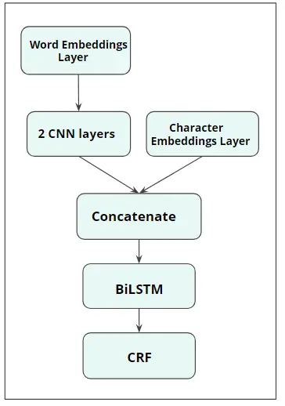

Figure 4.3: Proposed Arabic NER Deep Learning Model

##### Word Embedding

In the first stage of BiLSTM-CRF model was using index encoding for word
sequences but the performance of the model was not high as compared to
most models that used Word2Vec. Thus, Word2Vec was fed to BiLSTM-CRF.
The advantage to our model of using Word2Vec was capturing the
characteristics of the neighbors of a word and similarities between
words. The same Word2Vec Arabic model that we trained and used in the
first approach of CRF, which contains 600k vocabulary and 100 dimensions
has been used for getting the word embeddings.

##### Convolutional Neural Network

A multiple of convolutional layers with nonlinear activation function
form a Convolutional Neural Network. In our model, we used 2 CNN layers
after the pre-trained word embedding to improve the performance. Each
with filter equal to 800 which is the best filter count after tuning the
hyper-parameters. The kernel size had to be equal to 1 because any
number greater than 1 will produce the problem of decreasing the number
of the word embedding sequence. The use of pooling layers is a key
aspect of Convolutional Neural Networks, typically defined after the
convolutional layers. Pooling layers sub-sample their input \[151\]. The
pooling layer was not used for the model because it decreases the input
sequence of the word embedding sequence while the tag sequence and
character embedding sequence have not changed their sizes.

##### Character Embedding

Bidirectional LSTM was applied to create a character embedding model.
First, a list of characters and their embedding were randomly
initialized. Then the character embedding matching to each character in
a word was given in straight and reverse order to the bidirectional
LSTM. Then, the concatenation of both forward and backward forms of
character embedding is formed to derive the word.

#### 4.3.2 Model Hyper-Parameters

One of the most important properties that affect the learning of our
model is the activation function which calculates the output from the
summation of the weighted input signals of the neural network. Another
function that affects the training of deep learning models is the
optimization function. The optimization function is used to minimize the
output of error function \[46\]. Thus, several optimization functions
were tried to improve the output. Nadam is the optimization function
that was used in our model and it outperformed other optimization
functions.

Deep neural networks have various non-linear hidden layers, which make
the model an exceedingly expressive model to enable users to learn very
complicated relationships between the outputs and the inputs. Some of
the complicated relationships will be the outcome of sampling noise due
to the limited training data. The dropout rate is used to tackle the
problem of overfitting, which is due to the noise found in the training
dataset but not in the test dataset \[230\]. The dropout used in the
model is equal to 0.2, it reduced over-fitting slightly and improved the
F1-score.

#### 4.3.3 Evaluation and Results

Both datasets of ANERCorp and AQMAR are added together forming a bigger
dataset of more than 200K words. Since tags across the two corpora do
not follow the same labeling guideline, they have been normalized. The
different tags in the data are PER, LOC, ORG and MISC. For each type of
tag there are two different forms, one for indicating the beginning of a
name entity and the other for indicating the inside of a named entity.
The whole dataset was divided into chunks of 150 words. The vocabulary
was created using all distinct words. For tags, we used one hot encoder
because every tag needs to have a different vector. Otherwise, the model
might get confused when predicting the tag of a word. The dataset has
been divided into training, validation, and testing of 72%, 8% and 10%.

The Word2Vec Arabic model with dimensions equal to 100 has been used for
word embedding. Out-of-vocab words have been assigned an embedding
vector of zeros. The main usage of character embedding is to give
another representation for words. This should help our model to learn
the word embedding out-of-vocab rather than simply ignore it. Hence, the
words are represented by an array of characters and these characters are
represented by one hot encoder. The model also takes a second input
sequence of words in the form of character embedding. Finally, after
granting a format for words, characters and tags, we used these forms to
represent three different sequences to be trained and tested.

##### Model Results

In this part, we will compare and discuss the performance of the
different models composed of various combinations of layers as shown in
Table 4.5. The first model consisted of BiLSTM and CRF. The input of the
model was the sequences of words with each word represented by an index.
The result of the precision was equal to 86.07% and recall equal to
34.5%. Due to the very low recall, the F1-score and accuracy were the
lowest, equal to 50.17% and 91.93%, respectively.

Then, we added the Word2Vec to the model, as it boosts deep learning
models. The model showed remarkable improvement after adding the
Word2Vec layer. We used the Word2Vec on the LSTM layer first; then, we
showed the difference between LSTM and BiLSTM. Word2Vec on LSTM and CRF
had an F1-score equaling 70.2% and accuracy 96.26%. The F1-score of the
model of BiLSTM was equal to 72.65%. The model accuracy had increased by
0.32%. Thus, BiLSTM is better than regular LSTM. Afterwards, we added
two CNN layers with 800 Filters on the latest model architecture. The
F1-score of the model increased by 1.05%. The model had a character
embedding concatenated to its word embedding to solve the problem of
out-of-vocab and enable the model to enhance prediction. The model
achieved the highest results equaling a 75.68% F1-score, 68.74% on
recall and 95.71% on accuracy.

| Models               | Precision | Recall | F1-Score | Validation | Testing  |
| -------------------- | --------- | ------ | -------- | ---------- | -------- |
|                      |           |        |          | Accuracy   | Accuracy |
| BiLSTM-CRF           | 86.07     | 34.50  | 50.17    | 91.93      | 94.33    |
| LSTM-CRF-WE          | 76.20     | 65.10  | 70.20    | 95.26      | 97.28    |
| BiLSTM-CRF-WE        | 86.78     | 62.47  | 72.65    | 95.58      | 98.85    |
| BiLSTM-CRF-WE-CNN    | 80.50     | 68.00  | 73.70    | 95.54      | 98.17    |
| BiLSTM-CRF-WE-CNN-CE | 84.15     | 68.74  | 75.68    | 95.71      | 98.06    |

Table 4.5: Results of different models

#### 4.3.4 Tuning Hyper-Parameters

Tuning the hyper-parameters is a critical process to help choose the
best values for each parameter that gets the best performance on a
validation set. The tuned parameters are the optimizer, activation
function, epoch number and batch size. These parameters affect the
performance of the model as explained below. The epoch of our model was
tuned between 5, 10 and 50. The best results achieved were 75.86% by the
number of epochs equal to 10 as shown in Table 4.6.

| Number of Epochs | F1-Score |
| ---------------- | -------- |
| 5                | 72.15    |
| 10               | 75.86    |
| 15               | 73.84    |
| 20               | 74.84    |
| 25               | 74.21    |
| 30               | 73.97    |
| 35               | 74.97    |
| 40               | 74.13    |
| 45               | 74.17    |
| 50               | 74.24    |

Table 4.6: F1-score versus number of epochs

The training dataset is composed of 1252 sequences, that are divided
based on the value of the batch size. Table 4.7 shows that the highest
performance equal to 76.05% is achieved by the batch size equal to 10
followed by 32 that got an F1-score equal to 75.15%.

| Batch Size | F1-Score |
| ---------- | -------- |
| 10         | 76.05    |
| 20         | 73.64    |
| 32         | 75.15    |
| 40         | 74.81    |
| 60         | 74.39    |
| 80         | 74.62    |
| 100        | 73.25    |

Table 4.7: F1-score versus Batch sizes

The model has two different layers, CNN and BiLSTM, each one of them
needing an activation function. We tried the following ones, Softmax,
Softplus, Softsign, Relu, Tanh, Sigmoid, Hard-Sigmoid and Linear to
reach the best performance. As shown in Table 4.8 the CNN layer the Tanh
function achieved the highest F1-score equal to 76.7% and the BiLSTM
layer the Linear function got the highest F1-score equal to 75.6%.

| Activation Functions | CNN  | BiLSTM |
| -------------------- | ---- | ------ |
| Tanh                 | 76.7 | 75.3   |
| ReLu                 | 72.8 | 71.8   |
| Linear               | 69.8 | 75.6   |
| Softmax              | 43.4 | 19.6   |
| Sigmoid              | 68.2 | 75.2   |
| Softplus             | 72.2 | 75.3   |
| Softsign             | 74.7 | 74.7   |
| Hard-Sigmoid         | 74.6 | 66.4   |

Table 4.8: F1-score (%) for different Activation Functions applied on
CNN and BiLSTM

In addition to the previous parameters the optimization function has
been tuned. The different optimization functions that were tried out
were RMSprop, Adagrad, Adadelta, Adam, Adamax, and Nadam. As shown in
Table 4.9 Nadam was the best optimizer and it improved the F1-score of
the model and achieved 75.43%.

| Optimization Function | F1-Score |
| --------------------- | -------- |
| Adam                  | 72.28    |
| Nadam                 | 75.43    |
| Adamax                | 73.84    |
| Adagrad               | 72.63    |
| Adadelta              | 63.40    |
| RMSProp               | 71.41    |

Table 4.9: F1-score for different Activation Functions applied on CNN
and BiLSTM

The final tuned parameter was the dropout. Its initial value was equal
to 0.1 resulting in an F1-score equal to 75.11% and after tuning the
value of the drop out selected was 0.2, which increased the performance
to 76.65%. The model used a dropout equal to 0.1 which has a high
over-fitting between the accuracy and the validation accuracy. After
tuning the dropout rate, we selected the value equal to 0.2 to be the
best performing dropout rate. The F1-score of the 0.1 value was 75.11%
and of the 0.2 value equal to 76.65%. Figure 4.4 shows the difference
between both dropout rates.

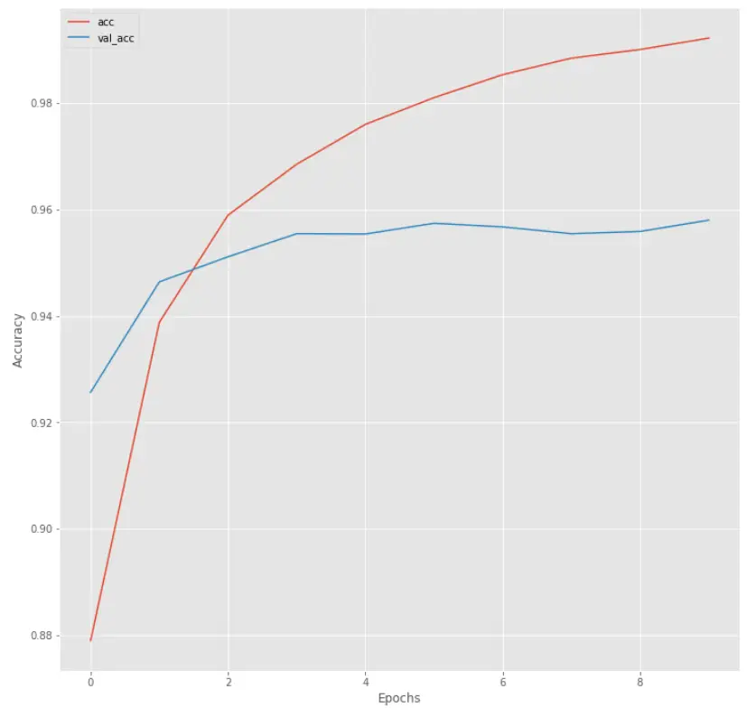

(a) Dropout rate equal to 0.1

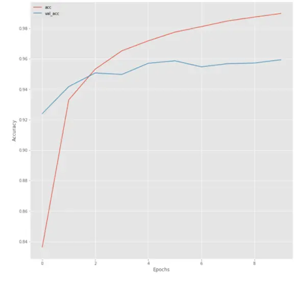

(b) Dropout rate equal to 0.2

Figure 4.4: Dropout Rate Comparison

The final model that achieved the best performance after tuning the
hyper-parameters was composed of BiLSTM-CRF, Word Embedding, two CNN
layers and Character Embedding. Its activation functions are Tanh for
CNN layers and Softplus for the BiLSTM layer. In addition, Nadam was
used as the optimization function and the dropout rate was equal to 0.2.
Its accuracy was equal to 95.94%, and the F1-score 76.65%.

| Model                | AQMAR | ANERCorp | Both Datasets |
| -------------------- | ----- | -------- | ------------- |
| BiLSTM-CRF           | 39.61 | 63.68    | 52.24         |
| LSTM-CRF-WE          | 57.67 | 80.39    | 74.80         |
| BiLSTM-CRF-WE        | 61.97 | 81.90    | 75.38         |
| BiLSTM-CRF-WE-CNN    | 69.31 | 81.30    | 75.76         |
| BiLSTM-CRF-WE-CNN-CE | 67.22 | 82.18    | 76.65         |

Table 4.10: F1-score of the different models using various training
datasets

After tuning the model, we trained the different types of models with
the same tuned parameters but using AQMAR and ANERCorp datasets, each
one alone, as shown in Table 4.10. We used the same testing data and
made sure there was no overlap with the training data. The use of AQMAR
alone reduced the performance as the F1-score of the model was equal to
67.22%. However, the use of ANERCorp alone increased the performance by
5.58% and got the highest results equal to 82.18% F1-score.

#### 4.3.5 Contextual Embeddings

In order to enhance the performance of the NER tagger on MSA data, we
evaluated the usage of several contextual embeddings in the final
architecture of the model instead of the classical W2V. We used the
pre-trained models of ELMo, Pooled embeddings, AraBert and Contextual
String embeddings. We also tried to combine two embeddings together of
(FastText and Contextual string) and (AraBERT and Contextual string). We
trained the model with the different pre-trained embeddings with the
ANERCorp alone and with both datasets together. We did not train it
using AQMAR alone as already the performance of the RNN model trained
using AQMAR alone with classical embedding got lower results than the
CRF. This could be due to having different domains for training rather
than for testing, as the domain of the testing data was news and taken
from the ANERCorp dataset. As shown in Table 4.11 all the results of
training the model with ANERCorp dataset alone were higher than for both
together. Also, the usage of ELMo model achieved the lowest results as
the Arabic model used is small. Besides, AraBert embeddings achieved the
highest results for ANERCorp equal to 83.71% using ANERCorp, reflecting
an increase of 1.53% an absolute F1-score from the best results of the
NER tagger with the classical embedding W2V.

| Embedding Model                          | ANERCorp | Both Datasets |
| ---------------------------------------- | -------- | ------------- |
| ELMo                                     | 57.57    | 51.42         |
| AraBERT                                  | 83.71    | 76.63         |
| Pooled embeddings                        | 75.03    | 69.81         |
| Contextual String embeddings             | 75.78    | 71.98         |
| FastText & Contextual String embeddings  | 79.86    | 73.76         |
| AraBERT and Contextual String embeddings | 83.23    | 78.40         |

Table 4.11: F1-score (%) after the usage of different embeddings in our
NER system on the different training datasets

### 4.4 Summary

We presented two approaches for NER task on MSA data. First one an
effective integration between CRF and word embedding was presented. Word
embedding was integrated into the CRF classifier by clustering the
vectors and adding the cluster-ID as a feature. It can be concluded that
the system achieved the best performance by the following features:
Current word, Stemming, Lexical, Contextual, POS tagging, fine- and
coarse-grained word embedding cluster IDs. Then, as deep learning models
proved useful in solving NER tasks in different languages, we
investigated state-of-the-art DL models for NER on MSA data. We
introduced various architectures such as LSTM-CRF, BiLSTM-CRF, Word
Embedding classical or contextual, CNN, and Character Embedding to reach
the highest performance model.

The final model with the highest F1-score consisted of BiLSTM-CRF with
word Embedding, CNN, and Character Embedding after tuning the model
hyper-parameters and adding contextual embddings instead of the
classical one. Using the same training dataset, the NER tagger achieved
an F1-score equal to 83.71% which is an increase of 7.31% from the CRF
model as shown in Figure 4.5. Even while using different datasets in
training, for the first approach using the ANERCorp and the second using
both ANERCorp and AQMAR, the performance improved by 2%.

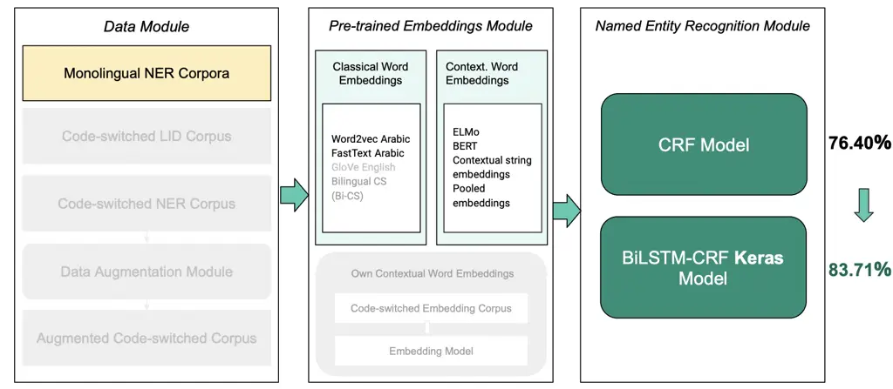

Figure 4.5: Results of Deep Learning MSA Taggers

### 4.5 Conclusion

This chapter presented two approaches for the NER task on MSA data and
evaluated them using the same testing dataset. The first one was an
effective integration between CRF and word embedding. The best setting
of word embeddings is combining fine and coarse cluster IDs results in a
76.4% F1-score with a relative improvement from the baseline of 11.7%.
The first approach achieved the best performance by the following
features: Current word, Stemming, Lexical, Contextual, POS tagging, fine
and coarse word embedding cluster IDs.

Then we moved to the second approach, which is using deep learning. It
does not require feature engineering like the CRF classifier. The final
model with the highest F1-score consists of BiLSTM-CRF with Word
Embedding, CNN, and Character Embedding after tuning their
hyper-parameters. After using the same training dataset and fixing the
testing data in both approaches, the F1-Score of the NER tagger
increased by 5.78% compared to the tagger using the CRF approach and was
equal to 82.18%. Even while using different datasets in training, the
first approach using the ANERCorp and the second using both ANERCorp and
AQMAR, the performance slightly improved by 0.25%. However, only while
using the AQMAR dataset as training data, the performance of the RNN
model got lower results than the CRF. This could be due to having
different domains for training rather than for testing, as the domain of
the testing data was news and taken from the ANERCorp dataset.

## Chapter 5 Named Entity Recognition on Code-Switching Data

Social media reflects the changes we have in our daily lives. It shows
the changed structure and type of the generated data. The language used
in such posts is dialectal Arabic in addition to code-switching.
Recently, code-switching became a widespread behavior in Arabic
countries as Arab tend to use English words while speaking in Arabic.
For such reasons we were motivated to analyze such data and explore
applying the NER task to it.

This chapter introduces our second NER tagger for code-switching
Arabic-English data. It first presents the first collected and annotated
corpus for code-switched Arabic-English data for NER tasks. To the best
of our knowledge no work has been conducted in this direction for the
task of NER for Arabic-English CS text. This chapter also presents the
first proposed RNN baseline NER system and the pooling technique
introduced for this kind of CS data \[207\] as shown in Figure 5.1. It
then discusses the proposed approaches to enhance the performance and
have an NER system with higher results \[210\].

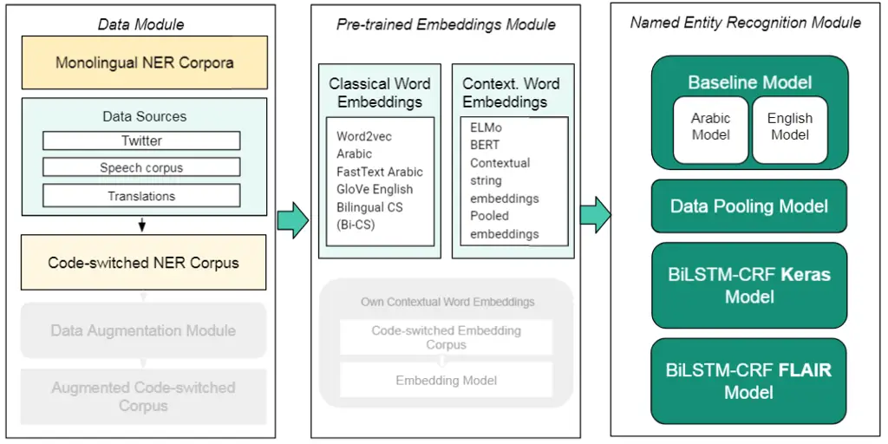

Figure 5.1: NER approaches on code-switched Arabic-English data

### 5.1 Data Collection and Annotation

One of the old preliminary approaches we investigated to create a NE
list containing dialectal Arabic was using human computation techniques
such as Game With A Purpose (GWAP). Human computation is the idea of
utilizing human efforts to perform tasks that cannot be done or solved
by computers satisfactorily or enjoyably for the individuals involved
\[196\]. We created a prototype of a GWAP called ”3arosty” presented in
\[211\], to collect from users Arabic entities along with their
categories and some related tags. The implemented prototype was tested
by a diverse sample of players from different educational backgrounds.
The number of players who played the game was 113 users; 43% were males,
and the rest females. The age of the players varied from 16 to 40 years
old. The testing was held for a short time, and we were able to collect
220 words (entities), which means that each player played two games on
average. The category with the most significant number of collected
entities is Person, as 108 entities were collected. The location
category followed them as 66 entities were collected, and the last one
is the object category as 46 entities were collected.

Later, we realized a more robust technique is needed to collect DA and
CS sentences containing entities to create a large-scale corpus. We
collected the corpus in two phases. In the first phase, we collected
1,331 sentences. In the second phase, we collected an additional 5,194
sentences. Thus the final corpus, composed of 6,525 sentences, contains
136,574 tokens. It has 22,705 (16.6%) English words and 113,869 (83.4%)
Arabic words. The data was gathered from three different sources. The
first one was Twitter collecting 2,303 Egyptian-English CS sentences.
The second one took 1,150 sentences from the transcribed speech corpus
for conversational Egyptian Arabic \[106\]. The last one translated
3,072 sentences from the Arabic ANERCorp and AQMAR data sets for Named
Entity Recognition.

After collecting the data, the annotation of the entities started by
identifying the boundaries of the named entity and then assigning the
correct NE type. Our annotations followed the Named Entity annotation
guidelines for the shared task of CoNLL-2003 \[235\] and was concerned
with four types of entities, Persons, Locations, Organizations, and
Miscellaneous that do not belong to any of the three types. Words that
are not named entities were tagged with O.

| Data-set           | Number of Sentences |
| ------------------ | ------------------- |
| Twitter            | 1,477 (64.1%)       |
| Translated         | 3,059 (99.6%)       |
| Transcribed Speech | 412 (35.8%)         |
| Total              | 4,948 (75.8%)       |

Table 5.1: Number of sentences containing entities in each data-set

Table 5.1 shows the number of sentences containing entities in each
data-set and their percentages. The total number of sentences in the
corpus containing entities was 4,948 sentences, about 75.8% of the total
number of sentences.

The total number of NEs in the corpus was 17,577 tokens. Table 5.2 shows
the total number of words under each NE class. The Person class contains
the highest number of entities, 6,534 entities, and the Organization
class contains the minimum number of entities, 3,100 entities.

| Entity Type   | Words  | % of Total Words |
| ------------- | ------ | ---------------- |
| Person        | 6,534  | 4.8              |
| Location      | 4,219  | 3.1              |
| Organization  | 3,100  | 2.3              |
| Miscellaneous | 3,724  | 2.7              |
| Total         | 17,577 | 12.9             |

Table 5.2: Number of entities in each entity type in the final data-set

#### 5.1.1 Twitter Data-set

The first part of the corpus was composed of data harvested from Twitter
by querying the Twitter API¹¹ 1
https://developer.twitter.com/en/docs/api-reference-index. We
implemented different approaches to collect tweets containing CS data.
One of the approaches was randomly selecting some tweets by gathering
them using a query requiring the tweets to have a hashtag. A big
percentage of hashtags was written in the English language. The
tokenization of the hashtags was automatically done while collecting the
tweets. Moreover, the query required that the tweets should contain the
Arabic language. Other filtering criteria were followed by making sure
that the tweets contained at least two English words to guarantee that
the sentence contained CS text. However, words such as HTTP or via were
not counted. Another approach used some of the named entities found in
the ANERCorp data set as keywords in the search queries to collect more
tweets containing NEs. Moreover, in order to guarantee having sentences
containing entities, we created a list of famous person names and used
them as seeds to collect tweets.

The total number of sentences collected using Twitter was 2,303
sentences, containing 38,281 tokens. As shown in Table 5.3, this part of
the corpus had 5,810 entities, a total of 15.2% of the total number of
words and consisting of 7,405 (19.3%) English words and 30,876 (80.7%)
Arabic words. The Miscellaneous class contained the highest number of
entities, and the Location class contained the lowest number of
entities.

| Entity Type   | Words | % of Total Words |
| ------------- | ----- | ---------------- |
| Person        | 1,907 | 5.0              |
| Location      | 550   | 1.4              |
| Organization  | 1,098 | 2.9              |
| Miscellaneous | 2,255 | 5.9              |
| Total         | 5,810 | 15.2             |

Table 5.3: Number of entities in each entity type in the Twitter
data-set

#### 5.1.2 Translated Data-Set

The second part was gathered by translating some of the existing
annotated Arabic NER data. In the first collection phase, the selected
sentences were randomly chosen from the Arabic ANERCorp data-set. In
some sentences, we translated all the entities they contained. In other
sentences, we translated one or two entities only in order to have
Arabic entities in addition to the English entities in this part of the
corpus. During the second phase of collection, more sentences were
chosen from the same data-set in addition to sentences selected from the
AQMAR data-set. This technique was time-efficient as there was no need
to annotate the data. However, sometimes it did not generate correct
translations for Miscellaneous or Organization entities as they might
have several meanings. Thus, a manual check was done on data to ensure
that the words were translated correctly.

The number of translated sentences was 3,072 sentences, containing
78,215 tokens and were composed of 8,549 (10.9%) English words and
69,666 (89.1%) Arabic words. As shown in Table 5.4, the total number of
named entities was 11,391, or 14.6% of the total number of words. The
Person class contained the highest number of words, equal to 4,516
words, and the Miscellaneous class contained the minimum number of
words, equal to 1,348 words.

| Entity Type   | Words  | % of Total Words |
| ------------- | ------ | ---------------- |
| Person        | 4,516  | 5.8              |
| Location      | 3,601  | 4.6              |
| Organization  | 1,926  | 2.5              |
| Miscellaneous | 1,348  | 1.7              |
| Total         | 11,391 | 14.6             |

Table 5.4: Number of entities in each entity type in the translated
data-set

#### 5.1.3 Transcribed Speech Data-set

The third part of our corpus, composed of data from the transcribed
speech data-set \[107\], was gathered spontaneous speech gathered
through informal interviews. The interviews topics were technical ones
in order to have a higher probability to contain CS. They manually
transcribed the corpus and formed a total of 1,234 sentences and 17,769
tokens. In the original speech corpus, the sentences were divided into
124 monolingual Arabic, 125 monolingual English and 985 mixed. Overall,
the data-set contained 79.8% of code-mixing, 10.1% of code-switching and
10% of purely Arabic.

| Entity Type   | Tokens | % of Total Words |
| ------------- | ------ | ---------------- |
| Person        | 111    | 0.6              |
| Location      | 68     | 0.3              |
| Organization  | 76     | 0.4              |
| Miscellaneous | 121    | 0.6              |
| Total         | 376    | 1.9              |

Table 5.5: Number of entities in each entity type in the transcribed
speech data-set

As shown in Table 5.5, this part of the corpus contained 1,150 sentences
including 20,078 tokens. Some pre-processing was performed on the data
and more tokens/sentences were added. The corpus contained 13,327
(66.4%) Arabic and 6,751 (33.6%) English words. The Miscellaneous class
contained the maximum number of entities, equal to 121 words, and the
Location was the lowest, equal to 68 words only.

### 5.2 Named Entity Recognition Model

In this section, brief descriptions are provided for the different
components of our NER model such as pre-trained word embedding and model
architecture.

#### 5.2.1 Pre-trained Embeddings

We investigated along with our deep learning model architecture for NER
on CS data several types of embeddings from classical and contextual
word embeddings. As stated before, the classical word embeddings do not
take into consideration the context of the words. We used four different
types of classical word embeddings, two for Arabic, one for English, and
one for Arabic-English CS data.

The first one is our pre-trained word embeddings model for Arabic. We
used the Word2Vec (W2V) algorithm to generate and save our Arabic word
embedding model. The model of W2V was trained using an independent
Arabic news-wire data-set. The second type of embeddings we used for the
Arabic language is the pre-trained Arabic FastText embedding that
generates vectors with dimensions equal to 300. Regarding the English
word embedding model, we used GloVe for obtaining vector representations
for words. The pre-trained model of GloVe we used was trained on
Wikipedia 2014, and Gigaword 5 data \[187\].

As one of our focuses is on the Arabic-English CS data, the pre-trained
Bilingual CS Embeddings (Bi-CS), a bilingual Egyptian Arabic-English
word embeddings of \[108\] were used. This model produced classical word
embeddings by training on CS Arabic-English corpus. It was trained on
monolingual data and a small amount of CS data, which acted as a gluing
force bringing the monolingual embeddings closer in the vector space.
The authors trained several word embeddings using multiple algorithms
that rely on different levels of cross-lingual supervision. We used the
Bi-CS embeddings as these showed the most promising performance. They
have two different Bi-CS models that we tried; one trained using
Skip-gram (Bi-CS-skip) and the other using CBOW (Bi-CS-cbow).

Out-of-vocab words that were not found in W2V, GloVe, or Bi-CS models
were represented by a vector of zeros in the embedding layer. However,
classical word embeddings compute static vectors for each word, in
polysemous words that depend on the context. Classical word embeddings
fail to model these words. Contextual word embeddings are considered the
new approach of representing the vector of a word in a given text
compared to the Word2Vec and GloVe model. The following types of
Contextual embeddings were used, ELMo, BERT, Contextual String
embeddings, and Pooled FLAIR embeddings and their performances in the
model were compared.

The first type of embeddings, ELMo was used with the Arabic ELMo
representations. The second type was BERT and the main BERT model used
during the training was the BERT Multilingual model, which contains 104
different languages, including the Arabic and English languages.
Contextual string embeddings was the third type of embeddings we
investigated. The last one was the Pooled FLAIR embeddings.

#### 5.2.2 Model Architecture

For the purpose of taking benefit of the previous and future contexts,
we used the BiLSTM model. As stated before, this model represents each
sequence forward and backward as two separate hidden states to save
previous and future information. At the end, the two hidden states are
concatenated to form the output \[217\].

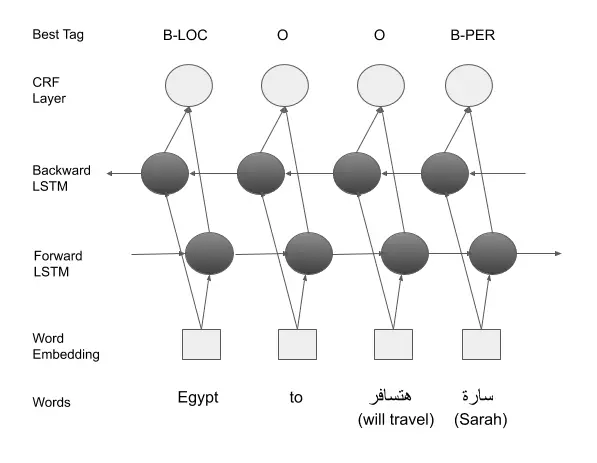

Figure 5.2: Our main BiLSTM-CRF model Architecture. The example
illustrates the input sentence “Sarah will travel to Egypt” and its
output predicted tags.

For the sake of predicting the current tags using CRF model. In order to
combine the advantages of BiLSTM and CRF networks, we constructed all
our models using BiLSTM-CRF. The model architecture was composed of
three layers as shown in Figure 5.2. The first one was the input layer.
It contained the word embeddings. We tried several types of word
embeddings as will be explained later. The second one was the hidden
layer of the BiLSTM. The last one was the output layer. It is where the
CRF layer calculates the probability distribution over all labels of the
previous and future tags to predict the current best tag. As it has been
proven, using character-level embeddings is useful as they can handle
the out-of-vocabulary words \[141\]. Thus, we constructed a second model
architecture containing four layers. The first one was the word
embeddings layer. The second one was the character embeddings layer.
Then, a concatenation of the first and second layers was done to be
given as input for the third layer, the BiLSTM layer. The final one was
the CRF layer.

### 5.3 Experiments and Results

We conducted two sets of experiments as shown in Figure 5.3, the first
one with only monolingual data and the second with the full data-set
containing CS data. While the training data-set was different for each
experiment, we unified the testing data-set to compare the performance
of the different experiments. The testing data contained 1,219 sentences
and 28,581 tokens.

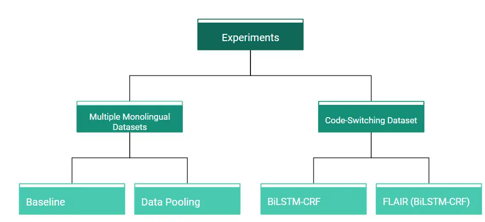

Figure 5.3: Different experiments applied on different data-sets

#### 5.3.1 Multiple Monolingual Data-sets

We implemented our baseline system and enhanced it using the pooling
technique. We did not use in the baseline or pooling systems any CS data
in the training process due to the unavailability of sufficient CS data
at the time. The training data was combining multiple monolingual data,
as will be explained in detail later.

##### Baseline

In order to build the baseline, two models were created. The first one
was the Arabic model. The Arabic data-sets we selected for training were
the ANERCorp and AQMAR containing 225,000 words annotated for the NER
task. The performance of the Arabic model was a 27.7% F1-score. The
second one was the English model. The data we selected for training was
CoNLL 2003, containing 206,931 annotated words. The performance of the
English model is 7.9% F1-score. Both systems achieved a low F1-score,
which is expected as the training data contained only one of the two
languages and the testing data contained mixed sentences.

The baseline started by detecting the language of each word in the
testing data-set. Based on the detected language, the predicted tag was
taken from either the Arabic or English predictions. The overall
F1-score achieved by the baseline system was 52%, which is still a low
expected performance as the predictions do not consider code-switching
context.

##### Data Pooling

We introduced the concept of data pooling to overcome the problem of the
lack of large CS data. Pooling is done by combining annotated Arabic and
English data-sets to form the training data-set. We used the same Arabic
and English data-sets as the baseline, but we combined them; thus, the
total number of words in the training file was 431,931 tokens. The
training was performed using Nadam optimization function, SoftPlus
activation function, batch size of 32 and epochs number of 10.

As the corpus contains two different languages, we suggested loading two
classical word embedding models to cover English and Arabic words. For
Arabic, we used our W2V model, and for English, we used the GloVe model.
As a result of using the pooling technique by combining the two training
data-sets and using the collected CS corpus for testing, the best
performance achieved was a 60% F1-score. This result is expected,
considering that the training and testing data belong to a different
context due to the limited amount of CS data in our previous work.

#### 5.3.2 Code-Switching Data-set

As an extension to the experiments explained in Subsection 5.3.1, we
collected more data and were able to train and test with CS data. The
total number of sentences in the training file was 5,306 sentences,
containing 107,993 tokens. We explored the combination of BiLSTM-CRF
architecture with different types of embeddings. The first model was
created using using PyTorch, an open source library created by Facebook
used in several NLP tasks and providing same deep neural network
architectures and features as Keras. We also used the open-source FLAIR
framework to create the second model and try the same architecture of
BiLSTM-CRF with their proposed different embeddings to identify the best
performance for NER on our CS data-set. FLAIR a recent NLP framework
designed to train and distribute text classification, language models
and sequence labelling, unifies the use of many different word
embeddings as well as random combinations of embeddings \[9\]. The FLAIR
system was trained several times using our CS training data-set each
time with a different type of embeddings, and we took advantage of its
feature of combining two types of embeddings.

The setups of the different models we tried were as follows:  
BiLSTM-CRF: We experimented using different types of embeddings with the
model architecture of BiLSTM-CRF. We implemented this model using
anaGo²² 2 https://github.com/Hironsan/anago library, which is a Python
library implemented in Keras for sequence labeling. The first type was
the same one we used in the pooling technique, but it was used with the
newly collected CS training data and was composed of the two pre-trained
word embeddings GloVe for English and W2V for Arabic. The second one
used the Bi-CS word embeddings with its two models of Bi-CS-skip and
Bi-CS-cbow to see the effect of using CS word embeddings on the
performance. The last two are using BERT Multilingual and ELMo Arabic
embeddings.

FLAIR (BiLSTM-CRF): We investigated the use of FLAIR and the model
architecture of BiLSTM-CRF with the following different types of
embeddings explained before, BERT, ELMo, FastText, Bi-CS-skip,
Bi-CS-cbow, Contextual string embeddings, and Pooled embeddings.
Besides, we tried combining the highest performing embedding type with
other embeddings.

We tuned the hyper-parameters of the models using grid search. The
dropout ranged from 0.2 to 0.8 and the batch size ranged from 10 to 32,
the dense layer size ranged from 50 to 1024, BiLSTM size ranged from 100
to 1024, and the number of epochs ranged from 50 to 150. Concerning the
optimization function, we used Adam optimizers and SGD optimizers with a
learning rate of 0.001 to 0.1 and used the tanh function regarding the
activation function.

|                                              |           |        |          |
| -------------------------------------------- | --------- | ------ | -------- |
| Model                                        | Precision | Recall | F1-Score |
| BiLSTM-CRF                                   |           |        |          |
|    BERT                                      | 63.05     | 46.81  | 53.73    |
|    W2V & GloVe                               | 70.53     | 62.09  | 66.04    |
|    ELMo                                      | 70.00     | 69.66  | 69.83    |
|    FastText                                  | 76.55     | 67.80  | 71.91    |
|    Bi-CS-cbow                                | 78.05     | 67.57  | 72.43    |
|    Bi-CS-skip                                | 78.08     | 67.71  | 72.53    |
|    Pooled embeddings                         | 69.85     | 63.10  | 66.30    |
|    Contextual string embeddings              | 70.05     | 63.38  | 66.55    |
|    Contextual string embeddings & AraBert    | 74.11     | 67.62  | 70.72    |
|    Contextual string embeddings & ELMo       | 73.14     | 64.57  | 68.59    |
|    Contextual string embeddings & Bi-CS-cbow | 73.94     | 65.81  | 69.64    |
|    Contextual string embeddings & Bi-CS-skip | 71.59     | 69.24  | 70.39    |
|    Contextual string embeddings & FastText   | 74.50     | 72.76  | 73.62    |
| FLAIR (BiLSTM-CRF)                           |           |        |          |
|    Bi-CS-cbow                                | 63.58     | 51.80  | 57.09    |
|    Bi-CS-skip                                | 66.48     | 52.52  | 58.68    |
|    ELMo                                      | 79.34     | 61.47  | 69.27    |
|    BERT                                      | 82.40     | 60.90  | 70.04    |
|    FastText                                  | 75.65     | 66.00  | 70.49    |
|    Contextual string embeddings              | 74.58     | 70.42  | 72.44    |
|    Pooled embeddings                         | 76.83     | 72.66  | 74.69    |
|    Pooled embeddings & BERT                  | 81.29     | 63.76  | 71.47    |
|    Pooled embeddings & ELMo                  | 77.00     | 69.38  | 72.99    |
|    Pooled embeddings & Bi-CS-skip            | 77.93     | 73.85  | 75.84    |
|    Pooled embeddings & FastText              | 79.15     | 76.28  | 77.69    |

Table 5.6: Results of the NER models with different types of embeddings

As shown in Table 5.6, the results of BiLSTM-CRF with BERT embeddings
were equal to a 53.73% F1-score, considered to have the lowest
performance. This could be due to the type of data BERT multilingual
model used in training to generate the pre-trained embeddings, Wikipedia
pages. The language used in Wikipedia was MSA, different from the one
used in the CS training data. Moreover, the embeddings did not contain
CS sentences.

The same model of BiLSTM-CRF and the two pre-trained word embeddings for
English and Arabic that we previously trained with the pooling technique
got a 6.4% higher F1-score using CS training data. However, this low
F1-score, as compared to other models, could be due to having two
different embedding models for English and Arabic that give the same
word in both languages different embeddings. Adding ELMo or FastText
embeddings in our model enhanced the performance and we obtained an
F1-score of 69.83% and 71.91%, respectively. Furthermore, when we used
Bi-CS-cbow embeddings, the model achieved an F1-score of 72.43%. We
tried combining the Contextual string embeddings as it is the highest
character-level embedding with the other types of embeddings. The
Contextual string embeddings and FastText together outperformed the
results of the other embeddings used with our model and got an F1-score
equal to 73.62%.

The embeddings with the lowest results equal to 57.09% and 58.68%
F1-score with FLAIR system were the Bi-CS-cbow and Bi-CS-skip,
respectively. There was no significant difference in the performance of
the FLAIR system with ELMo, BERT, or Arabic FastText embeddings. These
achieved an F1-score equal to 69.27%, 70.04%, and 70.49%, respectively.
The performance improved more while using FLAIR with Contextual string
embeddings and Pooled embeddings as they are the newest types of
embeddings, and deal efficiently with unseen words. They achieved an
F1-score of 72.44% and 74.69%, respectively.

Also, to take advantage of the FLAIR feature of combining several
embeddings, we evaluated combining the Pooling embeddings that achieved
the highest F1-score with the other existing types. Adding BERT and ELMo
to it did not achieve higher results than the Pooling alone, and
F1-score of 71.47% and 72.99%, respectively was obtained. However,
combining it with Bi-CS-skip enhanced the F1-score by 1.15%. In
addition, the Pool with FastText embeddings performed particularly well
on our task of NER on CS data. It produced the highest results among all
other models, equal to 77.69%. We selected the two models with the
highest F1-score to check the effect of adding character-level
embeddings on them. Thus, we first tried the FLAIR and the BiLSTM-CRF
models with character-level embeddings alone. Then, we added
character-level embeddings to FLAIR with Pooled embeddings & FastText
and to BiLSTM-CRF with Contextual string embeddings & FastText.

| Model                                                             | Precision | Recall | F1-Score |
| ----------------------------------------------------------------- | --------- | ------ | -------- |
| FLAIR (BiLSTM-CRF)                                                |           |        |          |
|    Character Embeddings                                           | 71.16     | 64.04  | 67.41    |
|    Character Embeddings & Pooled embeddings & FastText            | 79.28     | 75.61  | 77.40    |
| BiLSTM-CRF                                                        |           |        |          |
|    Character Embeddings                                           | 77.53     | 72.33  | 74.84    |
|    Character Embeddings & Contextual string embeddings & FastText | 77.30     | 73.47  | 75.34    |

Table 5.7: Results of the highest models with character-level embeddings

It was observed that having character embeddings implemented by FLAIR
alone got low results of a 67.41% F1-score. Having character embeddings
with our BiLSTM-CRF model got an F1-score of 74.84%. Besides, adding
character embeddings and the Contextual string embeddings & FastText
embeddings enhanced the F1-score by 1.72% as shown in Table 5.7.
Nevertheless, this decreased the performance by 0.26% while being added
to the FLAIR model with the Pooled embeddings & FastText. This means
that character-level embeddings do not benefit the new type of
contextual embeddings along with the classical word embeddings in our
case. Thus, in the end, the model of FLAIR with Pooled embeddings &
FastText remained the one with the highest performance equal to 77.69%,
and outperformed the previous results of the baseline by a 25.69%
absolute F1-score.

To further investigate the result of the model with the highest
F1-score, the following Table 5.8 shows the results for each entity
type. The entity type Person had the highest F1-score, equal to 89.88%.
This result was expected as in our corpus, the maximum number of
entities belongs to the Person class, followed by the entity types
Location and Organization, equal to an 84.52 % and 61.66% F1-score. The
minimum F1-score, 37.07% belongs to the Miscellaneous class.

| Entity Type   | Precision | Recall | F1-Score |
| ------------- | --------- | ------ | -------- |
| Person        | 86.65     | 93.36  | 89.88    |
| Location      | 82.02     | 87.17  | 84.52    |
| Organization  | 75.33     | 52.19  | 61.66    |
| Miscellaneous | 41.53     | 33.48  | 37.07    |

Table 5.8: Detailed results of each entity type for the highest model

### 5.4 Summary

We presented the first annotated Arabic-English CS corpus for NER. The
corpus contains 6,525 sentences along with different deep learning
models for NER on CS Arabic-English data. First, a baseline model was
built by training two different models: one for Arabic and another for
English, to detect the language of the testing words and get the
predicted tag accordingly. As shown in Figure 5.4 the performance of the
baseline was 52% F1-score. Second, to improve the results, we introduced
a data pooling approach by combining different English and Arabic
training data-sets. As initially, the CS corpus size was minimal; it was
only kept for testing and evaluation. Moreover, the model used two
different pre-trained word embedding models: Arabic and another for
English. Then we implemented deep learning models, that were composed of
the BiLSTM-CRF network and classical or contextual pre-trained word
embeddings models. Pooled embeddings & FastText as pre-trained word
embeddings in the model achieved the highest performance equal to 77.69%
F1-score.

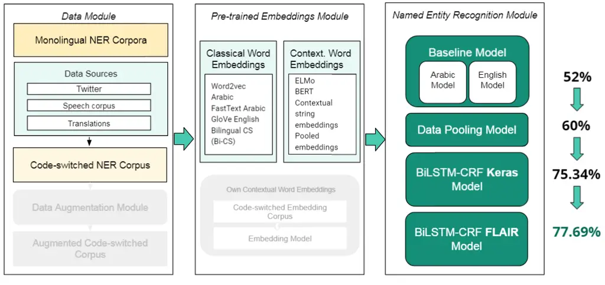

Figure 5.4: Results of deep learning CS taggers

## Chapter 6 Contextual Embeddings for Arabic-English CS Data

To enhance the performance of our NER tagger for CS data, we proposed a
solution to train bilingual contextual embedding models using
state-of-the-art embedding types generated from the CS Arabic-English
corpus we collected. In this chapter, we present our CS created corpora
and embedding models using Contextual String embeddings, BERT, and
ELECTRA. We also propose a new contextual word embedding model called
KERMIT, capable of mapping both Arabic and English words inside one
vector space efficiently in terms of data usage \[208\]. All our trained
and proposed models are available as an open source¹¹ 1
https://github.com/CSabty/Code-Switch-Arabic-English-Contextual-Embeddings.
We evaluate our embedding models in our NER model as shown in Figure 6.1
and in other NLP tasks to check which one will enhance their
performance.

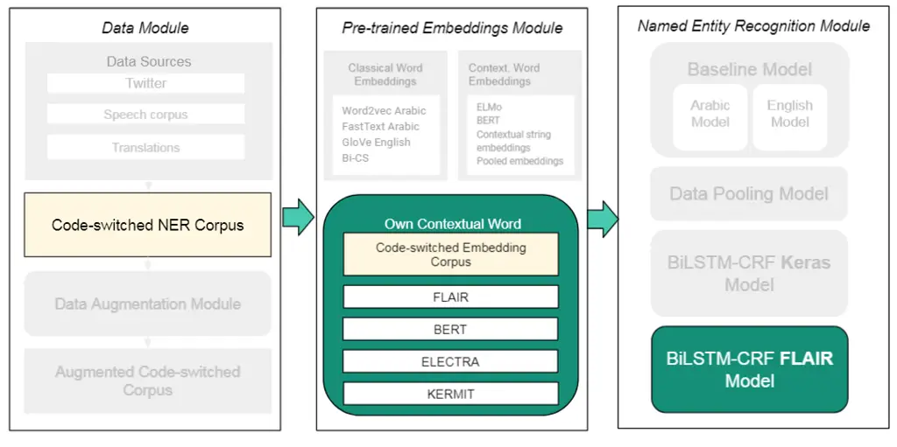

Figure 6.1: First Enhancement Technique

### 6.1 Data Collection

As the embedding models and especially the Transformers, ones are
composed of millions of parameters. Models with such large parameters
require a larger corpus to train without overfitting. We started by
creating our own CS corpora to train the embedding models using
Arabic-English Code-switched text. We collected the data using three
different techniques/sources and created two corpora. The first corpus
CS_TRAIN is composed of 105 million tokens. The first source of data was
using the CS corpus of \[108\] collected from social media platforms.
The second technique was generating 30 million Arabic-English CS tokens
by translating monolingual Modern Standard Arabic corpus into
Arabic-English CS data. We iterated automatically over the corpus and
translated tokens according to a set of linguistic constraints using an
open-sourced Neural Machine Translation API²² 2
https://rapidapi.com/gofitech/api/nlp-translation. We followed the
linguistic constraints inferred from evaluating real Arabic-English
code-switched data in \[107\]. They defined trigger words such as (لا ,
the), (يف , in) and (و , and), which are Arabic words preceding a CS
point as shown in Table 6.1.

| Trigger word | Percentage |
| ------------ | ---------- |
| لا (the)     | 31.0%      |
| يف (in)      | 04.8%      |
| و (and)      | 03.4%      |
| ينعي (means) | 01.5%      |
| وه (he)      | 01.3%      |

Table 6.1: List of trigger words each with percentage probability of
preceding code-switching \[107\]

The final part of the corpus is composed from the monolingual Arabic
news-wire data. To augment the size of the training data, we created
another corpus CS_TRAIN₊₊ with 20 million tokens from the same Arabic
monolingual news-wire data-set by adding to the initial one. Also, we
translated them following the same linguistic constraints to form the
other 19 million CS tokens. The corpus of CS_TRAIN₊₊ is composed of 144
million tokens. The corpora statistics are presented in Table 6.2.

| Data-set   | English Tokens | Arabic Tokens | Sentences |
| ---------- | -------------- | ------------- | --------- |
| CS_TRAIN   | 10M            | 95M           | 7M        |
| CS_TRAIN₊₊ | 17M            | 127M          | 9M        |

Table 6.2: Detailed data statistics about the number of English tokens,
Arabic tokens, the number of sentences

### 6.2 Trained Embedding Models

We trained several bilingual contextual embedding models to compare them
and have an efficient model for Arabic-English CS data used in several
NLP tasks and specially our NER task. We used several state-of-the-art
techniques and the type of contextual embeddings for building our
models. We started by creating a baseline model using a stack of Arabic
pre-trained Pooled Flair embedding and pre-trained FastText. The other
models we built used Contextual string embeddings, BERT, and ELECTRA. We
also proposed a new model called the KERMIT.

#### 6.2.1 Baseline

The baseline model used in our experiment is a stack of Arabic
pre-trained Pooled Flair embedding and pre-trained FastText. Pooled
Flair embedding and FastText achieved the best results on our NER task
for Arabic-English CS data. It even outperformed the only available
Arabic-English CS embedding of Bi-CS. Pooling operation dynamically
aggregates each unique word encountered, then retrieves previous
embeddings produced from memory. Finally, the pool operation is
performed, and all locally contextualized embeddings are concatenated to
make the final embedding for the token.

#### 6.2.2 Contextual String Embeddings

The first model trained on our corpus was Contextual string embeddings.
The pre-processing stage involved removing punctuation symbols and lower
casing English characters in the corpus. In the tokenization phase, we
listed all the alphabetical English and Arabic characters.
Hyper-parameters were configured following the original Contextual
string embeddings parameters \[11\]. Forward and Backward language
models were trained using the same vocabulary. The language models were
trained using SGD to perform truncated back-propagation we tracked the
training performance on the validation set. Training took ten days for
each of the backward and forward models on one GPU or halted when
negligible gains were observed.

#### 6.2.3 BERT

We trained BERT on our CS corpora. We implemented an additional
pre-processing stage to our data set before proceeding to the training
phase. This stage involves segmenting Arabic words using Farasa
segmenter \[2\] to remove redundant forms of words. After segmenting the
corpus, we produced a total of 64k tokens as a vocabulary for our model.
We trained BERT\_(BASE) sized model with 12 encoder layers, a hidden size
of 768, and 12 attention heads. Training BERT was done by masking 15% of
tokens in the input, of which 80% were replaced with a special token
\[MASK\], 10% replaced with random tokens, and 10% remaining as an
original token. This configuration helped to prevent
pretrain-finetune-discrepancy. A learning rate of 2e-5 and Adam
optimizer was used in the pre-training. We trained our model for a total
of 1,000,000 steps with a batch size of 128. The next 250,000 steps were
then trained with a batch size of 256 to speed up the training process.
The training took three days to complete on eight cloud TPUs.

#### 6.2.4 ELECTRA

We trained ELECTRA \[57\] on our CS corpora. The pre-training stage was
similar to BERT, however, with different configurations. We used the
same pre-processing and tokenization mechanism. We trained
ELECTRA*(BASE) sized model. The discriminator of this model has the same
size as BERT*(BASE) model. It is composed of 12 encoder layers, a hidden
size of 128, 12 attention heads, and outputs embedding of size 768. The
generator component of the ELECTRA\_(BASE) model is 1/3 of the size of
the discriminator model. This configuration makes it harder for the
discriminator component to distinguish tokens and produces more robust
representations. We trained both the generator and discriminator jointly
from scratch with a learning rate of 2e-4 and batch size of 256 for a
total of 750,000 steps. This training took five days on eight TPUs.

### 6.3 New Proposed Embedding Model: KERMIT

We proposed a novel model called KERMIT for producing word embeddings.
The architecture of this model is an encoder variant of transformers.
The pre-training of this model is divided into two stages, as shown in
Figure 6.2. In the first stage (Figure 6.2a), KERMIT is trained as a
discriminator in ELECTRA architecture using RTD and MLM tasks. After
pre-training, the generator is dropped, and the pre-trained
discriminator weights are used for the next stage. In the second stage
(Figure 6.2b), we initialized the encoder and embedding layers of the
BERT model with the trained discriminator model. Then, we further
trained the model as a generator using the MLM task. This training
mechanism helps avoid pretrain-finetune-discrepancy and allows the model
to learn stronger representations through training on more than one
task. Furthermore, the model is trained on data with different
augmentations. A generator replaced tokens at the first stage, and
during the second stage, tokens were masked out. This helped increase
the diversity of data available for training.

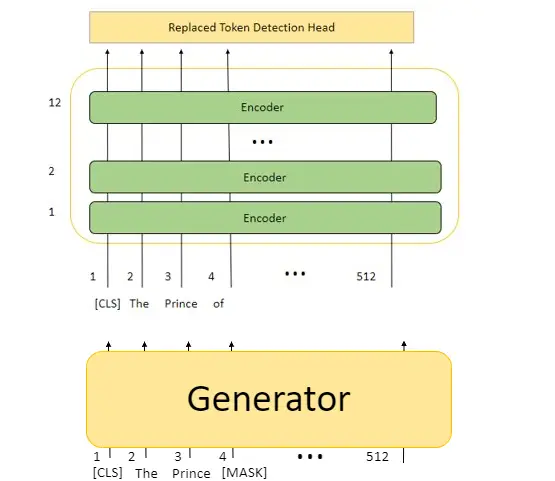

(a) ELECTRA model


(b) BERT model

Figure 6.2: KERMIT encoder layers trained as discriminator in ELECTRA
then as Generator in BERT

In the two stages of pre-training, we used the same data pre-processing
and tokenization vocabulary. We have trained the ELECTRA*(BASE) model
using the same hyper-parameters used for training the previous ELECTRA
model. Using the same vocabulary, we transferred weights of the encoder
and embedding layers and trained BERT*(BASE) model using the same
hyper-parameters used for training the previous BERT model. We
investigated different configurations for the transferred model. On the
one hand, we trained the BERT model using trained generator prediction
layers. On the other hand, we trained the model using randomly
initialized generator prediction layers. Furthermore, we have changed
the Adam optimizer variables so that loss affects only the encoder
layers and applies less effect on the output layers. We also tried to
switch training stages through training BERT first then transferring
weights to the ELECTRA model. The best configuration observed while
training was using both randomly initialized generator prediction layers
along with Adam optimizer variables.

### 6.4 Evaluation & Results

To compare our bilingual embedding models, we applied intrinsic and
extrinsic evaluation methods. In the intrinsic evaluation, the models
were tested on their ability to assign near-by vectors to similar
tokens. This was achieved by calculating the cosine similarity between
the tokens using BERTS\_(CORE) \[263\]. In the extrinsic evaluation, we
evaluated our models on three downstream NLP tasks; Named Entity
Recognition, Sentiment Analysis, and Question Answering on
Arabic-English CS text. To evaluate our models, we used intrinsic and
extrinsic methods. We first trained the models using the CS_TRAIN and
then using CS_TRAIN₊₊ for clarity. All models with a suffix ++ have been
trained using CS_TRAIN₊₊.

#### 6.4.1 Intrinsic Evaluation

The purpose of the intrinsic evaluation was to visualize and test how
well the word embedding model can capture similarities in CS
Arabic-English text. Thus, to evaluate our embedding models, we
leveraged cosine similarity between different tokens using BERTS\_(CORE)
\[263\]. This is a new automatic evaluation metric for the generated
text that computes token similarity using contextual embeddings. We
evaluated the similarity between the tokens of several sentences, and
the models performed the same in almost all of them. The following is an
example of two CS sentences used to test the similarities stated by the
models:

|                                     |
| ----------------------------------- |
| day لك news هءارق بحي دمحا          |
| ’Ahmed loves reading news everyday’ |

|                                     |
| ----------------------------------- |
| عوبسأ يف باتك يهني Mohamed          |
| ’Mohamed finishes a book in a week’ |

Examining the results in Figures 6.3b to 6.6, we can see how word
embeddings can help state the similarity between CS words. All the
models trained with CS_TRAIN₊₊ performed better than those trained with
the smaller data-set CS_TRAIN. We also noted in Figures 6.3a that the
baseline model using Contextual string embeddings and FastText did not
get the similarities of the English words. It is an expected result as
it was trained on monolingual Arabic data. On the one hand, the
similarities of the Contextual string embeddings model between all words
were low.

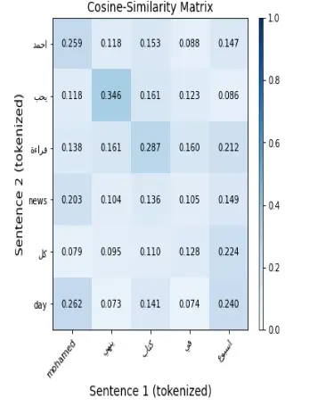

(a) Contextual string embeddings and FastText

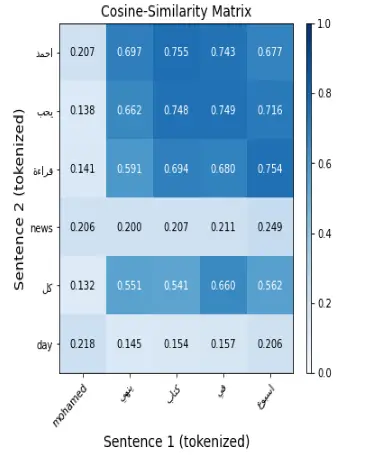

(b) Pooled Flair and FastText

Figure 6.3: Results of comparing the tokens of two sentences of
different embeddings by calculating the cosine-similarity of
BERTS\_(CORE)

On the other hand, as shown in Figure 6.4 BERT₊₊ is capable of capturing
small similarities between tokens, including cross-lingual. As
illustrated in Figure 6.5, the similarities obtained by the ELECTRA
model were high.

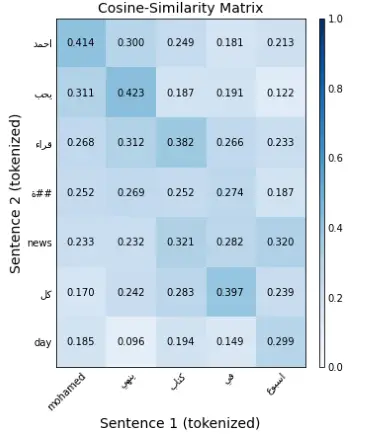

(a) BERT

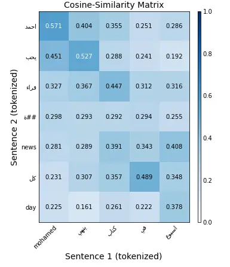

(b) BERT₊₊

Figure 6.4: Results of comparing the tokens of two sentences using BERT
embedding by calculating the cosine-similarity of BERTS\_(CORE)

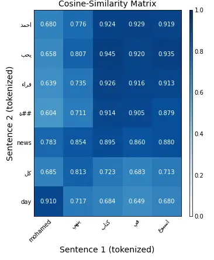

(a) ELECTRA

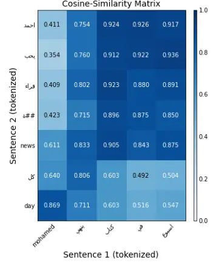

(b) ELECTRA₊₊

Figure 6.5: Results of comparing the tokens of two sentences using
ELECTRA embedding by calculating the cosine-similarity of BERTS\_(CORE)

Moreover, training KERMIT with the smaller corpus did not achieve good
results as it modeled wrong similarities between unrelated words as
shown in Figure 6.6a. Also, as shown in Figure 6.6b KERMIT₊₊ is the best
one; as it was capable of modeling higher cosine-similarity with similar
words and lower for unrelated ones.

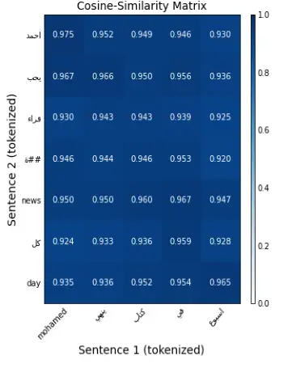

(a) KERMIT

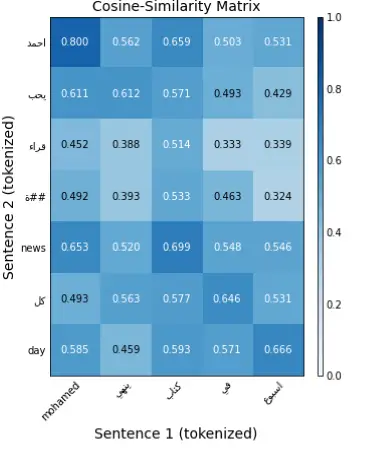

(b) KERMIT₊₊

Figure 6.6: Results of comparing the tokens of two sentences using
KERMIT embedding by calculating the cosine-similarity of BERTS\_(CORE)

#### 6.4.2 Extrinsic Evaluation

The extrinsic evaluation is based on the possibility of using the word
embeddings in downstream NLP tasks. We evaluated the impact of our
models in three tasks, Named Entity Recognition, Sentiment Analysis and
Question Answering on Arabic-English CS text. As there is no available
contextual embeddings trained on Arabic-English CS data, we evaluated
the recent Arabic model AraBERT \[21\] in the three tasks to compare its
performance with our models.

##### Named Entity Recognition

We used two NER approaches to evaluated our embeddings. The first one is
based on feature extraction approach, where a set of features are
extracted from the pre-trained embedding model. The NER tagger we used
is our system as stated in Chapter 5 and that we want to enhance. It is
based on BiLSTM and CRF along with the pre-trained word embedding layer.
Previously, the best embedding types were using Pooled Flair and
FastText pre-trained Arabic embeddings, which we call our baseline. The
best performance achieved an F1-score equal to 77.69%. While training
the model we used Adam optimizer and a learning rate equal to 3e-5 with
a transformer-based embedding and 0.1 for Contextual string embeddings
with an annealing factor equal to 0.5. Regarding the number of epochs,
we trained the model a total of 50 epochs while using the transformers
embeddings and 110 epochs for the Contextual string embeddings on a
batch size equal to 16. We used the same model and the training and
testing data to compare the effect of using our different embeddings
models on the performance.

The second approach uses the NER system presented by the HuggingFace NLP
library that is based on fine-tuning \[250\]. The fine-tuning approach
relies on adding a simple classification layer to the pre-trained
embedding model and all parameters are fine-tuned together on the
downstream task which is here the NER. Our model was fine-tuned by
adding a simple feed-forward layer with Softmax function to get the
probability distribution over the output classes predicated. We trained
this model for a total of 4 to 10 epochs using Adam optimizer. We
evaluated the best configuration of the learning rate from \[1e-4, 5e-5,
3e-5, 2e-5\], batch size from \[16,32\] and max sequence length of 64.
Concerning the rest of the hyper-parameters they were configured as
recommended in BERT \[68\]. Also, to initialize the linear variable, we
tested 30 random seeds and chose the best model out of the 30 models. We
tested this system using the same training and testing data.

|                                         |           |                 |
| --------------------------------------- | --------- | --------------- |
| Embedding Model                         | NER Model | NER HuggingFace |
| BERT                                    | 64.50     | 76.50           |
| BERT₊₊                                  | 68.20     | 77.10           |
| AraBERT                                 | 58.00     | 66.70           |
| KERMIT                                  | 65.00     | 78.70           |
| KERMIT₊₊                                | 69.00     | 79.40           |
| ELECTRA                                 | 67.00     | 75.40           |
| ELECTRA₊₊                               | 68.30     | 76.29           |
| Pooled Flair & FastText                 | 77.69     | -               |
| Contextual string embeddings            | 72.55     | -               |
| Contextual string embeddings & FastText | 78.20     | -               |
| KERMIT₊₊ & Contextual string embeddings |           |                 |
| & FastText                              | 76.60     | -               |

Table 6.3: The F1-score results (%) of using the different types of
embeddings in the two NER systems

As shown in Table 6.3, we used all the models one by one as the
embedding layer in the NER system, and we also combined some models. We
combined Contextual string embeddings with Arabic FastText embedding,
and it achieved the best results and enhanced the NER model by 0.51%.
All the models trained on CS_TRAIN achieved lower F1-score than the ones
trained on CS_TRAIN₊₊. The results of using BERT₊₊, ELECTRA₊₊, and
KERMIT₊₊ are all less than the baseline model, but the three are almost
the same with minimal differences, achieving an F1-score equal to 68.2%,
68.3% and 69% respectively. We combined the highest one of them,
KERMIT₊₊, with the highest model of Contextual string embeddings and
FastText. The results improved but were still less than the baseline.

However, in the HuggingFace system, it was hard to add the Pooled Flair
and Contextual string embeddings to their fine-tuning model since the
pooling is over past embeddings. Thus, it is hard to fine tune all of
them due to memory limitations. As a result, KERMIT₊₊ outperformed all
other transformer-based models and even achieved higher results than the
ones presented by the first NER approach by 1.2% and achieved an
F1-score of 79.4%, setting new state-of-the-art results on code-switch
Arabic-English NER task. However, not all model architectures could be
used or represented by a transformer architecture. Also, the
computational cost is expensive compared to the feature extraction-based
approach.

##### Sentiment Analysis

We also evaluated our models on sentiment analysis (SA) tasks using the
methods proposed. This is a text classification task, where parts of the
text are identified and marked with binary labels to represent the
sentiment type. SA can capture the context, in a given text, and predict
a label to summarize the context. The labels are based on the annotated
corpus that the model was trained on. The models are trained as a
multiclass labeling. For instance, we can use a SA model to state
whether a text review is negative, positive or neutral in a book
reviews.

We created our data-set by translating a monolingual Arabic data-set of
book reviews \[19\] to have CS text using the same machine translation
API and the linguistic constraints previously described in the data
collection section. The results of experimenting sentiment analysis are
stated in Table 6.4.

We used two approaches to apply this task. The first one used the
framework of FLAIR \[10\]. Based on the Recurrent Neural Network and
linear classifier layers. It is a feature extraction approach, where
only the output layers are trained. We added an RNN layer, a linear
dense layer as output and a Softmax layer. The hyper-parameters were
configured such that the learning rate was equal to 0.1 and trained for
10-15 epochs. While we added again the pre-trained FastText embedding to
the Contextual string embeddings, the performance of the sentiment
analysis model improved and the model scored the highest F1-score of
88.8%.

In the second approach, we used the sentiment analysis system presented
by HuggingFace based on fine-tuning (Linear Classifier) \[250\]; all
transformer-based models were fine-tuned by adding a linear classifier
layer. We added a feed-forward layer with standard Softmax to get the
probability distribution over the predicted output classes. We fine
tuned the models for 2-3 epochs with a learning rate of 2e-5 and Adam
optimizer. BERT model outperformed ELECTRA by about 1.6% and KERMIT by
0.9%. Furthermore, BERT₊₊ scored higher than ELECTRA₊₊ by 0.4%. Finally,
KERMIT₊₊ scored the highest in the second approach. However, using the
first approach with Contextual string embeddings and FastText
outperformed all models experimented with and used.

| Embedding Model                           | SA HuggingFace | SA FLAIR Framework |
| ----------------------------------------- | -------------- | ------------------ |
| BERT                                      | 77.70          | -                  |
| BERT₊₊                                    | 77.38          | -                  |
| AraBERT                                   | 78.20          | -                  |
| KERMIT                                    | 76.80          | -                  |
| KERMIT₊₊                                  | 79.90          | -                  |
| ELECTRA                                   | 76.39          | -                  |
| ELECTRA₊₊                                 | 77.18          | -                  |
| Pooled Flair and FastText                 | -              | 87.84              |
| Contextual string embeddings              | -              | 87.80              |
| Contextual string embeddings and FastText | -              | 88.80              |

Table 6.4: The F1-score results (%) of using the different types of
embeddings in the two sentiment analysis systems

##### Question Answering

Another important task where we tested the effect of using our
embeddings models as the question-answering approach which refers to
finding the part of the text in a context that answers a given question.
This could be done by predicting the special tokens indicating the start
and end surrounding the answer sequence. A model is given a context and
is required to predict a sequence in the context that has the correct
answer to a defined question.

There are very few code-switched corpora for a question-answering task
and none for Arabic-English language pairs. For instance, \[197\]
collected 3000 Hindi questions from a TV show and added some questions
from the Central Board of Secondary Education (CBSE). These questions
were then converted to Hindi-English CS data with the help of 30
students volunteer. The volunteer students were asked how to pose these
questions in a CS language. Finally, these questions were filtered and a
total of 1000 questions were collected. Also, \[30\] relied on social
media for producing such low resource corpus of Bengali-English CS
corpus. For social media tweets, blogs and forums were all used to
acquire question-answer sets and have fine-tuned a language mix ratio to
ensure only CS data are collected.

We created our own data-set by translating text from the questions of
the monolingual Arabic Question Answering (QA) corpus presented by
\[174\] following the same approach stated in the sentiment analysis
task. We could not translate words from the answers, as this would lead
to changing their order, which could be misleading for the
question-answering task.

We used only one approach for this task, which uses the question
answering system of HuggingFace, which is based on fine-tuning (Linear
Classifier) \[250\]. The model was fine-tuned by adding a linear dense
layer, a normalization layer and a Softmax function. The
hyper-parameters were configured such that the learning rate was equal
to 3e-5, batch size equal to 12 and number of epochs equal to two.

As shown in Table 6.5, KERMIT₊₊ achieved the highest score as compared
to all other fine-tuned models with an F1-score equal to 39.9%. It
outperformed all models because, as stated, before training KERMIT as
both generator and discriminator, it helped the model to compute better
representation of the data. All the results of using the different
embeddings are low as the answers in the training data did not contain
CS behaviour, which could be enhanced using more accurate translation
techniques without affecting the order of words. As shown in the results
our models achieved higher results than AraBERT embedding in all the
three tasks. This is due to the fact that AraBert is trained on
monolingual Arabic data.

| Embedding Model | QA HuggingFace |
| --------------- | -------------- |
| BERT            | 37.8           |
| BERT₊₊          | 38.1           |
| AraBERT         | 30.0           |
| KERMIT          | 32.8           |
| KERMIT₊₊        | 39.9           |
| ELECTRA         | 34.1           |
| ELECTRA₊₊       | 37.2           |

Table 6.5: The F1-score results (%) of using the different types of
embeddings in the question answering system

#### 6.4.3 Discussion

Throughout the pre-training process using downstream tasks, we evaluated
the different training configurations. Concerning BERT, it achieved
better results in downstream tasks while training it, using randomly
initialized output layers compared to training it using trained output
layers. In addition, using for the output layer an Adam optimizer to
decrease momentum and concentrate on training encoders did not improve
the performance of the downstream tasks. Furthermore, in KERMIT,
switching the stages by training BERT first then ELECTRA has shown very
low performance on downstream tasks. The best configuration was to train
the ELECTRA model then transfer it to BERT with randomly initialized
output layers.

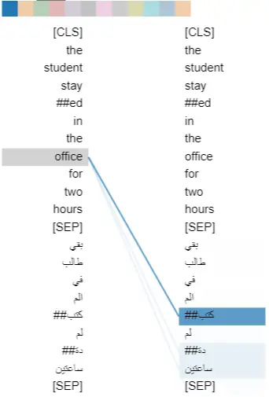

(a) Example A

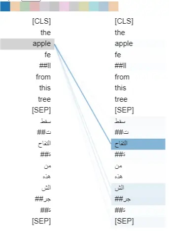

(b) Example B

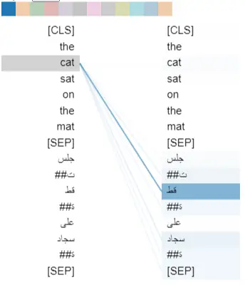

(c) Example C

Figure 6.7: Visualizing dependencies between different language tokens
using KERMIT₊₊

After training, we evaluated the resulting embedding representation
using attention visualization tool \[242\]. The KERMIT₊₊ model has been
capable of outputting strong word representation and could map
cross-lingual vectors together as shown in the randomly selected
examples in Figure 6.7. Examples A, B and C show different context in
English and Arabic. Computing the attention of KERMIT has shown the most
similarity between vectors of English words and their equivalent Arabic
words of the following sentences:  
Example A:  
The student stayed in the office for two hours  
ناتعاس هدمل بتكملا يف بلاط ىقب  
Example B:  
The apple fell from the tree  
هرجشلا هذه نم هحافتلا تطقس  
Example C:  
The cat sat on the mat  
هداجس ىلع هطق تسلج

### 6.5 Summary

We proposed a solution to compute a large corpus for pre-training CS
word embeddings through mainly translation techniques to enhance our NER
model. We used this corpus to train different language models:
Contextual string embedding, BERT, and ELECTRA. We also proposed our new
language model KERMIT. This model is trained as both a discriminator and
a generator where each task has a different data augmentation. The
different data augmentations helped the KERMIT model to train
efficiently on the collected corpus. We have pre-trained and evaluated
the KERMIT model on NER, sentiment analysis, and question answering.

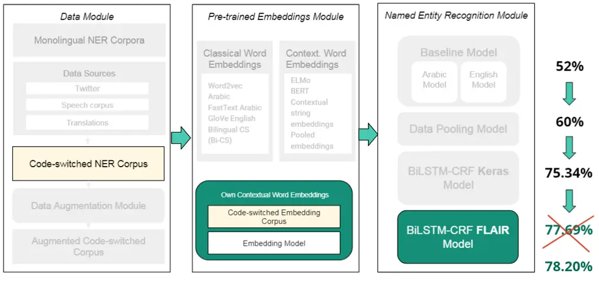

Figure 6.8: Results of First Enhancement Technique

Compared with other models, KERMIT has scored the highest F1-score on
both NER and question answering tasks. As shown in Figure 6.8 KERMIT has
also outperformed the previous NER baseline with an F1-score of 79.4%.

## Chapter 7 Data Augmentation Techniques on CS Data for NER

The main contribution in this part is tackling the lack of
Arabic-English CS annotated data and enhancing the performance of our
NER task on CS data. Most of the state-of-the-art NER approaches rely on
deep neural network models, which require having large training
data-sets. Also, large labeled data is needed to avoid over-fitting the
models \[199\], which is often not available. In addition, the need for
a large amount of data is related to the complexity of the task to be
solved and is not only specific to deep learning. Producing large
annotated data for the NER task is challenging, as the collection and
labeling processes tend to be expensive and time-consuming \[193\].

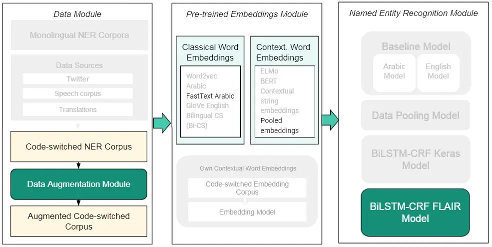

Figure 7.1: Second Enhancement Technique

In this chapter, we present our proposed data augmentation techniques
and show the effect of applying these techniques on the CS training data
by evaluating the performance of the NER tagger as shown in Figure 7.1
\[209\].

### 7.1 Data Augmentation Techniques

We introduced three data augmentation techniques used to substitute
entities and synthesize new annotated contexts. We used our original
training data that we created and discussed in Chapter 5, with a size of
5,306 sentences containing 14,34 entities. We used this data-set as the
source of the data to which we applied the data augmentation techniques.
The same deep learning NER model we introduced in Chapter 5 was used to
test the effect of different data augmentation techniques and compare
the performance with and without DA. The first technique was Word
Embedding substitution to replace entities with new similar ones. Hence,
the label of new words will be the same as the initial entities. In the
second technique, we modified some of the operations of the Easy Data
Augmentation (EDA) technique \[249\] to generate new annotated
sentences. In the last technique, we explored applying back-translation
(BT). We translated the sentences into one or two intermediate languages
and translated them back to form new sentences. If the newly added words
resulting from the last two techniques are available in our original
data, we take the same label. In case the word is a new one, we use two
different NER taggers for Arabic and English. We evaluated different
setups for these techniques and checked their effect on the performance
of the NER model.

The three techniques start by pre-processing the data to be given as
input to the augmentation module, and at the end, the augmented
sentences are tagged in the tagging module. In the first technique, the
augmented word is assigned the same NER tag as the original word. In the
other two techniques, in case the word is a new one, we used StanfordNER
tagger \[85\] for English data and an implemented NER model that was
trained on ANERCorp data for the Arabic language. Otherwise, we take the
same label from the original data-set.

#### 7.1.1 Word Embedding Substitution

Inspired by the capabilities of pre-trained word embedding models, we
implemented two word embedding substitution techniques to enrich our
training data using the classical embedding (FastText) and two
contextual embeddings (BERT and KERMIT).

##### Classical Embedding

The first technique uses FastText embedding. We created two variations
of this technique using FastText. The first one is $`Full\_WE_{sub}`$,
which replaces all the words of the sentences. The second one is
$`Analogies\_WE_{sub}`$, which replaces the entities only.

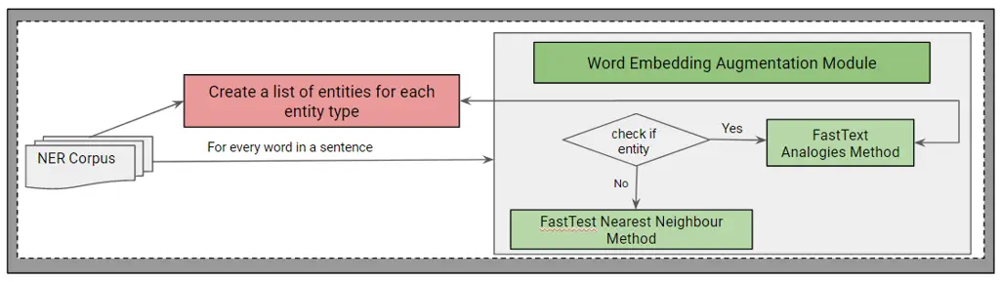

Figure 7.2: Architecture of the Classical Word Embedding Substitution
Technique

As illustrated in Figure 7.2, the main architecture of this technique
starts by creating a list for every entity type and collects all
entities with the same type from the original data. Then, for each word
in a sentence, it checks whether it is an entity or not. In case it is
an entity, its language is detected. Afterward, it uses the word analogy
method of FastText of the corresponding detected language. The method
input is the current word, and two randomly selected words from the list
containing the entities of the same type as the current one. The method
then predicts a fourth word that might be with the same entity type. For
instance, if we have the word John, which is an entity of type Person,
we randomly get from the list containing all persons, two other words
David and Martin that are all given to the embedding method, then as
output, we get the word Luther. In the end, we replace the original word
with the new predicted one. In case it is not an entity, in the model of
$`Full\_WE_{sub}`$, it will be replaced with a similar word in the
vector space. After investigating the most similar word (n=1),
especially for the Arabic language, we did not find a remarkable change
in the replaced words. This is due to having almost the same word but
with an added prefix or suffix. Thus, we selected the fifth similar word
(n=5) for replacement. In the second model $`Analogies\_WE_{sub}`$, no
replacement was applied if the word was not an entity.

##### Contextual Embedding

The second technique uses two pre-trained contextual transformer-based
embedding models BERT and KERMIT presented in Chapter 6 each alone
$`BERT_{sub}`$ and $`KERMIT_{sub}`$; they are both trained on AR-EN CS
data.

Both models have a transformer-based architecture trained using an
attention mechanism that helps capture features and supports long
sequences. This technique augments entities only. It works
auto-regressively by augmenting one entity at a time, which helps to
preserve dependencies between augmented tokens. This approach utilizes
knowledge captured by a pre-trained language model without any further
fine-tuning. First, we mask an entity to augment while a word piece
model tokenizes the sequence for the contextual models. A word piece
tokenizer works by splitting words into subsections to model
out-of-vocab words. The contextual model predicts the masked token by
outputting the embedding with the highest probability from the
vocabulary of 64000 consisting of both Arabic and English tokens. The
model has been configured to output the top 10 tokens with the highest
probability. To validate the fact that the predicted token has the same
type as the entity, we added a module that selects from the top 10
tokens similar to the original masked one while ignoring sub-tokens.
This module comprises our selected NER taggers for both languages. The
added module conditions the outputted selected token to be of a specific
entity.

#### 7.1.2 Modified Easy Data Augmentation Technique

We implemented a modified version of the Easy Data Augmentation (EDA)
technique \[249\]. The new model handles two languages in the same
sentence and supports the Arabic language. The initial EDA technique
consists of four different text editing operations:

- •
  Synonym Replacement (SR) refers to choosing n random words to be
  replaced by one of their synonyms in the sentence.
- •
  Random Insertion (RI) refers to choosing a random word to insert one
  of its synonyms in a random index in the sentence. It is repeated n
  times.
- •
  Random Swap (RS) refers to choosing two random words and swapping
  their positions in the sentence. It is repeated n times.
- •
  Random Deletion (RD) refers to choosing random words to be removed
  from the sentence based on a certain probability.

The operations could be repeated n times. The value of n is calculated
based on the length of the sentence (l) with the formula
$`n=\alpha\times l`$, where $`\alpha`$ indicates the percentage of words
to be changed in a sentence. The number of iterations per operations on
original sentence is $`N`$, it is calculated using the total number of
needed augments $`Num\_Aug`$ (number of required augments for one
sentence) divided by the selected operations. For example, if the
selected operations are two, then each one will be repeated
$`Num\_Aug/2`$.

The main modifications we applied were in the two operations of SR and
RI. As shown in Figure 7.3 synonym extraction process is done for each
of the SR and RI operations. This process starts by detecting the
language of each word in the sentence. Based on the detected language,
if it is English, then the actual extraction process of \[249\] is used.
They rely on WordNet \[171\] to search for synsets for a given word.
However, we added another source to search for more synonyms,
WikiSynonyms,¹¹ 1
[http://wikisynonyms.ipeirotis.com/](http://wikisynonyms.ipeirotis.com/)
which relies on extracting synonyms from Wikipedia pages. If the
detected language is Arabic, we implemented synonym extraction using
WikiSynonyms and Arabic WordNet (AWN) \[80\]. AWN represents an XML file
acting as a database containing Arabic words along with their synsets,
antonyms, and hyponyms. Hyponyms are sometimes considered as synonyms
for a word, e.g., ( قيرط ,عراش ) which means (road, street). We removed
the diacritics from all Arabic words in the AWN as our original data is
without diacritics. As words can be composed of prefixes, stem, and
suffixes. Extracting the stem of the words is not a straight-forward
approach as articles, pronouns, prepositions, or coordinating
conjunctions could be found as part of the word. Thus, to find the words
and get their synonyms using the previously mentioned approaches, we had
to extract the stem and lemma of the words using the lemmatizing method
presented in \[262\] and the stemmer algorithm described in \[233\]. For
example, we will not find the word in the AWN the word (انرصم ) (our
Egypt), and we should extract its lemma first which is (رصم ) (Egypt).

After applying the synonym extraction, we combined all returned lists of
synonyms in the SR operation. We used a word similarity method²² 2
[https://bitbucket.org/yunazzang/aiwiththebest_byor/src/master/](https://bitbucket.org/yunazzang/aiwiththebest_byor/src/master/)
that obtains the similarity between words by calculating the cosine
similarity of their word embeddings, and we modified it to work on
Arabic words as well. We get similarity values for each synonym compared
to the original word. The word with the highest similarity is the one
used for replacement. If a word is selected to be replaced by synonyms
multiple times in the same sentence, then each time, the synonym is
selected with a lower similarity than the previous one to have new
augmented words. For RI, a random word is selected from the sentence to
get its synonym using the synonym extraction method. A random synonym is
selected and placed randomly in a generated random index in the original
sentence from the list of synonyms.

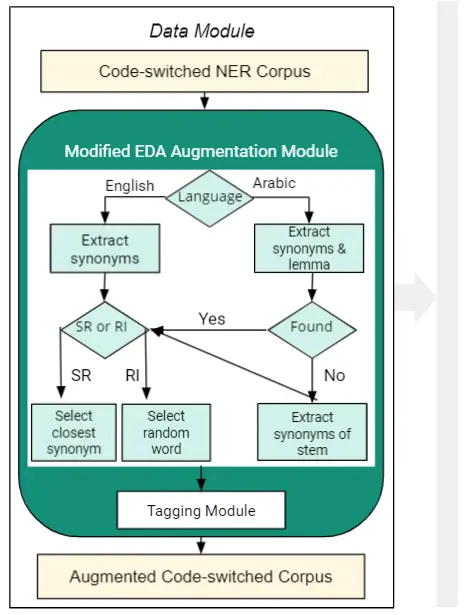

Figure 7.3: Architecture of the Modified EDA Augmentation Technique

#### 7.1.3 Back-Translation

The third technique implemented was based on back-translation to
paraphrase a text while retaining the meaning. This was done by
translating a text to a different language and then translating it back
to the original one. This technique mostly preserves the same semantics
of the sentences but generates a different syntax. We implemented three
models to apply BT to our CS data. The first model $`BT_{T2T}`$ used the
deep learning library of tensor2tensor \[240\]. We used the publicly
available data-set for Arabic-French of the United Nation \[268\] of
size 3M parallel sentence for training our BT model. In the second model
$`BT_{GT}`$, we used Google Translate, and the intermediate language was
French.

The same process was applied in both models. As shown in Figure 7.4, the
models start by translating every English word in our CS data to Arabic.
Then, the Arabic sentences are translated into French, and then the
French sentences are translated back into Arabic. To preserve the CS
behavior in the data, the same number of English words originally
existing in the source sentence is maintained in the augmented sentence.
The words selected for the translation follow a set of linguistic
constraints. The constraints are a set of Arabic words preceding the CS
points. Afterwards, we used this new sentence as an augmented version of
the original text. The third model, $`BT_{GT}`$+$`2L`$ used Google
Translate as well but using more than one intermediate language to
generate more variations from the sentences. All the steps were similar
to the previous models. However, after translating the English words of
the original sentence to Arabic, we translate the Arabic sentence to
French, French to German, and from German back to Arabic.

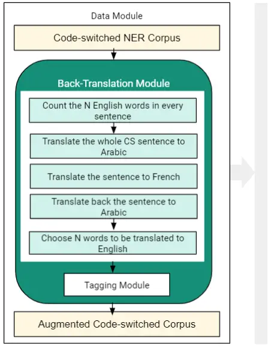

Figure 7.4: Architecture of the Back-Translation Technique

The third model, $`BT_{GT}`$+$`2L`$ is using Google Translate as well
but using more than one intermediate languages to generate more
variations from the sentences. All the steps were similar to the
previous models. However, after translating the English words of the
original sentence to Arabic, we translated the Arabic sentence to
French, French to German, and from German back to Arabic.

### 7.2 Experiments & Results

We used an extrinsic evaluation, which assesses the system output based
on its effect on an external task. The quality of the generated data can
be judged based on the improvement in a specific task resulting from
combining the new data with the original one \[103\]. In our case, this
task was the NER on CS data. The only available labeled corpus for this
task was the one we created and presented in Chpater 5. We used the same
deep learning NER model presented in Chapter 5 to test its performance
with and without data augmentation techniques. This model was based on
BiLSTM and CRF along with the pre-trained word embedding layer. We used
the same test data they used to compare the performance of their model.
Their model trained on the AR-EN CS data without applying data
augmentation achieved an F1-score equal to 77.69%.

#### 7.2.1 Modified Easy Data Augmentation (EDA)

In the first set of evaluations, we trained the model with the data
after applying our modified EDA technique. We investigated different
setups for the parameters and operations based on recommendations stated
in \[249\]. We applied $`EDA_{SR}`$ and $`EDA_{SR,RI}`$ only as the
other EDA operations would not guarantee a different sentence with new
entities.

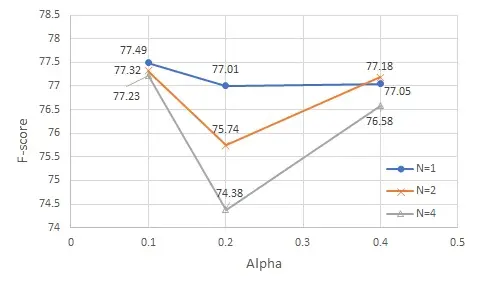

Figure 7.5: Results of applying different set of EDA operations with
different parameter set-ups

Figure 7.5 illustrates the usage of SR operation $`EDA_{SR}`$ with
values of $`\alpha`$ in (0.1,0.2,0.4) and values of number of augments
$`N`$ in (1,2,4). All the models using the SR operation only got results
lower than the initial model. This could result due to losing the
meaning of the sentence by replacing the words with their synonyms as
the SR process does not consider the context.

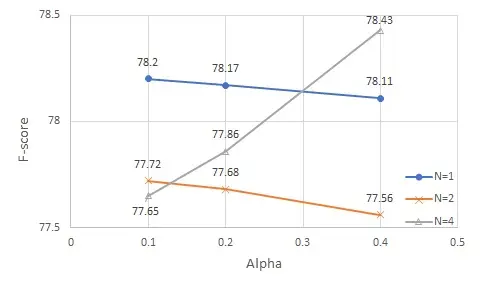

Figure 7.6: Results of applying different set of EDA operations with
different parameter set-ups

Figure 7.6 presents the results of using the SR and RI operations
$`EDA_{SR,RI}`$ with the same range of values for the $`\alpha`$ and
$`N`$. It can be noticed that the majority of the models combining both
operations achieved higher results than $`EDA_{SR}`$. The highest model
of the EDA is $`EDA\_(SR,RI)_{\alpha=0.4,N=4}`$, which achieved an
F1-score of 78.43%, an increase of 0.74%. This combination resulted in
four variations for each sentence, two of them after applying the SR
operation and the other two after applying the RI operation. As
explained before, the SR operation will replace some of the existing
words with their synonym. The RI operation adds to the sentence new
words similar to existing ones but does not change the original words,
which could be why combining both achieved the highest results.

#### 7.2.2 Word Embedding Substitution & Back-Translation

Table 7.1 gives an overview of the results after applying the set of
data augmentation techniques to the data. We can observe that none of
the three classical word embedding substitution techniques managed to
improve the performance of the model since these techniques replace the
words without considering their context. However, the technique of
$`KERMIT_{sub}`$ got the highest result among the word embedding
substitution techniques with an improvement of 0.65%. $`BERT_{sub}`$ and
$`KERMIT_{sub}`$ results have been restricted by two causes. First, the
performance of the model is affected by the accuracy of the NER taggers
as NER taggers choose from the predictions the ones with the same entity
type. Furthermore, any sub-word prediction is ignored by the taggers. We
applied the BT techniques alone on the data. They did not enhance
performance. This is due to having paraphrased sentences only. Besides,
$`BT_{T2T}`$ got the lowest results, as the data used to train the
translation model is not diverse enough, and its domain does not match
well the data of the NER corpus. A high chance of errors exists in the
tagging process as the taggers miss the context of the words due to the
CS behavior. One possible reason for using the $`Full\_WE_{sub}`$ is
losing the semantics of the sentences, as similar words replace all word
occurrences without considering their context. On the other hand, using
$`Analogies\_WE_{sub}`$ alone did the opposite and changed very few
words/entities in the sentences, causing the augmented sentences to have
significant similarity to the original ones.

|                                              |           |        |          |
| -------------------------------------------- | --------- | ------ | -------- |
| Data Augmentation Techniques                 | Precision | Recall | F1-score |
| Original Data Without DA                     | 79.15     | 76.28  | 77.69    |
| $`Full\_WE_{sub,n=1}`$                       | 78.47     | 75.14  | 76.77    |
| $`Full\_WE_{sub,n=5}`$                       | 80.24     | 74.43  | 77.22    |
| $`Analogies\_WE_{sub}`$                      | 78.13     | 73.81  | 75.91    |
| $`BERT_{sub}`$                               | 79.81     | 76.63  | 77.64    |
| $`KERMIT_{sub}`$                             | 80.96     | 77.24  | 78.34    |
| $`BT_{T2T}`$                                 | 52.35     | 46.78  | 49.41    |
| $`BT_{T2T}`$+$`Analogies\_WE_{sub}`$         | 75.37     | 69.67  | 72.41    |
| $`BT_{GT}`$                                  | 81.29     | 74.29  | 77.63    |
| $`BT_{GT}`$ + $`Analogies\_WE_{sub}`$        | 81.37     | 77.14  | 79.20    |
| $`BT_{GT}`$+$`2L`$ + $`Analogies\_WE_{sub}`$ | 81.30     | 76.62  | 78.41    |
| $`EDA\_(SR,RI)_{\alpha=0.4,n=4}`$            | 80.50     | 76.47  | 78.43    |
| $`EDA\_(SR,RI,RD,RS)_{\alpha=0.4,N=4}`$      | 75.42     | 78.02  | 76.70    |
| $`EDA\_(SR,RI,RD,RS)_{\alpha=0.1,N=4}`$      | 75.76     | 78.52  | 77.12    |

Table 7.1: Comparison between the NER model with and without applying
the different data augmentation techniques (%)

Thus, we created a new technique using BT models $`BT_{GT}`$ and
$`BT_{T2T}`$ along with the word embedding substitution model of
$`Analogies\_WE_{sub}`$ consecutively, to make sure we replace entities
with similar ones and introduce new entities to the data. We started by
applying the $`Analogies\_WE_{sub}`$ method in order to be able to
replace the entities before they are translated, and then the output
sentence is given to the translation module. The performance of the
technique $`BT_{T2T}`$+$`Analogies\_WE_{sub}`$ is better than the
$`BT_{T2T}`$ alone but is still less than all other models. This is also
due to the better quality of the Google Translate output compared to our
trained model. After applying $`BT_{GT}`$+$`Analogies\_WE_{sub}`$ to the
training data, the model achieved the highest results with an F1-score
79.20%, which is an improvement of 1.51%. This model succeeded in
introducing new entities with high accuracy tags as they are mapped from
the original ones in semantically correct new sentences. In addition, we
evaluated combining the back-translation technique of two intermediate
languages with the word embedding substitution $`BT_{GT}`$+$`2L`$ +
$`Analogies\_WE_{sub}`$ as there is no need to try back-translation
alone anymore. The model achieved an F1-score equal to 78.42%, which is
an increase of 0.73%.

### 7.3 Discussion

As shown in Figure 7.5, the highest model of the EDA techniques
discussed before was $`EDA\_(SR,RI)_{\alpha=0.4,N=4}`$, considered to be
the second-best data augmentation technique among all techniques in
terms of enhancing the F1-score. Thus, we tried to use the same
parameters of $`\alpha=0.4`$ and $`N=4`$ with the full set of operations
of the EDA technique. However, the results decreased. This proved our
assumptions that not all EDA operations applied to CS data for NER
enhance the performance. The model of $`BT_{GT}`$ +
$`Analogies\_WE_{sub}`$ achieved the highest results; this is due to the
better quality of word embedding substitution compared to the synonym
replacement methods. Besides, the usage of BT after introducing new
entities in the sentence resulted in having an augmented sentence that
is different from the original one. Finally, we trained the model using
the two augmented data-sets of the highest two techniques
$`EDA\_(SR,RI)_{\alpha=0.4,N=4}`$ and ($`BT_{GT}`$ +
$`Analogies\_WE_{sub}`$) combined together. These achieved an F1-score
equal to 77.45%, which means the performance decreased by 0.24%. We can
deduce that enhancing the NER models on CS data is not about having new
instances and bigger data-sets only but the quality of the augmented
instances in terms of semantics matter.

|          | Input data |        |       | $`BT_{GT}`$+$`Analogies\_WE_{sub}`$ |        |       |                   |        |       |
| -------- | ---------- | ------ | ----- | ----------------------------------- | ------ | ----- | ----------------- | ------ | ----- |
|          | Before     |        |       | After                               |        |       | Increasing factor |        |       |
| Entities | English    | Arabic | Total | English                             | Arabic | Total | English           | Arabic | Total |
| LOC      | 2,82       | 563    | 3,38  | 20,62                               | 1,95   | 5,29  | 1.18              | 3.47   | 1.56  |
| PER      | 3,70       | 1,52   | 5,23  | 23,20                               | 2,69   | 7,46  | 1.29              | 1.76   | 1.43  |
| ORG      | 706        | 1,64   | 2,35  | 6,42                                | 2,57   | 4,41  | 2.60              | 1.56   | 1.88  |
| MISC     | 1,73       | 1,66   | 3,39  | 11,24                               | 2,06   | 4,07  | 1.17              | 1.24   | 1.20  |
| Total    | 8,95       | 5,39   | 14,34 | 61,48                               | 9,27   | 21,23 | 1.34              | 1.72   | 1.48  |

Table 7.2: Total number of entities in each type before and after
augmentation using the highest technique and its increase factor

|          | Input data |        |       | $`EDA\_(SR,RI)_{\alpha=0.4,N=4}`$ |        |       |                   |        |       |
| -------- | ---------- | ------ | ----- | --------------------------------- | ------ | ----- | ----------------- | ------ | ----- |
|          | Before     |        |       | After                             |        |       | Increasing factor |        |       |
| Entities | English    | Arabic | Total | English                           | Arabic | Total | English           | Arabic | Total |
| LOC      | 2,82       | 563    | 3,38  | 20,62                             | 3,75   | 24,37 | 7.32              | 6.66   | 7.21  |
| PER      | 3,70       | 1,52   | 5,22  | 23,20                             | 9,53   | 32,72 | 6.27              | 6.25   | 6.26  |
| ORG      | 706        | 1,64   | 2,35  | 6,42                              | 10,39  | 16,82 | 9.10              | 6.33   | 7.16  |
| MISC     | 1,73       | 1,66   | 3,39  | 11,24                             | 10,49  | 21,73 | 6.514             | 6.32   | 6.42  |
| Total    | 8,95       | 5,39   | 14,34 | 61,48                             | 34,16  | 95,63 | 6.87              | 6.34   | 6.67  |

Table 7.3: Total number of entities in each type before and after
augmentation using the second highest techniques and its increase factor

Table 7.2 and Table 7.3 illustrate the statistics of the training data
before and after applying the highest two augmentation methods along
with their increase factor $`y`$. The increase factor is calculated
based on the formula $`x_{i}^{\prime}=y*x_{i},i\in E`$, where $`y`$ is
the increase factor by which the number of entities increased after
augmentation, $`E`$ is the set of all named entity types, and $`x_{i}`$
is the number of entities for entity type $`i`$. The size of the
original input/train data presented in Chapter 5 before augmentation was
equal to 5,306 sentences. The testing data was not augmented for
comparison while running the NER model with the new augmented training
data. After applying the highest technique of
$`BT_{GT}`$+$`Analogies\_WE_{sub}`$, the size increased to 10,612
sentences. The total number of entities in the initial data was 14,34;
after augmentation using $`BT_{GT}`$+$`Analogies\_WE_{sub}`$, it
increased by a factor $`y`$ equal to 1.48. Also, after we applied the
$`EDA\_(SR,RI)_{\alpha=0.4,N=4}`$ it increased to 95,63. Again, this
highlights the fact that enhancing the performance does not depend on
just adding more entities only. The technique of
$`BT_{GT}`$+$`Analogies\_WE_{sub}`$ added fewer entities than the
$`EDA\_(SR,RI)_{\alpha=0.4,N=4}`$ but it improved the performance
further from 77.69% to 79.20%.

To check the quality of the auto-generated data of the two best
techniques, we took a sample of 100 random sentences for each one and
manually checked their quality, to see if they are semantically correct
or not. Regarding the data generated after applying the
$`EDA\_(SR,RI)_{\alpha=0.4,N=4}`$ model, we found out that 60% of the
sentences are of good quality. This could be because replacing only
words with their synonyms or inserting new synonyms will lead to losing
the meaning of the sentence. However, the result of checking the data
generated after applying the $`BT_{GT}`$+$`Analogies\_WE_{sub}`$ model
is better resulted in having 70% of the sentences meaningful and
understandable. This could go back to the better quality of the word
embedding substitution rather than the synonym replacement method and
back-translation usage that changes the sentence but keeps its meaning.

The following example shows the original tagged sentence and its
resulting artificial instance after applying the best back-translation
technique along with word embedding substitution.

Original sentence: Cairo يف Chahine فسوي جرخملا مليف ضرع لالخ

LOC   O    PER     PER     O    O     O     O     نودوجومنحننييئامنيسللو
رصم روهمجل لوقن نا لواحن

O     O     O     LOC    O    O   O    O

Through displaying the movie of the director Youssef Chahine in Cairo,
we try to say to the audience of Egypt and the cinematologists: We
exist.  
Augmented sentence:

روهمجلل لوقن نأ لواحن رقشغدم in نترام Ahmed جرخملا طاقسإ لالخ

O    O    O    O    LOC    O PER   PER     O     O     O     نودوجوم نحن
:مالفألا يعانص و the Egyptian

O    O     O     O     O   MISC  

Through projection of the director Ahmed Martin in Madagascar we try to
say to the Egyptian audience and movie producers: We exist.

### 7.4 Summary

We proposed two techniques that complement the NER taggers on CS data
and enhance their performance. The first one was training existing
contextual embedding models using our created corpora for this task. In
addition, we proposed a new contextual model called KERMIT. The second
one was applying data augmentation techniques, word embedding
substitution, modified approach of EDA, and back-translation on CS data.
Using each enhancement technique alone increased the performance of the
NER tagger.

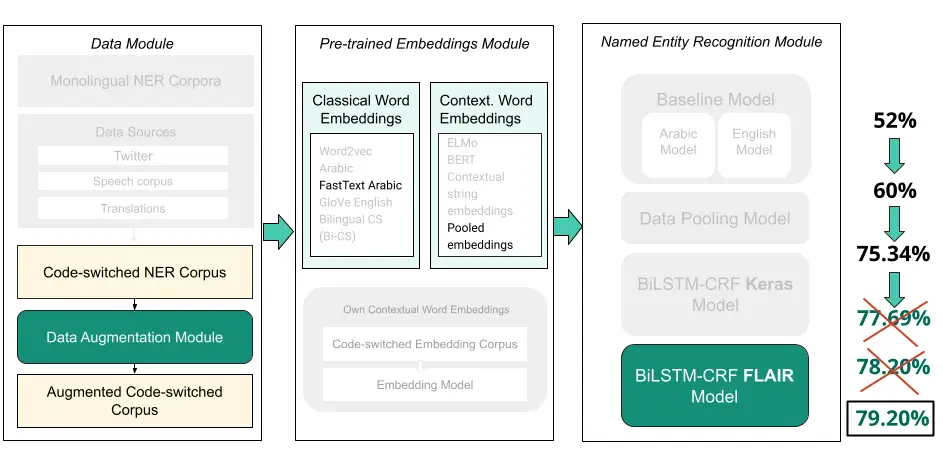

Figure 7.7: Results of Second Enhancement Technique

As shown in Figure 7.7, our trained Contextual string embedding model
with Arabic FastText embedding achieved the best results and enhanced
our NER model by 0.51%. Also, when we used KERMIT with the HuggingFace
NER tagger achieved higher results by 1.2% than the one presented by our
first NER approach. It achieved an F1-score of 79.4%, setting new
state-of-the-art results for the NER task on AR-EN CS data.

## Chapter 8 Language Identification of Intra-Word CS for Arabic-English

One of the essential pre-processing steps in the NLP field is LID. It is
the task of determining the language type of a text. The majority of the
work that has been conducted in this area was done for the document
level. CS has moved the focus to the word level. Nevertheless, very few
researchers targeted subword-level language identification, segmenting
mixed words and tagging each part with its corresponding language ID. In
most of the LID systems, the CS intra-words are labeled as mixed words
and, they are not analyzed further, and their internal information is
lost.

We focus on this intra-word information as well as word-level language
identification. One of the main challenges for LID systems applied to
Arabic and AR-EN CS texts is having Arabizi (referring to Arabic written
using the Latin/Roman script) and Engari (referring to English written
using Arabic script) \[13\] tokens. They make it harder to recognize
both languages as their usual script/Unicode used is different. This
work is a preliminary one to identify named entities in mixed words as
this current LID identifies if a token is an Arabic or English entity.

In this chapter, we first present how we created and annotated AR-EN
corpus for the CS intra-word LID task as shown in Figure 8.1. Then, we
describe our three implemented models for segmenting mixed words and
tagging each part with its corresponding language ID: Naïve Bayes,
Character BiLSTM, and Segmental Recurrent Neural Networks (SegRNN).

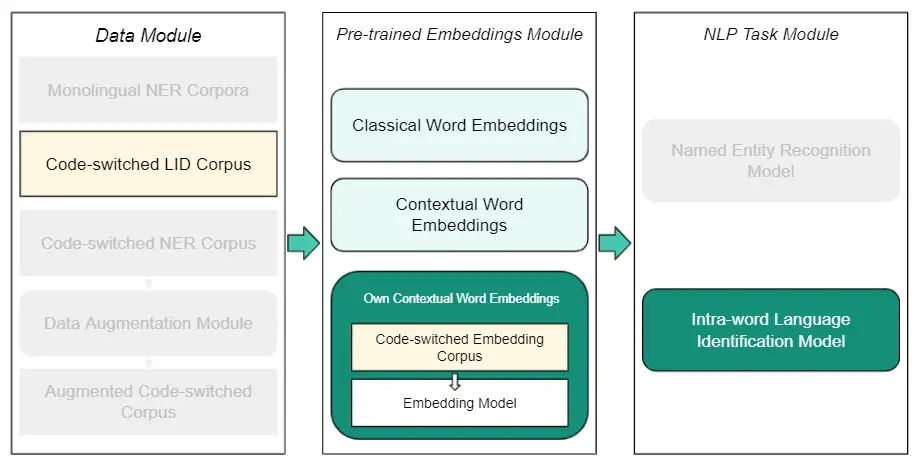

Figure 8.1: Proposed Pipeline for LID Task

### 8.1 Data Collection and Annotation

We collected our own Arabic-English CS data and annotated the tokens
with their corresponding language tag. It is the first annotated AR-EN
data set for intra-word code-switching Language Identification task. In
this section, we illustrate how the data was collected from three
different social media platforms: Twitter, Facebook, and WhatsApp, as
their users frequently tend to code-switch. Before starting the data
collection process, an Ethics proposal was submitted and approved by our
faculty committee. We collected public data from Twitter and Facebook.
Regarding WhatsApp data, we gathered consent forms from users before
acquiring their data from a particular group. The total number of
gathered sentences was 2,507 containing 30,321 annotated tokens. The
corpus included Arabic, English, Arabizi, and Engari tokens. After
collecting the data, we manually segmented and annotated it with the
corresponding language tags. Then, we analyzed the data to know the
statistic of how the tags are distributed over the data. We also
observed the common patterns users tend to use while code-switching in
the same word.

#### 8.1.1 Data Collection

We implemented three techniques to collect our data and build the
corpus. The first technique was gathering data from Twitter using Tweepy
API¹¹ 1 [www.tweepy.org](https://www.tweepy.org), and we collected 8,589
tokens. The second one was to collect data from Facebook²² 2
[www.facebook.com](https://www.facebook.com), and we got 8,692 tokens.
The third one was to collect WhatsApp³³ 3
[www.whatsapp.com](https://www.whatsapp.com) data, and it was the most
successful as we got 13,040 tokens.

##### Twitter Data

We first got a sample of random tweets and observed the words most used
in a code-switching context, like Elcode (The code) and Elgam3a (The
university). Then, these words were used as keywords to search for other
tweets. In addition, we crawled tweets with a geographic location equal
to Cairo, and we extracted again a new set of words that was used again
in the search queries. The total number of crawled tweets was 1,859 that
was filtered by removing the duplicates and retweets to reach 545 tweets
containing CS data. Another round of filtration was done on the
remaining tweets to remove the hashtags, URLs, and usernames. Then the
collected data was tokenized, and we got 8,589 tokens.

##### Facebook Data

To get more data, we also crawled public posts from Facebook pages. We
collected 32 posts that belong to different topics like technology,
food, travel, and jobs. We filtered the data to remove the hashtags,
URLs, and usernames. These were composed of 337 sentences with a total
of 8,692 tokens.

##### WhatsApp Data

To achieve our purpose and collect a significant amount of CS data, we
investigated the usage of a third platform, WhatsApp. As it is one of
the most used social media applications where users communicate through
it daily, they tend to use informal languages. We selected a WhatsApp
group of students and gave them a consent form to sign to get their
permission to collect their data. We collected 1,625 sentences with
13,040 tokens, which is the most significant amount of the collected
data.

#### 8.1.2 Tag Description

The second step after collecting the data was to annotate the tokens of
the collected corpus manually. We had one expert annotator and one
expert reviewer. They are both native speakers of Arabic, and their
second language is English. Besides, one researcher helped to resolve
conflicts arising between the annotator and the reviewer. We followed a
similar annotation schema like \[49\]. Each token/word in the collected
data was annotated with one of 8 classes, which are EN, AR, LANG3,
MIXED, AMBIG, NE.AR, NE.EN and OTHER. The tags EN and AR represented
tokens written in English and Arabic languages, respectively. LANG3 tag
corresponded to tokens in other languages. MIXED tokens were for the
tokens containing more than one language (intra-word CS). We also
segmented the mixed tags and assigned a tag to each segment that
corresponds to its language. AMBIG refers to the tokens which could not
be assigned to a language based on their context. Concerning the named
entity tags, they were represented by NE tag and the language ID of the
token either AR or EN. The last tag OTHER was used to tag tokens that do
not represent actual words like punctuation marks, numbers, emoticons,
and symbols. The following two examples represent two sentences from our
data, their corresponding tags, and translations:

\ex\gll

I played elgame elgedida ala laptopy  
EN EN AR-EN AR AR EN-AR  
\trans’I played the new game on my laptop’ \ex\gllDanke ana rayeh
Germany  
LANG3 AR AR NE.EN  
\trans’Thank you I am going to Germany’

#### 8.1.3 Data Statistics

The data contained Arabic, English, Arabizi, and Engari tokens. The
Arabizi and Engari tokens are kept in the same format as collected. The
following word is an example of the Arabizi token gedida which means in
English new, and as an example of the Engari token, the word بوتبال
which means laptop.

| Tag            | Tokens | %     | Unique | Unique |
| -------------- | ------ | ----- | ------ | ------ |
|                |        |       | Tokens | %      |
| AR             | 5206   | 60.61 | 2594   | 65.89  |
| EN             | 2321   | 27.02 | 902    | 22.91  |
| OTHER          | 748    | 08.71 | 236    | 05.99  |
| NE.AR          | 80     | 0.93  | 64     | 01.63  |
| NE.EN          | 48     | 0.56  | 39     | 0.99   |
| AMBIG          | 18     | 0.21  | 14     | 0.36   |
| LANG3          | 1      | 0.01  | 1      | 0.03   |
| MIXED          | 167    | 01.94 | 87     | 02.21  |
|    AR,EN       | 158    | 94.61 | 78     | 89.66  |
|    EN,AR       | 3      | 1.80  | 3      | 3.45   |
|    AR,EN,AR    | 3      | 1.80  | 3      | 3.45   |
|    AR,OTHER,EN | 3      | 1.80  | 3      | 3.45   |

Table 8.1: Twitter Data

Starting with the data of Twitter containing 545 sentences and 8,589
tokens, we noticed these belong to different tags as shown in Table 8.1.
The total number of mixed tags was 167 tags consisting of 87 unique
mixed words. The tag with the highest percentage was the AR having
60.61% from all Twitter data tags. We can note that the most used mixed
pattern on Twitter was AR,EN, which means adding an Arabic prefix to an
English word. Concerning the data collected from Facebook containing 337
sentences and 8,692 tokens, we noted that these belong to different tags
as shown in Table 8.2. The total number of mixed tags was 173 tags
consisting of 124 unique mixed words. The tag with the most number of
tokens was the AR tag, it contains 6,726 tokens. The pattern with the
highest number of words was the same as the Twitter data AR,EN.

| Tag         | Tokens | %     | Unique | Unique |
| ----------- | ------ | ----- | ------ | ------ |
|             |        |       | Tokens | %      |
| AR          | 6726   | 77.38 | 2957   | 80.46  |
| EN          | 386    | 04.44 | 275    | 07.48  |
| OTHER       | 1127   | 12.97 | 127    | 03.46  |
| NE.AR       | 128    | 01.47 | 100    | 02.72  |
| NE.EN       | 146    | 01.68 | 90     | 02.45  |
| AMBIG       | 5      | 0.06  | 1      | 0.03   |
| LANG3       | 1      | 0.01  | 1      | 0.03   |
| MIXED       | 173    | 01.99 | 124    | 03.37  |
|    AR,EN    | 132    | 76.30 | 100    | 80.65  |
|    EN,AR    | 22     | 12.72 | 11     | 08.87  |
|    AR,EN,AR | 19     | 10.98 | 13     | 10.48  |

Table 8.2: Facebook Data

The last portion of the data from WhatsApp was the biggest containing
1,625 sentences and 13,040 tokens, and belonging to different tags as
shown in Table 8.3. The total number of mixed words was 437 consisting
of 377 unique words. They formed 56.24% of the total mixed tags from the
whole corpus, which could show that people code-switch more while
chatting on WhatsApp. The pattern with the most words was the same as
the previous ones AR,EN.

| Tag               | Tokens | %     | Unique | Unique |
| ----------------- | ------ | ----- | ------ | ------ |
|                   |        |       | Tokens | %      |
| AR                | 7075   | 54.26 | 2258   | 51.80  |
| EN                | 3403   | 26.10 | 1180   | 27.07  |
| OTHER             | 1919   | 14.72 | 426    | 9.77   |
| NE.AR             | 109    | 0.84  | 65     | 1.49   |
| NE.EN             | 56     | 0.43  | 31     | 0.71   |
| AMBIG             | 32     | 0.25  | 15     | 0.34   |
| LANG3             | 9      | 0.07  | 7      | 0.16   |
| MIXED             | 437    | 3.35  | 377    | 8.65   |
|    AR,EN          | 425    | 97.25 | 366    | 97.08  |
|    EN,AR          | 4      | 0.92  | 3      | 0.80   |
|    AR,EN,AR       | 2      | 0.46  | 2      | 0.53   |
|    AR,OTHER,EN,AR | 1      | 0.23  | 1      | 0.27   |

Table 8.3: Whatsapp Data

| Tag            | Tokens | %     | Unique | Unique |
| -------------- | ------ | ----- | ------ | ------ |
|                |        |       | Tokens | %      |
| AR             | 19007  | 62.69 | 7013   | 66.11  |
| EN             | 6110   | 20.15 | 1948   | 18.36  |
| OTHER          | 3794   | 12.51 | 657    | 6.19   |
| NE.AR          | 317    | 1.05  | 219    | 2.06   |
| NE.EN          | 250    | 0.82  | 154    | 1.45   |
| AMBIG          | 55     | 0.18  | 26     | 0.25   |
| LANG3          | 11     | 0.04  | 9      | 0.08   |
| MIXED          | 777    | 2.56  | 582    | 5.49   |
|    AR-EN       | 715    | 92.02 | 539    | 92.61  |
|    EN-AR       | 29     | 3.73  | 17     | 2.92   |
|    AR-EN-AR    | 24     | 3.09  | 17     | 2.92   |
|    AR-OTHER-EN | 8      | 1.03  | 8      | 1.37   |

Table 8.4: Total Data statistics: The number of tokens per each tag

Table 8.4 shows the details of the distribution of the number of tokens
over the tags along with their unique number. The total number of
sentences in the final corpus was 2,507 containing 30,321 tokens, or
12.09 average token per sentence. The AR tag contained the highest
number of tokens, equal to 19,007 tokens. The total number of MIXED tags
was 777 (2.56%) tokens, consisting of 582 (5.49%) unique tokens. The
LANG3 tag contained the minimum number of tokens, equal to 11 tokens.
Also, the Table illustrates the numbers of occurrences for each pattern
of tags assigned for segmented mixed words. The majority of the patterns
started with Arabic tokens. Moreover, the most repeated pattern was
AR-EN amounting 715 of the total number of MIXED tokens.

#### 8.1.4 Observations

We analyzed our CS corpus to extract some frequently used patterns to
switch between the Arabic and English languages in the same word. As
stated before in Chapter 2, we could find different lexical variations
using different patterns in the Arabic language. The structure of the
word could contain one or more prefixes, a stem, and one or more
suffixes \[220\]. We noticed that most of the mixed words consisted
mainly of English words with Arabic prefix or suffix or both. For
instance, elgame is composed of the word game along with the prefix el
(the), matchat consisting of the word match with the suffix at (to make
it plural) and the last example is elmatchat that contains the word
match with both a prefix el and the suffix (at).

Table 8.5 shows the most used prefixes and suffixes in the mixed words.
The first set of prefixes all mean the in English, and occurred 537
times out of the 777 mixed tokens. That means Arabic CS speakers tend to
switch to English (or a different language) for content words and retain
function words in native/base language. Native speakers of Arabic also
used the definite articles with prepositions like fel (in the) 48 times.
In addition, they used it as a suffix تا which refers to the feminine
plural in 18 tokens.

|                      |            |        |       |
| -------------------- | ---------- | ------ | ----- |
| Token                | Token Type | Type   | Count |
| لا (The)             | AR         | prefix | 251   |
| el                   | ARB        |        | 187   |
| l                    | ARB        |        | 89    |
| ـلا                  | AR         |        | 10    |
| fl ( In the)         | ARB        | prefix | 30    |
| fel                  | ARB        |        | 18    |
| lel (To the)         | ARB        | prefix | 18    |
| لل                   | AR         |        | 11    |
| تا (feminine plural) | AR         | suffix | 18    |

Table 8.5: The most used prefixes/suffixes along with their English
translation, the type of the token (AR: Arabic) and (ARB: Arabizi) and
their count of occurrences in our data

### 8.2 Baseline Models

We used several architectures to implement different models for solving
the segmentation and language identification tasks for our CS data. The
first baseline was implemented using Naïve Bayes algorithm. The second
one was created using the Character BiLSTM architecture.

#### 8.2.1 Naïve Bayes Baseline Model

In order to implement our baseline model we used Naïve Bayes algorithm.
Our model started by taking a word/token as input and giving the tag
with its highest probability as output. This process consists of two
modules. The first one involved converting the token into Term
Frequency–Inverse Document Frequency (TF-IDF) feature, which is a
numerical statistic reflecting the importance of a token in our data
based on analyzing the N-gram characters for N from 1 to 3. The second
module was the multinomial Naïve Bayes classifier, one of the two
classic Naïve Bayes variants used in text classification, with the data
represented as word vector count. This module takes the TF-IDF features
and computes a probability for each tag type. The output of the model is
the tag with the highest probability.

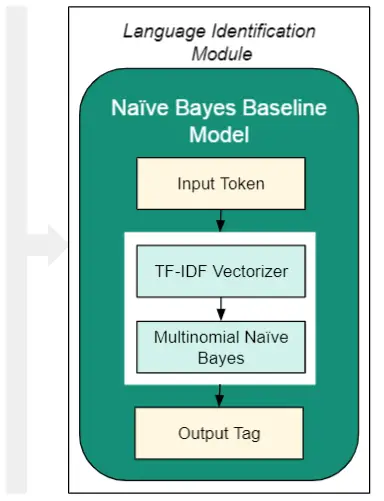

Figure 8.2: Naïve Bayes Model Architecture

#### 8.2.2 Character Bidirectional LSTM Baseline Models

We used the same architecture proposed in \[158\] of Character BiLSTM to
create our second set of baseline models. The main model was composed of
three layers: Character Embedding, BiLSTM, and time distributed layer.
The input was a sequence of character ids passed to the embedding layer
to get for each id a vector. The vectors were given to the BiLSTM layer
accessing the preceding and succeeding contexts. Thus, the model will
capture the long-distance relations in the sequence to predict the
labels. Then the output was passed to the time distributed layer to have
a tag for each character and wrap the output to one tag sequence. The
time distributed layer applied a temporary BiLSTM layer to every
character of the input.

We edited the architecture of this model and created one by adding the
N-gram embedding feature to the character embedding. This feature
allowed the model to take into consideration the information of each
sequence of N characters. These captured more context around each
character. For example, if the input token was elgym, meaning in English
the gym, for N=1, which is the same as if we did not add the N-gram
feature, the input will be each character alone e l g y m. For N=2, the
input will be el lg gy ym m. For N=3, the input will be el elg lgy gym
ym.

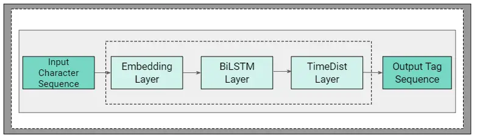

Figure 8.3: Character Bidirectional LSTM Model Architecture

### 8.3 Segmental Recurrent Neural Networks Models

The capabilities of classical automatic language identification
techniques are still limited for detecting the language of a text
segment in a code-switched content \[65\]. Thus, we based our main model
on \[158\] using the Segmental Recurrent Neural Networks \[134\] and
updated it to adapt to our needs for identifying the language of the
word tokens in Arabic-English data. We investigated the usage of
different types of embeddings along this main architecture. The model
created for a joint probability distribution over its possible
segmentation and labels for each segment for the input.

#### 8.3.1 Data Pre-processing

The SegRNN model requires the data to be in a special format as shown in
Figure 8.4. This sentence is from our corpus la2 elly 3alena natural
wconditional (no what we have is natural and conditional) and its tags.
For example, the first word la2 (no) has the tag AR and its segmentation
is 3 letters. However, wconditional (and conditional) is composed of two
sub-words and it is tagged with AR:1 to refer to the first letter as
Arabic and EN:11 to refer to the other 11 letters as English. The words
and their tags are separated with the symbols $`|||`$.

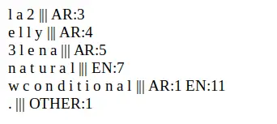

Figure 8.4: Data format for SegRNN model

#### 8.3.2 Main SegRNN Model

As shown in Figure 8.5, the main model takes the sequence of characters
as input. Then, it is passed to the mapping layer, which maps each
character to a numeric value from a dictionary. Then it resizes the
input dimension to 64. Afterwards, the output enters the SegRNN layers
consisting of two sub-layers. The first layer is the BiRNN layer,
containing a BiLSTM encoder to encode each embedding of the tokens in
both directions to preserve the context. The second layer is the
Segmentation/Labelling, responsible for the segmentation and tagging
tasks of the input passed to it from the previous layer with a dimension
equal to 16. Then, the tags with 32 dimensions and length four are given
to the final layer of the decoding to decode it to the final output
format. The Adam adaptive learning rate method was used for the
training.

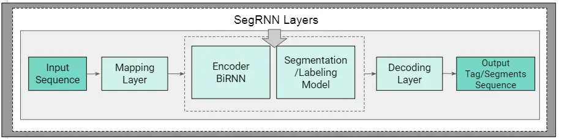

Figure 8.5: Main Model Architecture

#### 8.3.3 SegRNN with Word Embeddings Models

We added an extra layer of word embedding to our SegRNN model. We
investigated the usage of the following types of embeddings. They
generated different sizes of embedding vectors. Thus, we had to adjust
the input size of the SegRNN model each time to fit it.  
FastText: The first type of embedding we investigated was the FastText
pre-trained embedding. We combined the Arabic and English FastText
pre-trained models. The size of the vectors was 950.  
Pooled Flair: To tackle the problem of having Arabizi and Engari in our
data, which is not common in the available pre-trained embeddings, we
implemented our language model and pre-trained embedding using FLAIR
framework. Besides, by having our embeddings, we ensured that the
intra-word CS phenomenon is included in the embedding. The size of our
embedding vectors was 4096.  
MUSE: The third type of embedding we tried was the multilingual
universal sentence encoder (MUSE) \[257\] which maps text written in
different languages having the same meaning, to nearby embedding space
representations. It supports 16 languages, including Arabic and English.
The embedding vector size was 512.

### 8.4 Evaluation & Results

The data we used to evaluate our models was composed of 23,428 tokens
for training and 6,893 tokens for testing. The train:test ratio of the
number of mixed words in our data was approximately 3:1 (588:189). We
used the same testing data in all models; it was based on the tokens.
The performance of our models was evaluated using the F1-score (F1)
performance measure, the accuracy of the tagging (Acc.), and character
tagging accuracy (Char Acc.) calculated by assigning a language ID to
each character and calculating the ratio of correct tags overall
characters. The intuition behind using Char Acc. was to have another way
to evaluate the model. While calculating the F1-score, if the tag is not
entirely correct/typical to the expected, it will not be counted as
correct. However, in some cases, parts of the tag could be correct and
others wrong. For instance, if the word laptopy is given the tag EN:5
AR:2 instead of EN:6 AR1, it will be wrong. Thus, calculating the Char
Acc. will show that the model miss-tagged only one letter.

We first stated the results of the evaluations applied to our main
data-set. Besides, we created another version of the named entities
labeled coarse-grained by combining all the named Arabic and English
entities falling under the NE tag without distinguishing the language.
This was done to experiment with the effect on the results.

#### 8.4.1 Main Data-set

Table 8.6 and Table 8.7 show all test results of tagging and
segmentation (Seg.) for the entire dataset and the mixed words in our
dataset. Concerning the baseline of the Naïve Bayes model, no
segmentation was applied. As shown in Table 8.6, the Naïve Bayes model
failed to recognize the mixed tokens.

|                 |       | Character BiLSTM |          |       |          |
| --------------- | ----- | ---------------- | -------- | ----- | -------- |
| Evaluation      | Naïve | Main             | + N-gram |       |          |
| Metric          | Bayes | Model            | Bi       | Tri   | Bi & Tri |
| Tag F1          | 86.69 | 90.77            | 93.06    | 93.77 | 93.83    |
| Acc.            | 89.15 | 90.63            | 92.79    | 93.53 | 93.62    |
| Seg. F1         | -     | 96.73            | 97.88    | 98.06 | 98.31    |
| Char Acc.       | -     | 92.88            | 93.77    | 94.17 | 94.22    |
| Mixed Tag F1    | 0.0   | 24.94            | 41.29    | 44.37 | 48.59    |
| Mixed Seg. F1   | -     | 26.69            | 38.98    | 43.28 | 48.11    |
| Mixed Acc.      | -     | 29.98            | 42.49    | 44.83 | 48.20    |
| Mixed Char Acc. | -     | 70.88            | 74.65    | 74.87 | 78.02    |

Table 8.6: Evaluation results of the baseline models

Adding an N-gram feature to the main Character BiLSTM model improved the
performance compared to the main model by around 3% for the overall
tagging and by the double for the mixed tokens. This improvement is a
result of considering the context of the tokens more by the N-gram
feature. However, even the highest model of Character BiLSTM with
bi-gram and tri-gram combined under-perform some of the SegRNN models.

Several configurations of the SegRNN model were evaluated. It was
trained using three different techniques. The first technique was
training the model using single tokens as training data, represented in
the main model. The second one was the phrase model; it was trained
using sentences. The third one was training the model on N-gram
words/tokens to consider the context of the word. The N-gram was used to
create a sub-sequence of N adjacent words from a given sequence. We
trained the model on tri-gram and bi-gram tokens. The tuned SegRNN model
represents the model resulted after applying the hyper-parameters tuning
for the main model.

|                 | SegRNN |       |        |                      |       |          |                       |          |       |
| --------------- | ------ | ----- | ------ | -------------------- | ----- | -------- | --------------------- | -------- | ----- |
| Evaluation      | Main   | Tuned | Phrase | N-gram Training Data |       |          | Models With Embedding |          |       |
| Metric          | Model  | Model | Model  | Tri                  | Bi    | Bi & Uni | Flair                 | FastText | Muse  |
| Tag F1          | 94.57  | 94.84 | 87.65  | 54.01                | 56.36 | 92.80    | 94.33                 | 94.53    | 94.70 |
| Acc.            | 94.95  | 95.21 | 85.85  | 60.35                | 42.51 | 92.06    | 94.94                 | 95.05    | 95.02 |
| Seg. F1         | 99.17  | 99.17 | 94.90  | 89.65                | 53.78 | 97.41    | 99.11                 | 99.16    | 99.12 |
| Char Acc.       | 94.80  | 95.05 | 89.66  | 66.35                | 85.80 | 93.85    | 94.63                 | 94.73    | 94.80 |
| Mixed Tag F1    | 76.85  | 81.15 | 15.16  | 0.0                  | 2.48  | 38.59    | 74.73                 | 81.45    | 79.12 |
| Mixed Seg. F1   | 75.27  | 78.40 | 12.15  | 2.08                 | 1.74  | 32.83    | 72.52                 | 78.29    | 75.66 |
| Mixed Acc.      | 74.40  | 74.75 | 16.25  | 0.0                  | 3.90  | 36.83    | 72.51                 | 75.0     | 73.87 |
| Mixed Char Acc. | 88.77  | 87.42 | 71.17  | 49.66                | 83.09 | 82.83    | 85.60                 | 87.14    | 88.46 |

Table 8.7: Evaluation results of the SegRNN models

As training and testing on tokens gave the best results, we applied the
5-fold cross-validation to tune the hyper-parameters of this model. We
trained 41 models and, 6 of them performed better than the initial model
based on the F1-score for the segmentation or for the tagging. Figure
8.6 shows the tagging and segmentation F1-scores of the 6 models
illustrated in blue and the initial model illustrated in red. M6 has the
best average F1-score, and M1 is considered as the base model. To
achieve the best model, the learning rate changed from 0.0005 to 0.0003
and the maximum token length changed from 1000 to 20 characters.

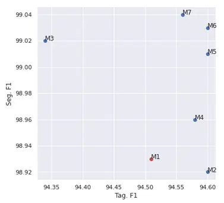

Figure 8.6: hyper models result

As shown in Table 8.7 training on single tokens resulted in higher
results compared to the one using sentences. The lower results were
achieved by the SegRNN model trained using the tri-gram and bi-gram
data, and they almost failed to recognize the mixed tokens. As both
types of data did not achieve good results, we combined the bi-gram with
the uni-gram tokens. This type of training data performed better;
however, still the performance was lower or poorer than the main model.

The addition of the embedding layer did not enhance the model, due to
the fact of not covering the Arabizi and Engari in the available
pre-trained embedding models. Moreover, the Pooled Flair embedding model
we created had a small size and did not have a significant effect.
Adding the embeddings to the main model did not enhance the performance
much except tagging the mixed words. The performance differences between
the tuned SegRNN and the one with the embeddings were small. The best
performance for tagging the entire data is obtained by the tuned SegRNN
model equal to 94.84% and then by the one with MUSE embedding equal to
94.70%. The SegRNN with FastText model achieved the best performance for
tagging the mixed words equal to 81.45% F1-score, while the tuned SegRNN
model and its main model got very high results for segmentation equal to
99.17%.

We can conclude that the SegRNN models trained on single tokens tag and
segment well intra-word CS data compared to other approaches presented
here. Table 8.8 shows a classification matrix for best model of SegRNN.
The model predicted well the monolingual tags (AR, OTHER, EN) and the
tokens from different languages. However, it did not perform well in
detecting the AMBIG tokens and named entities (NE.AR and NE.EN). For
bilingual tags, it achieved better results assigning (AR-EN and
AR-EN-AR) compared to (EN-AR) tokens.

| Tag         | Precision | Recall | F1-Score |
| ----------- | --------- | ------ | -------- |
| AR          | 96.30     | 98.60  | 97.44    |
| EN          | 91.69     | 94.74  | 93.19    |
| OTHER       | 98.58     | 95.76  | 97.15    |
| LANG3       | 100.00    | 50.00  | 66.67    |
| NE.EN       | 69.44     | 37.88  | 49.02    |
| NE.AR       | 70.45     | 31.00  | 43.06    |
| AMBIG       | 33.33     | 20.00  | 25.00    |
| EN-AR       | 50.00     | 25.00  | 33.33    |
| AR-EN       | 93.38     | 81.03  | 86.77    |
| AR-EN-AR    | 100.00    | 75.00  | 85.71    |
| AR-OTHER-EN | 100.00    | 33.33  | 50.00    |

Table 8.8: Classification matrix for best model of SegRNN

The following are some examples of tokens that the SegRNN model failed
to tag: benefit, which should be tagged as EN, but the model segmented
it into be and nefit with the corresponding tags AR and EN. In the case
where segmentation errors occur, the resulting tag is also wrong/false.
Another example, is the word mlinsertions (from insertions) which should
be tagged and segmented to be ml and insertions as AR and EN but the
model tagged all its characters as EN. In addition, as examples of words
that were successfully segmented and tagged by the SegRNN model and not
by BiLSTM model are تازيوكل (for the quizzes) which should be segmented
to be لل (for), زيوك (quiz), تا (plural) and tagged with AR-EN-AR. The
SegRNN succeeded in this task. However, BiLSTM segmented it as لل , وك ,
تازي with the tags AR-EN-AR. Besides, the SegRNN tagged right the word
messages, which should be tagged as EN, the SegRNN tagged it right.
Nevertheless, BiLSTM tagged it to be mess as AR, ag as EN, and es as AR.

#### 8.4.2 Coarse-grained NE

One way of annotating the named entities that we could have used is
based on the script. However, this would have led to more problems, like
not considering the Arabic words written in Lattin letters (Arabizi).
For example, if the annotation were based on the script, the word Masr
(Egypt) would be NE.EN, but there is no such English word, and it would
not be distinguished from Egypt, which is NE.EN. Then any valuable
language information is lost. Having language IDs on NEs also has a
practical aspect. When the NE of the language is known, it can be found
in a dictionary or an embedding. Otherwise, these will be unknown words.
Thus, our annotation decision of the entities was based on the context.
Whenever most of the words in a sentence are Arabic, common entities are
considered Arabic, like Arabic names written in English letters.

| Evaluation     | Naïve | Character | SegRNN |
| -------------- | ----- | --------- | ------ |
| Metric         | Bayes | BiLSTM    |        |
| Tag F1         | 90.81 | 86.69     | 94.82  |
| Acc            | 90.40 | 89.15     | 95.07  |
| Seg F1         | 96.61 | -         | 99.30  |
| Char Acc       | 92.91 | -         | 94.89  |
| Mixed Tag F1   | 25.04 | 0.0       | 80.76  |
| Mixed Seg F1   | 26.15 | -         | 79.28  |
| Mixed Acc      | 28.14 | -         | 77.34  |
| Mixed Char Acc | 71.48 | -         | 90.12  |

Table 8.9: Coarse-grained NE training models results

In order to compare the fine-grained NE, we tested our models with the
coarse-grained named entity by combining the NE.AR and NE.EN tags to NE
tag. As shown in Table 8.9, no change exists for the Naïve Bayes model
as initially it failed to recognize the NE tags in the main model.
However, for the Character BiLSTM, there is some improvement in the
tagging F1-score and Char. Acc. parameters for all data and mixed data,
but it does not perform well in the segmentation task. For the SegRNN
model, training the model with coarse-grained NE achieves better results
for the segmentation task for all data, but its performance was lower
than for the main model in the tagging and accuracy tasks for all data.
However, it achieved better results in the mixed data for all parameters
except the tagging task.

### 8.5 Summary

Arabic speakers also use code-switching within the same word by adding
an Arabic prefix or suffix to an English stem. We created the first
annotated AR-EN corpus with the focus of intra-word CS. We collected and
annotated 2,507 sentences 30,321 tokens from various social media
platforms. We implemented LID models using SegRNN and investigated the
usage of different types of embeddings. We compared the models with two
baseline models. The results showed that the SegRNN model outperformed
all baseline models, and it achieved an F1-score of 94.84% for LID
intra-word tagging and 99.17% for segmentation.

## Chapter 9 Conclusion & Future Work

Code-switching has become a typical linguistic behavior being studied,
and a massive amount of CS data is generated through different social
media platforms. This data needs to be investigated and analyzed for
several linguistic tasks. In this work, we focused on applying the NER
task on CS data by proposing a pipeline approach composed of deep
learning NER models and other complementing NLP tasks. This pipeline
approach could be used to investigate other code-switched language pair
after applying similar techniques and following guidelines to collect CS
data for the different proposed tasks.

We proposed two techniques that could be used to complement the NER
taggers on CS data and enhance their performance. The first technique
was training existing contextual embedding models using our created
corpora for this task. In addition, we proposed a new contextual model
called KERMIT. As word embeddings are essential in any deep learning
model, having contextual embeddings trained on the same language pair is
an important step, as has been proved in this work.

The second technique was proposed to overcome the problem of limited CS
data-set by applying data augmentation techniques. The proposed
techniques that we presented were word embedding substitution,
back-translation and modified approach of EDA. These techniques could be
used as well on monolingual NER data. We proved that a convenient
augmentation approach could positively impact the NER task, especially
for CS data, as it will reduce the need to collect and annotate new data
while enhancing performance at the same time.

Besides, we implemented an intra-word language identification task on CS
data that could be used as a preprocessing step to identify the language
of different tokens and apply the NER task on the intra-words. We
created the first annotated AR-EN corpus with the focus of intra-word
CS.

Recommendations for future work include the fact that, there are many
new directions that could be investigated and applied on CS data and our
currently available ones could be enhanced. We can apply all our NER and
LID models on other available language pairs and evaluate their
performance. Starting with the available NER taggers, we can enhance
them for both MSA and CS data by adding different layers, such as, for
example, attention layer in the different RNN models and compare the
performance. Also, we can add affix embeddings with the word and
character embeddings in the RNN models. The affix embeddings consider
all N-gram prefixes and suffixes of words in the training data, which
could be useful for the Arabic language. In addition, the Transformers
architectures could be explored more and used in the implementation of
NER taggers for MSA and CS data. We intend to publish our Arabic-English
CS corpus that we created along with the different taggers. We may use
some transfer learning techniques to import models trained on other CS
languages. Besides, collecting more CS data can improve performance;
especially if CS data is combined with the data pool, introduced in this
work. New data could have the focus as well as Arabizi, Engary and
intra-word CS. We can evaluate all our available taggers on the new data
to recognize a wider range of Arabic variants. We can also explore the
explainable AI \[23\] field, to check the reasons behind the models
performance and explore the problems.

Regarding the first enhancement technique of CS contextual embeddings,
more comparisons with available models could be made. We can pre-train
variants of the models by keeping the monolingual data without CS
behavior and comparing performance in different tasks. The models can be
evaluated in different NLP tasks using various annotated data-sets. An
evaluation technique should be applied to the generated CS data to check
how it simulates the CS behavior. As training word embeddings require
having a huge corpora, several approaches could be investigated to
overcome this problem or collect more data such as, for example, by
applying data augmentation techniques to available corpora or using
generative adversarial networks \[88\]. In addition, since translating
data was the main approach to generate CS corpus for training the
embedding models, another approach should be computed to have real data,
rather than simulated ones. Another direction that can be explored is
enhancing the efficiency of the Transformer models as they are huge
models that require millions of parameters to compute attention. Some of
the enhancement techniques that can reduce the parameters are pruning
\[92\], weight quantization \[71\] and parameter sharing \[142\].
Another important direction could be exploring how the powerful
character-level language models such as, for example, FLAIR could be
integrated with Transformer architectures.

Concerning data augmentation, we can enhance the existing methods and
use new ones. Different back-translation paths can be evaluated by
trying different intermediate languages and using more robust machine
translation systems between the language pairs. More combinations
between the different data augmentation techniques should be applied,
like combining the back-translation approach with the contextual
embedding substitution. Also, we can apply the three augmentation
techniques simultaneously on the same data-set and evaluate the
performance for the model. About the selection of words to be
substituted in the EDA and the Word Embedding Substitution method, we
can compare the results of these two techniques substituting the same
proportion of words. A validation technique should be applied to the
assigned labels for the augmented data, like using multiple taggers for
the same word to reduce the percentage of possibility of having a wrong
label assigned. Besides, we can implement an automatic technique to
check the quality of the augmented data and make the data available for
other researchers. We can evaluate each language alone by applying the
DA technique on it and check its impact on NER performances. Moreover,
we can extend the use of augmentation techniques to other CS data-sets
of different NLP tasks to support applying these techniques in a
multilingual context.

About the intra-word LID task, we can collect more data containing a
bigger portion of mixed words. Other new techniques could be
investigated to apply intra-word LID task. Another version of the data
containing the labels more fine-grained by having labels reflecting the
writing script whether it is MSA, Engary, Arabizi or English can be
developed. In addition, we can apply these labels to the NE tokens as
well.

As for the general directions and new tasks related to the NER that we
can investigate in the future for the Arabic language and especially
Arabic-English CS. These are Entity resolution/linking, Named entity
disambiguation, Co-reference resolution, and Relation Extraction. Entity
resolution/linking could be considered a second step task after NER. It
is the process of matching the entities/mentions to the knowledge base,
such as, for example, Wikipedia records based on their context. This
task would be interesting and challenging when it is applied to CS text.
In order to find the correct link, another task should be applied, which
is Named entity disambiguation, to solve the ambiguity of the entities.
Co-reference resolution is another task that we can apply along with the
Entity resolution task. It refers to identifying which NE (mentions)
refer to the same entity and creating mention clusters. Besides, we can
apply the Relation extraction task, which is discovering relationships
between entities by extracting pairs of entities related to each other
and identifying the type of relation. In addition, we can apply the
sentiment analysis task, analogous to what we proposed in \[26\] but for
the language pair AR-EN. They are all challenging tasks for Arabic and
new ones for CS Arabic-English data that we can explore.

###### List of Figures

1.  1.1Proposed pipeline approach for applying NLP tasks on CS data
2.  2.1Graphical structures of CRF for sequences
3.  2.2ANN Basic Architecture
4.  2.3Character-based CNN for text classification \[\]
5.  2.4Overall visualization of RNNs \[\]
6.  2.5Gates of LSTM unit layer \[\]
7.  2.6Bidirectional LSTM Architecture \[\]
8.  2.7Bidirectional LSTM with CRF layer Architecture for NER \[\]
9.  2.8Transformer Architecture\[\]
10. 2.9Shows data-path of input tokens inside BERT model \[\]
11. 2.10BERT input representation \[\]
12. 2.11ELECTRA generator and discriminator components \[\]
13. 4.1NER proposed approaches on MSA
14. 4.2A block diagram for the proposed CRF system
15. 4.3Proposed Arabic NER Deep Learning Model
16. 4.4Dropout Rate Comparison
17. 4.5Results of Deep Learning MSA Taggers
18. 5.1NER approaches on code-switched Arabic-English data
19. 5.2Our main BiLSTM-CRF model Architecture. The example illustrates
    the input sentence “Sarah will travel to Egypt” and its output
    predicted tags.
20. 5.3Different experiments applied on different data-sets
21. 5.4Results of deep learning CS taggers
22. 6.1First Enhancement Technique
23. 6.2KERMIT encoder layers trained as discriminator in ELECTRA then as
    Generator in BERT
24. 6.3Results of comparing the tokens of two sentences of different
    embeddings by calculating the cosine-similarity of BERTSCORE
25. 6.4Results of comparing the tokens of two sentences using BERT
    embedding by calculating the cosine-similarity of BERTSCORE
26. 6.5Results of comparing the tokens of two sentences using ELECTRA
    embedding by calculating the cosine-similarity of BERTSCORE
27. 6.6Results of comparing the tokens of two sentences using KERMIT
    embedding by calculating the cosine-similarity of BERTSCORE
28. 6.7Visualizing dependencies between different language tokens using
    KERMIT++
29. 6.8Results of First Enhancement Technique
30. 7.1Second Enhancement Technique
31. 7.2Architecture of the Classical Word Embedding Substitution
    Technique
32. 7.3Architecture of the Modified EDA Augmentation Technique
33. 7.4Architecture of the Back-Translation Technique
34. 7.5Results of applying different set of EDA operations with
    different parameter set-ups
35. 7.6Results of applying different set of EDA operations with
    different parameter set-ups
36. 7.7Results of Second Enhancement Technique
37. 8.1Proposed Pipeline for LID Task
38. 8.2Naïve Bayes Model Architecture
39. 8.3Character Bidirectional LSTM Model Architecture
40. 8.4Data format for SegRNN model
41. 8.5Main Model Architecture
42. 8.6hyper models result

## Bibliography

- \[1\] Abacha, A. B., and Demner-Fushman, D. Meta-Learning with
  Selective Data Augmentation for Medical Entity Recognition. Int. J.
  Comput. Linguistics Appl. 7, 2 (2016), 167–182.
- \[2\] Abdelali, A., Darwish, K., Durrani, N., and Mubarak, H. Farasa:
  A fast and furious segmenter for arabic. In Proceedings of the 2016
  conference of the North American chapter of the association for
  computational linguistics: Demonstrations (2016), pp. 11–16.
- \[3\] AbdelRahman, S., Elarnaoty, M., Magdy, M., and Fahmy, A.
  Integrated machine learning techniques for arabic named entity
  recognition. IJCSI 7, 4 (2010), 27–36.
- \[4\] Abdul-Hamid, A., and Darwish, K. Simplified feature set for
  arabic named entity recognition. In Proceedings of the 2010 Named
  Entities Workshop (2010), Association for Computational Linguistics,
  pp. 110–115.
- \[5\] Abiodun, O. I., Jantan, A., Omolara, A. E., Dada, K. V.,
  Mohamed, N. A., and Arshad, H. State-of-the-art in artificial neural
  network applications: A survey. Heliyon 4, 11 (2018), e00938.
- \[6\] Aguilar, G., AlGhamdi, F., Soto, V., Diab, M., Hirschberg, J.,
  and Solorio, T. Overview of the calcs 2018 shared task: Named entity
  recognition on code-switched data. In Proceedings of the Third
  Workshop on Computational Approaches to Linguistic Code-Switching,
  Melbourne, Australia. Association for Computational Linguistics
  (2018).
- \[7\] Aguilar, G., AlGhamdi, F., Soto, V., Diab, M., Hirschberg, J.,
  and Solorio, T. Named entity recognition on code-switched data:
  Overview of the calcs 2018 shared task. arXiv preprint
  arXiv:1906.04138 (2019).
- \[8\] Aguilar, G., Kar, S., and Solorio, T. Lince: A centralized
  benchmark for linguistic code-switching evaluation. arXiv preprint
  arXiv:2005.04322 (2020).
- \[9\] Akbik, A., Bergmann, T., Blythe, D., Rasul, K., Schweter, S.,
  and Vollgraf, R. Flair: An easy-to-use framework for state-of-the-art
  nlp. In Proceedings of the 2019 Conference of the North American
  Chapter of the Association for Computational Linguistics
  (Demonstrations) (2019), pp. 54–59.
- \[10\] Akbik, A., Bergmann, T., and Vollgraf, R. Pooled contextualized
  embeddings for named entity recognition. In Proceedings of the 2019
  Conference of the North American Chapter of the Association for
  Computational Linguistics: Human Language Technologies, Volume 1 (Long
  and Short Papers) (2019), pp. 724–728.
- \[11\] Akbik, A., Blythe, D., and Vollgraf, R. Contextual string
  embeddings for sequence labeling. In Proceedings of the 27th
  International Conference on Computational Linguistics (2018),
  pp. 1638–1649.
- \[12\] Al-Badrashiny, M., and Diab, M. The george washington
  university system for the code-switching workshop shared task 2016. In
  Proceedings of The Second Workshop on Computational Approaches to Code
  Switching (2016), pp. 108–111.
- \[13\] Al-Badrashiny, M., and Diab, M. LILI: A simple language
  independent approach for language identification. COLING 2016 - 26th
  Int. Conf. Comput. Linguist. Proc. COLING 2016 Tech. Pap. (2016),
  1211–1219.
- \[14\] Al-Badrashiny, M., Elfardy, H., and Diab, M. Aida2: A hybrid
  approach for token and sentence level dialect identification in
  arabic. In Proceedings of the Nineteenth Conference on Computational
  Natural Language Learning (2015), pp. 42–51.
- \[15\] Al-Badrashiny, M., Eskander, R., Habash, N., and Rambow, O.
  Automatic transliteration of romanized dialectal arabic. In
  Proceedings of the eighteenth conference on computational natural
  language learning (2014), pp. 30–38.
- \[16\] Al-Jumaily, H., Martínez, P., Martínez-Fernández, J. L., and
  Van der Goot, E. A real time named entity recognition system for
  arabic text mining. Language resources and evaluation 46, 4 (2012),
  543–563.
- \[17\] Alammar, J. The illustrated bert, elmo, and co. (how nlp
  cracked transfer learning).
  [http://jalammar.github.io/illustrated-bert/](http://jalammar.github.io/illustrated-bert/), 2018.
- \[18\] Alammar, J. The illustrated transformer.
  [https://jalammar.github.io/illustrated-transformer/](https://jalammar.github.io/illustrated-transformer/), 2018.
- \[19\] Aly, M., and Atiya, A. Labr: A large scale arabic book reviews
  dataset. In Proceedings of the 51st Annual Meeting of the Association
  for Computational Linguistics (Volume 2: Short Papers) (2013),
  pp. 494–498.
- \[20\] Anaby-Tavor, A., Carmeli, B., Goldbraich, E., Kantor, A., Kour,
  G., Shlomov, S., Tepper, N., and Zwerdling, N. Do Not Have Enough
  Data? Deep Learning to the Rescue! In AAAI (2020), pp. 7383–7390.
- \[21\] Antoun, W., Baly, F., and Hajj, H. Arabert: Transformer-based
  model for arabic language understanding. In LREC 2020 Workshop
  Language Resources and Evaluation Conference 11–16 May 2020 (2020),
  p. 9.
- \[22\] Arora, S., May, A., Zhang, J., and Ré, C. Contextual
  embeddings: When are they worth it? arXiv preprint arXiv:2005.09117
  (2020).
- \[23\] Arrieta, A. B., Díaz-Rodríguez, N., Del Ser, J., Bennetot, A.,
  Tabik, S., Barbado, A., García, S., Gil-López, S., Molina, D.,
  Benjamins, R., et al. Explainable artificial intelligence (xai):
  Concepts, taxonomies, opportunities and challenges toward responsible
  ai. Information Fusion 58 (2020), 82–115.
- \[24\] Attia, M., Samih, Y., and Maier, W. Ghht at calcs 2018: Named
  entity recognition for dialectal arabic using neural networks. In
  Proceedings of the Third Workshop on Computational Approaches to
  Linguistic Code-Switching (2018), pp. 98–102.
- \[25\] Awad, D., Sabty, C., Elmahdy, M., and Abdennadher, S. Arabic
  Name Entity Recognition using Deep Learning. In International
  Conference on Statistical Language and Speech Processing (2018),
  Springer, pp. 105–116.
- \[26\] Badr, M., Sabty, C., Sharaf, N., and Abdennadher, S. Mood
  extraction from franco-arabic facebook posts. In 19th International
  Conference on Computational Linguistics and Intelligent Text
  Processing (CICLing) (2018).
- \[27\] Bajwa, K. S., and Kaur, A. Hybrid approach for named entity
  recognition. International Journal of Computer Applications 118, 1
  (2015).
- \[28\] Balabel, M., Hamed, I., Abdennadher, S., Vu, N. T., and
  Çetinoğlu, Ö. Cairo student code-switch (cscs) corpus: An annotated
  egyptian arabic-english corpus. In Proceedings of The 12th Language
  Resources and Evaluation Conference (2020), pp. 3973–3977.
- \[29\] Baldwin, T., and Lui, M. Language identification: The long and
  the short of the matter. In Human language technologies: The 2010
  annual conference of the North American Chapter of the Association for
  Computational Linguistics (2010), pp. 229–237.
- \[30\] Banerjee, S., Naskar, S. K., Rosso, P., and Bandyopadhyay, S.
  The first cross-script code-mixed question answering corpus. In
  MultiLingMine@ ECIR (2016), pp. 56–65.
- \[31\] Banerjee, S., Naskar, S. K., Rosso, P., and Bandyopadhyay, S.
  Named entity recognition on code-mixed cross-script social media
  content. Computación y Sistemas 21, 4 (2017), 681–692.
- \[32\] Bar, K., and Dershowitz, N. The tel aviv university system for
  the code-switching workshop shared task. In Proceedings of the First
  Workshop on Computational Approaches to Code Switching (2014),
  pp. 139–143.
- \[33\] Barman, U., Das, A., Wagner, J., and Foster, J. Code mixing: A
  challenge for language identification in the language of social media.
  In Proceedings of the first workshop on computational approaches to
  code switching (2014), pp. 13–23.
- \[34\] Barman, U., Wagner, J., Chrupała, G., and Foster, J. Dcu-uvt:
  Word-level language classification with code-mixed data. In
  Proceedings of The First Workshop on Computational Approaches to Code
  Switching (2014), pp. 127–132.
- \[35\] Behnke, S. Hierarchical neural networks for image
  interpretation, vol. 2766. Springer, 2003.
- \[36\] Benajiba, Y., Diab, M., and Rosso, P. Arabic named entity
  recognition using optimized feature sets. In Proceedings of the
  Conference on Empirical Methods in Natural Language Processing (2008),
  Association for Computational Linguistics, pp. 284–293.
- \[37\] Benajiba, Y., and Rosso, P. Arabic named entity recognition
  using conditional random fields. In Proc. of Workshop on HLT & NLP
  within the Arabic World, LREC (2008), vol. 8, pp. 143–153.
- \[38\] Benajiba, Y., Rosso, P., and Benedíruiz, J. M. Anersys: An
  arabic named entity recognition system based on maximum entropy. In
  International Conference on Intelligent Text Processing and
  Computational Linguistics (2007), Springer, pp. 143–153.
- \[39\] Benikova, D., Biemann, C., Kisselew, M., and Pado, S. Germeval
  2014 named entity recognition shared task: companion paper. In
  Workshop Proceedings of the 12th edition of the KONVENS conference
  (2014), pp. 104–112.
- \[40\] Berger, A., Della Pietra, S. A., and Della Pietra, V. J. A
  maximum entropy approach to natural language processing. Computational
  linguistics 22, 1 (1996), 39–71.
- \[41\] Bock, H.-H. Clustering methods: a history of k-means
  algorithms. Selected contributions in data analysis and classification
  (2007), 161–172.
- \[42\] Bojanowski, P., Grave, E., Joulin, A., and Mikolov, T.
  Enriching word vectors with subword information. Transactions of the
  Association for Computational Linguistics 5 (2017), 135–146.
- \[43\] Bokamba, E. G. Are there syntactic constraints on code-mixing?
  World Englishes 8, 3 (1989), 277–292.
- \[44\] Brown, P. F., Della Pietra, V. J., Desouza, P. V., Lai, J. C.,
  and Mercer, R. L. Class-based n-gram models of natural language.
  Computational linguistics 18, 4 (1992), 467–480.
- \[45\] Brownlee, J. How to choose an activation function for deep
  learning.
  [https://machinelearningmastery.com/choose-an-activation-function-for-deep-learning/](https://machinelearningmastery.com/choose-an-activation-function-for-deep-learning/), 2021.
- \[46\] Buduma, N., and Locascio, N. Fundamentals of deep learning:
  designing next-generation machine intelligence algorithms. ” O’Reilly
  Media, Inc.”, 2017.
- \[47\] Bullock, B. E., and Toribio, A. J. E. The Cambridge handbook of
  linguistic code-switching. Cambridge University Press, 2009.
- \[48\] Cer, D., Yang, Y., Kong, S.-y., Hua, N., Limtiaco, N., John,
  R. S., Constant, N., Guajardo-Céspedes, M., Yuan, S., Tar, C., et al.
  Universal sentence encoder. arXiv preprint arXiv:1803.11175 (2018).
- \[49\] Çetinoğlu, Ö. A turkish-german code-switching corpus. In
  Proceedings of the Tenth International Conference on Language
  Resources and Evaluation (LREC’16) (2016), pp. 4215–4220.
- \[50\] Çetinoğlu, Ö., Schulz, S., and Vu, N. T. Challenges of
  computational processing of code-switching. arXiv preprint
  arXiv:1610.02213 (2016).
- \[51\] Chang, J. C., and Lin, C.-C. Recurrent-neural-network for
  language detection on twitter code-switching corpus. arXiv preprint
  arXiv:1412.4314 (2014).
- \[52\] Chatfield, K., Simonyan, K., Vedaldi, A., and Zisserman, A.
  Return of the Devil in the Details: Delving Deep into Convolutional
  Nets. arXiv preprint arXiv:1405.3531 (2014).
- \[53\] Chieu, H. L., and Ng, H. T. Named entity recognition with a
  maximum entropy approach. In Proceedings of the seventh conference on
  Natural language learning at HLT-NAACL 2003 (2003), pp. 160–163.
- \[54\] Chittaranjan, G., Vyas, Y., Bali, K., and Choudhury, M.
  Word-level language identification using crf: Code-switching shared
  task report of msr india system. In Proceedings of The First Workshop
  on Computational Approaches to Code Switching (2014), pp. 73–79.
- \[55\] Chiu, J. P., and Nichols, E. Named entity recognition with
  bidirectional lstm-cnns. Transactions of the Association for
  Computational Linguistics 4 (2016), 357–370.
- \[56\] Chollet, F., et al. Keras.
  [https://keras.io](https://keras.io), 2015.
- \[57\] Clark, K., Luong, M.-T., Le, Q. V., and Manning, C. D. Electra:
  Pre-training text encoders as discriminators rather than generators.
  arXiv preprint arXiv:2003.10555 (2020).
- \[58\] Collobert, R., and Weston, J. A unified architecture for
  natural language processing: Deep neural networks with multitask
  learning. In Proceedings of the 25th international conference on
  Machine learning (2008), pp. 160–167.
- \[59\] Collobert, R., Weston, J., Bottou, L., Karlen, M., Kavukcuoglu,
  K., and Kuksa, P. Natural language processing (almost) from scratch.
  Journal of Machine Learning Research 12, Aug (2011), 2493–2537.
- \[60\] Cotterell, R., Müller, T., Fraser, A., and Schütze, H. Labeled
  morphological segmentation with semi-markov models. In Proceedings of
  the Nineteenth Conference on Computational Natural Language Learning
  (2015), pp. 164–174.
- \[61\] Cotterell, R., Renduchintala, A., Saphra, N., and
  Callison-Burch, C. An algerian arabic-french code-switched corpus. In
  Workshop on Free/Open-Source Arabic Corpora and Corpora Processing
  Tools Workshop Programme (2014), p. 34.
- \[62\] Creutz, M., and Lagus, K. Unsupervised discovery of morphemes.
  In Proceedings of the ACL-02 Workshop on Morphological and
  Phonological Learning (July 2002), Association for Computational
  Linguistics, pp. 21–30.
- \[63\] Cui, X., Goel, V., and Kingsbury, B. Data Augmentation for Deep
  Neural Network Acoustic Modeling. IEEE/ACM Transactions on Audio,
  Speech, and Language Processing 23, 9 (2015), 1469–1477.
- \[64\] Darwish, K., Habash, N., Abbas, M., Al-Khalifa, H., Al-Natsheh,
  H. T., El-Beltagy, S. R., Bouamor, H., Bouzoubaa, K., Cavalli-Sforza,
  V., El-Hajj, W., et al. A panoramic survey of natural language
  processing in the arab world. arXiv preprint arXiv:2011.12631 (2020).
- \[65\] Das, A., and Gambäck, B. Identifying languages at the word
  level in code-mixed indian social media text. In Proceedings of the
  11th International Conference on Natural Language Processing (2014),
  International Institute of Information Technology Goa, India.
- \[66\] Derczynski, L., Nichols, E., van Erp, M., and Limsopatham, N.
  Results of the wnut2017 shared task on novel and emerging entity
  recognition. In Proceedings of the 3rd Workshop on Noisy
  User-generated Text (2017), pp. 140–147.
- \[67\] Devarakonda, A., Naumov, M., and Garland, M. Adabatch: Adaptive
  batch sizes for training deep neural networks. arXiv preprint
  arXiv:1712.02029 (2017).
- \[68\] Devlin, J., Chang, M.-W., Lee, K., and Toutanova, K. Bert:
  Pre-training of deep bidirectional transformers for language
  understanding. arXiv preprint arXiv:1810.04805 (2018).
- \[69\] Diaz, G. I., Fokoue-Nkoutche, A., Nannicini, G., and
  Samulowitz, H. An effective algorithm for hyperparameter optimization
  of neural networks. IBM Journal of Research and Development 61, 4/5
  (2017), 9–1.
- \[70\] Doddington, G. R., Mitchell, A., Przybocki, M. A., Ramshaw,
  L. A., Strassel, S. M., and Weischedel, R. M. The automatic content
  extraction (ace) program-tasks, data, and evaluation. In Lrec (2004),
  Lisbon, pp. 837–840.
- \[71\] Dong, Z., Yao, Z., Cai, Y., Arfeen, D., Gholami, A., Mahoney,
  M. W., and Keutzer, K. Hawq-v2: Hessian aware trace-weighted
  quantization of neural networks. arXiv preprint arXiv:1911.03852
  (2019).
- \[72\] Dozat, T. Incorporating nesterov momentum into adam. In ICLR
  (2016), pp. 1–4.
- \[73\] Duchi, J., Hazan, E., and Singer, Y. Adaptive subgradient
  methods for online learning and stochastic optimization. Journal of
  machine learning research 12, 7 (2011).
- \[74\] Eberhand, D., Simons, G. F., and Fenning, C. Ethnologue:
  Languages of the world, 23rd edn. dallas, tx: Sil international, 2020.
- \[75\] Egger, P. H., and Toubal, F. Common spoken languages and
  international trade. In The Palgrave handbook of economics and
  language. Springer, 2016, pp. 263–289.
- \[76\] El Bazi, I., and Laachfoubi, N. Arabic named entity recognition
  using deep learning approach. International Journal of Electrical &
  Computer Engineering (2088-8708) 9, 3 (2019).
- \[77\] El-Shishtawy, T., and El-Ghannam, F. An accurate arabic
  root-based lemmatizer for information retrieval purposes. arXiv
  preprint arXiv:1203.3584 (2012).
- \[78\] Elfardy, H., Al-Badrashiny, M., and Diab, M. Code switch point
  detection in arabic. In International Conference on Application of
  Natural Language to Information Systems (2013), Springer, pp. 412–416.
- \[79\] Elfardy, H., and Diab, M. Token level identification of
  linguistic code switching. In Proceedings of COLING 2012: Posters
  (2012), pp. 287–296.
- \[80\] ElKateb, S., Black, W., Rodríguez, H., Alkhalifa, M., Vossen,
  P., Pease, A., and Fellbaum, C. Building a WordNet for Arabic. In LREC
  (2006), pp. 29–34.
- \[81\] Elman, J. L. Finding structure in time. Cognitive science 14, 2
  (1990), 179–211.
- \[82\] Eskander, R., Al-Badrashiny, M., Habash, N., and Rambow, O.
  Foreign words and the automatic processing of arabic social media text
  written in roman script. In Proceedings of The First Workshop on
  Computational Approaches to Code Switching (2014), pp. 1–12.
- \[83\] Farghaly, A., and Shaalan, K. Arabic natural language
  processing: Challenges and solutions. ACM Transactions on Asian
  Language Information Processing (TALIP) 8, 4 (2009), 1–22.
- \[84\] Faruqui, M., and Dyer, C. Improving vector space word
  representations using multilingual correlation. In Proceedings of the
  14th Conference of the European Chapter of the Association for
  Computational Linguistics (2014), pp. 462–471.
- \[85\] Finkel, J. R., Grenager, T., and Manning, C. D. Incorporating
  Non-local Information into Information Extraction Systems by Gibbs
  Sampling. In Proceedings of the 43rd Annual Meeting of the Association
  for Computational Linguistics (ACL’05) (2005), pp. 363–370.
- \[86\] Fouad, M. M., Mahany, A., Aljohani, N., Abbasi, R. A., and
  Hassan, S.-U. Arwordvec: Efficient word embedding models for arabic
  tweets. Soft Computing 24, 11 (2020), 8061–8068.
- \[87\] Galliani, P., Dezfouli, A., Bonilla, E., and Quadrianto, N.
  Gray-box inference for structured gaussian process models. In
  Artificial Intelligence and Statistics (2017), PMLR, pp. 353–361.
- \[88\] Gao, Y., Feng, J., Liu, Y., Hou, L., Pan, X., and Ma, Y.
  Code-switching sentence generation by bert and generative adversarial
  networks. In INTERSPEECH (2019), pp. 3525–3529.
- \[89\] Geetha, P., Chandu, K., and Black, A. W. Tackling code-switched
  ner: Participation of cmu. In Proceedings of the Third Workshop on
  Computational Approaches to Linguistic Code-Switching (2018),
  pp. 126–131.
- \[90\] Gers, F. A., Schmidhuber, J., and Cummins, F. Learning to
  forget: Continual prediction with lstm. Neural computation 12, 10
  (2000), 2451–2471.
- \[91\] Glorot, X., Bordes, A., and Bengio, Y. Deep sparse rectifier
  neural networks. In Proceedings of the fourteenth international
  conference on artificial intelligence and statistics (2011), JMLR
  Workshop and Conference Proceedings, pp. 315–323.
- \[92\] Gordon, M. A., Duh, K., and Andrews, N. Compressing bert:
  Studying the effects of weight pruning on transfer learning. arXiv
  preprint arXiv:2002.08307 (2020).
- \[93\] Gouws, S., Bengio, Y., and Corrado, G. Bilbowa: Fast bilingual
  distributed representations without word alignments. In Proceedings of
  the 32nd International Conference on Machine Learning (2015),
  pp. 748–756.
- \[94\] Graves, A., Fernández, S., Gomez, F., and Schmidhuber, J.
  Connectionist temporal classification: labelling unsegmented sequence
  data with recurrent neural networks. In Proceedings of the 23rd
  international conference on Machine learning (2006), pp. 369–376.
- \[95\] Gridach, M. Character-aware neural networks for arabic named
  entity recognition for social media. In Proceedings of the 6th
  workshop on South and Southeast Asian natural language processing
  (WSSANLP2016) (2016), pp. 23–32.
- \[96\] Grönroos, S.-A., Virpioja, S., Smit, P., and Kurimo, M.
  Morfessor flatcat: An hmm-based method for unsupervised and
  semi-supervised learning of morphology. In Proceedings of COLING 2014,
  the 25th International Conference on Computational Linguistics:
  Technical Papers (2014), pp. 1177–1185.
- \[97\] Gudikandula, P. Recurrent neural networks and lstm explained.
  [https://medium.com/@shubhidabral/bert-alert-part-1-4fc67809cad](https://medium.com/@shubhidabral/bert-alert-part-1-4fc67809cad), 2019.
- \[98\] Guo, J., Che, W., Wang, H., and Liu, T. Revisiting embedding
  features for simple semi-supervised learning. In Proceedings of the
  2014 Conference on Empirical Methods in Natural Language Processing
  (EMNLP) (2014), pp. 110–120.
- \[99\] Gupta, D., Tripathi, S., Ekbal, A., and Bhattacharyya, P. A
  hybrid approach for entity extraction in code-mixed social media data.
  MONEY 25 (2016), 66.
- \[100\] Gupta, P., Schütze, H., and Andrassy, B. Table filling
  multi-task recurrent neural network for joint entity and relation
  extraction. In Proceedings of COLING 2016, the 26th International
  Conference on Computational Linguistics: Technical Papers (2016),
  pp. 2537–2547.
- \[101\] Habibi, M., Weber, L., Neves, M., Wiegandt, D. L., and
  Leser, U. Deep learning with word embeddings improves biomedical named
  entity recognition. Bioinformatics 33, 14 (2017), i37–i48.
- \[102\] Hailu, T. T., Yu, J., and Fantaye, T. G. Pre-trained Word
  Embedding based Parallel Text Augmentation Technique for Low-Resource
  NMT in Favor of Morphologically Rich Languages. In Proceedings of the
  3rd International Conference on Computer Science and Application
  Engineering (2019), pp. 1–5.
- \[103\] Hailu, T. T., Yu, J., Fantaye, T. G., et al. Intrinsic and
  Extrinsic Automatic Evaluation Strategies for Paraphrase Generation
  Systems. Journal of Computer and Communications 8, 02 (2020), 1.
- \[104\] Hale, S. A. Global connectivity and multilinguals in the
  twitter network. In Proceedings of the SIGCHI Conference on Human
  Factors in Computing Systems (2014), pp. 833–842.
- \[105\] Hamed, I., Elmahdy, M., and Abdennadher, S. Building a First
  Language Model for Code-switch Arabic-English. Procedia Comput. Sci.
  117 (2017), 208–216.
- \[106\] Hamed, I., Elmahdy, M., and Abdennadher, S. Collection and
  analysis of code-switch egyptian arabic-english speech corpus. In LREC
  (2018), pp. 208–216.
- \[107\] Hamed, I., Elmahdy, M., and Abdennadher, S. Collection and
  analysis of code-switch egyptian arabic-english speech corpus. In
  Proceedings of the Eleventh International Conference on Language
  Resources and Evaluation (LREC 2018) (2018).
- \[108\] Hamed, I., Zhu, M., Elmahdy, M., Abdennadher, S., and Vu,
  N. T. Code-switching language modeling with bilingual word embeddings:
  A case study for egyptian arabic-english. In International Conference
  on Speech and Computer (2019), Springer, pp. 160–170.
- \[109\] Hammarström, H., and Borin, L. Unsupervised learning of
  morphology. Computational Linguistics 37, 2 (2011), 309–350.
- \[110\] Hanisch, D., Fundel, K., Mevissen, H.-T., Zimmer, R., and
  Fluck, J. Prominer: rule-based protein and gene entity recognition.
  BMC bioinformatics 6, 1 (2005), 1–9.
- \[111\] Helwe, C., Dib, G., Shamas, M., and Elbassuoni, S. A
  semi-supervised bert approach for arabic named entity recognition. In
  Proceedings of the Fifth Arabic Natural Language Processing Workshop
  (2020), pp. 49–57.
- \[112\] Helwe, C., and Elbassuoni, S. Arabic named entity recognition
  via deep co-learning. Artificial Intelligence Review 52, 1 (2019),
  197–215.
- \[113\] Hermann, K. M., and Blunsom, P. Multilingual models for
  compositional distributed semantics. arXiv preprint arXiv:1404.4641
  (2014).
- \[114\] Hernández-García, A., and König, P. Data Augmentation Instead
  of Explicit Regularization. arXiv preprint arXiv:1806.03852 (2018).
- \[115\] Hinton, G., Srivastava, N., and Swersky, K. Neural networks
  for machine learning lecture 6a overview of mini-batch gradient
  descent. Cited on 14, 8 (2012).
- \[116\] Hochreiter, S., and Schmidhuber, J. Long short-term memory.
  Neural computation 9, 8 (1997), 1735–1780.
- \[117\] Hossin, M., and Sulaiman, M. A review on evaluation metrics
  for data classification evaluations. International Journal of Data
  Mining & Knowledge Management Process 5, 2 (2015), 1.
- \[118\] Hovy, E., Marcus, M., Palmer, M., Ramshaw, L., and
  Weischedel, R. Ontonotes: the 90% solution. In Proceedings of the
  human language technology conference of the NAACL, Companion Volume:
  Short Papers (2006), pp. 57–60.
- \[119\] Huang, Z., Xu, W., and Yu, K. Bidirectional lstm-crf models
  for sequence tagging. arXiv preprint arXiv:1508.01991 (2015).
- \[120\] Hughes, B., Baldwin, T., Bird, S., Nicholson, J., and
  MacKinlay, A. Reconsidering language identification for written
  language resources. In International Conference on Language Resources
  and Evaluation (2006).
- \[121\] Jain, D., Kustikova, M., Darbari, M., Gupta, R., and
  Mayhew, S. Simple features for strong performance on named entity
  recognition in code-switched twitter data. In Proceedings of the Third
  Workshop on Computational Approaches to Linguistic Code-Switching
  (2018), pp. 103–109.
- \[122\] Janke, F., Li, T., Rincón, E., Guzman, G. A., Bullock, B., and
  Toribio, A. J. The university of texas system submission for the
  code-switching workshop shared task 2018. In Proceedings of the Third
  Workshop on Computational Approaches to Linguistic Code-Switching
  (2018), pp. 120–125.
- \[123\] Jhamtani, H., Bhogi, S. K., and Raychoudhury, V. Word-level
  language identification in bi-lingual code-switched texts. In Proc.
  28th Pacific Asia Conf. Lang. Inf. Comput. PACLIC 2014 (2014),
  pp. 348–357.
- \[124\] Jurafsky, D., and Martin, J. H. Speech and language processing
  (3rd draft ed.), 2019.
- \[125\] Kalchbrenner, N., Grefenstette, E., and Blunsom, P. A
  convolutional neural network for modelling sentences. arXiv preprint
  arXiv:1404.2188 (2014).
- \[126\] Kann, K., Mager, M., Meza-Ruiz, I., and Schütze, H.
  Fortification of neural morphological segmentation models for
  polysynthetic minimal-resource languages. arXiv preprint
  arXiv:1804.06024 (2018).
- \[127\] Khanuja, S., Dandapat, S., Srinivasan, A., Sitaram, S., and
  Choudhury, M. Gluecos: An evaluation benchmark for code-switched nlp.
  arXiv preprint arXiv:2004.12376 (2020).
- \[128\] Kim, J., Ko, Y., and Seo, J. A bootstrapping approach with crf
  and deep learning models for improving the biomedical named entity
  recognition in multi-domains. IEEE access 7 (2019), 70308–70318.
- \[129\] Kim, J., Ko, Y., and Seo, J. Construction of Machine-Labeled
  Data for Improving Named Entity Recognition by Transfer Learning. IEEE
  Access 8 (2020), 59684–59693.
- \[130\] King, B., and Abney, S. Labeling the languages of words in
  mixed-language documents using weakly supervised methods. In
  Proceedings of the 2013 Conference of the North American Chapter of
  the Association for Computational Linguistics: Human Language
  Technologies (2013), pp. 1110–1119.
- \[131\] Kingma, D. P., and Ba, J. Adam: A method for stochastic
  optimization. arXiv preprint arXiv:1412.6980 (2014).
- \[132\] Ko, T., Peddinti, V., Povey, D., and Khudanpur, S. Audio
  Augmentation for Speech Recognition. In Sixteenth Annual Conference of
  the International Speech Communication Association (2015).
- \[133\] Kobayashi, S. Contextual Augmentation: Data Augmentation by
  Words with Paradigmatic Relations. arXiv preprint arXiv:1805.06201
  (2018).
- \[134\] Kong, L., Dyer, C., and Smith, N. A. Segmental recurrent
  neural networks. 4th Int. Conf. Learn. Represent. ICLR 2016 - Conf.
  Track Proc. (2016), 1–10.
- \[135\] Kozyrev, S. Classification by ensembles of neural networks.
  P-Adic Numbers, Ultrametric Analysis, and Applications 4, 1 (2012),
  27–33.
- \[136\] Krizhevsky, A., Sutskever, I., and Hinton, G. E. Imagenet
  Classification with Deep Convolutional Neural Networks. In Advances in
  neural information processing systems (2012), pp. 1097–1105.
- \[137\] Kumar, V., Choudhary, A., and Cho, E. Data Augmentation using
  Pre-trained Transformer Models. preprint arXiv:2003.02245 (2020).
- \[138\] Laachfoubi, N., et al. Arabic named entity recognition using
  word representations. International Journal of Computer Science and
  Information Security 14, 8 (2016), 956.
- \[139\] Lachraf, R., Ayachi, Y., Abdelali, A., Schwab, D., et al.
  Arbengvec: Arabic-english cross-lingual word embedding model. In
  Proceedings of the Fourth Arabic Natural Language Processing Workshop
  (2019), pp. 40–48.
- \[140\] Lafferty, J., McCallum, A., and Pereira, F. C. Conditional
  random fields: Probabilistic models for segmenting and labeling
  sequence data. In Proceedings of the 18th International Conference on
  Machine Learning (2001), pp. 282–289.
- \[141\] Lample, G., Ballesteros, M., Subramanian, S., Kawakami, K.,
  and Dyer, C. Neural architectures for named entity recognition. arXiv
  preprint arXiv:1603.01360 (2016).
- \[142\] Lan, Z., Chen, M., Goodman, S., Gimpel, K., Sharma, P., and
  Soricut, R. Albert: A lite bert for self-supervised learning of
  language representations. arXiv preprint arXiv:1909.11942 (2019).
- \[143\] LeCun, Y., Bottou, L., Bengio, Y., and Haffner, P.
  Gradient-based learning applied to document recognition. Proceedings
  of the IEEE 86, 11 (1998), 2278–2324.
- \[144\] Li, J., Chen, X., Hovy, E., and Jurafsky, D. Visualizing and
  understanding neural models in nlp. arXiv preprint arXiv:1506.01066
  (2015).
- \[145\] Li, J., Sun, A., Han, J., and Li, C. A survey on deep learning
  for named entity recognition. IEEE Transactions on Knowledge and Data
  Engineering (2020), 1–1.
- \[146\] Li, P.-H., Dong, R.-P., Wang, Y.-S., Chou, J.-C., and Ma,
  W.-Y. Leveraging linguistic structures for named entity recognition
  with bidirectional recursive neural networks. In Proceedings of the
  2017 Conference on Empirical Methods in Natural Language Processing
  (2017), pp. 2664–2669.
- \[147\] Li, Y., Bontcheva, K., and Cunningham, H. Svm based learning
  system for information extraction. In International Workshop on
  Deterministic and Statistical Methods in Machine Learning (2004),
  Springer, pp. 319–339.
- \[148\] Liang, P. Semi-supervised learning for natural language. PhD
  thesis, Massachusetts Institute of Technology, 2005.
- \[149\] Lin, D., and Wu, X. Phrase clustering for discriminative
  learning. In Proceedings of the Joint Conference of the 47th Annual
  Meeting of the ACL and the 4th International Joint Conference on
  Natural Language Processing of the AFNLP (2009), pp. 1030–1038.
- \[150\] Liu, S., Tang, B., Chen, Q., and Wang, X. Effects of semantic
  features on machine learning-based drug name recognition systems: word
  embeddings vs. manually constructed dictionaries. Information 6, 4
  (2015), 848–865.
- \[151\] Lopez, M. M., and Kalita, J. Deep learning applied to nlp.
  arXiv preprint arXiv:1703.03091 (2017).
- \[152\] Lui, M., and Baldwin, T. langid. py: An off-the-shelf language
  identification tool. In Proceedings of the ACL 2012 system
  demonstrations (2012), pp. 25–30.
- \[153\] Lun, J., Zhu, J., Tang, Y., and Yang, M. Multiple Data
  Augmentation Strategies for Improving Performance on Automatic Short
  Answer Scoring. In EAAI-20: The 10th Symposium on Educational Advances
  in Artificial Intelligence (2020).
- \[154\] Luong, M.-T., Pham, H., and Manning, C. D. Bilingual word
  representations with monolingual quality in mind. In Proceedings of
  the 1st Workshop on Vector Space Modeling for Natural Language
  Processing (2015), pp. 151–159.
- \[155\] Luong, M.-T., Pham, H., and Manning, C. D. Effective
  approaches to attention-based neural machine translation. arXiv
  preprint arXiv:1508.04025 (2015).
- \[156\] Luque, F. M. Atalaya at tass 2019: Data Augmentation and
  Robust Embeddings for Sentiment Analysis. arXiv preprint
  arXiv:1909.11241 (2019).
- \[157\] Ma, X., and Hovy, E. End-to-end sequence labeling via
  bi-directional lstm-cnns-crf. arXiv preprint arXiv:1603.01354 (2016).
- \[158\] Mager, M., Çetinoğlu, Ö., and Kann, K. Subword-level language
  identification for intra-word code-switching. arXiv preprint
  arXiv:1904.01989 (2019).
- \[159\] Malmasi, S., Zampieri, M., Ljubešić, N., Nakov, P., Ali, A.,
  and Tiedemann, J. Discriminating between similar languages and arabic
  dialect identification: A report on the third dsl shared task. In
  Proceedings of the third workshop on NLP for similar languages,
  varieties and dialects (VarDial3) (2016), pp. 1–14.
- \[160\] Maloney, J., and Niv, M. Tagarab: a fast, accurate arabic name
  recognizer using high-precision morphological analysis. In
  Computational approaches to semitic languages (1998).
- \[161\] Mani, K. Gruś and lstmś.
  [https://towardsdatascience.com/grus-and-lstm-s-741709a9b9b1](https://towardsdatascience.com/grus-and-lstm-s-741709a9b9b1), 2019.
- \[162\] Manning, C., and Schutze, H. Foundations of statistical
  natural language processing. MIT press, 1999.
- \[163\] Mathew, J., Fakhraei, S., and Ambite, J. L. Biomedical Named
  Entity Recognition via Reference-set Augmented Bootstrapping. arXiv
  preprint arXiv:1906.00282 (2019).
- \[164\] McCallum, A., and Li, W. Early results for named entity
  recognition with conditional random fields, feature induction and
  web-enhanced lexicons. In Proceedings of the Seventh Conference on
  Natural Language Learning at HLT-NAACL 2003 (2003), pp. 188–191.
- \[165\] McCallum, A., Nigam, K., et al. A comparison of event models
  for naive bayes text classification. In AAAI-98 workshop on learning
  for text categorization (1998), vol. 752, Citeseer, pp. 41–48.
- \[166\] Menacer, M. A., Langlois, D., Jouvet, D., Fohr, D., Mella, O.,
  and Smaïli, K. Machine translation on a parallel code-switched corpus.
  In Canadian Conference on Artificial Intelligence (2019), Springer,
  pp. 426–432.
- \[167\] Mesfar, S. Named entity recognition for arabic using syntactic
  grammars. In International Conference on Application of Natural
  Language to Information Systems (2007), Springer, pp. 305–316.
- \[168\] Mikheev, A., Moens, M., and Grover, C. Named entity
  recognition without gazetteers. In Ninth Conference of the European
  Chapter of the Association for Computational Linguistics (1999).
- \[169\] Mikolov, T., Chen, K., Corrado, G., and Dean, J. Efficient
  Estimation of Word Representations in Vector Space. arXiv preprint
  arXiv:1301.3781 (2013).
- \[170\] Miller, D. R., Leek, T., and Schwartz, R. M. A hidden markov
  model information retrieval system. In Proceedings of the 22nd annual
  international ACM SIGIR conference on Research and development in
  information retrieval (1999), pp. 214–221.
- \[171\] Miller, G. A. WordNet: A Lexical Database for English.
  Communications of the ACM 38, 11 (1995), 39–41.
- \[172\] Mohit, B., Schneider, N., Bhowmick, R., Oflazer, K., and
  Smith, N. A. Recall-oriented learning of named entities in arabic
  wikipedia. In Proceedings of the 13th Conference of the European
  Chapter of the Association for Computational Linguistics (2012),
  Association for Computational Linguistics, pp. 162–173.
- \[173\] Molina, G., AlGhamdi, F., Ghoneim, M., Hawwari, A.,
  Rey-Villamizar, N., Diab, M., and Solorio, T. Overview for the second
  shared task on language identification in code-switched data. arXiv
  preprint arXiv:1909.13016 (2019).
- \[174\] Mozannar, H., Hajal, K. E., Maamary, E., and Hajj, H. Neural
  arabic question answering. arXiv preprint arXiv:1906.05394 (2019).
- \[175\] Muysken, P., Muysken, P. C., et al. Bilingual speech: A
  typology of code-mixing. Cambridge University Press, 2000.
- \[176\] Myers-Scotton, C. Duelling languages: Grammatical structure in
  codeswitching. Oxford University Press, 1997.
- \[177\] Nadeau, D., and Sekine, S. A survey of named entity
  recognition and classification. Lingvisticae Investigationes 30, 1
  (2007), 3–26.
- \[178\] Nair, V., and Hinton, G. E. Rectified linear units improve
  restricted boltzmann machines. In Proceedings of the 27th
  International Conference on Machine Learning (ICML-10) (2010),
  pp. 807–814.
- \[179\] Nguyen, D., and Cornips, L. Automatic detection of intra-word
  code-switching. In Proceedings of the 14th SIGMORPHON Workshop on
  Computational Research in Phonetics, Phonology, and Morphology (2016),
  pp. 82–86.
- \[180\] Nguyen, D. Q., Nguyen, D. Q., Pham, D. D., and Pham, S. B.
  Rdrpostagger: A ripple down rules-based part-of-speech tagger. In
  Proceedings of the Demonstrations at the 14th Conference of the
  European Chapter of the Association for Computational Linguistics
  (2014), pp. 17–20.
- \[181\] Osman, M., Sabty, C., Sharaf, N., and Abdennadher, S. Building
  a corpus for arabic dialects using games with a purpose. In 2015 First
  International Conference on Arabic Computational Linguistics (ACLing)
  (2015), IEEE, pp. 21–25.
- \[182\] Oudah, M., and Shaalan, K. F. A pipeline arabic named entity
  recognition using a hybrid approach. In Coling (2012), pp. 2159–2176.
- \[183\] Parker, R., Graff, D., Chen, K., Kong, J., and Maeda, K.
  Arabic gigaword fourth edition ldc2009t30. Linguistic Data Consortium
  (LDC), Philadelphia (2009).
- \[184\] Pasha, A., Al-Badrashiny, M., Diab, M. T., El Kholy, A.,
  Eskander, R., Habash, N., Pooleery, M., Rambow, O., and Roth, R.
  Madamira: A fast, comprehensive tool for morphological analysis and
  disambiguation of arabic. In LREC (2014), vol. 14, Citeseer,
  pp. 1094–1101.
- \[185\] Passos, A., Kumar, V., and McCallum, A. Lexicon infused phrase
  embeddings for named entity resolution. arXiv preprint arXiv:1404.5367
  (2014).
- \[186\] Patil, N., Patil, A., and Pawar, B. Named entity recognition
  using conditional random fields. Procedia Computer Science 167 (2020),
  1181–1188.
- \[187\] Pennington, J., Socher, R., and Manning, C. D. Glove: Global
  Vectors for Word Representation. In Proceedings of the 2014 conference
  on empirical methods in natural language processing (EMNLP) (2014),
  pp. 1532–1543.
- \[188\] Peters, M. E., Ammar, W., Bhagavatula, C., and Power, R.
  Semi-supervised sequence tagging with bidirectional language models.
  arXiv preprint arXiv:1705.00108 (2017).
- \[189\] Peters, M. E., Neumann, M., Iyyer, M., Gardner, M., Clark, C.,
  Lee, K., and Zettlemoyer, L. Deep contextualized word representations.
  arXiv preprint arXiv:1802.05365 (2018).
- \[190\] Peters, M. E., Neumann, M., Zettlemoyer, L., and Yih, W.-t.
  Dissecting contextual word embeddings: Architecture and
  representation. arXiv preprint arXiv:1808.08949 (2018).
- \[191\] Pratapa, A., Bhat, G., Choudhury, M., Sitaram, S., Dandapat,
  S., and Bali, K. Language modeling for code-mixing: The role of
  linguistic theory based synthetic data. In Proceedings of the 56th
  Annual Meeting of the Association for Computational Linguistics
  (Volume 1: Long Papers) (2018), pp. 1543–1553.
- \[192\] Pratapa, A., Choudhury, M., and Sitaram, S. Word embeddings
  for code-mixed language processing. In Proceedings of the 2018
  Conference on Empirical Methods in Natural Language Processing (2018),
  pp. 3067–3072.
- \[193\] Qiu, S., Xu, B., Zhang, J., Wang, Y., Shen, X., de Melo, G.,
  Long, C., and Li, X. EasyAug: An Automatic Textual Data Augmentation
  Platform for Classification Tasks. In Companion Proceedings of the Web
  Conference 2020 (2020), pp. 249–252.
- \[194\] Qiu, X., Sun, T., Xu, Y., Shao, Y., Dai, N., and Huang, X.
  Pre-trained models for natural language processing: A survey. Science
  China Technological Sciences (2020), 1–26.
- \[195\] Quimbaya, A. P., Múnera, A. S., Rivera, R. A. G.,
  Rodríguez, J. C. D., Velandia, O. M. M., Peña, A. A. G., and Labbé, C.
  Named entity recognition over electronic health records through a
  combined dictionary-based approach. Procedia Computer Science 100
  (2016), 55–61.
- \[196\] Quinn, A. J., and Bederson, B. B. Human computation: a survey
  and taxonomy of a growing field. In Proceedings of the SIGCHI
  conference on human factors in computing systems (2011),
  pp. 1403–1412.
- \[197\] Raghavi, K. C., Chinnakotla, M. K., and Shrivastava, M. ”
  answer ka type kya he?” learning to classify questions in code-mixed
  language. In Proceedings of the 24th International Conference on World
  Wide Web (2015), pp. 853–858.
- \[198\] Rao, P. R., Malarkodi, C., Ram, R. V. S., and Devi, S. L.
  Esm-il: Entity extraction from social media text for indian languages@
  fire 2015-an overview. In FIRE Workshops (2015), pp. 74–80.
- \[199\] Ratner, A. J., Ehrenberg, H., Hussain, Z., Dunnmon, J., and
  Ré, C. Learning to Compose Domain-specific Transformations for Data
  Augmentation. In Advances in neural information processing systems
  (2017), pp. 3236–3246.
- \[200\] Reimers, N., and Gurevych, I. Alternative weighting schemes
  for elmo embeddings. arXiv preprint arXiv:1904.02954 (2019).
- \[201\] Rijhwani, S., Sequiera, R., Choudhury, M., Bali, K., and
  Maddila, C. S. Estimating code-switching on twitter with a novel
  generalized word-level language detection technique. In Proceedings of
  the 55th Annual Meeting of the Association for Computational
  Linguistics (Volume 1: Long Papers) (2017), pp. 1971–1982.
- \[202\] Ruder, S. An overview of gradient descent optimization
  algorithms. arXiv preprint arXiv:1609.04747 (2016).
- \[203\] Ruder, S. Neural transfer learning for natural language
  processing. PhD thesis, NUI Galway, 2019.
- \[204\] Rumelhart, D. E., McClelland, J. L., Group, P. R., et al.
  Parallel distributed processing, vol. 1. IEEE Massachusetts, 1988.
- \[205\] Ruokolainen, T., Kohonen, O., Virpioja, S., and Kurimo, M.
  Supervised morphological segmentation in a low-resource learning
  setting using conditional random fields. In Proceedings of the
  Seventeenth Conference on Computational Natural Language Learning
  (2013), pp. 29–37.
- \[206\] Sabty, C., Elmahdy, M., and Abdennadher, S. Arabic named
  entity recognition using clustered word embedding. In 19th
  International Conference on Computational Linguistics and Intelligent
  Text Processing (2018).
- \[207\] Sabty, C., Elmahdy, M., and Abdennadher, S. Named entity
  recognition on arabic-english code-mixed data. In 2019 IEEE 13th
  International Conference on Semantic Computing (ICSC) (2019), IEEE,
  pp. 93–97.
- \[208\] Sabty, C., Islam, M., and Abdennadher, S. Contextual
  embeddings for arabic-english code-switched data. In Proceedings of
  the Fifth Arabic Natural Language Processing Workshop (2020),
  pp. 215–225.
- \[209\] Sabty, C., Islam, O., Wasfalla, F., Islam, M., and
  Abdennadher, S. Data augmentation techniques on arabic data for named
  entity recognition. In Proceedings of the Fifth International
  Conference on AI in Computational Linguistics (2021).
- \[210\] Sabty, C., Sherif, A., Elmahdy, M., and Abdennadher, S.
  Techniques for named entity recognition on arabic-english code-mixed
  data. International Journal of Transdisciplinary AI 1, 1 (2019),
  44–63.
- \[211\] Sabty, C., Yacout, M., Sameh, M., and Abdennadher, S. Gamified
  collection of arabic named entity recognition data. In 2nd
  International Conference on Arabic Computational Linguistics (ACLing
  (2016).
- \[212\] Samih, Y., Maharjan, S., Attia, M., Kallmeyer, L., and
  Solorio, T. Multilingual code-switching identification via lstm
  recurrent neural networks. In Proceedings of the Second Workshop on
  Computational Approaches to Code Switching (2016), pp. 50–59.
- \[213\] Samih, Y., and Maier, W. Detecting code-switching in moroccan
  arabic social media. SocialNLP IJCAI-2016, New York (2016).
- \[214\] Sang, E. F., and De Meulder, F. Introduction to the conll-2003
  shared task: Language-independent named entity recognition. arXiv
  preprint cs/0306050 (2003).
- \[215\] Schapire, R. E. Explaining adaboost. In Empirical inference.
  Springer, 2013, pp. 37–52.
- \[216\] Schmidhuber, J. A local learning algorithm for dynamic
  feedforward and recurrent networks. Connection Science 1, 4 (1989),
  403–412.
- \[217\] Schuster, M., and Paliwal, K. K. Bidirectional recurrent
  neural networks. IEEE Transactions on Signal Processing 45, 11 (1997),
  2673–2681.
- \[218\] Schütze, H., Manning, C. D., and Raghavan, P. Introduction to
  information retrieval, vol. 39. Cambridge University Press
  Cambridge, 2008.
- \[219\] Seok, M., Song, H.-J., Park, C.-Y., Kim, J.-D., and Kim, Y.-s.
  Named entity recognition using word embedding as a feature.
  International Journal of Software Engineering and Its Applications 10,
  2 (2016), 93–104.
- \[220\] Shaalan, K. A survey of arabic named entity recognition and
  classification. Computational Linguistics 40, 2 (2014), 469–510.
- \[221\] Shaalan, K., and Raza, H. Person name entity recognition for
  arabic. In Proceedings of the 2007 Workshop on Computational
  Approaches to Semitic Languages: Common Issues and Resources (2007),
  pp. 17–24.
- \[222\] Shaalan, K., and Raza, H. Nera: Named entity recognition for
  arabic. Journal of the Association for Information Science and
  Technology 60, 8 (2009), 1652–1663.
- \[223\] Shaalan, K., Siddiqui, S., Alkhatib, M., and Monem, A. A.
  Challenges in arabic natural language processing. Computational
  Linguistics (2019).
- \[224\] Shim, H., Luca, S., Lowet, D., and Vanrumste, B. Data
  Augmentation and Semi-supervised Learning for Deep Neural
  Networks-based Text Classifier. In Proceedings of the 35th Annual ACM
  Symposium on Applied Computing (2020), pp. 1119–1126.
- \[225\] Shirvani, R., Piergallini, M., Gautam, G. S., and Chouikha, M.
  The howard university system submission for the shared task in
  language identification in spanish-english codeswitching. In
  Proceedings of the second workshop on computational approaches to code
  switching (2016), pp. 116–120.
- \[226\] Singh, K., Sen, I., and Kumaraguru, P. Language identification
  and named entity recognition in hinglish code mixed tweets. In
  Proceedings of ACL 2018, Student Research Workshop (2018), pp. 52–58.
- \[227\] Soliman, A. B., Eissa, K., and El-Beltagy, S. R. Aravec: A set
  of arabic word embedding models for use in arabic nlp. Procedia
  Computer Science 117 (2017), 256–265.
- \[228\] Solorio, T., Blair, E., Maharjan, S., Bethard, S., Diab, M.,
  Ghoneim, M., Hawwari, A., AlGhamdi, F., Hirschberg, J., Chang, A.,
  et al. Overview for the first shared task on language identification
  in code-switched data. In Proceedings of the First Workshop on
  Computational Approaches to Code Switching (2014), pp. 62–72.
- \[229\] Solorio, T., Blair, E., Maharjan, S., Bethard, S., Diab, M.,
  Ghoneim, M., Hawwari, A., AlGhamdi, F., Hirschberg, J., Chang, A.,
  et al. Overview for the first shared task on language identification
  in code-switched data. In Proceedings of the First Workshop on
  Computational Approaches to Code Switching (2014), pp. 62–72.
- \[230\] Srivastava, N., Hinton, G., Krizhevsky, A., Sutskever, I., and
  Salakhutdinov, R. Dropout: A simple way to prevent neural networks
  from overfitting. The Journal of Machine Learning Research 15, 1
  (2014), 1929–1958.
- \[231\] Sundheim, B., and Grishman, R. Sixth message understanding
  conference (muc-6), 1995.
- \[232\] Szegedy, C., Liu, W., Jia, Y., Sermanet, P., Reed, S.,
  Anguelov, D., Erhan, D., Vanhoucke, V., and Rabinovich, A. Going
  Deeper with Convolutions. In Proceedings of the IEEE conference on
  computer vision and pattern recognition (2015), pp. 1–9.
- \[233\] Taghva, K., Elkhoury, R., and Coombs, J. Arabic Stemming
  without a Root Dictionary. In Information Technology: Coding and
  Computing, 2005. ITCC 2005. International Conference on (2005),
  vol. 1, IEEE, pp. 152–157.
- \[234\] Taquini, R., Finardi, K. R., and Amorim, G. B. English as a
  medium of instruction at turkish state universities. Education and
  Linguistics Research 3, 2 (2017), 35.
- \[235\] Tjong Kim Sang, E. F., and De Meulder, F. Introduction to the
  conll-2003 shared task: Language-independent named entity recognition.
  In Proceedings of the seventh conference on Natural language learning
  at HLT-NAACL 2003-Volume 4 (2003), Association for Computational
  Linguistics, pp. 142–147.
- \[236\] Tran, T., Do, T.-T., Reid, I., and Carneiro, G. Bayesian
  Generative Active Deep Learning. arXiv preprint arXiv:1904.11643
  (2019).
- \[237\] Turian, J., Ratinov, L., and Bengio, Y. Word representations:
  a simple and general method for semi-supervised learning. In
  Proceedings of the 48th annual meeting of the association for
  computational linguistics (2010), pp. 384–394.
- \[238\] Turian, J., Ratinov, L., Bengio, Y., and Roth, D. A
  preliminary evaluation of word representations for named-entity
  recognition. In NIPS Workshop on Grammar Induction, Representation of
  Language and Language Learning (2009), pp. 1–8.
- \[239\] Upadhyay, S., Faruqui, M., Dyer, C., and Roth, D.
  Cross-lingual models of word embeddings: An empirical comparison.
  arXiv preprint arXiv:1604.00425 (2016).
- \[240\] Vaswani, A., Bengio, S., Brevdo, E., Chollet, F., Gomez,
  A. N., Gouws, S., Jones, L., Kaiser, ., Kalchbrenner, N., Parmar, N.,
  et al. Tensor2tensor for Neural Machine Translation. arXiv preprint
  arXiv:1803.07416 (2018).
- \[241\] Vaswani, A., Shazeer, N., Parmar, N., Uszkoreit, J., Jones,
  L., Gomez, A. N., Kaiser, ., and Polosukhin, I. Attention is all you
  need. In Advances in neural information processing systems (2017),
  pp. 5998–6008.
- \[242\] Vig, J. A multiscale visualization of attention in the
  transformer model. arXiv preprint arXiv:1906.05714 (2019).
- \[243\] von Ahn, L., and Dabbish, L. ESP: labeling images with a
  computer game. In Knowledge Collection from Volunteer Contributors,
  Papers from the 2005 AAAI Spring Symposium, Technical Report SS-05-03,
  Stanford, California, USA, March 21-23, 2005 (2005), AAAI, pp. 91–98.
- \[244\] Vulic, I., and Moens, M.-F. Bilingual word embeddings from
  non-parallel document-aligned data applied to bilingual lexicon
  induction. In Proceedings of the 53rd Annual Meeting of the
  Association for Computational Linguistics (ACL 2015) (2015), vol. 2,
  ACL; East Stroudsburg, PA, pp. 719–725.
- \[245\] Vulić, I., and Moens, M.-F. Bilingual distributed word
  representations from document-aligned comparable data. Journal of
  Artificial Intelligence Research 55 (2016), 953–994.
- \[246\] Wallach, H. M. Conditional random fields: An introduction.
  Technical Reports (CIS) (2004), 22.
- \[247\] Wang, C., Cho, K., and Kiela, D. Code-switched named entity
  recognition with embedding attention. In Proceedings of the Third
  Workshop on Computational Approaches to Linguistic Code-Switching
  (2018), pp. 154–158.
- \[248\] Wang, W. Y., and Yang, D. That’s so annoying!!!: A Lexical and
  Frame-semantic Embedding based Data Augmentation Approach to Automatic
  Categorization of Annoying Behaviors using# petpeeve Tweets. In
  Proceedings of the 2015 Conference on Empirical Methods in Natural
  Language Processing (2015), pp. 2557–2563.
- \[249\] Wei, J. W., and Zou, K. Eda: Easy Data Augmentation Techniques
  for Boosting Performance on Text Classification Tasks. arXiv preprint
  arXiv:1901.11196 (2019).
- \[250\] Wolf, T., Debut, L., Sanh, V., Chaumond, J., Delangue, C.,
  Moi, A., Cistac, P., Rault, T., Louf, R., Funtowicz, M., Davison, J.,
  Shleifer, S., von Platen, P., Ma, C., Jernite, Y., Plu, J., Xu, C.,
  Scao, T. L., Gugger, S., Drame, M., Lhoest, Q., and Rush, A. M.
  Huggingface’s transformers: State-of-the-art natural language
  processing. ArXiv abs/1910.03771 (2019).
- \[251\] Wu, Y., Xu, J., Jiang, M., Zhang, Y., and Xu, H. A study of
  neural word embeddings for named entity recognition in clinical text.
  In AMIA Annual Symposium Proceedings (2015), vol. 2015, American
  Medical Informatics Association, p. 1326.
- \[252\] Xie, Q., Dai, Z., Hovy, E., Luong, M.-T., and Le, Q. V.
  Unsupervised data augmentation for consistency training. arXiv
  preprint arXiv:1904.12848 (2019).
- \[253\] Yadav, V., and Bethard, S. A survey on recent advances in
  named entity recognition from deep learning models. In Proceedings of
  the 27th International Conference on Computational Linguistics (2018),
  pp. 2145–2158.
- \[254\] Yadav, V., and Bethard, S. A survey on recent advances in
  named entity recognition from deep learning models. arXiv preprint
  arXiv:1910.11470 (2019).
- \[255\] Yalniz, I. Z., Jégou, H., Chen, K., Paluri, M., and
  Mahajan, D. Billion-scale semi-supervised learning for image
  classification. arXiv preprint arXiv:1905.00546 (2019).
- \[256\] Yan, S., Hardmeier, C., and Nivre, J. Multilingual named
  entity recognition using hybrid neural networks. In The Sixth Swedish
  Language Technology Conference (SLTC) (2016).
- \[257\] Yang, Y., Cer, D., Ahmad, A., Guo, M., Law, J., Constant, N.,
  Abrego, G. H., Yuan, S., Tar, C., Sung, Y.-H., et al. Multilingual
  universal sentence encoder for semantic retrieval. arXiv preprint
  arXiv:1907.04307 (2019).
- \[258\] Yin, W., Kann, K., Yu, M., and Schütze, H. Comparative study
  of cnn and rnn for natural language processing. arXiv preprint
  arXiv:1702.01923 (2017).
- \[259\] Zaidan, O., and Callison-Burch, C. The arabic online
  commentary dataset: an annotated dataset of informal arabic with high
  dialectal content. In Proceedings of the 49th Annual Meeting of the
  Association for Computational Linguistics: Human Language Technologies
  (2011), pp. 37–41.
- \[260\] Zayed, O., and El-Beltagy, S. R. Named entity recognition of
  persons’ names in arabic tweets. In Proceedings of the international
  conference recent advances in natural language processing (2015),
  pp. 731–738.
- \[261\] Zeiler, M. D. Adadelta: an adaptive learning rate method.
  arXiv preprint arXiv:1212.5701 (2012).
- \[262\] Zerrouki, T. Tashaphyne, Arabic Light Stemmer, 2010.
- \[263\] Zhang, T., Kishore, V., Wu, F., Weinberger, K. Q., and
  Artzi, Y. Bertscore: Evaluating text generation with bert. arXiv
  preprint arXiv:1904.09675 (2019).
- \[264\] Zhang, X., Zhao, J., and LeCun, Y. Character-level
  Convolutional Networks for Text Classification. In Advances in neural
  information processing systems (2015), pp. 649–657.
- \[265\] Zhang, Y., Riesa, J., Gillick, D., Bakalov, A., Baldridge, J.,
  and Weiss, D. A fast, compact, accurate model for language
  identification of codemixed text. arXiv preprint arXiv:1810.04142
  (2018).
- \[266\] Zhou, G., and Su, J. Named entity recognition using an
  hmm-based chunk tagger. In Proceedings of the 40th Annual Meeting of
  the Association for Computational Linguistics (2002), pp. 473–480.
- \[267\] Zhou, X., Yılmaz, E., Long, Y., Li, Y., and Li, H.
  Multi-encoder-decoder transformer for code-switching speech
  recognition. arXiv preprint arXiv:2006.10414 (2020).
- \[268\] Ziemski, M., Junczys-Dowmunt, M., and Pouliquen, B. The United
  Nations Parallel Corpus v1. 0. In Proceedings of the Tenth
  International Conference on Language Resources and Evaluation
  (LREC’16) (2016), pp. 3530–3534.
- \[269\] Zirikly, A., and Diab, M. Named entity recognition for
  dialectal arabic. ANLP 2014 78 (2014).
- \[270\] Zirikly, A., and Diab, M. T. Named entity recognition for
  arabic social media. In VS@ HLT-NAACL (2015), pp. 176–185.
